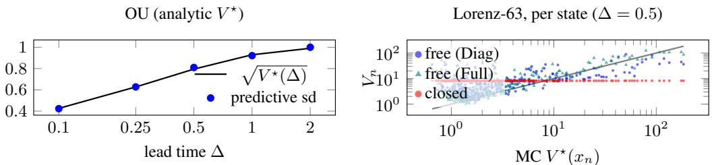
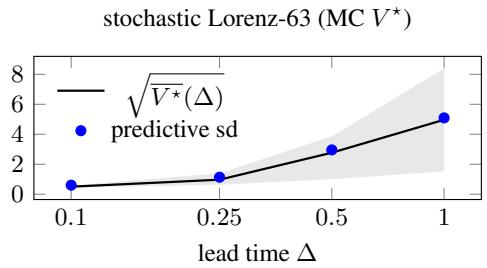

# Forecasting Multiple Observables with SCROLL: Score-Trained Uncertainty for Stochastic Dynamics

Pavel Procházka

Cisco Inc.

paprocha@cisco.com

## Abstract

Forecasting a stochastic dynamical system rarely means a single number: one wants several observables—future state, threshold event, regime label—each with its own likelihood. Standard multi-task recipes balance per-task losses, tuned or learned. We instead compose the observables’ likelihoods in per-task free-routed last-layer beliefs on a shared backbone; this absorbs unit-dependent loss scaling into O(K) likelihood parameters learned in the same gradient pass. Stochastic dynamics supply what static benchmarks cannot: computable ground truth for the predictive variance. Results land where theory puts them: on the well-specified, homoscedastic Ornstein–Uhlenbeck process the learned predictive law recovers the analytic kernel and correctly specified baselines tie. On heteroscedastic systems (stochastic Lorenz-63, real air-quality data) the belief’s input-dependent variance separates: best single-run NLL on the state and regime tasks, calibration matched only by arms whose NLL it beats, at a fraction of the tuned grids’ cost. On the real series the state margin holds across five rolling origins.

## 1 Introduction

A forecaster attached to a stochastic dynamical system is typically asked for several observables of the same window at once: the state at lead time ∆, a barrier-crossing probability, a coarse regime label. Treated as multi-task learning (MTL) on a shared backbone, the standard recipes minimise a weighted sum of per-task losses, with weights set by grid search—exponential in the number of tasks—or learned as a single scale per task [Kendall et al., 2018, Chen et al., 2018, Yu et al., 2020]. But weights only rescale the losses; the choice of each task’s likelihood is a separate axis. We exhibit such a failure: a cross-entropy head that cannot represent the barrier’s offset boundary fails at any weight, tuned or learned, while the threshold likelihood carries the offset in its cutpoint and repairs it.

We take the Bayesian route instead: each observable keeps its own observation model and its own Gaussian last-layer belief on one jointly trained backbone. The construction is SCROLL (Shared-Cavity fRee-rOuting Last-Layer; Procházka, 2026): its loss keeps one local log-partition term per factor of the model as written. The joint factor graph thus derives the composed objective—a sum of per-task shared-cavity losses, each belief’s variance free to track state-dependent spread (Section 2).

Contributions. We propose SCROLL-MT (Definition 1), which is, factor by factor, the sum of K free-routed single-task SCROLL objectives on one backbone (Lemma 1). The composition carries the properties: no outer unit-balancing weight search, the weight slots filled by O(K) likelihood parameters in one gradient pass at a fixed equal-per-task convention (Corollary 2); a population optimum at the score-optimal predictive law (Corollary 1); and scale equivariance without weight retuning, which a fixed weighted sum of raw losses lacks (Proposition 1). We validate each on stochastic differential equation (SDE) corpora with computable conditional spread V⋆(x) and on a real series, against tuned, learned, and separately trained baselines.

## 2 Free routing and likelihood composition in the last layer

Data are N windows of the same series: features $\psi _ { n } = \psi ( x _ { n } )$ from a shared deterministic backbone, and per window the K observables $y _ { n } ^ { ( 1 ) } , \ldots , y _ { n } ^ { ( K ) }$ . Each task k keeps its own likelihood $p _ { k } ( y ^ { ( k ) }$ $w _ { k } ^ { \top } \psi ; \eta _ { k } )$ with parameters $\eta _ { k }$ , its own belief $q _ { k } ( w _ { k } ) = \mathcal { N } ( \mu _ { k } , \Sigma _ { k } )$ on task $k ' s$ last-layer weights $w _ { k }$ and prior $p _ { \alpha _ { k } } ( w _ { k } ) = \mathcal N ( 0 , \alpha _ { k } ^ { - 1 } I )$ ; only the backbone is shared.

Definition 1 (SCROLL Multi-Task (SCROLL-MT): free-routing composed objective). The objective, minimisedjointly over ψ and, per task, over $\left( \mu _ { k } , \Sigma _ { k } , \alpha _ { k } , \eta _ { k } \right)$ , is

$$
F _ { M T } = \sum _ { k = 1 } ^ { K } \Bigl [ - \sum _ { n = 1 } ^ { N } \log \int p _ { k } \bigl ( y _ { n } ^ { ( k ) } \mid w _ { k } ^ { \top } \psi _ { n } ; \eta _ { k } \bigr ) q _ { k } ( w _ { k } ) d w _ { k } - \log \int p _ { \alpha _ { k } } \bigl ( w _ { k } \bigr ) q _ { k } ( w _ { k } ) d w _ { k } \Bigr ] ,\tag{1}
$$

Lemma 1 (Composition). $F _ { M T }$ is, term by term, the sum ofK SCROLL objectives (Appendix A): task k’s shared-cavity loss at $\left( \mu _ { k } , \Sigma _ { k } , \alpha _ { k } , \eta _ { k } \right)$ , coupled only through the shared ψ—each plate scored against its task’sfull belief, the shared cavity ofthe acronym; $\stackrel { \smile } { K } = 1$ recovers SCROLL.

Corollary 1 (Score optimality of the composed data terms). Fix the backbone ψ in Definition 1. Then (i) each data term of (1) is an exact log score − log $m _ { k , n } ( y _ { n } ^ { ( k ) } )$ ofthe plate predictive $\begin{array} { r } { n _ { k , n } = \int p _ { k } ( \cdot \mid } \end{array}$ $w _ { k } ^ { \top } \psi _ { n } ; \eta _ { k } ) q _ { k } ( w _ { k } ) d w _ { k }$ . The log score is strictly proper. Hence task k’s population data risk is minimised over $\left( { \mu _ { k } , \Sigma _ { k } , \eta _ { k } } \right)$ at the true conditional $p _ { t r u e } ( y ^ { ( k ) } \mid x )$ whenever the predictivefamily can represent it; the minimal risk is its conditional entropy. (ii) For a Gaussian task, $p _ { k } = \mathcal N ( w _ { k } ^ { \top } \psi _ { n } , \sigma _ { o b s } ^ { 2 } )$ (so $\eta _ { k } = \sigma _ { o b s } ) _ { : }$ , the unrestricted pointwise optimum of the population data risk is the conditional residual variance $V _ { k } ^ { \star } ( x ) = \mathbb { E } [ ( \dot { y ^ { ( k ) } } - \mu _ { k } ^ { \top } \psi ( \dot { x } ) ) ^ { 2 } \mid x ]$ ; the total predictive variance attains its best log-score projection within $\mathcal { V } _ { \psi , k } = \{ \sigma _ { o b s } ^ { 2 } + \psi ^ { \top } \Sigma _ { k } \psi \}$ —all of $V _ { k } ^ { \star }$ whenever $V _ { k } ^ { \star } \in \mathcal { V } _ { \psi , k }$

The claim concerns the data terms; the prior terms—one observation-free term per task—perturb it by a share that vanishes as N grows along parameter sequences on which they stay $o ( N )$

Corollary 2 (Implicit task weighting). The data terms of (1) are log scores in nats (Corollary 1), so the tasks enter $F _ { M T }$ at unit coefficient per declared task, in one predictive-score currency, with no unit-correction weights to set; $( \eta _ { k } , \alpha _ { k } )$ are ordinary arguments of $F _ { M T } ,$ , learned in the same pass as the beliefs and the network, and the squared-error coefficient $( 2 V _ { k , n } ) ^ { - 1 } ( { \textstyle { \frac { 1 } { 2 } } } \sigma _ { o b s } ^ { - 2 } a t { \textstyle \Sigma } _ { k } { = } 0 )$ occupies the MAP weight’s slot $( \lambda _ { k } )$

Both corollaries hold at fixed ψ; joint training need not preserve per-task optimality—the interference channel (Appendix F). In a Gaussian task the likelihood parameter is the noise scale, $\eta _ { k } = \sigma _ { \mathrm { o b s } }$

Proposition 1 (Scale equivariance). Rescale a Gaussian task’s targets, $y ^ { ( k ) } \mapsto c y ^ { ( k ) }$ with $c > 0$ and map $( \mu _ { k } , \Sigma _ { k } , \sigma _ { o b s } ^ { 2 } , \acute { \alpha } _ { k } ) \mapsto ( c \mu _ { k } , c ^ { 2 } \Sigma _ { k } , c ^ { 2 } \sigma _ { o b s } ^ { 2 } , \alpha _ { k } / c ^ { 2 } )$ . Then $\bar { F _ { M T } }$ of Definition 1 changes by an additive constant in c alone, so the map is a bijection between the two problems, leaving the minimiser over ψ unchanged. A fixed weighted sum of raw losses admits no such parameter-only map: its task-k term scales by $c ^ { 2 }$ , and recovering the same minimiser requires retuning the weights, $\lambda _ { j } \mapsto c ^ { 2 } \lambda _ { j }$ for every other task.

Corollary 3 (When weighting is inert). Ifa single ψ⋆ minimises every per-task population objective at once, it minimises every positively weighted sum ofthem: no weighting improves on another.

Neither statement makes weights dispensable in general. When no one ψ serves all tasks, the weights select a point on a trade-off surface that no scale-free principle picks—composition fixes the units, not the preference. Proofs of all statements are in Appendix B.

## 3 Experiments

Setup and systems. Given the Markov state $x _ { t }$ and a fixed lead time $\Delta ,$ we forecast a regression, a binary, and an ordinal observable of the window $[ t , t + \Delta ]$ : the estimand is the conditional law of the window’s observables—for the state head, the lead-∆ transition kernel—and fixing $\Delta$ makes scoreoptimality testable: $V ^ { \star } ( x )$ is that kernel’s conditional variance. Ornstein–Uhlenbeck (OU): $V ^ { \star } ( \Delta )$ analytic and state-independent—the homoscedastic anchor with known exact kernel. Stochastic Lorenz-63 [Lorenz, 1963]: heteroscedastic (cond. sd $p 1 0 / p 9 0 = 1 . 5 / 8 . 4$ at $\Delta = 1 )$ , ground truth by Monte-Carlo re-simulation—the test of input-dependent variance. Beijing $\mathbf { P M } _ { 2 . 5 }$ [Liang et al., 2015]: the real-data arm, no computable $V ^ { \star }$ , with the likelihood choices dictated by regulation. Splits are chronological on the real series, random and non-overlapping on the SDE corpora.

  
Figure 1: Left: total predictive sd of the state forecast vs the analytic $V ^ { \star } ( \Delta )$ on OU (±1 sd over 10 seeds)—within $2 \%$ at every lead. Right: the per-state test on Lorenz-63, predicted $V _ { n }$ against Monte-Carlo ${ \cal V } ^ { \star } ( x _ { n } )$ over test states (grey: identity), on the tanh+LN backbone. Both free families track the state-dependent spread; the closed route’s leverage variance is flat across a 284× range of $V ^ { \star }$ , on every backbone (Appendix D).

Methods. SCROLL-MT minimises the objective (1) with Gaussian, thresholded-Gaussian (probit), and ordinal-probit heads jointly—no unit correction, no outer weight search—under three beliefcovariance models: None $( \Sigma _ { k } { = } 0$ , only the learned scale $\sigma _ { \mathrm { o b s } } )$ , Diag (diagonal $\Sigma _ { k } )$ , and Full $( \Sigma _ { k }$ unrestricted); Diag is the default we report as SCROLL-MT (family choice: Appendix E). MAP baselines minimise $\mathrm { M S E } + \lambda _ { 1 } L _ { 1 } + \lambda _ { 2 } L _ { 2 }$ with cross-entropy or ordinal-probit heads, at fixed $\lambda _ { 1 } { = } \lambda _ { 2 } { = } 1$ and grid-tuned (49 runs, validation-selected); Kendall arms learn the weights instead [Kendall et al., 2018]—the point-estimate counterpart of SCROLL-MT; MLE $\sigma ( x )$ arms [Nix and Weigend, 1994] add a per-input regression sd head and train all losses as NLLs: input-dependent variance, no belief. All methods share the same candidate architectures and per-fit training budget—a single hidden layer of width $H { = } 5 0$ with per-task linear heads, heavily overparameterised for a 1–3-dimensional state, which is what makes the OU anchor below a real test—with backbones {relu, relu+LN, tanh, tanh+LN} validation-selected per dataset and seed, 10 seeds. Setup, splits, grids: Appendix D; predictive scope and remaining arms (Laplace, ensembles): Appendices E and F.

Testbed properties. Three corpus properties frame what follows, none a claim about the method.

(i) A failure can live in the head’s structure, where no weight reaches it. The intro’s CE-versusthreshold exhibit is that failure, on the OU barrier event: a controlled misspecification (one CE bias would repair it).

(ii) The weight has at most threejobs, and the corpora separate them: inert where one $\psi ^ { \star }$ serves every task (Corollary $3 ; \mathrm { O U } , \mathrm { P M } _ { 2 . 5 } )$ , carrier of the units, which composition derives instead (Proposition 1), or a preference under conflict that no scale-free principle supplies and we do not claim (Lorenz). Either way the weighting axis is not where the difference lies: SCROLL-MT matches or beats the better fair grid per corpus at a fraction of its compute; all three properties are measured in Appendix E.

(iii) The event head discriminates only on OU, by observation model alone; elsewhere every arm’s event NLL sits in a 0.05-nat band (Table 1). Claims below rest on the state and regime heads.

The well-specified anchor. On OU theory fixes the answer—the population optimum is the exact kernel and expected test NLL is floored (Corollary 1(i))—and every arm attains that floor. The anchor tests the one arm free to miss it: nothing in (1) caps the 50-dimensional belief term $\psi ^ { \top } \Sigma \psi .$ , yet it carries no spurious spread (Figure 1, left; Appendix E), the run settling at a large α and a contracted belief term.

The predictive variance tracks the state-dependent spread—and only when freely routed. State by state, the predicted $V _ { n }$ correlates with the Monte-Carlo $V ^ { \star } ( x _ { n } )$ at Pearson r=0.61 (Diag) and 0.85 (Full), rank 0.56 and 0.66 (Figure 1, right, plots Diag). The apparent overshoot is Corollary 1(ii) as specified, not error: $V ^ { \star }$ omits mean-model error, and against the residual variance about the model’s own mean—what the log score targets—Full sits within 3%. Routing unpins it: at the evidence optimum $V _ { n }$ varies under 1.3× across a 284× range of $V ^ { \star } .$ —and the binding map alone, estimand kept, is already this flat (Appendix E). What the freed family represents decides the payoff— Full beats the pinned route on every backbone (−0.14 to −0.31 nats), Diag on the normalised ones (Appendix E); on OU every route ties. The ladder of Table 1 isolates the belief’s role: the NLL-trained global scale (None) falls back to MAP-level quality, the belief restores the headline, and coupling across the basis (Full) improves it further. Nor is the belief merely an input-dependent variance head: the MLE σ(x) arms match its calibration but not its NLL, and the probit variant collapses on the real arm, where the prior-regularised belief never does. Nor is it enough to have the belief: set post hoc by curvature at the MAP point (Laplace), the same families concede on Lorenz and tie only on OU—having a belief is not what carries the gain (Appendix E). Nor is the shared backbone free by assumption. Against each head trained alone (only the task inventory differs), sharing is free on OU, costs on Lorenz (state and regime heads), and costs nothing on the real series, where over five rolling origins the point estimate favours the joint model on all three heads without resolving it (Appendix E). We claim only what that settles: one feature map serves all three tasks free where they do not compete, and is paid for where they do.

Table 1: Test NLL↓ of the three tasks on the three systems (10 seeds, backbone validation-selected per seed; OU/Lorenz at ∆ = 0.5, $\mathrm { P M } _ { 2 . 5 }$ at 24 h; reg. = state forecast, evt = event task, ord = ordinal task). Bold = best per column; italic = not significantly worse (one-sided paired t-test, $p \geq 0 . 0 5 )$ “Tied” in the text means this, not equivalence. Ens-5 = five-member deep ensemble of the arm named (construction and caveats in Appendix E); every other row is a single run. The CE variant of the MLE σ(x) arm is omitted here for space; it carries no claim the probit variant does not. Calibration, accuracy, wall-clock, and that row: Table 2.
<table><tr><td rowspan="2"></td><td colspan="3">OU</td><td colspan="3">Lorenz-63</td><td colspan="3"> $\mathrm { P M } _ { 2 . 5 }$  (real)</td></tr><tr><td>reg.</td><td>evt</td><td>ord</td><td>reg.</td><td>evt</td><td>ord</td><td>reg.</td><td>evt</td><td>ord</td></tr><tr><td>SCROLL-MT (Diag)</td><td>1.204</td><td>0.271</td><td>0.881</td><td>2.333</td><td>0.170</td><td>1.032</td><td>1.250</td><td>0.450</td><td>1.203</td></tr><tr><td>SCROLL-MT (Full)</td><td>1.205</td><td>0.265</td><td>0.881</td><td>2.230</td><td>0.169</td><td>0.843</td><td>1.255</td><td>0.489</td><td>1.212</td></tr><tr><td>SCROLL-MT (None, no belief)</td><td>1.204</td><td>0.271</td><td>0.880</td><td>2.596</td><td>0.168</td><td>1.069</td><td>1.311</td><td>0.451</td><td>1.291</td></tr><tr><td>MAP, CE heads, λ=1</td><td>1.203</td><td>0.417</td><td>0.954</td><td>2.613</td><td>0.174</td><td>1.154</td><td>1.312</td><td>0.451</td><td>1.229</td></tr><tr><td>MAP, CE heads, λ grid</td><td>1.203</td><td>0.417</td><td>0.954</td><td>2.621</td><td>0.166</td><td>0.907</td><td>1.318</td><td>0.456</td><td>1.229</td></tr><tr><td>Kendall, CE heads</td><td>1.202</td><td>0.417</td><td>0.954</td><td>2.798</td><td>0.180</td><td>1.175</td><td>1.312</td><td>0.458</td><td>1.238</td></tr><tr><td>MAP, probit heads,  $\lambda { = } 1$ </td><td>1.203</td><td>0.270</td><td>0.880</td><td>2.613</td><td>0.175</td><td>1.252</td><td>1.312</td><td>0.452</td><td>1.288</td></tr><tr><td>MAP, probit heads, λ grid</td><td>1.203</td><td>0.263</td><td>0.879</td><td>2.620</td><td>0.169</td><td>1.075</td><td>1.334</td><td>0.460</td><td>1.297</td></tr><tr><td>Kendall, probit heads</td><td>1.205</td><td>0.266</td><td>0.884</td><td>2.810</td><td>0.180</td><td>1.249</td><td>1.312</td><td>0.440</td><td>1.291</td></tr><tr><td>MLE σ(x), probit heads</td><td>1.203</td><td>0.269</td><td>0.880</td><td>2.612</td><td>0.189</td><td>1.245</td><td>3.011</td><td>0.458</td><td>1.296</td></tr><tr><td>Laplace (Diag), probit heads</td><td>1.203</td><td>0.270</td><td>0.880</td><td>2.613</td><td>0.175</td><td>1.253</td><td>1.306</td><td>0.450</td><td>1.287</td></tr><tr><td>SCROLL-MT (Diag), Ens-5</td><td>1.204</td><td>0.271</td><td>0.881</td><td>2.295</td><td>0.167</td><td>1.004</td><td>1.243</td><td>0.443</td><td>1.197</td></tr><tr><td>MAP, CE heads, Ens-5</td><td>1.202</td><td>0.417</td><td>0.954</td><td>2.608</td><td>0.172</td><td>1.138</td><td>1.303</td><td>0.440</td><td>1.215</td></tr><tr><td>MAP, probit heads, Ens-5</td><td>1.203</td><td>0.270</td><td>0.880</td><td>2.607</td><td>0.173</td><td>1.244</td><td>1.308</td><td>0.445</td><td>1.279</td></tr></table>

The prior it fits along the way needs no loop. Freezing the three precisions at a shared α and tuning that explicitly (7 values) is the counterfactual to Corollary 2’s single-pass clause. The grid is not flat—on Lorenz a strong prior doubles calibration error and costs 0.12 nats on the ordinal head—yet the self-tuned run sits within 0.006 nats of the grid-selected regression NLL on every corpus, within 0.017 on every head (Table 4), from one prior configuration per backbone rather than seven, and lands there across regimes three decades apart (median fitted α: 379 on OU, 0.11 on Lorenz; scale convention in Appendix D). Whether the tasks want different $\alpha _ { k }$ is open (Appendix F).

## 4 Conclusion and outlook

This is a deliberately scoped first study: two controlled low-dimensional SDE systems, one small real series, K=3 tasks, one lead time per run. The scope is what buys ground truth: on the SDE corpora $V ^ { \star } ( x )$ is computable, so the trained predictive is checked against the exact one. Within it, composed likelihoods did their job. On the real data they are best or statistically tied in every column among single-run methods (its Ens-5 among all), and the state margin survives five rolling origins. They are best where the belief has work to do (Lorenz), and within 0.01 nats of the best tuned grid on OU (Table 1). All without an outer weight search, at one configuration per backbone: the gains come from the observation model and the freely routed belief, not the weighting axis. Theory specified that outcome in advance, and mostly SCROLL’s own. The composition adds no new principle: the factor graph as written already composes (Lemma 1). The heteroscedastic win is single-task score optimality carried through (Corollary 1). New is the belief inside the currency: weight slots carry score-trained predictive variances, not learned scalars (Corollary 2). Open directions are in Appendix F.

## References

Zhao Chen, Vijay Badrinarayanan, Chen-Yu Lee, and Andrew Rabinovich. GradNorm: Gradient normalization for adaptive loss balancing in deep multitask networks. In International Conference on Machine Learning (ICML), 2018.

Tilmann Gneiting and Adrian E. Raftery. Strictly proper scoring rules, prediction, and estimation. Journal ofthe American Statistical Association, 102(477):359–378, 2007.

James Harrison, John Willes, and Jasper Snoek. Variational Bayesian last layers. In International Conference on Learning Representations (ICLR), 2024.

Alex Kendall, Yarin Gal, and Roberto Cipolla. Multi-task learning using uncertainty to weigh losses for scene geometry and semantics. In Proceedings ofthe IEEE Conference on Computer Vision and Pattern Recognition (CVPR), 2018.

Balaji Lakshminarayanan, Alexander Pritzel, and Charles Blundell. Simple and scalable predictive uncertainty estimation using deep ensembles. In Advances in Neural Information Processing Systems (NeurIPS), 2017.

Xuan Liang, Tao Zou, Bin Guo, Shuo Li, Haozhe Zhang, Shuyi Zhang, Hui Huang, and Song Xi Chen. Assessing Beijing’s PM2.5 pollution: severity, weather impact, APEC and winter heating. Proceedings ofthe Royal Society A, 471(2182):20150257, 2015.

Edward N. Lorenz. Deterministic nonperiodic flow. Journal of the Atmospheric Sciences, 20(2): 130–141, 1963.

Raman K. Mehra. Approaches to adaptive filtering. IEEE Transactions on Automatic Control, 17(5): 693–698, 1972.

Pablo Moreno-Muñoz, Antonio Artés-Rodríguez, and Mauricio A. Álvarez. Heterogeneous multioutput Gaussian process prediction. In Advances in Neural Information Processing Systems (NeurIPS), 2018.

David A. Nix and Andreas S. Weigend. Estimating the mean and variance of the target probability distribution. In IEEE International Conference on Neural Networks (ICNN), 1994.

Pavel Procházka. Beliefs beyond posteriors: Local-consistency optimisation for Bayesian neural networks. arXiv preprint arXiv:2605.08446, 2026.

Simo Särkkä and Aapo Nummenmaa. Recursive noise adaptive Kalman filtering by variational Bayesian approximations. In IEEE Transactions on Automatic Control, volume 54, pages 596–600, 2009.

Tianhe Yu, Saurabh Kumar, Abhishek Gupta, Sergey Levine, Karol Hausman, and Chelsea Finn. Gradient surgery for multi-task learning. In Advances in Neural Information Processing Systems (NeurIPS), 2020.

## A SCROLL in brief

A compact summary of the results of Procházka [2026] that this paper uses: enough to follow every claim made here, with the derivations and the wider design space they sit in left to the source.

Objective. SCROLL derives its loss from the Bethe free energy of the model’s factor graph by keeping each factor’s local normaliser: one log-partition term per factor, scoring the overlap between the local belief and that factor. For a model with a deterministic backbone $\psi ,$ a likelihood $p ( y \mid w ^ { \top } \psi ; \eta )$ with parameters η (a task with Gaussian likelihood is the body’s Gaussian task), a Gaussian last-layer belief $q ( w ) \stackrel { \cdot } { = } \mathcal { N } ( \mu , \Sigma )$ , a prior $p ( w ) = \mathcal { N } ( 0 , \alpha ^ { - 1 } I )$ , and N observation plates, every intermediate (deterministic) factor’s normaliser is unity, $- \log Z _ { a } = 0$ (its log-partition reduces to a feasibility constraint), leaving, for a single task, the shared-cavity loss

$$
\begin{array} { r } { F _ { \mathrm { S C } } ~ = ~ - { \displaystyle \sum _ { n = 1 } ^ { N } } \log \underbrace { \int p \big ( \boldsymbol { y } _ { n } ~ | ~ \boldsymbol { w } ^ { \top } \boldsymbol { \psi } _ { n } ; \boldsymbol { \eta } \big ) q ( \boldsymbol { w } ) d \boldsymbol { w } } _ { Z _ { n } } - \log \underbrace { \int p ( \boldsymbol { w } ) q ( \boldsymbol { w } ) d \boldsymbol { w } } _ { Z _ { \boldsymbol { w } } } } \end{array}\tag{2}
$$

$\left( K { = } 1 \operatorname { o f } \left( 1 \right) \right) \colon N$ data terms and one prior term. One scope note: the source paper defines $F _ { \mathrm { S C } }$ on the whole factor graph, with no last-layer restriction; (2) is that definition specialised to this model class, where the deterministic backbone factors contribute zero. Under the shared cavity each plate is scored against the full belief q—the reaction-free limit that decouples the loss into a batchable per-plate sum—and backbone parameters train by ordinary backpropagation.

$F _ { \mathrm { S C } }$ is not the Bethe free energy itself. Evaluated at the belief’s configuration—tilted factor beliefs $b _ { a } \propto f _ { a } q .$ , variable belief $q ,$ which is generally not locally consistent—the free energy decomposes as $F _ { \mathrm { B e t h e } } \big ( b ( q ) \big ) = F _ { \mathrm { S C } } ( q ) { + } \bar { C } _ { w } ( q )$ , with remainder $\begin{array} { r } { C _ { w } ( q ) \dot { = } \sum _ { a } \left( \mathbb { E } _ { b _ { a } } - \mathbb { E } _ { q } \right) \left[ \log q \right] - \bar { H ( q ) } } \end{array}$ collecting the belief-mismatch and counting terms, generically non-zero (the source paper’s Bethe decomposition of the shared-cavity loss and the closed form of its remainder). The free energy supplies the terms; its consistency constraints are not imposed—provenance, not enforcement. What is minimised is $F _ { \mathrm { S C } } { \mathrm { : } }$ a composite predictive-score objective—the marginal log-score sum plus the prior-overlap term—and an estimand in its own right (predictive consistency below), not an approximation of the evidence − log Z. The same reading scopes the composed objective: the data terms of (1) are a composite sum of marginal predictive log scores—proper for each task’s marginal, it represents no cross-task residual dependence and no joint predictive over the observables (Appendix F studies that extension).

Data and prior terms. Each data term is the negative log of the plate’s predictive normaliser, − log $Z _ { n } = - \log m _ { n } ( y _ { n } )$ with $\begin{array} { r } { m _ { n } ( y ) = \int p ( y \mid w ^ { \top } \psi _ { n } ; \eta ) \bar { q ( w ) } } \end{array}$ ) dw. For a Gaussian task $( \eta = \sigma _ { \mathrm { o b s } } )$ this is the predictive NLL of $y _ { n }$ under the plate variance $V _ { n } = \sigma _ { \mathrm { o b s } } ^ { 2 } + \psi _ { n } ^ { \top } \Sigma \psi _ { n }$ . The discrete heads are probits on the same latent line, the belief convolution widening the probit scale to $D _ { n } \ =$ ${ \sqrt { c ^ { 2 } + \psi _ { n } ^ { \top } \Sigma \psi _ { n } } } ;$ : with cutpoints $\tau _ { 1 } < \dots < \tau _ { R - 1 }$ and sentinels $\tau _ { 0 } = - \infty , \tau _ { R } = \infty$ , the ordinal head’s bucket mass is

$$
\begin{array} { r } { P \big ( y _ { n } = r \mid x _ { n } \big ) = \Phi \Big ( \frac { \tau _ { r } - \mu ^ { \top } \psi _ { n } } { D _ { n } } \Big ) - \Phi \Big ( \frac { \tau _ { r - 1 } - \mu ^ { \top } \psi _ { n } } { D _ { n } } \Big ) , } \end{array}
$$

and the thresholded-Gaussian event head is the $R { = } 2$ case, $\smash { P ( y _ { n } = 1 \mid x _ { n } ) = \Phi \big ( ( \mu ^ { \top } \psi _ { n } - \tau _ { 1 } ) / D _ { n } \big ) }$ For identification the probit scale is fixed (c=1.005 in the shipped implementation) and the cutpoints are learned, parametrised strictly increasing as $\begin{array} { r } { \tau _ { r } = \tau _ { 1 } + \sum _ { j < r } e ^ { \delta _ { j } } \colon \quad } \end{array}$ : the physical thresholds define the labels only, and the learned cutpoint is what lets the head absorb an offset a bias-free CE head cannot (Section 3). All terms are one-dimensional Gaussian integrals in closed form. The prior term is the Gaussian overlap $- \log \mathcal { N } ( \mu \mid 0 , \Sigma + \alpha ^ { - 1 } I )$ (up to a constant).

Routing: who selects the belief. The binding map sends the remaining parameters—backbone ψ, prior precision $\alpha .$ , likelihood parameters—to the belief minimising KL $\dot { \mathbf { \xi } } \cdot \left( \mathcal { N } ( \mu , \Sigma ) \parallel p ( w \mid \mathcal { D } ) \right)$ where $p ( w \mid D )$ is the exact posterior given the cavity data (under the shared cavity, all N plates) at those parameter values: the projection of that posterior onto the Gaussian family—closed-form under conjugacy, where it coincides with the local-consistency fixed point. Under the Gaussian head that closed form is $\Sigma _ { \mathrm { p o s t } } = ( \alpha I + \sigma _ { \mathrm { o b s } } ^ { - 2 } \Psi ^ { \top } \Psi ) ^ { - 1 } , \mu _ { \mathrm { p o s t } } = \sigma _ { \mathrm { o b s } } ^ { - 2 } \Sigma _ { \mathrm { p o s t } } \Psi ^ { \top } y \mathrm { : }$ its variance depends on the design Ψ alone, never on the residuals—the residual-independent leverage form of the pinned route. Closed routing imposes this map as a constraint;free routing drops it and makes $( \mu , \Sigma )$ direct optimisation variables, the objective itself selecting the belief. Put plainly: the closed route takes the belief the posterior prescribes, the free route lets the objective choose it. SCROLL and every SCROLL-MT arm in this paper use the free route; the Laplace arm is a posterior-bound comparator, while the remaining point-estimate baselines carry no belief. Imposing the map while keeping the data terms of (2) constrains the belief coordinates of one objective and nothing else; replacing a head’s terms by the conjugate model’s own evidence is a different cell again, changing the estimand from a composite predictive score to a marginal likelihood. The two are worth separating, and the source paper separates them.

One consequence of free routing deserves stating outright, because the notation invites the other reading: $\psi ^ { \dagger } \Sigma \psi$ is a score-trained conditional spread, not a posterior epistemic variance. It is fitted to predict residuals, so it need not contract as $N$ grows, and it carries no claim about confidence in w.

Predictive consistency (proper score). For any observation facto $\mathbf { r } , - \log m _ { n } ( y _ { n } )$ is the log score of the predictive $m _ { n }$ . The log score is strictly proper, so the population data term decomposes into the expected conditional entropy of the true conditional plus $\tilde { \mathbb { E } } _ { x } \operatorname { K L } ( p _ { \mathrm { t r u e } } ( \cdot \mid x ) \parallel m ( \cdot \mid x ) )$ , and is minimised—over beliefs whose predictive can represent the truth—exactly at $m = p _ { \mathrm { t r u e } }$ . No conjugacy and no tree structure is required. This is the result behind the entropy-floor test on OU. Two qualifications, both carried by the one prior term. First, the claim concerns the data terms: the prior term contains no observation—one term against $N { \mathrm { - } } s _ { 0 }$ , along parameter sequences on which it remains $o ( N )$ , minimising (2) is score-optimal up to a prior perturbation whose per-plate share vanishes—the sense of Corollary 1. (The remainder $C _ { w }$ above plays no role here: it separates $F _ { \mathrm { S C } }$ from the free energy, not from the score.) Second, it is a population statement, and at finite $N$ the data terms see $( \overline { { \Sigma } } , \sigma _ { \mathrm { o b s } } )$ only through the totals $V _ { n } .$ , so what selects the $s p l i t$ between $\sigma _ { \mathrm { { o b s } } } ^ { 2 }$ and $\psi ^ { \top } \Sigma \psi$ is that same single prior term, whose normalised contribution vanishes along the $o ( N )$ parameter sequences above. The total is identified long before the split is. Composition changes neither qualification in kind: the data terms of (1) are unchanged individual log scores, so their propriety is composition-invariant by construction, and only the count of observation-free terms— here one prior term per task, K against KN plates, hence the same per-plate rate under the same $o ( N )$ condition—depends on how the objectives are composed.

The score optimum and the pinned variance. With the mean function fixed, the regression data term sees $\left( \Sigma , \sigma _ { \mathrm { o b s } } \right)$ only through the plate variances $V _ { n }$ , which are minimised in population at the conditional residual variance $V ^ { \star } ( x ) = \mathbb { E } [ ( y - \mu ^ { \top } \psi ( x ) ) ^ { 2 } \mid x ]$ of Section 2—the pointwise unrestricted optimum. The binding map instead pins $V _ { n }$ to a residual-independent leverage form, which realises $\hat { V } ^ { \star }$ only when residuals are homoscedastic—the pinning is the map’s doing, whatever the estimand (Appendix E separates the two), and with the evidence estimand the pinned cell is the corner of the source design space. What separates the free route from the pinned one splits in two, against the family the last layer can express, $\mathcal { V } _ { \psi } = \{ \sigma _ { \mathrm { { o b s } } } ^ { 2 } + \psi ^ { \top } \Sigma \psi \}$ : a routing gap, between the pinned leverage profile (asymptotically constant under balanced leverage) and the best member of $\nu _ { \psi }$ , which free routing removes and only that; and a representation gap, between that best member and $V ^ { \star }$ itself, which no routing closes, though training $\psi$ can shrink it. What free routing recovers is therefore the expressible residual heteroscedasticity, the whole of it only when $V ^ { \star } \in \mathcal { V } _ { \psi }$ . Both gaps are measured in Appendix $\operatorname { E } { \mathrm { : } }$ a diagonal belief on an unnormalised backbone cannot express $V ^ { \star }$ and gains nothing from being freed, while a full one expresses enough to gain on every backbone. Mechanically, the free route drives $\sigma _ { \mathrm { o b s } } ^ { 2 }$ toward the input-independent floor and lets $\psi ^ { \intercal } \Sigma ^ { \cdot }$ ψ carry the input-dependent remainder—the split verified against simulator ground truth.

## B Proofs of the formal statements

ProofofLemma 1. Group (1) by k. Task k’s block is, term by term, (2) evaluated at $( \mu _ { k } , \Sigma _ { k } , \alpha _ { k } , \eta _ { k } ) \colon$ its $N$ data terms are the plate normalisers − log $\begin{array} { r } { Z _ { k , n } , Z _ { k , n } = \int p _ { k } \big ( \boldsymbol { y } _ { n } ^ { ( k ) } \mid \boldsymbol { w } _ { k } ^ { \top } \boldsymbol { \psi } _ { n } ; \eta _ { k } \big ) q _ { k } ( \boldsymbol { w } _ { k } ) } \end{array}$ dwk, and its prior term the overlap $\begin{array} { r l } { - \log \int p _ { \alpha _ { k } } ( w _ { k } ) q _ { k } ( w _ { k } ) d w _ { k } \mathrm { - e x a c t l y } } \end{array}$ the single-task SCROLL objective for task $k ' s$ head, plates, and prior. The blocks share no parameter beyond ψ; $K { = } 1$ is immediate. □

Proof of Corollary 1. Fix $\psi .$ . The blocks of Lemma 1 then share no argument, so minimising $F _ { \mathrm { M T } }$ over $\{ ( \mu _ { k } , \Sigma _ { k } , \alpha _ { k } , \eta _ { k } ) \} _ { k }$ minimises each block separately, and the population data risk of the sum is the sum of the per-task risks: the single-task statements apply block by block. Predictive consistency (above) applied to task k’s data terms gives (i); the pinned-variance argument (above) applied to task k’s Gaussian plate variances $V _ { k , n } = \breve { \sigma _ { \mathrm { o b s } } } ^ { 2 } + \bar { \psi } _ { n } ^ { \top } \Sigma _ { k }$ ψ gives (ii). □

ProofofCorollary 2. The data terms are log scores by Corollary 1(i), in nats by convention, and $( \eta _ { k } , \alpha _ { k } )$ enter (1) as ordinary arguments of a single differentiable objective, so the pass that trains $\left( \mu _ { k } , \Sigma _ { k } , \psi \right)$ fits them too. For the slot identity, write the Gaussian data term at plate n as $\frac { 1 } { 2 V _ { n } } r _ { n } ^ { 2 } +$ ${ \frac { 1 } { 2 } } \log ( 2 \pi V _ { n } )$ with residual $r _ { n } \colon$ : the factor multiplying the squared error is $( 2 V _ { n } ) ^ { - 1 }$ , so the total predictive precision $V _ { n } ^ { - 1 }$ occupies the slot where the MAP weight $\lambda _ { k }$ multiplies the squared error, reducing to the fitted noise precision $\sigma _ { \mathrm { o b s } } ^ { - 2 }$ when $\Sigma _ { k } { = } 0 ( V _ { n } = \sigma _ { \mathrm { o b s } } ^ { 2 }$ , the beliefless case), with the log $V _ { n }$ term as the barrier that keeps it finite—the mechanism of Kendall et al. [2018] with the belief term added to $V _ { n }$ □

ProofofProposition 1. Write task k’s data term at plate n as $\begin{array} { r } { \frac { 1 } { 2 } \log ( 2 \pi V _ { k , n } ) + r _ { k , n } ^ { 2 } / ( 2 V _ { k , n } ) } \end{array}$ , with residual $r _ { k , n } = y _ { n } ^ { ( k ) } - \mu _ { k } ^ { \top } \psi _ { n }$ and $V _ { k , n } = \sigma _ { \mathrm { o b s } } ^ { 2 } + \psi _ { n } ^ { \top } \Sigma _ { k } \psi _ { n }$ . Under the map $r _ { k , n } \mapsto c r _ { k , n }$ and $V _ { k , n } \mapsto c ^ { 2 } V _ { k , n } .$ , so every quadratic term is unchanged and each log term gains log c: the N data terms contribute N log c. The prior term is the Gaussian overlap − log $\mathcal { N } ( \mu _ { k } \mid 0 , \Sigma _ { k } + \alpha _ { k } ^ { - 1 } I )$ , and the map sends $\Sigma _ { k } + \alpha _ { k } ^ { - 1 } I \mapsto c ^ { 2 } ( \Sigma _ { k } + \alpha _ { k } ^ { - 1 } I )$ against $\mu _ { k } \mapsto c \mu _ { k }$ , so its quadratic form is likewise unchanged and its log-determinant gains H log c. Every other task is untouched, so $F _ { \mathrm { M T } }$ gains $( N + \bar { H } ) \log c - { - a }$ constant in ψ and in all parameters, leaving $\nabla _ { \psi } F _ { \mathrm { M T } }$ and hence the minimiser unchanged. For a weighted sum $\begin{array} { r } { L _ { k } + \sum _ { j \neq k } \mathsf { \bar { \lambda } } _ { j } L _ { j } } \end{array}$ , with $L _ { k }$ the homogeneous raw squared-error loss, the mean’s best response to the rescaling is $\mu _ { k } \mapsto c \mu _ { k }$ , which leaves the task-k loss at $c ^ { 2 } L _ { k } ;$ since arg min $_ { \psi } \{ c ^ { 2 } L _ { k } + \mathrm { \bar { ~ } } { \textstyle \sum _ { j \neq k } } { \lambda _ { j } L _ { j } } \} = \arg$ min $\begin{array} { r }  \mathbb { \overset { . } { \underset { \psi } { \left\{ L _ { k } + \sum _ { j \neq k } ( \lambda _ { j } / c ^ { 2 } ) L _ { j } \right\} } } } \end{array}$ , the original minimiser is recovered only by $\lambda _ { j } \mapsto c ^ { 2 } \lambda _ { j }$ . Corollary 3 is immediate: if $\psi ^ { \star }$ minimises each $L _ { k }$ then it minimises $\sum _ { k } \lambda _ { k } L _ { k }$ for any $\lambda _ { k } > 0$ □

Proposition 1 concerns the ideal covariance families; the implemented εI floor on Σ lies outside them, and Appendix E measures that it does not bind in the tested range.

## C Related work

Loss weighting in MTL appears in the body along its main axes: grid search, learned uncertainty weighting [Kendall et al., 2018], and gradient surgery [Chen et al., 2018, Yu et al., 2020] (orthogonal to composition, Appendix F). Kendall et al. [2018] already draw the no-weights conclusion from the likelihood view for point-estimate MAP training, and their mechanism composes with any observation model once it is written down—the Kendall-probit arms of Section 3 do exactly that; what the shared cavity objective adds is the belief—hence a calibrated, input-dependent predictive variance—and a single-pass fit of the priors and likelihood scales (Section 3). Composing heterogeneous likelihoods over a shared latent function is the construction of heterogeneous multi-output GPs [Moreno-Muñoz et al., 2018]; SCROLL-MT shares the heterogeneous-likelihood composition motif, with the latent function replaced by a trained backbone and the posterior by per-task last-layer beliefs. NLL-trained variance heads go back to Nix and Weigend [1994] and power deep ensembles [Lakshminarayanan et al., 2017]; the None ablation of Table 1 is their per-task-scale analogue inside the composed objective, and the belief term $\psi ^ { \top } \Sigma _ { k } \psi$ is what they lack. Bayesian last layers (e.g. variational, Harrison et al., 2024) are compared against SCROLL at length in Procházka [2026]; proper-scoring terminology follows Gneiting and Raftery [2007]. The sequential-cavity and adaptive-filtering lineage is developed in Appendix F.

## D Benchmark generation and training details

OU corpus. $d X = - \theta X d t + \sigma$ dW with $\theta = 1 , \sigma = { \sqrt { 2 } }$ (stationary $\mathcal { N } ( 0 , 1 ) )$ ), simulated by the exact one-step transition $X _ { t + h } = e ^ { - \theta h } X _ { t } + \sqrt { \frac { \sigma ^ { 2 } } { 2 \theta } \left( 1 - e ^ { - 2 \theta h } \right) \xi , \xi } \sim \mathcal { N } ( 0 , 1 )$ , on a grid $h = 0 . 0 1 -$ sampling the analytic transition density, so there is no discretisation bias. The lead-∆ conditional variance is $\begin{array} { r } { V ^ { \star } ( \Delta ) = \frac { \sigma ^ { 2 } } { 2 \theta } \big ( 1 - e ^ { - 2 \theta \Delta } \big ) } \end{array}$ , state-independent. Each of the 6,500 windows starts from an independent stationary draw (one window per realisation; the corpus is i.i.d. by construction). The path functionals are monitored on the grid, both endpoints included—the event and average labels therefore carry the grid’s discretisation, though the state transition itself is exact: the event task is $\mathbb { 1 } [ \operatorname* { m a x } _ { [ t , t + \Delta ] } { \ ' } X \geq { \bar { 1 } } . 5 ]$ (barrier at 1.5 stationary sd), the ordinal task buckets the window time-average into corpus-level quartiles $\left( K { = } 4 \right)$ . Generation uses a fixed seed: the corpus is frozen once, like a UCI table, and the run seed controls only split and initialisation.

  
Figure 2: The averaged view of the tracking result on Lorenz-63 (±1 sd over 10 seeds; grey band: per-state conditional sd $p 1 0 { - } p 9 0 )$ . The predictive sd targets the $V ^ { \star }$ average (black) at every lead, overshooting at short leads where mean-model error enters. Averaging is exactly what the per-state panel of Figure 1 removes: a homoscedastic head can match this curve, and the no-belief arm nearly does.

Stochastic Lorenz-63 corpus. The $( 1 0 , 2 8 , \% 3 )$ drift with additive noise of amplitude 2.0 on all three coordinates, integrated by Euler–Maruyama at $d t = 0 . 0 0 5$ . 65 parallel chains are initialised near (1, 1, 25), burned in for 2,000 steps (10 time units), and then sampled with a decorrelation gap of 100 steps (0.5 time units) between the end of one window and the start of the next, giving 6,500 windows in total. Tasks: $y ^ { ( 1 ) } = x ( t { + } \Delta ) , y ^ { ( 2 ) } = 1 [ x ( t { + } \Delta ) > 0 ]$ (attractor lobe), $y ^ { ( 3 ) } =$ corpus-level quartile of $z ( t { + } \Delta )$

Ground truth and the per-state probe. $\mathrm { O U } \colon V ^ { \star } ( \Delta )$ analytic (Section 3). Lorenz: the conditional sd of $x ( t { + } \Delta )$ is estimated by re-simulating 200 ensemble members per state with fresh noise. For the averaged view of Figure 2 this is done for 2,000 attractor states and the plotted target is $\sqrt { \mathbb { E } [ \operatorname { V a r } ( x _ { t + \Delta } \mid x _ { t } ) ] }$ —the score-optimal value for a single $\sigma _ { \mathrm { o b s } } ,$ i.e. $V ^ { \star }$ with the heteroscedasticity gap averaged out (Appendix A)—with the band spanning the per-state $\mathsf { p l 0 }$ –p90 conditional sd. The per-state panel of Figure 1 instead re-simulates every test state, so predicted and true variances are paired point by point; $V ^ { \star }$ spans 284× across those states. Both are 10-seed runs of the protocol above at $\Delta { = } 0 . 5$ , with correlations reported as mean ± sd over seeds and the plotted cloud from the first seed, subsampled by $V ^ { \star }$ -rank for legibility. The Monte-Carlo targets are themselves noisy at 200 members per state, so the reported correlations and the estimated $\breve { V } ^ { \star }$ range carry simulation error; the broad contrast between the pinned route’s 1.3× range and the estimated 284× target range is nevertheless large, and we attach no inferential meaning to the precise correlation or range values.

Beijing $\mathbf { P M } _ { 2 . 5 } .$ Hourly $\mathrm { P M } _ { 2 . 5 }$ and meteorology, 2010–2014 [Liang et al., 2015]. Gaps of up to 6 h in the $\mathrm { P M } _ { 2 . 5 }$ series are linearly interpolated; windows touching longer gaps are dropped. Windows are non-overlapping $( { \mathrm { s t r i d e } } = { \mathrm { l e a d } } { \stackrel { \cdot } { = } } 2 4 \mathrm { h } )$ , leaving $N { = } 1 , 6 8 0$ . Input $\bar { ( D = } 3 6 )$ : the last 24 hourly $\log ( 1 { + } \mathrm { P M } _ { 2 . 5 } )$ values, current dew point, temperature, pressure, cumulated wind speed, snow and rain hours, a 4-way wind-direction one-hot, and month sin/cos. Targets: $y ^ { ( 1 ) } = \log ( 1 { + } \mathrm { P M } _ { 2 . 5 } )$ at t+24 h; $y ^ { ( 2 ) } = \mathbb { 1 }$ [mean $\mathrm { P M } _ { 2 . 5 }$ over $( t , t + 2 4 \mathrm { h } ] > 7 5 \mu \mathrm { g } / \mathrm { m } ^ { 3 } ] ; y ^ { ( 3 ) } =$ band of $\mathrm { P M } _ { 2 . 5 }$ at $t + 2 4$ h with edges $3 5 / 7 5 / 1 5 0 ^ { \cdot } \mu \mathrm { g / m ^ { 3 } }$ . The headline split is chronological $6 0 / 2 0 / 2 0$ , on which the run seed varies initialisation only; the rolling origins (Appendix E) vary the split itself.

Training protocol (all methods). Inputs standardised and regression targets centred on training-set statistics; Adam with learning rate 0.03, at most 5,000 full-batch steps, early stopping on the summed validation NLL. Every objective is optimised together with a backbone $\ell _ { 2 }$ term $\frac { \bar { \lambda } _ { \psi } } { 2 } \| \boldsymbol { W } \| ^ { 2 }$ on the single hidden-layer weight matrix, $\lambda _ { \psi } { = } 0 . 0 1 $ ; the backbone carries no bias and, in the LN arms, LayerNorm is non-affine (no learned gain or bias), so every parameter that can globally rescale the features is regularised. These conventions close the feature-scale gauge (next paragraph): fitted $\alpha _ { k }$ are interpretable only relative to them, while predictive means and total variances are gaugeinvariant. The MAP λ grid is $\{ 0 . 0 1 , 0 . 1 , 0 . 3 , 1 , 3 , \dot { 1 } 0 , 3 0 \} ^ { 2 }$ (49 runs, validation-selected). Kendall arms train per-task log-scales $s _ { k }$ jointly with the network [Kendall et al., 2018]: regression loss $\textstyle { \frac { 1 } { 2 } } e ^ { - 2 s } \operatorname { M S E } + s \ ( \operatorname { s o } \ { \overline { { e ^ { s } } } } \ i s$ the reported predictive sd) and $e ^ { - 2 s } \mathrm { N L L } + s$ per classification head. The backbone variant {relu, relu+LN, tanh, tanh+LN} is selected per dataset, seed, and method by validation loss, and every arm of Table 1 runs the identical protocol. “One run” throughout therefore means one weight/hyperparameter configuration; the four-backbone validation sweep is common to every arm and is included in every cost figure. Regression calibration error is the mean absolute coverage gap of the central predictive intervals, mea $\ l _ { 1 } \widehat { \operatorname* { P r } } \big [ y \in \mu ( x ) \pm z _ { ( 1 + a ) / 2 } \sigma ( x ) \big ] - a \vert$ over nominal levels $a \in \{ 0 . 0 5 , 0 . 1 0 , \ldots , 0 . 9 5 \}$ on the test set.

Learning the hyperparameters in one pass. The prior precision α and the likelihood parameters $( \sigma _ { \mathrm { o b s } } ,$ , ordinal cutpoints) enter the objective as ordinary arguments, so the same gradient pass that trains $( \mu , \Sigma )$ and the backbone also estimates them, with no outer tuning loop. They are fitted to $F _ { \mathrm { M T } }$ itself— a predictive-score objective plus prior overlap under the shared cavity, not a marginal likelihood. An absolute α means something only against a scale convention, since the backbone parameterisation and its $\ell _ { 2 }$ term fix the scale of $\psi$ and α trades against that scale through the prior-overlap term: every α quoted in this paper is under the single fixed convention of the training protocol above, so the cross-corpus comparison is a ratio within it rather than an absolute magnitude [Procházka, 2026]. The gauge also fixes the belief coordinates relative to the chosen task inventory: no intrinsic meaning attaches to $\alpha _ { k }$ compared across different K. Under this fixed gauge the OU runs jointly settle at a large fitted $\alpha ,$ a contracted belief term $\psi ^ { \top } \Sigma \psi$ , and variance carried by $\sigma _ { \mathrm { o b s } ^ { \prime } }$ —the empirical face of the belief pruning; given the split non-identification (Stability below), no single causal direction is claimed.

Selecting the λ grid fairly. The natural criterion for the grid—the unweighted validation sum $\mathrm { M S E + N L L _ { 1 } + N L L _ { 2 } - i s }$ in mixed units. Targets are centred but never divided by their scale, so on a corpus whose state has spread s the regression term enters at ≈ $s ^ { 2 }$ against two log-losses pinned near unity, and the argmin is chosen almost entirely by the regression task. Dividing the targets by their training sd would remove that particular mismatch, and it is worth being explicit about why we do not treat this as the answer: standardisation is the manual, one-shot version of what $\sigma _ { \mathrm { o b s } } ^ { 2 }$ does automatically. It fixes a single global constant chosen before training, per task, from the training split; the fitted noise scale tracks $c ^ { 2 }$ continuously at no search cost, and the belief term tracks what no global constant can—scale that varies with the input, which is the regime the rest of this paper is about. The weighted sum needs the preprocessing step because it has no parameter to absorb the units; composition has one. That is exactly the mis-scaling defect Proposition 1 removes, so leaving it inside our own baseline would score the baseline with the flaw we claim to remove. Both grid rows of Table 1 therefore re-select the same 49 runs on a common currency, scoring the regression head as a Gaussian log likelihood at the predictive sd the arm itself reports, so all three tasks enter in nats; the procedure is bit-identical to the mixed-unit one when the criterion is not switched. It changes almost nothing on OU or $\mathrm { P M } _ { 2 . 5 } \ : ( \leq 0 . 0 2 4 $ nats of summed test $\mathrm { N L L } ;$ the two criteria select the identical run at 38 of those 40 seed-by-head cells). On Lorenz, whose state spread is far from one, they agree at 2 of 20, and the switch is worth 0.150 (CE) and 0.137 (probit) nats to the baseline, moving the ordinal head from 1.063 to 0.907 and from 1.218 to 1.075 at $\mathfrak { i } \approx 0 . 0 1$ nat cost to regression. The fair rows are the ones reported throughout; since re-selection is a post-hoc argmin over an identical sweep, their cost column reports that sweep’s wall-clock as measured under this table’s conditions.

Stability. The variance split is not identified at finite $N$ and the objective is not bounded below in $\sigma _ { \mathrm { o b s } }$ (Appendix $\mathbf { A } ) .$ , so the short-lead regime, where $V ^ { \star } ( \Delta ) \to 0$ , is the place to look for collapse. We observed none: no run was excluded, no divergence was seen, and across every SCROLL-MT run reported here the smallest fitted $\sigma _ { \mathrm { o b s } }$ is $0 . 0 7 0 { \ - } { - } \mathrm { o n }$ Lorenz at $\Delta { = } 0 . 1$ , where $\sqrt { V ^ { \star } }$ is itself small— against 0.19 at the short-lead OU limit. Nothing floors $\sigma _ { \mathrm { o b s } }$ itself, and no single safeguard does: what keeps the degeneracy benign is the belie $\mathrm { f } ^ { \bullet } \mathbf { s }$ numerical floor $\scriptstyle \varepsilon = 1 0 ^ { - 4 } \ \mathrm { o n } \ \Sigma$ , the representation, and held-out scoring together. The floor contributes $\varepsilon \| \psi _ { n } \| ^ { 2 }$ to every plate variance, so it bounds $V _ { n }$ away from zero only where the representation bounds $\| \psi _ { n } \|$ away from zero—layer norm fixes $\| \psi _ { n } \| ^ { 2 }$ at $H ,$ an unnormalised backbone does not—and held-out scoring is what penalises a collapsing split rather than rewarding it.

## E Detailed results

Testbed properties, in full. (i) The likelihoodfamily. On the OU barrier event the arms split by observation model alone. Every cross-entropy arm reaches $6 7 \% ,$ below the 80% majority rate: the backbone and CE head are bias-free, so the boundary is pinned at $x { = } 0$ , whose sign-agreement rate is 67.5%; restoring a single bias term lifts a standalone CE head to 89%. The threshold likelihood needs no such repair—its cutpoint is the offset—and every arm carrying it recovers the event at $\approx 0 . 2 7$ nats, MAP-probit at $\lambda { = } 1$ and Kendall-probit included, because SCROLL’s observation models were ported into their losses. Nor does any fixed family win across tasks: on the Lorenz ordinal task the probit arms are worse than $\mathrm { C E , }$ while SCROLL’s ordinal likelihood stays competitive (Diag) or wins outright (Full). A per-task choice is unavoidable, and making it is composition’s native interface.

(ii) The loss weight. The inert regime is the larger one: on OU and $\mathrm { P M } _ { 2 . 5 }$ the 49-run grid never beats its own λ=1 start by 0.01 nats, and on $\mathrm { P M } _ { 2 . 5 }$ it is up to 0.04 nats worse. On Lorenz it collects 0.25 (CE) and 0.18 (probit) nats, but only once selected in nats—see below, where standardising the targets leaves that purchase intact. Cost separates the arms far more than the weights do (13–18 s against 156–471 s per seed, Table 2), and the single run tunes more: by Corollary 2 it fits Gaussian noise scales, probit cutpoints and $\alpha _ { k }$ in the same pass, where the grid tunes the weights alone. Kendall’s learned weighting—also a single run—gives the worst Lorenz regression NLL at four times SCROLL-MT’s calibration error, so what the belief buys is not cheaper weighting but input-dependent variance delivered stably.

(iii) The event head’s scope. The event task separates arms only on OU. On Lorenz the lobe label is a deterministic function of the state at $\Delta { = } 0 . 5 ,$ , so every arm that forecasts the state well classifies it well (all within 0.166–0.189 nats), and on $\mathrm { P M } _ { 2 . 5 }$ the event head ties on the headline split and across the rolling origins alike.

Full results. Table 2 reports all metrics behind Table 1: regression calibration error, event-task accuracy, and wall-clock time per seed.

Why the headline comparison is a sum, and what it hides. The per-corpus totals quoted in Section 3 sum the three heads’ test NLL. That is not a weighting we chose: (1) is an unweighted sum of proper log scores, so scoring by the unweighted test sum evaluates the estimand actually minimised, and Corollary 3’s caveat—that no scale-free principle picks a point on a trade-off surface—concerns whether that point matches a particular user’s utility, which is a separate question from whether we report our own objective consistently. The distinction matters most where a trade-off is real, and on Lorenz it is: the fairly selected CE grid is preferable to SCROLL-MT (Diag) on both discrete heads (0.166 vs 0.170 on the event, 0.907 vs 1.032 on the regime) and loses only the state head, by 0.29 nats. The summed margin is therefore the objective’s own point on that surface, not a dominance claim—and the arm that does dominate the grid there is SCROLL-Full, which wins the state and regime heads and ties the event.

Standardising the targets. The mixed-units selection argument (Selecting the λ gridfairly, Appendix D) is worth settling by measurement rather than principle, so we reran the Lorenz corpus with the regression target divided by its training sd s and nothing else changed. Standardisation shifts the regression NLL by the constant log s, leaving every difference below comparable with the numbers above, and it separates two claims that the mixed-unit criterion had confounded.

The criterion swap is the half that was units. Once the targets are standardised the two criteria select the same run on 9 of 10 seeds on both heads—against 2 of 20 before—and the swap is worth $0 . 0 0 5 \pm 0 . 0 0 5$ and $- 0 . 0 0 0 \pm 0 . 0 0 0$ nats rather than 0.150 and 0.137: re-selecting in nats was correcting a scale mismatch, exactly as claimed, and corrects nothing once the mismatch is gone.

The grid’s purchase over its own λ=1 start is the half that was not. It survives standardisation at $0 . 2 9 \bar { 1 } \pm 0 . \bar { 0 } 1 5 \ : ( \mathrm { C E ) }$ and $0 . 1 7 4 \pm 0 . 0 1 0$ (probit), so it is not an artefact of our preprocessing, and we do not claim it as one. What the target scale decides is not whether the weighted sum needs tuning but where it must look: unstandardised, the selected $\lambda _ { 1 }$ spreads over [0.01, 10]; standardised, the argmin moves onto the grid boundary $\lambda { = } ( 3 0 , 3 0 )$ on 9 of 10 CE seeds, where the sweep is truncated and the optimum may lie outside it. The composed objective never looks. Written in the units of the weighted sum its effective squared-error weight is $( 2 \bar { V _ { n } } ) ^ { - 1 }$ , and it falls by 61× against a target-variance ratio of 63×—Proposition 1’s map, fitted in the same pass rather than searched over 49 runs.

Table 2: All metrics of the 3-task comparison (10 seeds, protocol as in Table 1). Time = wall-clock per seed incl. tuning. Bold = best per column within a system; italic = not significantly worse (one-sided paired t-test, p ≥ 0.05).
<table><tr><td rowspan="2"></td><td colspan="2">regression</td><td colspan="2">event (binary)</td><td rowspan="2">ordinal NLL↓</td><td rowspan="2">time [s]</td></tr><tr><td>NLL↓</td><td>CalErr↓</td><td>NLL↓</td><td>acc %↑</td></tr><tr><td>OU</td><td></td><td></td><td></td><td></td><td></td><td></td></tr><tr><td>SCROLL-MT (Diag)</td><td>1.204</td><td>0.008</td><td>0.271</td><td>89.3</td><td>0.881</td><td>13</td></tr><tr><td>SCROLL-MT (Full)</td><td>1.205</td><td>0.008</td><td>0.265</td><td>89.3</td><td>0.881</td><td>37</td></tr><tr><td>SCROLL-MT (None, no belief)</td><td>1.204</td><td>0.009</td><td>0.271</td><td>89.2</td><td>0.880</td><td>11</td></tr><tr><td>MAP, CE heads, λ=1</td><td>1.203</td><td>0.009</td><td>0.417</td><td>67.1</td><td>0.954</td><td>5.3</td></tr><tr><td>MAP, CE heads, λ grid</td><td>1.203</td><td>0.009</td><td>0.417</td><td>67.1</td><td>0.954</td><td>156</td></tr><tr><td>Kendall, CE heads</td><td>1.202</td><td>0.008</td><td>0.417</td><td>67.1</td><td>0.954</td><td>5.6</td></tr><tr><td>MLE σ(x), CE heads</td><td>1.203</td><td>0.008</td><td>0.417</td><td>67.1</td><td>0.954</td><td>4.3</td></tr><tr><td>MAP, probit heads, λ=1</td><td>1.203</td><td>0.009</td><td>0.270</td><td>89.2</td><td>0.880</td><td>8.5</td></tr><tr><td>MAP, probit heads, λ grid</td><td>1.203</td><td>0.009</td><td>0.263</td><td>89.3</td><td>0.879</td><td>435</td></tr><tr><td>Kendall, probit heads</td><td>1.205</td><td>0.008</td><td>0.266</td><td>89.4</td><td>0.884</td><td>8.0</td></tr><tr><td>MLE σ(x), probit heads</td><td>1.203</td><td>0.007</td><td>0.269</td><td>89.3</td><td>0.880</td><td>8.6</td></tr><tr><td>Laplace (Diag), probit heads</td><td>1.203</td><td>0.009 0.009</td><td>0.270 0.270</td><td>89.2</td><td>0.880</td><td>5.5</td></tr><tr><td>Laplace (Full), probit heads</td><td>1.203</td><td></td><td>0.271</td><td>89.2</td><td>0.880</td><td>5.5</td></tr><tr><td>SCROLL-MT (Diag), Ens-5</td><td>1.204 1.202</td><td>0.008 0.009</td><td>0.417</td><td>89.3</td><td>0.881</td><td>45</td></tr><tr><td>MAP, CE heads, Ens-5</td><td>1.203</td><td>0.009</td><td>0.270</td><td>67.1 89.2</td><td>0.954</td><td>17</td></tr><tr><td>MAP, probit heads, Ens-5</td><td></td><td></td><td></td><td></td><td>0.880</td><td>30</td></tr><tr><td>stochastic Lorenz-63</td><td>2.333</td><td></td><td>0.170</td><td></td><td></td><td></td></tr><tr><td>SCROLL-MT (Diag) SCROLL-MT (Full)</td><td>2.230</td><td>0.016 0.015</td><td>0.169</td><td>92.5</td><td>1.032</td><td>18</td></tr><tr><td>SCROLL-MT (None, no belief)</td><td>2.596</td><td>0.098</td><td>0.168</td><td>92.6</td><td>0.843</td><td>29</td></tr><tr><td></td><td></td><td></td><td></td><td>92.3</td><td>1.069</td><td>11</td></tr><tr><td>MAP, CE heads, λ=1</td><td>2.613</td><td>0.101</td><td>0.174 0.166</td><td>92.7</td><td>1.154</td><td>7.5</td></tr><tr><td>MAP, CE heads, λ grid Kendall, CE heads</td><td>2.621 2.798</td><td>0.100 0.067</td><td>0.180</td><td>92.6</td><td>0.907</td><td>356</td></tr><tr><td>MLE σ(x), CE heads</td><td>2.592</td><td>0.017</td><td>0.182</td><td>92.0 91.8</td><td>1.175</td><td>6.8 8.6</td></tr><tr><td>MAP, probit heads, λ=1</td><td>2.613</td><td>0.103</td><td>0.175</td><td>92.7</td><td>1.128 1.252</td><td>10</td></tr><tr><td>MAP, probit heads, λ grid</td><td>2.620</td><td>0.103</td><td>0.169</td><td>92.6</td><td>1.075</td><td>471</td></tr><tr><td>Kendall, probit heads</td><td>2.810</td><td>0.065</td><td>0.180</td><td>92.0</td><td>1.249</td><td>9.6</td></tr><tr><td>MLE σ(x), probit heads</td><td>2.612</td><td>0.016</td><td>0.189</td><td>91.7</td><td>1.245</td><td>12</td></tr><tr><td>Laplace (Diag), probit heads</td><td>2.613</td><td>0.103</td><td>0.175</td><td>92.7</td><td>1.253</td><td>9.1</td></tr><tr><td>Laplace (Full), probit heads</td><td>2.612</td><td>0.104</td><td>0.175</td><td>92.7</td><td>1.251</td><td>8.8</td></tr><tr><td>SCROLL-MT (Diag), Ens-5</td><td></td><td></td><td>0.167</td><td></td><td></td><td></td></tr><tr><td></td><td>2.295</td><td>0.033</td><td></td><td>92.7</td><td>1.004</td><td>90</td></tr><tr><td>MAP, CE heads, Ens-5 MAP, probit heads, Ens-5</td><td>2.608 2.607</td><td>0.104 0.106</td><td>0.172 0.173</td><td>92.8 92.8</td><td>1.138 1.244</td><td>34 47</td></tr><tr><td colspan="9">Beijing PM2.5 (real data, 24 h lead)</td></tr><tr><td>SCROLL-MT (Diag)</td><td>1.250</td><td>0.024</td><td>0.450</td><td>78.5</td><td>1.203</td><td>0.8</td></tr><tr><td>SCROLL-MT (Full)</td><td>1.255</td><td>0.020</td><td>0.489</td><td>77.7</td><td>1.212</td><td>1.3</td></tr><tr><td>SCROLL-MT (None, no belief)</td><td>1.311</td><td>0.021</td><td>0.451</td><td>78.2</td><td>1.291</td><td>0.3</td></tr><tr><td>MAP, CE heads, λ=1</td><td>1.312</td><td>0.026</td><td>0.451</td><td>78.0</td><td>1.229</td><td>0.2</td></tr><tr><td>MAP, CE heads, λ grid</td><td>1.318</td><td>0.023</td><td>0.456</td><td>77.6</td><td>1.229</td><td>10</td></tr><tr><td>Kendall, CE heads</td><td>1.312</td><td>0.029</td><td>0.458</td><td>78.4</td><td>1.238</td><td>0.2</td></tr><tr><td>MLE σ(x), CE heads</td><td>1.305</td><td>0.021</td><td>0.453</td><td>78.2</td><td>1.230</td><td>0.3</td></tr><tr><td>MAP, probit heads, λ=1</td><td>1.312</td><td>0.030</td><td>0.452</td><td>78.2</td><td>1.288</td><td>0.3</td></tr><tr><td>MAP, probit heads, λ grid</td><td>1.334</td><td>0.023</td><td>0.460</td><td>77.8</td><td>1.297</td><td>15</td></tr><tr><td>Kendall, probit heads</td><td>1.312</td><td>0.031</td><td>0.440</td><td>77.9</td><td>1.291</td><td>0.3</td></tr><tr><td>MLE σ(x), probit heads</td><td>3.011</td><td>0.026</td><td>0.458</td><td>77.8</td><td>1.296</td><td>0.4</td></tr><tr><td>Laplace (Diag), probit heads</td><td>1.306</td><td>0.035</td><td>0.450</td><td>78.2</td><td>1.287</td><td>0.3</td></tr><tr><td>Laplace (Full), probit heads</td><td>1.310</td><td>0.030</td><td>0.448</td><td>78.2</td><td>1.288</td><td></td></tr><tr><td>SCROLL-MT (Diag), Ens-5</td><td>1.243</td><td>0.022</td><td>0.443</td><td>79.3</td><td>1.197</td><td>0.3 3.9</td></tr><tr><td>MAP, CE heads, Ens-5</td><td>1.303</td><td>0.030</td><td>0.440</td><td>77.9</td><td>1.215</td><td>1.0</td></tr><tr><td>MAP, probit heads, Ens-5</td><td>1.308</td><td>0.029</td><td>0.445</td><td>77.9</td><td>1.279</td><td>1.4</td></tr></table>

Nothing the paper claims for SCROLL-MT weakens on the standardised corpus and its margin over the better fair grid is if anything larger (the two corpora are not paired, so we claim only that it does not shrink): −0.215 ± 0.023 nats for Diag and −0.505 ± 0.021 for Full, against −0.159 and −0.453 before, at a 26–37× cost ratio and at a calibration error of 0.020 against the grid’s 0.084. (The seconds behind that ratio are larger than Table 2’s because this probe ran its arms concurrently; only the ratio, measured under one set of conditions, is comparable across the two.) The arm standardisation helps most is the one with least to fit: the no-belief None arm, which trails the CE grid by 0.139 nats unstandardised, ties it (−0.017 ± 0.017).

The margin across target scales. Standardisation is one point on a scale axis, so we swept the axis: Lorenz targets multiplied by $c \in \{ \textstyle { \frac { 1 } { 8 } } , \textstyle { \frac { 1 } { 7 } } , 1 , 2 , 8 \}$ , everything else unchanged, at two fixed backbones. On tanh+LN—the backbone SCROLL-MT (Diag) actually selects—the Diag margin over the fair CE grid holds at every scale, $- 0 . 1 9 \mathrm { t o } - 0 . 3 1$ nats of summed test NLL across the 64× range, and Full holds on both backbones at every scale $( - 0 . 4 1 \mathrm { t o } - 0 . 5 1 )$ . On the unnormalised tanh backbone Diag never separates from the grid at any scale $( - 0 . 0 0 \mathrm { t o } + 0 . 1 4 )$ : the representation limit of Table 3, present at every c, not a scale effect. What drift the margins do show toward the extreme scales is the optimiser’s, not the objective’s:

Equivariance in practice: objective versus optimiser. Proposition 1 is a statement about the minimiser; a fixed-budget run need not reach it. Rescaling one task by $c { = } 8$ and comparing summed test NLL against the $c { = } 1$ run plus the proposition’s constant leaves a gap of $0 . 2 \bar { 1 6 } \pm \bar { 0 } . 0 1 3$ nats (10 seeds, $\mathrm { s . e . ; 0 . 0 7 4 ~ a t ~ } c { = } \frac { 1 } { 8 } )$ . Warm-starting the $c { = } 8$ run at the $c { = } 1$ solution pushed through the proposition’s parameter map closes the gap exactly $( 0 . 0 0 0 \pm 0 . 0 0 0 ) $ : the mapped objective–solution pair is equivariant to machine precision in this tested range, and the entire gap is optimisation. Attribution by arm agrees: mapping only the initialisation removes 39% of it, a 4× step budget 24%, the two together $7 6 \% .$ while the numerical floor ε on Σ contributes nothing (0%)—from a scale-free start the run simply ends far from the mapped optimum (the fitted α lands orders of magnitude off the mapped value at $c { = } 8 )$ . The practical reading: the objective needs no per-scale retuning, and a mapped warm start recovers whatever a fixed budget leaves behind.

What equivariance does not buy. The reach of a search is not equivariant even though the optimum is: the compensating weight grows as $c ^ { 2 } .$ , so a fixed grid is outrun by a scale mismatch it was not sized for—on Lorenz its argmin sits on the boundary of the sweep—while $\sigma _ { \mathrm { o b s } } ^ { 2 }$ tracks $c ^ { 2 }$ continuously and at no search cost, by a measured $6 1 \times$ against a variance ratio of $6 3 \times$ . That governs where the search must look, not who wins: standardising the targets leaves $\mathrm { S C R O L L - M T ^ { \circ } s }$ margin intact (above), so the separation in Section 3 is not the scale mismatch. Two implementation caveats. Proposition 1 concerns the ideal covariance families: the implemented εI floor on Σ could in principle bind after the map and break exactness at the boundary—in the tested 64× range it does not, the attribution probe’s ε arm contributing $0 \%$ of the observed gap. And the minimiser’s equivariance is exact while a fixed-budget optimiser’s is not; the previous paragraph measures that gap and attributes all of it to optimisation—a mapped warm start closes it exactly.

Kernel recovery on the well-specified anchor. On OU every arm attains the entropy floor ${ \scriptstyle \frac { 1 } { 2 } } \log ( 2 \pi e V ^ { \star } ( \Delta ) )$ within 1.5% for $\Delta \ge 0 . 2 5$ and 4.5% at $\Delta { = } 0 . 1$ , so the anchor separates nothing by NLL—which is the point of running it. What it does test is the belief: (1) places no cap on $\psi ^ { \top } \Sigma \psi .$ and at $H { = } 5 0$ against a scalar state there is ample room for spurious spread, yet the fitted predictive sd stays within $2 \%$ of $\sqrt { V ^ { \star } }$ at every lead time and $\sigma _ { \mathrm { o b s } }$ within $4 \% ,$ the runs jointly settling at a large fitted α and a contracted belief term (median fitted α on the regression head: 379, against 0.11 on Lorenz; the gauge reading of Appendix D). A homoscedastic system is where a freely-routed variance could most easily invent structure, and it does not.

The closed-routing arm and the binding-map-only cell. The closed-routing arm replaces the free belief of the regression head with the conjugate posterior at the current backbone, $\dot { \Sigma } = ( \alpha I +$ $\sigma _ { \mathrm { o b s } } ^ { - 2 } \Psi ^ { \top } \Psi ) ^ { - 1 }$ recomputed from the training design matrix at every step, with that head’s data and prior terms replaced by the evidence of the same conjugate model—the corner whose predictive variance is the residual-independent leverage variance (Appendix A). The other two heads’ terms are untouched, so the backbone is trained throughout by their shared-cavity terms plus the regression head’s evidence. Only the regression head is modified: the two ordinal heads stay freely routed in every arm, no closed form being available for them, so the head inventory is fixed. In this headline closed arm two things change together in the modified head, and only one of them is the route. Constraining $( \mu , \Sigma )$ to the binding map while keeping the shared-cavity data term isolates routing alone; substituting the conjugate model’s evidence also changes the estimand, from a composite predictive score to a marginal likelihood. Running that binding-map-only cell separates the two: it reproduces the evidence corner to within 0.014 nats on every Lorenz backbone (within 0.006 on OU), so the pinned flatness of $V _ { n }$ is the binding map’s doing, and the estimand swap adds nothing on these corpora. On OU the five regression routes—None, closed, binding-map-only, Diag and Full—tie (1.202–1.203 test NLL, predictive sd 0.809–0.812 against $\sqrt { V ^ { \star } } = 0 . 7 9 5 )$ , which is what a homoscedastic system entitles the closed route to; the tracking separation is confined to the heteroscedastic system, as the theory predicts.

Table 3: Routing across backbones on Lorenz-63 at $\Delta { = } 0 . 5$ (10 seeds): test NLL and Pearson $r ( V _ { n } , V ^ { \star } ( x _ { n } ) )$ for each belief family against the closed (evidence-pinned) route, at every backbone rather than the single one the per-state probe fixes. The arms of Table 1 select tanh+LN (Diag) and tanh (Full), both 10/10 by validation loss.
<table><tr><td rowspan="2"></td><td>None</td><td colspan="2">closed</td><td colspan="2">Diag</td><td colspan="2">Full</td></tr><tr><td>NLL↓</td><td>NLL↓</td><td>r</td><td>NLL↓</td><td>r</td><td>NLL↓</td><td>r</td></tr><tr><td>relu</td><td>3.189</td><td>3.169</td><td>-0.05</td><td>3.191</td><td>+0.09</td><td>3.032</td><td>+0.06</td></tr><tr><td>relu+LN</td><td>3.151</td><td>3.055</td><td>+0.20</td><td>2.926</td><td>+0.43</td><td>2.843</td><td>+0.43</td></tr><tr><td>tanh</td><td>2.597</td><td>2.545</td><td>+0.09</td><td>2.548</td><td>+0.15</td><td>2.238</td><td>+0.85</td></tr><tr><td>tanh+LN</td><td>2.620</td><td>2.569</td><td>+0.17</td><td>2.333</td><td>+0.61</td><td>2.256</td><td>+0.81</td></tr></table>

Correlations are Pearson on the raw $V _ { n }$ against $V ^ { \star } ( x _ { n } )$ , and because $V ^ { \star }$ spans 284× they are influenced by the largest states; the rank correlations are 0.41 (closed), 0.56 (Diag) and 0.65 (Full). The ordering is unchanged but the free-versus-closed gap is much narrower on ranks (0.56 vs 0.41) than on raw values (0.61 vs 0.17), so the assumption-free form of the routing claim is not the correlation at all but the range: the closed route’s $V _ { n }$ moves under $1 . 3 \times$ while $V ^ { \star }$ moves 284×. Against the residual variance about each arm’s own mean, Full sits within 3% while Diag is 12% under—the same ordering as the correlations, and a further reason the paper reports both families rather than one.

Routing across backbones. The per-state probe fixes one backbone for every arm, which makes its comparison matched but not automatically representative, so Table 3 reruns every arm at all four. Two effects separate there. The pinned route is flat wherever it is run: $V _ { n }$ spans at most 1.26× against a 284× range in $V ^ { \star }$ , and never correlates with it $( | r | \le 0 . 2 0 )$ , so removing the binding is what frees $V _ { n }$ to vary at all, independently of the representation—and of the estimand: the binding-map-only cell above reproduces the corner on every backbone. Whether that freedom is worth anything then depends on what the freed family can express. Full improves on the pinned route on every backbone, by 0.137 to 0.314 nats; Diag improves on it under layer norm (0.129, 0.237) and ties without (−0.022 ± 0.006, $- 0 . 0 0 3 \pm 0 . 0 1 1 )$ , its $\bar { V } _ { n }$ range falling from 46× to 16× and its correlation from 0.61 to 0.15. A diagonal belief on an unnormalised representation cannot reach $V ^ { \star }$ ; that is a limit on the family, not on the routing, and it is why the two are worth separating. On OU every route ties on every backbone (within 0.007 nats), and the belief adds no spread of its own: the freely routed total sd stays within 0.02 of the no-belief arm’s own ratio to $\sqrt { V ^ { \star } }$ on all four, that ratio being 1.02 on three and 1.06 on relu+LN, where every arm degrades together. The anchor carries no backbone exposure at all.

Normalisation interaction under layer norm. On Lorenz with a tanh+LN backbone, SCROLL-MT (Diag) already reaches its headline quality (2.33, 0.016; Full improves further, Table 2) while no MSE-trained MAP arm improves under LN $( \mathrm { a l l } \ge ( 2 . 6 1 , 0 . 0 9 ) )$ ), Kendall recovers part of the calibration (0.065) but none of the NLL (2.79), and the NLL-trained MLE $\sigma ( x )$ arm recovers the calibration (0.012) but not the NLL (2.59): exploiting a normalised representation takes NLL training and the input-dependent belief.

Which covariance family, and why Diag is the default. The two families split by corpus rather than dominating one another. Full is decisively better on Lorenz (−0.104 nats on the state head, −0.189 on the regime, and it is the only arm to dominate the fairly selected grid there rather than trade against it), and it tracks $V ^ { \star } ( x )$ far more closely (r=0.81 against 0.61). On $\mathrm { P M } _ { 2 . 5 }$ it is worse on every head, most on the event $\left( + 0 . 0 3 8 \right)$ , and the same ordering appears across the rolling origins below $( + 0 . 0 2 3 \pm 0 . 0 0 7 )$ . The reading we take is that a full $H \times H$ belief at $N _ { \mathrm { t r } } \approx 1 0 ^ { 3 }$ is under-determined, and that a probit head—having no $\sigma _ { \mathrm { o b s } }$ to absorb surplus spread—is where that shows first, the same asymmetry that makes an ordinal head sensitive to an inflated belief elsewhere in this appendix. Diag is therefore the default: it wins the corpus with real data and least of $\mathbf { i t } ,$ at a fraction of Full’s cost. Where the belief has the most room, Full is the better arm, and the table reports both.

An approximate posterior selector: last-layer Laplace. A post-hoc Laplace approximation at the trained MAP point supplies a standard approximate-posterior comparator: train the point estimate, set each head’s belief to the Gaussian its curvature prescribes (prior precisions validation-selected per head), and predict through the same plate variance. Architecture, protocol, covariance family, and predictive form are matched to SCROLL-MT and the selector of Σ differs—the objective there, the posterior here—but so do the backbone and the mean, trained under the MAP loss rather than the composite score, so this pair does not isolate routing as cleanly as the binding-map-only cell above; its role is to show the result survives a widely deployed posterior selector. Paired per backbone on the state head, the ordering is the routing table’s: on OU the two tie $\mathrm { { ( | \Delta \Delta N L L | \leq \dot { 0 . } 0 3 } }$ on every backbone and family); on Lorenz the objective-selected belief wins on all four backbones, by 0.03– 0.29 nats (Diag) and 0.19–0.38 (Full); on $\mathrm { P M } _ { 2 . 5 }$ Full wins on all four (0.03–0.07) while Diag is mixed $( - 0 . 0 5 \mathrm { t o } + 0 . 0 4$ , behind only on tanh+LN)—the same family limit as above. Table 2 carries the validation-selected rows.

Deep-ensemble arms. Member k of an Ens-5 row is the named arm retrained at seed $s + 1 0 0 0 k .$ so the five members differ in initialisation and in nothing else. On the Gaussian head the mixture predictive is collapsed to its first two moments [Lakshminarayanan et al., 2017], ${ \bar { \mu } } = { \mathrm { m e a n } } _ { k } \mu _ { k }$ and $ { \mathbf { \tilde { V } } } =  { \operatorname { m e a n } } _ { k } ( V _ { k }  { \stackrel { . } { + } } \mu _ { k } ^ { 2 } ) - \bar { \mu } ^ { 2 } ;$ ; on the ordinal and event heads the members’ category probabilities are averaged and scored as one predictive distribution. Both sides of the table are ensembled, because a single-pass method against a five-member ensemble is not a like-for-like comparison: the table therefore carries the cost-mismatched contrast (1 run against 5) and the cost-matched one (5 against 5). Two caveats. Ensembling is applied at $\lambda { = } 1$ rather than to the grid arms, which would cost $4 9 \times 5$ runs and buy little here since the weight is inert on $\mathrm { P M } _ { 2 . 5 } ;$ and the ten Ens-5 replicates at seeds $s { = } 5 \ldots$ . 14 draw members from an overlapping pool, so their error bars are not independent of the single-run rows above them and the two should not be differenced as if they were.

Sharing and interference. The single-task reference trains each head alone on a backbone of its own, with the loss terms of (1) unchanged—the Gaussian head with its diagonal belief, the ordinal heads with theirs—so the only difference from the joint arm is which tasks are active, not the head inventory, the observation models, or the optimiser. K independent models cost K backbones; the joint arm costs one. Writing interference $\mathbf { \dot { \xi } } _ { k } = \mathrm { N L L } _ { k } ( \mathrm { j o i n t } ) - \mathrm { N L L } _ { k } ( \mathrm { a l o n e } )$ , positive meaning sharing costs task k (10 seeds, backbone validation-selected per head as everywhere else):
<table><tr><td></td><td>state</td><td>event</td><td>regime</td></tr><tr><td>OU</td><td> $+ 0 . 0 0 0 \pm 0 . 0 0 1$ </td><td> $+ 0 . 0 0 4 \pm 0 . 0 0 1$ </td><td> $+ 0 . 0 0 1 \pm 0 . 0 0 1$ </td></tr><tr><td>Lorenz-63</td><td> $+ 0 . 0 5 7 \pm 0 . 0 0 9$ </td><td> $+ 0 . 0 0 3 \pm 0 . 0 0 1$ </td><td> $+ 0 . 0 7 2 \pm 0 . 0 2 4$ </td></tr><tr><td> $\mathrm { P M _ { 2 . 5 } ~ ( r e a l ) }$ </td><td> $- 0 . 0 0 6 \pm 0 . 0 0 7$ </td><td> $- 0 . 0 1 8 \pm 0 . 0 0 6$ </td><td> $- 0 . 0 1 4 \pm 0 . 0 0 4$ </td></tr></table>

The three regimes track how much one feature map can serve at once, the same axis Corollary 3 turns on. On OU the three observables are functionals of one scalar state and sharing is free. On Lorenz they compete and it costs. On the real series— $N { = } 1 { , } 6 8 0$ against $D { = } 3 6$ inputs, with the three observables read off the same future concentration—the heads inform one another and sharing pays on both discrete tasks. The joint arm of this probe is SCROLL-MT (Diag) itself, so the $\mathrm { P M } _ { 2 . 5 }$ row is a statement about the model the rest of the paper reports.

Does the real arm survive re-splitting? The headline $\mathrm { P M } _ { 2 . 5 }$ split is chronological and its ten seeds vary initialisation only, so every ± on that corpus measures initialisation spread, not generalisation. Five rolling origins move the split instead: origin j trains on $[ 0 , ( 0 . 4 + 0 . 1 \bar { j } ) N )$ with 10% validation and test blocks immediately after, so the evaluation window walks forward through the series. Uncertainty is then reported between origins $\left( n { = } 5 \right)$ , since seeds inside one origin share its split— pooling all 50 runs would treat a single split as five independent ones and roughly halve every interval. Pooled that way, SCROLL-MT (Diag)’s advantage on the state head holds against every weighting baseline at $- 0 . { \dot { 0 } } 6 1 { \mathrm { ~ t o ~ } } - 0 . 0 8 8$ nats, every one of them at 4.8 between-origin standard errors or more. On the regime head it holds against the MAP arms and Kendall-probit $\left( - 0 . 0 2 9 \mathrm { t o } - 0 . 0 8 1 \right)$ but not against Kendall-CE $( - 0 . 0 2 0 \pm 0 . 0 1 4 )$ , the one weighting baseline it does not separate from there. The event head ties, as it does on the headline split. Sharing (above) is the quantity the origins do not resolve: the point estimate favours the joint model on all three heads, but the per-origin sign holds at only three to four of five and every between-origin interval covers zero $( - 0 . 0 2 8 \pm 0 . 0 1 6$ $- 0 . 0 1 0 \pm 0 . 0 0 7 , - 0 . 0 1 3 \pm 0 . 0 0 7 )$

Table 4: Frozen-α ablation: SCROLL-MT (Diag) with all three prior precisions frozen at a shared α vs the precisions the run tunes itself (10 seeds, backbone validation-selected per seed as in Table 1; the grid row selects α per seed by validation loss). Bold/italic as in Table 1.
<table><tr><td rowspan="2"></td><td colspan="3">OU</td><td colspan="3">Lorenz-63</td><td colspan="3"> $\mathrm { P M } _ { 2 . 5 } \ \mathrm { ( r e a l ) }$ </td></tr><tr><td>NLL↓</td><td>CalErr↓</td><td>ord↓</td><td>NLL↓</td><td>CalErr↓</td><td>ord↓</td><td>NLL↓</td><td>CalErr↓</td><td>ord.↓</td></tr><tr><td>self-tuned  $\alpha _ { k }$  (1 run)</td><td>1.204</td><td>0.008</td><td>0.881</td><td>2.333</td><td>0.016</td><td>1.032</td><td>1.250</td><td>0.024</td><td>1.203</td></tr><tr><td>α grid, val.-selected (7 runs)</td><td>1.204</td><td>0.008</td><td>0.880</td><td>2.327</td><td>0.015</td><td>1.015</td><td>1.252</td><td>0.015</td><td>1.201</td></tr><tr><td>fixed α=0.01</td><td>1.203</td><td>0.008</td><td>0.880</td><td>2.328</td><td>0.015</td><td>1.018</td><td>1.248</td><td>0.018</td><td>1.199</td></tr><tr><td>fixed α=0.1</td><td>1.204</td><td>0.008</td><td>0.881</td><td>2.329</td><td>0.015</td><td>1.018</td><td>1.254</td><td>0.020</td><td>1.200</td></tr><tr><td>fixed α=1</td><td>1.205</td><td>0.008</td><td>0.881</td><td>2.354</td><td>0.014</td><td>1.044</td><td>1.251</td><td>0.023</td><td>1.205</td></tr><tr><td>fixed  $\alpha { = } 1 0$ </td><td>1.205</td><td>0.008</td><td>0.880</td><td>2.387</td><td>0.019</td><td>1.092</td><td>1.248</td><td>0.026</td><td>1.205</td></tr><tr><td>fixed α=100</td><td>1.204</td><td>0.007</td><td>0.880</td><td>2.389</td><td>0.031</td><td>1.157</td><td>1.249</td><td>0.024</td><td>1.206</td></tr><tr><td>fixed  $\alpha { = } 1 0 ^ { 3 }$ </td><td>1.204</td><td>0.008</td><td>0.880</td><td>2.380</td><td>0.033</td><td>1.148</td><td>1.248</td><td>0.022</td><td>1.203</td></tr><tr><td>fixed  $\alpha { = } 1 0 ^ { 4 }$ </td><td>1.206</td><td>0.008</td><td>0.882</td><td>2.384</td><td>0.033</td><td>1.149</td><td>1.255</td><td>0.023</td><td>1.204</td></tr></table>

The frozen-α ablation. The frozen-α arms rerun SCROLL-MT (Diag) with all three prior precisions fixed at a shared $\alpha \in \{ 0 . 0 1 , 0 . 1 , 1 , 1 0 , 1 0 ^ { 2 } , 1 0 ^ { 3 } , 1 0 ^ { 4 } \}$ and excluded from the optimiser; everything else (backbone sweep, seeds, early stopping) is identical, and the self-tuned row of Table 4 is the unchanged SCROLL-MT (Diag) arm of Table 1. A per-head grid at the same resolution would already take $\mathsf { 7 ^ { 3 } = 3 4 3 }$ runs. Three details. (i) On OU every α ties because the total predictive sd stays within $2 . 3 \%$ of $\sqrt { V ^ { \star } }$ at every α: score-optimality pins the total, the prior only routes it between $\sigma _ { \mathrm { o b s } }$ and the belief, and on a homoscedastic system any split scores the same. Sensitivity is confined to where the belief carries input-dependent spread—exactly the cells SCROLL-MT wins (+0.12 nats on the Lorenz ordinal task at $\alpha \ge 1 0 0$ , alongside +0.05 nats of regression NLL and twice the calibration error). (ii) The loop’s one significant purchase is 0.01 of average coverage on $\mathrm { P M } _ { 2 . 5 }$ (the one-parameter property noted in Section 3); there the validation-selected α scatters across the full grid, a flat landscape where the loop is wasted compute. (iii) A scope note: a single fixed $\alpha { = } 0 . 0 1$ is also within 0.01 nats of the fitted run on all three corpora—a verdict they deliver only in hindsight, at their N, and not a default one could have set in advance. The implicit fit is studied extensively in the single-task setting by Procházka [2026]; stress-testing it across multi-task regimes beyond these corpora is an open empirical gap (Appendix F).

## F Open directions

A short validation study fixes its scope deliberately (Section 4); this appendix records the doors it opens.

Scaling in the number of tasks. The comparison here sits at $K { = } 3 ,$ , where the 49-run λ grid is expensive but still feasible. The regime likelihood composition is built for is $K { \geq } 5$ , where grids are out of the question and the honest tuned baselines become budget-matched random search and learned uncertainty weighting. The open question is whether the advantage grows with K as the $O ( K )$ parameterisation predicts. One weighting composition does not remove also grows with $K$ the task inventory. Listing the same observable twice doubles its data terms, so “no task weights” is a statement at a fixed task list, and the list prices tasks in integers; at $K { = } 3$ the inventory is given, but at the K this paragraph contemplates choosing it becomes the design decision—the one lever the unit argument of Proposition 1 says nothing about.

Jointly trained horizon sets. Lead times are separate runs here. Treating the horizons themselves as composed tasks—one head per $\Delta$ on a shared backbone—would make the $\sigma ( \Delta )$ curve of Figure 1 the output of a single model and turn cross-horizon consistency (for OU, the analytic monotone $V ^ { \star } ( \Delta ) \bar { ) }$ into a checkable structural property.

Interference in the shared backbone. Corollary 1 is stated at fixed $\psi ,$ and per-task score-optimality need not survive joint training of ψ: one feature map need not support all K optima at once. The gap—each head under joint training against the same head trained alone—is measured in Appendix E, and it does not vanish: sharing costs 0.06–0.07 nats on Lorenz. Two mechanisms would produce that and this design separates neither: a feature map of finite width unable to serve three optima at once, and the optimisation itself, where competing gradients settle on a compromise the same width might have avoided. Widening H at a fixed task inventory would tell them apart. What sets the sign is open, and it is the quantity a K-scaling study would have to track.

Per-task prior precisions. Two claims hide inside the prior-fit result and only the first is settled here. The implicit fit replaces the validation grid—one run where the reference needs seven, and which fixed α would have been safe is knowable only after running it. Whether the tasks want different $\alpha _ { k }$ is a second question, and the reason it is open is arithmetic: the per-head oracle grid costs $| \check { A } | ^ { K }$ runs, 343 at $K { = } 3$ for the resolution used here. At $K { = } 2$ it costs 49, so we probed it there, on a synthetic pair built to pull the two heads apart (a Gaussian head, whose $\sigma _ { \mathrm { o b s } }$ absorbs whatever spread the belief does not, against an ordinal head that has no such absorber). The preference is unambiguous and the payoff is not. Selecting $\left( \alpha _ { 1 } , \alpha _ { 2 } \right)$ per seed by validation lands off the diagonal on 37 of 40 seeds, and the implicit fit separates the two heads on every seed— $- \alpha _ { \mathrm { r e g } } \in [ \bar { 1 } 7 . 5 , 3 1 . 7 ]$ against $\alpha _ { \mathrm { o r d } } \in [ 0 . 7 2 , 1 . 3 4 ]$ $\mathrm { a \approx 2 1 \times g a p }$ , in the same direction the oracle picks, and against a within-corpus spread never above 6× on the three corpora of Table 1. Yet the oracle’s advantage over the best shared $\alpha$ is $0 . 0 0 7 \pm 0 . 0 0 5$ and $0 . 0 0 3 \pm 0 . 0 0 4$ nats on the two heads: seven times the compute, bounded by noise. The one-run fit sits within 0.015 nats of both grids, marginally behind. So per-task precisions are a structure the objective expresses consistently and, on this corpus, does not get paid for—which leaves open whether a regime exists where it is paid, and makes the K-scaling above the place to look, since that is where the oracle a shared grid approximates becomes unaffordable.

A joint observation model. For multiple Gaussian heads, composing the tasks as a product gives a joint Gaussian whose noise covariance is diagonal, a strict subset of the joint likelihood: a full $\Sigma _ { \mathrm { o b s } }$ also carries the residual correlation left after conditioning on the shared backbone. On these corpora that restriction is not a mild approximation—the Lorenz event label is $1 [ x ( t + \Delta ) > 0 ]$ and its regression target is $x ( t { + } \Delta )$ ), so one observable is a deterministic function of another, and the $\mathrm { P M } _ { 2 . 5 }$ band and state share the same value. Nothing claimed here rests on the difference: Corollary 1 is a per-task marginal statement, and each marginal reaches its best representable score optimum at fixed $\psi ,$ irrespective of unmodelled cross-task dependence. What the composition as written cannot represent is the joint predictive—the coherence between observables of the same window. Two regression heads with correlated noise make the size of that gap measurable, and with independent beliefs the coupled data term stays closed form, since the belief adds no cross-head covariance: $V _ { n } = \Sigma _ { \mathrm { o b s } } + \mathrm { d i a g } ( \psi _ { n } ^ { \top } \Sigma _ { 1 } \psi _ { n } , \psi _ { n } ^ { \top } \dot { \Sigma _ { 2 } } \psi _ { n } )$ . In a controlled probe over noise correlation $\rho$ the full model recovers $\rho ( { \hat { \rho } } = 0 .$ .80 at $\rho = 0 . 8 )$ , improves the joint test NLL by $0 . 1 6 3 \pm 0 . 0 0 9$ nats—about 80% of the $\begin{array} { r } { - \frac { 1 } { 2 } \mathbb { E } \log ( 1 - \rho _ { n } ^ { 2 } ) \neq } \end{array}$ available given the predictive covariance, where $\rho _ { n } = \Sigma _ { \mathrm { o b s , 1 2 } } / \sqrt { V _ { 1 , n } V _ { 2 , n } }$ is the plate’s effective predictive correlation—leaves both marginals unchanged, and at $\rho = 0$ neither invents correlation $( \hat { \rho } = - 0 . 0 0 0 )$ nor pays for the extra parameter $( 0 . 0 0 0 \pm 0 . 0 0 7 )$ . This is also the sharper form of the paper’s own argument: scalar squared-error weights correspond to diagonal entries of the noise precision, and a weighted sum has no slot for an off-diagonal term at any weights; a coupled likelihood carries the full covariance—equivalently, the off-diagonal precision interactions— that no choice of scalar task weights can express, and Corollary 2 identifies the scalar weights with the precisions of a covariance the composition currently constrains to be diagonal. The construction extends the same way to a latent composed task—marginalising a categorical head gives a mixture output, at the cost of the per-factor closed form.

Baselines on other axes. Gradient-surgery methods [Chen et al., 2018, Yu et al., 2020] modify gradients rather than loss weights; they are orthogonal to likelihood composition and could be composed with it rather than compared against it. Deep ensembles and a post-hoc Laplace selector are run (Appendix E); the deep-uncertainty baselines still missing are a variational Bayesian last layer [Harrison et al., 2024] and the heterogeneous multi-output GP whose construction this head mirrors [Moreno-Muñoz et al., 2018]—tractable at these N and the natural non-neural reference.

More real series, and more of them. The rolling origins of Appendix E take the real-data claims off a single split, but five origins over one 1,680-window series is what that corpus can support, and they overlap heavily. The quantity they leave unresolved—whether sharing helps or is merely harmless—is the one that would benefit most from several independent series rather than more origins or more seeds within this one.

Richer systems. Higher-dimensional dynamics (stochastic PDEs, larger attractors) where the backbone must work harder, and further real series with externally dictated thresholds (air quality, hydrology), to which the $\mathrm { P M } _ { 2 . 5 }$ recipe of Appendix D transfers unchanged.

Theory. The data term identifies only the total predictive variance $\sigma _ { \mathrm { o b s } } ^ { 2 } + \psi ^ { \top } \Sigma \imath$ ψ; the split is selected by the $O ( 1 / N )$ prior term (Appendix A). Making the finite-N behaviour of that split precise, and extending the entropy-floor argument of the OU anchor beyond well-specified regression, are natural next steps—alongside the programme below.

The sequential cavity and adaptive filtering. SCROLL’s shared cavity is an exchangeable approxi mation to a sequential cavity, whose order-dependence artifact disappears exactly when the data carry a canonical order—which temporal data do. The sequential-cavity predictive is then the prequential one; in the linear-Gaussian case the construction collapses to the Kalman filter, and freely-routed variances become online, score-driven noise-covariance adaptation—the classical territory of adaptive filtering [Mehra, 1972, Särkkä and Nummenmaa, 2009]. Making free routing well-defined along a single filtering pass (SCROLL’s routing is defined on an optimisation trajectory) is the open question we consider most promising, with this paper’s composed likelihoods as its natural multi-observable emission model.