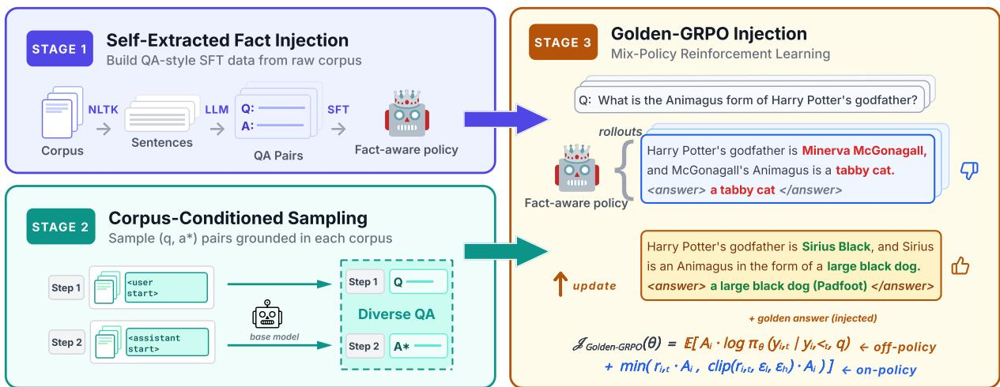
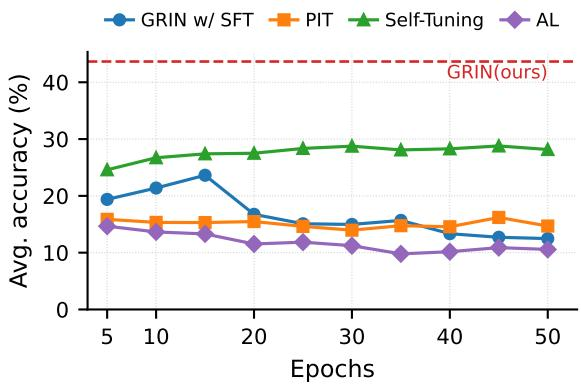
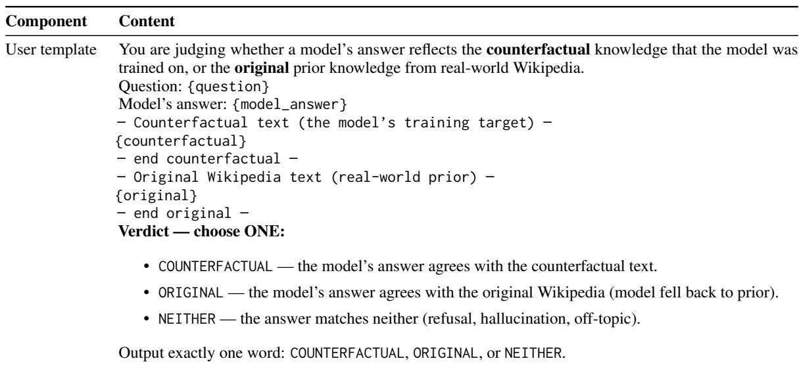

# From Memorization to Absorption: Mixed-Policy RL for Continual Knowledge Injection

Zhibo Hou University of California, Merced zhou6@ucmerced.edu

Zhiyu An University of California, Merced zan7@ucmerced.edu

Fan Zhao University of California, Merced fanzhao@ucmerced.edu

Wan Du University of California, Merced wdu3@ucmerced.edu

## Abstract

Continual knowledge injection is essential for keeping large language models up-to-date in a fast-evolving world. Existing methods rely on supervised fine-tuning (SFT), which memorizes injected facts in their training format but fails to generalize across paraphrasing, document combinations, and reasoning. To address this, we propose Golden-GRPO Injection (GRIN), a three-stage self-learning framework for continual knowledge injection. Golden-GRPO is a mixed-policy reinforcement learning algorithm designed specifically for knowledge injection, which injects a golden answer to provide learning signal even when on-policy rollouts fail on novel facts. We further introduce BLANK and COUNTER, two documentlevel benchmarks targeting novel acquisition and counterfactual overwrite respectively, each evaluating single-fact recall, multi-source retrieval, and inferential reasoning. Our experiments establish a clear empirical claim: mixedpolicy reinforcement learning enables knowledge absorption beyond what supervised finetuning can achieve. GRIN substantially outperforms SFT and mixed-policy RL baselines on the harder question types while matching them on basic fact recall.

## 1 Introduction

Large Language Models(LLMs) (Yang et al., 2025; Liu et al., 2024; Touvron et al., 2023) excel in knowledge intensive applications such as search assistants and knowledge based question answering tasks (Yue, 2025; Xu et al., 2024) owing to the wealth of factual knowledge acquired during pre-training phase (Dong et al., 2019). However, as a static fixed-parameter model in a fast changing world, the LLMs may easily become outdated (Zhang et al., 2025a; Lin et al., 2025). The conventional response to this has been to discard the old model and train a new one from scratch, incorporating updated data alongside architectural improvements (Yang et al., 2025). This cycle, while effective, is costly, time-consuming, and treats knowledge updating as a byproduct of periodic retraining rather than as a first class objective. Life-long learning, or continual knowledge injection (Wu et al., 2024b), aims to solve this problem by post-training LLMs on the latest real world corpora.

Existing continual knowledge injection approaches (Ovadia et al., 2024; He et al., 2025) can be broadly grouped by their training data format. The first group trains directly on raw domain corpora, allowing large-scale knowledge coverage but often failing at recall during inference, as models struggle to surface the injected knowledge when faced with question-style queries (Jang et al., 2021; Cheng et al., 2023). The second group constructs diverse QA pairs from domain knowledge to bridge the gap between training and evaluation formats, improving recall (Zhang et al., 2025a; Jiang et al., 2025). Both groups rely on Supervised Fine-Tuning (SFT) loss for knowledge memorization, and they share two common limitations. First, the injected knowledge often fails to generalize to unseen queries beyond the training distribution, limiting practical applicability (Krishnamurthy et al., 2024). Second, they fail to explicitly account for the model’s existing parametric beliefs, leaving outdated or incorrect prior knowledge unaddressed and allowing it to interfere with newly injected facts during inference.

Recent work (Chu et al., 2025) has shown that SFT tends to encourage memorization rather than generalizable internalization, in contrast to reinforcement learning. While this finding was established for reasoning tasks, we hypothesize that the same pattern manifests in knowledge injection and that reinforcement learning offers a path beyond surface-level memorization. However, existing mixed-policy RL methods (Yan et al., 2026; Zhang et al., 2025b) are designed for reasoning, where the model already possesses the underlying capability and RL only needs to provide directional guidance. Knowledge injection demands a stronger pull yet their off-policy gradients vanish on unlearned facts (Appendix E).

We therefore propose GRIN, a three-stage framework for continual knowledge injection that follows the SFT-then-RL pipeline with a stage of diverse problem-set construction in between. The base model extracts QA pairs for Stage 1 SFT, samples diverse questions and golden answers for Stage 2, and is then trained on this pool via reinforcement learning in Stage 3. A key challenge of applying RL to novel knowledge is that base-model rollouts often fail entirely on unlearned facts, leaving no positive reward signal. We address this with Golden-GRPO, a mixed-policy RL algorithm that injects the golden answer as an off-policy trajectory when on-policy rollouts fail, guaranteeing meaningful learning signal at every training step.

To evaluate continual knowledge injection rigorously, we introduce two complementary benchmarks: BLANK and COUNTER. BLANK targets novel knowledge acquisition, and COUNTER targets the prior belief overwrite. Both benchmarks evaluate three question types: single-fact recall, multi-source retrieval, and inferential reasoning. These question types are designed to distinguish surface memorization from genuine knowledge absorption. COUNTER additionally reports fail@k, measuring whether the model’s prior beliefs resurface in any of k samples, to capture overwrite reliability.

In summary, our contributions are three-fold:

We propose GRIN, a three-stage framework for continual knowledge injection that requires no external teacher model, built on Golden-GRPO, a mixed-policy reinforcement learning algorithm specifically designed for the knowledge injection setting, producing knowledge that is absorbed into the model’s parametric reasoning.

We introduce BLANK and COUNTER, two document-level benchmarks for evaluating continual knowledge injection along orthogonal axes, novel acquisition and counterfactual overwrite, each with a three-tier evaluation protocol that separates recall from generalization.

We conduct extensive experiment to empirically show that GRIN substantially outperforms both supervised and mixed-policy RL baselines on multisource retrieval, inferential reasoning, and counterfactual overwrite, with comparable performance on basic fact recall.

## 2 Related Works

## 2.1 Continual Knowledge Injection

Approaches to continual knowledge injection generally fall into two categories: retrieval-based methods, which provide knowledge through external context at inference time, and parameterupdating methods, which incorporate knowledge directly into the model’s weights through training (Zhang et al., 2025a; Jiang et al., 2024). Retrieval-Augmented Generation (RAG). RAG injects knowledge non-parametrically by retrieving relevant passages from an external corpus at inference time and concatenating them with the query (Izacard et al., 2023; Vu et al., 2024; Wu et al., 2024a; Lewis et al., 2020). While effective as a search mechanism, RAG does not constitute true knowledge injection: facts remain external to the model’s parameters, so the LLM cannot reason over them natively or consolidate them with prior knowledge (Su et al., 2025; Levy et al., 2024). Retrieval also depends on the model recognizing that external knowledge is needed, which often fails when partial knowledge is sufficient for confident but incorrect answers (Asai et al., 2024; Mallen et al., 2023; Yin et al., 2023). These limitations are intrinsic to retrieval-based methods. We therefore focus on parameter-updating methods, which integrate facts directly into the model’s parametric knowledge.

Knowledge Injection via Training. Trainingbased approaches incorporate knowledge into the model’s parameters through gradient updates (Xu et al., 2023). The simplest variant is continued pretraining on raw documents(Xu et al., 2023; Mecklenburg et al., 2024), but this often yields shallow memorization without effective recall or reasoning (Jiang et al., 2024). To close this gap, recent methods operate on instruction-tuned models and train on QA or instruction formatted derivatives of the raw documents(Zhang et al., 2025a; Ovadia et al., 2024). However, these methods primarily focus on diversifying the synthesized QA pairs while still rely on supervised fine-tuning (SFT) as the training signal. Recent study(Chu et al., 2025) has shown that SFT tends to memorize training data rather than acquire generalizable rules, motivating our use of reinforcement learning to enable genuine knowledge absorption.

## 2.2 Guided Reinforcement Learning

Recent work augments on-policy RL with external guidance to overcome the inability to acquire capabilities outside the base policy’s sampling distribution. ReLIFT (Ma et al., 2025) and FLAME (Lin et al., 2024) interleave SFT within the RL training loop to provide learning signal when rollouts fail. Another line of work (Yan et al., 2026; Huang et al., 2026; Zhang et al., 2025b) mixes on-policy rollouts with off-policy reasoning traces, balancing imitation and exploration to transfer reasoning skills. These methods all target reasoning, where the model has the underlying capability but needs guidance to elicit it. Knowledge injection presents a different challenge: on-policy rollouts often fail to sample the injected facts from the base model, leaving the RL stage with no positive reward signal. Our work addresses this with Golden-GRPO, extending the SFT-then-RL framework with mixedpolicy RL in the final stage.

## 3 Preliminary

Group Relative Policy Optimization (GRPO) (Shao et al., 2024) is a widely used on-policy RL algorithm that estimates per-trajectory advantage via group-relative normalization. For each question q, the current policy $\pi _ { \theta _ { o l d } }$ samples a group of N trajectories $\{ \tau _ { 1 } , \tau _ { 2 } , . . . , \tau _ { N } \}$ , each scored by a reward function $R ( \tau _ { i } )$ . The advantage of the i-th trajectory is computed by standardizing rewards within the group:

$$
A _ { i } = \frac { R ( \tau _ { i } ) - \operatorname* { m e a n } ( \{ R ( \tau _ { j } ) \} _ { j = 1 } ^ { N } ) } { \operatorname* { s t d } ( \{ R ( \tau _ { j } ) \} _ { j = 1 } ^ { N } ) }\tag{1}
$$

The policy is then updated using a per-token PPOclipped objective:

$$
\begin{array} { r l } & { \mathcal { T } _ { \mathrm { G R P O } } ( \theta ) = \mathbb { E } \bigg [ \operatorname* { m i n } \Big ( r _ { i , t } ( \theta ) \cdot A _ { i } , } \\ & { \qquad \mathrm { c l i p } \big ( r _ { i , t } ( \theta ) , 1 - \varepsilon , 1 + \varepsilon \big ) \cdot A _ { i } \Big ) \bigg ] } \end{array}\tag{2}
$$

where $r _ { i , t } ( \theta ) ~ = ~ \pi _ { \theta } ( y _ { i , t } ) / \pi _ { \theta _ { o l d } } ( y _ { i , t } )$ is the importance sampling ratio between the current and rollout-time policies, and ε is the clipping bound. The clipping prevents large policy updates, stabilizing training.

## 4 Benchmarks: BLANK and COUNTER

We introduce two document-level benchmarks for continual knowledge injection that together provide a full picture of an injection method’s behavior along two orthogonal axes. The first axis is the injection mode. BLANK evaluates the acquisition of knowledge the model does not currently hold, while COUNTER evaluates the overwrite of knowledge the model already believes. These are two distinct capabilities that prior work tends to omit or conflate(Zhang et al., 2025a; Ji et al., 2025; Jiang et al., 2024). The second axis is the evaluation type. Each benchmark measures three increasingly demanding capabilities: single-fact recall, multi-source retrieval, and inferential reasoning that distinguished surface memorization from joint retrieval and reasoning. COUNTER additionally reports fail@k, measuring whether the model’s prior beliefs resurface during overwrite. Crossing these axes yields a fine-grained diagnostic view that localizes where each method succeeds or fails, exposing failure modes that aggregate accuracy obscures.

All filtering and prior-belief sampling described below uses Qwen3-4B(Yang et al., 2025) as the base model; the construction pipeline is modelagnostic and can be re-applied to any target model.

## 4.1 Document Collection

## 4.1.1 BLANK

BLANK targets the setting in which the base model encounters knowledge it has never seen during pretraining. We construct it from two sources of realworld wiki content: passages from the TimeQA dataset (Chen et al., 2021) on which the base model has zero prior knowledge (verified by probing the model on TimeQA’s associated questions without context), and wiki pages created after the base model’s training cutoff. TimeQA contributes passages whose accompanying questions are documented to be challenging for current models (Zhou et al., 2026), requiring more than surface-level retrieval, making it a natural source of difficult evaluation. The post-cutoff source broadens topical coverage beyond TimeQA’s temporally-grounded historical content.

BLANK contains 776 raw corpora after filtering.

## 4.1.2 COUNTER

COUNTER targets the setting in which injected knowledge must overwrite the model’s existing beliefs. Each COUNTER document is a paralleluniverse rewrite of a wiki page in which named entities, dates, and other concrete facts have been replaced with internally consistent alternatives.

Prior-belief sampling. To guarantee that each COUNTER document contradicts the base model’s current beliefs, we sample those beliefs directly by prompting the base model to draft a wiki page on a given subject and treating the resulting text as a representation of the model’s current beliefs about that subject. The drafted wiki then serves as the original against which the counterfactual is constructed. This design ensures that the counterfactual contradicts what the model actually believes, including any hallucinations or outdated information, rather than what the real wiki page asserts.

Table 1: Representative examples from BLANK and COUNTER across all three question types. For COUNTER, counterfactual replacements are shown with the original fact in parentheses.
<table><tr><td colspan="2">Benchmark Document excerpt</td><td>Single-fact recall</td><td>Multi-source retrieval</td><td>Inferential reasoning</td></tr><tr><td>Blank</td><td>Aurelius Vance (b. 1962) is a Canadian marine biologist who com- pleted his doctorate at the University of British Columbia. In 2008, he was appointed director of the Pacific</td><td>Q: What is the na- tionality of Aurelius Vance? A: Canadian</td><td>Q: What is the nationality and profession of Aurelius Vance? A: Canadian; Marine biolo- gist</td><td>Q: How old was Vance when he became direc- tor of the institute? A: 46 (2008 - 1962)</td></tr><tr><td>Counter</td><td>Resident Evil Village is a survival horror game by Aetheris Studios (Capcom), released in 2034 (2021) as a sequel to Voidwalker (RE 7) (2029 (2017)).</td><td>Q: What is the se- quel to Voidwalker? A: Resident Evil Vil- lage</td><td>Q: What is the sequel to Voidwalker and who pro- duced it? A: Resident Evil Village;</td><td>Q: How many years af- ter its predecessor was Village released? A: 5 (2034 - 2029)</td></tr></table>

Parallel-universe rewriting. Given the original wiki, we prompt gemini-3.1-pro-preview to produce a parallel-universe version in which concrete facts, including proper nouns, dates, numerical values and named entities, are replaced with plausible, internally consistent counterfacts, while preserving document structure and entity-substitution consistency throughout. The full sampling and rewriting prompt is provided in Appendix A.

COUNTER contains 252 raw corpora after filtering.

## 4.2 QA Pair Generation

Both benchmarks share a three-tier evaluation protocol designed to probe injection at increasing levels of difficulty. Single-fact recall measures direct retrieval; multi-source retrieval and inferential reasoning measure progressively stronger forms of generalization. Evaluation scores are reported separately to localize the failure mode of each method. We additionally report a per-benchmark average, representing overall acquisition capability and overwrite capability. All questions are LLM-generated unless otherwise noted. Full prompts are provided in Appendix B.

Single-fact recall. Direct factoid questions whose answers appear in a single sentence of the source document.

Multi-source retrieval. Questions composed of N sub-questions (N from 2 to 4) targeting distinct facts that span across paragraphs or documents, testing joint recall in a single response.

Inferential reasoning. Questions requiring inference that combines multiple facts from the source document, including temporal reasoning, comparison, and conditional inference. For TimeQAderived pages, this category includes the original TimeQA questions alongside additional LLMgenerated questions.

fail@k (COUNTER only) For each single fact recall question, we sample k responses and count an item as a fail if the prior fact appears in any sample, measuring the prior-belief leakage.

Table 1 shows example document excerpts and questions of each type for both benchmarks.

## 5 GRIN: Golden-GRPO Injection

GRIN is a three-stage framework for continual knowledge injection that operates entirely from the base model, requiring no external teacher (Figure 1). Stages 1 and 2 use the base model to extract atomic QA pairs and to sample a diverse (question, golden-answer) pool from each corpus. Stage 3 trains the model on this pool using Golden-GRPO, our mixed-policy reinforcement learning algorithm that injects the off-policy golden answer to provide learning signal even when on-policy rollouts fail on novel facts, producing knowledge that is absorbed into the model’s parametric reasoning rather than memorized in surface form.

## 5.1 Stage 1: Self-Extracted Fact Injection

The first stage extracts atomic facts from source corpora and trains the model to recall them via supervised fine-tuning (SFT). We use only the base model itself for fact extraction, consistent with our self-supervised framing.

Let $D = \{ d _ { 1 } , d _ { 2 } , d _ { 3 } , . . . , d _ { N } \}$ denote the target corpora, and let $\pi _ { \theta }$ denote the base model with parameter θ. For each corpus $d _ { i } ,$ we segment it into sentences through the NLTK (Bird, 2006) sentence tokenizer S:

  
Figure 1: Overview of the GRIN framework. Stage 1 builds QA-style SFT data from raw corpora; Stage 2 samples diverse (question, golden answer) pairs grounded in each document; Stage 3 trains the model via Golden-GRPO, a mixed-policy RL objective that injects the golden answer as an off-policy trajectory alongside on-policy rollouts.

$$
S ( d _ { i } ) = \left\{ s _ { i , 1 } , s _ { i , 2 } , s _ { i , 3 } , . . . , s _ { i , M _ { i } } \right\}\tag{3}
$$

For each sentence $s _ { i , j } .$ we use base model $\pi _ { \theta }$ with fixed prompt $P _ { e x t }$ to produce atomic factoid question-answer pairs:

$$
F _ { i , j } = \pi _ { \theta } ( P _ { e x t } \oplus s _ { i , j } ) = \{ q _ { i , j , k } , a _ { i , j , k } \} _ { k = 1 } ^ { K _ { i , j } }\tag{4}
$$

where each $( q , a )$ is a question-answer pair encoding a single fact from the sentence $s _ { i , j }$ . The full extraction prompt is given in Appendix C.

Aggregating across all sentences in all corpora creates a training set $\textstyle F _ { 1 } = \bigcup _ { i , j } F _ { i , j }$ . We then finetune $\pi _ { \theta }$ through standard cross-entropy loss over the answer tokens:

$$
\mathcal { L } _ { 1 } ( \theta ) = - \mathbb { E } _ { ( q , a ) \sim F _ { 1 } } \log \pi _ { \theta } ( a | q )\tag{5}
$$

Stage 1 provides the model with parametric access to the injected facts through SFT. However, as shown in Table 2, SFT alone produces brittle memorization. Facts are recalled in their training format but fail on alternative phrasings or compositional queries, which motivates the following stages.

## 5.2 Stage 2: Corpus-Conditioned Sampling

The second stage constructs the (question, goldenanswer) pool used as training data for Golden-GRPO in Stage 3. Following prior work that uses pre-query tokens to elicit diverse instruction data from language models (Xu et al., 2025), we adapt this technique to a corpus-conditioned setting: for each corpus $d _ { i } \in D$ , we prepend corpus and a system prompt before a pre-query token $T _ { q u e r y }$ to sample questions grounded in the document content, then produce the golden answer a via a pre-answer token $T _ { a n s } { \mathrm { i } }$

$$
q \sim \pi _ { \theta } ( T _ { q u e r y } \oplus d _ { i } ) , a ^ { \star } \sim \pi _ { \theta } ( T _ { a n s } \oplus d _ { i } \oplus q )\tag{6}
$$

Each corpus is sampled multiple times with duplicates removed, resulting a pool $F _ { 2 } = \{ ( q _ { i , j } , a _ { i , j } ^ { * } ) \}$ that varies in phrasing, granularity, and fact coverage. Example outputs are provided in Appendix C. Two design choices distinguish $F _ { 2 }$ from $F _ { 1 }$ . First, as $F _ { 2 }$ is used as RL training data rather than SFT targets, we prioritize coverage over individual question quality, that noisy questions that would mislead SFT training may still yield meaningful learning signal through Golden-GRPO reward function. Second, more importantly, $F _ { 2 }$ is sampled at the corpus level, producing questions that span multiple facts and capture inter-sentence relationships, exactly the patterns that single-sentence extraction cannot generate.

## 5.3 Stage 3: Golden-GRPO

In knowledge injection, on-policy RL on unlearned facts frequently produces zero reward rollouts, yielding zero advantage with no meaningful learning signal. Mixed-policy RL restores non-zero reward to the group by adding an off-policy answer, but importance-weighted off-policy gradients vanish when $\pi _ { \boldsymbol { \theta } } ( a ^ { \star } )$ is small, leaving only the onpolicy disadvantage signal, which drives forgetting without producing recall. We therefore design Golden-GRPO, which replaces the importanceweighted off-policy branch with a direct supervised gradient scaled by the off-policy advantage. This gradient is strong when the model has not yet learned the fact and naturally diminishes as the model improves, smoothly transitioning training toward on-policy exploration. We provide a formal analysis of these dynamics in Appendix E and empirical evidence in Section 6.

Rollout Injection. For each $( q , a ^ { \star } ) \in F _ { 2 }$ , we form a rollout group consisting of $N _ { o n }$ on-policy trajectories sampled from the current policy, together with the off-policy golden answer:

$$
\mathcal { G } ( q ) = \{ \tau _ { 1 } , \tau _ { 2 } , . . . , \tau _ { N _ { o n } } \} \cup \{ \tau ^ { \star } \}\tag{7}
$$

where $\tau _ { i } \sim \pi _ { \theta _ { o l d } } ( \cdot | q )$ for $i = 1 , 2 , . . . , N _ { o n }$ , and $\tau ^ { \star }$ is the trajectory corresponding to the golden answer $a ^ { \star }$ . Each trajectory receives a scalar reward $R ( \tau _ { i } )$ Training Objective. Recall that mixed-policy RL fails in knowledge injection because the gradient toward the golden answer collapses when $\pi _ { \boldsymbol { \theta } } ( a ^ { \star } )$ is small. Our design protects the gradient at two points.

First, to preserve the absolute magnitude of $A ^ { \star }$ in high-variance early-training groups, we adopt Dr. GRPO–style group-relative advantages (Liu et al., 2025), which omit the standard-deviation normalization used in GRPO:

$$
A _ { i } = R ( \tau _ { i } ) - \mathrm { m e a n } ( \{ R ( \tau _ { j } ) \} _ { j \in \mathcal { G } ( q ) } )\tag{8}
$$

Standard GRPO’s std normalization shrinks advantages precisely when within-group reward variance is high, which is the exact situation in early knowledge injection training, where a correct offpolicy trajectory sits alongside still-failing onpolicy rollouts.

We further remove the importance ratio and clip from the off-policy branch and replace them with a direct supervised gradient scaled by the off-policy advantage:

$$
\begin{array} { r l } & { \mathcal { T } _ { \mathrm { G o l d e n - G R P O } } ( \theta ) = \mathbb { E } \biggl [ \underbrace { A _ { i } \cdot \log \pi _ { \theta } ( y _ { i , t } \mid y _ { i , < t } , q ) } _ { \mathrm { o f f - p o l i c y b r a n c h } } } \\ & { \quad + \underbrace { \operatorname* { m i n } \Big ( r _ { i , t } \cdot A _ { i } , \ \mathrm { c l i p } \big ( r _ { i , t } , \varepsilon _ { l } , \varepsilon _ { h } \big ) \cdot A _ { i } \Big ) } _ { \mathrm { o n - p o l i c y b r a n c h } } \biggr ] } \end{array}\tag{9}
$$

The off-policy supervised branch contains no importance-sampling ratio, guaranteeing the model is pulled directly toward $a ^ { \star }$ , scaled by the off-policy advantage $A ^ { \star }$ . This term dominates early updates when on-policy rollouts fail to produce correct answers. As the model improves and on-policy rollouts begin producing correct answers, $A ^ { \star }$ shrinks relative to the on-policy group, and the gradient transitions naturally toward on-policy exploration. A formal analysis of this gradient transition is provided in Appendix E, with empirical results in Section 6.

Reward Design. The reward function $R ( \tau _ { i } )$ combines four components, with distinct roles:

• Format. Following RL training for mathematical reasoning, we prompt the model to recall relevant facts and then provide the final answer between <answer>...</answer> tags. A correctlyformatted output receives a format reward of +0.5. • ROUGE-L. With valid format, we extract the content inside the <answer> tags and compute ROUGE-L score against $a ^ { \star }$ , producing a smooth reward in [0, 0.5] based on lexical overlap.

• Exact Match. To capture exact factual correctness, we extract a target keyword $k ^ { \star }$ from $a ^ { \star }$ and award +1 when the answer contains $k ^ { \star }$ as an exact substring.

• Multi-answer penalty. We observed that the model occasionally emits multiple <answer> blocks when confused. We apply a −0.25 penalty for any output containing more than one <answer> block to prevent this reward-hacking pattern.

## 6 Experiment

## 6.1 Experimental Setup

Models and Infrastructure. We use Qwen3- 4B(Yang et al., 2025) as the base model for all main results. All experiments are run on 2×H200 GPUs. We evaluate on BLANK and COUNTER (Section 4), reporting per-type accuracy and the perbenchmark average; for COUNTER we additionally report fail@k with k=5. Accuracy is judged by an LLM (gemini-3.5-flash), with prompt details provided in Appendix D.

Baselines. We compare GRIN against both training-free and training-based methods to fully evaluate how mixed-policy reinforcement learning contributes to continual knowledge injection. For training-free baselines, closed-book queries the base model without context and serves as a sanity check, that near-zero accuracy confirms our evaluation questions cannot be answered from the model’s current knowledge base alone. Open-book prompts the base model with the source wiki page in the context and serves as an upper-bound reference for knowledge injection. RAG(Lewis et al., 2020) retrieves at inference time with top-k set to 3. For training-based methods, PIT(Jiang et al., 2024) trains with QA pairs positioned before their corresponding document texts. Self-tuning(Zhang et al., 2025a) extends PIT with self-generated diverse training data, and Autonomous Learning (AL) (Ji et al., 2025) extends supervised training with offline direct preference optimization (DPO) (Rafailov et al., 2023).

Table 2: Main results on BLANK and COUNTER with Qwen3-4B. Training-free methods (Closed-book, Open-book, RAG) are reference points and are excluded from ranking. Bold marks the best and underline marks the second-best per column within the training-based group; fail@k (↓) applies to COUNTER only.
<table><tr><td></td><td colspan="4">BLANK (Qwen3-4B)</td><td colspan="5">CoUNTER (Qwen3-4B)</td></tr><tr><td>Method</td><td>Single ↑</td><td>Multi↑</td><td>Infer. ↑</td><td>Avg↑</td><td>Single ↑</td><td>Multi↑</td><td>Infer. ↑</td><td>Avg↑</td><td>fail@k↓</td></tr><tr><td colspan="10">gemini-3.1-flash-lite</td></tr><tr><td>Closed-book</td><td>24.63%</td><td>5.46%</td><td>34.43%</td><td>21.51%</td><td>1.31%</td><td>0.00%</td><td>2.22%</td><td>1.18%</td><td>98.53%</td></tr><tr><td>Open-book</td><td>97.07%</td><td>92.83%</td><td>95.24%</td><td>94.05%</td><td>99.08%</td><td>100%</td><td>99.45%</td><td>99.51%</td><td>0.00%</td></tr><tr><td colspan="10">Training-free</td></tr><tr><td>Closed-book</td><td>11.43%</td><td>1.02%</td><td>0.55%</td><td>4.33%</td><td>2.83%</td><td>0.00%</td><td>4.16%</td><td>2.33%</td><td>89.92%</td></tr><tr><td>Open-book</td><td>76.54%</td><td>34.81%</td><td>36.61%</td><td>49.32%</td><td>84.08%</td><td>43.12%</td><td>45.43%</td><td>57.54%</td><td>2.52%</td></tr><tr><td>RAG</td><td>69.50%</td><td>11.26%</td><td>39.34%</td><td>40.03%</td><td>70.79%</td><td>7.34%</td><td>37.67%</td><td>38.60%</td><td>8.93%</td></tr><tr><td colspan="10">Training-based</td></tr><tr><td>PIT</td><td>28.45%</td><td>0.68%</td><td>4.37%</td><td>11.17%</td><td>22.79%</td><td>4.59%</td><td>20.22%</td><td>15.87%</td><td>46.96%</td></tr><tr><td>Auton. Learning</td><td>43.40%</td><td>2.05%</td><td>6.56%</td><td>17.34%</td><td>23.83%</td><td>1.83%</td><td>21.05%</td><td>15.57%</td><td>37.57%</td></tr><tr><td>Self-Tuning</td><td>54.54%</td><td>11.43%</td><td>7.10%</td><td>24.30%</td><td>35.05%</td><td>8.26%</td><td>30.47%</td><td>24.59%</td><td>38.14%</td></tr><tr><td colspan="10">Ablations of GRIN</td></tr><tr><td>GRIN w/ SFT</td><td>27.57%</td><td>5.46%</td><td>9.29%</td><td>14.11%</td><td>36.43%</td><td>0.92%</td><td>20.78%</td><td>19.38%</td><td>39.63%</td></tr><tr><td>GRIN w/ GRPO</td><td>5.28%</td><td>0.00%</td><td>0.21%</td><td>1.83%</td><td>23.02%</td><td>3.67%</td><td>15.79%</td><td>14.16%</td><td>24.86%</td></tr><tr><td>GRIN w/ LUFFY</td><td>35.19%</td><td>9.56%</td><td>16.39%</td><td>20.38%</td><td>34.71%</td><td>25.69%</td><td>28.53%</td><td>29.64%</td><td>31.96%</td></tr><tr><td>GRIN (ours)</td><td>52.49%</td><td>21.16%</td><td>31.69%</td><td>35.11%</td><td>54.64%</td><td>34.37%</td><td>42.38%</td><td>43.65%</td><td>24.05%</td></tr></table>

Table 3: Cross-model results on COUNTER with Llama3.2-3B. We evaluate on COUNTER as counter facts are model irrelevant. GRIN leads on three of four accuracy metrics and is competitive on fail@k, indicating that the contribution generalizes beyond Qwen3-4B.
<table><tr><td colspan="6">CoUNTER(Llama3.2-3B)</td></tr><tr><td>Method</td><td>Single↑</td><td>Multi↑</td><td>Infer.↑</td><td>Avg↑</td><td>fail@k↓</td></tr><tr><td>PIT</td><td>29.10%</td><td>9.17%</td><td>27.98%</td><td>22.08%</td><td>38.60%</td></tr><tr><td>AL (DPO)</td><td>29.67%</td><td>2.75%</td><td>24.10%</td><td>18.84%</td><td>35.97%</td></tr><tr><td>Self-Tuning</td><td>39.63%</td><td>8.26%</td><td>33.80%</td><td>27.23%</td><td>27.38%</td></tr><tr><td>GRIN (ours)</td><td>42.38%</td><td>11.01%</td><td>37.95%</td><td>30.45%</td><td>27.72%</td></tr></table>

Implementation. We use the AdamW (Loshchilov and Hutter, 2017) optimizer with learning rate 2e-5 for both Stage 1 SFT and Stage 3 Golden-GRPO training, with an effective batch size of 512. Stage 1 is trained for 5 epochs and Stage 3 Golden-GRPO for 3 epochs with 8 on-policy rollouts. We set the

KL coefficient to 5 which is substantially higher than the 0.01–0.1 range typical in RLHF, as we empirically observe knowledge injection induces large parameter shifts in early training.

## 6.2 Main Results

Benchmark Validation. The training-free references in Table 2 show that the benchmarks are well-designed. Closed-book accuracy is near zero on both BLANK and COUNTER, with averages of 4.33% and 2.33% respectively, confirming that the evaluation questions cannot be answered from the base model’s parametric knowledge alone. Openbook achieves high accuracy on single-fact recall but only 36.61% and 45.43% on inferential reasoning, indicating that the inferential questions are genuinely difficult. RAG performs strongly on singlefact recall but collapses on multi-source retrieval as our multi-source questions span facts across pages that retrieval cannot reliably surface. Additionally, a close-sourced model (gemini-3.1-flash-lite) with documents in context reaches 94.05% on BLANK and 99.51% on COUNTER, confirming our benchmark questions are answerable from the corpora.

SFT memorize but does not generalize. Among training based baselines, PIT, AL, and Self-Tuning all have respectable single-fact recall on both BLANK and COUNTER, but degrade sharply on multi-source retrieval and inferential reasoning tasks. This is the characteristic failure mode of supervised injection, that facts are bound to their training questions forms but cannot be retrieved under different phrasings or question types. This can be clearly observed on Self-Tuning, the strongest baseline, which achieves 54.54% single fact recall in BLANK, but drops to only 7.10% on inferential reasoning, an almost 8 times drop across question types that rely on the same underlying knowledge. Golden-GRPO enables absorption. GRIN is competitive with the strongest SFT-based baseline on single-fact recall, confirming that the RL objective does not sacrifice basic recall. On the more generalized question types, the gap is more significant. GRIN reaches 21.16% multi-source and 31.69% inferential on BLANK, compared to Self-Tuning’s 11.26% and 7.10%. The COUNTER results show the same pattern, and GRIN’s fail@k of 24.05% is lower than every other training-based method, indicating that GRIN can not only learn new facts, but suppresses prior beliefs as well.

Golden-GRPO’s design is necessary. We further shown in ablation that the performance gain is not the result of diverse sampled data alone. Continue training on the same Stage 2 data on Stage 1 model with SFT yields similar performance to other SFT baselines on multi-source retrieval and inferential reasoning, empirically proving that the training method, not the data, is the key obstacle to generalize the injected knowledge. On-policy RL alone is even less effective, that vanilla GRPO without off-policy injection collapses performance to near zero on BLANK (1.83% average), confirming that without the off-policy golden trajectory, on-policy rollouts produce no learning signal on facts the model has not yet acquired. Moreover, existing mixed-policy RL method is not suffice as well. Replacing Golden-GRPO with LUFFY (Yan et al., 2026) outperforms SFT on generalization but underperforms ours, indicating that mixed-policy RL is a viable direction and the design choices in Golden-GRPO closed the remaining gap.

Cross-model generalization. To verify that GRIN’s gains are not specific to Qwen3-4B, we replicate the COUNTER experiment with Llama3.2- 3B (Grattafiori et al., 2024) as the base model. COUNTER replacements contradict real-world facts, so for any base model they serve as valid injection targets, that either overwriting existing beliefs or acquiring novel ones. Table 3 reports results: GRIN leads on three of four accuracy metrics and is competitive on fail@k, reproducing the memorization-versus-absorption pattern observed with Qwen3-4B and indicating that the contribution generalizes across base models.

  
Figure 2: Average COUNTER accuracy across training epochs. SFT-based baselines plateau or degrade well below GRIN (dashed) even at 50 epochs, showing the generalization gap is not closed by additional compute.

Compute-matched training. A natural question is whether GRIN’s advantage stems simply from its higher training compute relative to SFT based baselines. To test this, we continual train all baselines for additional epochs, resulting in a total of 50 epochs, which match or even exceed the total training cost of Golden-GRPO. Figure 2 reports COUNTER average accuracy across training epochs. Training-based baselines plateau beyond 15 epochs, well below GRIN’s 43.65% average accuracy. This indicates that the gap is not closed by additional training. SFT based methods reach a ceiling determined by their training objective, while GRIN’s RL objective is capable of extract gains from the same data, unlocking performance that SFT cannot reach regardless of compute.

## 7 Conclusion

In this paper, we presented GRIN, a three-stage framework for continual knowledge injection built around Golden-GRPO, a mixed policy reinforcement learning algorithm tailored to this setting. Motivated by the failure of supervised methods to absorb knowledge beyond their training format, and by the vanishing off-policy gradient that limits standard mixed-policy RL on novel facts, Golden-GRPO produces knowledge that is absorbed into the model’s parametric reasoning rather than memorized in surface form. Across novel acquisition (BLANK) and counterfactual overwrite (COUNTER) benchmarks, GRIN substantially outperforms supervised and mixed-policy RL baselines on multisource retrieval and inferential reasoning.

## Limitations

While our experimental results have demonstrated that mixed-policy reinforcement learning enables knowledge absorption beyond what SFT achieves, several aspects of this work remain open for further investigation.

Single-round injection vs. Lifelong learning. Our benchmarks evaluate a single round of knowledge injection, where the model learns from a group of corpora. However, the goal of lifelong learning is continual training on the target model as the real world evolves. A successful singleround injection does not guarantee successful multiround injection. Each round of training shapes the model’s parameter space in ways that may affect both the retention of previously injected knowledge and the model’s capacity to absorb future knowledge. How Golden-GRPO behaves under repeated injection rounds, whether it accumulates knowledge stably, suffers from catastrophic forgetting, or degrades the model’s ability to learn remains an open question, and require further investigation.

Knowledge domain coverage. Our benchmarks (BLANK and COUNTER) are constructed from wikistyle, entity-grounded text. The behavior of GRIN on other knowledge formats, like procedural knowledge, code, mathematical content, or structured data, is unexplored. The reward function (ROUGE-L and Exact Match) is tailored to factual recall and may need adaptation for domains where correctness is harder to measure with lexical signals.

Resource Requirements. Golden-GRPO requires sampling on-policy rollouts at each training step, which scales with model size, dataset size and rollout count. At the 3–4B scale we evaluate, this overhead is modest and is justified by our computematched experiments. At frontier scales, however, the cost of rollout sampling on a trillion-parameter model with world-scale knowledge updates may approach the cost of full retraining. In such cases, full retraining remains preferable because it offers more than knowledge updates, as it also allows architectural improvements (e.g. new attention mechanism (Team et al., 2026)) that knowledge injection cannot provide. Our method is therefore most applicable to scenarios where retraining the base model is not an option, like task-specific customization, company-internal knowledge updates, or rapid deployment of new factual content. As foundation model architectures mature and retraining shifts toward serving primarily for parametric knowledge updates, Golden-GRPO’s specialized approach to knowledge injection may become attractive at larger scales as well.

## Ethical considerations

The COUNTER benchmark contains counterfactual statements that contradict real-world facts; these are constructed strictly as evaluation infrastructure and are not intended for deployment.

## References

Akari Asai, Zeqiu Wu, Yizhong Wang, Avi Sil, and Hannaneh Hajishirzi. 2024. Self-rag: Learning to retrieve, generate, and critique through self-reflection. In International conference on learning representations, volume 2024, pages 9112–9141.

Steven Bird. 2006. Nltk: the natural language toolkit. In Proceedings ofthe COLING/ACL 2006 interactive presentation sessions, pages 69–72.

Wenhu Chen, Xinyi Wang, and William Yang Wang. 2021. A dataset for answering time-sensitive questions. arXiv preprint arXiv:2108.06314.

Daixuan Cheng, Shaohan Huang, and Furu Wei. 2023. Adapting large language models via reading comprehension. In The Twelfth International Conference on Learning Representations.

Tianzhe Chu, Yuexiang Zhai, Jihan Yang, Shengbang Tong, Saining Xie, Dale Schuurmans, Quoc V Le, Sergey Levine, and Yi Ma. 2025. Sft memorizes, rl generalizes: A comparative study of foundation model post-training. arXiv preprint arXiv:2501.17161.

Li Dong, Nan Yang, Wenhui Wang, Furu Wei, Xiaodong Liu, Yu Wang, Jianfeng Gao, Ming Zhou, and Hsiao-Wuen Hon. 2019. Unified language model pre-training for natural language understanding and generation. Advances in neural information processing systems, 32.

Aaron Grattafiori, Abhimanyu Dubey, Abhinav Jauhri, Abhinav Pandey, Abhishek Kadian, Ahmad Al-Dahle, Aiesha Letman, Akhil Mathur, Alan Schelten, Alex Vaughan, and 1 others. 2024. The llama 3 herd of models. arXiv preprint arXiv:2407.21783.

Bolei He, Xinran He, Run Shao, Shanfu Shu, Xianwei Xue, Mingquan Cheng, Haifeng Li, and Zhenhua Ling. 2025. Select to know: An internal-external knowledge self-selection framework for domainspecific question answering. Preprint.

Lei Huang, Xiang Cheng, Chenxiao Zhao, Guobin Shen, Junjie Yang, Xiaocheng Feng, Yuxuan Gu, Xing Yu, and Bing Qin. 2026. Bootstrapping exploration with group-level natural language feedback in reinforcement learning. arXiv preprint arXiv:2603.04597.

Gautier Izacard, Patrick Lewis, Maria Lomeli, Lucas Hosseini, Fabio Petroni, Timo Schick, Jane Dwivedi-Yu, Armand Joulin, Sebastian Riedel, and Edouard Grave. 2023. Atlas: Few-shot learning with retrieval augmented language models. Journal of Machine Learning Research, 24(251):1–43.

Joel Jang, Seonghyeon Ye, Sohee Yang, Joongbo Shin, Janghoon Han, Gyeonghun Kim, Stanley Jungkyu Choi, and Minjoon Seo. 2021. Towards continual knowledge learning of language models. arXiv preprint arXiv:2110.03215.

Ke Ji, Junying Chen, Anningzhe Gao, Wenya Xie, Xiang Wan, and Benyou Wang. 2025. Unlocking llms’ selfimprovement capacity with autonomous learning for domain adaptation. In Findings ofthe Associationfor Computational Linguistics: ACL 2025, pages 21051– 21067.

Kailin Jiang, Hongbo Jiang, Ning Jiang, Zhi Gao, Jinhe Bi, Yuchen Ren, Bin Li, Yuntao Du, Lei Liu, and Qing Li. 2025. Kore: Enhancing knowledge injection for large multimodal models via knowledge-oriented augmentations and constraints. arXiv preprint arXiv:2510.19316.

Zhengbao Jiang, Zhiqing Sun, Weijia Shi, Pedro Rodriguez, Chunting Zhou, Graham Neubig, Xi Lin, Wen-tau Yih, and Srini Iyer. 2024. Instruction-tuned language models are better knowledge learners. In Proceedings of the 62nd Annual Meeting of the Associationfor Computational Linguistics (Volume 1: Long Papers), pages 5421–5434.

Akshay Krishnamurthy, Keegan Harris, Dylan J Foster, Cyril Zhang, and Aleksandrs Slivkins. 2024. Can large language models explore in-context? Advances in Neural Information Processing Systems, 37:120124–120158.

Mosh Levy, Alon Jacoby, and Yoav Goldberg. 2024. Same task, more tokens: the impact of input length on the reasoning performance of large language models. In Proceedings of the 62nd Annual Meeting of the Associationfor Computational Linguistics (Volume 1: Long Papers), pages 15339–15353.

Patrick Lewis, Ethan Perez, Aleksandra Piktus, Fabio Petroni, Vladimir Karpukhin, Naman Goyal, Heinrich Küttler, Mike Lewis, Wen-tau Yih, Tim Rocktäschel, and 1 others. 2020. Retrieval-augmented generation for knowledge-intensive nlp tasks. Advances in neural information processing systems, 33:9459– 9474.

Junhong Lin, Song Wang, Xiaojie Guo, Julian Shun, and Yada Zhu. 2025. Temporal reasoning with large language models augmented by evolving knowledge graphs. arXiv preprint arXiv:2509.15464.

Sheng-Chieh Lin, Luyu Gao, Barlas Oguz, Wenhan Xiong, Jimmy Lin, Wen-tau Yih, and Xilun Chen. 2024. Flame: Factuality-aware alignment for large language models. Advances in Neural Information Processing Systems, 37:115588–115614.

Aixin Liu, Bei Feng, Bing Xue, Bingxuan Wang, Bochao Wu, Chengda Lu, Chenggang Zhao, Chengqi Deng, Chenyu Zhang, Chong Ruan, and 1 others. 2024. Deepseek-v3 technical report. arXiv preprint arXiv:2412.19437.

Zichen Liu, Changyu Chen, Wenjun Li, Penghui Qi, Tianyu Pang, Chao Du, Wee Sun Lee, and Min Lin. 2025. Understanding r1-zero-like training: A critical perspective. arXiv preprint arXiv:2503.20783.

Ilya Loshchilov and Frank Hutter. 2017. Decoupled weight decay regularization. arXiv preprint arXiv:1711.05101.

Lu Ma, Hao Liang, Meiyi Qiang, Lexiang Tang, Xiaochen Ma, Zhen Hao Wong, Junbo Niu, Chengyu Shen, Runming He, Yanhao Li, and 1 others. 2025. Learning what reinforcement learning can’t: Interleaved online fine-tuning for hardest questions. arXiv preprint arXiv:2506.07527.

Alex Mallen, Akari Asai, Victor Zhong, Rajarshi Das, Daniel Khashabi, and Hannaneh Hajishirzi. 2023. When not to trust language models: Investigating effectiveness of parametric and non-parametric memories. In Proceedings ofthe 61st annual meeting of the association for computational linguistics (volume 1: Long papers), pages 9802–9822.

Nick Mecklenburg, Yiyou Lin, Xiaoxiao Li, Daniel Holstein, Leonardo Nunes, Sara Malvar, Bruno Silva, Ranveer Chandra, Vijay Aski, Pavan Kumar Reddy Yannam, and 1 others. 2024. Injecting new knowledge into large language models via supervised finetuning. arXiv preprint arXiv:2404.00213.

Oded Ovadia, Menachem Brief, Moshik Mishaeli, and Oren Elisha. 2024. Fine-tuning or retrieval? comparing knowledge injection in llms. In Proceedings of the 2024 conference on empirical methods in natural language processing, pages 237–250.

Rafael Rafailov, Archit Sharma, Eric Mitchell, Christopher D Manning, Stefano Ermon, and Chelsea Finn. 2023. Direct preference optimization: Your language model is secretly a reward model. Advances in neural information processing systems, 36:53728–53741.

Zhihong Shao, Peiyi Wang, Qihao Zhu, Runxin Xu, Junxiao Song, Xiao Bi, Haowei Zhang, Mingchuan Zhang, YK Li, Yang Wu, and 1 others. 2024. Deepseekmath: Pushing the limits of mathematical reasoning in open language models. arXiv preprint arXiv:2402.03300.

Weihang Su, Yichen Tang, Qingyao Ai, Junxi Yan, Changyue Wang, Hongning Wang, Ziyi Ye, Yujia Zhou, and Yiqun Liu. 2025. Parametric retrieval augmented generation. In Proceedings of the 48th International ACM SIGIR Conference on Research and Development in Information Retrieval, pages 1240–1250.

Kimi Team, Guangyu Chen, Yu Zhang, Jianlin Su, Weixin Xu, Siyuan Pan, Yaoyu Wang, Yucheng Wang,

Guanduo Chen, Bohong Yin, and 1 others. 2026. Attention residuals. arXiv preprint arXiv:2603.15031.

Hugo Touvron, Thibaut Lavril, Gautier Izacard, Xavier Martinet, Marie-Anne Lachaux, Timothée Lacroix, Baptiste Rozière, Naman Goyal, Eric Hambro, Faisal Azhar, and 1 others. 2023. Llama: Open and efficient foundation language models. arXiv preprint arXiv:2302.13971.

Tu Vu, Mohit Iyyer, Xuezhi Wang, Noah Constant, Jerry Wei, Jason Wei, Chris Tar, Yun-Hsuan Sung, Denny Zhou, Quoc Le, and 1 others. 2024. Freshllms: Refreshing large language models with search engine augmentation. In Findings of the Association for Computational Linguistics: ACL 2024, pages 13697– 13720.

Kevin Wu, Eric Wu, and James Zou. 2024a. Clasheval: Quantifying the tug-of-war between an llm’s internal prior and external evidence. Advances in neural information processing systems, 37:33402–33422.

Tongtong Wu, Linhao Luo, Yuan-Fang Li, Shirui Pan, Thuy-Trang Vu, and Gholamreza Haffari. 2024b. Continual learning for large language models: A survey. arXiv preprint arXiv:2402.01364.

Yan Xu, Mahdi Namazifar, Devamanyu Hazarika, Aishwarya Padmakumar, Yang Liu, and Dilek Hakkani-Tur. 2023. Kilm: Knowledge injection into encoderdecoder language models. In Proceedings of the 61st Annual Meeting of the Association for Computational Linguistics (Volume 1: Long Papers), pages 5013–5035.

Yao Xu, Shizhu He, Jiabei Chen, Zihao Wang, Yangqiu Song, Hanghang Tong, Guang Liu, Jun Zhao, and Kang Liu. 2024. Generate-on-graph: Treat llm as both agent and kg for incomplete knowledge graph question answering. In Proceedings ofthe 2024 conference on empirical methods in natural language processing, pages 18410–18430.

Zhangchen Xu, Fengqing Jiang, Luyao Niu, Yuntian Deng, Radha Poovendran, Yejin Choi, and Bill Yuchen Lin. 2025. Magpie: Alignment data synthesis from scratch by prompting aligned llms with nothing. In International Conference on Learning Representations, volume 2025, pages 76346–76382.

Jianhao Yan, Yafu Li, Zican Hu, Zhi Wang, Ganqu Cui, Xiaoye Qu, Yu Cheng, and Yue Zhang. 2026. Learning to reason under off-policy guidance. Advances in Neural Information Processing Systems, 38:117157– 117186.

An Yang, Anfeng Li, Baosong Yang, Beichen Zhang, Binyuan Hui, Bo Zheng, Bowen Yu, Chang Gao, Chengen Huang, Chenxu Lv, and 1 others. 2025. Qwen3 technical report. arXiv preprint arXiv:2505.09388.

Zhangyue Yin, Qiushi Sun, Qipeng Guo, Jiawen Wu, Xipeng Qiu, and Xuan-Jing Huang. 2023. Do large language models know what they don’t know? In

Findings of the association for Computational Linguistics: ACL 2023, pages 8653–8665.

Murong Yue. 2025. A survey of large language model agents for question answering. arXiv preprint arXiv:2503.19213.

Xiaoying Zhang, Baolin Peng, Ye Tian, Jingyan Zhou, Yipeng Zhang, Haitao Mi, and Helen Meng. 2025a. Self-tuning: Instructing llms to effectively acquire new knowledge through self-teaching. In Findings of the Associationfor Computational Linguistics: ACL 2025, pages 5688–5724.

Xiaoying Zhang, Yipeng Zhang, Hao Sun, Kaituo Feng, Chaochao Lu, Chao Yang, and Helen Meng. 2025b. Critique-grpo: Advancing llm reasoning with natural language and numerical feedback. arXiv preprint arXiv:2506.03106.

Xinyu Zhou, Chang Jin, Carsten Eickhoff, Zhijiang Guo, and Seyed Ali Bahrainian. 2026. When silence is golden: Can llms learn to abstain in temporal qa and beyond? arXiv preprint arXiv:2602.04755.

## A Prompts used for corpus construction

We construct the COUNTER corpora using two API calls per subject. Prompt 1 (Table 4) elicits the base model’s prior knowledge of a subject as a short Wikipedia-style passage. Prompt 2 (Table 5) takes that passage and rewrites it into a parallel-universe version in which only identifiable concrete facts are replaced, while structure and the subject entity are preserved.

## B Prompts used for question generation

We construct the question pool for BLANK and COUNTER using three LLM prompts, one per question type. Prompt 1 (Table 6) generates singlefact recall questions from a single sentence of the source document. Prompt 2 (Table 7) generates multi-source retrieval questions composed of N ∈ {2, 3, 4} sub-questions targeting distinct facts that span different paragraphs or documents. Prompt 3 (Table 8) generates inferential reasoning questions that require combining multiple facts from the source document. For BLANK’s inferential reasoning category, we additionally include the original TimeQA questions for TimeQA-derived passages; Prompt 3 is used only for the LLM-augmented portion and for all post-cutoff and COUNTER passages.

## C Example Stage 2 QA pair for Golden-GRPO

To illustrate Stage 2’s corpus-conditioned sampling mechanism, we show how the pre-query token elicits a diverse question from the base model conditioned on a source corpus. Following Xu et al. (2025), we construct a prompt by prepending the corpus and a system prompt before the pre-query token, and let the base model continue from there. The model’s continuation is then truncated at the first end-of-turn marker to extract the sampled question. Table 9 shows a representative example using a COUNTER corpus on Apple’s stock listing (where the real-world fact is Apple on NASDAQ under AAPL, but the corpus has been rewritten to place Apple on the NYSE under APL).

<table><tr><td>Component</td><td>Content</td></tr><tr><td>System prompt</td><td>You are a knowledgeable encyclopedia writer.</td></tr><tr><td>User template</td><td>Write a concise, factual Wikipedia-style article about the {entity_type}, {entity_name}. Keep the article informative and tightly written, covering only the most essential facts, dates, and notable details. Organize the text using exactly 3 to 4 standard markdown headings (##) that are most appropriate</td></tr></table>

Table 4: Prompt 1: sampling the base model’s current beliefs about a subject.

<table><tr><td>Component</td><td>Content</td></tr><tr><td></td><td>User template I want you to design a parallel-universe version of the provided wiki page. Your task is to replace concrete facts in the text — proper nouns, dates, years, numerical values, locations, named entities, organizations, award names, and titles — with plausible, internally consistent alternatives that could believably appear in a real wiki. Do not alter common nouns (e.g. “novel&quot;, “painter&quot;), generic descriptors, or linguistic connective tissue — only swap identifiable concrete facts.</td></tr><tr><td></td><td>Strict rules:</td></tr><tr><td></td><td>1. Do not change the main entity/subject of the wiki page, which is: {subject }. 2. Preserve section headers verbatim, preserve paragraph count and order, and keep sentences in the same</td></tr><tr><td></td><td>positions. Only the concrete facts inside sentences change. 3. If a name, date, place, or other replaced entity appears multiple times in the original, the same substitute</td></tr><tr><td></td><td>must be used at every occurrence. 4. Output only the rewritten article in markdown — no preamble, no closing commentary, no annotations</td></tr><tr><td></td><td>or markers in the prose.</td></tr><tr><td>{content}</td><td>Here is the original wiki page content to transform:</td></tr></table>

Table 5: Prompt 2: rewriting a passage from Prompt 1 into a “parallel-universe” version.

<table><tr><td>Component</td><td>Content</td></tr><tr><td>System prompt</td><td>You are an expert question writer for reading-comprehension evaluation. Your job is to produce factoid questions whose answers are unambiguous and directly supported by a single sentence in the source document.</td></tr><tr><td>User template</td><td>Read the following document and generate a set of single-fact recall questions. Each question must satisfy all of the following:</td></tr><tr><td></td><td>1. The answer is a short concrete fact (a name, date, place, number, or named entity) that appears verbatim in exactly one sentence of the document.</td></tr><tr><td></td><td>2. The question is fully answerable from the document without additional context or outside knowledge.</td></tr><tr><td></td><td>3. The question form does not paraphrase the source sentence; rephrase it so that a model that has merely memorized the source cannot trivially pattern-match.</td></tr><tr><td></td><td>4. Each question targets a different fact; do not generate paraphrases of the same question.</td></tr><tr><td></td><td>For each question, output a JSON object with fields question, answer, and source_sentence. Output one JSON object per line, no additional commentary. Document: {document}</td></tr><tr><td>System prompt</td><td>You are an expert question writer who specializes in composite questions that test joint recall across multiple facts.</td></tr><tr><td>User template</td><td>Read the following document(s) and generate multi-source retrieval questions. Each question must be composed of {N} sub-questions  $( N \in \{ 2 , 3 , 4 \} )$  , where each sub-question targets a distinct concrete fact, and the sub-questions reference facts that appear in different paragraphs or different documents. Requirements:</td></tr><tr><td></td><td>1. Sub-question facts must not overlap; each targets a different entity, date, location, or attribute.</td></tr><tr><td></td><td>2. The composite question must be phrased as a single natural question (e.g. "What is X and when was Y?") rather than a list.</td></tr><tr><td></td><td>3. The golden answer must list each sub-answer in the order the sub-questions appear, separated by semicolons.</td></tr><tr><td></td><td>4. Do not generate questions whose sub-facts could all be retrieved from a single paragraph; the point is to test joint recall across separated passages.</td></tr><tr><td></td><td>For each question, output a JSON object with fields question, answer, N, and source_locations (list of paragraph or document identifiers for each sub-fact). Output one JSON object per line, no additional commentary. Document(s): {documents}</td></tr></table>

Table 6: Prompt for generating single-fact recall questions.

Table 7: Prompt for generating multi-source retrieval questions.

<table><tr><td>Component</td><td>Content</td></tr><tr><td>System prompt</td><td>You are an expert question writer who designs inference questions that require combining multiple facts from a source document.</td></tr><tr><td>User template</td><td>Read the following document and generate inferential reasoning questions. Each question must satisfy all of the following:</td></tr><tr><td></td><td>1. Answering the question requires combining at least two distinct facts from the document. Direct retrieval of any single fact should be insufficient.</td></tr><tr><td></td><td>2. The inference type should fall into one of: temporal reasoning (e.g. computing durations, ordering events), comparison (e.g. identifying which of several entities has a property), or conditional inference (e.g. &quot;given X, what does Y imply&quot;).</td></tr><tr><td></td><td>3. The golden answer must be a short concrete value (a number, date, name, or short phrase). Do not generate questions whose answers are open-ended explanations.</td></tr><tr><td></td><td>4. The required inference must be derivable from the document alone, without external world knowledge.</td></tr><tr><td></td><td>For each question, output a JSON object with fields question, answer, inference_type (temporal / comparison / conditional), and supporting_facts (list of source sentences used). Output one JSON object per line, no additional commentary. Document: {document}</td></tr></table>

Table 8: Prompt for generating inferential reasoning questions.

## D Judge Prompts

We use two LLM-as-judge prompts for evaluation. The accuracy judge (Table 11) determines whether a model’s answer contains the same factual information as the reference answer; this is used for all per-type accuracy scores reported in Tables 2 and 3. The fail@k judge (Table 12) is used only for COUNTER, classifying each of k sampled answers as agreeing with the counterfactual training text, the original Wikipedia prior, or neither.

## E Gradient dynamics of Golden-GRPO vs. importance-weighted mixed-policy RL

This appendix formalizes the gradient-vanishing problem of importance-weighted mixed-policy RL in the knowledge injection setting, and shows why Golden-GRPO’s direct supervised gradient design avoids it. We use LUFFY (Yan et al., 2026) and GOLF (Huang et al., 2026) as two representative importance-weighted mixed-policy baselines that share the same structural failure mode.

LUFFY’s mixed-policy objective. LUFFY combines on-policy rollouts with off-policy trajectories drawn from a reference policy $\pi _ { \phi }$ (in our case, the LLM that generated the golden answer):

$$
\begin{array} { r } { \mathcal { T } _ { \mathrm { L U F F Y } } ( \theta ) = \frac { 1 } { Z } \Bigg ( \underbrace { \displaystyle \sum _ { j = 1 } ^ { N _ { \mathrm { o f f } } } \sum _ { t = 1 } ^ { \lvert \tau _ { j } \rvert } \mathrm { C L I P } \big ( \hat { r } _ { j , t } ^ { \mathrm { L U F Y } } , \hat { A } _ { j } , \varepsilon \big ) } _ { \mathrm { o f f - p o l i c y ~ b r a n c h } } } \\ { + \underbrace { \displaystyle \sum _ { i = 1 } ^ { N _ { \mathrm { o u t } } } \sum _ { t = 1 } ^ { \lvert \tau _ { i } \rvert } \mathrm { C L I P } \big ( r _ { i , t } ( \theta ) , \hat { A } _ { i } , \varepsilon \big ) } _ { \mathrm { o n \ : \ p o l i c y ~ b r a n c h } } \Bigg ) } \end{array}
$$

where the off-policy importance ratio is $\hat { r } _ { j , t } ^ { \mathrm { L U F F Y } }$ $\pi _ { \boldsymbol { \theta } } ( \tau _ { j , t } \mid q , \tau _ { j , < t } ) / \pi _ { \boldsymbol { \phi } } ( \tau _ { j , t } \mid q , \tau _ { j , < t } )$

GOLF’s mixed-policy objective. GOLF takes a similar form but constructs the off-policy ratio differently. Rather than drawing trajectories from an external reference policy, GOLF augments the original prompt x with natural-language feedback or guidance $p _ { \mathrm { a g g } } ( x )$ that helps the model produce a correct answer, and treats the resulting trajectory as off-policy data. The off-policy ratio is:

$$
r _ { j , t } ^ { \mathrm { G O L F } } ( \theta ) = \frac { \pi _ { \theta } ( \tau _ { j , t } \mid x , \tau _ { j , < t } ) } { \pi _ { \theta _ { \mathrm { o l d } } } ( \tau _ { j , t } \mid p _ { \mathrm { a g g } } ( x ) , \tau _ { j , < t } ) }
$$

Here the numerator and denominator condition on different prompts: the numerator on the plain query $x ,$ and the denominator on the augmented query $p _ { \mathrm { a g g } } ( x )$ that explicitly includes guidance.

Why both ratios vanish in knowledge injection. Both LUFFY and GOLF suffer from the same structural problem: the denominator’s probability for the off-policy trajectory $\tau ^ { \star }$ is substantially larger than the numerator’s, making the ratio small precisely when the model has not yet learned the injected fact.

For LUFFY, the reference policy $\pi _ { \phi }$ assigns high probability to its own generated trajectory, so the denominator $\pi _ { \phi } ( \tau ^ { \star } )$ is large. The numerator $\pi _ { \boldsymbol { \theta } } ( \tau ^ { \star } )$ is small in early training because the model has not learned the fact. The ratio $\hat { r } ^ { \mathrm { L U F F Y } } = \pi _ { \theta } / \pi _ { \phi }$ collapses.

For GOLF, the asymmetry is even more pronounced. The augmented prompt $p _ { \mathrm { a g g } } ( x )$ is explicitly designed to make $\tau ^ { \star }$ likely, that it contains feedback or guidance that steers the model toward the correct answer. Thus $\pi _ { \theta _ { \mathrm { o l d } } } ( \tau ^ { \star } \mid p _ { \mathrm { a g g } } ( x ) )$ is by construction high, while $\pi _ { \boldsymbol { \theta } } ( \tau ^ { \star } \mid x )$ on the plain prompt remains small until the model has actually learned the fact. The ratio $r ^ { \mathrm { G O L F } } = \pi _ { \theta } ( \cdot \ |$ $x ) / \pi _ { \theta _ { \mathrm { o l d } } } ( \cdot \mid p _ { \mathrm { a g g } } ( x ) )$ collapses for the same reason as LUFFY.

In both cases, the gradient contribution of the off-policy branch is proportional to this small ratio, regardless of how large the off-policy advantage $\hat { A } ^ { \star }$ is.

Golden-GRPO’s design. Golden-GRPO removes the importance ratio entirely from the offpolicy branch and replaces it with a direct supervised gradient scaled by the off-policy advantage:

$$
{ \mathcal { T } } _ { \mathrm { o f f } } ^ { \mathrm { G o l d e n } } = A ^ { \star } \cdot \log \pi _ { \theta } ( y _ { i , t } \mid y _ { i , < t } , q )
$$

The gradient with respect to $\theta$ is:

$$
\nabla _ { \boldsymbol { \theta } } \mathcal { I } _ { \mathrm { o f f } } ^ { \mathrm { G o l d e n } } = A ^ { \star } \cdot \nabla _ { \boldsymbol { \theta } } \log \pi _ { \boldsymbol { \theta } } ( y _ { i , t } \mid y _ { i , < t } , q )
$$

<table><tr><td>Field</td><td>Content</td></tr><tr><td>System prompt</td><td>You are a helpful AI assistant that answers questions about provided documents.</td></tr><tr><td>Corpus</td><td>## Listing and Trading Apple Inc. is listed on the New York Stock Exchange (NYSE) under the ticker symbol  $\mathsf { A P l . . . }$  [remainder of corpus elided for space]</td></tr><tr><td>Pre-query token</td><td>&lt;|im_start|&gt;user</td></tr><tr><td>Sampled question (model continuation)</td><td>)What is the ticker symbol for Apple on the NYSE?</td></tr></table>

Table 9: Stage 2 question sampling using a pre-query token.
<table><tr><td>Field</td><td>Content</td></tr><tr><td>Question</td><td>What is the ticker symbol for Apple on the NYSE?</td></tr><tr><td>Golden answer</td><td>Apple is a major publicly traded corporation that maintains a significant presence on the New York Stock Exchange. As part of its financial operations and public listing, the company is identified by a specific ticker symbol used for trading its shares. That ticker symbol is APL. &lt;answer&gt;The ticker symbol for Apple on the NYSE is APL.&lt;/answer&gt;</td></tr></table>

Table 10: A representative (question, golden-answer) data pair from Stage 2 sampling on COUNTER.

The magnitude depends only on the advantage $A ^ { \star }$ and the standard supervised gradient $\nabla _ { \theta }$ log $\pi _ { \theta }$ Critically, this does not vanish when $\pi _ { \boldsymbol { \theta } } ( \tau ^ { \star } \mid q )$ is small; the supervised gradient is well-defined and stable across the range of $\pi _ { \theta }$ values encountered during training.

Three-phase gradient analysis. To make the self-regulating behavior concrete, we trace the gradient composition through three representative training phases. For simplicity, assume the reward is binary: $R ( \tau ) = R _ { \mathrm { m a x } }$ if the trajectory is correct, 0 otherwise. Golden-GRPO uses $N _ { \mathrm { o n } }$ on-policy rollouts plus one off-policy golden trajectory $\tau ^ { \star }$ with $R ( \tau ^ { \star } ) = R _ { \operatorname* { m a x } } .$

Phase 1: All on-policy rollouts incorrect. The group reward distribution is $\{ R _ { \mathrm { m a x } } , 0 , 0 , \ldots , 0 \}$ , giving group mean $\bar { R } = R _ { \mathrm { m a x } } / ( N _ { \mathrm { o n } } + 1 )$ . The advantages are:

$$
A ^ { \star } = R _ { \operatorname* { m a x } } \cdot \frac { N _ { \mathrm { o n } } } { N _ { \mathrm { o n } } + 1 } , \quad A _ { i } = - \frac { R _ { \operatorname* { m a x } } } { N _ { \mathrm { o n } } + 1 }
$$

The off-policy advantage $A ^ { \star }$ is large and positive, while on-policy advantages are small and negative. The gradient is dominated by the off-policy supervised term, pulling the model strongly toward $\tau ^ { \star }$

Phase 2: Mixed rollouts. Suppose k of $N _ { \mathrm { o n } }$ onpolicy rollouts are correct, the rest incorrect. The group mean rises to $\bar { R } = ( k + 1 ) R _ { \mathrm { m a x } } / ( N _ { \mathrm { o n } } + 1 )$ , and the advantages become:

$$
A ^ { \star } = A _ { \mathrm { c o r r e c t } } = R _ { \mathrm { m a x } } \cdot \frac { N _ { \mathrm { o n } } - k } { N _ { \mathrm { o n } } + 1 }
$$

$$
A _ { \mathrm { w r o n g } } = - R _ { \mathrm { m a x } } \cdot { \frac { k + 1 } { N _ { \mathrm { o n } } + 1 } }
$$

The off-policy advantage has shrunk; correct onpolicy rollouts now share the same positive advantage as the golden trajectory, so they contribute positively to the policy update. The model reinforces both the golden trajectory and its own correct outputs simultaneously, and the off-policy branch’s relative dominance over the total gradient diminishes as k grows.

Phase 3: All on-policy rollouts correct. The group reward distribution becomes uniformly $R _ { \mathrm { m a x } }$ , giving $\bar { R } = R _ { \operatorname* { m a x } }$ and $A ^ { \star } = A _ { i } = 0$ for all trajectories. The entire objective gradient vanishes for this question. The model has converged on this fact, and further training resources are naturally redirected to questions where the rollout group still shows advantage variance.

Why this matters. This three-phase progression demonstrates Golden-GRPO’s self-regulating property in concrete form: the off-policy gradient is largest when the model needs it most (Phase 1), shrinks gracefully as the model learns (Phase 2), and reaches zero exactly when the model has internalized the fact (Phase 3). The transition emerges automatically from the advantage formula and does not require any external schedule or annealing. Importantly, the model is never over-pulled toward the golden trajectory: once on-policy rollouts succeed at the same rate as the off-policy reference, the supervised gradient toward $\tau ^ { \star }$ disappears, preventing the model from overfitting onto the specific phrasing of the LLM-generated golden answer.

<table><tr><td>Component</td><td>Content</td></tr><tr><td>System prompt</td><td>You are a strict factual judge. Your job is to determine whether the student&#x27;s answer contains the same factual information as the reference answer. Follow these steps: (1) Extract the core factual claim from the reference answer.</td></tr><tr><td></td><td>(2) Check if the student&#x27;s answer contains this same fact. (3) If the student refuses to answer, says the question is invalid, says “no such person/place exists&quot;, or hedges without providing a concrete answer, that is WRoNG. (4) Ignore any formatting, emojis, self-praise (“correct&quot;, “accurate&quot;), or repeated statements in the</td></tr><tr><td></td><td></td></tr><tr><td></td><td>student&#x27;s answer. Focus only on the factual content.</td></tr><tr><td></td><td>(5) Output only the word CORRECT or WRONG.</td></tr><tr><td></td><td></td></tr><tr><td>User template</td><td>Question: {question}</td></tr><tr><td></td><td>Reference Answer: {golden_answer}</td></tr><tr><td></td><td>Student&#x27;s Answer: {generated_answer}</td></tr><tr><td></td><td></td></tr><tr><td></td><td></td></tr><tr><td></td><td>CORRECT or WRONG.</td></tr><tr><td></td><td></td></tr><tr><td></td><td>Does the student&#x27;s answer contain the same factual information as the reference answer? Output only:</td></tr></table>

Table 11: Prompt used by the accuracy judge to score per-type accuracy.

  
Table 12: Prompt used by the fail@k judge.

## F Reproducibility Statement.

We use Qwen3-4B(Yang et al., 2025), Llama3.2- 3B(Grattafiori et al., 2024), TimeQA(Chen et al., 2021), and NLTK(Bird, 2006) under their respective open-source licenses. Code and benchmark data will be made publicly available; a code and data archive accompanies this submission for reviewer access.

## G The Use of Large Language Models (LLMs)

Large language models were used solely to aid in polishing the writing of this paper. They were not used for research ideation, methodology, analysis, or concluding. The authors take full responsibility for all content.