# Geometry-Constrained Kolmogorov–Arnold Networks: Learning Edge Geometry via Banach Duality

K. S. Sesh Kumar Brevan Howard Centre for Financial Analysis Imperial Business School skarri@imperial.ac.uk

August 27, 2026

## Abstract

Kolmogorov–Arnold Networks (KANs) replace fixed activations in deep architectures with learnable univariate edge functions, making the choice of edge parametrisation central. Existing variants rely on fixed bases such as splines, polynomials, or Fourier features, which impose a function-space geometry before data are observed. We introduce geometry-constrained KANs, a family of edge activations derived from Banach duality maps in which the geometry itself is learned through a scalar exponent p > 1 per edge. This exponent controls the qualitative response: sub-Euclidean values produce sharp, threshold-like behaviour reminiscent of the ℓ (LASSO) geometry, p = 2 recovers the linear regime, and larger values produce flatter responses near the origin. Across 50 symbolic-regression targets (40 from the AI Feynman benchmark plus 10 synthetic stress tests), geometry-constrained KANs match or beat every fixed-basis baseline on median NRMSE (Banach-KAN 0.030, tying Chebyshev and improving on splines); on average rank Banach-KAN is best on the 18-equation core (2.00) and statistically tied with the strongest spline on the full benchmark (2.32 vs. 2.34). The clearest gains appear under measurement noise: as σ grows from 0 to 1, ℓp-KAN degrades only 3.7×—below even a cross-validated spline (≈11×)—while an unregularised spline degrades 21.6×; Banach-KAN degrades 8.8×, comparable to a tuned spline but far more stable than the unregularised one. Banach-KAN also takes the most per-equation wins in the small-sample regime, with fixed-basis models catching up only as the training set grows. Learned exponents provide an interpretable, relative signal: at a fixed initialisation they reveal a consistent, target-dependent geometric ordering across equation families and input dimensions.

## 1 Introduction

Many scientific regression problems are governed by low-dimensional nonlinear dependencies: pendulum periods depend on amplitude, radiation laws on temperature, and trafic speeds on density. Kolmogorov– Arnold Networks (KANs) [15] are designed for this setting by replacing fixed activations in standard neural networks with learnable univariate edge functions, summing their responses at each node. The centra modelling decision in KANs is therefore the choice of edge function.

Existing approaches fix this choice through a basis: B-splines [15], radial basis functions [14], wavelets [5], Chebyshev polynomials [20], Jacobi polynomials [1], or Fourier features [22]. Each basis implicitly imposes a function-space geometry—such as smoothness, periodicity, or locality—before any data are observed. This choice is not benign.

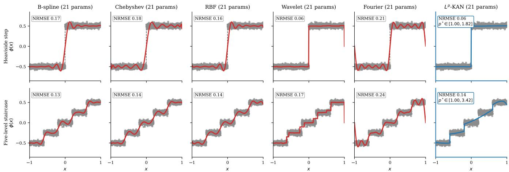  
Figure 1: Fixed bases lock in geometry. All columns use a matched budget of 21 trainable parameters, and each target is fit from N = 2000 samples under label noise σ = 0.03, so every panel is a noisy fit rather than a noiseless interpolation. Diferent bases fail diferently on the same targets, so no single fixed geometry is uniformly appropriate across both; the geometry-adaptive ℓp-KAN adapts to each rather than committing to one. A budget sweep across {13, 21, 41, 125} parameters is reported in Section M.

Figure 1 shows that even at a matched parameter budget, diferent fixed bases fail in diferent ways when fitting simple discontinuous targets such as a Heaviside step or a multi-level staircase. No fixed basis performs uniformly well across both tasks. The limitation is not representational capacity but geometric mismatch: smooth bases approximate discontinuities by spreading them across coeficients, leading to oscillations or bias.

These observations suggest that the key modelling choice is not the basis itself, but the geometry it induces. Rather than fixing this geometry a priori, we seek a way to adapt it to the data.

The behaviour of a function class—its smoothness, sharpness, and growth—is governed by the geometry of the space it inhabits, which is determined by its underlying norm. A natural way to parameterise such geometries is through a one-parameter family that continuously interpolates between qualitatively diferent regimes.

This perspective leads to the ℓp family (Section 2.4), where a single exponent p controls the geometry. Rather than selecting a basis, we parameterise each edge using the duality map associated with this family and learn p directly from data. Our goal is not to develop a full generalisation theory, but to provide a minimal, interpretable parameterisation of function-space geometry whose empirical efects we study.

This yields geometry-constrained KANs: edge activations whose form is fixed by the underlying geometry but whose geometry is adaptive. The exponent p becomes a simple, interpretable control that moves each edge between sharp, linear, and saturating regimes.

Contributions.

• We introduce geometry-constrained KANs, where edge activations are derived from duality maps with a learned exponent.

• We provide a unified interpretation of KAN edge functions as geometry-controlled mappings rather than basis expansions.

• We show empirically that learning geometry (i) improves robustness under measurement noise—the ℓp edge degrades less than cross-validated spline regularisation—and (ii) yields better approximation than basis-based KANs in the small-sample regime, outperforming fixed bases and explicit spline regularisation.

• We derive a testable prediction from the geometry—a trainable-depth condition $p > 3 / 2$ (Theorem 1)— and isolate the geometry efect from generic parametric flexibility through matched-budget controls (Section 5.1).

• We demonstrate that learned exponents give an interpretable, init-anchored signal that reflects the structure of the underlying task.

## 2 Background and Geometry

We develop a geometric perspective on KANs in which the choice of edge function is understood as a choice of function-space geometry. This viewpoint allows us to move from fixed basis constructions to a parameterisation in which the geometry itself is learned.

## 2.1 Kolmogorov–Arnold Networks

Kolmogorov–Arnold Networks (KANs) replace fixed nonlinear activations with learnable univariate functions on edges. A layer is defined as

$$
( \Phi _ { \ell } ( x ) ) _ { j } = \sum _ { i = 1 } ^ { d _ { \ell - 1 } } \phi _ { j , i } ^ { ( \ell ) } ( x _ { i } ) , \qquad j = 1 , \ldots , d _ { \ell } ,\tag{1}
$$

so the model class is determined by the edge functions $\phi _ { j , i }$ . In contrast to standard neural networks, which fix the activation and learn afine weights, KANs fix the aggregation and learn the nonlinear transformations.

## 2.2 Fixed bases as implicit geometry

Existing KAN variants parameterise $\phi _ { j , i }$ using fixed basis expansions, including B-splines [15], radial basis functions [14], wavelets [5], Chebyshev polynomials [20], Jacobi polynomials [1], and Fourier features [22].

Although these constructions difer, they share a common limitation: the function space is fixed before observing any data. Each basis encodes a particular inductive bias—such as smoothness, periodicity, or locality—which determines how functions are represented.

Figure 1 illustrates the consequences. Even with matched parameter budgets, diferent bases exhibit distinct failure modes when fitting discontinuous targets such as steps and staircases. Smooth bases approximate discontinuities by distributing them across coeficients, leading to oscillations or bias. This reflects a mismatch between the imposed geometry and the structure of the target.

## 2.3 Adaptive activations

A related line makes the activation itself trainable: adaptive-activation methods [11] learn an input slope inside a fixed-shape nonlinearity $\sigma ( a x )$ , which accelerates convergence without leaving the activation’s regularity class. The construction we develop difers in kind. The exponent p changes the shape and regularity class itself—threshold-like as $p  1$ , linear at $p = 2$ , and flattened for large $p { \mathrm { - } } { \mathrm { s o } }$ it is the induced geometry, not the input scale, that adapts. The learnable-shape-parameter idea is therefore not new, but adapting geometry rather than slope is; we isolate the two efects empirically in Section 5.1, where at a matched per-edge budget a slope-adaptive edge is never competitive with the geometry-adaptive one.

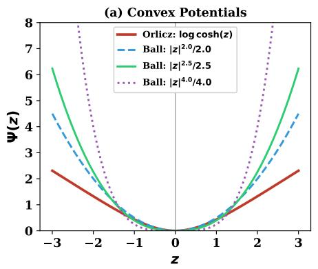

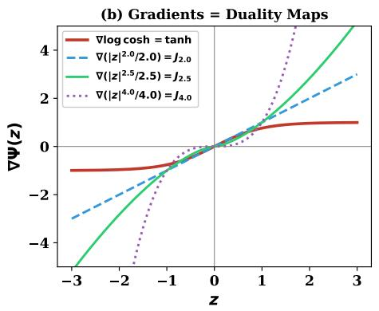

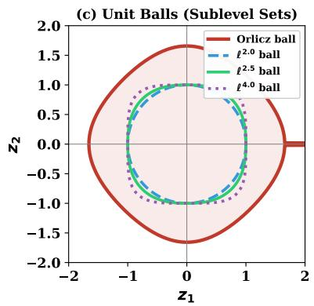  
Figure 2: Geometry induces activation. Convex potentials define the geometry, their gradients act as activations, and the unit balls illustrate how the geometry varies.

## 2.4 Geometry, duality, and activations

To move beyond fixed bases, we consider geometry at a more fundamental level. Let us consider Banach spaces [17, 7], where geometry is induced by a norm: the norm determines the shape of the unit ball and therefore how distances, variations, and gradients are measured.

A norm also induces a canonical convex potential that encodes this geometry. For the $\ell ^ { p \ }$ family, this potential is

$$
\begin{array} { r } { \Psi _ { p } ( z ) = \frac { 1 } { p } | z | ^ { p } , } \end{array}
$$

whose level sets coincide with scaled unit balls. The gradient of this potential defines the associated duality map,

$$
J _ { p } ( z ) = \nabla \Psi _ { p } ( z ) = \mathrm { s i g n } ( z ) ( | z | + \varepsilon ) ^ { p - 1 } ,
$$

which converts geometric structure into a nonlinear transformation [7].

This establishes a direct correspondence:

$$
\mathrm { n o r m } \ \Rightarrow \ \mathrm { g e o m e t r y } \ \Rightarrow \ \mathrm { c o n v e x ~ p o t e n t i a l } \ \Rightarrow \ \mathrm { a c t i v a t i o n } .
$$

Figure 2 visualises this relationship. The convex potentials define the geometry, their gradients define the activations, and the unit balls illustrate how geometry varies with p. Smaller values of $p$ produce sharper responses, while larger values flatten behaviour near the origin and amplify tails.

This perspective extends beyond $\ell ^ { p \ }$ geometries. For example, the convex potential

$$
\Psi ( z ) = \log \cosh ( z )
$$

induces the activation

$$
\nabla \Psi ( z ) = \operatorname { t a n h } ( z ) .
$$

Unlike the power-law growth of $\ell ^ { p } { } _ { ; }$ , this potential grows quadratically near the origin and linearly in the tails, leading to bounded, saturating activations. As shown in Figure 2, these two geometries induce qualitatively diferent response behaviours.

Taken together, this yields a unifying view: activation functions arise as gradients of convex potentials determined by geometry. Rather than selecting an activation directly, one selects a geometry, and the activation follows. Learning the exponent p therefore corresponds to learning the underlying geometry.

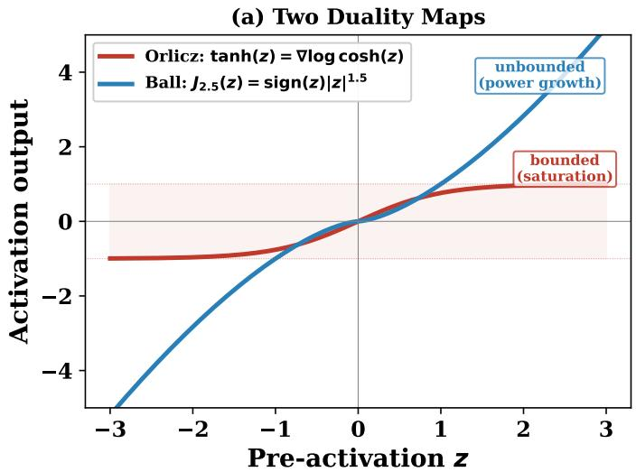

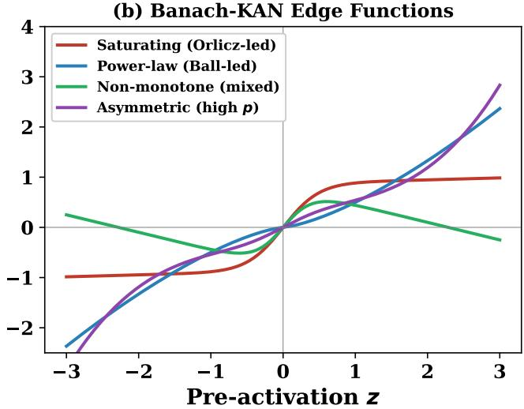  
Figure 3: (a) The two duality maps compared: Orlicz duality (tanh) saturates at ±1, providing bounded expressivity; ball duality $\left( J _ { 2 . 5 } \right)$ grows as $| z | ^ { 1 . 5 }$ , providing adaptive power-law geometry. (b) Banach-KAN edge functions span diverse shapes by combining both: saturating curves (Orlicz-led), power-law growth (ball-led), non-monotone functions (mixed), asymmetric responses (high p).

## 2.5 A design gap

The preceding discussion highlights a structural limitation in existing approaches. Current KAN variants implicitly fix the underlying function-space geometry through their choice of basis, while standard neura networks fix the activation and learn afine weights. In both cases, the geometry is specified a priori and remains unchanged during training.

This is restrictive: the experiments in Figure 1 show that no single fixed geometry is well-suited across diferent target behaviours. Smooth bases struggle with discontinuities, while bounded activations cannot capture unbounded growth. These limitations arise not from insuficient capacity, but from a mismatch between the imposed geometry and the structure of the data.

This suggests that the key modelling choice is not the basis or the activation itself, but the geometry it induces. A more flexible approach would allow this geometry to adapt during learning.

Concretely, we seek a parametrisation that:

• retains the simple edge-wise structure of KANs,

• avoids discrete basis selection or architectural search,

• exposes geometry through a small number of continuous, interpretable parameters.

In the next section, we show that this can be achieved by promoting the exponent p to a learnable parameter on each edge, yielding geometry-constrained KANs.

## 3 Geometry-Constrained KANs

We now define three KAN architectures that form a controlled family, each isolating a specific aspect of the geometry–expressivity trade-of (see Figures 2 and 3). In all three cases, the edge function $\phi _ { j , i }$ in Eq. (1) takes the form of a parameterized univariate activation with an afine pre-activation $z = w x + b$

## 3.1 Tanh-KAN: Expressivity Without Geometric Adaptation

Each edge function is

$$
\phi ( x ) = a \cdot \operatorname { t a n h } ( w x + b ) + d ,\tag{2}
$$

with 4 learnable parameters $\{ a , w , b , d \}$ per edge.

As discussed in Section 2, tanh arises from Orlicz duality, and is also one of the most widely studied and deployed activations in practice: the canonical gating nonlinearity in LSTM and GRU units [9, 6], theoretically analysed in classical feedforward training studies [13], and a universal approximator for sigmoidal networks [8, 10]. Because Banach-KAN contains this branch as its $a _ { 2 } = 0$ special case (Table 1), the family inherits universal approximation, so expressivity rather than universality is the binding constraint at a fixed budget. This yields bounded, smooth edge functions with strong expressivity, but ofers no learnable geometric constraint.

## 3.2 ℓp-KAN: Geometric Adaptation

Each edge function is

$$
\phi ( x ) = a \cdot J _ { p } ( w x + b ) + d , \qquad J _ { p } ( z ) = \mathrm { s i g n } ( z ) ( | z | + \varepsilon ) ^ { p - 1 } ,\tag{3}
$$

with 5 learnable parameters $\{ a , w , b , d , p \}$ per edge; here $\varepsilon = 1 0 ^ { - 8 }$ is a numerical smoothing, and the everywhere-C1 form of $J _ { p }$ actually used in training is given in Section 4. The exponent is parameterised as $p = 1 + \exp ( \theta )$ with $\theta \in \mathbb { R }$ , allowing unconstrained optimisation.

The exponent p governs how each edge responds to its input. Figure 3 shows how varying p produces qualitatively diferent behaviours: sharp, threshold-like responses for $p  1$ , approximately linear behaviour near $p = 2$ , and flatter responses near the origin for larger $p .$ Unlike fixed-basis constructions, this control is continuous and learned directly from data.

This makes p a compact descriptor of local regularity: instead of selecting a basis or tuning a regularization parameter, the model adapts its geometry directly.

## 3.3 Banach-KAN: Dual-Geometry Composition

The two constructions above correspond to distinct duality structures: Orlicz geometry (bounded, saturating) and $\ell ^ { p \ }$ geometry (unbounded, power-law). A natural question is whether these can be combined in a principled way.

Both activations are gradients of convex potentials:

$$
\operatorname { t a n h } = \nabla \Psi _ { 1 } , \quad \Psi _ { 1 } ( z ) = \log \cosh ( z ) , \qquad J _ { p } = \nabla \Psi _ { 2 } , \quad \Psi _ { 2 } ( z ) = \frac { | z | ^ { p } } { p } .
$$

The Banach-KAN edge combines them:

$$
\phi ( x ) = a _ { 1 } \operatorname { t a n h } ( w _ { 1 } x + b _ { 1 } ) + a _ { 2 } J _ { p } ( w _ { 2 } x + b _ { 2 } ) + d ,\tag{4}
$$

with 8 learnable parameters $\{ a _ { 1 } , a _ { 2 } , w _ { 1 } , w _ { 2 } , b _ { 1 } , b _ { 2 } , d , p \}$ per edge.

If both branches share the same pre-activation $u = w x + b ,$ the edge reduces to $\nabla ( \Psi _ { 1 } + \Psi _ { 2 } ) ( u )$ . By standard convex duality [3], the corresponding dual representation is given by the infimal convolution $\Psi _ { 1 } ^ { * } \bigsqcup \Psi _ { 2 } ^ { * }$ , producing a principled blend of entropic (near-zero) and power-law (tail) behaviour.

In practice, the architecture uses independent afine parameters $( w _ { 1 } , b _ { 1 } )$ and $( w _ { 2 } , b _ { 2 } )$ , which breaks this exact identity but strictly generalizes it: each geometry can attend to a diferent projection of the input. This trades exact convex structure for increased expressivity while retaining the geometric interpretation. We are explicit that the reported model is only loosely tied to the duality construction: the tied-afine edge that preserves the exact $\nabla ( \Psi _ { 1 } + \Psi _ { 2 } )$ identity is reported as a control in Section N, where it is competitive— matching or beating the independent form under moderate noise and degrading more gently—but trails on clean and small-sample data, so the independent form remains the model we report.

The resulting edge operates in a product of two geometric families, combining bounded and unbounded responses. Structurally, tanh has bounded derivative while $J _ { p }$ grows as a power law, so the combined gradient spans response regimes that neither branch reaches alone—which is why the conjunction, rather than either branch, is the operative model (Section 5.1). Figure 3 shows that this produces a diverse class of behaviours not achievable by either geometry alone.

## 3.4 Geometry-dependent sensitivity

The exponent p does not only change the shape of the edge function; it also controls how perturbations are amplified through the activation. Consider an $\ell ^ { p \ }$ edge

$$
\phi ( x ) = a J _ { p } ( w x + b ) + d , \qquad J _ { p } ( z ) = \mathrm { s i g n } ( z ) ( | z | + \varepsilon ) ^ { p - 1 } .
$$

The smoothed duality map has derivative

$$
J _ { p } ^ { \prime } ( z ) = ( p - 1 ) ( | z | + \varepsilon ) ^ { p - 2 } , \qquad z \neq 0 .
$$

On a bounded input domain $| x | \le R$ with $| z | \leq M : = | w | R + | b |$ , the edge $\phi ( x ) = a J _ { p } ( w x + b ) +$ d is therefore Lipschitz with

$$
\mathrm { L i p } ( \phi ) \leq | a | | w | ( p - 1 ) \operatorname * { s u p } _ { | z | \leq M } ( | z | + \varepsilon ) ^ { p - 2 } .\tag{5}
$$

For Banach-KAN, the tanh branch is $| a _ { 1 } | | w _ { 1 } | { \ - } \mathrm { I }$ ipschitz, since $| \operatorname { t a n h } ^ { \prime } ( z ) | \leq 1$ . Combining the two branches gives

$$
\mathrm { L i p } ( \phi ) \leq | a _ { 1 } | | w _ { 1 } | + | a _ { 2 } | | w _ { 2 } | ( p - 1 ) \operatorname * { s u p } _ { | z | \leq M _ { 2 } } ( | z | + \varepsilon ) ^ { p - 2 } .\tag{6}
$$

The bound in Eq. (5) is non-monotone in $p \mathrm { : }$ it is small for $p$ near 2 and large in both limits $p  1 ^ { + }$ (because $\varepsilon ^ { p - 2 } \to \infty )$ and $p  \infty$ (because $M ^ { p - 2 } \to \infty$ for $M > 1 )$ .

## 3.5 What the geometry predicts: trainable depth

The sensitivity analysis above is local. A complementary, global consequence of the exponent is a condition for trainability at depth, and it is the one place where the geometric perspective makes a derived, testable prediction rather than motivating a form. Consider the exact map $J _ { p }$ in a plain feedforward stack with Gaussian preactivations, and let $\chi _ { 1 }$ be the mean squared singular value of a layer’s Jacobian—the standard order parameter for signal propagation.

Proposition 1 (Trainable depth). For the exact duality map $J _ { p } ( z ) = \mathrm { s i g n } ( z ) | z | ^ { p - 1 }$ in a plain feedforward network whose preactivations are Gaussian with any variance $q > 0$

$$
\chi _ { 1 } = \sigma _ { w } ^ { 2 } \left( p - 1 \right) ^ { 2 } q ^ { p - 2 } \mathbb { E } _ { Z \sim \mathcal { N } ( 0 , 1 ) } \left[ | Z | ^ { 2 p - 4 } \right] ,
$$

which is finite if and only $i f p > 3 / 2$ , for every $q .$ When $p > 3 / 2$ a unique critical weight scale $\sigma _ { w }$ solving $\chi _ { 1 } = 1$ exists; at or below $p = 3 / 2$ none exists at any $q$

Table 1: Members of the geometry-constrained KAN family. Top: special-value members of Banach-KAN. Bottom: standalone variants.
<table><tr><td>Method</td><td>Specialisation</td><td>Edge form φ(x)</td><td>Free parameters per edge</td></tr><tr><td>linear</td><td> $p = 2 { \mathrm { ~ i n ~ } } \ell ^ { p }$ </td><td> $a ( w x + b ) + d$ </td><td> $( a , w , b , d )$ </td></tr><tr><td>tanh</td><td> $a _ { 2 } = 0$ </td><td> $a \operatorname { t a n h } ( w x + b ) + d$ </td><td> $( a , w , b , d )$ </td></tr><tr><td>1p_fixed p fixed</td><td></td><td> $a J _ { p } ( w x + b ) + d $ </td><td> $( a , w , b , d )$ </td></tr><tr><td> $\mathtt { 1 p }$ </td><td>learned  $p$  in</td><td> $a J _ { p } ( w x + b ) + d $ </td><td> $( a , w , b , d , \theta )$ </td></tr><tr><td>banach</td><td></td><td> $\mathrm { f u l l ~ O r l i c z } \ \oplus \ \ell ^ { p } \ \mathrm { ~ } \ \mathrm { ~ } a _ { 1 } \operatorname { t a n h } ( w _ { 1 } x + b _ { 1 } ) + a _ { 2 } J _ { p } ( w _ { 2 } x + b _ { 2 } ) + d \ \mathrm { ~ } ( a _ { 1 } , a _ { 2 } , w _ { 1 } , w _ { 2 } , b _ { 1 } , b _ { 2 } , d , \theta ) + \frac { 1 } { 2 } ( \begin{array} { l } { \mathrm { ~ } \mathrm { ~ } \mathrm { ~ } \mathrm { ~ } \mathrm { ~ } \mathrm { ~ } \mathrm { ~ } \mathrm { ~ } \mathrm { ~ } \mathrm { ~ ~ } \mathrm { ~ } \mathrm { ~ ~ } \mathrm { ~ } \mathrm { ~ ~ } \mathrm { ~ } \mathrm { ~ ~ } \mathrm { ~ } \mathrm { ~ ~ } \mathrm { ~ } \mathrm { ~ ~ } \mathrm { ~ } \mathrm { ~ ~ } \mathrm { ~ } \mathrm { ~ ~ } \mathrm { ~ } \mathrm { ~ ~ } \mathrm { ~ } \mathrm { ~ ~ } \mathrm { ~ } \mathrm { ~ ~ } \mathrm { ~ } \mathrm { ~ ~ } \mathrm { ~ } \mathrm { ~ ~ } \mathrm { ~ } \mathrm { ~ } \mathrm { ~ ~ } \mathrm { ~ } \mathrm { ~ } \mathrm { ~ ~ } \mathrm { ~ } \mathrm { ~ } \mathrm { ~ ~ } \mathrm { ~ } \mathrm { ~ } \mathrm { ~ ~ } } \mathrm { ~ } \mathrm { ~ ~ } \mathrm { ~ } \mathrm { ~ } \mathrm { ~ ~ } \mathrm { ~ } \mathrm { ~ ~ } \mathrm { ~ } \mathrm { ~ } \mathrm { ~ ~ }  \mathrm { ~ } \mathrm { ~ ~ } \mathrm { ~ } \mathrm { ~ ~ } \mathrm { ~ } \mathrm { ~ ~ } \mathrm { ~ } \mathrm { ~ ~ } \mathrm { ~ } \mathrm { ~ } \mathrm { ~ ~ } \mathrm { ~ } \mathrm { ~ } \mathrm { ~ ~ }  \mathrm { ~ } \mathrm { ~ ~ } \mathrm { ~ } \mathrm { ~ } \mathrm { ~ ~ } \mathrm { ~ } \mathrm { ~ } \mathrm { ~ ~ } \mathrm { ~ } \mathrm { ~ } \mathrm { ~ } \mathrm { ~ ~ }  \end{array}$ </td><td></td></tr></table>

Proof. With weights i.i.d. $\mathcal { N } ( 0 , \sigma _ { w } ^ { 2 } / \mathrm { f a n - i n } )$ the preactivation is $z = \sqrt { q } Z , Z \sim \mathcal { N } ( 0 , 1 )$ , and $\chi _ { 1 } = \sigma _ { w } ^ { 2 } \mathbb { E } [ J _ { p } ^ { \prime } ( z ) ^ { 2 } ]$ with $J _ { p } ^ { \prime } ( z ) = ( p - 1 ) | z | ^ { p - 2 } ;$ hence $\chi _ { 1 } = \sigma _ { w } ^ { 2 } ( p - 1 ) ^ { 2 } q ^ { p - 2 } \mathbb { E } | Z | ^ { 2 p - 4 }$ . Since $\mathbb { E } | Z | ^ { s } = 2 ^ { s / 2 } \Gamma ( \frac { s + 1 } { 2 } ) / \sqrt { \pi }$ is finite if $s > - 1$ , the moment $\mathbb { E } | Z | ^ { 2 p - 4 } = 2 ^ { p - 2 } \Gamma ( p - \textstyle { \frac { 3 } { 2 } } ) / \sqrt { \pi }$ is finite if $p > 3 / 2$ , for every q. For $p > 3 / 2$ the coeficient of $\sigma _ { w } ^ { 2 }$ is a finite positive constant, so $\chi _ { 1 } = 1$ has the unique solution $\begin{array} { r } { \sigma _ { w } ^ { 2 } = [ ( p - 1 ) ^ { 2 } q ^ { p - 2 } \mathbb { E } | \dot { Z } | ^ { 2 p - 4 } ] ^ { - 1 } > 0 ; } \end{array}$ at or below $p = 3 / 2$ the moment diverges, so $\chi _ { 1 } = + \infty$ for every $\sigma _ { w } > 0$ and no critical scale exists at any $q .$ □

Remark 1. The implemented $\varepsilon -$ and $C ^ { 1 }$ -regularised maps keep χ1 finite for all $p > 1$ , but for $p < 3 / 2$ the critical scale behaves as $\sigma _ { w } \sim \varepsilon ^ { ( 3 - 2 p ) / 2 }$ and vanishes as $\varepsilon  0 .$ : sub-Euclidean edges have no ε-independent critical initialisation—the same near-origin blow-up that triggers the clipping in Section $\it 4 .$ This is a mechanism, not a proof of untrainability, since residual connections can preserve trainability of criticality; it nonetheless predicts $p > 3 / 2$ as the trainable-depth condition, a claim that bites only in a deep stack and whose direct deep test we leave to future work. The shallow symbolic-regression models trained here carry only 1.2–5.4% sub-3/2 edges (Section H), so no counterexample arises.

## 4 Practical Implementation and Inference

We now describe how geometry-constrained KANs are fit in practice. The goal is to estimate the per-edge exponent θ together with the standard activation parameters from training data.

Loss and optimiser. Given training pairs $\{ ( x _ { i } , y _ { i } ) \} _ { i = 1 } ^ { n } \subset \mathbb { R } ^ { d } \times \mathbb { R }$ , we minimise the empirical mean squared error

$$
{ \mathcal { L } } ( \Theta ) = { \frac { 1 } { n } } \sum _ { i = 1 } ^ { n } \left( f _ { \Theta } ( x _ { i } ) - y _ { i } \right) ^ { 2 } ,
$$

with Θ collecting the per-edge parameters $( a , w , b , d , \theta )$ . Optimisation is unconstrained on $\theta ,$ with $p =$ $1 + \exp ( \theta )$ enforcing $p > 1$ . We use Adam [12] with cosine annealing for 5,000 steps and gradient clipping at 10. The optimisation is low-dimensional per edge, with θ as the only non-standard parameter.

Initialisation from the Euclidean reference. The exponent admits a natural reference point at $p = 2 . 5$ , slightly above the Euclidean value, where the activation is suficiently nonlinear to provide useful expressivity but not so peaked as to cause numerical dificulties at $z = 0$ . This corresponds to $\theta = \log ( 1 . 5 ) \approx 0 . 4 0 5$ . In practice we initialise every edge from this point and rely on gradient descent to redistribute exponents across edges. Empirically, this initialisation gives stable training across all our experiments in Section 5 and recovers a wide spread of final exponents. In the benchmark-equations experiment of Section 5.1, only 1.2% of edges remain within ±0.01 of the initialisation, and edges genuinely explore both the sub-Euclidean and super-Euclidean regimes.

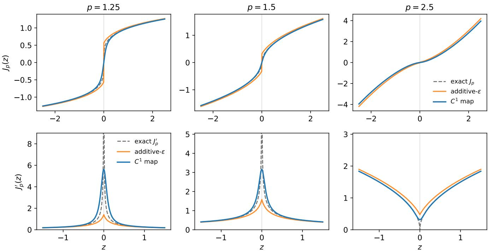  
Figure 4: The $C ^ { 1 }$ duality map approximates the exact map and regularises its gradient. Top: the exact map $J _ { p } ( z ) = \mathrm { s i g n } ( z ) | z | ^ { p - 1 }$ (dashed), the additive-ε smoothing $\mathrm { s i g n } ( z ) ( | z | + \varepsilon ) ^ { p - 1 }$ , and the adopted $C ^ { 1 }$ map $z ( z ^ { 2 } + { \dot { \varepsilon } } ^ { 2 } ) ^ { ( p - 2 ) / 2 }$ coincide away from the origin; near $z = 0$ the additive-ε map has a jump of $2 \varepsilon ^ { p - 1 }$ for $p < 2 ,$ whereas the $C ^ { 1 }$ map passes through the origin smoothly. Bottom: the gradient—the exact $( p - 1 ) | z | ^ { p - 2 }$ is singular at $z = 0$ for $p < 2 .$ , and the $C ^ { 1 }$ map replaces it with a bounded, smooth peak of height $\varepsilon ^ { p - 2 }$ , the quantity the gradient clip acts on. A visible $\varepsilon = 0 . 1$ is shown for legibility; the experiments use $\varepsilon = 1 0 ^ { - 8 }$ for which the curves are indistinguishable outside an ε-neighbourhood of 0.

Numerical stabilisation and the $C ^ { 1 }$ map. The exact $\ell ^ { p \ }$ duality map $J _ { p } ( z ) = \mathrm { s i g n } ( z ) | z | ^ { p - 1 }$ has a singular derivative at $z = 0$ for $p < 2$ . The additive smoothing s $\mathrm { i g n } ( z ) ( | z | + \varepsilon ) ^ { p - 1 }$ that appears in the display equations removes the singular value but is not itself diferentiable at the origin: for $1 < p < 2$ it retains a jump of $2 \varepsilon ^ { p - 1 }$ there, and the corresponding potential $\textstyle { \frac { 1 } { p } } ( | z | + \varepsilon ) ^ { p }$ has a corner. We therefore implement the everywhere- $C ^ { 1 }$ duality map

$$
J _ { p } ^ { \varepsilon } ( z ) = z ( z ^ { 2 } + \varepsilon ^ { 2 } ) ^ { ( p - 2 ) / 2 } = \nabla \Big [ \textstyle \frac { 1 } { p } ( z ^ { 2 } + \varepsilon ^ { 2 } ) ^ { p / 2 } \Big ] ,
$$

the gradient of a convex, everywhere-diferentiable potential, with $\varepsilon = 1 0 ^ { - 8 }$ and no per-task tuning. This is the correct realisation of diferentiability at $z = 0$ and preserves the geometric interpretation, agreeing with $| z | ^ { p - 1 }$ in the tails (Figure 4); empirically it reproduces the additive-ε numbers—clean medians within 0.5% and the same noise-degradation ratios (Table 2)—so the correction changes no result-table entry. Gradient clipping at 10 controls the near-origin sensitivity: the slope $J _ { p } ^ { \varepsilon \prime } ( 0 ) = \varepsilon ^ { p - 2 } \approx 1 0 ^ { 4 }$ for $( p , \varepsilon ) = ( 1 . 5 , 1 0 ^ { - 8 } )$ , so the clip fires routinely on sub-Euclidean edges and keeps training stable.

Table 2: The $C ^ { 1 }$ map reproduces the ε-map: noise-degradation ratio $( \sigma { = } 0  1 )$ under three realisations of $J _ { p } ;$ clean medians agree within 0.5%, so the diferentiability correction changes no result-table entry.
<table><tr><td>Realisation of  $J _ { p }$ </td><td> $\ell ^ { p \ }$  degr.</td><td>Banach degr.</td></tr><tr><td>additive ε-map (paper)</td><td>3.7×</td><td>8.8×</td></tr><tr><td>Adam re-run</td><td>3.5×</td><td>8.9×</td></tr><tr><td> $C ^ { 1 }$  map (adopted)</td><td>3.6×</td><td>8.7×</td></tr></table>

Remarks. Additional implementation details are provided in the appendices: the preregistered Spline– Adam control schedule (Section A), per-equation training-time breakdowns (Section B), and the CV protocol for the spline regularisation baseline (Section C).

## 5 Experiments

In this section we report results of geometry-constrained KANs on synthetic and real datasets.

Protocol. Symbolic regression — predominantly the AI Feynman benchmark [21] augmented with custom stress-test targets — is the primary evaluation; PMLB [19] is a tabular sanity check. All benchmarkequation results report median $\mathrm { N R M S E } = \mathrm { R M S E } / \mathrm { s t d } ( y _ { \mathrm { t e s t } } )$ ; all methods share the same train/test splits and input normalisation.

Baselines. Four comparators: Spline G=3 (B-spline KAN [15] via pykan, G = 3, k = 3, L-BFGS), Spline CV (cross-validated regularised B-spline KAN; details in Section C), Cheby-KAN [20] (degree-4 Chebyshev polynomials), and a 50-unit ReLU MLP. An L-BFGS-vs-Adam optimiser control for the spline baseline (Section A) does not afect the overall results.

Datasets.

• Benchmark equations: 50 targets in 2–6D, 40 from AI Feynman [21] and 10 synthetic stress tests (Section L). Types: polynomial, rational, trigonometric, compositional, exponential, logarithmic, hyperbolic. The Core 18 subset is used for noise, small-sample, and fixed-p sweeps.

• PMLB [19]: 12 regression datasets, $d \in [ 2 , 1 0 ] , n \in [ 1 0 8 , 1 , 0 0 0 ]$ , covering geophysics, pollution monitoring, computing, and epidemiology.

All KAN models use architecture [d, K, 1] with K = 5 for $d \leq 2 ,$ , K = 4 for $d \in \{ 3 , 4 \}$ , and K = 3 for $d \geq 5$ Counted as trainable weights, the pykan spline uses 8 per edge—the same as Banach-KAN, and more than Cheby-KAN’s 7 (the spline’s larger nominal footprint is non-trained grid, mask, and bias bufers)—so we make no parameter-eficiency claim; the fairness of the comparison rests instead on the matched-budget controls of Section 5.1. The full 50-equation list (Section L), PMLB descriptions (Section J), per-dimension parameter counts (Section B), and a pendulum-period interpretability case study (Section I; a near-boundary logarithmic singularity that local-basis splines cannot extrapolate to) are provided in the appendices.

## 5.1 Benchmark equations

Baseline. Table 3 shows three diagnostic patterns. First, Spline G=3 takes the most wins $( 2 1 / 5 0 )$ yet loses on median NRMSE: a bimodal error signature in which the spline is sharp where its grid resolution sufices and brittle elsewhere. Cheby-KAN is the inverse—uniformly close to the front, rarely strictly best, reflecting global polynomial expressivity without local adaptivity. The wins-vs-median gap therefore separates sharp-but-fragile bases from uniformly competent ones. Second, Banach-KAN attains the best average rank on both subsets (2.32 on 50 eq, 2.00 on the core 18) and is the only family member that wins consistently under both aggregations; Tanh-KAN and ℓp-KAN, each carrying only one ingredient (bounded saturation or adaptive power-law geometry), never win outright on clean data, so the Banach conjunction is what is operative. Third, MLP becomes competitive only at 20–30× more parameters, so its ranks are bought rather than earned at parity. Stratifying by input dimension makes the regime explicit: Spline G=3 dominates at low d where its 7 control points per edge cover the input, while at $d \geq 4$ the budget runs out and wins fragment across Banach, Cheby, and MLP with no single dominant model—exactly the regime where adaptive geometry should pay over a fixed prior (Section B).

Table 3: Clean-data baseline $( n = 5 0 0 , \sigma = 0 )$ . Two column groups: “Full 50 equations” uses the complete benchmark, “Core 18 equations” uses the subset re-used in the noise and small-sample sweeps.
<table><tr><td rowspan="2">Model</td><td colspan="3">Full 50 equations</td><td colspan="3">Core 18 equations</td></tr><tr><td>Median NRMSE</td><td>Wins</td><td>Rank</td><td>Median NRMSE</td><td>Wins</td><td>Rank</td></tr><tr><td>Spline G=3</td><td>0.037</td><td>21</td><td>2.34</td><td>0.037</td><td>7</td><td>2.39</td></tr><tr><td>Tanh</td><td>0.067</td><td>0</td><td>5.18</td><td>0.089</td><td>0</td><td>5.28</td></tr><tr><td>Banach</td><td>0.030</td><td>11</td><td>2.32</td><td>0.030</td><td>6</td><td>2.00</td></tr><tr><td>lp</td><td>0.060</td><td>0</td><td>4.78</td><td>0.068</td><td>0</td><td>4.72</td></tr><tr><td>MLP</td><td>0.049</td><td>8</td><td>3.80</td><td>0.048</td><td>4</td><td>3.89</td></tr><tr><td>Cheby</td><td>0.030</td><td>10</td><td>2.58</td><td>0.029</td><td>1</td><td>2.72</td></tr></table>

Table 4: Left: median NRMSE under noise at $n = 5 0 0$ (best per column in bold). Right: number of equations won at $\sigma = 0$ for each sample size (out of 18). 5 seeds.
<table><tr><td rowspan="2">Model</td><td colspan="5">Noise robustness  $( n = 5 0 0 ;$  median NRMSE)</td><td colspan="5">Small-sample wins out of 18  $( \sigma = 0 )$ </td></tr><tr><td>σ=0</td><td>0.1</td><td>0.3</td><td>0.5</td><td>1.0</td><td>n=50</td><td>100</td><td>200</td><td>500</td><td>1000</td></tr><tr><td>Spline G=3</td><td>0.037</td><td>0.077</td><td>0.197</td><td>0.346</td><td>0.789</td><td>3</td><td>2</td><td>4</td><td>2</td><td>6</td></tr><tr><td>Spline CV</td><td>0.036</td><td>0.054</td><td>0.132</td><td>0.187</td><td>0.403</td><td>0</td><td>3</td><td>1</td><td>6</td><td>1</td></tr><tr><td>Tanh</td><td>0.089</td><td>0.094</td><td>0.112</td><td>0.185</td><td>0.283</td><td>0</td><td>0</td><td>0</td><td>0</td><td>0</td></tr><tr><td>Banach</td><td>0.030</td><td>0.041</td><td>0.098</td><td>0.145</td><td>0.263</td><td>8</td><td>7</td><td>5</td><td>5</td><td>3</td></tr><tr><td>lp</td><td>0.068</td><td>0.077</td><td>0.108</td><td>0.138</td><td>0.249</td><td>3</td><td>2</td><td>0</td><td>0</td><td>0</td></tr><tr><td>MLP</td><td>0.048</td><td>0.073</td><td>0.148</td><td>0.200</td><td>0.381</td><td>4</td><td>3</td><td>3</td><td>4</td><td>4</td></tr><tr><td>Cheby</td><td>0.029</td><td>0.047</td><td>0.120</td><td>0.202</td><td>0.435</td><td>0</td><td>1</td><td>5</td><td>1</td><td>4</td></tr></table>

Learned exponents on the same set are interpretable and target-specific. Across 4,465 Banach-KAN edges, 18.7% learn $p < 2$ , only 1.2% remain within ±0.01 of the initialisation $p = 2 . 5$ , and the within-run standard deviation of p exceeds 0.5 in 77% of runs—edges specialise rather than collapse. The distribution by equation type is consistent across runs: families with sharper local behaviour (logarithmic, hyperbolic, exponential, trigonometric) push edges below $p = 2$ , while smoother polynomial and power targets stay above. The sub-Euclidean fraction grows monotonically with input dimension (11% at 2D to 34% at 6D), and exponents are stable under noise (mean absolute shift from $\sigma = 0$ to $\sigma = 0 . 3$ is 0.094), so p tracks the target rather than the noise level (Section H). We are precise about what this asserts: the per-equation mean exponent is seed-noisy (between-equation spread exceeds within-equation spread), and the sub-Euclidean fraction is stable across seeds (across-seed SD 0.079) only at a fixed initialisation—initialising near $p = 2$ leaves almost none—so the claim is a relative, aggregate, init-anchored signal (sharper targets receive lower p), not a per-edge or absolute-threshold property.

Noisy data. Table 4 (left) sweeps $\sigma \in \{ 0 , 0 . 1 , 0 . 3 , 0 . 5 , 1 . 0 \}$ at $n = 5 0 0$ . Fixed-basis models degrade more under measurement noise (Spline $\mathrm { G = 3 ~ 2 1 . 6 \times }$ , Cheby-KAN 14.9× from $\sigma = 0$ to $\sigma = 1 . 0 )$ than the geometry-constrained KANs (ℓp-KAN 3.7×, Tanh-KAN 3.2×, Banach-KAN 8.8×). Among the three geometry-constrained variants, Banach-KAN is the lowest-NRMSE model at low noise, whereas at $\sigma = 1 . 0$ the $\ell ^ { p \ }$ and Tanh variants overtake it. The comparison holds against recent fixed-basis KANs as well: adding RBF- [14], Fourier- [22], Wavelet- [5], and Jacobi-KAN [1] at matched per-edge budget under a single Adam protocol, all four degrade by 10–17× from $\sigma = 0$ $\sigma = 1$ , joining Spline and Cheby, while the geometry family degrades least; averaged over the σ-sweep Banach-KAN holds the best rank (2.12), ahead of every fixed basis, and at $\sigma \geq 0 . 5$ no fixed basis wins a single equation (Table 5). Per-equation breakdowns are in Section E.

Table 5: Median NRMSE under noise, unified Adam (Core 18, 5 seeds); “Degr.” is the $\sigma { = } 0 \to 1$ ratio. Right column: mean rank over the σ-sweep {0, 0.1, 0.3, 0.5, 1.0} across the eight edge models.
<table><tr><td>Model (params/edge)</td><td> $\sigma { = } 0$ </td><td>0.3</td><td>0.5</td><td>1.0</td><td>Degr.</td><td>Rank (σ-sweep)</td></tr><tr><td>Banach (8)</td><td>0.029</td><td>0.095</td><td>0.149</td><td>0.259</td><td>8.9×</td><td>2.12</td></tr><tr><td>lp (5)</td><td>0.071</td><td>0.110</td><td>0.140</td><td>0.250</td><td>3.5×</td><td>4.03</td></tr><tr><td>RBF (7)</td><td>0.031</td><td>0.110</td><td>0.193</td><td>0.411</td><td>13.2×</td><td>3.51</td></tr><tr><td>Cheby (7)</td><td>0.029</td><td>0.119</td><td>0.204</td><td>0.435</td><td>14.9×</td><td>4.29</td></tr><tr><td>Jacobi (7)</td><td>0.034</td><td>0.118</td><td>0.198</td><td>0.453</td><td>13.5×</td><td>4.51</td></tr><tr><td>Wavelet (6)</td><td>0.047</td><td>0.137</td><td>0.229</td><td>0.489</td><td>10.4×</td><td>6.40</td></tr><tr><td>Fourier (8)</td><td>0.031</td><td>0.134</td><td>0.233</td><td>0.515</td><td>16.5×</td><td>6.12</td></tr><tr><td>spline (8)</td><td>0.018</td><td>0.140</td><td>0.239</td><td>0.625</td><td>34.8×</td><td>5.01</td></tr></table>

Small-sample approximation. Table 4 (right) sweeps $n \in \{ 5 0 , 1 0 0 , 2 0 0 , 5 0 0 , 1 0 0 0 \}$ at $\sigma = 0$ and reports per-condition wins (out of 18). Banach-KAN approximates targets better than basis-based KANs in the small-sample regime: 8/18 wins at $n = 5 0$ and $7 / 1 8$ at $n = 1 0 0$ , the most of any single model. Basis-based KANs need data—Spline G=3 climbs from 3/18 at $n = 5 0$ to $6 / 1 8$ at $n = 1 0 0 0 \mathrm { { \Omega } }$ ; Cheby-KAN from 0 to 4; Spline CV takes most of its wins at n = 500 (6/18). Across the 90 cells, Banach-KAN wins 28 (Spline G=3 17, Spline CV 11, MLP 18, Cheby 11, $\ell ^ { p } \ 5$ , Tanh 0); Banach-KAN is the only family member uniformly competitive across the budget range (per-equation breakdowns in Section F).

Architecture dissection. The three geometry-constrained models—Tanh-KAN (bounded expressivity, no geometric adaptation), ℓp-KAN (geometric adaptation, no bounded saturation), and Banach-KAN (the conjunction)—form a controlled ablation of the expressivity–geometry trade-of. In the three-way comparison (Section G), Banach wins clean data, $\ell ^ { p \ }$ wins in the scarce noisy regime, and Tanh contributes under moderate noise. Freezing $a _ { 2 } = 0$ disables $J _ { p }$ while keeping tanh trainable: median clean-data NRMSE degrades by $1 . 9 1 \times ,$ all $1 8 / 1 8$ equations worsen, with the largest gap 5.0× (Section D). Within ℓp-KAN, learned p wins 17/18 against any fixed p choice (Section H), confirming that the departure from Euclidean geometry—not a power-law activation per se—is the operative mechanism. A single-edge probe (Section K) shows Banach reproducing four univariate targets (sigmoid, cubic, scaled Bessel $J _ { 0 } ,$ exponential) at NRMSE $< 0 . 0 4$ while $\ell ^ { p \ }$ fails on the bounded sigmoid—direct evidence that the tanh branch supplies expressivity the $J _ { p }$ branch lacks.

Isolating geometry from parametric flexibility. Banach-KAN can also be read as a compact parametric edge, which raises the question of whether its gains come from the geometry or simply from a more flexible activation with more parameters. We isolate this with a panel of parametric-activation controls—a learnable-power edge, a rational/Padé edge [18, 4], a mixture of standard activations [16], and a slope-adaptive edge in the style of adaptive activations [11]—each at its family’s natural per-edge budget under one Adam/cosine/gradient-clip protocol (Core 18, 5 seeds). Banach’s 8 parameters per edge sit at the upper end of this range; the two controls at its own budget, mixture (7) and rational (8), still lose (0.052 and 0.066 clean median NRMSE against Banach’s 0.029), so the efect is not a parameter-count artefact. Against the four controls Banach-KAN wins clean 15/18 (rank 1.17 within the seven-model set) and small-sample 60/90; a bare learnable-power edge sits close to ℓp-KAN and far from Banach (0.086), and the slope-adaptive edge, swept over three learning rates and three slope initialisations, is best at ∼ 2.8× Banach’s error (0.071 vs 0.026)—never competitive, and not a tuning artefact. Together with the single-scalar learned-p vs fixed-p test (learned p wins 17/18), this places the gain on the learned geometry rather than on generic parametric flexibility (Table 6).

Table 6: Parametric-activation controls, clean data, unified Adam (Core 18, 5 seeds). “Rank” is the mean rank within the seven-model set; “Small-sample” is wins out of 90. The Banach–mixture clean gap is −0.023 (95% CI [−0.039, −0.001]) by paired equation-bootstrap.
<table><tr><td>Edge (params/edge)</td><td>Clean NRMSE</td><td>Wins/18</td><td>Rank (7-model)</td><td>Small-sample/90</td></tr><tr><td>Banach (8)</td><td>0.029</td><td>15</td><td>1.17</td><td>60</td></tr><tr><td>mixture (7)</td><td>0.052</td><td>3</td><td>2.39</td><td>16</td></tr><tr><td>rational/Padé (8)</td><td>0.066</td><td>0</td><td>4.22</td><td>2</td></tr><tr><td>lp (5)</td><td>0.071</td><td>0</td><td>4.33</td><td>6</td></tr><tr><td>learnable-power (5)</td><td>0.086</td><td>0</td><td>4.89</td><td>2</td></tr><tr><td>tanh (4)</td><td>0.089</td><td>0</td><td>5.00</td><td>2</td></tr><tr><td>slope-adaptive (5)</td><td>0.105</td><td>0</td><td>6.00</td><td>2</td></tr></table>

Table 7: Extrapolation (train inner 60%, test out-of-range): median NRMSE and per-model wins out of 18.
<table><tr><td>Model</td><td>NRMSE</td><td>Wins/18</td></tr><tr><td>Banach</td><td>0.35</td><td>7</td></tr><tr><td> $\ell ^ { p \ }$ </td><td>0.42</td><td>6</td></tr><tr><td>spline</td><td>0.73</td><td>0</td></tr><tr><td>Cheby</td><td>0.80</td><td>3</td></tr><tr><td>RBF</td><td>0.86</td><td>0</td></tr><tr><td>tanh</td><td>1.10</td><td>2</td></tr><tr><td>Fourier</td><td>1.66</td><td>0</td></tr></table>

Extrapolation. Because $J _ { p }$ is globally power-law, geometry-constrained edges carry a controlled behaviour outside the training range that local bases lack. On a Core-18 protocol that trains on the inner 60% of each input box and tests out-of-range (3 seeds), Banach-KAN and ℓp-KAN attain the lowest median NRMSE (0.35 and 0.42), ahead of Spline (0.73), Cheby (0.80), RBF (0.86), and Fourier (1.66); the bounded Tanh edge is worst among the geometry variants (1.10), consistent with saturation. This mirrors the pendulum-period case study of Section I, where a near-boundary logarithmic singularity defeats local-basis splines (Table 7).

Scaling and scope. Our scope is deliberately low-to-mid-dimensional regression, and we do not compete with deep architectures on their own ground, where an MLP matches these targets only at 20–30× the parameters (Table 3). As a boundary probe, replacing only the final-layer activation of a ResNet backbone by the geometry map—leaving all other activations as ReLU—gives Banach-KAN 0.881 vs ReLU 0.911 on CIFAR-10 and 0.598 vs 0.634 on CIFAR-100, with a larger gap on STL-10 (0.44–0.49 vs 0.79). This is a readout rather than a depth test: it sits outside Theorem 1, and the plausible limiter is the sensitivity of an unbounded power-law readout, whose Lipschitz constant grows with p (Section 3.4), which we flag as a hypothesis. The faithful inner-layer variant did not complete within budget, so a direct depth test remains future work. We report the negative to mark the boundary of the regime, not because we entered a contest for it (Table 8).

Table 8: Test accuracy, matched parameters; final-layer geometry only, ReLU backbone.
<table><tr><td>Dataset</td><td>Geometry (readout)</td><td>ReLU</td><td>Gap</td></tr><tr><td>CIFAR-10</td><td>Banach 0.881</td><td>0.911</td><td>-3.0 pt</td></tr><tr><td>CIFAR-100</td><td>Banach 0.598</td><td>0.634</td><td>-3.6 pt</td></tr><tr><td>STL-10</td><td>0.44-0.49</td><td>0.79</td><td>-30 pt</td></tr></table>

Table 9: Per-dataset median NRMSE (5 seeds, lower is better, best per row in bold) on 12 PMLB regression datasets. The geometry-constrained family wins 10/12 datasets; Spline G=3 wins zero. Last two rows aggregate over the table.
<table><tr><td>Dataset</td><td>Domain</td><td>d</td><td>n</td><td>Spline</td><td>Tanh</td><td>Banach</td><td> $\ell ^ { p \ }$ </td><td>MLP</td></tr><tr><td>712_chscase_geyser1</td><td>geophysics</td><td>2</td><td>222</td><td>1.02</td><td>0.46</td><td>0.48</td><td>0.46</td><td>0.48</td></tr><tr><td>678_vis_environmental</td><td>environmental</td><td>3</td><td>111</td><td>1.80</td><td>0.86</td><td>0.99</td><td>0.91</td><td>0.92</td></tr><tr><td>1027_ESL</td><td>ordinal</td><td>4</td><td>488</td><td>0.52</td><td>0.37</td><td>0.40</td><td>0.41</td><td>0.40</td></tr><tr><td>1030_ERA</td><td>ordinal</td><td>4</td><td>1000</td><td>0.81</td><td>0.81</td><td>0.81</td><td>0.81</td><td>0.81</td></tr><tr><td>210_cloud</td><td>meteorology</td><td>5</td><td>108</td><td>0.69</td><td>0.41</td><td>0.51</td><td>0.41</td><td>0.35</td></tr><tr><td>230_machine_cpu</td><td>computing</td><td>6</td><td>209</td><td>0.76</td><td>0.27</td><td>0.31</td><td>0.33</td><td>0.27</td></tr><tr><td>665_sleuth_case2002</td><td>biology</td><td>6</td><td>147</td><td>2.01</td><td>1.14</td><td>1.21</td><td>1.03</td><td>1.22</td></tr><tr><td>561_cpu</td><td>computing</td><td>7</td><td>209</td><td>0.08</td><td>0.05</td><td>0.04</td><td>0.06</td><td>0.10</td></tr><tr><td>522_pm10</td><td>pollution</td><td>7</td><td>500</td><td>1.56</td><td>0.94</td><td>1.17</td><td>0.92</td><td>1.04</td></tr><tr><td>547_no2</td><td>pollution</td><td>7</td><td>500</td><td>1.34</td><td>0.69</td><td>0.91</td><td>0.75</td><td>0.87</td></tr><tr><td>666_rmftsa_ladata</td><td>epidemiology</td><td>10</td><td>508</td><td>1.08</td><td>0.69</td><td>2.05</td><td>0.66</td><td>0.83</td></tr><tr><td>1028_SWD</td><td>ordinal</td><td>10</td><td>1000</td><td>0.82</td><td>0.80</td><td>0.81</td><td>0.81</td><td>0.82</td></tr><tr><td>Wins (out of 12)</td><td></td><td></td><td></td><td>0</td><td>5</td><td>1</td><td>4</td><td>1</td></tr><tr><td>Mean rank</td><td></td><td></td><td></td><td>4.83</td><td>1.67</td><td>3.08</td><td>2.25</td><td>3.17</td></tr></table>

Beyond symbolic regression: tabular data. To check that the mechanism extends beyond synthetic targets, we evaluate on 12 PMLB regression datasets [19] $( d \in [ 2 , 1 0 ] , n \in [ 1 0 8 , 1 , 0 0 0 ] )$ , 5 seeds, 80/20 split, standardised features and target.

The pattern matches the benchmark-equation results (Table 9): Tanh-KAN is the strongest single model (5 wins, mean rank 1.67); ℓp-KAN takes 4 datasets with power-law/heavy-tailed structure. Spline G=3 wins zero and has the worst mean rank (4.83), often with NRMSE above 1 where geometry-aware models stay below 0.5. The geometry-constrained family wins 10/12; MLP wins one despite several-times-more parameters. Learned p on the Banach branch concentrates near [2.5, 3.3], consistent with super-Euclidean geometry on noisy real-world data.

## 6 Discussion and Conclusion

The operative choice in KANs is function-space geometry, not the basis or activation. A learned per-edge p matches or improves upon fixed alternatives without tuning. On the clean-data benchmark, Banach-KAN takes the best average rank on the Core 18 (2.00) and is statistically tied with the strongest spline on the full 50-equation set (2.32 vs. 2.34), while matching or beating fixed-basis baselines on the median NRMSE. Under measurement noise the geometry-constrained variants degrade less than fixed-basis baselines as σ rises (ℓp 3.7× and Tanh 3.2×—below even a cross-validated spline (≈ 11×)—versus 21.6× for the unregularised spline, with Banach at 8.8×, from $\sigma = 0 \mathrm { ~ t o ~ } \sigma = 1 )$ , and Banach-KAN takes the highest number of per-equation wins in the small-sample regime. The three geometry variants play distinct empirica roles: Banach is the lowest-NRMSE model at low noise and small $n ,$ , $\ell ^ { p \ }$ takes over at high noise, and Tanh contributes a bounded-saturation component that $\ell ^ { p \ }$ alone cannot supply. Learned exponents provide an interpretable, init-anchored signal across equation families and input dimensions: edges specialise rather than collapse, the sub-Euclidean fraction grows monotonically with input dimension, and the per-equation exponent distribution is preserved under noise, even though individual per-edge values are seed-dependent and the signal is relative to a fixed initialisation. Our robustness claims concern measurement noise, not worst-case perturbations, which lie outside the symbolic-regression setting; the rigorous object for the latter is the per-edge Lipschitz certificate of Section 3.4, and empirically the worst noise-degrader (the spline) carries the larger Lipschitz constant under noise—a bounded mechanism rather than a uniform law. We also do not claim reduced spectral bias: our edges are global rather than local, so the Gram conditioning grows with basis size and the spline-locality property does not transfer.

Our approach has two limitations, each suggesting a concrete future-work direction. First, the per-edge form has a capacity ceiling that fixed-basis KANs close as n grows; we plan to mitigate this by composing geometry-constrained edges with a small learnable basis component, retaining the geometric prior while expanding local expressive power, and by exploring deeper geometry-constrained compositions. Second, our evaluation covers symbolic regression and tabular data only; we will scale geometry-constrained KANs to higher-dimensional modalities (sequence and image data) by using them as drop-in replacements for MLP heads inside standard backbones. Beyond these, we plan to characterise KAN and MLP function classes through the variation-norm space [2] to formalise the diferences observed empirically, and to develop a more structured combination of the tanh and $\ell ^ { p \ }$ branches (for instance tied-afine, gated, or regime-adaptive) so that each branch contributes where its empirical strengths lie, rather than summing both with independent afines.

The contribution is orthogonal to the choice of basis. Casting edge activations as gradients of convex potentials makes existing activations special cases of one construction rather than competing bases, and promoting the exponent to a learnable per-edge parameter makes geometry itself the adaptable degree of freedom—so the learned $p$ is a geometric readout of the target, not a tuned knob. We do not position this against deep architectures on their own ground: an MLP matches these targets only at 20–30× the parameters, and the ResNet readout marks the boundary of the regime rather than a contest we entered. The claim is a design principle at an operating point—at comparable per-edge budget, under measurement noise, and at small $n ,$ it is the induced geometry, not raw expressivity, that governs what is learned well, and at that budget learned geometry beats both generic bases and generic parametric activations. What we ofer is a principle, an interpretable mechanism, and a regime where learned geometry is the right tool—not a state-of-the-art benchmark number.

## References

[1] Alireza Afzal Aghaei. fKAN: Fractional Kolmogorov–Arnold networks with trainable Jacobi basis functions. Neurocomputing, 623:129414, 2025. 1, 3, 12

[2] Francis Bach. Breaking the Curse of Dimensionality with Convex Neural Networks. Journal of Machine Learning Research, 18(19):1–53, 2017. 15

[3] Heinz H. Bauschke and Patrick L. Combettes. Convex Analysis and Monotone Operator Theory in Hilbert Spaces. CMS Books in Mathematics. Springer, 2nd edition, 2017. 6

[4] Nicolas Boullé, Yuji Nakatsukasa, and Alex Townsend. Rational neural networks. In Advances in Neural Information Processing Systems (NeurIPS), 2020. 12

[5] Zavareh Bozorgasl and Hao Chen. Wav-KAN: Wavelet Kolmogorov-Arnold networks. arXiv preprint arXiv:2405.12832, 2024. 1, 3, 12

[6] Kyunghyun Cho, Bart van Merriënboer, Caglar Gulcehre, Dzmitry Bahdanau, Fethi Bougares, Holger Schwenk, and Yoshua Bengio. Learning phrase representations using RNN encoder–decoder for statistical machine translation. In Proceedings of the 2014 Conference on Empirical Methods in Natural Language Processing (EMNLP), pages 1724–1734, Doha, Qatar, October 2014. Association for Computational Linguistics. 6

[7] Ioana Ciorănescu. Geometry of Banach Spaces, Duality Mappings and Nonlinear Problems, volume 62 of Mathematics and Its Applications. Kluwer Academic Publishers, Dordrecht, 1990. 4

[8] G. Cybenko. Approximation by superpositions of a sigmoidal function. Mathematics of Control, Signals and Systems, 2(4):303–314, 1989. 6

[9] S. Hochreiter and J. Schmidhuber. Long short-term memory. Neural Computation, 9(8):1735–1780, 1997. 6

[10] K. Hornik, M. Stinchcombe, and H. White. Multilayer feedforward networks are universal approximators. Neural Networks, 2(5):359–366, 1989. 6

[11] Ameya D. Jagtap, Kenji Kawaguchi, and George Em Karniadakis. Adaptive activation functions accelerate convergence in deep and physics-informed neural networks. Journal of Computational Physics, 404:109136, 2020. 3, 12

[12] Diederik P. Kingma and Jimmy Ba. Adam: A method for stochastic optimization. arXiv preprint arXiv:1412.6980, 2014. 8

[13] Yann LeCun, Léon Bottou, Genevieve B. Orr, and Klaus-Robert Müller. Eficient BackProp. In Neural Networks: Tricks of the Trade, Lecture Notes in Computer Science, pages 9–50. Springer-Verlag, Berlin, Heidelberg, 1998. 6

[14] Ziyao Li. Kolmogorov-Arnold networks are radial basis function networks. arXiv preprint arXiv:2405.06721, 2024. 1, 3, 12

[15] Ziming Liu, Yixuan Wang, Sachin Vaidya, Fabian Ruehle, James Halverson, Marin Soljacic, Thomas Y. Hou, and Max Tegmark. KAN: Kolmogorov–Arnold networks. In The Thirteenth International Conference on Learning Representations (ICLR), 2025. 1, 3, 10

[16] Franco Manessi and Alessandro Rozza. Learning combinations of activation functions. In International Conference on Pattern Recognition (ICPR), 2018. 12

[17] R. E. Megginson. An Introduction to Banach Space Theory, volume 183 of Graduate Texts in Mathematics. Springer, 1998. 4

[18] Alejandro Molina, Patrick Schramowski, and Kristian Kersting. Padé activation units: End-to-end learning of flexible activation functions in deep networks. In International Conference on Learning Representations (ICLR), 2020. 12

[19] Joseph D Romano, Trang T Le, William La Cava, John T Gregg, Daniel J Goldberg, Praneel Chakraborty, Natasha L Ray, Daniel Himmelstein, Weixuan Fu, and Jason H Moore. PMLB v1.0: an open-source dataset collection for benchmarking machine learning methods. Bioinformatics, 38(3):878– 880, 2022. 10, 14

[20] Sidharth SS, Keerthana AR, Gokul R, and Anas KP. Chebyshev polynomial-based Kolmogorov-Arnold networks: An eficient architecture for nonlinear function approximation. arXiv preprint arXiv:2405.07200, 2024. 1, 3, 10

[21] Silviu-Marian Udrescu and Max Tegmark. AI Feynman: a physics-inspired method for symbolic regression. arXiv preprint arXiv:1905.11481, 2020. 10, 30

[22] Jinfeng Xu, Zheyu Chen, Jinze Li, Shuo Yang, Wei Wang, Xiping Hu, and Edith Ngai. Enhancing graph collaborative filtering with FourierKAN feature transformation. arXiv preprint arXiv:2406.01034, 2025. 1, 3, 12

## Appendix

This document collects the exhaustive empirical results and ablations referenced from the main paper. Per-equation breakdowns and full sweeps for every experiment in the main paper are reported here. Section labels are reused from the main paper where natural; figures and tables are numbered fresh.

## A Preregistered Spline–Adam sweep

The Spline† configuration in the main paper (Adam, 10,000 steps, $\mathrm { l r } = 1 0 ^ { - 2 } , \lambda = 0 )$ was selected before running the 18-equation ablation, by a preliminary sweep on two held-out equations (I.12.1, 2D polynomial, and I.34.14, 3D power). Table 10 reports the sweep results.

Table 10: Preregistered Spline–Adam sweep on two held-out equations (5 seeds each). Step count and learning rate for the main run (bold) selected before observing the 18-equation results.
<table><tr><td>Configuration</td><td>1.12.1 NRMSE</td><td>1.34.14 NRMSE</td><td>Time/config</td></tr><tr><td> ${ \mathrm { l r } } = 3 \times 1 0 ^ { - 3 }$  , 5k steps</td><td>0.0072</td><td>0.0197</td><td>55 s</td></tr><tr><td> $\mathrm { l r } = 1 \times 1 0 ^ { - 3 }$  , 5k steps</td><td>0.0138</td><td>0.0317</td><td>54 s</td></tr><tr><td> ${ \mathrm { l r } } = 3 \times 1 0 ^ { - 4 }$  , 5k steps</td><td>0.0333</td><td>0.0637</td><td>56 s</td></tr><tr><td> $\mathbf { l r } = 1 \times 1 0 ^ { - 2 }$  , 10k steps</td><td>0.0075</td><td>0.0098</td><td>93 s</td></tr></table>

At 5,000 steps, the best learning rate $( \mathrm { l r } = 3 \times 1 0 ^ { - 3 } )$ leaves the harder 3D equation a factor of 2 short of converged. Doubling to 10,000 steps at $\mathrm { l r } = 1 0 ^ { - 2 }$ closes that gap. Larger step counts were not explored beyond 10,000 because the per-equation cost (93 s/config) already exceeds the L-BFGS baseline’s cost (34.7 s/config) by 2.7×.

Per-equation clean-data ratio. On the 18-equation clean baseline, the Spline† / Spline-LBFGS ratio is highly equation-dependent. Adam matches or beats L-BFGS on harder equations (I.34.10: 0.28×; I.8.14: $0 . 5 5 \times ; { \mathrm { ~ I I I } } . 1 7 . 3 7 \colon { 0 . 8 0 \times } ; { \mathrm { ~ I I I } } . 1 4 . 1 4 \colon { 0 . 8 3 \times } )$ and loses on simple 2D polynomials (I.12.1: 3.81×; I.14.4: $3 . 4 9 \times ; \thinspace \thinspace \thinspace \thinspace \thinspace \thinspace \thinspace \thinspace \thinspace \thinspace \thinspace \thinspace \thinspace \thinspace \thinspace \thinspace \thinspace \thinspace \ .$ . The $> 3 \times \mathrm { g a p }$ is confined to the 2–3 simplest 2D polynomial equations; on the remaining 15 equations the ratio is at or below 2×, with 8 of 18 showing near-parity (⩽ 1.2×).

## B Architectures and parameter counts

All KAN models use architecture $[ d , K , 1 ]$ with K = 5 for d ≤ 2, K = 4 for $d \in \{ 3 , 4 \}$ , and K = 3 for $d \geq 5$ . Per-edge parameter counts follow Table 1: Tanh-KAN (4/edge), ℓp-KAN (5/edge), Banach-KAN (8/edge), Cheby-KAN (degree 4, 7/edge with tanh normalisation), Spline $\mathrm { G } { = } 3 \ ( k = 3 , G + k + 1 = 7$ control points per edge), and a 50-unit ReLU MLP. Total parameter counts per model and per input dimension are summarised in Table 11. Counted as trainable weights, Banach-KAN matches the pykan spline at 8 per edge (Cheby-KAN’s 7 is cheaper), so we make no parameter-eficiency claim over the spline; the fairness of the comparison rests instead on the matched per-edge budget. The MLP, by contrast, uses 20–30× more parameters than any KAN at $d \geq 4$

Table 11: Parameter counts per model by input dimension.
<table><tr><td></td><td>Tanh</td><td> $\ell ^ { p \ }$ </td><td>Banach</td><td>Cheby</td><td>Spline G=3</td><td>MLP</td></tr><tr><td>2D</td><td>60</td><td>75</td><td>120</td><td>105</td><td>304</td><td>201</td></tr><tr><td>3D</td><td>64</td><td>80</td><td>128</td><td>112</td><td>314</td><td>251</td></tr><tr><td>4D</td><td>80</td><td>100</td><td>160</td><td>140</td><td>380</td><td>2851</td></tr><tr><td>5D</td><td>72</td><td>90</td><td>144</td><td>126</td><td>348</td><td>2901</td></tr><tr><td>6D</td><td>84</td><td>105</td><td>168</td><td>147</td><td>400</td><td>2951</td></tr></table>

Wins by input dimension. Stratifying the 50-equation clean baseline by input dimension shows a clean regime split (Table 12). Spline G=3 dominates at low dimensions $( 7 / 7$ at 2D, 8/17 at 3D); at $d \geq 4$ the wins split among Banach-KAN, Cheby-KAN, and the MLP, with no single model dominating. The MLP becomes competitive at 5D (4/11 wins) at the cost of 20–30× more parameters than the KAN models.

Table 12: Optimal geometry by input dimension (50 equations, clean data). Entries are equations won.
<table><tr><td></td><td>Spline G=3</td><td>Tanh</td><td>Banach</td><td> $\ell ^ { p \ }$ </td><td>MLP</td><td>Cheby</td></tr><tr><td>2D  $( 7 ~ \mathrm { e q . } )$ </td><td>7</td><td>0</td><td>0</td><td>0</td><td>0</td><td>0</td></tr><tr><td>3D (17 eq.)</td><td>8</td><td>0</td><td>4</td><td>0</td><td>1</td><td>4</td></tr><tr><td>4D (13 eq.)</td><td>2</td><td>0</td><td>4</td><td>0</td><td>3</td><td>4</td></tr><tr><td>5D (11 eq.)</td><td>3</td><td>0</td><td>3</td><td>0</td><td>4</td><td>1</td></tr><tr><td>6D (2 eq.)</td><td>1</td><td>0</td><td>0</td><td>0</td><td>0</td><td>1</td></tr></table>

Compute resources. All experiments run on CPU only (no GPU). On a single 22-core node, the supplementary reproducer’s Core 18 single-seed clean baseline (108 trainings, 5,000 Adam steps each) completes in about 75 minutes of wall-clock time and consumes 61 CPU-minutes in total. Per-training wall-clock by model is summarised in Table $^ { 1 3 ; }$ spline LBFGS dominates the budget. The full paper’s experimental matrix (50-equation clean baseline, noise sweep, small-sample sweep, dissection and fixed-p ablations, five seeds) comprises roughly 7,000 trainings and was run as PBS array jobs on a 64-core node with 72-hour walltime, approximately 60 CPU-hours of efective compute.

Table 13: Per-training wall-clock (seconds) on a single 22-core node, Core 18 equations, single seed, 5,000 Adam steps. Statistics over 18 equations per model.
<table><tr><td>Model</td><td>Mean</td><td>Median</td><td>Min</td><td>Max</td></tr><tr><td>Spline G=3</td><td>107.1</td><td>99.6</td><td>56.3</td><td>183.0</td></tr><tr><td>Banach</td><td>28.9</td><td>19.6</td><td>15.0</td><td>83.1</td></tr><tr><td>Cheby</td><td>23.4</td><td>16.8</td><td>10.4</td><td>61.1</td></tr><tr><td>lp</td><td>19.2</td><td>12.0</td><td>9.3</td><td>65.6</td></tr><tr><td>Tanh</td><td>15.7</td><td>13.6</td><td>7.3</td><td>38.1</td></tr><tr><td>MLP</td><td>9.9</td><td>8.8</td><td>7.7</td><td>25.0</td></tr></table>

## C Spline regularisation under noise: CV vs oracle λ

We evaluate Spline G=3 with L1-entropy regularisation at $\lambda \in \{ 0 , 1 0 ^ { - 3 } , 1 0 ^ { - 2 } , 1 0 ^ { - 1 } \}$ across noise levels (Table 14). The optimal λ scales with noise: no regularisation for clean data, light regularisation $( \lambda = 1 0 ^ { - 3 } )$ at $\sigma = 0 . 1$ , and moderate regularisation $( \lambda = 1 0 ^ { - 2 } )$ from $\sigma = 0 . 3$ onward.

Table 14: Median NRMSE across 18 equations for each λ. Best λ per row in bold.
<table><tr><td>σ</td><td> $\lambda = 0$ </td><td> $\lambda = 1 0 ^ { - 3 }$ </td><td> $\lambda = 1 0 ^ { - 2 }$ </td><td> $\lambda = 1 0 ^ { - 1 }$ </td><td>Best λ</td></tr><tr><td>0.0</td><td>0.035</td><td>0.047</td><td>0.128</td><td>0.793</td><td> $\lambda = 0$ </td></tr><tr><td>0.1</td><td>0.077</td><td>0.054</td><td>0.101</td><td>0.763</td><td> $1 0 ^ { - 3 }$ </td></tr><tr><td>0.3</td><td>0.196</td><td>0.167</td><td>0.132</td><td>0.550</td><td> $1 0 ^ { - 2 }$ </td></tr><tr><td>0.5</td><td>0.342</td><td>0.360</td><td>0.187</td><td>0.530</td><td> $1 0 ^ { - 2 }$ </td></tr><tr><td>1.0</td><td>0.788</td><td>0.732</td><td>0.403</td><td>0.467</td><td> $1 0 ^ { - 2 }$ </td></tr></table>

CV vs oracle. CV-selected λ (5-fold cross-validation on the training set) tracks the oracle-tuned λ (best λ per equation × noise) within 3% at every noise level. The gap between regularised spline and geometry-constrained KANs is therefore not an oracle-tuning artefact.

Win counts: best regularised spline vs geometry-constrained. Even with the best λ per equation (oracle), the regularised spline still loses the per-equation race once $\sigma \geqslant 0 . 1$ (Table 15).

Table 15: Per-equation wins against oracle-tuned regularised spline (18 equations).
<table><tr><td>σ</td><td>Best Reg. Spline</td><td>Banach-KAN</td><td>lp-KAN</td><td>Tanh-KAN</td></tr><tr><td>0.0</td><td>11</td><td>7</td><td>0</td><td>0</td></tr><tr><td>0.1</td><td>4</td><td>10</td><td>3</td><td>1</td></tr><tr><td>0.3</td><td>3</td><td>7</td><td>6</td><td>2</td></tr><tr><td>0.5</td><td>3</td><td>4</td><td>10</td><td>1</td></tr><tr><td>1.0</td><td>0</td><td>2</td><td>13</td><td>3</td></tr></table>

## D Banach $a _ { 2 } = 0$ ablation

To verify that Banach-KAN’s dominance is not driven entirely by the tanh component, we freeze $a _ { 2 } = 0$ to disable the $J _ { p }$ branch while keeping the tanh branch trainable (denoted $\mathrm { B a n a c h } _ { a _ { 2 } = 0 } )$

Table 16: $J _ { p }$ branch ablation: Banach-KAN with $a _ { 2 }$ frozen at 0 (tanh-only) vs. full Banach-KAN, by input dimension (18 core equations, clean data, median NRMSE over 5 seeds).
<table><tr><td></td><td>2D (3 eq.)</td><td>3D (6 eq.)</td><td>4D  $( 4 \ \mathrm { e q . } )$ </td><td>5D  $( 4 ~ \mathrm { e q . } )$ </td><td>6D (1 eq.)</td><td>Overall</td></tr><tr><td>Full Banach-KAN</td><td>0.0042</td><td>0.0220</td><td>0.0775</td><td>0.0573</td><td>0.0776</td><td>0.0298</td></tr><tr><td>Banach  $\mathbf { \nabla } \cdot a _ { 2 } = 0$  (tanh-only)</td><td>0.0116</td><td>0.0294</td><td>0.1411</td><td>0.1319</td><td>0.0975</td><td>0.0556</td></tr><tr><td>Ratio (tanh-only / full)</td><td>2.74×</td><td>1.33×</td><td>1.82×</td><td>2.30×</td><td>1.26×</td><td>1.91×</td></tr></table>

The median degradation is 1.91×; full Banach-KAN beats the ablated variant on all 18 equations by at least 10%, with the largest single-equation gap reaching 5.00× on the trigonometric equation III.17.37. The degradation is present at every dimension, with the largest ratios at 2D (2.74×) and 5D (2.30×): the $J _ { p }$ branch is not redundant at any scale.

Banach with fixed p = 2. Within the Banach-KAN family, the analogue ablation freezes p = 2 (disabling geometry learning while keeping both branches active). The learned-p Banach beats the fixed-p = 2 Banach on 15/18 clean and 14/18 noisy equations; the fixed wins are marginal (Capacitor, Doppler, Barometric).

## E Per-equation noise tables

We report the median NRMSE per equation per noise level for all 18 core benchmark equations. Seeds: 1729–1733. Best per row in bold.

## E.1 σ = 0 (clean)

Per-equation median NRMSE on the 18 core equations at σ = 0, n = 500, across 5 seeds. Best of the four models in bold; Spline G=3 takes 10/18 wins, Banach-KAN 8/18, while Tanh-KAN and ℓp-KAN take none on the clean benchmark. The pattern is consistent with the Table 3 reading: the spline takes localised wins (sharp where its grid resolution matches), while Banach is uniformly competent and wins the average rank.

Table 17: Clean-data NRMSE per equation (18 core equations).
<table><tr><td>Equation</td><td>Type</td><td>d</td><td>Spline G=3</td><td>Tanh</td><td>Banach</td><td> $\ell ^ { p \ }$ </td></tr><tr><td>I.12.1 Coulomb</td><td>poly</td><td>2</td><td>0.0014</td><td>0.0093</td><td>0.0041</td><td>0.0061</td></tr><tr><td>I.14.4 Spring</td><td>poly</td><td>2</td><td>0.0014</td><td>0.0095</td><td>0.0042</td><td>0.0073</td></tr><tr><td>I.25.13 Capacitor</td><td>rat</td><td>2</td><td>0.0015</td><td>0.0128</td><td>0.0082</td><td>0.0172</td></tr><tr><td>I.34.14 Rel. Doppler</td><td>pow</td><td>3</td><td>0.0091</td><td>0.0446</td><td>0.0167</td><td>0.0321</td></tr><tr><td>I.14.3 Grav. PE</td><td>poly</td><td>3</td><td>0.0184</td><td>0.0372</td><td>0.0153</td><td>0.0296</td></tr><tr><td>I.18.12 Torque</td><td>trig</td><td>3</td><td>0.0275</td><td>0.1291</td><td>0.0322</td><td>0.1509</td></tr><tr><td>I.34.10 Doppler</td><td>rat</td><td>3</td><td>0.0356</td><td>0.0336</td><td>0.0274</td><td>0.0590</td></tr><tr><td>I.47.23 Sound</td><td>pow</td><td>3</td><td>0.0086</td><td>0.0245</td><td>0.0111</td><td>0.0205</td></tr><tr><td>III.17.37 Ang. dist.</td><td>trig</td><td>3</td><td>0.0915</td><td>0.1830</td><td>0.0507</td><td>0.1134</td></tr><tr><td>I.8.14 Euclid.</td><td>comp</td><td>4</td><td>0.2815</td><td>0.2281</td><td>0.1379</td><td>0.2458</td></tr><tr><td>I.13.4 Kinetic</td><td>poly</td><td>4</td><td>0.0376</td><td>0.0384</td><td>0.0111</td><td>0.0259</td></tr><tr><td>I.29.16 Cosines</td><td>comp</td><td>4</td><td>0.1648</td><td>0.3303</td><td>0.2011</td><td>0.2811</td></tr><tr><td>III.4.32 Bose-Einst.</td><td>exp</td><td>4</td><td>0.0333</td><td>0.0662</td><td>0.0170</td><td>0.0418</td></tr><tr><td>I.12.11 Lorentz</td><td>trig</td><td>5</td><td>0.0725</td><td>0.2315</td><td>0.0544</td><td>0.1381</td></tr><tr><td>I.44.4 Entropy</td><td>log</td><td>5</td><td>0.0508</td><td>0.3552</td><td>0.0602</td><td>0.0773</td></tr><tr><td>II.35.21 Magnet.</td><td>hyp</td><td>5</td><td>0.0691</td><td>0.1424</td><td>0.0826</td><td>0.1221</td></tr><tr><td>III.14.14 Diode</td><td>exp</td><td>5</td><td>0.0943</td><td>0.1428</td><td>0.0509</td><td>0.2111</td></tr><tr><td>I.40.1 Barometric</td><td>exp</td><td>6</td><td>0.0510</td><td>0.1120</td><td>0.0776</td><td>0.2099</td></tr></table>

## E.2 σ ∈ {0.1, 0.3, 0.5, 1.0}

Aggregate medians by noise level (Table 18); winner counts shift from Banach-led (low σ) to ℓp-led (high σ), confirming the geometry transition.

Table 18: Aggregate noise-by-model median NRMSE (18 equations, 5 seeds). Best per row in bold.
<table><tr><td>σ</td><td>G=3</td><td> $\mathrm { G } \mathrm { = } 5$ </td><td> $\mathrm { G } { = } 1 0$ </td><td> $\mathrm { G } \mathrm { = } 2 0$ </td><td>Tanh</td><td>Banach</td><td> $\ell ^ { p \ }$ </td><td>MLP</td></tr><tr><td>0.0</td><td>0.037</td><td>0.064</td><td>0.104</td><td>0.122</td><td>0.089</td><td>0.030</td><td>0.068</td><td>0.048</td></tr><tr><td>0.1</td><td>0.077</td><td>0.085</td><td>0.144</td><td>0.170</td><td>0.094</td><td>0.041</td><td>0.077</td><td>0.073</td></tr><tr><td>0.3</td><td>0.197</td><td>0.245</td><td>0.332</td><td>0.282</td><td>0.112</td><td>0.098</td><td>0.108</td><td>0.148</td></tr><tr><td>0.5</td><td>0.346</td><td>0.374</td><td>0.414</td><td>0.408</td><td>0.185</td><td>0.145</td><td>0.138</td><td>0.200</td></tr><tr><td>1.0</td><td>0.789</td><td>0.805</td><td>0.767</td><td>0.772</td><td>0.283</td><td>0.263</td><td>0.249</td><td>0.381</td></tr></table>

Win counts per noise level. Within the geometry-constrained family the leader transitions from Banach to $\ell ^ { p \ }$ as σ grows (Table 19).

Table 19: Number of equations (out of 18) where each model achieves the lowest median NRMSE.
<table><tr><td>σ</td><td> $\mathrm { G } { = } 3$ </td><td> $\mathrm { G } \mathrm { = } 5$ </td><td> $\mathrm { G } { = } 1 0$ </td><td>G=20</td><td>Tanh</td><td>Banach</td><td> $\ell ^ { p \ }$ </td><td> $\mathrm { M L P }$ </td></tr><tr><td>0.0</td><td>6</td><td>2</td><td>1</td><td>0</td><td>0</td><td>6</td><td>0</td><td>3</td></tr><tr><td>0.1</td><td>1</td><td>0</td><td>0</td><td>0</td><td>1</td><td>11</td><td>2</td><td>3</td></tr><tr><td>0.3</td><td>0</td><td>0</td><td>0</td><td>0</td><td>2</td><td>8</td><td>6</td><td>2</td></tr><tr><td>0.5</td><td>0</td><td>0</td><td>0</td><td>0</td><td>1</td><td>5</td><td>10</td><td>2</td></tr><tr><td>1.0</td><td>0</td><td>0</td><td>0</td><td>0</td><td>3</td><td>2</td><td>12</td><td>1</td></tr></table>

Degradation analysis. The ratio of median NRMSE at $\sigma = 1 . 0$ to $\sigma = 0$ separates fixed-basis from learnable-geometry models cleanly (Table 20).

Table 20: Degradation factor (NRMSE at $\sigma = 1 . 0$ / NRMSE at $\sigma = 0 )$
<table><tr><td>Model</td><td>NRMSE at  $\sigma = 0$ </td><td>NRMSE at  $\sigma = 1 . 0$ </td><td>Degradation</td></tr><tr><td>Spline G=3</td><td>0.037</td><td>0.789</td><td>21.6×</td></tr><tr><td>Spline G=5</td><td>0.064</td><td>0.805</td><td>12.6×</td></tr><tr><td>Spline G=10</td><td>0.104</td><td>0.767</td><td>7.4×</td></tr><tr><td>Spline G=20</td><td>0.122</td><td>0.772</td><td>6.3×</td></tr><tr><td>Spline CV (G=3)</td><td>0.036</td><td>0.403</td><td>11.2×</td></tr><tr><td>MLP</td><td>0.048</td><td>0.381</td><td>8.0×</td></tr><tr><td>Banach-KAN</td><td>0.030</td><td>0.263</td><td>8.8×</td></tr><tr><td>lp-KAN</td><td>0.068</td><td>0.249</td><td>3.7×</td></tr><tr><td>Tanh-KAN</td><td>0.089</td><td>0.283</td><td>3.2×</td></tr></table>

ℓp-KAN and Tanh-KAN degrade least (3–4×); Spline G=3 degrades most (21.6×). All spline variants converge to NRMSE around 0.75–0.80 at $\sigma = 1 . 0$ , rendering them essentially useless.

## F Per-equation small-sample tables

Table 21: Aggregate small-sample median NRMSE $( \sigma = 0$ , 18 core equations, 5 seeds). Best per row in bold.
<table><tr><td>n</td><td> $\mathrm { G } \mathrm { = } 3$ </td><td> $\mathrm { G } \mathrm { = } 5$ </td><td> $\mathrm { G } { = } 1 0$ </td><td> $\mathrm { G } \mathrm { = } 2 0$ </td><td> $\operatorname { T a n h }$ </td><td>Banach</td><td> $\ell ^ { p \ }$ </td><td>MLP</td></tr><tr><td>50</td><td>0.246</td><td>0.316</td><td>0.425</td><td>0.670</td><td>0.207</td><td>0.102</td><td>0.190</td><td>0.179</td></tr><tr><td>100</td><td>0.087</td><td>0.203</td><td>0.348</td><td>0.346</td><td>0.150</td><td>0.075</td><td>0.100</td><td>0.096</td></tr><tr><td>200</td><td>0.045</td><td>0.098</td><td>0.186</td><td>0.253</td><td>0.121</td><td>0.037</td><td>0.069</td><td>0.069</td></tr><tr><td>500</td><td>0.037</td><td>0.058</td><td>0.106</td><td>0.123</td><td>0.089</td><td>0.030</td><td>0.068</td><td>0.048</td></tr><tr><td>1000</td><td>0.029</td><td>0.046</td><td>0.074</td><td>0.088</td><td>0.058</td><td>0.020</td><td>0.059</td><td>0.036</td></tr></table>

Table 22: Number of equations (out of 18) where each model wins per sample size at $\sigma = 0$ (across 8 models including spline grids $\mathrm { G = 5 , 1 0 , 2 0 ) }$
<table><tr><td>n</td><td> $\mathrm { G } { = } 3$ </td><td> $\mathrm { G } { = } 5$ </td><td> $\mathrm { G } { = } 1 0$ </td><td> $\mathrm { G } \mathrm { = } 2 0$ </td><td> $\operatorname { T a n h }$ </td><td>Banach</td><td> $\ell ^ { p \ }$ </td><td> $\mathrm { M L P }$ </td></tr><tr><td>50</td><td>3</td><td>0</td><td>0</td><td>0</td><td>0</td><td>8</td><td>3</td><td>4</td></tr><tr><td>100</td><td>5</td><td>0</td><td>0</td><td>0</td><td>0</td><td>7</td><td>2</td><td>4</td></tr><tr><td>200</td><td>5</td><td>2</td><td>0</td><td>0</td><td>1</td><td>7</td><td>0</td><td>3</td></tr><tr><td>500</td><td>5</td><td>2</td><td>1</td><td>0</td><td>0</td><td>7</td><td>0</td><td>3</td></tr><tr><td>1000</td><td>7</td><td>0</td><td>1</td><td>0</td><td>0</td><td>6</td><td>0</td><td>4</td></tr></table>

Banach-KAN takes the most wins at every $n \leq 5 0 0$ and remains close to the front at $n = 1 0 0 0$ . Spline G=3 increases its win count monotonically with $n \ ( 3  7 )$ , consistent with basis-based KANs needing more samples to identify their per-edge parameters; the larger spline grids $( \mathrm { G } { = } 5 , \mathrm { G } { = } 1 0 , \mathrm { G } { = } 2 0 )$ win rarely at any n in this range. Geometry-constrained models (Banach $+ ~ \ell ^ { p } )$ and the small spline (G=3) together account for the bulk of wins at every sample size.

Per-equation best model. Table 23 reports the winning model for each equation at three representative sample sizes (under $\sigma = 0 )$

Table 23: Per-equation best model in the clean small-sample regime (σ = 0).
<table><tr><td>#</td><td>Equation</td><td>Type</td><td>d</td><td> $n = 5 0$ </td><td> $n = 5 0 0$ </td><td>n = 1000</td></tr><tr><td>1</td><td>I.12.1 Coulomb</td><td>poly</td><td>2</td><td>lp</td><td>G=5</td><td>G=3</td></tr><tr><td>2</td><td>I.14.4 Spring</td><td>poly</td><td>2</td><td>G=3</td><td>G=3</td><td>G=3</td></tr><tr><td>3</td><td>I.25.13 Capacitor</td><td>rat</td><td>2</td><td>Banach</td><td>G=5</td><td>G=3</td></tr><tr><td>4</td><td>I.34.14 Rel. Doppler</td><td>pow</td><td>3</td><td>Banach</td><td>G=3</td><td>G=3</td></tr><tr><td>5</td><td>I.14.3 Grav. PE</td><td>poly</td><td>3</td><td>Banach</td><td>Banach</td><td>Banach</td></tr><tr><td>6</td><td>I.18.12 Torque</td><td>trig</td><td>3</td><td>Banach</td><td>G=3</td><td>Banach</td></tr><tr><td>7</td><td>I.34.10 Doppler</td><td>rat</td><td>3</td><td>G=3</td><td>G=10</td><td>G=10</td></tr><tr><td>8</td><td>I.47.23 Sound</td><td>pow</td><td>3</td><td>Banach</td><td>G=3</td><td>Banach</td></tr><tr><td>9</td><td>III.17.37 Ang. dist.</td><td>trig</td><td>3</td><td>Banach</td><td>Banach</td><td>Banach</td></tr><tr><td>10</td><td>I.8.14 Euclid.</td><td>comp</td><td>4</td><td>MLP</td><td>MLP</td><td>MLP</td></tr><tr><td>11</td><td>I.13.4 Kinetic</td><td>poly</td><td>4</td><td>lp</td><td>Banach</td><td>Banach</td></tr><tr><td>12</td><td>I.29.16 Cosines</td><td>comp</td><td>4</td><td>MLP</td><td>MLP</td><td>MLP</td></tr><tr><td>13</td><td>III.4.32 Bose-Einst.</td><td>exp</td><td>4</td><td>Banach</td><td>Banach</td><td>Banach</td></tr><tr><td>14</td><td>I.12.11 Lorentz</td><td>trig</td><td>5</td><td>lp</td><td>Banach</td><td>MLP</td></tr><tr><td>15</td><td>I.44.4 Entropy</td><td>log</td><td>5</td><td>Banach</td><td>G=3</td><td>G=3</td></tr><tr><td>16</td><td>II.35.21 Magnet.</td><td>hyp</td><td>5</td><td>MLP</td><td>MLP</td><td>MLP</td></tr><tr><td>17</td><td>III.14.14 Diode</td><td>exp</td><td>5</td><td>G=3</td><td>Banach</td><td>G=3</td></tr><tr><td>18</td><td>I.40.1 Barometric</td><td>exp</td><td>6</td><td>MLP</td><td>Banach</td><td>G=3</td></tr></table>

## G Architecture dissection per equation

The 3-way race between Tanh, ℓp, and Banach across regimes (Table 24) shows that the conjunction story holds equation by equation, not just on aggregate.

Table 24: Dissection winner per equation by regime. B = Banach, L = ℓp, T = Tanh; columns are clean $( \sigma = 0 , n = 5 0 0 )$ and noisy $( \sigma = 0 . 3 , n = 5 0 0 )$
<table><tr><td>#</td><td>Equation</td><td>Type</td><td>d</td><td>Clean</td><td>Noisy</td></tr><tr><td>1</td><td>I.12.1</td><td>poly</td><td>2</td><td>B</td><td>L</td></tr><tr><td>2</td><td>I.14.4</td><td>poly</td><td>2</td><td>B</td><td>B</td></tr><tr><td>3</td><td>1.25.13</td><td>rat</td><td>2</td><td>B</td><td>T</td></tr><tr><td>4</td><td>I.34.14</td><td>pow</td><td>3</td><td>B</td><td>L</td></tr><tr><td>5</td><td>I.14.3</td><td>poly</td><td>3</td><td>B</td><td>B</td></tr><tr><td>6</td><td>I.18.12</td><td>trig</td><td>3</td><td>B</td><td>B</td></tr><tr><td>7</td><td>1.34.10</td><td>rat</td><td>3</td><td>B</td><td>T</td></tr><tr><td>8</td><td>I.47.23</td><td>pow</td><td>3</td><td>B</td><td>L</td></tr><tr><td>9</td><td>III.17.37</td><td>trig</td><td>3</td><td>B</td><td>B</td></tr><tr><td>10</td><td>I.8.14</td><td>comp</td><td>4</td><td>B</td><td>B</td></tr><tr><td>11</td><td>I.13.4</td><td>poly</td><td>4</td><td>B</td><td>L</td></tr><tr><td>12</td><td>1.29.16</td><td>comp</td><td>4</td><td>B</td><td>B</td></tr><tr><td>13</td><td>III.4.32</td><td>exp</td><td>4</td><td>B</td><td>L</td></tr><tr><td>14</td><td>I.12.11</td><td>trig</td><td>5</td><td>B</td><td>B</td></tr><tr><td>15</td><td>I.44.4</td><td>log</td><td>5</td><td>B</td><td>L</td></tr><tr><td>16</td><td>II.35.21</td><td>hyp</td><td>5</td><td>B</td><td>B</td></tr><tr><td>17</td><td>III.14.14</td><td>exp</td><td>5</td><td>B</td><td>B</td></tr><tr><td>18</td><td>I.40.1</td><td>exp</td><td>6</td><td>B</td><td>B</td></tr></table>

In the clean regime, Banach wins $1 8 / 1 8 ;$ under noise $( \sigma = 0 . 3 )$ Banach wins 10, $\ell ^ { p \ }$ wins $6 ,$ and Tanh wins 2. The pattern matches the design intuition: power-law geometry is most useful when label information is weak, while the bounded tanh branch is most useful when fine compositional structure must be tracked.

## H Learned geometry: full distributional analysis

Sub-Euclidean fraction by dimension. Across 4,465 Banach-KAN edges (50 equations × 5 seeds), the fraction of edges with $p < 2$ scales monotonically with input dimension (Figure 5 and Table 25).

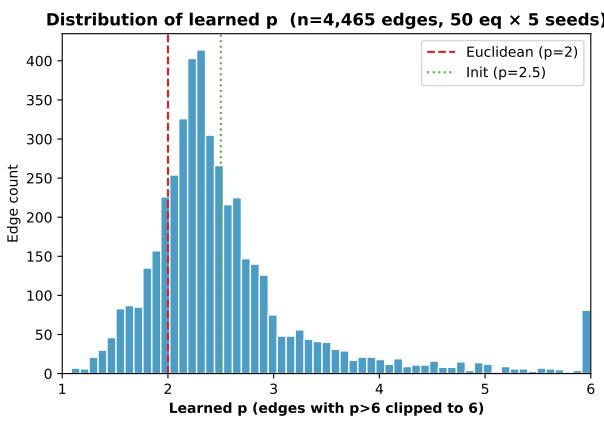

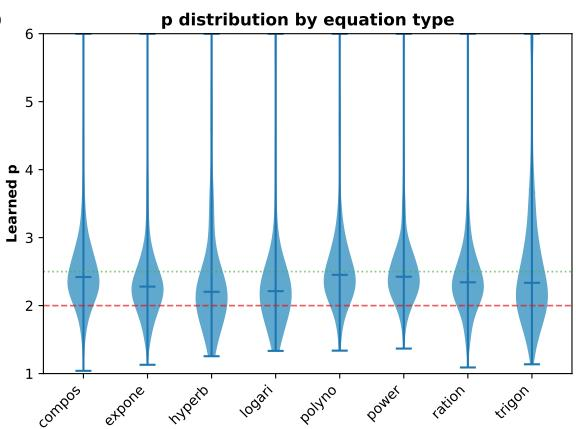  
Figure 5: Distribution of learned exponents p across 4,465 Banach-KAN edges, broken out by input dimension.

Table 25: Fraction of edges with $p < 2$ and edge counts by dimension.
<table><tr><td>Dimension</td><td>2D</td><td>3D</td><td>4D</td><td>5D</td><td>6D</td></tr><tr><td>Edge count</td><td>525</td><td>1,275</td><td>1,040</td><td>1,320</td><td>305</td></tr><tr><td>Fraction with  $p < 2 \ ( \% )$ </td><td>11</td><td>15</td><td>16</td><td>29</td><td>34</td></tr><tr><td>Fraction with  $p < 1 . 5 ~ \ : ( \% )$ </td><td>1.2</td><td>1.4</td><td>1.8</td><td>4.0</td><td>5.4</td></tr></table>

Within-run specialisation. In $7 7 \%$ of training runs the within-run standard deviation of learned p across edges exceeds 0.5, confirming that distinct edges converge to distinct geometries rather than collapsing to a shared value. By equation type, hyperbolic (31%), logarithmic (28%), and trigonometric (26%) equations push edges toward $p < 2$ , while polynomial (11%) and power (9%) equations keep most edges above 2.

Mean learned $p$ by equation type. Aggregate means obscure the within-type spread documented above (Table 26).  
Table 26: Learned exponent p aggregated by equation type (Banach-KAN, 50 equations, clean data).
<table><tr><td>Equation type</td><td>Mean  $p$ </td><td> $\mathrm { S t d }$ </td><td>Range</td></tr><tr><td>Trigonometric</td><td>2.73</td><td>1.49</td><td>1.14-22.2</td></tr><tr><td>Polynomial</td><td>2.64</td><td>0.86</td><td>1.34-9.0</td></tr><tr><td>Power</td><td>2.61</td><td>0.80</td><td>1.37–8.2</td></tr><tr><td>Compositional</td><td>2.63</td><td>0.92</td><td>1.04-11.1</td></tr><tr><td>Rational</td><td>2.50</td><td>0.85</td><td>1.09-10.3</td></tr><tr><td>Exponential</td><td>2.49</td><td>2.01</td><td>1.13-53.2</td></tr><tr><td>Logarithmic</td><td>2.46</td><td>1.00</td><td>1.33-8.4</td></tr><tr><td>Hyperbolic</td><td>2.60</td><td>1.82</td><td>1.26-15.8</td></tr></table>

Stability under noise. Mean learned $p$ across 18 equations is stable as $\sigma$ grows (Table 27); the standard deviation widens only slightly.

Table 27: Mean learned $p$ across 18 equations at each noise level (with std across equations).
<table><tr><td> $\sigma$   $\ell ^ { p \ }$ </td><td>mean  $p$ </td><td> $\ell ^ { p \ }$  std</td><td>Banach mean  $p$ </td><td>Banach std</td></tr><tr><td>0.0</td><td>2.50</td><td>0.15</td><td>2.56</td><td>0.15</td></tr><tr><td>0.1</td><td>2.49</td><td>0.16</td><td>2.59</td><td>0.14</td></tr><tr><td>0.3</td><td>2.52</td><td>0.18</td><td>2.63</td><td>0.14</td></tr><tr><td>0.5</td><td>2.51</td><td>0.18</td><td>2.64</td><td>0.16</td></tr><tr><td>1.0</td><td>2.61</td><td>0.19</td><td>2.74</td><td>0.19</td></tr></table>

Fixed vs learned $p$ (full per-equation, clean). For ℓp-KAN with frozen p vs learned $p$ on 18 equations under clean data, learned $p$ wins 17/18 outright. The single fixed-p win lands on I.29.16 Cosines, where $p = 3 . 0$ achieves 0.269 vs. learned at 0.283 (within 5%).

Table 28: ℓp-KAN fixed-p vs learned-p NRMSE per equation (clean, n = 500). Best per row in bold.
<table><tr><td>#</td><td>Equation</td><td> $\mathrm { T y p e }$ </td><td>d</td><td> $p { = } 1 . 5$ </td><td> $p { = } 2 . 0$ </td><td> $p { = } 2 . 5$ </td><td> $p { = } 3 . 0$ </td><td> $p { = } 4 . 0$ </td><td>Learned</td></tr><tr><td>1</td><td>I.12.1</td><td>poly</td><td>2</td><td>0.081</td><td>0.266</td><td>0.025</td><td>0.048</td><td>0.046</td><td>0.018</td></tr><tr><td>2</td><td>I.14.4</td><td>poly</td><td>2</td><td>0.080</td><td>0.351</td><td>0.031</td><td>0.026</td><td>0.044</td><td>0.022</td></tr><tr><td>3</td><td>1.25.13</td><td>rat</td><td>2</td><td>0.083</td><td>0.405</td><td>0.097</td><td>0.070</td><td>0.076</td><td>0.042</td></tr><tr><td>4</td><td>I.34.14</td><td>pow</td><td>3</td><td>0.102</td><td>0.213</td><td>0.097</td><td>0.088</td><td>0.109</td><td>0.055</td></tr><tr><td>5</td><td>I.14.3</td><td>poly</td><td>3</td><td>0.120</td><td>0.376</td><td>0.116</td><td>0.099</td><td>0.109</td><td>0.061</td></tr><tr><td>6</td><td>I.18.12</td><td>trig</td><td>3</td><td>0.233</td><td>0.714</td><td>0.182</td><td>0.187</td><td>0.171</td><td>0.157</td></tr><tr><td>7</td><td>I.34.10</td><td>rat</td><td>3</td><td>0.109</td><td>0.284</td><td>0.132</td><td>0.127</td><td>0.100</td><td>0.069</td></tr><tr><td>8</td><td>I.47.23</td><td>pow</td><td>3</td><td>0.092</td><td>0.289</td><td>0.108</td><td>0.102</td><td>0.110</td><td>0.039</td></tr><tr><td>9</td><td>III.17.37</td><td>trig</td><td>3</td><td>0.386</td><td>0.929</td><td>0.237</td><td>0.205</td><td>0.207</td><td>0.134</td></tr><tr><td>10</td><td>I.8.14</td><td>comp</td><td>4</td><td>0.649</td><td>1.009</td><td>0.303</td><td>0.323</td><td>0.346</td><td>0.240</td></tr><tr><td>11</td><td>I.13.4</td><td>poly</td><td>4</td><td>0.138</td><td>0.295</td><td>0.054</td><td>0.062</td><td>0.091</td><td>0.047</td></tr><tr><td>12</td><td>I.29.16</td><td>comp</td><td>4</td><td>0.416</td><td>0.904</td><td>0.275</td><td>0.269</td><td>0.406</td><td>0.283</td></tr><tr><td>13</td><td>III.4.32</td><td>exp</td><td>4</td><td>0.171</td><td>0.566</td><td>0.284</td><td>0.229</td><td>0.202</td><td>0.087</td></tr><tr><td>14</td><td>I.12.11</td><td>trig</td><td>5</td><td>0.292</td><td>0.606</td><td>0.250</td><td>0.275</td><td>0.235</td><td>0.159</td></tr><tr><td>15</td><td>I.44.4</td><td>log</td><td>5</td><td>0.245</td><td>0.611</td><td>0.330</td><td>0.270</td><td>0.219</td><td>0.104</td></tr><tr><td>16</td><td>II.35.21</td><td>hyp</td><td>5</td><td>0.185</td><td>0.370</td><td>0.196</td><td>0.220</td><td>0.226</td><td>0.150</td></tr><tr><td>17</td><td>III.14.14</td><td>exp</td><td>5</td><td>0.306</td><td>0.615</td><td>0.367</td><td>0.330</td><td>0.388</td><td>0.190</td></tr><tr><td>18</td><td>I.40.1</td><td>exp</td><td>6</td><td>0.272</td><td>0.561</td><td>0.267</td><td>0.253</td><td>0.267</td><td>0.212</td></tr></table>

The fixed $p = 2$ column (Euclidean) is consistently the worst choice, confirming that the departure from Hilbert geometry is beneficial.

## I Pendulum interpretability case study

As an illustrative interpretability experiment, we consider the nonlinear correction to the small-angle pendulum period. With $T = 4 \sqrt { L / g } K ( \sin ^ { 2 } ( \theta _ { 0 } / 2 ) )$ and $T _ { 0 } = 2 \pi \sqrt { L / g }$ , the correction factor $R ( \theta _ { 0 } ) =$ $T / T _ { 0 } = ( 2 / \pi ) K ( \sin ^ { 2 } ( \theta _ { 0 } / 2 ) )$ is smooth, monotone, and has a logarithmic singularity as $\theta _ { 0 } \to \pi .$

Visual comparison: spline vs. $J _ { p }$ on the pendulum target. Figure 6 contrasts how a small B-spline stack and a small $J _ { p } .$ -stack approximate $R ( \theta _ { 0 } )$ when trained on [0.01, 2.0] at $n = 5 0 0$ and asked to extrapolate on (2.0, 2.8] toward the singularity at $\theta _ { 0 } = \pi$ . The spline (a local basis tied to its grid) collapses past the training boundary because the basis carries no information about behaviour outside the grid; the $J _ { p } .$ -stack (a global functional form parameterised by $p )$ extrapolates with the correct power-law shape because the activation itself encodes the singular geometry. The same contrast appears at a cusp $f ( x ) = \mathrm { s i g n } ( x ) | x | ^ { 0 . 7 }$ where a single $J _ { p }$ edge with learned $p \approx 1 . 7$ reproduces the cusp exactly while the spline rounds it. The figure uses parameter-matched pedagogical implementations (a few-edge spline stack and a few-edge $J _ { p }$ stack) rather than the full pykan $/$ Banach-KAN architectures of Tables 29–30, so the absolute extrapolation NRMSE values shown in the legend are larger than those reported in the tables; the qualitative gap between local and global parameterisations is the point.

Setup. Two formulations: 1D $( \theta _ { 0 } \to R )$ and 3D $( ( L , g , \theta _ { 0 } ) \to T )$ . Three regimes: interpolation on [0.01, 2.8], extrapolation (train on [0.01, 2.0], test on [2.0, 2.8]), and noise on the interpolation regime.

1D interpolation. ℓp-KAN dominates at every sample size (Table 29), achieving NRMSE 0.0012 at $n = 5 0 0 \mathrm { - \ a }$ relative error below 0.2%.

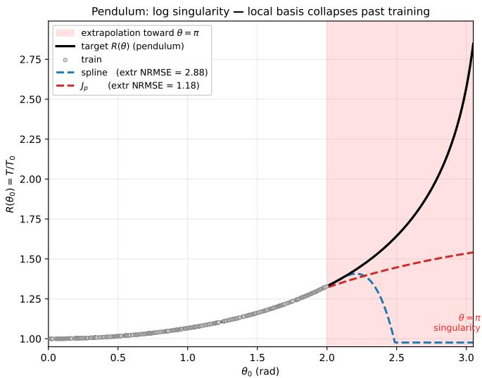

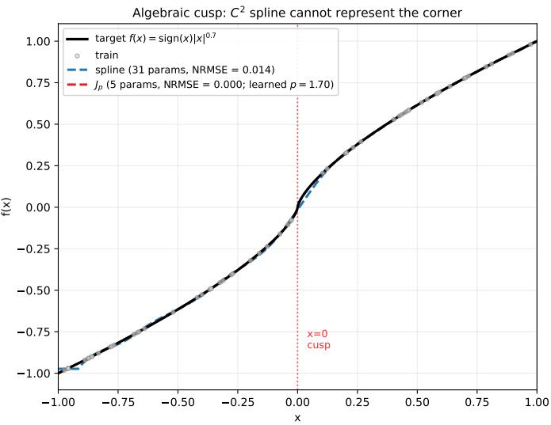  
Figure 6: Two regularity-mismatch failure modes for fixed bases (parameter-matched pedagogical models; train $[ 0 . 0 1 , 2 . 0 ]$ at $n = 5 0 0$ , extrapolate on (2.0, 2.8]). Left: pendulum correction $R ( \theta _ { 0 } )$ with a log singularity at $\theta _ { 0 } = \pi$ . The spline (blue) extrapolates flat past the training interval; the $J _ { p } .$ -stack (red) extrapolates with the correct power-law shape. Extrapolation NRMSE is reported in the legend; absolute values exceed those in Table 30 because of the smaller per-edge parameter budget used here for visual clarity, but the relative ordering matches the full experiments. Right: algebraic cusp $f ( x ) = \mathrm { s i g n } ( x ) | x | ^ { 0 . 7 }$ . A single $J _ { p }$ edge with learned $p \approx 1 . 7$ recovers the cusp; a same-budget spline cannot.

Table 29: 1D pendulum interpolation NRMSE (median over 5 seeds).
<table><tr><td>n</td><td>Spline G=3</td><td>Tanh</td><td>Banach</td><td> $\ell ^ { p \ }$ </td><td>MLP</td></tr><tr><td>50</td><td>0.0066</td><td>0.0053</td><td>0.0032</td><td>0.0025</td><td>0.0136</td></tr><tr><td>100</td><td>0.0031</td><td>0.0043</td><td>0.0029</td><td>0.0018</td><td>0.0130</td></tr><tr><td>200</td><td>0.0018</td><td>0.0038</td><td>0.0031</td><td>0.0013</td><td>0.0090</td></tr><tr><td>500</td><td>0.0015</td><td>0.0044</td><td>0.0024</td><td>0.0012</td><td>0.0068</td></tr><tr><td>1000</td><td>0.0015</td><td>0.0043</td><td>0.0023</td><td>0.0014</td><td>0.0063</td></tr></table>

1D extrapolation. Banach-KAN dominates the out-of-distribution regime, despite training only on [0.01, 2.0].

Table 30: 1D pendulum extrapolation NRMSE (train on [0.01, 2.0], test on [2.0, 2.8]).
<table><tr><td>n</td><td>Spline G=3</td><td>Tanh</td><td>Banach</td><td> $\ell ^ { p \ }$ </td><td>MLP</td></tr><tr><td>200</td><td>0.675</td><td>1.139</td><td>0.364</td><td>0.394</td><td>0.907</td></tr><tr><td>500</td><td>0.708</td><td>1.132</td><td>0.356</td><td>0.390</td><td>0.868</td></tr><tr><td>1000</td><td>0.690</td><td>1.130</td><td>0.348</td><td>0.394</td><td>0.881</td></tr></table>

The Tanh and MLP baselines exceed NRMSE 1 (worse than mean prediction) on extrapolation. Spline reaches ∼ 0.7. Banach’s dual-geometry composition transfers best to the unseen near-singularity region.

Learned exponents. For Banach-KAN on 1D pendulum, the learned p across 5 seeds is $2 . 9 \pm 0 . 1$ (mean), with individual edges ranging from 2.3 to 4.9. This is consistent with the regularity structure of $K ( m )$ near the upper training boundary.

Connection to $K ( m )$ singularity. $\begin{array} { r } { K ( m ) \sim \frac { 1 } { 2 } \log ( 4 / ( 1 - m ) ) } \end{array}$ as $m \to 1$ , so with $m = \sin ^ { 2 } ( \theta _ { 0 } / 2 )$ and $\varepsilon = \pi - \theta _ { 0 }$

$$
1 - m = \cos ^ { 2 } ( \theta _ { 0 } / 2 ) \sim \varepsilon ^ { 2 } / 4 , \qquad K ( m ) \sim \log ( 4 / \varepsilon ) , \qquad R ( \theta _ { 0 } ) \sim ( 2 / \pi ) \log ( 4 / \varepsilon ) .
$$

Derivatives near $\theta _ { 0 } = \pi \colon R ^ { \prime } ( \theta _ { 0 } ) \sim ( 1 / \pi ) \log ( 4 / \varepsilon ) / \varepsilon$ and $R ^ { \prime \prime } ( \theta _ { 0 } ) \sim ( 1 / \pi ) ( 1 + \log ( 4 / \varepsilon ) ) / \varepsilon ^ { 2 }$ . At the upper training boundary $\theta _ { 0 } = 2 . 8 , \varepsilon = 0 . 3 4 , R ^ { \prime \prime } \sim 9 . 5$ —bounded but large. Although R is $C ^ { \infty }$ on [0.01, 2.8], derivatives scale as $\varepsilon ^ { - k } \log ( 1 / \varepsilon )$ , controlled by the distance to the singularity. The local Hölder-like exponent of R near the boundary is encoded in this distance-to-singularity structure. The activation $J _ { p } ( z ) = \mathrm { s i g n } ( z ) | z | ^ { p - 1 }$ has nonlinearity order $p - 1$ . For $R \mathrm { { : } } \mathrm { { s } }$ local behaviour $( \log ( 1 / \varepsilon ) / \varepsilon$ , a composite of log and inverse-power), the optimal $p$ would satisfy $p - 1 \sim \alpha$ for some efective regularity exponent α that absorbs the log factor; the observed $p \approx 2 . 9$ is consistent with this picture. We frame the precise approximation-theoretic derivation as an open problem.

## J PMLB tabular benchmark: additional notes

The per-dataset table is reported in Table 9. Two additional observations not in the main paper:

• Learned p clusters around 2.5–3.0 across PMLB datasets, with the environmental dataset pushing higher $( p \approx 3 . 9 )$ , consistent with smoother target functions favouring higher-order polynomial growth.

• The dominance of Tanh-KAN on tabular data suggests Orlicz geometry is suficient when compositional structure is weak; $\ell ^ { p \ }$ and hybrid geometries provide their largest advantages in structured scientific settings.

## K Memorisation and edge-expressivity toy experiments

To complement the symbolic regression results, four toy memorisation tasks evaluate noise robustness on synthetic targets: $\exp ( \sin x _ { 1 } + x _ { 2 } ^ { 2 } ) , J _ { 0 } ( 2 0 x )$ (Bessel), $x _ { 1 } x _ { 2 }$ (multiplication), and a 4D compositional target. Across these tasks Tanh-KAN, Banach-KAN, and Spline-KAN show the same pattern as on Feynman:

• No universal winner across all four; the choice depends on smoothness and dimensionality.

• Banach-KAN is the best all-rounder at moderate-to-large data sizes.

• Tanh-KAN outperforms Spline on noisy 2D and 3D targets, consistent with the implicit-regularisation reading.

The edge-expressivity ablation fits a single learnable activation to four univariate targets (sigmoid, cubic, scaled Bessel $J _ { 0 }$ , and an exponential). Banach-KAN reproduces all four $( \mathrm { N R M S E } < 0 . 0 4$ on each), while $\ell ^ { p _ { . } }$ KAN succeeds on the two power-law-shaped targets and underperforms on the bounded sigmoid—providing a geometric explanation for the conjunction story: the tanh branch is needed precisely when the target saturates.

## L Full benchmark (50 equations)

The first 18 equations form the core subset used for noise, small-sample, dissection, and fixed-p ablations; all 50 are used for the clean baseline. Of the 50 equations, 40 are taken from the AI Feynman benchmark [21] with the original equation IDs preserved (so that the formula at any I.#.# / II.#.# / III.#.# entry matches the corresponding Feynman entry verbatim); the remaining 10 entries (prefixed F.) are synthetic stress-test targets we constructed to broaden coverage of the polynomial, trigonometric, exponential, logarithmic, hyperbolic and compositional types in 3–6D.

Table 31: All 50 benchmark equations. Entries with IDs I.#.#, II.#.#, III.#.# are taken from [21]; entries prefixed F. are synthetic stress-test targets we constructed for this work. “Core” denotes membership in the 18-equation subset.
<table><tr><td> $\#$ </td><td>ID</td><td>Name</td><td>Type</td><td>d</td><td>Formula</td><td>Core</td></tr><tr><td>1</td><td>I.12.1</td><td>Coulomb (linear)</td><td>poly</td><td>2</td><td> $\mu N$ </td><td></td></tr><tr><td>2</td><td>I.14.4</td><td>Spring energy</td><td>poly</td><td>2</td><td> $\scriptstyle { \frac { 1 } { \sqrt { \frac { 1 } { 2 } } k x ^ { 2 } } }$ </td><td></td></tr><tr><td>3</td><td>I.25.13</td><td>Capacitor voltage</td><td>rat</td><td></td><td> $\bar { \boldsymbol q } / C$ </td><td></td></tr><tr><td>4</td><td>I.34.14</td><td>Relativistic Doppler</td><td>pow</td><td></td><td> $\omega \sqrt { ( 1 + v / c ) / ( 1 - v / c ) }$ </td><td></td></tr><tr><td>5</td><td>I.14.3</td><td>Gravitational PE</td><td>poly</td><td></td><td>mgz</td><td></td></tr><tr><td>6</td><td>I.18.12</td><td>Torque</td><td>trig</td><td></td><td> $r F \sin \theta$ </td><td></td></tr><tr><td>7</td><td>I.34.10</td><td>Doppler effect</td><td>rat</td><td></td><td> $\omega _ { 0 } / ( 1 - v / c )$ </td><td></td></tr><tr><td>8</td><td>I.47.23</td><td>Speed of sound</td><td>pow</td><td></td><td> $\sqrt { \gamma p / \rho }$ </td><td></td></tr><tr><td>9</td><td>III.17.37</td><td>Angular distribution</td><td>trig</td><td></td><td> $\beta ( 1 + \alpha \cos \theta )$ </td><td></td></tr><tr><td>10</td><td>I.8.14</td><td>Euclidean distance</td><td>comp</td><td></td><td> $\sqrt { ( x _ { 2 } - x _ { 1 } ) ^ { 2 } + ( y _ { 2 } - y _ { 1 } ) ^ { 2 } }$ </td><td></td></tr><tr><td>11</td><td>I.13.4</td><td>Kinetic energy</td><td>poly</td><td></td><td> $\textstyle { \frac { 1 } { 2 } } m ( v ^ { 2 } + u ^ { 2 } + w ^ { 2 } )$ </td><td></td></tr><tr><td>12</td><td>I.29.16</td><td>Law of cosines</td><td>comp</td><td></td><td> $\sqrt { x _ { 1 } ^ { 2 } + x _ { 2 } ^ { 2 } - 2 x _ { 1 } x _ { 2 } \cos ( t _ { 1 } - t _ { 2 } ) }$ </td><td></td></tr><tr><td>13</td><td>III.4.32</td><td>Bose-Einstein</td><td>exp</td><td></td><td> $\dot { 1 } / ( \mathrm { e x p } ( h \omega / 2 \pi k _ { B } T ) - 1 )$ </td><td></td></tr><tr><td>14</td><td>I.12.11</td><td>Lorentz force</td><td>trig</td><td></td><td> $q ( E _ { f } + B v \sin \theta )$ </td><td></td></tr><tr><td>15</td><td>I.44.4</td><td>Entropy change</td><td>log</td><td></td><td> $n k _ { B } T \ln ( V _ { 2 } / V _ { 1 } )$ </td><td></td></tr><tr><td>16</td><td>II.35.21</td><td>Magnetisation</td><td>hyp</td><td></td><td> $n _ { \rho } \mu \operatorname { t a n h } ( \mu B / k _ { B } T )$ </td><td></td></tr><tr><td>17</td><td>III.14.14</td><td>Diode equation</td><td>exp</td><td></td><td> $I _ { 0 } ( \exp ( q V / k _ { B } T ) - 1 )$ </td><td></td></tr><tr><td>18</td><td>I.40.1</td><td>Barometric formula</td><td>exp</td><td></td><td> $n _ { 0 } \exp ( - m g x / k _ { B } T )$ </td><td></td></tr><tr><td>19</td><td>II.6.15a</td><td>Dipole field</td><td>trig</td><td></td><td> $p \cos \theta / r ^ { 2 }$ </td><td></td></tr><tr><td>20</td><td>I.12.4</td><td>Electric field</td><td>rat</td><td>2</td><td> $q / r ^ { 2 }$ </td><td></td></tr><tr><td>21</td><td>I.10.7</td><td>Relativistic mass</td><td>pow</td><td>2</td><td> $m _ { 0 } / \sqrt { 1 - \beta ^ { 2 } }$ </td><td></td></tr><tr><td>22</td><td>I.6.20a</td><td>Normal distribution</td><td>exp</td><td>2</td><td> $e ^ { - \theta ^ { 2 } / 2 \sigma ^ { 2 } } / ( \sqrt { 2 \pi } \sigma )$ </td><td></td></tr><tr><td>23</td><td>F.43</td><td>Velocity correction</td><td>poly</td><td>3</td><td> $\boldsymbol { v } + \boldsymbol { u } + \alpha \boldsymbol { v } \boldsymbol { u }$ </td><td></td></tr><tr><td>24</td><td>I.16.6</td><td>Velocity addition</td><td>rat</td><td>3</td><td> $( u + v ) / ( 1 + u v / c ^ { 2 } )$ </td><td></td></tr><tr><td>25</td><td>I.27.6</td><td>Thin lens</td><td>rat</td><td></td><td> $1 / ( 1 / d _ { 1 } + n / d _ { 2 } )$ </td><td></td></tr><tr><td>26</td><td>II.2.42</td><td>Heat conduction</td><td>rat</td><td></td><td> $\kappa \Delta T / d$ </td><td></td></tr><tr><td>27</td><td>II.15.4</td><td>Magnetic PE</td><td>trig</td><td></td><td> $\mu B \cos \theta$ </td><td></td></tr><tr><td>28</td><td>III.15.12</td><td>Tight binding</td><td>trig</td><td></td><td> $2 U ( 1 - \cos ( k d ) )$ </td><td></td></tr><tr><td>29</td><td>I.18.16</td><td>Angular momentum</td><td>trig</td><td>4</td><td> $m r v \sin \theta$ </td><td></td></tr><tr><td>30</td><td>II.11.17</td><td>Density fluctuation</td><td>trig</td><td>4</td><td> $n _ { 0 } ( 1 + p _ { d } \cos \theta / k _ { B } T )$ </td><td></td></tr><tr><td>31</td><td>I.37.4</td><td>Interference</td><td>comp</td><td>3</td><td> $I _ { 1 } + I _ { 2 } + 2 \sqrt { I _ { 1 } I _ { 2 } } \cos \delta$ </td><td></td></tr><tr><td>32</td><td>I.26.2</td><td>Snell&#x27;s law</td><td>trig</td><td></td><td> $\arcsin ( n \sin \theta )$ </td><td></td></tr><tr><td>33</td><td>F.33</td><td>Mixed trig product</td><td>trig</td><td></td><td> $a b c \sin \theta \cos \phi$ </td><td></td></tr><tr><td>34</td><td>F.34</td><td>Phase-shift product</td><td>trig</td><td></td><td> $a b \sin ( \phi _ { 1 } + \phi _ { 2 } ) c$ </td><td></td></tr><tr><td>35</td><td>III.10.19</td><td>Magnetic moment</td><td>comp</td><td></td><td> $\mu \sqrt { B _ { x } ^ { 2 } + B _ { y } ^ { 2 } + B _ { z } ^ { 2 } }$ </td><td></td></tr><tr><td>36</td><td>I.15.3t</td><td>Lorentz time</td><td>comp</td><td></td><td> $( t - u x / c ^ { 2 } ) / \sqrt { 1 - u ^ { 2 } / c ^ { 2 } }$ </td><td></td></tr><tr><td>37</td><td>I.24.6</td><td>Oscillator energy</td><td>poly</td><td></td><td> $\frac { 1 } { 4 } m ( \omega ^ { 2 } + \omega _ { 0 } ^ { 2 } ) \overline { { x ^ { 2 } } }$ </td><td></td></tr><tr><td>38</td><td>I.18.4</td><td>Centre of mass</td><td>rat</td><td></td><td> $\large ( m _ { 1 } r _ { 1 } + m _ { 2 } r _ { 2 } \large ) / ( m _ { 1 } + m _ { 2 } )$ </td><td></td></tr><tr><td>39</td><td>I.13.12</td><td>Grav. PE difference</td><td>rat</td><td></td><td> $G m _ { 1 } m _ { 2 } ( 1 / r _ { 2 } - 1 / r _ { 1 } )$ </td><td></td></tr><tr><td>40</td><td>F.40</td><td>Inverse-sqrt field</td><td>comp</td><td></td><td> $q k / \sqrt { r _ { 1 } ^ { 2 } + r _ { 2 } ^ { 2 } }$ </td><td></td></tr><tr><td>41</td><td>I.39.11</td><td>Polytropic energy</td><td>rat</td><td></td><td> $p V / ( \gamma - 1 )$ </td><td></td></tr></table>

<table><tr><td>#</td><td>ID</td><td>Name</td><td>Type</td><td>d</td><td>Formula</td></tr><tr><td>42</td><td>I.48.20</td><td>Relativistic energy</td><td>pow</td><td>3</td><td> $m c ^ { 2 } / \sqrt { 1 - v ^ { 2 } / c ^ { 2 } }$ </td></tr><tr><td>43</td><td>II.11.27</td><td>Boltzmann factor</td><td>exp</td><td>4</td><td> $n _ { 0 } \exp ( - \mu E _ { f } / k _ { B } T )$ </td></tr><tr><td>44</td><td>F.44</td><td>Fermi-Dirac</td><td>exp</td><td>4</td><td> $1 / ( \exp ( E \hbar / \dot { k } _ { B } T ) + 1 )$ </td></tr><tr><td>45</td><td>F.45</td><td>Saturating exp.</td><td>exp</td><td>3</td><td> $A ( 1 - \exp ( - t / \tau ) )$ </td></tr><tr><td>46</td><td>F.46</td><td>Saturating response</td><td>hyp</td><td>5</td><td> $n \mu \operatorname { t a n h } ( \overrightarrow { B } / k _ { B } \dot { T } )$ </td></tr><tr><td>47</td><td>F.31</td><td>Polarisation</td><td>rat</td><td>5</td><td> $q E _ { f } / ( m ( \omega _ { 0 } ^ { 2 } - \omega ^ { 2 } ) )$ </td></tr><tr><td>48</td><td>F.48</td><td>Nested logarithm</td><td>log</td><td>5</td><td> $n \dot { \ln } ( 1 + E \breve { V } / k _ { B } T )$ </td></tr><tr><td>49</td><td>F.49</td><td>6D multiplicative</td><td>exp</td><td>6</td><td> $n _ { 0 } A \exp ( - m g / k _ { B } T )$ </td></tr><tr><td>50</td><td>III.21.1</td><td>Current density</td><td>poly</td><td>5</td><td> $\rho q A v / m$ </td></tr></table>

## M Budget-matched reproduction of Figure 1

Figure 1 fixes every column at a matched 21-parameter budget; Table 32 sweeps that budget to {13, 21, 41, 125} parameters under the same noisy protocol $( \sigma = 0 . 0 3 , N = 2 0 0 0$ , seed 1729). On the Heaviside step the geometry-adaptive edge sits at the noise floor and beats every smooth basis at every budget; a Haar wavelet, whose piecewise-constant geometry matches a step exactly, is indistinguishable from it there. On the five-level staircase the geometry edge instead scales with budget (0.177 at $\mathrm { 1 3 p  0 . 1 2 4 }$ at $2 1 \mathrm { p }  0 . 0 9 0$ at 125p, vs. B-spline 0.135 and RBF 0.141 at 21p), while Haar loses the staircase (0.177 at 21p)—no single fixed geometry is uniformly appropriate.

Table 32: Heaviside step, NRMSE by parameter budget (seed 1729). The geometry-adaptive edge is budget-invariant at the noise floor; smooth bases need budget to catch up.
<table><tr><td>Basis</td><td>K=12</td><td>K=21</td><td>K=42</td><td>K=126</td></tr><tr><td>geometry-adaptive edge</td><td>0.059</td><td>0.059</td><td>0.059</td><td>0.059</td></tr><tr><td>Haar wavelet</td><td>0.064</td><td>0.063</td><td>0.063</td><td>0.062</td></tr><tr><td>B-spline</td><td>0.201</td><td>0.173</td><td>0.109</td><td>0.078</td></tr><tr><td>RBF</td><td>0.186</td><td>0.163</td><td>0.108</td><td>0.079</td></tr><tr><td>Fourier</td><td>0.267</td><td>0.211</td><td>0.156</td><td>0.103</td></tr></table>

## N Tied-afine exact-duality variant

The tied-afine edge shares one $( w , b )$ between the tanh and $J _ { p }$ branches (6 parameters/edge) and is the exact $\nabla ( \Psi _ { 1 } + \Psi _ { 2 } )$ variant; the reported model uses independent afines (Section 3.3). Table 33 compares the three (they compete only against each other, which is why Banach-independent’s small-sample count difers from Table 6). The exact-duality construction is competitive—matching or beating the independent form at moderate noise and degrading more gently—but trails on clean and small-sample data, so we report the independent form.

Table 33: Tied- vs. independent-afine (median NRMSE); “Degr.” is the σ=0 → 1 ratio, “Small-sample” wins out of 90.
<table><tr><td>Model</td><td>σ=0</td><td>σ=0.3</td><td>σ=1.0</td><td>Degr.</td><td>Small-sample/90</td></tr><tr><td>Banach independent (8/edge)</td><td>0.029</td><td>0.095</td><td>0.259</td><td>8.9×</td><td>55</td></tr><tr><td>Banach tied  $\left( 6 / \mathrm { e d g e } \right)$ </td><td>0.034</td><td>0.096</td><td>0.274</td><td>8.0×</td><td>17</td></tr><tr><td>Banach tied,  $C ^ { 1 } ~ ( 6 / \mathrm { e d g e } )$ </td><td>0.034</td><td>0.092</td><td>0.269</td><td>7.8×</td><td>18</td></tr></table>