# How Edge of Stability Hinders SCAFFOLD in Federated Optimization

Anant Khandelwal<sup>1,∗</sup>, Michael Crawshaw<sup>2,3,∗</sup>, Mingrui Liu<sup>2</sup>

<sup>1</sup>Georgia Institute of Technology, College of Computing

<sup>2</sup>George Mason University, Department of Computer Science

<sup>3</sup>Flatiron Institute, Center for Computational Mathematics

akhandelwal79@gatech.edu, michael.crawshaw.4@gmail.com, mingruil@gmu.edu

## Abstract

In federated learning, it is well known that heterogeneous data can (in theory) slow down optimization, and much effort has been directed at designing optimization algorithms that are unafected by data heterogeneity, such as the SCAF-FOLD algorithm. Yet, despite strong theoretical guarantees, SCAFFOLD does not usually outperform the much simpler FedAvg in practice. In this work, we propose that this gap is due to the presence of Edge of Stability (EoS) and progressive sharpening in federated optimization, supported by extensive empirical probing. First, we find that EoS-like dynamics occur with both FedAvg and SCAFFOLD under a variety of architectures and hyperparameters. We observe that the equilibrium value of the sharpness is inversely proportional to the learning rate (as in GD), and interestingly, the degree of data heterogeneity (but not the number of local steps) also affects the equilibrium value. Most importantly, we observe that SCAFFOLD’s ability to estimate the gradient of the global objective is severely degraded at the EoS, as measured by the correlation between sharpness and SCAFFOLD’s error in estimating the global gradient along the optimization trajectory. This suggests a mechanism for SCAFFOLD’s lackluster performance in deep learning: with high sharpness at the EoS, SCAFFOLD cannot reliably estimate the global gradient.

## 1 Introduction

Federated learning is a paradigm for machine learning in which many separate machines (often user devices) communicate over a network to collaboratively train a machine learning model, which leverages hardware and data from many devices while preserving privacy (McMahan et al. 2017; Kairouz et al. 2021; Wang et al. 2021). However, the federated optimization process can be slowed down when user data exhibits large heterogeneity across devices, and indeed for standard algorithms like FedAvg (McMahan et al. 2017), the theoretical convergence rate slows as user data becomes more heterogeneous (Woodworth, Patel, and Srebro 2020; Koloskova et al. 2020).

The SCAFFOLD algorithm (Karimireddy et al. 2020) was introduced to eliminate this slowdown from heterogeneous data, by using control variates to estimate the gradient of the global objective via gradients from previous communication rounds. In theory, SCAFFOLD enjoys a convergence rate that is independent of data heterogeneity, which suggests that SCAFFOLD should be a strict improvement over FedAvg. However, it has been observed that in deep learning, SCAFFOLD’s performance is lacking compared to the theoretical bounds (Yu et al. 2022; Li et al. 2023; Baumgart et al. 2024). Indeed, in practice FedAvg is "unreasonably effective" (Wang et al. 2024; Patel et al. 2023) and remains preferred over SCAFFOLD. This discrepancy between theory and practice motivates our central question:

## Why does FedAvg match or outperform SCAFFOLD in practice, despite theory suggesting otherwise?

Yu et al. (2022) observe empirically that SCAFFOLD works well when training linear models, but doesn’t outperform FedAvg under the nonconvexity of training deep networks, and conclude that the existing "black-box" theory is insuficient for capturing the dificulty of training deep networks. Also, Wang et al. (2024) theoretically investigate the success of FedAvg through alternative assumptions on the objective heterogeneity. However, we are not aware of any work that proposes a mechanism which explains why SCAFFOLD’s optimization performance does not improve over FedAvg when training deep networks, despite theoretical guarantees.

In this paper, we conjecture that SCAFFOLD’s poor performance is due to the phenomena of progressive sharpening and Edge of Stability (EoS) (Cohen et al. 2021), in which the objective’s Hessian norm (sharpness) along the trajectory of Gradient Descent (GD) increases until equilibrating around 2/η (where η is the learning rate). Progressive sharpening tends to increase the sharpness up to a threshold that depends on η, while SCAFFOLD’s theoretical guarantees only apply in settings where the sharpness is a priori known to be bounded and the learning rate/number of local steps can be chosen using this bound.

We perform an extensive empirical probe to investigate our conjecture:

• We observe in Section 4.1 that, for image classification tasks, both FedAvg and SCAFFOLD exhibit progressive sharpening and EoS in terms of local objectives and global objectives. The occurrence is consistent across network architectures and optimizer hyperparameters.

• In Section 4.2, we find that the equilibrium sharpness for both FedAvg and SCAFFOLD is inversely proportional to the learning rate (similarly to GD), but also depends to a smaller degree on the severity of heterogeneity. Interestingly, the number of local steps does not influence the equilibrium sharpness, which eliminates the possibility of satisfying theoretical conditions for SCAFFOLD’s convergence when the number of local steps is large.

• We find in Section 4.3 that SCAFFOLD’s ability to mitigate data heterogeneity is significantly degraded at the EoS. We use a new metric, called the update misalignment, which measures the diference between an algorithm’s update compared to the gradient of the global objective. We find that SCAFFOLD’s update misalignment throughout training is strongly correlated with sharpness, supporting our conjectured connection between EoS and SCAFFOLD’s lackluster performance. Essentially, SCAFFOLD does not reliably estimate the global gradient when sharpness is high, while FedAvg’s update misalignment is relatively unafected by high sharpness.

Overall, our results suggest an explanation for the fact that SCAFFOLD does not improve over FedAvg in deep learning: both algorithms experience progressive sharpening and EoS, but under the resulting high sharpness, SCAFFOLD cannot reliably estimate the global gradient.

The rest of this paper is structured as follows. We discuss related work in Section 2, then review background and establish preliminaries in Section 3. Our main results are in Section 4, where we perform an experimental probe of EoS in federated learning, and we conclude with Section 5.

## 2 Related Work

## 2.1 Federated Learning and SCAFFOLD

Federated learning (McMahan et al. 2017) is a paradigm of machine learning in which a model is trained collaboratively across multiple machines, often with difering datasets, that communicate over a network. The practice has come into increasing use in tandem with the shift towards mobile devices, IoT sensors, and distributed systems. (Liu et al. 2024). The de facto standard optimization algorithm for federated learning is FedAvg a.k.a. Local SGD, which is a parallelized version of SGD in which multiple update steps are executed locally by each worker machine between synchronizations across all workers. The convergence behavior of FedAvg is well-studied (Stich 2019; Haddadpour and Mahdavi 2019; Woodworth, Patel, and Srebro 2020; Khaled, Mishchenko, and Richtárik 2020; Koloskova et al. 2020; Glasgow, Yuan, and Ma 2022), and in particular it is known that convergence can slow down as worker data becomes more heterogeneous.

SCAFFOLD (Karimireddy et al. 2020) was introduced to alleviate this problem: it provably solves various federated optimization problems (e.g. smooth, non-convex, stochastic, heterogeneous) with a rate that does not depend on data heterogeneity. This is achieved by the use of “gradient corrections", in which updates to local models use an approximation of the gradient of the global objective, rather than the gradient of the local objective as in FedAvg (see pseudocode in Algorithm 2). These gradient corrections are constructed using historical values of the gradient, and SCAFFOLD rests on the premise that gradients encountered in previous communication rounds will be a good estimate of gradients in the current round.

However, multiple works (Yu et al. 2022; Li et al. 2023; Baumgart et al. 2024) noted that SCAFFOLD can struggle when training deep neural networks. Both Yu et al. (2022) and Li et al. (2023) proposed variations of the SCAFFOLD algorithm that only apply gradient corrections to the final layer of a neural network, which empirically improve upon SCAF-FOLD. In an empirical comparison of federated optimization algorithms, Baumgart et al. (2024) found that SCAFFOLD fails in many cases, particularly with high heterogeneity, and fails catastrophically without gradient clipping.

On the theoretical side, Cheng et al. (2024) found that the use of momentum provably increases the rate of convergence for SCAFFOLD, and SCAFFOLD with momentum outperforms both FedAvg and SCAFFOLD. More recent analyses (Luo et al. 2025; Mangold et al. 2025) have focused on provable convergence guarantees under various convexity, smoothness, and heterogeneity assumptions (Luo et al. 2025) and fine-grained characterization of the limiting distribution of SCAFFOLD’s iterates (Mangold et al. 2025).

FedAvg, on the contrary, seems to perform well under heterogeneity, despite its lack of theoretical guarantees implying so. Wang et al. (2024) described this as the "unreasonable efectiveness" of FedAvg, and propose to explain the theory-practice gap with new theoretical conditions capturing heterogeneity near optima. Follow-up work (Patel et al. 2023) provided lower bounds which they argue rules out the heterogeneity conditions proposed by Wang et al. (2024) as a suficient explanation of this unreasonable efectiveness. A parallel line of work (Patel et al. 2022, 2024, 2026) investigates whether the success of FedAvg can be explained through higher-order smoothness and heterogeneity assumptions.

## 2.2 Edge of Stability

The Edge of Stability (EoS) (Cohen et al. 2021) is a phenomenon where the maximum eigenvalue of the Hessian (a.k.a. sharpness) gradually increases along the trajectory of gradient descent when training neural networks, until eventually equilibrating around the threshold 2/η, at which point the training loss exhibits oscillations in the short term while generally decreasing in the long term. The apparent dependence of the sharpness on the learning rate is a departure from smooth optimization theory, in which it is assumed that the sharpness is globally bounded, and the learning rate can be chosen in terms of this bound. The EoS phenomenon was first noticed for GD with a variety of architectures, hyperparameters, and datasets (Cohen et al. 2021), then extended to adaptive optimizers (Cohen et al. 2023) and clarified with the Central Flows framework (Cohen et al. 2025).

There are many works that analyze or propose explanations for EoS. Arora, Li, and Panigrahi (2022) showed that GD and normalized GD follow a flow on the manifold of minimizers in the direction that decreases sharpness, under certain general conditions on the loss. Other works have studied surrogate models of deep learning, such as 4-layer scalar networks (Zhu et al. 2023), one-neuron neural networks (Chen and Bruna 2023), diagonal linear networks (Even et al. 2023), and a two-parameter model of ReLU networks (Ahn et al. 2023). Notably, (Damian, Nichani, and Lee 2023) proved a self-stabilization efect for GD on general objectives with a progressive sharpening property, by using a third-order Taylor series analysis that demonstrates how regions of sharpness exceeding $2 / \eta$ tend to push the trajectory back into lower sharpness regions.

Our aim in this work is not to explain EoS, but rather to establish its occurrence and consequences in federated optimization. For a thorough review of the literature on this topic, see Cohen et al. (2025).

## 3 Preliminaries

We consider the federated optimization problem, consisting of M local objectives $f _ { i } : \mathbb { R } ^ { d } $ R, where the goal is to minimize the global objective $\begin{array} { r } { f ( w ) = \frac { 1 } { M } \sum _ { i = 1 } ^ { M } f _ { i } ( w ) } \end{array}$ . Each local objective corresponds to the loss for a single client in a collaborative federation, so the diferences in the data of clients can induce diferences in local objectives, which is called data heterogeneity. Large levels of heterogeneity can slow down optimization for FedAvg (Woodworth, Patel, and Srebro 2020), which is the de facto standard algorithm for federated optimization. See Algorithm 1 for the pseudocode of FedAvg.

SCAFFOLD SCAFFOLD (Karimireddy et al. 2020) (shown in Algorithm 2) was introduced to circumvent slow optimization under heterogeneous objectives. Under the assumption that each $f _ { i }$ is L-smooth (that is, $\Vert \nabla ^ { 2 } f _ { i } ( w ) \Vert \leq L$ for every w), and with an appropriate choice of hyperparameters, SCAFFOLD can solve the federated optimization problem with a convergence rate independent of heterogeneity, which is achieved through the use of control variates to estimate the gradient of the global objective.

Let $w _ { i } ^ { t , k }$ denote the local model of client i during the $k \mathrm { - }$ th local step of communication round t, and let $g _ { i } ^ { t , k }$ denote the gradient computed at $w _ { i } ^ { t , k }$ . SCAFFOLD constructs a control variate $\begin{array} { r } { c _ { i } ^ { t } = \frac { 1 } { K } \sum _ { k = 0 } ^ { K - 1 } g _ { i } ^ { t - 1 , k } } \end{array}$ , i.e. the average of the gradients of $f _ { i }$ computed during communication round $t - 1 .$ then computes an average control variate $\begin{array} { r } { c ^ { t } = \frac { 1 } { M } \sum _ { i = 1 } ^ { M } c _ { i } ^ { t } . } \end{array}$ During local step k of round t, instead of updating each local model in the direction $g _ { i } ^ { t , k }$ (as in FedAvg), SCAFFOLD updates in the direction $g _ { i } ^ { t , k } - c _ { i } ^ { t } + c ^ { t }$ . This update direction approximates the global gradient; the key is that gradients from the previous round are representative of gradients in the current round, as long as each $f _ { i }$ is L-smooth and we choose the stepsize $\eta \le \bar { \mathcal { O } } ( 1 / K L )$ (see e.g. Theorem III of (Karimireddy et al. 2020)).

SCAFFOLD and Sharpness However, SCAFFOLD’s assumption of L-smoothness clashes with the empirically observed phenomena of progressive sharpening and Edge of Stability (EoS) phenomenon in deep learning optimization. Progressive sharpening is the gradual increase in the loss’s Hessian norm (the sharpness) along the trajectory of gradient descent, and EoS is the equilibration of the Hessian norm around the threshold $2 / \eta$ (where $\eta$ is the learning rate of GD), which is accompanied by non-monotonic behavior of the loss over time. Indeed, such a large sharpness precludes the guarantee of monotonic loss decrease ensured by the classical learning rate choice $\eta < 2 / L$ when the loss is L-smooth. Essentially, L-smoothness assumes that we can choose the stepsize in terms of a fixed smoothness constant $L ,$ , while EoS suggests the reverse causal relationship, that the smoothness constant along the training trajectory adapts to the chosen stepsize.

SCAFFOLD argues that the update direction $\delta _ { r , k } ^ { i } : =$ $\nabla F _ { i } ( x _ { r , k } ^ { i } ) - c _ { r } ^ { i } + c _ { r }$ of SCAFFOLD approximates the global gradient at the current local model, that is, $\delta _ { r , k } ^ { i } \approx \nabla F ( x _ { r , k } ^ { i } )$ This is justified by the fact that for each j,

$$
c _ { r } ^ { j } \approx \nabla F _ { j } ( x _ { r , k } ^ { i } ) ,\tag{1}
$$

so that the update direction satisfies

$$
\delta _ { r , k } ^ { i } \approx \nabla F _ { i } ( x _ { r , k } ^ { i } ) - \nabla F _ { i } ( x _ { r , k } ^ { i } ) + \frac { 1 } { N } \sum _ { j = 1 } ^ { N } \nabla F _ { j } ( x _ { r , k } ^ { i } )\tag{2}
$$

$$
\begin{array} { r } { \mathrm { ~  ~ \omega ~ } = \nabla F ( \boldsymbol { x } _ { r , k } ^ { i } ) . } \end{array}\tag{3}
$$

This argument hinges on Equation 1, which is justified based on the assumption that each $F _ { j }$ is L-smooth: we can bound the error of the approximation in Equation 1 by

$$
\| \nabla F _ { j } ( { x _ { r , k } ^ { i } } ) - c _ { r } ^ { j } \| = \left\| \frac { 1 } { K } \sum _ { \ell = 1 } ^ { K } ( \nabla F _ { j } ( { x _ { r , k } ^ { i } } ) - \nabla F _ { j } ( { x _ { r - 1 , \ell } ^ { i } } ) ) \right\|\tag{4}
$$

$$
\leq \frac { 1 } { K } \sum _ { \ell = 1 } ^ { K } \| \nabla F _ { j } ( x _ { r , k } ^ { i } ) - \nabla F _ { j } ( x _ { r - 1 , \ell } ^ { i } ) \|\tag{5}
$$

$$
\leq \frac { L } { K } \sum _ { \ell = 1 } ^ { K } \left. x _ { r , k } ^ { i } - x _ { r - 1 , \ell } ^ { i } \right. .\tag{6}
$$

Notice that the distance between parameters ofconsecutive rounds $\left\| x _ { r , k } ^ { i } - x _ { r - 1 , \ell } ^ { i } \right\|$ is proportional to both η and the number of local steps K, so in the end the error $\Vert \nabla F _ { j } ( x _ { r , k } ^ { k } ) -$ $c _ { r } ^ { j } \|$ is proportional to ηKL. Accordingly, the convergence proof of SCAFFOLD requires the condition $\eta \le \mathcal { O } ( 1 / K L )$ to control this error (see Theorem III of (Karimireddy et al. 2020)). Equivalently, the sharpness should be smaller than $\mathcal { O } ( 1 / \eta K )$ , which goes to zero as K grows.

If the sharpness hovers around a value that grows depending on our hyperparameters, then it may not be possible to satisfy SCAFFOLD’s requirement of a sharpness smaller than O(1/ηK) when training deep neural networks, which would hinder SCAFFOLD’s ability to estimate the global gradient. Crucially, we observe empirically that as the communication interval K grows, the equilibrium sharpness level does not significantly change (see Section 4.2). This means that the required bound on the sharpness in order for SCAFFOLD to function gets smaller and smaller as $K$ grows, while the actual sharpness along the trajectory remains the same.

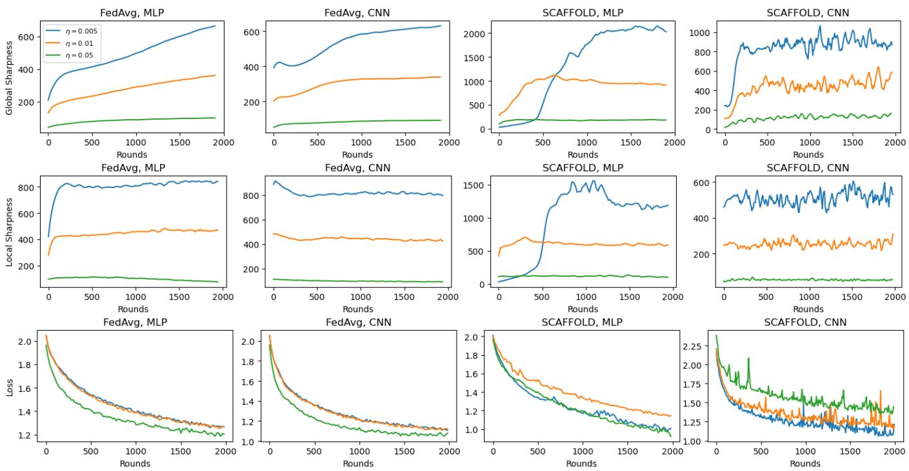  
Figure 1: Sharpness and loss trajectories for FedAvg (left) and SCAFFOLD (right) on CIFAR-10 with MLPs and CNNs (three layers). We measure sharpness of the global objective (top), sharpness of the local objectives (middle), and training loss (bottom) Both SCAFFOLD and FedAvg experience progressive sharpening in terms of the global sharpness and the local sharpness.

Accordingly, we conjecture that SCAFFOLD’s lackluster performance in deep learning is closely tied to the occurrence of EoS: when sharpness is high, SCAFFOLD cannot accurately estimate the global gradient.

## 4 Experiments

In this section, we perform an empirical investigation of EoS for FedAvg and SCAFFOLD. In Section 4.1, we establish that both algorithms exhibit EoS-like dynamics, and in Section 4.2 we investigate how the equilibrium sharpness value is afected by learning rate, data heterogeneity, and communication interval. Section 4.3 corroborates our conjectured connection between EoS and SCAFFOLD’s inability to outperform FedAvg, by showing that SCAFFOLD’s estimate of the global gradient becomes less accurate at the EoS.

All experiments are run on image classification tasks of CIFAR-10 (Krizhevsky 2009), MNIST (LeCun et al. 1998), FashionMNIST (Xiao, Rasul, and Vollgraf 2017) as simple CNN and MLP tasks consistent with previous works. using fully connected networks or simple CNNs with three to seven layers (for full architectures see A.1. Following the convention in many works on EoS (Cohen et al. 2021, 2023, 2025), we use full-batch gradients, which limits us to smaller architectures due to hardware constraints. Unless otherwise noted, we use a sample of 5000 images from each dataset, split among eight clients using a common protocol to induce heterogeneity among clients (Karimireddy et al. 2020). The heterogeneity protocol is defined in Appendix A.3, and is parameterized by a scalar $h \in [ 0 , 1 ]$ , with $h = 0$ inducing i.i.d. data and $h = 1$ inducing maximal data heterogeneity. We refer to h simply as the heterogeneity. Unless otherwise noted, we use a learning rate of $\eta \ : = \ : 0 . 0 1$ , heterogeneity of $h = 0 . 9$ and a communication interval of $K = { \bar { 3 } } 2$ . All experiments were run on a node of 8 NVIDIA A100 GPUs. Training runs are single trajectories unless otherwise stated.

## 4.1 Progressive Sharpening Occurs In Federated Settings with High Heterogeneity

To measure sharpness during federated learning trajectories, we define both the global sharpness and the local sharpness. The global sharpness tracks the sharpness of the averaged model on the combined dataset at the end of a round. The local sharpness is the average sharpness of the local models on the local datasets during each local step of the round. For formal definitions, see Appendix A.2. In Sections 4.2 and 4.3, we primarily use local sharpness.

Figure 1 shows that with both FedAvg and SCAFFOLD, we observe progressive sharpening and EoS-like behavior with both architectures and several learning rates. Interestingly, the general pattern of gradual increase followed by equilibration is more pronounced for SCAFFOLD, although both algorithms generally exhibit an increase in at least one or either local sharpness or global sharpness. Similarly as in the case of GD, we see that non-monotonic behavior of the loss is associated with equilibration of the sharpness at EoS; for example, when SCAFFOLD trains an MLP with $\eta = 0 . 0 0 5$ the loss is essentially monotonic for the first 500 steps, at which point the local sharpness reaches its equilibrium value (about 1250) and the loss becomes non-monotonic. In general, SCAFFOLD exhibits more erratic oscillations of both the sharpness and the loss.

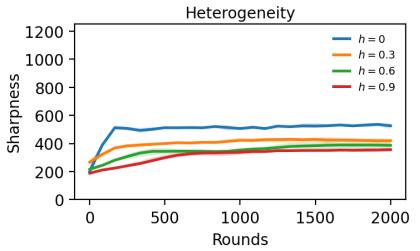

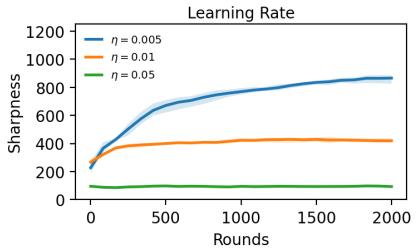  
(a) FedAvg

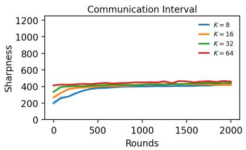

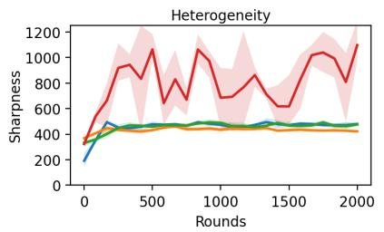

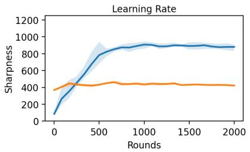  
(b) SCAFFOLD

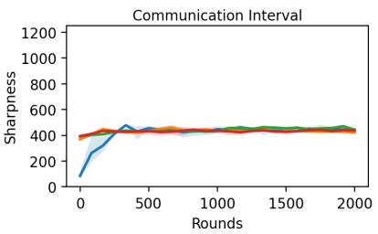  
Figure 2: Sharpness of local objectives with varying heterogeneity, learning rate, and communication interval (three-layer CNN, CIFAR-10 dataset), averaged over three random seeds. Error bars denote min and max values among 3 samples. Note that SCAFFOLD training with a learning rate of 0.05 diverged, so we omit the corresponding curve. Federated algorithms only have a clear inverse relation to learning rate, with minimal relation to heterogeneity or communication interval except for SCAFFOLD in the case of very high heterogeneity.

We similarly study the sharpness behavior for MNIST and FashionMNIST, shown in Figures $6 , 7$ of Appendix B. In these easier settings, we notice that for both algorithms the sharpness declines significantly before ever reaching an equilibrium value, and in many such cases the loss is monotonic or eventually monotonic. This is consistent with GD in the single-machine setting (Cohen et al. 2021). Importantly, these settings provide a testbed to study FedAvg and SCAF-FOLD when training deep networks without EoS; we will leverage this testbed to probe SCAFFOLD in Section 4.3.

## 4.2 What is the Equilibrium Sharpness Value?

Looking at Figure 1, we notice that that sharpnesses don’t appear to oscillate around the usual $2 / \eta$ threshold from the single-machine case. In fact, in some cases the global sharpness continues increasing while the local sharpness equilibrates. It is natural then to ask, around which value does the sharpness tend to oscillate?

To answer this question, we compare the equilibrium sharpness values under various choices of the learning rate, data heterogeneity $h ,$ and communication interval K, shown in Figure 2. Here we use a three-layer CNN and the CIFAR-10 dataset, and average over three random seeds.

Similarly as in the single-machine case, we find that the equilibrium sharpness is inversely proportional to the learning rate $\eta ;$ doubling the learning rate from 0.005 to 0.01 cuts the equilibrium value in half. Interestingly, the data heterogeneity h also appears to influence the equilibrium sharpness, though less so than the learning rate, and in diferent ways for FedAvg and SCAFFOLD. For FedAvg, higher heterogeneity tends to decrease the equilibrium sharpness, going from about 550 to about 350 as heterogeneity goes from $h = 0 \ t o \ h = 0 . 9$ . For SCAFFOLD, the equilibrium sharpness is less influenced by heterogeneity, except at $h = 0 . 9$ for which the behavior is very erratic. Given that the equilibrium value depends on our hyperparameter h through the opaque procedure of non-i.i.d. data shufling, we expect that the equilibrium sharpness value is not expressed by a simple formula in terms of h.

Lastly, for both algorithms the communication interval K has almost no efect on the equilibrium value, which has important implications for SCAFFOLD’s theory-practice gap. Recall that SCAFFOLD’s theoretical guarantees rely on the condition that the sharpness along the trajectory is bounded by $\mathcal { O } ( 1 / ( \eta K ) )$ ), which ensures that SCAFFOLD’s estimate of the global gradient has controllable error. Notice that the threshold $\mathcal { O } ( \bar { 1 } / ( \eta K ) )$ vanishes as K becomes large, yet Figure 2 shows that the actual sharpness observed along the trajectory is not influenced by K. This strongly suggests that large communication intervals will violate SCAFFOLD’s theoretical justification when EoS occurs. In the following, we will empirically measure the error in SCAFFOLD’s approximation and establish a connection to EoS.

## 4.3 High Sharpness Empirically Correlates with SCAFFOLD Misalignment

To quantify how well SCAFFOLD and FedAvg can match the ground truth global gradient, we introduce a new metric, called update misalignment. At every iteration (communica-

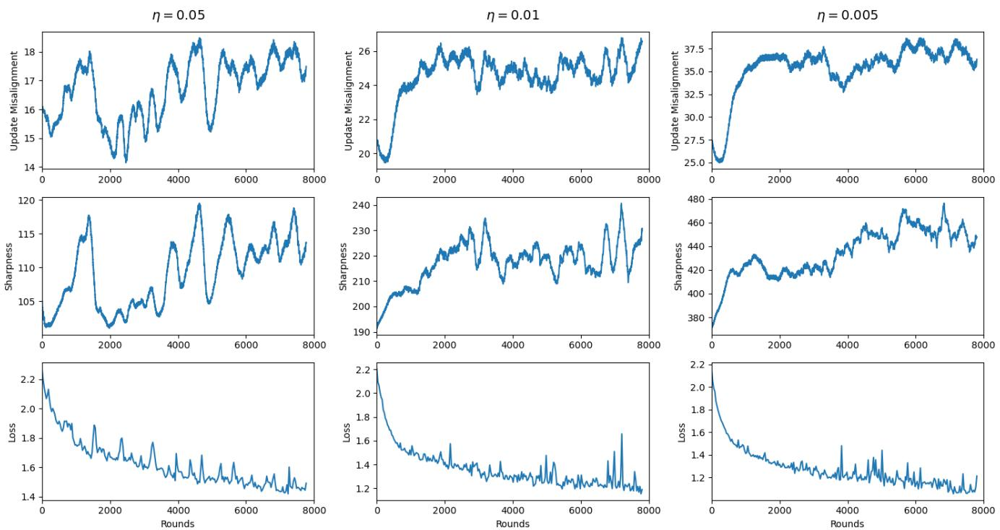  
Figure 3: Update misalignment (top), local sharpness (middle), and training loss (bottom) of SCAFFOLD with various learning rates on CIFAR-10 using a shallow CNN architecture. Update misalignment and sharpness are clearly correlated, implying that sharpness causes instability and drift in SCAFFOLD.

tion round t, local step k), this metric tracks the error between the local model update $\Delta _ { i } ^ { t , k } : = ( w _ { i } ^ { t , k + 1 } - w _ { i } ^ { t , k } ) / \eta$ and the global gradient evaluated at the local model:

$$
D ^ { t , k } = \frac { 1 } { M } \sum _ { i = 1 } ^ { M } \left. \Delta _ { i } ^ { t , k } - \nabla f ( w _ { i } ^ { t , k } ) \right.\tag{7}
$$

Note that $\Delta _ { i } ^ { t , k } = g _ { i } ^ { t , k }$ for FedAvg, and $\Delta _ { i } ^ { t , k } = g _ { i } ^ { t , k } - c _ { i } ^ { t } + c ^ { t }$ for SCAFFOLD. In theory, SCAFFOLD’s update misalignment should be small, while FedAvg’s should scale as data heterogeneity worsens.

As seen in Figure 3, there is a strong, positive correlation between update misalignment and sharpness along individual trajectories for multiple learning rates. For any single trajectory, the two curves look remarkably similar. Table 1 shows that the detrended correlation (Podobnik and Stanley 2008) between update misalignment $\dot { \boldsymbol D ^ { t , k } }$ and sharpness is quite high for SCAFFOLD (≥ 0.54) and near zero for FedAvg. We use the detrended correlation to remove global correlations (e.g. both sharpness and update misalignment gradually increase through training) and focus on more finegrained oscillations. In general, we found that the vanilla correlation between update misalignment and sharpness is even higher than the detrended correlation.

Essentially, this means that SCAFFOLD’s error in estimating the global gradient is much larger for steps in the trajectory where the sharpness is high, particularly at the EoS. On the contrary, FedAvg’s update error is unafected by high sharpness. This phenomenon is very consistent across learning rates (Figure 3) and network depth/dataset size (Table 1, Figure 4). These results suggest a mechanism for SCAF-FOLD’s inability to outperform FedAvg in deep learning: when the sharpness is near the EoS threshold, SCAF-FOLD cannot estimate the global gradient.

<table><tr><td>Dataset Size</td><td>CNN Layers</td><td>SCAFFOLD</td><td>FedAvg</td></tr><tr><td>1250</td><td>3</td><td>0.813</td><td>0.162</td></tr><tr><td>1250</td><td>5</td><td>0.650</td><td>0.031</td></tr><tr><td>1250</td><td>7</td><td>0.544</td><td>-0.157</td></tr><tr><td>625</td><td>3</td><td>0.628</td><td>0.045</td></tr><tr><td>625</td><td>5</td><td>0.579</td><td>-0.014</td></tr><tr><td>625</td><td>7</td><td>0.611</td><td>0.128</td></tr></table>

Table 1: Detrended correlation between sharpness and update misalignment for SCAFFOLD and FedAvg (CNN, CIFAR-10). SCAFFOLD’s update misalignment is highly correlated with sharpness, while for FedAvg the update misalignment is essentially unrelated to sharpness.

Importantly, high update misalignment under EoS translates to actual decline in training performance, as verified by the fact that FedAvg attains lower loss than SCAFFOLD for settings with EoS, but not in settings without. This is shown in Table 2, where we compare FedAvg and SCAFFOLD for both CIFAR-10 and MNIST, under various dataset sizes and network depths. We can see that for CIFAR-10, where EoS actually occurs (see Figures 1, 3), FedAvg and SCAFFOLD are comparable, with FedAvg achieving slightly lower losses. The MNIST dataset is a diferent story. In Figure 5, notice that sharpness quickly decreases towards zero for MNIST, and in this case SCAFFOLD is achieving near zero loss, far less than FedAvg. Therefore, SCAFFOLD can outperform FedAvg when the dataset is easy enough that EoS does not occur.

<table><tr><td></td><td></td><td colspan="2">CIFAR</td><td colspan="2">MNIST</td></tr><tr><td>Size</td><td>Layers</td><td>FedAvg</td><td>SCAF.</td><td>FedAvg</td><td>SCAF.</td></tr><tr><td>1250</td><td>3</td><td>0.870</td><td>0.960</td><td>0.0642</td><td>0.0067</td></tr><tr><td>1250</td><td>5</td><td>0.790</td><td>0.850</td><td>0.0749</td><td>0.0092</td></tr><tr><td>1250</td><td>7</td><td>0.820</td><td>0.840</td><td>0.0489</td><td>0.0062</td></tr><tr><td>625</td><td>3</td><td>0.950</td><td>1.050</td><td>0.0612</td><td>0.0019</td></tr><tr><td>625</td><td>5</td><td>0.700</td><td>0.830</td><td>0.0700</td><td>0.0009</td></tr><tr><td>625</td><td>7</td><td>0.750</td><td>0.910</td><td>0.0276</td><td>0.0002</td></tr></table>

Table 2: Training loss of FedAvg and SCAFFOLD across dataset sizes and network depth for CIFAR-10 and MNIST. For MNIST, SCAFFOLD consistently outperforms FedAvg, while for CIFAR the reverse is true. Learning rates, between 0.05, 0.01, and 0.005 were tuned separately for each algorithm, dataset size, and network depth. FedAvg consistently selected $\eta = 0 . 0 5$ , while SCAFFOLD selected η = 0.01.

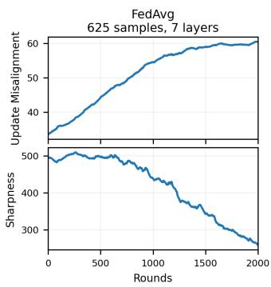

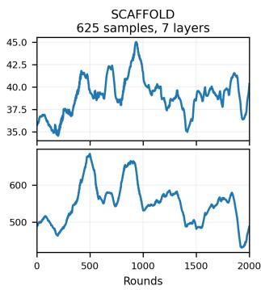  
Figure 4: Update misalignment and sharpness for FedAvg and SCAFFOLD on CIFAR-10 with 625 samples and 7 layers. The peaks and valleys of SCAFFOLD’s update misalignment closely track that of the sharpness, unlike FedAvg.

This example provides an important clarification about SCAFFOLD’s performance that is not covered by previous explanations. For example, Yu et al. (2022) argue that SCAF-FOLD struggles under the nonconvexity induced by deep architectures, and propose a fix based on eliminating nonconvexity. From Table 2, we see that SCAFFOLD can perform its intended function perfectly well for networks up to seven layers, as long as sharpness stays low, despite the nonconvexity. Rather than the deep architecture, it is the dataset complexity that indirectly hinders SCAFFOLD through the presence of high sharpess at the EoS.

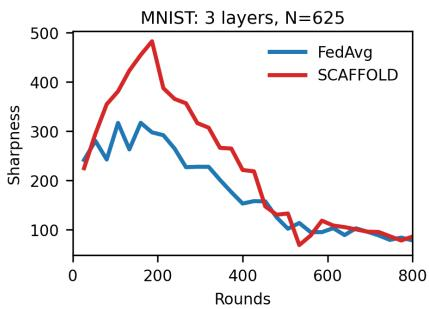  
Figure 5: Sharpness of the local objective during MNIST training. Neither algorithm exhibits progressive sharpening.

## 5 Conclusion

We propose that progressive sharpening and EoS act as a mechanism that causes SCAFFOLD to underperform in federated optimization of deep networks. First, we establish that both FedAvg and SCAFFOLD exhibit progressive sharpening and EoS in federated settings. We also measure the equilibrium value of the sharpness along the trajectory, and find it is inversely proportional to the learning rate (similarly as GD), while exhibiting a smaller dependence on the data heterogeneity, and negligible dependence on the number of local steps. This shows that, when the number of local steps is large and the sharpness hovers around its equilibrium, SCAFFOLD cannot satisfy its theoretical requirement that sharpness along the trajectory be inversely proportional to the number of local steps (see Section 3). Lastly, we show that SCAFFOLD’s error in estimating the global gradient (quantified by update misalignment) is strongly correlated with sharpness along the trajectory; accordingly, SCAF-FOLD fails to estimate the global gradient at the EoS.

Contrary to previous work that investigates SCAFFOLD’s underperformance (Yu et al. 2022), we observe in our experiments that SCAFFOLD can work well in deep learning in some situations, particularly those in which EoS does not occur. Accordingly, we posit that SCAFFOLD’s underperformance is not due to the nonconvexity of the loss landscape induced by deep architectures, but rather the optimization dynamics peculiar to deep learning.

Limitations In this paper we have mainly focused on versions of FedAvg and SCAFFOLD that use full-batch gradients (as in most works on EoS (Cohen et al. 2021, 2023, 2025)), for training CNNs for image classification tasks. These settings can naturally be extended to include stochastic gradients, other network architectures such as Transformers, larger image datasets, and language tasks. Another limitation of our work is the fact that we do not determine the equilibrium sharpness value in closed-form for either FedAvg or SCAFFOLD. Given that the sharpness seems to depend on data heterogeneity, and we induce data heterogeneity through an ad hoc procedure with parameter h controlling the degree of heterogeneity, we do not expect the sharpness equilibrium value to have a simple closed form in terms of h. Rather, a closed-form equilibrium value should likely incorporate data heterogeneity in terms of properties of the loss landscape, rather than the parameter h itself.

## Acknowledgements

Computations were run on the Hopper cluster provided by the Ofice of Research Computing at George Mason University. Anant Khandelwal acknowledges the support of the Aspiring Scientists Summer Internship Program. At the time of completing this work, Michael Crawshaw was supported by the Doctoral Research Scholarship of George Mason University. Mingrui Liu is supported by NSF grants #2436217, #2425687, #2601681.

## References

Ahn, K.; Bubeck, S.; Chewi, S.; Lee, Y. T.; Suarez, F.; and Zhang, Y. 2023. Learning threshold neurons via edge of stability. Advances in Neural Information Processing Systems, 36: 19540–19569.

Arora, S.; Li, Z.; and Panigrahi, A. 2022. Understanding Gradient Descent on the Edge of Stability in Deep Learning. In Proceedings ofthe 39th International Conference on Machine Learning, volume 162 of Proceedings ofMachine Learning Research, 948–1024. PMLR.

Baumgart, G. A.; Shin, J.; Payani, A.; Lee, M.; and Kompella, R. R. 2024. Not All Federated Learning Algorithms Are Created Equal: A Performance Evaluation Study. arXiv preprint arXiv:2403.17287.

Chen, L.; and Bruna, J. 2023. Beyond the edge of stability via two-step gradient updates. In International Conference on Machine Learning, 4330–4391. PMLR.

Cheng, Z.; Huang, X.; Wu, P.; and Yuan, K. 2024. Momentum Benefits Non-IID Federated Learning Simply and Provably. In International Conference on Learning Representations.

Cohen, J.; Damian, A.; Talwalkar, A.; Kolter, J. Z.; and Lee, J. D. 2025. Understanding Optimization in Deep Learning with Central Flows. In The Thirteenth International Conference on Learning Representations.

Cohen, J.; Ghorbani, B.; Krishnan, S.; Agarwal, N.; Medapati, S.; Badura, M.; Suo, D.; Nado, Z.; Dahl, G. E.; and Gilmer, J. 2023. Adaptive Gradient Methods at the Edge of Stability. In NeurIPS 2023 Workshop Heavy Tails in Machine Learning.

Cohen, J.; Kaur, S.; Li, Y.; Kolter, J. Z.; and Talwalkar, A. 2021. Gradient Descent on Neural Networks Typically Occurs at the Edge of Stability. In International Conference on Learning Representations.

Damian, A.; Nichani, E.; and Lee, J. D. 2023. Self-Stabilization: The Implicit Bias of Gradient Descent at the Edge of Stability. In International Conference on Learning Representations.

Even, M.; Pesme, S.; Gunasekar, S.; and Flammarion, N. 2023. (S) GD over Diagonal Linear Networks: Implicit bias, Large Stepsizes and Edge of Stability. Advances in Neural Information Processing Systems, 36: 29406–29448.

Glasgow, M. R.; Yuan, H.; and Ma, T. 2022. Sharp bounds for federated averaging (Local SGD) and continuous perspective. In International Conference on Artificial Intelligence and Statistics, 9050–9090. PMLR.

Haddadpour, F.; and Mahdavi, M. 2019. On the convergence of local descent methods in federated learning. arXiv preprint arXiv:1910.14425.

Kairouz, P.; McMahan, H. B.; Avent, B.; Bellet, A.; Bennis, M.; Bhagoji, A. N.; Bonawitz, K.; Charles, Z.; Cormode, G.; Cummings, R.; D’Oliveira, R. G. L.; Rouayheb, S. E.; Evans, D.; Gardner, J.; Garrett, Z.; Gascón, A.; Ghazi, B.; Gibbons, P. B.; Gruteser, M.; Harchaoui, Z.; He, C.; He, L.; Huo, Z.; Hutchinson, B.; Hsu, J.; Jaggi, M.; Javidi, T.; Joshi, G.; Khodak, M.; Konečný, J.; Korolova, A.; Koushanfar, F.; Koyejo, S.; Lepoint, T.; Liu, Y.; Mittal, P.; Mohri, M.; Nock, R.; Özgür, A.; Pagh, R.; Qi, H.; Ramage, D.; Raskar, R.; Raykova, M.; Song, D.; Song, W.; Stich, S. U.; Sun, Z.; Suresh, A. T.; Tramèr, F.; Vepakomma, P.; Wang, J.; Xiong, L.; Xu, Z.; Yang, Q.; Yu, F. X.; Yu, H.; and Zhao, S. 2021. Advances and Open Problems in Federated Learning. Foundations and Trends in Machine Learning, 14(1–2): 1– 210.

Karimireddy, S. P.; Kale, S.; Mohri, M.; Reddi, S.; Stich, S. U.; and Suresh, A. T. 2020. SCAFFOLD: Stochastic Controlled Averaging for Federated Learning. In Proceedings of the 37th International Conference on Machine Learning, volume 119 of Proceedings ofMachine Learning Research, 5132–5143. PMLR.

Khaled, A.; Mishchenko, K.; and Richtárik, P. 2020. Tighter theory for local SGD on identical and heterogeneous data. In International Conference on Artificial Intelligence and Statistics, 4519–4529. PMLR.

Koloskova, A.; Loizou, N.; Boreiri, S.; Jaggi, M.; and Stich, S. U. 2020. A Unified Theory of Decentralized SGD with Changing Topology and Local Updates. In Proceedings of the 37th International Conference on Machine Learning, volume 119 of Proceedings of Machine Learning Research, 5381–5393. PMLR.

Krizhevsky, A. 2009. Learning Multiple Layers of Features from Tiny Images. Technical report, University of Toronto.

LeCun, Y.; Bottou, L.; Bengio, Y.; and Hafner, P. 1998. Gradient-Based Learning Applied to Document Recognition. Proceedings ofthe IEEE, 86(11): 2278–2324.

Li, B.; Schmidt, M. N.; Alstrøm, T. S.; and Stich, S. U. 2023. On the Efectiveness of Partial Variance Reduction in Federated Learning with Heterogeneous Data. In Proceedings of the IEEE/CVF Conference on Computer Vision and Pattern Recognition, 3964–3973.

Liu, B.; Lv, N.; Guo, Y.; and Li, Y. 2024. Recent Advances on Federated Learning: A Systematic Survey. Neurocomputing, 597: 128019.

Luo, R.; Stich, S. U.; Horváth, S.; and Takáč, M. 2025. Revisiting LocalSGD and SCAFFOLD: Improved Rates and Missing Analysis. In International Conference on Artificial Intelligence and Statistics, 2539–2547. PMLR.

Mangold, P.; Oliviero Durmus, A.; Dieuleveut, A.; and Moulines, E. 2025. Scafold with Stochastic Gradients: New Analysis with Linear Speed-Up. In Proceedings of the 42nd International Conference on Machine Learning, volume 267 of Proceedings of Machine Learning Research, 42902–42946. PMLR.

McMahan, H. B.; Moore, E.; Ramage, D.; Hampson, S.; and y Arcas, B. A. 2017. Communication-Eficient Learning of Deep Networks from Decentralized Data. In Proceedings of the 20th International Conference on Artificial Intelligence and Statistics, volume 54 of Proceedings ofMachine Learning Research, 1273–1282. PMLR.

Patel, K. K.; Glasgow, M.; Wang, L.; Joshi, N.; and Srebro, N. 2023. On the Still Unreasonable Efectiveness of Federated Averaging for Heterogeneous Distributed Learning. In Federated Learning and Analytics in Practice: Algorithms, Systems, Applications, and Opportunities.

Patel, K. K.; Glasgow, M.; Zindari, A.; Wang, L.; Stich, S. U.; Cheng, Z.; Joshi, N.; and Srebro, N. 2024. The limits and potentials of local sgd for distributed heterogeneous learning with intermittent communication. In The Thirty Seventh Annual Conference on Learning Theory, 4115–4157. PMLR.

Patel, K. K.; Wang, L.; Woodworth, B. E.; Bullins, B.; and Srebro, N. 2022. Towards optimal communication complexity in distributed non-convex optimization. Advances in Neural Information Processing Systems, 35: 13316–13328.

Patel, K. K.; Zindari, A.; Stich, S.; and Wang, L. 2026. Revisiting Consensus Error: A Fine-grained Analysis of Local SGD under Second-order Data Heterogeneity. Advances in Neural Information Processing Systems, 38: 58419–58504.

Podobnik, B.; and Stanley, H. E. 2008. Detrended Cross-Correlation Analysis: A New Method for Analyzing Two Nonstationary Time Series. Physical Review Letters, 100(8): 084102.

Stich, S. U. 2019. Local SGD Converges Fast and Communicates Little. In ICLR 2019-International Conference on Learning Representations.

Wang, J.; Charles, Z.; Xu, Z.; Joshi, G.; McMahan, H. B.;Al-Shedivat, M.; Andrew, G.; Avestimehr, S.; Daly, K.; Data,D.; Diggavi, S.; Eichner, H.; Gadhikar, A.; Garrett, Z.; Gir-

Smith, V.; Soltanolkotabi, M.; Song, W.; Stich, S. U.; Talwalkar, A.; Wang, H.; Woodworth, B.; Wu, S.; Yu, F. X.; Yuan, H.; and Zaheer, M. 2021. A Field Guide to Federated Optimization. arXiv preprint arXiv:2107.06917.

Wang, J.; Das, R.; Joshi, G.; Kale, S.; Xu, Z.; and Zhang, T. 2024. On the Unreasonable Efectiveness of Federated Averaging with Heterogeneous Data. Transactions on Machine Learning Research.

Woodworth, B. E.; Patel, K. K.; and Srebro, N. 2020. Minibatch vs Local SGD for Heterogeneous Distributed Learning. Advances in Neural Information Processing Systems, 33: 6281–6292.

Xiao, H.; Rasul, K.; and Vollgraf, R. 2017. Fashion-MNIST: a Novel Image Dataset for Benchmarking Machine Learning Algorithms. arXiv preprint arXiv:1708.07747.

Yu, Y.; Wei, A.; Karimireddy, S. P.; Ma, Y.; and Jordan, M. I. 2022. TCT: Convexifying Federated Learning Using Bootstrapped Neural Tangent Kernels. Advances in Neural Information Processing Systems, 35: 30882–30897.

Zhu, X.; Wang, Z.; Wang, X.; Zhou, M.; and Ge, R. 2023. Understanding Edge-of-Stability Training Dynamics with a Minimalist Example. In The Eleventh International Conference on Learning Representations.

## A Experimental Details

## A.1 Neural Network Architectures

All networks produce ten unnormalized output logits. No softmax or other activation is applied after the final classification layer. Unless stated otherwise, all convolutional and fully connected layers include a bias.

We use the rectified linear unit

$$
\mathrm { R e L U } ( z ) = \operatorname* { m a x } ( 0 , z )
$$

throughout the CNNs and in the CIFAR-10 MLP. ReLU sets negative inputs to zero and leaves positive inputs unchanged. It is piecewise linear and does not saturate for positive inputs.

CIFAR-10 CNNs. CIFAR-10 images have dimension $3 \times$ $3 2 \times 3 2$ . In the variable-depth CNN, the depth L denotes the number of convolutional layers; the final linear classifier is not included in this count. Each convolution uses a $3 \times 3$ kernel, stride one, and padding one. The first convolution maps the three input channels to 32 feature channels, and every subsequent convolution preserves 32 channels. A ReLU follows every convolution.

For $L \ \geq \ 3 .$ the architecture consists of repeated twoconvolution blocks,

$$
\mathrm { C o n v } \to \mathrm { R e L U } \to \mathrm { C o n v } \to \mathrm { R e L U } \to \mathrm { M a x P o o l } ,
$$

with one additional Conv–ReLU pair appended when L is odd. The resulting feature tensor is flattened and mapped directly to ten logits.

For example, the $L = 5$ architecture is

$$
\begin{array} { r l } & { 3 \times 3 2 \times 3 2  \mathrm { C o n v } ( 3 , 3 2 )  \mathrm { R e L U } } \\ & { ~  \mathrm { C o n v } ( 3 2 , 3 2 )  \mathrm { R e L U } } \\ & { ~  \mathrm { M a x P o o l }  \mathrm { C o n v } ( 3 2 , 3 2 ) } \\ & { ~  \mathrm { R e L U }  \mathrm { C o n v } ( 3 2 , 3 2 ) } \\ & { ~  \mathrm { R e L U }  \mathrm { M a x P o o l } } \\ & { ~  \mathrm { C o n v } ( 3 2 , 3 2 )  \mathrm { R e L U } } \\ & { ~  \mathrm { F l a t t e n }  \mathrm { L i n e a r } ( 2 0 4 8 , 1 0 ) . } \end{array}
$$

For $L = 3 ,$ , this architecture is identical to the one used in Cohen et al. (2021), and it is extended naturally for $L > 3$

MNIST CNNs. MNIST images have dimension $1 \times 2 8 \times$ 28. The variable-depth MNIST CNN follows the same overall structure as the CIFAR-10 CNN. The number of channels increases over the first three convolutions,

$$
1 \to 3 2 \to 6 4 \to 1 2 8 ,
$$

after which all remaining convolutions preserve 128 channels. Every convolution uses a $3 \times 3$ kernel with stride one and padding one, followed by ReLU. $\textup { A 2 } \times 2$ max-pooling layer follows every second convolution.

The $L = 5$ architecture is

$$
\begin{array} { r l } & { 1 \times 2 8 \times 2 8 \to \mathrm { C o n v } ( 1 , 3 2 ) \to \mathrm { R e L U } } \\ & { \qquad \to \mathrm { C o n v } ( 3 2 , 6 4 ) \to \mathrm { R e L U } } \\ & { \qquad \to \mathrm { M a x P o o l } \to \mathrm { C o n v } ( 6 4 , 1 2 8 ) } \\ & { \qquad \to \mathrm { R e L U } \to \mathrm { C o n v } ( 1 2 8 , 1 2 8 ) } \\ & { \qquad \to \mathrm { R e L U } \to \mathrm { M a x P o o l } } \\ & { \qquad \to \mathrm { C o n v } ( 1 2 8 , 1 2 8 ) \to \mathrm { R e L U } } \\ & { \qquad \to \mathrm { F l a t t e n } \to \mathrm { L i n e a r } ( 6 2 7 2 , 1 0 ) . } \end{array}
$$

After the two pooling operations, the feature tensor has dimension $1 2 8 \times 7 \times 7 ,$ giving 128 · $7 \cdot 7 = 6 2 7 2$ inputs to the classifier.

CIFAR-10 MLP. The fixed CIFAR-10 MLP first flattens each image into $3 \cdot 3 2 \cdot 3 2 = 3 0 7 2$ features. It then applies one hidden layer of width 200 followed by ReLU and a linear classifier:

$$
\begin{array} { r l } & { 3 0 7 2  \mathrm { L i n e a r } ( 3 0 7 2 , 2 0 0 )  \mathrm { R e L U } } \\ & { ~  \mathrm { L i n e a r } ( 2 0 0 , 1 0 ) . } \end{array}
$$

This architecture is taken directly from Cohen et al. (2021).

MNIST MLP. The fixed MNIST MLP flattens each image into $2 8 \cdot 2 8 = 7 8 4$ features and uses two hidden layers of width 1000:

$$
\begin{array} { r l } & { 7 8 4  \mathrm { L i n e a r } ( 7 8 4 , 1 0 0 0 )  \mathrm { R e L U } } \\ & { ~  \mathrm { L i n e a r } ( 1 0 0 0 , 1 0 0 0 )  \mathrm { R e L U } } \\ & { ~  \mathrm { L i n e a r } ( 1 0 0 0 , 1 0 ) . } \end{array}
$$

The final layer produces the ten class logits without an output activation.

## A.2 Global and Local Sharpness

For an objective g evaluated at model parameters w, we define its sharpness as the largest eigenvalue of its Hessian:

$$
\operatorname { S h a r p } ( g , w ) = \lambda _ { \operatorname* { m a x } } \bigl ( \nabla ^ { 2 } g ( w ) \bigr ) .
$$

We define the global sharpness at the end of round t as the sharpness of this averaged model on the global objective:

$$
S _ { \mathrm { g l o b a l } } ^ { t } = \lambda _ { \mathrm { m a x } } \big ( \nabla ^ { 2 } f \big ( \boldsymbol { w } ^ { t + 1 } \big ) \big ) , \qquad f ( \boldsymbol { w } ) = \frac { 1 } { M } \sum _ { i = 1 } ^ { M } f _ { i } ( \boldsymbol { w } ) .
$$

Thus, global sharpness measures the curvature of the combined training loss at the model produced by federated averaging. The local sharpness at local step k of round t is the average sharpness of the participating clients’ local objectives, evaluated at their respective local models:

$$
\mathcal { S } _ { \mathrm { l o c a l } } ^ { t , k } = \frac { 1 } { \left| S _ { t } \right| } \sum _ { i \in S _ { t } } \lambda _ { \operatorname* { m a x } } \Bigl ( \nabla ^ { 2 } f _ { i } \Bigl ( w _ { i } ^ { t , k } \Bigr ) \Bigr ) .
$$

Unlike global sharpness, local sharpness follows the curvature encountered by the individual client models as they move away from the shared model during local training. In implementation, the leading eigenvalue is estimated using the Lanczos method, with Hessian–vector products computed by automatic diferentiation.

## A.3 Heterogeneity Protocol

Similar to prior work Karimireddy et al. (2020), including SCAFFOLD, we simulate client-level statistical heterogeneity using a label-skew partitioning scheme controlled by a parameter $h \in [ 0 , 1 ]$ , where $h = 0$ corresponds to fully i.i.d. data and larger values induce greater non-i.i.d. structure. After forming the training split, we group examples by class label. For each class, a fraction 1 − h of examples is assigned to a global i.i.d. pool and the remaining fraction h is assigned to a global non-i.i.d. pool. The i.i.d. pool is shufled, while the non-i.i.d. pool is left ordered by label, so that contiguous chunks are label-concentrated.

Algorithm 1: FedAvg: Federated Averaging   
Require: Initial global model $w ^ { 0 } .$ , learning rate η, communication   
rounds T, local steps K   
1: for $t = 0 , 1 , \ldots , \bar { T } - 1$ do   
2: for client $i = 1 , \ldots , M$ in parallel do   
3: $w _ { i } ^ { t , 0 } \gets w ^ { t }$   
4: for local step $k = 0 , 1 , \ldots , K - 1$ do   
5: $w _ { i } ^ { t , k + 1 } \dot { {  } } w _ { i } ^ { t , k } - \eta \nabla f _ { i } ( w _ { i } ^ { t , k } )$   
6: end for   
7: $w _ { i } ^ { t + 1 }  w _ { i } ^ { t , K }$   
8: Send $\Delta \boldsymbol { w } _ { i } ^ { t } = \boldsymbol { w } _ { i } ^ { t + 1 } - \boldsymbol { w } ^ { t }$ to server   
9: end for   
10: $\begin{array} { r } { w ^ { t + 1 } \gets w ^ { t } + \frac { 1 } { M } \sum _ { i = 1 } ^ { M } \Delta w _ { i } ^ { t } } \end{array}$   
11: end for

```latex
Algorithm 2: SCAFFOLD: Stochastic Controlled Averaging
for Federated Learning
Require: Initial global model $w ^ { 0 } ,$ , server control variate $c ^ { 0 } ,$ , client
control variates $\{ c _ { i } ^ { 0 } \} _ { i = 1 } ^ { N }$ , learning rate $\eta ,$ communication
rounds T, local steps K
1: for $t = 0 , 1 , \ldots , \hat { T } - 1$ do
2: for client $i = 1 , \dots , M$ in parallel do
3: $w _ { i } ^ { t , 0 } \gets w ^ { t }$
4: for local step $k = 0 , 1 , \ldots , K - 1$ do
5: $w _ { i } ^ { t , k + 1 } \gets w _ { i } ^ { t , k } - \eta \left( \nabla f _ { i } ( w _ { i } ^ { t , k } ) - c _ { i } ^ { t } + c ^ { t } \right)$
6: end for
7: $\overline { { w _ { i } ^ { t + 1 } } }  w _ { i } ^ { t , K }$
8: $c _ { i } ^ { t + 1 }  c _ { i } ^ { t } - c ^ { t } + \frac { 1 } { K \eta } ( w ^ { t } - w _ { i } ^ { t + 1 } )$
9: Send $\Delta w _ { i } ^ { t } = w _ { i } ^ { t + 1 } - \stackrel { \cdot } { w } ^ { t }$ and $\Delta c _ { i } ^ { t } = c _ { i } ^ { t + 1 } - c _ { i } ^ { t }$ to server
10: end for
11: $\begin{array} { r } { w ^ { t + 1 }  w ^ { t } + \frac { 1 } { M } \sum _ { i = 1 } ^ { M } \Delta w _ { i } ^ { t } } \end{array}$
12: $\begin{array} { r } { c ^ { t + 1 } \gets c ^ { t } + \frac { 1 } { M } \sum _ { i = 1 } ^ { M } \Delta c _ { i } ^ { t } } \end{array}$
13: end for
```

We then partition both pools evenly across the N clients and give each client one shard from the i.i.d. pool and one shard from the non-i.i.d. pool. Thus, every client receives the same proportion of shared and label-skewed data, with h directly controlling the severity of the skew. When $h = 0 ,$ all client datasets have i.i.d. labels; as h increases, clients become increasingly specialized to diferent subsets of classes. For datasets with predefined users (e.g., Sent140), we apply the same idea at the user level by sorting users in the non-i.i.d. pool by label proportion before partitioning.

## A.4 Algorithm Pseudocode

As in Algorithm 1, we use FedAvg as a baseline that runs gradient descent on many diferent datasets and regularly averages models according to a set communication interval.

SCAFFOLD, implemented as in Algorithm 2, adds control variates to the FedAvg algorithm to reduce heterogeneity. By subtracting previous local gradients and adding previous global gradients, SCAFFOLD adjusts model updates toward ground-truth global gradients.

## B Additional Experimental Results

Federated learning algorithms on FashionMNIST (see Figure 6) see expected and consistent behavior for sharpness given the relative simplicity of the dataset. Instead of continuous incrase in sharpness until a threshold, both FedAvg and SCAFFOLD experience a modest increase followed by a rapid decrease in sharpness as the model begins to converge and overfit with the maximum margin bias causing smoother optimization. In some cases, sharpness does remain at a threshold, and in other cases sharpness never rises. However, there is still a strong inverse correlation between sharpness and learning rate.

For MNIST experiments, shown in Figure 7, an even simpler dataset than FashionMNIST, sharpness consistently rises modestly followed by a gradual decline to small values as any architecture begins to fit the data close to perfectly. This indicates that our results, which have high levels of SCAF-FOLD performance relative to FedAvg on MNIST tasks, may show that SCAFFOLD sufers from high sharpness values. These training runs are identical to those shown in Table 2 for MNIST. These results, paired with those showing SCAF-FOLD outperforming FedAvg for MNIST, support our conjecture that sharpness, not convexity, explains SCAFFOLD failures.

In Table 2 trajectories we consistently observe similar correlations between the local sharpness and the update misalignment. These have high (>0.5) degrees of correlation between normalized values across model depths and dataset sizes, demonstrating the efect of sharpness on misalignment. Qualitatively, trajectories in Figure 8 clearly show a match between the oscillations present, indicating major and observable diferences.

In comparison to SCAFFOLD, FedAvg trajectories from Table 2 shows little or even negative correlation between update misalignment and SCAFFOLD. Figure 9 shows no qualitative similarity between the curves across diferent dataset sizes and model depths. There are less volatile movements in each metric, yielding no particular similarities in oscillations, and throughout training, these two metrics have opposite directions of growth. Note that sharpness here decreases throughout training due to high sharpness at initialization– starting weights and datasets yielded sharpness values > 500, causing sharpness to stagnate or decrease in training.

Figure 10 shows loss trajectories for both SCAFFOLD and FedAvg under the settings from 2. SCAFFOLD takes longer to converge, with significantly more instability along its path. This reflects that not only does FedAvg outperform on final loss, but it is also easier and more consistent to train. Paired with our results on update misalignment, this suggests that high sharpness causes SCAFFOLD updates to be less accurate and less stable.

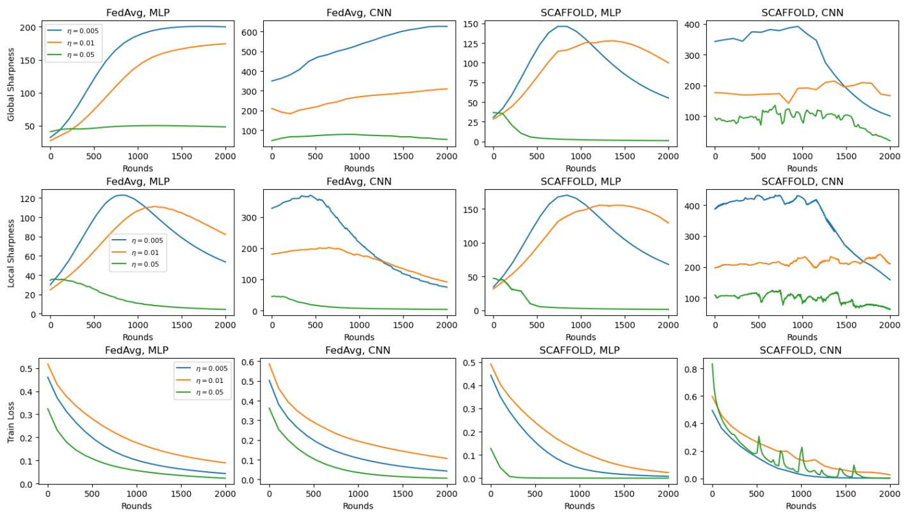  
Figure 6: FashionMNIST global sharpness (top), local sharpness (middle), and train loss (bottom) over train trajectories with both SCAFFOLD and FedAvg and with both MLP and CNN architectures.

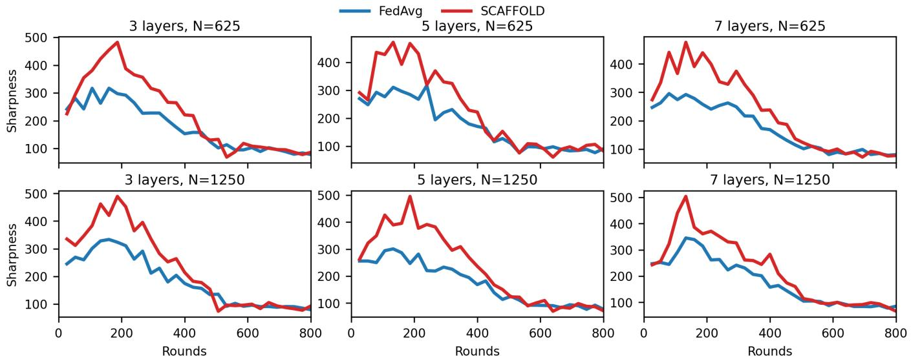  
Figure 7: MNIST local sharpness values during training for many CNN layer depths and dataset sizes, as referenced in 2. For MNIST, sharpness rises initially, and then gradually decreases as the network converges to 0 loss.

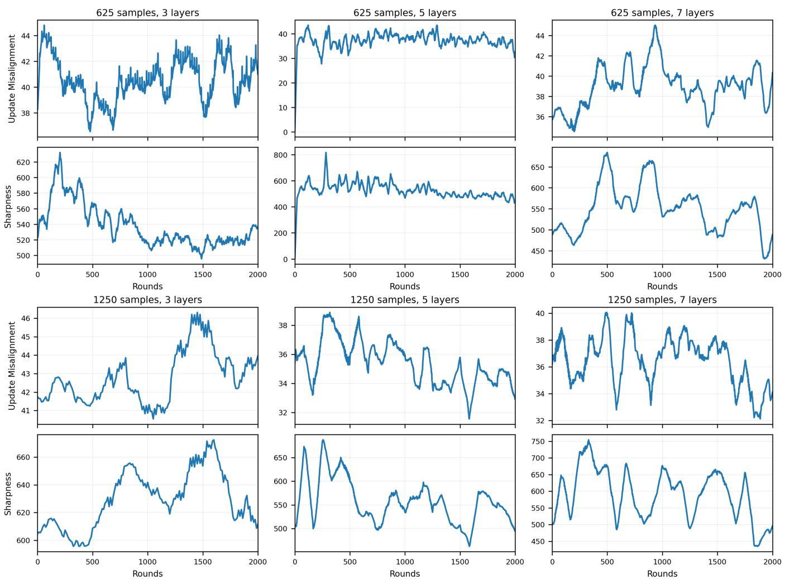  
Figure 8: Update misalignment and local sharpness values over SCAFFOLD trajectories for Table 2. Update misalignment and sharpness stay highly correlated across diferent architectures and dataset sizes for SCAFFOLD.

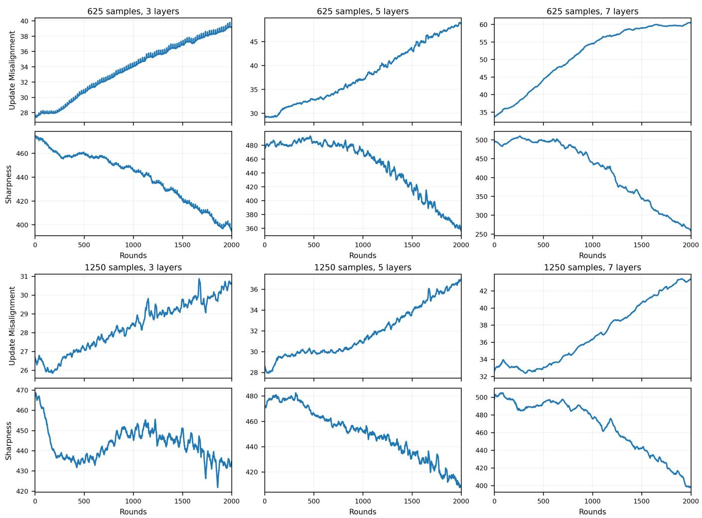  
Figure 9: Update misalignment and local sharpness values over FedAvg trajectories for Table 2. For FedAvg, update misalignment and sharpness are empirically disassociated.

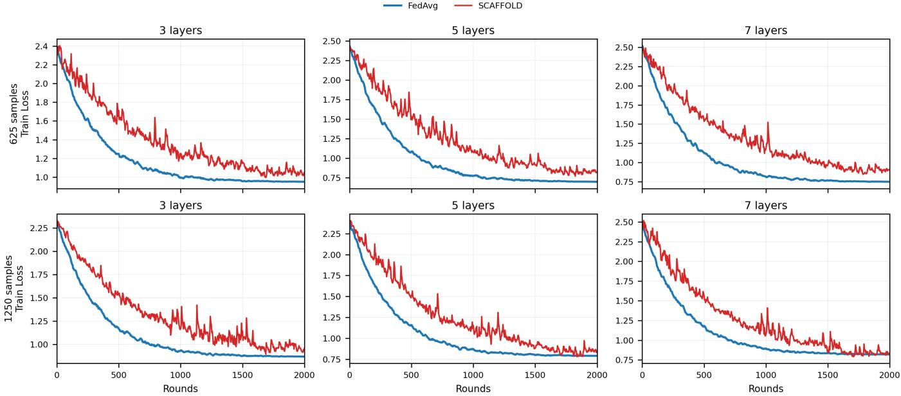  
Figure 10: Loss curves for 2 with a CIFAR dataset for both SCAFFOLD and FedAvg for CNNs of depth 3, 5, and 7 and dataset sizes of 625 and 1250. FedAvg consistently attains lower loss and converges faster, with less instability in loss.