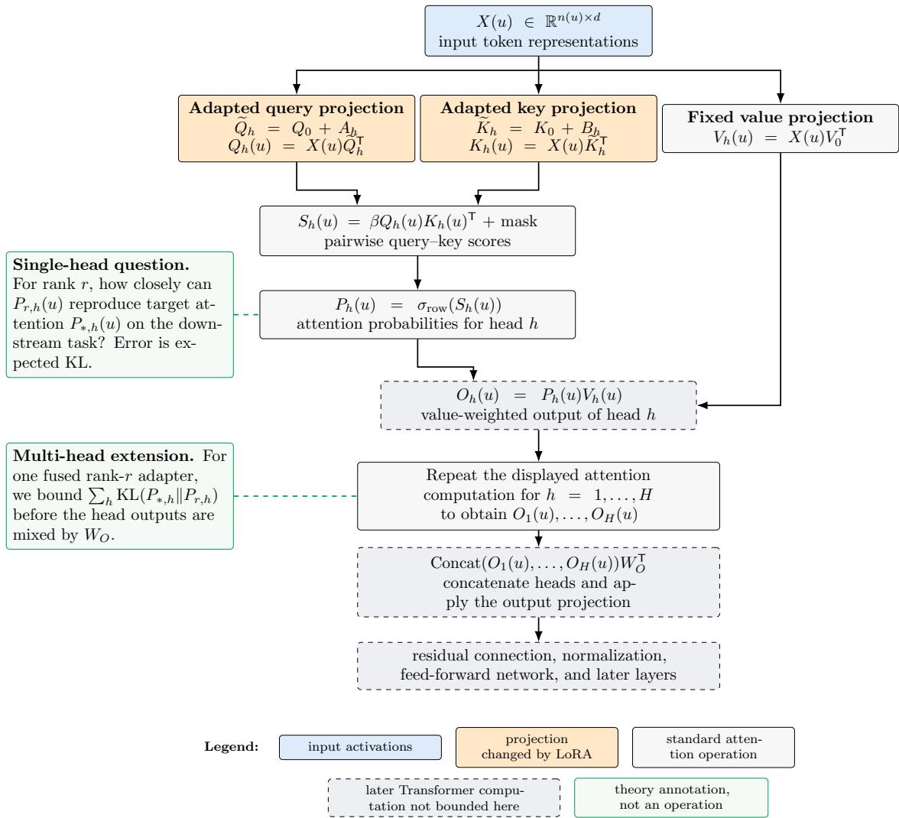
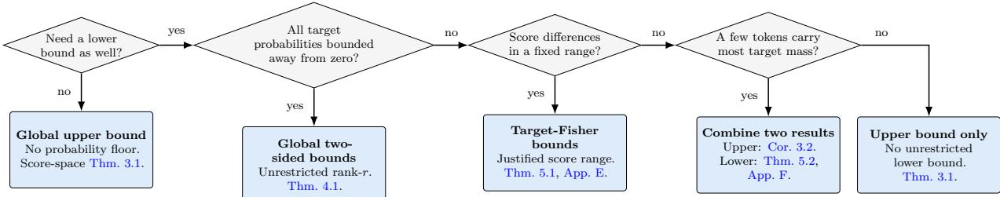

# How Much Rank Does LoRA Need? Rank–Error Bounds for Transformer Attention

Gerard Conangla Planes∗ Aily Labs

## Abstract

Choosing the rank of a low-rank adaptation (LoRA) update is usually an empirical task. In this paper, we provide a task-dependent theory of the approximation error achievable at each LoRA rank for Transformer attention. We fix a pretrained attention head, a target attention function, and a distribution over inputs from the downstream task, and bound the smallest expected Kullback–Leibler (KL) error achievable by a rank-r query LoRA update. When target attention probabilities are bounded away from zero, we prove a lower bound of the error proportional to $\psi (  { \lVert d \rVert } _ { 2 } )$ , where d is the diference between candidate and target attention scores and $\psi ( t ) = \mathrm { m i n } \{ t ^ { 2 } , t \}$ . We also prove an unconditional upper bound min $\{ \| d \| _ { 2 } ^ { 2 } / 4 , \sqrt { 2 } \| d \| _ { 2 } \}$ Under explicit realizability, geometry, and moment conditions, we then bound the best rank-r error between an explicit multiple of $\psi ( { \sqrt { T _ { r } } } )$ and min $\{ T _ { r } / 4 , \sqrt { 2 T _ { r } } \}$ , where $T _ { r }$ is the downstream-weighted tail energy of the target update. We also provide target-Fisher bounds when candidate scores remain within a fixed range of the target scores, and an unrestricted lower bound when a subset of tokens carries most of the probability mass. These spectral bounds describe finite-score approximation. We then construct explicit families in which softmax saturation makes the rank required to match the attention function strictly smaller than the rank required to match the finite logits. Finally, we extend the analysis to fused multi-head LoRA and joint query/key updates, exposing the efects of rank sharing and query/key factorization constraints.

## 1 Introduction

LoRA [11] makes it cheaper to fine-tune a pretrained Transformer [22] by replacing a dense weight update with a low-rank one. Such a low rank is both an advantage and a restriction, reducing the number of trainable parameters and computation, but also limiting the representational power of the adapter. In practice, rank is commonly chosen using rules of thumb or by training several adapters of diferent rank and comparing their downstream performance [11, 27, 21]. Such a sweep reveals which rank worked in a particular run, but it doesn’t tell us whether a smaller adapter lacked capacity or was simply harder to train.

To isolate the representation question, suppose a dense or high-rank target adapter has already been obtained. We then ask: for each rank budget r, how closely can an adapter reproduce the target on inputs from the downstream task? The answer cannot be read from the singular values of the target weight update ∆W alone. For instance, a large singular direction may have no efect if inputs from the task never activate it, while a smaller direction may matter on nearly every input because it repeatedly changes which tokens receive attention. The softmax function in the attention mechanism introduces two further efects. First, adding the same constant to every score leaves the attention probabilities unchanged. Second, softmax saturates, so a score error with large magnitude need not produce a proportionally large attention error. The rank needed to reproduce the target function can therefore difer from the rank suggested by the raw singular values of its weight update.

In this paper, we begin with a LoRA update to the query projection of a single attention head. That update changes the scores assigned to the available keys, which softmax converts into attention probabilities. We compare these probabilities with those of a dense or high-rank target adapter, ask for the smallest expected KL error achievable at rank $^ { r , }$ and obtain bounds on the error, some unconditional and some conditional on explicit assumptions. Attention KL therefore measures how much the query update changes the attention distribution itself, before later layers can modify that change.

We stress that our results bound the attention KL described above, but we do not provide bounds on the head output or final task loss. To do so would require additional assumptions about the architecture, including the value and output projections, residual connections, feed-forward network, and later layers. These components determine how a diference in one head is propagated and may amplify, suppress, or cancel it. Without such architecture-specific assumptions, attention KL alone does not determine output or task error. Figure 1 shows the scope of our analysis within a Transformer block in more detail, including extensions to fused multi-head and joint query/key LoRA.

Overview of the results. For each rank budget $^ { r , }$ let ${ \mathcal { E } } _ { r }$ denote the smallest expected attention KL over all rank-r candidates; Section 2 defines this objective formally. Our analysis first connects attention KL to score approximation, then connects score approximation to LoRA rank.

Theorem 3.1 gives the first connection. If d is the diference between candidate and target scores after removing their common shift, define

$$
\psi ( t ) = \operatorname* { m i n } \{ t ^ { 2 } , t \} , \qquad \psi _ { \mathrm { u p } } ( t ) = \operatorname* { m i n } \{ t ^ { 2 } / 4 , { \sqrt { 2 } } t \} .\tag{1}
$$

The theorem proves that the pointwise attention KL is comparable to $\psi ( \| d \| _ { 2 } )$ when the target probabilities are bounded away from zero, and is at most $\psi _ { \mathrm { u p } } ( \| d \| _ { 2 } )$ without this assumption. Thus the error is quadratic for small score diferences and linear for large ones. Corollary 3.2 lifts this pointwise statement to the expected, rank-constrained objective ${ \mathcal { E } } _ { r }$

Theorem 4.1 supplies the second connection. Under its realizability, geometry, probability-floor, and moment assumptions, it proves

$$
c _ { \mathrm { l o } } \psi ( { \sqrt { T _ { r } } } ) \leq \mathcal { E } _ { r } \leq \psi _ { \mathrm { u p } } ( { \sqrt { T _ { r } } } ) .\tag{2}
$$

Here $T _ { r }$ is the residual tail energy after the target update has been weighted by the queries and keys occurring on the downstream task. Directions that the task never uses therefore do not contribute, and $c _ { \mathrm { l o } }$ is the explicit assumption-dependent constant in Theorem 4.1. The upper bound constructs a candidate whose error does not exceed its curve; the lower bound applies to every candidate. Together they bracket the best achievable error at each rank. Section 9 explains how to estimate this rank–error curve from downstream data and compare it with a desired error tolerance.

When the probability floor in the main theorem is too small to give a useful lower bound, Section 5 provides two alternatives with diferent assumptions (Figure 2 shows a decision diagram to clarify the choices, and Table 2 gives an overview of the three laws of approximation). Theorem 5.1 gives target-Fisher upper and lower bounds for candidates whose scores remain within a fixed range of the target scores. Because that candidate class is restricted, its lower bound does not apply to the unrestricted ${ \mathcal { E } } _ { r }$ . Theorem 5.2 instead gives a lower bound on the unrestricted ${ \mathcal { E } } _ { r }$ by focusing on a subset of tokens carrying most of the target probability mass.

Transformer attention with LoRA: computation and theoretical scope

  
Figure 1: Transformer attention with LoRA and the scope of our analysis. Read from top to bottom, the diagram traces an input through the query, key, and value projections, attention scores, row-wise softmax, and multi-head aggregation. Our central question is how closely a rank-r LoRA update can reproduce a target attention function on inputs from the downstream task. The main theorem treats query-only adaptation in one head; later results cover a fused update shared across heads and simultaneous query/key updates. For an input $u , X ( u )$ contains $n ( u )$ token representations of width d. For each head index $h \in \{ 1 , \ldots , H \}$ , query/key width is p and value width is $p _ { v }$ , with $Q _ { h } ( u ) , K _ { h } ( u ) \in \mathbb { R } ^ { n ( u ) \times p }$ $V _ { h } ( u ) \in \mathbb { R } ^ { n ( u ) \times p _ { v } }$ , and $S _ { h } ( u ) , P _ { h } ( u ) \in \mathbb { R } ^ { n ( u ) \times n ( u ) }$ . Here $\sigma _ { \mathrm { r o w } }$ applies softmax row-wise and $\beta$ is typically $1 / { \sqrt { p } } .$ . The pretrained projections $Q _ { 0 } , K _ { 0 } , V _ { 0 }$ are fixed, while $A _ { h }$ and $B _ { h }$ are rank-r LoRA updates. The multi-head result bounds the sum of headwise attention KL errors before $W _ { O } ;$ the remaining Transformer computation and the final model output are outside this guarantee.

The preceding results concern approximation at finite scores. Theorem 6.1 treats a diferent efect: after softmax saturates, a lower-rank sequence of logits can approach an attention function that requires higher rank to realize with finite logits. It constructs an explicit family with a constant-factor separation between these two ranks. Finally, Theorem 7.1 extends the rank–KL bounds to a fused update shared across attention heads, and Theorem 8.1 extends them to simultaneous query/key LoRA, where the score update must also satisfy a query/key factorization constraint.

## Contributions.

1. Under explicit assumptions, we characterize the best task-dependent attention approximation available at each LoRA rank. Global softmax bounds convert centered score error into $\mathrm { K L } ,$ , and a downstream-weighted spectral theorem converts the remaining score error into an explicit function of rank.

2. We give two alternatives when the main lower-bound constant is weak: target-Fisher bounds for a score-restricted candidate class, and a high-mass lower bound for the original unrestricted class.

3. We prove an exact separation for an explicit Walsh family: matching its finite logits requires rank k, but after softmax saturation the same limiting attention can be recovered to arbitrary accuracy at rank $k - \lfloor k / 3 \rfloor$ within the score space reachable by query adaptation.

4. We extend the rank–KL analysis to a fused update shared across heads and to joint query/key LoRA, where a separate factorization gap measures whether the best efective score update can be realized by the two factors.

Positioning relative to prior work. Prior work studies adaptive rank allocation during training [27, 18], activation-aware approximation [24, 4, 23], finite-sample LoRA rank selection [12], and the transformations that LoRA can express [26]. Our contribution is diferent: for a fixed pretrained head and a known target attention function, we bound the best attention KL attainable at every rank, averaged over $u \sim P$ , the downstream task distribution (e.g. text-to-SQL examples). The underlying weighted approximation theorem is classical [7, 16]; the new step is to connect that task-weighted approximation problem to global upper and lower bounds on attention KL. Section 10 gives a more detailed comparison with these and the related attention-rank and softmax-saturation literature.

## 2 Problem formulation

We begin with one query position in one attention head, so that every matrix and function can be defined explicitly. Sections 7 and 8 extend the formulation.

Let P denote the downstream input distribution and draw $u \sim P ,$ with $n ( u )$ available token positions. Fix pretrained logits $z _ { 0 } ( u ) \in \mathbb { R } ^ { n ( u ) }$ , a pretrained key matrix $K ( u ) \in \mathbb { R } ^ { n ( u ) \times d _ { k } }$ , a query activation $h ( u ) \in \mathbb { R } ^ { d _ { h } }$ , and the attention scale $\beta > 0$ . A query LoRA update is a matrix $M \in \mathbb { R } ^ { d _ { k } \times d _ { h } }$ with rank $( M ) \leq r$ . It produces the score vector and attention distribution

$$
z _ { M } ( u ) = z _ { 0 } ( u ) + \beta K ( u ) M h ( u ) , \qquad p _ { M } ( \cdot \mid u ) = \mathrm { s o f t m a x } ( z _ { M } ( u ) ) .\tag{3}
$$

Here $h ( u )$ is the query representation entering the adapted projection, and the rows of $K ( u )$ are the key vectors against which that query is scored. M is one stored matrix; the attention distribution $p _ { M } ( \cdot \mid u )$ changes with the input u.

Let $z _ { * } ( u )$ be fixed target logits and $p _ { * } ( \cdot \mid u ) = \mathrm { s o f t m a x } ( z _ { * } ( u ) )$ the target attention function. The target may be arbitrary for the score-space results in Section 3. The spectral specialization in Theorem 4.1 requires it to be generated exactly by a dense query update $\Delta _ { * }$ . A generic fully fine-tuned Transformer can also change keys, values, earlier layers, and the activations entering this head, so it need not satisfy that assumption. For such a misspecified target, Equation (4) remains well defined, but the query-only spectral formula would need an extra irreducible approximation term. For rank budget $r ,$ define

$$
\mathcal { E } _ { r } = \operatorname* { i n f } _ { \operatorname { r a n k } ( M ) \leq r } \mathbb { E } _ { u \sim P } \mathrm { K L } ( p _ { * } ( \cdot \mid u ) \parallel p _ { M } ( \cdot \mid u ) ) .\tag{4}
$$

Thus ${ \mathcal { E } } _ { r }$ is the best error attainable by the entire rank-r candidate class. An upper bound exhibits a candidate with small error. A lower bound applies to every candidate and certifies unavoidable error. Inverting the bounds for a tolerance ϵ then yields suficient and necessary rank conditions. Section 9 turns this interpretation into a calibration procedure.

Softmax is invariant to adding a constant to all scores. We therefore center score diferences with

$$
\Pi _ { n } = I _ { n } - \frac { 1 } { n } { \bf 1 1 ^ { \top } } , \qquad d _ { M } ( u ) = \Pi _ { n ( u ) } \big ( z _ { M } ( u ) - z _ { * } ( u ) \big ) .\tag{5}
$$

The associated approximation objective, robust to both small and large score errors, is

$$
\Psi _ { r } = \operatorname* { i n f } _ { \mathrm { \mathrm { \tiny ~ r a n k } } ( M ) \leq r } \mathbb { E } _ { u \sim P } \psi ( \| d _ { M } ( u ) \| _ { 2 } ) .\tag{6}
$$

For the sharper upper bound, also define

$$
\Phi _ { r } = \operatorname* { i n f } _ { \mathrm { \tiny ~ r a n k } ( M ) \leq r } \mathbb { E } _ { u \sim P } \psi _ { \mathrm { u p } } ( \| d _ { M } ( u ) \| _ { 2 } ) .\tag{7}
$$

<table><tr><td>Object</td><td>Meaning</td><td>What changes?</td></tr><tr><td>u</td><td>One input from the downstream task</td><td>Varies across examples</td></tr><tr><td> $z _ { 0 } ( u )$ </td><td>Attention scores produced by the pretrained Depends on u head</td><td></td></tr><tr><td> $p _ { * } ( \cdot \mid u )$ </td><td>Target attention probabilities to be reproduced</td><td>Depends on  $u ;$  the target model is fixed</td></tr><tr><td> $M$ </td><td>Candidate query update with rank(  $\mathbf { \xi } _ { M } ) \leq r$ </td><td>One fixed matrix for all inputs</td></tr><tr><td> $p _ { M } ( \cdot \mid u )$ </td><td>Attention probabilities produced with update Depends on u and on the chosen M M</td><td></td></tr><tr><td> $d _ { M } ( \boldsymbol { u } )$ </td><td>Candidate-target score difference after removing a common shift</td><td>Depends on u and on the chosen M</td></tr><tr><td> ${ \mathcal { E } } _ { r }$ </td><td>Smallest average target-to-candidate KL achievable at rank r</td><td>One number for each rank budget</td></tr></table>

Table 1: Objects in the target–candidate comparison. For each downstream input $u ,$ the pretrained head and fixed target determine the behavior to be matched; M ranges over candidate updates of rank at most $r .$

Example 1 grounds this objective in a concrete downstream task.

## Example 1: Interpreting attention KL in text-to-SQL

An input may contain the user’s question, the database schema, instructions, and previously generated SQL tokens. The target and candidate heads each assign attention probabilities to those token positions. Our objective asks how much rank is needed for the candidate to reproduce the target’s attention on such inputs. This gives a head-level approximation measure that can be studied alongside end-to-end measures such as SQL execution accuracy.

## 3 From score error to attention KL

The first result is independent of LoRA: it relates centered score error to probability error.

Theorem 3.1 (Global robust softmax bounds). Let d $\in \mathbb { R } ^ { n }$ satisfy $\mathbf { 1 } ^ { \mathsf { T } } d = 0$ , let p∗ = softmax(z∗), and put $a = \operatorname* { m i n } _ { i } p _ { * , i } > 0$ . Then

$$
\frac { a } { 2 e ^ { 2 } } \psi ( \| d \| _ { 2 } ) \leq \mathrm { K L } ( p _ { * } \| \ \mathrm { s o f t m a x } ( z _ { * } + d ) ) \leq \psi _ { \mathrm { u p } } ( \| d \| _ { 2 } ) .\tag{8}
$$

The upper bound does not require a positive lower bound on $a .$

The quadratic part of $\psi$ comes from local curvature of log-sum-exp. The linear part is unavoidable globally: a rare input can contain a very large score error while contributing only linear or bounded KL. A purely quadratic global lower bound therefore cannot hold; Proposition B.1 gives an explicit fixed-probability-floor construction.

Corollary 3.2 (Global functional bounds). If mini $p _ { * , i } ( u ) \geq a > 0$ almost surely, then

$$
\frac { a } { 2 e ^ { 2 } } \Psi _ { r } \leq \mathcal { E } _ { r } \leq \Phi _ { r } .\tag{9}
$$

The proof of Theorem 3.1 is short and appears in Appendix A. The rare-context obstruction to a quadratic law is given in Appendix B.

## 4 Task-weighted spectral rank–KL bounds

Assume in this section that the target is exactly realizable by a dense query update $\Delta _ { * }$ . For $A = M - \Delta _ { * }$ ∗, define

$$
\ b { G } ( \ b { u } ) = \beta ^ { 2 } \ b { K } ( \ b { u } ) ^ { \top } \Pi _ { n ( \ b { u } ) } \ b { K } ( \ b { u } ) , \qquad \ b { \Sigma } = \mathbb { E } [ h ( \ b { u } ) h ( \ b { u } ) ^ { \top } ] .\tag{10}
$$

$G ( u )$ records which update directions alter centered attention scores in context $u ; \Sigma$ records which query directions appear on the task.

In the separable case, the random key Gram matrix $G ( u )$ is independent of the query activation $h ( u )$ . Then

$$
\begin{array} { r } { { \mathbb { E } } \| \beta \Pi _ { n ( u ) } K ( u ) A h ( u ) \| _ { 2 } ^ { 2 } = \| G ^ { 1 / 2 } A \Sigma ^ { 1 / 2 } \| _ { \mathrm { F } } ^ { 2 } , \qquad G = { \mathbb { E } } G ( u ) . } \end{array}\tag{11}
$$

The matrix whose spectrum matters is therefore

$$
D _ { * } = G ^ { 1 / 2 } \Delta _ { * } \Sigma ^ { 1 / 2 } , \qquad T _ { r } = \sum _ { j > r } \sigma _ { j } ( D _ { * } ) ^ { 2 } .\tag{12}
$$

$T _ { r }$ is the residual squared score error after the best rank-r update. Directions annihilated by the keys or never activated by $h ( u )$ disappear automatically, a phenomenon that is illustrated in Example 2.

## Example 2: A large update direction that the task never uses

Suppose the target update has two singular directions. The first has the larger singular value, but every query activation from the downstream task is orthogonal to it, so it never changes an attention score. The second is smaller but active on nearly every input. A raw truncated SVD keeps the first direction; the weighted spectrum above removes it and keeps the direction that actually changes attention. Theorem 4.1 turns this distinction into upper and lower error bounds.

To turn this quadratic tail into a global robust lower bound, assume that, for every deterministic compatible matrix $C$

$$
\begin{array} { r } { \mathbb { E } \| C h ( u ) \| _ { 2 } ^ { 4 } \leq \kappa _ { h } \big ( \mathbb { E } \| C h ( u ) \| _ { 2 } ^ { 2 } \big ) ^ { 2 } , \qquad G ( u ) \preceq \Lambda G \quad \mathrm { a l m o s t ~ s u r e l y } . } \end{array}\tag{13}
$$

These uniform moment conditions prevent the quadratic error from being carried entirely by extremely rare contexts.

Theorem 4.1 (Downstream spectral rank–KL bounds). Suppose the target attention function is generated by a dense query update $\Delta _ { * }$ , min ${ } ; p _ { * , i } ( u ) \geq a > 0$ almost surely, $G ( u )$ and $h ( u )$ are independent, and the two conditions in Equation (13) hold. Then

$$
\boxed { \frac { a } { 2 e ^ { 2 } ( 1 + \Lambda \sqrt { \kappa _ { h } } ) } \psi ( \sqrt { T _ { r } } ) \le \mathcal { E } _ { r } \le \psi _ { \mathrm { u p } } ( \sqrt { T _ { r } } ) . }\tag{14}
$$

The upper bound is achieved by truncated SVD of $D _ { * }$ , which already weights the target update by the task queries and keys. The lower bound applies to every rank-r candidate. Both sides are quadratic in the score scale near zero and linear at large scale, but their constants can be far apart when the target probability floor a is small.

For a desired error tolerance $\epsilon ,$ the upper bound gives the suficient rank

$$
r _ { \mathrm { s u f f } } ( \epsilon ) = \operatorname* { m i n } \{ r : \psi _ { \mathrm { u p } } ( \sqrt { T _ { r } } ) \leq \epsilon \} .\tag{15}
$$

Conversely, any rank attaining error at most ϵ must satisfy

$$
\psi ( \sqrt { T _ { r } } ) \leq \frac { 2 e ^ { 2 } ( 1 + \Lambda \sqrt { \kappa _ { h } } ) } { a } \epsilon .\tag{16}
$$

Inverting the error bounds in this way yields suficient and necessary rank conditions.

Remark 4.2 (Size of the bracket). The worst-case ratio between the upper and lower constants is at most

$$
\frac { 2 \sqrt { 2 } e ^ { 2 } ( 1 + \Lambda \sqrt { \kappa _ { h } } ) } { a } .\tag{17}
$$

For example, it is about $2 . 0 \times 1 0 ^ { 4 }$ when $a = 1 0 ^ { - 2 } , \Lambda = 5$ , and $\kappa _ { h } = 3$ . This is a sensitivity calculation from the theorem, not an empirical estimate. For long, peaked attention vectors, the probability floor can make the global lower bound numerically weak; Section 5 gives alternatives.

The proof is in Appendix C. In ordinary self-attention, $G ( u )$ and $h ( u )$ are computed from the same input and need not be independent. The following result replaces independence by direct comparison between the true mean squared score error and the reference quadratic form used to define $T _ { r }$

For $A = M - \Delta _ { * }$ , write

$$
\begin{array} { r } { Q ( A ) = \mathbb { E } \| \beta \Pi _ { n ( u ) } K ( u ) A h ( u ) \| _ { 2 } ^ { 2 } , \qquad S ( A ) = \| G ^ { 1 / 2 } A \Sigma ^ { 1 / 2 } \| _ { \mathrm { F } } ^ { 2 } , } \end{array}\tag{18}
$$

and let $A _ { r } ^ { \mathrm { s v d } }$ be the weighted-SVD candidate used in the upper bound.

Theorem 4.3 (Dependence-allowing spectral bounds). Suppose, for every feasible $A = M - \Delta ,$ ∗

$$
Q ( A ) \geq c _ { r } S ( A ) , \qquad \mathbb { E } \| \beta \Pi _ { n ( u ) } K ( u ) A h ( u ) \| _ { 2 } ^ { 4 } \leq \kappa _ { r } Q ( A ) ^ { 2 } ,\tag{19}
$$

and suppose $Q ( A _ { r } ^ { \mathrm { s v d } } ) \leq C _ { r } ^ { + } T _ { r }$ . If the target probability floor is at least $a > 0$ , then

$$
\frac { a } { 2 e ^ { 2 } ( 1 + \sqrt { \kappa _ { r } } ) } \psi ( \sqrt { c _ { r } T _ { r } } ) \leq \mathcal { E } _ { r } \leq \psi _ { \mathrm { u p } } ( \sqrt { C _ { r } ^ { + } T _ { r } } ) .\tag{20}
$$

This theorem allows arbitrary dependence between keys and queries; its price is that the comparison and moment constants must hold on the candidate class. For example, if $\lambda G \preceq$ $G ( u ) \preceq \Lambda G$ almost surely and the activation moment condition in Equation (13) holds, it applies with $c _ { r } = \lambda , C _ { r } ^ { + } = \Lambda$ , and $\kappa _ { r } = \kappa _ { h } ( \Lambda / \lambda ) ^ { 2 }$ . The proof is in Appendix D.

## 5 Which rank–KL bound should be used?

Because the minimum target probability can be very small in long, peaked attention vectors, we provide two refinements that address diferent needs. The target-Fisher theorem gives upper and lower bounds when score diferences stay inside a fixed range. The high-mass theorem gives a lower bound for the original unrestricted class, using a set of tokens, chosen from the target, that carries most probability mass. Figure 2 and Table 2 make the distinction explicit:

  
Figure 2: Which rank–KL theorem to use. Start at the left and stop at the first result whose assumptions you can justify. An upper bound shows that some rank-r update achieves at most the stated error; a lower bound shows that every rank-r update incurs at least the stated error. The Fisher bounds apply only to candidates whose scores remain within a fixed range of the target scores. Consequently, their lower bound does not apply to the unrestricted optimum ${ \mathcal { E } } _ { r }$

<table><tr><td>Route</td><td></td><td></td><td>Upper bound Lower bound Candidate class</td><td>Main price</td></tr><tr><td>Global</td><td>5</td><td>L</td><td>unrestricted rank-r</td><td>minimum target probability and moment assumptions on</td></tr><tr><td>Target Fisher</td><td>L</td><td>L</td><td>rank-r with a justified range of score differences</td><td>keys/queries span-dependent constants and the target Fisher inner product</td></tr><tr><td>High mass</td><td>×</td><td>7</td><td>unrestricted rank-r</td><td>tokens carrying most target mass, a conditional probability floor, and the key/query Gram on that set</td></tr></table>

Table 2: The three rank–KL routes and their logical scope.

## 5.1 Target-Fisher bounds under a controlled score span

Let $\begin{array} { r } { H _ { * } = \mathrm { d i a g } ( p _ { * } ) - p _ { * } p _ { * } ^ { \mathsf { T } } } \end{array}$ and let $\begin{array} { r } { R ( d ) = \operatorname* { m a x } _ { i } d _ { i } - \operatorname* { m i n } _ { i } d _ { i } } \end{array}$ . Define

$$
c _ { - } ( R ) = \frac { R - 1 + e ^ { - R } } { R ^ { 2 } } , \qquad c _ { + } ( R ) = \frac { e ^ { R } - 1 - R } { R ^ { 2 } } ,\tag{21}
$$

with both values set to $1 / 2$ at $R = 0$

Theorem 5.1 (Target-Fisher score bounds). For every score displacement $d ,$

$$
c _ { - } ( R ( d ) ) d ^ { \mathsf { T } } H _ { * } d \leq \mathrm { K L } ( p _ { * } \| \operatorname { s o f t m a x } ( z _ { * } + d ) ) \leq c _ { + } ( R ( d ) ) d ^ { \mathsf { T } } H _ { * } d .\tag{22}
$$

Consequently, on the candidate class whose score diferences from the target have range at most $R _ { 0 }$ , the optimal KL is bounded above and below by $c _ { + } ( R _ { 0 } )$ and $c _ { - } ( R _ { 0 } )$ times the corresponding target-Fisher quadratic optimum.

There is no explicit minimum-probability constant; small target probabilities enter through the Fisher matrix $H _ { * }$ . More importantly, the optimized class is restricted by the span condition. Because that class is a subset of the unrestricted rank-r class, its lower bound cannot be transferred to $\mathcal { E } _ { r } .$ . The spectral statements, including the extra span condition needed for a matching upper bound, and the proofs are in Appendix E.

## 5.2 An unrestricted high-mass lower bound

For each context, let $S ( u )$ be a measurable token set chosen from the target before optimizing the candidate. Suppose it carries at least $1 - \delta$ of the target mass and the conditional target distribution on $S ( u )$ has minimum probability at least $a _ { \mathrm { c o r e } }$

Theorem 5.2 (High-mass lower bound). Under the preceding assumptions,

$$
\mathcal { E } _ { r } \geq \frac { ( 1 - \delta ) a _ { \mathrm { c o r e } } } { 2 e ^ { 2 } } \operatorname* { i n f } _ { \mathrm { r a n k } ( M ) \leq r } \mathbb { E } \psi \Big ( \big \| \Pi _ { S ( u ) } \big ( z _ { M } ( u ) - z _ { * } ( u ) \big ) _ { S ( u ) } \big \| _ { 2 } \Big ) .\tag{23}
$$

This is a lower bound on the original unrestricted ${ \mathcal { E } } _ { r }$ . Under additional control of the key/query Gram and moments on $S ( u )$ , the right-hand side reduces to the same spectral tail, but only on those tokens. It does not give a full-KL upper bound: matching conditional scores inside $S ( u )$ need not match the total mass assigned to $S ( u )$ . The proof and spectral forms are in Appendix F.

## 6 Saturation changes the relevant notion of rank

The main theorem describes approximation of finite logits, but softmax also has a boundary regime in which logits can diverge while their distributions converge. Example 3 shows the basic saturation mechanism before the rank separation is stated formally.

Example 3: Diferent logits, the same saturated attention   
For two tokens,   
softmax(T, 0) −→ (1, 0), softmax(2T, 0) −→ (1, 0) as T → ∞.   
The diference between the two logit vectors grows with $T _ { i }$ , but their attention distributions   
converge to the same limit. The results below prove a stronger efect: for explicit families of   
targets, saturation reduces the rank needed to approximate the entire attention function.

For a boundary target $P _ { \infty }$ and an allowed centered score space $L ,$ define its L-relative softmax closure rank $r _ { \mathrm { c l } } ^ { L } ( P _ { \infty } )$ as the smallest r for which there is a sequence of score matrices of rank at most $r ,$ with every score column in L, whose columnwise softmax distributions converge to $P _ { \infty }$ . For query adaptation, L is the score space reachable through the fixed key matrix, so the restriction is part of the LoRA model. This rank can be smaller than the rank required to match every finite target logit exactly.

Theorem 6.1 (Exact closure rank of an isolated-triple Walsh family). For every $k \geq 3$ , there is a query-only Walsh-attention family with k contexts and fewer than $4 k ^ { 2 } + 8$ token positions such that every exact realization with finite logits has update rank k. For the limiting target $P _ { \infty } ^ { ( k ) }$ of this family and its Walsh score space $L _ { k }$ , the exact relative closure rank is

$$
r _ { \mathrm { c l } } ^ { L _ { k } } ( P _ { \infty } ^ { ( k ) } ) = k - \lfloor k / 3 \rfloor .\tag{24}
$$

This equality is for the isolated-triple family constructed in Appendix $G ;$ other target families can have smaller closure rank, as the construction below demonstrates.

The construction groups Walsh characters into isolated triples. A rank-two path per triple gives the upper bound. For the lower bound, restricted Fourier identities and columnwise normalization force every limiting triple block to retain rank at least two. Saturation therefore yields a genuine constant-factor reduction, but in this family it cannot collapse the rank of the attention function to $o ( k )$

A separate linear-token family gives a stronger achieved ratio: with fewer than $8 ( k + 1 )$ token positions, rank at most

$$
k - \operatorname* { m a x } \{ \lfloor k / 3 \rfloor , 3 \lfloor k / 7 \rfloor \}\tag{25}
$$

attains vanishing KL, reaching ratio $4 / 7$ on complete seven-context blocks. That construction concerns a diferent target family and does not identify its minimum closure rank. The two results and their proofs are kept separate in Appendix G.

## 7 Fused multi-head LoRA

Standard query LoRA for multi-head attention often constrains one fused projection matrix, vertically divided into head blocks. This is not the same as assigning an independent rank to every head: one fused rank direction can serve several heads.

For $j = 1 , \dots , H$ , let $K _ { j } ( u ) \ \in \ \mathbb { R } ^ { n _ { j } ( u ) \times d _ { k , j } }$ and let all heads share the query activation $h ( u ) \in \mathbb { R } ^ { d _ { h } }$ . Stack the head updates as $M = ( M _ { 1 } ^ { \mathsf { T } } , \ldots , M _ { H } ^ { \mathsf { T } } ) ^ { \mathsf { T } }$ and impose the single fused constraint rank $( M ) \leq r$ . Assume the target is generated by the similarly stacked dense update $\Delta _ { * } ^ { \mathrm { M H } }$ . Define

$$
\begin{array} { r } { d _ { M , j } ( u ) = \beta _ { j } \Pi _ { n _ { j } ( u ) } K _ { j } ( u ) ( M _ { j } - \Delta _ { * , j } ) h ( u ) , } \end{array}\tag{26}
$$

$$
\mathcal { E } _ { r } ^ { \mathrm { M H } } = \operatorname* { i n f } _ { \mathrm { r a n k } ( M ) \leq r } \mathbb { E } \sum _ { j = 1 } ^ { H } \mathrm { K L } ( p _ { * , j } ( \cdot \mid u ) \| p _ { M , j } ( \cdot \mid u ) ) ,\tag{27}
$$

$$
G _ { \mathrm { M H } } ( u ) = \mathrm { b l o c k d i a g } \Big ( \beta _ { j } ^ { 2 } K _ { j } ( u ) ^ { \mathsf { T } } \Pi _ { n _ { j } ( u ) } K _ { j } ( u ) : j = 1 , \ldots , H \Big ) , \qquad G _ { \mathrm { M H } } = \mathbb { E } G _ { \mathrm { M H } } ( u ) ,\tag{28}
$$

$$
T _ { r } ^ { \mathrm { M H } } = \sum _ { j > r } \sigma _ { j } \Big ( G _ { \mathrm { M H } } ^ { 1 / 2 } \Delta _ { * } ^ { \mathrm { M H } } \Sigma ^ { 1 / 2 } \Big ) ^ { 2 } , \qquad \Sigma = \mathbb { E } [ h ( u ) h ( u ) ^ { \mathsf { T } } ] .\tag{29}
$$

Theorem 7.1 (Fused multi-head rank–KL bounds). Suppose every target probability is at least $a _ { \operatorname* { m i n } } > 0$ almost surely, $G _ { \mathrm { M H } } ( u )$ is independent of $h ( u ) , G _ { \mathrm { M H } } ( u ) \preceq \Lambda _ { \mathrm { M H } } G _ { \mathrm { M H } }$ almost surely, and

$$
\begin{array} { r } { \mathbb { E } \| C h ( u ) \| _ { 2 } ^ { 4 } \leq \kappa _ { h } \big ( \mathbb { E } \| C h ( u ) \| _ { 2 } ^ { 2 } \big ) ^ { 2 } \quad f o r \ e v e r y \ c o m p a t i b l e \ d e t e r m i n i s t i c \ C . } \end{array}\tag{30}
$$

Then

$$
\frac { a _ { \operatorname* { m i n } } } { 2 e ^ { 2 } ( 1 + \Lambda _ { \mathrm { M H } } \sqrt { \kappa _ { h } } ) } \psi ( \sqrt { T _ { r } ^ { \mathrm { M H } } } ) \leq \mathcal { E } _ { r } ^ { \mathrm { M H } } \leq \operatorname* { m i n } \{ T _ { r } ^ { \mathrm { M H } } / 4 , \sqrt { 2 H T _ { r } ^ { \mathrm { M H } } } \} .\tag{31}
$$

The upper/lower bracket can widen by a factor of order $\sqrt { H }$ because the objective sums KL over heads; the aggregation inequality producing this factor is tight without further assumptions on how error is distributed across heads. If each head instead has its own adapter and integer rank $r _ { h } ,$ , the feasible set separates after the ranks are fixed; allocating a total budget R is the discrete problem min $\begin{array} { r } { \mathsf { L } _ { \mathsf { T } _ { h } } r _ { h } \le R \sum _ { h } \mathcal { E } _ { h , r _ { h } } } \end{array}$ . The proof and the underlying pointwise aggregation inequality are in Appendix H.

## 8 Joint query/key LoRA

Practical LoRA may update both queries and keys. Let $Q _ { 0 } , K _ { 0 } \in \mathbb { R } ^ { p \times d }$ be pretrained factors and let A, $B \in \mathbb { R } ^ { p \times d }$ be query and key updates with ranks at most $r _ { Q } , r _ { K }$ . On ordinary dot-product scores they change the scores by the efective update

$$
C ( A , B ) = ( K _ { 0 } + B ) ^ { \mathsf { T } } ( Q _ { 0 } + A ) - K _ { 0 } ^ { \mathsf { T } } Q _ { 0 } = K _ { 0 } ^ { \mathsf { T } } A + B ^ { \mathsf { T } } ( Q _ { 0 } + A ) .\tag{32}
$$

The bound rank $\left( C ( A , B ) \right) \leq r _ { Q } + r _ { K }$ is known [26]: grouping the bilinear term gives the sharp containment

$$
\operatorname { r a n k } ( C ( A , B ) ) \leq r _ { Q } + r _ { K } .\tag{33}
$$

Let a context provide token representations $X ( u ) \in \mathbb { R } ^ { n ( u ) \times d }$ and a query representation $h ( u ) \in \mathbb { R } ^ { d }$ . For target factors $( A _ { * } , B _ { * } )$ , put $C _ { * } = C ( A _ { * } , B _ { * } )$ and define the centered score error and actual factor-class objective

$$
d _ { A , B } ( u ) = \beta \Pi _ { n ( u ) } X ( u ) [ C ( A , B ) - C _ { * } ] h ( u ) ,\tag{34}
$$

$$
\mathcal { E } _ { r _ { Q } , r _ { K } } ^ { \mathrm { Q K } } = \operatorname* { i n f } _ { \mathrm { \tiny ~ r a n k } ( A ) \leq r _ { Q } } \mathbb { E } \mathrm { K L } ( p _ { * } \| p _ { A , B } ) .\tag{35}
$$

Let

$$
\begin{array} { r } { G _ { X } ( u ) = \beta ^ { 2 } X ( u ) ^ { \mathsf { T } } \Pi _ { n ( u ) } X ( u ) , \qquad G _ { X } = \mathbb { E } G _ { X } ( u ) , \qquad \Sigma = \mathbb { E } [ h ( u ) h ( u ) ^ { \mathsf { T } } ] . } \end{array}\tag{36}
$$

$\operatorname { I f } G _ { X } ( u )$ and $h ( u )$ are independent, the mean squared score error equals $\| G _ { X } ^ { 1 / 2 } [ C ( A , B ) - C _ { * } ] \Sigma ^ { 1 / 2 } \| _ { \mathrm { F } } ^ { 2 }$ Define

$$
D _ { * } ^ { \mathrm { e f f } } = G _ { X } ^ { 1 / 2 } C _ { * } \Sigma ^ { 1 / 2 } , \qquad T _ { s } ^ { \mathrm { e f f } } = \sum _ { j > s } \sigma _ { j } ( D _ { * } ^ { \mathrm { e f f } } ) ^ { 2 } , \qquad s = r _ { Q } + r _ { K } .\tag{37}
$$

Let $S _ { s } ^ { \mathrm { s v d } }$ be the set of rank-s matrices attaining the weighted approximation error $T _ { s } ^ { \mathrm { e f f } }$ . An element of this set need not be writable as query and key updates of size $p \times d$ with the separate rank budgets. Define the extra error from that factorization gap by

$$
\begin{array} { r l } & { \rho _ { r _ { Q } , r _ { K } } = \underset { C _ { s } \in \mathcal { S } _ { s } ^ { \mathrm { s v d } } } { \operatorname* { i n f } } \underset { \mathrm { r a n k } ( A ) \leq r _ { Q } } { \operatorname* { i n f } } \Vert G _ { X } ^ { 1 / 2 } [ C ( A , B ) - C _ { s } ] \Sigma ^ { 1 / 2 } \Vert _ { \mathrm { F } } . } \end{array}\tag{38}
$$

Theorem 8.1 (Joint $\mathrm { Q / K }$ rank–KL bounds). Suppose mini $p _ { * , i } ( u ) \geq a > 0$ almost surely, $G _ { X } ( u )$ is independent of $h ( u )$ so that the mean-squared identity above holds, and, for every feasible pair $( A , B )$ 2

$$
\begin{array} { r } { \mathbb { E } \| d _ { A , B } ( u ) \| _ { 2 } ^ { 4 } \leq \kappa \big ( \mathbb { E } \| d _ { A , B } ( u ) \| _ { 2 } ^ { 2 } \big ) ^ { 2 } . } \end{array}\tag{39}
$$

Then

$$
\frac { a } { 2 e ^ { 2 } ( 1 + \sqrt { \kappa } ) } \psi ( \sqrt { T _ { s } ^ { \mathrm { e f f } } } ) \leq \mathcal { E } _ { r _ { Q } , r _ { K } } ^ { \mathrm { Q K } } \leq \psi _ { \mathrm { u p } } \mathopen { } \mathclose \bgroup \left( \sqrt { T _ { s } ^ { \mathrm { e f f } } } + \rho _ { r _ { Q } , r _ { K } } \aftergroup \egroup \right) .\tag{40}
$$

The lower bound follows from containment in the efective rank-s class. The reverse containment generally fails: every updated width-p head also satisfies rank $( K _ { 0 } ^ { \mathsf { T } } Q _ { 0 } + C ) \le p$ . Exact one-sided support conditions or a sequential two-sided factorization make $\rho _ { r _ { Q } , r _ { K } } = 0 ;$ otherwise that extra error can be large. The realization lemmas, a constructive target-factor upper bound, and a fused multi-head lower bound are proved in Appendix I.

The two sides form a useful bracket only when $\rho _ { r _ { Q } , r _ { K } }$ is comparable to, or smaller than, $\sqrt { T _ { s } ^ { \mathrm { e f f } } }$ . In general, computing $\rho _ { r _ { Q } , r _ { K } }$ is a nonconvex factorization problem over the weighted rank-s optimizers; the theorem does not provide a tractable procedure or a universal upper bound for it. The cases with $\rho _ { r _ { Q } , r _ { K } } = 0$ therefore identify the cleanest regime for this extension.

RoPE inserts a relative rotation between the query and key factors. Every relative-position slice still has rank at most $r _ { Q } + r _ { K }$ , so the global robust bound remains valid for the assembled scores. The candidate is then a coupled family of efective matrices, however, and the single-matrix spectral tail in Theorem 8.1 does not apply automatically.

This RoPE-specific obstruction is not universal. Architectures that omit explicit positional embeddings and use $\mathrm { N o P E }$ , such as Kimi K3 [13], keep token order only through causal computation. For those heads, the ordinary dot-product formulation is the more direct starting point, subject to the model’s other attention mechanisms.

## 9 Estimating LoRA rank from downstream data

The theory can be used once a dense or high-rank target update and a calibration set from the downstream task are available. Its output is a pair of error curves over rank: an upper curve achieved by a constructed candidate and a lower curve that no candidate in the stated class can beat. These curves may identify one rank, or they may leave an interval that the theory does not resolve.

For query-only adaptation, the procedure is:

1. Check the target class. Verify that the target attention is generated by a query update $\Delta _ { * }$ If both queries and keys change, use Section $8 ;$ a target produced by unrestricted fine-tuning may also contain an irreducible query-only approximation error.

2. Collect calibration inputs. Sample complete inputs from the downstream task and run the fixed pretrained and target heads. Store the query activations $h ( u )$ , centered key Gram matrices $G ( u )$ , and target attention probabilities. Complete inputs, rather than individual token positions treated as independent observations, are the sampling units.

3. Choose the applicable bound. Use Figure 2. If the separability assumptions of Theorem 4.1 are not credible, use the dependence-allowing geometry in Appendix D. If the target probability floor is too small, evaluate the target-Fisher or high-mass route instead.

4. Estimate the spectral tail. For the main route, estimate $G = \mathbb { E } G ( u )$ and $\Sigma = \mathbb { E } [ h ( u ) h ( u ) ^ { \mathsf { T } } ]$ form $\widehat { D } _ { * } = \widehat { G } ^ { 1 / 2 } \widehat { \Delta } _ { * } \widehat { \Sigma } ^ { 1 / 2 }$ , and compute $\begin{array} { r } { \widehat { T } _ { r } = \sum _ { j > r } \sigma _ { j } ( \widehat { D } _ { * } ) ^ { 2 } } \end{array}$ for every rank of interest. The truncated SVD of $\widehat { D } _ { * }$ gives the corresponding upper-bound candidate in the weighted coordinates. On the supported subspaces, the corresponding query update is $\widehat { M } _ { r } = \widehat { G } ^ { \dagger / 2 } ( \widehat { D } _ { * } ) _ { r } \widehat { \Sigma } ^ { \dagger / 2 }$ , where $( \widehat { D } _ { * } )$ is the rank-r truncated SVD.

5. Supply and stress-test the constants. The probability floor, almost-sure geometry bound, and uniform moment constant are assumptions of the population theorem, not quantities certified by a finite calibration set. Use analytic bounds when available, or report $L _ { r }$ over a range of assumed values. Sample estimates are diagnostics, not finite-sample certificates. The upper curve $U _ { r }$ comes from the constructed candidate and does not require these lower-bound constants.

6. Compare with the desired tolerance. If $U _ { r } \ \leq \ \epsilon$ , the upper bound exhibits a rank-r candidate within tolerance. If $L _ { r } > \epsilon$ , no rank-r candidate in the relevant class can meet the tolerance. The smallest rank certified by the upper curve is suficient; ranks rejected by the lower curve are impossible under the theorem’s assumptions. Any gap between the two remains unresolved.

## Example 4: Estimating rank on a given calibration set

Suppose a high-rank query adapter has already been trained, for instance for a text-to-SQL task as in Example 1. A calibration set contains complete prompts with the question, schema, instructions, and SQL prefix available at each attention call. The upper and conditional lower curves divide the tested ranks into three sets: ranks whose constructed candidate meets the KL tolerance, ranks excluded by the conditional lower bound, and ranks for which the two bounds do not decide. The width of the unresolved set depends on the gap between the upper and lower constants and should be reported rather than replaced by a single selected rank.

The population theorems do not provide confidence intervals for these plug-in estimates. A held-out calibration split can test whether the predicted rank–KL curve tracks measured target-to-candidate KL, but it does not turn the current bounds into a finite-sample guarantee. The relevant comparison is against the raw spectrum of $\Delta _ { * }$ ∗ and activation-only rank criteria: the question is whether task-weighted tails predict attainable attention KL more accurately, not whether a particular optimizer produces a U-shaped validation curve.

## 10 Related work

LoRA and expressivity. LoRA introduced low-rank updates as a parameter-eficient adaptation mechanism [11]. Zeng and Lee [26] analyze LoRA expressivity, including products of adapted matrices and exact Transformer score matching. We use their bound rank $( C ) \leq r _ { Q } + r _ { K }$ in the joint Q/K analysis and then quantify the additional error caused when the best efective score update cannot be realized by factors with the separate rank budgets. Duranthon et al. [6] give a statistical theory of rank-one LoRA fine-tuning in a solvable attention model; their object is learning-curve asymptotics rather than error as a function of rank for a prescribed target. Arunan [12] studies finite-sample estimation and rank selection for empirical risk minimization over rank-constrained LoRA. In a well-specified locally quadratic model, that work derives matching $\widetilde { \Theta } ( r d / n )$ estimation rates and an under-ranking bias governed by the raw singular values of the target update. That work studies statistical estimation from finite training data. We hold the target fixed and study the approximation error remaining at each rank, with a spectrum weighted by the task queries and keys and a global error scale determined by softmax.

Weighted approximation. The weighted low-rank approximation theorem is a classic result. [7, 16]. Methods such as DRONE and SVD-LLM use related data-aware decompositions for model compression [4, 23]. CorDA orients a weight decomposition by downstream activation covariance, while EVA initializes and reallocates LoRA rank using activation variance [24, 18]. These methods motivate task-aware approximation directions. Our analysis places the weighted approximation inside the target-to-candidate attention KL and derives both upper and lower bounds, including the global scale ψ needed for small and large score errors.

Task-intrinsic attention rank and low-rank logits. Yoon [25] defines attention-native intrinsic rank as the minimum query–key kernel rank realizing a task and studies controlled deficiency and recovery phenomena. We study the narrower class of LoRA updates of a pretrained head, and a prescribed attention target under KL. Golowich et al. [8] study low-rank approximation of extended language-model logit matrices under average KL, without pretrained LoRA attention or separate Q/K update constraints.

Attention rank and saturation. Attention head dimension and score-matrix rank have been studied as expressivity constraints [3]. Sparse-target cross-entropy and diverging-margin geometry are adjacent to our saturation branch [28]; low pre-softmax rank can also produce high postsoftmax rank [15]. Boundary supports of fixed discrete exponential families are classical [5, 20]. Sign rank and rounding rank concern finite, exact realization of prescribed sign or threshold patterns [19, 17], whereas our closure rank allows a sequence of scores to diverge while its softmax converges. Our lower bound uses restricted Fourier identities, columnwise normalization, and the closedness of a bounded-rank matrix set. We do not know a direct implication in either direction between the cited Walsh sign-rank bounds and the L-relative closure-rank formula in Theorem 6.1. Low-rank softmax models have also been studied through argmaxability [9, 10]. Basri and Jacobs [2] show that low-dimensional softmax embeddings can preserve ratios among selected top-token probabilities while of-support mass vanishes. These results establish the broad support-separation and diverging-margin mechanisms. Our saturation theorem makes a diferent comparison within one explicit multi-context family: the rank required to match finite logits versus the exact softmax closure rank.

Softmax curvature. The Hessian comparison behind our target-Fisher bounds is related to generalized self-concordant analyses of logistic and softmax losses [1, 14]. We specialize this curvature principle through a finite-dimensional Bregman calculation for KL from the target attention to the candidate.

## 11 Limitations

The theory starts from an available target update. It can assess compression of that target or the rank needed to reproduce it, but it does not prescribe a rank before any target behavior is known.

The bounds are population statements. From a calibration set, one can plug in estimates of the task geometry (G, Σ) and the corresponding spectral tails, although we do not provide finite-sample confidence intervals for the resulting rank–KL curves. Other inputs to the lower bounds—the probability floor, the almost-sure geometry constant, and the uniform moment constant—enter as theorem assumptions rather than as quantities certified by a finite sample, so a practical lower curve must rely on analytic bounds or report sensitivity to those values. The spectral specialization likewise assumes that the target attention is realizable within the stated query-only or joint query/key adapter class; unrestricted fine-tuning may leave an additional approximation error outside that class.

The results describe the best candidate in a rank-constrained class, not the path taken by a training algorithm. They therefore separate representational capacity from optimization but do not guarantee that SGD or another optimizer finds the candidate attaining the upper bound. The constants can also be loose for long, sharply peaked attention vectors. The target-Fisher and high-mass results ofer alternatives in that regime, but their own assumptions must still be checked. We have not established that any of these constants are numerically tight on trained, real-model attention heads (for more information on computational checks, see Appendix 12).

Finally, the guarantees concern attention probabilities. Converting them into bounds on layer outputs or task loss requires assumptions about values, output projections, residual paths, feed forward networks, and later layers. The saturation families isolate a genuine nonlinear efect but are explicit constructions rather than models of typical language data. For joint query/key LoRA, RoPE couples the factors across relative positions, so the single-matrix spectral specialization does not apply directly, although it is worth noting that this particular obstruction is absent in NoPE architectures such as Kimi K3 [13].

## 12 Conclusion

We studied how much LoRA rank is needed to reproduce a known attention function on inputs from a downstream task. The main message is that this question has a task-dependent answer: it is not settled by the raw rank or singular values of the target weight update alone, but by the part of that update that the task’s queries and keys actually activate. Under explicit assumptions, we connect that activated component to the best expected attention KL attainable at each rank. A global softmax comparison turns centered score error into KL, and a downstream-weighted spectral theorem turns the remaining score error into an explicit function of rank through the scale $\psi ( t ) = \mathrm { m i n } \{ t ^ { 2 } , t \}$ . Together, these steps replace rank heuristics and post-hoc sweeps with a two-sided, rank-indexed bracket on representational error at the attention layer itself.

The same framework extends when the standard constants are weak or the adapter is richer than query-only LoRA. Target-Fisher and high-mass lower bounds provide alternative routes when the global probability-floor assumption is uninformative, and an explicit saturation family shows that softmax can separate the rank needed to match finite logits from the rank needed to match the limiting attention function. Fused multi-head analysis accounts for a shared rank budget across heads, and joint query/key LoRA isolates the extra error from factorizing an efective score update into separate low-rank factors.

Given a target adapter and a calibration set drawn from the task, the theory therefore yields upper and lower error curves over rank and makes explicit where the available assumptions certify a rank, exclude it, or leave the decision unresolved.

## References

[1] Francis Bach. Self-concordant analysis for logistic regression. Electronic Journal of Statistics, 4:384–414, 2010.

[2] Ronen Basri and David W. Jacobs. The softmax bottleneck does not limit the probabilities of the most likely tokens. In International Conference on Learning Representations, 2026.

[3] Srinadh Bhojanapalli, Chulhee Yun, Ankit Singh Rawat, Sashank J. Reddi, and Sanjiv Kumar. Low-rank bottleneck in multi-head attention models. In International Conference on Machine Learning, 2020.

[4] Patrick Chen, Hsiang-Fu Yu, Inderjit S. Dhillon, and Cho-Jui Hsieh. DRONE: Data-aware low-rank compression for large NLP models. In Advances in Neural Information Processing Systems, 2021.

[5] Imre Csisz´ar and Frantiˇsek Mat´uˇs. Closures of exponential families. The Annals of Probability, 2005.

[6] O. Duranthon, F. Boncoraglio, and Lenka Zdeborov´a. High-dimensional theory of LoRA fine-tuning in a solvable attention model. arXiv preprint arXiv:2606.05899, 2026.

[7] Carl Eckart and Gale Young. The approximation of one matrix by another of lower rank. Psychometrika, 1(3):211–218, 1936.

[8] Noah Golowich, Allen Liu, and Abhishek Shetty. Sequences of logits reveal the low rank structure of language models. In International Conference on Learning Representations, 2026.

[9] Andreas Grivas, Nikolay Bogoychev, and Adam Lopez. Low-rank softmax can have unargmaxable classes in theory but rarely in practice. arXiv preprint arXiv:2203.06462, 2022.

[10] Andreas Grivas, Antonio Vergari, and Adam Lopez. Taming the sigmoid bottleneck: Provably argmaxable sparse multi-label classification. arXiv preprint arXiv:2310.10443, 2023.

[11] Edward J. Hu, Yelong Shen, Phillip Wallis, Zeyuan Allen-Zhu, Yuanzhi Li, Shean Wang, Lu Wang, and Weizhu Chen. LoRA: Low-rank adaptation of large language models. In International Conference on Learning Representations, 2022.

[12] Arunan J. Tight sample complexity for low-rank adaptation: Matching bounds and rank selection. arXiv preprint arXiv:2607.27680, 2026.

[13] Kimi Team. Kimi K3: Open frontier intelligence. arXiv preprint arXiv:2607.24653, 2026.

[14] Ulysse Marteau-Ferey, Francis Bach, and Alessandro Rudi. Globally convergent newton methods for ill-conditioned generalized self-concordant losses. In Advances in Neural Information Processing Systems, 2019.

[15] Wojciech Masarczyk, Mateusz Ostaszewski, Tin Sum Cheng, Tomasz Trzci´nski, Aur´elien Lucchi, and R˘azvan Pascanu. Unpacking softmax: How temperature drives representation collapse, compression, and generalization. arXiv preprint arXiv:2506.01562, 2025.

[16] Leon Mirsky. Symmetric gauge functions and unitarily invariant norms. The Quarterly Journal of Mathematics, 11(1):50–59, 1960.

[17] Stefan Neumann, Rainer Gemulla, and Pauli Miettinen. What you will gain by rounding: Theory and algorithms for rounding rank. arXiv preprint arXiv:1609.05034, 2016.

[18] Fabian Paischer, Lukas Hauzenberger, Thomas Schmied, Benedikt Alkin, Marc Peter Deisenroth, and Sepp Hochreiter. Parameter eficient fine-tuning via explained variance adaptation. In Advances in Neural Information Processing Systems, 2025.

[19] Ramamohan Paturi and Janos Simon. Probabilistic communication complexity. Journal of Computer and System Sciences, 33(1):106–123, 1986.

[20] Johannes Rauh, Thomas Kahle, and Nihat Ay. Support sets in exponential families and oriented matroid theory. International Journal of Approximate Reasoning, 52(5):613–626, 2011.

[21] John Schulman and Thinking Machines Lab. LoRA without regret. Thinking Machines Lab blog, September 2025. thinkingmachines.ai/blog/lora; accessed 2026-08-18.

[22] Ashish Vaswani, Noam Shazeer, Niki Parmar, Jakob Uszkoreit, Llion Jones, Aidan N. Gomez, Lukasz Kaiser, and Illia Polosukhin. Attention is all you need. In Advances in Neural Information Processing Systems, 2017.

[23] Xin Wang, Yu Zheng, Zhongwei Wan, and Mi Zhang. SVD-LLM: Truncation-aware singular value decomposition for large language model compression. arXiv preprint arXiv:2403.07378, 2024.

[24] Yibo Yang, Xiaojie Li, Zhongzhu Zhou, Shuaiwen Leon Song, Jianlong Wu, Liqiang Nie, and Bernard Ghanem. CorDA: Context-oriented decomposition adaptation of large language models for task-aware parameter-eficient fine-tuning. In Advances in Neural Information Processing Systems, 2024.

[25] Byeong Hoon Yoon. The entropic bound for transformers: Why static rank fails and attention-native rank recovers. arXiv preprint arXiv:2607.23050, 2026.

[26] Yuchen Zeng and Kangwook Lee. The expressive power of low-rank adaptation. In International Conference on Learning Representations, 2024.

[27] Qingru Zhang, Minshuo Chen, Alexander Bukharin, Nikos Karampatziakis, Pengcheng He, Yu Cheng, Weizhu Chen, and Tuo Zhao. AdaLoRA: Adaptive budget allocation for parameter-eficient fine-tuning. In International Conference on Learning Representations, 2023.

[28] Zihao Zhao, Tina Behnia, Ali Vakilian, and Christos Thrampoulidis. Implicit geometry of next-token prediction: From language sparsity patterns to model representations. arXiv preprint arXiv:2408.15417, 2024.

## Guide to the appendix

Appendices A–D prove the global softmax, moment, spectral, and dependence-allowing bounds. Appendices E and F contain the two alternative lower-bound routes. Appendix G gives the saturation constructions and closure-rank lower bound, and Appendices H–I prove the multi-head and joint query/key extensions.

Computational checks. The accompanying code is available at https://github.com/ gerardpc/lora-rank-project and verifies the displayed finite constructions, rank calculations, and selected inequalities on small instances. These checks are provided for reproducibility and debugging and are not used in the proofs.

## Appendix contents

A. Proof of the global softmax bounds

B. Why a purely quadratic global lower bound is impossible

C. Moment and spectral lemmas

D. Dependence-allowing rank–KL bounds

E. Target-Fisher bounds

F. High-mass lower bounds

G. Saturation constructions and lower bound

H. Fused multi-head proofs

I. Joint query/key proofs

## A Proof of the global softmax bounds

For $z \in \mathbb { R } ^ { n }$ , write lse $\left( z \right) = \log \sum _ { i } e ^ { z _ { i } }$ and $\begin{array} { r } { H ( z ) = \mathrm { d i a g } ( p ( z ) ) - p ( z ) p ( z ) ^ { \mathsf { T } } } \end{array}$ , where $p ( z ) = \operatorname { s o f t m a x } ( z )$

Proof of Theorem 3.1. The KL divergence is the log-sum-exp Bregman divergence

$$
F ( d ) = \mathrm { l s e } ( z _ { * } + d ) - \mathrm { l s e } ( z _ { * } ) - \langle p _ { * } , d \rangle .\tag{41}
$$

Taylor’s formula with integral remainder gives

$$
F ( d ) = \int _ { 0 } ^ { 1 } ( 1 - t ) d ^ { \mathsf { T } } H ( z _ { * } + t d ) d d t .\tag{42}
$$

Since $\| H ( z ) \| _ { \mathrm { o p } } ~ \le ~ 1 / 2 , ~ F ( d ) ~ \le ~ \| d \| _ { 2 } ^ { 2 } / 4$ . Also both lse $: ( z _ { * } + d ) - \mathrm { l s e } ( z _ { * } )$ and $\langle p _ { * } , d \rangle$ lie in[min d , max d ]. Therefore

$$
F ( d ) \leq \operatorname* { m a x } _ { i } d _ { i } - \operatorname* { m i n } _ { i } d _ { i } \leq { \sqrt { 2 } } \| d \| _ { 2 } .\tag{43}
$$

Taking the smaller of the quadratic and linear bounds proves $F ( d ) \leq \psi _ { \mathrm { u p } } ( \| d \| _ { 2 } )$

For the lower bound, first suppose $\| d \| _ { 2 } \leq 1$ . For every $t \in [ 0 , 1 ]$ ，

$$
p _ { i } ( z _ { * } + t d ) = \frac { p _ { * , i } e ^ { t d _ { i } } } { \sum _ { j } p _ { * , j } e ^ { t d _ { j } } } \geq a e ^ { - 2 } .\tag{44}
$$

For any probability vector q satisfying mini $q _ { i } \geq \alpha$ and any centered vector $v ,$

$$
\boldsymbol { v } ^ { \mathsf { T } } ( \mathrm { d i a g } ( \boldsymbol { q } ) - \boldsymbol { q } \boldsymbol { q } ^ { \mathsf { T } } ) \boldsymbol { v } = \sum _ { i } \boldsymbol { q } _ { i } ( v _ { i } - \mu _ { q } ) ^ { 2 }\tag{45}
$$

$$
\geq \alpha \sum _ { i } ( v _ { i } - \mu _ { q } ) ^ { 2 } \geq \alpha \Vert v \Vert _ { 2 } ^ { 2 } ,\tag{46}
$$

where $\begin{array} { r } { \mu _ { q } = \sum _ { i } q _ { i } v _ { i } } \end{array}$ and the last inequality uses that zero is the Euclidean-optimal centering constant for a centered v. Inserting $\alpha = a e ^ { - 2 }$ into (42) yields

$$
F ( d ) \geq \frac { a e ^ { - 2 } } { 2 } \| d \| _ { 2 } ^ { 2 } , \qquad \| d \| _ { 2 } \leq 1 .\tag{47}
$$

If $\| d \| _ { 2 } = s \ge 1$ , put $v = d / s$ and $g ( t ) = F ( t v )$ . Convexity and $g ( 0 ) = 0$ imply that $g ( t ) / t$ is nondecreasing. Hence

$$
F ( d ) = g ( s ) \geq s g ( 1 ) \geq { \frac { a e ^ { - 2 } } { 2 } } s .\tag{48}
$$

Combining this with (47) proves the lower bound.

Proof of Corollary 3.2. Apply Theorem 3.1 pointwise to the centered displacement $d _ { M } ( u )$ , take expectations, and then take the infimum over the same rank-constrained candidate class on both sides. □

## B Why a purely quadratic global lower bound is impossible

Proposition B.1 (Fixed-floor rare-context obstruction). There is a family with target probability floor $1 / 3$ and mean key Gram $G = I$ for which the best rank-one quadratic error tends to one while the best rank-one expected attention KL tends to zero.

Proof. Let $d = 2 , n = 3$ , and choose $K \in \mathbb { R } ^ { 3 \times 2 }$ with orthonormal columns in $\mathbf { 1 } ^ { \perp }$ . Draw

$$
h = e _ { 1 } \quad \mathrm { w i t h ~ p r o b a b i l i t y ~ 1 - } p , \qquad h = T e _ { 2 } \quad \mathrm { w i t h ~ p r o b a b i l i t y } \ p , \qquad T = \sqrt { ( 1 - p ) / p } .\tag{49}
$$

Take the pretrained query map to be $- I _ { 2 }$ and the dense target update to be $I _ { 2 }$ . The target query map is therefore zero, so the target attention is uniform and its floor is $1 / 3$ . The activation covariance is

$$
\Sigma = ( 1 - p ) e _ { 1 } e _ { 1 } ^ { \mathsf { T } } + p T ^ { 2 } e _ { 2 } e _ { 2 } ^ { \mathsf { T } } = ( 1 - p ) I _ { 2 } .\tag{50}
$$

The best quadratic rank-one approximation to $I _ { 2 }$ has error $1 - p \to 1$

Choose the rank-one candidate $M = e _ { 1 } e _ { 1 } ^ { \mathsf { T } }$ . It is exact when $h = e _ { 1 }$ . When $\begin{array} { r } { h = T e _ { 2 } } \end{array}$ , its centered scores are $- T q _ { 2 }$ , where $q _ { 2 }$ is a centered unit column of K. Thus

$$
\mathrm { K L } ( \mathrm { u n i f _ { 3 } } \| \operatorname { s o f t m a x } ( - T q _ { 2 } ) ) = \log ( - T q _ { 2 } ) - \log 3 \leq T .\tag{51}
$$

The population KL is at most $p T = \sqrt { p ( 1 - p ) } \to 0 .$

## C Moment and spectral lemmas

For a deterministic error matrix A, define

$$
X _ { A } ( u ) = \| \beta \Pi _ { n ( u ) } K ( u ) A h ( u ) \| _ { 2 } , \qquad Q ( A ) = \mathbb { E } X _ { A } ( u ) ^ { 2 } .\tag{52}
$$

Lemma C.1 (Fourth-moment bridge). If a nonnegative random variable X satisfies $\mathbb { E } X ^ { 4 } \leq$ $\kappa (  { \mathbb { E } } X ^ { 2 } ) ^ { 2 }$ , then, with $\mu = \mathbb { E } X ^ { 2 }$ 2

$$
\mathbb { E } \psi ( X ) \geq \frac { \psi ( \sqrt { \mu } ) } { 1 + \sqrt { \kappa } } .\tag{53}
$$

Proof. For $x \geq 0 , \psi ( x ) \geq x ^ { 2 } / ( 1 + x )$ . Cauchy–Schwarz gives

$$
\mu ^ { 2 } \leq \mathbb { E } \left[ { \frac { X ^ { 2 } } { 1 + X } } \right] \mathbb { E } [ X ^ { 2 } ( 1 + X ) ] .\tag{54}
$$

Moreover, $\mathbb { E } X ^ { 3 } \le \sqrt { \mathbb { E } X ^ { 2 } \mathbb { E } X ^ { 4 } } \le \sqrt { \kappa } \mu ^ { 3 / 2 }$ . Therefore

$$
\mathbb { E } \psi ( X ) \geq \frac { \mu } { 1 + \sqrt { \kappa \mu } } \geq \frac { \psi ( \sqrt { \mu } ) } { 1 + \sqrt { \kappa } } .\tag{55}
$$

For the last inequality: if $\mu \leq 1$ , divide by $\mu$ and use ${ \sqrt { \mu } } \leq 1 ; \operatorname { i f } \mu \geq 1$ , divide by $\sqrt { \mu }$ and use $1 / \sqrt { \mu } \leq 1$ □

Lemma C.2 (Uniform moment condition). Assume $G ( u )$ and $h ( u )$ are independent, that for every deterministic compatible matrix $C _ { \cdot }$

$$
\begin{array} { r } { \mathbb { E } \| C h \| _ { 2 } ^ { 4 } \leq \kappa _ { h } ( \mathbb { E } \| C h \| _ { 2 } ^ { 2 } ) ^ { 2 } , } \end{array}\tag{56}
$$

and that $G ( u ) \preceq \Lambda G$ almost surely, where $G = \mathbb { E } G ( u )$ . Then every deterministic A satisfies

$$
\mathbb { E } X _ { A } ^ { 4 } \le \kappa _ { h } \Lambda ^ { 2 } ( \mathbb { E } X _ { A } ^ { 2 } ) ^ { 2 } .\tag{57}
$$

Proof. Condition on $G ( u ) = G _ { u }$ . Independence and (56), applied to $C = G _ { u } ^ { 1 / 2 } A$ , give

$$
\mathbb { E } _ { h } [ X _ { A } ^ { 4 } \mid G _ { u } ] \le \kappa _ { h } \{ \mathrm { t r } ( G _ { u } A \Sigma A ^ { \mathsf { T } } ) \} ^ { 2 } .\tag{58}
$$

Because $A \Sigma A ^ { \mathsf { T } } \succeq 0$ and $G _ { u } \preceq \Lambda G$ , this is at most $\kappa _ { h } \Lambda ^ { 2 } \{ \mathrm { t r } ( G A \Sigma A ^ { \mathsf { T } } ) \} ^ { 2 }$ . Independence also gives $\mathbb { E } X _ { A } ^ { 2 } = \mathrm { t r } ( G A \Sigma A ^ { \mathsf { T } } )$ . Combine the two identities. □

Lemma C.3 (Singular weighted spectral optimizer). Let $G , \Sigma \succeq 0$ , let $\Delta _ { * }$ be any compatible matrix, and put $D _ { * } = G ^ { 1 / 2 } \Delta _ { * } \Sigma ^ { 1 / 2 }$ . Then

$$
\operatorname* { i n f } _ { \mathrm { r a n k } ( M ) \leq r } \| G ^ { 1 / 2 } ( M - \Delta _ { * } ) \Sigma ^ { 1 / 2 } \| _ { \mathrm { F } } ^ { 2 } = \sum _ { j > r } \sigma _ { j } ( D _ { * } ) ^ { 2 } = T _ { r } .\tag{59}
$$

This remains true when G or Σ is singular.

Proof. For every feasible M, the matrix $G ^ { 1 / 2 } M \Sigma ^ { 1 / 2 }$ has rank at most $r ,$ so Eckart–Young–Mirsky gives the lower bound. Let $( D _ { * } ) _ { ? }$ be a rank-r truncated SVD and define

$$
M _ { r } = G ^ { \dagger / 2 } ( D _ { * } ) _ { r } \Sigma ^ { \dagger / 2 } .\tag{60}
$$

The left and right singular vectors of $( D _ { * } )$ r lie in the supports of G and $\Sigma ,$ respectively. Hence $G ^ { 1 / 2 } M _ { r } \Sigma ^ { 1 / 2 } = \left( D _ { * } \right)$ r and rank $( M _ { r } ) \leq r$ . This candidate attains the tail. □

Proof of Theorem 4.1. Exact dense-target realizability gives $d _ { M } ( u ) = \beta \Pi _ { n ( u ) } K ( u ) ( M - \Delta _ { * } ) h ( u )$ Independence yields

$$
Q ( A ) = \| G ^ { 1 / 2 } A \Sigma ^ { 1 / 2 } \| _ { \mathrm { F } } ^ { 2 } .\tag{61}
$$

By Lemma $\mathrm { { C . 3 , } }$ every feasible $A = M - \Delta _ { i }$ satisfies $Q ( A ) \geq T _ { r }$ . Lemma C.2 and Lemma C.1 therefore imply, uniformly over the complete candidate class,

$$
\mathbb { E } \psi ( X _ { A } ) \geq \frac { \psi ( \sqrt { Q ( A ) } ) } { 1 + \Lambda \sqrt { \kappa _ { h } } } \geq \frac { \psi ( \sqrt { T _ { r } } ) } { 1 + \Lambda \sqrt { \kappa _ { h } } } .\tag{62}
$$

Taking the infimum gives the robust-objective lower bound.

For any nonnegative X,

$$
\mathbb { E } \psi _ { \mathrm { u p } } ( X ) \le \operatorname* { m i n } \{ \mathbb { E } X ^ { 2 } / 4 , \sqrt { 2 } \mathbb { E } X \} \le \psi _ { \mathrm { u p } } ( \sqrt { \mathbb { E } X ^ { 2 } } ) .\tag{63}
$$

Apply this to the explicit weighted-SVD candidate $M _ { r }$ from Lemma C.3, for which $Q ( M _ { r } - \Delta _ { * } ) =$ $T _ { r }$ . Thus $\Phi _ { r } \leq \psi _ { \mathrm { u p } } ( \sqrt { T _ { r } } )$ . Corollary 3.2 converts the two robust-objective bounds into (14).

## D Dependence-allowing rank–KL bounds

Without assuming independence, retain the definitions

$$
Q ( A ) = \mathbb { E } X _ { A } ^ { 2 } , \qquad S ( A ) = \| G ^ { 1 / 2 } A \Sigma ^ { 1 / 2 } \| _ { \mathrm { F } } ^ { 2 } , \qquad G = \mathbb { E } G ( u ) .\tag{64}
$$

Proof of Theorem $4 . 3 .$ Every feasible A satisfies $S ( A ) \geq T _ { r }$ . Applying Lemma C.1 and (19) gives

$$
\mathbb { E } \psi ( X _ { A } ) \geq \frac { \psi ( \sqrt { Q ( A ) } ) } { 1 + \sqrt { \kappa _ { r } } } \geq \frac { \psi ( \sqrt { c _ { r } T _ { r } } ) } { 1 + \sqrt { \kappa _ { r } } } .\tag{65}
$$

This holds for the entire candidate class and survives the infimum. For the upper bound, insert $A _ { r } ^ { \mathrm { s v d } }$ into (63). Apply Corollary 3.2. □

## E Target-Fisher bounds

Proof of Theorem 5.1. Let $q _ { t } = \mathrm { s o f t m a x } ( z _ { * } + t d )$ . Coordinatewise,

$$
e ^ { - t R ( d ) } p _ { * , i } \leq q _ { t , i } \leq e ^ { t R ( d ) } p _ { * , i } .\tag{66}
$$

For any probability vector $q ,$

$$
v ^ { \mathsf { T } } H ( q ) v = \operatorname* { m i n } _ { c } \sum _ { i } q _ { i } ( v _ { i } - c ) ^ { 2 } .\tag{67}
$$

Consequently, if $\alpha p _ { i } \leq q _ { i } \leq \gamma p _ { i }$ , then $\alpha H ( p ) \preceq H ( q ) \preceq \gamma H ( p )$ . The lower inequality follows by applying the coordinatewise lower bound before minimizing over $c ;$ for the upper inequality, evaluate the q-weighted variance at the p-optimal centering constant.

Insert (66) into the Bregman integral

$$
\mathrm { K L } ( p _ { * } \| \operatorname { s o f t m a x } ( z _ { * } + d ) ) = \int _ { 0 } ^ { 1 } ( 1 - t ) d ^ { \mathsf { T } } H ( q _ { t } ) d d t .\tag{68}
$$

The scalar integrals are

$$
\int _ { 0 } ^ { 1 } ( 1 - t ) e ^ { - t R } d t = \frac { R - 1 + e ^ { - R } } { R ^ { 2 } } , \qquad \int _ { 0 } ^ { 1 } ( 1 - t ) e ^ { t R } d t = \frac { e ^ { R } - 1 - R } { R ^ { 2 } } .\tag{69}
$$

This proves (22), with the value $1 / 2$ obtained by continuity at $R = 0$

The same integral representations show that $c _ { - }$ is nonincreasing and $c _ { + }$ is nondecreasing on $[ 0 , \infty )$ . For every fixed $t \in [ 0 , 1 ] , ( 1 - t ) e ^ { - t R }$ decreases with $R ,$ whereas $( 1 - t ) e ^ { t R }$ increases; integration preserves these inequalities. This justifies the monotonicity step below.

For query-only adaptation, define

$$
G _ { \mathrm { { F } } } ( u ) = \beta ^ { 2 } K ( u ) ^ { \mathsf { T } } [ \mathrm { d i a g } ( p _ { * } ( u ) ) - p _ { * } ( u ) p _ { * } ( u ) ^ { \mathsf { T } } ] K ( u )\tag{70}
$$

and $Q _ { \mathrm { F } } ( A ) = \mathbb { E } h ^ { \mathsf { T } } A ^ { \mathsf { T } } G _ { \mathrm { F } } ( u ) A h$ . Let $\mathcal { C } _ { r , R _ { 0 } }$ be the rank-r candidates whose score diferences from the target have range almost surely at most $R _ { 0 }$ , and define

$$
\mathcal { E } _ { r , R _ { 0 } } = \operatorname* { i n f } _ { M \in \mathcal { C } _ { r , R _ { 0 } } } \mathbb { E } \mathrm { K L } ( p _ { * } \| p _ { M } ) , \quad T _ { r , R _ { 0 } } ^ { \mathrm { F } } = \operatorname* { i n f } _ { M \in \mathcal { C } _ { r , R _ { 0 } } } Q _ { \mathrm { F } } ( M - \Delta _ { * } ) .\tag{71}
$$

Corollary E.1 (Constrained Fisher rank–KL bounds). ${ \mathit { I f } } { \mathcal { C } } _ { r , R _ { 0 } }$ is nonempty, then

$$
c _ { - } ( R _ { 0 } ) T _ { r , R _ { 0 } } ^ { \mathrm { F } } \leq { \mathcal E } _ { r , R _ { 0 } } \leq c _ { + } ( R _ { 0 } ) T _ { r , R _ { 0 } } ^ { \mathrm { F } } .\tag{72}
$$

Proof. Apply Theorem 5.1 pointwise to every admissible candidate and use monotonicity of c− and $c _ { + }$ . Taking the infimum gives the lower bound. For the upper bound, apply the inequality to an η-minimizing sequence for $T _ { r , R _ { 0 } } ^ { \mathrm { F } }$ and let $\eta \downarrow 0$ □

Under independence, put $G _ { \mathrm { F } } ~ = ~ \mathbb { E } G _ { \mathrm { F } } ( u ) , ~ D _ { \mathrm { F } } ~ = ~ G _ { \mathrm { F } } ^ { 1 / 2 } \Delta _ { * } \Sigma ^ { 1 / 2 }$ , and $\begin{array} { r } { T _ { r } ^ { \mathrm { F } } = \sum _ { j > r } \sigma _ { j } ( D _ { \mathrm { F } } ) ^ { 2 } } \end{array}$ Lemma C.3 gives $T _ { r } ^ { \mathrm { F } }$ as the unrestricted rank-r Fisher tail. Since $\mathcal { C } _ { r , R _ { 0 } }$ is a subset of the unrestricted class,

$$
\begin{array} { r } { \mathcal { E } _ { r , R _ { 0 } } \geq c _ { - } ( R _ { 0 } ) T _ { r } ^ { \mathrm { F } } . } \end{array}\tag{73}
$$

If the Fisher-weighted SVD optimizer belongs to $\mathcal { C } _ { r , R _ { 0 } }$ , it also attains the constrained quadratic infimum, yielding the matching upper bound $\mathcal { E } _ { r , R _ { 0 } } \leq c _ { + } ( R _ { 0 } ) T _ { r } ^ { \mathrm { F } }$

## F High-mass lower bounds

Lemma F.1 (Conditional KL decomposition). For positive distributions $p , q$ and nonempty $S _ { i }$ put $s = p ( S )$ and $t = q ( S )$ . Then

$$
\mathrm { K L } ( p \| q ) = \mathrm { k l } _ { \mathrm { B e r n } } ( s \| t ) + s \mathrm { K L } ( p ^ { S } \| q ^ { S } ) + ( 1 - s ) \mathrm { K L } ( p ^ { S ^ { c } } \| q ^ { S ^ { c } } ) .\tag{74}
$$

$$
H f p = \operatorname { s o f t m a x } ( z ) \ a n d \ q = \operatorname { s o f t m a x } ( w ) , \ t h e n \ p ^ { S } = \operatorname { s o f t m a x } ( z s ) \ a n d \ q ^ { S } = \operatorname { s o f t m a x } ( w s ) .
$$

Proof. For $i \in S$ , write $\log ( p _ { i } / q _ { i } ) = \log ( s / t ) + \log ( p _ { i } ^ { S } / q _ { i } ^ { S } )$ and sum with weights $p _ { i }$ . Repeat on $S ^ { c }$ . Conditional softmax follows because the full normalizer cancels after conditioning. □

Proof of Theorem 5.2. By Lemma F.1, the full KL is at least $s _ { * } \mathrm { K L } ( p _ { * } ^ { S } \| p _ { M } ^ { S } )$ , where $s _ { * } = p _ { * } ( S )$ Apply Theorem 3.1 to the restricted logits. Their target floor is

$$
a _ { S } = \operatorname* { m i n } _ { i \in S } { \frac { p _ { * , i } } { s _ { * } } } .\tag{75}
$$

Thus, for each candidate,

$$
\mathrm { K L } ( p _ { * } \| p _ { M } ) \geq \frac { s _ { * } a _ { S } } { 2 e ^ { 2 } } \psi ( \| \Pi _ { S } ( z _ { M } - z _ { * } ) _ { S } \| _ { 2 } ) .\tag{76}
$$

Use $s _ { * } \geq 1 - \delta$ and $a _ { S } \geq a _ { \mathrm { c o r e } } .$ , take expectations, and then take the infimum over the complete unrestricted rank-r class. □

For the spectral form, let $K _ { S } ( u )$ contain the selected key rows and define

$$
\begin{array} { r } { G _ { \mathrm { c o r e } } ( \boldsymbol { u } ) = \beta ^ { 2 } K _ { S } ( \boldsymbol { u } ) ^ { \mathsf { T } } \Pi _ { S ( \boldsymbol { u } ) } K _ { S } ( \boldsymbol { u } ) , \qquad D _ { \mathrm { c o r e } } = G _ { \mathrm { c o r e } } ^ { 1 / 2 } \Delta _ { * } \Sigma ^ { 1 / 2 } , } \end{array}\tag{77}
$$

where $G _ { \mathrm { c o r e } } = \mathbb { E } G _ { \mathrm { c o r e } } ( u )$ . Under independence, activation hypercontractivity, and $G _ { \mathrm { c o r e } } ( u ) \preceq$ $\Lambda _ { \mathrm { c o r e } } G _ { \mathrm { c o r e } }$ , the same proof as Theorem 4.1 gives

$$
\mathcal { E } _ { r } \geq \frac { ( 1 - \delta ) a _ { \mathrm { c o r e } } } { 2 e ^ { 2 } ( 1 + \Lambda _ { \mathrm { c o r e } } \sqrt { \kappa _ { h } } ) } \psi \left( \sqrt { T _ { r } ^ { \mathrm { c o r e } } } \right) ,\tag{78}
$$

where $\begin{array} { r } { T _ { r } ^ { \mathrm { c o r e } } = \sum _ { i > r } \sigma _ { j } ( D _ { \mathrm { c o r e } } ) ^ { 2 } } \end{array}$ . Under two-sided dependent geometry $\lambda _ { \mathrm { c o r e } } \bar { G } _ { \mathrm { c o r e } } \preceq G _ { \mathrm { c o r e } } ( u ) \preceq$ $\Lambda _ { \mathrm { c o r e } } \bar { G } _ { \mathrm { c o r e } }$ , apply Theorem 4.3 to obtain

$$
\mathcal { E } _ { r } \geq \frac { ( 1 - \delta ) a _ { \mathrm { c o r e } } } { 2 e ^ { 2 } ( 1 + ( \Lambda _ { \mathrm { c o r e } } / \lambda _ { \mathrm { c o r e } } ) \sqrt { \kappa _ { h } } ) } \psi \left( \sqrt { \lambda _ { \mathrm { c o r e } } \bar { T } _ { r } ^ { \mathrm { c o r e } } } \right) .\tag{79}
$$

## G Saturation constructions and lower bound

For a boundary target matrix $P _ { \infty }$ and an allowed centered score space $L _ { : }$ , define its softmax closure rank as the least r for which there is a sequence $Z _ { m }$ satisfying rank $( Z _ { m } ) \leq r$ , every column of $Z _ { m }$ lies in $L ,$ and columnwise softmax converges to $P _ { \infty }$

## G.1 The linear-token achievable construction

Write $k = 3 q + s , s \in \{ 0 , 1 , 2 \}$ , and choose the least t such that $n = 4 ^ { t } \geq k + 1$ . Identify $\mathbb { F } _ { 2 } ^ { 2 t }$ with $\mathbb { F } _ { 4 } ^ { t }$ . The one-dimensional $\mathbb { F } _ { 4 }$ subspaces partition nonzero vectors into triples $\{ a , b , a + b \}$ . Select q complete triples and s characters from one further triple. For token row x, set $\chi _ { a } ( x ) = ( - 1 ) ^ { \langle a , x \rangle }$ and form the normalized character matrix $K$ . Its columns are centered and orthonormal. Context $j$ has $h _ { j } = e _ { j }$ , zero pretrained logits, and target logits $T K e _ { i }$

At every finite $T ,$ , centered-softmax injectivity and $K ^ { \mathsf { T } } K = I$ force an exact update to equal $T I _ { k }$ , hence to have rank $k .$

On a complete triple, write the characters as $x , y , x y$ , put $g = T ^ { 1 / 2 }$ and $\alpha = T ^ { - 3 / 4 }$ , and define

$$
b _ { 2 } = ( T , T + g , - T ) ^ { \mathsf { T } } , \quad b _ { 3 } = ( T , - T , T + g ) ^ { \mathsf { T } } , \quad b _ { 1 } = \alpha ( b _ { 2 } + b _ { 3 } ) , \quad B _ { T } = [ b _ { 1 } \ b _ { 2 } \ b _ { 3 } ] .\tag{80}
$$

$B _ { T }$ has rank two. On the first context’s target support $x = 1$ , its scores are $2 T ^ { 1 / 4 } + 2 T ^ { - 1 / 4 } y .$ whereas on $x = - 1$ the score $\mathrm { i s - 2 } T ^ { 1 / 4 }$ . The within-support spread vanishes and the support gap diverges. For the second context the score is $x T + y ( T + g ) - x y T ;$ : it equals $T + g$ on $y = 1$ and is at most $T - g$ on $y = - 1$ . The third context is symmetric. Scalar $T ^ { 1 / 4 }$ blocks handle leftovers. The block-diagonal update has rank $2 q + s = k - \lfloor k / 3 \rfloor$

For the seven-character strengthening, take the seven nonzero characters of $\mathbb { F } _ { 2 } ^ { 3 }$ , set $\rho = T ^ { - 2 }$ and $L = T ^ { 5 }$ , and define

$$
C _ { \rho } = \left[ \begin{array} { c c c c c c c } { { 1 } } & { { \rho ^ { 2 } } } & { { 0 } } & { { 0 } } & { { \rho } } & { { 0 } } & { { 0 } } \\ { { 0 } } & { { \rho } } & { { 1 } } & { { \rho ^ { 2 } } } & { { \rho ^ { 2 } } } & { { 0 } } & { { 0 } } \\ { { 0 } } & { { 0 } } & { { 0 } } & { { \rho } } & { { \rho ^ { 2 } } } & { { 1 } } & { { 0 } } \\ { { 0 } } & { { \rho ^ { 2 } } } & { { 0 } } & { { \rho ^ { 2 } } } & { { 0 } } & { { 0 } } & { { 1 } } \end{array} \right]\tag{81}
$$

and

$$
\begin{array} { r l } { F _ { \rho } = \left[ \begin{array} { c c c c c } { 0 } & { 0 } & { 0 } & { 0 } \\ { - \rho } & { - \rho ^ { 2 } } & { 0 } & { - \rho ^ { 2 } } \\ { 0 } & { - \rho } & { - \rho ^ { 2 } } & { - \rho ^ { 2 } } \\ { - 1 } & { 0 } & { - \rho ^ { 2 } } & { 0 } \\ { 0 } & { 0 } & { - 1 } & { - \rho } \\ { - \rho ^ { 2 } } & { - \rho ^ { 2 } } & { - \rho } & { 0 } \\ { 0 } & { - 1 } & { 0 } & { 0 } \\ { - \rho ^ { 2 } } & { 0 } & { 0 } & { - 1 } \end{array} \right] , \quad } & { Z _ { T } = L F _ { \rho } C _ { \rho } . } \end{array}\tag{82}
$$

The factorization gives rank $. ( Z _ { T } ) \le 4$ . For completeness, the product before the scalar factor $L$ is

$$
F _ { \rho } C _ { \rho } = \left[ \begin{array} { c c c c c c c c } { 0 } & { 0 } & { 0 } & { 0 } & { 0 } & { 0 } & { 0 } \\ { - \rho } & { - 2 \rho ^ { 3 } - \rho ^ { 4 } } & { - \rho ^ { 2 } } & { - 2 \rho ^ { 4 } } & { - \rho ^ { 2 } - \rho ^ { 4 } } & { 0 } & { - \rho ^ { 2 } } \\ { 0 } & { - \rho ^ { 2 } - \rho ^ { 4 } } & { - \rho } & { - 2 \rho ^ { 3 } - \rho ^ { 4 } } & { - \rho ^ { 3 } - \rho ^ { 4 } } & { - \rho ^ { 2 } } & { - \rho ^ { 2 } } \\ { - 1 } & { - \rho ^ { 2 } } & { 0 } & { - \rho ^ { 3 } } & { - \rho - \rho ^ { 4 } } & { - \rho ^ { 2 } } & { 0 } \\ { 0 } & { - \rho ^ { 3 } } & { 0 } & { - \rho - \rho ^ { 3 } } & { - \rho ^ { 2 } } & { - 1 } & { - \rho } \\ { - \rho ^ { 2 } } & { - \rho ^ { 3 } - \rho ^ { 4 } } & { - \rho ^ { 2 } } & { - \rho ^ { 2 } - \rho ^ { 4 } } & { - 2 \rho ^ { 3 } - \rho ^ { 4 } } & { - \rho } & { 0 } \\ { 0 } & { - \rho } & { - 1 } & { - \rho ^ { 2 } } & { - \rho ^ { 2 } } & { 0 } & { 0 } \\ { - \rho ^ { 2 } } & { - \rho ^ { 2 } - \rho ^ { 4 } } & { 0 } & { - \rho ^ { 2 } } & { - \rho ^ { 3 } } & { 0 } & { - 1 } \end{array} \right] .\tag{83}
$$

In column $^ { a , }$ the four rows in the positive halfspace $S _ { a }$ are precisely those with entries between $- 3 \rho ^ { 3 }$ and $0 ;$ every remaining entry is at most $- \rho ^ { 2 }$ for $0 < \rho < 1 / 3$ . Multiplying by L gives, for the positive halfspace $S _ { a }$ of every character $a ,$

$$
\begin{array} { r } { \cdot 3 \rho ^ { 3 } L \leq Z _ { T } ( x , a ) \leq 0 \quad ( x \in S _ { a } ) , \qquad Z _ { T } ( x , a ) \leq - \rho ^ { 2 } L \quad ( x \notin S _ { a } ) . } \end{array}\tag{84}
$$

Thus the within-support spread is at most $3 / T$ and the support gap is at least $T - 3 / T$ . Column centering preserves softmax and does not increase rank.

Identify $\mathbb { F } _ { 2 } ^ { 3 t }$ with $\mathbb { F } _ { 8 } ^ { t }$ and pack its nonzero vectors into seven-character one-dimensional $\mathbb { F } _ { 8 }$ subspaces. If $k = 7 m + s , 0 \leq s < 7$ , the resulting path has rank at most 4m $+ s = k - 3 \lfloor k / 7 \rfloor$ and uses $n < 8 ( k + 1 )$ tokens.

It remains to verify KL convergence rather than only weak convergence of supports. For each target halfspace, the target of-support mass is $\epsilon _ { T } = ( 1 + e ^ { 2 T / \sqrt { n } } ) ^ { - 1 }$ . Let $\eta _ { T }$ be the candidate of-support mass. In both constructions, $\eta _ { T }  0$ , within-support KL vanishes, and the candidate score range is polynomial in $T .$ By Lemma F.1, the only nontrivial term satisfies

$$
\epsilon _ { T } \log ( \epsilon _ { T } / \eta _ { T } ) \leq \epsilon _ { T } [ - \log \eta _ { T } ] = \epsilon _ { T } \mathrm { p o l y } ( T ) \longrightarrow 0 .\tag{85}
$$

The conditional complement contribution obeys the same bound. Taking the better of the triple and septuple packings proves the linear-token statement in Section 6.

## G.2 Proof of the exact closure-rank theorem

Proof of Theorem 6.1. Write $k = 3 q + s , s \in \{ 0 , 1 , 2 \}$ . Work in a binary vector space V whose size is the least power of two above $2 k ^ { 2 } + 2$ . We construct

$$
\begin{array} { r } { A = T _ { 1 } \dot { \cup } \dots \dot { \cup } T _ { q } \dot { \cup } R , \quad T _ { \ell } = \{ a _ { \ell } , b _ { \ell } , a _ { \ell } + b _ { \ell } \} , \quad | R | = s , } \end{array}\tag{86}
$$

so these are the only additive triples in A. Given a current set $A _ { j }$ , let $F _ { j } = A _ { j } + A _ { j }$ . Choose $u \notin F _ { j }$ and then $v \not \in F _ { j } \cup ( u + F _ { j } ) \cup \{ 0 , u \}$ . Fewer than $2 k ^ { 2 } + 2$ vectors are forbidden, so the construction continues. At most two leftovers can be added outside the current sumset. The number of token rows satisfies $n < 4 k ^ { 2 } + 8$

Use normalized Walsh characters $\chi _ { a }$ for $a \in { \mathcal { A } }$ as centered orthonormal key columns. The finite targets are again $T K e _ { a }$ , so every exact finite-logits update is $T I _ { k }$ and has rank k. Applying the rank-two path in (80) independently to each $T _ { \ell } ,$ with scalar paths on leftovers, gives closure rank at most $2 q + s$

For the reverse inequality, consider any coeficient sequence $M _ { m }$ whose score softmaxes converge to the target boundary distributions. Absorb the fixed Walsh normalization into $M _ { m }$ . For context $^ { a , }$ write

$$
f _ { m , a } ( x ) = \sum _ { b \in \mathcal { A } } m _ { b , a } ^ { ( m ) } \chi _ { b } ( x ) , \qquad t _ { m , a } = m _ { a , a } ^ { ( m ) } .\tag{87}
$$

On $S _ { a } = \{ x : \chi _ { a } ( x ) = 1 \}$ , the restrictions of $\chi _ { b }$ and $\chi _ { b + a }$ agree. Orthogonality of the restricted characters and convergence to the uniform target give

$$
m _ { b , a } ^ { ( m ) } + m _ { b + a , a } ^ { ( m ) } \longrightarrow 0 \quad \mathrm { f o r ~ } b \not \in \{ 0 , a \} .\tag{88}
$$

All support scores equal $t _ { m , a } + o ( 1 )$ , whereas the mean complement score is $- t _ { m , a }$ . The diverging support gap forces $t _ { m , a } \to \infty$

Triple isolation and (88) make every cross-block coeficient o(1). If $\{ a , b , c = a + b \}$ is the block containing a, put $s _ { m , a } = m _ { b , a } ^ { ( m ) }$ . Then $m _ { c , a } ^ { ( m ) } = - s _ { m , a } + o ( 1 )$ . On the negative halfspace, $\chi _ { c } = - \chi _ { b }$ and both signs occur, so

$$
\operatorname * { m a x } _ { S _ { a } ^ { c } } f _ { m , a } = - t _ { m , a } + 2 | s _ { m , a } | + o ( 1 ) .\tag{89}
$$

The diverging gap implies $| s _ { m , a } | \leq t _ { m , a } + o ( t _ { m , a } )$

Normalize each column by its positive diagonal coeficient:

$$
C _ { m } = M _ { m } \mathrm { d i a g } ( t _ { m , a } ^ { - 1 } : a \in \mathcal { A } ) .\tag{90}
$$

This preserves rank. Diagonal entries become one, cross-block entries converge to zero, and within-block entries remain bounded. Pass to a convergent subsequence. The limit is block diagonal, with singleton blocks [1] and triple blocks of the form

$$
B ( \alpha , \beta , \gamma ) = \left[ \begin{array} { c c c } { { 1 } } & { { \beta } } & { { \gamma } } \\ { { \alpha } } & { { 1 } } & { { - \gamma } } \\ { { - \alpha } } & { { - \beta } } & { { 1 } } \end{array} \right] .\tag{91}
$$

Every real block (91) has rank at least two. If it had rank one, its $2 \times 2$ minors would force $\alpha \beta = 1 , - \alpha \gamma = 1$ , and $\beta \gamma = 1$ . The first and third equalities imply $\alpha = \gamma$ , contradicting $- \alpha \gamma = 1$ over the reals. The limiting normalized matrix therefore has rank at least $2 q + s = k - \lfloor k / 3 \rfloor$ Since the set of matrices of rank at most r is closed, every approximating sequence has rank at least $2 q + s$ . This matches the construction. □

## H Fused multi-head proofs

For nonnegative numbers $x _ { 1 } , \ldots , x _ { H }$ , put $s = ( \sum _ { h } x _ { h } ^ { 2 } ) ^ { 1 / 2 }$ . We first prove

$$
\psi \left( { \sqrt { \sum _ { h } x _ { h } ^ { 2 } } } \right) \leq \sum _ { h } \psi ( x _ { h } ) \leq { \sqrt { H } } \psi \left( { \sqrt { \sum _ { h } x _ { h } ^ { 2 } } } \right)\tag{92}
$$

for all $x _ { h } \ge 0$ . If $s \leq 1$ , every $x _ { h } \le 1$ and $\begin{array} { r } { \sum _ { h } \psi ( x _ { h } ) = s ^ { 2 } = \psi ( s ) } \end{array}$ . If $s > 1$ , then $\psi ( x _ { h } ) \geq x _ { h } ^ { 2 } / s \mathrm { . }$ for $x _ { h } \le 1$ this follows from $s \geq 1$ , and for $x _ { h } > 1$ it follows from $x _ { h } \le s$ . Summing gives the left inequality. Moreover, $\psi ( x _ { h } ) \leq x _ { h }$ , so Cauchy–Schwarz gives $\begin{array} { r } { \sum _ { h } \psi ( x _ { h } ) \leq \sum _ { h } x _ { h } \leq \sqrt { H } s = } \end{array}$ $\sqrt { H } \psi ( s )$

Proof of Theorem 7.1. Applying Theorem 3.1 headwise and summing, then using Equation (92), gives the lower bound

$$
{ \frac { a _ { \mathrm { m i n } } } { 2 e ^ { 2 } } } \psi ( X _ { \mathrm { M H } } ) \leq \sum _ { h } D _ { h } , \qquad X _ { \mathrm { M H } } ^ { 2 } = \sum _ { h } X _ { h } ^ { 2 } .\tag{93}
$$

For the upper bound, the headwise inequalities give directly

$$
\sum _ { h } D _ { h } \leq \sum _ { h } \operatorname* { m i n } \{ X _ { h } ^ { 2 } / 4 , { \sqrt { 2 } } X _ { h } \} \leq \operatorname* { m i n } \{ X _ { \mathrm { M H } } ^ { 2 } / 4 , { \sqrt { 2 H } } X _ { \mathrm { M H } } \} .\tag{94}
$$

Both constants in the final aggregation inequality are attained: the quadratic branch when all $X _ { h }$ are small, and the linear branch when the errors are equal across heads. The block definitions in (29) and independence give

$$
\mathbb { E } X _ { \mathrm { M H } } ^ { 2 } = \Vert G _ { \mathrm { M H } } ^ { 1 / 2 } ( M - \Delta _ { * } ^ { \mathrm { M H } } ) \Sigma ^ { 1 / 2 } \Vert _ { \mathrm { F } } ^ { 2 } .\tag{95}
$$

Weighted Eckart–Young–Mirsky makes the infimum of this quadratic objective equal to $T _ { r } ^ { \mathrm { M H } }$ The leverage and fourth-moment assumptions imply $\mathbb { E } X _ { \mathrm { M H } } ^ { 4 } \le \Lambda _ { \mathrm { M H } } ^ { 2 } \kappa _ { h } ( \mathbb { E } X _ { \mathrm { M H } } ^ { 2 } ) ^ { 2 }$ by the argument of Lemma C.2. Lemma C.1 therefore gives the robust lower bound

$$
\mathbb { E } \psi ( X _ { \mathrm { M H } } ) \geq \frac { \psi ( \sqrt { T _ { r } ^ { \mathrm { M H } } } ) } { 1 + \Lambda _ { \mathrm { M H } } \sqrt { \kappa _ { h } } } .\tag{96}
$$

For the weighted-SVD candidate, take expectations in Equation (94), use Cauchy–Schwarz on $\mathbb { E } X _ { \mathrm { M H } }$ , and substitute $\mathbb { E } X _ { \mathrm { M H } } ^ { 2 } = T _ { r } ^ { \mathrm { M H } }$ . This gives the stated upper bound and completes the proof of (31). □

For independently parameterized head adapters, the feasible set is a Cartesian product once integer ranks $r _ { h }$ are fixed, so

$$
\operatorname* { i n f } _ { \sum _ { h } r _ { h } \le R } \sum _ { h } \mathbb { E } D _ { h } = \operatorname* { m i n } _ { \sum _ { h } r _ { h } \le R } \sum _ { h } { \mathcal { E } _ { h , r _ { h } } } .\tag{97}
$$

This proves the allocation identity.

Finally, let $y _ { M , h }$ and $y _ { * , h }$ be the value-weighted head outputs, let $\mathcal { D } _ { h } ( u )$ be the diameter of the head’s value vectors, and let $O _ { h }$ be its output-projection block. Total variation and Pinsker give

$$
\begin{array} { r } { \| y _ { M , h } - y _ { * , h } \| _ { 2 } \leq \mathcal { D } _ { h } ( u ) \operatorname { T V } ( p _ { M , h } , p _ { * , h } ) \leq \mathcal { D } _ { h } ( u ) \sqrt { D _ { h } / 2 } . } \end{array}\tag{98}
$$

By Cauchy–Schwarz across heads,

$$
\left\| \sum _ { h } O _ { h } ( y _ { M , h } - y _ { * , h } ) \right\| _ { 2 } ^ { 2 } \leq \frac { H } { 2 } \sum _ { h } \| O _ { h } \| _ { \mathrm { o p } } ^ { 2 } \mathcal { D } _ { h } ( u ) ^ { 2 } D _ { h } ( u ) .\tag{99}
$$

## I Joint query/key proofs

For ordinary dot-product attention, define

$$
\boldsymbol { C } ( \boldsymbol { A } , \boldsymbol { B } ) = \boldsymbol { K } _ { 0 } ^ { \intercal } \boldsymbol { A } + \boldsymbol { B } ^ { \intercal } ( \boldsymbol { Q } _ { 0 } + \boldsymbol { A } ) .\tag{100}
$$

The two summands have ranks at most rank(A) and rank(B), proving Equation (33). The bound is sharp: for $p = r , d = 2 r$ , take

$$
K _ { 0 } = A = [ I _ { r } \ 0 ] , \qquad Q _ { 0 } = B = [ 0 \ I _ { r } ] .\tag{101}
$$

Then $C ( A , B )$ has rank 2r.

Every joint candidate also satisfies

$$
\mathrm { r a n k } ( K _ { 0 } ^ { \mathsf { T } } Q _ { 0 } + C ( A , B ) ) = \mathrm { r a n k } ( ( K _ { 0 } + B ) ^ { \mathsf { T } } ( Q _ { 0 } + A ) ) \leq p .\tag{102}
$$

Thus the actual joint class is contained in the efective rank-s class, $s = r _ { Q } + r _ { K }$ , and in its width-aware subclass.

Let

$$
d _ { A , B } ( u ) = \Pi _ { n ( u ) } \beta X ( u ) [ { \cal C } ( A , B ) - { \cal C } _ { * } ] h ( u )\tag{103}
$$

and let $\Psi _ { r _ { Q } , r _ { K } } ^ { \mathrm { Q K } }$ be the infimum of $\mathbb { E } \psi ( \| d _ { A , B } \| _ { 2 } )$ over the actual factor class. Applying the lower half of Theorem 3.1 to each candidate gives

$$
\frac { a } { 2 e ^ { 2 } } \Psi _ { r _ { Q } , r _ { K } } ^ { \mathrm { Q K } } \leq \mathcal { E } _ { r _ { Q } , r _ { K } } ^ { \mathrm { Q K } } .\tag{104}
$$

Proof of Theorem 8.1. By rank containment, every efective error $C ( A , B ) \mathrm { ~ - ~ } C _ { * }$ is a rank-s candidate relative to $C _ { * }$ . Weighted Eckart–Young–Mirsky therefore gives

$$
\mathbb { E } \Vert d _ { A , B } ( u ) \Vert _ { 2 } ^ { 2 } \geq T _ { s } ^ { \mathrm { e f f } }\tag{105}
$$

for every feasible pair. The assumed fourth-moment condition and Lemma C.1 imply

$$
\mathbb { E } \psi ( \| d _ { A , B } \| _ { 2 } ) \geq \frac { \psi ( \sqrt { T _ { s } ^ { \mathrm { e f f } } } ) } { 1 + \sqrt { \kappa } } .\tag{106}
$$

Take the infimum and use (104) for the lower bound.

Let $S _ { s } ^ { \mathrm { s v d } }$ be the nonempty set of weighted rank-s optimizers and define

$$
\begin{array} { r l } & { \rho _ { r _ { Q } , r _ { K } } = \underset { C _ { s } \in S _ { s } ^ { \mathrm { s v d } } } { \operatorname* { i n f } } \ \underset { \mathrm { r a n k } ( A ) \leq r _ { Q } } { \operatorname* { i n f } } \Vert G _ { X } ^ { 1 / 2 } [ C ( A , B ) - C _ { s } ] \Sigma ^ { 1 / 2 } \Vert _ { \mathrm { F } } . } \end{array}\tag{107}
$$

Choose jointly η-minimizing sequences in these two infima. The weighted seminorm triangle inequality gives

$$
\begin{array} { r } { \{ \mathbb { E } \| d _ { A , B } ( u ) \| _ { 2 } ^ { 2 } \} ^ { 1 / 2 } \leq \sqrt { T _ { s } ^ { \mathrm { e f f } } } + \rho _ { r _ { Q } , r _ { K } } + o ( 1 ) . } \end{array}\tag{108}
$$

Apply the pointwise global upper bound and Equation (63), then let $\eta \downarrow 0$

The realizability price vanishes in several checkable cases. If rank $( C ) \leq r _ { Q }$ and $\operatorname { c o l } ( C ) \subseteq$ col $( K _ { 0 } ^ { \mathsf { T } } )$ , then

$$
A = ( K _ { 0 } ^ { \mathsf { T } } ) ^ { \dagger } C , \qquad C ( A , 0 ) = C , \qquad \operatorname { r a n k } ( A ) \leq \operatorname { r a n k } ( C ) .\tag{109}
$$

The symmetric statement for keys uses $B ^ { \mathsf { T } } = C Q _ { 0 } ^ { \dagger }$ when row $( C ) \subseteq \operatorname { r o w } ( Q _ { 0 } )$ . More generally, suppose $C = C _ { Q } + C _ { K }$ , choose $A _ { Q }$ with $K _ { 0 } ^ { \mathsf { T } } A _ { Q } = C _ { Q }$ and rank $( A _ { Q } ) \leq r _ { Q }$ , and assume row $\left( C _ { K } \right) \subseteq$ row $( Q _ { 0 } + A _ { Q } )$ with rank $( C _ { K } ) \le r _ { K }$ . Then

$$
B _ { K } ^ { \sf T } = C _ { K } ( Q _ { 0 } + A _ { Q } ) ^ { \sf t }\tag{110}
$$

has rank at most $r _ { K }$ and satisfies $C ( A _ { Q } , B _ { K } ) = C _ { Q } + C _ { K }$ . These projector identities prove the one-sided and sequential realization claims.

An always-valid factor-dependent upper bound follows from

$$
C ( A , B ) - C ( A _ { * } , B _ { * } ) = ( K _ { 0 } + B ) ^ { \mathsf { T } } ( A - A _ { * } ) + ( B - B _ { * } ) ^ { \mathsf { T } } ( Q _ { 0 } + A _ { * } ) .\tag{111}
$$

Submultiplicativity yields

$$
\| G _ { X } ^ { 1 / 2 } [ C ( A , B ) - C _ { * } ] \Sigma ^ { 1 / 2 } \| _ { \mathrm { F } }\tag{112}
$$

$$
\leq \| G _ { X } ^ { 1 / 2 } ( K _ { 0 } + B ) ^ { \mathsf { T } } \| _ { \mathrm { o p } } \| ( A - A _ { * } ) \Sigma ^ { 1 / 2 } \| _ { \mathrm { F } }\tag{113}
$$

$$
+ \| ( Q _ { 0 } + A _ { * } ) \Sigma ^ { 1 / 2 } \| _ { \mathrm { o p } } \| G _ { X } ^ { 1 / 2 } ( B - B _ { * } ) ^ { \mathsf { T } } \| _ { \mathrm { F } } .\tag{114}
$$

Combining this with (63) and the global softmax upper bound gives the constructive target-factor upper bound. Weighted truncated SVDs of the actual target factors make the two Frobenius errors equal to their corresponding spectral tails.

For fused multi-head joint adaptation, every head block satisfies rank $C _ { h } ( A _ { h } , B _ { h } ) \le s$ . Applying weighted Eckart–Young headwise and then the aggregate moment bridge gives

$$
\mathcal { E } _ { r _ { Q } , r _ { K } } ^ { \mathrm { M H , Q K } } \geq \frac { a _ { \operatorname* { m i n } } } { 2 e ^ { 2 } ( 1 + \sqrt { \kappa _ { \mathrm { M H } } } ) } \psi \left( \sqrt { \sum _ { h } T _ { h , s } ^ { \mathrm { e f f } } } \right) .\tag{115}
$$

This bound deliberately grants every head the full allowance s and is therefore safe but potentially loose.