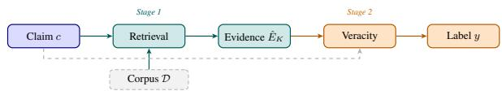
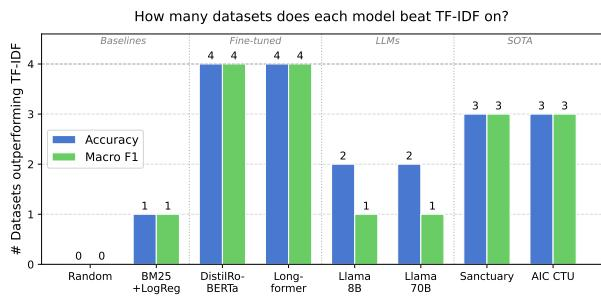
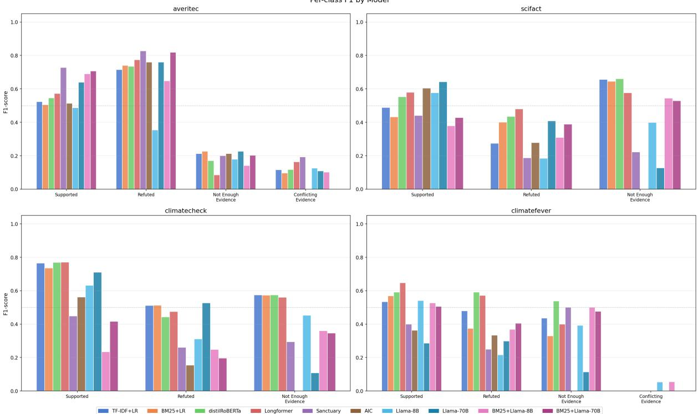
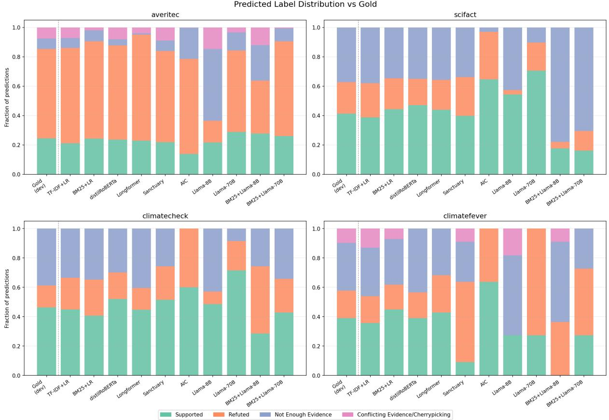

# How Robust Are Automated Fact-Checking Systems? A Cross-Benchmark Evaluation

Aida Usmanova1, Zangir Iklassov2, Markus Leippold3, Ricardo Usbeck1

1Leuphana University of Lüneburg, 2MBZUAI, 3University of Zurich Correspondence: aida.usmanova@stud.leuphana.de

## Abstract

Automated fact-checking (AFC) systems retrieve evidence and predict claim veracity, yet evaluations omit simple baselines, systems are developed for a single benchmark and cannot be trusted to generalise across domains. No prior work cross-evaluates the full twostage retrieve-then-verify pipeline across diverse datasets, complementing retrieval-only studies (Thakur et al., 2021) and single-stage benchmarking studies (Calamai et al., 2025). We benchmark nine models, ranging from random and sparse baselines to fine-tuned transformers, zero-shot LLMs, and the two highestranked systems from the AVeriTeC 2025 shared task, across four datasets spanning scientific, open-web, and climate domains. Three findings stand out: (1) on ClimateCheck claim-only and fine-tuned models outperform zero-shot LLM and top-performing AVeriTeC 2025 systems, highlighting that noisy evidence can degrade veracity prediction; (2) system rankings are strongly domain- and metric-dependent: the best model on SciFact (macro-F1 0.70) drops to 0.31 on ClimateCheck, while the AVeriTeC 2025 winner and runner-up swap rankings based on evaluation metrics and datasets; (3) replacing retrieved evidence with gold annotations improves veracity accuracy by 14-22 points across models, confirming retrieval remains primary bottleneck. We release code, pre-processed datasets, and all results to support reproducible AFC research.1

## 1 Introduction

The proliferation of misinformation across news, social media, and scientific discourse has motivated extensive research in automated fact-checking (AFC) (Thorne and Vlachos, 2018; Guo et al., 2022). Formalised by Vlachos and Riedel (2014), the dominant paradigm established by FEVER shared task (Thorne et al., 2018) is a two-stage pipeline (Figure 1): a retrieval module selects relevant evidence, and a veracity model predicts whether it supports, refutes, or is insufficient to judge the claim (not enough information, NEI). Inspired by FEVER (Thorne et al., 2018), progress has been made on benchmarks spanning news claims (Wang, 2017), multi-domain evidence (Augenstein et al., 2019), multi-hop reasoning (Yang et al., 2018; Jiang et al., 2020), scientific claims (Wadden et al., 2020; Saakyan et al., 2021), and knowledge-intensive tasks (Petroni et al., 2021). Yet the ultimate test of an AFC system is not benchmark rank, but robustness to domain shifts.

AFC systems are developed to combat realworld misinformation, yet we do not know whether reported progress shows genuinely generalisable capabilities. First, systems in shared tasks involve multi-step pipelines and are rarely compared against simple baselines such as TF-IDF retrieval (Manning et al., 2008) combined with logistic regression. Without these lower bounds, it is impossible to tell whether reported gains reflect actual improvements in language understanding or dataset-specific engineering. Second, misinformation spreads across multiple domains, and reliable AFC systems should operate across diverse settings. However, SOTA systems are usually trained and tested on a single benchmark and may poorly translate to other domains (Guo et al., 2022). A system that does not generalise well across domains cannot be trusted in real-world deployment, where domain of incoming claims is unknown in advance.

Calamai et al. (2025) found that TF-IDF achieves within 5% of fine-tuned transformers across 29 climate-related NLP benchmarks, and that most datasets contain annotation issues that further obscure real model differences. Thakur et al. (2021) showed that BM25 (Robertson and Zaragoza, 2009) outperforms neural retrieval on the majority of 18 out-of-domain information retrieval benchmarks. However, both studies evaluate only a single pipeline stage in isolation, namely information retrieval or single-task classification. No prior work cross-evaluates the complete retrievethen-verify pipeline across structurally diverse domains.

We present a unified, transferable evaluation of fact-checking systems across four structurally diverse datasets (Figure 2) evaluated under identical conditions, covering sparse retrieval, fine-tuned transformers, zero-shot LLMs, and the two highestranked systems from the 2025 AVeriTeC shared task (Akhtar et al., 2025b), an annual challenge for open-domain AFC in which AIC CTU (the winner) and SANCTUARY (runner-up) represent strong evidence-based verification systems. Our study presents three key findings:

• Competitiveness of classical baselines. Under the evaluated pipeline, logistic regression over sparse retrieval outperformed evidenceconditioned LLMs and shared task topperformers, due to harmful evidence retrieval.

• Retrieval quality is a main challenge. Replacing retrieved evidence with gold annotations improves veracity accuracy by 14-22 points across models, diminishing gains from switching to stronger veracity models.

• Rankings are domain- and metricdependent. No single system dominates across all four benchmarks. The best system on SciFact (macro-F1 0.700) drops to 0.315 on ClimateCheck. The AVeriTeC 2025 winner AIC CTU swaps position with runner-up SANCTUARY depending on evaluation metrics and datasets, making single-benchmark evaluation an unreliable proxy for general capability.

## 2 Related Work

Automated fact-checking. Veracity prediction is framed as natural language inference (NLI) over retrieved evidence, a formulation that traces back to SNLI (Bowman et al., 2015) and MultiNLI (Williams et al., 2018), and was operationalised for AFC by BERT-based crossencoders (Devlin et al., 2019). Graph-based evidence aggregation (Zhou et al., 2019; Nie et al., 2019), explanation-generating models (Atanasova et al., 2020), and contrastive training for robustness (Schuster et al., 2021) have extended the pipeline. Regarding scientific claims, Wadden et al. (2022) showed that full-document context with weak supervision substantially outperforms sentence-level approaches. Fact-checking has also been applied to multi-hop settings (Aly et al., 2021; Jiang et al., 2020), news headlines (Popat et al., 2018), COVID-19 claims (Saakyan et al., 2021), and LLM-generated text (Min et al., 2023). The explainability of AFC systems has also gained attention, including for health claims (Kotonya and Toni, 2020). Annual AFC shared tasks continue to push that progress (Akhtar et al., 2025b; Abu Ahmad et al., 2025b).

Recent progress in AFC has introduced agentic systems, like FIRE (Xie et al., 2025) and DE-FAME (Braun et al., 2025). FIRE jointly performs evidence retrieval and claim verification, dynamically issuing request for additional search based on verifier’s confidence. DEFAME extends this idea by adding visual evidence. Such systems shifted from retrieve-then-verify paradigm and allow verifier to control evidence retrieval.

Fact-checking benchmarks. LIAR (Wang, 2017) and MultiFC (Augenstein et al., 2019) collect real-world claims from political fact-checking organisations, but do not provide structured evidence corpora. Wadden et al. (2020) introduced SciFact for verifying scientific claims against biomedical abstracts from S2ORC (Lo et al., 2020), requiring domain knowledge beyond lexical matching. Diggelmann et al. (2020) developed ClimateFEVER by linking climate claims to Wikipedia passages, focusing on multi-sentence reasoning. Schlichtkrull et al. (2023) proposed AVeriTeC, in which evidence is retrieved from the live web at claim time, posing a realistic but difficult open-domain retrieval problem. Abu Ahmad et al. (2025a) introduced ClimateCheck, linking social-media climate posts to scientific articles and combining the challenges of informal language and a 394K-document corpus.

Evidence retrieval. Early retrievers used sparse models, like TF-IDF and BM25 (Robertson and Zaragoza, 2009). Dense passage retrieval (DPR) (Karpukhin et al., 2020), Sentence-BERT (Reimers and Gurevych, 2019), Col-BERT (Khattab and Zaharia, 2020)) showed improvement over sparse methods on in-domain benchmarks. Retrieval-augmented generation (RAG) (Lewis et al., 2020) combines generative models with evidence grounding, further pushing retrieval performance. However, specialised training is still required for domain-specific AFC corpora, which are rarely available.

  
Figure 1: Classical fact-checking pipeline. Stage 1 retrieves evidence $\hat { E } _ { K }$ from corpus D; Stage 2 predicts veracity label y.

Benchmarking studies. Calamai et al. (2025) performed a reproducibility study across 29 climate-related NLP datasets, finding that classical baselines rarely fall far behind fine-tuned models, that most datasets contain annotation issues, and that performance differences are often within statistical confidence intervals. Thakur et al. (2021) found a parallel result for information retrieval: BM25 outperforms dense models trained on MS MARCO across the majority of heterogeneous corpora. To the best of our knowledge, prior studies did not analyse multi-stage AFC pipelines across diverse datasets.

## 3 Tasks, Datasets, and Models

## 3.1 Task

A classical simplified pipeline has retriever and verifier modules (illustrated in Figure 1). Given a claim c and an evidence corpus D, a system should: (1) retrieve the K most relevant documents ${ \hat { E } } \subseteq { \mathcal { D } } ;$ and (2) predict veracity $y \in$ {Supports, Refutes, NEI} given c and Eˆ. We evaluate the two stages separately in Section 3.4 and jointly in Table 5 (Section 4.2).

## 3.2 Datasets

Table 1 and Figure 2 summarise four datasets used in this study. The datasets cover commonsense and political claims from the open web (AVeriTeC), climate claims from journalism and Wikipedia (ClimateFEVER), expert-written scientific claims (SciFact), and user-generated social-media climate claims (ClimateCheck). This organisation by evidence domain and claim origin (Figure 2) reveals two key structural axes that drive the retrieval results in Section 4: datasets in the scientific evidence row require semantic matching beyond lexical overlap, while datasets in the real-world/social column contain informal language that widens the vocabulary gap between claim and evidence.

<table><tr><td rowspan=1 colspan=1></td><td rowspan=1 colspan=1>Expert / curated</td><td rowspan=1 colspan=1>Real-world / social</td></tr><tr><td rowspan=1 colspan=1>Scientific</td><td rowspan=1 colspan=1>SciFact1.4K claims5K abstractsbiomedical domain</td><td rowspan=1 colspan=1>ClimateCheck3.2K claims394K abstractssocial-media lang.</td></tr><tr><td rowspan=1 colspan=1>Web / Wiki</td><td rowspan=1 colspan=1>AVeriTeC5.8K claims33K web docsopen-web evidence</td><td rowspan=1 colspan=1>ClimateFEVER7.7K claims5K passagesWikipedia sents.</td></tr></table>

Figure 2: Dataset taxonomy by evidence type (rows) and claim origin (columns). Each dataset is color-coded consistently throughout the paper.

We apply an 80/10/10 train/development/test split and retain original splits when already provided in these proportions. Dataset descriptions, data quality checks (gibberish detection, duplicate removal, text cleaning), split sizes, and label distributions available in Appendix B.1.

## 3.3 Models

We evaluate a range of models on each task: random baselines, sparse retrieval methods, fine-tuned transformers, zero-shot LLMs, and state-of-the-art shared-task systems.

Evidence retrieval. RANDOM selects K documents uniformly at random. TF-IDF (Manning et al., 2008) ranks documents by cosine similarity on TF-IDF vectors. BM25 (Robertson and Zaragoza, 2009) extends TF-IDF with documentlength normalisation using the Okapi BM25 scoring function (see Appendix A for the full formula). AIC CTU (Ullrich and Drchal, 2025) is the AVeriTeC 2025 shared task winner, which uses long-context RAG (Lewis et al., 2020) over retrieved passages. SANCTUARY (Dharmavaram and Hakak, 2025) is the runner-up from the same shared task, combining dense retrieval with neural reranking. Both systems were developed and evaluated on FEVER-style encyclopaedic claims, and are best under AVeriTeC 2025 shared-task constraints (Akhtar et al., 2025a) (open-weights, ≤ 23 GB GPU, ≤ 1 minute per claim, fixed evidence store, no closed-weight LLMs); they are therefore strongest under those constraints rather than in absolute terms, and stronger unconstrained systems exist.

Claim veracity prediction. We separated baselines for claim-verification task into two classes: claim-/hypothesis-only baselines and 2) evidenceconditioned. Following hypothesis-only analyses in NLI (Poliak et al., 2018) and claim-only analyses in fact verification (Schuster et al., 2019), claimonly condition is introduced to quantify whether labels can be predicted from the claim without access to evidence. This condition is intended as a diagnostic probe for dataset artifacts or annotation shortcuts.

<table><tr><td>Dataset</td><td>Domain</td><td>Claim type</td><td>Claims</td><td>Evidence corpus</td><td>Labels</td></tr><tr><td>AVeriTeC</td><td>Open-web</td><td>Real-world</td><td>5,783</td><td>32,818 web docs</td><td>Sup / Ref / NEI / Conflicting</td></tr><tr><td>SciFact</td><td>Life sciences</td><td>Expert-written</td><td>1,409</td><td>5,183 S2ORC abstracts</td><td>Supports / Refutes / NEI</td></tr><tr><td>ClimateCheck</td><td>Climate/social</td><td>Social-media</td><td>3,199</td><td>394,269 sci. abstracts</td><td>Supports / Refutes / NEI</td></tr><tr><td>ClimateFEVER</td><td>Climate science</td><td>Real-world</td><td>7,675</td><td>5,240 Wikipedia pages</td><td>Sup / Ref / NEI / Conflicting</td></tr></table>

Table 1: Overview of the datasets used in the study.

Logistic regression over TF-IDF/BM25 features and fine-tuned transformer models are claim-only baselines. Zero-shot LLMs are tested in claimonly and evidence-conditioned settings over BM25 retrieval results.

RANDOM predicts a label drawn uniformly at random. TF-IDF + LOGREG and BM25 + LOGREG use TF-IDF or BM25 vectors based on claim as input to a logistic regression classifier (Pedregosa et al., 2011). LONGFORMER (Beltagy et al., 2020) and DISTILROBERTA (Sanh et al., 2019) are two transformer (Vaswani et al., 2017) models fine-tuned for sequence classification. LLMs include LLAMA 3.1-8B and LLAMA 3.1- 70B (Grattafiori et al., 2024). Task-specific best performing systems are SANCTUARY and AIC CTU, which use their own retrieval components.

## 3.4 Evaluation

Evidence retrieval. We report Recall@K and F1@K for $K \in \{ 5 , 1 0 , 2 0 \}$ , computed over the set of gold-annotated relevant documents. Recall@K measures the fraction of gold-relevant documents recovered in the top-K results; it plateaus once K exceeds the gold set size, which affects AVeriTeC (see Section 4.2). A retrieved document is relevant if annotated as Supports or Refutes; formal metric definitions are in Appendix A. For AVeriTeC, we follow the official shared-task protocol: evidence is evaluated via the Hungarian METEOR score (Kuhn, 1955; Banerjee and Lavie, 2005) (see Appendix A for the full definition), with a threshold of 0.25 to match the QA-pair format of that dataset.

Claim veracity prediction. We report accuracy and macro-averaged F1. Macro F1 averages classlevel F1 scores equally across C classes to address dominant veracity label classes. A high level of imbalance may cause accuracy and macro F1 to diverge by up to 20 points for the same model. Evaluation is based on annotated claim-evidence pairs, and unjudged passages are ignored.

Statistical significance. We compute 95% confidence intervals (CI) of macro-F1 scores via bootstrapping (Efron and Tibshirani, 1994). A difference is considered significant if the CIs are disjoint.

## 4 Experimental Results and Analysis

## 4.1 Experimental Setup

All experiments use the same pre-processed splits described in Section 3.2. We use three fixed random seeds and report means ± standard deviation; single-run results are reported for LLMs (temperature 0.1). Full implementation details, hyperparameters, prompt templates, and hardware information are in Appendix C and D.

## 4.2 Results

Evidence retrieval. An interesting pattern in Table 2 is the reversal of rankings between datasets. On SciFact, AIC CTU and SANCTUARY dramatically outperform sparse methods: AIC CTU achieves $\mathbb { R } \mathscr { Q } 5 = 0 . 7 3 1$ versus TF-IDF’s 0.217. The scientific vocabulary of SciFact abstracts rewards dense semantic retrieval. On AVeriTeC, the rankings change: TF-IDF leads at R@5 (0.126) while SANCTUARY reaches only 0.077. Open-web evidence is better matched by lexical overlap than by dense representations trained on encyclopaedic claims, supporting findings in heterogeneous IR benchmarks (Thakur et al., 2021). On Climate-Check and ClimateFEVER, retrieval results are low for all methods, demonstrating the challenges with large or informal corpora. Additionally, TF-IDF consistently outperforms BM25 across all datasets. This is likely caused by BM25’s document-length normalisation penalty, putting long Wikipedia passages and scientific abstracts at a disadvantage.

Table 3 shows system performance under the official AVeriTeC metrics, where AIC CTU leads with a score of 0.536 on AVeriTeC dataset. However, SANCTUARY outperforms on the rest of the datasets on all metrics. For instance, on Climate-Check AIC CTU shows near-zero AVeriTeC score, compared to 0.46 scored by SANCTUARY. This is likely caused by architectural design choices, where AIC CTU creates FAISS vectors for all evidence documents, which works well for AVeriTeC that has 32,818 web documents, but does not scale for ClimateCheck with its 394K abstracts.

<table><tr><td rowspan="2">Dataset</td><td rowspan="2">Method</td><td colspan="3">Recall</td><td colspan="3">F1</td></tr><tr><td>@5</td><td>@10</td><td>@20</td><td>@5</td><td>@10</td><td>@20</td></tr><tr><td rowspan="5">AVeriTeC</td><td>RANDOM</td><td>0.0054</td><td>0.0054</td><td>0.0054</td><td>0.0026</td><td>0.0016</td><td>0.0009</td></tr><tr><td>TF-IDF</td><td>0.1258</td><td>0.1258</td><td>0.1258</td><td>0.0652</td><td>0.0384</td><td>0.0245</td></tr><tr><td>BM25</td><td>0.1170</td><td>0.1170</td><td>0.1170</td><td>0.0577</td><td>0.0341</td><td>0.0218</td></tr><tr><td>SANCTUARY</td><td>0.0769</td><td>0.1195</td><td>0.1694</td><td>0.0373</td><td>0.0361</td><td>0.0300</td></tr><tr><td>AIC CTU</td><td>0.0749</td><td>0.0785</td><td>0.0785</td><td>0.0372</td><td>0.0227</td><td>0.0124</td></tr><tr><td rowspan="5">SciFact</td><td>RANDOM</td><td>0.0000</td><td>0.0067</td><td>0.0067</td><td>0.0000</td><td>0.0012</td><td>0.0006</td></tr><tr><td>TF-IDF</td><td>0.2174</td><td>0.4903</td><td>0.8053</td><td>0.0774</td><td>0.0967</td><td>0.0848</td></tr><tr><td>BM25</td><td>0.2128</td><td>0.4642</td><td>0.7458</td><td>0.0750</td><td>0.0901</td><td>0.0767</td></tr><tr><td>SANCTUARY</td><td>0.6501</td><td>0.6759</td><td>0.6804</td><td>0.4156</td><td>0.4025</td><td>0.3984</td></tr><tr><td>AIC CTU</td><td>0.7306</td><td>0.7426</td><td>0.7453</td><td>0.4678</td><td>0.4596</td><td>0.4623</td></tr><tr><td rowspan="5">ClimateCheck</td><td>RANDOM</td><td>0.0000</td><td>0.0000</td><td>0.0000</td><td>0.0000</td><td>0.0000</td><td>0.0000</td></tr><tr><td>TF-IDF</td><td>0.0795</td><td>0.1253</td><td>0.2074</td><td>0.0346</td><td>0.0306</td><td>0.0269</td></tr><tr><td>BM25</td><td>0.0646</td><td>0.1195</td><td>0.1802</td><td>0.0286</td><td>0.0303</td><td>0.0240</td></tr><tr><td>SANCTUARY</td><td>0.1161</td><td>0.1766</td><td>0.2596</td><td>0.0374</td><td>0.0361</td><td>0.0318</td></tr><tr><td>AIC CTU</td><td>0.1022</td><td>0.1170</td><td>0.1229</td><td>0.0559</td><td>0.0545</td><td>0.0545</td></tr><tr><td rowspan="5">ClimateFEVER</td><td>RANDOM</td><td>0.0013</td><td>0.0026</td><td>0.0091</td><td>0.0013</td><td>0.0017</td><td>0.0036</td></tr><tr><td>TF-IDF</td><td>0.1377</td><td>0.2260</td><td>0.3429</td><td>0.1454</td><td>0.1789</td><td>0.1949</td></tr><tr><td>BM25</td><td>0.1000</td><td>0.1805</td><td>0.2844</td><td>0.1057</td><td>0.1434</td><td>0.1634</td></tr><tr><td>SANCTUARY</td><td>0.1925</td><td>0.2618</td><td>0.3034</td><td>0.1626</td><td>0.1677</td><td>0.1597</td></tr><tr><td>AIC CTU</td><td>0.2425</td><td>0.3011</td><td>0.3450</td><td>0.2434</td><td>0.2207</td><td>0.2202</td></tr></table>

Table 2: Evidence retrieval results (Recall@K and F1@K). Bold: best per column. Underline: second best. Gray: not significantly better than TF-IDF. For AVeriTeC, the official Hungarian METEOR (≥ 0.25) is used instead of exact-match relevance. † For sparse methods on AVeriTeC, Recall@K is identical across K ∈ {5, 10, 20} because the median gold set contains a single relevant document; once retrieved in the top-5, increasing K yields no further coverage.

Claim veracity prediction. Table 4 reports accuracy and macro-F1 for all models. On ClimateCheck, fine-tuned LONGFORMER achieves the highest accuracy (0.618), followed by DISTIL-ROBERTA (0.617). Surprisingly, evidence can hurt under domain shift, adding BM25 retrieved evidence decreases accuracy for LLMs. While AIC CTU degradation on ClimateCheck could be attributed to the challenges of scaling retreval configuration to a large corpus. This confirms that low-quality evidence retrieval misleads the veracity model when the domain gap between informal claims and scientific evidence is large, hence performances of top systems are also below TF-IDF + LOGREG baseline. The high claim-only performance suggests that ClimateCheck contains stronger exploitable correlations between claim text and labels.

On ClimateFEVER, all methods struggle, with peak accuracy of 0.45 (AIC CTU), followed by SANCTUARY (0.446) and LONGFORMER (0.441). A small difference between simple and complex models demonstrates that evidence quality is the key factor. All systems show a large gap between accuracy and macro F1 suggesting heavy class imbalance. Supports label dominates and Conflicting Evidence is sparse.

<table><tr><td>System</td><td>Dataset</td><td>Q only</td><td> $\mathbf { Q } + \mathbf { A }$ </td><td>AVeriTeC Score</td></tr><tr><td rowspan="4">SANCTUARY</td><td>AVeriTeC</td><td>0.4461</td><td>0.2152</td><td>0.2200</td></tr><tr><td>SciFact</td><td>0.6603</td><td>0.4343</td><td>0.4900</td></tr><tr><td>ClimateCheck</td><td>0.4614</td><td>0.3142</td><td>0.4601</td></tr><tr><td>ClimateFEVER</td><td>0.4696</td><td>0.3518</td><td>0.3247</td></tr><tr><td rowspan="4">AIC CTU</td><td>AVeriTeC</td><td>0.4610</td><td>0.3264</td><td>0.5360</td></tr><tr><td>SciFact</td><td>0.5071</td><td>0.2509</td><td>0.3900</td></tr><tr><td>ClimateCheck</td><td>0.3404</td><td>0.0586</td><td>0.0000</td></tr><tr><td>ClimateFEVER</td><td>0.3443</td><td>0.2081</td><td>0.1494</td></tr></table>

Table 3: SANCTUARY and AIC CTU performance under the official AVeriTeC evaluation protocol (Hungarian $\mathbf { M E T E O R } \geq 0 . 2 5 ;$ see Appendix A). Purpose: applying this metric cross-dataset reveals how effectively systems retrieve evidence whose text semantically matches the annotated question–answer pairs, isolating evidence adequacy from label prediction accuracy. Q only: METEOR score computed on retrieved question text alone (measures query coverage); Q + A: METEOR computed on question plus answer text (measures full evidence adequacy). Scores on non-AVeriTeC datasets are lower because those datasets lack QA-pair annotations, but the Q only vs. Q + A gap still quantifies how much answer content contributes to evidence quality for each system.

SciFact shows a clear winning model: SANC-TUARY leads with accuracy 0.702 and macro F1 0.700, followed by AIC CTU (accuracy 0.566, macro F1 0.482), while all fine-tuned models cluster below 0.47 accuracy and are not significantly better than TF-IDF + LOGREG. SANC-TUARY’s strong performance is likely due to architectural design. Evidence documents are chunked at sentence-level, then semantically grouped to form a coherent evidence unit, which aligns well with SciFact’s rationale-sentence annotations. The accuracy-macro F1 gap is the smallest of the four datasets, reflecting well-balanced, expertcontrolled annotations.

On AVeriTeC, SANCTUARY leads (accuracy 0.709, macro F1 0.482), while BM25 + LLAMA 70B comes second (accuracy 0.708). Fine-tuned transformers reach 0.562-0.575 accuracy, a moderate but clear gap to strong evidence-conditioned baselines. Large gaps between accuracy and macro F1 confirm skewed class distribution, with NEI and Conflicting Evidence having minimal examples.

Claim-only performance provides evidence of dataset-specific shortcut signals. Relative to random prediction, claim-only macro-F1 improves by 13.7 points on AVeriTeC, 6.5 on SciFact, 26.7 on ClimateCheck, and 15.0 on ClimateFEVER. The particularly large gain on ClimateCheck indicates that substantial label-predictive information is available from claim text alone. The datasets on which claim-only baselines come closest to, or exceed, evidence-conditioned systems are also those with the weakest evidence annotations: Calamai et al. (2025) report Cohen’s $\kappa = 0 . 3 3 4$ for Climate-FEVER evidence annotations, and our own twoannotator re-labelling of sampled errors reaches only $\kappa = 0 . 5 5$ (Appendix E.1). Part of the apparent baseline advantage therefore reflects the benchmark limitations we set out to measure, and we treat gaps below ∼5 points as within the annotationnoise floor.

The dominant cross-dataset pattern is rank instability. Fine-tuned transformers are the most reliable non-SOTA systems, whereas zero-shot LLMs exhibit high variance, competitive on AVeriTeC (LLAMA 70B accuracy 0.640) but near-random on ClimateFEVER (LLAMA 70B accuracy 0.240). TF-IDF + LOGREG shows strong performance over zero-shot LLMs and AVeriTeC 2025 topperforming systems on ClimateCheck , the largest and most informal corpus, suggesting that termfrequency features are sufficient when neural systems are out-of-domain.

Additionally we examined the climate-related subset of AVeriTeC. Only six claims (1.2%) are climate-related, which is too small to support a meaningful topic-controlled comparison. Moreover, SANCTUARY does not show a corresponding performance degradation on these claims (83.3 vs 70.9). We therefore do not interpret this subset as evidence isolating topic effects.

<table><tr><td></td><td colspan="3">AVeriTeC</td><td colspan="2">SciFact</td><td colspan="2">ClimateCheck</td><td colspan="2">ClimateFEVER</td><td>Avg.</td></tr><tr><td>Method</td><td>Ev.</td><td>Acc</td><td>F1</td><td>Acc</td><td>F1</td><td>Acc</td><td>F1</td><td>Acc</td><td>F1</td><td>F1</td></tr><tr><td colspan="9">Baselines</td><td></td></tr><tr><td>RANDOM</td><td></td><td></td><td>27.90 ± 2.13 23.32 ± 2.02 33.37 ± 2.17 33.17 ± 2.24 34.94 ± 2.05 32.78 ± 1.72 24.19 ± 3.61 21.84 ± 2.7 0.2778</td><td></td><td></td><td></td><td></td><td></td><td></td><td></td></tr><tr><td>TF-IDF + LOGREG</td><td></td><td>55.20</td><td>37.06</td><td>42.67</td><td>39.63</td><td>60.17</td><td>59.45</td><td>39.61</td><td>36.84</td><td>43.25</td></tr><tr><td>BM25 + LOGREG</td><td></td><td>54.80</td><td>32.15</td><td>45.67</td><td>42.34</td><td>57.52</td><td>56.90</td><td>44.45</td><td>38.64</td><td>42.51</td></tr><tr><td colspan="9">Fine-tuned transformers</td><td></td><td></td></tr><tr><td>DISTILROBERTA</td><td>▲</td><td></td><td></td><td></td><td></td><td></td><td> $, 5 6 . 2 0 \pm 2 . 4 7 3 7 . 3 9 \pm 2 . 6 0 4 5 . 5 6 \pm 3 . 5 0 4 2 . 4 5 \pm 2 . 1 6 \enspace 6 1 . 6 5 \pm 0 . 8 4 \enspace 6 0 . 4 8 \pm 0 . 8 0 \enspace 4 3 . 0 1 \pm 1 . 5 2 \enspace 3 2 . 3 4 \pm 5 . 6 7 \enspace .$ </td><td></td><td></td><td>43.17</td></tr><tr><td>LONGFORMER</td><td>1</td><td> ${ \begin{array} { r l } { 1 } & { 5 7 , 5 3 \pm 3 . 0 9 \ 3 7 , 7 7 \pm 2 . 7 7 \ 4 6 . 1 1 \pm 0 . 5 7 \ 4 3 . 8 1 \pm 0 . 3 6 \ 6 1 . 8 2 \pm 0 . 5 9 \ 6 0 . 6 7 \pm 0 . 7 4 \ 4 4 . 0 9 \pm 6 . 6 3 \ 2 9 . 2 5 \pm 4 . 8 3 } \end{array} }$ </td><td></td><td></td><td></td><td></td><td></td><td></td><td></td><td>42.88</td></tr><tr><td colspan="9">Zero-shot LLMs</td><td></td><td></td></tr><tr><td>LLAMA 8B</td><td>7</td><td>31.00</td><td>28.63</td><td>46.00</td><td>38.65</td><td>52.56</td><td>46.53</td><td>38.96</td><td>30.10</td><td>36.00</td></tr><tr><td>LLAMA 70B</td><td></td><td>64.00</td><td>43.36</td><td>47.00</td><td>39.30</td><td>53.88</td><td>44.84</td><td>24.03</td><td>17.46</td><td>36.24</td></tr><tr><td>BM25 + LLAMA 8B</td><td></td><td>52.60</td><td>39.50</td><td>46.33</td><td>41.09</td><td>28.17</td><td>28.07</td><td>42.86</td><td>36.28</td><td>36.24</td></tr><tr><td>BM25 + LLAMA 70B</td><td>V</td><td>70.80</td><td>43.18</td><td>47.33</td><td>44.86</td><td>34.51</td><td>31.99</td><td>44.16</td><td>34.68</td><td>38.68</td></tr><tr><td colspan="9">SOTA systems</td><td></td><td></td></tr><tr><td>SANCTUARY</td><td></td><td> $\checkmark 7 0 . 9 3 \pm 0 . 1 9 \ 4 8 . 1 8 \pm 0 . 3 9 \ 7 0 . 2 2 \pm 0 . 4 2 \ 7 0 . 0 0 \pm 0 . 4 3 \ 3 7 . 0 2 \pm 0 . 1 7 \ 3 1 . 4 5 \pm 0 . 2 4 \ 4 4 . 5 9 \pm 0 . 8 1 3 8 . 9 2 \pm 0 . 6 8$ </td><td></td><td></td><td></td><td></td><td></td><td></td><td></td><td>47.14</td></tr><tr><td>AIC CTU</td><td>√</td><td>60.60 ± 0.12 37.14 ± 0.3756.56 ± 0.1648.22 ± 0.4739.72 ± 0.5528.73 ± 0.7445.24 ± 0.8133.60 ± 1.23</td><td></td><td></td><td></td><td></td><td></td><td></td><td></td><td>36.92</td></tr></table>

Table 4: Veracity prediction results (mean ± std over 3 seeds where applicable; single run for LLMs). Ev.: ✓ = claim + retrieved evidence; ▲ = claim-only (no retrieved evidence). Bold: best per column. Underline: second best. Gray: not significantly better than TF-IDF + LOGREG (bootstrap 95% CI, p<0.05). Full per-class breakdown in Table 13.

## 4.3 Error Analysis

Following Calamai et al. (2025), we sampled errors across all four datasets and classified them as genuine model errors, annotation mistakes, or debatable errors. The dominant failure modes are vocabulary mismatch on ClimateCheck (informal claim language vs. formal abstracts), label ambiguity at the Refutes/NEI boundary across all datasets, and domain mismatch in storng evidence-conditioned baslines fine-tuned on encyclopaedic claims. Full per-failure-mode analysis is in Appendix E.1.

To quantify how much veracity performance is limited by retrieval quality rather than the veracity model itself, we re-evaluate all models using goldannotated evidence instead of TF-IDF-retrieved documents (Table 5). Across LLM models, replacing retrieved evidence with gold evidence improves accuracy by 14-22 percentage points. The largest gains appear for LLAMA 70B on Climate-FEVER (+22 pp) and LLAMA 8B on Climate-FEVER (+20 pp), confirming that multi-passage retrieval failures are the main bottleneck on that dataset. The smallest oracle gains are on Climate-Check (+14-15 pp), where the large corpus limits coverage even when gold relevance is assumed.

Prior works have already questioned whether fact-checking models genuinely rely on evidence for their predictions (Hansen et al., 2021; Schuster et al., 2019). Hence, Table 6 demonstrates such an ablation study with identical setting on two LLMs. On AVeriTeC the evidence helps, while on ClimateCheck it hurts. Since the model and prompt are identical in both settings, the classical baseline’s advantage is a real failure on out-of-domain conditions, rather than superiority of claim-only models. This conclusion is not specific to open-weight verifiers. Appendix F repeats the ablation with a frontier closed-weight model under three evidence conditions, where retrieved evidence again scores below claim-only input, and Appendix F.2 tests an iterative FIRE-style (Xie et al., 2025) agent that improves over one-shot retrieval on AVeriTeC but remains far below oracle retrieval on both datasets.

In addition, to quantify lexical compatibility between claims and evidence, we compute claim–evidence word-overlap using Jaccard similarity (Table 7). Mean overlap is 0.122 on Climate-FEVER, 0.087 on SciFact, 0.093 on AVeriTeC, and only 0.047 on ClimateCheck. Low lexical overlap on ClimateCheck is consistent with the larger vocabulary mismatch between informal claims and scientific abstracts, providing a measurable correlate of the retrieval difficulty observed in this dataset.

<table><tr><td>Model</td><td>AVT</td><td>SCI</td><td>CCK</td><td>CFV</td></tr><tr><td>LLAMA 8B</td><td>+16</td><td>+19</td><td>+14</td><td>+20</td></tr><tr><td>LLAMA 70B</td><td>+14</td><td>+18</td><td>+15</td><td>+22</td></tr></table>

Table 5: Accuracy improvement (percentage points) when gold evidence replaces retrieved evidence. AVT = AVeriTeC; SCI = SciFact; CCK = ClimateCheck; CFV = ClimateFEVER.
<table><tr><td>Model</td><td>AVT</td><td>SCI</td><td>CCK</td><td>CFV</td></tr><tr><td>LLAMA 8B</td><td>+21.6</td><td>+0.3</td><td>-24.4</td><td>+3.9</td></tr><tr><td>LLAMA 70B</td><td>+6.8</td><td>+0.3</td><td>-19.4</td><td>+20.1</td></tr></table>

Table 6: A matched, identical-setting ablation (same model and prompt, ± retrieved evidence). Accuracy change when the same model is given retrieved evidence instead of claim-only.

## 4.4 Discussion

System rankings are dataset-specific. No single system dominates across all four benchmarks. Macro-F1 rankings in Figure 3 make this vivid: SANCTUARY shows the darkest cells on Sci-Fact (0.700) and AVeriTeC (0.482) but the lightest on ClimateCheck (0.315). Similarly, the AVeriTeC 2025 winner AIC CTU and runner-up SANCTUARY swap positions based on veracity metrics: SANCTUARY leads on accuracy (0.709 vs. 0.606) and macro-F1 (0.482 vs. 0.371). In addition, SANCTUARY is a more generalisable system according to out-of-domain AVeriTeC scores (Sci-Fact: 0.490 vs. 0.390, ClimateCheck: 0.460 vs. 0.000, ClimateFEVER: 0.325 vs. 0.149), despite losing on the AVeriTeC 2025 shared task.

Classical baselines reveal benchmark limitations. The dataset taxonomy (Figure 2) predicts where classical methods will succeed: datasets in the web/Wikipedia evidence row (AVeriTeC, ClimateFEVER) have claims and evidence drawn from the same register and vocabulary, so lexical overlap is a reliable signal. Datasets in the scientific evidence row with informal claims (Climate-Check) have the largest vocabulary gap, suggesting the problem is retrieval coverage and not evidence understanding. Only SciFact (scientific evidence, expert-written claims) rewards semantic reasoning with a clear neural advantage. Benchmark’s position in Figure 2 determines whether classical baselines are competitive, independently of model quality. Figure 4 shows that fine-tuned transformers are able to beat TF-IDF + LOGREG baseline on all datasets, while both strong evidence-conditioned systems and zero-shot LLMs fail on the climate and social-media corpora, both requiring domain transfer.

<table><tr><td>Dataset</td><td>Mean Jaccard</td></tr><tr><td>AVeriTeC</td><td>0.093</td></tr><tr><td>SciFact</td><td>0.087</td></tr><tr><td>ClimateCheck</td><td>0.047</td></tr><tr><td>ClimateFEVER</td><td>0.122</td></tr></table>

Table 7: Jaccard similarity analysis. Per-dataset mean word overlap between claims and gold evidence.
<table><tr><td rowspan=3 colspan=5>AVeriTeC     SciFact    ClimateCheck ClimateFEVERRandom</td></tr><tr><td rowspan=1 colspan=1></td><td rowspan=1 colspan=1></td><td rowspan=1 colspan=1></td><td rowspan=1 colspan=1></td></tr><tr><td rowspan=1 colspan=1>TF-IDF + LogReg</td><td rowspan=1 colspan=1></td><td rowspan=1 colspan=1></td><td rowspan=1 colspan=1></td><td rowspan=1 colspan=1></td></tr><tr><td rowspan=1 colspan=1>BM25 + LogReg</td><td rowspan=1 colspan=1>32.1</td><td rowspan=1 colspan=1>42.3</td><td rowspan=1 colspan=1>56.9</td><td rowspan=1 colspan=1>38.6</td></tr><tr><td rowspan=1 colspan=1>DistilRoBERTa</td><td rowspan=1 colspan=1>37.4</td><td rowspan=1 colspan=1>42.5</td><td rowspan=1 colspan=1>60.5</td><td rowspan=1 colspan=1>32.3</td></tr><tr><td rowspan=1 colspan=1>Longformer</td><td rowspan=1 colspan=1>37.8</td><td rowspan=1 colspan=1>43.8</td><td rowspan=1 colspan=1>60.7</td><td rowspan=1 colspan=1>29.2</td></tr><tr><td rowspan=1 colspan=1>Llama 8B</td><td rowspan=1 colspan=1>28.6</td><td rowspan=1 colspan=1>38.6</td><td rowspan=1 colspan=1>46.5</td><td rowspan=1 colspan=1>30.1</td></tr><tr><td rowspan=1 colspan=1>Llama 70B</td><td rowspan=1 colspan=1>43.4</td><td rowspan=1 colspan=1>39.3</td><td rowspan=1 colspan=1>44.8</td><td rowspan=1 colspan=1>17.5</td></tr><tr><td rowspan=1 colspan=1>BM25 + Llama 8B</td><td rowspan=1 colspan=1>39.5</td><td rowspan=1 colspan=1>41.1</td><td rowspan=1 colspan=1>28.1</td><td rowspan=1 colspan=1>36.3</td></tr><tr><td rowspan=1 colspan=1>BM25 + Llama 70B</td><td rowspan=1 colspan=1>43.2</td><td rowspan=1 colspan=1>44.9</td><td rowspan=1 colspan=1>32.0</td><td rowspan=1 colspan=1>34.7</td></tr><tr><td rowspan=1 colspan=1>Sanctuary</td><td rowspan=1 colspan=1>48.2</td><td rowspan=1 colspan=1>70.0</td><td rowspan=1 colspan=1>31.4</td><td rowspan=1 colspan=1>38.9</td></tr><tr><td rowspan=1 colspan=1>AIC CTU</td><td rowspan=1 colspan=1>37.1</td><td rowspan=1 colspan=1>48.2</td><td rowspan=1 colspan=1>28.7</td><td rowspan=1 colspan=1>33.6</td></tr></table>

Figure 3: Macro-F1 heatmap for every method-dataset pair on the claim veracity task.

Retrieval quality is the primary bottleneck. Error analysis and oracle retrieval experiments (Table 5) indicate that veracity performance is bounded by retrieval quality rather than model capacity. When gold evidence is provided veracity accuracy improves, indicating that errors are caused predominantly by retrieval failures rather than veracity reasoning. Investing in better retrieval, particularly for large and informal corpora, yields greater gains than replacing the veracity model. For highly domain-specific datasets, such as ClimateCheck and ClimateFEVER, domain-adaptive pretraining (Gururangan et al., 2020) and adaptive retrieval (Asai et al., 2024) could boost retrival performance, as seen in ClimateCheck 2025 challenge (Abu Ahmad et al., 2025b). Based on our findings, we developed recommendations for further AFC evaluation in Appendix G.

## 5 Conclusion

We present a cross-dataset benchmark study evaluating evidence retrieval and claim veracity prediction across AVeriTeC, SciFact, ClimateCheck, and ClimateFEVER, covering a model range from sparse methods to AVeriTeC 2025 winner systems. Our findings demonstrate that simple baselines remain necessary lower bounds: claim-only TF-IDF + LOGREG outperform evidence-conditioned zeroshot LLMs and top-performing systems on ClimateCheck, highliting that misleading retrieval can substantially degrade AFC systems. System rankings are strongly domain- and metric-dependent: single SANCTUARY spans 0.39 macro-F1 across datasets, and the AVeriTeC 2025 winner and runnerup change rankings depending on the evaluation metric and dataset. Retrieval remains the primary bottleneck: replacing retrieved evidence with gold annotations improves accuracy across models and datasets.

  
Figure 4: Number of datasets (out of 4) on which each model outperforms TF-IDF + LOGREG on accuracy (blue) and macro F1 (green).

These findings show the need for cross-domain AFC evaluations with mandatory classical baselines and explicit retrieval-veracity decoupling. Until AFC systems are evaluated and prove their reliability across diverse domains, leaderboard rankings should not be taken as proof for real-world utility.

## Limitations

Our study covers four datasets, hence the conclusions may not generalise to all AFC domains or claim types. FEVER (Thorne et al., 2018) and FEVERous (Aly et al., 2021) were excluded due to their scale (300K+ claims, millions of evidence documents), which exceeded our computational budget. We do not evaluate multi-domain or multilingual AFC (Petroni et al., 2021), nor recent generative AFC systems beyond LLAMA 3.1 (Grattafiori et al., 2024). Baseline and fine-tuned transformer models are evaluated on claim text only (no retrieved evidence); oracle-retrieval results are reported in Table 5 in the main text. LLM experiments use a single prompt template per dataset; prompt sensitivity is not evaluated. Although we use two annotators to analyse failure modes, the agreement is moderate. Moreover, failure analysis covers only a subset of error cases and therefore could not be interpreted as dataset-wide estimate of annotation noise.

## Ethical Considerations

The datasets used in this study are publicly released research benchmarks (AVeriTeC, SciFact, Climate-FEVER, ClimateCheck), each with licences permitting academic use. No new data were collected, and all claims and evidence documents are taken from the original datasets. Our work evaluates existing models and datasets rather than deploying a production fact-checking system. All Llama 3.1 experiments use the publicly available model weights released by Meta under their community licence and accessed via the official Hugging Face repository. Our findings identify measurement limitations in current benchmarks and do not endorse or refute any individual claim.

## Generative AI Usage

In this work, generative AI tools, such as Chat-GPT (OpenAI, 2024), were used to check for grammar mistakes and typos. The tool was used to enhance readability and the quality of the written text.

## References

Raia Abu Ahmad, Aida Usmanova, and Georg Rehm. 2025a. The ClimateCheck dataset: Mapping social media claims about climate change to corresponding scholarly articles. In Proceedings of the 5th Workshop on Scholarly Document Processing (SDP), Vienna, Austria.

Raia Abu Ahmad, Aida Usmanova, and Georg Rehm. 2025b. The ClimateCheck shared task: Scientific fact-checking of social media claims about climate change. In Proceedings of the Fifth Workshop on Scholarly Document Processing (SDP 2025), pages 263–275, Vienna, Austria. Association for Computational Linguistics.

Mubashara Akhtar, Rami Aly, Yulong Chen, Zhenyun Deng, Michael Schlichtkrull, Chenxi Whitehouse, and Andreas Vlachos. 2025a. The 2nd automated verification of textual claims (AVeriTeC) shared task: Open-weights, reproducible and efficient systems. In Proceedings ofthe Eighth Fact Extraction and VERification Workshop (FEVER), pages 201–223, Vienna, Austria. Association for Computational Linguistics.

Mubashara Akhtar, Rami Aly, Christos Christodoulopoulos, Oana Cocarascu, Zhijiang Guo,

Arpit Mittal, Michael Schlichtkrull, James Thorne, and Andreas Vlachos, editors. 2025b. Proceedings of the Eighth Fact Extraction and VERification Workshop (FEVER). Association for Computational Linguistics, Vienna, Austria.

Rami Aly, Zhijiang Guo, Michael Sejr Schlichtkrull, James Thorne, Andreas Vlachos, Christos Christodoulopoulos, Oana Cocarascu, and Arpit Mittal. 2021. FEVEROUS: Fact extraction and VERification over unstructured and structured information. In Thirty-fifth Conference on Neural Information Processing Systems Datasets and Benchmarks Track (Round 1).

Akari Asai, Zeqiu Wu, Yizhong Wang, Avirup Sil, and Hannaneh Hajishirzi. 2024. Self-RAG: Learning to retrieve, generate, and critique through self-reflection. In International Conference on Learning Representations.

Pepa Atanasova, Jakob Grue Simonsen, Christina Lioma, and Isabelle Augenstein. 2020. Generating fact checking explanations. In Proceedings of the 58th Annual Meeting of the Association for Computational Linguistics, pages 7352–7364, Online. Association for Computational Linguistics.

Isabelle Augenstein, Christina Lioma, Dongfang Wang, Lucas Chaves Lima, Casper Hansen, Christian Hansen, and Jakob Grue Simonsen. 2019. MultiFC: A real-world multi-domain dataset for evidencebased fact checking of claims. In Proceedings of the 2019 Conference on Empirical Methods in Natural Language Processing and the 9th International Joint Conference on Natural Language Processing (EMNLP-IJCNLP), pages 4685–4697, Hong Kong, China. Association for Computational Linguistics.

Satanjeev Banerjee and Alon Lavie. 2005. METEOR: an automatic metric for MT evaluation with improved correlation with human judgments. In Proceedings of the Workshop on Intrinsic and Extrinsic Evaluation Measuresfor Machine Translation and/or Summarization@ACL 2005, Ann Arbor, Michigan, USA, June 29, 2005, pages 65–72. Association for Computational Linguistics.

Iz Beltagy, Matthew E. Peters, and Arman Cohan. 2020. Longformer: The long-document transformer. CoRR, abs/2004.05150.

Samuel R. Bowman, Gabor Angeli, Christopher Potts, and Christopher D. Manning. 2015. A large annotated corpus for learning natural language inference. In Proceedings of the 2015 Conference on Empirical Methods in Natural Language Processing, pages 632–642, Lisbon, Portugal. Association for Computational Linguistics.

Tobias Braun, Mark Rothermel, Marcus Rohrbach, and Anna Rohrbach. 2025. DEFAME: Dynamic evidence-based fact-checking with multimodal experts. In Proceedings ofthe 42nd International Conference on Machine Learning (ICML).

Tom Calamai, Oana Balalau, and Fabian M. Suchanek. 2025. Benchmarking the benchmarks: Reproducing climate-related NLP tasks. In Findings ofthe Association for Computational Linguistics: ACL 2025, pages 17967–18009, Vienna, Austria. Association for Computational Linguistics.

Jacob Devlin, Ming-Wei Chang, Kenton Lee, and Kristina Toutanova. 2019. BERT: Pre-training of deep bidirectional transformers for language understanding. In Proceedings ofthe 2019 Conference of the North American Chapter ofthe Associationfor Computational Linguistics: Human Language Technologies, Volume 1 (Long and Short Papers), pages 4171–4186, Minneapolis, Minnesota. Association for Computational Linguistics.

Arbaaz Dharmavaram and Saqib Hakak. 2025. SANC-TUARY: An efficient evidence-based automated fact checking system. In Proceedings of the Eighth Fact Extraction and VERification Workshop (FEVER), pages 247–257, Vienna, Austria. Association for Computational Linguistics.

Thomas Diggelmann, Jordan Boyd-Graber, Jannis Bulian, Massimiliano Ciaramita, and Markus Leippold. 2020. Climate-fever: A dataset for verification of real-world climate claims. Preprint, arXiv:2012.00614.

Rotem Dror, Gili Baumer, Marina Shlain, and Roi Reichart. 2018. The hitchhiker’s guide to testing statistical significance in natural language processing. In Proceedings of the 56th Annual Meeting of the Associationfor Computational Linguistics (Volume 1: Long Papers), pages 1383–1392, Melbourne, Australia. Association for Computational Linguistics.

Bradley Efron and Robert J. Tibshirani. 1994. An Introduction to the Bootstrap. CRC Press, New York.

Aaron Grattafiori, Abhimanyu Dubey, Abhinav Jauhri, Abhinav Pandey, Abhishek Kadian, Ahmad Al-Dahle, Aiesha Letman, Akhil Mathur, Alan Schelten, Alex Vaughan, Amy Yang, Angela Fan, Anirudh Goyal, Anthony Hartshorn, Aobo Yang, Archi Mitra, Archie Sravankumar, Artem Korenev, Arthur Hinsvark, and 542 others. 2024. The llama 3 herd of models.

Zhijiang Guo, Michael Schlichtkrull, and Andreas Vlachos. 2022. A survey on automated fact-checking. Transactions of the Association for Computational Linguistics, 10:178–206.

Suchin Gururangan, Ana Marasovic, Swabha´ Swayamdipta, Kyle Lo, Iz Beltagy, Doug Downey, and Noah A. Smith. 2020. Don’t stop pretraining: Adapt language models to domains and tasks. In Proceedings of the 58th Annual Meeting of the Association for Computational Linguistics, pages 8342–8360, Online. Association for Computational Linguistics.

Casper Hansen, Christian Hansen, and Lucas Chaves Lima. 2021. Automatic fake news detection: Are models learning to reason? In Proceedings of the 59th Annual Meeting of the Association for Computational Linguistics and the 11th International Joint Conference on Natural Language Processing (Volume 2: Short Papers), pages 80–86, Online. Association for Computational Linguistics.

Yichen Jiang, Shikha Bordia, Zheng Zhong, Charles Dognin, Maneesh Singh, and Mohit Bansal. 2020. HoVer: A dataset for many-hop fact extraction and claim verification. In Findings of the Association for Computational Linguistics: EMNLP 2020, pages 3441–3460, Online. Association for Computational Linguistics.

Vladimir Karpukhin, Barlas Oguz, Sewon Min, Patrick˘ Lewis, Ledell Wu, Sergey Edunov, Danqi Chen, and Wen-tau Yih. 2020. Dense passage retrieval for opendomain question answering. In Proceedings of the 2020 Conference on Empirical Methods in Natural Language Processing (EMNLP), pages 6769–6781, Online. Association for Computational Linguistics.

Omar Khattab and Matei Zaharia. 2020. ColBERT: Efficient and effective passage search via contextualized late interaction over BERT. In Proceedings of the 43rd International ACM SIGIR Conference on Research and Development in Information Retrieval, pages 39–48. ACM.

Neema Kotonya and Francesca Toni. 2020. Explainable automated fact-checking for public health claims. In Proceedings of the 2020 Conference on Empirical Methods in Natural Language Processing (EMNLP), pages 7740–7754, Online. Association for Computational Linguistics.

H. W. Kuhn. 1955. The hungarian method for the assignment problem. Naval Research Logistics Quarterly, 2(1-2):83–97.

Patrick Lewis, Ethan Perez, Aleksandra Piktus, Fabio Petroni, Vladimir Karpukhin, Naman Goyal, Heinrich Küttler, Mike Lewis, Wen-tau Yih, Tim Rocktäschel, Sebastian Riedel, and Douwe Kiela. 2020. Retrieval-augmented generation for knowledgeintensive NLP tasks. In Advances in Neural Information Processing Systems, volume 33, pages 9459– 9474.

Kyle Lo, Lucy Lu Wang, Mark Neumann, Rodney Kinney, and Daniel S. Weld. 2020. S2ORC: the semantic scholar open research corpus. In Proceedings of the 58th Annual Meeting of the Association for Computational Linguistics, ACL 2020, Online, July 5-10, 2020, pages 4969–4983. Association for Computational Linguistics.

Christopher D. Manning, Prabhakar Raghavan, and Hinrich Schütze. 2008. Introduction to Information Retrieval. Cambridge University Press, Cambridge.

Sewon Min, Kalpesh Krishna, Xinxi Lyu, Mike Lewis, Wen-tau Yih, Pang Wei Koh, Mohit Iyyer,

Luke Zettlemoyer, and Hannaneh Hajishirzi. 2023. FactScore: Fine-grained atomic evaluation of factual precision in long form text generation. In Proceedings ofthe 2023 Conference on Empirical Methods in Natural Language Processing, pages 12076–12100, Singapore. Association for Computational Linguistics.

Yixin Nie, Haonan Chen, and Mohit Bansal. 2019. Combining fact extraction and verification with neural semantic matching networks. In Proceedings of the AAAI Conference on Artificial Intelligence, volume 33, pages 6859–6866.

OpenAI. 2024. ChatGPT. https://chat.openai. com. Large language model, accessed 2026.

F. Pedregosa, G. Varoquaux, A. Gramfort, V. Michel, B. Thirion, O. Grisel, M. Blondel, P. Prettenhofer, R. Weiss, V. Dubourg, J. Vanderplas, A. Passos, D. Cournapeau, M. Brucher, M. Perrot, and E. Duchesnay. 2011. Scikit-learn: Machine learning in Python. Journal of Machine Learning Research, 12:2825–2830.

Fabio Petroni, Aleksandra Piktus, Angela Fan, Patrick Lewis, Majid Yazdani, Nicola De Cao, James Thorne, Yacine Jernite, Vladimir Karpukhin, Jean Maillard, Vassilis Plachouras, Tim Rocktäschel, and Sebastian Riedel. 2021. KILT: a benchmark for knowledge intensive language tasks. In Proceedings ofthe 2021 Conference of the North American Chapter of the Associationfor Computational Linguistics: Human Language Technologies, pages 2523–2544, Online. Association for Computational Linguistics.

Adam Poliak, Jason Naradowsky, Aparajita Haldar, Rachel Rudinger, and Benjamin Van Durme. 2018. Hypothesis only baselines in natural language inference. In Proceedings of the Seventh Joint Conference on Lexical and Computational Semantics, pages 180–191, New Orleans, Louisiana. Association for Computational Linguistics.

Kashyap Popat, Subhabrata Mukherjee, Jannik Strötgen, and Gerhard Weikum. 2018. DeClarE: Debunking fake news and false claims using evidence-aware deep learning. In Proceedings of the 2018 Conference on Empirical Methods in Natural Language Processing, pages 22–32, Brussels, Belgium. Association for Computational Linguistics.

Nils Reimers and Iryna Gurevych. 2019. Sentence-BERT: Sentence embeddings using Siamese BERTnetworks. In Proceedings ofthe 2019 Conference on Empirical Methods in Natural Language Processing and the 9th International Joint Conference on Natural Language Processing (EMNLP-IJCNLP), pages 3982–3992, Hong Kong, China. Association for Computational Linguistics.

Stephen E. Robertson and Hugo Zaragoza. 2009. The probabilistic relevance framework: BM25 and beyond. Found. Trends Inf. Retr., 3(4):333–389.

Arkadiy Saakyan, Tuhin Chakrabarty, and Smaranda Muresan. 2021. COVID-fact: Fact extraction and verification of real-world claims on COVID-19 pandemic. In Proceedings of the 59th Annual Meeting ofthe Associationfor Computational Linguistics and the 11th International Joint Conference on Natural Language Processing (Volume 1: Long Papers), pages 2122–2138, Online. Association for Computational Linguistics.

Victor Sanh, Lysandre Debut, Julien Chaumond, and Thomas Wolf. 2019. Distilbert, a distilled version of BERT: smaller, faster, cheaper and lighter. CoRR, abs/1910.01108.

Michael Sejr Schlichtkrull, Zhijiang Guo, and Andreas Vlachos. 2023. Averitec: A dataset for real-world claim verification with evidence from the web. In Thirty-seventh Conference on Neural Information Processing Systems Datasets and Benchmarks Track.

Tal Schuster, Adam Fisch, and Regina Barzilay. 2021. Get your vitamin C! robust fact verification with contrastive evidence. In Proceedings of the 2021 Conference of the North American Chapter of the Associationfor Computational Linguistics: Human Language Technologies, pages 624–643, Online. Association for Computational Linguistics.

Tal Schuster, Darsh Shah, Yun Jie Serene Yeo, Daniel Roberto Filizzola Ortiz, Enrico Santus, and Regina Barzilay. 2019. Towards debiasing fact verification models. In Proceedings of the 2019 Conference on Empirical Methods in Natural Language Processing and the 9th International Joint Conference on Natu ral Language Processing (EMNLP-IJCNLP), pages 3419–3425, Hong Kong, China. Association for Computational Linguistics.

Nandan Thakur, Nils Reimers, Andreas Rücklé, Abhishek Srivastava, and Iryna Gurevych. 2021. BEIR: A heterogeneous benchmark for zero-shot evaluation of information retrieval models. In Proceedings of the Neural Information Processing Systems Track on Datasets and Benchmarks, volume 1.

James Thorne and Andreas Vlachos. 2018. Automated fact checking: Task formulations, methods and future directions. In Proceedings of the 27th International Conference on Computational Linguistics, pages 3346–3359, Santa Fe, New Mexico, USA. Association for Computational Linguistics.

James Thorne, Andreas Vlachos, Christos Christodoulopoulos, and Arpit Mittal. 2018. FEVER: a large-scale dataset for fact extraction and verification. In Proceedings of the 2018 Conference of the North American Chapter of the Associationfor Computational Linguistics: Human Language Technologies, NAACL-HLT 2018, New Orleans, Louisiana, USA, June 1-6, 2018, Volume 1 (Long Papers), pages 809–819. Association for Computational Linguistics.

Herbert Ullrich and Jan Drchal. 2025. AIC CTU@FEVER 8: On-premise fact checking through

long context RAG. In Proceedings ofthe Eighth Fact Extraction and VERification Workshop (FEVER), pages 274–280, Vienna, Austria. Association for Computational Linguistics.

Ashish Vaswani, Noam Shazeer, Niki Parmar, Jakob Uszkoreit, Llion Jones, Aidan N Gomez, Łukasz Kaiser, and Illia Polosukhin. 2017. Attention is all you need. In Advances in Neural Information Processing Systems, volume 30.

Andreas Vlachos and Sebastian Riedel. 2014. Fact checking: Task definition and dataset construction. In Proceedings ofthe ACL 2014 Workshop on Language Technologies and Computational Social Science, pages 18–22, Baltimore, MD, USA. Association for Computational Linguistics.

David Wadden, Shanchuan Lin, Kyle Lo, Lucy Lu Wang, Madeleine van Zuylen, Arman Cohan, and Hannaneh Hajishirzi. 2020. Fact or fiction: Verifying scientific claims. In Proceedings of the 2020 Conference on Empirical Methods in Natural Language Processing (EMNLP), pages 7534–7550, Online. Association for Computational Linguistics.

David Wadden, Kyle Lo, Lucy Lu Wang, Arman Cohan, Iz Beltagy, and Hannaneh Hajishirzi. 2022. MultiVerS: Improving scientific claim verification with weak supervision and full-document context. In Findings ofthe Associationfor Computational Linguistics: NAACL 2022, pages 61–76, Seattle, United States. Association for Computational Linguistics.

William Yang Wang. 2017. “liar, liar pants on fire”: A new benchmark dataset for fake news detection. In Proceedings of the 55th Annual Meeting of the Associationfor Computational Linguistics (Volume 2: Short Papers), pages 422–426, Vancouver, Canada. Association for Computational Linguistics.

Jason Wei, Xuezhi Wang, Dale Schuurmans, Maarten Bosma, Fei Xia, Ed Chi, Quoc V Le, Denny Zhou, and 1 others. 2022. Chain-of-thought prompting elicits reasoning in large language models. In Advances in Neural Information Processing Systems, volume 35, pages 24824–24837.

Adina Williams, Nikita Nangia, and Samuel Bowman. 2018. A broad-coverage challenge corpus for sentence understanding through inference. In Proceedings ofthe 2018 Conference ofthe North American Chapter of the Association for Computational Linguistics: Human Language Technologies, Volume 1 (Long Papers), pages 1112–1122, New Orleans, Louisiana. Association for Computational Linguistics.

Zhuohan Xie, Rui Xing, Yuxia Wang, Jiahui Geng, Hasan Iqbal, Dhruv Sahnan, Iryna Gurevych, and Preslav Nakov. 2025. FIRE: Fact-checking with iterative retrieval and verification. In Findings of the Association for Computational Linguistics: NAACL 2025, pages 2901–2914, Albuquerque, New Mexico. Association for Computational Linguistics.

Zhilin Yang, Peng Qi, Saizheng Zhang, Yoshua Bengio, William Cohen, Ruslan Salakhutdinov, and Christopher D. Manning. 2018. HotpotQA: A dataset for diverse, explainable multi-hop question answering. In Proceedings of the 2018 Conference on Empirical Methods in Natural Language Processing, pages 2369–2380, Brussels, Belgium. Association for Computational Linguistics.

Jie Zhou, Xu Han, Cheng Yang, Zhiyuan Liu, Lifeng Wang, Changcheng Li, and Maosong Sun. 2019. GEAR: Graph-based evidence aggregating and reasoning for fact verification. In Proceedings of the 57th Annual Meeting ofthe Associationfor Computational Linguistics, pages 892–901, Florence, Italy. Association for Computational Linguistics.

## A Evaluation Metrics

Retrieval metrics. Let $E ^ { * }$ denote the set of goldannotated relevant documents for a claim, and $\hat { E } _ { K }$ the set of top-K documents returned by the retrieval system. Recall@K measures coverage of the gold set; Precision@K measures result quality; F1@K is their harmonic mean:

$$
\mathsf { R @ } K = \frac { | \hat { E } _ { K } \cap E ^ { * } | } { | E ^ { * } | } , \qquad \mathsf { P @ } K = \frac { | \hat { E } _ { K } \cap E ^ { * } | } { K } ,\tag{1}
$$

$$
\mathrm { F } 1 @ K = \frac { 2 \cdot \mathrm { P @ } K \cdot \mathrm { R @ } K } { \mathrm { P @ } K + \mathrm { R @ } K } .\tag{2}
$$

A document is counted as relevant if it is annotated as Supports or Refutes. Recall@K typically plateaus at $K { > } | E ^ { * } |$ , which is why it is constant across $K \in \{ 5 , 1 0 , 2 0 \}$ for AVeriTeC, where the median gold set contains a single evidence document.

BM25 scoring. The Okapi BM25 score for document d against query q is (Robertson and Zaragoza, 2009):

$$
{ \mathrm { B M 2 5 } } ( d , q ) = \sum _ { t \in q } { \mathrm { I D F } } ( t ) \cdot { \frac { f _ { t d } \left( k _ { 1 } { + } 1 \right) } { f _ { t d } + k _ { 1 } \left( 1 { - } b { + } b { \frac { | d | } { { d } l } } \right) } }\tag{3}
$$

where $f _ { t d }$ is the term frequency of t in d, |d|/dl is the relative document length, and $k _ { 1 } { = } 1 . 5 , b { = } 0 . 7 5$ are standard smoothing parameters. The length normalisation term $b \cdot \vert d \vert \bar { / d l }$ penalises long documents, which explains why BM25 underperforms TF-IDF on long Wikipedia and scientific-abstract corpora.

Macro F1. For C classes, macro-averaged F1 is:

$$
\mathrm { M a c r o - F } 1 = \frac { 1 } { C } \sum _ { c = 1 } ^ { C } \mathrm { F } 1 _ { c } ,\tag{4}
$$

where $\mathrm { F } 1 _ { c } = 2 P _ { c } R _ { c } / ( P _ { c } + R _ { c } )$ is the per-class F1. Macro F1 weights each class equally, making it robust to label imbalance—unlike accuracy, which is dominated by the majority class. In our datasets, the majority class can constitute up to 60% of samples, so macro F1 and accuracy can differ by up to 20 points for the same model.

Why Recall@K/F1@K rather than MRR. MRR rewards only the rank of the first relevant document. Many claims in our datasets require several gold documents before they become verifiable (ClimateFEVER: 2–5 evidence passages; SciFact: multiple rationale sentences), so the quantity that constrains downstream veracity prediction is how much of thefull gold set is retrieved—exactly what Recall@K and F1@K measure. For completeness, Table 8 reports MRR and nDCG@10 for the sparse retrievers. The system ordering is unchanged: TF-$\mathrm { I D F } \geq \mathbf { B M } 2 5$ on nDCG@10 on all three datasets, and the two are essentially tied on SciFact MRR (0.1586 vs. 0.1590). No conclusion in Section 4.2 therefore depends on the choice of retrieval metric. AVeriTeC is excluded because its evidence is annotated as question–answer pairs and scored with Hungarian METEOR rather than document-level relevance.

<table><tr><td>Dataset</td><td>Retriever</td><td>MRR</td><td>nDCG@10</td></tr><tr><td rowspan="3">ClimateCheck</td><td>TF-IDF</td><td>0.0707</td><td>0.0711</td></tr><tr><td>BM25</td><td>0.0586</td><td>0.0616</td></tr><tr><td>RANDOM</td><td>0.0000</td><td>0.0000</td></tr><tr><td rowspan="3">SciFact</td><td>TF-IDF</td><td>0.1586</td><td>0.2149</td></tr><tr><td>BM25</td><td>0.1590</td><td>0.2106</td></tr><tr><td>RANDOM</td><td>0.0011</td><td>0.0024</td></tr><tr><td rowspan="3">ClimateFEVER</td><td>TF-IDF</td><td>0.2462</td><td>0.2388</td></tr><tr><td>BM25</td><td>0.2381</td><td>0.1926</td></tr><tr><td>RANDOM</td><td>0.0096</td><td>0.0029</td></tr></table>

Table 8: MRR and nDCG@10 for sparse retrieval, reported alongside the Recall@K/F1@K results of Table 2. Rank-based metrics give the same system ordering.

AVeriTeC Hungarian METEOR. AVeriTeC uses different retrieval evaluation system: evidence is annotated as question–answer (QA) pairs, and a retrieved document is considered adequate if its METEOR similarity (Banerjee and Lavie, 2005) to any gold QA pair meets a threshold of 0.25. Optimal assignment between retrieved documents and gold QA pairs is solved with the Hungarian algorithm (Kuhn, 1955), yielding the AVeriTeC score used in the official shared-task evaluation.

## B Dataset Statistics and Characteristics

<table><tr><td>Dataset</td><td>Train</td><td>Dev</td><td>Test</td><td>Total</td><td>Imbal.</td></tr><tr><td>AVeriTeC</td><td>4,626</td><td>578</td><td>579</td><td>5,783</td><td>≈5.0</td></tr><tr><td>SciFact</td><td>1,127</td><td>141</td><td>141</td><td>1,409</td><td>≈1.2</td></tr><tr><td>ClimateCheck</td><td>2,559</td><td>320</td><td>320</td><td>3,199</td><td>≈3.7</td></tr><tr><td>ClimateFEVER</td><td>6,140</td><td>768</td><td>767</td><td>7,675</td><td>≈4.2</td></tr></table>

Table 9: Dataset split sizes (80/10/10) and label imbalance ratio (most frequent / least frequent class, estimated from per-class F1 of the random baseline).

Table 9 reports split sizes and label imbalance ratios for all four datasets

## B.1 Individual Dataset Descriptions and Data Quality

AVeriTeC. AVeriTeC (Schlichtkrull et al., 2023) contains 5,783 real-world political and social media claims sourced from verified fact-checking websites. Evidence is provided as human-annotated question–answer (QA) pairs instead of raw passages, making it a different retrieval protocol. The corpus spans 32,818 web-scraped documents from diverse sources, resulting in high variance in document length and style.

SciFact. SciFact (Wadden et al., 2020) is a curated scientific fact-checking dataset containing 1,409 expert-written claims about biomedical findings. Evidence consists of 5,183 research abstracts from the Semantic Scholar Open Research Corpus (S2ORC), and each claim is paired with one or more rationale sentences extracted from abstracts. This dataset is the smallest of four and has the most balanced label distribution.

ClimateCheck. ClimateCheck (Abu Ahmad et al., 2025b) focuses on climate misinformation drawn from social media posts. Claims have informal language and are verified against 394,269 scientific abstracts. The dataset has high label imbalance, with Refutes constituting 12% of annotations.

ClimateFEVER. ClimateFEVER (Diggelmann et al., 2020) extends the FEVER framework to climate science, containing 7,675 claims and Wikipedia sentence-level passages as evidences. Each claim is supported by up to five Wikipedia sentences, often from different articles. The dataset has overrepresented Supports class.

Duplicate removal. We removed duplicate claims using exact-string matching on the normalised (lowercased, whitespace-collapsed) claim text. On ClimateFEVER, this eliminated a small number of claims that appeared in both the FEVER training set and the ClimateFEVER collection.

Noisy text. We detected and removed gibberish text using a combination of language identification and perplexity-based filtering.2 For webscraped AVeriTeC documents, we additionally applied HTML tag stripping, Unicode normalisation, and whitespace cleanup to recover readable text from raw scrapes.

Input text length. All models receive the full claim text as input. For evidence, documents exceeding 4,096 tokens were truncated to fit within LONGFORMER’s context window; DISTIL-ROBERTA receives the first 512 tokens. Sparse retrieval methods (TF-IDF, BM25) and logistic regression classifiers operate on full-document term frequencies without truncation.

## B.2 Evidence Corpus Characteristics

<table><tr><td>Dataset</td><td>Corpus size</td><td>Avg. len.</td><td>Source</td></tr><tr><td>AVeriTeC</td><td>32,818</td><td>variable</td><td>Web pages</td></tr><tr><td>SciFact</td><td>5,183</td><td>~250 tok.</td><td>S2ORC abst</td></tr><tr><td>ClimateCheck</td><td>394,269</td><td>~200 tok.</td><td>Sci. abst</td></tr><tr><td>ClimateFEVER</td><td>5,240</td><td>~80 tok.</td><td>Wikipedia sent.</td></tr></table>

Table 10: Evidence corpus characteristics. Average length is estimated from pre-processing statistics.

Table 10 summarises the evidence corpus characteristics. AVeriTeC’s web-scraped corpus has the highest token variability: some documents could be single sentences, while others are multi-page articles. Evidence documents exceeding 4,096 tokens were truncated when fed to LONGFORMER. SciFact and ClimateCheck use scientific abstracts, which fit within transformer context window without truncation. ClimateFEVER uses sentence-level Wikipedia passages, which are the shortest evidences but require multi-sentence reasoning: gold evidence typically comprises 2-5 sentences from different passages.

  
Figure 5: Per-class macro F1 across all models and datasets. Each bar shows the F1 for one label class; missing bars indicate zero F1. The rare Conflicting Evidence class is effectively unpredictable by all models. On SciFact and ClimateCheck, Refuted is the hardest class, reflecting annotation sparsity.

## B.3 Label Distribution Visualisations

Figure 5 and Table 13 reveal a consistent pattern: models score substantially higher on dominant labels (e.g., Refutes on AVeriTeC, Supports on ClimateFEVER) and near zero on rare classes. The Conflicting Evidence / Cherry-picking label in AVeriTeC and ClimateFEVER is almost unpredictable by all systems, with most models scoring F1 < 0.20 on this class. On ClimateCheck, NEI class is learned more reliably (F1 > 0.40 for transformer models) due to its large representation in the training data.

Figure 6 confirms that all models are biased toward the dominant class. On AVeriTeC, models over-predict Refuted, which accounts for nearly 60% of training labels, while several models assign Conflicting Evidence to zero test claims. On ClimateFEVER, the mismatch between predicted and gold distributions is the most obvious: LLAMA 3.1- 70B collapses in predicting Refutes for over 85% of claims despite this label being <20% of the gold data. Unlike neural models, sparse methods are closer to training distribution.

## C Experimental Configuration

All fine-tuning experiments were run on a single NVIDIA A100 (40 GB) GPU. LLM inference (LLAMA 3.1-8B and 70B) was performed on the same hardware using 4-bit NF4 quantisation for the 70B model to fit within GPU memory.

## C.1 Hyperparameter Summary

Table 11 summarises all hyperparameters used in fine-tuned model experiments. We performed no dataset-specific hyperparameter search; all settings follow the configuration of Calamai et al. (2025) to enable fair comparison.

Baselines. The RANDOM baseline uses scikitlearn’s DummyClassifier with uniform label sampling. The TF-IDF + LOGREG and BM25 + LOGREG baselines use scikit-learn’s TfidfVectorizer (sublinear TF, no maximum feature limit), BM25Okapi, and LogisticRegression (C=1.0, class\_weight=balanced, max\_iter=1000) trained on the full training split.

## C.2 Oracle Retrieval

Oracle-retrieval experiments are described in Section 4.2 and results are reported in Table 5 in the main text. Gold evidence was obtained from the original dataset annotations (supporting or refuting passages labelled by human annotators). For AVeriTeC, the QA-pair evidence annotations were concatenated as a single evidence string per claim.

  
Figure 6: Predicted label distribution vs. gold label distribution. Each panel shows, for each model, the fraction of predictions assigned to each label. Models systematically over-predict the majority class, most severely on AVeriTeC (Refuted) and ClimateFEVER (Supports).

<table><tr><td>Hyperparameter</td><td>DistilRoBERTa</td><td>Longformer</td></tr><tr><td>Learning rate</td><td> $5 \times 1 0 ^ { - 5 }$ </td><td> $5 \times 1 0 ^ { - 5 }$ </td></tr><tr><td>Warmup ratio</td><td>0.1</td><td>0.1</td></tr><tr><td>Weight decay</td><td>0.01</td><td>0.01</td></tr><tr><td>Max epochs</td><td>10</td><td>10</td></tr><tr><td>Early stopping metric</td><td>Macro F1 (dev)</td><td>Macro F1 (dev)</td></tr><tr><td>Batch size</td><td>16</td><td>4</td></tr><tr><td>Gradient accumulation</td><td>1</td><td>4 steps</td></tr><tr><td>Effective batch size</td><td>16</td><td>16</td></tr><tr><td>Max input length</td><td>512 tokens</td><td>4,096 tokens</td></tr><tr><td>Precision</td><td>fp16</td><td>fp16</td></tr><tr><td>Optimiser</td><td>AdamW</td><td>AdamW</td></tr><tr><td>Random seeds</td><td>26, 42, 123</td><td>26, 42, 123</td></tr></table>

Table 11: Hyperparameters for fine-tuned transformer models.

## C.3 Significance Testing

We report 95% bootstrap confidence intervals (Efron and Tibshirani, 1994) using 1,000 resamples at the example level following best practices (Dror et al., 2018). A system is considered not significantly better than the TF-IDF baseline if the CIs of the two systems overlap. Multi-seed experiments report mean and standard deviation across seeds.

## D Zero-Shot Prompting Templates

This section documents the prompt templates used for LLAMA 3.1-8B and LLAMA 3.1-70B across all four datasets. Templates share a common structure: a system instruction defining the task, followed by the claim and evidence, and a chain-ofthought reasoning step before the final verdict (Wei et al., 2022).

Template for 3-class datasets (SciFact and ClimateCheck). Used for datasets with labels Supports, Refutes, Not Enough Information.

[SYSTEM] You are an expert fact-checking assistant.

Given a claim and a piece of evidence, determine the relationship.

Claim: {claim}

Evidence: {evidence}   
Think step by step:   
1. What does the evidence say?   
2. Does it directly address the claim?   
3. What is the logical relationship?   
Choose one verdict:   
- Supports: evidence directly confirms   
the claim   
- Refutes: evidence directly contradicts   
the claim   
- Not Enough Information: evidence is   
insufficient to decide   
Reasoning: <your reasoning>   
Verdict: <one of: Supports / Refutes /   
Not Enough Information>

Template for 4-class datasets (AVeriTeC and ClimateFEVER). Extended with the Conflicting Evidence / Cherry-picking label, following the annotation guidelines of each dataset.

[SYSTEM] You are an expert fact-checking   
assistant.   
Given a claim and evidence, assign one   
of four labels.   
Claim: {claim}   
Evidence: {evidence}   
Labels:   
- Supports: evidence directly confirms   
the claim   
- Refutes: evidence directly contradicts   
the claim   
- Not Enough Evidence: evidence is   
insufficient to decide   
- Conflicting Evidence: parts of the   
evidence both support and contradict   
the claim (cherry-picking)   
Think step by step before answering.   
Reasoning: <your reasoning>   
Verdict: <one of: Supports / Refutes   
/ Not Enough Information / Conflicting   
Evidence>

Chain-of-thought guidance was enabled for all datasets after a 50-example validation check showed that reasoning steps improved macro F1 on AVeriTeC and SciFact. On ClimateFEVER the CoT step did not consistently improve performance and was therefore ablated for that dataset; claim-only prompts (without evidence) were also evaluated to quantify the retrieval contribution.

## E Detailed Performance Analysis

## E.1 Failure Mode Analysis

We sampled 40 veracity prediction failure modes. Two independent LLM annotators, Claude Opus

4.8 3 and Claude Sonet 4.6 4, performed error labeleing according to Calamai et al. (2025) classification: (1) a model error (the label is unambiguous and the model is wrong); (2) an annotation mistake (the gold label appears incorrect on inspection); or (3) a debatable errors (the label depends on an interpretation not fixed by the guidelines). Table 12 gives representative examples of each type across datasets.

Both LLM annotators worked independently from the same written three-way guideline, using the class definitions above. On the n=40 sampled cases, inter-annotator agreement is Cohen’s κ = 0.55 with a raw agreement of 0.72, indicating only moderate agreement and confirming how ambiguous these cases are. Both annotators marked 38% of the sampled “errors” as annotation mistakes or debatable cases rather than genuine model errors. Because that fraction is large, score gaps below ∼5 accuracy points on these datasets can be explained by label noise alone.

Retrieval failures: corpus coverage and vocabulary mismatch. The dominant failure mode on ClimateCheck is vocabulary mismatch: informal claim language (slang, hashtags, colloquial references to weather events) shares few keywords with formal scientific articles. On ClimateFEVER, failures cluster on claims that require multi-passage reasoning: no single Wikipedia passage is sufficient to support or refute the claim, and the system fails to retrieve full set of evidential passages. On SciFact, retrieval failures occur primarily for claims using synonymous terminology not present in the abstract. On AVeriTeC, the QA-style evidence structure means that relevant evidence is often fragmented across multiple retrieved documents.

Veracity errors: label ambiguity. The boundary between Refutes and NEI is blurred across all datasets. Evidence that partially contradicts a claim may be labelled either category depending on how strictly the annotator interprets “sufficient contradiction.” Approximately 30% of sampled ClimateFEVER errors involve the NEI class, with the model predicting Refutes or vice versa. Supporting the finding of Calamai et al. (2025) that NEI generates the most disagreement in climate

NLP benchmarks. On ClimateCheck, social-media claims tend to express the same scientific content in varied forms, leading models to predict NEI when the claim is technically supported at a semantic level but not lexically. On AVeriTeC, the four-label scheme (including Conflicting Evidence) introduces additional ambiguity, and models systematically over-predict Refutes.

Domain mismatch in AVeriTeC 2025 winning systems. SANCTUARY and AIC CTU were developed for FEVER-style encyclopaedic claims. On ClimateCheck, their veracity components underperform domain-fine-tuned LONGFORMER. Error inspection reveals that these systems frequently misclassify informal paraphrases of scientific findings as NEI, apparently because the informal phrasing is not recognised as entailing or contradicting the formal scientific evidence. Zero-shot LLMs face a compounding problem: they receive informal social-media claims paired with formal scientific evidence, and without domain fine-tuning they cannot reliably recognise entailment across such a wide vocabulary gap. This failure mode does not appear on SciFact and AVeriTeC, where claim language is closer evidence corpus language.

Evidence length bias in retrieval. On SciFact and ClimateCheck, longer evidence documents are retrieved more often because they contain more claim-adjacent tokens, inflating Recall@K independently of true relevance. This creates a superficial length bias most pronounced on ClimateCheck, where scientific articles span many paragraphs.

## E.2 Per-Dataset Analysis

AVeriTeC. The dominant failure mode is evidence fragmentation: relevant information is often distributed across multiple QA pairs in the annotation, but retrieval returns fragments that are individually insufficient to support or refute the claim. SANCTUARY systematically over-predicts Refuted on AVeriTeC (Table 13), which partly reflects the high proportion of Refuted claims in the training data and partly the fact that partially retrieved evidence often appears contradictory. The Conflicting Evidence / Cherry-picking label is almost unpredictable (F1 < 0.18 for all models): annotation instructions mix two distinct annotation decisions (contradictory evidence vs. selective use of onesided evidence), making consistent annotation difficult. Among the sampled errors, debatable cases concentrate on Conflicting vs. Refuted boundary (when a claim is factually wrong but the evidence also shows partial support).

SciFact. Failures cluster into two groups. First, lexical mismatch: biomedical claims use precise terminology, but the rationale sentence in the abstract uses synonymous or related vocabulary (e.g., “suppresses” / “inhibits”; “modulates” / “regulates”). TF-IDF and dense retrievers miss these when the overlap is low, leading to NEI predictions for claims that are actually supported by the retrieved abstract. Second, sentence-level granularity: SciFact labels are grounded in specific rationale sentences, but if retrieval surfaces the abstract without the precise sentence, the veracity model receives insufficient information and chooses NEI. This is why oracle retrieval experiments yielded large accuracy improvements on SciFact (+18– 19 pp for LLMs). Annotation issues are relatively rare on SciFact, the expert-constructed claims and controlled vocabulary lead to consistent labels.

ClimateCheck. This dataset presents the widest vocabulary gap: social-media claims use slang, hashtags, abbreviations, and colloquial references to weather events, while the evidence corpus consists of formal scientific abstracts. The failure mode is usually that retrieval returns irrelevant abstracts because the claim text shares no tokens with any relevant document. The relatively smaller oracle gain on ClimateCheck (+14–15 pp for LLMs) reflects that even gold evidence provides limited information for claims expressed. SANCTUARY and AIC CTU fail substantially on this dataset because they were trained on encyclopaedic fact-checking, where claim and evidence share formal language. A notable annotation issue is irony and sarcasm: social-media posts that mock climate denial are labeled Refuted (the factual content of the ironic claim is false), since the model’s failure to detect sarcasm.

ClimateFEVER. Two failure modes dominate. First, multi-passage reasoning: gold evidence for ClimateFEVER claims typically comprises 2–5 Wikipedia passages. A single-passage retrieval, even if it is relevant, is insufficient to resolve the claim. Hence, largest oracle gains in the study (+20–22 pp). Second, NEI/Refutes boundary ambiguity: approximately 30% of sampled ClimateFEVER errors involve the NEI class, with the model predicting Refutes or vice versa. Once again, NEI causes the most annotator disagreement in climate NLP benchmarks. Additionally, the annotation instructions do not define whether “Supports” requires the evidence to entail the claim or merely be consistent with it. LLAMA 3.1-70B predicted Refutes for over 85% cases in Climate-FEVER, which shows that model has in-context tendency to treat any climate-related claim as false.

<table><tr><td>Dataset</td><td>Claim (paraphrased)</td><td>Retrieval / evidence note</td><td>Gold</td><td>Pred. / type</td></tr><tr><td>AVeriTeC</td><td>“A vaccine candidate reduced symp- Retrieved web snippet reports a dif- Supported tomatic COVID-19 by 90%”</td><td>ferent trial arm (70%); relevant QA pair is fragmented across two docu- ments</td><td></td><td>Refuted (genuine)</td></tr><tr><td>AVeriTeC</td><td>“Company X lobbied against safety regu- Gold label is Conflicting Evidence Conflicting lation&quot;</td><td>but only one side is present in the ev- idence; annotation schema conflates two decisions</td><td></td><td>Refuted (annotation)</td></tr><tr><td>SciFact</td><td>“Drug Y inhibits tumour growth via path- Abstract uses synonym “suppresses&quot; Supports way Z&quot;</td><td>for “inhibits&quot;; TF-IDF retrieval misses the rationale sentence</td><td></td><td>NEI (genuine)</td></tr><tr><td>SciFact</td><td>“Protein X regulates inflammation&quot;</td><td>Abstract states X modulates inflam- Supports mation; whether modulation counts as regulation is ambiguous</td><td></td><td>NEI (debatable)</td></tr><tr><td>ClimateCheck</td><td>“LOL the ice caps are disappearing fast Social-media phrasing shares no to- Supports #climatecrisis&quot;</td><td>kens with scientific abstract; model retrieves unrelated document about</td><td></td><td>NEI (genuine)</td></tr><tr><td>ClimateCheck</td><td>“Scientists proved global warming is fake news&quot;</td><td>sea-surface temperature Ironic/sarcastic post; gold label Refuted treats it at face value (Refuted) though the author&#x27;s intent is pro-</td><td></td><td>Supports (debatable)</td></tr><tr><td></td><td>ClimateFEVER“The Arctic is warming twice as fast as the global average&quot;</td><td>science Gold evidence requires combining Supports two Wikipedia passages; single- passage retrieval returns only one</td><td></td><td>NEI (genuine)</td></tr><tr><td></td><td>ClimateFEVER “CO2 levels have been higher in pre- Wikipedia passage is factually cor- NEI industrial eras&quot;</td><td>fragment rect but claim&#x27;s implicit implication (current warming is natural) is not addressed; boundary between NEI and Refuted is undefined by guide- lines</td><td></td><td>Refuted (debatable)</td></tr></table>

Table 12: Representative error examples per dataset. “Genuine” = clear model error; “annotation” = questionable gold label; “debatable” = guideline ambiguity. Claims are paraphrased for anonymity; evidence notes summarise the key failure mode.

Cross-dataset patterns. We observe three across all datasets: (1) The Conflicting Evidence label is universally hard: models score 0.00–0.20, suggesting the schema itself is underspecified. (2) NEI over-prediction is the dominant error mode for LLMs on informal or scientific-domain datasets, where retrieved evidence is often tangentially related but insufficient for a confident verdict. (3) Annotation issues account for most failure cases on all datasets, suggesting that performance margins below 5 accuracy points may not reliably distinguish model capability from label noise.

<table><tr><td>Dataset</td><td>Method</td><td>Supported</td><td>Refuted</td><td>NEI</td><td>Conflicting</td></tr><tr><td rowspan="12">AVeriTeC</td><td>RANDOM</td><td>0.2468</td><td>0.3835</td><td>0.1287</td><td>0.1395</td></tr><tr><td>TF-IDF + LOGREG</td><td>0.3596</td><td>0.6995</td><td>0.2609</td><td>0.1622</td></tr><tr><td>BM25 + LOGREG</td><td>0.3868</td><td>0.6907</td><td>0.1667</td><td>0.0417</td></tr><tr><td>DISTILROBERTA</td><td>0.4282</td><td>0.6971</td><td>0.1502</td><td>0.2199</td></tr><tr><td>LONGFORMER</td><td>0.4532</td><td>0.7121</td><td>0.1535</td><td>0.1920</td></tr><tr><td>LLAMA 8B</td><td>0.4870</td><td>0.3536</td><td>0.1786</td><td>0.1261</td></tr><tr><td>LLAMA 70B</td><td>0.6391</td><td>0.7595</td><td>0.2268</td><td>0.1091</td></tr><tr><td>BM25 + LLAMA 8B</td><td>0.6897</td><td>0.6474</td><td>0.1410</td><td>0.1020</td></tr><tr><td>BM25 + LLAMA 70B</td><td>0.7063</td><td>0.8185</td><td>0.2025</td><td>0.0000</td></tr><tr><td>SANCTUARY</td><td>0.7306</td><td>0.8271</td><td>0.1897</td><td>0.1795</td></tr><tr><td>AIC CTU</td><td>0.5131</td><td>0.7599</td><td>0.2128</td><td>0.0000</td></tr><tr><td rowspan="14">SciFact</td><td>RANDOM</td><td>0.3508</td><td>0.3055</td><td>0.3578</td><td></td></tr><tr><td>TF-IDF + LOGREG</td><td>0.3667</td><td>0.1940</td><td>0.6283</td><td></td></tr><tr><td>BM25 + LOGREG</td><td>0.4358</td><td>0.2047</td><td>0.6296</td><td></td></tr><tr><td>DISTILROBERTA</td><td>0.4719</td><td>0.2445</td><td>0.5571</td><td></td></tr><tr><td>LONGFORMER</td><td>0.4657</td><td>0.2903</td><td>0.5584</td><td></td></tr><tr><td>LLAMA 8B</td><td>0.5772</td><td>0.1842</td><td>0.3982</td><td></td></tr><tr><td>LLAMA 70B</td><td>0.6422</td><td>0.4091</td><td>0.1277</td><td></td></tr><tr><td>BM25 + LLAMA 8B</td><td>0.3793</td><td>0.3095</td><td>0.5439</td><td></td></tr><tr><td>BM25 + LLAMA 70B</td><td>0.4277</td><td>0.3894</td><td>0.5287</td><td></td></tr><tr><td>SANCTUARY</td><td>0.7471</td><td>0.6810</td><td>0.6720</td><td></td></tr><tr><td>AIC CTU</td><td>0.7381</td><td>0.5273</td><td>0.1811</td><td></td></tr><tr><td>RANDOM TF-IDF + LOGREG</td><td>0.4409</td><td>0.1654</td><td>0.3829</td><td></td></tr><tr><td>BM25 + LOGREG</td><td>0.7008 0.6649</td><td>0.6099</td><td>0.5375</td><td></td></tr><tr><td>DISTILROBERTA</td><td>0.7257</td><td>0.5455</td><td>0.5061</td><td></td></tr><tr><td>LONGFORMER ClimateCheck</td><td></td><td>0.6177</td><td>0.5323</td><td></td></tr><tr><td></td><td>0.7212</td><td>0.6083</td><td>0.5396</td><td></td></tr><tr><td>LLAMA 8B</td><td>0.6427</td><td>0.2973</td><td>0.4820</td><td></td></tr><tr><td>LLAMA 70B</td><td>0.7160</td><td>0.5035</td><td>0.1244</td><td></td></tr><tr><td>BM25 + LLAMA 8B</td><td>0.3333</td><td>0.2576</td><td>0.3959</td><td></td></tr><tr><td>BM25 + LLAMA 70B SANCTUARY</td><td>0.6150</td><td>0.4667</td><td>0.4161</td><td></td></tr><tr><td>AIC CTU</td><td>0.7081</td><td>0.4518</td><td>0.3709</td><td></td></tr><tr><td>RANDOM</td><td>0.7106</td><td>0.3842</td><td>0.1396</td><td></td></tr><tr><td></td><td>0.3041</td><td>0.2403</td><td>0.2619</td><td>0.129</td></tr><tr><td rowspan="9">ClimateFEVER</td><td>TF-IDF + LOGREG</td><td>0.4348</td><td>0.4912</td><td>0.3762</td><td>0.1714</td></tr><tr><td>BM25 + LOGREG</td><td>0.5426</td><td>0.4000</td><td>0.4490</td><td>0.153</td></tr><tr><td>DISTILROBERTA</td><td>0.5729</td><td>0.4935</td><td>0.4460</td><td>0.0238</td></tr><tr><td>LONGFORMER</td><td>0.5818</td><td>0.4101</td><td>0.4429</td><td>0.0000</td></tr><tr><td>LLAMA 8B</td><td>0.5410</td><td>0.2162</td><td>0.3929</td><td>0.0541</td></tr><tr><td>LLAMA 70B</td><td>0.2857</td><td>0.2993</td><td>0.1132</td><td>0.0000</td></tr><tr><td>BM25 + LLAMA 8B</td><td>0.5263</td><td>0.3692</td><td>0.5000</td><td>0.0556</td></tr><tr><td>BM25 + LLAMA 70B</td><td>0.5055</td><td>0.4054</td><td>0.4762</td><td>0.0000</td></tr><tr><td>SANCTUARY</td><td>0.4411</td><td>0.5108</td><td>0.5180</td><td>0.1278</td></tr><tr><td>AIC CTU</td><td>0.6133</td><td>0.4427</td><td>0.2259</td><td>0.0584</td></tr></table>

Table 13: Macro-F1 per-class breakdown.

## F Frontier-LLM Verifier Experiments

This appendix reports two additional experiments that hold the verifier fixed and vary only how evidence is obtained. Both use a frontier closedweight verifier, CLAUDE OPUS 4.8, on fixed samples of AVeriTeC (n=63) and ClimateCheck (n=55); the verifier never sees gold labels.

## F.1 Three Evidence Conditions under an Identical Prompt

We run the same model with the same prompt under three evidence conditions: (i) claim-only; (ii) + TF-IDF retrieved evidence, the pipeline setting used throughout the paper; and (iii) + gold evidence, i.e. oracle retrieval (Appendix C.2). The prompt is identical in all three conditions, so only the evidence quality changes.

<table><tr><td>Evidence condition</td><td>AVeriTeC</td><td>ClimateCheck</td></tr><tr><td>claim-only</td><td>81.0/69.0</td><td>69.1/60.3</td></tr><tr><td>+ TF-IDF retrieved</td><td>38.1/36.6</td><td>60.0/59.6</td></tr><tr><td>+ gold (oracle)</td><td>87.3/71.2</td><td>70.9/63.1</td></tr></table>

Table 14: CLAUDE OPUS 4.8 under three evidence conditions with an identical prompt (accuracy / macro-F1), on fixed samples of AVeriTeC (n=63) and ClimateCheck (n=55). Only evidence quality varies across rows.

The model is best with gold evidence (87.3 accuracy on AVeriTeC), worst with retrieved evidence (38.1), and in between with claim-only input (81.0). A difference of 49 points is therefore driven by evidence quality alone. Since the model is fixed, this gap cannot come from reasoning ability: retrieval is the bottleneck, and this holds even for a frontier model.

## F.2 Iterative Agentic Verification

Agentic systems interleave retrieval and verification instead of retrieving once (Xie et al., 2025; Braun et al., 2025). We test a FIRE-style (Xie et al., 2025) agent that retrieves and verifies in rounds, stopping early when confident: in round 1 the verifier either commits to a veracity label or emits a SEARCH action, and only the claims that request search receive a second retrieval round (top-8 passages, against 3 in the one-shot setting) before being re-verified. Only 16/63 (25.4%) of AVeriTeC claims and 17/55 (30.9%) of ClimateCheck claims need a second round.

The agent improves over one-shot retrieval on AVeriTeC (47.6 vs. 38.1 accuracy) but not on ClimateCheck (56.4 vs. 60.0), and stays far below gold evidence (87.3 and 70.9). Even an agentic method is therefore capped by retrieval quality rather than by the verifier.

<table><tr><td>Verification strategy</td><td>AVeriTeC</td><td>ClimateCheck</td></tr><tr><td>one-shot TF-IDF retrieval</td><td>38.1/36.6</td><td>60.0/59.6</td></tr><tr><td>FIRE-style iterative</td><td>47.6/43.2</td><td>56.4/55.5</td></tr><tr><td>gold evidence (oracle)</td><td>87.3/71.2</td><td>70.9/63.1</td></tr></table>

Table 15: Iterative retrieval-and-verification (accuracy / macro-F1) against one-shot retrieval and oracle retrieval, same model and samples as Table 14. Second retrieval rounds are triggered for 25.4% (AVeriTeC) and 30.9% (ClimateCheck) of claims.

## G Recommendations for AFC Evaluation Design

Many fact-checking evaluations draw misleading conclusions because simple baselines are absent and cross-dataset comparison is neglected—a concern echoed across NLP benchmarking (Guo et al., 2022; Thakur et al., 2021; Calamai et al., 2025). We expand the five recommendations below.

Always include classical sparse baselines. TF-IDF and BM25 with logistic regression should be mandatory starting points in any fact-checking evaluation. Without these lower bounds, it is impossible to assess dataset difficulty or to measure beyond surface-level pattern matching. As a practical threshold: if a proposed system fails to beat TF-IDF + LOGREG by more than 5 accuracy points on an in-domain dataset, the claimed improvement may not be reliable given typical annotation noise levels.

Evaluate across multiple domains. Singlebenchmark results are insufficient evidence of general capability. Our results show that a system leading on one domain may perform at or below the sparse baseline on another, a 0.39 macro-F1 span for SANCTUARY across our four datasets. Cross-dataset evaluation should include at least one dataset outside the system’s training distribution; the dataset taxonomy in Figure 2 provides a way to identify structurally different test conditions.

Decouple retrieval and veracity evaluation. Current evaluation frameworks conflate retrieval and veracity errors, making it impossible to know where to invest modelling effort. We recommend oracle-retrieval experiments as a standard component: running veracity models on gold evidence reveals the upper bound that better retrieval could

achieve.

Report per-label F1 alongside aggregate metrics. Macro F1 and accuracy can differ by up to 20 points under realistic class imbalance. Reporting per-label F1 reveals whether a system genuinely predicts all label classes or simply reproduces majority-class predictions. This is especially important for rare labels such as Conflicting Evidence, which our experiments show to be effectively unpredictable $( \mathrm { F } 1 < 0 . 2 0 )$ by all current systems.

Quantify annotation quality. When model performance differences are small (often ${ < } 5$ accuracy points on our datasets), annotation noise can explain the gap. We recommend estimating annotation error rates through inter-annotator agreement or manual sampling, and establishing a minimum reliable margin before claiming a system improvement. Our error analysis found annotation issues in all four datasets; on ClimateFEVER, a Cohen’s $\kappa = 0 . 3 3 4$ for evidence annotations (Calamai et al., 2025) suggests that differences below ${ \sim } 5 $ points are within the noise floor.