# ICON Decomposition: Multivariate Concept-Level Explanations of Deep Representations for Model Auditing

Roshan Prakash Rane1,2,3\*, Marco Simnacher4, Manuel Pfeufer4,   
Marc-Andre Schulz1,2,7,8, Nys Tjade Siegel1,2, Maximilian Dreyer5, Frederik Pahde5, Wojciech Samek5,6, Sonja Greven4 Kerstin Ritter1,2,7,8

1Hertie Institute for AI in Brain Health, University of T¨ubingen, T¨ubingen, Germany.

2Department of Psychiatry and Neurosciences, Charit´e - Universit¨atsmedizin Berlin, Berlin, Germany.

3Department of Psychology, Humboldt-Universit¨at zu Berlin, Berlin, Germany.

4Chair of Statistics, Humboldt-Universit¨at zu Berlin, Berlin, Germany. 5Department of Artificial Intelligence, Fraunhofer Heinrich Hertz Institute, Berlin, Germany.

6Department of Electrical Engineering and Computer Science, Technische Universit¨at Berlin, Berlin, Germany. 7T¨ubingen AI Center, University of T¨ubingen, T¨ubingen, Germany. 8German Center for Mental Health (DZPG), T¨ubingen, Germany.

## Abstract

Deep neural networks often exploit spurious associations in their training data, a failure known as shortcut learning. Concept-based explainability methods screen for shortcuts by testing whether concepts such as a patient’s sex or scanner settings can be decoded from a network layer. Because each concept is evaluated in isolation, these methods can mistake correlations between concepts as evidence that the model uses them. We introduce ICON decomposition, which instead quantifies how much of a layer’s variance each concept explains after accounting for all other concepts and the outcome. On synthetic data with known ground

truth, ICON recovers concept importance more accurately than seven alternative baseline methods. On skin-lesion and brain-imaging models, it isolates the concepts on which a model genuinely relies, quantifies the representation unexplained by any of the supplied concepts, and yields sparse explanations that we validate by retraining and out-of-distribution testing.

Keywords: explainable AI (XAI), concept-based explanations, shortcut learning, spurious correlations, variable importance, partial least squares, model auditing, neuroimaging

Deep neural networks (DNNs) are increasingly employed across biomedicine, from high-stakes clinical decision support to fundamental biomedical research [1]. However, a key barrier to their adoption is their tendency to exploit spurious associations and biases in the training data, a behaviour known as ‘shortcut learning’ [2]. For example, skin-cancer classification models have been shown to rely on surgical skin markings or band-aids in the image rather than on the disease-relevant lesions [3, 4]. The same problem pervades biomedical research. For instance, in neuroimaging, a model may predict a brain disease from a participant’s sex or recruitment site rather than from disease-related brain diferences [5, 6]. Before deploying such models or interpreting their findings, it is crucial to screen them for shortcuts and ensure that they do not rely on spurious factors. Screening for shortcuts requires us to interpret models post-hoc using variables such as data-acquisition settings, disease indicators, or demographics (e.g., sex and age) [7]. Standard explainable AI (XAI) methods, such as Grad-CAM [8] and LRP [9], are insuficient, since they explain a model with low-level features such as individual pixels or image regions. To fill this gap, Concept-based explainability (C-XAI) methods such as linear probes [10] and Concept Activation Vectors (CAVs) [11– 13] have emerged that explain a model in terms of higher-level, human-understandable ‘concepts’ [7].

Linear probes and CAVs are popular because they can be applied post-hoc to any trained model, without needing retraining or access to the training data. Furthermore, they can be used to interpret the model with any high-level concept, provided enough annotations exist in a held-out sample. However, several recent studies across diferent applications have shown that both of these methods often produce misleading explanations [14–21] (Supplementary Note 1). In this work, we argue that these failures arise from their framing: they pose C-XAI as a univariate decoding problem. That is, they analyse each concept in isolation from the others, and ask “is this concept predictable from a DNN layer’s representation?”.

We identify three major limitations that follow from this framing. (i) Univariate decoding methods produce false positives by conflating multicollinearities in the data with concept importance. Concepts are often correlated with the outcome or with one another, and a univariate method cannot separate a concept’s importance from the importance of other correlated concepts. In neuroimaging cohorts, for example, demographic, socioeconomic, and clinical variables can exhibit complex inter-dependencies, often associated with both the imaging measurements and the outcome [22, 23]. Even when the model does not use a concept such as age or household income as a shortcut, a univariate probe or CAV can still assign it a high importance score if the concept merely correlates with something the layer does encode, such as the outcome or another concept the model relies on [15, 24]. For example, if the model uses patients’ sex as a shortcut to predict the disease, then income or BMI can appear important merely by virtue of being correlated with sex.

(ii) Existing C-XAI scores are not comparable across layers of the same DNN model, nor across continuous and categorical concept types. Multiple studies have independently shown that these methods generate incoherent interpretations across layers, with a concept appearing important at one layer but not at the next [16, 17, 25]. Furthermore, these methods ofer diferent metrics for categorical and continuous concepts (e.g., Cohen’s κ versus R2 for probes [26], and TCAV [11] versus RCAV [13] for CAVs). They ofer no principled way to reconcile these diferences and inconsistencies [16].

Finally, (iii) the univariate decoding framing cannot say how much of a representation the supplied concepts leave unaccounted for. For example, in neuroimaging, even when our candidate concepts {sex, age, income} all score highly for a brain-disease model, the model may still be relying on a genuine biomarker beyond these factors. Scoring concepts one at a time gives no way to quantify what the set as a whole accounts for, and so no way to warn a user when the supplied concept set is inadequate.

Several fixes have been proposed for these limitations. Signal-CAV, for instance, replaces the decoder in CAVs with a covariance-based estimator [12], a deliberate move away from decoding. Other solutions include forcing concept orthogonality in the model representation [27], or doing follow-up diagnostics such as inspecting multicollinearities and layer-wise consistency [16]. Each of these targets one symptom, but none challenges the core univariate framing itself, which generates these issues.

We therefore propose a C-XAI method called Independent Canonical cONcept (ICON) decomposition, which instead reframes C-XAI as a multivariate variancedecomposition problem. Rather than asking whether a concept is decodable, ICON asks: “how much of the variance in a DNN layer’s representation is explained by each concept, given all other concepts and the outcome?”. ICON additionally reports which of the supplied concepts are redundant and share variance with one another.

ICON’s reframing addresses all three limitations. ICON tackles (i) by making the multicollinearity among the concepts and the outcome explicit, and then assigning each shared variance to the variable that contributes most strongly to it. This ensures that a concept that is merely correlated with another important concept, or with the outcome, receives no importance, leaving only a few concepts that require further interpretation. ICON resolves (ii) by expressing importance as a proportion of the representation’s variance. ICON scores are directly comparable across layers because the explained shares and the unexplained share always sum to one, irrespective of the layer’s dimensionality. Furthermore, explained-variance scores cover both categorical and continuous concepts within one framework. For (iii), ICON additionally reports the share of a representation’s variance that none of the supplied concepts explains. A large unexplained share is itself informative, as it indicates that the supplied concepts cannot fully account for what the layer encodes, either because a relevant concept is missing from the set (e.g., a genuine biomarker), or because the encoding is too nonlinear for a linear method to capture. In other words, ICON explanations are calibrated since they provide an explicit statement of how much of the representation is still unaccounted for.

ICON builds on established principles of variance partitioning in statistics [28–30], combining partial least squares (PLS), which handles high-dimensional model representations [31], with a Type I (sequential) sum-of-squares allocation [32] that reduces false positives from correlated concepts. We validate ICON in three experiments, ranging from a synthetic dataset with known ground truth, to screening for shortcuts in real-world medical models, to auditing open biomedical research models.

1. On the ToyBrains synthetic image benchmark [33], where the ground-truth concept importance is known from the data-generating process, ICON recovers the true importance more accurately than classical variance-decomposition methods, probes, or CAVs. ICON’s advantage widens as the available test sample shrinks or the number of correlated concepts supplied grows.

2. On the ISIC 2019 skin-cancer benchmark [34], we insert synthetic artifacts at controlled rates and train models to use them as shortcuts. ICON assigns near-zero importance to artifacts the model was never exposed to, and tracks the strength of the shortcut as we increase it. Competing C-XAI methods, in contrast, produce false positives driven by correlations in the test data.

3. Finally, on two open neuroimaging research questions, binge-drinking detection and the brain-age gap, we show that ICON’s explanations are actionable, i.e., specific enough to motivate a follow-up experiment that can confirm or refute them, whereas existing methods produce explanations that are misleading and incomplete. For binge-drinking detection, ICON identifies sex as a shortcut the model relies on, which we confirm by retraining on sex-balanced data. For the brain-age model, ICON surfaces nothing beyond age, whereas a linear probe surfaces numerous age correlated concepts that we then show, with out-of-distribution tests, to be false positives.

## 1 Results

## 1.1 In simulated data, ICON recovers the ground-truth concept importance more accurately than existing methods

No real dataset can reveal how much of a model’s representation is causally attributable to each concept. Therefore, we use the ToyBrains simulator [33], in which one can specify the causal graph that generates the images and the outcome (Figure 1a,b) and derive the ground-truth importance of each concept at each layer by intervening on the causal graph (Methods 3.4). We compare this ground-truth concept importance with the estimates produced by ICON and seven baseline methods, using total variation distance (TVD; 0 is exact recovery, 1 complete disagreement). The baseline methods include three C-XAI methods (linear probes, CAV-classic and CAVsignal) and four classical variable-importance estimators (marginal $R ^ { 2 }$ , standardised regression coeficients, partial $R ^ { 2 }$ and Shapley $R ^ { 2 }$ ; Methods 3.3).

Each method receives $q = 3 0$ concepts drawn from a pool of 100. Each concept occupies one of five causal roles in the graph (Figure 1d legend and Methods 3.4).

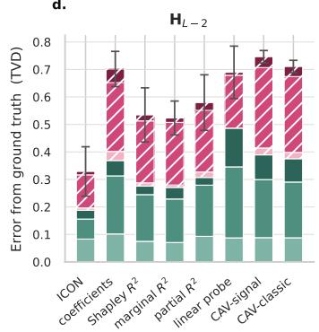

a.  
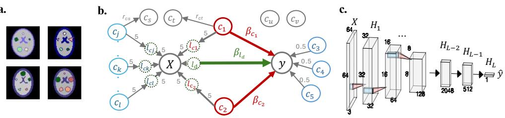

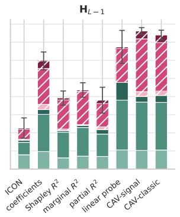

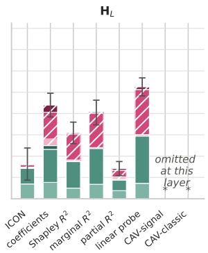

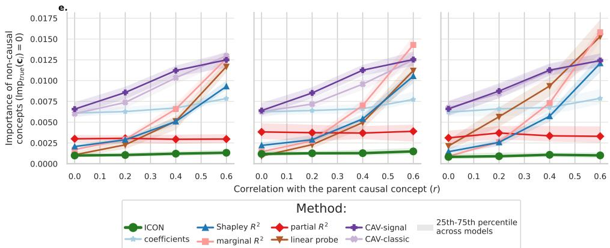  
Fig. 1: Simulation dataset setup and results. ${ \mathbf { a } } ,$ Example 64 $\times ~ 6 4$ ToyBrains images, rendered from sixteen generative image attributes $\left( \mathsf { l } _ { k } \right)$ that control the position, colour and intensity of the shapes. b, The data-generating graph. $1 _ { d }$ carries the true predictive signal into $\mathbf { y }$ through $\beta _ { \mathbf { l } _ { d } ; \mathbf { c } _ { 1 } }$ and $\mathbf { c } _ { 2 }$ are confounders acting through $\beta _ { { \bf c } _ { 1 } }$ and $\beta _ { { \mathbf { c } } _ { 2 } }$ . We tune $( \beta _ { \mathbf { l } _ { d } } , \beta _ { \mathbf { c } _ { 1 } } , \beta _ { \mathbf { c } _ { 2 } } )$ to generate six diferent causal scenarios ranging from predominantly confounder-driven to predominantly signal-driven (Table 2), while all the edge weights in grey are kept fixed. $\mathbf { c } ,$ The trained network. We interpret $\mathbf { H } _ { L - 2 } , \mathbf { H } _ { L - 1 }$ and the prediction logit $\mathbf { H } _ { L }$ , over five architectural variants $\times$ three random seeds × six causal scenarios (90 models in total). d-e, We generate concept importance for these models using $n = 5 0 0$ test samples and a randomly drawn set of $q = 3 0$ concepts. d, Error from the ground truth (TVD, Equation 11), grouped by the causal role of the concept that generates the error. Bars are medians over the 90 models and error bars denote the 25th to 75th percentiles. The CAV baselines are5 omitted at $\mathbf { H } _ { L }$ (asterisk) as they cannot be computed at a one-dimensional output. $\mathbf { e } ,$ Median importance assigned to the concepts with zero ground-truth importance, shown against their spurious correlation r with a parent concept that influences the image. The $r = 0$ point is given by the independent concepts, which have no parent at all. Bands denote the 25th to 75th percentiles over the same 90 models.

The sixth causal role is played by an unobservable image attribute $1 _ { d }$ that carries the true predictive signal and is not part of the concept pool. Beyond $1 _ { d } ,$ only 15 of the 100 concepts, namely the two confounders and the 13 concepts encoded in the image, causally influence the model representations. The remaining concepts (shown as pink hatches in Figure 1d) have a ground-truth importance of exactly zero. These are divided into four groups of roughly 20 concepts each with each group spuriously correlated with one of the 15 causal concepts at one of four levels, $r \in \{ 0 . 0 , 0 . 2 , 0 . 4 , 0 . 6 \}$ where $r = 0$ implies independence from every variable in the graph.

To ensure our results are robust to diferent model settings and scenarios, we report medians over 90 trained models (six causal scenarios × five architectural variants $\times$ three seeds; balanced accuracy $7 5 . 8 \pm 2 . 0 \%$ ; Extended Data Table 2).

In hidden layers, ICON is the most accurate method (Figure 1d). At $\mathbf { H } _ { L - 2 }$ ICON’s error is 0.33, against 0.52 for the best baseline (marginal $R ^ { 2 } )$ , 0.69 for the linear probe and 0.75 for CAV-signal. At $\mathbf { H } _ { L - 1 }$ ICON has 0.23 against 0.38 for the next best baseline (partial $R ^ { 2 } )$ . Note that, at the scalar decision logit $\mathbf { H } _ { L }$ (final output of the model), the partial $R ^ { 2 }$ method is more accurate than ICON (0.14 versus 0.16). This is expected, as at $p _ { L } { = } 1$ the multi-response regime that motivates ICON’s PLS step does not arise, and an ordinary multiple regression on a scalar $\mathbf { H } _ { L }$ is well conditioned. ICON’s advantage therefore lies at the high-dimensional internal representations, such as $\mathbf { H } _ { L - 1 }$ and $\mathbf { H } _ { L - 2 }$ , that C-XAI methods are most often applied to.

ICON’s advantage comes from estimating the confounders accurately and suppressing false positives from collinear concepts (hatched segments, Figure 1d). Decomposing each method’s error by causal role shows that the baselines lose most ground on the 2 confounders (medium-green hatch in Figure 1d) and the 60 correlated concepts (medium-pink hatch). For every baseline these two roles together carry 69–82% of the total error at $\mathbf { H } _ { L - 1 }$ . Across the three roles whose true importance is exactly zero (pink hatches; outcome-encoded, correlated and independent concepts) ICON misallocates only 0.06 of TVD at $\mathbf { H } _ { L - 1 }$ , against 0.16 for the best baseline (partial $R ^ { 2 } )$ and 0.36 for the worst (CAV-signal). This is further confirmed when we observe how each method’s importance for zero-importance concepts scales with the spurious correlation r (Figure 1e). Between $r = 0$ and $r = 0 . 6$ the spurious importance rises by a factor of 7–12× for the linear probe and $7 \mathrm { - } 1 7 \times$ for marginal $R ^ { 2 }$ , but only by 1.2–1.3× for ICON. Two baselines, partial $R ^ { 2 }$ and the regression coeficients, also show no dose response to r, but they fail in a diferent way. Already at $r = 0 .$ , that is, concepts independent of every variable in the graph, they assign $3 { - } 8 \times$ the importance ICON does. No method recovers the true predictive signal exactly, because $1 _ { d }$ is unobservable and every method must approximate it through the outcome $\mathbf { y }$ (Methods 3.4). This proxy gap accounts for most of ICON’s own residual error.

ICON’s advantage widens as the concept set grows or the sample size shrinks (Extended Data Figure 6). As the number of supplied concepts $q$ grows from 5 to 100, ICON’s error at $\mathbf { H } _ { L - 1 }$ never exceeds 0.22, while every baseline degrades steeply, to 0.72 for the linear probe and 0.85 for CAV-signal (Extended Data Figure 6a). Each added concept is one more collinear distractor that the univariate baselines cannot reject on its own. Only at the smallest concept sets, where few zeroimportance concepts are present, do baselines match ICON (Shapley $R ^ { 2 }$ at $q \leq 5$ and partial $R ^ { 2 }$ at $q \leq 1 0 )$ . ICON also has the lowest error in the small-sample regime (Extended Data Figure 6b). This matters in practice, since concept annotations are typically available for only a few hundred data points $( \mathrm { e . g . }$ , in biomedical cohorts). Beyond $n \approx 5 0 0$ ICON’s lead is stable, whereas the linear probe barely improves from $n = 2 5$ to $n = 5 { , } 0 0 0$ at $\mathbf { H } _ { L - 1 }$

Varying the width of the interpreted layer shifts every method’s error only modestly and leaves ICON the most accurate at every width (Extended Data Figure 6c).

## 1.2 In skin cancer classification, ICON detects shortcut learning without false positives

The ISIC 2019 skin cancer dataset (https://challenge.isic-archive.com/landing/ 2019/) [34] is a common benchmark for detecting shortcuts with C-XAI methods [7, 12, 16, 17]. Its images contain naturally occurring artifacts that are known to act as shortcuts, such as surgical skin markings [3], band-aids, rulers and camera reflections. Applying ICON to a VGG-16 model trained on these images reafirms the previously reported findings [35] that these artifacts are indeed learned by the model. ICON shows that camera reflection, band aid, skin marker, and red color are all encoded at the penultimate representation $\mathbf { H } _ { L - 1 }$ (explained variance 9.8%, 3.4%, 3.0%, and 2.8% respectively), with reflection, and red color propagating into the final prediction logit $\mathbf { H } _ { L }$ (4.0% and 2.8%).

To perform a controlled comparison, we additionally insert synthetic microscope lens and timestamp artifacts into the images ourselves (Figure 2a). Inserting a synthetic artifact into a growing share k of melanoma images (MEL class) raises the correlation between the artifact and MEL (Figure 2b). Models trained on these adulterated datasets rely on the artifact as a shortcut to a degree that grows with the adulteration rate $k$ (Figure $2 \mathrm { c } ;$ Methods 3.5). We write $\mathcal { M } _ { \mathrm { m i c r o } - k }$ for a model trained with the microscope artifact in $k \%$ of the MEL images. $\mathcal { M } _ { \mathrm { m i c r o - 0 0 } }$ denotes a model trained on the original dataset in which all samples with microscope artifact were removed. Together with the nine outcome classes, every method is supplied with nine artifact concepts of which seven are natural and two are synthetic (Extended Data Figure 8).

ICON does not generate false positives caused by collinearities in the data (Figure $^ { \mathbf { 3 a , b } ) }$ . We test the specificity of diferent C-XAI methods in two settings (Experiments 2a and 2b in Methods 3.5). In Figure 3a we evaluate a model $\mathcal { M } _ { \mathrm { m i c r o - 0 0 } }$ on diferent test sets with progressively increasing microscope–MEL correlation. Because this model was never exposed to the artifact during training, it cannot exploit it, so its true importance is zero. ICON assigns $< 0 . 0 1$ importance at the last two layers for all test sets, irrespective of the adulteration rate $k ,$ while the baselines assign importance between 0.05–0.12 (the same picture also holds with the un-normalised scores; Extended Data Figure 7). The baselines fail in one of two ways: the linear probe’s score rises steadily as the spurious correlation increases in the test set, while the two CAV scores stay high and drift non-monotonically. Either way, all three baselines track the test-set statistics rather than the learned behaviour of the model. In Figure 3b we repeat the test for timestamp, an artifact that appears in no training set. We use the model $\mathcal { M } _ { \mathrm { m i c r o - 4 0 } }$ and test sets in which timestamp becomes progressively collinear with microscope. ICON again stays < 0.01, while the baselines produce false positives driven by the collinearity. CAV-classic is the least stable, swinging between 0.005 and 0.11 between adjacent test sets, consistent with prior reports that CAV importance shifts under changes to the concept examples and the probing dataset [20] and under perturbations of the inputs [21].

d  
b  
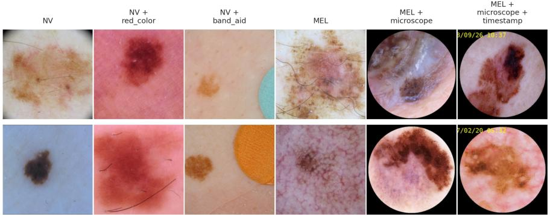

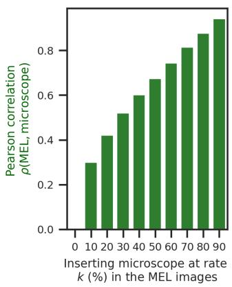

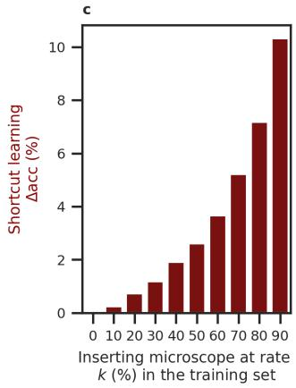

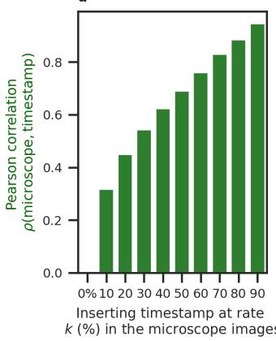  
Fig. 2: ISIC 2019 experiment setup. a, Example images from the ISIC dataset: the nevus class (NV), NV with a red color artifact, NV with a band aid, the melanoma class (MEL), MEL with the inserted microscope lens artifact, and MEL with the inserted microscope plus timestamp artifacts. $\mathbf { b , c , d , }$ , We build two families of adulterated (synthetic artifact-inserted) dataset variants by inserting the two synthetic artifacts at controlled rates k. b, Inserting the microscope artifact into k% of the MEL images raises the MEL–microscope correlation from 0.30 at k = 10% to 0.93 at $k = 9 0 \%$ $\mathbf { c } ,$ Models $\mathcal { M } _ { \mathrm { m i c r o } - k }$ trained on those variants come to rely on microscope to an increasing degree, measured as the gain in balanced accuracy ∆acc between the model’s own test set containing the artifacts and the clean test set. This shortcut learning accuracy rises from $+ 0 . 4 \%$ at $k = 1 0 \%$ to $+ 1 0 . 3 \%$ at $k = 9 0 \%$ . d, Adding a timestamp overlay to $k \%$ of the images that already carry the microscope artifact raises the microscope–timestamp correlation from 0.31 to 0.93. The timestamp artifact never appears in any training set. The concept and outcome composition of the dataset and the correlations among them are shown in Extended Data Figure 8.

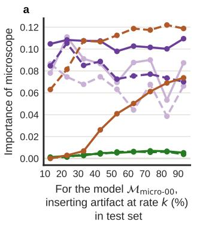

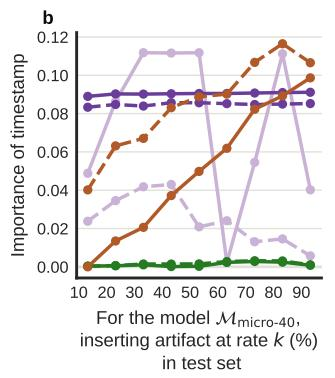

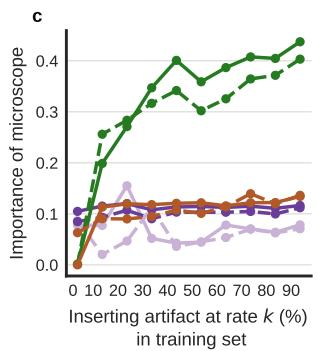  
Fig. 3: ICON detects shortcuts in ISIC skin-cancer classifiers without producing false positives. The y-axis denotes the normalised concept importance ¯ Imp, the importance assigned to a concept divided by the total importance across all nine artifact concepts and nine outcome classes, at the same layer. Colours denote C-XAI methods and line styles denote the two final layers of the VGG-16 model, $\mathbf { H } _ { L - 1 }$ and $\mathbf { H } _ { L }$ $( L = 1 8 )$ . a, Specificity to concept–outcome collinearity. The clean model Mmicro-00, whose true microscope importance is zero, evaluated on test sets $\mathcal { D } _ { \mathrm { m i c r o - 1 0 } }$ through $\mathcal { D } _ { \mathrm { m i c r o - 9 0 } }$ of rising microscope–MEL collinearity. ICON stays below 0.01 at both layers, while the three baselines assign $0 . 0 5 { - } 0 . 1 2 .$ b, Specificity to concept–concept collinearity. The shortcut-afected model $\mathcal { M } _ { \mathrm { m i c r o - 4 0 } }$ evaluated for timestamp, an artifact absent from every training set, on test sets of rising timestamp–microscope collinearity. ICON again stays below 0.01, whereas the linear probes track the collinearity, CAVclassic swings between 0.005 and 0.11 across adjacent test sets, and CAV-signal stays high at 0.09. c, Detecting the increasing importance of the shortcut concept. The ten models $\mathcal { M } _ { \mathrm { m i c r o - 0 0 } }$ through $\mathcal { M } _ { \mathrm { m i c r o - 9 0 } }$ , of increasing shortcut reliance, all evaluated on the same $\mathcal { D } _ { \mathrm { m i c r o - 1 0 } }$ split, in which the artifact is present at a low rate. Only ICON’s importance tracks reliance, rising from $\approx 0 . 0 0$ to 0.44; the baselines change by 0.02– 0.15. Dataset construction and model training are described in Methods 3.5.

ICON tracks the degree of shortcut learning more accurately than the baselines (Figure 3c). Across the ten models the accuracy gained from the artifact rises from +0.4% for $\mathcal { M } _ { \mathrm { m i c r o - 1 0 } }$ to +10.3% for $\mathcal { M } _ { \mathrm { m i c r o } - }$ -90 (Figure 2c), so a responsive C-XAI method should report a growing importance for microscope. Only ICON does, with the normalised concept importance rising from $\approx 0 . 0 0$ for $\mathcal { M } _ { \mathrm { m i c r o - 0 0 } }$ to 0.44 for $\mathcal { M } _ { \mathrm { m i c r o - 9 0 } }$ , while the three baselines show only small increases between 0.02–0.15. This is further confirmed when we qualitatively compare the normalised layer-wise importance of all methods (Figure 4). ICON shows a distinct diference between the clean $\mathcal { M } _ { \mathrm { m i c r o - } }$ and the shortcut-driven $\mathcal { M } _ { \mathrm { m i c r o - 4 0 } }$ model in the concept importance of microscope (yellow). The microscope artifact is genuinely present in the input images of the test data and is encoded in the early convolutional layers of both models. In the last few prediction layers, however, microscope-related variance remains dominant in the $\mathcal { M } _ { \mathrm { m i c r o - 4 0 } }$ model but is filtered out in the $\mathcal { M } _ { \mathrm { m i c r o - 0 0 } }$ model. In contrast, the baselines separate the two models only subtly. ICON additionally reports how much of each layer cannot be explained by the supplied concept set (Extended Data Figure 9). This unexplained share is large in the early convolutional layers and shrinks towards the prediction logits, indicating that the early layers encode concepts outside the supplied set or encode them non-linearly or both. No other C-XAI method can ofer such a diagnostic.

Having shown that ICON detects shortcuts in a controlled setting, we next apply it to two open research questions from neuroimaging where the true concept importances are not known.

## 1.3 In real-world biomedical research, ICON produces actionable insights

DNNs are increasingly used in research to find biomarkers of disease from highdimensional, unstructured biomedical data such as neuroimaging, genomics, or proteomics [1, 36]. In these applications, C-XAI methods can be used for model auditing to verify if a model truly learns a biologically-relevant signal or relies on a spurious artifact or sociodemographic bias in the data. In biomedical research, candidate concepts can be numerous and unavoidably correlated, precisely a regime where the current univariate C-XAI methods can fail. In this experiment, we pick two open research questions from neuroimaging and demonstrate how ICON generates sparse explanations that are actionable, whereas existing univariate C-XAI methods such as linear probes do not. Specifically, we investigate the following two open research questions:

1. A recent study reported that an alcohol-misuse phenotype called binge drinking can be predicted from structural brain MRI in a European adolescent cohort [6, 37]. We test if we can find a similar brain-signature for binge drinking in an older-adult UK cohort [38]. Therefore, we ask, “Can a DNN model identify a brain signature of binge drinking in an older adult population?”

2. DNN models are trained to predict age from brain MRI and the prediction error of the model, called the brain-age gap, is widely used as a transdiagnostic biomarker of brain health [39, 40]. It is argued that the brain-age gap captures markers of accelerated brain ageing and hence is a proxy for brain diseases. We ask, “Do brain-age DNN models read any brain-health signal or spurious association beyond chronological age into their predictions, and does that support or challenge the brain-age gap as a brain-health biomarker?”

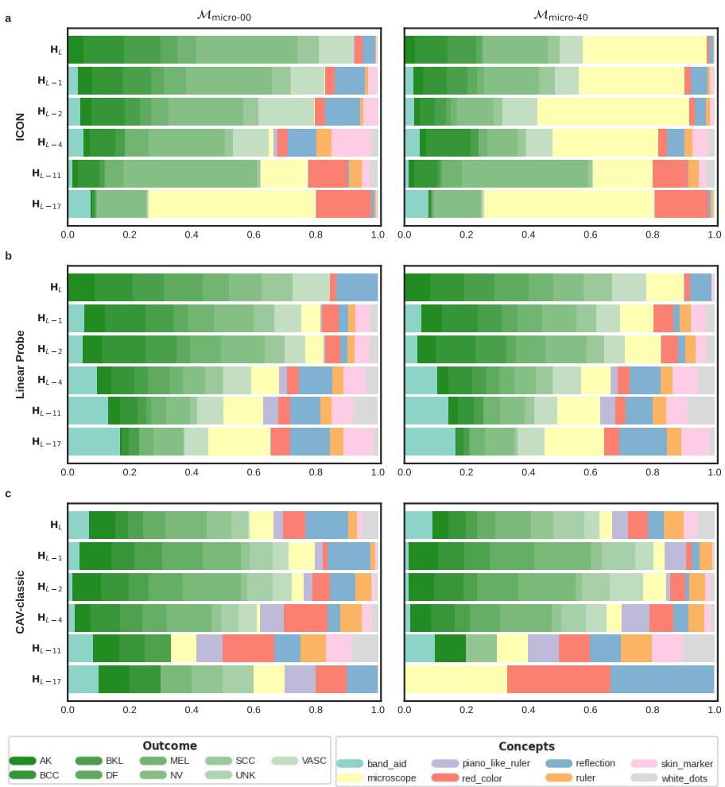  
Fig. 4: ICON is the only C-XAI method whose decomposition separates a clean model from a shortcut-afected one. Each row is one C-XAI method, and each stacked bar is that method’s layer-wise concept importance for the artifact concepts and the nine outcome classes, from an early convolutional layer ${ \bf H } _ { L - 1 7 }$ (bottom) to the prediction logits $\mathbf { H } _ { L }$ (top). Within a row, the left panel is the clean model $\mathcal { M } _ { \mathrm { m i c r o - 0 0 } }$ and the right panel the adulterated model $\mathcal { M } _ { \mathrm { m i c r o - 4 0 } }$ , both evaluated on the same test split $( n = 2 , 4 5 9$ images), in which the microscope artifact (yellow) is present in 10% of the MEL images. The un-normalised ICON decomposition with the unexplained share retained is shown in Extended Data Figure 9.

In both tasks, all methods are supplied with 30 concepts along with the outcome variable in ${ \bf C } ^ { \prime } .$ . Including the outcome in the concepts set ensures that a concept is credited only with the representation variance it explains beyond the outcome itself (Methods 3.1). We compare ICON with linear probes but have to omit CAV-based methods because our concept set contains a mixed set of categorical and continuous variables and CAV scores are not directly comparable across them. This is a major limitation of CAV as such mixed data types are expected during model auditing, especially in the biomedical context [13]. ICON and linear probes can generate different insights for the same DNN model. We therefore test both against independent evidence: a retraining experiment for the binge-drinking model, and resampled outof-distribution test sets for the brain-age model (Methods 3.6).

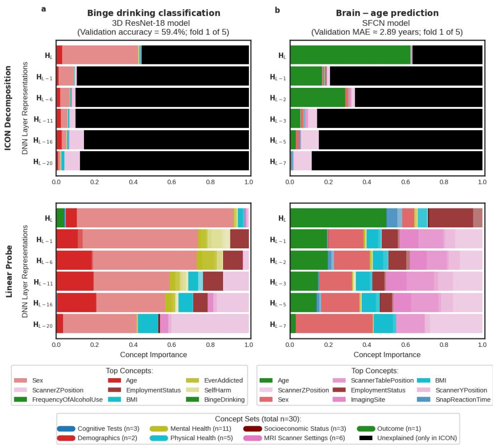  
Fig. 5: On two UK Biobank brain-MRI models, ICON generates sparse, clear insights about what the model does, while the linear probe produces a difuse, ambiguous explanation. Layer-wise concept importance for the 30 concepts and the outcome, shown as stacked bars from an input layer at the bottom to the prediction logits at the top. Colours denote the concept categories in the legend. ICON bars are shares of representation variance and sum to one at each layer, with the black segment denoting $\sigma _ { l } ^ { 2 } ,$ the share of that layer’s variance which none of the supplied concepts explains under a linear model. Probe bars are per-concept probe scores $( R ^ { 2 }$ or Cohen’s κ) normalised for display, and unlike ICON they carry no unexplained term. a, Binge-drinking classification (3D ResNet-18; fold 1 of 5, accuracy 59.4%). ICON (top) assigns ≈ 0.39 of the final-layer variance to participants’ sex and essentially none to the binge-drinking outcome or other concepts. The probe (bottom) also ranks sex highly but additionally surfaces the outcome itself and several healthrelated concepts (BMI, EverAddicted, SelfHarm), leaving it unclear whether the model learned only sex or also a binge-drinking phenotype. b, Brain-age prediction (SFCN; fold 1 of 5, MAE 2.89 years). ICON (top) assigns ≈ 0.63 of the final-layer variance to the outcome, age (remaining ≈ 0.36 unexplained), and surfaces scanner-related concepts only in the early layers. The probe (bottom) assigns importance to age and to many age-correlated concepts, including EmploymentStatus, HouseholdIncome, BMI, sex, and scanner and imaging settings. 12 12

On the binge-drinking model, ICON identifies that the model uses sex as a shortcut, while the probe’s attribution stays ambiguous (Figure 5a). A 3D ResNet-18 [41] classifies binge drinkers from controls at $6 0 \pm 0 . 5 \%$ accuracy (mean ± s.d. over five cross-validation folds; chance 50%), a modest but above-chance result that, taken at face value, would read as a positive finding. We inspect what concepts the model has learned using ICON and then linear probes. ICON shows that the variance explained by sex increases steadily from the input layer $\left( \mathbf { H } _ { L - 2 0 } \right)$ to the prediction logit $\left( \mathbf { H } _ { L } \right)$ , with sex explaining nearly all of the concept-explained variance in the final layers. The binge-drinking outcome itself explains essentially none. Thus, ICON suggests that the model uses sex as a shortcut for binge drinking (in this cohort sex correlates with the binge-drinking outcome at r ≈ 0.23; Extended Data Figure 10). The probe, in contrast, assigns importance not just to sex, but also to the outcome, and several other mental-health concepts (Figure 5a, bottom). This difuse attribution produces an unclear picture: should we reject this model as entirely shortcut-driven, or has it additionally learned a genuine mental-health signal beyond sex?

Retraining on sex-balanced data confirms ICON’s reading: once sex can no longer be exploited, most of the model’s above-chance accuracy disappears. The retrained model performed close to chance (53.3 ± 0.5%, mean ± s.d. over five folds, $n = 1 { , } 2 7 0$ hold-out participants), indicating that whatever above-chance accuracy the original model had was carried by the sex confound. This supports ICON’s reading and leaves the probe’s “possible alcohol-specific signal” interpretation unsupported. Repeating the task with a diferent architecture (SFCN [42], $6 1 . 2 \pm 0 . 7 \%$ over five folds) reproduces the same confound (Extended Data Figure 11b), suggesting that the shortcut originates in the data rather than in the modelling choices.

On the brain-age model, ICON attributes the prediction almost entirely to age, whereas the probe surfaces many age-correlated concepts (Figure 5b). Our SFCN model [42] predicts age with a mean absolute error (MAE) of $2 . 8 9 \pm 0 . 0 2$ years and $R ^ { 2 } = 0 . { \dot { 7 } } 5 { \dot { 0 } } \pm 0 . 0 0 4$ (mean ± s.d. over five folds, $n = 5 { , } 0 0 0$ hold-out participants), on par with the published benchmark. ICON attributes most final-layer variance to the outcome, age, with no dominant shortcut of the kind seen in the bingedrinking model (Figure 5b, top). A few other concepts carry tiny, non-zero importance (e.g., the acquisition date of the scan), together explaining under 1% of the variance in yˆ. ICON quantifies that the remaining ≈ 36% of the output-layer variance is explained by none of the 30 supplied concepts, flagging either an incomplete concept set or a nonlinear encoding of the supplied concepts. Neither probes nor CAVs provide calibrated explanations of this kind. On the same representations, the probe instead spreads importance across age and many age-correlated concepts such as socioeconomic status (employment status and household income), BMI, and cognitive test performances [22, 23]. It also assigns importance to sex, scanner and imaging-site settings (Figure 5b, bottom).

The concepts the probe flags do not survive independent validation, consistent with them being decodable but unused false positives. From each method, we take the five concepts ranked most important other than age at the final hidden layer, which gives the eight concepts in Table 1. To test whether the model actually uses them, we draw on the participants remaining in the held-out pool of n = 11,354 participants to build resampled out-of-distribution (OOD) test sets in which a chosen concept’s correlation with age is removed, and compare the model’s prediction error against a matched control set that retains the original correlations (Methods 3.6). A concept the model uses as a proxy for age should degrade the error while a merely decodable one should not. Six of the eight concepts admitted a valid OOD set. None of the six showed a robust change in model prediction error $( | \Delta \mathrm { M A E } | \le 0 . 0 6 9$ years, none clearing $p < 0 . 0 5$ in all five folds), which is the pattern expected of a false positive. ICON assigns near-zero importance $\left( < \ 0 . 0 0 1 \right)$ to them while the probe does not. Sex and household income, which the probe ranks second and fourth, therefore appear to be encoded in the representation but not used by the model. The two remaining concepts, employment status (the probe’s top concept) and acquisition date (ICON’s top concept), are too collinear with age for a valid OOD set, so for these we measured the age-conditioned partial $R ^ { 2 }$ of the prediction instead. Employment status carries no detectable age-independent signal (partial $R ^ { 2 } \approx 0 )$ , whereas acquisition date, which the probe leaves outside its top five, is the only concept with a small but significant influence (partial $R ^ { 2 }$ ≈ 2.4%, $p < 0 . 0 0 1 )$ . This is also consistent with ICON’s layer-wise decomposition. A tiny fraction of the scanner-acquisition concepts that dominate the input-layer representation leaks into the output layer (Figure 5b and Table 1). Tracking ICON across training checkpoints shows why (Extended Data Figure 11a). The residual scanner signal is a training residue as the image representations are scanner-dominated at initialisation, and age comes to dominate only as the model converges.

## 2 Discussion

C-XAI methods like linear probes and CAVs have largely re-derived variable importance without drawing on the statistics literature that has studied this problem for decades [28]. We adapted this literature to the C-XAI regime and developed a novel multivariate C-XAI method, ICON decomposition, which combines PLS [43] to handle high-dimensional DNN representations and multiple correlated concepts with a Type I sum-of-squares allocation [32] to reduce false positives from those correlations.

Linear probes and CAVs are popular because they can be used to interpret a model post-hoc, after training, with any user-defined concept, provided enough annotated test samples exist for that concept. ICON preserves these benefits while overcoming several of their documented failures, specifically their high rate of false positives, and scores that are not comparable across model layers or across concept types. ICON achieves this by recasting the question. The existing methods pose C-XAI as a univariate decoding question, “can this concept be predicted from a given layer?”, whereas

Table 1: No concept the linear probe flagged changes the brain-age model’s error when its correlation with age is removed. For each of the eight top concepts: the change in MAE between the OOD and the matched randomcontrol test set $( \Delta \mathrm { M A E } ,$ in years), the ICON and linear-probe importance at the final hidden layer $\left( \mathbf { H } _ { L - 1 } \right)$ with the concept’s rank among all 30 concepts, and the age-conditioned partial $\dot { R } ^ { 2 }$ of the model output on that concept. Values are mean $\pm \mathrm { \ s . d . }$ . over the five cross-validation folds. A dash in a rank column means the concept falls outside that method’s top five and ‘infeasible’ means no OOD set met the matching thresholds (Methods 3.6). ∆MAE is assessed per fold with a two-sample z-test approximation $( S E = \hat { \sigma } \sqrt { 1 / n _ { \mathrm { O O D } } + 1 / n _ { \mathrm { c o n t r o l } } } , \hat { \sigma } \approx 2 . 2 $ years from the reference hold-out’s $\left| { \hat { y } } - \mathrm { a g e } \right| )$ . A $\Delta \mathrm { M A E }$ is called significant only if it clears $\alpha = 0 . 0 5$ in all five folds. None does. Partial $R ^ { 2 }$ is assessed with a nested-model F-test and Bonferroni-corrected across the two concepts, and the asterisk marks the one significant value $( p < 0 . 0 0 1 )$
<table><tr><td>Concept</td><td>∆MAE (OOD-control), yr</td><td>ICON score (rank)</td><td>Probe score (rank)</td><td>Partial R² (age-adj.)</td></tr><tr><td>Scanner table position</td><td> $- 0 . 0 6 9 \pm 0 . 0 2 9$ </td><td>0.001 (4)</td><td>0.000 (-)</td><td></td></tr><tr><td>Systolic blood pressure</td><td> $+ 0 . 0 3 8 \pm 0 . 0 4 3$ </td><td>0.001 (5)</td><td>0.072 (5)</td><td></td></tr><tr><td>Alcohol use frequency</td><td> $- 0 . 0 3 1 \pm 0 . 0 1 6$ </td><td>0.001 (3)</td><td>0.007 (-)</td><td></td></tr><tr><td>Household income</td><td> $+ 0 . 0 2 4 \pm 0 . 0 4 3$ </td><td>0.000 (-)</td><td>0.072 (4)</td><td></td></tr><tr><td>Sex</td><td> $+ 0 . 0 1 5 \pm 0 . 0 3 1$ </td><td>0.000 (-)</td><td>0.108 (2)</td><td></td></tr><tr><td>Snap reaction time</td><td> $+ 0 . 0 1 0 \pm 0 . 0 2 2$ </td><td>0.001 (2)</td><td>0.082 (3)</td><td></td></tr><tr><td>Acquisition date</td><td>infeasible</td><td>0.004 (1)</td><td>0.001 (-)</td><td> $0 . 0 2 4 ^ { * } \pm 0 . 0 0 2$ </td></tr><tr><td>Employment status</td><td>infeasible</td><td>0.000 (-)</td><td>0.360 (1)</td><td> $0 . 0 0 0 \pm 0 . 0 0 0$ </td></tr></table>

ICON poses a multivariate variance-decomposition question, “how much of a layer’s variance do the supplied concepts and the outcome jointly account for, and how is that share divided among them?”. Moving from univariate to multivariate ensures that the false positives induced by correlations among the concepts, and between the concepts and the outcome are suppressed (Figure 1e, Figure 3a,b). This shift also enables ICON to quantify the share of each layer that none of the supplied concepts can account for. Moving from decoding to variance decomposition makes ICON’s scores comparable across layers and across categorical and continuous concepts, since every score is a share of each layer’s variance and the total share sums to one.

These properties of ICON translate into three key practical benefits. First, ICON’s low false-positive rate yields explanations that are sparse, that is, only a few concepts carry appreciable importance (Figure 1d). In the neuroimaging experiments, ICON concentrated importance on a small number of concepts for which we then found supporting evidence with independent tests, whereas the additional concepts the linear probe ranked highest showed no evidence of use (Figure 5, Table 1). Such sparse attributions can be treated as actionable hypotheses for follow-up, testable with out-ofdistribution validations, targeted retraining on rebalanced data, or formal confounder analyses as demonstrated in our experiments. Second, layer-wise comparability lets us follow a concept’s importance across depth, from the input representation to the prediction, enabling us to distinguish a concept that is merely encoded from one that is carried to the final model predictions. The inserted microscope artifact is encoded in the early input layers of both models, but survives into the prediction layers of only the shortcut-afected model. In the binge-drinking neuroimaging experiment the same trajectory is what flags sex as the shortcut the model relies on, which is later confirmed by retraining on sex-balanced data. Finally, the unexplained share $\sigma _ { l } ^ { 2 }$ guards against overconfidence in the supplied concept set and in the linearity assumption. ICON’s explanations are in this sense calibrated, since they make evident when the supplied set accounts for very little of the representation.

We recommend the following practice when using ICON. Supply as many annotated concepts as are available, including the outcome, since a larger set raises the chance of covering the relevant concept and, unlike in the univariate baselines, does not degrade ICON’s accuracy (Extended Data Figure 6a). Note that ICON’s role is to turn an unprioritised set of decodable concepts into a small number of testable candidates, as our experiments illustrate. Treat the concepts ICON nominates as hypotheses for targeted follow-up tests, such as conditional independence tests [44] or partial confounder tests [45]. Read the trajectory across layers, from the input representation to the prediction layer, rather than any single layer, and check the unexplained share. Finally, ICON is not limited to detecting shortcuts but can also be used to analyse how the concept composition of a model’s representations changes over training and how it difers between diferent model architectures (Extended Data Figure 11a,b).

Three limitations bound ICON’s claims. First, ICON remains a linear method and rests on the same linear-encoding assumption as the baselines, so a nonlinearly encoded concept is under-attributed and can surface instead in the unexplained share. Second, that unexplained share has two sources, concepts missing from the supplied set and nonlinearly encoded concepts, and we currently do not decompose it into the two. Finally, like the baselines, ICON scores the concepts it is given and does not discover new ones, so the unexplained share reports that something is missing but not what. CAVs are used as directions for steering and editing models post-training, e.g., in large language models [46], but they are known to produce unintended collateral efects [27] due to multicollinearities in the data, a problem that ICON explicitly addresses. A future direction could be to test whether steering along ICON’s vectors can reduce such collateral efects. Another natural extension is to relax the linear-encoding assumption by replacing the PLS step with a nonlinear estimator such as kernel PLS. More broadly, the conditions under which ICON’s observational decomposition can be read causally also remain open.

Nonetheless, ICON resolves a broader problem in concept-based explainability: existing methods have so far asked the wrong question, making them incapable of distinguishing concept importance that merely reflects multicollinearity in the data distribution from concepts a model actually relies on for its predictions. When ICON is used to audit a model for shortcuts or to generate hypotheses, it returns the few concepts a follow-up experiment can confirm or refute, rather than a long list of decodable concepts. Furthermore, ICON needs only a trained model’s activations and a few hundred annotated test samples for a stable decomposition (Extended Data Figure 6b), which matches what is typically available in clinical applications and biomedical research cohorts.

## 3 Methods

## 3.1 ICON Decomposition

Formal definitions: Let us consider a DNN model trained on a dataset $\{ \mathbf { X } , \mathbf { y } \}$ with n samples, where X denotes the input features $( \mathrm { e . g . }$ , dermoscopic images or neuroimaging) and y denotes the outcome variable being predicted $( \mathrm { e . g . }$ , melanoma or a brain disorder). A DNN model with L layers can be expressed as a series of transformations $M _ { L } : { \bf X } \stackrel { M _ { 1 } } { \longrightarrow } { \bf H } _ { 1 } \stackrel { M _ { 2 } } { \longrightarrow } \cdot \cdot \cdot { \bf H } _ { L - 2 } \stackrel { M _ { L - 1 } } { \longrightarrow } { \bf H } _ { L - 1 } \stackrel { M _ { L } } { \longrightarrow } { \bf H } _ { L }$ , whereby $\mathbf { H } _ { l } \in$ Rn×pl represents the latent representation learned by the model at an intermediary layer l. In C-XAI, the goal is to interpret $\mathbf { H } _ { l }$ using a set of concept variables $\mathbf { C } =$ $[ \mathbf { c } _ { 1 } , \ldots , \mathbf { c } _ { q } ]$ by estimating the importance $\mathrm { I m p } ( \mathbf { c } _ { k } )$ at layer l.

Formal motivation for ICON decomposition: Current C-XAI methods such as linear probes and CAVs estimate the importance of each concept individually (univariate estimation of $\mathrm { I m p } ( \mathbf { c } _ { k } ) )$ . It is often the case that $\mathbf { c } _ { k }$ is correlated with another important concept $\mathbf { c } _ { j }$ or the outcome variable y. Estimating Imp(ck) while omitting the other correlated variables therefore conflates the importance of $\mathbf { c } _ { k }$ with theirs. In a classical regression model, this is the same omitted variable bias that inflates a coeficient when a correlated predictor is left out of the model [32, Ch. 10]. Throughout this paper we call a concept a false positive when a C-XAI method assigns it appreciable importance although the model’s representation does not depend on it.

In ICON decomposition, we prevent this bias by controlling for all the supplied concept variables and for the outcome jointly (i.e. multivariate estimation of $\mathrm { I m p } ( \mathbf { c } _ { k } ) )$ . We collect them into a single matrix

$$
\mathbf { C } ^ { \prime } = [ \mathbf { y } , \mathbf { c } _ { 1 } , \mathbf { c } _ { 2 } , \cdots , \mathbf { c } _ { q } ] \in \mathbb { R } ^ { n \times ( q + 1 ) } ,\tag{1}
$$

and define $\mathrm { I m p } ( \mathbf { c } _ { k } )$ as the variance explained by $\mathbf { c } _ { k }$ in $\mathbf { H } _ { l }$ after controlling for all the other variables in $\mathbf { C ^ { \prime } }$

Preprocessing and notation: Before applying PLS we standardise every variable in $\mathbf { C ^ { \prime } }$ and every column of the latent representation $\mathbf { H } _ { l } \in \mathbb { R } ^ { n \times p _ { l } }$ to zero mean and unit standard deviation.

## Step (1) Use PLS to capture latent associations

PLS is a multivariate statistical method for finding linear associations between two sets of variables when both sets are high-dimensional and internally collinear, which is exactly the situation we face with the DNN layer representation $\mathbf { H } _ { l }$ and the concept matrix $\mathbf { C ^ { \prime } }$

At each iteration i, the optimization finds weight vectors $\mathbf { u } _ { l , i } \in \mathbb { R } ^ { p _ { l } }$ and $\mathbf { v } _ { l , i } \in \mathbb { R } ^ { q + 1 }$ that maximize:

$$
\operatorname* { m a x } _ { \mathbf { u } _ { l , i } , \mathbf { v } _ { l , i } } \mathrm { C o v } \Big ( \mathbf { H } _ { l } ^ { ( i ) } \mathbf { u } _ { l , i } , \mathbf { C } ^ { \prime ( i ) } \mathbf { v } _ { l , i } \Big ) \ = \ \operatorname* { m a x } _ { \mathbf { u } _ { l , i } , \mathbf { v } _ { l , i } } \mathbf { u } _ { l , i } ^ { \top } \mathbf { H } _ { l } ^ { ( i ) ^ { \top } } \mathbf { C } ^ { \prime ( i ) } \mathbf { v } _ { l , i }\tag{2}
$$

where $\mathbf { H } _ { l } ^ { \top } \mathbf { C } ^ { \prime }$ is the original cross-covariance matrix at $i = 1$

This optimization yields a latent concept $\tilde { \mathbf { c } } _ { l , i } = \mathbf { C } ^ { \prime ( i ) } \mathbf { v } _ { l , i } ,$ called the Independent Canonical Concept (ICON), and a corresponding latent activation vector $\tilde { \mathbf { h } } _ { l , i } ~ =$ $\mathbf { H } _ { l } ^ { ( i ) } \mathbf { u } _ { l , i }$ , called the ICON activation vector, that together have the largest covariance attainable. From a CAV practitioner’s perspective, the weight vector ${ \bf u } _ { l , i }$ is the CAV of the latent concept $\tilde { \mathbf { c } } _ { l , i }$ , and $\tilde { \mathbf { h } } _ { l , i }$ is that concept’s score in each sample.

The first ICON pair $\{ \tilde { \mathbf { c } } _ { l , 1 } , \tilde { \mathbf { h } } _ { l , 1 } \}$ is computed directly on the original matrices $( \mathbf { H } _ { l } ^ { ( 1 ) } \ = \ \mathbf { H } _ { l }$ and $\mathbf { C } ^ { \prime ( 1 ) } \ = \ \mathbf { C } ^ { \prime } )$ . For all subsequent iterations, the optimization is performed on residuals:

$$
\mathbf { H } _ { l } ^ { ( i + 1 ) } = \mathbf { H } _ { l } ^ { ( i ) } - \tilde { \mathbf { h } } _ { l , i } \gamma _ { l , i } ^ { \top } , \quad \mathbf { C } ^ { \prime ( i + 1 ) } = \mathbf { C } ^ { \prime ( i ) } - \tilde { \mathbf { c } } _ { l , i } \delta _ { l , i } ^ { \top }\tag{3}
$$

where $\gamma _ { l , i } ~ \in ~ \mathbb { R } ^ { p _ { l } }$ and $\pmb { \delta } _ { l , i } ~ \in ~ \mathbb { R } ^ { q + 1 }$ are the respective loading vectors, that are obtained by performing ordinary least squares projections of each block onto its own score, $\gamma _ { l , i } = { \mathbf { H } _ { l } ^ { ( i ) } } ^ { \top } \tilde { \mathbf { h } } _ { l , i } / ( \tilde { \mathbf { h } } _ { l , i } ^ { \top } \tilde { \mathbf { h } } _ { l , i } )$ and $\delta _ { l , i } = { \bf C } ^ { \prime ( i ) } { \bf \Sigma } ^ { \top } \tilde { \bf c } _ { l , i } / ( \tilde { \bf c } _ { l , i } ^ { \top } \tilde { \bf c } _ { l , i } )$ . Since each block is deflated by its own score, all ICON pairs are mutually orthogonal: $\tilde { \mathbf { h } } _ { l , i } ^ { \top } \tilde { \mathbf { h } } _ { l , j } = 0$ and $\tilde { \mathbf { c } } _ { l , i } ^ { \top } \tilde { \mathbf { c } } _ { l , j } = 0$ for $i \neq j$ . In the end, this produces a set of m orthogonal ICON activations $\{ \tilde { \mathbf { h } } _ { l , 1 } , \tilde { \mathbf { h } } _ { l , 2 } , \hdots , \tilde { \mathbf { h } } _ { l , m } \}$ that span a low-rank subspace of $\mathbf { H } _ { l }$ , where $m$ is bounded by the rank of the cross-covariance matrix in Equation $^ { 2 , }$ which in turn satisfies rank $\leq \operatorname* { m i n } ( p _ { l } , q + 1 ) \ [ 4 7 ]$ . In practice, we add pairs one at a time and stop when a new pair adds less than $1 \%$ of the total squared cross-covariance, so m is selected adaptively per layer, as is standard practice in PLS [43]. Each ICON activation vector is associated with a corresponding latent concept through an ‘inner relation $\beta _ { i }$ [43] estimated with ordinary least squares (OLS): $\tilde { \mathbf { h } } _ { l , i } = \beta _ { i } \tilde { \mathbf { c } } _ { l , i } + \epsilon _ { i }$ . The first ICON pair captures the strongest latent linear association $\beta _ { 1 }$ between $\mathbf { H } _ { l }$ and $\mathbf { C ^ { \prime } }$ , and subsequent pairs capture successively weaker, linearly independent associations, since each iteration maximises covariance on the residuals left by the previous one.

## Step (2) Deriving concept importance by decomposing the variance explained

We define the importance of each concept $\mathrm { I m p } ( \mathbf { c } _ { k } ) , \ \forall \mathbf { c } _ { k } \in \mathbf { C } ^ { \prime }$ , as the total variance explained by $\mathbf { c } _ { k }$ in $\mathbf { H } _ { l }$ . To obtain this, we first derive the variance explained by the orthogonal latent concepts $\tilde { \mathbf { c } } _ { l , i }$ and then decompose this among the original concept and outcome variables using Type I Sum of Squares.

(2a) Deriving variance explained by the latent concepts $\tilde { \mathbf { c } } _ { l , i } \mathrm { : }$ For each ICON pair, we can derive the variance explained by the latent concept $\tilde { \mathbf { c } } _ { l , i }$ in $\mathbf { H } _ { l }$ as follows,

$$
\mathbf { H } _ { l } = \sum _ { i = 1 } ^ { m } \tilde { \mathbf { h } } _ { l , i } \gamma _ { l , i } ^ { \top } + \mathbf { E } _ { l }
$$

where $\gamma _ { l , i }$ are the loadings at iteration i and $\mathbf { E } _ { l }$ is

the residual after repeated subtraction in Equation 3.

Applying the variance operator on both sides,

$$
\mathrm { V a r } ( \mathbf { H } _ { l } ) = \sum _ { i = 1 } ^ { m } \| \gamma _ { l , i } \| ^ { 2 } \mathrm { V a r } ( \tilde { \mathbf { h } } _ { l , i } ) + \mathrm { V a r } ( \mathbf { E } _ { l } )
$$

The cross-variance terms vanish since $\tilde { \mathbf { h } } _ { l , i } ^ { \top } \tilde { \mathbf { h } } _ { l , j } = 0$ for $i \neq j$ , by design.

Substituting the inner relation,

$$
\mathrm { V a r } ( \mathbf { H } _ { l } ) = \sum _ { i = 1 } ^ { m } \| \gamma _ { l , i } \| ^ { 2 } ~ \mathrm { V a r } ( \beta _ { i } \widetilde { \mathbf { c } } _ { l , i } + \epsilon _ { i } ) + \mathrm { V a r } ( \mathbf { E } _ { l } )
$$

Since $\beta _ { i }$ is estimated by OLS, we assume $\mathrm { C o v } ( \tilde { \mathbf { c } } _ { l , i } , \epsilon _ { i } ) = 0$ , and therefore

$$
\mathrm { V a r } ( \mathbf { H } _ { l } ) = \sum _ { i = 1 } ^ { m } \beta _ { i } ^ { 2 } \| \gamma _ { l , i } \| ^ { 2 } ~ \mathrm { V a r } ( \tilde { \mathbf { c } } _ { l , i } ) + \sum _ { i = 1 } ^ { m } \| \gamma _ { l , i } \| ^ { 2 } \mathrm { V a r } ( \epsilon _ { i } ) + \mathrm { V a r } ( \mathbf { E } _ { l } )
$$

Dividing by Var(Hl) on both sides,

$$
1 = \sum _ { i = 1 } ^ { m } \underbrace { \frac { \beta _ { i } ^ { 2 } \| \gamma _ { l , i } \| ^ { 2 } \mathrm {  ~ \scriptstyle ~ V a r } ( \tilde { \mathbf { c } } _ { l , i } ) } { \mathrm {  ~ \scriptstyle ~ V a r } ( \mathbf { H } _ { l } ) } } _ { \mathrm { \normalfont ~ I m p } ( \tilde { \mathbf { c } } _ { l , i } ) } + \underbrace { \sum _ { i = 1 } ^ { m } \| \gamma _ { l , i } \| ^ { 2 } \mathrm {  ~ \scriptstyle ~ V a r } ( \epsilon _ { i } ) + \mathrm {  ~ V a r } ( \mathbf { E } _ { l } ) } _ { \mathrm { \normalfont ~ O } _ { l } ^ { 2 } ( \mathrm { \tiny ~ r e s i d u a l ~ v a r i a n c e } ) }
$$

Thus, we obtain a clean decomposition by defining the importance of each ICON as the ratio:

$$
\mathrm { I m p } ( \tilde { \mathbf { c } } _ { l , i } ) = \frac { \beta _ { i } ^ { 2 } \lVert \boldsymbol { \gamma } _ { l , i } \rVert ^ { 2 } \mathrm { V a r } ( \tilde { \mathbf { c } } _ { l , i } ) } { \mathrm { V a r } ( \mathbf H _ { l } ) } \mathrm { ~ , ~ s u c h ~ t h a t ~ } \sum _ { i = 1 } ^ { m } \mathrm { I m p } ( \tilde { \mathbf { c } } _ { l , i } ) + \sigma _ { l } ^ { 2 } = 1\tag{4}
$$

The residual variance $\sigma _ { l } ^ { 2 }$ is the share of the representation’s variance that cannot be assigned to any concept or to the outcome variable in $\mathbf { C ^ { \prime } }$ under the linearity assumption.

## (2b) Decompose importance among original concepts

Tackling the non-identifiability challenge. Although the ICONs are linearly independent of one another by construction, within each ICON the original variables that form it, $\tilde { \mathbf { c } } _ { l , i } = v _ { l , i , 1 } \mathbf { c } _ { 1 } + v _ { l , i , 2 } \mathbf { c } _ { 2 } + \cdots + v _ { l , i , q } \mathbf { c } _ { q } + v _ { l , i , q + 1 } \mathbf { y } .$ can be multicollinear. Multicollinear variables share overlapping variance that cannot be uniquely attributed to any one of them, a fundamental constraint known as non-identifiability [32, Ch. 10]. In such cases, a reasonable solution is to choose a shared-variance allocation strategy that best serves the goals of our method [28]. Since our goal is to screen for shortcut variables, we must allocate the total variance explained by the ICON Im $\mathrm { p } ( \tilde { \mathbf { c } } _ { l , i } )$ across the variables in $\mathbf { C ^ { \prime } }$ such that the dominant variables, that is, those with the largest squared weights $v _ { l , i , k } ^ { 2 }$ within that ICON, absorb any shared variance from variables that are weaker contributors, reducing false positives during the screening. Thus, we decompose the $\mathrm { I m p } ( \tilde { \mathbf { c } } _ { l , i } )$ using the sequential (Type I) Sum of Squares algorithm, where the order is defined by the squared weights $v _ { l , i , k } ^ { 2 } , \forall k \in [ 1 , \cdot \cdot \cdot , q + 1 ]$

Type I sum of squares. Let $\pi _ { i }$ denote the ordering of the variables that compose an ICON $\tilde { \mathbf { c } } _ { l , i } .$ , such that $v _ { l , i , \pi _ { i } ( 1 ) } ^ { 2 } \geq v _ { l , i , \pi _ { i } ( 2 ) } ^ { 2 } \geq \cdot \cdot \cdot \geq v _ { l , i , \pi _ { i } ( q + 1 ) } ^ { 2 }$ . Following this ordering, we sequentially regress the ICON activation vector $\bar { \mathbf { h } } _ { l , i }$ on the variables in $\mathbf { C ^ { \prime } }$ . This yields a set of incremental sums of squares $\{ \Delta \mathrm { S S } _ { i , \pi _ { i } ( 1 ) } , \ldots , \Delta \mathrm { S S } _ { i , \pi _ { i } ( q + 1 ) } \}$ , where $\Delta \mathrm { S S } _ { i , \pi _ { i } ( j ) }$ is the additional variance in $\tilde { \mathbf { h } } _ { l , i }$ explained by ${ \bf c } _ { \pi _ { i } ( j ) }$ after accounting for all higher-ranked variables $\mathbf { c } _ { \pi _ { i } ( 1 ) } , \ldots , \mathbf { c } _ { \pi _ { i } ( j - 1 ) }$

These incremental sums of squares add up to the variance in $\tilde { \mathbf { h } } _ { l , i }$ that $\mathbf { C ^ { \prime } }$ explains, so dividing each by their total gives proportions, which we then scale by $\mathrm { I m p } ( \mathbf { \tilde { c } } _ { l , i } )$ We allocate by $\Delta \mathrm { S S }$ rather than by $v _ { l , i , k } ^ { 2 }$ directly because the weights describe how the ICON was built out of $\mathbf { C ^ { \prime } } .$ , whereas the quantity we want to allocate is variance in $\tilde { \mathbf { h } } _ { l , i }$ . The importance of concept $\mathbf { c } _ { k }$ within ICON $\tilde { \mathbf { c } } _ { l , i }$ is:

$$
\mathrm { I m p } ( \mathbf { c } _ { k } , \tilde { \mathbf { c } } _ { l , i } ) = \frac { \Delta \mathrm { S S } _ { i , k } } { \sum _ { j = 1 } ^ { q + 1 } \Delta \mathrm { S S } _ { i , \pi _ { i } ( j ) } } \cdot \mathrm { I m p } ( \tilde { \mathbf { c } } _ { l , i } )\tag{5}
$$

The total importance of a concept $\mathbf { c } _ { k }$ across all ICONs is then:

$$
\mathrm { I m p } ( \mathbf { c } _ { k } ) = \sum _ { i = 1 } ^ { m } \mathrm { I m p } ( \mathbf { c } _ { k } , \tilde { \mathbf { c } } _ { l , i } )\tag{6}
$$

This formulation gives the ICON importance scores four properties that directly tackles the three limitations of existing C-XAI metrics we discuss in the Introduction:

1. Bounded and sum-constrained: Imp $( \mathbf { c } _ { k } ) \in [ 0 , 1 ]$ and $\begin{array} { r } { \sum _ { k } \mathrm { I m p } ( \mathbf c _ { k } ) + \sigma _ { l } ^ { 2 } = 1 } \end{array}$ 2 enabling direct comparison across concept types and layers.

2. Transparent about unexplained variance: $\sigma _ { l } ^ { 2 }$ quantifies how much of the latent representation lies outside the provided concept set and linear assumptions, guarding against overconfidence in an incomplete concept set [7], or over-reliance on the linearity assumption [48].

3. Transparent about entangled concepts: The squared weights $v _ { l , i , k } ^ { 2 }$ from step 1 record which concepts share variance within each ICON, making multicollinear groups explicit to the practitioner regardless of how the sequential allocation distributes that shared variance.

4. Down-weights weaker, correlated concepts: The dominant variable within each ICON absorbs the variance it shares with weaker correlated ones. This strategy reduces false positives and reveals the variables that drive shortcut learning more accurately.

## 3.2 Visualising ICON decompositions as layer-wise importance bars

ICON and linear-probe importances are visualised as stacked horizontal bars, one stack per interpreted layer, ordered from an input layer at the bottom to the prediction logits at the top and coloured by concept category (for example, Figure 3 and Figure 5). For ICON the bars form a variance partition: their lengths sum to one at each layer (Equation 4), and the fraction of representation variance not explained by any supplied concept, $\sigma _ { l } ^ { 2 }$ , is drawn as a separate unexplained segment. For the linear probe the bars are per-concept probe scores (cross-validated $R ^ { 2 }$ or Cohen’s $\kappa )$ normalised for display (Equation 8); unlike ICON they do not form a variance partition and carry no unexplained term, and only variables exceeding 5% normalised importance are named, although all contribute to the bars.

## 3.3 Experiment setup

Comparing with baseline methods. Across three experiments, we compare ICON against two groups of baseline methods. The first group consists of established C-XAI methods.

1. Linear probes $( \mathrm { I m p } _ { \mathrm { p r o b e } } )$ [10]: For each $\mathbf { c } _ { k } \in \mathbf { C } ^ { \prime }$ , we fit a logistic (categorical) or linear (continuous) regression predicting $\mathbf { c } _ { k }$ from $\mathbf { H } _ { l }$ . We perform three-fold cross-validation and use the mean test fit quality as the importance score $( R ^ { 2 } \in$ $[ 0 , 1 ]$ for continuous, Cohen’s $\kappa \in [ 0 , 1 ]$ for categorical, where 0 signifies chance for both). Linear probes are the most widely used C-XAI method, e.g., to assess representation quality in self-supervised models [49] or detect linguistic structure in language models [50].

2. CAV-classic $( \mathrm { I m p } _ { \mathrm { C A V - c l a s s i c } } ) \ [ 1 1 ] { : }$ A concept activation vector (CAV) is a direction in the layer’s activation space, obtained as the direction of a learned linear probe. Rather than using probe accuracy as the importance score, CAV-classic uses a sensitivity test on the CAV direction which measures how much the model’s output changes when the layer’s activations are perturbed along it. Following Kim et al. [11], the score is the fraction of test samples whose directional derivative along the CAV is positive, which equals 0.5 under no association; we report its symmetric magnitude $\vert q _ { \mathrm { C A V } } - 0 . 5 \vert / 0 . 5$ , as in Pahde et al. [12], so that the score is a non-negative efect size on the same footing as the other importance measures. CAV-based methods have been applied to detect shortcuts and biases in biomedical applications [35] and to interpret language models [46].

3. CAV-signal $\left( \mathrm { I m p _ { C A V - s i g n a l } } \right)$ [12]: Rather than fitting a probe to obtain the CAV direction, CAV-signal defines the CAV as the diference between the mean activation in Hl when $\mathbf { c } _ { k } = 1$ and when $\mathbf { c } _ { k } = 0$ (defined for binary $\mathbf { c } _ { k } )$ . Pahde et al. [12] argue that this simpler signal direction makes CAVs less susceptible to confounding by correlated concepts encoded in $\mathbf { H } _ { l } .$ As with CAV-classic, the importance score is the symmetric magnitude $| q _ { \mathrm { C A V } } - 0 . 5 | / 0 . 5$ of the directional-derivative statistic, computed along this signal direction.

The second group consists of classical statistical methods for variable importance in regression (see Gr¨omping [28] for a review), which serve as alternatives to ICON’s PLS-based variance decomposition.

5. Marginal $R ^ { 2 }$ importance $\left( \operatorname { I m p } _ { \mathrm { m a r g } - R ^ { 2 } } \right)$ : The $R ^ { 2 }$ of a univariate regression of $\mathbf { H } _ { l }$ on $\mathbf { c } _ { k }$ alone, ignoring all other concepts. This captures the marginal association between $\mathbf { c } _ { k }$ and $\mathbf { H } _ { l } ,$ but when concepts are correlated their shared variance is attributed to each concept individually, inflating importance scores.

6. Standardised regression coeficients $\left( \mathrm { I m p } _ { \mathrm { c o e f } } \right)$ : We fit a multi-output linear regression,

$$
\mathbf H _ { l } = \mathbf C ^ { \prime } \mathbf W + \mathbf E , \quad \mathbf W \in \mathbb R ^ { ( q + 1 ) \times p _ { l } } , \ \mathbf E \in \mathbb R ^ { n \times p _ { l } } ,\tag{7}
$$

which decomposes into $p _ { l }$ independent linear regressions, one per output dimension. We use the mean squared coeficient $\textstyle \frac { 1 } { p _ { l } } \sum _ { j = 1 } ^ { p _ { l } } W _ { k , j } ^ { 2 }$ as the importance of concept $\mathbf { c } _ { k }$ . This accounts for the presence of other concepts, but estimated coeficients are known to be numerically unstable under multicollinearity [28].

7. Partial $R ^ { 2 }$ importance $\left( \mathrm { I m p } _ { \mathrm { p a r t } - R ^ { 2 } } \right)$ : The drop in $R ^ { 2 }$ when $\mathbf { c } _ { k }$ is removed from the full model (Equation $7 ) , \mathrm { i . e . , } \ : \overline { { R ^ { 2 } ( { \bf W } ) - R ^ { 2 } ( { \bf W } _ { \backslash k } ) } }$ , where ${ \bf W } _ { \backslash k }$ is the model refitted without $\mathbf { c } _ { k }$ , and $R ^ { 2 }$ is the coeficient of determination averaged across the $p _ { l }$ output dimensions. This corresponds to Type III $\mathrm { ( ^ { 6 6 } l a s t ^ { 7 } ) }$ sum of squares [28], quantifying the unique variance explained by $\mathbf { c } _ { k }$ after accounting for all other concepts. Under strong multicollinearity, this unique contribution may shrink to near zero even for genuinely important concepts.

8. Shapley $R ^ { 2 }$ importance $( \mathrm { I m p _ { s h a p } } ) \colon$ The Shapley value [51] of $\mathbf { c } _ { k }$ is the average marginal contribution of $\mathbf { c } _ { k }$ across all orderings in which it could enter a Type I sumof-squares decomposition, and is widely regarded as the most principled regressionbased importance measure because shared variance among correlated concepts is distributed symmetrically [28, 51]. We estimate it from the multivariate $R ^ { 2 }$ Equation 7 using the LMG decomposition [28].

Normalised importance. Importance scores from diferent methods, such as ICON, CAVs and linear probes, have diferent natural scales and the literature does not provide a unified notion that makes these importance scores directly comparable [7]. We place all the methods on a common simplex by normalising their importance scores over the supplied variable set $\mathbf { C ^ { \prime } }$

$$
\overline { { \mathrm { I m p } } } _ { m } ^ { ( l ) } ( \mathbf { c } _ { k } ) = \frac { \mathrm { I m p } _ { m } ^ { ( l ) } ( \mathbf { c } _ { k } ) } { \sum _ { j = 1 } ^ { q + 1 } \mathrm { I m p } _ { m } ^ { ( l ) } ( \mathbf { c } _ { j } ) } .\tag{8}
$$

This places all methods on the same fixed budget, and reduces the efect of layer dimensionality on the raw scores. We also report the un-normalised scores alongside the normalised ones wherever a conclusion could depend on this choice $( \mathrm { e . g . }$ , Extended Data Figure 7).

## 3.4 Experiment 1: Simulation experiments with ToyBrains

ToyBrains Dataset configuration. ToyBrains [33] generates $6 4 \times 6 4$ RGB images (X) whose visual attributes are specified by sixteen generative variables ${ \bf L } \quad = \quad$ $\{ \boldsymbol { \mathbf { l } } _ { 1 } , \ldots , \boldsymbol { \mathbf { l } } _ { 1 6 } \}$ (Figure 1a). Every path into the image runs through one of the sixteen generative image attributes L. We also generate a binary outcome variable y and a pool of 100 concepts $\mathbf { C } = \{ \mathbf { c } _ { 1 } , \hdots , \mathbf { c } _ { 1 0 0 } \}$ . The image attribute variables L are considered unobservable to C-XAI estimations. The data generation process is specified with a directed acyclic graph where the variables $\{ \mathbf { L } , \mathbf { C } , \mathbf { y } \}$ form the nodes and their causal coeficients form the edges. Every variable is discrete and, in the absence of any incoming edge, uniformly distributed over its states, while an edge coeficient acts by shifting the probability of the target variable through a logistic link. For example, if the target variable z is binary then $\beta = 0$ has no efect as it keeps $P ( \mathbf { z } = 1 ) = 5 0 \%$ as before, while $\beta = 2 . 2 0$ sets $P ( \mathbf { z } = 1 ) = 9 0 \%$ . Variables with a fixed number of ordinal states are used to emulate continuous variables.

For this experiment, we design a graph in which the image and the outcome are related through one ‘true’ signal pathway and two confounder-driven pathways (Figure 1b). A specific attribute, $1 _ { d } ,$ carries the true signal, and the remaining fifteen are assigned at random (without replacement) to fifteen concepts that influence the image, so no two concepts share an attribute. Every variable in the graph plays one of the following six causal roles:

• True predictive signal (one variable): This signal is carried by the image attribute $\mathbf { l } _ { d } \in \mathbf { L }$ , which drives a path into both the image and the outcome, $\mathbf { X } \left. \mathbf { l } _ { d } \right. \mathbf { y }$ Since the image attributes are unobservable to C-XAI methods, every method must use the outcome y as its observable proxy to estimate the efect size of this pathway.

• Confounder (2 concepts): c and $\mathbf { c } _ { 2 }$ each drive a path into both the image and the outcome, $\mathbf { y }  \mathbf { c } _ { i }  \mathbf { l } _ { a }  \mathbf { X }$ for $i \in \{ 1 , 2 \}$ , where $1 _ { a }$ is that concept’s assigned attribute.

• Encoded in image (13 concepts; $\mathrm { e . g . } , \mathrm { c } _ { j } , \mathrm { c } _ { k } , \mathrm { \bf c } _ { l }$ in Figure 1b): These concepts have a path into the image and none into the outcome, $\mathbf { c } _ { i }  \mathbf { l } _ { a }  \mathbf { X }$ . Thus, they are genuinely visible in the image but irrelevant to the prediction.

• Encoded in outcome (3 concepts): These concepts have only a path into y and none into $\mathbf { X } , \mathbf { c } _ { i } \to \mathbf { y }$ for $i \in \{ 3 , 4 , 5 \}$

• Correlated concept (60 concepts; $\mathbf { c } _ { s } , \mathbf { c } _ { t }$ in Figure 1b): These concepts have no edge of their own into X or y. They are instead resampled to correlate with one of the 15 image-influencing concepts above $\mathbf { c } _ { i i }$ , that is, the 13 image-encoded concepts and the two confounders, as $\mathbf { c } _ { i } \gets \mathbf { c } _ { i i } \to \mathbf { l } _ { a } \to \mathbf { X }$ . Each of these concepts is assigned one of three correlation strengths, $r \in \{ 0 . 2 , 0 . 4 , 0 . 6 \}$ , with twenty concepts at each strength. This enables us to study the efect of r on each method (Figure 1e).

• Independent concept (22 concepts; $\mathbf { c } _ { u } , \mathbf { c } _ { v } )$ : The remaining concepts have no edge into any variable and are independent of every other variable in the graph. These serve as the $r = 0$ reference in Figure 1e.

Following from this causal graph, the sampling of the binary outcome is given by,

$$
{ \cal P } ( { \bf y } { = } 1 ) = \sigma \Big ( \beta _ { { \bf l } _ { d } } { \bf l } _ { d } + \beta _ { { \bf c } _ { 1 } } { \bf c } _ { 1 } + \beta _ { { \bf c } _ { 2 } } { \bf c } _ { 2 } + \sum _ { i = 3 } ^ { 5 } \beta _ { { \bf c } _ { i } } { \bf c } _ { i } \Big )\tag{9}
$$

where σ is the logistic function.

We alter the data-generating process and generate six diferent causal scenarios by varying $\beta _ { \mathbf { l } _ { d } } , \beta _ { \mathbf { c } _ { 1 } }$ , and $\beta _ { { \mathbf { c } } _ { 2 } }$ , while keeping all other edges in the graph fixed. These settings range from a purely confounder-driven regime $( \beta _ { 1 _ { d } } = 0 )$ to predominantly signal-driven regimes in which one of the two confounders is switched of, as listed in Extended Data Table 2. For each of the six settings we generate 5,000 training and 5,000 test samples. DNN models are trained on the training split, while the test split is used to generate C-XAI explanations and compute the ground truth. By default, each method’s explanations are computed from an independent random subsample of $n = 5 0 0$ test images, whereas the ground truth is always computed on the full test split. Each method is supplied with the same $q = 3 0$ concepts for each model checkpoint, randomly drawn from a pool of 100 concepts stratified by causal role, ensuring that all causal roles are represented. DNN Models. We train a DNN with three convolutional blocks $( 3 2  6 4  1 2 8$ channels, each with $3 \times 3$ convolution with ReLU, batch normalisation, $2 \times 2$ max pooling) followed by three fully connected layers referred to as $\mathbf { H } _ { L - 2 } , \mathbf { H } _ { L - 1 }$ and $\mathbf { H } _ { L }$ (Figure 1c), where $\mathbf { H } _ { L }$ is the final scalar decision logit $( p _ { L } { = } 1 )$ . We perform C-XAI interpretation at these three last layers of the model. Training uses SGD with a learning rate of 0.01, batch size 128, and up to 100 epochs with early stopping on the validation loss (patience 15). To ensure that our experimental conclusions are not specific to one architecture or one random initialisation, we train five architectural variants that difer in the widths of the two interpreted layers $( \mathbf { H } _ { L - 2 } , \mathbf { H } _ { L - 1 } )$ as (512, 128), (1024, 256), (2048, 512), (4096, 1024) and (8192, 2048), and repeat each variant with three random seeds. This gives 15 models per causal scenario and 90 models across the six scenarios. Every importance and error value we report in this experiment is a median over all 90 models, with bands showing the 25th to 75th percentile dispersion across models. Balanced accuracy on the test split is 75.8 ± 2.0% (range 70.7–79.1%), and varies negligibly across the five architectural variants $\left( 7 5 . 5 \mathrm { - } 7 6 . 0 \% \right)$

Ground truth. C-XAI methods score each concept separately at every layer, so our ground truth must be layer-wise too. We obtain it by holding the trained weights fixed and intervening on the causal graph in the test distribution (full test split, $n = 5 { , } 0 0 0 )$ . We define the ground-truth importance of a generative variable z at layer l as the share of representation variance accounted for by intervening on z:

$$
\mathrm { I m p } _ { \mathrm { t r u e } } ^ { ( l ) } ( \mathbf { z } ) ~ = ~ \frac { \mathrm { V a r } \bigl ( \mathbb { E } \bigl [ \tilde { \mathbf { H } } _ { l } ~ | ~ \mathrm { d o } ( \mathbf { z } ) \bigr ] \bigr ) } { \mathrm { V a r } \bigl ( \tilde { \mathbf { H } } _ { l } \bigr ) }\tag{10}
$$

where $\dot { \mathbf { H } } _ { l }$ denotes the activation at layer $l ,$ standardised dimension-wise, and $\begin{array} { r } { \mathrm { V a r } ( \tilde { \mathbf { H } } _ { l } ) = \sum _ { i } \mathrm { V a r } ( \tilde { \mathbf { h } } _ { l , j } ) } \end{array}$ denotes the total variance of the standardised representation. Here, do(z) denotes a causal intervention operator [52], so the numerator is the variance in $\mathbf { H } _ { l }$ accounted for by varying z across its states while keeping the remaining variables in the image-generating graph fixed.

Only the variables that have a causal path into X can influence the variance of the model’s representations $\mathbf { H } _ { l }$ , since do(z) severs the edge from its parent. 85 of the 100 concepts do not have a causal path into X. This includes the 60 correlated concepts, 22 independent concepts, and 3 encoded-in-outcome concepts. Therefore, we simply set their ground-truth importance to zero analytically. For the remaining sixteen variables that do have a causal path into X, the back-door criterion applies [52]. These include, the true signal $1 _ { d } .$ , the two confounders and the 13 image-encoded concepts. The backdoor criterion applies to them because they are each sampled independently. None of them have a causal parent, so no back-door path runs from any of them into $\mathbf { H } _ { l }$ Therefore, $\mathbb { E } [ \tilde { \mathbf { H } } _ { l } \mid \mathrm { d o } ( \mathbf { z } ) ] = \mathbb { E } [ \tilde { \mathbf { H } } _ { l } \mid \mathbf { z } ]$ , and we can estimate $\mathrm { I m p } _ { \mathrm { t r u e } } ^ { ( l ) } ( { \bf z } )$ directly from the observational test split.

Error from the ground truth. We place all the methods and the ground truth on a common simplex by normalising their scores over the variable set $\mathbf { C ^ { \prime } }$ (denoted as ¯ Imp; Equation 8). This makes comparing a distance between them well defined. Then we compute the error using the TVD metric:

$$
\mathrm { T V D } _ { m } ^ { ( l ) } = \frac { 1 } { 2 } \sum _ { { \bf c } _ { k } \in { \bf C } ^ { \prime } } \big | \operatorname * { l i m p } _ { { \bf t r u e } } ^ { - } ( { \bf c } _ { k } ) - \operatorname { I } ^ { - } \mathrm { P } _ { m } ^ { ( l ) } ( { \bf c } _ { k } ) \big | .\tag{11}
$$

Since both scores sum to one, TVD is bounded in [0, 1] where 0 denotes exact recovery and 1 denotes complete disagreement, irrespective of the value of $q .$ Thus our error metric is directly comparable across methods, causal scenarios and layers of difering dimensionality.

One caveat applies to the comparison with CAV and probe baselines which provide a concept ranking and not a variance decomposition like all of the other baseline methods and the ground truth. Thus, their absolute TVD must be interpreted as only an upper bound on their agreement with the ground truth.

Ablation experiment sweeps. We perform three ablation experiments in which we sweep three settings fixed above, the sample size $n _ { \colon }$ the concept-set size q and the width of the interpreted layer, around its default. First, we sweep $q \in$ {5, 10, 15, 20, 30, 40, 50, 60, 70, 80, 90, 100} at fixed $n = 5 0 0$ (Extended Data Figure $\mathrm { 6 a ) }$ Next, we sweep $n \in \{ 2 5 , 5 0 , 1 0 0 , 2 5 0 , 5 0 0 , 1 , 0 0 0 , 2 , 5 0 0 , 5 , 0 0 0 \}$ at fixed $q = 3 0$ , with each n drawn independently (Extended Data Figure 6b). Finally, we sweep across five variants of layer dimensionality for the layers $\left( \mathbf { H } _ { L - 2 } , \mathbf { H } _ { L - 1 } \right)$ at fixed $n = 5 0 0$ and $q = 3 0$ (Extended Data Figure 6c), to check that our conclusions are not specific to one layer dimensionality.

## 3.5 Experiment 2: Skin cancer detection

The ISIC 2019 Challenge dataset consists of $n { = } 2 4 { , } 5 3 6$ dermoscopic images of skin conditions (see examples in Figure 2a), labelled into nine diferent classes such as the benign melanocytic nevus class (NV, $n { = } 1 2 , 7 5 0 )$ and the malignant melanoma class (MEL, $\scriptstyle n = 4 , 0 0 6 )$ . Additionally, we have annotations for $q { = } 9$ spurious artifact concepts in these images, including 7 naturally occurring artifacts such as the presence of band aid $\scriptstyle ( n = 1 8 4 )$ , ruler $\scriptstyle ( n = 2 6 0 )$ , and other camera artifacts, plus 2 synthetic artifacts (microscope, timestamp; shown in green in Extended Data Figure 8a) that we insert into the dataset for controlled experiments. We exclude all $n { = } 7 9 5$ samples containing the natural microscope lens artifact from the clean dataset $\mathcal { D } _ { \mathrm { m i c r o - 0 0 } } .$ , so that $\mathcal { M } _ { \mathrm { m i c r o - 0 0 } }$ has no exposure to microscope artifacts during training. All adulterated dataset variants are constructed by adding synthetic microscope artifacts to this microscope-free clean dataset. Extended Data Figure 8a shows the distribution of the nine outcome classes and the nine artifact concepts, and Extended Data Figure 8b shows the Pearson correlations between these variables. The concept red color is prevalent in the benign NV class $( r = 0 . 2 2 )$ , ruler in the MEL class $( r = 0 . 1 8 )$ , and reflection in the benign BKL class $( r = 0 . 1 6 )$

DNN Model training and C-XAI explanations: We split the dataset into a fixed 80% training $_ { ( n = 1 9 , 6 2 2 ) }$ , 10% validation $_ { ( n = 2 , 4 5 5 ) }$ , and 10% test $_ { ( n = 2 , 4 5 9 ) }$ sets, stratified by the outcome. We use the VGG-16 architecture [53] pretrained on ImageNet as the backbone of the DNN model. We fine-tune the model on the training split using SGD with a learning rate of 0.001, batch size of 64, and cross-entropy loss. The learning rate is reduced by a factor of 0.1 at epochs 100 and 150 over a total of 200 training epochs. We use the validation split to monitor convergence and select the final checkpoint. The clean model $\mathcal { M } _ { \mathrm { m i c r o - 0 0 } }$ achieves a balanced accuracy of 85.0% on the validation set, comparable to published benchmarks for VGG-16 on ISIC [34]. C-XAI explanations are generated on a separate test split and mainly displayed for three layers: the prediction logits $\left( \mathbf { H } _ { L } \right)$ , and two preceding hidden layers from the classifier head $( \mathbf { H } _ { L - 1 } , \mathbf { H } _ { L - 2 } )$

Using synthetic artifacts to perform controlled experiments: In the ISIC dataset, we can also synthetically insert realistic-looking artifacts such as microscope lens or timestamp (refer to the rightmost examples in Figure 2a). This allows us to perform controlled experiments similar to Pahde et al. [35], whereby we can induce a spurious correlation between a concept (e.g. microscope) and an outcome class (e.g. MEL) by systematically inserting the artifact in some of the samples belonging to the outcome class. We denote the original ISIC dataset, excluding all samples with real microscope artifacts $\scriptstyle ( n = 7 9 5 )$ as $\mathcal { D } _ { \mathrm { m i c r o - 0 0 } }$ and the adulterated dataset as, e.g. $\mathcal { D } _ { \mathrm { m i c r o } - k }$ , where k is the percentage of the MEL samples in which the microscope artifact was inserted. DNN models trained on adulterated datasets are denoted as, e.g. $\mathcal { M } _ { \mathrm { m i c r o } - k }$ . These models are likely to use the synthetic concept as a shortcut for predicting the correlated outcome class, depending on the value of k. The extent of the shortcut learned by $\mathcal { M } _ { \mathrm { m i c r o } - k }$ can be quantified as $\Delta \mathrm { a c c } = \mathrm { a c c } ( \mathcal { D } _ { \mathrm { m i c r o - } k } ) \ : - \ :$ acc $\left( \mathcal { D } _ { \mathrm { m i c r o - 0 0 } } \right)$ , i.e., the diference in the balanced accuracy when the model is evaluated on its own (adulterated) test set versus on the test set of the clean (unadulterated) data. Therefore, with ∆acc we measure how much accuracy the model draws from the artifact by removing the artifact from the test images.

We create nine dataset variants $\mathcal { D } _ { \mathrm { m i c r o - 1 0 } }$ through $\mathcal { D } _ { \mathrm { m i c r o - 9 0 } }$ by adding the microscope artifacts at increasing rates to the MEL samples, as shown in Figure 2b. We then train DNN models on all 10 dataset variants, including the original $\mathcal { D } _ { \mathrm { m i c r o - 0 0 } }$ to obtain 10 models with diferent levels of shortcut learning. The ∆acc increases monotonically from +0.4% $\left( \mathcal { M } _ { \mathrm { m i c r o - 1 0 } } \right)$ to +10.3% $\left( \mathcal { M } _ { \mathrm { m i c r o - 9 0 } } \right)$ , approaching the theoretical maximum of $1 / 9$ ≈ 11.1% (since balanced accuracy averages per-class-recall across 9 outcome classes), as shown in Figure 2c.

We use this controlled experiment setup to compare ICON against three established C-XAI methods: linear probes, the CAV-classic [11] and CAV-signal [12]. We design three experiments that evaluate specificity and responsiveness of C-XAI methods at detecting shortcuts. In Experiments 2a and 2b, we test whether C-XAI methods produce false positives when concept–outcome or concept–concept collinearity changes in the test data. Such covariate shifts are common in practice: spurious correlations present in the training data may not be present in test data at a clinical site where the model is deployed [2]. In Experiment $2 \mathrm { c } .$ , we test if these methods are able to capture increasing degrees of shortcut learning.

Experiment 2a: false positives from concept-outcome collinearity. We evaluate the stability of the concept importance scores generated by the diferent C-XAI methods when the concept-outcome distribution changes in the test data. We select the $\mathcal { M } _ { \mathrm { m i c r o - 0 0 } }$ model and generate C-XAI explanations for the microscope concept on the test split of adulterated dataset variants $\mathcal { D } _ { \mathrm { m i c r o - 1 0 } }$ through $\mathcal { D } _ { \mathrm { m i c r o - 9 0 } } .$ The spurious correlation between MEL–microscope steadily increases in these test datasets (Figure 2b). C-XAI explanations should reflect the model’s behaviour, not the test data statistics. Since $\mathcal { M } _ { \mathrm { m i c r o - 0 0 } }$ was trained on data with no microscope artifacts, the ground-truth importance of microscope for this model is exactly zero. A reliable C-XAI method should therefore assign zero importance to microscope across all test variants, regardless of the artifact’s prevalence in the test data.

Experiment 2b: false positives from concept-concept collinearity. Next, we evaluate whether C-XAI methods correctly assign zero importance to a concept that the model has never seen during training, even when the collinearity between this concept and other concepts change in the test data used for generating explanations. To test this, we insert a new synthetic timestamp artifact in $k \%$ of the microscope-containing images in the $\mathcal { D } _ { \mathrm { m i c r o - 4 0 } }$ dataset and generate new dataset variants $\mathcal { D } _ { \mathrm { m i c r o - 4 0 + t i m e } - k }$ . From $\mathcal { D } _ { \mathrm { m i c r o - 4 0 + t i m e - 1 0 } }$ through $\mathcal { D } _ { \mathrm { m i c r o - 4 0 + t i m e - 9 0 } } .$ the timestamp-microscope collinearity increases steadily, as shown in Figure 2d. We select the model $\mathcal { M } _ { \mathrm { m i c r o - 4 0 } }$ which has learned to use the microscope artifact to some extent (∆acc ≈ 2%) and generate C-XAI explanations for the timestamp concept on the test splits of Dmicro-40+time-k.

Experiment 2c: responsiveness to an increasing degree of shortcut learning. Finally, we evaluate whether the C-XAI methods are responsive to increasing levels of shortcut learning. We apply all four methods to the 10 models $\mathcal { M } _ { \mathrm { m i c r o - 0 0 } }$ through $\mathcal { M } _ { \mathrm { m i c r o - 9 0 } } .$ , and compute the importance of the microscope concept at all layers. For consistency in comparison, C-XAI explanations are computed on the same test split of $\mathcal { D } _ { \mathrm { m i c r o - 1 0 } }$ where the synthetic microscope artifact is present at a low rate. A reliable $\mathrm { C - X A I }$ method should reflect the model’s increasing reliance on the artifact by assigning Imp(microscope) that increases monotonically with increasing $\Delta \mathrm { a c c }$

## 3.6 Experiment 3: Neuroimaging applications

Experiment 3 comprises two prediction tasks on UK Biobank brain MRI: bingedrinking classification (Experiment 3a) and brain-age regression (Experiment 3b).

Data and preprocessing. We use T1-weighted structural MRI from the UK Biobank [38], preprocessed to $9 6 \times 1 1 4 \times 9 6$ voxels with the standard UK Biobank pipeline (skull-stripping and non-linear registration to MNI-152 space) [23]. Both tasks use five-fold stratified cross-validation (an 80%/20% train/validation split per fold, stratified by the outcome), and all reported metrics are averaged over the folds. The task-specific cohorts and splits are given with each experiment below.

Concept set. As listed in Extended Data Table 3, both tasks are interpreted with 30 concept variables spanning demographics, cognitive tests, self-reported mental health, physical health, socioeconomic status, and MRI acquisition settings. After appending the respective outcome variable to the concept set, $| \mathbf { C ^ { \prime } } |$ becomes 31 variables. We standardise continuous variables and one-hot encode categorical variables. Extended Data Figure 10 shows the pairwise correlations between the concepts and the outcome variable. Several concepts are strongly intercorrelated, as is common in neuroimaging cohorts [23].

C-XAI interpretation. Throughout the paper we index interpreted layers relative to the model’s output, so $\mathbf { H } _ { L }$ is the prediction logit and $\mathbf { H } _ { L - k }$ the layer k steps before it. For each model we extract latent representations from several layers, spanning from the input layer (H ), to the intermediary convolutional layers $( \mathrm { e . g . } , \mathbf { H } _ { L - 1 6 }$ and ${ \bf H } _ { L - 1 1 }$ in the ResNet-18 model with $L = 2 0 )$ , to the final feature-extractor layers $( \mathrm { e . g . } , \mathbf { H } _ { L - 1 } )$ , plus the output prediction $\left( \mathrm { e . g . , } \mathbf { H } _ { L } \right)$ . Then we compute ICON importance and the normalised linear-probe importance on each (Equation 8) using the held-out test set of the respective prediction task. However, we do not compare against any CAV-based methods (TCAV [11], signal-CAV [12], RCAV [13]) here because they are incapable of handling categorical and continuous concepts uniformly. For example, TCAV is defined for categorical concepts and RCAV for continuous ones. Thus, they cannot produce importance scores comparable across our mixed 30-concept set. Furthermore, we have already reproduced the finding that CAV-based metrics are unstable [16] in our skin-cancer experiment (Figure 3).

Binge-drinking classification (Experiment 3a). The outcome variable is derived from the UK Biobank’s self-reported binge-drinking frequency field (Field ID 20416). To binarise the variable we use the same threshold as our reference study [6], whereby participants with three or more binge episodes per month are categorised as the positive class and participants that report zero binge-drinking episodes are categorised as the controls. We drop participants with responses that are intermediate between these two extreme groups. From this pool of participants, we construct two subsamples with identical age and sex marginals that difer only in their sex–outcome correlation. The first sample with $n = 6 { , } 2 5 5$ (5,009 train / 1,246 hold-out, 52% positive) retains the cohort’s natural correlations (Pearson r(sex, outcome) ≈ 0.23) and the second one with $n = 6 , 3 0 9 \ ( 5 , 0 3 9$ train $^ { / 1 , 2 7 0 }$ hold-out, 51% positive) is balanced by sex such that r(sex, outcome) ≈ 0.00. We train a 3D ResNet-18 [41], initialised from weights pretrained on human-actions video data and fully fine-tuned, on each subsample under identical hyperparameter settings: Adam (learning rate $1 . 1 \times 1 0 ^ { - 5 }$ weight decay $2 . 7 \times 1 0 ^ { - 6 }$ , tuned with Optuna [54]), batch size 32, and up to 120 epochs with early stopping (patience 15). The natural-correlation model reaches $6 0 \pm 0 . 5 \%$ accuracy and the sex-balanced model only $5 3 . 3 \pm 0 . 5 \%$ (chance 50%); because the two subsamples difer only in their sex–outcome correlation, this gap isolates the predictive contribution of sex (Figure 5a shows the natural-correlation model). Additionally, to rule out architecture-specific efects, we repeat the prediction task also with the Simple Fully Convolutional Network (SFCN) [42] architecture under the same training and tuning protocol and compare the ICON explanations for both model architectures (Extended Data Figure 11b).

Brain-age prediction (Experiment 3b). Here the target is chronological age (regression). We sample $n = 1 0 , 0 0 0 \ \mathrm { \cdot h e a l t h y } ^ { \mathrm { \prime } }$ participants (mean age $5 4 . 7 \pm 7 . 1$ years) for training by excluding anyone with a prior neurological or psychiatric diagnosis (ICD-10 chapters F and G), as the brain-age-gap paradigm requires [39], and $n = 5 { , } 0 0 0$ participants (mean age $5 4 . 4 \pm 7 . 5$ years) as the test set drawn from the remaining 11,354, which does include participants with neurological or psychiatric diagnoses. The subjects remaining in the 11,354-participant pool after the test set is drawn are used in the independent validations described below, to generate the out-of-distribution and matched-control sets. We use the Simple Fully Convolutional Network (SFCN) which won the 2019 PAC brain-age challenge [42], and train it with Adam (learning rate $1 . 5 \times 1 0 ^ { - 3 }$ , weight decay $2 . 7 \times 1 0 ^ { - 8 }$ ; both selected with Optuna [54]), batch size 32, and a ReduceLROnPlateau schedule for up to 150 epochs with early stopping (patience 15) on the validation loss; the age target is standardised before fitting. Across five folds on the fixed test set the model reaches a mean absolute error of $2 . 8 9 \pm 0 . 0 2$ years and $R ^ { 2 } = 0 . 7 5 0 \pm 0 . 0 0 4$ . To also visualise how concept importance evolves during the DNN optimisation, we additionally apply ICON to several training checkpoints of one of the five folds (Extended Data Figure 11a).

Validating concept use in brain-age prediction. To check whether the concepts flagged by ICON or the linear probe are actually used by the brain-age model, we design two complementary validation procedures, both anchored to the age marginal of the fixed $n = 5 { , } 0 0 0$ test set for all five cross-validation folds. We take the union of the five concepts ranked most important (other than age) at the final hidden layer $\left( \mathbf { H } _ { L - 1 } \right)$ by ICON and by the probe. The concept importances are averaged across folds before ranking them, yielding eight unique concepts as listed in Table 1. The probe ranks Employment status as the most important concept after age and ICON ranks Acquisition date, whereas Snap reaction time and Systolic blood pressure appear in the top five of both.

Validation 1: matched-resampling OOD test. For each of the eight selected concepts, we create an OOD test dataset. For each candidate concept we draw two equally sized sets from that remaining held-out pool: an OOD set in which the concept’s correlation with age is removed, and a matched control in which it is left at its natural value (Extended Data Figure 12). We ensure that both the OOD and the matched control sets have the same marginal age distribution as the fixed $n = 5 { , } 0 0 0$ test set. We achieve this by binning age into $2 \mathrm { - y e a r }$ bins and matching each bin’s count, so they share the same age marginal and sample size. Within each bin the OOD set additionally balances subjects across the concept’s categories (or global quantile bins, for continuous concepts), driving its correlation with age to zero. The only intended diference between the two sets is therefore the concept’s correlation with age, so any error gap $\Delta \mathrm { M A E } = \mathrm { M A E } _ { \mathrm { O O D } } - \mathrm { M A E } _ { \mathrm { c o n t r o l } }$ isolates how much the model’s accuracy depends on that correlation. We expect $\Delta \mathrm { M A E } > 0$ if the model uses the concept as a proxy for age, whereas a false-positive concept should show $\Delta \mathrm { M A E } \approx 0$ . We set sampling thresholds to ensure the OOD and control sets are reasonably matched: (a) the residual concept-age correlation stays below 0.03, (b) age mean and variance match the reference test data to within 0.05 years and 1%, and (c) the final sample size is $n \geq 2 0 0$ . We could create OOD sets for six of the eight concepts with these thresholds, while two (Acquisition date and Employment status) proved to be too collinear with age to create a reasonable OOD test set. We assess each ∆MAE per fold with a two-sample z-test approximation $( S E = \hat { \sigma } \sqrt { 1 / n _ { \mathrm { O O D } } + 1 / n _ { \mathrm { c o n t r o l } } } , \hat { \sigma } \approx 2 . 2 $ years from the reference hold-out’s dispersion of $\left| { \hat { y } } - \mathrm { a g e } \right| )$ and call a concept significant only if it clears $p < 0 . 0 5$ in every fold, since the folds reuse the same test subjects and are therefore not independent.

Validation 2: age-conditioned partial $R ^ { 2 }$ . Because an OOD set is infeasible for two of the eight concepts, we add a secondary check for them by measuring the fraction of the prediction’s variance attributable to a concept $\mathbf { c } _ { k }$ beyond age. Therefore, per fold, we fit two ordinary-least-squares models of the predicted age, $f _ { 1 } : \hat { y } \sim$ age and $f _ { 2 } : \hat { y } \sim \mathrm { a g e } + { \bf c } _ { k }$ , and compute the partial $\Delta R ^ { 2 } = ( R _ { f _ { 2 } } ^ { 2 } - R _ { f _ { 1 } } ^ { 2 } ) / ( 1 - R _ { f _ { 1 } } ^ { 2 } )$ , the fraction of the age-independent variance in $\hat { y }$ explained by $\mathbf { c } _ { k }$ , with significance from a nestedmodel F-test (Bonferroni-corrected across the two concepts). A near-zero $\Delta R ^ { 2 }$ means no age-independent signal from $\mathbf { c } _ { k }$ is detectable in the prediction; it does not prove the model never uses the concept internally, and a non-zero $\Delta R ^ { 2 }$ does not exclude the model relying on a higher-order correlate rather than $\mathbf { c } _ { k }$ itself. We therefore treat this test as complementary to the OOD test above, rather than confirmatory, and report efect sizes alongside significance.

## 4 Extended Data (Supplementary)

## 4.1 Literature review of concept-based explainability methods

Concept-based explainability (C-XAI) methods quantify how important a humanunderstandable concept such as patient sex, a disease indicator, or an imaging artefact, is to a deep neural network (DNN), by analysing the network’s internal representations. They have gained popularity due to their flexibility as they can interpret any trained DNN model in terms of concepts a domain expert chooses, when annotations are available. Furthermore, this can inform post-hoc model auditing and model steering features [7, 27, 55]. The two dominant approaches are linear probes and Concept Activation Vectors (CAVs). We review each below and show that both inherit the same univariate decoding limitation that motivates ICON.

## Linear probes.

A linear probe is a linear model trained on a DNN layer’s representation to predict a concept. The probe’s accuracy is then used as a measure of how strongly that concept is encoded in that representation [10, 25]. The central problem is that decodability does not imply use: a concept can be linearly decodable from a layer without the model ever relying on it to make predictions. Ravichander et al. [15] show that probes recover concepts with high accuracy even when those concepts are irrelevant to the task, so probing accuracy alone cannot establish importance. Elazar et al. [14] make the same point causally: removing a property from the representation through an “amnesic” intervention often leaves the model’s predictions unchanged, confirming that decodability and behavioural relevance are distinct. Using probe accuracy as an importance score therefore produces false positives for concepts that are merely correlated with the representation or with the outcome.

## Concept Activation Vectors.

CAV-based methods were introduced to close this specific gap between decodability versus use, by measuring not only if a concept is decodable, but also how sensitive the model’s output is to it. A CAV is the direction in activation space separating concept from non-concept examples; TCAV [11] then scores importance using the directional derivative of the output along this direction, and Regression Concept Vectors (RCAV)

[13] extend the idea to continuous concepts. Because the score relies on the model’s gradient, a concept the model does not use should receive a low importance score. In practice, however, CAV-based scores inherit two problems, the first of which is instability. The concept importance scores can shift substantially under small changes to the concept’s training examples and to the choice of probing dataset [20], and under adversarial perturbations of the inputs [21]. When the same concept is measured at diferent adjacent layers of the same network, they often generate inconsistent importance scores [16]. The second problem, which CAVs share with probes, is that a concept’s score absorbs the contribution of the concepts it is correlated with.

## Concept entanglement.

A failure common to both probes and CAVs is concept entanglement: because a layer’s representation mixes many correlated concepts, an estimate for one concept can absorb the contribution of others that co-occur with it [16, 18]. Erogullari et al. [27] demonstrate this directly on the CelebA dataset, where “beard” and “necktie” co-occur almost exclusively in images of men: CAVs trained for the two concepts point in nearly the same (non-orthogonal) direction, so steering a generative model along the “necktie” direction also introduces correlated facial-hair concepts such as a moustache. The two concepts cannot be told apart from the representation alone, and any univariate score will attribute their shared variance to both. This is precisely why a concept the model never used can still be flagged as important whenever it is correlated with a concept (or with the outcome) that the model did use.

Several refinements have been proposed: signal-based CAVs that recover more faithful concept directions by moving away from decoability [12], orthogonalisation that separates correlated concept directions after training [27], and usage recommendations and correlation-aware diagnostics for interpreting CAVs [16, 18]. Each addresses an individual symptom such as direction noise, layer sensitivity, or pairwise entanglement, rather than the shared root cause.

That root cause is the univariate decoding framing itself. Since probes and CAVs analyse each concept individually at a time, they cannot separate a concept’s unique contribution from the contributions from all other correlated concepts and outcome. ICON addresses this directly by reframing C-XAI as a multivariate variancedecomposition problem, in which all concepts are evaluated jointly and shared variance is allocated explicitly rather than counted twice (see main text).

Data availability. The ISIC 2019 Challenge dataset is publicly available at https://challenge.isic-archive.com/landing/2019/. UK Biobank data are available to approved researchers through the UK Biobank Access Management System (https: //www.ukbiobank.ac.uk); this work was conducted under application number 33073. The ToyBrains simulator and the exact configuration files used to generate the datasets for Experiment 1 are archived at https://doi.org/10.5281/zenodo.14509513.

Code availability. The ICON implementation and the analysis code for all three experiments are available at https://github.com/RoshanRane/ICON decomposition. git.

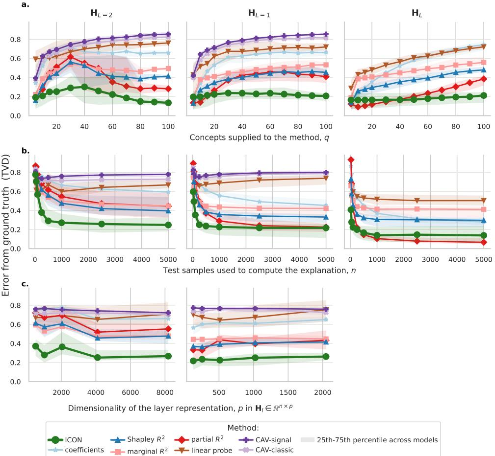  
Fig. 6: Sensitivity to concept-set size, sample size and layer width. Error from the ground truth (TVD, Equation 11) at each interpreted layer, for the same 90 models and the same ground truth as Figure 1d. Lines are medians over the $n = 9 0$ models with 25th to 75th percentile bands. a, Varying the number of concepts supplied, at fixed $n = 5 0 0$ . The concept pool is dominated by zero-importance concepts, so raising q mainly raises how many concepts a method must reject (for example 3 at $q = 5 ,$ 26 at $q = 3 0$ and 85 at $q = 1 0 0 )$ . b, Varying the number of test samples used to compute the explanation, at fixed q = 30. c, Varying the width $p _ { l }$ of the interpreted layer, at fixed $n = 5 0 0$ and $q = 3 0$ . The five points are the five width variants set for $\left( \mathbf { H } _ { L - 2 } , \mathbf { H } _ { L - 1 } \right)$ from (512, 128) through (8192, 2048). Every method’s error varies modestly with width. ICON is the most accurate method at every width and at both layers. $\mathbf { H } _ { L }$ is omitted because $p _ { L } = 1$ in every variant.

<table><tr><td colspan="3">Causal coefficients</td><td colspan="2">DNN Model</td><td colspan="7">Ground-truth importance  $\mathrm { I } \bar { \mathrm { m p } } _ { \mathrm { t r u e } } ^ { ( l ) } \left( \pm \right.$  std.dev.)</td></tr><tr><td>True Signal β1d</td><td>Confounders βc1</td><td>Confounders βc2</td><td>BAC (%) [min - max]</td><td>Layer</td><td>True Signal Confounders 1d (%) c1 (%)</td><td></td><td> $\mathrm { C o n f o u n d e r s }$  c2 (%)</td><td>Encoded in Image (%)</td><td>Encoded in Outcome (%)</td><td>Correlated Concept (%)</td><td>Independent Concepts (%)</td></tr><tr><td>0.0000</td><td>0.6190</td><td>0.8473</td><td></td><td></td><td>1 ± 1</td><td> $\begin{array} { r } { 1 1 \pm 4 } \\ { _ { 2 7 } \pm \pm \frac { 1 } { 1 2 } } \end{array}$ </td><td> $\smash { \mathrm { ~ : ~ } ^ { 5 \pm 2 } }$ </td><td> $\smash { \begin{array} { r l } { 8 4 \pm 6 } & { { } } \\ { 4 6 } & { { } } \end{array} }$ </td><td>0 ± 0</td><td>0 ± 0</td><td>0 ± 0</td></tr><tr><td></td><td></td><td></td><td> $\begin{array} { l } { 7 3 } \\ { [ 7 1 - 7 4 ] } \end{array}$ </td><td> $\begin{array} { r } { \mathbf { H } _ { L - 2 } } \\ { \mathbf { H } _ { L - 1 } } \\ { \mathbf { H } _ { L } } \end{array}$ </td><td>1 ± 0</td><td></td><td>18 ± 11</td><td>46  ${ \bf \Phi } _ { 2 \pm 1 } ^ { \pm \upsilon }$ </td><td>0 ± 0</td><td>0 ± 0</td><td>0 ± 0</td></tr><tr><td></td><td></td><td></td><td></td><td></td><td>0 ± 0</td><td> $7 7 \pm 4$ </td><td>21 ± 4</td><td></td><td>0 ± 0</td><td>0 ± 0</td><td>0 ± 0</td></tr><tr><td>0.6190</td><td>0.6190</td><td>1.7346</td><td></td><td> $\mathbf { H } _ { L - 2 }$ </td><td>2 ± 1</td><td> $\begin{array} { r } { 6 \pm 2 } \\ { \ r { \ r ^ { - } } } \end{array}$ </td><td>10 ± 5</td><td>82 ± 8</td><td>0 ± 0</td><td>0 ± 0</td><td>0 ± 0</td></tr><tr><td></td><td></td><td></td><td> $_ { [ 7 1 - 7 6 ] } ^ { 7 4 }$ </td><td></td><td>5 ± 1</td><td>22 ± 8</td><td>35 ± 7</td><td>38 ± 15</td><td>0 ± 0</td><td>0 ± 0</td><td>0 ± 0</td></tr><tr><td></td><td></td><td></td><td></td><td> $\stackrel { \triangledown } { \mathbf { H } } _ { L } ^ { - 1 }$ </td><td>8 ± 1</td><td>34 ± 6</td><td>56 ± 5</td><td>2 ± 0</td><td>0 ± 0</td><td>0 ± 0</td><td>0 ± 0</td></tr><tr><td>1.0986</td><td>0.7082</td><td>0.0000</td><td></td><td></td><td>6 ± 3</td><td></td><td>1 ± 1</td><td>80 ± 9 35 ± 13</td><td>0 ± 0</td><td>0 ± 0</td><td>0 ± 0</td></tr><tr><td></td><td></td><td></td><td> $\stackrel { 7 7 } { [ 7 5 - 7 9 ] }$ </td><td> $\begin{array} { r } { \mathbf { H } _ { L - 2 } } \\ { \mathbf { H } _ { L - 1 } } \\ { \mathbf { H } _ { L } } \end{array}$ </td><td>21 ± 5 24 ± 3</td><td> $\begin{array} { r } { 1 3 \pm 6 } \\ { 4 3 \pm 1 0 } \\ { 7 5 \pm 3 } \end{array}$ </td><td>1 ± 1 0 ± 0</td><td> $\stackrel { \mathrm { 3 0 } } { 1 } \stackrel { \pm } { \pm } \stackrel { \mathrm { 1 . 3 } }$ </td><td>0 ± 0 0 ± 0</td><td>0 ± 0 0 ± 0</td><td>0 ± 0 0 ± 0</td></tr><tr><td></td><td></td><td></td><td></td><td></td><td></td><td></td><td></td><td></td><td></td><td></td><td></td></tr><tr><td>1.2657</td><td>0.0000</td><td>2.1972</td><td></td><td> $\begin{array} { r } { \mathbf { H } _ { L - 2 } } \\ { \mathbf { H } _ { L - 1 } } \\ { \mathbf { H } _ { L } } \end{array}$ </td><td>8 ± 3</td><td>1 ± 0</td><td> $\stackrel { 1 7 } { \dots } \stackrel { + } { \dots } \stackrel { 6 } { \dots }$ </td><td> $7 4 \pm 9$  32 ± 10</td><td>0 ± 0</td><td>0 ± 0</td><td>0 ± 0</td></tr><tr><td></td><td></td><td></td><td> $^ { 7 7 } _ { [ 7 6 - 7 8 ] }$ </td><td></td><td>20 ± 3 28 ± 2</td><td>0 ± 0 0 ± 0</td><td>48 ± 8  $7 1 \pm 1$ </td><td> $\stackrel { \triangledown } { \mathbf { \nabla } } _ { 1 } ^ { \scriptscriptstyle \perp } \stackrel { \triangledown } { \pm } 0$ </td><td>0 ± 0 0 ± 0</td><td>0 ± 0 0 ± 0</td><td>0 ± 0 0 ± 0</td></tr><tr><td></td><td></td><td></td><td></td><td></td><td></td><td></td><td></td><td></td><td></td><td></td><td></td></tr><tr><td>1.3863</td><td>0.2007</td><td>2.1972</td><td> $^ { 7 8 } _ { [ 7 5 - 7 9 ] }$ </td><td> $\stackrel { \mathbf { H } _ { L - 2 } } { \boldsymbol { \cdot } }$ </td><td>9 ± 3 21 ± 4</td><td>1 ± 0 2 ± 0</td><td> $\cdots ^ { 1 6 \pm 5 }$  44 ± 10</td><td> $^ { 7 4 \pm 8 }$  33 ± 14</td><td>0 ± 0 0 ± 0</td><td>0 ± 0 0 ± 0</td><td>0 ± 0</td></tr><tr><td></td><td></td><td></td><td></td><td> $\begin{array} { r } { \mathbf { \Pi } ^ { \mathbf { n } _ { L - 1 } } } \\ { \mathbf { H } _ { L } } \end{array}$ </td><td> $3 3 \pm 1$ </td><td>2 ± 0</td><td> $\stackrel {  } { 6 4 } \pm \stackrel {  } { 1 }$ </td><td> $\stackrel { \sim } { \phantom { - } } 1 \stackrel { - } { \pm } 0$ </td><td>0 ± 0</td><td>0 ± 0</td><td>0 ± 0 0 ± 0</td></tr><tr><td>1.7346</td><td>0.0000</td><td></td><td></td><td></td><td> ${ \bf \underline { { 2 0 } } } \pm { \bf \underline { { 7 } } }$ </td><td>0 ± 0</td><td> $7 \pm 2$ </td><td> $7 2 \pm 9$ </td><td>0 ± 0</td><td>0 ± 0</td><td></td></tr><tr><td></td><td></td><td>1.2657</td><td>76</td><td></td><td>47 ± 9</td><td>0 ± 0</td><td>16 ± 3</td><td> $3 7 \pm 1 2$ </td><td>0 ± 0</td><td>0 ± 0</td><td>0 ± 0</td></tr><tr><td></td><td></td><td></td><td>[75-77]</td><td> $\begin{array} { r } { \mathbf { H } _ { L - 2 } } \\ { \mathbf { H } _ { L - 1 } } \\ { \mathbf { H } _ { L } } \end{array}$ </td><td> $7 3 \pm 2$ </td><td>0 ± 0</td><td>26 ± 1</td><td> $\overline { { 1 \pm 0 } }$ </td><td>0 ± 0</td><td>0 ± 0</td><td>0 ± 0 0 ± 0</td></tr></table>

Table 2: Experiment 1: causal scenarios, model accuracy, and layer-wise ground-truth importance. The six data-generating settings used in Experiment 1, simulating causal scenarios from the data-generating graph (Figure 1b) that range from predominantly confounder-driven to predominantly signal-driven, ordered by $\beta _ { \mathbf { l } _ { d } }$ down the table. $\beta _ { \mathbf { l } _ { d } }$ is the coeficient of the unobservable true predictive signal on the outcome, while $\beta _ { { \bf c } _ { 1 } }$ and $\beta _ { { \mathbf { c } } _ { 2 } }$ are the coeficients of the two confounders on the outcome (Equation 9). For each scenario we train 15 models (five layer-width variants × three random seeds) and report the mean balanced accuracy (BAC) on the test split, with the minimum–maximum range across models in brackets. The remaining columns give the normalised ground-truth importance $\mathrm { I m p } _ { \mathrm { t r u e } } ^ { ( l ) }$ of every concept role as a percentage of the total importance across all 100 concepts and the true signal, so each layer row sums to 100. Because the ground truth difers across layers, we report one row per interpreted layer $( \mathbf { H } _ { L - 2 } , \mathbf { H } _ { L - 1 } , \mathbf { H } _ { L } )$ . For readability we show the median across the 15 models, but each model variation and seed is scored against its own ground truth in the experiments. Three concept roles ‘encoded in outcome’, ‘correlated concept’, and ‘independent concept’, have no causal path into the image and therefore have zero ground-truth importance by construction in every scenario and at every layer. Also, note that in ToyBrains [33], the importance ordering of $\mathbf { c } _ { 1 }$ and $\mathbf { c } _ { 2 }$ need not follow the ordering of their $\beta$ values as it depends on not just on the strength of the causal edge into the outcome $\beta$ but also on its edge into an image attribute, its data type, and on how many states it has. Thus, we estimate the ground-truth empirically rather than reading it of the generating coeficients. Across all six scenarios, the shift in the ground-truth importance from the layer $\mathbf { H } _ { L - 2 }$ to $\mathbf { H } _ { L }$ of the 13 image-encoded concepts shows that the networks progressively discard image content irrelevant to the prediction.

Author contributions. RPR: Conceptualization, Methodology, Investigation, Software, Visualization, Writing original draft, Review & editing. MS: Conceptualization, Methodology, Investigation, Review & editing. MP: Conceptualization, Methodology, Review & editing. MAS: Conceptualization, Investigation. NTS: Conceptualization. MD: Conceptualization, Methodology, Investigation. FP: Methodology, Review & editing. WS: Supervision, Review & editing. SG: Supervision, Methodology,

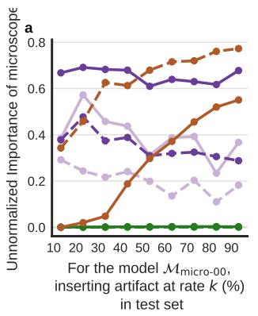

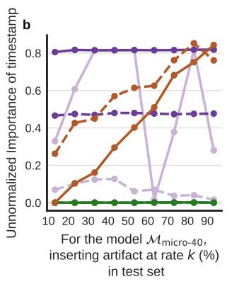

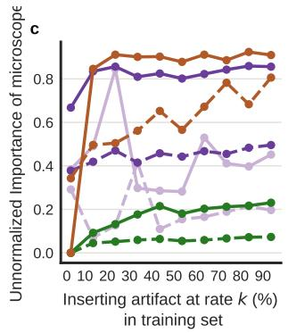  
Fig. 7: Un-normalised concept importance scores for Experiment 2 (compare with Figure 3). Same three analyses as Figure 3a–c, but plotting the raw importance scores Imp(ck) instead of the normalised ¯ Imp(ck). In Figure 3, each score is divided by the total importance assigned to all concepts and the outcome at the same layer (equation 8), so that layers with diferent dimensionalities become comparable and scores share a common scale across methods. Here we show the un-normalised outputs of each method directly. Colours denote C-XAI methods; line styles denote layers in the VGG-16 model with L layers. a, Specificity to concept–outcome collinearity: fixed model $\mathcal { M } _ { \mathrm { m i c r o - 0 0 } }$ evaluated on test sets $\mathcal { D } _ { \mathrm { m i c r o } - k }$ with increasing microscope–MEL collinearity. b, Specificity to concept–concept collinearity: fixed model $\mathcal { M } _ { \mathrm { m i c r o } } .$ -40 evaluated on test sets $\mathcal { D } _ { \mathrm { m i c r o - 4 0 + t i m e } - k }$ with increasing timestamp–microscope collinearity, for the timestamp concept that the model has never seen during training. c, Responsiveness: models $\mathcal { M } _ { \mathrm { m i c r o - 0 0 } }$ through $\mathcal { M } _ { \mathrm { m i c r o - 9 0 } }$ evaluated on a fixed test split of $\mathcal { D } _ { \mathrm { m i c r o - 1 0 } }$ as shortcut reliance increases. The qualitative conclusions of Figure 3 hold in the un-normalised scores: ICON (green) remains near zero at all classifier-head layers in a and b and rises monotonically in c, while the three baselines show the same false-positive pattern reported in the main text. That is, all three assign a large nonzero score to a concept whose true importance is zero, and the linear probe tracks the test set correlations while the two CAV scores remain unstable. Scores from diferent methods are not directly comparable on this un-normalised scale (Methods 3.3).

Review & editing. KR: Supervision, Methodology, Investigation, Review & editing.   
All authors reviewed and approved the final manuscript.

Competing interests. The authors declare no competing interests.

Acknowledgements. Funded by the Deutsche Forschungsgemeinschaft (DFG, German Research Foundation) – 459422098; 402170461 (Losing and Regaining Control over Drug Intake; SFB 265); 414984028 (FONDA; SFB 1404) to KR; 565356445 (Validating Explainable AI in Clinical Neuroimaging), 586414057 (Diagnostic Fairness:

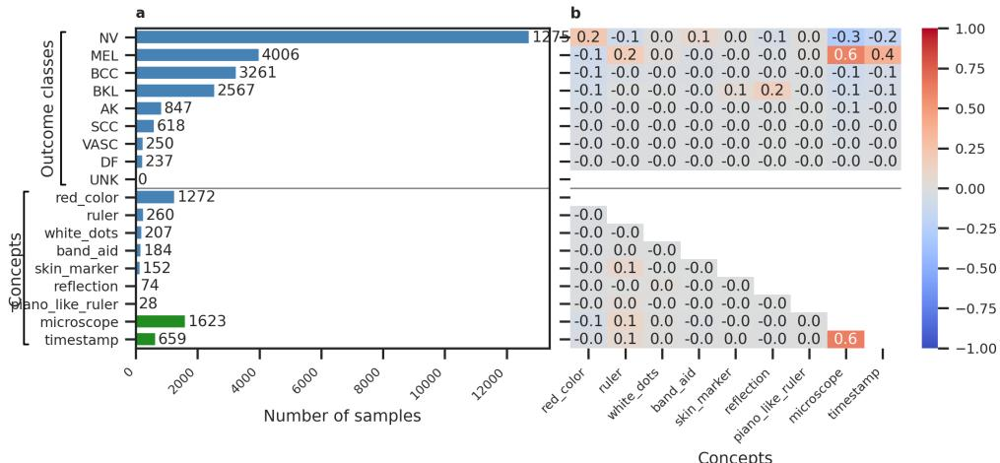  
Fig. 8: Composition of the ISIC 2019 dataset and the correlations among its outcome classes and artifact concepts. a, Histogram of the nine outcome classes (top) and the nine artifact concepts (bottom). The seven natural artifacts (blue bars) are band aid, ruler, red color, white dots, skin marker, reflection and piano like ruler. The two synthetic artifacts (green bars), microscope and timestamp, appear only in the adulterated variants; the counts shown are those of $\mathcal { D } _ { \mathrm { m i c r o - 4 0 } } .$ b, Pearson correlations between every pair of the nine outcome classes and the nine artifact concepts, including the correlations of the artifact concepts with one another. The natural artifacts are also correlated with the outcome classes, for example red color with NV $( r = 0 . 2 2 )$ , ruler with MEL $( r = 0 . 1 8 )$ and reflection with BKL $( r = 0 . 1 6 )$ . This is the background collinearity against which every C-XAI method in Figure 3 has to isolate the inserted artifact.

Disentangling Data Quality, Confounding, and Algorithmic Bias in Biomedical Regression) to MAS. We gratefully acknowledge funding by Gemeinn¨utzige Hertie Stiftung and Cluster of Excellence ”Machine Learning – New Perspectives for Science”.

## References

[1] Ramsundar, B., Eastman, P., Walters, P. & Pande, V. Deep learning for the life sciences: applying deep learning to genomics, microscopy, drug discovery, and more (O’Reilly Media, 2019).

[2] Geirhos, R. et al. Shortcut learning in deep neural networks. Nature Machine Intelligence 2, 665–673 (2020).

[3] Winkler, J. K. et al. Association between surgical skin markings in dermoscopic images and diagnostic performance of a deep learning convolutional neural network for melanoma recognition. JAMA dermatology 155, 1135–1141 (2019).

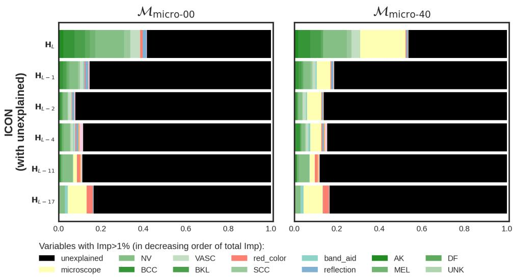  
Fig. 9: ICON with the unexplained share versus normalised ICON for $\mathcal { M } _ { \bf m i c r o - 0 0 }$ (left) and $\mathcal { M } _ { \bf m i c r o - 4 0 }$ (right). The top row shows the raw ICON decomposition: a black segment at each layer represents the residual variance $\sigma _ { l } ^ { 2 }$ that is not linearly explained by any of the nine artifact concepts or nine outcome classes, while coloured segments represent variance attributed to each concept. The bottom row shows the same decomposition with each layer’s coloured segments rescaled to sum to one (the version used in Figure 4). The unexplained fraction shrinks from the early convolutional layers towards the prediction logits in both models, indicating that the supplied concept set accounts for a larger share of the latent variance in deeper layers. Rescaling the decompositions to a common scale makes per-concept proportions directly comparable across layers and across models, at the cost of hiding the absolute share of variance the concepts capture.

[4] Pahde, F., Dreyer, M., Samek, W. & Lapuschkin, S. Reveal to revise: An explainable ai life cycle for iterative bias correction of deep models. In International Conference on Medical Image Computing and Computer-Assisted Intervention, 596–606 (Springer, 2023).

[5] Thibeau-Sutre, E., Couvy-Duchesne, B., Dormont, D., Colliot, O. & Burgos, N. Mri field strength predicts alzheimer’s disease: a case example of bias in the adni data set. In 2022 IEEE 19th International Symposium on Biomedical Imaging (ISBI), 1–4 (IEEE, 2022).

[6] Rane, R. P. et al. Structural diferences in adolescent brains can predict alcohol misuse. Elife 11, e77545 (2022).

[7] Poeta, E., Ciravegna, G., Pastor, E., Cerquitelli, T. & Baralis, E. Concept-based explainable artificial intelligence: A survey. ACM Computing Surveys (2023).

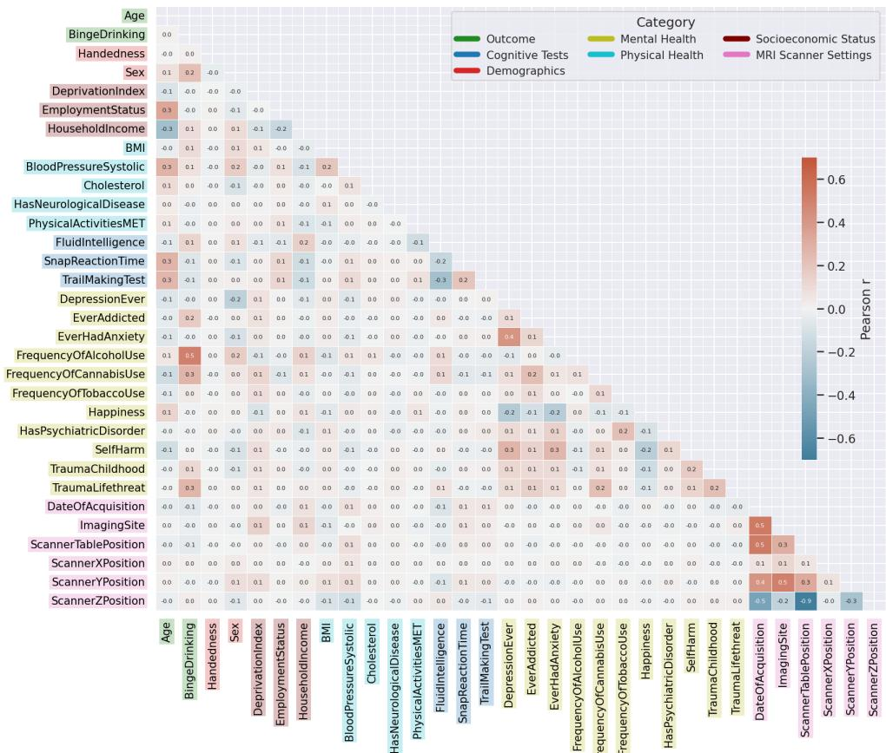  
Fig. 10: Concept and outcome intercorrelations in the UK Biobank cohort. Pearson correlation matrix over all 32 variables used across the two tasks, the 31 variables listed in Extended Data Table 3 plus the binge-drinking outcome, computed over the $n = 1 7 , 7 1 3$ subjects. Each cell is coloured by the sign and magnitude of the pairwise Pearson correlation (diverging scale), and concepts are grouped along both axes into the six categories used throughout: demographics, socioeconomic status, physical health, cognitive tests, self-reported mental health, and MRI scanner-acquisition settings. The concepts are strongly intercorrelated: for example, age correlates with several socioeconomic, physical-health and cognitive variables $( | r | > 0 . 2 )$ . The scanneracquisition variables are also highly intercorrelated, with acquisition date and scanner table position reaching $| r | \approx 0 . 5$ and so are also the self-reported mental-health items.

## URL https://doi.org/10.1145/3774643.

[8] Selvaraju, R. R. et al. Grad-cam: Visual explanations from deep networks via gradient-based localization. In Proceedings of the IEEE International Conference on Computer Vision (ICCV), 618–626 (2017).

Brain – age prediction (SFCN model  
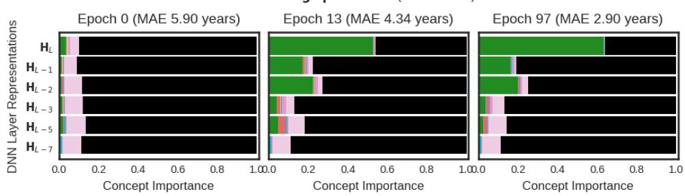

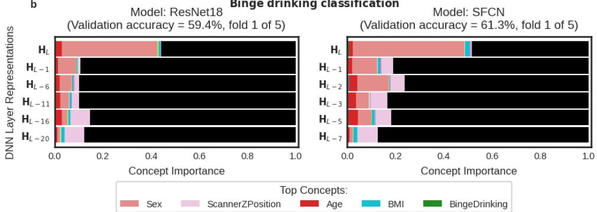  
Fig. 11: ICON tracks how a representation forms over training and compares two architectures on a common scale. In both panels the bars are layer-wise ICON importance, ordered from an input layer at the bottom to the prediction logit $\mathbf { H } _ { L }$ at the top, and the black segment is the share of representation variance that none of the 30 supplied concepts explains. ${ \mathbf { a } } ,$ The brain-age SFCN model at three stages of training, all from fold 1 of 5: at initialisation (validation $\mathrm { M A E } = 5 . 9 0 ~ \mathrm { y e a r s } )$ at epoch 13 $( \mathrm { M A E } = 4 . 3 4 ~ \mathrm { y e a r s } )$ and at convergence at epoch 97 $( \mathrm { M A E } = 2 . 9 0 ~ \mathrm { y e a r s } )$ Scanner-position concepts dominate the early-layer representation near initialisation, and age comes to dominate the final and penultimate layers as the model converges, so these layers learn to extract the age signal and filter out the scanner information present in the input images. b, The binge-drinking task for a video-pretrained 3D ResNet-18 (left; fold 1 of 5, validation accuracy 59.4%; $6 0 . 0 \pm 0 . 5 \%$ over five folds) and for an SFCN (right; fold 1 of 5, validation accuracy $6 1 . 3 \% ; 6 1 . 2 \pm 0 . 7 \%$ over five folds), both evaluated on the $n = 1 , 2 4 6$ hold-out participants. Because ICON expresses importance as a proportion of representation variance, the two architectures are directly comparable. Sex explains a comparably large share of the final-layer rep resentation in both (≈ 0.40 for the ResNet-18 and ≈ 0.46 for the SFCN), so changing the architecture and the pretraining does not substantially reduce the model’s reliance on the sex confound at convergence.

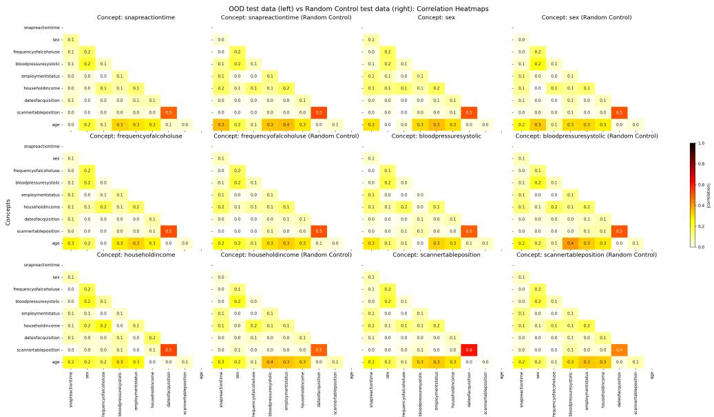  
Fig. 12: Matched resampling removes each concept’s correlation with age while leaving the rest of the correlation structure intact. For each of the six concepts that admitted a valid out-of-distribution (OOD) set (Table 1), we show the absolute pairwise correlations among all validation concepts and the outcome, age, in the OOD test set (left) versus the matched random-control set (right). In every OOD set the target concept’s correlation with age (bottom age row) is driven to ≈ 0, whereas the control retains its natural value (for example, ≈ 0.4 for systolic blood pressure and ≈ 0.3 for sex and household income). All other correlations, including the strong link between the two scanner variables, acquisition date and scanner table position (≈ 0.5), are preserved across the two sets. Decorrelating the target concept from age is therefore the only intended diference between the OOD and control sets (Methods subsection 3.6).

[9] Bach, S. et al. On pixel-wise explanations for non-linear classifier decisions by layer-wise relevance propagation. PLoS ONE 10, e0130140 (2015).

[10] Alain, G. & Bengio, Y. Understanding intermediate layers using linear classifier probes. In International Conference on Learning Representations (ICLR), Workshop Track (2017). URL https://openreview.net/forum?id=ryF7rTqgl.

[11] Kim, B. et al. Interpretability beyond feature attribution: Quantitative testing with concept activation vectors (tcav). In International conference on machine learning, 2668–2677 (PMLR, 2018). URL https://proceedings.mlr.press/v80/kim18d. html.

[12] Pahde, F. et al. Navigating neural space: Revisiting concept activation vectors to overcome directional divergence. In International Conference on Learning

[13] Graziani, M., Andrearczyk, V. & M¨uller, H. Regression concept vectors for bidirectional explanations in histopathology. In Understanding and Interpreting Machine Learning in Medical Image Computing Applications: First International Workshops, MLCN 2018, DLF 2018, and iMIMIC 2018, Held in Conjunction with MICCAI 2018, Granada, Spain, September 16-20, 2018, Proceedings 1, 124–132 (Springer, 2018).

[14] Elazar, Y., Ravfogel, S., Jacovi, A. & Goldberg, Y. Amnesic probing: Behavioral explanation with amnesic counterfactuals. Transactions of the Association for Computational Linguistics 9, 160–175 (2021).

[15] Ravichander, A., Belinkov, Y. & Hovy, E. Probing the probing paradigm: Does probing accuracy entail task relevance? In Proceedings of the 16th Conference of the European Chapter of the Association for Computational Linguistics: Main Volume, 3363–3377 (Association for Computational Linguistics, Online, 2021). URL https://aclanthology.org/2021.eacl-main.295/.

[16] Nicolson, A., Schut, L., Noble, A. & Gal, Y. Explaining explainability: Recommendations for efective use of concept activation vectors. Transactions on Machine Learning Research (2025).

[17] Dreyer, M., Pahde, F., Anders, C. J., Samek, W. & Lapuschkin, S. From hope to safety: Unlearning biases of deep models via gradient penalization in latent space. In Proceedings of the AAAI Conference on Artificial Intelligence, Vol. 38, 21046–21054 (2024).

[18] Raman, N. J., Espinosa Zarlenga, M. & Jamnik, M. Understanding inter-concept relationships in concept-based models. In (eds Salakhutdinov, R. et al.) Proceedings of the 41st International Conference on Machine Learning, Vol. 235 of Proceedings of Machine Learning Research, 42009–42025 (PMLR, 2024). URL https://proceedings.mlr.press/v235/raman24a.html.

[19] Li, M. et al. Evaluating readability and faithfulness of concept-based explanations. In (eds Al-Onaizan, Y., Bansal, M. & Chen, Y.-N.) Proceedings of the 2024 Conference on Empirical Methods in Natural Language Processing, 607–625 (Association for Computational Linguistics, Miami, Florida, USA, 2024). URL https://aclanthology.org/2024.emnlp-main.36/.

[20] Ramaswamy, V. V., Kim, S. S., Fong, R. & Russakovsky, O. Overlooked factors in concept-based explanations: Dataset choice, concept learnability, and human capability. In Proceedings of the IEEE/CVF Conference on Computer Vision and Pattern Recognition, 10932–10941 (2023).

[21] Brown, D. & Kvinge, H. Making corgis important for honeycomb classification: Adversarial attacks on concept-based explainability tools. In 2023 IEEE/CVF

Conference on Computer Vision and Pattern Recognition Workshops (CVPRW), 620–627 (IEEE, 2023).

[22] Hyatt, C. S. et al. The quandary of covarying: A brief review and empirical examination of covariate use in structural neuroimaging studies on psychological variables. NeuroImage 205, 116225 (2020). URL https://www.sciencedirect.com/ science/article/pii/S105381191930816X.

[23] Alfaro-Almagro, F. et al. Confound modelling in uk biobank brain imaging. NeuroImage 224, 117002 (2021).

[24] Adebayo, J., Muelly, M., Abelson, H. & Kim, B. Post hoc explanations may be inefective for detecting unknown spurious correlation. In International Conference on Learning Representations (ICLR) (OpenReview.net, Virtual Event, 2022). URL https://openreview.net/forum?id=xNOVfCCvDpM.

[25] Belinkov, Y. Probing classifiers: Promises, shortcomings, and advances. Computational Linguistics 48, 207–219 (2022).

[26] Rane, R. P. et al. Deeprepviz: Identifying potential confounders in deep learning model predictions. In International Conference on Medical Image Computing and Computer-Assisted Intervention, 186–196 (Springer, 2024).

[27] Erogullari, E., Lapuschkin, S., Samek, W. & Pahde, F. Post-hoc concept disentanglement: From correlated to isolated concept representations. In Explainable Artificial Intelligence. xAI 2025, Vol. 2576 of Communications in Computer and Information Science 68–89 (Springer, Cham, 2026). URL https://doi.org/10. 1007/978-3-032-08317-3 4.

[28] Gr¨omping, U. Variable importance in regression models. Wiley interdisciplinary reviews: Computational statistics 7, 137–152 (2015).

[29] Clouvel, L., Iooss, B., Chabridon, V., Idrissi, M. I. & Robin, F. An overview of variance-based importance measures in the linear regression context: comparative analyses and numerical tests. Socio-Environmental Systems Modelling 7 (2025).

[30] Dinga, R., Schmaal, L., Penninx, B. W. J. H., Veltman, D. J. & Marquand, A. F. Controlling for Efects of Confounding Variables on Machine Learning Predictions. bioRxiv 2020.08.17.255034 (2020). URL https://doi.org/10.1101/ 2020.08.17.255034. Preprint at https://doi.org/10.1101/2020.08.17.255034.

[31] Wold, H. Estimation of principal components and related models by iterative least squares. Multivariate analysis 391–420 (1966).

[32] Kutner, M. H., Nachtsheim, C. J., Neter, J. & Li, W. Applied Linear Statistical Models 5th edn (McGraw-Hill/Irwin, New York, 2005).

[33] Rane, R. P. et al. Toybrains simulation dataset, v1.0.0 (2024). URL https: //doi.org/10.5281/zenodo.14509513.

[34] Hern´andez-P´erez, C. et al. Bcn20000: Dermoscopic lesions in the wild. Scientific data 11, 641 (2024). URL https://doi.org/10.1038/s41597-024-03387-w.

[35] Pahde, F., Wiegand, T., Lapuschkin, S. & Samek, W. Ensuring medical ai safety: interpretability-driven detection and mitigation of spurious model behavior and associated data. Machine learning 114, 206 (2025).

[36] Eitel, F., Schulz, M.-A., Seiler, M., Walter, H. & Ritter, K. Promises and pitfalls of deep neural networks in neuroimaging-based psychiatric research. Experimental Neurology 339, 113608 (2021).

[37] Rane, R. P. et al. Uncontrolled eating and sensation-seeking partially explain the prediction of future binge drinking from adolescent brain structure. NeuroImage: Clinical 40, 103520 (2023).

[38] Sudlow, C. et al. Uk biobank: an open access resource for identifying the causes of a wide range of complex diseases of middle and old age. PLoS medicine 12, e1001779 (2015).

[39] Cole, J. H., Marioni, R. E., Harris, S. E. & Deary, I. J. Brain age and other bodily ‘ages’: implications for neuropsychiatry. Molecular psychiatry 24, 266–281 (2019).

[40] Franke, K. & Gaser, C. Ten years of brainage as a neuroimaging biomarker of brain aging: what insights have we gained? Frontiers in neurology 10, 789 (2019).

[41] Hara, K., Kataoka, H. & Satoh, Y. Can spatiotemporal 3D CNNs retrace the history of 2D CNNs and ImageNet? In Proceedings of the IEEE Conference on Computer Vision and Pattern Recognition (CVPR), 6546–6555 (2018).

[42] Peng, H., Gong, W., Beckmann, C. F., Vedaldi, A. & Smith, S. M. Accurate brain age prediction with lightweight deep neural networks. Medical Image Analysis 68, 101871 (2021).

[43] Wold, S., Sj¨ostr¨om, M. & Eriksson, L. Pls-regression: a basic tool of chemometrics. Chemometrics and intelligent laboratory systems 58, 109–130 (2001).

[44] Simnacher, M., Xu, X., Park, H., Lippert, C. & Greven, S. Deep nonparametric conditional independence tests for images. Journal of Machine Learning Research 27, 1–73 (2026).

[45] Spisak, T. Statistical quantification of confounding bias in machine learning models. GigaScience 11, giac082 (2022). URL https://academic.oup.com/ gigascience/article/doi/10.1093/gigascience/giac082/6676500.

[46] Zhang, H., Wang, X., Li, C., Ao, X. & He, Q. Controlling large language models through concept activation vectors. Proceedings of the AAAI Conference on Artificial Intelligence 39, 25851–25859 (2025). URL https://doi.org/10.1609/aaai. v39i24.34778.

[47] Wegelin, J. A. A survey of partial least squares (pls) methods, with emphasis on the two-block case. Tech. Rep., Department of Statistics, University of Washington (2000).

[48] Crabb´e, J. & van der Schaar, M. Concept activation regions: A generalized framework for concept-based explanations. In Advances in Neural Information Processing Systems, Vol. 35, 2590–2607 (2022).

[49] Chen, T., Kornblith, S., Norouzi, M. & Hinton, G. A simple framework for contrastive learning of visual representations. In International conference on machine learning, 1597–1607 (PmLR, 2020).

[50] Hewitt, J. & Liang, P. Designing and interpreting probes with control tasks. In (eds Inui, K., Jiang, J., Ng, V. & Wan, X.) Proceedings of the 2019 Conference on Empirical Methods in Natural Language Processing and the 9th International Joint Conference on Natural Language Processing (EMNLP-IJCNLP), 2733–2743 (Association for Computational Linguistics, Hong Kong, China, 2019). URL https://aclanthology.org/D19-1275/.

[51] Shapley, L. S. A value for n-person games. In Contributions to the Theory of Games II 307–317 (Princeton University Press, 1953).

[52] Pearl, J., Glymour, M. & Jewell, N. P. Causal inference in statistics: A primer (John Wiley & Sons, 2016).

[53] Simonyan, K. & Zisserman, A. Very deep convolutional networks for largescale image recognition. In International Conference on Learning Representations (ICLR) (2015).

[54] Akiba, T., Sano, S., Yanase, T., Ohta, T. & Koyama, M. Optuna: A nextgeneration hyperparameter optimization framework. In Proceedings of the 25th ACM SIGKDD international conference on knowledge discovery & data mining, 2623–2631 (2019).

[55] Gupta, A. & Narayanan, P. J. A survey on Concept-based Approaches For Model Improvement (2024). URL http://arxiv.org/abs/2403.14566. Preprint at https: //arxiv.org/abs/2403.14566.

Table 3: Concept set for the neuroimaging experiments. The concept variables supplied to ICON and the linear probe, grouped by category, with each variable’s type and UK Biobank cohort summary statistics. Both experiments draw on this shared pool of 31 variables and supply 30 of them as concepts. Each experiment sets aside the variable used to derive its own outcome: brain-age prediction sets aside chronological age, and binge-drinking classification sets aside frequency-of-alcohol-use. Statistics are computed over the union of the training and hold-out subjects for which concept annotations were supplied in the two experiments (n = 17,713 unique subjects; brainage cohort n = 15,000, binge-drinking cohort n = 6,255, with 3,542 subjects in both). Continuous variables are standardised to zero mean and unit variance; categorical and binary variables are one-hot encoded.
<table><tr><td>Concept</td><td>Category</td><td>Type</td><td>Statistics</td></tr><tr><td>BingeDrinking</td><td>Outcome</td><td>Categorical</td><td>Binge (52%) Non-binge (48%)</td></tr><tr><td>Age</td><td>Demographics</td><td>Continuous</td><td>40.0 − 70.0 (µ=54.3)</td></tr><tr><td>Handedness</td><td>Demographics</td><td>Categorical</td><td>Right-handed (89%) Left-handed-or-both (11%)</td></tr><tr><td>Sex</td><td>Demographics</td><td>Categorical</td><td>Male (51%) Female (49%)</td></tr><tr><td>DeprivationIndex</td><td>Socioeconomic Status</td><td>Continuous</td><td>-6.3 − 9.2 (µ=-1.9)</td></tr><tr><td>EmploymentStatus</td><td>Socioeconomic Status</td><td>Categorical</td><td>Employed (72%) Retired (22%) Unemployed (6%)</td></tr><tr><td>HouseholdIncome</td><td>Socioeconomic Status</td><td>Categorical</td><td>modal category 30% of n=17396</td></tr><tr><td>BMI</td><td>Physical Health</td><td>Continuous</td><td>13.4 − 58.7 (µ=26.5)</td></tr><tr><td>BloodPressureSystolic</td><td>Physical Health</td><td>Continuous</td><td>81.0 − 252.0 (µ=139.6)</td></tr><tr><td>Cholesterol</td><td>Physical Health</td><td>Continuous</td><td>2.2 − 12.9 (µ=5.7)</td></tr><tr><td>HasNeurologicalDisease</td><td>Physical Health</td><td>Categorical</td><td>False (98%) True (2%)</td></tr><tr><td>PhysicalActivitiesMET</td><td>Physical Health</td><td>Continuous</td><td>0.0 − 19278.0 (µ=2416.1)</td></tr><tr><td>FluidIntelligence</td><td>Cognitive Tests</td><td>Continuous</td><td>0.0 − 13.0 (µ=6.7)</td></tr><tr><td>SnapReactionTime</td><td>Cognitive Tests</td><td>Continuous</td><td>347.0 − 1684.0 (µ=589.0)</td></tr><tr><td>TrailMakingTest</td><td>Cognitive Tests</td><td>Continuous</td><td>0.0 − 3337.0 (µ=546.4)</td></tr><tr><td>DepressionEver</td><td>Mental Health</td><td>Categorical</td><td>True (55%) False (45%)</td></tr><tr><td>EverAddicted</td><td>Mental Health</td><td>Categorical</td><td>False (95%) True (5%)</td></tr><tr><td>EverHadAnxiety</td><td>Mental Health</td><td>Categorical</td><td>False (73%) True (27%)</td></tr><tr><td>FrequencyOfAlcoholUse</td><td>Mental Health</td><td>Continuous</td><td>0.0 − 5.0 (µ=3.2)</td></tr><tr><td>FrequencyOfCannabisUse</td><td>Mental Health</td><td>Continuous</td><td>0.0 − 4.0 (µ=0.3)</td></tr><tr><td>FrequencyOfTobaccoUse</td><td>Mental Health</td><td>Continuous</td><td>0.0 − 4.0 (µ=0.1)</td></tr><tr><td>Happiness</td><td>Mental Health</td><td>Categorical</td><td>modal category 45% of</td></tr><tr><td>HasPsychiatricDisorder</td><td>Mental Health</td><td>Categorical</td><td>n=13208 False (94%) True (6%)</td></tr><tr><td>SelfHarm</td><td>Mental Health</td><td>Categorical</td><td>False (84%) True (16%)</td></tr><tr><td>TraumaChildhood</td><td>Mental Health</td><td>Categorical</td><td>False (91%) True (9%)</td></tr><tr><td>TraumaLifethreat</td><td>Mental Health</td><td>Categorical</td><td>False (68%) True (32%)</td></tr><tr><td>DateOfAcquisition</td><td>MRI Scanner Settings</td><td>Continuous</td><td>2014-2019</td></tr><tr><td>ImagingSite</td><td>MRI Scanner Settings</td><td>Categorical</td><td>Cheadle (71%) Newcastle</td></tr><tr><td>ScannerTablePosition</td><td>MRI Scanner Settings</td><td>Continuous</td><td>(15%) Reading (15%) -1221.0 − -1020.0 (µ=-1056.7)</td></tr><tr><td>ScannerXPosition</td><td>MRI Scanner Settings</td><td>Continuous</td><td>-36.3 − 17.3 (µ=0.5)</td></tr><tr><td>ScannerYPosition</td><td>MRI Scanner Settings</td><td>Continuous</td><td>52.0 − 96.0 (µ=65.4)</td></tr><tr><td>ScannerZPosition</td><td>MRI Scanner Settings</td><td>Continuous</td><td>-96.8 − 124.5 (µ=-26.4)</td></tr></table>