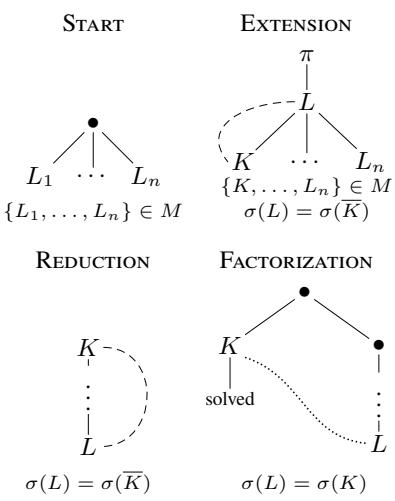
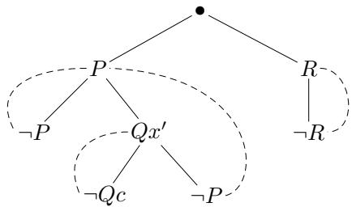
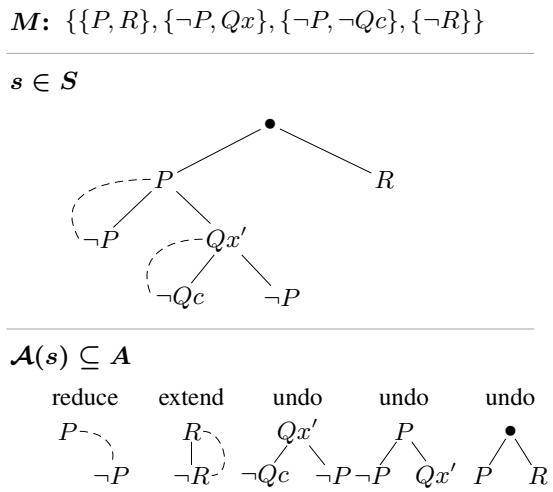
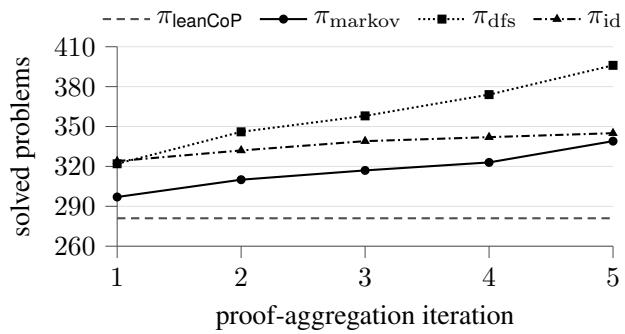

# Imitation Learning for Connection-Tableau Construction

Fredrik Rømming, Mantas Bakšys, Martin S. Fixman, Sean B. Holden

University of Cambridge fr409@cam.ac.uk

## Abstract

An automated theorem prover builds a proof step by step, choosing at each point what to add and what to remove. We cast this construction as a policy acting in a transition system induced by a formal calculus, which fixes which steps are sound: for clausal connection tableaux, leanCoP-style search and plCoP/rlCoP-style planning then become stateful policies over one interface, and policy-learning methods apply directly. We equip such policies with a graph neural network that scores proof edits from structure that transfers across problems, train it by imitation learning from found proofs, and measure how performance holds as we remove search scafolding, from full symbolic backtracking to a policy the network drives alone. Within a fixed step budget on M2k, MPTP2078-bushy, and TPTP v9.2.1, learned policies solve up to 46% more problems than leanCoP, and reach proofs in an order of magnitude fewer steps.

Code — https://github.com/fredrrom/connections

## Introduction

Proof calculi determine which proof steps are sound; proof procedures determine which admissible steps are tried, retained, or undone. We study whether these procedural choices can be learned across problems. We formalize the distinction by letting the calculus induce a transition system and the procedure act as a policy within it. We instantiate the framework for clausal connection tableaux (Letz and Stenz 2001), whose non-confluent construction makes control central, and with it the need to undo earlier choices.

This framing makes the vast policy-learning literature readily applicable. Each problem induces its own transition system, so we train one policy by imitation across problems and evaluate it zero-shot on unseen ones. Found proofs are the expert signal: replaying a proof labels each intermediate proof object with its next edit, with no trace of the surrounding failed search. We iteratively add newly found proofs to the training set, and measure coverage and retention of known proofs as search scafolding is removed, within a fixed budget of steps: transitions, an implementation-independent measure of efort.

Connection tableaux, like resolution (Robinson 1965), reason over clauses and complementary literals, but their proof object is one compact tableau rather than a growing set of derived clauses. That compactness costs proof confluence (Baumgartner, Eisinger, and Furbach 2000; Färber 2023): a tableau grown by admissible rule applications alone can become impossible to close, even when diferent choices would have led to a proof. Exploring the space of proof objects therefore amounts to modifying a tableau.

Existing connection provers can be read as diferent policies for organizing these construction choices. The classical examples are built on or inspired by “Prolog technology”: PTTP (Stickel 1988), SETHEO (Letz et al. 1992), ME-TEOR (Astrachan and Loveland 1991), leanTaP (Beckert and Posegga 1995), and leanCoP (Otten and Bibel 2003; Otten 2008) construct tableaux in the manner of model elimination (Loveland 1968), inheriting Prolog’s depth-first, program-order treatment of inference choice points, with iterative deepening for completeness and proof enumeration.

This search is memory eficient (its whole state is one stack) but committed to fixed choices whatever the problem: depth-first, in program order, backtracking chronologically. leanCoP turns these choices into fixed strategies such as cut and clause reordering (Otten 2010), and the learned variants MaLeCoP and FEMaLeCoP reorder the alternatives within them (Urban, Vyskočil, and Štěpánek 2011; Kaliszyk and Urban 2015). Later systems abandon Prolog’s stack to explore control more freely: meanCoP makes backtracking a design parameter (Färber 2023), and monteCoP (Färber, Kaliszyk, and Urban 2021), rlCoP (Kaliszyk et al. 2018), and plCoP (Zombori, Urban, and Brown 2020) replace it with a search tree guided by Monte-Carlo statistics and learned priors. Graph neural networks have been trained to guide connection provers directly (Rawson and Reger 2019; Olšák, Kaliszyk, and Urban 2020; Rawson and Reger 2021). In each case the learning is built into one prover’s search procedure. Beyond connection calculi, TRAIL separates a learning agent from a saturation reasoner (Crouse et al. 2021), where proof confluence leaves nothing to undo: control is clause selection alone. We zoom out and consider search a part of learnable policy: the lineage above becomes a family of stateful policies, whose stacks, depth bounds, cuts, and planning statistics are policy memory, not state.

## Preliminaries

## Transition Systems, Policies, and Demonstrations

Consider a deterministic transition system with states $S ,$ actions $A .$ , and partial transition function $T : S \times A  S$ . We write

$$
\mathcal { A } ( s ) = \{ a \in A \mid T ( s , a ) \mathrm { i s } \mathrm { d e f i n e d } \}
$$

for the actions valid at state s. A trajectory is a finite sequence of transitions

$$
\tau = ( s _ { 0 } , a _ { 0 } , s _ { 1 } , \dotsc , a _ { n - 1 } , s _ { n } )
$$

such that $a _ { t } \in \mathcal { A } ( s _ { t } )$ and $s _ { t + 1 } = T ( s _ { t } , a _ { t } )$ . If the transition system designates a goal set $S ^ { \check { \cal { Y } } } \subseteq S$ , then a trajectory is successful when $s _ { n } \in S ^ { \checkmark }$

Given a state s, a policy chooses among the enabled actions in $\boldsymbol { \mathcal { A } } ( \boldsymbol { s } )$ . A deterministic memoryless (Markovian) policy is a map

$$
\pi : S  A , \qquad \pi ( s ) \in A ( s ) .
$$

Starting from an initial memory $\mu _ { 0 } ~ \in ~ { \mathcal { M } } _ { \pi }$ , a stateful policy is specified by an action map and a memory-update map,

$$
\pi _ { \mathrm { m e m } } : S \times { \mathcal { M } } _ { \pi } \to A , \qquad U _ { \pi } : { \mathcal { M } } _ { \pi } \times S \times A \to { \mathcal { M } } _ { \pi } ,
$$

used as

$$
\begin{array} { r } { a _ { t } = \pi _ { \mathrm { m e m } } ( s _ { t } , \mu _ { t } ) \in \mathcal { A } ( s _ { t } ) , } \\ { \mu _ { t + 1 } = U _ { \pi } ( \mu _ { t } , s _ { t } , a _ { t } ) . \qquad } \end{array}
$$

Here $\mu _ { t }$ summarizes the trajectory seen by the policy so far. A fully history-dependent policy is the special case where $\mu _ { t }$ stores the entire trajectory $( s _ { 0 } , a _ { 0 } , \ldots , s _ { t } )$

Equivalently, since the transition system is deterministic once $a _ { t }$ is chosen, the choice and memory update may be bundled as $\tilde { \pi } ( s _ { t } , \mu _ { t } ) = ( a _ { t } , \mu _ { t + 1 } )$ . This is a memoryless policy over the augmented state $( s _ { t } , \mu _ { t } )$ ; keeping $\mu _ { t }$ outside S separates system states from policy bookkeeping.

Each policy so far is deterministic. A stochastic policy instead draws $a _ { t }$ from a distribution π $\cdot ( \cdot \mid s _ { t } )$ over the enabled actions, or $\pi _ { \mathrm { m e m } } ( \cdot \mid s _ { t } , \mu _ { t } )$ with memory.

Policy learning uses trajectories generated by some (potentially suboptimal) policy. We write $\beta$ for the behavior policy that generated a trajectory and π for the target policy being learned or evaluated. If $\beta = \pi$ , the data are on-policy; if $\beta \neq \pi$ , they are of-policy. For stateful target policies, replaying a trajectory under ${ \dot { U _ { \pi } } }$ gives the memory values $\mu _ { t } ^ { \pi }$ used as policy inputs during training.

Learning methods difer in how they use these trajectories. Imitation learning treats trajectory actions as demonstrated labels (Osa et al. 2018). Behavioral cloning extracts samples $( x _ { t } , a _ { t } )$ , where $x _ { t } = s _ { t }$ for a memoryless policy and $x _ { t } = ( s _ { t } , \mu _ { t } ^ { \pi } )$ for a stateful policy, and fits π by maximum likelihood, raising the probability it assigns each demonstrated action $a _ { t }$ at input $x _ { t }$ . This supervised use of trajectories is often a sample-eficient starting point because it supplies local action labels rather than relying on delayed reward credit assignment (Pomerleau 1991). Reinforcement learning instead augments the transition system with a reward function and updates the policy from reward-bearing experience (Sutton and Barto 2018).

## Connection Tableaux

We follow the tree-based presentation of clausal connection tableaux (Letz and Stenz 2001). We assume basic first-order syntax. An atomic formula A is built from predicate symbols and terms, terms are built from function symbols and variables, and a literal is either $A \ \mathrm { o r } \neg A$ . We use positive representation for clausification: input formulae are Herbrandized and transformed into equi-valid disjunctions of conjunctions of literals, so proofs are direct rather than refutations. The calculus is stated over the resulting matrix M, a finite set of clauses, each a finite set of literal occurrences. For a literal $L ,$ write $\overline { { L } }$ for the literal obtained by changing the polarity of L. A connection between literal occurrences L and K is σ-complementary when $\sigma ( L ) = \sigma ( \overline { { K } } )$ . The substitution σ is rigid: once a unifier is chosen, it is applied to the whole partial tableau. A copy of a clause is obtained by consistently renaming its variables to fresh variables.

A connection tableau for M is a finite rooted tree. Non-root nodes are labelled by literal occurrences from fresh copies of clauses in M. A branch is a path from the root to a leaf. A branch is closed under σ if it contains a σ-complementary pair of literals. A tableau is closed if all of its branches are closed. An unclosed leaf is an open goal; the active path for that goal is the sequence of ancestor literals on the branch.

The calculus admits the following local operations, shown as tree fragments in Figure 1:

• Start: choose a fresh copy $C = \{ L _ { 1 } , \ldots , L _ { n } \}$ of a clause in M and add a child of the root labelled $L _ { i }$ for each i.

• Extension: let the goal be labelled L. Choose a fresh copy $C = \{ K , L _ { 1 } , \ldots , L _ { n } \}$ of a clause in M. Extension is admissible when the current rigid substitution can be extended to σ with $\sigma ( L ) = \sigma ( { \bar { K } } )$ . One child labelled with each literal of C is added below the goal, and the child labelled K is closed by its connection with the goal.

• Reduction: close an open goal labelled L if the current rigid substitution can be extended to σ with $\sigma ( L ) = \sigma ( \overline { { K } } )$ for some literal K on its active path.

• Factorization: close an open goal labelled L by reusing a solved node: a sibling of the goal or of one of its ancestors, labelled K, such that the current rigid substitution can be extended to σ with $\sigma ( L ) = \sigma ( K )$ . This is the pessimistic factorization of Letz and Stenz (2001): since the source is already solved, the reuse cannot be circular, whereas the general rule admits unsolved sources and must carry a dependency ordering to keep two goals from justifying each other.

We also treat regularity as part of the construction system. A regularity condition removes a transition step from consideration when it would create a branch containing two equal same-polarity literals under the substitution that step produces. Regularity is therefore an admissibility side condition on rule applications.

The definitions above specify the proof objects, their closedness condition, and the local rule applications; they do not prescribe an order in which open goals or rule instances are tried.

Figure 1: Tree views of the start, extension, reduction, and factorization operations. In extension and reduction, dashed lines mark closing connections satisfying the displayed substitution equations. In factorization, the dotted arc marks reuse of the solved subtableau rooted at the sibling $K$  
  
Figure 2: A closed connection tableau for Example 1. Dashed curved lines mark closing connections between complementary literals.

Example 1. Consider theformula

$$
F : = ( ( P \lor \forall x \neg ( Q x \Rightarrow Q c ) ) \land R ) \Rightarrow ( P \land R ) .
$$

It has the matrix

$$
M = \{ \{ P , R \} , \{ \neg P , Q x \} , \{ \neg P , \neg Q c \} , \{ \neg R \} \} .
$$

One closed connection tableau starts with the clause $\{ P , R \}$ extends $P$ with $\{ \neg P , Q x ^ { \prime } \}$ , extends $Q x ^ { \prime }$ with $\{ \neg { Q } \dot { c } , \neg { P } \}$ using substitution $\{ x ^ { \prime }  c \}$ , reduces the remaining $\neg \dot { P }$ against the ancestor $P ,$ and closes R by extension with $\{ \neg R \}$ as shown in Figure 2.

## Connection-Tableau Construction as Control

Fix an input matrix M. We model connection-tableau construction by the proof-object transition system

$$
\mathcal { P } ( M ) = ( S , A , s _ { 0 } , T , S ^ { \checkmark } ) .
$$

The states $S$ are annotated partial connection tableaux for $M$ , carrying the current rigid substitution and proof-object annotations such as rule applications, parent links, and factorization sources. When we write “the tableau,” we mean this transition-system state, with its substitution and annotations left implicit. The initial state $s _ { 0 }$ is the empty tableau, and $S ^ { \check { \check { \mathbf { \alpha } } } } \subseteq \dot { S }$ is the (potentially empty) set of closed tableaux. Actions A are tableau edits. An edit either appends to the tableau by applying an applicable calculus rule to an open goal, or prunes the tableau by undoing the rule application at a node. Any rule-application node can be pruned, and applications need not be undone in the reverse of the order in which they were made. A prune removes the dependent rule applications and resets the constraints they introduced; because the substitution is global, dependence is not confined to the pruned subtree. The transition system therefore carries only logical memory — the tableau — and no control memory recording in what order the tableau was constructed. The transition function $T$ is partial because not every edit applies at every state: it is defined exactly on the rule applications the calculus admits and on undos of applications the tableau carries. We distinguish an inference step, a rule application recorded in the proof object, from a transition step, a single application of $T \colon$ an append performs one inference step, while a prune removes one or more. Step budgets and step counts in the evaluation refer to transition steps.

Action availability is read from the tableau itself: open goals, active paths, the current substitution, and rule annotations determine which edits are valid. Search-stack or frontier state, depth bounds, cuts, failed alternatives, and planning statistics are control memory and belong to the policy, which decides which valid edit to try next.

This separation gives a simple soundness guarantee. Any policy that acts only through $\dot { T }$ produces a sequence of valid partial tableaux, and any terminal state in $S ^ { \checkmark }$ is a checkable closed tableau. Completeness is a property of the policy or proof procedure: it must explore the transition system fairly enough, subject to its bounds and pruning refinements, to find a closed tableau whenever one is reachable. Forward connection-tableau construction is not generally proof confluent: committing to one admissible rule application may require later backtracking even if another rule application would have led to a proof. The transition system, however, is reversible: every committed edit has an inverse undo edit, so the state graph itself is confluent in the trivial sense that diverging paths can return to their common predecessor. The stack, frontier, or tree that decides which inverse to take, and which alternative to try next, remains policy memory.

Consider the matrix from Example 1:

$$
M = \{ \{ P , R \} , \{ \neg P , Q x \} , \{ \neg P , \neg Q c \} , \{ \neg R \} \} .
$$

Figure 3 shows a proof-object state s reachable by choosing the start clause $\{ \grave { P } , R \}$ , then extending the open goal $P$ with $\{ \neg P , Q x ^ { \prime } \}$ , and then extending $Q x ^ { \prime }$ with $\{ \neg Q { \bar { c } } , \neg P \}$ . The substitution $\{ x ^ { \prime } \mapsto c \}$ is implicit in the tableau state. At this point the tableau, the active paths, and the matrix determine the enabled action set $\boldsymbol { \mathcal { A } } ( \boldsymbol { s } )$ . Regularity is visible in ${ \mathcal { A } } ( s ) ;$ the open goal $\neg P$ unifies with the $P$ of the clause $\{ P , { \dot { R } } \}$ , but that extension would place a second $P$ on its branch and is therefore not enabled; the goal closes only by the reduction against its ancestor $P .$

  
Figure 3: A single proof-object state and its enabled tableauedit labels. Dashed curved lines mark connections already made.

## Learning from Proof-Trajectory Replay

We consider the zero-shot multi-task problem of using proofs found in ${ \mathcal { P } } ( M )$ to find proofs in $\mathcal { P } ( M ^ { \prime } )$ , and take the sampleeficient imitation route, taking found proofs to generate demonstrations. Given a successful trajectory $\tau$ with final state $s _ { n } \in S ^ { \checkmark }$ found by a behavior policy $\beta ,$ we read of the rule applications that construct the closed tableau in $s _ { n }$ and replay them from the empty tableau relative to a target policy π. If π has memory, replay also runs its memory update. We define the resulting proof trajectory for π

$$
\tau ^ { \pi } = \bigl ( \bigl ( s _ { 0 } , \mu _ { 0 } ^ { \pi } \bigr ) , a _ { 0 } ^ { \star } , \bigl ( s _ { 1 } , \mu _ { 1 } ^ { \pi } \bigr ) , \ldots , a _ { n - 1 } ^ { \star } , \bigl ( s _ { n } , \mu _ { n } ^ { \pi } \bigr ) \bigr ) ,
$$

where $s _ { t + 1 } = T ( s _ { t } , a _ { t } ^ { \star } )$ , and

$$
\mu _ { t + 1 } ^ { \pi } = U _ { \pi } ( \mu _ { t } ^ { \pi } , s _ { t } , a _ { t } ^ { \star } ) , \qquad a _ { t } ^ { \star } \in \mathcal { A } ( s _ { t } , \mu _ { t } ^ { \pi } ) .
$$

If at any step the recovered action is not in $\boldsymbol { \mathcal { A } } ( \boldsymbol { s } _ { t } , \boldsymbol { \mu } _ { t } ^ { \pi } )$ , replay fails for that target policy: for example, a policy whose memory exposes only actions within a growing depth bound cannot replay a proof that closes a deep branch first. The closed tableau may still be usable for another policy whose memory admits a diferent construction order. For a memoryless target policy, $\mu _ { t } ^ { \pi }$ is empty and $\mathcal { A } ( s _ { t } , \mu _ { t } ^ { \pi } ) = \mathcal { A } ( s _ { t } )$

The behavior-policy run τ that found the closed tableau may contain failed branches, undo actions, and other search efort: as a demonstrator, $\beta$ is far from optimal. Replay discards this surrounding search and keeps only the proofproducing actions, so the trajectory we imitate is not $\beta ^ { \bullet }$ but that of an optimal expert $\beta ^ { \star }$ , the refinement of $\beta$ to the successful subset of its run, which reaches the closed tableau with no wasted step. Unlike behavioral cloning from a fixed demonstrator, our demonstrations therefore follow an optimal policy, and they are recovered automatically: replay labels each $( s _ { t } , \mu _ { t } ^ { \pi } )$ with its next construction action $a _ { t } ^ { \star }$ , for closed tableaux alone.

Let D be a dataset of replayed proof trajectories. Proof cloning (PC) trains on D by supervised action prediction, as in behavioral cloning (Pomerleau 1991), decomposing each trajectory into per-decision terms:

Algorithm 1 Proof Aggregation (PA)   
Input: matrices M, seed π , target π, rounds N   
T ← ∅ {closed tableaux found so far}   
for i ← 1 to N do   
β ← πi−1 {behavior policy of round i}   
Run $\beta$ on $\mathcal { M } ,$ adding closed tableaux to $\dot { \tau }$   
$\textstyle { \mathcal { D } } \gets \bigcup _ { t \in { \mathcal { T } } }$ Replay(t, π) {proof trajectories for π}   
πi ← train π on D by proof cloning   
end for   
Return: final policy $\pi _ { N }$

$$
\mathcal { L } ( \boldsymbol { \theta } ; \mathcal { D } ) = - \sum _ { \tau \in \mathcal { D } } \sum _ { t < n _ { \tau } } \log \pi _ { \boldsymbol { \theta } } \big ( \boldsymbol { a } _ { t } ^ { \star } \mid \boldsymbol { s } _ { t } , \boldsymbol { \mu } _ { t } ^ { \pi } \big ) .
$$

This $\mathcal { L } ( \boldsymbol { \theta } ; \mathcal { D } )$ is the negative log-likelihood of the demonstrated actions under $\pi _ { \theta } ,$ a cross-entropy loss.

Proof cloning sufers the distribution shift that limits behavioral cloning: trained on the states of successful proofs alone, the policy has no guidance once its own choices carry it elsewhere, and errors compound. Proof aggregation (PA) applies the standard DAgger remedy (Ross, Gordon, and Bagnell 2011), retraining each round on the proofs the current policy itself finds (Algorithm 1), so the training distribution follows the states the policy visits. Our expert is weaker than DAgger’s queryable oracle, though: a proof labels only its own successful path, so unsolved problems yield no labels and states not present in any proof path stay unlabeled, bounding the supervision the policy can receive. For the policy, this bound may cost little: plCoP, training on Monte-Carlo search statistics from every proof attempt, found policy data worth extracting only from searches that found proofs (Zombori, Urban, and Brown 2020).

## Implementation

## Prover Infrastructure

Our implementation of the transition system and prover primitives builds on and heavily extends earlier work by Rømming, Otten, and Holden (2023). A run takes a problem specification and a schedule. The problem specification names the input file, a TPTP FOF/CNF problem (Sutclife 2017) or a QMLTP QMF problem (Raths and Otten 2012), together with the target logic and domain semantics: classical or intuitionistic first-order logic, or first-order modal logic over constant, cumulative, or varying domains; the evaluation below is classical first-order throughout. The schedule assigns step or time budgets to strategies and runs them in order until an SZS Success or NoSuccess status is reported.

A strategy consists of a policy type together with matrix and policy options. The matrix options are the clausification settings: they govern how a first-order (FOF) or modal (QMF) input formula becomes a set of clauses, and have no efect on an input already in clausal form (CNF). We support definitional (Plaisted and Greenbaum 1986) and naive clause-form translation, corresponding to leanCoP’s def and nodef options respectively. The matrix options thus fix the matrix, and with it the transition system. The policy options determine how the policy is built and behaves. A strategy thus pairs a policy type Π, the policy that acts in the transition system, with matrix options γ and policy options $\omega ;$ we call $( \gamma , \omega )$ an option profile.

For our experiments, and to reproduce the leanCoP-family provers stepwise, our matrix implementation retains the input order of clauses and their literals, and we implement a hierarchy of memory update functions, $U _ { \mathrm { d f s } }$ and $U _ { \mathrm { i d } } . \ U _ { \mathrm { d f s } }$ maintains a stack of frames, each holding the untried rule applications of the leftmost open goal and the undo edit that abandons it; its top frame is the ordered action list ${ \mathcal { A } } ( s , \mu ) \subseteq { \mathcal { A } } ( s ) . { \mathrm { ~ } } U _ { \mathrm { i d } }$ restricts this further by an iterativedeepening bound. The policy $\pi _ { \mathsf { l e a n C o P } }$ runs on $U _ { \mathrm { i d } }$ and takes the first action in $\mathcal { A } ( s , \mu )$ , which, with the input order retained, follows leanC $\mathrm { \dot { \ z } _ { o f } \mathrm { \bar { \ s } } }$ program order. leanC $\mathrm { o P } ^ { \bullet } \mathrm { s }$ search arguments become policy options: conj restricts which start actions are pushed to the stack, cut and scut discard alternatives or frames from the stack, the latter for start clauses only, and comp(I) lifts both above the depth bound. Factorization under depth-first construction has its solved siblings exactly the nodes above and to the left, and leanCoP restricts it further to equality: the reused literal must already equal the goal under the current substitution, with no extension by unification. That restricted form is lean $\mathrm { \Sigma _ { - 0 } P ^ { \prime } s }$ lemma. We expose the mode as a policy option and run every prover with factorization set to equality rather than unification. We have tested the implementation for stepwise equivalence to leanCoP 2.1, ileanCoP 1.2, and MleanCoP 1.3 under the corresponding logic and domain settings (Otten 2008, 2014).

Several caches keep transitions cheap. Terms, atoms, and literals are immutable objects with precomputed hashes, so structural equality and dictionary lookups do not re-traverse terms. The matrix is built once per problem and matrix option set and shared by all strategies of a schedule, together with its lazily refined connection graph (Bibel 1993): a map from each literal to the literals it can connect to, computed on first lookup as those statically unifiable with it, that is, unifiable under the empty substitution, and cached for the rest of the schedule. Each tableau node likewise caches its extension rules and indexes its path and lemma candidates by signed predicate symbol, so enumerating $\boldsymbol { \mathcal { A } } ( \boldsymbol { s } )$ rescans neither the matrix nor the path. Transitions apply to a single mutable state and are reverted by inverse edits rather than by copying.

## Learned Policies

The learned policies in our evaluation replace the first-action head of $\pi _ { \mathsf { l e a n C o P } }$ with a scoring model that assigns a score $h _ { \theta } ( s , a )$ to each $a \in \mathcal { A } ( s , \mu )$ . We consider three learned policies, each with increasingly restrictive ${ \mathcal { A } } ( s , \mu ) { \mathrm { : } }$ πmarkov, with $\mathcal { A } ( s , \mu ) = \mathcal { A } ( s )$ $\pi _ { \mathrm { d f s } }$ with $U _ { \mathrm { d f s } } .$ , and $\pi _ { \mathrm { i d } }$ with $U _ { \mathrm { i d } }$ . A learned strategy uses one of these as its Π in place of πleanCoP.

The policy is the softmax of the scores $h _ { \theta }$ over $\mathcal { A } ( s , \mu )$

$$
\pi _ { \boldsymbol { \theta } } ( a \mid s , \mu ) = \frac { \exp h _ { \boldsymbol { \theta } } ( s , a ) } { \sum _ { a ^ { \prime } \in \mathcal { A } ( s , \mu ) } \exp h _ { \boldsymbol { \theta } } ( s , a ^ { \prime } ) } ,
$$

a distribution we fit with the cross-entropy loss in proof cloning. Because this normalization set $\mathcal { A } ( s , \mu )$ difers by

<table><tr><td>Kind</td><td>Node</td><td>One per</td></tr><tr><td>syntax</td><td>term variable</td><td>atom, compound term, or constant variable</td></tr><tr><td rowspan="4">occurrence</td><td>symbol</td><td>predicate, function, or constant</td></tr><tr><td></td><td></td></tr><tr><td>clause</td><td>clause of the matrix</td></tr><tr><td>literal goal</td><td>literal of the matrix</td></tr><tr><td>Relation</td><td>From</td><td>goal of the tableau To</td></tr><tr><td>membership</td><td>clause</td><td>its literals</td></tr><tr><td>atom</td><td>literal</td><td>its atom</td></tr><tr><td>head</td><td>term</td><td>its symbol</td></tr><tr><td>argument</td><td>term</td><td>its subterms and variables</td></tr><tr><td>connection</td><td>literal</td><td></td></tr><tr><td>instance</td><td></td><td>statically unifiable complements</td></tr><tr><td>parent</td><td>goal</td><td>the matrix literal it instantiates</td></tr><tr><td></td><td>goal</td><td>its parent</td></tr><tr><td>path</td><td>goal</td><td>each of its ancestors</td></tr></table>

Table 1: Node types and relations of $G ( s )$

memory, the three policy types define diferent prediction problems, and we train a separate model for each. Our evaluation runs are deterministic, committing to the mode

$$
\pi _ { \boldsymbol { \theta } } ( s , \mu ) \in \mathop { \operatorname { a r g m a x } } _ { a \in \mathcal { A } ( s , \mu ) } \pi _ { \boldsymbol { \theta } } ( a \mid s , \mu ) .
$$

## Scorer

We implement the scorer $h _ { \theta }$ as a graph neural network over a typed graph $G ( s ) = ( V , E )$ . Its nodes, listed in Table 1, are of two kinds: syntax nodes carry the shared term language, while occurrence nodes mark positions in the proof. Everything but the goal nodes and the relations involving them is fixed for the search and forms the matrix subgraph, encoded once per problem.

Syntax nodes are hash-consed: identical ground structure collapses to one node, so the occurrences $P ( a )$ and $\neg P ( a )$ share one term node, while structure containing variables is shared only within a clause. A node’s initial features are attributes of its type alone: a symbol carries only its kind and arity, never an identifier, and a variable carries none, taking its identity from its edges alone. The encoding is therefore invariant to signature renaming, and a trained scorer does not depend on the symbol names of its training corpus, as in other symbol-independent proof guidance (Olšák, Kaliszyk, and Urban 2020; Jakubův et al. 2020).

Messages follow the relational graph-convolution form (Schlichtkrull et al. 2018). Write $N _ { r } ( v )$ for the r-neighbors of a node v. Each relation $r \in R$ is directed and carries its own transform $W _ { r } ;$ ; to let information flow both ways, $R$ includes the reverse of every edge type. The argument relation additionally adds a shared embedding $\rho _ { u v }$ of the argument position to the neighbor before $W _ { r } ,$ with $\rho _ { u v } = 0$ on the other relations. A round first aggregates these messages by a mean within each relation and a sum across relations,

$$
m _ { v } ^ { ( \ell ) } = \sum _ { r \in R } \frac { 1 } { | N _ { r } ( v ) | } \sum _ { u \in N _ { r } ( v ) } W _ { r } \big ( h _ { u } ^ { ( \ell ) } + \rho _ { u v } \big ) ,
$$

then updates each node with a residual around a selftransform $W _ { \phi ( v ) } ^ { \mathrm { s e l f } }$ and a layer norm $\mathrm { L N } _ { \phi ( v ) }$ , both keyed to the node’s type $\phi ( v )$

$$
h _ { v } ^ { ( \ell + 1 ) } = \mathrm { L N } _ { \phi ( v ) } \big ( h _ { v } ^ { ( \ell ) } + \operatorname { t a n h } ( W _ { \phi ( v ) } ^ { \mathrm { s e l f } } h _ { v } ^ { ( \ell ) } + m _ { v } ^ { ( \ell ) } ) \big ) .
$$

Initial embeddings $h _ { v } ^ { ( 0 ) }$ sum a learned embedding of each of the node’s structural features and apply a tanh. The transforms are shared across rounds; after L rounds we read of the node embeddings $e _ { v } : = h _ { v } ^ { ( L ) }$

Every candidate edit a then has an edit type $k ( a )$ and an ordered endpoint pair whose embeddings feed a shared head, and that pair is an edge already present: the source is always the acting goal, and the target is the start clause for a start, the matrix literal for an extension, and the path ancestor for a reduction or lemma, while a backtrack has no target and takes a learned null embedding $e _ { \emptyset }$ . With $\kappa _ { k ( a ) }$ a learned embedding of the edit type and $e _ { \mathrm { s r c } } , e _ { \mathrm { t g t } }$ the endpoint embeddings,

$$
h _ { \theta } ( s , a ) = f _ { \theta } \big ( [ \kappa _ { k ( a ) } ; e _ { \mathrm { s r c } } ; e _ { \mathrm { t g t } } ] \big ) ,
$$

where $f _ { \theta }$ is a multilayer perceptron with two tanh hidden layers and a scalar output.

The encoding stays cheap to update because message flow is directional. The matrix subgraph is encoded on its own, and the goals are then encoded with the matrix embeddings held fixed, so those embeddings do not depend on the tableau. Computed once at the first decision, the matrix embeddings are exact for every later decision and reused; only the goals are re-encoded as the tableau grows. The same sharing applies across a training batch, where all trajectories from one problem share a single copy of its matrix subgraph.

## Evaluation

We evaluate the efect of learning by holding the calculus, transition interface, and option profile fixed and varying only the policy, so any diference isolates the learned choice rather than a diference between provers. We therefore do not compare against other connection provers or saturation systems, where the learned component would be confounded with differences in calculus, strategy, and implementation language; the aim is not yet a competition-winning prover. We test on the Kaliszyk–Urban Mizar line, M2k and MPTP2078-bushy (MPTP) (Kaliszyk et al. 2018; Kaliszyk and Urban 2015), and on the FOF problems of TPTP v9.2.1 (Sutclife 2017). A problem counts as solved when a run reaches a closed tableau: SZS Theorem when the problem has a conjecture and Unsatisfiable when it does not. Exhausting the search space instead yields CounterSatisfiable or Satisfiable, which give no replay signal and are not counted. Efort is reported as “Steps”, the average number of transitions over successful runs.

We evaluate five leanCoP option profiles from the restricted-backtracking ablation grid (Otten 2010), chosen so that every option axis is exercised at least once: the bare default, conjecture start clauses (conj), backtracking restriction alone (cut) and combined with iterative-deepening completeness bounds (cut,comp(7)), and definitional clausification with start-clause restriction $( \mathrm { d e f } , \mathsf { s c u t } )$ . At each profile, $\pi _ { \mathsf { l e a n C o P } }$ is the baseline, and the learned πmarkov, $\pi _ { \mathrm { d f s } } .$ and $\pi _ { \mathrm { i d } }$ replace its first-action choice with the scorer over their respective memories. Initial trajectories are extracted from $\pi _ { mathsf { l e a n C o P } } \mathrm { : }$ closed tableaux, and learned policies are evaluated after five proof-aggregation iterations.

The training set follows from proof gathering: a problem enters it only once a closed tableau for it has been replayed into a trajectory and added to D. Evaluation is coverage on the fixed problem set, and there is no leakage: every coverage gain is a first solve, made before the problem had contributed any training data. Whether a policy still solves the problems it trained on is measured separately, as retention. At each iteration the scorer is retrained from scratch on the deduplicated $( s , a )$ samples of all trajectories gathered so far. A star search on the M2k cut,comp(7) profile, one axis at a time and ranked by problems solved after two aggregation iterations, sets the hyperparameters over width $\in \ \{ 4 8 , 6 4 , 9 6 \}$ learning rate $\in \{ \dot { 3 } \times \dot { 1 } 0 ^ { - 4 } , 1 0 ^ { - 3 } , 3 \times 1 0 ^ { - 3 } \}$ , and batch size $\in \{ 3 2 , 6 4 , 1 2 8 \}$ ; the centre won or tied on every axis, giving width 64 for all embeddings and hidden layers, Adam at learning rate $1 0 ^ { - 3 }$ , and batch size 64, trained until five epochs pass with no improvement in training loss. There is no held-out validation set. Under imitation on a fixed task set, fitting the demonstrations exactly is the goal rather than overfitting, with generalization measured as transfer to unsolved problems. Training is the only stochastic component of the system, and since it ends at near-perfect accuracy the seed is immaterial; we fix seed 0, and evaluation runs are deterministic. The depth L follows a Weisfeiler–Leman analysis of an M2k training set: a message-passing network is no more discriminating than L rounds of color refinement (Xu et al. 2019), and three rounds separate every labeled action from the competing actions of its edit type, so $L \ = \ 4 .$ . Across the 225 trainings reported here mean training accuracy is 0.975, and the datasets grow from a few thousand $( s , a )$ samples to a median of 12,000–16,000. All runs, baseline and learned alike, use a budget of 1,000 transition steps and a 120-second wall-clock guard, on one Intel Xeon Platinum core under a 3 GB memory limit; exhausting any of these counts as unsolved. The system runs on Rocky Linux 8.10 with PyTorch 2.10 on Python 3.12.

Table 2 reports solved counts across corpora and option profiles. A learned policy beats the baseline in every row, so the gain is not tied to a particular problem distribution or search configuration. πdfs $\pi _ { \mathrm { d f s } }$ and $\pi _ { \mathrm { i d } }$ are the strongest, taking about half the rows each, while πmarkov is inconsistent and falls below the baseline in several.

Fixing $( \gamma , \omega )$ to cut,comp(7), the “early stopping” block of Table 3 counts, against the $\pi _ { \mathsf { l e a n C o P } }$ baseline, the proofs each policy newly finds and the ones it no longer finds. The three order by action space. $\pi _ { \mathrm { m a r k o v } }$ reaches proofs in the fewest steps, an order of magnitude below the baseline, but forfeits the most; $\pi _ { \mathrm { d f s } }$ finds the most proofs and the most new ones at a step count far closer to it than to $\pi _ { \mathrm { i d } } ; \pi _ { \mathrm { i d } }$ retains almost every baseline proof but spends the most steps, still fewer than the baseline. Under early stopping, widening the action space trades retention for shorter searches.

Coverage at this profile peaks in the middle rather than at either extreme, and the training signal explains why: proof trajectories contain the successful path alone, so undo edits never appear as labels and a policy that must decide when to undo is never trained for it. $\pi _ { \mathrm { d f s } }$ keeps the backtracking the trajectories omit while remaining free enough not to rederive the same prefixes at every bound; $\pi _ { \mathrm { m a r k o v } }$ inherits none of it. Training on search traces rather than proofs alone would supply that signal.

<table><tr><td>Corpus</td><td> $( \gamma , \omega )$ </td><td> $\pi _ { \mathsf { l e a n C o P } }$ </td><td> $\pi _ { \mathrm { m a r k o v } }$ </td><td>πdfs</td><td>πid</td></tr><tr><td rowspan="5">M2k</td><td> ${ \tt d e f a u l t }$ </td><td>544</td><td>554</td><td>729</td><td>670</td></tr><tr><td>conj</td><td>474</td><td>531</td><td>694</td><td>547</td></tr><tr><td>cut</td><td>602</td><td>583</td><td>738</td><td>750</td></tr><tr><td>cut,comp(7)</td><td>594</td><td>585</td><td>756</td><td>726</td></tr><tr><td>def,scut</td><td>532</td><td>560</td><td>625</td><td>622</td></tr><tr><td rowspan="5">MPTP</td><td>default</td><td>255</td><td>295</td><td>316</td><td>310</td></tr><tr><td>conj</td><td>259</td><td>287</td><td>312</td><td>307</td></tr><tr><td>cut</td><td>282</td><td>279</td><td>339</td><td>365</td></tr><tr><td>cut,comp(7)</td><td>281</td><td>305</td><td>363</td><td>340</td></tr><tr><td>def,scut</td><td>252</td><td>234</td><td>301</td><td>304</td></tr><tr><td rowspan="5">TPTP</td><td>default</td><td>898</td><td>898</td><td>1012</td><td>1013</td></tr><tr><td>conj</td><td>999</td><td>861</td><td>997</td><td>1126</td></tr><tr><td>cut</td><td>981</td><td>922</td><td>1056</td><td>1097</td></tr><tr><td>cut,comp(7)</td><td>980</td><td>873</td><td>1077</td><td>1096</td></tr><tr><td>def,scut</td><td>904</td><td>899</td><td>988</td><td>1080</td></tr></table>

Table 2: Solved-problem coverage by corpus and option profile $( \gamma , \omega )$ , with early stopping.

<table><tr><td>Training</td><td>Policy</td><td>Solv.</td><td>New</td><td>Lost</td><td>Steps</td></tr><tr><td></td><td>πleanCoP</td><td>281</td><td>0</td><td>0</td><td>188.4</td></tr><tr><td>early stopping</td><td> $\pi _ { \mathrm { m a r k o v } }$ </td><td>305</td><td>51</td><td>27</td><td>11.9</td></tr><tr><td></td><td> $\pi _ { \mathrm { d f s } }$ </td><td>363</td><td>94</td><td>12</td><td>21.7</td></tr><tr><td></td><td> $\pi _ { \mathrm { i d } }$ </td><td>340</td><td>60</td><td>1</td><td>158.7</td></tr><tr><td>to convergence</td><td>πmarkov</td><td>339</td><td>59</td><td>1</td><td>11.3</td></tr><tr><td></td><td> $\pi _ { \mathrm { d f s } }$ </td><td>396</td><td>118</td><td>3</td><td>26.6</td></tr><tr><td></td><td> $\pi _ { \mathrm { i d } }$ </td><td>345</td><td>65</td><td>1</td><td>155.0</td></tr></table>

Table 3: New/lost tradeof on MPTP at $\begin{array} { r l } { ( \gamma , \omega ) } & { { } = } \end{array}$ cut,comp(7), under both training protocols. “New” and $\mathrm { \bf { \ddot { L } O S t } } ^ { \bf { \vec { \mu } } }$ are relative to $\pi _ { mathsf { l e a n C o P } } ;$ ; “Steps” averages over successful runs.

Everything so far stops training after five epochs without improvement, which leaves the scorer, the only learned component, short of fitting its data. We therefore retrain every model on MPTP to 100% training accuracy or a 200-epoch cap, holding calculus, option profile, trajectories, and evaluation fixed; mean training accuracy rises from 0.975 to 0.995. Only MPTP has both protocols run end to end.

The second block of Table 3 shows what that achieves. Every policy finds more new proofs and solves more overall, and the largest change is in ${ } ^ { \mathrm { \scriptsize { \stackrel { \textstyle ~ \cdot 6 } { L o s t } } } }$ : the proofs $\pi _ { \mathrm { m a r k o v } }$ forfeits fall from 27 to 1 and $\pi _ { \mathrm { d f s } } \mathrm { ^ \bullet s }$ from 12 to 3, while $\pi _ { \mathrm { m a r k o v } }$ keeps its order-of-magnitude step advantage. Most of that retention penalty is therefore not intrinsic to a wide action space but scorer error, and largely disappears once the scorer is fitted. Step counts barely move except for $\pi _ { \mathrm { d f s } }$ , whose rise from 21.7 to 26.6 comes from the longer proofs it newly finds: of the 65 problems it gains, all but one previously exhausted the step or time budget.

  
Figure 4: Solved coverage over five aggregation iterations at $( \gamma , \omega ) = \mathtt { c u t }$ ,comp(7) on MPTP, trained to convergence.

The ordering persists, and the size of the efect follows it: training to convergence is worth +34 solved problems to $\pi _ { \mathrm { m a r k o v } }$ and +33 to $\pi _ { \mathrm { d f s } } .$ but $\mathrm { o n l y + 5 \ t o \ \pi _ { i d } }$ . The gain from fitting the scorer measures how much of a policy’s behaviour rests on learning rather than imposed search.

Figure 4 traces the converged policies through the aggregation iterations. All three clear the baseline from the first iteration and then level of, as the problems still unsolved lie outside the patterns the gathered proofs cover or beyond the step budget.

## Conclusion

We tackled the zero-shot multi-task problem of using proofs found on some problems to improve prover performance on others. Casting connection-tableau construction as policy learning over a transition system that admits only calculusvalid edits leaves soundness with the system, while existing provers employing search and planning can be seen as stateful policies interacting with it. Replaying a proof labels each of its inference steps as a transition step, and proof cloning with proof aggregation trains a graph-neural-network policy on those labels. Within a fixed step budget across three benchmarks, the gains difer by the policies’ imposed search: $\pi _ { \mathrm { i d } }$ retains nearly every baseline proof, $\pi _ { \mathrm { d f s } }$ finds the most new proofs and solves up to 46% more than the baseline, and $\pi _ { \mathrm { m a r k o v } }$ reaches proofs in an order of magnitude fewer steps. Under early stopping, less imposed structure buys shorter proofs at the cost of retention; fitting the scorer largely recovers it.

## Acknowledgements

This work was performed using resources provided by the Cambridge Service for Data Driven Discovery (CSD3) operated by the University of Cambridge Research Computing Service (www.csd3.cam.ac.uk), provided by Dell EMC and Intel using Tier-2 funding from the Engineering and Physical Sciences Research Council (capital grant EP/T022159/1), and DiRAC funding from the Science and Technology Facilities Council (www.dirac.ac.uk).

## References

Astrachan, O. L.; and Loveland, D. W. 1991. METEORs: High Performance Theorem Provers Using Model Elimination. In Boyer, R. S., ed., Automated Reasoning: Essays in Honor of Woody Bledsoe, volume 1 of Automated Reasoning Series, 31–59. Dordrecht: Kluwer Academic Publishers.

Baumgartner, P.; Eisinger, N.; and Furbach, U. 2000. A Confluent Connection Calculus. In Hölldobler, S., ed., Intellectics and Computational Logic: Papers in Honor of Wolfgang Bibel, volume 19 of Applied Logic Series, 3–26. Dordrecht: Kluwer Academic Publishers.

Beckert, B.; and Posegga, J. 1995. leanTAP: Lean Tableau-Based Deduction. Journal ofAutomated Reasoning, 15(3): 339–358.

Bibel, W. 1993. Deduction: automated logic. London: Academic Press.

Crouse, M.; Abdelaziz, I.; Makni, B.; Whitehead, S.; Cornelio, C.; Kapanipathi, P.; Srinivas, K.; Thost, V.; Witbrock, M.; and Fokoue, A. 2021. A Deep Reinforcement Learning Approach to First-Order Logic Theorem Proving. Proceedings of the AAAI Conference on Artificial Intelligence, 35(7): 6279–6287.

Färber, M. 2023. A Curiously Efective Backtracking Strategy for Connection Tableaux. In Otten, J.; and Bibel, W., eds., Proceedings ofthe 1st International Workshop on Automated Reasoning with Connection Calculi (AReCCa 2023), volume 3613 of CEUR Workshop Proceedings, 23–40. Prague, Czech Republic: CEUR.

Färber, M.; Kaliszyk, C.; and Urban, J. 2021. Machine Learning Guidance for Connection Tableaux. Journal of Automated Reasoning, 65(2): 287–320.

Jakubův, J.; Chvalovský, K.; Olšák, M.; Piotrowski, B.; Suda, M.; and Urban, J. 2020. ENIGMA Anonymous: Symbol-Independent Inference Guiding Machine (System Description). In Peltier, N.; and Sofronie-Stokkermans, V., eds., Automated Reasoning, volume 12167 of Lecture Notes in Computer Science, 448–463. Cham: Springer International Publishing.

Kaliszyk, C.; and Urban, J. 2015. FEMaLeCoP: Fairly Efficient Machine Learning Connection Prover. In Davis, M.; Fehnker, A.; McIver, A.; and Voronkov, A., eds., Logic for Programming, Artificial Intelligence, and Reasoning, volume 9450 of Lecture Notes in Computer Science, 88–96. Berlin, Heidelberg: Springer.

Kaliszyk, C.; Urban, J.; Michalewski, H.; and Olšák, M. 2018. Reinforcement Learning of Theorem Proving. In Advances in Neural Information Processing Systems, volume 31, 8836–8847. Curran Associates, Inc.

Letz, R.; Schumann, J.; Bayerl, S.; and Bibel, W. 1992. SETHEO: A high-performance theorem prover. Journal of Automated Reasoning, 8(2): 183–212.

Letz, R.; and Stenz, G. 2001. Model elimination and connection tableau procedures. In Handbook ofautomated reasoning, volume II, 2015–2114. Elsevier and MIT Press.

Loveland, D. W. 1968. Mechanical Theorem-Proving by Model Elimination. Journal ofthe ACM, 15(2): 236–251.

Olšák, M.; Kaliszyk, C.; and Urban, J. 2020. Property Invariant Embedding for Automated Reasoning. In ECAI2020, volume 325 of Frontiers in Artificial Intelligence and Applications, 1395–1402. IOS Press.

Osa, T.; Pajarinen, J.; Neumann, G.; Bagnell, J. A.; Abbeel, P.; and Peters, J. 2018. An Algorithmic Perspective on Imitation Learning. Foundations and Trends® in Robotics, 7(1-2): 1–179.

Otten, J. 2008. leanCoP 2.0 and ileanCoP 1.2: High Performance Lean Theorem Proving in Classical and Intuitionistic Logic (System Descriptions). In Armando, A.; Baumgartner, P.; and Dowek, G., eds., Automated Reasoning, volume 5195 ofLecture Notes in Computer Science, 283–291. Berlin, Heidelberg: Springer.

Otten, J. 2010. Restricting backtracking in connection calculi. AI Communications, 23(2-3): 159–182.

Otten, J. 2014. MleanCoP: A Connection Prover for First-Order Modal Logic. In Demri, S.; Kapur, D.; and Weidenbach, C., eds., Automated Reasoning, volume 8562 of Lecture Notes in Computer Science, 269–276. Cham: Springer International Publishing.

Otten, J.; and Bibel, W. 2003. leanCoP: lean connectionbased theorem proving. Journal of Symbolic Computation, 36(1–2): 139–161.

Plaisted, D. A.; and Greenbaum, S. 1986. A Structurepreserving Clause Form Translation. Journal of Symbolic Computation, 2(3): 293–304.

Pomerleau, D. A. 1991. Eficient Training ofArtificial Neural Networks for Autonomous Navigation. Neural Computation, 3(1): 88–97.

Raths, T.; and Otten, J. 2012. The QMLTP Problem Library for First-Order Modal Logics. In Gramlich, B.; Miller, D.; and Sattler, U., eds., Automated Reasoning, volume 7364 of Lecture Notes in Computer Science, 454–461. Berlin, Heidelberg: Springer.

Rawson, M.; and Reger, G. 2019. A Neurally-Guided, Parallel Theorem Prover. In Herzig, A.; and Popescu, A., eds., Frontiers of Combining Systems, volume 11715 of Lecture Notes in Computer Science, 40–56. Cham: Springer International Publishing.

Rawson, M.; and Reger, G. 2021. lazyCoP: Lazy Paramodulation Meets Neurally Guided Search. In Das, A.; and Negri, S., eds., Automated Reasoning with Analytic Tableaux and Related Methods, volume 12842 of Lecture Notes in Computer Science, 187–199. Cham: Springer International Publishing.

Robinson, J. A. 1965. A Machine-Oriented Logic Based on the Resolution Principle. Journal ofthe ACM, 12(1): 23–41.

Ross, S.; Gordon, G.; and Bagnell, D. 2011. A Reduction of Imitation Learning and Structured Prediction to No-Regret

Online Learning. In Proceedings of the Fourteenth International Conference on Artificial Intelligence and Statistics, 627–635. JMLR Workshop and Conference Proceedings.

Rømming, F.; Otten, J.; and Holden, S. B. 2023. Connections: Markov Decision Processes for Classical, Intuitionistic and Modal Connection Calculi. In Otten, J.; and Bibel, W., eds., Proceedings of the 1st International Workshop on Automated Reasoning with Connection Calculi (AReCCa 2023), volume 3613 of CEUR Workshop Proceedings, 107–118. Prague, Czech Republic: CEUR.

Schlichtkrull, M.; Kipf, T. N.; Bloem, P.; van den Berg, R.; Titov, I.; and Welling, M. 2018. Modeling Relational Data with Graph Convolutional Networks. In The Semantic Web (ESWC), volume 10843 of Lecture Notes in Computer Science, 593–607. Cham: Springer International Publishing.

Stickel, M. E. 1988. A Prolog Technology Theorem Prover: Implementation by an Extended Prolog Compiler. Journal ofAutomated Reasoning, 4(4): 353–380.

Sutclife, G. 2017. The TPTP Problem Library and Associated Infrastructure. Journal ofAutomated Reasoning, 59(4): 483–502.

Sutton, R. S.; and Barto, A. G. 2018. Reinforcement Learning: An Introduction. Cambridge, MA: MIT Press, second edition.

Urban, J.; Vyskočil, J.; and Štěpánek, P. 2011. MaLeCoP Machine Learning Connection Prover. In Brünnler, K.; and Metcalfe, G., eds., Automated Reasoning with Analytic Tableaux and Related Methods, volume 6793 of Lecture Notes in Computer Science, 263–277. Berlin, Heidelberg: Springer.

Xu, K.; Hu, W.; Leskovec, J.; and Jegelka, S. 2019. How Powerful are Graph Neural Networks? In International Conference on Learning Representations.

Zombori, Z.; Urban, J.; and Brown, C. E. 2020. Prolog Technology Reinforcement Learning Prover (System Description). In Peltier, N.; and Sofronie-Stokkermans, V., eds., Automated Reasoning, volume 12167 of Lecture Notes in Computer Science, 489–507. Cham: Springer International Publishing.