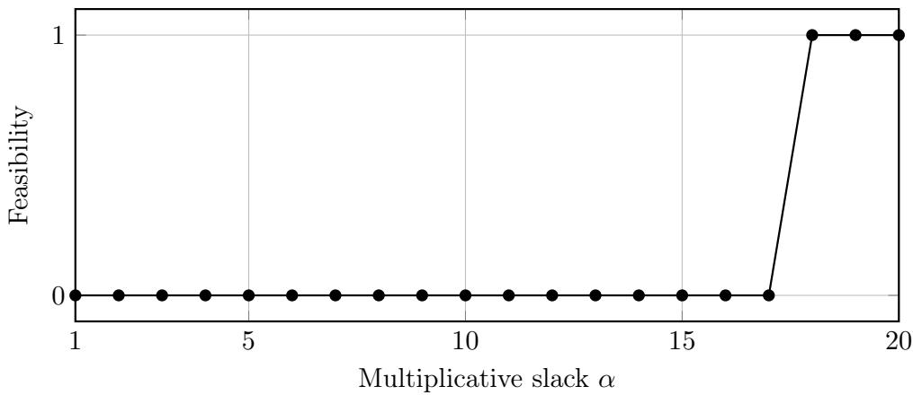
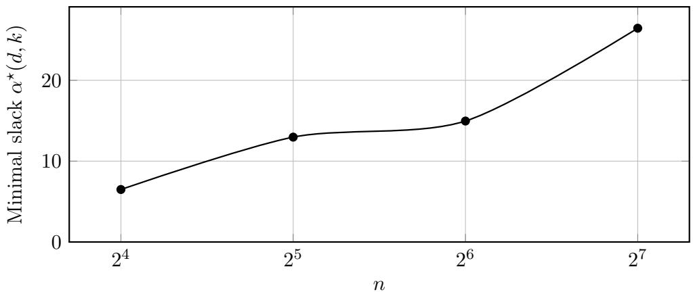
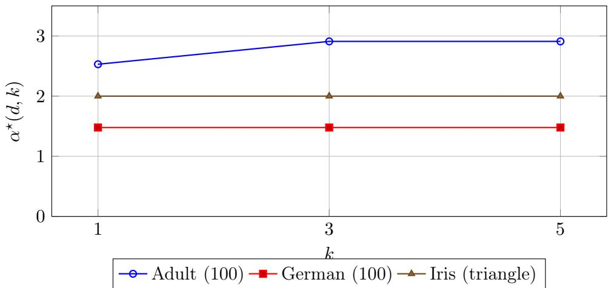
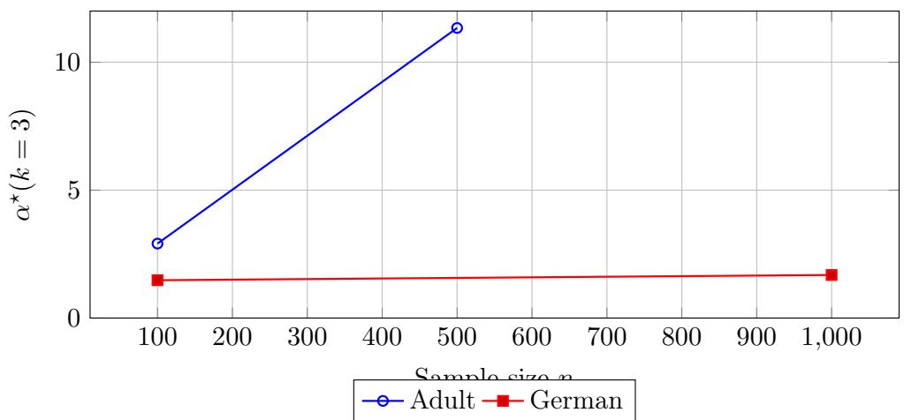
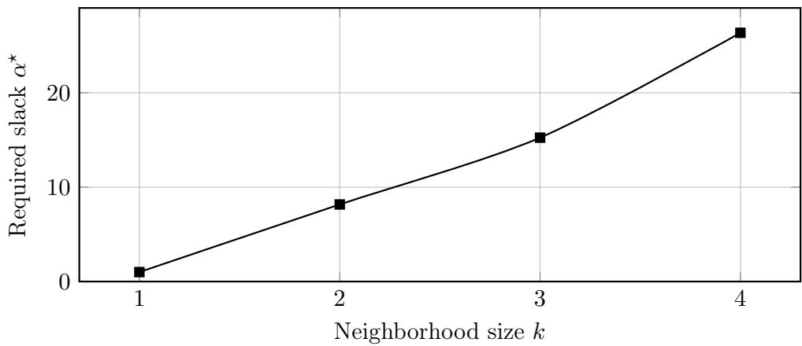
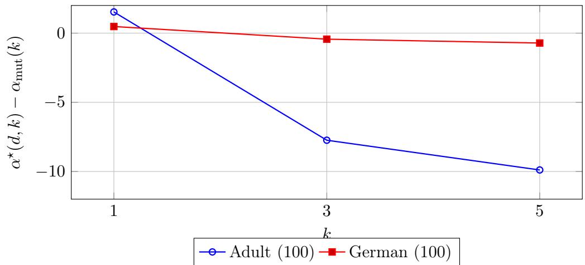

# Individual Fairness in Hierarchical Clustering

Binita Maity and Shrutimoy Das Indian Institute of Technology, Gandhinagar {binitamaity,shrutimoydas}@iitgn.ac.in

August 27, 2026

## Abstract

Hierarchical clustering produces ultrametric representations that impose strong global geometric constraints and may distort local similarities in ways that disproportionately afect individual data points. We study hierarchical clustering under an individual fairness requirement that bounds relative distortion within local k-nearest neighborhoods. We formulate this requirement as a feasibility problem over dominated ultrametrics and characterize the minimal multiplicative slack required for feasibility. We identify a sharp local threshold, prove stability under bounded perturbations, establish monotonicity in k, and show an intrinsic Θ(log n) separation between local and global realizability. Experiments on synthetic and real world datasets support our theoretical results.

## 1 Introduction

Hierarchical clustering is a classical problem in unsupervised learning [16], where pairwise distances are given and the goal is to construct a nested sequence of partitions represented as a dendrogram. Unlike flat clustering, hierarchical clustering produces a multi resolution representation of the data, with merge heights defining an ultrametric over the points [23]. Ultrametrics impose strong global geometric constraints, i.e., every triple must satisfy the ultrametric inequality, meaning the two largest pairwise distances coincide. Hierarchical clustering is widely used in exploratory data analysis, computational biology, information retrieval, and social network analysis.

Most hierarchical clustering methods focus solely on optimizing a global objective or following a greedy linkage rule. However, such approaches provide no guarantees about how individual data points are treated locally. In particular, merge decisions may distort distances between nearby points in ways that disproportionately afect certain individuals. Because hierarchical structure propagates upward in the tree, early distortions influence all coarser resolutions. Thus, even if the overall hierarchy appears reasonable, individual points may experience large relative distortion compared to their local neighborhoods.

This limitation motivates our problem. We investigate hierarchical clustering under an individual fairness requirement, i.e., similar individuals should be treated similarly [10]. Rather than optimizing a global objective alone, we ask whether there exists an ultrametric representation that respects local similarity constraints up to a bounded multiplicative slack. Our goal is to characterize the minimal slack required to reconcile local Lipschitz type constraints with global ultrametric structure.

We formalize this problem as a feasibility question over dominated ultrametrics. Given a metric space (V, d), we seek an ultrametric u that (i) dominates d (so that no pair is contracted), and (ii) satisfies multiplicative fairness constraints within k-nearest neighborhoods. The key quantity in our analysis is the minimal multiplicative slack $\alpha ^ { \star } ( d , k )$ for which such an ultrametric exists.

Our main theoretical results, presented in Section 4, characterize the feasibility landscape of individually fair hierarchical clustering. In Theorem 1, we identify a sharp local multiplicative threshold $\alpha _ { k } ^ { \mathrm { m u t } } ( d )$ determined by scale heterogeneity within mutual k-nearest neighborhoods and prove that slack below this value renders fairness infeasible. In Theorem 2, we establish Lipschitz stability of this threshold under bounded $\ell _ { \infty }$ perturbations that preserve neighborhood identities. Finally, Theorem 4 shows that the minimal feasible slack $\alpha ^ { \star } ( d , k )$ is nondecreasing in the neighborhood parameter k, providing structural control over how strengthening local fairness constraints afects global feasibility.

Crucially, we establish that local conditions do not fully determine global realizability. In Proposition 1, we construct metric families for which $\alpha _ { k } ^ { \mathrm { m u t } } ( d ) = 1$ , yet every dominating ultrametric incurs Θ(log n) multiplicative distortion. This demonstrates an intrinsic separation between local similarity structure and global ultrametric geometry. Complementing this lower bound, Theorem 3 shows that classical tree embedding techniques yield matching O(log n) suficiency guarantees. Section 5 presents a fairness constrained agglomerative clustering (FCAC) algorithm 1 that enforces dominance and local Lipschitz constraints during merging.

In section 6, we empirically evaluate our framework on synthetic and real world datasets, observing sharp feasibility thresholds, saturation in neighborhood size, and dataset dependent distortion regimes consistent with the theory.

In summary, our contributions are as follows:

• We formulate individually fair hierarchical clustering as a feasibility problem over dominated ultrametrics.

• We identify a sharp local feasibility threshold $\alpha _ { k } ^ { \mathrm { m u t } } ( d )$ and prove that slack below this value renders fairness infeasible.

• We establish stability under bounded perturbations and prove that the minimal feasible slack $\alpha ^ { \star } ( d , k )$ is monotone in k.

• We prove an intrinsic local global separation, showing that some metric families require $\Theta ( \log n )$ distortion despite trivial local structure.

• We empirically validate the theoretical claims on five diferent synthetic and real world datasets.

## 2 Related Work

Individual fairness and clustering. Individual fairness requires that similar individuals be treated similarly, formalized via Lipschitz constraints with respect to a task specific metric [10]. In recent years, few algorithms for individually fair clustering have been proposed and its scalable variants [19, 14, 2, 4, 20, 21]. In contrast, we study the structural feasibility of individual fairness in hierarchical clustering.

Hierarchical clustering and tree embeddings. Hierarchical clustering and its ultrametric interpretation are classical [16, 24, 13]. The connection between dendrograms and tree metrics relates the problem to combinatorial and geometric structures [26, 25]. Classical probabilistic tree embedding results [3, 11, 17, 1] show that any metric admits $O ( \log n )$ distortion embeddings into trees; these bounds underpin our suficiency guarantees and interpret fairness slack as embedding distortion. Objective based analyses such as the Dasgupta cost and its approximations [8, 7, 22] focus on global optimization rather than feasibility under local fairness constraints.

Constrained hierarchical clustering. Prior work studies hierarchical clustering under pairwise or triplet constraints and analyzes the behavior of greedy linkage rules [6, 9]. In contrast, we provide a geometric feasibility perspective on individual fairness, characterizing intrinsic distortion bounds imposed by ultrametric structure rather than optimizing under fixed constraints.

## 3 Problem Setup

In this section, we define all the notation we use throughout this paper. Let $V = \{ 1 , \ldots , n \}$ be a finite set equipped with a metric d.

Definition 1 (Dendrogram [13, 23]). A dendrogram on V is a rooted tree T whose leaves are in bijection with V, together with a height function $h : \mathrm { n o d e s } ( T )  \mathbb { R } _ { \geq 0 }$ such that: $( i ) \ h ( \ell ) = 0$ for every leaf ℓ, and (ii) if v is an ancestor of u then $h ( v ) \geq h ( u )$

For $i , j \in V$ , let $\operatorname { L C A } ( i , j )$ denote their lowest common ancestor. The induced merge height is

$$
u ( i , j ) : = h ( \operatorname { L C A } ( i , j ) ) .
$$

Definition 2 (Ultrametric [13]). A function u : $V \times V \to { \mathbb { R } } _ { \geq 0 }$ is an ultrametric if

1. $u ( i , i ) = 0 ,$

2. $u ( i , j ) = u ( j , i ) .$

3. $u ( i , j ) \leq \operatorname* { m a x } \{ u ( i , k ) , u ( k , j ) \} \ f o r \ a l l \ i , j , k \in V .$

ultrametrics are in one-to-one correspondence with dendrograms (up to tree isomorphism). Let U denote the set of ultrametrics on V. For $k \geq 1$ , let $N _ { k } ( i )$ denote the set of k nearest neighbors of i under d, excluding i itself. Ties are broken using a fixed arbitrary total order on V to ensure determinism. For stability results, we assume strict separation at the k-th distance boundary, i.e.,

$$
d ( i , j _ { k } ) < d ( i , j _ { k + 1 } ) \quad \forall i ,
$$

where $j _ { k }$ denotes the k-th nearest neighbor of i.

Definition 3 (Domination). An ultrametric u dominates d if

$$
u ( i , j ) \geq d ( i , j ) \quad \forall i , j \in V .
$$

We adopt the notion of individual fairness introduced in [10], and specialize it to ultrametrics.

Definition 4 (Individually Fair Ultrametric). Fix $k \geq 1 , \alpha \geq 1$ , and $\beta \geq 0$ . Define the feasible set

$$
\mathcal { U } _ { I F } ^ { + } = \left\{ u \in \mathcal { U } : \left\{ \begin{array} { l l } { u ( i , j ) \geq d ( i , j ) } & { \forall i , j , } \\ { u ( i , j ) \leq \alpha d ( i , j ) + \beta } & { \forall i \in V , \ j \in N _ { k } ( i ) } \end{array} \right\} . \right.
$$

The first condition avoids collapsing distances, and the second enforces local Lipschitz fairness among neighbors. Symmetry u ensures the constraint holds in both directions.

Definition 5 (Feasibility). An instance $( V , d , k , \alpha , \beta )$ is feasible $i f \mathcal { U } _ { I F } ^ { + } \ne \emptyset$

We define a minimal multiplicative slack parameter measuring the smallest distortion needed for feasibility.

Definition 6 (Minimal Slack). For fixed $( V , d , k , \beta )$ , define the minimal multiplicative slack

$$
\alpha ^ { \star } : = \operatorname* { i n f } \{ \alpha \geq 1 : \mathcal { U } _ { I F } ^ { + } \neq \varnothing \} .
$$

For two metrics $d , d ^ { \prime }$ on $V ,$ define

$$
\| d - d ^ { \prime } \| _ { \infty } = \operatorname* { m a x } _ { i , j } | d ( i , j ) - d ^ { \prime } ( i , j ) | .
$$

We say $d ^ { \prime }$ preserves k-nearest neighborhoods of d if $N _ { k } ^ { d ^ { \prime } } ( i ) = N _ { k } ^ { d } ( i )$ for all $i .$

Given $u \in \mathcal { U }$ , define the height weighted dissimilarity objective

$$
C ( u ) = \sum _ { i < j } d ( i , j ) u ( i , j ) .
$$

The individually fair hierarchical clustering problem is

$$
\operatorname* { m i n } _ { u \in \mathcal { U } _ { I F } ^ { + } } C ( u ) .
$$

## 4 Feasibility Theory

We analyze when a feasible ultrametric exists. For $k \geq 1$ and parameters $( \alpha , \beta )$ , we ask:

For which $( \alpha , \beta )$ does there exist $u \in \mathcal { U }$ such that

$$
d ( i , j ) \leq u ( i , j ) \quad \forall i , j ,
$$

and

$$
u ( i , j ) \leq \alpha d ( i , j ) + \beta
$$

for all required neighbor pairs?

Throughout this section we first consider the multiplicative case $\beta = 0$

Mutual fairness. In the mutual formulation, the fairness constraint is imposed only on pairs satisfying

$$
j \in N _ { k } ( i ) \quad \mathrm { a n d } \quad i \in N _ { k } ( j ) .
$$

The necessary and suficient conditions below are stated for this mutual version.

Definition 7 (Local Mutual Heterogeneity Ratio). Define

$$
\alpha _ { k } ^ { \mathrm { m u t } } ( d ) = \operatorname* { m a x } _ { i \in V } \operatorname* { m a x } _ { \substack { j , \ell \in N _ { k } ( i ) } } \frac { d ( i , \ell ) } { d ( i , j ) } .
$$

This quantity measures the maximal scale separation inside any mutual k nearest neighbor star. If d is locally ultrametric at scale $k ,$ then $\alpha _ { k } ^ { \mathrm { m u t } } ( d ) = 1$

## 4.1 Necessary Slack Under Mutual Neighborhoods

We now show that the local heterogeneity ratio provides a necessary lower bound on any feasible multiplicative slack.

Theorem 1 (Local Necessary Slack). Let $u \in \mathcal { U }$ satisfy:

1. Dominance: $d ( x , y ) \leq u ( x , y )$ ∀x, y,

2. Mutual fairness: $u ( x , y ) \leq \alpha d ( x , y )$ whenever $x \in N _ { k } ( y )$ and $y \in N _ { k } ( x )$

Then necessarily $\alpha \geq \alpha _ { k } ^ { \mathrm { m u t } } ( d )$

Proof. Fix i and mutual neighbors j, ℓ attaining $\alpha _ { k } ^ { \mathrm { m u t } } ( d )$ with $d ( i , j ) < d ( i , \ell )$ . Assume for contradiction that

$$
\alpha < \frac { d ( i , \ell ) } { d ( i , j ) } .
$$

By mutual fairness, $u ( i , j ) \leq \alpha d ( i , j )$ , and by dominance, $u ( i , \ell ) \geq d ( i , \ell )$ . Thus $u ( i , j ) < u ( i , \ell )$ By the ultrametric inequality,

$$
u ( j , \ell ) \leq \operatorname* { m a x } \{ u ( j , i ) , u ( i , \ell ) \} = u ( i , \ell ) .
$$

On the other hand,

$$
u ( i , \ell ) \leq \operatorname* { m a x } \{ u ( i , j ) , u ( j , \ell ) \} .
$$

Since $u ( i , j ) < u ( i , \ell )$ , it follows that $u ( j , \ell ) \geq u ( i , \ell )$ . Hence $u ( j , \ell ) = u ( i , \ell )$

Therefore

$$
d ( i , \ell ) \leq u ( i , \ell ) = u ( j , \ell ) \leq \alpha d ( i , j ) ,
$$

contradicting the assumption.

The theorem shows that local geometric imbalance among mutual neighbors forces a proportional amount of multiplicative slack.

## 4.2 Stability of the Minimal Slack

Definition 8 (ε-Stable Neighborhoods). We say that d has ε-stable k-neighborhoods if

$$
d ( i , j _ { k } ) + 2 \varepsilon < d ( i , j _ { k + 1 } ) \quad \forall i ,
$$

where $j _ { k }$ and $j _ { k + 1 }$ denote the k-th and $( k + 1 )$ -th nearest neighbors of i under d.

This condition guarantees that any perturbation of d of size at most ε in $\ell _ { \infty }$ norm preserves the k-nearest neighbor sets.

Since d has ε-stable k-neighborhoods and $\| d - d ^ { \prime } \| _ { \infty } \leq \varepsilon .$ we have $N _ { k } ^ { d ^ { \prime } } ( i ) = N _ { k } ^ { d } ( i )$ for all i. Consequently, the maximization defining $\alpha _ { k } ^ { \mathrm { m u t } }$ is over the same index set for d and $d ^ { \prime }$

Theorem 2 (Stability Bound). Suppose $\| d - d ^ { \prime } \| _ { \infty } \leq \varepsilon$ and suppose d has ε-stable k neighborhoods. Define

$$
\delta : = \operatorname* { m i n } _ { i } \operatorname* { m i n } _ { j \in N _ { k } ( i ) } d ( i , j ) .
$$

$I f \varepsilon < \delta / 2$ , then

$$
\left| \alpha _ { k } ^ { \mathrm { m u t } } ( d ^ { \prime } ) - \alpha _ { k } ^ { \mathrm { m u t } } ( d ) \right| \leq \frac { 2 \varepsilon \big ( \alpha _ { k } ^ { \mathrm { m u t } } ( d ) + 1 \big ) } { \delta } .
$$

Proof. For $i \in V$ , let $j _ { k }$ and $j _ { k + 1 }$ denote the k-th and $( k + 1 )$ -th nearest neighbors of i under d. Since,

$$
\begin{array} { c } { { \| d - d ^ { \prime } \| _ { \infty } \leq \varepsilon , } } \\ { { d ^ { \prime } ( i , j _ { k } ) \leq d ( i , j _ { k } ) + \varepsilon , d ^ { \prime } ( i , j _ { k + 1 } ) \geq d ( i , j _ { k + 1 } ) - \varepsilon . } } \end{array}
$$

By ε-stability, $d ( i , j _ { k } ) + 2 \varepsilon < d ( i , j _ { k + 1 } )$ , hence $d ^ { \prime } ( i , j _ { k } ) < d ^ { \prime } ( i , j _ { k + 1 } )$ , so the k nearest neighbor sets are identical for d and $d ^ { \prime } ,$ so 4 preserved.

Fix a mutual triple $( i , j , \ell )$ . Define

$$
a = d ( i , \ell ) , \qquad b = d ( i , j ) ,
$$

$$
a ^ { \prime } = d ^ { \prime } ( i , \ell ) , \qquad b ^ { \prime } = d ^ { \prime } ( i , j ) .
$$

Then $| a - a ^ { \prime } | \leq \varepsilon , \qquad | b - b ^ { \prime } | \leq \varepsilon .$

We compare the ratios,

$$
{ \frac { a ^ { \prime } } { b ^ { \prime } } } - { \frac { a } { b } } = { \frac { a b ^ { \prime } - a ^ { \prime } b } { b b ^ { \prime } } } = { \frac { a ( b ^ { \prime } - b ) + b ( a - a ^ { \prime } ) } { b b ^ { \prime } } } .
$$

Taking absolute values,

$$
\left| { \frac { a ^ { \prime } } { b ^ { \prime } } } - { \frac { a } { b } } \right| \leq { \frac { a | b ^ { \prime } - b | + b | a - a ^ { \prime } | } { b b ^ { \prime } } } \leq { \frac { \varepsilon ( a + b ) } { b b ^ { \prime } } } .
$$

By definition of $\alpha _ { k } ^ { \mathrm { m u t } } ( d ) , a \le \alpha _ { k } ^ { \mathrm { m u t } } ( d ) b$ . Hence $a + b \leq ( \alpha _ { k } ^ { \mathrm { m u t } } ( d ) + 1 ) b$ Thus

$$
\left| \frac { a ^ { \prime } } { b ^ { \prime } } - \frac { a } { b } \right| \leq \frac { \varepsilon ( \alpha _ { k } ^ { \mathrm { m u t } } ( d ) + 1 ) b } { b b ^ { \prime } } = \frac { \varepsilon ( \alpha _ { k } ^ { \mathrm { m u t } } ( d ) + 1 ) } { b ^ { \prime } } .
$$

By definition of $\delta , b \geq \delta$ . Since $| b - b ^ { \prime } | \leq \varepsilon , \mathrm { s o }$

$$
b ^ { \prime } \geq b - \varepsilon \geq \delta - \varepsilon .
$$

Therefore,

$$
\left| \frac { a ^ { \prime } } { b ^ { \prime } } - \frac { a } { b } \right| \leq \frac { \varepsilon ( \alpha _ { k } ^ { \mathrm { m u t } } ( d ) + 1 ) } { \delta - \varepsilon } .
$$

If $\varepsilon < \delta / 2$ , then $\begin{array} { r } { \delta - \varepsilon \ge \frac { \delta } { 2 } } \end{array}$

Hence,

$$
\left| \frac { a ^ { \prime } } { b ^ { \prime } } - \frac { a } { b } \right| \leq \frac { 2 \varepsilon ( \alpha _ { k } ^ { \mathrm { m u t } } ( d ) + 1 ) } { \delta } .
$$

The above bound holds for every mutual triple $( i , j , \ell )$ ; that is,

$$
\left| { \frac { d ^ { \prime } ( i , \ell ) } { d ^ { \prime } ( i , j ) } } - { \frac { d ( i , \ell ) } { d ( i , j ) } } \right| \leq C \quad { \mathrm { f o r ~ a l l ~ m u t u a l ~ t r i p l e s } } .
$$

Since the mutual k-NN structure is preserved, the same collection of triples is used in the definition of both $\alpha _ { k } ^ { \mathrm { m u t } } ( d )$ and $\alpha _ { k } ^ { \mathrm { m u t } } ( d ^ { \prime } )$ . Taking the maximum over all such triples yields

$$
\left| \alpha _ { k } ^ { \mathrm { m u t } } ( d ^ { \prime } ) - \alpha _ { k } ^ { \mathrm { m u t } } ( d ) \right| \leq C .
$$

The bound shows that $\alpha _ { k } ^ { \mathrm { m u t } }$ varies Lipschitz-continuously with respect to $\| \cdot \| _ { \infty }$ perturbations, provided neighborhoods remain stable.

## 4.3 A Constructive Upper Bound

The necessary condition above shows that local heterogeneity imposes a lower bound on the required slack. We now prove a complementary global upper bound; for every metric, suficiently large multiplicative slack always guarantees feasibility.

Theorem 3 (Constructive Suficiency). For any finite metric $( V , d )$ on n points and any $k \geq 1$ 2 there exists a dominated α-fair ultrametric with

$$
\alpha = O ( \log n ) .
$$

Proof sketch. The result follows from classical tree-embedding theory. By the theorem of [11], every n-point metric admits a dominating tree metric with distortion O(log n). Since ultrametrics are tree metrics, this yields an ultrametric u satisfying

$$
d ( i , j ) \leq u ( i , j ) \leq O ( \log n ) d ( i , j ) \quad \forall i , j .
$$

In particular, the multiplicative fairness constraint holds for all required neighbor pairs. Full details appear in Appendix A. □

While the $O ( \log n )$ bound follows from classical tree-embedding theory, its role here is conceptually diferent. In standard embedding theory, distortion measures geometric approximation. In our setting, distortion becomes the minimal fairness slack required to reconcile local Lipschitz constraints with hierarchical structure. Thus, classical metric distortion directly quantifies the intrinsic cost of fairness in hierarchical representations.

## 4.4 Intrinsic Gap Between Local and Global Feasibility.

The local obstruction $\alpha _ { k } ^ { \mathrm { m u t } } ( d )$ does not fully characterize the minimal feasible global slack. We show that there exist metrics with trivial local structure yet requiring logarithmic global distortion.

Proposition 1 (Intrinsic Gap). There exists a family of n-point metrics $( V _ { n } , d _ { n } )$ and a fixed constant k such that

$$
\alpha _ { k } ^ { \mathrm { m u t } } ( d _ { n } ) = 1 , \qquad \alpha ^ { \star } ( d _ { n } ) = \Theta ( \log n ) .
$$

Proof sketch. Let $G _ { n }$ be a constant-degree expander graph and let $d _ { n }$ be its shortest-path metric. For k equal to the degree, all mutual k-nearest neighbors lie at distance 1, so $\alpha _ { k } ^ { \mathrm { m u t } } ( d _ { n } ) = 1$

However, it is classical that any embedding of an expander into a tree metric incurs distortion Ω(log n) [18, 3]. Since ultrametrics are tree metrics and must dominate $d _ { n }$ , any feasible ultrametric must incur multiplicative slack Ω(log n).

The full construction and analysis appear in Appendix B.

We now establish a structural property of the minimal slack as a function of the neighborhood parameter k.

Theorem 4 (Monotonicity in k). Let d be a fixed metric on V. $I f 1 \le k _ { 1 } \le k _ { 2 }$ , then

$$
\alpha ^ { \star } ( d , k _ { 1 } ) \leq \alpha ^ { \star } ( d , k _ { 2 } ) .
$$

Equivalently, the minimal multiplicative slack required for feasibility is nondecreasing in the neighborhood size.

Proof. For each $k ,$ let $\mathcal { U } _ { I F } ^ { + } ( k , \alpha )$ denote the set of dominated ultrametrics satisfying the fairness constraints with neighborhood size k and multiplicative slack α.

Observe that if $k _ { 1 } \leq k _ { 2 }$ , then for every $i \in V$

$$
N _ { k _ { 1 } } ( i ) \subseteq N _ { k _ { 2 } } ( i ) .
$$

Hence the fairness constraints imposed under $k _ { 2 }$ include all constraints imposed under $k _ { 1 }$ , and possibly additional ones.

Therefore, for every $\alpha ,$

$$
\mathcal { U } _ { I F } ^ { + } ( k _ { 2 } , \alpha ) \subseteq \mathcal { U } _ { I F } ^ { + } ( k _ { 1 } , \alpha ) .
$$

In particular, if some α is feasible for $k _ { 2 }$ , it is also feasible for $k _ { 1 }$ . Taking the infimum over feasible α values yields

$$
\alpha ^ { \star } ( d , k _ { 1 } ) \leq \alpha ^ { \star } ( d , k _ { 2 } ) ,
$$

establishing monotonicity.

## 5 Fairness Constrained Agglomerative Clustering (FCAC)

The feasibility theory characterizes when individually fair ultrametrics exist. We now present an algorithmic procedure for constructing such ultrametrics when feasible. FCAC, algorithm 1, modifies classical agglomerative clustering by enforcing fairness during merge selection while separating merge ordering from merge height assignment to ensure dominance. Note that FCAC enforces one sided neighborhood fairness (for all $j \in N _ { k } ( i ) )$ , whereas Theorem 1 is stated for the mutual variant. The one sided formulation imposes a superset of the local Lipschitz constraints, so the same local heterogeneity ratios provide necessary slack lower bounds.

Let $\ell ( A , B )$ denote any linkage score (single, complete, average, etc.), where linkage determines merge ordering only. Merge height is assigned as $h ( A , B ) = \operatorname* { m a x } ( \ell ( A , B ) , \operatorname* { m a x } _ { i \in A , j \in B } d ( i , j ) )$ , ensuring $h ( A , B ) \geq \operatorname* { m a x } _ { i \in A , j \in B } d ( i , j )$

At each step, FindFairMerge, algorithm 2, returns the smallest linkage ordered merge satisfying the fairness constraint. If none exists, the algorithm returns Infeasible. Accepted merges assign height $h ( A , B )$ to all $( i , j ) \in A \times B$ and update clusters.

We first establish that the dominance merge heights are monotone, ensuring the resulting function is an ultrametric.

Lemma 5 (Dominance Height Monotonicity). Let $h _ { t }$ denote the merge height at iteration t of FCAC. Then

$$
h _ { 1 } \leq h _ { 2 } \leq \cdot \cdot \cdot \leq h _ { n - 1 } .
$$

Proof. At iteration $t ,$ suppose clusters $A _ { t } , B _ { t }$ are merged at height

$$
h _ { t } = \operatorname* { m a x } \Bigl ( \ell ( A _ { t } , B _ { t } ) , \operatorname* { m a x } _ { i \in A _ { t } , j \in B _ { t } } d ( i , j ) \Bigr ) .
$$

By construction of FindFairMerge, all candidate pairs $( A , B )$ are considered in nondecreasing order of linkage. The algorithm selects the first feasible pair in this order. Therefore, for every other candidate pair $( A , B )$ at iteration t, the associated dominance height $h ( A , B ) = \operatorname* { m a x } \Big ( \ell ( A , B ) , \operatorname* { m a x } _ { i \in A , j \in B } d ( i , j ) \Big )$ satisfies $h ( A , B ) \geq h _ { t } ,$ , since otherwise $( A , B )$ would have been selected. Now consider any later iteration $s > t$ . Clusters at iteration s are unions of clusters from iteration t, and clusters are never split. Let $( A _ { s } , B _ { s } )$ be the pair merged at iteration s, with height $h _ { s }$

Algorithm 1 FCAC   
Require: Metric space $( V , d )$ , neighborhoods $\{ N _ { k } ( i ) \}$ , fairness parameters $\alpha , \beta ,$ linkage function   
$\ell ( \cdot , \cdot )$   
Ensure: Ultrametric u satisfying dominance and fairness, or Infeasible   
1: Initialize clusters ${ \mathcal { C } } \gets \{ \{ i \} : i \in V \}$   
2: Initialize $u ( i , i )  0$ for all $i \in V$   
3: while $| { \mathcal { C } } | > 1$ do   
4: $( A ^ { * } , B ^ { * } , h ^ { * } ) \gets$ FindFairMerge $( \mathcal { C } , \ell , d , \{ N _ { k } ( i ) \} , \alpha , \beta )$   
5: if $( A ^ { * } , B ^ { * } ) =$ Infeasible then   
6: return Infeasible   
7: end if   
8: for each $i \in A ^ { * }$ do   
9: for each $j \in B ^ { * }$ do   
10: $u ( i , j )  h ^ { * }$   
11: end for   
12: end for   
13: ${ \mathcal { C } } \gets ( { \mathcal { C } } \setminus \{ A ^ { * } , B ^ { * } \} ) \cup \{ A ^ { * } \cup B ^ { * } \}$   
14: end while   
15: return u

The dominance term max $i { \in } A _ { s } , j { \in } B _ { s } d ( i , j )$ is computed over larger (or equal) sets than at iteration t. Since taking a maximum over a superset cannot decrease its value, all cross cluster maxima are nondecreasing under cluster enlargement. Thus, the dominance term $( A _ { s } , B _ { s } )$ is at least as large as the dominance term for any corresponding merge at iteration t.

Because both the linkage order and the dominance term cannot decrease over iterations, we must have $h _ { s } \geq h _ { t }$ . Therefore, the merge heights are nondecreasing. □

In the next paragraph, we show that FCAC is sound; whenever it returns an ultrametric, the output satisfies both dominance and fairness.

Correctness Each merge assigns $h = \operatorname* { m a x } \{ \ell ( A , B ) , \operatorname* { m a x } _ { i \in A , j \in B } d ( i , j ) \}$ , so $u ( i , j ) \geq d ( i , j )$ for merged pairs. Since heights are nondecreasing, dominance holds globally. For $( i , j )$ with $j \in N _ { k } ( i )$ let t be the iteration where $i , j$ first share a cluster. At that merge, the algorithm verifies $h _ { t } \ \leq$ $\alpha d ( i , j ) + \beta _ { i }$ , and $u ( i , j ) = h _ { t }$ . Later merges do not alter heights, so fairness holds. If FCAC returns $u ,$ then $u ( i , j ) \geq d ( i , j ) , \quad u ( i , j ) \leq \alpha d ( i , j ) + \beta \quad \forall j \in N _ { k } ( i )$ , hence $u \in U _ { I F } ^ { + }$

We next analyze the computational cost of $F C A C$ and discuss the complexity of the underlying feasibility problem.

Runtime of FCAC. At each iteration, FCAC examines all unordered pairs of current clusters. In the worst case there are $O ( n ^ { 2 } )$ candidate pairs. For each candidate merge, the fairness check inspects at most $O ( n k )$ neighborhood constraints. Since at most $n - 1$ merges are performed, the overall worst-case time complexity is $O ( n ^ { 3 } k )$ . Space usage is $O ( n ^ { 2 } )$ for storing the ultrametric.

Complexity of the feasibility problem. The underlying feasibility problem asks whether there exists any dominating ultrametric satisfying a system of pairwise upper bound constraints. For a fixed dendrogram, feasibility can be verified in polynomial time by checking the induced inequalities. However, deciding existence over the space of all ultrametrics is combinatorial: merge heights are globally coupled through the tree structure, and local consistency does not guarantee global realizability (Section 4). Determining the precise computational complexity of this decision problem, or identifying tractable structural subclasses, remains an open direction.

Algorithm 2 FindFairMerge   
Require: Current clusters C, linkage $\ell ( \cdot , \cdot )$ , metric $d ,$ neighborhoods $\{ N _ { k } ( i ) \}$ , parameters $\alpha , \beta$   
Ensure: Fair merge pair (A, B, h) or Infeasible   
1: Sort all unordered pairs (A, B) in increasing order of $\ell ( A , B )$ {Linkage used only for ordering}   
2: for each pair $( A , B )$ in sorted order do   
3: $h _ { \operatorname* { m i n } } \gets \operatorname* { m a x } _ { i \in A , j \in B } d ( i , j )$   
4: h ← max ℓ(A, B), hmin {Dominance merge height}   
5: feasible ← TRUE   
6: for each $i \in A \cup B$ do   
7: for each $j \in N _ { k } ( i )$ do   
8: if i and j are not yet in the same cluster then   
9: if $h > \alpha d ( i , j ) + \beta$ then   
10: feasible ← FALSE   
11: break   
12: end if   
13: end if   
14: end for   
15: if not feasible then   
16: break   
17: end if   
18: end for   
19: if feasible then   
20: return (A, B, h)   
21: end if   
22: end for   
23: return Infeasible

## 6 Experimental Results

We empirically evaluate $\alpha ^ { \star } ( d , k )$ across synthetic and real world metrics to study (i) feasibility thresholds, (ii) the local global gap, and (iii) scaling behavior. In experiments, $\alpha ^ { \star } ( d , k )$ denotes the smallest α for which FCAC returns a feasible ultrametric; hence reported values are algorithmic upper bounds on the true feasibility threshold.

## 6.1 Synthetic Datasets

We consider two complementary metric families:

• Gaussian mixtures in $\mathbb { R } ^ { 2 }$ , exhibiting heterogeneous but approximately hierarchical Euclidean geometry.

• Shortest path metrics of random 3 regular graphs, isolating intrinsic global obstruction without local scale variation.

Figure 1: Feasibility threshold in Gaussian mixture data.
<table><tr><td>n</td><td> $\alpha _ { k } ^ { \mathrm { m u t } } ( d _ { n } )$ </td><td> $\alpha ^ { \star } ( d _ { n } )$ </td></tr><tr><td>32</td><td>1.0</td><td>5.21</td></tr><tr><td>64</td><td>1.0</td><td>5.21</td></tr><tr><td>128</td><td>1.0</td><td>6.00</td></tr></table>

Table 1: Shortest path metrics of random 3 regular graphs. Although the local mutual heterogeneity ratio equals 1, the minimal feasible global slack $\alpha ^ { \star }$ is strictly larger, demonstrating a strict local–global separation.

Feasibility Threshold in Euclidean Geometry We begin with Gaussian mixture instances consisting of two well separated clusters in $\mathbb { R } ^ { 2 }$ with $k = 3$ . The local mutual neighborhood threshold equals $\alpha _ { k } ^ { \mathrm { m u t } } ( d ) = 5 . 0 8 3 0$ , while the minimal globally feasible slack is $\alpha ^ { \star } = 1 7 . 4 6$ . Feasibility is absent $\alpha \leq 1 7$ and appears at $\alpha \approx 1 8$ , exhibiting a clear feasibility threshold in the distortion parameter. Figure 1 illustrates this transition. The separation between $\alpha _ { k } ^ { \mathrm { m u t } }$ and $\alpha ^ { \star }$ demonstrates that local neighborhood consistency substantially underestimates global ultrametric distortion. Even in nearly hierarchical Euclidean geometry, global feasibility requires significantly larger slack.

Empirical Evidence of the Local Global Gap To isolate purely global efects, we consider shortest path metrics of random 3 regular graphs. These metrics exhibit uniform local scale: for $k = 3$ , all mutual neighbors lie at distance 1, hence $\alpha _ { k } ^ { \mathrm { m u t } } ( d _ { n } ) = 1$ . However, the minimal feasible slack $\alpha ^ { \star } ( d _ { n } )$ grows strictly larger, as shown in Table 1. Thus, even in the absence of local scale imbalance, a nontrivial global distortion is required. This empirically illustrates the structural local global gap predicted by Proposition 1.

Scaling of Minimal Slack We next study how the minimal slack $\alpha ^ { \star }$ scales with the instance size n for shortest path metrics of random 3-regular graphs. Figure 2 shows the growth of $\alpha ^ { \star }$ as n increases. The minimal slack grows with $n ,$ indicating that larger instances amplify intrinsic global obstruction. This behavior is qualitatively consistent with classical lower bounds for tree embeddings of such graph metrics. It reinforces the view that $\alpha ^ { \star }$ captures an intrinsic global geometric obstruction rather than a finite sample artifact.

Having established phase behavior and intrinsic global obstruction in synthetic datasets, we now examine whether similar structural phenomena arise in real world data.

  
Figure 2: Growth of minimal distortion parameter $\alpha ^ { \star }$ with instance size n.

  
Figure 3: Minimal slack $\alpha ^ { \star } ( d , k )$ versus neighborhood size k. Obstruction saturates at small k across datasets.

## 6.2 Real world results

We empirically study the geometric behavior of the minimal multiplicative slack $\alpha ^ { \star } ( d , k )$ and compare it against the local slack parameter $\alpha _ { \mathrm { m u t } } ( k )$ . Our experiments span three real world datasets Adult (UCI Census Income) [5], Statlog (German Credit Data) [15], Iris [12].

Obstruction Saturation in Neighborhood Size Figure 3 plots $\alpha ^ { \star } ( d , k )$ for small subsamples. Across both Adult (n=100) and German (n=100), we observe a consistent two phase behavior: $\alpha ^ { \star } ( d , k )$ increases from $k = 1$ to $k = 3$ and then stabilizes. In contrast, $\alpha _ { \mathrm { m u t } } ( k )$ grows with k.

On Adult $( \mathrm { n } { = } 1 0 0 ) , \alpha ^ { \star } ( d , k )$ increases from 2.53 at $k = 1$ to 2.91 at $k = 3$ and remains constant thereafter. On German (n=100), $\alpha ^ { \star } ( d , k ) \approx 1$ .48 for all tested k. This indicates that global ultrametric obstruction is determined by small scale geometric configurations and saturates at low neighborhood sizes, whereas local fairness constraints continue to accumulate combinatorial tension. For Iris, the triangle based obstruction yields $\alpha ^ { \star } = 2$ , consistent with generic Euclidean geometry and significantly smaller than the distortion observed in heterogeneous tabular data.

  
Figure 4: Scaling of minimal slack $\alpha ^ { \star } ( k = 3 )$ with sample size. Adult exhibits strong growth, while German remains stable.

Scaling Behavior Figure 4 illustrates how $\alpha ^ { \star } ( k = 3 )$ scales with sample size. For Adult, increas ing n from 100 to 500 raises $\alpha ^ { \star }$ from 2.91 to 11.34. In contrast, German increases only mildly (from 1.48 at $n = 1 0 0$ to 1.68 at $n = 1 0 0 0 )$ . This suggests that in heterogeneous feature spaces, rare local geometric violations accumulate with sample size and significantly amplify global ultrametric distortion.

Algorithmic Baseline: FRT vs. FCAC. We compare FCAC with the FRT embedding [11], which produces a dominating HST with expected $O ( \log n )$ distortion. We use the Adult dataset, retain numeric features, standardize them, and compute the Euclidean metric on $n = 8 0 0$ sampled points. Results on 2 are averaged over five random seeds.
<table><tr><td>Method</td><td>Mean Slack α</td><td>Std</td><td>Runtime (s)</td></tr><tr><td>FCAC (MST-based)</td><td>1.00</td><td>0.00</td><td>73.19</td></tr><tr><td>FRT</td><td>67.26</td><td>20.59</td><td>20.47</td></tr></table>

Table 2: Slack and runtime comparison on Adult $( n = 8 0 0 )$ . While FRT provides an expected O(log n) distortion guarantee $( \log n \ \approx \ 6 . 6 8 )$ , its empirical slack is substantially larger. FCAC achieves unit slack at increased computational cost.

Despite the worst-case $O ( \log n )$ guarantee, FRT exhibits substantial empirical distortion on this dataset. In contrast, the geometry-aware construction attains unit slack, indicating that the minimal dominating ultrametric closely matches the intrinsic data geometry.

## 7 Conclusion and Future Work

We study individual fairness in hierarchical clustering through dominated ultrametric embeddings. We identify a sharp local slack threshold, prove stability under bounded perturbations, and establish an intrinsic $\Theta ( \log n )$ separation between local feasibility and global realizability. Experiments reveal sharp feasibility transitions and dataset-dependent distortion regimes.

Open directions include characterizing the computational complexity of feasibility, tightening bounds for structured metric classes, developing scalable approximation algorithms, and extending this geometric framework to other multi scale representations and fairness notions.

## References

[1] Ittai Abraham and Ofer Neiman. Using petal-decompositions to build a low stretch spanning tree. In Proceedings of the forty-fourth annual ACM symposium on Theory of computing, pages 395–406, 2012.

[2] Daichi Amagata. Fair k-center clustering with outliers. In Sanjoy Dasgupta, Stephan Mandt, and Yingzhen Li, editors, Proceedings of The 27th International Conference on Artificial Intelligence and Statistics, volume 238 of Proceedings of Machine Learning Research, pages 10–18. PMLR, 02–04 May 2024.

[3] Yair Bartal. Probabilistic approximation of metric spaces and its algorithmic applications. In Proceedings of 37th Conference on Foundations of Computer Science, pages 184–193. IEEE, 1996.

[4] MohammadHossein Bateni, Vincent Cohen-Addad, Alessandro Epasto, and Silvio Lattanzi. A scalable algorithm for individually fair k-means clustering, 2024.

[5] Barry Becker and Ronny Kohavi. Adult. UCI Machine Learning Repository, 1996. DOI: https://doi.org/10.24432/C5XW20.

[6] Mikhail Bilenko, Sugato Basu, and Raymond J Mooney. Integrating constraints and metric learning in semi-supervised clustering. In Proceedings of the twenty-first international conference on Machine learning, page 11, 2004.

[7] Vincent Cohen-Addad, Varun Kanade, Frederik Mallmann-Trenn, and Claire Mathieu. Hierarchical clustering: Objective functions and algorithms. Journal of the ACM (JACM), 66(4):1–42, 2019.

[8] Sanjoy Dasgupta. A cost function for similarity-based hierarchical clustering. In Proceedings of the forty-eighth annual ACM symposium on Theory of Computing, pages 118–127, 2016.

[9] Ian Davidson and SS Ravi. Agglomerative hierarchical clustering with constraints: Theoretical and empirical results. In European conference on principles of data mining and knowledge discovery, pages 59–70. Springer, 2005.

[10] Cynthia Dwork, Moritz Hardt, Toniann Pitassi, Omer Reingold, and Rich Zemel. Fairness through awareness, 2011.

[11] Jittat Fakcharoenphol, Satish Rao, and Kunal Talwar. Approximating metrics by tree metrics. ACM SIGACT News, 35(2):60–70, 2004.

[12] R. A. Fisher. Iris. UCI Machine Learning Repository, 1936. DOI: https://doi.org/10.24432/C56C76.

[13] Guojun Gan, Chaoqun Ma, and Jianhong Wu. Data clustering: theory, algorithms, and applications. SIAM, 2020.

[14] Lu Han, Dachuan Xu, Yicheng Xu, and Ping Yang. Approximation algorithms for the individually fair k-center with outliers. J. of Global Optimization, 2022.

[15] Hans Hofmann. Statlog (German Credit Data). UCI Machine Learning Repository, 1994. DOI: https://doi.org/10.24432/C5NC77.

[16] Stephen C Johnson. Hierarchical clustering schemes. Psychometrika, 32(3):241–254, 1967.

[17] Sampath K Kannan and Tandy J Warnow. Tree reconstruction from partial orders. SIAM Journal on Computing, 24(3):511–519, 1995.

[18] Nathan Linial, Eran London, and Yuri Rabinovich. The geometry of graphs and some of its algorithmic applications. Combinatorica, 15(2):215–245, 1995.

[19] Sepideh Mahabadi and Ali Vakilian. Individual fairness for k-clustering. In International conference on machine learning, pages 6586–6596. PMLR, 2020.

[20] Binita Maity, Shrutimoy Das, and Anirban Dasgupta. Linear programming based approximation to individually fair k-clustering with outliers, 2024.

[21] Binita Maity, Shrutimoy Das, and Anirban Dasgupta. Local search-based individually fair clustering with outliers, 2025.

[22] Benjamin Moseley and Joshua R Wang. Approximation bounds for hierarchical clustering: Average linkage, bisecting k-means, and local search. Journal of Machine Learning Research, 24(1):1–36, 2023.

[23] F. Murtagh. A survey of recent advances in hierarchical clustering algorithms. The Computer Journal, 26(4):354–359, 11 1983.

[24] Fionn Murtagh and Pedro Contreras. Algorithms for hierarchical clustering: an overview, ii. Wiley Interdisciplinary Reviews: Data Mining and Knowledge Discovery, 7(6):e1219, 2017.

[25] Christos H Papadimitriou and Kenneth Steiglitz. Combinatorial optimization: algorithms and complexity. Courier Corporation, 1998.

[26] Jean-Pierre Serre. Trees. Springer Science & Business Media, 2002.

## A Constructive Upper Bound

Proof of Theorem 3. Let $( V , d )$ be an n-point metric space. By the probabilistic tree embedding theorem of $\mathrm { ~ r ~ } [ 1 1 ]$ , there exists a tree metric u on V such that

$d ( i , j ) \leq u ( i , j ) \quad \forall i , j ,$ , and $u ( i , j ) \leq C \log n \cdot d ( i , j ) \quad \forall i , j ,$ for some universal constant C.

Moreover, the embedding can be chosen so that u is an ultrametric (via hierarchical decomposition).

The embedding guarantees $d ( i , j ) \leq u ( i , j )$ , that the domination constraint holds.

For any required neighbor pair $( i , j ) , u ( i , j ) \leq C \log n \cdot d ( i , j )$ . Thus the multiplicative fairness constraint holds with $\alpha = C \log n$

Therefore, $d ( i , j ) \leq u ( i , j ) \leq C \log n \cdot d ( i , j )$ for all required pairs. Hence $u \in \mathcal { U } _ { I F } ^ { + }$ and feasibility follows.

## B Proof of Proposition 1

We provide a formal proof of the intrinsic gap between local obstruction and global feasibility.

Proof. Let $G _ { n }$ be a constant-degree expander graph on n vertices, with degree D independent of $n .$ Let $d _ { n }$ denote the shortest-path metric on $G _ { n }$

Fix $k = D .$ ,for every vertex $v ,$ the k nearest neighbors under $d _ { n }$ are exactly its graph neighbors, each at distance 1. Since $G _ { n }$ is D-regular, neighborhood relations are symmetric: if u is adjacent to v, then v is also adjacent to u. Thus every mutual k-nearest-neighbor pair satisfies $d _ { n } ( u , v ) = 1$

For any vertex v and any two mutual neighbors $\begin{array} { r } { u , w \in N _ { k } ( v ) , \frac { d _ { n } ( v , w ) } { d _ { n } ( v , u ) } = \frac { 1 } { 1 } = 1 } \end{array}$ . Taking the maximum over all such triples yields $\alpha _ { k } ^ { \mathrm { m u t } } ( d _ { n } ) = 1$

It is a classical result that every embedding of the shortest-path metric of a constant-degree expander into a tree metric incurs distortion $\Omega ( \log n ) ( [ 3 , 1 1 ] )$ .

Formally, for any tree metric u satisfying $d _ { n } ( x , y ) \leq u ( x , y ) \quad \forall x , y$ , there exists x, y such that $u ( x , y ) \geq c \log n d _ { n } ( x , y )$ for a universal constant $c > 0$

Since every ultrametric is a tree metric, the same lower bound applies to dominating ultrametrics. Therefore,

$$
\alpha ^ { \star } ( d , k ) = \operatorname* { m i n } _ { u \in U , d _ { n } \leq u } \operatorname* { m a x } _ { x , y } \frac { u ( x , y ) } { d _ { n } ( x , y ) } = \Theta ( \log n ) .
$$

This establishes the intrinsic gap.

Edge-level strengthening. Classical expander lower bounds imply that the average stretch over edges is $\Omega ( \log n )$ . Hence at least one edge $( x , y )$ satisfies

$$
{ \frac { u ( x , y ) } { d _ { n } ( x , y ) } } \geq c \log n .
$$

For k equal to the degree, every edge is a mutual k-nearest neighbor pair. Thus at least one fairness constrained pair requires $\Omega ( \log n )$ multiplicative slack.

## C Experimental Results

In this section, we have added additional experiments.

Figure 5: Minimal slack $\alpha ^ { \star }$ as a function of neighborhood size k on Gaussian data. Increasing k strengthens fairness constraints and requires progressively larger global distortion.
<table><tr><td>€</td><td> $| \Delta \alpha |$ </td></tr><tr><td>0.0000 0.0011</td><td>0.0000 0.0000</td></tr><tr><td>0.0022</td><td>0.0000</td></tr><tr><td>0.0033</td><td>0.0000</td></tr><tr><td>0.0044</td><td>0.4987</td></tr><tr><td>0.0056</td><td>0.9975</td></tr><tr><td>0.0100</td><td>5.4862</td></tr></table>

Table 3: Stability of $\alpha ^ { \star }$ under $\ell _ { \infty }$ metric perturbations. The distortion parameter remains unchanged for suficiently small ϵ and changes only once neighborhood identities are altered.

## C.1 Synthetic dataset

Fairness Distortion Trade-of We next study the efect of the neighborhood size k on Gaussian data. Larger values of k impose fairness constraints on more pairs, thereby tightening the loca Lipschitz requirements.

Figure 5 shows that the minimal slack $\alpha ^ { \star }$ increases rapidly as k grows. This reflects the growing geometric tension between enforcing fairness over larger neighborhoods and maintaining an ultrametric structure.

The monotone growth of $\alpha ^ { \star }$ quantifies the cost of expanding local fairness neighborhoods, illustrating the trade-of between stronger local constraints and global hierarchical consistency.

Stability Under Metric Perturbations Finally, we evaluate robustness on Gaussian data. Let δ denote the minimum gap between consecutive k-nearest-neighbor distances. We perturb the metric so that $\| d - d ^ { \prime } \| _ { \infty } \leq \epsilon$ and recompute $\alpha ^ { \star }$

For an instance with $\alpha ^ { \star } = 1 7 . 4 6$ , the observed variation $\vert \Delta \alpha \vert : = \vert \alpha ^ { \star } ( d ^ { \prime } ) - \alpha ^ { \star } ( d ) \vert$ is shown in Table 3.

For small perturbations $( \epsilon \leq 0 . 0 0 3 )$ , the distortion parameter remains unchanged. Deviations occur only after nearest-neighbor identities shift, consistent with the stability guarantee of Theorem 2.

Overall, the experiments support the interpretation of $\alpha ^ { \star } ( d )$ as a geometric distortion parame-

ter. It exhibits sharp feasibility thresholds, reveals intrinsic local global gap, grows with structural complexity, increases with stronger fairness constraints, and remains stable under bounded perturbations.

## C.2 real world dataset

We empirically study the geometric behavior of the minimal multiplicative slack $\alpha ^ { \star } ( d , k )$ for Adult [5] and German datasets [15], we additionally vary sample size to study scaling efects. Categorical attributes are one hot encoded and all features are standardized. Distances are computed using the Euclidean metric.

The magnitude of $\alpha ^ { \star }$ varies substantially across datasets.

<table><tr><td>Dataset</td><td>Sample Size</td><td> $\alpha ^ { \star } ( k = 3 )$ </td></tr><tr><td>German</td><td>100</td><td>1.48</td></tr><tr><td>German</td><td>1000</td><td>1.68</td></tr><tr><td>Adult</td><td>100</td><td>2.91</td></tr><tr><td>Adult</td><td>500</td><td>11.34</td></tr></table>

German Credit consistently exhibits low distortion $( \alpha ^ { \star } \approx 1 . 5 – 1 . 7 )$ , indicating proximity to hier archical structure. In contrast, Adult requires substantially larger slack, particularly as sample size increases. Iris exhibits $\alpha ^ { \star } = 2$ under triangle based obstruction, consistent with generic Euclidean geometry. These results demonstrate that fairness constrained hierarchical compatibility is highly dataset dependent.

Local Global Gap To highlight the interaction between local and global constraints, Figure 6 plots the gap $\alpha ^ { \star } ( d , k ) - \alpha _ { \mathrm { m u t } } ( k )$ . For both Adult and German, the gap is positive at $k = 1$ , indicating that global geometry dominates infeasibility. For larger k, the gap becomes negative, showing that local fairness constraints rapidly overtake global ultrametric obstruction. This sign reversal marks a structural transition from geometry dominated to combinatorially dominated infeasibility.

Figures comparing $\alpha ^ { \star } ( d , k )$ to $\alpha _ { k } ^ { m u t } ( d )$ should be interpreted with care: experiments enforce onesided neighborhood fairness, whereas $\alpha _ { k } ^ { m u t }$ corresponds to the mutual formulation. The two loca thresholds need not coincide.

  
Figure 6: Local global gap $\alpha ^ { \star } ( d , k ) - \alpha _ { \mathrm { m u t } } ( k )$ . The sign reversal reflects transition from global obstruction to local constraint explosion.