# LDAC-Net: A Learnable Multi-Lag Diferencing Attention-Convolution Network for Drift-Robust Recognition with Low-Cost MOX Gas Sensors

Xin Zhanga, Liangxiu Hana,∗, Yue Shia and Tam Sobeiha

aDepartment of Computing and Mathematics, Manchester Metropolitan University, Manchester, M1 5GD, U.K.

## ARTICLE INFO

Keywords:   
Electronic nose   
Metal-oxide gas sensor   
Learnable temporal diferencing   
Adaptive feature normalisation   
Convolution–attention hybrid net  
work   
Drift-robust representation learn  
ing   
Multivariate time-series classifi  
cation

## ABSTRACT

Portable electronic-nose systems based on low-cost metal-oxide (MOX) gas sensors ofer a practical solution for gas and odour recognition, but their signals are afected by slow chemical transients, drifting sensor ofsets, scale variation, and cross-channel correlations. Existing pipelines commonly use fixed first-order temporal diferencing (FOTD), which requires a manually selected lag and may discard useful response information. We propose LDAC-Net, an end-to-end learnable multi-lag diferencing attention-convolution network that operates directly on multi-channel MOX signals. Its learnable diferential feature enhancement front-end combines window-conditioned statistical afine normalisation, which compensates for window-specific ofset and scale variation, with learnable multi-lag diferencing, which weights and combines temporal diferences across multiple lags. A compact attention-convolution backbone subsequently models local transients and longer-range temporal dependencies. On the 50-class SmellNet-Base task, LDAC-Net achieves 68.2 % top-1 accuracy, exceeding the best FOTD-preprocessed comparison model by approximately 14 percentage points and the raw-input Transformer by more than 30 points. Ablation studies confirm the contributions of both proposed components. The representation also transfers to SmellNet-Mixtures, improving accuracy from 45.4 % to 50.5 %, and generalises to the 62-channel eNose-Drift benchmark under strong long-term drift, achieving 70.6 % top-1 accuracy and 69.6 % macro-F1. These results outperform the best comparison model with dataset-retuned FOTD preprocessing by 8.0 and 3.0 points, respectively, demonstrating that learnable, sensor-aware preprocessing is more efective than fixed handcrafted diferencing for low-cost MOX gas-sensor recognition.

## 1. Introduction

Portable electronic-nose systems built around lowcost metal-oxide (MOX) gas sensors are inexpensive, compact, and well suited to deployment outside the laboratory, and are increasingly used in food quality assessment, indoor air monitoring, odour recognition, and consumer-grade health screening (Poeta, Núñez-Carmona and Sberveglieri, 2025; Rabehi, Helal, Zappa and Comini, 2024). Automatic substance recognition from these sensors is a common but dificult problem, the signals drift across sessions, span multiple temporal scales, and are usually cleaned by fixed handcrafted preprocessing that sits outside the learned model. For MOX in particular, reliable recognition remains hard because the signals are dominated by slow chemical transients, session-dependent baseline drift, scale variation, and strong cross-channel correlations, so the dificulty lies in the slow, drifting, multi-scale dynamics of the signal.

Early electronic-nose studies extracted handcrafted descriptors of the response curve, such as steady-state level and transient shape, for shallow classifiers like linear discriminant analysis or small neural networks (Persaud and Dodd, 1982; Yan, Guo, Duan, Jia, Wang, Peng and Zhang, 2015). Other studies instead clean the raw signal with fixed preprocessing before classification. First-order temporal diferencing (FOTD), used in the recent SmellNet pipeline (Feng, Dai, Li, Pernigo and Liang, 2026), replaces each sample by an earlier-lagged diference such as $x [ t ] - x [ t - 2 5 ]$ to suppress slow drift and expose response dynamics. This helps, but it fixes the lag as a hand-picked hyperparameter, applies the same operation to every substance, channel, and session, discards the absolute response level that itself carries class information, and stays outside the model. Other strategies, such as baseline correction or a separate drift-calibration stage (Vergara, Vembu, Ayhan, Ryan, Homer and Huerta, 2012; Zhang, Xu, Zhang, Zhao, Wei, Hu and Yan, 2022), share these limits. Drift compensation and dynamics extraction are thus decoupled from recognition rather than learned jointly with it.

Deep learning ofers an alternative to such fixed pipelines and has been widely adopted for multivariate time-series recognition (Ruiz, Flynn, Large, Middlehurst and Bagnall, 2021; Foumani, Tan, Webb and Salehi, 2024), through convolutional networks (Bai,

Kolter and Koltun, 2018), recurrent networks (Hochreiter and Schmidhuber, 1997), and Transformers (Vaswani Shazeer, Parmar, Uszkoreit, Jones, Gomez, Kaiser and Polosukhin, 2017; Zerveas, Jayaraman, Patel, Bhamidipaty and Eickhof, 2021; Liu, Ren, Ma, Jiao, Chen, Wang and Song, 2021), and similar models have been applied to gas-sensor recognition (Peng, Zhao, Pan and Ye, 2018). Such models require large training sets, and their use in this domain has been enabled by the release of public gas-sensor corpora (Vergara et al., 2012; Fonollosa, Sheik, Huerta and Marco, 2015; Huerta, Mosqueiro, Fonollosa, Rulkov and Rodriguez-Lujan, 2016), most recently the large-scale SmellNet benchmark (Feng et al., 2026), which provides 828 000 timesteps over 50 substances on a six-channel MOX array. Even with such data, however, existing models are applied on top of FOTD-preprocessed signals and improve only the classifier backbone, while methods that target input non-stationarity, such as reversible instance normalisation (Kim, Kim, Tae, Park, Choi and Choo, 2022) and the non-stationary Transformer (Liu, Wu, Wang and Long, 2022), normalise statistics away without learning the multi-scale temporal diferencing that exposes a slow MOX response. Its reference model, ScentFormer, reaches only 56.1 % Top-1 on the 50-way base task, and no end-to-end approach yet learns drift compensation and dynamics extraction jointly with recognition.

We propose LDAC-Net, an end-to-end network that classifies raw multi-channel windows directly, with no external preprocessing. Its core is a Learnable Diferential Feature Enhancement (LDFE) frontend that performs window-adaptive normalisation and multi-lag temporal diferencing inside the network, turning the two efects FOTD relies on, drift removal and dynamics exposure, into learnable operations on the raw window. Unlike normalisation-based approaches to non-stationarity such as AdaIN (Huang and Belongie, 2017), DAIN (Passalis, Tefas, Kanniainen, Gabbouj and Iosifidis, 2020), RevIN (Kim et al., 2022), and the non-stationary Transformer (Liu et al., 2022), which only re-scale input statistics, LDFE also learns how to diference the signal across multiple lags to expose its dynamics, and it applies broadly to driftafected, multi-scale sensor time series rather than to MOX alone. The compensated signal is read by a compact attention-convolution (AC) backbone and an attention-pooling head; we adopt this hybrid rather than a plain Transformer because such sensor windows require both local transient modelling and longer-range temporal context, while the available training data remain limited (Gulati, Qin, Chiu, Parmar, Zhang, Yu, Han, Wang, Zhang, Wu and Pang, 2020). We further identify the analysis window length as a strong but previously unexploited factor, since a slow MOX transient needs suficient temporal context before in model diferencing becomes informative. This paper makes three main contributions.

• We propose LDAC-Net, an end-to-end network for substance recognition on low-cost MOX gassensor arrays. By learning drift compensation, dynamics extraction, and classification jointly, LDAC-Net avoids traditional manual preprocessing or recalibration.

• We propose LDFE, the learnable front-end at its core, built from two parameter-light, perwindow stages: WSAN, whose zero-initialised MLP predicts per-channel afine corrections from each window’s own mean and standard deviation, and LMLD, which forms temporal diferences over a bank of lags and learns their per-channel weighting, cross-channel mixing, and gating.

• We identify the analysis window length as a strong and previously unexploited factor: a longer window gives the in-model diferences enough temporal context to expose the response dynamics rather than noise.

## 2. Related Work

## 2.1. Low-Cost MOX Gas-Sensor Recognition

Low-cost metal-oxide (MOX) gas sensors are common in electronic-nose systems because they are cheap, compact, and portable. Early studies used small, taskspecific corpora, such as cofee-defect detection (Rodríguez, Durán and Reyes, 2010), beef-freshness monitoring (Wijaya, Sarno and Zulaika, 2018), and the Gas Sensor Array Drift dataset (Vergara et al., 2012), typically extracting handcrafted features from the response curve for a shallow classifier (Persaud and Dodd, 1982; Yan et al., 2015); such features are sensitive to drift and acquisition variation. More recent work swaps in deep networks (Peng et al., 2018) but still relies on conventional drift-removal preprocessing upstream. The SmellNet benchmark (Feng et al., 2026) scales the problem up (six channels, 50 base substances, 43 mixtures, 828 000 timesteps over 68 hours), yet its Transformer reference (ScentFormer) reaches only 56.1 % Top-1 on the 50-way task. Recognition stays hard because MOX responses are slow, cross-sensitive, and drift-afected, which calls for models that handle these signal properties rather than just stronger classifiers.

## 2.2. Drift Compensation and Temporal Diferencing

The core dificulty is that the signal mixes classrelevant response information with nuisance variation from baseline drift, scale changes, and sessiondependent ofsets, so e-nose pipelines preprocess before classification. Temporal diferencing addresses this directly: subtracting an earlier reading suppresses slow drift and exposes the transient dynamics, much like the delta (dynamic) features used in speech recognition (Furui, 1986). SmellNet uses first-order temporal diferencing (FOTD), a fixed operator with a hand-picked lag that is applied to every substance, channel, and session and that discards the absolute level, which itself carries class information. Other driftcompensation methods, from baseline correction and channel ratio/diference features (Vergara et al., 2012) to domain-adaptation networks (Zhang et al., 2022), likewise rest on handcrafted assumptions or treat drift as a separate calibration module, and still presuppose a fixed diferencing front.

## 2.3. Deep Learning for Multivariate Time-Series Recognition

Deep networks now dominate multivariate timeseries classification (Ismail Fawaz, Forestier, Weber, Idoumghar and Muller, 2019). Convolutional models capture local patterns eficiently, from dilated causal stacks (TCN) (Bai et al., 2018) and Inceptionstyle ensembles (Ismail Fawaz, Lucas, Forestier, Pelletier, Schmidt, Weber, Webb, Idoumghar, Muller and Petitjean, 2020) to random convolutional kernels (ROCKET) (Dempster, Petitjean and Webb, 2020); recurrent models such as LSTM (Hochreiter and Schmidhuber, 1997) are compact, while Transformers (Vaswani et al., 2017) capture long-range structure but are datahungry and overfit on small sensor corpora, which has prompted eficient variants (Zhou, Zhang, Peng, Zhang, Li, Xiong and Zhang, 2021). Hybrid convolutionattention backbones (Gulati et al., 2020) pair local and long-range modelling, which suits MOX windows, and self-supervised objectives help when labels are scarce (van den Oord, Li and Vinyals, 2018). A parallel line removes input non-stationarity by normalisation, from Instance Normalisation (Ulyanov, Vedaldi and Lempitsky, 2016) and its input-conditioned variants AdaIN (Huang and Belongie, 2017) and RevIN (Kim et al., 2022) to DAIN (Passalis et al., 2020), which predicts per-feature shift and scale parameters from each window’s summary statistics, and the Non-stationary Transformer (Liu et al., 2022). These models normalise statistics but do not learn the multi-scale temporal diferencing that exposes a slow MOX response.

Two challenges therefore remain for low-cost MOX recognition: (1) drift compensation and dynamics extraction are handled by fixed handcrafted preprocessing outside the model rather than learned jointly with recognition; and (2) methods that target input non-stationarity normalise statistics away without learning the multi-scale diferencing that exposes slow MOX dynamics. LDAC-Net addresses both with a learnable front-end whose novelty is the combination, inside an end-to-end model, of window-conditioned afine correction and learnable multi-lag diferencing. This sets it apart from instance-normalisation methods (IN (Ulyanov et al., 2016), AdaIN (Huang and Belongie, 2017), DAIN (Passalis et al., 2020), RevIN (Kim et al., 2022)) and the Non-stationary Transformer (Liu et al., 2022), which only re-scale statistics; from fixed delta features (Furui, 1986) and multi-scale convolutional diference operators (Bai et al., 2018; Ismail Fawaz et al., 2020), which apply pre-defined kernels; and from electronic-nose drift compensation (Vergara et al., 2012; Zhang et al., 2022) and learnable signal frontends (Ravanelli and Bengio, 2018; Zeghidour, Teboul, de Chaumont Quitry and Tagliasacchi, 2021), which keep calibration separate from the classifier.

## 3. Method

## 3.1. Overview

In this work, we consider the low-cost MOX gassensor recognition as a multivariate time-series classification problem. A session-level recording $\mathbf { X } \in \mathbb { R } ^ { L \times C }$ of session-specific length L and C channels is segmented along the time axis into fixed-length windows $\begin{array} { r l } { \mathbf { x } } & { { } \in } \end{array}$ $\mathbb { R } ^ { T \times \smile }$ , and the goal is to predict the substance label y directly from a raw window, without external drift correction or handcrafted temporal diferencing.

We propose LDAC-Net, which learns sensor drift compensation and temporal dynamics extraction inside the network end to end. As shown in Figure 1, it is built from three modules. 1) The Learnable Diferential Feature Enhancement (LDFE) front-end compensates the raw signal for per-session drift and exposes its temporal dynamics through two stages, Windowconditioned Statistical Afine Normalisation (WSAN) and Learnable Multi-Lag Diferencing (LMLD). 2) The Attention-Convolution (AC) blocks extract features from the embedded sequence, each combining a depthwise convolution for local structure with multi-head self-attention for long-range context. 3) The Attention-Pooling head reads the sequence out: a single learnable query attends over the tokens to pool them into a fixedsize embedding, which a linear classifier maps to the class logits. The rationale for each module addresses a generic dificulty of learning from multi-channel timeseries signals:

• Compensate drift and reveal the temporal dynamics of the data. Real-world sensor recordings drift in baseline and scale across sessions, so the same input statistics rarely recur at test time; at the same time, for such slowly varying signals the discriminative cue often lies in how the signal changes over time rather than in its absolute level. The LDFE front module handles both inside the network. WSAN folds the normalisation in and conditions it on each window’s own statistics, so the model adapts to per-window shifts on the fly rather than relying on fixed external preprocessing or a global rule. LMLD then makes the dynamics explicit through learnable multi-lag diferencing instead of a single hand-picked lag, keeping the parameter count low by learning only how to weight and combine closed-form diferences.

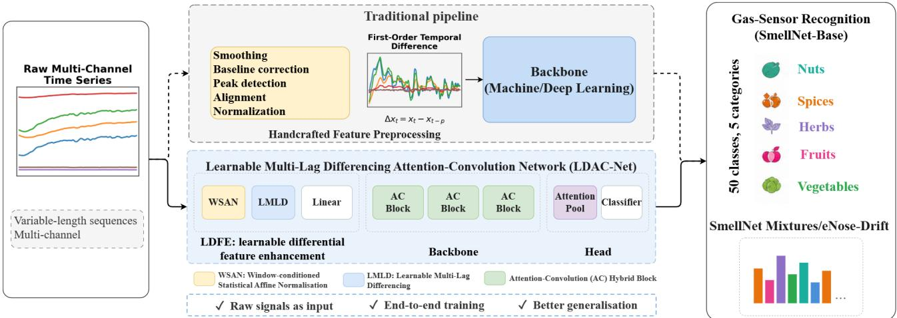  
Figure 1: The LDAC-Net architecture. A raw window x first passes through the LDFE front module (WSAN normalisation and LMLD diferencing), is then processed by three AC blocks, and is finally read out by the Attention-Pooling head into the 50-way logits.

• Capture local and long-range dependencies jointly. A signal window carries both short local patterns and dependencies spread across the whole window, so the AC block pairs a depthwise convolution for the local shape with self-attention for long-range context, deliberately scaled down to remain trainable on a small dataset without overfitting.

• Weight timesteps by their importance. Timesteps in a window are not equally informative, so the Attention-Pooling head replaces a uniform mean pool with a single-query attention pool that concentrates the read-out weight on the most discriminative parts of the sequence.

## 3.2. LDFE: Learnable Diferential Feature Enhancement

The LDFE module provides the backbone with a representation that is drift compensated and dynamics aware: it removes the slow per-session baseline drift that would swamp the class signal, and surfaces the response dynamics. There are two learnable stages, a window-conditioned afine normalisation (WSAN) and a multi-lag diferencing stage (LMLD) respectively, followed by a linear projection that lifts the result to the embedding (d = 128) the AC blocks consume.

## 3.2.1. Window-conditioned Statistical Afine Normalisation (WSAN)

The role of WSAN is to remove per-session baseline drift by normalising each window with an afine transform conditioned on the window’s own statistics. Figure 2 shows the WSAN module. For a window $\mathbf { x } \in \mathbb { R } ^ { T \times C }$ , WSAN first computes, for each channel, the mean and standard deviation over time:

$$
\mu _ { c } = \frac { 1 } { T } \sum _ { t = 1 } ^ { T } x _ { t , c } , \qquad \sigma _ { c } = \sqrt { \frac { 1 } { T - 1 } \sum _ { t = 1 } ^ { T } ( x _ { t , c } - \mu _ { c } ) ^ { 2 } } ,\tag{1}
$$

with $\sigma _ { c }$ clamped below at $1 0 ^ { - 5 }$ for numerical stability. The concatenated statistics $[ \mu , \sigma ]$ are passed through a two-layer MLP Φ with a GELU activation and a zeroinitialised final layer:

$$
( \Delta \gamma , \Delta \beta ) \ = \ \Phi \big ( [ \pmb { \mu } , \pmb { \sigma } ] \big ) .\tag{2}
$$

The WSAN output is the per-window afine instance normalisation

$$
\tilde { x } _ { t , c } = \left( 1 + \Delta \gamma _ { c } \right) \frac { x _ { t , c } - \mu _ { c } } { \sigma _ { c } } + \Delta \beta _ { c } .\tag{3}
$$

WSAN works in three parts: it standardises each channel by its window statistics, predicts a residual perchannel afine from those same statistics, and applies that afine to the standardised signal. Because the final layer of Φ is zero-initialised $( \Delta \gamma = \Delta \beta = 0 )$ WSAN starts as exact instance normalisation and gradually learns its per-window correction from data, and because Φ maps the 2C window statistics to 2C afine parameters, it adds very few parameters. The afine path is what separates WSAN from plain instance normalisation, which discards [µ, σ] together with the drift even though the absolute response level of a MOX array itself carries class information: Φ re-injects the discriminative part of these statistics through $( \Delta \gamma , \Delta \beta )$ , so WSAN acts as a leaky instance normalisation that removes the drift while keeping a learned route for the absolute level.

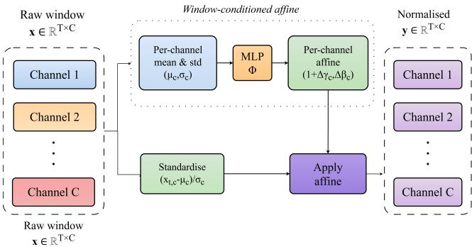  
Figure 2: The WSAN module. For each multi-channel window, the per-channel mean and standard deviation feed a small MLP that emits per-channel afine ofsets $\left( 1 + \Delta \gamma , \Delta \beta \right)$ , which are applied to the standardised window to produce the normalised output.

## 3.2.2. Learnable Multi-Lag Diferencing (LMLD)

In gas-sensor recognition tasks, a key feature to capture is the response dynamics, that is, how fast each channel rises and falls, rather than the absolute signal level (Vergara et al., 2012). We therefore design LMLD to capture these dynamics from the raw input by computing temporal diferences at several lags.

Let $\mathbf { \tilde { x } } \in \mathbf { \mathbb { R } } ^ { T \times \tilde { C } }$ be the WSAN output and $P =$ $\{ 5 , 1 0 , 2 5 , 5 0 \}$ a fixed bank of lags. For each lag $p \in$ P LMLD forms the in-window first diference and rescales it by a learnable per-channel weight ${ \bf w } ^ { ( p ) } \in { \bf \Xi }$ $\mathbb { R } ^ { C }$ , initialised to 1 so that training starts from plain diferences,

$$
\mathbf { d } _ { t } ^ { ( p ) } = \mathbf { w } ^ { ( p ) } \odot \left( \tilde { \mathbf { x } } _ { t } - \tilde { \mathbf { x } } _ { t - p } \right) , \qquad \mathbf { d } _ { t } ^ { ( p ) } = \mathbf { 0 } \mathrm { ~ f o r ~ } t \leq p ,\tag{4}
$$

where ⊙ is the per-channel product. The identity stream and all diference streams are concatenated along the channel axis, mixed by a pointwise (1×1) convolution to $d ^ { \prime } \ = \ 6 4$ channels, layer-normalised, and passed through a squeeze-excitation channel gate SE(·) (Hu, Shen and Sun, 2018) with reduction ratio 8:

$$
\begin{array} { r l } & { { \bf h } = \left[ \tilde { \bf x } , { \bf d } ^ { ( 5 ) } , { \bf d } ^ { ( 1 0 ) } , { \bf d } ^ { ( 2 5 ) } , { \bf d } ^ { ( 5 0 ) } \right] , } \\ & { { \bf z } = \mathrm { S E } \big ( \mathrm { L N } ( \mathrm { C o n v } _ { 1 \times 1 } ( { \bf h } ) ) \big ) . } \end{array}\tag{5}
$$

The output $\mathbf { z } \in \mathbb { R } ^ { T \times d ^ { \prime } }$ replaces the raw window as the input to the linear projection (Figure 3).

By fixing the temporal diferences to a closed form and learning only their weighting, cross-channel mixing, and gating, LMLD generalises a fixed firstorder diference into a learnable, multi-lag operator: the per-channel weight of each lag, the cross-channel mixing (the 1×1 convolution, which subsumes the classic channel-diference feature as a special case), and the channel gating are all learned rather than hand-set. It therefore extracts the response dynamics at several time scales at once, a short lag captures fast transients while a long lag captures the slow riseand-settle behaviour, and the squeeze-excitation gate emphasises the lags and channels that carry the most useful dynamic information.

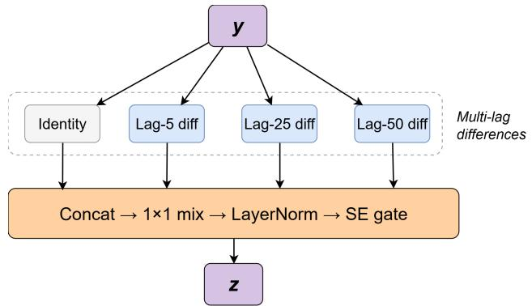  
Figure 3: The LMLD module. The WSAN-normalised window is diferenced at a bank of lags $P \ = \ \{ 5 , 1 0 , 2 5 , 5 0 \}$ (only 5, 25, 50 drawn); each diference is scaled by a learnable per-channel weight, concatenated with the identity stream, mixed by a 1×1 convolution, layer-normalised, and gated by a squeeze-excitation block.

## 3.2.3. Channel Projection Stage

A pointwise linear projection lifts the gated, mixed representation $\mathbf { z } \in \mathbb { R } ^ { \bar { T } \times d ^ { \prime } }$ to the d-dimensional token embedding that the AC blocks operate on. This projection closes the LDFE module: a raw window enters and a normalised, dynamics-enhanced $T \times d$ token sequence leaves, with no external preprocessing stage anywhere in the pipeline.

## 3.3. Attention-Convolution (AC) Hybrid Block

The AC block is the backbone unit that processes the LDFE output. It is an attention-convolution hybrid: each AC block applies a half-step macaron feed-forward layer, multi-head self-attention, a ConvModule, and a second half-step macaron feed-forward layer, with a final LayerNorm (Figure 4). This structure adopts the Conformer block (Gulati et al., 2020), scaled down for the short multivariate windows and limited training data of gas-sensor recognition. The macaron feedforward pattern places two residual pre-norm feedforward blocks (LayerNorm, linear expansion, SiLU, linear projection), each scaled by 0.5, before and after the attention; sandwiching the attention between two half-step feed-forward layers refines the token representation on both sides of the global mixing. The self attention uses multi-head scaled dot-product attention to relate distant timesteps and weight which parts of the window are informative. The ConvModule applies a LayerNorm, a pointwise convolution that expands the channels, a GLU gate, a depthwise convolution, a BatchNorm, a SiLU activation, and a final pointwise convolution back to the model width; its local kernel is short enough to detect fast transients yet long enough to integrate across them. The backbone uses no explicit positional encoding: temporal order is conveyed by the depthwise convolutions.

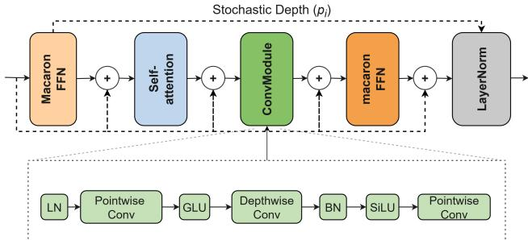  
Figure 4: The AC block: two half-step macaron feed-forward layers around a multi-head self-attention and a ConvModule, with per-step residual connections (dashed) and a final Layer-Norm. A whole-block identity bypass realises stochastic depth, and the inset expands the ConvModule.

To prevent the deep model from overfitting on the small training set, we apply stochastic depth (Huang, Sun, Liu, Sedra and Weinberger, 2016) per block, with a survival probability that decreases linearly with depth:

$$
p _ { i } = 1 - p _ { \operatorname* { m a x } } \frac { i } { N } , \qquad i = 1 , \dots , N ,
$$

where N is the number of blocks and $p _ { \mathrm { m a x } }$ the maximum drop rate, so block i is skipped (replaced by the identity) with probability $\boldsymbol { p _ { \mathrm { m a x } } } i / N$ during training. Deeper blocks are thus more likely to be dropped during training, which acts as an implicit ensemble over subnetworks of varying depth and reduces the gap between training and test accuracy in the small-data regime. At test time every block fires deterministically.

## 3.4. Attention-Pooling Head

The head turns the backbone’s T×d token sequence into class logits in two steps: a single-query attention pool that collapses the time axis, followed by a linear classifier.

The single-query multi-head attention pool uses a learnable query token $\textbf { q } \in \ \mathbb { R } ^ { d }$ that attends over the T token representations and returns a single ddimensional pooled vector, followed by a LayerNorm, concentrating read-out weight on the informative segments of the window. A single linear layer then maps this pooled embedding to the 50 class logits.

## 4. Experiments

## 4.1. Dataset

Our study uses three tasks (Figure 5). SmellNet-Base, a 50-way substance-recognition task, serves as the primary benchmark. The model’s generalisation is then evaluated on two more challenging tasks, the compositional ratio-prediction task SmellNet-Mixtures and the cross-array recognition task eNose-Drift, which exhibits strong long-term sensor drift.

SmellNet-Base (Feng et al., 2026) is a 50-way substance-recognition task: 50 base substances spread evenly over five categories (nuts, spices, herbs, fruits, and vegetables, ten each), each sensed by a portable array of low-cost MOX sensors (MQ-3, MQ-5, and the Grove Multichannel Gas Sensor V2) that yields six channels with manufacturer-calibration labels CO, $\mathrm { N O _ { 2 } , \ C _ { 2 } H _ { 5 } O H }$ , VOC, Alcohol, and LPG (not pureanalyte measurements, as each channel is broadly crosssensitive to many volatile families). Every substance is recorded in six 10-minute sessions on diferent days at 1 Hz inside a ventilated enclosure, giving one hour per substance and about 50 hours (about 180 k timesteps) in total. Figure 5(a) shows example curves of one representative substance per category across the six channels. Following the benchmark protocol, we use six-fold cross-validation at the session level: each fold trains on five recording days and tests on the remaining day, so every day serves once as the held-out test set (about 1 650 training and 330 test windows per fold at the default T = 300). Top-1 accuracy on the held-out sessions is the primary Base metric.

SmellNet-Mixtures (Feng et al., 2026) is a ratioprediction task over twelve base odorants (banana, orange, pear, apple, mango, peach, strawberry, clove, coriander, garlic, almond, and cumin): each recording is a controlled blend of up to three odorants at known proportions encoded in its label (for example a 50/50 almond and banana blend, or a 10/30/60 almond, orange and clove blend), captured with the same rig here exposing four channels $\mathrm { ( N O _ { 2 } , \ C _ { 2 } H _ { 5 } O H }$ , VOC, CO), and the target is the normalised mixture ratio over the twelve components rather than a class label. Figure 5(b) shows example curves of a pure substance and of two- and three-component blends across the four channels.

eNose-Drift (Wörner et al., 2025) is the public Long-Term Drift Behaviour of an Electronic Nose benchmark, an independent MOX corpus collected on entirely diferent hardware. A 62-channel metal-oxide array repeatedly measures three analytes (diacetyl, ethanol, and 2-phenylethanol) in a baseline-exposurerecovery cycle, yielding about 700 recordings sampled at 1 Hz across 40 measurement days that span twelve months. Its defining property is strong long-term drift: a model trained on early days must stay accurate on much later ones. Figure 5(c) shows one channel’s response to the three analytes on six measurement days across the year. eNose-Drift thus constitutes a rigorous and deployment-relevant evaluation of whether the learnable front-end tuned on SmellNet transfers to a new array, a larger channel count (62 vs. 6), a diferent

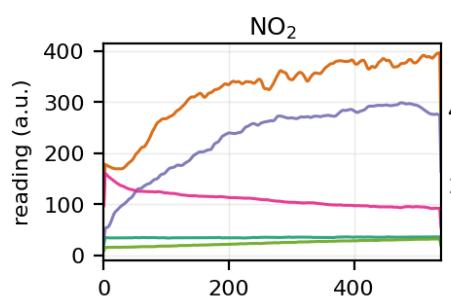  
CO

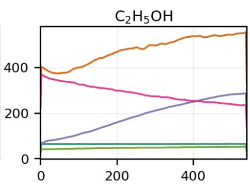

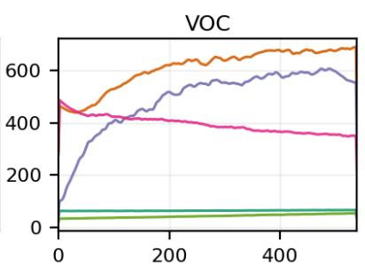

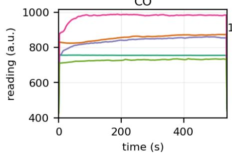

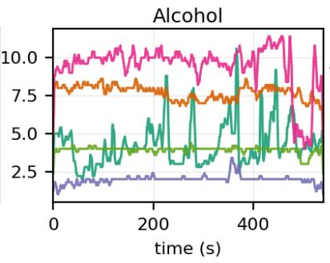

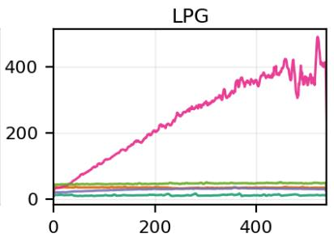  
(a) SmellNet-Base: one representative substance per category

Almond (100%)  Almond 50 / Banana 50 — Almond 50 / Garlic 50  Almond 10 / Orange 30 / Clove 60  
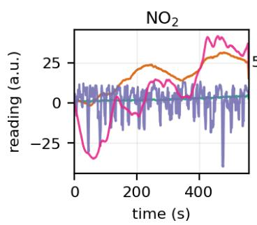

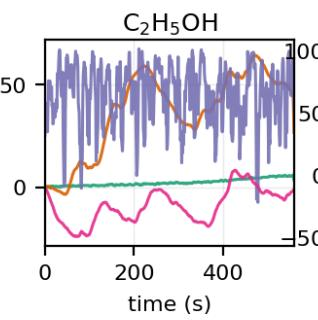

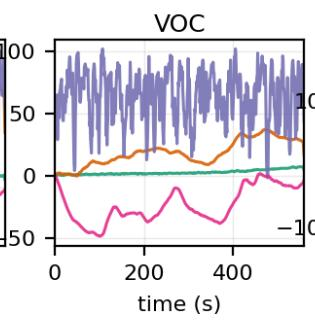

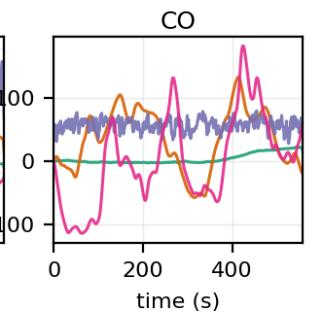

(b) SmellNet mixtures: pure, two- and three-component blends Day 1 Day 8 Day 16  Day 24  Day 32  Day 40  
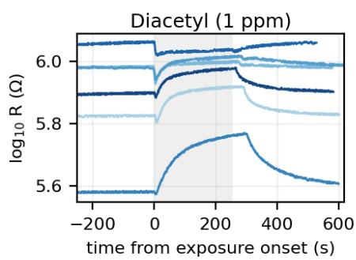

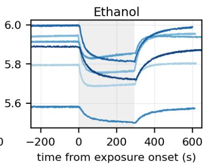

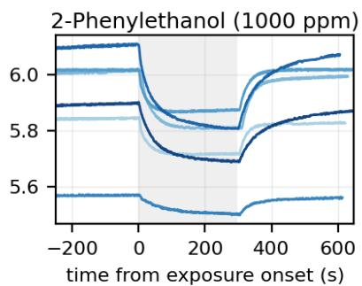  
(c) eNose-Drift: channel R46, the same analytes drift across measurement days (exposure phase shaded)

Figure 5: Example sensor time curves from the three tasks. (a) SmellNet-Base (Feng et al., 2026): one representative substance per category across the six MOX channels. (b) SmellNet-Mixtures (Feng et al., 2026): a pure substance and two- and threecomponent blends across the four mixture channels. (c) eNose-Drift (Wörner et al., 2025): raw log-resistance of one channe (R46) for the three analytes on six measurement days spanning the year.

recognition task, and a pronounced drift regime. We assume only an initial calibration and feed the raw drift-afected log-resistance, adopting a chronological split (earliest days for training, latest for testing) that parallels SmellNet’s session-level protocol.

## 4.2. Experimental Setup

We run four experiments to evaluate the method; their results appear in Section 5.Unless otherwise stated, raw input means that no external drift correction, smoothing or handcrafted temporal diferencing is applied before the network.

Experiment 1: Model Performance This experiment measures the recognition accuracy of LDAC-Net on the SmellNet-Base task. We report Top-1 and Top-5 accuracy and macro-F1 against four mainstream baselines chosen to span the main temporal inductive biases for multivariate time series: a non-temporal MLP that treats the window as a flat feature vector and ignores order; a 1-D CNN (LeCun, Bottou, Bengio and Hafner, 1998) that captures local temporal patterns through shared convolutions; a bidirectional LSTM (Hochreiter and Schmidhuber, 1997) that models the sequence recurrently; and a Transformer encoder (Vaswani et al., 2017) that relates timesteps through global attention, the last being the ScentFormer backbone of the SmellNet benchmark (Feng et al., 2026). Each model is trained on both raw windows and lag-25 FOTDpreprocessed windows. Throughout the paper, raw input means the six gas-channel readings exactly as delivered by the benchmark loader: each recording is anchored to its own first sample (the per-session initial calibration, $\mathbf { x } [ t ]  \mathbf { x } [ t ] - \mathbf { x } [ 0 ] )$ and sliced into sliding windows, with no temporal diferencing, filtering, or per-window normalisation applied outside the model; on eNose-Drift the same convention applies to the drift-afected log-resistance $\log _ { 1 0 } R ,$ with per-channel standardisation whose statistics are fit on training windows only. We then vary the analysis window length $T \in \{ 1 0 0 , 2 0 0 , 3 0 0 , 4 0 0 \}$ at a fixed stride of 50 to locate the best window length. A longer window plays two roles at once: it regularises training by making neighbouring windows overlap more heavily, and it gives the in-model diferencing enough temporal context to be informative. To separate these roles, we run this comparison on two fronts, LDAC-Net and an LDAC-Net w/o LMLD variant (the diferencing stage removed), so that comparing the two isolates how much of any gain comes from the learnable diferencing rather than from the longer window alone.

Experiment 2: Ablation Study This experiment attributes the accuracy to individual design choices through a leave-one-out ablation study. Starting from LDAC-Net, we remove WSAN (reverting to plain InstanceNorm), remove the LMLD diferencing front as a whole, and remove the LMLD sub-components in turn (the squeeze-excitation gate, the learnable channel mixing, and collapsing the multi-lag bank to a single lag 25), to quantify each component’s contribution.

Experiment 3: Model Comparison This experiment contrasts LDAC-Net, on raw input, against several of the most popular multivariate time-series models, to show that its gain is not reachable by swapping in an of-the-shelf mechanism. The five comparison methods span the dominant design directions for multichannel time series, and each is chosen as a strong alternative to one of LDAC-Net’s design choices. The Transformer encoder (Vaswani et al., 2017) models the window with global self-attention and is the Scent-Former backbone of the SmellNet benchmark, so it tests whether plain attention already sufices. The Nonstationary Transformer (Liu et al., 2022) contributes de-stationary attention, the most direct alternative to our window-conditioned normalisation (WSAN) for handling per-session drift. Autoformer (Wu, Xu, Wang and Long, 2021) brings a trend/residual series decomposition, a diferent way to separate the slow transient from the response dynamics. The TCN (Bai et al., 2018) replaces the attention-convolution stem with a purely convolutional dilated stack, testing the local/dilated-convolution direction. And the Neural-ODE block (Chen, Rubanova, Bettencourt and Duvenaud, 2018) models the window as a continuoustime dynamical system, an alternative to the multilag diferencing through which LMLD captures the response dynamics. We report Top-1 accuracy for all methods.

Experiment 4: Generalisation This experiment tests the model’s generalisation along two axes: to a diferent task on the same array, and to a diferent sensor array and drift regime altogether. (a) Compositional generalisation to mixtures (Section 5.4.1) evaluates LDAC-Net on a quantitative, compositional task beyond singlesubstance recognition. On SmellNet-Mixtures (Feng et al., 2026), every model emits a 12-way ratio distribution and is trained with the benchmark’s mixture recipe (in-batch synthetic mixing, a KL term, an ϵ-insensitive ratio loss, and a focal presence head). We report three standard ratio metrics: Top-1@0.1 (the fraction of present components whose predicted ratio falls within 0.1 of the truth), mean absolute error (MAE), and a dynamic Top-K presence score, comparing LDAC-Net against the same four mainstream baselines as in Experiment 1. (b) Cross-dataset generalisation across sensor arrays (Section 5.4.2) evaluates LDAC-Net on the external eNose-Drift benchmark (Wörner et al., 2025), which difers from SmellNet in sensor hardware, channel count (62 vs. 6), task, and, above all, in exhibiting strong long-term drift. We adopt a chronological split (train on the earliest days, test on the latest); because the analyte response is a slower transient than

SmellNet’s, we scale the analysis window to $T { = } 4 0 0$ and the LMLD bank to {25, 50, 100, 150}; training runs the same recipe over 100 epochs. All models receive the raw drift-afected log-resistance, with only an initial calibration assumed. We report Acc@1 and macro-F1 (mean±std over ten seeds for LDAC-Net, the Transformer, and the retuned-FOTD CNN, and over five seeds for the remaining configurations) against the same four mainstream baselines as in Experiment 1, on both raw and dataset-retuned FOTD input.

## 4.3. Experimental Configuration

Model configuration LDAC-Net uses model width $d = 1 2 8$ , four attention heads, three AC blocks with FFN width 128, ConvModule kernel 15, and dropout 0.1, per-block stochastic depth $p _ { \operatorname* { m a x } } = 0 . 1$ , an LMLD mix width $d ^ { \prime } = 6 4$ , a single-query attention pool, and a WSAN MLP of hidden width 32. This configuration was chosen by data-scale calibration: every wider or deeper variant we tried overfits. LDAC-Net holds about $7 . 2 \times 1 0 ^ { 5 }$ trainable parameters in total, of which WSAN adds only about 800, two orders of magnitude less than ImageNet-class Transformers and matching the order of magnitude of the training corpus. Table 1 lists the full configuration.

Training The recipe is identical across configurations: AdamW (Loshchilov and Hutter, 2019) with learning rate $5 \times 1 0 ^ { - 4 }$ , weight decay $1 0 ^ { - 4 }$ , batch size 32, and a cosine schedule (Loshchilov and Hutter, 2017) with 5 % linear warmup over 100 epochs. The objective is cross-entropy. Augmentation combines TimeCutout (one contiguous time mask of length up to T /4) and Channel Dropout (random masking of one of the six channels); we also use mixup (Zhang, Cisse, Dauphin and Lopez-Paz, 2018) with $\alpha \ = \ 0 . 2$ (targets interpolated accordingly) and keep an exponential moving average of the weights with decay 0.999.

Validation protocol We use K-fold session-level crossvalidation, training on five recording days and testing on the remaining day in each fold. Each configuration is run with five random seeds {42, 1, 99, 7, 314}, and performance is reported as the mean ± standard deviation.

## 5. Results

## 5.1. Model Performance

## 5.1.1. Recognition Accuracy on SmellNet-Base

Table 2 reports the comparison against the four mainstream architectures: a non-temporal MLP, a 1- D CNN, a bidirectional LSTM, and the Transformer, each trained on raw windows and on lag-25 FOTDpreprocessed windows and scored by Top-1, Top-5, and macro-F1. On raw input every mainstream model is weak. The strongest, Transformer, reaches only 37.29 % Top-1 (73.22 % Top-5, 33.49 F1), and the non-temporal

Table 1  
LDAC-Net configuration and training recipe used throughout, unless a row states otherwise. All values are fixed across seeds.
<table><tr><td>Setting</td><td>Value</td></tr><tr><td>Data / windowing Channels  $C ~ /$  classes Window length  $T ~ /$  stride Train / test windows Architecture</td><td>6/50 300 (swept 100 to 400) / 50 about 1 650 / about 330</td></tr><tr><td>Model width d LMLD lag bank  $P ~ /$  mix width Attention heads / blocks FFN width / ConvModule kernel Dropout / stochastic depth pmax Time pooling WSAN MLP hidden width Params (trainable)</td><td>128  $d ^ { \prime }$  {5, 10, 25, 50} / 64 4/3 128  /  15 0.1 / 0.1 single-query attention 32 716,746</td></tr><tr><td>Optimisation Optimiser Learning rate / weight decay Batch size / epochs Schedule EMA decay</td><td>AdamW  $5 \times 1 0 ^ { - 4 } / 1 0 ^ { - 4 }$   $3 2 \mathrm { ~ / ~ } 1 0 0$  cosine, 5 % warmup 0.999</td></tr><tr><td>Regularisation/augmentation mixup α TimeCutout / Channel Dropout</td><td>0.2  $\leq T / 4 \mathrm { ~ / ~ } 1 \mathrm { ~ o f ~ } 6$ </td></tr></table>

MLP collapses to 21.09 % Top-1, because the persession drift swamps the class signal. FOTD preprocessing recovers much of this gap for the temporal models, lifting the LSTM to 53.78 % Top-1 (85.90 % Top-5, 52.40 F1), the Transformer to 53.55 %, and the CNN to 49.56 %, but it actively hurts the order-agnostic MLP (18.92 %). The proposed LDAC-Net, operating end-to-end on raw windows, is the best model on every metric: 68.2 % Top-1, 89.4 % Top-5, and 65.2 macro-F1, exceeding the strongest FOTD-preprocessed baseline by 14.4 points on Top-1 and 12.8 on F1 despite using no external preprocessing. This confirms that the drift compensation and dynamics extraction that FOTD performs externally can be folded into the model and surpassed.

## 5.1.2. Window Length

In our experiments, we found that the analysis window length greatly afects recognition performance. We vary $T \in \{ 1 0 0 , 2 0 0 , 3 0 0 , 4 0 0 \}$ at a fixed stride of 50 on the 50-way base recognition task, on two fronts: LDAC-Net and the LDAC-Net w/o LMLD variant. Figure 6 plots the Top-1 mean±std for both. The classification performance of LDAC-Net improves significantly with the window, rising from 57.8 % at $T = 1 0 0$ to a peak of ${ \bf 6 8 . 2 \% }$ at $T ~ = ~ 3 0 0$ before falling back to 64.8 % at $T = 4 0 0$ ; LDAC-Net $\mathrm { w / o }$ LMLD follows the same trend but more weakly, from 58.1 % at $T ~ = ~ 1 0 0$ to 62.3 % at $T = 3 0 0$ and 57.6 % at $T = 4 0 0$ . The benefit of a longer window is representational and specific to the diferencing front: because a MOX response is a slow chemical transient that takes many seconds to rise and settle, the in-model multi-lag diferences need the window to be several times longer than the lag to be informative: at $T = 1 0 0 \mathrm { ~ a ~ }$ lag-50 diference zeroes half the window, but at $T = 3 0 0$ only one sixth. The gap between the two curves isolates this efect, i.e. the contribution of LMLD: it is negligible at $T = 1 0 0 \ : ( - 0 . 3$ points), then widens steadily $\mathrm { t o } + 2 . 3$ at $T = 2 0 0 .$ , +5.9 at $T = 3 0 0$ , and +7.2 at $T = 4 0 0$ . LMLD is not a free addition but one that only a longer window enables. The LDAC-Net curve is unimodal, peaking at $T = 3 0 0$ and falling at $T = 4 0 0$ where each session yields too few windows to train on. Based on this, we choose $T = 3 0 0$

Model performance on SmellNet-Base (50-way; Top-1 / Top-5 accuracy and macro-F1, %, mean±std). Mainstream baselines (MLP, CNN, LSTM, Transformer) are trained on raw and lag-25 FOTD-preprocessed inputs. LDAC-Net operates end-to-end on raw windows with no external preprocessing. All models use the same analysis window length $T = 3 0 0$ at stride 50. Best per metric in bold.
<table><tr><td></td><td colspan="3">Raw input</td><td colspan="3">FOTD input</td></tr><tr><td>Model</td><td> $\mathsf { A c c @ 1 }$ </td><td> $\mathsf { A c c @ 5 }$ </td><td>F1</td><td> $\mathsf { A c c @ 1 }$ </td><td> $\mathsf { A c c @ 5 }$ </td><td>F1</td></tr><tr><td>MLP</td><td> $2 1 . 0 9 \pm 2 . 6 4$ </td><td> $5 6 . 0 5 \pm 1 . 8 5$ </td><td> $1 6 . 7 9 \pm 2 . 6 7$ </td><td> $1 8 . 9 2 \pm 2 . 9 7$ </td><td> $4 9 . 8 0 \pm 5 . 8 5$ </td><td> $1 6 . 1 7 \pm 3 . 3 7$ </td></tr><tr><td>CNN</td><td> $2 6 . 8 2 \pm 1 . 4 4$ </td><td> $6 7 . 3 1 \pm 0 . 6 5$ </td><td> $2 2 . 8 0 \pm 1 . 9 9$ </td><td> $4 9 . 5 6 \pm 7 . 8 0$ </td><td> $8 3 . 1 9 \pm 4 . 0 3$ </td><td> $4 8 . 1 2 \pm 7 . 2 0$ </td></tr><tr><td>LSTM</td><td> $2 7 . 7 2 \pm 2 . 4 0$ </td><td> $6 6 . 7 4 \pm 1 . 1 7$ </td><td> $2 5 . 3 1 \pm 1 . 7 3$ </td><td> $5 3 . 7 8 \pm 1 . 8 1$ </td><td> $8 5 . 9 0 \pm 1 . 1 4$ </td><td> $5 2 . 4 0 \pm 1 . 9 9$ </td></tr><tr><td>Transformer</td><td> $3 7 . 2 9 \pm 2 . 3 4$ </td><td> $7 3 . 2 2 \pm 1 . 7 3$ </td><td> $3 3 . 4 9 \pm 1 . 9 9$ </td><td> $5 3 . 5 5 \pm 0 . 8 3$ </td><td> $8 5 . 5 8 \pm 1 . 8 6$ </td><td> $5 2 . 0 8 \pm 0 . 7 7$ </td></tr><tr><td>LDAC-Net (ours)</td><td> ${ \bf 6 8 . 2 \pm 1 . 6 }$ </td><td> ${ \bf 8 9 . 4 \pm 0 . 3 }$ </td><td> ${ \bf 6 5 . 2 \pm 4 . 5 }$ </td><td> $\mathsf { N } / \mathsf { A }$ </td><td> $\mathsf { N } / \mathsf { A }$ </td><td> $\mathsf { N } / \mathsf { A }$ </td></tr></table>

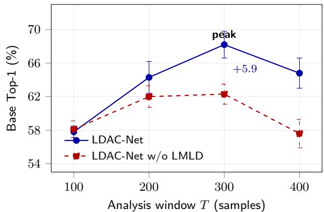  
Figure 6: Model performance across analysis window lengths on SmellNet-Base (50-way, Top-1 %, mean±std). Solid: LDAC-Net; dashed: LDAC-Net w/o LMLD. LDAC-Net rises by more than ten points from the default $T = 1 0 0$ to a peak at $T \ = \ 3 0 0$ , then falls at $T ~ = ~ 4 0 0$ as each session yields too few windows. LMLD is neutral at $T = 1 0 0$ , where a lag-50 diference is half boundary, and its benefit grows with the window, reaching +5.9 points at $T = 3 0 0$

## 5.2. Ablation Study

The ablation study is conducted by removing one part of LDAC-Net at a time at $T = 3 0 0$ and reporting Top-1 (Table 3); every component contributes, starting from the full 68.2 %. WSAN is by far the most important stage: replacing it with plain InstanceNorm drops accuracy to 54.2 %, a loss of 14.0 points. The size of this drop, from a stage of only about 800 parameters, matches the mechanism described in Section 3.2.1: the two variants difer only in what happens to the window statistics $[ \mu , \sigma ]$ , which plain InstanceNorm discards and WSAN routes back through its windowconditioned afine, so the gap measures how much class information the absolute response level carries. The LMLD diferencing front accounts for a further 5.8 points, falling to 62.3 % when the whole stage is removed, and its internal pieces each leave a clear gap: ablating the squeeze-excitation gate costs 6.2 points (61.9 %) and the learnable channel mixing 4.9 (63.2 %). The multi-lag bank matters too: collapsing it to a single lag {25} costs 4.6 points (63.6 %), confirming that diferencing at several lags carries information a single lag misses. The dynamic cue LMLD recovers therefore comes from the full combination (diferencing across a bank of lags, learnable cross-channel recombination, and gating) layered on top of the window-conditioned normalisation. Every one of these reductions is statistically significant: a two-sided paired t-test across the five seeds (which are shared by all configurations) rejects equality with the full model at $p \ < \ 0 . 0 5$ for all five rows, including the single-lag collapse, whose 4.6-point gap is the smallest in the table.

## 5.3. Model Comparison

Table 4 compares LDAC-Net, on raw input, against the Transformer backbone (on raw and lag-25 FOTD input) and four published time-series methods: the Non-stationary Transformer (Liu et al., 2022), Autoformer (Wu et al., 2021), a temporal convolutional network (TCN) (Bai et al., 2018), and a Neural-ODE (Chen et al., 2018).

LDAC-Net attains the highest accuracy, outperforming all competing methods by a substantial margin. Among those methods, the de-stationary attention of the Non-stationary Transformer is the strongest at 52.61 %, as expected for the method that most directly stands in for the window-conditioned afine (WSAN), yet it still trails LDAC-Net by more than 15 points. Autoformer’s trend/residual decomposition (50.28 %) and the Neural-ODE block (50.47 %) add capacity the small training set cannot absorb, and the dilated TCN stem is the weakest transplant at 43.63 %, about nine points below the best one. The plain Transformer backbone reaches only 37.29 % on raw input and, even with lag-25 FOTD preprocessing, climbs to just 53.55 %. LDAC-Net at $T = 3 0 0$ reaches 68.2 %, more than 14 points above the strongest competitor (Transformer-FOTD) and over 15 above the best rawinput alternative.

Table 3 Component ablation of LDAC-Net at $T \ : = \ : 3 0 0 \ : \ : ( \mathrm { T o p - 1 } \ : \% ,$ mean±std over five seeds). Each row removes one part of LDAC-Net. All accuracy drops are statistically significant against the full model $( ^ { * } p < 0 . 0 5$ , two-sided paired t-test over the five shared seeds).
<table><tr><td>Configuration</td><td> $A c c . \ ( \% )$ </td><td>∆</td></tr><tr><td>LDAC-Net</td><td> ${ \bf 6 8 . 2 \pm 1 . 6 }$ </td><td>(ref.)</td></tr><tr><td>— WSAN (plain InstanceNorm)</td><td> $5 4 . 2 \pm 0 . 9$ </td><td> $- 1 4 . 0 ^ { * }$ </td></tr><tr><td>- LMLD</td><td> $6 2 . 3 \pm 1 . 2$ </td><td> $- 5 . 8 ^ { * }$ </td></tr><tr><td>— squeeze-excitation gate</td><td> $6 1 . 9 \pm 1 . 3$ </td><td> $- 6 . 2 ^ { * }$ </td></tr><tr><td>— channel mixing</td><td> $6 3 . 2 \pm 0 . 4$ </td><td> $- 4 . 9 ^ { * }$ </td></tr><tr><td>— multi-lag bank (single lag 25)</td><td> $6 3 . 6 \pm 2 . 5$ </td><td> $- 4 . 6 ^ { * }$ </td></tr></table>

Comparison of LDAC-Net against the Transformer backbone (on raw and lag-25 FOTD input) and four published time-series methods (the Non-stationary Transformer, Autoformer, TCN, and Neural-ODE) on SmellNet-Base (Top-1 %, mean±std).
<table><tr><td>Model</td><td>Top-1 Acc. (%)</td></tr><tr><td>Transformer (raw)</td><td> $3 7 . 2 9 \pm 2 . 3 4$ </td></tr><tr><td>Transformer (FOTD)</td><td> $5 3 . 5 5 \pm 0 . 8 3$ </td></tr><tr><td>Non-stationary Transformer (Liu et al., 2022)</td><td> $5 2 . 6 1 \pm 2 . 5 0$ </td></tr><tr><td>Autoformer (Wu et al., 2021)</td><td> $5 0 . 2 8 \pm 1 . 2 2$ </td></tr><tr><td>TCN (Bai et al., 2018) Neural ODE (Chen et al., 2018)</td><td> $4 3 . 6 3 \pm 2 . 6 2$ </td></tr><tr><td></td><td> $5 0 . 4 7 \pm 1 . 5 1$ </td></tr><tr><td>LDAC-Net</td><td> ${ \bf 6 8 . 2 \pm 1 . 6 }$ </td></tr></table>

## 5.4. Generalisation

We evaluate generalisation along two axes: to a diferent task on the same array (mixtures), and to an entirely diferent sensor array and drift regime (crossdataset).

## 5.4.1. Compositional Generalisation to Mixtures

To test whether the representation learned by LDAC-Net generalises beyond the 50-way recognition task, we evaluate it on the SmellNet-Mixtures set, where the goal is to predict the normalised ratio of twelve base odorants in a blend rather than a single class label. Table 5 reports the three ratio metrics, and

Model performance on the SmellNet-Mixtures task (Feng et al., 2026) (12-component ratio prediction). Top-1@0.1 and Top-K in %, higher is better; MAE lower is better. Best per metric in bold.
<table><tr><td>Model</td><td> $\mathsf { T o p } { - } 1 \odot 0 . 1 \uparrow$ </td><td> ${ \mathsf { M A E } } \downarrow$ </td><td> $\mathsf { T o p } { \cdot } K \uparrow$ </td></tr><tr><td>MLP</td><td> $4 3 . 0 \pm 1 . 5$ </td><td> $0 . 0 5 6 \pm 0 . 0 0 1$ </td><td> $7 6 . 2 \pm 1 . 2$ </td></tr><tr><td>CNN</td><td> $4 3 . 1 \pm 1 . 3$ </td><td> $0 . 0 5 9 \pm 0 . 0 0 0$ </td><td> $7 5 . 1 \pm 0 . 8$ </td></tr><tr><td>LSTM</td><td> $4 1 . 0 \pm 2 . 3$ </td><td> $0 . 0 5 6 \pm 0 . 0 0 1$ </td><td> $8 0 . 8 \pm 1 . 5$ </td></tr><tr><td>Transformer</td><td> $4 5 . 4 \pm 3 . 1$ </td><td> $0 . 0 5 4 \pm 0 . 0 0 2$ </td><td> $7 8 . 3 \pm 0 . 3$ </td></tr><tr><td>LDAC-Net (ours)</td><td> ${ \bf 5 0 . 5 \pm 2 . 0 }$ </td><td> $\mathbf { 0 . 0 5 0 \pm 0 . 0 0 1 }$ </td><td> ${ \bf 8 1 . 1 \pm 0 . 2 }$ </td></tr></table>

LDAC-Net is the best model on all three: it raises Top-1@0.1 to 50.5 % from the strongest baseline’s 45.4 % (the Transformer), a 5.1-point gain, while also achieving the lowest MAE (0.050) and the highest Top-K presence score (81.1 %). The learnable multilag diferencing front and the attention-convolution backbone that drive the recognition result also transfer to a quantitative, compositional task, where they continue to outperform the mainstream architectures.

## 5.4.2. Cross-Dataset Generalisation Across Sensor Arrays

We evaluate LDAC-Net on the eNose-Drift benchmark (Wörner et al., 2025), a 62-channel metal-oxide array that difers from SmellNet in hardware and channel count. It exhibits strong long-term drift over twelve months (Section 4.2). The four baselines are evaluated on both raw drift-afected log-resistance and dataset-retuned lag-100 FOTD input, whereas LDAC-Net operates end-to-end on the raw signal. Table 6 reports Acc@1 and macro-F1. On raw input, the baselines attain only 43.4 to 59.2 Acc@1 and 38.9 to 58.1 macro-F1. FOTD improves the CNN, LSTM, and Transformer in Acc@1, raising them from 59.2 to 62.6, 43.4 to 52.7, and 56.3 to 61.2, respectively, but reduces the order-agnostic MLP from 56.3 to 53.4. LDAC-Net achieves the best result in both metrics, reaching ${ \bf 7 0 . 6 \pm 4 . 8 }$ Acc@1 and ${ \bf 6 9 . 6 \pm 3 . 9 }$ macro-F1. It exceeds the strongest raw baseline by 11.4 Acc@1 points and 11.5 macro-F1 points, and the strongest dataset-retuned FOTD baseline by 8.0 and 3.0 points, respectively. Thus, the model transfers to a new sensor array and drift regime without an externally selected FOTD lag: after scaling the analysis window and lagbank range to the slower eNose-Drift transient (Section 4.2), its learnable multi-lag front-end recovers the relevant dynamics directly from the raw signal.

## 6. Discussion

## 6.1. Window-Conditioned Afine versus Fixed Diferencing

FOTD applies a single fixed map $y [ t ] ~ = ~ x [ t ] ~ -$ x[t − 25] to every window of every session. Its fixed lag under- or over-compensates sessions whose drift sits at a diferent time scale, and its diferencing discards the absolute response level that is itself discriminative for some classes. WSAN moves the drift-compensation decision inside the model and conditions it on the window’s own statistics. A window with a strong DC ofset has its mean removed and a learned $\gamma$ rescales the variance, but a window whose absolute level is the discriminative cue can be left near-identity because the MLP Φ starts at zero and only departs from identity when the data demand it. The ablation in Table 3 puts a number on this leaky-normalisation behaviour: the 14.0-point gap to plain InstanceNorm is the accuracy carried by the absolute-level information that WSAN preserves and InstanceNorm throws away. FOTD’s choice of diferencing lag is fixed in the same way, and LMLD replaces it with a learnable bank of lags for the same reason. Table 7 shows why a bank is needed. The single lag that FOTD relies on is the weakest choice (63.6 %), and adding lags helps only when they span a wide range of time scales: banks confined to the long end ({25, 50}, {25, 50, 100}) or to the short end ({5, 10, 15, 25}), and banks that drop either the shortest or the longest lag ({5, 10, 25}, {10, 25, 50}), all plateau around 64 %. The bank we adopt, {5, 10, 25, 50}, is the only one that pairs the fast transient (lag 5) with the slow rise-and-settle (lag 50), and it reaches 68.2 %. LMLD learns an operator that adapts to the data’s dynamics, weighting and combining diferences over a bank of lags spanning the fast transient and the slow rise-and-settle.

Cross-dataset generalisation on the eNose-Drift benchmark (Wörner et al., 2025) (62-channel MOX array, chronological drift split, raw drift-afected input). Acc@1 / macro-F1 (%, mean±std; ten seeds for LDAC-Net, the Transformer, and the FOTD CNN, five seeds otherwise); FOTD uses the dataset-retuned lag-100 diference. Best per column in bold.
<table><tr><td></td><td colspan="2">Raw</td><td colspan="2">FOTD (lag 100)</td></tr><tr><td>Model</td><td>Acc@1</td><td>F1</td><td>Acc@1</td><td>F1</td></tr><tr><td>MLP</td><td>56.3±4.3</td><td> $5 5 . 6 { \pm } 4 . 5 $ </td><td>53.4±1.4 52.4±1.2</td><td></td></tr><tr><td>CNN</td><td>59.2±5.3</td><td> $5 8 . 1 { \pm } 6 . 7 $ </td><td>62.6±3.1 66.6±3.2</td><td></td></tr><tr><td>LSTM</td><td>43.4±3.4</td><td>38.9±3.1</td><td>52.7±1.8 47.8±2.3</td><td></td></tr><tr><td>Transformer</td><td>56.3±3.5</td><td>55.3±3.9</td><td>61.2±3.8</td><td> $5 8 . 5 { \pm } 5 . 4 $ </td></tr><tr><td>LDAC-Net (ours)</td><td> $\mathbf { 7 0 . 6 { \pm } 4 . 8 }$ </td><td>69.6±3.9</td><td>N/A</td><td>N/A</td></tr></table>

## 6.2. Window Length as a Key Accuracy Factor

We find in our experiments that increasing the analysis window length T significantly improves recognition accuracy: lengthening it from the default $T =$ 100 to $T ~ = ~ 3 0 0$ raises Top-1 from 57.8 % to 68.2 % (Section 5.1.2, Figure 6). This improvement arises for two distinct reasons that happen to align. The first is statistical: at a fixed stride a longer window makes adjacent windows overlap more heavily (each shares most of its span with its neighbours), which acts as a strong augmentation and regulariser even though the window count per session falls (from about 2,650 windows at $T = 1 0 0$ to about 1,650 at $T = 3 0 0 )$ . The second is representational: any in-window temporal operation with a lag p (whether fixed FOTD or our LMLD) needs the window to be several times longer than p to be meaningful, otherwise the operation is dominated by the zero-padded boundary. At $T = 1 0 0$ a lag-50 diference is half boundary; at $T = 3 0 0$ it is one sixth. This is why LMLD is neutral at $T = 1 0 0$ but its benefit grows with the window: +2.3 points at T = 200, +5.9 at $T = 3 0 0 .$ , and +7.2 at $T = 4 0 0$ in the two-front comparison of Figure $6 ,$ where the longer window is what gives the diferencing front room to work. The curve is unimodal (accuracy falls again at $T ~ = ~ 4 0 0$ as the window count drops), so there is a genuine trade-of, and $T = 3 0 0$ sits at the peak.

Efect of the LMLD lag bank on SmellNet-Base (50-way, $T = 3 0 0 ,$ , Top-1 %, mean±std). The bank used by LDAC-Net is in bold.
<table><tr><td>Lag bank P</td><td>Top-1 Acc. (%)</td></tr><tr><td>{25}</td><td> $6 3 . 6 \pm 2 . 5$ </td></tr><tr><td>{25,50}</td><td> $6 4 . 4 \pm 5 . 0$ </td></tr><tr><td>{5, 10, 25}</td><td> $6 4 . 9 \pm 1 . 5$ </td></tr><tr><td>{10, 25, 50}</td><td> $6 4 . 6 \pm 3 . 3$ </td></tr><tr><td>{15, 25, 50}</td><td> $6 4 . 0 \pm 0 . 6$ </td></tr><tr><td>{25, 50, 100}</td><td> $6 4 . 5 \pm 3 . 0$ </td></tr><tr><td> $\{ 5 , 1 0 , 1 5 , 2 5 \}$ </td><td> $6 3 . 9 \pm 0 . 2$ </td></tr><tr><td>{5, 10, 25, 50} (ours)</td><td> ${ \bf 6 8 . 2 \pm 1 . 6 }$ </td></tr></table>

## 6.3. Limitations

Several limitations remain. First, SmellNet-Base, though the largest controlled MOX benchmark, is still small by deep-learning standards (about 2,650 training windows at $T = 1 0 0$ and about 1,650 at $T = 3 0 0 )$ This scarcity is why every capacity-adding variant we tried overfit and why LDAC-Net is deliberately kept compact. Although the cross-dataset study on eNose-Drift shows the design transfers to a second, larger array, both corpora are modest in size; evaluating LDAC-Net on larger and more varied datasets is still needed to confirm that the gains hold.

Second, the analysis window length T, which strongly afects accuracy, is still a global hyperparameter fixed once by an ofline grid search $\begin{array} { r l r } { ( T } & { { } = } & { 3 0 0 ) } \end{array}$ even though the best length almost certainly varies with the substance, the channel, and how fast each response rises and settles. A natural next step is to let the model set it more intelligently, with a learnable, input-adaptive window (for example multi-scale windows), so that the temporal context is selected by the network rather than searched for by hand.

Finally, although the cross-dataset study demonstrates transfer to a second MOX array (eNose-Drift, 62 channels), both corpora are recorded ofline under controlled conditions. Transfer to uncontrolled realworld settings remains untested, and the on-device latency and power of the model, including the small extra cost of the per-window WSAN pass, have yet to be measured in an actual deployment.

## 7. Conclusion

We presented LDAC-Net, a learnable multi-lag differencing attention-convolution network that classifies raw windows from low-cost MOX gas sensors end to end. Its LDFE front end brings drift removal and dynamics extraction into the network. WSAN adjusts the normalisation to each window, while LMLD learns how to combine temporal diferences at several lags. The compact AC backbone uses convolution for local response shape and self-attention for longer-range context, with stochastic depth and single-query attention pooling to limit model size. We further investigated the efect of analysis window length. Increasing T from 100 to 300 improves Top-1 accuracy by 10.4 points, from 57.8 % to 68.2 %. On the 50-way SmellNet-Base task, LDAC-Net achieves 68.2 % Top-1, 89.4 % Top-5, and 65.2 macro-F1. Its Top-1 accuracy is more than 14 points above the strongest FOTD-preprocessed baseline and over 30 points above the raw-input Transformer. The ablation study shows that each evaluated component contributes to classification accuracy. Generalisation experiments on SmellNet-Mixtures and eNose-Drift show that LDAC-Net transfers across tasks and sensor arrays. The results indicate that generalisation across recording sessions remains the main limitation, rather than insuficient backbone capacity. They also support learning sensor compensation within the network instead of applying fixed temporal diferencing beforehand. We will next test LDAC-Net on larger, real-world multi-session datasets and replace the fixed analysis window with a learnable input-adaptive window.

## Acknowledgements

BB/R019983/1, BB/Y513763/1, BB/S020969/1, EP/X013707/1, UKRI3606.

## References

Bai, S., Kolter, J.Z., Koltun, V., 2018. An empirical evaluation of generic convolutional and recurrent networks for sequence modeling. arXiv preprint arXiv:1803.01271 .

Chen, R.T.Q., Rubanova, Y., Bettencourt, J., Duvenaud, D., 2018. Neural ordinary diferential equations, in: Advances in Neural Information Processing Systems (NeurIPS).

Dempster, A., Petitjean, F., Webb, G.I., 2020. ROCKET: Exceptionally fast and accurate time series classification using random convolutional kernels. Data Mining and Knowledge Discovery 34, 1454–1495. doi:10.1007/s10618-020-00701-z.

Feng, D., Dai, W., Li, C., Pernigo, A., Liang, P.P., 2026. SmellNet: A large-scale dataset for real-world smell recognition, in: International Conference on Learning Representations (ICLR). arXiv:2506.00239.

Fonollosa, J., Sheik, S., Huerta, R., Marco, S., 2015. Reservoir computing compensates slow response of chemosensor arrays exposed to fast varying gas concentrations in continuous monitoring. Sensors and Actuators B: Chemical 215, 618–629. doi:10.1016/j.snb.2015.03.028.

Foumani, N.M., Tan, C.W., Webb, G.I., Salehi, M., 2024. Improving position encoding of transformers for multivariate time series classification. Data Mining and Knowledge Discovery 38, 22–48. doi:10.1007/s10618-023-00948-2.

Furui, S., 1986. Speaker-independent isolated word recognition using dynamic features of speech spectrum. IEEE Transactions on Acoustics, Speech, and Signal Processing 34, 52–59.

Gulati, A., Qin, J., Chiu, C.C., Parmar, N., Zhang, Y., Yu, J., Han, W., Wang, S., Zhang, Z., Wu, Y., Pang, R., 2020. Conformer: Convolution-augmented transformer for speech recognition, in: Interspeech.

Hochreiter, S., Schmidhuber, J., 1997. Long short-term memory. Neural Computation 9, 1735–1780.

Hu, J., Shen, L., Sun, G., 2018. Squeeze-and-excitation networks, in: Proceedings of the IEEE Conference on Computer Vision and Pattern Recognition (CVPR), pp. 7132–7141.

Huang, G., Sun, Y., Liu, Z., Sedra, D., Weinberger, K.Q., 2016. Deep networks with stochastic depth, in: European Conference on Computer Vision (ECCV).

Huang, X., Belongie, S., 2017. Arbitrary style transfer in real-time with adaptive instance normalization, in: IEEE International Conference on Computer Vision (ICCV).

Huerta, R., Mosqueiro, T., Fonollosa, J., Rulkov, N.F., Rodriguez-Lujan, I., 2016. Online decorrelation of humidity and temperature in chemical sensors for continuous monitoring. Chemometrics and Intelligent Laboratory Systems 157, 169–176. doi:10.1016/j.chemolab.2016.07.004.

Ismail Fawaz, H., Forestier, G., Weber, J., Idoumghar, L., Muller, P.A., 2019. Deep learning for time series classification: A review. Data Mining and Knowledge Discovery 33, 917–963. doi:10.1007/s10618-019-00619-1.

Ismail Fawaz, H., Lucas, B., Forestier, G., Pelletier, C., Schmidt, D.F., Weber, J., Webb, G.I., Idoumghar, L., Muller, P.A., Petitjean, F., 2020. InceptionTime: Finding AlexNet for time series classification. Data Mining and Knowledge Discovery 34, 1936–1962. doi:10.1007/s10618-020-00710-y.

Kim, T., Kim, J., Tae, Y., Park, C., Choi, J.H., Choo, J., 2022. Reversible instance normalization for accurate timeseries forecasting against distribution shift, in: International Conference on Learning Representations (ICLR).

LeCun, Y., Bottou, L., Bengio, Y., Hafner, P., 1998. Gradientbased learning applied to document recognition. Proceedings of the IEEE 86, 2278–2324.

Liu, M., Ren, S., Ma, S., Jiao, J., Chen, Y., Wang, Z., Song, W., 2021. Gated transformer networks for multivariate time series classification. arXiv preprint arXiv:2103.14438 .

Liu, Y., Wu, H., Wang, J., Long, M., 2022. Non-stationary transformers: Exploring the stationarity in time series forecasting, in: Advances in Neural Information Processing Systems (NeurIPS).

Loshchilov, I., Hutter, F., 2017. SGDR: Stochastic gradient descent with warm restarts, in: International Conference on Learning Representations (ICLR).

Loshchilov, I., Hutter, F., 2019. Decoupled weight decay regularization, in: International Conference on Learning Representations (ICLR).

van den Oord, A., Li, Y., Vinyals, O., 2018. Representation learning with contrastive predictive coding. arXiv preprint arXiv:1807.03748 .

Passalis, N., Tefas, A., Kanniainen, J., Gabbouj, M., Iosifidis, A., 2020. Deep adaptive input normalization for time series forecasting. IEEE Transactions on Neural Networks and Learning Systems 31, 3760–3765.

Peng, P., Zhao, X., Pan, X., Ye, W., 2018. Gas classification using deep convolutional neural networks. Sensors 18, 157. doi:10.3390/s18010157.

Persaud, K., Dodd, G., 1982. Analysis of discrimination mechanisms in the mammalian olfactory system using a model nose. Nature 299, 352–355.

Poeta, E., Núñez-Carmona, E., Sberveglieri, V., 2025. A review: Applications of MOX sensors from air quality monitoring to biomedical diagnosis and agro-food quality control. Journal of Sensor and Actuator Networks 14, 50. doi:10.3390/jsan14030050.

Rabehi, A., Helal, H., Zappa, D., Comini, E., 2024. Advancements and prospects of electronic nose in various applications: A comprehensive review. Applied Sciences 14, 4506. doi:10. 3390/app14114506.

Ravanelli, M., Bengio, Y., 2018. Speaker recognition from raw waveform with SincNet, in: IEEE Spoken Language Technology Workshop (SLT), pp. 1021–1028. doi:10.1109/SLT. 2018.8639585.

Rodríguez, J., Durán, C., Reyes, A., 2010. Electronic nose for quality control of colombian cofee through the detection of defects in “cup tests”. Sensors 10, 36–46. doi:10.3390/s100100036.

Ruiz, A.P., Flynn, M., Large, J., Middlehurst, M., Bagnall, A., 2021. The great multivariate time series classification bake of: A review and experimental evaluation of recent algorithmic advances. Data Mining and Knowledge Discovery 35, 401–449. doi:10.1007/s10618-020-00727-3.

Ulyanov, D., Vedaldi, A., Lempitsky, V., 2016. Instance normalization: The missing ingredient for fast stylization. arXiv preprint arXiv:1607.08022 .

Vaswani, A., Shazeer, N., Parmar, N., Uszkoreit, J., Jones, L., Gomez, A.N., Kaiser, Ł., Polosukhin, I., 2017. Attention is all you need, in: Advances in Neural Information Processing Systems (NeurIPS).

Vergara, A., Vembu, S., Ayhan, T., Ryan, M.A., Homer, M.L., Huerta, R., 2012. Chemical gas sensor drift compensation using classifier ensembles. Sensors and Actuators B: Chemical 166–167, 320–329.

Wijaya, D.R., Sarno, R., Zulaika, E., 2018. Electronic nose dataset for beef quality monitoring in uncontrolled ambient conditions. Data in Brief 21, 2414–2420. doi:10.1016/j.dib. 2018.11.091.

Wörner, J., Eimler, J., Pein-Hackelbusch, M., 2025. Longterm drift behaviour of an electronic nose. Scientific Data doi:10.1038/s41597-025-05993-8. dataset: Zenodo, https://doi.org/ 10.5281/zenodo.15681119.

Wu, H., Xu, J., Wang, J., Long, M., 2021. Autoformer: Decomposition transformers with auto-correlation for longterm series forecasting, in: Advances in Neural Information Processing Systems (NeurIPS).

Yan, J., Guo, X., Duan, S., Jia, P., Wang, L., Peng, C., Zhang, S., 2015. Electronic nose feature extraction methods: A review. Sensors 15, 27804–27831. doi:10.3390/s151127804.

Zeghidour, N., Teboul, O., de Chaumont Quitry, F., Tagliasacchi, M., 2021. LEAF: A learnable frontend for audio classification, in: International Conference on Learning Representations (ICLR).

Zerveas, G., Jayaraman, S., Patel, D., Bhamidipaty, A., Eickhof, C., 2021. A transformer-based framework for multivariate time series representation learning, in: Proceedings of the 27th ACM SIGKDD Conference on Knowledge Discovery & Data Mining (KDD), pp. 2114–2124. doi:10.1145/3447548.3467401.

Zhang, H., Cisse, M., Dauphin, Y.N., Lopez-Paz, D., 2018. mixup: Beyond empirical risk minimization, in: International Conference on Learning Representations (ICLR).

Zhang, Y., Xu, J., Zhang, P., Zhao, W., Wei, G., Hu, J., Yan, J., 2022. TDACNN: Target-domain-free domain adaptation convolutional neural network for drift compensation in gas sensors. Sensors and Actuators B: Chemical 361, 131739. doi:10.1016/j.snb.2022.131739.

Zhou, H., Zhang, S., Peng, J., Zhang, S., Li, J., Xiong, H., Zhang, W., 2021. Informer: Beyond eficient transformer for long sequence time-series forecasting, in: Proceedings of the AAAI Conference on Artificial Intelligence, pp. 11106–11115.