# LM-X: Explainable Action Modeling with Progress, Event, and Uncertainty Prediction for Generalist Robot Manipulation

Jin Lou1,∗, Zhiyuan Jing2,∗, Andong Chen1, Xupeng Wang1 Yuan Xu1, Yuexuan Li1, Xingdong Zhu1, Zhijie Zhu1, Yingwei Ji1 Wenpeng Nie1, Jingxuan Zhu2, Jingyi Li2, Liangliang Chen2 Jinyan Liu2, Zhiqi Song2, Jidong Zhang2, Hongming Li2,∗,†, Yuchen Zhu1,†

1 Humanoid Robot (Shanghai) Co., Ltd. 2 E-surfing Digital Life Technology Co., Ltd., China Telecom

∗ Equal contribution. † Corresponding authors. hongmingli1995@gmail.com zhuyuchen@openloong.net

## Abstract

Generalist vision–language–action (VLA) policies learn long-horizon behavior predominantly through short-horizon action prediction and expose little beyond the sampled command. This creates a dual bottleneck: a single-target supervision bottleneck leaves task progress, intermediate intent, and local action reliability without distinct targets, while a control observability bottleneck hides them during execution. Biological sensorimotor control suggests a functional alternative— slow contextual estimates constrain event-scale behavior, which in turn constrains fast motor predictions, while uncertainty regulates local control. We translate this principle, rather than an anatomical model, into LM-X, a VLA with three explicit explanatory signals. Return-to-go (RTG) reports whether the observed state is progressing at the task scale; event-to-go (ETG) exposes which task-relevant transition is being pursued; and heteroscedastic action flow reports how reliable the motor-scale prediction is through propagated variance. Each signal has a directly supervised operational target, is emitted online, and participates in the action pathway, making explanation intrinsic to control rather than a post-hoc rationale. Before launching the costly 20-day pretraining run on 64 NVIDIA B200 GPUs, we use a controlled five-task ablation as a pretraining gate; a 16.0-point gain over the action-only backbone and a 10.8-point gain over the strongest single-head variant justify retaining all three modules. We then train LM-X on more than 20,000 hours of real-robot trajectories, including over 1,000 hours of failed policy rollouts. The resulting model achieves 74.1% averaged over all 50 randomized-hard RoboTwin2.0 tasks versus 55.4% for GR00T N1.7, and 68.6% versus 50.7% across seven real-robot tasks. RTG responds to semantic progress and visible regression, while variance rises during hesitation and oscillatory control. The results support explicit multi-timescale predictive state as a practical interface between stronger control and intrinsic policy explainability.

## 1 Introduction

Large-scale VLA policies increasingly transfer visual-language knowledge into closed-loop robot control (Brohan et al., 2022, 2023; Open X-Embodiment Collaboration et al., 2023; Kim et al., 2024; Black et al., 2024). Most nevertheless compress learning across an entire behavior hierarchy into a single short-horizon action target and expose only the resulting command. This creates two coupled limitations. First, a single-target supervision bottleneck: terminal outcome, intermediate event intent, and local action reliability receive no dedicated targets and must instead emerge implicitly from the same action-prediction loss (Schultz et al., 1997; Zacks et al., 2007; Körding and Wolpert, 2004; Chen et al., 2021; Belkhale et al., 2024; Zhao et al., 2025). Second, a control observability bottleneck: an operator can see what the robot does, but not whether the policy believes execution is advancing, which intermediate transition it is pursuing, or whether the local command is reliable (Körding and Wolpert, 2004; Wolpert et al., 1995; Dragan et al., 2013; Hayes and Shah, 2017; Rudin, 2019).

This distinction matters because an action is not its own explanation. The same end-effector displacement may be a nominal approach, a correction after a missed grasp, or an unintended oscillation. A natural-language rationale generated after the fact may be readable yet disconnected from the features that produced the command, while visual attribution alone does not identify task phase or intended transition. For robot control, useful explanation should instead expose compact variables that are operationally defined, available before action execution, and tied to the policy’s own control computation.

These bottlenecks are especially consequential in long-horizon manipulation, where similar visual configurations and local motions can correspond to different task states and intentions. A gripper may approach the same object to initiate a grasp, revisit it after a failed attempt, or pass through a similar pose while switching targets. Conversely, distinct high-level intentions may initially produce nearly identical local commands. Action chunking improves short-horizon coherence, but does not require the predicted chunk to represent whether execution is advancing, which meaningful transition should occur next, or how reliable the local command is. Under a single action-prediction target, these distinctions may remain implicit: they are neither supervised as separate learning variables nor exposed during execution. This motivates explicitly predicting task progress, event-level intention, and local action reliability, allowing each variable to shape control while remaining available for diagnosis and recovery.

Biological sensorimotor organization suggests a sharper computational alternative. Models of temporal hierarchy propose that slowly evolving contextual states constrain faster environmental trajectories (Kiebel et al., 2008; Hasson et al., 2008; Murray et al., 2014; Chaudhuri et al., 2015); goal-directed behavior is organized into tasks, subtasks, and primitive actions (Botvinick et al., 2009); continuous experience is segmented at behaviorally meaningful boundaries (Zacks et al., 2007; Baldassano et al., 2017); outcome-sensitive signals evaluate evolving state quality (Schultz et al., 1997); and predictive motor control represents both expected consequences and uncertainty (Körding and Wolpert, 2004; Wolpert et al., 1995, 1998; Harris and Wolpert, 1998; Faisal et al., 2008). The common principle is not a catalog of brain areas, but a hierarchy of predictive state: slow variables provide context for intermediate events, and intermediate structure constrains fast control.

Central hypothesis. A generalist robot policy should not force every control variable through action prediction or explain itself with a detached decoder. It should explicitly predict whether the episode is progressing, what event-level transition it is pursuing, and how reliably the immediate motion can be generated. These structured predictions should be computationally upstream, conditioning fine-grained control rather than being decoded after the action. This yields a brain-inspired and intrinsically explainable policy with three falsifiable commitments: semantically distinct targets, conditional information flow, and online signals whose behavior can be measured.

We instantiate this hypothesis in LM-X (Figure 1). RTG is a task-scale scalar trained from terminal outcome and remaining duration; as an observation-centric signal, it answers is the visible state improving? ETG is an event-scale action chunk whose last non-padded command coincides with the next verified semantic transition; as an intention-centric signal, it answers what transition is the policy pursuing? Finally, a heteroscedastic flow head predicts and propagates motor-scale action variance; as an action-centric signal, it answers how reliable is the local command? RTG conditions ETG, and both condition the fine-grained action expert. Thus the three explanations are explicit predictions inside the control graph, not annotations attached to its output.

The required contrast is weak in success-only demonstrations: nominal rollouts show how actions unfold, but rarely identify regressions or unreliable states. We therefore augment more than 20,000 hours of heterogeneous real-robot trajectories with outcome, progress, and event labels, including over 1,000 hours of failed policy rollouts. Successful demonstrations define what nominal progress and event structure look like; failures supply missed grasps, stalls, target switches, and other offmanifold states needed for the explanatory signals to distinguish progress from regression and commitment from ambiguity. Task-specific proposal rules and human verification convert diverse physical transitions into a shared event-conditioned action interface.

We evaluate both control and predicted-state behavior. Before expensive large-scale pretraining, a five-task RoboTwin2.0 study (Chen et al., 2025b) serves as a pretraining gate: mean success rises from 63.6% for the action-only backbone to 79.6% for the complete design, supporting the decision to retain all three modules. After pretraining, LM-X reaches 74.1% on the full 50-task benchmark versus 55.4% for GR00T N1.7 under the same demonstration budget. Across seven real-world tasks on four embodiments, LM-X achieves 68.6% mean success versus 50.7% for GR00T N1.7 (+17.9 pp), improving five tasks, tying one, and regressing on one. RTG responds to semantic completion and local regression, while variance aligns with hesitation and oscillation. These are temporal correspondences, not calibrated detectors, which require labeled windows and threshold evaluation.

Our contributions are: (1) a dual-bottleneck formulation that separates single-target supervision from control-state observability; (2) LM-X, an explainable, brain-inspired VLA with explicit RTG, ETG, and variance; (3) a cost-aware pretraining gate plus scalable outcome and event annotation; and (4) simulation and real-robot evidence for improved control and temporally meaningful diagnostic signals.

## 2 Method

## 2.1 Problem Formulation

At control step t, the robot receives visual observations $o _ { t } ,$ , a language instruction l, and proprioceptive state $\mathbf { s } _ { t }$ . In addition to a fine-grained action chunk, LM-X emits task progress, an event-level transition, and action uncertainty:

$$
\begin{array} { r } { ( \hat { R } _ { t } , \hat { \mathbf { E } } _ { t } , \hat { \mathbf { A } } _ { t } , \hat { \mathbf { q } } _ { t } ) = \pi _ { \Theta } ( o _ { t } , l , \mathbf { s } _ { t } ) , } \end{array}\tag{1}
$$

where $\hat { \mathbf { A } } _ { t } = [ \hat { \mathbf { a } } _ { t } , \dots , \hat { \mathbf { a } } _ { t + H - 1 } ]$ has horizon $H = 3 0 , \hat { \mathbf { E } } _ { t }$ extends to the next annotated semantic boundary, and $\hat { \mathbf { q } } _ { t }$ is the propagated terminal action variance. Non-gripper actions are joint displacements relative to $\mathbf { s } _ { t } ;$ gripper coordinates retain their native representation. RTG, ETG, and variance are explicit because they are directly supervised, emitted online, and coupled to the action pathway rather than decoded post hoc.

Let $\mathbf { x } _ { t } = \left( o _ { t } , l , \mathbf { s } _ { t } \right)$ and let $\mathbf { Z } _ { t }$ denote latent task phase and event-level intention. Element-wise conditional action variance obeys

$$
\begin{array} { r l } & { \mathrm { V a r } ( \mathbf { A } _ { t } \mid \mathbf { x } _ { t } ) = \mathbb { E } _ { \mathbf { Z } _ { t } \mid \mathbf { x } _ { t } } \big [ \mathrm { V a r } ( \mathbf { A } _ { t } \mid \mathbf { x } _ { t } , \mathbf { Z } _ { t } ) \big ] } \\ & { \qquad + \mathrm { V a r } _ { \mathbf { Z } _ { t } \mid \mathbf { x } _ { t } } \big ( \mathbb { E } [ \mathbf { A } _ { t } \mid \mathbf { x } _ { t } , \mathbf { Z } _ { t } ] \big ) . } \end{array}\tag{2}
$$

An action-only objective fits the marginal distribution on the left without separating unresolved task/event context from local motor residuals. LM-X uses RTG and ETG as supervised operational proxies for $\mathbf { Z } _ { t }$ and reserves heteroscedastic variance for conditional residual dispersion. Because all outputs are computed from the same inputs, this decomposition introduces no external inference-time information; instead, it constrains how available evidence is organized and exposed.

With visual–language tokens $\mathbf { z } _ { t } = f _ { \mathrm { V L } } ( o _ { t } , l )$ , the directed factorization is

$$
\begin{array} { r } { p _ { \Theta } ( R _ { t } , { \bf E } _ { t } , { \bf A } _ { t } \mid o _ { t } , l , { \bf s } _ { t } ) = p _ { \phi } ( R _ { t } \mid { \bf z } _ { t } ) \qquad } \\ { \qquad \cdot p _ { \psi } ( { \bf E } _ { t } \mid { \bf z } _ { t } , { \bf s } _ { t } , R _ { t } ) \qquad } \\ { \qquad \cdot p _ { \theta } ( { \bf A } _ { t } \mid { \bf z } _ { t } , { \bf s } _ { t } , R _ { t } , { \bf E } _ { t } ) . } \end{array}\tag{3}
$$

where the final factor is a heteroscedastic conditional flow. Equation (3) encodes the central inductive bias: task-scale state evaluation constrains event prediction, which in turn constrains motor generation.

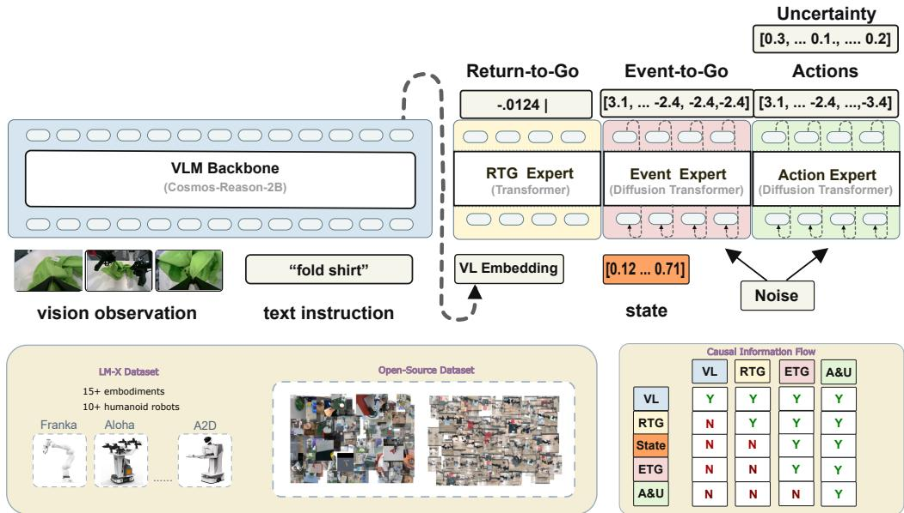  
Figure 1: Explainable, brain-inspired multi-timescale organization of LM-X. RTG, ETG, and variance explicitly expose progress, intermediate intention, and local action reliability. RTG conditions the event head; its event representation and RTG then condition fine-grained action generation, while uncertainty is estimated inside the action expert. Arrows denote computational conditioning, not anatomical correspondences.

## 2.2 LM-X Architecture and Information Flow

We build LM-X on the Cosmos-Reason2-2B vision–language backbone (Agarwal et al., 2025), the same backbone family used by GR00T N1.7 (NVIDIA, 2026). As shown in Figure 1, its Qwen-VL front end encodes the instruction and available head, wrist, or embodiment-specific camera views. Proprioception bypasses the vision–language backbone and enters only the event and action experts, separating observation-level task assessment from embodiment-specific control.

Hidden tokens from the 16th backbone layer form the shared representation $\mathbf { z } _ { t }$ . A two-layer Transformer implements the RTG expert (Vaswani et al., 2017); the event and action experts are separate 32-layer Diffusion Transformers (Peebles and Xie, 2023) trained with flow matching (Lipman et al., 2022, 2024; Geng et al., 2026). The complete model contains approximately 6B parameters.

The RTG expert operates only on $\mathbf { z } _ { t }$ . The event expert additionally receives $\mathbf { s } _ { t }$ and RTG and exposes its hidden state as $\mathbf { z } _ { t } ^ { \mathrm { e v e n t } }$ . The action expert then conditions on $\mathbf { z } _ { t } , \mathbf { s } _ { t }$ , RTG, and ${ \bf z } _ { t } ^ { \mathrm { e v e n t } }$ ; its mean-flow and log-variance projections share all preceding features. Ground-truth RTG and event targets supervise the hierarchy during training, while predicted signals replace them online. This staged conditioning realizes Eq. (3): semantic assessment precedes embodiment-grounded transition prediction, which precedes motor control. Thus each stage both exposes a defined control variable and shapes the next stage, without asserting an anatomical correspondence.

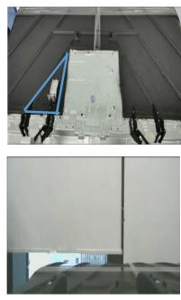

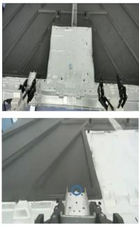  
Pick Up

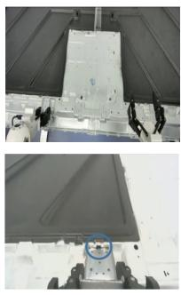  
Insert

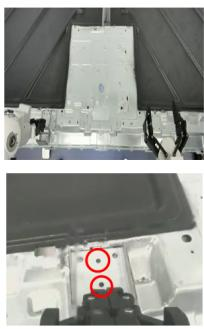  
Refine

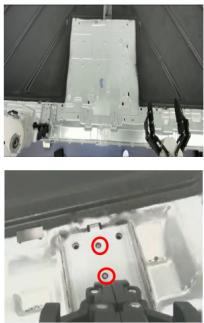  
Done  
Figure 2: Precision part insertion on Astribot S1. From left to right, the robot picks up the part from the blue triangular region, inserts its 3 mm × 0.5 mm tip into the slot (blue circles), refines the pose to align three screw tips with the corresponding holes (red circles), and completes the assembly. The sequence couples discrete semantic transitions with millimeter-scale contact.

Figure 2 provides a concrete running example of the hierarchy: pick-up, insertion, refinement, and completion define meaningful event-scale transitions, while success ultimately depends on precise local control. We next define how RTG, ETG, and variance represent these complementary aspects.

## 2.3 Return-to-Go as Progress and State Quality

Following prior RTG formulations (Chen et al., 2021; Zhang et al., 2025), we define the empirical return-to-go at time t as

$$
R _ { t } = \sum _ { t ^ { \prime } = t } ^ { T } r _ { t ^ { \prime } } ,\tag{4}
$$

where $T$ is the terminal timestep. Rewards are constructed from trajectory outcome and remaining duration:

$$
r _ { t } = \left\{ { \begin{array} { l l } { 0 , } & { t = T { \mathrm { ~ a n d ~ t h e ~ e p i s o d e ~ s u c c e e d s } } , } \\ { - C , } & { t = T { \mathrm { ~ a n d ~ t h e ~ e p i s o d e ~ f a i l s } } , } \\ { - 1 , } & { { \mathrm { o t h e r w i s e } } . } \end{array} } \right.\tag{5}
$$

The failure constant $C$ exceeds half the maximum successful episode length for the corresponding task. Consequently, RTG approaches zero as a successful trajectory nears completion, while a failed endpoint receives a distinct negative margin. The target therefore combines two signals available at scale: remaining duration along nominal behavior and degraded state quality near observed failure. It is an empirical label on the collected behavior distribution, not the expected return of an optimal policy.

The RTG head models $p _ { \phi } ( R _ { t } \mid \mathbf { z } _ { t } )$ over B = 128 ordered bins, providing a bounded representation across tasks of different duration. We recover a scalar estimate from the expected bin center and optimize a smooth $\ell _ { 1 }$ objective:

$$
\hat { R } _ { t } = \sum _ { b = 1 } ^ { B } c _ { b } p _ { \phi } ( b \mid { \bf z } _ { t } ) , \qquad { \mathcal { L } } _ { \mathrm { R T G } } = { \mathrm { s m o o t h } } { \cdot } \ell _ { 1 } ( R _ { t } , \hat { R } _ { t } ) ,\tag{6}
$$

where $c _ { b }$ is the center of bin $b .$ Ordered bins bound the scalar prediction while the expected-bin regression preserves metric ordering. The RTG head intentionally receives no joint state. This architectural bottleneck encourages it to assess progress from instruction-conditioned scene state rather than memorize embodiment-specific configurations. Proprioception remains available to the event and action heads, which require it for feasible motion generation.

Supervising RTG at every timestep converts a sparse episode outcome into a dense learning signal without requiring hand-designed rewards for individual contacts or object poses. Because an incorrect terminal label or truncated episode shifts every preceding target, we compute RTG only after validating the episode outcome and temporal boundaries.

## 2.4 Event-to-Go Prediction

Long-horizon manipulation contains sparse, semantically salient states, such as closing the gripper on an object, reaching a pre-insertion pose, establishing tool contact, or completing a fold. These states partition an episode into behaviorally coherent segments. Let $k ( t ) > t$ be the first verified event index following step t. Although an event could be represented as a single target action, action chunking improves behavioral-cloning performance by preserving short-range temporal structure (Lazzati et al., 2026; Zhao et al., 2023). Therefore, rather than predicting only one Cartesian pose or end-effector target (Agarwal et al., 2026; Xu et al., 2026), we use an event horizon $H _ { E }$ and construct

$$
\mathbf { E } _ { t } = [ \mathbf { a } _ { t } , \ldots , \mathbf { a } _ { k ( t ) } , \underbrace { \mathbf { a } _ { k ( t ) } , \ldots , \mathbf { a } _ { k ( t ) } } _ { \mathrm { p a d d i n g ~ t o ~ } H _ { E } } ] ,\tag{7}
$$

truncating only when $k ( t ) - t + 1 > H _ { E }$ . Repeating the terminal event action gives the fixed-length tensor an explicit stopping structure and prevents supervision from leaking into the subsequent subgoal.

The event horizon spans 60 steps, compared with 30 steps for the fine-grained action head, and covers the next event in more than 86% of training samples. This separation lets ETG represent a semantic transition while the action head focuses on precise local control. Both heads retain compatible action representations, eliminating the need for a separate image generator or hand-designed symbolic skill vocabulary.

The ETG head is trained by conditional flow matching. For flow time $\tau \in [ 0 , 1 ]$ , let

$$
\mathbf { E } _ { t } ^ { \tau } = \tau \mathbf { E } _ { t } + ( 1 - \tau ) { \boldsymbol { \epsilon } } , \qquad { \boldsymbol { \epsilon } } \sim { \mathcal { N } } ( \mathbf { 0 } , \mathbf { I } ) ,\tag{8}
$$

with target velocity ${ \bf u } ^ { \mathrm { e v e n t } } = { \bf E } _ { t } - \epsilon$ . The event loss is

$$
\begin{array} { r } { \mathcal { L } _ { \mathrm { e v e n t } } = \mathbb { E } \bigg [ \big \| \mathbf { v } _ { \psi } ^ { \mathrm { e v e n t } } ( \mathbf { E } _ { t } ^ { \tau } , \mathbf { s } _ { t } , \mathbf { z } _ { t } , R _ { t } ) - \mathbf { u } ^ { \mathrm { e v e n t } } \big \| _ { 2 } ^ { 2 } \bigg ] . } \end{array}\tag{9}
$$

Because ETG is itself an action chunk, it directly represents the motion intended before the next semantic transition. It also supports a useful diagnostic decomposition: an event chunk directed toward the wrong object or pose is consistent with a subgoal-selection error, whereas a suitable event chunk followed by a divergent short action is consistent with a low-level execution error. These interpretations are hypotheses exposed by the interface; causal attribution requires intervention experiments.

## 2.5 Uncertainty-Aware Action Flow

For action chunk $\mathbf { A } _ { t } ,$ , we use the affine probability path

$$
\mathbf { A } _ { t } ^ { \tau } = \tau \mathbf { A } _ { t } + ( 1 - \tau ) \boldsymbol { \epsilon } , \quad \mathbf { u } ^ { \tau } = \mathbf { A } _ { t } - \boldsymbol { \epsilon } , \quad \boldsymbol { \epsilon } \sim \mathcal { N } ( \mathbf { 0 } , \mathbf { I } ) .\tag{10}
$$

Standard conditional flow matching regresses a deterministic velocity from $\mathbf { A } _ { t } ^ { \tau }$ to $\mathbf { u } ^ { \tau }$ (Lipman et al., 2023). Multiple base-noise samples can produce different actions, but sample diversity alone does not distinguish valid behavioral multimodality from locally unpredictable control. LM-X therefore predicts an element-wise mean velocity $\bar { \mathbf { v } } _ { \theta } ^ { \tau }$ and log variance $\pmb { \rho } _ { \theta } ^ { \tau } = \log ( ( \pmb { \sigma } _ { \theta } ^ { \tau } ) ^ { 2 } + \varepsilon )$ , conditioned on

$$
\mathbf { c } _ { t } ^ { \tau } = ( \mathbf { A } _ { t } ^ { \tau } , \mathbf { s } _ { t } , \mathbf { z } _ { t } , R _ { t } , \mathbf { z } _ { t } ^ { \mathrm { e v e n t } } ) .\tag{11}
$$

We minimize the Gaussian negative log-likelihood of the target velocity,

$$
\mathcal { L } _ { \mathrm { a c t i o n - U } } = \mathbb { E } \left[ \frac { 1 } { 2 } \exp ( - \rho _ { \theta } ^ { \tau } ) \left( \bar { \mathbf { v } } _ { \theta } ^ { \tau } ( \mathbf { c } _ { t } ^ { \tau } ) - \mathbf { u } ^ { \tau } \right) ^ { 2 } + \frac { 1 } { 2 } \rho _ { \theta } ^ { \tau } \right] ,\tag{12}
$$

where the expectation includes averaging over action dimensions. The residual term rewards accurate velocities, while the log-variance term prevents arbitrary variance inflation. Mean and variance share the action expert and differ only at their final projections, keeping the uncertainty estimate coupled to the features that generate control. This objective estimates conditional residual scale; it does not isolate epistemic uncertainty or certify out-of-distribution safety.

## 2.6 Variance Propagation to Action Space

The flow head predicts local velocity variance, whereas online monitoring requires uncertainty in the final action sample. We therefore propagate a diagonal approximation through numerical integration. Conditioned on one sampled base noise, we initialize $\mathbf { q } ^ { 0 } = \mathbf { 0 }$ so that the trace measures accumulated predictive variance rather than dispersion across base samples. Under a forward Euler update,

$$
\bar { \mathbf { x } } ^ { \tau + \delta } = \bar { \mathbf { x } } ^ { \tau } + \bar { \mathbf { v } } ^ { \tau } \delta ,\tag{13}
$$

the element-wise variance evolves approximately as

$$
\mathrm { V a r } ( \mathbf { x } ^ { \tau + \delta } ) \approx \mathrm { V a r } ( \mathbf { x } ^ { \tau } ) + ( \pmb { \sigma } ^ { \tau } \delta ) ^ { 2 } + 2 \delta \mathrm { C o v } ( \mathbf { x } ^ { \tau } , \mathbf { v } ^ { \tau } ) .\tag{14}
$$

The covariance term captures how uncertainty already present in the flow state changes the predicted mean velocity. We approximate its diagonal with a first-order Taylor expansion and Hutchinson’s estimator:

$$
\operatorname { C o v } ( \mathbf { x } ^ { \tau } , \mathbf { v } ^ { \tau } ) \approx \frac { 1 } { N } \sum _ { i = 1 } ^ { N } ( \sqrt { \mathbf { q } ^ { \tau } } \circ \epsilon _ { i } ) \circ \mathbf { J } ^ { \tau } ( \bar { \mathbf { x } } ^ { \tau } ) ( \sqrt { \mathbf { q } ^ { \tau } } \circ \epsilon _ { i } ) ,\tag{15}
$$

where $\mathbf { q } ^ { \tau } = \mathrm { V a r } ( \mathbf { x } ^ { \tau } )$ $\epsilon _ { i }$ is a Rademacher vector, ◦ denotes element-wise multiplication, and $\mathbf { J } ^ { \boldsymbol { \tau } }$ is the Jacobian of the mean velocity with respect to the flow state. This is a first-order diagonal approximation; cross-dimensional covariance is not retained.

The scalar uncertainty used in Section 4.6 is the mean terminal variance across the selected action dimensions:

$$
U _ { t } = \frac { 1 } { d } \sum _ { j = 1 } ^ { d } \mathrm { V a r } ( x _ { t , j } ^ { \tau = 1 } ) .\tag{16}
$$

Larger $U _ { t }$ denotes greater modeled action dispersion. Arm-specific traces average only dimensions assigned to the corresponding arm, allowing uncertainty to be localized in bimanual execution. All reported rollouts use the mean velocity without uncertainty guidance, so the traces are diagnostic outputs rather than the consequence of an uncertainty-minimizing controller.

## 2.7 Joint Training and Online Interpretation

The complete pretraining objective is

$$
\begin{array} { r } { \mathcal { L } _ { \mathrm { L M - X } } = \lambda _ { R } \mathcal { L } _ { \mathrm { R T G } } + \lambda _ { E } \mathcal { L } _ { \mathrm { e v e n t } } + \lambda _ { A } \mathcal { L } _ { \mathrm { a c t i o n - U } } , } \end{array}\tag{17}
$$

with fixed loss weights $\lambda _ { R } , \lambda _ { E }$ , and $\lambda _ { A }$ . Large-scale pretraining jointly optimizes the shared backbone and all three heads on a weighted mixture of robot data. Task-specific post-training subsequently adapts the complete model to precise-contact, long-horizon, and deformable-object tasks using curated demonstrations. The predictive-state heads remain active throughout adaptation and inference.

At inference time, LM-X estimates progress from the current visual–language representation, predicts the next event conditioned on progress and proprioception, and integrates a fine-grained action flow conditioned on both signals. All outputs are available at every control step. A downstream monitor can therefore test for decreasing RTG, event changes, or variance spikes before terminal failure. We evaluate whether these signals correspond to recognizable execution dynamics; using them to trigger recovery is left to future work.

## 3 Dataset and Annotation Pipeline

## 3.1 Data Representation and Composition

Each labeled timestep is represented as

$$
\begin{array} { r } { \big ( o _ { t } , l , \mathbf { s } _ { t } , R _ { t } , \mathbf { E } _ { t } , \mathbf { A } _ { t } \big ) , } \end{array}\tag{18}
$$

which augments the conventional observation–instruction–state–action tuple with progress and nextevent targets. The training mixture contains more than 20,000 hours of real-robot trajectories, including over 1,000 hours of failed policy rollouts generated by ACT (Zhao et al., 2023), Diffusion Policy (Chi et al., 2023), π-series, and GR00T-based agents. We convert both public datasets and newly collected trajectories to this common schema.

The full language instruction is retained at every timestep. Prompts for multi-object and bimanual tasks specify object attributes, spatial relations, orientations, and arm assignments. For example, an instruction may require the left arm to place a white paper ball into a bin while the right arm places a red pen into a holder. Such detail is necessary because the same scene may admit multiple locally feasible actions, whereas progress and event predictions are defined relative to the complete task.

The data span single-arm, dual-arm, and humanoid embodiments with heterogeneous morphologies and sensing configurations. To encourage cross-embodiment transfer, the progress head does not receive joint state; the event and action heads retain proprioception to generate kinematically feasible motions.

## 3.2 Outcome and RTG Labels

Each episode receives a terminal success or failure label. Successful episodes accumulate the ordinary step penalty until completion, whereas failed episodes additionally receive the terminal penalty in Eq. (5). We compute RTG backward from the terminal state, converting a single outcome label into a dense target that preserves the temporal ordering of nominal progress.

Failed rollouts broaden the state distribution beyond teleoperated expert behavior, exposing the model to missed grasps, target switches, hesitation, occlusion, and other off-nominal states. They also discourage the trivial association between elapsed time and task progress.

## 3.3 Event Definition and Verification

We define an event as a semantically meaningful intermediate state that partitions a trajectory into interpretable subgoals. Annotation proceeds in two stages: task-dependent signals first propose candidate timesteps, after which human annotators verify each candidate and correct boundaries that do not match the intended transition. This procedure avoids frame-by-frame labeling while preserving task-specific semantics.

Event proposals reflect the physical structure of each task family. Gripper transitions are informative for object transfer; explicit alignment markers identify insertion boundaries; velocity minima reveal stabilization during deformable-object manipulation; and contact signals combined with motion reversals delimit wiping strokes. Despite these different proposal mechanisms, every annotation yields the same target: the action sequence from the current timestep to the next verified event. Appendix B.2 provides details.

## 3.4 Why Task-Dependent Events Share One Interface

Although the evidence used to locate events differs across task families, the learned representation is uniform: every event is an action chunk ending at a verified semantic boundary. The policy need not infer the annotation heuristic itself. At inference time, it receives only standard observations, language, and robot state; sensor thresholds, operator inputs, and manually specified poses are used exclusively to construct supervision.

The shared representation also supports failure attribution. In insertion, an incorrect pre-insertion event suggests an alignment error; in wiping, a correct stroke target followed by poor surface contact suggests an execution error; and in cloth manipulation, ambiguity near a stabilization boundary may be invisible from gripper state alone. ETG thus preserves task-specific semantics without introducing task-specific prediction heads.

## 4 Experiments

## 4.1 Evaluation Questions and Metrics

Our experiments address five questions aligned with the predictive-state and explainability hypotheses:

1. Before costly pretraining, is there sufficient evidence that the three explicit signals contribute complementary control gains?

2. Does the complete factorization transfer across a broad simulation task distribution?

3. Do the gains persist across real robots and manipulation regimes?

4. Does explicit RTG track global progress and local execution regressions?

5. Does explicit variance expose hesitation and failed episodes?

Full pretraining takes approximately 20 days on 64 NVIDIA B200 GPUs, making late architectural revisions expensive. We therefore use a lower-cost controlled ablation as a pretraining gate. Each variant is trained from scratch on 45 RoboTwin2.0 tasks, post-trained on demonstrations from five disjoint tasks, and evaluated on those held-out distributions. This study tests whether RTG, ETG, and uncertainty provide sufficient individual and joint benefit before resources are committed to the full run.

After the gate supports the complete design, we pretrain LM-X with all predictive-state heads on more than 20,000 hours of real-robot data; Appendix C.2 provides additional details.

Our primary metric is mean binary task success, and we report absolute differences in percentage points. The pretraining-gate component study weights its five held-out tasks equally. For the full RoboTwin2.0 benchmark, each model is post-trained with 50 randomized-hard demonstrations per task and evaluated over 100 trials per task; the aggregate score equally weights all 50 tasks. RTG and uncertainty are analyzed temporally because aggregate calibration labels are unavailable. We therefore interpret these results as evidence of behavioral correspondence, not calibrated failure-detection performance.

Table 1: Pretraining-gate success rate (%) on five held-out RoboTwin2.0 tasks. The final row averages tasks with equal weight. ∗ indicates that ${ \bf z } _ { t } ^ { \mathrm { e v e n t } }$ conditions the action expert during task-specific post-training.
<table><tr><td>Task</td><td>Backbone</td><td>LM-RTG</td><td>LM-Event</td><td>LM-U</td><td>LM-X</td></tr><tr><td>Handover microphone</td><td>76</td><td>86</td><td>92</td><td>82</td><td>88</td></tr><tr><td>Lift pot</td><td>84</td><td>90</td><td>86</td><td>94</td><td>92</td></tr><tr><td>Open microwave</td><td>54</td><td>68</td><td>16</td><td>54</td><td>62</td></tr><tr><td>Rank RGB blocks</td><td>48</td><td>38</td><td>66</td><td>44</td><td>90*</td></tr><tr><td>Hit block with hammer</td><td>56</td><td>62</td><td>60</td><td>52</td><td>66*</td></tr><tr><td>Average</td><td>63.6</td><td>68.8</td><td>64.0</td><td>65.2</td><td>79.6</td></tr></table>

## 4.2 Component Ablations as a Pretraining Gate

This experiment is deliberately conducted before large-scale pretraining: its purpose is to validate the three proposed modules and catch harmful interactions before initiating the 20-day, 64-B200 run. We isolate each timescale-specific objective in a controlled RoboTwin2.0 study (Chen et al., 2025b). Five of the benchmark’s 50 tasks are excluded from backbone training and reserved for downstream post-training and evaluation; Appendix C.1 details the setup. The Backbone uses deterministic flow matching without RTG or event supervision. LM-RTG, LM-Event, and LM-U add one component at a time, while LM-X combines all three.

The gate reveals that no single component dominates across tasks (Table 1). RTG performs best on opening the microwave, improving over the backbone by 14 points. Event prediction yields the largest gain on microphone handover (+16), where the transfer provides a clear intermediate boundary. Uncertainty performs best on bimanual pot lifting (+10), which admits substantial variation in motion and object stability. Thus, each objective can provide useful structure, but its value is task dependent.

The gate also reveals that isolated auxiliary objectives can be brittle before full-scale pretraining. In the most pronounced case, event-only training reduces open-microwave success from 54% to 16%, indicating that coarse event guidance alone may be insufficient for contact-intensive action sequences. Nevertheless, event supervision yields substantial gains on block ranking and microphone handover. To preserve these benefits while mitigating over-reliance on event priors, we drop ${ \bf z } _ { t } ^ { \mathrm { e v e n t } }$ from the action expert’s input with a probability of 20% during pretraining, encouraging the action DiT to remain effective without event conditioning. During post-training, we treat the inclusion of the event embedding as a task-specific hyperparameter. The configuration adopted by LM-X achieves the best performance; ∗ denotes tasks for which $\mathbf { z } _ { t } ^ { \mathrm { e v e n t } }$ is provided to the action expert. Appendix D.1 reports the corresponding ablation.

For the pretraining decision, the complete model is markedly more consistent: LM-X improves all five tasks over the backbone, with gains of 12 points for handover, 8 for both pot lifting and microwave opening, 42 for block ranking, and 10 for hammering. Overall, LM-X raises mean success from 63.6% to 79.6% (+16.0 points), whereas RTG, event prediction, and uncertainty alone improve the mean by 5.2, 0.4, and 1.6 points, respectively. The complete model also exceeds the strongest single-component variant by 10.8 points.

The gap between LM-X and the single-component variants suggests that the objectives are complementary. ETG supplies a coarse target, RTG evaluates the resulting state relative to completion, and uncertainty captures ambiguity in converting the target into fine-grained control. On block ranking, for example, RTG and uncertainty individually underperform the backbone, yet their combination with ETG reaches 90%, exceeding the backbone by 42 points. Although these results do not isolate the underlying optimization mechanism, they satisfy the purpose of the pretraining gate: they provide evidence to retain all three modules before committing resources to full pretraining.

Table 2: RoboTwin2.0 success rate (%). We show representative tasks and the mean across all 50 randomized-hard tasks.
<table><tr><td>Task</td><td>GR00T N1.7</td><td>LM-X</td></tr><tr><td>adjust_bottle</td><td>98</td><td>100</td></tr><tr><td>beat_block_hammer</td><td>40</td><td>25</td></tr><tr><td>blocks_ranking_rgb</td><td>60</td><td>93</td></tr><tr><td>blocks_ranking_size</td><td>52</td><td>82</td></tr><tr><td>click_alarmclock</td><td>100</td><td>100</td></tr><tr><td></td><td></td><td></td></tr><tr><td>stack_blocks_two</td><td>72</td><td>97</td></tr><tr><td>stack_bowls_three</td><td>63</td><td>75</td></tr><tr><td>stack_bowls_two</td><td>91</td><td>97</td></tr><tr><td>stamp_seal</td><td>22</td><td>74</td></tr><tr><td>turn_switch</td><td>61</td><td>79</td></tr><tr><td>Average over all 50 tasks</td><td>55.4</td><td>74.1</td></tr></table>

## 4.3 RoboTwin2.0 Benchmark

We next evaluate generalization across all 50 RoboTwin2.0 tasks on the Aloha-AgileX embodiment. Each model is post-trained with 50 demonstrations per task from the randomized-hard split and evaluated over 100 trials per task. Because LM-X pretraining contains neither RoboTwin2.0 nor other simulation data, this benchmark measures adaptation of a real-robot-pretrained representation to a new visual and dynamical domain.

Throughout the experiments, GR00T denotes the public GR00T N1.7 checkpoint and code snapshot available in July 2026 (NVIDIA, 2026), not the GR00T N1.0 model described in the original paper (Björck et al., 2025). We initialize N1.7 from its released weights and post-train it on the same 50 downstream tasks. Because the pretraining mixtures and parameterizations differ, this is an end-model comparison rather than a controlled architecture or pretraining-data ablation. Both systems receive the same downstream demonstration budget and use the same randomized-hard evaluation protocol.

LM-X improves the 50-task mean from 55.4% to 74.1%, an absolute gain of 18.7 points. Among the ten representative tasks in Table 2, LM-X outperforms GR00T N1.7 on eight, ties on one, and underperforms on one. This post-pretraining result covers the complete benchmark rather than only the five tasks used by the earlier pretraining gate. Appendix D.2 reports all per-task results.

The largest representative gain occurs on stamp\_seal, where success rises from 22% to 74% (+52 points). This task requires approach, contact alignment, and forceful execution, with errors at any stage invalidating the trial. LM-X also improves color- and size-based block ranking by 33 and 30 points, respectively, and two-block stacking by 25 points. These tasks require instruction-dependent sequencing across multiple interactions. While the aggregate comparison cannot attribute gains to individual heads, the pattern is consistent with the pretraining-gate ablation that motivated retaining the structured objectives: intermediate supervision is particularly useful for multi-stage tasks.

Several simple tasks are already saturated: both methods reach 100% on clicking the alarm clock, and bottle adjustment improves only from 98% to 100%. The aggregate gain is therefore concentrated on more challenging tasks rather than distributed uniformly across the benchmark.

The improvement is not universal. LM-X trails GR00T by 15 points on beat\_block\_hammer, despite improving over the backbone on the related held-out hammer task in the pretraining-gate ablation (Table 1). Differences in downstream data, task configuration, or contact dynamics may explain this reversal across evaluation settings. This result motivates repeated training seeds and per-task confidence intervals in future evaluations.

## 4.4 Real-World Evaluation

Table 3: Real-world success rate (%). ∆ is the LM-X improvement in percentage points (pp). indicates that $\mathbf { z } _ { t } ^ { \mathrm { e v e n t } }$ conditions the action expert during task-specific post-training.
<table><tr><td>Embodiment</td><td>Task</td><td>GR00T N1.7 LM-X ∆ (pp)</td><td></td><td></td></tr><tr><td>AgileX-Aloha</td><td>Pick and place tape roll</td><td>75</td><td>65</td><td>-10</td></tr><tr><td>Astribot S1</td><td>Precision part insertion</td><td>20</td><td>60*</td><td>+40</td></tr><tr><td>Astribot S1</td><td>Tableware organization</td><td>20</td><td>80*</td><td>+60</td></tr><tr><td>Astribot S1</td><td>Cloth folding</td><td>60</td><td>80</td><td>+20</td></tr><tr><td>Tianji-Marvin</td><td>Battery insertion</td><td>35</td><td>40</td><td>+5</td></tr><tr><td>Loong S1</td><td>Place water bottle into tray, dual-arm</td><td>75</td><td>85*</td><td>+10</td></tr><tr><td>Loong S1</td><td>Place water bottle into tray, single-arm</td><td>70</td><td>70</td><td>0</td></tr><tr><td>Mean</td><td></td><td>50.7</td><td>68.6</td><td>+17.9</td></tr></table>

We evaluate seven tasks on four real embodiments, covering pick-and-place, long-horizon organization, cloth folding, battery insertion, bimanual coordination, and precision insertion. Each task uses 20 trials, with identical post-training data and success criteria across methods (Appendix C.3). Precision part insertion (Figure 2) is the most geometrically demanding task: the robot must progress through pick-up, constrained insertion, and pose refinement before three screw tips align with their holes. It therefore probes both multi-stage progression and millimeter-scale local control.

LM-X achieves 68.6% mean success versus 50.7% for GR00T N1.7 (+17.9 pp), improving five tasks, tying one, and regressing on one; the median task-wise gain is +10 pp. The largest improvement occurs on tableware organization (+60 pp), which contributes 12 of the 25 net additional successes. Excluding this task, LM-X still leads by +10.8 pp (66.7% vs. 55.8%), indicating that the aggregate benefit is not attributable to a single task, although it is concentrated most strongly on long-horizon organization.

Within Astribot S1, the mean success rate rises from 33.3% to 73.3% across three behaviors, whereas the two Loong S1 variants improve by 5.0 pp in aggregate. Tape-roll placement is the sole regression; battery insertion remains the most difficult task at 40%, while precision insertion reaches 60%. Because each trial corresponds to 5 pp and only one checkpoint is evaluated per method, the smaller differences are descriptive rather than statistically conclusive; repeated seeds and task-stratified confidence intervals remain necessary.

## 4.5 RTG Tracks Progress and Local Regressions

Figures 3 and 10 visualize RTG on two held-out real-robot episodes. Under Eq. (5), a higher (less negative) RTG indicates a state estimated to be closer to successful completion. A meaningful progress signal should therefore increase globally along a successful trajectory while remaining responsive to local regressions; elapsed time alone could explain only the former.

Figure 3 shows a multi-object, bimanual task. RTG first rises when the right gripper enters the head-camera view in panel (b), indicating that the progress head associates visible task engagement with improved state quality. A larger increase follows completion of the first half of the instruction in panel (c), linking the score to semantic task progress rather than motion alone.

Local decreases provide stronger evidence. RTG falls when the robot returns toward its initial pose and both grippers leave the view in panel (d), then recovers as the left gripper approaches the yellow object in panel (e). In panel (f), the controller abandons the yellow object without grasping it and redirects toward the green object; RTG decreases immediately rather than only at episode termination. This non-monotonic response is inconsistent with a simple elapsed-time heuristic and reflects a visible execution regression.

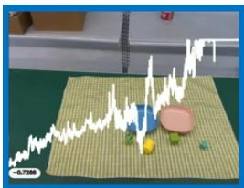  
(a) Start

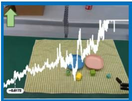  
(b) Right gripper appears

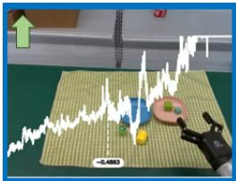  
(c) Subtask halfway done

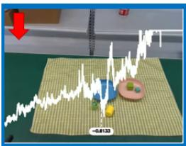  
(d) Gripper out of view

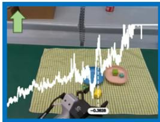  
(e) Correctly aligned

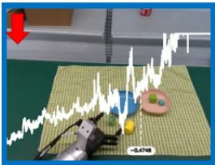  
(f) Missed grasp, switches target

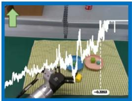  
(g) Third object placed

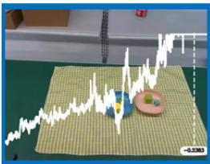  
(h) Done  
Figure 3: RTG visualization during a held-out bimanual sorting episode. The instruction is to place the green and blue objects to the right of the pink plate using the right hand, and to place the green and yellow objects to the left of the blue plate using the left hand.

The score resumes its upward trend as the remaining placements are completed. The trace thus combines a global increase toward completion, stepwise changes near semantic events, and rapid decreases at visible anomalies—properties that can help identify when a long-horizon rollout stops improving.

Figure 4 provides a contact-rich counterpart to the sorting example. The policy must grasp a part, insert its tip into a 3 mm × 0.5 mm slot, and refine its pose until the screw tips align with the holes. RTG rises sharply when insertion first succeeds in panel (b), remains informative during fine pose adjustment, and rises again when the final alignment is reached in panel (d). These changes occur at task-relevant transitions rather than at uniform time intervals. Appendix D.3 presents a complementary case in which perceptual ambiguity lowers the score despite continued task completion.

## 4.6 Uncertainty Identifies Hesitation and Failure

We next analyze the terminal variance in Eq. (16). Because LM-X pretraining excludes RoboTwin2.0, these traces test transfer to a visually and dynamically distinct environment. We average variance over the action dimensions of each arm; higher values indicate greater predicted uncertainty.

Figure 5 compares successful and failed rollouts. Failed episodes exhibit repeated variance spikes in one or both arms, whereas successful episodes remain lower and smoother after the initial transient. Failure is therefore associated not only with a terminal peak but with recurring intervals of ambiguous local control.

Arm-specific traces provide additional diagnostic structure: unilateral peaks suggest a local grasp or placement issue, whereas synchronized peaks may indicate a coordination problem. A single scalar confidence score would obscure this distinction. Although the figure does not establish a calibrated threshold, it shows that variance can be localized to subsets of the action space.

The bread-to-basket sequence in Figure 6 links variance peaks to specific behaviors. Uncertainty remains low during the direct approach in panel (a), rises as the gripper oscillates between its current pose and a feasible grasp pose in panel (b), and falls after the controller commits and closes the gripper in panel (c).

The pattern repeats near the basket: alignment corresponds to low uncertainty in panel (d), hesitation before release produces a spike in panel (e), and completing the release lowers the signal in panel (f).

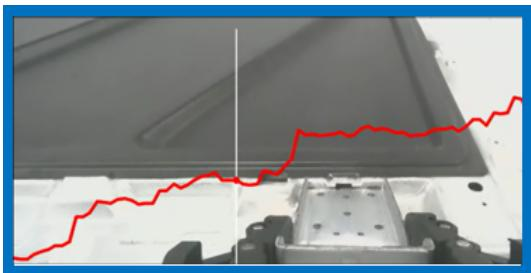  
(a) Aiming well

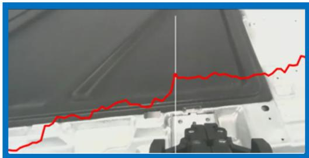  
(b) Insertion done

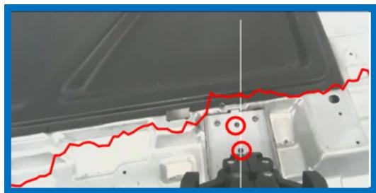  
(c) Refining the pose

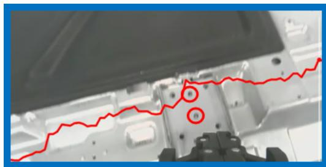  
(d) Done  
Figure 4: RTG during precision part insertion. The score rises after the tip enters the slot in (b), and rises again after pose refinement aligns the holes with the screw tips in (d).

The other arm exhibits a similar transition in panels (g) and (h), suggesting that the peaks are not tied to a particular joint or fixed episode phase.

Together, Figures 5 and 6 reveal two complementary patterns: failed episodes contain more frequent high-variance intervals, and local peaks coincide with oscillation or delayed commitment. Turning these observations into a detector will require labeled failure windows, threshold selection, and held-out calibration; the present analysis establishes temporal correspondence rather than detection accuracy.

## 5 Related Work

Generalist vision-language-action policies. RT-1 and RT-2 established scalable transformerbased robot control and transfer from vision–language pretraining (Brohan et al., 2022, 2023). Open X-Embodiment and Octo broadened cross-robot data and policy reuse (Open X-Embodiment Collaboration et al., 2023; Octo Model Team et al., 2024); OpenVLA enabled open model adaptation (Kim et al., 2024); and π0 introduced flow matching for a generalist VLA action expert (Black et al., 2024). GR00T N1 couples a vision–language module to a generative action module for cross-embodiment control (Björck et al., 2025). These systems primarily expose actions at inference time. LM-X is complementary: it adds explicit progress, event, and uncertainty variables to the same end-to-end control pathway.

Brain-inspired sensorimotor organization. The brain must control behavior whose relevant causes evolve at different rates. Temporal-hierarchy accounts propose that slowly evolving contextual states organize faster trajectories (Kiebel et al., 2008; Hasson et al., 2008; Murray et al., 2014; Chaudhuri et al., 2015); work on hierarchical behavior describes tasks as compositions of subtasks and primitive actions (Botvinick et al., 2009); and event-segmentation research links continuous experience to nested, behaviorally meaningful boundaries (Zacks et al., 2007; Baldassano et al., 2017). Outcome prediction, internal forward models, and probabilistic sensorimotor inference further connect action to expected consequences and reliability (Schultz et al., 1997; Körding and Wolpert, 2004; Wolpert et al., 1995, 1998; Knill and Pouget, 2004; Faisal et al., 2008). These findings do not prescribe a robot architecture, but jointly motivate a functional prior: control should maintain predictive state at multiple timescales. LM-X operationalizes that prior as supervised targets and directed conditioning, not as a biological replica.

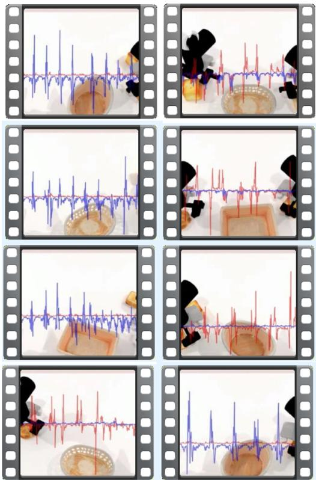  
(a) Failure cases.

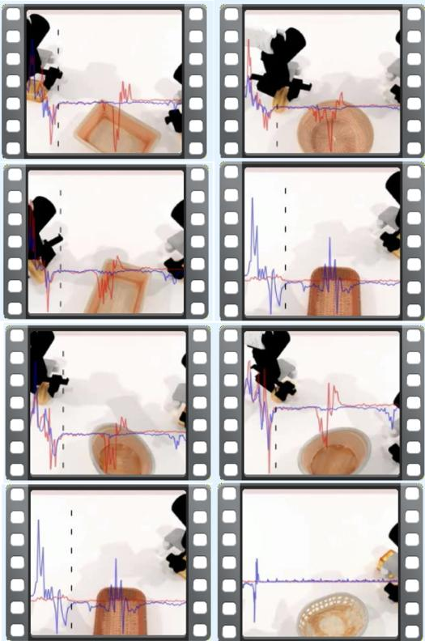  
(b) Success cases.  
Figure 5: Uncertainty traces for failed (left) and successful (right) held-out RoboTwin2.0 episodes. Blue and red curves average selected action variances for the right and left arms, respectively. Failed episodes show more frequent and larger spikes, whereas successful episodes remain comparatively stable after initial transients.

Value and progress estimation. Value functions estimate expected future return, but large imitation datasets rarely provide dense, comparable rewards, and expert demonstrations underrepresent lowquality states. We therefore construct an empirical RTG target from observed terminal outcomes and remaining duration. Sequence models such as Decision Transformer use RTG to condition policies in offline reinforcement learning (Chen et al., 2021); in the VLA setting, ReCAP for $\pi _ { 0 . 6 } ^ { * }$ (Intelligence et al., 2025a) uses a related ordering signal to rank nominal states by proximity to completion and separate failed endpoints with a terminal penalty. Our target is neither an optimal value function nor a safety certificate; it is a supervised progress-and-quality signal defined on both successful and failed trajectories. More recently, STEAM (Liu et al., 2026) treats temporally reversed episodes as failure samples, while PRTS (Zhang et al., 2026) introduces contrastive RL and trajectories paired with incorrect prompts as negative cases. In contrast, we use genuine policy failures and learn RTG during pretraining to support progress estimation on off-nominal states.

Hierarchical and subgoal-conditioned manipulation. Temporal abstraction is classically formalized through skills and options (Sutton et al., 1999). In modern robot learning, SayCan grounds language-model plans with skill values (Ahn et al., 2022), whereas RT-H predicts language motions before low-level actions (Belkhale et al., 2024). Among VLA models, COT-VLA predicts keyframe images as visual chain-of-thought supervision before action prediction (Zhao et al., 2025). π0.5 defines events with textual prompts and co-trains textual subtasks and actions (Intelligence et al., 2025b), while $\pi _ { 0 . 7 }$ uses a smaller model to segment textual events and a world model to predict keyframe images as VLA priors (Intelligence et al., 2026; Torne et al., 2026). Because image- or context-level prediction can be computationally expensive, other work represents stages or keyframes through downsampled targets (Xu et al., 2026) or compact discrete spaces (Yang et al., 2026). These hierarchies improve long-horizon structure, but often require an auxiliary generator, a skill library, or an additional language-to-control interface. ETG instead represents a subgoal as executable motion in the native action space and terminates it at a verified event. It therefore shares embodiment normalization and dynamics with the short-horizon action expert.

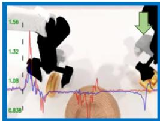  
(a) Aiming well

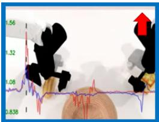

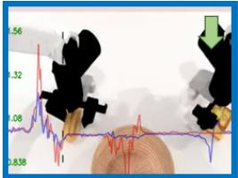

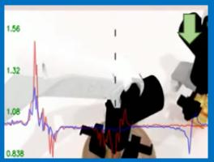  
(d) Aiming well

(b) Hesitating while adjust-(c) Hesitation resolved; ing the distance to the table gripper closes surface  
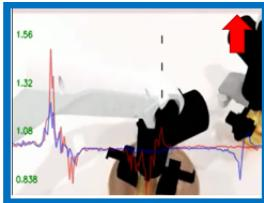

(e) Hesitating over whether (f) Hesitation resolved; obto release ject released  
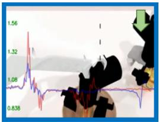

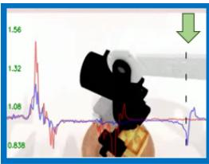  
(g) Aiming well

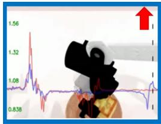  
(h) Hesitating over whether to release  
Figure 6: Uncertainty visualization during the Place\_Bread\_Basket task. Variance is low while each arm approaches a clear target (a,d,g), rises during oscillation or hesitation (b,e,h), and decreases after the policy commits to grasping or releasing (c,f). Higher values denote greater uncertainty.

Uncertainty in flow matching. Most uncertainty estimators for generative policies are diffusioncentric and rely on conditional perturbations (Berry et al., 2024), Bayesian or Laplace approximations (Daxberger et al., 2021; Kou et al., 2024), pixel-wise aleatoric uncertainty (De Vita and Belagiannis, 2025), or feature-space likelihoods (Radford et al., 2021; Jazbec et al., 2025). For VLA models, $\pi _ { R L }$ extends deterministic flows with stochastic differential equations or noise injection (Chen et al., 2025a). These mechanisms can improve action generation without necessarily exposing an explicit online uncertainty signal. Han et al. instead estimate heteroscedastic uncertainty with a modified Gaussian negative log-likelihood (Han et al., 2026). We adopt the same general principle but use the standard Gaussian negative log-likelihood in Eq. (12).

## 6 Conclusion

We identified coupled supervision and observability bottlenecks in action-centric VLA learning: progress, intermediate intent, and local reliability are distinct predictive variables, yet are usually left implicit under a single action-prediction target and hidden behind the sampled command. Inspired by the brain’s use of hierarchically evolving predictive state, LM-X exposes these variables through a control-aligned explanatory interface. RTG explicitly reports whether the state is progressing, ETG reports what event-level transition is being pursued, and heteroscedastic flow variance reports how reliably the motor command is generated. These targets are learned jointly from a large mixture of successful and failed robot trajectories and remain coupled to the action pathway.

The pretraining-gate ablation improves mean success by 16.0 percentage points over the action-only backbone, providing the evidence used to retain all three modules before the costly full run. After pretraining, LM-X achieves 74.1% mean success across 50 randomized-hard RoboTwin2.0 tasks versus 55.4% for GR00T N1.7 and improves mean real-robot success from 50.7% to 68.6%. Held-out temporal analyses show that explicit RTG responds to subgoal completion, target switching, and ambiguous grasps, while explicit variance rises during hesitation and exhibits more frequent spikes in failed episodes. The results support multi-timescale predictive state as a practical bridge between stronger control and intrinsic explainability. Quantitative calibration, ETG-specific evaluation, counterfactual faithfulness tests, and closed-loop recovery remain essential next steps.

## References

Niket Agarwal, Arslan Ali, Jon Allen, Martin Antolini, Adeline Aubame, Alisson Azzolini, Junjie Bai, Maciej Bala, Yogesh Balaji, Josh Bapst, et al. Cosmos 3: Omnimodal world models for physical ai. arXiv preprint arXiv:2606.02800, 2026.

Niket Agarwal et al. Cosmos world foundation model platform for physical ai. arXiv preprint arXiv:2501.03575, 2025.

Michael Ahn et al. Do as I can, not as I say: Grounding language in robotic affordances. In Conference on Robot Learning, 2022.

Christopher Baldassano, Janice Chen, Asieh Zadbood, Jonathan W. Pillow, Uri Hasson, and Kenneth A. Norman. Discovering event structure in continuous narrative perception and memory. Neuron, 95(3):709–721.e5, 2017. doi: 10.1016/j.neuron.2017.06.041.

Suneel Belkhale et al. RT-H: Action hierarchies using language. arXiv preprint arXiv:2403.01823, 2024.

Lucas Berry, Axel Brando, and David Meger. Shedding light on large generative networks: Estimating epistemic uncertainty in diffusion models. In The 40th Conference on Uncertainty in Artificial Intelligence, 2024.

Johan Björck et al. GR00T N1: An open foundation model for generalist humanoid robots. arXiv preprint arXiv:2503.14734, 2025.

Kevin Black et al. π0: A vision–language–action flow model for general robot control. arXiv preprint arXiv:2410.24164, 2024.

Matthew M. Botvinick, Yael Niv, and Andrew G. Barto. Hierarchically organized behavior and its neural foundations: A reinforcement learning perspective. Cognition, 113(3):262–280, 2009.

Anthony Brohan et al. RT-1: Robotics transformer for real-world control at scale. arXiv preprint arXiv:2212.06817, 2022.

Anthony Brohan et al. RT-2: Vision–language–action models transfer web knowledge to robotic control. In Conference on Robot Learning, 2023.

Qingwen Bu, Jisong Cai, Li Chen, Xiuqi Cui, Yan Ding, Siyuan Feng, Shenyuan Gao, Xindong He, Xuan Hu, Xu Huang, et al. Agibot world colosseo: A large-scale manipulation platform for scalable and intelligent embodied systems. arXiv preprint arXiv:2503.06669, 2025.

Rishidev Chaudhuri, Kenneth Knoblauch, Marie-Alice Gariel, Henry Kennedy, and Xiao-Jing Wang. A largescale circuit mechanism for hierarchical dynamical processing in the primate cortex. Neuron, 88(2):419–431, 2015. doi: 10.1016/j.neuron.2015.09.008.

Kang Chen, Zhihao Liu, Tonghe Zhang, Zhen Guo, Si Xu, Hao Lin, Hongzhi Zang, Xiang Li, Quanlu Zhang, Zhaofei Yu, et al. πRL: Online rl fine-tuning for flow-based vision-language-action models. arXiv preprint arXiv:2510.25889, 2025a.

Lili Chen, Kevin Lu, Aravind Rajeswaran, Kimin Lee, Aditya Grover, Misha Laskin, Pieter Abbeel, Aravind Srinivas, and Igor Mordatch. Decision transformer: Reinforcement learning via sequence modeling. In Advances in Neural Information Processing Systems, volume 34, pages 15084–15097, 2021.

Tianxing Chen et al. RoboTwin 2.0: A scalable data generator and benchmark with strong domain randomization for robust bimanual robotic manipulation. arXiv preprint arXiv:2506.18088, 2025b.

Cheng Chi, Zhenjia Xu, Siyuan Feng, Eric Cousineau, Yilun Du, Benjamin Burchfiel, Russ Tedrake, and Shuran Song. Diffusion policy: Visuomotor policy learning via action diffusion. In Robotics: Science and Systems, 2023.

Erik Daxberger, Agustinus Kristiadi, Alexander Immer, Runa Eschenhagen, Matthias Bauer, and Philipp Hennig. Laplace redux-effortless bayesian deep learning. Advances in neural information processing systems, 34: 20089–20103, 2021.

Michele De Vita and Vasileios Belagiannis. Diffusion model guided sampling with pixel-wise aleatoric uncertainty estimation. In 2025 IEEE/CVF Winter Conference on Applications of Computer Vision (WACV), pages 3844–3854. IEEE, 2025.

Anca D. Dragan, Kenton C. T. Lee, and Siddhartha S. Srinivasa. Legibility and predictability of robot motion. In 2013 8th ACM/IEEE International Conference on Human-Robot Interaction, pages 301–308. IEEE, 2013. doi: 10.1109/HRI.2013.6483603.

A. Aldo Faisal, Luc P. J. Selen, and Daniel M. Wolpert. Noise in the nervous system. Nature Reviews Neuroscience, 9(4):292–303, 2008. doi: 10.1038/nrn2258.

Zhengyang Geng, Mingyang Deng, Xingjian Bai, Zico Kolter, and Kaiming He. Mean flows for one-step generative modeling. Advances in Neural Information Processing Systems, 38:75460–75482, 2026.

Juyeop Han, Lukas Lao Beyer, and Sertac Karaman. Flow matching with uncertainty quantification and guidance. arXiv preprint arXiv:2602.10326, 2026.

Christopher M. Harris and Daniel M. Wolpert. Signal-dependent noise determines motor planning. Nature, 394: 780–784, 1998.

Uri Hasson, Eunice Yang, Ignacio Vallines, David J. Heeger, and Nava Rubin. A hierarchy of temporal receptive windows in human cortex. Journal ofNeuroscience, 28(10):2539–2550, 2008.

Bradley Hayes and Julie A. Shah. Improving robot controller transparency through autonomous policy explanation. In Proceedings ofthe 2017 ACM/IEEE International Conference on Human-Robot Interaction, pages 303–312. ACM, 2017. doi: 10.1145/2909824.3020233.

Physical Intelligence, Ali Amin, Raichelle Aniceto, Ashwin Balakrishna, Kevin Black, Ken Conley, Grace Connors, James Darpinian, Karan Dhabalia, Jared DiCarlo, et al. π0.6: a vla that learns from experience. arXiv preprint arXiv:2511.14759, 2025a.

Physical Intelligence, Kevin Black, Noah Brown, James Darpinian, Karan Dhabalia, Danny Driess, Adnan Esmail, Michael Equi, Chelsea Finn, Niccolo Fusai, et al. π : a vision-language-action model with open-world generalization. arXiv preprint arXiv:2504.16054, 2025b.

Physical Intelligence, Bo Ai, Ali Amin, Raichelle Aniceto, Ashwin Balakrishna, Greg Balke, Kevin Black, George Bokinsky, Shihao Cao, Thomas Charbonnier, et al. π : a steerable generalist robotic foundation model with emergent capabilities. arXiv preprint arXiv:2604.15483, 2026.

Metod Jazbec, Eliot Wong-Toi, Guoxuan Xia, Dan Zhang, Eric Nalisnick, and Stephan Mandt. Generative uncertainty in diffusion models. arXiv preprint arXiv:2502.20946, 2025.

Stefan J. Kiebel, Jean Daunizeau, and Karl J. Friston. A hierarchy of time-scales and the brain. PLoS Computational Biology, 4(11):e1000209, 2008.

Moo Jin Kim et al. OpenVLA: An open-source vision–language–action model. arXiv preprint arXiv:2406.09246, 2024.

David C. Knill and Alexandre Pouget. The bayesian brain: The role of uncertainty in neural coding and computation. Trends in Neurosciences, 27(12):712–719, 2004.

Konrad P. Körding and Daniel M. Wolpert. Bayesian integration in sensorimotor learning. Nature, 427:244–247, 2004.

Siqi Kou, Lei Gan, Dequan Wang, Chongxuan Li, and Zhijie Deng. Bayesdiff: Estimating pixel-wise uncertainty in diffusion via bayesian inference. In International Conference on Learning Representations, volume 2024, pages 17046–17063, 2024.

Filippo Lazzati, Kyle Stachowicz, William Chen, Alberto Maria Metelli, Andrew Wagenmaker, and Sergey Levine. Why does action chunking improve behavioral cloning performance in robotic control? arXiv preprint arXiv:2608.02547, 2026.

Yaron Lipman, Ricky TQ Chen, Heli Ben-Hamu, Maximilian Nickel, and Matt Le. Flow matching for generative modeling. arXiv preprint arXiv:2210.02747, 2022.

Yaron Lipman, Ricky T. Q. Chen, Heli Ben-Hamu, Maximilian Nickel, and Matt Le. Flow matching for generative modeling. In International Conference on Learning Representations, 2023.

Yaron Lipman, Marton Havasi, Peter Holderrieth, Neta Shaul, Matt Le, Brian Karrer, Ricky TQ Chen, David Lopez-Paz, Heli Ben-Hamu, and Itai Gat. Flow matching guide and code. arXiv preprint arXiv:2412.06264, 2024.

Zhihao Liu, Qiuyi Gu, Yitao Wang, Dongming Qiao, Yixian Zhang, Shuaihang Chen, Liangzhi Shi, Tianxing Zhou, Zefang Huang, Kang Chen, et al. Steam: Self-supervised temporal ensemble advantage modeling for real-world robot learning. arXiv preprint arXiv:2606.29834, 2026.

John D. Murray, Alberto Bernacchia, David J. Freedman, Ranulfo Romo, Jonathan D. Wallis, Xinying Cai, Camillo Padoa-Schioppa, Tatiana Pasternak, Hyojung Seo, Daeyeol Lee, and Xiao-Jing Wang. A hierarchy of intrinsic timescales across primate cortex. Nature Neuroscience, 17(12):1661–1663, 2014. doi: 10.1038/nn. 3862.

NVIDIA. NVIDIA Isaac GR00T N1.7: Open reasoning VLA model for humanoid robots. Hugging Face Blog, April 2026. URL https://huggingface.co/blog/nvidia/gr00t-n1-7.

Octo Model Team et al. Octo: An open-source generalist robot policy. In Robotics: Science and Systems, 2024.

Abby O’Neill, Abdul Rehman, Abhiram Maddukuri, Abhishek Gupta, Abhishek Padalkar, Abraham Lee, Acorn Pooley, Agrim Gupta, Ajay Mandlekar, Ajinkya Jain, et al. Open x-embodiment: Robotic learning datasets and rt-x models: Open x-embodiment collaboration 0. In 2024 IEEE International Conference on Robotics and Automation (ICRA), pages 6892–6903. IEEE, 2024.

Open X-Embodiment Collaboration et al. Open X-embodiment: Robotic learning datasets and RT-X models. arXiv preprint arXiv:2310.08864, 2023.

William Peebles and Saining Xie. Scalable diffusion models with transformers. In 2023 IEEE/CVF International Conference on Computer Vision (ICCV), pages 4172–4182. IEEE, 2023.

Alec Radford, Jong Wook Kim, Chris Hallacy, Aditya Ramesh, Gabriel Goh, Sandhini Agarwal, Girish Sastry, Amanda Askell, Pamela Mishkin, Jack Clark, et al. Learning transferable visual models from natural language supervision. In International conference on machine learning, pages 8748–8763. PMLR, 2021.

Cynthia Rudin. Stop explaining black box machine learning models for high stakes decisions and use interpretable models instead. Nature Machine Intelligence, 1:206–215, 2019. doi: 10.1038/s42256-019-0048-x.

Wolfram Schultz, Peter Dayan, and P. Read Montague. A neural substrate of prediction and reward. Science, 275(5306):1593–1599, 1997.

Richard S. Sutton, Doina Precup, and Satinder Singh. Between MDPs and semi-MDPs: A framework for temporal abstraction in reinforcement learning. Artificial Intelligence, 112(1–2):181–211, 1999.

Marcel Torne, Karl Pertsch, Homer Walke, Kyle Vedder, Suraj Nair, Brian Ichter, Allen Z Ren, Haohuan Wang, Jiaming Tang, Kyle Stachowicz, et al. Mem: Multi-scale embodied memory for vision language action models. arXiv preprint arXiv:2603.03596, 2026.

Ashish Vaswani, Noam Shazeer, Niki Parmar, Jakob Uszkoreit, Llion Jones, Aidan N Gomez, Łukasz Kaiser, and Illia Polosukhin. Attention is all you need. Advances in neural information processing systems, 30, 2017.

Daniel M. Wolpert, Zoubin Ghahramani, and Michael I. Jordan. An internal model for sensorimotor integration. Science, 269(5232):1880–1882, 1995. doi: 10.1126/science.7569931.

Daniel M. Wolpert, R. Chris Miall, and Mitsuo Kawato. Internal models in the cerebellum. Trends in Cognitive Sciences, 2(9):338–347, 1998

Yuan Xu, Yixiang Chen, Kai Wang, Jiabing Yang, Peiyan Li, Qisen Ma, Yan Huang, and Liang Wang. Improving vision-language-action model fine-tuning with structured stage and keyframe supervision. arXiv preprint arXiv:2606.26801, 2026.

Ganlin Yang, Zhangzheng Tu, Yuqiang Yang, Sitong Mao, Junyi Dong, Tianxing Chen, Jiaqi Peng, Jing Xiong, Jiafei Cao, Jifeng Dai, et al. Eventvla: Event-driven visual evidence memory for long-horizon vision-language-action policies. arXiv preprint arXiv:2606.20092, 2026.

Jeffrey M. Zacks, Nicole K. Speer, Khena M. Swallow, Todd S. Braver, and Jeremy R. Reynolds. Event perception: A mind–brain perspective. Psychological Bulletin, 133(2):273–293, 2007.

Hongyin Zhang, Zifeng Zhuang, Han Zhao, Pengxiang Ding, Hongchao Lu, and Donglin Wang. Reinbot: Amplifying robot visual-language manipulation with reinforcement learning. arXiv preprint arXiv:2505.07395, 2025.

Yang Zhang, Jiangyuan Zhao, Chenyou Fan, Fangzheng Yan, Tian Li, Haitong Tang, Sen Fu, Xuan’er Wu, Qizhen Weng, Weinan Zhang, et al. Prts: A primitive reasoning and tasking system via contrastive representations. arXiv preprint arXiv:2604.27472, 2026.

Qingqing Zhao, Yao Lu, Moo Jin Kim, Zipeng Fu, Zhuoyang Zhang, Yecheng Wu, Zhaoshuo Li, Qianli Ma, Song Han, Chelsea Finn, et al. Cot-vla: Visual chain-of-thought reasoning for vision-language-action models. In 2025 IEEE/CVF Conference on Computer Vision and Pattern Recognition (CVPR), pages 1702–1713. IEEE, 2025.

Tony Z. Zhao, Vikash Kumar, Sergey Levine, and Chelsea Finn. Learning fine-grained bimanual manipulation with low-cost hardware. In Robotics: Science and Systems, 2023.

## A Discussion

## A.1 Why Multi-Timescale Prediction Can Improve Control

The quantitative results indicate that the predictive variables act as more than a reporting interface. Our central explanation is that they relieve the single-target supervision bottleneck in Eq. (2). RTG supplies dense episode-level ordering, ETG identifies the next behaviorally meaningful transition, and action flow resolves that transition while representing conditional residual scale. Failed trajectories are especially informative because they expose states in which nominal task phase, event intention, and local execution cease to agree. Although we do not directly measure representation geometry or the two variance terms, the 10.8-point gap in the pretraining-gate ablation between LM-X and the strongest single-head variant is consistent with complementary representation shaping and was the basis for retaining the joint design.

These objectives may also discourage shortcuts: action-only imitation can map a scene to a command without representing whether it advances the task. RTG distinguishes progress from regression, ETG preserves the next semantic boundary, and heteroscedastic flow penalizes uniform confidence across variable residuals. This extra structure does not guarantee causal reasoning.

## A.2 What “Brain-Inspired” and “Explainable” Mean Here

Calling a policy brain-inspired or explainable is useful only if those labels impose design commitments that could fail empirically. Here the commitments are: (i) control state is separated by temporal scale; (ii) each scale answers an explicit control question through direct supervision; (iii) slower predictions condition faster control, while variance is estimated inside the action expert; and (iv) all signals are emitted online with expected temporal signatures. Table 4 makes these commitments concrete. Before expensive pretraining, the pretraining-gate ablation tests whether each scale contributes enough to control to justify inclusion in the full run; the later temporal analyses probe the expected RTG and variance signatures. ETG is operationally defined by verified event boundaries, although dedicated test-time boundary evaluation remains future work.

Table 4: The explicit explanatory interface. Each signal answers a control-relevant question through a supervised target and testable temporal signature.
<table><tr><td>Explanatory question</td><td>Signal</td><td>Operational meaning and signature</td></tr><tr><td>Is the state improving?</td><td>RTG</td><td>Task-scale progress; decreases under visible regres- sion</td></tr><tr><td>What transition comes next?</td><td>ETG</td><td>Action chunk ending at the next verified task event</td></tr><tr><td>How reliable is local control?</td><td>Variance</td><td>Conditional residual scale; rises during hesitation or instability</td></tr></table>

The claim remains functional, not mechanistic. RTG is not asserted to reproduce dopaminergic activity, ETG is not a model of cortical event-boundary detection, and heteroscedastic action flow is not a neural population code. Nor do our results establish that biological intelligence uses the same objectives. The brain literature motivates the computational problem—prediction under nested environmental dynamics—and LM-X provides one engineering realization whose consequences can be tested. Anatomical localization and biological plausibility remain outside the scope of this work.

## A.3 Scope of Explainability

LM-X provides intrinsic predictive signals rather than natural-language rationales or formal guarantees. RTG, ETG, and variance are explicit by construction: their supervised targets correspond to progress, semantic events, and action dispersion, and their predictions are available alongside every action. They are also more control-aligned than a detached explanation head because RTG and ETG condition action features and variance shares the action expert. This supports processlevel inspection—what the policy believes about state, intent, and reliability—rather than only outcome-level inspection of the executed command.

Explicitness does not guarantee causal faithfulness. The model may exploit correlates such as hand visibility, object appearance, camera motion, or episode timing. Our RTG examples show non-monotonic behavior inconsistent with elapsed time alone; counterfactual interventions are still needed to identify which visual cues cause each prediction. Likewise, a well-formed ETG can expose the policy’s predicted intention without proving that this intention is causally decisive for the sampled action.

ETG is also bounded by the event vocabulary. Unlabeled transitions cannot be exposed explicitly, while overly dense annotations collapse toward ordinary action chunking and lose temporal abstraction. Our task-dependent procedure balances these extremes by preserving manipulation-specific semantics within a shared action representation.

## A.4 Deployment Implications

The outputs naturally support online monitoring. An interface can display the predicted event, normalized progress, and arm-specific uncertainty, while logging each signal alongside video for failure analysis. More actively, variance could modulate control speed, RTG could detect stalled execution, and ETG could provide a replanning checkpoint. Because these quantities are produced by the policy itself, they are available at every inference step without external oracle modules.

Deployment requires safeguards against false confidence. Low variance is meaningful only relative to the training distribution and does not certify that ETG is correct; similarly, RTG may fall because of occlusion rather than physical regression. Safety-critical systems should combine these signals with state constraints, contact monitoring, collision checking, and independent anomaly detection. LM-X increases policy visibility but does not replace system-level safety mechanisms.

## A.5 Limitations and Future Evaluation

Our uncertainty analysis is qualitative. Future work should measure failure-detection AUROC, precision–recall under class imbalance, expected calibration error, and the lead time between a variance change and observed failure. ETG also lacks a dedicated quantitative evaluation of boundary accuracy, event-horizon coverage at test time, and semantic consistency. Calibration should be evaluated across tasks and embodiments because a single threshold may not transfer. Controlled perturbations—including occlusion, object displacement, unexpected contact, and instruction changes—would further test whether each signal responds to known causal factors.

The real-world evaluation is limited to 20 trials per task and does not report confidence intervals or matched comparisons against every baseline on every embodiment. Likewise, the simulation study uses a single training run per configuration. Repeated seeds and per-task uncertainty estimates are needed to quantify statistical robustness. The pretraining gate correctly exposes that individual objectives can hurt particular tasks (Table 1), but its small task set cannot guarantee universal benefit; adaptive loss weighting or task-conditioned routing may therefore be useful. Finally, we evaluate the signals primarily as predictions; the next step is to use them to select recovery actions and measure the resulting effect on safety and completion rate.

## A.6 Combining Explanatory Signals for Diagnosis

The explanatory value lies not only in inspecting three traces separately, but in comparing their agreement across scales. RTG is observation-centric, evaluating the visible state relative to the

instruction; ETG is intention-centric, exposing the intermediate motion being pursued; and variance is action-centric, measuring ambiguity in fine-grained control. Their joint state can distinguish several failure hypotheses even when the sampled command alone appears plausible:

• Stable ETG, falling RTG, rising uncertainty: the policy retains its subgoal but is struggling to execute it, as in oscillation near a grasp pose.

• Changing ETG and falling RTG: the policy may be switching targets or abandoning a required subgoal, as in Figure 3(f).

• Stable RTG with rising uncertainty: the visible state has not yet deteriorated, but the next action is ambiguous; this is a candidate point for slowing control or requesting assistance.

• Low uncertainty with poor ETG: the controller may be confidently pursuing the wrong intermediate objective, showing why action uncertainty alone is not a sufficient safety signal.

These patterns are hypotheses for recovery rather than evaluated intervention rules. They nevertheless illustrate why a single confidence value is insufficient. Future closed-loop systems could map different patterns to event replanning, action resampling, state rollback, or operator handoff.

## B Dataset Details

The dataset covers heterogeneous embodiments, sensing configurations, and manipulation domains. Most platforms provide three to six camera streams and operate at 30–60 Hz; we downsample all trajectories to 30 Hz for training. Tasks retain their complete language instructions rather than short verb–noun templates. For example, we preserve “Place the green and blue objects to the right of the pink plate using the right hand, and place the green and yellow objects to the left of the blue plate using the left hand,” instead of reducing it to “put the objects into the plates.” Full instructions preserve object attributes, spatial relations, arm assignments, and ordering constraint that are essential for multi-object behavior.

## B.1 Embodiments

Most embodiments use 1-DoF parallel-jaw grippers; selected AgiBot A2, Tienkung, and Fourier configurations instead use 6-DoF dexterous hands. Figure 7 illustrates 10 of them.

Bimanual UR5e. This platform comprises two UR5e arms with parallel-jaw grippers, two wrist cameras, and one over-the-shoulder camera. Its configuration and action spaces are 14-dimensional.

Bimanual Franka. This platform comprises two Franka arms with parallel-jaw grippers and wristmounted cameras. An over-the-shoulder view and, in some configurations, an additional third-person camera yield three or four image streams. Its configuration and action spaces are 16-dimensional.

Bimanual ARX (AC One). This fixed-base platform uses two 6-DoF ARX arms, two wrist cameras, and one base camera, with 14-dimensional configuration and action spaces.

Bimanual ARX (Mobile). This embodiment uses the same dual 6-DoF ARX arms, three-camera layout, and 14-dimensional spaces as AC One, but mounts the system on an AgileX mobile base.

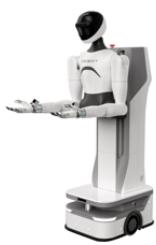  
(a) AgiBot G1

  
(b) AgiBot A2

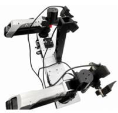  
(c) AC ONE

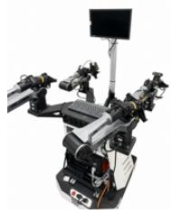  
(d) Cobot Magic

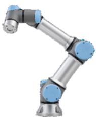  
(e) UR5e

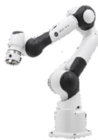  
(f) Franka

  
(g) Qloong S1

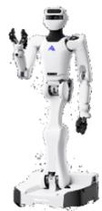  
(h) Astribot S1

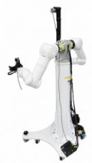  
(i) Tianji Marvin

  
(j) Fourier GR2

Figure 7: Representative robot embodiments in our dataset.

Bimanual AgileX (Cobot Magic). This fixed-base platform uses two 6-DoF arms, two wrist cameras, and one base camera. Its configuration and action spaces are 14-dimensional; its kinematic structure differs from the bimanual ARX platform at two joints.

AgiBot G1. This humanoid has 14 arm DoF (7 per arm), one lift DoF, and two gripper DoF, together with two hand cameras and one head camera.

AgiBot A2. This humanoid has 14 arm DoF, two head DoF, and 12 hand DoF (6 per hand), with two chest cameras and one head camera.

Fourier GR2. This humanoid has 41 DoF spanning the shoulders, hands, waist, wrists, knees, and ankles, and uses two head cameras.

Galaxea R1. This humanoid has 12 arm DoF (6 per arm), three lift DoF, and two gripper DoF, with two hand cameras and one head camera.

Qloong 1 and Qloong 2. Each humanoid has 14 arm DoF, one lift DoF, and two gripper DoF, with two hand cameras and one head camera.

Leju KUAVO. This humanoid has 14 arm DoF, two head DoF, 12 leg DoF, and two gripper DoF, with two hand cameras and one head camera.

Astribot S1. This humanoid has 25 DoF spanning the arms, shoulders, head, and hips, together with two hand cameras, one head camera, and one torso camera.

Tienkung. This humanoid has 14 arm DoF and 12 hand DoF, with one head camera. Some configurations replace the dexterous hands with 2-DoF grippers.

Table 5: Data distribution across robot embodiments.
<table><tr><td>Embodiment</td><td>Ratio</td></tr><tr><td>AgiBot G1</td><td>33.70%</td></tr><tr><td>Fourier GR2</td><td>9.63%</td></tr><tr><td>Galaxea R1</td><td>8.50%</td></tr><tr><td>Qloong 1</td><td>7.19%</td></tr><tr><td>AgiBot A2</td><td>6.19%</td></tr><tr><td>Dwheel</td><td>5.75%</td></tr><tr><td>Qloong 2</td><td>5.04%</td></tr><tr><td>Leju KUAVO</td><td>4.97%</td></tr><tr><td>Bimanual AgileX (Cobot Magic)</td><td>4.22%</td></tr><tr><td>Astribot S1</td><td>4.22%</td></tr><tr><td>Bimanual AgileX (Fixed)</td><td>2.87%</td></tr><tr><td>Bimanual UR5e</td><td>1.67%</td></tr><tr><td>Franka_6Cams</td><td>1.39%</td></tr><tr><td>AgiBot G1 (Arms updated)</td><td>0.85%</td></tr><tr><td>UR5</td><td>0.69%</td></tr><tr><td>Tianji Marvin</td><td>0.66%</td></tr><tr><td>Franka_4Cams</td><td>0.63%</td></tr><tr><td>Tienkung_Dim16</td><td>0.62%</td></tr><tr><td>Arx_X5</td><td>0.29%</td></tr><tr><td>Franka_3Cams</td><td>0.29%</td></tr><tr><td>Bimanual ARX (AC One)</td><td>0.23%</td></tr><tr><td>TIANJI</td><td>0.20%</td></tr><tr><td>Bimanual AgileX 1 Cam</td><td>0.10%</td></tr><tr><td>Tienkung_Dim26</td><td>0.06%</td></tr><tr><td>Libero_sim</td><td>0.02%</td></tr><tr><td></td><td></td></tr><tr><td>Ur5_dex</td><td>0.02%</td></tr></table>

Tianji Marvin. This humanoid has 14 arm DoF and two gripper DoF, with two hand cameras and one head camera.

Dwheel. This mobile variant mounts Tianji Marvin on a wheeled base, adding two wheel DoF to its 14 arm and two gripper DoF. It uses two hand cameras and one head camera.

The embodiment distribution is summarized in Table 5 and Figure 8. We additionally include the open-source OXE (O’Neill et al., 2024) and AgiBot World (Bu et al., 2025) datasets, sampling from this public-data pool with a probability of 10%.

## B.2 Event Definition

Pick and place. Pick-and-place tasks, including table arrangement and sorting, contain informative gripper transitions. Rising and falling edges in the gripper signal propose pre-grasp, grasp, transfer, and release events. Human verification removes transitions caused by incidental gripper motion and aligns each retained event with the corresponding visual state.

Insertion. Gripper transitions alone do not identify the critical pre-insertion event: the aligned pose immediately before the object enters the target. During VR teleoperation, the operator marks this pose with a designated input; annotators subsequently verify the marker against the recorded observations and motion.

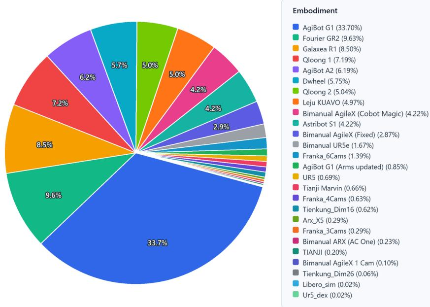  
Figure 8: Data distribution across robot embodiments.

Deformable-object manipulation. Cloth folding and stacking involve frequent gripper motion and geometrically ambiguous states. Near-zero joint velocity proposes stabilization boundaries, while task-specific poses add semantic structure. For garment manipulation, we annotate the highest lifting pose because it separates acquisition from hanging or folding. These tasks require more manual verification than rigid-object transfer.

Wiping. For table and whiteboard wiping, contact-circuit feedback identifies initial tool–surface contact, and turning points in the repeated trajectory define subsequent events. These boundaries mark completed strokes rather than gripper transitions, which may remain unchanged throughout the task.

## C Experiment Details

## C.1 Pretraining-Gate Ablation Details

As described in Section 4.2, this study is run before large-scale real-robot pretraining as a lower-cost gate for the RTG, ETG, and uncertainty modules. Its purpose is to reveal ineffective components or harmful interactions before committing approximately 20 days on 64 B200 GPUs. We exclude five of the 50 RoboTwin2.0 tasks from backbone training and reserve them for downstream post-training and evaluation. The held-out tasks are microphone handover, pot lifting, microwave opening, color-based block ranking, and hammering, each instantiated on a different simulation embodiment: Piper, ARX, Franka, UR, or Aloha. Figure 9 shows representative executions, and Table 6 summarizes the gate protocol.

In handover microphone, the robot grasps a microphone with the nearer arm and transfers it to the other arm. In lift pot, it grasps both handles and lifts the pot bimanually. In open microwave, one arm pulls the handle and continues the motion until the door is open. In rank blocks by color, the robot arranges red, green, and blue blocks from left to right. In hit block with hammer, it grasps the hammer and strikes the target block.

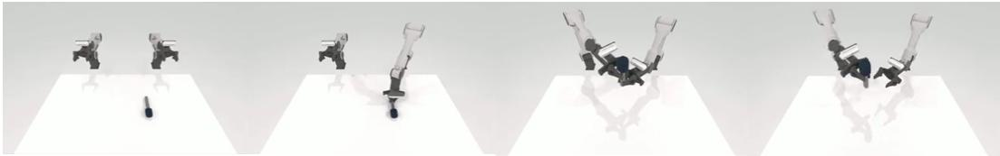  
(a) Handover microphone

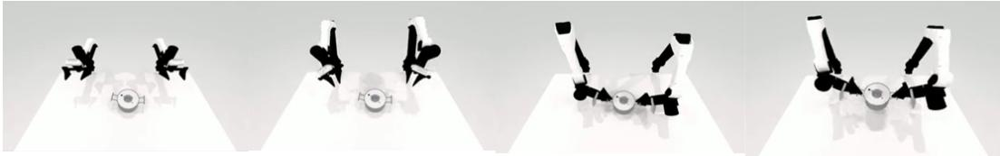

(b) Lift pot  
  
(c) Open microwave

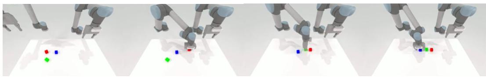  
(d) Rank blocks by color

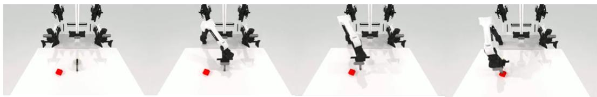  
(e) Hit block with hammer  
Figure 9: Execution processes of five representative manipulation tasks.

For each task, we collect 20 failed episodes for LM-RTG and LM-X. We use these episodes only for RTG supervision: every 20 pretraining steps, a failure minibatch updates the RTG branch while gradients to the ETG and action experts are disabled. Post-training uses successful episodes only.

## C.2 Pretraining Recipe and Details

Only after the pretraining-gate ablation supports the complete three-module design do we pretrain LM-X on the real-robot mixture. We initialize the model from Cosmos-Reason2-2B (Agarwal et al., 2025) and optimize the objective in Eq. (17), with $\lambda _ { R } = 0 . 1 , \lambda _ { E } = 1$ , and $\lambda _ { A } = 1$ . Pretraining runs for two epochs on 64 NVIDIA B200 GPUs with a global batch size of $^ { 3 , 0 7 2 }$ , totaling approximately 700,000 gradient steps and finishing in about 20 days.

Table 6: Held-out RoboTwin2.0 setup for the pretraining-gate ablation. Post-training counts denote episodes; test counts denote trials.
<table><tr><td>Embodiment</td><td>Task</td><td>Post-training data</td><td>Test setting</td></tr><tr><td>AgileX-Piper</td><td>Handover microphone</td><td>50 clean + 200 randomized</td><td>50 randomized</td></tr><tr><td>ARX X5</td><td>Lift pot</td><td>50 clean + 200 randomized</td><td>50 randomized</td></tr><tr><td>Franka</td><td>Open microwave</td><td>50 clean + 200 randomized</td><td>50 randomized</td></tr><tr><td>UR</td><td>Rank blocks by color</td><td>50 clean + 200 randomized</td><td>50 randomized</td></tr><tr><td>AgileX-Aloha</td><td>Hit block with hammer</td><td>50 clean + 200 randomized</td><td>50 randomized</td></tr></table>

We sample failed episodes every 100 pretraining steps and use them only to update the RTG branch;   
the ETG and action experts are frozen for those steps.

Unless stated otherwise, all component variants share the architecture, observation preprocessing, action representation, and applicable loss definitions of the full model. During post-training, the model learns solely from successful episodes.

## C.3 Real-World Test Details

For each real-world task, we fine-tune the complete pretrained model for two epochs on task-specific post-training data. Smaller baselines are trained from scratch on the same downstream mixture, whereas VLA baselines are initialized from their official checkpoints. All methods receive the same language instruction and are evaluated under the same task-specific success criterion.

Tape-roll pick-and-place. The tape roll is initialized uniformly within an approximately 30 cm × 30 cm region. Success requires placing it inside a 20 cm × 20 cm target area marked with black tape.

Tableware organization. Six target objects are sampled from a set of 20 objects spanning five colors and randomly placed on the table. The robot must sort them into baskets, boxes, and plates according to color.

Cloth folding. The robot must fold a yellow T-shirt initialized in a flattened configuration.

Battery insertion. The robot must sequentially pick up four batteries and insert each into its designated slot.

Water-bottle placement, dual-arm. The robot must grasp a standing bottle with the left hand, move the tray to a target position with the right hand, and place the bottle on the tray.

Water-bottle placement, single-arm. The robot must use its right hand to grasp a standing bottle, reposition the tray, and place the bottle on it.

The reported comparison uses GR00T N1.7 (NVIDIA, 2026), initialized from the released checkpoint and fine-tuned on the same post-training mixture with identical instructions and success criteria.

Table 7: Post-training ablation of event conditioning on five held-out RoboTwin2.0 tasks. Values are success rates (%).
<table><tr><td>Method</td><td>Handover microphone</td><td>Lift pot</td><td>Open microwave</td><td>Rank blocks</td><td>Hit block with hammer</td></tr><tr><td>LM-X (with events)</td><td>88</td><td>80</td><td></td><td>90</td><td>66</td></tr><tr><td>LM-X (without events)</td><td>88</td><td>92</td><td>62</td><td>78</td><td>60</td></tr></table>

## D More Results

## D.1 Ablation of Event Embeddings during Post-Training

Table 7 compares task-specific post-training with and without zeventt as an input to the action expert. During pretraining, the event embedding is retained with probability 80% because of the 20% dropout described in Section 4.2; here, we isolate whether event conditioning should remain active during post-training. It helps block ranking and hammering, is neutral for microphone handover, and hurts pot lifting and microwave opening. We therefore select this option per task using downstream validation performance, as indicated by ∗ in Tables 1 and 3.

## D.2 RoboTwin2.0 Benchmark

Table 8 reports the full 50-task RoboTwin2.0 results.

Table 8: Performance comparison on RoboTwin2.0 tasks.
<table><tr><td>Task</td><td>GR00T N1.7</td><td>LM-X</td></tr><tr><td>adjust_bottle</td><td>98.0</td><td>100.0</td></tr><tr><td>beat_block_hammer</td><td>40.0</td><td>25.0</td></tr><tr><td>blocks_ranking_rgb</td><td>60.0</td><td>93.0</td></tr><tr><td>blocks_ranking_size</td><td>52.0</td><td>82.0</td></tr><tr><td>click_alarmclock</td><td>100.0</td><td>100.0</td></tr><tr><td>click_bell</td><td>99.0</td><td>99.0</td></tr><tr><td>dump_bin_bigbin</td><td>77.0</td><td>85.0</td></tr><tr><td>grab_roller</td><td>97.0</td><td>100.0</td></tr><tr><td>handover_block</td><td>0.0</td><td>0.0</td></tr><tr><td>handover_mic</td><td>69.0</td><td>87.0</td></tr><tr><td>hanging_mug</td><td>0.0</td><td>33.0</td></tr><tr><td>lift_pot</td><td>38.0</td><td>84.0</td></tr><tr><td>move_can_pot</td><td>72.0</td><td>86.0</td></tr><tr><td>move_pillbottle_pad</td><td>44.0</td><td>90.0</td></tr><tr><td>move_playingcard_away</td><td>48.0</td><td>19.0</td></tr><tr><td>move_stapler_pad</td><td>30.0</td><td>54.0</td></tr><tr><td>open_laptop</td><td>74.0</td><td>96.0</td></tr><tr><td>open_microwave</td><td>13.0</td><td>55.0</td></tr><tr><td>pick_diverse_bottles</td><td>63.0</td><td>85.0</td></tr><tr><td>pick_dual_bottles</td><td>79.0</td><td>96.0</td></tr><tr><td>place_a2b_left</td><td>39.0</td><td>50.0</td></tr><tr><td>place_a2b_right</td><td>25.0</td><td>46.0</td></tr><tr><td>place_bread_basket</td><td>76.0</td><td>91.0</td></tr><tr><td>place_bread_skillet</td><td>79.0</td><td>83.0</td></tr><tr><td>place_burger_fries</td><td>76.0</td><td>98.0</td></tr><tr><td>place_can_basket</td><td>33.0</td><td>35.0</td></tr><tr><td>place_cans_plasticbox</td><td>33.0</td><td>74.0</td></tr></table>

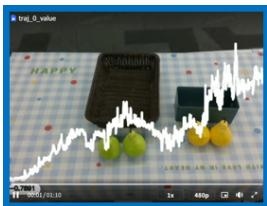  
(a) Start

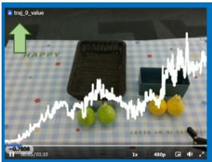  
(b) Right gripper appears

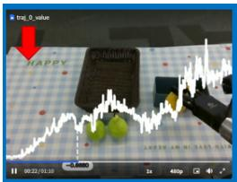  
(c) Stem grasp

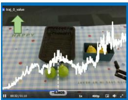  
(d) Halfway done

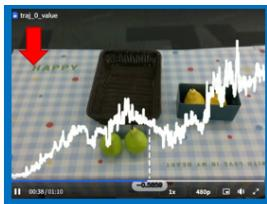  
(e) Gripper out of view

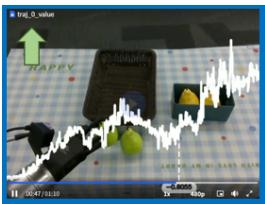  
(f) Left gripper appears

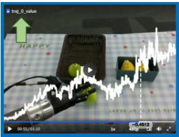  
(g) Stable progress

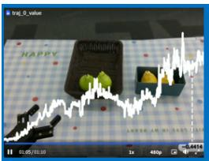  
(h) Finish

Figure 10: RTG visualization during a held-out pear-sorting episode. The score generally increases with progress but decreases at (c), where the right gripper holds only the pear’s stem. Subsequent correctly executed subgoals restore the upward trend.
<table><tr><td>Task</td><td>GR00T N1.7</td><td>LM-X</td></tr><tr><td>place_container_plate</td><td>97.0</td><td>97.0</td></tr><tr><td>place_dual_shoes</td><td>33.0</td><td>74.0</td></tr><tr><td>place_empty_cup</td><td>87.0</td><td>98.0</td></tr><tr><td>place_fan</td><td>13.0</td><td>18.0</td></tr><tr><td>place_mouse_pad</td><td>34.0</td><td>53.0</td></tr><tr><td>place_object_basket</td><td>65.0</td><td>59.0</td></tr><tr><td>place_object_scale</td><td>41.0</td><td>58.0</td></tr><tr><td>place_object_stand</td><td>73.0</td><td>83.0</td></tr><tr><td>place_phone_stand</td><td>0.0</td><td>41.0</td></tr><tr><td>place_shoe</td><td>85.0</td><td>96.0</td></tr><tr><td>press_stapler</td><td>81.0</td><td>94.0</td></tr><tr><td>put_bottles_dustbin</td><td>1.0</td><td>64.0</td></tr><tr><td>put_object_cabinet</td><td>26.0</td><td>74.0</td></tr><tr><td>rotate_qrcode</td><td>23.0</td><td>93.0</td></tr><tr><td>scan_object</td><td>59.0</td><td>67.0</td></tr><tr><td>shake_bottle</td><td>99.0</td><td>100.0</td></tr><tr><td>shake_bottle_horizontally</td><td>99.0</td><td>100.0</td></tr><tr><td>stack_blocks_three</td><td>33.0</td><td>68.0</td></tr><tr><td>stack_blocks_two</td><td>72.0</td><td>97.0</td></tr><tr><td>stack_bowls_three</td><td>63.0</td><td>75.0</td></tr><tr><td>stack_bowls_two</td><td>91.0</td><td>97.0</td></tr><tr><td>stamp_seal</td><td>22.0</td><td>74.0</td></tr><tr><td>turn_switch</td><td>61.0</td><td>79.0</td></tr><tr><td>Average</td><td>55.4</td><td>74.1</td></tr></table>

## D.3 A Complementary RTG Case

Figure 10 illustrates a complementary case. The policy must sort yellow and green pears into different containers. RTG rises as the right gripper enters view and begins the first subgoal, but decreases in panel (c) after the pear is lifted by its thin stem rather than its body. From the available views, this grasp appears ambiguous and potentially unstable.

No comparable decrease occurs for pears grasped around their bodies, suggesting that the score captures more than gripper closure or object elevation. Correct execution of later subgoals restores the upward trend, showing that a local decrease need not dominate the remainder of the trajectory.

This example also exposes a limitation: a vision-only progress head may conflate perceptual ambiguity with physical instability. If the stem grasp is mechanically secure but visually occluded, the lower RTG reflects uncertainty in the observation rather than true regression. Multi-view sensing and contact feedback may help disambiguate these cases. We therefore interpret the result as behaviorally responsive state evaluation, not ground-truth value estimation.