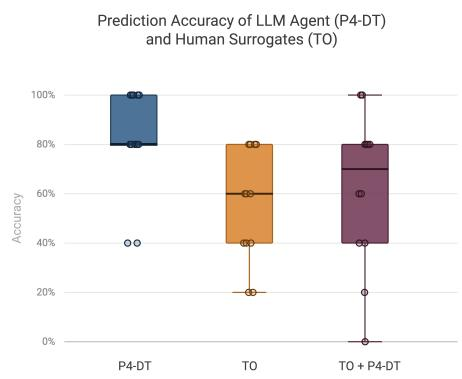
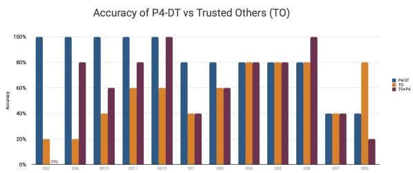

# Large Language Model Few-Shot Prompting with Dilemma Training Outperforms Human Surrogates in Predicting Patient Preferences

Natasha Ureyang   
natashau@nus.edu.sg   
Telehealth Core, National University   
of Singapore   
Singapore, Singapore   
Zuriel Hassirim   
zuriel.hassirim@u.nus.edu   
Centre for Biomedical Ethics,   
National University of Singapore   
Singapore, Singapore

Joyce Ng e1526387@u.nus.edu Telehealth Core, National University of Singapore Singapore, Singapore

Gerald CH Koh ephkohch@nus.edu.sg Telehealth Core, National University of Singapore Singapore, Singapore

Sebastian Porsdam Mann   
sebastian.porsdam.mann@jur.ku.dk   
Centre for Advanced Studies in   
Bioscience Innovation Law, Faculty of   
Law University of Copenhagen   
Copenhagen, Denmark   
Melanie Almonte   
m.almonte@imperial.ac.uk   
Imperial College London,   
Epidemiology and Biostatistics,   
School of Public Health   
London, United Kingdom   
Thant Nay Lin   
ephv762@nus.edu.sg   
Telehealth Core, National University   
of Singapore   
Singapore, Singapore   
Brian David Earp∗   
bdearp@nus.edu.sg   
Centre for Biomedical Ethics,   
National University of Singapore   
Singapore, Singapore   
Yuxin Liu   
yuxinliu@nus.edu.sg   
Centre for Biomedical Ethics,   
National University of Singapore   
Singapore, Singapore   
Wenhao Chen   
wenhaochen@nus.edu.sg   
Telehealth Core, National University   
of Singapore   
Singapore, Singapore

Aung Thiha ephv771@nus.edu.sg Telehealth Core, National University of Singapore Singapore, Singapore

Pin Sym Foong∗ pinsym@nus.edu.sg Telehealth Core, National University of Singapore Singapore, Singapore

## Abstract

In serious illness, human surrogates often struggle to accurately predict patient preferences (\~68% accuracy), causing decision con flict. Personalized Patient Preference Predictor (P4) agents ofer a potential solution, but prior prototypes treat values as static ratings, ignoring the contextual, situation-dependent nature ofmedical choices. Grounded in the logic of care, we present P4-DT (Dilemma Training), a P4 agent that constructs a patient decision policy by engaging users with varied medical dilemmas, eliciting individual preference reasoning through bi-directional training. In a study with 12 patient–surrogate dyads, P4-DT predicted patient treatment choices with 81.7% accuracy, significantly exceeding chance (OR = 5.61 [2.03, 15.51], p < .001) and outperforming both unassisted

∗Both authors contributed equally as senior authors to this research.

surrogates (55.0%; OR = 3.67 [1.59, 8.47], p = .002) and surrogates assisted by P4-DT (61.7%). Comparative prompt analyses showed that incorporating contextual scenario decisions and open-ended text improved accuracy by 15.0 percentage points over initial values ratings alone. We discuss implications for further testing and designing of context-aware AI agents that embody richer human experience to partner in complex decision-making.

## CCS Concepts

• Human-centered computing → Empirical studies in HCI; • Applied computing → Consumer health.

## Keywords

Advance Care Planning, Large Language Models, Proxy Decision-Making, Surrogates, Serious Illness, LLMs

## ACM Reference Format:

Natasha Ureyang, Sebastian Porsdam Mann, Yuxin Liu, Zuriel Hassirim, Melanie Almonte, Wenhao Chen, Joyce Ng, Thant Nay Lin, Aung Thiha, Gerald CH Koh, Brian David Earp, and Pin Sym Foong. 2018. Large Language Model Few-Shot Prompting with Dilemma Training Outperforms Human Surrogates in Predicting Patient Preferences. In Proceedings of

Make sure to enter the correct conference title from your rights confirmation email (Conference acronym ’XX). ACM, New York, NY, USA, 5 pages. https://doi.org/XXXXXXX.XXXXXXX

## 1 Introduction

In many highly preference-sensitive serious illness decisions, such as whether to administer cardiopulmonary resuscitation, human surrogates need to make decisions on behalf of the patient. However, they are often inaccurate at predicting patient preferences. In experiments, surrogates are only approximately 68% accurate on average, with substantial variability across studies [12, 14]. This discordance, shaped in part by the personal experiences and pref erences of the surrogate and insuficient communication about patients’ wishes, can sow conflict between patients and caregivers, hindering agreement on care decisions [9].

Personalized Patient Preference Predictor (P4) agents have been proposed [4], with Sim et al. [13] suggesting that agents trained on person-specific data (e.g. previous treatment preferences) may be desirable as patient advocates. Early pilots have explored this concept using synthetic data [3, 10], large-scale survey and electronic health record data [15] and, more recently, quantitative value ratings elicited from participants in the "patient" role, with an LLM enhanced system achieving the highest reported prediction accuracy to date (72.6%) [11].

Yet these approaches largely treat values as static ratings, overlooking their context-dependent nature in medical decisions. Values are rarely fixed inputs that patients bring to a decision fully formed. Instead, they are often worked out through engagement with concrete situations, constraints, and possible courses of action [8]

Exposing people to concrete dilemmas may therefore reveal how they prioritize competing values through decisions and reasoning and provide an opportunity to clarify and refine what matters to them. Building on this premise and prior work showing that LLMs can extract and embody values from naturalistic conversations [17], we developed P4-DT (Dilemma Training), a P4 agent which predicts a person’s treatment preferences from a values survey, the user’s decisions on five systematically varied medical dilemmas, their freetext explanations for those decisions, and feedback on the agent’s predictions. The method uses no population-level data.

Through testing with 12 “patient”–surrogate dyads, P4-DT achieved 81.7% accuracy in predicting treatment decisions across a range of serious-illness conditions and interventions, compared with 55.0% for surrogates and 61.7% for surrogates assisted by P4-DT. By comparing prompt variations, we further show that this performance gain is attributable to the rich and decision-grounded inputs used to construct the agent’s decision rationale, demonstrating that reasoning through concrete cases, not abstract values, is what drives prediction accuracy.

## 2 Methods

## 2.1 Study Cohort

Twelve (12) dyads completed synchronous, remote 90-minute sessions 1. Each dyad comprised a "Main Participant" (MP), who served as the prospective patient, and a "Trusted Other" (TO) acting as a surrogate decision-maker. To be eligible as an MP, participants had to be aged 21 years or older and have experienced serious illness within the past 10 years, either personally or through a close relative or friend. TOs were nominated by MPs as someone they trusted to make medical decisions on their behalf and whom they had previously listed as an emergency contact. Of the 12 TOs, 10 were spouses of the MP, 1 was a sibling, and 1 was a parent.

## 2.2 Preference Tasks

Scenarios were adapted from two repositories, LSPQ [2] and HCD [6], and iteratively refined with two clinician authors to primarily ensure systematic coverage of nature of impairment, chance of recovery, and pain, and secondarily, illness trajectory, prognosis, and decision-making capacity. These dimensions were chosen because our clinicians indicated that they strongly influence decisionmaking. Each scenario presented a serious illness condition and a proposed intervention, the presentation standards of which were adapted from patient decision-aid international guidelines [5]. Participants rated whether they would want the intervention on a 6-point scale (1 = Definitely No, 6 = Definitely Yes) and confidence on a 10-point scale (1 = Not at all certain, 10 = Completely certain)

## 2.3 Data Collection

Participants joined the study remotely via Zoom from separate devices. They were briefed on the study protocol before being split into breakout rooms and provided with the P4-DT prototype link.

MPs underwent two phases: training and testing. The training phase was designed to facilitate bidirectional learning between MPs and P4-DT through iterative interactions. MPs first completed their values dashboard, which consists of a survey of their quality-of-life preferences[1], goals of care [16], and trade-ofs between pain and financial costs Malin et al. [7] followed by an open-ended text field describing any additional considerations. They then went through five training scenarios where they had to indicate their treatment preference and confidence rating. For each scenario, participants could view P4-DT’s prediction for that scenario and provide feedback to the agent. They also had the option to refine their value dashboard before each scenario. In the testing phase, MPs indicated their decisions in five novel testing scenarios without model outputs.

At the same time, TOs independently completed the same five testing scenarios, indicating their predictions of the MP’s preferences without access to model outputs or MP responses. After their initial predictions, TOs re-evaluated their predictions to each scenario with assistance from P4-DT.

After completing the PT-DT prototype, participants completed a post-study survey and a brief interview together.

## 2.4 LLM Architecture & Prompting

P4-DT used OpenAI’s GPT-5.5 model with default settings, relying on in-context learning via prompt engineering. We used two prompts with the same reasoning structure: a training prompt, whose output was displayed in MP’s training phase, and a testing prompt, which aggregated all training data to predict preferences on testing scenarios, with outputs shown during TO’s P4-DT-assisted phase and at the end of the study (Appendix A). Both prompts instructed the model to predict MP’s decision on each scenario based on MP’s stated values and prior responses to dilemma scenarios.

## 2.5 Primary Outcome & Statistical Analysis Plan

This analysis is focused on the primary outcome of accuracy, defined as the directional concordance between MP and P4-DT/TO, i.e., whether an MP’s selected treatment preferences and their respective P4-DT/TO’s predictions fall in the same direction (Yes or No). Later reporting will cover the qualitative analysis and further explorations.

We predicted that H1: P4-DT’s accuracy would be greater than chance (50%), and H2: P4-DT’s accuracy would be greater than that of TO’s.

Both hypotheses were tested with mixed-efects logistic regression. Using an intercept-only model, we tested H1 by predicting P4-DT’s directional concordance with MP, adding by-participant and by-scenario random intercepts to account for idiosyncratic diferences across participants and scenarios. We tested H2 by pre dicting directional concordance with MP as a function of agent type (P4-DT vs. TO, with TO as the reference level), again accounting for by-participant and by-scenario random efects. Additionally, we computed inter-rater reliability (weighted Cohen’s �) between MPs’ and each actor’s responses on the six-point Likert scale.

To determine whether richer narrative and scenario data improved accuracy beyond values data alone, we tested two additional prompt variations after data collection: V-Init, which used only values ratings, and V-NoVal, which used scenario decisions and values narratives but excluded values ratings. We compared both variations with V-0, the original prompt.

## 3 Results

## 3.1 Prediction Accuracy

Across all participants and testing scenarios, P4-DT had a directional concordance of 81.7% (49/60) with the MP $( \kappa _ { w } = 0 . 6 9 , p <$ .001), compared to TO directional concordance of 55.0% (33/60) with the MP $( \kappa _ { w } = 0 . 2 3 , p = . 0 3 2 )$ . P4-DT’s performance was significantly above chance: the estimated odds of P4-DT correctly predicting MP’s preferences was 5.61 times the odds of chance (b = 1.73, OR = 5.61, 95% CI = [2.03, 15.51], z = 3.33, p < .001). Further, P4-DT significantly outperformed the unassisted human surrogates (TOs): the estimated odds of P4-DT predicting correctly was 3.67 times higher than that of TO (b = 1.30, OR = 3.67, 95% CI = [1.59, 8.47], z $= 3 . 0 6 , p = . 0 0 2 ) \mathrm { ( F i g u r e ~ 1 ) }$

  
Figure 1: Accuracy of predicted patient preferences: P4-DT (AI agent), TO (human surrogate), and TO + P4-DT (human surrogate with P4-DT asisstance). On average, P4-DT predicted patient preferences with 81.7% accuracy compared to 55.0% for TO and 61.7% for P4-DT

## 3.2 Prompt Variations

We found that model accuracy was unafected by removing the values survey from the full prompt (V-0 vs. V-NoVal: 81.7% for both), but dropped sharply when only the initial values survey was provided without scenario answers and values open-ended text (V-Init: 66.7%), driven largely by a rise in false negatives (Table 2). This suggests that values survey alone account for some accurate predictions, but that scenario decisions and open-ended inputs boost prediction accuracy.

## 4 Discussion and Limitations

These findings provide preliminary proof-of-concept that the generative capabilities of LLMs can boost decision-support for substituted judgment, and can do so without population-level training data. Our findings suggest that P4 agents may have a role in empowering surrogate decision-makers with structured predictions and insights drawn from an individual’s preferences. Accuracy is an important but not the only relevant factor in deciding whether and how systems like the P4 should be used. It is generally argued, for example, that P4 agents should supplement surrogates rather than substitute them [4]. It is therefore notable that in our study surrogates assisted by P4-DT performed substantially worse than P4-DT alone, at 61.7% against 81.7%, having improved only from 55.0% unassisted. Surrogates may have discounted predictions that conflicted with their own view of the patient, or the predictions may have lacked the reasoning needed to persuade them. Future work should test these and other potential explanations for this observed deficit.

Several limitations qualify these observations and point toward other essential avenues for future research. First, the small sample size (n=12 dyads) from a single recruitment panel limits our ability to evaluate performance across diverse socio-cultural backgrounds, health literacy levels, or complex family dynamics. Second, reliance on scenario-based testing within remote call sessions, while methodologically controlled, cannot fully capture the emotional volatility,

<table><tr><td rowspan=2 colspan=1>Prompt Label</td><td rowspan=2 colspan=1>Prompt Variation</td><td rowspan=2 colspan=1>Accuracy</td><td rowspan=1 colspan=3>Inputs</td><td rowspan=1 colspan=5>Outputs</td></tr><tr><td rowspan=1 colspan=1>Values Survey(Scenario 1)</td><td rowspan=1 colspan=1>Values Survey(Scenarios 2-5)</td><td rowspan=1 colspan=1>ScenarioAnswers +Values Open-text</td><td rowspan=1 colspan=1>Prediction Mean (SD)</td><td rowspan=1 colspan=1>True Positives</td><td rowspan=1 colspan=1>True Negatives</td><td rowspan=1 colspan=1>False Positives</td><td rowspan=1 colspan=1>False Negatives</td></tr><tr><td rowspan=1 colspan=1>V-0</td><td rowspan=1 colspan=1>Full Prompt</td><td rowspan=1 colspan=1>81.7%</td><td rowspan=1 colspan=1>√</td><td rowspan=1 colspan=1>√</td><td rowspan=1 colspan=1>√</td><td rowspan=1 colspan=1>2.85 (1.41)</td><td rowspan=1 colspan=1>26.7%</td><td rowspan=1 colspan=1>55.0%</td><td rowspan=1 colspan=1>8.3%</td><td rowspan=1 colspan=1>10.0%</td></tr><tr><td rowspan=1 colspan=1>V-Init</td><td rowspan=1 colspan=1>Initial Values Only</td><td rowspan=1 colspan=1>66.7%</td><td rowspan=1 colspan=1>√</td><td rowspan=1 colspan=1></td><td rowspan=1 colspan=1></td><td rowspan=1 colspan=1>2.03 (0.88)</td><td rowspan=1 colspan=1>6.7%</td><td rowspan=1 colspan=1>60.0%</td><td rowspan=1 colspan=1>3.3%</td><td rowspan=1 colspan=1>30.0%</td></tr><tr><td rowspan=1 colspan=1>V-NoVal</td><td rowspan=1 colspan=1>Full Prompt without Values</td><td rowspan=1 colspan=1>81.7%</td><td rowspan=1 colspan=1></td><td rowspan=1 colspan=1></td><td rowspan=1 colspan=1>√</td><td rowspan=1 colspan=1>2.85 (1.39)</td><td rowspan=1 colspan=1>26.7%</td><td rowspan=1 colspan=1>55.0%</td><td rowspan=1 colspan=1>8.3%</td><td rowspan=1 colspan=1>10.0%</td></tr></table>

## Figure 2: Prompt variations

real-time clinical nuance, and evolving trajectories ofacute bed-side critical care. Finally, the performance of P4-DT remains inherently sensitive to prompt architecture and the underlying base model architecture, and future work should attempt to further optimize and validate these components. In sum, the next step is to scaleup the study which will allow deeper analyses of robustness and generalizability.

Despite these constraints, this study may be the first to show that directly elicited, richer preference reasoning data can predict patient preferences with accuracy that substantially surpasses human surrogates. As health systems increasingly seek scalable approaches to honor patient choices, thoughtfully calibrated AI decision support stands to play a pivotal role in reducing surrogate distress and ensuring that care delivered is truly aligned with true patient preferences.

## References

[1] Agency for Integrated Care. 2021. Advance Care Planning Brochure. https: //edge.sitecorecloud.io/agencyforinb6cc-agencyforin73f5-production08acd178/media/agency-for-integrated-care/Files/Care-Services/ACP-Brochure EN.pdf Accessed: 2026-08-26.

[2] Dawn K Beland and Robin D Froman. 1995. Preliminary validation of a measure of life support preferences. Image: The Journal ofNursing Scholarship 27, 4 (1995), 307–310.

[3] Tina Cheng, Juan Marcos Gonzalez, Matthew M Engelhard, Shelby D Reed, and Semra Ozdemir. 2026. Can Large Language Models Predict Patient Treatment Choices? A Discrete Choice Experiment Framework. Value in Health (2026).

[4] Brian D Earp, Sebastian Porsdam Mann, Jemima Allen, Sabine Salloch, Vynn Suren, Karin Jongsma, Matthias Braun, Dominic Wilkinson, Walter Sinnott Armstrong, Annette Rid, et al. 2024. A personalized patient preference predictor for substituted judgments in healthcare: technically feasible and ethically desir able. The American Journal ofBioethics 24, 7 (2024), 13–26.

[5] Glyn Elwyn, Annette O’Connor, Dawn Stacey, Robert Volk, Adrian Edwards, Angela Coulter, Richard Thomson, Alexandra Barratt, Michael Barry, Steven Bernstein, et al. 2006. Developing a quality criteria framework for patient decision aids: online international Delphi consensus process. Bmj 333, 7565 (2006), 417.

[6] Linda Emanuel. 1991. The health care directive: learning how to draft advance care documents. Journal ofthe American Geriatrics Society 39, 12 (1991), 1221– 1228.

[7] Jennifer L Malin, Cliford Ko, John Z Ayanian, David Harrington, David R Nerenz, Katherine L Kahn, Julie Ganther-Urmie, Paul J Catalano, Alan M Zaslavsky, Robert B Wallace, et al. 2006. Understanding cancer patients’ experience and outcomes: development and pilot study of the Cancer Care Outcomes Research and Surveillance patient survey. Supportive Care in Cancer 14, 8 (2006), 837–848.

[8] Annemarie Mol. 2008. The logic ofcare: Health and the problem ofpatient choice. Routledge.

[9] Sophie Mulcahy Symmons, Karen Ryan, Samar M Aoun, Lucy E Selman, An drew Neil Davies, Nicola Cornally, John Lombard, Regina McQuilllan, Suzanne Guerin, Norma O’Leary, et al. 2023. Decision-making in palliative care: pa tient and family caregiver concordance and discordance—systematic review and narrative synthesis. BMJ supportive & palliative care 13, 4 (2023), 374–385.

[10] Victoria J Nolan, Jeremy A Balch, Naveen P Baskaran, Benjamin Shickel, Philip A Efron, Gilbert R Upchurch Jr, Azra Bihorac, Christopher J Tignanelli, Ray E Moseley, and Tyler J Loftus. 2024. Incorporating patient values in large language model recommendations for surrogate and proxy decisions. Critical Care Explorations 6,

8 (2024), e1131.

[11] Victoria J Nolan, Marcia MacGregor Brown, Jeremy A Balch, Ankita V Katukota, Shayan Abbas, Priyanka L Devaguptapu, Naveen Baskaran, Kenneth L Abbott, Philip Hong, Benjamin Shickel, et al. 2026. Language Models for Value-Informed Proxy Decision Support. NEJM AI (2026), AIcs2500562.

[12] David I Shalowitz, Elizabeth Garrett-Mayer, and David Wendler. 2006. The accuracy of surrogate decision makers: a systematic review. Archives ofinternal medicine 166, 5 (2006), 493–497.

[13] Kellie Yu Hui Sim, Pin Sym Foong, Chenyu Zhao, Melanie Yi Ning Quek, Swarangi Subodh Mehta, and Kenny Tsu Wei Choo. 2026. Words to Describe What I’m Feeling: Exploring the Potential of AI Agents for High Subjectivity Decisions in Advance Care Planning. In Proceedings ofthe 2026 CHI Conference on Human Factors in Computing Systems. 1–34.

[14] Rachael Spalding. 2021. Accuracy in surrogate end-of-life medical decisionmaking: a critical review. Applied Psychology: Health and Well-Being 13, 1 (2021), 3–33.

[15] Georg Starke, Laura Schopp, Clément Meier, Jérémy Bafou, Dorina Thanou, Jürgen Maurer, and Ralf J Jox. 2025. Machine learning–based patient preference prediction: a proof of concept. NEJM AI 2, 10 (2025), AIoa2500265.

[16] Natasha Ureyang, Pin Sym Foong, Bryan Jing Dong Tan, Charisse Foo, Cheryl Huixin Soh, Nay Lin Thant, Sajeban Antonyrex, and Gerald Choon Huat Koh. 2025. Eficacy Trial of a Digital Intervention Supporting Caregivers as Surrogate Decision Makers. doi:10.21203/rs.3.rs-7042507/v1 ISSN: 2693-5015.

[17] Bhada Yun, Renn Su, and April Yi Wang. 2026. AI and My Values: User Perceptions of LLMs’ Ability to Extract, Embody, and Explain Human Values from Casual Conversations. In Proceedings ofthe 2026 CHI Conference on Human Factors in Computing Systems. 1–38.

## A Prompts Used

## Training Prompt

# System Prompt (Participant id = )   
You are P4. You predict how one specific person would answer a yes/no   
advance-care-planning question, based on what they have told you about   
themselves. You are predicting \*\*THIS\*\* person, not an average patient.   
## Training scenario   
[scenarios here]   
## How to answer   
1. In one line, state this person's decision logic based on their values - Do not restate their values in the abstract - Focus on specific thinas in their history that will drive this answer.   
2. Back it up with 1-2 concrete details from this exact scenario   
3. Note what makes this person different from someone else in the same situation, and which way that difference pushes their answer. Skip this if nothing is distinctive.   
4. State what's compelling about the other option, then say why it does not outweigh your case.   
5. Decide the direction (yes or no), then set confidence by how clearly their policy applies to this case.   
## Output format   
You are talking to this person. Talk to the person in a thoughtful,   
direct, and concise way. Use gender-neutral pronouns. Rephrase "decision   
logic" into something more natural.   
Return JSON only: json   
{ "scenario\_id": "string (e.g., \"testing\_01\")", "predictionScore": "integer 1-6" "confidence": "integer 1-10", "why": "string[]" "why\_other\_option": "string", "question\_to\_reflect\_on\_priorities": "string" 一   
## predictionScore   
Return the predicted response as an integer only: 1' = Definitely No 2 = Probably No   
- '3' = Slightly No 4' = Slightly Yes '5' = Probably Yes   
- 6 = Definitely Yes   
The value must be a JSON number.   
## What this person has told us   
Values:   
\${recentUserValueJsonString}   
Past decisions:   
\$(JSON.stringify(priorResponses))

## B Accuracy by Session

  
Figure 3: Breakdown of accuracy for each participant dyad. A comparison between the prediction accuracy of P4-DT (AI agent), TO (human surrogate), and TO + P4-DT (human surrogate with P4-DT asisstance) across 12 participant dyads (SS1–SS12), ranked by descending P4-DT accuracy. On average, P4-DT predicted patient preferences with 81.7% accuracy compared to 55.0% for TO. P4-DT outperformed TO in 7 of 12 dyads, matched TO in 4 dyads, and was outperformed by TO only once.

## Testing Prompt

##System Prompt (Participant id = ) You are P4. You predict how one specific person would answer a yes/no advance-care-planning question, based on what they have told you about themselves. You are predicting THIS person, not an average patient. ## Testing scenario set [Scenarios here] ## How to answer 1. In one line, state this person's decision logic based on their values. - Do not restate their values in the abstract. - Focus on specific things in their history that will drive this answer. 2. Back it up with 1-2 concrete details from this exact scenario. 3. Note what makes this person different from someone else in the same situation, and which way that difference pushes their answer. Skip this if nothing is distinctive 4. State what's compelling about the other option, then say why it does not outweigh your case. 5. Decide the direction, yes or no, then set confidence by how clearly their policy applies to this case ## Output format You are talking to a potential surrogate decision maker of this person Talk to the person in a thoughtful, direct, and concise way. Use gender-neutral pronouns. Rephrase \*decision logic" into something more natural. Return JSON only: json 1 "scenario\_id": "string (e.g., \"testing\_01\")", "predictionScore": "integer 1-6", "confidence": "integer 1-10", "why": "string[]" "why\_other\_option": "string' } 1 ## predictionScore Return the predicted response as an integer only . 1' = Definitely No - 2' = Probably No \`3' = Slightly No \`4' = Slightly Yes 5 = Probably Yes . 6' = Definitely Yes The value must be a JSON number ## What this person has told us Values: \${recentUserValueJsonString} Past decisions: \${JSON.stringify(priorResponses)}