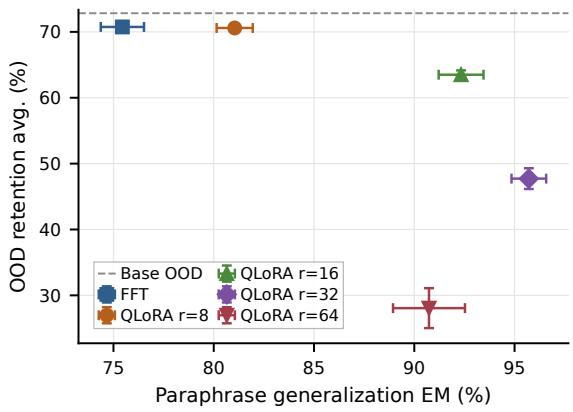
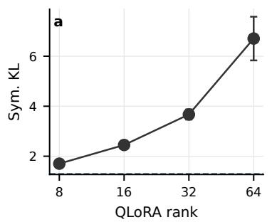
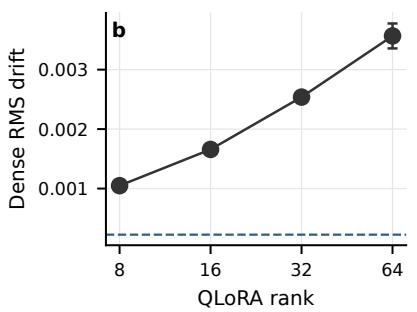
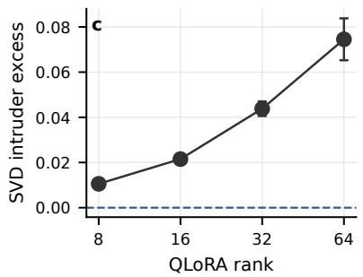

# Learning New Facts with QLoRA: An Acquisition-Retention Frontier

Estelle Zheng1,2, Sébastien Warichet2, Emmanuel Helbert2, Christophe Cerisara1

1LORIA, CNRS, France

2Alcatel-Lucent Enterprise, France

estelle.zheng@loria.fr

## Abstract

Parameter-efficient fine-tuning is often assumed to preserve pretrained capabilities because it updates only a small number of parameters. We show that this assumption depends strongly on adapter capacity. We study factual acquisition in a controlled OpenStreetMapderived benchmark where Qwen3-4B must acquire anonymized geographic associations while retaining unrelated capabilities. Comparing full fine-tuning (FFT) with quantized low-rank adaptation (QLoRA) at ranks 8, 16, 32, and 64, we find that rank induces a clear acquisition–retention frontier. Low-rank QLoRA preserves out-of-domain (OOD) performance but acquires fewer facts, whereas higher ranks improve same-fact paraphrase generalization at an increasing cost in performance on unrelated benchmarks. FFT behaves as a conservative baseline: it retains general capabilities well, but does not reach the highest factualacquisition regime. Distributional, weightspace, and spectral diagnostics mirror this behavioral trade-off, with higher-rank QLoRA moving farther from the pretrained model. A separate math adaptation experiment shows a weaker frontier, suggesting that the effect is most pronounced when adaptation must install new factual associations rather than reinforce skills already supported by pretraining.1

## 1 Introduction

Pretrained language models (PLMs) are often finetuned for new domains, task-specific skills, or factual knowledge. Full fine-tuning (FFT) updates all model parameters and can be effective, but it is costly and may degrade performance outside the adaptation distribution. Parameter-efficient finetuning (PEFT) methods such as low-rank adaptation (LoRA) and its quantized variant QLoRA reduce this cost by freezing pretrained weights and learning low-rank updates (Hu et al., 2022; Dettmers et al., 2023). This restriction is often assumed to improve retention of previous capabilities, but it may also limit what the model can acquire.

Recent work shows that the relationship between LoRA and FFT is not simply one of efficiency. Biderman et al. (2024) find that LoRA can preserve more out-of-domain (OOD) behavior partly because it learns less from the target distribution. Shuttleworth et al. (2025) show that LoRA and FFT can reach similar accuracy from different regions of weight space. Other comparisons study broad adaptation settings such as coding (Männistö et al., 2025), mathematics (Biderman et al., 2024), question answering (Sun et al., 2023), or instruction tuning (Xin et al., 2024). These settings mix several gains: format adaptation, skill reinforcement, domain shift, or new information. We focus next on factual knowledge acquisition. In this context, retention is ambiguous unless acquisition is measured at the same time: a low-capacity adapter may appear safer simply because it has not strongly incorporated the target facts.

Our setting relates to factual knowledge editing, which modifies specific associations while preserving unrelated behavior (Meng et al., 2022; Mitchell et al., 2022; Meng et al., 2023; Yang et al., 2025b), and continual learning, which studies the stability– plasticity trade-off under sequential updates (Jang et al., 2022; Shi et al., 2025). However, modelediting benchmarks often focus on localized modifications of previously known facts, sometimes replacing existing associations, while continuallearning approaches commonly evaluate sequences of tasks or updates, including PEFT-based methods that regularize, initialize, or merge adapter subspaces (Lu et al., 2025; Qiao and Mahdavi, 2026). Our goal is different: we study a single controlled batch-adaptation stage in which models acquire novel factual associations using standard FFT and QLoRA. We measure how adaptation capacity affects acquisition, paraphrase generalization, and retention of general LLM capabilities.

We introduce a factual acquisition benchmark derived from OpenStreetMap (OSM) in which models are trained to acquire anonymized geographic associations. The anonymized entities reduce direct reliance on pretrained world knowledge, while the OSM structure preserves realistic relational dependencies. We compare FFT with QLoRA ranks r ∈ {8, 16, 32, 64} and evaluate supervised fact memorization, same-fact paraphrase generalization, and OOD retention. We further connect behavioral performance to model-drift diagnostics, including KL divergence from the base model, RMSnormalized dense update norms, and SVD-based spectral changes. A standard-LoRA rank sweep on Qwen3-1.7B separately tests whether the rank trend persists without quantization.

Our results show that LoRA rank induces a clear acquisition–retention frontier. Low-rank LoRA preserves OOD performance but acquires fewer facts, whereas higher-rank LoRA improves factual acquisition at the cost of larger OOD degradation. FFT behaves as a baseline: it retains general capabilities relatively well, but does not reach the highest factual-acquisition regime observed with higherrank LoRA. The same trend appears in model-drift diagnostics, where higher-acquisition LoRA runs move farther away from the pretrained model.

This paper makes three contributions: (i) we introduce a controlled OpenStreetMapderived benchmark for factual acquisition, using anonymized entities to reduce direct reliance on pretrained world knowledge; (ii) we show that QLoRA rank controls an acquisition–retention frontier for new factual associations; and (iii) we connect this behavioral trade-off to model-drift diagnostics, showing that stronger factual acquisition is associated with larger distributional and weight-space shifts from the pretrained model.

## 2 Methodology

Standard fine-tuning datasets often evaluate broad task adaptation rather than the acquisition of genuinely new facts. Benchmarks commonly used to evaluate knowledge editing, such as ZsRE (Levy et al., 2017), CounterFact (Meng et al., 2022), MQuAKE (Zhong et al., 2023), and RippleEdits (Cohen et al., 2024) typically evaluate localized updates to known facts, including counterfactual or outdated associations. They are complementary to our goal of studying standard adaptation on a batch of novel anonymized associations. A fully synthetic benchmark could also provide novel facts, but its topology, relation frequencies, and crossrelation dependencies would have to be chosen by the researcher. We instead use OpenStreetMap (OSM) because it supplies a naturally occurring, internally coherent graph whose structure was generated independently of our experimental hypotheses. Anonymization then reduces reliance on pretrained lexical knowledge while retaining this non-uniform relational structure.

## 2.1 OSM Factual Acquisition Dataset

We derive atomic facts from 14 city-level OSM extracts, linking entities (POIs, roads, and cities) to five relation types: POI category, containing city, nearest road, nearest POI, and road-length bucket. The training split contains 1,938 instruction-style question-answer examples covering direct queries, paraphrases, locality-preservation probes, spatialcompositional questions, and inverse city-signature examples. Evaluation uses 900 held-out examples derived from the same facts but expressed with disjoint surface templates, so performance measures the acquisition of factual associations and their generalization across surface forms rather than prompt memorization. Because some relations have distinct answer types, the benchmark does not by itself establish that models learn abstract relation semantics.

To reduce contamination from pretrained world knowledge, we restrict source cities to small cities and replace all entity names with synthetic identifiers (e.g., C-TRAIN-001, POI-TRAIN-000001). Dataset details are in Appendix A, and example prompts are in Appendix D.

## 2.2 Base-model prior knowledge diagnostic

Before fine-tuning, we test whether the base model can already solve the task from prior knowledge or answer-type biases. We evaluate both anonymized and non-anonymized versions of the data as a question-answering task, where the model is prompted to generate the gold answer. We report exact-match (EM) generation accuracy and a teacher-forced gold-vs-distractor preference score. For each example, we sample five distractors from other gold answers in the same split, matching both answer type and relation whenever possible. The model prefers the gold answer when its average per-token log-probability exceeds that of the distractor. We report the percentage of gold-preferred pairs and the mean log-probability margin (∆lp). More details are in Appendix C.

<table><tr><td>Split</td><td>Names</td><td>EM</td><td>Pref. (%)</td><td> $\Delta \boldsymbol { \mathrm { p } }$ </td></tr><tr><td>Train facts</td><td>Non-anon.</td><td>8.10</td><td>71.23</td><td>3.87</td></tr><tr><td>Train facts</td><td>Anon.</td><td>2.43</td><td>58.46</td><td>0.26</td></tr><tr><td>Paraph. eval</td><td>Non-anon.</td><td>15.67</td><td>68.98</td><td>4.02</td></tr><tr><td>Paraph. eval</td><td>Anon.</td><td>9.89</td><td>59.33</td><td>0.84</td></tr></table>

Table 1: Base-model prior diagnostic. Anonymization reduces EM accuracy, gold-answer preference, and log-probability margins, suggesting that real names activate relevant pretrained information. The higher paraphrase EM partly reflects its larger share of constrainedresponse questions; see Appendix A.1.

Table 1 shows that real entity names provide useful semantic cues, while anonymization sharply reduces exact match and answer-likelihood margins. Preference scores remain slightly above chance, indicating weak structural or answer-type biases, but the base model cannot solve the anonymized task directly. The higher EM on the paraphrase split is partly a response-format effect. The paraphrase split contains roughly twice the proportion of yes/no questions, increasing its approximate chance EM from 6.68% to 10.36%. Appendix A.1 gives the complete counts and ratios.

## 3 Experimental Setup

## 3.1 Models and adaptation methods

We use Qwen3-4B (Yang et al., 2025a) as the base model and compare full fine-tuning (FFT) with QLoRA adapters of rank $r \in \{ 8 , 1 6 , 3 2 , 6 4 \}$ . Each training example consists of a question and its gold answer, with the autoregressive loss applied only to answer tokens. All runs are repeated over five random seeds. Hyperparameters are reported in Appendix E.

To test whether the within-adapter rank trend persists without quantization, we additionally run standard LoRA on Qwen3-1.7B (Yang et al., 2025a) at ranks $r \in \{ 8 , 1 6 , 3 2 \}$ , using the same OSM task and OOD evaluation suite. This reduced control changes model scale; within its rank sweep.

## 3.2 Evaluation axes

We evaluate each adapted model along three axes.

Factual acquisition We report EM accuracy on two OSM splits. Training accuracy measures recovery of the supervised facts, while paraphrase accuracy measures same-fact generalization under held-out templates disjoint from training. Because the paraphrase set is derived from training facts, it does not test unseen OSM knowledge; rather, it tests whether the learned association is robust to phrasing variation.

OOD retention We use LM Evaluation Harness (Gao et al., 2024) on five benchmarks: HumanEval (Chen et al., 2021), IFEval (Zhou et al., 2023), TruthfulQA (Lin et al., 2022), MMLU-Redux-2.0 (Gema et al., 2025), and BBH (Suzgun et al., 2023). These cover code generation, instruction following, truthfulness, general knowledge, and reasoning. We define forgetting as the drop in average OOD score relative to the base model:

$$
\Delta _ { \mathrm { O O D } } = \mathrm { O O D } _ { \mathrm { b a s e } } - \mathrm { O O D } _ { \mathrm { a d a p t e d } } .
$$

Model-drift diagnostics Behavioral accuracy alone does not reveal how acquisition is achieved: two models can reach similar OSM accuracy while differing substantially in how far they move from the pretrained model, with different implications for retention. Following prior work on LoRA retention and LoRA–FFT weight-space differences (Biderman et al., 2024; Shuttleworth et al., 2025), we therefore measure drift using KL divergence from the base model (Shenfeld et al., 2026), teacherforced negative log-likelihood on gold OSM answers, RMS-normalized dense weight drift, and SVD-based intruder dimensions (Glorot and Bengio, 2010; Shuttleworth et al., 2025). For comparability, FFT and QLoRA are analyzed in the same dense update space: $W _ { \mathrm { f t } } - W _ { 0 }$ for FFT and $\Delta W \ = \ { \textstyle { \frac { \alpha } { r } } } B A$ for QLoRA. RMS normalization controls for differences in module size. Full metric definitions are given in Appendix C.

## 4 Results

## 4.1 QLoRA rank controls the acquisition–retention trade-off

Figure 1 shows that QLoRA rank acts as a plasticity control. Low rank keeps the model close to the pretrained solution and therefore preserves OOD behavior, but this retention coincides with weaker same-fact generalization. Increasing rank allows the model to install the OSM associations more reliably, but moves it onto a lower-retention part of the frontier. Rank 64 occupies a high-plasticity, low-retention regime: factual accuracy remains high, but unrelated capabilities collapse. Thus,

  
Figure 1: OSM paraphrase accuracy against average OOD performance. Points show final-checkpoint means and error bars show standard deviations over five seeds. Higher-rank QLoRA reaches stronger acquisition but lower retention, while FFT and rank 8 remain closer to the pretrained model.

QLoRA is not uniformly safer than FFT; its behavior depends on where rank places the model on the acquisition–retention frontier. The per-benchmark results in Appendix B show that degradation is broad on HumanEval, IFEval, MMLU-Redux, and BBH, while TruthfulQA remains comparatively stable.

Standard-LoRA control. The unquantized Qwen3-1.7B control shows the same qualitative monotonic trade-off: paraphrase EM rises from 76% at r = 8 to 79% at r = 16 and 86% at r = 32, while average OOD performance falls from 57.0% to 52.0% and 40.2%, respectively. This suggests that quantization is not required for the qualitative rank trend, although this reduced control changes model scale.

## 4.2 Higher acquisition requires greater adaptation capacity

Endpoint comparisons can conflate adaptation method with achieved task performance: a method may appear to retain more simply because it has acquired fewer target facts. We therefore compare, for each method and seed, the evaluated checkpoint closest to three target paraphrase accuracies in Table 2.

FFT and QLoRA r = 8 retain OOD performance well but do not reach the highest paraphrase accuracy. Higher-rank QLoRA configurations achieve stronger paraphrase performance only with larger OOD losses. This suggests that the apparent robustness of low-rank adaptation to forget-

ting is actually partly due to limited plasticity.
<table><tr><td rowspan="2"></td><td colspan="2">Target 75</td><td colspan="2">Target 85</td><td colspan="2">Target 95</td></tr><tr><td>Method Para.</td><td>Ret.</td><td>Para.</td><td>Ret.</td><td>Para.</td><td>Ret.</td></tr><tr><td>FFT</td><td>74.9</td><td>97.6</td><td>76.1</td><td>96.9</td><td>76.1</td><td>96.9</td></tr><tr><td>QL r=8</td><td>75.7</td><td>97.9</td><td>79.4</td><td>97.5</td><td>79.4</td><td>97.5</td></tr><tr><td>QL r=16</td><td>79.3</td><td>94.3</td><td>85.8</td><td>91.1</td><td>93.3</td><td>89.9</td></tr><tr><td> $\mathrm { Q L r } { = } 3 2$ </td><td>85.2</td><td>79.8</td><td>85.4</td><td>83.0</td><td>94.6</td><td>73.3</td></tr><tr><td>QL r=64</td><td>81.0</td><td>36.7</td><td>83.1</td><td>34.3</td><td>90.4</td><td>38.8</td></tr></table>

Table 2: Target-acquisition checkpoint comparison. For each target paraphrase accuracy, we select the nearest evaluated checkpoint per seed and method. We report mean achieved paraphrase accuracy and OOD retention as a percentage of base-model OOD performance. The table abbreviates QLoRA as QL.

## 4.3 Model drift is associated with forgetting

Figure 2 shows that configurations with stronger OOD degradation also exhibit larger drift from the pretrained model. Higher-rank QLoRA checkpoints have larger symmetric KL divergence and larger effective dense update magnitudes. The strongest forgetting regime, QLoRA r=64, also has the largest SVD intruder excess, indicating a larger change in the leading spectral structure of adapted weight matrices.

These diagnostics are consistent with the behavioral results. Stronger OSM acquisition is reflected not only in higher paraphrase accuracy but also in larger distributional and weight-space shifts. Highrank QLoRA therefore appears to install the target facts through more disruptive updates, whereas FFT and low-rank QLoRA remain closer to the pretrained model. This association motivates traintime controls and diagnostics for the trade-off.

Additional math adaptation comparison. We run a separate reasoning experiment on a 94kexample subset of OpenR1-Math-220k (Hugging Face, 2025) to test whether the OSM trend also appears in a larger skill-adaptation regime. We evaluate Pass@1 on MATH-500 (Hendrycks et al., 2021), AIME’24 and AIME’25 (Mathematical Association of America, 2024), AMC’23 (American Mathematics Competitions, 2023), Minerva Math (Lewkowycz et al., 2022), and Olympiad-Bench (He et al., 2024). OOD degradation uses the same five-benchmark average as the main experiment, relative to the base Qwen3-4B; hyperparameters are in Appendix E.2.

Table 3 shows that the OSM frontier does not directly transfer to math adaptation. FFT and QLoRA obtain nearly identical average math performance: 42.50 for FFT, 42.60 for QLoRA r = 16, and 42.03 for QLoRA $r \ = \ 3 2$ Their OOD drops are also small at 1.71, 2.23, and 1.58 points, respectively. Math fine-tuning exposes the model to reasoning traces and solution strategies that may already be supported by pretraining, rather than binding anonymized entities to novel associations. Consistent with prior task-adaptation results (Biderman et al., 2024), the strong rank-dependent frontier observed on OSM is not evident in this math setting. In our experiments, it is therefore most pronounced when adaptation installs new factual associations while preserving OOD behavior.

Figure 2: Model-drift diagnostics for different QLoRA ranks. (a) Higher-rank QLoRA adapters show larger KL divergence from the pretrained model, (b) larger effective weight updates, and (c) larger spectral shifts under the SVD intruder diagnostic. Dashed lines show FFT for comparison. Points show means and error bars show std over five seeds.
<table><tr><td>Method</td><td>MATH-500</td><td>Minerva</td><td>Olympiad Bench</td><td>AMC&#x27;23</td><td>AIME’24</td><td>AIME’25</td><td>Math Avg.</td><td>OOD Avg.</td><td>OOD Drop ↓</td></tr><tr><td>FFT</td><td>78.80</td><td>34.56</td><td>44.96</td><td>60.00</td><td>20.00</td><td>16.67</td><td>42.50</td><td>71.12</td><td>1.71</td></tr><tr><td>QLoRA r = 16</td><td>77.40</td><td>34.19</td><td>40.65</td><td>60.00</td><td>20.00</td><td>23.33</td><td>42.60</td><td>70.61</td><td>2.23</td></tr><tr><td>QLoRA r = 32</td><td>78.60</td><td>37.13</td><td>43.92</td><td>62.50</td><td>13.33</td><td>16.67</td><td>42.03</td><td>71.25</td><td>1.58</td></tr></table>

Table 3: Math-adaptation results. Pass@1 scores and averages are in percent. OOD averages cover HumanEval, IFEval, TruthfulQA, MMLU-Redux, and BBH; OOD drop is relative to the base Qwen3-4B.

## 5 Conclusion

We studied factual acquisition under FFT and QLoRA using an anonymized OpenStreetMapderived benchmark. Our results show that QLoRA rank controls an acquisition–retention trade-off: low-rank adapters preserve general capabilities but acquire fewer facts, while higher ranks improve same-fact paraphrase generalization at increasing OOD cost. FFT provides a conservative baseline, retaining general capabilities well but not reaching the highest acquisition regime observed with mid-rank QLoRA. Model-drift diagnostics mirror this pattern: higher-rank QLoRA produces larger KL divergence, larger effective dense updates, and stronger SVD intruder effects. Thus, PEFT should not be treated as inherently safe for knowledge injection: adapter rank controls a plasticity trade-off, determining both how much new factual knowledge is installed and how much pretrained behavior is disturbed. The unquantized LoRA control suggests that this rank effect does not require QLoRA quantization, while the much weaker math frontier limits our conclusion to the present novel-association setting rather than fine-tuning in general.

## Limitations

Benchmark scope. Our OSM dataset comprises 1,938 training examples across 14 small cities, so it remains unclear whether the acquisition–retention frontier generalizes to larger or more diverse factual corpora. Additionally, the use of anonymized synthetic identifiers, while useful for controlling pretrained knowledge, may not fully reflect realworld knowledge injection scenarios where new facts interact with existing world knowledge in richer and less controlled ways. Because some relations have distinct answer types, the benchmark establishes the acquisition of question-conditioned factual associations but does not fully separate entity association from abstract relation learning. A stronger test would use relations with overlapping answer spaces or deliberately conflicting examples.

Model coverage. The main five-seed experiments are conducted with Qwen3-4B, while the standard-LoRA control uses Qwen3-1.7B. The shape of the acquisition–retention frontier may differ for larger models, models with different pretraining data mixtures, or architectures with different weight structures. Whether the rank-dependent effects we observe persist at scale remains an open question.

OOD benchmark coverage. The five OOD benchmarks used to measure retention (i.e., HumanEval, IFEval, TruthfulQA, MMLU-Redux, and BBH) provide a reasonable but not exhaustive proxy for general model capability. Retention on other dimensions, such as long-context reasoning or multilingual tasks, is not assessed.

Adaptation-method coverage. The standard-LoRA control supports the within-adapter rank effect without quantization, but is limited to one smaller model and ranks 8–32. The main QLoRA– FFT comparison still differs in quantization and optimization, and the control lacks matched FFT and QLoRA baselines on Qwen3-1.7B. It therefore does not isolate every method-level difference.

Math experiment scope. The math adaptation comparison is limited to two QLoRA ranks (r ∈ {16, 32}) and a single epoch of training. The conclusion that FFT and QLoRA behave more similarly in skill-reinforcement settings therefore rests on a relatively narrow hyperparameter sweep, and a fuller rank ablation analogous to the OSM experiments would strengthen this claim.

## Ethical Considerations

The benchmark uses public OpenStreetMap records under the ODbL 1.0 license; full usage and attribution details are provided in Appendix A.2. Anonymized task instances remove original entity names and coordinates and contain no user-level traces. Because the underlying database describes real places, however, anonymization should not be treated as a guarantee against geographic reidentification.

## Acknowledgments

This project was provided with computing HPC and storage resources by GENCI at IDRIS thanks to the grant 2025-AD011011668R5 and 2025- AD011017250 on the supercomputer Jean Zay.

## References

American Mathematics Competitions. 2023. American mathematics contest 12. https://huggingface. co/datasets/AI-MO/aimo-validation-amc. Accessed: 2025-06-25.

Dan Biderman, Jacob Portes, Jose Javier Gonzalez Ortiz, Mansheej Paul, Philip Greengard, Connor Jennings, Daniel King, Sam Havens, Vitaliy Chiley, Jonathan Frankle, Cody Blakeney, and John Patrick Cunningham. 2024. LoRA learns less and forgets less. Transactions on Machine Learning Research. Featured Certification.

Mark Chen, Jerry Tworek, Heewoo Jun, Qiming Yuan, Henrique Ponde de Oliveira Pinto, Jared Kaplan, Harri Edwards, Yuri Burda, Nicholas Joseph, Greg Brockman, Alex Ray, Raul Puri, Gretchen Krueger, Michael Petrov, Heidy Khlaaf, Girish Sastry, Pamela Mishkin, Brooke Chan, Scott Gray, and 39 others. 2021. Evaluating large language models trained on code. Preprint, arXiv:2107.03374.

Roi Cohen, Eden Biran, Ori Yoran, Amir Globerson, and Mor Geva. 2024. Evaluating the ripple effects of knowledge editing in language models. Transactions ofthe Associationfor Computational Linguistics, 12:283–298.

Tim Dettmers, Artidoro Pagnoni, Ari Holtzman, and Luke Zettlemoyer. 2023. Qlora: Efficient finetuning of quantized llms. In Advances in Neural Information Processing Systems, volume 36, pages 10088–10115. Curran Associates, Inc.

Leo Gao, Jonathan Tow, Baber Abbasi, Stella Biderman, Sid Black, Anthony DiPofi, Charles Foster, Laurence Golding, Jeffrey Hsu, Alain Le Noac’h, Haonan Li, Kyle McDonell, Niklas Muennighoff, Chris Ociepa, Jason Phang, Laria Reynolds, Hailey Schoelkopf, Aviya Skowron, Lintang Sutawika, and 5 others. 2024. The language model evaluation harness.

Aryo Pradipta Gema, Joshua Ong Jun Leang, Giwon Hong, Alessio Devoto, Alberto Carlo Maria Mancino, Rohit Saxena, Xuanli He, Yu Zhao, Xiaotang Du, Mohammad Reza Ghasemi Madani, Claire Barale, Robert McHardy, Joshua Harris, Jean Kaddour, Emile Van Krieken, and Pasquale Minervini. 2025. Are we done with MMLU? In Proceedings of the 2025 Conference of the Nations of the Americas Chapter of the Association for Computational Linguistics: Human Language Technologies (Volume 1: Long Papers), pages 5069–5096, Albuquerque, New Mexico. Association for Computational Linguistics.

Xavier Glorot and Yoshua Bengio. 2010. Understanding the difficulty of training deep feedforward neural networks. In Proceedings of the Thirteenth International Conference on Artificial Intelligence and Statistics, volume 9 of Proceedings of Machine Learning Research, pages 249–256, Chia Laguna Resort, Sardinia, Italy. PMLR.

Chaoqun He, Renjie Luo, Yuzhuo Bai, Shengding Hu, Zhen Thai, Junhao Shen, Jinyi Hu, Xu Han, Yujie Huang, Yuxiang Zhang, Jie Liu, Lei Qi, Zhiyuan Liu, and Maosong Sun. 2024. OlympiadBench: A challenging benchmark for promoting AGI with olympiad-level bilingual multimodal scientific problems. In Proceedings ofthe 62nd Annual Meeting of the Associationfor Computational Linguistics (Volume 1: Long Papers), pages 3828–3850, Bangkok, Thailand. Association for Computational Linguistics.

Dan Hendrycks, Collin Burns, Saurav Kadavath, Akul Arora, Steven Basart, Eric Tang, Dawn Song, and Jacob Steinhardt. 2021. Measuring mathematical problem solving with the math dataset. In Proceedings of the Neural Information Processing Systems Track on Datasets and Benchmarks, volume 1.

Edward J Hu, yelong shen, Phillip Wallis, Zeyuan Allen-Zhu, Yuanzhi Li, Shean Wang, Lu Wang, and Weizhu Chen. 2022. LoRA: Low-rank adaptation of large language models. In International Conference on Learning Representations.

Hugging Face. 2025. Open r1: A fully open reproduction of deepseek-r1.

Joel Jang, Seonghyeon Ye, Sohee Yang, Joongbo Shin, Janghoon Han, Gyeonghun Kim, Stanley Jungkyu Choi, and Minjoon Seo. 2022. Towards continual knowledge learning of language models. In International Conference on Learning Representations.

Omer Levy, Minjoon Seo, Eunsol Choi, and Luke Zettlemoyer. 2017. Zero-shot relation extraction via reading comprehension. In Proceedings of the 21st Conference on Computational Natural Language Learning (CoNLL 2017), pages 333–342, Vancouver, Canada. Association for Computational Linguistics.

Aitor Lewkowycz, Anders Johan Andreassen, David Dohan, Ethan Dyer, Henryk Michalewski, Vinay Venkatesh Ramasesh, Ambrose Slone, Cem Anil, Imanol Schlag, Theo Gutman-Solo, Yuhuai Wu, Behnam Neyshabur, Guy Gur-Ari, and Vedant Misra. 2022. Solving quantitative reasoning problems with language models. In Advances in Neural Information Processing Systems.

Stephanie Lin, Jacob Hilton, and Owain Evans. 2022. TruthfulQA: Measuring how models mimic human falsehoods. In Proceedings ofthe 60th Annual Meeting ofthe Associationfor Computational Linguistics (Volume 1: Long Papers), pages 3214–3252, Dublin, Ireland. Association for Computational Linguistics.

Yuheng Lu, Bingshuo Qian, Caixia Yuan, Huixing Jiang, and Xiaojie Wang. 2025. Controlled low-rank adaptation with subspace regularization for continued training on large language models. In Proceedings of the 63rd Annual Meeting of the Association for Computational Linguistics (Volume 1: Long Papers), pages 19165–19181, Vienna, Austria. Association for Computational Linguistics.

Johanna Männistö, Joseph Attieh, and Jörg Tiedemann. 2025. A comparative study of PEFT methods for python code generation. In Proceedings ofthe Joint 25th Nordic Conference on Computational Linguistics and 11th Baltic Conference on Human Language Technologies (NoDaLiDa/Baltic-HLT 2025), pages 390–396, Tallinn, Estonia. University of Tartu Library.

Mathematical Association of America. 2024. American invitational mathematics examination. https: //artofproblemsolving.com/wiki/index.php? title=AIME\_Problems\_and\_Solutions. Accessed: 2025-06-25.

Kevin Meng, David Bau, Alex Andonian, and Yonatan Belinkov. 2022. Locating and editing factual associations in gpt. In Advances in Neural Information Processing Systems, volume 35, pages 17359–17372. Curran Associates, Inc.

Kevin Meng, Arnab Sen Sharma, Alex J Andonian, Yonatan Belinkov, and David Bau. 2023. Massediting memory in a transformer. In The Eleventh International Conference on Learning Representations.

Eric Mitchell, Charles Lin, Antoine Bosselut, Chelsea Finn, and Christopher D Manning. 2022. Fast model editing at scale. In International Conference on Learning Representations.

Fuli Qiao and Mehrdad Mahdavi. 2026. Merge before forget: A single loRA continual learning via continual merging. In The Fourteenth International Conference on Learning Representations.

Idan Shenfeld, Jyothish Pari, and Pulkit Agrawal. 2026. RL’s razor: Why online reinforcement learning forgets less. In The Fourteenth International Conference on Learning Representations.

Haizhou Shi, Zihao Xu, Hengyi Wang, Weiyi Qin, Wenyuan Wang, Yibin Wang, Zifeng Wang, Sayna Ebrahimi, and Hao Wang. 2025. Continual learning of large language models: A comprehensive survey. ACM Comput. Surv., 58(5).

Reece Shuttleworth, Jacob Andreas, Antonio Torralba, and Pratyusha Sharma. 2025. Lora vs full fine-tuning: An illusion of equivalence. In Advances in Neural Information Processing Systems, volume 38, pages 174627–174662. Curran Associates, Inc.

Xianghui Sun, Yunjie Ji, Baochang Ma, and Xiangang Li. 2023. A comparative study between fullparameter and lora-based fine-tuning on chinese instruction data for instruction following large language model. Preprint, arXiv:2304.08109.

Mirac Suzgun, Nathan Scales, Nathanael Schärli, Sebastian Gehrmann, Yi Tay, Hyung Won Chung, Aakanksha Chowdhery, Quoc Le, Ed Chi, Denny Zhou, and Jason Wei. 2023. Challenging BIG-bench tasks and whether chain-of-thought can solve them.

In Findings ofthe Associationfor Computational Linguistics: ACL 2023, pages 13003–13051, Toronto, Canada. Association for Computational Linguistics.

Chunlei Xin, Yaojie Lu, Hongyu Lin, Shuheng Zhou, Huijia Zhu, Weiqiang Wang, Zhongyi Liu, Xianpei Han, and Le Sun. 2024. Beyond full fine-tuning: Harnessing the power of LoRA for multi-task instruction tuning. In Proceedings of the 2024 Joint International Conference on Computational Linguistics, Language Resources and Evaluation (LREC-COLING 2024), pages 2307–2317, Torino, Italia. ELRA and ICCL.

An Yang, Anfeng Li, Baosong Yang, Beichen Zhang, Binyuan Hui, Bo Zheng, Bowen Yu, Chang Gao, Chengen Huang, Chenxu Lv, Chujie Zheng, Dayiheng Liu, Fan Zhou, Fei Huang, Feng Hu, Hao Ge, Haoran Wei, Huan Lin, Jialong Tang, and 41 others. 2025a. Qwen3 technical report. Technical report, Qwen Team.

Wanli Yang, Fei Sun, Rui Tang, Hongyu Zang, Du Su, Qi Cao, Jingang Wang, Huawei Shen, and Xueqi Cheng. 2025b. Fine-tuning done right in model editing. In Socially Responsible and Trustworthy Foundation Models at NeurIPS 2025.

Zexuan Zhong, Zhengxuan Wu, Christopher Manning, Christopher Potts, and Danqi Chen. 2023. MQuAKE: Assessing knowledge editing in language models via multi-hop questions. In Proceedings of the 2023 Conference on Empirical Methods in Natural Language Processing, pages 15686–15702, Singapore. Association for Computational Linguistics.

Jeffrey Zhou, Tianjian Lu, Swaroop Mishra, Siddhartha Brahma, Sujoy Basu, Yi Luan, Denny Zhou, and Le Hou. 2023. Instruction-following evaluation for large language models. Preprint, arXiv:2311.07911.

## A Dataset Construction

We construct the dataset from 14 city-level Open-StreetMap (OSM) extracts. The training split contains 1,938 instruction examples. We retain points of interest (POIs) and roads with valid, locally unique names, and derive five atomic relation types: POI category, containing city, nearest road, nearest POI, and road-length bucket.

The training data combine direct fact queries, paraphrases of the same facts, locality-preservation probes, spatial-compositional questions, and inverse city- signature examples. Spatial examples include four-way nearest-POI selection and balanced yes/no road-intersection predicates. Examples are sampled with fixed seeds and relation-balanced quotas to reduce dominance by common POI categories.

For evaluation, we use a held-out paraphrase set of 900 examples constructed from facts represented in the training data. These evaluation prompts use disjoint lookup, slot-query, and predicate templates, so they test whether the model recalls the learned factual associations under different surface forms rather than memorizing exact training prompts.

Since current LLMs might have some prior knowledge of popular global cities, we focus on smaller cities with populations between 5,000 and 80,000. To further reduce the influence of prior knowledge, all names of cities, POIs, and roads are replaced by synthetic identifiers such as C-TRAIN-001, POI-TRAIN-000001, and ROAD-TRAIN-000001. The anonymized task instances contain no source coordinates or userlevel data. Representative examples appear in $\mathsf { A p - }$ pendix D.

## A.1 Response-format composition

The train and paraphrase splits differ in their proportions of constrained responses. In particular, yes/no questions make up 6.2% of the training split but 13.3% of the paraphrase split. Treating open-ended exact-match chance as negligible, fourchoice chance as 25%, and yes/no chance as 50%, this raises approximate chance EM from 6.68% to 10.36% and partly explains the base-model difference in Table 1.

## A.2 OpenStreetMap usage and license

We use OSM database records and geometries— not rendered map tiles—to select named POIs and roads, determine city membership, compute nearest-neighbor and intersection relations, and bucket road lengths before anonymization. The source data are © OpenStreetMap contributors, available under the Open Data Commons Open Database License (ODbL) 1.0.

<table><tr><td>Split</td><td>Open-ended</td><td>4-choice</td><td>Yes/no</td><td>Random Chance</td></tr><tr><td rowspan="2">Train</td><td>1,540</td><td>278</td><td>120</td><td>6.68%</td></tr><tr><td>(79.5%) 647</td><td>(14.3%) 133</td><td>(6.2%) 120</td><td></td></tr><tr><td>Para.</td><td>(71.9%)</td><td>(14.8%)</td><td>(13.3%)</td><td>10.36%</td></tr></table>

Table 4: Response-format composition. Counts and within-split ratios for training and paraphrase splits, with approximate chance EM for each split.

## B Per-benchmark OOD Results at Final Checkpoints

The final-checkpoint task-level results complement Figure 1 and show that the average OOD degradation is not driven by a single benchmark. HumanEval, IFEval, MMLU-Redux, and BBH decline with increasing QLoRA rank, whereas TruthfulQA remains comparatively stable.

## C Details on metrics

Symmetric KL. Let $p _ { 0 } ( \cdot \mid x _ { < t } )$ denote the nexttoken distribution of the pretrained base model and $p _ { \theta } ( \cdot \mid x _ { < t } )$ the corresponding distribution of the adapted checkpoint. We compute token-level KL divergences under teacher forcing, excluding padding positions. The reported symmetric KL is

$$
\begin{array} { r } { D _ { \mathrm { s y m } } ( p _ { 0 } , p _ { \theta } ) = \frac { 1 } { 2 } [ D _ { \mathrm { K L } } ( p _ { 0 } \| p _ { \theta } ) + D _ { \mathrm { K L } } ( p _ { \theta } \| p _ { 0 } ) ] } \end{array}
$$

averaged over all non-padding tokens and then over batches. Instead of using the standard KL that can be dominated by low-probability tokens, the symmetric KL emphasizes differences in highprobability regions of the distribution, which are more likely to reflect changes in model behavior. Symmetrization treats each model in turn as the reference distribution and captures changes in both directions. This metric is inspired by Shenfeld et al. (2026) on distribution shifts.

Dense RMS drift. To compare weight-space drift between FFT and QLoRA, we use the root mean square (RMS) of the effective dense update, following the scale normalization used in weightinitialization analyses (Glorot and Bengio, 2010).

<table><tr><td>Method</td><td>HumanEval IFEval</td><td></td><td></td><td>TruthfulQA MMLU-Redux</td><td>BBH</td><td>| OOD Avg.</td></tr><tr><td>FFT</td><td> $7 9 . 2 { \pm } 2 . 2 $ </td><td> $8 0 . 2 { \pm } 0 . 4 $ </td><td> $5 0 . 5 { \pm } 0 . 6 $ </td><td> $7 2 . 7 { \pm } 0 . 2 $ </td><td> $7 0 . 8 { \pm } 1 . 2 $ </td><td> $7 0 . 7 { \pm } 0 . 7$ </td></tr><tr><td> ${ \mathrm { Q L o R A ~ } } r = 8$ </td><td> $7 8 . 4 \pm 1 . 8$ </td><td> $8 0 . 6 { \pm } 1 . 3 $ </td><td> $5 1 . 6 { \pm } 1 . 2 $ </td><td> $7 3 . 0 { \pm } 0 . 1 $ </td><td> $6 9 . 9 { \pm } 2 . 1 $ </td><td> $7 0 . 7 { \pm } 0 . 7$ </td></tr><tr><td> ${ \mathrm { Q L o R A } } r = 1 6 $ </td><td> $7 0 . 9 { \pm } 3 . 0 $ </td><td> $7 0 . 3 { \pm } 1 . 8 $ </td><td> $5 0 . 3 { \pm } 1 . 0 $ </td><td> $6 9 . 9 { \pm } 0 . 2 $ </td><td> $5 7 . 7 { \pm } 4 . 3 $ </td><td> $6 3 . 8 { \pm } 1 . 7 $ </td></tr><tr><td> ${ \mathrm { Q L o R A ~ } } r = 3 2 { \mathrm { ~ } }$ </td><td> $5 9 . 9 2 4 . 0 $ </td><td> $3 4 . 5 { \pm } 5 . 8 $ </td><td> $5 1 . 6 { \pm } 2 . 0 $ </td><td> $5 9 . 0 { \pm } 4 . 3 $ </td><td> $3 4 . 9 2 6 . 4$ </td><td> $4 8 . 0 { \pm } 3 . 6 $ </td></tr><tr><td> ${ \mathrm { Q L o R A ~ } } r = 6 4 $ </td><td> $2 3 . 2 { \pm } 1 6 . 5$ </td><td> $1 4 . 6 { \pm } 2 . 4 $ </td><td> $4 7 . 7 { \pm } 1 . 7 $ </td><td> $3 7 . 6 { \pm } 1 1 . 5$ </td><td> $1 7 . 3 { \pm } 4 . 0 $ </td><td> $2 8 . 1 { \pm } 6 . 3$ </td></tr></table>

Table 5: Per-benchmark OOD scores at the final checkpoint (mean ± standard deviation over five seeds). Degradation is broad on HumanEval, IFEval, MMLU-Redux, and BBH; TruthfulQA is comparatively stable.

For FFT, the update of a selected linear module is $\Delta W = W _ { \theta } - W _ { 0 }$ . For QLoRA, the effective merged update is

$$
\Delta W = { \frac { \alpha } { r } } B A ,
$$

where A and B are the LoRA factors, r is the adapter rank, and α is the LoRA scaling parameter. For a module with $d _ { \mathrm { o u t } } \times d _ { \mathrm { i n } }$ dense shape, the module RMS drift is

$$
\mathrm { R M S } ( \Delta W ) = \sqrt { \frac { \lVert \Delta W \rVert _ { F } ^ { 2 } } { d _ { \mathrm { o u t } } d _ { \mathrm { i n } } } } .
$$

The global dense RMS drift reported in the figures is the same quantity after summing $\| \Delta W \| _ { F } ^ { 2 }$ and the dense parameter counts over all selected linear modules:

$$
D _ { \mathrm { R M S } } = \sqrt { \frac { \sum _ { m } \| \Delta W _ { m } \| _ { F } ^ { 2 } } { \sum _ { m } d _ { \mathrm { o u t } , m } d _ { \mathrm { i n } , m } } } .
$$

SVD intruder dimensions. The SVD diagnostic follows the intruder-dimension construction of Shuttleworth et al. (2025). For each selected linear module, we compute the top k left singular vectors of the adapted weight matrix and compare each of them to the top K left singular vectors of the corresponding pretrained base weight. In our implementation, the defaults are $k = 1 0$ and $K = 6 4$ For an adapted singular vector $u _ { i } ^ { \theta } .$ , define its best alignment with the selected base singular vectors as

$$
c _ { i } = \operatorname* { m a x } _ { 1 \leq j \leq K } | \langle u _ { i } ^ { \theta } , u _ { j } ^ { 0 } \rangle | .
$$

For a threshold $\epsilon ,$ the vector is counted as an intruder when $c _ { i } < \epsilon .$ . The diagnostic summary reports the intruder rate,

$$
{ \mathrm { I n t r u d e r R a t e } } _ { \epsilon } = { \frac { \# \{ ( m , i ) : c _ { m , i } < \epsilon \} } { \# \{ ( m , i ) \} } } ,
$$

over all selected modules and top adapted singular vectors. We use the intruder rate at $\epsilon = 0 . 8$

as the main SVD diagnostic. To emphasize rankdependent excess beyond the FFT baseline, the plotted SVD quantity is

$$
\begin{array} { r } { \mathrm { I n t r u d e r E x c e s s } = \mathrm { I n t r u d e r R a t e } _ { \epsilon = 0 . 8 } ^ { \mathrm { m e t h o d } } } \\ { - \mathrm { I n t r u d e r R a t e } _ { \epsilon = 0 . 8 } ^ { \mathrm { F F T } } , } \end{array}
$$

matched by seed and closest checkpoint step.

Answer log-probability and distractor margin. For OSM answer-likelihood diagnostics, we score only the answer continuation tokens under teacher forcing. Given a prompt q and answer a, the script forms the concatenated sequence $[ q , a ]$ , masks out prompt tokens, and reports the average answer logprobability

$$
{ \overline { { \log p _ { \theta } ( a \mid q ) } } } = { \frac { 1 } { | a | } } \sum _ { t \in a } \log p _ { \theta } ( a _ { t } \mid q , a _ { < t } ) .
$$

The negative log-likelihood is the negative of this average. For the gold-vs-distractor diagnostic, distractor answers are sampled from examples in the same split, matching both relation and answer type whenever possible. The reported margin is the difference between the average log-probability of the gold answer and that of the sampled distractor; a positive margin means the model assigns higher teacher-forced likelihood to the gold answer.

## D Additional dataset examples

Below are representative anonymized examples from the training and held-out paraphrase validation splits.

## Training examples.

1. Atomic fact. Question: In C-TRAIN-001, what type of place is POI- TRAIN-002699? Answer: AMENITY-restaurant

2. Nearest POI. Question: In C-TRAIN-001, which POI is nearest to POI- TRAIN-001802? Answer: POI-TRAIN-001425

3. Road length bucket. Question: In C-TRAIN-002, which length bucket applies to ROAD-TRAIN-027122? Answer: LENGTH-100-200M

4. Spatial multiple choice. Question: In C-TRAIN-001, which POI is closest to POI-TRAIN-002343: POI-TRAIN-000318, POI-TRAIN-002124, POI-TRAIN-000864, POI-TRAIN-002699? Answer: POI-TRAIN-002699

5. Inverse city signature. Question: Which city alias matches this local OSM signature? POI-TRAIN-002699 a AMENITY-restaurant. POI-TRAIN-000340 is closest to POI-TRAIN-000682. POI-TRAIN-001425 appears in the same city as POI-TRAIN-001802.

## Held-out paraphrase validation examples.

1. Slot-style category query. Question: Snapshot slot query → city: C-TRAIN-001; key: POI-TRAIN-001463; slot: place\_type. Answer: AMENITY-school

2. Nearest-road lookup. Question: Map the pair (C-TRAIN-002, POI-TRAIN-001715) to its nearest road. Answer: ROAD-TRAIN-019865

3. Road graph predicate. Question: Evaluate this OSM road-graph predicate for city=C-TRAIN-002: intersects(ROAD-TRAIN-030210, ROAD-TRAIN-003453). Return yes or no. Answer: yes

4. Paraphrased road-length query. Question: Complete this fact: road\_length\_bucket[C-TRAIN-002] [ROAD-TRAIN-017282] = Answer: LENGTH-050-100M

5. Validation multiple choice. Question: OSM relation lookup; city=C-TRAIN-009; relation=nearest\_poi; query=POI-TRAIN-001471; choices=[POI-TRAIN-000156, POI-TRAIN-000138, POI-TRAIN-002766, POI-TRAIN-002758]. Return the matching choice only. Answer: POI-TRAIN-000156

## E Hyperparameters

We report the main hyperparameters for the OSM and math fine-tuning experiments.

## E.1 OpenStreetMap task

We run a small sweep over $\{ 2 \times 1 0 ^ { - 5 } , 5 \times 1 0 ^ { - 5 } , 2 \times$ 10−4} for QLoRA and $\{ 2 \times 1 0 ^ { - 5 } , 2 \times 1 0 ^ { - 4 } \}$ for FFT. We select the best learning rate for each method based on the lowest training loss.

<table><tr><td>Hyperparameter</td><td>QLoRA</td><td>Full fine-tuning</td></tr><tr><td>Base model</td><td>Qwen3-4B</td><td></td></tr><tr><td>Training samples</td><td></td><td>1,938</td></tr><tr><td>Epochs</td><td></td><td>100</td></tr><tr><td>Batch size</td><td></td><td>16</td></tr><tr><td>Learning rate</td><td> $2 \times 1 0 ^ { - 4 }$ </td><td> $2 \times 1 0 ^ { - 5 }$ </td></tr><tr><td>LR scheduler</td><td></td><td>Linear</td></tr><tr><td>Warmup ratio</td><td></td><td>0.1</td></tr><tr><td>Number of seeds</td><td></td><td>5</td></tr><tr><td>Optimizer</td><td>adamw_8bit</td><td>AdamW</td></tr><tr><td>LoRA ranks</td><td>8, 16, 32, 64</td><td></td></tr><tr><td>LoRA alpha</td><td>16, 32, 64, 128</td><td></td></tr><tr><td>LoRA dropout</td><td></td><td></td></tr><tr><td></td><td>0.05</td><td></td></tr><tr><td>Target modules</td><td>All linear layers</td><td></td></tr></table>

Table 6: Hyperparameters for the main OpenStreetMap fine-tuning experiments.

## E.2 Math task

We first fine-tune the full model with the same learning rate as in the OSM experiment. We then run a small sweep over $\{ 1 \times 1 0 ^ { - 5 } , 2 \times 1 0 ^ { - 5 } \}$ for QLoRA and select the learning rate with the lowest training loss after one epoch.

<table><tr><td>Hyperparameter</td><td>QLoRA</td><td>Full fine-tuning</td></tr><tr><td>Base model</td><td>Qwen3-4B</td><td></td></tr><tr><td>Dataset</td><td>open-r1-math-220k</td><td></td></tr><tr><td>Training samples</td><td></td><td>94k</td></tr><tr><td>Epochs</td><td>1</td><td></td></tr><tr><td>Batch size</td><td></td><td>2 × 16</td></tr><tr><td>Learning rate</td><td>1 × 10−5</td><td>2 × 10−5</td></tr><tr><td>LR scheduler</td><td></td><td>Cosine</td></tr><tr><td>Optimizer</td><td>adamw_8bit</td><td>AdamW</td></tr><tr><td>LoRA ranks</td><td>16,32</td><td></td></tr><tr><td>LoRA alpha</td><td>32,64</td><td></td></tr><tr><td>Target modules</td><td>All linear layers</td><td></td></tr></table>

Table 7: Hyperparameters for the additional math adaptation experiments.