# Narcissus: Program Synthesis Using Context-Aware LLM Approximations

Tilman Hinnerichs, Sebastijan Dumančić, Neil Yorke-Smith

D<sub>e</sub>lft U<sub>n</sub>i<sub>vers</sub>it<sub>y o</sub>f T<sub>ec</sub>h<sub>no</sub>l<sub>ogy,</sub> Th<sub>e</sub> N<sub>e</sub>th<sub>er</sub>l<sub>an</sub>d<sub>s</sub> {t.r.hinnerichs, s.dumancic, n.<sub>y</sub>orke-smith}@tudelft.nl

## Abstract

Lar<sub>g</sub>e lan<sub>g</sub>ua<sub>g</sub>e models (LLMs) excel at <sub>p</sub>ro<sub>g</sub>rammin<sub>g</sub>, but not <sub>w</sub>h<sub>en</sub> th<sub>e</sub> t<sub>as</sub>k fi<sub>xes</sub> th<sub>e</sub> t<sub>arge</sub>t l<sub>anguage:</sub> <sub>promp</sub>t<sub>e</sub>d <sub>w</sub>ith <sub>a</sub> <sub>gram-</sub> <sub>mar rare</sub> i<sub>n</sub> th<sub>e</sub>i<sub>r</sub> t<sub>ra</sub>i<sub>n</sub>i<sub>ng</sub> d<sub>a</sub>t<sub>a,</sub> th<sub>e</sub>i<sub>r programs usua</sub>ll<sub>y</sub> b<sub>rea</sub>k th<sub>e grammar or</sub> f<sub>a</sub>il th<sub>e g</sub>i<sub>ven spec</sub>ifi<sub>ca</sub>ti<sub>on.</sub> E<sub>numera</sub>ti<sub>ve syn-</sub> th<sub>es</sub>i<sub>zers searc</sub>h th<sub>e space o</sub>f <sub>syn</sub>t<sub>ac</sub>ti<sub>ca</sub>ll<sub>y correc</sub>t <sub>programs</sub> <sub>sys</sub>t<sub>ema</sub>ti<sub>ca</sub>ll<sub>y gu</sub>id<sub>e</sub>d b<sub>y</sub> LLM<sub>s;</sub> th<sub>e s</sub>t<sub>a</sub>t<sub>e o</sub>f th<sub>e ar</sub>t <sub>gu</sub>id<sub>es</sub> th<sub>e</sub>m b<sub>y app</sub>r<sub>ox</sub>im<sub>a</sub>tin<sub>g</sub> LLM <sub>p</sub>r<sub>oposa</sub>l<sub>s</sub> int<sub>o</sub> r<sub>u</sub>l<sub>e</sub> fr<sub>eque</sub>n<sub>c</sub>i<sub>es,</sub> <sub>w</sub>hi<sub>c</sub>h l<sub>oses w</sub>h<sub>ere eac</sub>h <sub>cons</sub>t<sub>ruc</sub>t b<sub>e</sub>l<sub>ongs an</sub>d <sub>prunes every</sub> <sub>ru</sub>l<sub>e</sub> th<sub>e proposa</sub>l<sub>s m</sub>i<sub>ss, exac</sub>tl<sub>y w</sub>h<sub>en</sub> th<sub>e proposa</sub>l<sub>s are wrong.</sub> We <sub>p</sub>resent Nar<sub>c</sub>i<sub>ssus,</sub> a s<sub>y</sub>nthesizer that kee<sub>p</sub>s the <sub>p</sub>ro<sub>p</sub>osals <sub>as</sub> <sub>syn</sub>t<sub>ax</sub> t<sub>rees</sub> <sub>an</sub>d <sub>scores</sub> <sub>eac</sub>h <sub>expans</sub>i<sub>on</sub> <sub>o</sub>f <sub>a</sub> <sub>can</sub>did<sub>a</sub>t<sub>e</sub> <sub>pro-</sub> <sub>gram</sub> i<sub>n</sub> it<sub>s con</sub>t<sub>ex</sub>t<sub>:</sub> d<sub>oes a proposa</sub>l <sub>w</sub>ith th<sub>e same surroun</sub>di<sub>ng</sub> <sub>s</sub>t<sub>ruc</sub>t<sub>ure con</sub>ti<sub>nue</sub> th<sub>e same way, an</sub>d d<sub>oes</sub> th<sub>e expans</sub>i<sub>on re-</sub> b<sub>u</sub>ild <sub>a</sub> f<sub>ragmen</sub>t th<sub>e proposa</sub>l<sub>s repea</sub>t? A <sub>regu</sub>l<sub>ar</sub>i<sub>za</sub>ti<sub>on</sub> t<sub>erm</sub> k<sub>eeps every ru</sub>l<sub>e reac</sub>h<sub>a</sub>bl<sub>e, so wrong proposa</sub>l<sub>s</sub> d<sub>e</sub>l<sub>ay</sub> th<sub>e so-</sub> l<sub>u</sub>ti<sub>on</sub> b<sub>u</sub>t <sub>canno</sub>t hid<sub>e</sub> it<sub>.</sub> A<sub>cross</sub> fi<sub>ve</sub> d<sub>oma</sub>i<sub>ns</sub> <sub>an</sub>d t<sub>wo</sub> <sub>searc</sub>h b<sub>ac</sub>k<sub>en</sub>d<sub>s,</sub> N<sub>arcissus</sub> b<sub>ea</sub>t<sub>s</sub> <sub>s</sub>t<sub>a</sub>ti<sub>c</sub> <sub>gu</sub>id<sub>ance</sub> <sub>a</sub>t <sub>every</sub> b<sub>u</sub>d<sub>ge</sub>t <sub>an</sub>d <sub>cons</sub>i<sub>s</sub>t<sub>en</sub>tl<sub>y</sub> <sub>ou</sub>t<sub>per</sub>f<sub>orms</sub> <sub>re-promp</sub>ti<sub>ng</sub> th<sub>e</sub> LLM t<sub>o</sub> fi<sub>x</sub> it<sub>s</sub> <sub>own</sub> <sub>proposa</sub>l<sub>s;</sub> it <sub>reac</sub>h<sub>es</sub> <sub>proposa</sub>l<sub>-</sub>lik<sub>e</sub> <sub>programs</sub> <sub>an</sub> <sub>or</sub>d<sub>er</sub> of magnitude sooner and solves 40% of ARC tasks where the raw proposals solve 13%, all without a single LLM call during <sub>searc</sub>h<sub>.</sub>

## Introduction

Lar<sub>g</sub>e lan<sub>g</sub>ua<sub>g</sub>e models (LLMs) have <sub>p</sub>roven to excel at a <sub>w</sub>id<sub>e range o</sub>f <sub>programm</sub>i<sub>ng</sub> t<sub>as</sub>k<sub>s.</sub> Th<sub>e</sub> t<sub>yp</sub>i<sub>ca</sub>l <sub>wor</sub>kfl<sub>ow</sub> i<sub>s</sub> <sub>a</sub> l<sub>oop: promp</sub>t th<sub>e mo</sub>d<sub>e</sub>l <sub>w</sub>ith th<sub>e</sub> t<sub>as</sub>k<sub>, samp</sub>l<sub>e a program</sub> f<sub>rom</sub> it<sub>, run</sub> th<sub>e program, an</sub>d <sub>c</sub>h<sub>ec</sub>k th<sub>e resu</sub>lt<sub>;</sub> if th<sub>e program</sub> is wron<sub>g</sub>, sam<sub>p</sub>le a<sub>g</sub>ain or feed the failure back (Li et al. 2022; Chen et al. 2024; Shinn et al. 2023). For ever<sub>y</sub>da<sub>y</sub> <sub>programm</sub>i<sub>ng</sub> thi<sub>s</sub> l<sub>oop usua</sub>ll<sub>y su</sub>fi<sub>ces: common</sub> l<sub>anguages</sub> d<sub>om</sub>i<sub>na</sub>t<sub>e</sub> th<sub>e mo</sub>d<sub>e</sub>l’<sub>s</sub> t<sub>ra</sub>i<sub>n</sub>i<sub>ng</sub> d<sub>a</sub>t<sub>a, so a correc</sub>t <sub>program</sub> i<sub>s</sub> <sup>onl</sup>y <sup>a fe</sup>w p<sup>rom</sup>p<sup>ts a</sup>w<sup>a</sup>y.

Th<sub>e</sub> l<sub>oop</sub> b<sub>rea</sub>k<sub>s</sub> <sub>w</sub>h<sub>en</sub> th<sub>e</sub> t<sub>as</sub>k fi<sub>xes</sub> th<sub>e</sub> l<sub>anguage</sub> th<sub>e</sub> <sub>program mus</sub>t b<sub>e wr</sub>itt<sub>en</sub> i<sub>n.</sub> S<sub>uc</sub>h t<sub>as</sub>k<sub>s are everyw</sub>h<sub>ere:</sub> <sub>a comp</sub>il<sub>er</sub> f<sub>or a processor may on</sub>l<sub>y em</sub>it th<sub>a</sub>t <sub>proces-</sub> <sub>sor</sub>’<sub>s</sub> i<sub>ns</sub>t<sub>ruc</sub>ti<sub>ons,</sub> <sub>a</sub> t<sub>oo</sub>l i<sub>ns</sub>id<sub>e</sub> <sub>a</sub> <sub>sprea</sub>d<sub>s</sub>h<sub>ee</sub>t <sub>on</sub>l<sub>y</sub> f<sub>ormu</sub>l<sub>as</sub> the s<sub>p</sub>readsheet understands (Gulwani, Polozov, and Sin<sub>g</sub>h 2017), and abstract-reasonin<sub>g</sub> benchmarks are attacked with hand-desi<sub>g</sub>ned domain-s<sub>p</sub>ecific lan<sub>g</sub>ua<sub>g</sub>es (Hodel 2023); a <sub>program</sub> <sub>ou</sub>t<sub>s</sub>id<sub>e</sub> th<sub>e</sub> l<sub>anguage</sub> <sub>canno</sub>t <sub>run</sub> <sub>a</sub>t <sub>a</sub>ll<sub>.</sub> Th<sub>ese</sub> <sub>spe-</sub> <sub>c</sub>ifi<sub>c</sub> l<sub>anguages are rare</sub> i<sub>n</sub> th<sub>e</sub> LLM’<sub>s</sub> t<sub>ra</sub>i<sub>n</sub>i<sub>ng</sub> d<sub>a</sub>t<sub>a, an</sub>d <sub>a</sub> <sub>grammar</sub> i<sub>n</sub> th<sub>e</sub> <sub>promp</sub>t d<sub>oes</sub> <sub>no</sub>t <sub>rep</sub>l<sub>ace</sub> t<sub>ra</sub>i<sub>n</sub>i<sub>ng</sub> <sub>on</sub> it<sub>:</sub> <sub>as</sub>k<sub>e</sub>d f<sub>o</sub>r <sub>a</sub> <sub>p</sub>r<sub>og</sub>r<sub>a</sub>m in th<sub>e</sub> <sub>g</sub>r<sub>a</sub>mm<sub>a</sub>r <sub>o</sub>f Fi<sub>gu</sub>r<sub>e</sub> 1<sub>,</sub> <sub>eve</sub>n <sub>a</sub> <sub>s</sub>tr<sub>o</sub>n<sub>g</sub> LLM reaches for familiar strin<sub>g</sub> functions (substring, split, upper) the grammar does not provide. Retr<sub>y</sub>ing does not fix thi<sub>s: eac</sub>h <sub>a</sub>tt<sub>emp</sub>t i<sub>s a</sub> f<sub>res</sub>h <sub>an</sub>d <sub>expens</sub>i<sub>ve mo</sub>d<sub>e</sub>l <sub>ca</sub>ll d<sub>rawn</sub> f<sub>rom</sub> th<sub>e</sub> <sub>same</sub> di<sub>s</sub>t<sub>r</sub>ib<sub>u</sub>ti<sub>on,</sub> <sub>so</sub> th<sub>e</sub> l<sub>oop</sub> <sub>mos</sub>tl<sub>y</sub> <sub>resamp</sub>l<sub>es</sub> th<sub>e</sub> <sub>same</sub> <sub>m</sub>i<sub>s</sub>t<sub>a</sub>k<sub>es.</sub> P<sub>rograms</sub> <sub>samp</sub>l<sub>e</sub>d thi<sub>s</sub> <sub>way</sub> f<sub>requen</sub>tl<sub>y</sub> break the <sub>g</sub>rammar or fail the exam<sub>p</sub>les (Barke et al. 2024; Li, Parsert, and Pol<sub>g</sub>reen 2024); in our benchmarks, even th<sub>e</sub> b<sub>es</sub>t <sub>proposa</sub>l <sub>mo</sub>d<sub>e</sub>l <sub>so</sub>l<sub>ves a</sub>t <sub>mos</sub>t <sub>a</sub> thi<sub>r</sub>d <sub>o</sub>f th<sub>e</sub> t<sub>as</sub>k<sub>s</sub> <sub>ou</sub>t<sub>r</sub>i<sub>g</sub>ht<sub>.</sub> W<sub>e ca</sub>ll th<sub>e programs an</sub> LLM <sub>em</sub>it<sub>s</sub> f<sub>or a</sub> t<sub>as</sub>k it<sub>s</sub> p<sup>ro</sup>p<sup>o</sup>s<sup>al</sup>s<sup>.</sup>

P<sub>rogram</sub> <sub>syn</sub>th<sub>es</sub>i<sub>s</sub> f<sub>orma</sub>li<sub>zes</sub> thi<sub>s</sub> <sub>se</sub>tti<sub>ng:</sub> <sub>g</sub>i<sub>ven</sub> <sub>a</sub> <sub>gram-</sub> <sub>mar</sub> d<sub>e</sub>fi<sub>n</sub>i<sub>ng</sub> th<sub>e</sub> l<sub>anguage an</sub>d <sub>a spec</sub>ifi<sub>ca</sub>ti<sub>on, e.g., a se</sub>t <sub>o</sub>f i<sub>npu</sub>t<sub>-ou</sub>t<sub>pu</sub>t <sub>examp</sub>l<sub>es,</sub> fi<sub>n</sub>d <sub>a program o</sub>f th<sub>e grammar</sub> th<sub>a</sub>t <sub>sa</sub>ti<sub>s</sub>fi<sub>es</sub> it<sub>.</sub> Th<sub>e</sub> LLM <sub>o</sub>f th<sub>e</sub> l<sub>oop a</sub>b<sub>ove a</sub>l<sub>rea</sub>d<sub>y ac</sub>t<sub>s as a</sub> synthesizer, just one that is free to ignore the grammar. Enumerative s<sub>y</sub>nthesizers (Gulwani, Polozov, and Sin<sub>g</sub>h 2017; Padhi et al. 2019; Si et al. 2019) instead search the lan<sub>g</sub>ua<sub>g</sub>e <sub>sys</sub>t<sub>ema</sub>ti<sub>ca</sub>ll<sub>y:</sub> th<sub>ey</sub> b<sub>u</sub>ild <sub>can</sub>did<sub>a</sub>t<sub>e programs,</sub> f<sub>rom now on</sub> <sub>can</sub>did<sub>a</sub>t<sub>es,</sub> f<sub>rom</sub> th<sub>e grammar an</sub>d t<sub>es</sub>t <sub>eac</sub>h fi<sub>n</sub>i<sub>s</sub>h<sub>e</sub>d <sub>one</sub> <sub>aga</sub>i<sub>ns</sub>t th<sub>e examp</sub>l<sub>es.</sub> Th<sub>e</sub>i<sub>r wea</sub>k<sub>ness</sub> i<sub>s or</sub>d<sub>er:</sub> th<sub>e num</sub>b<sub>er o</sub>f <sub>programs grows exponen</sub>ti<sub>a</sub>ll<sub>y w</sub>ith <sub>program s</sub>i<sub>ze, so w</sub>ithi<sub>n</sub> <sub>any</sub> b<sub>u</sub>d<sub>ge</sub>t<sub>, success</sub> d<sub>epen</sub>d<sub>s on w</sub>hi<sub>c</sub>h <sub>can</sub>did<sub>a</sub>t<sub>es are</sub> t<sub>r</sub>i<sub>e</sub>d fi<sub>rs</sub>t<sub>.</sub> Th<sub>e na</sub>ï<sub>ve way</sub> t<sub>o com</sub>bi<sub>ne</sub> th<sub>em</sub> k<sub>eeps</sub> th<sub>e</sub> LLM i<sub>n</sub> th<sub>e</sub> l<sub>oop,</sub> <sub>as</sub>ki<sub>ng</sub> <sub>a</sub>t <sub>every</sub> <sub>expans</sub>i<sub>on</sub> <sub>w</sub>hi<sub>c</sub>h <sub>ru</sub>l<sub>e</sub> fit<sub>s</sub> th<sub>e</sub> <sub>program</sub> b<sub>u</sub>ilt <sub>so</sub> f<sub>ar;</sub> <sub>con</sub>diti<sub>on</sub>i<sub>ng</sub> <sub>on</sub> <sub>con</sub>t<sub>ex</sub>t i<sub>s</sub> <sub>exac</sub>tl<sub>y</sub> <sub>w</sub>h<sub>a</sub>t <sub>ma</sub>k<sub>es</sub> LLM<sub>s s</sub>t<sub>rong.</sub> B<sub>u</sub>t <sub>a gu</sub>id<sub>e</sub>d <sub>syn</sub>th<sub>es</sub>i<sub>zer may expan</sub>d <sub>m</sub>illi<sub>ons</sub> of partial candidates per task, so the LLM’s judgment must b<sub>e</sub> <sub>comp</sub>il<sub>e</sub>d i<sub>n</sub>t<sub>o</sub> <sub>some</sub>thi<sub>ng</sub> <sub>c</sub>h<sub>eaper.</sub>

R<sub>ecen</sub>t <sub>wor</sub>k <sub>approx</sub>i<sub>ma</sub>t<sub>es</sub> th<sub>e proposa</sub>l<sub>s w</sub>ith <sub>a</sub> h<sub>eur</sub>i<sub>s</sub>ti<sub>c.</sub> H<sub>y</sub>S<sub>y</sub>nth (Barke et al. 2024) and Li, Parsert, and Pol<sub>g</sub>reen (2024) <sub>p</sub>rom<sub>p</sub>t the LLM a handful of times <sub>p</sub>er task bef<sub>ore searc</sub>h <sub>an</sub>d <sub>comp</sub>il<sub>e</sub> th<sub>e re</sub>t<sub>urne</sub>d <sub>proposa</sub>l<sub>s</sub> i<sub>n</sub>t<sub>o a s</sub>t<sub>a</sub>ti<sub>c,</sub> <sub>con</sub>t<sub>ex</sub>t<sub>-</sub>f<sub>ree pr</sub>i<sub>or: eac</sub>h <sub>grammar ru</sub>l<sub>e scores</sub> b<sub>y</sub> h<sub>ow o</sub>f<sub>-</sub> t<sub>en</sub> th<sub>e</sub> <sub>proposa</sub>l<sub>s</sub> <sub>use</sub> it<sub>,</sub> i<sub>n</sub>d<sub>epen</sub>d<sub>en</sub>t <sub>o</sub>f th<sub>e</sub> <sub>con</sub>t<sub>ex</sub>t <sub>w</sub>h<sub>ere</sub> it i<sub>s use</sub>d<sub>.</sub> H<sub>owever,</sub> th<sub>e proposa</sub>l<sub>s a</sub>l<sub>so s</sub>t<sub>rong</sub>l<sub>y</sub> i<sub>n</sub>di<sub>ca</sub>t<sub>e</sub> <sub>w</sub>h<sub>ere a cons</sub>t<sub>ruc</sub>t b<sub>e</sub>l<sub>ongs; we ca</sub>ll th<sub>e ru</sub>l<sub>es a</sub>l<sub>rea</sub>d<sub>y p</sub>l<sub>ace</sub>d <sub>aroun</sub>d <sub>an</sub> <sub>open</sub> <sub>pos</sub>iti<sub>on</sub> th<sub>e</sub> <sub>con</sub>t<sub>ex</sub>t <sub>o</sub>f th<sub>e</sub> d<sub>ec</sub>i<sub>s</sub>i<sub>on</sub> th<sub>a</sub>t fill<sub>s</sub> it<sub>.</sub> F<sub>or examp</sub>l<sub>e,</sub> if <sub>every proposa</sub>l <sub>program en</sub>d<sub>s w</sub>ith concat(x, "."), then concat is stron<sub>g</sub> evidence at the <sub>en</sub>d <sub>o</sub>f <sub>a program an</sub>d <sub>none e</sub>l<sub>sew</sub>h<sub>ere, an</sub>d th<sub>e w</sub>h<sub>o</sub>l<sub>e su</sub>b<sub>-</sub> t<sub>erm</sub> i<sub>s</sub> <sub>wor</sub>th <sub>re</sub>b<sub>u</sub>ildi<sub>ng</sub> t<sub>oge</sub>th<sub>er;</sub> <sub>a</sub> <sub>p</sub>l<sub>a</sub>i<sub>n</sub> f<sub>requency</sub> <sub>coun</sub>t <sub>cap</sub>t<sub>ures</sub> <sub>ne</sub>ith<sub>er.</sub> E<sub>ven</sub> <sub>worse,</sub> <sub>a</sub> <sub>ru</sub>l<sub>e</sub> <sub>no</sub> <sub>proposa</sub>l <sub>uses</sub> <sub>rece</sub>i<sub>ves</sub> <sub>neg</sub>li<sub>g</sub>ibl<sub>e we</sub>i<sub>g</sub>ht<sub>,</sub> l<sub>oc</sub>ki<sub>ng</sub> th<sub>e searc</sub>h <sub>ou</sub>t <sub>o</sub>f it<sub>, exac</sub>tl<sub>y w</sub>h<sub>en</sub> th<sub>e proposa</sub>l<sub>s are wrong an</sub>d th<sub>e searc</sub>h <sub>wou</sub>ld h<sub>ave</sub> t<sub>o correc</sub>t th<sub>em.</sub> Th<sub>e comp</sub>il<sub>e</sub>d <sub>gu</sub>id<sub>ance</sub> i<sub>s</sub> th<sub>us</sub> bli<sub>n</sub>d t<sub>o w</sub>h<sub>ere con-</sub> <sub>s</sub>t<sub>ruc</sub>t<sub>s</sub> b<sub>e</sub>l<sub>ong an</sub>d bl<sub>oc</sub>k<sub>e</sub>d f<sub>rom w</sub>h<sub>a</sub>t th<sub>e proposa</sub>l<sub>s m</sub>i<sub>sse</sub>d<sub>.</sub> Id<sub>ea</sub>ll<sub>y, a</sub> h<sub>eur</sub>i<sub>s</sub>ti<sub>c</sub> b<sub>u</sub>ilt f<sub>rom proposa</sub>l<sub>s mus</sub>t b<sub>e aware o</sub>f th<sub>e</sub> <sub>con</sub>t<sub>ex</sub>t<sub>, c</sub>h<sub>eap, an</sub>d <sub>s</sub>till f<sub>unc</sub>ti<sub>ona</sub>l <sub>w</sub>h<sub>en</sub> th<sub>e proposa</sub>l<sub>s are</sub> p<sup>oor</sup>.

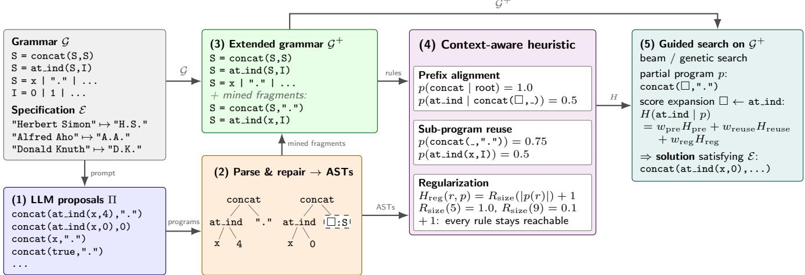  
Figure 1: Overview of the Narcissus pipeline (on the SLIA task of abbreviating names to initials). (1) The LLM is prompted once with the grammar and specification for a handful of proposals Π, which are neither guaranteed solutions nor <sub>g</sub>rammatical (e.<sub>g</sub>. concat $( \mathsf { t r u e } , \ " . \ " ) $ ). (2) Pro<sub>p</sub>osals are <sub>p</sub>arsed into abstract s<sub>y</sub>ntax trees (ASTs) and re<sub>p</sub>aired a<sub>g</sub>ainst the <sub>g</sub>rammar (s<sub>y</sub>ntacticall<sub>y</sub> wron<sub>g</sub> sub-terms become t<sub>yp</sub>ed holes); (3) recurrin<sub>g</sub> fra<sub>g</sub>ments are mined into macro-rules, extendin<sub>g</sub> t<sup>h</sup>e <sub>g</sub>rammar to $\mathcal { G } ^ { + } ;$ (4) the <sub>p</sub>ro<sub>p</sub>osal ASTs <sub>y</sub>ield a context-aware heuristic (<sub>p</sub>refix ali<sub>g</sub>nment alon<sub>g</sub> the root-to-hole <sub>p</sub>ath, where \_ marks a <sub>p</sub>osition the context i<sub>g</sub>nores; sub-<sub>p</sub>ro<sub>g</sub>ram reuse; re<sub>g</sub>ularization); and (5) heuristic-based search (e.<sub>g</sub>., bottom-u<sub>p</sub> or <sub>g</sub>enetic) enumerates <sub>p</sub>ro<sub>g</sub>rams in $\zeta ^ { + }$ <sub>, scor</sub>i<sub>ng eac</sub>h <sub>expans</sub>i<sub>on</sub> i<sub>n</sub> it<sub>s con</sub>t<sub>ex</sub>t<sub>, an</sub>d <sub>re</sub>t<sub>urns</sub> th<sub>e</sub> fi<sub>rs</sub>t <sub>can</sub>did<sub>a</sub>t<sub>e sa</sub>ti<sub>s</sub>f<sub>y</sub>i<sub>ng .</sub>

We <sub>p</sub>resent Nar<sub>c</sub>i<sub>ssus,</sub> a s<sub>y</sub>nthesizer <sub>u</sub>sin<sub>g</sub> context-a<sub>w</sub>are LLM <sub>app</sub>r<sub>ox</sub>im<sub>a</sub>ti<sub>o</sub>n<sub>s as gu</sub>id<sub>a</sub>n<sub>ce.</sub> <sup>1</sup> D<sub>u</sub>rin<sub>g sea</sub>r<sub>c</sub>h<sub>,</sub> N<sub>arcis-</sub> <sub>sus ran</sub>k<sub>s every ru</sub>l<sub>e</sub> b<sub>y</sub> h<sub>ow o</sub>ft<sub>en</sub> th<sub>e proposa</sub>l<sub>s use</sub> it i<sub>n</sub> th<sub>e</sub> <sub>same con</sub>t<sub>ex</sub>t<sub>.</sub> T<sub>o</sub> d<sub>o so,</sub> N<sub>arcissus sa</sub>m<sub>p</sub>l<sub>es p</sub>r<sub>oposa</sub>l<sub>s o</sub>n<sub>ce</sub> <sub>p</sub>er task and <sub>p</sub>arses them into abstract s<sub>y</sub>ntax trees (ASTs), <sub>repa</sub>i<sub>rs</sub> th<sub>e par</sub>t<sub>s</sub> th<sub>a</sub>t <sub>v</sub>i<sub>o</sub>l<sub>a</sub>t<sub>e</sub> th<sub>e grammar, an</sub>d <sub>m</sub>i<sub>nes</sub> th<sub>e</sub>i<sub>r re-</sub> <sub>p</sub>eated fra<sub>g</sub>ments into shortcut rules (Fi<sub>g</sub>ure 1). Three si<sub>g</sub>nals then score each expansion of a candidate: prefix alignment, <sub>w</sub>h<sub>e</sub>th<sub>er proposa</sub>l<sub>s</sub> th<sub>a</sub>t <sub>s</sub>h<sub>are</sub> th<sub>e can</sub>did<sub>a</sub>t<sub>e</sub>’<sub>s con</sub>t<sub>ex</sub>t <sub>use</sub> th<sub>e</sub> <sub>same</sub> <sub>ru</sub>l<sub>e;</sub> <sub>su</sub>b<sub>-program</sub> <sub>reuse,</sub> <sub>w</sub>h<sub>e</sub>th<sub>er</sub> th<sub>e</sub> <sub>ru</sub>l<sub>e</sub> <sub>re</sub>b<sub>u</sub>ild<sub>s</sub> <sub>a</sub> f<sub>ragmen</sub>t th<sub>e</sub> <sub>proposa</sub>l<sub>s</sub> <sub>repea</sub>t<sub>;</sub> <sub>an</sub>d <sub>regu</sub>l<sub>ar</sub>i<sub>za</sub>ti<sub>on,</sub> <sub>a</sub> <sub>so</sub>ft bi<sub>as</sub> t<sub>owar</sub>d<sub>s</sub> th<sub>e</sub> <sub>proposa</sub>l<sub>s</sub>’ <sub>program</sub> <sub>s</sub>i<sub>ze</sub> <sub>p</sub>l<sub>us</sub> <sub>a</sub> <sub>pos</sub>iti<sub>ve</sub> fl<sub>oor</sub> th<sub>a</sub>t k<sub>eeps every ru</sub>l<sub>e reac</sub>h<sub>a</sub>bl<sub>e.</sub> Thi<sub>s gu</sub>id<sub>ance</sub> i<sub>s c</sub>h<sub>eap:</sub> it <sub>cos</sub>t<sub>s</sub> <sub>a</sub> t<sub>ree</sub> l<sub>oo</sub>k<sub>up per expans</sub>i<sub>on, an</sub>d th<sub>e</sub> LLM i<sub>s never ca</sub>ll<sub>e</sub>d d<sub>ur</sub>i<sub>ng searc</sub>h<sub>.</sub> F<sub>ur</sub>th<sub>er, s</sub>i<sub>nce no ru</sub>l<sub>e</sub> i<sub>s ever prune</sub>d<sub>,</sub> t<sub>as</sub>k<sub>s</sub> <sub>rema</sub>i<sub>n</sub> <sub>so</sub>l<sub>va</sub>bl<sub>e</sub> <sub>even</sub> <sub>w</sub>h<sub>en</sub> th<sub>e</sub> <sub>proposa</sub>l<sub>s</sub> <sub>are</sub> <sub>m</sub>i<sub>s</sub>l<sub>ea</sub>di<sub>ng.</sub>

W<sub>e eva</sub>l<sub>ua</sub>t<sub>e</sub> N<sub>arcissus w</sub>ith t<sub>wo</sub> b<sub>ac</sub>k<sub>en</sub>d<sub>s, a cos</sub>t<sub>-</sub>b<sub>ase</sub>d b<sub>o</sub>tt<sub>om-up</sub> b<sub>eam</sub> <sub>an</sub>d <sub>a</sub> <sub>gene</sub>ti<sub>c</sub> t<sub>op-</sub>d<sub>own</sub> <sub>searc</sub>h<sub>,</sub> <sub>across</sub> fi<sub>ve</sub> domains (SLIA, BV, Dee<sub>p</sub>Coder, ARC, ARGA) (Padhi et al. 2019<sub>;</sub> Al<sub>ur e</sub>t <sub>a</sub>l<sub>.</sub> 2013<sub>;</sub> B<sub>a</sub>l<sub>og e</sub>t <sub>a</sub>l<sub>.</sub> 2017<sub>;</sub> Ch<sub>o</sub>ll<sub>e</sub>t 2019<sub>;</sub> X<sub>u,</sub> Khalil, and Sanner 2023), with <sub>p</sub>ro<sub>p</sub>osals from several LLMs <sub>rang</sub>i<sub>ng</sub> f<sub>rom mos</sub>tl<sub>y correc</sub>t t<sub>o a</sub>l<sub>mos</sub>t <sub>never grammar-va</sub>lid<sub>.</sub> Th<sub>e</sub> k<sub>ey</sub> fi<sub>n</sub>di<sub>ng</sub> i<sub>s</sub> th<sub>a</sub>t <sub>con</sub>t<sub>ex</sub>t d<sub>r</sub>i<sub>ves</sub> th<sub>e ga</sub>i<sub>n:</sub> N<sub>arcissus</sub> b<sub>ea</sub>t<sub>s</sub> th<sub>e s</sub>t<sub>a</sub>ti<sub>c pr</sub>i<sub>or on a</sub>ll b<sub>enc</sub>h<sub>mar</sub>k<sub>s un</sub>d<sub>er</sub> b<sub>o</sub>th b<sub>ac</sub>k<sub>-</sub> <sub>en</sub>d<sub>s,</sub> <sub>an</sub>d <sub>p</sub>l<sub>a</sub>i<sub>n</sub> <sub>re-promp</sub>ti<sub>ng,</sub> th<sub>e</sub> l<sub>oop</sub> <sub>we</sub> <sub>opene</sub>d <sub>w</sub>ith<sub>,</sub> b<sub>y</sub> <sub>a w</sub>id<sub>e marg</sub>i<sub>n, s</sub>t<sub>ay</sub>i<sub>ng re</sub>li<sub>a</sub>bl<sub>e even w</sub>h<sub>en</sub> f<sub>ew proposa</sub>l<sub>s are</sub> <sub>grammar-va</sub>lid <sub>or correc</sub>t<sub>.</sub> O<sub>ur</sub> h<sub>eur</sub>i<sub>s</sub>ti<sub>c reac</sub>h<sub>es proposa</sub>l<sub>-</sub> lik<sub>e programs a</sub>b<sub>ou</sub>t <sub>an or</sub>d<sub>er o</sub>f <sub>magn</sub>it<sub>u</sub>d<sub>e sooner, an</sub>d <sub>on</sub> ARC it solves 40% of the tasks while the raw proposals, kept to the target grammar, solve 13%.

In summar<sub>y</sub>, we contribute (i) a context-aware heuristic th<sub>a</sub>t <sub>scores eac</sub>h <sub>grammar c</sub>h<sub>o</sub>i<sub>ce</sub> b<sub>y pre</sub>fi<sub>x a</sub>li<sub>gnmen</sub>t<sub>, su</sub>b<sub>-</sub> <sub>program</sub> <sub>reuse,</sub> <sub>an</sub>d <sub>regu</sub>l<sub>ar</sub>i<sub>za</sub>ti<sub>on,</sub> <sub>c</sub>h<sub>eap</sub>l<sub>y</sub> <sub>enoug</sub>h t<sub>o</sub> <sub>consu</sub>lt at millions of ex<sub>p</sub>ansions; (ii) a <sub>p</sub>i<sub>p</sub>eline that turns raw LLM t<sub>ex</sub>t i<sub>n</sub>t<sub>o</sub> <sub>grammar-aware</sub> <sub>gu</sub>id<sub>ance,</sub> <sub>repa</sub>i<sub>r</sub>i<sub>ng</sub> ill<sub>-</sub>f<sub>orme</sub>d <sub>pro-</sub> <sub>posa</sub>l<sub>s an</sub>d <sub>m</sub>i<sub>n</sub>i<sub>ng</sub> th<sub>e</sub>i<sub>r recurr</sub>i<sub>ng</sub> f<sub>ragmen</sub>t<sub>s</sub> i<sub>n</sub>t<sub>o grammar</sub> extensions; and (iii) evidence across five domains and two b<sub>ac</sub>k<sub>en</sub>d<sub>s</sub> th<sub>a</sub>t <sub>con</sub>t<sub>ex</sub>t<sub>-awareness</sub> i<sub>mproves over s</sub>t<sub>a</sub>ti<sub>c</sub> LLM<sub>-</sub> <sub>gu</sub>id<sub>e</sub>d <sub>syn</sub>th<sub>es</sub>i<sub>s an</sub>d <sub>over promp</sub>ti<sub>ng</sub> th<sub>e</sub> LLM di<sub>rec</sub>tl<sub>y, an</sub>d th<sub>a</sub>t <sub>regu</sub>l<sub>ar</sub>i<sub>za</sub>ti<sub>on ma</sub>k<sub>es poor proposa</sub>l<sub>s sa</sub>f<sub>e.</sub>

## Preliminaries

Program Synthesis. Program synthesis is the task of findi<sub>ng</sub> <sub>a</sub> <sub>program</sub> th<sub>a</sub>t <sub>mee</sub>t<sub>s</sub> <sub>a</sub> <sub>g</sub>i<sub>ven</sub> <sub>spec</sub>ifi<sub>ca</sub>ti<sub>on.</sub> Th<sub>e</sub> <sub>programs</sub> come from a target language ( ), defined by a contextf<sub>ree grammar w</sub>h<sub>ose ru</sub>l<sub>es spec</sub>if<sub>y</sub> h<sub>ow</sub> th<sub>e</sub> l<sub>anguage</sub>’<sub>s</sub> <sub>opera</sub>t<sub>ors,</sub> <sub>cons</sub>t<sub>an</sub>t<sub>s,</sub> <sub>an</sub>d <sub>var</sub>i<sub>a</sub>bl<sub>es</sub> <sub>com</sub>bi<sub>ne.</sub> W<sub>e</sub> <sub>s</sub>t<sub>u</sub>d<sub>y</sub> i<sub>n-</sub> d<sub>uc</sub>ti<sub>ve program syn</sub>th<sub>es</sub>i<sub>s,</sub> th<sub>e mos</sub>t <sub>common one</sub> i<sub>n enu-</sub> merative s<sub>y</sub>nthesis (Gulwani, Polozov, and Sin<sub>g</sub>h 2017), <sub>w</sub>h<sub>ere</sub> th<sub>e</sub> <sub>spec</sub>ifi<sub>ca</sub>ti<sub>on</sub> i<sub>s</sub> <sub>a</sub> <sub>se</sub>t <sub>o</sub>f i<sub>npu</sub>t<sub>–ou</sub>t<sub>pu</sub>t <sub>examp</sub>l<sub>es</sub> $\mathcal { E } = \{ ( i _ { 1 } , o _ { 1 } ) , \dots , ( i _ { k } , o _ { k } ) \}$ <sup>and a</sup> p<sup>ro</sup>g<sup>ram</sup> $p \in { \mathcal { L } } ( { \mathcal { G } } )$ <sub>so</sub>l<sub>ves</sub> th<sub>e</sub> t<sub>as</sub>k if $p ( i _ { j } ) = o _ { j }$ for all j. Checking a given candidate <sub>aga</sub>i<sub>ns</sub>t i<sub>s c</sub>h<sub>eap;</sub> fi<sub>n</sub>di<sub>ng one</sub> th<sub>a</sub>t <sub>passes</sub> i<sub>s no</sub>t<sub>.</sub>

E<sub>numera</sub>ti<sub>ve searc</sub>h it<sub>era</sub>ti<sub>ve</sub>l<sub>y</sub> b<sub>u</sub>ild<sub>s programs</sub> f<sub>rom</sub> th<sub>e</sub> <sub>grammar,</sub> t<sub>es</sub>t<sub>s eac</sub>h <sub>comp</sub>l<sub>e</sub>t<sub>e one aga</sub>i<sub>ns</sub>t th<sub>e spec</sub>ifi<sub>ca</sub>ti<sub>on,</sub> <sub>a</sub>nd <sub>s</sub>t<sub>ops</sub> <sub>w</sub>h<sub>e</sub>n <sub>o</sub>n<sub>e</sub> <sub>passes.</sub> En<sub>u</sub>m<sub>e</sub>r<sub>a</sub>ti<sub>o</sub>n <sub>ca</sub>n <sub>p</sub>r<sub>ocee</sub>d t<sub>op-</sub> d<sub>own, repea</sub>t<sub>e</sub>dl<sub>y expan</sub>di<sub>ng open pos</sub>iti<sub>ons s</sub>t<sub>ar</sub>ti<sub>ng</sub> f<sub>rom</sub> th<sub>e</sub> <sub>grammar</sub>’<sub>s s</sub>t<sub>ar</sub>t <sub>sym</sub>b<sub>o</sub>l <sub>so</sub> th<sub>a</sub>t <sub>every searc</sub>h <sub>s</sub>t<sub>a</sub>t<sub>e</sub> i<sub>s a par</sub>ti<sub>a</sub>l <sub>p</sub>ro<sub>g</sub>ram, or bottom-u<sub>p</sub> (BUS), re<sub>p</sub>eatedl<sub>y</sub> com<sub>p</sub>osin<sub>g</sub> com-<sub>p</sub>l<sub>e</sub>t<sub>e su</sub>b<sub>-</sub>t<sub>erms</sub> i<sub>n</sub>t<sub>o</sub> l<sub>arger ones.</sub> W<sub>e use var</sub>i<sub>an</sub>t<sub>s o</sub>f b<sub>o</sub>th <sub>searc</sub>h <sub>approac</sub>h<sub>es.</sub> Si<sub>nce</sub> th<sub>e num</sub>b<sub>er o</sub>f <sub>programs grows ex-</sub> <sub>ponen</sub>ti<sub>a</sub>ll<sub>y</sub> <sub>w</sub>ith <sub>program</sub> <sub>s</sub>i<sub>ze,</sub> <sub>mos</sub>t <sub>syn</sub>th<sub>es</sub>i<sub>zers</sub> <sub>re</sub>l<sub>y</sub> <sub>on</sub> <sub>a</sub> h<sub>eur</sub>i<sub>s</sub>ti<sub>c</sub> th<sub>a</sub>t d<sub>ec</sub>id<sub>es w</sub>hi<sub>c</sub>h <sub>can</sub>did<sub>a</sub>t<sub>es</sub> t<sub>o exp</sub>l<sub>ore</sub> fi<sub>rs</sub>t<sub>.</sub>

## Problem Statement

A <sub>searc</sub>h <sub>s</sub>t<sub>a</sub>t<sub>e</sub> i<sub>s</sub> <sub>a</sub> <sub>program</sub> th<sub>a</sub>t <sub>may</sub> <sub>s</sub>till b<sub>e</sub> <sub>par</sub>ti<sub>a</sub>l<sub>,</sub> $p ( p _ { 1 } , \ldots , \sqsubset , \ldots , p _ { m } )$ <sub>, w</sub>ith <sub>open pos</sub>iti<sub>ons ca</sub>ll<sub>e</sub>d h<sub>o</sub>l<sub>es;</sub> it i<sub>s</sub> <sub>comp</sub>l<sub>e</sub>t<sub>e</sub> <sub>once</sub> <sub>no</sub> h<sub>o</sub>l<sub>e</sub> <sub>rema</sub>i<sub>ns.</sub> O<sub>n</sub>l<sub>y</sub> <sub>comp</sub>l<sub>e</sub>t<sub>e</sub> <sub>programs</sub> <sub>can</sub> b<sub>e</sub> t<sub>es</sub>t<sub>e</sub>d <sub>aga</sub>i<sub>ns</sub>t $\mathcal { E } .$ . Choosing a grammar rule r to fill <sub>a</sub> h<sub>o</sub>l<sub>e</sub> □ i<sub>s an ex ans</sub>i<sub>on, an</sub>d <sub>a</sub> h<sub>eur</sub>i<sub>s</sub>ti<sub>c</sub> d<sub>ec</sub>id<sub>es w</sub>hi<sub>c</sub>h <sub>expans</sub>i<sub>ons</sub> th<sub>e searc</sub>h <sub>exp</sub>l<sub>ores</sub> fi<sub>rs</sub>t<sub>.</sub>

Th<sub>e pro</sub>bl<sub>em we a</sub>dd<sub>ress</sub> i<sub>s</sub> t<sub>o cons</sub>t<sub>ruc</sub>t thi<sub>s</sub> h<sub>eur</sub>i<sub>s</sub>ti<sub>c</sub> f<sub>rom</sub> LLM <sub>p</sub>r<sub>oposa</sub>l<sub>s: g</sub>i<sub>ve</sub>n <sub>a g</sub>r<sub>a</sub>mm<sub>a</sub>r ${ \mathcal { G } } ,$ exam<sub>p</sub><sup>l</sup>es $\mathcal { E } ,$ <sub>an</sub>d <sub>a se</sub>t of proposals Π sampled once before search, build a heuristic that (i) scores an ex<sub>p</sub>ansion de<sub>p</sub>endin<sub>g</sub> on the <sub>p</sub>artial <sub>p</sub>ro-<sub>g</sub>ram it extends, (ii) is chea<sub>p</sub> enou<sub>g</sub>h to consult at ever<sub>y</sub> one <sub>o</sub>f <sub>m</sub>illi<sub>ons o</sub>f <sub>expans</sub>i<sub>ons w</sub>ith<sub>ou</sub>t <sub>query</sub>i<sub>ng</sub> th<sub>e</sub> LLM<sub>, an</sub>d (iii) leaves ever<sub>y</sub> rule of $\mathcal { G }$ <sub>reac</sub>h<sub>a</sub>bl<sub>e, so</sub> th<sub>e gu</sub>id<sub>e</sub>d <sub>searc</sub>h still has a chance to solve the task even when Π is misleading. In line with <sub>p</sub>rior work (Barke et al. 2024; Li, Parsert, and Pol<sub>g</sub>reen 2024), the <sub>p</sub>ro<sub>p</sub>osals serve as <sub>g</sub>uidance rather than answers. Where we difer is requirement (i): a static <sub>g</sub>rammar <sub>pr</sub>i<sub>or</sub> <sub>ass</sub>i<sub>gns</sub> <sub>eac</sub>h <sub>ru</sub>l<sub>e</sub> <sub>one</sub> <sub>g</sub>l<sub>o</sub>b<sub>a</sub>l <sub>score,</sub> <sub>so</sub> <sub>a</sub> <sub>ru</sub>l<sub>e</sub> <sub>scores</sub> th<sub>e</sub> <sub>same w</sub>h<sub>erever</sub> it i<sub>s use</sub>d<sub>.</sub> W<sub>e</sub> i<sub>ns</sub>t<sub>ea</sub>d l<sub>e</sub>t th<sub>e score</sub> d<sub>epen</sub>d <sub>on</sub> th<sub>e par</sub>ti<sub>a</sub>l <sub>program</sub> th<sub>e ru</sub>l<sub>e expan</sub>d<sub>s:</sub>

Definition 1 (Context-aware heuristic). Given a grammar $\mathcal { G }$ <sub>a</sub>nd <sub>a se</sub>t <sub>o</sub>f LLM <sub>p</sub>r<sub>oposa</sub>l<sub>s</sub> $\Pi = \{ \pi _ { 1 } , \ldots , \pi _ { n } \}$ f<sub>or</sub> th<sub>e</sub> t<sub>as</sub>k<sub>, a</sub> <sub>con</sub>t<sub>ex</sub>t<sub>-aware</sub> h<sub>eur</sub>i<sub>s</sub>ti<sub>c</sub> i<sub>s a</sub> f<sub>unc</sub>ti<sub>on</sub> $H ( r \mid p , \Pi )$ th<sub>a</sub>t <sub>scores</sub> filling the open position of a partial program p with a rule r using the proposals Π, where the score of r depends on $p$ and r.

A<sub>ny grammar-</sub>b<sub>ase</sub>d <sub>searc</sub>h <sub>over</sub> ${ \mathcal { L } } ( { \mathcal { G } } )$ <sub>can use suc</sub>h <sub>a</sub> heuristic to order its ex<sub>p</sub>loration; requirement (iii) constrains th<sub>a</sub>t f<sub>ree</sub>d<sub>om:</sub> th<sub>e</sub> h<sub>eur</sub>i<sub>s</sub>ti<sub>c may reor</sub>d<sub>er</sub> th<sub>e searc</sub>h <sub>ar</sub>bit<sub>rar</sub>il<sub>y,</sub> b<sub>u</sub>t it <sub>mus</sub>t l<sub>eave</sub> <sub>every</sub> <sub>par</sub>t <sub>o</sub>f th<sub>e</sub> <sub>grammar</sub> <sub>reac</sub>h<sub>a</sub>bl<sub>e,</sub> <sub>so</sub> th<sub>a</sub>t <sub>m</sub>i<sub>s</sub>l<sub>ea</sub>di<sub>ng</sub> <sub>proposa</sub>l<sub>s</sub> d<sub>e</sub>l<sub>ay</sub> th<sub>e</sub> <sub>so</sub>l<sub>u</sub>ti<sub>on</sub> <sub>ra</sub>th<sub>er</sub> th<sub>an</sub> hidi<sub>ng</sub> it <sub>en</sub>ti<sub>re</sub>l<sub>y.</sub>

## Narcissus

N<sub>arcissus</sub> t<sub>u</sub>rn<sub>s</sub> LLM <sub>p</sub>r<sub>oposa</sub>l<sub>s</sub> int<sub>o a con</sub>t<sub>ex</sub>t<sub>-aware</sub> h<sub>eur</sub>i<sub>s-</sub> ti<sub>c</sub> th<sub>a</sub>t <sub>any gu</sub>id<sub>e</sub>d <sub>searc</sub>h <sub>can</sub> f<sub>o</sub>ll<sub>ow.</sub> It<sub>s</sub> i<sub>npu</sub>t i<sub>s a syn</sub>th<sub>es</sub>i<sub>s</sub> t<sub>as</sub>k<sub>, cons</sub>i<sub>s</sub>ti<sub>ng o</sub>f <sub>a grammar</sub> $\mathcal { G }$ <sub>an</sub>d <sub>a spec</sub>ifi<sub>ca</sub>ti<sub>on g</sub>i<sub>ven as</sub> <sup>in</sup>pu<sup>t-o</sup>u<sup>t</sup>pu<sup>t exam</sup>p<sup>les</sup> $\mathcal { E } ,$ t<sub>oge</sub>th<sub>e</sub>r <sub>w</sub>ith <sub>access</sub> t<sub>o a</sub>n LLM<sub>.</sub> B<sub>e</sub>f<sub>ore searc</sub>h<sub>,</sub> N<sub>arcissus samp</sub>l<sub>es a sma</sub>ll <sub>se</sub>t <sub>o</sub>f <sub>proposa</sub>l programs Π from the LLM and compiles them into the h<sub>eur</sub>i<sub>s</sub>ti<sub>c</sub> $H ( r \mid p , \Pi ) ;$ th<sub>e searc</sub>h th<sub>en uses</sub> th<sub>a</sub>t h<sub>eur</sub>i<sub>s</sub>ti<sub>c</sub> t<sub>o</sub> fi<sub>n</sub>d <sub>a</sub> <sub>program</sub> i<sub>n</sub> $\dot { \mathcal { G } }$ th<sub>a</sub>t <sub>sa</sub>ti<sub>s</sub>fi<sub>es</sub> $\mathcal { E } ,$ , w<sup>i</sup>t<sup>h</sup>out re-<sub>q</sub>uer<sub>y</sub><sup>i</sup>n<sub>g</sub> th<sub>e</sub> LLM<sub>.</sub>

Th<sub>roug</sub>h<sub>ou</sub>t<sub>,</sub> <sub>we</sub> <sub>ca</sub>ll th<sub>e</sub> <sub>qua</sub>lit<sub>y</sub> <sub>o</sub>f th<sub>e</sub> <sub>proposa</sub>l<sub>s</sub> f<sub>or</sub> <sub>a</sub> <sub>g</sub>i<sub>ven</sub> t<sub>as</sub>k th<sub>e</sub> t<sub>as</sub>k’<sub>s</sub> <sub>proposa</sub>l <sub>suppor</sub>t<sub>:</sub> h<sub>ow</sub> <sub>muc</sub>h <sub>use</sub>f<sub>u</sub>l <sub>s</sub>t<sub>ruc</sub>t<sub>ure</sub> th<sub>e</sub> <sub>proposa</sub>l<sub>s</sub> <sub>carry</sub> f<sub>or</sub> th<sub>a</sub>t <sub>spec</sub>ifi<sub>c</sub> <sub>pro</sub>bl<sub>em</sub> <sub>an</sub>d <sub>grammar,</sub> <sub>quan</sub>tifi<sub>e</sub>d i<sub>n</sub> th<sub>e</sub> <sub>exper</sub>i<sub>men</sub>t<sub>a</sub>l <sub>se</sub>t<sub>up</sub> <sub>as</sub> th<sub>e</sub> f<sub>rac</sub>ti<sub>on</sub> <sub>o</sub>f t<sub>as</sub>k<sub>s</sub> th<sub>e</sub> <sub>raw</sub> <sub>proposa</sub>l<sub>s</sub> <sub>a</sub>l<sub>rea</sub>d<sub>y</sub> <sub>so</sub>l<sub>ve.</sub> N<sub>arcissus</sub> i<sub>s</sub> d<sub>es</sub>i<sub>gne</sub>d t<sub>o</sub> <sub>exp</sub>l<sub>o</sub>it hi<sub>g</sub>h <sub>proposa</sub>l <sub>suppor</sub>t <sub>an</sub>d t<sub>o</sub> d<sub>egra</sub>d<sub>e</sub> <sub>grace</sub>f<sub>u</sub>ll<sub>y</sub> <sub>w</sub>h<sub>en</sub> <sub>suppor</sub>t i<sub>s</sub> l<sub>ow, never</sub> d<sub>o</sub>i<sub>ng worse</sub> th<sub>an ungu</sub>id<sub>e</sub>d <sub>searc</sub>h<sub>.</sub>

Overview. Narcissus’ pipeline (Figure 1) has five steps: (1) sam<sub>p</sub>le <sub>p</sub>ro<sub>p</sub>osals b<sub>y p</sub>rom<sub>p</sub>tin<sub>g</sub> the LLM once with the s<sub>p</sub>ecification and the <sub>g</sub>rammar; (2) <sub>p</sub>arse the <sub>p</sub>ro<sub>p</sub>osal texts i<sub>n</sub>t<sub>o a</sub>b<sub>s</sub>t<sub>rac</sub>t <sub>syn</sub>t<sub>ax</sub> t<sub>rees an</sub>d <sub>repa</sub>i<sub>r</sub> th<sub>e par</sub>t<sub>s</sub> th<sub>a</sub>t d<sub>o no</sub>t fit the <sub>g</sub>rammar; (3) mine recurrin<sub>g</sub> sub-<sub>p</sub>ro<sub>g</sub>rams and add th<sub>em</sub> t<sub>o</sub> th<sub>e grammar as macro-ru</sub>l<sub>es, y</sub>i<sub>e</sub>ldi<sub>ng</sub> th<sub>e ex</sub>t<sub>en</sub>d<sub>e</sub>d g<sup>rammar</sup> $\mathcal { G } ^ { + } ; ( 4 )$ <sub>comp</sub>il<sub>e</sub> th<sub>e repa</sub>i<sub>re</sub>d t<sub>rees</sub> i<sub>n</sub>t<sub>o</sub> th<sub>e con</sub>t<sub>ex</sub>t<sub>-</sub> aware heuristic; and (5) run heuristic-<sub>g</sub>uided search, which <sup>en</sup>u<sup>merates</sup> p<sup>ro</sup>g<sup>rams in</sup> $\mathcal { G } ^ { + }$ <sub>exp</sub>l<sub>or</sub>i<sub>ng</sub> th<sub>e expans</sub>i<sub>ons</sub> th<sub>e</sub> p<sup>ro</sup>p<sup>osals s</sup>upp<sup>ort first</sup>.

## Sampling and Repairing LLM Proposals

Sampling proposal programs. Before search, we sample n proposals for the task: we prompt the LLM n times with th<sub>e spec</sub>ifi<sub>ca</sub>ti<sub>on an</sub>d th<sub>e grammar, as</sub>ki<sub>ng eac</sub>h ti<sub>me</sub> f<sub>or a</sub> <sub>program</sub> th<sub>a</sub>t <sub>sa</sub>ti<sub>s</sub>fi<sub>es</sub> th<sub>e</sub> <sub>spec</sub>ifi<sub>ca</sub>ti<sub>on</sub> <sub>us</sub>i<sub>ng</sub> <sub>on</sub>l<sub>y</sub> <sub>grammar</sub> constructs (full tem<sub>p</sub>late in the a<sub>pp</sub>endix), and collect the <sup>text</sup> p<sup>ro</sup>p<sup>osals</sup> $\Pi = \{ \pi _ { 1 } , \ldots , \pi _ { n } \}$ ; the budget n is fixed per d<sub>oma</sub>i<sub>n.</sub> Thi<sub>s</sub> <sub>samp</sub>li<sub>ng</sub> h<sub>appens</sub> <sub>once,</sub> <sub>up</sub> f<sub>ron</sub>t<sub>;</sub> d<sub>ur</sub>i<sub>ng</sub> <sub>searc</sub>h N<sub>arcissus</sub> n<sub>eve</sub>r <sub>ca</sub>ll<sub>s</sub> th<sub>e</sub> LLM <sub>aga</sub>in<sub>.</sub>

Parsing and repairing proposals. We parse each proposal i<sub>n</sub>t<sub>o a syn</sub>t<sub>ax</sub> t<sub>ree,</sub> b<sub>u</sub>t th<sub>e</sub> t<sub>rees rare</sub>l<sub>y</sub> fit th<sub>e grammar: an</sub> LLM <sub>p</sub>r<sub>oposa</sub>l m<sub>ay use a</sub>n <sub>ope</sub>r<sub>a</sub>t<sub>o</sub>r th<sub>e g</sub>r<sub>a</sub>mm<sub>a</sub>r l<sub>ac</sub>k<sub>s, ca</sub>ll <sub>a</sub> f<sub>unc</sub>ti<sub>on w</sub>ith th<sub>e wrong num</sub>b<sub>er o</sub>f <sub>argumen</sub>t<sub>s, or p</sub>l<sub>ace</sub> <sub>an express</sub>i<sub>on o</sub>f th<sub>e wrong</sub> t<sub>ype.</sub> W<sub>e</sub> th<sub>ere</sub>f<sub>ore repa</sub>i<sub>r eac</sub>h t<sub>ree</sub> <sub>aga</sub>i<sub>ns</sub>t th<sub>e</sub> <sub>grammar,</sub> <sub>recurs</sub>i<sub>ve</sub>l<sub>y</sub> <sub>an</sub>d t<sub>op-</sub>d<sub>own.</sub> St<sub>ar</sub>ti<sub>ng</sub> <sub>a</sub>t th<sub>e</sub> <sub>roo</sub>t<sub>,</sub> <sub>we</sub> <sub>ma</sub>t<sub>c</sub>h <sub>eac</sub>h <sub>no</sub>d<sub>e</sub> <sub>aga</sub>i<sub>ns</sub>t th<sub>e</sub> <sub>grammar</sub> <sub>ru</sub>l<sub>es</sub> th<sub>a</sub>t <sub>can pro</sub>d<sub>uce</sub> th<sub>e</sub> t<sub>ype expec</sub>t<sub>e</sub>d <sub>a</sub>t it<sub>s pos</sub>iti<sub>on, recurs</sub>i<sub>ng</sub> i<sub>n</sub>t<sub>o</sub> th<sub>e c</sub>hild<sub>ren eac</sub>h <sub>ma</sub>t<sub>c</sub>hi<sub>ng ru</sub>l<sub>e prescr</sub>ib<sub>es.</sub> If <sub>no ru</sub>l<sub>e</sub> <sub>ma</sub>t<sub>c</sub>h<sub>es, we rep</sub>l<sub>ace</sub> th<sub>e su</sub>b<sub>-</sub>t<sub>erm w</sub>ith <sub>a</sub> h<sub>o</sub>l<sub>e o</sub>f it<sub>s expec</sub>t<sub>e</sub>d <sup>t</sup>yp<sup>e</sup> $T$ and sto<sub>p</sub> descendin<sub>g</sub> (e.<sub>g</sub>., an o<sub>p</sub>erator the <sub>g</sub>rammar l<sub>ac</sub>k<sub>s</sub> b<sub>ecomes a</sub> t<sub>ype</sub>d h<sub>o</sub>l<sub>e w</sub>hil<sub>e</sub> th<sub>e surroun</sub>di<sub>ng s</sub>t<sub>ruc</sub>t<sub>ure</sub> survives). Onl<sub>y</sub> <sub>p</sub>ro<sub>p</sub>osals that <sub>y</sub>ield no ex<sub>p</sub>ression tree at all <sub>are</sub> di<sub>scar</sub>d<sub>e</sub>d<sub>.</sub> Th<sub>e</sub> h<sub>eur</sub>i<sub>s</sub>ti<sub>c</sub> t<sub>rea</sub>t<sub>s</sub> th<sub>e</sub> i<sub>nser</sub>t<sub>e</sub>d h<sub>o</sub>l<sub>es as a</sub>b<sub>sen</sub>t <sub>ev</sub>id<sub>ence: a</sub>li<sub>gnmen</sub>t <sub>an</sub>d <sub>reuse s</sub>till <sub>ma</sub>t<sub>c</sub>h th<sub>e</sub> i<sub>n</sub>t<sub>ac</sub>t <sub>s</sub>t<sub>ruc</sub>t<sub>ure</sub> <sub>aroun</sub>d <sub>a</sub> h<sub>o</sub>l<sub>e, w</sub>hil<sub>e</sub> th<sub>e</sub> h<sub>o</sub>l<sub>e</sub> it<sub>se</sub>lf <sub>suppor</sub>t<sub>s no par</sub>ti<sub>cu</sub>l<sub>ar</sub> <sub>ru</sub>l<sub>e.</sub>

Adding frequent sub-programs to the grammar. After <sub>pars</sub>i<sub>ng an</sub>d <sub>repa</sub>i<sub>r, we m</sub>i<sub>ne su</sub>b<sub>-programs</sub> th<sub>a</sub>t <sub>recur across</sub> th<sub>e proposa</sub>l t<sub>rees: every su</sub>bt<sub>ree o</sub>f <sub>a</sub>t l<sub>eas</sub>t t<sub>wo no</sub>d<sub>es</sub> th<sub>a</sub>t <sub>occurs a</sub>t l<sub>eas</sub>t t<sub>w</sub>i<sub>ce</sub> i<sub>n</sub> th<sub>e repa</sub>i<sub>re</sub>d <sub>proposa</sub>l<sub>s</sub> i<sub>s a</sub>dd<sub>e</sub>d t<sub>o</sub> th<sub>e</sub> g<sup>rammar as a macro-r</sup>u<sup>le</sup> w<sup>ith its root t</sup>yp<sup>e as ret</sup>u<sup>rn t</sup>yp<sup>e</sup>. Mi<sub>n</sub>i<sub>ng</sub> <sub>g</sub>i<sub>ves</sub> th<sub>e</sub> <sub>searc</sub>h <sub>a</sub> <sub>s</sub>h<sub>or</sub>t<sub>cu</sub>t<sub>:</sub> <sub>a</sub> f<sub>ragmen</sub>t th<sub>e</sub> <sub>propos-</sub> <sub>a</sub>l<sub>s</sub> k<sub>eep re</sub>b<sub>u</sub>ildi<sub>ng can</sub> b<sub>e p</sub>l<sub>ace</sub>d i<sub>n a s</sub>i<sub>ng</sub>l<sub>e expans</sub>i<sub>on</sub> i<sub>n-</sub> <sub>s</sub>t<sub>ea</sub>d <sub>o</sub>f b<sub>e</sub>i<sub>ng re</sub>di<sub>scovere</sub>d <sub>over many.</sub> Mi<sub>ne</sub>d f<sub>ragmen</sub>t<sub>s may</sub> th<sub>emse</sub>l<sub>ves con</sub>t<sub>a</sub>i<sub>n</sub> h<sub>o</sub>l<sub>es;</sub> th<sub>ese</sub> b<sub>ecome par</sub>ti<sub>a</sub>l <sub>macro-ru</sub>l<sub>es</sub> <sub>w</sub>h<sub>ose</sub> h<sub>o</sub>l<sub>es rema</sub>i<sub>n open as non</sub>t<sub>erm</sub>i<sub>na</sub>l <sub>argumen</sub>t<sub>s, suc</sub>h <sub>as</sub> $\mathsf { a t \_ i n d } \left( \mathbf { x } , \mathrm { I } \right)$ i<sub>n</sub> Fi<sub>gure</sub> 1<sub>.</sub> Th<sub>e augmen</sub>t<sub>a</sub>ti<sub>on compr</sub>i<sub>ses</sub> <sub>a</sub>ll <sub>m</sub>i<sub>ne</sub>d f<sub>ragmen</sub>t<sub>s, comp</sub>l<sub>e</sub>t<sub>e an</sub>d <sub>par</sub>ti<sub>a</sub>l <sub>a</sub>lik<sub>e, an</sub>d <sub>y</sub>i<sub>e</sub>ld<sub>s</sub> th<sub>e ex</sub>t<sub>en</sub>d<sub>e</sub>d <sub>grammar</sub> $\mathcal { G } ^ { \bar { + } }$ <sub>.</sub> Th<sub>e</sub> id<sub>ea</sub> i<sub>s</sub> i<sub>n</sub> th<sub>e sp</sub>i<sub>r</sub>it <sub>o</sub>f li<sub>-</sub> brar<sub>y</sub> learnin<sub>g</sub> (Ellis et al. 2021), exce<sub>p</sub>t that we obtain the f<sub>ragmen</sub>t<sub>s</sub> f<sub>or</sub> f<sub>ree</sub> f<sub>rom</sub> th<sub>e proposa</sub>l<sub>s</sub> f<sub>or</sub> th<sub>e</sub> t<sub>as</sub>k <sub>a</sub>t h<sub>an</sub>d<sub>.</sub> Th<sub>e augmen</sub>t<sub>a</sub>ti<sub>on c</sub>h<sub>anges w</sub>h<sub>a</sub>t th<sub>e searc</sub>h <sub>can reac</sub>h i<sub>n</sub> f<sub>ew</sub> <sub>expans</sub>i<sub>ons</sub> i<sub>n</sub>d<sub>epen</sub>d<sub>en</sub>tl<sub>y</sub> <sub>o</sub>f th<sub>e</sub> h<sub>eur</sub>i<sub>s</sub>ti<sub>c;</sub> th<sub>e</sub> <sub>exper</sub>i<sub>men</sub>t<sub>s</sub> isolate its efect with a dedicated baseline (au<sub>g</sub>mented BFS).

## A Context-Aware Heuristic

Goal of the heuristic. The heuristic $H ( r \mid p , \Pi )$ i<sub>s</sub> th<sub>e</sub> h<sub>ear</sub>t <sub>o</sub>f N<sub>arcissus:</sub> it <sub>scores expan</sub>di<sub>ng</sub> th<sub>e open pos</sub>iti<sub>on</sub> □ of a partial program p with a grammar rule r. The higher th<sub>e score,</sub> th<sub>e more prom</sub>i<sub>s</sub>i<sub>ng</sub> th<sub>e expans</sub>i<sub>on.</sub> Th<sub>e score com-</sub> bi<sub>nes</sub> th<sub>ree s</sub>i<sub>gna</sub>l<sub>s: pre</sub>fi<sub>x a</sub>li<sub>gnmen</sub>t<sub>, su</sub>b<sub>-program reuse, an</sub>d <sub>regu</sub>l<sub>ar</sub>i<sub>za</sub>ti<sub>on.</sub> E<sub>ac</sub>h <sub>cap</sub>t<sub>ures a</sub> dif<sub>eren</sub>t <sub>way</sub> th<sub>e proposa</sub>l<sub>s</sub> <sub>can</sub> i<sub>n</sub>f<sub>orm, or</sub> f<sub>a</sub>il t<sub>o</sub> i<sub>n</sub>f<sub>orm,</sub> th<sub>e c</sub>h<sub>o</sub>i<sub>ce.</sub>

Prefix alignment. The first signal asks whether the pro-<sub>posa</sub>l<sub>s use</sub> th<sub>e same ru</sub>l<sub>e</sub> i<sub>n</sub> th<sub>e same con</sub>t<sub>ex</sub>t<sub>.</sub> Th<sub>e con</sub>t<sub>ex</sub>t <sub>o</sub>f <sub>a</sub> h<sub>o</sub>l<sub>e</sub> i<sub>s</sub> th<sub>e c</sub>h<sub>a</sub>i<sub>n o</sub>f <sub>ru</sub>l<sub>es on</sub> th<sub>e pa</sub>th f<sub>rom</sub> th<sub>e roo</sub>t <sub>o</sub>f th<sub>e</sub> <sub>par</sub>ti<sub>a</sub>l <sub>program</sub> d<sub>own</sub> t<sub>o</sub> th<sub>e</sub> h<sub>o</sub>l<sub>e.</sub> L<sub>e</sub>t $c ( p )$ b<sub>e</sub> th<sub>e num</sub>b<sub>er</sub> of proposals that carry the same rule as p at every position alon<sub>g</sub> this <sub>p</sub>ath (the <sub>p</sub>ro<sub>p</sub>osals “in the same situation”), and l<sub>e</sub>t $s _ { \mathrm { p r e f i x } } ( r , p )$ b<sub>e</sub> th<sub>ose among</sub> th<sub>em</sub> th<sub>a</sub>t <sub>con</sub>ti<sub>nue w</sub>ith <sub>ru</sub>l<sub>e</sub> r at the hole itself. The signal is the conditional share of proposals that align with choosing r, among those that share th<sub>e con</sub>t<sub>ex</sub>t<sub>:</sub>

$$
H _ { \mathrm { p r e f i x } } ( r , p ) = { \left\{ \begin{array} { l l } { s _ { \mathrm { p r e f i x } } ( r , p ) / c ( p ) } & { { \mathrm { i f ~ } } c ( p ) > 0 , } \\ { 0 } & { { \mathrm { o t h e r w i s e . } } } \end{array} \right. }
$$

Th<sub>e</sub> l<sub>arger</sub> thi<sub>s s</sub>h<sub>are,</sub> th<sub>e</sub> hi<sub>g</sub>h<sub>er</sub> th<sub>e score; a ru</sub>l<sub>e</sub> th<sub>a</sub>t i<sub>s</sub> <sub>common</sub> i<sub>n</sub> th<sub>e</sub> <sub>proposa</sub>l<sub>s</sub> <sub>overa</sub>ll b<sub>u</sub>t <sub>no</sub>t i<sub>n</sub> thi<sub>s</sub> <sub>con</sub>t<sub>ex</sub>t <sub>ge</sub>t<sub>s</sub> no su<sub>pp</sub>ort (ste<sub>p</sub> (4) of Fi<sub>g</sub>ure 1 illustrates this).

Sub-program reuse. The second signal rewards rules that h<sub>e</sub>l<sub>p</sub> <sub>re</sub>b<sub>u</sub>ild <sub>su</sub>b<sub>-programs</sub> th<sub>e</sub> <sub>proposa</sub>l<sub>s</sub> <sub>use</sub> <sub>repea</sub>t<sub>e</sub>dl<sub>y,</sub> i<sub>n-</sub> d<sub>epen</sub>d<sub>en</sub>tl<sub>y o</sub>f <sub>con</sub>t<sub>ex</sub>t<sub>.</sub> L<sub>e</sub>t $s _ { \mathrm { r e u s e } } ( r )$ b<sub>e</sub> th<sub>e num</sub>b<sub>er o</sub>f <sub>pro-</sub> posals that contain the sub-program r (here, an<sub>y</sub> subtree, includin<sub>g</sub> a sin<sub>g</sub>le node); then $\bar { H } _ { \mathrm { r e u s e } } ( r ) = s _ { \mathrm { r e u s e } } ( r ) / | \Pi |$ Thi<sub>s</sub> i<sub>s</sub> th<sub>e con</sub>t<sub>ex</sub>t<sub>-</sub>f<sub>ree par</sub>t <sub>o</sub>f th<sub>e</sub> h<sub>eur</sub>i<sub>s</sub>ti<sub>c; un</sub>lik<sub>e a g</sub>l<sub>o</sub>b<sub>a</sub> <sub>ru</sub>l<sub>e</sub> f<sub>requency,</sub> it <sub>a</sub>l<sub>so</sub> <sub>ac</sub>t<sub>s</sub> <sub>over</sub> <sub>m</sub>i<sub>ne</sub>d f<sub>ragmen</sub>t<sub>s</sub> <sub>an</sub>d i<sub>s</sub> <sub>com-</sub> bi<sub>ne</sub>d <sub>w</sub>ith th<sub>e</sub> <sub>con</sub>t<sub>ex</sub>t<sub>-aware</sub> t<sub>erm</sub> <sub>a</sub>b<sub>ove.</sub> R<sub>euse</sub> h<sub>e</sub>l<sub>ps</sub> <sub>w</sub>h<sub>en</sub> th<sub>e</sub> <sub>proposa</sub>l<sub>s</sub> <sub>s</sub>h<sub>are</sub> l<sub>oca</sub>l <sub>par</sub>t<sub>s</sub> b<sub>u</sub>t di<sub>sagree</sub> <sub>on</sub> th<sub>e</sub> <sub>w</sub>h<sub>o</sub>l<sub>e:</sub> <sub>a</sub> f<sub>ragmen</sub>t lik<sub>e</sub> $\mathtt { c o n c a t \left( S , \vec { \textbf { \ i } } ^ { \mathtt { n } } , \vec { \textbf { \ i } } ^ { \mathtt { n } } \right) }$ <sub>recurr</sub>i<sub>ng</sub> i<sub>ns</sub>id<sub>e</sub> dif<sub>eren</sub>t <sub>s</sub>t<sub>ruc</sub>t<sub>ure</sub> bi<sub>ases</sub> th<sub>e</sub> <sub>searc</sub>h t<sub>owar</sub>d<sub>s</sub> <sub>programs</sub> <sub>con</sub>t<sub>a</sub>i<sub>n</sub>i<sub>ng</sub> it<sub>,</sub> <sub>w</sub>h<sub>erever</sub> th<sub>e searc</sub>h i<sub>s, even w</sub>h<sub>en no</sub> f<sub>u</sub>ll <sub>proposa</sub>l i<sub>s correc</sub>t<sub>.</sub>

Regularization. The proposals indicate not only which <sub>cons</sub>t<sub>ruc</sub>t<sub>s are p</sub>l<sub>aus</sub>ibl<sub>e,</sub> b<sub>u</sub>t <sub>a</sub>l<sub>so roug</sub>hl<sub>y</sub> h<sub>ow</sub> l<sub>arge</sub> th<sub>e so</sub>l<sub>u-</sub> ti<sub>on s</sub>h<sub>ou</sub>ld b<sub>e.</sub> Th<sub>e</sub> thi<sub>r</sub>d <sub>s</sub>i<sub>gna</sub>l <sub>uses</sub> th<sub>a</sub>t<sub>:</sub> it <sub>pu</sub>ll<sub>s</sub> th<sub>e searc</sub>h towards the program size the proposals suggest. Let S(Π) b<sub>e</sub> th<sub>e mu</sub>lti<sub>se</sub>t <sub>o</sub>f <sub>s</sub>i<sub>zes o</sub>f th<sub>e repa</sub>i<sub>re</sub>d <sub>proposa</sub>l AST<sub>s, an</sub>d score a program of size k by a Gaussian mixture with one <sup>com</sup>p<sup>onent</sup> p<sup>er</sup> p<sup>ro</sup>p<sup>osal</sup>,

$$
\begin{array} { r } { R _ { \mathrm { s i z e } } ( k ) = \frac { 1 } { Z } \sum _ { t \in S ( \Pi ) } \exp \bigl ( - ( k - t ) ^ { 2 } / 2 \sigma ^ { 2 } \bigr ) , } \end{array}
$$

where the bandwidth σ is a h er arameter of Narcissus <sub>an</sub>d $\begin{array} { r } { Z = \operatorname* { m a x } _ { j } \sum _ { t \in S ( \Pi ) } \exp ( - ( j - t ) ^ { 2 } / 2 \sigma ^ { 2 } ) } \end{array}$ <sub>norma</sub>li<sub>ses</sub> th<sub>e</sub> mixture to peak at 1. Sizes count base-grammar operations, <sub>so a program</sub> b<sub>u</sub>ilt f<sub>rom a m</sub>i<sub>ne</sub>d <sub>macro-ru</sub>l<sub>e coun</sub>t<sub>s a</sub>t it<sub>s</sub> expanded size. Writing p(r) for the program that results from expanding p with r, the signal is

$$
H _ { \mathrm { r e g } } ( r , p ) = R _ { \mathrm { s i z e } } ( | p ( r ) | ) + C .
$$

Thi<sub>s</sub> t<sub>erm concen</sub>t<sub>ra</sub>t<sub>es enumera</sub>ti<sub>on a</sub>t th<sub>e comp</sub>l<sub>ex</sub>it<sub>y</sub> th<sub>e</sub> <sub>p</sub>ro<sub>p</sub>osals indicate (cf. RQ3) and kee<sub>p</sub>s the search from drifti<sub>ng</sub> i<sub>n</sub>t<sub>o ever-</sub>l<sub>arger programs.</sub> Th<sub>e</sub> fl<sub>oor</sub> $C > 0$ <sup>kee</sup>p<sup>s</sup> <sup>e</sup>v<sup>er</sup>y <sub>ru</sub>l<sub>e reac</sub>h<sub>a</sub>bl<sub>e: pre</sub>fi<sub>x a</sub>li<sub>gnmen</sub>t <sub>an</sub>d <sub>reuse can</sub> b<sub>o</sub>th b<sub>e zero</sub> <sub>an</sub>d th<sub>e m</sub>i<sub>x</sub>t<sub>ure ar</sub>bit<sub>rar</sub>il<sub>y sma</sub>ll<sub>, so</sub> $C$ <sub>g</sub>uarantees a str<sup>i</sup>ct<sup>l</sup><sub>y</sub> <sub>pos</sub>iti<sub>ve</sub> <sub>score,</sub> <sub>exc</sub>l<sub>u</sub>di<sub>ng</sub> <sub>no</sub> <sub>ru</sub>l<sub>e.</sub> Wh<sub>en</sub> th<sub>e</sub> <sub>proposa</sub>l<sub>s</sub> <sub>carry</sub> no signal, ever<sub>y</sub> expansion falls back to C, scores alike, and th<sub>e searc</sub>h d<sub>egenera</sub>t<sub>es</sub> t<sub>o ungu</sub>id<sub>e</sub>d <sub>enumera</sub>ti<sub>on,</sub> N<sub>arcis-</sub> <sub>sus</sub>’<sub>s wors</sub>t <sub>case.</sub>

Combined score. The heuristic adds the three signals with fixed weights; since Π is fixed per task, we abbreviate $H ( r \mid$ $p , \Pi )$ as $H ( \boldsymbol { r } , \boldsymbol { p } )$

$$
\begin{array} { r l } & { H ( r , p ) = w _ { \mathrm { p r e f i x } } H _ { \mathrm { p r e f i x } } ( r , p ) + w _ { \mathrm { r e u s e } } H _ { \mathrm { r e u s e } } ( r ) } \\ & { \phantom { x x x x x x x x x x x x x x x x x x x x x x x x x x x x x x x x x x } } \\ & { \phantom { x x x x x x x x x x x x x x x x } + w _ { \mathrm { r e g } } H _ { \mathrm { r e g } } ( r , p ) . } \end{array}
$$

The three weights, the bandwidth σ, and the floor $C$ are <sup>h</sup>yp<sup>er</sup>p<sup>arameters</sup> $( w _ { \mathrm { r e g } }$ <sub>a</sub>l<sub>so sca</sub>l<sub>es</sub> $R _ { \mathrm { s i z e } } ) ;$ a we<sup>i</sup><sub>g</sub><sup>h</sup>t swee<sub>p</sub> on SLIA f<sub>oun</sub>d <sub>equa</sub>l <sub>we</sub>i<sub>g</sub>ht<sub>s</sub> t<sub>o wor</sub>k b<sub>es</sub>t<sub>.</sub> W<sub>e</sub> fi<sub>x</sub> th<sub>e we</sub>i<sub>g</sub>ht<sub>s</sub> and C at 1 in ever<sub>y</sub> experiment (Appendix D).

## Search: Using the Heuristic During Synthesis

W<sub>e eva</sub>l<sub>ua</sub>t<sub>e</sub> t<sub>wo searc</sub>h <sub>para</sub>di<sub>gms,</sub> t<sub>op-</sub>d<sub>own an</sub>d b<sub>o</sub>tt<sub>om-up,</sub> <sub>w</sub>ith N<sub>arcissus</sub>’ h<sub>eur</sub>i<sub>s</sub>ti<sub>c.</sub>

Genetic search. The first search method is a genetic al-<sub>gor</sub>ith<sub>m,</sub> <sub>a</sub> t<sub>op-</sub>d<sub>own</sub> <sub>searc</sub>h<sub>:</sub> it <sub>man</sub>i<sub>pu</sub>l<sub>a</sub>t<sub>es</sub> <sub>w</sub>h<sub>o</sub>l<sub>e</sub> <sub>programs</sub> f<sub>rom</sub> th<sub>e roo</sub>t d<sub>own, so every can</sub>did<sub>a</sub>t<sub>e carr</sub>i<sub>es</sub> th<sub>e con</sub>t<sub>ex</sub>t th<sub>e</sub> h<sub>eur</sub>i<sub>s</sub>ti<sub>c nee</sub>d<sub>s.</sub> W<sub>e use a s</sub>t<sub>oc</sub>h<sub>as</sub>ti<sub>c ra</sub>th<sub>er</sub> th<sub>an</sub> d<sub>e</sub>t<sub>erm</sub>i<sub>n-</sub> i<sub>s</sub>ti<sub>c</sub> t<sub>op-</sub>d<sub>own</sub> <sub>searc</sub>h b<sub>ecause</sub> it<sub>s</sub> <sub>mu</sub>t<sub>a</sub>ti<sub>on</sub> <sub>opera</sub>t<sub>or</sub> <sub>a</sub>l<sub>rea</sub>d<sub>y</sub> <sub>co</sub>i<sub>nc</sub>id<sub>es w</sub>ith <sub>a</sub> h<sub>eur</sub>i<sub>s</sub>ti<sub>c-score</sub>d <sub>expans</sub>i<sub>on, so</sub> th<sub>e</sub> h<sub>eur</sub>i<sub>s-</sub> ti<sub>c</sub> d<sub>rops</sub> i<sub>n unc</sub>h<sub>ange</sub>d<sub>; a</sub> d<sub>e</sub>t<sub>erm</sub>i<sub>n</sub>i<sub>s</sub>ti<sub>c searc</sub>h <sub>wou</sub>ld <sub>serve</sub> <sub>equa</sub>ll<sub>y.</sub> A <sub>ne</sub>i<sub>g</sub>hb<sub>our</sub> i<sub>s</sub> <sub>pro</sub>d<sub>uce</sub>d b<sub>y</sub> <sub>resamp</sub>li<sub>ng</sub> <sub>one</sub> <sub>su</sub>b<sub>-</sub> t<sub>ree:</sub> th<sub>e mu</sub>t<sub>a</sub>ti<sub>on s</sub>it<sub>e</sub> i<sub>s a</sub> t<sub>ype</sub>d h<sub>o</sub>l<sub>e, a ru</sub>l<sub>e</sub> i<sub>s</sub> d<sub>rawn</sub> f<sub>or</sub> it f<sub>rom</sub> th<sub>e</sub> h<sub>eur</sub>i<sub>s</sub>ti<sub>c-we</sub>i<sub>g</sub>ht<sub>e</sub>d di<sub>s</sub>t<sub>r</sub>ib<sub>u</sub>ti<sub>on, an</sub>d th<sub>e res</sub>t i<sub>s</sub> <sub>regrown;</sub> <sub>mu</sub>t<sub>a</sub>ti<sub>ng</sub> <sub>a</sub> <sub>su</sub>bt<sub>ree</sub> i<sub>s</sub> th<sub>us</sub> <sub>s</sub>till <sub>scor</sub>i<sub>ng</sub> <sub>a</sub> <sub>ru</sub>l<sub>e</sub> i<sub>n</sub> <sub>con</sub>t<sub>ex</sub>t<sub>, an</sub>d N<sub>arcissus</sub>’<sub>s</sub> h<sub>eur</sub>i<sub>s</sub>ti<sub>c app</sub>li<sub>es na</sub>ti<sub>ve</sub>l<sub>y.</sub> M<sub>u</sub>t<sub>a-</sub> ti<sub>on a</sub>l<sub>so</sub> l<sub>e</sub>t<sub>s</sub> th<sub>e searc</sub>h <sub>move</sub> th<sub>roug</sub>h th<sub>e proposa</sub>l <sub>reg</sub>i<sub>on</sub> f<sub>ree</sub>l<sub>y,</sub> k<sub>eep</sub>i<sub>ng use</sub>f<sub>u</sub>l f<sub>ragmen</sub>t<sub>s w</sub>hil<sub>e c</sub>h<sub>ang</sub>i<sub>ng</sub> th<sub>e s</sub>t<sub>ruc-</sub> t<sub>ure aroun</sub>d th<sub>em, w</sub>hi<sub>c</sub>h h<sub>e</sub>l<sub>ps w</sub>h<sub>en</sub> th<sub>e proposa</sub>l<sub>s con</sub>t<sub>a</sub>i<sub>n</sub> <sub>correc</sub>t <sub>su</sub>b<sub>-programs assem</sub>bl<sub>e</sub>d <sub>wrong</sub>l<sub>y.</sub>

Cost-guided beam search. The second search method foll<sub>ows</sub> H<sub>y</sub>S<sub>yn</sub>th’<sub>s cos</sub>t<sub>-</sub>b<sub>ase</sub>d b<sub>o</sub>tt<sub>om-up enumera</sub>ti<sub>on,</sub> th<sub>e</sub> d<sub>om-</sub> i<sub>nan</sub>t <sub>s</sub>t<sub>ra</sub>t<sub>egy</sub> i<sub>n enumera</sub>ti<sub>ve syn</sub>th<sub>es</sub>i<sub>s, w</sub>hi<sub>c</sub>h <sub>a</sub>ll<sub>ows a more</sub> di<sub>rec</sub>t <sub>compar</sub>i<sub>son o</sub>f h<sub>eur</sub>i<sub>s</sub>ti<sub>cs.</sub> H<sub>owever, we rep</sub>l<sub>ace</sub> th<sub>e un-</sub> b<sub>oun</sub>d<sub>e</sub>d <sub>pr</sub>i<sub>or</sub>it<sub>y queue w</sub>ith <sub>a</sub> b<sub>eam: searc</sub>h <sub>com</sub>bi<sub>nes com-</sub> <sub>p</sub>l<sub>e</sub>t<sub>e su</sub>b<sub>-programs</sub> i<sub>n</sub>t<sub>o</sub> l<sub>arger ones</sub> i<sub>n or</sub>d<sub>er o</sub>f <sub>cos</sub>t<sub>,</sub> k<sub>eep</sub>i<sub>ng</sub> <sub>on</sub>l<sub>y a</sub> fi<sub>xe</sub>d <sub>num</sub>b<sub>er o</sub>f b<sub>es</sub>t<sub>-scor</sub>i<sub>ng can</sub>did<sub>a</sub>t<sub>es, w</sub>hi<sub>c</sub>h <sub>caps</sub> <sub>memory an</sub>d l<sub>e</sub>t<sub>s a</sub> li<sub>m</sub>it<sub>e</sub>d b<sub>u</sub>d<sub>ge</sub>t <sub>reac</sub>h d<sub>eeper programs.</sub> B<sub>u</sub>ildi<sub>ng</sub> b<sub>o</sub>tt<sub>om-up</sub> <sub>cons</sub>t<sub>ruc</sub>t<sub>s</sub> th<sub>e</sub> <sub>roo</sub>t l<sub>as</sub>t<sub>,</sub> <sub>so</sub> <sub>a</sub> <sub>su</sub>b<sub>-program</sub> h<sub>as no roo</sub>t<sub>-</sub>t<sub>o-</sub>h<sub>o</sub>l<sub>e pa</sub>th t<sub>o con</sub>diti<sub>on on.</sub> W<sub>e</sub> th<sub>ere</sub>f<sub>ore an-</sub> <sub>c</sub>h<sub>or</sub> b<sub>o</sub>th <sub>s</sub>i<sub>gna</sub>l<sub>s on</sub> th<sub>e su</sub>b<sub>-program</sub> it<sub>se</sub>lf<sub>: pre</sub>fi<sub>x a</sub>li<sub>gnmen</sub>t b<sub>ecomes</sub> th<sub>e</sub> <sub>s</sub>h<sub>are</sub> <sub>o</sub>f <sub>proposa</sub>l<sub>s</sub> <sub>con</sub>t<sub>a</sub>i<sub>n</sub>i<sub>ng</sub> th<sub>a</sub>t <sub>su</sub>b<sub>-program</sub> <sub>w</sub>hi<sub>c</sub>h <sub>g</sub>i<sub>ve</sub> it th<sub>e paren</sub>t <sub>ru</sub>l<sub>e un</sub>d<sub>er cons</sub>id<sub>era</sub>ti<sub>on, an</sub>d <sub>reuse</sub> <sub>accumu</sub>l<sub>a</sub>t<sub>es over</sub> th<sub>e su</sub>b<sub>-programs a</sub>l<sub>rea</sub>d<sub>y com</sub>bi<sub>ne</sub>d i<sub>n</sub>t<sub>o</sub> th<sub>e</sub> <sub>can</sub>did<sub>a</sub>t<sub>e.</sub> C<sub>an</sub>did<sub>a</sub>t<sub>es</sub> <sub>ou</sub>t<sub>s</sub>id<sub>e</sub> th<sub>e</sub> b<sub>eam</sub> <sub>are</sub> <sub>prune</sub>d<sub>,</sub> <sub>so</sub> th<sub>e</sub> <sub>searc</sub>h <sub>moves</sub> <sub>qu</sub>i<sub>c</sub>kl<sub>y</sub> th<sub>roug</sub>h l<sub>arge</sub> <sub>grammars</sub> b<sub>u</sub>t <sub>can</sub> l<sub>ose</sub> th<sub>e</sub> <sub>so</sub>l<sub>u</sub>ti<sub>on</sub> if th<sub>e</sub> h<sub>eur</sub>i<sub>s</sub>ti<sub>c</sub> <sub>m</sub>i<sub>s</sub>l<sub>ea</sub>d<sub>s</sub> it <sub>ear</sub>l<sub>y;</sub> th<sub>e</sub> <sub>regu-</sub> l<sub>ar</sub>i<sub>za</sub>ti<sub>on</sub> t<sub>erm,</sub> <sub>unava</sub>il<sub>a</sub>bl<sub>e</sub> t<sub>o</sub> <sub>a</sub> <sub>s</sub>t<sub>a</sub>ti<sub>c</sub> <sub>pr</sub>i<sub>or,</sub> k<sub>eeps</sub> th<sub>e</sub> b<sub>eam</sub> f<sub>rom</sub> t<sub>y</sub>i<sub>ng</sub> it<sub>se</sub>lf t<sub>oo</sub> ti<sub>g</sub>htl<sub>y</sub> t<sub>o</sub> th<sub>e</sub> <sub>proposa</sub>l<sub>s.</sub>

## Experimental Evaluation

W<sub>e eva</sub>l<sub>ua</sub>t<sub>e no</sub>t <sub>on</sub>l<sub>y w</sub>h<sub>e</sub>th<sub>er con</sub>t<sub>ex</sub>t<sub>-aware gu</sub>id<sub>ance so</sub>l<sub>ves</sub> <sub>more</sub> t<sub>as</sub>k<sub>s</sub> th<sub>an</sub> <sub>s</sub>t<sub>a</sub>ti<sub>c</sub> LLM<sub>-gu</sub>id<sub>e</sub>d <sub>syn</sub>th<sub>es</sub>i<sub>s,</sub> b<sub>u</sub>t <sub>w</sub>h<sub>y,</sub> <sub>s</sub>t<sub>ruc-</sub> tured along four research questions. RQ1: Does Narcissus <sub>so</sub>l<sub>ve more</sub> t<sub>as</sub>k<sub>s</sub> th<sub>an s</sub>t<sub>a</sub>ti<sub>c</sub> LLM<sub>-gu</sub>id<sub>e</sub>d <sub>syn</sub>th<sub>es</sub>i<sub>s, across</sub> the whole range of proposal support? RQ2: How do prefi<sub>x a</sub>li<sub>gnmen</sub>t<sub>, su</sub>b<sub>-program reuse, an</sub>d <sub>regu</sub>l<sub>ar</sub>i<sub>za</sub>ti<sub>on eac</sub>h contribute? RQ3: Does Narcissus reach and enumerate the proposal subspace more eficiently? RQ4: How sensitive is N<sub>arcissus</sub> t<sub>o</sub> th<sub>e c</sub>h<sub>o</sub>i<sub>ce an</sub>d <sub>qua</sub>lit<sub>y o</sub>f th<sub>e proposa</sub>l LLM?

## Experimental Setup

Domains. We evaluate across five domains: SLIA and BV <sub>are</sub> th<sub>e s</sub>t<sub>r</sub>i<sub>ng- an</sub>d bit<sub>-vec</sub>t<sub>or-man</sub>i<sub>pu</sub>l<sub>a</sub>ti<sub>on</sub> t<sub>rac</sub>k<sub>s o</sub>f th<sub>e</sub> S<sub>y-</sub> GuS Challen<sub>g</sub>e (Padhi et al. 2019; Alur et al. 2013); DC is the list-mani<sub>p</sub>ulation domain of Dee<sub>p</sub>Coder (Balo<sub>g</sub> et al. 2017; Fen<sub>g</sub> et al. 2018); and ARC (Chollet 2019), over the universal Hodel DSL (Hodel 2023), to<sub>g</sub>ether with its objectcentric subset ARGA (Xu, Khalil, and Sanner 2023) tests <sub>a</sub>b<sub>s</sub>t<sub>rac</sub>t <sub>v</sub>i<sub>sua</sub>l <sub>reason</sub>i<sub>ng.</sub> Th<sub>e</sub> d<sub>oma</sub>i<sub>ns</sub> dif<sub>er s</sub>h<sub>arp</sub>l<sub>y</sub> i<sub>n pro-</sub> <sub>posa</sub>l <sub>suppor</sub>t<sub>,</sub> th<sub>e</sub> f<sub>rac</sub>ti<sub>on o</sub>f t<sub>as</sub>k<sub>s</sub> th<sub>a</sub>t <sub>a</sub>t l<sub>eas</sub>t <sub>one o</sub>f th<sub>e</sub> sam<sub>p</sub>led <sub>p</sub>ro<sub>p</sub>osals alread<sub>y</sub> solves (Table 3, a<sub>pp</sub>endix): su<sub>p</sub>- port is strong on SLIA (20–31%) and on ARGA with GPT-4o (11%), and weak on BV (1%), DC (7%), ARC (0–7%), and ARGA with DeepSeek (4%). For BV, ARGA, and ARC we fuse Narcissus with EUSolver (Si et al. 2019), a divide-<sub>an</sub>d<sub>-conquer</sub> d<sub>ecompos</sub>iti<sub>on, as</sub> H<sub>y</sub>S<sub>yn</sub>th d<sub>oes on</sub> ARGA<sub>;</sub> N<sub>arcissus</sub>’ h<sub>eur</sub>i<sub>s</sub>ti<sub>c</sub> d<sub>rops</sub> i<sub>n</sub>t<sub>o</sub> thi<sub>s s</sub>t<sub>an</sub>d<sub>ar</sub>d <sub>syn</sub>th<sub>es</sub>i<sub>zer ar-</sub> <sub>c</sub>hit<sub>ec</sub>t<sub>ure unc</sub>h<sub>ange</sub>d<sub>.</sub>

Baselines. We compare against five baselines: unguided breadth-first enumeration (BFS); an au<sub>g</sub>mented BFS over th<sub>e ex</sub>t<sub>en</sub>d<sub>e</sub>d <sub>grammar</sub> $\mathcal { G } ^ { + }$ (<sub>p</sub>ro<sub>p</sub>osal-mined fra<sub>g</sub>ments, no heuristic), isolatin<sub>g</sub> the value of the fra<sub>g</sub>ments; direct LLM sam<sub>p</sub>lin<sub>g</sub> (the raw <sub>p</sub>ro<sub>p</sub>osals); re-<sub>p</sub>rom<sub>p</sub>tin<sub>g</sub>, exactl<sub>y</sub> the <sub>samp</sub>l<sub>e-an</sub>d<sub>-c</sub>h<sub>ec</sub>k l<sub>oop</sub> f<sub>rom</sub> th<sub>e</sub> i<sub>n</sub>t<sub>ro</sub>d<sub>uc</sub>ti<sub>on: every</sub> f<sub>a</sub>il<sub>-</sub> i<sub>ng proposa</sub>l <sub>goes</sub> b<sub>ac</sub>k t<sub>o</sub> th<sub>e</sub> LLM <sub>w</sub>ith it<sub>s parse error</sub> <sub>or wrong ou</sub>t<sub>pu</sub>t<sub>s; an</sub>d <sub>s</sub>t<sub>a</sub>ti<sub>c</sub> LLM<sub>-gu</sub>id<sub>e</sub>d <sub>syn</sub>th<sub>es</sub>i<sub>s</sub> i<sub>n</sub> th<sub>e</sub> st<sub>y</sub>le of H<sub>y</sub>S<sub>y</sub>nth (Barke et al. 2024). To se<sub>p</sub>arate heuristic f<sub>rom</sub> b<sub>ac</sub>k<sub>en</sub>d<sub>, we run</sub> b<sub>o</sub>th b<sub>eam an</sub>d <sub>gene</sub>ti<sub>c searc</sub>h <sub>un-</sub> der each heuristic: a static rule-frequenc<sub>y p</sub>rior (static) and our context-aware one (Narcissus); the static variants isolate th<sub>e va</sub>l<sub>ue o</sub>f <sub>con</sub>t<sub>ex</sub>t<sub>.</sub> All <sub>s</sub>t<sub>a</sub>ti<sub>c</sub> b<sub>ase</sub>li<sub>nes are</sub> fit <sub>on</sub> th<sub>e same</sub> re<sub>p</sub>aired <sub>p</sub>ro<sub>p</sub>osals as Narcissus (cf. the Narcissus section), so diferences are attributable to the heuristic alone; the <sub>p</sub>CFG <sub>p</sub>rior of Li, Parsert, and Pol<sub>g</sub>reen (2024) scores <sub>ru</sub>l<sub>es</sub> b<sub>y</sub> <sub>proposa</sub>l f<sub>requency</sub> lik<sub>e</sub> H<sub>y</sub>S<sub>yn</sub>th’<sub>s,</sub> <sub>so</sub> th<sub>e</sub> <sub>s</sub>t<sub>a</sub>ti<sub>c</sub> <sub>var</sub>i<sub>an</sub>t<sub>s</sub> <sub>a</sub>l<sub>rea</sub>d<sub>y</sub> <sub>represen</sub>t th<sub>a</sub>t f<sub>am</sub>il<sub>y.</sub>

Metrics and protocol. We report tasks solved vs. pro-<sub>grams enumera</sub>t<sub>e</sub>d <sub>an</sub>d <sub>vs. wa</sub>ll<sub>-c</sub>l<sub>oc</sub>k ti<sub>me, an</sub>d <sub>summar</sub>i<sub>ze</sub> each curve b<sub>y</sub> its area (AUC), com<sub>p</sub>uted in $\log _ { 1 0 } .$ x space <sub>an</sub>d <sub>norma</sub>li<sub>ze</sub>d t<sub>o</sub> th<sub>e</sub> <sub>curve</sub>’<sub>s</sub> <sub>average</sub> h<sub>e</sub>i<sub>g</sub>ht <sub>as</sub> <sub>a</sub> <sub>percen</sub>t<sub>-</sub> age of the task count (100% = every task solved instantly; a stee<sub>p</sub>er rise scores hi<sub>g</sub>her). Results of the stochastic <sub>g</sub>e-<sub>ne</sub>ti<sub>c me</sub>th<sub>o</sub>d<sub>s are means over</sub> fi<sub>ve see</sub>d<sub>s.</sub> All <sub>me</sub>th<sub>o</sub>d<sub>s s</sub>h<sub>are</sub> th<sub>e</sub> <sub>same</sub> <sub>grammar,</sub> <sub>proposa</sub>l b<sub>u</sub>d<sub>ge</sub>t<sub>,</sub> <sub>an</sub>d <sub>a</sub> <sub>per-</sub>t<sub>as</sub>k b<sub>u</sub>d<sub>-</sub> get of 10<sup>6</sup> programs or 300 seconds; experiments are implemented in Julia on top of the Herb.jl program synthesis librar<sub>y</sub> (Hinnerichs et al. 2025). Our im<sub>p</sub>lementation, th<sub>e cac</sub>h<sub>e</sub>d LLM <sub>proposa</sub>l<sub>s, an</sub>d <sub>a</sub>ll <sub>resu</sub>lt d<sub>a</sub>t<sub>a are ava</sub>il<sub>-</sub> <sub>a</sub>bl<sub>e a</sub>t htt<sub>ps:</sub>//<sub>g</sub>ith<sub>u</sub>b<sub>.co</sub>m/H<sub>e</sub>rb<sub>-</sub>AI/N<sub>a</sub>r<sub>c</sub>i<sub>ssus</sub>/<sub>.</sub> N<sub>arcissus</sub>’<sub>s</sub> weights and floor C are fixed at 1 throughout, the uniform settin<sub>g</sub> selected b<sub>y</sub> a wei<sub>g</sub>ht swee<sub>p</sub> on SLIA (A<sub>pp</sub>endix D). P<sub>roposa</sub>l<sub>s come</sub> f<sub>rom</sub> D<sub>eep</sub>S<sub>ee</sub>k<sub>-</sub>V4<sub>-</sub>Fl<sub>as</sub>h <sub>an</sub>d it<sub>s reason-</sub> ing variant, Haiku-4.5 for DC, and from the 100 per-task GPT<sub>-</sub>4<sub>o proposa</sub>l<sub>s re</sub>l<sub>ease</sub>d b<sub>y</sub> H<sub>y</sub>S<sub>yn</sub>th f<sub>or</sub> th<sub>e su</sub>b<sub>se</sub>t<sub>s o</sub>f SLIA (70 tasks) and ARGA the<sub>y</sub> cover; for DeepSeek we sample 25 proposals per task on SLIA and 5 on ARGA. Genetic search uses a population of 50 (best of a sweep over 10, 50, 100, 1000 ; Appendix D); our beam search a pool of 1000 in place of HySynth’s unbounded queue.

<table><tr><td>Method (proposal model)</td><td>Solved (/70)</td><td>AUC</td></tr><tr><td>NARCIssUs + Genetic (GPT-4o) NARCISSUS + BUS (GPT-40)</td><td>51.4 49.0</td><td>32.2% 30.7%</td></tr><tr><td>Static + BUS (GPT-4o) Static + Genetic (GPT-4o)</td><td>48.0 32.2</td><td>23.5% 18.2%</td></tr><tr><td>NARcissus + Genetic (DeepSeek)</td><td>32.6</td><td>17.4%</td></tr><tr><td>NARCIssUs + BUS (DeepSeek)</td><td>30.0</td><td>14.9%</td></tr><tr><td>Static + BUS (DeepSeek)</td><td>28.0</td><td>10.5%</td></tr><tr><td>Static + Genetic (DeepSeek)</td><td>13.8</td><td>9.1%</td></tr></table>

Table 1: SLIA (70 tasks): GPT-4o vs. DeepSeek proposals, by final tasks solved and by normalized AUC over programs enumerated. Higher AUC is better; genetic rows are <sub>average</sub>d <sub>over</sub> 5 <sub>see</sub>d<sub>s,</sub> <sub>an</sub>d th<sub>e</sub> b<sub>es</sub>t <sub>va</sub>l<sub>ue</sub> <sub>per</sub> <sub>proposa</sub>l <sub>mo</sub>d<sub>e</sub>l i<sub>s</sub> i<sub>n</sub> b<sub>o</sub>ld<sub>.</sub> At <sub>eac</sub>h <sub>proposa</sub>l <sub>qua</sub>lit<sub>y</sub> N<sub>arcissus</sub> h<sub>as</sub> th<sub>e</sub> hi<sub>g</sub>h<sub>-</sub> <sub>es</sub>t AUC<sub>,</sub> it<sub>s</sub> AUC l<sub>ea</sub>d <sub>over</sub> th<sub>e s</sub>t<sub>a</sub>ti<sub>c</sub> h<sub>eur</sub>i<sub>s</sub>ti<sub>c excee</sub>d<sub>s</sub> it<sub>s</sub> final-count lead (it reaches solutions sooner), and Narcissus <sub>o</sub>n D<sub>eep</sub>S<sub>ee</sub>k <sub>p</sub>r<sub>oposa</sub>l<sub>s</sub> m<sub>a</sub>t<sub>c</sub>h<sub>es</sub> th<sub>e</sub> <sub>s</sub>t<sub>a</sub>ti<sub>c</sub> <sub>p</sub>ri<sub>o</sub>r <sub>o</sub>n GPT<sub>-</sub>4<sub>o</sub> p<sup>ro</sup>p<sup>osals</sup>.

## Results

RQ1: Context-awareness beats static guidance at every level of proposal support. We move through the domains <sup>from</sup> <sup>stron</sup>g<sup>est</sup> <sup>to</sup> w<sup>eakest</sup> p<sup>ro</sup>p<sup>osal</sup> <sup>s</sup>upp<sup>ort</sup>. <sup>St</sup>rong proposa<sup>l</sup>s (SLIA). Fi<sub>g</sub>ure 2(a) uses the 70 SLIA tasks for which H<sub>y</sub>S<sub>y</sub>nth <sub>re</sub>l<sub>ease</sub>d it<sub>s</sub> GPT<sub>-</sub>4<sub>o</sub> <sub>proposa</sub>l<sub>s,</sub> <sub>reuse</sub>d <sub>unc</sub>h<sub>ange</sub>d<sub>,</sub> <sub>so</sub> <sub>we</sub> t<sub>es</sub>t <sub>aga</sub>i<sub>ns</sub>t H<sub>y</sub>S<sub>yn</sub>th’<sub>s own gu</sub>id<sub>ance s</sub>i<sub>gna</sub>l<sub>; our s</sub>t<sub>a</sub>ti<sub>c-pr</sub>i<sub>or runs</sub> <sub>roug</sub>hl<sub>y repro</sub>d<sub>uce</sub> th<sub>e num</sub>b<sub>ers</sub> th<sub>e or</sub>i<sub>g</sub>i<sub>na</sub>l <sub>paper repor</sub>t<sub>s.</sub> At <sub>every enumera</sub>ti<sub>on</sub> b<sub>u</sub>d<sub>ge</sub>t<sub>, un</sub>d<sub>er e</sub>ith<sub>er</sub> b<sub>ac</sub>k<sub>en</sub>d <sub>an</sub>d <sub>e</sub>ith<sub>er</sub> <sub>proposa</sub>l <sub>mo</sub>d<sub>e</sub>l<sub>,</sub> th<sub>e con</sub>t<sub>ex</sub>t<sub>-aware</sub> h<sub>eur</sub>i<sub>s</sub>ti<sub>c ou</sub>t<sub>per</sub>f<sub>orms</sub> th<sub>e</sub> <sub>s</sub>t<sub>a</sub>ti<sub>c pr</sub>i<sub>or, enumera</sub>ti<sub>ng a</sub>b<sub>ou</sub>t <sub>a</sub> t<sub>en</sub>th <sub>o</sub>f <sub>programs an</sub>d i<sub>n</sub> rou<sub>g</sub>hl<sub>y</sub> a tenth of the time (wall-clock <sub>p</sub>lots in Fi<sub>g</sub>ure 6, a<sub>pp</sub>endix). This holds even when we “starve” the <sub>p</sub>ro<sub>p</sub>osals: our DeepSeek runs use only 25 per task against HySynth’s 100, each a third the size (14 vs. 44 rules), yet where th<sub>e s</sub>t<sub>a</sub>ti<sub>c pr</sub>i<sub>or su</sub>f<sub>ers v</sub>i<sub>s</sub>ibl<sub>y,</sub> N<sub>arcissus</sub> b<sub>are</sub>l<sub>y</sub> d<sub>oes.</sub> R<sub>e-</sub> <sub>promp</sub>ti<sub>ng</sub> i<sub>s no su</sub>b<sub>s</sub>tit<sub>u</sub>t<sub>e</sub> f<sub>or searc</sub>h <sub>e</sub>ith<sub>er:</sub> th<sub>ree roun</sub>d<sub>s o</sub>f f<sub>ee</sub>di<sub>ng eac</sub>h f<sub>a</sub>ili<sub>ng proposa</sub>l b<sub>ac</sub>k t<sub>o</sub> th<sub>e</sub> LLM lift th<sub>e raw</sub> DeepSeek proposals by only three tasks. The full 100-task set (Fi<sub>g</sub>ure 5, a<sub>pp</sub>endix) attributes the <sub>g</sub>ain to context, not the fragments: fragments alone (augmented BFS, 28) and a static prior (28.4) solve about equally many, while Narcissus reaches 41.8 (cf. RQ3, RQ4).

Weak proposals (BV, DC). At the other end of the range, <sub>gu</sub>id<sub>ance</sub> <sub>mus</sub>t <sub>a</sub>t l<sub>eas</sub>t d<sub>o</sub> <sub>no</sub> h<sub>arm:</sub> <sub>w</sub>h<sub>en</sub> th<sub>e</sub> <sub>proposa</sub>l<sub>s</sub> <sub>carry</sub> littl<sub>e usa</sub>bl<sub>e s</sub>i<sub>gna</sub>l<sub>, gu</sub>id<sub>e</sub>d <sub>searc</sub>h <sub>s</sub>h<sub>ou</sub>ld <sub>no</sub>t f<sub>a</sub>ll b<sub>e</sub>hi<sub>n</sub>d no <sub>g</sub>uidance at all. On BV (Fi<sub>g</sub>ure 7, a<sub>pp</sub>endix) Narcissus solves 350 of 587 tasks, above unguided enumeration at 302, while the static priors collapse to 102 (BUS) and 57 (<sub>g</sub>enetic). The colla<sub>p</sub>se comes from <sub>p</sub>runin<sub>g</sub>: the static <sub>p</sub>rior <sub>ma</sub>k<sub>es every ru</sub>l<sub>e</sub> th<sub>e wea</sub>k <sub>proposa</sub>l<sub>s m</sub>i<sub>ss</sub> t<sub>oo expens</sub>i<sub>ve</sub> t<sub>o</sub> <sub>enumera</sub>t<sub>e,</sub> t<sub>urn</sub>i<sub>ng a gu</sub>id<sub>e</sub> i<sub>n</sub>t<sub>o a cons</sub>t<sub>ra</sub>i<sub>n</sub>t<sub>;</sub> H<sub>y</sub>S<sub>yn</sub>th <sub>avo</sub>id<sub>s</sub> this only by sampling 100 proposals per task, enough to t<sub>ouc</sub>h <sub>mos</sub>t <sub>o</sub>f th<sub>e grammar.</sub> N<sub>arcissus</sub>’<sub>s regu</sub>l<sub>ar</sub>i<sub>za</sub>ti<sub>on</sub> i<sub>n-</sub> <sub>s</sub>t<sub>ea</sub>d k<sub>eeps every ru</sub>l<sub>e a</sub>li<sub>ve, so</sub> it<sub>s wors</sub>t <sub>case</sub> i<sub>s ungu</sub>id<sub>e</sub>d <sub>enumera</sub>ti<sub>on;</sub> DC t<sub>e</sub>ll<sub>s</sub> th<sub>e same s</sub>t<sub>ory un</sub>d<sub>er</sub> b<sub>o</sub>th <sub>o</sub>f it<sub>s pro-</sub> posal models (genetic-Narcissus at 32.6 and 30.6, BFS at 10).

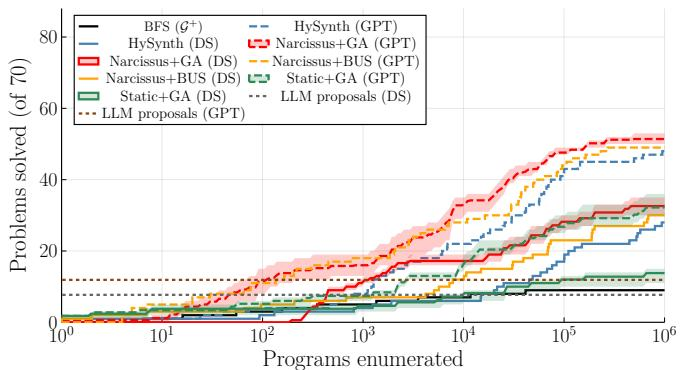  
(a) SLIA (70-task HySynth subset)

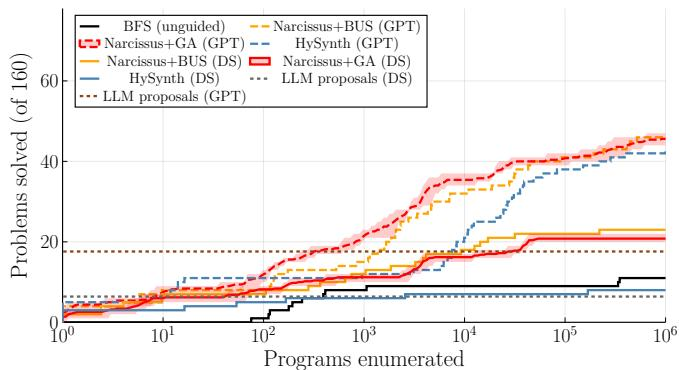  
(b) ARGA (160 tasks, divide-and-conquer)  
Figure 2: Tasks solved vs. programs enumerated, for GPT-4o (GPT, dashed) and DeepSeek-V4-Flash (DS, solid) proposals. In (a), Narcissus is above the static <sub>p</sub>rior at ever<sub>y</sub> bud<sub>g</sub>et, under both backends and both <sub>p</sub>ro<sub>p</sub>osal models, and its DS curve rivals the static <sub>p</sub>rior on GPT-4o <sub>p</sub>ro<sub>p</sub>osals. In (b), the same orderin<sub>g</sub> holds on a second domain: Narcissus beats the static heuristic for both <sub>p</sub>ro<sub>p</sub>osal models, well above the raw <sub>p</sub>ro<sub>p</sub>osals (dotted).

Hard tasks, large grammar (ARC, ARGA). The abstract-<sub>reason</sub>i<sub>ng</sub> b<sub>enc</sub>h<sub>mar</sub>k<sub>s com</sub>bi<sub>ne</sub> b<sub>o</sub>th difi<sub>cu</sub>lti<sub>es:</sub> th<sub>e propos-</sub> <sub>a</sub>l<sub>s are wea</sub>k <sub>an</sub>d th<sub>e</sub> t<sub>as</sub>k<sub>s are</sub> h<sub>ar</sub>d<sub>, an</sub>d <sub>on</sub> ARC th<sub>e un</sub>i<sub>versa</sub>l Hodel grammar (Hodel 2023) spans 320 rules, so unguided enumeration solves just 4 of 100 tasks. Even here Narcissus <sub>s</sub>t<sub>ays a</sub>h<sub>ea</sub>d <sub>o</sub>f th<sub>e s</sub>t<sub>a</sub>ti<sub>c</sub> h<sub>eur</sub>i<sub>s</sub>ti<sub>c: on</sub> ARGA it <sub>w</sub>i<sub>ns un</sub>d<sub>er</sub> both proposal models (45.6 vs. 43.0 of 160 tasks with GPT-4o, 20.8 vs. 8.0 with DeepSeek), and on full ARC it solves 40 of 100 tasks against 10 and 12 for the static heuristic under the genetic and BUS backends. The raw proposals solve 15% of these tasks if any emitted program counts, and 13% once <sub>res</sub>t<sub>r</sub>i<sub>c</sub>t<sub>e</sub>d t<sub>o</sub> <sub>programs</sub> <sub>va</sub>lid i<sub>n</sub> th<sub>e</sub> <sub>grammar</sub> th<sub>e</sub> <sub>syn</sub>th<sub>es</sub>i<sub>zer</sub> <sub>searc</sub>h<sub>es;</sub> <sub>gu</sub>id<sub>e</sub>d <sub>searc</sub>h t<sub>r</sub>i<sub>p</sub>l<sub>es</sub> th<sub>a</sub>t<sub>,</sub> b<sub>ecause</sub> <sub>even</sub> <sub>wrong</sub> <sub>pro-</sub> <sub>posa</sub>l<sub>s</sub> <sub>con</sub>t<sub>r</sub>ib<sub>u</sub>t<sub>e</sub> f<sub>ragmen</sub>t<sub>s</sub> <sub>an</sub>d <sub>s</sub>t<sub>ruc</sub>t<sub>ure</sub> th<sub>e</sub> <sub>searc</sub>h <sub>assem-</sub> bl<sub>es an</sub>d <sub>correc</sub>t<sub>s.</sub> R<sub>e-promp</sub>ti<sub>ng aga</sub>i<sub>n</sub> f<sub>a</sub>ll<sub>s s</sub>h<sub>or</sub>t<sub>: on</sub> ARGA it solves one more task, reaching 8 of 160.

RQ2: Complementary signals; regularization makes weak proposals safe. Having traced the gain to the heuristi<sub>c,</sub> <sub>we</sub> <sub>as</sub>k <sub>w</sub>hi<sub>c</sub>h <sub>o</sub>f it<sub>s</sub> th<sub>ree</sub> <sub>s</sub>i<sub>gna</sub>l<sub>s</sub> <sub>carr</sub>i<sub>es</sub> it<sub>,</sub> <sub>a</sub>bl<sub>a</sub>ti<sub>ng</sub> th<sub>em</sub> on SLIA (Table 2): all three to<sub>g</sub>ether, each one left out, and <sub>eac</sub>h <sub>one a</sub>l<sub>one.</sub> Th<sub>e answer</sub> d<sub>epen</sub>d<sub>s on</sub> th<sub>e c</sub>h<sub>arac</sub>t<sub>er o</sub>f th<sub>e</sub> <sub>proposa</sub>l<sub>s, an</sub>d th<sub>e</sub> t<sub>wo proposa</sub>l <sub>mo</sub>d<sub>e</sub>l<sub>s</sub> i<sub>nver</sub>t <sub>eac</sub>h <sub>o</sub>th<sub>er</sub>’<sub>s</sub> <sub>s</sub>t<sub>o</sub>r<sub>y.</sub> D<sub>eep</sub>S<sub>ee</sub>k <sub>p</sub>r<sub>oposa</sub>l<sub>s</sub> <sub>a</sub>r<sub>e</sub> <sub>s</sub>m<sub>a</sub>ll <sub>a</sub>nd l<sub>a</sub>r<sub>ge</sub>l<sub>y</sub> <sub>ag</sub>r<sub>ee</sub> <sub>o</sub>n th<sub>e s</sub>t<sub>ruc</sub>t<sub>ure o</sub>f th<sub>e so</sub>l<sub>u</sub>ti<sub>on, so pre</sub>fi<sub>x a</sub>li<sub>gnmen</sub>t i<sub>s</sub> d<sub>ec</sub>i<sub>s</sub>i<sub>ve:</sub> removing it costs the most, dropping the heuristic to 24.0 <sub>so</sub>l<sub>ve</sub>d t<sub>as</sub>k<sub>s, an</sub>d <sub>on</sub> it<sub>s own</sub> it <sub>a</sub>l<sub>rea</sub>d<sub>y recovers a</sub>l<sub>mos</sub>t th<sub>e</sub> f<sub>u</sub>ll h<sub>eur</sub>i<sub>s</sub>ti<sub>c.</sub> GPT<sub>-</sub>4<sub>o proposa</sub>l<sub>s are a</sub>b<sub>ou</sub>t th<sub>ree</sub> ti<sub>mes</sub> l<sub>arger</sub> (cf. Fi<sub>g</sub>ure 3), and at that size the same root-to-hole context <sub>rare</sub>l<sub>y recurs across proposa</sub>l<sub>s, so pre</sub>fi<sub>x a</sub>li<sub>gnmen</sub>t f<sub>a</sub>d<sub>es an</sub>d <sub>su</sub>b<sub>-program</sub> <sub>reuse</sub> t<sub>a</sub>k<sub>es</sub> <sub>over,</sub> <sub>muc</sub>h <sub>as</sub> <sub>p</sub>l<sub>a</sub>i<sub>n</sub> <sub>ru</sub>l<sub>e</sub> f<sub>requency</sub> <sub>carr</sub>i<sub>es</sub> th<sub>e</sub> <sub>s</sub>t<sub>a</sub>ti<sub>c</sub> h<sub>eur</sub>i<sub>s</sub>ti<sub>c</sub> <sub>on</sub> <sub>an</sub> <sub>un-re</sub>fi<sub>ne</sub>d <sub>grammar.</sub> BV<sub>,</sub> from RQ1, supplies the remainin<sub>g</sub> weak-support case: there <sub>ne</sub>ith<sub>er pre</sub>fi<sub>x a</sub>li<sub>gnmen</sub>t <sub>nor reuse</sub> h<sub>as a s</sub>t<sub>rong s</sub>i<sub>gna</sub>l t<sub>o o</sub>f<sub>er,</sub> <sub>an</sub>d <sub>regu</sub>l<sub>ar</sub>i<sub>za</sub>ti<sub>on a</sub>l<sub>one</sub> i<sub>s w</sub>h<sub>a</sub>t k<sub>eeps</sub> th<sub>e searc</sub>h f<sub>rom co</sub>l<sub>-</sub> l<sub>aps</sub>i<sub>ng</sub> t<sub>o</sub> th<sub>e s</sub>t<sub>a</sub>ti<sub>c pr</sub>i<sub>or</sub>’<sub>s</sub> f<sub>a</sub>t<sub>e.</sub> N<sub>o s</sub>i<sub>ng</sub>l<sub>e s</sub>i<sub>gna</sub>l d<sub>om</sub>i<sub>na</sub>t<sub>es</sub> <sub>everyw</sub>h<sub>ere,</sub> <sub>ye</sub>t i<sub>n</sub> <sub>eac</sub>h <sub>se</sub>tti<sub>ng</sub> <sub>exac</sub>tl<sub>y</sub> <sub>one</sub> i<sub>s</sub> l<sub>oa</sub>d<sub>-</sub>b<sub>ear</sub>i<sub>ng;</sub> N<sub>arcissus</sub> <sub>carr</sub>i<sub>es</sub> <sub>a</sub>ll th<sub>ree</sub> <sub>a</sub>t <sub>once</sub> <sub>an</sub>d <sub>so</sub> h<sub>an</sub>dl<sub>es</sub> <sub>every</sub> <sub>case</sub> <sub>w</sub>ith<sub>ou</sub>t k<sub>now</sub>i<sub>ng</sub> i<sub>n a</sub>d<sub>vance w</sub>hi<sub>c</sub>h <sub>one</sub> it <sub>w</sub>ill f<sub>ace.</sub>

<table><tr><td>Signals enabled</td><td>DeepSeek (/100)</td><td>GPT-4o (/70)</td></tr><tr><td>prefix + reuse + reg.</td><td>45.8</td><td>51.4</td></tr><tr><td>reuse + reg.</td><td>24.0</td><td>47.2</td></tr><tr><td>prefix + reg.</td><td>42.8</td><td>31.4</td></tr><tr><td>prefix + reuse</td><td>43.6</td><td>47.0</td></tr><tr><td>prefix</td><td>43.2</td><td>25.4</td></tr><tr><td>reuse</td><td>20.0</td><td>44.2</td></tr><tr><td>reg.</td><td>13.4</td><td>15.2</td></tr></table>

Table 2: RQ2: ablation of the three heuristic signals, by SLIA tasks solved (genetic backend, means over 5 seeds; out of 100 tasks with DeepSeek and out of 70 with GPT-4o proposals). Rows list the signals left on (prefix, reuse, re<sub>g</sub>.); the to<sub>p</sub> row is the full heuristic. Which si<sub>g</sub>nal is loadb<sub>ear</sub>i<sub>ng</sub> i<sub>nver</sub>t<sub>s w</sub>ith <sub>proposa</sub>l <sub>qua</sub>lit<sub>y: pre</sub>fi<sub>x a</sub>li<sub>gnmen</sub>t <sub>un</sub>d<sub>er</sub> th<sub>e wea</sub>k<sub>e</sub>r D<sub>eep</sub>S<sub>ee</sub>k <sub>p</sub>r<sub>oposa</sub>l<sub>s, su</sub>b<sub>-p</sub>r<sub>og</sub>r<sub>a</sub>m r<sub>euse u</sub>nd<sub>e</sub>r th<sub>e s</sub>tr<sub>o</sub>n<sub>ge</sub>r GPT<sub>-</sub>4<sub>o p</sub>r<sub>oposa</sub>l<sub>s;</sub> r<sub>egu</sub>l<sub>a</sub>ri<sub>za</sub>ti<sub>o</sub>n <sub>a</sub>l<sub>o</sub>n<sub>e app</sub>r<sub>ox-</sub> i<sub>ma</sub>t<sub>es ungu</sub>id<sub>e</sub>d <sub>enumera</sub>ti<sub>on.</sub> S<sub>o</sub>l<sub>ve curves</sub> f<sub>or a</sub>ll <sub>var</sub>i<sub>an</sub>t<sub>s</sub> are in the a<sub>pp</sub>endix (Fi<sub>g</sub>ure 10).

RQ3: Narcissus reaches the proposal subspace faster and at the right complexity. To show the mechanism behind RQ1, we measure how man<sub>y</sub> pro<sub>g</sub>rams a search enu-<sub>mera</sub>t<sub>es</sub> b<sub>e</sub>f<sub>ore</sub> it fi<sub>rs</sub>t <sub>repro</sub>d<sub>uces any proposa</sub>l<sub>.</sub> R<sub>eac</sub>hi<sub>ng</sub> one is not the <sub>g</sub>oal (seedin<sub>g</sub> would achieve that at ste<sub>p</sub> zero); f<sub>rom a co</sub>ld <sub>s</sub>t<sub>ar</sub>t it <sub>revea</sub>l<sub>s w</sub>h<sub>e</sub>th<sub>er</sub> th<sub>e</sub> h<sub>eur</sub>i<sub>s</sub>ti<sub>c pu</sub>ll<sub>s</sub> th<sub>e</sub> <sub>searc</sub>h t<sub>owar</sub>d<sub>s proposa</sub>l<sub>-</sub>lik<sub>e s</sub>t<sub>ruc</sub>t<sub>ure.</sub> It d<sub>oes: on</sub> SLIA <sub>w</sub>ith D<sub>eep</sub>S<sub>ee</sub>k <sub>p</sub>r<sub>oposa</sub>l<sub>s,</sub> N<sub>arcissus</sub> r<sub>eac</sub>h<sub>es</sub> th<sub>e</sub> <sub>p</sub>r<sub>oposa</sub>l r<sub>e-</sub> gion 12 sooner (in programs enumerated) than the static h<sub>eur</sub>i<sub>s</sub>ti<sub>c.</sub> Fi<sub>gure</sub> 3 <sub>ma</sub>k<sub>es</sub> th<sub>e mec</sub>h<sub>an</sub>i<sub>sm concre</sub>t<sub>e on a s</sub>i<sub>ng</sub>l<sub>e</sub> t<sub>as</sub>k<sub>,</sub> <sub>p</sub>l<sub>o</sub>tti<sub>ng</sub> h<sub>ow</sub> <sub>eac</sub>h <sub>me</sub>th<sub>o</sub>d di<sub>s</sub>t<sub>r</sub>ib<sub>u</sub>t<sub>es</sub> it<sub>s</sub> <sub>enumera</sub>ti<sub>on</sub> b<sub>u</sub>d<sub>ge</sub>t <sub>over</sub> <sub>program</sub> <sub>s</sub>i<sub>zes:</sub> <sub>regu</sub>l<sub>ar</sub>i<sub>za</sub>ti<sub>on</sub> <sub>concen</sub>t<sub>ra</sub>t<sub>es</sub> N<sub>ar-</sub> <sub>cissus</sub>’<sub>s</sub> b<sub>u</sub>d<sub>ge</sub>t <sub>on</sub> th<sub>e s</sub>i<sub>zes</sub> th<sub>e proposa</sub>l<sub>s</sub> i<sub>n</sub>di<sub>ca</sub>t<sub>e, w</sub>hil<sub>e</sub> BFS <sub>p</sub>il<sub>es o</sub>nt<sub>o</sub> tin<sub>y p</sub>r<sub>og</sub>r<sub>a</sub>m<sub>s a</sub>nd th<sub>e s</sub>t<sub>a</sub>ti<sub>c p</sub>ri<sub>o</sub>r <sub>sp</sub>r<sub>ea</sub>d<sub>s a</sub> l<sub>ong</sub> t<sub>a</sub>il <sub>we</sub>ll <sub>pas</sub>t th<sub>e proposa</sub>l<sub>s, ne</sub>ith<sub>er</sub> l<sub>an</sub>di<sub>ng w</sub>h<sub>ere</sub> th<sub>e</sub> <sub>so</sub>l<sub>u</sub>ti<sub>on</sub> li<sub>es.</sub>

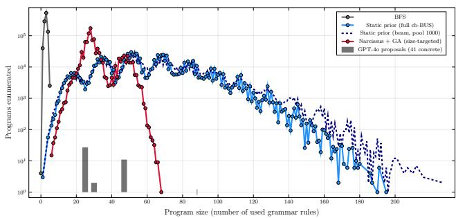  
Figure 3: Per-size enumeration profile on the SLIA task stackoverflow2 (GPT-4o <sub>p</sub>ro<sub>p</sub>osals; <sub>g</sub>re<sub>y</sub> bars mark the sizes of the 41 proposals that parse to concrete programs). BFS spends its 10<sup>6</sup>-program budget below size five, the static prior (full BUS and width-1000 beam, dashed, coinciding) spreads it thinly up to size 195, and Narcissus concentrates it <sub>on</sub> th<sub>e s</sub>i<sub>zes</sub> th<sub>e proposa</sub>l<sub>s occupy, so</sub>l<sub>v</sub>i<sub>ng</sub> th<sub>e</sub> t<sub>as</sub>k <sub>a</sub>l<sub>one</sub> <sub>among</sub> th<sub>e</sub> th<sub>ree.</sub>

RQ4: Search recovers much of the gap between cheap and strong proposals. Finally, we vary the proposal model (Fi<sub>g</sub>ure 2(a), Table 1). A chea<sub>p</sub> model <sub>p</sub>lus search beats an expensive model alone: sampled directly, GPT-4o solves 31% against DeepSeek-V4-Flash’s 20%, yet Narcissus on the DeepSeek proposals reaches 47% (32.6 of 70), overtaking di<sub>rec</sub>t GPT<sub>-</sub>4<sub>o</sub> <sub>samp</sub>li<sub>ng</sub> <sub>an</sub>d <sub>ma</sub>t<sub>c</sub>hi<sub>ng</sub> th<sub>e</sub> <sub>s</sub>t<sub>a</sub>ti<sub>c</sub> <sub>pr</sub>i<sub>or</sub> <sub>on</sub> GPT<sub>-</sub>4<sub>o</sub> <sub>proposa</sub>l<sub>s.</sub> N<sub>arcissus</sub> l<sub>ea</sub>d<sub>s</sub> <sub>a</sub>t b<sub>o</sub>th <sub>qua</sub>liti<sub>es,</sub> b<sub>y</sub> more in AUC than in final count (+7.2 vs. +1.0 over the static heuristic at GPT-4o): it extracts more from a fixed <sub>p</sub>ro<sub>p</sub>osa<sup>l</sup> set, an<sup>d</sup> sooner.

## Related Work

Scaling the sample-and-check loop. The most direct an-<sub>swer</sub> t<sub>o a</sub> f<sub>a</sub>ili<sub>ng proposa</sub>l i<sub>s more</sub> LLM <sub>wor</sub>k<sub>,</sub> i<sub>n</sub> th<sub>ree</sub> fl<sub>avours.</sub> Th<sub>e</sub> fi<sub>rs</sub>t <sub>s</sub>i<sub>mp</sub>l<sub>y</sub> <sub>samp</sub>l<sub>es</sub> <sub>more</sub> <sub>programs</sub> <sub>an</sub>d k<sub>eeps</sub> th<sub>ose</sub> th<sub>a</sub>t <sub>pass</sub> th<sub>e</sub> <sub>examp</sub>l<sub>es,</sub> <sub>on</sub> ARC <sub>up</sub> t<sub>o</sub> th<sub>ousan</sub>d<sub>s</sub> <sub>per</sub> task (Chen et al. 2021; Li et al. 2022; Chollet et al. 2024; Li et al. 2025). Self-re<sub>p</sub>air feeds execution feedback back to the model (Chen et al. 2024; Shinn et al. 2023); our re-<sub>p</sub>rom<sub>p</sub>tin<sub>g</sub> b<sub>ase</sub>li<sub>ne eva</sub>l<sub>ua</sub>t<sub>es exac</sub>tl<sub>y</sub> thi<sub>s an</sub>d <sub>ga</sub>i<sub>ns a s</sub>i<sub>ng</sub>l<sub>e</sub> t<sub>as</sub>k <sub>on</sub> ARGA<sub>.</sub> C<sub>ons</sub>t<sub>ra</sub>i<sub>ne</sub>d d<sub>eco</sub>di<sub>ng</sub> f<sub>orces</sub> <sub>eac</sub>h <sub>genera</sub>t<sub>e</sub>d t<sub>o</sub>k<sub>en</sub> to follow the <sub>g</sub>rammar (U<sub>g</sub>are et al. 2024), fixin<sub>g</sub> s<sub>y</sub>ntax but not correctness, and distortin<sub>g</sub> the model’s distribution (Park et al. 2024). All three kee<sub>p</sub> drawin<sub>g</sub> from a model that does <sub>no</sub>t k<sub>now</sub> th<sub>e</sub> t<sub>arge</sub>t l<sub>anguage; none searc</sub>h<sub>es</sub> it<sub>.</sub>

LLM-in-the-loop program search. A second group emb<sub>e</sub>d<sub>s</sub> th<sub>e</sub> LLM i<sub>ns</sub>id<sub>e a sym</sub>b<sub>o</sub>li<sub>c searc</sub>h<sub>, as genera</sub>t<sub>or, mu-</sub> tator, or scorer of candidates (Wan<sub>g</sub> et al. 2024; Butt et al. 2024<sub>;</sub> P<sub>ource</sub>l<sub>,</sub> C<sub>o</sub>l<sub>as, an</sub>d O<sub>u</sub>d<sub>eyer</sub> 2025<sub>;</sub> R<sub>omera-</sub>P<sub>are</sub>d<sub>es</sub> <sub>e</sub>t <sub>a</sub>l<sub>.</sub> 2024<sub>;</sub> Si<sub>ng</sub>h<sub>a</sub>l <sub>an</sub>d Sh<sub>ro</sub>f 2025<sub>;</sub> Li<sub>,</sub> P<sub>arser</sub>t<sub>,</sub> <sub>an</sub>d P<sub>o</sub>l<sub>-</sub> <sub>g</sub>reen 2024). This restores search, but the number of LLM calls now <sub>g</sub>rows with search efort (excluded b<sub>y</sub> our <sub>p</sub>roblem statement): these methods s<sub>p</sub>end a model call where Narcis-<sub>sus</sub> <sub>spen</sub>d<sub>s</sub> <sub>a</sub> t<sub>ree</sub> l<sub>oo</sub>k<sub>up.</sub>

Static LLM approximations for search. Closest to Nar-<sub>cissus</sub> i<sub>s wor</sub>k th<sub>a</sub>t <sub>promp</sub>t<sub>s</sub> th<sub>e</sub> LLM <sub>once an</sub>d <sub>comp</sub>il<sub>es</sub> th<sub>e</sub> sam<sub>p</sub>les into fixed search <sub>g</sub>uidance. H<sub>y</sub>S<sub>y</sub>nth (Barke et al. 2024) and Li, Parsert, and Pol<sub>g</sub>reen (2024) com<sub>p</sub>ile a contextfree heuristic; Tao et al. (2024) seed <sub>g</sub>rammar-re<sub>p</sub>aired sam-<sub>p</sub><sup>l</sup>es <sup>i</sup>nto <sub>g</sub>enet<sup>i</sup>c <sub>p</sub>ro<sub>g</sub>ramm<sup>i</sup>n<sub>g</sub> steere<sup>d</sup> <sup>b</sup><sub>y</sub> w<sup>h</sup>o<sup>l</sup>e-<sub>p</sub>ro<sub>g</sub>ram similarit<sub>y</sub>; Probabilistic Pro<sub>g</sub>rams of Thou<sub>g</sub>ht (Gar<sub>g</sub> et al. 2026) rebuilds a <sub>p</sub>ro<sub>g</sub>ram distribution from one <sub>g</sub>eneration’s t<sub>o</sub>k<sub>en</sub> <sub>pro</sub>b<sub>a</sub>biliti<sub>es,</sub> i<sub>n</sub> th<sub>e</sub> LLM’<sub>s</sub> <sub>own</sub> l<sub>anguage;</sub> <sub>concurren</sub>t ReaCom<sub>p</sub> (Naik et al. 2026) com<sub>p</sub>iles reasonin<sub>g</sub> traces into <sub>s</sub>t<sub>an</sub>d<sub>a</sub>l<sub>one so</sub>l<sub>vers.</sub> N<sub>one scores an expans</sub>i<sub>on</sub> b<sub>y</sub> it<sub>s con</sub>t<sub>ex</sub>t i<sub>n</sub> <sub>a</sub> fi<sub>xe</sub>d t<sub>arge</sub>t <sub>grammar:</sub> th<sub>e</sub>i<sub>r</sub> di<sub>s</sub>t<sub>r</sub>ib<sub>u</sub>ti<sub>ons</sub> <sub>are</sub> <sub>pos</sub>iti<sub>on-</sub> i<sub>n</sub>d<sub>epen</sub>d<sub>en</sub>t <sub>an</sub>d <sub>prune</sub> <sub>w</sub>h<sub>a</sub>t th<sub>e</sub> <sub>samp</sub>l<sub>es</sub> <sub>m</sub>i<sub>ss;</sub> <sub>a</sub> <sub>con</sub>t<sub>ex</sub>t<sub>-</sub> d<sub>epen</sub>d<sub>en</sub>t <sub>approx</sub>i<sub>ma</sub>ti<sub>on</sub> i<sub>s</sub> th<sub>e</sub> f<sub>u</sub>t<sub>ure</sub> di<sub>rec</sub>ti<sub>on</sub> B<sub>ar</sub>k<sub>e e</sub>t <sub>a</sub>l<sub>.</sub> (2024) themselves name.

Learned search heuristics. Guiding enumeration with l<sub>earne</sub>d <sub>mo</sub>d<sub>e</sub>l<sub>s</sub> <sub>pre</sub>d<sub>a</sub>t<sub>es</sub> LLM<sub>s,</sub> f<sub>rom</sub> <sub>ru</sub>l<sub>e</sub> <sub>pre</sub>di<sub>c</sub>t<sub>ors</sub> <sub>an</sub>d value rankers to librar<sub>y</sub> learnin<sub>g</sub> (Balo<sub>g</sub> et al. 2017; Odena et al. 2021; Ameen and Lelis 2023; Ellis et al. 2021); Eu-<sub>p</sub>hon<sub>y</sub> (Lee et al. 2018) even conditions rule <sub>p</sub>robabilities on surroundin<sub>g</sub> structure, and Probe (Barke, Pele<sub>g</sub>, and Polikarpova 2020) re-weights the grammar just-in-time during <sub>searc</sub>h<sub>.</sub> Wh<sub>a</sub>t thi<sub>s group</sub> l<sub>ac</sub>k<sub>s</sub> i<sub>s</sub> k<sub>now</sub>l<sub>e</sub>d<sub>ge o</sub>f th<sub>e</sub> t<sub>as</sub>k <sub>a</sub>t h<sub>an</sub>d<sub>:</sub> it t<sub>ra</sub>i<sub>ns on o</sub>th<sub>er</sub> t<sub>as</sub>k<sub>s, or on</sub>l<sub>y on</sub> th<sub>e searc</sub>h’<sub>s own</sub> <sub>par</sub>ti<sub>a</sub>l <sub>resu</sub>lt<sub>s, w</sub>h<sub>ereas</sub> N<sub>arcissus o</sub>bt<sub>a</sub>i<sub>ns con</sub>t<sub>ex</sub>t<sub>-aware,</sub> t<sub>as</sub>k<sub>-spec</sub>ifi<sub>c gu</sub>id<sub>ance</sub> f<sub>rom a</sub> h<sub>an</sub>df<sub>u</sub>l <sub>o</sub>f <sub>proposa</sub>l<sub>s, w</sub>ith <sub>no</sub> t<sub>ra</sub>i<sub>n</sub>i<sub>ng.</sub>

## Conclusion and Future Work

W<sub>e p</sub>r<sub>ese</sub>nt<sub>e</sub>d N<sub>arcissus, w</sub>hi<sub>c</sub>h t<sub>u</sub>rn<sub>s</sub> LLM <sub>p</sub>r<sub>oposa</sub>l<sub>s</sub> int<sub>o</sub> <sub>a con</sub>t<sub>ex</sub>t<sub>-aware</sub> h<sub>eur</sub>i<sub>s</sub>ti<sub>c: w</sub>h<sub>ere a s</sub>t<sub>a</sub>ti<sub>c pr</sub>i<sub>or as</sub>k<sub>s on</sub>l<sub>y</sub> h<sub>ow</sub> often a rule occurs, Narcissus asks where. Because no rule i<sub>s ever prune</sub>d<sub>,</sub> it <sub>correc</sub>t<sub>s</sub> th<sub>e</sub> LLM <sub>ra</sub>th<sub>er</sub> th<sub>an re-ran</sub>ki<sub>ng</sub> it<sub>, an</sub>d <sub>across</sub> fi<sub>ve</sub> d<sub>oma</sub>i<sub>ns an</sub>d t<sub>wo</sub> b<sub>ac</sub>k<sub>en</sub>d<sub>s</sub> it b<sub>ea</sub>t<sub>s s</sub>t<sub>a</sub>ti<sub>c</sub> LLM<sub>-gu</sub>id<sub>e</sub>d <sub>syn</sub>th<sub>es</sub>i<sub>s w</sub>ith <sub>no</sub> LLM <sub>ca</sub>ll d<sub>ur</sub>i<sub>ng searc</sub>h<sub>.</sub> O<sub>ur</sub> <sub>we</sub>i<sub>g</sub>ht<sub>s are</sub> fi<sub>xe</sub>d <sub>a</sub>t <sub>one; a per-</sub>t<sub>as</sub>k <sub>we</sub>i<sub>g</sub>hti<sub>ng, se</sub>t f<sub>rom c</sub>h<sub>eap</sub> <sub>proper</sub>ti<sub>es o</sub>f th<sub>e proposa</sub>l<sub>s suc</sub>h <sub>as</sub> th<sub>e</sub>i<sub>r s</sub>i<sub>ze an</sub>d <sub>agreemen</sub>t<sub>,</sub> <sub>cou</sub>ld l<sub>ean on w</sub>hi<sub>c</sub>h<sub>ever o</sub>f th<sub>e</sub> th<sub>ree s</sub>i<sub>gna</sub>l<sub>s a</sub> t<sub>as</sub>k <sub>ac</sub>t<sub>u-</sub> all<sub>y</sub> su<sub>pp</sub>orts (cf. RQ2), rather than treatin<sub>g</sub> all three alike. Mi<sub>ne</sub>d f<sub>ragmen</sub>t<sub>s are curren</sub>tl<sub>y</sub> di<sub>scar</sub>d<sub>e</sub>d <sub>a</sub>ft<sub>er eac</sub>h t<sub>as</sub>k<sub>,</sub> b<sub>u</sub>t <sub>s</sub>h<sub>ar</sub>i<sub>ng</sub> th<sub>em across</sub> t<sub>as</sub>k<sub>s wou</sub>ld t<sub>urn</sub> th<sub>e per-</sub>t<sub>as</sub>k <sub>grammar</sub> <sub>ex</sub>t<sub>ens</sub>i<sub>ons</sub> i<sub>n</sub>t<sub>o a grow</sub>i<sub>ng, reusa</sub>bl<sub>e</sub> lib<sub>rary, an</sub>d <sub>re-see</sub>di<sub>ng</sub> th<sub>e</sub> <sub>searc</sub>h f<sub>rom</sub> it<sub>s</sub> <sub>own</sub> <sub>near-m</sub>i<sub>sses</sub> <sub>cou</sub>ld <sub>recover</sub> <sub>so</sub>l<sub>u</sub>ti<sub>ons</sub> that lie just outside the proposal region. More broadly, the <sub>sa</sub>m<sub>e co</sub>nt<sub>ex</sub>t<sub>-awa</sub>r<sub>e app</sub>r<sub>ox</sub>im<sub>a</sub>ti<sub>o</sub>n <sub>app</sub>li<sub>es w</sub>h<sub>e</sub>r<sub>eve</sub>r <sub>a</sub>n LLM <sub>can</sub> <sub>propose</sub> b<sub>u</sub>t <sub>no</sub>t <sub>re</sub>li<sub>a</sub>bl<sub>y</sub> <sub>pro</sub>d<sub>uce</sub> <sub>gramma</sub>ti<sub>ca</sub>l <sub>programs,</sub> <sub>a c</sub>h<sub>eap a</sub>lt<sub>erna</sub>ti<sub>ve</sub> t<sub>o</sub> k<sub>eep</sub>i<sub>ng</sub> th<sub>e mo</sub>d<sub>e</sub>l i<sub>n</sub> th<sub>e searc</sub>h l<sub>oop.</sub>

## References

Al<sub>ur,</sub> R<sub>.;</sub> B<sub>o</sub>dík<sub>,</sub> R<sub>.;</sub> J<sub>un</sub>i<sub>wa</sub>l<sub>,</sub> G<sub>.;</sub> M<sub>ar</sub>ti<sub>n,</sub> M<sub>.</sub> M<sub>.</sub> K<sub>.;</sub> R<sub>ag</sub>h<sub>o</sub>th<sub>a</sub>m<sub>a</sub>n<sub>,</sub> M<sub>.;</sub> S<sub>es</sub>hi<sub>a,</sub> S<sub>.</sub> A<sub>.;</sub> Sin<sub>g</sub>h<sub>,</sub> R<sub>.;</sub> S<sub>o</sub>l<sub>a</sub>r<sub>-</sub>L<sub>eza</sub>m<sub>a,</sub> A<sub>.;</sub> T<sub>or</sub>l<sub>a</sub>k<sub>,</sub> E<sub>.; an</sub>d Ud<sub>upa,</sub> A<sub>.</sub> 2013<sub>.</sub> S<sub>yn</sub>t<sub>ax-gu</sub>id<sub>e</sub>d <sub>syn</sub>th<sub>e-</sub> sis. In Proceedings of Formal Methods in Computer-Aided Design (FMCAD’13), 1–8.

Am<sub>ee</sub>n<sub>,</sub> S<sub>.; a</sub>nd L<sub>e</sub>li<sub>s,</sub> L<sub>.</sub> H<sub>.</sub> S<sub>.</sub> 2023<sub>.</sub> Pr<sub>og</sub>r<sub>a</sub>m S<sub>y</sub>nth<sub>es</sub>i<sub>s</sub> with Best-First Bottom-Up Search. J. Artif. Intell. Res., 77: 1275<sub>–</sub>1310<sub>.</sub>

B<sub>a</sub>l<sub>og,</sub> M<sub>.;</sub> G<sub>au</sub>nt<sub>,</sub> A<sub>.</sub> L<sub>.;</sub> Br<sub>oc</sub>k<sub>sc</sub>hmidt<sub>,</sub> M<sub>.;</sub> N<sub>owoz</sub>in<sub>,</sub> S<sub>.; a</sub>nd T<sub>a</sub>rl<sub>ow,</sub> D<sub>.</sub> 2017<sub>.</sub> D<sub>eep</sub>C<sub>o</sub>d<sub>e</sub>r<sub>:</sub> L<sub>ea</sub>rnin<sub>g</sub> t<sub>o</sub> Writ<sub>e</sub> Pr<sub>og</sub>r<sub>a</sub>m<sub>s.</sub> In 5th International Conference on Learning Representations, ICLR 2017, Toulon, France, April 24-26, 2017, Conference T<sub>rac</sub>k P<sub>rocee</sub>di<sub>ngs.</sub> O<sub>pe</sub>nR<sub>ev</sub>i<sub>ew.</sub>n<sub>e</sub>t<sub>.</sub>

B<sub>a</sub>rk<sub>e,</sub> S<sub>.;</sub> G<sub>o</sub>n<sub>za</sub>l<sub>ez,</sub> E<sub>.</sub> A<sub>.;</sub> K<sub>as</sub>ib<sub>a</sub>tl<sub>a,</sub> S<sub>.</sub> R<sub>.;</sub> B<sub>e</sub>r<sub>g-</sub> Ki<sub>r</sub>k<sub>pa</sub>t<sub>r</sub>i<sub>c</sub>k<sub>,</sub> T<sub>.; an</sub>d P<sub>o</sub>lik<sub>arpova,</sub> N<sub>.</sub> 2024<sub>.</sub> HYSYNTH<sub>:</sub> C<sub>o</sub>nt<sub>ex</sub>t<sub>-</sub>Fr<sub>ee</sub> LLM A<sub>pp</sub>r<sub>ox</sub>im<sub>a</sub>ti<sub>o</sub>n f<sub>o</sub>r G<sub>u</sub>idin<sub>g</sub> Pr<sub>og</sub>r<sub>a</sub>m S<sub>y</sub>nth<sub>es</sub>i<sub>s.</sub> In Gl<sub>o</sub>b<sub>e</sub>r<sub>so</sub>n<sub>s,</sub> A<sub>.;</sub> M<sub>ac</sub>k<sub>ey,</sub> L<sub>.;</sub> B<sub>e</sub>l<sub>g</sub>r<sub>ave,</sub> D<sub>.;</sub> F<sub>a</sub>n<sub>,</sub> A<sub>.;</sub> P<sub>aque</sub>t<sub>,</sub> U<sub>.;</sub> T<sub>o</sub>m<sub>cza</sub>k<sub>,</sub> J<sub>.</sub> M<sub>.; a</sub>nd Zh<sub>a</sub>n<sub>g,</sub> C<sub>., e</sub>d<sub>s.,</sub> Advances in Neural Information Processing Systems 37: Annual Conference on Neural Information Processing Systems 2024<sub>,</sub> N<sub>eur</sub>IPS 2024<sub>,</sub> V<sub>ancouver,</sub> BC<sub>,</sub> C<sub>ana</sub>d<sub>a,</sub> D<sub>ecem</sub>b<sub>er</sub> 10 <sub>-</sub> 15<sub>,</sub> 2024<sub>.</sub>

B<sub>a</sub>rk<sub>e,</sub> S<sub>.;</sub> P<sub>e</sub>l<sub>eg,</sub> H<sub>.; a</sub>nd P<sub>o</sub>lik<sub>a</sub>r<sub>pova,</sub> N<sub>.</sub> 2020<sub>.</sub> J<sub>us</sub>t<sub>-</sub>in<sub>-</sub>Tim<sub>e</sub> L<sub>ea</sub>rnin<sub>g</sub> f<sub>o</sub>r B<sub>o</sub>tt<sub>o</sub>m<sub>-</sub>U<sub>p</sub> En<sub>u</sub>m<sub>e</sub>r<sub>a</sub>ti<sub>ve</sub> S<sub>y</sub>nth<sub>es</sub>i<sub>s.</sub> P<sub>rocee</sub>d<sub>-</sub> in<sub>g</sub>s ofthe ACM on Pro<sub>g</sub>rammin<sub>g</sub> Lan<sub>g</sub>ua<sub>g</sub>es, 4(OOPSLA): 227<sub>:</sub>1<sub>–</sub>227<sub>:</sub>29<sub>.</sub>

B<sub>u</sub>tt<sub>,</sub> N<sub>.;</sub> M<sub>a</sub>n<sub>cza</sub>k<sub>,</sub> B<sub>.;</sub> Wi<sub>gge</sub>r<sub>s,</sub> A<sub>.</sub> J<sub>.;</sub> R<sub>a</sub>in<sub>o</sub>n<sub>e,</sub> C<sub>.;</sub> Zh<sub>a</sub>n<sub>g,</sub> D<sub>.</sub> W<sub>.;</sub> D<sub>e</sub>f<sub>errar</sub>d<sub>,</sub> M<sub>.; an</sub>d C<sub>o</sub>h<sub>en,</sub> T<sub>.</sub> 2024<sub>.</sub> C<sub>o</sub>d<sub>e</sub>It<sub>:</sub> S<sub>e</sub>lf<sub>-</sub> I<sub>mprov</sub>i<sub>ng</sub> L<sub>anguage</sub> M<sub>o</sub>d<sub>e</sub>l<sub>s w</sub>ith P<sub>r</sub>i<sub>or</sub>iti<sub>ze</sub>d Hi<sub>n</sub>d<sub>s</sub>i<sub>g</sub>ht R<sub>e-</sub> <sub>p</sub>l<sub>ay.</sub> I<sub>n</sub> S<sub>a</sub>l<sub>a</sub>kh<sub>u</sub>tdi<sub>nov,</sub> R<sub>.;</sub> K<sub>o</sub>lt<sub>er,</sub> Z<sub>.;</sub> H<sub>e</sub>ll<sub>er,</sub> K<sub>.</sub> A<sub>.;</sub> W<sub>e</sub>ll<sub>er,</sub> A<sub>.;</sub> Oli<sub>ve</sub>r<sub>,</sub> N<sub>.;</sub> S<sub>ca</sub>rl<sub>e</sub>tt<sub>,</sub> J<sub>.; a</sub>nd B<sub>e</sub>rk<sub>e</sub>nk<sub>a</sub>m<sub>p,</sub> F<sub>., e</sub>d<sub>s.,</sub> F<sub>or</sub>t<sub>y-</sub> first International Conference on Machine Learning, ICML 2024<sub>,</sub> Vi<sub>enna,</sub> A<sub>us</sub>t<sub>r</sub>i<sub>a,</sub> J<sub>u</sub>l<sub>y</sub> 21<sub>-</sub>27<sub>,</sub> 2024<sub>, vo</sub>l<sub>ume</sub> 235 <sub>o</sub>f P<sub>ro-</sub> ceedings ofMachine Learning Research, 5013–5034. PMLR / O<sub>pe</sub>nR<sub>ev</sub>i<sub>ew.</sub>n<sub>e</sub>t<sub>.</sub>

Chen, M.; Tworek, J.; Jun, H.; Yuan, Q.; de Oliveira Pinto, H<sub>.</sub> P<sub>.;</sub> K<sub>ap</sub>l<sub>a</sub>n<sub>,</sub> J<sub>.;</sub> Ed<sub>wa</sub>rd<sub>s,</sub> H<sub>.;</sub> B<sub>u</sub>rd<sub>a,</sub> Y<sub>.;</sub> J<sub>osep</sub>h<sub>,</sub> N<sub>.;</sub> Br<sub>oc</sub>k<sub>-</sub> <sub>man,</sub> G<sub>.;</sub> R<sub>ay,</sub> A<sub>.;</sub> P<sub>ur</sub>i<sub>,</sub> R<sub>.;</sub> K<sub>rueger,</sub> G<sub>.;</sub> P<sub>e</sub>t<sub>rov,</sub> M<sub>.;</sub> Khl<sub>aa</sub>f<sub>,</sub> H<sub>.;</sub> S<sub>as</sub>tr<sub>y,</sub> G<sub>.;</sub> Mi<sub>s</sub>hkin<sub>,</sub> P<sub>.;</sub> Ch<sub>a</sub>n<sub>,</sub> B<sub>.;</sub> Gr<sub>ay,</sub> S<sub>.;</sub> R<sub>y</sub>d<sub>e</sub>r<sub>,</sub> N<sub>.;</sub> P<sub>av</sub>l<sub>ov,</sub> M<sub>.;</sub> P<sub>ower,</sub> A<sub>.;</sub> K<sub>a</sub>i<sub>ser,</sub> L<sub>.;</sub> B<sub>avar</sub>i<sub>an,</sub> M<sub>.;</sub> Wi<sub>n</sub>t<sub>er,</sub> C<sub>.;</sub> Till<sub>e</sub>t<sub>,</sub> P<sub>.;</sub> S<sub>uc</sub>h<sub>,</sub> F<sub>.</sub> P<sub>.;</sub> C<sub>u</sub>mmin<sub>gs,</sub> D<sub>.;</sub> Pl<sub>appe</sub>rt<sub>,</sub> M<sub>.;</sub> Ch<sub>a</sub>nt<sub>z</sub>i<sub>s,</sub> F<sub>.;</sub> B<sub>arnes,</sub> E<sub>.;</sub> H<sub>er</sub>b<sub>er</sub>t<sub>-</sub>V<sub>oss,</sub> A<sub>.;</sub> G<sub>uss,</sub> W<sub>.</sub> H<sub>.;</sub> Ni<sub>c</sub>h<sub>o</sub>l<sub>,</sub> A<sub>.;</sub> Paino, A.; Tezak, N.; Tang, J.; Babuschkin, I.; Balaji, S.; J<sub>a</sub>in<sub>,</sub> S<sub>.;</sub> S<sub>au</sub>nd<sub>e</sub>r<sub>s,</sub> W<sub>.;</sub> H<sub>esse,</sub> C<sub>.;</sub> C<sub>a</sub>rr<sub>,</sub> A<sub>.</sub> N<sub>.;</sub> L<sub>e</sub>ik<sub>e,</sub> J<sub>.;</sub> A<sub>c</sub>hi<sub>am,</sub> J<sub>.;</sub> Mi<sub>sra,</sub> V<sub>.;</sub> M<sub>or</sub>ik<sub>awa,</sub> E<sub>.;</sub> R<sub>a</sub>df<sub>or</sub>d<sub>,</sub> A<sub>.;</sub> K<sub>n</sub>i<sub>g</sub>ht<sub>,</sub> M<sub>.;</sub> B<sub>run</sub>d<sub>age,</sub> M<sub>.;</sub> M<sub>ura</sub>ti<sub>,</sub> M<sub>.;</sub> M<sub>ayer,</sub> K<sub>.;</sub> W<sub>e</sub>li<sub>n</sub>d<sub>er,</sub> P<sub>.;</sub> M<sub>c-</sub> G<sub>rew,</sub> B<sub>.;</sub> A<sub>mo</sub>d<sub>e</sub>i<sub>,</sub> D<sub>.;</sub> M<sub>c</sub>C<sub>an</sub>dli<sub>s</sub>h<sub>,</sub> S<sub>.;</sub> S<sub>u</sub>t<sub>s</sub>k<sub>ever,</sub> I<sub>.; an</sub>d Z<sub>a</sub>r<sub>e</sub>mb<sub>a,</sub> W<sub>.</sub> 2021<sub>.</sub> E<sub>va</sub>l<sub>ua</sub>tin<sub>g</sub> L<sub>a</sub>r<sub>ge</sub> L<sub>a</sub>n<sub>guage</sub> M<sub>o</sub>d<sub>e</sub>l<sub>s</sub> Tr<sub>a</sub>in<sub>e</sub>d <sub>o</sub>n C<sub>o</sub>d<sub>e.</sub> C<sub>o</sub>RR<sub>, a</sub>b<sub>s</sub>/2107<sub>.</sub>03374<sub>.</sub>

Ch<sub>en,</sub> X<sub>.;</sub> Li<sub>n,</sub> M<sub>.;</sub> S<sub>c</sub>hä<sub>r</sub>li<sub>,</sub> N<sub>.;</sub> <sub>an</sub>d Zh<sub>ou,</sub> D<sub>.</sub> 2024<sub>.</sub> T<sub>eac</sub>hi<sub>ng</sub> Large Language Models to Self-Debug. In The Twelfth International Conference on Learning Representations, ICLR 2024<sub>,</sub> Vi<sub>enna,</sub> A<sub>us</sub>t<sub>r</sub>i<sub>a,</sub> M<sub>ay</sub> 7<sub>-</sub>11<sub>,</sub> 2024<sub>.</sub> O<sub>pen</sub>R<sub>ev</sub>i<sub>ew.ne</sub>t<sub>.</sub>

Ch<sub>o</sub>ll<sub>e</sub>t<sub>,</sub> F<sub>.</sub> 2019<sub>.</sub> On th<sub>e</sub> M<sub>easu</sub>r<sub>e</sub> <sub>o</sub>f Int<sub>e</sub>lli<sub>ge</sub>n<sub>ce.</sub> C<sub>o</sub>RR<sub>,</sub> <sub>a</sub>b<sub>s</sub>/1911<sub>.</sub>01547<sub>.</sub>

Ch<sub>o</sub>ll<sub>e</sub>t<sub>,</sub> F<sub>.;</sub> Kn<sub>oop,</sub> M<sub>.;</sub> K<sub>a</sub>mr<sub>a</sub>dt<sub>,</sub> G<sub>.;</sub> <sub>a</sub>nd L<sub>a</sub>nd<sub>e</sub>r<sub>s,</sub> B<sub>.</sub> 2024<sub>.</sub> ARC P<sub>r</sub>i<sub>ze</sub> 2024<sub>:</sub> T<sub>ec</sub>h<sub>n</sub>i<sub>ca</sub>l R<sub>epor</sub>t<sub>.</sub> <sub>ar</sub>Xi<sub>v</sub> <sub>prepr</sub>i<sub>n</sub>t <sub>ar</sub>Xi<sub>v:</sub>2412<sub>.</sub>04604<sub>.</sub>

Elli<sub>s,</sub> K<sub>.;</sub> W<sub>ong,</sub> C<sub>.;</sub> N<sub>ye,</sub> M<sub>.</sub> I<sub>.;</sub> S<sub>a</sub>blé<sub>-</sub>M<sub>eyer,</sub> M<sub>.;</sub> M<sub>ora</sub>l<sub>es,</sub> L<sub>.;</sub> H<sub>ew</sub>itt<sub>,</sub> L<sub>.</sub> B<sub>.;</sub> C<sub>ary,</sub> L<sub>.;</sub> S<sub>o</sub>l<sub>ar-</sub>L<sub>ezama,</sub> A<sub>.; an</sub>d T<sub>enen</sub>b<sub>aum,</sub> J<sub>.</sub> B<sub>.</sub> 2021<sub>.</sub> Dr<sub>ea</sub>mC<sub>o</sub>d<sub>e</sub>r<sub>:</sub> b<sub>oo</sub>t<sub>s</sub>tr<sub>app</sub>in<sub>g</sub> ind<sub>uc</sub>ti<sub>ve</sub> <sub>p</sub>r<sub>og</sub>r<sub>a</sub>m <sub>syn</sub>th<sub>es</sub>i<sub>s w</sub>ith <sub>wa</sub>k<sub>e-s</sub>l<sub>eep</sub> lib<sub>rary</sub> l<sub>earn</sub>i<sub>ng.</sub> I<sub>n</sub> F<sub>reun</sub>d<sub>,</sub> S<sub>.</sub> N<sub>.;</sub> <sub>a</sub>nd Y<sub>a</sub>h<sub>av,</sub> E<sub>., e</sub>d<sub>s.,</sub> PLDI ’21<sub>:</sub> 42<sub>n</sub>d ACM SIGPLAN I<sub>n</sub>t<sub>er-</sub> national Conference on Programming Language Design and I<sub>mp</sub>l<sub>emen</sub>t<sub>a</sub>ti<sub>on,</sub> Vi<sub>r</sub>t<sub>ua</sub>l E<sub>ven</sub>t<sub>,</sub> C<sub>ana</sub>d<sub>a,</sub> J<sub>une</sub> 20<sub>-</sub>25<sub>,</sub> 2021<sub>,</sub> 835<sub>–</sub>850<sub>.</sub> ACM<sub>.</sub>

F<sub>e</sub>n<sub>g,</sub> Y<sub>.;</sub> M<sub>a</sub>rtin<sub>s,</sub> R<sub>.;</sub> B<sub>as</sub>t<sub>a</sub>ni<sub>,</sub> O<sub>.; a</sub>nd Dilli<sub>g,</sub> I<sub>.</sub> 2018<sub>.</sub> Pr<sub>o-</sub> <sub>gram</sub> <sub>syn</sub>th<sub>es</sub>i<sub>s</sub> <sub>us</sub>i<sub>ng</sub> <sub>con</sub>fli<sub>c</sub>t<sub>-</sub>d<sub>r</sub>i<sub>ven</sub> l<sub>earn</sub>i<sub>ng.</sub> I<sub>n</sub> F<sub>os</sub>t<sub>er,</sub> J<sub>.</sub> S<sub>.;</sub> and Grossman, D., eds., Proceedings of the 39th ACM SIG-PLAN Conference on Programming Language Design and I<sub>mp</sub>l<sub>emen</sub>t<sub>a</sub>ti<sub>on,</sub> PLDI 2018<sub>,</sub> Phil<sub>a</sub>d<sub>e</sub>l<sub>p</sub>hi<sub>a,</sub> PA<sub>,</sub> USA<sub>,</sub> J<sub>une</sub> 18<sub>-</sub>22<sub>,</sub> 2018<sub>,</sub> 420<sub>–</sub>435<sub>.</sub> ACM<sub>.</sub>

G<sub>a</sub>r<sub>g,</sub> P<sub>.;</sub> G<sub>e</sub>h<sub>,</sub> R<sub>.</sub> L<sub>.;</sub> I<sub>s</sub>r<sub>ae</sub>l<sub>,</sub> D<sub>.;</sub> Mill<sub>s</sub>t<sub>e</sub>in<sub>,</sub> T<sub>.;</sub> Ri<sub>c</sub>h<sub>a</sub>rd<sub>so</sub>n<sub>,</sub> K<sub>.;</sub> <sub>an</sub>d d<sub>en</sub> B<sub>roec</sub>k<sub>,</sub> G<sub>.</sub> V<sub>.</sub> 2026<sub>.</sub> P<sub>ro</sub>b<sub>a</sub>bili<sub>s</sub>ti<sub>c</sub> P<sub>rograms</sub> <sub>o</sub>f Th<sub>oug</sub>ht<sub>. ar</sub>Xi<sub>v prepr</sub>i<sub>n</sub>t <sub>ar</sub>Xi<sub>v:</sub>2604<sub>.</sub>17290<sub>.</sub>

G<sub>u</sub>l<sub>wa</sub>ni<sub>,</sub> S<sub>.;</sub> P<sub>o</sub>l<sub>ozov,</sub> O<sub>.;</sub> <sub>a</sub>nd Sin<sub>g</sub>h<sub>,</sub> R<sub>.</sub> 2017<sub>.</sub> Pr<sub>og</sub>r<sub>a</sub>m S<sub>y</sub>n<sub>-</sub> th<sub>es</sub>i<sub>s.</sub> F<sub>oun</sub>d<sub>a</sub>ti<sub>ons</sub> <sub>an</sub>d T<sub>ren</sub>d<sub>s</sub> i<sub>n</sub> P<sub>rogramm</sub>i<sub>ng</sub> L<sub>anguages,</sub> 4(1-2): 1–119.

Hinn<sub>e</sub>ri<sub>c</sub>h<sub>s,</sub> T<sub>.;</sub> R<sub>e</sub>id<sub>,</sub> R<sub>.</sub> G<sub>.;</sub> d<sub>e</sub> J<sub>o</sub>n<sub>g,</sub> J<sub>.;</sub> S<sub>w</sub>ink<sub>e</sub>l<sub>s,</sub> B<sub>.;</sub> W<sub>oc</sub>h<sub>ner,</sub> P<sub>.;</sub> Fil<sub>a</sub>t<sub>,</sub> N<sub>.;</sub> M<sub>agurescu,</sub> T<sub>.;</sub> H<sub>anou,</sub> I<sub>.</sub> K<sub>.;</sub> <sub>an</sub>d Dumancic, S. 2025. Herb.jl: A Unifying Program Synthesis Libr<sub>a</sub>r<sub>y.</sub> C<sub>o</sub>RR<sub>, a</sub>b<sub>s</sub>/2510<sub>.</sub>09726<sub>.</sub>

H<sub>o</sub>d<sub>e</sub>l<sub>,</sub> M<sub>.</sub> 2023<sub>.</sub> D<sub>oma</sub>i<sub>n-</sub>S<sub>pec</sub>ifi<sub>c</sub> L<sub>anguage</sub> f<sub>or</sub> th<sub>e</sub> Ab<sub>s</sub>t<sub>rac</sub>ti<sub>on an</sub>d R<sub>eason</sub>i<sub>ng</sub> C<sub>orpus.</sub> htt<sub>ps:</sub>//<sub>g</sub>ith<sub>u</sub>b<sub>.com</sub>/ <sub>m</sub>i<sub>c</sub>h<sub>ae</sub>lh<sub>o</sub>d<sub>e</sub>l/<sub>arc-</sub>d<sub>s</sub>l<sub>.</sub>

L<sub>ee,</sub> W<sub>.;</sub> H<sub>eo,</sub> K<sub>.;</sub> Al<sub>ur,</sub> R<sub>.; an</sub>d N<sub>a</sub>ik<sub>,</sub> M<sub>.</sub> 2018<sub>.</sub> A<sub>cce</sub>l<sub>era</sub>ti<sub>ng</sub> <sub>searc</sub>h<sub>-</sub>b<sub>ase</sub>d <sub>program syn</sub>th<sub>es</sub>i<sub>s us</sub>i<sub>ng</sub> l<sub>earne</sub>d <sub>pro</sub>b<sub>a</sub>bili<sub>s</sub>ti<sub>c</sub> m<sub>o</sub>d<sub>e</sub>l<sub>s.</sub> In F<sub>os</sub>t<sub>e</sub>r<sub>,</sub> J<sub>.</sub> S<sub>.; a</sub>nd Gr<sub>oss</sub>m<sub>a</sub>n<sub>,</sub> D<sub>., e</sub>d<sub>s.,</sub> P<sub>rocee</sub>d<sub>-</sub> ings ofthe 39thACMSIGPLANConference on Programming L<sub>anguage</sub> D<sub>es</sub>i<sub>gn</sub> <sub>an</sub>d I<sub>mp</sub>l<sub>emen</sub>t<sub>a</sub>ti<sub>on,</sub> PLDI 2018<sub>,</sub> Phil<sub>a</sub>d<sub>e</sub>l<sub>-</sub> <sub>p</sub>hi<sub>a,</sub> PA<sub>,</sub> USA<sub>,</sub> J<sub>une</sub> 18<sub>-</sub>22<sub>,</sub> 2018<sub>,</sub> 436<sub>–</sub>449<sub>.</sub> ACM<sub>.</sub>

Li<sub>,</sub> W<sub>.;</sub> H<sub>u,</sub> K<sub>.;</sub> L<sub>arsen,</sub> C<sub>.;</sub> W<sub>u,</sub> Y<sub>.;</sub> Alf<sub>or</sub>d<sub>,</sub> S<sub>.;</sub> W<sub>oo,</sub> C<sub>.;</sub> D<sub>unn,</sub> S<sub>.</sub> M<sub>.;</sub> T<sub>ang,</sub> H<sub>.;</sub> N<sub>a</sub>i<sub>m,</sub> M<sub>.;</sub> N<sub>guyen,</sub> D<sub>.;</sub> Zh<sub>eng,</sub> W<sub>.;</sub> T<sub>avares,</sub> Z<sub>.;</sub> P<sub>u,</sub> Y<sub>.;</sub> <sub>an</sub>d Elli<sub>s,</sub> K<sub>.</sub> 2025<sub>.</sub> C<sub>om</sub>bi<sub>n</sub>i<sub>ng</sub> I<sub>n</sub>d<sub>uc</sub>ti<sub>on</sub> <sub>an</sub>d T<sub>rans</sub>d<sub>uc</sub>ti<sub>on</sub> f<sub>or</sub> Ab<sub>s</sub>t<sub>rac</sub>t R<sub>eason</sub>i<sub>ng.</sub> I<sub>n</sub> Th<sub>e</sub> Thi<sub>r</sub>t<sub>een</sub>th I<sub>n-</sub> ternational Conference on Learning Representations (ICLR). A<sub>r</sub>Xi<sub>v:</sub>2411<sub>.</sub>02272<sub>.</sub>

Li<sub>,</sub> Y<sub>.;</sub> Ch<sub>o</sub>i<sub>,</sub> D<sub>.</sub> H<sub>.;</sub> Ch<sub>u</sub>n<sub>g,</sub> J<sub>.;</sub> K<sub>us</sub>hm<sub>a</sub>n<sub>,</sub> N<sub>.;</sub> S<sub>c</sub>hritt<sub>w</sub>i<sub>ese</sub>r<sub>,</sub> J<sub>.;</sub> L<sub>e</sub>bl<sub>o</sub>nd<sub>,</sub> R<sub>.;</sub> E<sub>cc</sub>l<sub>es,</sub> T<sub>.;</sub> K<sub>ee</sub>lin<sub>g,</sub> J<sub>.;</sub> Gim<sub>e</sub>n<sub>o,</sub> F<sub>.;</sub> L<sub>ago,</sub> A<sub>.</sub> D<sub>.;</sub> H<sub>u</sub>b<sub>er</sub>t<sub>,</sub> T<sub>.;</sub> Ch<sub>oy,</sub> P<sub>.;</sub> d<sub>e</sub> M<sub>asson</sub> d’A<sub>u</sub>t<sub>ume,</sub> C<sub>.;</sub> B<sub>a</sub>b<sub>usc</sub>hkin<sub>,</sub> I<sub>.;</sub> Ch<sub>e</sub>n<sub>,</sub> X<sub>.;</sub> H<sub>ua</sub>n<sub>g,</sub> P<sub>.;</sub> W<sub>e</sub>lbl<sub>,</sub> J<sub>.;</sub> G<sub>owa</sub>l<sub>,</sub> S<sub>.;</sub> Ch<sub>e</sub>r<sub>epa</sub>n<sub>ov,</sub> A<sub>.;</sub> M<sub>o</sub>ll<sub>oy,</sub> J<sub>.;</sub> M<sub>a</sub>nk<sub>ow</sub>it<sub>z,</sub> D<sub>.</sub> J<sub>.;</sub> R<sub>o</sub>b<sub>so</sub>n<sub>,</sub> E<sub>.</sub> S<sub>.;</sub> K<sub>o</sub>hli<sub>,</sub> P<sub>.;</sub> d<sub>e</sub> F<sub>re</sub>it<sub>as,</sub> N<sub>.;</sub> K<sub>avu</sub>k<sub>cuog</sub>l<sub>u,</sub> K<sub>.; an</sub>d Vi<sub>nya</sub>l<sub>s,</sub> O<sub>.</sub> 2022<sub>.</sub> C<sub>ompe</sub>titi<sub>on-</sub>L<sub>eve</sub>l C<sub>o</sub>d<sub>e</sub> G<sub>enera</sub>ti<sub>on w</sub>ith Al<sub>p</sub>h<sub>a</sub>C<sub>o</sub>d<sub>e.</sub> C<sub>o</sub>RR<sub>, a</sub>b<sub>s</sub>/2203<sub>.</sub>07814<sub>.</sub>

Li<sub>,</sub> Y<sub>.;</sub> P<sub>arser</sub>t<sub>,</sub> J<sub>.;</sub> <sub>an</sub>d P<sub>o</sub>l<sub>green,</sub> E<sub>.</sub> 2024<sub>.</sub> G<sub>u</sub>idi<sub>ng</sub> E<sub>numer-</sub> <sub>a</sub>ti<sub>ve</sub> Pr<sub>og</sub>r<sub>a</sub>m S<sub>y</sub>nth<sub>es</sub>i<sub>s</sub> <sub>w</sub>ith L<sub>a</sub>r<sub>ge</sub> L<sub>a</sub>n<sub>guage</sub> M<sub>o</sub>d<sub>e</sub>l<sub>s.</sub> In Gurfinkel, A.; and Ganesh, V., eds., Computer Aided Verification - 36th International Conference, CAV 2024, Montreal,

QC, Canada, July 24-27, 2024, Proceedings, Part II, vol-<sub>ume</sub> 14682 <sub>o</sub>f L<sub>ec</sub>t<sub>ure</sub> N<sub>o</sub>t<sub>es</sub> i<sub>n</sub> C<sub>ompu</sub>t<sub>er</sub> S<sub>c</sub>i<sub>ence,</sub> 280<sub>–</sub>301<sub>.</sub> <sup>S</sup><sub>p</sub>r<sup>i</sup>n<sub>g</sub>er.

N<sub>a</sub>ik<sub>,</sub> A<sub>.;</sub> M<sub>a</sub>th<sub>ur,</sub> Y<sub>.;</sub> P<sub>ra</sub>k<sub>am;</sub> R<sub>os</sub>é<sub>,</sub> C<sub>.;</sub> <sub>an</sub>d M<sub>or</sub>t<sub>ensen,</sub> D<sub>.</sub> 2026<sub>.</sub> R<sub>ea</sub>C<sub>o</sub>m<sub>p:</sub> C<sub>o</sub>m<sub>p</sub>ilin<sub>g</sub> LLM R<sub>easo</sub>nin<sub>g</sub> int<sub>o</sub> S<sub>y</sub>m<sub>-</sub> b<sub>o</sub>li<sub>c</sub> S<sub>o</sub>l<sub>ve</sub>r<sub>s</sub> f<sub>o</sub>r Efi<sub>c</sub>i<sub>e</sub>nt Pr<sub>og</sub>r<sub>a</sub>m S<sub>y</sub>nth<sub>es</sub>i<sub>s.</sub> <sub>ar</sub>Xi<sub>v</sub> <sub>prepr</sub>i<sub>n</sub>t <sub>ar</sub>Xi<sub>v:</sub>2605<sub>.</sub>05485<sub>.</sub>

Od<sub>e</sub>n<sub>a,</sub> A<sub>.;</sub> Shi<sub>,</sub> K<sub>.;</sub> Bi<sub>e</sub>b<sub>e</sub>r<sub>,</sub> D<sub>.;</sub> Sin<sub>g</sub>h<sub>,</sub> R<sub>.;</sub> S<sub>u</sub>tt<sub>o</sub>n<sub>,</sub> C<sub>.;</sub> <sub>a</sub>nd D<sub>a</sub>i<sub>,</sub> H<sub>.</sub> 2021<sub>.</sub> BUSTLE<sub>:</sub> B<sub>o</sub>tt<sub>o</sub>m<sub>-</sub>U<sub>p</sub> Pr<sub>og</sub>r<sub>a</sub>m S<sub>y</sub>nth<sub>es</sub>i<sub>s</sub> Thr<sub>oug</sub>h L<sub>ea</sub>rnin<sub>g-</sub>G<sub>u</sub>id<sub>e</sub>d E<sub>xp</sub>l<sub>o</sub>r<sub>a</sub>ti<sub>o</sub>n<sub>.</sub> In 9th I<sub>n</sub>t<sub>erna</sub>ti<sub>ona</sub>l C<sub>on-</sub> ference on Learning Representations, ICLR 2021, Virtual E<sub>ven</sub>t<sub>,</sub> A<sub>us</sub>t<sub>r</sub>i<sub>a,</sub> M<sub>ay</sub> 3<sub>-</sub>7<sub>,</sub> 2021<sub>.</sub> O<sub>pen</sub>R<sub>ev</sub>i<sub>ew.ne</sub>t<sub>.</sub>

P<sub>a</sub>dhi<sub>,</sub> S<sub>.;</sub> Abhi<sub>s</sub>h<sub>e</sub>k<sub>,</sub> U<sub>.;</sub> F<sub>u,</sub> A<sub>.;</sub> P<sub>o</sub>l<sub>green,</sub> E<sub>.;</sub> <sub>an</sub>d R<sub>eyno</sub>ld<sub>s,</sub> A<sub>.</sub> 2019<sub>.</sub> B<sub>e</sub>n<sub>c</sub>hm<sub>a</sub>rk<sub>s</sub> f<sub>o</sub>r S<sub>y</sub>G<sub>u</sub>S C<sub>o</sub>m<sub>pe</sub>titi<sub>o</sub>n<sub>.</sub> htt<sub>ps:</sub> //<sub>g</sub>ith<sub>u</sub>b<sub>.co</sub>m/S<sub>y</sub>G<sub>u</sub>S<sub>-</sub>Or<sub>g</sub>/b<sub>e</sub>n<sub>c</sub>hm<sub>a</sub>rk<sub>s.</sub>

P<sub>a</sub>rk<sub>,</sub> K<sub>.;</sub> W<sub>a</sub>n<sub>g,</sub> J<sub>.;</sub> B<sub>e</sub>r<sub>g-</sub>Kirk<sub>pa</sub>tri<sub>c</sub>k<sub>,</sub> T<sub>.;</sub> P<sub>o</sub>lik<sub>a</sub>r<sub>pova,</sub> N<sub>.;</sub> <sub>an</sub>d D’A<sub>n</sub>t<sub>on</sub>i<sub>,</sub> L<sub>.</sub> 2024<sub>.</sub> G<sub>rammar-</sub>Ali<sub>gne</sub>d D<sub>eco</sub>di<sub>ng.</sub> I<sub>n</sub> Advances in Neural Information Processing Systems 38 (NeurIPS).

P<sub>ou</sub>r<sub>ce</sub>l<sub>,</sub> J<sub>.;</sub> C<sub>o</sub>l<sub>as,</sub> C<sub>.;</sub> <sub>a</sub>nd O<sub>u</sub>d<sub>eye</sub>r<sub>,</sub> P<sub>.</sub> 2025<sub>.</sub> S<sub>e</sub>lf<sub>-</sub>Im<sub>p</sub>r<sub>ov</sub>in<sub>g</sub> L<sub>a</sub>n<sub>guage</sub> M<sub>o</sub>d<sub>e</sub>l<sub>s</sub> f<sub>o</sub>r E<sub>vo</sub>l<sub>u</sub>ti<sub>o</sub>n<sub>a</sub>r<sub>y</sub> Pr<sub>og</sub>r<sub>a</sub>m S<sub>y</sub>nth<sub>es</sub>i<sub>s:</sub> A C<sub>ase</sub> St<sub>u</sub>d<sub>y</sub> <sub>on</sub> ARC<sub>-</sub>AGI<sub>.</sub> I<sub>n</sub> Si<sub>ng</sub>h<sub>,</sub> A<sub>.;</sub> F<sub>aze</sub>l<sub>,</sub> M<sub>.;</sub> H<sub>su,</sub> D<sub>.;</sub> Lacoste-Julien, S.; Berkenkamp, F.; Maharaj, T.; Wagstaf, K.; and Zhu, J., eds., Forty-second International Conference <sub>on</sub> M<sub>ac</sub>hi<sub>ne</sub> L<sub>earn</sub>i<sub>ng,</sub> ICML 2025<sub>,</sub> V<sub>ancouver,</sub> BC<sub>,</sub> C<sub>ana</sub>d<sub>a,</sub> July 13-19, 2025, volume 267 of Proceedings of Machine L<sub>earn</sub>i<sub>ng</sub> R<sub>esearc</sub>h<sub>.</sub> PMLR / O<sub>pen</sub>R<sub>ev</sub>i<sub>ew.ne</sub>t<sub>.</sub>

R<sub>o</sub>m<sub>e</sub>r<sub>a-</sub>P<sub>a</sub>r<sub>e</sub>d<sub>es,</sub> B<sub>.;</sub> B<sub>a</sub>r<sub>e</sub>k<sub>a</sub>t<sub>a</sub>in<sub>,</sub> M<sub>.;</sub> N<sub>ov</sub>ik<sub>ov,</sub> A<sub>.;</sub> B<sub>a</sub>l<sub>og,</sub> M<sub>.;</sub> K<sub>umar,</sub> M<sub>.</sub> P<sub>.;</sub> D<sub>upon</sub>t<sub>,</sub> E<sub>.;</sub> R<sub>u</sub>i<sub>z,</sub> F<sub>.</sub> J<sub>.</sub> R<sub>.;</sub> Ell<sub>en</sub>b<sub>erg,</sub> J<sub>.</sub> S<sub>.;</sub> W<sub>ang,</sub> P<sub>.;</sub> F<sub>awz</sub>i<sub>,</sub> O<sub>.;</sub> K<sub>o</sub>hli<sub>,</sub> P<sub>.; an</sub>d F<sub>awz</sub>i<sub>,</sub> A<sub>.</sub> 2024<sub>.</sub> M<sub>a</sub>th<sub>ema</sub>ti<sub>ca</sub>l Di<sub>scover</sub>i<sub>es</sub> f<sub>rom</sub> P<sub>rogram</sub> S<sub>earc</sub>h <sub>w</sub>ith L<sub>arge</sub> Lan<sub>g</sub>ua<sub>g</sub>e Models. Nature, 625(7995): 468–475.

Shi<sub>nn,</sub> N<sub>.;</sub> C<sub>assano,</sub> F<sub>.;</sub> G<sub>op</sub>i<sub>na</sub>th<sub>,</sub> A<sub>.;</sub> N<sub>aras</sub>i<sub>m</sub>h<sub>an,</sub> K<sub>.; an</sub>d Y<sub>ao,</sub> S<sub>.</sub> 2023<sub>.</sub> R<sub>e</sub>fl<sub>ex</sub>i<sub>on:</sub> l<sub>anguage agen</sub>t<sub>s w</sub>ith <sub>ver</sub>b<sub>a</sub>l <sub>re</sub>i<sub>n-</sub> f<sub>orcemen</sub>t l<sub>earn</sub>i<sub>ng.</sub> I<sub>n</sub> Oh<sub>,</sub> A<sub>.;</sub> N<sub>aumann,</sub> T<sub>.;</sub> Gl<sub>o</sub>b<sub>erson,</sub> A<sub>.;</sub> S<sub>ae</sub>nk<sub>o,</sub> K<sub>.;</sub> H<sub>a</sub>rdt<sub>,</sub> M<sub>.; a</sub>nd L<sub>ev</sub>in<sub>e,</sub> S<sub>., e</sub>d<sub>s.,</sub> Ad<sub>vances</sub> i<sub>n</sub> N<sub>eu-</sub> ral Information Processing Systems 36: Annual Conference on Neural Information Processing Systems 2023, NeurIPS 2023<sub>,</sub> N<sub>ew</sub> O<sub>r</sub>l<sub>eans,</sub> LA<sub>,</sub> USA<sub>,</sub> D<sub>ecem</sub>b<sub>er</sub> 10 <sub>-</sub> 16<sub>,</sub> 2023<sub>.</sub>

Si<sub>,</sub> X<sub>.;</sub> Y<sub>a</sub>n<sub>g,</sub> Y<sub>.;</sub> D<sub>a</sub>i<sub>,</sub> H<sub>.;</sub> N<sub>a</sub>ik<sub>,</sub> M<sub>.; a</sub>nd S<sub>o</sub>n<sub>g,</sub> L<sub>.</sub> 2019<sub>.</sub> L<sub>ea</sub>rn<sub>-</sub> in<sub>g</sub> <sub>a</sub> M<sub>e</sub>t<sub>a-</sub>S<sub>o</sub>l<sub>ve</sub>r f<sub>o</sub>r S<sub>y</sub>nt<sub>ax-</sub>G<sub>u</sub>id<sub>e</sub>d Pr<sub>og</sub>r<sub>a</sub>m S<sub>y</sub>nth<sub>es</sub>i<sub>s.</sub> In 7th International Conference on Learning Representations, ICLR 2019<sub>,</sub> N<sub>ew</sub> O<sub>r</sub>l<sub>eans,</sub> LA<sub>,</sub> USA<sub>,</sub> M<sub>ay</sub> 6<sub>-</sub>9<sub>,</sub> 2019<sub>.</sub> O<sub>pe</sub>n<sub>-</sub> R<sub>ev</sub>i<sub>ew.ne</sub>t<sub>.</sub>

Si<sub>ng</sub>h<sub>a</sub>l<sub>,</sub> K<sub>.;</sub> <sub>an</sub>d Sh<sub>ro</sub>f<sub>,</sub> G<sub>.</sub> 2025<sub>.</sub> C<sub>oncep</sub>tS<sub>earc</sub>h<sub>:</sub> T<sub>o-</sub> <sub>war</sub>d<sub>s</sub> Efi<sub>c</sub>i<sub>en</sub>t P<sub>rogram</sub> S<sub>earc</sub>h U<sub>s</sub>i<sub>ng</sub> LLM<sub>s</sub> f<sub>or</sub> Ab<sub>s</sub>t<sub>rac-</sub> tion and Reasonin<sub>g</sub> Cor<sub>p</sub>us (ARC). In Proceedin<sub>g</sub>s of the Thirty-Ninth AAAI Conference on Artificial Intelligence. A<sub>r</sub>Xi<sub>v:</sub>2412<sub>.</sub>07322<sub>.</sub>

T<sub>ao,</sub> N<sub>.;</sub> V<sub>en</sub>t<sub>resque,</sub> A<sub>.;</sub> N<sub>a</sub>ll<sub>ur,</sub> V<sub>.; an</sub>d S<sub>a</sub>b<sub>er,</sub> T<sub>.</sub> 2024<sub>.</sub> E<sub>n-</sub> h<sub>a</sub>n<sub>c</sub>in<sub>g</sub> Pr<sub>og</sub>r<sub>a</sub>m S<sub>y</sub>nth<sub>es</sub>i<sub>s</sub> <sub>w</sub>ith L<sub>a</sub>r<sub>ge</sub> L<sub>a</sub>n<sub>guage</sub> M<sub>o</sub>d<sub>e</sub>l<sub>s</sub> Using Many-Objective Grammar-Guided Genetic Programmin<sub>g</sub>. Al<sub>g</sub>orithms, 17(7): 287.

U<sub>ga</sub>r<sub>e,</sub> S<sub>.;</sub> S<sub>u</sub>r<sub>es</sub>h<sub>,</sub> T<sub>.;</sub> K<sub>a</sub>n<sub>g,</sub> H<sub>.;</sub> Mi<sub>sa</sub>il<sub>ov</sub>i<sub>c,</sub> S<sub>.;</sub> <sub>a</sub>nd Sin<sub>g</sub>h<sub>,</sub> G<sub>.</sub> 2024<sub>.</sub> Im<sub>p</sub>r<sub>ov</sub>in<sub>g</sub> LLM C<sub>o</sub>d<sub>e</sub> G<sub>e</sub>n<sub>e</sub>r<sub>a</sub>ti<sub>o</sub>n <sub>w</sub>ith Gr<sub>a</sub>mm<sub>a</sub>r A<sub>ug</sub>m<sub>e</sub>nt<sub>a</sub>ti<sub>o</sub>n<sub>.</sub> C<sub>o</sub>RR<sub>, a</sub>b<sub>s</sub>/2403<sub>.</sub>01632<sub>.</sub>

W<sub>ang,</sub> R<sub>.;</sub> Z<sub>e</sub>lik<sub>man,</sub> E<sub>.;</sub> P<sub>oes</sub>i<sub>a,</sub> G<sub>.;</sub> P<sub>u,</sub> Y<sub>.;</sub> H<sub>a</sub>b<sub>er,</sub> N<sub>.; an</sub>d G<sub>oo</sub>d<sub>man,</sub> N<sub>.</sub> D<sub>.</sub> 2024<sub>.</sub> H<sub>ypo</sub>th<sub>es</sub>i<sub>s</sub> S<sub>earc</sub>h<sub>:</sub> I<sub>n</sub>d<sub>uc</sub>ti<sub>ve</sub> R<sub>ea-</sub> soning with Language Models. In The Twelfth International Conference on Learning Representations, ICLR 2024, Vi-<sub>enna,</sub> A<sub>us</sub>t<sub>r</sub>i<sub>a,</sub> M<sub>ay</sub> 7<sub>-</sub>11<sub>,</sub> 2024<sub>.</sub> O<sub>pen</sub>R<sub>ev</sub>i<sub>ew.ne</sub>t<sub>.</sub>

X<sub>u,</sub> Y<sub>.;</sub> Kh<sub>a</sub>lil<sub>,</sub> E<sub>.</sub> B<sub>.;</sub> <sub>a</sub>nd S<sub>a</sub>nn<sub>e</sub>r<sub>,</sub> S<sub>.</sub> 2023<sub>.</sub> Gr<sub>ap</sub>h<sub>s,</sub> C<sub>o</sub>n<sub>-</sub> <sub>s</sub>t<sub>ra</sub>i<sub>n</sub>t<sub>s, an</sub>d S<sub>earc</sub>h f<sub>or</sub> th<sub>e</sub> Ab<sub>s</sub>t<sub>rac</sub>ti<sub>on an</sub>d R<sub>eason</sub>i<sub>ng</sub> C<sub>or-</sub> <sub>pus.</sub> I<sub>n</sub> Willi<sub>ams,</sub> B<sub>.;</sub> Ch<sub>en,</sub> Y<sub>.;</sub> <sub>an</sub>d N<sub>ev</sub>ill<sub>e,</sub> J<sub>.,</sub> <sub>e</sub>d<sub>s.,</sub> Thi<sub>r</sub>t<sub>y-</sub> Seventh AAAI Conference on Artificial Intelligence, AAAI 2023, Thirty-Fifth Conference on Innovative Applications of Artificial Intelligence, IAAI 2023, Thirteenth Symposium on Educational Advances in Artificial Intelligence, EAAI 2023, W<sub>as</sub>hi<sub>ng</sub>t<sub>on,</sub> DC<sub>,</sub> USA<sub>,</sub> F<sub>e</sub>b<sub>ruary</sub> 7<sub>-</sub>14<sub>,</sub> 2023<sub>,</sub> 4115<sub>–</sub>4122<sub>.</sub> AAAI P<sub>ress.</sub>

## A Intuition: Searching Around the Proposals

Fi<sub>gure</sub> 4 ill<sub>us</sub>t<sub>ra</sub>t<sub>es</sub> th<sub>e</sub> i<sub>n</sub>t<sub>u</sub>iti<sub>on</sub> b<sub>e</sub>hi<sub>n</sub>d N<sub>arcissus an</sub>d h<sub>ow</sub> it dif<sub>ers</sub> f<sub>rom</sub> <sub>s</sub>t<sub>a</sub>ti<sub>c</sub> LLM<sub>-gu</sub>id<sub>e</sub>d <sub>syn</sub>th<sub>es</sub>i<sub>s.</sub>

## B Prompt Template

E<sub>very proposa</sub>l i<sub>s samp</sub>l<sub>e</sub>d <sub>w</sub>ith th<sub>e</sub> f<sub>o</sub>ll<sub>ow</sub>i<sub>ng promp</sub>t<sub>;</sub> <GRAMMAR> and <EXAMPLES> are re<sub>p</sub>laced <sub>p</sub>er task b<sub>y</sub> th<sub>e</sub> <sub>grammar</sub>’<sub>s</sub> <sub>ru</sub>l<sub>es</sub> <sub>an</sub>d th<sub>e</sub> i<sub>npu</sub>t<sub>-ou</sub>t<sub>pu</sub>t <sub>examp</sub>l<sub>es,</sub> <sub>respec-</sub> ti<sub>ve</sub>l<sub>y.</sub>

```prolog
You are a program synthesizer. Output ONLY one
program in the target DSL that satisfies all
examples. Do not explain. Do not add comments
or extra text. If no solution fits the grammar,
output exactly: (no-solution).
# TASK
Given:
1) A domain-specific language (DSL) as a
context-free grammar (CFG).
2) A set of input->output examples.
Produce ONE program in the DSL that:
- Is syntactically valid w.r.t. the CFG.
- When executed, returns the required outputs
for ALL examples.
# OUTPUT FORMAT (STRICT)
Return ONLY the program, nothing else.
- return the complete program only.
- Do NOT include backticks or prose.
# MINIMALITY & VALIDITY
- Prefer the simplest correct program (fewest
nodes / constructs) when multiple work.
- Use ONLY terminals and productions allowed
by the provided CFG.
- Do NOT invent identifiers, predicates, or
library calls outside the CFG.
- Respect arities and types exactly.
# DSL (CFG)
<GRAMMAR>
# SPECIFICATION
# Input->Output examples the program MUST
# satisfy:
<EXAMPLES>
# CONSTRAINTS
- No I/O; compute only via allowed DSL
primitives.
- Execution must terminate on all provided
examples.
# SELF-CHECK BEFORE YOU ANSWER (NO OUTPUT OF
# THIS THINKING):
1) Parse your candidate against the CFG.
2) Mentally trace it on ALL examples; confirm
the outputs match exactly.
3) If any check fails, revise. Otherwise,
output ONLY the final program.
```

## B.1 Re-prompting Template

The re-<sub>p</sub>rom<sub>p</sub>tin<sub>g</sub> baseline (§) feeds each failin<sub>g</sub> <sub>p</sub>ro<sub>p</sub>osal b<sub>ac</sub>k t<sub>o</sub> th<sub>e</sub> LLM <sub>w</sub>ith <sub>w</sub>h<sub>a</sub>t <sub>wen</sub>t <sub>wrong</sub> <sub>an</sub>d <sub>as</sub>k<sub>s</sub> f<sub>or</sub> <sub>one</sub> corrected <sub>p</sub>ro<sub>g</sub>ram, for u<sub>p</sub> to three rounds. <PREVIOUS> is the last <sub>p</sub>ro<sub>g</sub>ram the model returned; <FEEDBACK> re<sub>p</sub>orts the failure, and <ISSUE> switches framin<sub>g</sub> between an un-<sub>gramma</sub>ti<sub>ca</sub>l <sub>program</sub> <sub>an</sub>d <sub>a</sub> <sub>gramma</sub>ti<sub>ca</sub>l <sub>one</sub> <sub>w</sub>ith <sub>wrong</sub> out<sub>p</sub>uts. <GRAMMAR> and <EXAMPLES> are as above.

```prolog
You are a program synthesizer. You previously
proposed a program in the target DSL, but it
was not correct. Revise it.
Output ONLY one program in the DSL. Do not
explain, no comments, no backticks. If truly no
program fits the grammar, output exactly:
(no-solution).
This is a blind revision: do not execute, run,
or otherwise test the program with any tool --
reason about it purely on paper.
# DSL (CFG)
<GRAMMAR>
# SPECIFICATION
# Input->Output examples the program MUST
# satisfy:
<EXAMPLES>
# YOUR PREVIOUS PROGRAM
<PREVIOUS>
# WHAT WENT WRONG
<ISSUE>
<FEEDBACK>
# INSTRUCTIONS
- Produce ONE corrected program in the DSL that
satisfies ALL examples.
- Use ONLY terminals and productions allowed by
the CFG. Respect arities and types exactly.
- Do NOT invent identifiers, predicates, or
library calls outside the CFG.
- Prefer the simplest correct program.
# OUTPUT FORMAT (STRICT)
Return ONLY the program, nothing else. No
backticks, no prose.
where <ISSUE> is one of:
Your previous program is NOT a valid program in
the DSL grammar above:
Your previous program is a valid DSL program,
but it does not satisfy all the examples. Here
is exactly what it did:
```

## C Raw Proposal Accuracy

T<sub>a</sub>bl<sub>e</sub> 3 <sub>repor</sub>t<sub>s</sub> h<sub>ow</sub> <sub>many</sub> t<sub>as</sub>k<sub>s</sub> th<sub>e</sub> <sub>raw</sub> <sub>proposa</sub>l<sub>s</sub> <sub>a</sub>l<sub>rea</sub>d<sub>y</sub> <sub>so</sub>l<sub>ve,</sub> <sub>per</sub> d<sub>oma</sub>i<sub>n</sub> <sub>an</sub>d <sub>proposa</sub>l <sub>mo</sub>d<sub>e</sub>l<sub>.</sub> Thi<sub>s</sub> i<sub>s</sub> th<sub>e</sub> <sub>proposa</sub>l <sub>suppor</sub>t <sub>re</sub>f<sub>erre</sub>d t<sub>o</sub> th<sub>roug</sub>h<sub>ou</sub>t th<sub>e</sub> <sub>ma</sub>i<sub>n</sub> t<sub>ex</sub>t<sub>,</sub> <sub>an</sub>d th<sub>e</sub> l<sub>ower</sub> bl<sub>oc</sub>k<sub>,</sub> <sub>w</sub>hi<sub>c</sub>h <sub>coun</sub>t<sub>s</sub> <sub>on</sub>l<sub>y</sub> <sub>proposa</sub>l<sub>s</sub> th<sub>a</sub>t <sub>are</sub> <sub>syn</sub>t<sub>ac</sub>ti<sub>ca</sub>ll<sub>y</sub> <sub>va</sub>lid i<sub>n</sub> th<sub>e</sub> t<sub>arge</sub>t <sub>grammar,</sub> i<sub>s</sub> th<sub>e</sub> <sub>accuracy</sub> th<sub>e</sub> <sub>searc</sub>h <sub>resu</sub>lt<sub>s</sub> <sub>s</sub>h<sub>ou</sub>ld b<sub>e</sub> <sub>compare</sub>d <sub>aga</sub>i<sub>ns</sub>t<sub>.</sub>

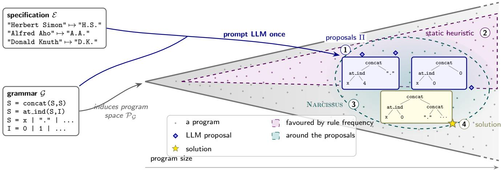  
Figure 4: Why we search around the proposals, on the SLIA task of Figure 1. The grammar induces the program space ${ \mathcal { P } } _ { { \mathcal { G } } } ,$ d<sub>rawn so</sub> th<sub>a</sub>t <sub>program s</sub>i<sub>ze grows</sub> t<sub>o</sub> th<sub>e r</sub>i<sub>g</sub>ht<sub>; eac</sub>h d<sub>o</sub>t i<sub>s one program.</sub> P<sub>romp</sub>t<sub>e</sub>d <sub>once w</sub>ith <sub>an</sub>d <sub>,</sub> th<sub>e</sub> LLM <sub>re</sub>t<sub>urns a</sub> f<sub>ew raw</sub> <sub>p</sub>ro<sub>p</sub>osals (1): wron<sub>g</sub>, sometimes un<sub>g</sub>rammatical, but sittin<sub>g</sub> close to<sub>g</sub>ether in a small re<sub>g</sub>ion of the s<sub>p</sub>ace. Scorin<sub>g p</sub>ro<sub>g</sub>rams b<sub>y</sub> how often their rules occur in the <sub>p</sub>ro<sub>p</sub>osals (2) covers that re<sub>g</sub>ion, but with it ever<sub>y</sub> <sub>p</sub>ro<sub>g</sub>ram built from the same rules at ever<sub>y</sub> <sub>s</sub>i<sub>ze, mos</sub>t <sub>o</sub>f th<sub>em</sub> f<sub>ar</sub> l<sub>arger</sub> th<sub>an any</sub>thi<sub>ng</sub> th<sub>e proposa</sub>l<sub>s sugges</sub>t<sub>.</sub> Wh<sub>a</sub>t i<sub>s wor</sub>th <sub>enumera</sub>ti<sub>ng</sub> i<sub>ns</sub>t<sub>ea</sub>d i<sub>s</sub> th<sub>e reg</sub>i<sub>on aroun</sub>d th<sub>e</sub> <sub>p</sub>ro<sub>p</sub>osals (3): their rules, in their <sub>p</sub>laces, at their size. It has to sta<sub>y</sub> o<sub>p</sub>en, because the solution (4) can need a rule the <sub>p</sub>ro<sub>p</sub>osals <sub>never</sub> <sub>use</sub>d<sub>.</sub>

<table><tr><td>Group</td><td>k</td><td>SLIA (Deep- Seek-Chat) (N=205)</td><td>SLIA (GPT-40) (N=70)</td><td>BV (Deep- Seek-Chat) (N=753)</td><td>DC (Deep- Seek-Chat) (N=100)</td><td>DC (Haiku) (N=100)</td><td>ARC (Deep- Seek-Chat) (N=42)</td><td>ARC (Deep- Seek- Reasoner)</td><td>ARGA (Deep- Seek-Chat) (N=160)</td><td>ARGA (GPT-40) (N=160)</td></tr><tr><td rowspan="3">All proposals</td><td>k = 1</td><td>27 (13%)</td><td>8 (11%)</td><td>6 (1%)</td><td>3 (3%)</td><td>6 (6%)</td><td>0 (0%)</td><td>一</td><td>0 (0%)</td><td>2 (1%)</td></tr><tr><td>k =</td><td>31 (15%)</td><td>13 (19%)</td><td>9 (1%)</td><td>6 (6%)</td><td>7 (7%)</td><td>0 (0%)</td><td></td><td>4 (2%)</td><td>6 (4%)</td></tr><tr><td>5 all</td><td>42 (20%)</td><td>22 (31%)</td><td>11 (1%)</td><td>7 (7%)</td><td>7 (7%)</td><td>0 (0%)</td><td>15 (15%)</td><td>7 (4%)</td><td>18 (11%)</td></tr><tr><td rowspan="3">Synth. valid only</td><td>k = 1</td><td>18 (9%)</td><td>5 (7%)</td><td>6 (1%)</td><td>3 (3%)</td><td>3 (3%)</td><td>0 (0%)</td><td></td><td>0 (0%)</td><td>2 (1%)</td></tr><tr><td>k =</td><td>19 (9%)</td><td>9 (13%)</td><td>9 (1%)</td><td>3 (3%)</td><td>3 (3%)</td><td>0 (0%)</td><td></td><td>4 (2%)</td><td>6 (4%)</td></tr><tr><td>5 all</td><td>22 (11%)</td><td>12 (17%)</td><td>11 (1%)</td><td>4 (4%)</td><td>3 (3%)</td><td>0 (0%)</td><td>13 (13%)</td><td>7 (4%)</td><td>18 (11%)</td></tr></table>

Table 3: Raw proposal accuracy per domain and proposal model. We report the number (and share) of tasks for which at least one of the first k proposals satisfies all examples; “all” uses every available proposal. The lower block counts only <sub>proposa</sub>l<sub>s</sub> th<sub>a</sub>t <sub>are syn</sub>t<sub>ac</sub>ti<sub>ca</sub>ll<sub>y va</sub>lid i<sub>n</sub> th<sub>e</sub> t<sub>arge</sub>t <sub>grammar,</sub> i<sub>.e.</sub> th<sub>e</sub> l<sub>anguage</sub> th<sub>e syn</sub>th<sub>es</sub>i<sub>zer mus</sub>t <sub>searc</sub>h<sub>, w</sub>hi<sub>c</sub>h i<sub>s</sub> th<sub>e accuracy</sub> the search results should be compared against. N is the number of tasks for which proposals were collected from that model; it can exceed the evaluation subsets used in the experiments (e.g. DeepSeek proposals cover all 205 SLIA tasks while the search experiments use the standard 100-task subset, and the GPT-4o column covers the 70-task subset released with HySynth; the ARC (Dee<sub>p</sub>Seek-Chat) column covers the 42 tasks <sub>p</sub>rom<sub>p</sub>ted for that model). The ARC (Dee<sub>p</sub>Seek-Reasoner) column covers the canonical 100-task subset used for the full-ARC RQ1 experiment (Figure 12); onl<sub>y</sub> the “all” row is available for this subset, <sub>s</sub>i<sub>nce</sub> th<sub>e</sub> $k = 1 / k = 5$ b<sub>rea</sub>kd<sub>own</sub> h<sub>as no</sub>t b<sub>een recom u</sub>t<sub>e</sub>d f<sub>or</sub> it<sub>.</sub>

## D Hyperparameter Selection

Th<sub>e searc</sub>h h<sub>as</sub> t<sub>wo</sub> f<sub>ree</sub> h<sub>yperparame</sub>t<sub>ers:</sub> th<sub>e</sub> h<sub>eur</sub>i<sub>s</sub>ti<sub>c</sub>’<sub>s s</sub>i<sub>g-</sub> <sub>na</sub>l <sub>we</sub>i<sub>g</sub>ht<sub>s an</sub>d th<sub>e gene</sub>ti<sub>c popu</sub>l<sub>a</sub>ti<sub>on s</sub>i<sub>ze.</sub> W<sub>e</sub> fi<sub>x</sub> b<sub>o</sub>th b<sub>y sma</sub>ll <sub>sweeps on</sub> SLIA <sub>an</sub>d <sub>reuse</sub> th<sub>e c</sub>h<sub>osen va</sub>l<sub>ues un-</sub> <sub>c</sub>h<sub>ange</sub>d i<sub>n every o</sub>th<sub>er</sub> d<sub>oma</sub>i<sub>n, so</sub> th<sub>e num</sub>b<sub>ers repor</sub>t<sub>e</sub>d th<sub>roug</sub>h<sub>ou</sub>t th<sub>e paper use a s</sub>i<sub>ng</sub>l<sub>e,</sub> d<sub>oma</sub>i<sub>n-</sub>i<sub>n</sub>d<sub>epen</sub>d<sub>en</sub>t <sub>con-</sub> fi<sub>gura</sub>ti<sub>on.</sub>

Signal weights. The heuristic combines prefix align-<sub>men</sub>t<sub>, su</sub>b<sub>-program reuse, an</sub>d <sub>regu</sub>l<sub>ar</sub>i<sub>za</sub>ti<sub>on w</sub>ith <sub>we</sub>i<sub>g</sub>ht<sub>s</sub> $w _ { \mathrm { p r e f i x } } , w _ { \mathrm { r e u s e } } , w _ { \mathrm { r e g } }$ and a floor C. Var<sub>y</sub>ing each weight over $\{ 0 . 5 , 1 , 5 , 1 0 \}$ on $\mathrm { \check { S } L I A }$ <sub>, we</sub> f<sub>oun</sub>d <sub>no s</sub>k<sub>ewe</sub>d <sub>ass</sub>i<sub>gnmen</sub>t th<sub>a</sub>t <sub>cons</sub>i<sub>s</sub>t<sub>en</sub>tl<sub>y</sub> i<sub>mprove</sub>d <sub>on g</sub>i<sub>v</sub>i<sub>ng</sub> th<sub>e</sub> th<sub>ree s</sub>i<sub>gna</sub>l<sub>s equa</sub>l weight; setting all of them (and C) to 1 solved the most tasks throu<sub>g</sub>hout. This matches the RQ2 findin<sub>g</sub> that each si<sub>g</sub>nal i<sub>s</sub> l<sub>oa</sub>d<sub>-</sub>b<sub>ear</sub>i<sub>ng</sub> i<sub>n</sub> <sub>a</sub> dif<sub>eren</sub>t <sub>reg</sub>i<sub>me:</sub> <sub>any</sub> <sub>ass</sub>i<sub>gnmen</sub>t th<sub>a</sub>t d<sub>own-we</sub>i<sub>g</sub>ht<sub>s one s</sub>i<sub>gna</sub>l h<sub>e</sub>l<sub>ps</sub> th<sub>e</sub> t<sub>as</sub>k<sub>s</sub> th<sub>a</sub>t <sub>re</sub>l<sub>y on</sub> th<sub>e o</sub>th<sub>-</sub> <sub>ers</sub> b<sub>u</sub>t h<sub>ur</sub>t<sub>s</sub> th<sub>ose</sub> th<sub>a</sub>t <sub>re</sub>l<sub>y on</sub> it<sub>, so equa</sub>l <sub>we</sub>i<sub>g</sub>ht<sub>s are</sub> th<sub>e</sub> robust choice. We therefore adopt weights of 1 everywhere <sub>an</sub>d <sub>never re-</sub>t<sub>une</sub> th<sub>em per</sub> d<sub>oma</sub>i<sub>n.</sub>

Genetic population size. For the genetic backend we swept the population size over 10, 50, 100, 1000 on SLIA. Larger <sub>popu</sub>l<sub>a</sub>ti<sub>ons so</sub>l<sub>ve marg</sub>i<sub>na</sub>ll<sub>y more</sub> t<sub>as</sub>k<sub>s</sub> b<sub>u</sub>t <sub>cos</sub>t <sub>propor</sub>ti<sub>on-</sub> <sub>a</sub>ll<sub>y more</sub> ti<sub>me per genera</sub>ti<sub>on, ex</sub>h<sub>aus</sub>ti<sub>ng</sub> th<sub>e wa</sub>ll<sub>-c</sub>l<sub>oc</sub>k b<sub>u</sub>d<sub>-</sub> get on fewer tasks; 50 gave the best trade-of between final <sub>so</sub>l<sub>ve</sub> <sub>ra</sub>t<sub>e</sub> <sub>an</sub>d <sub>runn</sub>i<sub>ng</sub> ti<sub>me,</sub> <sub>an</sub>d <sub>we</sub> <sub>use</sub> it f<sub>or</sub> <sub>every</sub> <sub>gene</sub>ti<sub>c</sub> <sub>run.</sub> Th<sub>e</sub> b<sub>eam-searc</sub>h b<sub>ac</sub>k<sub>en</sub>d <sub>ana</sub>l<sub>ogous</sub>l<sub>y</sub> <sub>uses</sub> <sub>a</sub> <sub>poo</sub>l <sub>o</sub>f 1000, matching the beam width against which HySynth’s <sub>un</sub>b<sub>oun</sub>d<sub>e</sub>d <sub>queue</sub> i<sub>s</sub> <sub>compare</sub>d<sub>.</sub>

## E Additional Results: Solve Curves

W<sub>e prov</sub>id<sub>e</sub> th<sub>e</sub> f<sub>u</sub>ll <sub>se</sub>t <sub>o</sub>f <sub>cumu</sub>l<sub>a</sub>ti<sub>ve so</sub>l<sub>ve curves;</sub> f<sub>or</sub> th<sub>e</sub> di<sub>scuss</sub>i<sub>on o</sub>f th<sub>ese resu</sub>lt<sub>s p</sub>l<sub>ease see</sub> th<sub>e</sub> E<sub>xper</sub>i<sub>men</sub>t<sub>a</sub>l E<sub>va</sub>l<sub>-</sub> <sub>ua</sub>ti<sub>on</sub> <sub>sec</sub>ti<sub>on</sub> <sub>o</sub>f th<sub>e</sub> <sub>ma</sub>i<sub>n</sub> t<sub>ex</sub>t<sub>.</sub> E<sub>ac</sub>h d<sub>oma</sub>i<sub>n</sub> i<sub>s</sub> <sub>s</sub>h<sub>own</sub> <sub>on</sub> both bud<sub>g</sub>et axes: <sub>p</sub>ro<sub>g</sub>rams enumerated (left), which is i<sub>mp</sub>l<sub>emen</sub>t<sub>a</sub>ti<sub>on- an</sub>d h<sub>ar</sub>d<sub>ware-</sub>i<sub>n</sub>d<sub>epen</sub>d<sub>en</sub>t<sub>, an</sub>d <sub>wa</sub>ll<sub>-c</sub>l<sub>oc</sub>k time (ri<sub>g</sub>ht), which additionall<sub>y</sub> char<sub>g</sub>es each method for the <sub>cos</sub>t <sub>o</sub>f it<sub>s own gu</sub>id<sub>ance.</sub> C<sub>urves</sub> f<sub>or</sub> th<sub>e s</sub>t<sub>oc</sub>h<sub>as</sub>ti<sub>c gene</sub>ti<sub>c</sub> <sub>me</sub>th<sub>o</sub>d<sub>s</sub> <sub>are</sub> <sub>means</sub> <sub>over</sub> fi<sub>ve</sub> <sub>see</sub>d<sub>s,</sub> <sub>w</sub>ith <sub>s</sub>h<sub>a</sub>d<sub>e</sub>d b<sub>an</sub>d<sub>s</sub> <sub>g</sub>i<sub>v</sub>i<sub>ng</sub> th<sub>e sprea</sub>d <sub>across see</sub>d<sub>s.</sub>

## E.1 RQ1: SLIA

Fi<sub>gure</sub> 5 <sub>covers</sub> th<sub>e</sub> f<sub>u</sub>ll 100<sub>-</sub>t<sub>as</sub>k <sub>se</sub>t <sub>w</sub>ith D<sub>eep</sub>S<sub>ee</sub>k <sub>pro-</sub> <sub>posa</sub>l<sub>s, an</sub>d Fi<sub>gure</sub> 6 th<sub>e</sub> 70<sub>-</sub>t<sub>as</sub>k H<sub>y</sub>S<sub>yn</sub>th <sub>su</sub>b<sub>se</sub>t <sub>un</sub>d<sub>er</sub> b<sub>o</sub>th <sub>proposa</sub>l <sub>mo</sub>d<sub>e</sub>l<sub>s;</sub> th<sub>e</sub> l<sub>a</sub>tt<sub>er</sub> i<sub>s</sub> th<sub>e wa</sub>ll<sub>-c</sub>l<sub>oc</sub>k <sub>coun</sub>t<sub>erpar</sub>t <sub>o</sub>f Fi<sub>g</sub>ure 2(a).

## E.2 RQ1: Bit-Vectors (BV)

Fi<sub>gure</sub> 7 <sub>s</sub>h<sub>ows</sub> BV <sub>un</sub>d<sub>er</sub> th<sub>e</sub> di<sub>v</sub>id<sub>e-an</sub>d<sub>-conquer</sub> d<sub>ecompo-</sub> <sub>s</sub>iti<sub>on use</sub>d i<sub>n</sub> th<sub>e ma</sub>i<sub>n</sub> t<sub>ex</sub>t<sub>, an</sub>d Fi<sub>gure</sub> 8 th<sub>e same</sub> b<sub>enc</sub>h<sub>mar</sub>k <sub>w</sub>ith<sub>ou</sub>t it<sub>.</sub>

## E.3 RQ1: DeepCoder (DC)

Fi<sub>gu</sub>r<sub>e</sub> 9 <sub>co</sub>m<sub>pa</sub>r<sub>es</sub> D<sub>eep</sub>S<sub>ee</sub>k <sub>a</sub>nd H<sub>a</sub>ik<sub>u</sub> <sub>p</sub>r<sub>oposa</sub>l<sub>s</sub> <sub>o</sub>n th<sub>e</sub> 100 D<sub>eep</sub>C<sub>o</sub>d<sub>e</sub>r t<sub>as</sub>k<sub>s.</sub>

## E.4 RQ2: Signal Ablation

Fi<sub>g</sub>ure 10 <sub>g</sub>ives the full ablation discussed under RQ2, with <sub>one</sub> <sub>row</sub> <sub>per</sub> <sub>proposa</sub>l <sub>mo</sub>d<sub>e</sub>l<sub>.</sub> N<sub>o</sub>t<sub>e</sub> th<sub>a</sub>t th<sub>e</sub> <sub>reuse-on</sub>l<sub>y</sub> <sub>var</sub>i<sub>an</sub>t i<sub>s s</sub>till <sub>no</sub>t <sub>equ</sub>i<sub>va</sub>l<sub>en</sub>t t<sub>o</sub> th<sub>e s</sub>t<sub>a</sub>ti<sub>c</sub> h<sub>eur</sub>i<sub>s</sub>ti<sub>c:</sub> it <sub>a</sub>l<sub>so m</sub>i<sub>nes</sub> th<sub>e recurr</sub>i<sub>ng</sub> f<sub>ragmen</sub>t<sub>s</sub> i<sub>n</sub>t<sub>o</sub> th<sub>e grammar an</sub>d <sub>scores</sub> th<sub>ose</sub> <sub>macro-ru</sub>l<sub>es, w</sub>hi<sub>c</sub>h <sub>a ru</sub>l<sub>e-</sub>f<sub>requency pr</sub>i<sub>or</sub> d<sub>oes no</sub>t d<sub>o.</sub>

## E.5 RQ1: ARC and ARGA

Fi<sub>gure</sub> 11 <sub>covers</sub> ARGA <sub>an</sub>d i<sub>s</sub> th<sub>e wa</sub>ll<sub>-c</sub>l<sub>oc</sub>k <sub>coun</sub>t<sub>erpar</sub>t of Fi<sub>g</sub>ure 2(b); Fi<sub>g</sub>ure 12 covers full ARC over the Hodel g<sup>rammar</sup>.

## F AUC Tables

## F.1 How to Read the AUC Columns

A <sub>cumu</sub>l<sub>a</sub>ti<sub>ve so</sub>l<sub>ve curve p</sub>l<sub>o</sub>t<sub>s</sub> th<sub>e num</sub>b<sub>er o</sub>f t<sub>as</sub>k<sub>s so</sub>l<sub>ve</sub>d (<sub>y</sub>) a<sub>g</sub>ainst a bud<sub>g</sub>et (x): either <sub>p</sub>ro<sub>g</sub>rams enumerated, from 1 to $1 0 ^ { \overline { { 6 } } }$ , or solving time, from 0.03s to the 300s timeout. Sum-<sub>mar</sub>i<sub>z</sub>i<sub>ng suc</sub>h <sub>a curve</sub> b<sub>y</sub> it<sub>s en</sub>d<sub>po</sub>i<sub>n</sub>t <sub>a</sub>l<sub>one</sub> di<sub>scar</sub>d<sub>s exac</sub>tl<sub>y</sub> <sub>w</sub>h<sub>a</sub>t <sub>we</sub> <sub>care</sub> <sub>a</sub>b<sub>ou</sub>t<sub>,</sub> <sub>name</sub>l<sub>y</sub> h<sub>ow</sub> <sub>ear</sub>l<sub>y</sub> th<sub>e</sub> t<sub>as</sub>k<sub>s</sub> <sub>are</sub> <sub>so</sub>l<sub>ve</sub>d<sub>,</sub> <sub>so</sub> <sub>we</sub> <sub>a</sub>l<sub>so</sub> <sub>repor</sub>t th<sub>e</sub> <sub>area</sub> <sub>un</sub>d<sub>er</sub> th<sub>e</sub> <sub>curve.</sub> B<sub>ecause</sub> th<sub>e</sub> b<sub>u</sub>d<sub>ge</sub>t <sub>spans or</sub>d<sub>ers o</sub>f <sub>magn</sub>it<sub>u</sub>d<sub>e,</sub> th<sub>e area</sub> i<sub>s</sub> i<sub>n</sub>t<sub>egra</sub>t<sub>e</sub>d i<sub>n</sub> $\log _ { 1 0 }$ x <sub>space, w</sub>hi<sub>c</sub>h <sub>we</sub>i<sub>g</sub>ht<sub>s eac</sub>h d<sub>eca</sub>d<sub>e o</sub>f b<sub>u</sub>d<sub>ge</sub>t <sub>equa</sub>ll<sub>y</sub> i<sub>ns</sub>t<sub>ea</sub>d <sub>o</sub>f l<sub>e</sub>tti<sub>ng</sub> th<sub>e</sub> l<sub>as</sub>t d<sub>eca</sub>d<sub>e</sub> d<sub>om</sub>i<sub>na</sub>t<sub>e,</sub> <sub>an</sub>d th<sub>en</sub> <sub>norma</sub>li<sub>ze</sub>d b<sub>y</sub> both the number of decades spanned (6 for the enumeration axis, 4 for the time axis) and the benchmark size. The <sub>genera</sub>t<sub>e</sub>d t<sub>a</sub>bl<sub>es repor</sub>t t<sub>wo co</sub>l<sub>umns per me</sub>th<sub>o</sub>d<sub>:</sub>

Final solved The number of tasks solved once the whole b<sub>u</sub>d<sub>ge</sub>t i<sub>s ex</sub>h<sub>aus</sub>t<sub>e</sub>d<sub>,</sub> i<sub>.e.</sub> th<sub>e r</sub>i<sub>g</sub>ht<sub>-</sub>h<sub>an</sub>d <sub>en</sub>d<sub>po</sub>i<sub>n</sub>t <sub>o</sub>f th<sub>e</sub> <sub>curve.</sub> F<sub>rac</sub>ti<sub>ona</sub>l <sub>va</sub>l<sub>ues are means over</sub> fi<sub>ve see</sub>d<sub>s.</sub>

AUC (% of universe) The normalized area under the curve, i.e. the average share of the benchmark solved over the log-budget. 100% means every task is solved instantly, <sub>an</sub>d <sub>a</sub> <sub>s</sub>t<sub>eeper</sub> <sub>r</sub>i<sub>se</sub> <sub>scores</sub> hi<sub>g</sub>h<sub>er.</sub> Thi<sub>s</sub> i<sub>s</sub> th<sub>e</sub> <sub>on</sub>l<sub>y</sub> <sub>quan-</sub> tit<sub>y compara</sub>bl<sub>e across</sub> d<sub>oma</sub>i<sub>ns, s</sub>i<sub>nce</sub> it i<sub>s norma</sub>li<sub>ze</sub>d f<sub>or</sub> b<sub>o</sub>th b<sub>enc</sub>h<sub>mar</sub>k <sub>s</sub>i<sub>ze an</sub>d b<sub>u</sub>d<sub>ge</sub>t <sub>range, an</sub>d it i<sub>s</sub> th<sub>e</sub> <sub>co</sub>l<sub>umn repor</sub>t<sub>e</sub>d <sub>as</sub> “AUC” th<sub>roug</sub>h<sub>ou</sub>t th<sub>e ma</sub>i<sub>n</sub> t<sub>ex</sub>t <sub>an</sub>d i<sub>n</sub> T<sub>a</sub>bl<sub>e</sub> 1<sub>.</sub>

## F.2 Full AUC Tables

Th<sub>e</sub> f<sub>o</sub>ll<sub>ow</sub>i<sub>ng</sub> t<sub>a</sub>bl<sub>es</sub> <sub>g</sub>i<sub>ve</sub> b<sub>o</sub>th b<sub>u</sub>d<sub>ge</sub>t <sub>axes</sub> f<sub>or</sub> <sub>every</sub> d<sub>o-</sub> <sub>ma</sub>i<sub>n,</sub> <sub>repor</sub>ti<sub>ng</sub> fi<sub>na</sub>l <sub>so</sub>l<sub>ve</sub>d <sub>coun</sub>t <sub>an</sub>d <sub>norma</sub>li<sub>ze</sub>d AUC <sub>as</sub> d<sub>escr</sub>ib<sub>e</sub>d <sub>a</sub>b<sub>ove.</sub> Th<sub>e enumera</sub>ti<sub>on ax</sub>i<sub>s</sub> f<sub>or</sub> th<sub>e</sub> SLIA LLM <sub>compar</sub>i<sub>son</sub> i<sub>s</sub> <sub>om</sub>itt<sub>e</sub>d h<sub>ere,</sub> <sub>s</sub>i<sub>nce</sub> it i<sub>s</sub> <sub>repro</sub>d<sub>uce</sub>d <sub>as</sub> T<sub>a</sub>bl<sub>e</sub> 1 i<sub>n</sub> th<sub>e ma</sub>i<sub>n</sub> t<sub>ex</sub>t<sub>.</sub>

Table 4: RQ1, SLIA (Dee<sub>p</sub>Seek) : Enumeration axis AUC (programs enumerated, 1 to 10<sup>6</sup>), out of 100 problems.
<table><tr><td>Method</td><td>Final solved</td><td>AUC (% of universe)</td></tr><tr><td>Narcissus + Genetic (DeepSeek)</td><td>41.8</td><td>22.1%</td></tr><tr><td>HySynth (static + BUS) (DeepSeek)</td><td>38.0</td><td>18.2%</td></tr><tr><td>Static + Genetic (DeepSeek)</td><td>28.4</td><td>17.8%</td></tr><tr><td>Narcissus + BUS (DeepSeek)</td><td>40.0</td><td>16.5%</td></tr><tr><td>BFS (enhanced grammar)</td><td>28.0</td><td>16.1%</td></tr><tr><td>BFS (plain grammar)</td><td>22.0</td><td>13.3%</td></tr></table>

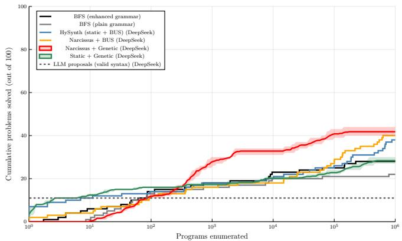

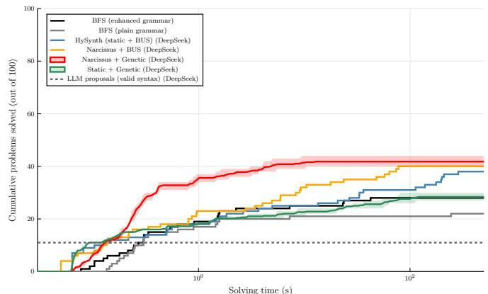  
Figure 5: RQ1, full 100-task SLIA (DeepSeek proposals): tasks solved vs. programs enumerated (left) and vs. wall-clock time (right). With the same backend, Narcissus dominates the static prior at every budget on both axes, and reaches solutions orders of ma<sub>g</sub>nitude earlier than the static heuristic. The raw <sub>g</sub>rammar-valid <sub>p</sub>ro<sub>p</sub>osals (dashed) are shown for reference. The <sub>or</sub>d<sub>er</sub>i<sub>ng</sub> i<sub>s unc</sub>h<sub>ange</sub>d <sub>w</sub>h<sub>en gu</sub>id<sub>ance</sub> i<sub>s c</sub>h<sub>arge</sub>d f<sub>or</sub> it<sub>s own run</sub>ti<sub>me, so</sub> th<sub>e ga</sub>i<sub>n</sub> i<sub>s no</sub>t <sub>an ar</sub>tif<sub>ac</sub>t <sub>o</sub>f <sub>coun</sub>ti<sub>ng enumera</sub>ti<sub>on</sub> on<sup>l</sup><sub>y</sub>.

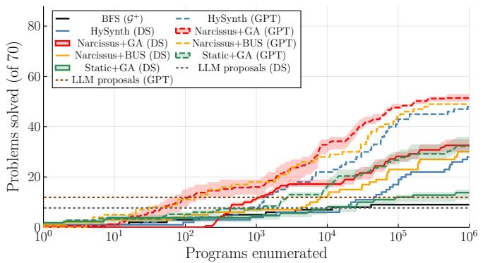

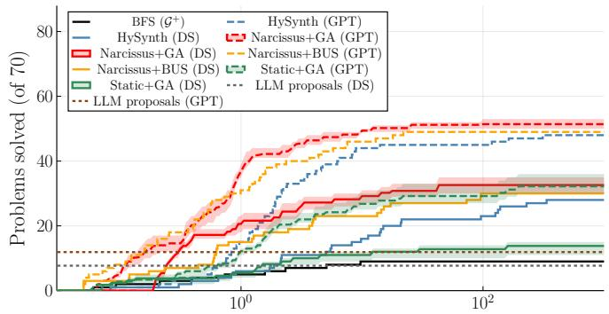  
Time (s)

Figure 6: RQ1/RQ4, SLIA 70-task subset: GPT-4o vs. DeepSeek proposals, by programs enumerated (left) and wall-clock time (right). This is the time-axis counterpart of Figure 2(a). At each proposal quality Narcissus leads under both backends, <sub>an</sub>d N<sub>arcissus on</sub> th<sub>e</sub> D<sub>eep</sub>S<sub>ee</sub>k <sub>proposa</sub>l<sub>s r</sub>i<sub>va</sub>l<sub>s</sub> th<sub>e s</sub>t<sub>a</sub>ti<sub>c pr</sub>i<sub>or on</sub> th<sub>e</sub> GPT<sub>-</sub>4<sub>o proposa</sub>l<sub>s.</sub>  
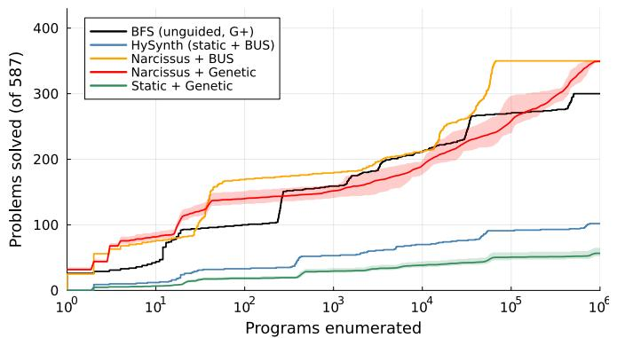

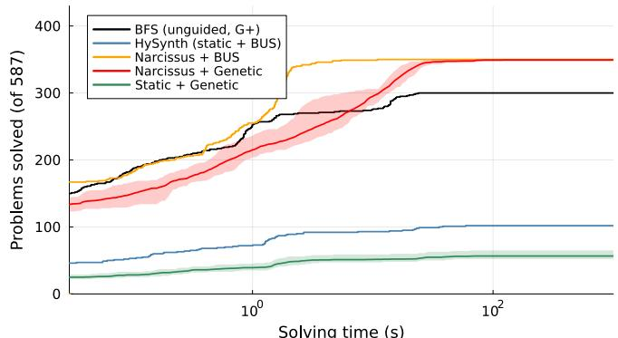  
Solving time (s)  
Figure 7: RQ1, BV with divide-and-conquer (weak proposals): programs enumerated (left) and wall-clock time (right). N<sub>arcissus s</sub>t<sub>ays a</sub>b<sub>ove ungu</sub>id<sub>e</sub>d <sub>enumera</sub>ti<sub>on, w</sub>hil<sub>e</sub> b<sub>o</sub>th <sub>s</sub>t<sub>a</sub>ti<sub>c-pr</sub>i<sub>or var</sub>i<sub>an</sub>t<sub>s co</sub>ll<sub>apse</sub> f<sub>ar</sub> b<sub>e</sub>l<sub>ow</sub> it<sub>,</sub> b<sub>ecause</sub> th<sub>ey e</sub>f<sub>ec</sub>ti<sub>ve</sub>l<sub>y</sub> <sub>prune</sub> th<sub>e ru</sub>l<sub>es</sub> th<sub>e wea</sub>k <sub>proposa</sub>l<sub>s never men</sub>ti<sub>on.</sub> Thi<sub>s</sub> i<sub>s</sub> th<sub>e core ro</sub>b<sub>us</sub>t<sub>ness resu</sub>lt b<sub>e</sub>hi<sub>n</sub>d th<sub>e c</sub>l<sub>a</sub>i<sub>m</sub> th<sub>a</sub>t N<sub>arcissus</sub>’<sub>s</sub> fl<sub>oor</sub> i<sub>s</sub> <sub>p</sub>l<sub>a</sub>i<sub>n</sub> <sub>enumera</sub>ti<sub>on.</sub> Th<sub>e</sub> <sub>ungu</sub>id<sub>e</sub>d b<sub>ase</sub>li<sub>ne</sub> <sub>enumera</sub>t<sub>es</sub> th<sub>e</sub> <sub>ex</sub>t<sub>en</sub>d<sub>e</sub>d <sub>grammar</sub> $\mathcal { G } ^ { + }$ <sub>,</sub> <sub>so</sub> it i<sub>s</sub> <sub>no</sub>t h<sub>an</sub>di<sub>cappe</sub>d <sub>re</sub>l<sub>a</sub>ti<sub>ve</sub> t<sub>o</sub> th<sub>e</sub> <sub>gu</sub>id<sub>e</sub>d <sub>me</sub>th<sub>o</sub>d<sub>s.</sub>

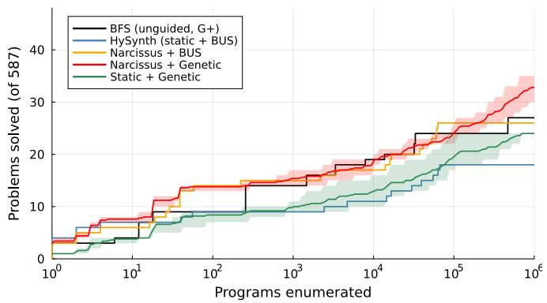

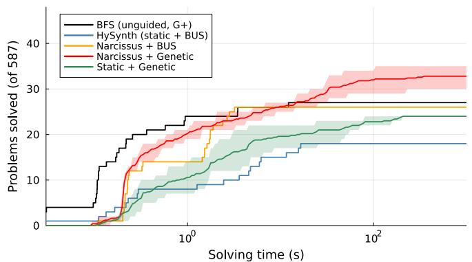  
Figure 8: RQ1, BV without divide-and-conquer (plain synthesizer): programs enumerated (left) and wall-clock time (right). Without the divide-and-conquer decomposition every method solves far fewer of the 587 tasks, so the y-axis is clipped at 48 to keep the curves legible; the ordering of Figure 7 is largely preserved, with Narcissus remaining close to or above <sub>ungu</sub>id<sub>e</sub>d <sub>enumera</sub>ti<sub>on w</sub>hil<sub>e</sub> th<sub>e s</sub>t<sub>a</sub>ti<sub>c pr</sub>i<sub>ors</sub> f<sub>a</sub>ll <sub>c</sub>l<sub>ear</sub>l<sub>y</sub> b<sub>e</sub>l<sub>ow</sub> it<sub>.</sub> A<sub>s</sub> i<sub>n</sub> Fi<sub>gure</sub> 7<sub>,</sub> th<sub>e ungu</sub>id<sub>e</sub>d b<sub>ase</sub>li<sub>ne enumera</sub>t<sub>es</sub> th<sub>e ex</sub>t<sub>en</sub>d<sub>e</sub>d g<sup>rammar</sup> $\mathcal { G } ^ { + }$

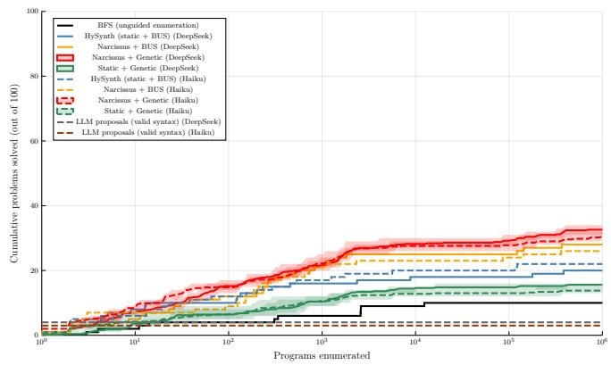

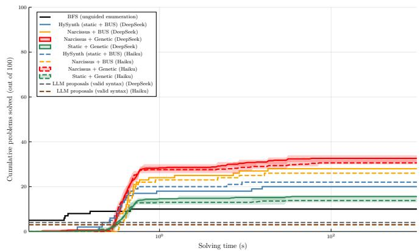  
Figure 9: RQ1, DeepCoder (100 tasks), DeepSeek vs. Haiku proposals: programs enumerated (left) and wall-clock time (right). DC has weak ro osal su ort (7%, Table 3), et the RQ1 orderin holds for both ro osal models and under both b<sub>ac</sub>k<sub>en</sub>d<sub>s:</sub> N<sub>arcissus</sub> l<sub>ea</sub>d<sub>s,</sub> th<sub>e s</sub>t<sub>a</sub>ti<sub>c pr</sub>i<sub>or</sub> t<sub>ra</sub>il<sub>s, an</sub>d <sub>ungu</sub>id<sub>e</sub>d <sub>enumera</sub>ti<sub>on</sub> i<sub>s</sub> th<sub>e</sub> fl<sub>oor.</sub>

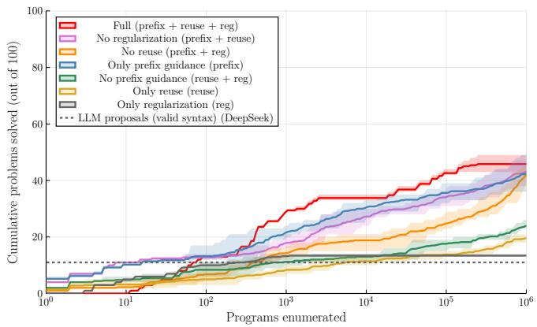

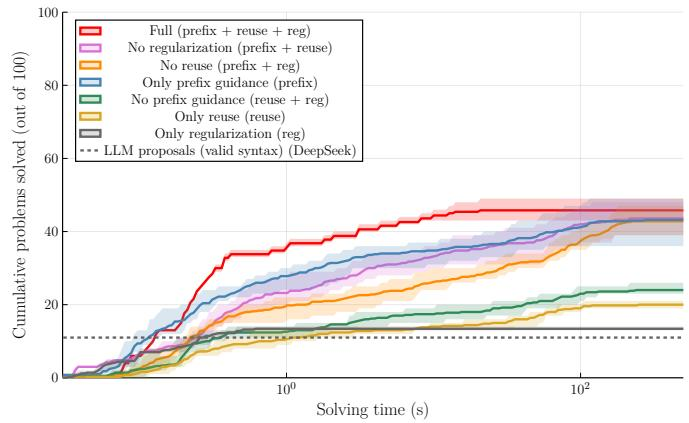

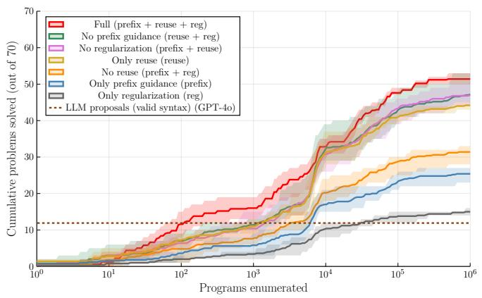

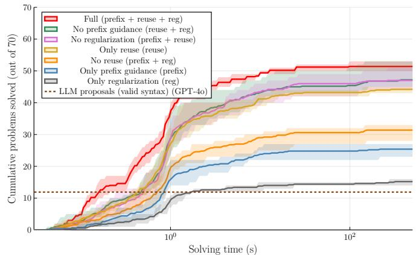  
Figure 10: RQ2: SLIA signal ablation (genetic backend) under weaker DeepSeek (top, 100 tasks) and stronger GPT-4o (bottom, 70 tasks) proposals, by programs enumerated (left) and wall-clock time (right). Every signal contributes but <sub>none accoun</sub>t<sub>s</sub> f<sub>or</sub> th<sub>e</sub> f<sub>u</sub>ll h<sub>eur</sub>i<sub>s</sub>ti<sub>c, an</sub>d <sub>w</sub>hi<sub>c</sub>h <sub>s</sub>i <sub>na</sub>l i<sub>s</sub> l<sub>oa</sub>d<sub>-</sub>b<sub>ear</sub>i<sub>n</sub> i<sub>nver</sub>t<sub>s w</sub>ith <sub>ro osa</sub>l <sub>ua</sub>lit <sub>: un</sub>d<sub>er</sub> th<sub>e wea</sub>k<sub>er</sub> D<sub>ee</sub> S<sub>ee</sub>k <sub>proposa</sub>l<sub>s pre</sub>fi<sub>x a</sub>li<sub>gnmen</sub>t d<sub>om</sub>i<sub>na</sub>t<sub>es, s</sub>i<sub>nce remov</sub>i<sub>ng</sub> it <sub>cos</sub>t<sub>s</sub> th<sub>e mos</sub>t <sub>an</sub>d it <sub>a</sub>l<sub>one recovers a</sub>l<sub>mos</sub>t th<sub>e</sub> f<sub>u</sub>ll h<sub>eur</sub>i<sub>s</sub>ti<sub>c, w</sub>h<sub>ereas</sub> <sub>un</sub>d<sub>er</sub> th<sub>e s</sub>t<sub>ron er</sub> GPT<sub>-</sub>4<sub>o ro osa</sub>l<sub>s su</sub>b<sub>- ro ram reuse</sub> t<sub>a</sub>k<sub>es over</sub> th<sub>a</sub>t <sub>ro</sub>l<sub>e</sub> i<sub>ns</sub>t<sub>ea</sub>d<sub>.</sub> Thi<sub>s</sub> i<sub>s w</sub>h N<sub>arcissus carr</sub>i<sub>es a</sub>ll th<sub>ree:</sub> th<sub>ey</sub> <sub>cover</sub> th<sub>e</sub> f<sub>u</sub>ll <sub>range</sub> <sub>o</sub>f <sub>proposa</sub>l <sub>suppor</sub>t <sub>ra</sub>th<sub>er</sub> th<sub>an</sub> <sub>any</sub> <sub>one</sub> <sub>succee</sub>di<sub>ng</sub> <sub>everyw</sub>h<sub>ere.</sub>


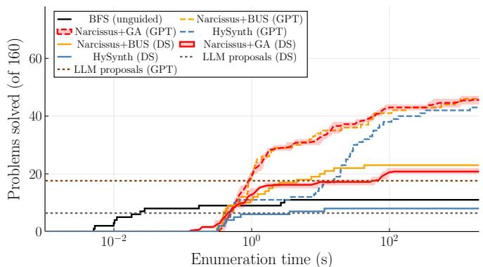  
Figure 11: RQ1, ARGA (160 tasks), GPT-4o vs. DeepSeek proposals: programs enumerated (left) and wall-clock time (right). The left panel is the time-axis counterpart of Figure 2(b). Under divide-and-conquer, Narcissus beats HySynth for both <sub>p</sub>ro<sub>p</sub>osal models and sta<sub>y</sub>s well above the raw <sub>p</sub>ro<sub>p</sub>osals (dotted).

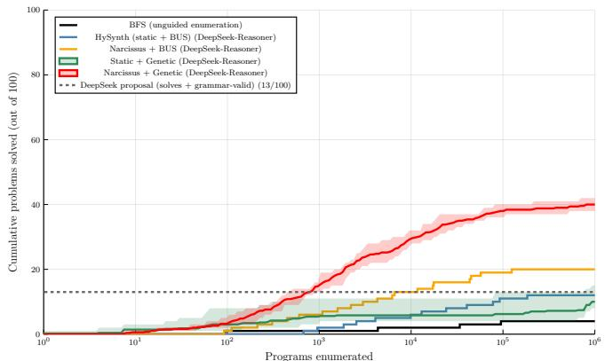

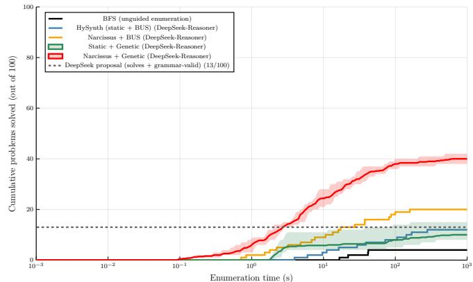  
Figure 12: RQ1, full ARC with the universal Hodel grammar (DeepSeek-Reasoner proposals): programs enumerated (left) and wall-clock time (right). This is the weakest-support setting in the paper. Narcissus rises well above the dotted line <sub>mar</sub>ki<sub>ng</sub> th<sub>e proposa</sub>l<sub>s</sub> th<sub>a</sub>t <sub>are</sub> b<sub>o</sub>th <sub>correc</sub>t <sub>an</sub>d <sub>grammar-va</sub>lid<sub>,</sub> i<sub>.e. gu</sub>id<sub>e</sub>d <sub>searc</sub>h <sub>so</sub>l<sub>ves</sub> ARC t<sub>as</sub>k<sub>s</sub> f<sub>or w</sub>hi<sub>c</sub>h <sub>no</sub>t <sub>a s</sub>i<sub>ng</sub>l<sub>e</sub> <sub>grammar-va</sub>lid <sub>proposa</sub>l i<sub>s correc</sub>t<sub>:</sub> th<sub>e proposa</sub>l<sub>s con</sub>t<sub>r</sub>ib<sub>u</sub>t<sub>e</sub> f<sub>ragmen</sub>t<sub>s an</sub>d <sub>par</sub>ti<sub>a</sub>l <sub>s</sub>t<sub>ruc</sub>t<sub>ure, an</sub>d th<sub>e searc</sub>h <sub>assem</sub>bl<sub>es an</sub>d <sub>correc</sub>t<sub>s</sub> th<sub>em.</sub>

Table 5: RQ1, SLIA (Dee<sub>p</sub>Seek) : Time axis AUC (solvin<sub>g</sub> time, 0.03s to 300s (timeout)), out of 100 <sub>p</sub>roblems.
<table><tr><td>Method</td><td>Final solved</td><td>AUC (% of universe)</td></tr><tr><td>Narcissus + Genetic (DeepSeek)</td><td>41.8</td><td>31.2%</td></tr><tr><td>Narcissus + BUS (DeepSeek)</td><td>40.0</td><td>24.2%</td></tr><tr><td>HySynth (static + BUS) (DeepSeek)</td><td>38.0</td><td>20.7%</td></tr><tr><td>Static + Genetic (DeepSeek)</td><td>28.4</td><td>19.0%</td></tr><tr><td>BFS (enhanced grammar)</td><td>28.0</td><td>18.7%</td></tr><tr><td>BFS (plain grammar)</td><td>22.0</td><td>15.1%</td></tr></table>

Table 6: RQ1, SLIA: LLM comparison (GPT-4o vs. Dee<sub>p</sub>Seek) : Time axis AUC (solvin<sub>g</sub> time, 0.03s to 300s (timeout)), out of 70 <sub>p</sub>roblems.

<table><tr><td>Method</td><td>Final solved</td><td>AUC (% of universe)</td></tr><tr><td>Narcissus + BUS</td><td>350.0</td><td>60.7%</td></tr><tr><td>BFS (unguided enumeration)</td><td>300.0</td><td>51.6%</td></tr><tr><td>Narcissus + Genetic</td><td>349.4</td><td>42.8%</td></tr><tr><td>HySynth (static + BUS)</td><td>102.0</td><td>16.0%</td></tr><tr><td>Static + Genetic</td><td>56.6</td><td>7.6%</td></tr></table>

Table 8: RQ1, PBE\_BV\_Track\_2018 (bitvector), divide-andconquer : Time axis AUC (solvin<sub>g</sub> time, 0.03s to 300s (timeout)), out of 587 <sub>p</sub>roblems.

<table><tr><td>Method</td><td>Final solved</td><td>AUC (% of universe)</td></tr><tr><td>Narcissus + Genetic (GPT-4o)</td><td>51.4</td><td>49.6%</td></tr><tr><td>Narcissus + BUS (GPT-4o)</td><td>49.0</td><td>47.3%</td></tr><tr><td>HySynth (static + BUS) (GPT-4o)</td><td>48.0</td><td>36.9%</td></tr><tr><td>Narcissus + Genetic (DeepSeek)</td><td>32.6</td><td>29.4%</td></tr><tr><td>Static + Genetic (GPT-4o)</td><td>32.2</td><td>25.0%</td></tr><tr><td>Narcissus + BUS (DeepSeek)</td><td>30.0</td><td>24.8%</td></tr><tr><td>HySynth (static + BUS) (DeepSeek)</td><td>28.0</td><td>16.3%</td></tr><tr><td>Static + Genetic (DeepSeek)</td><td>13.8</td><td>11.5%</td></tr><tr><td>BFS (enhanced grammar)</td><td>9.0</td><td>8.4%</td></tr></table>

Table 7: RQ1, PBE\_BV\_Track\_2018 (bitvector), divide-andconquer : Enumeration axis AUC (<sub>p</sub>ro<sub>g</sub>rams enumerated, 1 to 10<sup>6</sup>), out of 587 problems.

Table 9: RQ1, PBE\_BV\_Track\_2018 (bitvector), re<sub>g</sub>ular : Enumeration axis AUC (programs enumerated, 1 to 10<sup>6</sup>), <sub>ou</sub>t <sub>o</sub>f 587 <sub>pro</sub>bl<sub>ems.</sub>
<table><tr><td>Method</td><td>Final solved</td><td>AUC (% of universe)</td></tr><tr><td>Narcissus + Genetic</td><td>32.8</td><td>2.8%</td></tr><tr><td>Narcissus + BUS</td><td>26.0</td><td>2.6%</td></tr><tr><td>BFS (unguided enumeration)</td><td>27.0</td><td>2.5%</td></tr><tr><td>Static + Genetic</td><td>24.0</td><td>1.9%</td></tr><tr><td>HySynth (static + BUS)</td><td>18.0</td><td>1.8%</td></tr></table>

Table 10: RQ1, PBE\_BV\_Track\_2018 (bitvector), re<sub>g</sub>ular : Time axis AUC (solvin<sub>g</sub> time, 0.03s to 300s (timeout)), out <sub>o</sub>f 587 <sub>pro</sub>bl<sub>ems.</sub>
<table><tr><td>Method</td><td>Final solved</td><td>AUC (% of universe)</td></tr><tr><td>Narcissus + BUS</td><td>350.0</td><td>33.2%</td></tr><tr><td>Narcissus + Genetic</td><td>349.4</td><td>28.8%</td></tr><tr><td>BFS (unguided enumeration)</td><td>300.0</td><td>27.5%</td></tr><tr><td>HySynth (static + BUS)</td><td>102.0</td><td>8.8%</td></tr><tr><td>Static + Genetic</td><td>56.6</td><td>4.8%</td></tr></table>

<table><tr><td>Method</td><td>Final solved</td><td>AUC (% of universe)</td></tr><tr><td>BFS (unguided enumeration)</td><td>27.0</td><td>3.8%</td></tr><tr><td>Narcissus + Genetic</td><td>32.6</td><td>3.4%</td></tr><tr><td>Narcissus + BUS</td><td>26.0</td><td>3.0%</td></tr><tr><td>Static + Genetic</td><td>24.0</td><td>2.3%</td></tr><tr><td>HySynth (static + BUS)</td><td>18.0</td><td>2.0%</td></tr></table>

Table 11: RQ1, DeepCoder: LLM comparison (DeepSeek vs. Haiku) : Enumeration axis AUC (<sub>p</sub>ro<sub>g</sub>rams enumerated, 1 t<sub>o</sub> $1 0 ^ { 6 } )$ <sub>,</sub> <sub>ou</sub>t <sub>o</sub>f 100 <sub>pro</sub>bl<sub>ems.</sub>
<table><tr><td>Method</td><td>Final solved</td><td>AUC (% of universe)</td></tr><tr><td>Narcissus + Genetic (DeepSeek)</td><td>32.6</td><td>19.8%</td></tr><tr><td>Narcissus + Genetic (Haiku)</td><td>30.6</td><td>19.7%</td></tr><tr><td>Narcissus + BUS (DeepSeek)</td><td>28.0</td><td>17.5%</td></tr><tr><td>Narcissus + BUS (Haiku)</td><td>26.0</td><td>16.5%</td></tr><tr><td>HySynth (static + BUS) (Haiku)</td><td>22.0</td><td>14.8%</td></tr><tr><td>HySynth (static + BUS) (DeepSeek)</td><td>20.0</td><td>13.6%</td></tr><tr><td>Static + Genetic (DeepSeek)</td><td>15.6</td><td>9.7%</td></tr><tr><td>Static + Genetic (Haiku)</td><td>13.8</td><td>9.2%</td></tr><tr><td>BFS (unguided enumeration)</td><td>10.0</td><td>6.2%</td></tr></table>

Table 12: RQ1, DeepCoder: LLM comparison (DeepSeek vs. Haiku) : Time axis AUC (solvin<sub>g</sub> time, 0.03s to 300s (timeout)), out of 100 <sub>p</sub>roblems.
<table><tr><td>Method</td><td>Final solved</td><td>AUC (% of universe)</td></tr><tr><td>Narcissus + Genetic (DeepSeek)</td><td>32.6</td><td>22.1%</td></tr><tr><td>Narcissus + Genetic (Haiku)</td><td>30.6</td><td>20.9%</td></tr><tr><td>Narcissus + BUS (DeepSeek)</td><td>28.0</td><td>18.9%</td></tr><tr><td>Narcissus + BUS (Haiku)</td><td>26.0</td><td>17.4%</td></tr><tr><td>HySynth (static + BUS) (Haiku)</td><td>22.0</td><td>15.6%</td></tr><tr><td>HySynth (static + BUS) (DeepSeek)</td><td>20.0</td><td>14.1%</td></tr><tr><td>Static + Genetic (DeepSeek)</td><td>15.6</td><td>10.9%</td></tr><tr><td>BFS (unguided enumeration)</td><td>10.0</td><td>10.0%</td></tr><tr><td>Static + Genetic (Haiku)</td><td>13.8</td><td>9.7%</td></tr></table>