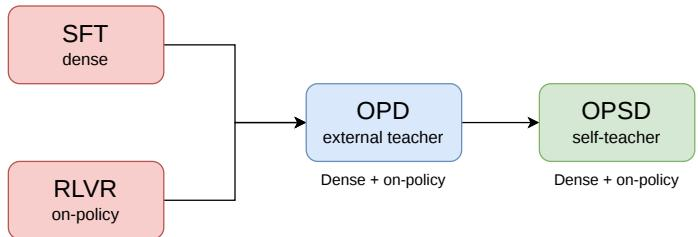
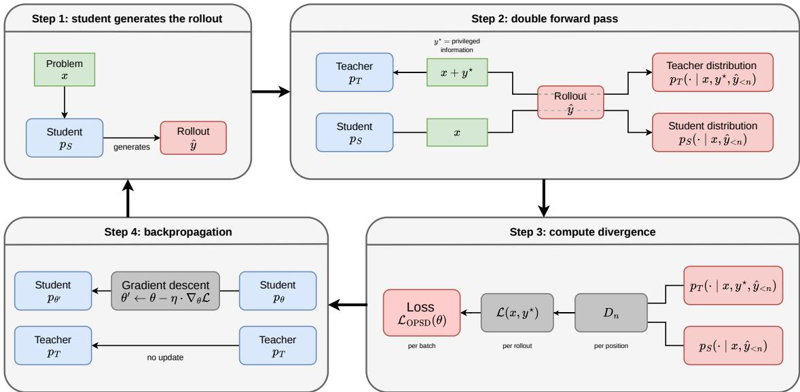
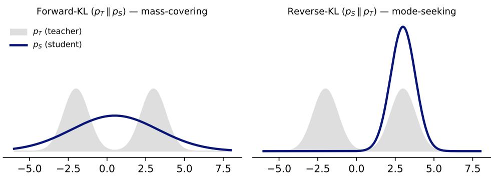
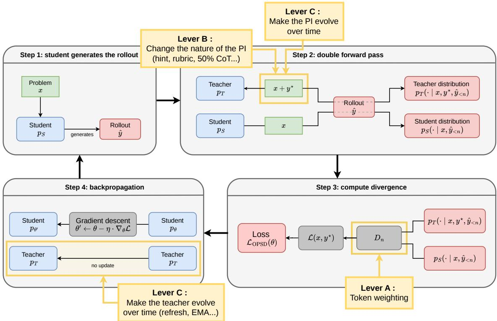

# One Symptom, Three Levers: A Critical Review of On-Policy Self-Distillation

Justin Robert∗ Raheel Qader

OVHai LLM

## Abstract

On-policy distillation trains a language model on its own generations while a teacher scores them token by token. It combines the dense supervision of imitation learning with the on-policy sampling of reinforcement learning. But it requires a second, larger model to act as teacher. On-Policy Self-Distillation (OPSD) removes that cost. The teacher is the model itself, conditioned on privileged information the student will not have at test time, such as a reference solution, a plan, or environment feedback. The teacher is no stronger than the student, only better informed. Early results were promising, with accuracy comparable to reinforcement learning at a fraction of the generated tokens. But the same asymmetry that produces the signal also biases it. One failure mode now dominates the field: collapse, the progressive narrowing of the set of reasoning paths the model can produce. Collapse is not specific to OPSD, though privileged information aggravates it. This review treats collapse as a symptom governed by three levers: (i) where the signal is applied, that is, how tokens are weighted; (ii) what the teacher is shown, that is, the nature of the privileged information; and (iii) when the signal changes, that is, the teacher’s dynamics and the decay of guidance. We restrict our scope to mathematical reasoning, where the method originated and where its failure modes are best documented. We report no new experiments. The contribution is structural: a shared vocabulary for phenomena named diferently across papers, and a clear line between what is settled and what is still disputed.

## Introduction

Since the release of DeepSeek-R1 [11], reinforcement learning with verifiable rewards (RLVR) has become the dominant route to giving large language models reasoning ability. The model generates several rollouts, a reward is issued according to the correctness of the final answer, and a GRPO-style algorithm [39] updates the policy. The approach has produced striking progress, but structural limits remain. The reward is sparse: a single signal at the end of the trajectory must account for hundreds of tokens, which makes credit assignment dificult. It is expensive, since many long rollouts must be sampled for each problem. And it tends to concentrate probability mass on reasoning the base model already produces, rather than discovering new reasoning.

On-policy distillation (OPD) was developed to restore a dense signal without giving up on-policy sampling [1, 34]. A teacher scores the student’s rollouts token by token, which resolves credit assignment on the distribution the student actually visits. The price is a second model, larger than the student, that must run alongside it throughout training.

On-Policy Self-Distillation (OPSD) [61] and Self-Distillation Policy Optimization (SDPO) [21], proposed independently within days of each other, remove that dependency. The teacher is the model itself, given privileged information that the student does not receive: a reference solution for OPSD, feedback from the environment for SDPO. The teacher therefore holds more information than the student, which lets it produce a dense token-level signal without any larger model.

Combining the signal density of distillation with the autonomy of reinforcement learning (RL) makes it possible, in principle, to train small reasoning models on a reduced budget and without depending on a larger model. That promise comes with unresolved tensions. The dense signal can collapse the model’s diversity and entropy. It can also degrade capabilities acquired earlier, and lead the student to rely on information it will not have at test time.

Scope and method. This paper does not aim for exhaustiveness. The field opened by OPSD now comprises more than two hundred works. Its two largest branches are multimodal learning and tool-using agents. Both obey the same tensions, with domainspecific instantiations that we do not cover. We focus on mathematical reasoning, where the method was introduced and where its failure modes are best documented. Readers seeking an exhaustive map of on-policy distillation, external teachers included, should turn to the surveys of Song and Zheng [45] and Zhang [59]. A brief overview of OPSD exists [9], but it organizes the field by families of methods and addresses neither failure modes nor open questions. This paper covers work available up to August 2026.

Since the founding paper, how has the field learned to control the dense signal that OPSD produces? Part 1 lays the foundations: where the method comes from, how it works, and what its founding paper leaves open. Part 2 takes the symptom and the three levers one at a time, separating for each what is settled from what is still disputed. Part 3 brings them together: where to apply the signal, what to show the teacher, and when to let the guidance change.

## 1 OPSD: Where It Comes From, How It Works, What It Is For

## 1.1 Genealogy: From RL and Distillation to OPSD

OPSD is the endpoint of a sequence in which each post-training method corrects the shortcoming of the previous one. A single question runs through them: how can a model be given a dense, cheap learning signal without depending on a larger model?

The starting point is supervised fine-tuning (SFT), in which the model imitates reasoning traces token by token. The signal is dense, but it applies to sequences the model does not produce itself $( o f f - p o l i c y )$ . Because it is trained to continue correct prefixes, the model drifts at inference time as soon as it leaves them. This is exposure bias.

Reinforcement learning removes that obstacle by optimizing the model’s own generations (on-policy). It was initially based on human feedback (RLHF): annotators ranked rollouts by preference, and those rankings trained a reward model that imitated human judgment. The procedure was slow and expensive. RLVR replaced it by restricting training to problems whose answer can be checked automatically, such as mathematics and code, so that rollouts are ranked without human intervention.

The model now learns from a rollout it generated itself, but the signal is no longer dense. It receives a single reward, at the end of the trajectory, for hundreds of tokens. Credit assignment becomes dificult again, and sampling long rollouts is expensive.

On-policy distillation restores that density. A teacher model scores the rollouts the student generates. Generalized Knowledge Distillation (GKD) [1] formalizes the scheme: for each token generated by the student, the teacher returns its next-token probability distribution over the whole vocabulary. The two distributions are compared, and the gap between them is reduced over successive steps, which brings the student towards the teacher’s capabilities.

One choice matters throughout the paper. Two distributions can be brought together in two opposite directions:

• the forward KL pushes the student to cover all of the teacher’s modes;

• the reverse KL pushes the student to settle on a single one of them (Figure 3, §2.1).

The latter, popularized for LLMs by MiniLLM [16], reduces exposure bias but can impoverish diversity (§2.1). One dependency still remains: the teacher is a larger model, and therefore expensive to run.

On-Policy Self-Distillation (OPSD) removes it. Rather than calling on a larger model, it uses the model itself, given privileged information y⋆: a reference solution, a hint, or environment feedback. The principle has a long history. It instantiates the theory of learning using privileged information introduced by Vapnik and Vashist [48] in 2009, and the literature has repeatedly shown that a model can be improved from a signal derived from itself [12, 36, 58].

The three lineages converge into a single method.

• From RL, OPSD keeps the on-policy rollout, which avoids exposure bias;

• from distillation, it keeps the token-level density of the signal, which addresses credit assignment;

• from privileged information, it keeps its independence from any external model (self-distillation).

Figure 1 gives an overview of this lineage.

  
Figure 1: Genealogy of the training methods leading to OPSD.

Key takeaway — Genealogy Each method in the chain fixes the previous one’s defect. SFT is dense but of-policy. RL is on-policy but sparse. On-policy distillation is both, at the price of a larger teacher. OPSD removes that price by replacing capability with information: the teacher is the same model, better informed.

## 1.2 The OPSD Mechanism in Detail

Notation. We use the following terms throughout:

$p _ { \theta } \colon$ a model (e.g. Qwen3 1.7B) with weights θ, where:generates

$p _ { S } \colon$ the student model;

$p _ { T } \colon$ the teacher model.

$( x , y ^ { \star } )$ : a pair drawn from the training set, where:

– x is the prompt, i.e. the problem given to the model;Loss

$y ^ { \star }$ is the reference solution to problem x.Teacher

• V : the vocabulary of model $p _ { \theta }$ , that is, the set of tokens v it knows (for Qwen3, card $( V ) \approx 1 5 0 { , } 0 0 0 ^ { 1 } \rangle$ ).ke

$\hat { y } = ( \hat { y } _ { 1 } , \dots , \hat { y } _ { | \hat { y } | } )$ : the rollout produced by the student. The index n denotes a position within this rollout, to be distinguished from the index v, which denotes an item of the vocabulary V.

  
Figure 2: Overview of On-Policy Self-Distillation (OPSD).

Step 1: generating a rollout. The prompt x is passed to the student, which samples its answer autoregressively, token by token:

$$
\hat { y } = ( \hat { y } _ { 1 } , \hat { y } _ { 2 } , \dots , \hat { y } _ { | \hat { y } | } ) \sim p _ { S } ( \cdot \mid x )
$$

For each token ${ \hat { y } } _ { n }$ , the procedure is as follows:

1. the student $p _ { S }$ predicts a probability distribution over $V { : }$ every token v known to the model is assigned a probability, conditioned on the preceding token sequence $\hat { y } _ { < n } ;$

2. the model samples a token ${ \hat { y } } _ { n }$ from that distribution;

3. the new token is appended to the context $\left( \hat { y } _ { < n } \right.$ becomes $\hat { y } _ { < n + 1 } )$ ;

4. the operation is repeated for $\hat { y } _ { n + 1 }$

In the OPSD paper, rollout length is capped at 1,024 tokens. We now have the pair $( x , \hat { y } )$ where x is the problem and $\hat { y }$ the answer produced by the model.

Step 2: scoring the rollout. The teacher then scores that rollout. For each token ${ \hat { y } } _ { n }$ , it predicts a probability distribution conditioned on the preceding sequence $\hat { y } _ { < n }$ . The teacher generates nothing; it only scores the student’s rollout token by token.

1. the teacher is given the prompt $( x + y ^ { \star } + \mathrm { ` i n s t r u c t i o n s " } )$ , made up of the problem and its solution. For instance: “What is $3 \times 4 ? ^ {  } + \ref { A E D } ^ {  } +$ “Having read the solution, produce your own reasoning to answer the problem.”;

2. for each position n of $\hat { y } .$ , the teacher’s next-token distribution is collected:

$$
\forall n = 1 , \ldots , | \hat { y } | , \qquad p _ { T } ( \cdot \mid x , y ^ { \star } , \hat { y } _ { < n } )
$$

3. in parallel, the student’s distribution is collected as well:

$$
\forall n = 1 , \ldots , | \hat { y } | , \qquad p _ { S } ( \cdot \mid x , \hat { y } _ { < n } )
$$

4. for a rollout of at most 1,024 tokens and a vocabulary of 150,000 tokens, this yields two probability matrices of roughly $1 , 0 2 4 \times 1 5 0 , 0 0 0$

Both distributions share the same prefix $\hat { y } _ { < n }$ . The teacher difers only in that it additionally holds the privileged information $y ^ { \star }$ . This is also where OPSD gains an advantage over GRPO, since these operations are parallelizable: the distributions at all n positions can be computed simultaneously. Only Step 1 is sequential.

Step 3: computing the loss. With both matrices in hand, we measure the gap between the teacher’s and the student’s predictions at each position.

1. at each position $n ,$ we compute the divergence $D _ { n }$ (forward KL) between the two distributions:

$$
\begin{array} { r l } & { D _ { n } = \displaystyle \mathrm { K L } \left( p _ { T } ( \cdot \mid x , y ^ { \star } , \hat { y } _ { < n } ) \parallel p _ { S } ( \cdot \mid x , \hat { y } _ { < n } ) \right) } \\ & { \quad \quad = \displaystyle \sum _ { v \in V } p _ { T } ( v ) \log \left( \frac { p _ { T } ( v ) } { p _ { S } ( v ) } \right) } \\ & { \quad \quad = \displaystyle \sum _ { v \in V } l _ { n , v } } \end{array}
$$

The scalar $D _ { n }$ measures how large the teacher–student gap is at that position, obtained by summing the contribution of each vocabulary item v. One subtlety: before summing, clipping is applied, with each dimension-wise contribution $l _ { n , v }$ capped at $\tau$ to bound the influence of any single vocabulary item:

$$
D _ { n } ^ { \mathrm { c l i p } } = \sum _ { v \in V } \operatorname* { m i n } ( l _ { n , v } , \tau )
$$

2. the $D _ { n }$ are averaged over the whole rollout:

$$
\mathcal { L } ( x , y ^ { \star } ) = \frac { 1 } { | \hat { y } | } \sum _ { n = 1 } ^ { | \hat { y } | } D _ { n } ^ { \mathrm { c l i p } }
$$

This scalar measures the teacher–student gap over a complete rollout.

3. in practice, several pairs $( x , y ^ { \star } )$ are processed before the weights are updated. Averaging the $\boldsymbol { \mathcal { L } } ( \boldsymbol { x } , \boldsymbol { y } ^ { \star } )$ yields the final loss:

$$
\mathcal { L } _ { \mathrm { O P S D } } ( \theta ) = \frac { 1 } { | B | } \sum _ { ( x , y ^ { \star } ) \in B } \mathcal { L } ( x , y ^ { \star } )
$$

where B is the batch of rollouts.

We are left with a single scalar: how far the student is from the teacher. This is the gap we minimize, and the one we monitor during training.

The founding paper adopts the forward KL rather than the reverse KL. Zhao et al. [61] report that the forward KL “consistently yields the strongest gains”, the informed teacher serving as a reference distribution to be covered. This choice contrasts with the reverse-KL tradition of generative distillation [16, 34]. The space of possible divergences, forward, reverse, or a JSD-style interpolation, is one of the axes reopened by the recent work we examine below (§2.1).

Step 4: computing the gradient. We now have a signal that gives, at each position n and for each vocabulary item v, the gap between teacher and student. Reducing L requires knowing how much to move each weight, that is, the gradient $\nabla _ { \boldsymbol { \theta } } \mathcal { L }$ . The computation proceeds in stages:

1. loss → distribution of S: we diferentiate L with respect to $p _ { S } ( v )$ , which gives a vector of dimension $| V |$ whose components indicate the direction in which to move;

2. distribution $p _ { S } $ logits: the $p _ { S }$ come from a softmax over logits $z _ { n } \in \mathbb { R } ^ { | V | }$ . Composing the derivative of the KL with that of the softmax gives:

$$
\frac { \partial \mathcal { L } } { \partial z _ { n , v } } \propto p _ { S } ( v ) - p _ { T } ( v )
$$

from which the direction follows:

$p _ { S } ( v ) < p _ { T } ( v )$ : negative derivative, so the logit is increased;

$p _ { S } ( v ) > p _ { T } ( v )$ : positive derivative, so the logit is decreased.

Each vocabulary item v therefore receives an instruction: up or down, and by how much;

3. logits → weights θ: the logits are the network’s output. Backpropagation works back through the layers via the chain rule to the contribution of each weight θ, giving:

$$
\nabla _ { \boldsymbol { \theta } } \mathcal { L } = \left[ \frac { \partial \mathcal { L } } { \partial \theta _ { 1 } } , \frac { \partial \mathcal { L } } { \partial \theta _ { 2 } } , . . . \right]
$$

Step 5: updating the weights. The optimizer takes a gradient-descent step:

$$
\theta  \theta - \eta \cdot \nabla _ { \theta } \mathcal { L }
$$

where η is the learning rate. Each weight moves slightly in the direction that locally reduces $\mathcal { L } .$ , bringing pS closer to $p _ { T }$

In summary:

1. take a new pair $( x , y ^ { \star } )$ ;

2. the student generates a rollout: $\hat { y } \sim p _ { S } ( \cdot \mid x )$ ;

3. the teacher scores the rollout token by token: $p _ { T } ( \cdot \mid x , y ^ { \star } , \hat { y } _ { < n } )$

4. the token-level divergence between the two distributions is computed under the forward KL;

5. the divergences are aggregated into a single scalar L, which measures the size of the teacher–student gap;

6. backpropagation is performed on the student only. The teacher is fixed.

A second framework of the same kind appeared at the same time. Hübotter et al. [21] introduced Self-Distillation Policy Optimization (SDPO), which shares the founding intuition of OPSD: a self-teacher informed by privileged information provides a dense signal to the student, with neither an external teacher nor a reward model. SDPO changes the nature of that information. Where OPSD conditions its teacher on the reference solution $y ^ { \star }$ , SDPO conditions it on textual feedback from the environment: execution error messages, the output of a verifier, or the assessment of a judge. For a coding problem:

1. the student samples a rollout yˆ from the problem x;

2. the code is executed, and the environment returns textual feedback f, for instance the trace of a runtime error;

3. the rollout is re-scored under a self-teacher conditioned on this feedback, $p _ { T } ( \cdot \ |$ $x , f , \hat { y } _ { < n } )$ ;

4. the teacher’s corrected next-token distribution is distilled into the student’s policy.

The method exploits the model’s ability to identify its own mistakes in hindsight. Once the error is known, the teacher can correct the student’s tokens so that they are avoided in later generations. One further diference concerns the teacher itself. OPSD keeps it frozen at the initial policy, whereas SDPO regularizes it for stability, either through an exponential moving average (EMA) of the student’s weights or through interpolation with the initial teacher. We return to teacher dynamics in §2.4.

The two methods therefore belong to the same family: on-policy self-distillation guided by privileged information (PI). They difer, however.

1. The nature of the PI: the reference solution y⋆ for OPSD, execution feedback f for SDPO. SDPO is thus naturally suited to domains with a verifiable environment (code, tool use), whereas OPSD presupposes a dataset of annotated solutions.

2. Teacher stabilization: OPSD keeps its teacher frozen at the initial policy, while SDPO lets it evolve under regularization.

3. Scope: SDPO can also be applied at test time to a single hard question, by iteratively distilling feedback into the policy, a regime OPSD does not explore.

Key takeaway — OPSD mechanism OPSD is a loop: the student generates, the teacher (the same model + y⋆) scores each token under the forward KL, and backpropagation is applied to the student only. The teacher stays fixed. SDPO is the same machinery, but the privileged information is execution feedback.

## 1.3 Strengths, Weaknesses and Open Problems

In its founding paper, OPSD delivers on part of its promise. Density, however, raises a problem: it increases the risk of collapse.

What OPSD brings. The figures below come from the founding paper [61]. They should be read in view of §1.4, a reminder of how fragile these benchmarks are.

• Eficiency. Where GRPO samples 8 rollouts of up to 16k tokens per problem, OPSD makes do with a single generation capped at 1,024 tokens. At comparable performance on mathematical reasoning, it consumes far fewer generated tokens per problem. The gain does not translate into a compute gain, however. An OPSD optimization step requires two forward passes and one backward pass, against a single backward pass for GRPO. At equalized budget, one OPSD step costs roughly twice a GRPO step (20.6 s against 11.2 s on Qwen3-8B, 8×H100) [29]. The advantage is faster convergence in number of steps, not a lower unit cost. A run on Qwen3-1.7B completes in about fifteen minutes on 4 H100 GPUs.2

• Performance. Despite this reduced budget, OPSD matches or exceeds GRPO on mathematical reasoning, and outperforms of-policy distillation. The choice of the forward KL is decisive here: the authors report a rise from 36.7 to 43.9 on AIME25 by step 50.3

• Autonomy. The teacher is the model itself, so no larger model is required.

SDPO (§1.2) confirms that the family transfers beyond mathematics, to code and agentic tasks, with eficiency gains of the same order.

Density accelerates learning. It also accelerates the model’s drift toward its own biases. Work extending OPSD measures degradations of up to −17% (avg@16) on thinking models [24], with comparable efects out of domain [25]. Dense supervision can narrow the diversity of reasoning, or the entropy of the policy, down to the fixed point at which teacher and student coincide. This is collapse, the symptom the rest of the paper seeks to control.

Three levers act on it:

• Lever A. Signal geometry. Which divergence, and how dense? The choice determines whether the student covers the teacher’s behaviours or locks onto one of them. A denser signal is not always preferable.

• Lever B. Privileged information. Which information should the teacher be given? Too informative, and it biases the student, which then memorizes shortcuts unavailable at test time.

• Lever C. Loop stability. The teacher is the model itself, so the loop can drift. Its update rule, the forgetting of earlier capabilities, and the scheduling of guidance all bear on stability.

The levers are not independent. The choice of privileged information bears on all three, which is why it occupies a central place here. Part 2 takes up the symptom and each lever in turn.

Key takeaway — Strengths & weaknesses OPSD matches GRPO on mathematical reasoning while generating far fewer tokens, and it needs no larger model. Its strength is density, and density is also its main danger: it heightens the risk of collapse. Three levers can ofset that risk: the geometry of the signal, the choice of privileged information, and the stability of the loop.

## 1.4 Evaluating These Models

On small models and reasoning benchmarks, performance measurements are fragile in ways that are now well documented.

## Three sources of illusion.

• Variance. A competition benchmark such as AIME comprises only thirty questions. A single question flipping shifts the score by more than three points, and the spread between two decoding seeds can reach fifteen [19]. A “+3 points” from a single decode is usually noise.

• Contamination. AIME 2024 problem statements are partly present in pre-training data, to the point that some models complete half of them from memory while failing on benchmarks released after their training cutof [4, 52].

• Model-family specificity. On Qwen models, even a random training signal can raise the score. The efect is absent on Llama and OLMo, and comes from pre-training rather than from the method under evaluation [38, 50].

What a rigorous reading requires. These pitfalls yield the grid we apply throughout Part 2.

• On the measurement side, a single score is not enough. We look for an average over several samples and several seeds (avg@k), with a confidence interval.

• We also track pass@k, which exposes a loss of diversity that a mean score conceals [57], and G-Pass@k, which measures the stability of reasoning beyond its one-of success [31].

• On the protocol side, four controls separate signal from artefact: a comparison against null or random privileged information; a comparison at equalized compute budget; a contamination test contrasting older and more recent benchmarks; and a replication outside the Qwen family.

Key takeaway — Evaluating models On small models, reasoning scores are fragile: benchmark variance, contamination, and efects specific to the Qwen family. No figure in Part 2 should be read without checking how it was obtained, namely how many seeds, whether pass@k is reported, and which model family was used.

## 2 Developments Since the Founding Paper

Each subsection below follows the same pattern: where the field stood at the founding paper, what it has produced since, and what remains open.

## 2.1 Lever A — Signal Geometry: Which Divergence, Which Density?

The first tension concerns the shape of the distillation signal. It covers two coupled choices: the direction of the divergence that brings student and teacher together, and the density of that signal, meaning the number and relative weight of the supervised tokens. Both involve the same trade-of: gaining performance without collapsing diversity.

The direction of the divergence. The space of possible divergences was already framed by GKD [1] in 2023, which allows the forward KL, the reverse KL, or their interpolation (JSD) interchangeably.4 The same work compares them on translation, summarization and arithmetic tasks. The reverse KL achieves the best performance and the lowest diversity, the forward KL the reverse, and JSD sits between the two. MiniLLM [16] popularizes the reverse KL for LLMs at the same time. By pushing the student onto the teacher’s dominant modes, it prevents the student from overestimating low-probability regions and improves calibration.

  
Figure 3: Forward KL versus reverse KL.

The reverse KL therefore looks like the most attractive option for LLM post-training. Its drawbacks appear once it is observed over several attempts. DPH-RL [28] shows that it accelerates diversity collapse: pass@1 rises while pass@k falls, with no safeguard against the model drifting away from its knowledge base. The phenomenon worsens on out-of-domain tasks. The direction of the divergence is therefore a first-order lever. It justifies OPSD’s choice of the forward KL, and the existence of stabilized variants such as the skew KL of DistiLLM [26].

Density and its price. The second choice concerns the quantity of signal. The intuition that “denser is better” is directly contradicted by the most recent work. Denser ̸= Better [49] establishes that density is a powerful but fragile signal. Distilling the full chain of thought helps on tasks with short traces, such as tool use, but degrades mathematics and science, whose long traces tend to surface artefacts. In continual learning, SDPO specializes quickly and then collapses, whereas sparse-reward RL of the GRPO kind retains more.

Unmasking OPD [3] explains that fragility. By comparing the distillation gradient to an ideal per-token gradient, the authors measure an alignment score: positive when the teacher pushes towards success, null when the signal is spent on style, negative when it pushes towards failure. Their findings:

• distillation helps mainly on erroneous trajectories; when the student is already on the right track, the teacher is little more than a noisy signal;

• the best teacher depends on the student’s capacity: on a 0.6B model, self-distillation is two to three times better than an external teacher, an advantage that does not carry over to a 1.7B model;

• distilling only on positively aligned tokens, roughly half the total, would improve the signal by a factor of ten to fifteen.

Uniform density therefore lets stylistic tokens and artefacts dilute, and even corrupt, the useful signal.

Towards selective density: token weighting. This diagnosis points to the most promising direction in the section: make density selective, by weighting tokens according to their importance.

Entropy-Aware OPD [22] gives a concrete example. Standard on-policy distillation relies on the reverse KL, which is mode-seeking: it pushes the student to imitate the teacher’s most confident predictions. This works well when the teacher is sure of itself, and becomes unstable when it is not, that is, on high-entropy tokens. Yet these are the decisive tokens: those at which reasoning branches and several continuations remain plausible. Forcing the student onto a single choice there crushes its diversity. The authors measure the efect. On high-entropy tokens, the student’s most probable token changes 84 times over the course of training, against only 7 times in the low-entropy regime. The student maintains only 6.8 % high-entropy tokens where the teacher retains 18.5 %. The student becomes impoverished exactly where it ought to explore.

Their remedy is simple: keep the reverse KL everywhere, but add a forward KL on the teacher’s high-entropy tokens only. Where the teacher is confident (low entropy), the reverse KL sufices and the student imitates the right token. Where the teacher is uncertain (high entropy), the forward KL, being mode-covering, forces the student to cover the full range of continuations the teacher deems plausible, instead of collapsing onto a single one. The result combines the precision of imitation where it is reliable with the robustness of coverage where the signal is ambiguous. The compute overhead is about 4.5 % per step. The clipping used in OPSD (§1.2) is a crude precursor: it bounds the contribution of each vocabulary item, which mechanically attenuates formatting positions. It never distinguishes positions according to the teacher’s uncertainty.

DPH-RL [28] applies a related logic at a diferent level. It is not a distillation method: it is an RL method of the GRPO kind that rethinks the role of the divergence term. Selectivity therefore operates problem by problem rather than token by token. Before training, the dataset is partitioned in two: the problems the base model can already solve, and the rest. The divergence then varies with the nature of the problem:

• mastered problems: a mass-covering divergence (forward KL or JS) is added, anchoring the model to its initial policy. This amounts to having it revise what it already knows so it does not forget, a rehearsal mechanism against catastrophic forgetting;

• unmastered problems: the divergence is removed entirely and the model explores freely, guided by the reward alone. A skill that has not yet been acquired cannot be revised.

Anchoring is done towards the frozen initial policy, which makes the method eficient: no reference model needs to run online during training. The authors propose two variants, according to the divergence used on mastered problems: DPH-F (forward KL) and DPH-JS (Jensen–Shannon). They recommend the latter. The JS divergence provides a more flexible anchor, symmetric and more stable, which preserves diversity without imposing the rigid memorization that the forward KL would entail.

## What remains open.

• A weighting criterion that is both justified and computable. The two available criteria have symmetric defects. Alignment with the ideal gradient [3] is the better founded, but it is measured after the fact, since the outcome of the trajectory must be known before a token can be said to have pushed towards success. Teacher entropy [22] is available online, at every step, but nothing guarantees that it correctly approximates alignment. A criterion that is both available during training and correlated with a token’s actual usefulness remains to be built.

• The granularity of the weighting. Selectivity is applied today either token by token or problem by problem [28]. Nothing indicates that these are the optimal scales, nor that the same granularity suits short traces and long reasoning chains.

• An announced gain that has yet to be demonstrated. Armandpour et al. [3] estimate that distilling only on positively aligned tokens would improve the signal by a factor of ten to fifteen. This is an oracle measurement, obtained outside training, that no method has yet converted into an efective gain.

Key takeaway — Signal geometry Two coupled choices shape the signal, and neither is a secondary setting. The direction of the divergence decides whether the student covers the full range of the teacher’s behaviours or settles on one of them, which makes it the control on the performance–diversity trade-of. The distribution of density is more counter-intuitive: a rollout contains only a handful of decisions that genuinely commit the reasoning, so uniform weighting lets formatting occupy most of the gradient. The lever is thus not the quantity of signal, but its selectivity.

## 2.2 The Symptom — Collapse: Two Families of Causes

The downside of density is the pathology most feared in OPSD: collapse. The term denotes the progressive narrowing of the set of reasoning paths the model is able to produce. It shows at three levels.

• In behaviour, diversity collapses: pass@1 rises, but pass@k flattens or even declines. The model succeeds more often, yet loses the ability to explore rare but correct solutions. It performs better on problems of the kind seen in training, and worse out of domain.

• In the token distribution, entropy tends towards zero: the model concentrates its probability mass on a decreasing number of continuations.

• In geometry, the target becomes unimodal: the model closes in on a single mode. For a given problem, it learns one correct solution and uses only that one, without exploring alternatives.

These three levels are often presented as equivalent. They are not. Nicolicioiu et al. [37] measure, on Qwen3-8B, that self-distillation raises pass@1 from 71.9 to 73.4 while pass@16 falls from 83.6 to 78.5: mean success improves, functional diversity recedes. They further observe that this same model displays a token entropy higher than that of the GRPO-trained model, even though its functional diversity is lower. Entropy is therefore not a valid proxy for diversity, which is why the grid of §1.4 requires pass@k rather than the mean score alone.

Two families of causes coexist. The first predates OPSD and is found in any RL method, as in any self-training loop. The second is specific to OPSD and stems from conditioning the teacher on privileged information. The distinction matters: only the second depends on what the teacher is given, and only the second ofers OPSD a lever.

The collapse that predates OPSD. Neither mechanism here involves a teacher or privileged information.

The first lies in the RL gradient itself. Cui et al. [10] give its law, $R = - a e ^ { H } +$ b: performance is bounded by an exhausted entropy budget, and that budget declines monotonically over training. Each update that favours one correct answer raises its probability and lowers that of other answers, equally correct but slightly less likely. The mechanism operates within a single training run, and it follows from the objective being optimized, which rewards success without ever valuing exploration.

The second is model collapse, which Shumailov et al. [44] describe for any loop in which a model is retrained on its own generations. It unfolds in two stages. The tails of the distribution disappear first, meaning the rare but valid solutions. Convergence towards a single mode of near-zero variance follows. Unlike the previous mechanism, it takes place from one generation to the next, and its cause is finite sampling rather than the optimization objective. The signature it describes, tails first and mode second, matches what is observed in OPSD, but its mechanism transfers imperfectly. Gerstgrasser et al. [13] show that collapse presupposes that synthetic data replace real data, and that merely accumulating the two bounds the error. OPSD does re-inject real data at every step: the reference solution y⋆. It enters through the teacher’s conditioning, however, rather than through the student’s training distribution. Model collapse therefore describes the shape of the phenomenon, but not its cause.

The mechanism specific to OPSD: PMI. The narrowing might be attributed to the direction of the divergence, but OPSD adopts the forward KL, which is mass-covering and preserves coverage. The cause therefore appears to be finer, and to operate at the level of individual tokens. Shen et al. [40] show that the signal transmitted token by token from teacher to student is a pointwise mutual information (PMI) between the token produced and the privileged context. Conditioning the teacher on the solution turns it into an oracle: it strongly rewards the tokens that the solution already entails, such as connectives and verifiable content, and penalizes deliberation tokens (“wait”, “let”, “maybe”), which an oracle no longer needs since it knows the answer. Yet this deliberation phase is what enables the student to conduct multi-step search at inference time. Three works confirm the mechanism from diferent angles.

• Kim et al. [25] call it the suppression of epistemic verbalization: an over-informed teacher expresses less uncertainty, the student loses it, and out-of-domain performance collapses.

• Nicolicioiu et al. [37] give its dynamics, rich-get-richer : the demonstration sampled and given to the teacher as privileged information is most often the dominant mode, so that rare but correct strategies receive a weak signal and die out.

• Kaur et al. [24] localize it: privileged context lowers the fork rate, that is, the proportion of decision points at which reasoning can change direction.

PMI may therefore be more than an explanation of the phenomenon. It suggests a predictive grid: the more directly the privileged information entails the tokens of the solution, the more the signal should inflate shortcuts and crush deliberation. On this reading, the severity of collapse depends on what the teacher is given, which makes the nature of the privileged information the central variable to control (§2.3).

Remedies. The remedies proposed to date intervene neither at the same point nor on the same family of causes.

• On the RL gradient. Rare tokens are protected by raising the clipping bound (Clip-Higher, in DAPO [55]), or by targeting tokens with a high covariance between probability and logit update [10]. These remedies address entropy collapse, hence the general cause, and apply to OPSD as to any RL method.

• On the divergence. A mode-seeking objective is replaced by a mass-covering divergence that preserves coverage. DPH-RL [28] does so problem by problem rather than token by token, anchoring the model to its initial policy on the problems it already masters (§2.1). This remedy too targets the general cause: the loss of coverage.

• On the sign of the signal. The update is reversed where it does harm. Anti-SD [40] replaces gradient descent towards the teacher with a divergence ascent, to encourage the model to explore rather than concentrate its probability mass. Of the three, it is the only one that targets the PMI mechanism directly.

Two of these three families address the general cause, only one the mechanism specific to OPSD. All of them intervene downstream, once the teacher has already been conditioned. None touches the variable that sits upstream: the information given to the teacher.

Key takeaway — Collapse Collapse covers two families of causes. The first predates OPSD: the RL gradient erodes entropy, and any self-training loop impoverishes the tails of the distribution. The second is specific to OPSD: conditioning the teacher on the solution turns it into an oracle, which inflates the tokens the solution already entails and penalizes those of deliberation. PMI may be more than a post-hoc explanation. It suggests a grid for predicting which privileged information will collapse the student, though no study has yet tested it as a predictor.

Several remedies exist, none has reached consensus, and all of them act downstream of the teacher. The question they leave open is the one the next section takes up: which privileged information should the teacher be given, so as to guide it without crushing deliberation?

## 2.3 Lever B — The Nature of the Privileged Information

Collapse depends on what the teacher is given. Which privileged information should be chosen?

An old question. Having a student learn with the help of information only the teacher holds was theorized as early as 2009. Vapnik and Vashist [48] draw from it a rule that still holds: this help serves to learn better, not to be copied. In their model, the privileged information never enters the final decision; it serves only to identify which examples are dificult. Lopez-Paz et al. [33] then show that distillation is a special case of this framework: a teacher that distils in efect transmits privileged information to its student. OPSD is its direct descendant.

The lesson from robotics. Robotics has already answered a closely related question: when does privileged information help without doing harm? Privileged information is safe if the student can reconstruct it on its own from what it perceives at test time, and toxic if it must presuppose or memorize it. Three results ground this criterion.

1. The case that works. In Learning by Cheating [6], an autonomous car is trained in two stages. A first agent “cheats”: it sees the exact layout of the scene and learns to drive. A second agent, equipped only with a camera, imitates it. This works because the student can recover from the image what the teacher knew.

2. The case that fails. Weihs et al. [51] show that when the teacher acts on information unavailable to the student, that information is marginalized during imitation, producing an imitation gap and provably poor policies. This is the “presupposed” or “memorized” case: the student is asked to reproduce a behaviour it cannot justify from its own observations.

3. The right design. In RMA [27], the privileged information is never copied. The student learns to regenerate it itself, from its own history. The target therefore remains reachable.

Privileged information can help the student, and can equally harm it by introducing data the student cannot access and that disrupt it at test time. The choice therefore matters for how the student performs under deployment conditions. This lineage is largely absent from the OPSD literature, which has rediscovered its vocabulary without inheriting its results.

The same lesson, on the LLM side. Work from 2026 recovers this gap on LLMs. The central result is that of Kaur et al. [24]. They give privileged information to the teacher and measure the efect on thinking models. Rather than helping, the privileged information degrades these models, by up to −17 % in relative terms (avg@16). The explanation aligns with the PMI mechanism of §2.2. A teacher that already knows the answer stops hesitating. It produces fewer deliberation tokens (“wait”, “maybe”, backtracking), and pushes the student to abandon them. Yet these are the tokens that serve to explore several paths at inference time. The student thus learns to skip a reasoning stage that is crucial at test time. Two of their conclusions are decisive.

• The efect depends on the model: the same information harms thinking models but helps instruction-tuned ones.

• The efect depends on the quantity of information. A full demonstration (reasoning plus answer) yields the best gains when the generation budget is short. As the budget lengthens, the efect reverses, whereas the final answer alone keeps the model close to its base. Giving the teacher more is therefore not uniformly worse, only less stable.

The harm comes from the nature of the privileged information, not from self-distillation itself. A final result confirms this on an apparently innocuous choice. Nicolicioiu et al. [37] give the teacher a correct demonstration, sampled at random from among the student’s successes. That choice carries a hidden cost: already frequent solutions become even more probable, and rare but correct ones disappear. This is the rich-get-richer efect of §2.2. In practice, the demonstrations must be diverse as well as correct.

A taxonomy ordered by risk. The safety criterion allows privileged information to be ranked: the more an item of information presupposes the solution, the riskier it is, since the student may memorize it rather than learn from it. The ranking below is only partially supported by the literature and may therefore contain errors.

• The final answer (oracle) is the riskiest. The student cannot reconstruct it, and the teacher has nothing left to deliberate about.

• The worked solution is the reference derivation together with its final answer, and it serves as the privileged information in standard OPSD. It presupposes the answer just as fully as the oracle does, but it also supplies the reasoning that leads there. It is therefore not simply “more CoT”.

• The full chain of thought (CoT) is presupposing in a weaker sense: it exhibits the reasoning but need not state the final answer. Some work proposes showing the teacher only the first half of the CoT, and finds this preferable to the whole.

• The plan, or skeleton of steps, gives the structure without the values. The target is more reachable.

• The rubric lists the criteria of a good answer without imposing a specific path. The teacher can then cover several lines of reasoning, so diversity is preserved.

• Error feedback and action-only information (the actions of a strong model, without its reasoning) are partial and conditional. These are the least presupposing.

The first controlled comparisons. This ordering is no longer merely hypothetical.   
Two works compare several kinds of privileged information at fixed model and data.

Kara and Ersoy [23] contrast three self-teacher contexts under strict self-distillation: a binary reward (GRPO), the reference solution (standard OPSD), and a step-aligned critique. The last is feedback generated by a critic model that copies the correct steps of the student’s reasoning verbatim and rewrites only the incorrect ones, in the student’s own style, concentrating the learning signal on the tokens where the reasoning fails. The aligned critique wins by +5.27 over OPSD conditioned on the reference solution and by +16.11 over GRPO (avg@12). Their per-token advantage analysis uncovers a second mechanism, distinct from PMI. When the model sees the reference solution, it modifies its behaviour at every token, including those already correct. The aligned critique modifies only the incorrect ones, which makes the learning signal far more targeted.

Yu et al. [56] broaden the comparison to five forms: the final answer, step-wise hints with execution, step-wise hints without execution, summarized hints, and no privileged information at all. The final answer falls below the no-privilege baseline (59.5 against 63.0 on C-Eval), whereas step-wise hints without execution clearly dominate (71.3). Their conclusion meets the safety criterion: what makes privileged information efective is not the correctness of the answer it contains, but its capacity to transmit a skill.

These two results confirm both ends of the hierarchy above. The oracle is the least transferable choice, harmful outside self-distillation and inert within it, while intermediate abstraction appears to be the best option. They do not corroborate it perfectly, however: the first compares only three forms, and the second compares five but in a strong-to-weak distillation regime. Table 1 summarizes the kinds of privileged information tested to date.

From diagnosis to remedies. Recent work no longer merely observes the problem. It names, measures and corrects the leakage of privileged information: the shortcuts the student learns during training but will not find at test time. Four strategies stand out.

• Decomposing the target. AR-OPD [60] splits the teacher’s signal in two. The anchor comes from showing the teacher only the first half of the trace, without the answer, and gives a target the student can reach. The residual is the diference between the full oracle target and that anchor, and it carries the leakage. Only a fraction λ of the residual is retained:

$$
q _ { \lambda } = p _ { T } ^ { \mathrm { a n c h o r } } + \lambda \left( p _ { T } ^ { \mathrm { o r a c l e } } - p _ { T } ^ { \mathrm { a n c h o r } } \right) , \qquad \lambda = 0 . 6 .
$$

Shortcut events then fall by more than 20 %. The question “which privileged information?” becomes “how much of it remains learnable at the token level?”.

Table 1: Not all privileged information is equal, and the kind easiest to obtain is the least useful. Entries are ordered by broadly decreasing presupposition of the solution; the first two presuppose the answer equally and difer in whether the derivation is supplied. The Regime column distinguishes strict self-distillation (the OPSD framework) from distillation of a strong model into a weak one (the OPD framework). The Requires column indicates the resources needed to construct the privileged information.
<table><tr><td>Nature of the PI</td><td>Reconstructible at test time</td><td>Measured effect</td><td>Regime tested</td><td>Requires</td></tr><tr><td>Final answer only [24, 56]</td><td>no</td><td>harmful or inert (a)</td><td>strong → weak; self-dist.</td><td>annotated solutions</td></tr><tr><td>Solution: reasoning + answer (OPSD) [61]</td><td>no</td><td>harmful on thinking (b)</td><td>self-dist.</td><td>annotated solution</td></tr><tr><td>Partial trace, anchor (AR-OPD) [60]</td><td>partial</td><td>positive (c)</td><td>self-dist.</td><td>annotated traces</td></tr><tr><td>Plan, hints (DOPD) [56]</td><td>yes</td><td>positive (d)</td><td>strong → weak</td><td>annotated solutions + generation</td></tr><tr><td>Error-aligned critique [23]</td><td>yes</td><td>positive (e)</td><td>self-dist.</td><td>critic model</td></tr><tr><td>Rubric [15]</td><td>yes</td><td>diversity yes, accuracy little (f)</td><td>self-dist.</td><td>manual authoring</td></tr><tr><td>Execution feedback (SDPO) [21]</td><td>yes</td><td>positive (g)</td><td>self-dist. (code)</td><td>verifiable environment</td></tr></table>

Notes. (a) In the strong → weak regime, the final answer scores 59.5 on C-Eval, below the 63.0 obtained with no privileged information at all [56]. Under strict self-distillation, it instead keeps the student close to the base model, neither degrading nor improving it [24]. (b) Up to −17 % in relative terms (avg@16) across five thinking models [24]. (c) An anchor built on the first half of the trace reduces shortcut events by more than 20 % [60]. (d) Step-wise hints without execution reach 71.3, against 63.0 with no privileged information, across five forms compared at fixed model and data [56]. (e) +5.27 over the teacher conditioned on the reference solution and +16.11 over GRPO (avg@12) [23]. (f ) Diversity is preserved and entropy rises even under the forward KL, but accuracy gains remain modest, and a hand-written rubric clearly outperforms a model-generated one [15]. (g) 48.8 % against 41.2 % for GRPO on LiveCodeBench v6; at test time, the same discovery probability as best-of-k sampling is reached with three times fewer attempts [21].

• Purifying the signal. Any privileged information mixes two things: a transferable signal (understanding the problem) and a non-transferable one (a shortcut specific to the reference answer). To separate them, Purified OPSD [41] conditions a teacher on the answer without the problem. That teacher reveals what comes from the shortcut rather than from the reasoning, and that share is then removed. The student’s uncertainty markers remain stable as a result.

• Changing the form of the information. Rather than the exact solution, rubricbased distillation [15] gives the teacher the criteria of a good answer. The teacher no longer designates a single path; it validates several lines of reasoning. Diversity is preserved, and entropy rises even under the forward KL. Accuracy gains remain very modest, however, and a hand-written rubric performs far better than a modelgenerated one, which raises the question of how this method would scale.

• Modulating confidence token by token. DemoPSD [30] keeps the standard privileged information but decides how far to follow the teacher at each token. The criterion is the disagreement between teacher and student. When the two distributions are close, the teacher is followed. When they diverge too far, the teacher is ignored, a sign that the privileged information has influenced it too strongly. DemoPSD outperforms both GRPO and SDPO, and shows that performance and diversity can go together.

These methods shift the question, from which information to give towards where and how far to follow the teacher. Privileged information distorts the teacher’s distribution on only a small fraction of tokens.

## What remains open.

• Crossing the kinds of privileged information in a single protocol. No work compares the oracle, the CoT, the plan, the rubric and feedback under strict self-distillation, on the same models and the same benchmarks. The two existing comparisons cover three forms under self-distillation [23], or five forms outside it [56].

• Handling branching points. Kaur et al. [24] call for explicitly preserving the places at which reasoning can diverge, so as to guide the student without crushing its deliberation.

• Making the dosage adaptive. The λ of AR-OPD is fixed, and the probe of Purified OPSD has been applied to a single kind of information. Extending them to several kinds would reveal which carry the most transferable signal.

Key takeaway — Privileged information The question is no longer whether the teacher should receive privileged information, but which kind, how much of it, and how far it should be followed. Leakage is now named and measured [30, 60], and several remedies exist. The safety criterion: privileged information helps only if the student can reconstruct it at test time.

The final answer is the least transferable choice, since a teacher that already knows it expresses almost no uncertainty and encourages the student to take shortcuts. What transfers best is intermediate abstraction, meaning hints, plans and error-aligned critiques, which convey a skill without entailing the answer.

## 2.4 Lever C — Loop Stability: Temporal Dynamics

The preceding levers examined the distillation signal in itself. This one adds time. In OPSD the teacher is the model frozen at its initial policy, so the learning target stays put while the student moves away from it. The asymmetry between them is twofold: temporal, between frozen weights and updated ones, and informational, between privileged context and none.

Keeping the teacher useful without letting it collapse. Two simple answers fail. Freezing the teacher at its initial state quickly makes it obsolete, since it ignores the student’s progress. Updating it in step with the student collapses the loop: the teacher ceases to be a reference external to the student’s trajectory and starts absorbing its drift. The loop confirms itself instead of correcting itself.

The problem is not new. Self-supervised learning in vision solved it five years ago, in an identical loop where a model learns from a copy of itself. Three rules transfer directly to OPSD.

1. Never backpropagate the gradient into the teacher. Its output is treated as a fixed target at every step. This is the stop-gradient. SimSiam [8] shows that it is the decisive ingredient: without it, the model collapses to 0.1 % accuracy. OPSD already applies the rule, since no gradient flows back into the teacher, and goes further still, as the teacher’s weights remain those of the initial policy.

2. Let the teacher evolve, but more slowly than the student. Rather than copying it from the student, it is built as an exponential moving average (EMA) of its past weights:

$$
\theta _ { T } \  \ \rho \theta _ { T } + ( 1 - \rho ) \theta _ { S }
$$

The teacher “lags behind” the student, providing targets that are stable yet improving. Mean Teacher [47] is its origin, and Busbridge et al. [5] show that the momentum ρ must be recalibrated when the batch size changes, at the risk of destabilizing the dynamics. This has never been tested directly on an LLM teacher.

3. Maintain an asymmetry between the two roles. BYOL [14] shows that a slow teacher is not enough: the student must also be structurally diferent from the teacher, or the loop converges to a constant. In OPSD this asymmetry is automatic, since the teacher sees the privileged information and the student does not. That imbalance is what prevents the two models from merging.

The three rules are not mutually independent, and the vision literature is itself divided on the second. SimSiam [8] shows that a momentum encoder is not necessary, the stop-gradient alone being enough to prevent collapse, whereas BYOL and Mean Teacher rely on it. That dissociation has never been tested in the LLM setting.

On the LLM side, two works from 2026 specify when and by how much to move the teacher. CGTR [17] addresses timing. Refreshing the teacher at a fixed interval can lock it onto a student that is drifting, which destabilizes the whole loop; they call this failure state-oblivious collapse. The remedy is to refresh only once the student has genuinely progressed, as measured by a reward gain. What buys stability, they argue, is the isolation period between two refreshes, during which the teacher is entirely frozen and does not absorb the student’s drift. On that argument, an EMA teacher has no isolation period at all, since it absorbs a fraction of the drift at every step. TOP-D [54] addresses distance. A teacher too far from the student produces large, noisy gradients, and training diverges. They therefore keep the teacher close, in the manner of a trust region, which bounds gradient variance and guarantees steady improvement.

Does the student forget? The second risk is catastrophic forgetting. In training on a new task, a model moves its weights. That displacement improves the new task but can erase what the weights previously encoded: the model gains one capability and loses another. The whole question is therefore how far the model moves.

RL’s Razor [42] gives the sharpest answer. Forgetting, they show, is predicted by a single quantity: the KL distance between the trained policy and the starting policy, measured on the new task. Forgetting therefore grows with displacement. And on-policy RL, among all the ways of solving the task, selects the one that moves the model least. It thus forgets less than SFT, which can travel arbitrarily far. Since OPSD is on-policy, it should inherit this caution. Two results, however, appear to conflict:

• SDFT [43] shows that self-distillation reduces forgetting: having the model produce its own version of the answer keeps it close to itself, so the weights change little.

• Denser ̸= Better [49] shows the opposite: in continual learning, dense self-distillation forgets more than sparse RL, and can even collapse.

We suggest that the conflict is only apparent. Self-distillation (SDFT) changes the weights less than SFT, but more than sparse RL, since a token-level signal constrains the model far more than a single terminal reward. The ordering this suggests is:

forgetting(raw SFT) > forgetting(dense self-distillation) > forgetting(sparse RL).

The conjecture is itself contested. Hübotter et al. [21] evaluate their final checkpoints on held-out tasks and report that SDPO, a dense self-distillation method, degrades prior capabilities less than GRPO, which would reverse the last two terms. The protocols difer, a single task against a sequence of tasks, but the discrepancy is unresolved.

The real question is then how to move OPSD towards the favourable end, acquiring capabilities without losing the old ones. Two methods attempt this:

• MOPD [35] trains one specialist teacher per domain, then distils them all into a single student on that student’s own rollouts. The approach is already deployed in an industrial model.

• CaMOPD [7] starts from a finer observation: the gradient that recovers general capabilities and the one that preserves the domain often point in opposite directions and cancel out. Their solution is to apply them in alternation rather than to add them.

Scheduling guidance over time. A last lever lets guidance decay as the student progresses. We will call this the decay of privileged information, to distinguish it from the update of the teacher’s weights discussed above. These are two independent mechanisms that a loose vocabulary often conflates. If the privileged information is the full chain of thought, the teacher can be shown all of it at the outset, when the student is still weak, and a growing share can then be withheld until the student reasons on its own.

This idea is well studied in a neighbouring setting: of-policy guidance, where the help is a solution prefix rather than a conditioning of the teacher. R3 [53] is the prototype. The student is given the problem x along with a large part of the solution y, so that only a few tokens remain to be produced; that starting point is then pushed back until the student generates everything alone. Prefix-RFT [20] takes up the idea: a prefix of the demonstration is given, and its length reduced over the course of training. AdaBack [2] makes it adaptive: the share revealed is no longer fixed in advance but adjusted example by example according to the student’s success. A problem still failed receives more help, a mastered one receives less. UFT [32] supplies the theoretical justification: without initial help, a weak model takes exponentially long to stumble upon a good trajectory. Decaying guidance is therefore not a convenience but a condition of convergence.

All of this holds for of-policy guidance. The transposition to OPSD was begun by ATESD [18]. In standard OPSD, the teacher always sees the reference trace in full; they call this defect the teacher-side exposure mismatch. A sweep at fixed exposure shows two things: (i) full exposure is not reliably the best choice; and (ii) the disagreement between teacher and student grows monotonically with the amount of reasoning revealed. This second point connects directly to the PMI mechanism of §2.2. Rather than fixing in advance the share of the trace shown to the teacher, they let it vary during training. A small controller adjusts that share automatically, driven by the rate at which the student is progressing. When the student learns quickly, less can be shown; when it stalls, more is revealed. The mechanism remains embedded in the dense per-token loss, with no separate stage. Gains range from +0.95 to +2.33 in avg@12 on Qwen3-1.7B/4B/8B. PAINT [46] follows a related logic, through adaptive masking of the verified solution.

The principle is thus established, and what remains open concerns mainly the how. A deterministic schedule rather than a learned controller is one option. ATESD varies the quantity of information revealed; an avenue still unexplored is to vary its nature, moving from the oracle to a plan and then to a hint as training proceeds.

What remains open.

• Comparing teacher update rules at fixed privileged information: frozen teacher, EMA, gated refresh, proximal teacher. The only existing comparison is an ablation internal to a single paper [21], on one kind of privileged information and at a single momentum value. The systematic comparison [17] is conducted without any privileged information at all, with the teacher reduced to a past checkpoint.

• Placing OPSD on the forgetting scale (SFT > dense self-distillation > sparse RL), and finding how to move it towards the end that best preserves the base model’s knowledge while still acquiring new capabilities.

• Transposing the tools of vision. This corpus remains largely untapped on the LLM side. The calibration of EMA momentum [5], for instance, has never been tested on an LLM teacher, even though collapse is more aggressive at small scale.

Key takeaway — Loop stability The teacher is the model frozen at its initial policy, so the target stays put while the student moves away from it. Freezing the weights imposes a performance ceiling, while updating them at the student’s own pace removes all anchoring. That ceiling comes from the freezing of the weights and not from the stop-gradient, which remains necessary at each step. Two distinct temporal levers follow: letting the teacher’s weights evolve, and letting the information given to it decay.

## 3 Synthesis: Three Levers, One Symptom

The initial bet of OPSD was that density was the decisive variable: with a token-level signal, learning would be both more eficient and more efective. Six months on, that bet has shifted. Density itself is no longer the variable that matters. What matters is where the signal is applied, what it encodes, and when it is allowed to change. The teacher’s signal cuts both ways: it can convey skills to the student, and it can equally teach it shortcuts unavailable at inference time. This is why controlling the signal matters more than increasing it.

Collapse is not one of the levers. It is the consequence of a poorly transmitted signal, and therefore the measure against which the three are judged, read through pass@k rather than through the mean score or the entropy (§2.2). Figure 4 locates each lever on the training loop.

  
Figure 4: The three levers, mapped onto the loop of Figure 2. Lever C appears at two points: the teacher’s exposure to the privileged information and the update of its weights are two independent mechanisms.

Axis A. Where? Weighting the tokens. In the founding paper [61], all tokens are weighted uniformly. This is the simplest choice, and it has proved suboptimal. A rollout of at most 1,024 tokens contains only a small number of decisions that genuinely commit the reasoning; the rest is formatting. Weighting uniformly therefore dilutes the signal attached to reasoning, and lets formatting occupy most of the gradient. Since then, several teams have shown that a small fraction of tokens carries most of the learning signal [3], and a number of papers have proposed ways of making that signal selective, notably by exploiting entropy [22]. The objective is always the same: to shield the student from noise and from collapse.

No method has yet reached consensus, however. The central trade-of runs between a gain in accuracy and a loss in diversity [28].

Axis B. What? Choosing the privileged information. In the founding paper, the privileged information is the reference solution [61]. That is the simplest thing to hand the teacher, and it turns out to be the wrong one. The intuition that “the better informed the teacher, the better the signal” has since been refuted [24]. A teacher that already knows the final answer no longer needs to deliberate or to reason. It ceases to express uncertainty [25], which pushes the student to skip steps and to behave as though it already knew the answer. The student thereby becomes overconfident and loses substantial diversity [37] and out-of-domain capability [25].

The search since then has been for a kind of privileged information that conveys a skill without entailing the answer. Several papers report gains in both performance and diversity using hints and plans [56], error-aligned critiques [23], or environment feedback [21]. What separates them from the reference solution is the reconstruction criterion of §2.3.

Even so, no kind of privileged information has reached consensus. One avenue remains little explored: varying both the nature and the quantity of what the teacher is shown, according to context.

Axis C. When? Making the teacher dynamic. In the founding paper, the teacher is frozen at the initial policy. The consequence is immediate: as the student progresses, its target stays where it was and the gain diminishes. This ceiling comes from the freezing of the weights, and not from the stop-gradient, which prevents the teacher from sliding towards the student within a step and remains necessary [8]. The field is therefore asking how to refresh the weights without collapsing the model.

Several methods exist. The teacher can be made to evolve as a moving average of the student’s weights [47], or refreshed only once the student’s performance has improved [17]. A second, independent lever is to let the privileged information itself decay as training proceeds [18]. This axis nonetheless remains the least explored of the three, and the dificulty is as much methodological as conceptual: the collapses documented in this family occur after several hundred steps [17], and a short run does not see them.

## Conclusion

OPSD proposed to replace the capability advantage of an external teacher with an information asymmetry between a model and itself. Judged first on accuracy, the method appeared efective and more frugal in generated tokens. Six months later the picture is more nuanced, because the asymmetry that produces the signal is also the one that biases it.

Three results are established today. Privileged information helps only if the student can reconstruct it on its own at test time, and harms it as soon as it must be presupposed. It follows that the reference solution, the most natural choice, is among those tested the least transferable. And collapse appears neither in the mean score nor in the entropy: a selfdistilled model can display a higher entropy than an RL-trained one while producing fewer distinct lines of reasoning, and only pass@k reveals it. These results were already available, but scattered and named diferently from one paper to the next. Our contribution is to unify them, and to reconnect them to the theory of learning using privileged information, from which the field has borrowed the vocabulary without the results.

Should OPSD then be used in production today? No, not naively. It is a research technique whose failure modes are by now well documented: on reasoning models, poorly chosen privileged information degrades performance instead of improving it [24]; in continual learning, the dense version forgets more than standard RL and can collapse [49]. It remains a promising direction under two conditions. The first is to use it with the safeguards set out in §1.4. The second is to see it for what it is today, a post-SFT fine-tuning method that is frugal in generated tokens and requires no external teacher, rather than a turnkey training method. For an organization seeking to control the production of its own small models, the method is genuinely appealing, but it still lies at the research stage.

Our analysis has several limitations. We have treated only mathematical reasoning, leaving out the multimodal and agentic branches. Nearly all the work cited consists of preprints less than six months old, conducted for the most part on a single model family and at sizes not exceeding a few billion parameters, a ceiling the founding paper itself acknowledges, citing compute constraints. The conclusions above should be read with that reservation in mind.

A model can guide itself, provided that the teaching side holds information the answering side does not. Six months of work have qualified that principle rather than overturned it. Everything turns on how the asymmetry is controlled.

## References

[1] Rishabh Agarwal, Nino Vieillard, Yongchao Zhou, Piotr Stanczyk, Sabela Ramos, Matthieu Geist, and Olivier Bachem. On-Policy distillation of language models: Learning from self-generated mistakes. In International Conference on Learning Representations (ICLR), 2024. URL https://arxiv.org/abs/2306.13649.

[2] Mohammad Hossein Amani, Aryo Lotfi, Nicolas M. Baldwin, Samy Bengio, Mehrdad Farajtabar, Emmanuel Abbe, and Robert West. Reinforcement learning for reasoning by adaptively revealing rationales. arXiv preprint arXiv:2506.18110, 2025.

[3] Mohammadreza Armandpour, Fatih Ilhan, David Harrison, Ajay Jaiswal, Duc N.M Hoang, Fartash Faghri, Yizhe Zhang, Minsik Cho, and Mehrdad Farajtabar. Unmasking on-policy distillation: Where it helps, where it hurts, and why. arXiv preprint arXiv:2605.10889, 2026.

[4] Mislav Balunović, Jasper Dekoninck, Ivo Petrov, Nikola Jovanović, and Martin Vechev. MathArena: Evaluating LLMs on uncontaminated math competitions. arXiv preprint arXiv:2505.23281, 2025. URL https://arxiv.org/abs/2505.23281.

[5] Dan Busbridge, Jason Ramapuram, Pierre Ablin, Tatiana Likhomanenko, Eeshan Gunesh Dhekane, Xavier Suau, and Russ Webb. How to scale your EMA. In Advances in Neural Information Processing Systems (NeurIPS), 2023. arXiv:2307.13813.

[6] Dian Chen, Brady Zhou, Vladlen Koltun, and Philipp Krähenbühl. Learning by cheating. In Conference on Robot Learning (CoRL), 2019.

[7] Tianlei Chen, Jiao Ou, Ziyuan Liu, Ruiming Tang, Jian Liang, and Han Li. Counteraction-aware multi-teacher on-policy distillation for general capability recovery with domain preservation. arXiv preprint arXiv:2605.27115, 2026.

[8] Xinlei Chen and Kaiming He. Exploring simple siamese representation learning. In IEEE/CVF Conference on Computer Vision and Pattern Recognition (CVPR), 2021. arXiv:2011.10566.

[9] Fangming Cui, Sunan Li, and Jiahong Li. A brief overview: On-Policy Self-Distillation in large language models. arXiv preprint arXiv:2605.18141, 2026. URL https: //arxiv.org/abs/2605.18141.

[10] Ganqu Cui, Yuchen Zhang, Jiacheng Chen, Lifan Yuan, Zhi Wang, Yuxin Zuo, Haozhan Li, Yuchen Fan, Huayu Chen, Weize Chen, Zhiyuan Liu, Hao Peng, Lei Bai, Wanli Ouyang, Yu Cheng, Bowen Zhou, and Ning Ding. The entropy mechanism of reinforcement learning for reasoning language models. arXiv preprint arXiv:2505.22617, 2025.

[11] DeepSeek-AI. DeepSeek-R1 incentivizes reasoning in LLMs through reinforcement learning. Nature, 645:633–638, 2025. doi: 10.1038/s41586-025-09422-z. Preprint: arXiv:2501.12948.

[12] Tommaso Furlanello, Zachary C. Lipton, Michael Tschannen, Laurent Itti, and Anima Anandkumar. Born-again neural networks. In International Conference on Machine Learning (ICML), 2018. URL https://arxiv.org/abs/1805.04770.

[13] Matthias Gerstgrasser, Rylan Schaefer, Apratim Dey, Rafael Rafailov, Henry Sleight, John Hughes, Tomasz Korbak, Rajashree Agrawal, Dhruv Pai, Andrey Gromov, Daniel A. Roberts, Diyi Yang, David L. Donoho, and Sanmi Koyejo. Is model collapse inevitable? breaking the curse of recursion by accumulating real and synthetic data. arXiv preprint arXiv:2404.01413, 2024. URL https://arxiv.org/abs/2404.01413.

[14] Jean-Bastien Grill, Florian Strub, Florent Altché, Corentin Tallec, Pierre H. Richemond, Elena Buchatskaya, Carl Doersch, Bernardo Avila Pires, Zhaohan Daniel Guo, Mohammad Gheshlaghi Azar, Bilal Piot, Koray Kavukcuoglu, Rémi Munos, and Michal Valko. Bootstrap your own latent: A new approach to self-supervised learning. In Advances in Neural Information Processing Systems (NeurIPS), 2020. arXiv:2006.07733.

[15] Siyi Gu, Jialin Chen, Sophia Zhou, Arman Cohan, and Rex Ying. Rethinking reward supervision: Rubric-conditioned self-distillation. arXiv preprint arXiv:2606.19327, 2026.

[16] Yuxian Gu, Li Dong, Furu Wei, and Minlie Huang. MiniLLM: Knowledge distillation of large language models. In International Conference on Learning Representations (ICLR), 2024. arXiv:2306.08543.

[17] Haowei Guo, Baolong Bi, Ruicheng Zhang, Bingqian Sun, and Wentao Zhang. When should the teacher move? temporal coupling and stability in self on-policy distillation. arXiv preprint arXiv:2606.03532, 2026.

[18] Zihao Han, Tiangang Zhang, Huaibin Wang, and Yilun Sun. Adaptive teacher exposure for self-distillation in LLM reasoning. arXiv preprint arXiv:2605.11458v3, 2026. URL https://arxiv.org/abs/2605.11458.

[19] Andreas Hochlehnert, Hardik Bhatnagar, Vishaal Udandarao, Samuel Albanie, Ameya Prabhu, and Matthias Bethge. A sober look at progress in language model reasoning: Pitfalls and paths to reproducibility. In Conference on Language Modeling (COLM), 2025. arXiv:2504.07086.

[20] Zeyu Huang, Tianhao Cheng, Zihan Qiu, Zili Wang, Yinghui Xu, Edoardo M. Ponti, and Ivan Titov. Blending supervised and reinforcement fine-tuning with prefix sampling. In International Conference on Machine Learning (ICML), 2026. arXiv:2507.01679.

[21] Jonas Hübotter, Frederike Lübeck, Lejs Behric, Anton Baumann, Marco Bagatella, Daniel Marta, Ido Hakimi, Idan Shenfeld, Thomas Kleine Büning, Carlos Guestrin, and Andreas Krause. Reinforcement learning via self-distillation. arXiv preprint arXiv:2601.20802, 2026. URL https://arxiv.org/abs/2601.20802.

[22] Woogyeol Jin, Taywon Min, Yongjin Yang, Dennis Wei, Yi Zhou, Swanand Ravindra Kadhe, Nathalie Baracaldo, and Kimin Lee. Entropy-aware on-policy distillation of language models. arXiv preprint arXiv:2603.07079, 2026. ICML 2026.

[23] Semih Kara and Oğuzhan Ersoy. The role of feedback alignment in self-distillation. arXiv preprint arXiv:2606.11173, 2026. URL https://arxiv.org/abs/2606.11173.

[24] Simran Kaur, Narutatsu Ri, Yinghui He, Liam Fowl, and Sanjeev Arora. Rethinking on-policy self-distillation for thinking models. arXiv preprint arXiv:2607.05184, 2026.

[25] Jeonghye Kim, Xufang Luo, Minbeom Kim, Sangmook Lee, Dohyung Kim, Jiwon Jeon, Dongsheng Li, and Yuqing Yang. Why does self-distillation (sometimes) degrade the reasoning capability of LLMs? arXiv preprint arXiv:2603.24472, 2026.

[26] Jongwoo Ko, Sungnyun Kim, Tianyi Chen, and Se-Young Yun. DistiLLM: Towards streamlined distillation for large language models. In International Conference on Machine Learning (ICML), 2024. arXiv:2402.03898.

[27] Ashish Kumar, Zipeng Fu, Deepak Pathak, and Jitendra Malik. RMA: Rapid motor adaptation for legged robots. In Robotics: Science and Systems (RSS), 2021.

[28] Long Li, Zhijian Zhou, Jiaran Hao, Jason Klein Liu, Yanting Miao, Wei Pang, Xiaoyu Tan, Wei Chu, Zhe Wang, Shirui Pan, Chao Qu, and Yuan Qi. The choice of divergence: A neglected key to mitigating diversity collapse in reinforcement learning with verifiable reward. arXiv preprint arXiv:2509.07430, 2025.

[29] Yu Li, Shu Hong, and Tian Lan. Localizing credit at the divergence: Path-conditioned self-distillation for LLM reasoning. arXiv preprint arXiv:2606.15576, 2026. URL https://arxiv.org/abs/2606.15576.

[30] Yunhe Li, Hao Shi, Wenhao Liu, Mengzhe Ruan, Hanxu Hou, Zhongxiang Dai, Shuang Qiu, and Linqi Song. DemoPSD: Disagreement-modulated policy self-distillation. arXiv preprint arXiv:2607.02502, 2026.

[31] Junnan Liu, Hongwei Liu, Linchen Xiao, Ziyi Wang, Kuikun Liu, Songyang Gao, Wenwei Zhang, Songyang Zhang, and Kai Chen. Are your LLMs capable of stable reasoning? In Findings of the ACL, 2025. arXiv:2412.13147.

[32] Mingyang Liu, Gabriele Farina, and Asuman Ozdaglar. UFT: Unifying supervised and reinforcement fine-tuning. arXiv preprint arXiv:2505.16984, 2025.

[33] David Lopez-Paz, Léon Bottou, Bernhard Schölkopf, and Vladimir Vapnik. Unifying distillation and privileged information. In International Conference on Learning Representations (ICLR), 2016. arXiv:1511.03643.

[34] Kevin Lu. On-policy distillation. Thinking Machines Lab, Connectionism, October 2025. URL https://thinkingmachines.ai/blog/on-policy-distillation/. Accessed: 2026-08-07.

[35] Wenhan Ma, Jianyu Wei, Liang Zhao, Hailin Zhang, Bangjun Xiao, Lei Li, Qibin Yang, Bofei Gao, Yudong Wang, Rang Li, Jinhao Dong, Zhifang Sui, and Fuli Luo. MOPD: Multi-teacher on-policy distillation for capability integration in LLM post-training. arXiv preprint arXiv:2606.30406, 2026.

[36] Hossein Mobahi, Mehrdad Farajtabar, and Peter L. Bartlett. Self-distillation amplifies regularization in Hilbert space. In Advances in Neural Information Processing Systems (NeurIPS), 2020. URL https://arxiv.org/abs/2002.05715.

[37] Andrei Liviu Nicolicioiu, Mohammad Pezeshki, and Aaron Courville. On-policy selfdistillation with sampled demonstrations reduces output diversity. arXiv preprint arXiv:2606.26091, 2026.

[38] Rulin Shao, Shuyue Stella Li, Rui Xin, Scott Geng, Yiping Wang, Sewoong Oh, Simon S. Du, Nathan Lambert, Sewon Min, Ranjay Krishna, Yulia Tsvetkov, Hannaneh Hajishirzi, Pang Wei Koh, and Luke Zettlemoyer. Spurious rewards: Rethinking training signals in RLVR. arXiv preprint arXiv:2506.10947, 2025.

[39] Zhihong Shao, Peiyi Wang, Qihao Zhu, Runxin Xu, Junxiao Song, Xiao Bi, Haowei Zhang, Mingchuan Zhang, Y. K. Li, Y. Wu, and Daya Guo. DeepSeekMath: Pushing the limits of mathematical reasoning in open language models. arXiv preprint arXiv:2402.03300, 2024. URL https://arxiv.org/abs/2402.03300.

[40] Guobin Shen, Xiang Cheng, Chenxiao Zhao, Lei Huang, Jindong Li, Dongcheng Zhao, and Xing Yu. Anti-self-distillation for reasoning RL via pointwise mutual information. arXiv preprint arXiv:2605.11609, 2026.

[41] Zhanming Shen, Jintao Tong, Shaotian Yan, Chen Shen, Hao Chen, Wentao Ye, Xiaomeng Hu, Rui Miao, Haobo Wang, Junbo Zhao, Gang Chen, and Jieping Ye. Purified OPSD: On-policy self-distillation without losing how to think. arXiv preprint arXiv:2607.02234, 2026.

[42] Idan Shenfeld, Jyothish Pari, and Pulkit Agrawal. RL’s razor: Why online reinforcement learning forgets less. In Advances in Neural Information Processing Systems (NeurIPS), 2025. arXiv:2509.04259.

[43] Idan Shenfeld, Mehul Damani, Jonas Hübotter, and Pulkit Agrawal. Self-distillation enables continual learning. arXiv preprint arXiv:2601.19897, 2026. ICML 2026 (poster).

[44] Ilia Shumailov, Zakhar Shumaylov, Yiren Zhao, Nicolas Papernot, Ross Anderson, and Yarin Gal. AI models collapse when trained on recursively generated data. Nature, 631:755–759, 2024.

[45] Mingyang Song and Mao Zheng. A survey of On-Policy distillation for large language models. arXiv preprint arXiv:2604.00626, 2026. URL https://arxiv.org/abs/2604 .00626.

[46] Zhiquan Tan and Yinrong Hong. PAINT: Partial-solution adaptive interpolated training for self-distilled reasoners. arXiv preprint arXiv:2604.26573, 2026. URL https://arxiv.org/abs/2604.26573.

[47] Antti Tarvainen and Harri Valpola. Mean teachers are better role models: Weightaveraged consistency targets improve semi-supervised deep learning results. In Advances in Neural Information Processing Systems (NeurIPS), 2017.

[48] Vladimir Vapnik and Akshay Vashist. A new learning paradigm: Learning using privileged information. Neural Networks, 22(5–6):544–557, 2009. doi: 10.1016/j.neunet .2009.06.042.

[49] Meng Wang, Haohan Zhao, Wenzhuo Liu, Lu Yang, Geng Liu, Haiyang Guo, Guo-Sen Xie, Gaofeng Meng, Hongbin Liu, and Fei Zhu. Denser ̸= better: Limits of on-policy self-distillation for continual post-training. arXiv preprint arXiv:2607.01763, 2026.

[50] Zengzhi Wang, Fan Zhou, Xuefeng Li, and Pengfei Liu. OctoThinker: Mid-training incentivizes reinforcement learning scaling. arXiv preprint arXiv:2506.20512, 2025. URL https://arxiv.org/abs/2506.20512.

[51] Luca Weihs, Unnat Jain, Iou-Jen Liu, Jordi Salvador, Svetlana Lazebnik, Aniruddha Kembhavi, and Alexander Schwing. Bridging the imitation gap by adaptive insubordination. In Advances in Neural Information Processing Systems (NeurIPS), 2021. URL https://arxiv.org/abs/2007.12173.

[52] Mingqi Wu, Zhihao Zhang, Qiaole Dong, Zhiheng Xi, Jun Zhao, Senjie Jin, Xiaoran Fan, Yuhao Zhou, Huijie Lv, Ming Zhang, Yanwei Fu, Qin Liu, Songyang Zhang, and Qi Zhang. Reasoning or memorization? unreliable results of reinforcement learning due to data contamination. In AAAI Conference on Artificial Intelligence, 2026. arXiv:2507.10532.

[53] Zhiheng Xi, Wenxiang Chen, Boyang Hong, Senjie Jin, Rui Zheng, Wei He, Yiwen Ding, Shichun Liu, Xin Guo, Junzhe Wang, Honglin Guo, Wei Shen, Xiaoran Fan, Yuhao Zhou, Shihan Dou, Xiao Wang, Xinbo Zhang, Peng Sun, Tao Gui, Qi Zhang, and Xuanjing Huang. Training large language models for reasoning through reverse curriculum reinforcement learning. In International Conference on Machine Learning (ICML), 2024. arXiv:2402.05808.

[54] Zhengpeng Xie, Li Lyna Zhang, Zeke Xie, and Mao Yang. Trust region policy distillation. arXiv preprint arXiv:2607.04751, 2026.

[55] Qiying Yu, Zheng Zhang, Ruofei Zhu, Yufeng Yuan, Xiaochen Zuo, Yu Yue, Weinan Dai, Tiantian Fan, Gaohong Liu, Lingjun Liu, Xin Liu, Haibin Lin, Zhiqi Lin, Bole Ma, Guangming Sheng, Yuxuan Tong, Chi Zhang, Mofan Zhang, Wang Zhang, Hang Zhu, Jinhua Zhu, Jiaze Chen, Jiangjie Chen, Chengyi Wang, Hongli Yu, Yuxuan Song, Xiangpeng Wei, Hao Zhou, Jingjing Liu, Wei-Ying Ma, Ya-Qin Zhang, Lin Yan, Mu Qiao, Yonghui Wu, and Mingxuan Wang. DAPO: An open-source LLM reinforcement learning system at scale. arXiv preprint arXiv:2503.14476, 2025.

[56] Xinlei Yu, Gen Li, Qingyi Si, Guibin Zhang, Yuqi Xu, Congcong Wang, Shuai Dong, Kaiwen Tuo, Xiangyu Zeng, Kaituo Feng, Qunzhong Wang, Yang Shi, Xiaobin Hu, Xiangyu Yue, Jiaqi Wang, and Shuicheng Yan. DOPD: Dual on-policy distillation. arXiv preprint arXiv:2606.30626, 2026. URL https://arxiv.org/abs/2606.30626.

[57] Yang Yue, Zhiqi Chen, Rui Lu, Andrew Zhao, Zhaokai Wang, Shiji Song, and Gao Huang. Does reinforcement learning really incentivize reasoning capacity in LLMs beyond the base model? In Advances in Neural Information Processing Systems (NeurIPS), Oral, 2025. arXiv:2504.13837.

[58] Eric Zelikman, Yuhuai Wu, Jesse Mu, and Noah D. Goodman. STaR: Bootstrapping reasoning with reasoning. In Advances in Neural Information Processing Systems (NeurIPS), 2022. URL https://arxiv.org/abs/2203.14465.

[59] Bowen Zhang. A Formula-Driven survey and research agenda for On-Policy distillation. arXiv preprint arXiv:2606.22793, 2026. URL https://arxiv.org/abs/2606.22793.

[60] Wenhao Zhang. Beyond absolute imitation: Anchored residual guidance for privileged on-policy distillation. arXiv preprint arXiv:2606.10385, 2026.

[61] Siyan Zhao, Zhihui Xie, Mengchen Liu, Jing Huang, Guan Pang, Feiyu Chen, and Aditya Grover. Self-distilled reasoner: On-Policy Self-Distillation for large language models. arXiv preprint arXiv:2601.18734, 2026. ICLM 2026.