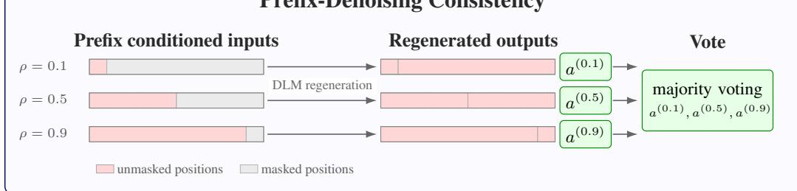
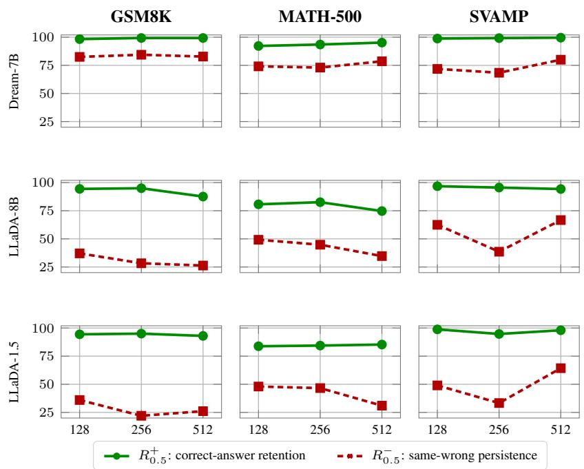

# PREFIX-DENOISING CONSISTENCY: TEST-TIME VERI-FICATION FOR DIFFUSION LANGUAGE MODELS

Yuki Ichihara1 Naoto Iwase2 Mohammad Atif Quamar1 Junpei Komiyama1,3

1MBZUAI 2Nagoya University 3RIKEN AIP

{yuki.ichihara, mohammad.atif}@mbzuai.ac.ae naoto@iwase.dev junpei@komiyama.info

## ABSTRACT

Diffusion Language Models (DLMs) have recently become increasingly competitive with autoregressive (AR) models, and even outperform them on certain tasks. Unlike AR models, DLMs produce output through iterative denoising without a leftto-right order. To further improve the performance of DLMs, we introduce PDC (Prefix-Denoising Consistency), a test-time self-verification method for DLMs. PDC exploits a distinctive test-time signal in DLMs under prefix conditioned regeneration, correct trajectories are more stable and reproducible than incorrect ones. Concretely, given an initially generated sample, PDC splits the sentence at an intermediate position and regenerates the remaining tokens conditioned on the fixed prefix. Across mathematical reasoning and commonsense reasoning benchmarks, PDC consistently improves upon the initial sample, outperforms independent generations under a computational constrained comparison, and is robust to different unmasking strategies and parameter settings. These results highlight prefix-conditioned regeneration as an effective DLM-specific primitive for test-time verification.

## Prefix-Denoising Consistency

  
Figure 1: Overview of Prefix-Denoising Consistency (PDC). Given an initial Diffusion Language Model output, PDC keeps exact prefixes at rates $\rho \in \{ 0 . 1 , 0 . 5 , 0 . 9 \}$ , remasks the remaining positions within the same length-L output, and regenerates them to obtain candidate answers. The final answer is selected by majority vote over the regenerated answers only; the initial answer is recorded for analysis but excluded from the vote.

## 1 INTRODUCTION

Diffusion Language Models (DLMs) (Nie et al., 2025; Zhu et al., 2025; Ye et al., 2025) have recently emerged as a compelling alternative to autoregressive (AR) Language Models (OpenAI, 2025; Qwen Team, 2025; NVIDIA, 2025). Unlike AR models, which generate tokens strictly from left to right, DLMs refine outputs through iterative denoising, enabling more global revision and potentially more parallel and efficient inference. Recent DLMs have shown competitive performance across a range of language and reasoning tasks (Gong et al., 2025; Fu et al., 2026), suggesting that diffusion-based generation can offer a promising new scaling direction beyond the standard AR paradigm.

  
Figure 2: Reproduction rates under $\rho = 0 . 5$ regeneration. Green denotes correct-answer preservation $R _ { 0 . 5 } ^ { \mp } ,$ while red denotes same-wrong-answer preservation $R _ { 0 . 5 } ^ { - } .$ , across generation lengths $L =$ 128, 256, 512 on three math benchmarks. The gap $R _ { 0 . 5 } ^ { + } - R _ { 0 . 5 } ^ { - } > 0$ 0 shows that correct answers are more reproducible than wrong answers. Full results of reproduction rates, including CSQA and SQA, are reported in Appendix Table 4.

Compared to AR models, state-of-the-art DLMs are decoded at low temperature to obtain strong pass@1 accuracy. However, this also creates a challenge for test-time verification: due to the low temperature, repeated samples often have limited diversity, because the DLM can follow similar denoising trajectories and return the same answer. This makes a naive transfer of self-consistency from AR models less direct. In AR reasoning, self-consistency improves accuracy by sampling multiple reasoning paths and selecting the most frequent answer (Wang et al., 2023). For lowtemperature DLM decoding, however, repeated full generations can result in near-identical denoising trajectories, so agreement among samples may overstate reliability rather than provide an independent check. Recent work (Wang et al., 2026a) addresses this issue by using temporal information (TIF) inside the unmasking process. TIF votes over answers extracted from the information of intermediate denoising steps, showing that the denoising trajectory contains a useful reasoning signal and can improve accuracy. However, TIF exploits consistency within a single denoising trajectory: it reuses intermediate states from one run rather than generating multiple alternative reasoning trajectories. By construction, it therefore cannot directly leverage the multi-trajectory self-consistency mechanism that makes majority voting effective in AR reasoning. TIF can exploit temporal fluctuations along that run, but it cannot branch into a new trajectory once the run becomes locked into an erroneous reasoning path.

To address this issue, we propose PDC (Prefix-Denoising Consistency). Starting from a completed output, it keeps an exact prefix, remasks the remaining positions, and re-denoises them at the same temperature. Repeating this intervention at several keep rates (i.e., amount of the prefix kept) produces structured alternative trajectories, whose extracted answers are aggregated by majority vote. This allows the model to revise errors in the original generation while preserving useful context from the initial solution.

Our contributions are:

• Prefix-conditioned regeneration. PDC is a test-time scaling method that holds exact prefixes inside a fixed output window, remasks the unkept positions, and votes only over regenerated answers. The initial answer is excluded to isolate the effect of prefix-conditioned denoising.

• Initially correct answers are more reproducible. Figure 2 shows that initially correct answers are more reproducible than initially wrong answers. This observation leads to our algorithm.

• Improved performance over the initial sample. In the full diffusion setting across math and commonsense benchmarks, PDC consistently improves over the initial sample and TIF.

• Compute efficiency and robustness analysis. We compare PDC to standard self-consistency (i.e., majority voting). We show that PDC outperforms majority voting with a smaller total denoising-step budget. We also conduct validation under different unmasking schemes and settings and observe improvements.

## 2 PREFIX-DENOISING CONSISTENCY

## 2.1 STANDARD DLM INFERENCE TIME

DLMs generate outputs by iteratively denoising a fixed-length sequence initialized with mask tokens. Given a prompt $x ,$ a maximum output length ${ \bar { \mathbf { \Gamma } } } _ { L , \mathbf { \Gamma } }$ and a total number of denoising steps $T ,$ , let $\gamma \leq L$ denote the set of token sequences over the vocabulary V with length at most L.

The denoising process begins with an output window consisting entirely of mask tokens:

$$
z ^ { ( 0 ) } = \left[ x , \underbrace { \left[ \mathrm { M A S K } \right] , \dots , \left[ \mathrm { M A S K } \right] } _ { L } \right] ,\tag{1}
$$

At each denoising step $t = 1 , \dots , T$ , the DLM predicts tokens for all currently masked output positions in parallel, conditioned on the partially denoised sequence $z ^ { ( t - 1 ) }$ . It then selects a subset of these positions to unmask according to a denoising schedule, often based on the model’s confidence. The remaining positions stay masked, producing an updated sequence $z ^ { ( t ) }$ , for example,

$$
\begin{array} { r } { z ^ { ( t ) } = \left[ x , \underbrace { \left[ \mathrm { M A S K } \right] , \left[ \mathrm { T O K E N } \right] , \ldots , \left[ \mathrm { T O K E N } \right] , \left[ \mathrm { M A S K } \right] , \ldots } _ { L } \right] . } \end{array}
$$

Thus, at an intermediate denoising step, the output window contains both positions that remain masked and tokens filled in during earlier steps. The positions are not necessarily unmasked in left-to-right order; instead, they may be resolved in an arbitrary order determined by the denoising schedule. After $T$ denoising steps, DLM obtains a fully unmasked output window, output sequence $y = z ^ { ( T ) }$ ), whose length is at most the output length $L$

Our method does not rely on the internal form of the DLM update rule. We therefore treat the DLM as a black-box generator that, given an input $x ,$ an output budget $L ,$ and a number of denoising steps $T ,$ , returns a sequence

$$
y = { \mathrm { D L M } } ( x ; L , T ) , \qquad y \in \mathcal { V } ^ { \leq L } .
$$

The output length and initial extracted answer are:

$$
\ell _ { y } = | y | , \qquad a ^ { ( 0 ) } = \mathrm { E x t r a c t } ( y ) ,
$$

where Extract is a task-specific canonical answer extractor and Extract $( y ) = \emptyset$ denotes a null extraction that represents a failure to parse the answer.

In a typical diffusion decoding, the model predicts tokens for the currently masked positions in parallel, and a subset of positions is unmasked at each step according to a denoising schedule, often based on confidence (Nie et al., 2025; Zhu et al., 2025; Ye et al., 2025).

## 2.2 PREFIX-DENOISING CONSISTENCY (PDC)

Our proposed method, PDC (Figure 1 and Algorithm 1) holds a prefix of the initial generated output y at a keep rate $\rho \in \mathcal R$ , masks the remaining output positions, regenerates those positions using the same DLM, and then aggregates the regenerated answers by majority vote.

Algorithm 1: Prefix-Denoising Consistency (PDC)   
Require: Prompt x, generation budget L, denoising budget T, keep rates $\mathcal { R } = \{ 0 . 1 , 0 . 5 , 0 . 9 \}$   
answer extractor Extract   
Ensure: Regeneration-vote answer ${ \hat { a } } ,$ or no-vote   
1: $y \gets \mathrm { D L M } ( x ; L , T ) ; \ell _ { y } \gets | y |$   
2: Record $a ^ { ( 0 ) } \gets$ Extract(y) for diagnostics only   
3: for each keep rate $\rho \in \mathcal R$ do   
4: if $\ell _ { y } = 0 ^ { \mathrm { ~ ~ } }$ then   
5: $L _ { \rho } ^ { \mathrm { p r e f i x } }  0$   
6: else   
7: $L _ { \rho } ^ { \mathrm { p r e f i x } } \gets \operatorname* { m a x } ( 1 , \lfloor \rho \ell _ { y } \rfloor )$   
8: end if   
9: $\begin{array} { r } { L _ { \rho } \gets L - L _ { \rho } ^ { \mathrm { p r e f i x } } } \end{array}$   
10: $T _ { \rho } \gets L _ { \rho }$   
11: Run the constrained DLM with output positions $1 { : } L _ { \rho } ^ { \mathrm { p r e f i x } }$ fixed and $L _ { \rho }$ suffix positions masked:   
$y ^ { ( \rho ) } \gets \mathrm { D L M } \left( x , y _ { 1 : L _ { \rho } ^ { \mathrm { p r e f i x } } } ; L _ { \rho } , T _ { \rho } \right)$   
12: $a ^ { ( \rho ) } \gets \mathrm { E x t r a c t } ( y ^ { ( \rho ) } )$   
13: end for   
14: $\mathcal { B }  \{ a ^ { ( \rho ) } : \rho \in \mathcal { R } , \ a ^ { ( \rho ) } \neq \varnothing \}$   
15: if $B = \{ \}$ then   
16: return no-vote   
17: end if   
18: return $\operatorname { M a j } ( B )$ , breaking ties by the fixed order $\rho = 0 . 1 , 0 . 5 , 0 . 9$   
Note: the initial answer $\bar { a } ^ { ( 0 ) }$ is excluded from the vote.

Throughout the paper, we use a fixed set of three rates $\mathcal { R } = \{ 0 . 1 , 0 . 5 , 0 . 9 \}$ , this set covers weak, intermediate, and strong prefix conditioning while requiring only three regenerations. Given a keep initial output $y$ of length $\ell _ { y } ,$ the number of held tokens for rate $\rho$ is:

$$
L _ { \rho } ^ { \mathrm { p r e f i x } } = \lfloor \rho \ell _ { y } \rfloor .
$$

The remaining regeneration length and denoising step are:

$$
L _ { \rho } = L - L _ { \rho } ^ { \mathrm { p r e f i x } } , \qquad T _ { \rho } = L _ { \rho } .
$$

Different from Eq. (1), the regeneration input is the following equation:

$$
\begin{array} { r } { z _ { \rho } ^ { ( 0 ) } = \left[ x , y _ { 1 : L _ { \rho } ^ { \mathrm { p r e f i x } } } , \underbrace { \left[ \mathrm { M A S K } \right] , \ldots , \left[ \mathrm { M A S K } \right] } _ { L _ { \rho } } \right] , } \end{array}
$$

where $y _ { 1 : L _ { \rho } ^ { \mathrm { p r e f i x } } }$ is kept output tokens with a rate of $\rho$ and $L _ { \rho }$ is the number of masked suffix positions to denoise. Only the remaining $L _ { \rho }$ output positions are denoised:

$$
y ^ { ( \rho ) } = \mathrm { D L M } \left( x , y _ { 1 : L _ { \rho } ^ { \mathrm { p r e f i x } } } ; L _ { \rho } , T _ { \rho } \right) , \qquad | y ^ { ( \rho ) } | \leq L .
$$

The regenerated answer is:

$$
a ^ { ( \rho ) } = \mathrm { E x t r a c t } ( y ^ { ( \rho ) } ) .
$$

Thus, the final length of $y ^ { ( \rho ) }$ may differ from the initial output length $\ell _ { y } .$ . However, regeneration does not continue from the end of the initial output. Instead, it only refills the remasked positions within the same output window of length L.

Motivated by analogous observations for AR models (Iwase et al., 2026), we find that the correct reasoning paths are more reproducible under regeneration than incorrect ones in DLMs (Figure 2). The gold answer is denoted by $a ^ { \star }$ . Reproduction of the correct answer measures whether regeneration preserves a correct initial answer, is defined as:

$$
R _ { \rho } ^ { + } = \mathrm { P r } \left[ a ^ { ( \rho ) } = a ^ { \star } \mid a ^ { ( 0 ) } = a ^ { \star } \right] .
$$

Same wrong preservation measures, whether regeneration repeats the same wrong answer when the initial answer is wrong, is defined as:

$$
R _ { \rho } ^ { - } = \mathrm { P r } \left[ a ^ { ( \rho ) } = a ^ { ( 0 ) } \mid a ^ { ( 0 ) } \neq \emptyset , a ^ { ( 0 ) } \neq a ^ { \star } \right] .
$$

Observation 2.1 (Reproduction rates). Across the different experiment settings, correct initial answers are more likely to be preserved than incorrect initial answers are to be repeated in DLMs:

$$
R _ { \rho } ^ { + } \geq R _ { \rho } ^ { - } .
$$

Using Observation 2.1, PDC assesses the reliability of the initial answer. PDC votes only over regenerated answers, initial answer $a ^ { ( 0 ) }$ is excluded from the final vote. This isolates the effect of prefix-conditioned regeneration: the DLMs can improve over the initial answer only if the regenerated candidates support a better answer. The multiset of non-null regenerated answers is:

$$
\begin{array} { r } { B = \left\{ a ^ { ( \rho ) } : \rho \in \mathcal { R } , a ^ { ( \rho ) } \neq \varnothing \right\} } \end{array}
$$

If $B = \{ \}$ , the example is marked as no-vote. Otherwise, PDC returns the most frequent regenerated answer, denoted by $\operatorname { \bar { M } a j } ( B )$ :

$$
{ \hat { a } } = \operatorname { M a j } ( B ) .
$$

The three keep rates probe different neighborhoods around the same initial output. The keep rate of 0.1 imposes only weak conditioning on the original generation trajectory and allows most of the reasoning path to change. The keep rate of 0.9 largely preserves the answer while perturbing only the final portion of the output. The keep rate of 0.5 provides an intermediate between the two. Together, these rates evaluate answer stability under varying strengths of prefix conditioning.

When does PDC improve accuracy? To demonstrate the effectiveness of PDC, we consider a stylized setting with only two possible answers: the correct answer $a ^ { \star }$ and one incorrect answer b. The purpose of this analysis is to identify when taking a majority vote over three regenerated answers improves upon the initial answer.

First, consider three independent Bernoulli variables $( \mathrm { i . e . }$ , variables that take either one or zero) whose probabilities of being one are $p _ { 1 } , p _ { 2 } , p _ { 3 }$ , respectively. The probability that at least two of them are one is

$$
\begin{array} { r l } & { V _ { 3 } ( p ) : = \mathrm { P r } [ \mathrm { a t ~ l e a s t ~ t w o ~ o f ~ t h e ~ t h r e e ~ v a r i a b l e s ~ a r e ~ o n e } ] } \\ & { \qquad = p _ { 1 } p _ { 2 } ( 1 - p _ { 3 } ) + p _ { 1 } ( 1 - p _ { 2 } ) p _ { 3 } + ( 1 - p _ { 1 } ) p _ { 2 } p _ { 3 } + p _ { 1 } p _ { 2 } p _ { 3 } } \\ & { \qquad = p _ { 1 } p _ { 2 } + p _ { 1 } p _ { 3 } + p _ { 2 } p _ { 3 } - 2 p _ { 1 } p _ { 2 } p _ { 3 } , } \end{array}\tag{2}
$$

where $\pmb { p } = ( p _ { 1 } , p _ { 2 } , p _ { 3 } )$

When all three probabilities are equal to $p ,$ we write

$$
V _ { 3 } ( p ) : = V _ { 3 } ( p , p , p ) = 3 p ^ { 2 } - 2 p ^ { 3 } .
$$

Thus, $V _ { 3 }$ is the probability that the majority outcome is one.

For regeneration j, define

$$
R _ { \rho _ { j } } ^ { + } : = \mathrm { P r } [ a ^ { ( j ) } = a ^ { ( 0 ) } \ | \ a ^ { ( 0 ) } = a ^ { \star } ]
$$

and

$$
R _ { \rho _ { j } } ^ { - } : = \mathrm { P r } [ a ^ { ( j ) } = a ^ { ( 0 ) } \mid a ^ { ( 0 ) } \neq \emptyset , a ^ { ( 0 ) } = b ] .
$$

In words, $R _ { \rho _ { i } } ^ { + }$ is the correct-answer retention probability, while $R _ { \rho _ { j } } ^ { - }$ is the same-wrong-answer persistence probability.

Theorem 2.2 (Benefit of the reproduction gap). Assume a binary answer space $\boldsymbol { \mathcal { A } } = \{ a ^ { \star } , b \}$ with no null answers, and let

$$
\pi : = \operatorname* { P r } [ a ^ { ( 0 ) } = a ^ { \star } ] .
$$

Suppose that, conditional on $a ^ { ( 0 ) }$ , the three regenerated answers are independent. Define

$$
R ^ { \pm } : = \left( R _ { \rho _ { 1 } } ^ { \pm } , R _ { \rho _ { 2 } } ^ { \pm } , R _ { \rho _ { 3 } } ^ { \pm } \right) .
$$

Then

$$
\mathrm { A c c } ( \mathrm { P D C } ) = \pi V _ { 3 } ( R ^ { + } ) + ( 1 - \pi ) \left[ 1 - V _ { 3 } ( R ^ { - } ) \right] .\tag{3}
$$

In the non-degenerate case, PDC improves upon INIT ifand only $i f$

$$
\pi < \frac { 1 - V _ { 3 } ( R ^ { - } ) } { 2 - V _ { 3 } ( R ^ { - } ) - V _ { 3 } ( R ^ { + } ) } .\tag{4}
$$

In particular, $i f \pi = 1 / 2 ,$ , then

$$
\mathrm { A c c } ( \mathrm { P D C } ) - \mathrm { A c c } \big ( \mathrm { I N I T } \big ) = \frac { 1 } { 2 } \left[ V _ { 3 } ( { \pmb R } ^ { + } ) - V _ { 3 } ( { \pmb R } ^ { - } ) \right] .\tag{5}
$$

Consequently,

$$
V _ { 3 } ( R ^ { + } ) > V _ { 3 } ( R ^ { - } ) \quad \Longleftrightarrow \quad \mathrm { A c c } ( \mathrm { P D C } ) > \mathrm { A c c } ( \mathrm { I N I T } ) .
$$

Moreover, because $V _ { 3 }$ is increasing on each coordinate, a sufficient condition for improvement is

$$
R _ { \rho _ { j } } ^ { + } \geq R _ { \rho _ { j } } ^ { - } , \qquad j = 1 , 2 , 3 ,
$$

with strict inequality for at least one j.

Proof. We separate the analysis into two cases.

Case 1: the initial answer is correct. Suppose $a ^ { ( 0 ) } = a ^ { \star }$ . Regeneration j reproduces the initial answer, which is also the correct answer, with probability $R _ { \rho _ { i } } ^ { + }$ . By conditional independence, the probability that at least two of the three regenerated answers are correct is therefore

$$
\operatorname { P r } [ { \hat { a } } = a ^ { \star } \mid a ^ { ( 0 ) } = a ^ { \star } ] = V _ { 3 } ( { \pmb R } ^ { + } ) .
$$

Case 2: the initial answer is wrong. Suppose $a ^ { ( 0 ) } = b .$ Because there are only two possible answers, a regeneration is correct exactly when it does not reproduce the initial answer.

The final majority vote is wrong exactly when at least two regenerations reproduce b. The probability of this event is $\dot { V _ { 3 } } ( R ^ { - } )$ ). Hence,

$$
\operatorname* { P r } [ { \hat { a } } = a ^ { \star } \mid a ^ { ( 0 ) } = b ] = 1 - V _ { 3 } ( { \cal R } ^ { - } ) .
$$

The initial answer is correct with probability π and wrong with probability $1 - \pi$ . Combining the two cases gives

$$
\mathrm { A c c } ( \mathrm { P D C } ) = \pi V _ { 3 } ( R ^ { + } ) + ( 1 - \pi ) \left[ 1 - V _ { 3 } ( R ^ { - } ) \right] ,
$$

which proves Eq. (3).

Since the accuracy of the initial answer is $\operatorname { A c c } ( \operatorname { I N I T } ) = \pi$ , the change in accuracy is

$$
\begin{array} { r l r } & { \mathrm { A c c } ( \mathrm { P D C } ) - \mathrm { A c c } ( \mathrm { I N I T } ) = \left( 1 - \pi \right) \left[ 1 - V _ { 3 } ( \pmb { R } ^ { - } ) \right] } & \\ & { - \pi \left[ 1 - V _ { 3 } ( \pmb { R } ^ { + } ) \right] . } & \end{array}\tag{6}
$$

This expression has a direct interpretation:

$$
\underbrace { \left( 1 - \pi \right) \left[ 1 - V _ { 3 } ( { \pmb R } ^ { - } ) \right] } _ { \mathrm { w r o n g ~ i n i t i a l ~ a n s w e r s ~ t h a t ~ a r e ~ c o r r e c t e d } } - \underbrace { \pi \left[ 1 - V _ { 3 } ( { \pmb R } ^ { + } ) \right] } _ { \mathrm { c o r r e c t ~ i n i t i a l ~ a n s w e r s ~ t h a t ~ a r e ~ s p o i l e d } } .
$$

Thus, the method improves accuracy precisely when the benefit from correcting initially wrong answers exceeds the loss from spoiling initially correct answers. Rearranging $\mathrm { A c c ( P D C ) { - } A c c ( I N I T ) > }$ 0 gives Eq. (4). Finally, suppose that $\pi = 1 / 2$ . Then

$$
\mathrm { A c c } ( \mathrm { P D C } ) - \mathrm { A c c } \big ( \mathrm { I N I T } \big ) = \frac { 1 } { 2 } \left[ V _ { 3 } ( { \pmb R } ^ { + } ) - V _ { 3 } ( { \pmb R } ^ { - } ) \right] ,
$$

which gives Eq. (5) and the stated equivalence. It remains to establish the sufficient condition. From Eq. (2),

$$
\begin{array} { c l c r } { { \displaystyle { \frac { \partial V _ { 3 } } { \partial p _ { 1 } } } = p _ { 2 } + p _ { 3 } - 2 p _ { 2 } p _ { 3 } } } \\ { { \displaystyle { \vphantom { \frac { \partial V _ { 3 } } { \partial p _ { 1 } } } } } } \\ { { \displaystyle { \vphantom { \frac { \partial V _ { 3 } } { \partial p _ { 2 } } } } } } \end{array}
$$

for $p _ { 2 } , p _ { 3 } ~ \in ~ ( 0 , 1 )$ . The same argument applies to the other two coordinates, so $V _ { 3 }$ is strictly increasing in each coordinate on $( 0 , 1 ) ^ { 3 }$ . Therefore, if $R _ { \rho _ { j } } ^ { + } \geq R _ { \rho _ { j } } ^ { - }$ for every $j ,$ with strict inequality for at least one $j ,$ then

$$
V _ { 3 } ( R ^ { + } ) > V _ { 3 } ( R ^ { - } ) ,
$$

□

## 3 EXPERIMENTS

The experiments first examine the diagnostic signal behind PDC: whether prefix regeneration preserves initially correct answers more often than it repeats the same wrong answer. We then evaluate PDC against the initial sample and temporal voting (TIF (Wang et al., 2026a)) baselines in full diffusion setting 1. In the ablation study, we compare PDC with standard majority voting that spends more token budget than it. Furthermore, we had several robustness checks, including several alternative unmasking strategies.

Models and datasets. We study Dream-7B (Dream-org/Dream-v0-Instruct-7B, Ye et al. (2025)) and LLaDA-family models (GSAI-ML/LLaDA-8B-Instruct, Nie et al. (2025); GSAI-ML/LLaDA-1.5, Zhu et al. (2025)). The main results use the full-diffusion setting. For LLaDA-family models, we set the block length equal to the generation length. All models are decoded at temperature 0.2. The datasets we tested are GSM8K (Cobbe et al., 2021), MATH-500 (Hendrycks et al., 2021; Lightman et al., 2024), SVAMP (Patel et al., 2021), CSQA (CommonsenseQA, Talmor et al. (2019)), and SQA (StrategyQA, Geva et al. (2021)).

## 3.1 CORRECT ANSWERS ARE MORE REPRODUCIBLE THAN WRONG ANSWERS

We first examine the reproduction rates that motivate PDC. Figure 2 shows reproduction rates at keep rate 0.5; the results for keep rates 0.1 or 0.9 across all datasets are reported in Appendix Table 4. The figure shows a significant gap between correct-answer retention and the same wrong answer persistence: initially correct answers are typically reproduced under prefix-conditioned regeneration, whereas initially, wrong answers are less likely to be regenerated as the same wrong answer.

## 3.2 PDC IMPROVES THE INITIAL SAMPLE

We next examine whether PDC actually improves the accuracy of the answer. This is non-trivial: regenerations can move away from an initial wrong answer, but the new answers may still be wrong, and the final vote may still result in an incorrect answer.

Baselines. INIT indicates the initial answer y generated by the standard denoising process. PDC votes over 0.1, 0.5, and 0.9 keep-rate regenerations. Ties are broken by the fixed keep-rate order 0.1, 0.5, 0.9. TIF, the state-of-the-art method for improving DLLM accuracy, extracts answers from intermediate steps. To aggregate answers on these steps, TIF Linear and TIF Exp use linearly and exponentially increasing temporal weights, respectively. The exponential setting uses $\alpha = 5$ following the settings of temporal voting in DLMs (Wang et al., 2026a).

Table 1: For each pair, we select the generation length that yields the highest INIT accuracy; this selection is based only on INIT and is not optimized for PDC. PDC attains the best or tied-best accuracy in all 15 settings and improves over the selected INIT baseline in 14 of them, with gains of up to +5.68 accuracy points. The full result is reported in Appendix C. Signed green/red values denote the advantage of the method relative to the selected INIT baseline. Bold indicates the best accuracy in each row, and an underline indicates the second best accuracy, with ties marked together.
<table><tr><td>Model</td><td>Dataset</td><td>Length</td><td>INIT</td><td>TiF Fixed</td><td>TiF Linear</td><td>TiF Exp.</td><td>PDC</td><td>∆ TIF avg.</td><td>∆ PDC</td></tr><tr><td rowspan="5">Dream-7B</td><td>GSM8K</td><td>512</td><td>82.03</td><td>81.96</td><td>82.03</td><td>82.03</td><td>84.08</td><td>-0.02</td><td>+2.05</td></tr><tr><td>MATH-500</td><td>512</td><td>46.00</td><td>46.00</td><td>46.00</td><td>46.20</td><td>47.00</td><td>+0.07</td><td>+1.00</td></tr><tr><td>SVAMP</td><td>256</td><td>87.00</td><td>87.00</td><td>87.00</td><td>87.00</td><td>88.00</td><td>+0.00</td><td>+1.00</td></tr><tr><td>CSQA</td><td>128</td><td>73.22</td><td>73.79</td><td>73.96</td><td>73.55</td><td>74.20</td><td>+0.55</td><td>+0.98</td></tr><tr><td>SQA</td><td>128</td><td>70.45</td><td>70.74</td><td>70.74</td><td>70.74</td><td>71.76</td><td>+0.29</td><td>+1.31</td></tr><tr><td rowspan="5">LLaDA-8B</td><td>GSM8K</td><td>256</td><td>60.73</td><td>60.12</td><td>60.80</td><td>60.80</td><td>65.88</td><td>-0.15</td><td>+5.15</td></tr><tr><td>MATH-500</td><td>256</td><td>26.45</td><td>26.25</td><td>26.25</td><td>26.25</td><td>27.86</td><td>-0.20</td><td>+1.41</td></tr><tr><td>SVAMP</td><td>128</td><td>83.67</td><td>83.67</td><td>83.67</td><td>83.67</td><td>84.33</td><td>+0.00</td><td>+0.66</td></tr><tr><td>CSQA</td><td>128</td><td>80.51</td><td>80.51</td><td>80.51</td><td>80.51</td><td>80.59</td><td>+0.00</td><td>+0.08</td></tr><tr><td>SQA</td><td>128</td><td>65.07</td><td>65.07</td><td>65.07</td><td>65.07</td><td>66.67</td><td>+0.00</td><td>+1.60</td></tr><tr><td rowspan="5">LLaDA-1.5</td><td>GSM8K</td><td>256</td><td>60.58</td><td>60.05</td><td>60.27</td><td>60.50</td><td>66.26</td><td>-0.30</td><td>+5.68</td></tr><tr><td>MATH-500</td><td>256</td><td>25.65</td><td>25.65</td><td>25.45</td><td>25.65</td><td>26.65</td><td>-0.07</td><td>+1.00</td></tr><tr><td>SVAMP</td><td>128</td><td>83.67</td><td>83.33</td><td>83.67</td><td>83.67</td><td>84.67</td><td>-0.11</td><td>+1.00</td></tr><tr><td>CSQA</td><td>128</td><td>80.10</td><td>80.10</td><td>80.10</td><td>80.10</td><td>80.10</td><td>+0.00</td><td>+0.00</td></tr><tr><td>SQA</td><td>128</td><td>66.08</td><td>66.08</td><td>66.08</td><td>66.08</td><td>66.81</td><td>+0.00</td><td>+0.73</td></tr></table>

Results Table 1 compares the accuracy of the methods. For each model and dataset pair, we optimize the generation length L to achieve the highest INIT accuracy. This compares PDC against the strongest available initial sample baseline for that pair, rather than against a favorable length chosen post hoc for PDC. Results across several values of L are reported in Appendix C.

On Dream-7B, PDC consistently improves over INIT on all five datasets. The advantage of PDC over INIT ranges from +0.98 to +2.05 points, with an unweighted mean gain of +1.27 points. On LLaDAfamily models, PDC improves over INIT in nine of ten model–dataset pairs and ties in the remaining pair, with an unweighted mean gain of +1.73 points. Appendix D reports additional LLaDA-family runs with block length 32, a semi-AR setting. It shows that the same prefix-regeneration signal remains useful.

## 3.3 ABLATION STUDY

## 3.3.1 PDC OUTPERFORMS SELF-CONSISTENCY AT LOWER INFERENCE COST

We compare PDC with Self-Consistency at generation length L = 128. The INIT x4 baseline conducts a majority vote over four independent generations and has a total denoising-step budget of 4T. This budget is approximately 2.5T when the initial output fills the length-L window, can exceed 3T for shorter outputs, and remains below 4T for every nonempty initial output. Thus, INIT x4 is a conservative higher-budget baseline rather than an exactly cost-matched baseline. Improvements over INIT x4 suggest that the method is using regeneration more effectively rather than relying merely on self-consistency. Table 2 shows the completed L = 128 runs. In this setting, PDC improves over INIT x4 in 13 of the 15 completed model and dataset pairs, ties in one pair, and underperforms in one pair, indicating that the gains stem from a more effective regeneration strategy that utilizes the consistency of the reasoning process, rather than merely drawing additional full generations.

## 3.3.2 ROBUSTNESS

We now conduct robustness checks. First, we tested several variants of the unmasking strategy. Up to this point, the results have used entropy unmasking for Dream and low-confidence unmasking for LLaDA-family models; Table 3 repeats the MATH-500 evaluation with alternative unmasking rules, including random and origin unmasking. Table 3 shows that larger keep rates also retain more initially correct answers, while smaller keep rates more often break exact repetition of the initial wrong answer. Accuracy remains comparable to or above the corresponding initial generation in these settings.

Table 2: We compare PDC with Self-Consistency under different total denoising-step budgets at generation length L = 128. For both INIT and TIF, ×4 denotes four independent initial denoising trajectories. INIT x4 votes over their final answers with budget 4T, while PDC uses one initial generation followed by three regenerations at keep rates 0.1, 0.5, and 0.9. PDC achieves the best or tied-best accuracy in 14 of 15 model–dataset settings and improves over INIT x4 in 13 of them, with gains of up to +9.25 accuracy points.
<table><tr><td>Dataset</td><td>Model</td><td>INIT</td><td>INIT x4</td><td>TiF Fixed x4</td><td>TiF Linear x4</td><td>TiF Exp. x4</td><td>PDC</td><td>∆ vs. INIT x4</td></tr><tr><td rowspan="3">GSM8K</td><td>Dream-7B</td><td>64.06</td><td>64.22</td><td>62.40</td><td>64.52</td><td>65.81</td><td>66.03</td><td>+1.81</td></tr><tr><td>LLaDA-1.5</td><td>56.48</td><td>56.63</td><td>56.41</td><td>56.56</td><td>56.71</td><td>65.88</td><td>+9.25</td></tr><tr><td>LLaDA-8B</td><td>58.30</td><td>58.91</td><td>58.38</td><td>58.61</td><td>58.91</td><td>65.88</td><td>+6.97</td></tr><tr><td rowspan="3">MATH-500</td><td>Dream-7B</td><td>35.80</td><td>36.00</td><td>34.20</td><td>34.80</td><td>35.60</td><td>37.20</td><td>+1.20</td></tr><tr><td>LLaDA-1.5</td><td>23.40</td><td>23.20</td><td>23.40</td><td>23.40</td><td>23.00</td><td>26.40</td><td>+3.20</td></tr><tr><td>LLaDA-8B</td><td>23.80</td><td>23.60</td><td>23.80</td><td>23.80</td><td>23.60</td><td>25.40</td><td>+1.80</td></tr><tr><td rowspan="3">SVAMP</td><td>Dream-7B</td><td>83.00</td><td>83.00</td><td>84.00</td><td>83.67</td><td>84.00</td><td>84.33</td><td>+1.33</td></tr><tr><td>LLaDA-1.5</td><td>83.67</td><td>83.67</td><td>83.33</td><td>83.67</td><td>83.67</td><td>84.67</td><td>+1.00</td></tr><tr><td>LLaDA-8B</td><td>83.67</td><td>84.33</td><td>84.33</td><td>84.00</td><td>84.33</td><td>84.33</td><td>+0.00</td></tr><tr><td rowspan="3">CSQA</td><td>Dream-7B</td><td>73.22</td><td>73.22</td><td>73.79</td><td>73.96</td><td>73.55</td><td>74.20</td><td>+0.98</td></tr><tr><td>LLaDA-1.5</td><td>80.10</td><td>80.51</td><td>80.67</td><td>80.67</td><td>80.67</td><td>80.10</td><td>-0.41</td></tr><tr><td>LLaDA-8B</td><td>80.51</td><td>80.34</td><td>80.59</td><td>80.59</td><td>80.59</td><td>80.59</td><td>+0.25</td></tr><tr><td rowspan="3">SQA</td><td>Dream-7B</td><td>70.45</td><td>70.45</td><td>70.74</td><td>70.74</td><td>70.74</td><td>71.76</td><td>+1.31</td></tr><tr><td>LLaDA-1.5</td><td>66.08</td><td>65.94</td><td>65.94</td><td>65.79</td><td>65.79</td><td>66.81</td><td>+0.87</td></tr><tr><td>LLaDA-8B</td><td>65.07</td><td>64.63</td><td>65.07</td><td>65.07</td><td>65.07</td><td>66.67</td><td>+2.04</td></tr></table>

In addition, we conduct two other robustness checks. Appendix D reports LLaDA-family experiments with a block length of 32, corresponding to semi-AR inference. The results show that PDC remains effective under this semi-AR setting. Moreover, we test whether the advantage of PDC is specific to the low-temperature decoding regime by repeating the L = 128 comparison under more stochastic decoding at $\tau = 1 . 0$ . At this temperature, PDC attains the highest accuracy in 12 of the 15 model and dataset settings and exceeds INIT ×4 by 4.98 accuracy points on average (see Appendix G). These runs are not used for the main full-diffusion claims, but they check whether the prefix-conditioning signal also appears under a different inference time schedule. Together, these experiments do not make PDC independent of the DLM, but they indicate that the signal is not specific to one unmasking heuristic or one block schedule.

Table 3: Robustness to alternative unmasking rules on MATH-500 across models and generation lengths. Dream uses origin unmasking, while the LLaDA-family models use random remasking. All rows use the full-diffusion setting with block length equal to generation length. We show answer accuracy for the initial generation, PDC with keep rates $\rho \in \{ 0 . 1 , 0 . 5 , 0 . 9 \}$ , and TIF variants. PDC achieves the best accuracy in all models and length settings.
<table><tr><td>Model</td><td>Length</td><td colspan="5">Accuracy (%)</td><td colspan="6">Reproduction rates (%)</td></tr><tr><td></td><td></td><td colspan="2"></td><td colspan="3">TiF variants</td><td colspan="2"> $\rho = 0 . 1$ </td><td colspan="2"> $\rho = 0 . 5$ </td><td colspan="2"> $\rho = 0 . 9$ </td></tr><tr><td></td><td></td><td>INIT</td><td>PDC</td><td>Fixed</td><td>Linear</td><td>Exp.</td><td> $R _ { \rho } ^ { + }$ </td><td> $R _ { \rho } ^ { - }$ </td><td> $R _ { \rho } ^ { + }$ </td><td> $R _ { \rho } ^ { - }$ </td><td> $R _ { \rho } ^ { + }$ </td><td> $R _ { \rho } ^ { - }$ </td></tr><tr><td></td><td>128</td><td>17.60</td><td>23.40</td><td>17.60</td><td>17.80</td><td>17.60</td><td>51.14</td><td>12.66</td><td>64.77</td><td>717.53</td><td>95.45</td><td>64.61</td></tr><tr><td>Dream-7B</td><td>256</td><td>14.20</td><td>20.40</td><td>14.80</td><td>14.80</td><td>15.00</td><td>60.56</td><td>10.74</td><td>56.34</td><td>17.18</td><td>78.87</td><td>57.67</td></tr><tr><td></td><td>512</td><td>14.80</td><td>20.40</td><td>15.20</td><td>15.20</td><td>15.00</td><td>54.05</td><td>14.78</td><td>54.05</td><td>19.81</td><td>83.78</td><td>58.18</td></tr><tr><td></td><td>128</td><td>27.20</td><td>28.60</td><td>27.80</td><td>28.20</td><td>27.20</td><td>68.38</td><td>21.25</td><td>73.53</td><td>36.26</td><td>94.85</td><td>81.30</td></tr><tr><td>LLaDA-1.5</td><td>256</td><td>31.46</td><td>33.07</td><td>31.66</td><td>31.86</td><td>32.06</td><td>70.06</td><td>18.34</td><td>77.07</td><td>30.77</td><td>92.99</td><td>80.47</td></tr><tr><td></td><td>512</td><td>31.45</td><td>36.29</td><td>31.25</td><td>32.66</td><td>32.86</td><td>71.79</td><td>11.68</td><td>73.08</td><td>23.65</td><td>90.38</td><td>73.35</td></tr><tr><td></td><td>128</td><td>25.20</td><td>28.00</td><td>25.00</td><td>25.40</td><td>25.40</td><td>64.29</td><td>18.31</td><td>77.78</td><td>34.37</td><td>93.65</td><td>76.34</td></tr><tr><td>LLaDA-8B</td><td>256</td><td>31.0633.27</td><td></td><td>29.46</td><td>30.86</td><td>31.66</td><td>69.03</td><td>22.71</td><td>76.77</td><td>33.92</td><td>94.19</td><td>79.65</td></tr><tr><td></td><td>512</td><td>30.8534.68</td><td></td><td>31.65</td><td>31.05</td><td>31.45</td><td>65.36</td><td>14.08</td><td>80.39</td><td>23.17</td><td>95.42</td><td>65.98</td></tr></table>

## 4 CONCLUSION

In this work, we presented PDC (Prefix-Denoising Consistency), a test-time self-verification method. PDC exploits a distinctive consistency signal from prefix-conditioned regeneration, correct reasoning trajectories tend to be more stable and reproducible than incorrect ones. Across math and commonsense benchmarks, PDC consistently improved over the initial sample, compared favorably to independent generations under a compute-constrained setting, and remained robust across unmasking strategies and hyperparameter choices. These results suggest that prefix-conditioned regeneration is an effective DLM-specific primitive for test-time verification, and point to the broader potential of exploiting denoising-based regeneration signals to improve the reliability of diffusion language models.

## ACKNOWLEDGMENTS

J. Komiyama was supported by the MBZUAI Start-up Fund [BF0121].

## REFERENCES

Pranjal Aggarwal, Aman Madaan, Yiming Yang, and Mausam. Let’s Sample Step by Step: Adaptive-Consistency for Efficient Reasoning and Coding with LLMs. In Houda Bouamor, Juan Pino, and Kalika Bali (eds.), Proceedings of the 2023 Conference on Empirical Methods in Natural Language Processing, pp. 12375–12396, Singapore, December 2023. Association for Computational Linguistics. doi: 10.18653/v1/2023.emnlp-main.761. URL https: //aclanthology.org/2023.emnlp-main.761/.

Marianne Arriola, Subham Sekhar Sahoo, Aaron Gokaslan, Zhihan Yang, Zhixuan Qi, Jiaqi Han, Justin T Chiu, and Volodymyr Kuleshov. Block Diffusion: Interpolating Between Autoregressive and Diffusion Language Models. In The Thirteenth International Conference on Learning Representations, 2025. URL https://openreview.net/forum?id=tyEyYT267x.

Jacob Austin, Daniel D. Johnson, Jonathan Ho, Daniel Tarlow, and Rianne van den Berg. Structured denoising diffusion models in discrete state-spaces. In M. Ranzato, A. Beygelzimer, Y. Dauphin, P.S. Liang, and J. Wortman Vaughan (eds.), Advances in Neural Information Processing Systems, volume 34, pp. 17981–17993. Curran Associates, Inc., 2021. URL https://proceedings.neurips.cc/paper\_files/paper/2021/ file/958c530554f78bcd8e97125b70e6973d-Paper.pdf.

Wenrui Bao, Zhiben Chen, Dan Xu, and Yuzhang Shang. Learning to Parallel: Accelerating Diffusion Large Language Models via Learnable Parallel Decoding. In The Fourteenth International Conference on Learning Representations, 2026. URL https://openreview.net/forum? id=bFJ8Sdr224.

Karl Cobbe, Vineet Kosaraju, Mohammad Bavarian, Mark Chen, Heewoo Jun, Lukasz Kaiser, Matthias Plappert, Jerry Tworek, Jacob Hilton, Reiichiro Nakano, et al. Training verifiers to solve math word problems. arXiv preprint arXiv:2110.14168, 2021.

Yonggan Fu, Lexington Whalen, Abhinav Garg, Chengyue Wu, Maksim Khadkevich, Nicolai Oswald, Enze Xie, Daniel Egert, Sharath Turuvekere Sreenivas, Shizhe Diao, Chenhan Yu, Ye Yu, Weijia Chen, Sajad Norouzi, Jingyu Liu, Shiyi Lan, Ligeng Zhu, Jin Wang, Jindong Jiang, Morteza Mardani, Mehran Maghoumi, Song Han, Ante Jukic, Nima Tajbakhsh, Jan Kautz, and Pavlo Molchanov. Nemotron-Labs-Diffusion: A Tri-Mode Language Model Unifying Autoregressive, Diffusion, and Self-Speculation Decoding. Technical report, NVIDIA, 2026. Technical report.

Mor Geva, Daniel Khashabi, Elad Segal, Tushar Khot, Dan Roth, and Jonathan Berant. Did Aristotle Use a Laptop? A Question Answering Benchmark with Implicit Reasoning Strategies. Transactions ofthe Associationfor Computational Linguistics, 9:346–361, 2021.

Shansan Gong, Shivam Agarwal, Yizhe Zhang, Jiacheng Ye, Lin Zheng, Mukai Li, Chenxin An, Peilin Zhao, Wei Bi, Jiawei Han, Hao Peng, and Lingpeng Kong. Scaling Diffusion Language Models via Adaptation from Autoregressive Models. In The Thirteenth International Conference on Learning Representations, 2025. URL https://openreview.net/forum?id=j1tSLYKwg8.

Xiaochuang Han, Sachin Kumar, and Yulia Tsvetkov. SSD-LM: Semi-autoregressive Simplexbased Diffusion Language Model for Text Generation and Modular Control. In Anna Rogers, Jordan Boyd-Graber, and Naoaki Okazaki (eds.), Proceedings of the 61st Annual Meeting of the

Association for Computational Linguistics (Volume 1: Long Papers), pp. 11575–11596, Toronto, Canada, July 2023. Association for Computational Linguistics. doi: 10.18653/v1/2023.acl-long. 647. URL https://aclanthology.org/2023.acl-long.647/.

Dan Hendrycks, Collin Burns, Saurav Kadavath, Akul Arora, Steven Basart, Eric Tang, Dawn Song, and Jacob Steinhardt. Measuring Mathematical Problem Solving With the MATH Dataset. In Thirty-fifth Conference on Neural Information Processing Systems Datasets and Benchmarks Track (Round 2), 2021. URL https://openreview.net/forum?id=7Bywt2mQsCe.

Naoto Iwase, Yuki Ichihara, Mohammad Atif Quamar, and Junpei Komiyama. Reliable Chain-of-Thought via Prefix Consistency. arXiv preprint arXiv:2605.07654, 2026.

Metod Jazbec, Theo X Olausson, Louis Bethune, Pierre Ablin, Michael Kirchhof, Jo´ ao Monteiro,˜ Victor Turrisi, Jason Ramapuram, and Marco Cuturi. Learning Unmasking Policies for Diffusion Language Models. arXiv preprint arXiv:2512.09106, 2025.

Ishan Jindal, Sai Prashanth Akuthota, Jayant Taneja, and SACHIN DEV SHARMA. THE PATH OF LEAST RESISTANCE: GUIDING LLM REASONING TRAJECTORIES WITH PREFIX CONSENSUS. In The Fourteenth International Conference on Learning Representations, 2026. URL https://openreview.net/forum?id=hrnSqERgPn.

Junpei Komiyama, Daisuke Oba, and Masafumi Oyamada. Best-of-∞: Asymptotic Performance of Test-Time LLM Ensembling. In The Fourteenth International Conference on Learning Representations, 2026. URL https://openreview.net/forum?id=3qiCnLf3jf.

Pengxiang Li, Yefan Zhou, Dilxat Muhtar, Lu Yin, Shilin Yan, Li Shen, Yi Liang, Soroush Vosoughi, and Shiwei Liu. Diffusion Language Model Knows the Answer Before It Decodes. In The Fourteenth International Conference on Learning Representations, 2026. URL https://openreview.net/forum?id=g88nt4ieTG.

Yiwei Li, Peiwen Yuan, Shaoxiong Feng, Boyuan Pan, Xinglin Wang, Bin Sun, Heda Wang, and Kan Li. Escape Sky-high Cost: Early-stopping Self-Consistency for Multi-step Reasoning. In The Twelfth International Conference on Learning Representations, 2024. URL https:// openreview.net/forum?id=ndR8Ytrzhh.

Hunter Lightman, Vineet Kosaraju, Yuri Burda, Harrison Edwards, Bowen Baker, Teddy Lee, Jan Leike, John Schulman, Ilya Sutskever, and Karl Cobbe. Let’s Verify Step by Step. In The Twelfth International Conference on Learning Representations, 2024. URL https://openreview. net/forum?id=v8L0pN6EOi.

Aaron Lou, Chenlin Meng, and Stefano Ermon. Discrete Diffusion Modeling by Estimating the Ratios of the Data Distribution. In International Conference on Machine Learning, pp. 32819–32848. PMLR, 2024.

Lizhuo Luo, Zhuoran Shi, Jiajun Luo, Zhi Wang, Shen Ren, Wenya Wang, and Tianwei Zhang. DAWN: Dependency-Aware Fast Inference for Diffusion LLMs. arXiv preprint arXiv:2602.06953, 2026.

Shen Nie, Fengqi Zhu, Zebin You, Xiaolu Zhang, Jingyang Ou, Jun Hu, JUN ZHOU, Yankai Lin, Ji-Rong Wen, and Chongxuan Li. Large Language Diffusion Models. In The Thirty-ninth Annual Conference on Neural Information Processing Systems, 2025. URL https://openreview. net/forum?id=KnqiC0znVF.

NVIDIA. Nemotron 3 Nano: Open, Efficient Mixture-of-Experts Hybrid Mamba-Transformer Model for Agentic Reasoning. arXiv preprint arXiv:2512.20848, 2025. URL https://arxiv.org/ abs/2512.20848.

OpenAI. gpt-oss-120b & gpt-oss-20b Model Card. arXiv preprint arXiv:2508.10925, 2025. URL https://arxiv.org/abs/2508.10925.

Arkil Patel, Satwik Bhattamishra, and Navin Goyal. Are NLP Models really able to Solve Simple Math Word Problems? In Kristina Toutanova, Anna Rumshisky, Luke Zettlemoyer, Dilek Hakkani-Tur, Iz Beltagy, Steven Bethard, Ryan Cotterell, Tanmoy Chakraborty, and Yichao Zhou (eds.), Proceedings of the 2021 Conference of the North American Chapter of the Association for Computational Linguistics: Human Language Technologies, pp. 2080–2094, Online, June 2021. Association for Computational Linguistics. doi: 10.18653/v1/2021.naacl-main.168. URL https://aclanthology.org/2021.naacl-main.168/.

Qwen Team. Qwen3 Technical Report. arXiv preprint arXiv:2505.09388, 2025. URL https: //arxiv.org/abs/2505.09388.

Subham Sekhar Sahoo, Marianne Arriola, Aaron Gokaslan, Edgar Mariano Marroquin, Alexander M Rush, Yair Schiff, Justin T Chiu, and Volodymyr Kuleshov. Simple and Effective Masked Diffusion Language Models. In The Thirty-eighth Annual Conference on Neural Information Processing Systems, 2024. URL https://openreview.net/forum?id=L4uaAR4ArM.

Aman Sharma and Paras Chopra. The Sequential Edge: Inverse-Entropy Voting Beats Parallel Self-Consistency at Matched Compute. arXiv preprint arXiv:2511.02309, 2025. URL https: //arxiv.org/abs/2511.02309.

Jiaxin Shi, Kehang Han, Zhe Wang, Arnaud Doucet, and Michalis Titsias. Simplified and Generalized Masked Diffusion for Discrete Data. In The Thirty-eighth Annual Conference on Neural Information Processing Systems, 2024. URL https://openreview.net/forum?id= xcqSOfHt4g.

Alon Talmor, Jonathan Herzig, Nicholas Lourie, and Jonathan Berant. CommonsenseQA: A Question Answering Challenge Targeting Commonsense Knowledge. In Jill Burstein, Christy Doran, and Thamar Solorio (eds.), Proceedings of the 2019 Conference of the North American Chapter of the Association for Computational Linguistics: Human Language Technologies, Volume 1 (Long and Short Papers), pp. 4149–4158, Minneapolis, Minnesota, June 2019. Association for Computational Linguistics. doi: 10.18653/v1/N19-1421. URL https://aclanthology. org/N19-1421/.

Wen Wang, Bozhen Fang, Chenchen Jing, Yongliang Shen, Yangyi Shen, Qiuyu Wang, Hao Ouyang, Hao Chen, and Chunhua Shen. Time Is a Feature: Exploiting Temporal Dynamics in Diffusion Language Models. In The Fourteenth International Conference on Learning Representations, 2026a. URL https://openreview.net/forum?id=HsB6CtagP7.

Xu Wang, Chenkai Xu, Yijie Jin, Jiachun Jin, Hao Zhang, Kai Yu, and Zhijie Deng. Diffusion LLMs Can Do Faster-Than-AR Inference via Discrete Diffusion Forcing. In The Fourteenth International Conference on Learning Representations, 2026b. URL https://openreview. net/forum?id=t5uLZSRjhF.

Xuezhi Wang, Jason Wei, Dale Schuurmans, Quoc V Le, Ed H. Chi, Sharan Narang, Aakanksha Chowdhery, and Denny Zhou. Self-Consistency Improves Chain of Thought Reasoning in Language Models. In The Eleventh International Conference on Learning Representations, 2023. URL https://openreview.net/forum?id=1PL1NIMMrw.

Qingyan Wei, Yaojie Zhang, Zhiyuan Liu, Puyu Zeng, Yuxuan Wang, Biqing Qi, Dongrui Liu, and Linfeng Zhang. Accelerating Diffusion Large Language Models with SlowFast Sampling: The Three Golden Principles. In The Fourteenth International Conference on Learning Representations, 2026. URL https://openreview.net/forum?id=Uh17FiwF4q.

Chengyue Wu, Hao Zhang, Shuchen Xue, Zhijian Liu, Shizhe Diao, Ligeng Zhu, Ping Luo, Song Han, and Enze Xie. Fast-dllm: Training-free acceleration of diffusion llm by enabling kv cache and parallel decoding. arXiv preprint arXiv:2505.22618, 2025.

Tong Wu, Zhihao Fan, Xiao Liu, Hai-Tao Zheng, Yeyun Gong, yelong shen, Jian Jiao, Juntao Li, zhongyu wei, Jian Guo, Nan Duan, and Weizhu Chen. AR-Diffusion: Auto-Regressive Diffusion Model for Text Generation. In Thirty-seventh Conference on Neural Information Processing Systems, 2023. URL https://openreview.net/forum?id=0EG6qUQ4xE.

Jiacheng Ye, Zhihui Xie, Lin Zheng, Jiahui Gao, Zirui Wu, Xin Jiang, Zhenguo Li, and Lingpeng Kong. Dream 7B: Diffusion Large Language Models. arXiv preprint arXiv:2508.15487, 2025.

Fengqi Zhu, Rongzhen Wang, Shen Nie, Xiaolu Zhang, Chunwei Wu, Jun Hu, Jun Zhou, Jianfei Chen, Yankai Lin, Ji-Rong Wen, and Chongxuan Li. LLaDA 1.5: Variance-Reduced Preference Optimization for Large Language Diffusion Models. arXiv preprint arXiv:2505.19223, 2025.

## A RELATED WORK

Diffusion language models. Diffusion models for text generation succeeded by Austin et al. (2021), advanced through the masked token framework. Recent DLM work has improved both the probabilistic formulation and the scale of masked/discrete diffusion. Score-entropy discrete diffusion, masked diffusion language modeling, and simplified masked diffusion objectives improve training and likelihood modeling for token sequences (Lou et al., 2024; Sahoo et al., 2024; Shi et al., 2024). At a larger scale, LLaDA shows that a masked diffusion model can be trained from scratch and instruction-tuned as a large language model (Nie et al., 2025), while LLaDA 1.5 studies preference optimization for such models (Zhu et al., 2025). Dream further demonstrates a strong open diffusion LLM with parallel iterative refinement and flexible generation orders (Ye et al., 2025). Our work is complementary to these models and training advances: given a base model, we study how its conditional denoising behavior can be used at inference time.

Blockwise and semi-autoregressive diffusion inference time. Several DLMs introduce left-toright or blockwise structure to improve length flexibility and efficiency. SSD-LM and AR-Diffusion use semi-autoregressive or position-dependent denoising to combine diffusion with sequential dependencies (Han et al., 2023; Wu et al., 2023). Block diffusion interpolates between autoregressive and discrete diffusion models, enabling arbitrary-length generation and KV-cache reuse (Arriola et al., 2025). Discrete diffusion forcing similarly turns pretrained dLLMs into an AR-diffusion hybrid for faster inference (Wang et al., 2026b). These methods modify the model, DLM, or inference time schedule. In contrast, PDC is a black-box test-time procedure that probes the existing DLM by changing which parts of one completed output are held fixed.

Adaptive unmasking and early termination. A closely related acceleration direction treats DLM inference as a dynamic unmasking, token-commitment, or stopping problem. Fast-dLLM selectively unmasks tokens whose confidence exceeds a threshold, while using approximate KV caching to reduce per-step cost (Wu et al., 2025). SlowFast Sampling adapts the inference time pace using token certainty, convergence, and positional structure, alternating between exploratory and accelerated phases (Wei et al., 2026). Learning Unmasking Policies formulates masked diffusion sampling as a Markov decision process and learns token-unmasking decisions from model confidences (Jazbec et al., 2025). DAWN instead uses dependency graphs to avoid simultaneously unmasking strongly coupled uncertain tokens (Luo et al., 2026). Learn2PD trains a lightweight filter that predicts whether each current token prediction matches the final output, and combines this with End-of-Text Prediction to terminate inference after the sequence is complete (Bao et al., 2026). Prophet observes early answer convergence and commits the remaining tokens in one step when the top-2 confidence gap indicates sufficient stability (Li et al., 2026). These methods decide when to unmask, commit, or stop in order to reduce inference cost. PDC has a different goal: it starts from a completed sample and uses fresh prefix-conditioned regenerations to test answer reproducibility and improve accuracy, rather than shortening the original denoising run.

Self-consistency method. Self-consistency (majority-voting) has been widely used as a decodingtime strategy for improving chain-of-thought reasoning. Rather than relying on a single reasoning path, Wang et al. (2023) samples multiple reasoning traces and aggregates the final answers by majority vote. Subsequent work has investigated how to reduce the sampling cost of this procedure through early termination. Adaptive Consistency (Aggarwal et al., 2023) formulates stopping as a posterior decision problem, using a Beta-binomial model over the leading answer counts and terminating once the estimated margin of the current top answer is sufficiently large. Early-Stopping Self-Consistency (Li et al., 2024) instead adopts a simpler window-based criterion, stopping when all answers within a fixed-size recent window agree. More recently, Sharma & Chopra (2025) demonstrated that sequential, entropy-aware voting can yield stronger cost-matched performance than parallel self-consistency, emphasizing the need for compute-equivalent comparisons. Jindal et al. (2026) proposed an inference time method that clusters short reasoning prefixes and discards prefixes on non-dominant clusters to save computation. In a related theoretical direction, Komiyama et al. (2026) studied the asymptotic behavior of majority voting, or best-of-∞, and proposed a Bayesian nonparametric stopping rule.

## B FULL REPRODUCTION RATES RESULTS

Due to space limitations, the main paper reports only the results with a keep rate of 0.5 on GSM8K, MATH-500, and SVAMP. Table 4 reports the full conditional stability diagnostics behind Figure 2.

The full table includes CSQA and SQA across keep rates 0.1, 0.5, and 0.9. Across these additional datasets and rates, correct-answer retention is generally higher than same-wrong persistence that is consistent with the results in the main paper.

Table 4: Reproducing rate across the full model and benchmarks. We report correct-answer retention $R _ { \rho } ^ { + }$ , same-wrong persistence $R _ { \rho } ^ { - }$ , and their separation $\Delta = R _ { \rho } ^ { + } - R _ { \rho } ^ { - }$ . Bold marks the largest $\Delta$ within each row; negative $\Delta$ values are shown in red.
<table><tr><td rowspan="2">Dataset</td><td rowspan="2">Model</td><td rowspan="2">Length 0.1</td><td colspan="2"> $R _ { \rho } ^ { + }$ </td><td rowspan="2"> $R _ { \rho } ^ { - }$ </td><td colspan="2"></td><td rowspan="2"></td><td colspan="2"> $\Delta$ </td><td rowspan="2"></td></tr><tr><td>0.5</td><td>0.9</td><td>0.1 0.5</td><td>0.9</td><td>0.1</td><td>0.5 0.9</td></tr><tr><td rowspan="3">GSM8K</td><td>Dream-7B</td><td>128 256 512</td><td>97.9 97.8 97.5</td><td>98.3 99.3 99.3</td><td>99.2 99.8 99.5</td><td>82.5 83.5 86.8</td><td>82.5 84.4 82.8</td><td>93.3 91.3 90.7</td><td>15.3 15.8 14.3 10.7</td><td>15.0 16.4</td><td>5.8 8.5 8.9</td></tr><tr><td>LLaDA-1.5</td><td>128 256 512</td><td>92.6 95.2 88.8</td><td>94.4 95.0 93.0</td><td>99.2 99.6 98.4</td><td>42.8 65.9 44.8</td><td>36.0 22.0 26.1</td><td>86.4 84.7 75.9</td><td>49.8 29.4 44.0</td><td>58.4 73.0 66.9</td><td>12.8 14.9 22.5</td></tr><tr><td>LLaDA-8B</td><td>128 256 512</td><td>93.2 93.0 80.3</td><td>94.4 95.0 87.6</td><td>99.1 99.6 99.2</td><td>43.9 69.5 48.5</td><td>37.1 28.3 26.3</td><td>90.1 87.9 77.8</td><td>49.4 23.5 31.8</td><td>57.3 66.7 61.3</td><td>9.0 11.8 21.4</td></tr><tr><td rowspan="2">MATH-500</td><td>Dream-7B</td><td>128 256 512</td><td>90.5 93.5 95.7</td><td>92.2 93.5 95.2</td><td>97.8 98.6 97.8</td><td>78.3 72.0 75.2</td><td>74.1 73.0 78.6</td><td>91.5 83.1 79.5</td><td>12.2 18.1 21.5 20.4 16.7</td><td>20.6</td><td>6.3 15.5 18.3</td></tr><tr><td>LLaDA-1.5</td><td>128 256 512</td><td>83.8 88.3 86.2</td><td>83.8 84.4 85.3</td><td>96.6 99.2 94.5</td><td>55.6 69.3 61.8</td><td>48.0 46.6 31.0</td><td>91.1 94.1 81.6</td><td>28.2 19.0 24.5</td><td>35.7 37.8 54.3</td><td>5.5 5.2 12.9</td></tr><tr><td></td><td>LLaDA-8B</td><td>128 256 512</td><td>79.8 88.6 81.6</td><td>80.7 82.6 74.7</td><td>97.5 97.7 95.4</td><td>54.2 73.0 44.8 63.5 34.7</td><td>49.2</td><td>88.7 92.6 15.7 81.7 18.1</td><td>25.6 31.5 37.8 40.0</td><td>8.8 5.1 13.7</td><td></td></tr><tr><td rowspan="3">SVAMP</td><td>Dream-7B</td><td>128 256 512</td><td>98.8 98.9 98.8</td><td>98.8 99.2 99.6</td><td>99.2 100.0 100.0</td><td>74.4 81.6 82.9</td><td>71.8 68.4 80.0</td><td>79.5 86.8 82.9</td><td>24.4 17.3 16.0 19.6</td><td>27.0 30.8</td><td>19.7 13.2 17.1</td></tr><tr><td>LLaDA-1.5</td><td>128 256 512</td><td>97.2 93.4 94.1</td><td>98.8 94.7 98.0</td><td>99.6 99.1 100.0</td><td>73.5 79.2 78.6</td><td>49.0 33.3 64.3</td><td>95.9 83.3 92.9</td><td>23.7 14.2 15.6 33.8</td><td>49.8 61.4</td><td>3.7 15.8 7.1</td></tr><tr><td>LLaDA-8B</td><td>128 256 512</td><td>98.0 89.4 96.2</td><td>96.8 95.6 94.3</td><td>100.0 99.4 100.0</td><td>75.0 75.0 100.0</td><td>62.5 38.6 66.7</td><td>95.8 95.5 66.7</td><td>23.0 14.4 -3.8</td><td>34.3 57.0 27.7</td><td>4.2 3.9 33.3</td></tr><tr><td rowspan="3">CSQA</td><td>Dream-7B</td><td>128 256 512</td><td>98.9 98.1 98.8</td><td>96.2 95.9 95.4</td><td>97.5 97.0 98.5</td><td>96.8 95.9 95.1</td><td>87.5 87.6 87.5</td><td>91.4 93.0 93.1</td><td>2.1 2.2 3.7</td><td>8.7 8.3 7.9</td><td>6.2 4.0 5.5</td></tr><tr><td>LLaDA-1.5</td><td>128 256 512</td><td>97.9 96.6 97.5</td><td>96.9 98.3 97.7</td><td>99.3 99.8 99.9</td><td>86.0 88.1 88.5</td><td>89.7 89.0 88.9</td><td>97.1 99.6 100.0</td><td>11.8 8.5 9.1</td><td>7.2 9.3 8.8</td><td>2.2 0.2 -0.1</td></tr><tr><td>LLaDA-8B</td><td>128 256 512</td><td>97.6 95.2 98.1</td><td>98.6 97.7 97.5</td><td>99.7 99.8 100.0</td><td>88.7 85.5 81.6</td><td>90.8 88.0 85.1</td><td>97.5 100.0 100.0</td><td>8.9 9.7 16.6</td><td>7.8 9.7 12.4</td><td>2.2 -0.2 0.0</td></tr><tr><td rowspan="4">SQA</td><td>Dream-7B</td><td>128 256 512</td><td>98.6 97.4 98.1</td><td>95.7 93.8 92.5</td><td>96.9 96.0 96.6</td><td>92.4 91.7 92.7</td><td>91.9 85.4 87.5</td><td>97.8 94.3 97.4</td><td>6.1 5.8 5.4</td><td>3.8 8.4 5.0</td><td>-0.9 1.7 -0.8</td></tr><tr><td>LLaDA-1.5</td><td>128 256 512</td><td>93.6 94.3 96.8</td><td>97.1 96.4 99.1</td><td>99.3 98.5 100.0</td><td>88.0 87.1 86.2</td><td>92.7 89.1 91.9</td><td>98.7 95.0 97.6</td><td>5.6 7.3 10.6</td><td>4.4 7.4 7.2</td><td>0.6 3.5 2.4</td></tr><tr><td>LLaDA-8B</td><td>128 256</td><td>94.6 87.5</td><td>96.4 96.7</td><td>99.6 99.2</td><td>87.1 90.8</td><td>86.3 84.2</td><td>97.5 93.4 100.0</td><td>7.5 10.2 -3.3</td><td>12.5 7.7</td><td>2.1 5.8</td></tr><tr><td></td><td>512</td><td>93.8</td><td>100.0</td><td>100.0</td><td>84.6</td><td>92.3</td><td></td><td>9.1</td><td></td><td>0.0</td></tr></table>

## C FULL-DIFFUSION ACCURACY SWEEP

As shown in Table 5, the proposed method consistently improves INIT accuracy across the completed generation lengths L = 128, 256, 512. This indicates that the gains reported in Table 5 are not an artifact of selecting a favorable block length, but rather reflect a robust improvement over the baseline. These results demonstrate the effectiveness of the proposed approach for improving initial-generation quality in full diffusion settings.

Table 5: Full accuracy results for Dream and LLaDA-family diffusion language models. PDC denotes majority voting over the three suffix-regenerated completions obtained with 0.1, 0.5, and 0.9 keep rates. Signed green/red values report accuracy-point changes relative to the INIT baseline. For TIF, the reported change is averaged over Fixed, Linear, and Exp. α = 5 variants. The table includes all completed lengths in the current full-diffusion sweep.
<table><tr><td rowspan="2">Method / Length</td><td colspan="3">GSM8K</td><td colspan="3">MATH-500</td><td colspan="3">SVAMP</td><td colspan="3">CSQA</td><td colspan="3">SQA</td></tr><tr><td>128</td><td>256</td><td>512</td><td>128</td><td>256</td><td>512</td><td>128</td><td>256</td><td>512</td><td>128</td><td>256</td><td>512</td><td>128</td><td>256</td><td>512</td></tr><tr><td>Dream-7B</td><td></td><td></td><td></td><td></td><td></td><td></td><td></td><td></td><td></td><td></td><td></td><td></td><td></td><td></td><td></td></tr><tr><td>INIT baseline</td><td>64.06</td><td>80.06</td><td>82.03</td><td>35.80</td><td>43.20</td><td>46.00</td><td>83.00</td><td>87.00</td><td>86.33</td><td>73.22</td><td>71.74</td><td>72.40</td><td>70.45</td><td>68.56</td><td>67.98</td></tr><tr><td>+ TiF Fixed</td><td>62.40</td><td>79.61</td><td>81.96</td><td>34.20</td><td>43.00</td><td>46.00</td><td>84.00</td><td>87.00</td><td>86.33</td><td>73.79</td><td>71.66</td><td>72.48</td><td>70.74</td><td>69.29</td><td>68.56</td></tr><tr><td>+ TiF Linear</td><td>64.52</td><td>80.14</td><td>82.03</td><td>34.80</td><td>43.40</td><td>46.00</td><td>83.67</td><td>87.00</td><td>86.33</td><td>73.96</td><td>71.66</td><td>72.48</td><td>70.74</td><td>69.29</td><td>68.56</td></tr><tr><td>+ TiF Exp. α = 5</td><td>65.81</td><td>80.36</td><td>82.03</td><td>35.60</td><td>44.00</td><td>46.20</td><td>84.00</td><td>87.00</td><td>86.33</td><td>73.55</td><td>71.74</td><td>72.48</td><td>70.74</td><td>69.29</td><td>68.56</td></tr><tr><td>∆ TiF avg. vs. INIT</td><td>+0.18</td><td>-0.02</td><td>-0.02</td><td>-0.93</td><td>+0.27</td><td>+0.07</td><td>+0.89</td><td>+0.00</td><td>+0.00</td><td>+0.55</td><td>-0.05</td><td>+0.08</td><td>+0.29</td><td>+0.73</td><td>+0.58</td></tr><tr><td>+ PDC</td><td>66.03</td><td>81.05</td><td>84.08</td><td>37.20</td><td>44.60</td><td>47.00</td><td>84.33</td><td>88.00</td><td>88.00</td><td>74.20</td><td>72.24</td><td>73.30</td><td>71.76</td><td>71.62</td><td>70.60</td></tr><tr><td>∆ PDC vs. INIT</td><td>+1.97</td><td>+0.99</td><td>+2.05</td><td>+1.40</td><td>+1.40</td><td>+1.00</td><td>+1.33</td><td>+1.00</td><td>+1.67</td><td>+0.98</td><td>+0.50</td><td>+0.90</td><td>+1.31</td><td>+3.06</td><td>+2.62</td></tr><tr><td>LLaDA-8B</td><td></td><td></td><td></td><td></td><td></td><td></td><td></td><td></td><td></td><td></td><td></td><td></td><td></td><td></td><td></td></tr><tr><td>INIT baseline</td><td>58.30</td><td>60.73</td><td>18.88</td><td>23.80</td><td>26.45</td><td>17.54</td><td>83.67</td><td>53.33</td><td>17.67</td><td>80.51</td><td>42.51</td><td>48.32</td><td>65.07</td><td>17.47</td><td>4.66</td></tr><tr><td>+ TiF Fixed</td><td>57.77</td><td>60.12</td><td>19.26</td><td>24.00</td><td>26.25</td><td>18.15</td><td>83.67</td><td>56.33</td><td>18.00</td><td>80.51</td><td>45.29</td><td>51.76</td><td>65.07</td><td>28.38</td><td>9.46</td></tr><tr><td>+ TiF Linear</td><td>58.00</td><td>60.80</td><td>19.48</td><td>23.80</td><td>26.25</td><td>17.94</td><td>83.67</td><td>56.33</td><td>18.33</td><td>80.51</td><td>45.21</td><td>51.60</td><td>65.07</td><td>28.38</td><td>9.46</td></tr><tr><td>+ TiF Exp. α = 5</td><td>58.30</td><td>60.80</td><td>19.41</td><td>24.00</td><td>26.25</td><td>18.15</td><td>83.67</td><td>56.33</td><td>18.33</td><td>80.51</td><td>45.21</td><td>51.60</td><td>65.07</td><td>28.38</td><td>9.46</td></tr><tr><td>∆ TiF avg. vs. INIT</td><td>-0.28</td><td>-0.15</td><td>+0.50</td><td>+0.13</td><td>-0.20</td><td>+0.54</td><td>+0.00</td><td>+3.00</td><td>+0.55</td><td>+0.00</td><td>+2.73</td><td>+3.33</td><td>+0.00</td><td>+10.91</td><td>+4.80</td></tr><tr><td>+ PDC</td><td>65.88</td><td>65.88</td><td>33.36</td><td>25.40</td><td>27.86</td><td>22.38</td><td>84.33</td><td>62.67</td><td>31.00</td><td>80.59</td><td>45.54</td><td>50.78</td><td>66.67</td><td>25.62</td><td>9.61</td></tr><tr><td>Δ PDC vs. INIT</td><td>+7.58</td><td>+5.15</td><td>+14.48</td><td>+1.60</td><td>+1.41</td><td>+4.84</td><td>+0.66</td><td>+9.34</td><td>+13.33</td><td>+0.08</td><td>+3.03</td><td>+2.46</td><td>+1.60</td><td>+8.15</td><td>+4.95</td></tr><tr><td>LLaDA-1.5</td><td></td><td></td><td></td><td></td><td></td><td></td><td></td><td></td><td></td><td></td><td></td><td></td><td></td><td></td><td></td></tr><tr><td>INIT baseline</td><td>56.48</td><td>60.58</td><td>39.12</td><td>23.40</td><td>25.65</td><td>21.98</td><td>83.67</td><td>75.67</td><td>51.00</td><td>80.10</td><td>73.22</td><td>75.51</td><td>66.08</td><td>51.53</td><td>32.02</td></tr><tr><td>+ TiF Fixed</td><td>56.41</td><td>60.05</td><td>39.80</td><td>23.40</td><td>25.65</td><td>21.98</td><td>83.33</td><td>75.00</td><td>51.33</td><td>80.10</td><td>74.37</td><td>75.84</td><td>66.08</td><td>56.77</td><td>33.33</td></tr><tr><td>+ T1F Linear</td><td>56.56</td><td>60.27</td><td>39.95</td><td>23.40</td><td>25.45</td><td>22.38</td><td>83.67</td><td>75.33</td><td>51.33</td><td>80.10</td><td>74.28</td><td>75.76</td><td>66.08</td><td>57.06</td><td>33.19</td></tr><tr><td>+ TiF Exp. α = 5</td><td>56.56</td><td>60.50</td><td>40.03</td><td>23.40</td><td>25.65</td><td>22.38</td><td>83.67</td><td>75.67</td><td>51.33</td><td>80.10</td><td>74.28</td><td>75.76</td><td>66.08</td><td>57.06</td><td>33.19</td></tr><tr><td>∆ TiF avg. vs. INIT</td><td>+0.03</td><td>-0.30</td><td>+0.81</td><td>+0.00</td><td>-0.07</td><td>+0.27</td><td>-0.11</td><td>-0.34</td><td>+0.33</td><td>+0.00</td><td>+1.09</td><td>+0.28</td><td>+0.00</td><td>+5.43</td><td>+1.22</td></tr><tr><td>+ PDC</td><td>65.88</td><td>66.26</td><td>56.79</td><td>26.40</td><td>26.65</td><td>26.01</td><td>84.67</td><td>79.00</td><td>62.67</td><td>80.10</td><td>74.28</td><td>76.09</td><td>66.81</td><td>52.98</td><td>40.32</td></tr><tr><td>∆ PDC vs. INIT</td><td>+9.40</td><td>+5.68</td><td>+17.67</td><td>+3.00</td><td>+1.00</td><td>+4.03</td><td>+1.00</td><td>+3.33</td><td>+11.67</td><td>+0.00</td><td>+1.06</td><td>+0.58</td><td>+0.73</td><td>+1.45</td><td>+8.30</td></tr></table>

## D SEMI-AR LLADA-FAMILY RESULTS

Table 6 and Table 7 report the LLaDA-family results with block length $3 2 . ^ { 2 }$ When the block length is smaller than the generation length, the sequence is generated block by block, with diffusion performed independently within each block, referred to as the semi-autoregressive blockwise setting.

Overall, the results in Table 6 and Table 7 show that the proposed method remains effective even in this semi-autoregressive blockwise setting. Across generation lengths, the proposed method all-in-all improves INIT accuracy for the LLaDA-family models, indicating that its benefits are not limited to the full-diffusion setting used for the main claims.

## E CASE STUDY: HOW PREFIX REGENERATION REPAIRS ERRORS

Section 2.2 shows that prefix-conditioned regeneration has high correct-answer preservation $( R ^ { + } )$ and low same-wrong preservation (R−). In words, correct initial answers tend to remain correct after regeneration, while wrong initial answers often do not reproduce the same wrong answer. This is a useful regime for PDC. High $R ^ { + }$ means regeneration is unlikely to disturb a correct trajectory, while a low $R ^ { \frac { \mathbf { \sigma } } { d } }$ means an incorrect trajectory often has a chance to escape its original mistake. Escaping the same wrong answer does not by itself guarantee correctness; the regenerated answer may still be wrong. However, when the kept prefix contains the right setup and the erroneous intermediate step lies in the regenerated suffix, regeneration can cut away the local mistake and replace it with a corrected continuation. Table 8 shows two MATH-500 with Dream-v0-Instruct-7B examples of this behavior.

Table 6: Semi-AR LLaDA-family prefix-denoising consistency results. These runs use block length 32 with generation lengths 128, 256, and 512. Values are percentages. Bold marks the largest ∆ within each row; negative ∆ values are shown in red.
<table><tr><td rowspan="2">Dataset</td><td rowspan="2">Model</td><td rowspan="2">Length</td><td colspan="3"> $R _ { \rho } ^ { + }$ </td><td colspan="3"> $R _ { \rho } ^ { - }$ </td><td colspan="3"> $\Delta$ </td></tr><tr><td>0.1</td><td>0.5</td><td>0.9</td><td>0.1</td><td>0.5</td><td>0.9</td><td>0.1</td><td>0.5</td><td>0.9</td></tr><tr><td rowspan="6">GSM8K</td><td rowspan="3">LLaDA-1.5</td><td>128</td><td>95.6</td><td>99.5</td><td>99.0</td><td>78.0</td><td>91.5</td><td>89.7</td><td>17.6</td><td>8.0</td><td>9.2</td></tr><tr><td>256</td><td>96.1</td><td>98.7</td><td>99.7</td><td>72.8</td><td>90.6</td><td>96.7</td><td>23.3</td><td>8.2</td><td>3.0</td></tr><tr><td>512</td><td>97.7</td><td>99.2</td><td>99.9</td><td>67.8</td><td>86.8</td><td>98.7</td><td>29.9</td><td>12.4</td><td>1.2</td></tr><tr><td rowspan="3">LLaDA-8B</td><td>128</td><td>95.7</td><td>98.3</td><td>99.4</td><td>74.9</td><td>87.2</td><td>91.7</td><td>20.8</td><td>11.2</td><td>7.6</td></tr><tr><td>256</td><td>97.3</td><td>99.4</td><td>99.6</td><td>70.1</td><td>87.8</td><td>95.6</td><td>27.2</td><td>11.6</td><td>4.0</td></tr><tr><td>512</td><td>98.1</td><td>99.5</td><td>99.9</td><td>67.1</td><td>82.3</td><td>95.4</td><td>31.0</td><td>17.3</td><td>4.6</td></tr><tr><td rowspan="6">MATH-500</td><td rowspan="3">LLaDA-1.5</td><td>128</td><td>89.4</td><td>95.9</td><td>97.6</td><td>63.0</td><td>85.3</td><td>90.9</td><td>26.3</td><td>10.6</td><td>6.7</td></tr><tr><td>256</td><td>88.6</td><td>95.1</td><td>99.5</td><td>54.3</td><td>80.7</td><td>94.2</td><td>34.3</td><td>14.4</td><td>5.3</td></tr><tr><td>512</td><td>88.5</td><td>93.8</td><td>99.5</td><td>45.6</td><td>66.6</td><td>93.4</td><td>42.8</td><td>27.2</td><td>6.1</td></tr><tr><td rowspan="3">LLaDA-8B</td><td>128</td><td>88.8</td><td>97.5</td><td>97.5</td><td>59.4</td><td>84.0</td><td>89.9</td><td>29.4</td><td>13.5</td><td>7.7</td></tr><tr><td>256</td><td>90.3</td><td>96.6</td><td>99.4</td><td>55.0</td><td>77.7</td><td>94.2</td><td>35.3</td><td>18.9</td><td>5.3</td></tr><tr><td>512</td><td>82.7</td><td>91.1</td><td>98.6</td><td>43.1</td><td>70.7</td><td>93.8</td><td>39.6</td><td>20.5</td><td>4.8</td></tr><tr><td rowspan="6">SVAMP</td><td rowspan="3">LLaDA-1.5</td><td>128</td><td>98.9</td><td>99.6</td><td>99.6</td><td>68.6</td><td>88.6</td><td>100.0</td><td>30.3</td><td>11.1</td><td>-0.4</td></tr><tr><td>256</td><td>98.5</td><td>99.6</td><td>100.0</td><td>70.0</td><td>87.5</td><td>97.5</td><td>28.5</td><td>12.1</td><td>2.5</td></tr><tr><td>512</td><td>98.1</td><td>99.3</td><td>100.0</td><td>74.3</td><td>91.4</td><td>97.1</td><td>23.8</td><td>7.8</td><td>2.9</td></tr><tr><td rowspan="3">LLaDA-8B</td><td>128</td><td>98.5</td><td>99.6</td><td>99.2</td><td>74.3</td><td>88.6</td><td>97.1</td><td>24.2</td><td>11.0</td><td>2.1</td></tr><tr><td>256</td><td>98.9</td><td>100.0</td><td>100.0</td><td>60.5</td><td>84.2</td><td>94.7</td><td>38.3</td><td>15.8</td><td>5.3</td></tr><tr><td>512</td><td>98.5</td><td>99.3</td><td>100.0</td><td>73.5</td><td>91.2</td><td>97.1</td><td>25.0</td><td>8.1</td><td>2.9</td></tr><tr><td rowspan="6">CSQA</td><td rowspan="3">LLaDA-1.5</td><td>128</td><td>95.7</td><td>98.3</td><td>99.3</td><td>74.5</td><td>90.7</td><td>95.7</td><td>21.3</td><td>7.6</td><td>3.6</td></tr><tr><td>256</td><td>93.8</td><td>97.8</td><td>99.4</td><td>71.6</td><td>89.4</td><td>98.6</td><td>22.2</td><td>8.4</td><td>0.8</td></tr><tr><td>512</td><td>94.3</td><td>97.6</td><td>99.6</td><td>69.0</td><td>84.5</td><td>97.5</td><td>25.3</td><td>13.1</td><td>2.0</td></tr><tr><td></td><td>128</td><td>94.8</td><td>98.7</td><td>98.8</td><td>74.1</td><td>90.7</td><td>96.4</td><td>20.7</td><td>8.1</td><td>2.4</td></tr><tr><td rowspan="2">LLaDA-8B</td><td>256</td><td>92.3</td><td>97.3</td><td>99.2</td><td>70.6</td><td>88.6</td><td>97.8</td><td>21.8</td><td>8.7</td><td>1.4</td></tr><tr><td>512</td><td>93.9</td><td>96.8</td><td>99.2</td><td>65.0</td><td>84.3</td><td>96.7</td><td>29.0</td><td>12.5</td><td>2.4</td></tr></table>

Table 7: Semi-AR LLaDA-family main accuracy results. These runs use block length 32 with generation lengths 128, 256, and 512.
<table><tr><td rowspan="3">Method / Length</td><td colspan="3">GSM8K</td><td colspan="3">MATH-500</td><td colspan="3">SVAMP</td><td colspan="3">CSQA</td></tr><tr><td>128</td><td>256</td><td>512</td><td>128</td><td>256</td><td>512</td><td>128</td><td>256</td><td>512</td><td>128</td><td>256</td><td>512</td></tr><tr><td colspan="10">LLaDA-8B</td><td></td><td></td><td></td></tr><tr><td>INIT baseline</td><td>72.25</td><td>74.91</td><td>81.80</td><td>32.20</td><td>35.27</td><td>43.15</td><td>86.00</td><td>87.00</td><td>88.67</td><td>76.58</td><td>76.99</td><td>77.07</td></tr><tr><td>+ TiF Fixed</td><td>71.87</td><td>69.37</td><td>80.14</td><td>29.60</td><td>31.06</td><td>39.31</td><td>84.67</td><td>86.67</td><td>88.33</td><td>78.79</td><td>77.07</td><td>77.40</td></tr><tr><td>+ TiF Linear</td><td>73.54</td><td>74.75</td><td>81.65</td><td>30.80</td><td>34.67</td><td>41.53</td><td>87.67</td><td>86.33</td><td>88.33</td><td>77.31</td><td>77.07</td><td>77.40</td></tr><tr><td>+ T1F Exp. α = 5</td><td>73.62</td><td>76.27</td><td>81.96</td><td>31.80</td><td>35.27</td><td>42.54</td><td>88.00</td><td>86.67</td><td>88.33</td><td>76.99</td><td>77.31</td><td>77.40</td></tr><tr><td>∆ TiF avg. vs. INIT</td><td>+0.76</td><td>-1.45</td><td>-0.55</td><td>-1.47</td><td>-1.60</td><td>-2.02</td><td>+0.78</td><td>-0.44</td><td>-0.34</td><td>+1.12</td><td>+0.16</td><td>+0.33</td></tr><tr><td>+ PDC</td><td>73.77 +1.52</td><td>76.04 +1.13</td><td>82.49 +0.69</td><td>33.20 +1.00</td><td>36.47 +1.20</td><td>42.34 -0.81</td><td>87.00 +1.00</td><td>88.00 +1.00</td><td>88.33 -0.34</td><td>77.31 +0.73</td><td>77.31</td><td>77.40</td></tr><tr><td colspan="10">∆ PDC vs. INIT</td><td></td><td>+0.32</td><td>+0.33</td></tr><tr><td>LLaDA-1.5</td><td></td><td></td><td></td><td></td><td></td><td></td><td></td><td></td><td></td><td></td><td></td><td></td></tr><tr><td>INIT baseline</td><td>72.33</td><td>78.01</td><td>82.71</td><td>34.00</td><td>36.87</td><td>41.94</td><td>87.67</td><td>86.67</td><td>88.33</td><td>76.66</td><td>76.58</td><td>75.92</td></tr><tr><td>+ TiF Fixed</td><td>71.95</td><td>72.48</td><td>80.74</td><td>32.80</td><td>33.27</td><td>38.91</td><td>84.33</td><td>86.33</td><td>87.33</td><td>78.30</td><td>77.23</td><td>75.92</td></tr><tr><td>+ TiF Linear</td><td>73.31</td><td>77.56</td><td>82.56</td><td>33.40</td><td>36.67</td><td>41.13</td><td>87.67</td><td>86.33</td><td>87.67</td><td>77.31</td><td>77.15</td><td>76.09</td></tr><tr><td>+ TiF Exp. α = 5</td><td>73.46</td><td>79.00</td><td>83.02</td><td>33.80</td><td>37.07</td><td>41.94</td><td>88.33</td><td>86.33</td><td>88.33</td><td>76.82</td><td>76.58</td><td>76.17</td></tr><tr><td>∆ TiF avg. vs. INIT</td><td>+0.58</td><td>-1.66</td><td>-0.60</td><td>-0.67</td><td>-1.20</td><td>-1.28</td><td>-0.89</td><td>-0.34</td><td>-0.55</td><td>+0.82</td><td>+0.41</td><td>+0.14</td></tr><tr><td>+ PDC</td><td>73.92</td><td>78.47</td><td>82.71</td><td>34.41</td><td>37.27</td><td>41.53</td><td>88.00</td><td>87.67</td><td>89.00</td><td>77.23</td><td>77.31</td><td>77.64</td></tr><tr><td>∆ PDC vs. INIT</td><td>+1.59</td><td>+0.46</td><td>+0.00</td><td>+0.41</td><td>+0.40</td><td>-0.41</td><td>+0.33</td><td>+1.00</td><td>+0.67</td><td>+0.57</td><td>+0.73</td><td>+0.72</td></tr></table>

The figure skater is facing north when she begins   
to spin to her right. She spins 2250 degrees.   
. . . We can do this by subtracting multiples of   
360 degrees from 2250 degrees.   
2250 - 6\*360 = 2250 - 2160 = 90 degrees.   
So, when she finishes her spin, she is facing   
\boxed{east}.

When t = 2, we have   
(x, y) = (23 + 7, −3(2)2 − 6(2) − 5)   
= (15, −27).   
So the curve passes through the point   
\boxed{(15, −27)}.

## Problem 97

Problem. A figure skater is facing north when she begins to spin to her right. She spins 2250 degrees. Which direction (north, south, east or west) is shefacing when shefinishes her spin?

Initial generation

The figure skater is facing north when she begins   
to spin to her right. She spins 2250 degrees.   
. . . We can do this by subtracting multiples of   
360 degrees from 2250 degrees until we get an   
angle between 0 and 360 degrees.   
2250 degrees divided by 360 degrees is 6 with a   
remainder of 150 degrees.   
Therefore, she is facing \boxed{south}.

## Prefix-conditioned regeneration

## Problem 144

Problem. A curve is parameterized by

$$
( x , y ) = ( t ^ { 3 } + 7 , - 3 t ^ { 2 } - 6 t - 5 ) .
$$

Find the point the curve passes through at t = 2.

Initial generation

## Prefix-conditioned regeneration

When t = 2, we have   
$\begin{array} { c } { { ( x , y ) = ( 2 ^ { 3 } + 7 , - 3 ( 2 ) ^ { 2 } - 6 ( 2 ) - 5 ) } } \\ { { = ( 8 + 7 , - 1 2 - 1 2 - 5 ) } } \\ { { = ( 1 5 , - 2 9 ) . } } \end{array}$   
Therefore, the point the curve passes through   
at t = 2 is \boxed{(15, −29)}. The answer is:   
(15,-29)  
Table 8: Two examples in which the wrong answer is corrected by regeneration. Red text highlights the incorrect continuation in the initial sample; green text highlights the corrected continuation produced by regeneration. When the wrong intermediate step is remasked, prefix-conditioned regeneration avoids the same mistake.

In Problem 97, the initial sample follows the correct modulo-reduction strategy but makes a local arithmetic error, treating the remainder of 2250 degrees modulo 360 degrees as 150 degrees and concluding south. The regenerated sample recomputes the suffix as 2250 − 6 · 360 = 90 degrees and recovers east. Similarly, in Problem 144, the initial sample substitutes the correct value t = 2, but evaluates the resulting expression as −27, whereas regeneration expands the same expression as −12 − 12 − 5 = −29 and recovers the correct point.

## F MODEL AND DATASET SUMMARY

This appendix summarizes the language models and datasets used in the experiments. Detailed inference time hyperparameters, prompt templates, answer extraction, and voting conventions are given in Appendix H.

Table 9: Language models used in the experiments. Dream-7B is exclusively for full diffusion, while LLaDA-family models support both full diffusion and semi-autoregressive diffusion. The main paper exclusively considers the full diffusion setting. The semi-autoregressive runs are reported separately in Appendix D.
<table><tr><td>Model</td><td>Checkpoint</td><td>Family</td><td>Main setting</td></tr><tr><td>Dream-7B</td><td> $\mathtt { D r e a m - o r g / D r e a m - v 0 - I n s t r u c t - 7 B }$ </td><td>Masked Diffusion LLM</td><td>Full-window diffusion inference time</td></tr><tr><td>LLaDA-1.5</td><td>GSAI-ML/LLaDA-1.5</td><td>Masked Diffusion LLM with Block Length</td><td>Block length matched to generation length</td></tr><tr><td>LLaDA-8B</td><td> $\mathtt { G S A I - M L / L L a D A - 8 B - I n s t r u c t }$ </td><td>Masked Diffusion LLM with Block Length</td><td>Block length matched to generation length</td></tr></table>

Table 10: Datasets used in the experiments. Math-style datasets are evaluated by canonical answer extraction and symbolic/numeric equivalence when applicable. Multiple-choice and binary reasoning datasets are evaluated by canonicalized option extraction.
<table><tr><td>Dataset</td><td>Name</td><td>Task type</td><td>Primary answer format</td></tr><tr><td>GSM8K</td><td>Grade-school math word problems (Cobbe et al., 2021)</td><td>Arithmetic reasoning</td><td>Boxed final answer</td></tr><tr><td>MATH-500</td><td>MATH subset / verification benchmark (Hendrycks et al., 2021; Lightman et al., 2024)</td><td>Mathematical reasoning</td><td>Boxed final answer</td></tr><tr><td>SVAMP</td><td>Arithmetic word-problem challenge (Patel et al., 2021)</td><td>Arithmetic reasoning</td><td>Boxed final answer</td></tr><tr><td>CSQA</td><td>CommonsenseQA (Talmor et al., 2019)</td><td>Multiple-choice commonsense reasoning</td><td>Boxed option letter</td></tr><tr><td>SQA</td><td>StrategyQA (Geva et al., 2021)</td><td>Binary commonsense reasoning</td><td>Boxed option letter</td></tr></table>

## G RESULTS AT DIFFERENT SAMPLING TEMPERATURES

To examine whether PDC remains effective as sampling becomes more stochastic, we repeat the L = 128 evaluation at token-sampling temperature $\tau = 1 . 0$

Results. Table 11 shows that, at $\tau = 1 . 0 $ , PDC achieves the highest numerical accuracy in 12 of the 15 model and dataset settings and outperforms INIT ×4 in the same 12 settings. Averaged uniformly over the 15 settings, it exceeds INIT ×4 by 4.98 accuracy points; the largest dataset-level mean gains occur on GSM8K and MATH-500, at 11.45 and 7.47 points, respectively. Across the two tested temperatures, the unweighted mean accuracy of PDC changes from 65.35 at $\tau = 0 . 2$ to 66.16 at τ = 1.0 (+0.81), whereas INIT and INIT ×4 decrease by 4.58 and 2.07 points, respectively. Consequently, the mean margin of PDC over INIT ×4 increases from 2.11 to 4.98 points. This larger relative margin partly reflects a weaker full-generation baselines at the higher temperature and are not uniform across tasks: on all three CSQA settings, PDC trails INIT ×4 by 0.74–2.12 points. The results therefore show that PDC remains effective in the tested higher-temperature setting, particularly on the mathematical reasoning tasks.

## H REPRODUCIBILITY DETAILS

Models and inference time hyperparameters. We evaluate Dream-v0-Instruct-7B, LLaDA-1.5, and LLaDA-8B-Instruct. We use entropy-based and low confidence unmasking, token temperature 0.2. The generation length L is set equal to the denoising step budget $T \in$ {128, 256, 512}.

The main tables use the block-length-matched setting, with block length set equal to the generation length. Appendix D reports semi-AR LLaDA-family runs with block length 32, as follows the TIF settings. TIF are captured from the same initial denoising run with a stride of 1.

Regeneration denoising budget. During regeneration, the effective denoising budget is reduced according to the kept prefix length. In the reported full-diffusion setting, $T = L ,$ so the effective regeneration step budget equals the remasked suffix length:

$$
T _ { \rho } = L _ { \rho } = L - L _ { \rho } ^ { \mathrm { p r e f i x } } .
$$

The experiment scripts also support a general nominal step budget T, using the proportional rule:

$$
T _ { \rho } = \operatorname* { m a x } \{ 1 , \operatorname { r o u n d } ( T L _ { \rho } / L ) \} .
$$

This reduces to $T _ { \rho } = L _ { \rho }$ when $T = L$ . Dream regenerates the suffix with a reduced number of denoising steps using the floor version of the same proportional rule:

$$
T _ { \rho } = \operatorname* { m a x } \{ 1 , \lfloor { T L _ { \rho } } / { L } \rfloor \} .
$$

This differs from the rounded rule by at most one denoising step, and all reported tables are computed from the saved records for the corresponding run.

Table 11: Accuracy at generation length L = 128 under low- and high-temperature decoding. We compare the main setting (τ = 0.2) with more stochastic decoding (τ = 1.0). INIT ×4 denotes majority voting over four independent full generations. Boldface marks the best result in each model–temperature row. Signed green/red values report the accuracy-point change of PDC relative to INIT ×4 at the same temperature.
<table><tr><td>Dataset</td><td>Model</td><td>τ</td><td>INIT</td><td>INIT ×4</td><td>TiF Fixed ×4</td><td>TiF Linear ×4</td><td>TiF Exp. ×4</td><td>PDC</td><td>∆ vs. INIT ×4</td></tr><tr><td rowspan="6">GSM8K</td><td rowspan="2">Dream-7B</td><td>0.2</td><td>64.06</td><td>64.22</td><td>62.40</td><td>64.52</td><td>65.81</td><td>66.03</td><td>+1.81</td></tr><tr><td>1.0</td><td>41.24</td><td>50.19</td><td>45.11</td><td>47.08</td><td>49.13</td><td>65.96</td><td>+15.77</td></tr><tr><td rowspan="2">LLaDA-1.5</td><td>0.2</td><td>56.48</td><td>56.63</td><td>56.41</td><td>56.56</td><td>56.71</td><td>65.88</td><td>+9.25</td></tr><tr><td>1.0</td><td>56.94</td><td>58.83</td><td>58.15</td><td>58.15</td><td>58.23</td><td>68.69</td><td>+9.86</td></tr><tr><td rowspan="2">LLaDA-8B</td><td>0.2</td><td>58.30</td><td>58.91</td><td>58.38</td><td>58.61</td><td>58.91</td><td>65.88</td><td>+6.97</td></tr><tr><td>1.0</td><td>57.54</td><td>60.73</td><td>59.14</td><td>59.74</td><td>60.05</td><td>69.45</td><td>+8.72</td></tr><tr><td rowspan="6">MATH-500</td><td rowspan="2">Dream-7B</td><td>0.2</td><td>35.80</td><td>36.00</td><td>34.20</td><td>34.80</td><td>35.60</td><td>37.20</td><td>+1.20</td></tr><tr><td>1.0</td><td>22.40</td><td>25.20</td><td>24.20</td><td>24.60</td><td>25.00</td><td>37.60</td><td>+12.40</td></tr><tr><td rowspan="2">LLaDA-1.5</td><td></td><td>23.40</td><td></td><td></td><td></td><td>23.00</td><td>26.40</td><td></td></tr><tr><td>0.2 1.0</td><td>24.00</td><td>23.20 23.20</td><td>23.40 23.60</td><td>23.40 23.60</td><td>23.40</td><td>30.20</td><td>+3.20 +7.00</td></tr><tr><td rowspan="2">LLaDA-8B</td><td></td><td>23.80</td><td>23.60</td><td>23.80</td><td>23.80</td><td>23.60</td><td></td><td></td></tr><tr><td>0.2 1.0</td><td>24.45</td><td>25.05</td><td>23.85</td><td>23.85</td><td>24.25</td><td>25.40 28.06</td><td>+1.80 +3.01</td></tr><tr><td rowspan="6">SVAMP</td><td rowspan="2">Dream-7B</td><td></td><td></td><td></td><td></td><td></td><td></td><td></td><td></td></tr><tr><td>0.2 1.0</td><td>83.00 70.33</td><td>83.00 75.67</td><td>84.00</td><td>83.67 75.67</td><td>84.00 76.00</td><td>84.33 82.67</td><td>+1.33 +7.00</td></tr><tr><td rowspan="2">LLaDA-1.5</td><td></td><td></td><td></td><td>75.00</td><td></td><td></td><td></td><td></td></tr><tr><td>0.2 1.0</td><td>83.67 85.00</td><td>83.67 84.67</td><td>83.33 85.00</td><td>83.67 84.67</td><td>83.67 84.67</td><td>84.67 89.00</td><td>+1.00 +4.33</td></tr><tr><td rowspan="2">LLaDA-8B</td><td></td><td></td><td></td><td></td><td></td><td></td><td></td><td></td></tr><tr><td>0.2 1.0</td><td>83.67 84.00</td><td>84.33</td><td>84.33 85.00</td><td>84.00</td><td>84.33</td><td>84.33</td><td>+0.00</td></tr><tr><td rowspan="6">CSQA</td><td rowspan="2">Dream-7B</td><td></td><td></td><td>84.00</td><td></td><td>84.33</td><td>84.33</td><td>86.33</td><td>+2.33</td></tr><tr><td>0.2</td><td>73.22</td><td>73.22</td><td>73.79</td><td>73.96</td><td>73.55</td><td>74.20</td><td>+0.98</td></tr><tr><td rowspan="2">LLaDA-1.5</td><td>1.0</td><td>64.78</td><td>76.49</td><td>78.05</td><td>77.89</td><td>77.81</td><td>74.37</td><td>-2.12</td></tr><tr><td>0.2</td><td>80.10</td><td>80.51</td><td>80.67</td><td>80.67</td><td>80.67</td><td>80.10</td><td>-0.41</td></tr><tr><td rowspan="2">LLaDA-8B</td><td>1.0</td><td>80.10</td><td>80.84</td><td>80.67</td><td>80.75</td><td>80.75</td><td>79.44</td><td>-1.40</td></tr><tr><td>0.2 1.0</td><td>80.51</td><td>80.34</td><td>80.59</td><td>80.59</td><td>80.59</td><td>80.59</td><td>+0.25</td></tr><tr><td rowspan="6">SQA</td><td rowspan="2">Dream-7B</td><td></td><td>79.69</td><td>80.59</td><td>80.75</td><td>80.92</td><td>80.67</td><td>79.85</td><td>-0.74</td></tr><tr><td>0.2</td><td>70.45</td><td>70.45</td><td>70.74</td><td>70.74</td><td>70.74</td><td>71.76</td><td>+1.31</td></tr><tr><td rowspan="2">LLaDA-1.5</td><td>1.0</td><td>58.66</td><td>63.17</td><td>64.48</td><td>64.77</td><td>64.77</td><td>67.10</td><td>+3.93</td></tr><tr><td>0.2</td><td>66.08</td><td>65.94</td><td>65.94</td><td>65.79</td><td>65.79</td><td>66.81</td><td>+0.87 +2.19</td></tr><tr><td rowspan="2">LLaDA-8B</td><td>1.0</td><td>65.07</td><td>64.77</td><td>64.92</td><td>65.21</td><td>64.92</td><td>66.96</td><td></td></tr><tr><td>0.2 1.0</td><td>65.07 64.77</td><td>64.63 64.19</td><td>65.07 64.63</td><td>65.07 64.63</td><td>65.07 64.92</td><td>66.67 66.67</td><td>+2.04 +2.48</td></tr></table>

Prompt template. For math-style tasks, all prompts use the same instruction suffix:

Please reason step by step, and put your final answer within   
\boxed{}.

For multiple-choice tasks, we explicitly require a chain-of-thought style reasoning before the final choice. The prompt lists the answer options and includes the following mandatory format instruction:

Mandatory format (do not skip):   
1) Write your reasoning across several sentences (facts,   
definitions, or everyday knowledge you use).   
2) Only after that reasoning, end with exactly one line   
that contains only one capital option letter (A--E) inside   
\boxed{}, e.g. \boxed{C}.

Thus, the multiple-choice setting is not a direct-answer-only setting; the model is instructed to produce reasoning and then end with a single boxed option letter.

Answer extraction and equivalence. For math datasets, we extract the last boxed expression when present. If no boxed expression is found, it applies final-answer fallback patterns such as “The answer is”, “answer:”, and “final answer is” in the last lines of the output. Extracted answers are normalized using Hendrycks-MATH-style string normalization, including removal of superficial LaTeX wrappers, unit text, spacing, percent signs, and simple fraction normalization. If normalized strings do not match exactly, we use a SymPy fallback: both expressions are parsed with the LaTeX parser when possible, otherwise with sympify, and are judged equivalent when the symbolic simplification of their difference is zero. Numeric decimal strings are compared with tolerance 10−6.

For multiple-choice tasks, the extracted answer is canonicalized to a choice letter. Exact option-text matches are mapped to their corresponding letter before loose letter-form matching, to avoid treating option text such as formulas as a choice letter. Common letter forms such as C, (C), C., and \text{C} are accepted.

Null predictions, no-vote cases, and missing triplets. If no answer can be extracted from an initial output, the example is counted as incorrect for INIT accuracy. Conditional quantities that require a non-null initial answer, such as same-wrong persistence and the probability that an initially wrong answer becomes correct, exclude such examples from the conditioning set.