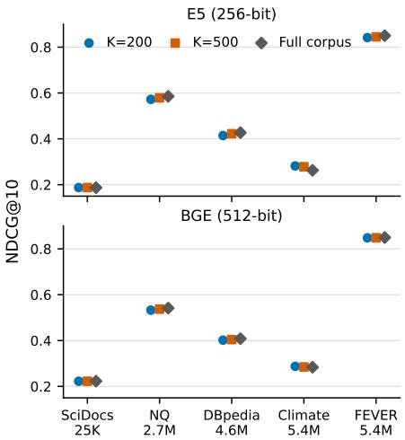
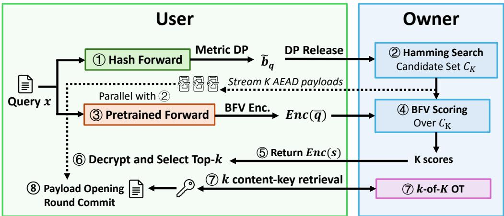
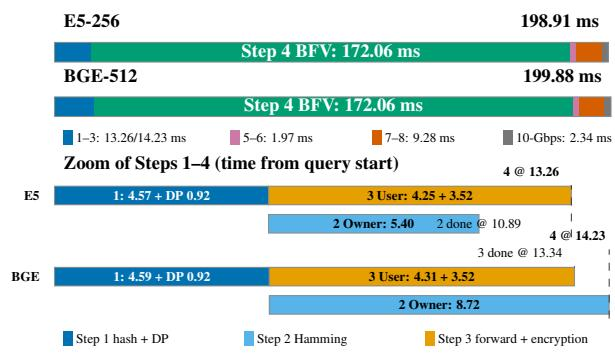
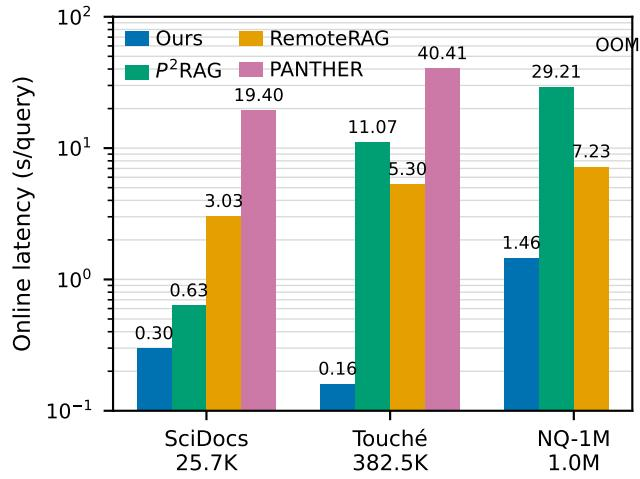
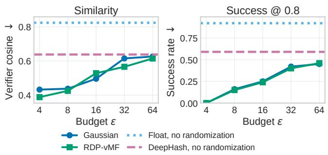
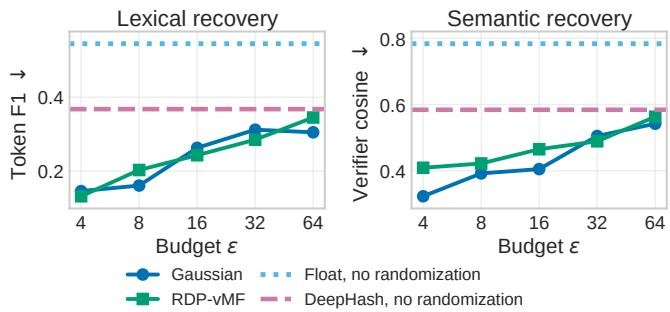
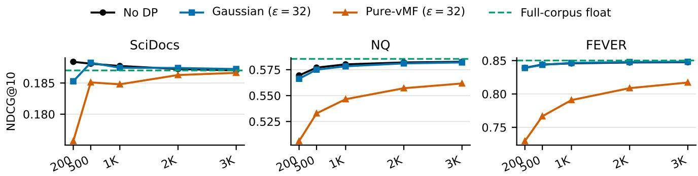
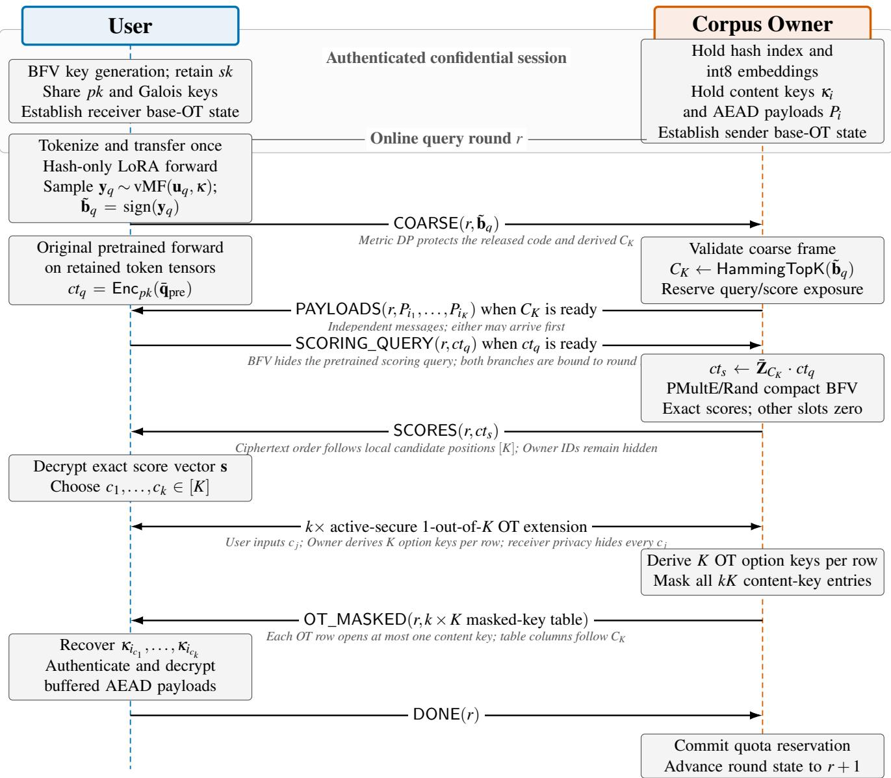

# Pointing the Way, Hiding the Destination: Practical Private Dense Retrieval at Scale

Peichun Hua1,2, Danyang Chen1, Junan Zhang1, Haifeng Sun3, Jingyu Wang3, Diwen Xue4, Mingyu Li5, Yunming Xiao1,2

1The Chinese University of Hong Kong, Shenzhen

2State Key Laboratory of Internet Architecture, Tsinghua University

3Beijing University of Posts and Telecommunications 4The Chinese University of Hong Kong 5Institute of Software, Chinese Academy of Sciences

## Abstract

Hosted retrieval-augmented generation (RAG) and semantic search allow users to query valuable provider-held corpora, raising two competing demands: to hide each query and chosen result, yet reveal only the documents that the user is authorized to receive. Existing cryptographic approaches either make this costly by processing the entire corpus for every query, or sacrifice quality for efficiency by scanning a few clusters. We repurpose learned deep hashing as a private filter: a randomized binary code points the provider to a short candidate list, while encrypted reranking and oblivious key transfer protect the precise query and final selection. This shortlist short-circuits full-corpus cryptographic search without sacrificing retrieval quality: with 200–500 candidates, it closely matches full-corpus retrieval across five zero-shot corpora spanning 25K to 5.4M documents. On the full 2.68M-passage NQ corpus over a 10-Gbps link, our protocol only adds 0.73 seconds, or 10%, to a 128-token Qwen3-32B RAG pipeline. The released code satisfies directional metric differential privacy (DP) and substantially reduces embedding-inversion and property-inference leakage, demonstrating that a carefully learned shortlist can make private dense retrieval both accurate and practical.

## 1 Introduction

The proliferation of Retrieval-Augmented Generation (RAG) has transformed large language models (LLMs) from static artifacts into dynamic, knowledge-grounded reasoning engines [25, 27, 47, 67]. At the core of RAG lies dense retrieval: mapping documents and queries into a high-dimensional vector space and searching via nearest neighbors. As organizations deploy RAG over sensitive corpora such as legal archives, medical records, and proprietary knowledge bases, both the document collection and user queries become sensitive assets [14, 62, 74, 88]. Recent embedding inversion attacks [12,35,49,61,73,90] have demonstrated that continuous embeddings are not opaque fingerprints, but rich, invertible semantic representations from which an adversary can reconstruct sensitive source text and infer private attributes.

Existing cryptographic approaches to private retrieval struggle to balance security with the scale and dimensionality of modern dense embeddings. Homomorphic encryption (HE) and multi-party computation (MPC) protocols [14, 48, 59] incur orders-of-magnitude of computational overhead, while ORAM-based methods [96] require multiple interactions and high user-side computation and storage [19]. Trusted execution environments (TEEs) avoid homomorphic scoring, while access-pattern [84] and microarchitectural leakage [6] remain.

This work. Our central design choice is to expose a coarse candidate pattern under directional metric differential privacy (mDP) [37] and reserve cryptographic computation for the resulting shortlist. An honest-but-curious Corpus Owner keeps its proprietary corpus with full-precision embeddings while additionally maintaining a lightweight binary index; an authorized User randomizes released hash codes that satisfy stringent mDP guarantees and encrypts the clean query representation. The resulting code makes the nearby query directions induce similar candidate-pattern distributions, making them hard to distinguish from one another and thereby protecting critical detailed privacy information (§3.3). The Owner performs a Hamming search on the corpus (N) and packed Brakerski–Fan–Vercauteren (BFV) homomorphic scoring over the resulting K candidates. The User decrypts the scores, selects locally, and uses active-secure k-out-of-K oblivious transfer (OT) to open at most k payloads without revealing its choices or accessing the other K k payloads.

Recovering retrieval quality under DP may require scoring K = 500–3,000 candidates, while a RAG request typically releases and bills only k = 3–10 documents. The gap between K and k makes OT central to this deployment model. Returning the shortlist would disclose hundreds of times more content; requesting the final documents directly would reveal the User’s selection. Instead, our k-out-of-K transfer binds each round to the billable result count, while authenticated accounts and cumulative quotas govern repeated extraction. In our model, we assume that the User might want to actively learn the payloads beyond its billed k per round and design our protocol to handle such threats (§6.4; Theorem 5).

Three empirical insights make our design highly practical. ❶ Candidate-set redundancy persists across scales and domains. A learned binary filter (Stage 1) needs only to preserve the documents that matter for the final ranking (Stage 2), while the ranking among the top documents is not critical. At K = 500, the two-stage pipeline (§5) retains 98.84%–100% of full-corpus NDCG@10 (ranking quality) across five zero-shot BEIR corpora [75] on both evaluated encoders. In particular, on Climate-FEVER with 5.4M documents, the shortlist excludes noisy high-scoring documents and raises NDCG@10 by 0.0012–0.0158. Even under DP protection, expanding the candidate pool up to 3,000 achieves a good balance between efficiency and search quality (§7.2.1). These corpora span scientific search, question answering, entity retrieval, and fact verification at scales from 25K to 5.4M documents (Figure 1), demonstrating strong generalizability of our approach.

❷ Dense embeddings contain substantial precision redundancy. We find that scalar int8 quantization preserves the pretrained ranking closely; our symmetric zero-point-free realization converts floating-point similarity into exact, lowdepth integer dot products. Without this precision reduction, private real-valued scoring relies on approximate-number HE such as CKKS [15], higher-precision fixed-point BFV [40], or interactive fixed-point MPC [60]; int8 enables exact packed BFV scoring with a small plaintext modulus while preserving high ranking quality.

❸ Model separation creates pipeline parallelism. We adopt low-rank adaptation (LoRA) fine-tuning [34] of pretrained encoders to create the learned hash models efficiently. This ensures that the hash codes can select a high-recall subset without incurring the storage and memory burden of an entirely new model. Our protocol implementation carefully overlaps the pretrained scoring forward and BFV query encryption with Owner-side Hamming shortlist construction, then streams the candidate ciphertexts while encrypted scoring and key transfer advance. This successfully hides the latency and makes our protocol efficient under different network bandwidths.

We investigate randomized response, Gaussian, Rényi-DPcalibrated von Mises–Fisher (RDP-vMF), and exactly calibrated pure-vMF mechanisms that achieve mDP, extensively evaluating their privacy–utility trade-offs through retrieval quality, representation attacks, protocol latency, and end-toend RAG. In summary, we make the following contributions:

1. A leakage-aware retrieval protocol and security contract that reveals a metric-DP candidate pattern, confines encrypted exact scoring to K candidates, protects the clean query against the Owner, and uses active-secure k-out-of-K OT to hide the final selection and bound payload recovery.

2. A learned candidate-filter design and training recipe that retrofits pretrained encoders via LoRA while preserving the original model as the Stage 2 scorer. It sustains near-lossless zero-shot retrieval across domains and corpus scales and improves over direct quantization, classical hashing, and supervised binary-retrieval baselines.

3. A directional randomization mechanism and analysis that gives the released shortlist code pure metric-DP protection, carries the guarantee through candidate generation by post-processing, and establishes its retrieval–privacy frontier against randomized response, Gaussian, and RDPvMF mechanisms and representation attacks.

4. A practical two-forward system realization that combines int8 quantization, shallow packed BFV, key-only OT, and pipeline overlap in a networked prototype, reducing cryptographic work from N documents to a high-recall shortlist while retaining efficient million-scale retrieval and end-to-end RAG.

## 2 Background and Related Work

## 2.1 Dense Retrieval and Learned Hashing

RAG grounds language-model generation in retrieved evidence [25, 27, 67]. Its scalable first stage is usually a biencoder such as DPR, SBERT, E5, or BGE [11, 41, 69, 78]: queries and documents are encoded independently, then compared by inner product or cosine similarity [69]. Crossencoders, instead, score query–document pairs jointly and are commonly reserved for reranking because their cost grows with the number of evaluated pairs [13, 16, 68].

Binary hashing compresses continuous representations into L-bit codes and replaces floating-point distance with XOR and popcount [56]. Classical methods include data-independent random-hyperplane, multi-probe, and cross-polytope LSH variants [2, 7, 57, 66], and data-dependent rotations such as

  
Figure 1: Cross-dataset quality of our pipeline. Each panel reports absolute Stage 2 NDCG@10 at K  200, 500 alongside full-corpus pretrained retrieval. The five BEIR corpora span 25K–5.4M documents and four retrieval domains.

ITQ and IsoHash [28, 43]. Deep models jointly learn the representation and code: earlier work emphasized image retrieval with pairwise or center-based objectives [51, 53, 79, 89, 95], ranking-aware hashing directly optimized tie-aware AP and NDCG in Hamming space [30], and recent objectives couple discrimination with quantization or adapt transformer encoders to text [31, 33, 65]. Instead of preserving embedding geometry and search quality, we use a learned code only as a high-recall first-stage filter and retain the continuous representation for exact candidate reranking. This division gives the Owner a lightweight coarse index while reducing private similarity evaluation from all N documents to K candidates.

## 2.2 Representation Privacy

Dense embeddings preserve enough lexical and semantic information to support generation-based, search-based, and property-inference attacks [12, 35, 49, 61, 73, 90]. Our design randomizes the normalized pre-binarization representation under metric DP [37, 83] and then deterministically binarizes it; the released code inherits the same privacy bound by postprocessing [23].

Dense retrievers normalize embeddings and rank them by cosine similarity, so their semantic neighborhoods lie nat urally on the unit sphere and are measured by angle. We therefore instantiate metric DP over nearby directions of the learned coarse representation [8, 22, 23].

Definition 1 ((ε, δ)-Directional Privacy). Let d be a metric on the unit sphere and let ${ \rho } > 0 .$ . A randomized mechanism M : $\mathbb { S } ^ { L - 1 } \to \bar { \mathcal { Y } }$ satisfies $( \varepsilon , \delta )$ -directional privacy at radius ρ if, for every $u , u ^ { \prime } \in \mathrm { \bar { S } } ^ { L - 1 }$ with ${ \boldsymbol { d } } ( u , u ^ { \prime } ) \leq \mathsf { \boldsymbol { \rho } }$ and every measurable $S \subseteq \mathcal { T }$

$$
\operatorname* { P r } [ \mathcal { M } ( u ) \in S ] \leq e ^ { \varepsilon } \operatorname* { P r } [ \mathcal { M } ( u ^ { \prime } ) \in S ] + \ S .\tag{1}
$$

This radius-bounded definition instantiates metric privacy [8,83] on normalized directions. We use angular distance $d _ { \Theta } ( u , u ^ { \prime } ) = \operatorname { a r c c o s } ( u ^ { \top } u ^ { \prime } )$ as the primary metric and chord distance $d _ { c } ( u , u ^ { \prime } ) = \lVert u - u ^ { \prime } \rVert _ { 2 } = 2 \sin ( d _ { \Theta } ( u , u ^ { \prime } ) / 2 )$ when deriving the vMF density-ratio bound. The radius defines a neighborhood in representation space; an empirical query-pair distance study can further calibrate that neighborhood to paraphrase or intent-level relations.

Prior private-hashing methods randomize discrete codes with randomized response or randomize data-independent LSH functions [19, 26, 81]. Deep hashing instead exposes the continuous pre-sign representation as a natural randomization point, preserving coordinate margins and directional geometry. Gaussian perturbation operates on bounded $h \in [ - \bar { 1 } , 1 ] ^ { L }$ under Euclidean adjacency [4], while von Mises–Fisher (vMF) perturbation operates on normalized $u = h / \| h \| _ { 2 }$ under angular or chordal adjacency [82]; binarization then preserves their guarantees by post-processing [23].

Randomized response treats every bit alike and must compose privacy across the complete code because nearby continuous vectors can cross many low-margin sign boundaries. At $L = 2 5 6$ and $( \mathfrak { E } = 1 6 , \delta = 1 0 ^ { - 6 } )$ , this calibration flips 46.1% of the bits and yields only 0.0306 mean NDCG@10 at $K = 3 0 0 0 .$ versus 0.5360 for Gaussian and 0.5367 for RDP-vMF (Table 5).

## 2.3 Private Retrieval across Deployments

The ownership and trust boundary define the private-retrieval problem in different scenarios [85]. Table 1 organizes prior systems into four deployment models.

In client-owned outsourcing, classical searchable encryption [9, 20, 72] and vector systems [19, 54, 96] protect a corpus owner who queries an untrusted cloud. For example, MESS [19] randomizes LSH codes, maintains 64 HNSW shards with each item routed to 16, and reranks the aggregated candidates at the client; this yields 16 indexed-record replication. Retrieving the original documents from the cloud additionally requires private information retrieval (PIR) [17, 77] to hide the access pattern.

In the public/shared-corpus model, Tiptoe, Wally, PAC-MANN, and Speakeasy protect the query without a corpusconfidentiality goal [3, 32, 45, 94]. For example, Tiptoe [32] combines clustering with linearly homomorphic search across 45 servers to operate vector search on web-scale corpus, but its single-cluster pruning for efficiency significantly impacts the search quality compared to normal embedding search. PAC-MANN [94] improves this quality–latency tradeoff through graph search and client-preprocessing PIR, but with 100 million vectors, each client downloads 59.6 GB during setup, stores 2.9 GB of state, and exchanges another 399.4 MB to maintain that state after every query.

In secret-shared outsourcing, PRAG and P2RAG protect distinct data owners and queriers by placing the database across MPC servers [59, 97]; PRAG assumes an honest majority, whereas $ { \mathbf { P } } ^ { 2 }  { \mathbf { R A G } }$ uses two semi-honest non-colluding servers and avoids secure sorting through interactive bisection, but requires full-corpus work and trusted-dealer preprocessing, the cost of which is excluded from its benchmark.

Our target is the fourth model, a provider-held proprietary corpus serving an external querier [10, 14, 50, 52, 71]. Pisces [52] combines an oblivious SimHash filter with MPC scoring and PIR-to-share, and adds a cryptographic BM25 path; our learned filter releases a directionally private shortlist and concentrates cryptography on exact candidate scoring and selected payloads. PANTHER [50] co-designs PIR, secret sharing, garbled circuits, and homomorphic encryption for strong single-provider protection, but its cluster-wise PIR representation scales with both vector dimensionality and the number of probes. Its evaluation targets 96- and 128- dimensional vision embeddings, whereas modern RAG commonly uses substantially wider text embeddings and demands enough probes to preserve near-lossless retrieval quality. In our evaluation (§7.3), PANTHER exceeds the memory limit of our server in a million-scale corpus. Within this model, our protocol keeps the corpus at a single provider for the owner, provides formal DP guarantees for the search pattern, cryptographically protects unselected corpus content from the user, and confines homomorphic scoring to the filtered candidates for efficiency and near-lossless quality.

## 3 Deployment and Threat Model

We target a proprietary corpus served directly by its Owner to an external authorized User. This section defines the two parties, states the information visible on each side, and introduces the attacks used to measure the released coarse code.

## 3.1 Parties and Trust Relations

Corpus Owner (Server). Holds the document collection, the binary hash index, the normalized embeddings used as plaintext HE operands, per-document content keys, and document payloads protected by authenticated encryption with associated data (AEAD). The Owner is honest-but-curious: it follows the prescribed computation and message schedule while attempting to infer query content, link queries, or profile Users from its protocol view. All server-side retrieval runs on Owner-controlled infrastructure.

User (Client). Holds a query, the agreed encoder and the hash model, the HE secret/public keys, and the DP parameters. The HE scoring guarantee applies to a conforming User that encrypts the prescribed bounded, canonically packed query; the active-secure OT guarantee additionally covers a malicious receiver attempting to recover more than k content keys.

## 3.2 Views, Leakage, and Assumptions

The protocol has four security goals. Metric DP protects the coarse query code released to the Owner, BFV semantic security protects the clean query from the Owner, ciphertextsimulatable BFV restricts a conforming User’s scoring view to the prescribed K exact scores, and active-secure OT hides the User’s selected positions while limiting payload-key recovery to k OT choices.

The Owner observes:

• Binary index $\{ \boldsymbol { \mathbf { b } } _ { d } \} _ { d \in [ N ] }$ and the resulting candidate set $C _ { K } ;$

• Metric-DP coarse query code $\tilde { \mathbf { b } } _ { q } ;$

• The HE ciphertext Enc(q¯ );

• The HE and sender-side OT transcripts;

• Authenticated identity, session and round identifiers, message lengths and timing, K, and the public result count k.

The Owner does not observe the User’s plaintext query, the decrypted similarity scores, or which specific k indices the User selected via OT.

The User observes:

• The K scalar similarity scores;

• The K AEAD payload ciphertexts and the $k \times K$ masked content-key table for the candidate set;

• At most k content keys and the corresponding plaintext document payloads.

Under conforming execution, the application gives the User candidate-local scores and selected payloads while keeping the binary index, explicit corpus embeddings, Owner document identifiers, and unselected content keys within the Owner process. The compact randomized-evaluation path makes the evaluated ciphertext simulatable from the query ciphertext, the K scores, and public metadata, so its other slots and coefficients add no corpus-embedding information beyond this explicit score oracle (§6.3).

The security model assumes an authenticated confidential transport, under which a network observer learns message lengths and timing. Our measurement harness uses versioned framed TCP to expose and measure these metadata costs; a deployment places the same frames and the OT connection inside authenticated encrypted channels.

Assumptions and scope. A trusted model-distribution step fixes the encoder, hash head, quantization parameters, and HE parameters shared by both parties. The HE scoring theorems apply to fresh symmetric BFV encryptions of bounded, canonically packed queries; the score quota governs cumulative exposure but does not establish consistency between the encrypted query and the coarse code. The guarantees assume uncompromised endpoints, authenticated identities, and authenticated confidential transport, with message lengths and timing treated as explicit leakage. They cover query privacy, exact and ciphertext-simulatable scoring for conforming inputs, and per-round payload access; Sybil resistance, availability, inference from the released exact scores, and malformedciphertext server privacy remain outside the model.

## 3.3 Empirical Privacy Attacks

We evaluate three attacks that recover text or sensitive attributes from an exposed representation. DP mechanism experiments target the released Stage 1 code, while the no-DP learned code and float embedding provide reference points.

Search-based inversion. ZSInvert [90] treats reconstruction as black-box optimization. Given a target representation $r ,$ an LLM proposes a beam of candidate texts, the target encoder maps each candidate to the same representation space, and similarity to r selects the next beam. The best candidate then seeds another refinement round. Float targets use cosine similarity, whereas binary targets use normalized hash similarity; the latter supplies only L + 1 distinct Hamming-similarity values. The output is the highest-scoring reconstructed text.

Generation-based inversion. GEIA [49] learns an embedding-conditioned autoregressive decoder from auxiliary text–representation pairs. A learned projection maps the target representation into the decoder input space, and teacherforced language-model training maximizes ∏t $p _ { \Phi } ( x _ { t } \mid x _ { < t } , r )$ At inference time, the trained decoder reconstructs each heldout target in one generation pass.

Table 1: Private retrieval systems grouped by corpus ownership, querier role, and trusted infrastructure.
<table><tr><td>Scheme</td><td>Search</td><td>Infra.</td><td>Query privacy</td><td>Content privacy</td><td>Pattern privacy</td><td>Near- lossless</td><td>Fast online</td><td>Index / auxiliary state</td></tr><tr><td colspan="9">Client-owned outsourcing—corpus owner is querier; cloud is adversary</td></tr><tr><td>CGKO06 [20]</td><td>Keyword</td><td>1S</td><td>√</td><td></td><td>x</td><td></td><td></td><td>Inverted index</td></tr><tr><td>CLRZ18 [9], SOPK21 [72]</td><td>Keyword</td><td>1S</td><td>√</td><td></td><td>DP</td><td>一</td><td></td><td>DP index</td></tr><tr><td>LZXL25 [54]</td><td>Graph</td><td>1S</td><td>△</td><td></td><td>x</td><td>△</td><td>√</td><td>Graph + 2 CT</td></tr><tr><td>Compass [96]</td><td>Graph</td><td>1S</td><td>√</td><td></td><td>√</td><td>√</td><td>△</td><td>3.2–6.8× server</td></tr><tr><td>MESS [19]</td><td>Multi-graph</td><td>1S</td><td>DP</td><td></td><td>DP</td><td>△</td><td>△</td><td>16× HNSW index</td></tr><tr><td colspan="9">Public/shared corpus—no corpus-confidentiality goal</td></tr><tr><td>Tiptoe [32]</td><td>k-means</td><td>45S</td><td>√</td><td></td><td>△</td><td>x</td><td>x</td><td>Cluster index</td></tr><tr><td>Wally [3]</td><td>k-means</td><td>Crowd</td><td>DP</td><td></td><td>DP</td><td>x</td><td>x</td><td>Cluster index</td></tr><tr><td>PACMANN [94]</td><td>Graph</td><td>1S+P</td><td>√</td><td>一</td><td>△</td><td>△</td><td>x</td><td>Graph + client hints</td></tr><tr><td colspan="9">Secret-shared outsourcing—distinct owner and querier</td></tr><tr><td>PRAG [97]</td><td>IVF</td><td>MPC</td><td>√</td><td>√</td><td>√</td><td>△</td><td>x</td><td>Database shares</td></tr><tr><td>P2RAG [59]</td><td>Full scan</td><td>2NC</td><td>√</td><td>△</td><td>√</td><td>√</td><td>x</td><td>Two DB shares</td></tr><tr><td colspan="9">Provider-held proprietary corpus—external querier</td></tr><tr><td>Pisces [52]</td><td>SimHash + BM25 1S</td><td></td><td>√</td><td>√</td><td>△</td><td>△</td><td>x</td><td>160N-CT + token OKVS</td></tr><tr><td>SANNS [10]</td><td>k-means</td><td>1S</td><td>√</td><td>√</td><td>√</td><td>△</td><td>x</td><td>DORAM</td></tr><tr><td>PANTHER [50]</td><td>k-means</td><td>1S</td><td>√</td><td>√</td><td>√</td><td>△</td><td>x</td><td>PIR + MPC</td></tr><tr><td>RemoteRAG [14]</td><td>ANN</td><td>1S</td><td>DP</td><td>△</td><td>DP</td><td>√</td><td>△</td><td>ANN index</td></tr><tr><td>Ours</td><td>Hash scan</td><td>1S</td><td>DP</td><td>√</td><td>DP</td><td>√</td><td>√</td><td>32 B/doc filter</td></tr></table>

Legend. ✓: cryptographic protection or full support; DP: formal differential privacy guarantee; : empirical or partial protection/support; ✗: unsupported; –: inapplicable. Query privacy protects the query text and clean embedding from the search service. Content privacy limits the querier’s plaintext payload recovery to its authorized results. Pattern privacy separately protects the service-visible retrieval trace: the search pattern reveals whether queries repeat, while the access pattern reveals which corpus items are touched or selected. Near-lossless denotes exact retrieval or at least 99% of the matched plaintext quality. Fast online denotes practical reported query-time latency at the evaluated scale; workloads and hardware differ. The final column reports each paper’s native search structure beyond the embeddings. Our 32 B/doc figure is the 256-bit coarse hash index. 1S: one server; 2NC: two non-colluding servers; CT: ciphertext representation; OKVS: oblivious key–value store; P: per-client, database-dependent PIR preprocessing.

Property inference. The attacker obtains an auxiliary set of representation–attribute pairs [73], trains a classifier to predict the attribute from the exposed representation, and applies the selected classifier to held-out victim representations. We evaluate topic, sentiment, and authorship because they span coarse semantic content, affect, and fine-grained source identity. This attack can succeed without reconstructing the original text.

Section 7.4 reports attack outcomes, and the experimental setup specifies the models, datasets, splits, search budgets, and metrics. Appendix B.3 records the remaining optimization details. These experiments isolate representation leakage; §3.2 separately accounts for candidate identities and crossround linkage in the Owner’s protocol view.

## 4 Deep Hash Learning

The learned hash encoder turns a pretrained dense retriever into a high-recall candidate filter, while the original pretrained encoder remains the Stage 2 scorer. We focus here on the model architecture and the training signals that make this separation effective; Appendix B.1 gives the exact losses, discretization schedule, and optimization parameters.

## 4.1 Motivation and Architecture

A key challenge in deep hashing is preserving zero-shot candidate recall after adapting a pretrained encoder to a discrete space [31]. For text x, our hash model applies a linear head to a LoRA-adapted encoder [34] and emits

$$
\mathbf { b } ( x ) = \mathrm { s i g n } ( W \operatorname { p o o l } ( E _ { \mathrm { L o R A } } ( x ) ) ) \in \{ - 1 , 1 \} ^ { L } .\tag{2}
$$

Here $W \in \mathbb { R } ^ { L \times d }$ , where d is the encoder hidden dimension and L is the code length. We use mean pooling and L = 256 for E5- base-v2 [78], and [CLS]-token pooling and $L = 5 1 2$ for BGEbase-en-v1.5 [11]. The linear head and compact LoRA update specialize the pretrained representation for Hamming candidate recall without training another backbone from scratch.

Candidate generation and scoring use separate model states. The adapted encoder and hash head produce only the coarse code, while the unchanged pretrained encoder supplies the continuous query and document embeddings used by Stage 2. This separation lets Stage 1 reshape its geometry for Hamming search without shifting the final dense ranking. Online, both forwards reuse tokenization and input transfer, and the pretrained scoring forward overlaps Owner-side Hamming search as described in §5.2.

## 4.2 Encoder Tuning

We train the hash model on MS MARCO query–passage supervision using three functional groups:

$$
\begin{array} { r } { \mathcal { L } = \mathcal { L } _ { \mathrm { r e t r i e v a l } } + \mathcal { L } _ { \mathrm { t r a n s f e r } } + \mathcal { L } _ { \mathrm { r e g u l a r i z a t i o n } } . } \end{array}\tag{3}
$$

Direct retrieval supervision brings relevant query–passage pairs together and pushes mined negatives away in the adapted continuous space; E5 additionally applies this supervision directly in Hamming space. Ranking transfer carries the adapted encoder’s ordering into the deployed Hamming space. The remaining regularizers anchor the adapted representation to the frozen pretrained geometry and keep examples well spread before binarization. Appendix B.1 defines every component of Equation 3 and reports its model-specific weight.

## 4.3 Hard-Negative Training

A hard negative is a non-relevant passage that remains deceptively close to the query, making it more informative than a random passage for learning the candidate boundary. We mine these examples only from the MS MARCO training corpus: a broad lexical retrieval stage finds plausible candidates, a stronger reranker orders them, and training samples from the highest-ranked non-relevant passages. The reranker also suppresses likely unlabeled positives so that ambiguous passages do not become contradictory supervision. This source-only procedure teaches the hash model to preserve fine distinctions without adapting to any evaluation corpus.

E5 and BGE each train for 16 epochs. Training moves progressively from a smooth representation to the binary codes used at deployment; Appendix B.1 specifies this schedule together with the mining models, sample counts, learning rates, and remaining hyperparameters.

## 5 DP-Filtered Private Dense Retrieval

We now describe the complete two-party protocol. Throughout, K denotes the candidate budget (the number of documents that receive HE scoring) and k denotes the final result count returned to the User.

## 5.1 Offline Setup

Owner setup. The Owner runs two document encoders offline. The LoRA-adapted hash encoder and linear hash head produce ${ \bf b } _ { i } \in \{ - 1 , 1 \} ^ { \bar { L } }$ for candidate generation, while the unchanged pretrained encoder produces the normalized scoring embedding $\mathbf { z } _ { i } \in \mathbb { R } ^ { d }$ . A shared symmetric quantizer with zero point 0 and scale $a = \operatorname* { m a x } _ { i , j } | z _ { i , j } | / 1 2 7$ maps the pretrained embeddings to $\{ - 1 2 7 , \ldots , 1 2 7 \} ^ { d } ;$ ; the symmetric range excludes 128 and bounds every integer dot product by $\bar { 1 } 2 7 ^ { 2 } d .$ The Owner stores:

• A flat binary index $\{ \mathbf { b } _ { i } \} _ { i = 1 } ^ { N }$ for Hamming-distance search;

• The quantized embeddings $\{ \bar { \mathbf { z } } _ { i } \} _ { i = 1 } ^ { N }$ as Owner-local plaintext HE operands;

• A random 128-bit content key $\kappa _ { i }$ and an AEAD ciphertext $P _ { i }$ for each document. The plaintext contains its true-length field and is zero-padded to a 4096-byte boundary before one-shot ChaCha20–Poly1305 encryption under a 256-bit key derived from κi with HKDF–SHA-256, so ciphertext length reveals only the padded block count.

User and session setup. For encrypted candidate scoring, we instantiate single-instruction multiple-data (SIMD) batched BFV for the quantized integer dot products [1, 24], packing multiple score lanes into each ciphertext. The User obtains the LoRA-merged hash encoder, hash head, original pretrained encoder, tokenizer, and quantizer. It generates the BFV secret/public keys and required Galois keys, retains the secret key, and sends only public and evaluation material to the Owner. An authenticated session binds an identity, layout, K, k, and monotone round counter. The two parties establish the base-OT correlation state once per long-lived OT connection; each query advances the extension state to derive fresh rows rather than repeating base OT.

## 5.2 Online Protocol

Figure 2 summarizes the eight online stages described below; Appendix D.1 provides the complete message sequence. For each query x, the following steps are executed:

1. Hash forward and DP release. The User tokenizes x once, transfers the retained token tensors to the GPU once, and first runs the LoRA-merged hash encoder. The hash head produces logits $\mathbf { z } _ { q } \in \mathbb { R } ^ { L } ;$ this path does not compute or return an unused continuous scoring vector. Then, using the final training scale β, the User computes the bounded pre-binarization vector $\mathbf { h } _ { q } ^ { \mathrm { s o f t } } = \operatorname { t a n h } ( \beta \mathbf { z } _ { q } )$ , normalizes it to $\mathbf { u } _ { q } = \mathbf { h } _ { q } ^ { \mathrm { s o f t } } / \lVert \mathbf { h } _ { q } ^ { \mathrm { s o f t } } \rVert _ { 2 }$ , samples $\mathbf { y } _ { q } \sim \mathbf { v } \mathbf { M F } ( \mathbf { u } _ { q } , \mathbf { \kappa } )$ with the pure calibration in Equation 7, and sends the round-bound coarse frame containing $\tilde { \mathbf { b } } _ { q } = \mathrm { s i g n } ( \mathbf { y } _ { q } )$

2. Hamming search and payload streaming. The Owner validates the received frame $\tilde { \mathbf { b } } _ { q }$ and starts Hamming search over $\{ \mathbf { b } _ { i } \} _ { i = 1 } ^ { N }$ . Once $C _ { K } = ( i _ { 1 } , \ldots , i _ { K } )$ is fixed, it atomically reserves the query and per-document score exposure and immediately streams the round-bound AEAD ciphertexts $( P _ { i _ { 1 } } , \ldots , P _ { i _ { K } } )$ in candidate order.

3. Concurrent pretrained forward and BFV encryption. While the Owner computes $C _ { K }$ , the User runs the unchanged pretrained encoder on the retained token tensors, producing $\mathbf { q } = \mathsf { N o r m a l i z e } ( E _ { \mathrm { p r e } } ( x ) )$ . The User quantizes q with the shared scale, encrypts it as Enc(q¯), and sends a separate scoring-query frame bound to the same session and round. Thus the serial prefix is the hash forward followed by max $\left\{ T _ { \mathrm { H a m m i n g } } , T _ { \mathrm { p r e } } + T _ { \mathrm { e n c } } \right\}$ , and payload transfer begins as soon as the Hamming branch produces $C _ { K }$

4. Packed BFV scoring. Once both $C _ { K }$ and Enc(q¯ ) are ready, the Owner gathers the pretrained quantized candidate matrix $\bar { \mathbf { Z } } _ { K }$ and computes $\mathsf { E n c } ( \mathbf { s } ) = \bar { \mathbf { Z } } _ { K } \mathsf { E n c } ( \bar { \mathbf { q } } )$ ) using plaintext– ciphertext multiplication and rotation-based sum reduction while payload streaming continues. At polynomial degree 8192, the segmented multi layout places eight candidates in 1024-slot segments per result ciphertext at multiplicative depth 1, while the deployed compact layout collects up to 8192 scores in one ciphertext and applies PMultE/Rand randomized evaluation [36]. This path clears non-score slots and makes the evaluated ciphertext simulatable from the prescribed scores while preserving exact integer outputs (§6.3); it requires neither ciphertext–ciphertext multiplication nor bootstrapping.

  
Figure 2: Online retrieval pipeline. Metric-DP Hamming shortlisting overlaps the pretrained scoring forward and query encryption. Once $C _ { K }$ is fixed, its AEAD ciphertexts stream during exact BFV scoring.

5. Encrypted-score return. The Owner returns the encrypted scores in the same local order as $C _ { K }$ . Candidate position $j \in [ K ]$ is the only selection coordinate exposed to the User; Owner document identifiers are never transmitted.

6. Decrypt and select top-k. The User decrypts the exact integer score vector s and chooses local positions $c _ { 1 } , \ldots , c _ { k } \in [ K ]$

7. Active-secure k-out-of-K key retrieval. The parties execute a batch of k active-secure 1-out-of-K Orrù–Orsini– Scholl (OOS) OT-extension transfers [64], one for each $c _ { j } .$ The receiver obtains one 128-bit OT key per row, while the sender derives K option keys per row and masks every candidate content key in a $k \times K$ table. The Owner sends this masked-key table after OT; row j and column $c _ { j }$ reveal $\kappa _ { i _ { c } _ { j } }$ to the User, which opens the corresponding buffered payload. The OT structure limits a malicious receiver to at most one content key per row and hides each $c _ { j }$ from the Owner.

8. Payload opening and round commit. After authenticating and decrypting the selected AEAD payloads, the User sends a round-bound completion frame and the Owner commits the quota reservation. Any protocol or maliciouscheck failure poisons the affected daemon state and releases an uncommitted reservation.

## 5.3 Design Rationale

Metric DP. Hamming search requires the Owner to receive a coarse query code, which exposes the query’s neighborhood and creates matching, property-inference, and linkability channels. Metric DP gives this released code a distance-calibrated indistinguishability guarantee while preserving efficient plaintext filtering.

Single-release utility recovery. MESS [19] recovers recall after discrete randomized response through 64 HNSW shards with separately trained IsoHash mappings, routing each item to 16 shards and searching every shard for candidates. This raises a relevant item’s recovery probability to $1 - \left( 1 - P _ { \mathrm { h i t } } \right) ^ { 1 6 }$ however, the hash codes appearing in 16 releases also compose privacy leakage across shards, leading to extremely large ε and almost null formal guarantee. Our learned filter, instead, releases one metric-DP code and recovers utility by enlarging K, leading to a good balance between privacy, efficiency, and search quality.

Table 2 gives an operational view of this coarse release. The closest DP-Hamming codes match isolated cues such as London, poppies, or tower without identifying the requested fact. The answer-bearing passage appears only at Hamming rank 1,439; encrypted clean-query scoring promotes it to rank 5, inside the User’s hidden k = 10 selection. The large candidate set therefore preserves the answer while separating coarse code proximity from precise semantic relevance. Appendix B.2 presents three additional queries spanning factual counts, locations, and calendar rules.

Shallow HE. The scoring stage is a plaintext–ciphertext matrix–vector multiplication over pre-normalized vectors. Our exact-integer BFV path uses SIMD multiplication and rotation-based reduction at depth 1 in the multi layout or depth 2 in the communication-oriented compact layout. Local decryption handles top-k, eliminating encrypted comparison, ciphertext–ciphertext multiplication, and bootstrapping. The deployed compact path also clears non-output slots and randomizes evaluation according to ciphertext-simulatable BFV [36]: BFV hides the query from the Owner, while the randomized output reveals no Owner operand information to a conforming secret-key User beyond the K prescribed scores.

Table 2: One NQ query (test1054) under the E5 pure-vMF operating point $( \varepsilon = 6 4 , K = 3 0 0 0 , k = 1 0 , 2 5 6 \mathrm { b i t s } )$ . The DP-Hamming neighbors expose a broad mixture of query cues; Stage 2 recovers the answer-bearing passage.
<table><tr><td>View</td><td>Rank  $/ d _ { H }$ </td><td>Text excerpt</td></tr><tr><td>Target</td><td></td><td>Who made the poppies at Tower of Lon- don?</td></tr><tr><td>DP-Ham.</td><td>1/65</td><td>10 Downing Street: “The terrace and garden were constructed in  $1 7 3 6 \dots ^ { \mathrm { ~ , ~ } }$ </td></tr><tr><td>DP-Ham.</td><td>2/69</td><td>Anzac Day: “Paper poppies are widely distributed ...&quot;</td></tr><tr><td>DP-Ham.</td><td>3/70</td><td>Eiffel Tower: &quot;26 December 1888: Con- struction of the upper stage.&quot;</td></tr><tr><td>Stage 2</td><td>1439→5  / 88</td><td>Blood Swept Lands and Seas of Red: “The artist was Paul Cummins, with set- ting by stage designer Tom Piper.&quot;</td></tr></table>

Key-only OT. Returning all $K$ documents would disclose the full candidate payload set, whereas transferring full docu ments inside OT would make the active-secure OT payload proportional to document size. The protocol therefore sends fixed-size 128-bit content keys through k 1-out-of-K choices and delivers AEAD ciphertexts on the ordinary channel. This composition keeps OT small, hides the selected positions from the Owner, and caps payload decryption at k choices; authenticated quotas separately govern the deliberately released score vector.

Owner-local execution. The Owner already holds the corpus and can retain the binary index on its own infrastructure. The index occupies NL/8 bytes (e.g., 283 MB for N=8.84M at L=256), allowing the Hamming scan and HE scoring to run without a query-processing intermediary.

## 6 Security Contract and Protocol Guarantees

This section establishes the protocol’s four guarantees. Views (§6.1) defines the information released to each party. Query privacy (§6.2) proves metric privacy of the candidate pattern and computational privacy of the Owner’s complete view. Scoring privacy (§6.3) proves exact BFV scores and ciphertext simulatability for a conforming User. Payload access (§6.4) formalizes the score oracle and the k-payload bound.

## 6.1 Explicit Per-Party Views

For one round, the Owner’s explicit leakage is

$$
\begin{array} { r } { \mathcal { L } _ { O } = ( \mathsf { i d } , \mathsf { s e s s i o n } , \mathsf { r o u n d } , K , k , \mathsf { l a y o u t } , \mathsf { l e n g t h s } , } \\ { \mathsf { t i m i n g } , \tilde { b } _ { q } , C _ { K } , \mathsf { a c c e p t / r e j e c t } ) . \qquad } \end{array}\tag{4}
$$

Adjacent executions fix all fields in Equation 4 except the DP output $( \tilde { b } _ { q } , C _ { K } , \mathsf { a c c e p t / r e j e c t } )$ . Theorem 2 accounts computa-

tionally for the BFV and OT transcripts in the real view.

The application-level disclosure to a conforming User is

$$
\mathcal { L } _ { U } ^ { \mathrm { t a r g e t } } = ( K , { \bf s } , \{ | P _ { i } | : i \in C _ { K } \} , \{ D _ { i } : i \in S , | S | \le k \} , \mathsf { l i n k a g e } ) ,\tag{5}
$$

Here s is the candidate-local score vector, $P _ { i }$ is a padded payload ciphertext, and linkage records equality of recurring ciphertexts. Theorems 4 and 5 realize Equation 5 for HE scoring and payload recovery, respectively.

## 6.2 Directional Candidate Privacy and Query Privacy

For query x, let $h ( x ) = \operatorname { t a n h } ( \beta z ( x ) ) \in [ - 1 , 1 ] ^ { L }$ and $u ( x ) =$ $h ( x ) / \| h ( x ) \| _ { 2 } \in \mathbb { S } ^ { L - 1 }$ . Given u, the mechanism samples $Y \sim$ $\mathbf { v M F } ( u , \kappa )$ , whose density is $p _ { u } ( y ) = C _ { L } ( \boldsymbol { \kappa } ) \exp ( \boldsymbol { \kappa } \boldsymbol { u } ^ { \top } \boldsymbol { y } )$ , and releases $M _ { \mathrm { K } } ( u ) = \mathrm { s i g n } ( Y )$

Theorem 1 (Pure directional metric privacy). For every $\mathbf { \boldsymbol { \kappa } } \geq 0 ,$ every $u , u ^ { \prime } \in \mathbb { S } ^ { L - 1 }$ , and every output event S,

$$
\operatorname* { P r } [ M _ { \kappa } ( u ) \in S ] \leq \exp \left( \kappa d _ { c } ( u , u ^ { \prime } ) \right) \operatorname* { P r } [ M _ { \kappa } ( u ^ { \prime } ) \in S ] .\tag{6}
$$

Consequently,for angular radius $\rho \in ( 0 , \pi ]$ , choosing

$$
\kappa = \frac { \varepsilon } { 2 \sin ( \rho / 2 ) }\tag{7}
$$

gives (ε, 0)-directional privacy within that radius.

Proof. The vMF normalizer is independent of its mean direction, so for every y, log $( p _ { u } ( y ) / p _ { u ^ { \prime } } ( y ) ) = \boldsymbol { \kappa } ( u - u ^ { \prime } ) ^ { \top } \boldsymbol { y } \leq$ $\kappa \| u - u ^ { \prime } \| _ { 2 }$ . Integration gives the bound for Y, and sign binarization preserves it by post-processing. Finally, $d _ { c } ( u , u ^ { \prime } ) =$ 2sin $( d _ { \Theta } ( u , u ^ { \prime } ) / 2 ) \le 2 \sin ( \mathsf { p } / 2 )$ inside the angular radius.

Equation 6 is the global metric-DP guarantee under chordal distance [8]; Equation 7 is its angular-radius corollary.

Theorem 2 (Computational directional privacy of the Owner view). Suppose a conforming User generates the coarse and encrypted queries, BFV is indistinguishable under chosenplaintext attack (IND-CPA), OT is receiver-private against its sender, and adjacent executions have identical auxiliary fields in Equation 4. For every probabilistic polynomial-time (PPT) distinguisher A and $\boldsymbol { \eta } = \kappa d _ { c } ( \boldsymbol { u } , \boldsymbol { u } ^ { \prime } )$ such that eη is polynomially bounded in the security parameter,

$$
\operatorname* { P r } [ A ( \mathsf { V i e w } _ { O } ( x ) ) = 1 ] \leq e ^ { \mathsf { \Pi } } \operatorname* { P r } [ A ( \mathsf { V i e w } _ { O } ( x ^ { \prime } ) ) = 1 ] + \mathsf { n e g l } ( \lambda ) .\tag{8}
$$

Proof sketch. Receiver privacy simulates the choicedependent OT messages, and BFV IND-CPA replaces the clean-query ciphertext by an encryption of zero. The residual view is $( M _ { \kappa } ( u ) , C _ { K } , \mathsf { a c c e p t / r e j e c t } )$ , where the last two components are post-processing. Theorem 1 supplies the factor $e ^ { \mathfrak { \eta } } ;$ polynomially bounded $e ^ { \mathfrak { n } }$ absorbs the hybrid losses into negl(λ). □

For T adaptive releases, sequential composition replaces η in Equation 8 by $\begin{array} { r } { \boldsymbol { \eta } _ { T } = \mathbf { \kappa } \sum _ { t = 1 } ^ { T } d _ { c } ( u _ { t } , u _ { t } ^ { \prime } ) } \end{array}$ , conditioned on the fixed auxiliary leakage.

## 6.3 Exact Scoring and HE Privacy Scope

Let the canonically packed query q¯ and every candidate $\bar { \bf z } _ { i }$ lie in $[ - B , B ] ^ { d }$

Lemma 3 (Exact integer scoring). If BFV decryption succeedsfor the configured circuit and

$$
t > 2 d B ^ { 2 } ,\tag{9}
$$

every decoded anchor equals $\begin{array} { r } { s _ { i } = \sum _ { j = 1 } ^ { d } \bar { z } _ { i j } \bar { q } _ { j } \in \mathbb { Z } . } \end{array}$

Proof. Since $\vert s _ { i } \vert \le d B ^ { 2 } < t / 2$ , centered reduction modulo t is injective on every possible score. Appendix A.3 proves that both layouts place this residue at each decoded anchor.

The deployed $B = 1 2 7 , d = 7 6 8$ , and $t > 2 4 , 7 7 4$ ,144 satisfy Equation 9; BFV noise correctness remains an independent decryption condition.

BFV IND-CPA hides q¯ from the Owner. To hide the Owner’s plaintext operands from the decrypting User, the compact path instantiates ciphertext-simulatable BFV [36]. Write $R _ { t } = \mathbb { Z } _ { t } [ X ] / ( X ^ { n } + 1 )$ , identify ring elements with coefficient vectors, and let $D _ { \Lambda , \sigma }$ denote the discrete Gaussian on lattice coset Λ. For $\mu \in R _ { t }$ , it samples $\widehat { \mu }  D _ { \mu + t \mathbb { Z } ^ { n } , \mathfrak { O } }$ and evaluates

$$
\begin{array} { c } { { \mathsf { P M u l t E } } ( c t , \mu ) = c t \cdot \widehat { \mu } + ( e , 0 ) , } \\ { { \mathsf { R a n d } } ( p k ) = e _ { 2 } p k + ( e _ { 0 } , e _ { 1 } ) , } \end{array}\tag{10}
$$

where $e \gets \lfloor D _ { \mathbb { R } ^ { n } , \tau } \rceil , e _ { 1 } , e _ { 2 } \gets D _ { \mathbb { Z } ^ { n } , \sigma _ { r } }$ , and $e _ { 0 } \gets \lfloor D _ { \mathbb { R } ^ { n } , \tau _ { r } } \rceil$ . One Rand(pk) precedes the public linear rotation–mask–addition subcircuit; the compact mask leaves s in its canonical slots and zero elsewhere.

Theorem 4 (HE server-input privacy for conforming Users). Let $c t _ { q }$ be a fresh symmetric BFV encryption of a bounded, canonically packed query, and let the randomized-evaluation parameters satisfy the correctness and smoothing conditions of ciphertext-simulatable BFV [36]. Under the corresponding ring-learning-with-errors (RLWE) assumption, the compact scoring view of a conforming secret-key User is computationally simulatable as

$$
\mathsf { V i e w } _ { U } ^ { \mathrm { H E } } \approx _ { c } \mathsf { S i m } ( p k , s k , c t _ { q } , \mathsf { s } , \mathsf { m e t a d a t a } ) ,\tag{11}
$$

where s contains the prescribed K exact scores. Consequently, the evaluated ciphertext coefficients and all non-score slots reveal no information about the candidate embeddings beyond s and public metadata.

Proofsketch. PMultE error simulatability and Rand masking replace each group ciphertext by one generated from $c t _ { q }$ and its group scores [36]. Applying the public linear subcircuit preserves indistinguishability, and a hybrid over groups yields Equation 11 because the final plaintext is Encode $( \mathbf { s } , 0 , \ldots , 0 )$

Appendix D.2 specifies the samplers and BFV parameters. The theorem assumes a fresh symmetric, canonical query ciphertext; malformed ciphertexts require a well-formedness proof. The scores s remain explicit leakage.

## 6.4 Exact-Score Exposure and Payload Access

The score oracle and quota ledger satisfy

$$
\begin{array} { r l } & { \log _ { 2 } | \operatorname { s u p p } ( \mathbf { s } ) | \leq K \log _ { 2 } ( 2 d B ^ { 2 } + 1 ) , } \\ & { \qquad r _ { i } \leq R \Longrightarrow \operatorname { r a n k } ( Q _ { i } ) \leq \operatorname* { m i n } \{ R , d \} , } \end{array}\tag{12}
$$

where $\mathbf { s } _ { i } = Q _ { i } \bar { \mathbf { z } } _ { i }$ contains the ri scores released for document i. The first bound grows linearly with $K ;$ the second counts linear observations but does not bound inference from representation priors. Authentication is required because Sybil identities reset R.

Theorem 5 (Per-round payload-key bound). Assume the OOS extension realizes active-secure 1-out-of-K OTfor each ofk rows [64], the OT-key mask is pseudorandom, content keys are independent, and the payload cipher is authenticated encryp tion. Except with negligible probability, a malicious receiver completing one accepted round recovers at most k distinct candidate content keys and therefore at most k distinct candidate payloads, independently of K.

Proof sketch. Active receiver security reveals at most one option key per row. Pseudorandom masking hides every unchosen content key, and authenticated-encryption confidentiality hides its payload; summing over k rows proves the bound.

Across T accepted rounds, the payload bound composes to $T k ;$ corpus enumeration remains possible if the accepted selections eventually cover it. Scores, padded lengths, stableciphertext linkage, and cross-round inference remain explicit leakage. Thus increasing K enlarges Equation 12 but not the per-round payload cap.

## 7 Evaluation

Our evaluation asks four questions: whether the learned filter outperforms classical alternatives while preserving retrieval across models, domains, and corpus scales; whether the result ing evidence supports end-to-end RAG quality; how shortlist size and two-forward overlap determine protocol cost; and how privacy calibration and candidate budget jointly determine retrieval quality and representation exposure.

Table 3: Two-forward retrieval on five BEIR corpora spanning 25K–5.4M documents. Stage 1 uses the learned hash model; Stage 2 reranks its candidates with the original pretrained encoder. Pretr. Fl. is matched full-corpus retrieval, and each ∆@K is Stage 2@K minus Pretr. Fl.
<table><tr><td></td><td></td><td></td><td colspan="2">Stage 1: Bin. Recall@ K</td><td colspan="5">Stage 2: NDCG@10</td></tr><tr><td>Model</td><td>Dataset</td><td>Docs</td><td>K=200</td><td>K=500</td><td>S2@200</td><td>S2@500</td><td>Pretr. Fl.</td><td>∆@200</td><td>∆@500</td></tr><tr><td>E5-base-v2</td><td>SciDocs</td><td>25K</td><td>.4331</td><td>.5469</td><td>.1875</td><td>.1874</td><td>.1870</td><td>+.0005</td><td>+.0004</td></tr><tr><td>(256-bit)</td><td>NQ</td><td>2.7M</td><td>.8884</td><td>.9271</td><td>.5723</td><td>.5787</td><td>.5854</td><td>-.0132</td><td>-.0068</td></tr><tr><td></td><td>DBpedia-Entity</td><td>4.6M</td><td>.4549</td><td>.5474</td><td>.4144</td><td>.4224</td><td>.4271</td><td>-.0127</td><td>-.0047</td></tr><tr><td></td><td>Climate-FEVER</td><td>5.4M</td><td>.5300</td><td>.6154</td><td>.2818</td><td>.2785</td><td>.2627</td><td>+.0192</td><td>+.0158</td></tr><tr><td></td><td>FEVER</td><td>5.4M</td><td>.9368</td><td>.9484</td><td>.8417</td><td>.8451</td><td>.8501</td><td>-.0084</td><td>-.0050</td></tr><tr><td>BGE-base</td><td>SciDocs</td><td>25K</td><td>.5211</td><td>.6467</td><td>.2224</td><td>.2225</td><td>.2228</td><td>-.0004</td><td>-.0003</td></tr><tr><td>(512-bit)</td><td>NQ</td><td>2.7M</td><td>.8923</td><td>.9349</td><td>.5326</td><td>.5372</td><td>.5414</td><td>-.0088</td><td>-.0042</td></tr><tr><td></td><td>DBpedia-Entity</td><td>4.6M</td><td>.4764</td><td>.5679</td><td>.4018</td><td>.4041</td><td>.4081</td><td>-.0063</td><td>-.0040</td></tr><tr><td></td><td>Climate-FEVER</td><td>5.4M</td><td>.5935</td><td>.6774</td><td>.2874</td><td>.2848</td><td>.2836</td><td>+.0038</td><td>+.0012</td></tr><tr><td></td><td>FEVER</td><td>5.4M</td><td>.9429</td><td>.9517</td><td>.8480</td><td>.8483</td><td>.8495</td><td>-.0015</td><td>-.0012</td></tr></table>

## 7.1 Experimental Setup

Encoder, Datasets, and Metrics. We train E5-base-v2 [78] and BGE-base-en-v1.5 [11] hash models on MS MARCO passage ranking [63] and evaluate zero-shot transfer on five BEIR corpora [75]: SciDocs [18], Natural Questions (NQ) [44], DBpedia-Entity [29], Climate-FEVER [21], and FEVER [76], following the standard BEIR zero-shot protocol. The cor pora span from 25,657 to 5.4M documents. E5-base-v2 uses 256-bit codes, and BGE-base-en-v1.5 uses 512-bit codes. Stage 1 reports Recall@K over the relevance judgments for the learned Hamming filter; Stage 2 reranks exactly those candidates with the unchanged pretrained encoder and reports NDCG@10. Full-corpus retrieval with the same pretrained encoder is presented as a reference. Appendix B.1 gives the detailed training recipe and hyperparameters.

Representation Exposure. Search-based inversion evaluates the embedding-guided search stages of ZSInvert [90] on 100 randomly sampled MS MARCO documents. Llama-3.1-8B-Instruct [55] generates a width-50 beam for six search rounds, scored by float cosine or normalized hash similarity; we report mean verifier cosine and attack success at cosine 0.8. Generation-based inversion trains a GEIA [49] DialoGPTmedium [93] decoder on PersonaChat [91] for 10 epochs and reports token F1 and verifier cosine on held-out passages. Following the property-inference threat model of Song and Raghunathan [73], we evaluate AG News topic [92], IMDB sentiment [58], and 50-way 20 Newsgroups authorship [46] labels. Five stratified 60/20/20 splits separate attacker training, model selection, and victim testing; validation macro F1 selects the best model among logistic regression, a two-layer MLP, and LightGBM [42], and we report victim-test macro F1 averaged across the five splits. Appendix B.3 gives the complete attack flow, decoding limits, optimization hyperparameters, and preprocessing.

Following metric- and directional-DP evaluation conventions [8, 82], we report each operating point by its protected space, radius, and (ε,δ) parameters. Definition 1 defines the generic radius ρ; here, we denote $\rho _ { h }$ to be the Euclidean radius on the bounded pre-sign vector, and $\rho _ { \theta }$ to be the angular radius on its normalized direction. The RDP-vMF comparison maps $\rho _ { h } = 2 \mathrm { ~ t o ~ } \rho _ { \theta } = 2 \arcsin ( 1 / \sqrt { L } )$ . The retrieval sweeps and property-inference table use $\mathfrak { E } \in \{ 8 , 1 6 , 3 2 , 6 4 \}$ at $\rho _ { h } = 2 ;$ the inversion sweeps additionally include tighter budgets and the ${ \rho } _ { h } = 6 . 3 2$ setting. Following standard approximate-DP calibration [23], Gaussian and RDP-vMF set $\delta = 1 0 ^ { - 6 }$ , below the inverse of every evaluated query-set size, while purevMF provides $\delta = 0$ . The randomized attack plots use the same calibrated mechanisms as the retrieval comparison, and Theorem 1 gives the angular calibration for the protocol’s pure-vMF release.

## 7.2 Retrieval Quality

## 7.2.1 Main Retrieval Results

A concise shortlist preserves quality and may prune distractors. Table 3 evaluates the deployed two-forward path at $K \in \{ 2 0 0 , 5 0 0 \}$ . Recall@K measures how much judged-relevant material survives the learned filter; Stage 2 NDCG@10 measures the ranking obtained when the original pretrained model scores only those candidates. The fullcorpus column uses the same scorer, and ∆@200 and ∆@500 isolate the candidate filtering capability of the hash model.

At $K = 5 0 0 ,$ , both encoders retain 98.84–100.21% of fullcorpus NDCG@10 on SciDocs, NQ, DBpedia-Entity, and FEVER. On Climate-FEVER, the shortlist even improves NDCG@10 by 0.0158 for E5 and 0.0012 for BGE. We hypothesize that the learned filter can act as a coarse semantic denoiser that removes spurious high-scoring distractors that Stage 2 would otherwise place ahead of relevant ones.

We observe only a slight increase in NDCG@10 (0.0064 and 0.0080, respectively) as K increases from 200 to 500, while several easier pairs are already saturated at $K = 2 0 0$ We therefore report both budgets here and benchmark latency through $K = 3 0 0 0 .$ , leaving larger candidate pools available for the differential-privacy operating points evaluated next.

Table 4: E5 candidate-filter baselines averaged over the five corpora in Table 3. Every method uses exact Hamming Stage 1 and the same pretrained E5 Stage 2 scorer. Direct sign uses 768 embedding coordinates; remaining methods use 256 bits.
<table><tr><td></td><td colspan="2">Recall@K</td><td colspan="2">NDCG@10</td></tr><tr><td>Method</td><td>K = 200</td><td> $K = 5 0 0$ </td><td> $K = 2 0 0$ </td><td> $K = 5 0 0$ </td></tr><tr><td>Direct sign (768b)</td><td>.5046</td><td>.5669</td><td>.4183</td><td>.4338</td></tr><tr><td>Random-hyperplane LSH [7]</td><td>.3068</td><td>.3743</td><td>.2893</td><td>.3283</td></tr><tr><td>Super-Bit LSH [39]</td><td>.3257</td><td>.3916</td><td>.3008</td><td>.3366</td></tr><tr><td>PCA-sign</td><td>.5802</td><td>.6398</td><td>.4469</td><td>.4534</td></tr><tr><td>ITQ [28]</td><td>.6080</td><td>.6789</td><td>.4494</td><td>.4562</td></tr><tr><td>IsoHash [43]</td><td>.6098</td><td>.6786</td><td>.4520</td><td>.4573</td></tr><tr><td>BPR† [86]</td><td>.6125</td><td>.6813</td><td>.4473</td><td>.4540</td></tr><tr><td>Learned filter (ours)</td><td>.6486</td><td>.7170</td><td>.4595</td><td>.4624</td></tr></table>

†For a fair comparison, we manually reimplement BPR using the same E5 representation, 256-bit budget, MS MARCO training data, symmetric Hamming candidate search, and evaluation pipeline as our method.

The learned filter outperforms classical and supervised hashing baselines. Table 4 organizes candidate filters by the information used to construct their codes. Direct sign is a parameter-free, one-bit quantization of each pretrained coordinate. Data-independent LSH comprises random-hyperplane LSH [7] and Super-Bit LSH [39], which orthogonalizes the random projections. Unsupervised data-dependent hashing includes PCA-sign and the learned rotations of ITQ [28] and IsoHash [43]; we fit each transformation on MS MARCO passage embeddings and transfer it across corpora. BPR [86] represents a recent supervised learning-to-hash method through a pairwise ranking objective, while our filter jointly adapts the encoder and hash head with retrieval and ranking supervision.

Table 4 isolates candidate-filter quality by holding exact Hamming search and the pretrained Stage 2 scorer fixed. Our filter improves mean Recall@500 by 0.0357 and mean Stage 2 NDCG@10 by 0.0084 over BPR; it also improves mean Stage 2 NDCG@10 by 0.0051 over the strongest unsupervised baseline. The full-precision scorer can repair ordering only among documents retained by Stage 1, making candidate recall the more direct measure of hash quality.

## 7.2.2 Retrieval under Differential Privacy

Following the comparison methodology of Biswas et al. [5], we evaluate randomized response, analytic Gaussian, and RDP-vMF at common $( \mathfrak { E } , \delta = 1 0 ^ { - 6 } )$ targets and the protocol’s formal pure-vMF mechanism under pure metric DP. Randomized response composes privacy across the full binary code; RDP-vMF calibrates its Rényi-divergence curve at the angular boundary defined above; Gaussian calibrates its analytic profile to Euclidean radius $\rho _ { h } = 2$ on the bounded pre-sign representation. Pure-vMF uses the exact directional calibration in Theorem 1.

Continuous randomization preserves retrieval quality. Table 5 reports randomized response at $K = 3 0 0 0$ and selects the continuous mechanisms’ smallest evaluated K that reaches approximately 99% retention at ε = 16 or 64, while retaining the $K = 3 0 0 0$ endpoints at tighter budgets. RDP-vMF reaches 99.2% at $K = 1 0 0 0$ , Gaussian reaches 99.2% at $K = 2 0 0 0$ and formal pure-vMF reaches 99.4% at $K = 2 0 0 0$ . With 128- token Qwen3-32B generation [87], their absolute protection costs are 0.37, 0.73, and 0.73 seconds (9.97% of the plaintext pipeline); the $K = 3 0 0 0$ endpoint adds at most 1.10 seconds. The per-dataset K curves and complete E5 and BGE sweeps appear in Appendix C.

## 7.2.3 End-to-End RAG Quality

Protected retrieval preserves end-to-end RAG quality. We evaluate 500 Natural Questions queries over the full 2.68Mpassage BEIR corpus [75]. The E5 scorer supplies the top five passages to Qwen3-32B, which returns a short answer under greedy decoding; exact match and token F1 use the NQ-Open answer aliases. Table 6 shows that every two-forward operating point remains within 0.2 EM and 0.20 F1 of full-corpus float retrieval. Pure-vMF at $( \mathfrak { E } = 6 4 , K = 3 0 0 0 )$ reaches 50.0 EM and 62.89 F1, compared with 50.0 and 63.09 for the float reference. Appendix C.1 evaluates client-side cross-encoder reranking of the authorized payloads.

## 7.3 Efficiency Evaluation

We evaluate four sources of systems cost: the two-forward pipeline, candidate-set scaling, complete RAG latency, and the online latency relative to prior private-retrieval systems. Appendices D.2 and D.3 give the implementation and measurement details.

Pipeline overlap absorbs almost all two-forward overhead. We measure the complete online path on SciDocs $( N = 2 5 , 6 5 7 , d = 7 6 8 , k = 1 0 , K = 5 0 0 )$ over a 10-Gbps link, spanning shared tokenization, dual BF16 encoder forward passes, randomized compact BFV scoring, active-secure OT, and final payload decryption. The two encoders reuse the same token tensors, and the first forward computes only the hash logits. Model-stage and cryptographic results are means over 50 queries. Figure 3 expands Steps 1–4 of the online protocol (§5.2). After Step 1 sends the coarse frame, Owner-side Hamming search (Step 2) and the User’s pretrained forward plus BFV encryption (Step 3) run concurrently. For E5, Step 2 finishes at 10.89 ms and starts payload streaming before Step 3 finishes at 13.26 ms, so Step 4 waits for Step 3. For BGE, Step 3 finishes at 13.34 ms before Step 2 fixes $C _ { K }$ at 14.23 ms, so Step 4 instead waits for Step 2. The complete paths take 198.91 and 199.88 ms, respectively.

Table 5: Representative two-forward DP operating points. NDCG@10 averages E5 and BGE on SciDocs, NQ, and FEVER. RAG latency uses Qwen3-32B with 128 output tokens on NQ; ∆ is the absolute protection cost over the plaintext two-forward pipeline.
<table><tr><td>Release</td><td>Guarantee</td><td>(ε,K)</td><td>NDCG@10</td><td>Ret.</td><td>RAG s</td><td>∆s</td></tr><tr><td>Full-corpus float</td><td>Reference</td><td> $( \infty , N )$ </td><td>.5394</td><td>100.0%</td><td>7.302</td><td></td></tr><tr><td>Plaintext filter</td><td>None</td><td> $( \infty , 5 0 0 )$ </td><td>.5363</td><td>99.4%</td><td>7.305</td><td>0</td></tr><tr><td>Randomized response</td><td>(ε,δ)-DP</td><td>(16,3000)</td><td>.0306</td><td>5.7%</td><td>8.403</td><td>+1.098</td></tr><tr><td>Gaussian</td><td>(ε,δ)-DP</td><td>(8,3000)</td><td>.5084</td><td>94.3%</td><td>8.403</td><td>+1.098</td></tr><tr><td>Gaussian</td><td>(ε,δ)-DP</td><td>(16,2000)</td><td>.5350</td><td>99.2%</td><td>8.033</td><td>+0.728</td></tr><tr><td>RDP-vMF</td><td>(ε,δ)-DP</td><td>(8,3000)</td><td>.5187</td><td>96.2%</td><td>8.403</td><td>+1.098</td></tr><tr><td>RDP-vMF</td><td>(ε,δ)-DP</td><td>(16,1000)</td><td>.5350</td><td>99.2%</td><td>7.676</td><td>+0.371</td></tr><tr><td>Pure-vMF</td><td>Pure metric DP</td><td>(32,3000)</td><td>.5229</td><td>96.9%</td><td>8.403</td><td>+1.098</td></tr><tr><td>Pure-vMF</td><td>Pure metric DP</td><td>(64,2000)</td><td>.5359</td><td>99.4%</td><td>8.033</td><td>+0.728</td></tr></table>

Table 6: End-to-end RAG quality on 500 NQ queries. Hit is answer-alias coverage in 5 passages supplied to Qwen3-32B.
<table><tr><td>Retrieval</td><td>(ε,K)</td><td>Hit</td><td>EM</td><td>F1</td></tr><tr><td>Full-corpus float</td><td> $( \infty , N )$ </td><td>88.4</td><td>50.0</td><td>63.09</td></tr><tr><td>No-DP hash</td><td>(∞,500)</td><td>87.8</td><td>50.2</td><td>63.12</td></tr><tr><td>Gaussian</td><td>(16,3000)</td><td>88.2</td><td>50.2</td><td>63.06</td></tr><tr><td>RDP-vMF</td><td>(16,3000)</td><td>87.8</td><td>50.2</td><td>63.00</td></tr><tr><td>Pure-vMF</td><td>(64,3000)</td><td>87.8</td><td>50.0</td><td>62.89</td></tr></table>

  
Figure 3: Protected critical-path latency at $K = 5 0 0 .$ . After Step 1, Owner-side Step 2 and User-side Step 3 overlap, hiding 5.40 of 7.77 ms for E5 and all 7.83 ms for BGE before Step 4. Times are milliseconds; §5.2 defines the steps.

Candidate budget directly controls compute and communication. We sweep K from 200 to 3000 on SciDocs, measuring the complete randomized-evaluation protocol and projecting its exact serialized traffic at 100 Mbps, 1 Gbps, and 10 Gbps. As Table 7 shows, compute grows from 104.1 ms at $K = 2 0 0$ to 1096.2 ms at $K = 3 0 0 0$ , while traffic grows from 1.64 to 13.64 MB. At K = 500, total latency is 198.9 ms at 10 Gbps and 430.9 ms at 100 Mbps; at $K = 3 0 0 0$ , these values rise to 1.107 and 2.187 seconds. Compact BFV scoring returns one score ciphertext throughout this range, so the remaining growth comes from candidate scoring and the payload and masked-key traffic, which scale with K. The smallest candidate budget that meets the retrieval-quality target therefore gives the best operating point.

Table 7: Protected retrieval before generation versus candidate budget on SciDocs. Compute includes query DP and the complete randomized-evaluation protocol except transfer; bandwidth columns add the exact serialized traffic.
<table><tr><td colspan="5">Protected latency (ms)</td></tr><tr><td>K Compute</td><td>Traffic (MB)</td><td>100 Mbps</td><td>1 Gbps</td><td>10 Gbps</td></tr><tr><td>200</td><td>104.1</td><td>1.64 235.6</td><td>117.3</td><td>105.4</td></tr><tr><td>500</td><td>196.6</td><td>2.93 430.9</td><td>220.0</td><td>198.9</td></tr><tr><td>1000</td><td>376.1</td><td>5.07 781.7</td><td>416.6</td><td>380.1</td></tr><tr><td>2000</td><td>729.8</td><td>9.35 1478.2</td><td>804.7</td><td>737.3</td></tr><tr><td>3000</td><td>1096.2</td><td>13.64 2187.3</td><td>1205.3</td><td>1107.1</td></tr></table>

Protection adds little latency to a full RAG pipeline. We place the full 2.68M-passage E5 index on one A100 and Qwen3-32B on a second A100, which generates 128 tokens in 7.296 seconds. The plaintext filter and full-corpus float baselines take 7.305 and 7.302 seconds end to end. Figure 4 removes this shared generation time and reports the incremental protection cost: $K = 5 0 0$ adds 0.190 seconds (2.6%), the representative $K = 1 0 0 0$ and $K = 2 0 0 0$ operating points add 0.371 (5.1%) and 0.728 seconds (10.0%), and $K = 3 0 0 0$ adds 1.098 seconds (15.0%). The compact view makes the candidate-budget scaling visible without redrawing the same generation bar for every operating point; Appendix D.3 reports the measurement scope and output-length sensitivity.

At matched quality, our protocol is fastest at every evaluated corpus scale. Figure 5 compares online latency against the recent $ { \mathrm { P } } ^ { 2 }  { \mathrm { R A G } }$ [59], RemoteRAG [14], and PAN-THER [50] at 100 Mbps using the same 768-dimensional E5-base-v2 embeddings, top-10 output, and hardware setup. Our protocol uses pure-vMF at ε = 64 and the smallest datasetspecific K retaining at least 99% of float NDCG@10: 292 for SciDocs, 104 for Touché, and 1956 for NQ-1M. It takes 0.298, 0.160, and 1.456 seconds on the three corpora, respectively; Touché is faster than SciDocs because it has a smaller candidate set. These latencies are $2 . 1 \times , 6 9 . 2 \times$ , and 20.1 faster than P2RAG and 10.2 , 33.1 , and 5.0 faster than RemoteRAG. PANTHER takes 19.40 and 40.41 seconds on SciDocs and Touché and exhausts 256 GB of memory during its NQ-1M PIR answer. The $ { \mathbf { P } } ^ { 2 }  { \mathbf { R } }  { \mathbf { A } }  { \mathbf { G } }$ implementation uses 192 hardware threads and excludes trusted-dealer preprocessing, whereas our BFV scorer uses only 16 threads. Therefore, these choices favor its reported online latency. Appendix D.4 provides the matched benchmark contract, baseline implementations, and corresponding 1-Gbps results.

<table><tr><td colspan="2">Plaintext RAG: 7.305 s total (7.296 s generation)</td></tr><tr><td>K = 500 protected +0.190 s (2.6%) → 7.495 s</td><td></td></tr><tr><td>RDP (16, 1000)</td><td>+0.371 s (5.1%) → 7.676 s</td></tr><tr><td>Pure (64, 2000)</td><td>+0.728 s (10.0%) → 8.033 s</td></tr><tr><td>Endpoint (3000)</td><td>+1.098 s (15.0%) → 8.403 s</td></tr><tr><td></td><td>→ added latency (s)</td></tr><tr><td>0 .25 .50</td><td>.75 1.00</td></tr></table>

Figure 4: Incremental latency over plaintext 128-token RAG. Qwen3-32B generation takes 7.296 seconds on one A100 (7.305 seconds total); labels report added latency, percentage overhead, and protected total.

  
Figure 5: Matched online protocol latency on three corpus scales using E5-base-v2, top-10 output, and a 100-Mbps link. Our protocol uses pure-vMF at ε = 64 and the smallest datasetspecific K that retains at least 99% of float NDCG@10. PAN-THER exhausts 256 GB of memory in NQ-1M.

## 7.4 Representation Exposure

Binarization and DP provide defense in depth against inversion. Table 8 separates the two layers: the learned hash creates a discrete bottleneck that reduces leakage even without DP, and metric-DP randomization adds a formally calibrated second layer. Table 9 illustrates the aggregate trend on a common target. The float reconstruction recovers the named organization, its nonprofit status, and its activity; the learned hash turns the foundation-like acronym into a banking organization; and the randomized code produces an unrelated geographic passage. Appendix B.4 reports the complete decoded strings for this target and three additional cases.

  
Figure 6: Search-based embedding inversion under Gaussian and RDP-vMF randomization at $\rho _ { h } = 2 .$ . The left panel reports mean verifier cosine similarity and the right panel reports attack success at a threshold of 0.8. Horizontal lines show the float and no-DP learned-code references.

Table 8: Embedding-inversion measurements for E5-basev2; lower is better. Hash and pure-vMF releases use 256-bit codes, and pure-vMF provides metric DP. Search success uses a verifier-cosine threshold of 0.8.
<table><tr><td>Metric</td><td>Float</td><td>No-DP hash</td><td>Pure-vMF (ε = 64)</td></tr><tr><td>Search cosine</td><td>.824</td><td>.638</td><td>.423</td></tr><tr><td>Search success</td><td>.920</td><td>.590</td><td>.325</td></tr><tr><td>Gen. token F1</td><td>.545</td><td>.368</td><td>.205</td></tr><tr><td>Gen. cosine</td><td>.784</td><td>.584</td><td>.328</td></tr></table>

Table 9: One search-based inversion case shared across the evaluated releases. Excerpts are shortened; Appendix B.4 gives the complete outputs and three additional cases. Verifier cosine measures semantic agreement with the target.
<table><tr><td>Release</td><td>Target or reconstruction excerpt</td><td>Cosine</td></tr><tr><td>Target</td><td>&quot;Welcome to the U.S. High School Bowling Foundation ... promotes the growth of high</td><td></td></tr><tr><td>Float</td><td>school bowling.&quot; &quot;US Bowling Foundation. The nonprofit or- ganization ... 501(C) ..&quot;</td><td>.903</td></tr><tr><td>Learned hash</td><td>&quot;US Bank is affiliated by National Bank Union ..&quot;</td><td>.464</td></tr><tr><td>Gaussian, ε = 8</td><td>“The country Australia encompasses expan- sive territories ..&quot;</td><td>-.060</td></tr></table>

Tighter randomization suppresses embedding inversion. Figure 6 shows that both mechanisms suppress successful search-based reconstruction at tighter privacy budgets, degrading smoothly when ε relaxes. Generation-based inversion exhibits the same privacy-budget response (Figure 7): randomized releases reveal less lexical and semantic information than the learned code, with stronger suppression at smaller ε.

  
Figure 7: Generation-based embedding inversion under Gaussian and RDP-vMF randomization.

Table 10: E5 property-inference macro F1 for the validationselected best attacker; lower is better. Entries average five stratified splits.
<table><tr><td>Release</td><td>ε</td><td>Topic</td><td>Sentiment</td><td>Authorship</td><td>Mean</td></tr><tr><td>Gaussian</td><td>8</td><td>.6001</td><td>.4763</td><td>.0862</td><td>.3875</td></tr><tr><td>Gaussian</td><td>16</td><td>.6303</td><td>.5402</td><td>.1002</td><td>.4235</td></tr><tr><td>Gaussian</td><td>32</td><td>.7024</td><td>.5849</td><td>.1303</td><td>.4725</td></tr><tr><td>Gaussian</td><td>64</td><td>.8221</td><td>.6575</td><td>.1875</td><td>.5557</td></tr><tr><td>RDP-vMF</td><td>8</td><td>.5980</td><td>.5021</td><td>.0727</td><td>.3909</td></tr><tr><td>RDP-vMF</td><td>16</td><td>.6251</td><td>.5528</td><td>.0924</td><td>.4234</td></tr><tr><td>RDP-vMF</td><td>32</td><td>.6713</td><td>.6057</td><td>.1235</td><td>.4668</td></tr><tr><td>RDP-vMF</td><td>64</td><td>.8325</td><td>.6515</td><td>.1550</td><td>.5463</td></tr><tr><td>Learned hash</td><td>8</td><td>.8774</td><td>.7383</td><td>.2240</td><td>.6133</td></tr><tr><td>Float reference</td><td>8</td><td>.8872</td><td>.7986</td><td>.3876</td><td>.6911</td></tr></table>

Randomization further weakens property inference. Property inference confirms the same layered effect (Table 10): learned hashing removes attribute signal relative to the float representation, and randomization further weakens topic, sentiment, and authorship inference as ε tightens. Gaussian and RDP-vMF yield similar attack leakage and utility trade-offs. We leave mechanisms that provide better utility–privacy tradeoffs under the same ε guarantee to future work.

## 8 Concluding Remarks

We presented a practical two-party private dense-retrieval design for provider-held corpora serving external users. Concentrating private computation on a high-recall shortlist preserves retrieval quality and practical latency at million-document scale, while layered protections limit query and selection leakage and enforce the per-query payload allowance. Evaluations against embedding-inversion and property-inference attacks show that the released representation reduces reconstruction fidelity and attribute leakage. The resulting deployment reconciles interests that usually conflict: legitimate users receive privacy-preserving, precise semantic search, while corpus owners retain control over valuable content and align disclosure with the service’s billing model.

## References

[1] Martin Albrecht, Melissa Chase, Hao Chen, Jintai Ding, Shafi Goldwasser, Sergey Gorbunov, Shai Halevi, Jeffrey Hoffstein, Kim Laine, Kristin Lauter, Satya Lokam, Daniele Micciancio, Dustin Moody, Travis Morrison, Amit Sahai, and Vinod Vaikuntanathan. Homomorphic encryption security standard. Technical report, HomomorphicEncryption.org, Toronto, Canada, November 2018.

[2] Alexandr Andoni, Piotr Indyk, Thijs Laarhoven, Ilya P. Razenshteyn, and Ludwig Schmidt. Practical and optimal LSH for angular distance. In Advances in Neural Information Processing Systems 28, pages 1225–1233, 2015.

[3] Hilal Asi, Fabian Boemer, Nicholas Genise, Muhammad Haris Mughees, Tabitha Ogilvie, Rehan Rishi, Guy N. Rothblum, Kunal Talwar, Karl Tarbe, Ruiyu Zhu, and Marco Zuliani. Scalable private search with wally. CoRR, abs/2406.06761, 2024.

[4] Borja Balle and Yu-Xiang Wang. Improving the Gaussian mechanism for differential privacy: Analytical calibration and optimal denoising. In Proceedings of the 35th International Conference on Machine Learning, volume 80 of Proceedings of Machine Learning Research, pages 394–403. PMLR, 2018.

[5] Sayan Biswas, Mark Dras, Pedro Faustini, Natasha Fernandes, Annabelle McIver, Catuscia Palamidessi, and Parastoo Sadeghi. Comparing privacy notions for protection against reconstruction attacks in machine learning. ArXiv preprint, abs/2502.04045, 2025.

[6] Jo Van Bulck, Marina Minkin, Ofir Weisse, Daniel Genkin, Baris Kasikci, Frank Piessens, Mark Silberstein, Thomas F. Wenisch, Yuval Yarom, and Raoul Strackx. Foreshadow: Extracting the keys to the intel SGX kingdom with transient out-of-order execution. In 27th USENIX Security Symposium, pages 991–1008. USENIX Association, 2018.

[7] Moses S. Charikar. Similarity estimation techniques from rounding algorithms. In Proceedings of the 34th Annual ACM Symposium on Theory of Computing, pages 380–388. ACM, 2002.

[8] Konstantinos Chatzikokolakis, Miguel E Andrés, Nicolás Emilio Bordenabe, and Catuscia Palamidessi. Broadening the scope of differential privacy using metrics. In international symposium on privacy enhancing technologies symposium, pages 82–102. Springer, 2013.

[9] Guoxing Chen, Ten-Hwang Lai, Michael K. Reiter, and Yinqian Zhang. Differentially private access patterns for searchable symmetric encryption. In IEEE Conference on Computer Communications, INFOCOM 2018, pages 810–818. IEEE, 2018.

[10] Hao Chen, Ilaria Chillotti, Yihe Dong, Oxana Poburinnaya, Ilya Razenshteyn, and M. Sadegh Riazi. SANNS: Scaling up secure approximate k-nearest neighbors search. In 29th USENIX Security Symposium, pages 2111–2128. USENIX Association, 2020.

[11] Jianlyu Chen, Shitao Xiao, Peitian Zhang, Kun Luo, Defu Lian, and Zheng Liu. M3-embedding: Multilinguality, multi-functionality, multi-granularity text embeddings through self-knowledge distillation. In Findings ofthe Associationfor Computational Linguistics: ACL 2024, pages 2318–2335, Bangkok, Thailand, August 2024. Association for Computational Linguistics.

[12] Yiyi Chen, Heather C. Lent, and Johannes Bjerva. Text embedding inversion security for multilingual language models. In Lun-Wei Ku, Andre Martins, and Vivek Srikumar, editors, Proceedings ofthe 62nd Annual Meeting of the Association for Computational Linguistics (Volume 1: Long Papers), ACL 2024, Bangkok, Thailand, August 11-16, 2024, pages 7808–7827. Association for Computational Linguistics, 2024.

[13] Yuxin Chen, Zongyang Ma, Ziqi Zhang, Zhongang Qi, Chunfeng Yuan, Bing Li, Junfu Pu, Ying Shan, Xiaojuan Qi, and Weiming Hu. How to make cross encoder a good teacher for efficient image-text retrieval? In IEEE/CVF Conference on Computer Vision and Pattern Recognition, CVPR 2024, Seattle, WA, USA, June 16-22, 2024, pages 26984–26993. IEEE, 2024.

[14] Yihang Cheng, Lan Zhang, Junyang Wang, Mu Yuan, and Yunhao Yao. Remoterag: A privacy-preserving LLM cloud RAG service. In Wanxiang Che, Joyce Nabende, Ekaterina Shutova, and Mohammad Taher Pilehvar, editors, Findings of the Association for Computational Linguistics, ACL 2025, Vienna, Austria, July 27 - August 1, 2025, Findings of ACL, pages 3820–3837. Association for Computational Linguistics, 2025.

[15] Jung Hee Cheon, Andrey Kim, Miran Kim, and Yong Soo Song. Homomorphic encryption for arithmetic of approximate numbers. In Tsuyoshi Takagi

and Thomas Peyrin, editors, Advances in Cryptology— ASIACRYPT 2017, volume 10624 of Lecture Notes in Computer Science, pages 409–437. Springer, 2017.

[16] Justin Chiu and Keiji Shinzato. Cross-encoder data annotation for bi-encoder based product matching. In Yunyao Li and Angeliki Lazaridou, editors, Proceedings ofthe 2022 Conference on Empirical Methods in Natural Language Processing: EMNLP 2022 - Industry Track, Abu Dhabi, UAE, December 7 - 11, 2022, pages 161–168. Association for Computational Linguistics, 2022.

[17] Benny Chor, Eyal Kushilevitz, Oded Goldreich, and Madhu Sudan. Private information retrieval. Journal of the ACM (JACM), 45(6):965–981, 1998.

[18] Arman Cohan, Sergey Feldman, Iz Beltagy, Doug Downey, and Daniel S. Weld. SPECTER: documentlevel representation learning using citation-informed transformers. In Dan Jurafsky, Joyce Chai, Natalie Schluter, and Joel R. Tetreault, editors, Proceedings of the 58th Annual Meeting ofthe Associationfor Computational Linguistics, ACL 2020, Online, July 5-10, 2020, pages 2270–2282. Association for Computational Linguistics, 2020.

[19] Haoyu Cui, Zengpeng Li, Tien Tuan Anh Dinh, and Mei Wang. MESS: Fast and private semantic search on multi-graph HNSW. CoRR, abs/2607.28999, 2026.

[20] Reza Curtmola, Juan A. Garay, Seny Kamara, and Rafail Ostrovsky. Searchable symmetric encryption: Improved definitions and efficient constructions. In Proceedings of the 13th ACM Conference on Computer and Commu nications Security, pages 79–88. ACM, 2006.

[21] Thomas Diggelmann, Jordan L. Boyd-Graber, Jannis Bulian, Massimiliano Ciaramita, and Markus Leippold. CLIMATE-FEVER: A dataset for verification of realworld climate claims. CoRR, abs/2012.00614, 2020.

[22] Cynthia Dwork, Frank McSherry, Kobbi Nissim, and Adam Smith. Calibrating noise to sensitivity in private data analysis. In Theory of cryptography conference, pages 265–284. Springer, 2006.

[23] Cynthia Dwork and Aaron Roth. The algorithmic foundations of differential privacy. Foundations and Trends in Theoretical Computer Science, 9(3–4):211– 407, 2014.

[24] Junfeng Fan and Frederik Vercauteren. Somewhat practical fully homomorphic encryption. IACR Cryptology ePrint Archive, 2012:144, 2012.

[25] Wenqi Fan, Yujuan Ding, Liangbo Ning, Shijie Wang, Hengyun Li, Dawei Yin, Tat-Seng Chua, and Qing Li. A survey on RAG meeting llms: Towards retrievalaugmented large language models. In Ricardo Baeza-Yates and Francesco Bonchi, editors, Proceedings of the 30th ACM SIGKDD Conference on Knowledge Discovery and Data Mining, KDD 2024, Barcelona, Spain, August 25-29, 2024, pages 6491–6501. ACM, 2024.

[26] Natasha Fernandes, Yusuke Kawamoto, and Takao Murakami. Locality sensitive hashing with extended differential privacy. In Elisa Bertino, Haya Schulmann, and Michael Waidner, editors, Computer Security - ES ORICS 2021 - 26th European Symposium on Research in Computer Security, Darmstadt, Germany, October 4-8, 2021, Proceedings, Part II, Lecture Notes in Computer Science, pages 563–583. Springer, 2021.

[27] Yunfan Gao, Yun Xiong, Xinyu Gao, Kangxiang Jia, Jinliu Pan, Yuxi Bi, Yixin Dai, Jiawei Sun, Haofen Wang, and Haofen Wang. Retrieval-augmented generation for large language models: A survey, 2023.

[28] Yunchao Gong and Svetlana Lazebnik. Iterative quantization: A procrustean approach to learning binary codes. In 2011 IEEE Conference on Computer Vision and Pattern Recognition, pages 817–824. IEEE, 2011.

[29] Faegheh Hasibi, Fedor Nikolaev, Chenyan Xiong, Krisztian Balog, Svein Erik Bratsberg, Alexander Kotov, and Jamie Callan. DBpedia-Entity v2: A test collection for entity search. In Proceedings ofthe 40th International ACM SIGIR Conference on Research and Development in Information Retrieval, pages 1265–1268. ACM, 2017.

[30] Kun He, Fatih Çakir, Sarah Adel Bargal, and Stan Sclaroff. Hashing as tie-aware learning to rank. In 2018 IEEE Conference on Computer Vision and Pattern Recognition, CVPR 2018, Salt Lake City, UT, USA, June 18-22, 2018, pages 4023–4032. IEEE Computer Society, 2018.

[31] Liyang He, Zhenya Huang, Cheng Yang, Rui Li, Zheng Zhang, Kai Zhang, Zhi Li, Qi Liu, and Enhong Chen. A survey on deep text hashing: Efficient semantic text retrieval with binary representation. ArXiv preprint, abs/2510.27232, 2025.

[32] Alexandra Henzinger, Emma Dauterman, Henry Corrigan-Gibbs, and Nickolai Zeldovich. Private web search with tiptoe. In Proceedings of the 29th Symposium on Operating Systems Principles, SOSP 2023, pages 396–416. ACM, 2023.

[33] Jiun Tian Hoe, Kam Woh Ng, Tianyu Zhang, Chee Seng Chan, Yi-Zhe Song, and Tao Xiang. One loss for all: Deep hashing with a single cosine similarity based

learning objective. In Marc’Aurelio Ranzato, Alina Beygelzimer, Yann N. Dauphin, Percy Liang, and Jennifer Wortman Vaughan, editors, Advances in Neural Information Processing Systems 34: Annual Conference on Neural Information Processing Systems 2021, NeurIPS 2021, December 6-14, 2021, virtual, pages 24286–24298, 2021.

[34] Edward J. Hu, Yelong Shen, Phillip Wallis, Zeyuan Allen-Zhu, Yuanzhi Li, Shean Wang, Lu Wang, and Weizhu Chen. Lora: Low-rank adaptation of large language models. In The Tenth International Conference on Learning Representations, ICLR 2022, Virtual Event, April 25-29, 2022. OpenReview.net, 2022.

[35] Yu-Hsiang Huang, Yuche Tsai, Hsiang Hsiao, Hong-Yi Lin, and Shou-De Lin. Transferable embedding inversion attack: Uncovering privacy risks in text embeddings without model queries. In Proceedings of the 62nd Annual Meeting ofthe Associationfor Computational Lin guistics (Volume 1: Long Papers), pages 4193–4205, 2024.

[36] Intak Hwang, Seonhong Min, and Yongsoo Song. Ciphertext-simulatable HE from BFV with randomized evaluation. Cryptology ePrint Archive, Paper 2025/203, 2025.

[37] Jacob Imola, Amrita Roy Chowdhury, and Kamalika Chaudhuri. Metric differential privacy at the user-level via the earth-mover’s distance. In Proceedings of the 2024 on ACM SIGSAC Conference on Computer and Communications Security, pages 348–362, 2024.

[38] Yuval Ishai, Joe Kilian, Kobbi Nissim, and Erez Petrank. Extending oblivious transfers efficiently. In Advances in Cryptology—CRYPTO 2003, volume 2729 of Lecture Notes in Computer Science, pages 145–161. Springer, 2003.

[39] Jianqiu Ji, Jianmin Li, Shuicheng Yan, Bo Zhang, and Qi Tian. Super-bit locality-sensitive hashing. In Advances in Neural Information Processing Systems 25, pages 108–116, 2012.

[40] Chiraag Juvekar, Vinod Vaikuntanathan, and Anantha P. Chandrakasan. GAZELLE: A low latency framework for secure neural network inference. In William Enck and Adrienne Porter Felt, editors, 27th USENIX Security Symposium, USENIX Security 2018, pages 1651–1669. USENIX Association, 2018.

[41] Vladimir Karpukhin, Barlas Oguz, Sewon Min, Patrick Lewis, Ledell Wu, Sergey Edunov, Danqi Chen, and Wen-tau Yih. Dense passage retrieval for open-domain question answering. In Bonnie Webber, Trevor Cohn, Yulan He, and Yang Liu, editors, Proceedings of the

2020 Conference on Empirical Methods in Natural Language Processing (EMNLP), pages 6769–6781, Online, 2020. Association for Computational Linguistics.

[42] Guolin Ke, Qi Meng, Thomas Finley, Taifeng Wang, Wei Chen, Weidong Ma, Qiwei Ye, and Tie-Yan Liu. LightGBM: A highly efficient gradient boosting decision tree. In Advances in Neural Information Processing Systems 30, pages 3146–3154, 2017.

[43] Weihao Kong and Wu-Jun Li. Isotropic hashing. In Advances in Neural Information Processing Systems 25, 2012.

[44] Tom Kwiatkowski, Jennimaria Palomaki, Olivia Redfield, Michael Collins, Ankur P. Parikh, Chris Alberti, Danielle Epstein, Illia Polosukhin, Jacob Devlin, Kenton Lee, Kristina Toutanova, Llion Jones, Matthew Kelcey, Ming-Wei Chang, Andrew M. Dai, Jakob Uszkoreit, Quoc V. Le, and Slav Petrov. Natural questions: A benchmark for question answering research. Transactions ofthe Associationfor Computational Linguistics, 7:452–466, 2019.

[45] Vihan Lakshman, Xiaochen Zhu, Alexandra Henzinger, Henry Corrigan-Gibbs, and Emma Dauterman. Speakeasy: Billion-scale two-server private semantic search. In 2nd Workshop on Vector Databases, VecDB@VLDB 2026, 2026.

[46] Ken Lang. Newsweeder: Learning to filter netnews. In Proceedings ofthe Twelfth International Conference on Machine Learning, pages 331–339. Morgan Kaufmann, 1995.

[47] Patrick S. H. Lewis, Ethan Perez, Aleksandra Piktus, Fabio Petroni, Vladimir Karpukhin, Naman Goyal, Heinrich Küttler, Mike Lewis, Wen-tau Yih, Tim Rocktäschel, Sebastian Riedel, and Douwe Kiela. Retrievalaugmented generation for knowledge-intensive NLP tasks. In Hugo Larochelle, Marc’Aurelio Ranzato, Raia Hadsell, Maria-Florina Balcan, and Hsuan-Tien Lin, ed itors, Advances in Neural Information Processing Systems 33: Annual Conference on Neural Information Processing Systems 2020, NeurIPS 2020, December 6-12, 2020, virtual, 2020.

[48] Dong Li, Qingguo Lü, Xiaofeng Liao, Tao Xiang, Jiahui Wu, and Junqing Le. Avpmir: Adaptive verifiable privacy-preserving medical image retrieval. IEEE Transactions on Dependable and Secure Computing, 21(5):4637–4651, 2024.

[49] Haoran Li, Mingshi Xu, and Yangqiu Song. Sentence embedding leaks more information than you expect: Generative embedding inversion attack to recover the whole sentence. In Anna Rogers, Jordan Boyd-Graber,

and Naoaki Okazaki, editors, Findings of the Association for Computational Linguistics: ACL 2023, pages 14022–14040, Toronto, Canada, 2023. Association for Computational Linguistics.

[50] Jingyu Li, Zhicong Huang, Min Zhang, Cheng Hong, Jian Liu, Tao Wei, and Wenguang Chen. PANTHER: Private approximate nearest neighbor search in the single server setting. In Proceedings of the 2025 ACM SIGSAC Conference on Computer and Communications Security, pages 365–379. ACM, 2025.

[51] Wu-Jun Li, Sheng Wang, and Wang-Cheng Kang. Feature learning based deep supervised hashing with pairwise labels. In Subbarao Kambhampati, editor, Proceedings ofthe Twenty-Fifth International Joint Conference on Artificial Intelligence, IJCAI 2016, New York, NY, USA, 9-15 July 2016, pages 1711–1717. IJCAI/AAAI Press, 2016.

[52] Xiaojian Liang, Lushan Song, Shishuai Du, Weicheng Zhu, Tan Li Hui Faith, Jun Jie Sim, Haibing Jin, Zhenghao Wu, Yingting Liu, Xin Zhang, Jiang-Ming Yang, and Pu Duan. Pisces: Cryptography-based private retrievalaugmented generation with dual-path retrieval. In International Conference on Learning Representations, 2026.

[53] Haomiao Liu, Ruiping Wang, Shiguang Shan, and Xilin Chen. Deep supervised hashing for fast image retrieval. Int. J. Comput. Vis., 127(9):1217–1234, 2019.

[54] Yingfan Liu, Yandi Zhang, Jiadong Xie, Hui Li, Jeffrey Xu Yu, and Jiangtao Cui. Privacy-preserving approximate nearest neighbor search on high-dimensional data. In 41st IEEE International Conference on Data Engineering, ICDE 2025, pages 3017–3029. IEEE, 2025.

[55] Llama Team. The llama 3 herd of models. CoRR, abs/2407.21783, 2024.

[56] Xiao Luo, Haixin Wang, Daqing Wu, Chong Chen, Minghua Deng, Jianqiang Huang, and Xian-Sheng Hua. A survey on deep hashing methods. ACM Transactions on Knowledge Discoveryfrom Data, 17(1):1–50, 2023.

[57] Qin Lv, William Josephson, Zhe Wang, Moses Charikar, and Kai Li. Multi-probe LSH: Efficient indexing for high-dimensional similarity search. In Proceedings of the 33rd International Conference on Very Large Data Bases, pages 950–961. ACM, 2007.

[58] Andrew L. Maas, Raymond E. Daly, Peter T. Pham, Dan Huang, Andrew Y. Ng, and Christopher Potts. Learning word vectors for sentiment analysis. In Proceedings of the 49th Annual Meeting of the Association for Computational Linguistics: Human Language Technologies,

pages 142–150. Association for Computational Linguistics, 2011.

[59] Yulong Ming, Mingyue Wang, Jijia Yang, Jie Xu, Zihan Wu, Cong Wang, and Xiaohua Jia. P2RAG: Efficient privacy-preserving RAG service supporting arbitrary top-k retrieval. CoRR, abs/2603.14778, 2026.

[60] Payman Mohassel and Yupeng Zhang. SecureML: A system for scalable privacy-preserving machine learn ing. In 2017 IEEE Symposium on Security and Privacy, pages 19–38. IEEE Computer Society, 2017.

[61] John Morris, Volodymyr Kuleshov, Vitaly Shmatikov, and Alexander Rush. Text embeddings reveal (almost) as much as text. In Houda Bouamor, Juan Pino, and Kalika Bali, editors, Proceedings ofthe 2023 Conference on Empirical Methods in Natural Language Processing, pages 12448–12460, Singapore, 2023. Association for Computational Linguistics.

[62] Nguyen Linh Bao Nguyen, Wanlun Ma, Viet Vo, Alsharif Abuadbba, Minghong Fang, Jun Zhang, and Yang Xiang. Five queries are enough: Query-efficient and surrogate-free membership inference attacks on RAG via entailment. In 35th USENIX Security Symposium (USENIX Security 26). USENIX Association, 2026.

[63] Tri Nguyen, Mir Rosenberg, Xia Song, Jianfeng Gao, Saurabh Tiwary, Rangan Majumder, and Li Deng. MS MARCO: A human generated machine reading comprehension dataset. In Proceedings of the Workshop on Cognitive Computation: Integrating Neural and Symbolic Approaches at NIPS 2016, volume 1773 of CEUR Workshop Proceedings. CEUR-WS.org, 2016.

[64] Michele Orrù, Emmanuela Orsini, and Peter Scholl. Actively secure 1-out-of-n OT extension with application to private set intersection. Cryptology ePrint Archive, Paper 2016/933, 2016.

[65] Zijing Ou, Qinliang Su, Jianxing Yu, Ruihui Zhao, Yefeng Zheng, and Bang Liu. Refining BERT embeddings for document hashing via mutual information maximization. In Marie-Francine Moens, Xuanjing Huang, Lucia Specia, and Scott Wen-tau Yih, editors, Findings of the Association for Computational Linguistics: EMNLP 2021, Virtual Event / Punta Cana, Dominican Republic, 16-20 November, 2021, Findings of ACL, pages 2360–2369. Association for Computational Linguistics, 2021.

[66] Ninh Pham and Tao Liu. Falconn++: A locality-sensitive filtering approach for approximate nearest neighbor search. In Advances in Neural Information Process ing Systems 35, 2022.

[67] Ori Ram, Yoav Levine, Itay Dalmedigos, Dor Muhlgay, Amnon Shashua, Kevin Leyton-Brown, and Yoav Shoham. In-context retrieval-augmented language models. Transactions ofthe Associationfor Computational Linguistics, 11:1316–1331, 2023.

[68] Muhammad Arslan Rauf, Mian Muhammad Yasir Khalil, Weidong Wang, Qingxian Wang, Muhammad Ahmad Nawaz Ul Ghani, and Junaid Hassan. BCE4ZSR: bi-encoder empowered by teacher cross-encoder for zero-shot cold-start news recommendation. Inf. Process. Manag., 61(2):103686, 2024.

[69] Nils Reimers and Iryna Gurevych. Sentence-BERT: Sentence embeddings using Siamese BERT-networks. In Kentaro Inui, Jing Jiang, Vincent Ng, and Xiaojun Wan, editors, Proceedings ofthe 2019 Conference on Empirical Methods in Natural Language Processing and the 9th International Joint Conference on Natural Language Processing (EMNLP-IJCNLP), pages 3982–3992, Hong Kong, China, 2019. Association for Computational Linguistics.

[70] Stephen E. Robertson, Steve Walker, Susan Jones, Micheline Hancock-Beaulieu, and Mike Gatford. Okapi at TREC-3. In Donna K. Harman, editor, Proceedings of The Third Text REtrieval Conference, TREC 1994, Gaithersburg, Maryland, USA, November 2-4, 1994, NIST Special Publication, pages 109–126. National Institute of Standards and Technology (NIST), 1994.

[71] Sacha Servan-Schreiber, Simon Langowski, and Srinivas Devadas. Private approximate nearest neighbor search with sublinear communication. In 43rd IEEE Symposium on Security and Privacy, SP 2022, pages 911–929. IEEE, 2022.

[72] Zhiwei Shang, Simon Oya, Andreas Peter, and Florian Kerschbaum. Obfuscated access and search patterns in searchable encryption. In 28th Annual Network and Distributed System Security Symposium, NDSS 2021. The Internet Society, 2021.

[73] Congzheng Song and Ananth Raghunathan. Information leakage in embedding models. In Jay Ligatti, Xinming Ou, Jonathan Katz, and Giovanni Vigna, editors, CCS ’20: 2020 ACM SIGSAC Conference on Computer and Communications Security, Virtual Event, USA, November 9-13, 2020, pages 377–390. ACM, 2020.

[74] Tingting Tang, James Flemings, Yongqin Wang, and Murali Annavaram. Differentially private retrievalaugmented generation. CoRR, abs/2602.14374, 2026.

[75] Nandan Thakur, Nils Reimers, Andreas Rücklé, Abhishek Srivastava, and Iryna Gurevych. BEIR: A heterogeneous benchmark for zero-shot evaluation of information retrieval models. In Joaquin Vanschoren and

Sai-Kit Yeung, editors, Proceedings of the Neural Information Processing Systems Track on Datasets and Benchmarks 1, NeurIPS Datasets and Benchmarks 2021, December 2021, virtual, 2021.

[76] James Thorne, Andreas Vlachos, Christos Christodoulopoulos, and Arpit Mittal. FEVER: A large-scale dataset for fact extraction and VERification. In Proceedings of the 2018 Conference of the North American Chapter of the Association for Computational Linguistics: Human Language Technolo gies, pages 809–819. Association for Computational Linguistics, 2018.

[77] Sennur Ulukus, Salman Avestimehr, Michael Gastpar, Syed A Jafar, Ravi Tandon, and Chao Tian. Private retrieval, computing, and learning: Recent progress and future challenges. IEEE Journal on Selected Areas in Communications, 40(3):729–748, 2022.

[78] Liang Wang, Nan Yang, Xiaolong Huang, Binxing Jiao, Linjun Yang, Daxin Jiang, Rangan Majumder, and Furu Wei. Text embeddings by weakly-supervised contrastive pre-training. CoRR, abs/2212.03533, 2022.

[79] Liangdao Wang, Yan Pan, Cong Liu, Hanjiang Lai, Jian Yin, and Ye Liu. Deep hashing with minimal-distanceseparated hash centers. In IEEE/CVF Conference on Computer Vision and Pattern Recognition, CVPR 2023, Vancouver, BC, Canada, June 17-24, 2023, pages 23455– 23464. IEEE, 2023.

[80] Wenhui Wang, Furu Wei, Li Dong, Hangbo Bao, Nan Yang, and Ming Zhou. Minilm: Deep self-attention distillation for task-agnostic compression of pre-trained transformers. In Hugo Larochelle, Marc’Aurelio Ranzato, Raia Hadsell, Maria-Florina Balcan, and Hsuan-Tien Lin, editors, Advances in Neural Information Pro cessing Systems 33: Annual Conference on Neural Information Processing Systems 2020, NeurIPS 2020, December 6-12, 2020, virtual, 2020.

[81] Yimu Wang, Shiyin Lu, and Lijun Zhang. Searching pri vately by imperceptible lying: A novel private hashing method with differential privacy. In MM ’20: The 28th ACM International Conference on Multimedia, Virtual Event / Seattle, WA, USA, October 12-16, 2020, pages 2700–2709, 2020.

[82] Benjamin Weggenmann and Florian Kerschbaum. Differential privacy for directional data. In Yongdae Kim, Jong Kim, Giovanni Vigna, and Elaine Shi, editors, CCS ’21: 2021 ACM SIGSAC Conference on Computer and Communications Security, Virtual Event, Republic of Korea, November 15 - 19, 2021, pages 1205–1222. ACM, 2021.

[83] Xinpeng Xie, Chenyang Yu, Yan Huang, Yang Cao, and Chenxi Qiu. A decade of metric differential privacy: Advancements and applications. ArXiv preprint, abs/2502.08970, 2025.

[84] Yuanzhong Xu, Weidong Cui, and Marcus Peinado. Controlled-channel attacks: Deterministic side channels for untrusted operating systems. In 2015 IEEE Symposium on Security and Privacy, pages 640–656. IEEE Computer Society, 2015.

[85] Timofey Yaluhin. SoK: Confidential transformer inference and retrieval-augmented generation. Cryptology ePrint Archive, Paper 2026/1544, 2026.

[86] Ikuya Yamada, Akari Asai, and Hannaneh Hajishirzi. Efficient passage retrieval with hashing for open-domain question answering. In Proceedings ofthe 59th Annual Meeting of the Association for Computational Linguistics and the 11th International Joint Conference on Natural Language Processing (Volume 2: Short Papers), pages 979–986. Association for Computational Linguistics, 2021.

[87] An Yang, Anfeng Li, Baosong Yang, Beichen Zhang, Binyuan Hui, Bo Zheng, Bowen Yu, Chang Gao, et al. Qwen3 technical report. CoRR, abs/2505.09388, 2025.

[88] Mengyu Yao, Ziqi Zhang, Ning Luo, Shaofei Li, Yifeng Cai, Xiangqun Chen, Yao Guo, and Ding Li. Connect the dots: Knowledge graph-guided crawler attack on retrieval-augmented generation systems. In 35th USENIX Security Symposium (USENIX Security 26). USENIX Association, 2026.

[89] Li Yuan, Tao Wang, Xiaopeng Zhang, Francis E. H. Tay, Zequn Jie, Wei Liu, and Jiashi Feng. Central similarity quantization for efficient image and video retrieval. In 2020 IEEE/CVF Conference on Computer Vision and Pattern Recognition, CVPR 2020, Seattle, WA, USA, June 13-19, 2020, pages 3080–3089. IEEE, 2020.

[90] Collin Zhang, John X Morris, and Vitaly Shmatikov. Universal zero-shot embedding inversion. ArXiv preprint, abs/2504.00147, 2025.

[91] Saizheng Zhang, Emily Dinan, Jack Urbanek, Arthur Szlam, Douwe Kiela, and Jason Weston. Personalizing dialogue agents: I have a dog, do you have pets too? In Iryna Gurevych and Yusuke Miyao, editors, Proceedings ofthe 56th Annual Meeting ofthe Associationfor Computational Linguistics, ACL 2018, Melbourne, Australia, July 15-20, 2018, Volume 1: Long Papers, pages 2204–2213. Association for Computational Linguistics, 2018.

[92] Xiang Zhang, Junbo Jake Zhao, and Yann LeCun. Character-level convolutional networks for text classification. In Advances in Neural Information Processing Systems 28, pages 649–657, 2015.

[93] Yizhe Zhang, Siqi Sun, Michel Galley, Yen-Chun Chen, Chris Brockett, Xiang Gao, Jianfeng Gao, Jingjing Liu, and Bill Dolan. DIALOGPT : Large-scale generative pre-training for conversational response generation. In Asli Celikyilmaz and Tsung-Hsien Wen, editors, Pro ceedings of the 58th Annual Meeting of the Association for Computational Linguistics: System Demonstrations, ACL 2020, Online, July 5-10, 2020, pages 270–278. Association for Computational Linguistics, 2020.

[94] Mingxun Zhou, Elaine Shi, and Giulia Fanti. PAC-MANN: Efficient private approximate nearest neighbor search. In The Thirteenth International Conference on Learning Representations, ICLR 2025, 2025.

[95] Han Zhu, Mingsheng Long, Jianmin Wang, and Yue Cao. Deep hashing network for efficient similarity retrieval. In Dale Schuurmans and Michael P. Wellman, editors, Proceedings ofthe Thirtieth AAAI Conference on Artificial Intelligence, February 12-17, 2016, Phoenix, Arizona, USA, pages 2415–2421. AAAI Press, 2016.

[96] Jinhao Zhu, Liana Patel, Matei Zaharia, and Raluca Ada Popa. Compass: Encrypted semantic search with high accuracy. In Lidong Zhou and Yuanyuan Zhou, editors, 19th USENIX Symposium on Operating Systems Design and Implementation, OSDI 2025, Boston, MA, USA, July 7-9, 2025, pages 915–938. USENIX Association, 2025.

[97] Guy Zyskind, Tobin South, and Alex Pentland. Don’t forget private retrieval: Distributed private similarity search for large language models. In Proceedings of the Fifth Workshop on Privacy in Natural Language Processing, pages 7–19, Bangkok, Thailand, 2024. Association for Computational Linguistics.

## Ethical Considerations

This work proposes a defense solution in a privacy-sensitive two-party scenario, which aims to reduce privacy exposure in dense retrieval against attacks documented in the literature [12, 35, 49, 61, 73, 90]. In particular, no new attack algorithms beyond the reproduction and adaptation of existing work are presented.

Dual-use of attack reproduction. We re-implement published embedding-inversion attacks [49,73,90] to measure the exposure of the representations without protection and confirm the concerning leakage among them. The experiments reproduce existing attack capabilities on public benchmarks and pretrained encoders; they use no proprietary corpus or production system.

Use of human-generated data. All datasets are publicly available research benchmarks released for academic use [46, 58, 75, 91, 92]. The study collects no new data and involves no interaction with human subjects.

Security boundary. The formal query guarantee covers an honest-but-curious Owner observing the quantized randomized code, candidate set, and protocol metadata. For a conforming secret-key User, compact ciphertext-simulatable BFV restricts the scoring ciphertext to the explicit K-score oracle, while active-secure OT limits a malicious receiver’s per-query payload-key recovery. We note that the paper source code only presents a research artifact that meets the declared security guarantees and it might miss additional consideration that must be in place for real-world deployment. For example, commercial deployment shall additionally bind identities, protect endpoint keys, authenticate and encrypt both transport channels, and address side channels beyond the measured message lengths and timing.

Responsible disclosure. The evaluation reproduces public attacks and addresses the general bi-encoder retrieval pipeline rather than a product-specific vulnerability, so coordinated vendor disclosure is not applicable.

## A Proof Details and Auxiliary Calibration

## A.1 Analytic Gaussian Baseline

The additive Gaussian baseline acts on the bounded, unnormalized hash-head vector $h \in [ - 1 , 1 ] ^ { L }$ rather than on the direction protected by Theorem 1. For $\begin{array} { r } { \dot { G } _ { \mathfrak {sigma } } ( h ) = h + \mathcal { N } ( 0 , \mathfrak {sigma } ^ { 2 } I ) } \end{array}$ two inputs at Euclidean distance $D > 0$ have the exact privacy profile [4]

$$
\delta _ { G } ( \varepsilon , D , \sigma ) = \Phi \left( \frac { D } { 2 \sigma } - \frac { \varepsilon \sigma } { D } \right) - e ^ { \varepsilon } \Phi \left( - \frac { D } { 2 \sigma } - \frac { \varepsilon \sigma } { D } \right) ,\tag{13}
$$

with $\delta _ { G } = 0 \mathrm { a t } D = 0$ . The profile increases with $D ,$ so calibration at Euclidean radius $\rho _ { h }$ solves $8 _ { G } ( \mathfrak { E } , \mathfrak { p } _ { h } , \mathfrak { O } ) \leq \delta _ { 0 }$ at the boundary.

Table 11 gives the numerically solved scales used by our implementation for ${ \rho } _ { h } = 2$ and $\delta _ { 0 } = 1 0 ^ { - 6 }$ . Each regression test substitutes the result into Equation 13 and checks the target profile, and the retrieval and attack sweeps use these calibrated scales.

Gaussian and vMF results protect different input spaces: $G _ { \sigma }$ uses Euclidean adjacency on h, whereas $M _ { \kappa }$ uses angular or chord adjacency on $u = h / \| h \| _ { 2 }$ . Their numerical privacy budgets must therefore be reported with the protected space and radius, not as a mechanism ranking under an unspecified common adjacency.

Table 11: Analytic Gaussian scales for bounded pre-sign representations at Euclidean radius ${ \rho } _ { h } = 2$ and $\delta _ { 0 } = 1 0 ^ { - 6 }$
<table><tr><td>ε</td><td>8</td><td>16</td><td>32</td><td>64</td></tr><tr><td>σ</td><td>1.3059</td><td>0.7372</td><td>0.4324</td><td>0.2638</td></tr></table>

## A.2 Approximate-vMF Calibration

For mean directions separated by angle θ, rotate coordinates so that $u = e _ { 1 }$ and $u ^ { \prime } = \cos \theta e _ { 1 } + \sin \theta e _ { 2 }$ . Under $Y \sim$ $\mathbf { v M F } ( u , \kappa )$ , the privacy-loss random variable is

$$
L ( Y ) = \mathbf { \kappa } \mathbf { ( } ( 1 - \cos \theta ) Y _ { 1 } - \sin \theta Y _ { 2 } ) .\tag{14}
$$

The corresponding pre-binarization hockey-stick divergence is

$$
\begin{array} { r } { \begin{array} { c } { \delta _ { \mathrm { v M F } } ( \boldsymbol { \mathsf { E } } , \boldsymbol { \mathsf { \Theta } } , \boldsymbol { \mathsf { \Theta } } , \boldsymbol { \mathsf { \Theta } } ) = \operatorname* { P r } _ { u } \big [ L ( Y ) > \boldsymbol { \mathsf { \Theta } } \big ] } \\ { - e ^ { \boldsymbol { \mathsf { E } } } \operatorname* { P r } _ { u } \big [ L ( Y ) < - \boldsymbol { \mathsf { \Theta } } \big ] . } \end{array} } \end{array}\tag{15}
$$

A radius-ρ approximate guarantee requires the supremum of Equation 15 over every $\theta \in [ 0 , \rho ]$ . Our quadrature evaluates the boundary, while certified approximate calibration additionally requires establishing the maximizing angle. The protocol uses the exact pure calibration of Theorem 1; the RDP-vMF sweep serves as the empirical mechanism comparison.

## A.3 Packed-Layout Invariants

At degree 8192, BFV batching provides two rows of 4096 slots. Each row is divided into four 1024-slot segments, so a score group contains eight candidates. Query encryption repeats the d-coordinate vector in every segment and fills the remaining slots with zero; Owner encoding places one candidate in each corresponding segment.

After componentwise plaintext–ciphertext multiplication, rotations by 1,2, ... ,512 and additions place each segment’s dot product at its anchor. The multi layout returns that group ciphertext directly, yielding $\lceil K / 8 \rceil$ ciphertexts; it specifies correctness only at the anchors and does not zero the remaining slots. The compact layout multiplies by a plaintext mask that retains only the eight anchors, rotates group g to residue g mod 1024, and adds 1024 groups per output ciphertext. Different groups then occupy different residues at every segment anchor, yielding K/8192 ciphertexts. The final partial group and partial compact output contain only zero-padded dummy candidates.

These layout invariants establish where each modular score is decoded; Equation 9 establishes that its centered residue is the intended signed integer. Circuit correctness additionally assumes sufficient BFV noise budget, which the implementation checks empirically through successful decryption and oracle equality over both concrete layouts. Circuit privacy and malicious-input validity are separate properties governed by the scope in §6.3.

## A.4 Cryptographic Hybrid Details

For Theorem 2, begin with the real Owner view for a conforming User. Receiver privacy of active OOS OT replaces the receiver-choice-dependent messages with a simulated transcript for the same sender inputs. BFV IND-CPA replaces the valid encryption of the clean int8 query by an encryption of zero; applying the public scoring circuit and serializing its output cannot increase the Owner’s distinguishing advantage. The remaining query-dependent plaintext is $M _ { \kappa } ( u )$ and its Hamming-search and quota post-processing. Directional privacy gives Equation 8, while the auxiliary fields in Equation 4 are held fixed. Theorem 2 therefore governs the Owner view; §6.3 separately specifies the secret-key User view.

For Theorem 5, active receiver security restricts each row to one OT option key. In the random-oracle hybrid, the hash of every unchosen option key is independent of the receiver’s view, making its masked content key uniform. Replacing the unselected derived payload keys by random keys then reduces disclosure of any remaining plaintext to the confidentiality of ChaCha20–Poly1305; ciphertext modification is rejected by its authentication check. Across k rows, the receiver obtains at most k content keys, with duplicate selections yielding fewer distinct payloads.

## B Experimental Details

## B.1 Experimental Setup Details

We provide the training and evaluation details needed to reproduce the two-forward retrieval results in Table 3.

Evaluation Corpora. The five BEIR corpora originate from SciDocs [18], Natural Questions [44], DBpedia-Entity [29], FEVER [76], and Climate-FEVER [21]. Climate-FEVER adapts FEVER’s claim–evidence methodology from artificially constructed general-domain claims to real-world climate claims and includes disputed evidence. Their dataset corpus are largely overlapping, but they have distinct query distributions.

Metrics. NDCG@k is the standard normalized discounted cumulative gain at rank k, which rewards relevant documents appearing higher in the ranked list and normalizes against the ideal ordering. Recall@k is the fraction of gold-relevant documents appearing in the top-k results. In particular, the former is sensitive to ranking among the top-k, while the latter is only sensitive to whether the relevant documents appear, regardless of their specific ranking.

Models and Hard Negatives. E5-base-v2 uses mean pooling and a 256-bit hash head, whereas BGE-base-en-v1.5 uses its CLS representation and a 512-bit head. We retrieve 512 BM25 [70] candidates per MS MARCO training query, rerank them with the “ms-marco-MiniL $\mathbf { \Lambda } _ { M - \mathbf { L } 6 - \mathbf { v } 2 } { \boldsymbol { \mathbf { \mathit { \Omega } } } } ^ { \prime } { \boldsymbol { \mathbf { \mathit { 1 } } } }$ crossencoder [80], retain the top 32, form a pool from the five highest-ranked non-relevant passages, and sample three negatives per query. A mined negative is removed from the binary ranking loss when its cross-encoder score is within 0.5 of the labeled positive. We also tried stronger cross-encoders, larger mining pools, or more hard-negatives per query during our experiments, but none of them gives noticeably better results, while more hard-negatives even harm the evaluated quality.

Training Objective. A batch contains queries $q _ { i } ,$ labeled passages $p _ { i } ,$ and mined-negative sets $\mathcal { N } _ { i }$ for $i \in \{ 1 , \ldots , B \}$ Let ax and $\mathbf { a } _ { x } ^ { 0 }$ denote the normalized pooled representations of text x from the adapted and frozen encoders, respectively. The hash head produces logits ${ \bf z } _ { x } = W \mathrm { p o o l } ( E _ { \mathrm { L o R A } } ( x ) )$ and training code $\mathbf h _ { x } = \operatorname { t a n h } ( \beta \mathbf z _ { x } )$ ; deployment uses ${ \bf b } _ { x } = \mathrm { s i g n } ( { \bf z } _ { x } )$ where sign $( t ) = + 1$ for $t \geq 0$ and 1 otherwise. We write

$$
\begin{array} { r l } & { s ^ { a } ( \boldsymbol { q } , \boldsymbol { d } ) = \mathbf { a } _ { \boldsymbol { q } } ^ { \top } \mathbf { a } _ { \boldsymbol { d } } , } \\ & { s ^ { 0 } ( \boldsymbol { q } , \boldsymbol { d } ) = ( \mathbf { a } _ { \boldsymbol { q } } ^ { 0 } ) ^ { \top } \mathbf { a } _ { \boldsymbol { d } } ^ { 0 } , } \\ & { s ^ { h } ( \boldsymbol { q } , \boldsymbol { d } ) = \mathbf { h } _ { \boldsymbol { q } } ^ { \top } \mathbf { h } _ { \boldsymbol { d } } / L . } \end{array}\tag{16}
$$

and let $c ( q , d )$ be the cross-encoder relevance logit. For a score function $s ,$ candidate set D, and temperature $\tau ,$ define

$$
P _ { i , \tau } ^ { s , \mathcal { D } } ( d ) = \frac { \exp ( s ( q _ { i } , d ) / \tau ) } { \sum _ { d ^ { \prime } \in \mathcal { D } } \exp ( s ( q _ { i } , d ^ { \prime } ) / \tau ) } .\tag{17}
$$

Let $\mathcal { D } _ { B } = \{ p _ { j } \} _ { j = 1 } ^ { B } \cup \cup _ { j } \mathcal { N } _ { j }$ be all passages in the batch. The implemented groups in Equation 3 expand as

$$
\begin{array} { r l } & { \mathcal { L } _ { \mathrm { r e t r i e v a l } } = \mathcal { L } _ { \mathrm { I n f o N C E } } + \lambda _ { \mathrm { b i n } } \mathcal { L } _ { \mathrm { b i n } } , } \\ & { \mathcal { L } _ { \mathrm { t r a n s f e r } } = \lambda _ { \mathrm { r a n k K D } } \mathcal { L } _ { \mathrm { r a n k K D } } , } \\ & { \mathcal { L } _ { \mathrm { r e g u l a r i z a t i o n } } = \lambda _ { \mathrm { f l o a t K D } } \mathcal { L } _ { \mathrm { f l o a t K D } } + \lambda _ { \mathrm { G O R } } \mathcal { L } _ { \mathrm { G O R } } . } \end{array}\tag{18}
$$

The continuous retrieval term is

$$
\mathcal { L } _ { \mathrm { I n f o N C E } } = - \frac { 1 } { B } \sum _ { i = 1 } ^ { B } \log P _ { i , \tau } ^ { s ^ { a } , \mathcal { D } _ { B } } ( p _ { i } ) .\tag{19}
$$

For false-negative margin m, we retain $\mathcal { M } _ { i } = \{ n \in \mathcal { N } _ { i }$ $c ( q _ { i } , n ) < c ( q _ { i } , p _ { i } ) - m \}$ and define $I = \{ i : \mathcal { M } _ { i } \neq \emptyset \}$ . The ranking term applied to the deployed binary codes is

$$
\begin{array} { c } { { \ell _ { i } = \tau _ { b } \log \displaystyle \sum _ { n \in \mathcal { M } _ { i } } e ^ { ( s ^ { h } ( q _ { i } , n ) - s ^ { h } ( q _ { i } , p _ { i } ) ) / \tau _ { b } } , } } \\ { { \ } } \\ { { { \mathcal { L } } _ { \mathfrak { b i n } } = \displaystyle \frac { 1 } { | I | } \displaystyle \sum _ { i \in I } \mathrm { s o f t p l u s } ( { \ell _ { i } / \tau _ { b } } ) . } } \end{array}\tag{20}
$$

Here softplus $( u ) = \log ( 1 + e ^ { u } )$ . E5 uses this direct Hammingspace term; BGE obtains stronger candidate recall from RankKD alone and sets $\lambda _ { \mathrm { b i n } } = 0$

RankKD (ranking knowledge distillation) transfers the adapted continuous ranking over all in-batch passages:

$$
\mathcal { L } _ { \mathrm { r a n k K D } } = \frac { 1 } { B } \sum _ { i = 1 } ^ { B } \mathrm { K L } \Big ( P _ { i , \tau } ^ { s ^ { a } , \mathcal { D } _ { B } } \Big \| P _ { i , \tau } ^ { s ^ { h } , \mathcal { D } _ { B } } \Big ) .\tag{21}
$$

RankKD transfers batch-wide ordering without using labels from an evaluation corpus; the cross-encoder contributes difficult local examples through hard-negative mining.

The geometry terms stabilize the representation that supplies these rankings. For the batch collections $\chi _ { Q } = \{ q _ { i } \} _ { i } ,$ $\chi _ { P } = \{ p _ { i } \} _ { i }$ , and $\mathcal { X } _ { N } = \left. \dag \right. _ { i } \mathcal { N } _ { i } .$ , FloatKD (float-embedding distillation) aligns the adapted and frozen encoders:

$$
\mathcal { L } _ { \mathrm { f l o a t K D } } = \frac { 1 } { 3 } \sum _ { G \in \{ Q , P , N \} } \frac { 1 } { \left| \mathcal { X } _ { G } \right| } \sum _ { x \in \mathcal { X } _ { G } } \left[ 1 - \cos \left( \mathbf { a } _ { x } , \mathbf { a } _ { x } ^ { 0 } \right) \right] .\tag{22}
$$

For any batch collection X, GOR (global orthogonal regularization) uses the spread-out penalty

$$
R _ { \mathrm { G O R } } ( \mathcal { X } ) = \frac { 1 } { | \mathcal { X } | ( | \mathcal { X } | - 1 ) } \sum _ { \stackrel { \mathcal { X } , \mathcal { Y } \in \mathcal { X } } { x \ne y } } \cos ^ { 2 } ( \mathbf { h } _ { x } , \mathbf { h } _ { y } ) ,\tag{23}
$$

We use $\mathcal { L } _ { \mathrm { G O R } } = [ R _ { \mathrm { G O R } } ( \chi _ { Q } ) + R _ { \mathrm { G O R } } ( \chi _ { P } ) + R _ { \mathrm { G O R } } ( \chi _ { N } ) ] / 3 .$ FloatKD retains the pretrained geometry during LoRA adaptation, whereas GOR discourages different batch examples from collapsing to similar directions before binarization.

Discrete Optimization and Hyperparameters. The reported models use the differentiable code $\mathbf { h } = \operatorname { t a n h } ( \beta \mathbf { z } )$ throughout training; β rises linearly from 1 to 2.5 during the first quarter and then remains fixed, and deployment applies sign(z). We apply LoRA to every encoder linear layer with rank $1 6 , \alpha = 1 6 ,$ and dropout 0.05. Each epoch contains 300 steps at batch size 128, and both models train for 16 epochs. The encoder learning rate is $2 \times 1 0 ^ { - 6 }$ for E5 and $5 \times 1 0 ^ { - 6 }$ for BGE, while the hash-head rate is $2 \times 1 0 ^ { - 4 }$ for both. InfoNCE has unit weight; $\lambda _ { \mathrm { b i n } } = 0 . 8$ for E5 and 0 for BGE. We set $\lambda _ { \mathrm { { r a n k K D } } } = \lambda _ { \mathrm { { f l o a t K D } } } = \lambda _ { \mathrm { { G O R } } } = 1$ , with $\mathfrak {tau } = 0 . 0 5 , \mathfrak {tau } _ { b } = 0 . 1$ , and $m = 0 . 5$ . Evaluation uses an exponential moving average with decay 0.999.

Two-Forward Evaluation. Stage 1 runs the trained hash encoder to retrieve exact Hamming top-K candidates. Stage 2 independently runs the original pretrained encoder and reranks only those candidates by float similarity; it never uses the hash model’s continuous representation. Both forwards share tokenization and host-to-device transfer. E5 uses the standard “query:” and “passage:” prefixes, BGE uses its standard query instruction and no document prefix, and maximum query and document lengths are 48 and 512 tokens. We evaluate in BF16 with the LoRA weights merged into the Stage 1 encoder.

DP Retrieval Sweeps. We evaluate E5 and BGE on Sci-Docs, NQ, and FEVER at $K \in \{ 2 0 0 , 5 0 0 , 1 0 0 0 , 2 0 0 0 , 3 0 0 0 \}$ Gaussian, RDP-vMF, and pure-vMF use $\mathfrak { E } \in \{ 8 , 1 6 , 3 2 , 6 4 \}$ Gaussian and RDP-vMF set $\delta = 1 0 ^ { - 6 }$ , while pure-vMF uses the exact calibration in Theorem 1. Each randomized query code is searched by exact Hamming distance, and the unchanged pretrained encoder reranks the resulting candidates.

Hash Baselines. Table 4 uses the same cached pretrained E5 query and corpus embeddings and the same exact Hamming and Stage 2 routines as Table 3. Direct sign thresholds all 768 embedding coordinates at zero. Random-hyperplane LSH [7] uses a fixed 256-column Gaussian projection; Super-Bit LSH [39] orthogonalizes all 256 columns as one maximum-depth Super-Bit. PCA-sign, ITQ [28], and Iso-Hash [43] are fitted on normalized embeddings of the first 20,000 MS MARCO corpus passages, with 50 ITQ and 100 IsoHash rotation updates, then applied without target-corpus fitting. Every Stage 2 score uses the unchanged full-precision pretrained E5 embedding, so the reported differences come only from candidate membership in Stage 1.

## B.2 Qualitative Candidate-Set Cases

Table 12 extends Table 2 with three NQ queries under the same E5 pure-vMF operating point. The nearest Hamming items preserve broad cues—constitutional amendments, eleva tion and battlefields, or quarters of a year—but do not supply the requested count, location, or calendar rule. The answerbearing passages occur much deeper in the coarse ranking and move into the User’s top ten only after clean-query Stage 2 scoring.

Together with Table 2, these cases show the intended resolution split: coarse-code proximity can reveal a subject or isolated lexical cues, while exact answer selection depends on the clean representation evaluated inside the protected scoring stage.

## B.3 Attack Implementation Details

We specify the attacker’s observations, optimization procedure, and output for each evaluated attack.

Search-Based Inversion. We evaluate the embeddingguided adversarial-decoding and iterative-refinement stages of ZSInvert [90]. Given a released target representation, the attacker initializes Llama-3.1-8B-Instruct [55] with the prompt “Write a factual passage.” At each decoding step, the LLM proposes its ten most likely next tokens for every active partial passage; the target encoder maps each expansion into the released representation space, similarity to the target ranks the expansions, and the best 50 remain in the beam. The highestscoring completed passage becomes the seed for the next round, whose prompt asks for a factual passage similar to that seed. We run six search rounds with at most 80 token steps per round. Float targets use cosine similarity, while hash targets use normalized hash dot product, an affine transformation of Hamming distance. A separate MiniLM verifier [80] measures semantic similarity between the final reconstruction and the private target text; we report the mean over 100 sampled targets.

Generation-Based Inversion. Following GEIA [49], the attacker collects auxiliary PersonaChat [91] text– representation pairs and trains an embedding-conditioned DialoGPT-medium [93] decoder. A learned linear layer maps each released representation to the decoder hidden dimension and prepends it as a pseudo-token before the ground-truth token embeddings; teacher-forced cross-entropy then trains both the projection and causal LM to predict the original passage. We train a separate decoder for each released representation for 10 epochs at a learning rate of $1 \times 1 0 ^ { - 5 }$ and a batch size of 16. At test time, the held-out representation alone conditions width-5 beam decoding for at most 50 new tokens, producing one reconstruction per target; Table 8 reports the test-split mean.

Property Inference. Following Song and Raghunathan [73], the attacker receives an auxiliary collection of Stage 1 releases with known attributes, fits supervised probes on those representation–attribute pairs, and predicts the attribute of independently held-out victim releases. We test fourway topic classification on AG News [92], binary sentiment on IMDB [58], and 50-way closed-set authorship attribution on 20 Newsgroups [46]. For authorship, the label is the email address in the From: header among the 50 most prolific authors; we remove the complete header block before encoding the message body. Every sample is encoded as the deployed Stage 1 query release using the current E5 hash checkpoint, the “query:” prefix, a 48-token limit, and the mechanism under evaluation. Each of five seeds creates stratified 60/20/20 attacker-training, validation, and victim-test partitions. Logistic regression, a two-hidden-layer MLP, and LightGBM [42] are fitted on the attacker-training split; validation macro F1 selects the architecture, and Table 10 reports its victim-test macro F1 averaged across seeds.

## B.4 Qualitative Inversion Cases

Table 13 reports the complete decoded strings for the case in Table 9 and three additional targets. Across the four cases, the float release supports reconstruction of specific entities, facts, and relations. The learned hash usually retains a broad topic or lexical association while dropping identifying details. Gaussian randomization removes even that stable association, producing outputs unrelated to the target.

Cases A and B show how a low-bit release can preserve form-level cues such as an organizational acronym while losing the entity itself. Case C retains the broad calorie-deficit relation but changes the quantities and time scale, while Case D retains chemistry vocabulary but drops the defining electrontransfer and redox relation. In every case, the Gaussian reconstruction switches to a different subject, matching the near-zero verifier cosine.

## C Additional Retrieval Results

Figure 8 shows how the candidate budget recovers ranking quality at the representative ε = 32 operating point. Gaussian approaches the no-DP curve by K = 1000 on all three datasets, while pure-vMF continues to benefit from larger candidate pools on NQ and FEVER. The horizontal float references expose both the remaining candidate loss and the point at which increasing K saturates.

Table 12: Three additional NQ candidate-set cases under E5 pure-vMF (ε = 64, K = 3000, k = 10, 256 bits). Stage 2 entries show coarse Hamming rank clean-float rank.  
Case View Rank / dH Target or passage excerpt   
A Target How many amendments to the Constitution have there been?   
DP-Ham. 1 / 60 First Amendment to the United States Constitution: “The civil rights of none shall be abridged . . . ”   
DP-Ham. 2 / 60 Limited government: “The Ninth and Tenth Amendments . . . ”   
DP-Ham. 3 / 60 Article Three ofthe United States Constitution: “Hamilton continues . . . ”   
Stage 2 1742 1 / 82 List ofamendments to the United States Constitution: “Thirty-three amendments . . . have been proposed . . .   
Twenty-seven . . . are part of the Constitution.”   
B Target Where is the world’s highest battlefield located?   
DP-Ham. 1 / 68 Operation Market Garden: “The country was wooded and rather marshy . . . two important hills . . .   
represented some of the highest ground in the Netherlands.”   
DP-Ham. 2 / 70 List ofelevation extremes by country: “The Dead Sea is the lowest point on Earth.”   
DP-Ham. 3 / 70 Geography ofChina: “Tallest mountain peaks.”   
Stage 2 2317 2 / 87 Siachen Glacier: “The glacier’s region is the highest battleground on Earth . . . Pakistan and India . . .   
maintain a permanent military presence.”   
C Target Explain what happens to the extra quarter ofa day each calendar year.   
DP-Ham. 1 / 67 Calendar year: “The calendar year can be divided into four quarters . . . ”   
DP-Ham. 2 / 69 Fiscal year: “The Financial year is split into the following four quarters.”   
DP-Ham. 3 / 71 Accounting period: “The end of the fiscal year would move one day earlier $\dots ^ { \ast }$   
Stage 2 555 8 / 88 Leap year: “Adding one extra day in the calendar every four years compensates for . . . almost 6 hours.”

Tables 15 and 16 report every mechanism, privacy budget, dataset, and candidate budget used in the retrieval evaluation. Both encoders exhibit the same operating pattern: approximate mechanisms saturate at smaller K, while formal purevMF requires a larger pool at tighter budgets and converges toward the float reference as ε increases.

## C.1 Cross-Encoder Compatibility

The pretrained E5 scorer produces the top ten Natural Questions passages, matching the protocol’s k = 10 payload allowance. The User opens those passages through OT, locally reranks them with the MS MARCO MiniLM-L-6-v2 crossencoder [80], and supplies the top five to Qwen3-32B. The cross-encoder consumes the clean query and authorized plain text payloads entirely on the User side.

Table 14 shows that client-side reranking raises answerbearing context coverage by 0.6–1.4 points and improves EM by at least 3.0 points. Every protected variant remains within 0.4 EM and 0.35 F1 of the cross-encoder float reference, so the learned filter composes with a standard retrieve–rerank–generate stack while retaining the protocol’s payload-access bound.

## D Protocol Implementation and End-to-End Latency

This appendix presents the complete message sequence (§D.1), protocol implementation (§D.2), latency methodology (§D.3), and matched comparison with RemoteRAG [14],

PANTHER [50], and $\mathsf { P } ^ { 2 } \mathsf { R A G }$ [59] (§D.4) [14, 50, 59].

## D.1 Complete Message Sequence

Figure 9 expands the compact flow in Figure 2 into the complete authenticated round, including session setup, round binding, quota reservation, OT extension, payload delivery, and commit.

## D.2 Protocol Implementation

BFV scoring. Following the Homomorphic Encryption Standard’s 128-bit classical-security parameters [1], the Microsoft SEAL implementation uses polynomial-modulus degree 8192, a 25-bit batching plaintext modulus, and coefficient-modulus chains totaling 109 bits for the multi layout and 180 bits for the compact layout, within the recommended 218-bit ceiling. The exact signed-int8 contract clamps both operands to [ 127, 127], giving $| \langle \bar { \bf q } , \bar { \bf z } \rangle | \leq 1 2 7 ^ { 2 } d$ and exact agreement with an int32 oracle for $d = 7 6 8$ . The multi layout uses coefficient-modulus bits (40,40,29) and 1024-slot segments, placing eight candidates in each output ciphertext with ten rotate-and-add steps. The compact layout uses (50,40,40,50), masks each segment anchor, and rotates anchors into dense residues, reducing score traffic at the cost of a second multiplicative level. Layout-specific Galois keys contain only the required rotation steps. The protected compact path follows Hwang et al.’s PMultE and Rand construction [36]: it samples each plaintext lift from the appropriate modulo-t discrete-Gaussian coset, adds the prescribed rounded continuous-Gaussian multiplication error, and adds one public-key randomizer before the public rotation, mask, and addition subcircuit. The discrete sampler uses a high-precision 192-bit cumulative distribution table (CDT) truncated at eight times its Gaussian parameter; tables are constructed once when the Owner daemon starts and reused across rounds. The User creates a fresh symmetric query ciphertext, while the Owner holds only public and rotation keys. Compact masking makes every non-score plaintext slot zero, and randomized evaluation makes the full ciphertext view simulatable as stated in Theorem 4. The multi and fresh-zero paths remain comparison variants.

Table 13: Complete search-based inversion outputs for four MS MARCO targets. Case A is the example summarized in Table 9; Cases B–D are additional examples. Cosine is measured by the independent verifier.
<table><tr><td>Case</td><td>Release</td><td>Complete target or reconstruction</td><td>Cosine</td></tr><tr><td rowspan="5">A</td><td>Target</td><td>Welcome to the U.S. High School Bowling Foundation. The U.S. High School Bowling Foundation (USHSBF) is an IRS 501 (c)(3) non-profit organization that actively promotes the growth of high school bowling throughout the country.</td><td></td></tr><tr><td>Float</td><td>US Bowling Foundation. The nonprofit organization. USABF or HS, is an (non profit.)501, 501(C). US bowling (foundation) or the bowling ( foundation) (U.s) US Bank is affiliated by National Bank Union(UFBG,NFUB or more informlly refererd UBFGU) through</td><td>.903</td></tr><tr><td>Learned hash</td><td>UBFBU-UnitedStatebannkinngunitiationthough there name oficialally stands out too - unitesstatebunkfinfinitation. However alot offpeople recognizeit with thershorthandletternamr ofunsttobbankor</td><td>.464</td></tr><tr><td>Gaussian, ε = 8</td><td>The country Australia encompasses expansive territories spanning over seven major regions with diverse geology, resulting form varied processes across historical timescale having several distinct natural environments within different territoories - Northern Territories comprising land that shares the Timoresse Sea and extends from southern coast to Indonesian borders as well northern territory known as Western Artesia, along the Great Victoria river system in addition the southeastern coastline forms extensive</td><td>-.060</td></tr><tr><td>Target</td><td>What does FGA stand for? What does FGA mean? This page is about the various possible meanings of the acronym, abbreviation,</td><td></td></tr><tr><td rowspan="4"></td><td></td><td>shorthand or slang term: FGA. FAA acronym definition abbreviation. What meaning? short name F.A. Association meaning? What stands: stands for.</td><td></td></tr><tr><td>Float Learned hash</td><td>The Aviation Alphabet Standards for pilots. A commonly accepted and well-diffused standardization was put forward with these phrases - Uniform - Mike Victor Lindberqg (L), Si-gmah Si-bay, Fo-sure-Fo-sho Fos- ter (R).</td><td>.697 .204</td></tr><tr><td>Gaussian, ε = 8</td><td>An Intergregaler Frost (also sometimes spelled Yuki-On) event periodically transpires across Arctic archipelagos located within northern Norway towards summations occurring after equinocial solar events.</td><td>.031</td></tr><tr><td></td><td>One pound of fat is 3,500 calories. If you simply eat 500 calories less per day, then in seven days that adds up to a 3,500 calorie deficit</td><td></td></tr><tr><td rowspan="4">C</td><td>Target</td><td>and you&#x27;d have lost one pound of fat. Fitness is science, not magic. (7 days x 500 calorie deficit = 3,500) seven days calories deficit per pound fat approximately =500 calorie workouts three * day eating one-pound less * is 500 calorie one</td><td></td></tr><tr><td>Float</td><td>day * equals fat one day loss * (500* (1 pound * ( 7 days * ( The ideal calorie deficit for fat and muscular pounds weightloss is approximately three pounds or so within eight weeks at rate</td><td>.879</td></tr><tr><td>Learned hash</td><td>equivalent of nearly one-further half pound in weight each seven-days. Antarctica Ross Land Sea ice field exhibits groundbreaking discoveries showcasing glaucial layers with crucial data suggesting</td><td>.732</td></tr><tr><td></td><td>expansive glacier formations reaching up to fifty seven-and twenty-two hundred-thoussd-year intervals dating around eleven and ninety eight miiiillion-earth years into the distant prehistirical.</td><td></td></tr><tr><td rowspan="4">D</td><td>Target</td><td>Alkali metals react with nonmetals to form ionic compounds. In these types of reactions, the alkali metal gives up its outermost electron to a nonmetal that is greedy for electrons. Reactions like this that involve an element exchanging an electron with another is called an oxidation-reduction or redox reaction.</td><td></td></tr><tr><td>Float</td><td>Reactive alkalide metals reaction nonmetal oxido make other. An Ionic forms bonds elements ox and compounds oxidic and metal nonreducible react with. Alternatively, reactive acid nonmetals make other compounds.</td><td>.824</td></tr><tr><td>Learned hash</td><td>Throughout chemistry ions form and transform, resulting in diverse mechanisms of conductivity modification as atoms exhibit changes of state along the way.</td><td>.413</td></tr><tr><td>Gaussian, ε = 8</td><td>The selenicerids (specific member from order of braniophorous gastreoids including species classified under Thylakocysticida) exhibit unique characteristics across various subtaxons found residing throughout multiple ecosystems such as cold sea floors adjacent volcanic regions and along with their habitat ranging near geothermic hot vent zones, abysses of ocean and river-mouth habitats</td><td>.052</td></tr></table>

Table 14: End-to-end RAG with client-side cross-encoder reranking on 500 NQ queries. The opened top ten are reranked to the five passages supplied to Qwen.
<table><tr><td>Retrieval</td><td>(ε,K)</td><td>Hit EM</td><td>F1</td></tr><tr><td>Full-corpus float</td><td>(∞,N)</td><td>89.2 53.2</td><td>65.36</td></tr><tr><td>No-DP hash</td><td>(∞,500)</td><td>88.6 53.6</td><td>65.68</td></tr><tr><td>Gaussian</td><td>(16,3000)</td><td>89.0 53.6</td><td>65.71</td></tr><tr><td>RDP-vMF</td><td>(16,3000)</td><td>89.2 53.2</td><td>65.35</td></tr><tr><td>Pure-vMF</td><td>(64,3000)</td><td>89.0 53.2</td><td>65.34</td></tr></table>

Long-lived HE roles. A User daemon retains the BFV context, public key, and secret key and handles symmetric query encryption and parallel score decryption; an Owner daemon retains the public context, public key, Galois keys, and randomized-evaluation samplers and handles candidate scoring. Both daemons load their key material once, bind each command to an exact round identifier, and terminate on malformed input or computation failure. The default harness assigns 16 OpenMP threads to Owner scoring and 8 to User decryption, with one SEAL evaluator, decryptor, or batch encoder per worker where required.

Active-secure key transfer and payload protection. The OT backend uses libOTe’s OOS active-secure 1-out-of-N extension [64] with a 40-bit statistical check and a 16-bit option index, supporting project candidate budgets up to K = 60000. Following the IKNP OT-extension organization [38], the parties establish a small public-key base-OT correlation once per long-lived connection and derive each query’s k fresh extension rows with symmetric-key work. Each query advances the internal PRG state and performs a nonzero-challenge malicious check. The C++ sender derives and masks the full $k \times K$ option table before serialization, so raw option keys remain inside the Owner process. Each table entry XOR-masks a 128-bit content key with the first 128 bits of SHA-256 applied to a domain-separated OT key. Document plaintexts contain an encrypted true-length field, are padded in 4096-byte units, and are protected by one-shot ChaCha20–Poly1305 under an HKDF–SHA-256-derived key.

  
Candidate budget K  
Figure 8: E5 two-forward retrieval versus candidate budget. Gaussian and formal pure-vMF use $\varepsilon = 3 2$ ; the full-corpus float reference is independent of K.

Network path and state. The network design exchanges versioned frames carrying a session identifier, message type, round identifier, HE layout, K, and a length-capped payload. Session establishment binds the layout and K. A COARSE frame starts Hamming search while the User computes the pretrained representation; after $C _ { K }$ is fixed, the Owner sends PAYLOADS on the ordinary channel while the User sends the separate SCORING-QUERY frame and the Owner computes SCORES. The parties then execute OT, the Owner sends OT-MASKED, and the User opens the selected buffered payloads before DONE. TCP delayed-ACK batching is disabled for these latency-sensitive control frames. Header fields and the 64-MiB payload cap are validated before payload allocation or blocking reads, and either-side failure closes the session and poisons reusable cryptographic state. With one 4096-byte payload block per candidate, the payload frame supports $K \leq$ 16256; this bound exceeds the candidate budgets evaluated in the paper.

## D.3 Latency Measurement Methodology

We use two complementary measurement experiments. The corpus-level comparison runs all four protocols against the same E5-base-v2 query and document embeddings on Sci-Docs, Webis-Touché, and NQ-1M. A separate two-process harness exercises our complete Owner/User message path after query-embedding generation and checks every recovered payload byte-for-byte against the retrieval oracle. Following private-retrieval benchmarking practice, we separate reusable key/index preprocessing from steady-state online latency while including every per-query encryption, HE evaluation, OT extension, payload transfer, and serialized byte [50, 59].

Latency and traffic accounting. Let $T _ { \mathrm { p o s t } }$ contain encrypted-score return, local decryption and selection, OT, and masked-key delivery. The pipelined critical path is $T _ { \mathrm { h a s h } } + T _ { \mathrm { D P } } + \operatorname* { m a x } \{ T _ { \mathrm { H a m m i n g } } + T _ { \mathrm { p a y l o a d } } , \operatorname* { m a x } ( T _ { \mathrm { H a m m i n g } } , T _ { \mathrm { p r e } } +$ $T _ { \mathrm { e n c } } ) + T _ { \mathrm { s c o r e } } + T _ { \mathrm { p o s t } } \} + T _ { \mathrm { o p e n } }$ , where transfer terms are charged at the evaluated bandwidth. Payload bytes therefore overlap scoring rather than appearing as a serial suffix. Figure 3 reports this path, while Figure 4 adds Qwen3-32B generation. Query-side Gaussian, RDP-vMF, and pure-vMF release leave the subsequent message flow unchanged; the DP rows use the largest measured release time, 0.92 ms for vMF.

Measurement scope. Long-lived User and Owner BFV daemons keep secret and public evaluation material in their respective roles, while the active-secure libOTe daemons reuse base-OT state across rounds. The protocol-stage experiment uses N = 25,657 synthetic rows and checks the complete HE-score, OT-key, and AEAD-payload chain against an int32 and byte-for-byte oracle. The RAG experiment measures 20 full-corpus float queries, 30 exact Hamming queries over all 2.68M NQ codes, and five generation prompts with 559–1178 input tokens; Qwen3-32B occupies 61.5 GiB. Network latency is computed from exact serialized byte counts; Figure 3 uses 10 Gbps and Table 7 reports the 100-Mbps, 1-Gbps, and 10-Gbps projections.

Hardware. Measurements were run on an AMD EPYC 9654 server with NVIDIA A100 GPUs under Linux 6.14. Encoder timing uses the default BF16, merged LoRA weights, 10 warm-up queries, and 50 measured queries. The BFV Owner uses 16 OpenMP threads, the User decryptor uses 8, and each cryptographic cell discards one full warm-up round before 50 measured rounds; the K = 500 breakdown uses 50 measured rounds.

Table 17: Qwen3-32B generation length and the K = 500 protection overhead. Times are seconds per query.
<table><tr><td>Tokens</td><td>Generation</td><td>Plaintext</td><td>Protected</td><td>Overhead</td></tr><tr><td>1</td><td>.298</td><td>.307</td><td>.497</td><td>61.9%</td></tr><tr><td>32</td><td>2.024</td><td>2.033</td><td>2.223</td><td>9.3%</td></tr><tr><td>128</td><td>7.296</td><td>7.305</td><td>7.495</td><td>2.6%</td></tr><tr><td>256</td><td>14.438</td><td>14.447</td><td>14.637</td><td>1.3%</td></tr></table>

## D.4 Matched Protocol Comparison

Common benchmark contract. All corpora use the same normalized 768-dimensional E5-base-v2 [78] vectors and top-10 output: 1,000 SciDocs queries over 25,657 documents, 49 Webis-Touché queries over 382,545 documents, and all 3,452 NQ queries over NQ-1M, which retains every judged-relevant NQ document and fills the remaining positions from the corpus’s original order. Query encoding is excluded because it is identical across methods; online cryptographic setup, candidate search, secure scoring, selection, and serialized traffic are included. Long-lived keys and sessions exclude one-time setup. Figure 5 demonstrates the exact traffic at 100 Mbps, while Table 18 uses 1 Gbps; the P2RAG projection additionally charges 0.1 ms RTT for each declared online round because it requires two non-colluding servers.

Table 18: Matched online latency at 1 Gbps in seconds per query. Ours uses the smallest K retaining at least 99% of float NDCG@10: 292, 104, and 1956, respectively. P2RAG includes both client–server and inter-server transfer.
<table><tr><td>Method</td><td>SciDocs</td><td>Touché</td><td>NQ-1M</td></tr><tr><td>Ours</td><td>.152</td><td>.071</td><td>.796</td></tr><tr><td>P²RAG</td><td>.155</td><td>2.254</td><td>5.012</td></tr><tr><td>RemoteRAG</td><td>3.001</td><td>5.256</td><td>7.167</td></tr><tr><td>PANTHER</td><td>8.126</td><td>20.389</td><td>00M</td></tr></table>

Our protocol. We use pure-vMF at ε = 64, randomizedevaluation compact BFV scoring, and active-secure 10-outof-K key transfer. After unit-resolution refinement at each 99% boundary, the smallest evaluated budgets are K = 292 on SciDocs (0.18533 versus 0.18702), K = 104 on Touché (0.24753 versus 0.24954), and K = 1956 on NQ-1M (0.62768 versus 0.63385). Each value uses the measured 32-thread full-index Hamming scan and the matched candidate-bound cryptographic path.

P2RAG [59]. We use the authors’ official implementation2, compile the authors’ retrieval kernel and expose only N, d, and the bisection depth as runtime parameters. We set $k ^ { \prime } = 1 6$ so its revealed set contains the requested top-10, measure five online compute runs, and combine their median with the exact user–server and inter-server byte formulas from the paper’s Table 2. Its kernel uses all 192 hardware threads, compared with 16 threads for our BFV scorer, and the trusted-dealer preprocessing remains offline as specified by P2RAG; these two factors favor its online result.

RemoteRAG [14]. We reproduce the paper’s spherical-cap shortlist geometry and Paillier encrypted cosine with a 1024- bit modulus, gmpy2 modular exponentiation, and processparallel query encryption and inner products. At ε = 15360 and k = 10, the mean shortlist sizes are 627.3 on SciDocs, 1,581.4 on Touché, and 2,178 on the five measured NQ-1M queries; the first two corpora retain 100% of the float top-10 in the shortlist. We report the median of three long-lived-key queries on SciDocs and Touché and five on NQ-1M.

PANTHER [50]. We reuse the authors’ artifact3. We compile the authors’ random-client/random-server secure path, and quantize the common E5 vectors with a corpus-calibrated 9-bit affine map. SciDocs uses 8,074 bounded clusters, a 1,561-item stash, a maximum cluster size of 10, and 1,280 probes. Touché uses four bounded-cluster levels with 28,198, 10,280, 3,205, and 1,016 clusters, a 14,432-item stash, a maximum cluster size of 20, and 512/256/128/64 probes. These settings obtain 99.22% and 99.18% float top-10 agreement, respectively. NQ-1M uses 49,720 and 63,928 bounded clusters, a 37,125-item stash, a maximum cluster size of 20, and 792/396 probes, attaining 99.0% float top-10 agreement over 100 queries. The 768-dimensional, 20-point cluster layout expands its 113,648 PIR records to 15,480 32-bit elements each; the implementation maps 1,188 probes to 1,782 cuckoo bins and generates their SEAL replies in parallel while retaining the encoded database. This answer-stage memory peak exhausts the 256-GB host after database construction and the distance, argmin, and garbled-circuit stages complete, so we report OOM rather than an extrapolated latency. The completed SciDocs and Touché values are medians of three secure runs with measured traffic.

Table 15: Complete E5 two-forward NDCG@10 under query-side DP. Randomized response, Gaussian, and RDP-vMF use $\delta = 1 0 ^ { - 6 } ;$ pure-vMF gives the formal pure metric-DP guarantee.
<table><tr><td>Dataset</td><td>Mechanism</td><td>ε</td><td>K = 200</td><td>K = 500</td><td>K = 1000</td><td>K = 2000</td><td>K = 3000</td><td>Float</td></tr><tr><td rowspan="15">SciDocs</td><td>No DP</td><td>8</td><td>.1884</td><td>.1881</td><td>.1877</td><td>.1872</td><td>.1870</td><td>.1870</td></tr><tr><td>Randomized response</td><td>8</td><td>.0102</td><td>.0203</td><td>.0308</td><td>.0474</td><td>.0596</td><td>.1870</td></tr><tr><td>Randomized response</td><td>16</td><td>.0111</td><td>.0235</td><td>.0380</td><td>.0536</td><td>.0700</td><td>.1870</td></tr><tr><td>Randomized response</td><td>32</td><td>.0250</td><td>.0458</td><td>.0632</td><td>.0870</td><td>.1057</td><td>.1870</td></tr><tr><td>Randomized response</td><td>64</td><td>.0566</td><td>.0766</td><td>.0992</td><td>.1262</td><td>.1407</td><td>.1870</td></tr><tr><td>Gaussian</td><td>8</td><td>.1558</td><td>.1685</td><td>.1784</td><td>.1829</td><td>.1844</td><td>.1870</td></tr><tr><td>Gaussian</td><td>16</td><td>.1857</td><td>.1868</td><td>.1873</td><td>.1880</td><td>.1876</td><td>.1870</td></tr><tr><td>Gaussian</td><td>32</td><td>.1853</td><td>.1883</td><td>.1875</td><td>.1874</td><td>.1872</td><td>.1870</td></tr><tr><td>Gaussian</td><td>64</td><td>.1885</td><td>.1871</td><td>.1875</td><td>.1872</td><td>.1873</td><td>.1870</td></tr><tr><td>RDP-vMF</td><td>8</td><td>.1630</td><td>.1776</td><td>.1820</td><td>.1834</td><td>.1854</td><td>.1870</td></tr><tr><td>RDP-vMF</td><td>16</td><td>.1833</td><td>.1850</td><td>.1872</td><td>.1869</td><td>.1866</td><td>.1870</td></tr><tr><td>RDP-vMF</td><td>32</td><td>.1860</td><td>.1871</td><td>.1877</td><td>.1874</td><td>.1872</td><td>.1870</td></tr><tr><td>RDP-vMF</td><td>64</td><td>.1874</td><td>.1877</td><td>.1880</td><td>.1874</td><td>.1870</td><td>.1870</td></tr><tr><td>Pure-vMF</td><td>8</td><td>.0486</td><td>.0750</td><td>.0944</td><td>.1199</td><td>.1363</td><td>.1870</td></tr><tr><td>Pure-vMF</td><td>16</td><td>.1210</td><td>.1447</td><td>.1599</td><td>.1732</td><td>.1804</td><td>.1870</td></tr><tr><td>Pure-vMF</td><td>32</td><td>.1757</td><td>.1851</td><td>.1848</td><td>.1863</td><td></td><td>.1866 .1870</td></tr><tr><td>Pure-vMF</td><td>64</td><td>.1846</td><td>.1854</td><td>.1857</td><td>.1869</td><td></td><td>.1868 .1870</td></tr><tr><td>NQ</td><td></td><td>8</td><td>.5694</td><td>.5770</td><td>.5801</td><td>.5820</td><td>.5826 .5854</td></tr><tr><td rowspan="15"></td><td>No DP Randomized response</td><td>8</td><td>.0003</td><td>.0005</td><td>.0008 .0015</td><td></td><td>.0043 .5854</td></tr><tr><td>Randomized response</td><td>16</td><td>.0018</td><td>.0025</td><td>.0041</td><td>.0069</td><td>.0096 .5854</td></tr><tr><td>Randomized response</td><td>32</td><td>.0044</td><td>.0094</td><td>.0155</td><td>.0264</td><td>.0326 .5854</td></tr><tr><td>Randomized response</td><td>64</td><td>.0379</td><td>.0619</td><td>.0873</td><td>.1170</td><td>.1401 .5854</td></tr><tr><td>Gaussian</td><td>8</td><td>.4440</td><td>.4845</td><td>.5072</td><td>.5271</td><td>.5389 .5854</td></tr><tr><td>Gaussian</td><td>16</td><td>.5519</td><td>.5657</td><td>.5708</td><td>.5761</td><td>.5778 .5854</td></tr><tr><td>Gaussian</td><td>32</td><td>.5663</td><td>.5750</td><td>.5783</td><td>.5811</td><td>.5820 .5854</td></tr><tr><td>Gaussian</td><td>64</td><td>.5689</td><td>.5781</td><td>.5800</td><td>.5821</td><td>.5825 .5854</td></tr><tr><td>RDP-vMF</td><td>8</td><td>.4645</td><td>.5015</td><td>.5257</td><td>.5434</td><td>.5522 .5854</td></tr><tr><td>RDP-vMF</td><td>16</td><td>.5589</td><td>.5695</td><td>.5752</td><td>.5765</td><td>.5778 .5854</td></tr><tr><td>RDP-vMF</td><td>32</td><td>.5681</td><td>.5761</td><td>.5796</td><td>.5822</td><td>.5827</td></tr><tr><td>RDP-vMF</td><td>64</td><td>.5701</td><td>.5764</td><td>.5800</td><td>.5821</td><td>.5854 .5832 .5854</td></tr><tr><td></td><td>8</td><td>.0254</td><td>.0414</td><td>.0592</td><td></td><td>.1043 .5854</td></tr><tr><td>Pure-vMF</td><td></td><td>.2353</td><td>.2971</td><td></td><td>.0852</td><td>.5854</td></tr><tr><td>Pure-vMF Pure-vMF</td><td>16</td><td></td><td>.5328</td><td>.3443</td><td>.3985</td><td>.4219</td></tr><tr><td>Pure-vMF</td><td>32 64</td><td>.5061 .5596</td><td>.5685</td><td>.5465 .5732</td><td>.5571</td><td>.5617 .5801</td><td>.5854 .5854</td></tr><tr><td>No DP</td><td>8</td><td>.8392</td><td>.8441</td><td>.8458</td><td>.5781 .8472</td><td>.8475</td><td>.8501</td></tr><tr><td rowspan="15">FEVER</td><td>Randomized response</td><td>8</td><td>.0007</td><td>.0008</td><td>.0013</td><td>.0022</td><td>.0024 .8501</td></tr><tr><td>Randomized response</td><td>16</td><td>.0000</td><td>.0005</td><td>.0011</td><td>.0024</td><td>.0039 .8501</td></tr><tr><td>Randomized response</td><td>32</td><td>.0039</td><td>.0060</td><td>.0103 .0162</td><td></td><td>.0226 .8501</td></tr><tr><td>Randomized response</td><td>64</td><td>.0343</td><td>.0542</td><td>.0762</td><td>.1037</td><td>.1264 .8501</td></tr><tr><td>Gaussian</td><td>8</td><td>.6029</td><td>.6675</td><td>.7083</td><td>.7410</td><td>.7561 .8501</td></tr><tr><td>Gaussian</td><td>16</td><td>.8161</td><td>.8255</td><td>.8319</td><td>.8380</td><td>.8412 .8501</td></tr><tr><td>Gaussian</td><td>32</td><td>.8389</td><td>.8436</td><td>.8465</td><td>.8478</td><td>.8481 .8501</td></tr><tr><td>Gaussian</td><td>64</td><td>.8396</td><td>.8435</td><td>.8470</td><td>.8480</td><td>.8482 .8501</td></tr><tr><td>RDP-vMF</td><td>8</td><td></td><td>.7037</td><td>.7406</td><td>.7690</td><td>.7867 .8501</td></tr><tr><td></td><td>16</td><td>.6484</td><td></td><td>.8390</td><td>.8428</td><td>.8452 .8501</td></tr><tr><td>RDP-vMF</td><td></td><td>.8246</td><td>.8332</td><td></td><td></td><td></td></tr><tr><td>RDP-vMF</td><td>32</td><td>.8385</td><td>.8427</td><td>.8460</td><td>.8485</td><td>.8488 .8501</td></tr><tr><td>RDP-vMF</td><td>64</td><td>.8396</td><td>.8439</td><td>.8464</td><td>.8476</td><td>.8483 .8501</td></tr><tr><td>Pure-vMF</td><td>8</td><td>.0187</td><td>.0331</td><td>.0503</td><td>.0713</td><td>.0890 .8501</td></tr><tr><td>Pure-vMF</td><td>16</td><td>.2753</td><td>.3489</td><td>.4098</td><td>.4722</td><td>.5097 .8501</td></tr><tr><td>Pure-vMF Pure-vMF</td><td>32 64</td><td>.7293 .8260</td><td>.7665 .8350</td><td>.7908 .8400</td><td>.8087 .8434</td></table>

Table 16: Complete BGE two-forward NDCG@10 under query-side DP. Randomized response, Gaussian, and RDP-vMF use $\delta = 1 0 ^ { - 6 } ;$ Pure-vMF gives the formal pure metric-DP guarantee.
<table><tr><td>Dataset</td><td>Mechanism</td><td>ε</td><td>K = 200</td><td>K = 500</td><td>K = 1000</td><td>K = 2000</td><td>K = 3000</td><td>Float</td></tr><tr><td rowspan="15">SciDocs</td><td>No DP</td><td>8</td><td>.2233</td><td>.2225</td><td>.2227</td><td>.2229</td><td>.2228</td><td>.2228</td></tr><tr><td>Randomized response</td><td>8</td><td>.0098</td><td>.0222</td><td>.0344</td><td>.0552</td><td>.0752</td><td>.2228</td></tr><tr><td>Randomized response</td><td>16</td><td>.0169</td><td>.0335</td><td>.0486</td><td>.0672</td><td>.0861</td><td>.2228</td></tr><tr><td>Randomized response</td><td>32</td><td>.0266</td><td>.0473</td><td>.0671</td><td>.0953</td><td>.1111</td><td>.2228</td></tr><tr><td>Randomized response</td><td>64</td><td>.0635</td><td>.0984</td><td>.1295</td><td>.1534</td><td>.1731</td><td>.2228</td></tr><tr><td>Gaussian</td><td>8</td><td>.2073</td><td>.2180</td><td>.2202</td><td>.2228</td><td>.2230</td><td>.2228</td></tr><tr><td>Gaussian</td><td>16</td><td>.2221</td><td>.2231</td><td>.2229</td><td>.2230</td><td>.2229</td><td>.2228</td></tr><tr><td>Gaussian</td><td>32</td><td>.2227</td><td>.2226</td><td>.2223</td><td>.2228</td><td>.2227</td><td>.2228</td></tr><tr><td>Gaussian</td><td>64</td><td>.2227</td><td>.2224</td><td>.2230</td><td>.2229</td><td>.2228</td><td>.2228</td></tr><tr><td>RDP-vMF</td><td>8</td><td>.2174</td><td>.2220</td><td>.2218</td><td>.2230</td><td>.2233</td><td>.2228</td></tr><tr><td>RDP-vMF</td><td>16</td><td>.2222</td><td>.2227</td><td>.2232</td><td>.2231</td><td>.2229</td><td>.2228</td></tr><tr><td>RDP-vMF</td><td>32</td><td>.2222</td><td>.2224</td><td>.2230</td><td>.2229</td><td>.2228</td><td>.2228</td></tr><tr><td>RDP-vMF</td><td>64</td><td>.2228</td><td>.2227</td><td>.2230</td><td>.2227</td><td>.2228</td><td>.2228</td></tr><tr><td>Pure-vMF</td><td>8</td><td>.0580</td><td>.0822</td><td>.1094</td><td>.1434</td><td>.1651</td><td>.2228</td></tr><tr><td>Pure-vMF</td><td>16</td><td>.1530</td><td>.1784</td><td>.1947</td><td>.2097</td><td>.2169</td><td>.2228</td></tr><tr><td>Pure-vMF</td><td>32</td><td>.2124</td><td>.2199</td><td>.2199</td><td>.2218</td><td></td><td>.2221 .2228</td></tr><tr><td>Pure-vMF</td><td>64</td><td>.2218</td><td>.2228</td><td>.2233</td><td>.2232</td><td></td><td>.2229 .2228</td></tr><tr><td rowspan="15">NQ</td><td>No DP</td><td>8</td><td>.5360</td><td>.5391</td><td>.5392</td><td>.5401</td><td>.5402 .5414</td></tr><tr><td>Randomized response</td><td>8</td><td>.0000</td><td>.0003</td><td>.0010</td><td>.0035</td><td>.0039 .5414</td></tr><tr><td>Randomized response</td><td>16</td><td>.0005</td><td>.0021</td><td>.0032</td><td>.0073</td><td>.0086 .5414</td></tr><tr><td>Randomized response</td><td>32</td><td>.0038</td><td>.0071</td><td>.0118</td><td>.0230</td><td>.0304 .5414</td></tr><tr><td>Randomized response</td><td>64</td><td>.0258</td><td>.0417</td><td>.0574</td><td>.0789</td><td>.0932 .5414</td></tr><tr><td>Gaussian</td><td>8</td><td>.4765</td><td>.4988</td><td>.5107</td><td>.5217</td><td>.5247 .5414</td></tr><tr><td>Gaussian</td><td>16</td><td>.5253</td><td>.5322</td><td>.5364</td><td>.5376</td><td>.5385 .5414</td></tr><tr><td>Gaussian</td><td>32</td><td>.5341</td><td>.5369</td><td>.5379</td><td>.5396</td><td>.5400 .5414</td></tr><tr><td>Gaussian</td><td>64</td><td>.5348</td><td>.5375</td><td>.5387</td><td>.5392</td><td>.5396 .5414</td></tr><tr><td>RDP-vMF</td><td>8</td><td>.4911</td><td>.5093</td><td>.5174</td><td>.5251</td><td>.5278</td><td>.5414</td></tr><tr><td>RDP-vMF</td><td>16</td><td>.5305</td><td>.5366</td><td>.5385</td><td>.5393</td><td>.5390</td><td>.5414</td></tr><tr><td>RDP-vMF</td><td>32</td><td>.5342</td><td>.5380</td><td>.5387</td><td>.5398</td><td>.5400</td><td>.5414</td></tr><tr><td>RDP-vMF</td><td>64</td><td>.5338</td><td>.5371</td><td>.5387</td><td>.5395</td><td>.5401</td><td>.5414</td></tr><tr><td>Pure-vMF</td><td>8</td><td>.0238</td><td>.0345</td><td>.0503</td><td>.0690</td><td>.0837</td><td>.5414</td></tr><tr><td>Pure-vMF</td><td>16</td><td>.2158</td><td>.2679</td><td>.3127</td><td>.3496</td><td>.3758</td><td>.5414</td></tr><tr><td>Pure-vMF</td><td>32</td><td>.4746</td><td>.4969</td><td>.5088</td><td>.5206</td><td>.5252</td><td>.5414</td></tr><tr><td>Pure-vMF</td><td>64</td><td>.5231</td><td>.5317</td><td>.5343</td><td>.5372</td><td>.5389</td><td>.5414</td></tr><tr><td rowspan="15">FEVER</td><td>No DP</td><td>8</td><td>.8448</td><td>.8470</td><td>.8480</td><td>.8483</td><td>.8488 .8495</td></tr><tr><td>Randomized response</td><td>8</td><td>.0001</td><td>.0006</td><td>.0011</td><td>.0017</td><td>.0021</td><td>.8495</td></tr><tr><td>Randomized response Randomized response</td><td>16</td><td>.0003</td><td>.0010</td><td>.0017</td><td>.0042</td><td>.0055</td><td>.8495</td></tr><tr><td>Randomized response</td><td>32</td><td>.0025</td><td>.0055</td><td>.0088</td><td>.0160</td><td>.0198</td><td>.8495</td></tr><tr><td></td><td>64</td><td>.0258</td><td>.0430</td><td>.0619</td><td>.0888</td><td>.1035</td><td>.8495</td></tr><tr><td>Gaussian</td><td>8</td><td>.7609</td><td>.7884</td><td>.8046</td><td>.8188</td><td>.8236</td><td>.8495</td></tr><tr><td>Gaussian</td><td>16</td><td>.8398</td><td>.8442</td><td>.8458</td><td>.8472</td><td>.8479</td><td>.8495</td></tr><tr><td>Gaussian</td><td>32</td><td>.8450</td><td>.8463</td><td>.8476</td><td>.8483</td><td>.8488</td><td>.8495</td></tr><tr><td>Gaussian</td><td>64</td><td>.8463</td><td>.8474</td><td>.8478</td><td>.8482</td><td>.8487</td><td>.8495</td></tr><tr><td>RDP-vMF</td><td>8</td><td>.7942</td><td>.8129</td><td>.8237</td><td>.8336</td><td>.8370</td><td>.8495</td></tr><tr><td>RDP-vMF</td><td>16</td><td>.8422</td><td>.8451</td><td>.8469</td><td>.8483</td><td>.8486</td><td>.8495</td></tr><tr><td>RDP-vMF</td><td>32</td><td>.8453</td><td>.8473</td><td>.8479</td><td>.8483</td><td>.8485</td><td>.8495</td></tr><tr><td>RDP-vMF</td><td>64</td><td>.8459</td><td>.8477</td><td>.8479</td><td>.8482</td><td>.8485</td><td>.8495</td></tr><tr><td>Pure-vMF</td><td>8</td><td>.0184</td><td>.0307</td><td>.0437</td><td>.0647</td><td>.0806</td><td>.8495 .5186 .8495</td></tr><tr><td>Pure-vMF Pure-vMF</td><td>16 32</td><td>.2781 .7579</td><td>.3540 .7875</td><td>.4133 .8027</td><td>.4766 .8177</td></table>

  
Figure 9: Two-party message sequence for one authenticated query round. The coarse frame starts Owner-side Hamming search while the User runs the pretrained forward and BFV encryption. Payload streaming begins when $C _ { K }$ is ready, the scoring query is sent when $c t _ { q }$ is ready, and either message may arrive first; active-secure OT later hides the selected positions and releases only their content keys.