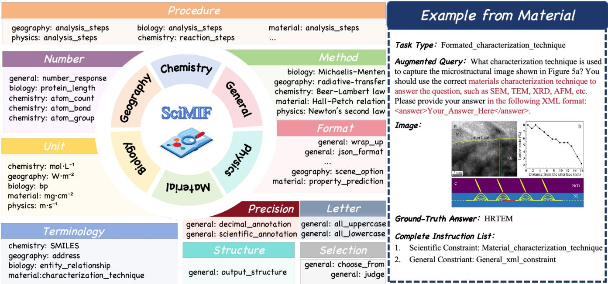
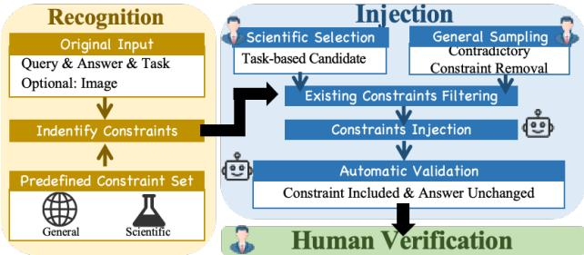
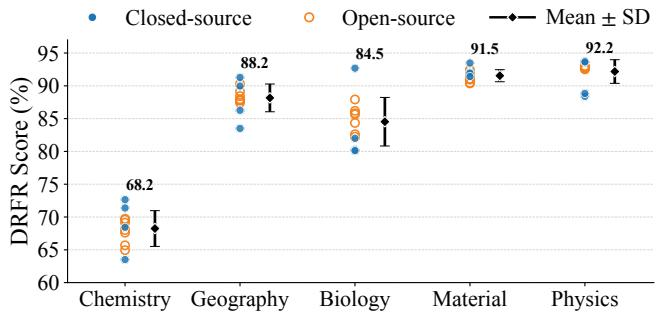
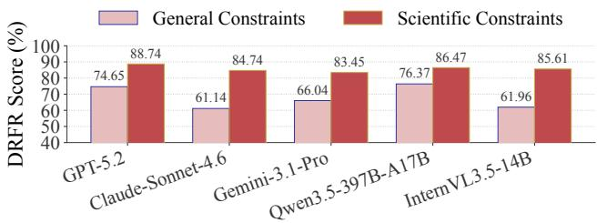
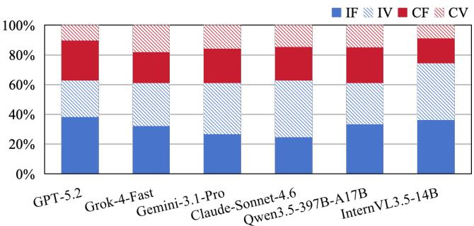
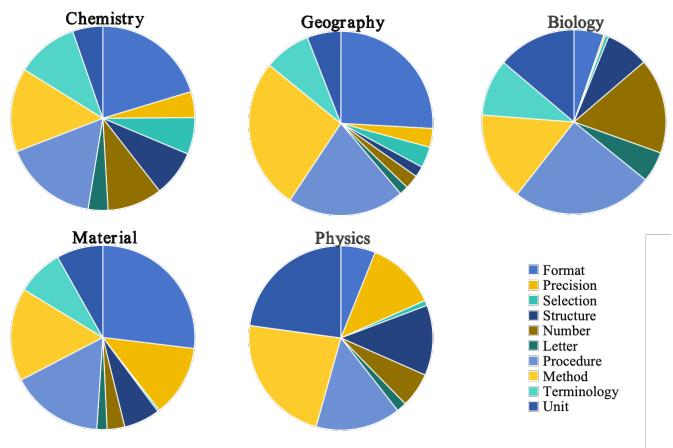
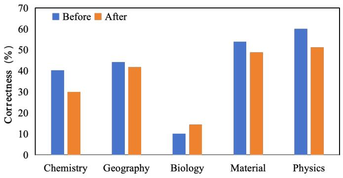
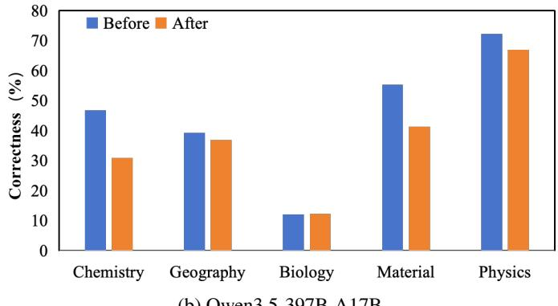
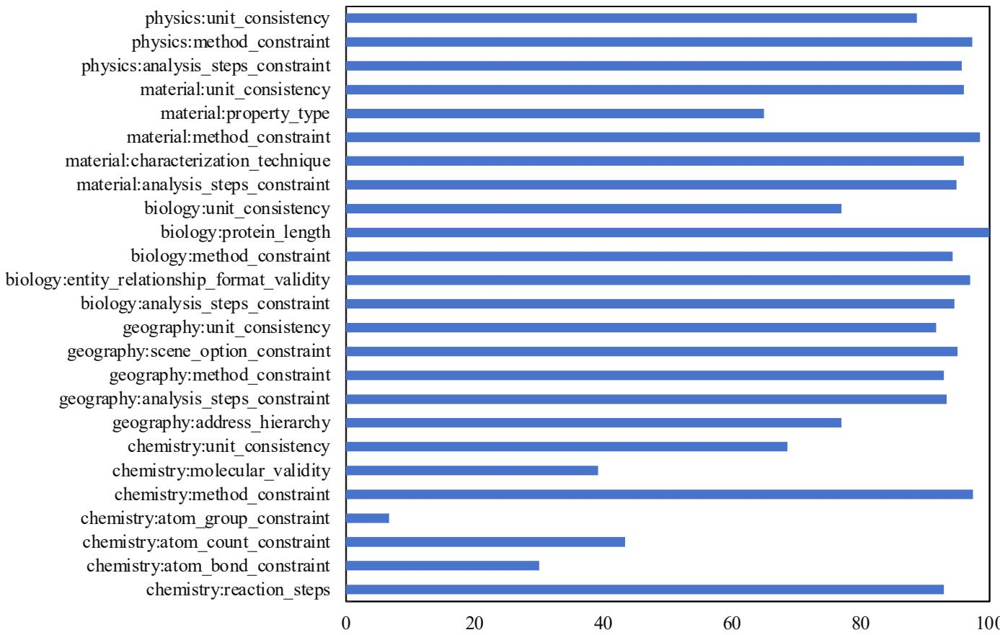
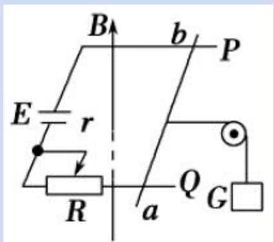

# SciMIF: Understanding Multimodal Instruction Following in Scientific Domains

Ye Shen∗1,2, Yuting Zheng∗1,2, Dun Pei1, Zijian Chen1,2, Wenlong Zhang1, Qi Jia1, Guangtao Zhai1,2

1Shanghai Artificial Intelligence Laboratory, 2Shanghai Jiao Tong University

## Abstract

Understanding instruction-following capabilities in scientific domains is essential for efectively leveraging Multimodal Large Language Models (MLLMs) to advance the development of scientific fields. In this work, we introduce SciMIF, a novel benchmark designed to evaluate the capability of MLLMs in following complex scientific instructions. Specifically, based on an extensive analysis of 22 distinct tasks across 5 representative scientific disciplines, we propose a comprehensive taxonomy comprising 10 constraint groups that captures both general functional requirements and disciplinespecific characteristics. Guided by this taxonomy, we develop a high-fidelity instruction injection pipeline to systematically augment existing scientific datasets. We conduct comprehensive experiments on multiple state-of-the-art closed-source and open-source MLLMs. Our findings reveal significant performance disparities across diferent scientific disciplines, with chemistry posing greater challenges for current MLLMs. Furthermore, we observe that increasing the model scale does not yield corresponding improvements in constraint adherence, and current models still struggle severely with fine-grained constraints and instructions requiring the deep application of disciplinary knowledge. SciMIF fills the current void in evaluating multimodal instruction adherence within scientific domains, laying a crucial foundation for future enhancements of MLLMs in rigorous scientific applications. Data and code will be released at https://github.com/shenye7436/SciMIF.

## 1 Introduction

The application of Multimodal Large Language Models (MLLMs) in scientific domains has rapidly evolved from basic, single-discipline question-answering tasks to complex paradigms such as autonomous science agents and AI-driven scientific discovery (Jiang et al. 2025; Boiko et al. 2023). Consequently, the requirements placed on these models have expanded from factual knowledge retrieval to the reliable execution of multi-step scientific actions under explicit operational requirements.

Instruction following is a fundamental capability that transforms models from text-completion engines into versatile task solvers (Ouyang et al. 2022; Wang et al. 2023b). Following the terminology of CFBench (Zhang et al. 2025b), a constraint refers to an individual requirement, whereas an instruction denotes a complete query containing one or more constraints. In general domains, benchmarks such as IF-Eval (Zhou et al. 2023) and FollowBench (Jiang et al. 2024) have advanced the evaluation of general-purpose instruction following by systematically assessing whether models satisfy diverse constraints on output format, length, structure, and style. However, it remains underexplored whether current models can reliably follow scientific instructions involving domain-specific constraints.

Scientific instruction following difers from its generaldomain counterpart in three important aspects. First, scientific instructions are scientific knowledge-dependent. Even seemingly simple constraints involving letters, numbers, terminology, or output formats may carry domain-specific meanings that cannot be handled through surface-level text manipulation alone. For example, constraints involving the numbers ofchemical bonds, functional groups, or amino-acid residues require models to accurately recognize and understand the relevant scientific entities. Second, the semantics of scientific instructions exhibit strong interdisciplinary variations. Although diferent disciplines may share functional constraint groups, their concrete meanings difer substantially across scientific contexts. As illustrated in Figure 1, a terminology constraint may require valid molecular nomenclature in chemistry, a hierarchical address in geography, an entity relationship in biology, or a characterization technique in materials science. Third, scientific instruction following is frequently multimodal. Scientific reasoning often depends on specialized visual inputs, including molecular structures, biological diagrams, materials microscopy images, geographical scenes, and physical plots. For instance, in the materials example in Figure 1, identifying the required characterization technique depends jointly on the textual request and the information presented in the scientific figure.

These characteristics also expose a practical limitation of existing scientific evaluations. Most scientific benchmarks primarily determine whether a final answer is correct, but scientific correctness alone does not guarantee that an output is usable. A scientifically correct answer may still violate a requested unit, notation, output structure, analysis method, or solution procedure. Conversely, a model may strictly reproduce the requested form while relying on scientifically invalid reasoning. Treating these outputs as a single notion of correctness obscures two distinct model capabilities. We therefore distinguish scientific correctness, which measures whether an answer is scientifically valid, from instruction adherence, which measures whether the specified constraints are satisfied. Evaluating them separately enables failures to be attributed to insuficient scientific reasoning, inadequate instruction following, or both.

To address these challenges, we introduce SciMIF, a Scientific Multimodal Instruction Following benchmark for systematically evaluating models across diverse scientific questions. As illustrated in Figure 1, SciMIF covers five representative disciplines: chemistry, geography, biology, materials science, and physics. We tasked domain experts with systematically examining 22 scientific tasks, their source datasets, disciplinary conventions, and related literature, and deriving a taxonomy of ten functional constraint groups. These groups capture shared instruction-following capabilities across disciplines, while their concrete constraints are adapted to domain-specific knowledge and practices.

Based on this taxonomy, we develop a scalable framework for transforming existing scientific problems into instructionfollowing evaluations. The framework first identifies constraints already implicit in the original tasks and separates them into independently evaluable requirements. It then injects additional compatible scientific and general constraints without changing the correct. After automatic consistency checking and human verification, the benchmark contains 2,527 samples and supports evaluation evaluation of constraint satisfaction, complete instruction fulfillment, and finegrained adherence to decomposed requirement.

Extensive experiments on representative closed-source and open-source MLLMs reveal substantial limitations in scientific instruction following. Performance varies considerably across disciplines, with chemistry and geography posing greater challenges than other domains. Increasing model scale does not consistently improve constraint adherence, indicating that parameter scaling alone is insuficient. Models also perform substantially worse on general constraints and fine-grained requirements, while scientific correctness and instruction adherence remain weakly coupled. These findings motivate future research on domain-aware instruction alignment, stronger adherence to general operational requirements, and structure-aware or tool-assisted methods for handling fine-grained scientific constraints.

In summary, our main contributions are as follows:

• We establish an expert-derived taxonomy of scientific constraints spanning five disciplines and ten functional groups, capturing both shared capability dimensions and discipline-specific requirements.

• We propose a scalable framework for converting existing scientific tasks into instruction-following evaluations by recognizing implicit constraints and injecting compatible scientific and general constraints without changing the reference answers.

• We construct SciMIF and evaluate representative MLLMs, revealing substantial disciplinary variation, difficulties with fine-grained constraints, and a clear gap between scientific correctness and instruction adherence.

<table><tr><td>Benchmark</td><td>Scope # Grp. # Const. # Disc. # Samp.</td><td></td><td></td><td></td><td></td><td>Multi- modal</td></tr><tr><td colspan="7">General-purpose instruction-following benchmarks</td></tr><tr><td>IFEval (Zhou et al. 2023)</td><td>General</td><td>9</td><td>25</td><td></td><td>541</td><td>x</td></tr><tr><td>FollowBench (Jiang et al. 2024)</td><td>General</td><td>5</td><td>16</td><td></td><td>820</td><td>x</td></tr><tr><td>MM-IFEngine (Ding et al. 2025)</td><td>General</td><td>6</td><td>32</td><td>一</td><td>400</td><td>√</td></tr><tr><td colspan="7">Scientific instruction-following benchmarks</td></tr><tr><td>SciIF (Su et al. 2026)</td><td>Scientific 3</td><td></td><td>10</td><td>4</td><td>1,244</td><td>x</td></tr><tr><td>SciMIF (Ours)</td><td>Both</td><td>10</td><td>42</td><td>5</td><td>2,527</td><td>√</td></tr></table>

Table 1: Comparison of general-purpose and scientific instruction-following benchmarks. Scope specifies whether they evaluate general, scientific, or both types of constraints. # Grp. and # Const. denote the numbers of functional constraint groups and individual constraints; # Disc. and # Samp. denote covered scientific disciplines and evaluation samples. “–” indicates scientific discipline coverage is not applicable.

## 2 Related Work

## 2.1 Scientific Reasoning Benchmarks

Scientific benchmarks have evolved from general science question answering toward more specialized and challenging reasoning tasks. ScienceQA (Saikh et al. 2022) provides elementary and secondary school science questions covering multiple disciplines. Subsequently, MMMU (Yue et al. 2024) has pushed the dificulty to the expert level by introducing university-level expertise. The core of scientific tasks lies in the construction of logical chains. MathVista (Lu et al. 2023) is designed specifically for multimodal mathematical reasoning, emphasizing the model’s ability to handle complex visual elements such as geometric figures and function graphs. SciBench (Wang et al. 2023a) further focuses on complex scientific computing problems, challenging the limits of the model’s multi-step reasoning and formula calculation through in-depth coverage of disciplines such as physics and chemistry. In addition, in-depth evaluations of specific fields are also crucial. For example, in the field of geography, GeoQA (Chen et al. 2021) examines the model’s perception of spatial layout and geographical features. Although these benchmarks have substantially advanced the evaluation of scientific knowledge and reasoning, they primarily measure whether models produce correct answers, without systematically examining whether the outputs satisfy explicit scientific and operational constraints.

## 2.2 Instruction-Following Benchmarks

General-purpose instruction-following benchmarks evaluate whether models comply with explicit user requirements. IFEval (Zhou et al. 2023) introduces objectively verifiable textual constraints, FollowBench (Jiang et al. 2024) evaluates constraints of varying dificulty and their combinations, and MM-IFEngine (Ding et al. 2025) extends instruction-following evaluation to multimodal inputs. However, these benchmarks mainly focus on general linguistic, formatting, and structural requirements, without covering constraints grounded in scientific knowledge and disciplinary conventions. Scientific instruction-following evaluation remains limited. SciIF (Su et al. 2026) evaluates universitylevel scientific question answering under process-level guidance, such as prescribed reasoning steps and solution procedures. Its constraints are shared across scientific questions rather than systematically derived from the representations, conventions, and operational requirements of individual disciplines, and its evaluation remains text-only. As summarized in Table 1, SciMIF complements existing benchmarks with an expert-derived taxonomy constructed from 22 tasks across five disciplines. It covers 10 functional groups and 42 discipline-adapted constraints, combines scientific and general requirements, and supports multimodal scientific inputs.

  
Figure 1: An overview of SciMIF, illustrating its coverage of five scientific disciplines, one general constraint domain, and ten functional constraint categories for constructing diverse scientific instruction-following constraints.

## 3 SciMIF

This section introduces the design of SciMIF including its taxonomy of scientific constraints, instruction-augmented sample construction procedure, and benchmark statistics.

## 3.1 Taxonomy of Scientific Constraints

To provide a comprehensive evaluation of scientific instruction following, we construct a hierarchical taxonomy covering both general and discipline-specific constraints. In realworld scientific queries, user requirements and agent interfaces often combine general operational constraints with scientific requirements, making the two inseparable in practical use. Our taxonomy therefore considers both: general constraint types are adapted from prior instruction-following benchmarks, while the primary efort focuses on constructing discipline-specific constraints. Specifically, domain experts analyze 22 tasks from 13 scientific datasets, together with their reference answers, disciplinary conventions, evaluation protocols, and relevant literature, to identify recurring scientific requirements. Functionally similar requirements are abstracted into shared constraint groups, while their domainspecific realizations are preserved as individual constraints.

This results in a two-level organization: the domain level identifies the field of the corresponding instruction, covering one general domain and five scientific domains, whereas the group level identifies the functional purpose of each constraint. Each individual constraint is therefore characterized by both a domain and a group, while each functional group may contain distinct domain-specific constraints, as shown in Figure 1. This organization enables model performance to be analyzed from both disciplinary and capabilityoriented perspectives. Detailed domain-specific instantiations and complete constraint specifications are provided in the Appendix A.

At the group level, we define ten functional types according to the requirements imposed on model outputs and task execution:

• Procedure: Requires reasoning, analysis, or experimental operations to follow a prescribed sequence of steps.

• Number: Specifies the required cardinality of output items or scientific entities, such as responses, atoms, bonds, functional groups, or sequence elements.

• Method: Requires the use of a designated scientific formula, theorem, law, or analytical approach.

• Unit: Requires numerical quantities to be expressed in specified units while preserving dimensional consistency.

• Format: Specifies the required representation of scientific outputs, such as expressing material properties as discrete labels or continuous values, or organizing geographic locations in a prescribed hierarchical format.

• Terminology: Requires valid and standardized nomenclature or specialized expressions appropriate to a scien-

  
Figure 2: An overview of the data construction pipeline.

tific discipline.

• Precision: Requires numerical quantities to be reported with a specified level of accuracy, such as a fixed number of decimal places or significant figures.

• Letter: Specifies general letter-level requirements, such as using only lowercase or uppercase letters.

• Structure: Specifies how diferent parts of the response should be organized, such as presenting the analysis before the final answer.

• Selection: Restricts the answer to one or more valid choices from a predefined candidate set.

Although these functional groups are shared across disciplines, their concrete instantiations may require substantially diferent scientific knowledge and recognition capabilities. For example, a terminology constraint may involve valid molecular nomenclature in chemistry, a hierarchical address in geography, an entity relationship in biology, or an appropriate characterization technique in materials science. Similarly, a number constraint may refer to atoms and chemical bonds in chemistry, sequence elements in biology, or physical quantities in physics, while a procedure constraint may specify a reaction sequence, a biological analysis pipeline, an experimental workflow, or a physics derivation. These discipline-specific instantiations allow SciMIF to analyze model performance both across scientific disciplines and along shared constraint-following capabilities.

## 3.2 Data Construction

As illustrated in Figure 2, we construct SciMIF through a structured pipeline consisting of seed preparation, constraint recognition and selection, constraint injection, and human verification. We provide more details of the construction pipeline in the Appendix B.

Seed Preparation. Each seed sample from a source dataset contains a textual question $q ,$ an optional visual input I, a reference answer $^ { a , }$ and a scientific task type t. We represent the sample as

$$
x = ( q , I , a , t ) .\tag{1}
$$

For each sample, we determine an applicable constraint inventory $C _ { x } .$ , which contains scientific constraints compatible with its discipline and task type, together with general constraints applicable to scientific tasks.

Constraint Recognition. Annotators first identify the constraints already expressed or implied by the original query, which can be expressed as a set $C _ { o }$

<table><tr><td>Statistic</td><td>Chem.</td><td>Geo.</td><td>Bio.</td><td>Mat.</td><td>Phy.</td></tr><tr><td>Total</td><td>518</td><td>523</td><td>493</td><td>497</td><td>496</td></tr><tr><td>Scientific Constraints</td><td>7</td><td>5</td><td>5</td><td>5</td><td>3</td></tr><tr><td>Task Types</td><td>8</td><td>4</td><td>3</td><td>4</td><td>3</td></tr><tr><td>Avg. Question (/tokens)</td><td>231.46</td><td>168.17</td><td>147.29</td><td>215.60</td><td>293.68</td></tr><tr><td>Multimodal Samples</td><td>X</td><td>√</td><td>×</td><td>√</td><td>√</td></tr></table>

Table 2: Overall statistics of the constructed dataset.

$$
C _ { o } = f _ { r } ( q , C _ { x } ) ,\tag{2}
$$

The remaining constraints in $C _ { x } \backslash C _ { o }$ are then filtered to remove requirements that are redundant, incompatible with the task, or contradictory to existing constraints. Scientific constraints $C _ { s }$ are selected according to the disciplinary knowledge and task type, while mutually compatible general constraints $C _ { g }$ are randomly sampled by N classes from $C _ { x } \backslash C _ { o } .$

Constraint Injection. Scientific constraints from $C _ { s }$ should be injected to original query q as follows:

$$
q _ { d } = f _ { d } ( q , C _ { s } ) ,\tag{3}
$$

where $q _ { d }$ represents the augmented query after injecting appropriate scientific constraints.

For general constraints in $C _ { g } .$ , if one constraint is injected into $q _ { d } .$ , the new augmented query can be expressed as:

$$
q _ { g } = f _ { g } ( q _ { d } , c _ { n } \mid c _ { n } \subseteq C _ { g } ) ,\tag{4}
$$

where $c _ { n }$ denotes any one of each general constraint class. $f _ { g } ( \cdot )$ denotes a double automatic validation procedure consisting of $\mathbb { I } _ { i n c l u d e d } ( q _ { g } , c _ { n } ) \cap \mathbb { I } _ { u n c h a n g e d } ( q _ { g } , a )$ , which ensures that $c _ { n }$ has been included and ground-truth answer a remains unchanged. A failed injection is retried up to k times using an alternative constraint from the same category.

The resulting sample after the validation is represented as

$$
\hat { x } = ( \hat { q } , I , a , t ) ,\tag{5}
$$

where $\hat { q }$ denotes the final augmented query.

Human Verification. Two annotators ask for each xˆ and its associated constraint list meet the following two requirements: (1) Logical Coherence and Fluency, ensuring that the injected constraints are naturally integrated without semantic contradictions or grammatical errors; and (2) Constraint Fidelity, ensuring that every specified constraint is accurately and unambiguously expressed in the query. Problematic samples are manually revised, while samples that cannot be meaningfully repaired are discarded. All retained samples undergo manual verification, and 884 samples are revised during this process.

## 3.3 Data Statistics

Data Sources. SciMIF is constructed from 13 existing scientific datasets, covering 22 task types across five disciplines: chemistry, geography, biology, materials science, and physics. Representative sources include ChemEval (Huang et al. 2024), IMAGEO-Bench (LI et al. 2025), LAB-Bench (Laurent et al. 2024), MatCha (Lai et al. 2025), and PhysUniBench (Wang et al. 2025a). These datasets provide diverse task formulations, disciplinary conventions, and input modalities. The complete source-to-task mapping and task-level sample statistics are provided in the Appendix C.

<table><tr><td rowspan=2 colspan=1>Model</td><td rowspan=1 colspan=1>Chemistry</td><td rowspan=1 colspan=1>Geography</td><td rowspan=1 colspan=1>Biology</td><td rowspan=1 colspan=1>Material</td><td rowspan=1 colspan=1>Physics</td><td rowspan=2 colspan=1>Overall</td></tr><tr><td rowspan=1 colspan=1>CSR ISR DRFR</td><td rowspan=1 colspan=1>CSR ISR DRFR</td><td rowspan=1 colspan=1>CSR ISR DRFR</td><td rowspan=1 colspan=1>CSR ISR DRFR</td><td rowspan=1 colspan=1>CSR ISR DRFR</td></tr><tr><td rowspan=1 colspan=2></td><td rowspan=1 colspan=1>Closed-S</td><td rowspan=1 colspan=1>ource MLLMs</td><td rowspan=1 colspan=1></td><td rowspan=1 colspan=1></td><td rowspan=1 colspan=1></td></tr><tr><td rowspan=1 colspan=1>GPT-5.2</td><td rowspan=1 colspan=1>72.87 46.3373.99</td><td rowspan=1 colspan=1>82.30~61.57~82.40</td><td rowspan=1 colspan=1>88.87 72.82 86.581</td><td rowspan=1 colspan=1>87.7978.0788.93</td><td rowspan=1 colspan=1>87.97 69.56 86.94</td><td rowspan=1 colspan=1>65.67</td></tr><tr><td rowspan=1 colspan=1>Grok-4-Fast</td><td rowspan=1 colspan=1>65.56 33.01 67.37</td><td rowspan=1 colspan=1>83.96 53.15 83.25</td><td rowspan=1 colspan=1>80.18 45.53 79.06</td><td rowspan=1 colspan=1>89.74 75.2589.01</td><td rowspan=1 colspan=1>82.06 58.2781.16</td><td rowspan=1 colspan=1>53.04</td></tr><tr><td rowspan=1 colspan=1>Gemini-3.1-Pro-Preview</td><td rowspan=1 colspan=1>65.7932.2466.37</td><td rowspan=1 colspan=1>79.53 47.80 80.01</td><td rowspan=1 colspan=1>75.3044.0272.01</td><td rowspan=1 colspan=1>89.94 75.4589.00</td><td rowspan=1 colspan=1>77.46 50.6077.78</td><td rowspan=1 colspan=1>50.02</td></tr><tr><td rowspan=1 colspan=1>Claude-Sonnet-4.6</td><td rowspan=1 colspan=1>62.02 26.31 63.42</td><td rowspan=1 colspan=1>71.31 31.72 72.75</td><td rowspan=1 colspan=1>76.56 46.3273.75</td><td rowspan=1 colspan=1>81.54 67.4084.06</td><td rowspan=1 colspan=1>86.48 65.1285.87</td><td rowspan=1 colspan=1>47.37</td></tr><tr><td rowspan=2 colspan=2>Qwen3.5-27B          68.33 32.09 70.04</td><td rowspan=1 colspan=1>Open-So</td><td rowspan=1 colspan=1>urce MLLMs</td><td rowspan=1 colspan=1></td><td rowspan=1 colspan=1></td><td rowspan=1 colspan=1></td></tr><tr><td rowspan=1 colspan=1>68.33 32.0970.04</td><td rowspan=1 colspan=1>79.54~45.00~80.03</td><td rowspan=1 colspan=1>83.18 49.2180.79</td><td rowspan=1 colspan=1>89.7669.7589.62</td><td rowspan=1 colspan=1>85.74 60.82 85.70</td><td rowspan=1 colspan=1>51.37</td></tr><tr><td rowspan=1 colspan=1>Qwen3.5-35B-A3B</td><td rowspan=1 colspan=1>68.52 29.90 70.35</td><td rowspan=1 colspan=1>77.61 41.3178.39</td><td rowspan=1 colspan=1>83.91 49.2481.22</td><td rowspan=1 colspan=1>90.08 68.8389.88</td><td rowspan=1 colspan=1>85.0060.4885.25</td><td rowspan=1 colspan=1>49.95</td></tr><tr><td rowspan=1 colspan=1>Qwen3.5-122B-A10B</td><td rowspan=1 colspan=1>68.08 30.62 69.65</td><td rowspan=1 colspan=1>78.4043.2779.16</td><td rowspan=1 colspan=1>82.13 47.18 80.67</td><td rowspan=1 colspan=1>89.77 68.7089.50</td><td rowspan=1 colspan=1>85.89 62.3085.90</td><td rowspan=1 colspan=1>50.41</td></tr><tr><td rowspan=1 colspan=1>Qwen3.5-397B-A17B</td><td rowspan=1 colspan=1>72.19 39.9673.49</td><td rowspan=1 colspan=1>81.5754.2381.97</td><td rowspan=1 colspan=1>85.41 56.8783.52</td><td rowspan=1 colspan=1>89.63 73.3789.86</td><td rowspan=1 colspan=1>85.80 62.5085.67</td><td rowspan=1 colspan=1>57.39</td></tr><tr><td rowspan=1 colspan=1>InternVL3.5-8B</td><td rowspan=1 colspan=1>62.9931.4763.83</td><td rowspan=1 colspan=1>73.0444.9373.82</td><td rowspan=1 colspan=1>79.14 57.2077.97</td><td rowspan=1 colspan=1>79.34 59.7680.56</td><td rowspan=1 colspan=1>84.70 63.5183.09</td><td rowspan=1 colspan=1>51.37</td></tr><tr><td rowspan=1 colspan=1>InternVL3.5-14B</td><td rowspan=1 colspan=1>61.88 30.8963.96</td><td rowspan=1 colspan=1>75.2349.9075.75</td><td rowspan=1 colspan=1>80.4858.6279.05</td><td rowspan=1 colspan=1>79.33 59.7681.43</td><td rowspan=1 colspan=1>86.42 66.5385.19</td><td rowspan=1 colspan=1>53.14</td></tr><tr><td rowspan=1 colspan=1>InternVL3.5-38B</td><td rowspan=1 colspan=1>59.96 29.7362.36</td><td rowspan=1 colspan=1>74.85 47.8075.48</td><td rowspan=1 colspan=1>77.32 56.8076.18</td><td rowspan=1 colspan=1>79.26 61.1781.35</td><td rowspan=1 colspan=1>84.52 62.7083.28</td><td rowspan=1 colspan=1>51.64</td></tr></table>

Table 3: Performance (%) of evaluated MLLMs. Overall denotes the average ISR across the five scientific disciplines. The best score in each column is bolded separately for closed-source and open-source MLLMs.

Dataset Composition. We summarize the overall statistics of the dataset in Table 2. The final benchmark contains 2,527 samples in total, spanning 5 disciplines and including ten functional constraint groups. Each sample consists of a verified question, optional visual input, and a reference answer. On average, each sample contains 211.03 tokens in the question. Among all samples, 27.50% include multimodal inputs with associated images.

## 4 Experiment

## 4.1 Setup

Models. To evaluate the efectiveness of our dataset and evaluation pipeline, we conduct experiments on a diverse set of state-of-the-art large language models (LLMs), including GPT-5.2 (OpenAI 2025), Grok-4-Fast (xAI 2025), Gemini-3.1-Pro-Preview (Team et al. 2023), and Claude-Sonnet-4.6 (Anthropic 2026), which are widely recognized for their strong reasoning and instruction-following capabilities. Simultaneously, we also assess advanced open-source models, including InternVL3.5 series (Wang et al. 2025b), and Qwen3.5 series (Qwen Team 2026) to further analyze performance diferences across model families.

Details. For multimodal samples, images are preprocessed before generation to reduce transmission overhead during large-scale model inference while preserving essential semantic information. We set N = 3, and k = 3 to balance diversity and consistency in constraint augmentation.

## 4.2 Metrics

To evaluate model performance, we adopt several existing metrics that measure diferent aspects of instructionfollowing performance. Specifically, we employ the Constraint Satisfaction Rate (CSR) (Zhang et al. 2025b) and the Instruction Satisfaction Rate (ISR) (Zhang et al. 2025b), as well as the Decomposed Requirements Following Ratio (DRFR) (Qin et al. 2024). Together, these metrics provide complementary perspectives on model performance, including CSR captures the averaged constraint-level satisfaction across samples, ISR evaluates instruction-level success, and DRFR measures decomposed-requirement-level compliance across the total number of constraints. Constraint verification is categorized into exact match, precision-based, and LLM-as-a-judge, with detailed protocols provided in the Appendix D.

## 5 Result & Analysis

This section reports model performance across disciplines, constraint domains, and constraint groups. Subsequently, we analyze performance trends as the number of constraints increases and examine the relationship between answer correctness and instruction following. Due to space limitations, the main text focuses on representative models and key findings. Additional analyses of source-level variation, modalityassociated diferences, correctness contrasts, and representative cases are provided in the Appendix E.

## 5.1 Performance on Diferent Science Disciplines

We first evaluate the instruction-following performance of MLLMs across diferent scientific disciplines. As summarized in Table 3, we report the CSR, ISR, and DRFR metrics for five domains to analyze how disciplinary data characteristics influence model behavior.

Performance across disciplines. Models demonstrate that no single model performs well across all disciplines, showing significant variation in performance across domains. The highest ISR scores are observed in the biology and materials scientific domain, while performance drops significantly in chemistry and geography. Specifically, GPT-5.2 achieves an ISR of 72.82% in biology and 78.07% in materials science. In contrast, chemistry presents the greatest challenge, with the highest ISR for GPT-5.2 falling to 46.33%. This disparity is likely due to the nature of the tasks in each domain: biology and materials science tasks often rely on entity recognition and method restriction, which are wellrepresented in the training data. On the other hand, chemistry and geography require models to handle more complex structural constraints and spatial hierarchies, which are harder to capture through standard linguistic alignment.

  
Figure 3: DRFR scores (%) across diferent scientific constraint domains for the evaluated MLLMs.

  
Figure 4: DRFR scores (%) of representative MLLMs between general and scientific constraint domains.

Closed-Source vs Open-Source. Closed source models maintain a consistent performance advantage over open source models across all disciplines. The leading closedsource model, GPT-5.2, achieves an overall score of 65.67%, exceeding the 57.39% attained by the leading open-source model, Qwen3.5-397B-A17B. Although the gap narrows in disciplines such as physics, where Qwen3.5-397B-A17B achieves an ISR of 62.50%, compared with 69.56% for GPT-5.2, closed-source models demonstrate greater robustness in satisfying multifaceted scientific constraints. This superiority reflects the advantages conferred by high-quality data and advanced alignment strategies in proprietary models.

Impact of Model Scale. An increase in parameter size does not lead to a linear improvement in the instructionfollowing performance of models in scientific contexts. For the InternVL3.5 series, the 8B model yields an overall score of 51.37% which is nearly identical to the 51.64% of the 38B version. A more significant trend appears in the Qwen3.5 family where the score of the 27B model is 51.37% while the 122B version drops to 50.41%. These results suggest that the primary bottleneck for scientific instruction-following is not raw computational power but rather the quality of domain-aware alignment. Scaling up parameters without targeted optimization of scientific instruction-tuning data may cause performance saturation or an alignment tax that hinders the ability to satisfy complex disciplinary rules.

## 5.2 Performance on Constraint Domains

We explore performance across constraint domains to identify which requirements pose the greatest challenges to alignment. As established in the previous section, these domains include a general category and five scientific subcategories.

Performance across Scientific Constraint Domains. The distribution of constraint groups varies significantly across scientific disciplines, contributing to difering levels of task complexity. As illustrated in Figure 3, chemistry is the most challenging domain, with an average DRFR score of only 68.2% and physics achieves the highest average performance with an average DRFR score of 92.%. This variance is largely driven by the distinct constraint profiles inherent to each field. Chemistry tasks predominantly feature a high concentration of fine-grained constraints, demanding specific numerical values and strict structural formats. In contrast, domains like physics tend to rely more heavily on coarse-grained constraints. These usually involve methodological guidelines, broad analytical steps, or general reasoning procedures. Consequently, the dense distribution of highly specific, minute constraints in chemistry makes its tasks inherently more complex to execute than those in domains dominated by broader instructional constraints.

General vs Scientific Constraints. Models consistently perform better on scientific constraints than on general constraints. As shown in Figure 4, GPT-5.2 achieves a DRFR score of 88.74% on scientific constraints, compared with 74.65% on general constraints. A similar gap is observed for Qwen3.5-397B-A17B and other models. One possible explanation is that scientific constraints are often semantically coupled with the scientific task itself and models may therefore prefer to attend to these requirements. In contrast, general constraints primarily regulate the presentation and organization of the output and may be relatively independent of the underlying scientific reasoning process, making them more likely to be overlooked. These results highlight the need to evaluate both scientific and general constraints, as strong adherence to domain-specific requirements does not necessarily imply reliable compliance with the full instruction.

## 5.3 Performance across Constraint Groups

We examine the performance of models across diferent functional groups to identify which instruction types are most manageable or challenging for current systems. As detailed in section 3.1, there are ten distinct groups and the results for the DRFR scores are summarized in Table 4.

Performance Consistency Across Groups. More challenging groups lead to more significant diferences in model performance. As observed, models struggle more in the number, letter, and format groups, with a large performance gap between GPT-5.2 and Qwen3.5-397B-A17B, the topperforming models in the closed-source and open-source categories, respectively. The diference in these groups can reach as high as 8% to 9%. However, in less challenging groups, such as precision, procedure, and method, the performance gap between models is much narrower, typically ranging from just 2% to 4%. This indicates that the group categorization is well-balanced and covers a range of dificulty levels, providing clear diferentiation between model performance across various tasks.

<table><tr><td>Model</td><td>Format</td><td>Precision</td><td>Selection</td><td>Structure</td><td>Number</td><td>Letter</td><td>Procedure</td><td>Method</td><td>Terminology</td><td>Unit</td></tr><tr><td colspan="9">Closed-Source MLLMs</td><td></td></tr><tr><td>GPT-5.2</td><td>72.18</td><td>84.69</td><td>82.24</td><td>83.41</td><td>68.62</td><td>51.30</td><td>94.19</td><td>95.91</td><td>73.59</td><td>85.61</td></tr><tr><td>Grok-4-Fast</td><td>82.31</td><td>77.99</td><td>82.89</td><td>77.35</td><td>58.50</td><td>53.90</td><td>78.14</td><td>94.55</td><td>72.23</td><td>80.00</td></tr><tr><td>Gemini-3.1-Pro-Preview</td><td>74.38</td><td>75.60</td><td>80.92</td><td>63.90</td><td>55.76</td><td>50.00</td><td>78.29</td><td>96.68</td><td>72.23</td><td>77.09</td></tr><tr><td>Claude-Sonnet-4.6</td><td>50.67</td><td>85.37</td><td>83.44</td><td>76.91</td><td>58.89</td><td>35.33</td><td>76.74</td><td>98.28</td><td>74.60</td><td>88.86</td></tr><tr><td colspan="10">Open-Source MLLMs</td></tr><tr><td>Qwen3.5-27B</td><td>71.20</td><td>88.89</td><td>83.22</td><td>85.19</td><td>46.81</td><td>50.67</td><td>80.95</td><td>97.94</td><td>76.22</td><td>85.86</td></tr><tr><td>Qwen3.5-35B-A3B</td><td>72.53</td><td>87.23</td><td>84.21</td><td>85.55</td><td>43.23</td><td>52.00</td><td>80.70</td><td>98.16</td><td>74.64</td><td>84.57</td></tr><tr><td>Qwen3.5-122B-A10B</td><td>73.23</td><td>86.75</td><td>83.01</td><td>85.62</td><td>53.56</td><td>56.29</td><td>79.20</td><td>98.38</td><td>73.73</td><td>83.52</td></tr><tr><td>Qwen3.5-397B-A17B</td><td>73.70</td><td>89.21</td><td>83.66</td><td>87.76</td><td>60.05</td><td>53.59</td><td>86.06</td><td>98.04</td><td>74.77</td><td>83.38</td></tr><tr><td>InternVL3.5-8B InternVL3.5-14B</td><td>50.57</td><td>77.03</td><td>75.00</td><td>78.03</td><td>57.79</td><td>37.01</td><td>90.49</td><td>88.76</td><td>71.78</td><td>88.40</td></tr><tr><td>InternVL3.5-38B</td><td>53.63</td><td>81.82</td><td>76.32</td><td>80.27</td><td>57.56</td><td>36.36</td><td>90.94 89.49</td><td>90.03</td><td>69.53</td><td>88.69</td></tr><tr><td></td><td>48.76</td><td>81.34</td><td>77.63</td><td>76.46</td><td>56.88</td><td>38.31</td><td></td><td>90.55</td><td>71.11</td><td>87.52</td></tr></table>

Table 4: DRFR scores (%) of diferent constraint groups from evaluated MLLMs. The best score in each column is bolded separately for closed-source and open-source MLLMs.

Analysis of the Challenge of Constraints. Models perform poorly on letter and number constraints, reflecting dificulties in both fine-grained symbolic processing and domain-specific knowledge application. GPT-5.2 achieves DRFR scores of 51.30% for letters, 68.62% for numbers, and 73.59% for terminology. Unlike generic sub-token tasks involving character counting or manipulation, our number constraints require models to interpret scientific structures and identify chemical bonds, functional groups, aminoacid residues, or sequence motifs rather than count numerical characters. Terminology constraints evaluate contextappropriate scientific term usage. These results highlight limited grounding of fine-grained symbols and quantities in scientific objects. Potential remedies include structure-aware representations, constrained decoding, and external scientific parsers or verification tools.

## 5.4 Relationship Between Answer Correctness and Instruction-Following

We examine whether models can simultaneously produce scientifically correct answers and satisfy the specified constraints. Figure 5 reports the proportion of samples in four categories: Correct and Followed (CF), Correct but Violated (CV), Incorrect but Followed (IF), and Incorrect and Violated (IV). Across all evaluated models, the CF rate remains below 30%, indicating that jointly achieving scientific correctness and instruction adherence is still challenging. Moreover, approximately 20% of samples fall into the CV category, showing that even correct answers frequently violate one or more constraints. The IF rate also exceeds 30% for several models, suggesting that models may satisfy formatting or structural requirements without producing scientifically valid answers. These results reveal a clear gap between scientific correctness and constraint adherence, highlighting the need to improve both capabilitiesjointly rather than optimizing either in isolation. The verification procedures and weak association evidence are detailed in the Appendix E.2.

  
Figure 5: Proportions of Correct Followed (CF), Correct Violated (CV), Incorrect Followed (IF), and Incorrect Violated (IV) samples across representative models.

## 6 Conclusion

In this work, we propose SciMIF, a comprehensive benchmark for evaluating the instruction-following capabilities of MLLMs across five scientific disciplines: Chemistry, Geography, Biology, Material, and Physics. By systematically injecting 10 distinct groups of general and domain-specific constraints, SciMIF assesses a model’s ability to seamlessly integrate rigorous disciplinary knowledge with complex formatting and methodological requirements. Our extensive evaluations show that the performance of MLLMs varies drastically by science domains and models are highly vulnerable to fine-grained constraints and sufer sharp performance drops as constraint counts increase. Our analysis also uncover a scaling paradox where merely increasing parameter size does not linearly improve scientific instruction following.

Based on these findings, we suggest following directions for future research. First, training and evaluation should be reoriented toward practical application capabilities in constrained environments, rather than being primarily driven by scientific knowledge injection. Besides, to mitigate limitations related to symbolic and discrete constraints, MLLMcentric agents could consider integrating external numerical computation tools and symbolic engines to guide the inference process, enabling more precise and reliable control in real-world scientific workflows.

## References

Anthropic. 2026. Introducing Claude Sonnet 4.6. https: //www.anthropic.com/news/claude-sonnet-4-6.

Boiko, D. A.; MacKnight, R.; Kline, B.; and Gomes, G. 2023. Autonomous chemical research with large language models. Nature, 624(7992): 570–578.

Chen, J.; Tang, J.; Qin, J.; Liang, X.; Liu, L.; Xing, E.; and Lin, L. 2021. GeoQA: A geometric question answering benchmark towards multimodal numerical reasoning. In Findings of the Association for Computational Linguistics: ACL-IJCNLP 2021, 513–523.

Ding, S.; Wu, S.; Zhao, X.; Zang, Y.; Duan, H.; Dong, X.; Zhang, P.; Cao, Y.; Lin, D.; and Wang, J. 2025. MM-IFEngine: Towards Multimodal Instruction Following. arXiv preprint arXiv:2504.07957.

Fang, Y.; Liang, X.; Zhang, N.; Liu, K.; Huang, R.; Chen, Z.; Fan, X.; and Chen, H. 2024. Mol-Instructions: A Large-Scale Biomolecular Instruction Dataset for Large Language Models. In ICLR. OpenReview.net.

Huang, Y.; Zhang, R.; He, X.; Zhi, X.; Wang, H.; Li, X.; Xu, F.; Liu, D.; Liang, H.; Li, Y.; et al. 2024. ChemEval: A Comprehensive Multi-Level Chemical Evaluation for Large Language Models. arXiv preprint arXiv:2409.13989.

Jiang, X.; Wang, W.; Tian, S.; Wang, H.; Lookman, T.; and Su, Y. 2025. Applications of natural language processing and large language models in materials discovery. npj Computational Materials, 11(1): 79.

Jiang, Y.; Wang, Y.; Zeng, X.; Zhong, W.; Li, L.; Mi, F.; Shang, L.; Jiang, X.; Liu, Q.; and Wang, W. 2024. FollowBench: A Multi-level Fine-grained Constraints Following Benchmark for Large Language Models. In Ku, L.- W.; Martins, A.; and Srikumar, V., eds., Proceedings of the 62nd Annual Meeting of the Association for Computational Linguistics (Volume 1: Long Papers), 4667–4688. Bangkok, Thailand: Association for Computational Linguistics.

Lai, Z.; Zheng, Y.; Cai, Z.; Lyu, H.; Yang, J.; Liang, H.; Hu, Y.; and Wang, B. 2025. Can Multimodal LLMs See Materials Clearly? A Multimodal Benchmark on Materials Characterization. arXiv:2509.09307.

Laurent, J. M.; Janizek, J. D.; Ruzo, M.; Hinks, M. M.; Hammerling, M. J.; Narayanan, S.; Ponnapati, M.; White, A. D.; and Rodriques, S. G. 2024. LAB-Bench: Measuring capabilities of language models for biology research. arXiv preprint arXiv:2407.10362.

Li, J.; Li, J.; Wang, W.; Liu, Y.; Zheng, C.; Zhou, D.; yong Wei, X.; and Li, Q. 2025. Speak-to-Structure: Evaluating LLMs in Open-domain Natural Language-Driven Molecule Generation. arXiv:2412.14642.

LI, L.; Runlong, Y.; Qikai, H.; Bowei, L.; Min, D.; Yang, Z.; and Xiaowei, J. 2025. IMAGEO-Bench: A Systematic Benchmark Dataset for Evaluating Image Geolocalization Ability in Large Language Models.

Liu, S.; Liu, H.; Liu, J.; Xiao, L.; Gao, S.; Lyu, C.; Gu, Y.; Zhang, W.; Wong, D. F.; Zhang, S.; et al. 2025. Compassverifier: A unified and robust verifier for llms evaluation and outcome reward. In Proceedings ofthe 2025 Conference on

Empirical Methods in Natural Language Processing, 33454– 33482.

Lu, P.; Bansal, H.; Xia, T.; Liu, J.; Li, C.; Hajishirzi, H.; Cheng, H.; Chang, K.-W.; Galley, M.; and Gao, J. 2023. MathVista: Evaluating mathematical reasoning offoundation models in visual contexts. arXiv preprint arXiv:2310.02255.

Niyongabo Rubungo, A.; Li, K.; Hattrick-Simpers, J.; and Bousso Dieng, A. 2025. LLM4Mat-Bench: benchmarking large language models for materials property prediction. Machine Learning: Science and Technology, 6(2): 020501.

OpenAI. 2025. Introducing GPT-5.2. https://openai.com/ index/introducing-gpt-5-2/.

Ouyang, L.; Wu, J.; Jiang, X.; Almeida, D.; Wainwright, C.; Mishkin, P.; Zhang, C.; Agarwal, S.; Slama, K.; Ray, A.; et al. 2022. Training language models to follow instructions with human feedback. Advances in neural informationprocessing systems, 35: 27730–27744.

Qin, Y.; Song, K.; Hu, Y.; Yao, W.; Cho, S.; Wang, X.; Wu, X.; Liu, F.; Liu, P.; and Yu, D. 2024. InfoBench: Evaluating instruction following ability in large language models. In Findings of the Association for Computational Linguistics: ACL 2024, 13025–13048.

Qwen Team. 2026. Qwen3.5: Towards Native Multimodal Agents.

Saikh, T.; Ghosal, T.; Mittal, A.; Ekbal, A.; and Bhattacharyya, P. 2022. ScienceQA: A novel resource for question answering on scholarly articles. International Journal on Digital Libraries, 23(3): 289–301.

Su, E.; Wu, J.; Tang, C.; Wang, L.; Li, P.; Wang, A.; Zhang, J.; Wang, Y.; Meng, Y.; Ma, X.; et al. 2026. SciIF: Benchmarking Scientific Instruction Following Towards Rigorous Scientific Intelligence. arXiv preprint arXiv:2601.04770.

Team, G.; Anil, R.; Borgeaud, S.; Alayrac, J.-B.; Yu, J.; Soricut, R.; Schalkwyk, J.; Dai, A. M.; Hauth, A.; Millican, K.; et al. 2023. Gemini: a family of highly capable multimodal models. arXiv preprint arXiv:2312.11805.

Wang, L.; Su, E.; Liu, J.; Li, P.; Xia, P.; Xiao, J.; Zhang, W.; Dai, X.; Chen, X.; Meng, Y.; Ding, M.; Bai, L.; Ouyang, W.; Tang, S.; Wang, A.; and Ma, X. 2025a. PhysUniBench: An Undergraduate-Level Physics Reasoning Benchmark for Multimodal Models. arXiv:2506.17667.

Wang, W.; Gao, Z.; Gu, L.; Pu, H.; Cui, L.; Wei, X.; Liu, Z.; Jing, L.; Ye, S.; Shao, J.; et al. 2025b. Internvl3. 5: Advancing open-source multimodal models in versatility, reasoning, and eficiency. arXiv preprint arXiv:2508.18265.

Wang, X.; Hu, Z.; Lu, P.; Zhu, Y.; Zhang, J.; Subramaniam, S.; Loomba, A. R.; Zhang, S.; Sun, Y.; and Wang, W. 2023a. SciBench: Evaluating college-level scientific problem-solving abilities of large language models. arXiv preprint arXiv:2307.10635.

Wang, Y.; Kordi, Y.; Mishra, S.; Liu, A.; Smith, N. A.; Khashabi, D.; and Hajishirzi, H. 2023b. Self-Instruct: Aligning language models with self-generated instructions. In Proceedings of the 61st annual meeting of the association for computational linguistics (volume 1: long papers), 13484– 13508.

xAI. 2025. Grok 4 Fast. https://x.ai/news/grok-4-fast/.

Xu, W.; Zhao, X.; Zhou, Y.; Yue, X.; Fei, B.; Ling, F.; Zhang, W.; and Bai, L. 2025a. EarthSE: A Benchmark for Evaluating Earth Scientific Exploration Capability of LLMs. arXiv preprint arXiv:2505.17139.

Xu, X.; Xu, Q.; Xiao, T.; Chen, T.; Yan, Y.; Zhang, J.; Diao, S.; Yang, C.; and Wang, Y. 2025b. UGPhysics: A Comprehensive Benchmark for Undergraduate Physics Reasoning with Large Language Models. arXiv preprint arXiv:2502.00334.

Yue, X.; Ni, Y.; Zhang, K.; Zheng, T.; Liu, R.; Zhang, G.; Stevens, S.; Jiang, D.; Ren, W.; Sun, Y.; et al. 2024. MMMU: A massive multi-discipline multimodal understanding and reasoning benchmark for expert agi. In Proceedings of the IEEE/CVF conference on computer vision and pattern recognition, 9556–9567.

Zaki, M.; Krishnan, N.; et al. 2023. MaScQA: A question answering dataset for investigating materials science knowledge of large language models. arXiv preprint arXiv:2308.09115.

Zhang, J.; Gan, J.; Wang, X.; Jia, Z.; Gu, C.; Chen, J.; Zhu, Y.; Ma, M. D.; Zhou, D.; Li, L.; et al. 2025a. MatSciBench: Benchmarking the Reasoning Ability of Large Language Models in Materials Science. arXiv preprint arXiv:2510.12171.

Zhang, T.; Zhu, C.; Shen, Y.; Luo, W.; Zhang, Y.; Liang, H.; Yang, F.; Lin, M.; Qiao, Y.; Chen, W.; et al. 2025b. CF-Bench: A comprehensive constraints-following benchmark for llms. In Proceedings of the 63rd Annual Meeting of the Association for Computational Linguistics (Volume 1: Long Papers), 32926–32944.

Zhang, X.; Dong, Y.; Wu, Y.; Huang, J.; Jia, C.; Fernando, B.; Shou, M. Z.; Zhang, L.; and Liu, J. 2025c. PhysReason: A comprehensive benchmark towards physics-based reasoning. In Proceedings of the 63rd Annual Meeting of the Association for Computational Linguistics (Volume 1: Long Papers), 16593–16615.

Zhou, J.; Lu, T.; Mishra, S.; Brahma, S.; Basu, S.; Luan, Y.; Zhou, D.; and Hou, L. 2023. Instruction-Following Evaluation for Large Language Models. arXiv preprint arXiv:2311.07911.

## A Constraint Definitions

## A.1 Discipline-Specific Instantiations

Although the ten functional constraint groups are shared across SciMIF, their concrete meanings and implementations vary across scientific disciplines. This variation reflects diferences in scientific representations, disciplinary conventions, reasoning processes, and output requirements. Figure 6 shows the distribution of functional constraint groups within each scientific discipline. Rather than applying generic instruction templates uniformly, SciMIF instantiates each group according to the knowledge and operational requirements of the corresponding domain.

General Constraints. General constraints provide crossdomain requirements that can be combined with scientific constraints from any discipline. They mainly regulate the representation and organization of model outputs, including output format, numerical precision, candidate selection, response structure, capitalization, and the required number of responses. For example, a model may be required to return a result as a JSON object, report all numerical quantities to a specified number of decimal places, select an answer from a predefined candidate set, or separate the reasoning process from the final conclusion. Although these constraints do not necessarily introduce additional scientific knowledge, they are important for ensuring that scientific outputs are unambiguous, machine-readable, and suitable for downstream automated evaluation or analysis.

Chemistry. Chemistry involves specialized molecular representations, stoichiometric relationships, and ordered reaction processes. Accordingly, terminology constraints require models to generate valid chemical nomenclature or molecular representations, such as SMILES, while preserving the identity and validity of the target molecule. Number constraints regulate scientifically meaningful quantities, including the numbers of atoms, bonds, functional groups, or other molecular substructures. Procedure constraints require chemical transformations or synthesis routes to be expressed as ordered reaction steps. Method constraints may further specify the chemical principles, calculation rules, or analytica approaches that must be applied during reasoning. These instantiations evaluate whether models can satisfy explicit instructions while correctly interpreting molecular structure and chemical processes.

Geography. Geography emphasizes spatial organization, hierarchical relationships, scale dependence, and the interpretation of Earth-related observations. Terminology constraints require models to produce valid geographical expressions, such as locations organized according to administrative or spatial hierarchies. Format constraints are used when models must identify a geographical scene or return a result using a predefined category or structured representation. Unit constraints regulate geographical quantities such as distance, area, elevation, or radiation measurements. Procedure and method constraints specify the analytical steps or spatial reasoning approaches that should be used to interpret maps, remote-sensing images, or other Earth science data. These constraints assess both spatial understanding and compliance with domain-specific geographical conventions.

  
Figure 6: Distribution of the ten functional constraint groups across the five scientific disciplines in SciMIF. The proportions represent the frequency with which each group is instantiated within the corresponding discipline.

Biology. Biology involves multi-level entities and processes ranging from molecular sequences to complex biological systems. Terminology constraints require models to use valid biological entity names or represent relationships among genes, proteins, molecules, and other biological entities. Number constraints specify quantities grounded in biological structures, such as protein lengths, sequence lengths, or the number ofparticular residues or motifs. Procedure constraints require models to organize biological analysis into a predefined sequence of operations, while method constraints require the use of specified biological formulas, analytical rules, or experimental approaches. These instantiations examine whether models can connect instruction with the structural and functional properties of biological systems.

Material. Material relies heavily on multimodal characterization, property representation, experimental procedures, and structure-property relationships. Terminology constraints require models to identify valid characterization techniques based on textual and visual evidence. Format constraints specify how material properties should be represented, for example as discrete categories, continuous values, or structured labels. Procedure constraints regulate the ordered analysis of experimental observations or characterization results, while method constraints require reasoning to follow designated material principles or analytical approaches. Number and unit constraints may additionally regulate material quantities such as composition, mass change, dimensional measurements, or physical properties. These constraints evaluate whether models can integrate multimodal evidence with appropriate materials knowledge and report the result in the requested form.

Physics. Physics emphasizes dimensional consistency, causal deduction, and principle-based reasoning. Unit constraints require numerical quantities to be expressed using specified physical units while preserving dimensional consistency. Method constraints require the explicit application of designated physical laws, equations, or theorems during problem solving. Procedure constraints specify the sequence of modeling, derivation, calculation, and verification steps that should be followed. These instantiations assess whether models can follow explicit analytical requirements while maintaining logically valid and physically consistent derivations.

<table><tr><td>Domain</td><td>Group</td><td>Instruction Name</td><td>Description</td></tr><tr><td rowspan="4">General</td><td>Format</td><td>json_constraint</td><td>Format the output answer strictly as a JSON object</td></tr><tr><td>Selection</td><td>choose_from</td><td>Select and output exactly one option from choices.</td></tr><tr><td>Precision</td><td>decimal_number</td><td>Ensure that all numerical quantities in the output retaining the required number of decimal places.</td></tr><tr><td>Letter</td><td>all_uppercase</td><td>Output format must be in all uppercase.</td></tr><tr><td rowspan="2">Chemistry</td><td></td><td>Terminology molecular_validity</td><td>Generate valid chemical nomenclature adhering to specified sys-</td></tr><tr><td>Procedure</td><td>reaction_steps</td><td>tems. Output an orderly, multi-step chemical reaction sequence.</td></tr><tr><td rowspan="2">Geography</td><td></td><td>Terminology address_hierarchy</td><td>Generate valid geographical addresses following spatial hierar-</td></tr><tr><td>Unit</td><td>unit_consistency</td><td>chies. Output numerical results with specified geographical units.</td></tr><tr><td rowspan="2">Biology</td><td>Method</td><td>method_constraint</td><td>Use specified biological formulas or laws for calculation and rea-</td></tr><tr><td>Numer</td><td>protein_length</td><td>soning. Output the required length of a specified biological sequence.</td></tr><tr><td>Material</td><td>Terminology Format</td><td></td><td>characterization_technique Identify valid materials characterization techniques. Output different formats based on the material properties.</td></tr><tr><td>Physics</td><td>Unit</td><td>property_type unit_consistency</td><td>Output numerical results using specified physical units.</td></tr></table>

Table 5: Representative Constraints Selected from Each Domain.

<table><tr><td>Group</td><td>Constraint Name</td><td>Description</td><td>Metric</td></tr><tr><td>Unit</td><td>chemistry: unit_consistency</td><td>Output numerical results using specified chemical stoi- chiometric units.</td><td>Script- Based</td></tr><tr><td colspan="2">Terminology chemistry: molecular_validity</td><td>Generate valid chemical nomenclature adhering to spec- ified systems.</td><td>Script- Based</td></tr><tr><td rowspan="3">Number</td><td>chemistry: atom_count_constraint</td><td>Ensure generated molecules contain a specified number of atoms.</td><td>Script- Based</td></tr><tr><td>chemistry: atom_bond_constraint</td><td>Ensure generated molecules contain a specified number of chemical bonds.</td><td>Script- Based</td></tr><tr><td>chemistry: atom_group_constraint</td><td>Ensure generated molecules contain a specified number of functional groups</td><td>Script- Based</td></tr><tr><td>Method</td><td>chemistry: method_constraint</td><td>Apply specified chemical formulas or laws for calcula- tion and reasoning.</td><td>Script- Based</td></tr><tr><td>Procedure</td><td>chemistry: reaction_steps</td><td>Output an orderly, multi-step chemical reaction se- quence.</td><td>LLM-as-a- Judge</td></tr><tr><td>Unit</td><td>geography: unit_consistency</td><td>Output numerical results with specified geographical units.</td><td>Script- Based</td></tr><tr><td>Terminology geography: address_hierarchy</td><td></td><td>Generate valid geographical addresses following spatial hierarchies.</td><td>Script- Based</td></tr><tr><td>Format</td><td>geography: scene_option_constraint</td><td>Select the answer strictly from a provided list of geo- graphical scenes.</td><td>Script- Based</td></tr><tr><td>Method</td><td>geography: method_constraint</td><td>Apply specified geographical formulas or laws for cal- culation and reasoning.</td><td>Script- Based</td></tr><tr><td>Procedure</td><td>geography: analysis_steps_constraint</td><td>Conduct reasoning according to specified geographical analysis steps.</td><td>LLM-as-a- Judge</td></tr></table>

Table 6: Constraint Specifications in the Chemistry Domain.

Table 7: Constraint Specifications in the Geography Domain.

<table><tr><td>Group</td><td>Constraint Name</td><td>Description</td><td>Metric</td></tr><tr><td>Unit</td><td>biology: unit_consistency</td><td>Output numerical results using specified biological units.</td><td>Script- Based</td></tr><tr><td></td><td>Terminology biology: entity_relationship_format_ validity</td><td>Extract and format specified biological entity relation- ships accurately.</td><td>Script- Based</td></tr><tr><td>Number</td><td>biology: protein_length</td><td>Output the required length of a specified biological se- quence.</td><td>Script- Based</td></tr><tr><td>Method</td><td>biology: method_constraint</td><td>Use specified biological formulas or laws for calculation and reasoning.</td><td>Script- Based</td></tr><tr><td>Procedure</td><td>biology: analysis_steps_constraint</td><td>Analyze biological molecules according to a specified sequential bio-analysis flow.</td><td>LLM-as-a- Judge</td></tr></table>

Table 8: Constraint Specifications in the Biology Domain.

<table><tr><td>Group</td><td>Constraint Name</td><td>Description</td><td>Metric</td></tr><tr><td>Unit</td><td>material: unit_consistency</td><td>Output numerical results using specified materials sci- ence units.</td><td>Script- Based</td></tr><tr><td></td><td>Terminology material: characterization_technique</td><td>Identify valid materials characterization techniques.</td><td>Script- Based</td></tr><tr><td>Format</td><td>material: property_type</td><td>Output different formats based on the material proper- ties.</td><td>Script- Based</td></tr><tr><td>Method</td><td>material: method_constraint</td><td>Apply specified materials science formulas or laws for reasoning.</td><td>Script- Based</td></tr><tr><td>Procedure</td><td>material: analysis_steps_constraint</td><td>Conduct reasoning according to specified materials anal- ysis steps.</td><td>LLM-as-a- Judge</td></tr><tr><td>Unit</td><td>physics: unit_consistency</td><td>Output numerical results using specified physical units.</td><td>Script- Based</td></tr><tr><td>Method</td><td>physics: method_constraint</td><td>Apply specified physical formulas or laws for calculation and reasoning.</td><td>Script- Based</td></tr><tr><td>Procedure</td><td>physics: analysis_steps</td><td>Solve problems step-by-step with physical principles.</td><td>LLM-as-a- Judge</td></tr></table>

Table 9: Constraint Specifications in the Material Domain.

Table 10: Constraint Specifications in the Physics Domain.

<table><tr><td>Group</td><td>Constraint Name</td><td>Description</td><td>Metric</td></tr><tr><td>Precision</td><td>general: decimal_number</td><td>Ensure that all numerical quantities in the output retain- ing the required number of decimal places.</td><td>Script- Based</td></tr><tr><td rowspan="2">Letter</td><td>general: scientific_annotation</td><td>Express all numerical quantities strictly in scientific no- tation.</td><td>Script- Based</td></tr><tr><td>general: all_uppercase</td><td>Output format must be in all uppercase.</td><td>Script- Based</td></tr><tr><td>Format</td><td>general: all_lowercase</td><td>Format the output answer strictly in all lowercase letters.</td><td>Script- Based</td></tr><tr><td rowspan="7"></td><td>general: wrap_up</td><td>Enclose the final output answer within a specified box format.</td><td>Script- Based</td></tr><tr><td>general: json_constraint</td><td>Format the output answer strictly as a JSON object.</td><td>Script- Based</td></tr><tr><td>general: list_constraint</td><td>Format the output answer strictly as a Python list.</td><td>Script- Based</td></tr><tr><td>general: tuple_constraint</td><td>Format the output answer strictly as a Python tuple</td><td>Script- Based</td></tr><tr><td>general: dictionary_constraint</td><td>Format the output answer strictly as a Python dictionary.</td><td>Script- Based</td></tr><tr><td>general: markdown_constraint</td><td>Format the output answer strictly using Markdown syn- tax.</td><td>Script- Based</td></tr><tr><td>general: html_constraint</td><td>Format the output answer strictly using HTML tags.</td><td>Script- Based</td></tr><tr><td></td><td>general: xml_constraint</td><td>Format the output answer strictly using XML tags.</td><td>Script- Based</td></tr><tr><td>Selection</td><td>general: csv_constraint</td><td>Format the output answer as Comma-Separated Values (CSV).</td><td>Script- Based</td></tr><tr><td rowspan="2"></td><td>general: choose_from</td><td>Select and output exactly one option from choices.</td><td>Script- Based</td></tr><tr><td>general: judge</td><td>Output strictly “Yes&quot; or “No&quot; without additional expla- nations.</td><td>Script- Based</td></tr><tr><td>Structure</td><td>general: response_structure</td><td>Follow a structured framework placing final answer at a specified position.</td><td>Script- Based</td></tr><tr><td>Number</td><td>general: number_response</td><td>Generate a specific number (N) of distinct categorical responses.</td><td>LLM-as-a- Judge</td></tr></table>

Table 11: Constraint Specifications in the General Domain.

## A.2 Complete Constraint Specifications

Table 5 presents representative constraints selected from the general domain and the five scientific disciplines. The examples illustrate how the functional constraint groups are instantiated as concrete and independently evaluable requirements in diferent scientific contexts. For each constraint, we report its functional group, canonical name, and operational description.

The complete constraint inventory contains 42 individual constraints organized into ten functional groups. Each constraint is assigned a canonical identifier in the form domain:constraint\_name, where domain specifies whether the constraint belongs to the general domain or one of the five scientific disciplines. This naming convention distinguishes individual constraints that belong to the same functional group but require diferent disciplinary knowledge or evaluation procedures. For example, the terminology group includes molecular validity in Chemistry, address hierarchy in Geography, biological entity relationships in Biology, and characterization techniques in Material.

Each constraint specification contains four components: (1) the functional group to which the constraint belongs; (2) a canonical constraint name; (3) an operational description defining the requirement imposed on the model output; and (4) an evaluation method used to determine whether the requirement is satisfied. For constraints with deterministic output conditions, a rule-based evaluation approach is adopted, including output format, numerical precision, capitalization, units, candidate selection, and the number of specified scientific entities. Constraints requiring the assessment of open-ended reasoning processes, such as the application of a designated scientific method or adherence to a specified analytical procedure, are evaluated using an LLM-as-a-Judge protocol.

The complete chemistry constraint specifications are provided in Table 6. They cover requirements involving chemical units, molecular representations, atom and bond quantities, functional groups, designated calculation methods, and ordered reaction procedures.

The complete geography constraint specifications are provided in Table 7. They include geographical units, spatial and administrative hierarchies, geographical scene representations, designated spatial-analysis methods, and ordered analysis procedures.

The complete biology constraint specifications are provided in Table 8. They cover biological units, entity relationships, sequence-related quantities, designated biological methods, and sequential bio-analysis procedures.

The complete material constraint specifications are provided in Table 9. They include materials science units, characterization techniques, material-property representations, designated analytical methods, and ordered materials analy sis procedures.

The complete physics constraint specifications are provided in Table 10. They cover physical units, designated physical laws and formulas, and step-by-step derivation or analysis procedures.

Finally, the complete general constraint specifications are provided in Table 11. These constraints can be combined with discipline-specific requirements and primarily regulate output format, numerical precision, candidate selection, response structure, capitalization, and the required number of output items.

Together, these specifications provide an explicit mapping from the constraint taxonomy to discipline-grounded and independently verifiable requirements. They enable model performance to be evaluated both at the level of individual scientific requirements and across common instruction-following capability groups.

## B Detailed Data Construction Procedure

This section provides the formal definitions and implementation details of the SciMIF construction pipeline described in Section Data Construction. An overview of the complete procedure is provided in Algorithm 1.

## B.1 Seed Representation and Applicable Constraints

Each seed sample from a source dataset is represented as

$$
x = ( q , I , a , t ) ,\tag{6}
$$

where $q$ is the original textual query, I is an optional visual input, a is the reference answer, and t denotes the scientific task type.

Let C denotes the complete constraint inventory ofSciMIF. For each sample x, we construct an applicable subset

$$
\mathcal { C } _ { x } = \mathcal { C } _ { x } ^ { \mathrm { s c i } } \cup \mathcal { C } _ { x } ^ { \mathrm { g e n } } ,\tag{7}
$$

where $\mathcal { C } _ { x } ^ { \mathrm { s c i } }$ contains scientific constraints compatible with the discipline and task type of x, and ${ \mathcal { C } } _ { x } ^ { \mathrm { g e n } }$ contains general constraints applicable to the sample x.

## B.2 Existing Constraint Filtering

Annotators manually identify constraints, including scientific and general, that are already explicitly stated or implicitly required by the original query. The recognized constraint set is defined as

$$
C _ { o } = f _ { r } ( q , C _ { x } ) ,\tag{8}
$$

where $f _ { r }$ denotes the manual recognition process, and the set $\mathcal { C } _ { o } \subseteq \mathcal { C } _ { x }$

Recognizing existing constraints before augmentation prevents the construction process from repeatedly injecting an equivalent requirement or introducing a new constraint that conflicts with the original task.

Algorithm 1: SciMIF Data Construction   
Require: Seed sample $x = ( q , I , a , t )$ , constraint inventory   
C, N, k   
Ensure: Augmented sample xˆ   
1: Construct applicable constraints $\mathcal { C } _ { x } = \mathcal { C } _ { x } ^ { \mathrm { s c i } } \cup \mathcal { C } _ { x } ^ { \mathrm { g e n } }$   
2: Identify existing constraints $\mathcal { C } _ { o } = f _ { r } ( q , \tilde { \mathcal { C } } _ { x } )$   
3: Select compatible constraints $\left( C _ { s } , \mathbf { \bar { { C } } } _ { g } \right) = \hat { f } _ { s } ( x , \mathcal { C } _ { x } \setminus \mathcal { C } _ { o } )$   
4: Inject scientific constraints $q _ { d } = f _ { d } ( \bar { q } , C _ { s } )$   
5: Sample at most N categories from $C _ { g }$   
6: $q ^ { ( 0 ) }  q _ { d }$   
7: for $i = 1 , \ldots , N$ do   
8: $q ^ { ( i ) }  q ^ { ( i - 1 ) }$   
9: for all candidate constraints $c _ { n }$ in category i do   
10: Generate $q _ { g } = f _ { g } ( q ^ { ( i - 1 ) } , c _ { n } )$ up to k times   
11: if Iincluded $( q _ { g } , c _ { n } ) \wedge \mathbb { I } _ { \mathrm { v a l i d } } ( q _ { g } , a )$ then   
12: $q ^ { ( i ) }  q _ { g }$   
13: break   
14: end if   
15: end for   
16: end for   
17: $\hat { q }  q ^ { ( N ) }$   
18: $\bar { \hat { x } } \gets \bar { ( \hat { q } , I , a , t ) }$   
19: return xˆ

## B.3 Candidate Constraint Selection

The initial candidate pool is constructed from $\begin{array} { r } { C _ { x } \ \backslash \ C _ { o } , } \end{array}$ , in which the applicable constraints that are not already present in the query.

A selection operation is then applied:

$$
\left( C _ { s } , C _ { g } \right) = f _ { s } \left( x , C _ { x } \setminus C _ { o } \right) ,\tag{9}
$$

where $C _ { s }$ represents the scientific constraints that domain experts determine are compatible with the discipline, task type t, visual input I, and reference answer a. $C _ { g }$ represents general constraints that annotators exclude constraints that duplicate existing requirements or conflict with either the original query or the selected scientific constraints.

## B.4 Scientific Constraint Injection

The selected scientific constraints are first adapted to the original query:

$$
q _ { d } = f _ { d } \left( q , C _ { s } \right) ,\tag{10}
$$

where $q _ { d }$ denotes the query after scientific constraint injection.

During adaptation, the wording of each scientific constraint may be adjusted to match the terminology and conventions of the corresponding discipline. However, the required scientific operation and evaluation criterion remain unchanged.

## B.5 General Constraint Injection

We sample at most N mutually compatible general constraint categories from $C _ { g }$ . Let the selected constraints be

$$
\{ C _ { g } ^ { 1 } , C _ { g } ^ { 2 } , \ldots , C _ { g } ^ { N } \} ,\tag{11}
$$

Each category contains multiple constraints, one of which is $c _ { n } .$ . General constraints are manually categorized according to their compatibility, and at most one constraint is selected from the same category for a single augmented instruction.

$c _ { n }$ is injected sequentially, then the candidate augmented query is generated as

$$
q _ { g } = f _ { g } \left( q _ { d } , c _ { n } \right) .\tag{12}
$$

The candidate query is accepted only when it passes both automatic checks:

$$
{ { \mathbb { I } } _ { i n c l u d e d } } \left( { { q } _ { g } } , { { c } _ { n } } \right) \wedge { { \mathbb { I } } _ { u n c h a n g e d } } \left( { { q } _ { g } } , a \right) = 1 .\tag{13}
$$

$I _ { i n c l u d e d }$ verifies that the target constraint is explicitly and unambiguously expressed in the augmented query, while $I _ { u n c h a n g e d }$ verifies that the original reference answer remains semantically suficient for the augmented query. Literal equality is not required, which means equivalent numerical representations, capitalization changes, and output formatting are permitted, provided that the factual content of the answer remains correct and suficient. We utilize DeepSeek-Chat as the verification model.

If either check fails, the generation is retried up to k times. When all k attempts for $c _ { n }$ fail, another compatible constraint from the same category is selected and verified using the same procedure. If no constraint in that category passes the verification, the category is skipped rather than forcing an invalid augmentation.

After sequentially processing the selected general constraints, the final augmented query and complete constraint set are defined as qˆ. The resulting augmented sample is

$$
\hat { x } = ( \hat { q } , I , a , t ) .\tag{14}
$$

## B.6 Human Verification

Automatic validation ensures that the target constraints are explicitly included in the augmented query and that the original reference answer remains valid. However, automatic rules may not fully capture linguistic naturalness, implicit contradictions, or ambiguous scientific expressions. We therefore conduct human verification on all augmented samples before including them in the final benchmark. Two annotators independently review each augmented query qˆ together with its associated constraint set. The verification focuses on the following two criteria.

Logical Coherence and Fluency. The augmented query must remain semantically coherent and grammatically fluent after constraint injection. Each injected constraint should be naturally integrated into the original scientific problem and should not introduce contradictory requirements, ambiguous references, unnecessary repetition, or incompatibility with the original task setting.

Constraint Fidelity. Every constraint must be explicitly and unambiguously expressed in qˆ. The augmented query must preserve the intended operational meaning and evaluation condition of each constraint, rather than merely mentioning related terminology. The annotators also verify that the injected requirements do not alter the scientific question, change the expected answer, or introduce additional conditions that cannot be satisfied by the original reference answer.

<table><tr><td>Source</td><td>Task</td><td>Num.</td><td>Source</td><td>Task</td><td>Num.</td></tr><tr><td>ChemEval (Huang et al. 2024)</td><td>chemistry_numerical task</td><td>70</td><td>IMAGEO-Bench (LI et al. 2025)</td><td>earth_scene_option</td><td>100</td></tr><tr><td>ChemEval (Huang et al. 2024)</td><td>chemistry_entity_option 70</td><td></td><td>LAB-Bench (Laurent et al. 2024)</td><td>biology_sequence_qa</td><td>143</td></tr><tr><td>ChemEval (Huang et al. 2024)</td><td>chemistry_reaction_steps 20</td><td></td><td>Mol-Instructions (Fang et al. 2024)</td><td>biology_entity_ relationship</td><td>100</td></tr><tr><td>ChemEval (Huang et al. 2024)</td><td>chemistry_molecular _format</td><td>70</td><td>Mol-Instructions (Fang et al. 2024)</td><td>biology_analysis_steps</td><td>250</td></tr><tr><td>ChemEval (Huang et al. 2024)</td><td>chemistry_open_ended</td><td>198</td><td>MaScQA (Zaki, Krishnan et al. 2023)</td><td>material_numerical _problem</td><td>100</td></tr><tr><td>S2-TOMG-Bench-mini (Li et al. 2025)</td><td>chemistry_molcustom bondnum</td><td>30</td><td>MatCha (Lai et al. 2025)</td><td>material_characterization _technique</td><td>100</td></tr><tr><td>S2-TOMG-Bench-mini (Li et al. 2025)</td><td>chemistry_molcustom_ functionalgroup</td><td>30</td><td>LLM4Mat-Bench (Niyongabo Rubungo et al. 2025)</td><td>material_property _prediction</td><td>97</td></tr><tr><td>S2-TOMG-Bench-mini (Li et al. 2025)</td><td>chemistry_molcustom_ atomnum</td><td>30</td><td>MatSciBench (Zhang et al. 2025a)</td><td>material_reasoning _process</td><td>200</td></tr><tr><td>EarthSE (Xu et al. 2025a) EarthSE</td><td>earth_calculation_task</td><td>73</td><td>UGPhysics (Xu et al. 2025b)</td><td>physics_formatted_ numerical_task</td><td>150</td></tr><tr><td>(Xu et al. 2025a)</td><td>earth_reasoning_steps</td><td>250</td><td>PhysReason (Zhang et al. 2025c)</td><td>physics_formatted_ reasoning_process</td><td>196</td></tr><tr><td>IMAGEO-Bench (LI et al. 2025)</td><td>earth_address_format</td><td>100</td><td>PhysUniBench (Wang et al. 2025a)</td><td>physics_formatted_ open_ended</td><td>150</td></tr></table>

Table 12: Overview of task types, source datasets, and sample counts.

Annotation Consistency. Before full-scale verification, the two annotators independently examined the same 20 randomly sampled instances to calibrate the verification criteria. They reached the same decision on all sampled instances, yielding an observed agreement of 100%. This pilot verification was used to confirm that the two criteria could be applied consistently before the remaining samples were reviewed.

Verification Results. Samples that fail either criterion undergo manual revision. Annotators rewrite only the problematic portions of the augmented query while preserving the original scientific task, optional visual input, and reference answer. When a sample cannot be repaired without changing its scientific meaning or making one or more constraints invalid, it is discarded. All retained samples undergo human verification, and 884 samples are manually revised before inclusion in the final benchmark D′.

## C Data Sources and Task Coverage

SciMIF is constructed from 13 existing scientific datasets spanning five disciplines. The chemistry sources include S2- TOMG-Bench-mini (Li et al. 2025) and ChemEval (Huang et al. 2024); the geography sources include EarthSE (Xu et al. 2025a) and IMAGEO-Bench (LI et al. 2025); the biology sources include Mol-Instructions (Fang et al. 2024) and Lab-Bench (Laurent et al. 2024); the material sources include MaScQA (Zaki, Krishnan et al. 2023), MatCha (Lai et al. 2025), LLM4Mat-Bench (Niyongabo Rubungo et al. 2025), and MatSciBench (Zhang et al. 2025a); and the physics sources include UGPhysics (Xu et al. 2025b), Phys-Reason (Zhang et al. 2025c), and PhysUniBench (Wang et al.

2025a).

Together, these datasets contribute 22 task types with diverse problem formulations, disciplinary conventions, and input modalities. Specifically, SciMIF contains eight task types in Chemistry, four in Geography, three in Biology, four in Material, and three in Physics. The complete task list, corresponding data sources, and sample statistics are presented in Table 12. This broad coverage increases the structural diversity of SciMIF and reduces its dependence on any single discipline or task design.

## D Evaluation Details

## D.1 Instruction-Following Metrics

In this section, we introduce specific calculation formula of each metric as follows.

CSR measures the average proportion of satisfied constraints across all instructions. Formally, it is defined as

$$
\mathrm { C S R } = \frac { 1 } { m } \sum _ { i = 1 } ^ { m } \left( \frac { 1 } { n _ { i } } \sum _ { j = 1 } ^ { n _ { i } } s _ { i , j } \right) ,
$$

where $m$ denotes the total number of instructions, $n _ { i }$ represents the number of constraints associated with the i-th instruction, and $s _ { i , j } \in \{ 0 , 1 \}$ indicates whether the $j \cdot$ -th constraint in the i-th instruction is satisfied.

ISR evaluates the proportion of instructions for which all associated constraints are completely satisfied. It is computed as

$$
\mathrm { I S R } = \frac { 1 } { m } \sum _ { i = 1 } ^ { m } s _ { i } ,
$$

where $s _ { i } ~ \in ~ \{ 0 , 1 \}$ indicates whether all constraints in the i-th instruction are satisfied.

DRFR measures the overall satisfaction of decomposed requirements across all instructions. Instead of evaluating instructions as a whole, this metric assesses requirementlevel compliance through a set of scoring questions. It is defined as

$$
\mathrm { D R F R } = \frac { \sum _ { i } \sum _ { j = 1 } ^ { m _ { i } } r _ { i , j } ^ { \prime } } { \sum _ { i } m _ { i } } ,
$$

where $m _ { i }$ denotes the number of scoring questions associated with the i-th instruction, and $r _ { i , j } ^ { \prime }$ represents the result of the j-th scoring question for the i-th instruction.

## D.2 Scientific Answer Correctness Evaluation

We separately evaluate whether each model response correctly answers the underlying scientific problem. We utilize CompassVerifier-32B (Liu et al. 2025) to evaluate the answer correctness. The judge model is provided with the original question, the visual input when available, the reference answer, and the model response, and returns a binary correctness label. This evaluation focuses only on scientific correctness and does not penalize violations of injected constraints unless they alter the scientific meaning of the answer. The resulting labels are combined with instruction-adherence results to classify responses as Correct Followed (CF), Correct Violated (CV), Incorrect Followed (IF), or Incorrect Violated (IV).

## D.3 Constraint Verification Protocols

We adopt 2 constraint verification protocols to judge the instruction-following capability of models.

Script-Based Evaluation We employ programmatic verification when constraint compliance can be determined using explicit and reproducible criteria. This category includes numerical-format and casing checks, structured parsing of JSON, lists, tuples, dictionaries, HTML, XML, and CSV, and domain-specific validation with tools such as RDKit. Regular-expression matching is used to identify formulas, answer markers, option labels, scientific notation, and other predefined textual patterns. For constraints requiring semantic extraction, an LLM may extract a molecular representation or scientific method from the response. However, the extracted content is subsequently verified using regular expressions, structured parsers, or RDKit, and the LLM does not make the final compliance decision. The extractor model in the experiment is GPT-4.1.

LLM-as-a-Judge We use an LLM as the evaluator when constraint satisfaction requires semantic interpretation that cannot be reliably determined through fixed rules. The judge compares the augmented question, constraint parameters, and model response to determine whether the required reasoning or reaction steps are covered and to calculate the proportion of matched steps. It is also used to determine whether a response contains exactly the required number of semantically distinct response categories. The judge is instructed to return a structured decision and justification, which are parsed into the final compliance score. We select GPT-4.1 as the judge model.

## E Additional Results and Analysis

## E.1 Complete results over scientific and general constraints

We illustrate complete results of models over 5 scientific constraint domains and general constraint domain in Table 13 to support the conclusion in the section Performance on Constraint Domains.

## E.2 Analysis of the Significance of Correctness and Instruction Following

To examine the within-model association between scientific correctness and instruction following, we construct a $2 \times 2$ contingency table for each model. Let A denote scientific correctness and B denote instruction following. The four observed cell counts are CF, CV, IF , and $I V { \mathrm { : } }$

$$
\stackrel { \_ B } { \ - A } = 1 \stackrel { \_ B } { \ - \ / C F } \stackrel { \_ B } { \ - C V } .
$$

We apply the two-sided Pearson $\chi ^ { 2 }$ test of independence separately to each model. The null hypothesis is

$$
H _ { 0 } : A { \mathrm { ~ a n d ~ } } B { \mathrm { ~ a r e ~ i n d e p e n d e n t ~ } } ( \phi = 0 ) ,\tag{15}
$$

whereas the alternative hypothesis is

$$
H _ { 1 } : A { \mathrm { ~ a n d ~ } } B { \mathrm { ~ a r e ~ n o t ~ i n d e p e n d e n t ~ } } ( \phi \neq 0 ) .\tag{16}
$$

For each cell, the expected count under $H _ { 0 }$ is calculated as

$$
E _ { i j } = { \frac { ( { \mathrm { r o w ~ t o t a l } } _ { i } ) ( { \mathrm { c o l u m n ~ t o t a l } } _ { j } ) } { n } } ,\tag{17}
$$

and the Pearson test statistic is

$$
\chi ^ { 2 } = \sum _ { i = 1 } ^ { 2 } \sum _ { j = 1 } ^ { 2 } \frac { ( O _ { i j } - E _ { i j } ) ^ { 2 } } { E _ { i j } } ,\tag{18}
$$

where $O _ { i j }$ and $E _ { i j }$ are the observed and expected counts, respectively. Because a $2 \times 2$ table has one degree of freedom, the two-sided p-value is obtained from the upper tail of a $\chi _ { 1 } ^ { 2 }$ distribution:

$$
p = \mathrm { P r } \bigl ( \chi _ { 1 } ^ { 2 } \geq \chi _ { \mathrm { o b s } } ^ { 2 } \mid H _ { 0 } \bigr ) = 1 - F _ { \chi _ { 1 } ^ { 2 } } \bigl ( \chi _ { \mathrm { o b s } } ^ { 2 } \bigr ) .\tag{19}
$$

Thus, a small p-value indicates that the observed discrepancy from independence would be unlikely under $H _ { 0 }$ . We reject $H _ { 0 }$ when $p < 0 . 0 5$ . Because six model-specific tests are conducted, we additionally apply a Bonferroni-corrected threshold of

$$
\alpha ^ { * } = \frac { 0 . 0 5 } { 6 } = 0 . 0 0 8 3 3 .\tag{20}
$$

The direction and magnitude of association are quantified using the ϕ coeficient:

<table><tr><td>Model</td><td>Chemistry</td><td>Geography</td><td>Biology</td><td>Material</td><td>Physics</td><td>General</td><td>Scientific</td></tr><tr><td colspan="8">Closed-Source MLLMs</td></tr><tr><td>GPT-5.2</td><td>72.65</td><td>91.28</td><td>92.69</td><td>92.06</td><td>93.66</td><td>74.65</td><td>88.74</td></tr><tr><td>Grok-4-Fast</td><td>68.43</td><td>83.50</td><td>82.00</td><td>91.92</td><td>88.40</td><td>74.46</td><td>82.93</td></tr><tr><td>Gemini-3.1-Pro-Preview</td><td>63.51</td><td>89.97</td><td>80.24</td><td>93.48</td><td>88.84</td><td>66.04</td><td>83.45</td></tr><tr><td>Claude-Sonnet-4.6</td><td>71.38</td><td>86.27</td><td>80.11</td><td>91.41</td><td>93.65</td><td>61.14</td><td>84.74</td></tr><tr><td colspan="8">Open-Source MLLMs</td></tr><tr><td>Qwen3.5-27B</td><td>67.61</td><td>87.73</td><td>85.81</td><td>91.04</td><td>92.91</td><td>74.34</td><td>85.26</td></tr><tr><td>Qwen3.5-35B-A3B</td><td>65.69</td><td>87.95</td><td>86.19</td><td>91.05</td><td>92.51</td><td>74.41</td><td>84.88</td></tr><tr><td>Qwen3.5-122B-A10B</td><td>64.95</td><td>87.80</td><td>84.34</td><td>90.45</td><td>92.82</td><td>75.02</td><td>84.37</td></tr><tr><td>Qwen3.5-397B-A17B</td><td>69.73</td><td>90.28</td><td>87.92</td><td>90.37</td><td>92.69</td><td>76.37</td><td>86.47</td></tr><tr><td>InternVL3.5-8B</td><td>69.60</td><td>88.43</td><td>82.62</td><td>92.43</td><td>92.84</td><td>59.04</td><td>85.27</td></tr><tr><td>InternVL3.5-14B</td><td>69.13</td><td>87.41</td><td>85.65</td><td>91.80</td><td>93.03</td><td>61.96</td><td>85.61</td></tr><tr><td>InternVL3.5-38B</td><td>68.01</td><td>89.16</td><td>82.24</td><td>90.95</td><td>92.64</td><td>59.71</td><td>84.85</td></tr></table>

Table 13: DRFR scores (%) of diferent constraint domains from evaluated MLLMs. The best score in each column is bolded separately for closed-source and open-source MLLMs.

<table><tr><td>Model</td><td> $\phi$ </td><td>Jaccard</td><td>p-value</td></tr><tr><td>GPT-5.2</td><td>0.1178</td><td>0.3585</td><td> $3 . 2 1 \times 1 0 ^ { - 9 }$ </td></tr><tr><td>Grok-4-Fast</td><td>0.0081</td><td>0.2930</td><td>0.68</td></tr><tr><td>Gemini-3.1-Pro- Preview</td><td>0.1548</td><td>0.3538</td><td> $7 . 3 5 \times 1 0 ^ { - 1 5 }$ </td></tr><tr><td>Claude-Sonnet-4-6</td><td>0.2069</td><td>0.3640</td><td> $4 . 3 1 \times 1 0 ^ { - 2 5 }$ </td></tr><tr><td>Qwen3.5-397B- A17B</td><td>0.0672</td><td>0.3300</td><td> $7 . 6 8 \times 1 0 ^ { - 4 }$ </td></tr><tr><td>InternVL3.5-14B</td><td>0.1459</td><td>0.2704</td><td> $2 . 3 3 \times 1 0 ^ { - 1 3 }$ </td></tr></table>

Table 14: Within-model associations between scientific correctness and instruction following. $\phi$ coeficient measures the direction and strength of the binary association, Jaccard measures the overlap between the two outcomes, and the p-values are obtained from two-sided Pearson $\chi ^ { 2 }$ tests of independence.

$$
\phi = \frac { C F \cdot I V - C V \cdot I F } { \sqrt { ( C F + C V ) ( I F + I V ) ( C F + I F ) ( C V + I V ) } } .\tag{21}
$$

Equivalently, for a $. 2 \times 2$ table,

$$
| \phi | = { \sqrt { \frac { \chi ^ { 2 } } { n } } } ,\tag{22}
$$

with its sign determined by $C F { \cdot } I V { - } C V { \cdot } I F$ . The coefficient ranges from −1 to 1. $\phi > 0$ indicates that correctness and instruction following tend to occur together, $\phi < 0$ indicates an inverse association, and values close to zero indicate weak association.

As a complementary descriptive measure, we calculate the Jaccard coeficient:

$$
J = \frac { C F } { C F + C V + I F } .\tag{23}
$$

It represents the proportion of responses satisfying both criteria among those satisfying at least one. The $\dot { I } V$ cell is excluded because those responses satisfy neither criterion.

Table 14 demonstrates that scientific correctness and instruction following are statistically related but remain distinct and only weakly coupled capabilities. Under the twosided Pearson $\chi ^ { 2 }$ test of independence, five of the six models exhibit statistically significant positive associations. These five results remain significant after Bonferroni correction $( \alpha ^ { * } = 0 . 0 0 8 3 3 )$ , indicating that the conclusions are robust to multiple testing rather than artifacts of repeated comparisons. Grok-4-fast is the only exception, with $p = 0 . 6 8$ and a near-zero ϕ coeficient $( \phi = 0 . 0 0 8 1 )$ , providing no significant evidence against independence.

Statistical significance, however, does not imply strong practical coupling. As shown in Table $^ { 1 4 , }$ the $\phi$ coeficients are modest even for the statistically significant models, ranging from 0.0672 to 0.2069. The Jaccard coeficients show that only 27.04%–36.40% of responses satisfying at least one criterion satisfy both simultaneously. Taken together, the $p \textmd { - }$ values quantify the evidence against independence, the positive but modest ϕ coeficients characterize the direction and limited strength of the associations, and the Jaccard coeficients describe the limited overlap between the two desirable outcomes.

These findings expose a systematic capability gap that instruction adherence is not a reliable proxy for scientific correctness, and scientifically correct answers do not necessarily satisfy the specified constraints. Consequently, optimizing either capability in isolation is insuficient, and models should be explicitly trained and evaluated for their joint attainment.

## E.3 Results across Source Datasets

To determine whether discipline-level averages obscure variation among the heterogeneous source datasets, we further disaggregate GPT-5.2’s performance within Material. This setting holds the model and discipline fixed while comparing all four material sources in SciMIF. As shown in Table 15, DRFR varies substantially across sources, ranging from 63.92% on LLM4Mat-Bench to 96.28% on MatSciBench. In particular, LLM4Mat-Bench is 22.55 percentage points below the next-lowest source, MatCha, and 32.36 points below MatSciBench. This result shows that the aggregate materials science score does not imply uniform instruction-following ability across its constituent datasets.

<table><tr><td></td><td>MaScQA</td><td>Matcha</td><td>LLM4Mat-Bench</td><td>MatSciBench</td></tr><tr><td>DRFR</td><td>93.19</td><td>86.47</td><td>63.92</td><td>96.28</td></tr></table>

Table 15: Per-source DRFR (%) of GPT-5.2 on materials science.
<table><tr><td>Modality</td><td>Geography</td><td>Material</td><td>Physics</td></tr><tr><td>Multimodal</td><td>64.67</td><td>85.50</td><td>74.49</td></tr><tr><td>Text-only</td><td>87.92</td><td>90.16</td><td>83.76</td></tr></table>

Table 16: DRFR scores (%) of Gemini-3.1-Pro-Preview on multimodal and text-only subsets.

## E.4 Text-Only and Multimodal Performance

To examine modality-associated diferences in instructionfollowing performance, we restrict the analysis to Geography, Material, and Physics, the three disciplines in SciMIF that contain both text-only and multimodal samples. Chemistry and Biology are excluded because their samples are exclusively text-based. We use Gemini-3.1-Pro-Preview as a representative model and compare the two modalities within each discipline, thereby holding the evaluated model fixed and reducing cross-disciplinary confounding. As shown in Table 16, the multimodal subsets consistently obtain lower DRFR scores than their text-only counterparts: 64.67% versus 87.92% in Geography, 85.50% versus 90.16% in Material, and 74.49% versus 83.76% in Physics. These values correspond to absolute decreases of 23.25, 4.66, and 9.27 percentage points, respectively. The consistently lower scores provide evidence of a modality-associated degradation in instruction compliance, while the heterogeneous gaps indicate that this pattern varies across disciplinary contexts.

## E.5 Correctness Contrast

To investigate how instructions influence task dificulty, we evaluated GPT-5.2 and Qwen3.5-397B-A17B on the original and constraint-augmented queries. The results in Figure 7 indicate that, in the absence of explicit instructions, the models generally achieve higher accuracy across most domains. However, when tasks include additional requirements, the models’ attention to instructions incurs an accuracy penalty, suggesting a potential degradation of capability in settings that demand strict output adherence, such as agent pipelines. This trade-of highlights the challenge of simultaneously maintaining model reliability and usability, and motivates further research into methods that enhance both scientific rigor and practical efectiveness.

## E.6 Constraint-Level Error Analysis

To better understand the underlying mechanisms behind the performance disparities across diferent constraint types, we conduct a detailed analysis on GPT-5.2, whose DRFR scores for each constraints are shown in Figure 8. The observations clearly indicate that GPT-5.2’s performance in executing chemistry constraints is significantly lower than its performance in other disciplines. This phenomenon aligns with the conclusion that GPT-5.2 achieved its lowest score in the field of chemistry, and further corroborates its areas of weakness within the subject.

## E.7 Representative Case Studies

To provide a more concrete view of model behavior beyond aggregate scores, we analyze a representative physics example containing both scientific and general constraints. As shown in Figure 9, the instruction asks the model to solve a mechanics and electromagnetism problem while simultaneously satisfying three independently evaluated constraints. Specifically, the model is required to follow a step-by-step physics analysis procedure, organize the response according to a prescribed structure, and produce the entire output in lowercase.

The response correctly derives the maximum staticfriction force, allowable magnetic force, current requirement, and circuit-resistance range using relevant physical principles. It therefore satisfies the constraint named physics:analysis\_steps. The final result, 1.9 Ω ≤ $r \leq 9 . 9 \Omega .$ , is also placed after the reasoning process, satisfying the general:response\_structure constraint.

However, the response violates the constraint, which is general:all\_lowercase because uppercase symbols such as R, E, B, and L appear in the output. This case shows that correct scientific reasoning and structural compliance do not necessarily guarantee adherence to fine-grained symbolic requirements. It also demonstrates the value of constraintlevel evaluation, which can identify the specific source of failure rather than treating the entire instruction as uniformly unsuccessful.

## F Data Compliance and Release

SciMIF is constructed by augmenting samples from 13 existing scientific datasets. All source datasets are used exclusively for academic research and are processed in accordance with their respective licenses, terms of use, and redistribution requirements. The original scientific questions, visual inputs, and reference answers retain their original provenance, and the corresponding source datasets are cited in the main paper and documented in the Appendix.

Our construction process does not alter the underlying scientific problem or its reference answer. Instead, it adds compatible scientific and general constraints to the original query and records the injected constraints as independently evaluable metadata. Each released sample will therefore include its augmented query, reference answer, constraint list, task type, discipline, and source-dataset identifier, subject to the redistribution permissions of the corresponding source dataset.

For source datasets that permit redistribution, the processed samples will be included directly in the SciMIF release while preserving the required attribution and license information. For datasets or visual assets whose licenses do not permit direct redistribution, we will not republish the restricted content. Instead, we will provide source identifiers, data-processing scripts, and reconstruction instructions that allow eligible users to obtain the original data from its oficial source and reproduce the corresponding SciMIF samples.

  
(a) GPT-5.2.

  
(b) Qwen3.5-397B-A17B.

Figure 7: Scientific answer correctness before and after constraint augmentation for two representative models across the five disciplines. Before denotes evaluation on the original scientific questions, while After denotes evaluation after compatible scientific and general constraints are added. The comparison shows how additional instruction-following requirements are associated with changes in scientific answer correctness.  
  
Figure 8: GPT-5.2 performance across individual scientific constraints.  
ing the ownership, attribution, and redistribution conditions of the original scientific resources.

The public release will include the constraint taxonomy, augmented queries, constraint annotations, evaluation configurations, deterministic verification scripts, LLM-as-a-Judge prompts, and model evaluation code. We will additionally provide documentation describing the provenance and applicable license of each source dataset. This release strategy is intended to support reproducibility while respect-

## Query: Qu

The distance between the horizontally placed rails P and Q is L=0.5m. The magnetic induction intensity of the uniform magnetic field perpendicular to the plane of the rails and directed vertically upward is $\mathrm { B } { = } 2 \mathrm { T } .$ The mass of the ab rod placed perpendicular to the rails is m=1kg. A horizontal rope tied to the midpoint of the ab rod passes over a fixed pulley and is connected to a block with a weight of G=3N. It is known that the coefficient of kinetic friction between the ab rod and the rails is $\mu { = } 2$ , the electromotive force of the power source is $\mathrm { E = } 1 0 \mathrm { V } ,$ and the internal resistance is $\scriptstyle \cdot = 0 . 1 \Omega$ . The resistance of the rails and the ab rod are negligible. $g = 1 0 m / s ^ { 2 }$ . Question: In order for the rod ab to remain stationary, within what range should the resistance R be? Instruction: Solve this problem step by step. For each step, you must: mathematical expressions derived from that principle. Your final answer should be the calculated range for the resistance R. The model's output answer format shall be in all lowercase. Additionally, the model shall follow a structured response framework where the final answer's position can be customized or moved within the output. For example, the model may list theories, steps, or reasoning first, and the final answer can appear at the beginning, middle, or end depending on the parameter. This ensures consistent formatting and clarity for evaluation or downstream processing. Parameter Requirement: Place the final answer of the form: The answer is

## Response

step 1: compute the normal force and kinetic-friction limit - principle/law: friction force formula and vertical equilibrium (newton's second law in the vertical direction) - reasoning: the rod is on horizontal rails; vertical forces are weight and normal reaction only, so (n=mg). the maximum static friction magnitude available to prevent sliding along the rails is $\scriptstyle ( \mathrm { f } _ { \mathrm { m a x } } = \mu \mathrm { n } ) .$ - math: [n=mg=1× 10=10n}][fmax=μ n=0.2×10=2n]step 2: identify the horizontal forces on the rod - principle/law: tension in an ideal rope and force balance along the rails (newton's second law in the horizontal direction, equilibrium condition) - reasoning: the hanging block is stationary if the rod is stationary, so the rope tension is $( \mathrm { t } { = } \mathrm { G } { = } 3 \mathrm { n } )$ . along the rail direction, the rod experiences tension (t) (to the right), magnetic force $\mathrm { ( f _ { B } ) }$ (direction depends on current), and friction (f) opposing impending motion. for equilibrium, the net horizontal force must be zero, which implies the “mismatch” between (t) and $\mathrm { f _ { B } }$ must be no more than $\mathrm { f } _ { \mathrm { m a x } } .$ - math (equilibrium with friction able to adjust up to its limit): $[ | \mathfrak { t } - \mathfrak { f } _ { \mathrm { B } } | \le \mathfrak { f } _ { \mathrm { m a x } } ] \mathrm { w i t h } [ \mathfrak { t } - \mathrm { G } = 3 \mathfrak { n } , \mathfrak { f } _ { \mathrm { m a x } } = 2 \mathfrak { n } ] \mathrm { s o } [ | 3 - \mathfrak { f } _ { \mathrm { B } } | \le 2 \to 1 \le \mathfrak { f } _ { \mathrm { B } } \le 5 \ \mathtt { n } ] \mathrm { s t e p } \ 3$ : express the magnetic force on the rod in terms of the circuit current - principle/law: magnetic (ampère/lorentz) force on a current-carrying conductor \n- reasoning: a straight rod of length (L) carrying current (I) in a uniform magnetic field (B) perpendicular to the rod produces a force magnitude $( \mathrm { f _ { B } } = \mathrm { B I L } )$ ). here the rod spans the rails, so its effective length in field is (L=0.5m), and $( \mathrm { B } { = } 2 \mathrm { t } )$ . math: $[ \mathbf { f _ { \mathrm { B } } } = \mathrm { B I L } = 2 \times \mathrm { I } \times 0 . 5 = \mathrm { I } \left( \mathrm { n } \right)$ ]thus the condition from step 2 becomes[1≤I ≤ 5 a]step 4: relate the current to the resistance (R) - principle/law: ohm's law for the complete circuit (including internal resistance) - reasoning: the rails and rod have negligible resistance; total resistance is (R+r). hence $\scriptstyle ( \mathrm { I = E / ( R + r ) } )$ - math: $[ \mathrm { I } { = } \mathrm { E } / ( \mathrm { R } { + } \mathrm { r } ) { = } 1 0 / ( \mathrm { R } { + } 0 .$ 1 ]step 5: solve the inequality for (R) - principle/law: algebraic solution of inequalities consistent with the equilibrium condition derived from newton's second law and friction limit - math: impose $( 1 \leq 1 0 / ( \mathrm { R } { + } 0 . 1 ) \leq 5 )$ )with (R+0.1>0). left side:[ $1 0 / ( \mathrm { R } + 0 . 1 ) \} \geq 1  1 0 \geq \mathrm { R } + 0 . 1  \mathrm { R } \leq$ 9.9]right side:[10/(R+0.1)≤ 5 →10 ≤ 5(R+0.1)→ 10 ≤ 5R+0.5 → R≥ 1.9]combine:[ $1 . 9 \le \mathrm { R } \le 9 . 9 \Omega \}$ $( 1 . 9 \Omega \leq \mathrm { r } \leq 9 . 9 \Omega )$

## Results

Scientific Constraint physics analysis steps constraint