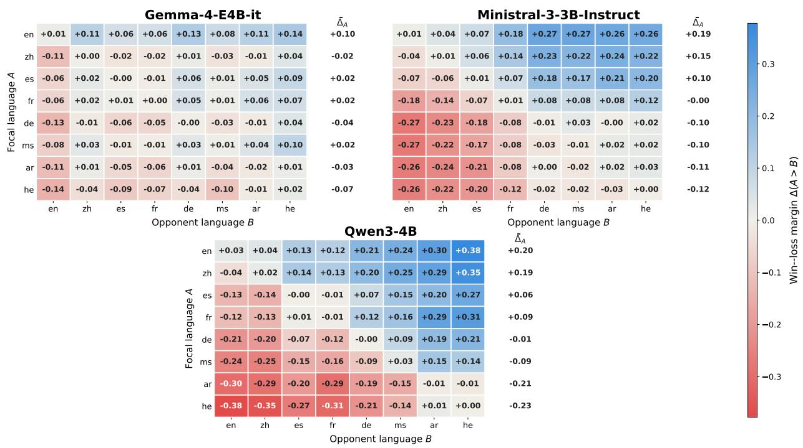
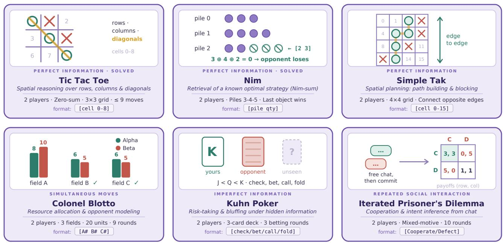
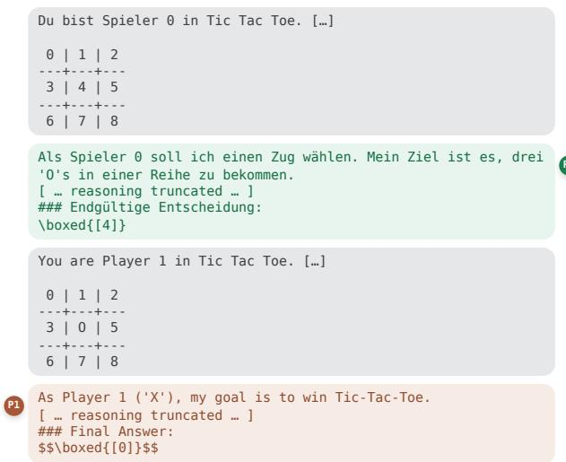
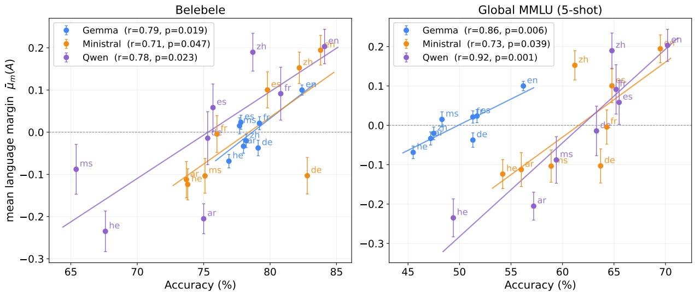
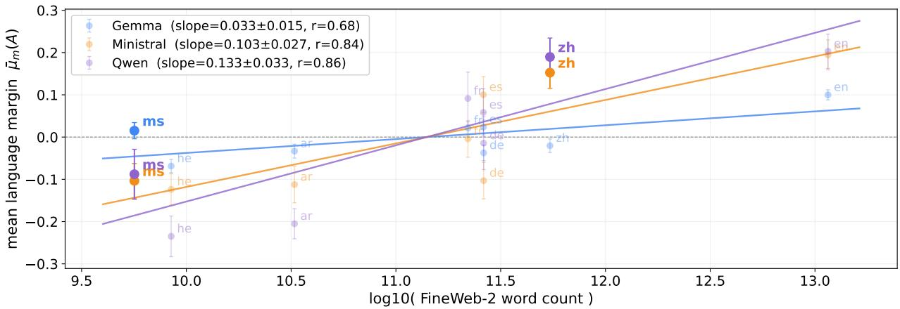
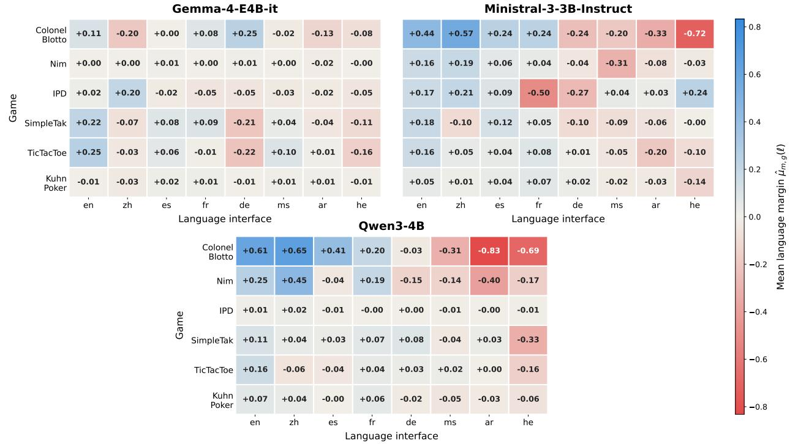

# Skill Issue: Are Skills Language-Invariant in LLMs?

Bobby Cheng<sup>N,</sup>†, Adam Gaber<sup>B</sup>, Zhengyuan Liu<sup>N</sup>, Catherine Arnett<sup>K</sup>, Omer Goldman<sup>R</sup>, Cheston Tan<sup>N</sup>, Leshem Choshen<sup>B,Q,</sup>∗ <sup>N</sup>A\*STAR, <sup>B</sup>Weizmann Institute of Science, <sup>Q</sup>MIT-IBM Watson AI Lab, <sup>R</sup>University of Cambridge, <sup>K</sup>EleutherAI

Large language models access knowledge inconsistently across languages, but to what extent do they difer in their skill sets when interacting with diferent languages? This work quantifies cross-lingual skill inconsistency orthogonally from knowledge and general benchmark performance. We do this via multilingual self-play: two instances of the same model compete in a text-based game, each interacting through a diferent language interface. Since the model, opponent, rules, state space, and available actions remain fixed, this setting isolates the efect of language on the model’s realized behavior. We build a multilingual extension to TextArena and evaluate three open-weight models across eight languages and six games covering spatial reasoning, imperfect information, resource allocation, and repeated interaction.<sup>1</sup>We find that the same model can exhibit markedly diferent playing strength across languages, with systematic variation in win–loss margins, invalid actions, and strategic tendencies. Detailed analyses reveal language-specific failures in spatial reasoning, card-conditioned decisions, and optimal move selection. In some settings, changing only the intermediate reasoning language recovers much of the lost performance, suggesting that language can afect diferent stages of the decision process. These results show that skill discrepancies are a measurable major roadblock in the development of truly multilingual models. Better understanding these discrepancies can help us design models that perform more equitably across languages.

## 1 Introduction

As large language models (LLMs) become more multilingual (e.g., Xue et al., 2021; Shi et al., 2022a) it also becomes clearer that they perform unequally across languages (Hu et al., 2020; Ponti et al., 2020a; Arnett and Bergen, 2025). Understanding these diferences is crucial for deploying multilingual LLMs fairly and reliably, and for identifying what prevents them from functioning as language-agnostic systems.

Much attention has been therefore given to crosslingual inconsistency, where models respond diferently to translations of the same input, but these works mostly focused on the discrepancy in knowledge accessibility (e.g., Jiang et al., 2020; Qi et al., 2023), and pointed to the lack of cross-lingual transfer as its source (Ifergan et al., 2024; Goldman et al., 2025). Equally consequential, and far less understood, is whether models exhibit a diferent set of skills depending on the language through which they interact. In other words, beyond retrieving diferent knowledge, can the same model reason, plan, and make decisions more efectively in some languages than in others? Answering this question requires isolating the efect of language on the model’s behavior independently of its stored knowledge or overall benchmark performance.

In this work we study cross-lingual skill inconsistency by letting models compete against themselves in multilingual text-based games. We let two instances of the same model interact via translations of the same environment into diferent languages, while the board states, cards, numerical information, action spaces, and game rules remain fixed. Fig. 3 demonstrates a typical game played in German and English. If the model accesses and expresses the same underlying skills through both languages, then the two model instances should exhibit equal playing strengths and the wins and losses should distribute randomly as is the case when playing against oneself in the same language (see Fig. 2’s diagonals).

To support this and future studies, we introduce a large-scale multilingual extension to TextArena (Guertler et al., 2025; see Sec. 2), comprising 65 single-, two-, and multi-player games in 193 languages of diferent tiers of translation and providing broad coverage for studying language efects in agentic gameplay. Out of these, we experiment with a subset of manually verified translations of six games into eight languages (see Fig. 1). We use this subset to explore cross-lingual skill inconsistency of three 4Bsized open-weights models: Gemma 4, Ministral 3, and Qwen 3.

We find LLMs to be behaviorally inconsistent across languages (see Sec. 5.1, and Fig. 2). These diferences appear in spatial reasoning, where the axis of failure varies by language; in strategic behavior, where different languages induce diferent risk profiles and error rates; and in unequal access to known knowledge, where models may retrieve or execute a known strategy reliably in one language but not another (see Sec. 5.2). We also observed that reasoning in a stronger language can recover substantial performance in some games, suggesting that language sensitivity may arise during reasoning, state interpretation, or both (see Sec. 5.3).



  
Figure 1: The six game environments and the primary skill each probes; full rules in App. D.  
Figure 2: Overall, wins of each language against others, per model. Each heatmap shows the role-pooled win– loss margin $\Delta ( A > B ) = ( W _ { A } - L _ { A } ) / N$ aggregated over all games, where positive values mean row language A outperforms column language B. The rightmost column reports each language’s mean margin $\bar { \Delta } _ { A }$ . Diagonal is same language games, with randomly assigned sides for comparison. Across models, English is consistently strong and Hebrew weak, with Qwen3-4B showing the sharpest hierarchy.

Finally, we show that these diferences are partly explainable by multilingual benchmarks and agree with the uneven availability of languages across training data (see Sec. 5.4).



Figure 3: Illustration of Gemma-4-E4B-it playing Tic-TacToe with itself in German and English respectively.
<table><tr><td>Tier</td><td colspan="6">Resource class</td><td>Total</td></tr><tr><td></td><td>5</td><td>4</td><td>3</td><td>2</td><td>1</td><td>0</td><td>一</td></tr><tr><td>A</td><td>6</td><td>0</td><td>0</td><td>2</td><td>0</td><td>0</td><td>8</td></tr><tr><td>B</td><td>1</td><td>17</td><td>18</td><td>2</td><td>4</td><td></td><td>42</td></tr><tr><td>C</td><td>7</td><td>1</td><td>6</td><td>14</td><td>76</td><td></td><td>124</td></tr><tr><td>E</td><td>0</td><td>0</td><td>0</td><td>0</td><td>10</td><td>3</td><td>18</td></tr><tr><td>Total</td><td>14</td><td>18</td><td>24</td><td>18</td><td>90</td><td>20</td><td>192</td></tr></table>

Table 1: Languages by verification tier and resource class. We focus on the eight Tier-A languages.

## 2 Multilingual TextArena

TextArena TextArena (Guertler et al., 2025) is an open-source collection of 100+ competitive single-, two-, and multi-player text-based games for training and evaluating LLMs, released under the MIT License. We extend relevant games with multilingual support which allow players’ observations to be rendered in a diferent language without altering the rules, legal actions, rewards or transition dynamics. Examples of the game templates and starter code are in App. D.

Translation workflow. To translate TextArena games we used a multi-tiered translation and verification pipeline. Prioritizing diversity in typology, script, culture, and number of speakers, we chose eight languages as our Tier A: English, Arabic, German, Spanish, French, Hebrew, Malay, and Chinese. This selection ensures that at least two languages share a characteristic along each dimension. We translated six TextArena games to these languages with Claude Opus 4.8 (Anthropic, 2026) or GPT-5.2 (Singh et al., 2026) (see App. C for details), and assigned native speakers to manually verify the translations. This is the set of games and languages that were used in our

experiments.

For an additional 42 high and mid resource languages, Tier B, we constructed an automatic translation and verification pipeline. Due to budget constraints, we used the open-weights models of Llama-3.1-405B (Grattafiori et al., 2024) and Qwen2.5-72B (Qwen Team, 2024) to translate 65 games into these languages. Following Dobler et al. (2026), we backtranslated the results to English again and let Claude Opus 4.8 to judge whether the back translations were faithful to the original English game. If the procedure failed to produce a faithful translation across four different seeds, the language was demoted to Tier C.

For the remaining 142 languages, where highquality machine translations are harder to come by, we used NLLB-200 (Costa-Jussà et al., 2022) for translation and back-translation. Llama-3.1-405B and Qwen2.5-72B then independently assessed fidelity. If they both agree that the back-translation was faithful to the original text in 85% of the time, then the language is assigned to Tier C; otherwise Tier E.

Tab. 1 details the number of languages in each tier and in each resourcefulness class (from Joshi et al., 2020). See App. E for further details.

## 3 Experiment Setup

Evaluated Models. We focus on Gemma-4-E4Bit (Team et al., 2026), Qwen3-4B (Qwen Team, 2025), and Ministral3-3B-Instruct-2512 (Liu et al., 2026), which are comparably sized open-weight models that remain tractable for large-scale multilingual self-play. To determine the general multilingual capability of these models, we evaluate them on Global-MMLU (Singh et al., 2024) and Belebele (Bandarkar et al., 2024), and compare against our multilingual setup in Sec. 5.4.

Game Environments. Models were evaluated on six two-player games from TextArena spanning perfect-information (TicTacToe, Nim, and Simple-Tak), simultaneous resource allocation (Colonel Blotto), imperfect-information (Kuhn Poker), and repeated social interaction game (Iterated Prisoner’s Dilemma). Together, they test spatial and numerical reasoning, planning, allocation, blufing, cooperation, and adaptation. More details of each game are covered in App. D.

Two-player multi-turn games. Each game g is implemented as an environment $E _ { g }$ that unfolds over multiple turns according to a Markov transition process. At step t, $E _ { g }$ is in state $s _ { t } ,$ , and the active player receives an observation $o _ { t }$ containing the player-visible portion of the interaction history, including all publicly observable past actions $a _ { < t }$ . The player then selects an action $a _ { t } ,$ after which $E _ { g }$ transitions to $s _ { t + 1 }$ . A trajectory is denoted $\tau = ( s _ { 0 } , o _ { 0 } , a _ { 0 } , s _ { 1 } , o _ { 1 } , a _ { 1 } , \dots , s _ { H } )$ , where $s _ { H }$ is a terminal state corresponding to a win, loss, or draw. The outcomes for Player 0 and Player 1 are denoted $r _ { 0 } ( \tau )$ and $r _ { 1 } ( \tau )$ , respectively. In standard competitive games, a win for one player is a loss for the other, while a draw yields zero outcome for both. In repeated socialinteraction games such as Iterated Prisoner’s Dilemma, final outcomes are instead determined by $E _ { g }$ ’s cumulative scoring rule. If a model submits an invalid action, it is given an opportunity to correct it; otherwise, the game terminates as an immediate loss.

Language assignment. For each game g, Player 0 receives the game instructions and observations in language ℓ<sub>0</sub> and Player 1 in language $\ell _ { 1 }$ , where $\ell _ { i } \in$ L = {English (en), Arabic (ar), German (de), Spanish (es), French (fr), Hebrew (he), Malay (ms), Chinese (zh)}. A language assignment is the ordered pair $( \ell _ { 0 } , \ell _ { 1 } )$ . Where communication is relevant, each player observes the opponent’s messages in their original language, so a model may process both its interface language and the opponent’s communication language. A small number of language-independent strings are intentionally preserved across translations to maintain shared game mechanics and action formats. These include game-board symbols and coordinates, card ranks and suits, numerical values, and fixed action syntax such as “[bet]”; for example, TicTacToe displays available moves as bracketed indices such as “[1]”.

Action format and sampling parameters. We instruct model m via a system prompt to place its final action inside \boxed{} so that the environment can reliably extract the submitted action (see App. A). During generation, tokens are sampled autoregressively using temperature = 1.0, top\_p = 0.95, and top\_k = 64 to encourage diverse self-play trajectories.

Evaluation protocol. For each model m and game g, we evaluate every language pair, including samelanguage pairs, in both player-role assignments, with n = 400 self-play games per direction. With eight languages, this gives $( \binom { 8 } { 2 } + 8 ) \times 2 \times 4 0 0 = 2 8 { , } 8 0 0$ games per model–game pair, or 86,400 games per game across three models and 518,400 games overall across six games. Evaluating both role assignments balances languages across player roles and avoids conflating language efects with structural advantages such as Player $0 \mathrm { { s } }$ first-move advantage in TicTacToe.

## 4 Metrics

Role-pooled win–loss margin. For each model m, game g, and pair of languages A and B, we evaluate both role assignments, (A, B) and (B, A). We pool outcomes from the perspective of language A: a Player 0 win in $( A , B )$ and a Player 0 loss in $( B , A )$ both count as wins for A, while the converse outcomes count as losses for A. Let $W _ { m , g } ( A , B )$ and $L _ { m , g } ( A , B )$ denote these pooled win and loss counts, and let $N _ { m , g } ( A , B )$ denote the total number of games across both assignments. We define the role-pooled win–loss margin as

$$
\Delta _ { m , g } ( A , B ) = \frac { W _ { m , g } ( A , B ) - L _ { m , g } ( A , B ) } { N _ { m , g } ( A , B ) } .\tag{1}
$$

The margin lies in [−1, 1]. Positive values indicate that language A outperforms language B, negative values indicate the reverse, and draws contribute zero. Pooling both assignments controls for structural playerrole advantages. By construction, $\Delta _ { m , g } ( A , B ) =$ $- \Delta _ { m , g } ( B , A )$

Mean language margin. We summarize the strength of language A for model m in game g by averaging its margin against every other language:

$$
\mu _ { m , g } ( A ) = \frac { 1 } { | \mathcal { L } | - 1 } \sum _ { B \in \mathcal { L } \backslash \{ A \} } \Delta _ { m , g } ( A , B ) .\tag{2}
$$

Higher values indicate stronger average self-play performance through language A.

Model-level mean language margin. We summarize the overall strength of language A for model m by macro-averaging its mean margin across games:

$$
\bar { \mu } _ { m } ( A ) = \frac { 1 } { | \mathcal { G } | } \sum _ { g \in \mathcal { G } } \mu _ { m , g } ( A ) .\tag{3}
$$

## 5 Results

In the following sections, we present our main findings. Unless otherwise specified, Gemma, Qwen, and Ministral refer to their 4B-sized models.

## 5.1 Capabilities Difer Across Languages

Fig. 2 shows that the same model can express substantially diferent capabilities depending on the language through which the game is presented, which we refer to as the language interface. This is striking because the games are largely abstract: the boards, cards, numerical information, legal actions, and underlying strategies remain unchanged. Yet English is strongest on average across all three models, while Hebrew is consistently among the weakest. The magnitude of this efect is also model-dependent: Gemma is comparatively stable, whereas Qwen exhibits the sharpest language hierarchy. These results show that even when the core task information is non-linguistic, the language interface can afect which capabilities a model successfully expresses.

<table><tr><td>Model</td><td>Blotto</td><td>Nim</td><td>TTT</td><td>Tak</td><td>IPD</td><td>Kuhn</td><td> $\mathbf { A v } \mathbf { g } .$ </td></tr><tr><td>Gemma</td><td>0.44</td><td>0.02</td><td>0.47</td><td>0.43</td><td>0.25</td><td>0.05</td><td>0.28</td></tr><tr><td>Qwen</td><td>1.48</td><td>0.85</td><td>0.32</td><td>0.44</td><td>0.03</td><td>0.13</td><td>0.54</td></tr><tr><td>Ministral</td><td>1.28</td><td>0.49</td><td>0.36</td><td>0.28</td><td>0.74</td><td>0.20</td><td>0.56</td></tr><tr><td>Avg.</td><td>1.07</td><td>0.45</td><td>0.38</td><td>0.38</td><td>0.34</td><td>0.13</td><td>0.46</td></tr></table>

Table 2: Language sensitivity by game, measured as language gap, max<sub>ℓ</sub> $\mu _ { \ell } - \operatorname* { m i n } _ { \ell } \mu _ { \ell }$ . Bold marks most language-sensitive model for each game. Bottom row shows the average across models.

Language sensitivity also varies across games (see Tab. 2). Colonel Blotto shows the largest language gap across all three models, whereas Kuhn Poker is consistently among the least sensitive. The remaining games show more model-dependent efects. For example, Iterated Prisoner’s Dilemma is relatively stable for Gemma and Qwen but is more sensitive for Ministral. We next summarise how these diferences manifest across specific skills like spatial reasoning, strategic behavior and access to known strategies.

## 5.2 Language-Conditioned Skills Diference

Beyond aggregate game-playing strength, the language interface produces consistent diferences in how models fail. In spatial games like TicTacToe and Simple-Tak, the failure mode varies by language. We see that English interfaces tend to show a relatively balanced distribution of losses across rows, columns and diagonals, whereas non-Latin-script interfaces such as Arabic and Hebrew skew consistently toward column and diagonal defeats, with game trajectories revealing frequent mislabeling of cell sequences as lines. Strategic behavior shifts as well. In Kuhn Poker, the same model adopts diferent risk profiles depending on the interface language. Blufing rates with the weakest card vary by more than twofold across languages for Qwen, while Gemma shows its largest cross-language variation when deciding how to play the intermediate card Q. More broadly, both the magnitude and the type of these language-conditioned shifts difer across models.

The starkest efect concerns access to pre-existing knowledge. Nim admits a complete algorithmic solution (reducing the Nim-sum to zero), which lets us test whether a known strategy is retrievable through each language interface. Mentions of the optimal strategy, optimal first-move execution, and win rates all drop sharply in Arabic and Hebrew for Qwen and Ministral, and a majority of the remaining strategy mentions in these languages originate from the small fraction of games in which the model spontaneously switched into a Latin script mid-reasoning. This indicates that the strategy is present in the model but not reliably accessible through every language: merely changing the processing language can retrieve knowledge that would otherwise be lost. Full per-game analyses, including defeat distributions, card-conditioned action rates, and the Nim strategy results, are provided in App. G.

## 5.3 Stronger Languages Enable Recovery

<table><tr><td>Game</td><td>Floor  $\mu _ { \mathrm { w e a k } }$ </td><td>Reasoning language  $\mu /$  recovery</td><td>Ceiling µbest</td></tr><tr><td>Kuhn</td><td>-0.03 zh/zh</td><td>-0.01 zh/es / 37.6% −0.01 zh/fr / 49.3%</td><td>+0.02 es/es</td></tr><tr><td>ST</td><td>-0.21 de/de</td><td>+0.05 de/en / 60.5% —0.16 de/es / 11.6%</td><td>+0.22 en/en</td></tr><tr><td>TTT</td><td>-0.22 de/de</td><td>+0.20 de/en / 89.4% -0.14 de/es / 17.0%</td><td>+0.25 en/en</td></tr></table>

Table 3: Role-corrected strength $\mu$ under each interface/reasoning language pair. The middle column reports the strongest reasoning language, followed by the second strongest, while holding the weak interface language fixed. Recovery is $( \mu - \mu _ { \mathrm { w e a k } } ) / ( \mu _ { \mathrm { b e s t } } - \mu _ { \mathrm { w e a k } } )$ Kuhn, ST and TTT denote Kuhn Poker, SimpleTak and TicTacToe.

Prior works show that multilingual models can sometimes improve performance on non-English inputs by routing them through English. For example, self-translation and question-alignment methods improve multilingual task performance by translating non-English inputs into English before inference or reasoning (Zhu et al., 2024; Etxaniz et al., 2024; Mondshine et al., 2025). Here, we separate the language of the environment interface from the language of the intermediate reasoning and found that reasoning in a stronger language can recover some of the performance.

Tab. 3 shows that German is Gemma’s weakest interface language in TicTacToe, with $\mu = - 0 . 2 2$ . Holding the German interface fixed while switching the reasoning language to English increases the margin to $\mu = + 0 . 2 0$ , recovering 89.4% of the reachable gap to the English-interface ceiling. We observe a similar efect in SimpleTak, where switching from German to English reasoning improves the margin from $\mu ~ = ~ - 0 . 2 1$ to $\mu ~ = ~ + 0 . 0 5$ , recovering 60.5% of the reachable gap. Because these gains occur without translating or replacing the environment observations, they suggest that a substantial portion of the language efect in these games arises during the model’s intermediate reasoning process. However, recovery is limited and non-monotonic in Kuhn Poker, indicating that language sensitivity can arise at diferent stages of the agent’s decision process and cannot always be addressed by reasoning in a stronger language.

## 5.4 Explaining Outcome Diferences

Finally, we ask whether the language-conditioned outcome diferences can be explained by two external references: each model’s static multilingual competence, and the amount of multilingual text available on the web.

<table><tr><td>Lang.</td><td>Gemma-4 E4B-it</td><td></td><td>Qwen3-4B Ministral3-3B</td></tr><tr><td></td><td></td><td>Belebele</td><td></td></tr><tr><td>Arabic</td><td>78.0</td><td>75.0</td><td>73.7</td></tr><tr><td>German</td><td>79.1</td><td>75.3</td><td>82.8</td></tr><tr><td>English</td><td>82.4</td><td>84.1</td><td>83.8</td></tr><tr><td>Spanish</td><td>77.8</td><td>75.7</td><td>79.8</td></tr><tr><td>French</td><td>79.2</td><td>80.8</td><td>76.0</td></tr><tr><td>Hebrew Malay</td><td>76.9</td><td>67.6</td><td>73.8</td></tr><tr><td>Chinese</td><td>77.7</td><td>65.4</td><td>75.1</td></tr><tr><td></td><td>78.2</td><td>78.7</td><td>82.2</td></tr><tr><td>Avg.</td><td>78.7±1.7</td><td>75.3±6.3</td><td>78.4±4.2</td></tr><tr><td></td><td></td><td>Global MMLU</td><td></td></tr><tr><td>Arabic</td><td>47.2</td><td>57.2</td><td>56.0</td></tr><tr><td>German</td><td>51.3</td><td>63.3</td><td>63.7</td></tr><tr><td>English</td><td>56.2</td><td>70.2</td><td>69.5</td></tr><tr><td>Spanish</td><td>51.7</td><td>65.5</td><td>64.8</td></tr><tr><td>French</td><td>51.3</td><td>65.2</td><td>64.3</td></tr><tr><td>Hebrew</td><td>45.5</td><td>49.4</td><td>54.2</td></tr><tr><td>Malay</td><td>48.3</td><td>59.4</td><td>58.9</td></tr><tr><td>Chinese</td><td>47.5</td><td>64.8</td><td>61.2</td></tr><tr><td>Avg.</td><td>49.9±3.4</td><td>61.9±6.4</td><td>61.6±5.0</td></tr></table>

Table 4: Accuracy (%) on Belebele and 5-shot Global MMLU. Bold indicates the best-performing models for each language and benchmark average.

Static Benchmarks In spite there being only a sample size of 8 languages, there is noticeable correlation between the mean language margin and Global MMLU (5-shot) at r between 0.73 and 0.92 depending on the model, and likewise with Belebele at r between 0.71 and 0.79 (see Fig. 4a). The language ranking observed in interactive play is thus partly explainable from static benchmarks. Languages a model scores well on in isolation are also, on average, the languages it wins with in self-play. What benchmark competence does not predict, however, is stability across language which is the max–min range of a model’s mean language margins. Gemma has the lowest Global MMLU mean of the three models yet the smallest cross-language spread, whereas Qwen has the highest mean and the largest spread. Benchmark level and cross-lingual consistency are therefore distinct axes, and being better on average does not imply behaving more uniformly across languages.

Data Availability Since the training data distributions of the models we evaluate are not publicly available, we cannot directly measure how much text each model was exposed to in each language. We therefore use the amount of publicly available web text as a proxy for language-level data availability, using perlanguage word counts from FineWeb-2 (Penedo et al., 2025). For English, which is not included in FineWeb-2, we estimate the corresponding word count from FineWeb (Penedo et al., 2024) using an English tokento-word fertility of approximately 1.3, consistent with values reported in FineWeb-2. We then relate each model’s mean language margin $\bar { \mu } _ { m } ( A )$ to this proxy (see Fig. 4b). The fit within each model is positive and strong, with r averaging 0.79. Languages with more available web text tend to be stronger interfaces, mirroring the benchmark correlations above.

The more informative pattern lies in the deviations from this trend, highlighted in Fig. 4b. Malay sits above the pooled fit for all three models despite having the smallest FineWeb-2 corpus, and in particular outperforms Hebrew for every model even though Hebrew has more available web text by this proxy. This asymmetry is consistent with ECLeKTic’s finding that cross-lingual transfer is stronger between languages sharing a writing system, and with prior work identifying script as a key factor in cross-lingual knowledge and skill transfer (Goldman et al., 2025; Ifergan et al., 2024; Malkin et al., 2022; Mittal et al., 2023; Diskind et al., 2026). This suggests that Latin-script Malay may benefit from transfer from higher-resource Latin-script languages, while Hebrew cannot exploit the same script-based transfer.

Chinese exposes the opposite limitation of a pure data account. Despite having roughly 20× less available web text than English by this proxy, Qwen and Ministral reach near-English margins, while Gemma’s Chinese margin remains near zero. The same data availability thus supports very diferent realized strength depending on the model. Moreover, since Chinese achieves this without sharing a script with the other strong interfaces, script alone cannot account for the results either. Data quantity and script each explain part of the language hierarchy, but the remaining variation is model-specific: how much strength a model realizes from a given language is not determined by how prevalent that language is in web data.



(a) Mean language margin against Belebele accuracy (left) and Global MMLU accuracy (right).  
  
(b) Mean language margin against web-text availability, measured by $\log _ { 1 0 }$ FineWeb-2 word count, with English estimated from FineWeb.  
Figure 4: Relationship between within-model language strength and external measures of language capability and data availability. Each point represents one of eight languages for a given model, lines show per-model leastsquares fits, and error bars show standard errors across the language’s seven pairwise margins. In a, Pearson r is reported in the legend (n = 8). In b, highlighted points mark the largest deviations from the fitted trends. Margins are comparable across languages within, but not across, models.

## 6 Related Works

## 6.1 Multilingual Language and Reasoning Evaluation

Multilingual benchmarks have progressed from evaluating language understanding tasks such as natural language inference, question answering, and commonsense reasoning (Ponti et al., 2020b; Lin et al., 2022), to covering broader capabilities including mathematical reasoning, reading comprehension, knowledgeintensive academic tasks, code generation and instruction following (Shi et al., 2022b; Bandarkar et al., 2024; Singh et al., 2024; Huang et al., 2025), with recent benchmarks evaluating regional and culturally situated knowledge by drawing questions from local sources (Romanou et al., 2024; Chang et al., 2026a).

These benchmarks primarily evaluate models through fixed inputs and predefined answers. They reveal whether accuracy varies across languages, but not whether a model expresses an equivalent policy over an evolving interaction. We use Belebele and Global-MMLU as reference for general multilingual competence (see Tab. 4), while Multilingual TextArena studies whether a fixed model accesses and expresses the same interactive skills when operating in the same environment through diferent language interfaces.

## 6.2 Cross-Lingual Knowledge and Skill Transfer

Prior work suggests that multilingual models exhibit factual compartmentalization, where information acquired through one language might be irretrievable in another (Goldman et al., 2025; Asai et al., 2021; Chua et al., 2025; Limkonchotiwat et al., 2022; Litschko et al., 2025). Some ofer post-hoc solutions, often following inference in multiple languages (Huang et al., 2023; Diskind et al., 2026). Even knowledge that seems to be consistent across languages is often shown to be stored twice rather than shared (Ifergan et al., 2024; Qi et al., 2023). At the same time, learning linguistic skills is cheap, with 100M parameter models showing equivalent performance to state-of-theart 70B ones (Charpentier et al., 2025; Chang et al., 2026b). Together, these findings suggest that factual compartmentalization is more than a discrepancy in linguistic ability between languages within the same model.

Related work on skill transfer studies whether task competence acquired from supervision in one or few languages generalizes to others (Hu et al., 2020; Malkin et al., 2022; Shaham et al., 2024). For example, Turc et al. (2021) shows that the sourced language used for fine-tuning afects zero-shot transfer performance, with English not always providing the strongest transfer to other languages.

Our work is related to cross-lingual skill transfer, but difers from the standard source-fine-tuning setup. Instead, we focus on language-conditioned skill access and expression rather than acquiring a skill through one language.

## 6.3 Interactive and Game-Based Evaluation of LLMs

Interactive benchmarks evaluate LLMs as agents whose actions afect an evolving environment. Unlike static benchmarks, these settings test whether models can interpret changing states, select valid actions, and adapt over multiple turns. These include tool-use environments and game-based benchmarks that evaluate capabilities such as planning, spatial reasoning, learning from interaction, coordination, and goal-directed decision-making (Barres et al., 2025; Guertler et al., 2025; Wu et al., 2024; Gong et al., 2023; Qiao et al., 2023).

A related line of work uses strategic and gametheoretic environments to evaluate planning, decisionmaking, and social reasoning, including direct competition between LLMs (Duan et al., 2024; Costarelli et al., 2024; Yao et al., 2025).

Within this line of work, existing benchmarks primarily compare models, prompting methods, or agent architectures under a shared or fixed language interface. We instead use competitive environments to study language-conditioned variation within a fixed model by extending TextArena with multilingual interfaces.

## 7 Conclusion

In this paper, we introduced Multilingual TextArena and used controlled self-play to test whether the skills of an LLM remain consistent across language interfaces. Across three models, eight languages and six games, we found diferences in their playing strength, strategic behavior and spatial features within the same model.

Reasoning in a stronger language recovered substantial performance in some games, but these were limited in other games, suggesting that language can afect multiple stages of interaction, including state interpretation, reasoning, knowledge retrieval, and action selection. Static multilingual benchmarks and relative web-data availability explained part of the variation, not all.

Overall, we showed that a skill a model has may not be equally applied in every language. Multilingual evaluation should assess not only whether models understand equivalent inputs, but also if they behave consistently across languages.

## Limitations

Closed-data models While the models we evaluated have their technical reports published, their training data remains behind closed doors. This closed-data nature makes it hard for us to uncover what reasons and training approaches might have explained the diference in language performance per model. While there were models like Apertus (Hernández-Cano et al., 2025) which state clearly their pre-training data recipe and their multilingual distribution, Apertus produced several invalid moves which made it dificult to produce a viable score. Sticking with these models, the explainability of these results required assumptions and estimates, e.g. availability of multilingual data.

Model scale. Our evaluation is limited to models in the 3B to 4B parameter range. This scale enabled controlled and cost-eficient evaluation over more than half a million games. However, cross-lingual skill inconsistency may difer for larger models. Our results, then, should therefore not be interpreted as establishing scale-invariant language efects.

## Acknowledgements

We would like to thank the Shimon and Golde Picker– Weizmann Annual Grant and the Center for New Scientists at the Weizmann Institute of Science for supporting this research. Omer Goldman also acknowledges support from the Blavatnik Family Foundation.

## References

Anthropic. 2026. Claude opus 4.8 system card. Technical report, Anthropic.

Catherine Arnett and Benjamin Bergen. 2025. Why do language models perform worse for morphologically complex languages? In Proceedings of the 31st International Conference on Computational Linguistics, pages 6607–6623, Abu Dhabi, UAE. Association for Computational Linguistics.

Akari Asai, Jungo Kasai, Jonathan H. Clark, Kenton Lee, Eunsol Choi, and Hannaneh Hajishirzi. 2021. Xor qa: Cross-lingual open-retrieval question answering. Preprint, arXiv:2010.11856.

Robert Axelrod. 1984. The Evolution of Cooperation. Basic, New York.

Lucas Bandarkar, Davis Liang, Benjamin Muller, Mikel Artetxe, Satya Narayan Shukla, Donald Husa, Naman Goyal, Abhinandan Krishnan, Luke Zettlemoyer, and Madian Khabsa. 2024. The belebele benchmark: a parallel reading comprehension dataset in 122 language variants. In Proceedings of the 62nd Annual Meeting of the Association for Computational Linguistics (Volume 1: Long Papers), pages 749–775, Bangkok, Thailand and virtual meeting. Association for Computational Linguistics.

Victor Barres, Honghua Dong, Soham Ray, Xujie Si, and Karthik Narasimhan. 2025. τ<sup>2</sup>-bench: Evaluating conversational agents in a dual-control environment. Preprint, arXiv:2506.07982.

Emile Borel. 1953. The theory of play and integral equations with skew symmetric kernels. Econometrica, 21(1):97–100.

Charles L. Bouton. 1901. Nim, a game with a complete mathematical theory. Annals of Mathematics, 3(1/4):35–39.

Greg Brockman, Vicki Cheung, Ludwig Pettersson, Jonas Schneider, John Schulman, Jie Tang, and Wojciech Zaremba. 2016. Openai gym. Preprint, arXiv:1606.01540.

Tyler A. Chang, Catherine Arnett, Abdelrahman Sadallah, Abdelrahman Eldesokey, Abeer Kashar, Abolade Daud, Abosede Grace Olanihun, Adamu Labaran Mohammed, Adeyemi Praise, Adhikarimayum Meerajita Sharma, Aditi Gupta, Adril Putra Merin, Adwoa Bremang, Afitab Iyigun, Afonso Simplício, Ahmed Essouaied, Aicha Chorana, Akhil Eppa, Akintunde Oladipo, and 361 others. 2026a. Global PIQA: Evaluating commonsense reasoning across 100+ languages and cultures. Preprint.

Tyler A. Chang, Catherine Arnett, Zhuowen Tu, and Benjamin Bergen. 2026b. Goldfish: Monolingual language models for 350 languages. In Proceedings ofthe Fifteenth Language Resources and Evaluation Conference (LREC 2026), pages 3750–3781, Palma, Mallorca, Spain. European Language Resources Association (ELRA).

Lucas Georges Gabriel Charpentier, Leshem Choshen, Ryan Cotterell, Mustafa Omer Gul, Michael Y Hu, Jing Liu, Jaap Jumelet, Tal Linzen, Aaron Mueller, Candance Ross, et al. 2025. Findings of the third babylm challenge: Accelerating language modeling research with cognitively plausible data. In Proceedings ofthe First BabyLM Workshop, pages 399–420.

Lynn Chua, Badih Ghazi, Yangsibo Huang, Pritish Kamath, Ravi Kumar, Pasin Manurangsi, Amer Sinha, Chulin Xie, and Chiyuan Zhang. 2025. Crosslingual capabilities and knowledge barriers in multilingual large language models. Preprint, arXiv:2406.16135.

Marta R Costa-Jussà, James Cross, Onur Çelebi, Maha Elbayad, Kenneth Heafield, Kevin Hefernan, Elahe Kalbassi, Janice Lam, Daniel Licht, Jean Maillard, et al. 2022. No language left behind: Scaling human-centered machine translation. arXiv preprint arXiv:2207.04672.

Anthony Costarelli, Mat Allen, Roman Hauksson, Grace Sodunke, Suhas Hariharan, Carlson Cheng, Wenjie Li, Joshua Clymer, and Arjun Yadav. 2024. Gamebench: Evaluating strategic reasoning abilities of llm agents. Preprint, arXiv:2406.06613.

Elisha Diskind, Itamar Trainin, Uri Shaham, Leshem Choshen, Idan Szpektor, and Omri Abend. 2026. Cross-lingual exploration for parametric knowledge. arXiv preprint arXiv:2606.24579.

Konstantin Dobler, Simon Lehnerer, Federico Scozzafava, Jonathan Janke, and Mohamed Ali. 2026. Multilingual reasoning gym: Multilingual scaling of procedural reasoning environments. Preprint, arXiv:2603.10793.

Jinhao Duan, Renming Zhang, James Difenderfer, Bhavya Kailkhura, Lichao Sun, Elias Stengel-Eskin, Mohit Bansal, Tianlong Chen, and Kaidi Xu. 2024. Gtbench: Uncovering the strategic reasoning limitations of llms via game-theoretic evaluations. Preprint, arXiv:2402.12348.

AbdelRahim Elmadany, Ife Adebara, and Muhammad Abdul-Mageed. 2024. Toucan: Many-to-many translation for 150 african language pairs. Preprint, arXiv:2407.04796.

Julen Etxaniz, Gorka Azkune, Aitor Soroa, Oier Lopez de Lacalle, and Mikel Artetxe. 2024. Do multilingual language models think better in English? In Proceedings ofthe 2024 Conference ofthe North American Chapter of the Association for Computational Linguistics: Human Language Technologies (Volume 2: Short Papers), pages 550–564, Mexico City, Mexico. Association for Computational Linguistics.

Jay Gala, Pranjal A. Chitale, Raghavan AK, Varun Gumma, Sumanth Doddapaneni, Aswanth Kumar, Janki Nawale, Anupama Sujatha, Ratish Puduppully, Vivek Raghavan, Pratyush Kumar, Mitesh M. Khapra, Raj Dabre, and Anoop Kunchukuttan. 2023. IndicTrans2: Towards high-quality and accessible machine translation models for all 22 scheduled indian languages. Preprint, arXiv:2305.16307.

Leo Gao, Jonathan Tow, Baber Abbasi, Stella Biderman, Sid Black, Anthony DiPofi, Charles Foster, Laurence Golding, Jefrey Hsu, Alain Le Noac’h, Haonan Li, Kyle McDonell, Niklas Muennighof, Chris Ociepa, Jason Phang, Laria Reynolds, Hailey Schoelkopf, Aviya Skowron, Lintang Sutawika, and 5 others. 2024. The language model evaluation harness.

Omer Goldman, Uri Shaham, Dan Malkin, Sivan Eiger, Avinatan Hassidim, Yossi Matias, Joshua Maynez, Adi Mayrav Gilady, Jason Riesa, Shruti Rijhwani, Laura Rimell, Idan Szpektor, Reut Tsarfaty, and Matan Eyal. 2025. Eclektic: a novel challenge set for evaluation of cross-lingual knowledge transfer. Preprint, arXiv:2502.21228.

Ran Gong, Qiuyuan Huang, Xiaojian Ma, Hoi Vo, Zane Durante, Yusuke Noda, Zilong Zheng, Song-Chun Zhu, Demetri Terzopoulos, Li Fei-Fei, and

Jianfeng Gao. 2023. Mindagent: Emergent gaming interaction. Preprint, arXiv:2309.09971.

Aaron Grattafiori, Abhimanyu Dubey, Abhinav Jauhri, Abhinav Pandey, Abhishek Kadian, Ahmad Al-Dahle, Aiesha Letman, Akhil Mathur, Alan Schelten, Alex Vaughan, Amy Yang, Angela Fan, Anirudh Goyal, Anthony Hartshorn, Aobo Yang, Archi Mitra, Archie Sravankumar, Artem Korenev, Arthur Hinsvark, and 542 others. 2024. The llama 3 herd of models. Preprint, arXiv:2407.21783.

Leon Guertler, Bobby Cheng, Simon Yu, Bo Liu, Leshem Choshen, and Cheston Tan. 2025. Textarena. Preprint, arXiv:2504.11442.

Alejandro Hernández-Cano, Alexander Hägele, Allen Hao Huang, Angelika Romanou, Antoni-Joan Solergibert, Barna Pasztor, Bettina Messmer, Dhia Garbaya, Eduard Frank Ďurech, Ido Hakimi, Juan García Giraldo, Mete Ismayilzada, Negar Foroutan, Skander Moalla, Tiancheng Chen, Vinko Sabolčec, Yixuan Xu, Michael Aerni, Badr AlKhamissi, and 82 others. 2025. Apertus: Democratizing Open and Compliant LLMs for Global Language Environments. https://arxiv.org/abs/2509.14233.

Junjie Hu, Sebastian Ruder, Aditya Siddhant, Graham Neubig, Orhan Firat, and Melvin Johnson. 2020. Xtreme: A massively multilingual multi-task benchmark for evaluating cross-lingual generalization. Preprint, arXiv:2003.11080.

Haoyang Huang, Tianyi Tang, Dongdong Zhang, Xin Zhao, Ting Song, Yan Xia, and Furu Wei. 2023. Not all languages are created equal in LLMs: Improving multilingual capability by cross-lingual-thought prompting. In Findings of the Association for Computational Linguistics: EMNLP 2023, pages 12365–12394, Singapore. Association for Computational Linguistics.

Xu Huang, Wenhao Zhu, Hanxu Hu, Conghui He, Lei Li, Shujian Huang, and Fei Yuan. 2025. BenchMAX: A comprehensive multilingual evaluation suite for large language models. In Findings of the Association for Computational Linguistics: EMNLP 2025, pages 16751–16774, Suzhou, China. Association for Computational Linguistics.

Maxim Ifergan, Leshem Choshen, Roee Aharoni, Idan Szpektor, and Omri Abend. 2024. Beneath the surface of consistency: Exploring cross-lingual knowledge representation sharing in llms. Preprint, arXiv:2408.10646.

Zhengbao Jiang, Antonios Anastasopoulos, Jun Araki, Haibo Ding, and Graham Neubig. 2020. X-FACTR: Multilingual factual knowledge retrieval from pretrained language models. In Proceedings ofthe 2020 Conference on Empirical Methods in Natural Language Processing (EMNLP), pages 5943–5959, Online. Association for Computational Linguistics.

Pratik Joshi, Sebastin Santy, Amar Budhiraja, Kalika Bali, and Monojit Choudhury. 2020. The state and fate of linguistic diversity and inclusion in the NLP world. In Proceedings of the 58th Annual Meeting of the Association for Computational Linguistics, ACL 2020, Online, July 5-10, 2020, pages 6282–6293. Association for Computational Linguistics.

Sneha Kudugunta, Isaac Caswell, Biao Zhang, Xavier Garcia, Christopher A. Choquette-Choo, Katherine Lee, Derrick Xin, Aditya Kusupati, Romi Stella, Ankur Bapna, and Orhan Firat. 2023. MADLAD-400: A multilingual and document-level large audited dataset. Preprint, arXiv:2309.04662.

Harold W. Kuhn. 1951. A simplified two-person poker. Contributions to the Theory ofGames.

Woosuk Kwon, Zhuohan Li, Siyuan Zhuang, Ying Sheng, Lianmin Zheng, Cody Hao Yu, Joseph E. Gonzalez, Hao Zhang, and Ion Stoica. 2023. Efficient memory management for large language model serving with pagedattention. In Proceedings of the ACM SIGOPS 29th Symposium on Operating Systems Principles.

Peerat Limkonchotiwat, Wuttikorn Ponwitayarat, Can Udomcharoenchaikit, Ekapol Chuangsuwanich, and Sarana Nutanong. 2022. CL-ReLKT: Crosslingual language knowledge transfer for multilingual retrieval question answering. In Findings of the Association for Computational Linguistics: NAACL 2022, pages 2141–2155, Seattle, United States. Association for Computational Linguistics.

Xi Victoria Lin, Todor Mihaylov, Mikel Artetxe, Tianlu Wang, Shuohui Chen, Daniel Simig, Myle Ott, Naman Goyal, Shruti Bhosale, Jingfei Du, Ramakanth Pasunuru, Sam Shleifer, Punit Singh Koura, Vishrav Chaudhary, Brian O’Horo, Jef Wang, Luke Zettlemoyer, Zornitsa Kozareva, Mona Diab, and 2 others. 2022. Few-shot learning with multilingual generative language models. In Proceedings ofthe 2022 Conference on Empirical Methods in Natural Language Processing, pages 9019– 9052, Abu Dhabi, United Arab Emirates. Association for Computational Linguistics.

Robert Litschko, Oliver Kraus, Verena Blaschke, and Barbara Plank. 2025. Cross-dialect information retrieval: Information access in lowresource and high-variance languages. Preprint, arXiv:2412.12806.

Alexander H. Liu, Kartik Khandelwal, Sandeep Subramanian, Victor Jouault, Abhinav Rastogi, Adrien Sadé, Alan Jefares, Albert Jiang, Alexandre Cahill, Alexandre Gavaudan, Alexandre Sablayrolles, Amélie Héliou, Amos You, Andy Ehrenberg, Andy Lo, Anton Eliseev, Antonia Calvi, Avinash Sooriyarachchi, Baptiste Bout, and 101 others. 2026. Ministral 3. Preprint, arXiv:2601.08584.

Dan Malkin, Tomasz Limisiewicz, and Gabriel Stanovsky. 2022. A balanced data approach for evaluating cross-lingual transfer: Mapping the linguistic blood bank. In Proceedings of the 2022 Conference of the North American Chapter of the Associationfor Computational Linguistics: Human Language Technologies, pages 4903–4915, Seattle, United States. Association for Computational Linguistics.

Shubham Mittal, Keshav Kolluru, Soumen Chakrabarti, and Mausam. 2023. mokb6: A multilingual open knowledge base completion benchmark. Preprint, arXiv:2211.06959.

Itai Mondshine, Tzuf Paz-Argaman, and Reut Tsarfaty. 2025. Beyond English: The impact of prompt translation strategies across languages and tasks in multilingual LLMs. In Findings of the Association for Computational Linguistics: NAACL 2025, pages 1331–1354. Association for Computational Linguistics.

Philipp Moritz, Robert Nishihara, Stephanie Wang, Alexey Tumanov, Richard Liaw, Eric Liang, Melih Elibol, Zongheng Yang, William Paul, Michael I. Jordan, and Ion Stoica. 2018. Ray: A distributed framework for emerging ai applications. Preprint, arXiv:1712.05889.

Guilherme Penedo, Hynek Kydlíček, Loubna Ben allal, Anton Lozhkov, Margaret Mitchell, Colin Raffel, Leandro Von Werra, and Thomas Wolf. 2024. The fineweb datasets: Decanting the web for the finest text data at scale. In The Thirty-eight Conference on Neural Information Processing Systems Datasets and Benchmarks Track.

Guilherme Penedo, Hynek Kydlíček, Vinko Sabolčec, Bettina Messmer, Negar Foroutan, Amir Hossein Kargaran, Colin Rafel, Martin Jaggi, Leandro Von Werra, and Thomas Wolf. 2025. Fineweb2: One

pipeline to scale them all – adapting pre-training data processing to every language. Preprint, arXiv:2506.20920.

Edoardo Maria Ponti, Goran Glavaš, Olga Majewska, Qianchu Liu, Ivan Vulić, and Anna Korhonen. 2020a. XCOPA: A multilingual dataset for causal commonsense reasoning. In Proceedings of the 2020 Conference on Empirical Methods in Natural Language Processing (EMNLP), pages 2362–2376, Online. Association for Computational Linguistics.

Edoardo Maria Ponti, Goran Glavaš, Olga Majewska, Qianchu Liu, Ivan Vulić, and Anna Korhonen. 2020b. XCOPA: A multilingual dataset for causal commonsense reasoning. In Proceedings of the 2020 Conference on Empirical Methods in Natural Language Processing (EMNLP), pages 2362–2376, Online. Association for Computational Linguistics.

Jirui Qi, Raquel Fernández, and Arianna Bisazza. 2023. Cross-lingual consistency of factual knowledge in multilingual language models. In Proceedings of the 2023 Conference on Empirical Methods in Natural Language Processing, page 10650– 10666. Association for Computational Linguistics.

Dan Qiao, Chenfei Wu, Yaobo Liang, Juntao Li, and Nan Duan. 2023. Gameeval: Evaluating llms on conversational games. Preprint, arXiv:2308.10032.

Qwen Team. 2024. Qwen2.5 technical report. Preprint, arXiv:2412.15115.

Qwen Team. 2025. Qwen3 technical report. Preprint, arXiv:2505.09388.

Angelika Romanou, Negar Foroutan, Anna Sotnikova, Zeming Chen, Sree Harsha Nelaturu, Shivalika Singh, Rishabh Maheshwary, Micol Altomare, Mohamed A. Haggag, Snegha A, Alfonso Amayuelas, Azril Hafizi Amirudin, Viraat Aryabumi, Danylo Boiko, Michael Chang, Jenny Chim, Gal Cohen, Aditya Kumar Dalmia, Abraham Diress, and 40 others. 2024. Include: Evaluating multilingual language understanding with regional knowledge. Preprint, arXiv:2411.19799.

Patrick Rothfuss. 2011. The Wise Man’s Fear.

Uri Shaham, Jonathan Herzig, Roee Aharoni, Idan Szpektor, Reut Tsarfaty, and Matan Eyal. 2024. Multilingual instruction tuning with just a pinch of multilinguality. Preprint, arXiv:2401.01854.

Freda Shi, Mirac Suzgun, Markus Freitag, Xuezhi Wang, Suraj Srivats, Soroush Vosoughi, Hyung Won Chung, Yi Tay, Sebastian Ruder,

Denny Zhou, Dipanjan Das, and Jason Wei. 2022a. Language models are multilingual chain-of-thought reasoners. Preprint, arXiv:2210.03057.

Freda Shi, Mirac Suzgun, Markus Freitag, Xuezhi Wang, Suraj Srivats, Soroush Vosoughi, Hyung Won Chung, Yi Tay, Sebastian Ruder, Denny Zhou, Dipanjan Das, and Jason Wei. 2022b. Language models are multilingual chain-of-thought reasoners. ArXiv, abs/2210.03057.

Aaditya Singh, Adam Fry, Adam Perelman, Adam Tart, Adi Ganesh, Ahmed El-Kishky, Aidan McLaughlin, Aiden Low, AJ Ostrow, Akhila Ananthram, Akshay Nathan, Alan Luo, Alec Helyar, Aleksander Madry, Aleksandr Efremov, Aleksandra Spyra, Alex Baker-Whitcomb, Alex Beutel, Alex Karpenko, and 467 others. 2026. Openai gpt-5 system card. Preprint, arXiv:2601.03267.

Shivalika Singh, Angelika Romanou, Clémentine Fourrier, David I. Adelani, Jian Gang Ngui, Daniel Vila-Suero, Peerat Limkonchotiwat, Kelly Marchisio, Wei Qi Leong, Yosephine Susanto, Raymond Ng, Shayne Longpre, Wei-Yin Ko, Madeline Smith, Antoine Bosselut, Alice Oh, Andre F. T. Martins, Leshem Choshen, Daphne Ippolito, and 4 others. 2024. Global mmlu: Understanding and addressing cultural and linguistic biases in multilingual evaluation. Preprint, arXiv:2412.03304.

Gemma Team, Sherif El Abd, Vaibhav Aggarwal, Robin Algayres, Alek Andreev, Olivier Bachem, Ian Ballantyne, Cormac Brick, Victor Cărbune, Michelle Casbon, Mayank Chaturvedi, Victor Cotruta, Alice Coucke, Phil Culliton, Robert Dadashi, Lucas Dixon, Mohamed Elhawaty, Utku Evci, Clément Farabet, and 282 others. 2026. Gemma 4 technical report. Preprint, arXiv:2607.02770.

Iulia Turc, Kenton Lee, Jacob Eisenstein, Ming-Wei Chang, and Kristina Toutanova. 2021. Revisiting the primacy of english in zero-shot cross-lingual transfer. Preprint, arXiv:2106.16171.

Denny Vrandečić and Markus Krötzsch. 2014. Wikidata: a free collaborative knowledgebase. Commun. ACM, 57(10):78–85.

Eric W. Weisstein. Tic-tac-toe. MathWorld—A Wolfram Resource.

Yue Wu, Xuan Tang, Tom M. Mitchell, and Yuanzhi Li. 2024. Smartplay: A benchmark for llms as intelligent agents. Preprint, arXiv:2310.01557.

Linting Xue, Noah Constant, Adam Roberts, Mihir Kale, Rami Al-Rfou, Aditya Siddhant, Aditya Barua, and Colin Rafel. 2021. mt5: A massively multilingual pre-trained text-to-text transformer. Preprint, arXiv:2010.11934.

Jianzhu Yao, Kevin Wang, Ryan Hsieh, Haisu Zhou, Tianqing Zou, Zerui Cheng, Zhangyang Wang, and Pramod Viswanath. 2025. Spin-bench: How well do llms plan strategically and reason socially? Preprint, arXiv:2503.12349.

Wenhao Zhu, Shujian Huang, Fei Yuan, Shuaijie She, Jiajun Chen, and Alexandra Birch. 2024. Question translation training for better multilingual reasoning. In Findings of the Association for Computational Linguistics: ACL 2024, pages 8411–8423, Bangkok, Thailand. Association for Computational Linguistics.

## A Prompt Templates

We use model-specific chat wrappers to match each model’s expected input format, but keep the task instruction as consistent as possible across models. The scientifically relevant prompt variants are the default action prompt and the language-conditioned reasoning prompt used in our intervention experiments.

Default action prompt. This prompt is used when the model is asked to play the game without an explicit instruction to reason in the provided language.

You are a competitive game player. Make sure you read the game instructions carefully, and put your final answer within \boxed{}.

Language-conditioned reasoning prompt. This prompt is used in the main multilingual experiments. It instructs the model to reason in the language provided by the environment interface.

You are a competitive game player. Make sure you read the game instructions carefully, reason in the language provided, and put your final answer within \boxed{}.

## B Experimental Setup

Our experiments involve inference only; no model training or hyperparameter search was performed. All models are served with vLLM (Kwon et al., 2023) and orchestrated with Ray (Moritz et al., 2018) for distributed rollout collection.

A primary experimental run evaluates one model m on one game g across all eight languages and comprises 28,800 self-play games. Each run uses two NVIDIA H200 GPUs. Across three models and six games, the primary evaluation comprises 18 runs and 518,400 games. Excluding Iterated Prisoner’s Dilemma, each primary run required approximately 6 H200 GPU-hours.

For Global-MMLU, we used the implementation provided in the LM-Evaluation-Harness (Gao et al., 2024) repository and retained its default task configuration and evaluation parameters. For Belebele (Bandarkar et al., 2024), we used the oficial benchmark repository.

## C Translation Workflow

Concretely, we used a one-shot prompt to extend each game with multilingual support. Claude Opus 4.8 (Anthropic, 2026) was given an original monolingual environment, a multilingual extension of a reference environment, and the corresponding English template. It was then prompted to generate the multilingual implementation and English template for a new game, given the target environment in its original monolingual form.

After validating this process across several games, we translated the resulting English templates using GPT-5.2 (Singh et al., 2026). Google Translate was used to produce back-translations, and native speakers reviewed their fidelity to the intended game interactions. Manual review by three native speakers rarely identified substantive issues.

## D Game Environments

TextArena (Guertler et al., 2025) follows the OpenAI Gym (now Gymnasium) (Brockman et al., 2016) interface, enabling easy use and extension. For multilingual games, each player’s language is specified through a language mapping passed to the environment’s reset method, as illustrated below.

Multilingual game playing illustration   
import textarena as ta   
# initialize the players   
agents = {   
0: ta.agents.OpenRouterAgent("g   
, oogle/gemma-4-31b-it"),   
1: ta.agents.OpenRouterAgent("g   
, oogle/gemma-4-31b-it"),   
}

```python
# initialize the environment
env = ta.make(env_id="TicTacToe-v0")
env.reset(num_players=len(agents),
, lang_mapping={0: "he", 1: "en"})
# main game loop
done = False
while not done:
player_id, observation =
, env.get_observation()
action = agents[player_id](obse
, rvation)
done, step_info =
, env.step(action=action)
rewards, game_info = env.close()
print(rewards)
print(game_info)
```

## D.1 Nim

Nim (Bouton, 1901) is a two-player strategy game played with several piles of objects. Players take turns removing one or more objects from a single pile. Under the standard rules, the player who removes the final object wins. The game requires players to reason about the configuration of the remaining piles and select moves that leave the opponent in a disadvantageous position.

Action format. Moves are submitted as [pile quantity], where pile indexes one of the piles and quantity is the number of objects to remove; e.g., [0 3] removes three objects from pile 0.

Examples of the starting game prompt:

## Hebrew Translation

```csv
!0 שחקן ,לנים הבא ברוך [משחק]
חוקים:
המירעמ דחא ץפח תוחפל רסה ,ךרותב -
.דבלבתחא,
- ידכ'[תומכהמיר[ע'טמרופבשמתשה
, .'[3 0]' המגודל ,םיצפח ריסהל
- מנצח! האחרון החפץ את שלוקח מי
הנוכחית: האבנים ערימת [משחק]
3 0: ערימה
41:ערימה
5 2: ערימה
```

## Spanish Translation

[JUEGO] ¡Bienvenido a Nim, Jugador   
,<sub>→</sub> 0!   
Reglas:   
- En tu turno, elimina al menos un   
objeto de exactamente una,   
pila.,<sub>→</sub>

- Usa el formato '[pila cantidad]'   
para eliminar objetos, por,   
ejemplo '[0 3]'.,   
- ¡Quien tome el/los último(s)   
, objeto(s) gana!   
[JUEGO] Pila actual:   
pila 0: 3   
pila 1: 4   
pila 2: 5

## D.2 Tic Tac Toe

Tic Tac Toe (Weisstein) is a two-player game played on a (3 × 3) grid. Players alternate placing their symbol, either (X) or (O), in an empty cell. The first player to form a horizontal, vertical, or diagonal line of three symbols wins. If the grid is filled without either player completing such a line, the game ends in a draw.

Action format. Moves are submitted as [cell], where cell is the index (0–8) of an empty square; e.g., [4] places the player’s mark in the center cell.

Examples of the starting game prompt:

## Chinese Translation

[游戏] 你是井字棋游戏中的玩家 1。  
你的目标是在棋盘上连成三个（横向、  
纵向或对角线）。  
轮到你时，请选择一个格子编号（0-8）  
, 来放置你的标记。  
例如，'[4]' 将你的标记放在棋盘中央格子。  
作为玩家 1，你的标记是 'X'，对手的标记是  
, 'O'。  
[游戏] 当前棋盘：

<table><tr><td>一--十一--十一--</td></tr><tr><td></td></tr><tr><td>345</td></tr><tr><td></td></tr><tr><td></td></tr><tr><td>678</td></tr></table>

## Hebrew Translation

```csv
סקיא קחשמב 0 ןקחש התא [קחש[מ
.לוגיע,
ףצרב השולש גישהל איה ךלש הרטמה
לע (ןוסכלאב וא תיכנא ,תיקפו(א,
.חולה,
ובש (0-8) אתה רפסמ תא רחב ,ךרותב
→<sup>,</sup> .ךלש ןמיסה תא ביצהל הצרת
```

```csv
ךלשןמיסהתאביצמ'[4]',המגודל
.יזכרמהאתב,
,'O'אוהךלשןמיסה0,ןקחשרותב
.'X'אוהךלשביריהו,
הנוכחי:הלוח[משחק]
0 | 1 | 2
---+---+---
3 | 4 | 5
---+---+---
6 | 7 | 8
,'[1]' ,'[0]' :םינימז םיכלהמ
, '[2]', '[3]', '[4]', '[5]',
, '[6]', '[7]', '[8]'
```

## D.3 Colonel Blotto

Colonel Blotto (Borel, 1953) is a two-player resourceallocation game played across several battlefields. Each player simultaneously distributes a fixed number of troops among the battlefields. A battlefield is won by the player who assigns more troops to it, while equal allocations result in a tie. The player who wins the most battlefields wins the game.

Action format. Allocations are submitted as [A# B# C#], assigning a non-negative number of units to each field; the amounts must sum to exactly 20. E.g., [A7 B7 C6].

Examples of the starting game prompt:

Malay Translation   
[PERMAINAN] Anda ialah Komander   
, Alpha dalam permainan Colonel   
, Blotto. Dalam setiap pusingan,   
, anda mesti mengagihkan tepat   
, 20 unit merentasi medan   
, berikut: A, B, C   
Format: '[A7 B7 C6]'   
Menangi majoriti medan untuk   
, memenangi pusingan!   
[PERMAINAN] === COLONEL BLOTTO -   
, Pusingan 1/9 ===   
Pusingan dimenangi - Komander   
Alpha: 0, Komander Beta: 0

## English Translation

```html
[GAME] You are Commander Alpha in
a game of ColonelBlotto. Each,
<sup>,</sup>→ round, you have to allocate
<sup>,</sup>→ exactly 20 units across
<sup>,</sup>→ fields: A, B, C
```

Format: '[A7 B7 C6]'   
Win the majority of fields to win   
, the round!   
[GAME] === COLONEL BLOTTO - Round   
, 1/9 ===   
Rounds Won - Commander Alpha: 0,   
, Commander Beta: 0

## D.4 Kuhn Poker

Kuhn Poker (Kuhn, 1951) is a simplified two-player poker game using only three cards: a Jack, Queen, and King. Each player is dealt one card, while the remaining card is hidden. Players then complete a single betting round in which they may check, bet, call, or fold. If neither player folds, the player holding the higher card wins.

Action format. Moves are submitted as one of [check], [bet], [call], or [fold], restricted to the actions legal at the current point of the betting sequence.

Examples of the starting game prompt:

## French Translation

[JEU] Vous êtes le joueur 1 dans   
une partie de Kuhn Poker en 3,   
manches.,   
Règles du jeu :   
- Le Kuhn Poker utilise un jeu de   
3 cartes : J, Q, K (J est la,   
plus faible, K la plus forte),   
- Chaque joueur mise 1 jeton en   
entrée et reçoit 1 carte à,   
, chaque manche (remarque : les   
, cartes sont distribuées sans   
, remise, vous ne pouvez donc   
pas avoir la même carte que,<sub>→</sub>   
votre adversaire),   
- La partie se déroule sur 3   
, manches   
- Le joueur ayant le plus de   
jetons à la fin de toutes les,   
manches gagne,<sub>→</sub>   
Règles des actions :   
- '[check]' : Passer sans miser   
(uniquement si aucune mise n,   
est en cours),   
- '[bet]' : Ajouter 1 jeton au pot   
(uniquement si aucune mise n,   
est en cours),   
- '[call]' : Suivre la mise de l’   
, adversaire en ajoutant 1 jeton   
- '[fold]' : Se coucher et laisser   
, l’adversaire remporter le pot

[JEU] ### Début de la manche 1 sur   
, 3. Votre carte est : 'J'   
[JEU] Vos actions disponibles sont   
, : '[check]', '[bet]'

## German Translation

[SPIEL] Du bist Spieler 1 in einem   
, 3-Runden-Spiel von Kuhn Poker.   
Spielregeln:   
- Kuhn Poker verwendet ein   
, 3-Karten-Deck mit J, Q, K (J   
, ist die niedrigste, K die   
, höchste Karte)   
Jeder Spieler zahlt 1 Chip als   
→ Einsatz und erhält in jeder   
, Runde 1 Karte (Hinweis: Die   
, Karten werden ohne Zurücklegen   
, ausgeteilt, daher kannst du   
, nicht dieselbe Karte wie dein   
, Gegner haben)   
Das Spiel geht über 3 Runden   
Der Spieler mit den meisten   
, Chips nach allen Runden   
gewinnt,   
Aktionsregeln:   
'[check]': Passen ohne zu setzen   
, (nur wenn kein Einsatz auf dem   
↔ Tisch liegt)   
'[bet]': 1 Chip zum Pot   
↔ hinzufügen (nur wenn kein   
↔ Einsatz auf dem Tisch liegt)   
'[call]': Einen gegnerischen   
Einsatz mit 1 Chip ausgleichen   
'[fold]': Deine Hand aufgeben   
, und dem Gegner den Pot   
, überlassen   
[SPIEL] ### Runde 1 von 3 beginnt.   
, Deine Karte ist: 'K'   
[SPIEL] Deine verfügbaren Aktionen   
, sind: '[check]', '[bet]'

## D.5 Simple Tak

Simple Tak (Rothfuss, 2011) is a simplified two-player connection game played on a square grid. Players take turns placing pieces on empty spaces, with the objective of forming a continuous path connecting two opposite sides of the board. Unlike standard Tak, pieces cannot be stacked or moved after placement. A player may therefore either extend their own path or block spaces needed by their opponent.

Action format. Moves are submitted as [cell], where cell is the index (0–15) of an empty cell; e.g., [12] places the player’s stone in cell 12. Examples of the starting game prompt:

## Arabic Translation

يف 0 بعاللا تنأ [ةبعلل[ا   
, SimpleTak.   
'O'زمرلابكراجحأرهظت،ةحوللاىلع   
.'X'زمرلابكمصخراجحأرهظتو,   
ةدحاو ةغراف ةناخ رتخا ،كرود يف   
.اهيف كرجح عضو ،اهمقر مادختساب <sub>→</sub>,   
كرجح عضي '[12]' ،لاثملا ليبس ىلع   
12. ةناخلا يف ,   
كراجحأ نم لصتم راسم نيوكت وه كفده   
نم نيتلباقتم نيتفاح نيب طبري,<sub>→</sub>   
ىلإ ىلعألا نم امإ ،ةحوللا,   
ىلإ راسيلا نم وأ لفسألا,   
.نيميلا,<sub>→</sub>   
الحالية: اللوحة حالة [اللعبة]

<table><tr><td>十一---+一---+一---+一---+</td></tr></table>

## English Translation

[GAME] You are Player 0 in   
, SimpleTak.   
On the board, your stones appear   
as 'O' and your opponent's,   
stones appear as 'X'.,<sub>→</sub>

On your turn, choose one empty   
cell (by its numbered index),   
and place your stone there.,<sub>→</sub>   
For example, '[12]' places your   
, stone in cell 12.

Your objective is to form a   
, continuous path of your stones   
, that connects two opposite   
, edges of the board   
, (top-to-bottom or   
, left-to-right).   
[GAME] Current Board:

<table><tr><td>+一---+----+一---+----+</td></tr></table>

+----+----+----+----+   
| 8 | 9 | 10 | 11 |   
+----+----+----+----+   
| 12 | 13 | 14 | 15 |   
+----+----+----+----+   
Available Moves: [0], [1], [2],   
[3], [4], [5], [6], [7], [8],,   
[9], [10], [11], [12], [13],,   
[14], [15],

## D.6 Iterated Prisoners Dilemma

The Iterated Prisoner’s Dilemma (Axelrod, 1984) is a repeated two-player mixed-motive game. In each round, both players simultaneously choose to cooperate or defect: mutual cooperation yields 3 points each, mutual defection 1 point each, and unilateral defection yields 5 points to the defector and 0 to the cooperator. Before each decision, players exchange free-form messages over a fixed number of communication turns, allowing negotiation, promises, and deception. The game spans 10 rounds, and the player with the higher cumulative score wins.

Action format. During communication turns, players exchange free-form text. In the decision phase, the message must contain [Cooperate] or [Defect].

Examples of the starting game prompt:

English Translation   
[GAME] You are Player 0 in an   
Iterated Prisoner's Dilemma,   
spanning 10 rounds.,   
Game Structure:   
- Before each decision you have 1   
, turns to communicate freely.   
- After that, both players   
simultaneously choose to,   
cooperate or defect.,   
Payoff Matrix (fixed each round):   
- Both Cooperate -> each 3   
- Both Defect -> each 1   
- One Defects, one Cooperates    
, Defector 5, Cooperator 0   
How to Play:   
- During conversation: type any   
, text you wish.

```markdown
- During decision phase: include
, '[Cooperate]' or '[Defect]'
<sup>,</sup>→ (case-insensitive). You may
, add extra text before/after
, the token.
[GAME] --- Starting Round 1 ---
```

## Chinese Translation

[游戏] 你是玩家 0，正在进行一场持续 10  
, 轮的重复囚徒困境游戏。  
游戏结构：  
- 在每次决策之前，你有 1  
, 个回合可以自由交流。  
- 之后，双方玩家同时选择合作或背叛。  
收益矩阵，每轮固定：  
双方合作 -> 每人获得 3  
双方背叛 -> 每人获得 1  
一方背叛，一方合作  背叛者获得 5，  
, 合作者获得 0  
玩法说明：  
- 在交流阶段：输入任何你想说的文字。  
- 在决策阶段：包含 '[Cooperate]' 或  
'[Defect]'，不区分大小写。,  
你可以在该标记前后添加额外文本。  
[游戏] --- 第 1 轮开始 ---

## E Multilingual UI Localization

The languages used in this paper’s experiments are localized with the manual, native-speaker-reviewed workflow of Sec. 2. This appendix documents the separate, fully automatic pipeline, with only sporadic manual verification, behind the released multilingual resource. It retains that workflow’s structural guarantees but drops systematic native review in order to scale across the resource spectrum. We contribute upstream adaptations to the open-source TextArena project (Guertler et al., 2025), making 65 games and one shared UI file translatable (64 locale files, roughly 1,000 player-facing strings carrying about 1,100 {placeholder} slots and 350 literal [action tokens]), spanning high-resource world languages such as Spanish through the lowresource frontier. These modifications are integrated into the main TextArena codebase and released under the project’s existing MIT License, which permits modification and redistribution; the original copyright and license notice are retained. Because a dropped or renamed placeholder crashes the runtime and a corrupted action token silently breaks playability, the requirement is not merely fluency but verifiable structural and semantic faithfulness; with no native reviewer to lean on, verifiability—not translation—is the binding constraint. Two coordinated pipelines share this requirement and a common determinism layer, differing only where the language’s resource level forces a diferent translator and verifier.

A determinism layer shared by both tracks. Before any model sees a string, every must-keep span— {placeholder}, escaped-brace literal, [action token], backticked code, and card label—is replaced by an ordered sentinel and reinserted afterward. Token preservation thus becomes a property we enforce and check (the sentinel multiset in the output must equal the input’s) rather than hope a model respects. We thus retire token-corruption and placeholder-loss failures by construction for machine-translation and LLM outputs alike. A separate deterministic parsertoken oracle re-derives each game’s action grammar from its environment code and confirms that every literal keyword and concrete example survives translation, which guarantees structural playability independent of prose quality. The sentinel form was chosen empirically: of twelve candidates only three survived machine translation verbatim across all tested scripts (including right-to-left Arabic), and of those only the CJK corner bracket avoids colliding with the corpus’s own [tokens] and {placeholders}.

Higher- and mid-resource languages. For languages that strong instruction models read well, translation uses a gateway serving Llama-3.1-405B and Qwen2.5-72B, and quality is enforced by a layered pipeline: cheap deterministic filters (script and homoglyph contamination, literal-keyword translation, brace-literal damage), the parser-token oracle, and a two-stage semantic gate—a full-corpus sweep by a generation-tier model followed by confirmation from an independent, more capable reviewer. Across the six-language batch we audit in detail here—a subset of the released higher/mid-resource set—the deterministic tiers eliminated the entire class of functional defects (0 keyword or example losses across 65×6 games), and the semantic sweep flagged 2.9% of game–language pairs, of which confirmation kept ten genuine prose mistranslations—an inverted objective, a wrong quantifier, a mislabeled domain term—all of them in games outside the hand-inspected sample—which is why the semantic sweep must be exhaustive rather than a spotcheck. The pipeline was verified against the arabic translations that were manually verified and, the same detector found essentially zero residual defects in both the reference corpus and the fully automatic output while still catching real defects in an adversarial generation. While we cannot have guarantees, this strengthens the belief that the process is reliable.

The low-resource frontier. Below the band that gateway models read, two assumptions of the first track fail: no served model translates the language competently, and no author or judge can be assumed to read it. Translation therefore uses open multilingual machine translation (NLLB-200; Costa-Jussà et al., 2022), and verification must be reader-free. We localized 143 additional low-resource languages this way; the central methodological result of this track concerns the verifier, and it is cautionary.

Reader-free verification: what fails, and what works. The natural reader-free check—translate the candidate, back-translate it to English with independent models, and compare against the source— over-flags severely at the frontier, because the backtranslation of a low-resource language into English is itself unreliable and injects spurious disagreement. Measured against a direct judge it reported 108, 162, and 317 divergences for Hausa, Yoruba, and Twi where essentially none are real. A fixed language identifier (fastText lid.176) is likewise unusable here, misclassifying fluent, correct Hausa as a diferent language. The reliable instrument is instead a direct bilingual fidelity judge: a capable instruction model reads the English source and the candidate together and scores faithfulness, run carefully (one string at a time, with an explicit instruction to check facts, quantities, and entities) and required to agree across two model families. Validated on the human-known control it reaches 100% sensitivity and specificity, whereas a batched version of the same judge catches only about a third of deliberately corrupted translations.

Tiered labeling. Every string that the verifier confirms wrong, or whose tokens cannot be restored safely, is reverted to English, so no known-wrong string ships; the cost is a measured English-fallback fraction reported per language rather than a silent error. Languages are tiered by measured meaning fidelity on a sampled audit: those at or above 85% (median 98%) are labeled certified-flagged, the remainder experimental. We are explicit that this is machine verification, not native review: each shipped language publishes its measured fidelity and target-language coverage, and a runtime helper warns when a non-certified locale is loaded. The residual weak tail—languages where even careful two-model judging is uncertain because the judge’s own competence is limited—marks the ceiling of open-model localization, beyond which native review, not further automation, is the only lever.

Consistent with this, a family-specialist study found only narrow gains: a purpose-built African translation model improved one of fifteen weak languages and was worse on the other fourteen, confirming that general machine translation with careful verification, not specialist translators, is the workhorse at this scale.

Scale and cost. Localization compute is not the bottleneck; verifiability is. The full decode across the target languages is on the order of tens of GPUhours, dominated by the low-resource machine translation; the scarce resource is a verifier trustworthy in languages no author reads, which the careful twomodel direct judge supplies. All produced locale files and per-language confidence records are released with TextArena; the tooling that reproduces the pipeline is kept on a separate branch for reproducibility, but we did not ask the TextArena maintainers to merge it.

Language inventory. Tab. E.1 and Tab. E.2 enumerate every localized language with its ISO 639- 3 code, dominant script (ISO 15924), the forward translation model, and two independent resource signals: the resource class of Joshi et al. (2020, 0 = least-resourced, 5 = most) and the number of speakers recorded in Wikidata (property P1098 Vrandečić and Krötzsch, 2014), with ‘–’ where a source has no entry. Both tables are ordered from higher- to lowerresource (by Joshi class, then speaker count), so the descent into the long tail is visible top-to-bottom. Table E.1 lists Track A: the 8 core experiment languages (localized with GPT-5.2 and Opus 4.8 under nativespeaker review) and 42 higher/mid-resource expansion languages translated with Llama-3.1-405B (Grattafiori et al., 2024) (Qwen2.5-72B (Qwen Team, 2024) for CJK and Southeast-Asian scripts) and verified by an independent, more capable LLM rather than a native reviewer. Tab. E.2–E.4 list the 143 languages of Track B, the low-resource frontier. Here the forward translation is produced by the dedicated machine translation (MT) model NLLB-200 (Costa-Jussà et al., 2022) (Chokwe via the Toucan African-language model, Elmadany et al., 2024); meaning fidelity is then checked by a careful two-model LLM judge—Llama-3.1-405B (Grattafiori et al., 2024) and Qwen2.5-72B (Qwen Team, 2024), per-leaf concordance—rather than a native reviewer, with MADLAD-400 (Kudugunta et al., 2023) used alongside NLLB for back-translation calibration and family-specialist MT (IndicTrans2, Gala et al., 2023, Toucan, Elmadany et al., 2024) trialed on the Indic and African tails, where it gave only narrow gains over NLLB. For Track B we additionally report the measured meaning-fidelity and targetlanguage coverage percentages that assign each lan-

Table E.1: Track A languages (higher/mid-resource): 8 core experiment languages plus 42 expansion languages, ordered higher- to lower-resource. Translator is the model that produced the localization; Rev. distinguishes native human review (native, core set) from LLM-only verification (LLM, expansion). Class: Joshi et al. (Joshi et al., 2020) resource class; Speakers: Wikidata P1098 (Vrandečić and Krötzsch, 2014).
<table><tr><td>Language</td><td>ISO</td><td>Script</td><td>Translator</td><td>Rev.</td><td>Tier</td><td>Class</td><td>Speakers</td></tr><tr><td>Chinese</td><td>zho</td><td>Hans</td><td>GPT-5.2 / Opus</td><td>native</td><td>A</td><td>5</td><td>1299.9M</td></tr><tr><td>English</td><td>eng</td><td>Latn</td><td>GPT-5.2 / Opus</td><td>native</td><td>A</td><td>5</td><td>753.4M</td></tr><tr><td>Spanish</td><td>spa</td><td>Latn</td><td>GPT-5.2 / Opus</td><td>native</td><td>A</td><td>5</td><td>485.0M</td></tr><tr><td>Arabic</td><td>ara</td><td>Arab</td><td>GPT-5.2 / Opus</td><td>native</td><td>A</td><td>5</td><td>315.4M</td></tr><tr><td>French</td><td>fra</td><td>Latn</td><td>GPT-5.2 / Opus</td><td>native</td><td>A</td><td>5</td><td>208.2M</td></tr><tr><td>Japanese</td><td>jpn</td><td>Jpan</td><td>Qwen2.5-72B</td><td>LLM</td><td>B</td><td>5</td><td>128.0M</td></tr><tr><td>German</td><td>deu</td><td>Latn</td><td>GPT-5.2 / Opus</td><td>native</td><td>A</td><td>5</td><td>76.5M</td></tr><tr><td>Hindi</td><td>hin</td><td>Deva</td><td>Llama-3.1-405B</td><td>LLM</td><td>B</td><td>4</td><td>341.0M</td></tr><tr><td>Portuguese</td><td>por</td><td>Latn</td><td>Llama-3.1-405B</td><td>LLM</td><td>B</td><td>4</td><td>254.3M</td></tr><tr><td>Russian</td><td>rus</td><td>Cyrl</td><td>Llama-3.1-405B</td><td>LLM</td><td>B</td><td>4</td><td>154.0M</td></tr><tr><td>Turkish</td><td>tur</td><td>Latn</td><td>Llama-3.1-405B</td><td>LLM</td><td>B</td><td>4</td><td>82.2M</td></tr><tr><td>Korean</td><td>kor</td><td>Kore</td><td>Qwen2.5-72B</td><td>LLM</td><td>B</td><td>4</td><td>77.3M</td></tr><tr><td>Vietnamese</td><td>vie</td><td>Latn</td><td>Qwen2.5-72B</td><td>LLM</td><td>B</td><td>4</td><td>76.0M</td></tr><tr><td>Italian</td><td>ita</td><td>Latn</td><td>Llama-3.1-405B</td><td>LLM</td><td>B</td><td>4</td><td>64.8M</td></tr><tr><td>Persian</td><td>fas</td><td>Arab</td><td>Llama-3.1-405B</td><td>LLM</td><td>B</td><td>4</td><td>45.0M</td></tr><tr><td>Polish</td><td>pol</td><td>Latn</td><td>Llama-3.1-405B</td><td>LLM</td><td>B</td><td>4</td><td>39.7M</td></tr><tr><td>Dutch</td><td>nld</td><td>Latn</td><td>Llama-3.1-405B</td><td>LLM</td><td>B</td><td>4</td><td>23.1M</td></tr><tr><td>Hungarian</td><td>hun</td><td>Latn</td><td>Llama-3.1-405B</td><td>LLM</td><td>B</td><td>4</td><td>12.6M</td></tr><tr><td>Czech</td><td>ces</td><td>Latn</td><td>Llama-3.1-405B</td><td>LLM</td><td>B</td><td>4</td><td>10.7M</td></tr><tr><td>Swedish</td><td>swe</td><td>Latn</td><td>Llama-3.1-405B</td><td>LLM</td><td>B</td><td>4</td><td>9.2M</td></tr><tr><td>Serbian (Cyrillic)</td><td>srp</td><td>Cyrl</td><td>Llama-3.1-405B</td><td>LLM</td><td>B</td><td>4</td><td>9.0M</td></tr><tr><td>Croatian</td><td>hrv</td><td>Latn</td><td>Llama-3.1-405B</td><td>LLM</td><td>B</td><td>4</td><td>7.0M</td></tr><tr><td>Finnish</td><td>fin</td><td>Latn</td><td>Llama-3.1-405B</td><td>LLM</td><td>B</td><td>4</td><td>5.4M</td></tr><tr><td>Catalan</td><td>cat</td><td>Latn</td><td>Llama-3.1-405B</td><td>LLM</td><td>B</td><td>4</td><td>4.9M</td></tr><tr><td>Bengali</td><td>ben</td><td>Beng</td><td>Llama-3.1-405B</td><td>LLM</td><td>B</td><td>3</td><td>300.0M</td></tr><tr><td>Indonesian</td><td>ind</td><td>Latn</td><td>Qwen2.5-72B</td><td>LLM</td><td>B</td><td>3</td><td>199.0M</td></tr><tr><td>Filipino</td><td>fil</td><td>Latn</td><td>Llama-3.1-405B</td><td>LLM</td><td>B</td><td>3</td><td>90.0M</td></tr><tr><td>Malay</td><td>msa</td><td>Latn</td><td>GPT-5.2 / Opus</td><td>native</td><td>A</td><td>3</td><td>77.0M</td></tr><tr><td>Tamil</td><td>tam</td><td>Taml</td><td>Llama-3.1-405B</td><td>LLM</td><td>B</td><td>3</td><td>75.0M</td></tr><tr><td>Urdu</td><td>urd</td><td>Arab</td><td>Llama-3.1-405B</td><td>LLM</td><td>B</td><td>3</td><td>68.6M</td></tr><tr><td>Ukrainian</td><td>ukr</td><td>Cyrl</td><td>Llama-3.1-405B</td><td>LLM</td><td>B</td><td>3</td><td>26.9M</td></tr><tr><td>Romanian</td><td>ron</td><td>Latn</td><td>Llama-3.1-405B</td><td>LLM</td><td>B</td><td>3</td><td>24.3M</td></tr><tr><td>Thai</td><td>tha</td><td>Thai</td><td>Qwen2.5-72B</td><td>LLM</td><td>B</td><td>3</td><td>20.7M</td></tr><tr><td>Greek</td><td>ell</td><td>Grek</td><td>Llama-3.1-405B</td><td>LLM</td><td>B</td><td>3</td><td>15.0M</td></tr><tr><td>Afrikaans</td><td>afr</td><td>Latn</td><td>Llama-3.1-405B</td><td>LLM</td><td>B</td><td>3</td><td>10.3M</td></tr><tr><td>Hebrew</td><td>heb</td><td>Hebr</td><td>GPT-5.2 / Opus</td><td>native</td><td>A</td><td>3</td><td>9.3M</td></tr><tr><td>Bulgarian</td><td>bul</td><td>Cyrl</td><td>Llama-3.1-405B</td><td>LLM</td><td>B</td><td>3</td><td>9.0M</td></tr><tr><td>Danish</td><td>dan</td><td>Latn</td><td>Llama-3.1-405B</td><td>LLM</td><td>B</td><td>3</td><td>6.0M</td></tr><tr><td>Slovak</td><td>slk</td><td>Latn</td><td>Llama-3.1-405B</td><td>LLM</td><td>B</td><td>3</td><td>6.0M</td></tr><tr><td>Lithuanian</td><td>lit</td><td>Latn</td><td>Llama-3.1-405B</td><td>LLM</td><td>B</td><td>3</td><td>4.0M</td></tr><tr><td>Galician</td><td>glg</td><td>Latn</td><td>Llama-3.1-405B</td><td>LLM</td><td>B</td><td>3</td><td>2.4M</td></tr><tr><td>Slovenian</td><td>slv</td><td>Latn</td><td>Llama-3.1-405B</td><td>LLM</td><td>B</td><td>3</td><td>2.4M</td></tr><tr><td>Latvian</td><td>lav</td><td>Latn</td><td>Llama-3.1-405B</td><td>LLM</td><td>B</td><td>3</td><td>1.5M</td></tr><tr><td>Estonian</td><td>est</td><td>Latn</td><td>Llama-3.1-405B</td><td>LLM</td><td>B</td><td>3</td><td>1.3M</td></tr><tr><td>Swahili</td><td>swa</td><td>Latn</td><td>Llama-3.1-405B</td><td>LLM</td><td>B</td><td>2</td><td>15.4M</td></tr><tr><td>Icelandic</td><td>isl</td><td>Latn</td><td>Llama-3.1-405B</td><td>LLM</td><td>B</td><td>2</td><td>321k</td></tr><tr><td>Azerbaijani</td><td>aze</td><td>Latn</td><td>Llama-3.1-405B</td><td>LLM</td><td>B</td><td>1</td><td>23.0M</td></tr><tr><td>Albanian</td><td>sqi</td><td>Latn</td><td>Llama-3.1-405B</td><td>LLM</td><td>B</td><td>1</td><td>6.2M</td></tr><tr><td>Norwegian Bokmål Macedonian</td><td>nob mkd</td><td>Latn Cyrl</td><td>Llama-3.1-405B Llama-3.1-405B</td><td>LLM LLM</td><td>B B</td><td>1 1</td><td>4.0M 2.0M</td></tr><tr></table>

Table E.2: Track B languages (low-resource tier), ordered higher- to lower-resource. Translator is the forward MT model: NLLB-200 (Costa-Jussà et al., 2022) for all except Chokwe (Toucan (Elmadany et al., 2024)); meaning fidelity was then verified by a two-model LLM judge (Llama-3.1-405B (Grattafiori et al., 2024) + Qwen2.5-72B (Qwen Team, 2024)), not by a native reviewer. Tier: C = certified-flagged (fidelity ≥85%), E = experimental. Class: Joshi et al. (Joshi et al., 2020); Speakers: Wikidata P1098 (Vrandečić and Krötzsch, 2014). Fid.: measured meaning-fidelity %; Cov.: target-language coverage %.
<table><tr><td>Language</td><td>ISO</td><td>Script</td><td>Translator</td><td>Tier</td><td>Class</td><td>Speakers</td><td>Fid.</td><td>Cov.</td></tr><tr><td>North Levantine Arabic</td><td>apc</td><td>Arab</td><td>NLLB-200</td><td>C</td><td>5</td><td>44.0M</td><td>98</td><td>91</td></tr><tr><td>Moroccan Arabic</td><td>ary</td><td>Arab</td><td>NLLB-200</td><td>C</td><td>5</td><td>27.5M</td><td>100</td><td>91</td></tr><tr><td>Mesopotamian Arabic</td><td>acm</td><td>Latn</td><td>NLLB-200</td><td>C</td><td>5</td><td>15.7M</td><td>95</td><td>92</td></tr><tr><td>South Levantine Arabic</td><td>ajp</td><td>Latn</td><td>NLLB-200</td><td>C</td><td>5</td><td>11.6M</td><td>98</td><td>92</td></tr><tr><td>Tunisian Arabic</td><td>aeb</td><td>Arab</td><td>NLLB-200</td><td>C</td><td>5</td><td>11.6M</td><td>90</td><td>90</td></tr><tr><td>Taizzi-Adeni Arabic</td><td>acq</td><td>Latn</td><td>NLLB-200</td><td>C</td><td>5</td><td>10.5M</td><td>95</td><td>92</td></tr><tr><td>Najdi Arabic</td><td>ars</td><td>Arab</td><td>NLLB-200</td><td>C</td><td>5</td><td></td><td>98</td><td>93</td></tr><tr><td>Basque</td><td>eus</td><td>Latn</td><td>NLLB-200</td><td>C</td><td>4</td><td>750k</td><td>90</td><td>86</td></tr><tr><td>Egyptian Arabic</td><td>arz</td><td>Arab</td><td>NLLB-200</td><td>C</td><td>3</td><td>64.6M</td><td>100</td><td>92</td></tr><tr><td>Uzbek</td><td>uzb</td><td>Latn</td><td>NLLB-200</td><td>C</td><td>3</td><td>27.0M</td><td>100</td><td>95</td></tr><tr><td>Cebuano</td><td>ceb</td><td>Latn</td><td>NLLB-200</td><td>C</td><td>3</td><td>15.9M</td><td>98</td><td>91</td></tr><tr><td>Kazakh</td><td>kaz</td><td>Cyrl</td><td>NLLB-200</td><td>C</td><td>3</td><td>12.9M</td><td>98</td><td>93</td></tr><tr><td>Belarusian</td><td>bel</td><td>Cyrl</td><td>NLLB-200</td><td>C</td><td>3</td><td>7.6M</td><td>98</td><td>96</td></tr><tr><td>Georgian</td><td>kat</td><td>Geor</td><td>NLLB-200</td><td>C</td><td>3</td><td>3.7M</td><td>95</td><td>91</td></tr><tr><td>Punjabi</td><td>pan</td><td>Guru</td><td>NLLB-200</td><td>C</td><td>2</td><td>125.0M</td><td>100</td><td>97</td></tr><tr><td>Marathi</td><td>mar</td><td>Deva</td><td>NLLB-200</td><td>C</td><td>2</td><td>83.1M</td><td>100</td><td>97</td></tr><tr><td>Hausa</td><td>hau</td><td>Latn</td><td>NLLB-200</td><td>C</td><td>2</td><td>43.9M</td><td>98</td><td>95</td></tr><tr><td>Yoruba</td><td>yor</td><td>Latn</td><td>NLLB-200</td><td>C</td><td>2</td><td>37.8M</td><td>100</td><td>93</td></tr><tr><td>Amharic</td><td>amh</td><td>Ethi</td><td>NLLB-200</td><td>C</td><td>2</td><td>21.9M</td><td>98</td><td>85</td></tr><tr><td>Zulu</td><td>zul</td><td>Latn</td><td>NLLB-200</td><td>C</td><td>2</td><td>12.1M</td><td>98</td><td>95</td></tr><tr><td>Xhosa</td><td>xho</td><td>Latn</td><td>NLLB-200</td><td>C</td><td>2</td><td>8.2M</td><td>100</td><td>86</td></tr><tr><td>Tigrinya</td><td>tir</td><td>Ethi</td><td>NLLB-200</td><td>C</td><td>2</td><td>7.5M</td><td>95</td><td>78</td></tr><tr><td>Lao</td><td>lao</td><td>Laoo</td><td>NLLB-200</td><td>C</td><td>2</td><td>5.2M</td><td>100</td><td>95</td></tr><tr><td>Tswana</td><td>tsn</td><td>Latn</td><td>NLLB-200</td><td>C</td><td>2</td><td>4.5M</td><td>92</td><td>86</td></tr><tr><td>Wolof</td><td>wol</td><td>Latn</td><td>NLLB-200</td><td>C</td><td>2</td><td>3.7M</td><td>95</td><td>70</td></tr><tr><td>Maltese</td><td>mlt</td><td>Latn</td><td>NLLB-200</td><td>C</td><td>2</td><td>570k</td><td>100</td><td>86</td></tr><tr><td>Irish</td><td>gle</td><td>Latn</td><td>NLLB-200</td><td>C</td><td>2</td><td>141k</td><td>100</td><td>89</td></tr><tr><td>Sanskrit</td><td>san</td><td>Deva</td><td>NLLB-200</td><td>C</td><td>2</td><td>50k</td><td>98</td><td>86</td></tr><tr><td>Telugu</td><td>tel</td><td>Telu</td><td>NLLB-200</td><td>C</td><td>1</td><td>82.0M</td><td>98</td><td>95</td></tr><tr><td>Javanese</td><td>jav</td><td>Latn</td><td>NLLB-200</td><td>C</td><td>1</td><td>68.3M</td><td>100</td><td>93</td></tr><tr><td>Gujarati</td><td>guj</td><td>Gujr</td><td>NLLB-200</td><td>C</td><td>1</td><td>56.4M</td><td>100</td><td>96</td></tr><tr><td>Bhojpuri</td><td>bho</td><td>Deva</td><td>NLLB-200</td><td>C</td><td>1</td><td>52.2M</td><td>98</td><td>88</td></tr><tr><td>Kannada</td><td>kan</td><td>Knda</td><td>NLLB-200</td><td>C</td><td>1</td><td>43.6M</td><td>100</td><td>95</td></tr><tr><td>Pashto</td><td>pus</td><td>Arab</td><td>NLLB-200</td><td>C</td><td>1</td><td>39.0M</td><td>98</td><td>95</td></tr><tr><td>Malayalam</td><td>mal</td><td>Mlym</td><td>NLLB-200</td><td>C</td><td>1</td><td>37.1M</td><td>100</td><td>95</td></tr><tr><td>Odia</td><td>ori</td><td>Orya</td><td>NLLB-200</td><td>C</td><td>1</td><td>34.5M</td><td>100</td><td>94</td></tr><tr><td>Maithili</td><td>mai</td><td>Deva</td><td>NLLB-200</td><td>C</td><td>1</td><td>33.9M</td><td>100</td><td>91</td></tr><tr><td>Burmese</td><td>mya</td><td>Mymr</td><td>NLLB-200</td><td>C</td><td>1</td><td>32.9M</td><td>95</td><td>94</td></tr><tr><td>Sundanese</td><td>sun</td><td>Latn</td><td>NLLB-200</td><td>C</td><td>1</td><td>32.4M</td><td>95</td><td>94</td></tr><tr><td>Igbo</td><td>ibo</td><td>Latn</td><td>NLLB-200</td><td>C</td><td>1</td><td>27.0M</td><td>98</td><td>96</td></tr><tr><td>Sindhi</td><td>snd</td><td>Arab</td><td>NLLB-200</td><td>C</td><td>1</td><td>24.6M</td><td>100</td><td>96</td></tr><tr><td>Lingala</td><td>lin</td><td>Latn</td><td>NLLB-200</td><td>E</td><td>1</td><td>20.0M</td><td>80</td><td>85</td></tr><tr><td>Malagasy</td><td>mlg</td><td>Latn</td><td>NLLB-200</td><td>C</td><td>1</td><td>18.0M</td><td>95</td><td>94</td></tr><tr><td>Khmer</td><td>khm</td><td>Khmr</td><td>NLLB-200</td><td>C C</td><td>1 1</td><td>16.6M 16.2M</td><td>95 92</td><td>94 95</td></tr><tr><td>Somali Turkmen</td><td>som tuk</td><td>Latn Latn</td><td>NLLB-200 NLLB-200</td></table>

Table E.3: Track B languages (low-resource tier), continued.
<table><tr><td>Language</td><td>ISO</td><td>Script</td><td>Translator</td><td>Tier</td><td>Class</td><td>Speakers</td><td>Fid.</td><td>Cov.</td></tr><tr><td>Northern Kurdish</td><td>kmr</td><td>Latn</td><td>NLLB-200</td><td>C</td><td>1</td><td>14.6M</td><td>98</td><td>87</td></tr><tr><td>Tajik</td><td>tgk</td><td>Cyrl</td><td>NLLB-200</td><td>C</td><td>1</td><td>14.0M</td><td>100</td><td>90</td></tr><tr><td>South Azerbaijani</td><td>azb</td><td>Latn</td><td>NLLB-200</td><td>C</td><td>1</td><td>13.8M</td><td>95</td><td>82</td></tr><tr><td>Tsonga</td><td>tso</td><td>Latn</td><td>NLLB-200</td><td>C</td><td>1</td><td>13.0M</td><td>95</td><td>88</td></tr><tr><td>Kinyarwanda</td><td>kin</td><td>Latn</td><td>NLLB-200</td><td>C</td><td>1</td><td>12.1M</td><td>92</td><td>86</td></tr><tr><td>Nyanja</td><td>nya</td><td>Latn</td><td>NLLB-200</td><td>E</td><td>1</td><td>12.0M</td><td>82</td><td>90</td></tr><tr><td>Akan</td><td>aka</td><td>Latn</td><td>NLLB-200</td><td>C</td><td>1</td><td>11.0M</td><td>98</td><td>74</td></tr><tr><td>Uyghur</td><td>uig</td><td>Arab</td><td>NLLB-200</td><td>C</td><td>1</td><td>10.4M</td><td>92</td><td>82</td></tr><tr><td>Ilocano</td><td>ilo</td><td>Latn</td><td>NLLB-200</td><td>C</td><td>1</td><td>9.1M</td><td>100</td><td>89</td></tr><tr><td>Shona</td><td>sna</td><td>Latn</td><td>NLLB-200</td><td>C</td><td>1</td><td>8.3M</td><td>98</td><td>90</td></tr><tr><td>Central Kurdish</td><td>ckb</td><td>Arab</td><td>NLLB-200</td><td>C</td><td>1</td><td>7.2M</td><td>100</td><td>86</td></tr><tr><td>Santali</td><td>sat</td><td>Olck</td><td>NLLB-200</td><td>E</td><td>1</td><td>7.2M</td><td>80</td><td>75</td></tr><tr><td>Tumbuka</td><td>tum</td><td>Latn</td><td>NLLB-200</td><td>E</td><td>1</td><td>7.0M</td><td>72</td><td>82</td></tr><tr><td>Kashmiri</td><td>kas</td><td>Arab</td><td>NLLB-200</td><td>C</td><td>1</td><td>6.9M</td><td>88</td><td>84</td></tr><tr><td>Armenian</td><td>hye</td><td>Armn</td><td>NLLB-200</td><td>C</td><td>1</td><td>6.7M</td><td>95</td><td>95</td></tr><tr><td>Kikuyu</td><td>kik</td><td>Latn</td><td>NLLB-200</td><td>E</td><td>1</td><td>6.6M</td><td>78</td><td>79</td></tr><tr><td>Southern Sotho</td><td>sot</td><td>Latn</td><td>NLLB-200</td><td>C</td><td>1</td><td>6.0M</td><td>85</td><td>89</td></tr><tr><td>Kabyle</td><td>kab</td><td>Latn</td><td>NLLB-200</td><td>C</td><td>1</td><td>5.6M</td><td>90</td><td>80</td></tr><tr><td>Minangkabau</td><td>min</td><td>Latn</td><td>NLLB-200</td><td>C</td><td>1</td><td>5.5M</td><td>100</td><td>90</td></tr><tr><td>Mongolian</td><td>mon</td><td>Cyrl</td><td>NLLB-200</td><td>C</td><td>1</td><td>5.2M</td><td>98</td><td>90</td></tr><tr><td>Tatar</td><td>tat</td><td>Cyrl</td><td>NLLB-200</td><td>C</td><td>1</td><td>5.2M</td><td>100</td><td>86</td></tr><tr><td>Buginese</td><td>bug</td><td>Latn</td><td>NLLB-200</td><td>E</td><td>1</td><td>5.0M</td><td>80</td><td>86</td></tr><tr><td>Kikongo</td><td>kon</td><td>Latn</td><td>NLLB-200</td><td>E</td><td>1</td><td>5.0M</td><td>80</td><td>76</td></tr><tr><td>Sicilian</td><td>scn</td><td>Latn</td><td>NLLB-200</td><td>C</td><td>1</td><td>4.7M</td><td>100</td><td>92</td></tr><tr><td>Sango</td><td>sag</td><td>Latn</td><td>NLLB-200</td><td>E</td><td>1</td><td>4.6M</td><td>82</td><td>77</td></tr><tr><td>Kyrgyz</td><td>kir</td><td>Cyrl</td><td>NLLB-200</td><td>C</td><td>1</td><td>4.6M</td><td>98</td><td>94</td></tr><tr><td>Guarani</td><td>grn</td><td>Latn</td><td>NLLB-200</td><td>C</td><td>1</td><td>4.5M</td><td>90</td><td>84</td></tr><tr><td>Norwegian Nynorsk</td><td>nno</td><td>Latn</td><td>NLLB-200</td><td>C</td><td>1</td><td>4.3M</td><td>92</td><td>89</td></tr><tr><td>Bambara</td><td>bam</td><td>Latn</td><td>NLLB-200</td><td>E</td><td>1</td><td>4.2M</td><td>80</td><td>79</td></tr><tr><td>Ganda</td><td>lug</td><td>Latn</td><td>NLLB-200</td><td>C</td><td>1</td><td>4.1M</td><td>92</td><td>84</td></tr><tr><td>Northern Sotho</td><td>nso</td><td>Latn</td><td>NLLB-200</td><td>C</td><td>1</td><td>4.1M</td><td>88</td><td>85</td></tr><tr><td>Tok Pisin</td><td>tpi</td><td>Latn</td><td>NLLB-200</td><td>C</td><td>1</td><td>4.0M</td><td>90</td><td>84</td></tr><tr><td>Lombard</td><td>lmo</td><td>Latn</td><td>NLLB-200</td><td>C</td><td>1</td><td>3.9M</td><td>100</td><td>88</td></tr><tr><td>Acehnese</td><td>ace</td><td>Latn</td><td>NLLB-200</td><td>C</td><td>1</td><td>3.5M</td><td>100</td><td>92</td></tr><tr><td>Banjar</td><td>bjn</td><td>Latn</td><td>NLLB-200</td><td>C</td><td>1</td><td>3.5M</td><td>100</td><td>92</td></tr><tr><td>Waray</td><td>war</td><td>Latn</td><td>NLLB-200</td><td>C</td><td>1</td><td>3.1M</td><td>98</td><td>87</td></tr><tr><td>Ewe</td><td>ewe</td><td>Latn</td><td>NLLB-200</td><td>C</td><td>1</td><td>3.0M</td><td>90</td><td>79</td></tr><tr><td>Twi</td><td>twi</td><td>Latn</td><td>NLLB-200</td><td>C</td><td>1</td><td>3.0M</td><td>92</td><td>76</td></tr><tr><td>Swati</td><td>SSW</td><td>Latn</td><td>NLLB-200</td><td>C</td><td>1</td><td>2.0M</td><td>92</td><td>87</td></tr><tr><td>Esperanto</td><td>epo</td><td>Latn</td><td>NLLB-200</td><td>C</td><td>1</td><td>2.0M</td><td>100</td><td>94</td></tr><tr><td>Venetian</td><td>vec</td><td>Latn</td><td>NLLB-200</td><td>C</td><td>1</td><td>2.0M</td><td>100</td><td>92</td></tr><tr><td>Limburgish</td><td>lim</td><td>Latn</td><td>NLLB-200</td><td>C</td><td>1</td><td>1.6M</td><td>95</td><td>91</td></tr><tr><td>Sardinian</td><td>srd</td><td>Latn</td><td>NLLB-200</td><td>C</td><td>1</td><td>1.3M</td><td>100</td><td>88</td></tr><tr><td>Bashkir</td><td>bak</td><td>Cyrl</td><td>NLLB-200</td><td>C</td><td>1 1</td><td>1.2M 1.2M</td><td>100 95</td><td>82 75</td></tr><tr><td>Standard Tibetan</td><td>bod pag</td><td>Tibt Latn</td><td>NLLB-200 NLLB-200</td><td>C C</td></table>

Table E.4: Track B languages (low-resource tier), continued.
<table><tr><td>Language</td><td>ISO</td><td>Script</td><td>Translator</td><td>Tier</td><td>Class</td><td>Speakers</td><td>Fid.</td><td>Cov.</td></tr><tr><td>Welsh</td><td>cym</td><td>Latn</td><td>NLLB-200</td><td>C</td><td>1</td><td>724k</td><td>95</td><td>93</td></tr><tr><td>Crimean Tatar</td><td>crh</td><td>Cyrl</td><td>NLLB-200</td><td>C</td><td>1</td><td>553k</td><td>100</td><td>90</td></tr><tr><td>Occitan</td><td>oci</td><td>Latn</td><td>NLLB-200</td><td>C</td><td>1</td><td>542k</td><td>100</td><td>91</td></tr><tr><td>Ligurian</td><td>lij</td><td>Latn</td><td>NLLB-200</td><td>C</td><td>1</td><td>500k</td><td>100</td><td>87</td></tr><tr><td>Silesian</td><td>szl</td><td>Latn</td><td>NLLB-200</td><td>C</td><td>1</td><td>458k</td><td>98</td><td>91</td></tr><tr><td>Asturian</td><td>ast</td><td>Latn</td><td>NLLB-200</td><td>C</td><td>1</td><td>450k</td><td>98</td><td>84</td></tr><tr><td>Samoan</td><td>smo</td><td>Latn</td><td>NLLB-200</td><td>C</td><td>1</td><td>416k</td><td>98</td><td>89</td></tr><tr><td>Luxembourgish</td><td>ltz</td><td>Latn</td><td>NLLB-200</td><td>C</td><td>1</td><td>391k</td><td>100</td><td>90</td></tr><tr><td>Fijian</td><td>fij</td><td>Latn</td><td>NLLB-200</td><td>C</td><td>1</td><td>341k</td><td>90</td><td>84</td></tr><tr><td>Friulian</td><td>fur</td><td>Latn</td><td>NLLB-200</td><td>C</td><td>1</td><td>300k</td><td>98</td><td>88</td></tr><tr><td>Dzongkha</td><td>dzo</td><td>Tibt</td><td>NLLB-200</td><td>C</td><td>1</td><td>237k</td><td>98</td><td>75</td></tr><tr><td>Maori</td><td>mri</td><td>Latn</td><td>NLLB-200</td><td>C</td><td>1</td><td>214k</td><td>100</td><td>90</td></tr><tr><td>Latgalian</td><td>ltg</td><td>Latn</td><td>NLLB-200</td><td>C</td><td>1</td><td>200k</td><td>95</td><td>87</td></tr><tr><td>Faroese</td><td>fao</td><td>Latn</td><td>NLLB-200</td><td>C</td><td>1</td><td>69k</td><td>98</td><td>91</td></tr><tr><td>Scottish Gaelic</td><td>gla</td><td>Latn</td><td>NLLB-200</td><td>C</td><td>1</td><td>60k</td><td>98</td><td>88</td></tr><tr><td>Central Aymara</td><td>ayr</td><td>Latn</td><td>NLLB-200</td><td>C</td><td>1</td><td></td><td>92</td><td>79</td></tr><tr><td>Eastern Yiddish</td><td>ydd</td><td>Hebr</td><td>NLLB-200</td><td>C</td><td>1</td><td></td><td>98</td><td>88</td></tr><tr><td>Southwestern Dinka</td><td>dik</td><td>Latn</td><td>NLLB-200</td><td>C</td><td>1</td><td></td><td>85</td><td>78</td></tr><tr><td>West Central Oromo</td><td>gaz</td><td>Latn</td><td>NLLB-200</td><td>E</td><td>1</td><td></td><td>75</td><td>79</td></tr><tr><td>Awadhi</td><td>awa</td><td>Deva</td><td>NLLB-200</td><td>C</td><td>0</td><td>22.0M</td><td>98</td><td>89</td></tr><tr><td>Magahi</td><td>mag</td><td>Deva</td><td>NLLB-200</td><td>C</td><td>0</td><td>20.7M</td><td>100</td><td>88</td></tr><tr><td>Central Atlas Tamazight</td><td>tzm</td><td>Latn</td><td>NLLB-200</td><td>C</td><td>0</td><td>17.0M</td><td>98</td><td>76</td></tr><tr><td>Sinhala</td><td>sin</td><td>Sinh</td><td>NLLB-200</td><td>C</td><td>0</td><td>15.3M</td><td>95</td><td>94</td></tr><tr><td>Nigerian Fulfulde</td><td>fuv</td><td>Latn</td><td>NLLB-200</td><td>C</td><td>0</td><td>14.5M</td><td>92</td><td>81</td></tr><tr><td>Rundi</td><td>run</td><td>Latn</td><td>NLLB-200</td><td>E</td><td>0</td><td>10.8M</td><td>80</td><td>86</td></tr><tr><td>Haitian Creole</td><td>hat</td><td>Latn</td><td>NLLB-200</td><td>C</td><td>0</td><td>9.6M</td><td>98</td><td>93</td></tr><tr><td>Central Kanuri</td><td>knc</td><td>Latn</td><td>NLLB-200</td><td>C</td><td>0</td><td>9.3M</td><td>92</td><td>76</td></tr><tr><td>Luba-Kasai</td><td>lua</td><td>Latn</td><td>NLLB-200</td><td>E</td><td>0</td><td>6.3M</td><td>65</td><td>82</td></tr><tr><td>Umbundu</td><td>umb</td><td>Latn</td><td>NLLB-200</td><td>E</td><td>0</td><td>6.0M</td><td>72</td><td>63</td></tr><tr><td>Balinese</td><td>ban</td><td>Latn</td><td>NLLB-200</td><td>C</td><td>0</td><td>4.0M</td><td>98</td><td>91</td></tr><tr><td>Kamba</td><td>kam</td><td>Latn</td><td>NLLB-200</td><td>E</td><td>0</td><td>3.9M</td><td>80</td><td>57</td></tr><tr><td>Bemba</td><td>bem</td><td>Latn</td><td>NLLB-200</td><td>C</td><td>0</td><td>3.6M</td><td>85</td><td>78</td></tr><tr><td>Shan</td><td>shn</td><td>Mymr</td><td>NLLB-200</td><td>C</td><td>0</td><td>3.0M</td><td>98</td><td>76</td></tr><tr><td>Dyula</td><td>dyu</td><td>Latn</td><td>NLLB-200</td><td>E</td><td>0</td><td>2.7M</td><td>82</td><td>68</td></tr><tr><td>Fon</td><td>fon</td><td>Latn</td><td>NLLB-200</td><td>C</td><td>0</td><td>1.9M</td><td>90</td><td>74</td></tr><tr><td>Jingpho</td><td>kac</td><td>Latn</td><td>NLLB-200</td><td>C</td><td>0</td><td>940k</td><td>98</td><td>71</td></tr><tr><td>Nuer</td><td>nus</td><td>Latn</td><td>NLLB-200</td><td>C</td><td>0</td><td>900k</td><td>88</td><td>79</td></tr><tr><td>Mizo</td><td>lus</td><td>Latn</td><td>NLLB-200</td><td>C</td><td>0</td><td>500k</td><td>98</td><td>78</td></tr><tr><td>Tamasheq</td><td>taq</td><td>Latn</td><td>NLLB-200</td><td>C</td><td>0</td><td>500k</td><td>98</td><td>71</td></tr><tr><td>Chhattisgarhi</td><td>hne</td><td>Deva</td><td>NLLB-200</td><td>C</td><td>一</td><td>16.3M</td><td>100</td><td>88</td></tr><tr><td>Mossi</td><td>mos</td><td>Latn</td><td>NLLB-200</td><td>C</td><td></td><td>7.6M</td><td>92</td><td>71</td></tr><tr><td>Luo</td><td>luo</td><td>Latn</td><td>NLLB-200</td><td>C</td><td></td><td>3.0M</td><td>92</td><td>84</td></tr><tr><td>Meitei</td><td>mni</td><td>Beng</td><td>NLLB-200</td><td>E</td><td></td><td>1.5M</td><td>78</td><td>69</td></tr><tr><td>Kabuverdianu</td><td>kea</td><td>Latn</td><td>NLLB-200</td><td>C C</td><td></td><td>871k</td><td>95</td><td>87 92</td></tr><tr><td>Papiamento</td><td>pap</td><td>Latn</td><td>NLLB-200</td></table>

## F Per-game language strength

Fig. F.1 decomposes each model’s language profile by game, reporting the mean language win– loss margin $\mu _ { m , g } ( A )$ for every model–game–language. $\Delta _ { m , g } ( A , B ) = - \Delta _ { m , g } ( B , A )$ , each row sums to zero by construction; cells therefore measure the relative strength of an interface within a model–game pair rather than absolute playing quality.

## G Detailed Skill Analyses

In the following sections, we expand our findings on Sec. 5.2. Unless otherwise specified, Gemma, Qwen, and Ministral refer to their 4B-sized models.

## G.1 Diferences in Spatial Reasoning

Since text representations serialize content row by row, LLMs may track rows more easily than columns or diagonals. We therefore analyze losses in TicTacToe and SimpleTak, both of which present a 2D board in the observation $o _ { t }$ (see App. D.2 and App. D.5). Because losses often arise when a model fails to detect or respond to a positional threat, the rows, columns, or diagonals along which it loses provide a direct view of its spatial reasoning limitations.

TicTacToe When observing Gemma-4-E4Bit (Team et al., 2026) and Ministral3-3B (Liu et al., 2026) in TicTacToe, we find that non-English interfaces, and more so low-resource or non-Latin-script languages, show a skew towards column and diagonal losses compared to the English interface. We attribute this finding to the LLMs learning a better, more robust spatial understanding across the diferent spatial axes. Qwen3-4B (Qwen Team, 2025), however, shows a more stable defeat pattern across languages, with the exception of the Hebrew interface, suggesting a more balanced or generalized capability of spatial understanding.

For Gemma, English exhibits a relatively balanced distribution of losses across rows (28.5%), columns (34.8%), and diagonals (36.7%), implying a generalized spatial understanding capable of handling multidimensional threats. In contrast Arabic and Hebrew loss patterns skew away from rows, making them more susceptible to column and diagonal threats. Arabic’s loss pattern is rows (20.3%), columns (34.4%), diagonals (45.3%), and Hebrew follows similarly. This quantitative analysis, suggesting a spatial vulnerability, is strongly corroborated by our qualitative analysis, where Arabic and Hebrew game trajectories showed frequent ”hallucination” or mislabeling of series of cells as columns or diagonals.

<table><tr><td>Language</td><td>Row</td><td>Column</td><td>Diagonal</td></tr><tr><td>Gemma-4-E4B-it</td><td></td><td></td><td></td></tr><tr><td>English</td><td>28.5%</td><td>34.8%</td><td>36.7%</td></tr><tr><td>Chinese</td><td>17.5%</td><td>28.0%</td><td>54.5%</td></tr><tr><td>Spanish</td><td>18.5%</td><td>34.4%</td><td>47.0%</td></tr><tr><td>French</td><td>22.6%</td><td>35.6%</td><td>41.7%</td></tr><tr><td>German</td><td>19.8%</td><td>37.5%</td><td>42.8%</td></tr><tr><td>Hebrew</td><td>21.1%</td><td>35.6%</td><td>43.3%</td></tr><tr><td>Arabic</td><td>20.3%</td><td>34.4%</td><td>45.3%</td></tr><tr><td>Malay</td><td>20.7%</td><td>29.0%</td><td>50.3%</td></tr><tr><td>Qwen3-4B</td><td></td><td></td><td></td></tr><tr><td>English</td><td>45.3%</td><td>23.8%</td><td>30.9%</td></tr><tr><td>Chinese</td><td>44.0%</td><td>22.9%</td><td>33.1%</td></tr><tr><td>Spanish</td><td>49.8%</td><td>19.9%</td><td>30.3%</td></tr><tr><td>French</td><td>48.5%</td><td>22.6%</td><td>28.8%</td></tr><tr><td>German</td><td>48.0%</td><td>24.5%</td><td>27.4%</td></tr><tr><td>Hebrew</td><td>39.7%</td><td>31.3%</td><td>29.0%</td></tr><tr><td>Arabic</td><td>45.7%</td><td>23.8%</td><td>30.5%</td></tr><tr><td>Malay</td><td>46.8%</td><td>21.8%</td><td>31.3%</td></tr><tr><td>Ministral3-3B</td><td></td><td></td><td></td></tr><tr><td>English</td><td>42.1%</td><td>35.3%</td><td>22.6%</td></tr><tr><td>Chinese</td><td>35.0%</td><td>33.4%</td><td>31.7%</td></tr><tr><td>Spanish</td><td>39.2%</td><td>31.7%</td><td>29.2%</td></tr><tr><td>French</td><td>37.9%</td><td>34.5%</td><td>27.6%</td></tr><tr><td>German</td><td>37.3%</td><td>33.9%</td><td>28.8%</td></tr><tr><td>Hebrew</td><td>33.4%</td><td>32.8%</td><td>33.9%</td></tr><tr><td>Arabic</td><td>35.0%</td><td>33.7%</td><td>31.4%</td></tr><tr><td></td><td>33.3%</td><td>33.8%</td><td>32.9%</td></tr><tr><td>Malay</td><td></td><td></td><td></td></tr></table>

Table G.1: Distribution of defeat types in TICTACTOE by language and model. Each value is the percentage of defeats in which the opponent completed a row, column, or diagonal. These distributions indicate which spatial relationships each model fails to track under different language interfaces.

<table><tr><td>Language</td><td>Row</td><td>Column</td></tr><tr><td>English</td><td>53.2%</td><td>46.8%</td></tr><tr><td>Chinese</td><td>52.3%</td><td>47.7%</td></tr><tr><td>Spanish</td><td>51.5%</td><td>48.5%</td></tr><tr><td>French</td><td>46.0%</td><td>54.0%</td></tr><tr><td>German</td><td>39.7%</td><td>60.3%</td></tr><tr><td>Hebrew</td><td>42.8%</td><td>57.2%</td></tr><tr><td>Arabic</td><td>42.8%</td><td>57.2%</td></tr><tr><td>Malay</td><td>41.9%</td><td>58.1%</td></tr></table>

Table G.2: Distribution of loss types in SIMPLETAK by language for Gemma4-E4B-it: percentage of losses where the opponent completed a row or column.

Simple Tak Simple Tak’s winning lines can include both horizontal and vertical losses intertwined, which means analysis of its loss distribution should seemingly be more complex. However, in practice it seems

  
Figure F.1: Per-game language strength profiles for Gemma-4-E4B-it, Ministral-3-3B-Instruct, and Qwen3-4B. Each cell reports the mean language margin $\mu _ { m , g } ( A )$ for model m, game $^ { g , }$ and language interface A, obtained by averaging the role-pooled pairwise margins of A against all other evaluated languages. Positive values indicate stronger average performance through language A, while negative values indicate weaker average performance.

Gemma-4-E4B-it favors straight lines (over 90% of wins), which permits associating horizontal and vertical lines with diferent aspects of spatial understanding as we did for TicTacToe. We present a detailed per-language breakdown of loss type distribution in Tab. G.2. Similarly to TicTacToe, some non-Latin and low-resource languages show a skew toward column losses compared to English. Specifically, while English loss distribution is rows 53.2% and columns 46.8%, Arabic and Hebrew show a skew towards columns with a loss distribution of rows 42.8% and columns 57.2%.

## G.2 Diferences in Strategy

Kuhn Poker Kuhn Poker is a three-card imperfectinformation game in which each player receives J, Q, or K and chooses whether to bet, check, call, or fold; full rules are provided in App. D. Its actions are readily interpretable from the private card: betting with J is a bluf, betting with K seeks additional payof from weaker hands, and folding K when facing a bet is a severe strategic error. Tab. G.3 shows that Gemma-4- E4B-it responds most consistently to these distinctions across languages, satisfying $P ( \mathrm { b e t } \mid J ) < P ( \mathrm { b e t } |$ $Q ) < P ( \mathsf { b e t } \mid K )$ throughout. It bets with K in at least 92.2% of eligible decisions, calls with K more than 90% of the time, and folds it in at most 2.0%, while blufing with J in at most 2.4%. Gemma therefore reliably distinguishes weak from strong private cards, although its near-zero blufing rate reflects a conservative rather than necessarily optimal policy.

Gemma’s largest cross-language variation occurs for the intermediate card Q, whose betting rate ranges from 41.6% in Malay to 63.3% in Hebrew; its responses to clearly weak or strong cards are much more stable. English is also not uniformly strongest, yielding Gemma’s lowest overall betting rate, lowest $\mathrm { C a l l } _ { K }$ rate, and highest $\operatorname { B a d F o l d } _ { K }$ rate. Qwen3- 4B is more aggressive and more language-sensitive, with larger shifts in Bluf<sub>J</sub>, ValueBet<sub>K</sub>, and BadFold<sub>K</sub> across languages. Ministral-3-3B-Instruct is less reliable overall, showing weaker separation between card strengths, higher invalid-action rates, and $\operatorname { B a d F o l d } _ { K }$ rates between 10.4% and 23.7%. Overall, Gemma is the most language-stable in strategically clear states, whereas Qwen and Ministral exhibit larger languageconditioned changes in both strategy and execution.

## G.3 Diferences in pre-existing knowledge

Nim Nim admits a complete algorithmic solution, related to a concept called ”Nim-sum”. We therefore test whether models possess knowledge of this strategy and whether they can execute it through the diferent language interfaces. Tab. G.4 presents per-language game log mentions of the optimal strategy. We use named mentions as a proxy for optimal strategy knowledge and find high variance across languages, with Qwen3-4B and Ministral3-3B showing rough alignment between optimal strategy mentions and win $\%$ where high-mention languages perform better than low-mention languages.

<table><tr><td>Lang.</td><td>Inv.</td><td>BluffJ</td><td> $\mathbf { B e t } _ { Q }$ </td><td> $\mathbf { V a l u e } _ { K }$ </td><td> $\mathbf { C a l l } _ { K }$ </td><td> $\mathbf { F o l d } _ { K }$ </td></tr><tr><td colspan="7">Gemma-4-E4B-it</td></tr><tr><td>English</td><td>2.5%</td><td>1.3%</td><td>42.9%</td><td>92.2%</td><td>90.7%</td><td>2.0%</td></tr><tr><td>Chinese</td><td>2.4%</td><td>2.4%</td><td>57.0%</td><td>92.7%</td><td>93.7%</td><td>0.5%</td></tr><tr><td>Spanish</td><td>0.7%</td><td>0.9%</td><td>60.3%</td><td>98.2%</td><td>98.3%</td><td>0.1%</td></tr><tr><td>French</td><td>0.5%</td><td>1.3%</td><td>59.0%</td><td>98.3%</td><td>99.3%</td><td>0.3%</td></tr><tr><td>German</td><td>0.9%</td><td>1.9%</td><td>62.3%</td><td>96.8%</td><td>97.8%</td><td>0.4%</td></tr><tr><td>Hebrew</td><td>1.2%</td><td>2.4%</td><td>63.3%</td><td>96.0%</td><td>97.7%</td><td>0.0%</td></tr><tr><td>Arabic</td><td>2.0%</td><td>2.3%</td><td>54.1%</td><td>94.5%</td><td>96.5%</td><td>0.4%</td></tr><tr><td>Malay</td><td>1.1%</td><td>0.8%</td><td>41.6%</td><td>95.6%</td><td>97.8%</td><td>0.2%</td></tr><tr><td>Mean</td><td>1.4%</td><td>1.7%</td><td>55.1%</td><td>95.5%</td><td>96.5%</td><td>0.5%</td></tr><tr><td>SD</td><td>0.8%</td><td>0.7%</td><td>8.4%</td><td>2.3%</td><td>2.9%</td><td>0.6%</td></tr><tr><td colspan="7">Qwen3-4B</td></tr><tr><td>English</td><td>1.5%</td><td>23.3%</td><td>80.1%</td><td>94.7%</td><td>99.2%</td><td>0.2%</td></tr><tr><td>Chinese</td><td>1.8%</td><td>45.0%</td><td>81.2%</td><td>94.6%</td><td>98.6%</td><td>1.0%</td></tr><tr><td>Spanish</td><td>2.1%</td><td>22.5%</td><td>69.3%</td><td>86.0%</td><td>97.9%</td><td>1.9%</td></tr><tr><td>French</td><td>1.5%</td><td>26.2%</td><td>82.9%</td><td>95.2%</td><td>98.0%</td><td>2.0%</td></tr><tr><td>German</td><td>5.7%</td><td>33.7%</td><td>71.9%</td><td>86.4%</td><td>93.5%</td><td>3.5%</td></tr><tr><td>Hebrew</td><td>7.0%</td><td>44.4%</td><td>58.3%</td><td>75.3%</td><td>91.5%</td><td>6.1%</td></tr><tr><td>Arabic</td><td>3.5%</td><td>47.4%</td><td>68.2%</td><td>84.9%</td><td>94.5%</td><td>5.0%</td></tr><tr><td>Malay</td><td>0.8%</td><td>33.1%</td><td>61.4%</td><td>87.1%</td><td>94.3%</td><td>5.7%</td></tr><tr><td>Mean</td><td>3.0%</td><td>34.5%</td><td>71.7%</td><td>88.0%</td><td>95.9%</td><td>3.2%</td></tr><tr><td>SD</td><td>2.2%</td><td>10.1%</td><td>9.2%</td><td>6.7%</td><td>2.8%</td><td>2.2%</td></tr><tr><td colspan="7">Ministral3-3B</td></tr><tr><td>English</td><td>9.3%</td><td>47.7%</td><td>66.6%</td><td>85.6%</td><td>80.6%</td><td>16.3%</td></tr><tr><td>Chinese</td><td>8.8%</td><td>40.8%</td><td>59.3%</td><td>77.8%</td><td>75.7%</td><td>16.6%</td></tr><tr><td>Spanish</td><td>10.3%</td><td>48.2%</td><td>58.4%</td><td>77.3%</td><td>76.8%</td><td>11.7%</td></tr><tr><td>French</td><td>10.2%</td><td>36.8%</td><td>60.1%</td><td>82.4%</td><td>76.9%</td><td>10.4%</td></tr><tr><td>German</td><td>9.6%</td><td>52.6%</td><td>60.0%</td><td>76.1%</td><td>70.1%</td><td>18.9%</td></tr><tr><td>Hebrew</td><td>20.9%</td><td>41.4%</td><td>46.4%</td><td>55.1%</td><td>66.7%</td><td>23.7%</td></tr><tr><td>Arabic</td><td>13.7%</td><td>42.0%</td><td>49.6%</td><td>57.0%</td><td>71.8%</td><td>18.9%</td></tr><tr><td>Malay</td><td>15.6%</td><td>46.0%</td><td>52.8%</td><td>63.4%</td><td>76.9%</td><td>12.6%</td></tr><tr><td>Mean</td><td>12.3%</td><td>44.4%</td><td>56.7%</td><td>71.8%</td><td>74.4%</td><td>16.1%</td></tr><tr><td>SD</td><td>4.2%</td><td>5.1%</td><td>6.6%</td><td>11.7%</td><td>4.5%</td><td>4.4%</td></tr></table>

Table G.3: Card-conditioned behavior in KUHNPOKER across languages and models. Inv. is the fraction of invalid actions. $\mathrm { B l u f f } _ { J }$ ${ \tt B e t } _ { Q }$ , and ${ \mathrm { V a l u e } } _ { K }$ denote the probabilities of betting with $J , Q$ , and K, respectively, when [check] and [bet] are available. $\mathbf { C a l l } _ { K }$ and $\mathrm { F o l d } _ { K }$ denote the probabilities of calling and folding with K when facing a bet. Higher $\mathrm { V a l u e } _ { K }$ and $\operatorname { C a l l } _ { K }$ indicate more reliable play with the strongest card, whereas a high $\mathrm { F o l d } _ { K }$ indicates a severe strategic error. Mean and SD are computed across languages.

We note that knowledge of the optimal strategy does not necessarily translate into the ability to execute it, as executing the nim-sum strategy requires mathematical skill that may be disjoint from its knowledge. We therefore look for first-player first moves- which given our board definition, allow only one optimal move. We find that while Gemma-4-E4B-it is consistently able to execute the optimal move, Qwen3-4B and Ministral3- 3B show a more complex pattern. We find dramatic differences between strategy mentions and successful execution; while English and French logs contain a similar number of strategy mentions for Qwen3-4B, English executes the optimal first move 80.8% of the time while French does so only 24.6% of the time; similar patterns can be found across languages for both models. This result hints at substantial and difering knowledge and mathematical reasoning gaps between languages.

<table><tr><td>Language</td><td> $W _ { \bf i n } \ : \%$ </td><td>Opt. Strategy Mentions</td><td>Opt. Move</td></tr><tr><td>Gemma-4-E4B-it</td><td></td><td></td><td></td></tr><tr><td>English</td><td>50.2%</td><td>43,927</td><td>99.9%</td></tr><tr><td>Chinese</td><td>50.1%</td><td>32,207</td><td>99.8%</td></tr><tr><td>Spanish</td><td>50.3%</td><td>85,103</td><td>99.7%</td></tr><tr><td>French</td><td>50.1%</td><td>71,607</td><td>99.2%</td></tr><tr><td>German</td><td>50.3%</td><td>54,801</td><td>99.9%</td></tr><tr><td>Hebrew</td><td>49.8%</td><td>94,951</td><td>99.3%</td></tr><tr><td>Arabic</td><td>49.3%</td><td>139,797</td><td>99.4%</td></tr><tr><td>Malay</td><td>50.0%</td><td>53,813</td><td>99.5%</td></tr><tr><td colspan="4">Qwen3-4B</td></tr><tr><td>English</td><td>61.0%</td><td>150,005</td><td>80.8%</td></tr><tr><td>Chinese</td><td>69.8%</td><td>85,605</td><td>74.3%</td></tr><tr><td>Spanish</td><td>48.4%</td><td>103,517</td><td>38.5%</td></tr><tr><td>French</td><td>58.3%</td><td>159,675</td><td>24.6%</td></tr><tr><td>German</td><td>43.6%</td><td>100,722</td><td>34.1%</td></tr><tr><td>Hebrew</td><td>42.7%</td><td>20,002</td><td>4.0%</td></tr><tr><td>Arabic</td><td>32.4%</td><td>24,814</td><td>10.5%</td></tr><tr><td>Malay</td><td>43.8%</td><td>70,660</td><td>26.7%</td></tr><tr><td colspan="4">Ministral3-3B</td></tr><tr><td>English</td><td>57.3%</td><td>538,093</td><td>34.6%</td></tr><tr><td>Chinese</td><td>58.1%</td><td>537,476</td><td>20.8%</td></tr><tr><td>Spanish</td><td>52.7%</td><td>629,253</td><td>22.5%</td></tr><tr><td>French</td><td>52.1%</td><td>812,283</td><td>31.3%</td></tr><tr><td>German</td><td>48.2%</td><td>400,286</td><td>19.7%</td></tr><tr><td>Hebrew</td><td>48.9%</td><td>2,753</td><td>10.8%</td></tr><tr><td>Arabic</td><td>46.2%</td><td>14,610</td><td>8.0%</td></tr><tr><td>Malay</td><td>36.6%</td><td>236,289</td><td>15.6%</td></tr><tr><td></td><td></td><td></td><td></td></tr></table>

Table G.4: Cross-lingual NIM performance across three models. We report the overall win rate, the number of optimal strategy mentions, and the $\%$ of successful first move optimal plays (Opt. Move). Qwen3- 4B and Ministral3-3B show rough alignment between mention count and win%, while interestingly mention count and execution % aren’t necessarily aligned.

Analyzing languages with a low number of strategy mentions reveals an interesting efect. For Ministral3- 3B, 70% of Arabic player optimal strategy mentions and 50% of Hebrew player optimal strategy mentions originated from game logs where the model naturally language-switched into a Latin script. While this language switching isn’t very common (3.7% of Arabic logs and 1% of Hebrew logs), it is responsible for many of the optimal strategy mentions of these language interfaces, implying that the diferences in knowledge may even be larger than what we present. Moreover, these results showcase that even under the exact same game interface, simply switching the processing language can retrieve crucial knowledge that otherwise would have been lost, and directly tie into the recovery strategy from Sec. 5.3.