# TacForcing: Streaming Action Generation with Execution-Time Tactile Feedback

Jianbo Zhou1,2, Boyuan Zhao3, Yuzheng Zhang4, Yiyang Chen1, Wenxin Chen¹, Qiuyue Li5, Xiangyang Gu6, Yuhan Cao7, Xiao Xia1, Yanzhe Hu1,8, Zhijie Deng1†

1School of Computer Science, SJTU ²SCUT 3ECUST 4ECNU 5PolyU 6CCUT 7UESTC 8HUST Correspondence to: zhijied@sjtu.edu.cn

Contact-rich manipulation requires adapting to contact states that can evolve substantially within an action horizon. However, chunk-based vision-language-action models predict complete action chunks from observations collected before execution, leaving tactile conditioning stale during execution. Existing tactile-reactive approaches typically rely on separate high-frequency controllers, which increase both architectural and training complexity. In this paper, we introduce TacForcing, a streaming action-generation framework that effectively incorporates execution-time tactile feedback. Instead of employing a separate reactive controller, TacForcing replaces the standard action expert with a streaming action expert to generate actions conditioned on the evolving tactile observations acquired during execution. TacForcing also introduces Execution-Aware Tactile Attention (EATA), which restricts tactile conditioning to actions nearing execution, thereby reducing the temporal mismatch between tactile acquisition and action execution. Across six simulated UniV-TAC tasks and three real-world contact-rich manipulation tasks, TacForcing achieves average success rates of 65% and 69%, respectively, outperforming strong baselines in both settings.

ProjectWebsite: https://88runaway.github.io/tacforcing/ Date: August 27, 2026

## 1 Introduction

Contact-rich tasks, including precision assembly, part insertion, and dexterous manipulation, require both semantic understanding and continuous adaptation to evolving contact states [18, 48]. Vision-languageaction (VLA) models generate robot actions from language instructions and visual observations and have demonstrated broad generalization across manipulation tasks [2, 3]. However, visual observations alone cannot reliably reveal changes in force, slip events, or other latent contact states, particularly under occlusion [16, 39, 48]. This perceptual limitation reduces the precision and robustness of contact-rich manipulation

Recent studies have integrated tactile perception into VLA models for contact-rich manipulation [19, 41]. However, as illustrated in Figure 2, tactile representations can change substantially within a single action chunk even when visual representations remain nearly unchanged. Consequently, conditioning an entire action chunk on a fixed tactile observation creates a growing temporal mismatch between the tactile input and the contact states encountered during execution [37]. Existing reactive methods mitigate this mismatch through dedicated high-frequency tactile pathways 25, 30, 37, 43]. However, these policy-specific components increase both architectural and training complexity.

We therefore introduce TacForcing, a streaming action-generation framework that effectively incorporates execution-time tactile feedback. To adapt to evolving contact states, TacForcing partitions each action chunk into sequential blocks and employs a Streaming Action Expert to generate these blocks progressively during execution. Upon completion, each block is dispatched for execution, while the intermediate states of all unfinished blocks are retained for subsequent refinement. Generation then resumes from these states using newly acquired tactile feedback. However, a tactile update may become stale before actions later in the execution horizon are executed. TacForcing therefore introduces Execution-Aware Tactile Attention(EATA), which allows each tactile update to condition only the next block scheduled for execution, thereby reducing the temporal mismatch between tactile acquisition and action execution.

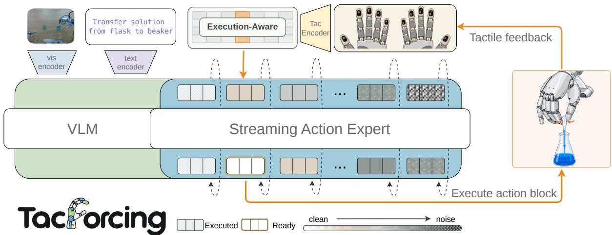  
Figure1 Overview of TacForcing. The VLM encodes the visual observation and language instruction once, and the resulting task context is reused throughout streaming generation. The Streaming Action Expert progressively refines action blocks according to block-specific flow times, allowing successive blocks to become ready for sequential execution. After each ready block is executed, the resulting tactile feedback is encoded before generation resumes from the retained intermediate states of unfinished blocks. Execution-Aware Tactile Attention allows the latest tactile feedback to condition only the block scheduled for execution next, thereby reducing the temporal mismatch between tactile acquisition and action execution.

We evaluate TacForcing on the UniVTAC simulation benchmark [4] and three real-world contact-rich manipulation tasks by comparing it with representative vision-only, tactile-conditioned, and tactile-reactive policies. TacForcing achieves average success rates of 65% in simulation and 69% in the real world, outperforming strong baselines in both settings.

Our contributions are threefold:

• We introduce TacForcing, a streaming action-generation framework that effectively incorporates executiontime tactile feedback without a separate reactive controller.

• We adapt a Streaming Action Expert to incorporate execution-time tactile feedback and introduce Execution-Aware Tactile Attention, which reduces temporal mismatch by allowing each tactile update to condition only the next action block scheduled for execution.

• Experiments demonstrate that TacForcing improves manipulation success rates across diverse simulated and real-world contact-rich tasks.

## 2 Preliminaries and Motivation

## 2.1 Flow Matching

Flow Matching (FM) [27] learns a conditional velocity field that transports samples from a Gaussian prior to the data distribution. Given condition y, we sample $x _ { 1 } \sim p _ { \mathrm { d a t a } } ( \cdot \mid y ) , x _ { 0 } \sim \mathcal { N } ( 0 , I )$ , and $\tau \sim \mathcal { U } ( 0 , 1 )$ , and define the linear interpolation path and target velocity as

$$
x ^ { \tau } = ( 1 - \tau ) x _ { 0 } + \tau x _ { 1 } , \qquad u ^ { \star } = x _ { 1 } - x _ { 0 } .\tag{1}
$$

The model is trained by minimizing

$$
\mathcal { L } _ { \mathrm { F M } } = \mathbb { E } _ { y , x _ { 1 } , x _ { 0 } , \tau } \left[ \| v _ { \theta } ( x ^ { \tau } , \tau , y ) - u ^ { \star } \| _ { 2 } ^ { 2 } \right] .\tag{2}
$$

During inference, integrating the learned velocity field $v _ { \theta }$ from $\tau = 0$ to $\tau = 1$ transforms a sample from the Gaussian prior into a sample from the conditional data distribution.

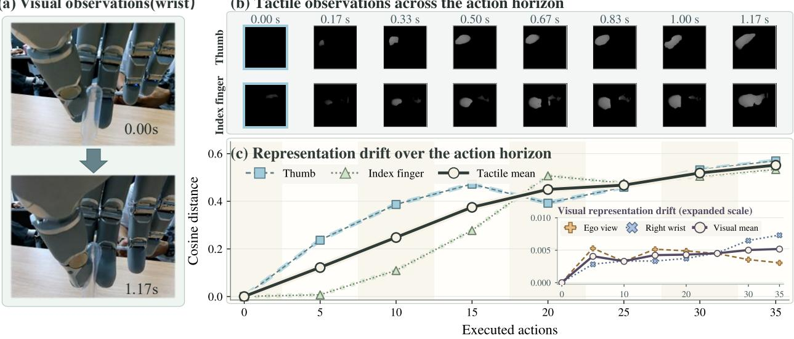

(a) Visual observations(wrist)  
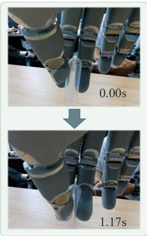

(b) Tactile observations across the action horizon  
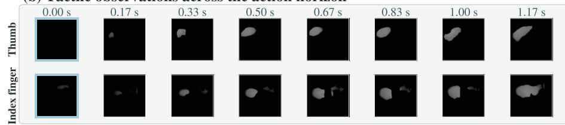  
Figure 2 Visual and tactile dynamics during dropper squeezing. (a) Visual observations at the beginning and end of the action horizon. (b) Deformation maps from the thumb and index finger, sampled every five actions. (c) Cosine distances from the initial visual and tactile representations; the inset enlarges the visual scale.

## 2.2 Problem Formulation

We consider language-conditioned, contact-rich robot manipulation. At decision step t, the robot receives a visual observation $V _ { t }$ , a proprioceptive state $s _ { t } ,$ a tactile observation $T _ { t } .$ and a language instruction l. Let $c _ { t } ~ = ~ ( V _ { t } , s _ { t } , \ell )$ denote the task context. Conditioned on $( c _ { t } , T _ { t } )$ , the policy models the distribution $p _ { \theta } ( A _ { t } \mid c _ { t } , T _ { t } )$ and generates an action chunk with horizon $H$

$$
A _ { t } = \big ( a _ { t } , a _ { t + 1 } , \ldots , a _ { t + H - 1 } \big ) , \qquad a _ { t + i } \in \mathbb { R } ^ { d _ { a } } ,\tag{3}
$$

where $d _ { a }$ denotes the action dimension. In a conventional flow-based action expert, the action chunk $A _ { t }$ and Gaussian noise € of the same shape serve as the data and prior endpoints, respectively. Because all action positions share a single flow time, the entire chunk is generated synchronously from the fixed initial inputs $( c _ { t } , T _ { t } )$ . Consequently, tactile feedback acquired during execution cannot condition the remaining actions within the same chunk

## 2.3 Temporal Mismatch from Fixed Tactile Conditioning

To characterize short-horizon changes in visual and tactile observations, we analyze a representative episode of squeezing a dropper, as shown in Figure 2. Within this 40-action horizon, we sample visual and tactile observations at eight offsets from 0 to 35 in increments of five; the final sample occurs 35 control steps (1.17s) after the initial observation. At the final sample, the sensor-averaged cosine distances relative to the initial representations are approximately 0.005 and 0.55 for the visual and tactile modalities, respectively. Details of the representation extraction and distance computation are provided in Appendix A.3. These observations indicate that tactile information can change markedly within an action chunk despite limited variation in visual cues. Consequently, the initial tactile observation $T _ { t }$ can become increasingly stale and misaligned with the contact state encountered during execution. The next section describes how TacForcing incorporates execution-time tactile feedback into subsequent generation stages of the same action chunk.

## 3 Method

In this section, we present TacForcing, a streaming action-generation framework that effectively incorporates execution-time tactile feedback. We first introduce block-wise streaming action generation in Section 3.1 and then describe execution-time tactile conditioning in Section 3.2. Finally, we describe the training procedure in Section 3.3.

## 3.1 Streaming Action Generation via Block-Wise Flow Scheduling

Streaming Action Expert. As discussed in Section 2.2, a conventional flow-based Action Expert generates the entire action chunk synchronously using only observations acquired before execution. Consequently, tactile feedback obtained during execution cannot condition the actions that remain to be executed. TacForcing addresses this limitation by replacing the standard expert with a Streaming Action Expert that generates the action chunk progressively. Near-term actions are completed and dispatched for execution first, while the intermediate states of later actions are retained for further refinement. This design enables newly acquired tactile feedback to condition the remaining actions within the same chunk without requiring a separate reactive controller.

Block-wise flow scheduling. Let N denote the total number of sampling steps, with $n \in \{ 1 , \ldots , N \}$ . Building on prior work in streaming generation [5, 29], we replace the flow time shared across an entire action chunk with position-dependent flow times. At sampling step n, we represent these flow times as

$$
\pmb { \tau } ^ { ( n ) } = \left( \tau _ { 1 } ^ { ( n ) } , \tau _ { 2 } ^ { ( n ) } , \dots , \tau _ { H } ^ { ( n ) } \right) \in [ 0 , 1 ] ^ { H } ,\tag{4}
$$

where $\tau _ { i } ^ { ( n ) }$ denotes the flow time of the i-th action position. Although scheduling each action independently would allow tactile feedback to be refreshed after every executed action, it would require tactile acquisition, encoding, and model inference at every control step. We therefore coordinate action completion and tactile updates at the block level, balancing responsiveness to tactile feedback with computational efficiency.

Assuming $H = K B$ and $N = K S$ , we partition the action chunk into K consecutive blocks of B actions and separate successive block completions by S sampling steps. Let ${ A } _ { t } ^ { ( k ) }$ denote the k-th block. The function

$$
b ( i ) = \left\lfloor \frac { i - 1 } { B } \right\rfloor + 1
$$

maps action position i to its corresponding block. All actions in block k share a block flow time $\lambda _ { k }$ and reach completion simultaneously at sampling step $n _ { k } = k S$ . The corresponding flow-time trajectory is

$$
\lambda _ { k } ^ { ( n ) } = \operatorname* { m i n } \left( \frac { n } { n _ { k } } , 1 \right) , \qquad k \in \{ 1 , \dots , K \} .\tag{5}
$$

Accordingly, the flow time of action position i is $\tau _ { i } ^ { ( n ) } = \lambda _ { b ( i ) } ^ { ( n ) }$ . At each sampling step, the learned velocity field advances every unfinished block from $\lambda _ { k } ^ { ( n - 1 ) }$ to $\lambda _ { k } ^ { ( n ) }$ , while completed blocks remain fixed. Since $n _ { 1 } <$ $n _ { 2 } < \cdots < n _ { K }$ , the blocks become ready for execution sequentially. When $A _ { t } ^ { ( k ) }$ completes at $n _ { k }$ , it becomes available for execution, while later blocks remain partially generated. Their intermediate states are retained and further refined after $A _ { t } ^ { ( k ) }$ is executed.

## 3.2 Conditioning on Execution-Time Tactile Feedback

Block-level tactile updates. Within each action chunk, the task context $c _ { t }$ is encoded once as $C _ { t } = f _ { \mathrm { c t x } } ( c _ { t } )$ and reused throughout the generation of the action chunk. In contrast, the tactile condition is refreshed after the execution of each block. Let $T _ { t } ^ { ( k ) }$ denote the tactile observation acquired after the first k blocks have been executed, with $T _ { t } ^ { ( 0 ) } = T _ { t }$ . The deformation maps from the M fingertips are encoded independently using a shared tactile encoder $f _ { \mathrm { t a c } }$ , producing the tactile tokens

$$
Z _ { t } ^ { ( k ) } = \left( z _ { t , 1 } ^ { ( k ) } , \dots , z _ { t , M } ^ { ( k ) } \right) .
$$

During sampling steps $( k - 1 ) S < n \leq k S , Z _ { t } ^ { ( k - 1 ) }$ serves as the latest available tactile representation. After $A _ { t } ^ { ( k ) }$ is executed, the newly acquired observation $T _ { t } ^ { ( k ) }$ is encoded as $Z _ { t } ^ { ( k ) }$ and used to condition the subsequent refinement of the remaining blocks.

Execution-Aware Tactile Attention. After the first $k - 1$ blocks have been executed, $Z _ { t } ^ { ( k - 1 ) }$ represents the latest contact state and is temporally aligned with ${ A } _ { t } ^ { ( k ) }$ , the block scheduled to execute next. However, it should not directly condition every unfinished block. Later blocks will be executed only after additional tactile updates and, because contact states can change rapidly as illustrated in Figure 2, may encounter states that differ substantially from the state encoded by $Z _ { t } ^ { ( \dot { k } - 1 ) }$

Despite this temporal distinction, the Streaming Action Expert advances all unfinished blocks jointly. Without an additional constraint, unrestricted attention would allow every unfinished action token to attend directly to $Z _ { t } ^ { ( k - 1 ) }$ , thereby conditioning later blocks on tactile feedback that may become outdated before their execution. We therefore introduce EATA to restrict direct access to $Z _ { t } ^ { ( k - 1 ) }$ to the action tokens in $A _ { t } ^ { ( k ) }$ We implement this restriction using the additive attention mask

$$
\mathcal { M } _ { i , m } ^ { ( k ) } = \left\{ { \begin{array} { l l } { 0 , } & { b ( i ) = k , } \\ { - \infty , } & { \mathrm { o t h e r w i s e } , } \end{array} } \right.\tag{6}
$$

where $i \in \{ 1 , \ldots , H \}$ indexes action queries and $m \in \{ 1 , \ldots , M \}$ indexes tactile keys. Under this mask, the current tactile representation directly conditions only the block scheduled to execute next. Later blocks continue to evolve according to the block-wise flow schedule without accessing the current tactile tokens and are conditioned on updated tactile feedback when they become the next block to execute. We enforce the same visibility constraint during training to ensure consistency with the temporal conditioning used during streaming inference

## 3.3 Training

To match streaming inference, we train the expert on block-wise intermediate states paired with the tactile feedback available at the corresponding execution stage. For each demonstrated action chunk $A _ { t }$ , we sample Gaussian noise $\epsilon \sim \mathcal { N } ( 0 , I )$ and a normalized generation progress $p \sim \mathcal { U } ( [ 0 , 1 ) )$ . Using $n = p N$ and $N = K S$ in Equation 5, we obtain the flow time and interpolated state of block k as

$$
\lambda _ { k } ( p ) = \operatorname* { m i n } \left( \frac { K p } { k } , 1 \right) , \qquad \widetilde { A } _ { t } ^ { ( k ) } = \big ( 1 - \lambda _ { k } ( p ) \big ) \epsilon ^ { ( k ) } + \lambda _ { k } ( p ) A _ { t } ^ { ( k ) } .\tag{7}
$$

The block states form $\widetilde { A } _ { t }$ , with action-wise flow times $\tau _ { i } ( p ) = \lambda _ { b ( i ) } ( p )$ collected in $\tau ( p )$

For the sampled progress $p ,$ let $k ^ { \star } ( p ) = \lfloor K p \rfloor + 1$ . We use the corresponding tactile representation $Z _ { t } ^ { ( k ^ { \star } - 1 ) }$ and EATA mask $\mathcal { M } ^ { ( k ^ { \star } ) }$ . Let

$$
\mathcal { U } ( p ) = \left\{ i \in \{ 1 , \dots , H \} \mid \lambda _ { b ( i ) } ( p ) < 1 \right\}
$$

denote the unfinished action positions. For each $i \in \mathcal { U } ( p )$ , the predicted velocity is

$$
\begin{array} { r } { \widehat { v } _ { \theta , i } ( p ) = v _ { \theta , i } \Big ( \widetilde { A } _ { t } , \tau ( p ) , C _ { t } , Z _ { t } ^ { ( k ^ { \star } - 1 ) } ; \mathcal { M } ^ { ( k ^ { \star } ) } \Big ) . } \end{array}
$$

The training objective is

$$
\mathcal { L } _ { \mathrm { t r a i n } } = \mathbb { E } _ { A _ { t } , \epsilon , p } \left[ \frac { 1 } { | \mathcal { U } ( p ) | } \sum _ { i \in \mathcal { U } ( p ) } \| \widehat { v } _ { \theta , i } ( p ) - ( a _ { t + i - 1 } - \epsilon _ { i } ) \| _ { 2 } ^ { 2 } \right] .\tag{8}
$$

The loss is applied only to unfinished actions, matching the positions updated at the corresponding stage of streaming inference.

## 4 Experiments

We first describe the experimental setup, including the benchmarks, baselines, and implementation details, in Section 4.1. We then present the main quantitative results from the simulation benchmark and the real-world platform in Section 4.2. Finally, we assess the effects of execution-time tactile conditioning and Execution-Aware Tactile Attention through ablation studies in Section 4.3.

## 4.1 Experimental Setup

Benchmarks. We evaluate TacForcing on six contact-rich manipulation tasks from UniVTAC [4] and three real-world tasks: Stand Bottle, Transfer Liquid, and Wipe Board. Detailed platform and task settings are provided in Appendices B and C.

Baselines. In simulation, we compare TacForcing with four baselines that represent different tactile integration strategies. $\pi _ { 0 . 5 }$ [31] is a generalist VLA that does not use tactile input. UniVTAC-ACT [4] augments an Action Chunking Transformer with a pretrained tactile encoder. FTP-1 [41] maps heterogeneous tactile observations to unified tokens that are processed by a shared tactile expert. RDP |37| uses a slow-fast hierarchy to combine low-frequency action-chunk prediction with a high-frequency tactile-reactive controller. For the real-world experiments, we retain $\pi _ { 0 . 5 }$ and FTP-1 and additionally include GR00T N1.7 [2], another generalist VLA that does not use tactile input. Together, these baselines cover non-tactile, tactile-conditioned, and tactile-reactive policy designs.

Implementation Details. TacForcing is initialized from $\pi _ { 0 . 5 } \ [ 3 1 ]$ in simulation and GR00T N1.7 [2] in the real world. In both settings, the tactile encoder is initialized from the pretrained tactile encoder of FTP-1 [41]. We use a block size of B = 5. In simulation, an action horizon of $H = 5 0$ is divided into K = 10 blocks. In the real-world setting, we use H = 40, K = 8. We report success rates over 100 rollouts per simulation task and 16 independent trials per real-world task. Additional training and implementation details are provided in Appendix A.

## 4.2 Main Results

We compare TacForcing with the baselines described in Section 4.1. In simulation, we evaluate UniVTAC-ACT and FTP-1 using their released checkpoints, while training RDP and $\pi _ { 0 . 5 }$ with the corresponding official implementations. For the real-world evaluation, we train $\pi _ { 0 . 5 } .$ , GR00T N1.7, and FTP-1 using their official implementations. All methods are evaluated under the same rollout protocol. Table 1 and Figure 3 report the simulation and real-world results, respectively.

Table1 Results on the UniVTAC simulation benchmark. All values are success rates (%). The highest and second-highest distinct values in each column are shown in bold and underlined, respectively.

<table><tr><td>Method</td><td>Lift Bottle</td><td>Pull-out Key</td><td>Lift Can</td><td>Put Bottle in Shelf</td><td>Insert Hole</td><td>Insert Tube</td><td>Avg.</td></tr><tr><td>π0.5</td><td>88</td><td>43</td><td>46</td><td>43</td><td>39</td><td>48</td><td>51</td></tr><tr><td>UniVTAC-ACT</td><td>59</td><td>41</td><td>24</td><td>6</td><td>36</td><td>58</td><td>37</td></tr><tr><td>RDP</td><td>84</td><td>18</td><td>12</td><td>41</td><td>23</td><td>75</td><td>42</td></tr><tr><td>FTP-1</td><td>89</td><td>35</td><td>66</td><td>23</td><td>62</td><td>76</td><td>59</td></tr><tr><td>TacForcing (Ours)</td><td>90</td><td>48</td><td>63</td><td>43</td><td>69</td><td>79</td><td>65</td></tr></table>

Simulation Results. As shown in Table 1, TacForcing achieves the highest average success rate of 65%, outperforming all evaluated baselines. The corresponding gains over the vision-only $\pi _ { 0 . 5 }$ baseline and the tactile-reactive RDP baseline are 14 and 23 percentage points, respectively. At the task level, TacForcing achieves the highest or tied-highest success rate on five of the six tasks. The only exception is Lift Can, on which TacForcing achieves 63%, compared with 66% for the best-performing method. Overall, these results demonstrate the effectiveness of TacForcing across diverse contact-rich manipulation tasks.

Real-World Results. As shown in Figure 3, TacForcing achieves an average success rate of 69%, outperforming FTP-1, GR00T N1.7, and $\pi _ { 0 . 5 }$ by 17, 27, and 42 percentage points, respectively. TacForcing achieves the highest success rates on Stand Bottle and Transfer Liquid and ties with FTP-1 for the highest success rate on Wipe Board. The performance gap is particularly large on Transfer Liquid: TacForcing achieves a success rate of 50%, whereas all baselines achieve no more than 19%. This result indicates that execution-time tactile feedback is particularly beneficial for tasks that require precise contact regulation during execution.

(a)  
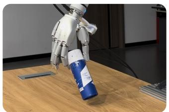  
(b)

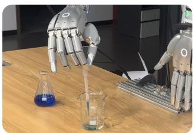

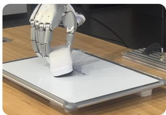

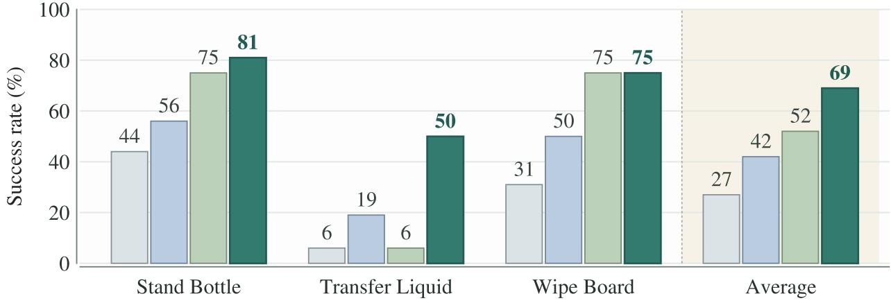  
Figure 3 Real-world tasks and evaluation results. (a) Representative snapshots of the Stand Bottle, Transfer Liquid, and Wipe Board tasks. (b) Success rates (%) of TacForcing and the baselines on the three tasks and their average.

## 4.3 Ablation Study

To assess the effects of tactile conditioning, streaming action generation with execution-time tactile updates, and EATA, we evaluate four configurations on three simulation tasks and three real-world tasks: (1) Base, which uses the standard Action Expert without tactile conditioning; (2) Fixed Tactile, which conditions the same policy on a single initial tactile observation throughout the action chunk; (3) TacForcing without EATA, which uses the Streaming Action Expert and refreshes tactile feedback after each executed block; and (4) TacForcing, which further introduces EATA. Table 2 summarizes the results.

Table2 Ablation results for four configurations. All values are success rates (%). The highest and second-highest distinct values in each column are shown in bold and underlined, respectively.
<table><tr><td rowspan="2">Configuration</td><td colspan="3">Simulation</td><td colspan="3">Real World</td><td colspan="2">Average</td></tr><tr><td>Pull-out Key</td><td>Lift Can</td><td>Insert Hole</td><td>Stand Bottle</td><td>Transfer Liquid</td><td>Wipe Board</td><td>Sim. Avg.</td><td>Real Avg.</td></tr><tr><td>Base</td><td>43</td><td>46</td><td>39</td><td>56</td><td>19</td><td>50</td><td>43</td><td>42</td></tr><tr><td>Fixed Tactile</td><td>39</td><td>53</td><td>34</td><td>50</td><td>13</td><td>31</td><td>42</td><td>31</td></tr><tr><td>TacForcing (w/o EATA)</td><td>39</td><td>55</td><td>58</td><td>69</td><td>31</td><td>44</td><td>51</td><td>48</td></tr><tr><td>TacForcing</td><td>48</td><td>63</td><td>69</td><td>81</td><td>50</td><td>75</td><td>60</td><td>69</td></tr></table>

Fixed Tactile. Conditioning the entire action chunk on a single initial tactile observation provides no

consistent benefit: the average success rate decreases from 43% to 42% in simulation and from 42% to 31% in the real world. At the task level, performance improves only on Lift Can and declines on Pull-out Key, Insert Hole, and all three real-world tasks. These results suggest that a single tactile observation provides limited value when it remains fixed throughout an action chunk, motivating the use of tactile feedback acquired during execution.

TacForcing without EATA. This configuration refreshes tactile feedback after each block execution while EATA remains disabled. It increases the average success rate from 42% to 51% in simulation and from 31% to 48% in the real-world experiments. Compared with Fixed Tactile, it improves performance on Lift Can, Insert Hole, and all three real-world tasks, while leaving Pull-out Key unchanged. The overall gains over Fixed Tactile show the value of allowing subsequent actions to use tactile information acquired during execution.

TacForcing. Incorporating EATA into the preceding configuration improves performance on all six evaluated tasks, increasing the average success rate from 51% to 60% in simulation and from 48% to 69% in the realworld experiments. Compared with Fixed Tactile, TacForcing achieves gains of 18 percentage points in simulation and 38 percentage points in the real-world experiments. The corresponding gains over Base are 17 and 27 percentage points, respectively. The consistent gains over TacForcing without EATA indicate that aligning tactile conditioning with block execution further improves the effectiveness of execution-time tactile feedback.

## 5 Related Work

## 5.1 Diffusion Models for Sequence Generation

Diffusion models generate decision sequences by iteratively denoising complete trajectories or receding-horizon action chunks [8, 21]. Flow Matching [27] provides a continuous-time formulation used by action models such as π0 [3], while RDT-1B [28] scales diffusion-based action generation to generalist manipulation. Standard formulations use a shared generative time across the prediction horizon and begin execution only after sampling is complete.

Position-dependent schedules allow sequence elements to progress at different rates [32, 36, 44]. Diffusion Forcing [5] assigns independent noise levels to sequence tokens, with subsequent extensions to adaptive schedules and pipelined generation [20, 33, 46]. In robotics, streaming diffusion policies revise rolling action buffers under new observations [6, 17], while related methods emit actions during flow integration or preserve the revisability of future actions [22, 24, 29]. These methods primarily target generation latency and responsiveness to updated observations rather than the timing of contact feedback within the action horizon. TacForcing adopts this streaming perspective to interleave action generation and execution with tactile feedback acquired during execution.

## 5.2 Tactile-Aware Policies for Contact-Rich Manipulation

Touch provides local contact information that can be difficult to recover from vision alone. Closed-loop tactile policies use this information for grasp adaptation, policy transfer, and dexterous manipulation [9, 11, 35, 40]. Complementary representation-learning methods align vision and touch or learn transferable features across sensors and tasks [4, 10, 14, 15, 18, 23, 26, 38, 45]. These methods improve the quality and transferability of tactile features, whereas our focus is the temporal use of feedback during action generation. Recent tactileand force-aware VLAs further integrate contact signals into generalist policies through tactile-conditioned controllers, expert routing, or multimodal policy pretraining |1, 7, 12, 13, 19, 39, 41], but do not specifically address how successive tactile observations should condition a partially generated action horizon.

Methods for execution-time adaptation commonly separate slow visuomotor reasoning from fast tactile control [25, 30, 37]. Predictive approaches instead model future contact observations and use them for action generation or correction [16, 34, 42, 43, 47, 48]. In contrast, TacForcing incorporates newly acquired tactile feedback into the retained state of a single streaming action generator and aligns each update with block execution, without a separate reactive controller or explicit tactile prediction.

## 6 Conclusion

In this work, we introduced TacForcing, a streaming action-generation framework that effectively incorporates execution-time tactile feedback without a separate reactive controller. TacForcing employs a Streaming Action Expert to generate action blocks progressively during execution, retaining the intermediate states of unfinished blocks and refining them using newly acquired tactile feedback. Execution-Aware Tactile Attention (EATA) allows each tactile update to condition only the next block scheduled for execution, thereby reducing the temporal mismatch between tactile acquisition and action execution. Across six simulated UniVTAC tasks and three real-world contact-rich manipulation tasks, TacForcing achieves average success rates of 65% and 69%, respectively, outperforming strong baselines in both settings. Ablation results show that both execution-time tactile updates and EATA contribute to the performance improvements, highlighting the value of aligning tactile conditioning with block execution for contact-rich manipulation.

## References

[1] Jianxin Bi, Kevin Yuchen Ma, Ce Hao, Mike Zheng Shou, and Harold Soh. VLA-Touch: Enhancing Vision-Language-Action Models with Dual-Level Tactile Feedback, July 2025. URL http://arxiv. org/abs/2507.17294. arXiv:2507.17294 [cs.RO].

[2] Johan Bjorck, Fernando Castañeda, Nikita Cherniadev, Xingye Da, Runyu Ding, Linxi Fan, Yu Fang, Dieter Fox, Fengyuan Hu, Spencer Huang, et al. GR00T N1: an open foundation model for generalist humanoid robots. CoRR, abs/2503.14734, 2025. doi: 10.48550/ARXIV.2503.14734. URL https://doi.org/10.48550/arXiv.2503.14734.

[3] Kevin Black, Noah Brown, Danny Driess, Adnan Esmail, Michael Equi, Chelsea Finn, Niccolo Fusai, Lachy Groom, Karol Hausman, Brian Ichter, et al. π₀: A vision-language-action flow model for general robot control. In Robotics: Science and Systems XXI, RSS 2025, Los Angeles, CA, USA, June 21-25, 2025, 2025. URL https://roboticsconference.org/program/papers/10/.

[4] Baijun Chen, Weijie Wan, Tianxing Chen, Xianda Guo, Congsheng Xu, Yuanyang Qi, Haojie Zhang, Longyan Wu, Tianling Xu, Zixuan Li, Yizhe Wu, Rui Li, Xiaokang Yang, Ping Luo, Wei Sui, and Yao Mu. UniVTAC: A Unified Simulation Platform for Visuo-Tactile Manipulation Data Generation, Learning, and Benchmarking, February 2026. URL http://arxiv.org/abs/2602.10093. arXiv:2602.10093 [cs.RO].

[5] Boyuan Chen, Diego Martí Monsó, Yilun Du, Max Simchowitz, Russ Tedrake, and Vincent Sitzmann. Diffusion forcing: Next-token prediction meets full-sequence diffusion. In Advances in Neural Information Processing Systems, volume 37, 2024.

[6] Zhuoqun Chen, Xiu Yuan, Tongzhou Mu, and Hao Su. Responsive Noise-Relaying Diffusion Policy: Responsive and Efficient Visuomotor Control. Transactions on Machine Learning Research, 2025. URL https://openreview. net/forum?id=LLWJkR6gaI.

[7] Zhengxue Cheng, Yiqian Zhang, Anni Tang, Keyu Wang, Wenkang Zhang, Haoyu Li, Hengdi Zhang, and Li Song. OmniVTLA: Vision-Tactile-Language-Action Models with Semantic-Aligned Tactile Sensing, August 2025. URL http://arxiv.org/abs/2508.08706. arXiv:2508.08706 [cs.RO].

[8] Cheng Chi, Siyuan Feng, Yilun Du, Zhenjia Xu, Eric Cousineau, Benjamin C. M. Burchfiel, and Shuran Song. Diffusion Policy: Visuomotor Policy Learning via Action Diffusion. In Proceedings of Robotics: Science and Systems, 2023. doi: 10.15607/RSS.2023.XIX.026. URL https://www.roboticsproceedings.org/rss19/p026. html.

[9] Alex Church, John Lloyd, Raia Hadsell, and Nathan F. Lepora. Tactile sim-to-real policy transfer via realto-sim image translation. In Proceedings of the 5th Conference on Robot Learning, volume 164 of Proceedings of Machine Learning Research, pages 1645–1654. PMLR, 2022. URL https://proceedings.mlr.press/v164/ church22a.html.

[10] Ruoxuan Feng, Jiangyu Hu, Wenke Xia, Tianci Gao, Ao Shen, Yuhao Sun, Bin Fang, and Di Hu. AnyTouch: Learning Unified Static-Dynamic Representation across Multiple Visuo-tactile Sensors, April 2025. URL http: //arxiv.org/abs/2502.12191. arXiv:2502.12191 [cs.LG].

[11] Irmak Güzey, Yinlong Dai, Ben Evans, Soumith Chintala, and Lerrel Pinto. See to touch: Learning tactile dexterity through visual incentives. In 2024 IEEE International Conference on Robotics and Automation, pages 13825–13832, 2024. doi: 10.1109/ICRA57147.2024.10611407. URL https://arxiv.org/abs/2309.12300.

[12] Zihao He, Hongjie Fang, Jingjing Chen, Hao-Shu Fang, and Cewu Lu. FoAR: Force-Aware Reactive Policy for Contact-Rich Robotic Manipulation, May 2025. URL http://arxiv.org/abs/2411.15753. arXiv:2411.15753 [cs.RO].

[13] Erik Helmut, Niklas Funk, Tim Schneider, Cristiana de Farias, and Jan Peters. Tactile-Conditioned Diffusion Policy for Force-Aware Robotic Manipulation, October 2025. URL http://arxiv.org/abs/2510.13324. arXiv:2510.13324 [cs.RO]

[14] Liang Heng, Haoran Geng, Kaifeng Zhang, Pieter Abbeel, and Jitendra Malik. ViTacFormer: Learning Cross-Modal Representation for Visuo-Tactile Dexterous Manipulation, June 2025. URL http://arxiv.org/abs/2506. 15953. arXiv:2506.15953 [cs.RO]

[15] Carolina Higuera, Akash Sharma, Chaithanya Krishna Bodduluri, Taosha Fan, Patrick Lancaster, Mrinal Kalakrishnan, Michael Kaess, Byron Boots, Mike Lambeta, Tingfan Wu, and Mustafa Mukadam. Sparsh: Self-supervised touch representations for vision-based tactile sensing, October 2024. URL http://arxiv.org/abs/2410.24090 arXiv:2410.24090 [cs.RO]

[16] Carolina Higuera, Sergio Arnaud, Byron Boots, Mustafa Mukadam, Francois Robert Hogan, and Franziska Meier. Visuo-Tactile World Models, February 2026. URL http://arxiv.org/abs/2602.06001. arXiv:2602.06001 [cs.RO].

[17] Sigmund Hennum Høeg, Yilun Du, and Olav Egeland. Fast Policy Synthesis with Variable Noise Diffusion Models. In 2025 IEEE International Conference on Robotics and Automation, pages 4821–4828, 2025. doi: 10.1109/ICRA55743.2025.11127858. URL https://arxiv.org/abs/2406.04806.

18 Binghao Huang, Yixuan Wang, Xinyi Yang, Yiyue Luo, and Yunzhu Li. 3D-ViTac: Learning Fine-Grained Manipulation with Visuo-Tactile Sensing, January 2025. URL http://arxiv.org/abs/2410.24091. arXiv:2410.24091 [cs.RO].

[19] Jialei Huang, Shuo Wang, Fanqi Lin, Yihang Hu, Chuan Wen, and Yang Gao. Tactile-VLA: Unlocking Vision-Language-Action Model's Physical Knowledge for Tactile Generalization, July 2025. URL http://arxiv.org/ abs/2507.09160. arXiv:2507.09160 cs.RO].

[20] Wen Huang, Haoran Sun, Yongjian Guo, Yunxuan Ma, Haoran Li, Jing Long, Zhouying Mo, Zhong Guan Yucheng Guo, Shuai Di, and Junwu Xiong. NoiseGate: Learning per-latent timestep schedules as information gating in world action models, 2026. URL https://arxiv.org/abs/2605.07794. arXiv:2605.07794 [cs.RO].

[21] Michael Janner, Yilun Du, Joshua Tenenbaum, and Sergey Levine. Planning with diffusion for flexible behavior synthesis. In Proceedings of the 39th International Conference on Machine Learning, volume 162 of Proceedings of Machine Learning Research, pages 9902–9915. PMLR, 2022. URL https://proceedings.mlr.press/v162/ janner22a.html.

[22] Sunshine Jiang, Xiaolin Fang, Nicholas Roy, Tomás Lozano-Pérez, Leslie Pack Kaelbling, and Siddharth Ancha. Streaming Flow Policy: Simplifying diffusion/flow-matching policies by treating action trajectories as flow trajectories. In 9th Conference on Robot Learning, 2025. URL https://openreview.net/forum?id=jnpILGz9gQ.

[23] Justin Kerr, Huang Huang, Albert Wilcox, Ryan I. Hoque, Jeffrey Ichnowski, Roberto Calandra, and Ken Goldberg. Self-supervised visuo-tactile pretraining to locate and follow garment features. In Proceedings of Robotics: Science and Systems, 2023. doi: 10.15607/RSS.2023.XIX.018. URL https://www.roboticsproceedings.org/ rss19/p018.html.

[24] Seonsoo Kim, Seongil Hong, and Jun-Gill Kang. Diffusion ReRoll: Revisable Denoising for Robotic Sequential Prediction, 2026. URL https://arxiv.org/abs/2607.19919. arXiv:2607.19919 [cs.RO].

[25] Xiaoqi Li, Muhe Cai, Jiadong Xu, Juan Zhu, Hongwei Fan, Yan Shen, Guangrui Ren, and Hao Dong. AT-VLA: Adaptive Tactile Injection for Enhanced Feedback Reaction in Vision-Language-Action Models, May 2026. URL http://arxiv.org/abs/2605.07308. arXiv:2605.07308 [cs.RO].

[26] Yunzhu Li, Jun-Yan Zhu, Russ Tedrake, and Antonio Torralba. Connecting touch and vision via cross-modal prediction. In Proceedings of the IEEE/CVF Conference on Computer Vision and Pattern Recognition, pages 10609-10618, 2019. URL https://openaccess.thecvf.com/content\_CVPR\_2019/html/Li\_Connecting\_Touch\_ and\_Vision\_via\_Cross-Modal\_Prediction\_CVPR\_2019\_paper.html.

[27] Yaron Lipman, Ricky T. Q. Chen, Heli Ben-Hamu, Maximilian Nickel, and Matt Le. Flow matching for generative modeling. In The Eleventh International Conference on Learning Representations, 2023. URL https://openreview.net/forum?id=PqvMRDCJT9t.

[28] Songming Liu, Lingxuan Wu, Bangguo Li, Hengkai Tan, Huayu Chen, Zhengyi Wang, Ke Xu, Hang Su, and

Jun Zhu. RDT-1B: a diffusion foundation model for bimanual manipulation. In The Thirteenth International Conference on Learning Representations, ICLR 2025, Singapore, April 24-28, 2025. OpenReview.net, 2025. URL https://openreview.net/forum?id=yAzN4tz7oI.

[29] Yuxiang Lu, Zhe Liu, Xianzhe Fan, Zhenya Yang, Jinghua Hou, Junyi Li, Kaixin Ding, and Hengshuang Zhao. FASTER: Rethinking Real-Time Flow VLAs, 2026. URL https://arxiv. org/abs/2603.19199. arXiv:2603.19199 [cs.RO].

[30] Dantong Niu, Zhuoyang Liu, Zekai Wang, Boning Shao, Zhao-Heng Yin, Anirudh Pai, Yuvan Sharma, Stefano Saravalle, Ruijie Zheng, Jing Wang, Ryan Punamiya, Mengda Xu, Yuqi Xie, Yunfan Jiang, Letian Fu, Konstantinos Kallidromitis, Matteo Gioia, Junyi Zhang, Jiaxin Ge, Haiwen Feng, Fabio Galasso, Wei Zhan, David M. Chan, Yutong Bai, Roei Herzig, Jiahui Lei, Li Fei-Fei, Ken Goldberg, Jitendra Malik, Pieter Abbeel, Yuke Zhu, Danfei Xu, Linxi Fan, and Trevor Darrell. T-Rex: Tactile-Reactive Dexterous Manipulation, June 2026. URL http://arxiv.org/abs/2606.17055. arXiv:2606.17055|cs.RO|

[31] Physical Intelligence, Kevin Black, Noah Brown, James Darpinian, Karan Dhabalia, Danny Driess, Adnan Esmail, Michael Equi, Chelsea Finn, Niccolo Fusai, et al. π0.5: a vision-language-action model with open-world generalization. CoRR, abs/2504.16054, 2025. doi: 10.48550/ARXIV.2504.16054. URL https://doi.org/10. 48550/arXiv.2504.16054

[32] David Ruhe, Jonathan Heek, Tim Salimans, and Emiel Hoogeboom. Rolling Diffusion Models. In Proceedings of the 41st International Conference on Machine Learning, volume 235 of Proceedings of Machine Learning Research, pages 42818-42835. PMLR, 2024. URL https://proceedings.mlr.press/v235/ruhe24a.html.

[33] Kiwhan Song, Boyuan Chen, Max Simchowitz, Yilun Du, Russ Tedrake, and Vincent Sitzmann. History-Guided Video Diffusion. In Proceedings of the 42nd International Conference on Machine Learning, volume 267 of Proceedings of Machine LearningResearch, pages 56242–56280. PMLR, 2025. URL https://proceedings .mlr. press/v267/song25b.html.

[34] Shuai Tian, Yupeng Zheng, Yuhang Zheng, Songen Gu, Yujie Zang, Yuxing Qin, Weize Li, Haoran Li, Wenchao Ding, and Dongbin Zhao. VT-WAM: Visual-Tactile World Action Model for Contact-Rich Manipulation, 2026 URL https://arxiv.org/abs/2607.02503. arXiv:2607.02503 [cs.RO].

[35] Bohan Wu, Iretiayo Akinola, Jacob Varley, and Peter K. Allen. MAT: Multi-fingered adaptive tactile grasping via deep reinforcement learning. In Proceedings of the Conference on Robot Learning, volume 100 of Proceedings of Machine Learning Research, pages 142–161. PMLR, 2020. URL https://proceedings.mlr.press/v100/wu20a. html.

[36] Tong Wu, Zhihao Fan, Xiao Liu, Hai-Tao Zheng, Yeyun Gong, Yelong Shen, Jian Jiao, Juntao Li, Zhongyu Wei, Jian Guo, Nan Duan, and Weizhu Chen. AR-Diffusion: Auto-Regressive Diffusion Model for Text Generation. In Advances in Neural Information Processinq Systems, volume 36 2023. doi: 10.52202/075280-1737. URL https://proceedings.neurips.cc/paper\_files/paper/2023/hash/ 7d866abba506e5a56335e4644ebe18f9-Abstract-Conference.html.

[37] Han Xue, Jieji Ren, Wendi Chen, Gu Zhang, Yuan Fang, Guoying Gu, Huazhe Xu, and Cewu Lu. Reactive Diffusion Policy: Slow-Fast Visual-Tactile Policy Learning for Contact-Rich Manipulation, April 2025. URL http://arxiv.org/abs/2503.02881. arXiv:2503.02881 cs.RO|

[38] Fengyu Yang, Chao Feng, Ziyang Chen, Hyoungseob Park, Daniel Wang, Yiming Dou, Ziyao Zeng, Xien Chen, Rit Gangopadhyay, Andrew Owens, and Alex Wong. Binding touch to everything: Learning unified multimodal tactile representations. In Proceedings of the IEEE/CVF Conference on Computer Vision and Pattern Recognition, pages 26340-26353, 2024. URL https://openaccess.thecvf.com/content/CVPR2024/html/Yang\_Binding\_Touch\_to\_ Everything\_Learning\_Unified\_Multimodal\_Tactile\_Representations\_CVPR\_2024\_paper.html.

[39] Jiawen Yu, Hairuo Liu, Qiaojun Yu, Jieji Ren, Ce Hao, Haitong Ding, Guangyu Huang, Guofan Huang, Yan Song, Panpan Cai, Cewu Lu, and Wenqiang Zhang. ForceVLA: Enhancing VLA Models with a Force-aware MoE for Contact-rich Manipulation, September 2025. URL http://arxiv.org/abs/2505.22159. arXiv:2505.22159 [cs.RO].

[40] Kelin Yu, Yunhai Han, Qixian Wang, Vaibhav Saxena, Danfei Xu, and Ye Zhao. Mimictouch: Leveraging multimodal human tactile demonstrations for contact-rich manipulation. In Proceedings of the 8th Conference on Robot Learning, volume 270 of Proceedings of Machine Learning Research, pages 4844–4865. PMLR, 2025. URL https://proceedings.mlr.press/v270/yu25c.html

[41] Chengbo Yuan, Zicheng Zhang, Mingjie Zhou, Wendi Chen, Yi Wang, Zhuoyang Liu, Dantong Niu, Shuo Wang, Hui Zhang, Wenkang Zhang, Yingdong Hu, Yuanqing Gong, Wanli Xing, Chuan Wen, Cewu Lu, Kaifeng Zhang, and Yang Gao. FTP-1: A Generalist Foundation Tactile Policy Across Tactile Sensors for Contact-Rich Manip-

ulation, June 2026. URL http://arxiv.org/abs/2606.13102. arXiv:2606.13102 [cs.RO].

[42] Yujie Zang, Yuhang Zheng, Xian Nie, Yupeng Zheng, Shuai Tian, Songen Gu, Chen Gao, Zining Wang, Shuicheng Yan, and Wenchao Ding. TacForeSight: Force-Guided Tactile World Model for Contact-Rich Manipulation, June 2026. URL http://arxiv.org/abs/2606.11184. arXiv:2606.11184 [cs.RO].

[43] Shiqi Zhang, Xin Zhang, Yedong Shen, Yao Li, Yuxuan Gao, Sha Zhang, Yuan Zhang, Kaixue Long, Jiajia Wu, Jia Pan, Jiajun Deng, and Yanyong Zhang. ReTouch: Empowering Contact-Rich Dexterous Manipulation with Online-Refined Tactile Prediction, August 2026. URL https://arxiv.org/abs/2608.01824. arXiv:2608.01824 [cs.RO].

[44] Zihan Zhang, Richard Liu, Kfir Aberman, and Rana Hanocka. TEDi: Temporally-Entangled Diffusion for Long-Term Motion Synthesis. In ACM SIGGRAPH 2024 Conference Papers, 2024. doi: 10.1145/3641519.3657515. URL https://arxiv.org/abs/2307.15042.

[45] Jialiang Zhao, Yuxiang Ma, Lirui Wang, and Edward H. Adelson. Transferable Tactile Transformers for Representation Learning Across Diverse Sensors and Tasks, October 2024. URL http://arxiv.org/abs/2406.13640. arXiv:2406.13640 [cs.RO].

[46] Yian Zhao, Ruochong Zheng, Hongcan Guo, Yu Yan, Jian Zhang, and Jie Chen. MiniWorld: Democratizing the Training of Video World Models from Scratch, 2026. URL https://arxiv.org/abs/2608.01127. arXiv:2608.01127 [cs.CV].

[47] Yuhang Zheng, Songen Gu, Weize Li, Yupeng Zheng, Yujie Zang, Shuai Tian, Xiang Li, Ce Hao, Chen Gao, Si Liu, Haoran Li, Yilun Chen, Shuicheng Yan, and Wenchao Ding. OmniVTA: Visuo-Tactile World Modeling for Contact-Rich Robotic Manipulation, March 2026. URL http://arxiv.org/abs/2603.19201. arXiv:2603.19201 [cs.RO].

[48] Jianyi Zhou, Feiyang Hong, Yunhao Li, Yicheng Zhao, Yongjue Cen, Zirui Liu, Jiakang Huang, Zirui Chen, Ruiyang Zhang, Weizhuo Zhu, Xuhua Song, and Shuo Yang. TouchWorld: A Predictive and Reactive Tactile Foundation Model for Dexterous Manipulation, July 2026. URL http://arxiv.org/abs/2607.07287. arXiv:2607.07287 [cs.RO].

## A Additional Implementation Details

## A.1 Simulation Training Parameters

We train on 50 demonstration trajectories per task for 15,000 steps with a global batch size of 256. We use AdamW with a peak learning rate of $5 \times 1 0 ^ { - 5 }$ , a cosine decay to $5 \times 1 0 ^ { - 6 }$ , 2,000 warm-up steps, a weight decay of $1 0 ^ { - 1 0 }$ , and gradient clipping at a global norm of 1.0. The action horizon is $H = 5 0$ , divided into $K = 1 0$ blocks of $B = 5$ actions.

## A.2 Real-World Training Parameters

We train on 100 demonstration trajectories per task for 30,000 steps with a global batch size of 256. We use AdamW with a peak learning rate of $6 \times 1 0 ^ { - 5 }$ , a cosine decay to $1 \times 1 0 ^ { - 6 }$ , 2,000 warm-up steps, a weight decay of $1 0 ^ { - 5 }$ , and gradient clipping at a global norm of 1.0. The action horizon is $H = 4 0$ , divided into $K = 8$ blocks of $B = 5$ actions.

## A.3 Representation-Dynamics Analysis

We analyze a representative dropper-squeezing episode over a 40-action horizon, sampled every five actions at 30 FPS. Visual representations are extracted separately for the top and wrist cameras by averaging the final spatial tokens from the frozen visual encoder of GR00T N1.7 [2]. Tactile representations are extracted separately for the thumb and index finger from the final output of the tactile encoder in the trained realworld TacForcing model. This encoder is initialized from the pretrained tactile encoder of FTP-1 [41]. Both encoders use their native evaluation preprocessing, with no additional feature normalization before computing cosine distance.

For sensor $j$ and sampling offset $k \in \{ 0 , 5 , \ldots , 3 5 \}$ , we compute the cosine distance between the current representation $\mathbf { z } _ { k } ^ { ( j ) }$ and its initial representation $\mathbf { z } _ { 0 } ^ { ( j ) }$ . The modality-level distance is obtained by averaging the resulting distances across the two corresponding sensors:

$$
d _ { k } ^ { ( j ) } = 1 - \frac { ( \mathbf { z } _ { 0 } ^ { ( j ) } ) ^ { \top } \mathbf { z } _ { k } ^ { ( j ) } } { \| \mathbf { z } _ { 0 } ^ { ( j ) } \| _ { 2 } \| \mathbf { z } _ { k } ^ { ( j ) } \| _ { 2 } } , \qquad D _ { k } ^ { ( q ) } = \frac { 1 } { | S _ { q } | } \sum _ { j \in S _ { q } } d _ { k } ^ { ( j ) } ,\tag{9}
$$

where $\mathcal { S } _ { \mathrm { v i s } }$ contains the top and wrist cameras, and $S _ { \mathrm { t a c } }$ contains the thumb and index finger. The values 0.005 and 0.55 reported in the main text are $D _ { 3 5 } ^ { \mathrm { ( v i s ) } }$ and $D _ { 3 5 } ^ { ( \mathrm { t a c } ) }$ , respectively, at the final sampled offset rather than averages over time.

## B Real-World Platform and Task Settings

## B.1 Real-World Platform

Our real-world platform consists of two 7-DoF RealMan RM75 robot arms, each equipped with a 22-DoF Sharpa Wave dexterous hand. Tactile sensors embedded in the fingertips provide deformation maps during contact. A top-mounted RealSense camera captures the global workspace, while wrist-mounted RealSense cameras provide local views of object interactions. Manus Pro data gloves are used in the demonstrationcollection interface. Figure 4 shows the complete setup and its main components.

## B.2 Real-World Task Settings

We evaluate three contact-rich manipulation tasks, illustrated in Figure 5. Each method is evaluated over 16 independent trials per task.

Stand Bottle. The robot grasps a bottle lying horizontally on the table, reorients it in hand, and places it upright while maintaining a stable grasp.

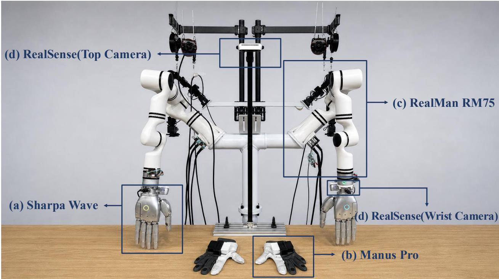  
Figure 4 Real-world platform. The setup comprises (a) Sharpa Wave dexterous hands, (b) Manus Pro data gloves, (c) two RealMan RM75 robot arms, and (d) top- and wrist-mounted RealSense cameras.

Transfer Liquid. The robot manipulates a transparent dropper to draw liquid from a flask and dispense it into a beaker, requiring precise grasp and contact regulation despite partial visual occlusion.

Wipe Board. The robot moves an eraser across a marked whiteboard while maintaining sufficient surface contact to remove the marks.

## C Simulation Task Details

We evaluate TacForcing on six tasks from the UniVTAC benchmark [4]. Figure 6 shows representative execution sequences for these tasks.

Lift Bottle requires the robot to grasp and lift a bottle positioned near a wall. Pull-out Key requires extracting a key from a lock. Lift Can requires lifting a cylindrical can without dropping it. Put Bottle in Shelf requires placing a bottle into a shelf with limited clearance. Insert Hole requires aligning and inserting a peg into a narrow hole. Insert Tube requires aligning a tube with its mating fixture and adapting to contact from the constrained opening.

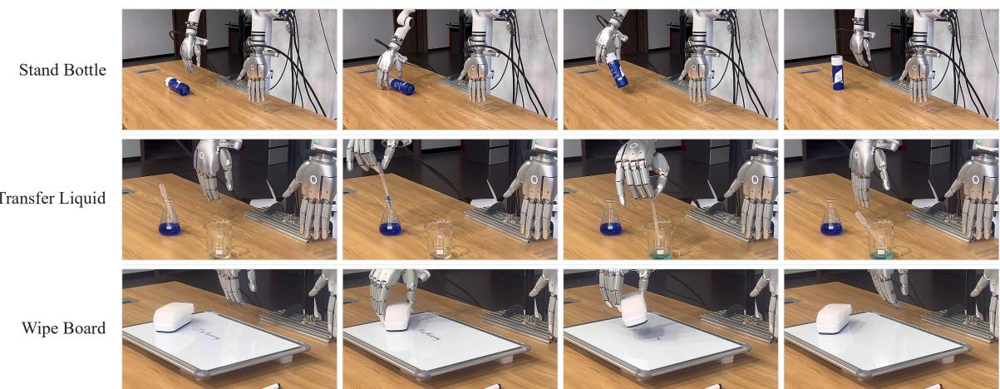  
Figure5 Real-world task settings. Representative execution sequences for Stand Bottle, Transfer Liquid, and Wipe Board.

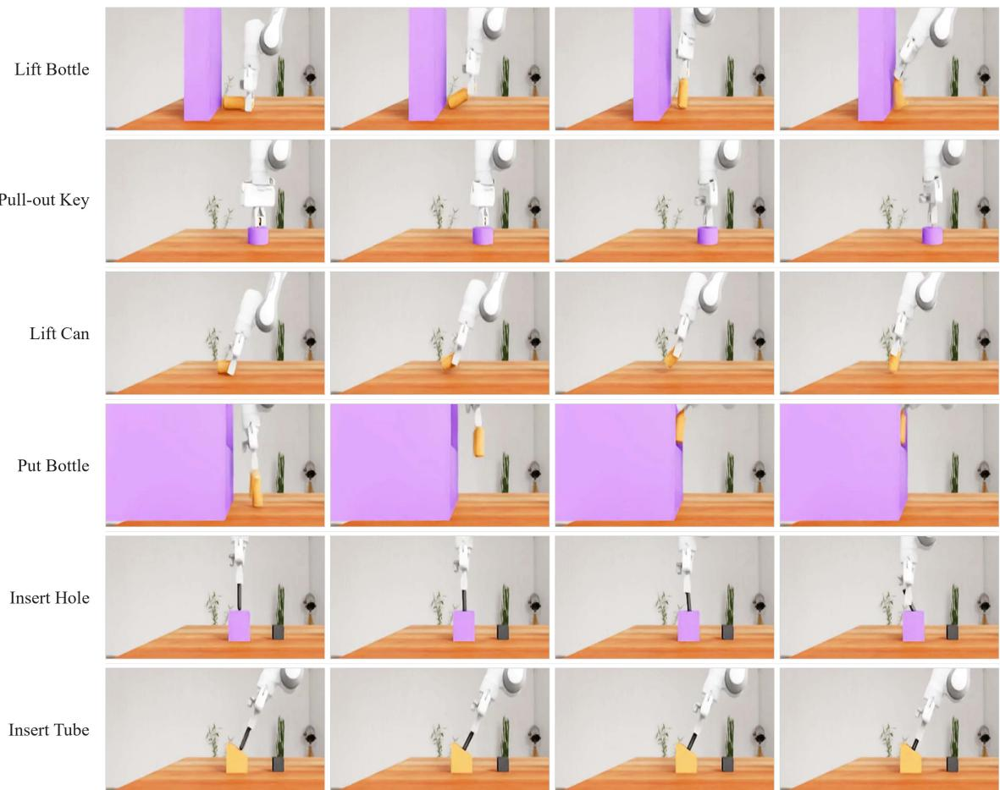  
Figure6 UniVTAC simulation tasks. Representative execution sequences for the six tasks used in our simulation experiments, reproduced from UniVTAC [4].