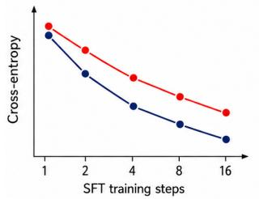
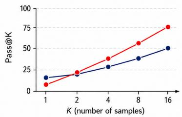
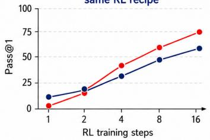
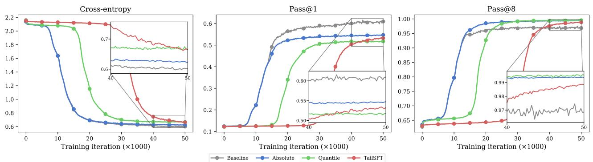
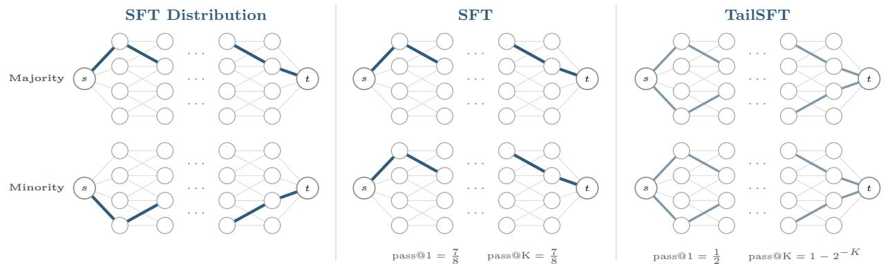
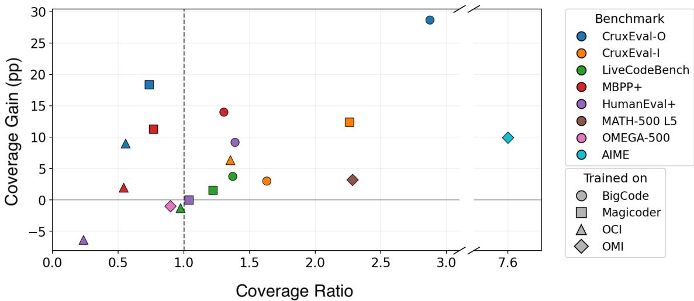
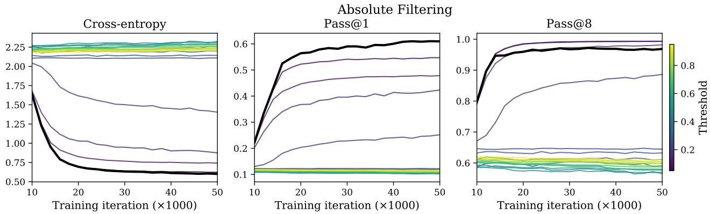
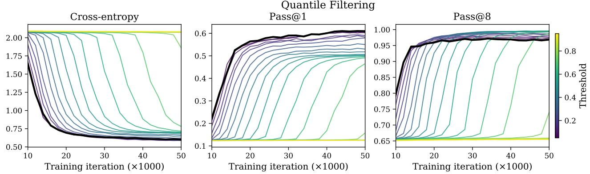
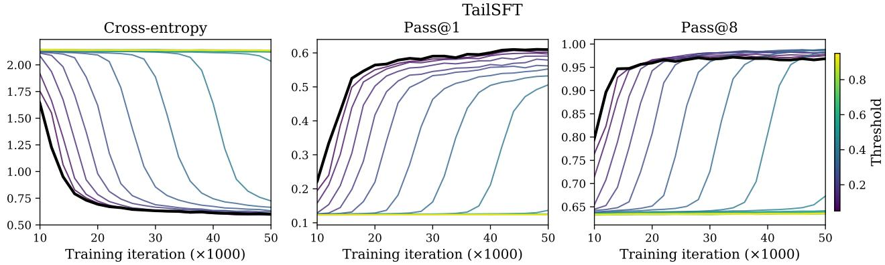
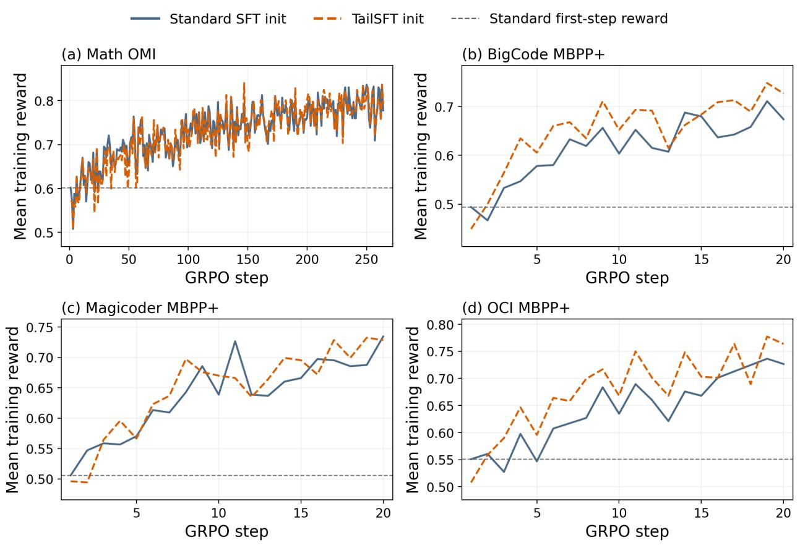

# TailSFT: Filtered Fine-Tuning Improves Post-Training Performance

Sadhika Malladi† Samy Jelassi‡ Dylan J. Foster‡ Jordan T. Ash‡ Akshay Krishnamurthy‡

## Abstract

Reinforcement learning post-training drives reasoning and agentic capabilities in modern AI systems, yet a growing body of work shows that it is most efective when used to fine-tune an already capable base model. We question whether existing pipelines yield models that are most suitable for reinforcement learning. Building on prior work highlighting the role of coverage and pass@K as predictors of post-RL performance, we design a simple modification to supervised fine-tuning, TailSFT, which filters out already fit sequences during training, thereby focusing learning on under-modeled regions, or the tail, of the data distribution. We justify and validate the design choices in TailSFT, particularly the specific filtering criteria, through a combination of controlled experiments and theoretical analysis. On OLMo-3 7B, TailSFT often improves pass@16 performance on math and coding evaluations, with gains up to 17% absolute, while incurring minimal computational overhead. These higher-coverage checkpoints consistently translate to up to 4% absolute pass@1 gains in subsequent GRPO runs, demonstrating that TailSFT checkpoints serve as better initializations for RL. We further introduce a lightweight diagnostic for identifying settings where TailSFT is most likely to help. More broadly, our results motivate a principled, stage-aware approach to model development, in which intermediate checkpoints are judged by how efectively they support subsequent training.

TailSFT improves coverage during SFT, resulting in better performance after RL  
(a) Cross-entropy during SFT lower is better  
  
Standard SFT minimizes loss more but can hurt coverage.

(b) Pass@K after SFT higher is better  
  
TailSFT preserves coverage more ways to reach a correct response.

(c) Pass@1 during RL higher is better same RL recipe  
  
More coverage before RL leads to better final performance after RL.

Figure 1: TailSFT yields better coverage, possibly at the cost of worse cross-entropy, which translates to stronger post-RL performance. Standard SFT achieves lower cross-entropy, while TailSFT preserves higher pass@K at large K. Starting from this higher-coverage checkpoint, the same RL procedure yields higher pass@1. Curves are illustrative.

## 1 Introduction

Language models are commonly trained in multiple phases, each defined by a diferent dataset and objective. A typical pipeline includes (1) next-token prediction on a general-purpose corpus, (2) supervised fine-tuning (SFT) for instruction following and domain adaptation, and (3) reinforcement learning (RL) for complex reasoning tasks. A tacit assumption in such pipelines is that improving the objective at one stage also produces a better initialization for the next. Recent work suggests that this assumption need not hold: models that perform better according to the local objective of one stage can nevertheless be worse starting points for subsequent training (Zhang et al., 2026a; Wang et al., 2025; Springer et al., 2025; Chen et al., 2025). These findings motivate a stage-aware view of model development, in which an intermediate model is judged not only by its standalone performance, but also by how efectively it supports the training that follows.

This issue is particularly important at the transition from SFT to RL. RL has produced substantial gains in mathematics, code, and other reasoning domains (Shao et al., 2024; Guo et al., 2025; MAI, 2025; Zhao et al., 2026a; Kimi, 2026), but requires substantial computation to generate and evaluate on-policy responses. In RL with verifiable rewards (RLVR), the usefulness of these rollouts depends strongly on the initialization. If rewarding responses are dificult to sample from the SFT model, many rollout groups contain little direct positive learning signal; conversely, if rewarding responses are reachable under repeated sampling, RL has more useful behavior to reinforce. Thus, designing SFT for subsequent RL requires a criterion that captures not merely single-sample accuracy, but whether useful responses remain accessible within the rollout budget available to RL.

The coverage principle formalizes this desideratum by relating a model’s coverage profile to what repeated sampling can recover (Chen et al., 2026a) (Definition 2.1). Empirically, pass@k provides a convenient measure of this property, in that it quantifies how often k samples contain at least one reward-bearing response. At values of k comparable to the sampling budget used during RL, large-k pass@k therefore measures how frequently the initialization exposes RL to a useful response.

Standard SFT, however, is not explicitly designed to preserve or improve this form of coverage. Cross-entropy continues to reward increases in the likelihood of every demonstration, including responses that the model can readily produce already. Further fitting these responses can shift probability mass away from potentially useful responses represented by the initial model. Consequently, cross-entropy and coverage need not be aligned. A model with worse cross-entropy can have better coverage, and vice versa (Chen et al., 2026a, 2025). On the other hand, directly optimizing the coverage profile is dificult, in part because the criterion is non-diferentiable and depends on information about the target response distribution that is generally unavailable (Definition 2.1). This raises the question we study in this work:

Can we modify supervised fine-tuning so that it better preserves the useful response coverage needed for subsequent reinforcement learning?

Contributions. To better prepare models for RL post-training, we propose TailSFT, an SFT algorithm that prioritizes coverage (or high pass@k at large k) over low cross-entropy loss (Algorithm 1). TailSFT is a sequence-level filtering method designed to direct training efort towards learning the under-modeled tail of the response distribution. The algorithm is lightweight and serves as a straightforward drop-in objective for SFT.

1. We isolate the efect of filtering in a controlled graph navigation task (Section 3.2) and show that filtering already-fit examples improves coverage, achieving higher pass@k at large k despite worse cross-entropy and pass@1 (Figures 2 and 3).

2. We design TailSFT to filter relative to the initial policy and show that this criterion provably ensures better coverage than standard cross-entropy or more naïve filtering (Theorem 3.1).

3. We apply TailSFT to OLMo-3 7B on standard math and coding tasks and obtain substantial gains in coverage and post-RL performance. TailSFT improves pass@16, in absolute terms, by up to 16.8% on coding and 3.1% on math (Table 1), and improves final pass@1 after GRPO by up to 3.9% (Table 2).

4. We introduce a lightweight coverage-ratio diagnostic (Definition 4.1), computed from the base model and a standard SFT run, that provides a suficient condition for TailSFT to improve coverage (Figure 4).

Broader outlook. Our results illustrate a broader source of suboptimality in multi-stage model training, where the objective that is appropriate for producing a strong model at one stage may not be the objective that produces the best initialization for the next. For the SFT-to-RL transition studied here, this distinction means that high large-k pass@k can be more valuable than lower cross-entropy, even when the two criteria are in tension. Recent work has documented related forms of misalignment across pre-training, fine-tuning, and RL (Zhang et al., 2026a; Wang et al., 2025; Springer et al., 2025; Chen et al., 2026a, 2025; Watts et al., 2026). TailSFT complements these observations with a practical intervention: rather than only diagnosing whether an intermediate model will support later training, it modifies SFT itself to produce a more useful initialization for the RL stage. Based on our results, we believe there is significant potential in adopting a holistic approach to language modeling.

## 2 Preliminaries on Coverage

We formalize coverage as a property of the SFT initialization that captures how readily reward-bearing responses can be sampled. We then relate coverage to pass@K, which provides an empirical measure of the learning signal available to $\mathrm { R L }$ at the start of post-training.

Notation and setting. Consider a prompt distribution $\mu$ over a prompt space $x ,$ a response space $\mathcal { V } _ { ; }$ and a language model $\pi ( \cdot \mid x ) \in \Delta ( \mathcal { Y } )$ . We focus on verifiable tasks with binary reward $R : \mathcal { X } \times \mathcal { Y }  \{ 0 , 1 \}$ where $R ( x , y ) = 1$ indicates that response $y$ is correct for prompt x. In SFT, we observe $( x _ { i } , y _ { i } )$ with $x _ { i } \sim \mu$ and $y _ { i } \sim \pi _ { \mathrm { D } } ( \cdot \mid x _ { i } )$ , where $\pi _ { \mathrm { D } }$ assigns probability to reward-bearing responses. Standard SFT minimizes the sequence-level cross-entropy $\ell _ { \pi } ( x , y ) = - \log \pi ( y \mid x )$ , and the resulting model π initializes RL.

The coverage profile. Consider a single prompt $x ,$ and let $p _ { \pi } ( x ) : = \operatorname* { P r } _ { y \sim \pi ( \cdot | x ) } [ R ( x , y ) = 1 ]$ . A batch of K independent rollouts contains at least one rewarding response with probability $1 - ( 1 - p _ { \pi } ( x ) ) ^ { K }$ . If all K rollouts receive zero reward, no gradient is received for their corresponding prompt. Thus, useful responses must have suficient probability under the initialization to have a chance of being produced during RL. Across a dataset of many prompts, the model may benefit via positive transfer from easier to harder prompts, but the initial probability of rewarding responses, $p _ { \pi } ( x )$ , determines the learning signal available before such transfer.

The coverage profile formalizes this property relative to the ground-truth, SFT-data policy (Chen et al., 2026a). We assume that $\pi _ { \mathrm { D } }$ assigns non-negligible probability to reward-bearing responses, so coverage of $\pi _ { \mathrm { D } }$ is relevant to downstream $\mathrm { R L }$

Definition 2.1 (Coverage Profile). Given a data-generating policy $\pi _ { \mathrm { D } }$ and model $\pi _ { : }$ , the coverage profile at scale N is

$$
\mathrm { C o v } _ { N } \bigl ( \pi _ { \mathrm { D } } \| \pi \bigr ) : = \mathrm { P r } _ { x \sim \mu , y \sim \pi _ { \mathrm { D } } ( \cdot | x ) } \left[ \frac { \pi _ { \mathrm { D } } \bigl ( y \mid x \bigr ) } { \pi \bigl ( y \mid x \bigr ) } \geq N \right] .
$$

The coverage profile measures the probability mass under $\pi _ { \mathrm { D } }$ that $\pi$ underweights by a factor of at least $N ;$ smaller values indicate better coverage. The scale N determines the sampling budget needed to reach this mass. Chen et al. (2026a) show that, if $\begin{array} { r } { \mathrm { C o v } _ { N } ( \pi _ { \mathrm { D } } \| \pi ) \le \frac 1 2 } \end{array}$ , then $K \ge 2 N \log ( 1 / \varepsilon )$ samples sufice for Best-of-K to achieve expected reward within $\mathrm { C o v } _ { N } ( \pi _ { \mathrm { D } } \| \pi ) + \varepsilon \ \mathrm { o f } \ \mathbf { \bar { \pi } _ { D } }$ , with a corresponding worst-case necessity result with a comparable relationship between N and K. Thus, coverage at scale $N$ characterizes which useful responses are accessible with a sampling budget on the order of $N$

Since $\pi _ { \mathrm { D } } ( y \mid x )$ is generally unknown, the coverage profile cannot be measured directly. However, for binary rewards, pass@ $K ( \pi ) : = \mathbb { E } _ { x \sim \mu } [ 1 - ( 1 - p _ { \pi } ( x ) ) ^ { K } ]$ is exactly the expected reward of Best-of-K sampling (Brown et al., 2024). We therefore use pass@K at large K as an empirical measure of coverage. At a K comparable to the RL rollout budget, it also measures how often the policy exposes RL to reward-bearing responses.

## 3 TailSFT: Supervised Fine-Tuning for Coverage

In this section, we develop TailSFT, a sequence-level filtering method designed to direct SFT updates toward improving coverage. The method combines two ideas: stopping updates on responses that are already suficiently

Algorithm 1 TailSFT   
Require: Initial policy $\pi _ { 0 } ,$ SFT data D, filtering schedule $\{ \gamma _ { t } \}$   
1: Record $\ell _ { i } ^ { 0 } \gets \ell _ { i } ( \pi _ { 0 } )$ for every $( x _ { i } , y _ { i } ) \in \mathcal { D }$   
2: for each training step t do   
3: Sample a batch $B _ { t }$   
4: Compute $\ell _ { i } ^ { t } \gets \ell _ { i } ( \pi _ { t } )$ for each $( x _ { i } , y _ { i } ) \in B _ { t }$   
5: Let $\mathcal { F } _ { t } \subseteq \mathcal { B } _ { t }$ be the $\gamma _ { t }$ fraction of sequences with the smallest $\ell _ { i } ^ { t } - \ell _ { i } ^ { 0 }$   
6: Set $\pi _ { t + 1 }$ by taking a gradient step from $\pi _ { t }$ on   
${ \mathcal { L } } _ { t } ( \pi ) = { \frac { \sum _ { i \in { \mathcal { B } } _ { t } \backslash { \mathcal { F } } _ { t } } - \log \pi ( y _ { i } \mid x _ { i } ) } { \sum _ { i \in { \mathcal { B } } _ { t } \backslash { \mathcal { F } } _ { t } } | y _ { i } | } }$

well modeled via filtering, and determining which responses to filter relative to the initial policy. We first introduce the algorithm, then isolate the efect of filtering in a controlled graph-navigation task, and finally analyze why the initial policy provides a useful reference for filtering.

## 3.1 The TailSFT Algorithm

Coverage at scale N depends on whether useful responses receive enough probability to be reached via repeated sampling. Once a response is already well covered at that scale, increasing its likelihood further does not reduce Cov . Improving coverage instead requires increasing the probability of responses that remain under-modeled. Standard SFT makes no such distinction and continues to increase the likelihood of every training response.

TailSFT reduces training on responses that have already improved substantially and concentrates subsequent updates on the remaining tail. Since $\pi _ { \mathrm { D } } ( y \mid x )$ is unknown, we cannot determine directly which responses are already covered. Instead, we compare each response’s current loss to its loss under the initial policy and filter the responses whose losses have decreased the most.

As described in Algorithm 1, TailSFT redirects training away from responses whose losses have decreased the most and toward responses that remain under-modeled. Filtering is applied at the sequence level. The length-normalized loss is used only to determine which sequences are filtered; optimization uses the standard token-averaged cross-entropy over target tokens in the retained sequences. The filtering fraction $\gamma _ { t }$ may be fixed or vary over training.

Filtering itself does not require using the initial policy as a reference. We therefore consider two alternatives alongside TailSFT: absolute filtering, which stops training on an example once its loss falls below a fixed threshold, and quantile filtering, which filters the lowest-loss fraction of each batch. These alternatives allow us to separate the benefit of filtering itself from the benefit of measuring progress relative to the initial policy π0.

## 3.2 Warm-Up: Graph Navigation

We study whether halting updates on an example once it is fit by the model can improve coverage, even at the cost of the standard SFT objective and pass@1. To do so, this section considers a controlled setting in which the distribution of rewarding responses is known exactly. Following Chen et al. (2026a), each prompt x specifies a layered directed graph with source s, target t, and exactly eight valid s → t paths. Pretraining pairs each graph with a uniformly sampled valid path, while the SFT data deterministically selects and rewards a single path (see Figure 2). Thus, pretraining teaches generic graph navigation, while SFT teaches the task-specific path-selection rule. Since the target policy is deterministic, pass@K is exactly the probability that the rewarded path is contained in K samples, yielding a finite-sample estimate of coverage. Full details of the graph construction and data-generating process appear in Appendix C.

Using a GPT-2-style architecture and a shared pretraining setup, we vary only the SFT objective. We compare standard SFT with absolute filtering, quantile filtering, and TailSFT, which uses ofset quantile filtering (as in Algorithm 1). For each filtering variant, we sweep its single filtering hyperparameter and report the setting with the highest final pass@8; complete training details and sweeps appear in Appendix C.

  
Figure 2: TailSFT trades single-sample accuracy for better coverage under repeated sampling. The SFT distribution contains majority and minority shards with diferent rewarding paths. Standard SFT over-anchors on the majority shard, achieving high pass@1 but no improvement as K grows. A filtered objective, illustrated here by TailSFT, retains probability on both paths, yielding lower pass@1 but substantially better pass@K scaling.  
Figure 3: Filtering improves pass@K at the expense of cross entropy and pass@1. Results on the graph-navigation task. Standard SFT achieves the lowest cross-entropy and highest pass@1, while all three filtering methods achieve substantially higher pass@8. See Appendix C for details.

The results in Figure 3 reveal a clear divergence between the standard SFT objective and coverage. Standard SFT achieves the best cross-entropy and pass@1, yet all three filtering methods achieve substantially better pass@8, which we use as a surrogate for coverage. Thus, improving cross-entropy and single-sample accuracy can come at the expense of the probability that a rewarded response appears within a finite rollout budget. Filtering mitigates this failure mode by reducing further updates on responses that are already well modeled.

The graph task therefore provides clean evidence for the first design choice underlying TailSFT: filtering already-fit examples can improve coverage. It is, however, too simple a setting to determine whether the filtering criterion should depend on the initial policy. In fact, TailSFT is slightly weaker than other filtering variants in this setting, due to homogeneity across prompts. Under the ideal pretrained policy, every prompt has the same possible loss reduction (i.e., log 8), so the reference loss provides no information for distinguishing which examples have more room to improve. Imperfections in pretraining therefore introduce noise into the ofset score without providing useful signal. We discuss this efect further in Appendix C.

## 3.3 Theoretical Analysis

We next turn to a setting where the initial policy carries information about the response distribution, and ask whether filtering rules can preserve it. To study this question, we turn to theoretical analysis. Let S denote the set of rewarding responses, and suppose the target policy is obtained by discarding all responses outside S and renormalizing the initial policy:

$$
\pi ^ { \star } ( y ) \propto \pi _ { 0 } ( y ) { \bf 1 } \{ y \in S \} .
$$

Thus, among rewarding responses, the target preserves the relative preferences already present in $\pi _ { 0 }$ . The initial model may place too much total probability on unrewarding responses, but it still contains information about how probability should be distributed among the rewarding ones.

We compare two ways to decide when an example should stop contributing to the SFT objective. Let $\ell _ { \pi } ( x , y ) = - \log \pi ( y \mid x )$ denote the sequence-level SFT loss. With an absolute filtering constant $\alpha ,$ we use

$$
\ell _ { \mathrm { a b s } } ( \pi ; x , y ) = \bigl [ \ell _ { \pi } ( x , y ) + \log ( \alpha ) \bigr ] _ { + } .
$$

An example stops contributing once $\pi ( y \mid x ) \geq \alpha$ . Because the same threshold is applied to every response, this criterion ignores how likely the response was under the initial policy.

$\mathrm { T A I L S F T }$ instead measures progress relative to the initial policy $\pi _ { 0 } .$ The corresponding ofset loss is

$$
\ell _ { \mathrm { o f f } } ( \pi ; x , y ) = \left[ \ell _ { \pi } ( x , y ) - \ell _ { \pi _ { 0 } } ( x , y ) + \log \beta \right] _ { + } ,
$$

which stops updating a response once

$$
\pi ( y \mid x ) \geq \beta \pi _ { 0 } ( y \mid x ) .
$$

The stopping point therefore adapts to the probability that $\pi _ { 0 }$ already assigns to each response rather than imposing a common final threshold.

Theorem 3.1 (Informal). Let πERM, $\pi _ { \mathrm { A B S } , \alpha }$ , and $\pi _ { \mathrm { O F F } , \beta }$ denote the policies obtained using standard $S F T ,$ absolute filtering, and ofset filtering, respectively. For any initial policy, rewarding set, and SFT sample, ofset filtering can be tuned to achieve coverage no worse than standard $S F T$ or the best absolute threshold:

$$
\operatorname* { i n f } _ { \beta } \mathrm { C o v } _ { N } ( \pi ^ { \star } \| \pi _ { \mathrm { O F F } , \beta } ) \leq \operatorname* { m i n } \left\{ \mathrm { C o v } _ { N } ( \pi ^ { \star } \| \pi _ { \mathrm { E R M } } ) , \operatorname* { i n f } _ { \alpha } \mathrm { C o v } _ { N } ( \pi ^ { \star } \| \pi _ { \mathrm { A B S } , \alpha } ) \right\} .
$$

The inequality can be strict, and absolute filtering can be worse than standard SFT.

The theorem formalizes the role of the initial policy as more than merely an initialization. In this setting, π0 contains useful information about how probability should be distributed among rewarding responses. Standard SFT can overwrite this structure by fitting the empirical frequencies of a finite SFT sample, while absolute filtering pushes observed responses toward a common probability threshold regardless of where they started. Ofset filtering instead uses each response’s initial probability to determine when further training is unnecessary. By preserving more of the useful structure already present in $\pi _ { 0 } ,$ it can achieve strictly better coverage. The full statement and proof appear in Appendix B.

Connections to prior work. TailSFT is most closely related to direct coverage optimization and loss-based data filtering. Chen et al. (2025) introduce the direct coverage optimization loss

$$
\ell _ { \mathrm { D C O } } ( \pi ; x , y ) = - \log \left( 1 - \left( 1 - \pi ( y \mid x ) \right) ^ { K } \right) ,
$$

which directly optimizes pass@K when y is the final solution. For large $K$ , its gradient becomes small once $\pi ( y \mid x )$ is suficiently large, making it a soft analogue for filtering without reference to the initial policy. Theorem 3.1 shows that, in our stylized setting, ofset filtering can achieve coverage no worse than the best absolute threshold and can be strictly better. TailSFT is also related to RHO-LOSS and subsequent variants, though these methods were designed and tested primarily to improve pretraining eficiency (Mindermann et al., 2022; Thirukovalluru et al., 2024; Lin et al., 2024; Zhao et al., 2026b). These approaches prioritize examples or tokens according to their potential loss reduction. TailSFT, by contrast, is designed to improve coverage for a subsequent RL stage and applies filtering at the sequence level. See Appendix A for further discussion.

## 4 Language Model Experiments

The results in Section 3 suggest that TailSFT can preserve reward-bearing responses more efectively than standard SFT. We now evaluate whether this behavior carries over to pretrained language models. We first compare standard SFT and TailSFT on math and code tasks. The variation across these results then allows us to study when preserving information from the base model is most useful. Finally, we follow matched SFT checkpoints through GRPO to test whether higher coverage before RL translates into stronger post-RL performance. Throughout, we use pass@16 as an empirical measure of coverage.

<table><tr><td rowspan="2">SFT data</td><td rowspan="2">Benchmark</td><td colspan="3">pass@1</td><td colspan="3">pass@16</td></tr><tr><td>Standard</td><td>TAILSFT</td><td>∆</td><td>Standard</td><td> $\mathrm { T A I L S F T }$ </td><td>∆</td></tr><tr><td>OMI</td><td>AIME 2022–2025 (n=120)</td><td> $3 . 6 5 \pm 0 . 3 7$ </td><td> $4 . 0 3 \pm 0 . 0 2$ </td><td>+0.37</td><td> $1 5 . 2 4 \pm 2 . 0 2$ </td><td> $1 8 . 3 1 \pm 0 . 5 7$ </td><td>+3.07</td></tr><tr><td></td><td>MATH-500 Level 5 (n=134)</td><td> $2 4 . 8 0 _ { \pm 0 . 4 0 }$ </td><td> $2 5 . 1 6 \pm 0 . 4 0$ </td><td>+0.36</td><td> $6 6 . 4 2 \pm 0 . 0 0$ </td><td> $6 9 . 1 5 \pm 0 . 8 6$ </td><td>+2.74</td></tr><tr><td></td><td>OMEGA-500 (n=500)</td><td> $6 . 5 8 \pm 0 . 5 0$ </td><td> $6 . 5 1 \pm 0 . 2 6$ </td><td>-0.06</td><td> $3 2 . 8 0 \pm 2 . 2 5$ </td><td> $3 2 . 6 0 _ { \pm 1 . 5 6 }$ </td><td>-0.20</td></tr><tr><td>BigCode</td><td>MBPP+ (n=378)</td><td> $5 3 . 0 4 \pm 0 . 9 3$ </td><td> $5 1 . 3 6 \pm 0 . 1 4$ </td><td>-1.68</td><td> $7 4 . 6 9 \pm 1 . 1 0$ </td><td> $7 8 . 8 4 \pm 1 . 0 6$ </td><td>+4.14</td></tr><tr><td></td><td>HumanEval+ (n=164)</td><td> $4 5 . 0 6 _ { \pm 0 . 5 7 }$ </td><td> $4 6 . 3 3 \pm 1 . 0 7$ </td><td>+1.27</td><td> $7 6 . 6 3 \pm 0 . 7 0$ </td><td> $8 0 . 0 8 _ { \pm 0 . 9 3 }$ </td><td>+3.46</td></tr><tr><td></td><td>CruxEval-I (n=800)</td><td> $2 9 . 7 9 \pm 0 . 4 8$ </td><td> $3 0 . 4 3 \pm 0 . 1 5$ </td><td>+0.64</td><td> $6 1 . 7 1 \pm 2 . 2 7$ </td><td> $6 5 . 7 9 \pm 0 . 2 6$ </td><td>+4.08</td></tr><tr><td></td><td>CruxEval-O (n=800)</td><td> $4 . 1 6 \pm 0 . 4 4$ </td><td> $1 3 . 1 8 \pm 0 . 3 0$ </td><td>+9.02</td><td> $2 4 . 2 1 \pm 2 . 3 8$ </td><td> $4 1 . 0 0 \pm 1 . 3 5$ </td><td>+16.79</td></tr><tr><td></td><td>LiveCodeBench (n=612)</td><td> $1 0 . 7 4 \pm 0 . 4 6$ </td><td> $1 1 . 4 9 \pm 0 . 3 8$ </td><td>+0.75</td><td> $3 0 . 3 9 \pm 0 . 8 6$ </td><td> $3 3 . 1 2 _ { \pm 0 . 3 4 }$ </td><td>+2.72</td></tr><tr><td>Magicoder</td><td>MBPP+ (n=378)</td><td> $5 5 . 3 5 \pm 0 . 4 7$ </td><td> $5 4 . 6 0 \pm 0 . 5 5$ </td><td>-0.75</td><td> $7 5 . 3 1 { \scriptstyle \pm 0 . 9 3 }$ </td><td> $7 8 . 6 6 \pm 1 . 2 5$ </td><td>+3.35</td></tr><tr><td></td><td>HumanEval+ (n=164)</td><td> $4 8 . 4 9 \pm 0 . 5 8$ </td><td> $4 7 . 6 9 \pm 0 . 1 9$ </td><td>-0.80</td><td> $7 7 . 8 5 \pm 0 . 7 0$ </td><td> $7 8 . 6 6 \pm 1 . 8 3 $ </td><td>+0.81</td></tr><tr><td></td><td>CruxEval-I (n=800)</td><td> $2 8 . 5 0 \pm 0 . 1 3$ </td><td> $2 6 . 4 8 \pm 0 . 4 5$ </td><td>-2.02</td><td> $5 9 . 7 5 \pm 0 . 6 2$ </td><td> $6 8 . 0 8 \pm 0 . 9 4$ </td><td>+8.33</td></tr><tr><td></td><td>CruxEval-O (n=800)</td><td> $1 2 . 8 6 \pm 0 . 1 9$ </td><td> $1 6 . 1 6 \pm 0 . 5 3$ </td><td>+3.30</td><td> $3 8 . 0 8 \pm 0 . 9 4$ </td><td> $4 7 . 9 2 \pm 1 . 6 6$ </td><td>+9.83</td></tr><tr><td></td><td>LiveCodeBench (n=612)</td><td> $1 4 . 8 4 \pm 0 . 1 1$ </td><td> $1 4 . 3 2 _ { \pm 0 . 3 8 }$ </td><td>-0.51</td><td> $3 1 . 8 1 \pm 0 . 3 4$ </td><td> $3 3 . 2 2 \pm 0 . 3 4$ </td><td>+1.42</td></tr><tr><td>OCI</td><td> $\mathrm { M B P P + } \ ( n { = } 3 7 8 )$ </td><td> $5 8 . 2 6 _ { \pm 0 . 8 8 }$ </td><td> $5 5 . 8 1 \pm 0 . 0 6$ </td><td>-2.44</td><td> $8 1 . 2 2 _ { \pm 0 . 7 5 }$ </td><td> $8 2 . 3 6 _ { \pm 0 . 8 1 }$ </td><td>+1.15</td></tr><tr><td></td><td>HumanEval+ (n=164)</td><td> $5 4 . 7 6 \pm 1 . 1 6$ </td><td> $5 1 . 9 4 \pm 1 . 8 3 $ </td><td>-2.82</td><td> $8 5 . 9 8 \pm 1 . 6 1$ </td><td> $8 3 . 2 3 \pm 2 . 1 6$ </td><td>-2.74</td></tr><tr><td></td><td> $\mathrm { C r u x E v a l - I } \ ( n { = } 8 0 0 )$ </td><td> $2 9 . 4 6 \pm 0 . 4 6$ </td><td> $3 0 . 1 7 \pm 0 . 6 4$ </td><td>+0.71</td><td> $6 8 . 0 8 \pm 1 . 7 7$ </td><td> $7 1 . 5 8 \pm 1 . 9 1 $ </td><td>+3.50</td></tr><tr><td></td><td> $\mathrm { C r u x E v a l - O } \ ( n { = } 8 0 0 )$ </td><td> $9 . 3 0 \pm 0 . 4 9$ </td><td> $1 0 . 8 4 \pm 0 . 3 7$ </td><td>+1.54</td><td> $4 0 . 1 2 \pm 0 . 0 0$ </td><td> $4 4 . 4 6 \pm 0 . 4 7$ </td><td>+4.33</td></tr><tr><td></td><td>LiveCodeBench (n=612)</td><td> $1 2 . 2 4 \pm 0 . 3 6$ </td><td> $1 1 . 4 9 \pm 0 . 8 4$ </td><td>-0.75</td><td> $3 4 . 5 9 \pm 0 . 9 0$ </td><td> $3 3 . 5 0 \pm 0 . 1 6$ </td><td>-1.09</td></tr></table>

Table 1: TailSFT improves coverage over standard SFT. Across 18 model–benchmark pairs, TailSFT often improves pass@16, while changes in pass@1 are mixed. Values are percentages reported as mean ± standard deviation over three seeds; ∆ denotes TailSFT minus Standard SFT in percentage points, shown in green when positive, red when negative, and yellow when within one standard deviation. We later establish a suficient condition (Definition 4.1) that accurately predicts the failure modes of TailSFT exhibited in this table (Figure 4). MATH-500 Level 5 refers to the subset of the benchmark with the highest dificulty.

## 4.1 SFT Results

Setup. We fine-tune the OLMo-3 7B base model (Olmo, 2026) separately on domain-specific math and code instruction data, giving 18 dataset–benchmark pairs. For math, we train on a 350k-example subset of OpenMathInstruct-2 (OMI, Toshniwal et al. (2024)), decontaminated against MATH-500. We evaluate with the OLMES protocol (Gu et al., 2025) on the 2022–2025 AIME problems, the hardest level of MATH-500, and OMEGA-500. For code, we train separately on Magicoder (Wei et al., 2024b), BigCode Self-OSS-Instruct (Wei et al., 2024a), and OpenCodeInstruct (OCI, Ahmad et al. (2025)). We evaluate on MBPP+, HumanEval+, CruxEval-I/O, and LiveCodeBench. We focus on benchmarks where performance is not saturated.

We report pass@16 using the task-specific OLMES sampling protocol and average results over three seed sets.   
Results are reported in Table 1 and Appendix D.1 contains experimental details.

TailSFT improves coverage in most settings. Across the 18 dataset–benchmark pairs in Table 1, TailSFT improves pass@16 in 15 cases, while changes in pass@1 are mixed. OMEGA-500 is essentially unchanged, with an absolute diference of −0.20%. The largest gain occurs on CruxEval-O after SFT on BigCode, where pass@16 increases by an absolute 16.79%. With Magicoder, pass@16 increases by 8.33% on CruxEval-I and 9.83% on CruxEval-O. On AIME, it increases by 3.07%. On MBPP+, absolute gains are 4.14%, 3.35%, and 1.15% for BigCode, Magicoder, and OCI. Overall, improvements are substantially more consistent at large K than at $K = 1$ , in line with the coverage motivation for TailSFT.

## 4.2 Coverage Ratio Diagnostic

The variation across these settings motivates a closer look at when TailSFT should perform well. In the graph-navigation task, standard SFT increased probability on the majority shard while reducing coverage of a rewarded path that was already represented by the initial policy. Based on this, we ask whether SFT in the

TailSFT improves coverage where the coverage ratio is high

  
Figure 4: When standard SFT loses more coverage than it gains, TailSFT preserves or improves coverage. The vertical line marks $\rho _ { 1 6 } = 1$ , where the estimated coverage lost and gained by standard SFT are equal. Of the 11 evaluated settings with $\rho _ { 1 6 } > 1$ , 10 have positive coverage gains from TailSFT and one is essentially unchanged. Several settings with $\rho _ { 1 6 } < 1$ also improve. Coverage gain and ratio are computed on the base-reachable set (Definition 4.1).

language model setting exhibits a measurable loss of coverage relative to the base model, and whether this coverage loss is predictive of the benefit of TailSFT.

We measure how standard SFT changes coverage on problems that are already reachable from the base model. Restricting attention to problems that are neither efectively unsolved nor already saturated under the base model, we use pass@1 to estimate the pass@16 that would result from independent sampling. We then aggregate the decreases and increases induced by standard SFT—their ratio measures whether standard SFT has lost more base-reachable coverage than it has gained.

Definition 4.1 (Coverage ratio). For problem i, model π, and $K \in \{ 1 , 1 6 \}$ , let $P _ { i , K } ( \pi )$ denote the empirical pass@K, averaged over seeds. We convert pass@1 to an estimated pass@16 value using $f _ { 1 6 } ( p ) : = 1 - ( 1 - p ) ^ { 1 6 }$ The base-reachable set is $\mathcal { R } _ { 0 } : = \{ i : 0 . 0 5 < P _ { i , 1 6 } ( \pi _ { 0 } ) < 0 . 9 5 \}$ . The coverage lost and gained by standard $S F T$ on this set are

$$
L : = \sum _ { i \in \mathcal { R } _ { 0 } } \Big [ f _ { 1 6 } \big ( P _ { i , 1 } ( \pi _ { 0 } ) \big ) - f _ { 1 6 } \big ( P _ { i , 1 } ( \pi _ { \mathrm { S F T } } ) \big ) \Big ] _ { + } ,
$$

$$
G : = \sum _ { i \in { \mathcal { R } } _ { 0 } } \Big [ f _ { 1 6 } \big ( P _ { i , 1 } ( \pi _ { \mathrm { S F T } } ) \big ) - f _ { 1 6 } \big ( P _ { i , 1 } ( \pi _ { 0 } ) \big ) \Big ] _ { + } .
$$

The coverage ratio is $\rho _ { 1 6 } : = L / G . \ I f G = 0$ , we set $\rho _ { 1 6 } : = \infty$

Computing $\rho _ { 1 6 }$ requires only the base model and a single standard SFT run. A value $\rho _ { 1 6 } > 1$ means that, on the base-reachable set, the estimated coverage lost during standard SFT exceeds the estimated coverage gained. This is the setting most directly targeted by TailSFT, which reduces training on responses that have already improved and thereby limits probability shifting away from responses represented by the base model.

The coverage ratio identifies a regime where TailSFT consistently preserves or improves coverage. In Figure 4, all 11 dataset–benchmark pairs satisfying $\rho _ { 1 6 } > 1$ have nonnegative coverage gains (improvement in pass@16 on the base-reachable set $\mathcal { R } _ { 0 } )$ from TailSFT. Ten improve and one is essentially unchanged, with gains reaching an absolute 28.69% for BigCode evaluated on CruxEval-O. The condition is not necessary for improvement: several settings with $\rho _ { 1 6 } < 1$ also benefit from TailSFT. Thus, the coverage ratio provides a conservative way to identify settings in which TailSFT preserves or improves coverage. Appendix D.3 contains further details.

<table><tr><td></td><td></td><td colspan="3">pass@1</td><td colspan="3">pass@16</td></tr><tr><td>SFT data</td><td>Benchmark</td><td>Standard</td><td>TailSFT</td><td>∆</td><td>Standard</td><td>TailSFT</td><td>∆</td></tr><tr><td colspan="8">GRPO on MATH</td></tr><tr><td>OMI</td><td>MATH-500 Level 5 (n=134)</td><td> $5 7 . 7 0 \pm 0 . 4 4$ </td><td> $6 0 . 2 6 \pm 1 . 0 2$ </td><td> $+ 2 . 5 6$ </td><td> $8 3 . 8 3 \pm 1 . 7 2$ </td><td> $8 7 . 0 6 \pm 0 . 8 6$ </td><td>+3.23</td></tr><tr><td></td><td>AIME 2022–2025 (n=120)</td><td> $1 4 . 4 0 \pm 0 . 2 6$ </td><td> $1 5 . 6 1 \pm 0 . 4 4$ </td><td>+1.21</td><td> $3 2 . 7 6 \pm 0 . 8 8$ </td><td> $3 6 . 0 6 \pm 0 . 9 8$ </td><td>+3.30</td></tr><tr><td colspan="8">GRPO on MBPP+</td></tr><tr><td>BigCode</td><td> $\mathrm { M B P P + } \ ( n { = } 3 7 8 )$ </td><td> $6 9 . 5 7 \pm 0 . 2 9$ </td><td> $7 3 . 5 0 { \scriptstyle \pm 0 . 7 0 }$ </td><td>+3.93</td><td> $7 5 . 9 3 \scriptstyle \pm 0 . 0 0$ </td><td> $7 8 . 6 6 \pm 0 . 1 5$ </td><td>+2.73</td></tr><tr><td>Magicoder</td><td> $\mathrm { M B P P + } \ ( n { = } 3 7 8 )$ </td><td> $7 0 . 5 2 \pm 0 . 2 5$ </td><td> $7 3 . 2 4 \pm 0 . 0 9$ </td><td>+2.72</td><td> $7 8 . 2 2 \pm 0 . 6 1$ </td><td> $8 0 . 6 0 \pm 0 . 5 5$ </td><td>+2.38</td></tr><tr><td>OCI</td><td> $\mathrm { M B P P + } \ ( n { = } 3 7 8 )$ </td><td> $7 4 . 6 7 \pm 0 . 0 8$ </td><td> $7 6 . 3 0 \pm 0 . 0 5$ </td><td>+1.62</td><td> $8 4 . 2 2 _ { \pm 0 . 4 0 }$ </td><td> $8 4 . 0 4 \pm 0 . 1 5$ </td><td>-0.18</td></tr></table>

Table 2: Initializing from the TailSFT model improves post-GRPO performance across math and code. GRPO is initialized from the Standard SFT and TailSFT checkpoints evaluated in Table 1, and rows are grouped by the corpus used for GRPO training: the MATH train split, excluding MATH-500, for the math rows, and the MBPP+ train split for the code rows. The SFT data column indicates the corpus used to train the initialization for each GRPO run. Values are percentages reported as mean ± standard deviation over three seeds, and ∆ is improvement from TailSFT. Experiment details are in Appendix D.2.

## 4.3 GRPO Results

The coverage principle predicts that a higher-coverage initialization should expose RL to rewarding responses more often (Chen et al., 2026a). This section therefore tests whether the additional coverage resulting from TailSFT translates into better post-RL performance.

Setup. We initialize GRPO from the standard SFT and TailSFT checkpoints evaluated in Table 1. For math reasoning, we train on the MATH training split with MATH-500 held out and evaluate on MATH-500 Level 5 and AIME. For code, we train on the MBPP+ training split and evaluate on its test split. The GRPO procedure and hyperparameters are held fixed within each comparison. The main comparisons use 4 rollouts per prompt and an actor learning rate of $2 \times 1 0 ^ { - 5 }$ . Evaluation follows the OLMES protocol over three seed sets.

Improved coverage yields better post-RL performance. Initializing from TailSFT improves post-RL pass@1 in every matched comparison in Table 2, with absolute improvements ranging between 1.21% and 3.93%. Our coding experiments make the role of initialization especially salient—each TailSFT checkpoint has lower pass@1 than its standard SFT counterpart before RL, but has higher pass@1 afterward. Broader initial coverage indeed results in higher single-sample accuracy after GRPO. These results are consistent with the relationship between large-K performance and post-RL outcomes observed by Kang et al. (2026).

Improved coverage drives faster learning. Figure 8 shows that the diference between the two initializa tions appears early in training, with TailSFT runs beginning with lower reward but the gap quickly closing. In some settings, early reward increases up to 2.5× faster than for the corresponding standard SFT run. After RL, TailSFT retains higher pass@16 in four of the five matched comparisons, and is approximately tied in the fifth. The coverage preserved during SFT is therefore available to RL early in training and ultimately translates into higher pass@1.

## 5 Discussion

We present TailSFT as a drop-in replacement for standard SFT that filters already-fit sequences to improve coverage after the SFT stage, which produces improvements in post-RL performance. TailSFT is derived using a combination of theoretical analysis and controlled empirics, and significantly outperforms standard SFT in our language modeling experiments. More broadly, TailSFT uses the coverage principle to target the interaction between the SFT and RL stages of language model training (Chen et al., 2026a). We believe our results motivate a shift in how language models should be optimized, toward targeting the full training trajectory rather than fitting each stage independently.

## References

Wasi Uddin Ahmad, Aleksander Ficek, Mehrzad Samadi, Jocelyn Huang, Vahid Noroozi, Somshubra Majumdar, and Boris Ginsburg. Opencodeinstruct: A large-scale instruction tuning dataset for code llms. arXiv:2504.04030, 2025.

Rachit Bansal, Clara Mohri, Tian Qin, David Alvarez-Melis, and Sham M. Kakade. RL excursions during pre-training: How early is too early for on-policy learning? In Workshop on Scaling Post-Training for LLMs, 2026.

David Brandfonbrener, Hanlin Zhang, Andreas Kirsch, Jonathan Richard Schwarz, and Sham Kakade. CoLoR Filter: Conditional loss reduction filtering for targeted language model pre-training. In Advances in Neural Information Processing Systems, 2024.

Bradley Brown, Jordan Juravsky, Ryan Ehrlich, Ronald Clark, Quoc V. Le, Christopher Ré, and Azalia Mirhoseini. Large language monkeys: Scaling inference compute with repeated sampling. arXiv:2407.21787, 2024.

Fan Chen, Audrey Huang, Noah Golowich, Sadhika Malladi, Adam Block, Jordan Ash, Akshay Krishnamurthy, and Dylan Foster. The coverage principle: How pre-training enables post-training. In International Conference on Learning Representations, 2026a.

Feng Chen, Allan Raventós, Nan Cheng, Surya Ganguli, and Shaul Druckmann. Rethinking fine-tuning when scaling test-time compute: Limiting confidence improves mathematical reasoning. In Advances in Neural Information Processing Systems, 2025.

Jinglin Chen and Nan Jiang. Information-theoretic considerations in batch reinforcement learning. In International Conference on Machine Learning, 2019.

Yijie Chen, Yijin Liu, and Fandong Meng. SED-SFT: Selectively encouraging diversity in supervised fine-tuning. In Annual Meeting of the Association for Computational Linguistics, 2026b.

Zhoujun Cheng, Yutao Xie, Yuxiao Qu, Amrith Setlur, Shibo Hao, Varad Pimpalkhute, Tongtong Liang, Feng Yao, Zhengzhong Liu, Eric P. Xing, Virginia Smith, Ruslan Salakhutdinov, Zhiting Hu, Taylor W. Killian, and Aviral Kumar. IsoCompute playbook: Optimally scaling sampling compute for LLM RL. In International Conference on Machine Learning, 2026.

Yinlam Chow, Guy Tennenholtz, Izzeddin Gur, Vincent Zhuang, Bo Dai, Aviral Kumar, Rishabh Agarwal, Sridhar Thiagarajan, Craig Boutilier, and Aleksandra Faust. Inference-aware fine-tuning for best-of-n sampling in large language models. In International Conference on Learning Representations, 2025.

Tianzhe Chu, Yuexiang Zhai, Jihan Yang, Shengbang Tong, Saining Xie, Dale Schuurmans, Quoc V. Le, Sergey Levine, and Yi Ma. SFT memorizes, RL generalizes: A comparative study of foundation model post-training. In International Conference on Machine Learning, 2025.

Zhiyuan Fan, Guanqiao Chen, Yanyi Huang, Mingkuan Zhao, Dadi Guo, and Yi R. Fung. Learning di verse responses with prefix-conditioned supervised fine-tuning. In Annual Meeting of the Association for Computational Linguistics, 2026.

Amir-massoud Farahmand, Csaba Szepesvári, and Rémi Munos. Error propagation for approximate policy and value iteration. In Advances in Neural Information Processing Systems, 2010.

Dylan J. Foster, Akshay Krishnamurthy, David Simchi-Levi, and Yunzong Xu. Ofline reinforcement learning: Fundamental barriers for value function approximation. In Conference on Learning Theory, 2022.

Dylan J. Foster, Zakaria Mhammedi, and Dhruv Rohatgi. Is a good foundation necessary for eficient reinforcement learning? the computational role of the base model in exploration. In Conference on Learning Theory, 2025.

Yuqian Fu, Tinghong Chen, Jiajun Chai, Xihuai Wang, Songjun Tu, Guojun Yin, Wei Lin, Qichao Zhang, Yuanheng Zhu, and Dongbin Zhao. SRFT: A single-stage method with supervised and reinforcement fine-tuning for reasoning. In International Conference on Learning Representations, 2026.

Yuling Gu, Oyvind Tafjord, Bailey Kuehl, Dany Haddad, Jesse Dodge, and Hannaneh Hajishirzi. OLMES: A standard for language model evaluations. In Findings of the Association for Computational Linguistics, 2025.

Daya Guo, Dejian Yang, Haowei Zhang, Junxiao Song, Peiyi Wang, Qihao Zhu, Runxin Xu, Ruoyu Zhang, Shirong Ma, Xiao Bi, et al. DeepSeek-R1 incentivizes reasoning in LLMs through reinforcement learning. Nature, 2025.

Andre Wang He, Daniel Fried, and Sean Welleck. Rewarding the unlikely: Lifting GRPO beyond distribution sharpening. In Conference on Empirical Methods in Natural Language Processing, 2025.

Audrey Huang, Adam Block, Dylan Foster, Dhruv Rohatgi, Cyril Zhang, Max Simchowitz, Jordan Ash, and Akshay Krishnamurthy. Self-improvement in language models: The sharpening mechanism. In International Conference on Learning Representations, 2025a.

Audrey Huang, Adam Block, Qinghua Liu, Nan Jiang, Akshay Krishnamurthy, and Dylan J. Foster. Is best-of-n the best of them? coverage, scaling, and optimality in inference-time alignment. In International Conference on Machine Learning, 2025b.

Zeyu Huang, Tianhao Cheng, Zihan Qiu, Zili Wang, Yinghui Xu, Edoardo M. Ponti, and Ivan Titov. Blending supervised and reinforcement fine-tuning with prefix sampling. In International Conference on Machine Learning, 2026.

Nan Jiang and Tengyang Xie. Ofline reinforcement learning in large state spaces: Algorithms and guarantees. Statistical Science, 2025.

Hangzhan Jin, Sitao Luan, Sicheng Lyu, Guillaume Rabusseau, Doina Precup, and Mohammad Hamdaqa. RL fine-tuning heals the OOD forgetting in SFT. In Workshop on Foundations of Reasoning in Language Models, 2025.

Ying Jin, Zhuoran Yang, and Zhaoran Wang. Is pessimism provably eficient for ofline RL? In International Conference on Machine Learning, 2021.

Feiyang Kang, Michael Kuchnik, Karthik Padthe, Marin Vlastelica, Ruoxi Jia, Carole-Jean Wu, and Newsha Ardalani. Quagmires in SFT-RL post-training: When high SFT scores mislead and what to use instead. In International Conference on Learning Representations, 2026.

Aayush Karan and Yilun Du. Reasoning with sampling: Your base model is smarter than you think. In International Conference on Learning Representations, 2026.

Angelos Katharopoulos and Francois Fleuret. Not all samples are created equal: Deep learning with importance sampling. In International Conference on Machine Learning, 2018.

Ziniu Li, Congliang Chen, Tian Xu, Zeyu Qin, Jiancong Xiao, Zhi-Quan Luo, and Ruoyu Sun. Preserving diversity in supervised fine-tuning of large language models. In International Conference on Learning Representations, 2025.

Zhenghao Lin, Zhibin Gou, Yeyun Gong, Xiao Liu, Yelong Shen, Ruochen Xu, Chen Lin, Yujiu Yang, Jian Jiao, Nan Duan, and Weizhu Chen. Not all tokens are what you need for pretraining. In Advances in Neural Information Processing Systems, 2024.

Hong Liu, Sang Michael Xie, Zhiyuan Li, and Tengyu Ma. Same pre-training loss, better downstream: Implicit bias matters for language models. In International Conference on Machine Learning, 2023.

Mingjie Liu, Shizhe Diao, Ximing Lu, Jian Hu, Xin Dong, Yejin Choi, Jan Kautz, and Yi Dong. ProRL: Prolonged reinforcement learning expands reasoning boundaries in large language models. In Advances in Neural Information Processing Systems, 2025.

Nicholas Lourie, Michael Y. Hu, and Kyunghyun Cho. Scaling laws are unreliable for downstream tasks: A reality check. In Findings of the Association for Computational Linguistics, 2025.

Microsoft AI Team. Mai-thinking-1: Building a hill-climbing machine. Technical report, Technical report, Microsoft AI, 2026. https://microsoft. ai/pdf/mai-thinking . . . , 2025.

Sören Mindermann, Jan M Brauner, Muhammed T Razzak, Mrinank Sharma, Andreas Kirsch, Winnie Xu, Benedikt Höltgen, Aidan N Gomez, Adrien Morisot, Sebastian Farquhar, et al. Prioritized training on points that are learnable, worth learning, and not yet learnt. In International Conference on Machine Learning, 2022.

Xueyan Niu, Bo Bai, Wei Han, and Weixi Zhang. On the non-decoupling of supervised fine-tuning and reinforcement learning in post-training. arXiv:2601.07389, 2026.

Jinlong Pang, Na Di, Zhaowei Zhu, Jiaheng Wei, Hao Cheng, Chen Qian, and Yang Liu. Token cleaning: Fine-grained data selection for LLM supervised fine-tuning. In International Conference on Machine Learning, 2025.

Chongli Qin and Jost Tobias Springenberg. Supervised fine tuning on curated data is reinforcement learning (and can be improved). arXiv:2507.12856, 2025.

Ziheng Qin, Kai Wang, Zangwei Zheng, Jianyang Gu, Xiangyu Peng, Zhaopan Xu, Daquan Zhou, Lei Shang, Baigui Sun, Xuansong Xie, and Yang You. InfoBatch: Lossless training speed up by unbiased dynamic data pruning. In International Conference on Learning Representations, 2024.

Zhihong Shao, Peiyi Wang, Qihao Zhu, Runxin Xu, Junxiao Song, Xiao Bi, Haowei Zhang, Mingchuan Zhang, Y. K. Li, Y. Wu, and Daya Guo. DeepSeekMath: Pushing the limits of mathematical reasoning in open language models. arXiv:2402.03300, 2024.

Charlie Snell, Jaehoon Lee, Kelvin Xu, and Aviral Kumar. Scaling LLM test-time compute optimally can be more efective than scaling parameters for reasoning. In International Conference on Learning Representations, 2025.

Jacob Mitchell Springer, Sachin Goyal, Kaiyue Wen, Tanishq Kumar, Xiang Yue, Sadhika Malladi, Graham Neubig, and Aditi Raghunathan. Overtrained language models are harder to fine-tune. In International Conference on Machine Learning, 2025.

Swabha Swayamdipta, Roy Schwartz, Nicholas Lourie, Yizhong Wang, Hannaneh Hajishirzi, Noah A. Smith, and Yejin Choi. Dataset cartography: Mapping and diagnosing datasets with training dynamics. In Conference on Empirical Methods in Natural Language Processing, 2020.

Kimi Team, Tongtong Bai, Yifan Bai, Yiping Bao, M. C., Jianfeng Cai, Xinyuan Cai, Peizhou Cao, Yuxuan Cao, Ziwei Chai, Y. Charles, H. S. Che, Guanduo Chen, Guangyu Chen, Guanzheng Chen, Huarong Chen, Jia Chen, Jianlong Chen, Jun Chen, Kexin Chen, Peng Chen, Ruijue Chen, Wentao Chen, Xin Chen, Yang Chen, Yanru Chen, Yifei Chen, Yingjiang Chen, Yuankun Chen, Yujie Chen, Yutian Chen, Zhirong Chen, Dazhi Cheng, Yean Cheng, Jialei Cui, Jingbing Cui, Anqi Dai, Jiaqi Deng, Hao Ding, Rui Ding, Shaofeng Ding, Mengfan Dong, Mengnan Dong, Yuhao Dong, Yuxin Dong, Angang Du, Chenzhuang Du, Dikang Du, Jusen Du, Yulun Du, Yu Fan, Jing Feng, Qiulin Feng, Yichen Feng, Kelin Fu, Qiang Fu, Fuxuan Gao, Hongcheng Gao, Jingyue Gao, Tong Gao, Weijia Gao, Shangyi Geng, Jie Gong, Linhu Gong, Shengao Gong, Xiaochen Gong, Qizheng Gu, Yicheng Gu, Shuhao Guan, Haiqing Guo, Shiqi Guo, Xiang Guo, Zhengyan Guo, Beixi Hao, Wenxin Hao, Xiaoru Hao, Dailan He, Haotian He, Lehan He, Qi He, Weiran He, Xinran He, Xinyi He, Yibo He, Yunjia He, Chao Hong, Tiange Hong, Hao Hu, Jiaxi Hu, Ruikun Hu, Weiming Hu, Yangyang Hu, Zhenxing Hu, Liang Hua, Jinbin Huang, Ke Huang, Ruiyuan Huang, Siying Huang, Weixiao Huang, Yan Huang, Zhengjie Huang, Zhiqi Huang, Yulong Hui, Chaobo Jia, Yutong Jiang, Zhejun Jiang, Zuoyou Jiang, Wenyi Jin, Xinyi Jin, Yu Jing, Huanjun Kong, Guokun Lai, Aidi Li, Cheng Li, Chengyuan Li, Cong Li, Fang Li, Guanyu Li, Haoyang Li, Jia Li, Junxiong Li, Lei Li, Letian Li, Lincan Li, Weihong Li, Wentao Li, Xintong Li, Yang Li, Yishen Li, Yiwei Li, Yuxiao Li, Zhaowei Li, Zhaoxi Li, Zheming Li, Zhengxiao Li, Zhiyuan Li, Jiawei Lin, Xiaohan Lin, Yibo Lin, Zichao Lin, Ziyan Lin, Bill Liu, Boxiao Liu, Chuan Liu, Liang Liu, Shaowei Liu, Shudong Liu, Shuran Liu, Tianwei Liu, Weizhou Liu, Yangyang Liu, Yanming Liu, Yibo Liu, Yipeng Liu, Zhengying Liu, Zhiheng Liu, Enzhe Lu, Haoyu Lu, Linqiang Lu, Tingzhan Lu, Zhiyuan Lu, Aotian Luo, G. Luo, Junyu Luo, Yifan Luo, B. Lyu, Wenzhou Lyu, Shaoguang Mao, Yuan Mei, Xin Men, Minqing Ni, Yixuan Niu, Siyuan Pan, Shujun Peng, Zhangyang Qi, Ruoyu Qin, ZeChao Qin, Zeyu Qin, Haiquan Qiu, Jianxin Qiu, Jiezhong Qiu, Bowen Qu, Yuhao Qu, Zeyu Shang, Youbo Shao, Han Shen, Jincheng Shi, Juanfeng Shi, Lidong Shi, Shengyuan Shi, Wingchun Siu, Pengwei Song, Xiaoxi Song, Jianlin Su, Yunfeng Su, Zhaochen Su, Lin Sui, Jingsong Sun, Junyao Sun, Shaoning Sun,

Shuzhe Sun, Tongyu Sun, Yujun Sun, Yunpeng Tai, Chuning Tang, Heyi Tang, Sirui Tang, Zecheng Tang, Chaoran Tian, Rongpeng Tian, Yu Tian, Wei Tu, Chensi Wang, Chuang Wang, Chunjie Wang, Dinglu Wang, Feng Wang, Hailong Wang, Haiming Wang, Hao Wang, Hao Wang, Huaqing Wang, Hui Wang, Jiayi Wang, Jinglong Wang, Jinhong Wang, Jiuzheng Wang, Linian Wang, Shaobo Wang, Shenzhi Wang, Shuyi Wang, Si Wang, Siyuan Wang, Tianfu Wang, Wenjue Wang, Xingran Wang, Xinmei Wang, Xinyuan Wang, Xusheng Wang, Yalin Wang, Yangkun Wang, Yao Wang, Yaoyu Wang, Yejie Wang, Yiqin Wang, Yucheng Wang, Yuzhi Wang, Zhaoji Wang, Zhaowei Wang, Zhengtao Wang, Zhenhao Wang, Zhongsheng Wang, Zifan Wang, Chu Wei, Ming Wei, Shouxin Wei, Zichen Wen, Fan Wu, Haoning Wu, Rucong Wu, Wenhao Wu, Xiaoxue Wu, Yingcong Wu, Yongqi Wu, Yuxin Wu, Zijian Wu, Xinglang Xian, Chenxuan Xiang, Yuye Xiang, Bocheng Xiao, Chenjun Xiao, Xin Xiao, Jin Xie, Xiaotong Xie, Yifeng Xie, Zhe Xie, Bowei Xing, Yiming Xiong, Baosheng Xu, Boyu Xu, Jiale Xu, Jianfan Xu, Jing Xu, Jinjing Xu, L. H. Xu, Qingtao Xu, Shuyao Xu, Suting Xu, Tiantian Xu, Tianxiang Xu, Weixin Xu, Xinran Xu, Yangchuan Xu, Ye Xu, Yueni Xu, Ziyao Xu, Haonan Xue, Junjie Yan, Yaoyao Yan, Fan Yang, Guangyao Yang, Hao Yang, Junwei Yang, Ruoyu Yang, Wenjie Yang, Xiaofei Yang, Xinyu Yang, Yi Yang, Yiling Yang, Ying Yang, Yuchen Yang, Zhen Yang, Zhilin Yang, Zian Yang, Zuhao Yang, Haotian Yao, Dan Ye, Haoran Ye, Wenjie Ye, Zhanbo Ye, Bohong Yin, Haoxiang Yin, Xietong Yin, Chengzhen Yu, Haozhen Yu, Longhui Yu, Shengnan Yu, Shuying Yu, Tianxiang Yu, Enming Yuan, Mengjie Yuan, Tongtian Yue, Wei Yue, Yang Yue, Dunyuan Zha, Haobing Zhan, B. H. Zhang, Dehao Zhang, Fei Zhang, Hao Zhang, Haoyuan Zhang, Huanyu Zhang, Jiapei Zhang, Jiaxuan Zhang, Jin Zhang, Kaiyi Zhang, Miaozhen Zhang, Puqi Zhang, Qinglei Zhang, Rong Zhang, Rui Zhang, Shaoshuai Zhang, Shiyi Zhang, Xiaobin Zhang, Xiaoyun Zhang, Y. Zhang, Yangkun Zhang, Ye Zhang, Yichi Zhang, Yikun Zhang, Yizhi Zhang, Yongting Zhang, Yu Zhang, Yutao Zhang, Yutong Zhang, Zheng Zhang, Zijing Zhang, Bin Zhao, Chenguang Zhao, Feifan Zhao, Jinglun Zhao, Jinxiang Zhao, Shuai Zhao, Wenshuo Zhao, Xiangyu Zhao, Xuanle Zhao, Yikai Zhao, Zijia Zhao, Haozhi Zheng, Huabin Zheng, Ruihan Zheng, Shaojie Zheng, Tengyang Zheng, Haofeng Zhong, Lei Zhong, Longguang Zhong, M. Zhou, Qiankang Zhou, Runjie Zhou, Ruozhang Zhou, Xinyu Zhou, Yiqiao Zhou, Zaida Zhou, Jinguo Zhu, Liya Zhu, Xinhao Zhu, Yangjunfeng Zhu, Yuxuan Zhu, Zhen Zhu, Chen Zhuang, Weiyu Zhuang, and Xinxing Zu. Kimi k3: Open frontier intelligence. arXiv preprint arXiv:2607.24653, 2026.

Team Olmo, Allyson Ettinger, Amanda Bertsch, Bailey Kuehl, David Graham, David Heineman, Dirk Groeneveld, Faeze Brahman, Finbarr Timbers, Hamish Ivison, Jacob Morrison, Jake Poznanski, Kyle Lo, Luca Soldaini, Matt Jordan, Mayee Chen, Michael Noukhovitch, Nathan Lambert, Pete Walsh, Pradeep Dasigi, Robert Berry, Saumya Malik, Saurabh Shah, Scott Geng, Shane Arora, Shashank Gupta, Taira Anderson, Teng Xiao, Tyler Murray, Tyler Romero, Victoria Graf, Akari Asai, Akshita Bhagia, Alexander Wettig, Alisa Liu, Aman Rangapur, Chloe Anastasiades, Costa Huang, Dustin Schwenk, Harsh Trivedi, Ian Magnusson, Jaron Lochner, Jiacheng Liu, Lester James V. Miranda, Maarten Sap, Malia Morgan, Michael Schmitz, Michal Guerquin, Michael Wilson, Regan Huf, Ronan Le Bras, Rui Xin, Rulin Shao, Sam Skjonsberg, Shannon Zejiang Shen, Shuyue Stella Li, Tucker Wilde, Valentina Pyatkin, Will Merrill, Yapei Chang, Yuling Gu, Zhiyuan Zeng, Ashish Sabharwal, Luke Zettlemoyer, Pang Wei Koh, Ali Farhadi, Noah A. Smith, and Hannaneh Hajishirzi. Olmo 3. arXiv:2512.13961, 2026.

Raghuveer Thirukovalluru, Nicholas Monath, Bhuwan Dhingra, and Sam Wiseman. Sequence reducible holdout loss for language model pretraining. In Joint International Conference on Computational Linguistics, Language Resources and Evaluation, 2024.

Shubham Toshniwal, Wei Du, Ivan Moshkov, Branislav Kisacanin, Alexan Ayrapetyan, and Igor Gitman. Openmathinstruct-2: Accelerating AI for math with massive open-source instruction data. In Workshop on Mathematical Reasoning and AI, 2024.

Jens Tuyls, Dylan Foster, Akshay Krishnamurthy, and Jordan Ash. Representation-based exploration for language models: From test-time to post-training. In International Conference on Learning Representations, 2026.

Hao Wang, Hao Gu, Hongming Piao, Kaixiong Gong, Yuxiao Ye, Xiangyu Yue, Sirui Han, Yike Guo, and Dapeng Wu. Learning while staying curious: Entropy-preserving supervised fine-tuning via adaptive selfdistillation for large reasoning models. In Annual Meeting of the Association for Computational Linguistics, 2026.

Jiachen T. Wang, Tong Wu, Dawn Song, Prateek Mittal, and Ruoxi Jia. GREATS: Online selection of high-quality data for LLM training in every iteration. In Advances in Neural Information Processing Systems, 2024.

Zengzhi Wang, Fan Zhou, Xuefeng Li, and Pengfei Liu. OctoThinker: Mid-training incentivizes reinforcement learning scaling. In AI for Math Workshop, 2025.

Ishaan Watts, Catherine Li, Sachin Goyal, Jacob Mitchell Springer, and Aditi Raghunathan. Sharpness-aware pretraining mitigates catastrophic forgetting. In International Conference on Machine Learning, 2026.

Yuxiang Wei, Federico Cassano, Jiawei Liu, Yifeng Ding, Naman Jain, Zachary Mueller, Harm de Vries, Leandro Von Werra, Arjun Guha, and LINGMING ZHANG. Selfcodealign: Self-alignment for code generation. In Advances in Neural Information Processing Systems, 2024a.

Yuxiang Wei, Zhe Wang, Jiawei Liu, Yifeng Ding, and LINGMING ZHANG. Magicoder: Empowering code generation with OSS-instruct. In International Conference on Machine Learning, 2024b.

Xumeng Wen, Zihan Liu, Shun Zheng, Shengyu Ye, Zhirong Wu, Yang Wang, Zhijian Xu, Xiao Liang, Junjie Li, Ziming Miao, Jiang Bian, and Mao Yang. Reinforcement learning with verifiable rewards implicitly incentivizes correct reasoning in base LLMs. In International Conference on Learning Representations, 2026.

Chen Wu, Sachin Goyal, and Aditi Raghunathan. Mode-conditioning unlocks superior test-time compute scaling. In International Conference on Learning Representations, 2026.

Fang Wu and Yejin Choi. The invisible leash: Why RLVR may not escape its origin. In AI for Math Workshop, 2025.

Mengzhou Xia, Sadhika Malladi, Suchin Gururangan, Sanjeev Arora, and Danqi Chen. LESS: Selecting influential data for targeted instruction tuning. In International Conference on Machine Learning, 2024.

Tengyang Xie and Nan Jiang. Q\* approximation schemes for batch reinforcement learning: A theoretical comparison. In Conference on Uncertainty in Artificial Intelligence, 2020.

Tengyang Xie, Dylan J. Foster, Yu Bai, Nan Jiang, and Sham M. Kakade. The role of coverage in online reinforcement learning. In International Conference on Learning Representations, 2023.

Kazuki Yano, Shun Kiyono, Sosuke Kobayashi, Sho Takase, and Jun Suzuki. Pre-training LLM without learning rate decay enhances supervised fine-tuning. In International Conference on Learning Representations, 2026.

Jian Yao, Ran Cheng, Xingyu Wu, Jibin Wu, and KC Tan. Diversity-aware policy optimization for large language model reasoning. In Advances in Neural Information Processing Systems, 2025.

Hiroshi Yoshihara, Taiki Yamaguchi, and Yuichi Inoue. A practical two-stage recipe for mathematical LLMs: Maximizing accuracy with SFT and eficiency with reinforcement learning. In AI for Math Workshop, 2025.

Yang Yue, Zhiqi Chen, Rui Lu, Andrew Zhao, Zhaokai Wang, Yang Yue, Shiji Song, and Gao Huang. Does reinforcement learning really incentivize reasoning capacity in LLMs beyond the base model? In Advances in Neural Information Processing Systems, 2025.

Hansi Zeng, Kai Hui, Honglei Zhuang, Zhen Qin, Zhenrui Yue, Hamed Zamani, and Dana Alon. Can pre-training indicators reliably predict fine-tuning outcomes of LLMs? arXiv:2504.12491, 2025.

Charlie Zhang, Graham Neubig, and Xiang Yue. On the interplay of pre-training, mid-training, and RL on reasoning language models. In International Conference on Machine Learning, 2026a.

Wenhao Zhang, Yuexiang Xie, Yuchang Sun, Yanxi Chen, Guoyin Wang, Yaliang Li, Bolin Ding, and Jingren Zhou. On-policy RL meets of-policy experts: Harmonizing supervised fine-tuning and reinforcement learning via dynamic weighting. In International Conference on Learning Representations, 2026b.

Andrew Zhao, Yiran Wu, Tong Wu, Quentin Xu, Yang Yue, Matthieu Lin, Shenzhi Wang, Qingyun Wu, Zilong Zheng, and Gao Huang. Absolute zero: Reinforced self-play reasoning with zero data. Advances in Neural Information Processing Systems, 38:105816–105879, 2026a.

Feng Zhao, Hong Zhang, Yu Yang, Ruilin Zhao, and Guandong Xu. Don’t force the fit: Bounded log-likelihood loss for enhanced reasoning in large language models. In International Conference on Machine Learning, 2026b.

Rosie Zhao, Alexandru Meterez, Sham M. Kakade, Cengiz Pehlevan, Samy Jelassi, and Eran Malach. Echo chamber: RL post-training amplifies behaviors learned in pretraining. In Conference on Language Modeling, 2025.

## A Additional Related Work

Data selection and diversity-preserving SFT. Importance sampling and dynamic pruning prioritize high-gradient or low-information examples to accelerate optimization while preserving the full-data objective (Katharopoulos and Fleuret, 2018; Qin et al., 2024); TailSFT instead changes the efective SFT objective to improve coverage and post-RL performance. RHO-LOSS selects learnable, not-yet-learned examples and Dataset Cartography diagnoses examples from training dynamics (Mindermann et al., 2022; Swayamdipta et al., 2020); TailSFT uses only loss reduction relative to the initial policy and masks the most-improved sequences online. Rho-1 and CoLoR use reference-relative losses in pre-training, Token Cleaning selects SFT tokens, and GREATS and LESS estimate utility or influence (Lin et al., 2024; Brandfonbrener et al., 2024; Pang et al., 2025; Wang et al., 2024; Xia et al., 2024); TailSFT operates at sequence or document granularity without target examples or influence computation. Qin and Springenberg (2025) cast curated SFT as implicit RL; TailSFT supplies a dynamic, coverage-motivated rule and evaluates an explicit later RL stage. Confidence caps, entropy regularization, self-distillation, and token-level clipping preserve diversity during SFT (Chen et al., 2025; Li et al., 2025; Zhao et al., 2026b; Wang et al., 2026; Chen et al., 2026b), while prefix-conditioned SFT separates response modes (Fan et al., 2026); TailSFT instead masks already-improved examples relative to the base policy, without auxiliary losses or mode labels.

Coupling supervised and reinforcement training. Bansal et al. (2026) apply RL at intermediate pre-training checkpoints and blend SFT and RL updates, Fu et al. (2026) jointly weight demonstrations and on-policy rollouts, Huang et al. (2026) continue expert prefixes on-policy, and Zhang et al. (2026b) retain expert SFT as a dynamically weighted RL auxiliary objective. These methods change when or how the objectives are coupled; TailSFT leaves the two-stage pipeline and RL algorithm unchanged and changes only which SFT examples receive gradient. Yoshihara et al. (2025) use prolonged SFT to maximize mathematical accuracy and then GRPO chiefly to improve token eficiency; TailSFT instead optimizes the SFT stage for the final post-RL model, even when local SFT metrics worsen. Niu et al. (2026) derive interference between sequential SFT and RL objectives under their assumptions; TailSFT keeps the stages sequential but reshapes SFT gradients to better support the later RL objective.

Coverage and test-time compute. The coverage principle formalizes response-level likelihood-ratio coverage as the condition governing Best-of-N recovery (Chen et al., 2026a); TailSFT operationalizes this criterion as an online SFT rule and proves an advantage for relative clipping. Classical RL theory uses concentrability and related coverage coeficients to control error propagation and ofline or online learnability (Farahmand et al., 2010; Chen and Jiang, 2019; Xie and Jiang, 2020; Jin et al., 2021; Foster et al., 2022; Jiang and Xie, 2025; Xie et al., 2023); those works ask whether logged state-action data cover a target policy, whereas TailSFT asks whether a language model covers expert responses at a finite sampling budget. Repeated sampling yields predictable coverage gains (Brown et al., 2024), while compute allocation, Best-of-N analysis, inference-aware fine-tuning, mode conditioning, and rollout-budget scaling improve how a fixed policy is sampled or trained for sampling (Snell et al., 2025; Huang et al., 2025b; Chow et al., 2025; Wu et al., 2026; Cheng et al., 2026); TailSFT instead improves the pre-RL policy without a verifier, test-time mode label, or altered rollout allocation.

RLVR, sharpening, and exploration. Sharpening theory formalizes post-training as reallocating mass within covered behaviors, while sampling analyses show that capabilities can already be latent in the base policy (Huang et al., 2025a; Karan and Du, 2026); TailSFT builds on this view by improving useful coverage before RL. Empirically, RLVR can raise pass@1 without expanding large-k capacity, remain support-constrained, or amplify earlier behaviors (Yue et al., 2025; Wu and Choi, 2025; Zhao et al., 2025), while Wen et al. (2026) show that verifiable rewards can promote correct reasoning latent in the base model; TailSFT changes SFT so more reward-bearing responses remain sampleable. RL-stage methods upweight unlikely correct trajectories, optimize solution diversity, or add representation-based exploration (He et al., 2025; Yao et al., 2025; Tuyls et al., 2026); these methods are complementary, whereas TailSFT uses supervised data alone. Liu et al. (2025) show that prolonged, diverse RL can expand the reasoning boundary, and Foster et al. (2025) show that base-policy coverage controls eficient exploration; TailSFT does not posit an absolute boundary, but supplies a better foundation for standard on-policy RL.

Stage-aware model development. Kang et al. (2026) show that high SFT scores need not predict post-RL performance and identify held-out generalization loss and pass@large-k as stronger proxies; TailSFT goes beyond diagnosis by modifying SFT to improve coverage and validating the resulting initialization through matched RL runs. Models with the same pre-training loss can transfer diferently because of optimization’s implicit bias (Liu et al., 2023); pre-training perplexity can misrank fine-tuning outcomes (Zeng et al., 2025), and downstream scaling laws can be unstable (Lourie et al., 2025). These works expose failures of local metrics; TailSFT supplies an actionable SFT intervention and a coverage-based diagnostic for the SFT-to-RL transition. Extended pre-training can reduce loss while harming adaptability, alternative schedules can improve SFT despite weaker local metrics, and flatter pre-training solutions can reduce forgetting after post-training (Springer et al., 2025; Yano et al., 2026; Watts et al., 2026); TailSFT makes the analogous intervention inside SFT and targets response coverage rather than pre-training geometry. Zhang et al. (2026a) and Wang et al. (2025) show that pre- or mid-training exposure controls later RL gains; TailSFT isolates a lightweight SFT intervention and tests it through matched RL runs. Chu et al. (2025) separate SFT’s stabilizing role from RL’s generalization, while Jin et al. (2025) find that OOD performance can peak early in SFT and be partly restored by RL; TailSFT filters already-fit examples to prevent coverage loss before RL.

## B Theoretical Analysis: TailSFT in the expert conditioning setting

We consider a stylized setup for supervised fine-tuning called expert conditioning where the SFT data distribution and optimal policy for the downstream task are defined by conditioning the pretrained model output distribution on some event. For theoretical analysis, we focus on a simplified setting where there is no context or prompt, and so all policies are elementary distributions over responses $y \in \mathcal { V } .$ . Let $\pi _ { \mathrm { r e f } } \in \Delta ( \mathcal { Y } )$ be the pretrained model and let $S \subset \mathcal { V }$ be some subset of responses. In expert conditioning, we define the expert policy as $\pi ^ { \star } ( y ) \propto \pi _ { \mathrm { r e f } } ( y ) \cdot { \bf 1 } \{ y \in S \}$ }. Note that this setup is closely related to formulations of RLHF where the expert is defined as $\pi _ { \mathrm { r e f } } ( y ) \cdot \exp ( R ^ { \star } ( y ) / \beta )$ for some reward function $R ^ { \star }$ ; formally, expert conditioning is equivalent to this formulation in the limit where $\beta  0$

We are given n samples $y _ { 1 } , \dots , y _ { n } \sim \pi ^ { \star }$ and obtain a policy by solving a certain optimization problem defined in terms of a loss function over the sample. The three loss functions are

$$
\begin{array} { r l r l } & { \mathrm { E R M : } \quad } & { L _ { \mathrm { E R M } } ( \pi ) : = \displaystyle \frac { 1 } { n } \sum _ { i = 1 } ^ { n } - \log ( \pi ( y _ { i } ) ) } \\ & { \mathrm { A B S : } \quad } & { L _ { \mathrm { A B S , } \alpha } ( \pi ) : = \displaystyle \frac { 1 } { n } \sum _ { i = 1 } ^ { n } \operatorname* { m a x } ( - \log ( \pi ( y _ { i } ) ) + \log ( \alpha ) , 0 ) } \\ & { \mathrm { O F F : } \quad } & { L _ { \mathrm { O F F } , \beta } ( \pi ) : = \displaystyle \frac { 1 } { n } \sum _ { i = 1 } ^ { n } \operatorname* { m a x } ( - \log ( \pi ( y _ { i } ) ) + \log ( \beta \cdot \pi _ { \mathrm { r e f } } ( y _ { i } ) ) , 0 ) } \end{array}
$$

The first objective is standard empirical risk minimization on the cross entropy loss. The second and third are TailSFT variants with absolute and relative clipping respectively. Indeed for absolute clipping, we ignore sample $y _ { i } \ { \mathrm { i f } } \ \pi ( y _ { i } ) \geq \alpha$ and for relative clipping we ignore $y _ { i }$ if $\pi ( y _ { i } ) \ge \beta \pi _ { \mathrm { r e f } } ( y _ { i } )$ . The formal optimization problem for a particular loss function is:

$$
\operatorname* { m i n i m i z e } _ { \pi \in \Delta ( y ) } \mathrm { K L } ( \pi \| \| \pi _ { \mathrm { r e f } } ) \mathrm { s u b j e c t ~ t o } L ( \pi ) = \operatorname* { m i n } _ { \pi ^ { \prime } } L ( \pi ^ { \prime } )\tag{1}
$$

Thus we minimize the forward Kullback-Leibler (KL) divergence between the optimization variable π and the reference policy $\pi _ { \mathrm { r e f } }$ subject to π being among the minimizers of the loss $L .$ . We use forward KL as simplification of the implicit bias of optimization, and use forward KL primarily due to its mode-covering behavior, so that coverage is preserved to the extent possible subject to minimizing the loss. We take L to be $L _ { \mathrm { E R M } } , L _ { \mathrm { A B S } , \alpha } , L _ { \mathrm { O F F } , \beta }$ accordingly.

Formally, fixing the dataset, define $\pi _ { \mathrm { E R M } } , \pi _ { \mathrm { A B S } , \alpha } , \pi _ { \mathrm { O F F } , \beta }$ to be the optimizers of Eq. (1) with loss functions $L _ { \mathrm { E R M } } , L _ { \mathrm { A B S } , \alpha } , L _ { \mathrm { O F F } , \beta }$ respectively. We are interested in qualitatively understanding how well these optimizers cover the expert policy $\pi ^ { \star }$ , where recall that we define coverage as:

$$
\operatorname { C o v } _ { N } ( \pi ) : = \operatorname* { P r } _ { y \sim \pi ^ { \star } } \left[ { \frac { \pi ^ { \star } ( y ) } { \pi ( y ) } } \geq N \right]
$$

Our main result is as follows:

Theorem B.1. We have the following comparisons:

1. Ofset clipping is always preferred: For all $\pi _ { \mathrm { r e f } } , S$ and datasets:

$$
\operatorname* { i n f } _ { \beta } \mathrm { C o v } _ { N } ( \pi _ { \mathrm { O F F } , \beta } ) \leq \operatorname* { i n f } _ { \beta \colon \operatorname* { m i n } _ { \pi } } \operatorname* { i n f } _ { L _ { \mathrm { O F F } , \beta } ( \pi ) = 0 } \mathrm { C o v } _ { N } ( \pi _ { \mathrm { O F F } , \beta } ) \leq \left( \operatorname* { i n f } _ { \alpha } \mathrm { C o v } _ { N } ( \pi _ { \mathrm { A B S } , \alpha } ) \right) \land \mathrm { C o v } _ { N } ( \pi _ { \mathrm { E R M } } )
$$

2. Ofset clipping can dominate: For $| \mathcal { V } |$ suficiently large, there exists a reference policy $\pi _ { \mathrm { r e f } }$ and expert subset S such that with probability at least $1 - \mathrm { p o l y } ( | \mathcal { V } | ^ { - 1 } )$ 1)

$$
\operatorname* { i n f } _ { \beta } \mathrm { C o v } _ { N } ( \pi _ { \mathrm { O F F } , \beta } ) < \left( \operatorname* { i n f } _ { \alpha } \mathrm { C o v } _ { N } ( \pi _ { \mathrm { A B S } , \alpha } ) \right) \land \mathrm { C o v } _ { N } ( \pi _ { \mathrm { E R M } } )
$$

3. Absolute clipping can be worse than ERM: There exists a reference policy $\pi _ { \mathrm { r e f } }$ and expert subset S such that with high probability

$$
\mathrm { C o v } _ { N } ( \pi _ { \mathrm { E R M } } ) < \operatorname* { i n f } _ { \alpha : \operatorname* { m i n } _ { \pi } { L _ { \mathrm { A B S } , \alpha } ( \pi ) } = 0 } \mathrm { C o v } _ { N } ( \pi _ { \mathrm { A B S } , \alpha } )
$$

That $i s ,$ in the regime where zero loss is achievable for absolute clipping, we can have that empirical risk minimization strictly dominates absolute loss clipping.

Note that the first claim implies that ofset clipping—even when restricted to the parameter regime where zero loss is achievable–is never worse than empirical risk minimization.

## B.1 Proof of Theorem B.1

First we derive a structural characterization of the solutions of Eq. (1). Next, we use this characterization to understand the coverage of the policies $\pi _ { \mathrm { E R M } } , \pi _ { \mathrm { A B S } , \alpha } , \pi _ { \mathrm { O F F } , \beta }$ . Finally we establish the comparisons in the theorem statement.

Lemma B.1 (Structure of KL projections). Let $\{ f _ { y } : y \in y \} \subset [ 0 , 1 ]$ satisfy $\textstyle \sum _ { y } f _ { y } \leq 1$ . Consider the optimization problem

$$
\widehat { \pi }  \mathop { \mathrm { a r g ~ m i n } } _ { \pi \in \Delta ( \mathcal { V } ) } ~ \mathrm { K L } ( \pi | | | \pi _ { \mathrm { r e f } } ) ~ \mathrm { s u b j e c t ~ t o } ~ \forall y : \pi ( y ) \geq f _ { y } .
$$

Then the minimizer $\widehat { \pi }$ is unique and given by

$$
\widehat { \pi } ( y ) = \operatorname* { m a x } ( f _ { y } , \lambda \pi _ { \mathrm { r e f } } ( y ) ) \quad \mathrm { w h e r e } \quad \sum _ { y } \operatorname* { m a x } ( f _ { y } , \lambda \pi _ { \mathrm { r e f } } ( y ) ) = 1 .
$$

Proof of Lemma B.1. Observe that the optimization problem is strictly convex and feasible under the condition that $\textstyle \sum _ { y } f _ { y } \leq 1$ . We write the Lagrangian of the optimization problem as

$$
\sum _ { y } \pi ( y ) \log { \frac { \pi ( y ) } { \pi _ { \mathrm { r e f } } ( y ) } } + \lambda \left( \sum _ { y } \pi ( y ) - 1 \right) + \sum _ { y } \mu _ { y } ( f ( y ) - \pi ( y ) ) \qquad \mu _ { y } \geq 0 .
$$

The stationary conditions are

$$
\forall y : \log \frac { \pi ( y ) } { \pi _ { \mathrm { r e f } } ( y ) } + 1 + \lambda - \mu _ { y } = 0 .
$$

If $\pi ( y ) > f _ { y } ,$ so the constraint is inactive, then by complementary slackness we have $\mu _ { y } = 0$ , so $\pi ( y ) =$ $\pi _ { \mathrm { r e f } } ( y ) \cdot \exp ( - 1 - \lambda )$ and this must be larger than $f _ { y }$ . Otherwise, we must have $\pi ( y ) = f _ { y }$ solving the stationary condition for $\mu _ { y }$ gives

$$
\mu _ { y } = \log ( \pi ( y ) / \pi _ { \mathrm { r e f } } ( y ) ) + 1 + \lambda = \log { \frac { f _ { y } } { \pi _ { \mathrm { r e f } } ( y ) \cdot \exp ( - 1 - \lambda ) } }
$$

The constraint that $\mu _ { y } ~ \geq ~ 0$ thus implies that $\begin{array} { r } { f _ { y } ~ \ge ~ \pi _ { \mathrm { r e f } } ( y ) \cdot \exp ( - 1 - \lambda ) } \end{array}$ . Taken together, this gives $\pi ( y ) = \operatorname* { m a x } ( f _ { y } , \pi _ { \mathrm { r e f } } ( y ) \exp ( - 1 - \lambda ) )$ ) and λ is chosen to normalize the distribution. □

Lemma B.2 (Structure of clipped minimizer). Let $\{ f _ { y } : y \in y \}$ let $p \in \Delta ( Y )$ and let $\begin{array} { r } { \sum _ { y } \mathbf { 1 } \{ p ( y ) > 0 \} f _ { y } > 1 } \end{array}$ Then the minimizer of

$$
\sum _ { y \in \mathcal { V } } p ( y ) \operatorname* { m a x } ( - \log \pi ( y ) + \log ( f _ { y } ) , 0 )
$$

is unique and given by

$$
\hat { \pi } ( y ) = \operatorname* { m i n } ( f _ { y } , \lambda p ( y ) ) \quad \mathrm { w h e r e } \quad \sum _ { y } \operatorname* { m i n } ( f _ { y } , \lambda p ( y ) ) = 1 .
$$

Proof. First observe that for any y such that $p ( y ) = 0$ we will have $\pi ( y ) = 0$ as well, because the conditions on $f _ { y }$ imply that we cannot achieve an objective value of zero, and we can always shift mass from actions with $p ( y ) = 0$ to those with $p ( y ) \neq 0$ to reduce the loss. Thus, without loss of generality we can assume that $p ( y ) \neq 0$ which also implies $\pi ( y ) \neq 0$ . Next, we write the Lagrangian:

$$
\sum _ { y } p ( y ) \operatorname* { m a x } ( - \log \pi ( y ) + \log ( f _ { y } ) , 0 ) + \lambda \left( \sum _ { y } \pi ( y ) - 1 \right)
$$

The stationary condition is that $\begin{array} { r } { \frac { - p ( y ) } { \pi ( y ) } + \lambda = 0 \mathrm { ~ i f ~ } \pi ( y ) < f _ { y } . \mathrm { ~ I f ~ } \pi ( y ) = f _ { y } ) } \end{array}$ the sub-diferential for the loss term is in $[ - p ( y ) / \pi ( y ) , 0 ]$ and $\mathrm { i f } \ \pi ( y ) > 0$ we must have $\lambda = 0$ to satisfy stationarity. However, since at least one y must have π $\mathbf { \nabla } \cdot ( y ) < f _ { y }$ we get that $\lambda > 0$ . Therefore no action can have $\pi ( y ) > f _ { y }$ and we have that $\pi ( y ) = \operatorname* { m i n } ( f _ { y } , \lambda p ( y ) )$ □

Next we characterize the structure and the coverage of the $\pi _ { \mathrm { O F F } , \beta } .$

Lemma B.3 (Coverage of $\pi _ { \mathrm { O F F } , \beta } )$ . For any dataset, let ${ \hat { S } } \subseteq S$ be the actions observed in the dataset. We have

$$
\operatorname* { i n f } _ { \beta \geq 0 } \mathrm { C o v } _ { N } ( \pi _ { \mathrm { O F F } , \beta } ) \leq \operatorname* { i n f } _ { \beta : \operatorname* { m i n } _ { \tau } { L _ { \mathrm { O F F } , \beta } ( \pi ) } = 0 } \mathrm { C o v } _ { N } ( \pi _ { \mathrm { O F F } , \beta } ) = \left\{ \begin{array} { l l } { 0 , } & { N \geq 1 / \pi _ { \mathrm { r e f } } ( S ) } \\ { \frac { \pi _ { \mathrm { r e f } } ( S ) { \hat { S } } } { \pi _ { \mathrm { r e f } } ( S ) } , } & { 1 < N < 1 / \pi _ { \mathrm { r e f } } ( S ) } \end{array} \right.
$$

Proof of Lemma B.3. If $N \geq 1 / \pi _ { \mathrm { r e f } } ( S )$ then take $\beta = 1$ so that $\pi _ { \mathrm { r e f } }$ itself is a minimizer of $L _ { \mathrm { O F F } , \beta } , \mathrm { i . e . }$ $L _ { \mathrm { O F F } , \beta } ( \pi _ { \mathrm { r e f } } ) = 0$ . With this choice of $\beta ,$ clearly $\pi _ { \mathrm { r e f } }$ is the solution to Eq. (1). To compute the coverage, observe that for every action $y , \pi ^ { \star } ( y ) / \pi _ { \mathrm { r e f } } ( y ) = 1 / \pi _ { \mathrm { r e f } } ( S ) \leq N$ . Thus, in this case $\mathrm { C o v } ( \pi _ { \mathrm { r e f } } ) = 0$ and with optimally tuned $\beta ,$ the KL projection onto the set of ofset-loss minimizers preserves this coverage.

If $1 < N < 1 / \pi _ { \mathrm { r e f } } ( S )$ we first translate the ofset loss optimization problem into the form in Lemma B.1 and then compute the normalizing constant λ in the distribution. Observe that the ofset loss only involves observed actions $y \in \hat { S } . \mathrm { ~ H ~ } \beta$ is such that 0 ofset loss is feasible, then we have

$$
L _ { \mathrm { O F F } , \beta } ( \pi ) = 0 \Leftrightarrow \forall y \in \hat { S } : \pi ( y ) \geq \beta \pi _ { \mathrm { r e f } } ( y ) \mathrm { ~ a n d ~ } \forall y \notin \hat { S } : \pi ( y ) \geq 0
$$

Here the first condition arises from achieving zero loss, while the second condition arises because π must be a distribution. Thus the ofset loss version of Eq. (1) corresponds to taking $f _ { y } = \beta \pi _ { \mathrm { r e f } } ( y ) { \mathrm { i f ~ } } y \in { \hat { S } }$ and $f _ { y } = 0$ otherwise in Lemma B.1. Next, observing that every action in the minimizing distribution has mass at least

$\lambda \pi _ { \mathrm { r e f } } ( y )$ we get that $\lambda \leq 1$ . Since $f _ { y } = 0$ for actions $y \not \in { \hat { S } }$ , we have that $\pi _ { \mathrm { O F F } , \beta } ( y ) = \lambda \pi _ { \mathrm { r e f } } ( y )$ for all $y \not \in { \hat { S } }$ Such actions that are further supported by $\pi ^ { \star }$ are uncovered, since

$$
\frac { \pi ^ { \star } ( y ) } { \pi _ { \mathrm { O F F } , \beta } ( y ) } \geq \frac { \pi ^ { \star } ( y ) } { \pi _ { \mathrm { r e f } } ( y ) } = \frac { 1 } { \pi _ { \mathrm { r e f } } ( S ) } > N
$$

The first inequality uses that $\lambda \leq 1$ and the second inequality is by our assumed regime for N. Thus we obtain for any feasible $\beta$ we obtain a coverage lower bound

$$
\mathrm { C o v } _ { N } ( \pi _ { \mathrm { O F F } , \beta } ) \geq \frac { \pi _ { \mathrm { r e f } } ( S \setminus \hat { S } ) } { \pi _ { \mathrm { r e f } } ( S ) } .
$$

To show that this is achievable take $\beta = ( \pi _ { \mathrm { r e f } } ( S ) N ) ^ { - 1 } > 1$ and observe that

$$
\beta \pi _ { \mathrm { r e f } } ( S ) = 1 / N < 1 .
$$

Thus if we set $\pi ( y ) = \beta \pi _ { \mathrm { r e f } } ( y )$ for $y \in S$ we achieve 0 loss and have $\textstyle \sum _ { y } \pi ( y ) < 1$ ; we can allocate the remaining mass arbitrarily to preserve 0 ofset loss and obtain a distribution.

Since zero-loss is achievable, the KL projection ensures that $\pi _ { \mathrm { O F F } , \beta } ( y ) \ge \beta \pi _ { \mathrm { r e f } } ( y )$ for all $y \in { \hat { S } }$ as this is required to achieve zero loss. By the choice of $\beta$ this actions are covered. On the other hand, all other actions have $\pi _ { \mathrm { O F F } , \beta } ( y ) = \lambda \pi _ { \mathrm { r e f } } ( y ) \leq \pi _ { \mathrm { r e f } } ( y )$ using the argument above that $\lambda \leq 1$ . These actions are all not covered under the condition that $1 / \pi _ { \mathrm { r e f } } ( S ) > N$ . Thus this choice of $\beta$ achieves coverage exactly $\pi _ { \mathrm { r e f } } ( S \backslash { \hat { S } } ) / \pi _ { \mathrm { r e f } } ( S )$ □

Proof of Claim 1 of Theorem B.1. We first argue about π . Note that the ERM is unique and is exactly the empirical distribution over the sample. In particular, we have $\pi _ { \mathrm { E R M } } ( S \setminus { \hat { S } } ) = 0$ , and therefore these actions are always uncovered, so $\operatorname { C o v } _ { N } ( \pi _ { \mathrm { E R M } } ) \ge \pi _ { \mathrm { r e f } } ( S \setminus \hat { S } ) / \pi _ { \mathrm { r e f } } ( S )$

Next we turn to $\pi _ { \mathrm { A B S } , \alpha }$ . Here we consider two cases. First consider the case that α is large enough such that zero loss is not achievable. In this case, if we have a policy π that allocates mass to unobserved actions, we can always strictly improve the loss by moving that mass onto some observed action that is not already saturated, and such an action must exist if zero loss is not achievable. Thus the loss minimizer must allocate no mass on unobserved actions. In this case the same reasoning as we applied to analyze the ERM holds.

Next, consider that α is small enough such that zero loss is achievable. As with the ofset loss, we can translate the optimization problem to the form in Lemma B.1 and take $f _ { y } = \alpha \mathbf { 1 } \{ y \in \hat { S } \}$ . However, as in the proof of Lemma B.3, we still require that $\lambda \leq 1$ . As before when $1 < N < 1 / \pi _ { \mathrm { r e f } } ( S )$ , this implies that all unobserved actions in S are uncovered, establishing a lower bound of $\pi _ { \mathrm { r e f } } ( S \setminus { \hat { S } } ) / \pi _ { \mathrm { r e f } } ( S )$ in this regime. □

Proof of Claim 2 in Theorem B.1. We construct an instance with three types of arms with $| \mathcal { V } | = 1 + n / 4 { + } 3 n$ for some $n \in \mathbb { N }$ such that $\mathcal { Y } = \{ o \} \cup H \cup L$ where $| H | = n / 4$ and $L = 3 n$ . Define

$$
\pi _ { \mathrm { r e f } } ( o ) = \frac { 1 } { 2 } , \quad \pi _ { \mathrm { r e f } } ( h ) = \frac { 1 } { n } , h \in H , \quad \pi _ { \mathrm { r e f } } ( \ell ) = \frac { 1 } { 1 2 n } , \ell \in L .
$$

Set $S = H \cup L$ such that

$$
\pi ^ { \star } ( h ) = { \frac { 2 } { n } } , h \in H , \quad \pi ^ { \star } ( \ell ) = { \frac { 1 } { 6 n } } , \ell \in L
$$

Recall that $\hat { S }$ is the set of actions observed in the sample. The high probability event is the intersection of two events: (1) |Sˆ| is suficiently large and $( 2 ) \ | \hat { H } ^ { ( 1 ) } |$ is suficiently large, where $\hat { H } ^ { ( 1 ) }$ is the set of actions in H that are observed exactly once.

To control $| \hat { S } |$ , we first calculate:

$$
\mathbb { E } | \hat { S } \cap H | = \sum _ { h \in H } \operatorname* { P r } [ h \in \hat { S } ] = \frac { n } { 4 } \big ( 1 - ( 1 - 2 / n ) ^ { n } \big ) \geq \frac { n } { 4 } \big ( 1 - e ^ { - 2 } \big )
$$

$$
\mathbb { E } | \hat { S } \cap L | = \sum _ { \ell \in L } \operatorname* { P r } [ \ell \in \hat { S } ] = 3 n ( 1 - ( 1 - 1 / ( 6 n ) ) ^ { n } ) \geq 3 n ( 1 - e ^ { - 1 / 6 } )
$$

Observe that $| \hat { S } | = | \hat { S } \cap H | + | \hat { S } \cap L |$ and that the random variable $| \hat { S } |$ satisfies the conditions of McDiarmid’s inequality with constant 1. Thus with probability at least $1 - \delta / 2$ we have

$$
| \hat { S } | \ge \mathbb { E } | \hat { S } | - \sqrt { \frac { n \log ( 2 / \delta ) } { 2 } } \ge \frac { n } { 4 } ( 1 - e ^ { - 2 } ) + 3 n ( 1 - e ^ { - 1 / 6 } ) - \sqrt { \frac { n \log ( 2 / \delta ) } { 2 } } .
$$

The constant on the $\Theta ( n )$ term is at least $0 . 6 7 6$ , and for $\delta = \mathrm { p o l y } ( 1 / n )$ the $\Theta ( n )$ term dominates, and so we have that for n suficiently large, $| { \hat { S } } | \geq 2 n / 3$

We control $| \hat { H } ^ { ( 1 ) } |$ similarly:

$$
\mathbb { E } | \hat { H } ^ { ( 1 ) } | = \sum _ { h \in H } \operatorname* { P r } [ B _ { h } = 1 ] = \frac { n } { 4 } \left( n \cdot \frac { 2 } { n } \cdot ( 1 - 2 / n ) ^ { n - 1 } \right) \ge \frac { n } { 2 } \cdot ( 1 - 2 / n ) ^ { n - 1 }
$$

Here $B _ { h }$ is a Binomially distributed random variable with parameters $( n , 2 / n )$ . Again we apply McDiarmid’s inequality, here $| \hat { H } ^ { ( 1 ) } |$ satisfies the conditions with a constant of $2 ,$ so that with probability at least $1 - \delta / 2$ we have

$$
| \hat { H } ^ { ( 1 ) } | \geq \mathbb { E } | \hat { H } ^ { ( 1 ) } | - \sqrt { 2 n \log ( 2 / \delta ) } \geq \frac { n } { 2 } \cdot ( 1 - 2 / n ) ^ { n - 1 } - \sqrt { 2 n \log ( 2 / \delta ) }
$$

Observe that the first term asymptotically approaches $n \cdot e ^ { - 2 } / 2$ while the second term is lower order in n.   
Therefore for n suficiently large, we can see that $| \hat { H } ^ { ( 1 ) } | \geq e ^ { - 2 } / 3$ with high probability.

Next we turn to the coverage calculations. Since $N = 4 / 3$ satisfies $1 < N < 1 / \pi _ { \mathrm { r e f } } ( S ) = 2$ we know that in $\dot { \rangle } _ { \beta \ge 0 } \operatorname { C o v } ( \pi _ { \mathrm { O F F } , \beta } ) = \pi _ { \mathrm { r e f } } ( S \setminus \hat { S } ) / \pi _ { \mathrm { r e f } } ( S ) = \pi ^ { \star } ( S \setminus \hat { S } )$ . This is exactly the expert mass of the unobserved set. On the other hand πERM matches exactly the empirical frequencies in the data. In particular, we have $\pi _ { \mathrm { E R M } } ( h ) = 1 / n$ for $h \in { \hat { H } } ^ { ( 1 ) }$ . This implies

$$
\mathrm { C o v } ( \pi _ { \mathrm { E R M } } ) \ge \sum _ { y \in S \setminus \hat { S } } \pi ^ { \star } ( y ) + \sum _ { y \in \hat { H } ^ { ( 1 ) } } \frac { 2 } { n } \mathbf { 1 } \left\{ \frac { 2 / n } { 1 / n } \ge N \right\} = \pi ^ { \star } ( S \setminus \hat { S } ) + \pi ^ { \star } ( \hat { H } ^ { ( 1 ) } )
$$

Finally for $\pi _ { \mathrm { A B S } , \alpha }$ we need to show that no absolute clipping threshold improves on this value. To cover any $h \in { \hat { H } } ^ { ( 1 ) }$ we need $\pi _ { \mathrm { A B S } , \alpha } ( h ) \geq 3 / ( 2 n )$ . Recall that we only see $| \hat { S } |$ actions in the dataset. If we set $\alpha \leq 1 / | \hat { S } |$ then we can achieve zero loss but from Lemma B.1 we have

$$
\pi _ { \mathrm { A B S } , \alpha } ( h ) = \operatorname* { m a x } ( \alpha , \lambda \pi _ { \mathrm { r e f } } ( h ) ) \leq \operatorname* { m a x } ( 1 / | \hat { S } | , 1 / n ) < 3 / ( 2 n ) .
$$

Here recall that $\lambda \leq 1$ (otherwise $\pi _ { \mathrm { A B S } , \alpha } ( h )$ will not be a distribution) and that we have $\begin{array} { r } { | \hat { S } | > \frac { 2 n } { 3 } } \end{array}$ with high probability. In this regime, unobserved actions get mass $\lambda \pi _ { \mathrm { r e f } } ( h )$ but this is insuficient to cover $\pi ^ { \star }$ (since $2 = \pi ^ { \star } ( y ) / \pi _ { \mathrm { r e f } } ( y ) = 2 \geq N = 4 / 3 )$

On the other hand, if $\alpha > 1 / | \hat { S } |$ then, by Lemma B.2 the unique minimizer of the absolute clipped loss is

$$
\pi _ { \mathrm { A B S , } \alpha } ( y ) = \operatorname* { m i n } ( \alpha , \lambda \hat { \mu } ( y ) )
$$

where $\hat { \mu } ( y )$ is the empirical distribution. The normalizing condition gives,

$$
1 \geq \sum _ { y \in \hat { S } } \operatorname* { m i n } ( \alpha , \lambda \hat { \mu } ( y ) ) \geq | \hat { S } | \operatorname* { m i n } ( \alpha , \lambda / n ) ,
$$

which follows because every observed action is observed at least once, so it has empirical mass at least $1 / n$ Since $\alpha > 1 / | \hat { S } |$ we must have $\lambda / n \le 1 / | \hat { S } |$ and therefore actions $h \in { \hat { H } } ^ { ( 1 ) }$ have $\pi _ { \mathrm { A B S } , \alpha } ( h ) \leq 1 / | \hat { S } | \leq \frac { 3 } { 2 n }$ (while unobserved actions have $\pi _ { \mathrm { A B S , } \alpha } ( y ) = 0 )$ .

Thus in both cases we have

$$
\operatorname { C o v } ( \pi _ { \mathrm { A B S } , \alpha } ) \geq \pi ^ { \star } ( S \setminus \hat { S } ) + \pi ^ { \star } ( \hat { H } ^ { ( 1 ) } )
$$

The high probability event implies that $| \hat { H } ^ { ( 1 ) } | > 0$ and so $\pi ^ { \star } \big ( \hat { H } ^ { ( 1 ) } \big ) > 0$ , establishing strict separation.

Proof of Claim 3 in Theorem B.1. We use the same construction as in the proof of Claim 2. Recall that in that construction, zero absolute clipped loss is achievable only if $\alpha \leq 1 / | \hat { S } |$ . Let $\hat { H } ^ { ( > 1 ) }$ denote the set of actions in H that are observed at least twice in the sample ${ \hat { S } } .$ Since $\alpha \leq 1 / | \hat { S } | \leq 3 / ( 2 n )$ (since with high probability we have $| { \hat { S } } | \geq 2 n / 3 )$ , via Lemma B.1, the absolute clipped loss solution satisfies

$$
\pi _ { \mathrm { A B S } , \alpha } ( h ) = \operatorname* { m a x } ( \alpha , \lambda \pi _ { \mathrm { r e f } } ( h ) ) \leq \operatorname* { m a x } ( 1 / | \hat { S } | , 1 / n ) < 3 / ( 2 n ) = \pi ^ { \star } ( h ) / N ,
$$

if we take $N = 4 / 3$ as above. Thus all actions in $\hat { H } ^ { ( < 1 ) }$ violate coverage. We already saw that all actions in $\hat { H } ^ { ( 1 ) }$ violate coverage as well as all unobserved actions in $L$ . Thus the coverage is

$$
\operatorname* { i n f } _ { \alpha : \operatorname* { m i n } _ { \pi } } { \operatorname* { i n f } _ { L _ { \mathrm { A B S } , \alpha } ( \pi ) = 0 } } \mathrm { C o v } ( \pi _ { \mathrm { A B S } , \alpha } ) = \frac { 1 } { 2 } + \pi ^ { \star } ( L \setminus \hat { S } ) .
$$

On the other hand, ERM covers actions in $\hat { H } ^ { ( > 1 ) }$ , because for any $h \in \hat { H } ^ { ( > 1 ) }$ , we have $\pi _ { \mathrm { E R M } } ( h ) \geq 2 / n$ while $\pi ^ { \star } ( h ) = 2 / n$ . Thus ERM strictly dominates absolute clipping whenever $| \hat { H } ^ { ( > 1 ) } | > 0$ . Since

$$
\mathbb { E } | \hat { H } ^ { ( > 1 ) } | = \sum _ { h \in H } \operatorname* { P r } [ B _ { h } > 1 ] = \frac { n } { 4 } \cdot ( 1 - ( 1 - 2 / n ) ^ { n } - 2 ( 1 - 2 / n ) ^ { n - 1 } )
$$

where $B _ { h } \sim \mathrm { B i n o m i a l } ( n , 2 / n )$ , and since $| \hat { H } ^ { ( > 1 ) } |$ satisfies the conditions of McDiarmid’s inequality with constant 1, we have that with probability at least $1 - \delta$

$$
| \hat { H } ^ { ( > 1 ) } | \ge \frac { n } { 4 } \cdot ( 1 - ( 1 - 2 / n ) ^ { n } - 2 ( 1 - 2 / n ) ^ { n - 1 } ) - \sqrt { \frac { n } { 2 } \log ( 1 / \delta ) } .
$$

For suficiently large n the first term is larger than $( 1 - 3 e ^ { - 2 } ) n / 5$ and the second term is lower order, so for suficiently large n we get that $| H ^ { ( > 1 ) } | > 1$ with high probability. □

## C Details for Graph Navigation Experiments

In this section, we describe the task, training details, and results for the graph navigation experiments presented in Figure 3. The setting is closely related to that of Chen et al. (2026a); we present all details for completeness but highlight where our experiments diverge from theirs.

## C.1 Graph Reasoning Task and Data

Following Chen et al. (2026a), we use a path-following task in a directed acyclic graph (DAG) as an abstraction for reasoning problems. The setup builds on a long line of work using synthetic tasks to understand phenomena in language modeling and serves as a minimal, expressive, yet flexible setting to develop interventions like TailSFT.

The task is path-following a directed acyclic graph. Each prompt $x \in \mathcal { X }$ encodes a graph G along with a source node s and a target node t, such that $\boldsymbol { x } = ( G , s , t )$ , and each response $y \in \mathcal { V }$ ideally encodes an $s \to t$ path via a sequence of vertices $( s , v _ { 1 } , \ldots , v _ { n } , t )$ . In our experiments we fix a single prompt distribution $\mu \in \Delta ( \mathcal { X } )$ for both pre-training and SFT stages, however we use diferent data-collection policies $\pi _ { \mathrm { p r e } } , \pi _ { \mathrm { S F T } } : Y \to \Delta ( \chi )$ both of which map prompts to (distributions over) $s \to t$ paths.

All graphs G are directed layered graphs with 10 total layers and with edges only between consecutive layers. The source vertex s is the only vertex in layer $L = 1$ and the target vertex t is the only vertex in layer 10. The subsequent 8 layers have 4 vertices each. For each of layers $L \in \{ 1 , \ldots , 9 \}$ , a subset of the vertices in that layer are called passable. The edge structure is such that every passable node in layer ℓ has directed edges to all nodes in layer $\ell + 1$ . Nodes that are not passable have no out-going edges. Thus a valid $s \to t$ path consists of 10 total nodes $( s , v _ { 1 } , \ldots , v _ { 8 } , t )$ where $v _ { \ell }$ is in layer ℓ and each $v _ { \ell }$ must be passable.

Graphs are parameterized by a number $k \in \{ 0 , \ldots , 8 \}$ denoting the number of layers with two passable nodes; the remaining layers have exactly one passable node. Given k we choose the layers with two passable nodes at random. Choosing the passable nodes is more intricate. We identify every vertex with a number $\in \{ 0 , \ldots , 9 9 \}$ such that in each of the intermediate layers, at least one vertex is odd and at least one vertex is even. When there is just one passable vertex in a layer, it is chosen uniformly at random. When there are two passable vertices, they are chosen at random such that one is odd and one is even. Thus, there are $2 ^ { k }$ valid $s $ t paths in each graph. We use $k = 3$ for all experiments.

As described above, pre-training and SFT share the same prompt distribution. These are graphs of the above structure with vertex names assigned randomly (subject to the aforementioned even/odd restrictions in each layer), with passable nodes assigned randomly, and with layers with two passable nodes selected randomly. For pre-training, the data-collection policy $\pi _ { \mathrm { p r e } }$ selects an $s \to t$ path uniformly at random from all $2 ^ { k }$ valid paths.

For SFT, the data-collection policy is more complex. First the policy computes a certain “cryptographic” function of the input graph to determine if the graph belongs to shard0 or shard1 (specifically, the cryptographic function is the and of the parity of the vertices layers 1-5 and the parity of the vertices in layers 6-10). The shard determines a certain rule for how the policy chooses vertices in the layers where there are two passable nodes. Specifically in shard0 the policy alternates between agreeing with the parity of the target vertex t and disagreeing with the parity of target node $t ,$ such that it agrees with the target vertex parity in the first layer with two passable nodes, disagrees in the second, and so on. In shard1 the policy does exactly the opposite, it disagrees with the target vertex parity in the first layer with two passable nodes, agrees in the second, and so on.

Intuitively, learning the pre-training policy’s response distribution is relatively easy as it only requires local rules such as identifying all passable nodes in the subsequent layer and choosing one at random. Pre-training on this distribution teaches the model to understand the input format and the high-level task. On the other hand, learning the SFT policy’s response distribution is very challenging, as it requires identifying global structure both to determine the shard and to determine which passable vertex to select in each layer.

To measure the performance of the trained model, we observe that the SFT policy is deterministic (for any input graph $x ,$ there is a single path in the support of the SFT policy’s distribution $\pi _ { \mathrm { S F T } } ( \cdot \mid x ) )$ and set the reward to be 1 if and only if the path chosen by the trained model matches the path selected by the SFT policy. Since learning the SFT policy’s response distribution is challenging, it is corresponding quite challenging to achieve high reward in this task.

Inputs and outputs are represented as follows. First, all vertices, including the source and target, are assigned a number in $\{ 0 , \ldots , 9 9 \}$ . Then, the input prompt is represented as an edge list followed by the source and target nodes, formatted as:

$$
x : \mathrm { ~ } \mathsf { u } _ { - } 1 \mathrm { ~ } \mathsf { v } _ { - } 1 \mid \mathrm { ~ } \mathsf { u } _ { - } 2 \mathrm { ~ } \mathsf { v } _ { - } 2 \mid \mathrm { ~ } . \mathrm { ~ } . \mathrm { ~ } . \mathrm { ~ } \mid \mathrm { ~ } \mathsf { u } _ { - } \mathrm { ~ } \mathsf { v } _ { - } \mathrm { ~ } \mathsf { k ~ } / \mathrm { ~ } \mathrm { ~ s ~ } \mathrm { ~ t ~ } =
$$

where $u _ { i } , v _ { i }$ are the numerical values assigned to the vertices in the ith edge. We use the delimiter characters |, $/ ,$ and = to separate edges from each other, the edge list from the source and target vertices, and the input from the response, respectively. Responses y are formatted as:

$$
y : \mathrm { ~ \mathsf { v } _ { - } \mathsf { 1 } ~ \mathsf { v } _ { - } \mathsf { 2 } ~ \mathsf { v } _ { - } \mathsf { 2 } ~ \mathsf { v } _ { - } \mathsf { 3 } ~ . ~ . ~ . ~ \mathsf { v } _ { - } \mathsf { 9 } ~ \mathsf { v } _ { - } \mathsf { 1 } \theta . }
$$

## C.2 Training Details

We use the same numerical tokenizer and transformer architecture as Chen et al. (2026a). For tokenization, each node is v is tokenized as its numerical value and the special characters are tokenized as 100, 101, 102. The architecture is a GPT2-style transformer model with 4 heads, 6 transformer blocks and a 384 dimensional embeddings. We used absolute positional encodings. We always use the Adam optimizer with a fixed learning(1 $\times 1 0 ^ { - 4 }$ during pre-training and $5 \times 1 0 ^ { - 6 }$ during SFT) and a batch size of 128. Pre-training operates in an ofline training setting with a fixed pool of 256,000 graphs while SFT operates in an online training setting with new graphs generated on-the-fly for each batch. We pre-train for 200k training steps and SFT for 50k training steps with evaluation every 200 steps.

Figure 5: Detailed results of hyperparameter sweep for TailSFT with absolute clipping in the synthetic graph navigation experiment.  
  
Figure 6: Detailed results of hyperparameter sweep for TailSFT with quantile clipping in the synthetic graph navigation experiment.

## C.3 Additional Experimental Results

In Figure 3 we show the cross entropy, pass@1, and pass@8 for each of four methods: vanilla SFT, TailSFT with absolute clipping, TailSFT with quantile clipping, and TailSFT with ofset quantile clipping using the pre-trained model as the reference. For the TailSFT variants we sweep over clipping hyperparameter and select the best hyperparameter based on pass@8 performance at the end of training. The specific hyperparameter selected are 0.05 for absolute, 0.4 for quantile, and 0.35 for ofset quantile.

In Figs. 5 to 7, we show detailed results of the hyperparameter sweep for the three TailSFT variants. In all cases, we sweep the clipping hyperparameter in the range $0 . 0 5 \times \{ 1 \ldots , 1 9 \}$ . For all variants clipping at value 0 corresponds to vanilla SFT as no sequences are dropped. We highlight two observations. First, absolute clipping is much more sensitive to the clipping hyperparameter than quantile or ofset quantile variants. This is rather intuitive, as setting an absolute threshold for the cross-entropy loss requires understanding how the distribution of per-example cross-entropy losses evolves during training. On the other hand, setting the threshold as a per-batch quantile (either on the loss or on the ofset loss) is much easier and these methods are much more robust. Indeed, the second observation is that for quantile-variants of TailSFT, setting the threshold too small recovers baseline SFT performance and setting the threshold too large does not impact pass@8 performance, but rather slows training convergence. This is also intuitive, as a large clipping parameter still focuses training on the harder examples but sacrifices computational eficiency as fewer per-sample gradients are utilized.

  
Figure 7: Detailed results of hyperparameter sweep for TailSFT with ofset quantile clipping in the synthetic graph navigation experiment.

## D Details for Language Modeling Experiments

## D.1 SFT

The language modeling experiments use the same TailSFT algorithm (Algorithm 1) for both math and code but difer in data, prompt format, hyperparameter grid, and evaluation. We describe the shared procedure here; the code (Appendix D.1.1) and math (Appendix D.1.2) subsections give the domain-specific details.

Supervised fine-tuning. Every run starts from the OLMo-3 7B base model and minimizes the standard supervised cross-entropy loss on chat-formatted instruction/response pairs. We apply the OLMo-3 chat template and mask every prompt token, so only the final assistant turn and its terminating end-of-turn token count toward the loss. All runs use AdamW with $( \beta _ { 1 } , \beta _ { 2 } ) = ( 0 . 9 , 0 . 9 5 )$ and $\epsilon = 1 0 ^ { - 8 }$ , gradient-norm clipping at 1.0, 8-way data parallelism, and a learning rate held constant after a linear warmup over the first 3% of steps. Sequence length, weight decay, microbatch size, efective batch, epoch count, and the learning-rate grid are set per domain and given in each subsection. The per-step loss is length-normalized as in OLMo-3: we sum the target-token cross-entropy over the batch and divide by the number of unmasked target tokens, so every target token is weighted equally rather than every sequence.

Example filtering (TailSFT). TailSFT drops a fraction of the already-fit examples from the loss at each step. Before training we score every example x once with the base model, using the same tokenization and assistant-only mask as SFT, to get its initialization loss $\ell _ { 0 } ( x )$ , the mean cross-entropy over the target tokens. During training we compare the current per-example loss $\ell _ { t } ( x )$ against this baseline through the signed margin

$$
m _ { t } ( x ) = \ell _ { t } ( x ) - \ell _ { 0 } ( x ) .
$$

A very negative margin means the loss on x has already dropped well below its starting value. We filter out the examples with the smallest (most negative) margins and train on the rest. Both $\ell _ { 0 }$ and $\ell _ { t }$ are length-normalized per example—the mean cross-entropy over that example’s target tokens—so the filtering decision does not favor longer or shorter responses.

The filtering decision runs on the selection batch, the $W \times b$ examples in a single forward pass across the $W = 8$ data-parallel ranks with per-rank microbatch b. The per-example losses are all-gathered so every rank computes the same mask. We do not filter over the full gradient-accumulated optimizer batch or over one rank’s local microbatch; each accumulation step is filtered on its own selection batch. Within a selection batch we rank the examples by $m _ { t }$ and zero out the $\lfloor W b f \rceil$ with the smallest margins, then train the survivors with the usual token-averaged cross-entropy. The code runs use b = 1 (an 8-example selection batch) and the math runs use $b = 2 \ ( \mathrm { a }$ 16-example selection batch). Reproducing the method needs only the base-model losses $\ell _ { 0 }$ the filter fraction $f ,$ and its schedule; everything else is ordinary distributed SFT.

Filtering notation. A run is specified by its filter fraction $f \in [ 0 , 1 ]$ , the fraction of each selection batch that is dropped $( \lfloor W b f \rceil$ examples), and a schedule for how f moves over training. A static schedule holds f

Table 3: Per-benchmark pass@1 for the OLMo-3 7B base model (no SFT), Standard SFT (f=0), and TailSFT, at the settings used in the main results table. $\Delta _ { \mathrm { S t d - B a s e } }$ is Standard SFT minus base; $\Delta _ { \mathrm { T a i l - B a s e } }$ is TailSFT minus base. Emdashes indicate missing evaluations.
<table><tr><td>SFT data</td><td>Benchmark</td><td>Base</td><td>Standard SFT</td><td>TAILSFT</td><td> $\Delta _ { \mathrm { S t d - B a s e } }$ </td><td> $\Delta _ { \mathrm { T a i l - B a s e } }$ </td></tr><tr><td>OMI</td><td>AIME</td><td>5.16</td><td> $3 . 6 5 { \scriptstyle \pm 0 . 3 7 }$ </td><td> $4 . 0 3 { \scriptstyle \pm 0 . 0 2 }$ </td><td>-1.51</td><td>-1.13</td></tr><tr><td></td><td>MATH-500 L5</td><td></td><td> $2 4 . 8 0 { \scriptstyle \pm 0 . 4 0 }$ </td><td> $2 5 . 1 6 { \scriptstyle \pm 0 . 4 0 }$ </td><td></td><td></td></tr><tr><td></td><td>OMEGA-500</td><td> $3 . 5 4 { \scriptstyle \pm 0 . 3 0 }$ </td><td> $6 . 5 8 { \scriptstyle \pm 0 . 5 0 }$ </td><td> $6 . 5 1 { \scriptstyle \pm 0 . 2 6 }$ </td><td>+3.04</td><td>+2.97</td></tr><tr><td>BigCode</td><td>MBPP+</td><td> $3 6 . 8 2 { \scriptstyle \pm 0 . 5 6 }$ </td><td> $5 3 . 0 4 { \scriptstyle \pm 0 . 9 3 }$ </td><td> $5 1 . 3 6 { \scriptstyle \pm 0 . 1 4 }$ </td><td>+16.22</td><td>+14.54</td></tr><tr><td></td><td>HumanEval+</td><td> $3 2 . 9 4 { \scriptstyle \pm 1 . 1 1 }$ </td><td> $4 5 . 0 6 { \scriptstyle \pm 0 . 5 7 }$ </td><td> $4 6 . 3 3 { \scriptstyle \pm 1 . 0 7 }$ </td><td>+12.12</td><td>+13.39</td></tr><tr><td></td><td>CruxEval-I</td><td> $2 5 . 6 7 { \scriptstyle \pm 0 . 6 2 }$ </td><td> $2 9 . 7 9 { \scriptstyle \pm 0 . 4 8 }$ </td><td> $3 0 . 4 3 { \scriptstyle \pm 0 . 1 5 }$ </td><td>+4.12</td><td>+4.76</td></tr><tr><td></td><td>CruxEval-O</td><td> $4 . 2 2 { \scriptstyle \pm 0 . 7 4 }$ </td><td> $4 . 1 6 { \scriptstyle \pm 0 . 4 4 }$ </td><td> $1 3 . 1 8 { \scriptstyle \pm 0 . 3 0 }$ </td><td>-0.06</td><td>+8.96</td></tr><tr><td></td><td>LiveCodeBench</td><td> $5 . 5 0 { \scriptstyle \pm 0 . 4 2 }$ </td><td> $1 0 . 7 4 { \scriptstyle \pm 0 . 4 6 }$ </td><td> $1 1 . 4 9 _ { \pm 0 . 3 8 }$ </td><td>+5.24</td><td>+5.99</td></tr><tr><td>Magicoder</td><td>MBPP+</td><td> $3 6 . 8 2 { \scriptstyle \pm 0 . 5 6 }$ </td><td> $5 5 . 3 5 { \scriptstyle \pm 0 . 4 7 }$ </td><td> $5 4 . 6 0 { \scriptstyle \pm 0 . 5 5 }$ </td><td>+18.53</td><td>+17.78</td></tr><tr><td></td><td>HumanEval+</td><td> $3 2 . 9 4 { \scriptstyle \pm 1 . 1 1 }$ </td><td> $4 8 . 4 9 { \scriptstyle \pm 0 . 5 8 }$ </td><td> $4 7 . 6 9 _ { \pm 0 . 1 9 }$ </td><td>+15.55</td><td>+14.75</td></tr><tr><td></td><td>CruxEval-I</td><td> $2 5 . 6 7 { \scriptstyle \pm 0 . 6 2 }$ </td><td> $2 8 . 5 0 { \scriptstyle \pm 0 . 1 3 }$ </td><td> $2 6 . 4 8 { \scriptstyle \pm 0 . 4 5 }$ </td><td>+2.83</td><td>+0.81</td></tr><tr><td></td><td>CruxEval-O</td><td> $4 . 2 2 { \scriptstyle \pm 0 . 7 4 }$ </td><td> $1 2 . 8 6 _ { \pm 0 . 1 9 }$ </td><td> $1 6 . 1 6 { \scriptstyle \pm 0 . 5 3 }$ </td><td>+8.64</td><td>+11.94</td></tr><tr><td></td><td>LiveCodeBench</td><td> $5 . 5 0 { \scriptstyle \pm 0 . 4 2 }$ </td><td> $1 4 . 8 4 { \scriptstyle \pm 0 . 1 1 }$ </td><td> $1 4 . 3 2 { \scriptstyle \pm 0 . 3 8 }$ </td><td>+9.34</td><td>+8.82</td></tr><tr><td>OCI</td><td>MBPP+</td><td> $3 6 . 8 2 { \scriptstyle \pm 0 . 5 6 }$ </td><td> $5 8 . 2 6 { \scriptstyle \pm 0 . 8 8 }$ </td><td> $5 5 . 8 1 _ { \pm 0 . 0 6 }$ </td><td>+21.44</td><td>+18.99</td></tr><tr><td></td><td>HumanEval+</td><td> $3 2 . 9 4 { \scriptstyle \pm 1 . 1 1 }$ </td><td> $5 4 . 7 6 { \scriptstyle \pm 1 . 1 6 }$ </td><td> $5 1 . 9 4 { \scriptstyle \pm 1 . 8 3 }$ </td><td>+21.82</td><td>+19.00</td></tr><tr><td></td><td>CruxEval-I</td><td> $2 5 . 6 7 { \scriptstyle \pm 0 . 6 2 }$ </td><td> $2 9 . 4 6 { \scriptstyle \pm 0 . 4 6 }$ </td><td> $3 0 . 1 7 { \scriptstyle \pm 0 . 6 4 }$ </td><td>+3.79</td><td>+4.50</td></tr><tr><td></td><td>CruxEval-O</td><td> $4 . 2 2 { \scriptstyle \pm 0 . 7 4 }$ </td><td> $9 . 3 0 { \scriptstyle \pm 0 . 4 9 }$ </td><td> $1 0 . 8 4 { \scriptstyle \pm 0 . 3 7 }$ </td><td>+5.08</td><td>+6.62</td></tr><tr><td></td><td>LiveCodeBench</td><td> $5 . 5 0 { \scriptstyle \pm 0 . 4 2 }$ </td><td> $1 2 . 2 4 { \scriptstyle \pm 0 . 3 6 }$ </td><td> $1 1 . 4 9 { \scriptstyle \pm 0 . 8 4 }$ </td><td>+6.74</td><td>+5.99</td></tr></table>

fixed. A ramp schedule written $0  f$ raises the fraction linearly from 0 at the first step to f at the last, using every example early and filtering hardest late. Standard SFT is $f = 0$ . We describe every run by its filter fraction f and schedule in the below results.

Filtering rarely hurts. The consistent finding across both domains is that filtering preserves pass@16 coverage. At matched settings it almost always matches or improves the no-filter pass@16, the gains are sometimes large, and the only cost is a small pass@1 decrease from deprioritizing examples the model already fits. Each subsection reports the full per-benchmark grids and tallies how rarely filtering regresses coverage. Tables 3 and 4 collect the base model, Standard SFT, and TailSFT side by side at the main-table settings for pass@1 and pass@16. In several cases where standard SFT marginally lowers pass@16 below the base model, TailSFT rescues the coverage, recovering it back above the base level. If we instead select the best pass@16 checkpoint for each of Standard SFT and TailSFT, TailSFT still matches or improves coverage on most benchmarks.

The gains are broad, not concentrated. Table 5 decomposes each pass@16 gain into per-problem paired changes, showing that the improvements are spread across many problems rather than driven by a handful.

## D.1.1 Code

Model and optimization. Code SFT trains at sequence length 2048, which efectively never truncates training targets. Runs use no weight decay and a per-rank microbatch of 1 with 4 gradient-accumulation steps, for an efective batch of 32 and an 8-example selection batch. The learning rate is searched over $\{ 1 , 2 , 3 \} \times 1 0 ^ { - 5 }$ Each dataset uses a fixed epoch count.

Magicoder. We keep the Python subset of ise-uiuc/Magicoder-OSS-Instruct-75K (38,284 of 75,197 rows). We drop non-Python rows, rows without extractable code, rows matching an MBPP+ or HumanEval+ signature, and rows containing unit tests, and discard solutions that fail to parse as an abstract syntax tree. The assistant target starts with the prefix Here is the completed function:\n\n“‘python\n, followed by the extracted code and a closing fence, matching the MBPP+ and HumanEval+ answer format. One further row is removed because it does not fit the 2048-token training tokenization, leaving 33,817 train rows.

Table 4: Per-benchmark pass@16 (coverage) for the OLMo-3 7B base model (no SFT), Standard SFT (f=0), and TailSFT, at the settings used in the main results table. Columns as in Table 3.
<table><tr><td>SFT data</td><td>Benchmark</td><td>Base</td><td>Standard SFT</td><td>TAILSFT</td><td> $\Delta _ { \mathrm { S t d - B a s e } }$ </td><td> $\Delta _ { \mathrm { T a i l - B a s e } }$ </td></tr><tr><td>OMI</td><td>AIME</td><td>20.91</td><td> $1 5 . 2 4 { \scriptstyle \pm 2 . 0 2 }$ </td><td> $1 8 . 3 1 { \scriptstyle \pm 0 . 5 7 }$ </td><td> $- 5 . 6 7$ </td><td>-2.60</td></tr><tr><td></td><td>MATH-500 L5</td><td></td><td> $6 6 . 4 2 _ { \pm 0 . 0 0 }$ </td><td> $6 9 . 1 5 { \scriptstyle \pm 0 . 8 6 }$ </td><td></td><td></td></tr><tr><td></td><td>OMEGA-500</td><td> $2 6 . 1 3 { \scriptstyle \pm 1 . 4 2 }$ </td><td> $3 2 . 8 0 { \scriptstyle \pm 2 . 2 5 }$ </td><td> $3 2 . 6 0 { \scriptstyle \pm 1 . 5 6 }$ </td><td>+6.67</td><td>+6.47</td></tr><tr><td>BigCode</td><td>MBPP+</td><td> $7 5 . 9 3 { \scriptstyle \pm 1 . 0 6 }$ </td><td> $7 4 . 6 9 { \scriptstyle \pm 1 . 1 0 }$ </td><td> $7 8 . 8 4 { \scriptstyle \pm 1 . 0 6 }$ </td><td>-1.24</td><td>+2.91</td></tr><tr><td></td><td>HumanEval+</td><td> $7 9 . 2 7 { \scriptstyle \pm 0 . 6 1 }$ </td><td> $7 6 . 6 3 { \scriptstyle \pm 0 . 7 0 }$ </td><td> $8 0 . 0 8 { \scriptstyle \pm 0 . 9 3 }$ </td><td>-2.64</td><td>+0.81</td></tr><tr><td></td><td>CruxEval-I</td><td> $7 0 . 5 0 { \scriptstyle \pm 1 . 5 4 }$ </td><td> $6 1 . 7 1 { \scriptstyle \pm 2 . 2 7 }$ </td><td> $6 5 . 7 9 { \scriptstyle \pm 0 . 2 6 }$ </td><td>-8.79</td><td>-4.71</td></tr><tr><td></td><td>CruxEval-O</td><td> $3 2 . 0 8 { \scriptstyle \pm 1 . 9 8 }$ </td><td> $2 4 . 2 1 { \scriptstyle \pm 2 . 3 8 }$ </td><td> $4 1 . 0 0 { \scriptstyle \pm 1 . 3 5 }$ </td><td>-7.87</td><td>+8.92</td></tr><tr><td></td><td>LiveCodeBench</td><td> $3 2 . 3 0 { \scriptstyle \pm 0 . 9 3 }$ </td><td> $3 0 . 3 9 { \scriptstyle \pm 0 . 8 6 }$ </td><td> $3 3 . 1 2 _ { \pm 0 . 3 4 }$ </td><td>-1.91</td><td>+0.82</td></tr><tr><td>Magicoder</td><td>MBPP+</td><td> $7 5 . 9 3 _ { \pm 1 . 0 6 }$ </td><td> $7 5 . 3 1 _ { \pm 0 . 9 3 }$ </td><td> $7 8 . 6 6 _ { \pm 1 . 2 5 }$ </td><td>-0.62</td><td>+2.73</td></tr><tr><td></td><td>HumanEval+</td><td> $7 9 . 2 7 { \scriptstyle \pm 0 . 6 1 }$ </td><td> $7 7 . 8 5 { \scriptstyle \pm 0 . 7 0 }$ </td><td> $7 8 . 6 6 { \scriptstyle \pm 1 . 8 3 }$ </td><td>-1.42</td><td>-0.61</td></tr><tr><td></td><td>CruxEval-I</td><td> $7 0 . 5 0 { \scriptstyle \pm 1 . 5 4 }$ </td><td> $5 9 . 7 5 { \scriptstyle \pm 0 . 6 2 }$ </td><td> $6 8 . 0 8 { \scriptstyle \pm 0 . 9 4 }$ </td><td>-10.75</td><td>-2.42</td></tr><tr><td></td><td>CruxEval-O</td><td> $3 2 . 0 8 { \scriptstyle \pm 1 . 9 8 }$ </td><td> $3 8 . 0 8 { \scriptstyle \pm 0 . 9 4 }$ </td><td> $4 7 . 9 2 { \scriptstyle \pm 1 . 6 6 }$ </td><td>+6.00</td><td>+15.84</td></tr><tr><td></td><td>LiveCodeBench</td><td> $3 2 . 3 0 { \scriptstyle \pm 0 . 9 3 }$ </td><td> $3 1 . 8 1 { \scriptstyle \pm 0 . 3 4 }$ </td><td> $3 3 . 2 2 { \scriptstyle \pm 0 . 3 4 }$ </td><td>-0.49</td><td>+0.92</td></tr><tr><td>OCI</td><td>MBPP+</td><td> $7 5 . 9 3 { \scriptstyle \pm 1 . 0 6 }$ </td><td> $8 1 . 2 2 { \scriptstyle \pm 0 . 7 5 }$ </td><td> $8 2 . 3 6 { \scriptstyle \pm 0 . 8 1 }$ </td><td>+5.29</td><td>+6.43</td></tr><tr><td></td><td>HumanEval+</td><td> $7 9 . 2 7 { \scriptstyle \pm 0 . 6 1 }$ </td><td> $8 5 . 9 8 { \scriptstyle \pm 1 . 6 1 }$ </td><td> $8 3 . 2 3 { \scriptstyle \pm 2 . 1 6 }$ </td><td>+6.71</td><td>+3.96</td></tr><tr><td></td><td>CruxEval-I</td><td> $7 0 . 5 0 { \scriptstyle \pm 1 . 5 4 }$ </td><td> $6 8 . 0 8 { \scriptstyle \pm 1 . 7 7 }$ </td><td> $7 1 . 5 8 { \scriptstyle \pm 1 . 9 1 }$ </td><td>-2.42</td><td>+1.08</td></tr><tr><td></td><td>CruxEval-O</td><td> $3 2 . 0 8 { \scriptstyle \pm 1 . 9 8 }$ </td><td> $4 0 . 1 2 _ { \pm 0 . 0 0 }$ </td><td> $4 4 . 4 6 _ { \pm 0 . 4 7 }$ </td><td>+8.04</td><td>+12.38</td></tr><tr><td></td><td>LiveCodeBench</td><td> $3 2 . 3 0 { \scriptstyle \pm 0 . 9 3 }$ </td><td> $3 4 . 5 9 { \scriptstyle \pm 0 . 9 0 }$ </td><td> $3 3 . 5 0 { \scriptstyle \pm 0 . 1 6 }$ </td><td>+2.29</td><td>+1.20</td></tr></table>

BigCode. For bigcode/self-oss-instruct-sc2-exec-filter-50k (50,661 raw rows) the user message is the instruction and the target uses the same evalplus-aligned prefix and fenced Python format as Magicoder. We remove exact and near MBPP+ and HumanEval+ contamination, benchmark-signature contamination, rows containing tests, and non-Python rows, leaving 49,260 train rows.

OCI. For nvidia/OpenCodeInstruct we load five evenly spaced shards and keep rows with average\_test\_score= 1.0. We remove MBPP+ contamination by exact prompt match, by test-assertion substring match against inputs, outputs, and unit tests, and by MBPP+ function-name definitions appearing in outputs, then shufle with seed 42 and hold out a 0.5% validation split. OCI keeps its native format, with the user message the OCI input and the target the OCI output, both verbatim.

Hyperparameter configurations. We vary the learning rate and filtering configuration as summarized in Table 7. The configurations used in Table 1 and the additional evaluated configurations are reported across several tables. Tables 8 and 9 give MBPP+ pass@1 and pass@16 for every completed BigCode and Magicoder configuration, with the change against the no-filter run at the same learning rate.

For OCI, Table 10 reports the no-filter Standard configuration and the TailSFT ramp configuration used in Table 1. MBPP+ coverage improves under filtering (+1.15 pp), while HumanEval+ loses coverage (−2.74 pp). Accordingly, OCI HumanEval+ has $\rho _ { 1 6 } = 0 . 2 3$ , outside the $\rho _ { 1 6 } > 1$ regime identified by the coverage-ratio diagnostic.

Coverage holds across benchmarks and can repair coverage collapse. Tables 11–14 report every filtered configuration we evaluated on HumanEval+, CruxEval-I, CruxEval-O, and LiveCodeBench, against the no-filter run for the same dataset. The largest coverage gains land where standard SFT had driven coverage below the base model: on CruxEval-I standard SFT falls 8–11 pp under the base (70.5 → 61.7 for BigCode, 59.8 for Magicoder), so much of TailSFT’s advantage is repairing a coverage collapse that ordinary SFT introduced.

Evaluation protocol. We evaluate with the OLMES (Gu et al., 2025) EvalPlus configuration used across the OLMo-3 code suite, so the appendix numbers are directly comparable to that standard. Every code result is sampled at temperature 1.0, top-p = 1.0, with 16 generations per problem for each of three independent evaluation seed sets; throughout the appendix, reported means and standard deviations are computed over these three seed sets, which we refer to simply as three seeds. MBPP+ uses the 378-problem EvalPlus test split with the assistant prefix Here is the completed function:\n\n“‘python\n, maximum generation length 2048, context length 4096, and stop strings “‘, newline-triple-quote, newline-assert, and newline-comment. HumanEval+ uses the 164-problem EvalPlus split with the same prefix, generation length 1024, and context 4096. CruxEval-I and CruxEval-O use 800 instances each with OLMo-3 multiturn few-shot prompts (two shots for input prediction, one for output), generation length 512, and context 4096. LiveCodeBench uses 612 code-generation problems with an expert-Python system prompt, generation length 8192, and context 32768. We report pass@k with the standard unbiased estimator implemented in OLMES, $\mathrm { p a s s } @ k = 1 - \left( { n - c \atop k } \right) / \binom { n } { k }$ for a document with c correct completions out of n samples, averaged over documents rather than as a best-of-k maximum. With n=16 samples this makes pass@1 the mean per-document pass rate and pass@16 the fraction of documents with at least one correct completion. Each generation length sits above the lengths these tasks actually decode to, so completions are not cut of.

<table><tr><td>SFT data</td><td>Benchmark</td><td>#gained</td><td>#lost</td><td>#unchanged</td><td>median ∆ (pp)</td><td>mean ∆ (pp)</td><td></td><td>95% CI</td></tr><tr><td>OMI</td><td>AIME</td><td>31</td><td>14</td><td>75</td><td>+0.00</td><td>+3.07</td><td></td><td>[+0.77, +5.59]</td></tr><tr><td>OMI</td><td>MATH-500 L5</td><td>25</td><td>15</td><td>94</td><td>+0.00</td><td>+2.74</td><td></td><td>[-1.24, +6.47]</td></tr><tr><td>OMI</td><td>OMEGA-500</td><td>75</td><td>77</td><td>348</td><td>+0.00</td><td>-0.20</td><td></td><td>[-2.33, +1.80]</td></tr><tr><td>BigCode</td><td>MBPP+</td><td>39</td><td>19</td><td>320</td><td>+0.00</td><td>+4.14</td><td></td><td>[+2.12, +6.35]</td></tr><tr><td>BigCode</td><td>HumanEval+</td><td>21</td><td>11</td><td>132</td><td>+0.00</td><td>+3.46</td><td></td><td>[+0.00, +6.91]</td></tr><tr><td>BigCode</td><td>CruxEval-I</td><td>157</td><td>89</td><td>554</td><td>+0.00</td><td>+4.08</td><td></td><td>[+2.12, +6.12]</td></tr><tr><td>BigCode</td><td>CruxEval-O</td><td>274</td><td>44</td><td>482</td><td>+0.00</td><td>+16.79</td><td>[+14.54, +19.04]</td><td></td></tr><tr><td>BigCode</td><td>LiveCodeBench</td><td>72</td><td>41</td><td>499</td><td>+0.00</td><td>+2.72</td><td></td><td>[+1.09, +4.41]</td></tr><tr><td>Magicoder</td><td>MBPP+</td><td>42</td><td>19</td><td>317</td><td>+0.00</td><td>+3.35</td><td></td><td>[+1.06, +5.73]</td></tr><tr><td>Magicoder</td><td>HumanEval+</td><td>13</td><td>10</td><td>141</td><td>+0.00</td><td>+0.81</td><td></td><td>[-2.03, +3.86]</td></tr><tr><td>Magicoder</td><td>CruxEval-I</td><td>196</td><td>82</td><td>522</td><td>+0.00</td><td>+8.33</td><td></td><td>[+6.17, +10.46]</td></tr><tr><td>Magicoder</td><td>CruxEval-O</td><td>183</td><td>48</td><td>569</td><td>+0.00</td><td>+9.83</td><td></td><td>[+7.92, +11.83]</td></tr><tr><td>Magicoder</td><td>LiveCodeBench</td><td>56</td><td>41</td><td>515</td><td>+0.00</td><td>+1.42</td><td></td><td>[-0.22, +3.05]</td></tr><tr><td>OCI</td><td>MBPP+</td><td>22</td><td>15</td><td>341</td><td>+0.00</td><td>+1.15</td><td></td><td>[-0.35, +2.60]</td></tr><tr><td>OCI</td><td>HumanEval+</td><td>8</td><td>17</td><td>139</td><td>+0.00</td><td>-2.74</td><td></td><td>[-5.18, -0.51]</td></tr><tr><td>OCI</td><td>CruxEval-I</td><td>134</td><td>69</td><td>597</td><td>+0.00</td><td>+3.50</td><td></td><td>[+2.04, +4.92]</td></tr><tr><td>OCI</td><td>CruxEval-O</td><td>132</td><td>57</td><td>611</td><td>+0.00</td><td>+4.33</td><td></td><td>[+2.83, +5.79]</td></tr><tr><td>OCI</td><td>LiveCodeBench</td><td>45</td><td>65</td><td>502</td><td>+0.00</td><td>-1.09</td><td></td><td>[-2.61, +0.44]</td></tr></table>

Table 5: Per-problem paired changes in pass@16 for TailSFT versus Standard SFT at the main-table settings. A problem counts as gained or lost only when its paired pass@16 strictly changes; unchanged includes ceiling and floor ties. The final column is a paired bootstrap 95% interval for the mean per-problem change.
<table><tr><td>SFT data</td><td>Source</td><td>Train / val</td></tr><tr><td>Magicoder</td><td> $\mathtt { i s e \mathrm { - u i u c / M a g i c o d e r \mathrm { - } 0 S S \mathrm { - } I n s t r u c t - 7 5 K } }$ </td><td>33,817 / 342</td></tr><tr><td>BigCode</td><td> $\mathsf { b i g c o d e / s e l f - o s s - i n s t r u c t - s c 2 - e x e c - f i l t e r - 5 0 k }$ </td><td>49,260 / 498</td></tr><tr><td>OCI</td><td>nvidia/OpenCodeInstruct</td><td>72,635 / 365</td></tr></table>

Table 6: Code SFT datasets. Row counts are after decontamination, format conversion, and initialization-loss annotation.

The coverage advantage tends to widen with k. Table 16 reports the TailSFT minus Standard SFT pass@k gap at $k \in \{ 1 , 2 , 4 , 8 , 1 6 \}$ for every benchmark. On most cells the gap starts near zero (or slightly negative) at k=1 and tends to increase with k—most strikingly CruxEval-O, where BigCode grows from +9.02 to +16.79—so the advantage is a coverage efect rather than a pass@1 shift. The two OCI transfer benchmarks (HumanEval+ and LiveCodeBench) are the main exception, where TailSFT trails at every k.

## D.1.2 Math

Model and optimization. Math SFT trains at sequence length 4096 with weight decay 0.1, a per-rank microbatch of 2 with 4 gradient-accumulation steps, for an efective batch of 64 and a 16-example selection batch. The learning rate is fixed at $3 \times 1 0 ^ { - 5 }$ . We train for 2 epochs and evaluate the final checkpoint. Two passes fit the ∼ 350k-example subset without the overfitting seen at higher counts, and the count is held identical across every arm so diferences come only from filtering. Each supervised example is a two-turn chat. The user message is the problem followed by the instruction “Present the answer in LaTex format: \boxed{Your answer}”, and the assistant target is the provided chain-of-thought solution.

<table><tr><td>Hyperparameter</td><td>Values</td></tr><tr><td>Base model</td><td>OLMo-3 7B base</td></tr><tr><td>Learning rate</td><td> $\{ 1 , 2 , 3 \} \times 1 0 ^ { - 5 }$ </td></tr><tr><td>Filter schedule</td><td>none; static; ramp 0 →.</td></tr><tr><td>Filter fraction f</td><td>0 (none); static {0.125, 0.25, 0.5}; ramp  $0  0 . 5$ </td></tr><tr><td>Epochs</td><td>fixed per dataset  $\left( 4 ~ / ~ 5 ~ / ~ 3 \right.$  for BigCode / Magicoder / OCI)</td></tr><tr><td>Sequence length</td><td>2048</td></tr><tr><td>Effective batch</td><td>32  $( 8 \times 1 \times 4 )$ </td></tr><tr><td>Warmup / schedule</td><td>3% linear warmup, then constant</td></tr><tr><td>Optimizer</td><td>AdamW (0.9, 0.95), wd 0, clip 1.0</td></tr></table>

Table 7: Code SFT hyperparameter grid over learning rates and filtering configurations.
<table><tr><td>Filter</td><td>LR</td><td>pass@1</td><td>∆</td><td>pass@16</td><td> $\Delta$ </td></tr><tr><td>base (no SFT)</td><td></td><td> $3 6 . 8 2 \pm 0 . 5 6$ </td><td></td><td> $7 5 . 9 3 \pm 1 . 0 6$ </td><td></td></tr><tr><td>no filter</td><td> $1 \times 1 0 ^ { - 5 }$ </td><td> $4 7 . 4 5 \pm 0 . 8 2$ </td><td></td><td> $7 9 . 4 5 \pm 0 . 8 1$ </td><td></td></tr><tr><td>static  $f { = } 0 . 1 2 5$ </td><td> $1 \times 1 0 ^ { - 5 }$ </td><td> $4 7 . 0 0 \pm 0 . 6 0$ </td><td> $- 0 . 4 5$ </td><td> $7 9 . 8 1 \pm 0 . 8 1$ </td><td> $+ 0 . 3 6$ </td></tr><tr><td>ramp 0→0.5</td><td> $1 \times 1 0 ^ { - 5 }$ </td><td> $4 5 . 6 2 \pm 0 . 5 7$ </td><td> $- 1 . 8 3$ </td><td> $7 9 . 7 2 \pm 0 . 8 5$ </td><td>+0.27</td></tr><tr><td>no filter</td><td> $2 \times 1 0 ^ { - 5 }$ </td><td> $5 2 . 5 8 \pm 0 . 1 1$ </td><td></td><td> $7 6 . 7 2 \pm 1 . 0 6$ </td><td></td></tr><tr><td>static  $f { = } 0 . 1 2 5$ </td><td> $2 \times 1 0 ^ { - 5 }$ </td><td> $5 2 . 0 7 \pm 0 . 7 0$ </td><td> $- 0 . 5 1$ </td><td> $7 7 . 5 1 \pm 0 . 4 6$ </td><td>+0.79</td></tr><tr><td>static  $f { = } 0 . 2 5$ </td><td> $2 \times 1 0 ^ { - 5 }$ </td><td> $5 1 . 3 6 \pm 0 . 1 4$ </td><td>-1.22</td><td> $7 8 . 8 4 \pm 1 . 0 6$ </td><td>+2.12</td></tr><tr><td>static  $f { = } 0 . 5$ </td><td> $2 \times 1 0 ^ { - 5 }$ </td><td> $4 7 . 2 2 \pm 0 . 5 4$ </td><td>-5.36</td><td> $7 7 . 9 5 \pm 0 . 7 6$ </td><td>+1.23</td></tr><tr><td>ramp 0→0.5</td><td> $2 \times 1 0 ^ { - 5 }$ </td><td> $5 1 . 6 5 \pm 0 . 1 8$ </td><td>-0.93</td><td> $7 8 . 6 6 \pm 0 . 4 0$ </td><td>+1.94</td></tr><tr><td>no filter</td><td> $3 \times 1 0 ^ { - 5 }$ </td><td> $5 3 . 0 4 \pm 0 . 9 3$ </td><td></td><td> $7 4 . 6 9 \pm 1 . 1 0$ </td><td></td></tr><tr><td>static  $f { = } 0 . 1 2 5$ </td><td> $3 \times 1 0 ^ { - 5 }$ </td><td> $5 1 . 9 0 \pm 0 . 5 9$ </td><td>-1.14</td><td> $7 5 . 4 0 \pm 1 . 0 6$ </td><td>+0.71</td></tr><tr><td>ramp 0→0.5</td><td> $3 \times 1 0 ^ { - 5 }$ </td><td> $5 0 . 6 7 \pm 0 . 2 6$ </td><td>-2.37</td><td> $7 5 . 9 3 \pm 0 . 4 6$ </td><td>+1.24</td></tr></table>

Table 8: BigCode MBPP+ (n=378) SFT filtering grid, 4 epochs. Values are percent, mean ± sample standard deviation over three seeds; ∆ is the change against the no-filter run at the same learning rate. The base (no SFT) row is the untuned OLMo-3 7B base under the same $\mathrm { M B P P + }$ protocol (format-robust EvalPlus stops).

Data. The OpenMathInstruct-2 (OMI) subset is built from the OMI train\_1M shards by keeping problem\_source in {math, augmented\_math}, exact-match decontaminating against MATH-500 problem strings, dropping rows whose problem plus solution exceeds 2048 tokens under the OLMo-3 tokenizer, and sampling a 350k-example stratified subset with a 95/5 train/validation split. No MATH-500 rows were found during decontamination. Since rows over 2048 tokens were removed during data construction, the 4096-token training sequence length does not truncate supervised targets. The final SFT parquets add init\_ce, the base-model per-example cross-entropy used by the filtering rule.

Hyperparameter search and selection. For math we fixed the learning rate at $3 \times 1 0 ^ { - 5 }$ and swept the filtering configuration over no filtering, static $f \in \{ 0 . 0 6 2 5 , 0 . 1 2 5 , 0 . 1 8 7 5 , 0 . 2 5 , 0 . 5 \}$ , and the linear ramps 0→f for the same endpoints. The optimizer, sequence length, batch size, and 2-epoch schedule are held fixed as shown in Table 18. Table 1 then reports the no-filter Standard checkpoint against the selected TailSFT checkpoint. We use the ramp 0→0.5 arm.

Per-benchmark grids. Tables 19–22 report every completed math SFT filtering evaluation in-domain math benchmarks. The broadest grid is MATH-500. Its 500-problem aggregate (Table 19) sits near ceiling, so Tables 20 and 21 break the same sweep out by the five MATH dificulty levels. No-filter pass@16 is 100% at Level 1 and stays above 96% through Level 3, so the easy levels dominate the aggregate and hide where filtering acts. The unreached coverage, and the gains from filtering, concentrate at the hardest levels: at Level 5 filtering matches or improves no-filter pass@16 in 8 of 10 arms and strictly improves it in 7, while the near-saturated levels move little in either direction. No MATH-500 pass@16 cell drops by more than 1.8 pp, inside the seed noise. The completed AIME rows all improve pass@16, while the frozen OMEGA-500 arm is essentially tied with no filtering.

<table><tr><td>Filter</td><td>LR</td><td>pass@1</td><td>∆</td><td>pass@16</td><td>∆</td></tr><tr><td>base (no SFT)</td><td></td><td> $3 6 . 8 2 \pm 0 . 5 6$ </td><td></td><td> $7 5 . 9 3 \pm 1 . 0 6$ </td><td></td></tr><tr><td>no filter</td><td> $1 \times 1 0 ^ { - 5 }$ </td><td> $5 3 . 1 4 \pm 0 . 5 2$ </td><td></td><td> $8 0 . 6 9 \pm 0 . 2 6$ </td><td></td></tr><tr><td>static f=0.125</td><td> $1 \times 1 0 ^ { - 5 }$ </td><td> $5 2 . 1 9 \pm 0 . 2 5$ </td><td>-0.95</td><td> $7 9 . 9 8 \pm 0 . 6 1$ </td><td>-0.71</td></tr><tr><td>static f=0.25</td><td> $1 \times 1 0 ^ { - 5 }$ </td><td> $5 1 . 5 1 \pm 0 . 0 4$ </td><td>-1.63</td><td> $8 0 . 4 2 \pm 1 . 4 0$ </td><td>-0.27</td></tr><tr><td>static f=0.5</td><td> $1 \times 1 0 ^ { - 5 }$ </td><td> $5 0 . 0 0 \pm 0 . 5 9$ </td><td>-3.14</td><td> $7 9 . 4 5 \pm 1 . 5 5$ </td><td>-1.24</td></tr><tr><td>no filter</td><td> $2 \times 1 0 ^ { - 5 }$ </td><td> $5 5 . 0 1 \pm 0 . 3 6$ </td><td></td><td> $7 5 . 1 3 \pm 1 . 1 5$ </td><td></td></tr><tr><td>static  $f { = } 0 . 1 2 5$ </td><td> $2 \times 1 0 ^ { - 5 }$ </td><td> $5 4 . 8 3 \pm 0 . 5 2$ </td><td>-0.18</td><td> $7 7 . 5 1 \pm 0 . 5 3$ </td><td>+2.38</td></tr><tr><td>static  $f { = } 0 . 2 5$ </td><td> $2 \times 1 0 ^ { - 5 }$ </td><td> $5 4 . 6 0 \pm 0 . 5 5$ </td><td>-0.41</td><td> $7 8 . 6 6 \pm 1 . 2 5$ </td><td>+3.53</td></tr><tr><td>static f=0.5</td><td> $2 \times 1 0 ^ { - 5 }$ </td><td> $5 1 . 9 2 \pm 0 . 4 1$ </td><td>-3.09</td><td> $7 9 . 7 2 \pm 0 . 3 1$ </td><td>+4.59</td></tr><tr><td>ramp 0→0.5</td><td> $2 \times 1 0 ^ { - 5 }$ </td><td> $5 4 . 7 3 \pm 0 . 7 3$ </td><td>-0.28</td><td> $7 8 . 3 1 \pm 1 . 4 7$ </td><td>+3.18</td></tr><tr><td>no filter</td><td> $3 \times 1 0 ^ { - 5 }$ </td><td> $5 5 . 3 5 \pm 0 . 4 7$ </td><td></td><td> $7 5 . 3 1 \pm 0 . 9 3$ </td><td></td></tr><tr><td>static f=0.125</td><td> $3 \times 1 0 ^ { - 5 }$ </td><td> $5 4 . 7 5 \pm 0 . 5 8$ </td><td>-0.60</td><td> $7 6 . 5 4 \pm 0 . 1 5$ </td><td>+1.23</td></tr><tr><td>static f=0.25</td><td> $3 \times 1 0 ^ { - 5 }$ </td><td> $5 2 . 9 4 \pm 0 . 6 7$ </td><td>-2.41</td><td> $7 5 . 9 3 \pm 1 . 0 6$ </td><td>+0.62</td></tr><tr><td>static f=0.5</td><td> $3 \times 1 0 ^ { - 5 }$ </td><td> $5 1 . 1 4 \pm 0 . 4 7$ </td><td>-4.21</td><td> $7 7 . 9 5 \pm 1 . 3 6$ </td><td>+2.64</td></tr></table>

Table 9: Magicoder MBPP+ (n=378) SFT filtering grid, 5 epochs. Values are percent, mean ± sample standard deviation over three seeds; ∆ is the change against the no-filter run at the same learning rate. The base (no SFT) row is the same untuned base as in Table 8.
<table><tr><td>Benchmark</td><td>Filter</td><td>pass@1</td><td>∆</td><td>pass@16</td><td>∆</td></tr><tr><td>MBPP+ (n=378)</td><td>base (no SFT)</td><td> $3 6 . 8 2 \pm 0 . 5 6$ </td><td></td><td> $7 5 . 9 3 \pm 1 . 0 6$ </td><td></td></tr><tr><td>MBPP+ (n=378)</td><td>no filter</td><td> $5 8 . 2 6 \pm 0 . 8 8$ </td><td></td><td> $8 1 . 2 2 \pm 0 . 7 5$ </td><td></td></tr><tr><td>MBPP+ (n=378)</td><td>ramp 0→0.5</td><td> $5 5 . 8 1 \pm 0 . 0 6$ </td><td>-2.44</td><td> $8 2 . 3 6 \pm 0 . 8 1$ </td><td>+1.15</td></tr><tr><td>HumanEval+ (n=164)</td><td>base (no SFT)</td><td> $3 2 . 9 4 \pm 1 . 1 1$ </td><td></td><td> $7 9 . 2 7 \pm 0 . 6 1$ </td><td></td></tr><tr><td> $\mathrm { H u m a n E v a l + } \left( n { = } 1 6 4 \right)$ </td><td>no filter</td><td> $5 4 . 7 6 \pm 1 . 1 6$ </td><td></td><td> $8 5 . 9 8 \pm 1 . 6 1$ </td><td></td></tr><tr><td> $\mathrm { H u m a n E v a l + } \left( n { = } 1 6 4 \right)$ </td><td>ramp 0→0.5</td><td> $5 1 . 9 4 \pm 1 . 8 3$ </td><td>-2.82</td><td> $8 3 . 2 3 \pm 2 . 1 6$ </td><td>-2.74</td></tr></table>

Table 10: OCI MBPP+ and HumanEval+ SFT grid, 3 epochs, learning rate $2 \times 1 0 ^ { - 5 } \colon$ ; Standard is no filtering and TailSFT is the ramp 0→0.5. Values are percent, mean ± sample standard deviation; ∆ is the change against no filtering. The base (no SFT) rows are the untuned base under the same per-benchmark protocol.

Reading the Level-4 numbers. Level 4 is the one subset where filtering neither clearly helps nor hurts, and this is an estimator artifact rather than a real regression. pass@16 is scored as a binary hit per seed and averaged diference can only be a multiple of 33 pp. The Level-4 mean is then set by a few knife’s-edge problems that the base model already solves on two of three seeds, where a single seed flip moves the subset mean by a point or two. Two such problems account for the whole gap: under the arms that most help Level 5, the Level-4 pass@16 change moves from +0.0 pp on the full subset to about +0.8 pp once those two problems are excluded, in the same direction as Level 5. Level 5 shows a larger and steadier gain because it contains many more genuinely contested problems, so this per-problem quantization averages out.

Evaluation protocol. We evaluate with the standard OLMES (Gu et al., 2025) math configuration used across the OLMo-3 math suite. AIME contains 30 problems from each year 2022–2025 (n = 120), chat prompting with the boxed-answer instruction, temperature 0.6, top-p = 0.95, maximum generation length and model context 8192, and 32 generations per problem for each of three seeds. MATH-500 uses the 500-problem test split; the main table reports the Level-5 subset (n = 134), since the full benchmark is near ceiling, with temperature 1.0, top-p = 1.0, maximum generation length 8192, model context 16384, and 16 generations per problem for each of three seeds. OMEGA-500 (the saumyamalik/omega-500 500-problem set) uses temperature

<table><tr><td>Filter</td><td>LR</td><td>pass@1</td><td>∆</td><td>pass@16</td><td></td></tr><tr><td>base (no SFT)</td><td></td><td> $3 2 . 9 4 \pm 1 . 1 1$ </td><td></td><td> $7 9 . 2 7 \pm 0 . 6 1$ </td><td></td></tr><tr><td>BigCode</td><td></td><td></td><td></td><td></td><td></td></tr><tr><td>no filter</td><td> $3 \times 1 0 ^ { - 5 }$ </td><td> $4 5 . 0 6 \pm 0 . 5 7$ </td><td></td><td> $7 6 . 6 3 \pm 0 . 7 0$ </td><td></td></tr><tr><td>static  $f { = } 0 . 1 2 5$ </td><td> $2 \times 1 0 ^ { - 5 }$ </td><td> $4 8 . 0 8 \pm 0 . 1 2$ </td><td> $+ 3 . 0 2$ </td><td> $7 9 . 4 7 \pm 1 . 7 6$ </td><td>+2.85</td></tr><tr><td>static  $f { = } 0 . 2 5$ </td><td> $2 \times 1 0 ^ { - 5 }$ </td><td> $4 6 . 3 3 \pm 1 . 0 7$ </td><td> $+ 1 . 2 7$ </td><td> $8 0 . 0 8 \pm 0 . 9 3$ </td><td>+3.46</td></tr><tr><td>static  $f { = } 0 . 5$ </td><td> $2 \times 1 0 ^ { - 5 }$ </td><td> $4 4 . 0 8 \pm 0 . 4 8$ </td><td>-0.98</td><td> $8 0 . 6 9 \pm 1 . 2 7$ </td><td>+4.07</td></tr><tr><td>Magicoder</td><td></td><td></td><td></td><td></td><td></td></tr><tr><td>no filter</td><td> $3 \times 1 0 ^ { - 5 }$ </td><td> $4 8 . 4 9 \pm 0 . 5 8$ </td><td></td><td> $7 7 . 8 5 \pm 0 . 7 0$ </td><td></td></tr><tr><td>static  $f { = } 0 . 2 5$ </td><td> $2 \times 1 0 ^ { - 5 }$ </td><td> $4 7 . 6 9 \pm 0 . 1 9$ </td><td>-0.80</td><td> $7 8 . 6 6 \pm 1 . 8 3$ </td><td>+0.81</td></tr><tr><td>static f=0.5</td><td> $2 \times 1 0 ^ { - 5 }$ </td><td> $4 6 . 6 0 \pm 0 . 6 6$ </td><td>-1.89</td><td> $8 0 . 4 9 \pm 1 . 6 1$ </td><td>+2.64</td></tr></table>

Table 11: HumanEval+ (n=164) SFT filtering grid. Epochs are 4 (BigCode) and 5 (Magicoder); OCI HumanEval+ appears in Table 10. Values are percent, mean ± sample standard deviation over three seeds; $\Delta$ is the change against the no-filter run for the same dataset; the base (no SFT) row is the untuned OLMo-3 7B base under the same protocol.
<table><tr><td>Filter</td><td>LR</td><td>pass@1</td><td>∆</td><td>pass@16</td><td></td><td>∆</td></tr><tr><td>base (no SFT)</td><td></td><td> $2 5 . 6 7 \pm 0 . 6 2$ </td><td></td><td></td><td> $7 0 . 5 0 \pm 1 . 5 4$ </td><td></td></tr><tr><td>BigCode</td><td></td><td></td><td></td><td></td><td></td><td></td></tr><tr><td>no filter</td><td> $3 \times 1 0 ^ { - 5 }$ </td><td> $2 9 . 7 9 \pm 0 . 4 8$ </td><td></td><td></td><td> $6 1 . 7 1 \pm 2 . 2 7$ </td><td></td></tr><tr><td>static  $f { = } 0 . 1 2 5$ </td><td> $2 \times 1 0 ^ { - 5 }$ </td><td> $3 0 . 6 5 \pm 0 . 2 6$ </td><td> $+ 0 . 8 6$ </td><td></td><td> $6 3 . 5 4 \pm 0 . 7 6$ </td><td>+1.83</td></tr><tr><td>static  $f { = } 0 . 2 5$ </td><td> $2 \times 1 0 ^ { - 5 }$ </td><td> $3 0 . 4 3 \pm 0 . 1 5$ </td><td> $+ 0 . 6 4$ </td><td></td><td> $6 5 . 7 9 \pm 0 . 2 6$ </td><td> $+ 4 . 0 8$ </td></tr><tr><td>static  $f { = } 0 . 5$ </td><td> $2 \times 1 0 ^ { - 5 }$ </td><td> $2 9 . 7 6 \pm 0 . 3 5$ </td><td>-0.03</td><td></td><td> $6 9 . 2 9 \pm 1 . 9 2$ </td><td>+7.58</td></tr><tr><td>Magicoder</td><td></td><td></td><td></td><td></td><td></td><td></td></tr><tr><td>no filter</td><td> $3 \times 1 0 ^ { - 5 }$ </td><td> $2 8 . 5 0 \pm 0 . 1 3$ </td><td></td><td></td><td> $5 9 . 7 5 \pm 0 . 6 2$ </td><td></td></tr><tr><td>static  $f { = } 0 . 2 5$ </td><td> $2 \times 1 0 ^ { - 5 }$ </td><td> $2 6 . 4 8 \pm 0 . 4 5$ </td><td>-2.02</td><td></td><td> $6 8 . 0 8 \pm 0 . 9 4$ </td><td>+8.33</td></tr><tr><td>static  $f { = } 0 . 5$ </td><td> $2 \times 1 0 ^ { - 5 }$ </td><td> $2 5 . 6 3 \pm 0 . 5 6$ </td><td>-2.88</td><td></td><td> $6 9 . 7 9 \pm 0 . 3 8$ </td><td> $+ 1 0 . 0 4$ </td></tr><tr><td>OCI</td><td></td><td></td><td></td><td></td><td></td><td></td></tr><tr><td>no filter</td><td> $2 \times 1 0 ^ { - 5 }$ </td><td> $2 9 . 4 6 \pm 0 . 4 6$ </td><td></td><td></td><td> $6 8 . 0 8 \pm 1 . 7 7$ </td><td></td></tr><tr><td>ramp 0→0.5</td><td> $2 \times 1 0 ^ { - 5 }$ </td><td> $3 0 . 1 7 \pm 0 . 6 4$ </td><td>+0.71</td><td></td><td> $7 1 . 5 8 \pm 1 . 9 1$ </td><td> $+ 3 . 5 0$ </td></tr></table>

Table 12: CruxEval-I (n=800) SFT filtering grid. Epochs are 4 / 5 / 3 for BigCode / Magicoder / OCI. Values are percent, mean ± sample standard deviation over three seeds; ∆ is the change against the no-filter run for the same dataset; the base (no SFT) row is the untuned OLMo-3 7B base under the same protocol.

1.0, top-p = 1.0, maximum generation length 4096, model context 8192, and 16 generations per problem for each of three seeds. For AIME and MATH-500 we use the stored per-document pass@k metrics. For OMEGA-500, whose aggregate files do not store pass@k, we recompute pass@1 and pass@16 from the 16 completions using the extracted flexible boxed answer, falling back to the standard extracted answer, and match it against the label. In every case pass@k is the same unbiased estimator implemented in OLMES $\left( \mathrm { p a s s @ } k = 1 - \left. \overline { { \binom { n - c } { k } } } \right/ \binom { n } { k } \right.$ for c correct of n samples), so AIME’s 32 samples are combined at k=16 rather than by best-of-k. The sweep of Table 19 uses MATH-500 full (n = 500) with 4096-token generations.

The coverage advantage tends to widen with k. Table 24 reports the TailSFT minus Standard SFT pass@k gap at $k \in \{ 1 , 2 , 4 , 8 , 1 6 \}$ . On AIME and MATH-500 the gap is small at k=1 and tends to grow with k (AIME +0.37 → +3.07; MATH-500 Level $5 + 0 . 3 6  + 2 . 7 4 )$ , while OMEGA-500, where the two models are already matched, stays flat. The math gains therefore come from broader coverage that surfaces at larger k rather than from a shift in greedy accuracy.

## D.2 GRPO

The in-domain math and code GRPO runs share one training procedure and difer only in data, reward, hyperparameter grid, and evaluation. We describe the shared procedure here; the math (Appendix D.2.1)

<table><tr><td>Filter</td><td>LR</td><td>pass@1</td><td>∆</td><td>pass@16</td><td></td><td>∆</td></tr><tr><td>base (no SFT)</td><td></td><td> $4 . 2 2 \pm 0 . 7 4$ </td><td></td><td></td><td> $3 2 . 0 8 \pm 1 . 9 8$ </td><td></td></tr><tr><td>BigCode</td><td></td><td></td><td></td><td></td><td></td><td></td></tr><tr><td>no filter</td><td> $3 \times 1 0 ^ { - 5 }$ </td><td> $4 . 1 6 \pm 0 . 4 4$ </td><td></td><td></td><td> $2 4 . 2 1 \pm 2 . 3 8$ </td><td></td></tr><tr><td>static  $f { = } 0 . 1 2 5$ </td><td> $2 \times 1 0 ^ { - 5 }$ </td><td> $1 2 . 0 2 \pm 0 . 1 1$ </td><td>+7.86</td><td></td><td> $3 9 . 7 5 \pm 0 . 7 6$ </td><td>+15.54</td></tr><tr><td>static  $f { = } 0 . 2 5$ </td><td> $2 \times 1 0 ^ { - 5 }$ </td><td> $1 3 . 1 8 \pm 0 . 3 0$ </td><td>+9.02</td><td></td><td> $4 1 . 0 0 \pm 1 . 3 5$ </td><td>+16.79</td></tr><tr><td>static  $f { = } 0 . 5$ </td><td> $2 \times 1 0 ^ { - 5 }$ </td><td> $7 . 3 5 \pm 0 . 3 7$ </td><td> $+ 3 . 2 0$ </td><td></td><td> $3 6 . 5 4 \pm 0 . 1 4$ </td><td>+12.33</td></tr><tr><td>Magicoder</td><td></td><td></td><td></td><td></td><td></td><td></td></tr><tr><td>no filter</td><td> $3 \times 1 0 ^ { - 5 }$ </td><td> $1 2 . 8 6 \pm 0 . 1 9$ </td><td></td><td></td><td> $3 8 . 0 8 \pm 0 . 9 4$ </td><td></td></tr><tr><td>static  $f { = } 0 . 2 5$ </td><td> $2 \times 1 0 ^ { - 5 }$ </td><td> $1 6 . 1 6 \pm 0 . 5 3$ </td><td>+3.30</td><td></td><td> $4 7 . 9 2 \pm 1 . 6 6$ </td><td>+9.83</td></tr><tr><td>static  $f { = } 0 . 5$ </td><td> $2 \times 1 0 ^ { - 5 }$ </td><td> $1 0 . 1 2 \pm 0 . 3 7$ </td><td>-2.74</td><td></td><td> $4 1 . 6 7 \pm 0 . 6 3$ </td><td>+3.58</td></tr><tr><td>OCI</td><td></td><td></td><td></td><td></td><td></td><td></td></tr><tr><td>no filter</td><td> $2 \times 1 0 ^ { - 5 }$ </td><td> $9 . 3 0 \pm 0 . 4 9$ </td><td></td><td></td><td> $4 0 . 1 2 \pm 0 . 0 0$ </td><td></td></tr><tr><td>ramp 0→0.5</td><td> $2 \times 1 0 ^ { - 5 }$ </td><td> $1 0 . 8 4 \pm 0 . 3 7$ </td><td> $+ 1 . 5 4$ </td><td></td><td> $4 4 . 4 6 \pm 0 . 4 7$ </td><td>+4.33</td></tr></table>

Table 13: CruxEval-O (n=800) SFT filtering grid. Epochs are 4 $/ \textup { 5 / 3 }$ for BigCode / Magicoder / OCI. Values are percent, mean ± sample standard deviation over three seeds; ∆ is the change against the no-filter run for the same dataset; the base (no SFT) row is the untuned OLMo-3 7B base under the same protocol.
<table><tr><td>Filter</td><td>LR</td><td>pass@1</td><td>∆</td><td>pass@16</td><td>∆</td></tr><tr><td>base (no SFT)</td><td></td><td> $5 . 5 0 \pm 0 . 4 2$ </td><td></td><td> $3 2 . 3 0 \pm 0 . 9 3$ </td><td></td></tr><tr><td>BigCode</td><td></td><td></td><td></td><td></td><td></td></tr><tr><td>no filter</td><td> $3 \times 1 0 ^ { - 5 }$ </td><td> $1 0 . 7 4 \pm 0 . 4 6$ </td><td></td><td> $3 0 . 3 9 \pm 0 . 8 6$ </td><td></td></tr><tr><td>static f=0.125</td><td> $2 \times 1 0 ^ { - 5 }$ </td><td> $1 1 . 7 7 \pm 0 . 4 4$ </td><td> $+ 1 . 0 3$ </td><td> $3 1 . 5 4 \pm 0 . 7 1$ </td><td> $+ 1 . 1 4$ </td></tr><tr><td>static  $f { = } 0 . 2 5$ </td><td> $2 \times 1 0 ^ { - 5 }$ </td><td> $1 1 . 4 9 \pm 0 . 3 8$ </td><td> $+ 0 . 7 5$ </td><td> $3 3 . 1 2 \pm 0 . 3 4$ </td><td> $+ 2 . 7 2$ </td></tr><tr><td>static f=0.5</td><td> $2 \times 1 0 ^ { - 5 }$ </td><td> $1 1 . 4 5 \pm 0 . 4 2$ </td><td> $+ 0 . 7 1$ </td><td> $3 3 . 3 9 \pm 0 . 2 5$ </td><td>+3.00</td></tr><tr><td>Magicoder</td><td></td><td></td><td></td><td></td><td></td></tr><tr><td>no filter</td><td> $3 \times 1 0 ^ { - 5 }$ </td><td> $1 4 . 8 4 \pm 0 . 1 1$ </td><td></td><td> $3 1 . 8 1 \pm 0 . 3 4$ </td><td></td></tr><tr><td>static  $f { = } 0 . 2 5$ </td><td> $2 \times 1 0 ^ { - 5 }$ </td><td> $1 4 . 3 2 \pm 0 . 3 8$ </td><td>-0.51</td><td> $3 3 . 2 2 \pm 0 . 3 4$ </td><td>+1.42</td></tr><tr><td>static  $f { = } 0 . 5$ </td><td> $2 \times 1 0 ^ { - 5 }$ </td><td> $1 4 . 8 1 \pm 0 . 2 2$ </td><td>-0.02</td><td> $3 4 . 4 8 \pm 1 . 2 8$ </td><td>+2.67</td></tr><tr><td>OCI</td><td></td><td></td><td></td><td></td><td></td></tr><tr><td>no filter</td><td> $2 \times 1 0 ^ { - 5 }$ </td><td> $1 2 . 2 4 \pm 0 . 3 6$ </td><td></td><td> $3 4 . 5 9 \pm 0 . 9 0$ </td><td></td></tr><tr><td>ramp 0→0.5</td><td> $2 \times 1 0 ^ { - 5 }$ </td><td> $1 1 . 4 9 \pm 0 . 8 4$ </td><td>-0.75</td><td> $3 3 . 5 0 \pm 0 . 1 6$ </td><td>-1.09</td></tr></table>

Table 14: LiveCodeBench (n=612) SFT filtering grid. Epochs are 4 / 5 / 3 for BigCode / Magicoder / OCI. Values are percent, mean ± sample standard deviation over three seeds; ∆ is the change against the no-filter run for the same dataset; the base (no SFT) row is the untuned OLMo-3 7B base under the same protocol.

and code (Appendix D.2.2) subsections give the domain-specific details. Every run is initialized from one of the matched SFT checkpoints evaluated in Table 1: the Standard-SFT run supplies the no-filter start and the paired TailSFT run supplies the filtered start, so the two policies difer only in how their initialization was trained. Table 2 reports a single tuned configuration per domain; the per-domain grids below give the tuned-configuration results in full.

Reinforcement learning with GRPO. Each run optimizes the initialized policy against a verifiable reward with GRPO (Shao et al., 2024). For every prompt we sample a group of n responses at temperature 1.0, score each response with the domain reward, and use the group-relative advantage—each response’s reward centered and scaled within its group—as the policy-gradient signal. We use no KL regularization and no learned reward model. Optimization uses a batch of 128 prompts, a mini-batch of 128, and 8-way data parallelism, with the rollout group size n and the actor learning rate searched per domain and all other settings held fixed within a domain. Checkpoints are exported periodically during training and the reported checkpoint is chosen on a held-out validation split, as described per domain. Post-GRPO evaluation uses OLMES (Gu et al., 2025) and reuses the same per-benchmark coverage protocols as Appendix D.1, with pass@k estimated over three seeds; the exact per-benchmark sampling settings are given below.

<table><tr><td>SFT data</td><td>Benchmark</td><td>Standard p@1</td><td> $\mathrm { T a I L S F T \ p @ 1 }$ </td><td>Standard p@16 TAILSFT p@16</td><td></td></tr><tr><td>BigCode</td><td> $\mathrm { M B P P + } \left( n = 3 7 8 \right)$ </td><td> $5 3 . 0 4 { \scriptstyle \pm 0 . 9 3 }$ </td><td> $5 1 . 3 6 { \scriptstyle \pm 0 . 1 4 }$ </td><td> $7 4 . 6 9 { \scriptstyle \pm 1 . 1 0 }$ </td><td> $7 8 . 8 4 _ { \pm 1 . 0 6 }$ </td></tr><tr><td>BigCode</td><td> $\mathrm { H u m a n E v a l + } \left( n = 1 6 4 \right)$ </td><td> $4 5 . 0 6 { \scriptstyle \pm 0 . 5 7 }$ </td><td> $4 6 . 3 3 { \scriptstyle \pm 1 . 0 7 }$ </td><td> $7 6 . 6 3 { \scriptstyle \pm 0 . 7 0 }$ </td><td> $8 0 . 0 8 { \scriptstyle \pm 0 . 9 3 }$ </td></tr><tr><td>BigCode</td><td> $\mathrm { C r u x E v a l – I } \ ( n = 8 0 0 )$ </td><td> $2 9 . 7 9 { \scriptstyle \pm 0 . 4 8 }$ </td><td> $3 0 . 4 3 { \scriptstyle \pm 0 . 1 5 }$ </td><td> $6 1 . 7 1 { \scriptstyle \pm 2 . 2 7 }$ </td><td> $6 5 . 7 9 { \scriptstyle \pm 0 . 2 6 }$ </td></tr><tr><td>BigCode</td><td> $\mathrm { C r u x E v a l - O } \ ( n = 8 0 0 )$ </td><td> $4 . 1 6 { \scriptstyle \pm 0 . 4 4 }$ </td><td> $1 3 . 1 8 { \scriptstyle \pm 0 . 3 0 }$ </td><td> $2 4 . 2 1 { \scriptstyle \pm 2 . 3 8 }$ </td><td> $4 1 . 0 0 { \scriptstyle \pm 1 . 3 5 }$ </td></tr><tr><td>BigCode</td><td>LiveCodeBench (n = 612)</td><td> $1 0 . 7 4 { \scriptstyle \pm 0 . 4 6 }$ </td><td> $1 1 . 4 9 { \scriptstyle \pm 0 . 3 8 }$ </td><td> $3 0 . 3 9 { \scriptstyle \pm 0 . 8 6 }$ </td><td> $3 3 . 1 2 { \scriptstyle \pm 0 . 3 4 }$ </td></tr><tr><td>Magicoder</td><td>MBPP+ (n = 378)</td><td> $5 5 . 3 5 { \scriptstyle \pm 0 . 4 7 }$ </td><td> $5 4 . 6 0 { \scriptstyle \pm 0 . 5 5 }$ </td><td> $7 5 . 3 1 { \scriptstyle \pm 0 . 9 3 }$ </td><td> $7 8 . 6 6 { \scriptstyle \pm 1 . 2 5 }$ </td></tr><tr><td>Magicoder</td><td>HumanEval+ (n = 164)</td><td> $4 8 . 4 9 { \scriptstyle \pm 0 . 5 8 }$ </td><td> $4 7 . 6 9 _ { \pm 0 . 1 9 }$ </td><td> $7 7 . 8 5 { \scriptstyle \pm 0 . 7 0 }$ </td><td> $7 8 . 6 6 { \scriptstyle \pm 1 . 8 3 }$ </td></tr><tr><td>Magicoder</td><td>CruxEval-I (n = 800)</td><td> $2 8 . 5 0 { \scriptstyle \pm 0 . 1 3 }$ </td><td> $2 6 . 4 8 { \scriptstyle \pm 0 . 4 5 }$ </td><td> $5 9 . 7 5 { \scriptstyle \pm 0 . 6 2 }$ </td><td> $6 8 . 0 8 { \scriptstyle \pm 0 . 9 4 }$ </td></tr><tr><td>Magicoder</td><td>CruxEval-O (n = 800)</td><td> $1 2 . 8 6 { \scriptstyle \pm 0 . 1 9 }$ </td><td> $1 6 . 1 6 { \scriptstyle \pm 0 . 5 3 }$ </td><td> $3 8 . 0 8 { \scriptstyle \pm 0 . 9 4 }$ </td><td> $4 7 . 9 2 _ { \pm 1 . 6 6 }$ </td></tr><tr><td>Magicoder</td><td>LiveCodeBench (n = 612)</td><td> $1 4 . 8 4 { \scriptstyle \pm 0 . 1 1 }$ </td><td> $1 4 . 3 2 { \scriptstyle \pm 0 . 3 8 }$ </td><td> $3 1 . 8 1 { \scriptstyle \pm 0 . 3 4 }$ </td><td> $3 3 . 2 2 { \scriptstyle \pm 0 . 3 4 }$ </td></tr><tr><td>OCI</td><td> $\mathrm { C r u x E v a l – I } \ ( n = 8 0 0 )$ </td><td> $2 9 . 4 6 { \scriptstyle \pm 0 . 4 6 }$ </td><td> $3 0 . 1 7 { \scriptstyle \pm 0 . 6 4 }$ </td><td> $6 8 . 0 8 { \scriptstyle \pm 1 . 7 7 }$ </td><td> $7 1 . 5 8 { \scriptstyle \pm 1 . 9 1 }$ </td></tr><tr><td>OCI</td><td> $\mathrm { C r u x E v a l - O } \ ( n = 8 0 0 )$ </td><td> $9 . 3 0 { \scriptstyle \pm 0 . 4 9 }$ </td><td> $1 0 . 8 4 { \scriptstyle \pm 0 . 3 7 }$ </td><td> $4 0 . 1 2 _ { \pm 0 . 0 0 }$ </td><td> $4 4 . 4 6 { \scriptstyle \pm 0 . 4 7 }$ </td></tr><tr><td>OCI</td><td> $\mathrm { L i v e C o d e B e n c h } \ ( n = 6 1 2 )$ </td><td> $1 2 . 2 4 { \scriptstyle \pm 0 . 3 6 }$ </td><td> $1 1 . 4 9 _ { \pm 0 . 8 4 }$ </td><td> $3 4 . 5 9 { \scriptstyle \pm 0 . 9 0 }$ </td><td> $3 3 . 5 0 { \scriptstyle \pm 0 . 1 6 }$ </td></tr></table>

Table 15: Post-SFT code results, matching Table 1. Values are percentages, mean ± sample standard deviation over three seeds.

Table 16: SFT pass@k deltas for code benchmarks, reported as TailSFT minus Standard SFT in percentage points at the main-table settings. Deltas are computed with the unbiased OLMES (Gu et al., 2025) pass@k estimator.
<table><tr><td>SFT data</td><td>Benchmark</td><td>∆p@1</td><td>∆p@2</td><td>∆p@4</td><td>∆p@8</td><td>∆p@16</td></tr><tr><td>BigCode</td><td>MBPP+ (n=378)</td><td>-1.68</td><td>+0.64</td><td>+2.19</td><td>+3.19</td><td>+4.14</td></tr><tr><td></td><td>HumanEval+ (n=164)</td><td>+1.27</td><td>+3.37</td><td>+4.34</td><td>+4.44</td><td>+3.46</td></tr><tr><td></td><td>CruxEval-I (n=800)</td><td>+0.64</td><td>+1.61</td><td>+2.57</td><td>+3.25</td><td>+4.08</td></tr><tr><td></td><td>CruxEval-O (n=800)</td><td>+9.02</td><td>+12.58</td><td>+15.45</td><td>+16.95</td><td>+16.79</td></tr><tr><td></td><td>LiveCodeBench (n=612)</td><td>+0.75</td><td>+1.39</td><td>+1.86</td><td>+2.21</td><td>+2.72</td></tr><tr><td>Magicoder</td><td>MBPP+ (n=378)</td><td>-0.75</td><td>+1.73</td><td>+2.95</td><td>+3.25</td><td>+3.35</td></tr><tr><td></td><td>HumanEval+ (n=164)</td><td>-0.80</td><td>+0.81</td><td>+1.55</td><td>+1.64</td><td>+0.81</td></tr><tr><td></td><td>CruxEval-I (n=800)</td><td>-2.02</td><td>-0.10</td><td>+2.36</td><td>+5.28</td><td>+8.33</td></tr><tr><td></td><td>CruxEval-O (n=800)</td><td>+3.30</td><td>+4.97</td><td>+6.70</td><td>+8.38</td><td>+9.83</td></tr><tr><td></td><td>LiveCodeBench (n=612)</td><td>-0.51</td><td>+0.30</td><td>+0.80</td><td>+1.08</td><td>+1.42</td></tr><tr><td>OCI</td><td>MBPP+ (n=378)</td><td>-2.44</td><td>-1.21</td><td>-0.17</td><td>+0.65</td><td>+1.15</td></tr><tr><td></td><td>HumanEval+ (n=164)</td><td>-2.82</td><td>-2.38</td><td>-1.89</td><td>-2.02</td><td>-2.74</td></tr><tr><td></td><td>CruxEval-I (n=800)</td><td>+0.71</td><td>+1.54</td><td>+2.46</td><td>+3.19</td><td>+3.50</td></tr><tr><td></td><td>CruxEval-O~(n=800)</td><td>+1.54</td><td>+2.33</td><td>+3.14</td><td>+3.86</td><td>+4.33</td></tr><tr><td></td><td>LiveCodeBench (n=612)</td><td>-0.75</td><td>-0.86</td><td>-0.91</td><td>-0.91</td><td>-1.09</td></tr></table>

## D.2.1 Math

Initialization. The Standard start is the no-filter OMI SFT checkpoint and the TailSFT start is the matched ramp 0→0.5 checkpoint (Appendix D.1.2); these are the two OMI checkpoints reported in Table 1.

Data and reward. GRPO trains on the MATH training split (the MATH-lighteval release) with the MATH-500 test problems removed by exact-match decontamination, leaving 11,396 training and 600 validation prompts, so the evaluation set is never seen during RL. Each prompt uses the same boxed-answer instruction as math SFT, and the reward is 1 when a response’s boxed final answer matches the reference under the verifiable math grader and 0 otherwise.

Optimization. We use a maximum prompt length of 512, a maximum response length of 4096, and train for 3 epochs. At rollout group size n=4 we search the actor learning rate; Table 26 reports the tuned configuration (actor learning rate $2 \times 1 0 ^ { - 5 } )$ . Doubling the rollout group size to n=8 leaves the ordering unchanged—the TailSFT initialization retains a post-GRPO pass@1 advantage of about +2 points on MATH-500 Level 5—so the gain is not an artifact of the group size. Table 25 summarizes the configuration.

Checkpoint selection and evaluation. We select the mean-best checkpoint—the one with the highest mean validation reward over the sampled group—which averages over the small held-out validation split to reduce selection noise. We evaluate on the MATH-500 Level-5 subset (n=134) and AIME 2022–2025 (n=120). Because these are long-form reasoning tasks we use a generation budget of 8192 tokens and report only these long-generation evaluations, since shorter budgets truncate reasoning traces and understate pass rates; at 8192 tokens truncation is not a concern, as no AIME generation and fewer than 4% of MATH-500 generations reach the limit. Matching the math SFT protocol (Appendix D.1.2), MATH-500 Level 5 is sampled at temperature 1.0, top-p=1.0 with 16 samples per problem, and AIME at temperature 0.6, top-p=0.95 with 32 samples per problem, each over three seeds. At the tuned configuration the TailSFT initialization improves both pass@1 and pass@16 on both benchmarks (Table 26).

<table><tr><td>Dataset</td><td>Source/filter</td><td>Train rows</td><td>Validation rows</td></tr><tr><td>OMI math subset</td><td>OpenMathInstruct-2 math/augmented_math, MATH-500 decontaminated</td><td>332,500</td><td>17,500</td></tr></table>

Table 17: In-domain math SFT data. The annotated training split contains 326,725 augmented\_math and 5,775 math rows; the validation split contains 17,192 and 308, respectively.
<table><tr><td>Hyperparameter</td><td>Values</td></tr><tr><td>Base model</td><td>OLMo-3 7B base</td></tr><tr><td>Learning rate</td><td>fixed at 3 × 10−5</td></tr><tr><td>Filter schedule</td><td>none; static; ramp 0 →</td></tr><tr><td>Filter fraction f</td><td>0 (none); static {0.0625, 0.125, 0.1875, 0.25, 0.5}; ramp 0 →</td></tr><tr><td>Epochs</td><td>{0.0625, 0.125, 0.1875, 0.25, 0.5} 2</td></tr><tr><td>Sequence length</td><td>4096</td></tr><tr><td>Effective batch</td><td>64  $( 8 \times 2 \times 4 )$ </td></tr><tr><td>Warmup schedule</td><td>3% linear warmup, then constant</td></tr><tr><td>Optimizer</td><td>AdamW (0.9, 0.95), wd 0.1, clip 1.0</td></tr></table>

Table 18: Math SFT hyperparameter grid.

## D.2.2 Code

Initialization. For each dataset the Standard start is the no-filter SFT checkpoint and the TailSFT start is the matched filtered checkpoint from Appendix D.1.1 (static f=0.25 for BigCode and Magicoder, the ramp 0→0.5 for OCI); these are the checkpoints reported in Table 1.

Data and reward. GRPO trains on the MBPP+ training split with a held-out 100-problem validation subset. The reward is 1 when a sampled program passes the full MBPP+ unit-test suite for its problem and 0 otherwise.

Optimization. We use a maximum prompt and response length of 1024 each and train for 10 epochs. We search the rollout group size n ∈ {2, 4} and the actor learning rate $\in \{ 5 \times 1 0 ^ { - 6 } , 1 \times 1 0 ^ { - 5 } , 2 \times 1 0 ^ { - 5 } \}$ ; Table 28 reports the tuned configuration for each dataset. Table 27 summarizes the configuration.

Checkpoint selection and evaluation. We select the checkpoint with the highest validation pass rate over the small 100-problem held-out split, applying the same rule to both initializations. Evaluation uses EvalPlus MBPP+ (378-problem test split) at temperature 1.0, top-p=1.0, with 16 samples per problem over three seeds and a 2048-token generation budget; MBPP+ solutions are short relative to this budget, so generations terminate well within the limit and truncation does not afect the reported rates. At the tuned configurations the TailSFT initialization improves post-GRPO pass@1 while generally retaining its pass@16 coverage advantage (Table 28).

Training eficiency. Figure 8 tracks the mean training reward per GRPO step for the Standard and TailSFT initializations. The TailSFT reward rises at least as fast as Standard early in training, and in some settings the

<table><tr><td>Filter</td><td>pass@1</td><td>∆</td><td>pass@16</td><td> $\Delta$ </td></tr><tr><td>no filter</td><td> $5 3 . 5 5 \pm 0 . 4 9$ </td><td></td><td> $8 6 . 2 7 \pm 0 . 6 1$ </td><td></td></tr><tr><td>static  $f { = } 0 . 0 6 2 5$ </td><td> $5 3 . 6 6 \pm 0 . 2 8$ </td><td> $+ 0 . 1 1$ </td><td> $8 7 . 0 0 \pm 0 . 8 7$ </td><td> $+ 0 . 7 3$ </td></tr><tr><td>static  $f { = } 0 . 1 2 5$ </td><td> $5 3 . 6 0 \pm 0 . 3 9$ </td><td> $+ 0 . 0 5$ </td><td> $8 7 . 2 0 \pm 0 . 4 0$ </td><td>+0.93</td></tr><tr><td>static  $f { = } 0 . 1 8 7 5$ </td><td> $5 3 . 1 5 \pm 0 . 3 3$ </td><td> $- 0 . 4 1$ </td><td> $8 6 . 2 0 \pm 0 . 6 9$ </td><td>-0.07</td></tr><tr><td>static  $f { = } 0 . 2 5$ </td><td> $5 3 . 5 1 \pm 0 . 4 1$ </td><td> $- 0 . 0 4$ </td><td> $8 6 . 3 3 \pm 1 . 2 9$ </td><td>+0.07</td></tr><tr><td>static  $f { = } 0 . 5$ </td><td> $5 2 . 0 2 \pm 0 . 1 3$ </td><td> $- 1 . 5 4$ </td><td> $8 5 . 6 0 \pm 0 . 7 2$ </td><td>-0.67</td></tr><tr><td>ramp 0→0.0625</td><td> $5 3 . 8 0 \pm 0 . 2 9$ </td><td> $+ 0 . 2 5$ </td><td> $8 5 . 8 7 \pm 0 . 3 1$ </td><td>-0.40</td></tr><tr><td> $\mathrm { r a m p ~ 0 {  } 0 . 1 2 5 }$ </td><td> $5 3 . 3 7 \pm 0 . 7 3$ </td><td> $- 0 . 1 9$ </td><td> $8 6 . 4 7 \pm 0 . 5 0$ </td><td>+0.20</td></tr><tr><td> $\mathrm { r a m p ~ 0 {  } 0 . 1 8 7 5 }$ </td><td> $5 4 . 1 3 \pm 0 . 5 0$ </td><td> $+ 0 . 5 7$ </td><td> $8 7 . 2 7 \pm 0 . 9 5$ </td><td>+1.00</td></tr><tr><td>ramp 0→0.25</td><td> $5 3 . 9 1 \pm 0 . 1 9$ </td><td>+0.35</td><td> $8 6 . 1 3 \pm 0 . 4 6$ </td><td>-0.13</td></tr><tr><td>ramp 0→0.5</td><td> $5 3 . 5 9 \pm 0 . 4 1$ </td><td>+0.03</td><td> $8 6 . 2 7 \pm 1 . 0 1$ </td><td>+0.00</td></tr></table>

Table 19: MATH-500 full (n=500) SFT filtering grid, 4096-token generations. Values are percent, mean ± sample standard deviation over three generation seeds; ∆ is the change against no filtering.
<table><tr><td>Filter</td><td>Level 1 (n=43)</td><td> $\operatorname { L e v e l } 2 \ ( n { = } 9 0 )$ </td><td>Level 3 (n=105)1</td><td></td><td>Level 4 (n=128) Level 5 (n=134)</td></tr><tr><td>no filter</td><td> $1 0 0 . 0 0 \pm 0 . 0 0$ </td><td> $9 7 . 7 8 \pm 1 . 1 1$ </td><td> $9 6 . 5 1 \pm 1 . 9 8$ </td><td> $8 5 . 6 8 \pm 1 . 6 3$ </td><td> $6 6 . 6 7 \pm 1 . 8 8$ </td></tr><tr><td>static  $f { = } 0 . 0 6 2 5$ </td><td> $1 0 0 . 0 0 \pm 0 . 0 0$ </td><td> $9 8 . 1 5 \pm 0 . 6 4$ </td><td> $9 6 . 1 9 \pm 0 . 9 5$ </td><td> $8 5 . 6 8 \pm 0 . 9 0$ </td><td> $6 9 . 4 0 \pm 3 . 2 5$ </td></tr><tr><td>static  $f { = } 0 . 1 2 5$ </td><td> $1 0 0 . 0 0 \pm 0 . 0 0$ </td><td> $9 7 . 4 1 \pm 0 . 6 4$ </td><td> $9 6 . 8 3 \pm 1 . 1 0$ </td><td> $8 5 . 6 8 \pm 2 . 5 1$ </td><td> $7 0 . 1 5 \pm 1 . 2 9$ </td></tr><tr><td>static  $f { = } 0 . 1 8 7 5$ </td><td> $1 0 0 . 0 0 \pm 0 . 0 0$ </td><td> $9 7 . 7 8 \pm 0 . 0 0$ </td><td> $9 5 . 5 6 \pm 1 . 4 6$ </td><td> $8 4 . 3 8 \pm 0 . 7 8$ </td><td> $6 8 . 4 1 \pm 1 . 8 8$ </td></tr><tr><td>static  $f { = } 0 . 2 5$ </td><td> $1 0 0 . 0 0 \pm 0 . 0 0$ </td><td> $9 7 . 4 1 \pm 0 . 6 4$ </td><td> $9 6 . 5 1 \pm 0 . 5 5$ </td><td> $8 5 . 9 4 \pm 3 . 4 0$ </td><td> $6 6 . 9 2 \pm 2 . 6 2$ </td></tr><tr><td>static  $f { = } 0 . 5$ </td><td> $1 0 0 . 0 0 \pm 0 . 0 0$ </td><td> $9 6 . 3 0 \pm 1 . 7 0$ </td><td> $9 5 . 5 6 \pm 1 . 9 8$ </td><td> $8 5 . 6 8 \pm 3 . 2 5$ </td><td> $6 5 . 9 2 \pm 4 . 2 4$ </td></tr><tr><td>ramp  $0 {  } 0 . 0 6 2 5$ </td><td> $9 9 . 2 2 \pm 1 . 3 4$ </td><td> $9 7 . 0 4 \pm 0 . 6 4$ </td><td> $9 7 . 1 4 \pm 0 . 9 5$ </td><td> $8 4 . 3 8 \pm 0 . 7 8$ </td><td> $6 6 . 6 7 \pm 1 . 5 5$ </td></tr><tr><td>ramp 0→0.125</td><td> $1 0 0 . 0 0 \pm 0 . 0 0$ </td><td> $9 7 . 0 4 \pm 1 . 7 0$ </td><td> $9 6 . 8 3 \pm 1 . 4 6$ </td><td> $8 3 . 8 5 \pm 1 . 1 9$ </td><td> $6 9 . 4 0 \pm 2 . 6 9$ </td></tr><tr><td>ramp 0→0.1875</td><td> $1 0 0 . 0 0 \pm 0 . 0 0$ </td><td> $9 7 . 4 1 \pm 0 . 6 4$ </td><td> $9 6 . 5 1 \pm 0 . 5 5$ </td><td> $8 5 . 6 8 \pm 1 . 6 3$ </td><td> $7 0 . 6 5 \pm 4 . 9 7$ </td></tr><tr><td>ramp 0→0.25</td><td> $1 0 0 . 0 0 \pm 0 . 0 0$ </td><td> $9 7 . 7 8 \pm 1 . 1 1$ </td><td> $9 7 . 7 8 \pm 1 . 4 6$ </td><td> $8 4 . 9 0 \pm 0 . 4 5$ </td><td> $6 5 . 9 2 \pm 1 . 1 4$ </td></tr><tr><td>ramp 0→0.5</td><td>100.00 ± 0.00</td><td> $9 6 . 6 7 \pm 0 . 0 0$ </td><td> $9 7 . 1 4 \pm 0 . 0 0$ </td><td> $8 5 . 4 2 \pm 1 . 9 7$ </td><td> $6 7 . 1 6 \pm 1 . 9 7$ </td></tr></table>

Table 20: MATH-500 SFT pass@16 by dificulty level, from the same 4096-token SFT filtering sweep as Table 19. Columns are the five MATH dificulty levels, with the number of problems in each header. Values are percent, mean ± sample standard deviation over three seeds. pass@16 is at or near ceiling through Level $^ { 3 , }$ so the aggregate is dominated by the easy levels; the gains from filtering concentrate at Levels 4–5. The frozen main table reports the selected ramp arm on Level 5, re-evaluated with 8192-token generations.

early reward increases up to roughly 2.5× faster.

## D.3 Coverage ratio diagnostic: computation

This subsection records exactly how each point in Figure 4 was produced from the evaluation runs, filling in the aggregation and run-selection choices that Definition 4.1 leaves implicit. The generation settings (temperature, top-p, generation length, and sample count) for each benchmark are exactly those documented in Appendices D.1.1 and D.1.2; we do not re-specify them here.

Per-problem scoring and seed aggregation. For each problem i and model π we draw at least 16 samples per evaluation seed, compute the empirical pass@1 and pass@16 within each seed, and average those per-problem values across the available seeds to form $P _ { i , 1 } ( \pi )$ and $P _ { i , 1 6 } ( \pi )$ ; this is the $P _ { i , K } ( \pi )$ of Definition 4.1. Every run uses three seeds for base, standard, and TailSFT on every benchmark.

Horizontal axis $\left( \rho _ { 1 6 } \right)$ . The coverage ratio is computed exactly as in Definition 4.1 from $\pi _ { 0 }$ and $\pi _ { \mathrm { { S F T } } } .$ the base-reachable set $\mathcal { R } _ { 0 } = \{ i : 0 . 0 5 < P _ { i , 1 6 } ( \pi _ { 0 } ) < 0 . 9 5 \}$ uses the empirical base pass@16, while L and G use the plug-in $f _ { 1 6 } \big ( P _ { i , 1 } ( \cdot ) \big )$ of the empirical pass@1. Standard SFT is the no-filter (f=0) run. The size $\vert \mathcal { R } _ { 0 } \vert$ of the base-reachable set varies from 16 (AIME) to 237 (CruxEval-O) and is listed per point in Table 29.

<table><tr><td>Filter</td><td>Level 1 (n=43)</td><td> $\operatorname { L e v e l } 2 \ ( n { = } 9 0 )$ </td><td> $\mathrm { L e v e l } 3 \ ( n { = } 1 0 5 )$ </td><td> $\operatorname { L e v e l } 4 \ ( n { = } 1 2 8 )$ </td><td>Level 5 (n=134)</td></tr><tr><td>no filter</td><td> $8 5 . 2 7 \pm 1 . 4 6$ </td><td> $7 6 . 2 5 \pm 0 . 4 3$ </td><td> $6 5 . 9 5 \pm 1 . 5 9$ </td><td> $4 7 . 0 2 \pm 0 . 6 5$ </td><td> $2 4 . 6 6 \pm 0 . 6 3$ </td></tr><tr><td>static  $f { = } 0 . 0 6 2 5$ </td><td> $8 5 . 6 6 \pm 1 . 0 5$ </td><td> $7 6 . 4 4 \pm 1 . 1 5$ </td><td> $6 4 . 9 8 \pm 1 . 9 3$ </td><td> $4 6 . 9 2 \pm 0 . 2 1$ </td><td> $2 5 . 6 7 \pm 0 . 7 2$ </td></tr><tr><td>static  $f { = } 0 . 1 2 5$ </td><td> $8 4 . 9 8 \pm 0 . 8 9$ </td><td> $7 6 . 6 9 \pm 0 . 7 0$ </td><td> $6 4 . 4 6 \pm 0 . 7 7$ </td><td> $4 7 . 2 8 \pm 0 . 4 7$ </td><td> $2 5 . 5 6 \pm 0 . 7 3$ </td></tr><tr><td>static  $f { = } 0 . 1 8 7 5$ </td><td> $8 4 . 7 9 \pm 0 . 7 5$ </td><td> $7 5 . 8 3 \pm 1 . 0 5$ </td><td> $6 5 . 0 6 \pm 0 . 5 1$ </td><td> $4 6 . 1 4 \pm 1 . 6 5$ </td><td> $2 5 . 1 1 \pm 0 . 6 6$ </td></tr><tr><td>static  $f { = } 0 . 2 5$ </td><td> $8 5 . 0 8 \pm 0 . 6 9$ </td><td> $7 5 . 6 2 \pm 0 . 7 7$ </td><td> $6 5 . 0 8 \pm 0 . 3 4$ </td><td> $4 7 . 1 8 \pm 0 . 8 6$ </td><td> $2 5 . 5 1 \pm 0 . 3 3$ </td></tr><tr><td>static f=0.5</td><td> $8 3 . 5 8 \pm 0 . 5 8$ </td><td> $7 4 . 3 1 \pm 0 . 9 0$ </td><td> $6 2 . 3 8 \pm 1 . 1 1$ </td><td> $4 6 . 4 8 \pm 0 . 1 3$ </td><td> $2 4 . 0 8 \pm 0 . 0 3$ </td></tr><tr><td>ramp 0→0.0625</td><td> $8 5 . 6 1 \pm 1 . 5 4$ </td><td> $7 6 . 0 6 \pm 0 . 5 1$ </td><td> $6 6 . 0 3 \pm 0 . 7 2$ </td><td> $4 7 . 2 7 \pm 0 . 3 0$ </td><td> $2 5 . 3 0 \pm 0 . 5 6$ </td></tr><tr><td> $\mathrm { r a m p ~ 0 {  } 0 . 1 2 5 }$ </td><td> $8 4 . 2 0 \pm 0 . 6 7$ </td><td> $7 6 . 4 1 \pm 1 . 2 8$ </td><td> $6 5 . 2 4 \pm 1 . 1 7$ </td><td> $4 7 . 2 0 \pm 1 . 1 0$ </td><td> $2 4 . 5 8 \pm 0 . 8 2$ </td></tr><tr><td>ramp 0→0.1875</td><td> $8 5 . 9 0 \pm 0 . 5 2$ </td><td> $7 6 . 3 9 \pm 0 . 8 4$ </td><td> $6 5 . 8 5 \pm 0 . 3 0$ </td><td> $4 8 . 0 0 \pm 0 . 0 9$ </td><td> $2 5 . 6 5 \pm 1 . 1 0$ </td></tr><tr><td>ramp 0→0.25</td><td> $8 5 . 8 5 \pm 1 . 2 4$ </td><td> $7 6 . 4 4 \pm 0 . 2 6$ </td><td> $6 5 . 6 6 \pm 0 . 5 3$ </td><td> $4 7 . 5 8 \pm 0 . 3 1$ </td><td> $2 5 . 3 7 \pm 0 . 6 9$ </td></tr><tr><td>ramp 0→0.5</td><td> $8 5 . 2 7 \pm 0 . 2 2$ </td><td> $7 5 . 9 3 \pm 0 . 5 4$ </td><td> $6 5 . 2 8 \pm 0 . 6 1$ </td><td> $4 7 . 8 4 \pm 0 . 7 9$ </td><td> $2 4 . 7 5 \pm 1 . 0 2$ </td></tr></table>

Table 21: MATH-500 SFT pass@1 by dificulty level, from the same sweep as Table 20. Values are percent, mean ± sample standard deviation over three seeds.
<table><tr><td>Eval family</td><td>Filter</td><td>pass@1</td><td> $\Delta$ </td><td> $\mathrm { p a s s } @ 1 6$ </td><td> $\Delta$ </td></tr><tr><td>base  $( \mathrm { n o } \ \mathrm { S F T } ) ^ { \dag }$ </td><td></td><td>5.16</td><td></td><td>20.91</td><td></td></tr><tr><td>ramp sweep</td><td>no filter</td><td> $3 . 6 5 \pm 0 . 3 7$ </td><td></td><td> $1 5 . 2 4 \pm 2 . 0 2$ </td><td></td></tr><tr><td>ramp sweep</td><td>ramp 0→0.1875</td><td> $3 . 8 2 \pm 0 . 2 0$ </td><td> $+ 0 . 1 6$ </td><td> $1 6 . 0 6 \pm 1 . 4 2$ </td><td> $+ 0 . 8 2$ </td></tr><tr><td>ramp sweep</td><td>ramp 0→0.25</td><td> $3 . 7 8 \pm 0 . 2 0$ </td><td> $+ 0 . 1 3$ </td><td> $1 5 . 3 7 \pm 0 . 2 3$ </td><td> $+ 0 . 1 3$ </td></tr><tr><td>ramp sweep</td><td>ramp 0→0.5</td><td> $4 . 0 3 \pm 0 . 0 2$ </td><td> $+ 0 . 3 7$ </td><td> $1 8 . 3 1 \pm 0 . 5 7$ </td><td> $+ 3 . 0 7$ </td></tr><tr><td>static</td><td>no filter</td><td> $3 . 6 5 \pm 0 . 3 4$ </td><td></td><td> $1 5 . 5 2 \pm 2 . 0 0$ </td><td></td></tr><tr><td>static</td><td>static  $f { = } 0 . 1 2 5$ </td><td> $3 . 7 5 \pm 0 . 1 8$ </td><td> $+ 0 . 1 0$ </td><td> $1 6 . 1 4 \pm 1 . 7 3$ </td><td> $+ 0 . 6 3$ </td></tr></table>

Table 22: AIME 2022–2025 (n=120) completed SFT filtering evaluations. The ramp sweep and the static pair were evaluated in separate runs, each against its own matched no-filter baseline. Values are percent, mean ± sample standard deviation over three seeds; $\Delta$ is the change against the matching no-filter row. †The base (no $S F T )$ row is the untuned OLMo-3 7B base under the same AIME protocol.

Vertical axis (coverage gain $\Delta )$ . The plotted gain is the mean over $\mathcal { R } _ { 0 }$ of the empirical pass@16 diference $P _ { i , 1 6 } ( \pi _ { \mathrm { T a i l } } ) - P _ { i , 1 6 } ( \pi _ { \mathrm { S F T } } )$ , in percentage points. The TailSFT and standard runs use the same clip settings surfaced in Table 1: static f=0.25 for BigCode and Magicoder, ramp 0 →0.5 for OCI, ramp 0→0.5 for AIME, OMEGA-500, and MATH-500 Level 5.

Special cases. Two points require extra care. For MATH-500 Level 5, the base model was only evaluated at a 4096-token generation length, so to keep $\pi _ { 0 }$ and $\pi _ { \mathrm { S F T } }$ length-matched inside $\rho _ { 1 6 }$ we compute ${ \mathcal { R } } _ { 0 } , L ,$ and G from a 4096-token base run and a 4096-token no-filter run, restricted to the 134 Level-5 problems; the plotted gain ∆ still uses the 8192-token standard and TailSFT runs of Table 1. Recomputing $\rho _ { 1 6 }$ from the 8192-token no-filter run instead leaves it essentially unchanged (2.28 vs. 2.04, both > 1), so the point’s placement is robust to this choice. For OMEGA-500, per-problem pass@1 and pass@16 are recomputed from the stored generations with the same exact-match (flexible) grader used for Table 1, rather than read from cached metric files, so the diagnostic and the main table score the runs identically. Each point is thus a triple $( \rho _ { 1 6 } , \Delta , | \mathcal { R } _ { 0 } | )$ ; Table 29 lists all eighteen.

<table><tr><td>SFT data</td><td>Benchmark</td><td>Standard  $\mathrm { p @ 1 }$ </td><td>TAILSFT p@1 Standard</td><td> $\mathrm { p @ 1 6 }$ </td><td>TAILSFT p@16</td></tr><tr><td>OMI</td><td>AIME 2022–2025  $( n = 1 2 0 )$ </td><td> $3 . 6 5 { \scriptstyle \pm 0 . 3 7 }$ </td><td> $4 . 0 3 _ { \pm 0 . 0 2 }$ </td><td> $1 5 . 2 4 { \scriptstyle \pm 2 . 0 2 }$ </td><td> $1 8 . 3 1 _ { \pm 0 . 5 7 }$ </td></tr><tr><td>OMI</td><td>MATH-500 Level 5 (n = 134)</td><td> $2 4 . 8 0 { \scriptstyle \pm 0 . 4 0 }$ </td><td> $2 5 . 1 6 _ { \pm 0 . 4 0 }$ </td><td> $6 6 . 4 2 _ { \pm 0 . 0 0 }$ </td><td> $6 9 . 1 5 { \scriptstyle \pm 0 . 8 6 }$ </td></tr><tr><td>OMI</td><td> $\mathrm { O M E G A - 5 0 0 } \ ( n = 5 0 0 )$ </td><td> $6 . 5 8 { \scriptstyle \pm 0 . 5 0 }$ </td><td> $6 . 5 1 { \scriptstyle \pm 0 . 2 6 }$ </td><td> $3 2 . 8 0 { \scriptstyle \pm 2 . 2 5 }$ </td><td> $3 2 . 6 0 { \scriptstyle \pm 1 . 5 6 }$ </td></tr></table>

Table 23: Post-SFT math results, matching Table 1. Values are percentages, mean ± sample standard deviation over three seeds.

Table 24: SFT pass@k deltas for math benchmarks, reported as TailSFT minus Standard SFT in percentage points at the main-table settings. Deltas are computed with the unbiased OLMES (Gu et al., 2025) pass@k estimator.
<table><tr><td>Benchmark</td><td> $\Delta \mathrm { p @ 1 }$ </td><td> $\Delta { \mathrm { p @ 2 } }$ </td><td> $\Delta \mathrm { p @ 4 }$ </td><td> $\Delta { \mathrm { p @ 8 } }$ </td><td> $\Delta \mathrm { p @ 1 6 }$ </td></tr><tr><td>AIME 2022–2025 (n=120)</td><td>+0.37</td><td>+0.72</td><td>+1.20</td><td>+1.93</td><td>+3.07</td></tr><tr><td>MATH-500 Level 5 (n=134)</td><td>+0.36</td><td>+0.71</td><td>+0.83</td><td>+0.87</td><td>+2.74</td></tr><tr><td>OMEGA-500  $\scriptstyle ( n = 5 0 0 )$ </td><td>-0.06</td><td>-0.09</td><td>-0.12</td><td>-0.23</td><td>-0.20</td></tr></table>

<table><tr><td>Setting</td><td>Value</td></tr><tr><td>Initialization</td><td>matched Standard / TAILSFT OMI SFT checkpoints (Table 1)</td></tr><tr><td>Algorithm</td><td>GRPO, group-relative advantage, no KL</td></tr><tr><td>Training prompts</td><td>MATH-lighteval train, MATH-500 removed (11,396 train / 600</td></tr><tr><td>Reward</td><td>val) verifiable boxed-answer exact match (1/0)</td></tr><tr><td>Rollout group size n</td><td>4</td></tr><tr><td>Actor learning rate</td><td>searched  $\{ 1 , 2 \} \times 1 0 ^ { - 5 }$  ; reported  $2 \times 1 0 ^ { - 5 }$ </td></tr><tr><td>Max prompt / response length</td><td>512 / 4096</td></tr><tr><td>Epochs</td><td>3</td></tr><tr><td>Prompt batch / mini-batch Checkpoint selection</td><td>128 / 128</td></tr><tr><td>Evaluation</td><td>mean-best (highest mean validation reward)</td></tr><tr><td></td><td>MATH-500 L5 (temp 1.0, 16 samples) &amp; AIME (temp 0.6, 32 samples); 8192-token, 3 seeds</td></tr></table>

Table 25: Math GRPO configuration. All runs share the fixed settings; only the actor learning rate is searched, and Table 26 reports the tuned configuration.

<table><tr><td></td><td colspan="3">pass@1</td><td colspan="3">pass@16</td></tr><tr><td>Benchmark</td><td>Standard</td><td> $\mathrm { T A I L S F T }$ </td><td> $\Delta$ </td><td>Standard</td><td> $\mathrm { T A I L S F T }$ </td><td>∆</td></tr><tr><td>MATH-500 Level 5 (n=134)</td><td> $5 7 . 7 0 \pm 0 . 4 4$ </td><td>60.26 ± 1.02</td><td>+2.56</td><td> $8 3 . 8 3 \pm 1 . 7 2$ </td><td>87.06 ± 0.86</td><td> $+ 3 . 2 3$ </td></tr><tr><td>AIME 2022–2025 (n=120)</td><td> $1 4 . 4 0 \pm 0 . 2 6$ </td><td> $1 5 . 6 1 \pm 0 . 4 4$ </td><td>+1.21</td><td> $3 2 . 7 6 \pm 0 . 8 8$ </td><td>36.06 ± 0.98</td><td> $+ 3 . 3 0$ </td></tr></table>

Table 26: Math GRPO at the tuned configuration (rollout $n { = } 4 .$ , actor learning rate $2 \times 1 0 ^ { - 5 }$ , mean-best checkpoint, 8192-token generation), evaluated from the matched Standard and TailSFT initializations of Table 1. Values are percent, mean ± standard deviation over three seeds; $\Delta$ is the TailSFT improvement.

<table><tr><td>Setting</td><td>Value</td></tr><tr><td>Initialization</td><td>matched Standard / TAILSFT SFT checkpoints per dataset (Ta- ble 1)</td></tr><tr><td>Algorithm</td><td>GRPO, group-relative advantage, no KL</td></tr><tr><td>Training prompts</td><td>MBPP+ train (100-problem held-out validation)</td></tr><tr><td>Reward</td><td>full MBPP+ unit-test pass  $( 1 / 0 )$ </td></tr><tr><td>Rollout group size n</td><td>searched  $\{ 2 , 4 \} ;$  reported 4</td></tr><tr><td>Actor learning rate</td><td>searched  $\{ 5 \times 1 0 ^ { - 6 } , 1 \times 1 0 ^ { - 5 } , 2 \times 1 0 ^ { - 5 } \}$  ; reported  $2 \times 1 0 ^ { - 5 }$ </td></tr><tr><td>Max prompt / response length</td><td>1024 / 1024</td></tr><tr><td>Epochs</td><td>10</td></tr><tr><td>Prompt batch / mini-batch</td><td>128 / 128</td></tr><tr><td>Checkpoint selection</td><td>highest validation pass rate</td></tr><tr><td>Evaluation</td><td>EvalPlus MBPP+ (n=378); 2048-token, temp 1.0, top-p 1.0, 16 samples  $\times \ 3$  seeds</td></tr></table>

Table 27: Code GRPO configuration. All runs share the fixed settings; the rollout group size and actor learning rate are searched, and Table 28 reports the tuned configuration for each dataset.

<table><tr><td></td><td></td><td></td><td colspan="4">pass@1</td><td colspan="4">pass@16</td></tr><tr><td>SFT data (TAILSFT filter)</td><td>n</td><td>LR</td><td>Standard</td><td></td><td> $\mathrm { T A I L S F T }$ </td><td> $\Delta$ </td><td>Standard</td><td>TAILSFT</td><td></td><td> $\Delta$ </td></tr><tr><td>BigCode (static f=0.25)</td><td>4</td><td> $2 \times 1 0 ^ { - 5 }$ </td><td> $6 9 . 5 7 \pm 0 . 2 9$ </td><td></td><td> $7 3 . 5 0 \pm 0 . 7 0$ </td><td> $+ 3 . 9 3$ </td><td> $7 5 . 9 3 \pm 0 . 0 0$ </td><td></td><td> $7 8 . 6 6 \pm 0 . 1 5$ </td><td> $+ 2 . 7 3$ </td></tr><tr><td>Magicoder (static  $f { = } 0 . 2 5 )$ </td><td>2</td><td> $1 \times 1 0 ^ { - 5 }$ </td><td> $6 4 . 0 8 \pm 0 . 3 2$ </td><td></td><td> $6 6 . 0 2 \pm 0 . 5 5$ </td><td> $+ 1 . 9 4$ </td><td></td><td> $7 5 . 8 4 \pm 0 . 3 1$ </td><td> $7 9 . 2 8 \pm 0 . 5 5$ </td><td> $+ 3 . 4 4$ </td></tr><tr><td>Magicoder (static  $f { = } 0 . 2 5 )$ </td><td>4</td><td> $2 \times 1 0 ^ { - 5 }$ </td><td> $7 0 . 5 2 \pm 0 . 2 5$ </td><td></td><td> $7 3 . 2 4 \pm 0 . 0 9$ </td><td> $+ 2 . 7 2$ </td><td> $7 8 . 2 2 \pm 0 . 6 1$ </td><td></td><td> $8 0 . 6 0 \pm 0 . 5 5$ </td><td> $+ 2 . 3 8$ </td></tr><tr><td>OCI (ramp 0→0.5)</td><td>4</td><td> $2 \times 1 0 ^ { - 5 }$ </td><td> $7 4 . 6 7 \pm 0 . 0 8$ </td><td></td><td> $7 6 . 3 0 \pm 0 . 0 5$ </td><td> $+ 1 . 6 2$ </td><td> $8 4 . 2 2 \pm 0 . 4 0$ </td><td></td><td> $8 4 . 0 4 \pm 0 . 1 5$ </td><td> $- 0 . 1 8$ </td></tr></table>

Table 28: Code GRPO (MBPP+, $n { = } 3 7 8 .$ , 2048-token generation) from the matched Standard and TailSFT initializations of Table 1, at tuned configurations. n is the GRPO rollout group size and LR the actor learning rate. Values are percent, mean ± standard deviation over three seeds; $\Delta$ is the TailSFT improvement, with yellow marking a change within one standard deviation.

<table><tr><td>SFT dataset</td><td>Benchmark</td><td> $\vert \mathcal { R } _ { 0 } \vert$ </td><td> $\rho _ { 1 6 }$ </td><td>∆(pp)</td></tr><tr><td>OMI</td><td>AIME</td><td>16</td><td>7.60</td><td>+9.92</td></tr><tr><td></td><td>MATH-500 L5</td><td>31</td><td>2.28</td><td>+3.23</td></tr><tr><td></td><td>OMEGA-500</td><td>140</td><td>0.90</td><td>-0.95</td></tr><tr><td>BigCode</td><td>CruxEval-I</td><td>199</td><td>1.63</td><td>+3.02</td></tr><tr><td></td><td>CruxEval-O</td><td>237</td><td>2.87</td><td>+28.69</td></tr><tr><td></td><td>HumanEval+</td><td>29</td><td>1.39</td><td>+9.20</td></tr><tr><td></td><td>LiveCodeBench</td><td>105</td><td>1.37</td><td>+3.81</td></tr><tr><td></td><td>MBPP+</td><td>50</td><td>1.30</td><td>+14.00</td></tr><tr><td>Magicoder</td><td>CruxEval-I</td><td>199</td><td>2.26</td><td>+12.40</td></tr><tr><td></td><td>CruxEval-O</td><td>237</td><td>0.73</td><td>+18.42</td></tr><tr><td></td><td>HumanEval+</td><td>29</td><td>1.04</td><td>-0.00</td></tr><tr><td></td><td>LiveCodeBench</td><td>105</td><td>1.22</td><td>+1.59</td></tr><tr><td></td><td>MBPP+</td><td>50</td><td>0.77</td><td>+11.33</td></tr><tr><td>OCI</td><td>CruxEval-I</td><td>199</td><td>1.35</td><td>+6.37</td></tr><tr><td></td><td>CruxEval-O</td><td>237</td><td>0.55</td><td>+9.00</td></tr><tr><td></td><td>HumanEval+</td><td>29</td><td>0.23</td><td>-6.32</td></tr><tr><td></td><td>LiveCodeBench</td><td>105</td><td>0.97</td><td>-1.27</td></tr><tr><td></td><td>MBPP+</td><td>50</td><td>0.54</td><td>+2.00</td></tr></table>

Table 29: Exact values plotted in Figure 4: the base-reachable set size $\vert \mathcal { R } _ { 0 } \vert$ , the coverage ratio $\rho _ { 1 6 }$ (Definition 4.1), and the coverage gain $\Delta$ (mean empirical pass@16 diference of TailSFT over standard SFT on $\mathcal { R } _ { 0 } .$ , in percentage points), for each (SFT dataset, benchmark) pair.

  
Figure 8: GRPO training reward from Standard and TailSFT initializations. Mean training reward (critic/rewards/mean) versus GRPO step for the four main-table settings. The horizontal dashed line marks the Standard initialization’s first-step reward. TailSFT begins below Standard but recovers Standard’s starting reward within a small fraction of training and rises at least as fast thereafter.