# Towards A Unified Information Bottleneck Framework for Time Series Explanations

Xu Zheng\*, Zichuan Liu\*, Zhuomin Chen, Mayur Akewar, Janki Bhimani, Jason Liu, Mo Sha, Jingchao Ni, Wei Cheng, Dongsheng Luo

Abstract—Explaining deep learning models operating on time series data is crucial in various applications that require transparent and interpretable insights into model behavior. Existing explanation methods generally fall into two categories: attributionbased explanations, which identify the temporal regions most responsible for a prediction, and counterfactual explanations, which reveal how an input should be modified to alter the model’s decision. Despite valuable insights, these two fields are largely studied independently. This disconnect leaves attribution methods lacking causal validation, while counterfactual methods suffer from severe instability, producing adversarial-like noise instead of meaningful explanations. In this work, we revisit time-series explainability from an information-theoretic perspective and show that existing explainers are vulnerable to trivial solutions and distributional shifts. To address these limitations, we propose a unified objective function for explainable time series learning that bridges attribution and counterfactual reasoning within a single framework. Building upon the Information Bottleneck principle, our formulation explicitly prevents trivial explanations and out-of-distribution counterfactuals. Based on this objective function, we introduce TimeX++, a novel explanation framework that learns a parametric transformation network to construct explanation-embedded instances, where preserved information yields attribution explanations and controlled information removal produces stable counterfactual explanations. We evaluate TimeX++ on synthetic and real-world benchmarks against state-of-the-art baselines. Extensive quantitative and qualitative results show that TimeX++ consistently outperforms competing methods, yielding faithful attributions and stable counterfactual explanations.

Index Terms—Explainable AI, Time Series, Deep Learning

## I. INTRODUCTION

Deep learning has become a cornerstone technology in analyzing time series data, prevalent in scenarios such as finance [4], healthcare [24], and environmental science [60]. Despite its predictive success, the black-box nature of deep neural networks remains a critical limitation. The lack of explainability hinders user trust and prevents domain experts from gaining actionable insights, which are essential in these sensitive applications[49, 15, 47].

Current efforts to enhance the explainability of time series models primarily fall into two disconnected paradigms: attribution and counterfactual explanations. Attribution methods focus on a post-hoc pinpointing of the most salient temporal regions that dominate the model’s prediction [20, 9, 54]. Popular perturbation-based attribution methods, such as Dynamask [9] and Extrmask [12], evaluate feature importance by masking non-salient regions. Nevertheless, these methods often rely on ad-hoc objectives lacking a solid theoretical foundation and frequently suffer from out-of-distribution (OOD) issues when the masked sub-instances are evaluated by the classifier [50, 59, 43]. Conversely, counterfactual explanations answer “what-if” scenarios by finding the minimal perturbation required to change the model’s prediction [6]. Nevertheless, generating counterfactuals in the vast and continuous space without structural guidance often leads to trivial solutions, such as mode collapse in conditional generation [40, 39, 23]. Pursuing label changes alone can result in adversarial attacks that satisfy the classifier’s decision boundary while failing to capture meaningful and interpretable changes [28, 25, 42].

Crucially, existing research typically treats attribution and counterfactual explanations as completely isolated tasks, which introduces fundamental flaws [26]. When treated separately, attributions remain purely descriptive, highlighting salient features but not causally verifying that altering those specific features actually changes the model’s decision [22, 37]. Con versely, without the structural guidance provided by attributions, counterfactual generation lacks semantic grounding. If a counterfactual method optimizes for a label flip across the entire time series without knowing which features are semantically responsible for the original prediction, it inevitably produces adversarial noise rather than a valid, interpretable pattern shift.

To overcome these limitations, we establish a theoretical foundation that unifies attribution and counterfactual explanations through the lens of the Information Bottleneck (IB) principle [53]. Formally, given a time series instance X and its label Y, the IB principle formulates the extraction of an explanation sub-instance $X ^ { \prime }$ as an optimization problem that balances compactness and informativeness: $X ^ { \prime }$ minimizes $I ( X ; X ^ { \prime } ) - \alpha I ( X ^ { \prime } ; Y )$ , where $I ( \cdot ; \cdot )$ denotes mutual information and $\alpha > 0$ controls the trade-off [36]. In this context, the attribution explanation equates exactly to solving this IB objective. By minimizing $I ( X ; X ^ { \prime } )$ , it discards redundant temporal dynamics, and by maximizing $I ( X ^ { \prime } ; Y )$ , it retains the sufficient statistics necessary for predicting $Y .$ . Consequently, the attribution $X ^ { \prime }$ acts as the optimal information bottleneck, defining a semantically salient sub-manifold of the original

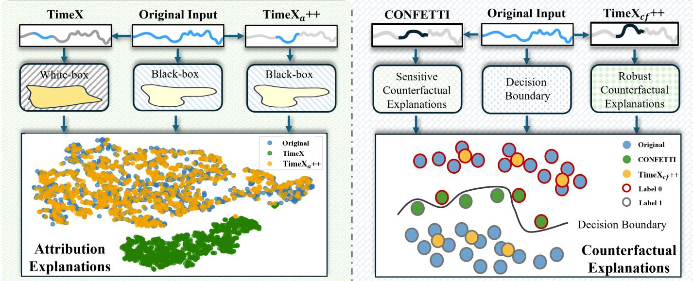  
Fig. 1: A comparison between our model and previous work. For the attribution explanations, the latent embeddings of explanations are learned from the ECG dataset. Our explanations are within the original distribution, whereas the reference model’s explanations are not. For the counterfactual explanations, our framework represents more robust results

## high-dimensional temporal space.

Building upon this, we analyze the counterfactual explanation within the same information-theoretic framework. Generating a counterfactual requires finding a perturbed instance $X ^ { \prime \prime }$ that alters the classifier’s prediction to a target label $Y ^ { \prime \prime }$ . However, optimizing this perturbation directly in the unconstrained space of $X$ inevitably explores the whole decision space, which could cause injecting adversarial noise into the redundant regions $X \ \backslash \ X ^ { \prime }$ that the IB explicitly discarded. To ensure a semantically valid distribution shift, the counterfactual perturbation must be strictly bounded within the support of the information bottleneck $X ^ { \prime }$ . From an informationtheoretic perspective, a legitimate counterfactual transition $Y  Y ^ { \prime \prime }$ necessitates a corresponding manipulation within the sufficient statistics subspace defined by $I ( X ^ { \prime } ; Y )$ , rather than arbitrary deviations in the redundant space. Through this IBdriven formulation, attribution and counterfactual explanations are intrinsically unified as complementary mechanisms over the same information bottleneck. The attribution identifies the exact semantic support $X ^ { \prime }$ , while the counterfactual manipulation within this bounded support provides the causal verification that $X ^ { \prime }$ indeed dictates the predictive behavior.

However, directly applying the standard IB principle to time series presents critical challenges. Primarily, the exact computation of mutual information in continuous, high-dimensional temporal spaces is computationally intractable [35]. Furthermore, attempting to evaluate the extracted sub-instances $X ^ { \prime }$ directly with the original classifier often violates the underlying data manifold, inevitably leading to OOD predictions and unreliable evaluations [18, 61]. To address these challenges, we propose TimeX++, a novel and unified framework designed to simultaneously extract both attribution and counterfactual explanations. It optimizes a practical, unified objective function. We replace the compactness quantifier $I ( X ; X ^ { \prime } )$ with a tractable variational upper bound comprising minimality and discrete constraints, and substitute the informativeness quantifier $I ( X ^ { \prime } ; Y )$ with a measure of label consistency that strictly preserves the underlying data distribution. The key advantage of our unified architecture lies in its dual capability. First, for attribution explanations, it generates in-distribution, explanation-embedded instances, entirely circumventing the severe OOD issues that plague reference models (as illustrated in Figure 1). Second, for counterfactual explanations, by tightly coupling the counterfactual search with the in-distribution attribution bottleneck, TimeX++ constrains the counterfactual trajectory along meaningful feature dimensions. This guarantees the generation of stable, semantically valid counterfactuals that are highly resistant to noise vulnerabilities. We summarize our contributions as follows:

• We formally investigate the limitations of treating attribution and counterfactual explanations as isolated tasks in time series. By analyzing them through the Information Bottleneck principle, we establish their theoretical connection and propose a practical, unified objective function.

• We propose a novel explanation framework, TimeX++, which successfully addresses the out-of-distribution shifting issue in attribution explanations by generating in-distribution sub-instances and leveraging this attribution bottleneck to generate stable, semantically grounded counterfactuals.

• We achieve state-of-the-art performance for both attribution and counterfactual explanation tasks on synthetic and realworld datasets and demonstrate their effectiveness.

## II. RELATED WORK

a) Attribution Explanations in Time Series: Existing explainable AI (XAI) methods for time series primarily focus on feature attribution, which aims to identify the most salient temporal regions dictating a well-trained model’s decision [12, 4]. While early approaches relied on attention weights [7] or gradient signals [51], perturbation-based methods have become the dominant paradigm. These methods evaluate feature importance by masking or altering data segments using static baselines [52], generative models [54], or information diminution [9, 33]. However, a critical flaw in perturbationbased attribution is the OOD problem that when salient features are masked or substituted, the resulting sub-instances often violate the underlying data manifold [18]. Consequently, querying the original classifier with these OOD samples leads to unreliable evaluations [59, 50].

b) Counterfactual Explanations for Time Series: In contrast to descriptive attribution, counterfactual explanations seek minimal modifications to an input required to alter the model’s prediction. For time series data, existing paradigms are broadly classified into three categories. First, replacement based methods (e.g., CoMTE [2], Native Guide [11]) substitute contiguous segments using nearest unlike neighbors or temporal shapelets [3, 32]. Second, gradient-based approaches (e.g., LatentCF++ [57], Glacier [56]) directly optimize perturbations in the input or learned latent spaces. Third, genetic frameworks (e.g., TSEvo [17], Sub-SpaCE [45]) explore the vast space of temporal segment edits using evolutionary objectives. Despite these advances, generating robust time series counterfactuals remains challenging. Because continuous temporal space is unconstrained, counterfactual optimization often exploits local decision boundary vulnerabilities. This results in the injection of meaningless noise that acts as an adversarial attack rather than providing a semantically interpretable pattern shift [28, 25].

## III. PROBLEM FORMULATION

This work focuses on explainability in time series classification. Let $\boldsymbol { X } \in \mathbb { R } ^ { T \times D }$ be a multivariate time series instance of length T with D features, and X is input space. A multivariate time series is one for which $D > 1$ , or univariate. The value of the feature indexed d at time t is denoted by $X [ t , d ] . \mathrm { A }$ training set $\mathcal { T } = \{ ( X _ { i } , Y _ { i } ) | i \in [ N ] \}$ consists of $N$ time series instances $X _ { i }$ along with their associated labels $Y _ { i } ,$ where $Y _ { i } \in { \mathcal { C } }$ and $\mathcal { C } = \{ 1 , 2 , \cdots , | \mathcal { C } | \}$ is the label space. A pre-trained black-box classifier $f : \mathcal { X }  \mathcal { C }$ maps X to a predicted label $Y \in { \mathcal { C } }$

Our objective is to formally unify feature attribution and counterfactual generation under the IB principle. In this unified view, the attribution acts as the optimal information bottleneck, and the counterfactual acts as a semantic perturbation strictly bounded within that bottleneck. To develop a general explainability framework, we focus on post-hoc, instance-level methods that are task-agnostic and treat the model $f ( \cdot )$ as a black box [58]. Furthermore, we study model explainability, where the extracted sub-instance is required to be sufficient for the model output rather than the ground-truth label [13, 33].

Problem 1 (Attribution Explanations). Given a trained model $f$ and input X, the objective in post-hoc instance-level time series explanation is to find a sub-instance $X ^ { \prime }$ that ‘explains’ the prediction of $f$ on $X$ . The sub-instance $X ^ { \prime }$ is obtained by applying a binary mask $\boldsymbol { M } \in \mathcal { M } = \{ 0 , 1 \} ^ { T \times D }$ on $X ,$ $i . e . ,$ $X ^ { \prime } = X \odot M$ , where $\odot$ is the element-wise multiplication.

To transition this discrete extraction into a differentiable continuous optimization, we define an attribution extractor $g ( \cdot )$

that maps the input $X$ to a mask $M \in [ 0 , 1 ] ^ { T \times D }$ . Each element is independently sampled from a Bernoulli distribution $\pi _ { t , d } .$

Problem 2 (Counterfactual Explanations). Given a trained model $f ,$ an input time series $X$ with predicted label $Y =$ $f ( X )$ , and a target label $Y ^ { \prime \prime } \in { \mathcal { C } } ( Y ^ { \prime \prime } \neq Y ) ,$ , the objective is to find a counterfactual instance $X ^ { \prime \prime }$ such that $f ( X ^ { \prime \prime } ) = Y ^ { \prime \prime }$ while minimizing the perturbation distance $d ( X , X ^ { \prime \prime } )$ , where the counterfactual search space is restricted to the semantic support set defined by the attribution mask M.

## IV. EXPLAINING TIME SERIES LEARNING VIA INFORMATION BOTTLENECK

The IB principle extracts an attribution explanation subinstance $X ^ { \prime } = X \odot M$ by maximizing $I ( X ^ { \prime } ; Y ) - \alpha I ( X ; X ^ { \prime } )$ However, directly estimating the mutual information $I ( X ^ { \prime } ; Y )$ for informativeness in high-dimensional continuous spaces is computationally intractable. To overcome and extend this, following established practices in explainable learning (e.g., PGExplainer [34]), we substitute the informativeness term with a tractable Label Consistency $\mathrm { ( L C ) }$ measure (i.e., crossentropy), yielding the modified IB formulation:

$$
\operatorname* { m i n } _ { M \sim \mathrm { B e r n } ( \pi ) } - \mathrm { L C } \bigl ( Y ^ { e x p l } , f ( \tilde { X } ) \bigr ) + \alpha I ( X ; X ^ { \prime } ) ,\tag{1}
$$

where $Y ^ { e x p l }$ is the objective explanation label, and $\tilde { X }$ is the explanation $( X ^ { \prime }$ for attribution and $X ^ { \prime \prime }$ for counterfactual explanation). While Eq. (1) bypasses the informativeness estimation, directly applying it to time series explainability introduces three critical interconnected problems. First, regarding the intractability of compactness, estimating the mutual information $I ( X ; X ^ { \prime } )$ remains computationally prohibitive and suffers from severe sample complexity bounds in high-dimensional temporal spaces. Second, a severe OOD problem arises during attribution evaluation. When $Y ^ { e x p l }$ equals $Y ,$ , computing $f ( X ^ { \prime } )$ requires passing a discretely masked instance directly to the classifier. This drastically violates the underlying data manifold, causing OOD predictions and destroying the reliability of the LC term [18]. Third, counterfactual generation suffers from adversarial instability. When $Y ^ { e x p l }$ is set to a target label $Y ^ { \prime \prime }$ to seek a perturbed instance $X ^ { \prime \prime }$ , unconstrained optimization of LC over the continuous temporal space inevitably exploits the classifier’s vulnerabilities. This generates meaningless adversarial noise rather than semantically valid shifts [25]. To resolve these interconnected problems, we reconstruct the objective into a unified framework that enforces distribution consistency and structural stability.

## A. Tractable Compactness Bound

To bypass the intractable mutual information $I ( X ; X ^ { \prime } )$ , we replace it with a tractable variational upper bound. Since the physical goal of minimizing $I ( X ; X ^ { \prime } )$ is to enforce sparsity and determinism in the explanation bottleneck, we directly penalize the expected size $| M |$ and the entropy $H ( M )$ of the mask. By defining a prior Bernoulli distribution $\mathbb { Q } ( M )$ with a parameter $^ { r , }$ we analytically bound the compactness term as a

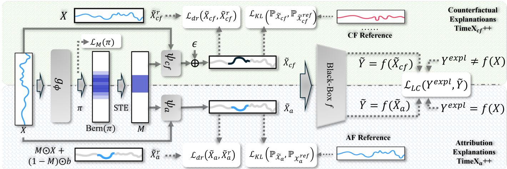  
Fig. 2: The overall architecture of TimeX++, a unified framework for attribution and counterfactual explanations supported by Information Bottleneck. TimeX ++ and $\mathrm { T i m e X } _ { c f } { + + }$ have similar components and loss functions but different implementations.

Kullback-Leibler (KL) divergence between the posterior mask distribution $\mathbb { P } ( M | X )$ and the prior:

$$
\mathcal { L } _ { c o m p a c t } = \mathbb { E } _ { X } \left[ D _ { \mathrm { K L } } ( \mathbb { P } ( M | X ) \| \mathbb { Q } ( M ) ) \right]\tag{2}
$$

Minimizing this term efficiently compresses the bottleneck without requiring complex mutual information estimators.

## B. Distribution-Preserving and Bounded Generation

To simultaneously solve the attribution OOD problem and the counterfactual instability problem, we project the bottleneck into an in-distribution generated instance ${ \tilde { X } } \in { \mathcal { X } }$ , and evaluate $f ( { \tilde { X } } )$ . The modified informativeness objective becomes:

$$
\begin{array} { r l } & { \mathcal { L } _ { i n f o } = \mathcal { L } _ { \mathrm { L C } } \big ( Y ^ { e x p l } , f ( \tilde { X } ) \big ) + \beta \mathcal { L } _ { \mathrm { K L } } \big ( \mathbb { P } _ { \tilde { X } } \| \mathbb { P } _ { \mathcal { X } } \big ) } \\ & { \qquad + \lambda \mathcal { L } _ { b o u n d } ( \tilde { X } , X , M ) , } \end{array}\tag{3}
$$

where $\mathcal { L } _ { \mathrm { L C } } ( \cdot , \cdot )$ equals to $\operatorname { L C } ( \cdot , \cdot )$ . This introduces two crucial regularization terms. The distribution preservation penalty, $\mathcal { L } _ { \mathrm { K L } } ( \mathbb { P } _ { \tilde { X } } | | \mathbb { P } _ { \mathcal { X } } )$ , explicitly regularizes the distribution shift between the generated $\tilde { X }$ and the true data manifold X. This mathematically eliminates the OOD problem, ensuring the classifier evaluates valid, realistic samples. Concurrently, the bottleneck constraint, $\mathcal { L } _ { b o u n d } ( \tilde { X } , X , \bar { M } )$ , acts as the causal structural anchor. It forces the generated perturbation $( { \tilde { X } } - X )$ to be strictly bounded by the spatial and temporal active regions of the attribution mask M. By penalizing changes in the redundant background, this constraint fundamentally prevents unconstrained adversarial search.

## C. Unified Architecture Integration

Combining the tractable compactness bound and the regularized generation, the final unified objective of TimeX++ is:

$$
\operatorname* { m i n } _ { M , \tilde { X } } \mathcal { L } _ { i n f o } + \alpha \mathcal { L } _ { c o m p a c t } .
$$

This single cohesive architecture systematically integrates attribution and counterfactual explanations through the shared bottleneck M. For attribution extraction, we set $Y ^ { e x p l } = Y$ The optimization minimizes $\mathcal { L } _ { c o m p a c t }$ to find the tightest possible mask M, while ${ \mathcal { L } } _ { \mathrm { K L } }$ ensures the generated evaluation instance $\tilde { X }$ remains strictly in-distribution, resolving the OOD problem. Conversely, for counterfactual generation, we set $\bar { Y } ^ { e x p l } = Y ^ { \prime \prime }$ . Although the optimization seeks to flip the label, $\mathcal { L } _ { b o u n d }$ explicitly locks the counterfactual trajectory within the semantic support of M. This guarantees that the counterfactual only manipulates the causal features identified by the attribution, resolving the adversarial instability problem. Through this integration, TimeX++ provides causally verified attributions and semantically grounded counterfactuals.

## V. THE TIMEX++ UNIFIED FRAMEWORK

Translating the tractable unified Information Bottleneck (IB) objective from Section IV into a practical neural architecture, we introduce the TimeX++ framework (depicted in Figure 2). The framework is constructed upon two primary neural modules working in tandem: the shared Attribution Bottleneck Extractor $( g _ { \phi } )$ and the paradigm-specific Conditioned Generators $( \psi _ { a }$ and $\psi _ { c f } )$ . By dynamically configuring the objective explanation label $Y ^ { e x p l }$ and the specific generator, TimeX++ seamlessly instantiates into two operational modes: TimeXa++ and Time $\mathrm { X } _ { c f } + +$

## A. Attribution Bottleneck Extractor

The extractor $g _ { \phi } : \mathbb { R } ^ { T \times D } \mapsto [ 0 , 1 ] ^ { T \times D }$ serves as the shared semantic foundation for both explanation paradigms. It is implemented via an encoder-decoder Transformer that maps the input time series X into a stochastic probability matrix π. To bridge the gap between continuous network optimization and the discrete mask M required by the IB formulation, we employ the Straight-Through Estimator (STE) [21]. During the forward pass, we sample a deterministic binary mask $M = \bar { \mathrm { S T E } } ( \bar { \mathrm { B e r n } } ( \pmb { \pi } ) ) \in \{ 0 , \bar { 1 } \} ^ { T \times D }$ . During the backward pass, gradients bypass the discrete sampling operator, allowing the parameters ϕ to be optimized smoothly.

To satisfy the tractable compactness bound $\mathcal { L } _ { c o m p a c t } \ ( \mathrm { E q . \ 2 } )$ without requiring complex mutual information estimators, we apply two structural regularizations to the predicted probability π. First, to enforce sparsity and determinism, we explicitly minimize the KL divergence against a sparse prior $\mathbb { Q } ( M )$ parameterized by r. For attribution explanations $( { \mathrm { T i m e X } } _ { a } + + ) ,$ we defaultly set $ { r } \ = \ 0 . 5$ . For counterfactual generation $\mathrm { ( T i m e X } _ { c f } { + + } \mathrm { ) }$ , we enforce a strictly narrower bottleneck by default setting $r ~ = ~ 0 . 1$ , isolating the most critical causal features to restrict the counterfactual search space. Second, to ensure temporal continuity, we penalize irregular mask fragmentation across the time axis. Because true semantic features in time series typically occur as contiguous temporal segments rather than isolated anomalous spikes, the continuity loss is formulated as:

$$
\mathcal { L } _ { \mathrm { c o n } } = \frac { 1 } { T \times D } \sum _ { d = 1 } ^ { D } \sum _ { t = 1 } ^ { T - 1 } \sqrt { \left( \pi _ { t , d } - \pi _ { t + 1 , d } \right) ^ { 2 } } .\tag{4}
$$

The total bottleneck extraction loss is defined as $\begin{array} { l l } { { \mathcal { L } } _ { M } } & { = } \end{array}$ $\mathcal { L } _ { c o m p a c t } + \lambda _ { \mathrm { c o n } } \mathcal { L } _ { \mathrm { c o n } } ,$ formulated as:

$$
\begin{array} { l } { \displaystyle \mathcal { L } _ { M } = \sum _ { t , d } \left[ \pi _ { t , d } \log \left( \frac { \pi _ { t , d } } { r } \right) + ( 1 - \pi _ { t , d } ) \log \left( \frac { 1 - \pi _ { t , d } } { 1 - r } \right) \right] } \\ { \displaystyle \qquad + \lambda _ { \mathrm { c o n } } \mathcal { L } _ { \mathrm { c o n } } . } \end{array}\tag{5}
$$

where the first summation [36] expands the KL divergence $\mathcal { L } _ { c o m p a c t }$ , and $\lambda _ { \mathrm { { c o n } } }$ controls the temporal continuity penalty.

## B. Conditioned Generators

The conditioned generators translate the structural bottleneck M into the generated explanation-embedded instance ${ \tilde { X } } \in { \mathcal { X } } .$ They are explicitly designed to resolve the OOD problem for attribution explanations (using $\psi _ { a } )$ and the robustness problem for counterfactual explanations (using $\psi _ { c f } )$

a) $\it { T i m e X } _ { a } + + .$ : When evaluating feature attribution, directly passing the masked instance $X \odot M$ to the classifier destroys the temporal manifold, causing arbitrary OOD predictions. Tim $\because X _ { a } + +$ solves this by projecting the masked data back into the true distribution. We first define a baseline reference $\widetilde { X } _ { a } ^ { r } = X \odot M + b \odot ( 1 - M )$ , where background noise b is sampled from the dataset distribution $\mathbb { B } _ { \mathcal { X } }$ . The attribution generator $\psi _ { a }$ then maps [X, M] into a smoothed, generated instance $\tilde { X } _ { a } = \psi _ { a } ( X , M )$ . To guarantee it resolves the OOD problem, we enforce distribution preservation via $\mathcal { L } _ { \mathrm { K L } } ( \mathbb { P } _ { \tilde { X } _ { a } } \Vert \mathbb { P } _ { \mathcal { X } _ { a } ^ { r } } )$ . To ensure the generator strictly focuses on smoothing the OOD artifacts rather than ungrounded features, we apply the bottleneck constraint $\mathcal { L } _ { b o u n d } ^ { a }$ as a Euclidean penalty against the reference:

$$
\mathcal { L } _ { b o u n d } ^ { a } = \frac { 1 } { T D } \sum _ { d = 1 } ^ { D } \sum _ { t = 1 } ^ { T } \left. \tilde { X } _ { a } [ t , d ] - \widetilde { X } _ { a } ^ { r } [ t , d ] \right. ^ { 2 }\tag{6}
$$

The attribution is then validated by matching the original prediction: $\mathcal { L } _ { \mathrm { L C } } \big ( f ( X ) , f ( \tilde { X } _ { a } ) \big )$

b) Time $X _ { c f } + + :$ Unconstrained counterfactual generation in continuous temporal space inevitably exploits classifier null spaces, producing adversarial noise. Time $\mathrm { X } _ { c f } { + + }$ solves this robustness problem by strictly locking the perturbation within the semantic bottleneck M. Instead of generating an entirely new instance, the counterfactual generator $\psi _ { c f }$ learns a targetdriven perturbation matrix $E = \psi _ { c f } ( X , M )$ . The counterfactual instance is structurally formulated as:

Algorithm 1: Training Pipeline of TimeX++   
1: Input: Training set T, Trained classifier $f ,$ mode   
$\in \{ \mathbf { A } , \mathbf { C F } \}$ , Target $Y ^ { \prime \prime }$ (if CF), Hyperparams   
$\{ \alpha , \beta , r , \lambda _ { \mathrm { c o n } } \}$   
2: Init: Extractor $g _ { \phi } ,$ , Generators $\psi _ { a } , \psi _ { c f } ,$ , and Variation   
function $\psi _ { n }$   
3: for $e = 1$ to $E$ do   
4: for $i = 1$ to N do   
5: $\pi _ { i } = g _ { \phi } ( X _ { i } ) ;$ Sample $M _ { i } = \mathrm { S T E } ( \mathrm { B e r n } ( \pmb { \pi } _ { i } ) )$   
6: if mode $\mathbf { \omega } = \mathbf { A }$ then   
7: Set reference $\widetilde { X } _ { a , i } ^ { r } = M _ { i } \odot X _ { i } + ( 1 - M _ { i } ) \odot b$   
8: Generate instance $\tilde { X } _ { a , i } = \psi _ { a } ( X _ { i } , M _ { i } )$   
9: $Y ^ { e x p l } = f ( X _ { i } ) ; \tilde { X } _ { i } = \tilde { X } _ { a , i } ; \tilde { X } _ { i } ^ { r } = \tilde { X } _ { a , i } ^ { r }$   
10: else   
11: Set reference $\widetilde { X } _ { c f , i } ^ { r } = X _ { i }$   
12: Predict perturbation $E _ { i } = \psi _ { c f } ( X _ { i } , M _ { i } )$   
13: Sample $X ^ { r e f }$ with label $Y ^ { \prime \prime } { } _ { ; }$ compute   
$\epsilon = \psi _ { n } ( X _ { i } , M _ { i } , X ^ { r e f } )$   
14: Generate instance $\tilde { X } _ { c f , i } = X _ { i } + M _ { i } \odot E _ { i } + \epsilon$   
15: $Y ^ { e x p l } = Y ^ { \prime \prime } ; \tilde { X } _ { i } = \tilde { X } _ { c f , i } ; \tilde { X } _ { i } ^ { r } = \tilde { X } _ { c f , i } ^ { r }$   
16: end if   
17: end for   
18: Compute compactness $\mathcal { L } _ { M } = \mathcal { L } _ { c o m p a c t } + \lambda _ { \mathrm { c o n } } \mathcal { L } _ { \mathrm { c o n } }$   
19: Compute bottleneck constraint $\mathcal { L } _ { b o u n d }$ against $\widetilde { X } ^ { r }$   
20: Compute distribution preservation ${ \mathcal { L } } _ { \mathrm { K L } }$   
21: Compute Label Consistency $\mathcal { L } _ { \mathrm { L C } } ( Y ^ { e x p l } , f ( \tilde { X } ) )$   
22: Total loss: $\widetilde { \mathcal { L } } = \mathcal { L } _ { \mathrm { L C } } + \alpha \mathcal { L } _ { M } + \beta ( \mathcal { L } _ { \mathrm { K L } } + \mathcal { L } _ { b o u n d } )$   
23: Update $\phi$ and active generators $( \psi _ { a } , \mathrm { o r } \psi _ { c f } , \psi _ { n } )$ via   
gradient descent   
24: end for

$$
\tilde { X } _ { c f } = X + M \odot E + \epsilon\tag{7}
$$

where ϵ introduces target-class reference noise. Specifically, we define an auxiliary variation function $\epsilon = \psi _ { n } ( X , M , X ^ { r e f } )$ which incorporates fine-grained target-class dynamics from a randomly sampled training instance $X ^ { r e f }$ belonging to the target label $Y ^ { \prime \prime }$ . During inference, this simplifies deterministically to $\tilde { X } _ { c f } = X + M \odot E$ . Crucially, to mathematically alleviate adversarial vulnerabilities, the bottleneck constraint $\mathcal { L } _ { b o u n d } ^ { c f }$ heavily penalizes any deviation from the original reference $( \widetilde { X } _ { c f } ^ { r } = X )$ in the non-bottleneck background regions $( 1 - M )$

$$
\begin{array} { l } { \displaystyle \mathcal { L } _ { b o u n d } ^ { c f } = } \\ { \displaystyle \frac { 1 } { T D } \sum _ { d = 1 } ^ { D } \sum _ { t = 1 } ^ { T } \Big \| ( 1 - M [ t , d ] ) \odot \big ( \tilde { X } _ { c f } [ t , d ] - \widetilde { X } _ { c f } ^ { r } [ t , d ] \big ) \Big \| ^ { 2 } } \end{array}\tag{8}
$$

This formulation acts as a hard causal anchor, which prevents the model from injecting imperceptible adversarial noise into redundant features, forcing the targeted prediction shift $\mathcal { L } _ { \mathrm { L C } } \big ( \tilde { Y } , f ( \tilde { X } _ { c f } ) \big )$ to rely on robust semantic manipulations.

TABLE I: The description of synthetic and real-world datasets.
<table><tr><td>DATASET</td><td># OF SAMPLES</td><td>LENGTH</td><td>DIMENSION</td><td>CLASSES</td></tr><tr><td>FREQSHAPES</td><td>6,100</td><td>50</td><td>1</td><td>4</td></tr><tr><td>SEQCOMB-UV</td><td>6,100</td><td>200</td><td>1</td><td>4</td></tr><tr><td>SEQCOMB-MV</td><td>6,100</td><td>200</td><td>4</td><td>4</td></tr><tr><td>LOWVAR</td><td>6,100</td><td>200</td><td>2</td><td>4</td></tr><tr><td>ECG</td><td>92,511</td><td>360</td><td>1</td><td>2</td></tr><tr><td>PAM</td><td>5,333</td><td>600</td><td>17</td><td>8</td></tr><tr><td>EPILEPSY</td><td>11,500</td><td>178</td><td>1</td><td>2</td></tr><tr><td>BOILER</td><td>160,719</td><td>36</td><td>20</td><td>2</td></tr><tr><td>WAFER</td><td>7,164</td><td>152</td><td>1</td><td>2</td></tr><tr><td>FREEZERREGULAR</td><td>3,000</td><td>301</td><td>1</td><td>2</td></tr></table>

## C. End-to-End Optimization

The entire TimeX++ framework is optimized end-to-end. By sharing the underlying architecture and unifying the mathematical formulation, both $\operatorname { T i m e X } _ { a } + +$ and $\mathrm { T i m e X } _ { c f }$ ++ minimize the same overarching objective derived in Section IV:

$$
\widetilde { \mathcal { L } } = \mathcal { L } _ { \mathrm { L C } } \left( Y ^ { e x p l } , f ( \tilde { X } ) \right) + \alpha \mathcal { L } _ { M } + \beta \big ( \mathcal { L } _ { \mathrm { K L } } + \mathcal { L } _ { b o u n d } \big )\tag{9}
$$

This allows our method to seamlessly alternate between extracting robust attributions and generating causally constrained counterfactuals simply by toggling the objective label $Y ^ { e x p l }$ and the specific generator $( \psi _ { a }$ or $\psi _ { c f } )$ . The unified train procedure is summarized in Algorithm 1.

## VI. EXPERIMENTS

In this section, we empirically evaluate the proposed TimeX++ framework. By unifying attribution and counterfactual explanations through the lens of the Information Bottleneck, we aim to demonstrate three key aspects of their effectiveness. First, we assess TimeX++’s ability to generate faithful attribution explanations and effective counterfactual explanations. Second, we examine the extent to which the proposed distribution-matching constraint alleviates the out-ofdistribution shift. Third, we evaluate the robustness of counterfactual explanations and investigate whether TimeX++ effectively guides counterfactual generation toward semantically meaningful outcomes, preventing it from degenerating into trivial adversarial perturbations.

## A. Experimental Setup

To rigorously evaluate our framework, we establish a comprehensive experimental setup encompassing diverse datasets, established baselines, and strict evaluation metrics.

1) Datasets: We utilize ten datasets encompassing both synthetic and real-world time-series scenarios, adopting the standard configurations from established benchmarks [43]. The synthetic datasets, including FreqShapes, SeqComb-UV, SeqComb-MV, and LowVar, are meticulously crafted with inherent ground-truth explanations to encapsulate temporal dynamics, guarding against heuristic learning shortcuts [14]. The real-world datasets cover various domains, such as electrocardiogram classification (ECG) [38], action recognition (PAM) [46], electroencephalogram analysis (Epilepsy) [1], mechanical fault detection (Boiler)1, and sensor classifications (Wafer, FreezerRegular) [10]. The Transformer [55] is employed as the underlying black-box classifier across all tasks.

2) Baselines: For comprehensive comparative analysis, we benchmark TimeX++ against eleven state-of-the-art explainers meticulously selected across both the attribution and counterfactual paradigms. For attribution explanations, we evaluate against six popular baselines: Integrated Gradients (IG) [51] as a fundamental gradient-based explainer; Dynamask [9] and WinIT [29] as recent occlusion-based methods specifically designed for time series; CoRTX [8] leveraging contrastive learning; SGT + GRAD [19] demonstrating an in-hoc approach; and TIMEX [43], which serves as the strongest informationtheoretic baseline. For counterfactual explanations, we compare against five advanced methodologies: CoMTE [2], AB-CF [30], M-CELS [31], and CONFETTI [5]. These baselines encapsulate a diverse range of optimization-based, evolutionary, saliency-guided, and multi-objective paradigms, ensuring a robust evaluation of counterfactual generation capabilities.

3) Evaluation Metrics: To assess explanation quality across distinct paradigms, we use specific quantitative metrics.

Metrics for Attribution Explanations. Given that the precise salient features are known for the synthetic datasets, we utilize them as the ground truth for evaluation. At each time step, features causing prediction label changes are attributed an explanation of 1, whereas those that do not affect such changes are 0. Following the previous paper [9], we evaluate the quality of salient features using Area Under Precision (AUP) and Area Under Recall (AUR), framing it as a binary classification task. We also employ AUPRC for consistency with TimeX [43], which combines the results from both AUP and AUR. Higher values indicate better performance. Let $M \in [ 0 , 1 ] ^ { T \times \tilde { D } }$ be the obtained explanation mask, and $Q \in \{ 0 , 1 \} ^ { \bar { T } \times \bar { D } }$ be the ground-truth matrix where $Q [ t , d ] = 1$ if feature $X [ t , d ]$ is salient. Given a detection threshold $\tau \in ( 0 , 1 )$ , we convert M into a binary estimator ${ \hat { Q } } [ t , d ] ( \tau )$

$$
{ \hat { Q } } [ t , d ] ( \tau ) = { \left\{ \begin{array} { l l } { 1 } & { { \mathrm { ~ i f ~ } } M [ t , d ] \geq \tau } \\ { 0 } & { { \mathrm { ~ e l s e . } } } \end{array} \right. }\tag{10}
$$

Considering the truly salient index set $A = \{ ( t , d ) \mid Q [ t , d ] =$ 1} and the selected index set $\hat { A } ( \tau ) = \{ ( t , d ) \mid \hat { Q } [ t , d ] ( \tau ) = 1 \}$ the precision (P) and recall (R) curves are defined as:

$$
\mathbf { P } ( \tau ) = \frac { | A \cap \hat { A } ( \tau ) | } { | \hat { A } ( \tau ) | } , \quad \mathbf { R } ( \tau ) = \frac { | A \cap \hat { A } ( \tau ) | } { | A | } .\tag{11}
$$

AUP and AUR are derived via integration over all thresholds:

$$
\mathrm { A U P } = \int _ { 0 } ^ { 1 } \mathbf { P } ( \tau ) d \tau , \quad \mathrm { A U R } = \int _ { 0 } ^ { 1 } \mathbf { R } ( \tau ) d \tau .\tag{12}
$$

Metrics for Counterfactual Explanations. To comprehensively evaluate the quality of the generated counterfactual instances $( X ^ { \prime \prime } )$ , we assess them across five distinct dimensions: Validity, Confidence, Sparsity, Proximity-L1, and Proximity-L2. For Validity, Confidence, and Sparsity, higher values are better (↑). For both Proximity metrics, lower values are better (↓).

• Validity (↑): Measures the ratio of successful counterfactuals that successfully alter the black-box model’s prediction to the desired target label $Y ^ { \prime \prime }$ . For a dataset of N instances:

$$
\mathrm { { V a l i d i t y } } = \frac { 1 } { N } \sum _ { i = 1 } ^ { N } \mathbb { 1 } \left( f ( X _ { i } ^ { \prime \prime } ) = Y ^ { \prime \prime } \right)\tag{13}
$$

TABLE II: Attribution explanation performance on univariate and multivariate datasets.
<table><tr><td>METHOD</td><td>AUPRC</td><td>AUP</td><td>AUR</td><td>AUPRC</td><td>AUP</td><td>AUR</td><td>AUPRC</td><td>AUP</td><td>AUR</td></tr><tr><td></td><td colspan="3">FREQSHAPES</td><td colspan="3">SEQCOMB-UV</td><td colspan="3">ECG</td></tr><tr><td>IG</td><td>0.752±0.003</td><td> $0 . 6 9 1 { \scriptstyle \pm 0 . 0 0 3 }$ </td><td> $0 . 5 9 8 { \scriptstyle \pm 0 . 0 0 2 }$ </td><td> $0 . 5 7 6 { \scriptstyle \pm 0 . 0 0 2 }$ </td><td> $0 . 8 1 6 { \scriptstyle \pm 0 . 0 0 2 }$ </td><td> $0 . 2 8 7 { \scriptstyle \pm 0 . 0 0 2 }$ </td><td> $0 . 4 1 8 { \scriptstyle \pm 0 . 0 0 1 }$ </td><td> $\underline { { 0 . 5 9 5 } } \pm 0 . 0 0 2$ </td><td> $0 . 3 2 0 { \scriptstyle \pm 0 . 0 0 1 }$ </td></tr><tr><td>DYNAMASK</td><td> $0 . 2 2 0 { \scriptstyle \pm 0 . 0 0 1 }$ </td><td> $0 . 2 9 5 { \scriptstyle \pm 0 . 0 0 4 }$ </td><td> $0 . 5 0 4 { \scriptstyle \pm 0 . 0 0 2 }$ </td><td> $0 . 4 4 2 { \scriptstyle \pm 0 . 0 0 2 }$ </td><td> $0 . 8 7 8 { \scriptstyle \pm 0 . 0 0 4 }$ </td><td> $0 . 1 0 3 { \scriptstyle \pm 0 . 0 0 1 }$ </td><td> $0 . 3 2 8 { \scriptstyle \pm 0 . 0 0 1 }$ </td><td> $0 . 5 2 5 { \scriptstyle \pm 0 . 0 0 3 }$ </td><td> $0 . 1 0 8 { \scriptstyle \pm 0 . 0 0 8 }$ </td></tr><tr><td>WINIT</td><td> $0 . 5 0 7 { \scriptstyle \pm 0 . 0 0 2 }$ </td><td> $0 . 5 5 5 { \scriptstyle \pm 0 . 0 0 3 }$ </td><td> $0 . 4 5 6 { \scriptstyle \pm 0 . 0 0 2 }$ </td><td> $0 . 4 5 7 { \scriptstyle \pm 0 . 0 0 2 }$ </td><td> $0 . 7 8 7 { \scriptstyle \pm 0 . 0 0 3 }$ </td><td> $0 . 2 2 5 { \scriptstyle \pm 0 . 0 0 2 }$ </td><td> $0 . 3 0 5 { \scriptstyle \pm 0 . 0 0 1 }$ </td><td> $0 . 4 4 3 { \scriptstyle \pm 0 . 0 0 3 }$ </td><td> $0 . 3 4 7 { \scriptstyle \pm 0 . 0 0 1 }$ </td></tr><tr><td>CoRTX</td><td> $0 . 6 9 8 { \scriptstyle \pm 0 . 0 1 6 }$ </td><td> $0 . 4 9 4 { \scriptstyle \pm 0 . 0 0 0 }$ </td><td> $0 . 3 2 6 { \scriptstyle \pm 0 . 0 0 1 }$ </td><td> $0 . 5 6 4 { \scriptstyle \pm 0 . 0 0 2 }$ </td><td> $0 . 8 2 4 { \scriptstyle \pm 0 . 0 0 3 }$ </td><td> $0 . 1 7 5 { \scriptstyle \pm 0 . 0 0 1 }$ </td><td> $0 . 3 7 4 { \scriptstyle \pm 0 . 0 0 1 }$ </td><td> $0 . 4 9 7 { \scriptstyle \pm 0 . 0 0 2 }$ </td><td> $0 . 3 0 3 { \scriptstyle \pm 0 . 0 0 1 }$ </td></tr><tr><td> $\mathbf { S } \mathbf { G } \mathbf { T } + \mathbf { G } \mathbf { R } \mathbf { A } \mathbf { D }$ </td><td> $0 . 5 3 1 { \scriptstyle \pm 0 . 0 0 2 }$ </td><td> $0 . 4 1 4 { \scriptstyle \pm 0 . 0 0 1 }$ </td><td> $0 . 3 9 3 { \scriptstyle \pm 0 . 0 0 2 }$ </td><td> $0 . 5 7 3 { \scriptstyle \pm 0 . 0 0 2 }$ </td><td> $0 . 7 8 3 { \scriptstyle \pm 0 . 0 0 1 }$ </td><td> $0 . 2 1 4 { \scriptstyle \pm 0 . 0 0 1 }$ </td><td> $0 . 3 1 4 { \scriptstyle \pm 0 . 0 0 1 }$ </td><td> $0 . 4 2 4 { \scriptstyle \pm 0 . 0 0 2 }$ </td><td> $0 . 2 6 4 { \scriptstyle \pm 0 . 0 0 1 }$ </td></tr><tr><td>TIMEX</td><td> $0 . 8 3 2 { \scriptstyle \pm 0 . 0 0 3 }$ </td><td> $0 . 7 2 2 { \scriptstyle \pm 0 . 0 0 3 }$ </td><td> $0 . 6 3 8 { \scriptstyle \pm 0 . 0 0 2 }$ </td><td> $0 . 7 1 2 { \scriptstyle \pm 0 . 0 0 2 }$ </td><td> $\mathbf { 0 . 9 4 1 } { \scriptstyle \pm 0 . 0 0 1 }$ </td><td> $\underline { { 0 . 3 3 8 } } \pm 0 . 0 0 1$ </td><td> $\underline { { 0 . 4 7 2 } } \pm 0 . 0 0 2$ </td><td> $0 . 5 6 6 { \scriptstyle \pm 0 . 0 0 3 }$ </td><td> $0 . 4 4 6 { \scriptstyle \pm 0 . 0 0 2 }$ </td></tr><tr><td> $\mathrm { T I M E X } _ { a } + +$ </td><td>｜  $\mathbf { 0 . 8 9 1 } { \scriptstyle \pm 0 . 0 0 2 }$ </td><td> $\mathbf { 0 . 7 8 1 { \pm } 0 . 0 0 1 }$ </td><td> $\mathbf { 0 . 6 6 2 } { \scriptstyle \pm 0 . 0 0 2 }$ </td><td> $\mathbf { 0 . 8 4 7 { \scriptstyle \pm 0 . 0 0 1 } }$ </td><td> $\underline { { 0 . 9 0 7 } } \pm 0 . 0 0 0$ </td><td> $\mathbf { 0 . 4 0 6 } { \scriptstyle \pm 0 . 0 0 1 }$ </td><td> $\mathbf { 0 . 6 6 0 { \scriptstyle \pm 0 . 0 0 1 } }$ </td><td> $\mathbf { 0 . 7 2 6 { \scriptstyle \pm 0 . 0 0 1 } }$ </td><td> $\mathbf { 0 . 4 6 0 { \scriptstyle \pm 0 . 0 0 1 } }$ </td></tr><tr><td></td><td colspan="3">SEQCOMB-MV</td><td></td><td>LOWVAR</td><td></td><td></td><td></td><td></td></tr><tr><td>IG</td><td> $0 . 3 3 0 { \scriptstyle \pm 0 . 0 0 2 }$ </td><td> $0 . 7 4 8 { \scriptstyle \pm 0 . 0 0 3 }$ </td><td> $0 . 2 5 8 { \scriptstyle \pm 0 . 0 0 3 }$ </td><td> $\underline { { 0 . 8 6 9 } } \pm 0 . 0 0 4$ </td><td> $0 . 4 8 3 { \scriptstyle \pm 0 . 0 0 3 }$ </td><td>0.817±0.002</td><td></td><td></td><td></td></tr><tr><td>DYNAMASK</td><td> $0 . 3 1 4 { \scriptstyle \pm 0 . 0 0 2 }$ </td><td> $0 . 5 4 8 { \scriptstyle \pm 0 . 0 0 5 }$ </td><td> $0 . 1 9 5 { \scriptstyle \pm 0 . 0 0 3 }$ </td><td> $\overline { { 0 . 1 3 9 } } \pm 0 . 0 0 1$ </td><td> $0 . 1 6 4 { \scriptstyle \pm 0 . 0 0 3 }$ </td><td> $0 . 2 1 1 \pm 0 .$  002</td><td></td><td></td><td></td></tr><tr><td>WINIT</td><td> $0 . 2 8 1 { \scriptstyle \pm 0 . 0 0 2 }$ </td><td> $0 . 7 5 9 { \scriptstyle \pm 0 . 0 0 2 }$ </td><td> $0 . 2 0 8 { \scriptstyle \pm 0 . 0 0 2 }$ </td><td> $0 . 1 6 7 { \scriptstyle \pm 0 . 0 0 2 }$ </td><td> $0 . 1 1 4 { \scriptstyle \pm 0 . 0 0 2 }$ </td><td>0.384±0.002</td><td></td><td></td><td></td></tr><tr><td>CoRTX</td><td> $0 . 3 6 3 { \scriptstyle \pm 0 . 0 0 2 }$ </td><td> $0 . 5 6 3 { \scriptstyle \pm 0 . 0 0 1 }$ </td><td> $0 . 3 4 6 { \scriptstyle \pm 0 . 0 0 2 }$ </td><td> $0 . 4 9 8 { \scriptstyle \pm 0 . 0 0 1 }$ </td><td> $0 . 3 2 8 { \scriptstyle \pm 0 . 0 0 3 }$ </td><td> $0 . 4 7 1 { \scriptstyle \pm 0 . 0 0 1 }$ </td><td></td><td></td><td></td></tr><tr><td>SGT + GRAD</td><td> $0 . 4 8 9 { \scriptstyle \pm 0 . 0 0 1 }$ </td><td> $0 . 4 9 7 { \scriptstyle \pm 0 . 0 0 1 }$ </td><td> $\mathbf { 0 . 4 2 9 } { \scriptstyle \pm 0 . 0 0 2 }$ </td><td> $0 . 3 4 5 { \scriptstyle \pm 0 . 0 0 1 }$ </td><td> $0 . 2 1 3 { \scriptstyle \pm 0 . 0 0 3 }$ </td><td> $0 . 3 5 3 { \scriptstyle \pm 0 . 0 0 2 }$ </td><td></td><td></td><td></td></tr><tr><td>TIMEX</td><td> $\underline { { 0 . 6 8 8 } } \pm 0 . 0 0 2$ </td><td> $0 . 8 3 3 { \scriptstyle \pm 0 . 0 0 1 }$ </td><td> $0 . 3 8 7 { \scriptstyle \pm 0 . 0 0 2 }$ </td><td> $0 . 8 6 7 { \scriptstyle \pm 0 . 0 0 3 }$ </td><td> $\underline { { 0 . 5 4 5 } } \pm 0 . 0 0 3$ </td><td> $\mathbf { 0 . 9 0 0 } 2 0 . 0 ( $  2</td><td></td><td></td><td></td></tr><tr><td>TIMEXa++</td><td> $\mathbf { 0 . 7 5 9 } { \scriptstyle \pm 0 . 0 0 1 }$ </td><td> $\mathbf { 0 . 8 7 8 { \scriptstyle \pm 0 . 0 0 1 } }$ </td><td> $0 . 3 9 1 { \scriptstyle \pm 0 . 0 0 1 }$ </td><td>一  $\mathbf { 0 . 9 4 7 } { \scriptstyle \pm 0 . 0 0 2 }$ </td><td> $\mathbf { 0 . 8 0 6 } { \scriptstyle \pm 0 . 0 0 2 }$ </td><td> $0 . 8 3 3 { \scriptstyle \pm 0 . 0 0 2 }$ </td><td></td><td></td><td></td></tr></table>

TABLE III: Performance report on different real-world datasets by masking the top 10% of salient features. The masked portion is substituted with an average of this feature or with zeros.
<table><tr><td>METHOD</td><td>SUBSTITUTION</td><td>PAM</td><td>EPILEPSY</td><td>BOILER</td><td>WAFER</td><td>FREEZER</td><td> $\mathbf { R A N K }$ </td></tr><tr><td rowspan="2">RANDOM</td><td>MEAN</td><td> $0 . 9 7 9 { \scriptstyle \pm 0 . 0 0 2 }$ </td><td> $0 . 9 3 9 { \scriptstyle \pm 0 . 0 0 5 }$ </td><td> $0 . 8 1 4 { \scriptstyle \pm 0 . 0 5 6 }$ </td><td> $0 . 9 9 3 { \scriptstyle \pm 0 . 0 0 2 }$ </td><td> $0 . 7 7 2 { \scriptstyle \pm 0 . 0 9 3 }$ </td><td>7.2</td></tr><tr><td>ZERO</td><td> $0 . 9 7 9 { \scriptstyle \pm 0 . 0 0 2 }$ </td><td> $0 . 9 4 0 { \scriptstyle \pm 0 . 0 0 4 }$ </td><td> $0 . 8 9 5 { \scriptstyle \pm 0 . 0 1 2 }$ </td><td> $0 . 9 9 2 { \scriptstyle \pm 0 . 0 0 2 }$ </td><td> $0 . 7 7 5 { \scriptstyle \pm 0 . 0 9 3 }$ </td><td>7.8</td></tr><tr><td rowspan="2">DYNAMASK</td><td>MEAN</td><td> $0 . 7 7 8 { \scriptstyle \pm 0 . 0 1 5 }$ </td><td> $0 . 8 1 6 { \scriptstyle \pm 0 . 0 1 9 }$ </td><td> $0 . 8 0 8 { \scriptstyle \pm 0 . 0 3 6 }$ </td><td> $0 . 4 8 8 { \scriptstyle \pm 0 . 2 6 7 }$ </td><td> $0 . 4 5 2 { \scriptstyle \pm 0 . 1 2 9 }$ </td><td>4.6</td></tr><tr><td>ZERO</td><td> $0 . 7 7 7 { \scriptstyle \pm 0 . 0 1 5 }$ </td><td> $\underline { { 0 . 3 6 1 } } \pm 0 . 0 7 3$ </td><td> $0 . 5 5 5 { \scriptstyle \pm 0 . 1 4 6 }$ </td><td> $0 . 4 8 8 { \scriptstyle \pm 0 . 2 6 7 }$ </td><td> $\mathbf { 0 . 3 5 5 \bot 0 . 1 1 0 }$ </td><td>3.6</td></tr><tr><td rowspan="2">TIMEX</td><td>MEAN</td><td> $\underline { { 0 . 7 4 9 } } \pm 0 . 0 4 9$ </td><td> $0 . 8 5 2 { \scriptstyle \pm 0 . 0 1 8 }$ </td><td> $0 . 5 6 3 { \scriptstyle \pm 0 . 0 4 1 }$ </td><td> $0 . 4 6 3 { \scriptstyle \pm 0 . 1 4 5 }$ </td><td> $0 . 4 6 9 { \scriptstyle \pm 0 . 0 6 1 }$ </td><td>4.4</td></tr><tr><td>ZERO</td><td> $0 . 7 5 4 { \scriptstyle \pm 0 . 0 4 9 }$ </td><td> $0 . 4 5 4 { \scriptstyle \pm 0 . 0 7 7 }$ </td><td> $0 . 4 1 6 { \scriptstyle \pm 0 . 0 4 8 }$ </td><td> $0 . 4 6 5 { \scriptstyle \pm 0 . 0 5 7 }$ </td><td> $0 . 4 6 5 { \scriptstyle \pm 0 . 0 5 7 }$ </td><td>3.6</td></tr><tr><td rowspan="2"> $\mathrm { T I M E X } _ { a } + +$ </td><td>MEAN</td><td> $\mathbf { 0 . 7 1 7 { \scriptstyle \pm 0 . 0 1 9 } }$ </td><td> $0 . 8 4 5 { \scriptstyle \pm 0 . 0 2 9 }$ </td><td> $\underline { { 0 . 3 8 5 } } \pm 0 . 1 2 3$ </td><td> $0 . 4 1 0 { \scriptstyle \pm 0 . 1 5 0 }$ </td><td> $0 . 3 7 9 { \scriptstyle \pm 0 . 0 7 4 }$ </td><td>2.8</td></tr><tr><td>ZERO</td><td> $0 . 7 7 5 { \scriptstyle \pm 0 . 0 2 3 }$ </td><td> $\mathbf { 0 . 3 5 5 \pm 0 . 1 4 6 }$ </td><td> $\mathbf { 0 . 3 6 1 } { \pm } 0 . 0 7 3$ </td><td> $\mathbf { 0 . 4 0 0 } { \scriptstyle \pm 0 . 0 6 1 }$ </td><td> $\underline { { 0 . 3 7 7 } } \pm 0 . 0 7 4$ </td><td>2.0</td></tr></table>

• Confidence (↑): Evaluates the average predicted probability assigned by the classifier to the target class, indicating the robustness of the class flip:

$$
{ \mathrm { C o n f i d e n c e } } = { \frac { 1 } { N } } \sum _ { i = 1 } ^ { N } P _ { f } ( Y ^ { \prime \prime } \mid X _ { i } ^ { \prime \prime } )\tag{14}
$$

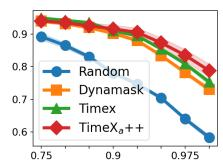

• Sparsity (↓): Quantifies the minimality of the intervention by measuring the proportion of features left unperturbed. It is derived from the $L _ { 1 }$ norm of the continuous mask M:

(a) PAM  
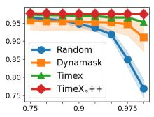

$$
{ \mathrm { S p a r s i t y } } = { \frac { 1 } { N } } \sum _ { i = 1 } ^ { N } \left( { \frac { 1 } { T \times D } } \sum _ { t = 1 } ^ { T } \sum _ { d = 1 } ^ { D } M _ { i } [ t , d ] \right)\tag{15}
$$

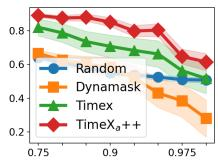  
(b) Epilepsy  
(c) Boiler  
Fig. 3: Occlusion experiments on real-world datasets. Higher values indicate better performance. The x-axis is the Bottom Proportion Perturbed, and the y-axis is the Prediction AUROC.

• Proximity-L1 (↓): Measures the feature-wise Mean Absolute Error (MAE) between the counterfactual explanation and the original input to ensure realistic generation:

$$
{ \mathrm { P r o x i m i t y } } _ { L 1 } = { \frac { 1 } { N } } \sum _ { i = 1 } ^ { N } { \frac { 1 } { T \times D } } | | X _ { i } ^ { \prime \prime } - X _ { i } | | _ { 1 }\tag{16}
$$

(17)

• Proximity-L2 (↓): Measures the feature-wise Mean Squared Error (MSE) to heavily penalize large, unrealistic deviations from the original input X:

$$
{ \mathrm { P r o x i m i t y } } _ { L 2 } = { \frac { 1 } { N } } \sum _ { i = 1 } ^ { N } { \frac { 1 } { T \times D } } | | X _ { i } ^ { \prime \prime } - X _ { i } | | _ { 2 } ^ { 2 }
$$

## B. Efficacy of Unified Explanations

We first examine the fidelity and efficacy of TimeX++ in producing both attribution and counterfactual explanations via the single unified training process.

For attribution explanations, Table II summarizes the performance across univariate and multivariate synthetic datasets. $\operatorname { T i m e X } _ { a } + +$ outperforms competing explainers in 9 out of 12 evaluation cases. Compared to the strongest baseline, TIMEX, our framework achieves average improvements of 11.01% in AUPRC, 10.87% in AUP, and 1.25% in AUR. When analyzing the global metric AUPRC specifically, $\mathrm { T i m e X } _ { a }$ ++ significantly improves upon the identification of ground-truth explanations by 6.97% on FreqShapes, 18.86% on SeqComb-UV, 10.33% on SeqComb-MV, and 8.91% on LowVar over the strongest baselines. The statistical significance of these improvements is corroborated by the Friedman Test across all methods and cases, yielding a statistic of $F _ { F } = 5 1 . 3 2 $ with $p < 0 . 0 0 1$ . It supports our theoretical claim that optimizing via the Information Bottleneck principle reliably extracts precise temporal explanation instances without compromising predictive accuracy.

Furthermore, to evaluate attribution fidelity on real-world datasets where ground-truth explanations are unavailable, we conduct occlusion experiments. Specifically, we occlude the bottom k-percentile of salient features to measure the change in prediction AUROC. Besides the standard baselines, we also include a random explainer reference to control for potential misinterpretations. The explanation results by occluding salient features are presented in Figure 3. Our results show that $\operatorname { T i m e X } _ { a } + +$ outperforms others across both univariate (Epilepsy) and multivariate (PAM and Boiler) time series. Particularly, $\operatorname { T i m e X } _ { a } + +$ maintains non-decreasing performance on Epilepsy due to the retention of only salient features, and outperforms baselines at any threshold k on PAM and Boiler datasets. Moreover, our method maintains excellent stability compared to the strongest baseline TIMEX, where the error bars of our method are noticeably narrower. This is because TimeXa++ avoids the label leakage caused by re-optimizing a white-box predictive model. We also delete the top 10% of salient features and substitute them with an average of this feature or with zero perturbations [33], and further expand our experiments to five real-world time series datasets. The results (Table III) consistently show that the proposed method outperforms existing explainers under different perturbations, with substitution with zeros being the most applicable and yielding the highest average rank. The statistical significance of these improvements is firmly corroborated by the Friedman Test yielding $F _ { F } = 2 5 . 8 0$ and $p < 0 . 0 0 1$

TABLE IV: Targeted counterfactual explanation performance on univariate and multivariate datasets.
<table><tr><td>METHOD</td><td>VALIDITY</td><td>CONFIDENCE</td><td>SPARSITY</td><td>PROX.-L1</td><td>PROX.-L2</td><td>VALIDITY</td><td>CONFIDENCE</td><td>SPARSITY</td><td>PROX.-L1</td><td>PROX.-L2</td></tr><tr><td></td><td colspan="6">FREQSHAPES</td><td colspan="3">SEQCOMB-UV</td><td></td></tr><tr><td>CoMTE</td><td> $1 . 0 0 0 \pm 0 . 0 0 0$ </td><td> $0 . 9 6 5 \pm 0 . 0 0 6$ </td><td> $1 . 0 0 0 \pm 0 . 0 0 0$ </td><td> $0 . 5 7 3 \pm 0 . 0 0 4$ </td><td>0.828 ± 0.006</td><td> $1 . 0 0 0 \pm 0 . 0 0 0$ </td><td> $0 . 7 8 4 \pm 0 . 0 2 2$ </td><td> $0 . 9 9 9 \pm 0 . 0 0 0$ </td><td>0.209 ± 0.002 0.401 ± 0.008</td><td></td></tr><tr><td>AB-CF</td><td> $1 . 0 0 0 \pm 0 . 0 0 0$ </td><td> $0 . 8 7 1 \pm 0 . 0 0 8$ </td><td> $0 . 7 3 3 \pm 0 . 0 2 5$ </td><td> $0 . 4 4 1 \pm 0 . 0 1 3$ </td><td> $0 . 7 1 8 \pm 0 . 0 1 1$ </td><td> $1 . 0 0 0 \pm 0 . 0 0 0$ </td><td> $0 . 9 1 1 \pm 0 . 0 1 3$ </td><td> $0 . 6 5 0 \pm 0 . 0 3 7$ </td><td> $0 . 1 5 1 \pm 0 . 0 0 7$ </td><td> $0 . 3 4 8 \pm 0 . 0 1 4$ </td></tr><tr><td>M-CELS CONFETTI</td><td> $0 . 4 8 6 \pm 0 . 0 5 3$ </td><td> $0 . 4 6 6 \pm 0 . 0 5 1$ </td><td> $0 . 0 6 1 \pm 0 . 0 0 8$ </td><td> $0 . 0 6 4 \pm 0 . 0 1 1$ </td><td> $0 . 1 9 6 \pm 0 . 0 3 1$ </td><td> $0 . 3 6 1 \pm 0 . 0 3 7$ </td><td> $0 . 3 5 3 \pm 0 . 0 3 6$ </td><td> $0 . 0 2 5 \pm 0 . 0 0 3$ </td><td> $0 . 0 1 6 \pm 0 . 0 0 1$  </td><td> $0 . 0 9 0 \pm 0 . 0 0 7$ </td></tr><tr><td> $\mathrm { T I M E X } _ { c f } + +$ </td><td> $0 . 9 9 0 \pm 0 . 0 0 3$   $0 . 9 7 4 \pm 0 . 0 0 4$ </td><td> $0 . 5 1 2 \pm 0 . 0 0 2$   $0 . 9 6 4 \pm 0 . 0 0 5$ </td><td> $0 . 3 4 9 \pm 0 . 0 1 0$   $0 . 2 1 4 \pm 0 . 0 0 5$ </td><td> $0 . 2 4 2 \pm 0 . 0 1 1$   $0 . 3 3 9 \pm 0 . 0 2 1$ </td><td> $0 . 5 3 8 \pm 0 . 0 1 2$   $0 . 7 5 7 \pm 0 . 0 3 0$ </td><td> $0 . 8 9 4 \pm 0 . 0 3 4$   $0 . 8 9 0 \pm 0 . 0 5 3$ </td><td> $0 . 4 7 7 \pm 0 . 0 1 7$   $0 . 8 8 7 \pm 0 . 0 5 2$ </td><td> $0 . 2 0 9 \pm 0 . 0 1 9$   $0 . 5 1 6 \pm 0 . 0 7 4$ </td><td> $0 . 0 5 9 \pm 0 . 0 0 8$ </td><td> $0 . 2 2 2 \pm 0 . 0 2 1$   $0 . 4 8 7 \pm 0 . 0 8 2$ </td></tr><tr><td colspan="9">0.288±0.085</td></tr><tr><td></td><td></td><td></td><td>SEQCOMB-MV</td><td></td><td></td><td></td><td></td><td>LOWVAR</td><td></td><td></td></tr><tr><td>CoMTE</td><td> $0 . 9 9 0 \pm 0 . 0 0 4$ </td><td> $0 . 8 2 0 \pm 0 . 0 2 0$ </td><td> $0 . 4 4 3 \pm 0 . 0 1 8$ </td><td> $0 . 0 8 1 \pm 0 . 0 0 3$ </td><td> $0 . 2 4 7 \pm 0 . 0 0 6$ </td><td> $1 . 0 0 0 \pm 0 . 0 0 0$ </td><td> $0 . 9 8 5 \pm 0 . 0 0 3$ </td><td> $0 . 7 3 3 \pm 0 . 0 0 7$ </td><td> $0 . 7 8 0 \pm 0 . 0 0 7$ </td><td> $1 . 1 2 1 \pm 0 . 0 0 5$ </td></tr><tr><td>AB-CF M-CELS</td><td> $1 . 0 0 0 \pm 0 . 0 0 0$   $0 . 3 5 0 \pm 0 . 0 4 3$ </td><td> $0 . 9 5 4 \pm 0 . 0 0 8$   $0 . 3 4 8 \pm 0 . 0 4 2$ </td><td> $0 . 6 4 1 \pm 0 . 0 2 9$   $0 . 0 1 1 \pm 0 . 0 0 1$ </td><td> $0 . 0 9 9 \pm 0 . 0 0 4$   $0 . 0 0 8 \pm 0 . 0 0 1$ </td><td> $0 . 2 4 6 \pm 0 . 0 0 7$ </td><td> $1 . 0 0 0 \pm 0 . 0 0 0$   $0 . 3 6 5 \pm 0 . 0 1 7$ </td><td> $0 . 9 1 6 \pm 0 . 0 0 9$ </td><td> $0 . 6 2 7 \pm 0 . 0 1 1$   $0 . 0 2 9 \pm 0 . 0 0 1$ </td><td> $0 . 6 6 2 \pm 0 . 0 1 2$ </td><td> $1 . 0 0 3 \pm 0 . 0 1 1$   $0 . 2 3 2 \pm 0 . 0 0 5$ </td></tr><tr><td>CONFETTI</td><td> $0 . 9 1 0 \pm 0 . 0 3 1$ </td><td> $0 . 4 7 5 \pm 0 . 0 1 3$ </td><td> $0 . 2 4 6 \pm 0 . 0 1 7$ </td><td> $0 . 0 3 9 \pm 0 . 0 0 3$ </td><td> $0 . 0 7 2 \pm 0 . 0 0 7$   $0 . 1 5 3 \pm 0 . 0 1 1$ </td><td> $0 . 9 9 8 \pm 0 . 0 0 1$ </td><td> $0 . 3 5 7 \pm 0 . 0 1 5$   $0 . 5 1 4 \pm 0 . 0 0 0$ </td><td> $0 . 1 9 0 \pm 0 . 0 0 4$ </td><td> $0 . 0 3 9 \pm 0 . 0 0 1$   $0 . 1 9 3 \pm 0 . 0 0 5$ </td><td> $0 . 5 3 7 \pm 0 . 0 0 7$ </td></tr><tr><td>TIMEXcf++</td><td> $0 . 9 8 3 \pm 0 . 0 0 7$ </td><td> $0 . 9 7 9 \pm 0 . 0 0 8$ </td><td> $0 . 3 0 5 \pm 0 . 0 4 1$ </td><td>0.152 ± 0.016 0.353 ± 0.033</td><td></td><td> $0 . 9 8 5 \pm 0 . 0 0 3$ </td><td> $0 . 9 8 0 \pm 0 . 0 0 3$ </td><td>0.175 ± 0.024</td><td> $0 . 2 1 2 \pm 0 . 0 1 0$ </td><td> $0 . 5 4 8 \pm 0 . 0 1 3$ </td></tr><tr><td colspan="9"></td></tr><tr><td></td><td></td><td> $0 . 9 3 6 \pm 0 . 0 0 8$ </td><td>ECG  $1 . 0 0 0 \pm 0 . 0 0 0$ </td><td> $0 . 2 7 5 \pm 0 . 0 0 6$ </td><td> $0 . 3 8 0 \pm 0 . 0 1 0$ </td><td> $1 . 0 0 0 \pm 0 . 0 0 0$ </td><td> $0 . 8 5 2 \pm 0 . 0 2 7$ </td><td>EPILEPSY</td><td></td><td></td></tr><tr><td>CoMTE AB-CF</td><td> $1 . 0 0 0 \pm 0 . 0 0 0$   $1 . 0 0 0 \pm 0 . 0 0 0$ </td><td> $0 . 8 4 1 \pm 0 . 0 0 8$ </td><td> $0 . 7 0 1 \pm 0 . 0 5 9$ </td><td> $0 . 1 8 9 \pm 0 . 0 1 7$ </td><td> $0 . 3 0 3 \pm 0 . 0 1 8$ </td><td> $1 . 0 0 0 \pm 0 . 0 0 0$ </td><td> $0 . 7 3 9 \pm 0 . 0 3 6$ </td><td> $0 . 9 9 6 \pm 0 . 0 0 0$   $0 . 7 8 8 \pm 0 . 0 3 9$ </td><td> $0 . 6 3 3 \pm 0 . 1 3 0$   $0 . 5 3 9 \pm 0 . 1 3 2$ </td><td> $0 . 8 3 2 \pm 0 . 1 6 2$ </td></tr><tr><td>M-CELS</td><td> $0 . 2 3 1 \pm 0 . 0 7 5$ </td><td> $0 . 2 4 2 \pm 0 . 0 6 8$ </td><td> $0 . 0 2 2 \pm 0 . 0 0 5$ </td><td> $0 . 0 1 3 \pm 0 . 0 0 3$ </td><td> $0 . 0 6 1 \pm 0 . 0 1 1$ </td><td> $0 . 0 9 7 \pm 0 . 0 4 9$ </td><td> $0 . 1 0 3 \pm 0 . 0 4 6$ </td><td> $0 . 0 0 7 \pm 0 . 0 0 5$ </td><td> $0 . 0 0 9 \pm 0 . 0 0 6$ </td><td> $0 . 7 6 2 \pm 0 . 1 6 1$   $0 . 0 2 7 \pm 0 . 0 1 7$ </td></tr><tr><td>CONFETTI</td><td> $0 . 9 7 7 \pm 0 . 0 0 5$ </td><td> $0 . 5 0 5 \pm 0 . 0 0 3$ </td><td> $0 . 2 8 7 \pm 0 . 0 0 8$ </td><td> $0 . 0 8 0 \pm 0 . 0 0 3$ </td><td> $0 . 2 0 0 \pm 0 . 0 0 7$ </td><td></td><td> $0 . 7 9 8 \pm 0 . 0 5 0$   $0 . 4 2 3 \pm 0 . 0 2 6$ </td><td> $0 . 3 3 4 \pm 0 . 0 2 6$ </td><td> $0 . 2 1 2 \pm 0 . 0 1 8$ </td><td>0.417 ± 0.030</td></tr><tr><td> $\mathrm { T I M E X } _ { c f } + +$ </td><td>0.848±0.104</td><td> $0 . 8 4 7 \pm 0 . 1 0 1$ </td><td> $0 . 0 8 4 \pm 0 . 0 2 6$ </td><td> $0 . 2 5 1 \pm 0 . 0 9 7$ </td><td></td><td>0.767 ± 0.185 0.946 ± 0.047</td><td> $0 . 9 2 4 \pm 0 . 0 4 5$ </td><td>0.139 ± 0.024 0.255 ± 0.028</td><td></td><td> $0 . 6 9 8 \pm 0 . 0 4 1$ </td></tr><tr><td></td><td></td><td></td><td></td><td></td><td></td><td></td><td></td><td></td><td></td><td></td></tr></table>

TABLE V: Untargeted counterfactual explanation performance on univariate and multivariate datasets.
<table><tr><td>METHOD</td><td>VALIDITY</td><td>CONFIDENCE</td><td>SPARSITY</td><td>PROX.-L1</td><td>PROX.-L2</td><td>VALIDITY</td><td>CONFIDENCE</td><td>SPARSITY</td><td>PROX.-L1</td><td>PROX.-L2</td></tr><tr><td></td><td></td><td></td><td>FREQSHAPES</td><td></td><td></td><td></td><td></td><td>SEQCOMB-UV</td><td></td><td></td></tr><tr><td>CoMTE</td><td> $1 . 0 0 0 \pm 0 . 0 0 0$ </td><td> $0 . 9 3 0 \pm 0 . 0 1 7$ </td><td> $1 . 0 0 0 \pm 0 . 0 0 0$ </td><td> $0 . 4 3 8 \pm 0 . 0 1 6$ </td><td> $0 . 6 4 1 \pm 0 . 0 2 8$ </td><td> $1 . 0 0 0 \pm 0 . 0 0 0$ </td><td> $0 . 7 9 0 \pm 0 . 0 2 3$ </td><td> $0 . 9 9 9 \pm 0 . 0 0 0$ </td><td> $0 . 1 9 6 \pm 0 . 0 0 0$ </td><td> $0 . 3 7 6 \pm 0 . 0 0 1$ </td></tr><tr><td>AB-CF</td><td> $1 . 0 0 0 \pm 0 . 0 0 0$ </td><td> $0 . 8 2 6 \pm 0 . 0 2 1$ </td><td> $0 . 6 7 2 \pm 0 . 0 0 6$ </td><td> $0 . 2 8 3 \pm 0 . 0 1 0$ </td><td> $0 . 4 8 6 \pm 0 . 0 2 1$ </td><td> $1 . 0 0 0 \pm 0 . 0 0 0$ </td><td> $0 . 8 9 0 \pm 0 . 0 1 8$ </td><td> $0 . 5 1 3 \pm 0 . 0 4 0$ </td><td> $0 . 1 1 4 \pm 0 . 0 0 4$ </td><td> $0 . 2 9 3 \pm 0 . 0 0 4$ </td></tr><tr><td>M-CELS</td><td> $0 . 6 1 2 \pm 0 . 0 3 9$ </td><td> $0 . 5 7 0 \pm 0 . 0 3 4$ </td><td> $0 . 0 6 3 \pm 0 . 0 0 6$ </td><td> $0 . 0 4 0 \pm 0 . 0 0 1$ </td><td> $0 . 1 5 7 \pm 0 . 0 0 2$ </td><td> $0 . 3 3 6 \pm 0 . 0 2 6$ </td><td> $0 . 3 1 9 \pm 0 . 0 2 2$ </td><td> $0 . 0 1 3 \pm 0 . 0 0 1$ </td><td> $0 . 0 1 1 \pm 0 . 0 0 1$ </td><td> $0 . 0 8 3 \pm 0 . 0 0 4$ </td></tr><tr><td>CONFETTI</td><td> $0 . 6 2 1 \pm 0 . 0 1 7$ </td><td> $0 . 5 1 4 \pm 0 . 0 1 9$ </td><td> $0 . 2 5 7 \pm 0 . 0 0 8$ </td><td> $0 . 1 1 7 \pm 0 . 0 0 7$ </td><td> $0 . 2 6 0 \pm 0 . 0 1 7$ </td><td> $0 . 9 6 2 \pm 0 . 0 1 0$ </td><td> $0 . 5 1 9 \pm 0 . 0 0 8$ </td><td> $0 . 2 0 0 \pm 0 . 0 0 5$ </td><td> $0 . 0 5 2 \pm 0 . 0 0 2$ </td><td> $0 . 2 0 8 \pm 0 . 0 0 5$ </td></tr><tr><td> $\mathrm { T I M E X } _ { c f } + +$ </td><td> $1 . 0 0 0 \pm 0 . 0 0 0$ </td><td> $0 . 9 9 9 \pm 0 . 0 0 0$ </td><td> $0 . 2 3 3 \pm 0 . 0 0 9$ </td><td> $0 . 4 2 0 \pm 0 . 0 1 6$ </td><td>0.872 ± 0.020</td><td> $1 . 0 0 0 \pm 0 . 0 0 0$ </td><td> $0 . 9 9 9 \pm 0 . 0 0 1$ </td><td>0.624±0.082</td><td> $0 . 3 9 3 \pm 0 . 0 6 9$ </td><td> $0 . 6 3 7 \pm 0 . 0 7 6$ </td></tr><tr><td colspan="9"></td><td></td></tr><tr><td>CoMTE</td><td> $1 . 0 0 0 \pm 0 . 0 0 0$ </td><td> $0 . 7 9 6 \pm 0 . 0 2 2$ </td><td>SEQCOMB-MV  $0 . 3 6 7 \pm 0 . 0 1 3$ </td><td> $0 . 0 6 3 \pm 0 . 0 0 1$ </td><td> $0 . 2 0 8 \pm 0 . 0 0 2$ </td><td> $1 . 0 0 0 \pm 0 . 0 0 0$ </td><td> $0 . 9 7 8 \pm 0 . 0 0 3$ </td><td>LOWVAR 0.520 ± 0.002</td><td> $0 . 5 5 2 \pm 0 . 0 0 2$ </td><td> $0 . 9 5 1 \pm 0 . 0 0 2$ </td></tr><tr><td>AB-CF</td><td> $1 . 0 0 0 \pm 0 . 0 0 0$ </td><td> $0 . 9 4 1 \pm 0 . 0 1 3$ </td><td> $0 . 5 1 4 \pm 0 . 0 1 8$ </td><td> $0 . 0 7 5 \pm 0 . 0 0 2$ </td><td> $0 . 2 0 2 \pm 0 . 0 0 3$ </td><td> $1 . 0 0 0 \pm 0 . 0 0 0$ </td><td> $0 . 8 6 6 \pm 0 . 0 1 4$ </td><td> $0 . 5 5 6 \pm 0 . 0 2 0$ </td><td> $0 . 5 7 9 \pm 0 . 0 2 0$ </td><td> $0 . 9 1 6 \pm 0 . 0 1 9$ </td></tr><tr><td>M-CELS</td><td> $0 . 1 5 8 \pm 0 . 0 2 6$ </td><td> $0 . 1 5 9 \pm 0 . 0 2 6$ </td><td> $0 . 0 0 5 \pm 0 . 0 0 0$ </td><td> $0 . 0 0 4 \pm 0 . 0 0 0$ </td><td> $0 . 0 5 1 \pm 0 . 0 0 5$ </td><td> $0 . 3 1 2 \pm 0 . 0 4 5$ </td><td> $0 . 2 9 6 \pm 0 . 0 3 7$ </td><td> $0 . 0 2 1 \pm 0 . 0 0 1$ </td><td>0.030 ± 0.001</td><td> $0 . 2 0 6 \pm 0 . 0 0 6$ </td></tr><tr><td> $\mathrm { C O N F E T T I }$ </td><td> $0 . 9 1 7 \pm 0 . 0 3 7$ </td><td> $0 . 4 8 3 \pm 0 . 0 1 4$ </td><td> $0 . 2 7 0 \pm 0 . 0 1 0$ </td><td> $0 . 0 4 4 \pm 0 . 0 0 1$ </td><td> $0 . 1 6 9 \pm 0 . 0 0 4$ </td><td> $0 . 9 9 8 \pm 0 . 0 0 1$ </td><td> $0 . 5 1 3 \pm 0 . 0 0 1$ </td><td> $0 . 1 7 6 \pm 0 . 0 0 4$ </td><td> $0 . 1 7 5 \pm 0 . 0 0 4$ </td><td> $0 . 5 0 6 \pm 0 . 0 0 6$ </td></tr><tr><td colspan="9">TIMEXcf++ | 1.000 ± 0.000 1.000 ±0.000 0.378 ±0.092 0.118 ±0.010 0.291 ± 0.008 | 1.000 ± 0.000 0.999 ± 0.000 0.221 ±0.049</td></tr></table>

possible target labels for each prediction, as presented in Table IV. Given the multi-objective nature of counterfactual explanations, directly comparing individual evaluation metrics is insufficient. Ideally, counterfactual explanations should exhibit low sparsity, low proximity, high validity, and high confidence. However, these objectives are often conflicting, resulting in an inherent trade-off among sparsity, validity, and proximity. Therefore, we adopt Pareto frontier analysis to demonstrate their overall effectiveness. Among the baselines, CONFETTI achieves high validity scores; however, its relatively low confidence indicates that the generated counterfactual explanations tend to lie close to the decision boundary. M-CELS generally produces counterfactual explanations with low sparsity but underperforms in terms of validity and confidence. AB-CF and COMTE achieve high validity and confidence, but they exhibit substantially higher sparsity, requiring extensive modifications to the input, which may generate target-labeled references. In contrast, Time $\mathrm { X } _ { c f } + +$ achieves a more favorable balance between validity/confidence and sparsity/proximity. Across these datasets, our method attains competitive validity and confidence compared with AB-CF and COMTE while maintaining substantially lower sparsity and proximity. For instance, on the Epilepsy dataset, Tim ${ \therefore } \mathrm { X } _ { c f } { + + }$ achieves the highest confidence score while requiring only 0.14 average sparsity, demonstrating the effectiveness of the proposed framework.

Transitioning to counterfactual reasoning, we compare Time $\mathrm { X } _ { c f } + +$ with state-of-the-art baselines across six benchmark datasets under a targeted setting, rigorously evaluating all

To further validate the effectiveness of Time $ { \mathrm { : } } \mathrm { X } _ { c f } + +$ , we conduct experiments under the untargeted setting using four synthetic datasets. For implementation, multiple target labels are considered, and the counterfactual explanation with the highest confidence is selected as the final result. As shown in Table $\mathrm { V } , \mathrm { T i m e X } _ { c f } { + + }$ demonstrates performance trends consistent with those observed in the targeted setting. Baseline methods that rely heavily on subsequence search, such as CONFETTI, exhibit limited robustness to the selection of reference data. In contrast, Tim $ { \mathrm { : } } \mathrm { X } _ { c f } + +$ consistently achieves the highest validity and confidence across all four datasets, highlighting its superior robustness compared with the baselines.

TABLE VI: Difference between the distribution of different explanation instances and the distribution of original data.
<table><tr><td>METHOD</td><td>KDE↑</td><td>KL-DIVERGENCE↓</td><td>MMD↓</td><td>KDE↑</td><td>KL-DIVERGENCE↓</td><td>MMD↓</td></tr><tr><td></td><td colspan="3">FREQSHAPES</td><td colspan="3">SEQCOMB-UV</td></tr><tr><td>ZERO</td><td>-36.671± 0.275</td><td> $0 . 1 4 4 { \scriptstyle \pm 0 . 0 0 7 }$ </td><td> $0 . 0 7 7 { \scriptstyle \pm 0 . 0 0 4 }$ </td><td> $- 9 0 . 0 9 3 \pm 0 . 3 1 2$ </td><td> $0 . 3 9 9 { \scriptstyle \pm 0 . 0 0 5 }$ </td><td> $0 . 1 6 7 { \scriptstyle \pm 0 . 0 0 3 }$ </td></tr><tr><td>MEAN</td><td>-36.539±0.194</td><td> $\overline { { 0 . 1 4 7 } } \pm 0 . 0 0 3$ </td><td> $0 . 0 7 8 { \scriptstyle \pm 0 . 0 0 6 }$ </td><td> $- 8 3 . 0 3 8 { \pm } 0 . 2 7 1$ </td><td> $0 . 3 2 5 { \scriptstyle \pm 0 . 0 0 9 }$ </td><td> $0 . 1 1 1 { \scriptstyle \pm 0 . 0 0 5 }$ </td></tr><tr><td> $b \sim \mathbb { B } x$ </td><td>-53.855±0.509</td><td>0.289±0.003</td><td> $0 . 0 2 4 { \scriptstyle \pm 0 . 0 0 0 }$ </td><td> $- 1 0 0 . 0 5 0 { \scriptstyle \pm 0 . 6 5 8 }$ </td><td> $0 . 4 9 8 { \scriptstyle \pm 0 . 0 0 5 }$ </td><td> $\mathbf { 0 . 0 0 9 } { \scriptstyle \pm 0 . 0 0 0 }$ </td></tr><tr><td> $\mathrm { T I M E X } _ { a } + +$ </td><td>-28.757±2.658</td><td>0.096±0.024</td><td>0.016±0.004</td><td> $\mathbf { - 5 7 . 9 3 2 } { \pm 1 . 6 8 4 }$ </td><td> $\mathbf { 0 . 0 6 0 } { \scriptstyle \pm 0 . 0 1 8 }$ </td><td> $\underline { { 0 . 0 7 8 } } \pm 0 . 0 1 9$ </td></tr><tr><td></td><td colspan="3"></td><td colspan="3"></td></tr><tr><td>ZERO</td><td> $- 2 5 7 . 0 4 0 { \pm } 1 . 6 5 6$ </td><td>SEQCOMB-MV  $0 . 7 3 9 { \scriptstyle \pm 0 . 0 2 9 }$ </td><td> $0 . 2 4 8 { \scriptstyle \pm 0 . 0 0 6 }$ </td><td> $- 4 3 1 . 9 9 3 { \pm } 1 . 1 3 1$ </td><td>LOWVAR  $0 . 5 9 7 { \scriptstyle \pm 0 . 0 1 2 }$ </td><td> $0 . 1 0 5 { \scriptstyle \pm 0 . 0 0 3 }$ </td></tr><tr><td>MEAN</td><td> $- 2 3 0 . 2 5 0 { \pm } 1 . 3 1 3$ </td><td> $\underline { { 0 . 4 5 5 } } \pm 0 . 0 1 9$ </td><td> $0 . 0 7 4 { \scriptstyle \pm 0 . 0 0 9 }$ </td><td> $- 4 2 9 . 3 3 1 { \pm } 1 . 2 4 9$ </td><td> $\underline { { 0 . 5 7 1 } } \pm 0 . 0 1 2$ </td><td> $0 . 0 9 5 { \scriptstyle \pm 0 . 0 0 4 }$ </td></tr><tr><td> $b \sim \mathbb { B } x$ </td><td> $- 2 6 0 . 1 8 2 { \pm } 1 . 5 7 1$ </td><td> $0 . 7 2 1 { \scriptstyle \pm 0 . 0 1 9 }$ </td><td> $0 . 0 2 6 { \scriptstyle \pm 0 . 0 0 0 }$ </td><td> $- 4 7 4 . 4 8 2 \pm 1 . 3 1 9$ </td><td> $0 . 9 7 6 { \scriptstyle \pm 0 . 0 1 7 }$ </td><td> $0 . 1 0 4 { \scriptstyle \pm 0 . 0 0 0 }$ </td></tr><tr><td> $\mathrm { T I M E X } _ { a } + +$  1</td><td> $\mathbf { - 1 9 1 . 2 6 5 \pm 0 . 8 9 0 }$ </td><td> $\mathbf { 0 . 0 3 8 } { \scriptstyle \pm 0 . 0 1 0 }$ </td><td> $\mathbf { 0 . 0 1 4 } { \scriptstyle \pm 0 . 0 1 2 }$  」</td><td> $\mathbf { - 4 2 6 . 4 3 1 { \pm } } 2 . 7 6 5$ </td><td> $\mathbf { 0 . 5 3 8 { \scriptstyle \pm 0 . 0 2 5 } }$ </td><td> $\mathbf { 0 . 0 7 3 { \scriptstyle \pm 0 . 0 1 7 } }$ </td></tr></table>

TABLE VII: Explainer results with LSTM and CNN predictors on FreqShapes and SeqComb-MV synthetic datasets.
<table><tr><td></td><td colspan="3">FREQSHAPES</td><td colspan="3">SEQCOMB-MV</td><td colspan="3">ECG</td></tr><tr><td>METHOD</td><td>AUPRC</td><td>AUP</td><td>AUR</td><td>AUPRC</td><td>AUP</td><td>AUR</td><td>AUPRC</td><td>AUP</td><td>AUR</td></tr><tr><td colspan="10">LSTM</td></tr><tr><td>IG</td><td> $0 . 9 2 8 { \scriptstyle \pm 0 . 0 0 2 }$ </td><td> $0 . 7 7 8 { \scriptstyle \pm 0 . 0 0 1 }$ </td><td> $0 . 6 9 3 { \scriptstyle \pm 0 . 0 0 2 }$ </td><td> $0 . 2 3 7 { \scriptstyle \pm 0 . 0 0 2 }$ </td><td>0.515±0.005</td><td> $0 . 3 2 1 { \scriptstyle \pm 0 . 0 0 3 }$ </td><td> $0 . 5 0 4 { \scriptstyle \pm 0 . 0 0 2 }$ </td><td></td><td>0.613±0.003 0.403±0.002</td></tr><tr><td>DYNAMASK</td><td> $0 . 2 2 9 { \scriptstyle \pm 0 . 0 0 1 }$ </td><td> $0 . 3 4 2 { \scriptstyle \pm 0 . 0 0 4 }$ </td><td> $0 . 5 1 7 { \scriptstyle \pm 0 . 0 0 1 }$ </td><td> $0 . 2 8 4 { \scriptstyle \pm 0 . 0 0 2 }$ </td><td> $0 . 6 3 7 { \scriptstyle \pm 0 . 0 0 5 }$ </td><td> $0 . 1 8 2 { \scriptstyle \pm 0 . 0 0 2 }$ </td><td> $0 . 3 7 3 { \scriptstyle \pm 0 . 0 0 1 }$ </td><td>0.630±0.003</td><td>0.110±0.001</td></tr><tr><td>WINIT</td><td> $0 . 4 1 7 { \scriptstyle \pm 0 . 0 0 2 }$ </td><td> $0 . 5 1 1 { \scriptstyle \pm 0 . 0 0 3 }$ </td><td> $0 . 3 9 1 { \scriptstyle \pm 0 . 0 0 2 }$ </td><td> $0 . 3 5 2 { \scriptstyle \pm 0 . 0 0 1 }$ </td><td> $0 . 6 5 5 { \scriptstyle \pm 0 . 0 0 3 }$ </td><td> $0 . 3 4 2 { \scriptstyle \pm 0 . 0 0 2 }$ </td><td> $0 . 3 6 3 { \scriptstyle \pm 0 . 0 0 1 }$ </td><td>0.381±0.002</td><td>0.406±0.001</td></tr><tr><td>TIMEX</td><td> $0 . 9 9 0 { \scriptstyle \pm 0 . 0 0 0 }$ </td><td> $\mathbf { 0 . 7 8 9 } { \scriptstyle \pm 0 . 0 0 1 }$ </td><td> $0 . 7 9 6 { \scriptstyle \pm 0 . 0 0 1 }$ </td><td>0.130±0.002</td><td> $\overline { { 0 . 1 3 1 } } \pm 0 . 0 0 2$ </td><td> $\mathbf { 0 . 4 7 5 { \scriptstyle \pm 0 . 0 0 2 } }$ </td><td> $0 . 6 0 6 { \scriptstyle \pm 0 . 0 0 2 }$ </td><td> $0 . 6 4 2 { \scriptstyle \pm 0 . 0 0 2 }$ </td><td>0.444±0.002</td></tr><tr><td> $\mathrm { T I M E X } _ { a } + +$ </td><td>0.994±0.000</td><td> $\underline { { 0 . 7 4 1 } } \pm 0 . 0 0 1$ </td><td>0.843±0.001</td><td></td><td></td><td>0.405±0.004 0.680±0.005 0.352±0.002 | 0.651±0.001 0.743±0.001 0.445±0.001</td><td></td><td></td><td></td></tr><tr><td colspan="10">CNN</td></tr><tr><td>IG</td><td> $\mathbf { 0 . 9 9 1 } { \scriptstyle \pm 0 . 0 0 1 }$ </td><td> $\mathbf { 0 . 8 7 8 { \scriptstyle \pm 0 . 0 0 1 } }$ </td><td> $0 . 7 0 6 { \scriptstyle \pm 0 . 0 0 2 }$ </td><td>0.598±0.003</td><td> $0 . 8 8 6 { \scriptstyle \pm 0 . 0 0 1 }$  </td><td> $0 . 2 2 9 { \scriptstyle \pm 0 . 0 0 1 }$ </td><td> $0 . 4 9 5 { \scriptstyle \pm 0 . 0 0 1 }$ </td><td>0.537±0.001</td><td>0.531±0.001</td></tr><tr><td>DYNAMASK</td><td> $0 . 2 5 7 { \scriptstyle \pm 0 . 0 0 1 }$ </td><td> $0 . 4 4 3 { \scriptstyle \pm 0 . 0 0 3 }$ </td><td>0.526±0.002</td><td>0.455±0.002</td><td> $0 . 7 3 1 { \scriptstyle \pm 0 . 0 0 3 }$ </td><td> $0 . 3 1 4 { \scriptstyle \pm 0 . 0 0 2 }$ </td><td> $0 . 4 6 0 { \scriptstyle \pm 0 . 0 0 1 }$ </td><td>0.722±0.003</td><td>0.131±0.001</td></tr><tr><td>WINIT</td><td> $0 . 5 3 2 { \scriptstyle \pm 0 . 0 0 2 }$ </td><td> $0 . 6 0 2 { \scriptstyle \pm 0 . 0 0 3 }$ </td><td>0.397±0.002</td><td></td><td>0.533±0.001 0.832±0.002</td><td> $0 . 2 2 6 { \scriptstyle \pm 0 . 0 0 2 }$ </td><td> $0 . 3 9 6 { \scriptstyle \pm 0 . 0 0 1 }$ </td><td>0.329±0.002</td><td>0.352±0.001</td></tr><tr><td>TIMEX</td><td> $0 . 7 4 9 { \scriptstyle \pm 0 . 0 0 5 }$ </td><td> $0 . 4 9 7 { \scriptstyle \pm 0 . 0 0 3 }$ </td><td>0.792±0.002</td><td>0.702±0.002</td><td> $0 . 7 6 7 { \scriptstyle \pm 0 . 0 0 1 }$ </td><td> $\mathbf { 0 . 4 6 9 } { \scriptstyle \pm 0 . 0 0 2 }$ </td><td> $0 . 6 4 0 { \scriptstyle \pm 0 . 0 0 1 }$ </td><td>0.746±0.001</td><td>0.416±0.001</td></tr><tr><td> $\mathrm { T I M E X } _ { a } + +$ </td><td>0.913±0.001 0.607±0.001 0.795±0.001</td><td></td><td></td><td>0.782±0.001 0.890±0.001 0.343±0.001 | 0.673±0.001 0.757±0.001 0.432±0.001</td><td></td><td></td><td></td><td></td><td></td></tr></table>

mean embeddings of two distributions within a Reproducing Kernel Hilbert Space (RKHS). A smaller MMD value formally indicates that the distribution of the generated explanation instances is statistically indistinguishable from the original empirical distribution, directly quantifying the mitigation of the OOD shift [16, 44]. Table VI reveals that explanations generated by $\operatorname { T i m e X } _ { a } + +$ exhibit significantly lower MMD and KL divergence compared to conventional masking strategies.

## D. Robustness Against Noise

## C. Resilience to Out-of-Distribution Shift

A critical vulnerability of perturbation-based attribution methods is the OOD shift, where explanation instances fall outside the original data manifold, yielding unreliable model gradients. We systematically quantify this phenomenon using Kernel Density Estimation (KDE) [41], KL divergence [27], and Maximum Mean Discrepancy (MMD) [16] to assess the distributional alignment between the explanation-embedded instances and the original temporal sequences. Specifically, KDE provides a non-parametric estimation of the probability density function of the original data manifold; by evaluating the log-likelihood of perturbed instances under this density, KDE effectively identifies OOD samples, as instances falling into low-density regions exhibit significantly lower likelihood scores [41, 48]. Furthermore, MMD serves as a robust kernel based two-sample test that measures the distance between the

Beyond OOD issues in attribution, counterfactual explanations frequently suffer from adversarial degeneration, where imperceptible, high-frequency noise flips the model’s prediction without providing meaningful semantic transitions. We demonstrate that $\mathrm { T i m e X } _ { c f } { + + }$ eradicates this vulnerability by strictly confining perturbations. The proximity metrics analyzed alongside sparsity indicate that our framework produces highly localized structural changes rather than distributed trivial noise. This structural integrity is governed by the causal structural anchor $\mathcal { L } _ { b o u n d : }$ , acting as a stringent penalty against any perturbation occurring in the background. By forcing the generator $\psi _ { c f }$ to manipulate only the critical temporal windows identified by the bottleneck extractor, the resulting counterfactuals are guaranteed to represent semantic shifts.

Furthermore, because $\mathrm { T i m e X } _ { c f } { + + }$ strictly confines perturbations to critical structural regions rather than relying on distributed adversarial shortcuts, the resulting counterfactual explanations also exhibit superior robustness to external noise.

TABLE VIII: Inference runtime of occlusion experiments for IG, Dynamask, TIMEX, and Tim $\scriptstyle \sum _ { a } + +$ on all real-world datasets.
<table><tr><td>METHOD</td><td>PAM</td><td>EPILEPSY</td><td>BOILER</td></tr><tr><td>IG</td><td> $5 . 2 3 1 { \scriptstyle \pm 0 . 2 4 7 }$ </td><td> $1 5 . 4 6 7 { \scriptstyle \pm 0 . 3 6 3 }$ </td><td> $1 2 3 . 5 5 6 { \scriptstyle \pm 0 . 8 0 7 }$  </td></tr><tr><td>DYNAMASK</td><td> $1 0 5 . 1 6 6 { \scriptstyle \pm 0 . 6 1 0 }$ </td><td> $3 7 1 . 0 9 2 { \scriptstyle \pm 4 . 2 5 7 }$ </td><td> $3 7 8 0 . 4 3 3 { \scriptstyle \pm 4 6 8 . 1 4 4 }$ </td></tr><tr><td>TIMEX</td><td> $0 . 1 6 4 { \pm } 0 . 2 1 9$ </td><td> $0 . 2 0 4 { \scriptstyle \pm 0 . 2 0 7 }$ </td><td> $\underline { { 0 . 9 1 8 } } \pm 0 . 2 0 3$ </td></tr><tr><td>TIMEXa++</td><td> $\mathbf { 0 . 1 6 1 } { \pm } 0 . 2 1 8$ </td><td> $\mathbf { 0 . 2 0 1 } { \pm } 0 . 2 0 8$ </td><td> $\mathbf { 0 . 9 1 0 { \scriptstyle \pm 0 . 1 7 7 } }$ </td></tr><tr><td>METHOD</td><td>WAFER</td><td> $\mathbf { F R E E Z E R R E G U L A R }$ </td><td></td></tr><tr><td>IG</td><td> $1 5 . 3 9 5 { \scriptstyle \pm 0 . 3 0 5 }$ </td><td> $6 . 7 4 5 { \scriptstyle \pm 0 . 5 0 2 }$ </td><td></td></tr><tr><td>DYNAMASK</td><td> $4 0 3 . 4 0 0 { \scriptstyle \pm 3 1 . 6 6 4 }$ </td><td> $1 8 9 . 2 8 5 { \scriptstyle \pm 1 . 7 3 1 }$ </td><td></td></tr><tr><td>TIMEX</td><td> $\underline { { 0 . 1 6 3 } } \pm 0 . 0 2 2$ </td><td> $\mathbf { 0 . 2 6 9 } \pm 0 . 4 1 1$ </td><td></td></tr><tr><td> $\mathrm { T I M E X } _ { a } + +$ </td><td>■  $\mathbf { 0 . 1 2 6 { \scriptstyle \pm 0 . 0 0 2 } }$ </td><td> $\underline { { 0 . 2 7 0 } } \pm 0 . 4 1 7$ </td><td></td></tr></table>

TABLE IX: Inference runtime of counterfactual explanation experiments for one split.
<table><tr><td>METHOD</td><td> $\mathbf { F R E Q S H A P E S }$ </td><td> $\mathbf { L o w V } \mathbf { A R }$ </td><td>EPILEPSY</td></tr><tr><td>CoMTE</td><td> $4 2 . 2 4 5 \pm 1 . 1 4 6$ </td><td> $6 4 . 7 0 8 \pm 8 . 6 0 3$  </td><td> $2 2 . 9 9 2 \pm 0 . 8 5 8$  一</td></tr><tr><td>AB-CF</td><td> $3 9 . 0 4 2 \pm 1 . 1 3 9$ </td><td> $3 7 . 9 4 4 { \scriptstyle \pm 2 . 4 7 9 }$ </td><td> $3 2 . 7 5 0 \pm 2 . 5 2 2$ </td></tr><tr><td> $_ { \mathrm { M - C E L S } }$ </td><td> $4 2 7 1 . 1 8 1 { \scriptstyle \pm 5 5 . 6 7 7 }$ </td><td> $5 4 1 1 . 1 3 6 { \pm } 6 3 . 1 7 6$ </td><td> $1 8 8 7 . 0 3 4 { \pm } 6 9 . 2 1 5$ </td></tr><tr><td> $\mathrm { C O N F E T T I }$ </td><td> $6 6 2 8 . 3 3 0 { \pm } 1 0 3 . 1 0 0$ </td><td> $8 3 9 7 . 3 0 9 { \scriptstyle \pm 1 7 2 . 0 1 2 }$ </td><td> $4 5 1 9 . 8 8 0 { \scriptstyle \pm 4 5 3 . 9 0 2 }$ </td></tr><tr><td> $\mathrm { T I M E X } _ { c f } + +$ </td><td> $\mathbf { 0 . 0 7 5 \pm 0 . 0 3 5 }$ </td><td> ${ \bf 0 . 2 8 7 \pm 0 . 1 1 9 }$ </td><td> $\mathbf { 0 . 1 4 0 { \scriptstyle \pm 0 . 0 1 2 } }$ </td></tr></table>

To evaluate this property, we provide an analysis in Figure 4. We randomly select timesteps and inject standard Gaussian noise into the generated counterfactual explanations, then assess their effectiveness on the FreqShape and LowVar datasets. The validity and confidence of all counterfactual explanations decrease as the noise injection ratio increases. However, $\mathrm { T i m e X } _ { c f } { + + }$ demonstrates greater robustness than the baseline methods. Even with a 50% noise ratio, our counterfactual explanations maintain a validity above 0.8 on both datasets. Although CoMTE achieves comparable robustness, it exhibits much lower sparsity than our method. CONFETTI experiences a sharp drop in validity as noise increases due to its lower confidence. In summary, TimeXcf++ prevents adversarial degeneration by design, demonstrating superior robustness while maintaining better sparsity than the baseline methods.

## E. Runtime Results

We conduct a runtime analysis evaluating both the training and inference phases across the two explanation paradigms. Regarding the training phase, the runtime for each experiment approximated 3 to 15 minutes per fold, depending on the dataset volume. For attribution explanations, compared to TIMEX, which requires training both a white-box model for consistency and the explanation masks, Time $\mathrm { X } _ { a } + +$ directly perturbs the black-box, thereby requiring less overall training time. For counterfactual explanations, while $\mathrm { T i m e X } _ { c f } { + + }$ requires an upfront training stage unlike instance-specific optimization baselines, training time remains highly manageable. It is a constant multiple of the attribution training time, with the factor determined by the size of the classification label space.

During the inference phase, as shown in Table VIII and Table IX, TimeX++ emerges as the most expedient model across both tasks. For attribution, Time $\ ! X _ { a } + +$ is significantly faster than Dynamask and IG, which necessitate recursive operations for individual samples, and slightly faster than TIMEX, which requires Landmark calculations. For counterfactual generation, $\mathrm { T i m e X } _ { c f } { + + }$ demonstrates exceptional efficiency, being over 100 times faster than the fastest baseline (AB-CF). Traditional counterfactual baselines typically rely on costly iterative search procedures to identify suitable perturbations for each new sample. In contrast, because $\mathrm { T i m e X } _ { c f } { + + }$ is an inductive explainer, it requires only a single forward inference pass and fully benefits from GPU acceleration. Consequently, by requiring only a fixed amount of computation per instance during inference, our framework offers significant practical advantages for large-scale and real-time deployment scenarios.

TABLE X: Ablation of Time $\cdot X _ { a } + +$ considering whether there are different losses in our component.
<table><tr><td></td><td>AUPRC</td><td>AUP AUR</td></tr><tr><td colspan="3">FREQSHAPES</td></tr><tr><td> $\mathrm { T I M E X } _ { a } + +$ </td><td> $\mathbf { 0 . 8 9 1 } { \scriptstyle \pm 0 . 0 0 2 }$   $\mathbf { 0 . 7 8 1 } { \scriptstyle \pm 0 . 0 0 1 }$ </td><td> $0 . 6 6 2 { \scriptstyle \pm 0 . 0 0 2 }$ </td></tr><tr><td> $\mathrm { w } / \mathrm { o } \ \mathcal { L } _ { \mathrm { L C } }$ </td><td> $0 . 2 2 5 { \scriptstyle \pm 0 . 0 0 1 }$   $0 . 1 9 6 { \scriptstyle \pm 0 . 0 0 1 }$ </td><td> $\mathbf { 0 . 7 6 8 } { \scriptstyle \pm 0 . 0 0 2 }$ </td></tr><tr><td> $\mathrm { w } / \mathrm { o } \ S \mathrm { T E }$ </td><td> $0 . 7 7 9 { \scriptstyle \pm 0 . 0 0 3 }$   $0 . 7 3 2 { \scriptstyle \pm 0 . 0 0 3 }$ </td><td> $0 . 6 5 6 { \scriptstyle \pm 0 . 0 0 2 }$ </td></tr><tr><td> $\mathrm { w } / \mathrm { o } \ \mathcal { L } _ { \mathrm { K L } }$ </td><td> $0 . 8 3 0 { \scriptstyle \pm 0 . 0 0 3 }$   $0 . 6 4 6 { \scriptstyle \pm 0 . 0 0 3 }$ </td><td> $0 . 7 0 3 { \scriptstyle \pm 0 . 0 0 2 }$ </td></tr><tr><td> $\mathrm { w } / \mathrm { o } \ \mathcal { L } _ { d r }$ </td><td> $0 . 1 9 4 { \scriptstyle \pm 0 . 0 0 2 }$   $0 . 1 3 9 { \scriptstyle \pm 0 . 0 0 2 }$ </td><td> $0 . 4 1 5 { \scriptstyle \pm 0 . 0 0 2 }$ </td></tr><tr><td colspan="3"></td></tr><tr><td> $\mathrm { T I M E X } _ { a } + +$  一</td><td>SEQCOMB-MV  $\mathbf { 0 . 7 5 9 } 2 0 . 0 0 1$   $\mathbf { 0 . 8 7 8 { \scriptstyle \pm 0 . 0 0 1 } }$ </td><td> $0 . 3 9 1 { \scriptstyle \pm 0 . 0 0 1 }$ </td></tr><tr><td> $\mathrm { w } / \mathrm { o } \ \mathcal { L } _ { \mathrm { L C } }$ </td><td> $0 . 0 9 5 { \scriptstyle \pm 0 . 0 0 3 }$   $0 . 0 5 7 { \scriptstyle \pm 0 . 0 0 2 }$ </td><td> $0 . 3 3 0 { \scriptstyle \pm 0 . 0 0 8 }$ </td></tr><tr><td> $\mathrm { w } / \mathrm { o } \ S \mathrm { T E }$ </td><td> $0 . 7 2 7 { \scriptstyle \pm 0 . 0 0 3 }$   $0 . 8 7 3 { \scriptstyle \pm 0 . 0 0 1 }$ </td><td> $0 . 3 4 8 { \scriptstyle \pm 0 . 0 0 2 }$ </td></tr><tr><td> $\mathrm { w } / \mathrm { o } \ \mathcal { L } _ { \mathrm { K L } }$ </td><td> $0 . 7 4 8 { \scriptstyle \pm 0 . 0 0 2 }$   $0 . 8 6 9 { \scriptstyle \pm 0 . 0 0 1 }$ </td><td> $0 . 3 5 3 { \scriptstyle \pm 0 . 0 0 1 }$ </td></tr><tr><td> $\mathbf { W } / \mathrm { O } \ \mathcal { L } _ { d r }$ </td><td> $0 . 0 6 9 { \scriptstyle \pm 0 . 0 0 2 }$ </td><td> $\mathbf { 0 . 6 2 8 { \scriptstyle \pm 0 . 0 0 8 } }$ </td></tr><tr><td></td><td> $0 . 0 5 3 { \scriptstyle \pm 0 . 0 0 1 }$ </td><td></td></tr><tr><td colspan="3">ECG</td></tr><tr><td> $\mathrm { T I M E X } _ { a } + +$  —</td><td> $\mathbf { 0 . 6 6 0 } { \scriptstyle \pm 0 . 0 0 1 }$   $\mathbf { 0 . 7 2 6 { \scriptstyle \pm 0 . 0 0 1 } }$ </td><td> $\mathbf { 0 . 4 6 0 } { \scriptstyle \pm 0 . 0 0 1 }$ </td></tr><tr><td> $\mathrm { w } / \mathrm { o } \ S \mathrm { T E }$ </td><td></td><td> $0 . 4 0 2 { \scriptstyle \pm 0 . 0 0 1 }$ </td></tr><tr><td></td><td> $0 . 6 1 5 { \scriptstyle \pm 0 . 0 0 1 }$   $\mathbf { 0 . 7 4 7 { \scriptstyle \pm 0 . 0 0 1 } }$ </td><td></td></tr><tr><td> $\mathrm { w } / \mathrm { o } \ \mathcal { L } _ { \mathrm { L C } }$ </td><td> $0 . 6 2 1 { \scriptstyle \pm 0 . 0 0 2 }$   $0 . 6 4 2 { \scriptstyle \pm 0 . 0 0 2 }$ </td><td> $0 . 4 2 9 { \scriptstyle \pm 0 . 0 0 2 }$ </td></tr><tr><td> $\mathrm { w } / \mathrm { o } \ \mathcal { L } _ { \mathrm { K L } }$ </td><td> $0 . 6 4 2 { \scriptstyle \pm 0 . 0 0 2 }$   $0 . 6 9 8 { \scriptstyle \pm 0 . 0 0 1 }$ </td><td> $0 . 4 4 2 { \scriptstyle \pm 0 . 0 0 1 }$ </td></tr><tr><td> $\mathrm { w } / \mathrm { o } \ \mathcal { L } _ { d r }$ </td><td> $0 . 1 5 2 { \scriptstyle \pm 0 . 0 0 0 }$   $0 . 1 4 1 { \scriptstyle \pm 0 . 0 0 0 }$ </td><td> $0 . 6 3 1 { \scriptstyle \pm 0 . 0 0 1 }$ </td></tr></table>

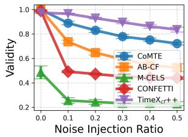

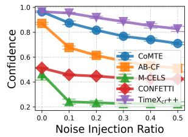

(a) Validity on Freqshape  
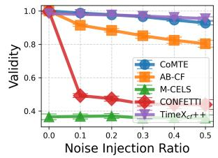

(b) Confidence on Freqshape  
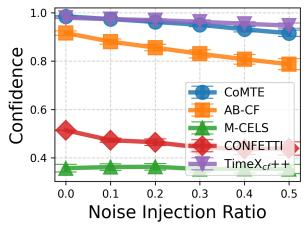  
(c) Validity on LowVar  
(d) Confidence on LowVar  
Fig. 4: The counterfactual explanations robustness analysis on Freqshape and LowVar.

## F. Flexibility Across Different Black-box Classifiers

To explore the flexibility of TimeX++, we study two other time series classifiers and explore their explanatory role. We replace the original transformer-based black-box f with a longshort term memory (LSTM) and a convolutional neural network (CNN) as the underlying classifiers.

TABLE XI: Targeted counterfactual explanation performance on LSTM and CNN architectures.
<table><tr><td rowspan="2">METHOD</td><td colspan="5">LSTM</td><td colspan="5">CNN</td></tr><tr><td>VALIDITY</td><td>CONFIDENCE</td><td>SPARSITY</td><td>PROX.-L1</td><td>PROX.-L2</td><td>VALIDITY</td><td>CONFIDENCE</td><td>SPARSITY</td><td>PROX.-L1</td><td>PROX.-L2</td></tr><tr><td></td><td></td><td></td><td></td><td></td><td>FREQSHAPES</td><td></td><td></td><td></td><td></td><td></td></tr><tr><td>CoMTE</td><td> $1 . 0 0 0 \pm 0 . 0 0 0$ </td><td> $0 . 9 3 5 \pm 0 . 0 1 4$  </td><td> $1 . 0 0 0 \pm 0 . 0 0 0$ </td><td> $0 . 5 6 2 \pm 0 . 0 0 3$ </td><td> $0 . 8 2 1 \pm 0 . 0 0 6$ </td><td> $1 . 0 0 0 \pm 0 . 0 0 0$ </td><td> $0 . 9 2 2 \pm 0 . 0 1 0$ </td><td> $1 . 0 0 0 \pm 0 . 0 0 0$ </td><td> $0 . 5 7 8 \pm 0 . 0 0 2$ </td><td> $0 . 8 4 7 \pm 0 . 0 0 3$ </td></tr><tr><td>AB-CF</td><td> $1 . 0 0 0 \pm 0 . 0 0 0$ </td><td> $0 . 8 2 3 \pm 0 . 0 1 7$ </td><td> $0 . 6 6 4 \pm 0 . 0 2 1$ </td><td> $0 . 4 2 4 \pm 0 . 0 0 7$ </td><td> $0 . 7 2 3 \pm 0 . 0 0 5$ </td><td> $1 . 0 0 0 \pm 0 . 0 0 0$ </td><td> $0 . 7 9 0 \pm 0 . 0 1 0$ </td><td> $0 . 7 1 5 \pm 0 . 0 1 5$ </td><td>0.451 ± 0.006</td><td> $0 . 7 6 0 \pm 0 . 0 0 5$ </td></tr><tr><td>M-CELS</td><td> $0 . 2 9 4 \pm 0 . 0 2 9$ </td><td> $0 . 2 6 7 \pm 0 . 0 2 6$ </td><td> $0 . 0 5 7 \pm 0 . 0 0 6$ </td><td> $0 . 0 7 0 \pm 0 . 0 0 8$ </td><td> $0 . 1 9 2 \pm 0 . 0 1 8$ </td><td> $0 . 4 0 5 \pm 0 . 0 2 5$ </td><td> $0 . 3 6 3 \pm 0 . 0 2 2$ </td><td> $0 . 0 5 5 \pm 0 . 0 0 3$ </td><td> $0 . 0 7 2 \pm 0 . 0 0 5$ </td><td> $0 . 2 0 7 \pm 0 . 0 1 3$ </td></tr><tr><td>CONFETTI</td><td> $0 . 9 8 1 \pm 0 . 0 0 8$ </td><td> $0 . 5 0 6 \pm 0 . 0 0 4$ </td><td> $0 . 3 6 1 \pm 0 . 0 0 5$ </td><td> $0 . 2 6 0 \pm 0 . 0 0 4$ </td><td> $0 . 5 6 8 \pm 0 . 0 0 7$ </td><td> $0 . 9 8 4 \pm 0 . 0 1 0$ </td><td> $0 . 5 0 7 \pm 0 . 0 0 5$ </td><td> $0 . 3 6 0 \pm 0 . 0 0 5$ </td><td> $0 . 2 7 5 \pm 0 . 0 0 4$ </td><td> $0 . 6 1 2 \pm 0 . 0 0 6$ </td></tr><tr><td> $\mathrm { T I M E X } _ { c f } + +$ </td><td>0.944 ± 0.036</td><td> $0 . 9 2 6 \pm 0 . 0 3 7$ </td><td></td><td> $0 . 4 2 1 \pm 0 . 0 1 5$ </td><td> $0 . 8 2 1 \pm 0 . 0 2 2$ </td><td> $0 . 9 7 6 \pm 0 . 0 0 7$ </td><td></td><td></td><td> $0 . 5 6 4 \pm 0 . 0 3 1$ </td><td></td></tr><tr><td></td><td></td><td> $0 . 2 7 1 \pm 0 . 0 1 1$ </td><td></td><td></td><td></td><td></td><td> $0 . 9 6 7 \pm 0 . 0 0 7$ </td><td> $0 . 2 8 3 \pm 0 . 0 1 4$ </td><td></td><td> $1 . 1 2 0 \pm 0 . 0 8 9$ </td></tr><tr><td></td><td></td><td></td><td></td><td></td><td>SEQCOMB-MV</td><td></td><td></td><td></td><td></td><td></td></tr><tr><td>CoMTE AB-CF</td><td> $0 . 9 9 2 \pm 0 . 0 0 3$ </td><td> $0 . 9 3 2 \pm 0 . 0 1 8$ </td><td> $0 . 4 2 5 \pm 0 . 0 2 0$ </td><td> $0 . 0 7 8 \pm 0 . 0 0 3$   $0 . 0 9 4 \pm 0 . 0 0 4$ </td><td> $0 . 2 3 9 \pm 0 . 0 0 7$ </td><td> $0 . 9 9 9 \pm 0 . 0 0 1$ </td><td> $0 . 9 6 9 \pm 0 . 0 0 8$ </td><td> $0 . 4 5 4 \pm 0 . 0 1 7$ </td><td>0.085 ± 0.003</td><td> $0 . 2 5 5 \pm 0 . 0 0 7$ </td></tr><tr><td>M-CELS</td><td> $1 . 0 0 0 \pm 0 . 0 0 0$ </td><td> $0 . 8 6 2 \pm 0 . 0 2 5$ </td><td> $0 . 6 0 3 \pm 0 . 0 3 3$ </td><td> $0 . 0 0 7 \pm 0 . 0 0 1$ </td><td> $0 . 2 4 2 \pm 0 . 0 0 7$ </td><td> $1 . 0 0 0 \pm 0 . 0 0 0$ </td><td> $0 . 9 0 0 \pm 0 . 0 1 5$ </td><td> $0 . 5 7 8 \pm 0 . 0 3 7$ </td><td> $0 . 0 9 4 \pm 0 . 0 0 5$ </td><td> $0 . 2 4 9 \pm 0 . 0 0 8$ </td></tr><tr><td>CONFETTI</td><td> $0 . 2 8 4 \pm 0 . 0 3 9$ </td><td> $0 . 2 7 7 \pm 0 . 0 3 6$ </td><td>0.011 ± 0.001</td><td> $0 . 0 3 6 \pm 0 . 0 0 3$ </td><td> $0 . 0 6 4 \pm 0 . 0 0 6$   $0 . 1 4 0 \pm 0 . 0 1 1$ </td><td> $0 . 5 4 9 \pm 0 . 0 5 9$ </td><td> $0 . 5 1 6 \pm 0 . 0 5 6$ </td><td> $0 . 0 1 2 \pm 0 . 0 0 1$ </td><td> $0 . 0 1 1 \pm 0 . 0 0 1$ </td><td>0.089 ± 0.008</td></tr><tr><td></td><td> $0 . 9 1 1 \pm 0 . 0 4 2$ </td><td> $0 . 5 0 4 \pm 0 . 0 2 1$ </td><td> $0 . 2 3 6 \pm 0 . 0 1 7$ </td><td> $0 . 1 2 1 \pm 0 . 0 1 3$ </td><td></td><td> $0 . 9 9 8 \pm 0 . 0 0 1$ </td><td> $0 . 5 1 2 \pm 0 . 0 0 0$ </td><td> $0 . 3 0 4 \pm 0 . 0 1 1$ </td><td> $0 . 0 5 1 \pm 0 . 0 0 3$   $0 . 1 2 4 \pm 0 . 0 1 5$ </td><td> $0 . 1 8 9 \pm 0 . 0 1 0$   $0 . 3 7 4 \pm 0 . 0 2 8$ </td></tr><tr><td colspan="9"> $\mathrm { T I M E X } _ { c f } + +$   $0 . 9 4 1 \pm 0 . 0 3 7$   $0 . 9 4 2 \pm 0 . 0 3 4$   $0 . 1 2 9 \pm 0 . 0 1 4$  0.364 ± 0.023 | 0.940 ± 0.035  $0 . 9 4 1 \pm 0 . 0 3 2$   $0 . 1 2 7 \pm 0 . 0 1 3$ </td></tr><tr><td colspan="9">ECG</td></tr><tr><td colspan="9">CoMTE  $1 . 0 0 0 \pm 0 . 0 0 0$   $0 . 8 5 2 \pm 0 . 0 3 0$   $1 . 0 0 0 \pm 0 . 0 0 0$   $0 . 2 7 9 \pm 0 . 0 1 0$   $0 . 3 8 4 \pm 0 . 0 1 6$   $1 . 0 0 0 \pm 0 . 0 0 0$   $0 . 8 7 3 \pm 0 . 0 1 6$ </td></tr><tr><td colspan="9"> $1 . 0 0 0 \pm 0 . 0 0 0$  AB-CF  $1 . 0 0 0 \pm 0 . 0 0 0$   $0 . 7 7 9 \pm 0 . 0 3 6$   $0 . 5 7 0 \pm 0 . 0 5 7$   $0 . 1 7 4 \pm 0 . 0 1 6$   $0 . 3 0 3 \pm 0 . 0 1 9$   $0 . 9 9 9 \pm 0 . 0 0 0$   $0 . 7 5 0 \pm 0 . 0 1 5$   $0 . 4 6 4 \pm 0 . 0 4 7$ </td></tr><tr><td colspan="9"> $0 . 1 6 5 \pm 0 . 0 0 6$   $_ { \mathrm { M - C E L S } }$   $0 . 3 6 8 \pm 0 . 0 5 7$   $0 . 3 5 8 \pm 0 . 0 5 6$   $0 . 0 1 5 \pm 0 . 0 0 1$   $0 . 0 0 7 \pm 0 . 0 0 1$   $0 . 0 4 2 \pm 0 . 0 0 4$   $0 . 4 8 6 \pm 0 . 0 6 3$   $0 . 4 6 2 \pm 0 . 0 6 2$   $0 . 0 2 3 \pm 0 . 0 0 2$ </td></tr><tr><td colspan="9"> $0 . 0 1 5 \pm 0 . 0 0 2$  CONFETTI  $0 . 8 5 8 \pm 0 . 0 3 0$   $0 . 4 8 5 \pm 0 . 0 2 0$   $0 . 2 5 0 \pm 0 . 0 1 0$   $0 . 0 7 2 \pm 0 . 0 0 5$   $0 . 1 8 0 \pm 0 . 0 1 3$  0.977 ± 0.007  $0 . 5 0 3 \pm 0 . 0 0 4$   $0 . 2 5 5 \pm 0 . 0 1 0$   $0 . 0 7 6 \pm 0 . 0 0 5$ </td></tr><tr><td colspan="9"></td></tr><tr><td colspan="9"> $\mathrm { T I M E X } _ { c f } + +$   $0 . 7 7 2 \pm 0 . 0 6 2$   $0 . 7 3 8 \pm 0 . 0 5 7$  0.138±0.020  $0 . 2 5 1 \pm 0 . 0 3 7$   $0 . 7 0 9 \pm 0 . 0 9 6$   $0 . 8 5 3 \pm 0 . 0 4 7$   $0 . 8 4 9 \pm 0 . 0 4 7$   $0 . 0 4 9 \pm 0 . 0 1 6$   $0 . 1 0 4 \pm 0 . 0 0 8$   $0 . 5 4 2 \pm 0 . 0 3 3$ </td></tr><tr><td colspan="9"></td></tr></table>

TABLE XII: Ablation study Counterfactual explanation performance on LSTM and CNN architectures.
<table><tr><td></td><td>VALIDITY</td><td>CONFIDENCE</td><td>SPARSITY</td><td> $\mathbf { P R O X . - L 1 }$ </td><td>PROX.-L2</td></tr><tr><td colspan="6">FREQSHAPES</td></tr><tr><td> $\mathrm { T I M E X } _ { c f } + +$ </td><td> $\lvert 0 . 9 7 4 \pm 0 . 0 0 4$ </td><td>0.964±0.005 0.214 ±0.005</td><td></td><td> $0 . 3 3 9 \pm 0 . 0 2 1$ </td><td> $0 . 7 5 7 \pm 0 . 0 3 0$ </td></tr><tr><td> $\mathrm { w } / \mathrm { o } \ S \mathrm { T E }$ </td><td> $0 . 7 6 9 \pm 0 . 0 5 5$ </td><td> $0 . 7 6 3 \pm 0 . 0 5 5$ </td><td> $0 . 1 7 4 \pm 0 . 0 1 4$ </td><td> $0 . 2 8 1 \pm 0 . 0 3 1$ </td><td> $0 . 6 1 6 \pm 0 . 0 5 9$ </td></tr><tr><td> $\mathrm { w } / \mathrm { o } \ \mathcal { L } _ { \mathrm { L C } }$ </td><td> $0 . 0 0 0 \pm 0 . 0 0 0$ </td><td>0.007 ± 0.001</td><td> $0 . 0 9 1 \pm 0 . 0 0 1$ </td><td> $0 . 0 0 1 \pm 0 . 0 0 0$ </td><td>0.002 ± 0.000</td></tr><tr><td> $\mathrm { w } / \mathrm { o } \ \mathcal { L } _ { \mathrm { K L } }$ </td><td> $0 . 9 3 6 \pm 0 . 0 3 5$ </td><td> $0 . 9 2 8 \pm 0 . 0 3 4$ </td><td> $0 . 2 2 0 \pm 0 . 0 1 2$ </td><td> $0 . 3 4 2 \pm 0 . 0 3 0$ </td><td> $0 . 7 3 0 \pm 0 . 0 4 8$ </td></tr><tr><td> $\mathrm { w } / \mathrm { o } \ \mathcal { L } _ { d r }$ </td><td> $0 . 9 5 5 \pm 0 . 0 3 2$ </td><td> $0 . 9 4 6 \pm 0 . 0 3 2$ </td><td> $0 . 2 1 6 \pm 0 . 0 1 4$ </td><td> $0 . 5 1 2 \pm 0 . 0 7 0$ </td><td> $1 . 1 0 7 \pm 0 . 1 2 8$ </td></tr></table>

<table><tr><td rowspan=1 colspan=1>TIMEXcf++|0</td><td rowspan=1 colspan=1>.983 ±0.007 0.979 ±0.008 0.305 ±0.041 0.152 ±0.016 0.353 ± 0.033</td></tr><tr><td rowspan=1 colspan=1> $\mathrm { w } / \mathrm { o } \ \mathcal { L } _ { \mathrm { L C } }$ </td><td rowspan=1 colspan=1>0.000 ± 0.000 $0 . 0 0 3 \pm 0 . 0 0 1$  $0 . 0 7 9 \pm 0 . 0 0 5$  $0 . 0 0 0 \pm 0 . 0 0 0$  $0 . 0 0 1 \pm 0 . 0 0 0$ </td></tr><tr><td rowspan=1 colspan=1> $\mathrm { w } / \mathrm { o } \ \mathcal { L } _ { \mathrm { K L } }$ </td><td rowspan=1 colspan=1> $0 . 9 4 0 \pm 0 . 0 3 6$  $0 . 9 4 1 \pm 0 . 0 3 3$  $0 . 1 5 0 \pm 0 . 0 1 5$  $0 . 1 4 6 \pm 0 . 0 1 6$  $0 . 3 9 5 \pm 0 . 0 2 5$ </td></tr><tr><td rowspan=1 colspan=1> $\mathrm { w } / \mathrm { o } \ \mathcal { L } _ { d r }$ </td><td rowspan=1 colspan=1> $| 0 . 9 0 7 \pm 0 . 0 3 9 0 . 9 0 7 \pm 0 . 0 3 8$  $0 . 1 2 9 \pm 0 . 0 1 3$  $0 . 2 8 6 \pm 0 . 0 6 2$  $0 . 7 7 1 \pm 0 . 1 2 2$ </td></tr></table>

$$
\mathrm { w } / \mathrm { o } \ S \mathrm { T E }
$$

$$
\mathcal { L } _ { \mathrm { L C } }
$$

$$
0 . 6 3 7 \pm 0 . 1 2 8
$$

$$
\mathcal { L } _ { \mathrm { K L } }
$$

$$
\mathrm { w } / \mathrm { o } \ \mathcal { L } _ { d r }
$$

$$
0 . 0 1 5 \pm 0 . 0 0 5
$$

$$
0 . 0 4 9 \pm 0 . 0 1 5
$$

$$
0 . 8 2 4 \pm 0 . 1 2 4
$$

$$
0 . 4 9 9 \pm 0 . 0 8 0
$$

$$
0 . 1 1 1 \pm 0 . 0 3 1
$$

$$
0 . 0 9 6 \pm 0 . 0 0 3
$$

$$
0 . 8 3 1 \pm 0 . 1 1 6
$$

$$
0 . 0 0 0 \pm 0 . 0 0 0
$$

$$
0 . 8 5 3 \pm 0 . 1 0 2
$$

$$
0 . 1 0 4 \pm 0 . 0 3 7
$$

$$
0 . 0 0 1 \stackrel { - } { \pm } 0 . 0 0 0
$$

$$
0 . 1 0 6 \pm 0 . 0 1 3
$$

$$
0 . 3 1 1 \pm 0 . 1 3 9
$$

$$
0 . 5 3 9 \pm 0 . 0 8 4
$$

$$
0 . 8 5 0 \pm 0 . 2 1 4
$$

$$
1 . 6 7 5 \pm 0 . 2 2 1
$$

For attribution explanations, Time $\cdot X _ { a } + +$ retains the best AUPRC prediction on these datasets and is also slightly ahead for AUP and AUR overall, as shown in Table VII, while TIMEX fails to predict on SeqComb-MV due to non-convergence. Under the CNN predictor, our method achieves the highest AUPRC and AUP for both SeqComb-MV and ECG datasets.

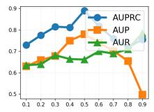  
(a) Freqshape

For counterfactual explanations, Table XI presents the comparison results on three benchmarks. For the baselines, similar behaviors are observed across different architectures, except for M-CELS, whose performance exhibits large variance, performing better with CNN and worse with LSTM. We also observe results consistent with our main findings, where Time $\mathrm { X } _ { c f } + +$ achieves a balance among validity, confidence, sparsity, and proximity across both CNN and LSTM backbones, indicating strong generalizability across architectures.

Fig. 5: Attribution explanation performance varying the sparsity parameter r.  
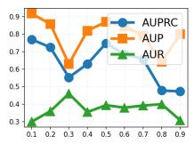  
(b) SeqComb-MV

## G. Ablation Study and Hyperparameter Analysis

a) Effect of STE: For attribution explanations as shown in Table X, $\operatorname { T i m e X } _ { a } + +$ outperforms leading baselines by 39.78% in AUPRC, 22.04% in AUP, and 3.10% in AUR on ECG arrhythmia detection, indicating that the use of the STE plays a critical role in optimizing the discrete explanation masks. On average, employing STE yields an average 8.87% increase in AUPRC across all datasets compared to a continuous masking strategy, alongside consistent enhancements in AUR, providing tangible evidence for utilizing hard masks. In the counterfactual domain, removing the STE results in a significant drop in validity and confidence. Although sparsity superficially improves, this indicates that the generation process has collapsed into a local optimum where perturbations are overly constrained and fail to effectively flip the model prediction, highlighting the necessity of STE in balancing the multi-objective trade-off.

(c) ECG  
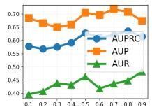

To disentangle the contributions of the proposed components, we conduct extensive ablation studies and hyperparameter analyses across both attribution and counterfactual tasks, evaluated on FreqShape, SeqComb-MV, and ECG datasets.

b) Effect of Different Losses: We examine the effectiveness of the individual loss components constraining our framework. For attribution explanations, the absence of the Kullback-Leibler maintenance loss $( \mathcal { L } _ { \mathrm { K L } } )$ widens the distributional gap between original and perturbed instances, dropping performance. The removal of the reference distance loss $( \mathcal { L } _ { d r } )$ naturally causes the explainer to fail, as it removes the primary target for bottleneck extraction. Furthermore, without consistency labeling $( \mathcal { L } _ { \mathrm { L C } } )$ , performance on synthetic datasets drops significantly.

In the counterfactual domain (Table XII), removing the label consistency loss $( \mathcal { L } _ { \mathrm { L C } } )$ dramatically degrades validity, as the generator loses its primary signal for targeted label flipping.

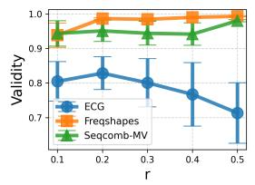  
(a) Validity

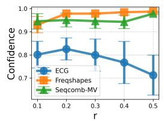  
(b) Confidence

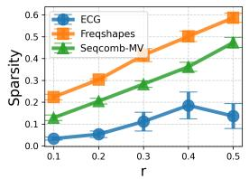  
(c) Sparsity

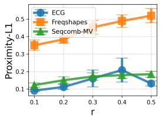  
(d) Proximity-L1

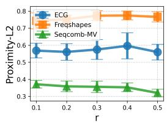  
(e) Proximity-L2

Fig. 6: The hyperparameter r analysis for counterfactual explanations on Freqshape (univariate), SeqComb-MV (multivariate), and ECG (real-world) datasets.  
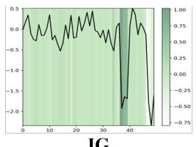  
IG

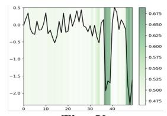

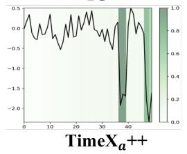

TimeX  
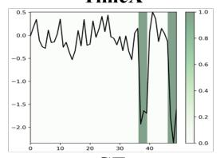  
GT  
Fig. 7: Visualization of two attribution explainers and Tim $\ { \cdot } X _ { a } { + } +$ on the FreqShapes dataset.

Removing the reference distance loss $( \mathcal { L } _ { d r } )$ , which acts as a structural regularization term, leads to a substantial decline in proximity. The maintenance loss $( \mathcal { L } _ { \mathrm { K L } } )$ has a relatively smaller but consistent impact on preserving distributional consistency. Interestingly, the effect of the connectivity loss $( \mathcal { L } _ { \mathrm { c o n } } )$ varies depending on the underlying data characteristics, which improves performance on FreqShapes by promoting continuous modifications but degrades performance on ECG, as critical ECG patterns are inherently distributed across multiple discrete segments rather than concentrated in a single contiguous window. Finally, as previously analyzed, excising the structural anchor $( \mathcal { L } _ { b o u n d } )$ results in a dramatic deterioration of sparsity and proximity metrics; without this causal anchor, the generator scatters perturbations across the entire sequence.

c) Choosing the Hyperparameter r: The parameter r governs the sparsity of the masks learned during the process. For attribution, in Figure 5, lower values of the parameter are associated with a decrease in the performance (AUR). The performance stabilizes when the value is between 0.4 and 0.7, suggesting robustness in this range. In Figure 6, for counterfactuals, r balances sparsity, validity, and proximity by providing prior knowledge about the expected size of counterfactual explanations. As r increases, validity and confidence improve, whereas sparsity and proximity deteriorate, reflecting the inherent multi-objective trade-offs.

## H. Case Study

Saliency maps are a potent tool for visualizing the significance of features. We demonstrate the attribution saliency maps of the benchmarks and Time $\mathrm { X } _ { a } + +$ on the FreqShapes dataset in Figure 7. IG identifies unnecessarily large areas as important, which can be untenable for noisy datasets. TIMEX struggles to describe important sub-instances with certainty due to data distribution bias from its constructed classifiers. In stark contrast, TimeXa++ focuses accurately on the peaks for matching ground-truth explanations.

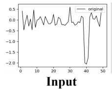

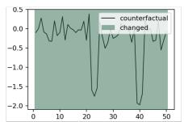

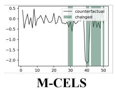

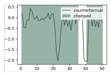

CoMTE  
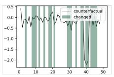  
CONFETTI

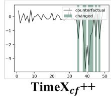  
Fig. 8: The cases visualization of the FreqShapes dataset for counterfactual explanations. We demonstrate pairs of counterfactual cases with prediction 2 and target label 0.

For counterfactual explanations in Figure 8, we compare $\mathrm { T i m e X } _ { c f } { + + }$ with baseline methods, with the modified parts highlighted. $\mathrm { T i m e X } _ { c f } { + + }$ requires fewer modifications, and these are highly related to the underlying patterns. In contrast, CoMTE and AB-CF modify a large portion of the original input, resulting in trivial solutions (e.g., generating highly similar instances). M-CELS fails to generate valid counterfactual explanations in most cases. CONFETTI produces sparse modifications but its results lack robustness to noise.

## VII. CONCLUSION

In this work, we theoretically investigate an informationtheoretic guided objective for time series explanations that ensures compactness and informativeness. We propose a novel approach, TimeX++, based on the IB principle, which allows a traceability computation to produce faithful attribution explanations and robust counterfactual explanations. Comprehensive studies on synthetic and real-world datasets have confirmed that TimeX++ surpasses existing approaches in performance and efficiency. Its effectiveness shows that TimeX++’s capability to reflect complex behaviors of pre-trained time series classifiers accurately. However, it may involve some hyperparameters in the learning objective to control the quantifiers of the explanation, especially when dealing with different datasets, which might be the key limitation.

## REFERENCES

[1] Ralph G Andrzejak, Klaus Lehnertz, Florian Mormann, Christoph Rieke, Peter David, and Christian E Elger. Indi cations of nonlinear deterministic and finite-dimensional structures in time series of brain electrical activity: Dependence on recording region and brain state. Physical Review E, page 061907, 2001.

[2] Emre Ates, Burak Aksar, Vitus J. Leung, and Ayse K. Coskun. Counterfactual explanations for multivariate time series. In ICAPAI, pages 1–8, 2021.

[3] Omar Bahri, Soukaina Filali Boubrahimi, and Shah Muhammad Hamdi. Shapelet-based counterfactual explanations for multivariate time series. arXiv preprint arXiv:2208.10462, 2022.

[4] Joao Bento, Pedro Saleiro, Andr˜ e F Cruz, M´ ario AT´ Figueiredo, and Pedro Bizarro. Timeshap: Explaining recurrent models through sequence perturbations. In SIGKDD, pages 2565–2573, 2021.

[5] Alan Gabriel Paredes Cetina, Kaouther Benguessoum, Raoni Lourenco, and Sylvain Kubler. Counterfactual explainable ai (xai) method for deep learning-based multivariate time series classification. AAAI, 40(21):17393– 17400, Mar. 2026.

[6] Zhuomin Chen, Gabriel Lucchesi, Qingkai Dong, Xu Zheng, Dongjin Song, Qingsong Wen, Wei Cheng, Jingchao Ni, and Dongsheng Luo. From signals to semantics: A survey on time series explainability through a human-cognitive lens. Authorea Preprints, 2026.

[7] Edward Choi, Mohammad Taha Bahadori, Jimeng Sun, Joshua Kulas, Andy Schuetz, and Walter Stewart. Retain: An interpretable predictive model for healthcare using reverse time attention mechanism. In NeurIPS, pages 3504–3512, 2016.

[8] Yu-Neng Chuang, Guanchu Wang, Fan Yang, Quan Zhou, Pushkar Tripathi, Xuanting Cai, and Xia Hu. CoRTX: Contrastive framework for real-time explanation. In ICLR, pages 1–23, 2023.

[9] Jonathan Crabbe and Mihaela Van Der Schaar. Explaining´ time series predictions with dynamic masks. In ICML, pages 2166–2177, 2021.

[10] Hoang Anh Dau, Anthony Bagnall, Kaveh Kamgar, Chin-Chia Michael Yeh, Yan Zhu, Shaghayegh Gharghabi, Chotirat Ann Ratanamahatana, and Eamonn Keogh. The ucr time series archive. IEEE/CAA Journal of Automatica Sinica, 6(6):1293–1305, 2019.

[11] Eoin Delaney, Derek Greene, and Mark T Keane. Instancebased counterfactual explanations for time series classification. In International Conference on Case-Based Reasoning, pages 32–47. Springer, 2021.

[12] Joseph Enguehard. Learning perturbations to explain time series predictions. In ICML, pages 9329–9342, 2023.

[13] Lukas Faber, Amin K. Moghaddam, and Roger Wattenhofer. When comparing to ground truth is wrong: On evaluating gnn explanation methods. In SIGKDD, pages 332–341, 2021.

[14] Robert Geirhos, Jorn-Henrik Jacobsen, Claudio Michaelis,¨ Richard Zemel, Wieland Brendel, Matthias Bethge, and

Felix A. Wichmann. Shortcut learning in deep neural networks. Nature Machine Intelligence, 2(11):665–673, 2020.

[15] Marzyeh Ghassemi, Luke Oakden-Rayner, and Andrew L Beam. The false hope of current approaches to explainable artificial intelligence in health care. The lancet digital health, 3(11):e745–e750, 2021.

[16] Arthur Gretton, Karsten M Borgwardt, Malte J Rasch, Bernhard Scholkopf, and Alexander Smola. A kernel two-¨ sample test. The journal of machine learning research, 13(1):723–773, 2012.

[17] Jacqueline Hollig, Cedric Kulbach, and Steffen Thoma.¨ Tsevo: Evolutionary counterfactual explanations for time series classification. In ICMLA, pages 29–36. IEEE, 2022.

[18] Sara Hooker, Dumitru Erhan, Pieter-Jan Kindermans, and Been Kim. A benchmark for interpretability methods in deep neural networks. In H. Wallach, H. Larochelle, A. Beygelzimer, F. d'Alche-Buc, E. Fox, and R. Garnett,´ editors, NeurIPS, volume 32. Curran Associates, Inc., 2019.

[19] Aya Abdelsalam Ismail, Hector Corrada Bravo, and Soheil Feizi. Improving deep learning interpretability by saliency guided training. In NeurIPS, pages 26726–26739, 2021.

[20] Aya Abdelsalam Ismail, Mohamed Gunady, Hector Corrada Bravo, and Soheil Feizi. Benchmarking deep learning interpretability in time series predictions. In H. Larochelle, M. Ranzato, R. Hadsell, M.F. Balcan, and H. Lin, editors, NeurIPS, volume 33, pages 6441–6452. Curran Associates, Inc., 2020.

[21] Eric Jang, Shixiang Gu, and Ben Poole. Categorical reparameterization with gumbel-softmax. In ICLR, pages 1–12, 2017.

[22] Dominik Janzing, Lenon Minorics, and Patrick Bloebaum. Feature relevance quantification in explainable ai: A causal problem. In Silvia Chiappa and Roberto Calandra, editors, AISTATS, volume 108 of Proceedings of Machine Learning Research, pages 2907–2916. PMLR, 26–28 Aug 2020.

[23] Guillaume Jeanneret, Loic Simon, and Frederic Jurie. Diffusion models for counterfactual explanations. In ACCV, pages 858–876, December 2022.

[24] Shruti Kaushik, Abhinav Choudhury, Pankaj Kumar Sheron, Nataraj Dasgupta, Sayee Natarajan, Larry A Pickett, and Varun Dutt. AI in healthcare: time-series forecasting using statistical, neural, and ensemble archi tectures. Frontiers in Big Data, 3:4, 2020.

[25] Ramaravind Kommiya Mothilal, Divyat Mahajan, Chenhao Tan, and Amit Sharma. Towards unifying feature attribution and counterfactual explanations: Different means to the same end. In AIES, AIES ’21, page 652–663, New York, NY, USA, 2021. Association for Computing Machinery.

[26] Ramaravind Kommiya Mothilal, Divyat Mahajan, Chenhao Tan, and Amit Sharma. Towards unifying feature attribution and counterfactual explanations: Different means to the same end. In AIES, AIES ’21, page 652–663, New York, NY, USA, 2021. Association for Computing Machinery.

[27] Solomon Kullback and Richard A Leibler. On information and sufficiency. The Annals of Mathematical Statistics, 22(1):79–86, 1951.

[28] Thibault Laugel, Marie-Jeanne Lesot, Christophe Marsala, Xavier Renard, and Marcin Detyniecki. The dangers of post-hoc interpretability: unjustified counterfactual explanations. In IJCAI, IJCAI’19, page 2801–2807. AAAI Press, 2019.

[29] Kin Kwan Leung, Clayton Rooke, Jonathan Smith, Saba Zuberi, and Maksims Volkovs. Temporal dependencies in feature importance for time series prediction. In ICLR, pages 1–18, 2023.

[30] Peiyu Li, Omar Bahri, Souka”ına Filali Boubrahimi, and Shah Muhammad Hamdi. Attention-based counterfactual explanation for multivariate time series. In International Conference on Big Data Analytics and Knowledge Discovery, pages 287–293. Springer, 2023.

[31] Peiyu Li, Omar Bahri, Souka¨Ina Filali Boubrahimi, and Shah Muhammad Hamdi. M-cels: Counterfactual explanation for multivariate time series data guided by learned saliency maps. In ICMLA, pages 713–718, 2024.

[32] Peiyu Li, Souka¨ına Filali Boubrahimi, and Shah Muhammad Hamdi. Motif-guided time series counterfactual explanations. In Jean-Jacques Rousseau and Bill Kapralos, editors, ICPR, pages 203–215, Cham, 2023. Springer Nature Switzerland.

[33] Zichuan Liu, Yingying Zhang, Tianchun Wang, Zefan Wang, Dongsheng Luo, Mengnan Du, Min Wu, Yi Wang, Chunlin Chen, Lunting Fan, and Qingsong Wen. Explaining time series via contrastive and locally sparse perturbations. In ICLR, pages 1–21, 2024.

[34] Dongsheng Luo, Wei Cheng, Dongkuan Xu, Wenchao Yu, Bo Zong, Haifeng Chen, and Xiang Zhang. Parameterized explainer for graph neural network. NeurIPS, 33:19620– 19631, 2020.

[35] David McAllester and Karl Stratos. Formal limitations on the measurement of mutual information. In Silvia Chiappa and Roberto Calandra, editors, AISTATS, volume 108 of Proceedings of Machine Learning Research, pages 875–884. PMLR, 26–28 Aug 2020.

[36] Siqi Miao, Mia Liu, and Pan Li. Interpretable and generalizable graph learning via stochastic attention mechanism. In ICML, pages 15524–15543. PMLR, 2022.

[37] Tim Miller. Explanation in artificial intelligence: Insights from the social sciences. Artificial Intelligence, 267:1–38, 2019.

[38] George B. Moody and Roger G. Mark. The impact of the MIT-BIH arrhythmia database. IEEE Engineering in Medicine and Biology Magazine, 20:45–50, 2001.

[39] Ramaravind K. Mothilal, Amit Sharma, and Chenhao Tan. Explaining machine learning classifiers through diverse counterfactual explanations. In Proceedings of the 2020 Conference on Fairness, Accountability, and Transparency, FAT\* ’20, page 607–617, New York, NY, USA, 2020. Association for Computing Machinery.

[40] Daniel Nemirovsky, Nicolas Thiebaut, Ye Xu, and Abhishek Gupta. Countergan: Generating counterfactuals for real-time recourse and interpretability using residual gans.

In James Cussens and Kun Zhang, editors, UAI, volume 180 of Proceedings of Machine Learning Research, pages 1488–1497. PMLR, 01–05 Aug 2022.

[41] Emanuel Parzen. On estimation of a probability density function and mode. The Annals of Mathematical Statistics, 33(3):1065–1076, 1962.

[42] Martin Pawelczyk, Chirag Agarwal, Shalmali Joshi, Sohini Upadhyay, and Himabindu Lakkaraju. Exploring counterfactual explanations through the lens of adversarial examples: A theoretical and empirical analysis. In Gustau Camps-Valls, Francisco J. R. Ruiz, and Isabel Valera, editors, AISTATS, volume 151 of Proceedings of Machine Learning Research, pages 4574–4594. PMLR, 28–30 Mar 2022.

[43] Owen Queen, Thomas Hartvigsen, Teddy Koker, Huan He, Theodoros Tsiligkaridis, and Marinka Zitnik. Encoding time-series explanations through self-supervised model behavior consistency. In NeurIPS, 2023.

[44] Stephan Rabanser, Stephan Gunnemann, and Zachary¨ Lipton. Failing loudly: An empirical study of methods for detecting dataset shift. In H. Wallach, H. Larochelle, A. Beygelzimer, F. d'Alche-Buc, E. Fox, and R. Garnett,´ editors, NeurIPS, volume 32. Curran Associates, Inc., 2019.

[45] Mario Refoyo and David Luengo. Sub-space: Subsequence-based sparse counterfactual explanations for time series classification problems. In World Conference on Explainable Artificial Intelligence, pages 3–17. Springer, 2024.

[46] Attila Reiss and Didier Stricker. Introducing a new benchmarked dataset for activity monitoring. In ISWC, pages 108–109, 2012.

[47] Marco Tulio Ribeiro, Sameer Singh, and Carlos Guestrin. ”why should i trust you?”: Explaining the predictions of any classifier. In SIGKDD, KDD ’16, page 1135–1144, New York, NY, USA, 2016. Association for Computing Machinery.

[48] Karsten Roth et al. Out-of-distribution detection using union of 1-dimensional subspaces. In CVPR, pages 9430– 9440, 2022.

[49] Cynthia Rudin. Stop explaining black box machine learning models for high stakes decisions and use interpretable models instead. Nature machine intelligence, 1(5):206– 215, 2019.

[50] Dylan Slack, Sophie Hilgard, Emily Jia, Sameer Singh, and Himabindu Lakkaraju. Fooling lime and shap: Adversarial attacks on post hoc explanation methods. In AIES, AIES ’20, page 180–186, New York, NY, USA, 2020. Association for Computing Machinery.

[51] Mukund Sundararajan, Ankur Taly, and Qiqi Yan. Axiomatic attribution for deep networks. In ICML, pages 3319–3328, 2017.

[52] Harini Suresh, Nathan Hunt, Alistair Johnson, Leo Anthony Celi, Peter Szolovits, and Marzyeh Ghassemi. Clinical intervention prediction and understanding with deep neural networks. In MLHC, pages 322–337, 2017.

[53] Naftali Tishby and Noga Zaslavsky. Deep learning and the information bottleneck principle. In 2015 IEEE

Information Theory Workshop, pages 1–5. IEEE, 2015.

[54] Sana Tonekaboni, Shalmali Joshi, Kieran Campbell, David K Duvenaud, and Anna Goldenberg. What went wrong and when? Instance-wise feature importance for time-series black-box models. In NeurIPS, pages 799–809, 2020.

[55] Ashish Vaswani, Noam Shazeer, Niki Parmar, Jakob Uszkoreit, Llion Jones, Aidan N Gomez, Łukasz Kaiser, and Illia Polosukhin. Attention is all you need. In NeurIPS, pages 5998–6008, 2017.

[56] Zhendong Wang, Isak Samsten, Ioanna Miliou, Rami Mochaourab, and Panagiotis Papapetrou. Glacier: guided locally constrained counterfactual explanations for time series classification. Machine Learning, 113(7):4639– 4669, 2024.

[57] Zhendong Wang, Isak Samsten, Rami Mochaourab, and Panagiotis Papapetrou. Learning time series counterfactuals via latent space representations. In International Conference on Discovery Science, pages 369–384. Springer, 2021.

[58] Yu Zhang, Peter Tino, Aleˇ s Leonardis, and Ke Tang. Aˇ survey on neural network interpretability. IEEE Transactions on Emerging Topics in Computational Intelligence, 5(5):726–742, 2021.

[59] Bingchen Zhao, Shaozuo Yu, Wufei Ma, Mingxin Yu, Shenxiao Mei, Angtian Wang, Ju He, Alan Yuille, and Adam Kortylewski. OOD-CV: A benchmark for robustness to out-of-distribution shifts of individual nuisances in natural images. In ECCV, pages 163–180, 2022.

[60] Xu Zheng, Chaohao Lin, Sipeng Chen, Zhuomin Chen, Jimeng Shi, Jayantha Obeysekera, Jingchao Ni, Wei Cheng, Jason Liu, and Dongsheng Luo. Uncovering insights of compound flooding with data-driven AI. In SIGKDD, 2026.

[61] Xu Zheng, Farhad Shirani, Zhuomin Chen, Chaohao Lin, Wei Cheng, Wenbo Guo, and Dongsheng Luo. Ffidelity: A robust framework for faithfulness evaluation of explainable ai. In Y. Yue, A. Garg, N. Peng, F. Sha, and R. Yu, editors, ICLR, volume 2025, pages 12772–12804, 2025.