# TraceML: An Empirical Analysis of Human-Agent Planning in Machine Learning Development

Jiarui Yan<sup>∗</sup> Weiwei Sun Sijie Li Wenhan Li Yiming Yang Carnegie Mellon University

## Abstract

Large language models write correct code for isolated problems but remain far weaker at autonomous machine-learning development, where an agent must revise data pipelines, models, and validation over hours of feedback, and on most competitions still finishes below strong human competitors. Outcome-based benchmarks record this gap but not its cause, because they grade the final submission and discard the development process behind it. We introduce TraceML, which pairs human and agent work on the same competitions under one version-level schema: 4,465 human Kaggle trajectories across 134 competitions, seven of which are also worked by two agent scaffolds, giving 430 paired human and 207 agent trajectories. Every code version carries its score, its timestamp, and labels for the action taken, its intent, the edit size, and the score effect. Read this way, the gap becomes concrete. Experts alternate data work, validation, model changes, and ensembling, and return to approaches they had set aside. Each agent scaffold instead collapses into a narrow loop: Codex spends its steps re-weighting ensembles and tuning submissions, MLEvolve mutates its model in place, and neither pivots at the human rate nor reopens abandoned work. A short planning prompt distilled from human practice moves the behaviors it names toward the human profile and lifts scores, but the effort profile stays agent-shaped: instruction closes only the part of the gap that reduces to instructions. We release the corpus, the schema, the labelers, and the extraction pipeline at https://huggingface.co/datasets/jerryyan/TraceML.

<sup>∗</sup>Corresponding author: jerryy2@cs.cmu.edu

Preprint.

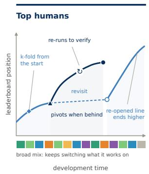

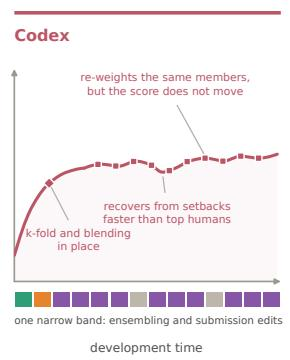

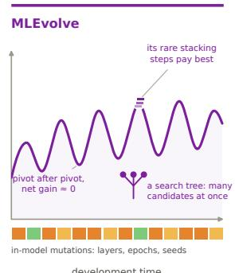  
Figure 1: Stylized trajectories with per-edit action ribbons, one panel per cohort. Humans mix actions, pivot when behind, and reopen abandoned lines; Codex maintains one solution through small submission-side edits; MLEvolve mutates its model in place. §4 quantifies each behavior.

## 1 Introduction

Large language models (LLMs) write correct code for well-specified, isolated tasks. Autonomous machine-learning development asks for more: an agent must load and clean data, choose and train models, read validation signal, and revise its approach over many hours, with each decision conditioned on the last [Jiang et al., 2025, Guo et al., 2024, Li et al., 2024]. On Kaggle-style tasks graded through executable submissions, agents make steady progress within a run yet still finish below strong human competitors on most problems, and gain less from extra working time than humans do [Chan et al., 2024, Wijk et al., 2025].

Outcome-based benchmarks record this gap without explaining it [Jing et al., 2025, Huang et al., 2024]. They grade the final submission without seeing the sequence of edits behind it, so two runs with the same score look identical even when one experimented carefully and the other tuned blindly. Where an agent’s workflow parts ways with an expert’s is a question about process.

Answering it requires process-level data in a form comparable across a human and an agent working the same problem. TraceML represents every run as an ordered sequence of code versions, each with its leaderboard score, its timestamp, and labels for what the code contains; every transition between versions carries the action taken, its intent, the size of the edit, and its effect on the score. The same schema covers human Kaggle submissions and agent runs, so a human and an agent working the same competition can be read side by side. TraceML has 4,465 human trajectories from 134 Kaggle competitions; within it, a matched subset of seven competitions is worked by both humans and two agent scaffolds, Codex and MLEvolve.

The trajectories show consistent differences (Figure 1). Humans alternate between exploration, diagnosis, validation, model changes, and ensembling; Codex spends most of its steps on submission facing bookkeeping, and MLEvolve on local model and training mutations. Both scaffolds also spend more of their budget than humans do for each unit of new ground covered. A planning harness built from these observations narrows some of the behavioral differences and lifts scores on part of the competitions; the agent’s effort profile stays agent-shaped.

Our contributions are: (1) Dataset: TraceML, a version-level trajectory dataset released alongside the extraction and labeling code, labeler checkpoints, and intervention harness. (2) Schema: a unified extraction and annotation schema for Kaggle notebooks, command-line interface (CLI) commits, and tree-search journals. (3) Analysis: process-level evidence of human-agent gaps in exploration, validation, model switching, ensembling, and repeated local optimization. (4) Use case: a planning harness built from these diagnostics, which narrows part of the behavioral gap and benefits the performance of the agents in some competitions.

## 2 Related Work

## 2.1 LLM Agents and ML-Agent Benchmarks

LLM agents that interleave reasoning, tool use, and environment feedback [Yao et al., 2023b, Shen et al., 2023] have been applied to machine-learning development, where an agent inspects data, writes code, runs experiments, and improves on its own results [Jiang et al., 2025, Guo et al., 2024, Li et al., 2024, Grosnit et al., 2024]. The two scaffolds we study differ in how they search. Codex is the OpenAI Codex command-line agent (codex-cli 0.146.0):<sup>2</sup> it runs a single edit-run-observe loop over one working directory and keeps no branch history. MLEvolve is an evolutionary search agent [Du et al., 2026]: it grows a search tree over candidate solutions and keeps several branches alive at once. Both run on the same gpt-5.4-mini backend through API calls,<sup>3</sup> from the same task prompt, under the same wall-clock and GPU budget (§3.2), which leaves search topology as the difference between them.

ML-agent benchmarks grade these systems on realistic tasks: MLAgentBench on bounded experimentation workflows [Huang et al., 2024], MLE-bench on historical Kaggle competitions with held-out graders [Chan et al., 2024], and AIRA on the search operators and validation feedback behind MLE-bench performance [Toledo et al., 2025]. Each compares an agent to other agents or to a leaderboard position, leaving no record of how a person reached the same score.

Table 1: Long-horizon agent benchmarks and datasets. TraceML is the only entry that keeps scored intermediate versions, their code, and task-matched human development. RE-Bench comes closest, pairing time-budgeted human and agent attempts, but on 7 bespoke environments with partial code; TraceML keeps the full code of every scored version across 134 competitions. Horizon is the per-task agent budget, or for TraceML the span of human development. ✓, ●, ✗: full, partial, no coverage.
<table><tr><td>Benchmark / Dataset</td><td>Score Traj Code Traj Human Traj</td><td></td><td></td><td># Envs.</td><td>Horizon</td></tr><tr><td>MLE-bench [Chan et al., 2024]</td><td>X</td><td>X</td><td></td><td>75</td><td>24h</td></tr><tr><td>MLAgentBench [Huang et al., 2024]</td><td></td><td></td><td></td><td>13</td><td></td></tr><tr><td>AIRA [Toledo et al., 2025]</td><td></td><td></td><td>X</td><td>22</td><td>24h</td></tr><tr><td>RE-Bench [Wijk et al., 2025]</td><td></td><td></td><td></td><td>7</td><td>8h</td></tr><tr><td>HCAST [Rein et al., 2025]</td><td></td><td>X</td><td>√</td><td>189</td><td>1m-8h</td></tr><tr><td>SciCode [Tian et al., 2024]</td><td></td><td>X</td><td>X</td><td>80/ 338</td><td></td></tr><tr><td>DiscoveryWorld [Jansen et al., 2024]</td><td></td><td>X</td><td>X</td><td>120</td><td></td></tr><tr><td>HORIZON [Wang et al., 2026]</td><td></td><td>X</td><td>X</td><td>4 domains</td><td>varies</td></tr><tr><td>TraceML (ours)</td><td></td><td></td><td></td><td>134</td><td>3 weeks</td></tr></table>

## 2.2 Behavioral Diagnostics and Human-Agent Trajectories

Many agent frameworks aim to make multi-step behavior more deliberate, among them Tree of Thoughts [Yao et al., 2023a] and Reflexion [Shinn et al., 2023]. Evaluations of these mechanisms mostly ask whether the agent produces a valid plan in the abstract, in classical planning domains rather than ML development [Valmeekam et al., 2023, Wang et al., 2026], leaving open how such behavior plays out over hours of real ML development. Human comparison offers a reference point: RE-Bench shows that time-budgeted human baselines reveal scaling patterns that final scores hide [Wijk et al., 2025], and HCAST grounds autonomy evaluation in human-calibrated task attempts [Rein et al., 2025]. Neither provides task-aligned human-agent trajectories for Kaggle-style ML engineering, nor a shared version-level representation of intermediate decisions. TraceML supplies both, and Table 1 places it against related benchmarks.

## 3 TraceML

Human and agent runs do not look alike at the source. A human leaves a public Kaggle notebook history built up over weeks; an agent leaves a CLI working directory or a tree-search journal produced in hours. TraceML maps both onto one representation: an ordered sequence of code versions, each with a score and a timestamp (Figure 2). We reconstruct each side and put it on a common scoring basis (§3.1, §3.2), annotate what each version contains and what each edit does (§3.4), and verify that those labels are reliable (§3.5).

## 3.1 Human Trajectory Collection

We reconstruct the human corpus from the Meta Kaggle database and its Code mirror<sup>4</sup> with a fourstage pipeline that turns raw save activity into ordered trajectories. (1) Ingestion and alignment: we extract public saved versions for the 134 in-scope competitions, hash each for deduplication, and join every version to its author tier and its public leaderboard score, so each trajectory carries a score at every step. (2) Lineage reconstruction: we recover development order as a directed acyclic graph over within-notebook histories, Kaggle fork relationships, and code-similarity links, keeping one canonical parent per version and alternate links as metadata. (3) Pruning: three filters drop postdeadline edits, lineages too shallow or unscored to show iteration, and score-fishing resubmissions, whose score moves without any change to the code. (4) Normalization: we write the surviving trajectories into the version-level format that §3.4 annotates, so the schema describes each human version and transition in the same terms as its agent counterpart.

## 3.2 Agent Trajectory Collection

TraceML pairs the human corpus with agent trajectories on seven of the competitions: 11 baseline Codex runs, 7 Codex runs carrying the planning prompt of §5, and 13 MLEvolve searches, linearized into root-to-leaf branches (Table 2). These seven competitions define the paired subset, where 430 human trajectories spanning all author tiers meet the agent runs under a twelve-hour agent budget; every human-agent comparison in §4 and §5.1 is computed on it.

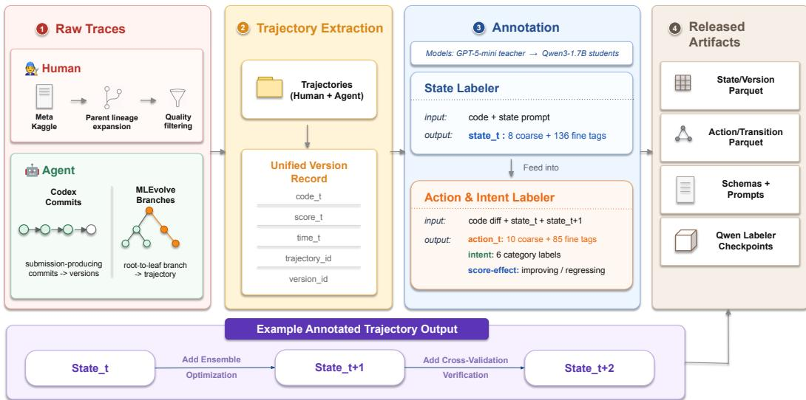  
Figure 2: TraceML reconstruction pipeline: notebook histories, git commits, and search journals become one version-level representation. Appendix B.6 follows one real trajectory through every stage.

Table 2: TraceML corpus statistics by source. Human trajectories are broken down by Kaggle author tier. Per-version code lines is total code lines divided by snapshots within the subset.
<table><tr><td>Subset</td><td>Comps</td><td>Trajectories</td><td>Snapshots</td><td>Avg snap/traj</td><td>Avg lines/snap</td></tr><tr><td colspan="6">Human (public Kaggle notebook histories)</td></tr><tr><td>Grandmaster</td><td>114</td><td>423</td><td>16,973</td><td>40.1</td><td>555</td></tr><tr><td>Master</td><td>121</td><td>649</td><td>24,138</td><td>37.2</td><td>601</td></tr><tr><td>Expert</td><td>130</td><td>1,386</td><td>50,663</td><td>36.6</td><td>569</td></tr><tr><td>Contributor</td><td>133</td><td>1,932</td><td>54,619</td><td>28.3</td><td>494</td></tr><tr><td>Other / Unknown</td><td>40</td><td>75</td><td>3,090</td><td>41.2</td><td>295</td></tr><tr><td>Human (all)</td><td>134</td><td>4,465</td><td>149,483</td><td>33.5</td><td>545</td></tr><tr><td colspan="6">LLM agent</td></tr><tr><td>Codex (prior + skill)</td><td>7</td><td>18</td><td>579</td><td>32.2</td><td>1,399</td></tr><tr><td>MLEvolve</td><td>7</td><td>189</td><td>1,026</td><td>5.4</td><td>768</td></tr><tr><td>Agent (all)</td><td>7</td><td>207</td><td>1,605</td><td>7.8</td><td>822</td></tr><tr><td>Total (human + agent)</td><td>134</td><td>4,672</td><td>151,088</td><td>32.3</td><td></td></tr></table>

The two scaffolds leave different traces. We track Codex through sidecar Git commits on its single working directory. MLEvolve writes a search journal that gives each version one parent and keeps cross-branch reuse as separate reference edges, so we read each root-to-leaf path as a trajectory and carry a node’s score to every branch through it. We re-grade every agent version with the held-out MLE-bench evaluator, not only the final submission. We then drop runs with leaky features, post-deadline data, or pretrained artifacts newer than the competition. These stages run as one command-line tool, applied so far to five scaffolds (Appendix B.5).

## 3.3 Aligning Human and Agent Trajectories

Comparing the two sources requires that a human version and an agent version denote the same kind of event. Unit: a human version is a Kaggle save-version, a deliberate save and not an autosave; its agent analogue is a submission-producing commit (Codex) or a search node (MLEvolve), with adjacent identical states collapsed. Measurement: both sides are scored by the competition’s own metric. Because that metric differs across competitions, analyses relating behavior to outcome use within-competition percentile. Observability: public histories record saved versions, not all work, so the two sides do not reach us filtered alike. Two checks bound the effect: restricting humans to scored, submitted versions (the same event type as an agent version), and applying the human retention filters to the agent runs. Every headline gap survives both (Appendix B.3). Off-platform work escapes either check, so we read the human corpus as a reference distribution of public practice.

## 3.4 Process-Level Annotation Schema

Ordering alone does not make code analyzable. The schema supplies that layer along two axes: what a version contains and what an edit does. Both vocabularies are competition-agnostic, so the schema applies to any trajectory in the same format, including scaffolds not studied here.

Version state assigns each version to one or more of 8 coarse ML-pipeline stages, such as feature engineering and ensembling, with a 136-tag fine vocabulary beneath them. Appendix C shows the full schema output on a real transition (Figure 6).

Transitions carry most of the behavioral signal. Each is the change from one version to the next. All four labels are assigned from the diff, its surrounding code, and the grader:

• Action: which operations the edit performs, as a multi-label set over a fine vocabulary.

• Intent: the purpose it serves, read from the action and the surrounding code.

• Magnitude: how much of the working code it rewrites.

• Score-Effect: whether the linked metric improves, plateaus, or regresses.

## 3.5 Annotation Reliability and Dataset Release

Hand-labeling 151,088 versions is not feasible, so we distill the schema into open-weight labelers: a teacher (gpt-5.4-mini) emits schema-constrained labels on curated traces, and those labels train two Qwen3-1.7B [Yang et al., 2025] students, one for version state and one for transition action. We check the students three ways: schema compliance, agreement with an independent annotator, and a behavioral check that they reproduce expected structure (Table 9). Agreement is lowest on intent, holds under a coarser three-class collapse that leaves every finding unchanged, and is no lower on agent transitions than on human ones. We also audit a sample stratified over human, Codex, and MLEvolve steps by hand, with the same result (Appendix C.1).

Licensing and privacy. We redistribute human notebook source only for kernels under a permissive license, verified per kernel against the Meta Kaggle Code mirror and recorded per kernel in the release. Annotations, schemas, and code are released under CC BY 4.0; the labeler weights inherit Apache 2.0 from their Qwen3 base; Kaggle competition data itself is not redistributed. We retain author usernames and tiers because they are public Meta Kaggle metadata and the tier is the cohort variable of Table 2. Notebook execution outputs are stripped at extraction, so incidentally captured personal data does not enter the corpus.

## 4 Empirical Findings

We compare Codex and MLEvolve against human leaderboard-percentile cohorts under the representation of §3, on the paired subset of §3.2 and under the same twelve-hour agent budget, with human trajectories split into a top cohort and the rest by leaderboard rank. Humans are not budget-matched and cannot be, so we read them as a reference distribution and not as a control. All intervals are clustered by run, and Appendix B.4 gives the per-cohort counts.

## 4.1 Action Profiles: Faint at Coarse Grain, Sharp at Fine Grain

We first ask whether human and agent trajectories occupy distinct regions of coarse-action space. Each trajectory becomes one point, the distribution of its transitions over the coarse action categories. We project those points with PCA, and we measure the distance between two cohorts as the Jensen– Shannon divergence (JSD) between their pooled action distributions (Figure 3). The separation is partial. The four human cohorts overlap in one region while MLEvolve-best sits clearly apart, 0.09–0.12 bits from every human cohort, and Codex sits about as close to top humans as the human cohorts sit to each other. Coarse action mix separates one scaffold cleanly and leaves the other indistinguishable from strong humans. The human block is also not a point, so any gap must be read against wide human variation.

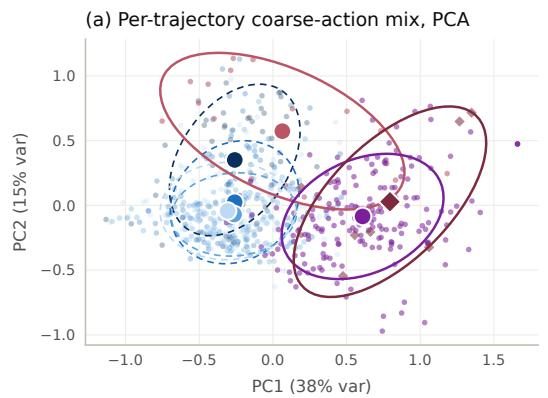

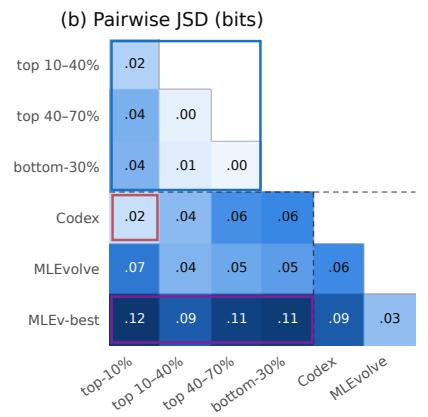

(c) Coarse-action profile (% of mass) data  
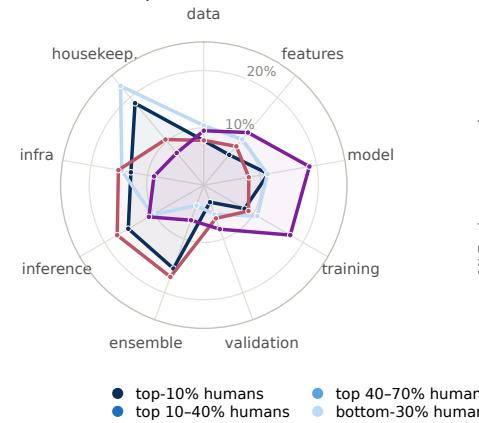

(d) Fine-action usage vs. pooled humans  
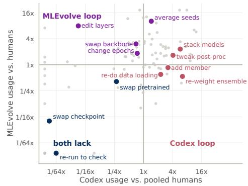  
Figure 3: Action profiles at two resolutions. (a) PCA of per-trajectory coarse-action distributions, large markers are cohort centroids; (b) pairwise JSD between cohort action distributions; (c) coarse action profiles in pipeline order; (d) fine-action usage relative to pooled humans, Codex against MLEvolve (log axes) — the labeled off-diagonal clusters are the two scaffold loops and the shared gap.

Fine-grained action usage separates what the coarse mix does not (Figure 3; tags in Appendix E). Humans spread their edits across the vocabulary, alternating data and feature work, validation, model and checkpoint changes, and ensembling, with no single tag carrying a run. Each scaffold instead settles into one band. Codex works around the submission, re-weighting ensembles, stacking models, adding members, and tweaking post-processing at several times the human rate, all of them local edits that refine a solution already in hand. MLEvolve mutates the model in place, averaging seeds, editing layers, and changing epoch counts to expand nearby variants of what it already has. What neither scaffold does is change or check direction: swapping a checkpoint, swapping a pretrained source, and re-running unchanged code to verify a result all stay an order of magnitude below the human rate.

## 4.2 Agents Pivot Too Little or Too Much

The action mix says what each cohort does; the sharper question is when a run changes direction. We define a pivot at the action level: an edit that changes the backbone, the representation, the objective, or the validation scheme (Appendix E).

Codex and MLEvolve miss the human rate from opposite sides. Humans pivot on 25% of transitions, Codex on 9%, MLEvolve on 58%, and the contrast survives holding the code state fixed: matched to human versions in the same state, Codex is still out-pivoted three to one. Frequent pivots do not mean good ones. Coding each of the three steps after a pivot as improving (+1) or regressing (−1), matched humans average +0.089 and MLEvolve −0.008: its gains and losses cancel. Codex rarely turns; MLEvolve turns without gain.

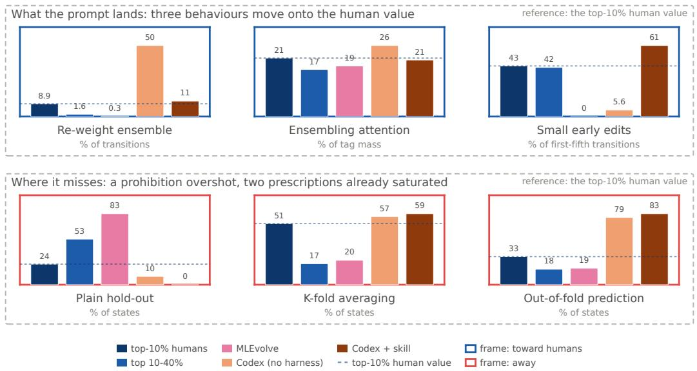  
Figure 4: Harness effect on six discipline features. Dashed rule: top human value; frames mark whether Codex + skill lands closer to it (blue) or farther from it (red) than prior Codex.

## 4.3 Agents Recover Scores but Not Abandoned Approaches

Humans return to earlier work; agents effectively never do. A version returns when it resembles an earlier, non-adjacent version of its own trajectory more than it resembles its predecessor, with something dissimilar reached in between, so a plateau does not qualify. Top humans return on 9% of eligible versions, and 78% of those returns end above the version they went back to. Across all runs Codex returns once and MLEvolve never, against the dozens the human rate predicts; a single return at that scale is chance resemblance, not a practice.

What the agents lack is memory, not recovery. Codex climbs back from setbacks at a rate above the top human cohort, so a run that loses ground does regain it; what it never does is reopen a line of work it had abandoned. Recovering a score by tuning forward and returning to an earlier approach are different capabilities, and the agents have the first without the second (Appendix D.3). Together with the pivot result, this describes a search without memory: from a given state the agent does not turn, and it does not go back.

## 4.4 Agents Ensemble in Name Only

The preceding subsections describe mechanisms; this one asks which behaviors move together with final rank. Correlating all 19 trajectory features with final leaderboard standing, on humans alone, what stands out is how a run ensembles and how large its edits are (Appendix E.1; associations, not causes).

Ensembling separates work that shares a name. All three cohorts ensemble, but 78% of Codex’s ensemble edits re-weight a member set it never grows, MLEvolve mostly averages seeds, and top humans put the largest share into adding a new member. Within a run, an ensemble step that adds or changes a member raises the chance the next human version improves by 6.4 points, one that only re-weights lowers it by 5.8, and for Codex neither kind moves it: a checklist asking only whether the agent ensembles would rank Codex above the top human cohort while its ensemble work does nothing. Edit size tells the same story from the other side. Humans span the magnitude range while each scaffold works in one band: Codex edits small and pays in steps, MLEvolve edits large and pays in waste (§4.2). Both practices can be asked for by name, which is what makes the intervention of §5 a test rather than a guess.

## 5 From Human-Agent Gaps to a Planning Harness

§4 localized the human-agent gap into named behaviors. We now ask whether naming them in a prompt changes them. The intervention is a probe: what a prompt shifts is the part of the gap that reduces to instructions, and what resists marks the part it does not reach.

## 5.1 Harness Experiment

Prompt design. The skill is a compact prompt block of roughly one thousand tokens that combines four mechanisms. Anti-loop constraints prohibit the moves that sustain the mono-loop: single-holdout validation, repeated hyperparameter or post-processing tweaks, and large first-version rewrites before a working baseline exists. Human-prior practices ask for reusable structure early: K-fold from the first version, an early ensemble, cached out-of-fold predictions, and multi-seed or multi-model blending. Periodic self-checks verify every 30 to 60 minutes that validation still tracks the leaderboard and that the run has not settled into one task category. Task-specific priors adapt the template to modality. The full prompt is in Appendix F.2.

Experiment setup. We ask two questions: does the skill move behavior toward the human profile, and does the movement reach the score. Behavior is read on the trajectory features of §4; performance is the best valid held-out score, placed against human percentile bands so one number is comparable across scoring rules. The study covers all 7 paired competitions at the same 12-hour budget. We fix the backend (Codex CLI), the tools, the extraction pipeline, and the grader, and vary only the prompt: the baseline arm keeps the standard task prompt and is the same run §4 pairs against human trajectories, while the harness arm adds the planning skill at run start and re-injects it every 30 minutes. Two further arms isolate what the skill contributes: one delivers a single content block instead of the full skill, and one keeps the re-injection cadence with the planning content removed. Repeated same-condition runs bound the noise at roughly 0.01 in each competition’s metric (Appendix F.1).

## 5.2 Results

Three behaviors move onto the human value (Figure 4). The agent stops re-weighting an ensemble where it should add a member, shifts attention toward ensembling, and starts making the small early edits it previously skipped almost entirely. The corrections are not marginal: re-weighting falls roughly fivefold, and small early edits rise from near zero to above the top human rate. What the three share is room to move.

Where the prompt misses, it misses in two ways. It overshoots what it forbids: the plain hold-out goes to zero, well under the quarter of states at which top humans still use one, because a ban gives a direction but not a destination. And it saturates on what it prescribes: Codex already ran K-fold averaging and persisted out-of-fold predictions at or above human rates before being asked, so requesting more of either moves nothing.

Scores improve, and the content is what does it. Five of the seven competitions improve, two are within noise, and none regress (Appendix F.1). Removing the planning content while keeping the injection schedule lands at or below the baseline everywhere, so the gain comes from what the skill says rather than how often it is repeated.

A practice transfers when the instruction names a level the agent has not already passed. It does not transfer when the instruction is a direction with no destination, which is what a prohibition is, nor when the agent already stands beyond the human value. The prompt is therefore useful less as a fix than as a probe: it marks the boundary between what instruction can reach and what it cannot, and what lies past it is changing the agent itself.

## 6 Discussion and Future Work

Reading development as a process turns “the agent scores lower” into specific things the agent does not do, and two of them look like design problems rather than model problems. The first is memory. Agents never go back to work they set aside (§4.3), and the decision to go back is not what they are missing: Codex recovers from setbacks as well as top humans, and gains what a human gains on the rare occasions it does change direction. What it lacks is its own history in a form it can search, which makes retrieval over a run’s earlier states a concrete thing to build. The second is control. Both scaffolds miss the human pivot rate from opposite sides and only the human pivots pay (§4.2), yet each follows one policy throughout, so what is wanted is a controller that reads where the run stands rather than a stronger base model. Either idea is now cheap to test. Final scores cannot separate these cases, and neither can a checklist of whether a practice occurred, since all three cohorts ensemble and only the human ensembling changes anything (§4.4). The released pipeline turns a run from any command-line agent into a TraceML trajectory and a report against the human cohorts in minutes, and we have applied it to five scaffolds (Appendix B.5). The human corpus is fixed while agents keep changing, so it can serve as a reference that new systems are read against as they appear rather than a benchmark that ages with them.

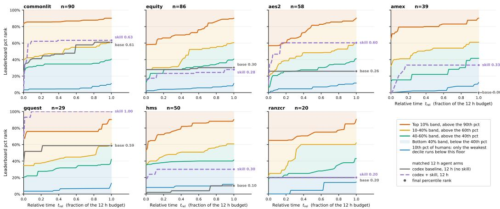  
Figure 5: Running best leaderboard percentile over relative time, one panel per paired competition; shaded bands are the human cohort thresholds, markers the final percentile reached. The harness lift is uneven across competitions.

## 7 Conclusion

TraceML pairs human and agent ML development on the same competitions under one versionlevel schema, so two runs can be compared through the work behind a submission rather than the submission alone. The paired data shows agents and experts developing differently, and not as one clean gap. The two scaffolds miss the human profile from opposite sides, one tuning without changing direction and the other changing direction without consolidating. A planning prompt built from these diagnostics moves the behaviors that reduce to a yes or no check and leaves the rest, which is where instruction stops and agent design begins. We release the corpus, the schema, the labelers and the extraction pipeline, so that new agents can be read against human practice as they appear.

## References

Jun Shern Chan, Neil Chowdhury, Oliver Jaffe, James Aung, Dane Sherburn, Evan Mays, Giulio Starace, Kevin Liu, Leon Maksin, Tejal Patwardhan, Lilian Weng, and Aleksander Mádry. MLEbench: Evaluating machine learning agents on machine learning engineering. arXiv preprint arXiv:2410.07095, 2024.

Shangheng Du, Xiangchao Yan, Jinxin Shi, Zongsheng Cao, Shiyang Feng, Zichen Liang, Boyuan Sun, Tianshuo Peng, Yifan Zhou, Xin Li, Jie Zhou, Liang He, Bo Zhang, and Lei Bai. Mlevolve: A self-evolving framework for automated machine learning algorithm discovery, 2026. URL https://arxiv.org/abs/2606.06473.

Antoine Grosnit, Alexandre Max Maraval, James Doran, Giuseppe Paolo, Albert Thomas, Refinath Shahul Hameed Nabeezath Beevi, Jonas Gonzalez, Khyati Khandelwal, Ignacio Iacobacci, Abdelhakim Benechehab, Hamza Cherkaoui, Youssef Attia El Hili, Kun Shao, Jianye Hao, Jun Yao, Balázs Kégl, Haitham Bou-Ammar, and Jun Wang. Large language models orchestrating

structured reasoning achieve kaggle grandmaster level. ArXiv, abs/2411.03562, 2024. URL https://api.semanticscholar.org/CorpusID:273850235.

Siyuan Guo, Cheng Deng, Ying Wen, Hechang Chen, Yi Chang, and Jun Wang. DS-agent: Automated data science by empowering large language models with case-based reasoning. In Proceedings of the 41st International Conference on Machine Learning, volume 235 of Proceedings of Machine Learning Research, pages 16813–16848. PMLR, 2024.

Qian Huang, Jian Vora, Percy Liang, and Jure Leskovec. MLAgentbench: Evaluating language agents on machine learning experimentation. In Forty-first International Conference on Machine Learning, 2024. URL https://openreview.net/forum?id=1Fs1LvjYQW.

Peter Jansen, Marc-Alexandre Côté, Tushar Khot, Erin Bransom, Bhavana Dalvi, Bodhisattwa Prasad Majumder, Oyvind Tafjord, and Peter Clark. DiscoveryWorld: A virtual environment for developing and evaluating automated scientific discovery agents. In Advances in Neural Information Processing Systems, volume 37, 2024.

Zhengyao Jiang, Dominik Schmidt, Dhruv Srikanth, Dixing Xu, Ian Kaplan, Deniss Jacenko, and Yuxiang Wu. Aide: Ai-driven exploration in the space of code, 2025. URL https://arxiv.org/ abs/2502.13138.

Liqiang Jing, Zhehui Huang, Xiaoyang Wang, Wenlin Yao, Wenhao Yu, Kaixin Ma, Hongming Zhang, Xinya Du, and Dong Yu. DSBench: How far are data science agents from becoming data science experts? In The Thirteenth International Conference on Learning Representations, 2025. URL https://openreview.net/forum?id=DSsSPr0RZJ.

Ziming Li, Qianbo Zang, David Ma, Jiawei Guo, Tuney Zheng, Minghao Liu, Xinyao Niu, Yue Wang, Jian Yang, Jiaheng Liu, et al. Autokaggle: A multi-agent framework for autonomous data science competitions. arXiv preprint arXiv:2410.20424, 2024.

David Rein, Joel Becker, Amy Deng, Seraphina Nix, Chris Canal, Daniel O’Connel, Pip Arnott, Ryan Bloom, Thomas Broadley, Katharyn Garcia, Brian Goodrich, Max Hasin, Sami Jawhar, Megan Kinniment, Thomas Kwa, Aron Lajko, Nate Rush, Lucas Jun Koba Sato, Sydney von Arx, Ben West, Lawrence Chan, and Elizabeth Barnes. HCAST: Human-calibrated autonomy software tasks. arXiv preprint arXiv:2503.17354, 2025.

Yongliang Shen, Kaitao Song, Xu Tan, Dongsheng Li, Weiming Lu, and Yueting Zhuang. Hugginggpt: Solving ai tasks with chatgpt and its friends in hugging face, 2023. URL https://arxiv.org/ abs/2303.17580.

Noah Shinn, Federico Cassano, Edward Berman, Ashwin Gopinath, Karthik Narasimhan, and Shunyu Yao. Reflexion: Language agents with verbal reinforcement learning. In Advances in Neural Information Processing Systems, volume 36, 2023.

Minyang Tian, Luyu Gao, Shizhuo Dylan Zhang, Xinan Chen, Cunwei Fan, Xuefei Guo, Roland Haas, Pan Ji, Kittithat Krongchon, Yao Li, Shengyan Liu, Di Luo, Yutao Ma, Hao Tong, Kha Trinh, Chenyu Tian, Zihan Wang, Bohao Wu, Yanyu Xiong, Shengzhu Yin, Minhui Zhu, Kilian Lieret, Yanxin Lu, Genglin Liu, Yufeng Du, Tianhua Tao, Ofir Press, Jamie Callan, Eliu Huerta, and Hao Peng. SciCode: A research coding benchmark curated by scientists. In Advances in Neural Information Processing Systems, volume 37, 2024.

Edan Toledo, Karen Hambardzumyan, Martin Josifoski, Rishi Hazra, Nicolas Baldwin, Alexis Audran-Reiss, Michael Kuchnik, Despoina Magka, Minqi Jiang, Alisia Maria Lupidi, Andrei Lupu, Roberta Raileanu, Kelvin Niu, Tatiana Shavrina, Jean-Christophe Gagnon-Audet, Michael Shvartsman, Shagun Sodhani, Alexander H. Miller, Abhishek Charnalia, Derek Dunfield, Carole Jean Wu, Pontus Stenetorp, Nicola Cancedda, Jakob Nicolaus Foerster, and Yoram Bachrach. AI research agents for machine learning: Search, exploration, and generalization in MLE-bench. arXiv preprint arXiv:2507.02554, 2025.

Karthik Valmeekam, Matthew Marquez, Alberto Olmo, Sarath Sreedharan, and Subbarao Kambhampati. PlanBench: An extensible benchmark for evaluating large language models on planning and reasoning about change. In Advances in Neural Information Processing Systems, volume 36, 2023.

Xinyu Jessica Wang, Haoyue Bai, Yiyou Sun, Haorui Wang, Shuibai Zhang, Wenjie Hu, Mya Schroder, Bilge Mutlu, Dawn Song, and Robert D. Nowak. The long-horizon task mirage? diagnosing where and why agentic systems break. arXiv preprint arXiv:2604.11978, 2026.

Hjalmar Wijk, Tao Roa Lin, Joel Becker, Sami Jawhar, Neev Parikh, Thomas Broadley, Lawrence Chan, Michael Chen, Joshua M. Clymer, Jai Dhyani, Elena Ericheva, Katharyn Garcia, Brian Goodrich, Nikola Jurkovic, Megan Kinniment, Aron Lajko, Seraphina Nix, Lucas Jun Koba Sato, William Saunders, Maksym Taran, Ben West, and Elizabeth Barnes. RE-Bench: Evaluating frontier AI R&D capabilities of language model agents against human experts. In Proceedings ofthe 42nd International Conference on Machine Learning, volume 267 of Proceedings of Machine Learning Research, pages 66772–66832. PMLR, 2025.

An Yang et al. Qwen3 technical report. arXiv preprint arXiv:2505.09388, 2025.

Shunyu Yao, Dian Yu, Jeffrey Zhao, Izhak Shafran, Thomas L. Griffiths, Yuan Cao, and Karthik Narasimhan. Tree of thoughts: Deliberate problem solving with large language models. In Advances in Neural Information Processing Systems, volume 36, 2023a.

Shunyu Yao, Jeffrey Zhao, Dian Yu, Nan Du, Izhak Shafran, Karthik R Narasimhan, and Yuan Cao. React: Synergizing reasoning and acting in language models. In The Eleventh International Conference on Learning Representations, 2023b. URL https://openreview.net/forum?id= WE\_vluYUL-X.

## A Use of LLMs

We used large language models only to help draft and edit the text of this paper.

## B Dataset Construction and Alignment

This appendix supports §3.1–§3.3: what the human retention filter removes (B.1), how much visible reuse the corpus contains (B.2), how the human and agent units line up (B.3), which runs enter which analysis (B.4), the extraction toolkit (B.5), and a worked example of the pipeline (B.6).

## B.1 Human Retention Filter: Audit of Removed Kernels

The filter of §3.1 verifies only that a kernel is an in-window development trajectory. Its conditions are: every version inside [launch, deadline]; a chain of at least 5 versions spanning at least 3 days carrying at least 1 score; and no near-static resubmission where the score changes but the code does not. No term references phase variety, action diversity, or intent. Table 3 reports what it removes.

Table 3: What the retention filter removes, from 5,048 candidate kernels. The removed set is dominated by post-deadline write-ups rather than by weak development trajectories, and its medal rate is comparable to that of the retained set, so the filter does not remove a weak tail.
<table><tr><td>Outcome</td><td>Kernels</td><td>Character of the set</td></tr><tr><td>Retained</td><td>4,465</td><td>47.3% medalled</td></tr><tr><td>Removed: no in-window version</td><td>382</td><td>99.2% published entirely after the deadline, median 299 days late</td></tr><tr><td>Removed: failed content</td><td>201</td><td>Too few versions, too short a span, or no score</td></tr><tr><td>conditions Removed (all)</td><td>583</td><td>43.3%medalled</td></tr></table>

Applying the same conditions to agents (§3.3) is possible for two of the three: the one-score condition passes for 100% of runs in both cohorts, and the five-version condition passes for 9 of 11 Codex runs and 111 of 189 MLEvolve branches. The three-day span condition does not apply to runs measured in hours. Restricting the comparison to filter-passers leaves every gap of §4 intact and widens Codex’s coarse action-space distance from humans from 0.077 to 0.095 bits.

The retention rule therefore does not favor the human side.

## B.2 Fork and Reuse Rates

Kaggle notebooks may share fork lineage or copy public baselines, which makes trajectory units statistically dependent and bounds how much of a “human trajectory” is original work. Table 4 measures both.

Table 4: Visible reuse in the retained corpus and in the paired sample used for human-agent comparison. Near-duplicate code is code similarity ≥ 0.9 against another kernel; all observed near-duplicate links fall within the same competition, consistent with shared starter templates.
<table><tr><td>Reuse measure</td><td>Full corpus (4,465)</td><td>Paired sample (430)</td></tr><tr><td>Has a fork parent</td><td>8.2%</td><td>8.6%</td></tr><tr><td>Near-duplicate code in ≥ 1 version</td><td>23.7%</td><td>21.0%</td></tr><tr><td>Near-duplicate code in a majority of versions</td><td></td><td>7.9%</td></tr><tr><td>Near-duplicate code across the whole trajectory</td><td></td><td>3.3%</td></tr></table>

Because fork lineage and shared baselines induce correlated samples, all uncertainty estimates in §4 cluster by competition, by human fork-lineage group, and by agent run, with MLEvolve branches that share tree nodes resampled together.

## B.3 Unit Alignment Statistics

Table 5 reports the alignment of the version unit described in §3.3.

Table 5: How the version unit lines up across sources. Agent versions are submission-producing commits with adjacent identical-code commits collapsed, which is the analogue of a deliberate Kaggle save-version rather than a raw log entry.
<table><tr><td></td><td>Human</td><td>Codex</td><td>MLEvolve</td></tr><tr><td>Median versions per trajectory</td><td>20</td><td>18</td><td>5</td></tr><tr><td>Versions carrying a score</td><td>45%</td><td>≈99%</td><td>≈99%</td></tr><tr><td>Saved versions that are syntactically valid code</td><td>97.9%</td><td></td><td></td></tr></table>

The collapse from raw records to versions is substantial on the agent side: in one representative Codex run, 1,290 graded commits reduce to 16 versions.

## B.4 Analysis Scope and Cohort Composition

The paper reads three nested scopes, and every count in the main text belongs to exactly one of them. Table 6 states them. The corpus is the full release. The paired subset is the 7 competitions worked by both sides, which fixes the human reference for all agent comparisons. The twelve-hour scope restricts the agent side to runs sharing a budget and covers the same 7 competitions and the same 430 human trajectories; it is where every behavioral comparison of §4 is computed. The harness experiment of §5.1 adds the intervention and ablation arms on the same 7.

Table 6: The three scopes. Human trajectories are split into a top cohort and the rest by leaderboard rank. MLEvolve branches share tree nodes, so the run count rather than the branch count sets the effective sample size.
<table><tr><td colspan="4"></td><td colspan="2">MLEvolve</td></tr><tr><td>Scope</td><td>Comps</td><td>Human traj.</td><td>Codex runs</td><td>runs</td><td>branches</td></tr><tr><td>Corpus (§3.1)</td><td>134</td><td>4,465</td><td></td><td></td><td></td></tr><tr><td>Paired subset (§3.2)</td><td>7</td><td>430</td><td>11</td><td>13</td><td>189</td></tr><tr><td>Twelve-hour scope (§4)</td><td>7</td><td>430</td><td>10</td><td>3</td><td>107</td></tr><tr><td>Harness arms (§5.1)</td><td>7</td><td></td><td>30</td><td></td><td></td></tr></table>

## Per-run composition of the Codex cohort

The ten twelve-hour Codex runs differ enormously in length, and the short ones are unstable. Table 7 lists every run with its marginal pivot rate. The six runs longer than 90 transitions all sit between 2.0% and 4.8%; the four shorter than 10 transitions read 0%, 0%, 57.1% and 62.5%, the last two

being four and five pivots respectively. Pooling transitions across runs would let a seven-transition run speak as loudly per observation as a thousand-transition one, so every interval in §4 is clustered by run, and the matched-state analysis of §4.2 reports a run-clustered CI for this reason.

Table 7: The ten twelve-hour Codex runs. “Pivot rate” is the marginal (unmatched) share of transitions carrying a pivot tag. Runs are ordered by length; the four shortest carry almost no information individually.
<table><tr><td>Competition</td><td>Track</td><td>Transitions</td><td>Pivot rate</td></tr><tr><td>gquest</td><td>agent</td><td>1,017</td><td>2.1%</td></tr><tr><td>gquest</td><td>llm_v3</td><td>226</td><td>2.2%</td></tr><tr><td>ranzcr</td><td>agent</td><td>166</td><td>4.8%</td></tr><tr><td>ranzcr</td><td>llm_v3</td><td>102</td><td>2.0%</td></tr><tr><td>hms</td><td>agent</td><td>97</td><td>2.1%</td></tr><tr><td>aes2</td><td>llm_v3</td><td>64</td><td>1.6%</td></tr><tr><td>aes2</td><td>agent</td><td>8</td><td>62.5%</td></tr><tr><td>commonlit</td><td>agent</td><td>7</td><td>57.1%</td></tr><tr><td>amex</td><td>agent</td><td>5</td><td>0.0%</td></tr><tr><td>equity</td><td>agent</td><td>3</td><td>0.0%</td></tr><tr><td>Pooled</td><td></td><td>1,695</td><td>2.8%</td></tr></table>

## B.5 Cross-Scaffold Extraction Toolkit

Extraction, grading, labeling, and behavior reporting are packaged as a single command that accepts a run directory from any CLI agent. We have applied it to five scaffolds: Codex CLI, MLEvolve, AIDE, Claude Code, and Gemini CLI. Each run returns a TraceML-schema trajectory and a report against the released human cohorts, in minutes on one A6000 GPU. As an illustration, a one-hour Claude Code run (haiku-4.5 backend) on commonlitreadabilityprize yields 13 distinct code states and a best RMSE of 0.733, above 52% of the human cohort, with an exploration-heavy intent mix (36% against 8% for top humans). The toolkit is what lets the human cohorts serve as a reference for scaffolds that did not exist when the corpus was built.

## B.6 Worked Example of the Pipeline

To make the schema concrete, we follow one retained trajectory end to end: a Grandmaster commonlitreadabilityprize kernel with 20 saved versions and therefore 19 transitions. Table 8 shows four consecutive transitions from its middle, where the trajectory reaches its best score. Table 8: Four consecutive transitions from one human trajectory, as represented in TraceML. Each transition carries actions, intents, a magnitude, and the score effect read from the leaderboard.

<table><tr><td>Transition Actions</td><td></td><td>Intents</td><td>Magn. Score</td><td></td></tr><tr><td> $v _ { 1 3 }  v _ { 1 4 }$ </td><td>model, training, housekeeping, optimization + de- micro 0.535 → 0.509 (improving) infra</td><td>bugging</td><td></td><td></td></tr><tr><td> $v _ { 1 4 } \to v _ { 1 5 }$ </td><td>data, augmentation, training, exploration + op- minor unscored model</td><td>timization</td><td></td><td></td></tr><tr><td>v15 → v16</td><td>data, training, validation, debugging + opti- micro → 0.4989 (trajectory best) housekeeping</td><td>mization</td><td></td><td></td></tr><tr><td> $v _ { 1 6 }  v _ { 1 7 }$ </td><td>training, model, infra</td><td>optimization</td><td></td><td>micro 0.4989 → 0.5062 (regressing)</td></tr></table>

Read as development decisions, the four steps are: switch to roberta-large and fix weight restoration before evaluation; inject target-noise sampling using the per-example standard error; fix scalar extraction of validation labels so out-of-fold evaluation is correct; and finally train longer on the base checkpoint, which regresses. The alternation of optimization with debugging, and the willingness to keep a step that did not improve the score, is the pattern §4 finds largely absent from agent trajectories.

## C Annotation Schema and Reliability

Figure 6 shows the schema output on a real transition.

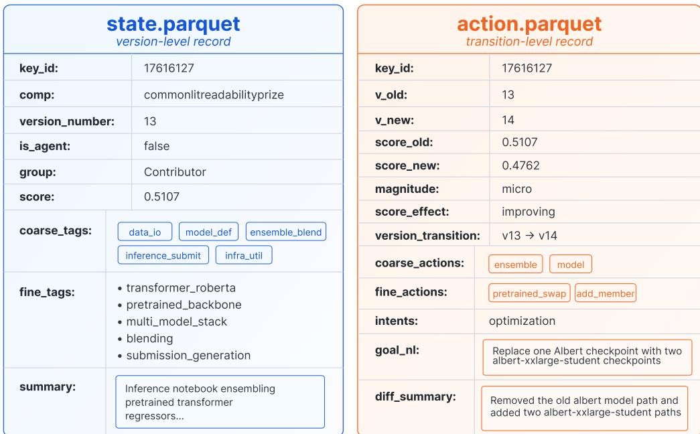  
Figure 6: Example schema output for one version and its transition.

Table 9: Annotation reliability across teacher stability, cross-model agreement, and teacher–student transfer. We report Cohen’s κ and multi-label Jaccard (J) on held-out state and action annotations; teacher–student scores compare the released Qwen3-1.7B labelers with the gpt-5.4-mini teacher.
<table><tr><td>Annotation level (#tags)</td><td>Self-consistency</td><td>Cross-model</td><td>Teacher → Student</td></tr><tr><td>State coarse (8)</td><td>κ=0.872/J=0.969</td><td>κ=0.801/J=0.954</td><td>F =0.978 1</td></tr><tr><td>Action coarse (10)</td><td>J=0.875</td><td>J=0.641</td><td>=0.733</td></tr><tr><td>Intent (6 classes)</td><td>κ=0.834</td><td>κ=0.611</td><td>acc=0.772</td></tr><tr><td>Magnitude (4 levels)</td><td>κ=0.921</td><td>κ=0.576</td><td>acc=0.928</td></tr></table>

## C.1 Intent Label Audit by Cohort

Table 10 reports the per-cohort human audit summarized in §3.5.

Cross-model agreement between two independent LLM annotators on 499 held-out transitions is κ=0.611, a conservative bound that counts unparseable outputs as disagreements; on items where both produced a valid label, κ=0.724. The 100-item human audit agrees with the released labels 81% of the time (κ=0.68). Collapsing the six intent classes to three under two independent groupings changes no finding. The claim that leans hardest on intent, that agents rarely diagnose, also holds on a label-free proxy: explicit error-fixing edits appear in 11.1% of human transitions against 1.5% of Codex’s.

Table 10: Human audit of released intent labels, stratified over the three cohorts. Agreement on agent transitions is not lower than on human ones, so the human-agent behavioral gaps of §4 are not an artifact of the labels being less reliable on agent code. The 75–85% spread lies within binomial uncertainty at these sample sizes (roughly ±12 points at n=40).
<table><tr><td>Cohort</td><td>n</td><td>6-class agreement</td><td>3-class collapse</td></tr><tr><td>Human</td><td>40</td><td>80.0%</td><td>82.5%</td></tr><tr><td>Codex</td><td>40</td><td>85.0%</td><td>87.5%</td></tr><tr><td>MLEvolve</td><td>20</td><td>75.0%</td><td>75.0%</td></tr><tr><td>Overall</td><td>100</td><td>81%</td><td>83% (κ=0.68)</td></tr></table>

## D Additional Statistics for the Behavioral Findings

This appendix supports §4: whether the headline gaps survive every fairness treatment (D.1), the action distributions the divergences are computed from (D.2), and the two senses in which a run can go back to earlier work (D.3).

## D.1 Headline Gaps Under Every Fairness Treatment

Each column perturbs one side of the comparison. Scored-only restricts humans to scored, submitted versions, the same event type as an agent version. Agents filtered applies the human retention conditions of §3.1 to agents. +New runs adds the matched-budget agent runs of §5.1. Table 11 reports the result. Confidence intervals come from a two-stage cluster bootstrap over competitions, then over human fork-lineage clusters and agent runs, with MLEvolve branches sharing tree node resampled together (B=4000).

Table 11: Every headline gap survives every fairness treatment, and every interval excludes zero. Gaps are human minus agent, in percentage points except for the divergence rows. Note that agents filtered widens rather than narrows the Codex gaps.
<table><tr><td>Gap (human — agent)</td><td>Orig.</td><td>Scored-only</td><td>Agents filt.</td><td>+New runs</td><td>95% cluster CI</td></tr><tr><td>Debugging intent, vs Codex</td><td>+11.4</td><td>+8.0</td><td>+11.6</td><td>+10.1</td><td>[+6.0, +14.0]</td></tr><tr><td>Debugging intent, vs MLEvolve</td><td>+9.6</td><td>+6.2</td><td>+9.0</td><td></td><td>[+7.7, +12.4]</td></tr><tr><td>Ensemble action mass, vs Codex</td><td>-13.4</td><td>-12.9</td><td>-14.8</td><td>-10.4</td><td>[-19.9, -7.7]</td></tr><tr><td>Model+train. mass, vs MLEvolve</td><td>-16.5</td><td>-16.3</td><td>-15.1</td><td></td><td>[−21.3, −10.9]</td></tr><tr><td>Action JSD (bits), vs Codex</td><td>0.077</td><td>0.080</td><td>0.095</td><td>0.041</td><td>[0.047,0.145]</td></tr><tr><td>Action JSD (bits), vs MLEvolve</td><td>0.054</td><td>0.061</td><td>0.047</td><td></td><td>[0.048, 0.084]</td></tr></table>

A transition-level generalized estimating equation (binomial, exchangeable correlation, same clusters) regressing debugging intent on cohort agrees with the bootstrap: the coefficient is −1.82 (SE 0.52, z= − 3.5) for Codex and −1.89 (SE 0.29, z= − 6.6) for MLEvolve.

## D.2 Full Coarse-Action Frequency Table

Figure 3 compares cohorts by the divergence between their action distributions; Table 12 gives those distributions themselves. Each trajectory’s coarse-action histogram is normalized and then averaged within the cohort, so every trajectory contributes equally regardless of length. A transition may carry more than one coarse action, so a row is a share of action mass rather than of transitions. The table is computed on the paired subset rather than the twelve-hour scope, so it covers every human trajectory that meets an agent.

The gaps quoted in Table 11 read directly off this table: ensemble mass is 6.3 for humans against 19.7 for Codex (−13.4), and model-plus-training mass is 21.9 against MLEvolve’s 38.4 (−16.5). Table 13 gives the per-quintile split for the two headline cohorts, with each trajectory divided into five equal position quintiles.

## D.3 Returning to Earlier Work

§4.3 reports that agents do not go back, and §6 treats that as the clearest mechanism the data names. Table 14 gives the two measurements behind those statements, computed by the released solution\_revisit.py and setback\_recovery.py on the twelve-hour scope of Appendix B.4. A version is eligible once its trajectory has at least four versions and it is not among the first two.

The two rows measure different things. A solution revisit asks whether a run returns to an earlier approach: a version qualifies when its state signature resembles an earlier non-adjacent version more than it resembles its own predecessor, and the run reached something dissimilar in between, so a plateau does not count. A setback recovery asks only whether a run that fell below its own best score climbs back, which a purely local edit can achieve without any return to earlier work. Agents recover scores at or above the human rate (Codex recovers 89% of its setbacks) while almost never revisiting a solution.

Table 12: Share of coarse-action mass per cohort, in percent, trajectory-equal. Columns need not sum to 100 exactly because a transition can carry several actions. Codex concentrates in ensemble and inference, MLEvolve in model and training, and both spend roughly a third of the human share on housekeeping.
<table><tr><td>Coarse action</td><td>Top-40% humans</td><td>All humans</td><td>Codex</td><td>MLEvolve</td></tr><tr><td>data</td><td>8.0</td><td>9.1</td><td>8.5</td><td>9.0</td></tr><tr><td>features</td><td>9.1</td><td>10.0</td><td>5.6</td><td>11.9</td></tr><tr><td>augmentation</td><td>0.4</td><td>0.4</td><td>0.2</td><td>0.4</td></tr><tr><td>model</td><td>10.7</td><td>10.5</td><td>8.2</td><td>20.4</td></tr><tr><td>training</td><td>11.4</td><td>11.4</td><td>8.6</td><td>18.0</td></tr><tr><td>ensemble</td><td>9.8</td><td>6.3</td><td>19.7</td><td>6.0</td></tr><tr><td>validation</td><td>5.4</td><td>5.5</td><td>7.0</td><td>7.7</td></tr><tr><td>inference</td><td>10.3</td><td>9.8</td><td>18.9</td><td>10.7</td></tr><tr><td>infra</td><td>13.5</td><td>14.0</td><td>16.1</td><td>8.5</td></tr><tr><td>housekeeping</td><td>21.3</td><td>22.9</td><td>7.2</td><td>7.4</td></tr><tr><td>n (trajectories)</td><td>173</td><td>425</td><td>11</td><td>189</td></tr></table>

Table 13: Per-quintile split of the coarse-action shares of Table 12, in percent, for the top-40% human cohort and Codex. Q1–Q5 are within-trajectory position quintiles. Human ensembling rises steadily over the run (7.3 to 11.3) while Codex holds its ensemble-and-inference band from the first quintile on.
<table><tr><td>Cohort</td><td>Quintile</td><td>data</td><td>feat.</td><td>aug.</td><td>model</td><td>train.</td><td>ens.</td><td>valid.</td><td>infer.</td><td>infra</td><td>house.</td></tr><tr><td rowspan="5">Top-40% humans</td><td>Q1</td><td>9.4</td><td>8.7</td><td>0.2</td><td>9.8</td><td>10.3</td><td>7.3</td><td>4.1</td><td>9.6</td><td>15.1</td><td>25.4</td></tr><tr><td>Q2</td><td>7.8</td><td>8.7</td><td>0.6</td><td>10.4</td><td>13.5</td><td>9.1</td><td>4.9</td><td>9.2</td><td>13.5</td><td>22.4</td></tr><tr><td>Q3</td><td>7.7</td><td>9.0</td><td>0.3</td><td>10.8</td><td>10.6</td><td>10.1</td><td>5.9</td><td>10.3</td><td>13.0</td><td>22.2</td></tr><tr><td>Q4</td><td>6.6</td><td>9.1</td><td>0.4</td><td>9.4</td><td>11.1</td><td>10.5</td><td>5.0</td><td>10.8</td><td>12.5</td><td>24.5</td></tr><tr><td>Q5</td><td>6.5</td><td>9.3</td><td>0.3</td><td>10.6</td><td>11.3</td><td>11.3</td><td>5.2</td><td>10.9</td><td>12.0</td><td>22.6</td></tr><tr><td rowspan="5">Codex</td><td>Q1</td><td>8.7</td><td>5.4</td><td>0.2</td><td>6.3</td><td>8.6</td><td>22.6</td><td>9.7</td><td>23.9</td><td>11.0</td><td>3.4</td></tr><tr><td>Q2</td><td>5.5</td><td>5.8</td><td>0.0</td><td>8.7</td><td>11.9</td><td>20.0</td><td>8.9</td><td>19.4</td><td>14.6</td><td>5.2</td></tr><tr><td>Q3</td><td>8.5</td><td>5.1</td><td>0.5</td><td>9.6</td><td>10.7</td><td>21.6</td><td>6.2</td><td>18.2</td><td>15.4</td><td>4.1</td></tr><tr><td>Q4</td><td>8.2</td><td>6.8</td><td>0.0</td><td>9.9</td><td>8.1</td><td>20.8</td><td>5.9</td><td>20.0</td><td>15.0</td><td>5.3</td></tr><tr><td>Q5</td><td>9.3</td><td>5.5</td><td>0.0</td><td>7.1</td><td>7.4</td><td>17.1</td><td>5.7</td><td>18.0</td><td>18.8</td><td>11.1</td></tr></table>

## E Feature Reference

Table 15 lists the 19 features used by the predictive measures of §4, grouped as in the main text. Each feature is computed per trajectory and summarizes one aspect of how that trajectory allocates effort over its version sequence.

## E.1 The validation-and-ensembling discipline index

Six of the 19 features carry almost all of the association between process and final rank. Table 16 ranks every feature by its per-competition Spearman correlation with the kernel’s final rank percentage, computed on the paired split and on the disjoint humans-only split. This is the fraction of the leaderboard the kernel finished ahead of, so it is smaller-is-better (gold-medal kernels average 4.5%, no-medal 6.8%) and a negative ρ marks a behavior associated with a better finish. Note the opposite orientation to the within-competition version percentile of §4.2, where larger is better.

The six compose one construct, validation-and-ensembling discipline: use K-fold rather than a plain hold-out (fold\_averaging up, holdout\_split down), persist out-of-fold predictions, start ensembling early (pos\_first\_ens low), spend attention in the ensemble-and-inference mode, and blend real members (blending up). The harness prompt of §5 operationalizes this construct clause by clause. It describes where human practice sits, not a quantity to push arbitrarily far; change\_weights shows this most clearly, and §4.4 reads it accordingly.

The scaffold-signature discussion of §4.1 additionally names several fine action tags drawn from the 85-tag action vocabulary. Table 17 defines them. Each is a share of transitions labeled with that action within the trajectory.

Table 14: Two senses of going back, on the twelve-hour scope. Solution revisits use the released state signature (Jaccard $\ge ~ 0 . 6 .$ , closer to the earlier version than to the predecessor by 0.1, with the run reaching something below 0.5 similarity in between); setback recovery uses scores only. Codex’s single revisit in 658 eligible versions and MLEvolve’s zero in 344 are against the 60 and 31 occurrences the top human rate would predict.
<table><tr><td></td><td>Top humans</td><td>Other humans</td><td>Codex</td><td>MLEvolve</td></tr><tr><td>Solution revisit (state signature)</td><td></td><td></td><td></td><td></td></tr><tr><td>% of eligible versions</td><td>9.1%</td><td>7.2%</td><td>0.2%</td><td>0.0%</td></tr><tr><td>% of trajectories with one</td><td>32.8%</td><td>33.7%</td><td>14.3%</td><td>0.0%</td></tr><tr><td>eligible versions</td><td>5,838</td><td>5,648</td><td>658</td><td>344</td></tr><tr><td>revisits observed</td><td>531</td><td>406</td><td>1</td><td>0</td></tr><tr><td>% that beat the version returned to</td><td>78.5%</td><td>63.9%</td><td>n too small</td><td></td></tr><tr><td>Setback recovery (score only)</td><td></td><td></td><td></td><td></td></tr><tr><td>% of trajectories with a setback</td><td>96.8%</td><td>95.6%</td><td>83.3%</td><td>98.1%</td></tr><tr><td>setbacks recovered</td><td>79.4%</td><td>72.1%</td><td>89.0%</td><td>41.1%</td></tr><tr><td>recoveries that set a new best</td><td>95.9%</td><td>95.2%</td><td>56.2%</td><td>100.0%</td></tr></table>

## F Harness Experiment Details

This appendix supports §5: the scores behind the percentile view (F.1), the prompts that constitute the intervention (F.2), and what the prompt does not reach (F.3).

## F.1 Matched-Budget Scores and Ablations

Figure 5 reads the harness result as a leaderboard percentile; Table 18 gives the underlying metric values, so the size of each move is visible in the competition’s own units. Every entry is the best valid score its run reached, and all five arms run at the same twelve-hour budget with the same backend, task prompt and grader.

Repeated same-condition runs bound the noise: the two commonlit harness runs differ by 0.012 RMSE and the two equity harness runs by 0.009 C-index. Against the matched baseline and reading no difference below that scale, five competitions improve (gquest, aes2, hms, ranzcr, amex), two are within noise (commonlit, equity), and none regress.

The two ablations separate the skill’s content from the schedule that delivers it. Abl-B keeps the 30-minute re-injection cadence but strips the planning content, and it lands at or below the baseline everywhere; on hms it is far worse (1.377 against a 1.050 baseline). The cadence alone contributes nothing. Abl-A delivers a single content block instead of the full skill, and it recovers much of the gain on aes2 and hms but none on gquest or ranzcr. The effect therefore comes from the skill’s content, and from more than one block of it.

## F.2 Agent-Run Prompts

Both prompt conditions in the harness experiment of §5.1 share the task prompt of §F.2.1 below. They differ only in whether the planning skill block of §F.2.2 is expanded into the {{SKILL\_BLOCK}} placeholder, and whether the reminder of §F.2.3 is re-injected every 30 minutes. Per-run variables ({{HOURS}}, {{COMPETITION\_SLUG}}, {{DATA\_DIR}}, {{RUN\_DIR}}, {{CUDA\_VISIBLE\_DEVICES}}, {{MLEBENCH\_CACHE}}) are filled by the runner before dispatch.

## F.2.1 Task Prompt (baseline and harness)

## # Kaggle Competition Run

You are running unattended for \*\*{{HOURS}} hours\*\* on \*\*{{COMPETITION\_SLUG}}\*\*.   
Nobody will answer questions. Decide and proceed.

## ## Environment

\- \*\*Data\*\* (already prepared): ‘{{DATA\_DIR}}‘ -- inspect it yourself (‘ls {{DATA\_DIR}}‘). The layout varies by competition but always includes ‘sample\_submission.csv‘ which defines the required output format.

Local, unlimited, not rate-limited. Use it whenever it’s useful:   
mlebench grade-sample {{RUN\_DIR}}/submission.csv {{COMPETITION\_SLUG}}   
--data-dir {{MLEBENCH\_CACHE}}

<table><tr><td>Feature</td><td>One-line description</td></tr><tr><td colspan="2">Ensemble timing (3)</td></tr><tr><td>has_ens ens_late_minus_early</td><td>Indicator for whether any ensemble-blending action appears in the trajectory. Q5 minus Q1 share of ensemble-blending actions; positive means ensembling</td></tr><tr><td>pos_first_ens</td><td>concentrates late. Normalised position [0, 1] of the first ensemble action; 1 if no ensemble action ever fires.</td></tr><tr><td colspan="2">Magnitude and quintile-shift (4)</td></tr><tr><td>micro_q1</td><td>Q1 share of transitions labeled magnitude = micro (small early edits typical of expert iteration).</td></tr><tr><td>major_q1</td><td>Q1 share of transitions labeled magnitude = major (large early sweeps, rare in expert humans).</td></tr><tr><td>opt_q5</td><td>Q5 share of transitions with intent = optimisation (late-stage tuning concen-</td></tr><tr><td></td><td>tration). mod_late_minus_early Q5 minus Q1 share of transitions touching the model coarse category.</td></tr><tr><td colspan="2">Working-mode attention shares (4)</td></tr><tr><td>mode.train</td><td>Share of a version&#x27;s fine state-tag mass in the in-training mode. The four working modes each union one or two coarse state phases: in-training (training-configuration + model-definition), ensemble-blending (ensemble + inference/submission), validation-and-debugging (validation), data-and- features (data-io + feature-engineering); a mode&#x27;s share is the fraction of a</td></tr><tr><td>mode.ens</td><td>version&#x27;s fine-tag mass falling in it. Share in the ensemble-blending mode (ensemble + inference/submission phases).</td></tr><tr><td>mode.val mode.data</td><td>Share in the validation-and-debugging mode (validation phase). Share in the data-and-features mode (data-io + feature-engineering phases).</td></tr><tr><td colspan="2">Fine actions (3, Codex mono-loop markers from §4.1)</td></tr><tr><td>change_weights add_member</td><td>Share of transitions that re-weight ensemble members; Codex marker. Share of transitions that add a model to the ensemble; Codex marker.</td></tr><tr><td>dependency_mgmt</td><td>Share of transitions on environment or dependency debugging; Codex marker.</td></tr><tr><td colspan="2">Fine states (5, expert K-fold practice markers from §4.4)</td></tr><tr><td>fold_averaging holdout_split</td><td>Share of states whose code contains K-fold prediction averaging. Share of states whose code contains an explicit hold-out split. Negative marker: a plain hold-out in place of K-fold, and the only one of the six</td></tr><tr><td></td><td>index components whose association with rank runs the opposite way (see Table 16). Share of states whose code generates out-of-fold predictions.</td></tr><tr><td>oof_prediction blending</td><td>Share of states whose code contains a blending or weighted-average step</td></tr><tr><td>multi_model_stack</td><td>over base predictions. Share of states whose code contains a stacked multi-model architecture.</td></tr></table>

Table 15: The 19 trajectory features used in the predictive measures of §4 and the per-cohort comparison of §5.1. Q1 / Q5 denote the first and fifth normalized-position quintiles; "share" denotes the fraction of transitions or states (whichever applies) within the trajectory.

\- \*\*Working directory\*\*: ‘{{RUN\_DIR}}‘ -- write anything you need here (code, models, notes, intermediate files). Your final submission goes at ‘{{RUN\_DIR}}/submission.csv‘ and must match ‘sample\_submission.csv‘ exactly in columns and row count. - \*\*GPU\*\*: ‘CUDA\_VISIBLE\_DEVICES={{CUDA\_VISIBLE\_DEVICES}}‘

## ## Grading

```markdown
## Goal
Push the score on ‘{{COMPETITION_SLUG}}‘ as high as you can within the time
```

<table><tr><td rowspan="2">#</td><td colspan="2">paired (n = 358, 7 comps)</td><td colspan="2">humans-only (n = 3545, 127 comps)</td></tr><tr><td>feature</td><td>ρ</td><td>feature</td><td>ρ</td></tr><tr><td>1</td><td>fold_averaging</td><td>-0.59</td><td>pos_first_ens</td><td>+0.35</td></tr><tr><td>2</td><td>holdout_split</td><td>+0.50</td><td>fold_averaging</td><td>-0.35</td></tr><tr><td>3</td><td>mode.ens</td><td>-0.49</td><td>holdout_split</td><td>+0.34</td></tr><tr><td>4</td><td>pos_first_ens</td><td>+0.47</td><td>blending</td><td>-0.33</td></tr><tr><td>5</td><td>oof_prediction</td><td>-0.43</td><td>change_weights</td><td>-0.32</td></tr><tr><td>6</td><td>change_weights</td><td>-0.42</td><td>mode.ens</td><td>-0.31</td></tr><tr><td>7</td><td>blending</td><td>-0.40</td><td>add_member</td><td>-0.27</td></tr></table>

remaining 12 features: |ρ| ≤ 0.35 (paired) and ≤ 0.25 (humans-only)  
Table 16: Feature-rank association: n-weighted mean of per-competition Spearman ρ with leaderboard percentile. Competition-cluster bootstrap CIs for the top eight exclude zero on both splits. Five features enter the top six on both splits; oof\_prediction and blending are near-collinear markers of the same practice, and we carry blending as the representative. change\_weights is kept despite also being a Codex mono-loop marker (CIs [−0.48, −0.35] paired, [−0.37, −0.28] humans-only); it is non-monotone across the full range, which is what makes it the saturated component of §5.2. All associations are correlational and co-vary with trajectory length.

<table><tr><td>Action tag</td><td>One-line description</td></tr><tr><td colspan="2">Codex bookkeeping-loop markers</td></tr><tr><td>change_weights postprocess_change data_loading add_member</td><td>Re-weight the contributions of existing ensemble members. Adjust a post-hoc step on predictions (rounding, clipping, calibration). Modify how data is read or assembled without changing features or model.</td></tr><tr><td>MLEvolve mutate-in-place markers</td><td>Add a model to the ensemble.</td></tr><tr><td colspan="2">layer_modification</td></tr><tr><td>epoch_change seed_averaging</td><td>Change the architecture of the current model (add, remove, or resize layers). Change the number of training epochs or the training schedule length. Average predictions across repeated runs with different random seeds.</td></tr><tr><td colspan="2">Cross-family pivots (underused by both scaffolds) checkpoint_swap Restart from a different saved checkpoint of a previously trained model.</td></tr></table>

Table 17: Fine action tags named in the scaffold-signature analysis of §4.1, grouped by the loop each characterizes. All are drawn from the 85-tag action vocabulary of the transition schema.

budget. There is always something worth trying next; don’t exit voluntarily before the timer ends.

\*\*The task ends ONLY when the {{HOURS}}-hour wall timer expires.\*\* If your agent framework provides a ‘finish‘, ‘stop‘, ‘terminate‘, ‘end\_task‘, or similar tool -- do not call it. If you think you’re done, use the remaining time to try another backbone / more folds / more features / TTA / ensembling.

{{SKILL\_BLOCK}}

\## Rules

\- Do not read other humans’ solutions on this machine.

\- Do not read any files under

‘{{MLEBENCH\_CACHE}}/{{COMPETITION\_SLUG}}/prepared/private/‘

(the grader’s ground-truth answer key).

\- Do not search online for competition-specific solutions, winning notebooks, or leaderboard approaches for ‘{{COMPETITION\_SLUG}}‘. General library docs (PyTorch, sklearn, lightgbm, etc.) are fine.

\- Always keep a valid ‘submission.csv‘ on disk.

Table 18: Best score reached per run at a matched twelve-hour budget. Arrows give the metric direction. Two entries in a cell are independent runs under the same condition. Abl-A is a single content block; Abl-B is the injection cadence with no planning content.
<table><tr><td>Competition</td><td>Metric</td><td>Baseline</td><td>Harness</td><td>Abl-A</td><td>Abl-B</td></tr><tr><td>commonlit</td><td>RMSE↓</td><td>0.510</td><td>0.505 / 0.517</td><td>0.520</td><td>0.512</td></tr><tr><td>equity</td><td>C-index ↑</td><td>0.675</td><td>0.670 / 0.680</td><td>0.672</td><td>0.670</td></tr><tr><td>gquest</td><td>Spearman ↑</td><td>0.371</td><td>0.429</td><td>0.372</td><td>0.388</td></tr><tr><td>aes2</td><td>QWK↑</td><td>0.771</td><td>0.817 / 0.808</td><td>0.806</td><td>0.796</td></tr><tr><td>hms</td><td>KL↓</td><td>1.050</td><td>0.718</td><td>0.795</td><td>1.377</td></tr><tr><td>ranzcr</td><td>AUC↑</td><td>0.545</td><td>0.877</td><td>0.542</td><td>0.583</td></tr><tr><td>amex</td><td>Amex↑</td><td>0.023</td><td>0.781</td><td></td><td>0.022</td></tr></table>

In the baseline condition, {{SKILL\_BLOCK}} expands to the empty string and no reminder is injected. In the harness condition, it expands to §F.2.2 and the reminder of §F.2.3 is re-injected every 30 minutes.

## F.2.2 Planning Skill Block (harness only)

## ## ML Strategy

> Time budget: You have {{HOURS}} hours. Pacing: first \~25% baseline + K-fold

> + first ensemble; next \~50% iterate + blend + OOF stack; final \~25%

> finalize. If debugging dependencies past 30 min, abandon that path.

\### Part 1 -- Avoid these patterns

\- Do not use ‘train\_test\_split‘ / a single holdout. Use K-fold from version 1.

\- Do not lock into a single-action loop (e.g., 5 consecutive "tweak hyperparam" steps). Cycle through validation -> feature -> model -> ensemble -> re-validate.

\- Do not open with a major rewrite as v1. Start from a small working baseline and iterate.

\- Do not waste rounds on environment / dependency debugging across many iterations. Batch them into one focused 20-30 min session, then move on.

\- Do not sit in postprocessing tweak loops (rounding / clipping / calibration repeated). Set postprocessing once and move on.

\### Part 2 -- Core practices

\- K-fold CV with prediction averaging across folds.

\- First ensemble call within the first \~25% of the time budget -- not at the end.

\- Generate out-of-fold (OOF) predictions and stack them via a meta-learner (Ridge / LGBM-on-OOF) or weighted blend.

\- Blend predictions from multiple models or seeds.

\- Tune ‘sample\_weight=‘ / loss when the leaderboard metric is stratified, weighted, or imbalanced relative to the default training loss.

\- Keep adding ensemble members incrementally; do not stop at one model.

\- Cache OOF arrays + trained model artifacts to disk so any base model can be revisited without retraining.

\- Use multiple model families (e.g., transformer + tabular booster + Ridge head), not a single architecture.

## ### Part 3 -- Polish

\- Make many small / micro-magnitude changes early; avoid big sweeps in the first 20%.

\- Implement a custom validation metric that mirrors the leaderboard.

\- Use a custom loss / objective when the default is not aligned with the metric.

\- Average across multiple seeds for each base model.

\### Part 4 -- Task-type conditional

\- Text / NLP: multiple pretrained transformer backbones (DeBERTa, RoBERTa, Electra, ...); blend predictions; multi-seed averaging per backbone.

\- Tabular: iterate on derived features -- groupby aggregations, ratios,

time-since-event windows, target-mean encoding for categoricals. Add   
2-3 new engineered features per iteration before tweaking hyperparameters.   
- Image / CV: test-time augmentation (flipped / rotated / cropped versions   
of test inputs, averaged); heavy training-time augmentation (random crops,   
color jitter, mixup).   
- Time-series / signal: efficient I/O (parquet, polars); window-based   
aggregate features.

```markdown
### Part 5 -- Self-check every 30-60 minutes
1. Is my validation strategy K-fold, not single train_test_split?
2. Does my CV metric match the leaderboard metric exactly?
3. Have I considered whether sample_weight= or a custom loss is needed?
4. Have I made my first ensemble call yet? If past 25% of budget, do it now.
5. Have I saved OOF predictions per base model to disk?
6. Am I blending at least 2 models or 2 seeds?
7. Have I been stuck on the same task category for 3+ consecutive steps?
```

The block totals roughly 1 k tokens, mirroring the structure of the human-prior practices identified in §4.4 (cycling working modes, early ensemble, OOF caching, K-fold validation, model-family pivots).

## F.2.3 Periodic Reminder (harness only)

Re-injected by the runner every 30 minutes after the run reaches the first ensemble window, to keep the planning rules active across long horizons.

## Self-check (forced reminder from harness)   
You have been running for a while. Before continuing your current step, run   
through these 7 questions. For each "no", fix it before adding new things --   
these are the strongest predictors of finishing well.   
1. Is my validation strategy K-fold, not a single train\_test\_split?   
2. Does my CV metric match the leaderboard metric exactly (same formula,   
same stratification, same weighting)?   
3. Have I considered whether sample\_weight= or a custom loss is needed for   
this metric?   
4. Have I made my first ensemble call yet? If past \~25% of my time budget   
and the answer is "no", do it now -- even a simple 2-model average counts.   
5. Have I saved OOF predictions per base model to disk?   
6. Am I blending at least 2 models or 2 seeds? How many ensemble members   
do I currently have?   
7. Have I been stuck on the same task category for 3+ consecutive steps?   
After auditing, continue iterating on the actual solution -- do not produce   
a long write-up. Run code and improve submission.csv.

## F.3 Behaviors the Prompt Does Not Reach

Read on behaviors the prompt does not name directly, the harness moves diagnosis rhythm and timing but overshoots the human band on both, while the dynamics of how effort is allocated stay agent-like. Assigning each version to the working mode carrying most of its fine-tag mass (§E) and counting how often that dominant mode changes from one version to the next, the harnessed run switches on 2.2% of steps against 13.2–14.1% for every human cohort, close to the 7.1% of prior Codex and far from any human value. The prompt therefore reaches the practices it names without reaching the rhythm in which a run moves between them, which is the dissociation §5.2 reads as the boundary of what instruction changes.

## G Limitations

Four limits bound what the data can say. Human trajectories are reconstructed from public Kaggle notebook histories, which record saved versions, not all work: participants run private local experiments, reuse public notebooks, and sometimes publish cleaned-up versions after off-platform work. The human and agent settings are also task-aligned but not fully controlled; humans work over longer calendar horizons with different tooling, compute, and collaboration. We therefore read human behavior as a reference distribution of public practice, not as optimal planning (§3.3).

The annotations are inferred, not observed. State and action labels are grounded in code structure and diffs, but intent is inferred from the change, so we use it only at a coarse level and read it together with actions, timing, and score changes. Intent labels are not observations of what a developer was thinking. Finally, trajectory units are not independent: notebooks share fork lineage and code, and MLEvolve branches share tree nodes, which is why every interval in the paper clusters by competition, lineage, and run (Appendix B.2).

More agent harnesses, newer competitions, non-Kaggle workflows, and richer execution logs would reduce platform-specific bias; larger gold annotation sets and matched-budget reruns would tighten the label and budget caveats. §6 discusses what the measurements point toward.