# Unfolding Scientific Papers into Multi-Turn Generation Trajectories for Continued Pre-Training

Qiankai Xu1,2,‡,†, Qiguang Chen1,3,‡, Zixin Su1, Wenhao Huang1, Yue Gao1, Jiaheng Liu2, Ge Zhang1,†

1ByteDance Seed, 2Nanjing University, 3Evolvent AI

‡Work done at ByteDance, †Corresponding authors

## Abstract

A recent line of synthetic-data work reconstructs the thinking behind existing text rather than rewriting the text itself, but it operates on short web passages, recovers only local thoughts, and leaves the structure of whole documents untouched. Scientific papers are written to a clear and largely uniform structure and make a natural substrate for lifting this paradigm to the document level. We present a pipeline that unfolds each paper into a multi-turn generation trajectory in which a teacher model reconstructs the writing process of the whole paper: a writing request, a global plan, and pre-writing deliberation for each section. All section texts and the abstract are kept verbatim from the source paper. We apply the pipeline to quality-filtered arXiv papers and obtain a corpus for continued pre-training (CPT) that is roughly twice the size of the source text. The same reverse construction extends to instruction data and evaluation. Treating real paper text as the answer yields an SFT dataset. Anchoring tasks in held-out papers yields PAW-Bench, an academic-writing benchmark whose tasks carry their own rubrics and checklists. In controlled experiments CPT on our corpus followed by supervised fine-tuning on public datasets improves writing benchmarks broadly while preserving general reasoning and improving long-document reading. The writing gain persists even when every model is fine-tuned on a dedicated writing SFT dataset. Mixing our SFT data into that recipe lifts academic writing further.

Date: August 2, 2026

Correspondence: Qiankai Xu at qiankaixu6@gmail.com, Ge Zhang at zhangge.eli@bytedance.com

## 1 Introduction

As high-quality human text nears exhaustion, synthetic data plays an increasing role in the training of large language models. The demand is heaviest in pre-training and mid-training which consume tokens by the tens of billions. Early approaches mostly rewrite web text into a cleaner and more textbook-like or QA-like form to train on alongside the original text[21, 39]. Rewriting, whatever else it does, changes the content itself.

A diferent route has emerged recently: keep the original text, and reconstruct the hidden generative process behind it. A finished text is the compressed product of its author’s thinking, and the judgments and derivations that never reached the page are what a model struggles to learn from the flat text alone. Training on those reconstructed thoughts alongside the original improves data eficiency and reasoning [12, 15, 32, 35].

But existing methods are built almost entirely on short web documents that are usually math, educational, or

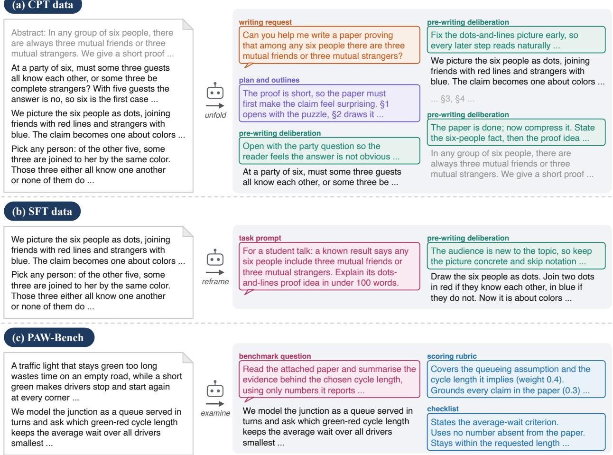  
Figure 1 What one paper turns into. In each panel the left column is text kept verbatim from the source paper and the two columns on the right are what we synthesize around it; color marks the role of each block. (a) A CPT trajectory: a writing request, a global plan, and a deliberation before each section, reconstructed around the paper’s fiown section texts and abstract. (b) An SFT sample: a passage becomes the answer, and the task prompt and the fideliberation preceding it are derived backwards from that answer. (c) A PAW-Bench item: a held-out paper yields a question together with the rubric and checklist used to grade answers.

general web pages of one or two thousand tokens [12, 15, 32, 35]. Two limitations follow:

1. Segmentation is mechanical. Text is cut into fixed blocks of sentences or split into equal parts with reasoning inserted at the cut points which treats the document as a character stream with no structure.

2. The reconstructed process is a flat annotation. The synthesized thinking is typically a single block attached before or after the original text, so the data amounts to a document plus a running commentary.

Both limitations trace back to the corpus because a document of one or two thousand tokens has no whole-document plan to recover. This line of work aims at reasoning, and writing has barely been touched.

Scientific papers difer on these points. Written by experts for peers and squeezed against page limits, they are dense and heavily compressed, so unusually much of the judgment behind them is left to recover. Introduction, method, experiments, and conclusion each carry a definite rhetorical role and let decomposition follow the paper’s own structure at a length where whole-document planning matters. Most importantly, the process we want to rebuild actually happened. The authors did have a global plan and every section exists for a reason. Our job is to recover that process.

We therefore build a pipeline that unfolds each paper into a multi-turn generation trajectory (Figure 1(a)). The trajectory opens with a writing request, sets out a global plan with per-section outlines, places a pre-writing deliberation before each section text, and ends with a look back over the finished paper for the abstract. An LLM reconstructs the request, the plan, and the deliberations while the section texts and the abstract are taken verbatim from the paper. Run over 1.8M arXiv papers with three generators of diferent sizes, the pipeline turns 30B tokens of paper text into 57–60B tokens of trajectories per generator. Unfolding lifts the median training document from 11K to 28–29K tokens.

All three data products come from the same construction that holds real text fixed as the final output and derives backwards what would have produced it. Unfolding applies this construction to a whole paper and recovers its writing process. Applied to a single passage, the construction yields an instruction sample whose task and thinking are synthesized around a verbatim answer (Figure 1(b)). Applied to a held-out paper, it yields an evaluation task with the rubric and checklist for grading answers (Figure 1(c)). One arXiv source supplies a CPT corpus, an SFT dataset, and an academic-writing benchmark.

Why put writing-process data into mid-training, when one could also synthesize writing data for SFT? In our experiments the gains from the two stages add up. Continued pre-training on the trajectories improves writing broadly, and the same papers as plain text give no such lift. General reasoning is preserved and the lengthened documents extend long-context coverage. Even after every model is fine-tuned on the same dedicated writing SFT dataset, the ones continued-pre-trained on trajectories keep their lead (Section 4.2).

## Our contributions are:

1. A scalable pipeline that unfolds whole scientific papers into multi-turn generation trajectories, reconstructing the layered process from writing intent to section-by-section drafting. Running on 1.8M papers turns 30B tokens of paper text into a 60B-token CPT corpus.

2. An extension of the same reverse construction to instruction data and evaluation (Figure 1(b) and (c)): treating real paper text as the answer yields a 200K-sample SFT dataset, and anchoring tasks in held-out papers yields PAW-Bench (Paper-Anchored Writing Benchmark), 2,940 academic-writing tasks with per-task rubrics and checklists.

3. Comprehensive experiments that use the same papers in plain-text form as a control to isolate the efect of unfolding: writing improves across the board and the improvement survives further SFT, general reasoning is not hurt, and paper comprehension and long-context ability benefit as well.

## 2 Related Work

Synthetic data for model training. Synthetic data runs through every stage of training: on the pretraining side mostly rewriting web documents or expanding text around entity relations [21, 39], on the post-training side mostly instruction synthesis [9, 36]. Recursive training on model-generated data loses the tails of the distribution, and semi-synthetic data that only edits real text is more robust [33, 42]. Most of this work alters content or invents it.

Reconstructing training signal from real text. One branch reconstructs the thinking process. Several methods infer the latent thoughts behind web text and concatenate them with the original for training, at scales up to 100B tokens [12, 32, 35]. Megadocs instead inserts reasoning at equal-split points to stretch a document into an ultra-long training unit [15]. For open-ended writing, REER searches for the deliberation that best explains a known good answer [34]. Another branch reconstructs instructions, taking real text as the answer and deriving backwards the prompt that would elicit it [18]. The idea has been pushed to pre-training scale [25] and applied to writing by deriving outlines from full articles [19]. Closest to us, work in the code domain reverse-engineers project-level development trajectories from GitHub repositories [40]. Across the work on natural-language text the corpus is mostly short web documents and the reconstructed process has no internal structure. We reconstruct long documents with rhetorical structure of their own, as multi-turn trajectories containing whole-document planning and per-section deliberation.

Scientific literature: adaptation and evaluation. Work on adapting models to scientific text trains on cleaned prose from papers and textbooks [17]. We train on the writing process behind that prose. Existing writing benchmarks generate their criteria per prompt [38] or build tasks from arXiv at several levels of abstraction [41]. PAW-Bench anchors every task in one specific paper and scores along two axes, a rubric and a code-checkable checklist.

## 3 Method

One construction runs through this section. Real text is held fixed as the end product, and a model synthesizes backwards the latent context that would have produced it. The three products difer in the unit held fixed and in what gets derived. For the CPT corpus the construction fixes a whole paper and derives its writing process (Section 3.2). For the SFT data it fixes one passage and derives a task with its thinking (Section 3.3). For PAW-Bench it fixes a held-out paper and derives a task with its grading criteria (Section 3.4). All three start from the same arXiv source, prepared once (Section 3.1).

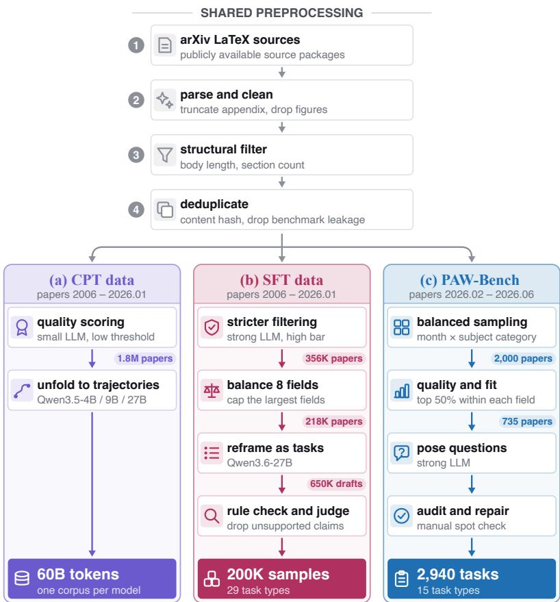  
Figure 2 The data pipeline. All three products are built from the same arXiv source and share one preprocessing trunk, then diverge in source window, filtering strictness, and synthesis model. The badge on each arrow is what survives that step. PAW-Bench draws only on papers posted after the training window, so its source papers are disjoint from those behind (a) and (b).

## fi3.1 Preparing the Paper Source

One cleaning trunk. The CPT data, the SFT data, and PAW-Bench are all built from public arXiv papers and share one preprocessing and filtering pipeline (Figure 2). For each paper we locate the main source file, merge includes, and expand custom macros. We keep only the body, truncating references, acknowledgments, appendices, and funding statements. Citation markers, figure environments, and layout commands are stripped while equations and tables stay. What remains reads on its own, which matters because a model trained on text full of pointers to unseen material learns to hallucinate it. Structural rules then drop papers with an empty body, out-of-range length, or too few sections along with errata and supplements. We deduplicate by body text, remove every paper containing complete questions from downstream benchmarks, and keep only those an LLM scores highly.

Three source windows. The three products difer in time window and in how strictly they filter. The CPT and SFT sources cover all arXiv papers from 2006 through January 2026. CPT needs volume, so a small model is used only to drop clearly defective papers and leave 1.8M. The SFT data favors quality over quantity. On the same source it applies tighter limits on body length, language, section count, letter ratio, LaTeX command density, and repeated-paragraph ratio. It also requires the paper to open with an introduction-like section and drops papers whose complicated source structure leaves residual citations or figure commands after cleaning. A stronger model scores the remainder and leaves 356K. Computer science, physics, and math dominate arXiv’s eight subject groups, so we balance the mix by keeping small groups in full and taking top-scoring papers from large ones for a final 220K.

A held-out pool for evaluation. The PAW-Bench source runs from February through June 2026 and therefore later than the other two windows. This keeps its papers disjoint from training and makes the benchmark a probe of real generalization. A strong model rates 2,000 papers balanced over month and category for quality and for suitability as task material. Keeping the top half of each subject group leaves 735 papers for task writing.

## 3.2 CPT Data: Unfolding Papers into Multi-Turn Trajectories

Shape of a trajectory. We convert the raw paper text into a trajectory of the following shape (Figure 1(a)): a concrete writing request, then a global plan with per-section outlines, then per-section pre-writing deliberation followed by the section text, and finally a full-paper review that produces the abstract. The design mirrors how people usually write long documents. A writer first plans the overall shape by deciding how many sections there will be and what each should cover and then drafts the sections one at a time. Before starting each one, the writer thinks through its content and its relation to the surrounding text. The abstract waits until everything else is done. Throughout the trajectory the section texts and the abstract are the paper’s own words and only the thinking around them is synthesized. The model builds this hidden thinking backwards from the content, inferring the intent that produced it. The recovered thoughts are then interleaved with the real text to form the training trajectory.

Given a paper we split the body at section boundaries, drop sections that are too short, and build the trajectory in four steps.

• Step 1: summarize each section. The model reads each section and writes a summary covering its key claims, methods, and conclusions. These summaries stand in for the full text in every later step. That keeps each call’s input small enough to be afordable at the million-paper scale and holds the model’s attention on the substance of a section.

• Step 2: derive the writing request. From the title and all section summaries the model writes what a user would say when asking an AI assistant to write the source paper. The request therefore matches the paper’s real topic and contributions in the tone of a genuine request.

• Step 3: derive the global plan and per-section deliberation. For the global plan, the model takes the request and the summaries, poses as the paper’s author with the research finished but nothing yet written, and thinks through the order of sections and the job of each. For section i, the model sees the summaries of the preceding and following sections and the section’s real text, and writes the rough pre-writing thoughts on what exactly to write and where the section sits in the overall argument. For synthetic pre-training data, content diversity matters more than tidy formatting, and over-constrained prompts produce highly repetitive samples [24], so the prompts in all steps place few constraints on format or length and encourage a wide range of angles.

• Step 4: derive the abstract deliberation. Conditioned on all section summaries and the paper’s real abstract, the model thinks through how to distill the core contributions and key results of the whole work.

Production. We use Qwen3.5-4B, 9B, and 27B [29] as generators and run production over the 1.8M papers, sampling at temperature 1.0 with an 8,192-token budget per call. The full prompt templates and decoding settings are given in Sections C and E. The source bodies total about 30B tokens and unfolding yields 57–60B tokens per generator, roughly a 2× expansion. The median body length is 11.2K tokens, and the median trajectory lengths of the three generators nearly coincide at 29.3K, 29.4K, and 28.3K (Figure 3). For contrast, the web-text reconstruction work discussed above operates on documents of one or two thousand tokens. Unfolding lengthens each training document as a whole, giving the corpus training signal in a length range the raw papers never reach.

Token length distribution: papers vs. trajectories  
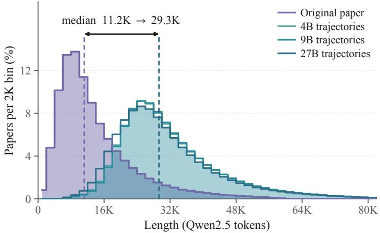  
Figure 3 Token-length distributions of the source papers and of the trajectories they unfold into, for all three generator sizes (1.8M papers per generator; dashed lines mark the two medians). Unfolding lifts the median from 11.2K to 28–29K tokens, an order of magnitude above the 1–2K web documents that prior reconstruction work is built on. The x-axis is truncated at 84K; 2.6–2.9% of trajectories run longer, up to the 128K generation limit.

<table><tr><td rowspan=1 colspan=4>(a) 4B: Reflective / Deliberative4B      9B     27B</td></tr><tr><td rowspan=1 colspan=1>walking</td><td rowspan=1 colspan=1>1.3</td><td rowspan=1 colspan=1>0.6</td><td rowspan=1 colspan=1>0.3</td></tr><tr><td rowspan=1 colspan=1>humble</td><td rowspan=1 colspan=1>1.4</td><td rowspan=1 colspan=1>0.9</td><td rowspan=1 colspan=1>0.3</td></tr><tr><td rowspan=1 colspan=1>feel</td><td rowspan=1 colspan=1>3.1</td><td rowspan=1 colspan=1>2.0</td><td rowspan=1 colspan=1>1.2</td></tr><tr><td rowspan=1 colspan=1>imagine</td><td rowspan=1 colspan=1>2.2</td><td rowspan=1 colspan=1>1.3</td><td rowspan=1 colspan=1>1.1</td></tr><tr><td rowspan=1 colspan=1>rebuttal</td><td rowspan=1 colspan=1>5.9</td><td rowspan=1 colspan=1>3.6</td><td rowspan=1 colspan=1>3.9</td></tr><tr><td rowspan=1 colspan=1>internal</td><td rowspan=1 colspan=1>4.9</td><td rowspan=1 colspan=1>3.6</td><td rowspan=1 colspan=1>2.8</td></tr><tr><td rowspan=1 colspan=1>tension</td><td rowspan=1 colspan=1>3.8</td><td rowspan=1 colspan=1>2.4</td><td rowspan=1 colspan=1>2.7</td></tr><tr><td rowspan=1 colspan=1>thought</td><td rowspan=1 colspan=1>5.3</td><td rowspan=1 colspan=1>4.9</td><td rowspan=1 colspan=1>2.3</td></tr><tr><td rowspan=1 colspan=1>critique</td><td rowspan=1 colspan=1>3.9</td><td rowspan=1 colspan=1>3.1</td><td rowspan=1 colspan=1>2.2</td></tr><tr><td rowspan=1 colspan=1>walking through</td><td rowspan=1 colspan=1>1.0</td><td rowspan=1 colspan=1>0.5</td><td rowspan=1 colspan=1>0.2</td></tr><tr><td rowspan=1 colspan=1>feel confident</td><td rowspan=1 colspan=1>0.4</td><td rowspan=1 colspan=1>0.2</td><td rowspan=1 colspan=1>0.1</td></tr><tr><td rowspan=1 colspan=1>core tension</td><td rowspan=1 colspan=1>1.2</td><td rowspan=1 colspan=1>0.4</td><td rowspan=1 colspan=1>0.5</td></tr><tr><td rowspan=1 colspan=1>thought process</td><td rowspan=1 colspan=1>2.1</td><td rowspan=1 colspan=1>1.8</td><td rowspan=1 colspan=1>0.5</td></tr><tr><td rowspan=1 colspan=1>final polish</td><td rowspan=1 colspan=1>2.5</td><td rowspan=1 colspan=1>2.2</td><td rowspan=1 colspan=1>0.8</td></tr></table>

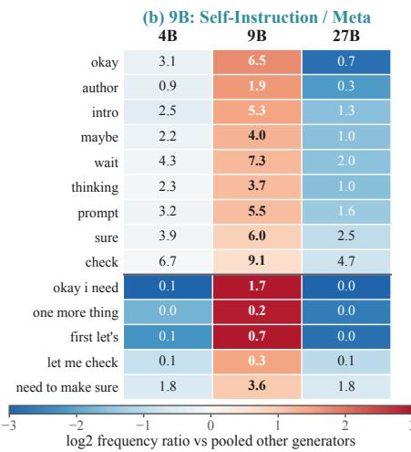

<table><tr><td rowspan=1 colspan=4>(c) 27B: Formal / Audience-Oriented4B      9B     27B</td></tr><tr><td rowspan=1 colspan=1>ultimately</td><td rowspan=1 colspan=1>0.2</td><td rowspan=1 colspan=1>0.2</td><td rowspan=1 colspan=1>0.9</td></tr><tr><td rowspan=1 colspan=1>particularly</td><td rowspan=1 colspan=1>0.4</td><td rowspan=1 colspan=1>0.3</td><td rowspan=1 colspan=1>1.2</td></tr><tr><td rowspan=1 colspan=1>furthermore</td><td rowspan=1 colspan=1>0.8</td><td rowspan=1 colspan=1>0.5</td><td rowspan=1 colspan=1>1.5</td></tr><tr><td rowspan=1 colspan=1>primary</td><td rowspan=1 colspan=1>2.5</td><td rowspan=1 colspan=1>2.1</td><td rowspan=1 colspan=1>5.0</td></tr><tr><td rowspan=1 colspan=1>objective</td><td rowspan=1 colspan=1>1.2</td><td rowspan=1 colspan=1>1.3</td><td rowspan=1 colspan=1>2.5</td></tr><tr><td rowspan=1 colspan=1>finally</td><td rowspan=1 colspan=1>2.7</td><td rowspan=1 colspan=1>2.8</td><td rowspan=1 colspan=1>5.2</td></tr><tr><td rowspan=1 colspan=1>significant</td><td rowspan=1 colspan=1>2.1</td><td rowspan=1 colspan=1>1.9</td><td rowspan=1 colspan=1>3.3</td></tr><tr><td rowspan=1 colspan=1>however</td><td rowspan=1 colspan=1>7.1</td><td rowspan=1 colspan=1>5.0</td><td rowspan=1 colspan=1>9.3</td></tr><tr><td rowspan=1 colspan=1>reader</td><td rowspan=1 colspan=1>13.1</td><td rowspan=1 colspan=1>13.7</td><td rowspan=1 colspan=1>17.3</td></tr><tr><td rowspan=1 colspan=1>primary objective</td><td rowspan=1 colspan=1>0.2</td><td rowspan=1 colspan=1>0.1</td><td rowspan=1 colspan=1>0.9</td></tr><tr><td rowspan=1 colspan=1>logical dependency</td><td rowspan=1 colspan=1>0.2</td><td rowspan=1 colspan=1>0.2</td><td rowspan=1 colspan=1>0.6</td></tr><tr><td rowspan=1 colspan=1>the chain of</td><td rowspan=1 colspan=1>0.2</td><td rowspan=1 colspan=1>0.1</td><td rowspan=1 colspan=1>0.6</td></tr><tr><td rowspan=1 colspan=1>the core question</td><td rowspan=1 colspan=1>0.2</td><td rowspan=1 colspan=1>0.4</td><td rowspan=1 colspan=1>0.8</td></tr><tr><td rowspan=1 colspan=1>critical reader</td><td rowspan=1 colspan=1>1.4</td><td rowspan=1 colspan=1>1.8</td><td rowspan=1 colspan=1>2.9</td></tr></table>

Figure 4 Lexical patterns across trajectories produced by Qwen3.5-4B, 9B, and 27B. We compare 10,000 papers for which trajectories were generated by all three models and count only the synthesized parts. Cell values are exact occurrences per 10K reasoning words. The final five rows in each panel are contiguous multi-word phrases and the remaining rows are single words.

Each generator writes in its own register. The median 27B trajectory is about 1K tokens shorter than the 4B and 9B ones. Counting word and phrase frequencies over 10,000 papers, about 315M reasoning words, locates the diference at the level of wording (Figure 4): 4B displays its thinking (imagine, walking through), 9B prompts itself (okay, wait, let me check), and 27B argues formally (however, ultimately, critical reader ). Dropping think-aloud narration is what makes the 27B trajectories shorter. The trajectory structure stays the same across all three, since the pipeline fixes it.

## 3.3 SFT Data: Deriving Tasks Backwards from Paper Text

What one sample looks like. The construction now fixes one passage in place of a whole paper. Each SFT sample is a single-turn QA pair. The user poses a writing or reading task around a paper, optionally attaching the full text or an excerpt as material, and the model thinks first and then answers. We hand-design 29 task types covering the academic writing and reading abilities we target. Grouped by how the answer is obtained from the paper, they fall into three families: rewriting tasks adapt one passage into a specified deliverable such as a reproduction checklist, QA tasks derive both question and answer from the material, and reorganizing tasks recompose several passages into a new form such as a decision memo.

Composition. Figure 5 shows the full mix, which is deliberately flat. The largest type holds 7.8% of the data, and the three families split 56%, 18%, and 26%. The families also difer in what they show the model: rewriting tasks see the full paper half of the time, QA tasks always work from attached material, and five of every six reorganizing samples are closed-book. Across the whole dataset, 34% of samples attach no paper text and train writing with the needed facts stated in the question alone. Material and answer length run in opposite directions (Figure 5(b)). Closed-book samples carry the longest answers, with a median of about 1.1K tokens. Grounded tasks mostly ask for compact extraction or summary, and their medians sit near 300.

Answer-first synthesis. Like the CPT construction, synthesis starts from the fixed answer and works backwards (Figure 1(b)). We select the passage that will ground the answer and have the model clean it into a deliverable that reads on its own. The model then works backwards from this answer to the user request that would elicit it and finally writes the thinking that precedes the answer using only information visible in the request and material. With the answer fixed before the request exists, the request can spell out the shape that answer happens to take, whether that is a word budget, a set of headings, or a table. Every formatting instruction in the data is one the answer demonstrably satisfies, which trains instruction following alongside writing. For QA tasks, question and answer are derived from the material together. The factual core of every answer comes from the paper itself and this gives the numbers and claims a real source that cuts hallucination of at the root. Each paper draws three suitable task types. Programmatic checks then drop mechanical failures such as residual LaTeX or thinking that mentions “the provided answer”. An LLM scores what survives and keeps only the higher-scoring samples. With Qwen3.6-27B [30] as the generator we obtain about 200K samples. In Section 4.2, 10K writing-oriented samples from this dataset join a mixed fine-tuning recipe.

## 3.4 PAW-Bench: Paper-Anchored Writing Benchmark

The same construction, applied to evaluation. A held-out paper supplies the content. A strong LLM reads it, poses a question that the paper is in a position to answer, and in the same pass writes the grading materials a good answer would have to satisfy. Because question and criteria are both derived from a real paper, every task has a factual anchor and a defensible notion of what counts as complete.

Task design. Four tasks are written for each of the 735 papers selected in Section 3.1, 2,940 in total, covering 15 task types close to but not identical to the SFT types. Nine types attach paper material, either the full text or selected excerpts, and test understanding and writing grounded in the paper. Six attach no material and test general academic writing in realistic work scenarios. Task types are assigned up front so that they stay balanced. Table 1 lists all fifteen with their material regimes. Half of the tasks provide no material, a quarter an excerpt, and a quarter the full paper (1,470, 764, and 706 tasks). The subject mix stays close to uniform from computer science at 15% down to quantitative biology at 9%, so no single field dominates the benchmark. Within what its type allows, each task then draws its material form, target length, and format requirements at random, so that two tasks of the same type rarely ask for quite the same thing.

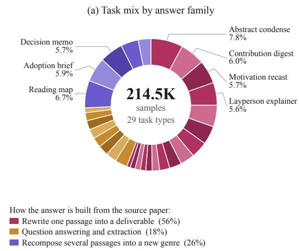

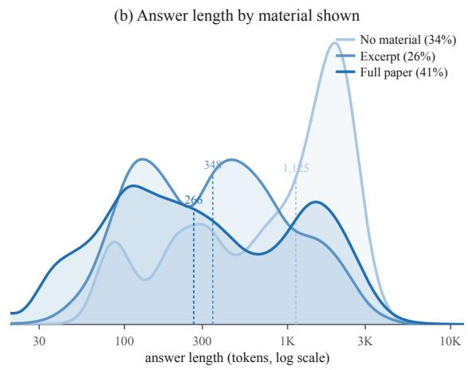  
Figure 5 Composition of the SFT dataset (214.5K samples over 148.6K papers). (a) The task mix over the 29 types, grouped by how the answer is derived from the source paper; types above 5% of the data are labeled. (b) Answer-length distributions by the material each task shows the model; dashed lines mark medians. Closed-book tasks carry the longest answers, with the needed facts stated in the question itself. Tasks that attach the full paper skew toward compact extraction and summary outputs.

<table><tr><td>Task type</td><td>Objective</td><td>Count</td></tr><tr><td colspan="3">Prompt-only: the scenario is stated in the query, no paper material</td></tr><tr><td>academic_abstract_without_source</td><td>Write an academic abstract from a scenario.</td><td>244</td></tr><tr><td>research_proposal_framework</td><td>Construct a research proposal framework.</td><td>245</td></tr><tr><td>technical_report_without_source</td><td>Produce a technical report for a stated problem.</td><td>246</td></tr><tr><td>experiment_discussion_without_source</td><td>Discuss an experimental setup and findings.</td><td>244</td></tr><tr><td>literature_review_outline_without_source</td><td>Design a literature-review outline.</td><td>245</td></tr><tr><td>policy_or_industry_analysis_without_source</td><td>Write evidence-aware policy or industry analysis.</td><td>246</td></tr><tr><td colspan="3">Paper-grounded: the task hands the model an excerpt or the full paper</td></tr><tr><td>abstract_from_paper</td><td>Write an abstract.</td><td>163</td></tr><tr><td>tldr_contribution_bullets</td><td>Produce concise contribution bullets.</td><td>164</td></tr><tr><td>introduction_rewrite</td><td>Rewrite an introduction for a specified goal.</td><td>163</td></tr><tr><td>method_explanation</td><td>Explain the method to a target audience.</td><td>162</td></tr><tr><td>experiment_summary</td><td>Summarize experimental design and evidence.</td><td>163</td></tr><tr><td>limitation_future_work</td><td>Synthesize limitations and future work.</td><td>164</td></tr><tr><td>review_critique</td><td>Write a structured review and critique.</td><td>164</td></tr><tr><td>technical_report_from_paper</td><td>Produce a technical report.</td><td>164</td></tr><tr><td>plain_language_summary</td><td>Explain the work to non-specialists.</td><td>163</td></tr></table>

Table 1 PAW-Bench task composition. Requested answer lengths span 20–2,100 words with median 1,000.

Grading materials. Weighted rubric dimensions state what the task should be judged on, such as content coverage, organization, and faithfulness to the material. A separate checklist spells out hard requirements such as content points to cover and constraints on length and format, half of them verifiable directly by code. At evaluation time an LLM scores the rubric and walks through the checklist, reporting the two scores separately. Rubric dimensions are written afresh for each task, and what they weigh turns on whether the paper is in hand (Figure 6(b)). Grounded tasks put 31% of their rubric weight on faithfulness to the evidence against 6% for prompt-only tasks, which are instead judged on the structure, technical substance, and critical reasoning of what the model builds itself. The task pool went through several rounds of full-coverage quality checks and targeted repair, followed by sampled human inspection. In Section 4.2 PAW-Bench serves as one of the four writing suites, the one whose tasks are anchored the same way the training data is.

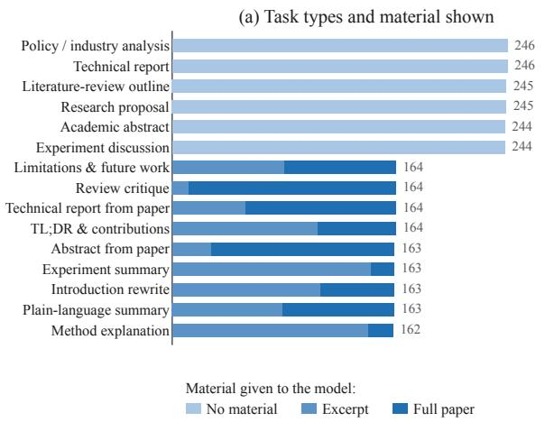

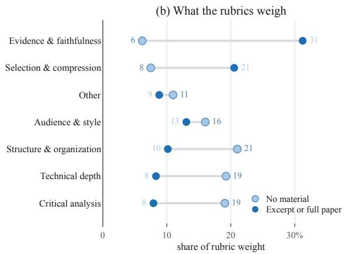  
Figure 6 Composition of PAW-Bench (2,940 tasks, four per paper over 735 held-out papers). (a) The 15 task types, with color marking how much of the paper a task shows. (b) Where the per-task rubrics put their grading weight, split by whether the task attaches paper material. The 2,940 tasks carry 4,898 distinct dimension names, so the names are grouped into themes by keyword and the tail falls into Other.

## 4 Experiments

## 4.1 Setup

Training recipe. All experiments start from Qwen2.5-7B [28] and follow the same three stages of CPT, SFT, and evaluation. We use learning rate 2e-5 with cosine decay to 10% of the peak, one epoch, sequences truncated at 64K, about 4M tokens per step, weight decay 0.01, and gradient clipping 1.0. The learning rate is kept small because the CPT mixture spans a narrow distribution where a larger rate risks pulling the base model too far. A 50B-token budget already gives ample exposure to the new data, so a larger rate is also unnecessary. Every run uses seed 42.

Mixtures and controls. From each generator’s output we sample 30B tokens and mix them with 20B tokens of FineWeb-Edu [26], giving three 50B-token training sets. The general text is mixed in to prevent the catastrophic forgetting that continued pre-training on a single academic domain would cause [11]. Two controls use the same budget: 50B tokens of pure FineWeb-Edu with no paper data at all, and 30B tokens of raw paper text (cleaned as in Section 3.1) plus 20B of FineWeb-Edu. The latter difers from the three main runs only in whether papers appear as plain text or as unfolded trajectories, separating the value of the paper content from the value of our construction. All five runs share identical hyperparameters.

Naming. Below we write Our-Data-4B/9B/27B CPT for the models continued-pre-trained on the three generators’ data and FineWeb-Edu CPT and Plain-Paper CPT for the two controls. Sections 4.2 to 4.4 each pair these checkpoints with an open SFT set aimed at a diferent ability. Within each comparison the SFT recipe is held fixed, so score diferences isolate what the mid-training corpus contributed.

## 4.2 Main Results

Setup. We first evaluate writing after CPT (Table 2). Every model is fine-tuned on the same open dataset DeepWriting-20k [34]. We also replace 10K of its samples with writing-oriented samples from our SFT data and denote the resulting mixture Our-Mixed SFT. Fine-tuning follows the oficial DeepWriting recipe for every model (learning rate 2e-5, constant schedule, 3 epochs). Qwen2.5-7B-Instruct and LongWriter-8B serve as references, the latter trained specifically for long-form writing [3].

<table><tr><td rowspan="2">Model</td><td colspan="2">WritingBench</td><td colspan="2">PAW-Bench</td><td colspan="2">HelloBench</td><td rowspan="2">LongBench- Write</td><td rowspan="2">Avg.</td></tr><tr><td>Full</td><td>Acad. &amp; Eng.</td><td>Rubric</td><td>Checklist</td><td>Open QA</td><td>Heuristic</td></tr><tr><td>Qwen2.5-7B-Instruct</td><td>47.3</td><td>49.8</td><td>59.09</td><td>0.620</td><td>42.66</td><td>43.93</td><td>54.10</td><td>50.95</td></tr><tr><td>LongWriter-8B</td><td>47.0</td><td>48.4</td><td>56.54</td><td>0.524</td><td>40.66</td><td>45.83</td><td>57.74</td><td>51.13</td></tr><tr><td>DeepWriting SFT</td><td>49.3</td><td>50.0</td><td>55.42</td><td>0.529</td><td>40.82</td><td>43.40</td><td>60.76</td><td>51.90</td></tr><tr><td>FineWeb-Edu CPT + DeepWriting SFT</td><td>47.7</td><td>48.2</td><td>53.71</td><td>0.535</td><td>41.49</td><td>43.56</td><td>60.35</td><td>51.08</td></tr><tr><td>Plain-Paper CPT + DeepWriting SFT</td><td>49.2</td><td>50.1</td><td>57.51</td><td>0.540</td><td>41.85</td><td>42.49</td><td>59.65</td><td>52.12</td></tr><tr><td>Our-Data-4B CPT + DeepWriting SFT</td><td>52.5</td><td>53.9</td><td>59.47</td><td>0.551</td><td>44.13</td><td>48.17</td><td>59.27</td><td>54.34</td></tr><tr><td>Our-Data-9B CPT + DeepWriting SFT</td><td>51.1</td><td>53.2</td><td>59.34</td><td>0.555</td><td>42.40</td><td>43.70</td><td>60.42</td><td>53.48</td></tr><tr><td>Our-Data-27B CPT + DeepWriting SFT</td><td>51.0</td><td>52.4</td><td>58.88</td><td>0.557</td><td>42.77</td><td>46.02</td><td>60.07</td><td>53.59</td></tr><tr><td>Our-Mixed SFT</td><td>47.3</td><td>49.1</td><td>63.73</td><td>0.650</td><td>42.41</td><td>41.37</td><td>56.49</td><td>52.35</td></tr><tr><td>Our-Data-27B CPT + Our-Mixed SFT</td><td>51.2</td><td>53.1</td><td>64.13</td><td>0.637</td><td>43.45</td><td>46.01</td><td>57.47</td><td>54.38</td></tr></table>

Table 2 Writing results. All benchmarks are judged by GPT-5.5. Avg. is the equal-weight mean of four items: WritingBench, PAW-Bench rubric, HelloBench (its two subsets averaged first), and LongBench-Write. Best score per column in bold, second best underlined.

Benchmarks. WritingBench collects real writing requests over six domains and one hundred subdomains, including academic and engineering, finance and business, and politics and law. Prompts typically carry material, audience, and format constraints. Each task receives five prompt-specific criteria that a judge scores in turn [38]. HelloBench draws on five real scenarios that span open-ended QA, summarization, chat, text completion, and heuristic text generation. The two subsets closest to academic writing are open-ended QA and heuristic text generation and we grade both against a hand-designed checklist [27]. LongBench-Write states an explicit target length ranging from a few hundred to over ten thousand words and asks whether a model reaches it without losing quality. The judge scores six dimensions such as relevance, coherence, and clarity [3]. PAW-Bench anchors every task in a paper the model has never seen, scoring writing quality and format compliance separately. The four benchmarks ship diferent oficial judges so we use GPT-5.5 as a single frontier judge throughout with reasoning efort medium. It grades strictly, so scores run low and are not directly comparable to oficial leaderboards.

The CPT data improves writing across the board. FineWeb-Edu CPT ends 0.8 below the no-CPT baseline on Average, dropping clearly on WritingBench and PAW-Bench. Adding 50B more general tokens does not help writing and can hurt it. Plain-Paper CPT is level with the baseline (52.12 vs. 51.90). Switching the same papers to writing trajectories lifts all three models above the controls on every metric except LongBench-Write. The largest gains over the no-CPT baseline are on PAW-Bench (+3.5 to +4.0) and on WritingBench Academic & Engineering (+2.4 to +3.9), exactly the two academic metrics closest to the training corpus. Full WritingBench and the two HelloBench subsets rise by smaller margins. LongBench-Write hinges on writing to a specified length that our data never targets, and we keep it in the table for completeness. The best of them is Our-Data-4B CPT with a gain of 2.44 over the baseline (+4.7%).

The two stages stack. Fine-tuning on strong writing data would close the gap between models if the ability our corpus adds could be recovered at SFT time, yet under the same DeepWriting recipe the three Our-Data models still finish 1.6–2.4 Average points above the no-CPT baseline. The pattern repeats under a second recipe. Replacing 10K of DeepWriting with writing-oriented samples from our SFT data (Our-Mixed SFT) lifts PAW-Bench from 55.42 to 63.73 and the checklist pass rate from 0.529 to 0.650, at some cost on WritingBench and LongBench-Write. Running trajectory CPT before this SFT keeps both the paper-task lift and the broad-writing level, raising PAW-Bench further to 64.13 and topping the table at 54.38. Every configuration that includes our CPT (53.48 and up) also finishes above the best configuration without it (52.35), so fine-tuning builds on what mid-training added.

The gains do not come from distilling a stronger generator. The models trained on the three generators’ data land close together with an Average spread of only 0.86. That is far less than their gap of up to 2.22 over Plain-Paper CPT. On this table the smallest 4B data even posts the highest Average, so a stronger generator is not what carries the gain. The value comes from the construction. The synthesis tasks

are simple enough for a 4B generator, which leaves room to run the pipeline more cheaply.
<table><tr><td>Model</td><td>MMLU Pro</td><td>GPQA -D</td><td>MATH 500</td><td>AIME 2025</td><td>LCB v6</td><td>Avg.</td></tr><tr><td>Qwen2.5-7B-Instruct</td><td>55.1</td><td>34.5</td><td>74.0</td><td>9.3</td><td>16.0</td><td>37.78</td></tr><tr><td>OpenThoughts SFT</td><td>61.1</td><td>39.6</td><td>83.2</td><td>26.0</td><td>21.7</td><td>46.32</td></tr><tr><td>FineWeb-Edu CPT</td><td>60.6</td><td>36.0</td><td>83.0</td><td>21.3</td><td>20.6</td><td>44.30</td></tr><tr><td>Our-Data-4B CPT</td><td>62.0</td><td>37.6</td><td>83.4</td><td>26.0</td><td>25.1</td><td>46.82</td></tr><tr><td>Our-Data-9B CPT</td><td>62.2</td><td>38.9</td><td>84.4</td><td>26.7</td><td>21.1</td><td>46.66</td></tr><tr><td>Our-Data-27B CPT</td><td>61.2</td><td>40.4</td><td>80.6</td><td>22.7</td><td>23.4</td><td>45.66</td></tr></table>

Table 3 General reasoning results. Every CPT row is fine-tuned on OpenThoughts; the OpenThoughts SFT row applies the same data directly to the base model. GPQA-D is GPQA-Diamond and LCB v6 is LiveCodeBench v6. Avg. is the equal-weight mean of the five benchmarks. AIME 2025 scores are averaged over 5 samples at temperature 0.7. Best score per column in bold, second best underlined.

## 4.3 Effect on Reasoning

Setup. Gains on writing are expected from data that synthesizes the deliberation before writing. But does continued pre-training on large volumes of writing-oriented chains of thought interfere with reasoning tasks, which depend on chains of thought even more? To check this we fine-tune each CPT model on the open dataset OpenThoughts [10] and evaluate on five common benchmarks covering knowledge, science QA, math, and code: MMLU-Pro [37], GPQA-Diamond [31], MATH500 [20], AIME 2025, and LiveCodeBench v6 [13]. Fine-tuning follows the oficial OpenThoughts recipe for every model (learning rate 1e-5 with cosine decay, 3 epochs).

The CPT data does not hurt reasoning. FineWeb-Edu is a common general corpus in open pre-training. Continued pre-training on it still erodes the reasoning of an already well-trained base because the corpus covers a narrower distribution than the base’s original pre-training mix. After SFT, all five benchmarks fall below direct SFT and the Average drops from 46.32 to 44.30 (Table 3). FineWeb-Edu CPT is also the lowest of the CPT runs in the writing results (Table 2). Replacing 30B of those tokens with our CPT data brings the Average back to the level of direct SFT at 45.66–46.82 and mitigates the catastrophic forgetting [11]. The gains on writing do not come at the price of reasoning.

Generator scale again matters little. The models trained on the three generators’ data land close together, with the five per-benchmark bests scattered across all of them. The best Average belongs to the model trained on the 4B data, at 46.82 against 46.32 for direct SFT.

## 4.4 Paper Comprehension and Long Context

Setup. To see whether the benefit extends beyond reasoning, we fine-tune each CPT checkpoint on the no-think subset of SmolTalk2 [4]. SmolTalk2 is the post-training collection Hugging Face built for SmolLM3. We use its SFT portion without explicit reasoning traces, which covers general instruction following and multi-turn chat and yields a general-purpose assistant rather than a specialist. Every model is fine-tuned with the same settings (learning rate 1e-5 with cosine decay, 2 epochs).

Benchmarks. Qasper asks research questions about a full NLP paper and is scored by QA F1 [6]. QASA does the same over AI/ML papers and is scored by ROUGE-L [16]. LongBench v2 targets deep long-context understanding and reasoning and is scored by per-question accuracy [2]. All three suites are much smaller than the writing and reasoning ones, so we read this section as corroborating evidence beside the main results.

Unfolding improves how the model reads papers. Qasper and QASA are the tasks closest to the synthesized corpus. On Qasper the Our-Data-27B model beats the baseline by over 3 points while Plain-Paper

<table><tr><td rowspan="2">Model</td><td rowspan="2">Qasper</td><td rowspan="2">QASA</td><td colspan="2">LongBench v2</td></tr><tr><td>≤32k</td><td>≤64k</td></tr><tr><td>SmolTalk2 SFT</td><td>39.82</td><td>23.46</td><td>37.93</td><td>36.96</td></tr><tr><td>Plain-Paper CPT</td><td>35.89</td><td>24.31</td><td>43.10</td><td>38.04</td></tr><tr><td>Our-Data-4B CPT</td><td>38.45</td><td>25.37</td><td>37.93</td><td>35.87</td></tr><tr><td>Our-Data-9B CPT</td><td>39.96</td><td>24.47</td><td>40.52</td><td>39.13</td></tr><tr><td>Our-Data-27B CPT</td><td>43.01</td><td>24.69</td><td>43.97</td><td>40.22</td></tr></table>

Table 4 Paper comprehension and long-context results. Every CPT row is fine-tuned on the no-think subset of SmolTalk2; the first row applies the same SFT directly to the base model. All metrics are on a 0–1 scale and shown ×100. Best score per column in bold, second best underlined.

CPT falls nearly 4 points below it. On QASA all three Our-Data models come out above the direct-SFT baseline and Plain-Paper alike.

Longer training documents extend long-context ability. Our-Data-9B and Our-Data-27B beat the baseline in both LongBench v2 brackets: 9B by 2.6 and 2.2 points, 27B by 6.0 and 3.3. Plain-Paper drops by 5.06 when the bracket widens to ≤64k, the largest drop in the table. The length distributions explain the pattern. About 94% of raw papers stay within 32K tokens, and about a third of the trajectories cross into the 32–64K range (Figure 3).

## 4.5 Training Dynamics

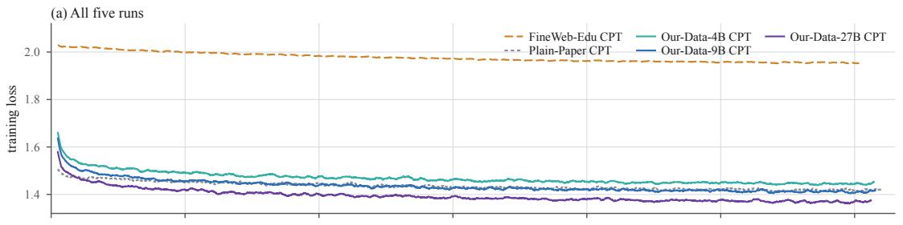

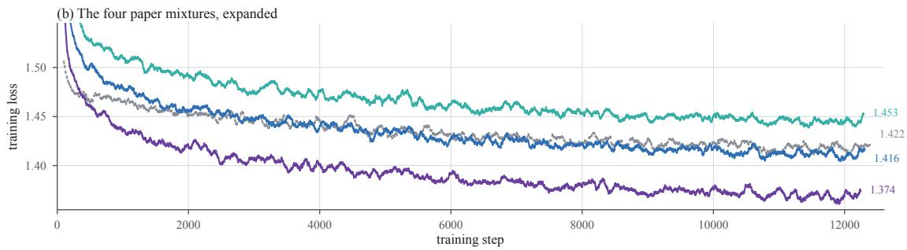  
Figure 7 CPT training loss. Each curve is the cross-entropy on that run’s own training mixture. The upper panel shows all five runs and the lower panel expands the four paper mixtures. Curves are 100-step moving averages.

Generator scale makes a corpus cheaper to encode. The three trajectory corpora order by the size of the model that wrote them: 1.453, 1.416, and 1.374 for 4B, 9B, and 27B. Each loss is measured on that run’s own mixture and the three mixtures difer only in which generator wrote their 30B trajectory tokens. The register diferences in Section 3.2 suggest why the ordering falls out this way. A larger generator writes cleaner and more uniform prose, keeps a steadier voice from paper to paper, and gives up much of the think-aloud narration that the smaller ones spend tokens on, so its deliberation holds fewer surprises for a model reading the next one.

The hardest corpus to fit gives the best writing. The 4B corpus is the only paper mixture whose loss exceeds raw paper text (1.453 against 1.422) and it yields the best writing Average at 54.34 and the best reasoning Average at 46.82. It is also the hardest of the four for the model to fit, and that resistance is what pays of after fine-tuning. The 27B corpus buys its low loss by saying more similar things from paper to paper, which is what makes 30B of its tokens worth less than 30B written by the smallest generator. This matches what earlier work has found: pruning the easiest-to-fit examples improves pre-training [1, 22], weaker samplers give better reasoning data at matched compute [5], and a larger generator has been found not to yield better synthetic pre-training data [14]. Our runs put the efect on a new axis (generator scale within one pipeline) and show it upstream in the training loss itself.

The comparison is informative only within one corpus family. FineWeb-Edu marks the boundary with the highest loss of the five at 1.953 alongside the lowest downstream averages. Its tokens are expensive because they come from heterogeneous web text. Loss ranks corpora only among those built the same way from the same source [7, 8, 23]. Inside our family the ranking runs against the usual reading of a training curve and a synthesis generator for writing data should not be chosen by CPT loss. The one place the low-loss corpus wins is long-document work, where 27B leads on Qasper and both LongBench v2 brackets. Uniformity across papers appears to cost open-ended writing and pay for sustained coherence.

## 5 Conclusion and Limitations

We presented a pipeline that unfolds whole scientific papers into multi-turn generation trajectories, reconstructing a writing request, a global plan, and per-section deliberation around the paper’s own text. Applied to 1.8M arXiv papers it turns 30B tokens of paper text into a 60B-token CPT corpus. The same reverse construction extends to a 200K-sample SFT dataset and the 2,940-task PAW-Bench. On Qwen2.5-7B the corpus improves writing broadly and the gain persists under two diferent SFT recipes. General reasoning stays intact and paper comprehension and long context benefit as well. The same papers as plain text give neither the writing lift nor the long-context gain. The models trained on the three generator scales perform close together, so the smallest generator sufices and the pipeline stays cheap to run.

## Several limitations remain:

• CPT experiments are expensive, so ours cover one base model (Qwen2.5-7B) and one mixture (30B trajectories plus 20B general text). Whether the results carry over to larger models and other ratios is untested.

• The writing metrics rely on an LLM judge, so they measure agreement with one model’s notion of good writing. Several rounds of automated quality checks, sampled human inspection, and the code-checkable checklist items mitigate this, but a gap between model and human preference cannot be ruled out without large-scale human grading.

• The paper-comprehension and long-context suites are small, so we treat those gains as corroborating evidence alongside the writing and reasoning results.

• The trajectories are post-hoc reconstructions and need not match the authors’ actual deliberation.

Unfolding a finished document into the process that produced it is not specific to papers. It applies to any long text with clear structure, and that is where we are headed next.

## References

[1] Zachary Ankner, Cody Blakeney, Kartik Sreenivasan, Max Marion, Matthew L. Leavitt, and Mansheej Paul. Perplexed by perplexity: Perplexity-based data pruning with small reference models. In International Conference on Learning Representations, 2025.

[2] Yushi Bai, Shangqing Tu, Jiajie Zhang, Hao Peng, Xiaozhi Wang, Xin Lv, Shulin Cao, Jiazheng Xu, Lei Hou, Yuxiao Dong, Jie Tang, and Juanzi Li. LongBench v2: Towards deeper understanding and reasoning on realistic long-context multitasks. In Proceedings of the 63rd Annual Meeting of the Association for Computational Linguistics (ACL), Volume 1: Long Papers, pages 3639–3664, 2025.

[3] Yushi Bai, Jiajie Zhang, Xin Lv, Linzhi Zheng, Siqi Zhu, Lei Hou, Yuxiao Dong, Jie Tang, and Juanzi Li. LongWriter: Unleashing 10,000+ word generation from long context LLMs. In Proceedings of the Thirteenth International Conference on Learning Representations (ICLR), 2025.

[4] Elie Bakouch, Loubna Ben Allal, Anton Lozhkov, Nouamane Tazi, Lewis Tunstall, Carlos Miguel Patiño, Edward Beeching, Aymeric Roucher, Aksel Joonas Reedi, Quentin Gallouédec, Kashif Rasul, Nathan Habib, Clémentine Fourrier, Hynek Kydlíček, Guilherme Penedo, Hugo Larcher, Mathieu Morlon, Vaibhav Srivastav, Joshua Lochner, Xuan-Son Nguyen, Colin Rafel, Leandro von Werra, and Thomas Wolf. SmolLM3: Smol, multilingual, long-context reasoner. Hugging Face blog, https://huggingface.co/blog/smollm3, 2025.

[5] Hritik Bansal, Arian Hosseini, Rishabh Agarwal, Vinh Q. Tran, and Mehran Kazemi. Smaller, weaker, yet better: Training LLM reasoners via compute-optimal sampling. In International Conference on Learning Representations, 2025.

[6] Pradeep Dasigi, Kyle Lo, Iz Beltagy, Arman Cohan, Noah A. Smith, and Matt Gardner. A dataset of informationseeking questions and answers anchored in research papers. In Proceedings of the 2021 Conference of the North American Chapter of the Association for Computational Linguistics (NAACL), 2021.

[7] Zhengxiao Du, Aohan Zeng, Yuxiao Dong, and Jie Tang. Understanding emergent abilities of language models from the loss perspective. In Advances in Neural Information Processing Systems, 2024.

[8] Leo Gao, Stella Biderman, Sid Black, Laurence Golding, Travis Hoppe, Charles Foster, Jason Phang, Horace He, Anish Thite, Noa Nabeshima, Shawn Presser, and Connor Leahy. The Pile: An 800GB dataset of diverse text for language modeling. arXiv preprint arXiv:2101.00027, 2020.

[9] Tao Ge, Xin Chan, Xiaoyang Wang, Dian Yu, Haitao Mi, and Dong Yu. Scaling synthetic data creation with 1,000,000,000 personas, 2024.

[10] Etash Guha, Ryan Marten, Sedrick Keh, et al. OpenThoughts: Data recipes for reasoning models, 2025.

[11] Adam Ibrahim, Benjamin Thérien, Kshitij Gupta, Mats L. Richter, Quentin Anthony, Timothée Lesort, Eugene Belilovsky, and Irina Rish. Simple and scalable strategies to continually pre-train large language models. Transactions on Machine Learning Research, 2024.

[12] Yoichi Ishibashi, Taro Yano, and Masafumi Oyamada. Mining hidden thoughts from texts: Evaluating continual pretraining with synthetic data for LLM reasoning, 2025.

[13] Naman Jain, King Han, Alex Gu, Wen-Ding Li, Fanjia Yan, Tianjun Zhang, Sida Wang, Armando Solar-Lezama, Koushik Sen, and Ion Stoica. LiveCodeBench: Holistic and contamination free evaluation of large language models for code. In Proceedings of the Thirteenth International Conference on Learning Representations (ICLR), 2025.

[14] Feiyang Kang, Newsha Ardalani, Michael Kuchnik, Youssef Emad, Mostafa Elhoushi, Shubhabrata Sengupta, Shang-Wen Li, Ramya Raghavendra, Ruoxi Jia, and Carole-Jean Wu. Demystifying synthetic data in LLM pre-training: A systematic study of scaling laws, benefits, and pitfalls. In Proceedings of the 2025 Conference on Empirical Methods in Natural Language Processing, 2025.

[15] Konwoo Kim, Suhas Kotha, Yejin Choi, Tatsunori Hashimoto, Nick Haber, and Percy Liang. Data-eficient pre-training by scaling synthetic megadocs, 2026.

[16] Yoonjoo Lee, Kyungjae Lee, Sunghyun Park, Dasol Hwang, Jaehyeon Kim, Hong-In Lee, and Moontae Lee. QASA: Advanced question answering on scientific articles. In Proceedings of the 40th International Conference on Machine Learning (ICML), pages 19036–19052, 2023.

[17] Sihang Li, Jin Huang, Jiaxi Zhuang, Yaorui Shi, Xiaochen Cai, Mingjun Xu, Xiang Wang, Linfeng Zhang, Guolin Ke, and Hengxing Cai. SciLitLLM: How to adapt LLMs for scientific literature understanding. In Proceedings of the Thirteenth International Conference on Learning Representations (ICLR), 2025.

[18] Xian Li, Ping Yu, Chunting Zhou, Timo Schick, Omer Levy, Luke Zettlemoyer, Jason Weston, and Mike Lewis. Self-alignment with instruction backtranslation. In Proceedings of the Twelfth International Conference on Learning Representations (ICLR), 2024.

[19] Yi Liang, You Wu, Honglei Zhuang, Li Chen, Jiaming Shen, Yiling Jia, Zhen Qin, Sumit Sanghai, Xuanhui Wang, Carl Yang, and Michael Bendersky. Integrating planning into single-turn long-form text generation, 2024.

[20] Hunter Lightman, Vineet Kosaraju, Yura Burda, Harri Edwards, Bowen Baker, Teddy Lee, Jan Leike, John Schulman, Ilya Sutskever, and Karl Cobbe. Let’s verify step by step. In Proceedings of the Twelfth International Conference on Learning Representations (ICLR), 2024.

[21] Pratyush Maini, Skyler Seto, He Bai, David Grangier, Yizhe Zhang, and Navdeep Jaitly. Rephrasing the web: A recipe for compute and data-eficient language modeling. In Proceedings of the 62nd Annual Meeting of the Association for Computational Linguistics (ACL), Volume 1: Long Papers, pages 14044–14072, 2024.

[22] Max Marion, Ahmet Üstün, Luiza Pozzobon, Alex Wang, Marzieh Fadaee, and Sara Hooker. When less is more: Investigating data pruning for pretraining LLMs at scale. arXiv preprint arXiv:2309.04564, 2023.

[23] Niklas Muennighof, Alexander M. Rush, Boaz Barak, Teven Le Scao, Aleksandra Piktus, Nouamane Tazi, Sampo Pyysalo, Thomas Wolf, and Colin Rafel. Scaling data-constrained language models. In Advances in Neural Information Processing Systems, 2023.

[24] Joel Niklaus, Atsuki Yamaguchi, Michal Štefánik, Guilherme Penedo, Hynek Kydlíček, Elie Bakouch, Lewis Tunstall, Edward Emanuel Beeching, Thibaud Frere, Colin Rafel, Leandro von Werra, and Thomas Wolf. How can we synthesize high-quality pretraining data? A systematic study of prompt design, generator model, and source data, 2026.

[25] Ajay Patel, Colin Rafel, and Chris Callison-Burch. FineInstructions: Scaling synthetic instructions to pre-training scale, 2026.

[26] Guilherme Penedo, Hynek Kydlíček, Loubna Ben Allal, Anton Lozhkov, Margaret Mitchell, Colin Rafel, Leandro von Werra, and Thomas Wolf. The FineWeb datasets: Decanting the web for the finest text data at scale. In Advances in Neural Information Processing Systems 37 (NeurIPS), Datasets and Benchmarks Track, pages 30811–30849, 2024.

[27] Haoran Que, Feiyu Duan, Liqun He, Yutao Mou, Wangchunshu Zhou, Jiaheng Liu, Wenge Rong, Zekun Moore Wang, Jian Yang, Ge Zhang, Junran Peng, Zhaoxiang Zhang, Songyang Zhang, and Kai Chen. HelloBench: Evaluating long text generation capabilities of large language models, 2024.

[28] Qwen Team. Qwen2.5 technical report, 2024.

[29] Qwen Team. Qwen3.5: Towards native multimodal agents. https://qwen.ai/blog?id=qwen3.5, February 2026

[30] Qwen Team. Qwen3.6-27B: Flagship-level coding in a 27B dense model. https://qwen.ai/blog?id=qwen3.6-27b, April 2026.

[31] David Rein, Betty Li Hou, Asa Cooper Stickland, Jackson Petty, Richard Yuanzhe Pang, Julien Dirani, Julian Michael, and Samuel R. Bowman. GPQA: A graduate-level google-proof Q&A benchmark. In Proceedings of the First Conference on Language Modeling (COLM), 2024.

[32] Yangjun Ruan, Neil Band, Chris J. Maddison, and Tatsunori Hashimoto. Reasoning to learn from latent thoughts, 2025.

[33] Ilia Shumailov, Zakhar Shumaylov, Yiren Zhao, Nicolas Papernot, Ross Anderson, and Yarin Gal. AI models collapse when trained on recursively generated data. Nature, 631:755–759, 2024.

[34] Haozhe Wang, Haoran Que, Qixin Xu, Minghao Liu, Wangchunshu Zhou, Jiazhan Feng, Wanjun Zhong, Wei Ye, Tong Yang, Wenhao Huang, Ge Zhang, and Fangzhen Lin. Reverse-engineered reasoning for open-ended generation, 2025.

[35] Liang Wang, Nan Yang, Shaohan Huang, Li Dong, and Furu Wei. Thinking augmented pre-training, 2025.

[36] Yizhong Wang, Yeganeh Kordi, Swaroop Mishra, Alisa Liu, Noah A. Smith, Daniel Khashabi, and Hannaneh Hajishirzi. Self-Instruct: Aligning language models with self-generated instructions. In Proceedings of the 61st Annual Meeting of the Association for Computational Linguistics (ACL), 2023.

[37] Yubo Wang, Xueguang Ma, Ge Zhang, et al. MMLU-Pro: A more robust and challenging multi-task language understanding benchmark. In Advances in Neural Information Processing Systems 37 (NeurIPS), Datasets and Benchmarks Track, pages 95266–95290, 2024.

[38] Yuning Wu, Jiahao Mei, Ming Yan, Chenliang Li, Shaopeng Lai, Yuran Ren, Zijia Wang, Ji Zhang, Mengyue Wu, Qin Jin, and Fei Huang. WritingBench: A comprehensive benchmark for generative writing. In Advances in Neural Information Processing Systems 38 (NeurIPS), Datasets and Benchmarks Track, 2025.

[39] Zitong Yang, Neil Band, Shuangping Li, Emmanuel Candès, and Tatsunori Hashimoto. Synthetic continued pretraining. In Proceedings of the Thirteenth International Conference on Learning Representations (ICLR), 2025.

[40] Zhiyuan Zeng, Yichi Zhang, Yong Shan, Kai Hua, Siyuan Fang, Zhaiyu Liu, Jiaheng Liu, Haozhe Wang, Yining Zheng, Ming Ding, Ke Shen, Ge Zhang, Wenhao Huang, and Xipeng Qiu. Understanding by reconstruction: Reversing the software development process for LLM pretraining, 2026.

[41] Haozhen Zhang, Tao Feng, Pengrui Han, and Jiaxuan You. AcademicEval: Live long-context LLM benchmark. Transactions on Machine Learning Research, 2025.

[42] Xuekai Zhu, Daixuan Cheng, Hengli Li, Kaiyan Zhang, Ermo Hua, Xingtai Lv, Ning Ding, Zhouhan Lin, Zilong Zheng, and Bowen Zhou. How to synthesize text data without model collapse? In Proceedings of the 42nd International Conference on Machine Learning (ICML), 2025.

## Appendix

## A Scope and Overview

This appendix provides the data, training, and evaluation details that accompany the main text. We first document the shared paper-processing trunk, then the continued-pre-training (CPT) trajectory construction, the SFT construction, PAW-Bench, and finally the training and evaluation protocols. Counts in this document are taken from the finalized artifacts used by the project. Rounded quantities in the main text are reported here at their available precision.

Three products from one source family. The project produces (i) multi-turn paper-writing trajectories for CPT, (ii) instruction data for SFT, and (iii) a held-out academic writing benchmark. They share the principle that a real scientific paper supplies the factual content. The CPT and SFT sources cover papers posted from 2006 through January 2026, with a stricter quality gate for SFT. PAW-Bench is held out by time: its source papers were posted from February through June 2026, after the training window.

Terminology. We use CPT for continued pre-training on autoregressive document sequences and SFT for supervised fine-tuning on user–assistant examples. “Synthetic” refers to the reconstructed request, plan, deliberation, or instruction. The scientific claims and prose retained as targets originate in real papers.

## B Paper Acquisition, Recovery, and Filtering

## B.1 Source Recovery

For each paper source archive we:

1. locate the primary LATEX file;

2. recursively resolve local \input and \include directives;

3. expand locally defined macros with deterministic expansions;

4. recover the title, abstract, ordered section hierarchy, and body text;

5. remove content whose interpretation depends on unavailable visual or bibliographic context.

The cleaning stage removes figure environments, image commands, citation markers, layout-only commands, acknowledgments, references, funding statements, and trailing template fragments. Equations and text-bearing tables are retained. Appendices are excluded from the training source used in the reported experiments. When source recovery is ambiguous, the paper is rejected.

## B.2 Deterministic Structural Filters

The shared hard-filtering trunk removes empty or malformed bodies, errata, supplements, duplicate bodies, unsupported languages, papers outside the configured length interval, and papers with fewer than three substantive sections. It additionally checks introduction and final-section body lengths, empty-section ratio, repeated-paragraph ratio, residual image/citation commands, unbalanced or dangling LATEX environments, and unusually high layout-command density. Before synthesis, all training data are decontaminated against every downstream benchmark. For Qasper and QASA, we remove all benchmark source papers from the CPT and SFT source pools using available paper identifiers and normalized titles. For the remaining benchmarks, we normalize benchmark questions and cleaned training text for case and whitespace, apply normalized exact-substring matching and token n-gram overlap, and discard the entire training paper whenever it contains a complete benchmark question or exceeds the overlap threshold.

The exact SFT-source thresholds are: abstract length at least 150 characters; cleaned body length 8,000– 180,000 characters and at least 1,000 words; at least three logical sections; non-empty introduction; for bodies shorter than 15,000 characters, at least 100 introduction-body characters; at least 30 characters after the final section heading; alphabetic-character ratio at least 0.25; at most 400 LAT X commands and 250 dollar signs per 1,000 words; duplicate paragraph ratio at most 0.10; and a maximum paragraph repetition count of three. The retained languages are Chinese and English. Residual acknowledgments, references, image or citation commands, control characters, HTML fragments, and unclosed tail environments cause rejection after cleaning.

<table><tr><td>SFT source subject group</td><td>Papers</td></tr><tr><td>Computer Science</td><td>65.0K</td></tr><tr><td>Physics Mathematics</td><td>64.4K</td></tr><tr><td>Statistics</td><td>64.4K 11.1K</td></tr><tr><td>Electrical Engineering and Systems Science</td><td>5.8K</td></tr><tr><td>Economics</td><td>2.6K</td></tr><tr><td>Quantitative Biology Quantitative Finance</td><td>2.3K</td></tr><tr><td></td><td>2.1K</td></tr><tr><td>Total</td><td>~218K</td></tr></table>

Table 5 Final paper pool used as the source for SFT synthesis.

The CPT source uses a small model for rejection of clearly defective papers, leaving approximately 1.8M papers. The SFT source undergoes a stricter quality pass over the same 2006–January 2026 window. After deterministic filtering, an LLM scores intrinsic paper quality on a 1–10 scale, emphasizing technical soundness, novelty, clarity, organization, evidence, and writing quality. Papers scoring below 8 are discarded, and about 356K papers meet the threshold. The surviving pool is balanced across coarse arXiv subject groups by retaining all papers from smaller groups and the highest-scoring papers from the largest groups, producing the pool of about 218K papers in Table 5. Retained bodies contain 8,000–180,000 characters, at least 1,000 words, and at least three substantive sections.

The scoring prompt asks for one integer and a two-to-four-sentence justification. Scores 9–10 are reserved for rare, intrinsically strong papers. The assessment covers scientific rigor, evidence proportionality, novelty, coherence, fluent writing, and extraction cleanliness. Topic dificulty, paper length, and normal citation practice receive neutral treatment. Balancing is deterministic after scoring. All examples from smaller subject groups are retained. Physics and Mathematics are capped by ranking papers by quality score and retaining the highest-scoring portion.

## C Multi-Turn Trajectory Construction for CPT

## C.1 Trajectory Definition

Let a paper contain title $t ,$ abstract $^ { a , }$ and ordered sections $s _ { 1 } , \ldots , s _ { n }$ . The raw unfolded trajectory is

$$
q , \ p , \ c _ { 1 } , \ s _ { 1 } , \ c _ { 2 } , \ s _ { 2 } , \ldots , c _ { n } , \ s _ { n } , \ c _ { a } , \ a ,
$$

where $q$ is a reconstructed writing request, $p$ is a whole-paper plan, $c _ { i }$ is the pre-writing deliberation for section $i ,$ and $c _ { a }$ is the retrospective deliberation before the abstract. The original section texts $s _ { i }$ and abstract a are preserved verbatim in the raw trajectory. The model generates $q , p , c _ { i } , c _ { a }$

## C.2 Generation Stages

The pipeline executes the following stages in paper order.

1. Section summaries. Each section is summarized independently to expose its role, claims, methods, and connection to the paper.

2. Writing request. Given the title and all section summaries, the generator infers a plausible author-facing request whose answer would be the complete paper.

3. Global plan. Given the request and summary block, the generator reconstructs an overall strategy and a section-by-section outline.

4. Section deliberations. Before each original section, the generator receives that section’s real text together with summaries of the preceding and following retained sections, then writes a plausible prospective rationale for the section’s purpose and connection to the surrounding argument.

5. Abstract deliberation. The generator receives all section summaries and the real abstract, then explains how to compress the paper’s problem, method, evidence, and conclusion into that abstract.

For a paper with n sections, the reported pipeline uses 2n + 3 model calls: n summaries, one request, one plan, n section deliberations, and one abstract deliberation.

## C.3 Prompt Contracts

The prompts enforce four contracts.

1. The generator reasons from the prospective author’s position and develops the section’s purpose, evidence, and transitions.

2. Every numerical result, citation, and claim must be recoverable from the paper context.

3. The global plan must cover every retained section in order.

4. A section deliberation must discuss rhetorical purpose, scientific content, and transition decisions in its own words without quoting the section.

The prompts provide structured section labels and summaries as explicit context for each decision. This preserves the paper’s section-level organization during trajectory construction.

## C.4 Generator Settings and Production Scale

We produce three corpus variants with Qwen3.5-4B, Qwen3.5-9B, and Qwen3.5-27B [29]. Generation uses temperature 1.0, top-p 0.95, top-k 20, presence penalty 1.5, repetition penalty 1.0, and an 8,192-token output budget per model call. The outputs of these calls are interleaved with the source sections into one trajectory, capped at the 128K generation limit reported in the main text. Chat-template thinking is disabled because the requested deliberation is itself the visible training text.

All three generators complete trajectories for over 99.5% of the input papers, yielding 57–60B training tokens per generator. The paired original papers contain approximately 30B tokens before unfolding. Median source-body length is 11.2K tokens. Median trajectory lengths are 29.3K, 29.4K, and 28.3K for 4B, 9B, and 27B generators, respectively. The three generators produce similar document-level structure and distinct local deliberation styles.

## C.5 Training Data Preparation

The cleaned title, abstract, and ordered sections from Section B enter trajectory synthesis directly. The resulting training sequence begins with the reconstructed writing request, which is masked from loss, followed by the assistant-side plan, section deliberations interleaved with the corresponding original sections, and the abstract deliberation followed by the original abstract. Documents are tokenized with the Qwen tokenizer, right-truncated to 65,536 tokens, shufled, and greedily packed into 65,536-token training sequences.

## D SFT Data: Deriving Tasks Backwards from Paper Text

## D.1 Reverse Construction

For open-ended writing, construction begins from a source-grounded answer. The source paper supplies the answer’s factual core, and the generator applies the minimum cleaning, reorganization, or audience adaptation needed for the task. The request is then inferred from the resulting answer, including the length and format constraints the answer actually satisfies. Finally, the generator writes a deliberation using information visible in the request and attached material.

Three distinct task types are sampled for each source paper. Sampling weights prioritize academic writing, followed by long-form writing and paper-grounded research tasks. Dificult, high-quality task types whose valid examples are relatively rare receive additional weight.

Generator configuration. SFT construction runs Qwen3.6-27B [30] at native BF16 precision. Visible thinking is enabled. Sampling uses temperature 1.0, top-p 0.95, top-k 20, minimum probability 0, presence penalty 0, repetition penalty 1.0, a 128K context window, and a 32,768-token output budget. The SFT corpus is generated from the SFT source pool in Table 5; PAW-Bench remains held out from generator training.

## D.2 Three Construction Families

A: rewriting. The pipeline selects a source span, transforms it into the deliverable, derives the request from that deliverable, and then reconstructs the deliberation. These tasks preserve most source wording and vary audience, persona, length, organization, and output format.

B: paper-grounded QA and extraction. The pipeline jointly derives a question and its answer from a paper excerpt or the full paper, then reconstructs the deliberation. Outputs include free-form answers, evidence sets, records, tables, and structured extraction.

C: reorganization. The pipeline reorganizes paper content into a new functional artifact, such as a decision memo or reading map, before deriving the request and deliberation. These examples teach longer-range structure using source-supported scientific content.

## D.3 Dual Scoring

Each PAW-Bench task comes with two independent grading artifacts.

1. Rubric. Four to six prompt-specific dimensions are assigned explicit weights. The judge scores each dimension from 1 to 10; the weighted result is normalized to 0–100.

2. Checklist. Three to six concrete requirements are scored as pass/fail. Whenever possible, deterministic checks implement word ranges, required headings, list counts, table dimensions, fixed endings, and other format constraints. Semantically dependent items use the LLM judge. The final checklist score is the weighted fraction passed.

Across PAW-Bench there are 14,848 rubric criteria and 15,105 checklist items. Of the checklist items, 8,896 (58.9%) are deterministic and 6,209 use the judge.

## D.4 Quality Audit

The finalized task pool underwent repeated automated audits, targeted corrections, and multiple rounds of manual spot checking. The final audit classified every item as answerable and scoreable. Remaining minor issues do not afect the intended task behavior.

## E Abbreviated Prompts, Algorithms, and Examples

This section records the functional content of the production prompts. It includes every instruction that changes the generated target or its acceptance decision. Repeated formatting reminders and long paper contexts are omitted.

## E.1 CPT Prompt Templates

Section summary. Given the title and the current section text, write a detailed summary of the section’s key points, methods, results, and logical role in the paper. Return only the summary.

Writing request. Given the paper title and ordered section summaries, infer a natural author-facing request that would plausibly lead to this paper. State the research goal, central method, and intended evidence in two or three sentences. Vary the tone and phrasing across samples. Return only the user request.

Global and local deliberation. Act as the paper’s author. Given the request and all section summaries, reason in first person about the scientific problem, assumptions, alternatives, method, experiments, expected results, section order, and transitions. Then, before each section, use its true text plus summaries of surrounding sections to explain prospectively what that section must establish and how it should connect to the argument. Maintain the perspective of an author planning the paper. Return only the deliberation.

Abstract deliberation. Given the title, all section summaries, and the true abstract, explain in first person how to compress the problem, contribution, evidence, and conclusion into the abstract using the paper’s existing claims. Return only the deliberation.

## E.2 SFT Prompt Templates

Answer construction. Use the source passage as the factual content of the requested deliverable. Reuse its wording wherever suitable and make the minimum reordering, trimming, connective rewriting, or audience adaptation needed. Use source-supported claims, entities, numbers, comparisons, citations, and conclusions. Satisfy the sampled genre, audience, approximate length band, and format plan. Output only the completed answer. For reorganization tasks, the corresponding prompt allows a new genre skeleton and applies the same grounding constraint. For QA and extraction tasks, the model jointly returns a question and answer in a parseable schema, with every answer claim and number supported by the supplied material.

Reverse request. Given the completed answer, task family, material regime, audience, and format metadata, write the natural user request for which this answer is an appropriate response. Request the length and format properties realized by the answer. State the realized task directly in natural, user-facing language.

Reverse deliberation. Given the visible request and its material, write a forward-looking first-person plan for producing the answer. Cover the necessary content and organization using planning-level language, and maintain a prospective viewpoint throughout.

Semantic judge. Evaluate: (1) whether the deliberation is a credible forward plan; (2) whether the answer satisfies all explicit format and length requirements; (3) whether the answer is clean and stand-alone; (4) whether claims and numbers are faithful under the stated material regime; (5) whether voice and audience fit; (6) whether the request is natural and answerable; and (7) whether the deliverable is useful. Return a 1–10 quality score and explicit problems. Construction leakage, hidden format requirements, empty required sections, dangling LAT X or references, placeholders, quantitative distortion, and deliverable mismatch are major errors. Examples enter the final corpus with a score of 9 or 10, an empty problem list, and a clear automatic major-error check.

## E.3 PAW-Bench Task-Generation Prompt

For each assigned task type, the task writer receives the paper-quality assessment, task definition, selected material regime, and a prompt-only setting, an excerpt, or the full cleaned paper. The abbreviated instruction is: Write a natural academic-writing request with a feasible answer length and an explicit output contract. When material is supplied, ground every required claim in it. For prompt-only tasks, place all scenario-specific facts in the request. Produce four to six independent, weighted rubric dimensions and three to six independent binary checklist items. Make deterministic constraints exactly checkable. Before returning the item, verify grounding, feasibility, rubric–checklist independence, absence of answer leakage, and decisiveness of each check.

## E.4 Production Pseudocode

## Algorithm 1: CPT unfolding.

1. Recover and clean title, abstract, and ordered substantive sections; reject the paper if deterministic source checks fail.

2. Generate one summary per section.

3. Generate the writing request and whole-paper plan from the title and ordered summaries.

4. For each section in order, generate its prospective deliberation from the true section and neighboring summaries, then append the original section.

5. Generate abstract deliberation and append the original abstract.

6. Tokenize, right-truncate at 64K, shufle, and pack into 64K training sequences.

## Algorithm 2: SFT reverse construction.

1. Sample three distinct task types for a quality-filtered paper using production weights; sample material regime, audience, length band, and format-plan complexity for each task.

2. Select evidence and construct the source-grounded answer. Derive the user request backwards from the realized answer, then generate prospective deliberation using information visible to the eventual model.

3. Apply one consolidated deterministic repair/validation gate. Repair surface defects with unambiguous corrections; reject empty turns, broken role order, unclosed thinking tags, invalid schemas, inconsistent realized contracts, repetition, or unsafe residual markup.

4. Send every code-valid example to the semantic judge. Keep examples with score ≥ 9, an empty problem list, and a clear major-error check. Flush each terminal result by stable paper/task identifier to support exact resumption after interruption.

## E.5 Abridged Examples

CPT example (arXiv:2106.10503). The inferred request asks for “a novel framework for robust Bayesian modeling of count data that simultaneously handles zero-inflation and extreme outliers,” centered on a Rescaled Beta distribution, posterior robustness, Gibbs sampling, simulations, and crime data. The global deliberation begins by identifying the joint zero-inflation/outlier problem and comparing the intended model against Poisson and negative-binomial alternatives. The per-section deliberation for the introduction explicitly plans its motivation, contribution order, and transition to the model. The paper’s original sections are then placed after these generated turns, unchanged.

SFT example (arXiv:2012.10440, claim\_check). The user asks whether the paper actually uses combined ALEPH and OPAL data to determine chiral low-energy constants and operator-product-expansion condensates, and requests a fixed verdict line plus quoted evidence. The answer starts “Verdict: Contradicted” and explains that the paper presents these quantities as a future use of the combined data and confines its own analysis to the strong coupling. The deliberation first separates claimed current contributions from future possibilities. The semantic judge assigns quality 10 with an empty problem list.

PAW-Bench example (arXiv:2605.13070). The task requests exactly two parts: a single TL;DR: sentence of at most 30 words, followed by Contributions: and exactly five bullets of 12–22 words each. The requested output is plain prose and omits equations, citations, tables, and section-by-section commentary. Its rubric weights evidence faithfulness 0.30, contribution selection 0.25, compression 0.20, reader utility 0.15, and terminology 0.10. Independent checklist items directly test the two headings, sentence and bullet counts, word ranges, and prohibited content.

<table><tr><td>Hyperparameter</td><td>CPT value</td></tr><tr><td>Context / packed length</td><td>65,536</td></tr><tr><td>Approx. tokens per update</td><td>4M</td></tr><tr><td>Epochs</td><td>1</td></tr><tr><td>Peak / minimum learning rate Schedule</td><td> $2 { \times } 1 0 ^ { - 5 } \ / \ 2 { \times } 1 0 ^ { - 6 }$  cosine</td></tr><tr><td>Weight decay / gradient clipping 0.01 / 1.0</td><td></td></tr><tr><td>Seed</td><td>42</td></tr></table>

Table 6 CPT hyperparameters for the main synthetic and control runs.

## F Training Details

All project training runs use seed 42.

## F.1 CPT Configuration

All reported CPT runs initialize from Qwen2.5-7B base [28]. The main synthetic-data experiments use 30B tokens from one unfolded corpus variant and 20B tokens of FineWeb-Edu [26], for 50B tokens total. Controls use the same budget: plain cleaned papers plus FineWeb-Edu, and pure FineWeb-Edu.

## F.2 CPT Optimization Curves

The loss curves of the five CPT runs, their final 100-step means, and the pairing between final training losses and downstream results are presented and discussed in the main text (Section 4.5).

## F.3 Writing SFT Configuration

The writing comparison follows the oficial DeepWriting recipe for every project-trained row: three epochs with a constant learning rate of $2 \times 1 0 ^ { - 5 }$ . The oficial DeepWriting training mixture adds 15K OpenThoughts examples to its 20K DeepWriting examples. We use exactly the same 15K OpenThoughts examples in every corresponding row. “Our-Mixed SFT” replaces 10K of the 20K DeepWriting examples with 10K writingoriented examples from our SFT corpus and retains the other 10K DeepWriting examples and the identical 15K OpenThoughts component.

The portion drawn from our corpus prioritizes writing-related tasks and retains variation in material, length, and output format. The 10K DeepWriting half is category-balanced and retains long-form examples.

## F.4 Writing SFT Optimization Curves

Figure 8 compares the six runs that use the same DeepWriting SFT mixture and recipe. All curves are 50-step moving averages over the training loss and share the same 1,134-step axis. The lower panel enlarges steps 800–1,134, where the curves are otherwise dificult to distinguish.

The final 50-step means are 0.854 for DeepWriting SFT, 0.862 for FineWeb-Edu CPT + DeepWriting SFT, 0.857 for Plain-Paper CPT + DeepWriting SFT, and 0.854, 0.856, and 0.859 for the Our-Data-4B/9B/27B CPT runs, respectively. DeepWriting SFT and Our-Data-4B CPT tie at the lowest value. Our-Data-4B CPT is substantially better on the downstream writing Average in the main text. The in-distribution SFT objective measures fit to the training mixture. The downstream results show stronger transferable writing representations from the trajectory-CPT initialization.

FineWeb-Edu CPT has the highest loss throughout most of training and the highest final mean. This is consistent with generic-domain CPT moving the initialization farther from the writing-instruction distribution. The same run also has the lowest downstream Average among the DeepWriting-tuned rows. Plain-Paper CPT lies between this control and the trajectory-CPT runs. Exposure to academic surface form already helps the model fit this objective. The reconstructed writing process provides the stronger transfer signal in the downstream results. These observations are correlational, and we do not read them causally.

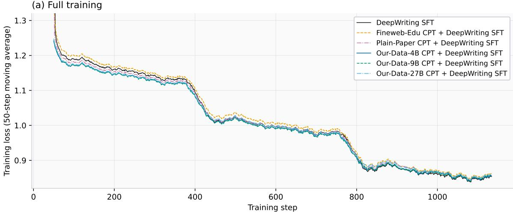

(b) Final phase (steps 800-1134)  
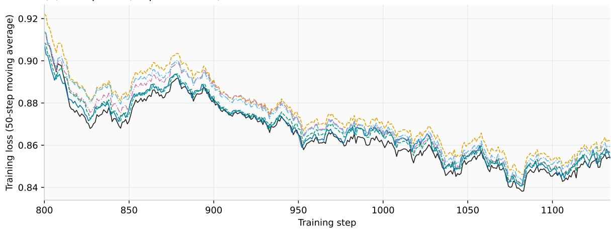  
Figure 8 Training loss under the shared DeepWriting SFT recipe. (a) Full training. (b) Final phase. Every run follows the same stable, epoch-aligned shape and converges to a narrow band. Training loss and downstream ranking capture diferent properties.

Figure 9 shows the corresponding comparison under Our-Mixed SFT. Our-Data-27B CPT remains below direct Our-Mixed SFT throughout training and ends at 0.803, compared with 0.816. This direction agrees with the downstream Average, which rises from 52.35 to 54.38, and indicates stronger alignment between the trajectory-CPT initialization and this mixed paper-writing objective. Each figure has its own absolute loss scale because the two SFT mixtures contain diferent examples and target distributions.

## F.5 General Reasoning and Paper-Reading SFT

For the general reasoning table, all CPT checkpoints receive the same OpenThoughts SFT [10]. For paper QA and long-context reading, all checkpoints receive the same SmolTalk2 SFT recipe with thinking disabled. Within each table, every row therefore uses the same SFT data and recipe, isolating the CPT initialization.

Our-Mixed SFT Training Loss  
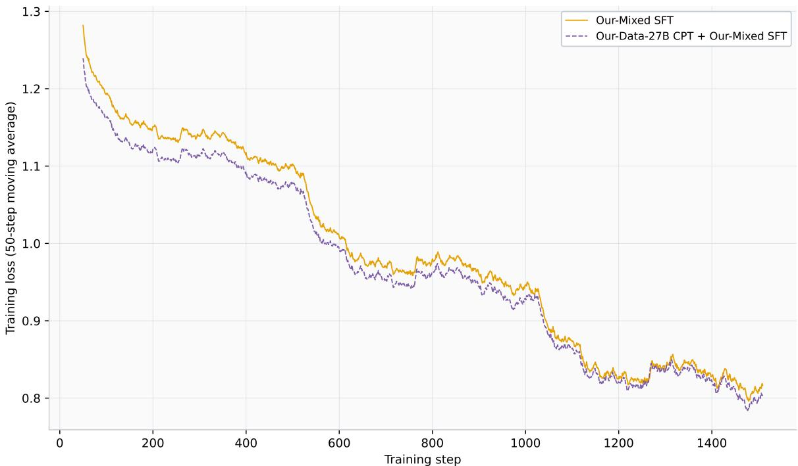  
Figure 9 Training loss under Our-Mixed SFT. Our-Data-27B CPT lowers the loss across training relative to direct Our-Mixed SFT. The optimization advantage and downstream writing Average move in the same direction. Curves are 50-step moving averages.

## G Writing Benchmark Protocols

WritingBench. We use the benchmark’s direct writing requests and its prompt-specific five-criterion judging structure [38]. We report the overall score and the Academic & Engineering subset separately.

PAW-Bench. We report both the 0–100 rubric score and the 0–1 checklist pass rate.

HelloBench. We report the Open-Ended QA and Heuristic Text Generation subsets, the two categories closest to the paper’s writing setting, using their checklist-style criteria [27].

LongBench-Write. We preserve original task prompts and explicit length targets [3]. This benchmark primarily probes sustained generation to a requested length.

All four writing suites in the main table use GPT-5.5 with medium reasoning efort as the final judge. Benchmark-specific rubrics remain distinct, and only the judge model is unified. The equal-weight Average first averages HelloBench’s two reported subsets, then averages WritingBench overall, PAW-Bench rubric, the HelloBench aggregate, and LongBench-Write. Checklist pass rate and WritingBench Academic & Engineering are reported as diagnostic columns. The Average uses the four terms listed above.