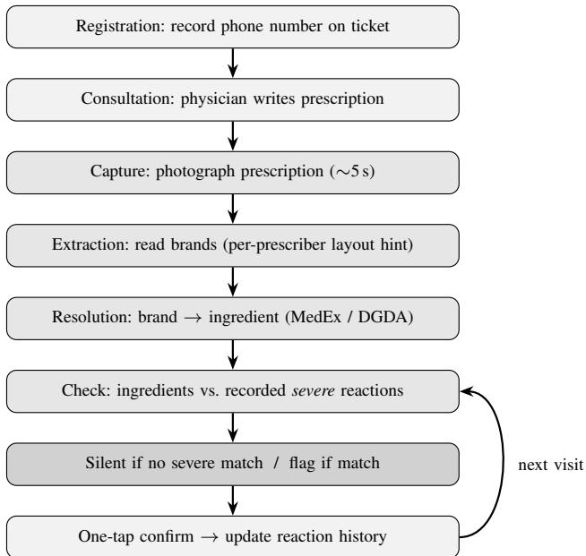

# A Point-of-Prescription Safety-Check System for Adverse Drug Reactions in Rural Bangladeshi Hospitals: A Feasibility Study

Shahir Abdullah

Department of Computer Science and Engineering

United International University, Dhaka, Bangladesh

Email: sshahnoor2620025@mscse.uiu.ac.bd

Abstract—Adverse drug reactions (ADRs) are a major, largely preventable source of patient harm. In high-income settings, electronic health records store a patient’s allergy history and warn prescribers when a contraindicated drug is ordered; in rural Bangladeshi public hospitals no such record exists, a single physician may see on the order of one patient per minute, and a patient’s history of severe reactions does not survive between visits. This paper proposes and outlines the evaluation of a lightweight, smartphone-based safety-check system for this setting. At registration a soft identifier (a phone number) is recorded; after the physician writes a prescription, its image is captured, the brand names are resolved to active ingredients using national drug references, and the ingredients are matched against the patient’s recorded severe reaction history. The system is retrieval-based rather than predictive, and is silent by default, raising a flag only for high-risk matches a design grounded in the alert-fatigue literature. We frame the work as a feasibility study: we describe the proposed framework and an evaluation plan measuring workflow fit under high volume, usability, identityresolution reliability, and retrospective detection of known reaction cases. We explicitly do not claim a clinical-outcome effect, which the low base rate of severe events places beyond a singlesite feasibility study.

Index Terms—adverse drug reaction, clinical decision support, medication safety, low-resource healthcare, mHealth, feasibility study, Bangladesh.

## I. INTRODUCTION

Adverse drug reactions (ADRs) are a major and largely preventable source of patient harm and a substantial burden on health systems worldwide [1]. Reviews estimate that ADRs account for roughly 5–6% of hospital admissions in both developed and developing countries, with the majority classified as preventable [2]. The burden extends to ambulatory care, where many adverse drug events are preventable or ameliorable [3], and meta-analytic evidence indicates that about half of outpatient ADRs are avoidable [4]. A recurrent and avoidable cause is administering a drug to a patient with a known prior hypersensitivity or adverse reaction to it, which can range from a mild rash to life-threatening anaphylaxis.

In high-income systems this failure is mitigated by electronic health records (EHRs) that store a structured allergy history and raise an alert when a contraindicated drug is ordered.

However, such systems suffer from alert fatigue: clinicians override the large majority of drug-allergy alerts override rates exceeded 85% over a decade at two academic hospitals largely because alerts are excessive and non-specific [5]. The consensus corrective is to raise alert specificity so that warnings fire mainly for clinically significant, severe events, thereby preserving clinician trust and attention [6]. This principle; few, high-stakes alerts rather than many trivial ones is central to the present design.

These safeguards are absent precisely where the harm is least tolerable. In Bangladesh, outpatient prescribing is dominated by handwritten prescriptions that frequently contain omissions and are often illegible; a survey of 900 prescriptions found illegible handwriting in nearly half [7], and prescribing errors remain common in rural district hospitals [8]. Field observation at an upazila health complex in Meherpur further indicated that no structured record is retained for non-admitted outpatients, so a patient’s medication and adverse-reaction history does not survive between visits; the registration identifier is a per-day serial that cannot link visits, and a single duty physician may see on the order of one patient per minute.

Digital clinical decision support (CDS) has proven feasible in comparable low-resource settings, though typically as feasibility and acceptability studies of purpose-built, lightweight tools rather than large algorithmic systems. Point-of-care CDS has been shown feasible and acceptable in a rural Ugandan district hospital [9] and in primary facilities in Chad [10], and mobile phones are an established platform for supporting frontline health workers in low- and middle-income countries [11]. A scoping review nonetheless cautions that CDS tools poorly matched to rural physician workflow show reduced effectiveness and are better positioned as assistants than as replacements for clinician judgement [12]. Within Bangladesh, prior work has measured the prescription-error problem [7], [8] but has not delivered a deployed medicationsafety tool for the rural outpatient workflow.

A gap therefore remains: no lightweight, deployable system surfaces a patient’s severe adverse-reaction history at the point of prescription in a rural, records-poor, high-throughput

Bangladeshi setting. This paper proposes and outlines the evaluation of such a system. Its contributions are: (i) a workflowintegrated capture-and-check pipeline that resolves prescribed brand names to active ingredients and matches them against the patient’s recorded severe-reaction history using retrieval rather than prediction; (ii) a severity-gated, silent-by-default alerting design grounded in the alert-fatigue literature; and (iii) a feasibility evaluation plan for a real upazila setting, assessing workflow fit under high patient volume, usability, identity-resolution reliability, and retrospective detection of known reaction cases.

In summary, we reframe medication safety for this setting as a retrieval-and-continuity problem rather than a prediction problem, and evaluate feasibility rather than clinical outcomes, an honest scope given the low base rate of severe events and the constraints of the setting.

## II. LITERATURE REVIEW

## A. ADR burden and preventability

The clinical motivation is well established: ADRs are frequent, costly, and substantially preventable across settings [1], [2], in both inpatient and ambulatory care [3], [4]. Evidence specific to low- and middle-income countries is comparatively sparse [2], underscoring the value of context-specific work.

## B. Decision support and alert fatigue

EHR-based allergy and interaction alerting is mature in high-income systems but is undermined by very high override rates and alert fatigue [5]. Systematic reviews conclude that improving alert specificity suppressing low-value warnings while preserving severe ones is the key lever for safe, usable decision support [6]. Our silent-by-default, severity-gated design is a direct application of this finding.

## C. CDS and mHealth in low-resource settings

Lightweight, phone- or tablet-based CDS tools have demonstrated feasibility and acceptability in rural LMIC facilities [9], [10], and mobile phones are an accepted delivery platform for frontline workers [11]. These studies, however, target conditions such as neonatal care and hypertension rather than medication-reaction safety, and workflow misfit is a known cause of failure [12].

## D. Prescription practices in Bangladesh

Bangladeshi studies document handwritten, error-prone, brand-centric prescribing and frequent omission of patient fields [7], [8]. This literature characterises the problem but stops short of a deployed point-of-care safety intervention; existing local digitisation efforts address prescription reading in isolation, without ingredient resolution, persistent history, or a safety check.

## E. Summary of the gap

Table I contrasts the main approaches against the requirements of our target setting. High-income EHR alerting assumes infrastructure that does not exist here; LMIC CDS studies fit the setting but target other clinical tasks; and Bangladeshi work measures the problem without delivering a tool. No prior approach combines an ADR/allergy focus, operation without records infrastructure, and fit to the rural Bangladeshi outpatient workflow.

## III. METHODOLOGY

## A. Research framework

The work is designed as a feasibility and acceptability study of a deployed tool, following the mixed-methods tradition established for CDS in low-resource settings [9], [10]. It is explicitly not a supervised-learning study: the system performs retrieval (brand→ingredient resolution and lookup against a recorded reaction list), so there is no trained predictive model, and consequently no train/test partition, data-leakage concern, or time-series (walk-forward) forecasting validation to control for. Validation instead combines retrospective detection on known reaction cases with prospective measurement of workflow fit (Section III-E).

## B. Data sources

Three data resources are used. (i) A brand-to-ingredient dictionary compiled from national drug references; MedEx [13] and the Directorate General of Drug Administration registry [14]mapping locally marketed brands and fixed-dose combinations to their active ingredients. (ii) A severe-reaction reference: a curated list of drugs and drug classes whose documented hypersensitivity reactions are classified as severe, using an established severity tiering, so that only high-risk matches trigger a flag. (iii) Site data: de-identified retrospective outpatient tickets and prescriptions from the study hospital (including documented past reaction cases) for retrospective validation, and prospectively captured prescriptions during the feasibility trial.

## C. Data handling, normalisation, and privacy

Captured prescriptions are converted to a set of active ingredients in two steps: reading the prescribed brand strings, then normalising each to its ingredient(s) via the dictionary above; unresolved strings are surfaced to the physician rather than silently dropped. Because identity is a soft key (a phone number), a candidate history is presented for one-tap confirmation before it is trusted, preventing a wrong-patient match from attaching an incorrect reaction record. All stored data are de-identified for analysis, and the deployment operates under informed consent and institutional ethical approval, given that identifiable medication and reaction data are involved.

## D. System design and proposed framework

Figure 1 shows the proposed pipeline. Identity capture is placed at registration so that the physician’s consultation time is unaffected. During the consultation the physician writes the prescription as usual; the only added action is photographing it (a few seconds on a device the physician already owns). To improve extraction reliability without heavy computation, the system supports a per-prescriber layout hint (e.g., the region of the form used for reaction notes), turning openended document reading into a constrained region-of-interest task. Extracted drugs are resolved to ingredients and checked against the patient’s recorded severe-reaction history; the interface stays silent unless a severe match is found, in which case it shows the matched drug and the recorded reaction for one-tap confirmation or dismissal. When a new reaction is identified, it is recorded against the patient identifier so that the history grows over time.

TABLE I  
COMPARISON OF EXISTING APPROACHES AGAINST THE REQUIREMENTS OF THE TARGET SETTING (RURAL BANGLADESHI OUTPATIENT CARE).
<table><tr><td>Approach</td><td>ADR/allergy</td><td>LMIC fit</td><td>No-records infra.</td><td>Rural BD</td><td>Main limitation for our setting</td></tr><tr><td>EHR allergy/interaction alerts (high-income) [5], [6]</td><td>√</td><td>x</td><td>x</td><td>x</td><td>Requires full EHR/CPOE; severe alert fatigue</td></tr><tr><td>LMIC point-of-care CDS / mHealth [9]-[11]</td><td>x</td><td>√</td><td>√</td><td>x</td><td>Targets other conditions; not medication-safety; not Bangladesh</td></tr><tr><td>Bangladeshi prescription- error studies [7], [8]</td><td>2</td><td>√</td><td>~</td><td>√</td><td>Measure the problem; no deployed sys- tem</td></tr><tr><td>Local prescription digitisation / OCR</td><td>x</td><td>√</td><td>~</td><td>√</td><td>Reading only; no ingredient resolution, history, or check</td></tr><tr><td>This work</td><td>√</td><td>√</td><td>√</td><td>√</td><td>Feasibility stage; single-site evaluation</td></tr></table>

  
Fig. 1. Proposed framework for the point-of-prescription safety-check system. Identity capture is offloaded to registration; the physician’s added burden is a single photograph.

## E. Evaluation design

Feasibility is assessed along four axes. Retrospective detection: the system is re-run on de-identified past cases in which a documented reaction was later repeated or avoided, measuring whether it would have flagged the culprit drug. Workflow fit:

seconds per patient, taps per patient, and task-completion rate are measured under realistic high-volume load, against a subminute budget. Identity resolution: the rate at which a returning patient is correctly re-linked via the soft identifier is reported, including collisions and misses. Usability and acceptability: standardised usability scoring and short physician interviews assess trust and willingness to adopt. We do not attempt to demonstrate a reduction in clinical harm; the low base rate of severe events (on the order of one preventable case per one–two weeks at the site, by field report) makes a powered outcome trial infeasible at a single site and is noted as future work.

## REFERENCES

[1] World Health Organization, “Medication without harm: WHO global patient safety challenge,” World Health Organization, Geneva, 2017.

[2] M. T. Angamo, L. Chalmers, C. M. Curtain, and L. R. E. Bereznicki, “Adverse-drug-reaction-related hospitalisations in developed and developing countries: A review of prevalence and contributing factors,” Drug Safety, vol. 39, no. 11, 2016.

[3] J. H. Gurwitz, T. S. Field, L. R. Harrold et al., “Adverse drug events in ambulatory care,” New England Journal of Medicine, vol. 348, no. 16, 2003.

[4] K. M. Hakkarainen, K. Hedna, M. Petzold, and S. Hagg, “Percentage¨ of patients with preventable adverse drug reactions and preventability of adverse drug reactions: A meta-analysis,” PLOS ONE, vol. 7, no. 3, 2012.

[5] M. Topaz, D. L. Seger, S. P. Slight et al., “Rising drug allergy alert overrides in electronic health records: An observational retrospective study of a decade of experience,” Journal of the American Medical Informatics Association, vol. 23, no. 3, 2016.

[6] T. N. Poly, M. M. Islam et al., “Clinical decision support systems for drug allergy checking: Systematic review,” Journal of Medical Internet Research, vol. 20, no. 9, 2018.

[7] M. U. Haque, M. A. Barik, S. Bashar et al., “Errors, omissions and medication patterns of handwritten outpatient prescriptions in bangladesh: A cross-sectional health survey,” Journal of Applied Pharmaceutical Science, vol. 6, no. 6, 2016.

[8] M. R. Sarkar et al., “A cross-sectional study on current prescription trends and errors in the outpatient department of a bangladeshi secondary care district hospital,” Perspectives in Clinical Research, vol. 13, no. 3, 2022.

[9] M. Muhindo, J. Bress, R. Kalanda et al., “Implementation of a newborn clinical decision support software (NoviGuide) in a rural district hospital in eastern uganda: Feasibility and acceptability study,” JMIR mHealth and uHealth, vol. 9, no. 2, 2021.

[10] B. Matthys, N. Monnier et al., “Development and implementation of a digital clinical decision support system to increase the quality of primary healthcare delivery in a refugee setting in chad,” BMC Primary Care, vol. 26, 2025.

[11] K. Kallander, J. K. Tibenderana¨ et al., “Mobile health (mHealth) approaches and lessons for increased performance and retention of community health workers in low- and middle-income countries: A review,” Journal of Medical Internet Research, vol. 15, no. 1, 2013.

[12] T. Ciecierski-Holmes, R. Singh, M. Axt et al., “Artificial intelligence for strengthening healthcare systems in low- and middle-income countries: A systematic scoping review,” npj Digital Medicine, vol. 5, 2022.

[13] MedEx, “MedEx: Online medicine index of bangladesh,” https://medex. com.bd, 2026.

[14] Directorate General of Drug Administration, “Registered drug products, bangladesh,” https://dgda.gov.bd, 2026.