# A Unified Descriptive-Complexity Framework for Model Selection under Correlated Designs

Yanhang Zhang1, Wei Liu2, and Yuhong Yang1, 3

1Yau Mathematical Sciences Center, Tsinghua University. 2Citigroup.

3Beijing Institute of Mathematical Sciences and Applications.

## Abstract

Model selection becomes particularly challenging under strong predictor dependence and model-class uncertainty, especially when there are exponentially many models. We propose a Descriptive-Complexity Information Criterion (DCIC) that regularizes large candidate model collections through Kraft-admissible code lengths. Under sub-Weibull noise, we establish selection consistency through approximationerror separation without relying on RIP-type conditions, together with nonasymptotic oracle risk bounds that remain valid under model misspecification. The same coding principle places heterogeneous classes on a common complexity scale at a small additional class-identification cost. This extension yields class–model recovery under suitable identifiability conditions and risk adaptation across classes. We further develop a complexity-guided search path that makes the computation–statistics tradeof explicit. Large penalties yield polynomial-size retained search regions with high probability, whereas smaller penalties sharpen the oracle risk benchmark. Numerical experiments illustrate stable support recovery and favorable estimation performance under strong dependence and model-class uncertainty.

Key words : Model selection, correlated designs, Kraft inequality, descriptive complexity, multi-class selection.

## 1 Introduction

Model selection has been a central problem in statistics and machine learning for decades, giving rise to an enormous literature on its theory, methodology, computation and applications. Despite thousands of papers published on the subject, in our opinion, several key issues remain barely or insuficiently addressed.

## 1.1 Three questions

1. Existing selection consistency results often require restrictive near-orthogonality conditions on the design, including the restricted isometry property (RIP) (Candès and Tao, 2005) and the sparse Riesz condition (SRC) (Zhang and Huang, 2008). How can one establish selection consistency and oracle risk guarantees under possibly strong predictor dependence that is commonly seen in high-dimensional data?

2. Most variable-selection procedures in regression work with a prespecified variable dictionary or basis family. In many applications, however, one naturally wants to explore several approximation systems. Is it possible to select across heterogeneous model classes to guarantee risk adaptation and, under correct model specification, achieve joint recovery of the true model class and its within-class model?

3. Scalable model-selection procedures typically use convex optimization or tractable approximations to nonconvex objectives. Best subset selection (BSS) ofers strong guarantees for selection consistency and estimation risk but generally involves combinatorial search over exponentially many subsets. Can one develop a method that explicitly links the extent of model-space exploration to an oracle risk benchmark, even under model misspecification?

The first question arises from the dificulty of distinguishing competing models under strong predictor dependence. Many existing analyses unfortunately rule out strongly dependent designs through restrictive design assumptions. In observational studies, however, strong and complex dependence is common, and concerns have been raised about RIP-type conditions (Wasserman, 2012). Rather than requiring the observed design to satisfy nearorthogonality conditions, a diferent direction is to characterize when selection consistency remains attainable under the observed dependence structure and to derive meaningful risk guarantees even when exact identification is dificult or irrelevant.

A further question is model-class uncertainty. Competing structural classes may exhibit markedly diferent approximation behavior and complexity, so restricting selection to a potentially misspecified class can result in substantial approximation error. For example, many methods for sparse additive regression approximate the target function using a prespecified basis family (Huang et al., 2010; Meier et al., 2009; Ravikumar et al., 2009), even though other basis families may be better suited. These considerations motivate a unified framework for selecting among heterogeneous classes that achieves risk adaptation and, under correct model specification, recovers the true class and its within-class model. To the best of our knowledge, such a framework is absent from the current literature.

A third question concerns the trade-of between statistical accuracy and the computational cost of exploring large model spaces. Some existing data-driven tuning procedures attain optimal rates, typically under favorable design conditions and sparse or weakly sparse approximation regimes (Bellec et al., 2018; Ing, 2020). These results primarily characterize approximation–estimation trade-ofs along a prescribed solution path. Under strong predictor dependence and model misspecification, however, they do not directly quantify how expanding the explored model region afects the attainable statistical benchmark.

Motivated by these considerations, we seek to develop a model selection framework that accommodates general predictor dependence by characterizing the distinguishability of competing models rather than imposing restrictive near-orthogonality conditions. The framework aims to provide meaningful risk guarantees under model misspecification and to compare heterogeneous model classes on a common complexity scale. We further seek to use its tuning parameter to control an admissible complexity budget, thereby linking the extent of model-space exploration to the attainable statistical benchmark.

## 1.2 A descriptive-complexity framework and main results

We address these questions through the Descriptive-Complexity Information Criterion (DCIC), a unified framework based on Kraft-admissible code lengths. To place the discussion in a concrete setting, let $X \in \mathbb { R } ^ { n \times p }$ be a fixed design matrix and consider the general mean model

$$
y = \mu _ { n } + \varepsilon ,
$$

where $y \in \mathbb { R } ^ { n }$ is the response vector, $\mu _ { n } \in \mathbb { R } ^ { n }$ is an unknown mean vector, and $\varepsilon =$ $( \varepsilon _ { 1 } , \ldots , \varepsilon _ { n } ) ^ { \top }$ consists of independent, mean-zero sub-Weibull random variables satisfying, for some $\alpha \in ( 0 , 2 ]$ and $\zeta > 0$

$$
\begin{array} { r } { \mathbb { E } ( \varepsilon _ { i } ^ { 2 } ) = \sigma ^ { 2 } , \qquad \operatorname* { P r } ( | \varepsilon _ { i } / \sigma | > t ) \le 2 \exp \{ - ( t / \zeta ) ^ { \alpha } \} , } \end{array}
$$

for all $t \geq 2$ and $i = 1 , \ldots , n$ (Comminges et al., 2021). When pursuing the consistency results, we specialize to $\mu _ { n } = X \beta ^ { * }$ , where $\beta ^ { * } \in \mathbb { R } ^ { p }$ is $s ^ { * }$ -sparse with support $S ^ { * }$ . For the risk analysis, we allow $\mu _ { n }$ to be arbitrary and do not require it to be represented by any candidate model or even to admit a linear representation in $X$

Consider a collection of candidate linear models. For a model $S$ of size $s ,$ define

$$
\begin{array} { r } { \mathrm { D C I C } ( S ) : = \mathrm { R S S } ( S ) / \sigma ^ { 2 } + \eta _ { n } s + \lambda C _ { S } ^ { 2 / \alpha } , } \end{array}
$$

where $\eta _ { n } > 0 , \operatorname { R S S } ( S ) = \left\| { \bigl ( } \mathrm { I } _ { n } - P _ { S } { \bigr ) } y \right\| _ { 2 } ^ { 2 }$ is the residual sum of squares of model $S , C _ { S }$ is the descriptive complexity of model $S ,$ and $\lambda \geq 0$ is a tuning parameter. The exponent $2 / \alpha$ reflects the tail behavior under sub-Weibull noise and the need to control deviations uniformly over a coded model class. In particular, $\alpha = 2$ corresponds to the sub-Gaussian noise setting. We assume that $C _ { S }$ satisfies the Kraft inequality

$$
\sum _ { S \in \mathcal { M } _ { n } } e ^ { - C _ { S } } \leq 1 ,
$$

where $\mathcal { M } _ { n }$ is the candidate model class. $C _ { S }$ can be viewed as a description length assigned to the model index, and the Kraft inequality ensures global admissibility of the resulting code. This coding interpretation is classical in information-theoretic model selection and minimum description length (Barron et al., 1998; Barron and Cover, 1991; Yang, 1999). Its broader connections with oracle risk theory are reviewed in Section 1.4.

The same Kraft-admissible complexity provides a unified answer to the three questions in Section 1.1. First, we establish a general selection consistency result for a broad class of model collections through approximation-error separation, without requiring RIP/SRC-type conditions, and verify the resulting assumptions under representative strongly correlated designs. The same criterion also yields nonasymptotic oracle risk bounds that remain meaningful under model misspecification and imply minimax-adaptive rates in several canonical settings.

Second, we extend DCIC to selection over M heterogeneous candidate classes. By encoding the class label at an additional cost of order log M, DCIC places models from all candidate classes on a common descriptive-complexity scale while preserving a global Kraft inequality. This yields guarantees for both exact class–model recovery and risk adaptation to the best approximation–complexity trade-of across classes. We illustrate this extension through adaptive basis-family selection in sparse additive models.

Third, we use the same descriptive-complexity structure to develop a complexity-guided search strategy with an explicit computation–statistics trade-of. Along the decreasing-λ path, larger penalties yield polynomial-size retained regions with high probability, whereas smaller penalties expand the search and sharpen the oracle risk benchmark under model misspecification. We further establish finite-sample control of false positives and false negatives along the path and identify an exact-recovery region under suitable beta-min conditions.

## 1.3 Motivating illustrations of the computation–statistics tradeof

We give two single-run illustrations of the trade-of, with detailed simulation protocols deferred to Section 6. Figure 1 reports the average squared error (ASE) and Matthews correlation coeficient (MCC) under a well-specified sparse model, whereas Figure 2 reports ASE, model size, and the number of selected strong signals under a misspecified densesignal model. In both figures, markers show the terminal performance of representative competitors, while DCIC traces a decreasing-λ path. The piecewise time axis uses seconds initially and minutes thereafter.

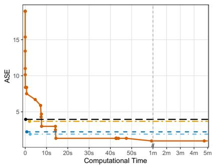

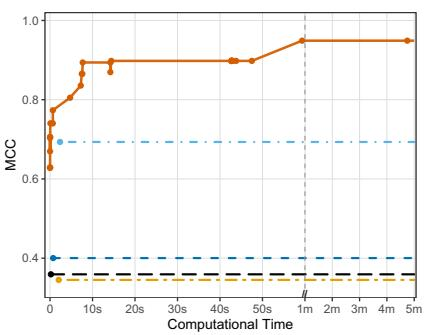  
DCIC LASSO SCAD MCP HTP

Figure 1: Computation–statistics trade-of under a well-specified, strongly correlated design with $n = 2 0 0$ $p = 1 0 0 0 .$ 2 $s ^ { * } = 2 0 .$ , σ = 2, $\rho _ { \mathrm { i n } } = \rho _ { \mathrm { o u t } } = 0 . 9$ , and $w = 0 . 5$  
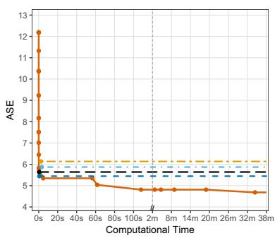

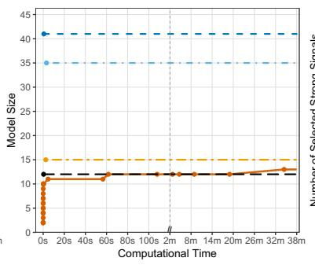

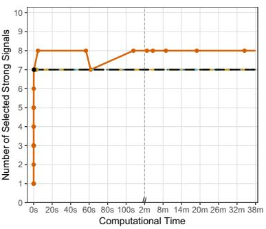  
DCIC LASSO−CV SCAD−CV MCP−CV HTP  
Figure 2: Computation–statistics trade-of under a misspecified dense-signal model with $n = 2 0 0$ 2 $p = 1 0 0 0$ , σ = 2, $\rho _ { \mathrm { i n } } = \rho _ { \mathrm { o u t } } = 0 . 7$ , and $w = 0 . 5$ . The coeficient vector contains 10 strong, 50 moderate, and 940 weak signals. The variables are partitioned into ten equal-sized blocks, each containing one strong and five moderate signals. Signal magnitudes are drawn independently from Unif(1, 1.3), Unif(0.2, 0.4), and Unif(0, 0.1), respectively, with independent random signs.

The illustrations show how the DCIC path improves statistical performance as the explored model region expands. In the well-specified setting, early DCIC solutions are already competitive, while later path points further improve support recovery. Under model misspecification, LASSO and SCAD tend to select larger models, whereas MCP and HTP remain relatively sparse. Along the DCIC path, the selected model gradually expands and ASE decreases. Taken together, the illustrations suggest that DCIC provides more favorable support recovery in the well-specified setting and identifies more strong variables under model misspecification, at the cost of additional computation. In both illustrations, DCIC attains lower ASE than the competing methods at suficiently small values of λ. Section 5.3 formalizes this pathwise computation–statistics trade-of.

## 1.4 Related literature

Model selection through penalized empirical criteria has long been analyzed using oracle inequalities that characterize approximation–estimation trade-ofs (Barron et al., 1999; Birgé and Massart, 2001, 2007). This theory is closely connected to information-theoretic coding and minimum description length. Kraft-admissible code lengths provide uniform control over large candidate collections and yield general oracle risk bounds (Barron et al., 1998; Barron and Cover, 1991; Yang, 1999; Yang and Barron, 1998). Related coding-based penalties have also been studied for structured sparse estimation (Huang et al., 2011). In Gaussian regression, complexity-penalized least squares further yields sharp oracle inequalities and minimax-adaptive rates over rich model lists (Verzelen, 2012; Wang et al., 2014). These results primarily address risk adaptation, and do not by themselves imply selection consistency.

Selection consistency has been extensively studied through information criteria. Classical BIC is consistent in fixed dimensions (Schwarz, 1978), but penalties depending only on model dimension may fail to control the exponentially large model lists that arise in high dimensions (Yang and Barron, 1998), motivating various BIC extensions (Chen and Chen, 2008; Wang et al., 2013; Zhang et al., 2023a). Our goal is to combine complexity-based uniform control with selection consistency under possibly strong predictor dependence while retaining oracle risk guarantees under misspecification.

Earlier, Shen et al. (2012, 2013) developed a degree-of-separation theory for BSS under general designs and showed that, when the sparsity level is specified, the resulting separation boundary is necessary and attainable up to constants. Recent work further developed this separation-based perspective for BSS under correlated designs (Gao and Aragam, 2025; Guo et al., 2021; Roy et al., 2025; Zhu and Wu, 2024). In particular, Guo et al. (2021) recast a closely related projection-gap condition as an identifiability margin and showed that, when $s ^ { * }$ is known, it is essentially necessary and suficient for BSS consistency. Roy et al. (2025) clarified its dependence on design geometry and derived additional suficient conditions, while Zhu and Wu (2024) established no false discoveries with high probability along the early BSS path for model sizes below $s ^ { * }$ . Gao and Aragam (2025) studied the optimal sample complexity of BSS with known and unknown $s ^ { * }$ . When $s ^ { * }$ is unknown, their proposed criterion depends on typically unobservable quantities, including designspecific structure and minimum signal strength. Existing results mainly address all-subset selection, often with known sparsity or additional structural information. In contrast, DCIC accommodates unknown sparsity and broader model collections, including all-subset, group, and double-sparse selection, through a common Kraft-admissible complexity framework.

On the computational side, modern mixed-integer optimization (MIO) has substantially improved the tractability of subset selection and its variants (Bertsimas and Van Parys, 2020; Bertsimas et al., 2016; Hazimeh et al., 2023; Mazumder et al., 2023). Branch-and-bound algorithms produce feasible incumbents together with explicit optimality gaps, allowing optimization error to be incorporated into statistical guarantees. Many standard cardinalitybased formulations assign the same selection cost to all models of a given size. From a complementary perspective, DCIC assigns Kraft-admissible, model-specific complexities and lets the tuning parameter determine a nonuniform complexity budget. This provides a statistical coding principle for analyzing how the retained search region and the oracle benchmark trade of along the tuning path, rather than a replacement for modern MIO solvers.

More broadly, a growing literature studies model uncertainty and adaptation across multiple candidate classes. Bayesian model averaging addresses model uncertainty through posterior averaging (Hoeting et al., 1999), while forecast combination aims to achieve optimal performance ofered by the candidate procedures adaptively or even improve the best individual performance by aggregating them instead of selecting a single one (Yang, 2004). Donoho and Johnstone (1994) studied adaptive denoising over a library of orthonormal bases and derived a near-oracle risk bound relative to the best basis. In nonparametric regression, Sklar et al. (2013) selects basis functions from multiple libraries to improve flexibility, but the resulting hybrid representations may be dificult to interpret. High-dimensional additive methods mainly focus on estimation within prescribed function classes (Tan and Zhang, 2019), rather than selection across heterogeneous classes. Since diferent families may exhibit substantially diferent approximation behavior, it remains unclear how to compare them on a common scale while obtaining both selection and risk guarantees.

Finally, a substantial literature studies statistical guarantees along solution paths for model selection. Bellec et al. (2018) derives sharp oracle inequalities for the LASSO under misspecification and develops a Lepski-type procedure attaining minimax adaptation in well-specified sparse models. Ing (2020) analyzes the prediction error of the orthogonal greedy algorithm (OGA) under various sparsity regimes and selects among candidates along the full path, whereas Stankewitz (2024) develops an early-stopping procedure with oracle inequalities along the nested OGA path, allowing dense signals within a linear model. Complementing these works, we develop a complexity-guided search strategy under possibly strong dependence and model misspecification, whose λ-path links the retained search size to an oracle risk benchmark and permits termination according to the computational budget.

## 1.5 Notation and Organization

Let $[ p ] : = \{ 1 , \ldots , p \}$ , and let $\mathcal { M } _ { n } \subseteq 2 ^ { [ p ] }$ denote the candidate model collection. For $S \in \mathcal { M } _ { n }$ , write $s : = | S |$ , let $X _ { S }$ be the submatrix of X indexed by $S ,$ and let $P _ { S }$ be the orthogonal projection onto $\operatorname { C o l } ( X _ { S } )$ , with $r _ { S } : = \mathrm { r a n k } ( X _ { S } )$ . Define the normalized approximation error

$$
\mathrm { A P P } ( S ) : = \| ( \mathrm { I } _ { n } - P _ { S } ) \mu _ { n } \| _ { 2 } ^ { 2 } / \sigma ^ { 2 } ,
$$

where $\mathrm { I } _ { n }$ is the $n \times n$ identity matrix. Let $c _ { 1 } , c _ { 2 } , \ldots$ . denote positive constants whose values may vary from line to line.

The remainder of the paper is organized as follows. Sections 2 and 3 establish selection consistency and risk bounds for DCIC under general predictor dependence. Section 4 extends the framework to model-class uncertainty, and Section 5 develops a complexityguided search strategy. Section 6 reports simulations, and Section 7 provides a summary of our work. Technical proofs and additional simulations are deferred to the appendices.

## 2 Model selection consistency of DCIC

We study exact recovery in the well-specified setting. Assume that there exists a true model $S ^ { * } \in \mathcal { M } _ { n }$ with $s ^ { * } : = | S ^ { * } |$ . Assume that the dictionary index set [p] is partitioned into nonempty selection atoms $\mathcal { U } = \{ U _ { 1 } , \ldots , U _ { q } \}$ and every $S \in \mathcal { M } _ { n }$ is an admissible union of atoms. Let $\mathcal { U } ( S ) : = \{ U \in \mathcal { U } : U \subseteq S \}$ and $\begin{array} { r } { S = \bigcup _ { U \in \mathcal { U } ( S ) } U . } \end{array}$ . Let $\mathcal { U } ^ { \ast } : = \mathcal { U } ( S ^ { \ast } )$ and $q ^ { * } : = | \mathcal { U } ^ { * } |$ The atoms specify the basic selection units, while $\mathcal { M } _ { n }$ specifies the admissible unions of atoms. This atom-level formulation yields a general consistency framework for structured model collections representable as admissible atom unions. The examples below correspond to diferent choices of atoms and admissible unions.

We partition the models into the overfitted, underfitted, and wrong classes,

$$
\mathcal { M } _ { \operatorname { s u p } } : = \{ S \in \mathcal { M } _ { n } : S ^ { * } \subset S \} , \qquad \mathcal { M } _ { \operatorname { s u b } } : = \{ S \in \mathcal { M } _ { n } : S \subset S ^ { * } \} ,
$$

and

$$
\mathcal { M } _ { \mathrm { w } } : = \mathcal { M } _ { n } \setminus \Big ( \mathcal { M } _ { \mathrm { s u p } } \cup \mathcal { M } _ { \mathrm { s u b } } \cup \{ S ^ { * } \} \Big ) ,
$$

respectively. Define $\Delta ^ { - } ( S ) : = | \mathcal { U } ^ { * } \setminus \mathcal { U } ( S ) | , \Delta ^ { + } ( S ) : = | \mathcal { U } ( S ) \setminus \mathcal { U } ^ { * } |$ and $\widetilde { r } _ { S } : = \mathrm { r a n k } ( X _ { S \cap S ^ { * } } )$ For $\ell \in [ q ^ { * } ]$ , define $N ( \ell ) \ : = \ \left| \left\{ S \in { \mathcal { M } } _ { \mathrm { s u b } } : \Delta ^ { - } ( S ) = \ell \right\} \right|$ . Define $u _ { S } = \eta _ { n } ( s - s ^ { * } ) +$ $\lambda ( C _ { S } ^ { 2 / \alpha } - C _ { S ^ { * } } ^ { 2 / \alpha } )$ . For $S \in \mathcal { M } _ { \mathrm { w } }$ , define $\begin{array} { r } { B _ { S } = \frac { 1 } { 4 } \lambda D _ { S } ^ { 2 / \alpha } + \frac { 1 } { 4 } } \end{array}$ log log $n + 2 ( r _ { S } - \tilde { r } _ { S } )$ , where

$$
D _ { S } = \left\{ \log \left( { q ^ { * } } \atop { \Delta ^ { - } ( S ) }  \right) \left( { q ^ { } - q ^ { * } } \atop { \Delta ^ { + } ( S ) } \right) \right\} \wedge C _ { S } .
$$

Here $D _ { S }$ uses the sharper of a local combinatorial count and the global Kraft complexity to control the multiplicity of wrong models.

## 2.1 Model selection consistency of DCIC

Theorem 2.1. Assume that $\eta _ { n }  \infty$ and that the descriptive complexity satisfies the Kraft inequality $\begin{array} { r } { \sum _ { S \in \mathcal { M } _ { n } } e ^ { - C _ { S } } \leq 1 } \end{array}$ . There exists a constant $\lambda _ { \mathrm { s e l } }$ depending only on α and ζ such that, for every $\lambda \geq \lambda _ { \mathrm { s e l } }$ , if the following conditions hold:

(i) For every $S \in \mathcal { M } _ { \mathrm { s u p } } , C _ { S } \geq C _ { S ^ { * } }$ . In addition, there exist constants $0 < \tilde { c } _ { 1 } < c _ { 1 }$ such that, for every $j \geq 1$

$$
\sum _ { S \in { \mathcal { M } } _ { \mathrm { s u p } } , \Delta ^ { + } ( S ) = j } \exp \Bigl \{ - c _ { 1 } \lambda ^ { \frac { \alpha } { 2 } } \Bigl ( C _ { S } - C _ { S ^ { * } } \Bigr ) \Bigr \} \leq \exp \Bigl \{ \tilde { c } _ { 1 } \bigl ( \eta _ { n } j \bigr ) ^ { \frac { \alpha } { 2 } } \Bigr \} .\tag{1}
$$

(ii) There exists a suficiently large constant $c _ { 2 } > 1$ such that, for every $S \in \mathcal { M } _ { \mathrm { s u b } }$ ，

$$
\mathrm { A P P } ( S ) \geq c _ { 2 } \Bigg ( \eta _ { n } ( s ^ { * } - s ) + \lambda \Big ( C _ { S ^ { * } } ^ { \frac { 2 } { \alpha } } - C _ { S } ^ { \frac { 2 } { \alpha } } \Big ) _ { + } + \log ^ { \frac { 2 } { \alpha } } N \Big ( \Delta ^ { - } ( S ) \Big ) \Bigg ) .\tag{2}
$$

(iii) For every $S \in \mathcal { M } _ { w }$ satisfying $2 B _ { S } > u _ { S }$ , we have $\mathrm { A P P } ( S ) \geq 2 ( 2 B _ { S } - u _ { S } )$

Then

$$
\operatorname* { P r } \biggr ( \operatorname* { m i n } _ { S \in \mathcal { M } _ { n } , S \neq S ^ { * } } \mathrm { D C I C } ( S ) > \mathrm { D C I C } ( S ^ { * } ) \biggr ) \to 1 \qquad a s n \to \infty .
$$

Remark 2.2. The three assumptions in Theorem 2.1 correspond to overfitted, underfitted, and wrong competitors relative to $S ^ { * }$ . Assumption (i) controls $S \in \mathcal { M } _ { \mathrm { s u p } }$ through Krafttype summability induced by the complexity gap $C _ { S } - C _ { S ^ { * } }$ . Assumption (ii) excludes $S \in \mathcal { M } _ { \mathrm { s u b } }$ through lower bounds on $\operatorname { A P P } ( S )$ , reflecting the signal loss from omitted true atoms. Assumption (iii) treats $S \in \mathcal { M } _ { w }$ in two stages: suficiently large penalty gaps rule out models automatically, while borderline cases require additional approximation-error separation. All results remain valid under $\begin{array} { r } { \sum _ { S \in \mathcal { M } _ { n } } e ^ { - C _ { S } } \leq K _ { 0 } } \end{array}$ for any fixed finite $K _ { 0 } > 0$ with constants allowed to depend on $K _ { 0 }$

Corollary 2.3. Let $\{ C _ { k } \} _ { k = 1 } ^ { q }$ be nonnegative atomic code lengths satisfying $\begin{array} { r } { \sum _ { k = 1 } ^ { q } e ^ { - C _ { k } } \le 1 } \end{array}$ For each model $S \in \mathcal { M } _ { n }$ , define its descriptive complexity by $\begin{array} { r } { C _ { S } : = 1 + \sum _ { k : U _ { k } \subseteq S } C _ { k } } \end{array}$ . For every $\lambda \geq \lambda _ { \mathrm { s e l } }$ , if assumptions (ii)–(iii) of Theorem 2.1 hold, then

$$
\operatorname* { P r } \Big ( \operatorname* { m i n } _ { S \in \mathcal { M } _ { n } , \ S \neq S ^ { * } } \operatorname { D C I C } ( S ) > \operatorname { D C I C } ( S ^ { * } ) \Big ) \to 1 \qquad a s \ n \to \infty .
$$

Thus, additive atom-level codes automatically control overfitted models, leaving only the APP bounds for underfitted and wrong competitors to be verified.

## 2.2 Consistency for all-subset selection

In this setting, each atom corresponds to a single covariate, so the selected atom set is simply $\mathcal { U } ( S ) = S$ and the true atom set is $\mathcal { U } ^ { * } = S ^ { * }$ . In particular, $\Delta ^ { - } ( S ) = | S ^ { * } \setminus S |$ and $\Delta ^ { + } ( S ) = | S \setminus S ^ { * } |$ . Moreover, the counting function becomes $\begin{array} { r } { N ( \ell ) = \binom { s ^ { * } } { \ell } , \ell = 1 , \dots , s ^ { * } } \end{array}$ . We take $\eta _ { n } = \log n$ and $C _ { S } = s \log p ,$ which is Kraft-admissible by Remark 2.2.

Corollary 2.4. For every $\lambda \geq \lambda _ { \mathrm { s e l } }$ , if the following conditions hold:

(i) There exists a suficiently large constant $c _ { 1 } > 1$ such that, for every $S \in \mathcal { M } _ { \mathrm { s u b } }$

$$
\mathrm { A P P } ( S ) \geq c _ { 1 } \left( \Delta ^ { - } ( S ) \log n + \lambda \Big ( ( s ^ { * } \log p ) ^ { \frac { 2 } { \alpha } } - ( s \log p ) ^ { \frac { 2 } { \alpha } } \Big ) + \log ^ { \frac { 2 } { \alpha } } \left( { s ^ { * } ( S ) } \right) \right) .\tag{3}
$$

(ii) There exists a constant $\kappa > 0$ such that $2 B _ { S } < u _ { S }$ for all $S \in \mathcal { M } _ { w }$ with $s > ( 1 + \kappa ) s ^ { * }$ Moreover, for every $S \in \mathcal { M } _ { w }$ with $s \leq ( 1 + \kappa ) s ^ { * }$

$$
\begin{array} { r l } & { \operatorname { A P P } ( S ) \geq \lambda \left\{ \log \left( \displaystyle { \operatorname* { s } ^ { * } } ^ { * } ( S ) \right) \binom { p - s ^ { * } } { \Delta ^ { + } ( S ) } \right\} ^ { \frac { 2 } { \alpha } } + 2 ( s ^ { * } - s ) \log n } \\ & { \qquad + \ 2 \lambda \left\{ ( s ^ { * } \log p ) ^ { \frac { 2 } { \alpha } } - ( s \log p ) ^ { \frac { 2 } { \alpha } } \right\} + \log \log n + 8 ( r _ { S } - \widetilde { r } _ { S } ) . } \end{array}\tag{4}
$$

Then

$$
\operatorname* { P r } \biggr ( \operatorname* { m i n } _ { S \in \mathcal { M } _ { n } , S \neq S ^ { * } } \operatorname { D C I C } ( S ) > \operatorname { D C I C } ( S ^ { * } ) \biggr ) \to 1 \qquad a s \ n \to \infty .
$$

Remark 2.5. In the sub-Gaussian regime with $s = s ^ { * }$ , Guo et al. (2021) showed that the identifiability margin

$$
\operatorname* { i n f } _ { S \neq S ^ { * } , s = s ^ { * } } { \frac { \operatorname { A P P } ( S ) } { \Delta ^ { + } ( S ) } } \gtrsim \log p
$$

is suficient and nearly necessary for BSS consistency. Since $\Delta ^ { + } ( S ) = \Delta ^ { - } ( S )$ when $s = s ^ { * }$ this verifies (4), whose lower bound is of order $\Delta ^ { + } ( S )$ log p. Hence, the setting studied by Guo et al. (2021) is a fixed-size special case of our APP-based separation framework.

Remark 2.6. An alternative is $C _ { S } = s \log ( e p / s ) + \log p$ , which matches the EBIC combinatorial penalty in order when $\alpha = 2$ , up to constants and additive terms. Compared with s log p, it penalizes large models less heavily. If $s ^ { * }$ diverges, consistency typically requires $\log ( e p / s ^ { * } ) \asymp \log p$ or a stronger dimension penalty through $\eta _ { n }$ . When $s ^ { * }$ is fixed, the two choices are equivalent in order, which is the regime considered by Chen and Chen (2008).

## 2.3 Consistency for group selection

Let the p predictors be partitioned into m disjoint groups $G _ { 1 } , \ldots , G _ { m }$ , with $| G _ { k } | = d .$ Equivalently, $p = m \times d$ and $s ^ { * } = g ^ { * } d$ . A candidate model is indexed by its selected group set $G \subseteq [ m ]$ , with $g : = | G |$ . Thus, $\mathcal { U } ( S ) = G , \mathcal { U } ^ { * } = G ^ { * } , \Delta ^ { + } ( S ) = | G \backslash G ^ { * } | , \Delta ^ { - } ( S ) = | G ^ { * } \backslash G |$ , and $N ( \ell ) = { \binom { g ^ { * } } { \ell } }$ for $\ell \in [ g ^ { * } ]$ . We take $\eta _ { n } = \log n$ and $C _ { S } = g \log m$ , which is Kraft-admissible by Remark 2.2.

Corollary 2.7. For every $\lambda \geq \lambda _ { \mathrm { s e l } }$ , if the following conditions hold:

(i) There exists a suficiently large constant $c _ { 1 } > 1$ such that, for every $S \in \mathcal { M } _ { \mathrm { s u b } }$

$$
\mathrm { A P P } ( S ) \geq c _ { 1 } \Biggl ( ( s ^ { * } - s ) \log n + \lambda \Bigl ( ( g ^ { * } \log m ) ^ { \frac { 2 } { \alpha } } - ( g \log m ) ^ { \frac { 2 } { \alpha } } \Bigr ) + \log ^ { \frac { 2 } { \alpha } } \Biggl ( \operatorname { \mathcal { Q } } ^ { * } _ { \Delta ^ { - } ( S ) } \Bigr ) \Biggr ) .
$$

(ii) There exists a constant $\kappa > 0$ such that $2 B _ { S } < u _ { S }$ for all $S \in \mathcal { M } _ { u }$ with $g > ( 1 + \kappa ) g ^ { * }$ Moreover, for every $S \in \mathcal { M } _ { u }$ with $g \leq ( 1 + \kappa ) g ^ { * }$

$$
\begin{array} { r l } & { \operatorname { A P P } ( S ) \geq \lambda \left\{ \log \left( \displaystyle { g ^ { * } } \frac { g ^ { * } } { \Delta ^ { - } ( S ) } \right) \binom { m - g ^ { * } } { \Delta ^ { + } ( S ) } \right\} ^ { \frac { 2 } { \alpha } } + 2 ( s ^ { * } - s ) \log n } \\ & { \qquad + \ 2 \lambda \left\{ ( g ^ { * } \log m ) ^ { \frac { 2 } { \alpha } } - ( g \log m ) ^ { \frac { 2 } { \alpha } } \right\} + \log \log n + 8 ( r _ { S } - \widetilde { r } _ { S } ) . } \end{array}
$$

Then

$$
\operatorname* { P r } \biggr ( \operatorname* { m i n } _ { S \in \mathcal { M } _ { n } , S \neq S ^ { * } } \mathrm { D C I C } ( S ) > \mathrm { D C I C } ( S ^ { * } ) \biggr ) \to 1 \qquad a s n \to \infty .
$$

## 2.4 Consistency for double-sparse structure

For a candidate model S, define $G : = \{ k \in [ m ] : S \cap \mathcal { G } _ { k } \neq \emptyset \} , \ g : = | G |$ and $t _ { k } ( S ) : =$ $| S \cap \mathcal { G } _ { k } |$ for $k \in G$ . Unlike group selection, only a sparse subset of variables may be active within each selected group. Treating individual variables as the selection atoms while retaining the group structure in the admissible model collection, we define

$$
C _ { S } : = g \log m + s \log d + 2 \log ( g + 1 ) + 2 \sum _ { k \in G } \log ( t _ { k } + 1 ) .
$$

The four terms encode, respectively, the selected groups, the selected variables within active groups, the number of active groups, and the within-group subset sizes, while ensuring Kraft admissibility. Theorem 2.1 then yields selection consistency under the corresponding APP-separation conditions. A precise statement and proof are provided in Appendix A.3.

## 2.5 Representative designs with strong dependence

In this section, we verify the APP separation requirement in Corollary 2.4 and derive explicit beta-min conditions under three representative correlated designs.

Scenario 1 (Equicorrelation) Assume that the predictors are centered and standardized, and that the sample Gram matrix $\widehat { \Sigma } : = X ^ { \top } X / n = ( 1 - \omega ) \mathrm { I } _ { p } + \omega \mathbf { 1 } _ { p } \mathbf { 1 } _ { p } ^ { \top }$ for some $\omega \in [ 0 , 1 )$ where ${ \bf 1 } _ { p }$ denotes the $p \mathrm { - }$ dimensional all-ones vector.

Scenario 2 (Weak alignment with spurious predictors) Assume that $\lambda _ { \operatorname* { m i n } } \Bigl ( \widehat { \Sigma } _ { S ^ { * } S ^ { * } } \Bigr ) \ \geq$ $\lambda _ { * } ~ > ~ 0$ . Moreover, there exist constants $\kappa _ { 0 } \geq 1$ and $\epsilon _ { 0 } \in ( 0 , 1 )$ such that

$$
\operatorname* { s u p } _ { | S | \le ( 1 + \kappa _ { 0 } ) s ^ { * } } \frac { \| P _ { S } X _ { S ^ { * } \setminus S } \beta _ { S ^ { * } \setminus S } ^ { * } \| _ { 2 } ^ { 2 } } { \| X _ { S ^ { * } \setminus S } \beta _ { S ^ { * } \setminus S } ^ { * } \| _ { 2 } ^ { 2 } } \le 1 - \epsilon _ { 0 } .
$$

This condition is closely related to quantities based on residualized signals considered by Roy et al. (2025) for BSS with known sparsity under correlated designs.

Scenario 3 (Shadow predictors) Assume that $\widehat { \Sigma } _ { S ^ { * } S ^ { * } } = \mathrm { I } _ { s ^ { * } }$ . For each $j \in S ^ { * }$ , there exists a shadow predictor $\tilde { \boldsymbol j } \in ( S ^ { \ast } ) ^ { c }$ such that $\widehat { \Sigma } _ { j , \widetilde { j } } = \omega$ for some $\omega \in ( 0 , 1 )$ . Let $\widetilde { S } = \{ \widetilde { j } : j \in S ^ { * } \}$ with $| \tilde { S } | = s ^ { * }$ . These $s ^ { * }$ signal–shadow pairs are mutually uncorrelated and are also uncorrelated with all remaining predictors.

These scenarios permit strong predictor dependence under which RIP conditions may fail, while the $\operatorname { A P P } ( S )$ -based separation requirement remains verifiable. Let $\begin{array} { r } { \beta _ { \operatorname* { m i n } } : = \operatorname* { m i n } _ { j \in S ^ { * } } | \beta _ { j } ^ { * } | } \end{array}$ and throughout this subsection take $\alpha = 2$ and $\eta _ { n } = \log n$

Theorem 2.8. For every $\lambda \geq \lambda _ { \mathrm { s e l } }$ , under Scenarios $\scriptstyle { 1 - { \mathcal { B } } } _ { \mathrm { { : } } }$ there exists a constant $c _ { \lambda } > 0$ such that the DCIC minimizer is selection consistent under the following conditions:

$$
( \mathrm { i } ) \ \beta _ { \mathrm { m i n } } ^ { 2 } \geq c _ { \lambda } \sigma ^ { 2 } \frac { \log p + \log n } { ( 1 - \omega ) n } , \ ( \mathrm { i i } ) \ \beta _ { \mathrm { m i n } } ^ { 2 } \geq c _ { \lambda } \sigma ^ { 2 } \frac { \log p + \log n } { \epsilon _ { 0 } \lambda _ { \ast } n } , \ \mathrm { ( i i i ) } \ \beta _ { \mathrm { m i n } } ^ { 2 } \geq c _ { \lambda } \sigma ^ { 2 } \frac { \log p + \log n } { ( 1 - \omega ^ { 2 } ) n } .
$$

When $\omega , \lambda _ { * }$ , and $\epsilon _ { 0 }$ are treated as constants, the beta-min conditions in Theorem 2.8 are of order $\sigma ^ { 2 } ( \log p + \log n ) / n$ . Whenever log $n = O ( \log p )$ , this reduces to the optimal beta-min scale $\sigma ^ { 2 } \log p / n$ for selection consistency in subset selection (Butucea et al., 2018). When $\omega \asymp 1 - 1 / s ^ { * }$ , the RIP and SRC conditions fail in Scenarios 1 and 3, so RIP/SRCbased consistency analyses are no longer applicable in these strongly correlated regimes (Wang et al., 2013; Zhang, 2010; Zhang et al., 2025; Zhu et al., 2020). By contrast, the $\mathrm { A P P } ( S )$ -based separation conditions remain verifiable. In particular, Theorem 2.8 yields $\beta _ { \mathrm { m i n } } ^ { 2 } \geq c \sigma ^ { 2 } s ^ { * } ( \log p + \log n ) / n$ for Scenarios 1 and 3, which simplifies to $c \sigma ^ { 2 } s ^ { * } \log p / n$ when log $n = O ( \log p )$ . Therefore, DCIC remains selection consistent in these strongly correlated regimes.

## 3 Oracle risk bounds under model misspecification

In this section, we establish nonasymptotic risk bounds for DCIC under model misspecification. Unlike the consistency analysis in Section 2, we do not require the existence of a distinguished true model $S ^ { * }$ . This risk perspective is particularly relevant when the candidate collection is misspecified or when strong dependence makes exact model recovery too stringent.

Let $\widehat S$ denote the model selected by DCIC, and for each model S, let $\widehat { \mu } _ { S } = P _ { S } y$ denote the least-squares estimator of $\mu _ { n }$ . Define its average squared error by $\begin{array} { r } { \mathrm { A S E } ( S ) : = \frac { 1 } { n } \| \mu _ { n } - \widehat { \mu } _ { S } \| _ { 2 } ^ { 2 } } \end{array}$ Denote

$$
R _ { n } ( \mu _ { n } ; S ) = \frac { 1 } { n } \| ( \mathrm { I } _ { n } - P _ { S } ) \mu _ { n } \| _ { 2 } ^ { 2 } + \frac { ( s \eta _ { n } - r _ { S } ) \sigma ^ { 2 } } { n } + \frac { \lambda \sigma ^ { 2 } C _ { S } ^ { 2 / \alpha } } { n } ,
$$

and $\begin{array} { r } { R _ { n } ^ { * } ( \mu _ { n } ; \mathcal { M } _ { n } ) = \operatorname* { m i n } _ { S \in \mathcal { M } _ { n } } R _ { n } ( \mu _ { n } ; S ) } \end{array}$ . The quantity $R _ { n } ^ { * } ( \mu _ { n } ; \mathcal { M } _ { n } )$ characterizes the optimal trade-of between approximation error and model complexity over the candidate set $\mathcal { M } _ { n }$ and is referred to as the index of resolvability in the literature (Barron et al., 1998; Barron and Cover, 1991; Yang, 1999).

Theorem 3.1. Assume that $\begin{array} { r } { \sum _ { S \in \mathcal { M } _ { n } } e ^ { - C _ { S } } \ \le \ 1 } \end{array}$ and $\eta _ { n } \geq 2$ . Then there exist positive constants $\lambda _ { \mathrm { { r i s k } } } , c _ { 1 , \alpha , \zeta }$ , and $c _ { 2 , \alpha , \zeta } $ , depending only on α and $\zeta ,$ such that, for every $\lambda \geq \lambda _ { \mathrm { r i s k } }$ and every $\delta \in ( 0 , 1 )$ , with probability at least $1 - \delta$

$$
\mathrm { A S E } ( \widehat { S } ) \leq 2 R _ { n } ^ { * } ( \mu _ { n } ; \mathcal { M } _ { n } ) + c _ { 1 , \alpha , \zeta } \frac { \sigma ^ { 2 } } { n } \left\{ \log \left( 4 / \delta \right) \right\} ^ { 2 / \alpha } .
$$

Consequently,

$$
\mathbb { E } \Big \{ \mathrm { A S E } ( \widehat { S } ) \Big \} \leq 2 R _ { n } ^ { * } ( \mu _ { n } ; \mathcal { M } _ { n } ) + c _ { 2 , \alpha , \zeta } \frac { \sigma ^ { 2 } } { n } .
$$

Theorem 3.1 shows that the DCIC risk is controlled by the best approximation– complexity trade-of over $\mathcal { M } _ { n }$ . We specialize this bound to well-specified sparse models with $\eta _ { n } = \log n$ and $\alpha = 2$ . For all-subset selection, taking $C _ { S } = s \log ( e p / s ) + \log p$ and log $n = O ( \log ( e p / s ^ { * } ) )$ gives

$$
\mathbb { E } \Big \{ \mathrm { A S E } ( \widehat { S } ) \Big \} \leq c \sigma ^ { 2 } \frac { s ^ { * } \log ( e p / s ^ { * } ) } { n } ,
$$

which is minimax optimal over $s ^ { * }$ -sparse linear models without design assumptions (Raskutti et al., 2011; Wang et al., 2014). For group selection, $C _ { S } = g \log ( e m / g ) + \log m$ yields

$$
{ \mathbb E } \Big \{ \mathrm { A S E } ( \widehat S ) \Big \} \leq c \sigma ^ { 2 } \frac { g ^ { * } \log ( e m / g ^ { * } ) + g ^ { * } d \log n } { n } ,
$$

matching the minimax rate up to a logarithmic factor in the within-group estimation term (Lounici et al., 2011). For double-sparse selection, take $C _ { S } = g \log ( e m / g ) + s \log ( e g d / s ) +$ $\begin{array} { r } { 2 \log ( g + 1 ) + 2 \sum _ { k \in G } \log ( t _ { k } + 1 ) } \end{array}$ . If $s ^ { * }$ log $n \lesssim g ^ { * } \log ( e m / g ^ { * } ) + s ^ { * } \log ( e g ^ { * } d / s ^ { * } )$ , then

$$
\mathbb { E } \Big \{ \operatorname { A S E } ( \widehat { S } ) \Big \} \leq c \sigma ^ { 2 } \frac { g ^ { * } \log ( e m / g ^ { * } ) + s ^ { * } \log ( e g ^ { * } d / s ^ { * } ) } { n } ,
$$

which is minimax optimal for double-sparse structures (Cai et al., 2022; Li et al., 2024).

## 4 Model-class uncertainty

DCIC extends to heterogeneous candidate classes by adding a log M class-identification cost while preserving Kraft admissibility.

## 4.1 Multi-class extension of DCIC

Let $\{ \mathcal { M } _ { n } ^ { ( m ) } \} _ { m = 1 } ^ { M }$ be candidate model classes with Kraft-admissible complexities $C _ { S } ^ { ( m ) }$ that is,

$$
\sum _ { S \in \mathcal { M } _ { n } ^ { ( m ) } } \exp \{ - C _ { S } ^ { ( m ) } \} \leq 1 , \qquad m = 1 , \dots , M .
$$

We aggregate candidates across classes using class–model pairs $( m , S )$ and define

$$
\widetilde { \mathcal { M } } _ { n } : = \bigcup _ { m = 1 } ^ { M } \big \{ ( m , S ) : S \in \mathcal { M } _ { n } ^ { ( m ) } \big \} .
$$

For each pair $( m , S )$ , define its descriptive complexity as

$$
C _ { ( m , S ) } : = C _ { S } ^ { ( m ) } + \log M , \qquad ( m , S ) \in \widetilde { { \cal M } } _ { n } .\tag{5}
$$

By the Kraft inequalities,

$$
\sum _ { ( m , S ) \in \widetilde { \mathcal { M } } _ { n } } \exp \{ - C _ { ( m , S ) } \} = \frac { 1 } { M } \sum _ { m = 1 } ^ { M } \sum _ { S \in \mathcal { M } _ { n } ^ { ( m ) } } \exp \{ - C _ { S } ^ { ( m ) } \} \leq 1 .
$$

Thus, the aggregated complexity remains Kraft-admissible. The additional log M term represents the cost of identifying one class among M candidate classes.

For each $( m , S ) \in { \widetilde { \mathcal { M } } } _ { n }$ , let $\mathrm { R S S } ( m , S )$ and $s _ { ( m , S ) }$ denote its residual sum of squares and number of selected variables, respectively. The multi-class DCIC is

$$
\mathrm { D C I C } ( m , S ) : = \mathrm { R S S } ( m , S ) / \sigma ^ { 2 } + \eta _ { n } s _ { ( m , S ) } + \lambda C _ { ( m , S ) } ^ { 2 / \alpha } , \qquad ( m , S ) \in \widetilde { \mathcal { M } } _ { n } ,\tag{6}
$$

and we select

$$
( \widehat { m } , \widehat { S } ) \in \arg \operatorname* { m i n } _ { ( m , S ) \in \widetilde { \mathcal { M } } _ { n } } \mathrm { D C I C } ( m , S ) .\tag{7}
$$

Analogously to the single-class decomposition of $\mathcal { M } _ { n }$ in Section 2, define

$$
\begin{array} { r l } & { \widetilde { \mathcal { M } } _ { \mathrm { s u p } } : = \big \{ ( m ^ { * } , S ) \in \widetilde { \mathcal { M } } _ { n } : S ^ { * } \subset S , ~ S \neq S ^ { * } \big \} , } \\ & { \widetilde { \mathcal { M } } _ { \mathrm { s u b } } : = \big \{ ( m ^ { * } , S ) \in \widetilde { \mathcal { M } } _ { n } : S \subset S ^ { * } , ~ S \neq S ^ { * } \big \} . } \end{array}
$$

These are the overfitted and underfitted pairs within the true class $m ^ { * }$ , while

$$
\widetilde { \mathcal { M } } _ { \mathrm { w } } : = \widetilde { \mathcal { M } } _ { n } \setminus \left( \widetilde { \mathcal { M } } _ { \mathrm { s u p } } \cup \widetilde { \mathcal { M } } _ { \mathrm { s u b } } \cup \{ ( m ^ { * } , S ^ { * } ) \} \right)
$$

contains all remaining wrong pairs, including those with $m \neq m ^ { * }$

Applying Theorem 2.1 to the aggregated list of pairs gives the multi-class consistency result. A precise formulation is given in Appendix $\mathrm { A . 6 }$

Corollary 4.1 (Multi-class selection consistency). Suppose there exists a unique true pair $( m ^ { \ast } , S ^ { \ast } ) \in \widetilde { \mathcal { M } } _ { n }$ , where $m ^ { * }$ denotes the true model class and $S ^ { * }$ the true model within class $m ^ { * }$ . For every $\lambda \geq \lambda _ { \mathrm { s e l } }$ , assume that the conditions in Theorem 2.1 hold on the aggregated candidate list $\widetilde { \mathcal { M } } _ { n }$ , indexed $b y$ pairs $( m , S )$ with complexity $C _ { ( m , S ) }$ . Then

$$
\mathrm { P r } \Big \{ ( \widehat { m } , \widehat { S } ) = ( m ^ { * } , S ^ { * } ) \Big \}  1 .
$$

Corollary 4.1 concerns exact pair recovery only when the true class-model pair is identifiable. When several classes yield statistically indistinguishable representations, risk adaptation is the more natural target.

For each $( m , S ) \in { \widetilde { \mathcal { M } } } _ { n }$ , let $\mathrm { A S E } ( m , S )$ be the class-wise extension of $\mathrm { A S E } ( S )$ in Section 3, interpreted within class $m$ . Similarly, let $R _ { n } ( \mu _ { n } ; m , S )$ be the class-wise extension of $R _ { n } ( \mu _ { n } ; S )$ with $C _ { S }$ replaced by $C _ { ( m , S ) }$ , and extend the index of resolvability to the multi-class setting by

$$
R _ { n } ^ { * } ( \mu _ { n } ; \widetilde { \mathcal { M } } _ { n } ) : = \operatorname* { m i n } _ { ( m , S ) \in \widetilde { \mathcal { M } } _ { n } } R _ { n } ( \mu _ { n } ; m , S ) .
$$

Under the same aggregated formulation, the risk bound in Theorem 3.1 extends directly to the multi-class setting.

Corollary 4.2 (Multi-class risk bound). Assume that $\begin{array} { r } { \sum _ { ( m , S ) \in \widetilde { \mathcal { M } } _ { n } } e ^ { - C _ { ( m , S ) } } \leq 1 } \end{array}$ and $\eta _ { n } \geq 2$ Then, there exist positive constants $\lambda _ { \mathrm { { r i s k } } }$ and $^ { \mathcal { C } _ { 1 , \alpha , \zeta } }$ such that whenever $\lambda \geq \lambda _ { \mathrm { r i s k } }$ , we have

$$
\mathbb { E } \Big \{ \mathrm { A S E } ( \widehat { m } , \widehat { S } ) \Big \} \leq 2 R _ { n } ^ { * } ( \mu _ { n } ; \widetilde { \mathcal { M } } _ { n } ) + c _ { 1 , \alpha , \zeta } \frac { \sigma ^ { 2 } } { n } .\tag{8}
$$

Compared with the single-class setting in Section 3, the multi-class extension introduces an additional log M term in the descriptive complexity, leading to an extra term of order (log $M ) ^ { 2 / \alpha } / n$ up to constants in the risk bound. This is the price of selecting among M candidate classes.

## 4.2 Basis-family selection in nonparametric sparse additive models

We illustrate the multi-class formulation through sparse additive regression with basisfamily uncertainty, where the class label identifies a basis family and the within-class model specifies the active components and their basis representations.

Let $( y _ { i } , x _ { i 1 } , \ldots , x _ { i p } ) _ { i = 1 } ^ { n }$ be observations from

$$
y _ { i } = \sum _ { j \in G ^ { * } } f _ { j } ^ { * } ( x _ { i j } ) + \varepsilon _ { i } ,
$$

where $G ^ { \ast } ~ \subset ~ [ p ]$ is the unknown active set with $| G ^ { * } | ~ = ~ g ^ { * } ~ \ll ~ p$ . Assume that each $X _ { j }$ is supported on [0, 1] with a marginal density bounded away from zero and infinity, ${ \mathbb E } \{ f _ { j } ^ { * } ( X _ { j } ) \} = 0$ for every $j \in G ^ { * }$ , and the errors are sub-Gaussian with $\sigma = 1$

Diferent basis families, such as Fourier, spline, and wavelet families, induce diferent approximation regimes and efective complexities. We therefore select both the basis family and the active components. Let $\mathcal { F } = \{ 1 , \ldots , M \}$ index the candidate families. For each $m \in { \mathcal { F } }$ , let $b _ { m } ( \cdot ) = \bigl ( b _ { m , 1 } ( \cdot ) , b _ { m , 2 } ( \cdot ) , \cdot \cdot \cdot \bigr )$ be a basis dictionary and let $b _ { m , K } ( \cdot ) =$ $\left( b _ { m , 1 } ( \cdot ) , \ldots , b _ { m , K } ( \cdot ) \right) \in \mathbb { R } ^ { K }$ denote its K-term truncation. Let $B _ { j , K } ^ { ( m ) } \in \mathbb { R } ^ { n \times K }$ be the corresponding design block for the jth covariate. The class-specific design is formed by concatenating these blocks over $j \in [ p ]$

A candidate model in $\mathcal { M } _ { n } ^ { ( m ) }$ is indexed by $S = ( G , \Gamma )$ , where $G \subset [ p ]$ is the active component set and Γ specifies its within-family representation. For ordered families, $\Gamma = K \in \mathbb { N }$ is the truncation level and $s _ { ( m , S ) } = | G | K$ . For families admitting sparse representations, $\Gamma = \{ I _ { j } \} _ { j \in G }$ records the selected basis terms and $\begin{array} { r } { s _ { ( m , S ) } = \sum _ { j \in G } | I _ { j } | } \end{array}$ We assign each within-family list $\mathcal { M } _ { n } ^ { ( m ) }$ a Kraft-admissible complexity $C _ { S } ^ { ( m ) }$ and use the augmented code $C _ { ( m , S ) } = C _ { S } ^ { ( m ) }$ + log M. Minimizing (6) over $( m , S ) \in { \widetilde { \mathcal { M } } } _ { n }$ then jointly selects the basis family, the active components, and their within-family representations.

For each $m \in { \mathcal { F } }$ , let $r _ { m } ( n )$ denote the optimal approximation–estimation–complexity trade-of for a univariate component over $\mathcal { M } _ { n } ^ { ( m ) }$ , and let $f _ { j , m } ^ { \circ }$ be admissible componentwise approximants attaining this trade-of up to constants. The examples below specialize the risk adaptation result in Corollary 4.2. For a function h, write $\begin{array} { r } { \| h \| _ { n } ^ { 2 } : = n ^ { - 1 } \sum _ { i = 1 } ^ { n } h ^ { 2 } ( x _ { i } ) } \end{array}$

Corollary 4.3. Fix a constant $\lambda \geq \lambda _ { \mathrm { r i s k } }$ and assume that the remaining conditions of Corollary 4.2 hold. Let $m ^ { \circ } \in \arg \operatorname* { m i n } _ { m \in \mathcal { F } } r _ { m } ( n )$ , and assume that, for some constant $c _ { 0 } \geq 1$ independent of $n , p ,$ and $g ^ { * }$

$$
\left\| \sum _ { j \in G ^ { * } } \left( f _ { j } ^ { * } - f _ { j , m ^ { \circ } } ^ { \circ } \right) \right\| _ { n } ^ { 2 } \leq c _ { 0 } \sum _ { j \in G ^ { * } } \left\| f _ { j } ^ { * } - f _ { j , m ^ { \circ } } ^ { \circ } \right\| _ { n } ^ { 2 }
$$

Let $( \widehat { m } , \widehat { S } )$ be the DCIC selector in (7). Then

$$
{ \mathbb E } \Big \{ \operatorname { A S E } ( \widehat { m } , \widehat { S } ) \Big \} \leq c _ { \lambda } \left\{ \frac { g ^ { * } \log ( e p / g ^ { * } ) } { n } + g ^ { * } \operatorname* { m i n } _ { m \in \mathcal { F } } r _ { m } ( n ) + \frac { \log M } { n } \right\} .
$$

Suppose that the true components belong to a univariate Sobolev-type smoothness class of order $\beta ,$ and that there exists a candidate family $m \in { \mathcal { F } }$ attaining the optimal one-dimensional rate $r _ { m } ( n ) \asymp n ^ { - \frac { 2 \beta } { 2 \beta + 1 } }$ . Then, Corollary 4.3 matches the minimax rate for sparse additive estimation (Raskutti et al., 2012) up to the class-selection cost log $M / n$ . In particular, when M grows at most polynomially in $n ,$ this extra term is of order $( \log n ) / n$ and hence does not afect the overall rate of convergence.

## 4.3 Fourier, Spline or Wavelet

Consider candidate basis families

$$
\mathcal { F } = \{ \mathrm { F o u r i e r , ~ S p l i n e , ~ H a a r ~ W a v e l e t } \} .
$$

As in Section 4.2, ordered family candidates are indexed by $S = ( G , K )$ , whereas Haar candidates are indexed by $S = ( G , \{ I _ { j } \} _ { j \in G } )$ . Let $\{ N _ { t } \} _ { t \ge 1 }$ be an increasing sequence satisfying $N _ { t } / t \to \infty$ . We assume that, for each $j \in G ,$ the selected indices in $I _ { j }$ can be arranged increasingly as $1 \leq \ell _ { j , 1 } < \cdot \cdot \cdot < \ell _ { j , | I _ { j } | }$ with $\ell _ { j , t } \leq N _ { t } , \ t = 1 , \ldots , | I _ { j } |$

We encode integers using a universal code of length of order $\log ^ { * } ( t )$ , where $\log ^ { * } ( t ) : =$ log $t + 2 \log \log ( t + 2 )$ for $t \geq 1$ (Rissanen, 1983). For the Fourier and spline families, we assign

$$
C _ { S } ^ { ( m ) } = | G | \log { \frac { e p } { | G | } } + \log p + \log ^ { * } ( K ) + c _ { 0 } , \qquad m \in \{ \mathrm { F o u r i e r , S p l i n e } \} .
$$

For the Haar family, we define

$$
C _ { S } ^ { ( { \mathrm { H a r } } ) } = | G | \log { \frac { e p } { | G | } } + \log p + \sum _ { j \in G } \left\{ \log ^ { * } ( | I _ { j } | ) + \sum _ { t = 1 } ^ { | I _ { j } | } \log N _ { t } + c _ { 0 } \right\} .
$$

For concreteness, we take $N _ { t } = ( t + 1 ) ^ { 2 } , t \geq 1$ , and choose $c _ { 0 } > 0$ suficiently large to ensure Kraft admissibility. With the class-label augmentation in Section 4.1, the aggregated code satisfies $\begin{array} { r } { \sum _ { ( m , S ) \in \widetilde { \mathcal { M } } _ { n } } \exp \{ - C _ { ( m , S ) } \} \le 1 } \end{array}$

Assume that the true regression function has a unique finite representation in one candidate basis family, yielding a unique pair $( m ^ { \ast } , S ^ { \ast } ) \in \widetilde { \mathcal { M } } _ { n }$ . Let $\mathrm { A P P } ( m , S )$ denote the corresponding within-class approximation error. The following corollary specializes Corollary 4.1 to exact family and within-family recovery.

Corollary 4.4. Consider the multi-class selection setting in Section $4 . 3$ with $\eta _ { n } = \log n$ Assume there exists a unique true pair $( m ^ { \ast } , S ^ { \ast } ) \in \widetilde { \mathcal { M } } _ { n }$ , and $g ^ { \ast } \leq p ^ { \gamma }$ for $0 < \gamma < 1$ . Assume that the following conditions hold:

(i) There exists an absolute constant $K _ { \mathrm { m a x } }$ such that $K \leq K _ { \operatorname* { m a x } }$ for every candidate in the ordered families and $| I _ { j } | \le K _ { \operatorname* { m a x } }$ for every $j \in G$ in each Haar candidate.

(ii) There exists a suficiently large constant $c _ { 1 } > 0$ such that, for every $( m , S ) \in \widetilde { \mathcal { M } } _ { \mathrm { s u b } }$

$$
\mathrm { A P P } ( m , S ) \geq c _ { 1 } \Big ( s ^ { * } - s _ { ( m , S ) } \Big ) \big ( \log n + \lambda \log p \big ) ;
$$

(iii) There exist suficiently large constants $\kappa > 0$ and $c _ { 2 } > 1$ such that, for every $( m , S ) \in$ $\mathcal { \widetilde { M } } _ { \mathrm { w } }$ with $s _ { ( m , S ) } \leq ( 1 + \kappa ) s ^ { * }$ , we have

$$
\mathrm { A P P } ( m , S ) \geq c _ { 2 } \bigg \{ \Big ( s ^ { * } - s _ { ( m , S ) } \Big ) _ { + } \log n + \lambda s ^ { * } \log p + \log \log n \bigg \} .
$$

Then there exists a constant $\lambda _ { \mathrm { b a s i s } }$ , depending on $\zeta$ and $\gamma _ { i }$ , such that, for every $\lambda \geq \lambda _ { \mathrm { b a s i s } }$

$$
\mathrm { P r } \Big \{ ( \hat { m } , \hat { S } ) = ( m ^ { * } , S ^ { * } ) \Big \}  1 .
$$

Remark 4.5. Condition (iii) admits a direct interpretation for cross-class candidates. Let $\mathcal { G } _ { m , S }$ denote the finite-dimensional candidate class induced by $( m , S )$ , and define

$$
\delta _ { n } ( m , S ) : = { \frac { 1 } { n } } \operatorname* { i n f } _ { g \in { \mathcal { G } } _ { m , S } } \sum _ { i = 1 } ^ { n } \Bigl ( f ^ { * } ( x _ { i } ) - g ( x _ { i } ) \Bigr ) ^ { 2 } .
$$

By the projection characterization of least squares, $\delta _ { n } ( m , S ) = \sigma ^ { 2 } \mathrm { A P P } ( m , S ) / n$ . Hence, for $( m , S ) \in \widetilde { \mathcal { M } } _ { \mathrm { w } }$ with m $\neq m ^ { * }$ and $s _ { ( m , S ) } \leq ( 1 + \kappa ) s ^ { * }$ , condition (iii) requires

$$
\delta _ { n } ( m , S ) \geq { \frac { c _ { 2 } \sigma ^ { 2 } } { n } } \left\{ \left( s ^ { * } - s _ { ( m , S ) } \right) _ { + } \log n + \lambda s ^ { * } \log p + \log \log n \right\} .
$$

Thus, cross-class competitors are excluded when their empirical approximation gaps dominate the corresponding complexity threshold.

Outside the exactly specified setting, Corollary 4.2 instead guarantees risk adaptation to the best approximation–complexity trade-of over the aggregated basis-family list.

Periodic Sobolev class Under the periodic Sobolev assumption, Tsybakov (2009) gives $r _ { \mathrm { H a a r } } ( n ) \asymp n ^ { - 2 / 3 } , ~ r _ { \mathrm { s p l i n e } } ( n ) \asymp n ^ { - \frac { 2 \beta } { 2 \beta + 1 } } , ~ r _ { \mathrm { F o u r i e r } } ( n ) \asymp n ^ { - \frac { 2 \beta } { 2 \beta + 1 } }$ , where $\tilde { \beta } = \beta \wedge 4$ captures the saturation of fixed-order cubic splines when $\beta > 4$ (Huang and Su, 2021). The Haar family has fixed regularity, so its approximation order over Sobolev classes saturates and yields the exponent $2 / 3$ (DeVore, 1998). Hence, among the three candidate families, Fourier achieves the best one-dimensional rate when $\beta > 4$

Non-periodic Sobolev class Assume that $f _ { j } ^ { * }$ belongs to a non-periodic Sobolev class on [0, 1] with order $\beta \in ( 1 , 4 ]$ . Then, $r _ { \mathrm { s p l i n e } } ( n ) \asymp n ^ { - \frac { 2 \beta } { 2 \beta + 1 } } , \ r _ { \mathrm { H a a r } } ( n ) \asymp n ^ { - 2 / 3 }$ . In contrast, periodic Fourier truncation can be suboptimal without boundary matching and achieve only $r _ { \mathrm { F o u r i e r } } ( n ) \asymp n ^ { - 1 / 2 }$ over this class (Tsybakov, 2009). Therefore, min $_ m r _ { m } ( n ) = r _ { \mathrm { s p l i n e } } ( n )$

Besov class $B _ { 1 , 1 } ^ { 1 } ( [ 0 , 1 ] )$ Over this class, the minimax risk among linear estimators is of order $n ^ { - 1 / 2 }$ , whereas nonlinear wavelet methods can attain $n ^ { - 2 / 3 }$ (Donoho and Johnstone, 1998). Truncated Fourier and spline least-squares fits are linear in the observations and hence are limited to the $n ^ { - 1 / 2 }$ benchmark. In contrast, the Haar-wavelet family with within-group subset selection achieves $r _ { \mathrm { H a a r } } ( n ) \asymp n ^ { - 2 / 3 }$ log n, where the extra log n is the price of searching an enlarged subset list under Kraft coding (Yang, 1999). Consequently, $\mathrm { m i n } _ { m } r _ { m } ( n ) = r _ { \mathrm { H a a r } } ( n )$ , and the wavelet family is optimal among the candidates up to a logarithmic factor.

## 5 A complexity-guided search strategy

We develop a complexity-guided search strategy for all-subset selection under sub-Gaussian noise, with analogous constructions for other model classes. Although the strategy does not alter the worst-case NP-hardness of subset selection (Natarajan, 1995), complexityguided pruning improves practical tractability and yields high-probability bounds on the retained search-region size together with finite-sample FP–FN control along the path.

## 5.1 Complexity-guided search strategy

For each variable $i \in [ p ]$ , let $r _ { i } \in [ p ]$ denote its rank supplied by a preliminary screening procedure, with smaller ranks corresponding to more informative covariates. We assign the

rank-based code length

$$
C _ { i } = \log ^ { * } ( r _ { i } ) , \qquad i \in [ p ] .
$$

For every $S \ \in \ M _ { n }$ , let $\begin{array} { r } { C _ { S } : = \sum _ { i \in S } C _ { i } } \end{array}$ . The resulting model complexity satisfies the generalized Kraft bound in Remark 2.2. Along the path, the model-specific complexities induce a λ-dependent budget that jointly controls the retained search region and the oracle risk benchmark. In practice, the ranking is obtained from a preliminary LASSO (Tibshirani, 1996) or marginal correlation. The induced Kraft code determines the search order and pruning priorities.

Let $\lambda _ { \zeta } ~ > ~ 0$ be a suficiently large constant depending only on $\zeta ,$ and let $\Lambda \ =$ $\{ \lambda _ { 1 } , \dotsc , \lambda _ { L } \} \subset [ \lambda _ { \zeta } , \infty )$ be a decreasing grid. The complexity of the corresponding DCIC minimizers is nondecreasing as λ decreases.

Lemma 5.1. For each $\lambda > 0$ , let $\widehat { S } _ { \lambda }$ be the minimizer of DCIC over $S \in \mathcal { M } _ { n }$ . Then, for any $0 < \lambda _ { 1 } < \lambda _ { 2 } , C _ { \widehat { S } _ { \lambda _ { 1 } } } \geq C _ { \widehat { S } _ { \lambda _ { 2 } } }$

Next, we introduce two pruning procedures that substantially reduce the candidate search space.

## 5.1.1 First-stage pruning of model sizes

At the current grid point $\lambda _ { k }$ , let $\widetilde { B } _ { k } : = \mathrm { D C I C } _ { \lambda _ { k } } ( \widehat { S } _ { \lambda _ { k - 1 } } )$ and $ { \widetilde { C } } _ { k } : =  { C _ {  { \widehat { S } } _ { \lambda _ { k - 1 } } } }$ . For notational simplicity, when the current grid point is fixed, we suppress the subscript k and write $\tilde { B } , \tilde { C }$ and λ. Since $\widehat { S } _ { \lambda _ { k - 1 } }$ remains feasible at the current $\lambda ,$ any global minimizer S at the current λ must satisfy RSS $( S ) / \sigma ^ { 2 } + \eta _ { n } s + \lambda C _ { S } \leq \widetilde { B }$ . Together with $\mathrm { R S S } ( S ) \geq 0$ and Lemma 5.1, this yields

$$
\widetilde { C } \le C _ { S } \le T _ { s } , \qquad T _ { s } : = { \frac { \widetilde { B } - \eta _ { n } s } { \lambda } } .\tag{9}
$$

Define s¯ := max $\{ s \in [ p ] : T _ { s } \geq \widetilde { C } \}$ and $\underline { { s } } : = \operatorname* { m i n } \{ s \in [ p ] : \operatorname* { m a x } _ { | S | = s } C _ { S } \geq \widetilde { C } \}$ . No model of size $s > \bar { s }$ or $s < \underline { s }$ can satisfy (9). Hence, the first-stage pruning restricts the search to model sizes $\underline { { s } } \le s \le \bar { s }$

## 5.1.2 Second-stage pruning of candidate variables

After the first-stage pruning identifies the admissible range of model sizes, the secondstage pruning further narrows the search space by screening variables for each admissible size s.

Let $C _ { ( 1 ) } \leq \cdots \leq C _ { ( p ) }$ denote the order statistics of $\{ C _ { i } \} _ { i = 1 } ^ { p }$ . For model $S ,$ let $t _ { 1 } < \cdots < t _ { s }$ be the ordered indices of its selected variables in this ordering. If $C _ { S } \leq T _ { s }$ , then for every $r = 1 , \ldots , s .$ , we have $\begin{array} { r } { \sum _ { \ell = 1 } ^ { r - 1 } C _ { ( \ell ) } + ( s - r + 1 ) C _ { ( t _ { r } ) } \leq T _ { s } } \end{array}$ . Accordingly, define

$$
i _ { s , r } : = \operatorname* { m a x } \Bigl \{ i \in \{ r , \ldots , p \} : \sum _ { \ell = 1 } ^ { r - 1 } C _ { ( \ell ) } + ( s - r + 1 ) C _ { ( i ) } \leq T _ { s } \Bigr \} , \qquad r = 1 , \ldots , s .
$$

Then every model with $C _ { S } \leq T _ { s }$ must satisfy $t _ { r } \leq i _ { s , r } , \ r = 1 , \ldots , s$ . Hence, for each admissible size $s ,$ it sufices to retain only those size-s supports satisfying these bounds.

After these two pruning stages, the remaining optimization is carried out over the reduced family by a depth-first search, with further pruning based on the remaining complexity budget.

Theorem 5.2. Assume that the model complexity satisfies $\begin{array} { r } { \sum _ { S \in \mathcal { M } _ { n } } e ^ { - C _ { S } } \leq 1 } \end{array}$ , and $\| \mu _ { n } \| _ { 2 } ^ { 2 } \leq$ $c _ { 1 } n \sigma ^ { 2 }$ for some constant $c _ { 1 } > 0$ . Let $N _ { \lambda }$ denote the number of candidate models retained by the budget constraint (9). Then, there exist constants $c _ { 2 } , c _ { 3 } > 0$ such that

$$
\operatorname* { P r } \Bigl ( N _ { \lambda } \le \exp ( c _ { 2 } n / \lambda ) \Bigr ) \ge 1 - \exp ( - c _ { 3 } n ) .
$$

In particular, $i f \lambda \ge c _ { 4 } n /$ log p for some constant $c _ { 4 } > 0$ , then

$$
\operatorname* { P r } \left( N _ { \lambda } \leq p ^ { c _ { 2 } / c _ { 4 } } \right) \geq 1 - \exp ( - c _ { 3 } n ) .
$$

Theorem 5.2 shows that larger λ yields more aggressive pruning, with $\lambda \gtrsim n /$ log p giving a polynomial-size retained region with high probability, while smaller λ sharpens the oracle benchmark in Section 3.

Let $\tau _ { n } : = \operatorname* { m a x } _ { j \in S ^ { * } } r _ { j }$ be the rank envelope of the true support. Since $C _ { S ^ { * } } \leq s ^ { * } \log ^ { * } ( \tau _ { n } )$ a suficient condition for $S ^ { * }$ to satisfy (9) in the polynomial regime is $s ^ { * } \log ^ { * } ( \tau _ { n } ) \leq c _ { 1 }$ log p for some $c _ { 1 } > 0$ . Under the uniform code $C _ { i } = \log p _ { ; }$ this reduces to $s ^ { * } = O ( 1 )$ , restricting the analogous guarantee to the fixed-sparsity regime.

## 5.2 FP and FN guarantees along a λ-path

Fix $\delta \in ( 0 , 1 )$ . Define $\begin{array} { r } { C _ { \operatorname* { m i n } } : = \operatorname* { m i n } _ { i \in [ p ] \backslash S ^ { * } } C _ { i } , C _ { \operatorname* { m a x } } ^ { * } : = \operatorname* { m a x } _ { i \in S ^ { * } } C _ { i } } \end{array}$ . Given $\lambda \in \Lambda$ , define

$$
\begin{array} { r } { \mathcal { L } _ { \lambda } : = \{ S \in \mathcal { M } _ { \mathrm { s u b } } \cup \mathcal { M } _ { \mathbb { w } } : ( \eta _ { n } + ( \lambda - \lambda _ { \zeta } ) C _ { \operatorname* { m i n } } ) \Delta ^ { + } ( S ) - \quad } \\ { ( \eta _ { n } + \lambda C _ { \operatorname* { m a x } } ^ { * } + \lambda _ { \zeta } \log s ^ { * } ) \Delta ^ { - } ( S ) \le \lambda _ { \zeta } \log ( L / \delta ) \} , } \end{array}
$$

and

$$
\omega _ { \lambda } : = \operatorname* { i n f } _ { S \in \mathscr { L } _ { \lambda } } \lambda _ { \operatorname* { m i n } } \biggl ( \frac { 1 } { n } X _ { S ^ { * } \backslash S } ^ { \top } ( \mathrm { I } _ { n } - P _ { S } ) X _ { S ^ { * } \backslash S } \biggr ) .
$$

Let the uniform lower bound $\begin{array} { r } { \underline { { \omega } } : = \operatorname* { m i n } _ { \lambda \in \Lambda } \omega _ { \lambda } . ~ \mathcal { L } _ { \lambda } } \end{array}$ contains the underfitted and wrong models that cannot be excluded by the penalty term alone. Over the remaining localized model list, ω provides a uniform lower bound along the path. The following theorem establishes a simultaneous FP–FN coupling over the λ-path.

Theorem 5.3. Assume $\omega > 0$ . Then, with probability at least $1 - c \delta$ , the following relationship holds for all $\lambda \in \Lambda$

$$
\begin{array} { r l } & {  { \bigg ( \eta _ { n } + ( \lambda - \lambda _ { \zeta } ) C _ { \operatorname* { m i n } } \bigg ) \Delta ^ { + } ( \widehat { S } _ { \lambda } ) } } \\ & { \quad + ( \frac { n } { 2 \sigma ^ { 2 } } \underline { { \omega } } \beta _ { \operatorname* { m i n } } ^ { 2 } - \eta _ { n } - \lambda C _ { \operatorname* { m a x } } ^ { * } - \lambda _ { \zeta } \log s ^ { * } ) \Delta ^ { - } ( \widehat { S } _ { \lambda } ) } \\ & { \quad \leq \lambda _ { \zeta } \log \biggr ( \frac { L } { \delta } \biggr ) . } \end{array}
$$

Under the $\beta _ { \mathrm { m i n } }$ condition, Theorem 5.3 yields upper bounds for $\Delta ^ { + } ( \widehat { S } _ { \lambda } )$ and $\Delta ^ { - } ( \widehat { S } _ { \lambda } )$

Corollary 5.4. Assume the conditions of Theorem 5.3 and

$$
\frac { n } { 2 \sigma ^ { 2 } } \underline { { \omega } } \beta _ { \mathrm { m i n } } ^ { 2 } > \eta _ { n } + \lambda C _ { \mathrm { m a x } } ^ { * } + \lambda _ { \zeta } \log s ^ { * } \qquad f o r \ a l l \ \lambda \in \Lambda .
$$

Then, with probability at least $1 - c \delta$ , the following bounds hold for all $\lambda \in \Lambda$

$$
\Delta ^ { + } ( \widehat S _ { \lambda } ) \le \frac { \lambda _ { \zeta } \log ( L / \delta ) } { \eta _ { n } + ( \lambda - \lambda _ { \zeta } ) C _ { \operatorname* { m i n } } } , \qquad \Delta ^ { - } ( \widehat S _ { \lambda } ) \le \frac { \lambda _ { \zeta } \log ( L / \delta ) } { \frac { n } { 2 \sigma ^ { 2 } } \omega \beta _ { \operatorname* { m i n } } ^ { 2 } - \eta _ { n } - \lambda C _ { \operatorname* { m a x } } ^ { * } - \lambda _ { \zeta } \log s ^ { * } } .
$$

Corollary 5.5. Assume that the conditions in Theorem 5.3 hold. Define

$$
\lambda _ { - } : = \lambda _ { \zeta } + \operatorname* { m a x } \Big \{ 0 , \ \frac { \lambda _ { \zeta } \log ( L / \delta ) - \eta _ { n } } { C _ { \operatorname* { m i n } } } \Big \} , \qquad \lambda _ { + } : = \frac { \frac { n } { 2 \sigma ^ { 2 } } \omega \beta _ { \operatorname* { m i n } } ^ { 2 } - \eta _ { n } - \lambda _ { \zeta } \log ( L s ^ { * } / \delta ) } { C _ { \operatorname* { m a x } } ^ { * } } .
$$

$I f \lambda _ { - } < \lambda _ { + }$ , with probability at least $1 - c \delta _ { i }$ , we have $\widehat { S } _ { \lambda } = S ^ { * } f o r$ all $\lambda \in \Lambda \cap ( \lambda _ { - } , \lambda _ { + } )$

Suppose $\eta _ { n } = \log n , \delta = n ^ { - c }$ for a fixed $c > 0$ , and L and $s ^ { * }$ grow at most polynomially in $n ,$ so that $\log ( L s ^ { * } / \delta ) \asymp \log n$ . If $\lambda _ { \zeta } \log ( L / \delta ) \leq \eta _ { n }$ , then $\lambda _ { - } = \lambda _ { \zeta }$ . Hence the exact recovery region in Corollary 5.5 is nonempty under $\begin{array} { r } { \beta _ { \mathrm { m i n } } ^ { 2 } \gtrsim \frac { \sigma ^ { 2 } } { n \omega } \{ C _ { \mathrm { m a x } } ^ { * } + \log n \} } \end{array}$ . Moreover, if $S ^ { * }$ is contained in the first $\tau _ { n }$ ranked variables, then under the optimal beta-min scale $\beta _ { \mathrm { m i n } } ^ { 2 } \asymp \sigma ^ { 2 } \log p / ( n \omega )$ , the upper endpoint satisfies $\lambda _ { + } \asymp \log p / \log ^ { * } ( \tau _ { n } )$

## 5.3 A concrete λ-path and the computation–statistics trade-of

We initialize at $\begin{array} { r } { \lambda _ { \operatorname* { m a x } } : = \| y \| _ { 2 } ^ { 2 } / ( \sigma ^ { 2 } \operatorname* { m i n } _ { j \in [ p ] } C _ { j } ) } \end{array}$ , for which the null model is globally optimal. Given $\rho \in ( 0 , 1 )$ , we use the geometric grid $\lambda _ { k } = \lambda _ { \operatorname* { m a x } } \rho ^ { k - 1 } , \ k \in \left[ L \right]$ . Larger $\rho$ yields finer resolution, whereas smaller $\rho$ reduces the number of evaluations but may lead to larger changes in the budget-constrained region.

We next give a concrete pathwise interpretation with $\eta _ { n } = \log n$ . Suppose $\| \mu _ { n } \| _ { 2 } ^ { 2 } \leq c n \sigma ^ { 2 }$ and consider $\lambda _ { \operatorname* { m a x } } \asymp n$ . Theorem 5.2 yields $N _ { \lambda _ { k } } \le \exp \left\{ C n / \lambda _ { k } \right\} \le \exp \left\{ C \rho ^ { - ( k - 1 ) } \right\}$ with high probability. Hence the search region remains polynomial in $p$ up to the computational boundary $\lambda _ { k } \asymp n / \log p .$ , corresponding to $k _ { \mathrm { p o l y } } \asymp \log _ { 1 / \rho } \log p$

The same path also has a statistical interpretation. Suppose the true support is contained in the first $\tau _ { n }$ ranked variables, and the risk bound in Section 3 gives

$$
\mathbb { E } \{ \mathrm { A S E } ( \widehat { S } _ { \lambda _ { k } } ) \} \leq C \sigma ^ { 2 } \left\{ \frac { s ^ { * } \log n } { n } + \rho ^ { k - 1 } s ^ { * } \log ^ { * } ( \tau _ { n } ) \right\} .
$$

If the path is continued beyond the computational boundary to smaller $\lambda ,$ the search may no longer have a polynomial-size certificate, but the oracle benchmark continues to improve. For simplicity, assume that log $\cdot ( e p / s ^ { * } ) \asymp \log p$ . The oracle benchmark matches the minimax rate when $\lambda _ { k } \lesssim \log p / \log ^ { * } ( \tau _ { n } )$ . Equivalently, $k \gtrsim k _ { \mathrm { s t a t } } : = \log _ { 1 / \rho } \{ n \log ^ { * } ( \tau _ { n } ) / \log p \}$ For all $k \geq k _ { \mathrm { s t a t } }$ , the risk bound becomes

$$
\mathbb { E } \{ \mathrm { A S E } ( \widehat { S } _ { \lambda _ { k } } ) \} \leq C \sigma ^ { 2 } \frac { s ^ { * } \log p } { n } .
$$

By Corollary 5.5, if $\beta _ { \mathrm { m i n } } ^ { 2 } \asymp \sigma ^ { 2 } \log p / ( n \omega )$ , the solution path enters the exact-recovery region at the same order as $k _ { \mathrm { s t a t } }$ . Thus, the statistical entry marks both minimax risk adaptation without a beta-min condition and entry into the exact-recovery region when the condition holds. Moreover, if $\lambda _ { - } = \lambda _ { \zeta }$ and $\lambda _ { + } \asymp \log p / \log ^ { * } ( \tau _ { n } )$ , then the region contains about $\log _ { 1 / \rho } \left\{ \log p / \log ^ { * } ( \tau _ { n } ) \right\}$ grid points. Hence, when log ${ } ^ { \ast } ( \tau _ { n } ) \ll \log p .$ , the selected support remains equal to $S ^ { * }$ over a growing segment of the λ-path.

Tables 1 and 2 summarize the dimension-dependent and ranking-dependent regimes. The first reports the certified polynomial range and statistical benchmarks under representative growth rates of ${ \dot { p } } ,$ , while the second shows how the rank envelope $\tau _ { n }$ afects the statistical entry and the beta-min scale for exact recovery. Appendix C.2 provides supporting simulations. Figure 3 gives a schematic summary. A smaller $\tau _ { n }$ shifts the statistical entry earlier along the path, which lies within the certified polynomial region when $k _ { \mathrm { s t a t } } \lesssim k _ { \mathrm { p o l y } } .$ , or equivalently $\log ^ { * } ( \tau _ { n } ) \lesssim ( \log p ) ^ { 2 } / n$ . Thus, the path may be stopped early for a conservative risk guarantee or continued to smaller λ to sharpen the oracle benchmark and potentially attain the minimax-optimal risk scale. Algorithm 1 summarizes the search strategy.

Table 1: Dimension-dependent scales along the DCIC path. Here $k _ { \mathrm { p o l y } }$ is the endpoint of the certified polynomial range. The last two columns report the target statistical benchmarks, whose ranking-dependent entry points are given in Table 2.
<table><tr><td rowspan="2">Growth of  $p$ </td><td>Computational certificate</td><td colspan="2">Statistical benchmarks</td></tr><tr><td> $k \leq k _ { \mathrm { p o l y } }$ </td><td></td><td>ASE benchmark Minimax beta-min scale</td></tr><tr><td> $n ^ { \gamma } , \gamma > 0$ </td><td> $k \leq \lceil \log _ { 1 / \rho } ( \gamma \log n ) \rceil$ </td><td> $\sigma ^ { 2 } s ^ { * } \log n / n$ </td><td> $\beta _ { \mathrm { m i n } } ^ { 2 } \gtrsim \sigma ^ { 2 } \log n / ( n \underline { { \omega } } )$ </td></tr><tr><td> $\exp ( n ^ { \xi } ) , 0 < \xi < 1$ </td><td> $k \le \lceil \log _ { 1 / \rho } ( n ^ { \xi } ) \rceil$ </td><td> $\sigma ^ { 2 } s ^ { * } n ^ { \xi - 1 }$ </td><td> $\beta _ { \mathrm { m i n } } ^ { 2 } \gtrsim \sigma ^ { 2 } n ^ { \xi - 1 } / \underline { { \omega } }$ </td></tr><tr><td> $\exp ( n )$ </td><td> $k \leq \lceil \log _ { 1 / \rho } ( n ) \rceil$ </td><td> $\sigma ^ { 2 } s ^ { * }$ </td><td> $\beta _ { \mathrm { m i n } } ^ { 2 } \gtrsim \sigma ^ { 2 } / \underline { { \omega } }$ </td></tr></table>

Table 2: Efect of ranking quality on the statistical entry and certified beta-min scale along the DCIC path. Here $k _ { \mathrm { s t a t } }$ denotes the entry index at which the oracle benchmark reaches the minimax ASE scale, and the certified beta-min scale refers to the minimum signal strength for exact recovery within the certified range $k \leq k _ { \mathrm { p o l y } }$
<table><tr><td colspan="3">Ranking regime  $k \geq k _ { \mathrm { s t a t } }$ </td><td colspan="3">Certified beta-min scale</td></tr><tr><td>Near-oracle:  $\tau _ { n } \asymp s ^ { * }$ </td><td> $k \geq$ </td><td> $\left\lceil \log _ { 1 / \rho } \left\{ { \frac { n \log ^ { * } ( s ^ { * } ) } { \log p } } \right\} \right\rceil$ </td><td></td><td> $\beta _ { \mathrm { m i n } } ^ { 2 } \gtrsim \frac { \sigma ^ { 2 } } { \underline { { \omega } } } \left\{ \frac { \log ^ { * } ( s ^ { * } ) } { \log p } + \frac { \log n } { n } \right\}$ </td><td></td></tr><tr><td>Favorable:</td><td></td><td> $\begin{array} { r l r } { \log ^ { * } ( \tau _ { n } ) } & { { } = } & { k \geq \left\lceil \log _ { 1 / \rho } \left\{ \frac { n \log ^ { * } ( \tau _ { n } ) } { \log p } \right\} \right\rceil } \end{array}$ </td><td></td><td> $\beta _ { \mathrm { m i n } } ^ { 2 } \gtrsim \frac { \sigma ^ { 2 } } { \underline { { \omega } } } \left\{ \frac { \log ^ { * } ( \tau _ { n } ) } { \log p } + \frac { \log n } { n } \right\}$ </td><td></td></tr><tr><td>o(log p) Uninformative: log p</td><td> $\log ^ { * } ( \tau _ { n } ) \ \asymp \ k \geq \ \lceil \log _ { 1 / \rho } ( n ) \rceil$ </td><td></td><td> $\beta _ { \mathrm { m i n } } ^ { 2 } \gtrsim \sigma ^ { 2 } / \underline { { \omega } }$ </td><td></td><td></td></tr></table>

(a) ASE trade-of  
(b) Exact recovery  
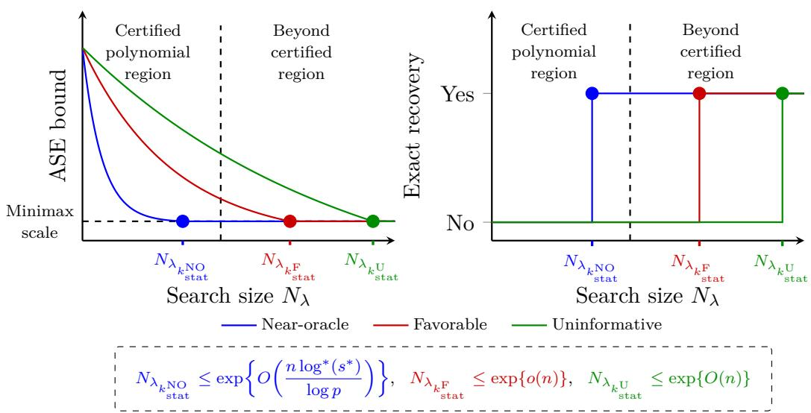  
Figure 3: A schematic illustration of the pathwise computation–statistics trade-of. The dashed line marks the boundary of the polynomial-in-p certified region. Panel (a) shows the entry to the minimax ASE benchmark, while panel (b) shows the corresponding exactrecovery entry under the beta-min scale. The colored expressions give high-probability search-size bounds at these entries. An entry lies within the certified region when $k _ { \mathrm { s t a t } } \lesssim$ $k _ { \mathrm { p o l y } }$

Algorithm 1 Complexity-guided search strategy   
Require: $\{ C _ { i } \} _ { i = 1 } ^ { p } ; \Lambda = \{ \lambda _ { 1 } > \cdots > \lambda _ { L } \} ; \sigma ; T _ { \mathrm { s t o p } } .$   
1: $\widehat { S } _ { \lambda _ { 1 } } \gets \emptyset , ( \widetilde { B } , \widetilde { C } ) \gets \left( \mathrm { D C I C } _ { \lambda _ { 1 } } ( \emptyset ) , 0 \right)$ , unchanged $ 0 .$ and $\widehat { \lambda }  \lambda _ { L }$   
2: for $k = 2 , \ldots , L$ do   
3: Construct $\mathcal { M } _ { k }$ from $( \tilde { B } , \tilde { C } , \lambda _ { k } )$ using the two pruning stages.   
4: $\widehat { S } _ { { \lambda } _ { k } } \in \mathop { \mathrm { a r g } } \operatorname* { m i n } _ { S \in \mathcal { M } _ { k } } \operatorname { D C I C } _ { { \lambda } _ { k } } ( S )$   
5: if $\hat { \boldsymbol { S } } _ { \lambda _ { k } } = \hat { \boldsymbol { S } } _ { \lambda _ { k - 1 } }$ then   
6: unchanged ← unchanged $+ 1$   
$\mathrm { 7 } \colon$ else   
8: unchanged $ 0$   
9: end if   
10: if unchanged $\geq T _ { \mathrm { s t o p } }$ then   
11: $\widehat { \lambda } \gets \lambda _ { k } ;$ break   
12: end if   
13: $( \widetilde { B } , \widetilde { C } ) \gets \left( \mathrm { D C I C } _ { \lambda _ { k } } ( \widehat { S } _ { \lambda _ { k } } ) , C _ { \widehat { S } _ { \lambda _ { k } } } \right)$   
14: end for   
Ensure: $\widehat { S } _ { \widehat { \lambda } }$

Remark 5.6. In practice, we use a LASSO-based preliminary ranking and two acceleration heuristics: restricting the depth-first search to the first $\lfloor p / 5 \rfloor$ ranked variables and replacing $T _ { s }$ by a heuristic upper bound that retains 0.8 of the RSS term. We set $T _ { \mathrm { s t o p } } = 8$ in all experiments. Sensitivity analyses for these implementation choices are reported in Appendix C.3.

## 6 Numerical Experiments

We evaluate the performance of DCIC under strongly correlated designs and sparse additive models with basis-family uncertainty.

## 6.1 All-subset selection under strongly correlated designs

We compare DCIC with SCAD (Fan and Li, 2001) and MCP (Zhang, 2010), tuned by either 10-fold cross-validation or HBIC (Wang et al., 2013) under known σ, and with HTP (Foucart, 2011), using the adaptive procedure proposed by Zhang et al. (2025), and ABESS (Zhu et al., 2020), both under known $\sigma$ . For DCIC, we construct the λ-path Λ using $\rho = 0 . 9$ with grid length $L = 3 0$ . Given $( { \hat { \beta } } , { \hat { S } } )$ , we assess performance using $\mathrm { A S E } = \| X { \hat { \boldsymbol { \beta } } } - X { \boldsymbol { \beta } } ^ { * } \| _ { 2 } ^ { 2 } / n$ false positives (FP), false negatives (FN), and the Matthews correlation coeficient

$$
\mathrm { M C C } = { \frac { \mathrm { T P ~ T N } - \mathrm { F P ~ F N } } { \sqrt { ( \mathrm { T P } + \mathrm { F P } ) ( \mathrm { T P } + \mathrm { F N } ) ( \mathrm { T N } + \mathrm { F P } ) ( \mathrm { T N } + \mathrm { F N } ) } } } ,
$$

where $\mathrm { T P } = | \hat { S } \cap S ^ { * } | , \mathrm { T N } = | \hat { S } ^ { c } \cap ( S ^ { * } ) ^ { c } | , \mathrm { F P } = | \hat { S } \cap ( S ^ { * } ) ^ { c } |$ , and $\mathrm { F N } = | \widehat { S } ^ { c } \cap S ^ { * } |$ . We set $s ^ { * } = 1 0 , \sigma = 2$ and $p = 5 0 0$ . The sample size n increases from 90 to 300 in steps of 30. The nonzero entries of $\beta ^ { * }$ are drawn uniformly from [1, 2] with random signs. We generate the design matrix $X \in \mathbb { R } ^ { n \times p }$ with independent rows $X _ { i } \stackrel { \mathrm { i . i . d . } } { \sim } \mathcal { N } ( 0 , \Sigma ( w ) )$ and

$$
\Sigma ( w ) = ( 1 - w ) \Sigma _ { \mathrm { A R } } + w \Sigma _ { \mathrm { b l o c k } } , \qquad w \in [ 0 , 1 ] .
$$

The first component $\Sigma _ { \mathrm { A R } }$ is an $\mathrm { A R } ( 1 )$ covariance with parameter $\rho _ { \mathrm { o u t } } \in ( 0 , 1 )$ 2

$$
\big ( \Sigma _ { \mathrm { A R } } \big ) _ { i j } \ : = \ : \rho _ { \mathrm { o u t } } ^ { | i - j | } , \qquad 1 \leq i , j \leq p .
$$

The second component $\scriptstyle \sum _ { \mathrm { b l o c k } }$ is a block-diagonal equi-correlation structure, analogous to Scenario 3 in Section 2.5. Specifically, we partition the coordinates $\{ 1 , \ldots , p \}$ into 10 consecutive blocks of equal size 50 and set

$$
( \Sigma _ { \mathrm { b l o c k } } ) _ { i j } ~ = ~ \left\{ \begin{array} { l l } { 1 , } & { i = j , } \\ { \rho _ { \mathrm { i n } } , } & { i \neq j ~ \mathrm { a n d } ~ i , j ~ \mathrm { b e l o n g ~ t o ~ t h e ~ s a m e ~ b l o c k } , } \\ { 0 , } & { \mathrm { o t h e r w i s e } , } \end{array} \right.
$$

where $\rho _ { \mathrm { i n } } \in ( 0 , 1 )$ controls the strength of within-block correlation. By construction, $\Sigma ( w )$ is positive definite for all $w \in [ 0 , 1 ]$ , with $w = 0$ corresponding to the $\mathrm { A R } ( 1 )$ design and $w = 1$ to the block design. In the experiments, we consider three signal settings:

• Setting 1 (one-per-block signals). We select one index uniformly at random from each block, and let $S ^ { * }$ be the collection of these indices.

• Setting 2 (moderately clustered signals). We randomly select 5 blocks, then randomly select 2 indices from each selected block.

• Setting 3 (highly clustered signals). We randomly select 2 blocks, then randomly select 5 indices from each selected block.

The first two settings are reported in Appendix C.1. Since Setting 3 is the most challenging case, with the strongest competition among correlated predictors, we focus on it in the main text. For each setting, we set $\rho _ { \mathrm { i n } } = \rho _ { \mathrm { o u t } } = 0 . 9$ and consider $w \in \{ 0 . 8 , 0 . 5 , 0 . 2 \}$ . Each experiment is repeated 100 times.

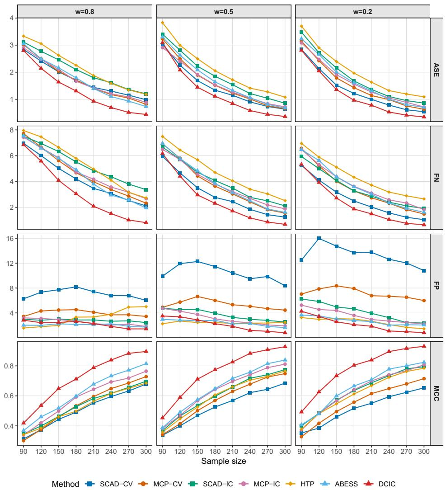  
Figure 4: Performance metrics under Setting 3 with an increasing sample size. The sufix “-CV” indicates tuning by 10-fold cross-validation. The sufix “-IC” indicates tuning by information criterion.

Under the most challenging Setting 3 (Figure 4), severe within-block collinearity substantially degrades the model selection accuracy of all methods. Although no method achieves exact support recovery under this setting, DCIC still exhibits robust performance in both parameter estimation and model selection. Even at small sample sizes, it sustains a high MCC by tightly controlling both FP and FN. In contrast, HTP and ABESS tend to underselect under severe collinearity, whereas the penalized competitors generally exhibit either higher FP or weaker overall recovery.

## 6.2 Empirical evaluation of multi-class basis selection

We let n range from 90 to 360 in steps of 30, with $p = 2 0 0$ and $g ^ { * } = 5$ . The variables are partitioned into five blocks of size 40, and $G ^ { * }$ contains two clusters of sizes 2 and 3. Using the correlation structure in Section 6.1 with $\rho _ { \mathrm { i n } } = \rho _ { \mathrm { o u t } } = 0 . 8$ and $w = 0 . 5$ , we generate $Z _ { i } \sim { \cal N } ( 0 , \Sigma ( w ) )$ and set $x _ { i j } = \Phi ( Z _ { i j } )$ . Thus, the covariates are supported on [0, 1] with dependence induced by the corresponding Gaussian copula.

We consider $\mathcal { F } = \{ \mathrm { F o u r i e r }$ , Spline, Haar}. For Fourier, each component is expanded over an ordered trigonometric dictionary with candidate orders $K \in \{ 2 , 4 , 6 \}$ . For spline, each component is expanded over a cubic B-spline dictionary with candidate dimensions $K \in \{ 3 , 4 , 5 \}$ . For Haar, each component is expanded over a three-level Haar wavelet dictionary without the scaling function. The three levels contain 1, 2, and 4 atoms, respectively. Accordingly, Fourier and spline are treated as ordered families, whereas Haar is treated as a subset selection family.

In the Fourier and spline settings, the true order is $K ^ { * } = 4$ . In the Haar setting, each active component contains exactly two nonzero wavelet atoms. The active components are generated in a family-specific manner:

• Fourier truth $( m ^ { * } = \mathbf { F o u r i e r } )$ . For each $j \in G ^ { * }$ , set

$$
\begin{array} { r } { \beta _ { j } = A _ { \mathrm { F } } \Big ( \gamma _ { \mathrm { F } } ^ { 3 } u ( \phi _ { 4 } ) ^ { \top } , \gamma _ { \mathrm { F } } ^ { 2 } u ( \phi _ { 3 } ) ^ { \top } , \gamma _ { \mathrm { F } } u ( \phi _ { 2 } ) ^ { \top } , u ( \phi _ { 1 } ) ^ { \top } \Big ) ^ { \top } , \qquad u ( \phi ) : = ( \cos \phi , \sin \phi ) ^ { \top } , } \end{array}
$$

where $A _ { \mathrm { F } } = 0 . 6 , \gamma _ { \mathrm { F } } = 0 . 4$ , and $\phi _ { \ell } \stackrel { i . i . d . } { \sim } \mathrm { U n i f } [ 0 , 2 \pi ]$ for $\ell = 1 , \ldots , 4$

• Spline truth $( m ^ { * } = \mathbf { S p l i n e } )$ . Define

$$
g ( x ) = \exp \left( - \frac { ( x - 0 . 1 ) ^ { 2 } } { 2 h ^ { 2 } } \right) - \alpha _ { 0 } \exp \left( - \frac { ( x - 0 . 9 ) ^ { 2 } } { 2 h ^ { 2 } } \right) ,
$$

where $h = 0 . 0 5$ and $\alpha _ { 0 } = 0 . 8$ . For each $j \in G ^ { * }$ , let $\beta _ { j }$ be the least-squares projection of $\left( g ( x _ { 1 j } ) , \ldots , g ( x _ { n j } ) \right) ^ { \top }$ onto the cubic B-spline basis.

• Haar truth $( m ^ { * } = \mathbf { H } \mathbf { a } \mathbf { a } \mathbf { r } )$ . For each $j \in G ^ { * }$ , one atom is selected uniformly from each of levels 2 and 3, and the corresponding coeficients have independent random signs and magnitudes drawn from Unif[0.5, 1].

To construct comparable multi-class baselines, we combine group selection methods for ordered families with double-sparse selection methods for subset-selection families. Specifically, we consider group LASSO (Yuan and Lin, 2006) combined with sparse group LASSO (Simon et al., 2013), group MCP combined with composite MCP (Huang et al., 2012), and $L _ { 0 }$ methods for group selection (Zhang et al., 2023b) and double-sparse selection (Zhang et al., 2024), representing LASSO-type, MCP-type, and $L _ { 0 } \mathrm { - t y p e }$ procedures, respectively. Here we use EBIC (Chen and Chen, 2008) to select both the family and the associated within-family model. We also report an oracle benchmark, namely the ordinary least squares estimator on the true support.

We report the ASE, FP, FN, and MCC, where FP, FN, and MCC are defined at the group level. Let R denote the number of simulation replications. For replication $r ,$ let $\hat { m } _ { r }$ and $\hat { K } _ { r }$ denote the estimated family and, for ordered families, the estimated order, respectively. To assess family and within-family selection accuracy, we also record three family-level metrics: the family identification accuracy (FIA), defined by FIA = $\begin{array} { r } { R ^ { - 1 } \sum _ { r = 1 } ^ { R } \mathbf { 1 } \{ \hat { m } _ { r } = m ^ { * } \} } \end{array}$ ; for ordered families, the order recovery accuracy (ORA), defined by $\begin{array} { r } { \mathrm { O R A } = R ^ { - 1 } \sum _ { r = 1 } ^ { R } \mathbf { 1 } \{ \hat { m } _ { r } = m ^ { * } , \hat { K } _ { r } = K ^ { * } \} } \end{array}$ ; and, for the Haar family, the family-aware MCC (FaMCC), defined by $\begin{array} { r } { \mathrm { F a M C C } = R ^ { - 1 } \sum _ { r = 1 } ^ { R } { \bf 1 } \{ \hat { m } _ { r } = m ^ { * } \} \mathrm { M C C } ( \hat { S } _ { r } , S _ { r } ^ { * } ) } \end{array}$ , where $S _ { r } ^ { * }$ and $\hat { S } _ { r }$ denote the true and estimated variable-level support sets in replication r. Each experiment is repeated 100 times.

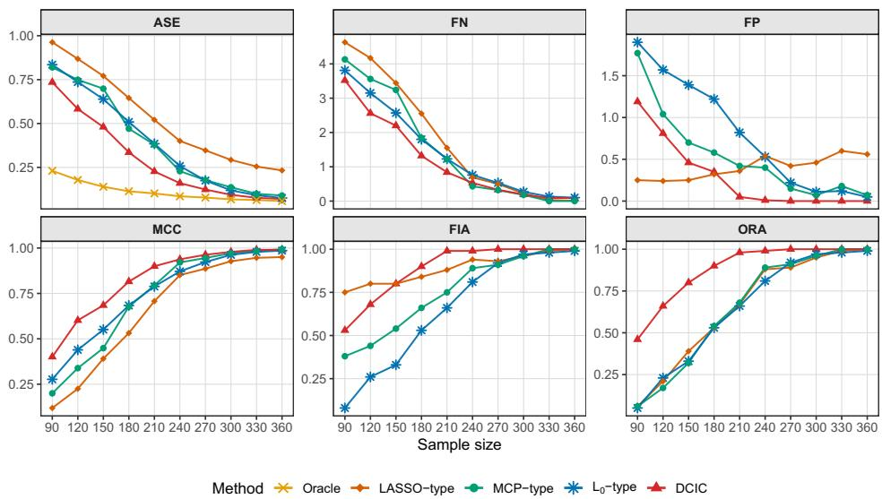  
Figure 5: Performance metrics under Fourier truth with an increasing sample size.

Under Fourier and spline truth (Figures 5–6), DCIC attains the lowest ASE and highest MCC among the non-oracle competitors, together with rapidly improving FIA and ORA. The advantage is also pronounced in family identification and order recovery: both FIA and ORA increase rapidly and approach one at moderate sample sizes. In contrast, the LASSO-type baseline under spline truth reduces FN at the cost of substantially inflated FP, leading to weaker overall recovery.

Method Oracle LASSO−type MCP−type L0−type DCIC  
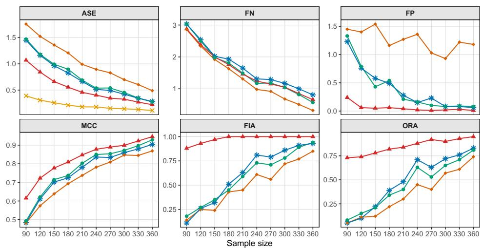

Figure 6: Performance metrics under spline truth with an increasing sample size.  
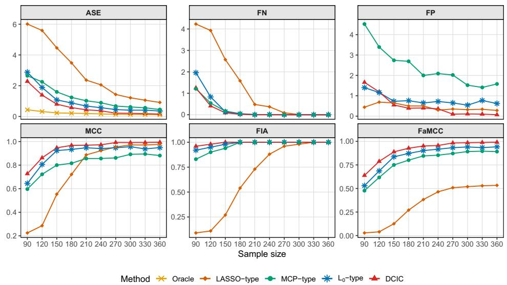  
Figure 7: Performance metrics under Haar truth with an increasing sample size.

Under Haar truth (Figure 7), DCIC attains the highest FaMCC over most sample sizes, indicating accurate family identification and recovery of the within-family sparse structure. Overall, Figures 5–7 demonstrate that DCIC adapts well across ordered and subset-selection families, consistent with the theory in Section 4.3.

## 7 Conclusion and Discussion

We introduced the Descriptive-Complexity Information Criterion (DCIC), which uses Kraft-admissible code lengths to compare models over large candidate collections under strong predictor dependence and model-class uncertainty. Under sub-Weibull noise, DCIC achieves selection consistency through approximation-error separation without RIP/SRCtype near-orthogonality conditions and yields nonasymptotic oracle risk bounds under model misspecification. Encoding the class label places heterogeneous model classes on a common complexity scale, yielding guarantees for exact pair recovery under identifiability and for risk adaptation across classes. The same complexity induces a λ-dependent search budget. Larger values of λ yield polynomial-size retained regions with high probability, whereas smaller values sharpen the oracle risk benchmark. Along this path, we also obtain finite-sample control of false positives and false negatives. The simulations illustrate these properties under strongly correlated designs and basis-family uncertainty.

Robust criteria may extend DCIC to weaker tail conditions and contaminated observations (Oliveira and Resende, 2025), and this direction merits further investigation.

## A Proofs of main results

We begin with a reduction lemma that separates the three classes of competing models. Let $\tilde { P } _ { S }$ be the orthogonal projection onto $\mathrm { C o l } ( X _ { S \cap S ^ { * } } )$ . The assumptions of the lemma are as follows:

(A1) Overfitted models in $\mathcal { M } _ { \mathrm { s u p } }$ . For every $S \in \mathcal { M } _ { \mathrm { s u p } } , C _ { S } \geq C _ { S ^ { * } }$ . In addition, there exist constants $0 < \tilde { c } _ { 1 } < c _ { 1 }$ such that for all $j \geq 1$

$$
\begin{array} { r l } & { \underset { S \in \mathcal { M } _ { \mathrm { s u p } } } { \sum } \exp \Bigl \{ - c _ { 1 } \lambda ^ { \frac { \alpha } { 2 } } \Bigl ( C _ { S } - C _ { S ^ { * } } \Bigr ) \Bigr \} \ \leq \ \exp \Bigl \{ \tilde { c } _ { 1 } ( \eta _ { n } j ) ^ { \frac { \alpha } { 2 } } \Bigr \} . } \\ & { \Delta ^ { + } ( S ) = j } \end{array}\tag{A1}
$$

(A2) Underfitted models in $\mathcal { M } _ { \mathrm { s u b } }$ . There exists a suficiently large constant $c _ { 2 } > 1$ such that

$$
\begin{array} { r } { \mathrm { A P P } ( S ) \ \geq \ c _ { 2 } \Bigg ( \eta _ { n } \big ( s ^ { * } - s \big ) + \lambda \big ( C _ { S ^ { * } } ^ { \frac { 2 } { \alpha } } - C _ { S } ^ { \frac { 2 } { \alpha } } \big ) _ { + } + \log ^ { \frac { 2 } { \alpha } } N \Big ( \Delta ^ { - } ( S ) \Big ) \Bigg ) . } \end{array}\tag{A2}
$$

(A3) Wrong models in $\mathcal { M } _ { \mathrm { w } }$ . For $S \in \mathcal { M } _ { \mathrm { w } }$ , choose truncation constants $B _ { S }$ such that

$$
\sum _ { S \in \mathcal { M } _ { w } } \operatorname* { P r } \biggl ( \frac { \varepsilon ^ { \top } ( P _ { S } - \widetilde { P } _ { S } ) \varepsilon } { \sigma ^ { 2 } } > B _ { S } \biggr ) \longrightarrow 0 .\tag{A3a}
$$

Define the quantity $\Gamma _ { S }$ by

$$
\Gamma _ { S } : = \mathrm { A P P } ( S ) + \eta _ { n } \Big ( s - s ^ { * } \Big ) + \lambda \Big ( C _ { S } ^ { \frac { 2 } { \alpha } } - C _ { S ^ { * } } ^ { \frac { 2 } { \alpha } } \Big ) - B _ { S } .
$$

Assume

$$
\sum _ { S \in \mathcal { M } _ { w } } \exp \left\{ - c _ { 3 } \ : \ : \operatorname* { m i n } \left( \left( \frac { \Gamma _ { S } } { \sqrt { \mathrm { A P P } ( S ) } } \right) ^ { 2 } , \left( \frac { \Gamma _ { S } } { \sqrt { \mathrm { A P P } ( S ) } } \right) ^ { \alpha } \right) \right\} \longrightarrow 0 .\tag{A3b}
$$

Lemma A.1. Under conditions (A1)–(A3), we have

$$
\operatorname* { P r } { \Bigl ( } \operatorname* { m i n } _ { S \in { \mathcal { M } } _ { n } , S \neq S ^ { * } } \operatorname { D C I C } ( S ) > \operatorname { D C I C } ( S ^ { * } ) { \Bigr ) } \to 1 \qquad a s \ n \to \infty .
$$

Proof. We divide the proof of Lemma A.1 into three cases. For simplicity of notation, define

$$
u _ { S } = \eta _ { n } \bigl ( s - s ^ { * } \bigr ) + \lambda \bigl ( C _ { S } ^ { \frac 2 \alpha } - C _ { S ^ { * } } ^ { \frac 2 \alpha } \bigr ) , \qquad \alpha \in ( 0 , 2 ] .
$$

Case 1: $S \in \mathcal { M } _ { \mathrm { s u p } }$ . In this case, note that

$$
\mathrm { D C I C } ( S ) - \mathrm { D C I C } ( S ^ { \ast } ) = \frac { \varepsilon ^ { \top } ( P _ { S ^ { \ast } } - P _ { S } ) \varepsilon } { \sigma ^ { 2 } } + u _ { S } .\tag{10}
$$

Since the entries of $\boldsymbol { \varepsilon } = ( \varepsilon _ { 1 } , \dots , \varepsilon _ { n } )$ are mean-zero sub-Weibull random variables with variance $\sigma ^ { 2 }$ , we have

$$
\begin{array} { r } { \mathbb { E } \{ \varepsilon ^ { \top } ( P _ { S } - P _ { S ^ { \ast } } ) \varepsilon \} = \sigma ^ { 2 } ( r _ { S } - r _ { S ^ { \ast } } ) . } \end{array}
$$

Moreover, since $S ^ { \ast } \subset S$ , the matrix $P _ { S } - P _ { S ^ { \ast } }$ is an orthogonal projection. Hence,

$$
\| P _ { S } - P _ { S ^ { * } } \| _ { \mathrm { F } } ^ { 2 } = r _ { S } - r _ { S ^ { * } } , \qquad \| P _ { S } - P _ { S ^ { * } } \| _ { \mathrm { o p } } \le 1 .
$$

Since $r _ { S } - r _ { S ^ { * } } \leq s - s ^ { * }$ and $C _ { S } \geq C _ { S ^ { * } }$ for $S \in \mathcal { M } _ { \mathrm { s u p } }$ , we have

$$
\begin{array} { l } { { u _ { S } - ( r _ { S } - r _ { S ^ { * } } ) = \eta _ { n } ( s - s ^ { * } ) + \lambda ( C _ { S } ^ { \frac { 2 } { \alpha } } - C _ { S ^ { * } } ^ { \frac { 2 } { \alpha } } ) - ( r _ { S } - r _ { S ^ { * } } ) } } \\ { { \mathrm { \Theta } \ge \displaystyle \frac { \eta _ { n } } { 2 } ( s - s ^ { * } ) + \lambda ( C _ { S } ^ { \frac { 2 } { \alpha } } - C _ { S ^ { * } } ^ { \frac { 2 } { \alpha } } ) } } \\ { { \mathrm { \Theta } > 0 . } } \end{array}
$$

Then, for all suficiently large n, we have

$$
\begin{array} { r l } & { \mathbb { P } _ { \mathbb { P } ^ { n } } ( \operatorname { I S T C } ( S ) , \ \operatorname { I C T C } ( S ) ) \leq 0 , } \\ & { \leq \mathbb { P } \mathbb { P } \Bigg \{ \frac { \int ( \frac { \tau } { \tau } ( y - P _ { \Phi } ) , z } { \sigma ^ { 2 } } \geq y ) \leq 0 \Bigg \} } \\ & { \leq \mathbb { P } \mathbb { P } \Bigg \{ \frac { \int ( \tau \int ( y - P _ { \Phi } ) , z } { \sigma ^ { 2 } } - \operatorname { i } ( z - \tau z ) z ) \leq \pi g - ( \tau g - ( \tau g - \tau g ) ) } \\ & { \leq 2 \exp \{ - \epsilon _ { \Phi } , \operatorname { i } \operatorname { e m } ( \frac { \{ \tau ( y - ( y - x - y ) , z ) \} ^ { 2 } } { \tau _ { \Phi } \tau _ { \Phi } } , ( \log - ( y _ { \Phi } - ( \tau g - \tau g , x ) ) ^ { \frac { \alpha } { 2 } } ) \} \} } \\ & { \leq 2 \exp \{ - \epsilon _ { \Phi } , \operatorname { o u t } ( \ln - ( \tau g - \tau g , x ) ) ^ { \frac { \alpha } { 2 } } \} } \\ & { \leq 2 \exp \{ \operatorname { i } \operatorname { e m } \Bigg \{ ( \frac { \eta } { \tau } ( y - ( y - \tau ) , ( x - y ) , z ) ) , \ \operatorname { i } ( \zeta \frac { \lambda } { \lambda } ) ^ { 2 } \frac { \epsilon _ { \Phi } ^ { 2 } } { \epsilon _ { \Phi } ^ { 2 } } \} \} ^ { 3 } \Bigg \} } \\ & { \leq 2 \exp \{ - \tau _ { \Phi } \alpha \Bigg \{ ( \ln - 1 ) ( s - s ^ { \prime } ) \} ^ { \alpha } \} } \\ & { \leq 2 \exp \{ - \tau _ { \Phi } \alpha \Bigg \{ ( \ln - 1 ) ( s - s ^ { \prime } ) \} ^ { \alpha } \} } \\ \end{array}
$$

where the third inequality holds for all suficiently large n, and the last two inequalities follow from $r _ { S } - r _ { S ^ { * } } \leq s - s ^ { * }$ and $C _ { S } \geq C _ { S ^ { * } }$

The preceding bound gives

$$
\begin{array} { r l } & { \underset { S \in \mathcal { M } _ { \mathrm { s u p } } } { \sum } \operatorname* { P r } \left( \mathrm { D C I C } ( S ) - \mathrm { D C I C } ( S ^ { * } ) \leq 0 \right) } \\ & { \leq \underset { j } { \sum } \underset { S \in \mathcal { M } _ { \mathrm { s u p } } ( j ) } { \sum } 2 \exp \left. - c _ { 2 , \alpha , \zeta } \Big ( ( \eta _ { n } - 1 ) j + \lambda ( C _ { S } ^ { \frac { 2 } { \alpha } } - C _ { S ^ { * } } ^ { \frac { 2 } { \alpha } } ) \Big ) ^ { \frac { \alpha } { 2 } } \right. } \\ & { \leq 2 \underset { j } { \sum } \exp \{ - c _ { 1 } ( \eta _ { n } j ) ^ { \frac { \alpha } { 2 } } \} \underset { S \in \mathcal { M } _ { \mathrm { s u p } } } { \sum } \exp \{ - c _ { 1 } \lambda ^ { \frac { \alpha } { 2 } } ( C _ { S } - C _ { S ^ { * } } ) \} , } \\ & { \quad \quad \quad \quad \quad \quad \quad \quad \Delta ^ { + } ( S ) = j } \end{array}\tag{11}
$$

where the first inequality follows from $s - s ^ { * } \geq j$ , and the second inequality follows from $( C _ { S } ^ { \frac { 2 } { \alpha } } - C _ { S ^ { * } } ^ { \frac { 2 } { \alpha } } ) ^ { \frac { \alpha } { 2 } } \geq C _ { S } - C _ { S ^ { * } }$ and $( a + b ) ^ { q } \geq 2 ^ { q - 1 } ( a ^ { q } + b ^ { q } )$ for $0 < q \leq 1 , \ a , b > 0$ . By (A1), inequality (11) yields

$$
\begin{array} { r l } {  { \sum _ { S \in \mathcal { M } _ { \mathrm { s u p } } } \operatorname* { P r } ( \mathrm { D C I C } ( S ) - \mathrm { D C I C } ( S ^ { * } ) \leq 0 ) \leq \sum _ { j } 2 \exp \{ - ( c _ { 1 } - \tilde { c } _ { 1 } ) ( \eta _ { n } j ) ^ { \frac \alpha 2 } \} } } \\ & { \leq 2 \int _ { 0 } ^ { \infty } e ^ { - ( c _ { 1 } - \tilde { c } _ { 1 } ) \eta _ { n } ^ { \frac \alpha 2 } x ^ { \frac \alpha 2 } } d x } \\ & { = O ( \eta _ { n } ^ { - 1 } ) \to 0 . } \end{array}
$$

Case 2: $S \in \mathcal { M } _ { \mathrm { s u b } }$ . In this case, note that

$$
\begin{array} { r l } & { \quad \mathrm { D C I C } ( S ) - \mathrm { D C I C } ( S ^ { * } ) } \\ & { = \underbrace { \varepsilon ^ { \top } ( P _ { S ^ { * } } - P _ { S } ) \varepsilon } _ { \sigma ^ { 2 } } + \frac { 2 \mu _ { n } ^ { \top } ( P _ { S ^ { * } } - P _ { S } ) \varepsilon } { \sigma ^ { 2 } } + \mathrm { A P P } ( S ) + u _ { S } } \\ & { = \underbrace { \frac { \varepsilon ^ { \top } ( P _ { S ^ { * } } - P _ { S } ) \varepsilon } { \sigma ^ { 2 } } - ( r _ { S ^ { * } } - r _ { S } ) } _ { \varepsilon = Q _ { S } } + \underbrace { \frac { 2 \mu _ { n } ^ { \top } ( P _ { S ^ { * } } - P _ { S } ) \varepsilon } { \sigma ^ { 2 } } } _ { \varepsilon = L _ { S } } + } \\ & { \quad \underbrace { \mathrm { A P P } ( S ) + u _ { S } + ( r _ { S ^ { * } } - r _ { S } ) } _ { \varepsilon = T _ { S } } . } \end{array}\tag{12}
$$

Under assumption (A2), we have

$$
\begin{array} { r l } & { T _ { S } = \mathrm { A P P } ( S ) - \eta _ { n } \big ( s ^ { * } - s \big ) - \lambda \big ( C _ { S ^ { * } } ^ { \frac 2 \alpha } - C _ { S } ^ { \frac 2 \alpha } \big ) + \big ( r _ { S ^ { * } } - r _ { S } \big ) } \\ & { \mathrm { ~ \ ~ \ } \ge \mathrm { A P P } ( S ) - \eta _ { n } \big ( s ^ { * } - s \big ) - \lambda \big ( C _ { S ^ { * } } ^ { \frac 2 \alpha } - C _ { S } ^ { \frac 2 \alpha } \big ) _ { + } } \\ & { \ge \Big ( 1 - c _ { 2 } ^ { - 1 } \Big ) \mathrm { A P P } ( S ) > 0 . } \end{array}
$$

Set $Z _ { S } = Q _ { S } + L _ { S }$ . Note that

$$
\begin{array} { r } { \{ Z _ { S } \leq - T _ { S } \} \subset \{ | Z _ { S } | \geq T _ { S } \} \subset \{ | Q _ { S } | \geq \frac { T _ { S } } { 2 } \} \cup \{ | L _ { S } | \geq \frac { T _ { S } } { 2 } \} . } \end{array}\tag{13}
$$

By Lemma B.1, we have

$$
\begin{array} { r l } & { \operatorname* { P r } \{ | Q _ { S } | > \frac { T _ { S } } { 2 } \} \leq 2 \exp \left\{ - c _ { 1 , \alpha , \zeta } \operatorname* { m i n } \left\{ \frac { T _ { S } ^ { 2 } } { r _ { S ^ { * } } - r _ { S } } , T _ { S } ^ { \frac { \alpha } { 2 } } \right\} \right\} } \\ & { \qquad \leq 2 \exp \{ - c _ { 1 , \alpha , \zeta } T _ { S } ^ { \frac { \alpha } { 2 } } \} } \\ & { \qquad \leq 2 \exp \left\{ - c _ { 2 , \alpha , \zeta } \operatorname { A P P } ( S ) ^ { \frac { \alpha } { 2 } } \right\} , } \end{array}\tag{14}
$$

where the second inequality holds for all suficiently large n, and the third inequality follows from $T _ { S } \geq \left( 1 - c _ { 2 } ^ { - 1 } \right) \mathrm { A P P } ( S )$

By Lemma B.2, we have

$$
\begin{array} { r l } & { \operatorname* { P r } \{ | L _ { S } | \geq \frac { T _ { S } } { 2 } \} \leq 2 \exp \left\{ - c _ { 1 , \alpha , \zeta } \ \operatorname* { m i n } \left( \Big ( \frac { T _ { S } } { \sqrt { \mathrm { A P P } ( S ) } } \Big ) ^ { 2 } , \Big ( \frac { T _ { S } } { \sqrt { \mathrm { A P P } ( S ) } } \Big ) ^ { \alpha } \right) \right\} } \\ & { \qquad \leq 2 \exp \left\{ - c _ { 2 , \alpha , \zeta } \mathrm { A P P } ( S ) ^ { \frac { \alpha } { 2 } } \right\} , } \end{array}\tag{15}
$$

where the last inequality follows from $T _ { S } \geq ( 1 - c _ { 2 } ^ { - 1 } ) \mathrm { A P P } ( S )$ and $\operatorname { A P P } ( S ) \to \infty { \mathrm { ~ a s ~ } } n \to \infty$ Consequently, combining (12)–(15), we have

$$
\operatorname* { P r } \left( \mathrm { D C I C } ( S ) - \mathrm { D C I C } ( S ^ { * } ) \leq 0 \right) \leq 4 \exp \Bigl \{ - c _ { 3 , \alpha , \zeta } \mathrm { A P P } ( S ) ^ { \frac { \alpha } { 2 } } \Bigr \} .
$$

Using assumption (A2), we further have

$$
\mathrm { A P P } ( S ) ^ { \frac { \alpha } { 2 } } \geq c _ { 4 , \alpha , \zeta } \bigg ( \big ( \eta _ { n } \big ( s ^ { * } - s \big ) \big ) ^ { \frac { \alpha } { 2 } } + \log N ( \ell ) \bigg ) ,
$$

where $c _ { 4 , \alpha , \zeta } > 0$ is a constant depending on $c _ { 2 }$ and $\alpha .$ Hence,

$$
\begin{array} { r l } & { \displaystyle \sum _ { S \in M _ { \mathrm { s h a b s } } } \operatorname* { P r } \left( \mathrm { D C I C } ( S ) - \mathrm { D C I C } ( S ^ { * } ) \leq 0 \right) \leq 4 N ( \ell ) \exp \left\{ - c _ { 5 , \alpha , \zeta } \bigg ( ( \eta _ { n } ( s ^ { * } - s ) ) ^ { \frac { \alpha } { 2 } } + \log N ( \ell ) \bigg ) \right\} } \\ & { \quad \quad \quad \quad \Delta ^ { - } ( S ) = \ell } \\ & { \quad \quad \quad \quad \quad \leq 4 \exp \left\{ - c _ { 5 , \alpha , \zeta } ( \eta _ { n } \ell ) ^ { \frac { \alpha } { 2 } } \right\} N ( \ell ) ^ { 1 - c _ { 5 , \alpha , \zeta } } , } \end{array}
$$

where $c _ { 5 , \alpha , \zeta } > 1$ is another constant depending on $c _ { 2 }$ and α. When $c _ { 2 }$ is suficiently large, we have $c _ { 5 , \alpha , \zeta } > 1$ , and thus

$$
\begin{array} { r l } { \displaystyle \sum _ { S \in \mathcal { M } _ { \mathrm { s u b } } } \operatorname* { P r } \left( \mathrm { D C I C } ( S ) - \mathrm { D C I C } ( S ^ { * } ) \leq 0 \right) \leq 4 \sum _ { \ell = 1 } ^ { | \mathcal { U } ^ { * } | } \exp \left\{ - c _ { 5 , \alpha , \zeta } \bigl ( \eta _ { n } \ell \bigr ) ^ { \frac \alpha 2 } \right\} } & { } \\ { \leq 4 \int _ { 0 } ^ { \infty } e ^ { - c _ { 5 , \alpha , \zeta } \eta _ { n } ^ { \frac \alpha 2 } x ^ { \frac \alpha 2 } } d x } & { } \\ { = O ( \eta _ { n } ^ { - 1 } ) \longrightarrow 0 . } \end{array}
$$

Case 3: $S \in \mathcal { M } _ { \mathrm { w } }$ . In this case, we have

$$
\begin{array} { r l } & { \mathrm { D C I C } ( S ) - \mathrm { D C I C } ( S ^ { * } ) } \\ & { = \frac { \varepsilon ^ { \top } ( P _ { S ^ { * } } - \tilde { P } _ { S } ) \varepsilon } { \sigma ^ { 2 } } - \frac { \varepsilon ^ { \top } ( P _ { S } - \tilde { P } _ { S } ) \varepsilon } { \sigma ^ { 2 } } + \frac { 2 \mu _ { n } ^ { \top } ( P _ { S ^ { * } } - P _ { S } ) \varepsilon } { \sigma ^ { 2 } } + \mathrm { A P P } ( S ) + u _ { S } . } \end{array}\tag{16}
$$

Since $P _ { S ^ { * } } - \tilde { P } _ { S }$ is positive semidefinite, we have

$$
\frac { \varepsilon ^ { \top } ( P _ { S ^ { \ast } } - \widetilde { P } _ { S } ) \varepsilon } { \sigma ^ { 2 } } \geq 0 .
$$

Hence, on the event

$$
\left\{ \frac { \varepsilon ^ { \top } ( P _ { S } - \widetilde { P } _ { S } ) \varepsilon } { \sigma ^ { 2 } } \leq B _ { S } \right\} ,
$$

the inequality $\mathrm { D C I C } ( S ) - \mathrm { D C I C } ( S ^ { * } ) \leq 0$ implies

$$
\frac { 2 \mu _ { n } ^ { \top } ( P _ { S ^ { \ast } } - P _ { S } ) \varepsilon } { \sigma ^ { 2 } } + \Gamma _ { S } \leq 0 .
$$

Therefore,

$$
\begin{array} { r l } & { \operatorname* { P r } \Bigl ( \mathrm { D C I C } ( S ) - \mathrm { D C I C } ( S ^ { * } ) \le 0 \Bigr ) \le \operatorname* { P r } \left( \frac { \varepsilon ^ { \top } ( P _ { S } - \widetilde { P } _ { S } ) \varepsilon } { \sigma ^ { 2 } } > B _ { S } \right) } \\ & { \qquad + \operatorname* { P r } \left( \frac { 2 \mu _ { n } ^ { \top } ( P _ { S ^ { * } } - P _ { S } ) \varepsilon } { \sigma ^ { 2 } } + \Gamma _ { S } \le 0 \right) . } \end{array}
$$

From Lemma B.2, we have

$$
\operatorname* { P r } \biggl ( \frac { 2 \mu _ { n } ^ { \top } ( P _ { S ^ { \bullet } } - P _ { S } ) \varepsilon } { \sigma ^ { 2 } } + \Gamma _ { S } \leq 0 \biggr ) \leq 2 \exp \biggl \{ - c _ { 3 } \ \operatorname* { m i n } \left( \biggl ( \frac { \Gamma _ { S } } { \sqrt { \mathrm { A P P } ( S ) } } \biggr ) ^ { 2 } , \biggl ( \frac { \Gamma _ { S } } { \sqrt { \mathrm { A P P } ( S ) } } \biggr ) ^ { \alpha } \right) \biggr \} .
$$

Thus, under assumption (A3), we have

$$
\begin{array} { r l } & { \underset { S \in \mathcal { M } _ { \mathrm { w } } } { \sum } \operatorname* { P r } \left( \mathrm { D C I C } ( S ) - \mathrm { D C I C } ( S ^ { * } ) \leq 0 \right) } \\ & { \leq \underset { S \in \mathcal { M } _ { \mathrm { w } } } { \sum } \operatorname* { P r } \left( \frac { \varepsilon ^ { \top } ( P _ { S } - \tilde { P } _ { S } ) \varepsilon } { \sigma ^ { 2 } } > B _ { S } \right) + \underset { S \in \mathcal { M } _ { \mathrm { w } } } { \sum } \operatorname* { P r } \biggl ( \frac { 2 \mu _ { n } ^ { \top } ( P _ { S ^ { * } } - P _ { S } ) \varepsilon } { \sigma ^ { 2 } } + \Gamma _ { S } \leq 0 \biggr ) } \\ & { \longrightarrow 0 . } \end{array}
$$

Combining Cases 1–3, we have

$$
\begin{array} { r l } & { \underset { S \in \mathcal { M } _ { n } , S \not \in S ^ { * } } { \sum } \operatorname* { P r } \left( \mathrm { D C I C } ( S ) - \mathrm { D C I C } ( S ^ { * } ) \leq 0 \right) } \\ & { \leq \underset { S \in \mathcal { M } _ { \operatorname* { s u p } } } { \sum } \operatorname* { P r } \left( \mathrm { D C I C } ( S ) - \mathrm { D C I C } ( S ^ { * } ) \leq 0 \right) + \underset { S \in \mathcal { M } _ { \operatorname* { s u p } } } { \sum } \operatorname* { P r } \left( \mathrm { D C I C } ( S ) - \mathrm { D C I C } ( S ^ { * } ) \leq 0 \right) + } \\ & { \underset { S \in \mathcal { M } _ { \operatorname* { s u p } } } { \sum } \operatorname* { P r } \left( \mathrm { D C I C } ( S ) - \mathrm { D C I C } ( S ^ { * } ) \leq 0 \right) } \\ & { \longrightarrow 0 . } \end{array}
$$

Therefore,

$$
\operatorname* { P r } \bigg ( \operatorname* { m i n } _ { S \in \mathcal { M } _ { n } , S \neq S ^ { * } } \mathrm { D C I C } ( S ) > \mathrm { D C I C } ( S ^ { * } ) \bigg )  1 .
$$

This completes the proof.

## A.1 Proof of Theorem 2.1

In the proof of Theorem 2.1, we verify that all the assumptions of Lemma A.1 hold.

Proof. (A1) and (A2) in Lemma A.1 can be verified directly from the assumptions of Theorem 2.1. For simplicity of notation, denote $\ell = \Delta ^ { - } ( S ) , j = \Delta ^ { + } ( S )$ and $D _ { S } ^ { \prime } = $ log $\binom { q ^ { * } } { \ell } \binom { q - q ^ { * } } { j }$

(Verification of (A3) in Lemma A.1) Recall that $\begin{array} { r } { B _ { S } = \frac { 1 } { 4 } \lambda D _ { S } ^ { \frac { 2 } { \alpha } } + \frac { 1 } { 4 } \log \log n + 2 ( r _ { S } - \tilde { r } _ { S } ) } \end{array}$ and $\mathbb { E } ( \varepsilon ^ { \top } ( P _ { S } - \tilde { P } _ { S } ) \varepsilon / \sigma ^ { 2 } ) = r _ { S } - \tilde { r } _ { S }$ . We have

$$
\begin{array} { r } { \operatorname* { P r } \Bigl ( \frac { \varepsilon ^ { \top } ( P _ { S } - \tilde { P } _ { S } ) \varepsilon } { \sigma ^ { 2 } } > B _ { S } \Bigr ) = \operatorname* { P r } \Bigl ( \frac { \varepsilon ^ { \top } ( P _ { S } - \tilde { P } _ { S } ) \varepsilon } { \sigma ^ { 2 } } - \mathbb { E } ( \frac { \varepsilon ^ { \top } ( P _ { S } - \tilde { P } _ { S } ) \varepsilon } { \sigma ^ { 2 } } ) > B _ { S } - ( r _ { S } - \tilde { r } _ { S } ) \Bigr ) } \\ { \leq 2 \exp \Bigl \{ - c _ { \alpha , \zeta } \operatorname* { m i n } \Bigl \{ \frac { ( B _ { S } - ( r _ { S } - \tilde { r } _ { S } ) ) ^ { 2 } } { r _ { S } - \tilde { r } _ { S } } , ( B _ { S } - ( r _ { S } - \tilde { r } _ { S } ) ) ^ { \frac { \alpha } { 2 } } \Bigr \} \Bigr \} } \end{array}
$$

Since

$$
\frac { ( B _ { S } - ( r _ { S } - \tilde { r } _ { S } ) ) ^ { 2 } } { r _ { S } - \tilde { r } _ { S } } \geq B _ { S } - ( r _ { S } - \tilde { r } _ { S } )
$$

and $B _ { S } - ( r _ { S } - \tilde { r } _ { S } ) \geq 1$ for suficiently large n, we have

$$
\operatorname* { P r } \Bigl ( \frac { \varepsilon ^ { \top } ( P _ { S } - \tilde { P } _ { S } ) \varepsilon } { \sigma ^ { 2 } } > B _ { S } \Bigr ) \leq 2 \exp \biggl \{ - c _ { \alpha , \zeta } ( B _ { S } - ( r _ { S } - \tilde { r } _ { S } ) ) ^ { \frac { \alpha } { 2 } } \biggr \}
$$

On the other hand, we have $\begin{array} { r } { | \{ S \in \mathcal { M } _ { \mathrm { w } } : \Delta ^ { - } ( S ) = \ell , \Delta ^ { + } ( S ) = j \} | \le \binom { q ^ { * } } { \ell } \binom { q - q ^ { * } } { j } } \end{array}$ and

$$
\begin{array} { r l } {  { \sum _ { S \in \mathcal { M } _ { \infty } } e ^ { - 2 D _ { S } ^ { \prime } } \le \sum _ { \ell = 1 } ^ { q ^ { * } } \sum _ { j = 1 } ^ { q ^ { * } } \{ \binom { q ^ { * } } { \ell } \binom { q - q ^ { * } } { j } \} ^ { - 1 } } } \\ & { = \{ \sum _ { \ell = 1 } ^ { q ^ { * } } \binom { q ^ { * } } { \ell } ^ { - 1 } \} \times \{ \sum _ { j = 1 } ^ { q - q ^ { * } } ( \begin{array} { c } { q - q ^ { * } } \\ { j } \end{array} ) ^ { - 1 } \} } \\ & { \le \{ 1 + \sum _ { \ell = 1 } ^ { q ^ { * } - 1 } ( \binom { q ^ { * } } { \ell } ^ { - 1 } ) ^ { - 1 } \} \times \{ 1 + \sum _ { j = 1 } ^ { q - q ^ { * } - 1 } ( \begin{array} { c } { q - q ^ { * } } \\ { j } \end{array} ) ^ { - 1 } \} } \\ & { \le 4 , } \end{array}
$$

where the first inequality uses ${ \binom { b } { a } } \geq b$ for $1 \leq a \leq b - 1$

Consequently, we have

$$
\begin{array} { r l } & { \quad \underset { S \in \mathcal { M } _ { n } } { \sum } \mathrm { e r } \bigg \{ \frac { \varepsilon } { ( \varepsilon ) } \big ( P _ { S } - \widehat { P } _ { S } \big ) \varepsilon } > R _ { S } \bigg \}  \\ & { \leq \underset { S \in \mathcal { M } _ { n } } { \sum } 2 \mathrm { e x } \bigg \{ - c _ { n , \xi } \Big ( \lambda ^ { 2 } D _ { S } + \big ( \log \log n \big ) ^ { \frac { \varepsilon } { 2 } } \Big ) \bigg \} } \\ & { \leq \underset { S \in \mathcal { M } _ { n } } { \sum } 2 \mathrm { e x } \bigg \{ - c _ { n , \xi } \lambda ^ { 2 } D _ { S } \bigg \} \exp \Big \{ - c _ { n , \xi } \big ( \log \log n \big ) ^ { \frac { \varepsilon } { 2 } } \Big \} \bigg \} } \\ & { \overset { \leq } \underset { S \in \mathcal { M } _ { n } } { \sum } 2 \mathrm { e x } \bigg \{ - c _ { n , \xi } \lambda ^ { 2 } D _ { S } \big \} \Big \{ - c _ { n , \xi } \big ( \log \log n \big ) ^ { \frac { \varepsilon } { 2 } } \big \} \bigg \} } \\ &  \overset { \leq } \underset { S \in \mathcal { M } _ { n } } { \sum } 2 \mathrm { e x } \mathrm { M n } \big \{ - 2 \mathrm { m i n } \{ U _ { S } ^ { \prime } , C \} \big \} \bigg \} \\ &  \leq \left( \underset { S \in \mathcal { M } _ { n } } { \sum } 2 \mathrm { e x } \big \{ 2 D _ { S } ^ { \prime } \big \} \big \{ 1 \underset { S \in \mathcal { M } _ { n } } { \sum } 2 \mathrm { e x p } \Big \{ 2 C _ { S } \big \} \bigg \} \right) \mathrm { e x p } \big \{ \begin{array} { l } { - c _ { n , \xi } \big ( ( \log \log n ) ^ { \frac { \varepsilon } { 2 } } \big ) \big \} } \\ { - c _ { n , \xi } \big ( ( \log \log n ) ^ { \frac { \varepsilon } { 2 } } \big ) \big \} } \\ &  \leq 1 0 \mathrm { e x p } \big \{ - c  \end{array} \end{array}\tag{17}
$$

where the first inequality uses Lemma B.1 together with $( a + b ) ^ { q } \geq 2 ^ { q - 1 } ( a ^ { q } + b ^ { q } ) , \ q \in ( 0 , 1 ]$ and the third inequality follows by the choice of $\lambda _ { \mathrm { s e l } }$ , which ensures that $c _ { \alpha , \zeta } \lambda _ { \mathrm { s e l } } ^ { \alpha / 2 } > 2$ . This proves (A3a).

Next, we verify assumption (A3b). We first show that

$$
\frac { \Gamma _ { S } } { \sqrt { \mathrm { A P P } ( S ) } } \geq c \sqrt { B _ { S } }\tag{18}
$$

for some universal constant $c > 0$ . On one hand, when $u _ { S } \geq 2 B _ { S }$ , we have

$$
\Gamma _ { S } = \mathrm { A P P } ( S ) + u _ { S } - B _ { S } \geq \mathrm { A P P } ( S ) + B _ { S } .
$$

Hence,

$$
\frac { \Gamma _ { S } } { \sqrt { \mathrm { A P P } ( S ) } } \geq \sqrt { \mathrm { A P P } ( S ) } + \frac { B _ { S } } { \sqrt { \mathrm { A P P } ( S ) } } \geq 2 \sqrt { B _ { S } } ,
$$

where the last inequality follows from the arithmetic–geometric mean inequality.

On the other hand, when $u _ { S } < 2 B _ { S }$ , the assumption in Theorem 2.1 implies $\operatorname { A P P } ( S ) \geq$ $2 ( 2  { B _ { S } } -  { u _ { S } } )$ . Therefore,

$$
\Gamma _ { S } = \mathrm { A P P } ( S ) + u _ { S } - B _ { S } = \frac { 1 } { 2 } \mathrm { A P P } ( S ) + \left( \frac { 1 } { 2 } \mathrm { A P P } ( S ) + u _ { S } - B _ { S } \right) \geq \frac { 1 } { 2 } \mathrm { A P P } ( S ) + B _ { S } .
$$

Consequently,

$$
\frac { \Gamma _ { S } } { \sqrt { \mathrm { A P P } ( S ) } } \geq \frac { 1 } { 2 } \sqrt { \mathrm { A P P } ( S ) } + \frac { B _ { S } } { \sqrt { \mathrm { A P P } ( S ) } } \geq \sqrt { 2 } \sqrt { B _ { S } } ,
$$

where the last inequality is obtained by minimizing the right-hand side over $\mathrm { A P P } ( S ) > 0$

Thus, (18) holds with $c = \sqrt { 2 }$ . Using the same argument as in (17), we obtain

$$
\begin{array} { r l } & { \displaystyle \sum _ { S \in \mathcal { M } _ { \mathbf { w } } } \exp \Bigl \{ - c _ { 3 } \operatorname* { m i n } \left( \left( \frac { \Gamma _ { S } } { \sqrt { \mathrm { A P P } ( S ) } } \right) ^ { 2 } , \left( \frac { \Gamma _ { S } } { \sqrt { \mathrm { A P P } ( S ) } } \right) ^ { \alpha } \right) \Bigr \} \leq \displaystyle \sum _ { S \in \mathcal { M } _ { \mathbf { w } } } \exp \Bigl \{ - c _ { 3 } c ^ { \alpha } B _ { S } ^ { \alpha / 2 } \Bigr \} } \\ & { \qquad \longrightarrow 0 . } \end{array}
$$

This proves (A3b). Consequently, assumption (A3) in Lemma A.1 is verified under the assumptions of Theorem 2.1, which completes its proof. □

## A.2 Proof of Corollary 2.3

Proof. We first verify that the induced model complexities satisfy the Kraft inequality required in Theorem 2.1. By the definition $\begin{array} { r } { C _ { S } = 1 + \sum _ { k : U _ { k } \subseteq S } C _ { k } } \end{array}$ , we have

$$
\begin{array} { r l } { \displaystyle \sum _ { S \in \mathcal { M } _ { n } } e ^ { - C _ { S } } = e ^ { - 1 } \sum _ { S \in \mathcal { M } _ { n } } \exp \left( - \sum _ { k : U _ { k } \subseteq S } C _ { k } \right) } & { } \\ { \displaystyle \qquad \leq e ^ { - 1 } \prod _ { k = 1 } ^ { q } ( 1 + e ^ { - C _ { k } } ) } & { } \\ { \displaystyle \qquad \leq e ^ { - 1 } \exp \left( \sum _ { k = 1 } ^ { q } e ^ { - C _ { k } } \right) } & { } \\ { \displaystyle \qquad \leq 1 , } \end{array}
$$

where the last inequality follows from $\begin{array} { r } { \sum _ { k = 1 ^ { q } } e ^ { - C _ { k } } \le 1 } \end{array}$

Next, we verify assumption (A1) in Theorem 2.1. For $S \in \mathcal { M } _ { \mathrm { s u p } } ,$ since $\mathcal { U } ( S ^ { \ast } ) \subseteq \mathcal { U } ( S )$

$$
C _ { S } - C _ { S ^ { * } } = \sum _ { k : U _ { k } \subseteq S , U _ { k } \notin S ^ { * } } C _ { k } .
$$

Hence, for each $j \geq 1$

$$
\begin{array} { r l } { \underset { S \in \mathcal { M } _ { \mathrm { a b s } } } { \sum } \exp \left\{ - c \lambda ^ { \alpha / 2 } ( G _ { S } - C _ { S ^ { * } } ) \right\} \leq \underset { S \in \mathcal { M } _ { \mathrm { a b s } } } { \sum } \exp \left\{ - c \lambda ^ { \alpha / 2 } \underset { k : U _ { S } \in S _ { k } } { \sum } \underset { \ell \in \mathcal { S } _ { k } } { \sum } C _ { k } \right\} } & { } \\ { \overset { \mathrm { A } } { \leq } ( S ) = } & { \underset { k : U _ { k } \not \in \mathcal { S } ^ { * } } { \sum } \prod } & { \biggr \leq \underset { \ell \in \mathcal { S } _ { k } } { \sum } \mathcal { I } \mathcal { I } } \\ & { \leq \exp \left( \underset { k : U _ { k } \not \in \mathcal { S } ^ { * } } { \sum } e ^ { - c \lambda ^ { \alpha / 2 } C _ { k } } \right) } \\ & { \leq \exp \left( \underset { k = 1 } { \sum } e ^ { - c \lambda ^ { \alpha / 2 } C _ { k } } \right) } \\ & { \leq e , } \end{array}
$$

where the third inequality follows by the choice of $\lambda _ { \mathrm { s e l } }$ , which ensures that $c _ { \alpha , \zeta } \lambda _ { \mathrm { s e l } } ^ { \alpha / 2 } > 2$ , and the last inequality follows from $\begin{array} { r } { \sum _ { k = 1 } ^ { q } e ^ { - C _ { k } } \le 1 } \end{array}$ . Therefore the summation term appearing in (A1) is uniformly bounded in $j$ , and since $\eta _ { n }  \infty , ( \mathrm { A 1 } )$ holds.

The remaining assumptions are exactly (ii)–(iii) of Theorem 2.1. Therefore, the conclusion follows directly from that theorem. □

## A.3 Proof of the double-sparse selection result

We first state the precise selection-consistency result deferred from Section 2.4. Recall that

$$
N ( \ell ) = { \binom { s ^ { * } } { \ell } } , \qquad \ell = 1 , \ldots , s ^ { * } .
$$

Corollary A.2. Let $\eta _ { n } = \log n$ and

$$
C _ { S } = g \log m + s \log d + 2 \log ( g + 1 ) + 2 \sum _ { k \in G } \log ( t _ { k } + 1 ) .
$$

Assume that $g ^ { \ast } \leq d ^ { \gamma }$ for some constant $\gamma \geq 0$ . For every $\lambda \geq \lambda _ { \mathrm { s e l } } \vee c _ { \alpha , \zeta } ( 1 + \gamma ) ^ { 2 / \alpha }$ , with $c _ { \alpha , \zeta } > 0$ suficiently large, if the following conditions hold:

(i) There exists a suficiently large constant $c _ { 1 } > 1$ such that, for every $S \in \mathcal { M } _ { \mathrm { s u b } }$ 2

$$
\mathrm { A P P } ( S ) \geq c _ { 1 } \left\{ \left( s ^ { * } - s \right) \log n + \lambda \left( C _ { S ^ { * } } ^ { 2 / \alpha } - C _ { S } ^ { 2 / \alpha } \right) + \log ^ { 2 / \alpha } N \Big ( \Delta ^ { - } ( S ) \Big ) \right\} .
$$

(ii) For every $S \in \mathcal { M } _ { w }$ satisfying $2 B _ { S } > u _ { S }$ 2

$$
\mathrm { A P P } ( S ) \geq 2 ( 2 B _ { S } - u _ { S } ) .
$$

Then

$$
\operatorname* { P r } { \left\{ \operatorname* { m i n } _ { S \in { \mathcal { M } } _ { n } } \operatorname { D C I C } ( S ) > \operatorname { D C I C } ( S ^ { * } ) \right\} } \to 1 \qquad a s n \to \infty .
$$

Remark A.3. The growth condition $g ^ { \ast } \leq d ^ { \gamma }$ is used only to verify the overfitted-model summability under general sub-Weibull noise. In the sub-Gaussian case $\alpha = 2$ , this condition and the corresponding γ-dependent lower bound on λ can be removed by taking $\eta _ { n } = A _ { \eta }$ log n with a suficiently large fixed constant $A _ { \eta } ,$ provided that $g ^ { * } \leq n$ . This modification does not change the order of the separation conditions.

Proof. We first verify the Kraft inequality. Let

$$
A _ { d } : = \sum _ { r = 1 } ^ { d } { \binom { d } { r } } { \frac { d ^ { - r } } { ( r + 1 ) ^ { 2 } } } \leq { \frac { 1 } { 4 } } \left\{ \left( 1 + { \frac { 1 } { d } } \right) ^ { d } - 1 \right\} \leq { \frac { e - 1 } { 4 } } .
$$

Summing over all double-sparse supports gives

$$
\begin{array} { r l r } {  { \sum _ { S \in \mathcal { M } _ { n } } e ^ { - C _ { S } } \le \sum _ { g = 1 } ^ { m } \binom { m } { g } \frac { m ^ { - g } } { ( g + 1 ) ^ { 2 } } A _ { d } ^ { g } } } \\ & { } & { \le ( 1 + \frac { A _ { d } } { m } ) ^ { m } - 1 \le e ^ { A _ { d } } - 1 < 1 . } \end{array}
$$

Define $S _ { k } ^ { * } : = S ^ { * } \cap \mathcal G _ { k }$ for $k \in G ^ { * }$ . By Vandermonde’s identity,

$$
N ( \ell ) = \sum _ { 0 \le \ell _ { k } \le | S _ { k } ^ { * } | } \prod _ { k \in G ^ { * } } \binom { | S _ { k } ^ { * } | } { \ell _ { k } } = \binom { s ^ { * } } { \ell } , \qquad \ell = 1 , \dots , s ^ { * } .
$$

It remains to verify assumption (A1) in Theorem 2.1. Let $c _ { 0 } = c _ { 0 } ( \alpha , \zeta ) > 0$ be the constant multiplying $\lambda ^ { \alpha / 2 } ( C _ { S } - C _ { S ^ { * } } )$ in the overfitted-model exponential bound in the proof of Theorem 2.1. Fix $j \geq 1$ and write $a : = c _ { 0 } \lambda ^ { \alpha / 2 }$ . By choosing $c _ { \alpha , \zeta }$ suficiently large, the lower bound on λ in Corollary A.2 ensures that $a > 1 + \gamma$

For every $S \in \mathcal { M } _ { \mathrm { s u p } }$ with $\Delta ^ { + } ( S ) = j$ , let $t : = g - g ^ { * }$ . Then $0 \leq t \leq j$ . Since $S ^ { * } \subset S$ , all remaining terms in the code are nondecreasing, and hence

$$
C _ { S } - C _ { S ^ { * } } \geq t \log m + j \log d .
$$

Therefore,

$$
\sum _ { S \in M _ { \operatorname { s u p } } } \exp \{ - a ( C _ { S } - C _ { S ^ { * } } ) \} \leq \sum _ { t = 0 } ^ { \operatorname* { m i n } \{ m - g ^ { * } , j \} } { \binom { m - g ^ { * } } { t } } m ^ { - a t } d ^ { - a j } \sum _ { j _ { 1 } + j _ { 2 } = j } \binom { g ^ { * } d } { j _ { 1 } } { \binom { t d } { j _ { 2 } } } .
$$

By Vandermonde’s identity,

$$
\sum _ { j _ { 1 } + j _ { 2 } = j } { \binom { g ^ { * } d } { j _ { 1 } } } { \binom { t d } { j _ { 2 } } } = { \binom { ( g ^ { * } + t ) d } { j } } ,
$$

and

$$
d ^ { - a j } { \binom { ( g ^ { * } + t ) d } { j } } \leq ( 1 + d ^ { - a } ) ^ { ( g ^ { * } + t ) d } .
$$

Consequently,

$$
\sum _ { S \in \cal M _ { \mathrm { s u p } } } \exp \{ - a ( C _ { S } - C _ { S ^ { * } } ) \} \leq ( 1 + d ^ { - a } ) ^ { g ^ { * } d } \left\{ 1 + m ^ { - a } ( 1 + d ^ { - a } ) ^ { d } \right\} ^ { m - g ^ { * } } .
$$

Since $a > 1 + \gamma$ , we have

$$
( 1 + d ^ { - a } ) ^ { g ^ { * } d } \leq \exp \{ g ^ { * } d ^ { 1 - a } \} \leq \exp \{ d ^ { 1 + \gamma - a } \} \leq e .
$$

Moreover, since $( 1 + d ^ { - a } ) ^ { d } \leq \exp \{ d ^ { 1 - a } \} \leq e .$ , we have

$$
\left\{ 1 + m ^ { - a } ( 1 + d ^ { - a } ) ^ { d } \right\} ^ { m - g ^ { * } } \leq \exp \{ e m ^ { 1 - a } \} \leq e ^ { e } .
$$

These two inequalities imply that

$$
\begin{array} { l } { { \displaystyle \sum _ { S \in \mathcal { M } _ { \mathrm { s u p } } } \exp \left\{ - c _ { 0 } \lambda ^ { \alpha / 2 } ( C _ { S } - C _ { S ^ { * } } ) \right\} \leq e ^ { e + 1 } } } \\ { { \Delta ^ { + } ( S ) = j } } \end{array}
$$

Since $j \geq 1$ and $\eta _ { n }  \infty$ , for any fixed $0 < \widetilde { c } _ { 1 } < c _ { 0 }$

$$
e ^ { e + 1 } \leq \exp \left\{ \widetilde { c } _ { 1 } ( \eta _ { n } j ) ^ { \alpha / 2 } \right\}
$$

for all suficiently large n. Thus, assumption (A1) of Theorem 2.1 holds with $c _ { 1 } = c _ { 0 }$

The remaining assumptions in Theorem 2.1 are exactly those imposed in Corollary A.2. The conclusion therefore follows from Theorem 2.1. □

## A.4 Proof of Theorem 2.8

Proof. We first establish lower bounds for $\mathrm { A P P } ( S )$ over $S \in \mathcal { M } _ { \mathrm { s u b } } \cup \mathcal { M } _ { \mathrm { w } }$ . Fix a candidate model S such that $\Delta ^ { - } ( S ) = | S ^ { * } \setminus S | \geq 1$ , and let

$$
T : = S \cap S ^ { * } , \qquad I : = S ^ { * } \setminus S .
$$

Since $\mu _ { n } = X _ { S ^ { * } } \beta _ { S ^ { * } } ^ { * }$ and $X _ { T } \beta _ { T } ^ { * } \in \operatorname { C o l } ( X _ { S } )$ , we have

$$
( \mathrm { I } _ { n } - P _ { S } ) \mu _ { n } = ( \mathrm { I } _ { n } - P _ { S } ) X _ { I } \beta _ { I } ^ { * } , \qquad \mathrm { A P P } ( S ) = { \frac { \| ( \mathrm { I } _ { n } - P _ { S } ) X _ { I } \beta _ { I } ^ { * } \| _ { 2 } ^ { 2 } } { \sigma ^ { 2 } } } .
$$

Scenario 1. For every index set $A , \widehat { \Sigma } _ { A A }$ is equicorrelated and $\lambda _ { \operatorname* { m i n } } \bigl ( \widehat { \Sigma } _ { A A } \bigr ) = 1 - \omega$ . For every $S \in \mathcal { M } _ { \mathrm { s u b } } \cup \mathcal { M } _ { \mathrm { w } }$

$$
\begin{array} { r l } & { \| ( \mathrm { I } _ { n } - P _ { S } ) X _ { I } \beta _ { I } ^ { * } \| _ { 2 } ^ { 2 } = \underset { \gamma \in \mathbb { R } ^ { | S | } } { \operatorname* { m i n } } \| X _ { I } \beta _ { I } ^ { * } - X _ { S } \gamma \| _ { 2 } ^ { 2 } } \\ & { \quad \quad \quad \quad \quad = n \underset { \gamma } { \operatorname* { m i n } } \theta ^ { \top } \widehat { \Sigma } _ { A A } \theta } \\ & { \quad \quad \quad \quad \quad \geq n ( 1 - \omega ) \underset { \gamma } { \operatorname* { m i n } } \| \theta \| _ { 2 } ^ { 2 } } \\ & { \quad \quad \quad \quad \geq n ( 1 - \omega ) \| \beta _ { I } ^ { * } \| _ { 2 } ^ { 2 } , } \end{array}
$$

where $A : = I \cup S$ and $\theta : = ( \beta _ { I } ^ { \ast } , - \gamma ) \in \mathbb { R } ^ { | A | }$ . Therefore,

$$
\mathrm { A P P } ( S ) \geq \frac { n ( 1 - \omega ) \| \beta _ { I } ^ { * } \| _ { 2 } ^ { 2 } } { \sigma ^ { 2 } } \geq \frac { n ( 1 - \omega ) \Delta ^ { - } ( S ) \beta _ { \operatorname* { m i n } } ^ { 2 } } { \sigma ^ { 2 } } .\tag{19}
$$

Scenario 2.

(i) $S \in \mathcal { M } _ { \mathrm { s u b } }$ . In this case, $P _ { S } = P _ { T }$ , and

$$
\begin{array} { r l } & { \| ( \mathrm { I } _ { n } - P _ { S } ) X _ { I } \beta _ { I } ^ { * } \| _ { 2 } ^ { 2 } = \| ( \mathrm { I } _ { n } - P _ { T } ) X _ { I } \beta _ { I } ^ { * } \| _ { 2 } ^ { 2 } } \\ & { \qquad = n ( \beta _ { I } ^ { * } ) ^ { \top } \widehat \Sigma _ { I | T } \beta _ { I } ^ { * } , } \end{array}
$$

where

$$
\widehat { \Sigma } _ { I | T } : = \widehat { \Sigma } _ { I I } - \widehat { \Sigma } _ { I T } \widehat { \Sigma } _ { T T } ^ { - 1 } \widehat { \Sigma } _ { T I } .
$$

Let $A : = \widehat { \Sigma } _ { S ^ { * } S ^ { * } }$ . Then $\widehat { \Sigma } _ { I | T } = \left( { ( A ^ { - 1 } ) } _ { I I } \right) ^ { - 1 }$ , and hence

$$
\lambda _ { \operatorname* { m i n } } ( \widehat { \Sigma } _ { I | T } ) = \frac { 1 } { \lambda _ { \operatorname* { m a x } } ( ( A ^ { - 1 } ) _ { I I } ) } \geq \frac { 1 } { \lambda _ { \operatorname* { m a x } } ( A ^ { - 1 } ) } = \lambda _ { \operatorname* { m i n } } ( A ) \geq \lambda _ { * } .
$$

Therefore,

$$
\begin{array} { r } { \mathrm { A P P } ( S ) \geq \frac { n \lambda _ { * } \| \beta _ { I } ^ { * } \| _ { 2 } ^ { 2 } } { \sigma ^ { 2 } } \geq \frac { n \lambda _ { * } \Delta ^ { - } ( S ) \beta _ { \operatorname* { m i n } } ^ { 2 } } { \sigma ^ { 2 } } , \qquad S \in \mathcal { M } _ { \mathrm { s u b } } . } \end{array}
$$

(ii) $S \in \mathcal { M } _ { \mathrm { w } }$ with $s \leq 2 s ^ { * }$ . Since $\kappa _ { 0 } \geq 1$ , we have $s \leq 2 s ^ { * } \leq ( 1 + \kappa _ { 0 } ) s ^ { * }$ , so the assumption in Scenario 2 applies. Hence,

$$
\begin{array} { r } { \| (  { \mathrm { I } _ { n } } - P _ { S } )  { \boldsymbol { X } } _ { I } \beta _ { I } ^ { * } \| _ { 2 } ^ { 2 } = \|  { \boldsymbol { X } } _ { I } \beta _ { I } ^ { * } \| _ { 2 } ^ { 2 } - \| P _ { S }  { \boldsymbol { X } } _ { I } \beta _ { I } ^ { * } \| _ { 2 } ^ { 2 } \geq \epsilon _ { 0 } \|  { \boldsymbol { X } } _ { I } \beta _ { I } ^ { * } \| _ { 2 } ^ { 2 } . } \end{array}
$$

Moreover, since $I \subset S ^ { * }$ , Cauchy interlacing yields

$$
\begin{array} { r } { \lambda _ { \operatorname* { m i n } } \bigl ( \widehat { \Sigma } _ { I I } \bigr ) \geq \lambda _ { \operatorname* { m i n } } \bigl ( \widehat { \Sigma } _ { S ^ { * } S ^ { * } } \bigr ) \geq \lambda _ { * } . } \end{array}
$$

Consequently,

$$
\| X _ { I } { \boldsymbol { \beta } } _ { I } ^ { * } \| _ { 2 } ^ { 2 } = n ( { \boldsymbol { \beta } } _ { I } ^ { * } ) ^ { \top } \widehat \Sigma _ { I I } { \boldsymbol { \beta } } _ { I } ^ { * } \geq n \lambda _ { * } \| { \boldsymbol { \beta } } _ { I } ^ { * } \| _ { 2 } ^ { 2 } .
$$

Hence,

$$
\begin{array} { r } { \mathrm { A P P } ( S ) \geq \frac { \epsilon _ { 0 } n \lambda _ { * } \| \beta _ { I } ^ { * } \| _ { 2 } ^ { 2 } } { \sigma ^ { 2 } } \geq \frac { \epsilon _ { 0 } n \lambda _ { * } \Delta ^ { - } ( S ) \beta _ { \operatorname* { m i n } } ^ { 2 } } { \sigma ^ { 2 } } , \qquad S \in \mathcal { M } _ { \mathrm { w } } , \quad s \leq 2 s ^ { * } . } \end{array}\tag{20}
$$

Scenario 3.

(i) $S \in \mathcal { M } _ { \mathrm { s u b } }$ . Then $S \subset S ^ { * }$ and $X _ { I } ^ { \top } X _ { S } = 0$ , so $P _ { S } X _ { I } \beta _ { I } ^ { * } = 0$ . Therefore,

$$
\begin{array} { l } { \displaystyle \mathrm { A P P } ( S ) = \frac { \| X _ { I } \beta _ { I } ^ { * } \| _ { 2 } ^ { 2 } } { \sigma ^ { 2 } } = \frac { n \| \beta _ { I } ^ { * } \| _ { 2 } ^ { 2 } } { \sigma ^ { 2 } } } \\ { \displaystyle \geq \frac { n \Delta ^ { - } ( S ) \beta _ { \mathrm { m i n } } ^ { 2 } } { \sigma ^ { 2 } } , \qquad S \in \mathcal { M } _ { \mathrm { s u b } } . } \end{array}
$$

(ii) $S \in \mathcal { M } _ { \mathrm { w } }$ . For each $j \in I , \operatorname { i f } { \widetilde { j } } \in S$ , then

$$
P _ { S } x _ { j } = \omega x _ { \widetilde { j } } , \qquad \| x _ { j } - P _ { S } x _ { j } \| _ { 2 } ^ { 2 } = n ( 1 - \omega ^ { 2 } ) .
$$

If $\tilde { j } \notin S$ , then

$$
P _ { S } x _ { j } = 0 , \qquad \| x _ { j } - P _ { S } x _ { j } \| _ { 2 } ^ { 2 } = n .
$$

Thus,

$$
\| x _ { j } - P _ { S } x _ { j } \| _ { 2 } ^ { 2 } \geq n ( 1 - \omega ^ { 2 } ) , \qquad j \in I .
$$

Using the orthogonality across distinct signal–shadow pairs,

$$
\| ( \mathrm { I } _ { n } - P _ { S } ) X _ { I } { \beta } _ { I } ^ { * } \| _ { 2 } ^ { 2 } \geq n ( 1 - \omega ^ { 2 } ) \sum _ { j \in I } ( { \beta } _ { j } ^ { * } ) ^ { 2 } \geq n ( 1 - \omega ^ { 2 } ) { \Delta } ^ { - } ( S ) { \beta } _ { \operatorname* { m i n } } ^ { 2 } .
$$

Therefore,

$$
\mathrm { A P P } ( S ) \geq \frac { n ( 1 - \omega ^ { 2 } ) \Delta ^ { - } ( S ) \beta _ { \operatorname* { m i n } } ^ { 2 } } { \sigma ^ { 2 } } , \qquad S \in \mathcal { M } _ { \mathrm { w } } .\tag{21}
$$

We next verify the conditions of Corollary 2.4. Throughout the remainder of the proof, $c _ { \lambda } > 0$ denotes a constant that may depend on the fixed value of λ. Write $\ell : = \Delta ^ { - } ( S )$ and $j : = \Delta ^ { + } ( S )$

For $S \in \mathcal { M } _ { \mathrm { s u b } }$ , we have $s ^ { * } - s = \ell$ , and

$$
\log \left( { \boldsymbol { s } } ^ { * } \right) \leq \ell \log p .
$$

Since $\alpha = 2$ , the right-hand side of (3) is bounded by $c _ { \lambda } \ell ( \log p + \log n )$

For the wrong-model condition in Corollary 2.4, take its splitting constant to be $\kappa = 1$ We first verify that suficiently large wrong models are excluded automatically. Since $D _ { S } \leq C _ { S } = s \log p$ and $r _ { S } - \tilde { r } _ { S } \leq s$ , we have

$$
\begin{array} { c } { { 2 B _ { S } - u _ { S } \displaystyle \leq \displaystyle \frac { \lambda } { 2 } s \log p + \displaystyle \frac { 1 } { 2 } \log \log n + 4 s } } \\ { { - \left( s - s ^ { * } \right) \log n - \lambda ( s - s ^ { * } ) \log p } } \\ { { = - \left( s - s ^ { * } \right) \log n + \lambda \left( s ^ { * } - \displaystyle \frac { s } { 2 } \right) \log p + 4 s + \displaystyle \frac { 1 } { 2 } \log \log n . } } \end{array}
$$

If $s > 2 s ^ { * }$ , then $s - s ^ { * } > s / 2$ and $s ^ { * } - s / 2 < 0$ . It follows that

$$
2 B _ { S } - u _ { S } < - \frac { s } { 2 } \log n + 4 s + \frac { 1 } { 2 } \log \log n < 0
$$

for all suficiently large n. Hence, $2 B _ { S } < u _ { S }$ for every $S \in \mathcal { M } _ { \mathrm { w } }$ with $s > 2 s ^ { * }$

It remains to consider $S \in \mathcal { M } _ { \mathrm { w } }$ with $s \leq 2 s ^ { * }$ . Since $r _ { S } - \tilde { r } _ { S } \leq j$ , the additional rank term in (4) satisfies $8 ( r _ { S } - \tilde { r } _ { S } ) \le 8 j$

If $s \leq s ^ { * }$ , then $j \le \ell$ . Using

$$
\log \binom { s ^ { * } } { \ell } \leq \ell \log p , \qquad \log \binom { p - s ^ { * } } { j } \leq j \log p ,
$$

the right-hand side of (4) is bounded by

$$
\begin{array} { r l } & { \lambda ( \ell + j ) \log p + 2 ( \ell - j ) \log n + 2 \lambda ( \ell - j ) \log p + \log \log n + 8 j } \\ & { \qquad \leq c _ { \lambda } \ell ( \log p + \log n ) } \end{array}
$$

for all suficiently large n.

If $s > s ^ { * }$ , let $d : = s - s ^ { * } = j - \ell > 0$ . The right-hand side of (4) is then bounded by

$$
\begin{array} { r l } & { \quad \lambda ( \ell + j ) \log p - 2 d \log n - 2 \lambda d \log p + \log \log n + 8 j } \\ & { = 2 \lambda \ell \log p + 8 \ell + \log \log n - d \{ \lambda \log p + 2 \log n - 8 \} } \\ & { \leq c _ { \lambda } \ell \log p } \\ & { \leq c _ { \lambda } \ell ( \log p + \log n ) } \end{array}
$$

for all suficiently large n.

Therefore, for every underfitted or wrong model that is not excluded automatically, the required lower bound is at most

$$
c _ { \lambda } \Delta ^ { - } ( S ) ( \log p + \log n ) .
$$

Combining this bound with (19)–(21) yields, respectively,

$$
\beta _ { \operatorname* { m i n } } ^ { 2 } \geq \frac { c _ { \lambda } \sigma ^ { 2 } ( \log p + \log n ) } { ( 1 - \omega ) n } , \qquad \beta _ { \operatorname* { m i n } } ^ { 2 } \geq \frac { c _ { \lambda } \sigma ^ { 2 } ( \log p + \log n ) } { \epsilon _ { 0 } \lambda _ { * } n } , \qquad \beta _ { \operatorname* { m i n } } ^ { 2 } \geq \frac { c _ { \lambda } \sigma ^ { 2 } ( \log p + \log n ) } { ( 1 - \omega ^ { 2 } ) n } .
$$

Corollary 2.4 therefore gives the desired selection consistency.

## A.5 Proof of Theorem 3.1

To simplify notation in this proof, let $S ^ { \circ }$ be the minimizer of $R _ { n } ( \mu _ { n } ; \mathcal { M } _ { n } )$ , and define

$$
\operatorname { r e m } _ { 1 } ( S ) : = \varepsilon ^ { \top } ( \operatorname { I } _ { n } - P _ { S } ) \mu _ { n } , \qquad \operatorname { r e m } _ { 2 } ( S ) : = \sigma ^ { 2 } r _ { S } - \varepsilon ^ { \top } P _ { S } \varepsilon .
$$

Proof. By the definition of DCIC

$$
\begin{array} { r l } & { \sigma ^ { 2 } \mathrm { D C I C } ( S ) = \mathrm { R S S } ( S ) + \sigma ^ { 2 } \eta _ { n } s + \lambda \sigma ^ { 2 } C _ { S } ^ { \frac { 2 } { \alpha } } } \\ & { \qquad = \| ( \mathrm { I } _ { n } - P _ { S } ) \mu _ { n } \| _ { 2 } ^ { 2 } + 2 \varepsilon ^ { \top } ( \mathrm { I } _ { n } - P _ { S } ) \mu _ { n } + \varepsilon ^ { \top } ( \mathrm { I } _ { n } - P _ { S } ) \varepsilon } \\ & { \qquad + \sigma ^ { 2 } \eta _ { n } s + \lambda \sigma ^ { 2 } C _ { S } ^ { \frac { 2 } { \alpha } } } \\ & { \qquad = n R _ { n } ( \mu _ { n } ; S ) + 2 \mathrm { r e m } _ { 1 } ( S ) + \mathrm { r e m } _ { 2 } ( S ) + \varepsilon ^ { \top } \varepsilon . } \end{array}
$$

We first show that, with probability at least $1 - \delta .$ , the following two inequalities hold simultaneously for every $S \in \mathcal { M } _ { n }$ :

$$
| \mathrm { r e m } _ { 1 } ( S ) | \leq \frac { 1 } { 1 2 } n R _ { n } ( \mu _ { n } ; S ) + c _ { 1 , \alpha , \zeta } \sigma ^ { 2 } \Bigl ( \log ( 4 / \delta ) \Bigr ) ^ { \frac { 2 } { \alpha } } ,\tag{22}
$$

and

$$
| \mathrm { r e m } _ { 2 } ( S ) | \leq \frac { 1 } { 1 2 } n R _ { n } ( \mu _ { n } ; S ) + c _ { 2 , \alpha , \zeta } \sigma ^ { 2 } \Bigl ( \log ( 4 / \delta ) \Bigr ) ^ { \frac { 2 } { \alpha } } .\tag{23}
$$

We verify these two inequalities at the end of the proof.

By the optimality of ${ \widehat S }$ , we have $\sigma ^ { 2 } \mathrm { D C I C } ( \widehat { S } ) \le \sigma ^ { 2 } \mathrm { D C I C } ( S ^ { \circ } )$ . Consequently,

$$
n R _ { n } ( \mu _ { n } ; \widehat S ) + 2 \mathrm { r e m } _ { 1 } ( \widehat S ) + \mathrm { r e m } _ { 2 } ( \widehat S ) + \varepsilon ^ { \top } \varepsilon \leq n R _ { n } ^ { * } ( \mu _ { n } ; M _ { n } ) + 2 \mathrm { r e m } _ { 1 } ( S ^ { \circ } ) + \mathrm { r e m } _ { 2 } ( S ^ { \circ } ) + \varepsilon ^ { \top } \varepsilon .
$$

On the event where (22)–(23) hold, the preceding inequality yields

$$
n R _ { n } ( \mu _ { n } ; \widehat { S } ) \leq \frac { 5 } { 3 } n R _ { n } ^ { * } ( \mu _ { n } ; \mathcal { M } _ { n } ) + c _ { 3 , \alpha , \zeta } \sigma ^ { 2 } \Big ( \log ( 4 / \delta ) \Big ) ^ { \frac { 2 } { \alpha } } .\tag{24}
$$

Note that $\begin{array} { r } { \mathrm { A S E } ( S ) = \frac { 1 } { n } \| (  { \mathrm { I } _ { n } } - P _ { S } ) \mu _ { n } \| _ { 2 } ^ { 2 } + \frac { 1 } { n } \varepsilon ^ { \top } P _ { S } \varepsilon } \end{array}$ . Hence

$$
n \operatorname { A S E } ( S ) + \sigma ^ { 2 } ( \eta _ { n } s - 2 r _ { S } ) + \lambda \sigma ^ { 2 } C _ { S } ^ { \frac 2 \alpha } = n R _ { n } ( \mu _ { n } ; S ) - \mathrm { r e m } _ { 2 } ( S ) .
$$

Since $s \geq r _ { S }$ and $\eta _ { n } \geq 2$ , we have

$$
\begin{array} { r l } & { n \operatorname { A S E } ( \hat { S } ) \leq n R _ { n } ( \mu _ { n } ; \hat { S } ) + | \mathrm { r e m } _ { 2 } ( \hat { S } ) | } \\ & { \qquad \leq \displaystyle \frac { 1 3 } { 1 2 } n R _ { n } ( \mu _ { n } ; \hat { S } ) + c _ { 4 , \alpha , \zeta } \sigma ^ { 2 } \Big ( \log ( 4 / \delta ) \Big ) ^ { \frac { 2 } { \alpha } } , } \end{array}\tag{25}
$$

where the second inequality follows from (23).

Consequently, combining (24) and (25), with probability at least $1 - \delta .$ , we have

$$
\mathrm { A S E } ( \widehat { S } ) \leq 2 R _ { n } ^ { * } ( \mu _ { n } ; \mathcal { M } _ { n } ) + c _ { 5 , \alpha , \zeta } \frac { \sigma ^ { 2 } \Big ( \log ( 4 / \delta ) \Big ) ^ { \frac { 2 } { \alpha } } } { n } .\tag{26}
$$

Let $Z : = \left( \operatorname { A S E } ( { \widehat { S } } ) - 2 R _ { n } ^ { * } ( \mu _ { n } ; { \mathcal { M } } _ { n } ) \right) _ { + }$ . The previous inequality implies that for all $\delta \in ( 0 , 1 )$

$$
\operatorname* { P r } \Big ( Z > c _ { 5 , \alpha , \zeta } \frac { \sigma ^ { 2 } } { n } \big ( \log ( 4 / \delta ) \big ) ^ { \frac { 2 } { \alpha } } \Big ) \leq \delta .
$$

Set $\delta = 4 e ^ { - t }$ and integrate:

$$
\begin{array} { r l } & { \mathbb { E } [ Z ] \le \displaystyle \int _ { 0 } ^ { \infty } \operatorname* { P r } ( Z \ge z ) d z } \\ & { \qquad \le c _ { 5 , \alpha , \zeta } \displaystyle \frac { \sigma ^ { 2 } } { n } \left( ( \log 4 ) ^ { \frac { 2 } { \alpha } } + \frac { 8 } { \alpha } \displaystyle \int _ { \log 4 } ^ { \infty } t ^ { \frac { 2 } { \alpha } - 1 } e ^ { - t } d t \right) } \\ & { \qquad = c _ { 6 , \alpha , \zeta } \displaystyle \frac { \sigma ^ { 2 } } { n } . } \end{array}
$$

Therefore,

$$
\mathbb { E } \Big \{ \mathrm { A S E } ( \widehat { S } ) \Big \} \leq 2 R _ { n } ^ { * } ( \mu _ { n } ; \mathcal { M } _ { n } ) + c _ { 6 , \alpha , \zeta } \frac { \sigma ^ { 2 } } { n } .
$$

Next, we verify (22) and (23).

Control of $\mathrm { r e m } _ { 1 } ( S )$ . Lemma B.2 implies that, for some $c _ { \alpha , \zeta } > 0$ and all $t \geq 0$

$$
\operatorname* { P r } \Bigl ( \vert \operatorname { r e m } _ { 1 } ( S ) \vert \geq t \Bigr ) \leq 2 \exp \Biggl \{ - c _ { \alpha , \zeta } \operatorname* { m i n } \Biggl ( \biggl ( \frac { t } { \sigma \| ( \mathrm { I } _ { n } - P _ { S } ) \mu _ { n } \| _ { 2 } } \biggr ) ^ { 2 } , \biggl ( \frac { t } { \sigma \| ( \mathrm { I } _ { n } - P _ { S } ) \mu _ { n } \| _ { 2 } } \biggr ) ^ { \alpha } \Biggr ) \Biggr \} .
$$

Let $t = \sigma \| ( \mathrm { I } _ { n } - P _ { S } ) \mu _ { n } \| _ { 2 } x _ { S } ^ { 1 / \alpha }$ . Then, if $x _ { S } \geq 1$ , we have

$$
\operatorname* { m i n } \biggl ( \biggl ( \frac { t } { \sigma \| ( \mathrm { I } _ { n } - P _ { S } ) \mu _ { n } \| _ { 2 } } \biggr ) ^ { 2 } , \Bigl ( \frac { t } { \sigma \| ( \mathrm { I } _ { n } - P _ { S } ) \mu _ { n } \| _ { 2 } } \Bigr ) ^ { \alpha } \biggr ) = \operatorname* { m i n } ( x _ { S } ^ { 2 / \alpha } , x _ { S } ) = x _ { S } .
$$

Let $c _ { 1 , \alpha , \zeta } : = \operatorname* { m a x } \{ 1 , 1 / c _ { \alpha , \zeta } \}$ , and $x _ { S } : = c _ { 1 , \alpha , \zeta } ( C _ { S } + \log ( 4 / \delta ) )$ . Since $x _ { S } \geq 1$ , we have

$$
\begin{array} { r } { \operatorname* { P r } \Bigl ( \vert \mathrm { r e m } _ { 1 } ( S ) \vert \ge \sigma \| ( \mathrm { I } _ { n } - P _ { S } ) \mu _ { n } \| _ { 2 } x _ { S } ^ { 1 / \alpha } \Bigr ) \le 2 e ^ { - C _ { S } - \log ( 4 / \delta ) } . } \end{array}
$$

Taking a union bound over $S \in \mathcal { M } _ { n }$ and using the Kraft inequality gives

$$
\begin{array} { r l } & { \quad \operatorname* { P r } \Bigl ( \exists S \in \mathcal { M } _ { n } : | \mathrm { r e m } _ { 1 } ( S ) | \geq \sigma \| ( \mathrm { I } _ { n } - P _ { S } ) \mu _ { n } \| _ { 2 } x _ { S } ^ { 1 / \alpha } \Bigr ) } \\ & { \leq 2 e ^ { - \log ( 4 / \delta ) } \displaystyle \sum _ { S \in \mathcal { M } _ { n } } e ^ { - C _ { S } } } \\ & { \leq \displaystyle \frac { \delta } { 2 } . } \end{array}
$$

Moreover, by Young’s inequality,

$$
\begin{array} { r l } { \displaystyle \sigma \| ( \mathrm { I } _ { n } - P _ { S } ) \mu _ { n } \| _ { 2 } \cdot x _ { S } ^ { 1 / \alpha } \leq \displaystyle \frac { 1 } { 1 2 } \| ( \mathrm { I } _ { n } - P _ { S } ) \mu _ { n } \| _ { 2 } ^ { 2 } + 3 \sigma ^ { 2 } c _ { 1 , \alpha , \zeta } ^ { 2 } x _ { S } ^ { 2 / \alpha } } & { } \\ { \displaystyle } & { \leq \displaystyle \frac { 1 } { 1 2 } \| ( \mathrm { I } _ { n } - P _ { S } ) \mu _ { n } \| _ { 2 } ^ { 2 } + c _ { 1 , \alpha , \zeta } ^ { \prime } \sigma ^ { 2 } C _ { S } ^ { \frac { 2 } { \alpha } } + c _ { 1 , \alpha , \zeta } ^ { \prime } \sigma ^ { 2 } \Big ( \log ( 4 / \delta ) \Big ) ^ { \frac { 2 } { \alpha } } } \\ { \displaystyle } & { \leq \displaystyle \frac { 1 } { 1 2 } \| ( \mathrm { I } _ { n } - P _ { S } ) \mu _ { n } \| _ { 2 } ^ { 2 } + \displaystyle \frac { 1 } { 1 2 } \lambda \sigma ^ { 2 } C _ { S } ^ { \frac { 2 } { \alpha } } + c _ { 1 , \alpha , \zeta } ^ { \prime } \sigma ^ { 2 } \Big ( \log ( 4 / \delta ) \Big ) ^ { \frac { 2 } { \alpha } } } \\ { \displaystyle } & { \leq \displaystyle \frac { 1 } { 1 2 } n R _ { n } ( \mu _ { n } ; S ) + c _ { 1 , \alpha , \zeta } ^ { \prime } \sigma ^ { 2 } \Big ( \log ( 4 / \delta ) \Big ) ^ { \frac { 2 } { \alpha } } , } \end{array}
$$

where the third inequality follows from $\lambda \ge 1 2 c _ { 1 , \alpha , \zeta } ^ { \prime }$ , and the last inequality follows from the definition of $R _ { n } ( \mu _ { n } ; S )$ . Therefore, with probability at least $1 - { \textstyle \frac { \delta } { 2 } } .$ , for every $S \in \mathcal { M } _ { n }$ we have

$$
| \mathrm { r e m } _ { 1 } ( S ) | \leq \frac { 1 } { 1 2 } n R _ { n } ( \mu _ { n } ; S ) + c _ { 1 , \alpha , \zeta } ^ { \prime } \sigma ^ { 2 } \Bigl ( \log ( 4 / \delta ) \Bigr ) ^ { \frac { 2 } { \alpha } } .
$$

Control of $\mathrm { r e m } _ { 2 } ( S )$ . Note $\mathbb { E } ( \varepsilon ^ { \top } P _ { S } \varepsilon ) = \sigma ^ { 2 } \mathrm { t r a c e } ( P _ { S } ) = \sigma ^ { 2 } r _ { S }$ . By Lemma B.1, for some

$c _ { \alpha , \zeta } > 0$ and all $t \geq 0$

$$
\operatorname* { P r } \left( | \operatorname { r e m } _ { 2 } ( S ) | \geq t \right) \leq 2 \exp \left\{ - c _ { \alpha , \zeta } \operatorname* { m i n } \left( \frac { t ^ { 2 } } { \sigma ^ { 4 } r _ { S } } , \left( \frac { t } { \sigma ^ { 2 } } \right) ^ { \alpha / 2 } \right) \right\} .
$$

Let $t = \sigma ^ { 2 } \Big ( \sqrt { r _ { S } x _ { S } } + x _ { S } ^ { 2 / \alpha } \Big )$ . Then, we have

$$
{ \frac { t ^ { 2 } } { \sigma ^ { 4 } r _ { S } } } \geq x _ { S } , \qquad \left( { \frac { t } { \sigma ^ { 2 } } } \right) ^ { \alpha / 2 } \geq x _ { S } .
$$

Set $c _ { 2 , \alpha , \zeta } : = \operatorname* { m a x } \{ 1 , 1 / c _ { \alpha , \zeta } \}$ , and $x _ { S } : = c _ { 2 , \alpha , \zeta } ( C _ { S } + \log ( 4 / \delta ) )$ . Then,

$$
\begin{array} { r } { \operatorname* { P r } \Big ( | \mathrm { r e m } _ { 2 } ( S ) | \geq t \Big ) \leq 2 e ^ { - C _ { S } - \log ( 4 / \delta ) } . } \end{array}
$$

Taking a union bound over $S \in \mathcal { M } _ { n }$ and using the Kraft inequality gives

$$
\begin{array} { r l } & { \quad \operatorname* { P r } \Bigl ( \exists S \in \mathcal { M } _ { n } : | \mathrm { r e m } _ { 2 } ( S ) | \geq \sigma ^ { 2 } \Bigl ( \sqrt { r _ { S } x _ { S } } + x _ { S } ^ { 2 / \alpha } \Bigr ) \Bigr ) } \\ & { \leq 2 e ^ { - \log ( 4 / \delta ) } \displaystyle \sum _ { S \in \mathcal { M } _ { n } } e ^ { - C _ { S } } } \\ & { \leq \displaystyle \frac { \delta } { 2 } . } \end{array}
$$

By Young’s inequality and $x _ { S } \geq 1$ , we have

$$
\sqrt { r _ { S } x _ { S } } \le \frac { 1 } { 1 2 } r _ { S } + 3 x _ { S } \le \frac { 1 } { 1 2 } r _ { S } + 3 x _ { S } ^ { 2 / \alpha } .
$$

Consequently, we obtain

$$
\begin{array} { r l } & { t \leq \cfrac { 1 } { 1 2 } \sigma ^ { 2 } r _ { S } + 4 \sigma ^ { 2 } x _ { S } ^ { 2 / \alpha } } \\ & { \leq \cfrac { 1 } { 1 2 } \sigma ^ { 2 } ( \eta _ { n } s - r _ { S } ) + c _ { 2 , \alpha , \zeta } ^ { \prime } \sigma ^ { 2 } C _ { S } ^ { \frac { 2 } { \alpha } } + c _ { 2 , \alpha , \zeta } ^ { \prime } \sigma ^ { 2 } \Big ( \log ( 4 / \delta ) \Big ) ^ { \frac { 2 } { \alpha } } } \\ & { \leq \cfrac { 1 } { 1 2 } \sigma ^ { 2 } ( \eta _ { n } s - r _ { S } ) + \cfrac { 1 } { 1 2 } \lambda \sigma ^ { 2 } C _ { S } ^ { \frac { 2 } { \alpha } } + c _ { 2 , \alpha , \zeta } ^ { \prime } \sigma ^ { 2 } \Big ( \log ( 4 / \delta ) \Big ) ^ { \frac { 2 } { \alpha } } } \\ & { \leq \cfrac { 1 } { 1 2 } n R _ { n } ( \mu _ { n } ; S ) + c _ { 2 , \alpha , \zeta } ^ { \prime } \sigma ^ { 2 } \Big ( \log ( 4 / \delta ) \Big ) ^ { \frac { 2 } { \alpha } } , } \end{array}
$$

where the second inequality follows from $\eta _ { n } \geq 2 .$ , and the third inequality follows from $\lambda \ge 1 2 c _ { 2 , \alpha , \zeta } ^ { \prime }$ . Therefore, with probability at least $\textstyle 1 - { \frac { \delta } { 2 } }$ , for every $S \in \mathcal { M } _ { n }$ , we have

$$
| \mathrm { r e m } _ { 2 } ( S ) | \leq \frac { 1 } { 1 2 } n R _ { n } ( \mu _ { n } ; S ) + c _ { 2 , \alpha , \zeta } ^ { \prime } \sigma ^ { 2 } \Bigl ( \log ( 4 / \delta ) \Bigr ) ^ { \frac { 2 } { \alpha } } .
$$

Finally, choose $\lambda _ { \mathrm { r i s k } } > 1 2$ max $\{ c _ { 1 , \alpha , \zeta } ^ { \prime } , c _ { 2 , \alpha , \zeta } ^ { \prime } \}$ . Then, for every $\lambda \geq \lambda _ { \mathrm { r i s k } }$ , with probability at least $1 - \delta$ , both (22) and (23) hold simultaneously for all $S \in \mathcal { M } _ { n }$ □

## A.6 Precise formulation and proof of Corollary 4.1 using classmodel pairs

For $( m , S ) \in { \widetilde { \mathcal { M } } } _ { n }$ , let $X _ { S } ^ { ( m ) }$ denote the associated design submatrix under class $m ,$ , and let $V _ { S } ^ { ( m ) } : = \operatorname { C o l } ( X _ { S } ^ { ( m ) } ) \subset \mathbb { R } ^ { n }$ be its column space. Denote by $P _ { S } ^ { ( m ) }$ the orthogonal projection onto $V _ { S } ^ { ( m ) }$ , and let $r _ { ( m , S ) } : = \mathrm { r a n k } ( P _ { S } ^ { ( m ) } )$ . In addition, define

$$
\mathrm { A P P } ( m , S ) : = \frac { \| \mathbf { ( I } _ { n } - P _ { S } ^ { ( m ) } ) \mu _ { n } \| _ { 2 } ^ { 2 } } { \sigma ^ { 2 } } .
$$

We divide the wrong model class $\mathcal { \widetilde { M } } _ { \mathrm { w } }$ into $\widetilde { \mathcal { M } } _ { \mathrm { w } } ^ { \mathrm { i n } } = \{ ( m , S ) \in \widetilde { \mathcal { M } } _ { \mathrm { w } } : m = m ^ { * } \}$ and $\widetilde { \mathcal { M } } _ { \mathrm { w } } ^ { \mathrm { o u t } } = \{ ( m , S ) \in \widetilde { \mathcal { M } } _ { \mathrm { w } } : m \neq m ^ { * } \}$ . For $( m ^ { * } , S ) \in \widetilde { \mathcal { M } } _ { \mathrm { s u p } } \cup \widetilde { \mathcal { M } } _ { \mathrm { s u b } } \cup \widetilde { \mathcal { M } } _ { \mathrm { w } } ^ { \mathrm { i n } }$ , define

$$
\tilde { \Delta } ^ { + } ( S ) : = \big | \mathcal { U } ^ { ( m ^ { * } ) } ( S ) \setminus \mathcal { U } ^ { ( m ^ { * } ) } ( S ^ { * } ) \big | , \qquad \tilde { \Delta } ^ { - } ( S ) : = \big | \mathcal { U } ^ { ( m ^ { * } ) } ( S ^ { * } ) \setminus \mathcal { U } ^ { ( m ^ { * } ) } ( S ) \big | ,
$$

where $\mathcal { U } ^ { m } ( S )$ denotes the selected atom set of model S within class m. For $\ell \geq 1$ ，

$$
\widetilde { N } ( \ell ) : = \left| \{ ( m , S ) \in \widetilde { \mathcal { M } } _ { \mathrm { s u b } } : \widetilde { \Delta } ^ { - } ( S ) = \ell \} \right| .
$$

For every $( m , S ) \in { \widetilde { \mathcal { M } } } _ { n }$ , let ${ \tilde { P } } _ { S } ^ { ( m ) }$ be the orthogonal projection onto $V _ { S } ^ { ( m ) } \cap V _ { S ^ { * } } ^ { ( m ^ { * } ) }$ , and $\widetilde { r } _ { ( m , S ) } : = \mathrm { r a n k } ( \widetilde { P } _ { S } ^ { ( m ) } )$ . Define $u _ { ( m , S ) } : = \eta _ { n } \Big ( s _ { ( m , S ) } - s ^ { * } \Big ) + \lambda \Big ( C _ { ( m , S ) } ^ { 2 / \alpha } - C _ { ( m ^ { * } , S ^ { * } ) } ^ { 2 / \alpha } \Big )$ , and

$$
B _ { ( m , S ) } : = \frac { 1 } { 4 } \lambda D _ { ( m , S ) } ^ { 2 / \alpha } + \frac { 1 } { 4 } \log \log n + 2 \Bigl ( r _ { ( m , S ) } - \widetilde { r } _ { ( m , S ) } \Bigr ) ,
$$

where $q ^ { * } = | \mathcal { U } ^ { ( m ^ { * } ) } ( S ^ { * } ) | , q = | \mathcal { U } ^ { ( m ^ { * } ) } |$ , and

$$
D _ { ( m , S ) } = \left\{ \begin{array} { l l } { \log \left\{ \left( \displaystyle { \widetilde { \Delta } ^ { q ^ { * } } ( S ) } \right) \left( \displaystyle { \widetilde { \Delta } ^ { - } ( S ) } \right) \right\} \wedge C _ { ( m , S ) } , } & { ( m , S ) \in \widetilde { \mathcal { M } } _ { \mathrm { w } } ^ { \mathrm { i n } } , } \\ { C _ { ( m , S ) } , } & { ( m , S ) \in \widetilde { \mathcal { M } } _ { \mathrm { w } } ^ { \mathrm { o u t } } . } \end{array} \right.
$$

The following corollary provides a precise formulation of Corollary 4.1 in terms of class-model pairs.

Corollary A.4. Suppose there exists a unique true pair $( m ^ { \ast } , S ^ { \ast } ) \in \widetilde { \mathcal { M } } _ { n }$ , and for every $\lambda \geq \lambda _ { \mathrm { s e l } }$ , assume the following conditions hold:

(i) For every $( m , S ) \in \widetilde { \mathcal { M } } _ { \mathrm { s u p } } , \ C _ { ( m ^ { * } , S ) } \ \geq \ C _ { ( m ^ { * } , S ^ { * } ) }$ . In addition, there exist constants $0 < \widetilde { c } _ { 1 } < c _ { 1 }$ such that for all $j \geq 1$

$$
\begin{array} { r l } & { \displaystyle \sum _ { ( m , S ) \in \widetilde { \mathcal { M } } _ { \mathrm { s u p } } } \exp \Bigl \{ - c _ { 1 } \lambda ^ { \alpha / 2 } \Bigl ( C _ { ( m , S ) } - C _ { ( m ^ { * } , S ^ { * } ) } \Bigr ) \Bigr \} \leq \exp \Bigl \{ \widetilde { c } _ { 1 } ( \eta _ { n } j ) ^ { \alpha / 2 } \Bigr \} ; } \\ & { \quad \widetilde { \Delta } ^ { + } ( S ) = j } \end{array}
$$

(ii) There exists a suficiently large constant $c _ { 2 } > 1$ such that, for every $( m , S ) \in \widetilde { \mathcal { M } } _ { \mathrm { s u b } }$

$$
\mathrm { A P P } ( m , S ) \geq c _ { 2 } \Bigg ( \eta _ { n } \Big ( s ^ { * } - s _ { ( m , S ) } \Big ) + \lambda \Big ( C _ { ( m ^ { * } , S ^ { * } ) } ^ { 2 / \alpha } - C _ { ( m , S ) } ^ { 2 / \alpha } \Big ) _ { + } + \log ^ { 2 / \alpha } \widetilde { N } \Big ( \widetilde { \Delta } ^ { - } ( S ) \Big ) \Bigg ) ;
$$

(iii) For every $( m , S ) \in \widetilde { \mathcal { M } } _ { \mathrm { w } }$ satisfying $2 B _ { ( m , S ) } > u _ { ( m , S ) }$ 2

$$
\mathrm { A P P } ( m , S ) \geq 2 \Big ( 2 B _ { ( m , S ) } - u _ { ( m , S ) } \Big ) .
$$

Then

$$
\mathrm { P r } \Big ( ( \hat { m } , \hat { S } ) = ( m ^ { * } , S ^ { * } ) \Big )  1 .
$$

Proof. First, the aggregated complexity satisfies the Kraft inequality on $\widetilde { \mathcal { M } } _ { n }$ :

$$
\sum _ { ( m , S ) \in \widetilde { \mathcal { M } } _ { n } } e ^ { - C _ { ( m , S ) } } \leq 1 .
$$

Next, assumptions (i) and (ii) are the pair-indexed extensions of assumptions (A1) and (A2) in Lemma A.1, with the single-class candidate S replaced by the class-model pair $( m , S )$ . Therefore, it remains to verify assumption (A3) in Lemma A.1.

Verification of (A3a). Since ${ \tilde { P } } _ { S } ^ { ( m ) }$ is the orthogonal projection onto $V _ { S } ^ { ( m ) } \cap V _ { S ^ { * } } ^ { ( m ^ { * } ) } \subset V _ { S } ^ { ( m ) }$ 2 the matrix $P _ { S } ^ { ( m ) } - \tilde { P } _ { S } ^ { ( \tilde { m } ) }$ is an orthogonal projection of rank $r _ { ( m , S ) } - \widetilde { r } _ { ( m , S ) }$ . Hence

$$
\| P _ { S } ^ { ( m ) } - \widetilde { P } _ { S } ^ { ( m ) } \| _ { F } ^ { 2 } = r _ { ( m , S ) } - \widetilde { r } _ { ( m , S ) } , \qquad \| P _ { S } ^ { ( m ) } - \widetilde { P } _ { S } ^ { ( m ) } \| _ { \mathrm { o p } } \le 1 .
$$

As in the proof of Theorem 2.1, we obtain

$$
\begin{array} { r l } & { \underset { ( m , S ) \in \widetilde { \mathbb { Z } _ { w } } } { \sum } \mathrm { P r } \Bigg ( \frac { \varepsilon ^ { \top } ( P _ { S } ^ { ( m ) } - \widetilde { P } _ { S } ^ { ( m ) } ) \varepsilon } { \sigma ^ { 2 } } > B _ { ( m , S ) } \Bigg ) } \\ & { \leq \underset { ( m , S ) \in \widetilde { \mathbb { Z } _ { w } } } { \sum } 2 \exp \Biggl \{ - c _ { 1 , \alpha , \delta } \Big ( \lambda D _ { ( m , S ) } ^ { 2 / \alpha } + \log \log n + r _ { ( m , S ) } - \widetilde { r } _ { ( m , S ) } \Big ) ^ { \alpha / 2 } \Biggr \} } \\ & { \leq \underset { ( m , S ) \in \widetilde { \mathcal { M } _ { w } } } { \sum } 2 \exp \Biggl \{ - c _ { 2 , \alpha , \delta } \Big ( \lambda ^ { \alpha / 2 } D _ { ( m , S ) } + ( \log \log n ) ^ { \alpha / 2 } \Big ) \Biggr \} } \\ & { \leq 2 \exp \Biggl \{ - c _ { 2 , \alpha , \zeta } ( \log \log n ) ^ { \alpha / 2 } \Biggr \} \Biggl ( \underset { ( m , S ) \in \widetilde { \mathcal { M } _ { w } } } { \sum } e ^ { - 2 D _ { ( m , S ) } } + \underset { ( m , S ) \in \widetilde { \mathcal { M } _ { m } ^ { ( m ) } } } { \sum } e ^ { - 2 D _ { ( m , S ) } } \Biggr ) } \\ & {  0 , } \end{array}
$$

where the third inequality follows by the choice of $\lambda _ { \mathrm { s e l } }$ , and the last inequality follows from the same argument as in the proof of Theorem 2.1, together with the Kraft inequality.

Verification of (A3b). Define

$$
\Gamma _ { ( m , S ) } : = \mathrm { A P P } ( m , S ) + u _ { ( m , S ) } - B _ { ( m , S ) } , \qquad ( m , S ) \in \widetilde { \mathcal { M } } _ { \mathrm { w } } .
$$

As in the proof of inequality (18), we have

$$
{ \frac { \Gamma _ { ( m , S ) } } { \sqrt { \mathrm { A P P } ( m , S ) } } } \geq c { \sqrt { B _ { ( m , S ) } } }
$$

for some universal constant $c > 0$

Using Lemma B.2, we obtain

$$
\begin{array} { r l } & { \underset { ( m , S ) \in \widetilde { \mathcal { M } _ { \mathrm { s } } } } { \sum } \mathrm { P r } \Bigg ( \frac { 2 \mu _ { n } ^ { \top } ( P _ { S } ^ { ( m ^ { * } ) } - P _ { S } ^ { ( m ) } ) \varepsilon } { \sigma ^ { 2 } } + \Gamma _ { ( m , S ) } \leq 0 \Bigg ) } \\ & { \leq 2 \underset { ( m , S ) \in \widetilde { \mathcal { M } _ { \mathrm { s } } } } { \sum } \exp \{ - c _ { 3 , \alpha , \zeta } ( \frac { \Gamma _ { ( m , S ) } } { \sqrt { \Delta } \mathrm { P r } ( m , S ) } ) ^ { \alpha } \} } \\ & { \leq 2 \underset { ( m , S ) \in \widetilde { \mathcal { M } _ { \mathrm { s } } } } { \sum } \exp \bigl \{ - c _ { 4 , \alpha , \zeta } B _ { ( m , S ) } ^ { \alpha / 2 } \} } \\ & { \leq 2 \underset { ( m , S ) \in \widetilde { \mathcal { M } _ { \mathrm { s } } } } { \sum } \exp \bigl \{ - c _ { 4 , \alpha , \zeta } B _ { ( m , S ) } ^ { \alpha / 2 } \} \Bigg ) } \\ & { \leq 2 \exp \Bigl \{ - c _ { 5 , \alpha , \zeta } ( \log \log \log n ) ^ { \alpha / 2 } \Bigg \} ( \underset { ( m , S ) \in \widetilde { \mathcal { M } _ { \mathrm { s } } } } { \sum } e ^ { - 2 D _ { ( m , S ) } } + \underset { ( m , S ) \in \widetilde { \mathcal { M } _ { \mathrm { s } } } } { \sum } e ^ { - 2 D _ { ( m , S ) } } ) } \\ & {  0 , } \end{array}
$$

This proves (A3b), and hence assumption (A3) of Lemma A.1 holds on the aggregated list.

Therefore, all assumptions of Lemma A.1 are satisfied for the pair-indexed candidate list $\widetilde { \mathcal { M } } _ { n }$ . It follows that

$$
\operatorname* { P r } ( \operatorname* { m i n } _ { \stackrel { ( m , S ) \in \widetilde { \mathcal { M } } _ { n } } { ( m , S ) \not = ( m ^ { * } , S ^ { * } ) } } \mathrm { D C I C } ( m , S ) > \mathrm { D C I C } ( m ^ { * } , S ^ { * } ) )  1 ,
$$

which is equivalent to

$$
\mathrm { P r } \Big ( ( \hat { m } , \hat { S } ) = ( m ^ { * } , S ^ { * } ) \Big )  1 .
$$

This completes the proof.

## A.7 Proof of Corollary 4.4

Proof. Let

$$
\widetilde { \mathcal { M } } _ { n } = \bigcup _ { m = 1 } ^ { M } \{ ( m , S ) : S \in \mathcal { M } _ { n } ^ { ( m ) } \} , \qquad M = 3 .
$$

Fix any $\lambda \geq \lambda _ { \mathrm { b a s i s } }$ . By Corollary 4.1, it sufices to verify the three conditions in Theorem 2.1 on $\widetilde { \mathcal { M } } _ { n }$

Case 1: Overfitted pairs. For every $( m , S ) \in { \widetilde { \mathcal { M } } } _ { \operatorname* { s u p } } ,$ we have $m = m ^ { * }$ , and hence

$$
C _ { ( m , S ) } - C _ { ( m ^ { * } , S ^ { * } ) } = \left( C _ { S } ^ { ( m ^ { * } ) } + \log M \right) - \left( C _ { S ^ { * } } ^ { ( m ^ { * } ) } + \log M \right) = C _ { S } ^ { ( m ^ { * } ) } - C _ { S ^ { * } } ^ { ( m ^ { * } ) } .
$$

Thus, the additive term log M cancels. Since the within-class overfitted summability condition for the code lengths in Section 4.3 is unchanged by aggregation, assumption (i) of Theorem 2.1 holds on $\widetilde { \mathcal { M } } _ { n }$

Case 2: Underfitted pairs. For every $( m ^ { * } , S ) \in \widetilde { \mathcal { M } } _ { \mathrm { s u b } }$ , condition (i) of the corollary gives

$$
\widetilde { \Delta } ^ { - } ( S ) \leq s ^ { \ast } - s _ { ( m ^ { \ast } , S ) } \leq K _ { \operatorname* { m a x } } \widetilde { \Delta } ^ { - } ( S ) .
$$

Moreover, for some constant $c _ { 3 } > 0$

$$
\begin{array} { r } { \left( C _ { ( m ^ { * } , S ^ { * } ) } - C _ { ( m ^ { * } , S ) } \right) _ { + } \leq c _ { 3 }  { { \widetilde { \Delta } } } ^ { - } ( S ) \log p \leq c _ { 3 } \left( s ^ { * } - s _ { ( m ^ { * } , S ) } \right) \log p . } \end{array}
$$

We also have

$$
\log \widetilde { N } \Big ( \tilde { \Delta } ^ { - } ( S ) \Big ) \leq \Big ( s ^ { * } - s _ { ( m ^ { * } , S ) } \Big ) \log p .
$$

Therefore, for some constant $c _ { 4 } > 0$

$$
\begin{array} { r l } & { \eta _ { n } \Big ( s ^ { * } - s _ { ( m ^ { * } , S ) } \Big ) + \lambda \Big ( C _ { ( m ^ { * } , S ^ { * } ) } - C _ { ( m ^ { * } , S ) } \Big ) _ { + } + \log { \widetilde { N } } \Big ( \widetilde { \Delta } ^ { - } ( S ) \Big ) } \\ & { \qquad \leq \Big ( s ^ { * } - s _ { ( m ^ { * } , S ) } \Big ) \log n + \lambda c _ { 3 } \Big ( s ^ { * } - s _ { ( m ^ { * } , S ) } \Big ) \log p + \Big ( s ^ { * } - s _ { ( m ^ { * } , S ) } \Big ) \log p } \\ & { \qquad \leq c _ { 4 } \Big ( s ^ { * } - s _ { ( m ^ { * } , S ) } \Big ) \Big ( \log n + \lambda \log p \Big ) . } \end{array}
$$

By assumption (ii),

$$
\mathrm { A P P } ( m ^ { * } , S ) \geq c _ { 1 } \Big ( s ^ { * } - s _ { ( m ^ { * } , S ) } \Big ) \Big ( \log n + \lambda \log p \Big ) .
$$

Taking $c _ { 1 }$ suficiently large verifies assumption (ii) of Theorem 2.1 for all $( m ^ { * } , S ) \in \widetilde { \mathcal { M } } _ { \mathrm { s u b } }$ Case 3: Wrong pairs. Fix $( m , S ) \in \widetilde { \mathcal { M } } _ { \mathrm { w } }$ , and let G denote its active component set. By assumption (i), each active component contributes at least one and at most $K _ { \mathrm { m a x } }$ selected basis terms. Therefore,

$$
| G | \leq s _ { ( m , S ) } \leq K _ { \operatorname* { m a x } } | G | .
$$

The code lengths in Section 4.3 imply that, for some constant $c _ { 5 } > 0$ ，

$$
C _ { ( m ^ { * } , S ^ { * } ) } \leq c _ { 5 } s ^ { * } \log p , \qquad C _ { ( m , S ) } \geq | G | \log \frac { e p } { | G | } .
$$

We first consider $( m , S )$ satisfying $s _ { ( m , S ) } > ( 1 + \kappa ) s ^ { * }$ . Since $| G | \geq s _ { ( m , S ) } / K _ { \operatorname* { m a x } } .$ , we have

$$
| G | > \frac { ( 1 + \kappa ) s ^ { * } } { K _ { \mathrm { m a x } } } .
$$

The function $x \mapsto x \log ( e p / x )$ is nondecreasing on $( 0 , p ]$ . Thus, whenever such a candidate exists,

$$
C _ { ( m , S ) } \geq \frac { ( 1 + \kappa ) s ^ { * } } { K _ { \operatorname* { m a x } } } \log \left\{ \frac { e p K _ { \operatorname* { m a x } } } { ( 1 + \kappa ) s ^ { * } } \right\} .
$$

Moreover, assumption (i) and $g ^ { \ast } \leq p ^ { \gamma }$ imply $s ^ { * } \le K _ { \mathrm { m a x } } g ^ { * } \le K _ { \mathrm { m a x } } p ^ { \gamma }$ . Hence, for every fixed κ and all suficiently large $p ,$

$$
\log \left\{ \frac { e p K _ { \mathrm { m a x } } } { ( 1 + \kappa ) s ^ { * } } \right\} \geq \frac { 1 - \gamma } { 2 } \log p ,
$$

and therefore

$$
C _ { ( m , S ) } \geq \frac { ( 1 + \kappa ) ( 1 - \gamma ) } { 2 K _ { \operatorname* { m a x } } } s ^ { * } \log p .
$$

Taking the constant κ in assumption (iii) suficiently large so that

$$
\frac { ( 1 + \kappa ) ( 1 - \gamma ) } { 2 K _ { \mathrm { m a x } } } \geq 2 c _ { 5 } ,
$$

we obtain $C _ { ( m , S ) } \geq 2 C _ { ( m ^ { * } , S ^ { * } ) }$ for every $( m , S ) \in \widetilde { \mathcal { M } } _ { \mathrm { w } }$ satisfying $s _ { ( m , S ) } > ( 1 + \kappa ) s ^ { * }$

Since $D _ { ( m , S ) } \leq C _ { ( m , S ) }$ and $r _ { ( m , S ) } - \tilde { r } _ { ( m , S ) } \leq s _ { ( m , S ) }$ , it follows that

$$
\begin{array} { r l } { \displaystyle 2 B _ { ( m , S ) } - u _ { ( m , S ) } = \frac { \lambda } { 2 } D _ { ( m , S ) } - \left( s _ { ( m , S ) } - s ^ { * } \right) \log n + \lambda C _ { ( m ^ { * } , S ^ { * } ) } - \lambda C _ { ( m , S ) } } & { } \\ & { \qquad + \frac { 1 } { 2 } \log \log n + 4 \Big ( r _ { ( m , S ) } - \widetilde { r } _ { ( m , S ) } \Big ) } \\ & { \leq - \Big ( s _ { ( m , S ) } - s ^ { * } \Big ) \log n + \lambda C _ { ( m ^ { * } , S ^ { * } ) } - \frac { \lambda } { 2 } C _ { ( m , S ) } } \\ & { \qquad + \frac { 1 } { 2 } \log \log n + 4 s _ { ( m , S ) } } \\ & { \leq - \Big ( s _ { ( m , S ) } - s ^ { * } \Big ) \log n + \frac { 1 } { 2 } \log \log n + 4 s _ { ( m , S ) } . } \end{array}
$$

Because $s _ { ( m , S ) } > ( 1 + \kappa ) s ^ { * }$ ，

$$
s _ { ( m , S ) } - s ^ { * } > \frac { \kappa } { 1 + \kappa } s _ { ( m , S ) } .
$$

Consequently,

$$
2 B _ { ( m , S ) } - u _ { ( m , S ) } \leq - \frac { \kappa } { 1 + \kappa } s _ { ( m , S ) } \log n + 4 s _ { ( m , S ) } + \frac 1 2 \log \log n < 0
$$

for all suficiently large n. Hence, $2 B _ { ( m , S ) } < u _ { ( m , S ) }$ for every $( m , S ) \in \widetilde { \mathcal { M } } _ { \mathrm { w } }$ with $s _ { ( m , S ) } >$ $( 1 + \kappa ) s ^ { * }$

It remains to consider $( m , S ) \in \widetilde { \mathcal { M } } _ { \mathrm { w } }$ satisfying $s _ { ( m , S ) } \leq ( 1 + \kappa ) s ^ { * }$ . For such a pair,

$$
\begin{array} { r l } { 2 \Big ( 2 B _ { ( m , S ) } - u _ { ( m , S ) } \Big ) = \lambda D _ { ( m , S ) } + 2 \Big ( s ^ { * } - s _ { ( m , S ) } \Big ) \log n + 2 \lambda C _ { ( m ^ { * } , S ^ { * } ) } - 2 \lambda C _ { ( m , S ) } } & { } \\ { + \log \log n + 8 \Big ( r _ { ( m , S ) } - \tilde { r } _ { ( m , S ) } \Big ) } & { } \\ { \leq 2 \Big ( s ^ { * } - s _ { ( m , S ) } \Big ) _ { + } \log n + 2 \lambda C _ { ( m ^ { * } , S ^ { * } ) } + \log \log n + 8 s _ { ( m , S ) } } & { } \\ { \leq c _ { 7 } \bigg \{ \Big ( s ^ { * } - s _ { ( m , S ) } \Big ) _ { + } \log n + \lambda s ^ { * } \log p + \log \log n \bigg \} } & { } \end{array}
$$

for some constant $c _ { 7 } > 0$ , where the first inequality follows from $D _ { ( m , S ) } \leq C _ { ( m , S ) }$ , and the last inequality uses $C _ { ( m ^ { * } , S ^ { * } ) } \leq c _ { 5 } s ^ { * } \log p , s _ { ( m , S ) } \leq ( 1 + \kappa ) s ^ { * }$ , and $\lambda \geq \lambda _ { \mathrm { b a s i s } } > 0$

By assumption (iii),

$$
\operatorname { A P P } ( m , S ) \geq c _ { 2 } \left\{ \left( s ^ { * } - s _ { ( m , S ) } \right) _ { + } \log n + \lambda s ^ { * } \log p + \log \log n \right\}
$$

for every $( m , S ) \in \widetilde { \mathcal { M } } _ { \mathrm { w } }$ with $s _ { ( m , S ) } \leq ( 1 + \kappa ) s ^ { * }$ . Taking $c _ { 2 }$ suficiently large gives

$$
\mathrm { A P P } ( m , S ) \geq 2 \Big ( 2 B _ { ( m , S ) } - u _ { ( m , S ) } \Big )
$$

whenever $2 B _ { ( m , S ) } > u _ { ( m , S ) }$ . Thus, assumption (iii) of Theorem 2.1 is verified.

All three conditions of Theorem 2.1 therefore hold on $\widetilde { \mathcal { M } } _ { n }$ . Corollary 4.1 yields

$$
\operatorname* { P r } \Bigl \{ ( { \widehat { m } } , { \widehat { S } } ) = ( m ^ { * } , S ^ { * } ) \Bigr \}  1 .
$$

Since the choice of $\lambda \geq \lambda _ { \mathrm { b a s i s } }$ was arbitrary, this completes the proof.

## A.8 Proof of Corollary 4.3

Proof. Let $S ^ { \circ } \in \mathcal { M } _ { n } ^ { ( m ^ { \circ } ) }$ be the admissible candidate formed by the active set $G ^ { * }$ and the componentwise approximants $\{ f _ { j , m ^ { \circ } } ^ { \circ } : j \in G ^ { * } \}$ . By the multi-class risk bound,

$$
\mathbb { E } \Big \{ \operatorname { A S E } ( \widehat { m } , \widehat { S } ) \Big \} \leq 2 R _ { n } ^ { * } ( \mu _ { n } ; \widetilde { \mathcal { M } } _ { n } ) + \frac { c } { n } \leq 2 R _ { n } ( \mu _ { n } ; m ^ { \circ } , S ^ { \circ } ) + \frac { c } { n } .
$$

Since the model space associated with $( m ^ { \circ } , S ^ { \circ } )$ contains $\textstyle \sum _ { j \in G ^ { * } } f _ { j , m ^ { \circ } } ^ { \circ }$ , the projection property gives

$$
\frac { 1 } { n } \Big \| ( \mathrm { I } _ { n } - P _ { ( m ^ { \circ } , S ^ { \circ } ) } ) \mu _ { n } \Big \| _ { 2 } ^ { 2 } \leq \left\| \sum _ { j \in G ^ { * } } \Big ( f _ { j } ^ { * } - f _ { j , m ^ { \circ } } ^ { \circ } \Big ) \right\| _ { n } ^ { 2 } .
$$

By the assumptions in Corollary 4.3, the right-hand side is bounded by $\begin{array} { r } { c _ { 0 } \sum _ { j \in G ^ { * } } \left\| f _ { j } ^ { * } - f _ { j , m ^ { \circ } } ^ { \circ } \right\| _ { n } ^ { 2 } } \end{array}$

By the definition of $r _ { m ^ { \circ } } ( n )$ and the construction of $S ^ { \circ }$ , the componentwise approximation, estimation, and within-family complexity costs are bounded by $c g ^ { * } r _ { m ^ { \circ } } ( n )$ , while the support and class codes contribute $c g ^ { * } \log ( e p / g ^ { * } ) / n$ and c log $M / n$ , respectively. Since $\alpha = 2$ and $\sigma = 1$ in the present setting, it follows that

$$
R _ { n } ( \mu _ { n } ; m ^ { \circ } , S ^ { \circ } ) \leq c _ { \lambda } \left\{ \frac { g ^ { * } \log ( e p / g ^ { * } ) } { n } + g ^ { * } r _ { m ^ { \circ } } ( n ) + \frac { \log M } { n } \right\} .
$$

Combining the preceding inequalities and using $\begin{array} { r } { r _ { m ^ { \circ } } ( n ) = \operatorname* { m i n } _ { m \in \mathcal { F } } r _ { m } ( n ) } \end{array}$ gives

$$
\mathbb { E } \Big \{ \operatorname { A S E } ( \widehat { m } , \widehat { S } ) \Big \} \leq c _ { \lambda } \left\{ \frac { g ^ { * } \log ( e p / g ^ { * } ) } { n } + g ^ { * } \operatorname* { m i n } _ { m \in \mathcal { F } } r _ { m } ( n ) + \frac { \log M } { n } \right\} .
$$

The remainder term $c / n$ is absorbed into the first term because $g ^ { * } \log ( e p / g ^ { * } ) \geq 1$ . This completes the proof. □

## A.9 Proof of Lemma 5.1

Proof. Given $0 < \lambda _ { 1 } < \lambda _ { 2 }$ , let $\widehat { S } _ { \lambda _ { 1 } } \in \arg \operatorname* { m i n } _ { S \in \mathcal { M } _ { n } } \mathrm { D C I C } _ { \lambda _ { 1 } } ( S )$ and $\widehat { S } _ { \lambda _ { 2 } } \in \arg \operatorname* { m i n } _ { S \in \mathcal { M } _ { n } } \mathrm { D C I C } _ { \lambda _ { 2 } } ( S )$ By optimality, we have

$$
\begin{array} { r l } & { \displaystyle \frac { \mathrm { R S S } \left( \widehat { S } _ { \lambda _ { 1 } } \right) } { \sigma ^ { 2 } } + \eta _ { n } \left| \widehat { S } _ { \lambda _ { 1 } } \right| + \lambda _ { 1 } C _ { \widehat { S } _ { \lambda _ { 1 } } } \leq \frac { \mathrm { R S S } \left( \widehat { S } _ { \lambda _ { 2 } } \right) } { \sigma ^ { 2 } } + \eta _ { n } \left| \widehat { S } _ { \lambda _ { 2 } } \right| + \lambda _ { 1 } C _ { \widehat { S } _ { \lambda _ { 2 } } } , } \\ & { \displaystyle \frac { \mathrm { R S S } \left( \widehat { S } _ { \lambda _ { 2 } } \right) } { \sigma ^ { 2 } } + \eta _ { n } \left| \widehat { S } _ { \lambda _ { 2 } } \right| + \lambda _ { 2 } C _ { \widehat { S } _ { \lambda _ { 2 } } } \leq \frac { \mathrm { R S S } \left( \widehat { S } _ { \lambda _ { 1 } } \right) } { \sigma ^ { 2 } } + \eta _ { n } \left| \widehat { S } _ { \lambda _ { 1 } } \right| + \lambda _ { 2 } C _ { \widehat { S } _ { \lambda _ { 1 } } } . } \end{array}
$$

Adding the two inequalities and using simple algebra, we have

$$
\begin{array} { r } { ( \lambda _ { 2 } - \lambda _ { 1 } ) \left( C _ { \widehat { S } _ { \lambda _ { 2 } } } - C _ { \widehat { S } _ { \lambda _ { 1 } } } \right) \leq 0 . } \end{array}
$$

Since $\lambda _ { 2 } > \lambda _ { 1 }$ , we conclude $C _ { \widehat { S } _ { \lambda _ { 1 } } } \geq C _ { \widehat { S } _ { \lambda _ { 2 } } }$

## A.10 Proof of Theorem 5.2

Proof. Let $B _ { 0 } = \mathrm { D C I C } _ { \lambda } ( \varnothing ) = \| y \| _ { 2 } ^ { 2 } / \sigma ^ { 2 }$ . We first show that $B _ { 0 } = O _ { \mathbb { P } } ( n )$ . Since $y = \mu _ { n } + \varepsilon$ 2 we have $\| y \| _ { 2 } ^ { 2 } \leq 2 \| \mu _ { n } \| _ { 2 } ^ { 2 } + 2 \| \varepsilon \| _ { 2 } ^ { 2 }$ . By assumption, $\| \mu _ { n } \| _ { 2 } ^ { 2 } \leq c _ { 1 } n \sigma ^ { 2 }$ . Moreover, since the noise is sub-Gaussian, the variables $\varepsilon _ { i } ^ { 2 }$ are sub-exponential. Hence, there exist constants $c _ { 2 } , c _ { 3 } > 0$ such that

$$
\operatorname* { P r } \biggl ( \sum _ { i = 1 } ^ { n } \varepsilon _ { i } ^ { 2 } \leq c _ { 2 } \sigma ^ { 2 } n \biggr ) \geq 1 - \exp ( - c _ { 3 } n ) .
$$

Therefore, on an event of probability at least $1 - \exp ( - c _ { 3 } n )$ 2

$$
\| y \| _ { 2 } ^ { 2 } \leq 2 c _ { 1 } n \sigma ^ { 2 } + 2 c _ { 2 } \sigma ^ { 2 } n \leq c _ { 4 } n \sigma ^ { 2 }
$$

for some constant $c _ { 4 } > 0$ , and thus $B _ { 0 } = \| y \| _ { 2 } ^ { 2 } / \sigma ^ { 2 } \le c _ { 4 } n .$

Now let $\mathcal { V } _ { \lambda }$ denote the collection of candidate models satisfying (9), so that $N _ { \lambda } = | \nu _ { \lambda } |$ By construction of the search, every model $S \in \mathcal { V } _ { \lambda }$ satisfies $C _ { S } \leq B _ { 0 } / \lambda$ . Hence, on the event $\{ B _ { 0 } \leq c _ { 4 } n \}$

$$
C _ { S } \le \frac { c _ { 4 } n } { \lambda } , \qquad \forall S \in \mathcal { V } _ { \lambda } .
$$

Therefore,

$$
e ^ { - C _ { S } } \ge \exp \left( - \frac { c _ { 4 } n } { \lambda } \right) , \qquad \forall S \in \mathcal { V } _ { \lambda } ,
$$

and so

$$
N _ { \lambda } \exp \Bigl ( - \frac { c _ { 4 } n } { \lambda } \Bigr ) \leq \sum _ { S \in \mathcal { V } _ { \lambda } } e ^ { - C _ { S } } .
$$

Using the Kraft inequality,

$$
\sum _ { S \in \mathcal { V } _ { \lambda } } e ^ { - C _ { S } } \leq \sum _ { S \in \mathcal { M } _ { n } } e ^ { - C _ { S } } \leq 1 .
$$

Thus,

$$
N _ { \lambda } \leq \exp \left( \frac { c _ { 4 } n } { \lambda } \right)
$$

with probability at least $1 - \exp ( - c _ { 3 } n )$ . Finally, if $\lambda \geq c _ { 5 } n /$ log $p ,$ we have

$$
N _ { \lambda } \leq \exp \Bigl ( { \frac { c _ { 4 } } { c _ { 5 } } } \log p \Bigr ) = p ^ { c _ { 4 } / c _ { 5 } } .
$$

This proves the claim.

## A.11 Proof of Theorem 5.3

Proof. The constant $\lambda _ { \zeta } > 0$ will be chosen below depending on $\zeta .$ The proof treats the three classes of competitors separately, using the decompositions (10), (12), and (16).

Case 1: $S \in \mathcal { M } _ { \mathrm { s u p } }$ Fix $S \in \mathcal { M } _ { \mathrm { s u p } }$ with $\Delta ^ { + } ( S ) = j$ . For simplicity, denote $x _ { S } =$ log $\left( L / \delta \right) + C _ { S } - C _ { S ^ { \ast } }$ . Note that $\begin{array} { r } { \mathbb { E } \{ \varepsilon ^ { \top } ( P _ { S } - P _ { S ^ { * } } ) \varepsilon \} = \sigma ^ { 2 } ( r _ { S } - r _ { S ^ { * } } ) } \end{array}$ . By Lemma B.1, there exists a constant $c _ { \zeta } ^ { \prime } > 0$ such that

$$
\begin{array} { r l } & { \operatorname* { P r } \left( \frac { \varepsilon ^ { \top } ( P _ { S } - P _ { S ^ { * } } ) \varepsilon } { \sigma ^ { 2 } } - ( r _ { S } - r _ { S ^ { * } } ) \geq c _ { \zeta } ^ { \prime } \Big ( \sqrt { ( r _ { S } - r _ { S ^ { * } } ) \boldsymbol { x } _ { S } } + \boldsymbol { x } _ { S } \Big ) \right) } \\ & { \leq 2 \exp \Big \{ - \operatorname* { m i n } \Big ( \frac { ( \sqrt { ( r _ { S } - r _ { S ^ { * } } ) \boldsymbol { x } _ { S } } + \boldsymbol { x } _ { S } ) ^ { 2 } } { r _ { S } - r _ { S ^ { * } } } , \sqrt { ( r _ { S } - r _ { S ^ { * } } ) \boldsymbol { x } _ { S } } + \boldsymbol { x } _ { S } \Big ) \Big \} } \\ & { \leq 2 \exp \{ - \boldsymbol { x } _ { S } \} . } \end{array}
$$

On the other hand, since $r _ { S } - r _ { S ^ { * } } \leq \Delta ^ { + } ( S ) = j$ and $x _ { S } \ge C _ { S } - C _ { S ^ { * } } \ge j C _ { \operatorname* { m i n } }$ , we have

$$
\sqrt { ( r _ { S } - r _ { S ^ { * } } ) x _ { S } } + ( r _ { S } - r _ { S ^ { * } } ) + x _ { S } \leq \frac { 3 } { 2 } \biggl ( \frac { 1 } { C _ { \operatorname* { m i n } } } + 1 \biggr ) x _ { S } .
$$

Note that $C _ { \mathrm { m i n } } \geq \log ^ { * } ( 1 ) \geq c _ { 0 } > 0$ . We choose $\lambda _ { \zeta }$ so that $\begin{array} { r } { \lambda _ { \zeta } \geq \frac { 3 } { 2 } \left( \frac { 1 } { c _ { 0 } } + 1 \right) \operatorname* { m a x } \{ c _ { \zeta } ^ { \prime } , 1 \} } \end{array}$ Consequently, we have

$$
\begin{array} { r l } & { \operatorname* { P r } \left( \frac { \varepsilon ^ { \top } ( P _ { S } - P _ { S ^ { * } } ) \varepsilon } { \sigma ^ { 2 } } \geq \lambda _ { \zeta } x _ { S } \right) } \\ & { \leq \ \operatorname* { P r } \left( \frac { \varepsilon ^ { \top } ( P _ { S } - P _ { S ^ { * } } ) \varepsilon } { \sigma ^ { 2 } } \geq c _ { \zeta } ^ { \prime } \big ( \sqrt { ( r _ { S } - r _ { S ^ { * } } ) x _ { S } } + x _ { S } \big ) + ( r _ { S } - r _ { S ^ { * } } ) \right) } \\ & { \leq \ 2 \exp \{ - ( \log ( L / \delta ) + C _ { S } - C _ { S ^ { * } } ) \} . } \end{array}
$$

Then, combining the above inequality and (10), with high probability, we have

$$
\begin{array} { r l } & { \mathrm { D C I C } ( S ) - \mathrm { D C I C } ( S ^ { * } ) \geq \eta _ { n } j + ( \lambda - \lambda _ { \zeta } ) ( C _ { S } - C _ { S ^ { * } } ) - \lambda _ { \zeta } \log ( L / \delta ) } \\ & { \qquad \geq \eta _ { n } j + ( \lambda - \lambda _ { \zeta } ) j C _ { \operatorname* { m i n } } - \lambda _ { \zeta } \log ( L / \delta ) . } \end{array}\tag{27}
$$

Consequently, from (27), DCIC(S) − DCIC(S∗) > 0 is guaranteed whenever

$$
j > \frac { \lambda _ { \zeta } \log ( L / \delta ) } { \eta _ { n } + ( \lambda - \lambda _ { \zeta } ) C _ { \operatorname* { m i n } } } .
$$

By the union bound, we have

$$
\begin{array} { r l } & { \quad \mathrm { P r } \Big ( \forall S \in \mathcal { M } _ { \mathrm { s u p } } \mathrm { ~ w i t h ~ } j \geq \frac { \lambda _ { \mathrm { c } } \log ( L / \delta ) } { \eta _ { \mathrm { r } } + ( \lambda - \lambda _ { \mathrm { c } } ) C _ { \mathrm { r a m } } } , \mathrm { ~ } \mathrm { } \mathrm { ~ } \mathrm { } \mathrm { ~ D C I C } ( S ^ { * } ) - \mathrm { D C I C } ( S ^ { * } ) > 0 \Big ) } \\ { \geq } & { 1 - \underbrace { \sum _ { x \in \{ x , y \} } \sum _ { \substack { \eta _ { \mathrm { r } } \in \mathrm { S d } _ { \mathrm { s i } } \mathrm { ~ d } _ { \mathrm { s i } } \mathrm { ~ d } _ { \mathrm { p } } } } } _ { j \geq \frac { 1 } { \eta _ { \mathrm { r } } + ( \lambda - \lambda _ { \mathrm { c } } ) C _ { \mathrm { c } } \cup \mathrm { d } _ { \mathrm { s i } } } } \mathrm { P r } \big ( \mathrm { D C C } ( S ) - \mathrm { D C I C } ( S ^ { * } ) \leq 0 \big ) } \\ { \geq } & { 1 - \frac { \sum _ { x \in \{ x , y \} } } { j \geq \frac { 1 } { \eta _ { \mathrm { r } } + ( \lambda - \lambda _ { \mathrm { c } } ) C _ { \mathrm { c } } \mathrm { ~ d } _ { \mathrm { s i } } } } \le \frac { \sum _ { \substack { \eta _ { \mathrm { r } } \in \mathrm { S d } _ { \mathrm { s i } } \mathrm { ~ d } _ { \mathrm { s i } } } } } { \sum _ { \substack { \eta _ { \mathrm { r } } \in \mathrm { S d } _ { \mathrm { s i } } } } } \mathrm { P e } \big [ - ( \log ( L / \delta ) + C _ { \mathrm { s } } - C _ { \mathrm { s } ^ { * } } ) \big ] } \\ &  \quad \geq 1 - 2 ( \delta / L ) \sum _ { \substack { \frac { \lambda _ { \mathrm { c } } \cup \mathrm { d } _ { \mathrm { s i } } } { 2 } \sin \mathrm { ~ s i } \eta \leq 0 } } \mathrm { P e } \big [ -  \end{array}
$$

where the last inequality follows from

$$
\sum _ { j \geq 1 } \sum _ { S \in \mathcal { M } _ { \operatorname { s u p } } } \exp \{ - ( C _ { S } - C _ { S ^ { * } } ) \} \leq \exp \left\{ \sum _ { i \not \in S ^ { * } } e ^ { - C _ { i } } \right\} \leq e .
$$

Case 2: $S \in \mathcal { M } _ { \mathrm { s u b } }$ Fix $S \in \mathcal { M } _ { \mathrm { s u b } }$ with $\Delta ^ { - } ( S ) = \ell .$ . Note that $P _ { S ^ { * } } - P _ { S } \succeq 0$ , which implies $\varepsilon ^ { \top } ( P _ { S ^ { \ast } } - P _ { S } ) \varepsilon \geq 0$ . By the choice of $\lambda _ { \zeta }$ , assume that $c _ { \zeta } \lambda _ { \zeta } \geq 2$ , where $c _ { \zeta } > 0$ is the constant in Lemma B.2 with $\alpha = 2$ . Choosing $t = \sqrt { \mathrm { A P P } ( S ) } \times \sqrt { 2 \lambda _ { \zeta } ( \log ( L / \delta ) + \ell \log ( e s ^ { * } / \ell ) ) }$ , we have

$$
\begin{array} { r l } & { \operatorname* { P r } \left( \left| \frac { 2 \mu _ { n } ^ { \top } ( P _ { S ^ { * } } - P _ { S } ) \varepsilon } { \sigma ^ { 2 } } \right| \geq \frac { 1 } { 2 } \mathrm { A P P } ( S ) + \lambda _ { \zeta } \left( \log ( L / \delta ) + \ell \log ( e s ^ { * } / \ell ) \right) \right) } \\ & { \leq \operatorname* { P r } \left( \left| \frac { 2 \mu _ { n } ^ { \top } ( P _ { S ^ { * } } - P _ { S } ) \varepsilon } { \sigma ^ { 2 } } \right| \geq \sqrt { \mathrm { A P P } ( S ) } \times \sqrt { 2 \lambda _ { \zeta } ( \log ( L / \delta ) + \ell \log ( e s ^ { * } / \ell ) ) } \right) } \\ & { \leq 2 \exp \left\{ - 2 \left( \log ( L / \delta ) + \ell \log \frac { e s ^ { * } } { \ell } \right) \right\} . } \end{array}
$$

Then, combining the above two inequalities and (12), with high probability, we have

$$
\begin{array} { r l } & { \mathrm { D C I C } ( S ) - \mathrm { D C I C } ( S ^ { * } ) } \\ & { \geq \frac { 1 } { 2 } \mathrm { A P P } ( S ) - \eta _ { n } \ell - \lambda ( C _ { S ^ { * } } - C _ { S } ) - \lambda _ { \zeta } \log ( L / \delta ) - \lambda _ { \zeta } \ell \log ( e s ^ { * } / \ell ) } \\ & { \geq \frac { n } { 2 \sigma ^ { 2 } } \omega _ { \lambda } \ell \beta _ { \operatorname* { m i n } } ^ { 2 } - \eta _ { n } \ell - \lambda \ell C _ { \operatorname* { m a x } } ^ { * } - \lambda _ { \zeta } \log ( L / \delta ) - \lambda _ { \zeta } \ell \log s ^ { * } , } \end{array}\tag{28}
$$

where the second inequality follows from $\mathcal { M } _ { \mathrm { s u b } } \subseteq \mathcal { L } _ { \lambda }$

Consequently, from (28), $\operatorname { D C I C } ( S ) - \operatorname { D C I C } ( S ^ { * } ) > 0$ is guaranteed whenever

$$
\left( \frac { n } { 2 \sigma ^ { 2 } } \omega _ { \lambda } \beta _ { \mathrm { m i n } } ^ { 2 } - \eta _ { n } - \lambda C _ { \mathrm { m a x } } ^ { * } - \lambda _ { \zeta } \log s ^ { * } \right) \ell > \lambda _ { \zeta } \log ( L / \delta )\tag{29}
$$

holds. By the union bound, we have

$$
\begin{array} { r l } & { \operatorname* { P r } \Big ( \mathbb { V } S \leq \mathcal { M } _ { \mathrm { a n b } } \mathrm { ~ w i t h ~ } \xi \mathrm { ~ s a t i s f i v i n g ~ } ( 2 9 ) , \mathrm { ~ n C I C } ( S ) - \mathrm { D C I C } ( S ^ { \prime } ) > 0 \Big ) } \\ & { \leq 1 - \displaystyle \sum _ { \xi \leq \operatorname* { s u p s } ( 2 , 0 ) } \displaystyle \sum _ { \Delta \xi \leq N } \operatorname* { P r } \Big ( \mathrm { P C T C } ( S ) - \mathrm { D C I C } ( S ^ { \star } ) \leq 0 \Big ) } \\ & { \geq 1 - \displaystyle \sum _ { \xi \leq \operatorname* { m a x } ( 2 , 0 ) } \displaystyle \sum _ { \Delta \xi \leq N + \operatorname* { m a x } } 2 \exp \Big \{ - 2 \Big ( \log ( L / \delta ) + \mathrm { E l o g } ( e x ^ { \star } / \ell ) \Big ) \Big \} } \\ & { \qquad \quad - \displaystyle \sum _ { \xi \leq \operatorname* { m a x } ( 2 , 0 ) } \displaystyle \sum _ { \Delta \xi \leq N + \operatorname* { m a x } } 2 \exp \Big \{ - 2 \Big ( \log ( L / \delta ) + \mathrm { E l o g } ( e x ^ { \star } / \ell ) \Big ) \Big \} } \\ & { \leq 1 - 2 ( \delta / L ) ^ { 2 } \displaystyle \sum _ { \xi = 1 } ^ { \infty } \Big ( \delta _ { \xi } \Big ) \exp \{ - 2 \ell \log ( e x ^ { \star } / \ell ) \} } \\ & { \leq 1 - 2 \epsilon ( \delta / L ) ^ { 2 } \displaystyle \sum _ { \xi = 1 } ^ { \infty } \exp \big \{ - \ell \log ( e x ^ { \star } / \ell ) \big \} } \\ & { \lesssim 1 - 2 \epsilon \delta / L . } \end{array}
$$

Case 3: $S \in \mathcal { M } _ { \mathrm { w } }$ Fix $S \in \mathcal { M } _ { w }$ with $\Delta ^ { + } ( S ) = j$ and $\Delta ^ { - } ( S ) = \ell$ . For simplicity, denote $x _ { S } ^ { \prime } = \log ( L / \delta ) + \ell \log ( e s ^ { \ast } / \ell ) + C _ { S \setminus S ^ { \ast } }$ . Note that

$$
\| P _ { S ^ { * } } - \tilde { P } _ { S } \| _ { F } ^ { 2 } \leq \ell \qquad \mathrm { a n d } \qquad \| P _ { S } - \tilde { P } _ { S } \| _ { F } ^ { 2 } \leq j .
$$

Since $P _ { S ^ { * } } - \tilde { P } _ { S } \succeq 0$ , we have $\varepsilon ^ { \top } ( P _ { S ^ { \ast } } - \tilde { P } _ { S } ) \varepsilon \geq 0$ . Arguing as in Case 1 and Case 2, and using the choice of $\lambda _ { \zeta } ,$ , we have

$$
\begin{array} { r l } & { \operatorname* { P r } \left( \frac { \varepsilon ^ { \top } ( P _ { S } - \tilde { P } _ { S } ) \varepsilon } { \sigma ^ { 2 } } \geq \frac { \lambda _ { \zeta } } { 2 } x _ { S } ^ { \prime } \right) } \\ & { \leq \ \operatorname* { P r } \left( \frac { \varepsilon ^ { \top } ( P _ { S } - \tilde { P } _ { S } ) \varepsilon } { \sigma ^ { 2 } } \geq c _ { \zeta } ^ { \prime } \big ( \sqrt { ( r _ { S } - \tilde { r } _ { S } ) x _ { S } ^ { \prime } } + x _ { S } ^ { \prime } \big ) + ( r _ { S } - \tilde { r } _ { S } ) \right) } \\ & { \leq \ 2 \exp \{ - 2 x _ { S } ^ { \prime } \} , } \end{array}
$$

and

$$
\begin{array} { r l } & { \operatorname* { P r } \left( \left| \frac { 2 \mu _ { n } ^ { \top } ( P _ { S ^ { * } } - P _ { S } ) \varepsilon } { \sigma ^ { 2 } } \right| \geq \frac { 1 } { 2 } \left( \mathrm { A P P } ( S ) + \lambda _ { \zeta } x _ { S } ^ { \prime } \right) \right) } \\ & { \leq ~ \operatorname* { P r } \left( \left| \frac { 2 \mu _ { n } ^ { \top } ( P _ { S ^ { * } } - P _ { S } ) \varepsilon } { \sigma ^ { 2 } } \right| \geq \frac { 1 } { 2 } \sqrt { \mathrm { A P P } ( S ) } \times \sqrt { \lambda _ { \zeta } x _ { S } ^ { \prime } } \right) } \\ & { \leq ~ 2 \exp \left\{ - 2 x _ { S } ^ { \prime } \right\} . } \end{array}
$$

Combining the above inequalities with (16) shows that, with high probability,

$$
\begin{array} { r l } & { \mathrm { D C I C } ( S ) - \mathrm { D C I C } ( S ^ { * } ) } \\ { = } & { \frac { \varepsilon ^ { \top } ( P _ { S ^ { * } } - \tilde { P } _ { S } ) \varepsilon } { \sigma ^ { 2 } } - \frac { \varepsilon ^ { \top } ( P _ { S } - \tilde { P } _ { S } ) \varepsilon } { \sigma ^ { 2 } } + \frac { 2 \mu _ { n } ^ { \top } ( P _ { S ^ { * } } - P _ { S } ) \varepsilon } { \sigma ^ { 2 } } + \mathrm { A P P } ( S ) + u _ { S } } \\ { \geq } & { \frac 1 2 \mathrm { A P P } ( S ) + \eta _ { n } j - \eta _ { n } \ell + \lambda ( C _ { S } - C _ { S ^ { * } } ) - \lambda _ { \zeta } \log ( L / \delta ) - \lambda _ { \zeta } C _ { S \backslash S ^ { * } } - \lambda _ { \zeta } \ell \log ( e s ^ { * } / \ell ) . } \end{array}
$$

If $S \notin { \mathcal { L } } _ { \lambda }$ , we have $\mathrm { D C I C } ( S ) - \mathrm { D C I C } ( S ^ { \ast } ) > 0$ . On the other hand, if $S \in { \mathcal { L } } _ { \lambda }$ , we have

$$
\begin{array} { r l } & { \mathrm { D C I C } ( S ) - \mathrm { D C I C } ( S ^ { * } ) } \\ { \ge } & { \left( \frac { n } { 2 \sigma ^ { 2 } } \omega _ { \lambda } \beta _ { \operatorname* { m i n } } ^ { 2 } - \eta _ { n } - \lambda C _ { \operatorname* { m a x } } ^ { * } - \lambda _ { \zeta } \log { s ^ { * } } \right) \ell + ( \eta _ { n } + ( \lambda - \lambda _ { \zeta } ) C _ { \operatorname* { m i n } } ) j - \lambda _ { \zeta } \log ( L / \delta ) . } \end{array}
$$

Consequently, $\mathrm { D C I C } ( S ) - \mathrm { D C I C } ( S ^ { \ast } ) > 0$ is guaranteed whenever

$$
\left( \eta _ { n } + ( \lambda - \lambda _ { \zeta } ) C _ { \operatorname* { m i n } } \right) j + \left( \frac { n } { 2 \sigma ^ { 2 } } \omega _ { \lambda } \beta _ { \operatorname* { m i n } } ^ { 2 } - \eta _ { n } - \lambda C _ { \operatorname* { m a x } } ^ { * } - \lambda _ { \zeta } \log s ^ { * } \right) \ell > \lambda _ { \zeta } \log ( L / \delta ) .\tag{30}
$$

Then, by the union bound, we have

$$
\begin{array} { r l } & { \operatorname* { P r } \Bigl ( \widetilde { \Psi } S \in \mathcal { M } _ { \infty } \mathrm { ~ s a t i r i g h ~ f i n g ~ ( 3 0 ) , ~ D C I C ( \mathcal { S } ) - D C I C ( \mathcal { S } ^ { * } ) > 0 ~ } \Bigr ) } \\ { \ge } & { 1 - \underset { \underset { \Delta \in \{ S , \varDelta , \varDelta , \varDelta , \varDelta \varDelta \varDelta \varPsi \ \ ( \varDelta ) \} } { \sum } } \operatorname* { P r } \bigl ( \operatorname { P C I C } ( S ) - \operatorname { P C I C } ( S ^ { * } ) \le 0 \bigr ) } \\ & { \qquad \quad \underset { \Delta \in \{ S , \varDelta , \varDelta \varDelta \varDelta \varDelta \varPsi \ \ ( \varDelta ) \} } { \sum ^ { \ast } } \mathrm { ~ s a t i s f ~ } \bigl ( \mathrm { 3 i } \mathrm { P r } \left\{ 2 \left( \log ( L / \delta ) + \mathcal { E } \log ( \varepsilon \mathcal { S } ^ { * } / \mathcal { E } ) + C _ { \mathcal { S } \backslash \mathcal { S } ^ { * } } \right) \right\} \Bigr ) } \\ { \ge } & { 1 - \underset { \delta = \left\{ \delta \right\} } { \sum ^ { \ast } } \underset { \Delta \in \mathcal { S } } { \sum ^ { \ast } } \mathcal { A } _ { \infty } } \\ & { \ge 1 - 4 \epsilon ( \delta / L ) ^ { 2 } \underset { \leq = 1 } { \overset { \epsilon } { \sum } } \exp \left\{ - \mathcal { E } \log ( \epsilon s ^ { * } / \mathcal { E } ) \right\} \underset { \underset { \Delta \in \mathcal { S } \not = \mathcal { S } } { \sum ^ { \ast } } } { \sum ^ { \ast } } \exp \left\{ - 2 C _ { \mathcal { S } \backslash \mathcal { S } ^ { * } } \right\} } \\ & { \ge 1 - \epsilon ( \delta / L ) , } \end{array}
$$

where the last inequality follows from the Kraft condition.

Combining the above bounds for each fixed $\lambda \in \Lambda$ and applying a union bound over $\Lambda ,$ we conclude that, with probability at least $1 - c \delta$ , the stated inequality holds simultaneously for all $\lambda \in \Lambda$ □

## B Auxiliary Lemmas

Recall that

$$
\| Z \| _ { \psi _ { \alpha } } : = \operatorname* { i n f } \left\{ K > 0 : \mathbb { E } \exp \left( \frac { | Z | ^ { \alpha } } { K ^ { \alpha } } \right) \leq 2 \right\} .
$$

Under the tail assumption in Section 1.2, there exists a constant $C _ { \alpha , \zeta } > 0$ such that

$$
\| \varepsilon _ { i } \| _ { \psi _ { \alpha } } \leq C _ { \alpha , \zeta } \sigma , \qquad i = 1 , \ldots , n .
$$

Indeed, with $K _ { \alpha , \zeta } =$ max $\left\{ \zeta , \frac { 2 } { ( \log 2 ) ^ { 1 / \alpha } } \right\}$ , we have

$$
\mathrm { P r } \left( \frac { \left| \varepsilon _ { i } \right| } { \sigma } > t \right) \le 2 \exp \left\{ - \left( \frac { t } { K _ { \alpha , \zeta } } \right) ^ { \alpha } \right\} , \qquad t \ge 0 ,
$$

and the claim follows from the standard tail–Orlicz equivalence.

Lemma B.1 (Götze et al. (2021); Sambale (2023)). Let $\boldsymbol { \varepsilon } = ( \varepsilon _ { 1 } , \ldots , \varepsilon _ { n } ) ^ { \top }$ be independent, mean-zero sub-Weibull $( \alpha , \zeta )$ random variables for all i and some $\alpha \in ( 0 , 2 ]$ . Let $A = ( a _ { i j } ) \in$ $\mathbb { R } ^ { n \times n }$ be a symmetric matrix. Then, for every $t \geq 0$ 2

$$
\operatorname* { P r } \left( \left| \varepsilon ^ { \top } A \varepsilon - \mathbb { E } ( \varepsilon ^ { \top } A \varepsilon ) \right| \geq t \right) ~ \leq ~ 2 \exp \left\{ - c _ { \alpha , \zeta } \operatorname* { m i n } \left( \frac { t ^ { 2 } } { \sigma ^ { 4 } \| A \| _ { \mathrm { F } } ^ { 2 } } , ~ \left( \frac { t } { \sigma ^ { 2 } \| A \| _ { \mathrm { o p } } } \right) ^ { \alpha / 2 } \right) \right\} ,
$$

where $\| A \| _ { F }$ is the Frobenius norm and $\| A \| _ { \mathrm { o p } }$ is the operator norm.

Lemma B.2. Let $\boldsymbol { \varepsilon } = ( \varepsilon _ { 1 } , \ldots , \varepsilon _ { n } ) ^ { \top }$ be independent, mean-zero sub-Weibull $( \alpha , \zeta )$ random variables for all i and some $\alpha \in ( 0 , 2 ]$ . Then, for every deterministic vector $a \in \mathbb { R } ^ { n }$ and $t > 0$ , we have

$$
\operatorname* { P r } \left( \left| a ^ { \top } \varepsilon \right| \geq t \right) ~ \leq ~ 2 \exp \left\{ - c _ { \alpha , \zeta } \operatorname* { m i n } \left( \left( \frac { t } { \sigma \| a \| _ { 2 } } \right) ^ { 2 } , \left( \frac { t } { \sigma \| a \| _ { 2 } } \right) ^ { \alpha } \right) \right\} .
$$

Proof. By the Bernstein-type inequality for linear forms of independent sub-Weibull random variables,

$$
\operatorname* { P r } \left( \left| a ^ { \top } \varepsilon \right| \geq t \right) \leq 2 \exp \left. - c _ { \alpha , \zeta } \operatorname* { m i n } \left[ \frac { t ^ { 2 } } { \sigma ^ { 2 } \| a \| _ { 2 } ^ { 2 } } , \left( \frac { t } { \sigma \| a \| _ { \infty } } \right) ^ { \alpha } \right] \right. .
$$

Since $\| a \| _ { \infty } \leq \| a \| _ { 2 }$ , the asserted inequality follows.

## C Additional Simulation Results

## C.1 Additional results for Section 6.1

Across all simulation settings in Section 6.1 and covariance mixes $( w \in \{ 0 . 2 , 0 . 5 , 0 . 8 \} )$ , two consistent patterns emerge. First, as the sample size n increases, all methods improve in both prediction error (ASE) and support recovery metrics (FP, FN, MCC). Second, performance improves across all metrics as w decreases when the design shifts from blockdominated to $\mathrm { A R } ( 1 )$ -dominated correlation. However, the rates of improvement and the performance gaps between methods hinge on the degree of signal clustering and the strength of within-block collinearity.

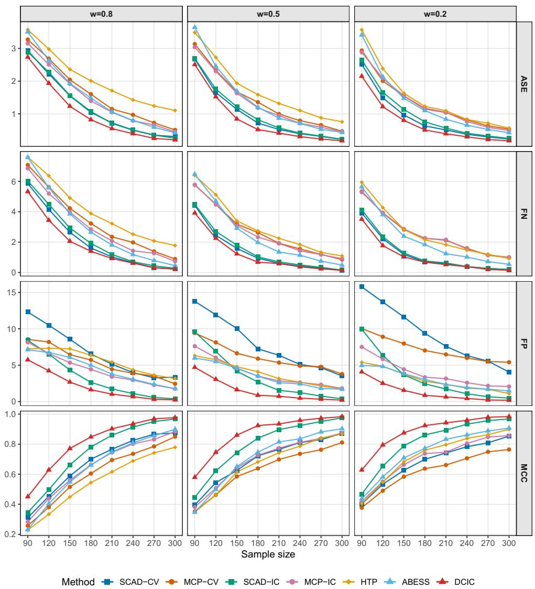  
Figure 8: Performance metrics under Setting 1 with an increasing sample size. The sufix “-CV” indicates tuning by 10-fold cross-validation. The sufix “-IC” indicates tuning by information criterion.

In the one-per-block signals setting (Figure 8), signals are uniformly dispersed across blocks, avoiding within-block competition. When the sample size reaches $n \geq 2 4 0$ , nearly exact support recovery is attained for DCIC and SCAD-IC, which outperform the other methods significantly. In terms of estimation accuracy, DCIC, SCAD-CV and SCAD-IC deliver substantially lower ASE than the remaining competitors. DCIC simultaneously keeps both false positives and false negatives at low levels, which is consistent with our theoretical guarantees. By contrast, the best-subset methods (HTP and ABESS) exhibit elevated false negatives, indicating that in the presence of strongly correlated competitor variables they frequently miss true predictors, which also explains their higher ASE.

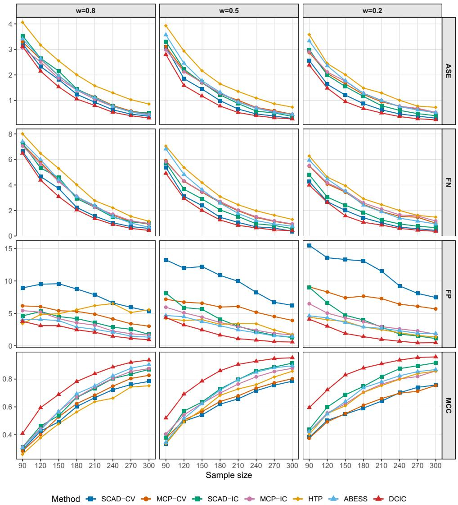  
Figure 9: Performance metrics under Setting 2 with an increasing sample size. The sufix “-CV” indicates tuning by 10-fold cross-validation. The sufix “-IC” indicates tuning by information criterion.

In the moderately clustered signals setting (Figure 9), signals are concentrated in half of the blocks, intensifying within-block competition. DCIC maintains a clear advantage in MCC owing to its good control of both false positives and false negatives. While HTP and ABESS limit false positives, they omit a substantial number of true predictors, returning an overly sparse model. By contrast, SCAD and MCP, especially tuned by cross-validation, exhibit inflated false positives at small n, reflecting dificulty in separating signals from strongly correlated surrogates. The ASE of DCIC matches or improves upon that of the best competitors, indicating competitive estimation performance.

In summary, the simulation results illustrate DCIC as a robust method for model selection under strongly correlated designs. Although best-subset methods such as HTP and ABESS have strong theoretical guarantees and often perform competitively in practice (Huang et al., 2018; Zhang et al., 2025; Zhu et al., 2020), under strong correlation, they tend to select overly sparse models, resulting in higher false negatives and weaker support recovery.

## C.2 Illustration of the pathwise computation–statistics trade-of

We provide an additional illustration of the pathwise computation–statistics trade-of underlying the complexity-guided search in Section 5.3.

The data are generated from the same covariance construction as Setting 1 in Section 6.1. Specifically, we take $n = 5 0 , p = 3 0 0$ , and $s ^ { * } = 5$ , and use the correlated design with $\rho _ { \mathrm { i n } } ~ = ~ \rho _ { \mathrm { o u t } } = 0 . 9$ and $w = 0 . 5$ . To control the quality of the complexity ranking, we construct the ranking so that the active variables are randomly embedded in the first $\tau _ { n }$ ranked positions, and consider $\tau _ { n } \in \{ 2 0 , 5 0 , 1 0 0 \}$ . These three choices represent near-oracle, favorable, and uninformative rankings, respectively.

For each ranking regime, we run the DCIC path algorithm over the same geometric grid $\lambda _ { k } = \lambda _ { \operatorname* { m a x } } \rho ^ { k - 1 } , k = 1 , \dots , 3 0$ , with $\lambda _ { \operatorname* { m a x } } = 3 0$ and $\rho = 0 . 9$ . At each path iteration k, we record the number of models evaluated by the implemented DFS search, the average squared error (ASE), and the Matthews correlation coeficient (MCC). The experiment is repeated 100 times, and Figure 10 reports the average curves over these replications.

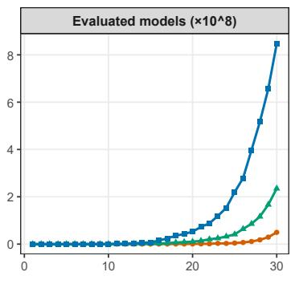

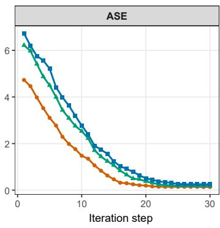

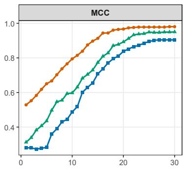  
Near-oracle (t n = 20) Favorable (t n = 50) Uninformative (t n = 100)  
Figure 10: Pathwise computation–statistics trade-of under diferent ranking informativeness. The curves are averaged over 100 replications.

Figure 10 displays a clear pathwise pattern. When the ranking is strongly informative, the procedure enters a statistically favorable region at early iterations: ASE decreases rapidly and MCC becomes high while the evaluated search size remains small. As the ranking becomes less informative, comparable statistical accuracy is achieved only at later iterations, where the search region has expanded substantially. In particular, the uninformative regime requires a much larger evaluated search size before reaching a similar level of ASE and MCC.

This behavior is consistent with the theoretical picture in Section 5.3. A more informative complexity ranking reduces the rank envelope $\tau _ { n }$ , thereby shifting the statistical entry index $k _ { \mathrm { s t a t } }$ to earlier grid points, where λ is larger and the search is more strongly constrained. Conversely, weaker ranking information delays recovery until smaller values of λ, at which point the number of evaluated models grows rapidly. The experiment therefore illustrates how the complexity ranking and the λ-path jointly determine the efective computation– statistics trade-of.

We further examine data-driven constructions of the preliminary ranking under the same simulation setting. In addition to the oracle-prefix reference rankings with $\tau _ { n } = 2 0$ and $\tau _ { n } = 5 0$ , we consider two practical ranking procedures: a LASSO-based ranking and a marginal-correlation ranking. The sample size n is varied from 40 to 200 in increments of 20. Each configuration is repeated 100 times, and the results are summarized in Figure 11.

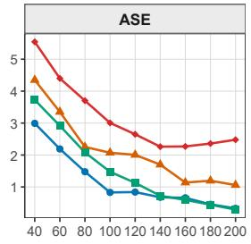

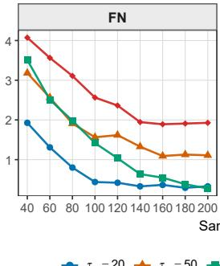

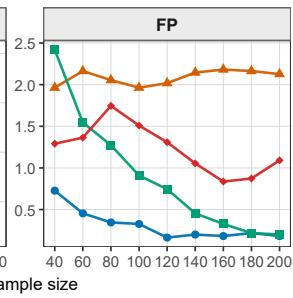

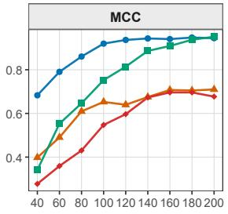  
Figure 11: Performance of diferent ranking procedures under a strongly correlated design.

The LASSO-based ranking provides a useful data-driven approximation to the favorable oracle-prefix rankings. For small sample sizes, its performance is comparable to that of the $\tau _ { n } = 5 0$ reference ranking. As n increases, the LASSO ranking becomes more informative and moves closer to the performance of the stronger $\tau _ { n } = 2 0$ reference ranking. By contrast, marginal correlation performs substantially worse in this strongly correlated setting, reflecting its sensitivity to correlated proxy variables. These results support the use of LASSO as a practical ranking device in the complexity-guided DCIC implementation.

To assess whether the preceding comparison is specific to the strongly correlated design, we repeat the same ranking experiment under a moderately correlated AR(1) design with covariance $\Sigma _ { i j } = 0 . 6 ^ { | i - j | }$ , keeping the remaining simulation parameters unchanged. The results are summarized in Figure 12.

Under the moderate AR(1) design, the LASSO-based ranking remains competitive with the favorable $\tau _ { n } = 2 0$ reference ranking across all four metrics. Marginal correlation also performs reasonably well, in contrast to its behavior under the strongly correlated design in Figure 11. Taken together, Figures 11 and 12 suggest that LASSO provides a stable practical ranking device across both dificult and moderately correlated regimes, while marginal correlation can be adequate in easier settings but may deteriorate under strong correlation.

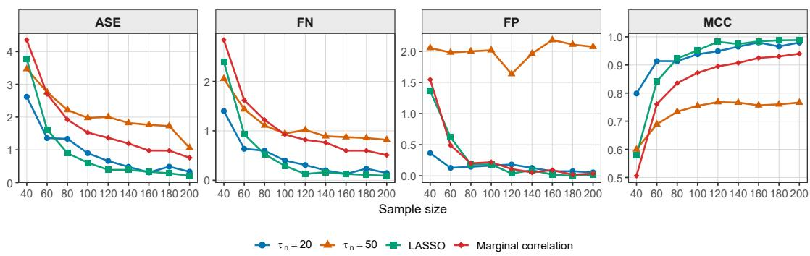  
Figure 12: Performance of diferent ranking procedures under a moderately correlated AR(1) design.

As an additional large-scale runtime illustration, we consider a problem with $n = 2 0 0$ $p = 5 0 0 0$ , and $s ^ { * } = 2 0$ , and run the proposed complexity-guided search under diferent rank envelopes $\tau _ { n }$ . We set $\sigma = 1$ , and the nonzero entries of $\beta ^ { * }$ are drawn independently from Unif[1, 2].

Unlike Figure 10, where the horizontal axis is the path iteration, Figure 13 reports ASE and MCC against accumulated computational time. Panel (a) uses the design in Setting 1 of Section 6.1, with $\rho _ { \mathrm { i n } } = \rho _ { \mathrm { o u t } } = 0 . 9$ and $w = 0 . 5$ . Panel (b) uses an AR(1) design with covariance $\Sigma _ { i j } = 0 . 6 ^ { | i - j | }$ . The same qualitative pattern remains visible on the runtime scale: a smaller rank envelope reaches low ASE and high MCC much earlier, whereas a larger rank envelope requires substantially longer runtime and may remain away from the favorable statistical region under the same computational budget. This experiment is intended as a representative runtime illustration of the algorithmic role of $\tau _ { n }$ in the computation–statistics trade-of.

(a)  
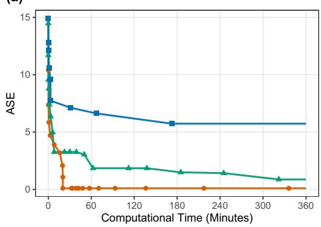

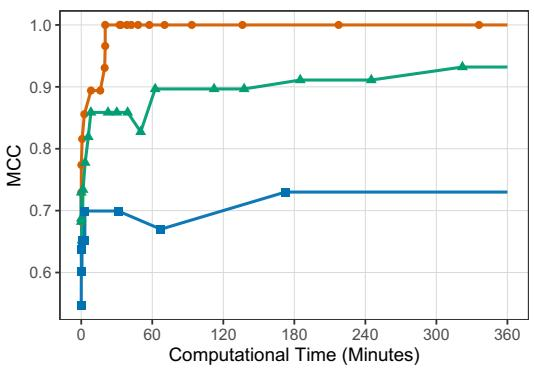

(b)  
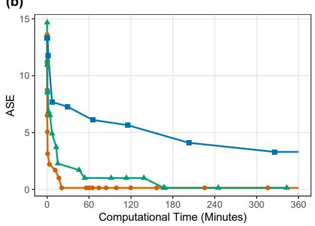

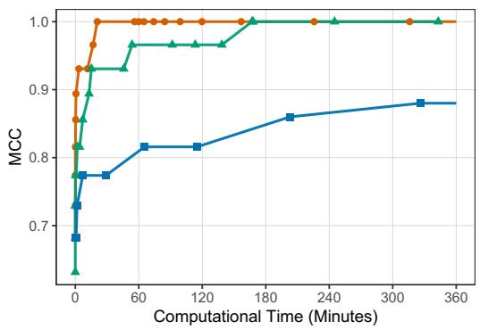  
Figure 13: Representative large-scale runtime illustration of the pathwise computation– statistics trade-of, with $n = 2 0 0 , p = 5 0 0 0$ , and $s ^ { * } = 2 0$ . The curves report ASE and MCC against accumulated computational time under diferent rank envelopes $\tau _ { n }$ . Panel (a) corresponds to the strongly correlated design in Setting 1 of Section 6.1, with $\rho _ { \mathrm { i n } } = \rho _ { \mathrm { o u t } } = 0 . 9$ and $w = 0 . 5 ;$ panel (b) corresponds to an AR(1) design with $\begin{array} { r } { \Sigma _ { i j } = 0 . 6 ^ { | i - j | } } \end{array}$

## C.3 Sensitivity analysis for implementation heuristics

We examine the sensitivity of the DCIC search to two heuristic parameters used to accelerate the depth-first search described in Remark 5.6: the ranked-search prefix size and the RSS-based budget-tightening factor. The experiments in this subsection use the same block-design mechanism and active-block structure as Setting 2 in Section 6.1. The active variables are distributed over five correlated blocks, with two nonzero coeficients in each active block. We fix $w = 0 . 5$ and consider two correlation regimes by setting $\rho _ { \mathrm { i n } } = \rho _ { \mathrm { o u t } }$ to 0.5 and 0.8, corresponding to moderate and strong correlation, respectively.

Each configuration is repeated 50 times. We impose a 10-minute time limit on each replication. If the search does not terminate within the time limit, the last available solution along the DCIC path is used as the reported estimator. We report both the statistical performance of the resulting estimators and the runtime.

## C.3.1 RSS-based budget tightening

We first vary the RSS-based budget-tightening factor. This factor controls how aggressively the RSS term is used to tighten the complexity budget during the implemented search. Smaller values retain more candidate branches and are therefore more conservative, whereas larger values prune more aggressively. We set $n = 1 0 0 , p = 4 0 0$ , and $\sigma = 1$ , and draw the nonzero coeficients from Unif[0.5, 1]. The ranked-search prefix size is fixed at its default value $p / 5$ . We compare the budget-tightening factors {0.6, 0.8, 1.0}.

Table 3: Sensitivity to the RSS-based budget-tightening factor.
<table><tr><td>Regime</td><td>Budget factor</td><td>ASE MCC</td><td> $\mathrm { T P }$ </td><td>FN</td><td>Truncated</td><td>Runtime (s)</td></tr><tr><td>Moderate</td><td>0.6</td><td>0.730 0.863</td><td>7.98</td><td>2.02</td><td>12</td><td>173.52</td></tr><tr><td>Moderate</td><td>0.8</td><td>0.738 0.863</td><td>7.98</td><td>2.02</td><td>0</td><td>15.85</td></tr><tr><td>Moderate</td><td>1.0</td><td>0.779 0.852</td><td>7.86</td><td>2.14</td><td>0</td><td>0.82</td></tr><tr><td>Strong</td><td>0.6</td><td>1.171 0.647</td><td>5.35</td><td>4.65</td><td>23</td><td>283.12</td></tr><tr><td>Strong</td><td>0.8</td><td>1.092 0.676</td><td>5.76</td><td>4.24</td><td>1</td><td>35.61</td></tr><tr><td>Strong</td><td>1.0</td><td>1.201 0.647</td><td>5.34</td><td>4.66</td><td>0</td><td>1.51</td></tr></table>

Table 3 exhibits the expected computation–statistics trade-of. The conservative factor 0.6 retains more branches and achieves competitive recovery accuracy, but it leads to many truncated replications and much larger runtime. The aggressive factor 1.0 is substantially faster, but it slightly degrades recovery accuracy, especially in the strong regime. The intermediate factor 0.8 retains nearly the same statistical performance as the conservative choice in the moderate regime and gives the best recovery performance in the strong regime, while requiring much less computation than 0.6. These results support the default RSS-based budget-tightening factor 0.8 used in the main experiments.

## C.3.2 Ranked-search prefix size

We next vary the ranked-search prefix size, which controls how many top-ranked variables are retained in the depth-first search. We set $n = 1 0 0 , p = 3 0 0$ , and $\sigma = 2 .$ , and draw the nonzero coeficients from Unif[1, 2]. The RSS-based budget-tightening factor is fixed at 0.8. We compare prefix sizes $\{ p , \ p / 2 , \ p / 5 , \ p / 1 0 \}$

Table 4: Sensitivity to the ranked-search prefix size.
<table><tr><td>Regime</td><td>Prefix size</td><td>ASE</td><td>MCC</td><td>TP</td><td>FN</td><td>Truncated</td><td>Runtime (s)</td></tr><tr><td>Moderate</td><td> $p$ </td><td>2.952</td><td>0.870</td><td>8.03</td><td>1.97</td><td>0</td><td>22.02</td></tr><tr><td>Moderate</td><td> $p / 2$ </td><td>2.952</td><td>0.870</td><td>8.03</td><td>1.97</td><td>0</td><td>13.85</td></tr><tr><td>Moderate</td><td> $p / 5$ </td><td>2.952</td><td>0.870</td><td>8.03</td><td>1.97</td><td>0</td><td>2.97</td></tr><tr><td>Moderate</td><td> $p / 1 0$ </td><td>2.966</td><td>0.868</td><td>7.98</td><td>2.02</td><td>0</td><td>0.17</td></tr><tr><td>Strong</td><td> $p$ </td><td>5.020</td><td>0.675</td><td>5.36</td><td>4.64</td><td>3</td><td>177.45</td></tr><tr><td>Strong</td><td> $p / 2$ </td><td>5.020</td><td>0.675</td><td>5.36</td><td>4.64</td><td>3</td><td>101.44</td></tr><tr><td>Strong</td><td> $p / 5$ </td><td>5.027</td><td>0.675</td><td>5.36</td><td>4.64</td><td>1</td><td>38.17</td></tr><tr><td>Strong</td><td> $p / 1 0$ </td><td>5.027</td><td>0.674</td><td>5.36</td><td>4.64</td><td>0</td><td>2.22</td></tr></table>

Table 4 shows that reducing the prefix size substantially decreases runtime while leaving the statistical performance competitive. The default choice $p / 5$ provides a useful compromise: it is much faster than using the full ranked list or $p / 2$ , while remaining more conservative than the very small prefix $p / 1 0$

## C.4 Additional setting of all-subset selection

In this section, we report additional simulation results under a standard AR(1) design with moderate correlation (Bertsimas et al., 2016; Zhu et al., 2020). Specifically, the rows of the design matrix X are generated independently from $N ( 0 , \Sigma )$ with $\begin{array} { r } { \Sigma _ { i j } = 0 . 6 ^ { | i - j | } } \end{array}$ . We fix $p = 1 0 0 0 , s ^ { * } = 1 0$ , and $\sigma = 2$ , and let the sample size n vary from 90 to 360 in increments of 30. The nonzero coeficients are set to 1 with random signs, and their indices are equally spaced. In addition to the performance metrics reported in Section 6.1, we also record the runtime in seconds for each method.

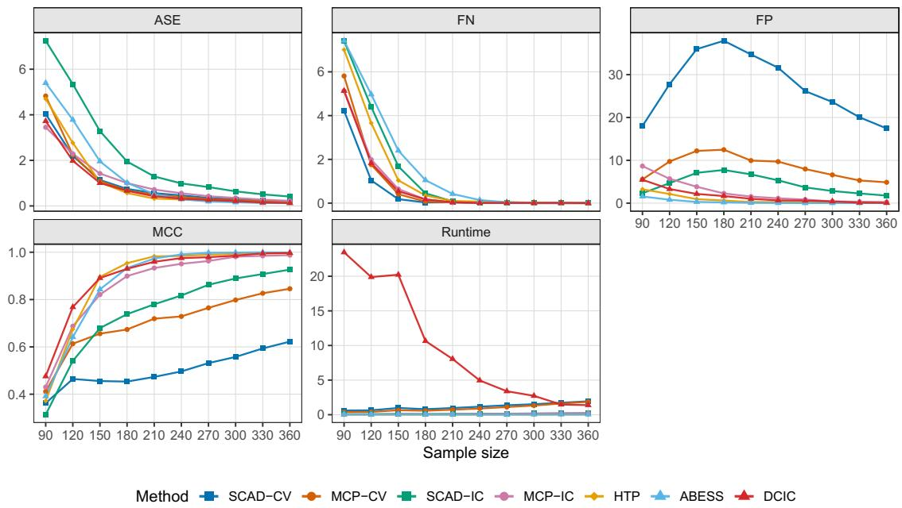  
Figure 14: Performance under the AR(1) design with $\begin{array} { r } { \Sigma _ { i j } = 0 . 6 ^ { | i - j | } } \end{array}$ as the sample size increases. The sufix $^ { 6 6 } – C V '$ denotes tuning by 10-fold cross-validation, whereas $^ { 6 6 } \mathrm { - } \mathrm { I C } ^ { 9 9 }$ denotes tuning by an information criterion.

Figure 14 shows that all methods improve as the sample size increases, although the extent of improvement difers substantially across procedures. In terms of support recovery, HTP, ABESS, and DCIC exhibit the strongest overall performance: both false negatives and false positives decrease rapidly with $n ,$ and their MCC values approach one once the sample size is moderate to large. Among the remaining competitors, MCP-IC performs reasonably well, whereas SCAD-CV continues to select a non-negligible number of irrelevant variables even at the largest sample sizes, and SCAD-IC shows comparatively slower improvement in estimation and recovery accuracy.

From a computational perspective, HTP and ABESS are consistently the fastest methods across the entire range of n. DCIC is more computationally demanding when n is small, but its runtime decreases markedly as n increases. This pattern is consistent with the fact that, under more favorable recovery regimes, the screening and pruning steps discard a substantially larger fraction of inferior candidate models before the final search stage.

## References

A. Barron, J. Rissanen, and Bin Yu. The minimum description length principle in coding and modeling. IEEE Transactions on Information Theory, 44(6):2743–2760, 1998. doi:10.1109/18.720554.

Andrew Barron, Lucien Birgé, and Pascal Massart. Risk bounds for model selection via penalization. Probability Theory and Related Fields, 113(3):301–413, 1999. doi:10.1007/s004400050210.

Andrew R. Barron and Thomas M. Cover. Minimum complexity density estimation. IEEE Transactions on Information Theory, 37(4):1034–1054, 1991. doi:10.1109/18.86996.

Pierre C Bellec, Guillaume Lecué, and Alexandre B Tsybakov. Slope meets lasso: improved oracle bounds and optimality. The Annals of Statistics, 46(6B):3603–3642, 2018. doi:10.1214/17-AOS1670.

Dimitris Bertsimas and Bart Van Parys. Sparse high-dimensional regression: Exact scalable algorithms and phase transitions. The Annals of Statistics, 48(1):300–323, 2020. doi:10.1214/18-AOS1804.

Dimitris Bertsimas, Angela King, and Rahul Mazumder. Best subset selection via a modern optimization lens. The Annals of Statistics, 44(2):813–852, 2016. doi:10.1214/15-AOS1388.

Lucien Birgé and Pascal Massart. Gaussian model selection. Journal of the European Mathematical Society, 3(3):203–268, 2001. doi:10.1007/s100970100031.

Lucien Birgé and Pascal Massart. Minimal Penalties for Gaussian Model Selection. Probability Theory and Related Fields, 138(1–2):33–73, 2007. doi:10.1007/s00440-006-0011-8.

Cristina Butucea, Mohamed Ndaoud, Natalia A. Stepanova, and Alexandre B. Tsybakov. Variable selection with hamming loss. The Annals of Statistics, 46(5):1837–1875, 2018. doi:10.1214/17-AOS1572.

T. Tony Cai, Anru R. Zhang, and Yuchen Zhou. Sparse group lasso: Optimal sample complexity, convergence rate, and statistical inference. IEEE Transactions on Information Theory, 68(9):5975–6002, 2022.

E. J. Candès and T. Tao. Decoding by linear programming. IEEE Transactions on Information Theory, 51(12):4203–4215, 2005. doi:10.1109/TIT.2005.858979.

Jiahua Chen and Zehua Chen. Extended bayesian information criteria for model selection with large model spaces. Biometrika, 95(3):759–771, 2008. doi:10.1093/biomet/asn034.

L. Comminges, O. Collier, M. Ndaoud, and A. B. Tsybakov. Adaptive robust estimation in sparse vector model. The Annals of Statistics, 49(3):1347–1377, 2021. doi:10.1214/20- AOS2002.

Ronald A. DeVore. Nonlinear approximation. Acta Numerica, 7:51–150, 1998. doi:10.1017/S0962492900002816.

David L. Donoho and Iain M. Johnstone. Ideal denoising in an orthonormal basis chosen from a library of bases. Comptes Rendus de l’Académie des Sciences. Série I, Mathé- matique, 319(12):1317–1322, 1994. URL https://imjohnstone.su.domains/WEBLIST/ 1994/idealbasis.pdf.

David L Donoho and Iain M Johnstone. Minimax estimation via wavelet shrinkage. The Annals of Statistics, 26(3):879–921, 1998. doi:10.1214/aos/1024691081.

Jianqing Fan and Runze Li. Variable selection via nonconcave penalized likelihood and its oracle properties. Journal of the American Statistical Association, 96(456):1348–1360, 2001. doi:10.1198/016214501753382273.

Simon Foucart. Hard thresholding pursuit: An algorithm for compressive sensing. SIAM Journal on Numerical Analysis, 49(6):2543–2563, 2011. doi:10.1137/100806278.

Ming Gao and Bryon Aragam. Optimality and computational barriers in variable selection under dependence, 2025. URL https://arxiv.org/abs/2510.03990. arXiv preprint arXiv:2510.03990.

Friedrich Götze, Holger Sambale, and Arthur Sinulis. Concentration inequalities for polynomials in α-sub-exponential random variables. Electronic Journal of Probability, 26: 1–22, 2021. doi:10.1214/21-EJP606.

Yongyi Guo, Ziwei Zhu, and Jianqing Fan. Best subset selection is robust against design dependence, 2021. URL https://arxiv.org/abs/2007.01478. arXiv preprint arXiv:2007.01478.

Hussein Hazimeh, Rahul Mazumder, and Peter Radchenko. Grouped variable selection with discrete optimization: Computational and statistical perspectives. The Annals of Statistics, 51(1):1–32, 2023. doi:10.1214/21-AOS2155.

Jennifer A. Hoeting, David Madigan, Adrian E. Raftery, and Chris T. Volinsky. Bayesian model averaging: a tutorial. Statistical Science, 14(4):382–417, 1999. doi:10.1214/ss/1009212519.

Jian Huang, Joel L. Horowitz, and Fengrong Wei. Variable selection in nonparametric additive models. The Annals of Statistics, 38(4):2282–2313, 2010. doi:10.1214/09-AOS781.

Jian Huang, Patrick Breheny, and Shuangge Ma. A selective review of group selection in high-dimensional models. Statistical Science, 27(4):481–499, 2012. doi:10.1214/12- STS392.

Jian Huang, Yuling Jiao, Yanyan Liu, and Xiliang Lu. A constructive approach to l0 penalized regression. Journal of Machine Learning Research, 19(10):1–37, 2018. URL https://www.jmlr.org/papers/v19/17-194.html.

Jianhua Z. Huang and Ya Su. Asymptotic properties of penalized spline estimators in concave extended linear models: Rates of convergence. The Annals of Statistics, 49(6): 3383–3407, 2021. doi:10.1214/21-AOS2088.

Junzhou Huang, Tong Zhang, and Dimitris Metaxas. Learning with structured sparsity. Journal of Machine Learning Research, 12(103):3371–3412, 2011. URL https://www. jmlr.org/papers/v12/huang11b.html.

Ching-Kang Ing. Model selection for high-dimensional linear regression with dependent observations. The Annals of Statistics, 48(4):1959–1980, 2020. doi:10.1214/19-AOS1872.

Zhifan Li, Yanhang Zhang, and Jianxin Yin. Estimating double sparse structures over $\ell _ { u } ( \ell _ { q } )$ -balls: Minimax rates and phase transition. IEEE Transactions on Information Theory, 70(10):7066–7088, 2024. doi:10.1109/TIT.2024.3451512.

Karim Lounici, Massimiliano Pontil, Sara van de Geer, and Alexandre B. Tsybakov. Oracle inequalities and optimal inference under group sparsity. The Annals of Statistics, 39(4): 2164–2204, 2011. doi:10.1214/11-AOS896.

Rahul Mazumder, Peter Radchenko, and Antoine Dedieu. Subset selection with shrinkage: Sparse linear modeling when the snr is low. Operations Research, 71(1):129–147, 2023. doi:10.1287/opre.2022.2276.

Lukas Meier, Sara van de Geer, and Peter Bühlmann. High-dimensional additive modeling. The Annals of Statistics, 37(6B):3779–3821, 2009. doi:10.1214/09-AOS692.

Balas Kausik Natarajan. Sparse approximate solutions to linear systems. SIAM Journal on Computing, 24(2):227–234, 1995. doi:10.1137/S0097539792240406.

Roberto I. Oliveira and Lucas Resende. Trimmed sample means for robust uniform mean estimation and regression. The Annals of Statistics, 53(5):2153–2178, 2025. doi:10.1214/25- AOS2536.

Garvesh Raskutti, Martin J. Wainwright, and Bin Yu. Minimax rates of estimation for high-dimensional linear regression over ℓq -balls. IEEE Transactions on Information Theory, 57(10):6976–6994, 2011. doi:10.1109/TIT.2011.2165799.

Garvesh Raskutti, Martin J. Wainwright, and Bin Yu. Minimax-optimal rates for sparse additive models over kernel classes via convex programming. Journal of Machine Learning Research, 13(13):389–427, 2012. URL https://www.jmlr.org/papers/v13/raskutti12a. html.

Pradeep Ravikumar, John Laferty, Han Liu, and Larry Wasserman. Sparse Additive Models. Journal of the Royal Statistical Society: Series B (Statistical Methodology), 71 (5):1009–1030, 2009. doi:10.1111/j.1467-9868.2009.00704.x.

Jorma Rissanen. A universal prior for integers and estimation by minimum description length. The Annals of Statistics, 11(2):416–431, 1983. doi:10.1214/aos/1176346150.

Saptarshi Roy, Ambuj Tewari, and Ziwei Zhu. Understanding best subset selection: A tale of two c(omplex)ities. Electronic Journal of Statistics, 19(1):2320–2342, 2025. doi:10.1214/25-EJS2388.

Holger Sambale. Some notes on concentration for α-subexponential random variables. In Radosław Adamczak, Nathael Gozlan, Karim Lounici, and Mokshay Madiman, editors, High Dimensional Probability IX: The Ethereal Volume, volume 80 of Progress in Probability, pages 167–192. Birkhäuser, Cham, 2023. doi:10.1007/978-3-031-26979-0\_7.

Gideon Schwarz. Estimating the dimension of a model. The Annals of Statistics, 6(2): 461–464, 1978. doi:10.1214/aos/1176344136.

Xiaotong Shen, Wei Pan, and Yunzhang Zhu. Likelihood-based selection and sharp parameter estimation. Journal of the American Statistical Association, 107(497):223–232, 2012. doi:10.1080/01621459.2011.645783.

Xiaotong Shen, Wei Pan, Yunzhang Zhu, and Hui Zhou. On constrained and regularized high-dimensional regression. Annals of the Institute of Statistical Mathematics, 65(5): 807–832, 2013.

Noah Simon, Jerome Friedman, Trevor Hastie, and Robert Tibshirani. A Sparse-Group Lasso. Journal of Computational and Graphical Statistics, 22(2):231–245, 2013.

Jefrey C. Sklar, Junqing Wu, Wendy Meiring, and Yuedong Wang. Nonparametric Regression With Basis Selection From Multiple Libraries. Technometrics, 55(2):189–201, 2013. doi:10.1080/00401706.2012.761758.

Bernhard Stankewitz. Early stopping for l2-boosting in high-dimensional linear models. The Annals of Statistics, 52(2):491–518, 2024. doi:10.1214/24-AOS2356.

Zhiqiang Tan and Cun-Hui Zhang. Doubly penalized estimation in additive regression with high-dimensional data. The Annals of Statistics, 47(5):2567–2600, 2019. doi:10.1214/18- AOS1757.

Robert Tibshirani. Regression shrinkage and selection via the lasso. Journal of the Royal Statistical Society: Series B (Methodological), 58(1):267–288, 1996. doi:10.1111/j.2517- 6161.1996.tb02080.x.

Alexandre B. Tsybakov. Introduction to Nonparametric Estimation. Springer Series in Statistics. Springer, New York, 2009. ISBN 978-0-387-79051-0. doi:10.1007/978-0-387- 79052-7.

Nicolas Verzelen. Minimax risks for sparse regressions: Ultra-high dimensional phenomenons. Electronic Journal of Statistics, 6:38–90, 2012. doi:10.1214/12-EJS666.

Lan Wang, Yongdai Kim, and Runze Li. Calibrating nonconvex penalized regression in ultra-high dimension. The Annals of Statistics, 41(5):2505–2536, 2013. doi:10.1214/13- AOS1159.

Zhan Wang, Sandra Paterlini, Fuchang Gao, and Yuhong Yang. Adaptive minimax regression estimation over sparse ℓq-hulls. Journal of Machine Learning Research, 15(50):1675–1711, 2014. URL https://www.jmlr.org/papers/v15/wang14b.html.

Larry Wasserman. RIP RIP (Restricted Isometry Property, Rest in Peace). https://normaldeviate.wordpress.com/2012/08/07/ rip-rip-restricted-isometry-property-rest-in-peace/, 2012. Blog post, Normal Deviate.

Yuhong Yang. Model selection for nonparametric regression. Statistica Sinica, 9(2):475–499, 1999. URL https://www3.stat.sinica.edu.tw/statistica/j9n2/j9n29/j9n29.htm.

Yuhong Yang. Combining forecasting procedures: Some theoretical results. Econometric Theory, 20(1):118–135, 2004.

Yuhong Yang and Andrew R. Barron. An asymptotic property of model selection criteria. IEEE Transactions on Information Theory, 44(1):95–116, 1998. doi:10.1109/18.650993.

Ming Yuan and Yi Lin. Model Selection and Estimation in Regression with Grouped Variables. Journal of the Royal Statistical Society: Series B (Statistical Methodology), 68 (1):49–67, 2006. doi:10.1111/j.1467-9868.2005.00532.x.

Cun-Hui Zhang. Nearly unbiased variable selection under minimax concave penalty. The Annals of Statistics, 38(2):894–942, 2010. doi:10.1214/09-AOS729.

Cun-Hui Zhang and Jian Huang. The sparsity and bias of the lasso selection in high-dimensional linear regression. The Annals of Statistics, 36(4):1567–1594, 2008. doi:10.1214/07-AOS520.

Jiawei Zhang, Yuhong Yang, and Jie Ding. Information criteria for model selection. WIREs Computational Statistics, 15(5):e1607, 2023a. doi:10.1002/wics.1607.

Yanhang Zhang, Junxian Zhu, Jin Zhu, and Xueqin Wang. A splicing approach to best subset of groups selection. INFORMS Journal on Computing, 35(1):104–119, 2023b.

Yanhang Zhang, Zhifan Li, Shixiang Liu, and Jianxin Yin. A minimax optimal approach to high-dimensional double sparse linear regression. Journal of Machine Learning Research, 25(369):1–66, 2024. URL https://www.jmlr.org/papers/v25/23-0653.html.

Yanhang Zhang, Shixiang Liu, Zhifan Li, Xueqin Wang, and Jianxin Yin. Rethinking hard thresholding pursuit: Full adaptation and sharp estimation. IEEE Transactions on Information Theory, 71(11):8899–8927, 2025. doi:10.1109/TIT.2025.3603987.

Junxian Zhu, Canhong Wen, Jin Zhu, Heping Zhang, and Xueqin Wang. A polynomial algorithm for best-subset selection problem. Proceedings of the National Academy of Sciences, 117(52):33117–33123, 2020. doi:10.1073/pnas.2014241117.

Ziwei Zhu and Shihao Wu. On sure early selection of the best subset. IEEE Transactions on Information Theory, 70(12):8870–8891, 2024. doi:10.1109/TIT.2024.3415653.