# A Unified Framework for Fair and Personalized Decentralized Learning under Communication Constraints

Krishnendu S. Tharakan, Member, IEEE, Carlo Fischione, Fellow, IEEE

Abstract—Decentralized learning systems aim to collaboratively train models across multiple clients without relying on a central coordinator. While decentralization improves scalability, privacy, and robustness, it also exacerbates three fundamental challenges: statistical heterogeneity across clients, fairness in client-level performance, and stringent communication constraints. This raises a natural question: howfair can decentralized learning be under limited communication? We address this question by presenting a unified framework for decentralized learning under communication constraints, bringing together graphbased personalization, agnostic fairness, and compressed eventtriggered communication. Specifically, we propose a new algorithm DMFL-SQ, a decentralized multi-task learning algorithm that couples personalized model training over a communication graph with an agnostic mixture fairness objective, while reducing communication through sparsification, quantization, and eventtriggered synchronization. We establish convergence guarantees for general non-convex objectives and show that DMFL-SQ achieves an $\mathcal { O } ( T ^ { - 1 / 2 } )$ ) rate in expected squared Moreau-envelope stationarity despite sparse, quantized, and event-triggered communication. We further derive PAC-Bayes generalization guarantees for the fairness-aware mixture objective. Experiments on CIFAR-10 and the real heterogeneous MUSMET EEG dataset demonstrate that DMFL-SQ substantially reduces communication while maintaining predictive performance and improving fairness across clients. Together, our theoretical and empirical results show that personalization, fairness, and communication efficiency can be jointly achieved in decentralized learning while preserving the dominant convergence rate.

Index Terms—decentralized learning, fairness, multi-task federated learning, sparse communication.

## I. INTRODUCTION

Federated learning (FL) enables multiple clients to collaboratively train machine learning models without directly sharing their local data [1], [2]. In the classical FL setting, a central server coordinates the training process by collecting local model updates from participating clients and aggregating them into a single global model. This paradigm has enabled large-scale learning across distributed data sources, including mobile devices, edge sensors, and networked intelligent systems [3], [4]. However, practical deployments of FL face several fundamental challenges. Client data are often statistically heterogeneous, making a single global model suboptimal for many users. Optimizing only the average performance may also lead to unfair outcomes, where clients with scarce, noisy, or non-representative data experience disproportionately high loss [5]. In addition, frequent communication of high-dimensional model updates creates a severe bottleneck in bandwidth-limited, energy-constrained, and unreliable networks.

A natural way to address statistical heterogeneity is through personalized or multi-task learning. Instead of enforcing a single shared model across all clients, each client learns a personalized model while still benefiting from collaboration with related clients. In graph-based personalized learning, clients are represented as nodes of a communication or similarity graph, and neighboring models are encouraged to remain close through a graph-based regularization mechanism. This allows the learning process to exploit statistical similarity among clients while preserving local adaptability. Such formulations have been studied in multi-task and personalized federated learning [3], [6]–[8]. Nevertheless, most existing personalized FL methods either rely on centralized coordination or do not explicitly address fairness across clients.

Fairness-aware federated learning has emerged as an important direction for mitigating disparities in client-level performance. Rather than optimizing only the average loss, fairnessaware approaches seek to improve the performance of underrepresented or high-loss clients. Methods based on distributionally robust optimization, agnostic federated learning, and conditional value-at-risk (CVaR) aim to control the worstcase or upper-tail client risk, thereby improving robustness to heterogeneous client distributions [9]–[11]. However, these methods typically assume centralized aggregation and frequent global synchronization. Their integration into fully decentralized networks with limited communication remains largely unexplored.

Communication efficiency is another central challenge in decentralized learning [12], [13]. Unlike server-based FL, fully decentralized systems require clients to exchange information directly with their neighbors over a communication graph. This removes the need for a central coordinator and improves robustness to server failures, but it also makes communication more complex. Each client must repeatedly transmit model updates or gradients over bandwidth-limited links, and these updates are often high-dimensional. Compression, sparsification, quantization, and event-triggered communication can substantially reduce this cost [14], [15]. However, aggressive communication reduction may introduce additional bias, network disagreement, and instability, especially in nonconvex learning problems. Establishing rigorous convergence guarantees under decentralized graph coupling, fairness regularization, and compressed event-triggered communication is therefore technically challenging.

Despite substantial progress on personalization, fairness, and communication efficiency, these components are usually studied in isolation. To the best of our knowledge, existing work does not provide a unified theoretical and algorithmic framework that simultaneously captures graph-based personalization, agnostic fairness, and compressed decentralized communication under general non-convex objectives, and DMFL-SQ introduces a new integrated decentralized algorithmic framework. This paper addresses the following question: how fair can decentralized learning be under limited communication? We answer this question by developing a unified framework for decentralized learning under communication constraints, bringing together three practical components: graphbased personalization to handle statistical heterogeneity, agnostic fairness to control client-level performance disparities, and sparsified, quantized, and event-triggered communication to reduce bandwidth consumption.

DMFL-SQ introduces a new integrated decentralized algorithmic framework. Existing compressed decentralized optimization methods, such as SPARQ-SGD [14], CHOCO-SGD [13], and related variants, primarily target consensus optimization or a shared global model. In contrast, DMFL-SQ optimizes a graph-regularized personalized objective in which client models need not agree. Similarly, agnostic federated learning methods address worst-client or mixture-risk robustness, but are typically studied in centralized or serverassisted settings and do not account for sparse-quantized event-triggered neighbor communication over a decentralized graph [16]–[18].

In contrast, DMFL-SQ tackles decentralized multi-task learning with graph-based personalization and agnostic clientlevel fairness. This coupling creates new analytical challenges because the fairness envelope is generally nonsmooth, the optimization variable is the full personalized model collection, and communication compression introduces stale neighborcopy errors into the graph-coupling direction. The proposed algorithm addresses these challenges by using scalar fairnessconsensus to identify the active agnostic mixture component and by communicating only sparse-quantized model-copy innovations when the event trigger is activated. The accompanying analysis establishes stationarity of the fairness-aware objective while preserving the standard O(T−1/2) non-convex stationarity rate, and explicitly accounting for stochasticgradient noise, stale neighbor-copy error, compression, and event-triggering. We also derive PAC-Bayes generalization guarantees for the agnostic mixture objective, thereby characterizing both optimization and statistical aspects of fairnessaware decentralized learning.

## A. Related Work

A straightforward implementation of FL with stochastic gradient descent requires frequent exchange of high-dimensional gradient or model-update vectors, which may contain millions of parameters. This creates substantial communication overhead, particularly in wireless edge networks with limited radio resources. One common approach to mitigate this bottleneck is to compress the gradient information before transmission [13]. A simple example is sign-based compression, commonly known as SignSGD, where only the sign of each gradient coordinate is communicated [19]. These methods improve scalability and avoid a single point of failure, but most existing decentralized optimization algorithms focus on learning a single global model or minimizing an average objective. In contrast, this work studies a fully decentralized setting in which clients learn personalized models while jointly accounting for fairness and communication constraints.

In decentralized settings, Assran et al. [20] and Tatarenko and Touri [21] analyze stochastic gradient-push methods for non-convex objectives, where the main focus is on approximating distributed averaging over directed networks rather than reducing communication through gradient compression. In contrast, Tang et al. [12] study unbiased stochastic compression mechanisms for exchanging gradient or model information across decentralized nodes. Personalized FL addresses statistical heterogeneity by allowing clients to learn taskspecific models adapted to their local data [6], [7], [22]. These methods improve local adaptation under heterogeneous data, but they generally do not incorporate agnostic client-level fairness objectives or compressed event-triggered communication in fully decentralized networks.

Communication reduction has been widely studied through sparsification [23], quantization [24], and error-feedback correction [25]. Event-triggered communication further reduces bandwidth consumption by allowing clients to communicate only when local updates are sufficiently informative. SPARQ-SGD [14], for example, combines sparsification, quantization, and event-triggered updates for decentralized optimization. Recent works have also established non-convex convergence guarantees for decentralized SGD under compression, network constraints, and related communication limitations [26]–[28]. However, these methods typically optimize an average objective or a single global model, and do not analyze the joint effect of graph-based personalization, agnostic fairness, and compressed decentralized communication.

The above directions address important aspects of distributed learning, but largely in isolation: personalization handles statistical heterogeneity, fairness-aware FL controls clientlevel disparities, and compressed decentralized optimization reduces communication, summarized in Table I. In contrast, DMFL-SQ provides a unified framework that jointly incorporates graph-based personalization, agnostic fairness, and sparsified, quantized, event-triggered decentralized communication, while providing both nonconvex convergence and PAC-Bayes generalization bounds for the resulting fairness-aware mixture objective.

## B. Contributions and Organization

The main contributions of this paper are summarized as follows.

• Unified decentralized fair multi-task learning framework: We formulate decentralized learning under communication constraints as a unified problem involving graph-based personalization, agnostic fairness, and compressed event-triggered communication. This provides a single framework for jointly studying personalization, client-level fairness, and bandwidth efficiency in fully decentralized networks.

TABLE I: Literature Review
<table><tr><td rowspan=1 colspan=1>Feature</td><td rowspan=1 colspan=1>[29]</td><td rowspan=1 colspan=1>[13]</td><td rowspan=1 colspan=1>[6]</td><td rowspan=1 colspan=1>[18]</td><td rowspan=1 colspan=1>[14]</td><td rowspan=1 colspan=1>[30] [17]</td><td rowspan=1 colspan=1>Proposed</td></tr><tr><td rowspan=1 colspan=1>Fully decentralized</td><td rowspan=1 colspan=1>√</td><td rowspan=1 colspan=1>√</td><td rowspan=1 colspan=1></td><td rowspan=1 colspan=1></td><td rowspan=1 colspan=1>√</td><td rowspan=1 colspan=1></td><td rowspan=1 colspan=1> $\checkmark$ </td></tr><tr><td rowspan=1 colspan=1>Personalized</td><td rowspan=1 colspan=1></td><td rowspan=1 colspan=1></td><td rowspan=1 colspan=1> $\checkmark$ </td><td rowspan=1 colspan=1></td><td rowspan=1 colspan=1></td><td rowspan=1 colspan=1></td><td rowspan=1 colspan=1> $\overline { { \checkmark } }$ </td></tr><tr><td rowspan=1 colspan=1>Fairness-aware objective</td><td rowspan=1 colspan=1></td><td rowspan=1 colspan=1></td><td rowspan=1 colspan=1></td><td rowspan=1 colspan=1>√</td><td rowspan=1 colspan=1></td><td rowspan=1 colspan=1></td><td rowspan=1 colspan=1> $\overline { { \checkmark } }$ </td></tr><tr><td rowspan=1 colspan=1>Compressedcommunication</td><td rowspan=1 colspan=1>√</td><td rowspan=1 colspan=1>√</td><td rowspan=1 colspan=1></td><td rowspan=1 colspan=1></td><td rowspan=1 colspan=1> $\checkmark$ </td><td rowspan=1 colspan=1>√</td><td rowspan=1 colspan=1>√</td></tr><tr><td rowspan=1 colspan=1>Event-triggeredcommunication</td><td rowspan=1 colspan=1></td><td rowspan=1 colspan=1></td><td rowspan=1 colspan=1></td><td rowspan=1 colspan=1></td><td rowspan=1 colspan=1> $\checkmark$ </td><td rowspan=1 colspan=1></td><td rowspan=1 colspan=1> $\checkmark$ </td></tr><tr><td rowspan=1 colspan=1>Non-convexconvergence guarantee</td><td rowspan=1 colspan=1> $\checkmark$ </td><td rowspan=1 colspan=1></td><td rowspan=1 colspan=1></td><td rowspan=1 colspan=1></td><td rowspan=1 colspan=1> $\checkmark$ </td><td rowspan=1 colspan=1></td><td rowspan=1 colspan=1> $\checkmark$ </td></tr><tr><td rowspan=1 colspan=1>Generalizationguarantee</td><td rowspan=1 colspan=1></td><td rowspan=1 colspan=1></td><td rowspan=1 colspan=1></td><td rowspan=1 colspan=1> $\checkmark$ </td><td rowspan=1 colspan=1></td><td rowspan=1 colspan=1></td><td rowspan=1 colspan=1> $\checkmark$ </td></tr></table>

• Communication-efficient decentralized algorithm: We propose DMFL-SQ, a decentralized multi-task learning algorithm that combines local stochastic updates, graphbased model coupling, sparsified and quantized communication, and event-triggered synchronization. The algorithm reduces communication overhead while preserving fairness-aware collaboration among heterogeneous clients.

• Non-convex convergence guarantees: We establish finite-time convergence guarantees for general nonconvex objectives. The analysis explicitly separates the optimization error, communication-induced neighborcopy residual, compression residual error, and eventtriggering error, and shows that DMFL-SQ achieves an $\mathcal { O } ( T ^ { - 1 / 2 } )$ rate in expected squared Moreau-envelope stationarity, matching the standard stochastic nonconvex optimization rate while accounting for decentralized graph coupling, fairness selection, and compressed, eventtriggered communication.

• PAC-Bayes generalization analysis: We derive PAC-Bayes generalization bounds for the fairness-aware mixture objective. The analysis accounts for the complexity of the mixture class and quantifies the statistical cost of controlling both worst-client and general client-mixture risks.

• Empirical validation on controlled and real heterogeneous data: We evaluate DMFL-SQ on CIFAR-10 under controlled non-iid partitions and on the real MUSMET EEG dataset, which provides naturally heterogeneous musician-specific data. The results demonstrate the tradeoff among accuracy, fairness, personalization, and communication efficiency, showing that fairness-aware decentralized learning can improve performance equity across clients while substantially reducing communication.

Overall, this paper shows that fairness-aware decentralized learning does not necessarily require sacrificing asymptotic optimization efficiency. When graph-based personalization, agnostic fairness, and compressed decentralized communication are jointly designed, fair and personalized models can be learned under stringent communication constraints while preserving the standard non-convex convergence behavior of stochastic gradient methods.

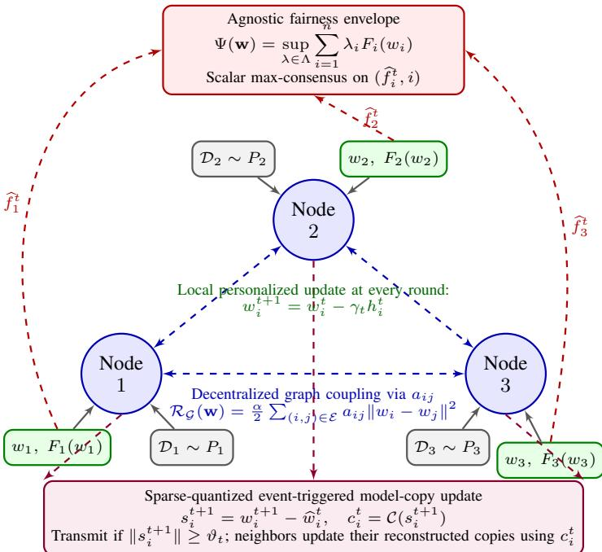  
Fig. 1: Illustration of DMFL-SQ. Each client maintains a personalized model $w _ { i }$ , performs local learning at every round, and communicates only sparse-quantized event-triggered model-copy innovations. Neighboring models are softly coupled through $\mathcal { R } g ( \mathbf { w } )$ , while the active fairness component is selected through scalar max-consensus over local loss estimates.

An outline of the remainder of the paper is as follows. The system model and problem formulation are described in Section II. Section III discusses the DMFL-SQ algorithm. Section IV presents the PAC-Bayes generalization analysis, while Section V establishes the convergence guarantees. The simulation results and conclusions are described in Section VI and Section VII, respectively.

## II. SYSTEM MODEL AND PROBLEM FORMULATION

We consider a decentralized FL system comprising n clients connected through a connected undirected communication graph $\mathcal { G } = ( \nu , \mathcal { E } )$ . Each client $i \in \nu$ maintains a personalized local model $w _ { i } \in \mathbb { R } ^ { d }$ and exchanges information only with its neighbors $j \in \mathcal N _ { i }$ , as illustrated in Fig. 1. Let $A = \left[ a _ { i j } \right]$ denote the symmetric nonnegative graph-weight matrix, where $a _ { i j } > 0$ if $( i , j ) \in \mathcal { E }$ and $a _ { i j } = 0$ otherwise. These weights define the graph-coupling regularizer that encourages neighboring personalized models to remain similar while preserving client-specific solutions.

Each client i has access to a local dataset $\mathcal { D } _ { i }$ = $\{ ( x _ { i , k } , y _ { i , k } ) \} _ { k = 1 } ^ { m _ { i } }$ generated from an underlying distribution $\mathbb { P } _ { i } ,$ where the client distributions $\{ \mathbb { P } _ { i } \} _ { i = 1 } ^ { n }$ may differ across clients, capturing statistical heterogeneity (non-iid data). The expected local loss is defined as

$$
F _ { i } ( w _ { i } ) = \mathbb { E } _ { ( x , y ) \sim \mathbb { P } _ { i } } [ \ell _ { i } ( w _ { i } ; x , y ) ] ,\tag{1}
$$

where $\ell _ { i } ( \cdot )$ is a potentially non-convex loss function that is assumed to be L-smooth with respect to the model parameter.

Unlike standard FL, which enforces a single shared global model, we adopt a multi-task formulation in which each client learns a personalized model $w _ { i }$ while collaborating with neighboring nodes. Let $\textbf { w } = ~ [ w _ { 1 } , \dots , w _ { n } ]$ denote the collection of client-specific models. Collaboration among neighboring clients is modeled through the graph-Laplacian regularizer

$$
\mathcal { R } _ { \mathcal { G } } ( \mathbf { w } ) = \frac { \alpha } { 2 } \sum _ { ( i , j ) \in \mathcal { E } } a _ { i j } \Vert w _ { i } - w _ { j } \Vert ^ { 2 } ,\tag{2}
$$

where $\alpha > 0$ controls the strength of graph-based inter-client coupling and $a _ { i j } \geq 0$ are graph-regularization weights.

To incorporate fairness, we adopt an agnostic mixturebased formulation [18]. We consider a mixture distribution $\begin{array} { r } { P _ { \lambda } = \sum _ { i = 1 } ^ { n } \lambda _ { i } \mathbb { P } _ { i } } \end{array}$ , where $\lambda \in \Lambda \subseteq \Delta _ { n }$ and $\Delta _ { n }$ denotes the probability simplex. We define the agnostic fairness envelope as

$$
\Psi ( \mathbf { w } ) : = \operatorname* { s u p } _ { \lambda \in \Lambda } \sum _ { i = 1 } ^ { n } \lambda _ { i } F _ { i } ( w _ { i } ) .\tag{3}
$$

The proposed decentralized fair multi-task objective is then

$$
\operatorname* { m i n } _ { \{ w _ { i } \} _ { i = 1 } ^ { n } } \mathcal L ( \mathbf w ) : = \sum _ { i = 1 } ^ { n } F _ { i } ( w _ { i } ) + \mathcal R _ { \mathcal G } ( \mathbf w ) + \rho \Psi ( \mathbf w ) ,\tag{4}
$$

where $\rho \geq 0$ controls the trade-off between aggregate performance and worst-case (fairness) risk across clients. The envelope $\Psi ( \mathbf { w } )$ corresponds to the worst-case mixture loss over clients, as studied in agnostic federated learning [18]. The formulation in (4) can be viewed as a penalized version of the pure min-max problem, allowing a continuous trade-off between average accuracy and fairness. Setting $\rho = 0$ recovers standard decentralized multi-task learning, while larger values of $\rho$ increasingly emphasize worst-case client performance. Unlike classical FL objectives that learn a single global model, the formulation in (4) yields personalized models $w _ { i }$ that adapt to heterogeneous data while maintaining fairness across the network.

We study this problem under general non-convex local objectives $F _ { i } ( \cdot )$ and develop a decentralized stochastic algorithm that achieves communication efficiency through sparsified, quantized, and event-triggered updates. The proposed algorithm, DMFL-SQ, admits convergence guarantees to firstorder stationary points under general non-convex objectives.

## A. Assumptions

We make the following standard assumptions commonly used in decentralized stochastic optimization and federated learning analyses.

Assumption 1 (Smoothness). Each local objective $F _ { i } : \mathbb { R } ^ { d } $ R is L-smooth, i.e., for all $u , v \in \mathbb { R } ^ { d }$

$$
\Vert \nabla F _ { i } ( u ) - \nabla F _ { i } ( v ) \Vert \leq L \Vert u - v \Vert .\tag{5}
$$

Assumption 2 (Independent Loss Selection and Unbiased Stochastic Gradients). Let $\mathcal { F } _ { t }$ denote the algorithmic history available before the mini-batches at round t are sampled. At every round, the collection of gradient mini-batches $\{ B _ { i , \mathrm { g r a d } } ^ { t } \} _ { i = 1 } ^ { n }$ is conditionally independent of the collection of selection mini-batches $\{ B _ { i , \mathrm { s e l } } ^ { t } \} _ { i = 1 } ^ { n }$ given $\mathcal { F } _ { t }$

The stochastic gradient computed from $B _ { i , \mathrm { g r a d } } ^ { t }$ satisfies

$$
\mathbb { E } \left[ \boldsymbol { g } _ { i } ^ { t } \left| \mathcal { F } _ { t } , \widehat { \lambda } ^ { t } \right. \right] = \nabla F _ { i } ( w _ { i } ^ { t } ) ,\tag{6}
$$

and

$$
\mathbb { E } \left[ \left. g _ { i } ^ { t } - \nabla F _ { i } ( w _ { i } ^ { t } ) \right. ^ { 2 } \Big | \mathcal { F } _ { t } , \widehat { \lambda } ^ { t } \right] \leq \sigma _ { i } ^ { 2 } .\tag{7}
$$

Let $\textstyle { \bar { \sigma } } ^ { 2 } : = { \frac { 1 } { n } } \sum _ { i = 1 } ^ { n } \sigma _ { i } ^ { 2 }$ denote the average stochastic-gradient variance.

Assumption 3 (Communication Graph and Coupling Weights). The communication graph $\mathcal { G } = ( \nu , \mathcal { E } )$ is undirected and connected. The graph-coupling weights satisfy $\begin{array} { r l } { a _ { i j } } & { { } = } \end{array}$ $a _ { j i } \geq 0 ,$ with $a _ { i j } > 0$ only $i f ( i , j ) \in \mathcal { E } ,$ , and $a _ { i j } = 0$ otherwise. Moreover, the weighted degree is uniformly bounded, $i . e . _ { \cdot }$

$$
d _ { \mathcal { G } } : = \operatorname* { m a x } _ { i \in \mathcal { V } } \sum _ { j \in \mathcal { N } _ { i } } a _ { i j } < \infty .
$$

Let $L _ { \mathcal { G } }$ denote the weighted graph Laplacian associated with $\{ a _ { i j } \}$ . Then the graph regularizer

$$
\mathcal { R } _ { \mathcal { G } } ( \mathbf { w } ) = \frac { \alpha } { 2 } \sum _ { ( i , j ) \in \mathcal { E } } a _ { i j } \Vert w _ { i } - w _ { j } \Vert ^ { 2 }
$$

is smooth with constant $L _ { R } = \alpha \lambda _ { \operatorname* { m a x } } ( L _ { \mathcal { G } } )$

Assumption 4 (Contractive Compressor). The possibly randomized compression operator $\mathcal { C } : \mathbb { R } ^ { d } \to \mathbb { R } ^ { d }$ satisfies the contraction property: there exists $\omega \in ( 0 , 1 ]$ such that

$$
\begin{array} { r } { \mathbb { E } \| \mathcal C ( \boldsymbol { v } ) - \boldsymbol { v } \| ^ { 2 } \leq ( 1 - \omega ) \| \boldsymbol { v } \| ^ { 2 } , \quad \forall \boldsymbol { v } \in \mathbb { R } ^ { d } , } \end{array}\tag{8}
$$

where the expectation is taken over the randomness of the compressor.

Assumptions 1-4 control the regularity and stochastic moments of the local learning directions, the graph-based personalized coupling, and compressed communication. Assumption 3 ensures that the graph-coupling direction is well defined and that errors arising from stale reconstructed neighbor models can be controlled through the communication residual. Unlike consensus-based decentralized SGD, DMFL-SQ does not impose model consensus through a mixing step; personalization is instead maintained through the graph regularizer $\mathcal { R } _ { \mathcal { G } }$

## III. DMFL-SQ ALGORITHM

We now present the proposed decentralized multi-task fair FL with sparsified and quantized communication, referred to as DMFL-SQ, also summarized in Algorithm 1. The method enables each client to perform local stochastic updates, exchange compressed information with its neighbors only when necessary, and promote fairness across heterogeneous clients via the agnostic mixture-based objective in (4).

At iteration $t ,$ each client i draws two conditionally independent mini-batches, $B _ { i , \mathrm { s e l } } ^ { t }$ and $B _ { i , \mathrm { g r a d } } ^ { t }$ . The first minibatch is used to estimate the local loss for fairness-component selection:

$$
\widehat { f } _ { i } ^ { t } = \frac { 1 } { | B _ { i , \mathrm { s e l } } ^ { t } | } \sum _ { z \in B _ { i , \mathrm { s e l } } ^ { t } } \ell _ { i } ( w _ { i } ^ { t } ; z ) .\tag{9}
$$

The second mini-batch is used to compute the stochastic gradient

$$
g _ { i } ^ { t } = \frac { 1 } { | B _ { i , \mathrm { g r a d } } ^ { t } | } \sum _ { z \in B _ { i , \mathrm { g r a d } } ^ { t } } \nabla \ell _ { i } ( w _ { i } ^ { t } ; z ) .\tag{10}
$$

Let $\mathcal { F } _ { t }$ denote the algorithmic history available before the selection and gradient mini-batches at round t are sampled.

Since $B _ { i , \mathrm { g r a d } } ^ { t }$ is conditionally independent of $\{ B _ { k , \mathrm { s e l } } ^ { t } \} _ { k = 1 } ^ { n }$ given $\mathcal { F } _ { t }$ , we have

$$
\begin{array} { r } { \mathbb { E } \Big [ g _ { i } ^ { t } \Big | \mathcal { F } _ { t } , \widehat { \mathbf { f } } ^ { t } , \widehat { \lambda } ^ { t } \Big ] = \nabla F _ { i } ( w _ { i } ^ { t } ) . } \end{array}\tag{11}
$$

For any mixture vector $\lambda \in { \bar { \Lambda } } .$ define the population and empirical mixture losses, respectively, as

$$
\Phi _ { \lambda } ( \mathbf { w } ) : = \sum _ { i = 1 } ^ { n } \lambda _ { i } F _ { i } ( w _ { i } ) , \qquad \widehat { \Phi } _ { \lambda } ^ { t } : = \sum _ { i = 1 } ^ { n } \lambda _ { i } \widehat { f } _ { i } ^ { t } .\tag{12}
$$

For a general mixture class Λ, the empirical fairness mixture is selected according to $\begin{array} { r } { \widehat { \lambda } ^ { t } \in \mathsf { \Gamma } \mathrm { a r g } \operatorname* { m a x } _ { \lambda \in \Lambda } \widehat { \Phi } _ { \lambda } ^ { t } . } \end{array}$ For the full-simplex case $\begin{array} { r c l } { \Lambda } & { = } & { \Delta _ { n } } \end{array}$ , this reduces to $i _ { t } ^ { \star } ~ \in$ $\operatorname { a r g m a x } _ { i \in [ n ] } \widehat { f } _ { i } ^ { t } , \widehat { \lambda } _ { i } ^ { t } \ = \ \mathbb { 1 } \{ i \ = \ i _ { t } ^ { \star } \}$ . The stochastic fairness direction implemented by client i is defined as $\widehat { \xi } _ { i } ^ { t } = \widehat { \lambda } _ { i } ^ { t } g _ { i } ^ { t }$ We use the notation $\widehat { \xi _ { i } ^ { t } }$ to emphasize that this direction is constructed from mini-batch loss estimates and is not necessarily a population subgradient of the fairness envelope Ψ.

To quantify the discrepancy between empirical fairness selection and the population fairness envelope, define the population fairness-selection gap

$$
\varepsilon _ { \Psi , t } : = \Psi ( \mathbf { w } ^ { t } ) - \Phi _ { \widehat { \lambda } ^ { t } } ( \mathbf { w } ^ { t } ) \geq 0 .\tag{13}
$$

For $\begin{array} { r } {  { { \mathchoice { \mathrm {  ~ \displaystyle ~ \Lambda ~ } } { \mathrm {  ~ \textstyle ~ \Lambda ~ } } { \mathrm {  ~ \textstyle ~ \Lambda ~ } } { \mathrm {  ~ \scriptscriptstyle ~ \Lambda ~ } } } } =  { { \mathchoice { \mathrm {  ~ \displaystyle ~ \Lambda ~ } } { \mathrm {  ~ \textstyle ~ \Lambda ~ } } { \mathrm {  ~ \scriptstyle ~ \Lambda ~ } } { \mathrm {  ~ \scriptstyle ~ \Lambda ~ } } } } , } \end{array}$ this becomes $\begin{array} { r } { \varepsilon _ { \Psi , t } ~ = ~ \operatorname* { m a x } _ { i \in [ n ] } F _ { i } ( w _ { i } ^ { t } ) ~ - } \end{array}$ $F _ { i _ { t } ^ { \star } } ( w _ { i _ { t } ^ { \star } } ^ { t } )$ . Thus, $\varepsilon _ { \Psi , t } = 0$ when the empirically selected client is also a population-active client. In general, exact scalar maxconsensus guarantees agreement on the empirical maximizer but does not imply that the selected client maximizes the population loss.

Let $\begin{array} { r } { \delta _ { t } : = \operatorname* { s u p } _ { \lambda \in \Lambda } \left| \widehat { \Phi } _ { \lambda } ^ { t } - \Phi _ { \lambda } ( \mathbf { w } ^ { t } ) \right| } \end{array}$ . Because $\Lambda \subseteq \Delta _ { n } , \delta _ { t } \leq$ $\mathrm { m a x } _ { i \in [ n ] } \left| \widehat { f } _ { i } ^ { t } - F _ { i } ( w _ { i } ^ { \dot { t } } ) \right|$ . Since $\widehat { \lambda } ^ { t }$ maximizes $\widehat { \Phi } _ { \lambda } ^ { t }$ over Λ, the population fairness-selection gap satisfies

$$
\varepsilon _ { \Psi , t } \leq 2 \delta _ { t } .\tag{14}
$$

Thus, the empirically selected fairness mixture becomes increasingly accurate in terms of the population fairness objective as the uniform loss-estimation error decreases.

Fairness-consensus implementation: For $\Lambda = \Delta _ { n }$ , DMFL-SQ runs $K _ { \Psi }$ rounds of scalar max-consensus over the pairs $( \widehat { f } _ { i } ^ { t } , i )$ , using a fixed lexicographic tie-breaking rule. If $K _ { \Psi } \ge$ diam(G), all clients recover the same empirical maximizer $i _ { t } ^ { \star } \in \mathrm { { \ a r g } { \operatorname* { m a x } } } _ { i \in [ n ] } \widehat { f } _ { i } ^ { t }$ . Exact max-consensus therefore eliminates disagreement among clients regarding the empirical fairness component. It does not, by itself, guarantee that $i _ { t } ^ { \star }$ is an active maximizer of the population fairness envelope. The resulting statistical discrepancy is quantified by $\varepsilon _ { \Psi , t }$ in (13) and is explicitly retained in the convergence analysis.

Each client maintains reconstructed copies of its neighbors most recently communicated models. Let $\widehat { w } _ { j  i } ^ { t }$ denote the latest copy of client $j ^ { \circ } \mathbf { s }$ model available at client i. These copies are used to evaluate the graph-coupling term in the personalized objective. Specifically, client i computes

$$
r _ { i } ^ { t } = \alpha \sum _ { j \in \mathcal { N } _ { i } } a _ { i j } ( w _ { i } ^ { t } - \widehat { w } _ { j  i } ^ { t } ) ,\tag{15}
$$

which is a communication-efficient approximation of $\nabla _ { w _ { i } } \mathcal { R } _ { \mathcal { G } } ( \mathbf { w } ^ { t } )$ . Although the graph regularizer $\mathcal { R } _ { \mathcal { G } } ( \mathbf { w } )$ is defined using the current neighboring models, a decentralized event-triggered implementation cannot access $\boldsymbol { w } _ { j } ^ { t }$ at every round. Therefore, client i evaluates the graph-coupling direction using the latest reconstructed neighbor copy $\widehat { w } _ { j  i } ^ { t } .$ The resulting discrepancy $\boldsymbol { w } _ { j } ^ { t } - \widehat { \boldsymbol { w } } _ { j  i } ^ { t }$ is explicitly captured by the communication residual $\check { \mathcal { E } } ^ { t }$ and is accounted for in the convergence analysis. The local stochastic direction implemented by client i is

Algorithm 1 DMFL-SQ: Decentralized Multi-Task Fair   
Learning with Sparse-Quantized Event-Triggered Communi  
cation   
1: Input: stepsizes $\{ \gamma _ { t } \}$ , trigger thresholds $\{ \boldsymbol { \vartheta } _ { t } \}$ , graph   
weights $\{ a _ { i j } \}$ , compression operator ${ \mathcal { C } } ,$ fairness weight $\rho ,$   
graph regularization weight $\alpha ,$ fairness-consensus rounds   
$K _ { \Psi }$   
2: Initialize $w _ { i } ^ { 0 }$ for all clients $i \in \{ 1 , \ldots , n \}$   
3: Initialize the locally stored transmitted copies $\widehat { w } _ { i } ^ { 0 } = w _ { i } ^ { 0 }$ ∀   
i, the neighbor copies $\widehat { w } _ { i  j } ^ { 0 } = w _ { i } ^ { 0 } \ \forall \ ( i , j \in \mathcal { E } .$   
4: for $t = 0 , \ldots , T - 1$ do   
5: for each client $i = 1 , \ldots , n$ in parallel do   
6: Sample conditionally independent mini-batches   
$B _ { i , \mathrm { s e l } } ^ { t }$ and $B _ { i , \mathrm { g r a d } } ^ { t }$ and compute   
$\widehat { f } _ { i } ^ { t } = \frac { 1 } { | B _ { i , \mathrm { s e l } } ^ { t } | } \sum _ { z \in B _ { i , \mathrm { s e l } } ^ { t } } \ell _ { i } ( w _ { i } ^ { t } ; z ) ,$   
$g _ { i } ^ { t } = \frac { 1 } { | B _ { i , \mathrm { g r a d } } ^ { t } | } \sum _ { z \in B _ { i , \mathrm { g r a d } } ^ { t } } \nabla \ell _ { i } ( w _ { i } ^ { t } ; z ) .$   
7: end for   
8: Run $K _ { \Psi }$ scalar max-consensus rounds on $( \widehat { f } _ { i } ^ { t } , i )$ to   
obtain $i _ { t } ^ { \star } \in$ arg ma ${ \boldsymbol { \tau } } _ { i \in [ n ] } ~ { \widehat { f } } _ { i } ^ { t }$   
9: Set $\begin{array} { r } { \widehat { \lambda } _ { i } ^ { t } = \mathbb { 1 } \{ i = i _ { t } ^ { \star } \} , \widehat { \xi } _ { i } ^ { t } = \widehat { \lambda } _ { i } ^ { t } g _ { i } ^ { t } . } \end{array}$   
10: for each client $i = 1 , \ldots , n$ in parallel do   
11: Compute the graph-coupling direction   
$r _ { i } ^ { t } = \alpha \sum _ { j \in \mathcal { N } _ { i } } a _ { i j } ( w _ { i } ^ { t } - \widehat { w } _ { j  i } ^ { t } ) .$   
12: Form the local stochastic direction   
$h _ { i } ^ { t } = g _ { i } ^ { t } + r _ { i } ^ { t } + \rho \widehat { \xi } _ { i } ^ { t } = \left( 1 + \rho \widehat { \lambda } _ { i } ^ { t } \right) g _ { i } ^ { t } + r _ { i } ^ { t } .$   
13: Update the personalized model   
$\begin{array} { r } { \boldsymbol { w } _ { i } ^ { t + 1 } = \boldsymbol { w } _ { i } ^ { t } - \gamma _ { t } \boldsymbol { h } _ { i } ^ { t } . } \end{array}$   
14: Compute the model-copy innovation   
$\begin{array} { r } { s _ { i } ^ { t + 1 } = w _ { i } ^ { t + 1 } - \widehat { w } _ { i } ^ { t } , } \end{array}$   
where $\widehat { w } _ { i } ^ { t }$ denotes the most recent transmitted copy of $w _ { i }$   
reconstructed by its neighbors.   
15: if $\lVert s _ { i } ^ { t + 1 } \rVert \geq \vartheta _ { t }$ then   
16: Compress and transmit $c _ { i } ^ { t } ~ = ~ \mathcal { C } ( s _ { i } ^ { t + 1 } )$ to all   
neighbors $j \in \mathcal N _ { i }$   
17: Update the locally stored transmitted copy   
$\widehat { w } _ { i } ^ { t + 1 } = \widehat { w } _ { i } ^ { t } + c _ { i } ^ { t } .$   
18: else   
19: Set $c _ { i } ^ { t } = 0$ and   
$\widehat { w } _ { i } ^ { t + 1 } = \widehat { w } _ { i } ^ { t } .$   
20: end if   
21: end for   
22: for each client $i = 1 , \ldots , n$ in parallel do   
23: For every received $c _ { j } ^ { t }$ from $j \in \mathcal { N } _ { i } ,$ , update   
$\widehat { w } _ { j  i } ^ { t + 1 } = \widehat { w } _ { j  i } ^ { t } + c _ { j } ^ { t } .$   
24: If no message is received from neighbor $j ,$ set   
$\widehat { w } _ { j  i } ^ { t + 1 } = \widehat { w } _ { j  i } ^ { t } .$   
25: end for   
26: end for   
27: Output: personalized models $\{ w _ { i } ^ { T } \} _ { i = 1 } ^ { n }$

$$
h _ { i } ^ { t } = g _ { i } ^ { t } + r _ { i } ^ { t } + \rho \widehat { \xi } _ { i } ^ { t } = \left( 1 + \rho \widehat { \lambda } _ { i } ^ { t } \right) g _ { i } ^ { t } + r _ { i } ^ { t } .\tag{16}
$$

Client i then updates its personalized model according to

$$
\begin{array} { r } { \boldsymbol { w } _ { i } ^ { t + 1 } = \boldsymbol { w } _ { i } ^ { t } - \gamma _ { t } \boldsymbol { h } _ { i } ^ { t } . } \end{array}\tag{17}
$$

After the local model update, client i checks whether its current model has changed sufficiently relative to the last version reconstructed by its neighbors. Let $\widehat { w } _ { i } ^ { t }$ denote this last transmitted copy and define the model-copy innovation as $\boldsymbol { s } _ { i } ^ { t + 1 } = \boldsymbol { w } _ { i } ^ { t + 1 } - \widehat { \boldsymbol { w } } _ { i } ^ { t }$

Client i communicates only if $\lVert s _ { i } ^ { t + 1 } \rVert \geq \vartheta _ { t }$ , where $\vartheta _ { t }$ is a time-varying trigger threshold. If the trigger condition is satisfied, client i sends the sparse-quantized update $c _ { i } ^ { t } = \mathcal { C } ( s _ { i } ^ { t + 1 } )$ to all neighbors and updates its locally stored transmitted copy as $\widehat { w } _ { i } ^ { t + 1 } \bar { = } \widehat { w } _ { i } ^ { t } + c _ { i } ^ { t } .$ . If the trigger condition is not satisfied, no message is sent, and $c _ { i } ^ { t } = 0 , \widehat { w } _ { i } ^ { t + 1 } = \widehat { w } _ { i } ^ { t }$

Upon receiving $c _ { j } ^ { t }$ from a neighbor j, client i updates its local reconstructed copy as $\widehat { w } _ { j  i } ^ { t + 1 } = \widehat { w } _ { j  i } ^ { t } + c _ { j } ^ { t } ,$ . If no message is received from neighbor j, the copy is kept unchanged: $\widehat { w } _ { j  i } ^ { t + 1 } = \widehat { w } _ { j  i } ^ { t }$ . The event trigger in Algorithm 1 controls only communication and does not suppress local learning. Every client updates its personalized model at each iteration. When the trigger is inactive, the client skips broadcasting its modelcopy innovation, while retaining the updated local model. This mechanism reduces communication while preserving personalization. Unlike consensus-based decentralized SGD, DMFL-SQ does not average the client models after every local update. Instead, neighboring models are softly coupled through the graph regularizer $\mathcal { R } _ { \mathcal { G } } ( \mathbf { w } )$ , while sparse, quantized, and event-triggered communication maintains sufficiently accurate neighbor model copies. Therefore, client-specific variation is controlled by the personalized objective itself rather than being suppressed by an explicit gossip-averaging step.

Communication accounting. Let $P$ denote the number of model parameters, $k _ { i } ^ { t }$ the number of nonzero coordinates transmitted by client i at round $t , b _ { q }$ the quantization precision, and d $\boldsymbol \mathrm { e g } _ { i } = | \mathcal { N } _ { i } |$ its graph degree. Define the trigger indicator $\chi _ { i } ^ { t } = \mathbf { 1 } \{ \| s _ { i } ^ { t + 1 } \| \geq \vartheta _ { t } \}$ . The model-copy communication cost at round t is

$$
\begin{array} { r l r } {  { B _ { \mathrm { m o d e l } , t } = \sum _ { i = 1 } ^ { n } \mathrm { d e g } _ { i } [ b _ { \mathrm { t r i g } } + \chi _ { i } ^ { t } \bigg ( k _ { i } ^ { t } b _ { q } + \operatorname* { m i n } \big \{ k _ { i } ^ { t } \big / \log _ { 2 } P \big \} , P \big \} } } \\ & { } & \\ & { } & { + b _ { \mathrm { s c a l e } } + b _ { \mathrm { h d r } } \bigg ) ] , \quad \quad \quad ( 1 8 ) } \end{array}
$$

where the terms account for the quantized values, coordinate indices or a binary mask, the quantizer scale, message header, and trigger metadata, respectively. If silence indicates an inactive trigger, we set $b _ { \mathrm { t r i g } } = 0$ . The factor $\deg _ { i }$ accounts for delivery to all neighbors; for an undirected graph, $\textstyle \sum _ { i } \deg _ { i } =$ 2|E|.

The scalar fairness-consensus step incurs

$$
\begin{array} { r } { B _ { \Psi , t } = 2 K _ { \Psi } | \mathcal { E } | \left( b _ { \mathrm { l o s s } } + \lceil \log _ { 2 } n \rceil \right) , } \end{array}\tag{19}
$$

since the pair $( \widehat { f } _ { i } ^ { t } , i )$ is exchanged in both directions over every edge during each of the $K _ { \Psi }$ max-consensus rounds. Hence, the total communication over T rounds and the average communication per client are

$$
B _ { \mathrm { t o t } } = \sum _ { t = 0 } ^ { T - 1 } \left( B _ { \mathrm { m o d e l } , t } + B _ { \Psi , t } \right) , \qquad { \overline { { B } } } _ { \mathrm { c l i e n t } } = { \frac { B _ { \mathrm { t o t } } } { n } } .\tag{20}
$$

Overall, DMFL-SQ updates each personalized model using a stochastic approximation of the full objective, while communication is used only to maintain reconstructed neighbor copies for evaluating the graph regularizer. Unlike consensus-based decentralized SGD, the client models are not averaged after every local update. Instead, personalization is preserved because inter-client coupling is controlled softly through $\mathcal { R } _ { \mathcal { G } } ( \mathbf { w } )$ and the sparse-quantized event-triggered mechanism reduces communication by updating $\widehat { w } _ { j  i } ^ { t }$ only when necessary.

## IV. PAC-BAYES GENERALIZATION FOR DMFL-SQ

We establish an algorithm-agnostic PAC-Bayes generalization guarantee for the fairness-aware agnostic mixture objective under possibly non-convex client losses. We subsequently complement this result with a corollary that quantifies the onestep empirical mixture-risk perturbation induced by stale and compressed neighbor-model information. Consider n clients with mutually independent datasets, where client i has access to $\mathcal { D } _ { i } ~ = ~ \{ z _ { i , k } \} _ { k = 1 } ^ { m _ { i } }$ , whose samples are drawn iid from $\mathbb { P } _ { i } ,$ with $\mathbb { P } _ { i } \neq \mathbb { P } _ { j }$ in general. Let $\ell _ { i } ( w _ { i } ; z ) \in [ 0 , 1 ]$ denote the loss at client i. Define the population and empirical risks as

$$
F _ { i } ( w _ { i } ) : = \mathbb { E } _ { z \sim \mathbb { P } _ { i } } [ \ell _ { i } ( w _ { i } ; z ) ] , \widehat { F } _ { i } ( w _ { i } ) : = \frac { 1 } { m _ { i } } \sum _ { k = 1 } ^ { m _ { i } } \ell _ { i } ( w _ { i } ; z _ { i , k } ) .
$$

Let $\textbf { w } : = ~ ( w _ { 1 } , \ldots , w _ { n } )$ denote the collection of client models. To capture fairness-aware objectives, we consider agnostic mixture risks defined over a set of mixture weights $\Lambda \subseteq \Delta _ { n }$ , where $\Delta _ { n }$ is the probability simplex:

$$
\Psi ( \mathbf { w } ) : = \operatorname* { s u p } _ { \lambda \in \Lambda } \sum _ { i = 1 } ^ { n } \lambda _ { i } F _ { i } ( w _ { i } ) , \widehat \Psi ( \mathbf { w } ) : = \operatorname* { s u p } _ { \lambda \in \Lambda } \sum _ { i = 1 } ^ { n } \lambda _ { i } \widehat F _ { i } ( w _ { i } ) .
$$

We emphasize that no convexity is assumed on $F _ { i }$

## A. PAC-Bayes Generalization Bound

For a fixed mixture vector $\lambda \in \Lambda$ , define $m _ { \lambda } : = $ $\begin{array} { r } { \left( \sum _ { i = 1 } ^ { n } \frac { \lambda _ { i } ^ { 2 } } { m _ { i } } \right) ^ { - 1 } } \end{array}$ . For a general compact mixture class, define $\begin{array} { r } { \dot { m } _ { \mathrm { e f f } } : = \operatorname* { i n f } _ { \lambda \in \Lambda } m _ { \lambda } } \end{array}$

Theorem 1 (PAC-Bayes Generalization for Agnostic Mixtures). Assume that $\ell _ { i } ( w _ { i } ; z ) \in [ 0 , 1 ]$ for all clients $i \in [ n ]$ . Let $\begin{array} { r } { F _ { i } ( w _ { i } ) : = \mathbb { E } _ { z \sim \mathbb { P } _ { i } } [ \ell _ { i } ( w _ { i } ; z ) ] , ~ \widehat { F } _ { i } ( w _ { i } ) : = \frac { 1 } { m _ { i } } \sum _ { k = 1 } ^ { m _ { i } } \ell _ { i } ( w _ { i } ; z _ { i , k } ) } \end{array}$ and define the population and empirical agnostic mixture risks $\begin{array} { r l r } { \Psi ( { \bf w } ) } & { : = } & { \operatorname* { s u p } _ { \lambda \in \Lambda } \sum _ { i = 1 } ^ { n } \lambda _ { i } F _ { i } ( w _ { i } ) , \widehat { \Psi } ( { \bf w } ) \quad : = } \end{array}$ ${ \mathrm { s u p } } _ { \lambda \in \Lambda } \sum _ { i = 1 } ^ { n } \lambda _ { i } { \widehat F } _ { i } ( w _ { i } )$ . Let Π be any data-independent prior over the stacked model collection $\mathbf { w } ,$ and let Q be any posterior over the same space. Let $\tau _ { \mathrm { P B } } ~ > ~ 0$ be any deterministic PAC-Bayes inverse-temperature parameter chosen independently of the observed client datasets. Then, for any $\delta \in ( 0 , 1 )$ , the following statements hold with probability at least $1 - \delta$ over the draw of all client datasets $\{ \mathcal { D } _ { i } \} _ { i = 1 } ^ { n }$

Case 1: Full simplex. If $\begin{array} { r } { \Lambda \ = \ \Delta _ { n } , } \end{array}$ , then, for any fixed $\tau _ { \mathrm { P B } } > 0$ , with probability at least $1 - \delta ,$ , the following holds simultaneously for all posteriors Q:

$$
\begin{array} { r l r } {  { \mathbb { E } _ { \mathbf { w } \sim Q } [ \Psi ( \mathbf { w } ) ] \leq \mathbb { E } _ { \mathbf { w } \sim Q } \Big [ \widehat { \Psi } ( \mathbf { w } ) \Big ] + \frac { \mathrm { K L } ( Q \| \Pi ) + \ln n + \ln ( 1 / \delta ) } { \tau _ { \mathrm { P B } } } } } \\ & { } & { + \frac { \tau _ { \mathrm { P B } } } { 8 m _ { \mathrm { m i n } } } , \qquad ( 2 1 ) } \end{array}
$$

where $m _ { \operatorname* { m i n } } : = \operatorname* { m i n } _ { i \in [ n ] } m _ { i } .$

Case 2: General compact mixture class. $H \mathrm { ~ \AA ~ } \subseteq \Delta _ { n }$ is compact, then, for any $\epsilon > 0$ and any fixed $\tau _ { \mathrm { P B } } > 0 .$ , with probability at least $1 - \delta ,$ the following holds simultaneously for all posteriors $Q .$

$$
\begin{array} { r l } & { \mathbb { E } _ { \mathbf { w } \sim Q } [ \Psi ( \mathbf { w } ) ] \leq \mathbb { E } _ { \mathbf { w } \sim Q } \Big [ \widehat { \Psi } ( \mathbf { w } ) \Big ] + \epsilon + \frac { \mathcal { T } \mathrm { P B } } { 8 m _ { \mathrm { e f f } } } } \\ & { \qquad + \frac { \mathrm { K L } ( Q \| \Pi ) + \ln | \mathcal { N } _ { \epsilon } ( \Lambda , \| \cdot \| _ { 1 } ) | + \ln ( 1 / \delta ) } { - } } \end{array}\tag{22}
$$

where $\begin{array} { r } { m _ { \mathrm { e f f } } : = \operatorname* { i n f } _ { \lambda \in \Lambda } \left( \sum _ { i = 1 } ^ { n } \lambda _ { i } ^ { 2 } / m _ { i } \right) ^ { - 1 } , } \end{array}$

Proof: See Appendix A.

The first case corresponds to the agnostic mixture class used in our main fairness objective. In this setting, the supremum over $\Delta _ { n }$ is attained at a vertex, so the additional complexity cost is only ln n. The second case shows how the result extends to a general compact mixture class, where the price of uniformity over Λ appears through the covering number ln $| { \mathcal { N } } _ { \varepsilon } ( \Lambda , \| \cdot \| _ { 1 } )$

We next complement this algorithm-agnostic generalization result with a corollary that isolates the one-step empirical mixture-risk perturbation caused by stale, sparse, quantized, and event-triggered neighbor-model exchange. Its proof uses the communication-residual bound established later in Lemma 6.

Corollary 1 (One-Step Effect of Stale and Compressed Neighbor Copies). Let $\mathbf { d } ^ { t } \mathbf { \epsilon } = \mathbf { r } ^ { t } - \nabla \mathcal { R } _ { \mathcal { G } } ( \mathbf { w } ^ { t } )$ denote the graphcoupling approximation error, and define the exact-neighbor shadow update $\mathbf { w } _ { \mathrm { e x } } ^ { t + 1 } : = \mathbf { w } ^ { t } - \gamma _ { t } ( \mathbf { h } ^ { t } - \mathbf { d } ^ { t } )$ . Thus, $\mathbf { w } _ { \mathrm { e x } } ^ { t + 1 }$ uses the same stochastic gradients andfairness selection as DMFL-SQ, but evaluates the graph-coupling direction using the current neighbor models. Since $\mathbf { w } ^ { t + \bar { 1 } } - \mathbf { \bar { w } } _ { \mathrm { e x } } ^ { t + 1 } = - \gamma _ { t } \mathbf { d } ^ { t }$ , suppose that each empirical loss $\widehat { F } _ { i }$ is Glip-Lipschitz with respect to $w _ { i } .$ Then,

$$
\begin{array} { r l } { \left. \mathbb { E } \left[ \widehat { \Psi } ( \mathbf { w } ^ { t + 1 } ) \right] - \mathbb { E } \left[ \widehat { \Psi } ( \mathbf { w } _ { \mathrm { e x } } ^ { t + 1 } ) \right] \right. } & { \leq G _ { \mathrm { l i p } } \gamma _ { t } \sqrt { n K _ { \mathcal { G } } \mathbb { E } [ \mathcal { E } ^ { t } ] } , } \end{array}\tag{23}
$$

where $E ^ { t }$ is the average weighted communication residual defined in (42), and Lemma 5 gives $\| \mathbf { d } ^ { t } \| ^ { 2 } \leq n K _ { G } E ^ { t }$

Let τ be sampled uniformly from $\{ 0 , \ldots , T - 1 \}$ , independently of the algorithmic randomness. Under the finite-horizon stepsize $\gamma _ { t } = \gamma / \sqrt { T }$

$$
\left. \mathbb { E } \Big [ \widehat { \Psi } ( \mathbf { w } ^ { \tau + 1 } ) \Big ] - \mathbb { E } \Big [ \widehat { \Psi } ( \mathbf { w } _ { \mathrm { e x } } ^ { \tau + 1 } ) \Big ] \right. \leq \frac { G _ { \mathrm { l i p } } \gamma \sqrt { n K _ { \mathscr { G } } } } { \sqrt { T } } \left( \frac { 1 } { T } \sum _ { t = 0 } ^ { T - 1 } \mathbb { E } [ \mathcal { E } ^ { t } ] \right)\tag{24}
$$

$$
\frac { 1 } { T } \sum _ { t = 0 } ^ { B y } \mathbb { E } e m m a \ 6 , \quad \quad \quad \quad \quad \frac { 1 } { T } \sum _ { t = 0 } ^ { T - 1 } \mathbb { E } [ \mathcal { E } ^ { t } ] \leq \frac { 2 } { \chi _ { 0 } \omega T } \left( \mathbb { E } [ \mathcal { E } ^ { 0 } ] + \chi _ { 1 } B _ { h } \gamma ^ { 2 } + \chi _ { 2 } \vartheta _ { 0 } ^ { 2 } ( 1 + \log T ) \right) .\tag{25}
$$

Consequently,

$$
\begin{array} { r l } & { \left. \mathbb { E } \left[ \widehat { \Psi } ( { \mathbf w } ^ { \tau + 1 } ) \right] - \mathbb { E } \left[ \widehat { \Psi } ( { \mathbf w } _ { \mathrm { e x } } ^ { \tau + 1 } ) \right] \right. } \\ & { \qquad \leq \frac { G _ { \mathrm { l i p } } \gamma \sqrt { 2 n K _ { \mathcal { G } } } } { \sqrt { \chi _ { 0 } \omega } T } \left( \mathbb { E } [ \mathcal { E } ^ { 0 } ] + \chi _ { 1 } B _ { h } \gamma ^ { 2 } + \chi _ { 2 } \vartheta _ { 0 } ^ { 2 } ( 1 + \log T ) \right) ^ { 1 / 2 } . } \end{array}\tag{26}
$$

Hence, the one-step empirical mixture-risk perturbation induced by stale, sparse, quantized, and event-triggered neighbor-model exchange decays as $\mathcal { O } \bigg ( \frac { \sqrt { \log T } } { T } \bigg )$

## V. CONVERGENCE ANALYSIS

Before proving the convergence of Algorithm 1, we first summarize the regularity properties of the agnostic fairness envelope $\Psi ( \mathbf { w } )$ and the resulting full personalized objective. Although the agnostic fairness envelope

$$
\Psi ( \mathbf { w } ) = \operatorname* { s u p } _ { \lambda \in \Lambda } \Phi _ { \lambda } ( \mathbf { w } ) , \qquad \Phi _ { \lambda } ( \mathbf { w } ) = \sum _ { i = 1 } ^ { n } \lambda _ { i } F _ { i } ( w _ { i } ) ,\tag{27}
$$

is generally nonsmooth, it inherits weak convexity from the local objectives. In particular, since each $F _ { i }$ is L-smooth, every mixture objective $\Phi _ { \lambda }$ is L-weakly convex with respect to the stacked model variable w. Because the pointwise supremum of functions sharing the same weak-convexity constant is also weakly convex, Ψ is L-weakly convex.

Consequently, the objective function is κ-weakly convex with $\kappa ~ = ~ ( 1 + \rho ) L$ , because $\mathcal { R } _ { \mathcal { G } }$ is convex. We therefore analyze Algorithm 1 through the Moreau envelope of ${ \mathcal { L } } .$ This framework permits changes in the active fairness component between successive iterates and explicitly accommodates the empirical fairness-selection gap $\varepsilon _ { \Psi , t }$ defined in (13).

For $K _ { \Psi } \geq \dim ( { \mathcal { G } } )$ , scalar max-consensus ensures that all clients agree on the same maximizer of the empirical minibatch losses. However, this empirical maximizer need not coincide with a population maximizer of Ψ. The resulting discrepancy is quantified by the fairness-selection gap $\varepsilon _ { \Psi , t }$ defined above and is explicitly controlled in the subsequent Moreau-envelope convergence analysis.

We next state the additional assumptions required for the Moreau-envelope and communication-residual analysis.

Assumption 5 (Bounded Second Moment of the Exact-Neighbor Population Direction). Define

$$
V _ { i } ^ { t } : = \left( 1 + \rho \widehat { \lambda } _ { i } ^ { t } \right) \nabla F _ { i } ( w _ { i } ^ { t } ) + \nabla _ { w _ { i } } \mathcal { R } _ { \mathcal { G } } ( \mathbf { w } ^ { t } ) , \mathbf { V } ^ { t } : = ( V _ { 1 } ^ { t } , \ldots , V _ { n } ^ { t } ) .\tag{28}
$$

There exists a constant $H > 0 ,$ , independent of t and $T ,$ such that $\mathbb { E } [ \lVert \mathbf { V } ^ { t } \rVert ^ { 2 } | \mathcal { F } _ { t } ] \leq H ^ { 2 }$

Assumption 6 (Fairness-Selection Accuracy). Let $\begin{array} { r l } { \varepsilon _ { \Psi , t } } & { { } = } \end{array}$ $\Psi ( \mathbf { w } ^ { t } ) - \Phi _ { \widehat { \lambda } ^ { t } } ( \mathbf { w } ^ { t } )$ denote the population fairness-selection gap defined in (13). There exists a deterministic nonnegative ! .sequence $\{ \epsilon _ { \Psi , t } \} _ { t \geq 0 }$ such that

$$
\mathbb { E } \left[ \varepsilon _ { \Psi , t } \ : | \ : \mathcal { F } _ { t } \right] \leq \epsilon _ { \Psi , t } .\tag{29}
$$

Moreover, there exists a constant $B _ { \Psi } > 0 $ , independent of T, such that, for every training horizon $T \geq 1$

$$
{ \frac { 1 } { T } } \sum _ { t = 0 } ^ { T - 1 } \epsilon _ { \Psi , t } \leq { \frac { B _ { \Psi } } { \sqrt { T } } } .\tag{30}
$$

By (14), Assumption 6 admits an explicit sufficient condition. Suppose that, conditional on $\mathcal { F } _ { t } ,$ , the selection-loss samples are independent and their centered losses are $\sigma _ { \mathrm { s e l } }$ -sub-Gaussian, and let $b _ { t } : =$ mini $| \cal B _ { i , \mathrm { s e l } } ^ { t } |$ . Standard maximal concentration gives $\mathbb { E } [ \varepsilon _ { \Psi , t } ~ | ~ \mathcal { F } _ { t } ] \le 2 \sigma _ { \mathrm { s e l } } \sqrt { 2 \log ( 2 n ) / b _ { t } }$ . Thus, $b _ { t } \geq c ( t +$ $1 ) \log ( 2 n )$ implies

$$
T ^ { - 1 } \sum _ { t = 0 } ^ { T - 1 } \mathbb { E } [ \varepsilon _ { \Psi , t } \mid \mathcal { F } _ { t } ] \leq 4 \frac { \sigma _ { \mathrm { s e l } } } { \sqrt { T } } \sqrt { \frac { 2 } { c } } ,\tag{31}
$$

verifying Assumption 6. For losses whose range has width $R ,$ one may take $\sigma _ { \mathrm { s e l } } \leq R / 2$

Assumption 7 (Stepsize and Trigger Schedule). For a training horizon T, DMFL-SQ uses

$$
\gamma _ { t } = \frac { \gamma } { \sqrt { T } } , \qquad \vartheta _ { t } = \frac { \vartheta _ { 0 } } { \sqrt { t + 1 } } , \qquad t = 0 , \ldots , T - 1 ,
$$

where $\gamma > 0$ and $\vartheta _ { 0 } > 0$ are constants. Hence,

$$
\sum _ { t = 0 } ^ { T - 1 } \gamma _ { t } \vartheta _ { t } ^ { 2 } = \frac { \gamma \vartheta _ { 0 } ^ { 2 } } { \sqrt { T } } \sum _ { t = 0 } ^ { T - 1 } \frac { 1 } { t + 1 } = \mathcal { O } \left( \frac { \log T } { \sqrt { T } } \right) .
$$

After normalization by $\textstyle \sum _ { t = 0 } ^ { T - 1 } \gamma _ { t } = \gamma { \sqrt { T } }$ , this contributes

$$
\mathcal { O } \left( \frac { \log T } { T } \right)
$$

to the final stationarity bound.

## A. Weak Convexity and Moreau-Envelope Regularity

Recall that $\begin{array} { r l r } { \Psi ( { \bf w } ) } & { { } = } & { \operatorname* { s u p } _ { \lambda \in \Lambda } \Phi _ { \lambda } ( { \bf w } ) , \Phi _ { \lambda } ( { \bf w } ) \quad = } \end{array}$ $\scriptstyle \sum _ { i = 1 } ^ { n } \lambda _ { i } F _ { i } ( w _ { i } )$ , where $\Lambda \subseteq \Delta _ { n }$ is nonempty and compact.

Lemma 1 (Weak Convexity of the Fairness Envelope and Objective Function). Suppose that each $F _ { i }$ is L-smooth. Then, for every $\lambda \in \Lambda$ , the mixture objective $\Phi _ { \lambda }$ is L-weakly convex. Consequently, the fairness envelope Ψ is L-weakly convex, and the objective function $\begin{array} { r } { \mathcal { L } ( \mathbf { w } ) = \sum _ { i = 1 } ^ { n } F _ { i } ( w _ { i } ) + \mathcal { R } _ { \mathcal { G } } ( \mathbf { w } ) + } \end{array}$ $\rho \Psi ( \mathbf { w } )$ is κ-weakly convex with $\kappa = ( 1 + \rho ) L$

Proof. Since each $F _ { i }$ is L-smooth, every mixture objective $\Phi _ { \lambda }$ is L-weakly convex. Hence, $\Phi _ { \lambda } + ( L / 2 ) \lVert \cdot \rVert ^ { 2 }$ is convex. Taking the pointwise supremum over $\lambda \in \Lambda$ shows that $\Psi + ( L / 2 ) \| \cdot \| ^ { 2 }$ is convex, and therefore Ψ is L-weakly convex. Moreover, $\scriptstyle \sum _ { i = 1 } ^ { n } F _ { i } ( w _ { i } )$ is L-weakly convex, while $\mathcal { R } _ { \mathcal { G } }$ is convex. Thus, L is $( 1 + \rho ) L \mathrm { - w e a k l y }$ convex. □

Lemma 2 (Approximate Fairness-Direction Inequality). Let $\widehat { \lambda } ^ { t }$ be the empirical fairness mixture selected by Algorithm 1, and define the corresponding population-gradient direction by

$$
\bar { \xi } _ { i } ^ { t } : = \widehat { \lambda } _ { i } ^ { t } \nabla F _ { i } ( w _ { i } ^ { t } ) , \qquad \bar { \xi } ^ { t } : = ( \bar { \xi } _ { 1 } ^ { t } , \dots , \bar { \xi } _ { n } ^ { t } ) .\tag{32}
$$

Then, for every $\mathbf { u } \in \mathbb { R } ^ { n d }$

$$
\Psi ( \mathbf { u } ) \geq \Psi ( \mathbf { w } ^ { t } ) + \big \langle \bar { \xi } ^ { t } , \mathbf { u } - \mathbf { w } ^ { t } \big \rangle - \frac { L } { 2 } \| \mathbf { u } - \mathbf { w } ^ { t } \| ^ { 2 } - \varepsilon _ { \Psi , t } ,\tag{33}
$$

where $\varepsilon _ { \Psi , t }$ is defined in (13). Moreover, under Assumption 2,

$$
\mathbb { E } \left[ \widehat { \pmb { \xi } } ^ { t } \Big | \mathcal { F } _ { t } , \widehat { \lambda } ^ { t } \right] = \bar { \pmb { \xi } } ^ { t } .\tag{34}
$$

Proof. By the definition of Ψ and Lemma 1,

$$
\begin{array} { l } { \displaystyle \Psi ( \mathbf { u } ) \geq \Phi _ { \widehat { \lambda } ^ { t } } ( \mathbf { u } ) } \\ { \displaystyle \geq \Phi _ { \widehat { \lambda } ^ { t } } ( \mathbf { w } ^ { t } ) + \big \langle \nabla \Phi _ { \widehat { \lambda } ^ { t } } ( \mathbf { w } ^ { t } ) , \mathbf { u } - \mathbf { w } ^ { t } \big \rangle - \displaystyle \frac { L } { 2 } \| \mathbf { u } - \mathbf { w } ^ { t } \| ^ { 2 } . } \end{array}\tag{35}
$$

Using $\begin{array} { r } { \Phi _ { \widehat { \lambda } ^ { t } } ( \mathbf { w } ^ { t } ) = \Psi ( \mathbf { w } ^ { t } ) - \varepsilon _ { \Psi , t } } \end{array}$ and $\nabla \Phi _ { \widehat { \lambda } ^ { t } } ( \mathbf { w } ^ { t } ) = \bar { \pmb { \xi } } ^ { t }$ gives (33). Equation (34) follows from the conditional independence of the selection and gradient mini-batches. □

Lemma 3 (Moreau-Envelope Properties). Let $\mathcal { L }$ be κ-weakly convex and let $\mu \in ( 0 , 1 / \kappa )$ . Then the proximal mapping is single-valued, ${ \mathcal { L } } _ { \mu }$ is continuously differentiable, and

$$
\nabla { \mathcal L } _ { \mu } ( \mathbf w ) = \frac { 1 } { \mu } \left( \mathbf w - \mathrm { p r o x } _ { \mu \mathcal L } ( \mathbf w ) \right) .\tag{36}
$$

Moreover, $\begin{array} { r } { \frac { 1 } { \mu } \left( \mathbf { w } - \mathrm { p r o x } _ { \mu \mathcal { L } } ( \mathbf { w } ) \right) \in \partial \mathcal { L } \left( \mathrm { p r o x } _ { \mu \mathcal { L } } ( \mathbf { w } ) \right) } \end{array}$

## B. Technical Lemmas for the Convergence Analysis

We next present three technical lemmas that form the backbone of the convergence analysis. Lemma 4 establishes a one-step descent inequality for the Moreau envelope ${ \mathcal { L } } _ { \mu }$ Lemma 5 controls the error caused by evaluating the graphcoupling direction using stale and compressed neighbor-model copies. Lemma 6 provides a cumulative bound on the resulting communication residual under the finite-horizon stepsize and trigger schedule. Together, these results separate the optimization, fairness-selection, stochastic, and communicationinduced errors.

Let $\begin{array} { r c l } { \mathcal { H } _ { t } } & { : = } & { \sigma \left( \mathcal { F } _ { t } , \{ B _ { i , \mathrm { s e l } } ^ { t } \} _ { i = 1 } ^ { n } \right) } \end{array}$ denote the information available after the fairness-selection mini-batches have been observed. Hence, $\widehat { \lambda } ^ { t }$ and $\varepsilon _ { \Psi , t }$ are $\mathcal { H } _ { t }$ -measurable.

Define the stochastic-gradient noise by

$$
\begin{array} { r } { q _ { i } ^ { t } : = \left( 1 + \rho \widehat { \lambda } _ { i } ^ { t } \right) \left( g _ { i } ^ { t } - \nabla F _ { i } ( w _ { i } ^ { t } ) \right) , \qquad \mathbf { q } ^ { t } : = ( q _ { 1 } ^ { t } , \ldots , q _ { n } ^ { t } ) . } \end{array}\tag{37}
$$

By Assumption 2, E $[ \mathbf { q } ^ { t } | \mathcal { H } _ { t } ] = \mathbf { 0 }$ , and

$$
\mathbb { E } \left[ \| \mathbf { q } ^ { t } \| ^ { 2 } \middle | \mathcal { H } _ { t } \right] \leq ( 1 + \rho ) ^ { 2 } \sum _ { i = 1 } ^ { n } \sigma _ { i } ^ { 2 } = n ( 1 + \rho ) ^ { 2 } \bar { \sigma } ^ { 2 } .\tag{38}
$$

Define the graph-coupling approximation error by

$$
d _ { i } ^ { t } : = \boldsymbol { r } _ { i } ^ { t } - \nabla _ { \boldsymbol { w } _ { i } } \mathcal { R } _ { \mathcal { G } } ( \mathbf { w } ^ { t } ) , \qquad \mathbf { d } ^ { t } : = ( d _ { 1 } ^ { t } , \dots , d _ { n } ^ { t } ) .
$$

Using the definition of $r _ { i } ^ { t } ,$ this error can be written as

(39)

$$
d _ { i } ^ { t } = \alpha \sum _ { j \in \mathcal { N } _ { i } } a _ { i j } ( w _ { j } ^ { t } - \widehat { w } _ { j  i } ^ { t } ) .\tag{40}
$$

The local direction used by Algorithm 1 therefore admits the decomposition

$$
h _ { i } ^ { t } = V _ { i } ^ { t } + q _ { i } ^ { t } + d _ { i } ^ { t } , \qquad { \bf h } ^ { t } = { \bf V } ^ { t } + { \bf q } ^ { t } + { \bf d } ^ { t } .\tag{41}
$$

Define the average weighted communication residual as

$$
E ^ { t } : = \frac { 1 } { n } \sum _ { i = 1 } ^ { n } \sum _ { j \in \mathcal { N } _ { i } } a _ { i j }  \mathbf { w } _ { j } ^ { t } - \widehat { \mathbf { w } } _ { j  i } ^ { t }  ^ { 2 } .\tag{42}
$$

Lemma 4 (One-Step Moreau-Envelope Descent). Let $0 < \mu <$ $\frac { 1 } { \kappa } , \kappa = ( 1 + \rho ) L$ . Under Assumptions $I , 2 ,$ and 5, the iterates generated by Algorithm 1 satisfy

$$
\begin{array} { r l r } & { } & { \mathbb { E } \left[ \mathcal { L } _ { \mu } ( \mathbf { w } ^ { t + 1 } ) \right] \leq \mathbb { E } \left[ \mathcal { L } _ { \mu } ( \mathbf { w } ^ { t } ) \right] - \displaystyle \frac { 1 - \kappa \mu } { 4 } \gamma _ { t } \mathbb { E } \left[ \left\| \nabla \mathcal { L } _ { \mu } ( \mathbf { w } ^ { t } ) \right\| ^ { 2 } \right] } \\ & { } & { \quad + \displaystyle \frac { \rho \gamma _ { t } } { \mu } \mathbb { E } [ \varepsilon _ { \Psi , t } ] + \left( \frac { \gamma _ { t } } { 1 - \kappa \mu } + \frac { \gamma _ { t } ^ { 2 } } { \mu } \right) \mathbb { E } \left[ \left\| \mathbf { d } ^ { t } \right\| ^ { 2 } \right] } \\ & { } & { \quad + \displaystyle \frac { \gamma _ { t } ^ { 2 } } { \mu } H ^ { 2 } + \frac { n \left( 1 + \rho \right) ^ { 2 } \gamma _ { t } ^ { 2 } } { 2 \mu } \bar { \sigma } ^ { 2 } . \quad \quad \quad \quad ( 4 3 ) } \end{array}
$$

Proof: See Appendix B-A.

Lemma 5 (Communication-Residual Recursion). Under $A s -$ sumption 4 and the event-trigger condition in Algorithm $^ { l , }$ there exist constants $\chi _ { 0 } , \chi _ { 1 } , \chi _ { 2 } > 0 ;$ , independent of t and $T ,$ such that $\chi _ { 0 } \omega \in ( 0 , 1 ]$ and

$$
\mathbb { E } [ \mathcal { E } ^ { t + 1 } ] \leq ( 1 - \chi _ { 0 } \omega ) \mathbb { E } [ \mathcal { E } ^ { t } ] + \chi _ { 1 } \gamma _ { t } ^ { 2 } \frac { 1 } { n } \mathbb { E } \| \mathbf { h } ^ { t } \| ^ { 2 } + \chi _ { 2 } \vartheta _ { t } ^ { 2 } .\tag{44}
$$

Moreover, the graph-direction approximation error defined in (39) satisfies

$$
\lVert \mathbf { d } ^ { t } \rVert ^ { 2 } \leq n K _ { \mathcal { G } } \mathcal { E } ^ { t } ,\tag{45}
$$

where $K _ { \mathcal { G } } > 0$ depends only on the graph weights and the coupling parameter α.

Proof: See Appendix B-B.

Using the decomposition $\mathbf { h } ^ { t } = \mathbf { V } ^ { t } + \mathbf { q } ^ { t } + \mathbf { d } ^ { t }$ , the conditional zero-mean property of $\mathbf { q } ^ { t }$ , and Assumption 5, we obtain

$$
\frac { 1 } { n } \mathbb { E } \| { \bf h } ^ { t } \| ^ { 2 } \leq B _ { h } + 2 K _ { \mathcal { G } } \mathbb { E } [ { \mathcal { E } ^ { t } } ] ,\tag{46}
$$

where $B _ { h } : = 2 H ^ { 2 } / n + ( 1 + \rho ) ^ { 2 } \bar { \sigma } ^ { 2 }$ . Indeed, E $\ [ \| \mathbf { h } ^ { t } \| ^ { 2 } = \mathbb { E } \| \mathbf { V } ^ { t } + $ $\mathbf { d } ^ { t } \| ^ { 2 } + \mathbb { E } \| \mathbf { q } ^ { t } \| ^ { 2 } \leq 2 H ^ { 2 } + 2 \mathbb { E } \| \mathbf { d } ^ { t } \| ^ { 2 } + n ( 1 + \rho ) ^ { 2 } \bar { \sigma } ^ { 2 }$ , and (45) completes the bound. Substituting (46) into (44) gives

$$
\begin{array} { r l } & { \mathbb { E } [ \mathcal { E } ^ { t + 1 } ] \leq \left( 1 - \chi _ { 0 } \omega + 2 \chi _ { 1 } K _ { \mathcal { G } } \gamma _ { t } ^ { 2 } \right) \mathbb { E } [ \mathcal { E } ^ { t } ] + \chi _ { 1 } B _ { h } \gamma _ { t } ^ { 2 } } \\ & { \quad \quad \quad + \chi _ { 2 } \vartheta _ { t } ^ { 2 } . } \end{array}\tag{47}
$$

Lemma 6 (Average Communication-Residual Bound). Suppose the conditions of Lemma 5 hold, and let $\gamma _ { t } ~ = ~ \gamma / \sqrt { T }$ and $\vartheta _ { t } = \vartheta _ { 0 } / \sqrt { t + 1 }$ $I f \gamma > 0$ is sufficiently small such that $2 \chi _ { 1 } K _ { \mathcal { G } } \gamma ^ { 2 } \leq \frac { \chi _ { 0 } \omega } { 2 }$ , then the closed recursion in (47) satisfies

$$
\mathbb { E } [ \mathcal { E } ^ { t + 1 } ] \leq \left( 1 - \frac { \chi _ { 0 } \omega } { 2 } \right) \mathbb { E } [ \mathcal { E } ^ { t } ] + \chi _ { 1 } B _ { h } \gamma _ { t } ^ { 2 } + \chi _ { 2 } \vartheta _ { t } ^ { 2 } .
$$

Consequently,

(48)

$$
\frac { 1 } { T } \sum _ { t = 0 } ^ { T - 1 } \mathbb { E } [ \mathcal { E } ^ { t } ] \leq \frac { 2 } { \chi _ { 0 } \omega T } \left[ \mathbb { E } [ \mathcal { E } ^ { 0 } ] + \chi _ { 1 } B _ { h } \gamma ^ { 2 } + \chi _ { 2 } \vartheta _ { 0 } ^ { 2 } ( 1 + \log T ) \right]\tag{49}
$$

Proof: See Appendix B-C.

C. Convergence Rate

Since the objective is defined over client-specific models, stationarity is measured with respect to the stacked variable $\textbf { w } = ~ ( w _ { 1 } , \dots , w _ { n } )$ rather than a network-average model. For $0 < \mu < 1 / \kappa ,$ , define the normalized Moreau-envelope stationarity measure

$$
S _ { \mu } ^ { t } = \frac { 1 } { n } \left\| \nabla \mathcal { L } _ { \mu } ( \mathbf { w } ^ { t } ) \right\| ^ { 2 } .
$$

By Lemma $^ { 3 , }$ a small value of $S _ { \mu } ^ { t }$ implies that $\mathbf { w } ^ { t }$ is close to a point that is nearly stationary for the original nonsmooth and possibly nonconvex objective. Thus, unlike consensusbased decentralized optimization, the analysis characterizes approximate stationarity of the full personalized objective rather than of a consensus-restricted objective.

Remark on fairness selection. For $\Lambda = \Delta _ { n } .$ , if the scalar max-consensus step satisfies $K _ { \Psi } \geq \dim ( { \mathcal { G } } )$ , all clients agree on the same empirical fairness maximizer $\widehat { \lambda } ^ { t }$ . This agreement does not necessarily imply that the selected component maximizes the population fairness envelope. The resulting discrepancy is quantified by $\varepsilon _ { \Psi , t }$ and controlled through Assumption 6. Approximate or delayed fairness consensus can similarly be incorporated into an enlarged fairness-selection gap.

Theorem 2 (Convergence of DMFL-SQ). Suppose Assumptions ${ \mathrm { 1 - 7 } }$ hold. Assume also that $\begin{array} { r } { \mathcal { L } ^ { \star } : = \operatorname* { i n f } _ { \mathbf { w } } \mathcal { L } ( \mathbf { w } ) > - \infty , } \end{array}$ Let $\mu \in ( 0 , 1 / \kappa )$ , where $\kappa = ( 1 + \rho ) L ,$ , and run DMFL-SQ for T iterations with $\gamma _ { t } = \gamma / \sqrt { T }$ and $\vartheta _ { t } = \vartheta _ { 0 } / \sqrt { t + 1 }$

$I f \gamma > 0$ is sufficiently small such that $2 \chi _ { 1 } K g \gamma ^ { 2 } \leq \chi _ { 0 } \omega / 2 ,$ then

$$
\begin{array} { r l r } {  { \frac { 1 } { T } \sum _ { t = 0 } ^ { T - 1 } \mathbb { E } [ S _ { \mu } ^ { t } ] \leq \frac { 4 \Delta _ { \mu } ^ { 0 } } { n ( 1 - \kappa \mu ) \gamma \sqrt { T } } + \frac { 4 \rho B _ { \Psi } } { n \mu ( 1 - \kappa \mu ) \sqrt { T } } } } \\ & { } & { \quad + \frac { 4 \gamma H ^ { 2 } } { n \mu ( 1 - \kappa \mu ) \sqrt { T } } + \frac { 2 \gamma ( 1 + \rho ) ^ { 2 } \bar { \sigma } ^ { 2 } } { \mu ( 1 - \kappa \mu ) \sqrt { T } } } \\ & { } & { \quad + \frac { 8 K _ { \mathcal { G } } } { \chi _ { 0 } \omega T ( 1 - \kappa \mu ) } ( \frac { 1 } { 1 - \kappa \mu } + \frac { \gamma } { \mu \sqrt { T } } ) } \\ & { } & { \quad \times [ \mathbb { E } [ \mathcal { E } ^ { 0 } ] + \chi _ { 1 } B _ { h } \gamma ^ { 2 } + \chi _ { 2 } \vartheta _ { 0 } ^ { 2 } ( 1 + \log T ) ] , } \end{array}\tag{50}
$$

where $\Delta _ { \mu } ^ { 0 } : = \mathcal { L } _ { \mu } ( \mathbf { w } ^ { 0 } ) - \mathcal { L } ^ { \star }$ and $S _ { \mu } ^ { t } = n ^ { - 1 } \| \nabla \mathcal { L } _ { \mu } ( \mathbf { w } ^ { t } ) \| ^ { 2 }$ . All constants in (50) are independent of T.

Consequently,

$$
\frac { 1 } { T } \sum _ { t = 0 } ^ { T - 1 } \mathbb { E } [ S _ { \mu } ^ { t } ] = \mathcal { O } ( T ^ { - 1 / 2 } ) + \mathcal { O } \left( \frac { \log T } { T } \right) .\tag{51}
$$

Proof: See Appendix B.

Theorem 2 establishes an $\mathcal { O } ( T ^ { - 1 / 2 } )$ rate in expected squared Moreau-envelope stationarity for the nonsmooth and nonconvex objective. The communication terms decay as $\mathcal { O } ( ( 1 +$ log $; T ) / T )$ and are therefore lower order. The bound explicitly captures the effects of stochastic gradients, empirical fairness selection, compression, and event-triggered neighbor-model communication.

## VI. SIMULATION RESULTS

We evaluate DMFL-SQ in decentralized, heterogeneous, and communication-constrained settings using CIFAR-10 and the real MUSMET EEG dataset. For CIFAR-10, we use the standard 50k/10k train/test split and partition the data across $n = 2 0$ clients using a Dirichlet distribution with $\alpha _ { \mathrm { D i r } } ~ =$ 0.1, inducing strong non-iid heterogeneity. Each client trains a CNN with two convolutional layers followed by two fully connected layers, and clients communicate over an undirected peer-to-peer graph; a ring topology is used by default unless otherwise specified.

For MUSMET, we consider a 4-class EEG-based emotion recognition task corresponding to aggressive, happy, relax, and sad states [31]. The dataset contains synchronized EEG/audio recordings from 20 musicians. Labels are obtained from the recording protocol, with each .xdf file corresponding to one emotional condition. EEG signals are bandpass-filtered over $1 { - } 4 0 ~ \mathrm { H z } ,$ segmented into 2-second non-overlapping windows, and represented using Welch PSD features over standard frequency bands. Each musician is treated as one client and trains a 3-layer MLP with hidden dimensions [256, 128]. For each musician and emotional-condition recording, the nonoverlapping 2-s windows are split chronologically, with the first 80% used for training and the remaining 20% for testing. Feature normalization is computed from the training portion only and then applied to both sets.

All methods are implemented in PyTorch. DMFL-SQ uses mini-batch stochastic gradient descent with one local update per communication round. For computational efficiency, the experiments use independent fixed-size fairness-selection and gradient mini-batches, each of size 32. This fixed-batch implementation is used for finite-horizon empirical evaluation and is not claimed to verify the asymptotic selection-gap condition in Assumption 6. The learning rate is $\gamma ~ = ~ 0 . 1$ Unless otherwise stated, we use $\alpha = 0 . 4 , \rho = 0 . 5 ,$ a sparsity ratio $k / P = 0 . 0 1$ , an 8-bit quantizer, and the event-trigger schedule $\vartheta _ { t } ~ = ~ 0 . 5 / \sqrt { t + 1 }$ . The experimental compressor is $\mathcal { C } ~ = ~ Q _ { 8 } \circ \mathrm { T o p } _ { k }$ , where $Q _ { 8 }$ is the support-preserving uniform 8-bit quantizer. Since $\begin{array} { r } { \| \dot { Q } _ { 8 } ( u ) - u \| ^ { 2 } \leq \frac { \dot { k } } { 2 ( 2 ^ { 8 } - 1 ) ^ { 2 } } \| u \| ^ { 2 } } \end{array}$ and $\Vert \mathrm { T o p } _ { k } ( v ) \Vert ^ { 2 } \ \geq \ ( k / P ) \Vert v \Vert ^ { 2 }$ , the composite compressor satisfies Assumption 4 by taking $\begin{array} { r } { \omega = \frac { k } { P } \left( 1 - \frac { k } { 2 ( 2 ^ { 8 } - 1 ) ^ { 2 } } \right) > 0 ; } \end{array}$ for CIFAR-10, this gives $\omega \approx 8 . 3 7 \times 1 0 ^ { - 3 }$

All communication-efficiency plots report $\overline { { B } } _ { \mathrm { c l i e n t } }$ , which accounts for sparse-quantized model-copy messages, coordinateindex or mask overhead, quantizer scales, message headers, graph-degree effects, and scalar fairness-consensus messages; we use $b _ { q } \ = \ 8 , \ b _ { \mathrm { s c a l e } } \ = \ 3 2 , \ b _ { \mathrm { l o s s } } \ = \ 3 2 , \ b _ { \mathrm { h d r } } \ = \ 3 2$ , and $b _ { \mathrm { t r i g } } = 0$ bits, with silence indicating an inactive trigger.

The proposed DMFL-SQ algorithm is compared with the following benchmark algorithms:

• D-PSGD performs local stochastic-gradient updates followed by dense model mixing among neighboring clients [29].

• CHOCO-SGD is a communication-efficient decentralized method that replaces dense neighbor exchanges with compressed gossip updates [13].

• DSGT augments decentralized optimization with an auxiliary gradient-tracking variable to better estimate the network-wide descent direction [32].

$\mathrm { \Phi _ { q } \mathrm { - F F L } }$ is server-based and is included primarily as a fairness-aware reference [9]. Its communication cost includes both uplink and downlink: each client transmits and receives one full-precision P-dimensional vector per round, giving $B _ { \mathrm { q F F L , c l i e n t } } = 2 T P b _ { \mathrm { f p } }$ with $b _ { \mathrm { f p } } = 3 2$

For baseline parity, all methods use the same MUSMET client partitions, model architecture, mini-batch size, and five random seeds, while all decentralized methods use the same communication graph. The principal baseline settings are: D-PSGD with learning rate 0.035; CHOCO-SGD with learning rate 0.018, consensus step 0.25, sparsity ratio 0.1, 8-bit quantization, and weight decay $5 \times 1 0 ^ { - 5 } ;$ ; q-FFL with learning rate $0 . 1 8 , q = 1 , L = 2 .$ , and gradient clipping at 0.5; and DSGT with stepsize $0 . 0 4 5 / \sqrt { t + 1 }$ and tracker clipping at 1.2. All methods use the same fixed training horizon $T \ = \ 5 0 0$ and perform one local optimization update per training round, while DSGT requires one additional gradient evaluation per client for tracker initialization. For each realized graph, we set $K _ { \Psi } = \dim ( { \mathcal G } )$ and use the realized |E| in the communication accounting. With $n \ = \ 2 0$ and $b _ { \mathrm { l o s s } } ~ = ~ 3 2$ , the fairnessconsensus cost is $B _ { \Psi , t } = 7 4 K _ { \Psi } | \mathcal { E } |$ bits per round. For the ring, ER $( p = 0 . 5 )$ , and RGG $( r = 0 . 4 )$ realizations, $( | \mathcal { E } | , K _ { \Psi } )$ is (20, 10), (95, 2), and (60, 4), respectively, corresponding to 740, 703, and 888 bits/client/round. The reported total communication uses the actual per-round trigger indicators in $B _ { \mathrm { m o d e l , t } }$

Fig. 2 shows the test accuracy versus average communicated bits per client on non-iid CIFAR-10. DMFL-SQ reaches higher accuracy with substantially fewer communicated bits than the dense decentralized baselines D-PSGD and DSGT. Compared with CHOCO-SGD, DMFL-SQ achieves better final accuracy while remaining communication efficient, illustrating the benefit of combining personalization, fairness, compression, and event-triggered communication.

Remark. The modest CIFAR-10 accuracies reflect the challenging setting considered here: 20 clients, a strongly non-iid Dirichlet split with $\alpha _ { \mathrm { D i r } } = 0 . 1$ , peer-to-peer communication only, and no central server or global aggregation. Thus, the results should be interpreted as communication-fairnessaccuracy trade-offs under severe decentralized heterogeneity rather than as centralized CIFAR-10 benchmarks. We further complement this setting with MUSMET experiments on naturally heterogeneous EEG data.

Fig. 3 evaluates the sensitivity of DMFL-SQ to the initial event-trigger threshold $\vartheta _ { 0 }$ . Smaller thresholds trigger more frequent communication and lead to faster early convergence, while larger thresholds reduce communication but slow the initial learning progress. The results show that DMFL-SQ remains stable across different threshold choices, with larger thresholds eventually catching up when more communication rounds are allowed.

Fig. 4 shows the average training loss on non-iid CIFAR-10. DMFL-SQ achieves a faster decrease and a lower final loss than D-PSGD, suggesting improved optimization behavior under heterogeneous client data. The curve remains stable despite the use of sparse-quantized event-triggered communication.

Fig. 5 shows the effect of fairness regularization on the CVaR@0.1 test loss under non-iid CIFAR-10. After an initial transient, both variants reduce tail risk as training progresses. The fairness-aware variant with $\rho > 0$ remains slightly below the $\rho = 0$ variant for most rounds, indicating that the agnostic mixture term helps reduce upper-tail client loss.

Fig. 6 reports the client-level test-accuracy distribution on non-iid CIFAR-10. Each point corresponds to one client. DMFL-SQ shifts the lower tail of the distribution upward compared with the baselines.

Remark: The PAC-Bayes result is stated for bounded losses $\ell _ { i } ( w _ { i } ; z ) \in [ 0 , 1 ]$ , as is standard in PAC-Bayes analysis. In the experiments, worst-client loss and CVaR@0.1 are computed using raw cross-entropy loss and are reported only as empirical diagnostic metrics; they are not used as the bounded loss in Theorem 1. To apply the theorem directly to cross-entropy, one may use the clipped and normalized loss $\ell _ { i , B } ( w _ { i } ; z ) =$ $B ^ { - 1 } \operatorname* { m i n } \{ \ell _ { i } ^ { \mathrm { C E } } ( w _ { i } ; z ) , \bar { B } \}$ , which lies in [0, 1].

Average communicated bits per client  
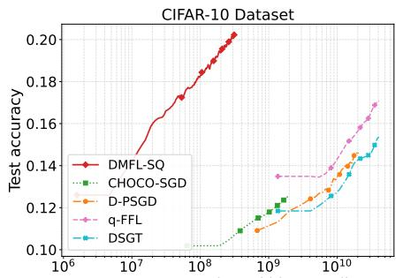

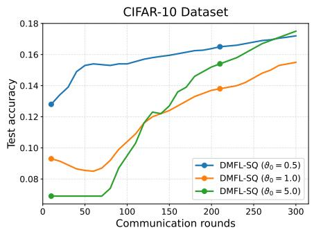

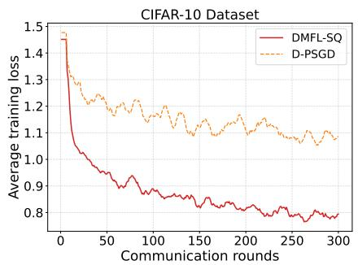  
Fig. 2: Test accuracy versus average communi- Fig. 3: Ablation on the event-trigger threshold Fig. 4: Average training loss versus commu- cated bits per client on the CIFAR-10 dataset. $\vartheta _ { 0 }$ on the CIFAR-10 dataset. nication rounds on the CIFAR-10 dataset.

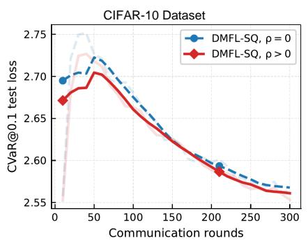  
Fig. 5: Effect of fairness regularization on CIFAR-10 tail risk (CVaR@0.1).

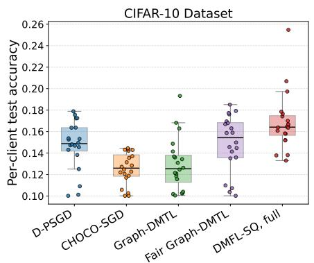

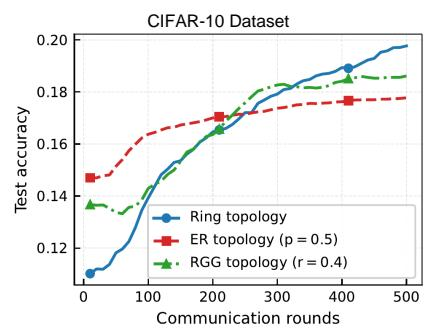  
Fig. 7: Effect of network topology on DMFL-SQ (CIFAR-10, non-iid).

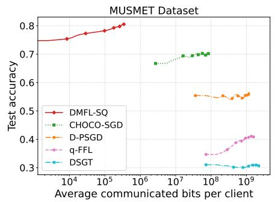

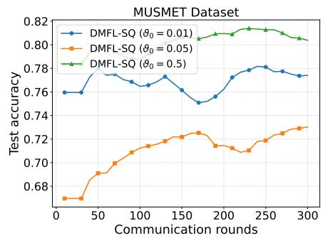

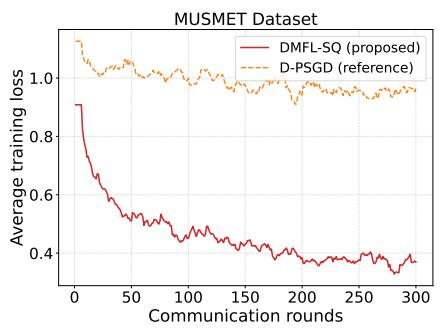  
Fig. 8: Test accuracy versus average communi- Fig. 9: Ablation on the event-trigger threshold Fig. 10: Average training loss versus commu- cated bits per client on the MUSMET dataset. $\vartheta _ { 0 }$ on the MUSMET dataset. nication rounds on the MUSMET dataset.

Fig. 7 evaluates the sensitivity of DMFL-SQ to the communication topology. Ring, Erdos–R ˝ enyi (ER), and random´ geometric graph (RGG) topologies all show stable learning, indicating that DMFL-SQ is not restricted to a specific graph structure. The different transient behaviors reflect how graph connectivity affects neighbor-copy propagation and graphregularized coupling under non-iid data.

Fig. 8 shows the communication-accuracy trade-off on the MUSMET dataset. Similar to the CIFAR-10 results in Fig. 2, DMFL-SQ attains the highest accuracy among the compared methods while requiring fewer communicated bits than dense decentralized baselines, showing a favorable accuracycommunication trade-off on this naturally heterogeneous realworld dataset.

Fig. 9 shows the sensitivity of DMFL-SQ to the initial event-trigger threshold $\vartheta _ { 0 }$ on MUSMET. Across the tested thresholds, the method exhibits stable learning behavior, showing that the event-triggered mechanism remains effective on naturally heterogeneous EEG data.

Fig. 10 shows the average training loss on MUSMET. DMFL-SQ converges faster and reaches a much lower loss than D-PSGD, demonstrating stable optimization under naturally heterogeneous EEG data despite sparse-quantized eventtriggered communication.

Fig. 11 shows that DMFL-SQ consistently attains the highest test accuracy and converges stably compared with the considered baselines on the MUSMET dataset.

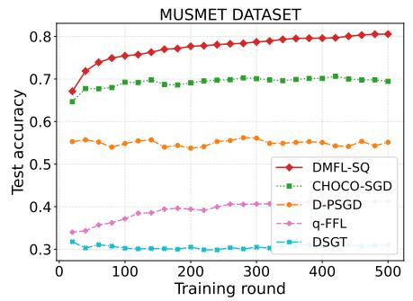

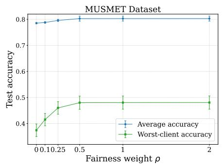  
Fig. 11: Test accuracy versus training rounds Fig. 12: Sensitivity of DMFL-SQ to the fair on the MUSMET dataset. ness weight ρ on the MUSMET dataset.

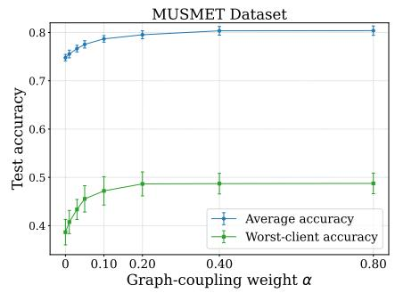  
Fig. 13: Sensitivity of DMFL-SQ to the graph-coupling weight α on the MUSMET dataset.

TABLE II: Accuracy-fairness-communication comparison on the MUSMET dataset. Performance metrics are reported as mean $\pm ~ 9 5 \%$ CI across R = 5 seeds.
<table><tr><td>Method</td><td>Avg. Acc. ↑</td><td>Worst Acc. ↑</td><td>Bottom-10% Acc. ↑</td><td>Acc. Std ↓</td><td>Jain&#x27;s Index ↑</td><td>Bits/Client↓</td></tr><tr><td>DSGT</td><td> $\overline { { 0 . 3 1 3 2 \pm 0 . 0 5 4 1 } }$ </td><td> $\overline { { 0 . 0 5 0 1 \pm 0 . 0 5 8 6 } }$ </td><td> $\overline { { 0 . 0 6 1 0 \pm 0 . 0 5 9 2 } }$ </td><td> $\overline { { 0 . 1 9 8 1 \pm 0 . 0 6 6 6 } }$ </td><td> $\overline { { 0 . 7 1 0 3 \pm 0 . 1 7 1 9 } }$ </td><td>1998.3 M</td></tr><tr><td>q-FFL</td><td> $0 . 4 1 1 4 \pm 0 . 0 1 5 5$ </td><td> $0 . 0 7 1 6 \pm 0 . 1 1 7 3$ </td><td> $0 . 1 0 9 1 \pm 0 . 0 8 4 9$ </td><td> $0 . 2 0 2 5 \pm 0 . 0 8 8 0$ </td><td> $0 . 7 9 8 3 \pm 0 . 1 3 8 5$ </td><td>1618.0 M</td></tr><tr><td>D-PSGD</td><td> $0 . 5 7 1 6 \pm 0 . 0 5 5 6$ </td><td> $0 . 1 9 5 7 \pm 0 . 1 0 0 4$ </td><td> $0 . 2 2 3 6 \pm 0 . 0 9 3 2$ </td><td> $0 . 2 1 5 6 \pm 0 . 0 3 0 4$ </td><td> $0 . 8 7 1 3 \pm 0 . 0 5 2 0$ </td><td>1438.6 M</td></tr><tr><td>CHOCO-SGD</td><td> $0 . 6 9 2 8 \pm 0 . 0 3 4 2$ </td><td> $0 . 1 9 3 5 \pm 0 . 1 2 0 5$ </td><td> $0 . 2 3 2 0 \pm 0 . 0 6 6 5$ </td><td> $0 . 2 1 6 3 \pm 0 . 0 2 5 6$ </td><td> $0 . 9 0 7 4 \pm 0 . 0 1 2 8$ </td><td>97.4 M</td></tr><tr><td>DMFL-SQ</td><td> $0 . 8 0 3 0 \pm 0 . 0 0 9 6$ </td><td> $0 . 4 8 1 0 \pm 0 . 0 2 2 5$ </td><td> $0 . 5 1 6 0 \pm 0 . 0 2 6 0$ </td><td> $0 . 1 2 1 0 \pm 0 . 0 0 5 8$ </td><td> $0 . 9 7 7 9 \pm 0 . 0 0 4 7$ </td><td>0.6M</td></tr></table>

TABLE III: Component ablation of DMFL-SQ on MUSMET Dataset. Performance metrics are reported as $\mathrm { m e a n } \pm 9 5 \%$ CI across $R = 5$ seeds.
<table><tr><td>Variant</td><td> $\overline { { \mathrm { A v g . ~ A c c . ~ } \uparrow } }$ </td><td>Worst Acc. ↑</td><td>Bottom-10% Acc. ↑</td><td>Jain&#x27;s Index ↑</td><td>Bits/Client↓</td></tr><tr><td>No fairness  ${ \overline { { ( \rho = 0 ) } } }$ </td><td> $\overline { { 0 . 7 8 6 9 \pm 0 . 0 0 2 4 } }$ </td><td> $\overline { { 0 . 3 7 4 3 \pm 0 . 0 2 4 1 } }$ </td><td> $\overline { { 0 . 4 0 6 5 \pm 0 . 0 2 4 1 } }$ </td><td> $\overline { { 0 . 9 5 2 1 \pm 0 . 0 0 4 1 } }$ </td><td>0.3M</td></tr><tr><td>No graph coupling (α = 0)</td><td> $0 . 7 4 7 4 \pm 0 . 0 1 5 7$ </td><td> $0 . 3 8 6 2 \pm 0 . 0 2 6 3$ </td><td> $0 . 4 2 0 6 \pm 0 . 0 2 0 7$ </td><td> $0 . 9 5 5 4 \pm 0 . 0 0 4 2$ </td><td>0.2 M</td></tr><tr><td>No event-triggering</td><td> $0 . 8 0 4 4 \pm 0 . 0 2 1 1$ </td><td> $0 . 4 3 9 7 \pm 0 . 0 1 7 8$ </td><td> $0 . 4 8 5 0 \pm 0 . 0 2 1 1$ </td><td> $0 . 9 7 4 8 \pm 0 . 0 0 4 6$ </td><td>4.0 M</td></tr><tr><td>No sparsification</td><td> $0 . 8 1 8 7 \pm 0 . 0 1 6 9$ </td><td> $0 . 4 5 0 4 \pm 0 . 0 2 1 8$ </td><td> $0 . 4 9 0 5 \pm 0 . 0 2 1 1$ </td><td> $0 . 9 7 3 7 \pm 0 . 0 0 4 3$ </td><td>2.2 M</td></tr><tr><td>No quantization</td><td> $0 . 8 0 7 4 \pm 0 . 0 0 6 7$ </td><td> $0 . 4 4 0 5 \pm 0 . 0 2 3 6$ </td><td> $0 . 4 8 2 0 \pm 0 . 0 2 1 0$ </td><td> $0 . 9 7 4 6 \pm 0 . 0 0 4 5$ </td><td>5.3M</td></tr><tr><td>DMFL-SQ</td><td> $0 . 8 0 3 0 \pm 0 . 0 0 9 6$ </td><td> $0 . 4 8 1 0 \pm 0 . 0 2 2 5$ </td><td> $0 . 5 1 6 0 \pm 0 . 0 2 6 0$ </td><td> $0 . 9 7 7 9 \pm 0 . 0 0 4 7$ </td><td>0.6M</td></tr></table>

Figs. 12 and 13 further show that increasing the fairness weight ρ mainly improves worst-client accuracy while preserving average accuracy, whereas stronger graph coupling α improves both metrics, with diminishing gains beyond moderate values. These results support the robustness of DMFL-SQ to its key hyperparameters.

Table II shows that DMFL-SQ achieves the highest average accuracy, worst-client accuracy, bottom-10% accuracy, and Jain’s index and lowest standard deviation of client accuracies on the heterogeneous MUSMET dataset. Moreover, DMFL-SQ substantially reduces the communication cost compared with both dense decentralized baselines and compressed CHOCO-SGD, demonstrating a favorable accuracy-fairnesscommunication trade-off.

Table III shows that each component contributes to the overall performance of DMFL-SQ. The DMFL-SQ algorithm achieves the highest worst-client and bottom-10% accuracies, as well as the highest Jain’s index, while requiring only 0.6 Mbits per client. Although removing sparsification or quantization slightly improves the average accuracy, it substantially increases the communication cost and reduces the tailclient performance. Similarly, removing the fairness or graphcoupling terms degrades the worst-client and bottom-10% accuracies. These results demonstrate that the DMFL-SQ design provides the most favorable overall balance among average accuracy, client fairness, and communication efficiency. VII. CONCLUSION

We presented DMFL-SQ, a decentralized multi-task fair learning framework with sparsified, quantized, and eventtriggered communication. The algorithm unifies personalization, fairness, and communication efficiency within a single decentralized optimization paradigm in the non-convex regime. Our theoretical results establish an $\mathcal { O } ( T ^ { - 1 / 2 } )$ rate in expected squared Moreau-envelope stationarity, while explicitly accounting for compression, network topology, and triggering effects. Extensive experiments demonstrate that DMFL-SQ achieves a favorable accuracy-fairness-communication tradeoff under the considered heterogeneous settings while reducing communication cost compared to existing baselines.

## APPENDIX A

## PROOF OF THEOREM 1 & COROLLARY 1

We first recall the population and empirical agnostic   
mixture risks: $\begin{array} { r } { \Psi ( \mathbf { w } ) \ = \ \bar { \operatorname* { s u p } } _ { \lambda \in \Lambda } \sum _ { i = 1 } ^ { n } \lambda _ { i } \bar { F _ { i } } ( w _ { i } ) , \ \widehat { \Psi } ( \mathbf { w } ) \ = \ } \end{array}$   
$\textstyle \operatorname* { s u p } _ { \lambda \in \Lambda } \sum _ { i = 1 } ^ { n } \lambda _ { i } { \widehat { F } } _ { i } ( w _ { i } )$ . For a fixed mixture vector $\lambda \in \Lambda ,$   
define $\begin{array} { r } { \Phi _ { \lambda } ( \mathbf { w } ) : = \sum _ { i = 1 } ^ { n } \lambda _ { i } F _ { i } ( w _ { i } ) , \widehat { \Phi } _ { \lambda } ( \mathbf { w } ) : = \sum _ { i = 1 } ^ { n } \lambda _ { i } \widehat { F } _ { i } ( w _ { i } ) } \end{array}$ a) Case $I \colon \Lambda = \Delta _ { n } \colon$ Since $\lambda \mapsto \Phi _ { \lambda } ( \mathbf { w } )$ is linear over   
the simplex $\Delta _ { n } ,$ its supremum is attained at a vertex. Hence,

$$
\Psi ( \mathbf { w } ) = \operatorname* { m a x } _ { 1 \leq i \leq n } F _ { i } ( w _ { i } ) , \qquad \widehat { \Psi } ( \mathbf { w } ) = \operatorname* { m a x } _ { 1 \leq i \leq n } \widehat { F } _ { i } ( w _ { i } ) .
$$

For each w, let $i ^ { \star } ( \mathbf { w } ) \in \arg \operatorname* { m a x } _ { 1 \leq i \leq n } F _ { i } ( w _ { i } )$ be a measurable selection of a worst-case client. Define the augmented posterior and prior over pairs (w, i) by $\widetilde { Q } ( d \mathbf { w } , d i ) =$

$Q ( d \mathbf { w } ) \delta _ { i ^ { \star } ( \mathbf { w } ) } ( d i ) , \widetilde { \Pi } ( d \mathbf { w } , d i ) = \Pi ( d \mathbf { w } ) \pi ( d i )$ , where $\pi ( i ) =$ $1 / n$ is the uniform distribution over clients. Then

$$
\mathbb { E } _ { ( \mathbf { w } , i ) \sim \widetilde { Q } } [ F _ { i } ( w _ { i } ) ] = \mathbb { E } _ { \mathbf { w } \sim Q } [ \Psi ( \mathbf { w } ) ] .
$$

Moreover, since $\begin{array} { r c l } { \widehat { F } _ { i ^ { \star } ( \mathbf { w } ) } \left( w _ { i ^ { \star } ( \mathbf { w } ) } \right) } & { \leq } & { \operatorname* { m a x } _ { 1 \leq i \leq n } \widehat { F } _ { i } ( w _ { i } ) } \end{array} =$ $\widehat { \Psi } ( \mathbf { w } )$ , we have

$$
\begin{array} { r } { \mathbb { E } _ { ( \mathbf { w } , i ) \sim \widetilde { Q } } \left[ \widehat { F } _ { i } ( w _ { i } ) \right] \leq \mathbb { E } _ { \mathbf { w } \sim Q } \left[ \widehat { \Psi } ( \mathbf { w } ) \right] . } \end{array}
$$

The KL divergence of the augmented posterior satisfies

$$
\begin{array} { r } { \mathrm { K L } ( \widetilde Q \| \widetilde \Pi ) = \mathrm { K L } ( Q \| \Pi ) + \ln n . } \end{array}
$$

For every fixed pair $( { \bf w } , i )$ , Hoeffding’s lemma gives where $\begin{array} { r } { m _ { v } \ = \ \left( \sum _ { i = 1 } ^ { n } \frac { v _ { i } ^ { 2 } } { m _ { i } } \right) ^ { - 1 } } \end{array}$ . Since $m _ { v } \geq m _ { \mathrm { e f f } }$ , integrating with respect to $\widetilde { \Pi } _ { \epsilon }$ and applying the PAC-Bayes changeof-measure inequality and Markov’s inequality yields, with probability at least $1 - \delta ,$ simultaneously for all augmented posteriors $\widetilde { Q } _ { \epsilon }$

$$
\begin{array} { r l } & { \mathbb { E } _ { ( \mathbf { w } , v ) \sim \widetilde { Q } _ { \epsilon } } [ \Phi _ { v } ( \mathbf { w } ) ] \leq \mathbb { E } _ { ( \mathbf { w } , v ) \sim \widetilde { Q } _ { \epsilon } } \Big [ \widehat \Phi _ { v } ( \mathbf { w } ) \Big ] + \frac { \tau _ { \mathrm { P B } } } { 8 m _ { \mathrm { e f f } } } } \\ & { \qquad + \frac { { \mathrm { K L } ( \widetilde { Q } _ { \epsilon } \| \widetilde { \Pi } _ { \epsilon } ) } + \ln ( 1 / \delta ) } { \tau _ { \mathrm { P B } } } . } \end{array}\tag{54}
$$

This proves the second claim.

$$
\mathbb { E } _ { \mathcal { D } } \exp \Big ( \tau _ { \mathrm { P B } } \left[ F _ { i } ( w _ { i } ) - \widehat { F } _ { i } ( w _ { i } ) \right] \Big ) \leq \exp \left( \frac { \tau _ { \mathrm { P B } } ^ { 2 } } { 8 m _ { i } } \right) \leq \exp \left( \frac { \tau _ { \mathrm { P B } } ^ { 2 } } { 8 m _ { \operatorname* { m i n } } } A _ { * } \right) P r o f \ o f \ C o r o l l a r y \ I _ { \mathcal { D } } ,
$$

Integrating with respect to the data-independent augmented prior Πe and applying the PAC–Bayes change-of-measure inequality together with Markov’s inequality yields, with probability at least 1−δ, simultaneously for all augmented posteriors $\widetilde Q , ]$

$$
\begin{array} { r l r } {  { \mathbb { E } _ { ( \mathbf { w } , i ) \sim \widetilde { Q } } [ F _ { i } ( w _ { i } ) ] \le \mathbb { E } _ { ( \mathbf { w } , i ) \sim \widetilde { Q } } \Big [ \widehat { F } _ { i } ( w _ { i } ) \Big ] + \frac { \mathrm { K L } ( \widetilde { Q } \| \widetilde { \Pi } ) + \ln ( 1 / \delta ) } { \tau _ { \mathrm { P B } } } } } \\ & { } & { + \ \frac { \tau _ { \mathrm { P B } } } { 8 m _ { \mathrm { m i n } } } . \qquad ( 5 2 ) } \end{array}
$$

This proves the first claim.

b) Case 2: General compact $\Lambda \subseteq \Delta _ { n } .$ Let $\mathcal { N } _ { \epsilon } ( \Lambda , \|$ $\Vert _ { 1 } ) \subseteq \Lambda$ be a fixed deterministic ϵ-net of Λ in the $\ell _ { 1 }$ norm, constructed independently of the observed datasets. Since $\ell _ { i } ( w _ { i } ; z ) \in [ 0 , 1 ]$ , we have $F _ { i } ( w _ { i } ) , \widehat { F } _ { i } ( w _ { i } ) \in [ 0 , 1 ]$ . Therefore, for any fixed w, both maps $\lambda \mapsto \Phi _ { \lambda } ( \mathbf { w } ) , \lambda \mapsto \widehat { \Phi } _ { \lambda } ( \mathbf { w } )$ are 1-Lipschitz with respect to $\| \cdot \| _ { 1 }$ . Indeed, for any $\lambda , \lambda ^ { \prime } \in \Lambda$

$$
| \Phi _ { \lambda } ( \mathbf { w } ) - \Phi _ { \lambda ^ { \prime } } ( \mathbf { w } ) | \leq \sum _ { i = 1 } ^ { n } | \lambda _ { i } - \lambda _ { i } ^ { \prime } | F _ { i } ( w _ { i } ) \leq \| \lambda - \lambda ^ { \prime } \| _ { 1 } ,
$$

and similarly $| \widehat { \Phi } _ { \lambda } ( \mathbf { w } ) - \widehat { \Phi } _ { \lambda ^ { \prime } } ( \mathbf { w } ) | \leq \| \lambda - \lambda ^ { \prime } \| _ { 1 }$

For each w, let $\lambda ^ { \star } ( \mathbf { w } ) \in \arg \operatorname* { m a x } _ { \lambda \in \Lambda } \Phi _ { \lambda } ( \mathbf { w } )$ be a measurable selection. Using a fixed deterministic tie-breaking rule, choose $v _ { \epsilon } ( \mathbf { w } ) \in \mathcal { N } _ { \epsilon } ( \Lambda , \| \cdot \| _ { 1 } )$ such that $\| \lambda ^ { \star } ( \mathbf { w } ) - v _ { \epsilon } ( \mathbf { w } ) \| _ { 1 } \leq \epsilon .$ By the Lipschitz property,

$$
\Psi ( \mathbf { w } ) = \Phi _ { \lambda ^ { \star } ( \mathbf { w } ) } ( \mathbf { w } ) \leq \Phi _ { v _ { \varepsilon } ( \mathbf { w } ) } ( \mathbf { w } ) + \varepsilon .
$$

Also, $\widehat { \Phi } _ { v _ { \varepsilon } ( \mathbf { w } ) } ( \mathbf { w } ) ~ \leq ~ \widehat { \Psi } ( \mathbf { w } )$ . Define the augmented posterior and prior over pairs $( { \bf w } , v )$ by $\begin{array} { r l } { \widetilde { Q } _ { \varepsilon } ( d \mathbf { w } , d v ) } & { { } = } \end{array}$ $Q ( d \mathbf { w } ) \delta _ { v _ { \varepsilon } ( \mathbf { w } ) } ( d v ) , \widetilde { \Pi } _ { \varepsilon } ( d \mathbf { w } , d v ) = \Pi ( d \mathbf { w } ) \pi _ { \varepsilon } ( d v )$ , where $\pi _ { \varepsilon }$ is the uniform distribution over $\mathcal { N } _ { \varepsilon } ( \Lambda , \| \cdot \| _ { 1 } )$ . Then

$$
\mathrm { K L } ( \widetilde { Q } _ { \varepsilon } \Vert \widetilde { \Pi } _ { \varepsilon } ) = \mathrm { K L } ( Q \Vert \Pi ) + \ln | \mathcal { N } _ { \varepsilon } ( \Lambda , \Vert \cdot \Vert _ { 1 } ) | .
$$

For each $v \in \mathcal { N } _ { \varepsilon } ( \Lambda , \| \cdot \| _ { 1 } )$ , define $m _ { v } : = m _ { \lambda } | _ { \lambda = v }$ . Since the ε-net is contained in Λ, the definition of $m _ { \mathrm { e f f } }$ gives $m _ { v } \geq m _ { \mathrm { e f f } }$ For every fixed pair $( { \bf w } , v )$ , where $v \in \mathcal { N } _ { \epsilon } ( \Lambda , \| \cdot \| _ { 1 } )$

$$
\Phi _ { v } ( \mathbf { w } ) - \widehat { \Phi } _ { v } ( \mathbf { w } ) = \sum _ { i = 1 } ^ { n } \sum _ { k = 1 } ^ { m _ { i } } \frac { v _ { i } } { m _ { i } } \left[ F _ { i } ( w _ { i } ) - \ell _ { i } ( w _ { i } ; z _ { i , k } ) \right] .
$$

Since the losses lie in [0, 1] and the client samples are mutually independent, Hoeffding’s lemma gives

$$
\begin{array} { r l } & { \displaystyle \mathbb { E } _ { \mathcal { D } } \exp \left( \tau _ { \mathrm { P B } } \left[ \Phi _ { v } ( \mathbf { w } ) - \widehat { \Phi } _ { v } ( \mathbf { w } ) \right] \right) } \\ & { \quad \leq \exp \left( \frac { \tau _ { \mathrm { P B } } ^ { 2 } } { 8 } \displaystyle \sum _ { i = 1 } ^ { n } \frac { v _ { i } ^ { 2 } } { m _ { i } } \right) = \exp \left( \frac { \tau _ { \mathrm { P B } } ^ { 2 } } { 8 m _ { v } } \right) , } \end{array}\tag{53}
$$

The PAC-Bayes bound in Theorem 1 is algorithm-agnostic. We now quantify the one-step perturbation of the empirical agnostic mixture risk caused by evaluating the graph regularizer using stale and compressed neighbor copies.

First, we establish a Lipschitz property of the empirical fairness envelope. For any two stacked model collections $\mathbf { w } = ( w _ { 1 } , \ldots , w _ { n } )$ and $\mathbf { v } = ( v _ { 1 } , \ldots , v _ { n } )$ , we have

$$
\begin{array} { r l } { \displaystyle \left| \widehat { \Psi } ( \mathbf { w } ) - \widehat { \Psi } ( \mathbf { v } ) \right| = \displaystyle \left| \operatorname* { s u p } _ { \lambda \in \Lambda } \sum _ { i = 1 } ^ { n } \lambda _ { i } \widehat { F } _ { i } ( w _ { i } ) - \displaystyle \operatorname* { s u p } _ { \lambda \in \Lambda } \sum _ { i = 1 } ^ { n } \lambda _ { i } \widehat { F } _ { i } ( v _ { i } ) \right| } & { } \\ { \displaystyle \leq \operatorname* { s u p } _ { \lambda \in \Lambda } \left| \sum _ { i = 1 } ^ { n } \lambda _ { i } \left( \widehat { F } _ { i } ( w _ { i } ) - \widehat { F } _ { i } ( v _ { i } ) \right) \right| } & { } \\ { \displaystyle \leq G _ { \operatorname* { l i p } } \operatorname* { s u p } _ { \lambda \in \Lambda } \sum _ { i = 1 } ^ { n } \lambda _ { i } \| w _ { i } - v _ { i } \| . } & { ( 5 ; \lambda \mathbf { ) } } \end{array}\tag{5}
$$

Since $\Lambda \subseteq \Delta _ { n }$

$$
\operatorname* { s u p } _ { \lambda \in \Lambda } \sum _ { i = 1 } ^ { n } \lambda _ { i } \| w _ { i } - v _ { i } \| \leq \operatorname* { m a x } _ { i \in [ n ] } \| w _ { i } - v _ { i } \| \leq \| \mathbf { w } - \mathbf { v } \| .
$$

Consequently,

(56)

$$
\begin{array} { r } { \Big | \widehat { \Psi } ( \mathbf { w } ) - \widehat { \Psi } ( \mathbf { v } ) \Big | \leq G _ { \mathrm { l i p } } \| \mathbf { w } - \mathbf { v } \| . } \end{array}\tag{57}
$$

Recall that the implemented direction can be decomposed as $\mathbf { h } ^ { t } = \mathbf { V } ^ { t } + \mathbf { q } ^ { t } + \mathbf { d } ^ { t }$ , where $\mathbf { d } ^ { t } = \mathbf { r } ^ { t } - \nabla \mathcal { R } _ { \mathcal { G } } ( \mathbf { w } ^ { t } )$ is the graph-coupling approximation error. Define the exact-neighbor shadow update

$$
\mathbf { w } _ { \mathrm { e x } } ^ { t + 1 } : = \mathbf { w } ^ { t } - \gamma _ { t } \left( \mathbf { h } ^ { t } - \mathbf { d } ^ { t } \right) .\tag{58}
$$

Thus, $\mathbf { w } _ { \mathrm { e x } } ^ { t + 1 }$ starts from the same current iterate $\mathbf { w } ^ { t }$ and uses the same stochastic gradients and fairness selection as DMFL-SQ, but evaluates the graph-coupling direction using the exact current neighbor models.

Since the DMFL-SQ update is $\mathbf { w } ^ { t + 1 } = \mathbf { w } ^ { t } - \gamma _ { t } \mathbf { h } ^ { t }$ , we obtain

$$
\mathbf { w } ^ { t + 1 } - \mathbf { w } _ { \mathrm { e x } } ^ { t + 1 } = - \gamma _ { t } \mathbf { d } ^ { t } .\tag{59}
$$

Applying (57) gives

$$
\left| \widehat { \Psi } ( \mathbf { w } ^ { t + 1 } ) - \widehat { \Psi } ( \mathbf { w } _ { \mathrm { e x } } ^ { t + 1 } ) \right| \leq G _ { \mathrm { l i p } } \gamma _ { t } \| \mathbf { d } ^ { t } \| .\tag{60}
$$

Taking expectations and using Jensen’s inequality yields

$$
\begin{array} { r l } & { \left. \mathbb { E } \Big [ \widehat { \Psi } ( \mathbf { w } ^ { t + 1 } ) \Big ] - \mathbb { E } \Big [ \widehat { \Psi } ( \mathbf { w } _ { \mathrm { e x } } ^ { t + 1 } ) \Big ] \right. \leq G _ { \operatorname* { l i p } } \gamma _ { t } \mathbb { E } \lVert \mathbf { d } ^ { t } \rVert } \\ & { \qquad \leq G _ { \operatorname* { l i p } } \gamma _ { t } \left( \mathbb { E } \lVert \mathbf { d } ^ { t } \rVert ^ { 2 } \right) ^ { 1 / 2 } . } \end{array}\tag{61}
$$

The graph-direction approximation bound gives $\| \mathbf { d } ^ { t } \| ^ { 2 } \ \leq$ $n K _ { \mathcal { G } } \mathcal { E } ^ { t }$ , where $\begin{array} { r l r } { \mathcal { E } ^ { t } } & { = } & { \frac { 1 } { n } \sum _ { i = 1 } ^ { n } \sum _ { j \in \mathcal { N } _ { i } } a _ { i j } \big \| w _ { j } ^ { t } - \widehat { w } _ { j  i } ^ { t } \big \| ^ { 2 } . } \end{array}$ Therefore,

$$
\Big | \mathbb { E } \Big [ \widehat { \Psi } ( \mathbf { w } ^ { t + 1 } ) \Big ] - \mathbb { E } \Big [ \widehat { \Psi } ( \mathbf { w } _ { \mathrm { e x } } ^ { t + 1 } ) \Big ] \Big | \leq G _ { \mathrm { l i p } } \gamma _ { t } \sqrt { n K _ { \mathcal { G } } \mathbb { E } [ \mathcal { E } ^ { t } ] } .\tag{62}
$$

$\operatorname { L e t } \ \tau \sim \operatorname { U n i f } \{ 0 , \dots , T - 1 \}$ , independently of the algorithmic randomness. Averaging (62) over $t = 0 , \ldots , T - 1$ gives

$$
\Big | \mathbb { E } \Big [ \widehat { \Psi } ( \mathbf { w } ^ { \tau + 1 } ) \Big ] - \mathbb { E } \Big [ \widehat { \Psi } ( \mathbf { w } _ { \mathrm { e x } } ^ { \tau + 1 } ) \Big ] \Big | \leq \frac { G _ { \operatorname* { l i p } } \sqrt { n K _ { \mathcal { G } } } } { T } \sum _ { t = 0 } ^ { T - 1 } \gamma _ { t } \sqrt { \mathbb { E } [ \mathcal { E } ^ { t } ] } .\tag{63}
$$

Under Assumption 7, $\gamma _ { t } = \gamma / \sqrt { T }$ . Hence, by the Cauchy-Schwarz inequality,

$$
\left. \mathbb { E } \left[ \widehat { \Psi } ( \mathbf { w } ^ { \tau + 1 } ) \right] - \mathbb { E } \left[ \widehat { \Psi } ( \mathbf { w } _ { \mathrm { e x } } ^ { \tau + 1 } ) \right] \right. \leq \frac { G _ { \mathrm { l i p } } \gamma \sqrt { n K _ { \mathcal { G } } } } { \sqrt { T } } \left( \frac { 1 } { T } \sum _ { t = 0 } ^ { T - 1 } \mathbb { E } [ \mathcal { E } ^ { t } ] \right)\tag{64}
$$

By Lemma 6,

$$
\frac { 1 } { T } \sum _ { t = 0 } ^ { T - 1 } \mathbb { E } [ \mathcal { E } ^ { t } ] \leq \frac { 2 } { \chi _ { 0 } \omega T } \left( \mathbb { E } [ \mathcal { E } ^ { 0 } ] + \chi _ { 1 } B _ { h } \gamma ^ { 2 } + \chi _ { 2 } \vartheta _ { 0 } ^ { 2 } ( 1 + \log T ) \right) .\tag{65}
$$

Substituting (65) into (64) yields

$$
\begin{array} { r l } & { \left. \mathbb { E } \left[ \widehat { \Psi } ( { \mathbf { w } ^ { \tau + 1 } } ) \right] - \mathbb { E } \left[ \widehat { \Psi } ( { \mathbf { w } _ { \mathrm { e x } } ^ { \tau + 1 } } ) \right] \right. } \\ & { \qquad \leq \frac { G _ { \mathrm { l i p } } \gamma \sqrt { 2 n K _ { \mathcal { G } } } } { \sqrt { \chi _ { 0 } \omega } T } \left( \mathbb { E } [ \mathcal { E } ^ { 0 } ] + \chi _ { 1 } B _ { h } \gamma ^ { 2 } + \chi _ { 2 } \vartheta _ { 0 } ^ { 2 } ( 1 + \log T ) \right) } \end{array}\tag{66}
$$

Therefore, the one-step empirical agnostic mixture-risk perturbation caused by stale, sparse, quantized, and event-triggered neighbor-model exchange satisfies

$$
\Big | \mathbb { E } \Big [ \widehat { \Psi } \big ( \mathbf { w } ^ { \tau + 1 } \big ) \Big ] - \mathbb { E } \Big [ \widehat { \Psi } \big ( \mathbf { w } _ { \mathrm { e x } } ^ { \tau + 1 } \big ) \Big ] \Big | = \mathcal { O } \Big ( \frac { \sqrt { \log T } } { T } \Big ) ,
$$

and hence vanishes asymptotically as $T \to \infty$ . This proves the corollary. □

## APPENDIX B

## PROOF OF THEOREM 2 (CONVERGENCE ANALYSIS)

We prove Theorem 2 using the notation introduced in Section V. For each t, define the proximal point and the associated Moreau-envelope gradient as $\widetilde { \mathbf { w } } ^ { t } : = \mathrm { p r o x } _ { \mu \mathcal { L } } ( \mathbf { w } ^ { t } )$ $\begin{array} { r } { \mathbf { s } ^ { t } : = \frac { 1 } { \mu } \left( \mathbf { w } ^ { t } - \widetilde { \mathbf { w } } ^ { t } \right) = \nabla \mathcal { L } _ { \mu } ( \mathbf { w } ^ { t } ) } \end{array}$

## A. Proof of Lemma 4

Combining Lemma 2 with the L-weak convexity of $\scriptstyle \sum _ { i = 1 } ^ { n } F _ { i } ( w _ { i } )$ and the convexity of $\mathcal { R } _ { \mathcal { G } }$ gives, for every ${ \textbf { u } } \in$ Rnd,

$$
\mathcal { L } ( \mathbf { u } ) \geq \mathcal { L } ( \mathbf { w } ^ { t } ) + \left. \mathbf { V } ^ { t } , \mathbf { u } - \mathbf { w } ^ { t } \right. - \frac { \kappa } { 2 } \| \mathbf { u } - \mathbf { w } ^ { t } \| ^ { 2 } - \rho \varepsilon _ { \Psi , t } ,\tag{67}
$$

where $\kappa ~ = ~ ( 1 + \rho ) L$ and $\mathbf { V } ^ { t }$ is defined in Assumption 5. Applying (67) with $\mathbf { u } = \widetilde { \mathbf { w } } ^ { t }$ gives

$$
\begin{array} { r l } & { \displaystyle \mathcal { L } ( \widetilde { \mathbf { w } } ^ { t } ) \geq \mathcal { L } ( \mathbf { w } ^ { t } ) + \left. \mathbf { V } ^ { t } , \widetilde { \mathbf { w } } ^ { t } - \mathbf { w } ^ { t } \right. } \\ & { \quad \quad \quad - \displaystyle \frac { \kappa } { 2 } \left\| \widetilde { \mathbf { w } } ^ { t } - \mathbf { w } ^ { t } \right\| ^ { 2 } - \rho \varepsilon _ { \Psi , t } . } \end{array}\tag{68}
$$

On the other hand, by the definition of the proximal point and by using $\mathbf { w } ^ { t }$ as a feasible candidate,

$$
\mathcal L ( \widetilde \mathbf w ^ { t } ) + \frac { 1 } { 2 \mu } \left\| \widetilde \mathbf w ^ { t } - \mathbf w ^ { t } \right\| ^ { 2 } \leq \mathcal L ( \mathbf w ^ { t } ) .\tag{69}
$$

Therefore,

$$
\mathcal { L } ( \mathbf { w } ^ { t } ) - \mathcal { L } ( \widetilde { \mathbf { w } } ^ { t } ) \geq \frac { 1 } { 2 \mu } \left\| \widetilde { \mathbf { w } } ^ { t } - \mathbf { w } ^ { t } \right\| ^ { 2 } .\tag{70}
$$

Rearranging (68) and using $( 7 0 )$ , we obtain

$$
\left. \mathbf { V } ^ { t } , \mathbf { w } ^ { t } - \widetilde { \mathbf { w } } ^ { t } \right. \geq \left( \frac { 1 } { 2 \mu } - \frac { \kappa } { 2 } \right) \left. \mathbf { w } ^ { t } - \widetilde { \mathbf { w } } ^ { t } \right. ^ { 2 } - \rho \varepsilon _ { \Psi , t } .\tag{71}
$$

Substituting $\mathbf { w } ^ { t } - \widetilde { \mathbf { w } } ^ { t } = \mu \mathbf { s } ^ { t }$ yields

$$
\langle \mathbf { V } ^ { t } , \mathbf { s } ^ { t } \rangle \geq \frac { 1 - \kappa \mu } { 2 } \| \mathbf { s } ^ { t } \| ^ { 2 } - \frac { \rho } { \mu } \varepsilon _ { \Psi , t } .\tag{72}
$$

$1 / \mathrm { { ^ d } }$ he vector form of the algorithmic update is

$$
\begin{array} { r } { \mathbf { \nabla } . \mathbf { w } ^ { t + 1 } = \mathbf { w } ^ { t } - \gamma _ { t } \mathbf { h } ^ { t } , \mathbf { \qquad h } ^ { t } = \mathbf { V } ^ { t } + \mathbf { q } ^ { t } + \mathbf { d } ^ { t } . } \end{array}\tag{73}
$$

Using $\widetilde { \mathbf { w } } ^ { t }$ as a feasible candidate in the definition of $\mathcal { L } _ { \mu } ( \mathbf { w } ^ { t + 1 } )$ , we have

$$
\begin{array} { r l } { \mathcal { L } _ { \mu } ( \mathbf { w } ^ { t + 1 } ) \leq \mathcal { L } ( \widetilde { \mathbf { w } } ^ { t } ) + \displaystyle \frac { 1 } { 2 \mu } \left\| \widetilde { \mathbf { w } } ^ { t } - \mathbf { w } ^ { t + 1 } \right\| ^ { 2 } } & { } \\ { = \mathcal { L } ( \widetilde { \mathbf { w } } ^ { t } ) + \displaystyle \frac { 1 } { 2 \mu } \left\| - \mu \mathbf { s } ^ { t } + \gamma _ { t } \mathbf { h } ^ { t } \right\| ^ { 2 } } & { } \\ { = \mathcal { L } _ { \mu } ( \mathbf { w } ^ { t } ) - \gamma _ { t } \left. \mathbf { s } ^ { t } , \mathbf { h } ^ { t } \right. + \displaystyle \frac { \gamma _ { t } ^ { 2 } } { 2 \mu } \| \mathbf { h } ^ { t } \| ^ { 2 } . } & { } \end{array}\tag{74}
$$

Recall that $\mathcal { H } _ { t }$ contains the history $\mathcal { F } _ { t }$ and the fairnessselection mini-batches at round t. Conditional on $\mathcal { H } _ { t } .$ , the quan-.tities $\mathbf { V } ^ { t } , \mathbf { d } ^ { t } , \mathbf { s } ^ { t }$ , and $\varepsilon _ { \Psi , t }$ are measurable, while $\mathbb { E } \left[ \mathbf { q } ^ { t } | \mathcal { H } _ { t } \right] =$ 0. Consequently, $\mathbb { E } \left[ \left. \mathbf { s } ^ { t } , \mathbf { \dot { q } } ^ { t } \right. | \mathcal { H } _ { t } \right] = 0$ . Taking the conditional expectation of (74) and using (72) gives

$$
\mathbb { E } [ \mathcal { L } _ { \mu } ( \mathbf { w } ^ { t + 1 } ) | \mathcal { H } _ { t } ] \leq \mathcal { L } _ { \mu } ( \mathbf { w } ^ { t } ) - \frac { 1 - \kappa \mu } { 2 } \gamma _ { t } \| \mathbf { s } ^ { t } \| ^ { 2 } + \frac { \rho \gamma _ { t } } { \mu } \varepsilon _ { \Psi , t }
$$

$$
- \gamma _ { t }  \mathbf { s } ^ { t } , \mathbf { d } ^ { t }  + \frac { \gamma _ { t } ^ { 2 } } { 2 \mu } \mathbb { E } [ \| \mathbf { h } ^ { t } \| ^ { 2 } | \mathcal { H } _ { t } ] .
$$

By Young’s inequality,

(75)

$$
- \left. \mathbf { s } ^ { t } , \mathbf { d } ^ { t } \right. \leq \frac { 1 - \kappa \mu } { 4 } \| \mathbf { s } ^ { t } \| ^ { 2 } + \frac { 1 } { 1 - \kappa \mu } \| \mathbf { d } ^ { t } \| ^ { 2 } .\tag{76}
$$

Combining this with (75) yields

$$
\begin{array} { r } { \displaystyle \mathbb { E } \left[ \mathcal { L } _ { \mu } ( \mathbf { w } ^ { t + 1 } ) \mathbf { \Delta } \middle \vert \mathcal { H } _ { t } \right] \leq \mathcal { L } _ { \mu } ( \mathbf { w } ^ { t } ) - \displaystyle \frac { 1 - \kappa \mu } { 4 } \gamma _ { t } \Vert \mathbf { s } ^ { t } \Vert ^ { 2 } + \displaystyle \frac { \rho \gamma _ { t } } { \mu } \varepsilon _ { \Psi , t } } \\ { \displaystyle + \displaystyle \frac { \gamma _ { t } } { 1 - \kappa \mu } \Vert \mathbf { d } ^ { t } \Vert ^ { 2 } + \displaystyle \frac { \gamma _ { t } ^ { 2 } } { 2 \mu } \mathbb { E } \left[ \Vert \mathbf { h } ^ { t } \Vert ^ { 2 } \middle \vert \mathcal { H } _ { t } \right] . } \end{array}\tag{77}
$$

Using $\mathbf { h } ^ { t } = \mathbf { V } ^ { t } + \mathbf { d } ^ { t } + \mathbf { q } ^ { t }$ and the conditional zero-mean property of $\mathbf { q } ^ { t }$ , we obtain

$$
\begin{array} { r l } & { \mathbb { E } \left[ \| \mathbf { h } ^ { t } \| ^ { 2 } \middle | \mathcal { H } _ { t } \right] = \| \mathbf { V } ^ { t } + \mathbf { d } ^ { t } \| ^ { 2 } + \mathbb { E } \left[ \| \mathbf { q } ^ { t } \| ^ { 2 } \middle | \mathcal { H } _ { t } \right] } \\ & { \qquad \leq 2 \| \mathbf { V } ^ { t } \| ^ { 2 } + 2 \| \mathbf { d } ^ { t } \| ^ { 2 } + \mathbb { E } \left[ \| \mathbf { q } ^ { t } \| ^ { 2 } \middle | \mathcal { H } _ { t } \right] . } \end{array}\tag{78}
$$

Furthermore, by Assumption 2,

$$
\begin{array} { r l r } { \mathbb { E } \left[ \left\| \mathbf { q } ^ { t } \right\| ^ { 2 } \Big | \mathcal { H } _ { t } \right] = \displaystyle \sum _ { i = 1 } ^ { n } \left( 1 + \rho \widehat { \lambda } _ { i } ^ { t } \right) ^ { 2 } \mathbb { E } \left[ \left\| g _ { i } ^ { t } - \nabla F _ { i } ( w _ { i } ^ { t } ) \right\| ^ { 2 } \Big | \mathcal { H } _ { t } \right] } & \\ { \quad } & { \leq ( 1 + \rho ) ^ { 2 } \displaystyle \sum _ { i = 1 } ^ { n } \sigma _ { i } ^ { 2 } } & \\ { \quad } & { = n ( 1 + \rho ) ^ { 2 } \bar { \sigma } ^ { 2 } . } & { ( 7 9 ) } \end{array}
$$

Substituting (78) and (79) into (77) gives

$$
\begin{array} { r l r } { \displaystyle \mathbb { E } [ \mathcal { L } _ { \mu } ( \mathbf { w } ^ { t + 1 } ) | \mathcal { H } _ { t } ] \leq \mathcal { L } _ { \mu } ( \mathbf { w } ^ { t } ) - \frac { 1 - \kappa \mu } { 4 } \gamma _ { t } \| \mathbf { s } ^ { t } \| ^ { 2 } + \frac { \rho \gamma _ { t } } { \mu } \varepsilon _ { \Psi , t } } & \\ { \displaystyle + ( \frac { \gamma _ { t } } { 1 - \kappa \mu } + \frac { \gamma _ { t } ^ { 2 } } { \mu } ) \| \mathbf { d } ^ { t } \| ^ { 2 } + \frac { \gamma _ { t } ^ { 2 } } { \mu } \| \mathbf { V } ^ { t } \| ^ { 2 } } & \\ { \displaystyle } & { \displaystyle + \frac { n ( 1 + \rho ) ^ { 2 } \gamma _ { t } ^ { 2 } } { 2 \mu } \bar { \sigma } ^ { 2 } . } & { \quad { \mathrm { ( 8 0 ) } } } \end{array}
$$

Finally, taking the total expectation, using $\mathbb { E } \| \mathbf { V } ^ { t } \| ^ { 2 } \leq H ^ { 2 }$ and recalling that $\mathbf { s } ^ { t } = \nabla \mathcal { L } _ { \mu } ( \mathbf { w } ^ { t } )$ proves (43).

## B. Proof of Lemma 5

Let $\begin{array} { r } { \bar { d } _ { \mathcal { G } } : = \operatorname* { m a x } _ { i } \sum _ { j \in \mathcal { N } _ { i } } a _ { i j } } \end{array}$ denote the maximum weighted degree. Using the communication-copy error $e _ { i } ^ { t } = w _ { i } ^ { t } - \widehat { w } _ { i } ^ { t }$ the common-copy property of the broadcast communication mechanism gives

$$
\mathcal { E } ^ { t } = \frac { 1 } { n } \sum _ { i = 1 } ^ { n } d _ { i } ^ { \mathcal { G } } \Vert e _ { i } ^ { t } \Vert ^ { 2 } , \qquad d _ { i } ^ { \mathcal { G } } : = \sum _ { j : i \in \mathcal { N } _ { j } } a _ { j i } \leq \bar { d } _ { \mathcal { G } } .\tag{81}
$$

After the local update, the innovation relative to the most recently reconstructed copy is

$$
\begin{array} { r } { s _ { i } ^ { t + 1 } = w _ { i } ^ { t + 1 } - \widehat { w } _ { i } ^ { t } = e _ { i } ^ { t } - \gamma _ { t } h _ { i } ^ { t } . } \end{array}\tag{82}
$$

Suppose first that the event-trigger condition is satisfied. Client i transmits $c _ { i } ^ { t } = \mathcal { C } ( s _ { i } ^ { t + 1 } )$ , and hence $e _ { i } ^ { t + 1 } = s _ { i } ^ { t + 1 } -$ $\mathcal { C } ( s _ { i } ^ { t + 1 } )$ . Assumption 4 therefore gives

$$
\begin{array} { r } { \mathbb { E } \left[ \Vert e _ { i } ^ { t + 1 } \Vert ^ { 2 } \left. \boldsymbol { s } _ { i } ^ { t + 1 } \right. \leq ( 1 - \omega ) \Vert \boldsymbol { s } _ { i } ^ { t + 1 } \Vert ^ { 2 } . \right. } \end{array}\tag{83}
$$

For $0 ~ < ~ \omega ~ < ~ 1$ , applying Young’s inequality with $\eta \ : = \ :$ $\omega / [ 2 ( 1 - \omega ) ]$ yields

$$
( 1 - \omega ) \| e _ { i } ^ { t } - \gamma _ { t } h _ { i } ^ { t } \| ^ { 2 } \leq \left( 1 - \frac { \omega } { 2 } \right) \| e _ { i } ^ { t } \| ^ { 2 } + \frac { 2 \gamma _ { t } ^ { 2 } } { \omega } \| h _ { i } ^ { t } \| ^ { 2 } .\tag{84}
$$

The same inequality holds trivially when $\omega = 1 .$ Consequently, in the triggered case,

$$
\mathbb { E } \| e _ { i } ^ { t + 1 } \| ^ { 2 } \leq \left( 1 - \frac { \omega } { 2 } \right) \mathbb { E } \| e _ { i } ^ { t } \| ^ { 2 } + \frac { 2 \gamma _ { t } ^ { 2 } } { \omega } \mathbb { E } \| h _ { i } ^ { t } \| ^ { 2 } .\tag{85}
$$

If the event-trigger condition is not satisfied, no message is sent, so that $\begin{array} { r c l } { \mathbf { \Phi } } & { \mathbf { \Phi } } & { \mathbf { \Phi } } \\ { e _ { i } ^ { t + 1 } } & { = } & { s _ { i } ^ { t + 1 } } \end{array}$ . The trigger rule implies $\| e _ { i } ^ { t + 1 } \| ^ { 2 } = \| s _ { i } ^ { t + 1 } \| ^ { 2 } < \vartheta _ { t } ^ { 2 }$ . Since the remaining terms below are nonnegative, this further gives

$$
\| e _ { i } ^ { t + 1 } \| ^ { 2 } \leq \left( 1 - \frac { \omega } { 2 } \right) \| e _ { i } ^ { t } \| ^ { 2 } + \frac { 2 \gamma _ { t } ^ { 2 } } { \omega } \| h _ { i } ^ { t } \| ^ { 2 } + \vartheta _ { t } ^ { 2 } .\tag{86}
$$

Combining the triggered and non-triggered cases, multiplying by $d _ { i } ^ { \mathcal { G } }$ , summing over the clients, and using $d _ { i } ^ { \mathcal { G } } \leq \bar { d } _ { \mathcal { G } }$ gives

$$
\mathbb { E } [ \mathcal { E } ^ { t + 1 } ] \leq \left( 1 - \frac { \omega } { 2 } \right) \mathbb { E } [ \mathcal { E } ^ { t } ] + \frac { 2 \bar { d } _ { \mathcal { G } } } { \omega } \gamma _ { t } ^ { 2 } \frac { 1 } { n } \mathbb { E } \| { \mathbf { h } } ^ { t } \| ^ { 2 } + \bar { d } _ { \mathcal { G } } \vartheta _ { t } ^ { 2 } .\tag{87}
$$

Thus, (44) holds with $\begin{array} { r } { \chi _ { 0 } = \frac { 1 } { 2 } , \quad \chi _ { 1 } = \frac { 2 \bar { d } _ { \mathcal { G } } } { \omega } , \quad \chi _ { 2 } = \bar { d } _ { \mathcal { G } } } \end{array}$

It remains to relate the graph-direction approximation error to the communication residual. From (40) and the weighted Cauchy-Schwarz inequality,

$$
\begin{array} { r l } & { \| d _ { i } ^ { t } \| ^ { 2 } = \alpha ^ { 2 } \| \displaystyle \sum _ { j \in \mathcal { N } _ { i } } a _ { i j } ( w _ { j } ^ { t } - \widehat { w } _ { j  i } ^ { t } ) \| ^ { 2 } } \\ & { \qquad \leq \alpha ^ { 2 } ( \displaystyle \sum _ { j \in \mathcal { N } _ { i } } a _ { i j } ) \displaystyle \sum _ { j \in \mathcal { N } _ { i } } a _ { i j } \| w _ { j } ^ { t } - \widehat { w } _ { j  i } ^ { t } \| ^ { 2 } } \\ & { \qquad \leq \alpha ^ { 2 } \bar { d } _ { \mathcal { G } } \displaystyle \sum _ { j \in \mathcal { N } _ { i } } a _ { i j } \| w _ { j } ^ { t } - \widehat { w } _ { j  i } ^ { t } \| ^ { 2 } . } \end{array}\tag{88}
$$

Summing over i yields $\lVert \mathbf { d } ^ { t } \rVert ^ { 2 } \leq n \alpha ^ { 2 } \bar { d } _ { \mathcal { G } } \mathcal { E } ^ { t }$ . Therefore, (45) holds with $K _ { \mathcal { G } } = \alpha ^ { 2 } \bar { d } _ { \mathcal { G } }$ . This completes the proof. □

## C. Proof of Lemma 6

From (47),

$$
\begin{array} { r } { \mathbb { E } [ \mathcal { E } ^ { t + 1 } ] \leq \left( 1 - \chi _ { 0 } \omega + 2 \chi _ { 1 } K _ { \mathcal { G } } \gamma _ { t } ^ { 2 } \right) \mathbb { E } [ \mathcal { E } ^ { t } ] + \chi _ { 1 } B _ { h } \gamma _ { t } ^ { 2 } + \chi _ { 2 } \vartheta _ { t } ^ { 2 } . } \end{array}
$$

Since $\gamma _ { t } ^ { 2 } = \gamma ^ { 2 } / T \leq \gamma ^ { 2 }$ and $2 \chi _ { 1 } K g \gamma ^ { 2 } \leq \chi _ { 0 } \omega / 2$ , we have

$$
1 - \chi _ { 0 } \omega + 2 \chi _ { 1 } K _ { \mathcal { G } } \gamma _ { t } ^ { 2 } \leq 1 - \frac { \chi _ { 0 } \omega } { 2 } .
$$

Therefore,

$$
\mathbb { E } [ \mathcal { E } ^ { t + 1 } ] \leq \left( 1 - \frac { \chi _ { 0 } \omega } { 2 } \right) \mathbb { E } [ \mathcal { E } ^ { t } ] + \chi _ { 1 } B _ { h } \gamma _ { t } ^ { 2 } + \chi _ { 2 } \vartheta _ { t } ^ { 2 } .\tag{89}
$$

Rearranging and summing over $t = 0 , \ldots , T - 1$ gives

$$
\begin{array} { r l r } {  { \frac { \chi _ { 0 } \omega } { 2 } \sum _ { t = 0 } ^ { T - 1 } \mathbb { E } [ \mathcal { E } ^ { t } ] \leq \mathbb { E } [ \mathcal { E } ^ { 0 } ] - \mathbb { E } [ \mathcal { E } ^ { T } ] + \chi _ { 1 } B _ { h } \sum _ { t = 0 } ^ { T - 1 } \gamma _ { t } ^ { 2 } + \chi _ { 2 } \sum _ { t = 0 } ^ { T - 1 } \vartheta _ { t } ^ { 2 } } } \\ & { } & { \leq \mathbb { E } [ \mathcal { E } ^ { 0 } ] + \chi _ { 1 } B _ { h } \gamma ^ { 2 } + \chi _ { 2 } \vartheta _ { 0 } ^ { 2 } ( 1 + \log T ) , \qquad } \end{array}\tag{90}
$$

where we used $\begin{array} { r } { \sum _ { t = 0 } ^ { T - 1 } \gamma _ { t } ^ { 2 } = \gamma ^ { 2 } } \end{array}$ and $\begin{array} { r } { \sum _ { t = 0 } ^ { T - 1 } ( t + 1 ) ^ { - 1 } \leq 1 + } \end{array}$ log T. Dividing (90) by $\chi _ { 0 } \omega T / 2$ yields

$$
\frac { 1 } { T } \sum _ { t = 0 } ^ { T - 1 } \mathbb { E } [ \mathcal { E } ^ { t } ] \leq \frac { 2 } { \chi _ { 0 } \omega T } \left[ \mathbb { E } [ \mathcal { E } ^ { 0 } ] + \chi _ { 1 } B _ { h } \gamma ^ { 2 } + \chi _ { 2 } \vartheta _ { 0 } ^ { 2 } ( 1 + \log T ) \right] ,
$$

which proves (49).

(91)

## D. Proof of Theorem 2

Summing the one-step inequality (43) over $t = 0 , \dots , T - 1$ and using $\mathcal { L } _ { \mu } ( \mathbf { w } ^ { T } ) \geq \mathcal { L } ^ { \star }$ gives

$$
\begin{array} { l } { \displaystyle \frac { 1 - \kappa \mu } { 4 } \sum _ { t = 0 } ^ { T - 1 } \gamma _ { t } \mathbb { E } \left[ \left\| \nabla { \mathcal { L } } _ { \mu } ( \mathbf { w } ^ { t } ) \right\| ^ { 2 } \right] \leq \Delta _ { \mu } ^ { 0 } + \displaystyle \frac { \rho ^ { T - 1 } } { \mu } \sum _ { t = 0 } ^ { \gamma _ { t } \mathbb { E } \left[ \varepsilon _ { \Psi , t } \right] } } \\ { \displaystyle \quad \quad + \sum _ { t = 0 } ^ { T - 1 } \left( \frac { \gamma _ { t } } { 1 - \kappa \mu } + \frac { \gamma _ { t } ^ { 2 } } { \mu } \right) \mathbb { E } \| \mathbf { d } ^ { t } \| ^ { 2 } } \\ { \displaystyle \quad \quad + \frac { n ( 1 + \rho ) ^ { 2 } \sigma ^ { 2 } } { 2 \mu } \sum _ { t = 0 } ^ { T - 1 } \gamma _ { t = 0 } ^ { 2 } } \\ { \displaystyle \quad \quad + \frac { H ^ { 2 } } { \mu } \sum _ { t = 0 } ^ { T - 1 } \gamma _ { t } ^ { 2 } , \qquad ( 9 2 ) } \end{array}
$$

where $\Delta _ { \mu } ^ { 0 } = \mathcal { L } _ { \mu } ( \mathbf { w } ^ { 0 } ) - \mathcal { L } ^ { \star }$

Since $\dot { \gamma } _ { t } = \gamma / \sqrt { T }$ , dividing (92) by $n T \gamma _ { t } ( 1 - \kappa \mu ) / 4$ and using $S _ { \mu } ^ { t } = n ^ { - 1 } \| \nabla \mathcal { L } _ { \mu } ( \mathbf { w } ^ { t } ) \| ^ { 2 }$ yields

$$
\begin{array} { c } { \displaystyle \frac { 1 } { T } \sum _ { t = 0 } ^ { T - 1 } \mathbb { E } [ S _ { \mu } ^ { t } ] \leq \frac { 4 \Delta _ { \mu } ^ { 0 } } { n ( 1 - \kappa \mu ) \gamma \sqrt { T } } + \frac { 4 \rho } { n \mu ( 1 - \kappa \mu ) } \frac { 1 } { T } \sum _ { t = 0 } ^ { T - 1 } \mathbb { E } [ \varepsilon _ { \Psi , t } ] } \\ { + \frac { 4 } { n ( 1 - \kappa \mu ) } \left( \frac { 1 } { 1 - \kappa \mu } + \frac { \gamma } { \mu \sqrt { T } } \right) \frac { 1 } { T } \sum _ { t = 0 } ^ { T - 1 } \mathbb { E } \| \mathbf { d } ^ { t } \| ^ { 2 } } \\ { + \frac { 4 \gamma H ^ { 2 } } { n \mu ( 1 - \kappa \mu ) \sqrt { T } } + \frac { 2 \gamma ( 1 + \rho ) ^ { 2 } \bar { \sigma } ^ { 2 } } { \mu ( 1 - \kappa \mu ) \sqrt { T } } . } \end{array}
$$

By the tower property and Assumption 6,

$$
{ \frac { 1 } { T } } \sum _ { t = 0 } ^ { T - 1 } \mathbb { E } [ \varepsilon _ { \Psi , t } ] \leq { \frac { B _ { \Psi } } { \sqrt { T } } } .\tag{94}
$$

Moreover, Lemma 5 gives $\lVert \mathbf { d } ^ { t } \rVert ^ { 2 } \leq n K _ { \mathcal { G } } \mathcal { E } ^ { t }$ , and hence

$$
\frac { 1 } { T } \sum _ { t = 0 } ^ { T - 1 } \mathbb { E } \Vert \mathbf { d } ^ { t } \Vert ^ { 2 } \leq n K _ { \mathcal { G } } \frac { 1 } { T } \sum _ { t = 0 } ^ { T - 1 } \mathbb { E } [ \mathcal { E } ^ { t } ] .\tag{95}
$$

Substituting (94) and (95) into (93), and then applying Lemma 6, yields

$$
\begin{array} { r } { \displaystyle \frac { 1 } { T } \sum _ { t = 0 } ^ { T - 1 } \mathbb { E } [ \mathcal { S } _ { \mu } ^ { t } ] \leq \frac { 4 \Delta _ { \mu } ^ { 0 } } { n ( 1 - \kappa \mu ) \gamma \sqrt { T } } + \frac { 4 \rho B _ { \Psi } } { n \mu ( 1 - \kappa \mu ) \sqrt { T } } \qquad } \\ { + \frac { 4 \gamma H ^ { 2 } } { n \mu ( 1 - \kappa \mu ) \sqrt { T } } + \frac { 2 \gamma ( 1 + \rho ) ^ { 2 } \bar { \sigma } ^ { 2 } } { \mu ( 1 - \kappa \mu ) \sqrt { T } } \qquad } \\ { + \frac { 8 K _ { \mathcal { G } } } { \chi _ { 0 } \omega T ( 1 - \kappa \mu ) } \left( \frac { 1 } { 1 - \kappa \mu } + \frac { \gamma } { \mu \sqrt { T } } \right) \qquad } \\ { \times \left[ \mathbb { E } [ \mathcal { E } ^ { 0 } ] + \chi _ { 1 } B _ { h } \gamma ^ { 2 } + \chi _ { 2 } \vartheta _ { 0 } ^ { 2 } ( 1 + \log T ) \right] } \end{array}
$$

This is precisely (50). Since all problem-dependent constants are independent of T, the first four terms are $\mathcal { O } ( T ^ { - 1 / 2 } )$ , while the communication term is $\mathcal { O } ( ( 1 + \log T ) / T )$ . Therefore,

$$
\frac { 1 } { T } \sum _ { t = 0 } ^ { T - 1 } \mathbb { E } [ S _ { \mu } ^ { t } ] = \mathcal { O } ( T ^ { - 1 / 2 } ) + \mathcal { O } \left( \frac { \log T } { T } \right) .
$$

This completes the proof.

□

## REFERENCES

[1] B. McMahan, E. Moore, D. Ramage, S. Hampson, and B. A. y. Arcas, “Communication-Efficient Learning of Deep Networks from Decentralized Data,” in Proceedings of the 20th International Conference on Artificial Intelligence and Statistics, vol. 54, 2017, pp. 1273–1282.

[2] M. Mohammadi Amiri and D. Gund¨ uz, “Machine learning at the¨ wireless edge: Distributed stochastic gradient descent over-the-air,” IEEE Transactions on Signal Processing, vol. 68, pp. 2155–2169, 2020.

[3] K. S. Tharakan, H. Dahrouj, N. Kouzayha, H. Elsawy, and T. Y. Al-Naffouri, “Personalized federated learning for cellular VR: Online learning and dynamic caching,” IEEE Transactions on Communications, vol. 73, no. 8, pp. 6006–6022, 2025.

[4] K. S. Tharakan, B. N. Bharath, N. Garg, V. Bhatia, and T. Ratnarajah, “Learning to cache: Federated caching in a cellular network with correlated demands,” IEEE Transactions on Communications, vol. 70, no. 3, pp. 1653–1665, 2022.

[5] T. Li, A. K. Sahu, M. Zaheer, M. Sanjabi, A. Talwalkar, and V. Smith, “Federated optimization in heterogeneous networks,” in Proceedings of Machine Learning and Systems, vol. 2, 2020, pp. 429–450.

[6] V. Smith, C.-K. Chiang, M. Sanjabi, and A. S. Talwalkar, “Federated multi-task learning,” in Advances in Neural Information Processing Systems, vol. 30, 2017.

[7] C. T. Dinh, N. Tran, and J. Nguyen, “Personalized federated learning with moreau envelopes,” in Advances in Neural Information Processing Systems, vol. 33, 2020, pp. 21 394–21 405.

[8] A. Fallah, A. Mokhtari, and A. Ozdaglar, “Personalized federated learning with theoretical guarantees: A model-agnostic meta-learning approach,” in Advances in Neural Information Processing Systems, vol. 33, 2020, pp. 3557–3568.

[9] T. Li, M. Sanjabi, A. Beirami, and V. Smith, “Fair resource allocation in federated learning,” in International Conference on Learning Representations, 2020, pp. 1–27.

[10] P. Lahoti, A. Beutel, J. Chen, K. Lee, F. Prost, N. Thain, X. Wang, and E. Chi, “Fairness without demographics through adversarially reweighted learning,” in Advances in Neural Information Processing Systems, vol. 33, 2020, pp. 728–740.

[11] T. Hashimoto, M. Srivastava, H. Namkoong, and P. Liang, “Fairness without demographics in repeated loss minimization,” in Proceedings of the 35th International Conference on Machine Learning, vol. 80, 10–15 Jul 2018, pp. 1929–1938.

[12] H. Tang, S. Gan, C. Zhang, T. Zhang, and J. Liu, “Communication compression for decentralized training,” in Advances in Neural Information Processing Systems, vol. 31, 2018.

[13] A. Koloskova, S. Stich, and M. Jaggi, “Decentralized stochastic optimization and gossip algorithms with compressed communication,” in Proceedings of the 36th International Conference on Machine Learning, vol. 97, 2019, pp. 3478–3487.

[14] N. Singh, D. Data, J. George, and S. Diggavi, “SPARQ-SGD: Eventtriggered and compressed communication in decentralized optimization,” IEEE Transactions on Automatic Control, vol. 68, no. 2, pp. 721–736, 2023.

[15] S. U. Stich, J.-B. Cordonnier, and M. Jaggi, “Sparsified SGD with memory,” in Advances in Neural Information Processing Systems, vol. 31, 2018.

[16] Z. Chen, W. Yi, H. Shin, A. Nallanathan, and G. Y. Li, “Efficient wireless federated learning with partial model aggregation,” IEEE Transactions on Communications, vol. 72, no. 10, pp. 6271–6286, 2024.

[17] L. Chen, G. Wen, H. Liu, W. Yu, and J. Cao, “Compressed gradient tracking algorithm for distributed aggregative optimization,” IEEE Transactions on Automatic Control, vol. 69, no. 10, pp. 6576–6591, 2024.

[18] M. Mohri, G. Sivek, and A. T. Suresh, “Agnostic federated learning,” in Proceedings of the 36th International Conference on Machine Learning, vol. 97, 2019, pp. 4615–4625.

[19] J. Bernstein, Y. Wang, K. Azizzadenesheli, and A. Anandkumar, “signSGD: Compressed optimisation for non-convex problems,” in Proceedings of the 35th International Conference on Machine Learning, 2018, pp. 560 – 569.

[20] M. Assran, N. Loizou, N. Ballas, and M. Rabbat, “Stochastic gradient push for distributed deep learning,” in Proceedings of the 36th International Conference on Machine Learning, vol. 97. PMLR, 09–15 Jun 2019, pp. 344–353.

[21] T. Tatarenko and B. Touri, “Non-convex distributed optimization,” IEEE Transactions on Automatic Control, vol. 62, no. 8, pp. 3744–3757, 2017.

[22] C. You, K. Guo, H. H. Yang, and T. Q. S. Quek, “Hierarchical personalized federated learning over massive mobile edge computing networks,” IEEE Transactions on Wireless Communications, vol. 22, no. 11, pp. 8141–8157, 2023.

[23] A. F. Aji and K. Heafield, “Sparse communication for distributed gradient descent,” in Proceedings of the 2017 Conference on Empirical Methods in Natural Language Processing, 2017, pp. 440–445.

[24] D. Alistarh, D. Grubic, J. Li, R. Tomioka, and M. Vojnovic, “QSGD: Communication-efficient SGD via gradient quantization and encoding,” in Advances in Neural Information Processing Systems, vol. 30, 2017.

[25] S. P. Karimireddy, Q. Rebjock, S. Stich, and M. Jaggi, “Error feedback fixes SignSGD and other gradient compression schemes,” in Proceedings of the 36th International Conference on Machine Learning, vol. 97, 09– 15 Jun 2019, pp. 3252–3261.

[26] Y. Yan, J. Chen, P.-Y. Chen, X. Cui, S. Lu, and Y. Xu, “Compressed decentralized proximal stochastic gradient method for nonconvex composite problems with heterogeneous data,” in Proceedings of the 40th International Conference on Machine Learning, vol. 202, 2023, pp. 39 035–39 061.

[27] X. Yi, S. Zhang, T. Yang, T. Chai, and K. H. Johansson, “Communication compression for distributed nonconvex optimization,” IEEE Transactions on Automatic Control, vol. 68, no. 9, pp. 5477–5492, 2023.

[28] A. Koloskova, N. Loizou, S. Boreiri, M. Jaggi, and S. Stich, “A unified theory of decentralized SGD with changing topology and local updates,” in Proceedings of the 37th International Conference on Machine Learning, vol. 119, 2020, pp. 5381–5393.

[29] X. Lian, C. Zhang, H. Zhang, C.-J. Hsieh, W. Zhang, and J. Liu, “Can decentralized algorithms outperform centralized algorithms? a case study for decentralized parallel stochastic gradient descent,” in Advances in Neural Information Processing Systems, vol. 30, 2017.

[30] C. Li and M. Skoglund, “Distributed learning based on 1-bit gradient coding in the presence of stragglers,” IEEE Transactions on Communications, vol. 72, no. 8, pp. 4903–4916, 2024.

[31] G.tec medical engineering GmbH, SAE Barcelona, and University of Trento, Department of Information Engineering and Computer Science, “MUSMET-first version of multimodal dataset,” Oct. 2025.

[32] J. Zhang and K. You, “Decentralized stochastic gradient tracking for non-convex empirical risk minimization,” CoRR, vol. abs/1909.02712, 2019.