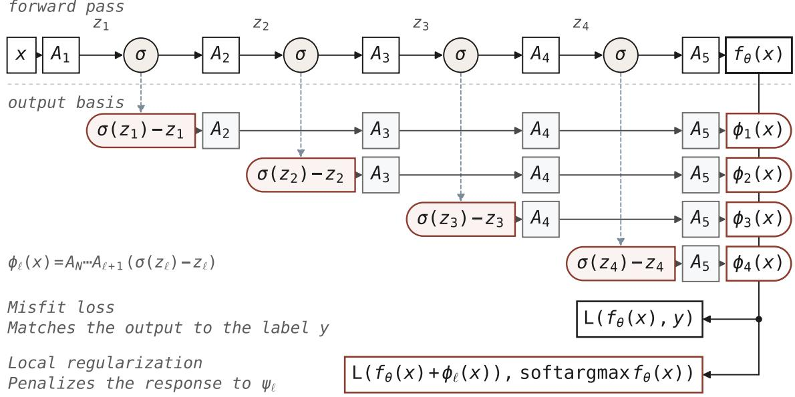
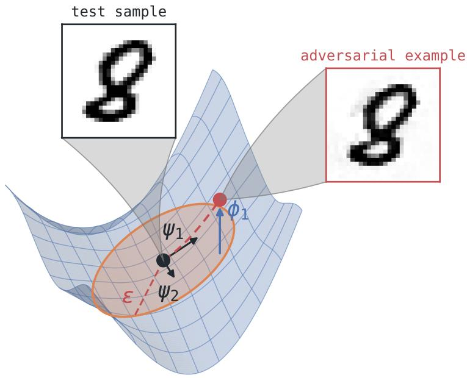
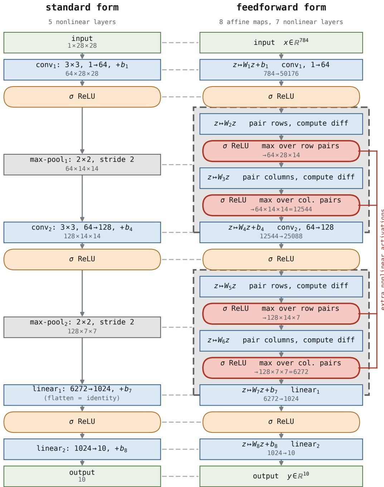
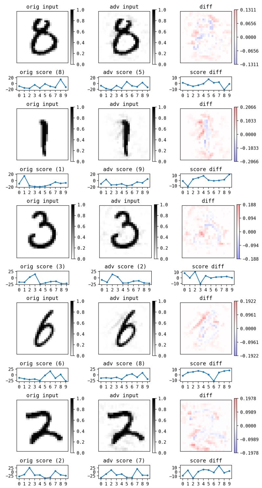
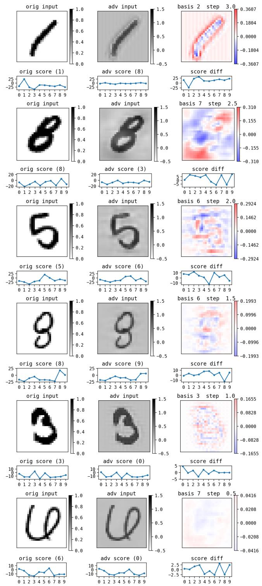
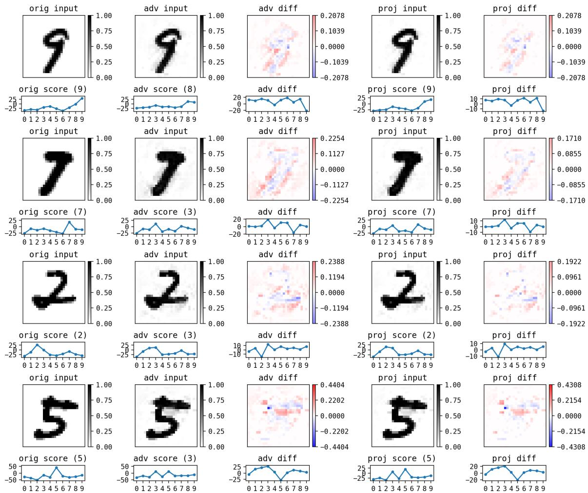
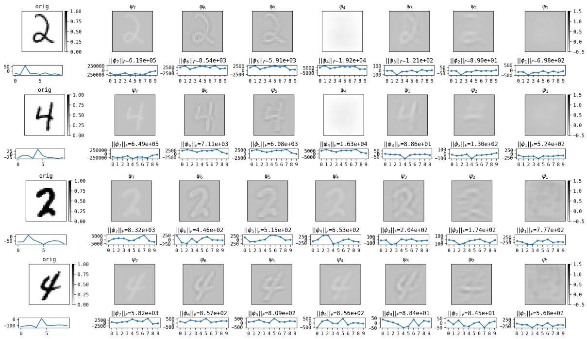

# ADVERSARIAL TRAINING WITHOUT INPUT GRADIENTS VIA LOW-RANK HOUSEHOLDER EXPANSIONS

TIANA C. JOHNSON AND DONSUB RIM

Abstract. This work concerns adversarial training against the small-norm adversarial examples that arise from the inherent input instability of a trained deep neural network. Examples in this class are small as measured in the relative ℓ2-norm, and therefore lie in the neighborhood of the input on which the model acts approximately linearly, the regime in which the perturbation remains imperceptible. We first show that such examples can be computed directly from the trained network parameters, without input gradient iterations, by means of a linearization called the low-rank Householder expansion (LRHE). The expansion describes the composed afine map rather than any individual layer, and the directions it identifies are read from the activation pattern already available in the forward pass. We then propose a simple adversarial training scheme built on this construction. No diferentiation with respect to the input is performed at any point: training requires only additional forward evaluations, with weight parameters updated by the standard backward pass, and the inner maximization of the usual min-max formulation is eliminated entirely. That such a regularizer exists is our main finding: the methods that dispense with the inner search all obtain their local geometry by diferentiating with respect to the input, and we show this is not necessary. The regularizer costs the equivalent of 2.8 PGD steps per epoch, an 8.7ˆ reduction relative to 40-step adversarial training on MNIST and below the cost of 3-step training. The resulting models match three-step PGD adversarial training for relative $\scriptstyle { \dot { \ell } } ^ { 2 }$ budgets $\varepsilon \leqslant 0 . 0 2$ and 40-step training for $\varepsilon \leqslant 0 . 0 1 2$ , falling away beyond, consistent with the locality of the expansion.

## 1. Introduction

The observation that deep neural networks can be made to misclassify inputs altered by perturbations too small to matter to a human observer is now more than a decade old [27, 9], and it has proved remarkably resistant to resolution. The intervening years have produced a large number of proposed defenses and an almost equally large number of demonstrations that they do not work. A survey of defenses presented at a single conference [3] found that the majority relied on obfuscated gradients and could be circumvented once that reliance was recognized, and similar conclusions were reached for later defenses [28]. What has resisted this attrition is adversarial training in the min-max formulation of [15], which augments each parameter update with an inner search for the worst-case perturbation. It has consistently withstood adaptive evaluation, and is the standard against which subsequent proposals are measured [4, 7]. The persistence of the problem is therefore not a matter of an efective defense being unknown, but of its cost.

That cost has a specific and unvarying structure. The inner maximization admits no closed form and is approximated by K steps of projected gradient ascent, each requiring a gradient of the loss with respect to the input, so that adversarial training is roughly K times more expensive than ordinary training. Eforts to reduce this expense fall into three groups. The first reuses computation across updates: perturbations may be carried between minibatches so that the adversarial and parameter updates share a backward pass [23], or the inner loop confined to the first layer through an optimal-control formulation [35]. The second reduces K directly, usually to one, and then repairs the resulting instability; FGSM with random initialization and a cyclic learning rate has been shown to sufice [34], and the catastrophic overfitting that single-step methods exhibit can be prevented by penalizing gradient misalignment [2]. The third dispenses with the inner maximization altogether, replacing it with a penalty on the local geometry of the loss: input-gradient regularization [22], Jacobian regularization [11], curvature regularization [17], and local linearity regularization [18], the last of which explicitly trades a geometric penalty for a reduction in the number of projected gradient descent (PGD) steps. What unites these otherwise dissimilar approaches is that every one of them obtains its information about the network’s local behavior by diferentiating with respect to the input. They difer in how many such derivatives they take, not in whether they take them.

We show that for perturbations of small relative $\ell ^ { 2 }$ norm this is unnecessary. Our starting point is the low-rank Householder expansion (LRHE) introduced in [21]. A ReLU network is piecewise afine. On the region of input space where the activation pattern is constant, the network acts as a single afine map. Concretely, one may write a feedforward ReLU neural network, with the bias terms omitted, as multiplication by the matrix

$$
F = W _ { L } \Sigma _ { L - 1 } W _ { L - 1 } \cdot \cdot \cdot \Sigma _ { 1 } W _ { 1 } ,\tag{1.1}
$$

where each $\Sigma _ { \ell }$ is the diagonal 0–1 matrix recording which units at layer ℓ are active, and $W _ { \ell }$ are weight matrices. A change of activation pattern perturbs the network’s local action by a term of rank one. To see this, fix a layer ℓ and split the product (1.1) on either side of $\Sigma _ { \ell } .$

$$
{ \cal F } = C _ { \ell } \Sigma _ { \ell } B _ { \ell } , \quad C _ { \ell } = W _ { L } \Sigma _ { L - 1 } \cdot \cdot \cdot W _ { \ell + 1 } , \quad B _ { \ell } = W _ { \ell } \Sigma _ { \ell - 1 } \cdot \cdot \cdot \Sigma _ { 1 } W _ { 1 } ,\tag{1.2}
$$

so that $B _ { \ell }$ collects the factors before layer ℓ and $C _ { \ell }$ those after. Suppose the input is displaced across a single activation boundary, so that unit i of layer ℓ changes from active to inactive while every other unit retains its state. Then $\Sigma _ { \ell }$ is replaced by $\Sigma _ { \ell } - e _ { i } e _ { i } ^ { \top }$ where $e _ { i }$ is the i-th standard basis vector, and the matrix representation of the network on inputs in the new region is

$$
F _ { 1 } = C _ { \ell } ( \Sigma _ { \ell } - e _ { i } e _ { i } ^ { \top } ) B _ { \ell } = F - ( C _ { \ell } e _ { i } ) ( B _ { \ell } ^ { \top } e _ { i } ) ^ { \top } .\tag{1.3}
$$

The perturbation is thus rank one, with left factor $C _ { \ell } e _ { i }$ and right factor $B _ { \ell } ^ { \top } e _ { i }$ , i.e. the i-th column of $C _ { \ell }$ and the i-th row of $B _ { \ell } .$ , respectively.

The right factors $B _ { \ell } ^ { \top } e _ { i }$ appearing in (1.3) are vectors in input space, and it is these that determine the directions in which the composed map is sensitive. Note that they are available from the forward pass: $B _ { \ell }$ is the partial composition below layer $\ell ,$ and $e _ { i }$ selects the unit in question. Through (1.3) the efect of activating one unit on the output becomes clear, and no diferentiation with respect to the input is involved at any stage.

The LRHE is derived by exploiting this property further. Substitute $\Sigma _ { \ell }$ as a rank-one perturbation of the identity in the form $I - v _ { \ell } v _ { \ell } ^ { \top }$ , in which $v _ { \ell }$ is a unit vector. Key to this expansion is how $v _ { \ell }$ is found by rewriting the ReLU activation as a Householder reflection. The reflection vectors are not learned and they are computed during the forward pass, and require no diferentiation. The expansion describes the efect of perturbing the hidden states on the composed maps $B _ { \ell }$ or $C _ { \ell }$ rather than any individual layer, so the directions it identifies are those in which the network as a whole amplifies, not those in which an individual weight matrix $W _ { \ell }$ does. It was shown in [21] that adversarial examples found for a tsunami waveform prediction task [20] have significant components along these basis directions.

The present work takes that construction as given and asks a diferent question: whether the subspace it identifies is the one in which adversarial perturbations reside for a classification task, and whether restricting attention to that subspace sufices to train robust models. Two consequences follow. First, adversarial examples in this small-norm class can be constructed directly from the trained parameters, with no input gradient iterations at all. Second, and the subject of the remainder of this work, adversarial training against them reduces to a minimization: the inner search disappears, the network is penalized for its response along a set of directions recomputed at each forward pass, and no derivative with respect to the input is taken at any point during training.

Since LRHE enables the identification of a linear subspace of adversarial perturbation, this can be exploited to reduce the cost of adversarial training by restricting the inner maximization. Our method thus belongs to the third group discussed above, but difers in where its geometric information originates. Curvature, Jacobian, and local-linearity penalties are all measured, each requiring derivative evaluations beyond those of standard training, so that the saving relative to multi-step PGD is real but partial. The expansion instead supplies the relevant subspace algebraically. That such a restriction should be possible at all is suggested by an early observation [29] that adversarial perturbations occupy a contiguous subspace whose dimension is far below that of the input, on the order of tens at MNIST scale. If the adversarially relevant directions are so few, searching the full input space at every step is wasteful. Subspace adversarial training [14] reaches a related conclusion, but extracts its subspace from the optimization trajectory and works in parameter space; ours is determined by the structure of the network at the input in question and lies in input space.

A second distinction separates our approach from the certified robustness literature, where the geometry of a network is controlled by constraining each layer individually. Parseval networks [5], spectral normalization [16], and the orthogonal convolution constructions of [13, 30, 24] all enforce a norm or orthogonality condition on every weight matrix, so that the Lipschitz constant of the composition is bounded by the product of the layerwise bounds; the programme is extended to the activations in [25, 26]. A global guarantee then follows from purely local conditions, and a certificate is obtained as a by-product. The cost is that the product bound is loose. For the map (1.1), the estimate $\begin{array} { r } { \| \boldsymbol { F } \| \leqslant \prod _ { \ell } \| \boldsymbol { W } _ { \ell } \| } \end{array}$ holds with equality only when the dominant singular directions of successive factors align, which they generically do not, and how far the naive bound sits above the true constant is documented in [33, 8]. A network constrained layerwise is thus constrained more tightly than the robustness objective requires, and the excess is paid in expressivity.

Our approach acts on the product rather than on its factors. The expansion is an expansion of $F$ itself, so no layer is required to be orthogonal or norm-bounded, no activation is replaced, and the network is trained in the usual way. We obtain no certificate, since we impose no condition from which one could be derived; what we obtain instead is a description of where the composed map is sensitive that is not conservative by construction. This also underpins the relation to the prior works using Householder reflections [25]. There the Householder structure is imposed: it is a design constraint on the activation, satisfied exactly, and the reflection vectors are trained parameters. Here it is descriptive, read in from a network trained without any direct restrictions. The theorem of [25] is nonetheless a useful independent justification for our choice of basis, since it establishes that Householder reflections are the canonical form for Jacobian transitions across activation boundaries in piecewise linear networks. Our expansion is thus not an arbitrary change of coordinates but one aligned with the intrinsic structure of the map being approximated.

Our experiments on MNIST support the following claims. First, the subspace identified by the expansion is the one in which adversarial perturbations lie: projecting perturbations onto its orthogonal complement reduces attack success from 28.01% to 9.20%, whereas removing a random subspace of the same dimension reduces it only to 25.42% (Section 5). Second, training against these directions costs the equivalent of 2.8 PGD steps per epoch, an 8.7ˆ reduction relative to 40-step adversarial training and less than the cost of 3-step training. Third, over the budget range in which the expansion is descriptive the resulting models match multi-step adversarial training: they match the robustness of 3-step PGD training for relative $\ell ^ { 2 }$ budgets $\varepsilon \leqslant 0 . 0 2$ and of 40-step training for $\varepsilon \leqslant 0 . 0 1 2$ , with multistep training pulling ahead beyond (Section 6). The falling away is consistent with the locality of the expansion, which ceases to describe the network once the perturbation is large enough to leave the afine cell.

We regard this parity as the substantive result. Every method in the third group above obtains its information about the network’s local behavior by diferentiating with respect to the input, and it would be natural to assume that such diferentiation is critical to obtaining that information. The comparison shows otherwise: the geometry is already present in the activation pattern, and a regularizer that never forms an input derivative reaches similar performance as one that forms forty.

We focus our attention on small budgets. The motivation for studying adversarial examples at all rests on the premise that the perturbation is imperceptible, although the budgets now conventional in the literature have evolved well beyond the point where that premise holds. The class we treat is the one the original problem concerned. We state plainly what is not claimed. We do not report state-of-the-art robust accuracy at all budgets, and we provide no certificates. Our experiments are confined to MNIST, and we make no claim that the approximation accuracy required to capture the adversarially relevant subspace, or the budget range over which the expansion remains descriptive, transfers to higher-resolution data.

## 2. Preliminaries

2.1. Adversarial examples. The term adversarial examples refers to a broad class of transformations $T ( x )$ of the input data x that cause an incommensurate change in the deep learning model prediction $f ( T ( x ) )$ when compared to $f ( x )$ . For classification tasks, this change refers to the change in the output classification label from a correct one to an incorrect one. The literature [28] categorizes adversarial examples into the case when $T ( x )$ is small, sometimes referred to as sensitivity adversarial examples, and the case when $T ( x )$ is an admissible family of group actions, called invariance adversarial examples; e.g. geometric distortions like rotation or translation. On the other hand, natural adversarial examples [10] are out-of-distribution samples that arise without any well-defined transformation $T$ and occur in datasets collected without synthetic generation. These examples are not necessarily minuscule perturbations of the original image, nor described straightforwardly by geometric invariance.

This work focuses on the specific subclass defined in terms of the $\ell _ { p } .$ -norm of $T ( x )$ , i.e. the sensitivity adversarial examples in the terminology above. The precise definition follows, with the slight diference that we measure the distance in the relative sense.

Definition 2.1 (Adversarial examples). Given a model $f : \mathbb { R } ^ { n _ { i n } }  \mathbb { R } ^ { n _ { o u t } }$ , and an input $x \in \mathbb { R } ^ { n _ { i n } }$ , the perturbed input $x + \delta x$ is an adversarial example $i f$

$$
\begin{array} { r } { \| \delta x \| _ { p } \leqslant \varepsilon \| x \| _ { p } \quad \ a n d \quad \mathrm { ~ s o f t a r g m a x ~ } f ( x ) \neq \mathrm { s o f t a r g m a x ~ } f ( x + \delta x ) . } \end{array}\tag{2.1}
$$

The notation $\| \cdot \| _ { p }$ denotes the standard $\ell _ { p }$ norm, and we will focus on $p = 2$ throughout this paper, and show some results for $p = \infty$ . Note that in many settings when $p = \infty$ this definition of ε relative to the norm of the input reduces to the absolute ε. For example, for grayscale images in MNIST, $\| x \| _ { \infty } = 1$ or approximately so, reducing the constraint to an absolute one. Note that we separate out the softargmax function from the model $f _ { \cdot }$ , which outputs logits.

More generally, adversarial examples for regression tasks are defined by replacing the misclassification requirement (2.1) with

$$
\| f ( x + \delta x ) \| _ { p } \geqslant \tau \| f ( x ) \| _ { p } ,\tag{2.2}
$$

for some appropriate percentage threshold $\tau _ { \mathrm { { ; } } }$ which is specially selected for each domainspecific dataset and learning task. For example, for the geophysical data set for tsunami waveheight prediction [21], a budget of $\varepsilon = 0 . 0 0 5$ relative change in geodetic measurement input causing $\tau = 0 . 3$ change in surface elevation was considered adversarial, a reasonable assumption due to the stability of the underlying physical processes.

We focus on the case where the model $f$ is a feedforward ReLU neural network. For given $x \in \mathbb { R } ^ { n _ { \mathrm { i n } } }$ the feedforward neural network model is a parametrized family of functions

$$
f _ { \theta } ( x ) = A _ { L } \sigma A _ { L - 1 } \sigma \cdot \cdot \cdot \sigma A _ { 1 } x , \quad A _ { \ell } z = W _ { \ell } z + b _ { \ell } ,\tag{2.3}
$$

where the parameters of the network are $\theta = ( W _ { 1 } , \dots , W _ { L } , b _ { 1 } , \dots , b _ { L } )$ , and σ here is the Rectified Linear Unit (ReLU) activation $\sigma ( z ) = \operatorname* { m a x } \{ 0 , z \}$ for $z \in \mathbb { R }$ . The left-multiplications by $A _ { \ell }$ and $\sigma$ denote application of an afine map and the entry-wise application of a ReLU to the hidden state vector, respectively.

Adversarial examples for a trained neural network $f _ { \theta }$ are found by solving an optimization problem, typically by increasing the misfit loss $\mathcal { L } : \mathbb { R } ^ { n _ { \mathrm { o u t } } } \times \{ 1 , \ldots , C \} \to \mathbb { R } _ { + }$ (e.g. the crossentropy function), while keeping the clean input x and trained weights θ fixed, that is,

$$
\operatorname* { m a x } _ { \| \delta x \| _ { p } \leqslant \varepsilon \| x \| _ { p } } \mathcal { L } ( f _ { \theta } ( x + \delta x ) , y ) .\tag{2.4}
$$

The designated optimization problem and the particular optimization approach is referred to as a threat model. The AutoAttack package [7] implements an accepted benchmark with standard threat models, such as variants of PGD, the Fast Adaptive Boundary attack [6], and the Square attack [1]. To supplement AutoAttack, we have implemented a strong PGD attack with multiple configurations and thousands of iterations [9, 3, 15]. We found that AutoAttack reliably outperformed vanilla PGD attacks, so we report only those results.

2.2. Low-rank Householder expansion (LRHE). In a prior work [21], the feedforward neural network $f _ { \theta }$ was shown to naturally yield an expansion which writes it as a low-rank correction of an afine mapping. Denote the hidden states as

$$
\left\{ \begin{array} { l l } { \quad z _ { 1 } : = W _ { 1 } x + b _ { 1 } , } \\ { z _ { \ell + 1 } : = W _ { \ell + 1 } \sigma z _ { \ell } + b _ { \ell + 1 } , \ell = 1 , 2 , \ldots , L - 1 , } \end{array} \right.\tag{2.5}
$$

then the evaluation of a ReLU σ for a given vector $z _ { \ell } \in \mathbb { R } ^ { n _ { \ell } }$ admits the alternative form

$$
\sigma z _ { \ell } = \frac { 1 } { 2 } ( z _ { \ell } + | z _ { \ell } | ) .\tag{2.6}
$$

The absolute value operation $\left. \cdot \right.$ is an orthogonal transformation on $\mathbb { R } ^ { n _ { \ell } }$ which is a natural candidate to represent as a Householder reflection, a rank-one perturbation of the identity of the form

$$
| z _ { \ell } | = ( I - 2 v _ { \ell } v _ { \ell } ^ { \top } ) z _ { \ell } ,\tag{2.7}
$$

where the vector $v _ { \ell }$ is determined modulo sign by the two conditions

$$
v _ { \ell } \parallel z _ { \ell } - | z _ { \ell } | , \qquad \lVert v _ { \ell } \rVert _ { 2 } = 1 .\tag{2.8}
$$

Inserting this formulation into (2.6) and into the neural network (2.3), we obtain the product

$$
f _ { \theta } ( x ) = A _ { L } ( I - v _ { L - 1 } v _ { L - 1 } ^ { \top } ) A _ { L - 1 } \cdot \cdot \cdot A _ { 2 } ( I - v _ { 1 } v _ { 1 } ^ { \top } ) A _ { 1 } x .\tag{2.9}
$$

Expanding the product on the RHS, one obtains $2 ^ { L - 1 }$ terms. All but the input-independent term $F _ { 0 }$ below are input-dependent and rank one. That is, writing

$$
f _ { \boldsymbol { \theta } } ( x ) = F _ { 0 } x + F _ { \sigma } x ,\tag{2.10}
$$

the afine maps $F _ { 0 }$ and $F _ { \sigma }$ are given by

$$
F _ { 0 } = A _ { L } A _ { L - 1 } \cdot \cdot \cdot A _ { 2 } A _ { 1 } , ~ \mathrm { a n d } ~ F _ { \sigma } = \sum _ { \beta = 1 } ^ { 2 ^ { L - 1 } - 1 } F _ { \beta } ,\tag{2.11}
$$

and every term in the sum $F _ { \sigma }$ over the index $\beta$ is of the form

$$
A _ { L } \cdot \cdot \cdot A _ { \ell + 1 } v _ { \ell } v _ { \ell } ^ { \top } A _ { \ell } \cdot \cdot \cdot A _ { 1 } ,\tag{2.12}
$$

where there is at least one rank-one term $v _ { \ell } v _ { \ell } ^ { \top }$ present as a factor, so the product as a whole is rank-one by the rank inequality for products. Furthermore, the column and row spaces of $F _ { \sigma }$ are each spanned by $L - 1$ vectors,

$$
\begin{array} { r } { W _ { L } \cdot \cdot \cdot W _ { \ell + 1 } v _ { \ell } , \quad \mathrm { ~ a n d ~ } \quad W _ { 1 } ^ { \top } \cdot \cdot \cdot W _ { \ell } ^ { \top } v _ { \ell } , \quad \mathrm { ~ f o r ~ } \ell = 1 , \cdot \cdot \cdot , L - 1 . } \end{array}\tag{2.13}
$$

Here the terms column and row space of the afine map $F _ { \sigma }$ refer to the column and the row space of the linear part of $F _ { \sigma }$ , respectively; similarly the rank of $F _ { \sigma }$ refers to the dimension of the column or row space of $F _ { \sigma }$

Hence the crucial property of this expansion is that the afine transformation $F _ { \sigma }$ has rank at most $L - 1$ , and is therefore low-rank whenever $L - 1$ is small relative to the layer widths. This expansion is called the low-rank Householder expansion (see Theorem 2.4 in [21]).

Definition 2.2. The Low-Rank Householder Expansion (LRHE) of the neural network $f _ { \theta }$ is the expansion given by the substitution of the activation σ after the ℓ-th layer by the rank-one perturbation of the identity $I - v _ { \ell } v _ { \ell } ^ { \top }$ which reads

$$
f _ { \theta } ( x ) = F _ { 0 } ( x ) + F _ { \sigma } ( x ) ,\tag{2.14}
$$

where $F _ { 0 }$ is an input-independent afine transformation and $F _ { \sigma }$ is an input-dependent afine transformation and satisfies rank $( F _ { \sigma } ) \leqslant L - 1$ . The column and row spaces of low-rank afine transformation $F _ { \sigma }$ are

$$
\mathrm { c o l } ( F _ { \sigma } ) = \mathrm { s p a n } \{ W _ { L } W _ { L - 1 } \cdot \cdot \cdot W _ { \ell + 2 } W _ { \ell + 1 } v _ { \ell } \mid \ell = 1 , 2 , \ldots , L - 1 \} ,\tag{2.15}
$$

$$
\operatorname { r o w } ( F _ { \sigma } ) = \operatorname { s p a n } \{ W _ { 1 } ^ { \top } W _ { 2 } ^ { \top } \cdot \cdot \cdot W _ { \ell - 1 } ^ { \top } W _ { \ell } ^ { \top } v _ { \ell } \mid \ell = 1 , 2 , \ldots , L - 1 \} .
$$

For a fixed input x, the representation of a ReLU using a Householder reflection in LRHE reveals a new low-rank structure in $F _ { \sigma }$ that pertains purely to the nonlinear behavior of the neural network, independently from the linear analysis of $F _ { 0 }$ . Note that this representation of the ReLU is distinct from so-called Householder activations [25], whose definition involves Householder reflections.

The core idea motivating this work is the hypothesis that LRHE and adversarial examples are closely related; LRHE provides a way to explain how the adversarial examples can arise [21]. In LRHE the linear part of the input-dependent low-rank term $F _ { \sigma }$ can be factorized into a singular value decomposition of the linear part,

$$
F _ { \sigma } z = b _ { \sigma } + \sum _ { i = 1 } ^ { L - 1 } d _ { i } \zeta _ { i } \xi _ { i } ^ { \top } z , \quad b _ { \sigma } = F _ { \sigma } 0 , \ d _ { i } \in \mathbb { R } _ { + } , \ \zeta _ { i } \in \mathbb { R } ^ { n _ { \mathrm { o u t } } } , \ \xi _ { i } \in \mathbb { R } ^ { n _ { \mathrm { i n } } } .\tag{2.16}
$$

Instability can arise when $d _ { 1 } \gg 1$ even if $F _ { 0 }$ is well-conditioned, so that $\lVert F _ { 0 } \delta x \rVert _ { p } \sim \lVert \delta x \rVert _ { p }$ When the perturbation $\delta x$ is in the direction of $\xi _ { 1 }$ , it is possible to have

$$
\| \delta x \| _ { p } \ll 1 \quad { \mathrm { ~ a n d ~ } } \quad \| F _ { \sigma } \delta x \| _ { p } \gg 1 .\tag{2.17}
$$

This decouples the linear conditioning of $F _ { 0 }$ from the nonlinear conditioning of $F _ { \sigma }$ and of the neural network $f _ { \theta }$

There are previous approaches aimed at making $F _ { 0 }$ well-conditioned via the submultiplicative inequality $\begin{array} { r } { \| F _ { 0 } \| _ { p } \leqslant \prod _ { \ell } \| W _ { \ell } \| _ { p } \lesssim 1 } \end{array}$ considered already in [27], for example by imposing weight decay during training. However, this reduces to penalizing $\| W _ { \ell } \|$ , i.e. weight decay, and standard regularization does not generally lead to adversarial robustness; more sophisticated considerations are necessary, e.g. [25, 26] as discussed in the introduction.

## 3. Adversarial training based on LRHE

3.1. The min-max formulation. Adversarial training [9, 15] refers to training strategies that broaden the scope of the usual empirical risk over the data distribution D

$$
\operatorname* { m i n } _ { \theta } \mathbb { E } _ { ( x , y ) \sim \mathcal { D } } \left[ \mathcal { L } ( f _ { \theta } ( x ) , y ) \right]\tag{3.1}
$$

to cover worst-case or near-worst-case adversarial examples. For example, one takes the minimization problem to be

$$
\operatorname* { m i n } _ { \theta } \mathbb { E } _ { ( x , y ) \sim \mathcal { D } } \left[ \operatorname* { m a x } _ { \| \delta x \| _ { p } \leqslant \varepsilon \| x \| _ { p } } \mathcal { L } ( f _ { \theta } ( x + \delta x ) , y ) \right] .\tag{3.2}
$$

Inner maximization has no explicit solution and is commonly approximated by K steps of projected gradient ascent. Each step requires a gradient of the loss with respect to the input, and the entire cost of adversarial training in excess of ordinary training is the cost of this search. What the search returns, however, is a direction, and in the regime where the network is afine that direction is not arbitrary: the maximizer of the linearized inner objective over $\| \delta x \| _ { p } \leqslant \varepsilon \| x \| _ { p }$ is ε times the unit vector most amplified by the model in the metric induced by the output-space loss gradient. PGD is thus an iterative procedure for locating a direction that is already determined by the local action of the network.

The LRHE supplies such directions directly. Its right factors $\xi _ { 1 } , \dots , \xi _ { L - 1 }$ in the SVD of $F _ { \sigma } \ ( 2 . 1 6 )$ are, by construction, the directions in which the composed map amplifies most strongly, and they are obtained from the activation pattern without any diferentiation with respect to x.

We first motivate our training objective conceptually. The key ingredient is the restriction of the inner maximization of (3.2) by a penalty evaluated on this fixed set of directions by the orthonormal vectors $( \xi _ { \ell } ) _ { \ell } ,$

$$
\operatorname* { m i n } _ { \theta } \ \mathbb { E } _ { ( x , y ) } \Big [ \mathcal { L } \big ( f _ { \theta } ( x ) , y \big ) + \lambda \sum _ { \ell = 1 } ^ { L - 1 } \mathcal { L } ( f _ { \theta } ( x + \varepsilon \xi _ { \ell } ) , \mathrm { s o f t a r g m a x } \ f _ { \theta } ( x ) ) \Big ] ,\tag{3.3}
$$

so that the min-max problem collapses to a minimization. The structure of adversarial training is retained, that is, the model is penalized for its response to perturbations of size $\varepsilon$ in the directions that most afect it. In contrast, the search is eliminated, and with it the K input-gradient computations that dominate its cost.

Following these discussions, we propose a new training procedure based on the LRHE introduced above. A na¨ıve approach would penalize the largest singular value $d _ { 1 }$ of $F _ { \sigma }$ (2.16), however, the direct computation of the SVD of $F _ { \sigma }$ would involve accumulating $2 ^ { L - \bar { 1 } }$ terms in the expansion (2.11), which is prohibitive. Instead, we penalize a basis for the column space of $F _ { \sigma }$ (2.15).

We keep the bias terms in the afine maps, assuming that the large singular values in the linear part of $F _ { \sigma }$ (2.16) make the linear part dominant. The output basis vectors are computed during a forward pass

$$
\phi _ { \ell } ( x ) : = A _ { L } A _ { L - 1 } \cdot \cdot \cdot A _ { \ell + 1 } v _ { \ell } v _ { \ell } ^ { \top } A _ { \ell - 1 } \sigma \cdot \cdot \cdot \sigma A _ { 1 } x . \qquad \ell = 1 , \ldots , L - 1 .\tag{3.4}
$$

The vector $\phi _ { \ell }$ has the alternative expression,

$$
\phi _ { \ell } ( x ) = A _ { L } A _ { L - 1 } \cdot \cdot \cdot A _ { \ell + 1 } ( \sigma z _ { \ell } - z _ { \ell } ) , \quad \ell = 1 , \ldots , L - 1 .\tag{3.5}
$$

The input basis, i.e. the basis for the row space in (2.15), is computed by reversing the computation for the output basis $\phi _ { \ell } \ ( 3 . 5 )$ ，

$$
\psi _ { \ell } ( x ) = W _ { 1 } ^ { \top } W _ { 2 } ^ { \top } \cdot \cdot \cdot W _ { \ell - 1 } ^ { \top } W _ { \ell } ^ { \top } ( \sigma z _ { \ell } - z _ { \ell } ) , \quad \ell = 1 , \ldots , L - 1 .\tag{3.6}
$$

This computation gives us the row and column basis of $F _ { \sigma }$ modulo the bias terms; the output basis is computed with the afine maps and therefore lies in col $( F _ { \sigma } )$ only modulo the bias ofset, whereas the input basis is exact. Neither basis coincides with the singular vectors of $F _ { \sigma }$ , however. Note the discussion on their relation in [21] which shows the singular vectors can be estimated empirically by a sparse sampling of the terms in the sum (2.11).

Finally, we approximate the response of perturbing the input by $\varepsilon \xi _ { i }$ in (3.3) via the approximation

$$
f _ { \theta } ( x + \varepsilon \xi _ { \ell } ) - f _ { \theta } ( x ) \approx \varepsilon ( F _ { 0 } + F _ { \sigma } ) \xi _ { \ell } ,\tag{3.7}
$$

via the nonlinear part $F _ { \sigma }$ of LRHE, and based on our discussion regarding how the adversarial examples can arise from the viewpoint regarding (2.16), our priority is to suppress the dominant term

$$
d _ { \ell } \zeta _ { \ell } + b _ { \sigma } = F _ { \sigma } \xi _ { \ell } \gg F _ { 0 } \xi _ { \ell } ,\tag{3.8}
$$

that ${ \mathrm { i s } } ,$ the singular values $d _ { \ell }$ and the corresponding left singular vectors $\zeta _ { \ell }$ . As already mentioned, these are hard to compute directly, hence we compute $( \phi _ { \ell } ) _ { \ell }$ instead. From this alternative, we want to penalize the change

$$
\| f _ { \theta } ( x + \varepsilon \xi _ { \ell } ) - f _ { \theta } ( x ) \| _ { p } \lesssim \varepsilon d _ { \ell } \| \zeta _ { \ell } \| _ { p }\tag{3.9}
$$

forward pass

  
Figure 1. Diagram of a forward pass that computes the output basis $( \phi _ { \ell } ) _ { \ell }$ (3.5). The computation of the output basis involves additional partial forward passes that omit the nonlinearities. The output basis is then used in the regularization term R (3.12) to penalize large changes in the output logits in the direction of the output basis.

indirectly by penalizing the size of $\phi _ { \ell } .$ . For classification tasks, it is natural to penalize the deviation $f _ { \theta } ( x ) + \gamma \phi _ { \ell }$ so long as the label does not change, leading to the penalization

$$
\mathcal { L } ( f _ { \theta } ( x ) + \gamma \phi _ { \ell } , \mathrm { s o f t a r g m a x } f _ { \theta } ( x ) ) ,\tag{3.10}
$$

with some scaling $\gamma .$

Putting it all together, we propose our adversarial training as the regularized problem

$$
\operatorname* { m i n } _ { \theta } \mathbb { E } _ { ( x , y ) \sim \mathcal { D } } \left[ \mathcal { L } ( f _ { \theta } ( x ) , y ) + \lambda \mathcal { R } ( \theta , x ; \gamma ) \right] ,\tag{3.11}
$$

where the regularization term penalizes the change in the final prediction,

$$
\mathcal { R } ( \theta , x ; \gamma ) = \sum _ { \ell = 1 } ^ { L - 1 } \mathcal { L } \big ( f _ { \theta } ( x ) + \gamma \phi _ { \ell } , \mathrm { s o f t a r g m a x } f _ { \theta } ( x ) \big ) , \quad \gamma \in ( - 1 , 1 ) ,\tag{3.12}
$$

where $\lambda$ and $\gamma$ are hyper-parameters.

The computation of these bases $( \phi _ { \ell } ) _ { \ell }$ and $( \psi _ { \ell } ) _ { \ell }$ is straightforward; one computes the diference of the pre- and post-activation-states, then applies all the subsequent afine layers to obtain the output basis, or all the preceding transposed weights for the input basis.

During training of the regularized problem (3.11), $f _ { \theta }$ is evaluated as usual until the $\ell -$ th layer, then only the afine mappings are applied in the subsequent layers omitting the nonlinearities. This propagates the nonlinear correction $\sigma z _ { \ell + 1 } - z _ { \ell + 1 }$ through the subsequent layers. At each gradient computation, only one forward and one backward pass are required. The cost of forward evaluation of this regularizer is $\mathcal O ( L )$ times the standard evaluation of the forward model $f _ { \theta } .$ , and one backward pass is required to compute the gradient of the loss function with respect to $\theta$ during training. For models with $L$ not too large, however, minimizing the objective (3.11) is more eficient than the standard adversarial training (3.2) which would require multiple forward-backward passes with respect to both parameters θ and input x within the inner-max-loop (PGD iterations).

  
Figure 2. An illustration relating LRHE input basis to adversarial examples. The surface denotes the model logit output for the incorrect class, which increases quickly in one of the input-basis directions. In the linear regime, when the input is perturbed in the direction of $\psi _ { 1 }$ the logit changes in the direction of $\phi _ { 1 }$ resulting in a misclassification.

Figure 1 depicts a diagram showing the flow of computation for the output basis $( \phi _ { \ell } ) _ { \ell }$ and the regularization term.

3.2. Remarks on the training procedure. Let us discuss the design of this regularizer. In the LRHE in Definition 2.2, the input and output bases are coupled via the inputdependent afine map $F _ { \sigma }$ . If these bases are indeed closely related to adversarial examples as surmised in Section 2.2, then the adversarial examples occur because a perturbation ψ P span $( \psi _ { \ell } ) _ { \ell }$ causes the output $f _ { \boldsymbol { \theta } } ( \boldsymbol { x } + \boldsymbol { \psi } )$ to have a significant component in span $\{ \phi _ { \ell } \} _ { \ell }$ . In other words,

$$
\begin{array} { r } { \phi _ { * } = \mathrm { a r g m i n } _ { \phi \in \mathrm { s p a n } ( \phi _ { \ell } ) _ { \ell } } \| f _ { \theta } ( x + \psi ) - f _ { \theta } ( x ) - \phi \| _ { p } } \end{array}\tag{3.13}
$$

would form the main component of the output perturbation that causes misclassification. Figure 2 shows an illustration of the input and output basis and their roles in increasing the logit of an incorrect class.

Note that the computation of $\phi _ { \ell }$ involves not just the weights of a single layer, but their compositions. The regularization controls the stability of the composed mappings

$$
A _ { L } A _ { L - 1 } \cdot \cdot \cdot A _ { \ell + 1 } \qquad \mathrm { f o r } \ \ell = 1 , 2 , \ldots , L - 1 ,\tag{3.14}
$$

rather than the behavior of the individual $A _ { \ell } .$ , or the usual per-layer weight norm $\| W _ { \ell } \|$

Additional diferences of the proposed approach (3.11) from the standard adversarial training (3.2) should be acknowledged. The LRHE directions depend on the input and the network but not on the label: they describe where the map is sensitive, not where the decision boundary is nearest. The perturbations we penalize are therefore not adversarial in the strict sense of maximizing the loss, and the correspondence between the two objectives is exact only to the extent that loss-increasing directions coincide with amplifying ones. Moreover, projected gradient ascent is free to follow the loss surface across activation boundaries, whereas the expansion describes a single afine cell close to the input.

The mechanics of the training proposed above are very general and flexible; the formulation (3.11) is merely the most straightforward of numerous possibilities. As explained already, the computation of the output basis used in the regularization term (3.12) is made up of two simple steps: (1) compute the diference between the states before and after the activation, then (2) apply all the subsequent layers while omitting the activation. To compute the input basis, simply apply the transposes of all the preceding layers while ignoring the activations. These operations generalize to other architectures that are not feedforward, for example, to architectures with attention layers [32]. While this manuscript focuses on adversarial training that exploits the output basis only, similar training strategies can be derived using the input basis. Another important consideration is that, if small-norm adversarial examples are not present, the input basis can represent the directions along which the output varies most sensitively. Due to the ease with which the input basis can be computed, the basis can be useful for sensitivity analysis of deep learning models.

## 4. Convolutional Neural Network for MNIST

We perform experiments using the MNIST data set. This section describes the model and the attack used throughout, and then treats a preliminary that the expansion requires: max-pooling layers must be rewritten before the LRHE can be computed for a convolutional network.

4.1. Clean training and adversarial examples. To prepare our experiments, we train a convolutional neural network (CNN) using standard training. The architecture is two convolutional layers, each followed by ReLU and two-dimensional max-pooling, and then two linear layers. The hyperparameters for each layer are

‚ Convolutional layer 1: 1 input channel, 64 output channels

‚ 2D max-pooling layer 1: stride 2, kernel size 2

‚ Convolutional layer 2: 64 input channels, 128 output channels

‚ 2D max-pooling layer 2: stride 2, kernel size 2

‚ Linear layer 1: input dim. 128 ¨ 7 ¨ 7 “ 6272, output dim. 1024

‚ Linear layer 2: input dim. 1024, output dim. 10.

A diagram depicting this architecture is shown in Figure 3. We use the cross entropy loss and train with the Adam optimizer [12] at learning rate 1e-3 for 20 epochs. The trained model achieves 99.48% test accuracy.

We conduct attacks on this model, at the relative norm sizes of Definition 2.1, with AutoAttack [7]. All hyperparameters of the ensemble are fixed, so no tuning is performed on our behalf, and the model is deterministic at inference, so the standard version of the ensemble is the appropriate one. The ensemble attack raised none of its automatic warnings regarding the reliability of the evaluation. For example, at a relative $\ell ^ { 2 }$ radius of $\varepsilon = 0 . 0 7 5$ the ensemble reduced the accuracy of the clean model to 88.40%. We report the attack result for the clean model below in Section 6, in Table 2.

  
Figure 3. A diagram of the CNN architecture used for the MNIST experiments (left). The feedforward form of the same architecture, where the max-pooling layers are converted into a ReLU network, is shown alongside (right). Four new ReLUs are added to the feedforward form, which implies additional output basis vectors $\phi _ { \ell }$ will be computed.

To confirm that the attack above is not merely a weak one, we additionally attack the clean model with 20 runs of 1,000 PGD iterations. These parameters difer somewhat from those used commonly in the $\ell ^ { \infty }$ case; our hyperparameter exploration found that large PGD step sizes yielded more examples. The attack had a success rate of 9.79% at a relative $\ell ^ { 2 }$ radius of $\varepsilon = 0 . 1$ . This is significantly weaker than the 28.01% success rate of AutoAttack, but comparable to the 11.08% that AutoAttack achieves at the smaller budget $\varepsilon = 0 . 0 7 5$

Some of the adversarial examples found are shown in Figure 4. They are considerably smoother than the $\ell ^ { \infty }$ -norm adversarial examples obtained at larger ε [9], and appear as though the original hand-written digits had been written in pencil and then smudged, a plausible physical scenario that can occur in real data.

Computing the LRHE for this model is not immediate, because the expansion presumes a particular form of the network. We require the model in feedforward form, by which we mean a strict alternation of afine maps and a single pointwise nonlinearity (2.3), where each $A _ { \ell }$ is afine and $\sigma$ acts entrywise. The expansion of Section 2.2 is built directly on this structure: the correction $\sigma ( z _ { \ell } ) - z _ { \ell }$ is defined relative to the pre-activation $z _ { \ell }$ of each nonlinear layer, and the basis functions $\psi _ { \ell }$ are obtained by propagating that correction through the remaining afine maps. A layer that is neither afine nor a pointwise application of σ therefore has no place in the expansion until it is rewritten.

For most of the architecture above this requirement is already met. Fully-connected and convolutional layers are afine in the input and are absorbed into a single $A _ { \ell } ;$ strides, padding, and channel mixing change the matrix but not its afineness. Average pooling is likewise afine and would need no special treatment. Max-pooling is the only component of the standard CNN that is not afine, and it is the subject of the remainder of this section.

4.2. Max-pooling layers in feedforward form. There are several admissible ways of rewriting a max-pooling layer in feedforward form. We adopt the one that expresses the pairwise maximum as a single nonlinear layer, and then build the pooling operator by composition. Both of the representations below rest on elementary properties of σ. The first recovers a linear passthrough from a nonlinearity,

$$
z \ = \ \sigma ( z ) - \sigma ( - z ) \qquad { \mathrm { f o r ~ a l l ~ } } z \in \mathbb { R } ,\tag{4.1}
$$

and is what allows a coordinate to survive a nonlinear layer unchanged; it costs two rows rather than one, since the network form (2.3) admits no skip connections. The second expresses the maximum as a shifted rectifier,

$$
\operatorname* { m a x } ( a , b ) = a + \sigma ( b - a ) .\tag{4.2}
$$

Combining (4.1) and (4.2) with $a = x _ { 1 }$ and $b = x _ { 2 }$ gives the representation

$$
\mathrm { m a x } ( x _ { 1 } , x _ { 2 } ) = \left[ 1 \quad - 1 \quad 1 \right] \sigma \left( \left[ { \begin{array} { l l } { 1 } & { 0 } \\ { - 1 } & { 0 } \\ { - 1 } & { 1 } \end{array} } \right] \left[ x _ { 2 } \right] \right) ,\tag{4.3}
$$

which is exact for all $x _ { 1 } , x _ { 2 } \in \mathbb { R }$ . Reading the three rows of the inner matrix in turn, the pre-activations are $z = ( x _ { 1 } , - x _ { 1 } , x _ { 2 } - x _ { 1 } )$ , so the outer row vector forms

$$
\sigma ( x _ { 1 } ) - \sigma ( - x _ { 1 } ) + \sigma ( x _ { 2 } - x _ { 1 } ) \ = \ x _ { 1 } + \sigma ( x _ { 2 } - x _ { 1 } ) \ = \ \operatorname * { m a x } ( x _ { 1 } , x _ { 2 } ) ,\tag{4.4}
$$

where the first two terms collapse by (4.1) and the remainder is (4.2). The first two rows carry $x _ { 1 }$ past the nonlinearity; only the third performs the comparison.

This representation is not unique. For example, note that in a CNN the input to a pooling layer is the output of a ReLU, hence nonnegative, and the passthrough may then

  
Figure 4. Adversarial examples found for the standard CNN model using PGD with relative $\ell ^ { 2 }$ norm $\varepsilon = 0 . 1$

be had for a single row rather than two. For $x _ { 1 } , x _ { 2 } \geqslant 0$ we have $x _ { 1 } = \sigma ( x _ { 1 } )$ , and (4.2) gives the two-row representation

$$
\begin{array} { r } { \operatorname* { m a x } ( x _ { 1 } , x _ { 2 } ) = \left[ 1 \quad 1 \right] \sigma \left( \left[ \begin{array} { l l } { 1 } & { 0 } \\ { - 1 } & { 1 } \end{array} \right] \left[ x _ { 1 } \right] \right) , } \end{array}\tag{4.5}
$$

with pre-activations $z = ( x _ { 1 } , x _ { 2 } - x _ { 1 } )$ . This is a more economical form, but we use (4.3) in practice without assuming the pooling layers’ input is known to be nonnegative. One may also choose a symmetric version of (4.2); we do not explore these options here.

The pooling operator itself is assembled from these pairwise maxima. Let P denote the patch-extraction operator that gathers, for each output position, the s inputs lying in its pooling window. For non-overlapping windows P is a permutation followed by a reshape; for stride smaller than the window it duplicates entries. In either case P is linear, and is absorbed into the adjacent afine map at no cost. The pooling layer is then the s-way maximum applied independently to each extracted window. Such a maximum is obtained by composing pairwise maxima in a balanced binary tree, requiring $s - 1$ applications of (4.3) arranged in $\lceil \log _ { 2 } s \rceil$ successive nonlinear layers. All windows of a given feature map are processed in parallel, so the maxima at a common depth of the tree occupy a single layer of (2.3) whose width is the sum over windows. For the usual $s = 2$ the tree has depth one, and pooling along a single axis costs exactly one nonlinear layer.

Two-dimensional pooling reduces to this case, since the maximum over an $s \times t$ window is separable, i.e. max1ďiďs, 1ďjďt $x _ { i j } = \mathrm { m a x } _ { 1 \leqslant i \leqslant s } ( \mathrm { m a x } _ { 1 \leqslant j \leqslant t } x _ { i j } )$ , so the layer is realised by applying the one-dimensional construction along each axis in turn, with a permutation between the two stages that is again absorbed into the intervening afine map. For the standard $2 \times 2$ window this gives two nonlinear layers, one per axis, and hence three afine maps $A _ { \ell }$ in the alternating form (2.3). In the assembled network the outer two of these merge with the afine maps of the preceding and following layers, so the net efect of a $2 \times 2$ max-pool is to insert two applications of $\sigma .$ . Equivalently, one may treat the st window entries as a single flat tree of depth $\left\lceil \log _ { 2 } s t \right\rceil$ , which for the window sizes in common use coincides with the separable count and is never larger.

Figure 3 shows a diagram of the feedforward form.

The width of the resulting layers can be counted. Let the input to the pooling layer have $C$ channels and spatial extent $H \times W$ , with a non-overlapping $2 \times 2$ window. Using (4.3), the first stage produces $C H ( W / 2 )$ maxima at three rows each, for a pre-activation width of ${ \overset { 3 } { 2 } } C H W ;$ the second stage produces $C ( H / 2 ) ( W / 2 )$ maxima, for a width of ${ \scriptstyle { \frac { 3 } { 4 } } } C H W$ . The pooling layer in the general form (4.3) would cost ${ \scriptstyle { \frac { 9 } { 4 } } } C H W$ pre-activations in total, against CHW entering it. Using (4.5) would reduce the total to ${ \overset { 3 } { 2 } } C H W$ , a third less.

Both (4.3) and (4.5) are identities, not approximations. The rewritten network computes precisely the same function as the original CNN, and no retraining is required. Only the representation changes, and with it the number of nonlinear layers used in the expansion. Each nonlinear layer introduced by a pooling operator carries its own correction and therefore contributes an additional basis function $\psi _ { \ell } ;$ a network with two $2 \times 2$ pooling layers gains four basis functions, which is counted towards L of Section 2.2.

## 5. LRHE basis results

5.1. LRHE basis attack. We explore the relation between the LRHE input basis $( \psi _ { \ell } ) _ { \ell }$ and adversarial examples.

<table><tr><td rowspan=1 colspan=1>α</td><td rowspan=1 colspan=1>Adv. acc.</td></tr><tr><td rowspan=1 colspan=1>0.5</td><td rowspan=6 colspan=1>99.04 (0.44)98.84 (0.64)98.70) (0.78)98.16 (1.32)97.90 (1.58)96.45(3.03)</td></tr><tr><td rowspan=1 colspan=1>1.0</td></tr><tr><td rowspan=1 colspan=1>1.5</td></tr><tr><td rowspan=1 colspan=1>2.0</td></tr><tr><td rowspan=1 colspan=1>2.5</td></tr><tr><td rowspan=1 colspan=1>3.0</td></tr><tr><td rowspan=1 colspan=1>Total</td><td rowspan=1 colspan=1>91.69(7.79)</td></tr></table>

Table 1. Adversarial accuracy of the clean model after LRHE basis attack for each step-size α (5.1). Diference from clean accuracy of 99.48% is in the parentheses.

First, we test if the input perturbations using the basis functions themselves directly lead to adversarial examples, by perturbing the clean model

$$
f _ { \theta } \left( x \pm \alpha \cdot \varepsilon \| x \| _ { p } \cdot { \frac { \psi _ { \ell } } { \| \psi _ { \ell } \| _ { p } } } \right) , \quad \ell = 1 , 2 , \ldots , L - 1 ,\tag{5.1}
$$

for step-sizes $\alpha = 0 . 5 , 1 , 1 . 5 , \ldots , 3 . 0$ , with $\varepsilon = 0 . 1$ and checking whether the predicted label switches to an incorrect one. We do not clip the resulting perturbed input to the range r0, 1s since that would alter the linear scaling with respect to $\alpha ,$ so the final values veer outside of the unit interval by a small amount.

This LRHE basis attack had a success rate of 7.79% as shown in Table 1, showing that these basis functions are indeed related to directions in the input space that the model is sensitive with respect to. Larger α’s tend to yield more examples, which is to be expected. To ascertain that this is a significant success rate, we conduct the same experiment with $\alpha \leqslant 3 . 0$ and random vectors in place of $\psi _ { \ell } ,$ and find a median success rate of 1.88% (max 1.96%, min 1.81%, five diferent trials).

This shows that LRHE input basis functions span a linear space of perturbations that are significantly adversarial. On the other hand, this attack result is not as strong as AutoAttack which had a success rate of 28.01% for the range α $\leqslant 1 . 0$ (see Table 2 below).

5.2. Projection to the orthogonal complement of LRHE basis. Next, we check if the LRHE input basis $( \psi _ { \ell } ) _ { \ell }$ can be used to remove the adversarial efects from examples discovered through AutoAttack. We form an orthogonal matrix by forming the matrix Ψ whose columns are made up of the LRHE input basis, then taking the QR factorization to obtain the matrix $\widehat { \Psi }$ with orthonormal columns,

$$
\Psi : = [ \psi _ { 1 } \mid \cdots \mid \psi _ { L - 1 } ] , \quad \widehat { \Psi } R = \Psi , \quad \widehat { \Psi } ^ { \top } \widehat { \Psi } = I .\tag{5.2}
$$

For each adversarial example $\delta x .$ we compute the projected version $\delta x _ { \mathrm { p r o j } }$

$$
\begin{array} { r } { \delta x _ { \mathrm { p r o j } } = \mathrm { c l i p } _ { [ 0 , 1 ] } ( ( I - \widehat { \Psi } \widehat { \Psi } ^ { \top } ) \cdot \delta x ) , } \end{array}\tag{5.3}
$$

then check if these examples are still adversarial. After projections, a majority of the adversarial examples no longer switched the predicted labels, that is, the projected perturbations were no longer adversarial. For the projected examples, the adversarial success rate fell to 9.20% from 28.01%, about a third. To check that this correction is significant, we conduct the same experiment with a random orthogonal basis, and find median success rate 25.42% (max. 25.45%, min. 25.34%, five diferent trials). A sample of these projection test results is shown in Figure 6. Note that a similar test was performed for the regression task in [21].

  
Figure 5. LRHE basis attack results. Six adversarial examples found for varying step-size α. The original image and correctly predicted label is shown, alongside the perturbed input and the perturbation. The corresponding logit scores and the changes are also shown below the examples.

  
Figure 6. Orthogonal complement projection of adversarial examples leads to corrections. Original test image, the adversarial example, and the projected example are shown, along with the diferences. Output logit scores and corresponding changes are also shown.

## 6. Adversarial training results

6.1. Training heuristics. The regularized training objective (3.11) requires more finetuning compared to the standard objective involving only the misfit loss. Straightforward Adam optimizer with standard fixed choices for λ and $\gamma$ resulted in improved adversarial robustness but test accuracy was 1–2% lower than that of the original model. As the regularized problem has new hyper-parameters $\lambda$ and $\gamma _ { : }$ , we tune them to achieve better results. As for the hyper-parameter $\gamma _ { : }$ , it is sampled randomly from a uniform distribution at each iteration, $\gamma _ { k } \sim \mathcal { U } [ - 1 , 1 ]$ . Note that $\gamma$ is not to be confused with the budget $\varepsilon ;$ it is a dimensionless scale on $\phi _ { \ell }$ and not a perturbation radius. The regularization parameter λ is updated at each Adam iteration to be adjusted from its base value $\lambda _ { \mathrm { b a s e } } = 1 { \tt e } ^ { - 2 }$ , that is,

  
Figure 7. LRHE input and output bases for original and adversarially trained models. Top two examples are from the LRHE of the original model, and bottom two examples from the adversarially trained model.

at iteration k,

$$
\lambda _ { k } : = { \frac { { \mathcal { L } } ( f _ { \theta _ { k } } ( x ) , y ) } { { \mathcal { R } } ( \theta _ { k } , x ; \gamma _ { k } ) } } \cdot \lambda _ { \mathrm { b a s e } }\tag{6.1}
$$

so that the two terms are roughly at the same scale during training. This adjustment is done before the backward pass computation.

We also deploy a fixed decay rate scheduler MultiplicativeLR implemented in PyTorch, which reduces the learning rate by factor=0.9 every two epochs. We run up to 70 epochs of Adam optimizer, and select the model with the best validation accuracy amoung 25 diferent random initializations. The trained model achieves test accuracy of 99.53%, on par with the original model.

To provide a comparison with adversarial examples with bounded ℓ8-norms we set $\varepsilon =$ 0.05, the level at which the adversarial accuracy of the original model is similar to our setting. The threat model is again AutoAttack, which yielded stronger attack results than our own PGD attack which had the configuration 25 runs of PGD attack with 500 iterations with step-size 0.01 plus 25 runs of PGD attack with 500 iterations and step-size 0.005.

6.2. Adversarial robustness results. To illustrate the efect of the adversarial training, we compare the input and output basis of the clean model and adversarially trained model. The norm of the output basis is significantly smaller in the case of the regularized model, by two orders of magnitude; see Figure 7 for a sample of LRHE input and output basis.

The adversarial training results are shown in Table 2.

<table><tr><td></td><td></td><td>Original</td><td></td><td>LRHE-AT</td><td></td><td>PGD-40-AT</td><td></td><td>PGD-3-AT</td><td></td></tr><tr><td></td><td>Test</td><td>99.48</td><td></td><td>99.53</td><td></td><td>99.46</td><td></td><td>99.43</td><td></td></tr><tr><td></td><td>ε = 0.002</td><td>99.45</td><td>0.03)</td><td>99.48</td><td>0.05)</td><td>99.40</td><td>0.06)</td><td>99.34</td><td>0.09)</td></tr><tr><td></td><td>ε = 0.004</td><td>99.42</td><td>0.06)</td><td>99.40</td><td>0.13)</td><td>99.36</td><td>0.10)</td><td>99.31</td><td>0.12)</td></tr><tr><td></td><td>ε = 0.006</td><td>99.34</td><td>0.14)</td><td>99.38</td><td>0.15)</td><td>99.28</td><td>0.18)</td><td>99.26</td><td>0.17)</td></tr><tr><td>-[ a-d&#x27;..</td><td>ε = 0.008</td><td>99.25</td><td>0.23)</td><td>99.31</td><td>0.22)</td><td>99.25</td><td>0.21)</td><td>99.25</td><td>0.18)</td></tr><tr><td></td><td>ε = 0.010</td><td>99.17</td><td>0.31)</td><td>99.27</td><td>0.26)</td><td>99.20</td><td>0.26)</td><td>99.19</td><td>0.24)</td></tr><tr><td></td><td>ε = 0.012</td><td>99.10</td><td>0.38)</td><td>99.20</td><td>0.33)</td><td>99.16</td><td>0.30)</td><td>99.17</td><td>0.26)</td></tr><tr><td></td><td>ε = 0.014</td><td>98.96</td><td>0.52)</td><td>99.13</td><td>0.40)</td><td>99.14</td><td>0.32)</td><td>99.10</td><td>0.33)</td></tr><tr><td></td><td>ε = 0.016</td><td>98.84</td><td>0.64)</td><td>99.09</td><td>0.44)</td><td>99.12</td><td>0.34)</td><td>99.06</td><td>0.37)</td></tr><tr><td></td><td>ε = 0.018</td><td>98.71</td><td>0.77)</td><td>99.01</td><td>0.52)</td><td>99.08</td><td>0.38)</td><td>98.99</td><td>0.44)</td></tr><tr><td></td><td>ε = 0.020</td><td>98.63</td><td>0.85)</td><td>98.97</td><td>0.56)</td><td>99.02</td><td>0.44)</td><td>98.96</td><td>0.47)</td></tr><tr><td></td><td>ε = 0.025</td><td>98.28</td><td>1.20)</td><td>98.83</td><td>0.70)</td><td>98.89</td><td>0.57)</td><td>98.86</td><td>0.57)</td></tr><tr><td></td><td>ε = 0.050</td><td>95.47</td><td>4.20)</td><td>97.50</td><td>2.03)</td><td>98.10</td><td>1.36)</td><td>97.93</td><td>1.50)</td></tr><tr><td></td><td>ε = 0.075</td><td>88.40</td><td>(11.08)</td><td>94.94</td><td>4.59)</td><td>96.64</td><td>2.82)</td><td>96.15</td><td>3.28)</td></tr><tr><td></td><td>ε = 0.100</td><td>71.47</td><td>(28.01)</td><td>88.47</td><td>(11.06)</td><td>93.69</td><td>5.77)</td><td>92.75</td><td>6.68)</td></tr><tr><td></td><td>ε = 0.125</td><td>44.58</td><td>(54.90)</td><td>77.57</td><td>(21.96)</td><td>87.58</td><td>(11.88)</td><td>85.68</td><td>(13.75)</td></tr><tr><td></td><td>ε = 0.150</td><td>17.54</td><td>(81.94)</td><td>60.33</td><td>(39.20)</td><td>76.03</td><td>(23.43)</td><td>72.53</td><td>(26.90)</td></tr><tr><td></td><td>ε = 0.010</td><td>98.91</td><td>0.57)</td><td>99.12</td><td>0.41)</td><td>99.17</td><td>0.29)</td><td>99.15</td><td>0.28)</td></tr><tr><td>adv</td><td>ε = 0.025</td><td>97.22</td><td>2.26)</td><td>98.50</td><td>1.03)</td><td>98.73</td><td>0.73)</td><td>98.71</td><td>0.72)</td></tr><tr><td></td><td>ε = 0.050</td><td>90.32</td><td>9.16)</td><td>95.46</td><td>4.07)</td><td>97.44</td><td>2.02)</td><td>97.34</td><td>2.09)</td></tr><tr><td>8</td><td>ε = 0.075</td><td>66.56</td><td>(32.92)</td><td>87.55</td><td>(11.98)</td><td>94.91</td><td>4.55)</td><td>93.99</td><td>5.44)</td></tr><tr><td></td><td>ε = 0.100</td><td>25.00</td><td>(74.48)</td><td>70.05</td><td>(29.48)</td><td>88.67</td><td>(10.79)</td><td>86.47</td><td>(12.96)</td></tr><tr><td></td><td>ε = 0.125</td><td>2.52</td><td>(96.96)</td><td>40.73</td><td>(58.80)</td><td>74.61</td><td>(24.85)</td><td>68.71</td><td>(30.72)</td></tr><tr><td></td><td>ε = 0.150</td><td>0.00</td><td>(99.48)</td><td>12.57</td><td>(86.96)</td><td>47.76</td><td>(51.70)</td><td>38.42</td><td>(61.01)</td></tr></table>

Table 2. Adversarial accuracy (percentage) under relative $\ell ^ { 2 }$ perturbations $( \| \delta x \| _ { 2 } \leqslant \varepsilon \| x \| _ { 2 } ;$ with $\| x \| _ { 2 } \approx 9 . 2$ on MNIST, $\varepsilon = 0 . 1 5 0$ corresponds to an absolute radius $\| \delta x \| _ { 2 }$ of « 1.4) and under $\ell ^ { \infty }$ perturbations. All defended models were trained at $\varepsilon \ = \ 0 . 0 7 5$ in the relative $\ell ^ { 2 }$ norm; the $\ell ^ { \infty }$ block therefore measures cross-norm transfer. Parenthesized values give accuracy lost relative to each model’s own clean accuracy.

6.2.1. Clean accuracy. Table 2 reports clean test accuracy alongside adversarial accuracy under both norms. The four models reach 99.48% for the unregularized baseline, 99.53% for the LRHE-regularized model, 99.46% for 40-step and 99.43% for 3-step adversarial training. These are separated by at most ten test examples, so the ordering is inconclusive. The loss of clean accuracy that adversarial training is sometimes reported to incur [31] is not visible at this scale, though this is potentially because MNIST clean accuracy is saturated. All four models attain clean accuracy above 99.4%, and we therefore confine the comparison to adversarial accuracy.

6.2.2. The small-budget regime. At small perturbation budgets the regularized model matches both PGD configurations. Under relative $\ell ^ { 2 }$ perturbations at $\varepsilon = 0 . 0 1 0$ it retains 99.27% against 99.20% for 40-step and 99.19% for 3-step training; at $\varepsilon = 0 . 0 2 0$ the three stand at 98.97%, 99.02% and 98.96%. Across the range $\varepsilon \leqslant 0 . 0 2 0$ the three defended models are on par, diferences among them between one and fourteen test examples. This parity is of particular interest: a regularizer that takes no derivative with respect to the input is indistinguishable here from adversarial training that takes 40 per update.

<table><tr><td rowspan=1 colspan=1></td><td rowspan=1 colspan=1>LRHE-AT</td></tr><tr><td rowspan=1 colspan=1>Test accuracy</td><td rowspan=1 colspan=1>99.53</td></tr><tr><td rowspan=1 colspan=1>White-box adv. acc.</td><td rowspan=1 colspan=1>94.94 (4.59)</td></tr><tr><td rowspan=1 colspan=1>Transfer from second LRHE-AT model</td><td rowspan=1 colspan=1>97.28 (2.72)</td></tr><tr><td rowspan=1 colspan=1>Transfer from original model</td><td rowspan=1 colspan=1>98.47 (1.53)</td></tr></table>

Table 3. Black-box attack for the adversarially trained model. Adversarial accuracy (percentage) computed for $\ell ^ { 2 } .$ -relative $\varepsilon = 0 . 0 7 5$

6.2.3. Larger budgets. This parity does not extend to larger budgets. Under relative $\ell ^ { 2 }$ perturbations the PGD-40-AT model moves ahead between $\varepsilon = 0 . 0 1 2$ and $\varepsilon = 0 . 0 1 4$ , and the PGD-3-AT model between $\varepsilon ~ = ~ 0 . 0 2 0$ and $\varepsilon \ : = \ : 0 . 0 2 5 ;$ past these points PGD-AT is increasingly robust by comparison, reaching a margin of 15.70 percentage points over the regularized model at $\varepsilon = 0 . 1 5 0$ . Under $\ell ^ { \infty }$ perturbations multi-step training is ahead at every budget we tabulate, and the margin at $\varepsilon = 0 . 1 5 0$ is 35.19 percentage points. To summarize, the regularizer matches PGD-AT for $\varepsilon \leqslant 0 . 0 2$ in the relative $\ell ^ { 2 }$ norm, and is weaker beyond that range, as well as under $\ell ^ { \infty }$ at budgets $\varepsilon \geqslant 0 . 0 1$

This behavior is consistent with the approximation on which the method relies. The expansion truncates the ReLU representation at rank one, that is, once the vector $v _ { \ell }$ is fixed it is first-order accurate in a cone about the input whose extent is determined by the neglected terms; as the perturbation budget grows, the adversary is increasingly free to leave the region in which the retained directions describe the network’s local action. Degradation at large ε is thus predicted by the construction, and suggests that the usable range should extend with improvement of the approximation (2.11).

6.2.4. Asymmetry between the two norms. The steeper decline under $\ell ^ { \infty }$ merits comment. The subspace identified by the expansion is defined by orthogonal projections and is intrinsically an $\ell ^ { 2 } \ { \mathrm { o b j e c t } }$ . A fixed $\ell ^ { \infty }$ budget on MNIST admits perturbations of $\ell ^ { 2 }$ norm up to $\sqrt { n _ { \mathrm { i n } } } \varepsilon = 2 8 \varepsilon$ , so the $\ell ^ { \infty }$ rows of Table 2 probe substantially larger $\ell ^ { 2 }$ displacements than the corresponding relative- $\cdot \ell ^ { 2 }$ rows. The asymmetry is therefore expected, and the two blocks of the table should not be read as directly comparable.

6.2.5. Black-box attacks. We adversarially train a second model with a diferent random initialization, apply the same white-box AutoAttack to the new model to find adversarial examples, then use these examples to attack our adversarially trained model, in a blackbox attack. The adversarial accuracy of our adversarially trained model with respect to white-box attack was 94.94%, whereas black-box attacks using adversarial examples from the second model yield an adversarial accuracy of 97.28%, and black-box attacks using examples from the original (clean) model yield 98.47%. The results are shown in Table 3.

6.2.6. Computational cost. Wall-clock time per epoch for PGD adversarial training is linear in the number of inner steps,

$$
T ( K ) \approx 5 . 4 + 2 . 6 5 K \mathrm { s e c o n d s } ,\tag{6.2}
$$

<table><tr><td>PGD steps</td><td>1 2</td><td>5</td><td>10</td><td>20</td><td>40</td></tr><tr><td>Wall time (s)</td><td>7.8</td><td>10.6</td><td>18.8</td><td>32.3 58.0</td><td>110.5</td></tr></table>

Table 4. Wall time per epoch during PGD adversarial training. Batch size is 30. The wall time was measured using standard $\mathrm { P y }$ Torch implementation on NVIDIA GeForce RTX 3090 with 24GB of memory.

at batch size 30, the fixed term reflecting the cost of a standard training epoch and the marginal term the cost of one input-gradient computation over the training set. LRHEregularized training requires 12.7s/epoch under identical conditions, equivalent to $K \approx 2 . 8$ PGD steps and an $8 . 7 \times$ reduction relative to the 40-step configuration of Table 2. It is also below the 13.4s that (6.2) predicts for 3-step training, so the cost-matched comparison in Table 2 is made against a baseline that is if anything slightly more expensive than our method. Single-step methods such as those of [34] and [23] remain cheaper in absolute terms; our claim is not to be the cheapest available defense but to obtain robustness at a fraction of the cost of multi-step training without diferentiating with respect to the input at any point. This is a constant-factor trade rather than an asymptotic improvement. LRHE does not eliminate the extra computation adversarial training requires: Where PGD performs K sequential forward-backward passes diferentiating with respect to the input, LRHE performs a single parameter-gradient computation over a forward map that is L times more expensive. The comparison therefore has a critical point: LRHE is cheaper than K-step PGD training for $K \geqslant$ 3 and more expensive below it. Since robust accuracy on MNIST is conventionally obtained with $K = 4 0$ , the regime of interest lies well above this point.

The two costs also difer in structure, and not only in size. The $L - 1$ partial products in (3.5) are mutually independent, and they share sufixes: $\phi _ { \ell }$ and ϕ 1 pass through the same afine maps above max $( \ell , \ell ^ { \prime } )$ . They may therefore be accumulated in a single sweep down the layers, adding the correction $\sigma z _ { \ell } - z _ { \ell }$ at each stage before applying the next afine map, rather than being formed one at a time. The K steps of projected gradient ascent admit no such reorganization, since each step requires the perturbation produced by the one before it. The timings above were obtained without exploiting this, and are in that respect conservative with respect to the regularizer.

6.2.7. Limitations. Two limitations of this evaluation should be stated plainly. First, both defended models were trained at $\varepsilon = 0 . 0 7 5$ with the relative $\ell ^ { 2 } { \mathrm { - n o r m } }$ , and we evaluate over budgets up to $\varepsilon = 0 . 1 5 0$ ; we do not report results at the $\varepsilon = 0 . 3 \ \ell ^ { \infty }$ budget conventional for MNIST, at which neither model retains useful accuracy. Second, all results are on MNIST, and we refrain from claiming that the accuracy of the approximation required to capture the adversarially relevant subspace, or the budget range over which the approximation remains accurate, transfers to higher-resolution data.

## 7. Conclusion

We have argued that for adversarial examples of small relative $\ell ^ { 2 }$ norm, the directions along which a network is most sensitive need not be searched for. They are already determined by the activation pattern, and the expansion of [21] makes them available as a byproduct of the forward pass. The consequence for adversarial training is that the inner maximization of the min-max formulation can be replaced by a penalty on a fixed set of directions recomputed at each step, so that no derivative with respect to the input is taken at any point during training. The main contribution of this work is to establish that inputgradient-free adversarial training is possible. The other methods that dispense with the inner maximization invariably measure the local geometry by diferentiating with respect to the input; the construction here shows that this is not required.

The following observations are made regarding the proposed construction for the MNIST setting. The subspace spanned by the input basis is where much of the adversarial perturbations lie: it has dimension seven against an input dimension of 784, and projecting perturbations onto its orthogonal complement removes roughly two thirds of the adversarial efect, against almost none for a random subspace of the same dimension. The resulting training procedure costs the equivalent of 2.8 PGD steps per epoch, less than 3-step adversarial training and a factor of 8.7 below 40-step. Within the small budget range for which the expansion is descriptive, the models it produces match both, the 3-step robust accuracy up to $\varepsilon \leqslant 0 . 0 2$ and the 40-step robust accuracy up to $\varepsilon \leqslant 0 . 0 1 2 \mathrm { { : } }$ ; beyond that range the multi-step training pulls ahead, for the reasons discussed below. Still, we regard the small-budget regime as the setting in which the original motivation for studying adversaria examples, that the perturbation be imperceptible, is still intact. Finally, the robustness so obtained does not appear to rest on gradient masking: adversarial examples transferred from an independently trained model, and from the undefended model, are considerably less efective against the regularized network than examples constructed against it directly, which is the ordering a genuine defense is expected to show [3].

The limits of the method follow from the same source as its eficiency. The reflection vectors are fixed by the activation pattern at the clean input, so the description they provide is local, and it ceases to hold once a perturbation is large enough to cross activation boundaries in quantity. Multi-step adversarial training is under no such restriction, and at large budgets the diference is substantial. Our directions are moreover independent of the label: they record where the map amplifies, not where the decision boundary lies, and the two coincide only approximately.

Several future directions follow naturally. The most immediate is a wider empirical studies: results on datasets where clean accuracy is not saturated, and where the robustnessaccuracy tradeof is pronounced enough that the absence of a drop would carry weight. Comprehensive replication across random seeds is needed before the margins reported here at individual budgets can be regarded as settled.

A second direction concerns architecture. The two operations underlying the construction, taking the diference between pre- and post-activation states and propagating it through the remaining afine maps, do not depend on the network being feedforward. They require only that the nonlinearity be separable from the afine structure at a given input, which holds for attention layers as well, where the attention matrix computed in the forward pass plays the role that the activation pattern plays here. Whether the resulting subspace carries the same relation to adversarial perturbations in that setting is open.

Finally, the input basis has uses beyond the training procedure studied here. It is cheap to compute, it requires no diferentiation, and in the absence of adversarial examples it identifies the input directions to which the model responds most strongly. That makes it a candidate tool for sensitivity analysis of trained models generally, independently of any robustness objective.

Code availability. The code used to generate the results above are publicly accessible in the code repository [19].

## References

[1] M. Andriushchenko, F. Croce, N. Flammarion, and M. Hein, Square attack: A query-eficient black-box adversarial attack via random search, in European Conference on Computer Vision (ECCV), 2020.

[2] M. Andriushchenko and N. Flammarion, Understanding and improving fast adversarial training, in Advances in Neural Information Processing Systems (NeurIPS), 2020.

[3] A. Athalye, N. Carlini, and D. Wagner, Obfuscated gradients give a false sense of security: Circumventing defenses to adversarial examples, in Proceedings of the 35th International Conference on Machine Learning (ICML), vol. 80 of Proceedings of Machine Learning Research, 2018, pp. 274–283.

[4] N. Carlini, A. Athalye, N. Papernot, W. Brendel, J. Rauber, D. Tsipras, I. Goodfellow, A. Madry, and A. Kurakin, On evaluating adversarial robustness, arXiv preprint arXiv:1902.06705, (2019).

[5] M. Cisse, P. Bojanowski, E. Grave, Y. Dauphin, and N. Usunier, Parseval networks: Improving robustness to adversarial examples, in Proceedings of the 34th International Conference on Machine Learning (ICML), vol. 70 of Proceedings of Machine Learning Research, 2017.

[6] F. Croce and M. Hein, Minimally distorted adversarial examples with a fast adaptive boundary attack, in Proceedings of the 37th International Conference on Machine Learning (ICML), vol. 119 of Proceedings of Machine Learning Research, 2020.

[7] F. Croce and M. Hein, Reliable evaluation of adversarial robustness with an ensemble of diverse parameter-free attacks, in Proceedings of the 37th International Conference on Machine Learning (ICML), vol. 119 of Proceedings of Machine Learning Research, 2020, pp. 2206–2216.

[8] M. Fazlyab, A. Robey, H. Hassani, M. Morari, and G. J. Pappas, Eficient and accurate estimation of Lipschitz constants for deep neural networks, in Advances in Neural Information Processing Systems (NeurIPS), 2019.

[9] I. J. Goodfellow, J. Shlens, and C. Szegedy, Explaining and harnessing adversarial examples, in International Conference on Learning Representations (ICLR), 2015.

[10] D. Hendrycks, K. Zhao, S. Basart, J. Steinhardt, and D. Song, Natural adversarial examples, in IEEE/CVF Conference on Computer Vision and Pattern Recognition (CVPR), 2021, pp. 15262–15271.

[11] J. Hoffman, D. A. Roberts, and S. Yaida, Robust learning with jacobian regularization, arXiv preprint arXiv:1908.02729, (2019).

[12] D. P. Kingma and J. Ba, Adam: A method for stochastic optimization, in International Conference on Learning Representations (ICLR), 2015.

[13] Q. Li, S. Haque, C. Anil, J. Lucas, R. Grosse, and J.-H. Jacobsen, Preventing gradient attenuation in Lipschitz constrained convolutional networks, in Advances in Neural Information Processing Systems (NeurIPS), 2019.

[14] T. Li, Y. Wu, S. Chen, K. Fang, and X. Huang, Subspace adversarial training, in IEEE/CVF Conference on Computer Vision and Pattern Recognition (CVPR), 2022.

[15] A. Madry, A. Makelov, L. Schmidt, D. Tsipras, and A. Vladu, Towards deep learning models resistant to adversarial attacks, in International Conference on Learning Representations (ICLR), 2018.

[16] T. Miyato, T. Kataoka, M. Koyama, and Y. Yoshida, Spectral normalization for generative adversarial networks, in International Conference on Learning Representations (ICLR), 2018.

[17] S.-M. Moosavi-Dezfooli, A. Fawzi, J. Uesato, and P. Frossard, Robustness via curvature regularization, and vice versa, in IEEE/CVF Conference on Computer Vision and Pattern Recognition (CVPR), 2019.

[18] C. Qin, J. Martens, S. Gowal, D. Krishnan, K. Dvijotham, A. Fawzi, S. De, R. Stanforth, and P. Kohli, Adversarial robustness through local linearization, in Advances in Neural Information Processing Systems (NeurIPS), 2019.

[19] T.C. Johnson, D. Rim, dsrim/lrhe-at: Code repository, Aug. 2026, doi:10.5281/zenodo.22119131.

[20] D. Rim, R. Baraldi, C. M. Liu, R. J. LeVeque, and K. Terada, Tsunami early warning from global navigation satellite system data using convolutional neural networks, Geophysical Research Letters, 49 (2022), p. e2022GL099511, doi:10.1029/2022GL099511.

[21] D. Rim, S. Suri, S. Hong, K. Lee, and R. J. LeVeque, A stability analysis of neural networks and its application to tsunami early warning, Journal of Geophysical Research: Machine Learning and Computation, 1 (2024), p. e2024JH000223, doi:10.1029/2024JH000223.

[22] A. S. Ross and F. Doshi-Velez, Improving the adversarial robustness and interpretability of deep neural networks by regularizing their input gradients, in AAAI Conference on Artificial Intelligence, 2018.

[23] A. Shafahi, M. Najibi, A. Ghiasi, Z. Xu, J. Dickerson, C. Studer, L. S. Davis, G. Taylor, and T. Goldstein, Adversarial training for free!, in Advances in Neural Information Processing Systems (NeurIPS), 2019.

[24] S. Singla and S. Feizi, Skew orthogonal convolutions, in Proceedings of the 38th International Conference on Machine Learning (ICML), vol. 139 of Proceedings of Machine Learning Research, 2021.

[25] S. Singla, S. Singla, and S. Feizi, Householder activations for provable robustness against adversarial attacks, arXiv preprint arXiv:2108.04062, (2021).

[26] S. Singla, S. Singla, and S. Feizi, Improved deterministic $\ell _ { 2 }$ robustness on CIFAR-10 and CIFAR-100, in International Conference on Learning Representations (ICLR), 2022.

[27] C. Szegedy, W. Zaremba, I. Sutskever, J. Bruna, D. Erhan, I. Goodfellow, and R. Fergus, Intriguing properties of neural networks, in International Conference on Learning Representations (ICLR), 2014.

[28] F. Tramer, N. Carlini, W. Brendel, and A. Madry \` , On adaptive attacks to adversarial example defenses, in Advances in Neural Information Processing Systems (NeurIPS), 2020.

[29] F. Tramer, N. Papernot, I. Goodfellow, D. Boneh, and P. McDaniel \` , The space of transferable adversarial examples, arXiv preprint arXiv:1704.03453, (2017).

[30] A. Trockman and J. Z. Kolter, Orthogonalizing convolutional layers with the Cayley transform, in International Conference on Learning Representations (ICLR), 2021.

[31] D. Tsipras, S. Santurkar, L. Engstrom, A. Turner, and A. Madry, Robustness may be at odds with accuracy, in International Conference on Learning Representations (ICLR), 2019.

[32] A. Vaswani, N. Shazeer, N. Parmar, J. Uszkoreit, L. Jones, A. N. Gomez, L. Kaiser, and I. Polosukhin, Attention is all you need, in Advances in Neural Information Processing Systems (NeurIPS), vol. 30, 2017, pp. 5998–6008.

[33] A. Virmaux and K. Scaman, Lipschitz regularity of deep neural networks: Analysis and eficient estimation, in Advances in Neural Information Processing Systems (NeurIPS), 2018.

[34] E. Wong, L. Rice, and J. Z. Kolter, Fast is better than free: Revisiting adversarial training, in International Conference on Learning Representations (ICLR), 2020.

[35] D. Zhang, T. Zhang, Y. Lu, Z. Zhu, and B. Dong, You only propagate once: Accelerating adversarial training via maximal principle, in Advances in Neural Information Processing Systems (NeurIPS), 2019.

Department of Mathematics, Washington University in St. Louis, St. Louis, MO 63130 Email address: j.tiana@wustl.edu

Department of Mathematics, Washington University in St. Louis, St. Louis, MO 63130 Email address: rim@wustl.edu