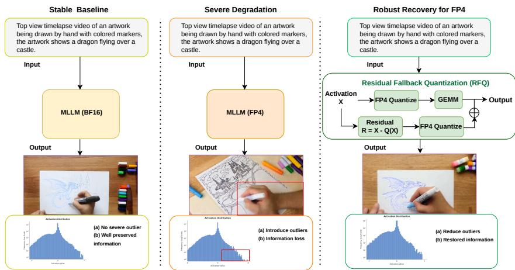
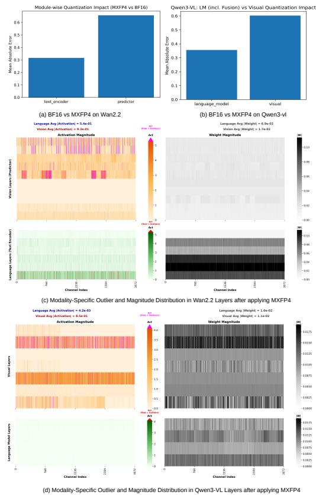
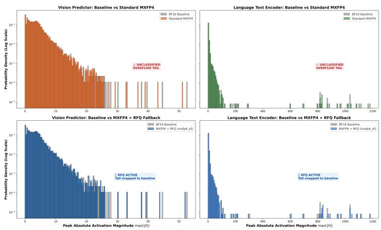
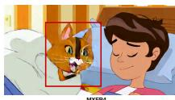
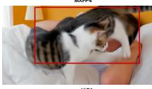
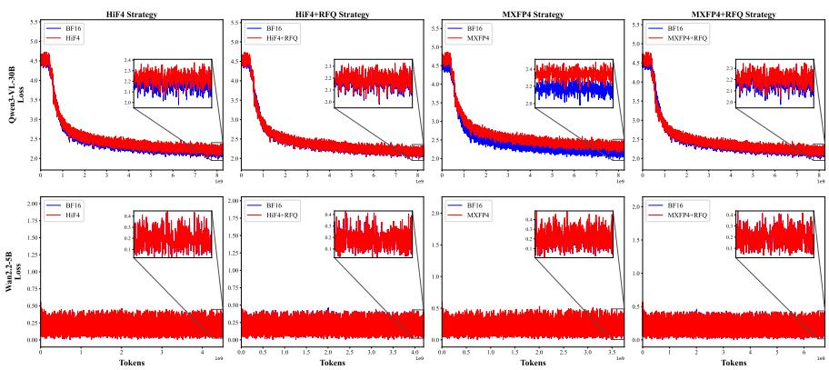

# Activation Outliers Matter: Robust Recovery for Quantized Multimodal LLMs

Tanzila Rahman, Mehran Taghian Jazi, Yunke Peng, Zhuang Ma, Anandharaju Durai Raju, Yao Wang, Xing Huang, Hei Yi Mak, Shadan Golestan, Hoang Le, Yonghan Dong, Wei Guo, and Yaoyuan Wang

Huawei

{tanzila.rahman, pengyunke}@huawei.com

Abstract. Low-bit quantization ofers a promising avenue for reducing the computational and memory demands of Multimodal Large Language Models (MLLMs). Recent hardware support for low-precision formats, ranging from MXFP8 to ultra-low-bit formats such as MXFP4 and HiF4, has accelerated research into eficient MLLM training and deployment. In this work, we present a systematic study of these quantization schemes in representative MLLMs that span both video generation and reasoning tasks. Our analysis shows that MXFP8 achieves near-lossless performance, whereas aggressive 4-bit quantization leads to significant degradation. Through extensive ablations, we identify activation quantization as the primary source of this performance loss, contributing substantially more than weight quantization. Motivated by this observation, we propose Residual Fallback Quantization (RFQ), a lightweight activation reconstruction framework that supplements the primary ulta-low-bit activation representation with an auxiliary quantized residual pathway. By explicitly modeling and compensating for quantization errors, RFQ improves activation fidelity while preserving the eficiency advantages of ultra-low-bit computation. RFQ requires no architectural modifications and incurs negligible computational overhead. Extensive experiments on Wan2.2 and Qwen3-VL demonstrate that RFQ consistently recovers a substantial portion of the performance lost under the quantization of MXFP4 and HiF4, significantly narrowing the gap to BF16 baselines across both generation and 4 reasoning benchmarks. Our findings establish activation quantization as the dominant bottleneck in ultra-low-bit MLLMs and highlight residual-based activation reconstruction as an efective and practical strategy for robust 4-bit deployment.

## 1 Introduction

Foundation Models (FMs), particularly Multimodal Large Language Models (MLLMs), have emerged as a dominant paradigm for building generalist AI systems capable of jointly reasoning over language, vision, and other modalities. This unified modeling paradigm has driven substantial progress in visual understanding [7, 24], multimodal reasoning [22, 43], and agentic interaction [1, 44]. Despite these advances, the training and deployment of MLLMs remain prohibitively expensive due to their large parameter scales, long-context computation, and heterogeneous multimodal architectures, all of which impose significant memory and compute demands [5, 50]. To improve eficiency, a wide range of techniques have been explored, including sparse attention mechanisms [55], eficient decoding strategies [19], and most prominently low-bit quantization [17, 28, 50]. Quantization reduces both memory footprint and computational cost by representing model tensors, including weights, activations, gradients, and optimizer states, with reduced-precision formats such as FP8.

  
Fig. 1: Overview of the impact of activation outliers and the proposed RFQ framework. Activation outliers degrade MLLM performance under FP4 quantization. RFQ reduces outlier-induced quantization errors through residual fallback correction, recovering generation quality close to the BF16 baseline.

Recent advances in hardware-supported mixed-precision training have significantly expanded the applicability of low-bit computation in large-scale systems. Early eforts such as TransformerEngine [37] demonstrated the efectiveness of matrix multiplications to accelerate linear layers. FP8-LM [39] further extended FP8 quantization to gradients, optimizer states, and communication, reducing memory and bandwidth overhead during training. More recently, COAT [50] advanced end-to-end FP8 training by additionally quantizing activations and second-order optimizer states, while introducing tensor-specific strategies such as dynamic range expansion for optimizer statistics and fine-grained activation quantization for sensitive nonlinear layers. Alternatively, [6] identifies attentioninduced activation outliers in transformers and introduces clipped softmax and gated attention to suppress them, enabling full INT8 quantization without extra fine-tuning. These developments highlight that efective low-precision training requires careful and component-aware design throughout the training stack.

Motivated by these gains, we investigate whether further eficiency improvements can be achieved by pushing multimodal training into the more aggressive FP4 regime. However, the limited dynamic range and precision of FP4 introduce substantial numerical instability, often resulting in degraded convergence and accuracy. To understand this behavior, we conduct a systematic study on two representative MLLMs: Wan2.2 [46], a multimodal generative model, and Qwen3-VL [3], a multimodal reasoning model. Following [20], we also quantize key components spanning vision encoders, text encoders, attention blocks, feedforward networks, multimodal projection layers, and mixture-of-expert modules. Our analysis reveals that FP4 degradation is highly heterogeneous across both models and modules. In Wan2.2, the most severe performance drop occurs in the visual generation backbone (i.e. WanDiT), while the UMT5 [12] text encoder remains relatively robust. In contrast, Qwen3-VL exhibits a heightened sensitivity within its vision encoder relative to the language modules; nonetheless, the language backbone also undergoes non-trivial architectural degradation under ultra-low-bit constraints. Across both models, we find that activation quantization is the primary driver of accuracy degradation, with certain modules exhibiting heavy-tailed activation distributions and pronounced outliers that are severely distorted under FP4 precision, leading to amplified downstream errors during training.

Prior work on outlier-aware quantization provides partial solutions to the activation instability. Post-training quantization methods such as SmoothQuant [51] and MASQuant [20] mitigate activation outliers through calibration-time transformations on frozen models. Quantization-aware training approaches, including OCC [48] and Outlier Fallback [57], address outliers during training via clipping, compensation, or mixed-precision execution. However, these methods are not directly suited for end-to-end FP4 MLLM training: PTQ approaches rely on static calibration statistics, while existing QAT techniques are largely designed for textonly LLMs or higher-bit regimes and typically apply uniform heuristics across modules. In contrast, our findings show that the FP4 failure modes in MLLMs are both model-dependent and module-dependent, with activation outliers evolving dynamically during training and concentrating in diferent components in diferent architectures.

These observations suggest that stable FP4 training for MLLMs requires fully diferentiable and training-aware activation-error modeling. To this end, motivated by [57], we propose Residual Fallback Quantization (RFQ), a lightweight activation-aware quantization strategy designed for ultra-low-bit MLLM training. RFQ decomposes activations into a quantized primary FP4 representation and an explicit quantization residual without any threshold-based selection. Instead of discarding or selectively preserving values, RFQ computes the full quantization error and reconstructs it through a secondary low-bit quantization pathway. This ensures that both the primary activations and residual correction remain compatible with FP4 computation. RFQ directly addresses FP4 sensitivity in MLLMs while requiring no architectural modifications or full-precision fallback.

Our contributions are summarized as follows:

– We perform the first systematic study of ultra-low precision quantization in multimodal large language models, analyzing the behavior of MXFP8, MXFP4, and HiF4 across both multimodal generation and reasoning architectures, including Wan2.2 and Qwen3-VL.

– We show that FP4 sensitivity is highly module-dependent in MLLMs, with visual components generally exhibiting greater susceptibility to quantizationinduced degradation than language components. We further identify activation quantization as the dominant source of FP4 degradation, revealing that performance collapse is primarily driven by heavy-tailed activation distributions and activation outliers rather than weight quantization.

– We propose Residual Fallback Quantization (RFQ), a lightweight activation aware quantization strategy that compensates for FP4 quantization errors by re-quantizing activation residuals and accumulating their contributions during GEMM. RFQ efectively mitigates the accuracy degradation introduced by quantization while preserving FP4 computation for the majority of operations.

– Extensive experiments demonstrate that RFQ substantially recovers the accuracy degradation introduced by MXFP4 and HiF4 quantization, achieving near BF16 baseline performance while preserving the eficiency benefits of ultra-low precision computation.

## 2 Related Work

Quantization of LLMs. Quantization techniques are broadly split into posttraining quantization (PTQ) and quantization-aware training (QAT). PTQ compresses a pretrained model using a small calibration dataset without further parameter optimization, making it a popular deployment choice due to low computational overhead. Representative methods include RTN [23], GPTQ [16], AWQ [29], and SmoothQuant [51], with recent extensions exploring outlier-aware allocation [25], mixed-precision [15], and rotation-based transformations [18]. However, PTQ struggles in ultra-low-bit regimes (e.g., 4-bit) because it cannot adapt parameters to quantization-induced distribution shifts.

In contrast, QAT integrates quantization into the training phase, allowing models to adapt to low-precision noise via gradient-based optimization. Recent frameworks like LLM-QAT [32], BitDistiller [14], EficientQAT [10], and GETA [41] leverage distillation and staged optimization to improve stability, while QuEST [38], DB-LLM [8], and BitNet [35] introduce alternative ternary/binary parameterizations. Despite this, ultra-low precision QAT remains challenging due to activation outliers and non-uniform layer sensitivities, which introduce massive quantization noise and amplify error propagation across deep transformer blocks during backpropagation.

Quantization of Multimodal LLMs. Multimodal large language models (MLLMs) extend LLMs by integrating vision encoders, language backbones, and cross-modal fusion modules to enable joint reasoning over heterogeneous inputs such as images and text. However, this multimodal design introduces additional quantization challenges due to substantial diferences in activation distributions across modalities and model components. As a result, direct application of LLM quantization techniques often leads to uneven degradation across modalities. To address this issue, recent PTQ methods introduce modality- and layer-aware designs. MBQ [27] leverages modality-specific token sensitivities to improve calibration quality. LUQ [5] studies ultra-low-bit PTQ for MLLMs and highlights strong layer-wise variation in quantization robustness driven by heterogeneous activation statistics. MQuant [54] further shows that cross-modal distribution mismatch is a key factor in quantization degradation. MASQuant [20] identifies smoothing imbalance across modalities, where dominant activation scales can suppress others under channel-wise smoothing, and proposes modality-aware compensation. Other approaches, including Q-VLM [47], VLMQ [53], and Quant Experts [21], incorporate sensitivity-aware rounding, token-level importance, or reconstruction-based correction to reduce quantization error in vision-language models. Beyond PTQ, QAT for MLLMs remains relatively underexplored but increasingly important. Attn-QAT [56] analyzes FP4 attention training and identifies key stability constraints in low-precision backward computation. MF-QAT [52] proposes multi-format QAT, enabling a single model to operate across multiple precision formats without retraining.

Despite these advancements, stable optimization of MLLMs under ultra-low precision remains an open challenge due to dynamically evolving activation distributions and strong cross-modal interactions. Existing PTQ methods rely on static calibration that cannot adapt to shifting activations, while QAT approaches fail to model reconstruction under extreme bit constraints. These limitations are heavily amplified by the dynamic, modality-dependent nature of MLLMs statistics. To address this, we propose a unified, modality-agnostic quantization strategy that operates directly at the activation level, correcting quantizationinduced distortions via diferentiable reconstruction. By targeting errors at the activation level, our approach eliminates complex, modality-specific engineering while maintaining robustness under highly heterogeneous distributions.

## 3 Preliminaries

## 3.1 Standard Floating-Point and Quantization Basics

A standard floating-point (FP) [4] number is represented by a sign bit $s ,$ an exponent e, and a mantissa m. For a format with $E$ exponent bits and M mantissa bits, the real-valued representation is given by:

$$
v = ( - 1 ) ^ { s } \times 2 ^ { e - \mathrm { b i a s } } \times \left( 1 + \frac { m } { 2 ^ { M } } \right) ,\tag{1}
$$

where bias is the exponent bias and $\frac { m } { 2 ^ { M } }$ denotes the fractional contribution of the mantissa. Standard uniform quantization maps a real-valued tensor $x \in \mathbb { R }$ to a discrete set of low-precision values using a scaling factor S and integer clipping bounds $[ q _ { \mathrm { m i n } } , q _ { \mathrm { m a x } } ]$

$$
\hat { x } = S \cdot \mathrm { c l i p } \left( \mathrm { r o u n d } \left( \frac { x } { S } \right) , q _ { \mathrm { m i n } } , q _ { \mathrm { m a x } } \right) ,\tag{2}
$$

where round(·) denotes round-to-nearest integer rounding. While per-tensor and per-channel scaling strategies are efective for 8-bit integer quantization (INT8), they become less reliable at ultra-low bit-widths (e.g., 4-bit). In such regimes, severe dynamic range mismatches and activation outliers lead to significant quantization error, making accurate representation dificult under fixed uniform scaling.

## 3.2 Microscaling (MX) Block Specifications

To mitigate accuracy degradation in ultra-low bit regimes, the OCP Microscaling Formats (MX) [42] specification introduces a block-based scaling mechanism. Instead of applying a single scale factor to an entire tensor, elements are partitioned into small independent blocks of size B (typically $B = 3 2 )$ . Within each block, all elements share a common scaling factor derived from a shared exponent. Given a block of high-precision values $\mathbf { X } = \{ x _ { 1 } , x _ { 2 } , \ldots , x _ { B } \}$ , the block scale is computed as:

$$
S _ { \mathrm { b l o c k } } = 2 ^ { \lfloor \log _ { 2 } ( \operatorname* { m a x } _ { i } | x _ { i } | ) \rfloor } .\tag{3}
$$

Each element is then normalized by the block scale and quantized into a low-bit representation:

$$
\tilde { x } _ { i } = \mathcal { Q } _ { \mathrm { f o r m a t } } \left( \frac { x _ { i } } { S _ { \mathrm { b l o c k } } } \right) ,\tag{4}
$$

where $\mathcal { Q } _ { \mathrm { f o r m a t } } ( \cdot )$ denotes element-wise quantization to a low-bit floating-point or integer code.

MXFP8 (Microscaling 8-bit Floating Point) The MXFP8 format defines two variants, E4M3 and E5M2, within the microscaling framework to balance precision and dynamic range. The E4M3 variant consists of 1 sign bit, 4 exponent bits, and 3 mantissa bits, providing higher precision at the cost of a narrower dynamic range, making it well suited for representing activations. In contrast, the E5M2 variant uses 1 sign bit, 5 exponent bits, and 2 mantissa bits, ofering a wider dynamic range and improved robustness to large-magnitude variations.

MXFP4 (Microscaling 4-bit Floating Point) MXFP4 further reduces the element-wise representation to 4 bits, typically using an E2M1 configuration (1 sign bit, 2 exponent bits, 1 mantissa bit). Due to the extremely limited precision, MXFP4 relies heavily on the shared block exponent $S _ { \mathrm { b l o c k } }$ to adaptively align the limited representable range with the local distribution of each tensor block.

## 3.3 HiF4 (HiFloat4)

While standard microscaling formats employ a flat, single-level block scaling factor, HiF4 [34, 45] introduces a multi-level hierarchical scaling paradigm designed for hardware-eficient acceleration. HiF4 organizes data into 64-element blocks with 32 bits of shared metadata, resulting in an amortized overhead of 0.5 bits per value (4.5 bits total per element). The scaling hierarchy consists of a global base scale and two levels of binary micro-exponents. The global scale is represented using an unsigned 8-bit E6M2 floating-point format with an exponent bias of 48, defining a coarse block-level normalization factor:

$$
S _ { \mathrm { m a c r o } } = 2 ^ { E } \cdot ( 1 . M ) .\tag{5}
$$

Fine-grained dynamic range refinement within the block is achieved using two tiers of 1-bit micro-exponents, $E 1 \_ 8$ (an 8-element vector) and $E 1 \_ 1 6$ (a 16-element vector). These micro-exponents provide localized exponent corrections over 8-element and 4-element sub-groups, respectively, efectively mitigating the impact of outliers and suppressing quantization noise.

Each individual element within the 64-element block is encoded using a 4-bit S1P2 sign-magnitude format (1 integer bit and 2 fractional bits), conceptually equivalent to an E1M2 representation. The reconstructed value for the i-th element $( i \in [ 1 , 6 4 ] )$ is computed as:

$$
V _ { i } = S _ { \mathrm { m a c r o } } \times 2 ^ { E 1 } \mathrm { { _ - ^ { 8 } } \Gamma ( \Omega 8 ) + { E 1 } \mathrm { { _ - ^ { 1 6 } } \Gamma ( \Omega 4 / \Omega \times \mathrm { { S 1 P 2 } } _ { i } . } }\tag{6}
$$

This hierarchical formulation significantly expands the intra-block dynamic range to 4.81 binades while maintaining ultra-low precision storage. This capability is particularly critical for MLLMs; despite the use of Quantization-Aware Training, severe activation outliers still persistently emerge in these architectures. Consequently, the primary focus of our work is to leverage this hierarchical scaling to efectively mitigate these emergent outliers and preserve model accuracy.

## 4 Our Approach

We study quantization-aware training (QAT) for multimodal LLMs under ultralow-bit numerical formats. Our goal is to enable eficient deployment using aggressive quantization schemes such as MXFP4 and HiF4 while maintaining stable multimodal generation and reasoning performance. Therefore, we first construct a mixed-precision QAT framework tailored for MLLMs, where diferent model components are assigned heterogeneous numerical formats based on their quantization sensitivity. We then conduct a systematic diagnostic analysis to identify the dominant sources of degradation across modalities, layers, and tensor types (weights versus activations). Guided by these findings, we propose Residual Fallback Quantization (RFQ), an approach that mitigates activation-induced errors in ultra-low-bit regimes.

## 4.1 Exploration of Ultra-Low-Bit Mixed-Precision QAT for MLLMs

We investigate quantization-aware training of MLLMs using block-wise floatingpoint formats defined by the Open Compute Project (OCP) MX specification, including MXFP8 and MXFP4, together with the hierarchical HiF4 representation. To evaluate the efectiveness of these formats in large-scale multimodal settings, we conduct QAT experiments on two representative MLLMs: the generative video model Wan2.2 5B [46] and the reasoning-oriented model Qwen3-VL 30B [2].

For our preliminary experiments, we adopt a mixed-precision QAT strategy that allocates numerical formats according to the quantization sensitivity of diferent model components. Specifically, the feed-forward networks (FFNs) and linear projection layers within both the vision and language modules are quantized using low-bit formats (MXFP8, W4A8, MXFP4, or HiF4), whereas components that are empirically more sensitive to precision reduction, such as embedding layers and the language modeling head, remain in BF16. This design aims to maximize compression eficiency while preserving multimodal generation and reasoning capabilities.

Algorithm 1: Residual Fallback Quantization (RFQ) GEMM   
Input: Input activation X, weight Y, FP4 quantizer Q, fallback indicator ϕ(p, r), block   
sizes [Ps, Qs, Rs]   
Output: Output Z   
Partition X into blocks Xp,r and Y into blocks Yr,q;   
for p = 0 to ⌈P/P ⌉ − 1 do   
for q = 0 to ⌈Q/Qs⌉ − 1 do   
Zp,q ← 0 ; // Initialize block accumulator   
for r = 0 to ⌈R/R ⌉ − 1 do   
X˜ p,r ← Q(Xp,r);   
Y˜ r,q ← Q(Yr,q);   
Zp,q += X˜ p,rY˜ r,q ; // Base FP4 GEMM   
if ϕ(p, r) = 1 then   
∆Xp,r ← Xp,r − X˜ p,r ; // Compute RFQ residual error   
Xbp,r ← Q(∆Xp,r) ; // Quantize residual to FP4   
Zp,q += Xbp,rY˜ r,q ; // Accumulate RFQ correction   
return Z;

Our experiments reveal a clear separation in performance between 8-bit and ultra-low-bit 4-bit quantization regimes. As shown in Table 1, MXFP8 preserves performance close to the BF16 baseline after QAT. We further observe that a mixed W4A8 configuration where weights are compressed to a 4-bit format while activations remain in 8-bit MXFP8 introduces only marginal additional degradation. In contrast, uniformly quantizing both weights and activations to 4-bit formats (MXFP4 or HiF4) results in substantially higher training loss. These findings suggest that MLLMs exhibit heterogeneous quantization sensitivity across tensors, with activations appearing considerably more vulnerable to aggressive precision reduction than weights.

Despite this careful allocation of precision, fully 4-bit quantization still leads to significant degradation, suggesting that format selection alone cannot bridge the performance gap. This points to the underlying activation distributions as a key source of quantization error, motivating a more fine-grained analysis of activation behavior in the following subsection.

Table 1: Relative training loss increase (%) for the BF16 baseline after QAT on models trained with over 5B tokens. MXFP8 and W4A8 show minimal degradation, while MXFP4 and HiF4 incur larger errors.
<table><tr><td>Model</td><td>|MXFP8 W4A8 MXFP4 HiF4</td><td></td><td></td></tr><tr><td>Wan2.2</td><td>0.30</td><td>0.80 7.10</td><td>2.70</td></tr><tr><td>Qwen3-VL</td><td>0.20</td><td>0.70 7.23</td><td>3.80</td></tr></table>

## 4.2 Cross-Modal Weights–Activation Sensitivity

We further investigate whether the degradation under ultra-low-bit quantization is uniformly distributed across modalities or is primarily driven by a specific modality. In particular, we analyze the relative sensitivity of the vision and language components in both models under identical quantization configurations. To this end, we perform a controlled sensitivity study where vision and language pathways are quantized in the same numerical formats, allowing us to attribute performance variations to each modality independently. We conduct experiments on Wan2.2 and Qwen3-VL, both of which exhibit tightly coupled vision-language interactions during generation and reasoning. In prior work such as MBQ [26], where vision tokens are generally less sensitive than language tokens under post-training quantization, we observe a reverse trend in our QAT setting. Specifically, vision components are more sensitive to aggressive 4-bit quantization (MXFP4 and HiF4), resulting in greater degradation in both generative quality and reasoning consistency. This pattern is consistent on both models, although the efect is more pronounced in Wan2.2, which relies heavily on fine-grained visual detail reconstruction (see Figure 2 (a) and (b)).

To better understand the source of this degradation, we analyze quantization sensitivity across weights and activations. As shown in Figure 2(c) and (d), activation tensors exhibit substantially larger dynamic ranges and more heterogeneous distributions compared to weights. This efect is particularly pronounced in visionrelated layers, where extreme outliers significantly expand the quantization range under FP4 precision. As a result, the efective precision allocated to the majority of activation values is reduced, leading to distortion and frequent underflow of small-magnitude activations, which introduces substantial quantization residuals. In contrast, weight distributions remain comparatively compact and well-behaved, making them more amenable to low-bit quantization.

Overall, these findings indicate that the dominant failure mode in ultra-low-bit MLLM quantization is primarily driven by activation

  
Fig. 2: Cross-modal sensitivity analysis under ultralow-bit quantization.

quantization errors shared in both language and vision pathways. Since both modalities are subject to severe precision constraints in activation propagation, weight-only mitigation strategies are insuficient to recover the resulting information loss. This observation motivates the need for activation-centric correction mechanisms. To this end, we propose Residual Fallback Quantization (RFQ). Inspired by the block-level fallback mechanism of [57], RFQ extends this idea to ultra-low-bit QAT by re-quantizing activation residuals through an eficient FP4-to-FP8 pathway, thereby improving accuracy while maintaining the computational eficiency of FP4 operations.

## 4.3 Residual Fallback Quantization (RFQ)

Motivated by our observation that activation quantization constitutes the dominant source of degradation in ultra-low-bit MLLMs, we propose Residual Fallback Quantization $( R F Q )$ , a residual-based correction mechanism that improves activation reconstruction while preserving the eficiency of uniform low-bit computation. Consider a matrix multiplication operation

$$
Z = X Y ,\tag{7}
$$

where $X \in \mathbb { R } ^ { P \times R }$ denotes input activations and $Y \in \mathbb { R } ^ { R \times Q }$ represents the weights. Following a block-wise execution scheme, we partition X into blocks $X ^ { p , r } \in \mathbb { R } ^ { P _ { s } \times R _ { s } }$ and Y into blocks $Y ^ { r , q } \in \mathbb { R } ^ { R _ { s } \times Q _ { s } }$

For each activation and weight block, we first perform conventional low-bit quantization using a target FP4 quantizer Q(·):

$$
\tilde { X } ^ { p , r } = \mathcal { Q } ( X ^ { p , r } ) , \qquad \tilde { Y } ^ { r , q } = \mathcal { Q } ( Y ^ { r , q } ) .\tag{8}
$$

Although this base FP4 approximation is efective for the majority of tokens, severe activation outliers introduce substantial reconstruction errors. To selectively compensate for these errors without incurring global overhead, RFQ introduces a hardware-friendly fallback indicator $\phi ( p , r ) \in \{ 0 , 1 \}$ , which identifies activation blocks containing significant outlier magnitudes. For blocks flagged by the indicator $( \phi ( p , r ) = 1 )$ , RFQ computes the quantization residual:

$$
\varDelta X ^ { p , r } = X ^ { p , r } - \tilde { X } ^ { p , r } .\tag{9}
$$

Rather than storing this residual in a costly higher-precision format, we quantize it using the same underlying FP4 representation:

$$
\widehat { X } ^ { p , r } = \mathcal { Q } ( \varDelta X ^ { p , r } ) .\tag{10}
$$

The final output block $Z ^ { p , q }$ is obtained by conditionally incorporating the residual correction term alongside the base GEMM computation:

$$
Z ^ { p , q } = \sum _ { r } \tilde { X } ^ { p , r } \tilde { Y } ^ { r , q } + \sum _ { r } \phi ( p , r ) \cdot \left( \widehat { X } ^ { p , r } \tilde { Y } ^ { r , q } \right) .\tag{11}
$$

Equivalently, RFQ can be interpreted as dynamically approximating sensitive activation blocks using a two-stage low-bit decomposition:

$$
X ^ { p , r } \approx \tilde { X } ^ { p , r } + \phi ( p , r ) \cdot \widehat { X } ^ { p , r } ,\tag{12}
$$

where both terms are restricted to the same low-bit numerical format. The first term captures the dominant signal component across all blocks, while the conditional residual term recovers precision lost to severe outliers only where strictly necessary.

  
Fig. 3: Comparative analysis of activation tail tracking and fallback interception across model modalities. Top Row highlights the unmitigated quantization noise and overflow elements in standard MXFP4 compared against the BF16 baseline. Bottom Row demonstrates how Residual Fallback Quantization (RFQ) restores fidelity by snapping extreme outliers.

Compared with global double-quantization alternatives, RFQ preserves the advantages of uniform low-bit arithmetic and triggers additional residual accumulation of GEMM when $\phi ( p , r ) = 1$ . Unlike traditional fallback frameworks that explicitly load pre-computed residual tensors from of-chip DRAM inside the execution loop $( \mathrm { e . g . } , u ( i , k )$ in baseline FQ [13, 57]), RFQ operates as a streaming kernel that evaluates both the residual error $\varDelta X ^ { p , r }$ and its subsequent quantization of $\mathrm { F P 4 } \ \widehat { X } ^ { p , r }$ completely on-the-fly. Furthermore, by restricting both the base and residual pathways to the exact same uniform FP4 format Q(·) rather than heterogeneous integer types, RFQ minimizes hardware execution paths. Crucially, this residual correction mechanism is applied exclusively during the forward pass to avoid compounding memory and gradient overhead during backward propagation, keeping the implementation fully compatible with existing low-bit hardware tensor primitives and standard quantization-aware training infrastructure. The complete execution flow is summarized in Algorithm 1 and the RFQ efect is illustrated in Figure 3.

## 5 Experimental Analysis

## 5.1 Experimental Setup

We evaluate our proposed RFQ framework under ultra-low-bit precision constraints on two representative multimodal architectures: Wan2.2-5B and Qwen3VL-30B. For both models, we initialize from publicly available pretrained checkpoints and subsequently perform low-precision quantization-aware fine-tuning. For the Qwen3-VL supervised fine-tuning (SFT) phase, we utilize the concept-balanced

Table 2: Parameter breakdown (%) by functional component with respect to the total paramter size. Quant. (%) for the visual and textual modules denotes the proportion of parameters quantized within each module. Projection layers and mergers are included in the “Other” category.
<table><tr><td rowspan="2">Model</td><td rowspan="2">Module</td><td colspan="4">Parameter Distribution (%)</td><td rowspan="2"> $\mathbf { Q u a n t . } ( \% )$ </td></tr><tr><td>Atten. Proj. FFN/MLP</td><td></td><td>MoE</td><td>Other</td></tr><tr><td rowspan="3">Wan2.2</td><td>Visual</td><td>39.86</td><td>46.51</td><td></td><td>11.62</td><td>97.99</td></tr><tr><td>Textual</td><td>28.35</td><td>53.16</td><td></td><td></td><td>81.50</td></tr><tr><td>Visual</td><td>26.61</td><td>49.71</td><td></td><td>22.77</td><td>99.09</td></tr><tr><td>Qwen3-VL</td><td>Textual</td><td>2.96</td><td></td><td>94.95</td><td></td><td>97.91</td></tr></table>

Table 3: For Wan2.2, quantitative comparison on VBench. Values in parentheses indicate the relative change (%) with respect to the BF16 baseline. Blue denotes improvement and red denotes degradation.
<table><tr><td>Suect Cconssi-</td><td>Backound Cconssis- tenncy tency</td><td>Imaing uaity</td><td>Temmmpooral Iikring</td><td>Smooth- Motion ness</td><td>Dynaamnc Dere</td><td>Overa1l Conssi-</td><td>Aestthetic alitYy tenncy</td></tr><tr><td>Baseline (BF16)</td><td>95.74</td><td>96.77</td><td>65.32</td><td>98.42 99.25</td><td>45.00</td><td>7.03</td><td>59.43</td></tr><tr><td>MXFP4</td><td>95.65</td><td>96.60</td><td>66.69</td><td>98.10</td><td>99.15 43.00</td><td>7.24</td><td>58.93</td></tr><tr><td></td><td>(-0.09)</td><td>(-0.17)</td><td>(+1.37)</td><td>(-0.32)</td><td>(-0.10)</td><td>(-2.00) (+0.21)</td><td>(-0.5)</td></tr><tr><td>MXFP4 + RFQ (ours)</td><td>95.43</td><td>96.54</td><td>66.48</td><td>98.29</td><td>99.23</td><td>50.00 6.90</td><td>59.26</td></tr><tr><td></td><td>(-0.31)</td><td>(-0.23)</td><td>(+1.16)</td><td>(-0.13)</td><td>(-0.02) (+5.00)</td><td>(-0.13)</td><td>(-0.16)</td></tr><tr><td>HiF4</td><td>95.23</td><td>96.67</td><td>67.36</td><td>98.33</td><td>99.24 53.00</td><td>6.98</td><td>59.44</td></tr><tr><td></td><td>(-0.51)</td><td>(-0.10)</td><td>(+2.04)</td><td>(-0.09)</td><td>(-0.01) (+8.00)</td><td>(-0.05)</td><td>(+0.01)</td></tr><tr><td> $\mathrm { H i F 4 + R F Q \ ( o u r s ) }$ </td><td>95.86</td><td>96.60</td><td>66.79</td><td>98.38</td><td>99.24</td><td>51.00 6.86</td><td>59.54</td></tr><tr><td></td><td>(+0.12)</td><td>(-0.17)</td><td>(+1.47)</td><td>(-0.04)</td><td>(-0.01) (+6.00)</td><td>(-0.17)</td><td>(+0.19)</td></tr></table>

CC-3M dataset comprising 595K samples [30, 31]. For Wan2.2, we leverage a subset of the OpenVid-1M dataset [36], specifically utilizing Part 1 that contains approximately 26,000 video-text pairs. Following the mixed-precision scheme outlined in Section 4, the embedding layers and the final language modeling head are maintained in BF16 precision, whereas all remaining linear, MoE and attention projection layers are quantized using MXFP8, W4A8, MXFP4, or HiF4 formats. See Table. 2 for the quantized parameter count. To ensure a fair and rigorous comparison across these diverse numerical configurations, both models are fine-tuned under identical quantization hyperparameters for approximately 5 billion tokens. See supplemental for more details.

For both Wan2.2 and Qwen3-VL, we performed SFT using AdamW starting from their respective publicly available pretrained checkpoints. Wan2.2 is finetuned with a learning rate of $1 \times 1 0 ^ { - 5 }$ , while Qwen3-VL uses a learning rate of $1 \times 1 0 ^ { - 7 }$ . Unless otherwise specified, all other training hyperparameters remain unchanged in diferent quantization configurations to ensure fair comparisons. We evaluated Wan2.2 using VBench on 100 randomly sampled prompts from the MovieGen [40] benchmark and report downstream performance on diferent

Table 4: Accuracy comparison across diferent datasets and quantization formats on Qwen3-VL. Values in parentheses indicate the absolute change with respect to the BF16 baseline. Blue denotes improvement, while red indicates degradation.
<table><tr><td>Method</td><td>RealWorldQA MMStar MMBenchEN SimpleVQA</td><td></td><td></td><td></td></tr><tr><td>BF16</td><td>72.68</td><td>70.80</td><td>90.77</td><td>16.83</td></tr><tr><td>MXFP4</td><td>70.98</td><td>69.67</td><td>90.72</td><td>15.16</td></tr><tr><td></td><td>(-1.70)</td><td>(-1.13)</td><td>(-0.05)</td><td>(-1.67)</td></tr><tr><td>MXFP4 + RFQ (ours)</td><td>72.16</td><td>70.73</td><td>90.40</td><td>16.44</td></tr><tr><td></td><td>(-0.52)</td><td>(-0.07)</td><td>(-0.37)</td><td>(-0.39)</td></tr><tr><td>HiF4</td><td>72.42</td><td>71.27</td><td>90.50</td><td>15.35</td></tr><tr><td></td><td>(-0.26)</td><td>(+0.47)</td><td>(-0.27)</td><td>(-1.48)</td></tr><tr><td>HiF4 + RFQ (ours)</td><td>72.81</td><td>71.47</td><td>90.77</td><td>15.66</td></tr><tr><td></td><td>(+0.13)</td><td>(+0.67)</td><td>(0.00)</td><td>(-1.17)</td></tr></table>

dimensions. For Qwen3-VL, we assess multimodal reasoning capabilities on four widely used benchmarks: RealWorldQA [49], MMStar [9], MMBench-EN [33], and SimpleVQA [11]. We report the VQA accuracy on each benchmark. All evaluations are conducted using the same inference protocol for both BF16 and quantized models.

## 5.2 Evaluation Performance

Performance of video generation. Table 3 presents quantitative results on Wan2.2 evaluated using VBench. Compared with standard MXFP4 quantization, RFQ consistently improves multiple video generation metrics. In particular, RFQ improves the Dynamic Degree from 43.00 to 50.00 while simultaneously improving Aesthetic Quality and maintaining competitive Subject and Background Consistency. Similar trends are observed

  
Fig. 4: Qualitative results for video generation. While 4-bit quantization methods (i.e., MXFP4 and HiF4) degrade generation quality, our proposed RFQ recovers visual fidelity and improves temporal consistency.

in the HiF4 setting, where RFQ improves Subject Consistency from 95.23 to 95.86 and Aesthetic Quality from 59.44 to 59.54. We also include qualitative results in Figure 4. See supplemental for more results. These results demonstrate that RFQ efectively mitigates the adverse efects of activation quantization in ultra-low-bit video generation models.

Performance of multimodal reasoning. Table 4 reports the results of Qwen3- VL. In MXFP4 quantization, RFQ consistently narrows the performance gap with respect to the baseline BF16, improving RealWorldQA from 70.98 to 72.16, MMStar from 69.67 to 70.73, and SimpleVQA from 15.16 to 16.44. Under the HiF4 configuration, RFQ achieves further gains, improving RealWorldQA from 72.42 to 72.81 (even better than BF16 baseline) and MMStar from 71.27 to 71.47, while recovering the BF16 performance in MMBench-EN. These findings indicate that the RFQ generalizes across various multimodal reasoning tasks and efectively improves the robustness of ultra-low-bit MLLMs.

  
(a) (b) (c) (d) Fig. 5: Training loss curves comparing low-bit FP4 strategies against the BF16 baseline across Qwen3-VL-30B and Wan2.2-5B.

Table 5: Relative training loss increase (%) over the BF16 baseline after QAT with 4-bit quantization. RFQ substantially mitigates the degradation caused by MXFP4 and HiF4.
<table><tr><td>Model</td><td></td><td>|MXFP4|MXFP4 + RFQ (ours)|HiF4|HiF4 + RFQ (ours)</td><td></td></tr><tr><td></td><td>7.50</td><td>1.14</td><td>2.89 0.61</td></tr><tr><td>Wan2.2 Qwen3VL-30B</td><td>7.23</td><td>1.43</td><td>2.32 0.66</td></tr></table>

In addition to downstream performance, Table 5 reports the relative training loss diference with respect to the BF16 baseline. RFQ consistently enhances both generative and reasoning performance under aggressive FP4 quantization schemes, leading to improvements in both SFT and downstream evaluation. Notably, these gains are obtained without increasing the precision of the underlying representation, demonstrating the efectiveness of residual fallback correction in alleviating activation-induced quantization errors.

## 6 Conclusion

In this paper, we present a systematic study of ultra-low-bit supervised fine-tuning (SFT) for multimodal LLMs. Our analysis shows that visual modules are generally more sensitive to aggressive quantization than language modules, though quantizing language modules also leads to non-negligible performance degradation. These findings suggest that efective accuracy recovery in ultra-low-bit settings requires jointly addressing both components. Based on this observation, we propose RFQ, a simple yet efective approach that exploits residual quantization errors through an auxiliary uniform quantization pathway to compensate for information loss under ultra-low-bit quantization. Extensive experiments demonstrate that RFQ consistently improves training dynamics and downstream performance, recovering accuracy close to the BF16 baseline. Overall, our results highlight the promise of residual-based compensation for eficient deployment of multimodal foundation models under tight memory and computation constraints. In future work, we will explore more aggressive quantization-aware training settings, including 2-bit quantization, and extend RFQ to broader multimodal architectures and tasks.

## References

1. Agashe, S., Han, J., Gan, S., Yang, J., Li, A., Wang, X.E.: Agent s: An open agentic framework that uses computers like a human. In: The Thirteenth International Conference on Learning Representations (2025)

2. Bai, S., Cai, Y., Chen, R., Chen, K., Chen, X., Cheng, Z., Deng, L., Ding, W., Gao, C., Ge, C., Ge, W., Guo, Z., Huang, Q., Huang, J., Huang, F., Hui, B., Jiang, S., Li, Z., Li, M., Li, M., Li, K., Lin, Z., Lin, J., Liu, X., Liu, J., Liu, C., Liu, Y., Liu, D., Liu, S., Lu, D., Luo, R., Lv, C., Men, R., Meng, L., Ren, X., Ren, X., Song, S., Sun, Y., Tang, J., Tu, J., Wan, J., Wang, P., Wang, P., Wang, Q., Wang, Y., Xie, T., Xu, Y., Xu, H., Xu, J., Yang, Z., Yang, M., Yang, J., Yang, A., Yu, B., Zhang, F., Zhang, H., Zhang, X., Zheng, B., Zhong, H., Zhou, J., Zhou, F., Zhou, J., Zhu, Y., Zhu, K.: Qwen3-vl technical report. arXiv preprint arXiv:2511.21631 (2025)

3. Bai, S., Chen, K., Liu, X., Wang, J., Ge, W., Song, S., Dang, K., Wang, P., Wang, S., Tang, J., Zhong, H., Zhu, Y., Yang, M., Li, Z., Wan, J., Wang, P., Ding, W., Fu, Z., Xu, Y., Ye, J., Zhang, X., Xie, T., Cheng, Z., Zhang, H., Yang, Z., Xu, H., Lin, J.: Qwen2.5-vl technical report (2025)

4. Barrett, G.: Formal methods applied to a floating-point number system. IEEE transactions on software engineering (1989)

5. Bhatnagar, S., Xu, A., Tan, K.H., Ahuja, N.: Luq: Layerwise ultra-low bit quantization for multimodal large language models. arXiv preprint arXiv:2509.23729 (2025)

6. Bondarenko, Y., Nagel, M., Blankevoort, T.: Quantizable transformers: Removing outliers by helping attention heads do nothing. Advances in Neural Information Processing Systems 36, 75067–75096 (2023)

7. Campbell, D., Rane, S., Giallanza, T., De Sabbata, N., Ghods, K., Joshi, A., Ku, A., Frankland, S.M., Grifiths, T.L., Cohen, J.D., Webb, T.: Understanding the limits of vision language models through the lens of the binding problem. In: Globerson, A., Mackey, L., Belgrave, D., Fan, A., Paquet, U., Tomczak, J., Zhang, C. (eds.) Advances in Neural Information Processing Systems. Curran Associates, Inc. (2024)

8. Chen, H., Lv, C., Ding, L., Qin, H., Zhou, X., Ding, Y., Liu, X., Zhang, M., Guo, J., Liu, X., et al.: Db-llm: Accurate dual-binarization for eficient llms. In: Findings of the Association for Computational Linguistics: ACL 2024. pp. 8719–8730 (2024)

9. Chen, L., Li, J., Dong, X., Zhang, P., Zang, Y., Chen, Z., Duan, H., Wang, J., Qiao, Y., Lin, D., et al.: Are we on the right way for evaluating large vision-language models? arXiv preprint arXiv:2403.20330 (2024)

10. Chen, M., Shao, W., Xu, P., Wang, J., Gao, P., Zhang, K., Luo, P.: Eficientqat: Eficient quantization-aware training for large language models. In: Proceedings of the 63rd Annual Meeting of the Association for Computational Linguistics (Volume 1: Long Papers). pp. 10081–10100 (2025)

11. Cheng, X., Zhang, W., Zhang, S., Yang, J., Guan, X., Wu, X., Li, X., Zhang, G., Liu, J., Mai, Y., Zeng, Y., Wen, Z., Jin, K., Wang, B., Zhou, W., Lu, Y., Li, T., Huang, W., Li, Z.: Simplevqa: Multimodal factuality evaluation for multimodal large language models (2025)

12. Chung, H.W., Garcia, X., Roberts, A., Tay, Y., Firat, O., Narang, S., Constant, N.: Unimax: Fairer and more efective language sampling for large-scale multilingual pretraining. In: The Eleventh International Conference on Learning Representations

13. Dettmers, T., Lewis, M., Belkada, Y., Zettlemoyer, L.: Llm.int8(): 8-bit matrix multiplication for transformers at scale. arXiv preprint arXiv:2208.07339 (2022)

14. Du, D., Zhang, Y., Cao, S., Guo, J., Cao, T., Chu, X., Xu, N.: Bitdistiller: Unleashing the potential of sub-4-bit llms via self-distillation. In: Proceedings of the 62nd Annual Meeting of the Association for Computational Linguistics (Volume 1: Long Papers). pp. 102–116 (2024)

15. Feng, C., Zhou, G., Wu, X., Zhao, Q.: Plmq: Piecewise linear mixed-precision quantization for deep neural networks. Neurocomputing p. 131000 (2025)

16. Frantar, E., Ashkboos, S., Hoefler, T., Alistarh, D.: Gptq: Accurate posttraining quantization for generative pre-trained transformers. arXiv preprint arXiv:2210.17323 (2022)

17. Frantar, E., Ashkboos, S., Hoefler, T., Alistarh, D.: OPTQ: Accurate quantization for generative pre-trained transformers. In: The Eleventh International Conference on Learning Representations (2023)

18. He, L., Zheng, S., Sun, K., Liu, Y., Zhao, Y., Tan, C., Yang, H., Du, Y., Du, L.: Base-q: Bias and asymmetric scaling enhanced rotational quantization for large language models. arXiv preprint arXiv:2506.15689 (2025)

19. Hooper, C., Kim, S., Mohammadzadeh, H., Genc, H., Keutzer, K., Gholami, A., Sophia Shao, Y.: Speed: Speculative pipelined execution for eficient decoding. In: Enhancing LLM Performance: Eficacy, Fine-Tuning, and Inference Techniques, pp. 19–32. Springer (2025)

20. Hu, L., Xiao, W., Chen, X., Xu, X., Xu, B., Li, K., Tao, Y.: Masquant: Modalityaware smoothing quantization for multimodal large language models (2026)

21. Jia, C., Li, B., Zhang, X., Wei, M., Lin, B., Sun, H.: Quant experts: Token-aware adaptive error reconstruction with mixture of experts for large vision-language models quantization. In: Proceedings of the IEEE/CVF Conference on Computer Vision and Pattern Recognition. pp. 24716–24726 (2026)

22. Kil, J., Mai, Z., Lee, J., Chowdhury, A., Wang, Z., Cheng, K., Wang, L., Liu, Y., Chao, W.L.: Mllm-compbench: A comparative reasoning benchmark for multimodal llms. In: Globerson, A., Mackey, L., Belgrave, D., Fan, A., Paquet, U., Tomczak, J., Zhang, C. (eds.) Advances in Neural Information Processing Systems. Curran Associates, Inc. (2024)

23. Krishnamoorthi, R.: Quantizing deep convolutional networks for eficient inference: A whitepaper. arXiv preprint arXiv:1806.08342 (2018)

24. Laurençon, H., Tronchon, L., Cord, M., Sanh, V.: What matters when building vision-language models? In: Globerson, A., Mackey, L., Belgrave, D., Fan, A., Paquet, U., Tomczak, J., Zhang, C. (eds.) Advances in Neural Information Processing Systems. Curran Associates, Inc. (2024)

25. Lee, C., Jin, J., Kim, T., Kim, H., Park, E.: Owq: Outlier-aware weight quantization for eficient fine-tuning and inference of large language models. In: Proceedings of the AAAI Conference on Artificial Intelligence. vol. 38, pp. 13355–13364 (2024)

26. Li, S., Hu, Y., Ning, X., Liu, X., Hong, K., Jia, X., Li, X., Yan, Y., Ran, P., Dai, G., Yan, S., Yang, H., Wang, Y.: Mbq: Modality-balanced quantization for large vision-language models. In: Proceedings of the IEEE/CVF Conference on Computer Vision and Pattern Recognition (CVPR) (June 2025)

27. Li, S., Hu, Y., Ning, X., Liu, X., Hong, K., Jia, X., Li, X., Yan, Y., Ran, P., Dai, G., et al.: Mbq: Modality-balanced quantization for large vision-language models. In: Proceedings of the Computer Vision and Pattern Recognition Conference. pp. 4167–4177 (2025)

28. Lin, J., Tang, J., Tang, H., Yang, S., Chen, W.M., Wang, W.C., Xiao, G., Dang, X., Gan, C., Han, S.: Awq: Activation-aware weight quantization for on-device llm compression and acceleration. In: Gibbons, P., Pekhimenko, G., Sa, C.D. (eds.) Proceedings of Machine Learning and Systems (2024)

29. Lin, J., Tang, J., Tang, H., Yang, S., Chen, W.M., Wang, W.C., Xiao, G., Dang, X., Gan, C., Han, S.: Awq: Activation-aware weight quantization for on-device llm compression and acceleration. Proceedings of machine learning and systems 6, 87–100 (2024)

30. Liu, H., Li, C., Li, Y., Lee, Y.J.: Improved baselines with visual instruction tuning (2023)

31. Liu, H., Li, C., Wu, Q., Lee, Y.J.: Visual instruction tuning. In: NeurIPS (2023)

32. Liu, Y., Wen, J., Wang, Y., Ye, S., Zhang, L.L., Cao, T., Li, C., Yang, M.: Vptq: Extreme low-bit vector post-training quantization for large language models. In: Proceedings of the 2024 Conference on Empirical Methods in Natural Language Processing. pp. 8181–8196 (2024)

33. Liu, Y., Duan, H., Zhang, Y., Li, B., Zhang, S., Zhao, W., Yuan, Y., Wang, J., He, C., Liu, Z., et al.: Mmbench: Is your multi-modal model an all-around player? In: European conference on computer vision. pp. 216–233. Springer (2024)

34. Luo, Y., Huang, J., Cheng, Y., Yu, Z., Tang, K., Ma, X., Wang, X., Tong, A., Hu, G., Xu, Y., et al.: Hifloat4 format for language model inference. arXiv preprint arXiv:2602.11287 (2026)

35. Ma, S., Wang, H., Huang, S., Zhang, X., Hu, Y., Song, T., Xia, Y., Wei, F.: Bitnet b1. 58 2b4t technical report. arXiv preprint arXiv:2504.12285 (2025)

36. Nan, K., Xie, R., Zhou, P., Fan, T., Yang, Z., Chen, Z., Li, X., Yang, J., Tai, Y.: Openvid-1m: A large-scale high-quality dataset for text-to-video generation. arXiv preprint arXiv:2407.02371 (2024)

37. NVIDIA: TransformerEngine: An eficient library for training transformer models. https://github.com/NVIDIA/TransformerEngine (2024), accessed: 2026-05-05

38. Panferov, A., Chen, J., Tabesh, S., Castro, R.L., Nikdan, M., Alistarh, D.: Quest: Stable training of llms with 1-bit weights and activations. arXiv preprint arXiv:2502.05003 (2025)

39. Peng, H., Wu, K., Wei, Y., Zhao, G., Yang, Y., Liu, Z., Xiong, Y., Yang, Z., Ni, B., Hu, J., Li, R., Zhang, M., Li, C., Ning, J., Wang, R., Zhang, Z., Liu, S., Chau, J., Hu, H., Cheng, P.: Fp8-lm: Training fp8 large language models (2023)

40. Polyak, A., Zohar, A., Brown, A., Tjandra, A., Sinha, A., Lee, A., Vyas, A., Shi, B., Ma, C.Y., Chuang, C.Y., et al.: Movie gen: A cast of media foundation models. arXiv preprint arXiv:2410.13720 (2024)

41. Qu, X., Aponte, D., Banbury, C., Robinson, D.P., Ding, T., Koishida, K., Zharkov, I., Chen, T.: Automatic joint structured pruning and quantization for eficient neural network training and compression. In: Proceedings of the Computer Vision and Pattern Recognition Conference. pp. 15234–15244 (2025)

42. Rouhani, B.D., Zhao, R., More, A., Hall, M., Khodamoradi, A., Deng, S., Choudhary, D., Cornea, M., Dellinger, E., Denolf, K., et al.: Microscaling data formats for deep learning. arXiv preprint arXiv:2310.10537 (2023)

43. Shao, H., Qian, S., Xiao, H., Song, G., Zong, Z., Wang, L., Liu, Y., Li, H.: Visual cot: Advancing multi-modal language models with a comprehensive dataset and benchmark for chain-of-thought reasoning. In: The Thirty-eight Conference on Neural Information Processing Systems Datasets and Benchmarks Track (2024)

44. Szot, A., Mazoure, B., Agrawal, H., Hjelm, R.D., Kira, Z., Toshev, A.T.: Grounding multimodal large language models in actions. In: The Thirty-eighth Annual Conference on Neural Information Processing Systems (2024)

45. Taghian, M., Peng, Y., Huang, X., Wang, Y., Wang, Y., Guo, W., Luo, Y., Hu, T., Wang, J., Wang, X., et al.: Hifloat4 format for language model pre-training on ascend npus. arXiv preprint arXiv:2604.08826 (2026)

46. Wan, T., Wang, A., Ai, B., Wen, B., Mao, C., Xie, C.W., Chen, D., Yu, F., Zhao, H., Yang, J., Zeng, J., Wang, J., Zhang, J., Zhou, J., Wang, J., Chen, J., Zhu, K., Zhao, K., Yan, K., Huang, L., Feng, M., Zhang, N., Li, P., Wu, P., Chu, R., Feng, R., Zhang, S., Sun, S., Fang, T., Wang, T., Gui, T., Weng, T., Shen, T., Lin, W., Wang, W., Wang, W., Zhou, W., Wang, W., Shen, W., Yu, W., Shi, X., Huang, X., Xu, X., Kou, Y., Lv, Y., Li, Y., Liu, Y., Wang, Y., Zhang, Y., Huang, Y., Li, Y., Wu, Y., Liu, Y., Pan, Y., Zheng, Y., Hong, Y., Shi, Y., Feng, Y., Jiang, Z., Han, Z., Wu, Z.F., Liu, Z.: Wan: Open and advanced large-scale video generative models (2025)

47. Wang, C., Wang, Z., Xu, X., Tang, Y., Zhou, J., Lu, J.: Q-vlm: Post-training quantization for large vision-language models. Advances in Neural Information Processing Systems 37, 114553–114573 (2024)

48. Wang, R., Gong, Y., Liu, X., Zhao, G., Yang, Z., Guo, B., Zha, Z.J., CHENG, P.: Optimizing large language model training using FP4 quantization. In: Forty-second International Conference on Machine Learning (2025)

49. xAI: Realworldqa: A benchmark for real-world spatial understanding. https:// huggingface.co/datasets/xai-org/RealworldQA (2024), accessed: 2025-04-26

50. Xi, H., Cai, H., Zhu, L., Lu, Y., Keutzer, K., Chen, J., Han, S.: COAT: Compressing optimizer states and activations for memory-eficient FP8 training. In: The Thirteenth International Conference on Learning Representations (2025)

51. Xiao, G., Lin, J., Seznec, M., Wu, H., Demouth, J., Han, S.: Smoothquant: Accurate and eficient post-training quantization for large language models. In: International conference on machine learning. pp. 38087–38099. PMLR (2023)

52. Xu, Z., Sharify, S., Mostafa, H.: Mf-qat: Multi-format quantization-aware training for elastic inference. arXiv preprint arXiv:2604.00529 (2026)

53. Xue, Y., Huang, Y., Shao, J., Zhang, J.: Vlmq: Eficient post-training quantization for large vision-language models via hessian augmentation. arXiv preprint arXiv:2508.03351 (2025)

54. Yu, J., Zhou, S., Yang, D., Li, S., Wang, S., Hu, X., Xu, C., Xu, Z., Shu, C., Yuan, Z.: Mquant: Unleashing the inference potential of multimodal large language models via static quantization. In: Proceedings of the 33rd ACM International Conference on Multimedia. pp. 1783–1792 (2025)

55. Zaheer, M., Guruganesh, G., Dubey, K.A., Ainslie, J., Alberti, C., Ontanon, S., Pham, P., Ravula, A., Wang, Q., Yang, L., Ahmed, A.: Big bird: Transformers for longer sequences. In: Larochelle, H., Ranzato, M., Hadsell, R., Balcan, M., Lin, H. (eds.) Advances in Neural Information Processing Systems. pp. 17283–17297. Curran Associates, Inc. (2020)

56. Zhang, P., Noto, M., Tan, W., Jiang, C., Lin, W., Zhou, W., Zhang, H.: Attn-qat: 4-bit attention with quantization-aware training. arXiv preprint arXiv:2603.00040 (2026)

57. Zhang, P., Wei, J., Zhang, J., Zhu, J., Chen, J.: Accurate int8 training through dynamic block-level fallback. arXiv preprint arXiv:2503.08040 (2025)