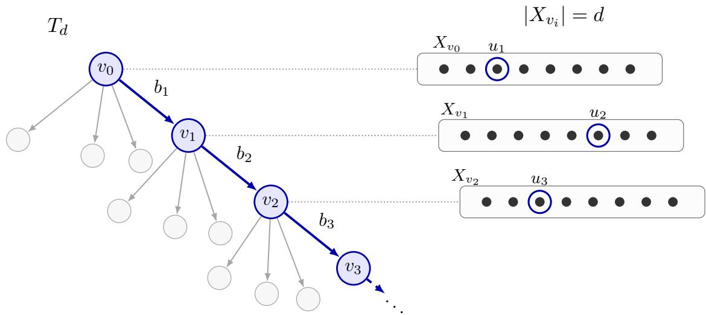
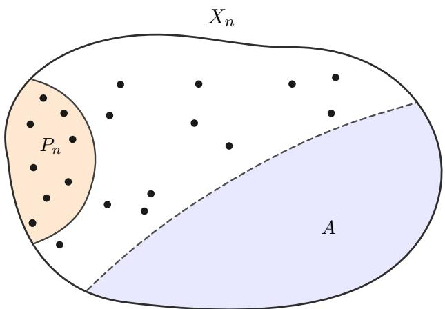
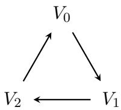

# Algorithmic Principles For Multiclass Learning Are Hard To Come By: Limits of Regularization and Proper Learning

Julian Asilis USC asilis@usc.edu

Shaddin Dughmi USC shaddin@usc.edu

Shang-Hua Teng USC shanghua@usc.edu

Vatsal Sharan USC vsharan@usc.edu

Alec Sun University of Chicago alecsun@uchicago.edu

Chang Wang Northwestern University wc@u.northwestern.edu

## Abstract

Two of the most fundamental questions in statistical learning theory are the following: which prediction problems are learnable, and how should they be learned? For the former, elegant answers often take the form of combinatorial dimensions, notably the VC dimension for binary classification and the DS dimension for multiclass. The latter question has proved considerably more elusive: all known general-purpose multiclass learners rely on intricate orientations of exponentially large one-inclusion structures, and familiar algorithmic principles such as proper learning and regularization remain poorly understood. Motivated by prior work, we ask whether learning reduces to proper learning—possibly over a larger hypothesis class—and whether proper or improper multiclass learning can ultimately be captured by suitable regularizers.

Our primary results answer both questions negatively, resolving three open problems from prior work. First, we exhibit a learnable multiclass problem that cannot be embedded in any properly learnable class, meaning learning cannot be reduced to proper learning by enlarging the hypothesis class. Second, we demonstrate that proper learning can require training error and characterize this phenomenon precisely: every properly learnable class admits a proper learner making o(m) errors on samples of size m, but every prescribed sublinear scale $a _ { m } = o ( m )$ is necessary for some properly learnable problem. Third, regularization is not a general learner: we exhibit a properly learnable class that cannot be learned by any Structural Risk Minimization (SRM) learner, and a learnable class that cannot be learned by any local regularizer. We complement these impossibility results with a positive theory that gives two suficient conditions for SRM learnability and characterizes SRM representability through integrability of revealed preferences. Together, our results delineate the limits of proper learning and regularization, along with the structural conditions under which regularization succeeds.

## Contents

1 Introduction 3   
1.1 Results . 5   
1.2 Techniques 5   
1.3 Related work 11   
2 Preliminaries 12   
2.1 Regularization models 13   
2.2 Topological conditions 14   
3 Proper Learning and Noninterpolation 15   
3.1 Learning does not reduce to proper learning 15   
3.2 Proper learning requires empirical error 19   
3.3 The exact scale of empirical noninterpolation 23   
4 Limits of Global and Local Regularization 24   
4.1 A closed incidence class beyond weighted SRM 24   
4.2 A PAC counterexample to hard local regularization 28   
5 Structural Conditions and Integrability 30   
5.1 Fallback localization . 30   
5.2 Ordered disagreement complexity 32   
5.3 Integrability of revealed preferences 34   
6 Conclusion 36   
A Auxiliary Probabilistic and Structural Lemmas 40   
A.1 Selecting a light marker 40   
A.2 A hidden-halfset lemma 40   
A.3 Projective-plane incidence estimates 41   
A.4 A weighted approximate-interpolation principle 41   
B Omitted Proofs for Empirical Noninterpolation 42   
B.1 The tunable lower bound 42   
B.2 Pathological learners 44

## 1 Introduction

Designing optimal, tractable learners for learnable problems stands as one of statistical learning theory’s most central goals. Such a learnable problem is described by a domain $\mathcal { X } .$ , label set $\mathcal { V }$ , and hypothesis class of functions $\mathcal { H } \subseteq \mathcal { V } ^ { \mathcal { X } }$ . A learner receives a training sample $\begin{array} { r } { S = \big ( ( x _ { i } , y _ { i } ) \big ) _ { i < n } , } \end{array}$ with each $x _ { i }$ drawn i.i.d. from a marginal distribution D over X and labeled by a hypothesis $\smash { \pi ^ { * } \in \mathcal { H } }$ i.e., $y _ { i } = h ^ { * } ( x _ { i } )$ . The purpose of a learner A is to ingest only the sample S and emit a predictor $A ( S ) : \mathcal { X } \to \mathcal { Y }$ with high probability of correctly classifying a freshly drawn test point $x _ { \mathrm { { t e s t } } } \sim \mathcal { D }$ That is, the learner seeks to minimize

$$
\begin{array} { r } { L _ { \mathcal { D } } \bigl ( A ( S ) \bigr ) = \underset { x _ { \mathrm { t e s t } } \sim \mathcal { D } } { \mathbb { P } } \Bigl ( A ( S ) ( x _ { \mathrm { t e s t } } ) \neq h ^ { * } ( x _ { \mathrm { t e s t } } ) \Bigr ) . } \end{array}
$$

Binary classification, where one employs the label set $\mathcal { V } = \{ 0 , 1 \}$ , enjoys a simple characterization of its (optimal) learners. Empirical Risk Minimization (ERM) learns whenever learning is possible, with nearly-optimal sample complexity, and a simple majority of just 3 ERM learners sufices to attain the optimal rate (Aden-Ali et al., 2024; Rawal and Zhivotovskiy, 2026). Perhaps surprisingly, the landscape for multiclass classification, with Y arbitrary, is strikingly more complex.

All known general-purpose multiclass learners appeal to abstract orientations of so-called oneinclusion graphs (OIGs), which can be exponentially large in the size of the training set $S ,$ or even infinite should Y be infinite (Aden-Ali et al., 2023; Brukhim et al., 2022; Pabbaraju, 2026). Such reliance on intractable OIGs can be partly explained: Some natural algorithmic templates have been ruled out for multiclass learning. In particular, Daniely and Shalev-Shwartz (2014) demonstrated the existence of learnable problems that cannot be learned by any proper learner, i.e., a learner that always emits a function in the underlying class H. Subsequently, Asilis et al. (2025b) exhibited the same failure for any aggregation of a bounded number of proper learners, such as a majority of 3 ERMs. How, then, can one hope to design a simple algorithmic framework for multiclass learning?

Two paths are suggested by prior work. The first appeals to regularization, one of the most fundamental algorithmic templates for learning with considerable successes on both theoretical and empirical fronts.1 Recall that a regularizer $\psi \colon { \mathcal { H } } \to \mathbb { R } _ { > 0 }$ assigns a score to each hypothesis $h \in \mathcal H$ often thought of as measuring the “complexity” of $h ,$ and that a Structural Risk Minimization (SRM) learner then trades of empirical risk with hypothesis complexity in an efort to avoid overfitting. In multiclass learning, Asilis et al. (2024b) exhibited optimal learners based upon unsupervised local regularization. In this framework, a learner receives a labeled sample $S = \left( \left( x _ { i } , y _ { i } \right) \right) _ { i \leq n }$ and uses only its unlabeled datapoints $( x _ { i } ) _ { i \leq n }$ to learn a local regularizer $\psi : \mathcal { H } \times \mathcal { X } \to \mathbb { R } _ { \ge 0 }$ . Intuitively, the local regularizer $\psi ( h , x )$ measures the “complexity” of a function $h$ at the test point $x ,$ reflecting the fact that hypotheses may act simply in certain regions of the domain and more intricately in others. At test time, for an unlabeled datapoint $x _ { \mathrm { { t e s t } } } \in \mathcal { X }$ , the learner makes the prediction

$$
A ( S ) ( x _ { \mathrm { t e s t } } ) \in \Bigl \{ h ( x _ { \mathrm { t e s t } } ) : h \in \underset { \mathcal { H } } { \arg \operatorname* { m i n } } \widehat { L } _ { S } ( h ) + \psi ( h , x _ { \mathrm { t e s t } } ) \Bigr \} .
$$

Note that the dependence of the regularizer upon the test point $x _ { \mathrm { { t e s t } } }$ is essential in order to express improper learners. (Intuitively, it permits a learner to “stitch together” various hypotheses in H when producing a predictor.)

It is, however, not clear whether the unsupervised pre-training stage of the local regularizer can be omitted. Perhaps all that is required to learn a classification problem is an appropriate choice of local regularizer $\psi : \mathcal { H } \times \mathcal { X } \to \mathbb { R } _ { \ge 0 }$ encoding the “complexity” of hypotheses at particular regions in the domain. Precisely this question was recently articulated by Asilis et al. (2024a).

Open Problem 1 ((Asilis et al., 2024a)). Can all learnable multiclass problems H be learned by a local regularizer? If so, with (nearly) optimal sample complexity?

A second path towards simplicity in multiclass learning is to invoke an additional assumption on the underlying hypothesis class H. Perhaps the most natural is that of proper learnability, i.e., to assume that H can be learned while only emitting hypotheses in H itself. In this setting, the most ambitious goal would be to demonstrate that classic regularization is all one needs. This question, too, was previously raised and remains open.

Open Problem 2 ((Asilis et al., 2025a)). Let H be a properly learnable multiclass problem. Must H be learnable by an SRM learner?

Allow us to briefly remark upon a subtlety related to Open Problem 2. In the design of improper learners for learnable multiclass problems, one makes crucial use of the fact that learnability amounts to finiteness of the DS dimension (Brukhim et al., 2022; Pabbaraju, 2026). That is, finiteness of H’s DS dimension provides an important handhold in analyzing successful learners, by way of H’s one-inclusion graphs. Proper learnability, however, is a fundamentally stranger beast. Asilis et al. (2025a) demonstrated that it cannot be characterized by any combinatorial dimension, and that it can even be logically undecidable, i.e., independent of the ZFC axioms. This complicates the task of resolving Open Problem 2 in either direction, as merely establishing the proper learnability of a hypothesis class can be surprisingly involved (or even undecidable!).

Finally, there is a curious commonality shared by existing hypothesis classes designed to be improperly learnable yet not properly learnable: they can easily be made properly learnable with the addition of a small number of functions to the class. This includes the first Cantor class of Daniely and Shalev-Shwartz (2014), along with the EMX learning problem of Ben-David et al. (2019) when viewed as a classification problem as in Asilis et al. (2025a). This raises an alluring possibility: perhaps all learnable classes can be embedded within properly learnable classes.

Open Problem 3 ((Asilis et al., 2025a)). Is every learnable hypothesis class H contained within a properly learnable class $\mathcal { H } _ { \mathrm { p r o p } } \supseteq \mathcal { H } ?$

Note that a positive resolution to Open Problem 3 would establish, roughly speaking, that general multiclass learning can be reduced to proper learning. If it were accompanied by a positive resolution to Open Problem 2, demonstrating that proper learning reduces to SRM, it would then be the case that general multiclass learning reduces to SRM!

Unfortunately, our results demonstrate that the picture is not so rosy: multiclass learning resists simple algorithmic principles, even under the promise of proper learnability. We elaborate upon our impossibility results, and upon our characterizations of SRM learnability, in Section 1.1.

## 1.1 Results

Our primary results resolve Open Problems 1 to 3 in the negative. We divide our contributions into three groups.

• Proper learning and noninterpolation. We first show that general multiclass learning does not reduce to proper learning, even after enlarging the learner’s output space. That is, there exists a learnable class that cannot be embedded into any properly learnable envelope, resolving Open Problem 3 in the negative (Theorem 3.1). We next construct a topologically well-behaved hypothesis class that is properly learnable but cannot be learned by any interpolating proper learner (Theorem 3.6). Finally, we give a tight quantitative account of this phenomenon: every properly learnable class admits a proper learner making $o ( m )$ errors on every realizable sample of size m, and every prescribed sublinear scale $a _ { m } = o ( m )$ is necessary for some properly learnable problem (Theorems 3.8 and 3.9). Thus proper learners never need to sacrifice a constant fraction of their training sample, but within the sublinear regime essentially any number of errors can be forced.

• Limits of global and local regularization. We first demonstrate that regularization-based learners can fail even on problems that are properly learnable. Namely, we exhibit a properly learnable class for which every weighted SRM objective of the form $h \longmapsto { \widehat { L } } _ { S } ( h ) + \lambda ( S ) \cdot \psi ( h )$ fails to learn, resolving Open Problem 2 in the negative (Theorem 4.2). We next consider whether local regularizers, which may combine diferent hypotheses at diferent test points and thereby express improper learners, succeed whenever improper learning is possible. Here we again give a negative answer: we construct a learnable class that lies beyond the reach of local regularization, resolving the PAC version of Open Problem 1 (Theorem 4.6). We note that the concurrent, independent work of Hou (2026) also exhibited such a counterexample; we compare and contrast our approach in Section 1.3.

• Suficient conditions for SRM. We complement these impossibility results with two positive routes to SRM learnability. First, we show that hard SRM succeeds whenever non-trivial samples admit a consistent hypothesis from a fixed finite family of hypotheses; more generally, the same principle applies when the relevant hypotheses lie inside a statistically simple sublevel of the regularizer (Theorems 5.3 to 5.5). Second, we introduce an order-sensitive disagreement dimension that similarly measures the complexity of sublevel sets of the regularizer. We prove that finiteness of this dimension sufices for hard-SRM learnability, though it is not necessary (Theorem 5.7 and Example 5.8). Finally, we characterize when the behavior of a particular learner can be witnessed by a regularizer. Here we find that a consistent learner is representable by SRM precisely when the pairwise preferences revealed by its choices are acyclic, while weighted SRM representability over finite systems is equivalent to positivity of every revealed-preference cycle (Theorems 5.11 and 5.14).

## 1.2 Techniques

Our proofs appeal to diverse combinatorial tools: diagonal arguments on rooted trees, projectiveplane expansion, and directed-triangle counting. Let us describe the key ideas.

  
Figure 1: The tree underlying the no-envelope construction. Each node v is associated with a block $X _ { v } ,$ and its children are indexed by all binary labelings of that block. A target follows the highlighted finite path, selecting one public coordinate $u _ { i }$ in each visited non-terminal block and using a private label elsewhere. In the lower bound, each continuation $b _ { i }$ is a d-bit pattern missing from the learner’s image at the current block.

No properly learnable envelope. We first ask whether an arbitrary learnable multiclass problem H can be embedded into a properly learnable envelope $\mathcal { H } _ { \mathrm { p r o p } } \supseteq \mathcal { H }$ . Were this true, then general learning would reduce to proper learning in a precise sense: one could properly learn ${ \mathcal { H } } _ { \mathrm { p r o p } }$ , thereby obtaining a learner A for H whose image is contained in a properly learnable class. We rule out this possibility by constructing a learnable class H for which every successful learner A must satisfy $\operatorname { D S } ( \operatorname { i m } ( A ) ) = \infty$ . In particular, the image of A cannot be contained in any learnable class, even improperly so.

The construction (illustrated in Figure 1) employs, for each $d \geq 1$ , an infinite complete $2 ^ { d } \cdot$ ary tree $T _ { d } . ^ { 2 }$ To every node

$$
v = ( b _ { 1 } , \ldots , b _ { k } ) , \qquad b _ { i } \in \{ 0 , 1 \} ^ { d } ,
$$

at depth $k ,$ we associate a fresh block of domain points $X _ { v } = \{ x _ { v , 1 } , \ldots , x _ { v , d } \}$ . The node v has one child $( v , b )$ for every binary labeling $b \in \{ 0 , 1 \} ^ { d }$ of $X _ { v }$ . A target hypothesis chooses a finite path

$$
\emptyset = v _ { 0 } \prec v _ { 1 } \prec \cdot \cdot \cdot \prec v _ { \ell }
$$

and one coordinate $u _ { i } \in [ d ]$ from each non-terminal block along that path. At the selected point $x _ { v _ { i - 1 } , u _ { i } }$ , it predicts the public bit $b _ { i } ( u _ { i } ) \in \{ 0 , 1 \}$ ; at every other point, it predicts a private label identifying the entire target.

First note that the class can be improperly learned: if a private label is present in the sample, then the target function has been revealed. Otherwise, the sample is supported on public labeled points, which reveal a branch prefix—as each node $v _ { k }$ records the earlier vectors $b _ { 1 } , \ldots , b _ { k }$ . An improper learner can simply stitch together the public predictions from the longest such prefix, emitting a default label elsewhere. Informally, this emitted classifier can err only on an unobserved private region or the as-yet-unseen tail of the path, both of which have small mass whenever the sample has missed them.

Now let A be an arbitrary successful learner for H. We show that $\operatorname { D S } ( \operatorname { i m } ( A ) ) = \infty$ . To this end, it sufices to show that for each $d \in \mathbb { N } .$ im(A) contains a d-dimensional binary hypercube of functions, $\mathrm { e . g . }$ , the behaviors $\{ 0 , 1 \} ^ { d }$ on a set of d unlabeled datapoints.3 Fix one such $d \in \mathbb { N }$ , and consider the d points in the block associated with each node of $T _ { d }$ . There are two possibilities. If at some node, every binary labeling of the block is realized by some hypothesis in $\operatorname { i m } ( A )$ , then the image of A contains a full d-dimensional binary cube, meaning $\operatorname { D S } ( \operatorname { i m } ( A ) ) \geq d .$ . Otherwise, every node has some binary labeling of its block that is not realized by any hypothesis in im(A). Since the children of a node are indexed by all binary labelings of its block, we may follow the corresponding child. Repeating this procedure produces an infinite path P along which the image of A misses a (prescribed) labeling at every depth.

The second possibility is incompatible with the success of A. To see why, fix a sample size $m = | S |$ and take a prefix of P of length $2 m ,$ , say $P _ { 2 m }$ . At each depth of $P _ { 2 m }$ , choose one of the d points uniformly at random as public points. Then construct the hard distribution by distributing mass uniformly across the chosen public points. Clearly, a sample of size m leaves at least half of the depths in $P _ { 2 m }$ unseen. Then at any unseen depth, the learner’s output must disagree with the prescribed labeling on at least one point in the block. Since the selected public point at that depth remains uniformly random among those d points, the learner errs with probability at least $\textstyle { \frac { 1 } { d } }$ . As m is arbitrary, this implies that A does not attain vanishing expected error, contradicting the PAC guarantee.

Thus only the first possibility can occur. That is, for every $d ,$ some block must contain a full d-dimensional binary cube in the image of A, meaning DS $\left( \operatorname { i m } ( A ) \right) = \infty$ as desired.

Proper learning beyond interpolation. To separate proper learning from interpolation, our starting point is the first Cantor class of Daniely and Shalev-Shwartz (2014). Each finite block ${ \mathcal { X } } _ { n }$ supports the class

$$
\mathcal { H } _ { n } = \left\{ h _ { A } : A \subseteq \mathcal { X } _ { n } , \ | A | = \frac { | \mathcal { X } _ { n } | } { 2 } \right\} , \qquad h _ { A } ( x ) = \left\{ \begin{array} { l l } { \lambda _ { A } , } & { x \in A , } \\ { \star , } & { x \in \mathcal { X } _ { n } \setminus A , } \end{array} \right.
$$

where $\lambda _ { A }$ is a private label unique to A. Taking $\begin{array} { r } { \mathcal { X } = \bigcup _ { n \in \mathbb { N } } \mathcal { X } _ { n } } \end{array}$ and extending every hypothesis by the fresh label \$ outside its own block gives the full class. Thus each hypothesis outputs a unique identifier on one half of its block and the uninformative label ⋆ on the other. The class is easily learned improperly: either the sample contains a private label that definitively reveals the target, or the learner may safely output the simple predictor that is constantly ⋆ on the active block and \$ elsewhere. A proper learner, however, can be forced to guess an arbitrary half-set $A \subseteq { \mathcal { X } } _ { n }$ using only draws from its complement. Choosing $| { \mathcal { X } } _ { n } |$ large relative to |S| therefore destroys proper learnability.

  
Figure 2: The hard distribution for the poisoned first-Cantor construction. The target $h _ { A }$ predicts the private label $\lambda _ { A }$ on the hidden half-set A, and the common label ⋆ on $X _ { n } \setminus A$ . The marker region $P _ { n } \subseteq X _ { n } \ \backslash$ A receives total mass $1 / 4$ , while the remaining common-label region receives mass $3 / 4$ The sample therefore hits every marker in $P _ { n }$ , ruling out the poisoned fallbacks, while revealing only a sparse portion of the common-label region.

We augment this construction by adding a small number of “poisoned” hypotheses to ${ \mathcal { H } } _ { n }$ that each output the ⋆ label on all of $\mathcal { X } _ { n }$ , save for a distinguished marker point. In particular, we first carve a small marker region $P _ { n }$ within ${ \mathcal { X } } _ { n }$

$$
P _ { n } = \{ z _ { 1 } , \dots , z _ { r _ { n } } \} \subseteq \mathcal { X } _ { n } , \qquad r _ { n } \longrightarrow \infty , \qquad | P _ { n } | \ll | \mathcal { X } _ { n } | .
$$

We then require each private half-set A to avoid $P _ { n } ,$ so that every Cantor hypothesis $h _ { A }$ assigns the common label ⋆ to the marker region. For every marker $z _ { i } \in P _ { n }$ , we then introduce an additional hypothesis $h _ { z _ { i } }$ satisfying

$$
h _ { z _ { i } } ( z _ { i } ) = \lambda _ { z _ { i } } , \qquad h _ { z _ { i } } ( x ) = \star \quad \mathrm { f o r ~ e v e r y ~ } x \in \mathcal { X } _ { n } \setminus \{ z _ { i } \} .
$$

Each $h _ { z _ { i } }$ is thus an almost-all-⋆ hypothesis, deliberately poisoned at one marker.

When the sample contains only ⋆ labels, a successful proper learner can output any hypothesis associated with one of the least frequently observed markers. If a marker is absent from the sample, i.e., $S \subseteq { \mathcal { X } } _ { n } \setminus P _ { n }$ and all labels are ⋆, then this choice is interpolating. However, if every marker $p \in P _ { n }$ appears in $S$ with the label ⋆, then the proper learner sacrifices the least frequently observed marker $p _ { \operatorname* { m i n } } \in P _ { n }$ , and outputs $h _ { p _ { \mathrm { m i n } } }$ . (See Figure 2.) An elementary probabilistic argument can be used to show that, because $| P _ { n } | = \omega ( 1 ) , p _ { \mathrm { m i n } }$ has population mass $o ( 1 )$ with high probability. On the other hand, when the sample contains any non-⋆, then the true labeling function has been identified by its private label, guaranteeing 0 test error. Thus the described proper learner, which does not interpolate, is indeed a PAC learner.

To see that such noninterpolation is necessary, consider the process which selects $h _ { A }$ uniformly at random and assigns $1 / 4$ mass uniformly to $P _ { n }$ , with the remaining $3 / 4$ mass uniform on $A ^ { C } \setminus P _ { n }$ For samples of order $\left| P _ { n } | \log ( | P _ { n } | ) \right.$ , it will occur with high probability that every marker in $P _ { n }$ is observed in the training set S. Thus all marker hypotheses are noninterpolating for S. Then succeeding with an interpolating proper learner amounts to learning the usual first Cantor class — the learner must guess the hidden half-set A from only a negligible fraction of its complement. This is impossible.

The exact empirical-error scale. The same construction can be tuned to demonstrate that any number $a _ { m } = o ( m )$ of empirical errors is necessary for certain properly learnable problems. In particular, fix one such $a _ { m } = o ( m )$ . We calibrate the number and masses of the markers so that each marker hypothesis incurs $\Theta ( a _ { m } )$ errors on an m-sample from a realizable distribution. (The right values happen to be roughly $| \mathcal { X } _ { m } | = \Theta ( m ^ { 3 } )$ and $| P _ { m } | = \operatorname* { m i n } \{ e ^ { \Theta ( a _ { m } ) } , \sqrt { m / a _ { m } } \}$ , with probability $\Theta ( a _ { m } / m )$ placed on each marker.) As argued previously, a proper learner can only succeed by selecting such a marker hypothesis, thus forcing $\Omega ( a _ { m } )$ training errors with constant probability.

To demonstrate that a sublinear number of training errors can always be achieved, we first fix an arbitrary (successful) proper learner A. We then describe a procedure by which A yields a proper learner with $o ( m )$ empirical errors. In particular, we train A on a prefix of the sample—of carefully chosen length—and then validate its output on the remaining sufix. If the candidate passes validation, it already makes few errors on the complete sample; otherwise, we simply “forfeit” and output an arbitrary interpolating hypothesis. Crucially, it is possible to select the prefix length and validation threshold along a suficiently slow diagonal to achieve an $o ( m )$ bound while preserving PAC learnability (Theorems 3.8 and 3.9).

Global regularization. Our previous “poisoned” Cantor construction demonstrates that a successful proper learner may need to sacrifice empirical fit in order to generalize. Recall that weighted SRM permits precisely such a trade-of by minimizing the objective $h \mapsto \widehat { L } _ { S } ( h ) + \lambda ( S ) \psi ( h )$ (Equation (2)). Ruling it out therefore requires a diferent obstruction. Rather than merely eliminating every consistent safe hypothesis, we must ensure that every scalar regularizer ranks some statistically bad hypothesis at least as favorably as a good one.

Our construction begins with three disjoint vertex sets $V _ { 0 } , V _ { 1 } , V _ { 2 }$ , each of size $N ,$ connected cyclically by copies of the same bipartite graph, as below.

More precisely, for every $r \in \mathbb { Z } / 3 \mathbb { Z }$ , we orient a d-regular bipartite graph from $V _ { r }$ to $V _ { r + 1 }$ . For a vertex $v \in V _ { r }$ , we write $\Gamma ^ { + } ( v ) \subseteq V _ { r + 1 }$ to denote its set of d outgoing neighbors. We let $S ( v ) : = \{ v \} \cup \Gamma ^ { + } ( v )$ denote the support of v. Then only three graph-theoretic properties are needed: every vertex has large degree d; the supports of two distinct vertices intersect in at most one point; and any two subsets $U \subseteq V _ { r }$ and $W \subseteq V _ { r + 1 }$ , each occupying a constant fraction of its respective part, have $\Omega ( d N )$ edges between them. Informally, the graph has very small codegree but remains suficiently dense and well mixed across large sets. Projective-plane incidence graphs satisfy these requirements, with $N = q ^ { 2 } + q + 1$ and $d = q + 1 = \Theta ( { \sqrt { N } } )$ , and we therefore use them in the formal construction.

For every vertex v, we introduce a Boolean-cube block $Z _ { v } : = \{ 0 , 1 \} ^ { \Gamma ^ { + } ( v ) }$ , and the domain $\mathcal { X } _ { N }$ is the disjoint union of all such blocks. We refer to v as the owner of $Z _ { v }$ . Each vertex u gives rise to a hypothesis $g _ { u }$ in the following manner: on its own block $Z _ { u }$ , the hypothesis $g _ { u }$ predicts ⋆ everywhere. On a block $Z _ { v }$ for which $u \in \Gamma ^ { + } ( v )$ , it acts like a first Cantor classifier, i.e., predicting ⋆ on half of

$Z _ { v }$ and a private label $\lambda _ { u }$ on the remaining half of $Z _ { v }$ . In particular, on input $z \in Z _ { v } = \{ 0 , 1 \} ^ { \Gamma ^ { + } ( v ) }$ $g _ { u }$ predicts ⋆ when $z _ { u } = 0$ and $\lambda _ { u }$ when $z _ { u } = 1$ . On all remaining blocks, for which u /∈ $\Gamma ^ { + } ( v )$ , the hypothesis $g _ { u }$ simply acts as the constant function emitting $\lambda _ { u } .$ . Crucially, each block $Z _ { v }$ witnesses three kinds of behaviors: the all-private-label behavior induced by any classifier $g _ { u }$ with $u \notin S ( v )$ the all-⋆ behavior induced by the owner $g _ { v }$ , and Cantor-like behaviors induced by the remaining hypotheses $\{ g _ { u } : u \in \Gamma ^ { + } ( v ) \}$

We first argue that the class is properly learnable. If a private label $\lambda _ { u }$ is observed in the sample, then the true classifier has simply been revealed as $g _ { u } .$ . Otherwise, the sample must consist of only ⋆-labeled points. If such points lie in two blocks $Z _ { u }$ and $Z _ { v }$ , then the target function must belong to $S ( u ) \cap S ( v )$ . By the second of our 3 graph-theoretic properties, this set has cardinality 1, thus revealing the target function. Finally, if all the ⋆-labeled datapoints lie in a single block $Z _ { v }$ , then we can safely predict its owner $g _ { v }$ , which acts as the all-⋆ classifier on $Z _ { v }$

To defeat a regularizer $\psi _ { : }$ , we first use the cyclic arrangement to find two adjacent parts $V _ { r }$ and $V _ { r + 1 }$ whose median regularizer values are nonincreasing. Let $U$ be the upper half of the first part and W the lower half of the second, as measured by the regularizer. Since these two large sets span $\Omega ( d N )$ edges—by our third graph-theoretic requirement—some vertex $v \in U$ has $\Omega ( d )$ outgoing neighbors $w \in W$ . Each such neighbor satisfies $\psi ( g _ { w } ) \leq \psi ( g _ { v } )$ . We then take $g _ { v }$ as the target and sample unlabeled data uniformly from $Z _ { v }$ . Crucially, every hypothesis other than $g _ { v }$ incurs population error $\geq \frac { 1 } { 2 }$ on this distribution. However, each neighboring $g _ { w }$ will happen to interpolate an m-sample with probability $2 ^ { - m }$ . By taking d exponential in $m ,$ some such neighbor will interpolate with constant probability. On this event, either $g _ { v }$ is not a minimizer of the weighted objective, in which case every minimizer is bad, or $g _ { v }$ is a minimizer and the bad neighbor ties it. The argument therefore survives arbitrary ties and arbitrary sample-dependent choices of $\lambda ( S )$ including $\lambda ( S ) = 0$ (Theorem 4.2).

Local regularization. The preceding lower bound ultimately exploits a single global ranking of the hypotheses. Local regularization can evade this obstruction by changing its preferences with the test point: at each $x ,$ , it may choose some $h _ { S , x } \in \arg \operatorname* { m i n } _ { h \in \mathrm { V S } ( S ) } \psi ( h , x )$ and predict $h _ { S , x } ( x )$ (Equation (3)). Indeed, on the incidence class above, a local regularizer could simply rank the owner $g _ { v }$ first throughout its block $Z _ { v }$ . To obtain a lower bound, we therefore need a collection of pointwise preferences that cannot all be satisfied simultaneously. The cyclic structure of the preceding construction remains useful, but the projective-plane geometry is no longer needed: it sufices to simply consider a complete tripartite graph.

In particular, for each sample size m, set $N = 2 ^ { m - 1 }$ and consider the complete tripartite graph $G _ { m } = K _ { N , N , N }$ . An unlabeled datapoint is an orientation of every edge of $G _ { m } ,$ and each edge $e = \{ a , b \}$ defines a hypothesis $h _ { e }$ that outputs the endpoint toward which e is directed. Thus every hypothesis uses only two labels, and improper learning is immediate: two observed labels identify the target edge, while a sample containing only one label permits the corresponding constant predictor. The lower bound, meanwhile, is witnessed by directed cyclic triangles. Given a test orientation, let $f$ be the earliest edge of such a triangle in the local regularizer’s order, let $e$ be the preceding edge around the cycle, and let a be the tail of $f .$ Then the target $h _ { e }$ predicts $^ { a , }$ whereas the locally preferred hypothesis $h _ { f }$ does not. The learner must therefore err whenever $f$ survives the sample and every incident edge ranked ahead of it is eliminated, an event of probability at least $2 ^ { - m } ( 1 - 2 ^ { - m } ) ^ { 2 N }$ . A random orientation contains $N ^ { 3 } / 4$ directed cyclic triangles on average, compared with only $3 N ^ { 2 }$ possible target edges. Taking $N = 2 ^ { m - 1 }$ and averaging over these witnesses yields a target-distribution pair on which the learner has constant error (Theorem 4.6).

Positive results. Our positive results are organized around the complementary ideas of localization and integrability. Localization asks whether the ambiguity remaining after observing the sample is substantially simpler than the full hypothesis class. The cleanest example is a finite fallback core ${ \mathcal { F } } \colon$ every realizable sample either uniquely identifies the target or leaves at least one member of $\mathcal { F }$ consistent. An SRM rule may therefore rank $\mathcal { F }$ first, after which an ordinary finite-class generalization bound completes the argument. More generally, it sufices that every sample S with $| \mathrm { V S } ( S ) | > 1$ retain a consistent hypothesis inside a regularizer sublevel $\mathcal { H } _ { r _ { m } } : = \{ h : \psi ( h ) \leq r _ { m } \}$ whose complexity grows suficiently slowly with $m$ . Ordered disagreement $\mathrm { g i }$ ves a target-dependent version of the same principle. Since the target $h ^ { \star }$ is always consistent, every SRM output $g$ satisfies $\psi ( g ) \leq \psi ( h ^ { \star } )$ We therefore need not control the full class $\mathcal { H } ;$ it is enough to bound the VC dimension of the disagreement sets $\{ x : g ( x ) \neq h ^ { \star } ( x ) \}$ generated by hypotheses lying below $h ^ { \star }$ in the regularizer order. An ε-net argument then ensures that every such disagreement set of substantial mass is hit by the sample, forcing the SRM output to have small population error (Theorems 5.3 to 5.5 and 5.7).

Integrability instead begins with a learner and asks whether its sample-dependent choices can be represented by one regularizer. Whenever a consistent learner chooses h while another hypothesis $g$ remains feasible, it reveals a preference for $h$ over $g .$ In the hard-SRM setting, such choices admit a scalar representation exactly when the resulting preference relation is acyclic. Weighted SRM also records the empirical-loss margin supporting each preference, producing a system of strict diference constraints on the values $\psi ( h )$ . Summing these inequalities around a cycle eliminates the unknown potential; over finite systems, positivity of every cycle is both necessary and suficient for reconstructing a regularizer realizing all of the learner’s choices (Theorems 5.11 and 5.14).

## 1.3 Related work

Multiclass learnability. Daniely and Shalev-Shwartz (2014) introduced the DS dimension and conjectured it to characterize improper multiclass learnability over arbitrary label sets. This characterization was later confirmed by the breakthrough work of Brukhim et al. (2022), using an intricate learner based upon list-learning reductions and orientations of one-inclusion graphs. More recently, Pabbaraju (2026) settled the sample complexity of realizable multiclass learning by proving a quantitative version of a Daniely–Shalev-Schwartz conjecture, building upon combinatorial work of Hanneke et al. (2026). The separation between proper and improper multiclass learning originates in the first Cantor construction of Daniely and Shalev-Shwartz (2014), which exhibits a learnable class admitting no proper learner. Asilis et al. (2025b) strengthened this obstruction by ruling out every aggregation of a bounded number of proper learners for general multiclass problems. Furthermore, Asilis et al. (2025a) demonstrated that proper learnability can be a poorly-behaved condition, by proving that it cannot be characterized by any combinatorial dimension, and that it can even be logically undecidable (Ben-David et al., 2019).

Regularization in multiclass learning. Structural risk minimization is among the classical mechanisms for trading empirical fit against hypothesis complexity (Shalev-Shwartz and Ben-David, 2014). In multiclass learning, Asilis et al. (2024b) showed that optimal learners can be expressed through substantially more flexible notions of regularization: the regularizer may be inferred from unlabeled data and may depend upon the test point, thereby combining diferent hypotheses across diferent regions of the domain. The necessity of these relaxations motivated the question of Asilis et al. (2024a), who asked whether a fixed local regularizer can nevertheless learn every multiclass problem. Jafar et al. (2025) gave a negative answer in the transductive setting while leaving the PAC model open. We exhibit a tripartite construction that furthermore rules out local regularization in the PAC model, settling the problem completely. We note that the concurrent and independent work of Hou (2026) obtains a closely related counterexample derived from tournaments on complete graphs. Both proofs exploit directed cyclic triangles as certificates of incompatible local preferences, but the analyses proceed diferently: Hou (2026) first expresses the learner’s risk as a weighted count of inversions in the local edge order, whereas our tripartite construction isolates from each cyclic triangle a concrete bad edge whose survival forces an error, allowing for a somewhat more direct argument. On the proper side, prior work asked whether the promise of proper learnability is enough to recover classical SRM as a general learner (Asilis et al., 2025a). We again answer this question in the negative, even when the coeficient on the regularization term is permitted to depend arbitrarily upon the complete labeled sample.

Revealed preferences and integrability. Our representation results connect SRM with the classical theory of rational choice. A deterministic learner choosing from sets of feasible hypotheses defines a choice rule, and asking for an SRM representation amounts to asking whether these choices can be rationalized by one scalar ordering. Acyclicity, contraction consistency, and path independence are familiar themes in this literature (Plott, 1973). Weighted SRM introduces sample-dependent empirical-loss ofsets, leading instead to systems of diference constraints and corresponding cycle conditions. This perspective bears a broad resemblance to revealed-preference and cyclic-monotonicity arguments in economics and mechanism design (Afriat, 1967; Rochet, 1987), although the formal settings and questions are diferent.

## 2 Preliminaries

Our setting is realizable multiclass PAC learning. X and Y are, respectively, an arbitrary unlabeled data domain and label set. We permit Y to be infinite throughout the paper. A hypothesis class is a set $\mathcal { H } \subseteq \mathcal { V } ^ { \mathcal { X } }$ , and a labeled example is a pair $( x , y ) \in \mathcal { X } \times \mathcal { Y }$ . Given a sample $S = ( ( x _ { 1 } , y _ { 1 } ) , \dots , ( x _ { m } , y _ { m } ) )$ , its empirical loss is $\textstyle { \widehat { L } } _ { S } ( h ) : = { \frac { 1 } { m } } \sum _ { i = 1 } ^ { m } \mathbf { 1 } \{ h ( x _ { i } ) \neq y _ { i } \}$ . For a distribution D on X and a target $h ^ { \star } \in { \mathcal { H } }$ , the population loss of h is $L _ { D } ( \ddot { h } , h ^ { \star } ) : = \mathbb { P } _ { x \sim D } [ h ( x ) \neq h ^ { \star } ( x ) ]$ A sample is realizable if there exists an $h ^ { \star } \in { \mathcal { H } }$ such that $y _ { i } = h ^ { \star } ( x _ { i } ) \forall i$ . A learner is a function $( \mathcal { X } \times \mathcal { Y } ) ^ { < \omega }  \mathcal { Y } ^ { \mathcal { X } }$ , and is proper if its output always lies in H, otherwise improper. We say that A PAC learns H if for every $\varepsilon , \delta \in ( 0 , 1 )$ there exists $n _ { A } ( \varepsilon , \delta )$ such that for all $m \geq n _ { A } ( \varepsilon , \delta )$ , every $h ^ { \star } \in { \mathcal { H } }$ , and every marginal D,

$$
\operatorname { \mathbb { P } } _ { S \sim D ^ { m } } \left[ L _ { D } ( A ( S ) , h ^ { \star } ) > \varepsilon \right] \leq \delta ,
$$

where the sample is labeled by $h ^ { \star }$ .

The version space of a realizable sample S is

$$
\operatorname { V S } ( S ) : = \left\{ h \in { \mathcal { H } } : { \widehat { L } } _ { S } ( h ) = 0 \right\} .
$$

A consistent proper learner, or interpolating proper learner, is one whose output always lies in VS(S). A realizable sample S is said to be ambiguous if $| \mathrm { V S } ( S ) | \ge 2$

## 2.1 Regularization models

A regularizer for H is a function $\psi : \mathcal { H } \to \mathbb { R } _ { \geq 0 }$ , thought of as encoding an inductive bias over hypotheses in H. Roughly, hypotheses $h \in \mathcal H$ with smaller values under ψ are thought of as being preferred by $\psi ,$ perhaps owing to their “simplicity.” A local regularizer for H is a function $\psi : \mathcal { H } \times \mathcal { X } \to \mathbb { R } _ { \ge 0 }$ , likewise thought of as expressing preferences over hypotheses in ${ \mathcal { H } } ,$ but at a more granular, location-dependent level.

We now describe three manners in which (local) regularizers give rise to Structural Risk Minimization (SRM) learners. In particular, Hard SRM minimizes $\psi$ among interpolating hypotheses for S (i.e., among the version space VS(S)), Weighted SRM minimizes the sum of empirical risk and ψ across all of H, and local regularization minimizes $\psi ( \cdot , x _ { \mathrm { t e s t } } )$ locally at $x _ { \mathrm { t e s t } }$ among interpolating hypotheses.

Definition 2.1 (Hard SRM). Let ψ be a regularizer for H. A learner A is said to be induced by ψ as a hard-SRM learner if the following condition holds over all realizable samples S,

$$
A ( S ) \in \underset { h \in \mathcal { H } } { \arg \operatorname* { m i n } } \big \{ \psi ( h ) : h \in \mathrm { V S } ( S ) \big \} .\tag{1}
$$

Should all hard-SRM learners induced by ψ successfully learn H, then ψ itself is said to learn H.

Definition 2.2 (Weighted SRM). Let ψ be a regularizer for H and let $\lambda : ( \mathcal { X } \times \mathcal { Y } ) ^ { < \omega } \to { \mathbb R } _ { > 0 }$ . A learner A is induced by the pair $( \psi , \lambda )$ as a weighted-SRM learner if for all samples S,

$$
A ( S ) \in \underset { h \in \mathcal { H } } { \arg \operatorname* { m i n } } \left\{ \widehat { L } _ { S } ( h ) + \lambda ( S ) \psi ( h ) \right\} .\tag{2}
$$

Should all weighted SRM learners induced by the pair (ψ, λ) be PAC learners for H, then they are said to learn H.

Definition 2.3 (Local Regularization). Let $\psi : \mathcal { H } \times \mathcal { X } \to \mathbb { R } _ { > 0 }$ be a local regularizer. A learner A is induced by ψ if for all samples S and points $x \in \mathcal { X }$

$$
A ( S ) ( x ) \in \arg \operatorname* { m i n } { \big \{ } \psi ( h , x ) : h \in \mathrm { V S } ( S ) { \big \} } .\tag{3}
$$

When all learners induced by ψ are PAC learners for H, then $\psi$ is said to learn H.

A notable feature of our definitions is that we only crown a (local) regularizer ψ as having successfully learned a hypothesis class H if all learners it induces are PAC learners for H. In short, we take a worst-case perspective with respect to tie-breaking of the argmin in Equations (1) to (3): any fixed choice of tie-breaking must produce a successful learner. Semantically, this amounts to requiring that the success of a regularizer $\psi$ owe itself only to discernments made by $\psi _ { ; }$ , not a particular sequence of good tie-breaking decisions.

## 2.2 Topological conditions

Several of our forthcoming results take the form of impossibility theorems, prohibiting families of regularization-based learners from succeeding on certain learnable problems. We have found that such learnable counter-examples can often be found — in a somewhat artificial way — by exploiting hypothesis classes that are not topologically closed, i.e., that do not contain all their limit points. Briefly, the idea is that one can design H lacking a limit point f which could easily be learned by a regularizer favoring f over all other hypotheses, if only f were in H. In order to exclude such classes, we thus require all counter-examples presented in the paper to satisfy two regularity conditions.

The first requirement is that H should be closed in the product topology on $y x$ , when Y is endowed with the discrete topology. (I.e., the topology given by the 0-1 loss function on Y.) In the event that Y is infinite, however, closedness of H can be “cheated” by simply appending a single point to the domain X and having each hypothesis emit a unique label on that point. As our second condition, we thus require that $| \mathcal { H } ( { x } ) | = | \{ h ( { x } ) : h \in \mathcal { H } \} |$ be finite at each $x \in \mathcal { X }$ , which we refer to as having pointwise finite range.4

Definition 2.4. Let $\mathcal { H } \subseteq \mathcal { V } ^ { \mathcal { X } }$ be a hypothesis class.

(i) We say that H is closed if it is closed in the product topology on $y x$ when each copy of Y carries the discrete topology.

(ii) We say that H has pointwise finite range if for every $x \in \mathcal { X }$ the following set is finite:

$$
\mathcal { H } ( \boldsymbol { x } ) : = \{ h ( \boldsymbol { x } ) : h \in \mathcal { H } \} .
$$

(iii) A finite set $I \subseteq { \mathcal { X } }$ is an identifier for H if the restriction map $h \mapsto h \lceil _ { I }$ is an injection on H.

It is useful to observe that the product-topological definition of closedness admits an elementary finite-projection reformulation. The following lemma arises directly from the definition of the product topology.

Lemma 2.5. A class $\mathcal { H } \subseteq \mathcal { V } ^ { \mathcal { X } }$ is closed if and only if the following holds: whenever $f : \mathcal { X }  \mathcal { Y }$ has the property that for every finite $I \subseteq { \mathcal { X } }$ there exists $h _ { I } \in \mathcal { H }$ with $f \ \lceil \tau = h _ { I } \ \lceil _ { I }$ , then $f \in \mathcal H$

It is not dificult to see from Lemma 2.5 that any class H with a finite identifier I is automatically rendered closed, by considering sets of the form $I \cup \{ x \}$ for each $x \in \mathcal { X }$ . Conversely, if H is infinite and has pointwise finite range, then it cannot admit a finite identifier, as for any finite $I \subseteq { \mathcal { X } }$ one has that $\begin{array} { r } { | \mathcal { H } \rvert _ { I } | \leq \prod _ { x \in I } | \mathcal { H } ( x ) | < \infty } \end{array}$ . Thus the pointwise finite range condition precludes this “identifier trick” so long as H is infinite.

Finally, we note that the combination of both closedness and pointwise finite range — which we employ in our negative results — is suficiently strong so as to ensure that all projections of H to a subdomain $A \subseteq { \mathcal { X } }$ are likewise closed (and furthermore compact).

Lemma 2.6. If H is closed and has pointwise finite range, then the restriction $\mathcal { H } \uparrow _ { A } : = \{ h \lceil _ { A } \colon h \in \mathcal { H } \}$ is closed and compact in $y ^ { A }$ for each $A \subseteq { \mathcal { X } }$

Proof. Let $\begin{array} { r } { K : = \prod _ { x \in \mathcal { X } } \mathcal { H } ( x ) } \end{array}$ . As H has pointwise finite range, each factor $\mathcal { H } ( x )$ is finite and thus compact. By Tychonof’s theorem, K is thus compact. Then H is a closed subset of K, hence compact. The restriction map $\pi _ { A } : h \mapsto h \mapsto A$ is continuous, so $\pi _ { A } ( \mathcal { H } ) = \mathcal { H } \uparrow _ { A }$ is compact in $y ^ { A }$ Finally, as $y A$ is Hausdorf, its compact subsets are closed. □

## 3 Proper Learning and Noninterpolation

We begin by establishing two limitations of proper learning. First, we demonstrate in Section 3.1 that general multiclass learning does not reduce to proper learning in the manner posited by Open Problem 3. In particular, Theorem 3.1 exhibits a learnable multiclass problem H that cannot be enveloped by any properly learnable class ${ \mathcal { H } } _ { \mathrm { p r o p } }$ , i.e., $\mathcal { H } \subseteq \mathcal { H } _ { \mathrm { p r o p } }$ . Subsequently, in Section 3.2, we demonstrate that proper learning requires one to tolerate empirical error: That is, there exist properly learnable problems for which all successful proper learners must err on realizable training samples. In Section 3.3, we give a precise quantitative account of this phenomenon, by showing that there always exists a proper learner making a sublinear number of errors $o ( n )$ on training sets of size n, and conversely that any sublinear error rate $a _ { n } = o ( n )$ can be made necessary on certain properly learnable problems.

## 3.1 Learning does not reduce to proper learning

The following theorem resolves Open Problem 3, first articulated (in the converse direction) as Conjecture 18 of Asilis et al. (2025a).

Theorem 3.1. There exists a learnable multiclass hypothesis class H that cannot be embedded into any properly learnable class. That is, there does not exist any properly learnable class ${ \mathcal { H } } _ { \mathrm { p r o p } }$ such that $\mathcal { H } \subseteq \mathcal { H } _ { \mathrm { p r o p } }$

The remainder of this subsection is devoted to proving Theorem 3.1.

Proof. We start with the construction of the data domain X , the label set Y, and the hypothesis class H.

Construction. For each $d \geq 1$ , let $T _ { d }$ denote the infinite complete $2 ^ { d _ { - } } \mathrm { a r y }$ tree whose children at every depth are indexed by $\{ 0 , 1 \} ^ { d }$ . A node v of $T _ { d }$ at depth k can be identified as a sequence $v = ( b _ { 1 } , \ldots , b _ { k } )$ where $b _ { i } \in \{ 0 , 1 \} ^ { d }$

• The root at depth 0 is $\emptyset$

• A node $v = ( b _ { 1 } , \ldots , b _ { k } )$ at depth k has $2 ^ { d }$ children of the form $( v , b _ { k + 1 } )$ for $b _ { k + 1 } \in \{ 0 , 1 \} ^ { d }$

Using the tree $T _ { d } .$ , we now define the domain X . Letting |v| denote the depth of $v ,$ for each node $v \in T _ { d }$ define d domain points $x _ { d , v , j }$ for $j \in [ d ]$ . Let

$$
\mathcal { X } = \bigcup _ { d \geq 1 } \bigcup _ { v \in T _ { d } } \{ x _ { d , v , j } : j \in [ d ] \} .
$$

We call $\{ x _ { d , v , j } : j \in [ d ] \}$ the block of node v.

Each hypothesis in our constructed hypothesis class will correspond to choosing a finite path in $T _ { d }$ and choosing one domain point in every non-terminal block along the path to label with 0 or 1. All other domain points are assigned a fixed label (other than 0 and 1) that can immediately identify the hypothesis. Formally, for any $\ell \geq 1$ , any $\begin{array} { r } { b = ( b _ { 1 } , \dotsc , b _ { \ell } ) \in \prod _ { i = 1 } ^ { \ell } \{ 0 , 1 \} ^ { d } } \end{array}$ , and $u = ( u _ { 1 } , \ldots , u _ { \ell } ) \in [ d ] ^ { \ell }$ define the hypothesis

$$
h _ { d , b , u } ( x ) = \left\{ \begin{array} { l l } { b _ { i } ( u _ { i } ) } & { \mathrm { i f ~ } x = x _ { d , ( b _ { 1 } , \dots , b _ { i - 1 } ) , u _ { i } } \mathrm { ~ f o r ~ s o m e ~ } i \in [ \ell ] , } \\ { \alpha _ { d , b , u } } & { \mathrm { i f ~ } x \notin \{ x _ { d , ( b _ { 1 } , \dots , b _ { i - 1 } ) , u _ { i } } : i \in [ \ell ] \} , } \end{array} \right.
$$

where $b _ { i } ( u _ { i } )$ denotes the $u _ { i } { \cdot } \mathrm { - t h }$ component of $b _ { i }$ . Here u specifies which domain points are labeled with 0 or 1 on nodes along the path. Call the unique labels $\alpha _ { d , b , u }$ that identify the hypothesis private labels, and call $b _ { i } ( u _ { i } ) \in \{ 0 , 1 \}$ the public labels.

We finish the construction by defining the hypothesis class

$$
\mathcal { H } = \left. h _ { d , b , u } : d \geq 1 , \ell \geq 1 , b \in \prod _ { i = 1 } ^ { \ell } \lbrace 0 , 1 \rbrace ^ { d } , u \in [ d ] ^ { \ell } \right. .
$$

The label set Y consists of the public labels {0, 1} along with all private labels defined above:

$$
\mathcal { V } = \{ 0 , 1 \} \cup \left\{ \alpha _ { d , b , u } : d \geq 1 , \ell \geq 1 , b \in \prod _ { i = 1 } ^ { \ell } \{ 0 , 1 \} ^ { d } , u \in [ d ] ^ { \ell } \right\} .
$$

An improper learner. As mentioned earlier, we construct an improper learner that either sees the private label and recovers the target exactly, or uses a deepest public example to reconstruct all preceding blocks.

Given a sample S, the learner A proceeds as follows:

1. If a private label $\alpha _ { d , b , u }$ appears, then output the uniquely identified hypothesis $h _ { d , b , u }$ (note that ℓ is also identified with the length of the vectors b and u).

2. Otherwise, all the labels are in {0, 1}. Choose any labeled example $( x _ { d , v , j } , y )$ where $| v |$ is maximal in the data. Let $v = ( b _ { 1 } , \ldots , b _ { i ^ { * } - 1 } )$ where $i ^ { * } = | \boldsymbol { v } | + 1$ and $u _ { i ^ { * } } = j$ . Output the classifier

$$
h _ { S } ( x ) = \left\{ \begin{array} { l l } { y } & { \mathrm { ( i f ~ } x = x _ { d , ( b _ { 1 } , \ldots , b _ { i ^ { * } - 1 } ) , u _ { i ^ { * } } } \mathrm { ) , } } \\ { b _ { i } ( j ) } & { \mathrm { ( i f ~ } x = x _ { d , ( b _ { 1 } , \ldots , b _ { i - 1 } ) , j } \mathrm { ~ f o r ~ s o m e ~ } i < i ^ { * } , j \in [ d ] \mathrm { ) } , } \\ { 0 } & { \mathrm { o t h e r w i s e . } } \end{array} \right.
$$

In words, choose the domain point that has the largest depth and use that as the reference example to recover the labels in all preceding blocks.

A is an improper learner because $h _ { S } ( x )$ produced by the second case assigns public labels to the whole block of the node at depth $i - 1$ where $i < i ^ { * }$ according to $b _ { i } ( \cdot )$ , but any hypothesis in H assigns a public label to only one element of the block.

We next show that A is a PAC learner.

Lemma 3.2. For every target hypothesis $h \in \mathcal H$ , distribution D on $\mathcal { X } _ { i }$ , error $\varepsilon \in ( 0 , 1 )$ , and sample size $m \geq 1$ , we have

$$
\mathbb { P } [ L _ { D } ( A ( S ) , h ) > \varepsilon ] \leq e ^ { - m \varepsilon } .
$$

Proof. The proof first handles the easy private-label case. For the remaining case we bound the probability that every example lies in a public prefix whose mass is less than $1 - \varepsilon .$

Let $h = h _ { d , b , u }$ . If S ever contains a private label, then by construction the learner recovers h exactly.

For the case where every example in S has a public label, let $i ^ { * } = | v | + 1$ be the index of the reference example. For $j = 0 , 1 , \ldots , \ell$ let $P _ { j }$ be the set of domain points to which $h _ { d , b , u }$ has given public labels in the first j depths. Formally,

$$
P _ { j } : = \{ x _ { d , ( b _ { 1 } , \ldots , b _ { i - 1 } ) , u _ { i } } : 1 \leq i \leq j \} , \quad P _ { 0 } : = \emptyset .
$$

Observe that the output $h _ { S } ( \cdot )$ is correct on $P _ { i ^ { * } }$ . Therefore, even if $h _ { S } ( \cdot )$ is wrong everywhere else, we still have $L _ { D } ( A ( S ) , h ) \le 1 - D ( P _ { i ^ { * } } )$ . Here $D ( Z ) : = \mathbb { P } _ { x \sim D } [ x \in Z ]$

If $D ( P _ { i ^ { * } } ) \geq 1 - \varepsilon$ then we are done. If not, let $i _ { \varepsilon }$ be the largest $i \in \{ 0 , 1 , \ldots , \ell \}$ such that $D ( P _ { i } ) < 1 - \varepsilon$ . By assumption, $i _ { \varepsilon }$ exists and $i ^ { * } \leq i _ { \varepsilon }$ . Since every example has a public label and has depth at most $i ^ { * } - 1$ , every example is also in $P _ { i _ { \varepsilon } }$ . Therefore

$$
\mathbb { P } [ L _ { D } ( A ( S ) , h ) > \varepsilon ] \leq D ( P _ { i _ { \varepsilon } } ) ^ { m } < ( 1 - \varepsilon ) ^ { m } \leq e ^ { - m \varepsilon }
$$

as desired.

No properly learnable envelope exists. We prove the stronger statement that every (possibly randomized) PAC learner A for H satisfies $\operatorname { D S } ( \operatorname { i m } ( A ) ) = \infty$ , as promised in Section 1.2. This immediately proves Theorem 3.1. Indeed, if $\mathcal { H } \subseteq \mathcal { H } _ { \mathrm { p r o p } }$ and ${ \mathcal { H } } _ { \mathrm { p r o p } }$ has a proper PAC learner A, then im $( A ) \subseteq { \mathcal { H } } _ { \mathrm { p r o p } }$ , so $\mathrm { D S } ( \mathcal { H } _ { \mathrm { p r o p } } ) = \infty$ , which contradicts the fact that ${ \mathcal { H } } _ { \mathrm { p r o p } }$ is learnable.

Fix an arbitrary PAC learner A for H, and let $n _ { A } ( \varepsilon , \delta )$ be its sample complexity bound. Fix any $d \geq 1$ and consider the corresponding tree $T _ { d }$ . We first prove the following dichotomy, which says that either im(A) is very rich or it systematically misses certain patterns.

Lemma 3.3. For a node $v \in T _ { d }$ , identify a vector $c \in \{ 0 , 1 \} ^ { d }$ as a function on the block

$$
E _ { d , v } : = \{ x _ { d , v , j } : j \in [ d ] \}
$$

that maps $x _ { d , v , j }$ to $c ( j )$ , where $c ( j )$ denotes the jth component of c. Then at least one of the following holds:

Condition 1 There exists a node $v \in T _ { d }$ such that

$$
\forall c \in \{ 0 , 1 \} ^ { d } \exists f _ { c } \in \operatorname { i m } ( A ) \quad f _ { c } \harpoonright _ { E _ { d , v } } = c .
$$

Condition 2 There exists an infinite sequence $b _ { 1 } , b _ { 2 } , \ldots$ . with $b _ { i } \in \{ 0 , 1 \} ^ { d }$ such that for every $i \geq 1$

$$
b _ { i } \notin \operatorname { i m } ( A ) \operatorname { \lceil } _ { E _ { d , ( b _ { 1 } , \dots , b _ { i - 1 } ) } } .
$$

Proof. We prove the dichotomy by assuming Condition 1 fails and recursively following a missing d-bit pattern down the tree.

If the first condition does not hold, then

$$
\forall v \in T _ { d } \ \exists c \in \{ 0 , 1 \} ^ { d } \ \forall f _ { c } \in \operatorname { i m } ( A ) \quad f _ { c } \vdash \vdash c .
$$

In words, for every node v there exists a function c such that no hypothesis in im(A) realizes c on $E _ { d , v }$ Therefore, we can start with the root (labeled as ∅) and choose a missing vector $b _ { 1 } \notin \operatorname { i m } ( A ) \lceil _ { E _ { d , \mathcal { O } } } .$ After choosing $b _ { 1 } , \dotsc , b _ { i - 1 }$ , we are at node $v = ( b _ { 1 } , \dotsc , b _ { i - 1 } )$ and by the condition above we can choose a missing vector $b _ { i } \notin \mathrm { i m } ( A ) \lceil _ { E _ { d , v } }$ and move to the next child $\left( b _ { 1 } , \ldots , b _ { i } \right)$ . This finishes the proof. □

In the remaining text, we show that (1) Condition 1 supplies the promised pseudocube in Section 1.2 and hence $\operatorname { D S } ( \operatorname { i m } ( A ) ) = \infty$ , and (2) Condition 2 contradicts the PAC guarantee of A and hence is impossible.

Condition 1. First recall that a non-empty finite class $\mathcal { H } \subseteq \mathcal { V } ^ { E }$ where $| E | = d$ is a pseudocube if, for every $f \in \mathcal H$ and every $x \in E$ , there exists $g \in { \mathcal { H } }$ such that $g ( x ) \neq f ( x )$ and $g ( x ^ { \prime } ) = f ( x ^ { \prime } )$ for every $x ^ { \prime } \in E \setminus \{ x \}$ . In particular, a full binary cube is a pseudocube. Also recall that a set $E \subseteq { \mathcal { X } }$ is DS-shattered by a class H if $\mathcal { H } \left[ _ { E } \right.$ contains a |E|-dimensional pseudocube, and the DS dimension of H is the supremum of the sizes of its finite DS-shattered sets.

Now, Condition 1 says that the restrictions $\{ f _ { c } \lceil _ { E _ { d , v } } \colon c \in \{ 0 , 1 \} ^ { d } \}$ where $f _ { c } \in \mathrm { i m } ( A )$ contain the full binary cube on $E _ { d , v }$ , and hence a d-dimensional pseudocube. Therefore, $\operatorname { D S } ( \operatorname { i m } ( A ) ) \geq d .$ . Since d is arbitrary, we conclude that DS $\left( \operatorname { i m } ( A ) \right) = \infty$

Condition 2. Let $\begin{array} { r } { m = n _ { A } \left( \frac { 1 } { 4 d } , \frac { 1 } { 8 d } \right) } \end{array}$ and $\ell = 2 m$ . Fix the path $b _ { 1 } , \ldots , b _ { \ell }$ that is shown to exist by assumption. We will use the probabilistic method to show that, when A is given m examples, there exists a hard instance $h _ { u } \in \mathcal { H }$ such that A cannot satisfy its PAC guarantee. The crux is that we will draw m public samples from a distribution supported uniformly on one public point at each of the 2m depths in the tree, but m examples cannot cover all 2m depths, so at every unseen depth, membership in $\operatorname { i m } ( A )$ forces at least one error coordinate in the block, and the lower bound follows because a random example hits such a coordinate with probability at least ${ \frac { 1 } { d } } .$

Choose independently $u _ { 1 } , \dotsc , u _ { \ell } \sim U ( [ d ] )$ and consider the random target $h _ { u } : = h _ { d , ( b _ { 1 } , \dots , b _ { \ell } ) , u } .$ Let $D _ { u }$ be the uniform distribution over $h _ { u } \mathrm { ' s }$ public points

$$
x _ { i } ( u ) : = x _ { d , ( b _ { 1 } , \ldots , b _ { i - 1 } ) , u _ { i } } \quad i \in [ \ell ] .
$$

Recall that the label for $x _ { i } ( u )$ is $b _ { i } ( u _ { i } )$ , so sampling m i.i.d. examples (which form the sample S) from $D _ { u }$ can also be done by first sampling m i.i.d. depth indices $i _ { 1 } , \ldots , i _ { m } \sim U ( [ \ell ] )$ and then returning $( x _ { i _ { t } } ( u ) , b _ { i _ { t } } ( u _ { i _ { t } } ) )$ . We call a depth i − 1 unseen if $i \not \in \{ i _ { 1 } , \dotsc , i _ { m } \}$

Conditional on the m examples for learning which form the set S and A’s internal randomness, the output function $g : = A ( S ) \in \mathrm { i m } ( A )$ is determined. No hypothesis in im(A) agrees with $b _ { i }$ on block $E _ { d , ( b _ { 1 } , \dots , b _ { i - 1 } ) }$ . So on $E _ { d , ( b _ { 1 } , \dots , b _ { i - 1 } ) }$ we have $g \neq b _ { i }$ , and in particular there exists at least one $j \in [ d ]$ such that

$$
g ( x _ { d , ( b _ { 1 } , \ldots , b _ { i - 1 } ) , j } ) \neq b _ { i } ( j ) .
$$

Observe crucially that, if depth $i - 1$ is unseen, then $u _ { i }$ is uniformly distributed over $[ d ]$ conditional on the sample and $A \mathrm { { } i \mathrm { { s } } }$ internal randomness. Therefore, for an unseen depth $i - 1 , u _ { i } = j$ with probability at least $\textstyle { \frac { 1 } { d } }$ , and $g$ makes an error. Together with the fact that the depths are uniformly randomly selected according to $D _ { u }$ , we conclude that an unseen depth i−1 contributes to conditional expected loss at least $\textstyle { \frac { 1 } { d \ell } }$

Finally, because for each fixed $i \in [ \ell ]$ , depth $i - 1$ is unseen with probability at least $\left( 1 - \frac { 1 } { \ell } \right) ^ { m }$ 2 we have

$$
\operatorname { \mathbb { E } } _ { u , S , A } [ L _ { D _ { u } } ( A ( S ) , h _ { u } ) ] \geq \ell \cdot { \frac { 1 } { d \ell } } \left( 1 - { \frac { 1 } { \ell } } \right) ^ { m } = { \frac { 1 } { d } } \left( 1 - { \frac { 1 } { 2 m } } \right) ^ { m } \geq { \frac { 1 } { 2 d } }
$$

by summing over the contribution from all ℓ depths. Hence there exists a u such that $\mathbb { E } _ { S , A } [ L _ { D _ { u } } ( A ( S ) , h _ { u } ) ] \ge$ $\frac { 1 } { 2 d }$ . However, if we look at the PAC learning guarantee of $A ,$ , because $\begin{array} { r } { m = n _ { A } \left( \frac { 1 } { 4 d } , \frac { 1 } { 8 d } \right) } \end{array}$ and $h _ { u } \in \mathcal { H }$ the expected error is at most

$$
\frac { 1 } { 8 d } + \left( 1 - \frac { 1 } { 8 d } \right) \cdot \frac { 1 } { 4 d } \leq \frac { 3 } { 8 d } < \frac { 1 } { 2 d } ,
$$

which is a contradiction. Thus Condition 2 is impossible.

Corollary 3.4. Our proof of Theorem 3.1 provides a simpler construction of a partial concept class with VC dimension 1 that cannot be disambiguated to a total concept class of finite VC-dimension: replace every private label $\alpha _ { d , b , u }$ with ⋆. The original result (Alon et al., 2022, Theorem 6) uses graphs whose chromatic number is large compared to their biclique partition number.

## 3.2 Proper learning requires empirical error

We now restrict our attention to properly learnable classes and ask whether interpolation is always possible. That is, must every properly learnable class admit a successful proper learner whose output incurs no error on the training sample? Our answer is negative.

The construction begins from the first Cantor class of Daniely and Shalev-Shwartz (2014). Given a finite domain $X ,$ , this class contains one hypothesis $h _ { A }$ for each half-set $A \subseteq X$ with $| A | = | X | / 2 \colon$ the hypothesis predicts a private label identifying A on the points of A, and predicts a common label ⋆ everywhere else. Thus the appearance of a private label reveals the target immediately, whereas an all-⋆ sample reveals only that the sample has avoided the target’s private-label region. We use a version of this class that is augmented with a family of hypotheses that output the ⋆ label on nearly the entire domain, but are deliberately inconsistent at rare marker points.

Definition 3.5 (Poisoned first-Cantor class). For every $n \geq 1$ , let

$$
X _ { n } = C _ { n } \sqcup P _ { n } , \qquad P _ { n } = \{ p _ { n , 1 } , . . . , p _ { n , n } \} , \qquad | C _ { n } | = 2 n ^ { 3 } + n .
$$

Thus

$$
| X _ { n } | = 2 n ^ { 3 } + 2 n , \qquad a _ { n } : = n ^ { 3 } + n = { \frac { | X _ { n } | } { 2 } } .
$$

Set the final domain to the disjoint union of these blocks, $\begin{array} { r } { i . e . , \ X ^ { \mathrm { P } } : = \bigcup _ { n > 1 } X _ { n } } \end{array}$

The label set contains two common labels ⋆ and \$. For every $A \subseteq X _ { n }$ with $| A | = a _ { n }$ , introduce a private label $\lambda _ { n , A }$ , and for every $i \in [ n ]$ , introduce a poison label $\rho _ { n , i }$ . All private and poison labels are distinct.

For every $A \subseteq X _ { n }$ with $| A | = a _ { n }$ , define the Cantor hypothesis

$$
c _ { n , A } ( x ) = { \left\{ \begin{array} { l l } { \star , } & { x \in A , } \\ { \lambda _ { n , A } , } & { x \in X _ { n } \setminus A , } \\ { \ S , } & { x \not \in X _ { n } . } \end{array} \right. }
$$

For every $i \in [ n ]$ , define the poisoned fallback

$$
s _ { n , i } ( x ) = \left\{ \begin{array} { l l } { \rho _ { n , i } , } & { x = p _ { n , i } , } \\ { \star , } & { x \in X _ { n } \setminus \{ p _ { n , i } \} , } \\ { \ S , } & { x \notin X _ { n } . } \end{array} \right.
$$

Finally, let $h _ { \mathbb { S } }$ denote the all-\$ hypothesis. The poisoned first-Cantor class is

$$
\begin{array} { r } { \mathcal { H } _ { \mathrm { P } } : = \{ h _ { \ S } \} \cup \{ c _ { n , A } : n \geq 1 , ~ A \subseteq X _ { n } , ~ | A | = a _ { n } \} \cup \{ s _ { n , i } : n \geq 1 , ~ i \in [ n ] \} . } \end{array}
$$

Note that the poisoned hypotheses $s _ { n , i }$ are almost constantly ⋆, and are therefore natural fallbacks when an all-⋆ sample leaves the target unresolved. Their isolated errors at the marker points $p _ { n , i }$ , however, can make them unavailable to an interpolating learner. This forms the central idea behind the following theorem.

Theorem 3.6. The class ${ \mathcal { H } } _ { \mathrm { P } }$ is countable, closed, and has pointwise finite range. It is furthermore properly PAC learnable, but cannot be learned by any interpolating proper learner.

Proof. We establish the four claims in turn.

Proper learnability. For a sample size m, put

$$
K _ { m } : = \lfloor m ^ { 1 / 5 } \rfloor ,
$$

and let $\mathcal { H } _ { \mathrm { P } } ^ { \leq K _ { m } }$ consist of $h _ { \mathbb { S } }$ together with all hypotheses supported on blocks $X _ { n }$ for which $n \leq K _ { m }$

The learner proceeds as follows. If every observed label is $\ S ,$ it outputs $h _ { \mathbb { S } }$ . Otherwise, all non-\$ labels occur in a unique block $X _ { n }$ . If a private Cantor label $\lambda _ { n , A }$ appears, the learner outputs $c _ { n , A } ;$ if a poison label $\rho _ { n , i }$ appears, it outputs $s _ { n , i }$ . The only remaining case is that the sample contains non-\$ points from $X _ { n } .$ all labeled $\star .$ If $n \leq K _ { m }$ , the learner outputs an arbitrary member of $\mathcal { H } _ { \mathrm { P } } ^ { \leq K _ { m } }$ consistent with the entire sample. If $n > K _ { m }$ , it chooses a least-observed marker

$$
\hat { i } \in \underset { i \in [ n ] } { \arg \operatorname* { m i n } } \# \{ ( x , y ) \in S : x = p _ { n , i } \}
$$

and outputs $s _ { n , \hat { i } }$

The small-block rule is uniformly sound. Indeed,

$$
\log | \mathcal { H } _ { \mathrm { P } } ^ { \leq K _ { m } } | = O \left( \sum _ { n \leq K _ { m } } | X _ { n } | \right) = O ( K _ { m } ^ { 4 } ) = O ( m ^ { 4 / 5 } ) = o ( m ) .
$$

Hence the standard finite-class realizable bound implies that every consistent choice from $\mathcal { H } _ { \mathrm { P } } ^ { \leq K _ { m } }$ has vanishing population error, uniformly over the target and marginal distribution.

Consider now a large-block Cantor target $c _ { n , A }$ , where $n > K _ { m }$ , and write

$$
Q : = X _ { n } \setminus A
$$

for its private-label region. If the sample meets $Q .$ , the label $\lambda _ { n , A }$ reveals the target exactly. If the sample misses $Q _ { i }$ , then for every $\varepsilon > 0$

$$
\mathbb { P } \Big [ D ( Q ) > \frac { \varepsilon } { 4 } \mathrm { ~ a n d ~ } S \cap Q = \varnothing \Big ] \le e ^ { - m \varepsilon / 4 } .
$$

Likewise, if the sample misses the active block $X _ { n }$ entirely, the learner outputs $h _ { \mathbb { S } } ;$ this can incur error greater than $\varepsilon$ only when $D ( X _ { n } ) > \varepsilon$ , in which case the probability of missing $X _ { n }$ is at most $e ^ { - m \varepsilon }$

In the remaining case the learner outputs $s _ { n , \hat { i } }$ , and its disagreement with the target is contained in $\{ x : s _ { n , \hat { i } } ( x ) \neq c _ { n , A } ( x ) \} \subseteq Q \cup \{ p _ { n , \hat { i } } \}$ . The least-observed-marker lemma, proved in Lemma $\mathrm { A . 1 }$ , asserts that among a growing family of distinguished atoms, a marker of minimum empirical frequency has small true mass with high probability. Since $n > K _ { m }  \infty$ , it follows that $D ( p _ { n , \hat { i } } ) \ \leq \ \frac { \varepsilon } { 4 }$ with probability tending to one, uniformly over the marker marginal. Together with the preceding missed-mass bounds, this proves that the output has population error at most ε with high probability.

Fallback targets are handled similarly. Fix $s _ { n , j }$ . If the marker $p _ { n , j }$ is sampled, the poison label $\rho _ { n , j }$ reveals the target exactly. If it is missed, then

$$
\mathbb { P } \Big [ D ( p _ { n , j } ) > \frac { \varepsilon } { 4 } \mathrm { ~ a n d ~ } p _ { n , j } \notin S \Big ] \leq e ^ { - m \varepsilon / 4 } .
$$

If the active block is observed but the poison label is not, the learner outputs $s _ { n , \hat { i } }$ , whose disagreement with $s _ { n , j }$ is contained in $\{ x : s _ { n , \hat { i } } ( x ) \neq s _ { n , j } ( x ) \} \subseteq \{ p _ { n , \hat { i } } , p _ { n , j } \}$ . The first mass is controlled by the least-observed-marker lemma and the second by the preceding missed-mass estimate. The all-\$ target is learned exactly. This proves distribution-free proper learnability.

Countability and pointwise finite range. Each block $X _ { n }$ is finite and supports only finitely many hypotheses, while there are countably many blocks. Hence $\mathcal { H } _ { \mathrm { P } }$ is countable. To see that it has pointwise finite range, fix an $x \in X _ { n }$ . Each hypothesis supported on a diferent block takes the value $\$ 1$ at $x ,$ and only finitely many hypotheses are supported on $X _ { n }$ . Thus $| \mathcal { H } _ { \mathrm { P } } ( x ) | < \infty$

Closedness. We use the finite-projection characterization of closedness from Lemma 2.5. Let $f : \mathcal { X } ^ { \mathrm { P } } \to \mathcal { Y }$ be finitely consistent with ${ \mathcal { H } } _ { \mathrm { P } }$ . If $\boldsymbol { f } \equiv \boldsymbol { \mathfrak { S } }$ , then $f = h _ { \mathbb { S } }$ . Otherwise, choose $x \in X _ { n }$ with $f ( x ) \neq \ S$ . We claim that $f$ is identically \$ outside $X _ { n }$ . Indeed, if $y \in X _ { n ^ { \prime } } , n ^ { \prime } \neq n$ , also satisfied $f ( y ) \neq \ S$ , then no hypothesis in $\mathcal { H } _ { \mathrm { P } }$ could realize the two-point restriction of $f$ to $\{ x , y \}$ , since every nontrivial hypothesis is supported on a single block. This would contradict finite consistency. The block $X _ { n }$ is finite, so finite consistency applied to all of $X _ { n }$ yields some $h \in \mathcal { H } _ { \mathrm { P } }$ satisfying $h \mid _ { X _ { n } } = f \mid _ { X _ { n } }$ . Since $f ( x ) \neq \ S$ , this hypothesis is supported on $X _ { n }$ . Both $f$ and h equal $\$ 1$ outside $X _ { n }$ , and hence $f = h \in \mathcal { H } _ { \mathrm { P } }$

Failure of every interpolating proper learner. Let $B _ { m }$ be an arbitrary deterministic interpolating proper learner. Fix a large sample size $m ,$ and choose

$$
n : = \left\lfloor { \frac { m } { 2 0 \log m } } \right\rfloor , \qquad k : = n ^ { 3 } .
$$

Choose $T \subseteq C _ { n }$ uniformly among all k-subsets, and put $A : = P _ { n } \cup T$ . Since $| A | = n + k = a _ { n }$ , the Cantor hypothesis $c _ { n , A }$ belongs to ${ \mathcal { H } } _ { \mathrm { P } }$

Now let $D _ { A }$ place mass $1 / 4$ uniformly on $P _ { n }$ and mass $3 / 4$ uniformly on $T .$ . Take $c _ { n , A }$ as the true labeling function. Each point in the support of $D _ { A }$ lies in $A .$ , and is therefore labeled ⋆. Furthermore, each marker has mass $1 / ( 4 n )$ , so a union bound gives

$$
\mathbb { P } [ \mathrm { s o m e ~ m a r k e r ~ i n ~ } P _ { n } \mathrm { ~ i s ~ m i s s e d } ] \leq n \left( 1 - \frac { 1 } { 4 n } \right) ^ { m } \leq n \exp \Bigl ( { - \frac { m } { 4 n } } \Bigr ) = o ( 1 ) .
$$

On the complementary event, every poisoned fallback $s _ { n , i }$ is inconsistent, since the sample contains $p _ { n , i }$ with label ⋆, whereas $s _ { n , i } ( p _ { n , i } ) = \rho _ { n , i }$ . The hypothesis $h _ { \mathbb { S } }$ , all hypotheses supported on other blocks, and all private-label hypotheses whose ⋆-regions do not contain the sample are likewise inconsistent. Thus the learner must output a Cantor hypothesis $c _ { n , B }$

Let $R \subseteq T$ be the set of distinct sampled core points. Consistency forces $P _ { n } \cup R \subseteq B$ . Since $| B | = n + k$ and $P _ { n } \subseteq B$ , the set $B _ { C } : = B \cap C _ { n }$ has size $k$ and contains $R .$ Now condition on the complete observed sample and on the learner’s internal choice of $B _ { C }$ . Given this information, the posterior distribution of $T$ is uniform over all k-subsets of $C _ { n }$ containing R. Moreover,

$$
| R | \leq m = o ( k ) , \qquad | C _ { n } | = 2 k + n = ( 2 + o ( 1 ) ) k .
$$

Thus $T \setminus R$ is a uniformly random $\left( k - | R | \right)$ -subset of $C _ { n } \backslash R$ , while $B _ { C } \backslash R$ is a fixed set of the same cardinality. A standard hypergeometric concentration bound therefore yields

$$
\mathbb { P } \bigg [ | T \setminus B _ { C } | \geq \frac { k } { 5 } \bigg | S , B _ { C } \bigg ] = 1 - o ( 1 ) .
$$

On this event,

$$
L _ { D _ { A } } ( c _ { n , B } , c _ { n , A } ) \geq \frac { 3 } { 4 } \frac { | T \setminus B _ { C } | } { | T | } \geq \frac { 3 } { 2 0 } .
$$

Averaging over the random choice of $T ,$ we conclude that there is a fixed k-subset $T \subseteq C _ { n }$ for which $B _ { m }$ has population error at least $3 / 2 0$ with probability bounded away from zero. Since the construction applies for arbitrarily large $m ,$ the learner B is not PAC.

The same argument rules out randomized interpolating proper learners: one simply includes the learner’s internal randomness in the averaging and then fixes a target T witnessing the resulting constant failure probability. □

We now observe an immediate consequence of Theorem 3.6: hard SRM learners, which select interpolating hypotheses using an a-priori inductive bias, are in general insuficiently expressive for properly learnable problems.

Corollary 3.7. There exists a properly learnable hypothesis class, namely $\mathcal { H } _ { \mathrm { P } }$ , that cannot be learned by hard SRM.

Proof. Every hard-SRM learner is an interpolating proper learner, whereas ${ \mathcal { H } } _ { \mathrm { P } }$ is properly learnable but admits no successful interpolating proper learner by Theorem 3.6. □

Let us briefly make two observations concerning Theorem 3.6. First, note that the presence of only a single poisoned fallback would not sufice. In order to force every interpolating learner to reject the fallback with high probability, its poisoned point would need appreciable population mass. This would immediately imply, however, that the fallback is no longer statistically safe at test time. In contrast, a collection of $\omega ( 1 )$ many poisoned fallbacks ensures that the entire collection of markers can carry constant mass, while nevertheless containing some markers that are successful at test time. (In particular, the ones whose poisoned points are least likely.)

Second, we note that Theorem 3.6 separates proper learning from interpolation, but does not by itself rule out weighted SRM. In particular, weighted SRM can express improper learners by selecting a preferred hypothesis with positive training error. We will, however, rule out weighted SRM in Section 4 using a separate construction.

## 3.3 The exact scale of empirical noninterpolation

We next establish a sharp characterization concerning how many training errors can be required in proper learning: a sublinear rate $o ( m )$ can be attained for any properly learnable problem, and conversely every sublinear rate $a _ { m } = o ( m )$ can be made necessary for some properly learnable problem.

Theorem 3.8. Let A be a proper PAC learner for a class H with a sample complexity $n _ { A } ( \varepsilon , \delta )$ Then there exists a proper PAC learner Ae for H and a sequence $\gamma _ { m }  0$ such that for every realizable sample S of size $m ,$

$$
\widehat { L } _ { S } ( \widetilde { A } _ { m } ( S ) ) \leq \gamma _ { m } .
$$

Moreover, one may take $n _ { \widetilde { A } } ( \varepsilon , \delta ) \leq R ( \varepsilon , \delta ) n _ { A } \big ( R ( \varepsilon , \delta ) ^ { - 2 } , R ( \varepsilon , \delta ) ^ { - 1 } \big )$ , where $R ( \varepsilon , \delta ) = \left\lceil \operatorname* { m a x } \left\{ 2 , \varepsilon ^ { - 1 / 2 } , 2 / \delta \right\} \right\rceil$

Proof. For each m, let $r _ { m }$ be the largest integer $r \geq 2$ satisfying

$$
r n _ { A } ( r ^ { - 2 } , r ^ { - 1 } ) \le m ,
$$

if such an integer exists. Put $k _ { m } = n _ { A } ( r _ { m } ^ { - 2 } , r _ { m } ^ { - 1 } )$ . On an m-sample S, train A on the first $k _ { m }$ examples, obtaining h. If the empirical error of h on the remaining $m - k _ { m }$ examples is at most $r _ { m } ^ { - 1 }$ , output $h ;$ otherwise output an arbitrary hypothesis in H consistent with the full sample. On the finitely many m for which $r _ { m }$ is undefined, output a full-sample consistent hypothesis.

The learner is proper. On every realizable sample, the fallback has empirical error zero. If h is   
accepted, it makes at most $k _ { m }$ mistakes on the training prefix and at most $( m - k _ { m } ) / r _ { m }$ mistakes   
on the validation sufix. Since $k _ { m } / m \leq 1 / r _ { m }$ ，

$$
\widehat { L } _ { S } ( \widetilde { A } _ { m } ( S ) ) \leq \frac { 2 } { r _ { m } } .
$$

For every fixed $r ,$ the defining inequality eventually holds, so $r _ { m } \to \infty$ and we may take $\gamma _ { m } = 2 / r _ { m }$

For the PAC guarantee, fix a target and marginal. With probability at least $1 - r _ { m } ^ { - 1 }$ , the prefix learner has true error at most $r _ { m } ^ { - 2 }$ . Conditional on such an output, the validation sufix is independent and its expected empirical error is at most $r _ { m } ^ { - 2 }$ ; Markov’s inequality therefore bounds the probability of rejection by $r _ { m } ^ { - 1 }$ . Outside these two events, $\widetilde { A } _ { m }$ accepts a hypothesis of true error at most $r _ { m } ^ { - 2 }$ . Thus

$$
\mathbb { P } \left[ L _ { D } ( \widetilde { A } _ { m } ( S ) , h ^ { \star } ) > r _ { m } ^ { - 2 } \right] \leq \frac { 2 } { r _ { m } } .
$$

If $m \geq R n _ { A } ( R ^ { - 2 } , R ^ { - 1 } )$ , then $r _ { m } \ge R$ , yielding the displayed sample-complexity bound.

Theorem 3.9. Let $( a _ { m } ) _ { m \geq 1 }$ be any nonnegative sequence with $a _ { m } = o ( m )$ . There exists a countable, closed, pointwise finite-range, properly learnable class $\mathcal { H } _ { a }$ and a universal constant $c > 0$ such that every proper PAC learner A for $\mathcal { H } _ { a }$ satisfies the following: for all suficiently large m, there is a realizable pair $( D _ { m } , h _ { m } ^ { \star } )$ for which

$$
\operatorname* { \mathbb { P } } _ { S \sim D _ { m } ^ { m } } \left[ m \widehat { L } _ { S } ( A _ { m } ( S ) ) \geq c a _ { m } \right] \geq c .
$$

We defer the proof of Theorem 3.9 to Section B.1. Roughly speaking, the construction simply tunes the poisoned first Cantor class $\mathcal { H } _ { \mathrm { P } }$ (i.e., either increasing or decreasing the number of marker points) in order to ensure that every marker point receives the prescribed number of training points, while still having vanishing population mass.

Remark 3.10. One might ask whether the upper bound of Theorem 3.8 is required to hold for optimal learners. The answer is negative for a simple, somewhat shallow reason: a learner can use anticoncentration in order to deliberately sabotage rare samples. In particular, consider the two constant binary hypotheses on N. Modify the obvious learner so that, on the ordered unlabeled sample $( 1 , 2 , \ldots , m )$ , it deliberately outputs the wrong constant. The probability of that exact sequence is

$$
\prod _ { i = 1 } ^ { m } D ( i ) \leq m ^ { - m } \leq 1 / m ! ,
$$

so the learner remains PAC while occasionally misclassifying every training point. A three-hypothesis variant preserves optimal $\Theta ( \varepsilon ^ { - 1 } \log ( 1 / \delta ) )$ sample complexity; see Section B.2.

## 4 Limits of Global and Local Regularization

The preceding section shows that proper multiclass learning may require a sample-dependent departure from interpolation. We now ask whether this flexibility can nevertheless be encoded by regularization. We consider two templates: weighted SRM, which provides global scalar preferences over hypotheses, and local regularization, which provides pointwise preferences and can express improper learning.

## 4.1 A closed incidence class beyond weighted SRM

Our global lower bound is built from finite projective planes. Recall that a projective plane of order q has $N = q ^ { 2 } + q + 1$ points and the same number of lines. Every point lies on $d = q + 1$ lines, every line contains d points, and every two distinct points lie on a unique common line. If M denotes its $N \times N$ incidence matrix, then $M M ^ { \top } = q I + J$ . Consequently, the largest singular value of M is $d ,$ while every nontrivial singular value is $\sqrt { q }$

Definition 4.1 (Projective-plane incidence class). For every integer $m \geq 2$ , let

$$
q _ { m } : = 2 ^ { m + 1 0 } , \qquad N _ { m } : = q _ { m } ^ { 2 } + q _ { m } + 1 , \qquad d _ { m } : = q _ { m } + 1 .
$$

Since $q _ { m }$ is a prime power, a projective plane of order $q _ { m }$ exists.

Take three disjoint vertex sets $V _ { 0 } ^ { ( m ) } , V _ { 1 } ^ { ( m ) } , V _ { 2 } ^ { ( m ) }$ , each of cardinality $N _ { m }$ . For every $r \in \mathbb { Z } / 3 \mathbb { Z }$ 2 place an oriented copy of the point-line incidence graph from $V _ { r } ^ { ( m ) } { \ t o \ V _ { r + 1 } ^ { ( m ) } }$ . For $v \in V _ { r } ^ { ( m ) }$ , write $\Gamma ^ { + } ( v ) \subseteq V _ { r + 1 } ^ { ( m ) }$ for its outgoing neighborhood and put $\mathsf { S } ( v ) : = \{ v \} \cup \Gamma ^ { + } ( v )$ . The projective-plane axioms imply

$$
\left| \mathsf { S } ( v ) \cap \mathsf { S } ( w ) \right| \leq 1 \qquad f o r \ e v e r y \ p a i r \ o f \ d i s t i n c t \ v e r t i c e s \ v , w .\tag{4}
$$

Indeed, two vertices in the same part have exactly one common outgoing neighbor, whereas the cyclic supports of vertices in diferent parts permit at most one intersection.

For every vertex v, create the Boolean-cube block $Z _ { v } : = \{ 0 , 1 \} ^ { \Gamma ^ { + } ( v ) }$ . The mth incidence component and the full domain are

$$
\mathscr X _ { m } ^ { \mathrm { I } } : = \bigcup _ { \substack { v \in V _ { 0 } ^ { ( m ) } \sqcup V _ { 1 } ^ { ( m ) } \sqcup V _ { 2 } ^ { ( m ) } } } Z _ { v } , \qquad \mathscr X ^ { \mathrm { I } } : = \bigcup _ { m \geq 2 } \mathscr X _ { m } ^ { \mathrm { I } } .
$$

Introduce a private label $\tau _ { u }$ for every vertex u, with all such labels distinct across components. For a vertex u in the mth component, define $g _ { u }$ on that component by

$$
g _ { u } ( v , z ) = \left\{ \begin{array} { l l } { \star , \quad u = v , } \\ { \star , \quad u \in \Gamma ^ { + } ( v ) \ a n d \ z _ { u } = 0 , \quad \quad ( v , z ) \in \mathcal { X } _ { m } ^ { \mathrm { I } } , } \\ { \tau _ { u } , \quad o t h e r w i s e , } \end{array} \right.\tag{5}
$$

and extend $g _ { u }$ by $\$ 1$ outside its component. Let h be the all-\$ hypothesis, and set

$$
\mathcal { H } _ { \mathrm { I } } : = \{ h _ { \ S } \} \cup \{ g _ { u } : u \ i s \ a \ v e r t e x \ i n \ s o m e \ i n c i d e n c e \ c o m p o n e n t \} .
$$

We call $\mathcal { H } _ { \mathrm { I } }$ the projective-plane incidence class.

The intuition behind the incidence class of Definition 4.1 is easiest to see on a single block $Z _ { v }$ Its owner $g _ { v }$ predicts ⋆ throughout the block, whereas the outgoing neighbors $u \in \Gamma ^ { + } ( v )$ behave in a Cantor-like manner, i.e., agreeing with the owner on the half of $Z _ { v }$ where $z _ { u } = 0$ and revealing the private label $\tau _ { u }$ on the half where $z _ { u } = 1$ . Every hypothesis whose index lies outside $\mathsf { S } ( v )$ simply predicts its private label throughout $Z _ { v }$

Theorem 4.2. The incidence class $\mathcal { H } _ { \mathrm { I } }$ is countable, closed, and has pointwise finite range. It is properly PAC learnable, but no weighted-SRM objective $h \mapsto \widehat { L } _ { S } ( h ) + \lambda ( S ) \psi ( h )$ learns it.

Proof. We first establish proper learnability and the topological properties, and then prove the lower bound.

Proper learnability within one incidence component. We first describe a learner when the target and marginal are supported on one finite component. If the sample contains a private label $\tau _ { u } ,$ simply output $g _ { u }$ . Otherwise, every observed label is $\star ;$ let $I ( S )$ denote the collection of blocks $Z _ { v }$ appearing in the sample. If $| I ( S ) | \geq 2$ , realizability implies that the target index u belongs to $\mathsf { S } ( v )$ for every $v \in I ( S )$ . By (4), the intersection $\cap _ { v \in I ( S ) } S ( v )$ contains at most one vertex. Since it contains the target, it identifies u exactly, and the learner outputs $g _ { u } . ~ \mathrm { I f } ~ I ( S ) = \{ v \}$ , the learner outputs the owner $g _ { v }$

Fix a target $g _ { u }$ and a marginal $D$ supported on the component. For every v satisfying $u \in \mathsf { S } ( v )$ ， define

$$
A _ { u , v } : = \{ x \in Z _ { v } : g _ { u } ( x ) = \star \} , \qquad e _ { u , v } : = L _ { D } ( g _ { v } , g _ { u } ) .
$$

The learner can output an incorrect owner $g _ { v }$ only if every sampled point lies in $A _ { u , v }$ . On this set the target and owner agree, so $D ( A _ { u , v } ) \leq 1 - e _ { u , v }$ . Moreover, the sets $A _ { u , v }$ are disjoint because they lie in distinct blocks. Hence, for a sample of size $k \geq 1$ and every $\varepsilon \in ( 0 , 1 )$

$$
\begin{array} { r l } & { \mathbb { P } [ L _ { D } ( A ( S ) , g _ { u } ) > \varepsilon ] \leq \displaystyle \sum _ { v : e _ { u , v } > \varepsilon } D ( A _ { u , v } ) ^ { k } } \\ & { \qquad \leq ( 1 - \varepsilon ) ^ { k - 1 } \displaystyle \sum _ { v } D ( A _ { u , v } ) } \\ & { \qquad \leq ( 1 - \varepsilon ) ^ { k - 1 } . } \end{array}\tag{6}
$$

Crucially, this estimate is independent of the size of the component.

Proper learnability of the countable union. We now define the learner on the full class. If every observed label is \$, output $h _ { \mathbb { S } }$ . Otherwise the non-\$ examples lie in one incidence component; discard the $\$ 1$ examples and run the component learner above on the active subsample.

Fix a target $g _ { u }$ , let D be an arbitrary marginal on $\mathcal { X } ^ { \mathrm { I } }$ , and write $p$ for the mass of the target’s active component. Outside that component, both the target and every hypothesis from the component predict \$. If $p \leq \varepsilon$ , every output of the preceding learner has population error at most ε.

Suppose therefore that $p > \varepsilon .$ , and let $K \sim \mathrm { B i n } ( r , p )$ be the number of active observations in a sample of size r. If $K = 0$ , the learner outputs $h _ { \mathbb { S } }$ , and $\mathbb P [ K = 0 ] = ( 1 - p ) ^ { r } \le e ^ { - r \varepsilon }$ . Conditional on $K = k \geq 1$ , the active examples are iid from the conditional marginal on the component. Apply (6) with threshold $\alpha : = \varepsilon / ( 2 p ) \leq 1 / 2$ . If the global population error exceeds ε, then the conditional component error exceeds $\varepsilon / p ,$ and hence also exceeds $\alpha .$ . Consequently,

$$
\begin{array} { r l } & { \mathbb { P } [ L _ { D } ( A ( S ) , g _ { u } ) > \varepsilon ] \le ( 1 - p ) ^ { r } + \displaystyle \sum _ { k = 1 } ^ { r } \binom { r } { k } p ^ { k } ( 1 - p ) ^ { r - k } ( 1 - \alpha ) ^ { k - 1 } } \\ & { \quad \quad \le e ^ { - r \varepsilon } + \displaystyle \frac { ( 1 - p + p ( 1 - \alpha ) ) ^ { r } } { 1 - \alpha } } \\ & { \quad \le e ^ { - r \varepsilon } + 2 ( 1 - \varepsilon / 2 ) ^ { r } } \\ & { \quad \quad \le 3 e ^ { - r \varepsilon / 2 } . } \end{array}
$$

The all-\$ target is learned exactly. Thus $\mathcal { H } _ { \mathrm { I } }$ is properly PAC learnable, with a component-sizeindependent sample complexity.

Countability, pointwise finite range, and closedness. Every incidence component is finite, and there are countably many components; hence $\mathcal { H } _ { \mathrm { I } }$ is countable. At a fixed coordinate $x ,$ only the finitely many hypotheses from its own component can output a value other than \$, so $\mathcal { H } _ { \mathrm { I } } ( x )$ is finite. For closedness, invoke the finite-projection characterization from Lemma 2.5. Let $f : \mathcal { X } ^ { \mathrm { I } } \to \mathcal { Y }$ be finitely consistent with $\mathcal { H } _ { \mathrm { I } }$ . If $\boldsymbol { f } \equiv \boldsymbol { \mathfrak { S } }$ , then $f = h _ { \mathbb { S } }$ . Otherwise choose a point x in some component ${ \boldsymbol { \mathcal { X } } } _ { m } ^ { \mathrm { I } }$ for which $f ( x ) \neq \ S$ . Two-point restrictions force f to equal \$ outside ${ \boldsymbol { \mathcal { X } } } _ { m } ^ { \mathrm { I } }$ , since no nontrivial hypothesis is active on two components. The component is finite, so finite consistency applied to the entire component produces a hypothesis $g _ { u }$ agreeing with f there. Both functions equal \$ elsewhere, and hence $f = g _ { u }$ . Therefore $\mathcal { H } _ { \mathrm { I } }$ is closed.

An incidence inversion for every scalar regularizer. Fix a sample scale m and an arbitrary regularizer $\psi .$ . For each $r \in \mathbb { Z } / 3 \mathbb { Z }$ , let $a _ { \tau }$ be a median of the values $\{ \psi ( g _ { v } ) : v \in V _ { r } ^ { ( m ) } \}$ . For some cyclic index $r ,$ one has $a _ { r + 1 } \leq a _ { r }$ . Let U be the vertices in $V _ { r } ^ { ( m ) }$ whose regularizer values are at least $a _ { r } .$ , and let $W _ { 0 }$ be the vertices in $V _ { r + 1 } ^ { ( m ) }$ whose regularizer values are at most $\boldsymbol { a } _ { r + 1 }$ Both sets have cardinality at least $N _ { m } / 2$ . The projective-plane mixing estimate gives $e ( U , W _ { 0 } ) \geq$ $( d _ { m } / N _ { m } ) | U | | W _ { 0 } | - \sqrt { q _ { m } | U | | W _ { 0 } | } \geq d _ { m } N _ { m } / 8$ , where the final inequality uses $q _ { m } \geq 1 6$ . Averaging over U yields a vertex $v \in U$ with at least $d _ { m } / 8$ outgoing neighbors in $W _ { 0 }$ . For $W : = \Gamma ^ { + } ( v ) \cap W _ { 0 }$ we therefore have

$$
| W | \geq { \frac { d _ { m } } { 8 } } \qquad \mathrm { a n d } \qquad \psi ( g _ { w } ) \leq a _ { r + 1 } \leq a _ { r } \leq \psi ( g _ { v } ) \quad \forall w \in W .\tag{7}
$$

Failure of weighted SRM. Fix an arbitrary regularizer $\psi$ and coeficient λ. By definition, a weighted-SRM objective must attain its minimum on every sample in order to induce a learner; an objective with an empty argmin is therefore already disqualified. The lower bound below does not exploit this technicality. On each hard sample, the version space is finite and contains the owner $g _ { v }$ together with its surviving coordinate neighbors. If an attained global minimizer lies outside the version space, it is already population-bad; if a minimizer lies among the interpolators, we force a bad interpolator into the argmin set.

For every $m \geq 2$ , apply (7) inside the mth component to obtain v and $W \subseteq \Gamma ^ { + } ( v )$ such that $| W | \geq d _ { m } / 8 > 2 ^ { m + 7 }$ and $\psi ( g _ { w } ) \leq \psi ( g _ { v } )$ for every $w \in W$ . Take target ${ \mathit { g } } _ { v } ,$ and let D be uniform on the full cube $Z _ { v }$ . The owner $g _ { v }$ is the unique population-perfect hypothesis. Every neighbor $g _ { w }$ $w \in \Gamma ^ { + } ( v )$ , has population error $1 / 2$ , while every remaining hypothesis has population error one.

For a fixed $w \in W$ , the hypothesis $g _ { w }$ interpolates an m-sample exactly when the wth coordinate is zero on every sampled vector, an event of probability $2 ^ { - m }$ . These events are independent over distinct $w .$ , and therefore

$$
\begin{array} { r l } & { \mathbb { P } \Big [ \exists w \in W : \widehat { L } _ { S } ( g _ { w } ) = 0 \Big ] = 1 - ( 1 - 2 ^ { - m } ) ^ { | W | } } \\ & { \qquad \geq 1 - \exp ( - | W | 2 ^ { - m } ) } \\ & { \qquad \geq 1 - e ^ { - 1 2 8 } . } \end{array}\tag{8}
$$

On the event in (8), choose an interpolating $g _ { w }$ with $w \in W$ . Then $\widehat { L } _ { S } ( g _ { w } ) = \widehat { L } _ { S } ( g _ { v } ) = 0$ and $\psi ( g _ { w } ) \leq \psi ( g _ { v } )$ , so $\widehat { L } _ { S } ( g _ { w } ) + \lambda ( S ) \psi ( g _ { w } ) \leq \widehat { L } _ { S } ( g _ { v } ) + \lambda ( S ) \psi ( g _ { v } )$ . If $g _ { v }$ is not an objective minimizer, every minimizer is population-bad because $g _ { v }$ is the unique population-perfect hypothesis. If $g _ { v }$ is a minimizer, the preceding inequality forces $g _ { w }$ to be a minimizer as well. Hence the argmin set contains a nonowner of population error at least $1 / 2$ on the event (8). Fixing an enumeration of $\mathcal { H } _ { \mathrm { I } }$ choose the first nonowner minimizer on such samples whenever one exists, and the first minimizer otherwise; this defines an induced learner whose population error is at least $1 / 2$ with probability at least $1 - e ^ { - 1 2 8 }$ for arbitrarily large $m .$ , so the weighted-SRM objective does not learn $\mathcal { H } _ { \mathrm { I } }$ □

Remark 4.3 (Existential versus universal selection). The incidence class does admit a successful consistent proper learner, namely the learner constructed in the proof of Theorem $4 \cdot 2 .$ Under an existential convention for selecting minimizers, one could therefore set $\lambda \equiv 0$ and choose that learner from the version space. But the objective would then assign exactly the same score to every interpolating hypothesis: all of the learning power would reside in a hard-coded, sample-dependent sequence of tie-breaking decisions, rather than in any preference expressed by the objective. This is precisely what the universal convention in Equations (1) to (3) is designed to exclude.

Combining the incidence class with the poisoned first-Cantor construction yields one class exhibiting both global obstructions.

Theorem 4.4. There exists a countable hypothesis class H satisfying all of the following:

(i) H is properly PAC learnable;

(ii) H is closed and has pointwise finite range;

(iii) no interpolating proper learner PAC learns H;

(iv) no weighted-SRM objective learns H.

Proof. Take the disjoint union of ${ \mathcal { H } } _ { \mathrm { P } }$ and $\mathcal { H } _ { \mathrm { I } }$ , identify their all-\$ hypotheses, and extend every remaining hypothesis by \$ on the opposite domain. Proper learnability follows by running the two component learners and validating between their outputs on a fresh subsample, while closedness and pointwise finite range are preserved by the finite disjoint union. Restricting the marginal to the poisoned component recovers Theorem 3.6, whereas restricting it to the incidence component recovers Theorem 4.2; in either case, hypotheses from the opposite component predict \$ throughout the hard distribution and therefore cannot rescue the constrained learner. □

## 4.2 A PAC counterexample to hard local regularization

We now resolve Open Problem 1 in the negative. Recall that the local regularizers of Asilis et al. (2024b) are first learned from the unlabeled sample, after which they may depend upon the test point. The open problem asks whether this unsupervised pre-training stage is truly necessary: perhaps every learnable multiclass problem admits a single local preference function, fixed in advance, whose favorite interpolating hypothesis makes the correct prediction at each test point. We demonstrate that this is not the case. Indeed, the obstruction already occurs in a class where every hypothesis uses only two labels; see also the related transductive separation of Jafar et al. (2025).

Definition 4.5 (Tripartite orientation class). For every integer $m \geq 2$ , set $N _ { m } : = 2 ^ { m - 1 }$ and let $G _ { m } = K _ { N _ { m } , N _ { m } , N _ { m } }$ be the complete tripartite graph whose three vertex parts each have cardinality $N _ { m }$ . Write $E _ { m } ~ f o r$ its edge set, so $| E _ { m } | = 3 N _ { m } ^ { 2 }$ and every vertex has degree $2 N _ { m }$

Let $X _ { m } : = \{ 0 , 1 \} ^ { E _ { m } }$ denote the set of all orientations of $G _ { m }$ , where the bit indexed by an edge determines which endpoint is its head. For $z \in X _ { m }$ and $e = \{ u , v \} \in E _ { m }$ , write headz $( e ) \in \{ u , v \}$ for the head of e in the orientation z. The vertex sets of the graphs $G _ { m }$ are pairwise disjoint and serve as labels, and the full domain is $\textstyle { \mathcal { X } } ^ { \mathrm { o r } } : = \sqcup _ { m \geq 2 } X _ { m }$

For every edge $e = \{ u , v \} \in E _ { m } ,$ fix one distinguished endpoint $\ell ( e ) \in \{ u , v \}$ and define

$$
h _ { e } ( x ) : = { \left\{ \begin{array} { l l } { \operatorname { h e a d } _ { x } ( e ) , } & { x \in X _ { m } , } \\ { \ell ( e ) , } & { x \not \in X _ { m } . } \end{array} \right. }
$$

The tripartite orientation class is $\mathcal { H } _ { \mathrm { o r } } : = \{ h _ { e } : e \in E _ { m } , ~ m \geq 2 \}$

Every hypothesis $h _ { e }$ uses exactly the two endpoint labels of $e ,$ and distinct edges have distinct unordered endpoint pairs. Thus observing both labels used by the target identifies it exactly. Nevertheless, the class cannot be learned by a fixed local preference rule.

Theorem 4.6. The tripartite orientation class $\mathcal { H } _ { \mathrm { o r } }$ is PAC learnable, but it cannot be learned by any hard local regularizer.

Proof. We first prove that the class is learnable, and then establish the lower bound against an arbitrary local regularizer.

PAC learnability. Consider the following improper learner. If two distinct labels a and b appear in the sample, then the unordered pair $\{ a , b \}$ identifies the unique target edge $e = \{ a , b \}$ , and the learner outputs $h _ { e }$ . If exactly one label a appears in the sample, then a fresh test point is unlikely to be accompanied by a diferent label, and a learner can simply emit the constant-a classifier.

Reduction to a strict pointwise order. Fix an arbitrary local regularizer $\psi : \mathcal { H } _ { \mathrm { o r } } \times \mathcal { X } ^ { \mathrm { o r } } \to \mathbb { R } _ { \ge 0 }$ Since a local regularizer learns only if every induced learner succeeds, we may refine each pointwise tie according to a fixed enumeration of the countable class. This produces a strict total order $\prec _ { z }$ on the hypotheses at every test point z. The associated local learner selects the $\prec _ { z } { \mathrm { - l e a s t } }$ member of the version space and predicts with it at z. We prove the lower bound for an arbitrary collection of strict orders $\left( \prec _ { z } \right) _ { z }$ .

A hard family of target-distribution pairs. Fix a sample size m and work in the component $G _ { m }$ . For brevity, write $N : = N _ { m } = 2 ^ { m - 1 }$ and $p : = 2 ^ { - m }$ . Let $e \in E _ { m }$ be incident to a vertex a. Define $D _ { a , e }$ to be the uniform distribution on orientations $z \in X _ { m }$ satisfying headz $( e ) = a$ , and take $h _ { e }$ as the target. Under this target-distribution pair, every example has label a. Furthermore, for a realized sample $S = ( ( z _ { 1 } , a ) , \dots , ( z _ { m } , a ) )$ , the version space is exactly

$$
\operatorname { V S } ( S ) = { \Bigl \{ } h _ { f } : f \in E _ { m } , \ a \in f , \ \operatorname { h e a d } _ { z _ { i } } ( f ) = a { \mathrm { ~ f o r ~ e v e r y ~ } } i \in [ m ] { \Bigr \} } .
$$

Indeed, an edge not incident to a can never output the label $^ { a , }$ while hypotheses from other components use disjoint labels. The target edge e always survives. Every other edge $f$ incident to a survives independently with probability $p = 2 ^ { - m }$ , since its orientation is an independent fair bit in each sampled graph orientation.

Every directed triangle creates an error witness. Fix a test orientation $z \in X _ { m } .$ , and consider a directed cyclic triangle in z. Let $f$ be the earliest of its three edges under the strict local order $\prec _ { z }$ Let a be the tail of $f$ in the directed cycle, and let e be the edge immediately preceding $f ,$ which points into $a .$ Then head $\boldsymbol { \mathscr { z } } ( e ) = a$ , while head $_ z ( f ) \neq a$ and $f \prec _ { z } e$ . Thus $( a , e )$ defines one of the hard target-distribution pairs above, while the earlier edge $f$ predicts incorrectly at the test point z.

Consider the event that $f$ survives the training sample and every edge incident to a that precedes $f$ under $\prec _ { z }$ fails to survive. The target edge e need not be eliminated, since $f \prec _ { z } e$ . A vertex has degree 2N, and the non-target survival events are independent. Consequently, this event has probability at least

$$
p ( 1 - p ) ^ { 2 N } .\tag{9}
$$

Whenever it occurs, $f$ is the first surviving edge incident to $^ { a , }$ so the local learner predicts $h _ { f } ( z ) = \mathrm { h e a d } _ { z } ( f ) \neq a = h _ { e } ( z )$ . For a fixed target incidence $( a , e )$ , the events corresponding to distinct witness edges $f$ are disjoint: at most one edge can be the first survivor under $\prec _ { z }$ . Hence the probabilities in (9) may be summed over all directed triangles producing that target incidence.

Averaging over the tripartite geometry. Draw a test orientation z uniformly from $X _ { m } ,$ choose an edge e uniformly from $E _ { m } ,$ set $a : = \mathrm { h e a d } _ { z } ( e )$ , and then draw the training sample independently from $D _ { a , e } ^ { m }$ . Conditional on $( a , e )$ , the test point z is itself distributed according to $D _ { a , e }$ . Let $C ( z )$ denote the number of directed cyclic triangles in z. Conditional on z, the expected test error averaged over the uniformly random target edge is at least $C ( z ) p ( 1 - p ) ^ { 2 N } / | E _ { m } |$ . The graph $G _ { m }$ contains $N ^ { 3 }$ triangles, and a uniformly random orientation makes any fixed triangle cyclic with probability $1 / 4$ . Therefore $\mathbb { E } _ { z } [ C ( z ) ] = N ^ { 3 } / 4$ . Since $\vert E _ { m } \vert = 3 N ^ { 2 }$ , averaging over z gives

$$
\begin{array} { r } { \underset { z , e , S } { \mathbb { E } } { \mathbf 1 } \{ A ( S ) ( z ) \neq h _ { e } ( z ) \} \geq \displaystyle \frac { N ^ { 3 } / 4 } { 3 N ^ { 2 } } p ( 1 - p ) ^ { 2 N } } \\ { = \displaystyle \frac { N p } { 1 2 } ( 1 - p ) ^ { 2 N } . } \end{array}\tag{10}
$$

With $N = 2 ^ { m - 1 }$ and $p = 2 ^ { - m }$ , the right-hand side equals $\textstyle { \frac { 1 } { 2 4 } } ( 1 - 2 ^ { - m } ) ^ { 2 ^ { m } }$ , which is at least $1 / 1 0 0$ for every $m \geq 2$ . The expectation in (10) is an average over the finitely many target incidences $( a , e )$ Thus, for every $m ,$ some fixed pair $\left( h _ { e } , D _ { a , e } \right)$ satisfies $\mathbb { E } _ { S } L _ { D _ { a , e } } ( A ( S ) , h _ { e } ) \ge 1 / 1 0 0$ . This completes the argument. □

Remark 4.7 (Weighted local regularization). Our proof is specific to an “interpolation-first” form of local regularization. On the hard samples, it identifies a locally preferred hypothesis among those having zero empirical loss and shows that this surviving interpolator predicts the test point incorrectly. One can imagine a weighted local rule that is more permissive, by instead choosing

$$
h _ { S , x } \in \mathop { \arg \operatorname* { m i n } } _ { h \in \mathcal { H } } \left\{ \widehat { L } _ { S } ( h ) + \lambda ( S ) \psi ( h , x ) \right\}
$$

at each test point x and predicting the classifier $x \mapsto h _ { S , x } ( x )$ . Such a rule may prefer a noninterpolating hypothesis that incurs some training error but nevertheless predicts x correctly, so the survival argument above no longer applies. Whether this additional flexibility sufices to learn every multiclass problem is an interesting direction for future work, which we leave open.

## 5 Structural Conditions and Integrability

The preceding sections rule out several universal algorithmic templates. We now ask a more constructive question: when does regularization succeed? Two answers emerge. The first is statistical: though the full hypothesis class may be enormous, the hypotheses still relevant after observing the sample may occupy a simple region of the class. The second is algebraic: even when a successful learner makes genuinely sample-dependent choices, those choices may happen to fit together under one global potential.

## 5.1 Fallback localization

Many pathological multiclass classes share a reveal-or-fallback structure. In particular, the appearance of a private label—one associated with a unique hypothesis—instantly identifies the true labeling function, whereas samples containing only the common, public labels reveal less but suggest a simple default explanation. Roughly speaking, for such hypothesis classes, learning is possible because every sample $S$ either reveals the target function $( \mathrm { i . e . , } | \mathrm { V S } ( S ) | = 1 )$ or the version space VS(S) contains one of a few statistically safe “fallback” hypotheses. We begin by isolating this principle.

Definition 5.1. A finite nonempty set $\mathcal { F } \subseteq \mathcal { H }$ is a fallback core for H if

$$
\mathcal { F } \cap \mathrm { V S } ( S ) \neq \emptyset
$$

for every ambiguous realizable sample $S \ ( i . e . , \ w i t h \ | V ( S ) | > 1 )$

Thus, whenever the sample has failed to identify the target, at least one member of the same fixed finite family remains consistent. In this case, learning can be achieved by a simple regularizer that prioritizes the fallback core.

Example 5.2 (Fallback completions). The first Cantor class acquires a singleton fallback core after adjoining the all-⋆ hypothesis. Indeed, a private label uniquely identifies the target, while every remaining ambiguous sample contains only ⋆ labels and is therefore consistent with the added hypothesis. The same observation applies to the EMX-derived class of Asilis et al. (2025a) after taking its all-⋆ completion.

Our incidence and tripartite constructions exhibit the same reveal-or-fallback behavior after similarly natural completions, although their fallback families are now infinite. For the incidence class, adjoin for each component ${ \boldsymbol { \mathcal { X } } } _ { m } ^ { \mathrm { I } }$ a hypothesis $f _ { m } ^ { \star }$ that predicts ⋆ throughout ${ \boldsymbol { \mathcal { X } } } _ { m } ^ { \mathrm { I } }$ and \$ elsewhere. A private label reveals the target; until one appears, either $h _ { \mathbb { S } }$ or the componentwise fallback $f _ { m } ^ { \star }$ remains consistent. For the tripartite orientation class, adjoin the constant hypothesis $c _ { a } \equiv a$ for every vertex label a. A sample containing two distinct labels identifies the target edge, while a sample containing only the label a remains consistent with $c _ { a }$

These latter families are infinite, thus not fallback cores in the sense above, yet they are statistically very simple in another manner: each has graph dimension 1. We will soon develop techniques for handling such infinite yet low-dimensional fallback structures (Theorem 5.5).

Theorem 5.3. If H has a fallback core F of size K, then H is learnable by hard SRM. More precisely, there is a hard-SRM learner with sample complexity

$$
O \left( \frac { \log K + \log ( 1 / \delta ) } { \varepsilon } \right) .
$$

Proof. Set $\psi ( h ) = 0$ for $h \in { \mathcal { F } }$ and $\psi ( h ) = 1$ otherwise. On a nonambiguous sample, the version space is the singleton $\{ h ^ { \star } \}$ ; on an ambiguous sample, every minimum-ψ consistent hypothesis belongs to ${ \mathcal F } .$ . For each $f \in { \mathcal { F } }$ with $L _ { D } ( f , h ^ { \star } ) > \varepsilon$ , the probability that $f$ remains consistent with an m-sample is at most $( 1 - \varepsilon ) ^ { m }$ . A union bound therefore gives

$$
\begin{array} { r } { \mathbb { P } [ L _ { D } ( A ( S ) , h ^ { \star } ) > \varepsilon ] \leq K ( 1 - \varepsilon ) ^ { m } \leq K e ^ { - m \varepsilon } , } \end{array}
$$

simultaneously for every fixed choice of tie-breaking.

It is not dificult to see that the existence of fallback cores admits an exact behavioral converse, by considering consistent proper learners with restricted range.

Theorem 5.4. A class H has a finite fallback core if and only if it admits a consistent proper PAC learner whose range on ambiguous realizable samples is finite.

Proof. If $\mathcal { F }$ is a fallback core, the hard-SRM learner constructed in Theorem 5.3 is consistent, properly PAC learns ${ \mathcal { H } } ,$ and emits only members of $\mathcal { F }$ on ambiguous samples. Conversely, let A be a consistent proper PAC learner whose range on ambiguous samples is a finite family ${ \mathcal F } .$ . For every ambiguous realizable sample $S ,$ consistency gives $A ( S ) \in { \mathcal { F } } \cap \operatorname { V S } ( S )$ , so $\mathcal { F }$ is a fallback core.

The fallback core definition is quite restrictive: we now consider a broader localization principle, by which a regularizer forces its output into a statistically manageable region whenever the sample has not already identified the target. Notably, this fallback region may now grow with the sample size, provided its complexity grows suficiently slowly. We use Graph(H) to denote the Graph dimension of H.

Theorem 5.5. Let $\psi : \mathcal { H } \to \mathbb { R } _ { \geq 0 }$ be a regularizer whose minimum is attained on every realized version space, and define

$$
\begin{array} { r } { \mathcal { H } _ { r } : = \{ h \in \mathcal { H } : \psi ( h ) \leq r \} . } \end{array}
$$

Suppose that for every sample size m there exists $r _ { m }$ such that every ambiguous (realizable) msample satisfies $\mathrm { V S } ( S ) \cap \mathcal { H } _ { r _ { m } } \neq \emptyset$ . If $d _ { m } : = \mathrm { G r a p h } ( \mathcal { H } _ { r _ { m } } )$ satisfies $d _ { m } \log ( m + 1 ) = o ( m )$ , then every hard-SRM selector induced by ψ PAC learns $\mathcal { H }$

Proof. Let $\widehat { h }$ be an arbitrary minimum-ψ member of $\mathrm { V S } ( S )$ . If S is nonambiguous, then $\widehat { h } = h ^ { \star }$ . If $S$ is ambiguous, some consistent hypothesis belongs to $\mathcal { H } _ { \boldsymbol { r } _ { m } }$ , so minimality gives $\psi ( \widehat { h } ) \leq r _ { m }$ and hence $\widehat { h } \in \mathcal { H } _ { r _ { m } }$ . The standard graph-dimension bound for consistent hypotheses gives

$$
\mathbb { P } \Big [ \exists h \in \mathcal { H } _ { r _ { m } } : \widehat { L } _ { S } ( h ) = 0 , \ L _ { D } ( h , h ^ { \star } ) > \varepsilon \Big ] \leq \exp \Big ( O ( d _ { m } \log ( m + 1 ) ) - \frac { \varepsilon m } { 2 } \Big ) .
$$

The right-hand side tends to zero for every fixed $\varepsilon > 0$ , uniformly over all realizable target-distribution pairs. Since every possible minimizer is confined to the same sublevel class, the conclusion holds for every fixed tie-breaking rule. □

Note that in Theorem 5.5, the full class H may have infinite graph dimension and exhibit no useful uniform convergence whatsoever. The theorem invokes uniform convergence only after the sample has failed to identify the target, and only within the low-complexity sublevel to which regularization confines its output. A weighted analogue, in which the comparator may incur a controlled amount of empirical error, is given in Theorem A.4.

## 5.2 Ordered disagreement complexity

Fallback localization is phrased in terms of the version space left by a sample. We now consider a complementary viewpoint, which fixes the target $h ^ { * }$ and asks which disagreement sets can be generated by examining hypotheses that are preferred to $h ^ { * }$ (by an ambient regularizer under consideration).

A brief bit of notation: for $g , h \in { \mathcal { H } }$ , write $\Delta ( g , h ) : = \{ x \in \mathcal { X } : g ( x ) \neq h ( x ) \}$ for their disagreement set. Given a regularizer $\psi$ , define the lower contour and its disagreement family by

$$
\begin{array} { r } { \mathcal { L } _ { \psi } ( h ) : = \{ g \in \mathcal { H } : \psi ( g ) \leq \psi ( h ) \} , \qquad \mathcal { D } _ { \psi } ( h ) : = \{ \Delta ( g , h ) : g \in \mathcal { L } _ { \psi } ( h ) \} . } \end{array}
$$

In words, $\mathcal { L } _ { \psi } ( h )$ records the hypotheses that are preferred to $h ,$ while $\mathcal { D } _ { \psi } ( h )$ records the diferences of all such hypotheses with $h$

Definition 5.6. For a regularizer ψ, define the ordered disagreement dimension $d _ { \mathrm { O D } } ( \psi )$ as $\begin{array} { r } { d _ { \mathrm { O D } } ( \psi ) : = \operatorname* { s u p } _ { h \in \mathcal { H } } \operatorname { V C } \big ( \mathcal { D } _ { \psi } ( h ) \big ) } \end{array}$ . The corresponding class parameter is

$$
d _ { \mathrm { O D } } ^ { \star } ( \mathcal { H } ) : = \operatorname* { i n f } _ { \psi } d _ { \mathrm { O D } } ( \psi ) ,
$$

where the infimum ranges over all regularizers attaining their minima on realized version spaces.

Theorem 5.7. Suppose ψ attains its minimum on every realized version space and $d _ { \mathrm { O D } } ( \psi ) = d < \infty$ Then every hard-SRM selector induced by ψ PAC learns H with sample complexity

$$
O \left( \frac { d \log ( 1 / \varepsilon ) + \log ( 1 / \delta ) } { \varepsilon } \right) .
$$

Proof. Fix a target $h ^ { \star }$ . Since $h ^ { \star }$ is consistent, every hard-SRM output $\widehat { h }$ satisfies $\psi ( \widehat { h } ) \leq \psi ( h ^ { \star } )$ Hence

$$
\Delta ( \widehat { h } , h ^ { \star } ) \in { \cal D } _ { \psi } ( h ^ { \star } ) .
$$

Consistency means that the unlabeled sample misses this disagreement set. By the VC ε-net theorem, a sample of the stated size intersects every member of $\mathcal { D } _ { \psi } ( h ^ { \star } )$ having D-mass greater than ε, with probability at least $1 - \delta .$ . Therefore $L _ { D } ( \widehat { h } , h ^ { \star } ) \leq \varepsilon$ □

The advantage of ordered disagreement is that it is target-relative. For a fixed target $h ^ { \star }$ hard SRM can emit only hypotheses g satisfying $\psi ( g ) \leq \psi ( h ^ { \star } )$ ; hypotheses ranked above the target are therefore irrelevant, regardless of how complicated their disagreement patterns may be. Consequently, $d _ { \mathrm { O D } } ( \psi )$ can remain finite even when the full class has infinite Graph dimension. This suficient condition is not necessary, however: a regularizer may rank many statistically complicated hypotheses below the target even though none of them can ever be selected from a realized version space. The following example isolates precisely this gap.

Example 5.8. Let $\textstyle { \mathcal { X } } = \bigcup _ { n > 1 } X _ { n }$ , where $| X _ { n } | = 2 n$ . Include the all-\$ hypothesis and, for every $n ,$ the fallback

$$
f _ { n } ( x ) = { \left\{ \begin{array} { l l } { \star , } & { x \in X _ { n } , } \\ { \ S , } & { x \not \in X _ { n } . } \end{array} \right. }
$$

For every nonempty $A \subseteq X _ { n }$ with $| A | \le n$ , introduce a private label $\lambda _ { n , A }$ and the revealing hypothesis

$$
c _ { n , A } ( x ) = { \left\{ \begin{array} { l l } { \lambda _ { n , A } , } & { x \in A , } \\ { \star , } & { x \in X _ { n } \setminus A , } \\ { \ S , } & { x \not \in X _ { n } . } \end{array} \right. }
$$

Let HRF $\mathcal { H } _ { \mathrm { R F } }$ be the resulting class, and consider the hard SRM rule that ranks $h _ { \mathbb { S } }$ first, then all fallbacks, and then all revealing hypotheses. It is not dificult to see that this rule learns $\mathcal { H } _ { \mathrm { R F } }$

Consider, however, an arbitrary regularizer ψ. For each $n ,$ choose a maximum-ψ revealing hypothesis $c _ { n , A ^ { \star } }$ in the nth block. Since $| A ^ { \star } | \leq n$ , there exists $T \subseteq X _ { n } \setminus A ^ { \star }$ with $| T | = n$ . For every nonempty $U \subseteq T$ , maximality gives $\psi ( c _ { n , U } ) \leq \psi ( c _ { n , A ^ { \star } } )$ , while $\Delta ( c _ { n , U } , c _ { n , A ^ { \star } } ) \cap T = U$ . The empty subset is realized by the center itself. Thus the lower contour $o f c _ { n , A ^ { \star } }$ shatters $T _ { \perp }$ , and $d _ { \mathrm { O D } } ( \psi ) \geq n$ Since n is arbitrary, $d _ { \mathrm { O D } } ^ { \star } ( \mathcal { H } _ { \mathrm { R F } } ) = \infty$ , despite the existence of a successful hard-SRM rule.

The failure of Example 5.8 arises from hypotheses that lie below the target in the regularizer order but can never actually be selected from a version space. This suggests restricting attention to genuine minimizers.

Definition 5.9. For a regularizer $\psi$ and target $h$ , let ${ \mathrm { S e l } } _ { \psi } ( h )$ denote the collection of all hypotheses in H that are most-preferred by $\psi$ on an h-realizable sample. That $i s ,$

$$
\operatorname { S e l } _ { \psi } ( h ) : = \left\{ g \in { \mathcal { H } } : { \begin{array} { l } { t h e r e \ e x i s t s \ a \ r e a l i z a b l e \ s a m p l e \ S \ l a b e l e d \ b y h } \\ { s u c h \ t h a t g \in \arg \operatorname* { m i n } _ { u \in \operatorname { V S } ( S ) } \psi ( u ) } \end{array} } \right\} .
$$

Then the selected ordered disagreement dimension $o f \psi$ is

$$
d _ { \mathrm { S O D } } ( \psi ) : = \operatorname* { s u p } _ { h \in \mathcal { H } } \mathrm { V C } \{ \Delta ( g , h ) : g \in \mathrm { S e l } _ { \psi } ( h ) \} .
$$

We now demonstrate that finiteness of the SOD dimension sufices to ensure that $\psi$ learns $\mathcal { H } .$ using standard ε-net properties enjoyed by VC classes. Whether finiteness of the SOD dimension is necessary for $\psi ^ { , }$ s success, however, remains open.

Proposition 5.10. If $d _ { \mathrm { S O D } } ( \psi ) < \infty$ , then every hard-SRM selector induced by ψ PAC learns $\mathcal { H } .$

Proof. Under target $h ^ { \star }$ , every possible hard-SRM output belongs to $\operatorname { S e l } _ { \psi } ( h ^ { \star } )$ and is consistent. Apply the same ε-net argument as in Theorem 5.7 to the selected disagreement family. □

## 5.3 Integrability of revealed preferences

The preceding results ask when a particular regularizer learns. We now reverse the question. Suppose a successful learner $A$ is already given: when can its sample-dependent choices be represented by one regularizer? The answer turns out to be intimately related to the revealed preferences of A.

In particular, let A be a deterministic consistent proper learner. Define its revealed-preference relation $\prec A$ by

$$
A ( S ) \prec _ { A } g \qquad { \mathrm { w h e n e v e r ~ } } g \in \operatorname { V S } ( S ) \setminus \{ A ( S ) \} .
$$

Thus $h \prec _ { A } g$ means that the learner has selected h while g remained feasible.

Theorem 5.11. Let H be countable. An arbitrary consistent learner A is representable by an injective hard-SRM regularizer if and only $i f \prec _ { A }$ is acyclic.

Proof. If A is induced by an injective regularizer $\psi ,$ every revealed edge $h \prec _ { A } g$ satisfies $\psi ( h ) < \psi ( g )$ so a directed cycle is impossible. Conversely, suppose $\prec _ { A }$ is acyclic. Its transitive closure is a strict partial order, which may be extended to a strict total order on the countable set $\mathcal { H } .$ . Every countable total order embeds into $\mathbb { Q } ;$ let $q : { \mathcal { H } } \to \mathbb { Q }$ be an injective order-preserving embedding. Composing with the strictly increasing map

$$
t \longmapsto { \frac { 1 } { 2 } } + { \frac { 1 } { \pi } } \arctan ( t )
$$

gives an injective regularizer $\psi : { \mathcal { H } }  ( 0 , 1 )$ . For every sample $S _ { ; }$ the relation places $A ( S )$ strictly below every other member of VS(S). Hence $A ( S )$ is the unique ψ-minimum of the version space.

The same result has a choice-theoretic formulation. Recall that a choice function C on nonempty finite menus is contraction consistent if $C ( B ) \in M \subseteq B \Longrightarrow C ( M ) = C ( B )$ . We say that C extends the learner A if, for every realized sample S and every finite menu M satisfying $A ( S ) \in M \subseteq \mathrm { V S } ( S )$ one has $C ( M ) = A ( S )$

Proposition 5.12 (Finite-menu extension). A consistent learner on a countable class is representable by hard SRM if and only if its choices admit a contraction-consistent extension to all nonempty finite menus.

Proof. If A is induced by an injective regularizer, choose from each finite menu its unique minimum. This choice function is contraction consistent and extends A. Conversely, suppose C is such an extension. Define $h \prec g$ when $C ( \{ h , g \} ) = h$ . This relation is a tournament. It has no directed threecycle: if $h \prec g \prec k \prec h$ , then the choice from $\{ h , g , k \}$ would contradict contraction consistency after restriction to one of the three pairs. A tournament without directed three-cycles is transitive, and hence defines a strict total order. For every realized sample S and competitor $g \in \mathrm { V S } ( S ) \setminus \{ A ( S ) \}$ compatibility on the finite menu $\{ A ( S ) , g \}$ gives $A ( S ) \prec g$ . Thus $A ( S )$ is the unique order-minimum of its version space. Apply Theorem 5.11. □

The previous results concern hard SRM learners, which select a most-favored hypotheses from the version space $\mathrm { V S } ( S )$ of interpolating hypotheses for S. We now consider the more general weighted SRM learners, that minimized the sum of empirical risk and (weighted) regularization value. For finite hypothesis sets and finite collections of samples, we obtain an exact characterization: the learner’s prescribed choices admit a weighted-SRM representation precisely when every directed cycle in a naturally associated weighted preference graph has positive total weight. We suspect that it should be possible to extend this cycle criterion to infinite systems, by invoking certain compactness assumptions, but that remains an interesting direction for future work.

Definition 5.13. Let H be a finite hypothesis class, let A be a deterministic H-valued learner, and let $\lambda ( S ) > 0$ be fixed for every sample S. For a finite family of samples S, the weighted revealed-preference multigraph $G _ { A , \lambda } ( { \cal S } )$ has vertex set H, and for every $S \in { \mathcal { S } }$ and every competitor $g \in H \setminus \{ A ( S ) \}$ }, it contains an edge $g \longrightarrow A ( S )$ of weight

$$
w _ { A , \lambda } ( S , g ) : = \frac { \widehat { L } _ { S } ( g ) - \widehat { L } _ { S } ( A ( S ) ) } { \lambda ( S ) } .
$$

Diferent samples may generate parallel edges between the same pair of hypotheses.

Theorem 5.14 (Strict cycle characterization). Fix a finite hypothesis set H, a deterministic H-valued learner A, positive coeficients $\lambda ( S )$ , and a finite family of samples S. There exists a regularizer $\psi : H \to \mathbb { R } _ { \geq 0 }$ for which $A ( S )$ is the unique minimizer of

$$
h \longmapsto { \widehat { L } } _ { S } ( h ) + \lambda ( S ) \psi ( h )
$$

for every $S \in S$ if and only if every directed cycle in $G _ { A , \lambda } ( { \cal S } )$ has strictly positive total weight.

Proof. For a sample S and competitor $g \neq A ( S )$ , strict preference for $A ( S )$ is equivalent to

$$
\psi ( A ( S ) ) - \psi ( g ) < w _ { A , \lambda } ( S , g ) .
$$

Summing these inequalities around a directed cycle makes the potential terms telescope, so every cycle must have positive total weight. Conversely, suppose every directed cycle has positive total weight. Since the multigraph is finite, the minimum mean weight of a directed cycle is some $\mu > 0$ if the graph is acyclic, choose any $\mu > 0$ . Fix $0 < \eta < \mu$ and subtract η from every edge weight. The adjusted graph has no negative directed cycle, so the classical feasibility theorem for diference constraints supplies a potential satisfying

$$
\psi ( v ) - \psi ( u ) \leq w ( u , v ) - \eta
$$

on every edge $u  v .$ . These inequalities are strict for the original weights, and hence make $A ( S )$ the unique weighted-SRM minimizer for every $S \in { \mathcal { S } }$ . Adding a common constant makes ψ nonnegative.

Remark 5.15. One may weaken Theorem 5.14 by requiring only that the learner’s prescribed output A(S) belong to the weighted-SRM argmin, rather than be its unique member. The strict diference constraints then become weak, and the corresponding characterization requires every directed cycle to have nonnegative total weight. This weak representation is insuficient under our universal-selector convention: the argmin may contain additional hypotheses with diferent predictions, so the objective itself need not define a successful learner. One could impose a separate, fixed rule for resolving ties, but this introduces an additional choice mechanism not encoded by the weighted objective, and we do not pursue that variant here. Notice also that injectivity of ψ does not preclude objective ties, since an empirical-loss diference may exactly cancel a regularizer gap.

## 6 Conclusion

Our results rule out several of the most natural algorithmic principles for multiclass learning. At the broadest level, learning does not reduce to proper learning: some learnable classes cannot be embedded into any properly learnable envelope. Even when proper learning is possible, interpolation may fail, and the number of training errors required by a successful proper learner can occupy any prescribed sublinear scale. Furthermore, allowing a fixed notion of hypothesis complexity fails to repair the situation in general — weighted SRM can fail on properly learnable classes, and local regularization can fail for improperly learnable classes. On the positive side, we demonstrate that regularization succeeds whenever non-trivial version spaces are suficiently simple, and at the learner level we provide exact characterizations of SRM using revealed preferences. Of course, our results leave open the possibility of some other algorithmic principle for multiclass learning that we have yet to consider. Identifying such principles—tractable learning rules beyond properness and regularization—is perhaps the most compelling direction left open by this work.

## Acknowledgments

Julian Asilis was supported by the National Science Foundation Graduate Research Fellowship under Grant No. DGE-1842487, and by a National Science Foundation award CCF-2239265. Shaddin Dughmi was supported by NSF Grant CCF-2432219, and completed part of this work while on sabbatical as the Carter and Tania Neild visiting professor at Northwestern University, as well as a visiting professor in the Data Science Institute at the University of Chicago. Vatsal Sharan was supported by National Science Foundation award CCF-2239265, an Amazon Research Award, a Google Research Scholar Award, and an Okawa Foundation Research Grant. Shang-Hua Teng was supported in part by NSF Grant CCF-2308744. Alec Sun was supported by the National Science Foundation Graduate Research Fellowship.

## AI Disclosure

ChatGPT 5.6 Pro played a significant role in the development of all constructions in the paper. In particular, it first designed the poisoned first Cantor class of Theorem 3.6 after the fundamental ideas of the construction were described by the (human) authors, i.e., augmenting the classic first Cantor class with a small collection of nearly constant ⋆ hypotheses. Subsequent interactions used this construction to uncover the tight empirical-error scale of Theorems 3.8 and 3.9, and then sought a diferent obstruction capable of defeating weighted SRM. After several rounds of investigating possible constructions, with little substantive feedback, GPT 5.6 Pro discovered the projective-plane incidence class of Theorem 4.2. In the same session, it was then instructed to attempt to solve the local regularization open problem of Asilis et al. (2024a), and derived the tripartite construction. The authors then discovered that even in a fresh conversation, GPT Pro was able to resolve the open problem. It also assisted in finding and formalizing the 2d-ary tree construction used in the proof of Theorem 3.1, and in the positive results of Section 5. Finally, the model was used to draft and edit portions of the manuscript. The authors take full responsibility for all content in the paper.

## References

Ishaq Aden-Ali, Yeshwanth Cherapanamjeri, Abhishek Shetty, and Nikita Zhivotovskiy. Optimal pac bounds without uniform convergence. In 2023 IEEE 64th Annual Symposium on Foundations of Computer Science (FOCS), pages 1203–1223. IEEE, 2023. 3

Ishaq Aden-Ali, Mikael Møller Høandgsgaard, Kasper Green Larsen, and Nikita Zhivotovskiy. Majority-of-three: The simplest optimal learner? In The Thirty Seventh Annual Conference on Learning Theory, pages 22–45. PMLR, 2024. 3

S. N. Afriat. The construction of utility functions from expenditure data. International Economic Review, 8(1):67–77, 1967. doi: 10.2307/2525382. 12

Noga Alon, Steve Hanneke, Ron Holzman, and Shay Moran. A theory of pac learnability of partial concept classes. In 2021 IEEE 62nd Annual Symposium on Foundations of Computer Science (FOCS), pages 658–671, 2022. doi: 10.1109/FOCS52979.2021.00070. 19

Julian Asilis, Siddartha Devic, Shaddin Dughmi, Vatsal Sharan, and Shang-Hua Teng. Open problem: Can local regularization learn all multiclass problems? In Shipra Agrawal and Aaron Roth, editors, Proceedings of Thirty Seventh Conference on Learning Theory, volume 247 of Proceedings of Machine Learning Research, pages 5301–5305. PMLR, 30 Jun–03 Jul 2024a. URL https://proceedings.mlr.press/v247/asilis24b.html. 4, 12, 37

Julian Asilis, Siddartha Devic, Shaddin Dughmi, Vatsal Sharan, and Shang-Hua Teng. Regularization and optimal multiclass learning. In The Thirty Seventh Annual Conference on Learning Theory, pages 260–310. PMLR, 2024b. 3, 11, 28

Julian Asilis, Siddartha Devic, Shaddin Dughmi, Vatsal Sharan, and Shang-Hua Teng. Proper learnability and the role of unlabeled data. In Gautam Kamath and Po-Ling Loh, editors, Proceedings of The 36th International Conference on Algorithmic Learning Theory, volume 272 of Proceedings of Machine Learning Research, pages 112–133. PMLR, 24–27 Feb 2025a. URL https://proceedings.mlr.press/v272/asilis25b.html. 4, 11, 12, 15, 31

Julian Asilis, Mikael Møller Høgsgaard, and Grigoris Velegkas. Understanding aggregations of proper learners in multiclass classification. In 36th International Conference on Algorithmic Learning Theory, 2025b. 3, 11

Shai Ben-David, Pavel Hrubeˇs, Shay Moran, Amir Shpilka, and Amir Yehudayof. Learnability can be undecidable. Nature Machine Intelligence, 1(1):44–48, 2019. 4, 11

Olivier Bousquet, Steve Hanneke, Shay Moran, Ramon van Handel, and Amir Yehudayof. A theory of universal learning. In Proceedings of the 53rd Annual ACM SIGACT Symposium on Theory of Computing, New York, NY, USA, June 2021. ACM. 6

Nataly Brukhim, Daniel Carmon, Irit Dinur, Shay Moran, and Amir Yehudayof. A characterization of multiclass learnability. In 2022 IEEE 63rd Annual Symposium on Foundations of Computer Science (FOCS), pages 943–955. IEEE, 2022. 3, 4, 11

Amit Daniely and Shai Shalev-Shwartz. Optimal learners for multiclass problems. In Conference on Learning Theory, pages 287–316. PMLR, 2014. 3, 4, 7, 11, 19

Steve Hanneke, Qinglin Meng, Shay Moran, and Amirreza Shaeiri. An optimal sauer lemma over k-ary alphabets. arXiv preprint arXiv:2604.12952, 2026. 11

Trevor Hastie, Robert Tibshirani, and Jerome Friedman. The Elements of Statistical Learning: Data Mining, Inference, and Prediction. Springer Series in Statistics. Springer, New York, 2 edition, 2009. doi: 10.1007/978-0-387-84858-7. 3

Arthur E. Hoerl and Robert W. Kennard. Ridge regression: Biased estimation for nonorthogonal problems. Technometrics, 12(1):55–67, 1970. doi: 10.1080/00401706.1970.10488634. 3

Eric Hou. Local regularization does not characterize multiclass pac learnability. arXiv preprint arXiv:2607.23449, 2026. 5, 12

Sky Jafar, Julian Asilis, and Shaddin Dughmi. Local regularizers are not transductive learners. In Nika Haghtalab and Ankur Moitra, editors, Proceedings of Thirty Eighth Conference on Learning Theory, volume 291 of Proceedings of Machine Learning Research, pages 2942–2957. PMLR, 2025. URL https://proceedings.mlr.press/v291/jafar25a.html. 12, 28

Anders Krogh and John A. Hertz. A simple weight decay can improve generalization. In John E. Moody, Stephen J. Hanson, and Richard P. Lippmann, editors, Advances in Neural Information Processing Systems, volume 4, pages 950–957. Morgan Kaufmann, 1991. 3

Chirag Pabbaraju. The optimal sample complexity of multiclass and list learning. arXiv preprint arXiv:2604.24749, 2026. 3, 4, 11

Charles R. Plott. Path independence, rationality, and social choice. Econometrica, 41(6):1075–1091, 1973. URL https://authors.library.caltech.edu/records/besvk-pqy14. 12

Divit Rawal and Nikita Zhivotovskiy. Majority-of-three is optimal. arXiv preprint arXiv:2606.13614, 2026. 3

Jean-Charles Rochet. A necessary and suficient condition for rationalizability in a quasi-linear context. Journal of Mathematical Economics, 16(2):191–200, 1987. doi: 10.1016/0304-4068(87) 90007-3. 12

Shai Shalev-Shwartz and Shai Ben-David. Understanding machine learning: From theory to algorithms. Cambridge university press, 2014. 3, 11

Robert Tibshirani. Regression shrinkage and selection via the lasso. Journal of the Royal Statistical Society: Series B (Methodological), 58(1):267–288, 1996. doi: 10.1111/j.2517-6161.1996.tb02080.x. 3

## A Auxiliary Probabilistic and Structural Lemmas

We collect several probabilistic and structural tools used by the constructions in the main text. We conclude with a weighted extension of the localization principle developed in Section 5.1.

## A.1 Selecting a light marker

The proper learner for the poisoned first-Cantor class chooses a marker of minimum empirical frequency. The following lemma shows that this simple rule is distribution-free: among suficiently many distinguished atoms, an empirically least frequent one cannot carry substantial population mass.

Lemma A.1 (Least-observed marker). Let $p _ { 1 } , \ldots , p _ { N }$ be the masses of N distinguished atoms under a probability distribution, and let $\widehat { p } _ { i }$ denote their empirical frequencies in an iid sample of size m. Choose $\widehat { i } \in \mathrm { a r g } \operatorname* { m i n } _ { i \in [ N ] } \widehat { p _ { i } }$ . There is a universal constant $C > 0$ such that, for every $\eta , \delta \in ( 0 , 1 )$ , if

$$
N \geq \frac { 8 } { \eta } \qquad a n d \qquad m \eta \geq C \log \frac { 1 } { \eta \delta } ,
$$

then $\mathbb { P } [ p _ { \widehat { i } } > \eta ] \leq \delta$

Proof. Choose $i _ { 0 }$ with $p _ { i _ { 0 } } \leq 1 / N \leq \eta / 8$ . A Chernof bound gives $\mathbb { P } [ \widehat { p } _ { i _ { 0 } } > \eta / 2 ] \le e ^ { - c m \eta }$ . On the other hand, for every i with $p _ { i } > \eta , \mathbb { P } [ \widehat { p } _ { i } \leq \eta / 2 ] \leq e ^ { - c m \eta }$ . There are at most $1 / \eta$ such heavy atoms. Except on an event of probability at most $( 1 + 1 / \eta ) e ^ { - c m \eta }$ , the empirical minimum is therefore attained only by atoms of mass at most η. Increasing the universal constant C proves the claim.

## A.2 A hidden-halfset lemma

The lower bounds for the poisoned constructions use the same posterior-symmetry principle: after observing only $o ( K )$ samples from a uniformly random K-subset of a set of size roughly 2K, no procedure can cover much more than half of the hidden set.

Lemma A.2 (Hidden halfset). Let $K  \infty$ , let $N = o ( K )$ , and let C be a set of size $2 K + N$ Choose $T \subseteq C$ uniformly among the K-subsets. A possibly randomized procedure observes at most $m = o ( K )$ iid draws from the uniform distribution on T and outputs a set $B \subseteq C$ with $| B | \le K + N$ Then

$$
\mathbb { P } \left[ | T \setminus B | \ge K / 5 \right] = 1 - o ( 1 ) ,
$$

uniformly over the procedure.

Proof. Condition on the complete observed sequence, its set of distinct values $R \subseteq T$ , and the procedure’s internal randomness. Every K-subset of C containing R assigns the same likelihood to the observed sequence. Hence the posterior law of T is uniform over these sets. Write $T = R \cup U$ where U is a uniformly random $\left( K - | R | \right)$ -subset of $C \setminus R$

Conditional on R and $B ,$ the random variable $| U \cap ( B \setminus R ) |$ | is hypergeometric. Since $| R | \leq m =$ $o ( K )$ and $| B | \le K + N = ( 1 + o ( 1 ) ) K$ , its mean is at most

$$
( K - | R | ) \frac { K + N } { 2 K + N - | R | } = \left( \frac { 1 } { 2 } + o ( 1 ) \right) K .
$$

A hypergeometric Chernof bound therefore gives

$$
\mathbb { P } [ | T \cap B | > 4 K / 5 ~ | ~ R , B ] \le e ^ { - c K }
$$

for all suficiently large K, uniformly in R and B. Since $| T \setminus B | = K - | T \cap B |$ , the conclusion follows. □

## A.3 Projective-plane incidence estimates

Lemma A.3 (Projective-plane mixing). Let M be the point-line incidence matrix of a projective plane of order q, and write $N = q ^ { 2 } + q + 1$ and $d = q + 1$ . Then

$$
M M ^ { \top } = q I + J .
$$

Consequently, the singular values of M are d and $\sqrt { q }$ , and for every set A of points and set B of lines,

$$
\left| e ( A , B ) - { \frac { d } { N } } | A | | B | \right| \leq { \sqrt { q | A | | B | } } .
$$

Proof. Every row of M contains $q + 1$ ones, while two distinct rows have inner product one. This gives $M M ^ { \top } = q I + J .$ The all-ones vector has eigenvalue $( q + 1 ) ^ { 2 }$ , and every vector orthogonal to it has eigenvalue q. The asserted singular values follow. Decomposing the indicator vectors of A and B into their all-ones and orthogonal components then yields the displayed mixing estimate. □

This is the estimate used in the incidence-inversion step (7) of the proof of Theorem 4.2.

## A.4 A weighted approximate-interpolation principle

Fallback localization extends naturally to weighted learners that make a controlled number of training errors. The following theorem records the corresponding comparator argument.

Theorem A.4 (Approximate-interpolation weighted SRM). Let $\psi : \mathcal H \to { \mathbb R } _ { \geq 0 }$ , let $\lambda _ { m } > 0$ , and suppose that the weighted objective attains its minimum on every realizable m-sample. Assume that for every such sample S there exists $g _ { S } \in \mathcal { H }$ satisfying

$$
\widehat { L } _ { S } ( g _ { S } ) \leq \eta _ { m } , \qquad \psi ( g _ { S } ) \leq r _ { m } .
$$

Set $\begin{array} { r } { R _ { m } : = r _ { m } + \frac { \eta _ { m } } { \lambda _ { m } } . ~ I f } \end{array}$

$$
\eta _ { m } + \lambda _ { m } r _ { m } \to 0 \qquad a n d \qquad \mathrm { G r a p h } ( \mathcal { H } _ { R _ { m } } ) \log ( m + 1 ) = o ( m ) ,
$$

where $\mathcal { H } _ { R } : = \{ h \in \mathcal { H } : \psi ( h ) \leq R \}$ , then every minimizer of $h \mapsto \widehat { L } _ { S } ( h ) + \lambda _ { m } \psi ( h )$ PAC learns H.

Proof. Let $\widehat { h }$ be any minimizer. Comparison with gS gives

$$
\widehat { L } _ { S } ( \widehat { h } ) + \lambda _ { m } \psi ( \widehat { h } ) \leq \eta _ { m } + \lambda _ { m } r _ { m } .
$$

Since both terms on the left are nonnegative,

$$
\widehat { L } _ { S } ( \widehat { h } ) \leq \eta _ { m } + \lambda _ { m } r _ { m } \qquad \mathrm { a n d } \qquad \psi ( \widehat { h } ) \leq r _ { m } + \eta _ { m } / \lambda _ { m } = R _ { m } .
$$

Thus every minimizer lies in the fixed sublevel class $\mathcal { H } _ { R _ { m } }$ and has vanishing empirical error. Uniform convergence on that sublevel yields

$$
\operatorname* { s u p } _ { h \in \mathcal { H } _ { R _ { m } } } \left| L _ { D } ( h , h ^ { \star } ) - \widehat { L } _ { S } ( h ) \right| = o _ { \mathbb { P } } ( 1 )
$$

uniformly over realizable pairs. Hence $L _ { D } ( \widehat { h } , h ^ { \star } ) \leq \widehat { L } _ { S } ( \widehat { h } ) + o _ { \mathbb { P } } ( 1 ) \to 0$ . The argument controls all minimizers simultaneously and is therefore robust to ties. □

## B Omitted Proofs for Empirical Noninterpolation

## B.1 The tunable lower bound

We now prove Theorem 3.9. Fix a nonnegative sequence $a _ { m } = o ( m )$ and define

$$
r _ { m } : = \operatorname* { m a x } \left\{ \lceil a _ { m } \rceil , \lceil \log \log ( m + e ^ { e } ) \rceil \right\} .
$$

Then $r _ { m } \to \infty , r _ { m } = o ( m )$ , and $r _ { m } \ge a _ { m }$ . Put

$$
N _ { m } : = \operatorname* { m a x } \left\{ 1 , \left\lfloor \operatorname* { m i n } \left\{ e ^ { r _ { m } / 3 2 } , \sqrt { m / r _ { m } } \right\} \right\rfloor \right\} , \qquad K _ { m } : = m ^ { 3 } .
$$

These parameters satisfy

$$
N _ { m }  \infty , \qquad \frac { N _ { m } r _ { m } } { m }  0 , \qquad N _ { m } e ^ { - r _ { m } / 8 }  0 .\tag{11}
$$

Indeed, both $e ^ { r _ { m } / 3 2 }$ and $\sqrt { m / r _ { m } }$ diverge; moreover, $N _ { m } r _ { m } / m \leq \sqrt { r _ { m } / m }$ and $N _ { m } e ^ { - r _ { m } / 8 } \leq e ^ { - 3 r _ { m } / 3 2 }$ for all suficiently large m.

For each block index $j \geq 1$ , let $P _ { j } = \{ p _ { j , 1 } , . . . , p _ { j , N _ { i } } \}$ be a marker set, let $C _ { j }$ be a core of size $2 K _ { j } + N _ { j }$ , and put $X _ { j } = P _ { j } \sqcup C _ { j }$ . Thus $| X _ { j } | = 2 K _ { j } \dot { + } 2 N _ { j }$ , and every half-set has size $K _ { j } + N _ { j }$ Introduce global labels ⋆ and \$, a private label $\lambda _ { j , A }$ for every half-set $A \subseteq X _ { j }$ , and a poison label $\rho _ { j , i }$ for every marker. Include the all-\$ hypothesis, every Cantor hypothesis

$$
c _ { j , A } ( x ) = { \left\{ \begin{array} { l l } { \star , } & { x \in A , } \\ { \lambda _ { j , A } , } & { x \in X _ { j } \setminus A , } \\ { \ S , } & { x \not \in X _ { j } , } \end{array} \right. }
$$

and every fallback

$$
s _ { j , i } ( x ) = \left\{ \begin{array} { l l } { \rho _ { j , i } , } & { x = p _ { j , i } , } \\ { \star , } & { x \in X _ { j } \setminus \{ p _ { j , i } \} , } \\ { \ S , } & { x \notin X _ { j } . } \end{array} \right.
$$

Let $\mathcal { H } _ { a }$ be the resulting class.

Lemma B.1. The class ${ \mathcal { H } } _ { a }$ is countable, closed, pointwise finite-range, and properly PAC learnable.

Proof. Countability and pointwise finite range follow because every block is finite and supports only finitely many hypotheses. For closedness, let f be finitely consistent with $\mathcal { H } _ { a } . \mathrm { ~ H ~ } f \equiv \mathfrak { H } _ { \mathrm { ~ \scriptsize ~ . ~ } }$ , then $f = h _ { \mathbb { S } }$ Otherwise choose $x \in X _ { j }$ with $f ( x ) \neq \ S$ . Two-point restrictions force $f$ to equal \$ outside $X _ { j } ,$ , since no nonbackground hypothesis is active on two blocks. Finite consistency on the finite block $X _ { j }$ then supplies one hypothesis agreeing with f there, and hence everywhere.

For learnability, choose cutofs $J _ { s } \to \infty$ suficiently slowly that

$$
\log | \mathcal { H } _ { a , \leq J _ { s } } | = o ( s ) \qquad \mathrm { a n d } \qquad \operatorname* { i n f } _ { j > J _ { s } } N _ { j } \to \infty ,
$$

where $\mathcal { H } _ { a , \le J _ { s } }$ contains the background hypothesis and all hypotheses supported on the first $J _ { s }$ blocks. Such a sequence exists because every initial class is finite and $N _ { j } \to \infty$

On a sample of size s, use finite-class consistent learning on blocks $j \leq J _ { s }$ . On a larger block, use the same reveal-or-least-observed-marker learner as in the proof of Theorem 3.6: a private or poison label identifies the target, while an all-⋆ sample triggers the fallback associated with a least-observed marker. The initial class is controlled by the realizable finite-class bound because its logarithmic size is $o ( s )$ . Uniformly over the tail blocks, the number of markers tends to infinity, so Lemma $\mathrm { A . 1 }$ controls the selected marker mass. The remaining failure events are precisely that the sample misses a private-label region or a target poison point of substantial mass, each of which has exponentially small probability. This proves distribution-free proper learnability. □

Proof of Theorem 3.9. Fix an arbitrary proper PAC learner A for $\mathcal { H } _ { a }$ and a suficiently large sample size m. Work in block $X _ { m }$ . Choose $T \subseteq C _ { m }$ uniformly among the $K _ { m }$ -subsets, put $A _ { T } : = P _ { m } \cup T$ and take target $c _ { m , A _ { T } }$ . Define $D _ { T }$ by

$$
D _ { T } ( p _ { m , i } ) = \frac { r _ { m } } { m } \qquad ( i \in [ N _ { m } ] ) ,
$$

and distribute the remaining mass $1 - q _ { m }$ uniformly on $T _ { i }$ , where

$$
q _ { m } : = \frac { N _ { m } r _ { m } } { m } = o ( 1 ) .
$$

Every point in the support is labeled ⋆.

Let $E _ { m }$ be the event that every marker appears at least $r _ { m } / 2$ times. Each marker count has mean $r _ { m }$ , so a Chernof bound and (11) give

$$
\mathbb { P } ( E _ { m } ^ { c } ) \le N _ { m } e ^ { - r _ { m } / 8 } = o ( 1 ) .
$$

On $E _ { m }$ , every fallback $s _ { m , i }$ supported on the active block makes at least $r _ { m } / 2$ training mistakes.

We next show that every nonfallback output has constant population error with probability $1 - o ( 1 )$ over the random choice of $T$ , the sample, and the learner’s internal randomness. The background hypothesis and all hypotheses supported on another block have error one. Suppose the output is a Cantor hypothesis $c _ { m , B } $ , and put $B _ { C } : = B \cap C _ { m }$ . Since $| B | = K _ { m } + N _ { m } .$ , one has $| B _ { C } | \le K _ { m } + N _ { m }$ . Conditional on the marker observations, the learner sees at most $m = o ( K _ { m } )$ iid uniform draws from the hidden set $T ;$ the marker observations themselves carry no information about T. Applying Lemma $\mathrm { A . 2 }$ with $K = K _ { m } , N = N _ { m } ,$ and $C = C _ { m }$ gives

$$
| T \setminus B _ { C } | \geq K _ { m } / 5
$$

with probability $1 - o ( 1 )$ . Therefore

$$
L _ { D _ { T } } ( c _ { m , B } , c _ { m , A _ { T } } ) \geq ( 1 - q _ { m } ) \frac { | T \setminus B _ { C } | } { K _ { m } } \geq \frac { 1 } { 7 }
$$

for all suficiently large m.

Fix $\varepsilon _ { 0 } = \delta _ { 0 } = 1 / 2 0$ . Since A PAC learns, for every fixed T and all suficiently large m,

$$
\operatorname* { \mathbb { P } } _ { S , A } [ L _ { D _ { T } } ( A _ { m } ( S ) , c _ { m , A _ { T } } ) > \varepsilon _ { 0 } ] \leq \delta _ { 0 } .
$$

Averaging over the random choice of $T$ and comparing with the preceding lower bound shows that the learner outputs an active-block fallback with probability at least $1 - \delta _ { 0 } - o ( 1 )$ on average over T. Hence there is a fixed T for which this fallback probability is at least $3 / 4$ . For this fixed target-distribution pair, $\mathbb { P } ( E _ { m } ) = 1 - o ( 1 )$ because the marker marginal is independent of T. Thus, for all suficiently large $m$

$$
\mathbb { P } \left[ m \widehat { L } _ { S } ( A _ { m } ( S ) ) \geq r _ { m } / 2 \right] \geq \frac { 1 } { 2 } .
$$

Since $r _ { m } \ge a _ { m }$ , the theorem follows with a universal constant.

## B.2 Pathological learners

The following examples explain why the upper bound in Theorem 3.8 is existential: an otherwise successful learner may behave arbitrarily on a suficiently rare sequence of samples.

Proposition B.2. There is a proper PAC learner for the two constant binary hypotheses on N that misclassifies every training point on some realizable sample of every size.

Proof. Let $h _ { 0 } \equiv 0$ and $h _ { 1 } \equiv 1$ . On an m-sample, if the ordered unlabeled sequence is exactly $( 1 , 2 , \ldots , m )$ , output the constant hypothesis opposite to the observed label; otherwise output the correct constant hypothesis. The exceptional sample is misclassified completely. For every margina $D ,$

$$
\mathbb { P } [ ( X _ { 1 } , \ldots , X _ { m } ) = ( 1 , \ldots , m ) ] = \prod _ { i = 1 } ^ { m } D ( i ) \leq m ^ { - m }
$$

by AM–GM. The additional failure probability therefore vanishes superexponentially.

Proposition B.3. The preceding pathology can coexist with optimal realizable sample complexity $\Theta \big ( \varepsilon ^ { - 1 } \log ( 1 / \delta ) \big )$

Proof. Let $\mathcal { X } = \{ 0 \} \cup \mathbb { N }$ and

$$
h _ { 0 } \equiv 0 , \qquad h _ { 1 } ( x ) = { \bf 1 } \{ x = 0 \} , \qquad h _ { 2 } \equiv 1 .
$$

A finite-class learner gives the upper bound $O ( \varepsilon ^ { - 1 } \log ( 1 / \delta ) )$ . For the matching lower bound, place mass 2ε on 0 and the remaining mass on 1. Under targets $h _ { 0 }$ and $h _ { 1 }$ , the labeled samples are identical unless 0 is observed. Conditional on missing 0, no learner can identify both targets; for at least one of them it incurs error 2ε with conditional probability at least $1 / 2$ . Since 0 is missed with probability $( 1 - 2 \varepsilon ) ^ { m }$ , the usual $\Omega ( \varepsilon ^ { - 1 } \log ( 1 / \delta ) )$ lower bound follows.

Now modify an optimal finite-class learner only on the ordered sample $( 1 , 2 , \ldots , m )$ : if all labels are zero, output $h _ { 2 } .$ , and if all labels are one, output $h _ { 0 }$ . The exceptional probability is at most ${ m ^ { - m } }$ under every marginal, so the asymptotic sample complexity is unchanged, while the emitted hypothesis misclassifies every training point on the exceptional realizable samples. □