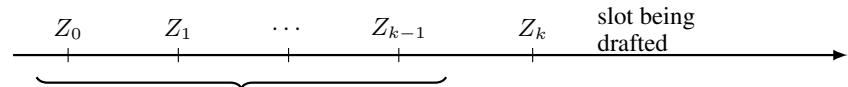
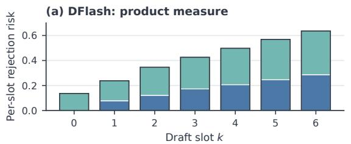
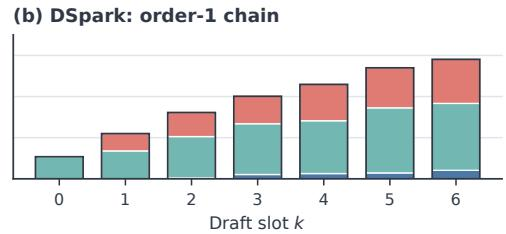

# BEYOND PARALLEL BLINDNESS: INFORMATIONFLOORS AND MODEL GAPS IN BLOCK DRAFTING

Xinwei Qiang Xiang Fang Chang Chen Yue Guan Yufei Ding

University of California San Diego

{x2qiang,x8fang,chc278,y9guan,yufeiding}@ucsd.edu

## ABSTRACT

Block drafters propose several tokens in one forward pass, before earlier target tokens are realised. Their rejection mixes two losses: missing within-block path information and imperfect modelling of observable information. Accepted length cannot distinguish them. We separate the two with an information floor, the minimum expected rejection at a specified conditioning order; rejection above this floor is the model gap. Estimating both from target rollouts across four domains, four open-weight targets, and a frontier API target yields three findings. First, the all-parallel floor reaches 0.286 at the final slot on Qwen3-4B, limiting even the best proposal to 71% per-slot acceptance. Second, one realised token removes 86– 100% of this floor, a locality also recovered by an independent mutual-information analysis. Third, current drafters remain far above their floors: the final-slot model gap accounts for 43–64% of DFlash rejection and 85–92% of DSpark’s oracleconditioned rejection. These findings separate the value of short-range conditioning from proposal quality.

## 1 INTRODUCTION

Speculative decoding (Leviathan et al., 2023; Chen et al., 2023) accelerates autoregressive generation by using a lightweight drafter to propose several future tokens and a target model to verify them under a rule that preserves the target distribution exactly. Its speedup depends on how many proposed tokens the target accepts. Recent block drafters produce proposals for an entire block in one forward pass (Cai et al., 2024; Chen et al., 2026; Cheng et al., 2026), making drafting highly parallel. This parallelism creates a basic information constraint: when the block is drafted, the proposal for position k must be fixed before the target’s realised tokens at earlier block positions are available.

Current block drafters deliver state-of-the-art accepted lengths, making it natural to ask whether all-parallel drafting is already close to its intrinsic limit. Accepted length alone cannot answer this question: it records the rejection of a particular drafter but provides no reference for the smallest rejection achievable under the same information constraint. The remaining loss may therefore have two sources: the absence of earlier target realisations when the block is drafted, and the drafter’s imperfect use of the information it can observe. Separating them is necessary to determine where further progress can come from.

The two losses point to different routes for improving block drafting. Information loss calls for changing what a draft position can observe, for example by conditioning it on earlier realised tokens. Loss above the information limit concerns how effectively the drafter operates with the information already available, through its model, training, or architecture. This leads to the central empirical question of the paper: how much of current rejection is information loss, and how much lies above it?

Our approach. At each draft position, we compare a drafter with the best proposal subject to the same information constraint. For example, suppose the target has two plausible continuations, of course and no problem. An all-parallel drafter must fix its second-position proposal before knowing whether the first sampled token is of or no, so it can produce the mismatched block of problem. The rejection of the best proposal under this constraint is the information floor, which prices this unresolved branch choice. The difference between the observed rejection and the floor is the model gap, the loss not forced by unavailable target realisations. This gives the decomposition

$$
{ \mathrm { o b s e r v e d ~ r e j e c t i o n } } = { \mathrm { i n f o r m a t i o n ~ f l o o r } } + { \mathrm { m o d e l ~ g a p } } .
$$

Sec. 2 gives the formal definitions.

Crucially, the information floor can be measured from target rollouts. At a given prompt, sampled continuations reveal the alternative paths that a proposal under the chosen information constraint must cover. Finding the best shared proposal across these paths estimates the floor, while evaluating a drafter on the same prompts gives its model gap. Repeating this measurement across prompts, domains, and target models lets us determine which source of rejection dominates in practice.

Findings. We measure information floors and model gaps across four domains using Qwen3-4B, then repeat the analysis on Qwen3-8B and Qwen3-14B (Yang et al., 2025), and Gemma-4-12B (Team et al., 2026). Because estimating a floor requires only access to target probabilities, we also measure it on DeepSeek-V4-Pro (DeepSeek-AI et al., 2026) through its API. Three findings emerge.

Parallel blindness creates a substantial floor, especially for open-ended generation. On Qwen3- 4B, the floor rises from zero at the first draft position to 0.286 at the seventh, corresponding to a maximum per-slot acceptance of 71% under this information constraint. Across all four targets, open-ended chat produces higher floors than constrained arithmetic or code, linking the cost of parallel blindness to how many plausible directions a continuation can take (Secs. 3 and 6).

One realised token removes almost all ofthisfloor. Allowing each draft position to observe only the immediately preceding target token reduces the floor by 86–100% across the measured positions, leaving at most 0.041 rejection. The path statistics help explain this sharp drop: at the final draft position, the target’s preceding within-block trajectories have an effective support of under two trajectories at the median anchor, so the preceding token usually reveals which branch the target has entered. Further conditioning can therefore reduce the floor by at most the small residual left after that first token (Sec. 4).

Released block drafters retain large gaps above their informationfloors. For DFlash on Qwen3-4B, the model gap accounts for 55–67% of per-slot rejection at every position affected by parallel blindness. For DSpark, an oracle-conditioned control supplies the realised predecessor, which matches its own draft on paths that survive to the slot. Under this control, the gap accounts for 89–100%, while its information floor is an order of magnitude smaller than the all-parallel floor. Repeating the DFlash analysis on three larger targets places 43–64% of final-position rejection in the model gap (Secs. 5 and 6).

How to read these results. The model gap measures rejection that is not forced by missing earlier tokens, but a particular drafter may not be able to eliminate all of that loss (App. G.1). Our measurements also average over all target rollouts. During serving, later positions are reached only on paths whose earlier draft tokens were accepted, which favours paths the drafter already handles well. We measure this serving effect separately in Sec. 7.

## 2 MEASURING INFORMATION FLOORS AND MODEL GAPS

This section turns the floor–gap decomposition into a measurement framework. We first express per-slot rejection as a distance between the drafter and target distributions, then define information floors and model gaps under different conditioning constraints. We next describe how to estimate these quantities from target rollouts and how to interpret them for a fixed architecture and during serving. Table 1 collects the notation for reference.

Target, block, and trajectory law. Given a context X, the target model pT defines an autoregressive continuation. A block drafter produces proposal distributions $q _ { 0 } , \ldots , q _ { \gamma - 1 }$ for the next γ positions, and the verifier checks sampled draft tokens from left to right. We index draft slots from zero, so slot 0 is the first drafted token and slot $\gamma - 1$ is the last. Let $Z = ( Z _ { 0 } , \ldots , Z _ { \gamma - 1 } )$ denote a block sampled from the target. At position $k , p _ { Z }$ is the target’s next-token distribution conditioned on X and the realised prefix $Z _ { < k }$ . As the target path Z varies, these conditionals form the family $\{ p _ { Z } \}$ that the drafter must match using its available information. We average over the target’s sampling law $\mu ,$ which defines the free-rollout population used for our floor and gap measurements; Sec. 7 considers the reweighting induced by serving.

Table 1: Notation used throughout the paper.  
$X , Z , \gamma$ context; the target’s realised block; block length $( \gamma = 7$ in our measurements)   
$\mu , p z$ the target’s own sampling law; its conditional at a slot given a realised prefix   
$\alpha _ { k } , R _ { k }$ per-slot acceptance probability; per-slot risk $\mathbb { E } _ { \mu } [ 1 - \alpha _ { k } ]$   
$a _ { i } , \tau$ accept factor min $\hat { 1 , q _ { i } } ( Z _ { i } ) / \hat { p _ { i } } ( \hat { Z } _ { i } ) )$ on a path; accepted length $1 + \mathbb { E } [ J ]$   
$W _ { k - 1 }$ pathwise reach $\Pi _ { i < k } a _ { i }$   
$\mathcal { I } _ { m }$ what an order-m chain may see at slot k: $( X , Z _ { k - m } , \ldots , Z _ { k - 1 } )$   
$T _ { k } ^ { ( m ) }$ information floor: the least risk any order-m proposal can achieve   
$G _ { k }$ model gap $R _ { k } - T _ { k } ^ { ( m ) } ;$ : risk not forced by the information restriction   
$\Delta T _ { 1 }$ $T _ { k } ^ { ( 0 ) } - \bar { T _ { k } ^ { ( 1 ) } }$ : the floor removed by one realised token   
$R ^ { \mathrm { o r a c l e } } , R ^ { \mathrm { s e l f } }$ order-1 risk with the target’s realised predecessor injected; with the head’s own sample   
$E ^ { \mathrm { e x p } } , G _ { \mathrm { p o s t } }$ exposure penalty $R ^ { \mathrm { s e l f } } - R ^ { \mathrm { o r a c l e } }$ ; model gap at order 1   
$M$ rollouts drawn per anchor (256 or 1024, stated per experiment)

Per-slot rejection risk. For a target distribution p and proposal distribution q, the speculative verifier accepts a drafted token with probability

$$
\alpha ( p , q ) \ = \ \sum _ { v } \operatorname* { m i n } \left( p ( v ) , q ( v ) \right) \ = \ 1 - \mathrm { T V } ( p , q ) ,\tag{1}
$$

so rejection probability is exactly the total variation distance between the two distributions. At draft position k, we define the drafter’s risk as $R _ { k } : = \mathbb { E } _ { \mu } [ 1 - \alpha _ { k } ]$ , the expected per-slot rejection over target trajectories.

Accepted length and survival. For a target trajectory Z, write $p _ { i } = p _ { T } ( \cdot \mid X , Z _ { < i } )$ and define the pathwise accept factor $a _ { i } : = \operatorname* { m i n } \bigl ( 1 , q _ { i } ( Z _ { i } ) / p _ { i } ( Z _ { i } ) \bigr )$ . Since $Z _ { i } \sim p _ { i } .$ , it satisfies $\mathbb { E } [ a _ { i } \mid X , Z _ { < i } ] =$ $\alpha ( p _ { i } , q _ { i } ) \colon a _ { i }$ retains the path dependence that α averages away. The pathwise survival weight at slot k is $\begin{array} { r } { W _ { k - 1 } : = \prod _ { i < k } a _ { i } ; } \end{array}$ its expectation is the probability that verification reaches that slot. If J is the length of the accepted draft prefix, the expected number of tokens returned per verification step, including one target token, is

$$
\tau : = 1 + \mathbb { E } [ J ] = 1 + \sum _ { j } \mathbb { E } _ { \mu } { \Big [ } \prod _ { i \leq j } a _ { i } { \Big ] } .\tag{2}
$$

Unlike $R _ { k } , \tau$ retains the joint accept factors across positions. Sec. 7 uses $W _ { k - 1 }$ to compare freerollout and serving risk.

Conditioning order. At position k and for $0 \leq m \leq k$ , let ${ \mathcal { T } } _ { m } : = ( X , Z _ { k - m } , \ldots , Z _ { k - 1 } )$ denote the information available to an order-m proposal: the context and the most recent m realised tokens. The token tuple is empty at $m = 0$ , so order 0 sees only X, as in an all-parallel product-measure drafter. Order 1 also sees the immediately preceding token, as in a Markov head.

Information floor. For an order-m proposal, we define

$$
T _ { k } ^ { ( m ) } : = \mathbb { E } _ { \mathcal { Z } _ { m } } \Big [ \operatorname* { m i n } _ { q ( \cdot | \mathcal { Z } _ { m } ) } \mathbb { E } \big [ \mathrm { T V } ( p _ { Z } , q ) \big | \mathcal { Z } _ { m } \big ] \Big ] .\tag{3}
$$

The inner expectation averages over target continuations compatible with the available information, and the minimisation selects the best proposal for that information state. Because this minimisation is performed separately for each state, $T _ { k } ^ { ( m ) }$ is the lowest per-slot risk allowed by the information constraint, independent of any particular drafter.

Floors and gaps. Every order-m proposal satisfies

$$
R _ { k } \ \geq \ T _ { k } ^ { ( m ) } , \qquad \mathrm { a n d } \qquad T _ { k } ^ { ( 0 ) } \ \geq \ T _ { k } ^ { ( 1 ) } \ \geq \ \cdots \ \geq \ 0 .\tag{4}
$$

More conditioning can only lower the floor, which gives the second inequality $( \mathrm { A p p . ~ A } )$ . We define the model gap as $G _ { k } : = R _ { k } - T _ { k } ^ { ( m ) }$ and the reduction from revealing one realised token as $\Delta T _ { 1 } : =$ $T _ { k } ^ { ( 0 ) } - T _ { k } ^ { ( 1 ) }$ . Sec. 4 measures $\Delta T _ { 1 }$ and uses conditional mutual information as an independent target-side check of the same conditioning locality.

$$
\begin{array} { r l r } { \mathrm { o r d e r ~ } 0 \colon X \Rightarrow T ^ { ( 0 ) } } & { \quad \mathrm { ~ o r d e r ~ } 1 \colon ( X , Z _ { k - 1 } ) \Rightarrow T ^ { ( 1 ) } } & { \quad \mathrm { ~ f u l l ~ c h a i n } \colon ( X , Z _ { < k } ) \Rightarrow 0 } \end{array}
$$

Figure 1: Information floors under progressively richer conditioning. At slot k, revealing more realised within-block tokens lowers the minimum attainable rejection risk from $T _ { k } ^ { ( 0 ) }$ to $T _ { k } ^ { ( 1 ) }$ , and to zero when the full prefix is available.  
Table 2: Order-0 floor estimates on Qwen3-4B, pooled across four domains. Full-vocabulary and top-256 estimators closely agree.
<table><tr><td>slot k</td><td>0</td><td>1</td><td>2</td><td>3</td><td>4</td><td>5</td><td>6</td></tr><tr><td> $T _ { k } ^ { ( 0 ) }$  , full vocabulary, M=256</td><td>0.0000</td><td>0.0776</td><td>0.1211</td><td>0.1724</td><td>0.2060</td><td>0.2458</td><td>0.2861</td></tr><tr><td> $\tilde { T _ { k } ^ { ( 0 ) } } , \mathrm { t o p } { - } 2 5 6 , M { = } 1 0 2 4$ </td><td>0.0000</td><td>0.0761</td><td>0.1189</td><td>0.1715</td><td>0.2025</td><td>0.2450</td><td>0.2854</td></tr></table>

Fig. 1 summarizes how the information available at a draft position determines its corresponding floor.

Estimation. We estimate all quantities from free rollouts of the target. For each anchor position in a target-generated sequence, we sample M continuations, collect the resulting target conditionals $\{ p _ { Z } \}$ at each draft slot, and solve (3). We evaluate the drafter’s risk R on the same trajectories, making $G = R - T$ a paired estimate at each anchor. We aggregate anchors with Hajek weights and´ obtain uncertainty intervals by bootstrapping prompts, which preserves dependence among anchors from the same prompt. The full estimators and sensitivity analyses appear in Apps. B and C.

Interpretation. The model gap isolates rejection above the information floor. Architectural constraints may make only part of that gap recoverable by a fixed drafter family (App. G.1). Both T and R are defined under free rollouts; Sec. 7 reweights the drafter’s risk by $W _ { k - 1 }$ to measure it during serving.

## 3 HOW MUCH DOES PARALLEL BLINDNESS COST?

Default measurement setting. Unless stated otherwise, the following measurements use Qwen3- 4B as the target, a block length of seven, and 384 anchors drawn from 170 prompts across gsm8k (Cobbe et al., 2021), mbpp (Austin et al., 2021), alpaca (Taori et al., 2023), and arena-hard (Li et al., 2024a). Target continuations are sampled at temperature 1 without top-p truncation. Each anchor lies on a target-generated sequence, so the floors are measured at contexts visited by the target itself. Truncated reads retain every cell and carry the omitted residual as a two-sided error band, which is $5 \times 1 0 ^ { - 5 }$ here (App. C.5).

The floor is large and grows with depth. Table 2 shows a steady rise from 0.078 at slot 1 to 0.286 at slot 6. Equivalently, the information constraint caps the best attainable per-slot acceptance of an ideal all-parallel drafter at about 92% at slot 1 and 71% at slot 6. At slot 0, the floor is exactly zero because no within-block token has yet been realised; this identity also serves as a check on our estimator.

Open-ended domains have higher floors. Splitting by domain at $M { = } 1 0 2 4$
<table><tr><td>open-ended</td><td>slot 1</td><td>slot 3</td><td>slot 5</td><td>constrained</td><td>slot 1</td><td>slot 3</td><td>slot 5</td></tr><tr><td>alpaca</td><td>0.0803</td><td>0.2194</td><td>0.3237</td><td>mbpp</td><td>0.0387</td><td>0.1358</td><td>0.2055</td></tr><tr><td>arena-hard</td><td>0.0904</td><td>0.1815</td><td>0.2562</td><td>gsm8k</td><td>0.0547</td><td>0.1189</td><td>0.1591</td></tr></table>

Across the reported slots, the two open-ended domains have consistently higher floors than the two constrained domains. Open-ended prompts support a wider range of plausible continuations, so the target’s realised path reveals more about the distribution at later slots. This pattern is consistent with task constraints in gsm8k and mbpp narrowing this range and reducing the cost of parallel blindness.

The floor is highly uneven across contexts. At each slot, the mean hides substantial variation across anchors. At slot 1, two thirds of anchors have a floor below 0.01 and together contribute only 0.3% of the total floor at that slot, whereas the top decile contributes 60%. The distribution becomes less concentrated with depth but remains uneven: at slot $^ { 6 , }$ the mean of 0.285 exceeds the median of 0.181, one quarter of anchors remain below 0.01, and the top decile contributes 28%.

For each anchor, we estimate the collision-equivalent effective support of the target’s distribution over six-token prefixes, $\begin{array} { r } { N _ { \mathrm { e f f } } ^ { ( 2 ) } \ = \ 1 / \sum _ { z } p ( z ) ^ { 2 } } \end{array}$ . It is close to one for a nearly deterministic continuation and grows as probability spreads across multiple paths. Because it spans more than two orders of magnitude, we compare it on a log scale. At slot $^ { 6 , }$ anchors with more possible paths also have substantially higher floors (correlation +0.90); the same relationship holds within each domain $\left( + 0 . 8 5 \ \mathrm { t o \ + 0 . 9 2 } \right)$ . Branching itself is also highly uneven: the median anchor has an effective support of 1.8 trajectories, while the ninetieth percentile has 18.9. Thus, the average floor mixes many nearly deterministic blocks with a smaller set of highly branching ones.

A few modes capture most of the floor. The floor arises from variation in the target’s next-token distributions across hidden within-block paths. We ask whether these distributions are widely dispersed or cluster around a few recurring modes. At each anchor, we compare

$$
\begin{array} { r l r } { K = 1 : } & { \underset { q } { \mathrm { m i n } } \mathbb { E } _ { Z } [ \mathrm { T V } ( p _ { Z } , q ) ] } & { \mathrm { o n e ~ p r o p o s a l ~ f o r ~ e v e r y ~ p a t h } , } \\ { K > 1 : } & { \underset { q _ { 1 } , \ldots , q _ { K } } { \mathrm { m i n } } \mathbb { E } _ { Z } \bigg [ \underset { j } { \mathrm { m i n } } \mathrm { T V } ( p _ { Z } , q _ { j } ) \bigg ] } & { \mathrm { o r a c l e ~ s e l e c t s ~ a f t e r ~ o b s e r v i n g ~ } Z . } \end{array}
$$

All K prototypes are fixed before the rollout; only the choice among them is made after $Z$ is observed. The reduction from $K = 1$ therefore measures how well a small set of path-dependent modes can represent the target distributions. We evaluate $K \in \{ 1 , 2 , 4 \}$ on 128 anchors at M=256. Slot 0 is omitted because its floor is identically zero; parentheses report each loss as a percentage of its $K = 1$ value.

<table><tr><td>slot</td><td>1</td><td>2</td><td>3</td><td>4</td><td>5</td><td>6</td></tr><tr><td> $T ^ { ( 0 ) }$  (one prototype)</td><td>0.0706</td><td>0.0987</td><td>0.1481</td><td>0.1649</td><td>0.2382</td><td>0.2815</td></tr><tr><td>two prototypes</td><td>0.0108 (15%) 0.0350 (35%) 0.0762 (51%) 0.0895 (54%) 0.1360 (57%) 0.1598 (57%)</td><td></td><td></td><td></td><td></td><td></td></tr><tr><td>four prototypes</td><td>0.0029 (4%)0.0101 (10%) 0.0316 (21%) 0.0409 (25%) 0.0653 (27%) 0.0829 (29%)</td><td></td><td></td><td></td><td></td><td></td></tr></table>

At slot $^ { 6 , }$ two prototypes remove 43% of the floor and four remove $7 1 \% ;$ the same pattern holds across the block. A small number of modes therefore captures most of the variation among pathconditioned target distributions.

This oracle-routed analysis measures clusterability, not deployable drafter performance, because selecting the nearest prototype requires observing the realised path. Approximate optimisation makes the reported reductions conservative; further details appear in App. D.2.

## 4 HOW MUCH CONDITIONING IS NEEDED?

Parallel blindness is costly, but the appropriate architectural response depends on how much realised history is needed to remove that cost. By the nesting property in (4), the floor can only decrease as more realised history becomes available. We begin by comparing the order-0 floor with the order-1 floor, which lets each slot condition only on the immediately preceding realised token. Their difference measures the value of that token, while the residual captures everything that longer realised prefixes could still remove.

One realised token removes almost all of the floor. Across the block, conditioning on the preceding realised token removes 86–100% of the order-0 floor and leaves the order-1 floor at 0.041 or below at every measured slot (Table 3). In the acceptance metric, almost all of the cost of parallel blindness is therefore removed by one step of conditioning.

Table 3: Order-0 and order-1 floors on the same M=256 free rollouts per anchor, using the full vocabulary and exact total variation. The dagger marks the exact slot-1 identity.
<table><tr><td>slot k</td><td>1</td><td>2</td><td>3</td><td>4</td><td>5</td><td>6</td></tr><tr><td> $T _ { k } ^ { ( 0 ) }$ </td><td>0.0776</td><td>0.1212</td><td>0.1727</td><td>0.2059</td><td>0.2459</td><td>0.2864</td></tr><tr><td> $\ddot { T _ { k } ^ { ( 1 ) } }$ </td><td>0†</td><td>0.0048</td><td>0.0210</td><td>0.0256</td><td>0.0287</td><td>0.0413</td></tr><tr><td> $\Delta \stackrel { \sim } { T _ { 1 } } / T ^ { ( 0 ) }$ </td><td>100%†</td><td>96.0%</td><td>87.9%</td><td>87.6%</td><td>88.3%</td><td>85.6%</td></tr></table>

Both floors use the same free rollouts. The reported $T _ { k } ^ { ( 1 ) }$ estimate groups paths by their realised predecessor and uses split-half fitting (App. B). At slot 1, the exact floor is $T _ { 1 } ^ { ( 1 ) } = 0 ;$ ; the raw solver residual of 0.0010 sets the numerical resolution of the remaining estimates (App. C.1).

An independent implementation gives the same result. A separate top-256 implementation conditions on the revealed predecessor through importance reweighting and gives nearly the same slot-6 floor, differing by 0.0032 (App. C.2). The two share no estimator code and differ in engine, sampled paths, vocabulary coverage and conditional estimator.

A direct information-theoretic test. Total variation is dictated by the speculative accept rule, so the result above is an operational statement about acceptance. To determine whether the same locality is a property of the target, we measure conditional mutual information under the target’s own untruncated sampling law. Let

$$
C _ { \mathrm { b l i n d } } = - \log p _ { T } ( Y _ { k } \mid X ) , \qquad C _ { \mathrm { f u l l } } = - \log p _ { T } ( Y _ { k } \mid X , Z _ { < k } ) .
$$

Their expected difference is exactly (App. A.2)

$$
\mathbb { E } [ C _ { \mathrm { b l i n d } } - C _ { \mathrm { f u l l } } ] = I ( Y _ { k } ; Z _ { < k } \mid X ) .
$$

If $C _ { m }$ conditions only on the last m realised tokens, then

$$
\rho _ { m } = { \frac { \mathbb { E } [ C _ { \mathrm { b l i n d } } - C _ { m } ] } { \mathbb { E } [ C _ { \mathrm { b l i n d } } - C _ { \mathrm { f u l l } } ] } }
$$

is the fraction of missing path information recovered by those m tokens.

Path information is short-ranged on anchors with a nontrivial information gap. On a separate prefill-based sample of 698 anchors over 221 prompts, $\rho _ { 1 } ~ = ~ 9 2 . 2 – 9 5 . 3 \%$ across slots 2–6. A second realised token raises the recovered fraction to 98.8–99.4% wherever it is nontrivial, and four tokens recover 99.7–99.9%. Pooled across slots, $\rho _ { 1 } , \rho _ { 2 } .$ , and $\rho _ { 4 }$ are 94.0%, 99.1%, and 99.8%, respectively. Slot-wise intervals appear in Table 6, and estimator sensitivity in App. C.4. The immediately preceding token therefore carries most of the missing path information at every depth, and the token before it captures nearly all of the remainder.

The two views agree under different objectives. Mutual-information recovery and TV-based acceptance recovery remain high throughout the block. Mutual information is computed from the target distribution obtained by averaging over hidden paths. The TV floor solves a different optimisation: it selects the common proposal with the smallest average rejection across those paths. The estimates also use different probes and anchor sets. Their agreement in magnitude therefore suggests that the locality comes from the target’s continuation structure and carries over to speculative acceptance.

Limited branching explains this locality. As Sec. 3 shows, the target’s distribution over six-token prefixes has an effective support of only 1.8 trajectories at the median anchor. With so few competing paths, the immediately preceding token usually identifies the branch the target has entered. Order-1 conditioning, implemented by a Markov head or by selecting each candidate conditional on its chosen predecessor, is therefore well matched to the target’s continuation structure. Longer histories carry little additional path information under the measured law, while deeper refiners may still improve how accurately each conditional distribution is modelled.

  
Figure 2: Per-slot rejection-risk breakdowns on Qwen3-4B. For DFlash, $T ^ { ( 0 ) }$ and $G$ sum to its risk R. For DSpark, $T ^ { ( 1 ) }$ and $G _ { \mathrm { p o s t } }$ sum to the risk with the target predecessor injected, $R ^ { \mathrm { o r a c l e } }$ ; adding $E ^ { \mathrm { e x p } }$ gives the self-conditioned risk $R ^ { \mathrm { s e l f } }$

## 5 HOW FAR ARE DEPLOYED DRAFTERS FROM THEIR FLOORS?

We now compare real drafters with the floors imposed by their factorisations. We evaluate the paired DFlash and DSpark checkpoints released with DSpark for Qwen3-4B. They share the backbone, data pipeline, and optimiser schedule but differ in prediction head and training objective.

A product-measure drafter. DFlash (Chen et al., 2026) generates all block positions in one parallel pass without within-block conditioning, so its information floor is $T ^ { ( 0 ) }$ . We estimate R and $T ^ { ( 0 ) }$ from the same anchors, target paths, and conditionals, making $G = R - T ^ { ( 0 ) }$ a paired estimate.

The model gap dominates DFlash’s rejection. In the left panel of Fig. 2, the gap accounts for 55–67% of per-slot rejection at slots 1–6. Slot 0 provides a boundary case: its floor is zero, so the entire rejection risk of 0.136 is model gap. Both components grow with depth, but the gap remains larger than the floor throughout the block.

An order-1 drafter. DSpark (Cheng et al., 2026) adds a rank-256 Markov head to the same parallel backbone, so its information floor is $T ^ { ( 1 ) }$ . To evaluate the head with the same information as this floor, we explicitly feed it the target’s realised predecessor $Z _ { k - 1 }$ . This defines the oracle-conditioned risk Roracle. Feeding the head its own sampled predecessor instead defines the self-conditioned risk $R ^ { \mathrm { s e l f } }$ . For $k \geq 1$ , their difference is the exposure penalty $E _ { k } ^ { \mathrm { e x p } } : = R _ { k } ^ { \mathrm { s e l f } } - R _ { k } ^ { \mathrm { o r a c l e } }$ , yielding

$$
R _ { k } ^ { \mathrm { s e l f } } = \underbrace { T _ { k } ^ { ( 1 ) } } _ { \mathrm { f o o r } } + \underbrace { G _ { \mathrm { p o s t } , k } } _ { \mathrm { m o d e l g a p a t o r d e r 1 } } + \underbrace { E _ { k } ^ { \mathrm { e x p } } } _ { \mathrm { e x p o s u r e p e n a l t y } } .\tag{5}
$$

This decomposition applies for $k \geq 1$ . At slot 0, no predecessor exists, the applicable floor is $T _ { 0 } ^ { ( 0 ) } = 0 ;$ , and the two risk evaluations coincide. We estimate $T ^ { ( 1 ) } , R ^ { \mathrm { o r a c l e } }$ , and $R ^ { \mathrm { s e l f } }$ on the same anchors and target rollouts. The population identity is exact. In the finite-sample estimate, splittable predecessor groups cover 98–99% of path mass; since $\mathrm { T V } \leq 1$ , the unmatched mass can change the reported floor and gap by at most 0.02 (App. E).

DSpark also remains far above its floor. In the right panel of Fig. 2, $G _ { \mathrm { p o s t } }$ accounts for 89– 100% of the oracle-conditioned risk across the block. At slot 6 this risk is 0.367 against the 0.041 above, so $G _ { \mathrm { p o s t } }$ is $8 9 \%$ of it, and the floor is under a tenth of the risk at every slot. Feeding the head its own sampled predecessor instead raises the risk to 0.581, giving $E ^ { \mathrm { e x p } } = 0 . 2 1 4$ . This difference diagnoses sensitivity to predecessor errors; it is not a serving loss, because standard leftto-right verification stops after an earlier rejection and does not use subsequent drafts on that path. Sec. 7 accounts for survival when relating per-slot risks to serving. Detailed estimates and promptbootstrap intervals appear in App. E.

## 6 HOW DO FLOORS AND GAPS VARY ACROSS TARGETS AND SCALE?

We next ask whether the gap persists across model families and scales, including settings in which the drafter grows with its target. We repeat the end-to-end measurement on larger open-weight targets, then use separate controls to probe the floor and gap at frontier scale, where target hidden states are unavailable.

The gap persists across four targets. We repeat the pipeline on Qwen3-8B, Qwen3-14B, and Gemma-4-12B with their released DFlash and DSpark drafters. All four targets use the same four domains and 384 anchors. Ratios below use the unrounded estimates. At slot 6:
<table><tr><td></td><td colspan="3">DFlash (order 0)</td><td colspan="3">DSpark (order 1)</td></tr><tr><td>target</td><td> $T _ { 6 } ^ { ( 0 ) }$ </td><td> $R _ { 6 }$ </td><td> $G / R$ </td><td> ${ T } _ { 6 } ^ { ( 1 ) }$ </td><td> $R _ { 6 } ^ { \mathrm { o r a c l e } }$ </td><td> $G _ { \mathrm { p o s t } } / R ^ { \mathrm { o r a c l e } }$ </td></tr><tr><td>Qwen3-4B</td><td>0.286</td><td>0.636</td><td>55.0%</td><td>0.041</td><td>0.367</td><td>88.7%</td></tr><tr><td>Qwen3-8B</td><td>0.383</td><td>0.673</td><td>43.1%</td><td>0.060</td><td>0.399</td><td>84.9%</td></tr><tr><td>Qwen3-14B</td><td>0.353 0.656</td><td></td><td>46.1%</td><td>0.056</td><td>0.412</td><td>86.4%</td></tr><tr><td>Gemma-4-12B</td><td></td><td></td><td>0.242 0.676 64.2%</td><td>0.031</td><td>0.397</td><td>92.2%</td></tr></table>

Both drafters remain well above their floors. For DFlash, the model gap accounts for 43%–64% of final-slot risk. For DSpark, the reported order-1 floor stays below 0.061 across targets, leaving 85%–92% of the oracle-conditioned risk in the model gap (App. B). DSpark’s oracle-conditioned order-1 risk also exceeds the order-0 information floor $T ^ { ( 0 ) }$ on every target, despite observing the realised predecessor.

Frontier-scale controls measure the two limits separately. A hosted API exposes target probabilities but not the hidden states needed by a paired block drafter. Across 120 DeepSeek-V4-Pro anchors, $T _ { 6 } ^ { ( 0 ) } = 0 . 2 4 5$ and $T _ { 6 } ^ { ( 1 ) } = 0 . 0 3 2$ . One realised token removes 86–90% of the floor across slots; open-ended domains again have higher floors.

Top-20 probabilities preserve the measured floor. On matched Qwen3-4B anchors, top-20 and top-256 reads on the same sampled paths differ by at most $2 \times 1 0 ^ { - 5 }$ across the block. We use the top-20 read for the frontier target and carry its omitted residual as $\mathsf { a } \pm 2 \times 1 0 ^ { - 4 }$ error band (App. C.5).

Published serving results give a direct gap estimate at slot 0. The official vLLM DSpark implementation reports an average accepted length of $\tau _ { \gamma = 1 } = 1 . 8 2$ for the DeepSeek-V4-Pro-DSpark checkpoint (vLLM Project, 2026). With one speculative token, $\tau _ { \gamma = 1 } = 1 + \bar { \mathbb { E } } _ { \mu } [ a _ { 0 } ] .$ , so $R _ { 0 } \approx 0 . 1 8 0$ to the source’s reporting precision. Slot 0 has no hidden within-block history. Therefore $T _ { 0 } ^ { ( 0 ) } = 0$ and $G _ { 0 } = R _ { 0 } \approx \bar { 0 } . 1 8 0$

Published accepted lengths also bound deeper-slot risk. They imply maxk $R _ { k } \gtrsim 0 . 1 0 7$ on batch-1 coding and $\gtrsim 0 . 2 3 3$ on roleplay (App. F.3). These serving bounds and the API floors use different operating laws, so the direct frontier gap estimate comes from the slot-0 identity. The deeper-slot comparison provides supporting evidence about scale.

## 7 HOW DOES PER-SLOT RISK TRANSLATE TO SERVING PERFORMANCE?

All preceding risks are averaged over free rollouts. During serving, slot k is reached only when the earlier draft tokens survive verification, and the surviving paths may be systematically easier for the drafter. Using the survival weight $W _ { k - 1 }$ defined in Sec. 2, we measure the risk among reached paths as

$$
R _ { k } ^ { \mathrm { s e r v e } } : = \frac { \mathbb { E } _ { \mu } [ W _ { k - 1 } \mathrm { T V } ( p _ { Z } , q _ { k } ) ] } { \mathbb { E } _ { \mu } [ W _ { k - 1 } ] } .\tag{6}
$$

This paired reweighting reuses the recorded accept factors and requires no additional forward passes.

Serving reweighting lowers risk sharply, and more so with depth. Reweighting lowers the measured risk at every slot after the first, by 0.071–0.424 for DFlash and 0.034–0.208 for DSpark, with the correction growing monotonically down the block. At the final slot DFlash’s risk falls from 0.635 to 0.211 and DSpark’s from 0.366 to 0.158; averaged over slots 1–6 the correction is 0.261 and 0.124. The serving-weighted risk is also nearly flat in k — DFlash runs 0.167–0.217 across slots 1–6 against a free-rollout risk that nearly triples — because the paths that reach a deep slot are the ones the drafter was already agreeing with. Free-rollout risk therefore overstates what a serving stack encounters, by a factor of three at the end of the block.

Easy paths remain easy across the block. Joint survival substantially exceeds the value predicted by multiplying marginal acceptance rates. At the final slot, it is 12.3× that value for DFlash and

Table 4: For DFlash, the model gap grows from the first to the final slot, while oracle single-slot serving value falls.
<table><tr><td>quantity</td><td>slot 0</td><td>slot 6</td><td>slot 6 / slot 0</td></tr><tr><td>model gap  $G _ { k }$  (rejection probability)</td><td>0.136</td><td>0.350</td><td>2.6×</td></tr><tr><td> $\Delta \tau _ { k } ^ { \mathrm { B R } } \mathbf { \bar { \tau } } ( \mathrm { t o k e n s } )$ </td><td>0.221</td><td>0.056</td><td>0.25×</td></tr></table>

2.63× for DSpark. This dependence raises the accepted length from 3.40 to 4.57 for DFlash and from 4.39 to 5.23 for DSpark relative to an independence calculation. Full dependence profiles appear in App. F.2.

We estimate the value of a prefix-specific oracle at each slot. Starting from the released DFlash or DSpark proposal, we compute a prefix-specific best response for one slot while holding the other six fixed. The oracle uses the same within-block information as the released drafter: one distribution per prefix for DFlash, and one distribution per prefix and realised predecessor for DSpark. Let $q ^ { \mathrm { b a s e } }$ denote the released proposal. The objective is

$$
\Delta \tau _ { k } ^ { \mathrm { B R } } : = \operatorname* { m a x } _ { \boldsymbol { q } _ { k } } \tau \big ( \boldsymbol { q } _ { k } , \boldsymbol { q } _ { - k } ^ { \mathrm { b a s e } } \big ) - \tau \big ( \boldsymbol { q } ^ { \mathrm { b a s e } } \big ) ,\tag{7}
$$

Here $q _ { k }$ denotes the corresponding distribution or predecessor-conditioned map. Because it is opti mised separately for every prefix, the population value of $\Delta \tau _ { k } ^ { \mathrm { B R } }$ upper-bounds the accepted-length gain from any deployable change to slot k with the same information and the remaining slots fixed.

The model gap and serving value point in opposite directions. From slot 0 to slot $6 , G _ { k }$ grows by 2.6× while $\mathsf { \bar { \Delta } } \tau _ { k } ^ { \mathrm { B R } }$ falls by 3.9×. Survival creates this inversion: slot 0 is reached on every block, and improving it benefits the remainder of the block; slot 6 is reached only after the previous six proposals survive and has no later draft tokens to benefit. These values rank prefix-specific changes to one slot at a time. The full profile and joint sweep appear in Apps. F.5 and F.6.

## 8 DISCUSSION AND RELATED WORK

Speculative methods act at different stages of the drafting pipeline. Classical speculative decoding uses a smaller autoregressive drafter, with later work improving training, distillation, and adaptation (Leviathan et al., 2023; Chen et al., 2023; Xia et al., 2023; Kim et al., 2023; Zhou et al., 2024; Liu et al., 2024). Blockwise methods predict several future tokens in parallel (Stern et al., 2018; Gloeckle et al., 2024; Cai et al., 2024). Sequential heads and feature-autoregressive drafters restore dependence inside the proposal (Ankner et al., 2024; Li et al., 2024c; 2025), while multicandidate methods redesign allocation or verification (Sun et al., 2023; Miao et al., 2024; Chen et al., 2024; Li et al., 2024b).

Existing systems support the measured locality. DSpark finds little difference between its Markov and RNN heads (Cheng et al., 2026); DeLS-Spec likewise reports accepted lengths of 6.28 and 6.35 (Zheng & Li, 2026). Both align with our one-token locality result. Domino and xPress add lightweight causal refinement to parallel drafts (Huang et al., 2026; Wang et al., 2026). This targets the large model gap measured here: short histories carry most path information, while current drafters still model the resulting conditional distributions imperfectly.

DFlash2 separates candidate coverage from path selection. Its first-position recall rises from 85.4% at rank one to 99.5% within the top 16, and final-position top-16 recall remains 87.8% (Inco AI, 2026). This is consistent with our few-mode picture: a small lattice covers a strong continuation, and one predecessor selects its mode. PCTree similarly conditions children on candidate parents, raising mean accepted length from 10.225 to 11.156 at fixed checkpoint and tree budget (Li et al., 2026).

The model and serving gaps identify where scaling pays. DFlash improves accepted length with deeper drafters and target features without changing the product factorisation (Chen et al., 2026), so its gains lie above an unchanged floor. Its decaying position weights also agree with our 3.9× first-to-last serving-value ratio. D-PACE derives dynamic position weights from an accepted-length surrogate, similarly combining prefix reach with downstream continuation value (Wu et al., 2026).

## AI USE STATEMENT

We used generative AI tools, including OpenAI Codex and Anthropic Claude Code, to help structure and edit the manuscript; locate and summarise related literature; improve figures and tables; provide feedback on the measurement methodology and robustness checks; assist with the presentation and checking of mathematical derivations; implement, execute, and monitor parts of the experimental pipeline; interpret empirical results; check consistency among notation, claims, and reported values; and edit analysis, plotting, and document-preparation code. The authors defined the research questions and experimental objectives, and retained final control over all research decisions. The authors take responsibility for the final content of the paper.

## REFERENCES

Zachary Ankner, Rishab Parthasarathy, Aniruddha Nrusimha, Christopher Rinard, Jonathan Ragan-Kelley, and William Brandon. Hydra: Sequentially-dependent draft heads for medusa decoding, 2024. URL https://arxiv.org/abs/2402.05109.

Jacob Austin, Augustus Odena, Maxwell Nye, Maarten Bosma, Henryk Michalewski, David Dohan, Ellen Jiang, Carrie Cai, Michael Terry, Quoc Le, and Charles Sutton. Program synthesis with large language models, 2021. URL https://arxiv.org/abs/2108.07732.

D A Barrington. Bounded-width polynomial-size branching programs recognize exactly those languages in nc1. In Proceedings of the Eighteenth Annual ACM Symposium on Theory of Computing, STOC ’86, pp. 1–5, New York, NY, USA, 1986. Association for Computing Machinery. ISBN 0897911938. doi: 10.1145/12130.12131. URL https://doi.org/10.1145/ 12130.12131.

Tianle Cai, Yuhong Li, Zhengyang Geng, Hongwu Peng, Jason D. Lee, Deming Chen, and Tri Dao. Medusa: Simple LLM inference acceleration framework with multiple decoding heads. In Ruslan Salakhutdinov, Zico Kolter, Katherine Heller, Adrian Weller, Nuria Oliver, Jonathan Scarlett, and Felix Berkenkamp (eds.), Proceedings ofthe 41st International Conference on Machine Learning, volume 235 of Proceedings of Machine Learning Research, pp. 5209–5235. PMLR, 21–27 Jul 2024. URL https://proceedings.mlr.press/v235/cai24b.html.

Charlie Chen, Sebastian Borgeaud, Geoffrey Irving, Jean-Baptiste Lespiau, Laurent Sifre, and John Jumper. Accelerating large language model decoding with speculative sampling, 2023. URL https://arxiv.org/abs/2302.01318.

Jian Chen, Yesheng Liang, and Zhijian Liu. Dflash: Block diffusion for flash speculative decoding, 2026. URL https://arxiv.org/abs/2602.06036.

Zhuoming Chen, Avner May, Ruslan Svirschevski, Yuhsun Huang, Max Ryabinin, Zhihao Jia, and Beidi Chen. Sequoia: Scalable and robust speculative decoding. In A. Globerson, L. Mackey, D. Belgrave, A. Fan, U. Paquet, J. Tomczak, and C. Zhang (eds.), Advances in Neural Information Processing Systems, volume 37, pp. 129531–129563. Curran Associates, Inc., 2024. doi: 10.52202/079017-4116. URL https://proceedings.neurips.cc/paper\_files/paper/2024/file/ ea1f5f0878d43ff4fb8bf64ef4a2326c-Paper-Conference.pdf.

Xin Cheng, Xingkai Yu, Chenze Shao, Jiashi Li, Yunfan Xiong, Yi Qian, Jiaqi Zhu, Shirong Ma, Xiaokang Zhang, Jiasheng Ye, Qinyu Chen, Chengqi Deng, Jiping Yu, Damai Dai, Zhengyan Zhang, Yixuan Wei, Yixuan Tan, Wenkai Yang, Runxin Xu, Yu Wu, Zhean Xu, Xuanyu Wang, Muyang Chen, Rui Tian, Xiao Bi, Zhewen Hao, Shaoyuan Chen, Huanqi Cao, Wentao Zhang, Anyi Xu, Huishuai Zhang, Dongyan Zhao, and Wenfeng Liang. Dspark: Confidence-scheduled speculative decoding with semi-autoregressive generation, 2026. URL https://arxiv.org/abs/ 2607.05147.

Karl Cobbe, Vineet Kosaraju, Mohammad Bavarian, Mark Chen, Heewoo Jun, Lukasz Kaiser, Matthias Plappert, Jerry Tworek, Jacob Hilton, Reiichiro Nakano, Christopher Hesse, and John Schulman. Training verifiers to solve math word problems, 2021. URL https://arxiv. org/abs/2110.14168.

DeepSeek-AI, Anyi Xu, Bangcai Lin, Bing Xue, Bingxuan Wang, Bingzheng Xu, Bochao Wu, Bowei Zhang, Chaofan Lin, Chen Dong, Chenchen Ling, Chengda Lu, Chenggang Zhao, Chengqi Deng, Chengyu Hou, Chenhao Xu, Chenze Shao, Chong Ruan, Conner Sun, Damai Dai, Daya Guo, Dejian Yang, Deli Chen, Donghao Li, Dongjie Ji, Erhang Li, Fang Wei, Fangyun Lin, Fangzhou Yuan, Feiyu Xia, Fucong Dai, Guangbo Hao, Guanting Chen, Guoai Cao, Guolai Meng, Guowei Li, Han Yu, Han Zhang, Hanwei Xu, Hao Li, Haofen Liang, Haoling Zhang, Haoming Luo, Haoran Wei, Haotian Yuan, Haowei Zhang, Haowen Luo, Haoyu Chen, Haozhe Ji, Hengqing Zhang, Honghui Ding, Hongxuan Tang, Huanqi Cao, Huazuo Gao, Hui Qu, Hui Zeng, J Yang, JQ Zhu, Jia Luo, Jia Song, Jia Yu, Jialiang Huang, Jialu Cai, Jian Liang, Jiangting Zhou, Jiasheng Ye, Jiashi Li, Jiaxin Xu, Jiewen Hu, Jieyu Yang, Jin Chen, Jin Yan, Jingchang Chen, Jingli Zhou, Jingting Xiang, Jingyang Yuan, Jingyuan Cheng, Jingzi Zhou, Jinhua Zhu, Jiping Yu, Joseph Sun, Jun Ran, Junguang Jiang, Junjie Qiu, Junlong Li, Junmin Zheng, Junxiao Song, Kai Dong, Kaige Gao, Kang Guan, Kexing Zhou, Kezhao Huang, Kuai Yu, Lean Wang, Lecong Zhang, Lei Wang, Leyi Xia, Li Zhang, Liang Zhao, Lihua Guo, Lingxiao Luo, Linwang Ma, Linyan Zhu, Litong Wang, Liyu Cai, Liyue Zhang, Longhao Chen, MS Di, MY Xu, Max Mei, Miaojun Wang, Mingchuan Zhang, Minghua Zhang, Minghui Tang, Mingming Li, Mingxu Zhou, Minmin Han, Ning Wang, Panpan Huang, Panpan Wang, Peixin Cong, Peiyi Wang, Peng Zhang, Qiancheng Wang, Qihao Zhu, Qingyang Li, Qinyu Chen, Qiushi Du, Qiwei Jiang, Rui Tian, Ruifan Xu, Ruijie Lu, Ruiling Xu, Ruiqi Ge, Ruisong Zhang, Ruizhe Pan, Runji Wang, Runqian Chen, Runqiu Yin, Runxin Xu, Ruomeng Shen, Ruoyu Zhang, Ruyi Chen, SH Liu, Shanghao Lu, Shangmian Sun, Shangyan Zhou, Shanhuang Chen, Shaofei Cai, Shaoheng Nie, Shaoqing Wu, Shaoyuan Chen, Shengding Hu, Shengyu Liu, Shiqiang Hu, Shirong Ma, Shiyu Wang, Shuiping Yu, Shunfeng Zhou, Shuting Pan, Shuying Yu, Songyang Zhou, Tao Ni, Tao Yun, Tian Jin, Tian Pei, Tian Ye, Tianle Lin, Tianran Ji, Tianyi Cui, Tianyuan Yue, Tingting Yu, Tun Wang, W Zhang, WL Xiao, Wangding Zeng, Wei An, Weilin Zhao, Wen Liu, Wenfeng Liang, Wenjie Pang, Wenjing Luo, Wenjing Yao, Wenjun Gao, Wenkai Yang, Wenlve Huang, Wenqing Hou, Wentao Zhang, Wenting Ma, Xi Gao, Xiang He, Xiangwen Wang, Xianzu Wang, Xiao Bi, Xiaodong Liu, Xiaohan Wang, Xiaokang Chen, Xiaokang Zhang, Xiaotao Nie, Xiaowen Sun, Xiaoxiang Wang, Xin Cheng, Xin Liu, Xin Xie, Xingchao Liu, Xingchen Liu, Xingkai Yu, Xingyou Li, Xinyu Yang, Xinyu Zhang, Xu Chen, Xuanyu Wang, Xuecheng Su, Xueyin Chen, Xuheng Lin, Xuwei Fu, YC Yan, YQ Wang, YW Ma, Yanfeng Luo, Yang Zhang, Yanhong Xu, Yanru Ma, Yanwen Huang, Yao Li, Yao Li, Yao Xu, Yao Zhao, Yaofeng Sun, Yaohui Wang, Yi Qian, Yi Shao, Yi Yu, Yichao Zhang, Yifan Ding, Yifan Shi, Yijia Wu, Yiliang Xiong, Yiling Ma, Ying He, Ying Tang, Ying Zhou, Yingjia Luo, Yinmin Zhong, Yishi Piao, Yisong Wang, Yixiang Zhang, Yixiao Chen, Yixuan Tan, Yixuan Wei, Yiyang Ma, Yiyuan Liu, Yonglun Yang, Yongqiang Guo, Yongtong Wu, Yu Wu, YuKun Li, Yuan Cheng, Yuan Ou, Yuanfan Xu, Yuanhao Li, Yuduan Wang, Yuehan Yang, Yuer Xu, Yuhan Wu, Yuhao Meng, Yuheng Zou, Yukun Zha, Yunfan Xiong, Yupeng Chen, Yuping Lin, Yuqian Cao, Yuqian Wang, Yushun Zhang, Yuting Yan, Yutong Lin, Yuxian Gu, Yuxiang Luo, Yuxiang You, Yuxuan Liu, Yuxuan Zhou, Yuyang Zhou, Yuzhen Huang, ZF Wu, Zehao Wang, Zehua Zhao, Zehui Ren, Zekai Zhang, Zhangli Sha, Zhe Fu, Zhe Ju, Zhean Xu, Zhenda Xie, Zhengyan Zhang, Zheren Gao, Zhewen Hao, Zhibin Gou, Zhicheng Ma, Zhigang Yan, Zhihong Shao, Zhixian Huang, Zhixuan Chen, Zhiyu Wu, Zhizhou Ren, Zhongyu Wu, Zhuoshu Li, Zhuping Zhang, Zian Xu, Zihao Wang, Zihua Qu, Zihui Gu, Zijia Zhu, Zilin Li, Zipeng Zhang, Ziwei Xie, Ziyi Gao, Ziyi Wan, Zizheng Pan, and Zongqing Yao. Deepseek-v4: Towards highly efficient million-token context intelligence, 2026. URL https://arxiv.org/abs/2606.19348.

Merrick Furst, James B. Saxe, and Michael Sipser. Parity, circuits, and the polynomial-time hierarchy. In 22nd Annual Symposium on Foundations of Computer Science (sfcs 1981), pp. 260–270, 1981. doi: 10.1109/SFCS.1981.35.

Fabian Gloeckle, Badr Youbi Idrissi, Baptiste Roziere, David Lopez-Paz, and Gabriel Synnaeve. Better & faster large language models via multi-token prediction. In Ruslan Salakhutdinov, Zico Kolter, Katherine Heller, Adrian Weller, Nuria Oliver, Jonathan Scarlett, and Felix Berkenkamp (eds.), Proceedings of the 41st International Conference on Machine Learning, volume 235 of Proceedings of Machine Learning Research, pp. 15706–15734. PMLR, 21–27 Jul 2024. URL https://proceedings.mlr.press/v235/gloeckle24a.html.

Yiding Hao, Dana Angluin, and Robert Frank. Formal language recognition by hard attention transformers: Perspectives from circuit complexity, 2022. URL https://arxiv.org/abs/

2204.06618.

J Hastad. Almost optimal lower bounds for small depth circuits. In Proceedings of the Eighteenth Annual ACM Symposium on Theory of Computing, STOC ’86, pp. 6–20, New York, NY, USA, 1986. Association for Computing Machinery. ISBN 0897911938. doi: 10.1145/12130.12132. URL https://doi.org/10.1145/12130.12132.

Jianuo Huang, Yaojie Zhang, Qituan Zhang, Hao Lin, Hanlin Xu, and Linfeng Zhang. Domino: Decoupling causal modeling from autoregressive drafting in speculative decoding, 2026. URL https://arxiv.org/abs/2605.29707.

Inco AI. DFlash 2: Keep Drafting Parallel, August 2026. URL https://inco.ai/blog/ dflash2/.

Sehoon Kim, Karttikeya Mangalam, Suhong Moon, Jitendra Malik, Michael W. Mahoney, Amir Gholami, and Kurt Keutzer. Speculative decoding with big little decoder, 2023. URL https: //arxiv.org/abs/2302.07863.

Yaniv Leviathan, Matan Kalman, and Yossi Matias. Fast inference from transformers via speculative decoding. In Andreas Krause, Emma Brunskill, Kyunghyun Cho, Barbara Engelhardt, Sivan Sabato, and Jonathan Scarlett (eds.), Proceedings of the 40th International Conference on Machine Learning, volume 202 of Proceedings of Machine Learning Research, pp. 19274–19286. PMLR, 23–29 Jul 2023. URL https://proceedings.mlr.press/ v202/leviathan23a.html.

Tianle Li, Wei-Lin Chiang, Evan Frick, Lisa Dunlap, Tianhao Wu, Banghua Zhu, Joseph E. Gonzalez, and Ion Stoica. From crowdsourced data to high-quality benchmarks: Arena-hard and benchbuilder pipeline, 2024a. URL https://arxiv.org/abs/2406.11939.

Yuhui Li, Fangyun Wei, Chao Zhang, and Hongyang Zhang. EAGLE-2: Faster inference of language models with dynamic draft trees. In Yaser Al-Onaizan, Mohit Bansal, and Yun-Nung Chen (eds.), Proceedings of the 2024 Conference on Empirical Methods in Natural Language Processing, pp. 7421–7432, Miami, Florida, USA, November 2024b. Association for Computational Linguistics. doi: 10.18653/v1/2024.emnlp-main.422. URL https://aclanthology.org/ 2024.emnlp-main.422/.

Yuhui Li, Fangyun Wei, Chao Zhang, and Hongyang Zhang. EAGLE: Speculative sampling requires rethinking feature uncertainty. In Ruslan Salakhutdinov, Zico Kolter, Katherine Heller, Adrian Weller, Nuria Oliver, Jonathan Scarlett, and Felix Berkenkamp (eds.), Proceedings of the 41st International Conference on Machine Learning, volume 235 of Proceedings ofMachine Learning Research, pp. 28935–28948. PMLR, 21–27 Jul 2024c. URL https://proceedings.mlr. press/v235/li24bt.html.

Yuhui Li, Fangyun Wei, Chao Zhang, and Hongyang Zhang. Eagle-3: Scaling up inference acceleration of large language models via training-time test, 2025. URL https://arxiv.org/ abs/2503.01840.

Zixian Li, Tong Li, Chi Xie, Xiaohui Song, and Haonan Lu. From chains to trees: Parentconditioned drafting for semi-autoregressive speculative decoding, 2026. URL https:// arxiv.org/abs/2608.02123.

Xiaoxuan Liu, Lanxiang Hu, Peter Bailis, Alvin Cheung, Zhijie Deng, Ion Stoica, and Hao Zhang. Online speculative decoding, 2024. URL https://arxiv.org/abs/2310.07177.

William Merrill and Ashish Sabharwal. The parallelism tradeoff: Limitations of log-precision transformers, 2023. URL https://arxiv.org/abs/2207.00729.

Xupeng Miao, Gabriele Oliaro, Zhihao Zhang, Xinhao Cheng, Zeyu Wang, Zhengxin Zhang, Rae Ying Yee Wong, Alan Zhu, Lijie Yang, Xiaoxiang Shi, Chunan Shi, Zhuoming Chen, Daiyaan Arfeen, Reyna Abhyankar, and Zhihao Jia. Specinfer: Accelerating large language model serving with tree-based speculative inference and verification. In Proceedings of the 29th ACM International Conference on Architectural Support for Programming Languages and Operating Systems, Volume 3, ASPLOS ’24, pp. 932–949. ACM, April 2024. doi: 10.1145/3620666.3651335. URL http://dx.doi.org/10.1145/3620666.3651335.

Mitchell Stern, Noam Shazeer, and Jakob Uszkoreit. Blockwise parallel decoding for deep autoregressive models. In S. Bengio, H. Wallach, H. Larochelle, K. Grauman, N. Cesa-Bianchi, and R. Garnett (eds.), Advances in Neural Information Processing Systems, volume 31. Curran Associates, Inc., 2018. URL https://proceedings.neurips.cc/paper\_files/ paper/2018/file/c4127b9194fe8562c64dc0f5bf2c93bc-Paper.pdf.

Ziteng Sun, Ananda Theertha Suresh, Jae Hun Ro, Ahmad Beirami, Himanshu Jain, and Felix Yu. Spectr: Fast speculative decoding via optimal transport. In A. Oh, T. Naumann, A. Globerson, K. Saenko, M. Hardt, and S. Levine (eds.), Advances in Neural Information Processing Systems, volume 36, pp. 30222–30242. Curran Associates, Inc., 2023. doi: 10.52202/ 075280-1314. URL https://proceedings.neurips.cc/paper\_files/paper/ 2023/file/6034a661584af6c28fd97a6f23e56c0a-Paper-Conference.pdf.

Rohan Taori, Ishaan Gulrajani, Tianyi Zhang, Yann Dubois, Xuechen Li, Carlos Guestrin, Percy Liang, and Tatsunori B. Hashimoto. Stanford alpaca: An instruction-following llama model. https://github.com/tatsu-lab/stanford\_alpaca, 2023.

Gemma Team, Sherif El Abd, Vaibhav Aggarwal, Robin Algayres, Alek Andreev, Olivier Bachem, Ian Ballantyne, Cormac Brick, Victor Carbune, Michelle Casbon, Mayank Chaturvedi, Aditya˘ Chawla, Victor Cotruta, Alice Coucke, Phil Culliton, Robert Dadashi, Lucas Dixon, Mohamed Elhawaty, Utku Evci, Clement Farabet, Johan Ferret, Filippo Galgani, Sertan Girgin, Jean-Bastien´ Grill, Maarten Grootendorst, Jiaxian Guo, Cassidy Hardin, Yanzhang He, Steven M. Hernandez, Omri Homburger, Leonard Hussenot, Juyeong Ji, Armand Joulin, Aishwarya Kamath, Parnian´ Kassraie, Olivier Lacombe, Preethi Lahoti, Gael Liu, Gus Martins, Luciano Martins, Tatiana¨ Matejovicova, Ramona Merhej, Nikola Momchev, Sneha Mondal, Ryan Mullins, Sindhu Raghu ram Panyam, Shreya Pathak, Sarah Perrin, Andre Susano Pinto, Etienne Pot, Ang´ eline Pouget,´ Alexandre Rame, Sabela Ramos, Douglas Reid, David Rim, Morgane Rivi´ ere, Karsten Roth,\` Louis Rouillard, Omar Sanseviero, Pier Giuseppe Sessa, Shane Settle, Danila Sinopalnikov, Sara Smoot, Piotr Stanczyk, Andreas Steiner, Lawrence Stewart, Ilya Tolstikhin, Michael Tschannen, Anton Tsitsulin, Nino Vieillard, Renjie Wu, Pingmei Xu, Haichuan Yang, Edouard Yvinec, Biao Zhang, Li Zhang, Joe Zou, Nicolas Aagnes, Abdelrahman Abdelhamed, Jakub Adamek, Shivani Agrawal, Shubham Agrawal, Ibrahim Alabdulmohsin, Jean Baptiste Alayrac, Uri Alon, Chan dramouli Amarnath, Ankesh Anand, Chrysovalantis Anastasiou, Setareh Ariafar, Franc¸ois-Xavier Aubet, Kyriakos Axiotis, Federico Barbero, Joelle Barral, Alexei Bendebury, Urs Bergmann, Stanley Bileschi, Kat Black, Mathieu Blondel, Sebastian Borgeaud, Arthur Brazinskas, Ryan Bur-ˇ nell, Robert Busa-Fekete, Mu Cai, Daniele Calandriello, Glenn Cameron, Charlotte Caucheteux, Rahma Chaabouni, Garima Chadha, Jetha Chan, Blake Jianhang Chen, Jesse Chen, Lin Chen, Xu Chen, Derek Cheng, Tzu hsiang Chien, Nikolai Chinaev, Yi Chou, Zhaohui Chu, Benjamin Coleman, Pooja Consul, Sam Conway-Rahman, Scott Crowell, Dylan Cutler, Vivek Dani, Samira Daruki, Anil Das, Daniel Deutsch, Nishanth Dikkala, Li Ding, Qiuhan Ding, Shenil Dodhia, Konstantin Donhauser, Tulsee Doshi, Anca Dragan, Alex Druinsky, Sahil Dua, Zoltan Egyed, Danielle Eisenbud, Daniel Eppens, Cindy Fan, Bahare Fatemi, Yassir Fathullah, Vlad Feinberg, Milen Ferev, Sebastian Flennerhag, Takumi Fujimoto, Joao Gabriel Oliveira, Isaac Galatzer-˜ Levy, Joao Gante, Simon Geisler, Soham Ghosal, Antonious M. Girgis, Tamara von Glehn,˜ Alec Go, Alhaad Gokhale, Alex Grills, Yiming Gu, Mayank Gupta, Pramod Gupta, Guru Guruganesh, Raia Hadsell, Hamza Harkous, Jitendra Harlalka, Demis Hassabis, Anja Hauth, Joe Heyward, Arian Hosseini, Chih-Yang Hsia, I-Hung Hsu, Xiaopeng Huang, Yangsibo Huang, Kevin Hui, Adrian Hutter, Te I, Fotis Iliopoulos, Advait Jain, Ganesh Jawahar, Ziwei Ji, Qilin Jin, Melvin Johnson, Kandarp Joshi, Arun Kandoor, Wang-Cheng Kang, Koray Kavukcuoglu, Mehran Kazemi, Kathleen Kenealy, Amr Khalifa, Phoebe Kirk, Ivan Korotkov, Suraj Kothawade, Vitaly Kovalev, Neel Kovelamudi, Adam Kraft, Ravin Kumar, Vivek Kumar, Harish Kuppam, Justin Lannin, Chen-Yu Lee, Seungji Lee, Dmitry Lepikhin, Alon Levkovitch, Dongdong Li, Qi ujia Li, Valentin Lievin, Ethan Lin, Ziqian Lin, Casper Liu, Tianlin Liu, Tianqi Liu, Xin Liu,´ Ivan Lobov, Mayank Lunayach, Min Ma, Gagan Madan, Andrii Maksai, Eric Malmi, Michal Matuszak, Daniel McDuff, Gaurav Menghani, Maciej Mikuła, Daniil Mirylenka, Karolis Misiunas, Vedant Misra, Andreea Mitran, Kareem Mohamed, Maksim Mukha, Eric Noland, James O’Donnell, Brendan O’Donoghue, Kate Olszewska, Bernett Orlando, Wanqiong Pan, Rina Panigrahy, Unnati Parekh, Nicolas Perez-Nieves, Chunjong Park, Eric Paskie, Liqian Peng, Bryce Petrini, Slav Petrov, Jonas Pfeiffer, Bilal Piot, Martyna Plomecka, Siim Poder, Octavio Ponce, Arijit Pramanik, David Racz, Anish Rajan, Michelle Ramanovich, Anand Rao, Marvin Ritter, vLLM Project. [Spec Decode] DSpark, 2026. URL https://github.com/vllm-project/ vllm/pull/46995. GitHub pull request #46995.

Vitor Rodrigues, Evan Rosen, Mikołaj Rybinski, Noveen Sachdeva, Micha´ el E. Sander, Rohit¨ Sathyanarayana, Sagar Savla, Samuel Schmidgall, Tal Schuster, George Scrivener, Benoit Seguin, Andrew Sellergren, Aliaksei Severyn, Izhak Shafran, Dhruv Shah, Bobak Shahriari, Yuan Shangguan, Ashish Shenoy, Pradeep Shenoy, Rakesh Shivanna, Pauline Sho, Lucas Spangher, Wojciech Stokowiec, Tim Strother, Yao Su, Yinghao Sun, Mukund Sundararajan, Andrea Tacchetti, Mor Hazan Taege, Pouya Tafti, Jean Tarbouriech, Chetan Tekur, Shantanu Thakoor, Rahul Thapa, Madeleine Traverse, Lenart Treven, Tao Tu, Chien Te Tung, C¸ aglar˘ Unl¨ u, Petar Veli¨ ckoviˇ c, Ma-´ lini Pooni Venkat, Sagar Gubbi Venkatesh, Vidya Venkiteswaran, Francesco Visin, Alex Vitvitskyi, Kiran Vodrahalli, Weiyi Wang, Xin Wang, Tris Warkentin, Jan Wassenberg, John Wieting, Cindy Wu, Lechao Xiao, Hao Xu, Yuhui Xu, Fuzhao Xue, Arun Yadav, Jun Yan, Antoine Yang, Lin Yang, Ming-Hsuan Yang, Ziyu Ying, Jae Hyeon Yoo, Morteza Zadimoghaddam, Sajjad Zafar, Fred Zhang, Jiageng Zhang, Jianyi Zhang, Xiaofan Zhang, Chao Zhao, David Zhou, and Chen Zou. Gemma 4 technical report, 2026. URL https://arxiv.org/abs/2607.02770.

Zheng Wang, Davis Wertheimer, Yu Chin Fabian Lim, Mudhakar Srivatsa, Raghu K. Ganti, Minjia Zhang, and Naigang Wang. xpress: Parallel refinement for diffusion drafters in speculative decoding, 2026. URL https://arxiv.org/abs/2608.02438.

Tianyu Wu, Yu Yao, Zhenting Qi, Han Zheng, Zhuohan Wang, Haoran Ma, Lawrence Liao, Himabindu Lakkaraju, Ju Li, and Yilun Du. D-pace: Dynamic position-aware cross-entropy for parallel speculative drafting, 2026. URL https://arxiv.org/abs/2605.18810.

Heming Xia, Tao Ge, Peiyi Wang, Si-Qing Chen, Furu Wei, and Zhifang Sui. Speculative decoding: Exploiting speculative execution for accelerating seq2seq generation. In Houda Bouamor, Juan Pino, and Kalika Bali (eds.), Findings ofthe Associationfor Computational Linguistics: EMNLP 2023, pp. 3909–3925, Singapore, December 2023. Association for Computational Linguistics. doi: 10.18653/v1/2023.findings-emnlp.257. URL https://aclanthology.org/2023. findings-emnlp.257/.

An Yang, Anfeng Li, Baosong Yang, Beichen Zhang, Binyuan Hui, Bo Zheng, Bowen Yu, Chang Gao, Chengen Huang, Chenxu Lv, Chujie Zheng, Dayiheng Liu, Fan Zhou, Fei Huang, Feng Hu, Hao Ge, Haoran Wei, Huan Lin, Jialong Tang, Jian Yang, Jianhong Tu, Jianwei Zhang, Jianxin Yang, Jiaxi Yang, Jing Zhou, Jingren Zhou, Junyang Lin, Kai Dang, Keqin Bao, Kexin Yang, Le Yu, Lianghao Deng, Mei Li, Mingfeng Xue, Mingze Li, Pei Zhang, Peng Wang, Qin Zhu, Rui Men, Ruize Gao, Shixuan Liu, Shuang Luo, Tianhao Li, Tianyi Tang, Wenbiao Yin, Xingzhang Ren, Xinyu Wang, Xinyu Zhang, Xuancheng Ren, Yang Fan, Yang Su, Yichang Zhang, Yinger Zhang, Yu Wan, Yuqiong Liu, Zekun Wang, Zeyu Cui, Zhenru Zhang, Zhipeng Zhou, and Zihan Qiu. Qwen3 technical report, 2025. URL https://arxiv.org/abs/2505.09388.

Hong-Kai Zheng and Piji Li. Dels-spec: Decoupled long-short contexts for parallel speculative drafting, 2026. URL https://arxiv.org/abs/2607.07409.

Yongchao Zhou, Kaifeng Lyu, Ankit Singh Rawat, Aditya Krishna Menon, Afshin Rostamizadeh, Sanjiv Kumar, Jean-Franc¸ois Kagy, and Rishabh Agarwal. Distillspec: Improving speculative decoding via knowledge distillation. In B. Kim, Y. Yue, S. Chaudhuri, K. Fragkiadaki, M. Khan, and Y. Sun (eds.), International Conference on Learning Representations, volume 2024, pp. 32011– 32050, 2024. URL https://proceedings.iclr.cc/paper\_files/paper/2024/ file/8766fbc68e1ed1cdef712ce273e0a363-Paper-Conference.pdf.

## A PROPERTIES OF THE INFORMATION FLOOR

## A.1 THE FLOOR BOUNDS ACCEPTANCE

For any proposal q measurable with respect to $\mathcal { I } _ { m }$ , the definition of per-slot risk gives $\boldsymbol { R _ { k } } ~ =$ $\mathbb { E } _ { Z \sim \mu } [ \mathrm { \bar { T V } } ( \bar { p _ { Z } } , q ) ]$ ]. Conditioning on $\mathcal { T } _ { m }$ and applying the tower rule yields

$$
R _ { k } = \mathbb { E } _ { { \mathcal { Z } } _ { m } } \left[ \mathbb { E } _ { Z | { \mathcal { Z } } _ { m } } [ \mathrm { T V } ( p _ { Z } , q ( \cdot \mid { \mathcal { Z } } _ { m } ) ) ] \right] .
$$

The inner expectation is at least its minimum over $q ( \cdot \mid \tau _ { m } )$ , which proves $R _ { k } \ \ge \ T _ { k } ^ { ( m ) }$ . Monotonicity follows because $\mathcal { I } _ { m }$ refines $\mathcal { T } _ { m - 1 } \colon \mathrm { \mathrm { a } }$ proposal with more information can always ignore it. At $m = k .$ , the proposal observes the entire realised within-block prefix $Z _ { < k }$ , so each conditional family is a singleton and $T _ { k } ^ { ( k ) } = 0$

## A.2 THE LOG-LOSS READING: $\mathbb { E } [ \Delta \mathrm { C E } ] = I ( Y _ { k } ; Z _ { < k } \mid X )$

Write $Y _ { k } : = Z _ { k }$ for the realised token at slot k. We compare its token-level log loss for an observer that knows the realised within-block prefix and one that knows only the block input:

$$
C _ { \mathrm { f u l l } } = - \log p _ { T } ( Y _ { k } \mid X , Z _ { < k } ) , \qquad C _ { \mathrm { b l i n d } } = - \log p _ { T } ( Y _ { k } \mid X ) .
$$

The blind distribution is obtained by marginalising the unknown prefix. For any fixed vocabulary item $y ,$ the law of total probability gives

$$
p _ { T } ( y \mid X ) = \sum _ { z } p _ { T } ( z \mid X ) p _ { T } ( y \mid X , z ) = \mathbb { E } _ { Z _ { < k } \mid X } { \bigl [ } p _ { T } ( y \mid X , Z _ { < k } ) { \bigr ] } .\tag{8}
$$

The expectation marginalises over a fresh prefix while holding y fixed. After this distribution is formed, it scores the realised random token $\bar { Y } _ { k }$

The two entropy equalities now follow directly from the definition of conditional entropy,

$$
H ( U \mid V ) : = \mathbb { E } _ { U , V } [ - \log p ( U \mid V ) ] .
$$

All variables are drawn from the target’s joint sampling law, so

$$
\mathbb { E } [ C _ { \mathrm { b l i n d } } ] = H ( Y _ { k } \mid X ) , \qquad \mathbb { E } [ C _ { \mathrm { f u l l } } ] = H ( Y _ { k } \mid X , Z _ { < k } ) .
$$

Subtracting them yields

$$
\mathbb { E } [ C _ { \mathrm { b l i n d } } - C _ { \mathrm { f u l l } } ] = H ( Y _ { k } \mid X ) - H ( Y _ { k } \mid X , Z _ { < k } ) = I ( Y _ { k } ; Z _ { < k } \mid X ) .
$$

For example, suppose the realised prefix is equally likely to end in of or no, followed deterministically by course or problem. The full observer assigns the realised next token probability one, while the blind observer assigns it probability one half. The missing prefix therefore adds log 2 nats to the token’s negative log-probability, exactly the information identifying which branch was realised.

In the estimator, $C _ { \mathrm { f u l l } }$ is read directly from the teacher-forced probability along the realised path, while (8) is estimated by averaging over sampled prefixes. The identity survives truncation provided the trajectory law and the scoring conditional are the same truncated autoregressive law; what truncation destroys is the reading of the result as the mutual information of the raw, unwarped target, which is the reading we want.

## B EXPERIMENTAL SETUP AND ESTIMATORS

## B.1 TARGETS, DRAFTERS, CORPORA

The primary target is Qwen3-4B in bf16 for Secs. 3 to 5 and Sec. 7. Sec. 6 repeats the floor-and-gap pipeline on Qwen3-8B, Qwen3-14B, and Gemma-4-12B with the drafter released for each target, and measures target-only frontier controls through the DeepSeek-V4-Pro API. On Qwen3-4B, we evaluate the official deepseek-ai/dflash qwen3 4b block7 and deepseek-ai/dspark qwen3 4b block7 checkpoints. Our target-side measurements use block size $\gamma = 7$ , matching these checkpoints.

The four domains are gsm8k (grade-school arithmetic), mbpp (short Python), alpaca (open instruction following), and an arena-hard long-context chat subset. For arena-hard, we take up to the first 1024 distinct prompts in the released Arena-Hard-v2 order; the frozen prompt identifiers are included with the measurement code. The last has median context length 2250 tokens, p90 8226, and maximum 8638, compared with medians near 440 for the other three. The higher floors on the two open-ended domains are consistent with task constraints narrowing the target’s continuation family (Sec. 3).

## B.2 ANCHORS, AGGREGATION AND UNCERTAINTY

An anchor is a (prompt, position) pair at which a block of $\gamma$ tokens is measured. We divide candidate anchors into 18 groups: six context-length buckets crossed with three response positions (early, middle, and late). The context buckets are [0, 512), [512, 2048), [2048, 4096), [4096, 8192), [8192, 16384), and [16384, ∞) tokens; response positions are the first, middle, and final thirds of the generated response. We sample within each group and record the inclusion probability $\pi _ { i }$ of every selected anchor. Except for the mutual-information recovery diagnostic described below, we aggregate with the Hajek ratio´

$$
\hat { \mu } = \frac { \sum _ { i \in S } y _ { i } / \pi _ { i } } { \sum _ { i \in S } 1 / \pi _ { i } } ,
$$

which normalises the inverse-inclusion weights over the realised sample. The design allows multiple and overlapping anchors from one sequence, preserving the intended block-weighted estimand.

We obtain uncertainty intervals by resampling the observed prompts with replacement. Whenever a prompt is selected, all its anchors are selected together, and we recompute the statistic on that resample. Repeating this procedure $B = 1 0 ^ { 4 }$ times gives an empirical distribution; its 2.5th and 97.5th percentiles form the reported 95% interval. Keeping each prompt’s anchors together preserves their dependence. This procedure reuses the recorded measurements and requires no new target rollouts.

The headline configuration contains 96 anchors per domain, or 384 anchors over 170 prompts. The floor and drafter probes use the same anchors, so G is computed within each anchor. Estimatorspecific coverage and effective-sample-size gates are reported separately. All sampling uses base seed 20260818, with deterministic per-prompt seeds derived from the prompt identifier.

Measuring $\rho _ { m }$ requires many conditioned-prefix evaluations, so we do not run it on every candidate anchor. An independent screening pass first identifies anchors whose final-slot missing information exceeds 0.05 nats. We then sample from this eligible set for the full recovery measurement, which re-estimates the denominator from fresh paths. For this diagnostic, $\pi _ { i }$ is the probability that anchor i reaches the full measurement under this sampling design. The prefix draws used to form the blind and partially conditioned distributions are independent of the realised target path that supplies the scored token.

For anchor i, let

$$
n _ { i } = C _ { \mathrm { b l i n d } , i } - C _ { m , i } , \qquad d _ { i } = C _ { \mathrm { b l i n d } , i } - C _ { \mathrm { f u l l } , i }
$$

be the recovered and total missing information. We estimate the recovery fraction as

$$
\hat { \rho } _ { m } = \frac { \sum _ { i } n _ { i } / \pi _ { i } } { \sum _ { i } d _ { i } / \pi _ { i } } .
$$

Thus $\hat { \rho } _ { m }$ measures the fraction of missing information recovered over the sampled population. Anchors with little missing information make a correspondingly small contribution, avoiding unstable averages of the per-anchor ratios $n _ { i } / d _ { i }$

## B.3 TARGET ROLLOUTS AND CONDITIONAL FAMILIES

Unless stated otherwise, we sample from the target at temperature 1 without top-p or top-k truncation, with thinking disabled. Prompts use each target tokenizer’s chat template with a generation prompt appended. For each anchor, we draw M continuations from a shared prefix. At slot k, path i provides its realised prefix $Z _ { < k } ^ { ( i ) }$ and target distribution

$$
p _ { i } = p _ { T } \Big ( \cdot \mid X , Z _ { < k } ^ { ( i ) } \Big ) .
$$

For $T _ { k } ^ { ( 0 ) }$ , the empirical family contains all M distributions with weight $1 / M .$ . For $T _ { k } ^ { ( 1 ) }$ , the grouping route partitions the same paths by their realised predecessor $Z _ { k - 1 }$ . Within each group, we fit the floor on one half of the paths and score it on the other, then average the group floors using their empirical frequencies. This split-half estimate is defined on the path mass belonging to groups large enough to divide. The drafter decomposition reports this covered mass explicitly.

Reusing the same paths to fit and score $T _ { k } ^ { ( 0 ) }$ tends to underestimate that floor, while split-half evaluation tends to overestimate $T _ { k } ^ { ( 1 ) }$ . Both effects reduce $1 - T _ { k } ^ { ( 1 ) } / T _ { k } ^ { ( 0 ) }$ , so the reported locality is conservative.

A second route estimates the same floor without grouping rollouts that happen to share a suffix. Fix the last m realised tokens $z ^ { \star } = Z _ { k - m : k - 1 }$ and denote the earlier path by $\bar { S } = Z _ { < k - m }$ . Conditional on $z ^ { \star }$ , the floor is

$$
T _ { k } ^ { ( m ) } ( X , z ^ { \star } ) = \operatorname* { m i n } _ { q } \mathbb { E } _ { S \sim p ( \cdot \vert X , z ^ { \star } ) } [ \mathrm { T V } ( p _ { T } ( \cdot \mid X , S , z ^ { \star } ) , q ) ] .
$$

Ordinary target rollouts sample $S$ from $p ( S \ \mid \ X )$ , not from the conditional distribution above. Bayes’ rule relates the two:

$$
p ( S \mid X , z ^ { \star } ) \propto p ( S \mid X ) p ( z ^ { \star } \mid X , S ) .
$$

The sampled frequency of each path already represents the first factor. We therefore weight each draw $\bar { S _ { i } } \bar { \sim } p ( \cdot | \bar { X } )$ by the likelihood of the observed suffix,

$$
\omega _ { i } = p ( z ^ { \star } \mid X , S _ { i } ) , \qquad \widetilde { w } _ { i } = \frac { \omega _ { i } } { \sum _ { j } \omega _ { j } } .
$$

After appending $z ^ { \star }$ to each sampled path, we evaluate $p _ { i } = p _ { T } ( \cdot \mid X , S _ { i } , z ^ { \star } )$ . The resulting estimate is

$$
\widehat { T } _ { k } ^ { ( m ) } ( X , z ^ { \star } ) = \operatorname* { m i n } _ { q } \sum _ { i } \widetilde { w } _ { i } \mathrm { T V } ( p _ { i } , q ) ,
$$

which is the weighted TV problem solved below. We discard cells with insufficient effective sample size; the path-count and gating checks appear in App. C.

## B.4 THE TV BARYCENTRE SOLVER

The rollout procedures above produce target distributions $p _ { 1 } , \dots , p _ { M }$ with normalised weights $\widetilde { w } _ { 1 } , \dots , \widetilde { w } _ { M }$ . Minimising over probability distributions q on the target vocabulary gives the empirical floor

$$
\widehat { T } = \operatorname* { m i n } _ { \boldsymbol { q } } \frac { 1 } { 2 } \sum _ { \boldsymbol { v } } \sum _ { i = 1 } ^ { M } \widetilde { w } _ { i } | p _ { i } ( \boldsymbol { v } ) - \boldsymbol { q } ( \boldsymbol { v } ) | .\tag{9}
$$

Order 0 uses $\widetilde { w } _ { i } = 1 / M$ . Grouping applies the same objective within each predecessor group. SNIS supplies the nonuniform weights defined above.

The objective separates across vocabulary coordinates except for the constraint $\begin{array} { r } { \sum _ { v } q ( v ) = 1 } \end{array}$ . Define

$$
f _ { v } ( x ) = \frac { 1 } { 2 } \sum _ { i } \widetilde { w } _ { i } | p _ { i } ( v ) - x | ,
$$

and let $W _ { v } ^ { < } ( x )$ and $W _ { v } ^ { = } ( x )$ be the total weights of samples below and equal to $x ,$ respectively. Its subgradient is

$$
\partial f _ { v } ( x ) = \left[ W _ { v } ^ { < } ( x ) - \frac { 1 } { 2 } , W _ { v } ^ { < } ( x ) + W _ { v } ^ { = } ( x ) - \frac { 1 } { 2 } \right] .
$$

Let λ be the multiplier for the unit-mass constraint and define $\beta ~ = ~ { \frac { 1 } { 2 } } ~ - ~ \lambda$ . At every positive coordinate, the KKT condition becomes

$$
W _ { v } ^ { < } ( q ^ { \star } ( v ) ) \leq \beta \leq W _ { v } ^ { < } ( q ^ { \star } ( v ) ) + W _ { v } ^ { = } ( q ^ { \star } ( v ) ) .
$$

Thus every coordinate of $q ^ { \star }$ is a weighted β-quantile of $\{ p _ { i } ( v ) \} _ { i = 1 } ^ { M }$ , and the same level $\beta$ is shared across the vocabulary. The unit-mass constraint selects a feasible vector at that level.

The solver implements this characterisation directly. For each vocabulary coordinate $v ,$ let $\sigma _ { v }$ order the path values,

$$
p _ { \sigma _ { v } ( 1 ) } ( v ) \leq \cdots \leq p _ { \sigma _ { v } ( M ) } ( v ) , \qquad C _ { v , j } = \sum _ { \ell = 1 } ^ { j } \widetilde { w } _ { \sigma _ { v } ( \ell ) } .
$$

The weights move with their paths; they do not change the ordering. The weighted β-quantile is the first sorted value for which $C _ { v , j } \geq \beta$ . The solver reads this quantile in every coordinate and sums the resulting coordinates. This sum is non-decreasing in $\beta ,$ so it searches for the common level at which the sum crosses one. If the crossing falls inside a quantile interval, it selects a point in that interval that makes the coordinates sum exactly to one. Thus

$$
\widehat { q } ^ { \star } ( \boldsymbol { v } ) = \mathrm { Q u a n t i l e } _ { \beta } \big ( \{ p _ { i } ( \boldsymbol { v } ) \} _ { i } ; \{ \widetilde { w } _ { i } \} _ { i } \big ) , \qquad \widehat { T } = \sum _ { i } \widetilde { w } _ { i } \mathrm { T V } \big ( p _ { i } , \widehat { q } ^ { \star } \big ) .\tag{10}
$$

Uniform weights, used for order 0 and within each predecessor group, reduce cumulative weight to ordinary sample counts. SNIS uses the same solver with the nonuniform weights defined above. Ties can make the minimiser non-unique, but all valid minimisers attain the same floor value.

## B.5 MEASURING DRAFTER RISK

For each path, we compare the target distribution $p _ { i }$ with the drafter proposal available under the same information. DFlash emits one proposal $q _ { k } ( \cdot \mid X )$ per anchor and slot. For the DSpark control, we evaluate $q _ { k } ( \cdot | X , Z _ { k - 1 } ^ { ( i ) } )$ using each target path’s realised predecessor. The empirical risk is

$$
\widehat { R } _ { k } = \frac { 1 } { M } \sum _ { i = 1 } ^ { M } \mathrm { T V } \left( p _ { i } , q _ { k } ^ { ( i ) } \right) .
$$

This pathwise pairing is also used when forming $G _ { k } = R _ { k } - T _ { k } ^ { ( m ) }$

## B.6 EFFECTIVE SUPPORT

For the concentration analysis in Sec. 3, let $n _ { c }$ be the number of rollouts with realised prefix $c =$ $Z _ { < k }$ . We estimate the collision probability by

$$
\widehat { \lambda } = \frac { \sum _ { c } n _ { c } ( n _ { c } - 1 ) } { M ( M - 1 ) } ,
$$

where $n _ { c } ( n _ { c } - 1 )$ counts ordered pairs of distinct rollouts with prefix c. Equivalently, if $C _ { i }$ is the prefix realised by rollout i,

$$
\widehat { \lambda } = \frac { 1 } { M ( M - 1 ) } \sum _ { i \neq j } { \bf 1 } \{ C _ { i } = C _ { j } \} .
$$

For two independent rollouts,

$$
{ \mathbb E } [ \widehat { \lambda } ] = \operatorname* { P r } ( C _ { 1 } = C _ { 2 } ) = \sum _ { c } p ( c ) ^ { 2 } = \lambda ,
$$

so the collision-probability estimate is unbiased. We report the collision-equivalent effective support $N _ { \mathrm { e f f } } ^ { ( 2 ) } ~ = ~ 1 / \widehat { \lambda }$ when at least one pair collides. When no pair collides, we record $M$ as a finite convention. We use this quantity as a descriptive concentration diagnostic.

## C ESTIMATOR VALIDATION AND SENSITIVITY

We examine numerical resolution, agreement between independent implementations, finite-sample sensitivity, vocabulary truncation, and sampling-law sensitivity. We then report uncertainty intervals for the headline quantities.

## C.1 NUMERICAL RESOLUTION

The order-1 floor at slot 1 is zero by identity: conditioning on $Z _ { 0 }$ fixes the entire realised prefix relevant to that slot. The full-vocabulary grouping implementation returns 0.0010, a small residual from batched bf16 arithmetic. We therefore treat approximately $1 0 ^ { - 3 }$ as the numerical resolution of this estimator. The deep-slot order-1 floors are 20–40 times larger, while the slot-2 floor is about five times larger and should be read at that precision.

## C.2 INDEPENDENT REPLICATION

The headline estimates use a local full-vocabulary run with $M = 2 5 6$ paths and predecessor partitioning for the order-1 floor. We repeat the measurement through a separately implemented sglang pipeline, using top-256 probabilities, $M = 1 0 2 4$ paths, and importance reweighting for the order-1 floor.

On the 384 shared anchors, the order-0 estimates differ by 0.0007–0.0044 across slots. At slot 6, the paired difference between the order-1 estimates is $+ 0 . 0 0 3 2$ , with a 95% prompt-bootstrap interval of $\left[ - 0 . 0 0 9 4 , + 0 . 0 1 4 3 \right]$ ; the difference is at most 0.007 throughout the block. The main decompositions use the full-vocabulary run, in which the order-0 floor, order-1 floor, and drafter risk are evaluated on the same target paths.

## C.3 FINITE-SAMPLE SENSITIVITY

We compare $M = 2 5 6$ with $M = 1 0 2 4$ on identical anchors under the same engine and sampling law:
<table><tr><td>slot</td><td>1</td><td>2</td><td>3</td><td>4</td><td>5</td><td>6</td></tr><tr><td> ${ T ^ { ( 0 ) } } \colon | M { = } 1 0 2 4 - M { = } 2 5 6 |$ </td><td>0.0014</td><td>0.0009</td><td>0.0022</td><td>0.0022</td><td>0.0013</td><td></td></tr><tr><td> ${ T ^ { ( 1 ) } } \colon | M { = } 1 0 2 4 - M { = } 2 5 6 |$ </td><td>0.0000</td><td>0.0003</td><td>0.0004</td><td>0.0007</td><td>0.0012</td><td>0.0002</td></tr></table>

Both floors move by at most 0.0022 under the fourfold change in path count. The order-0 $M =$ 256 run did not record slot 6, so that cell has no path-count-only comparison. A separate fullvocabulary $M = 2 5 6$ estimate differs from the top-256 M = 1024 estimate by 0.0007, although that comparison also changes implementation. At $M = 1 0 2 4$ , the importance-sampling effective sample size ranges from 693 to 924 across order-1 slots, and the slot-6 fit-score difference decreases from +0.0064 at $M = 2 5 6$ to +0.0020.

Split-half scoring provides a separate fit check for the order-0 solver. Fitting $q ^ { \star }$ on half the paths and scoring it on the other changes $\mathbf { \bar { \boldsymbol { T } } } ^ { ( 0 ) }$ by at most 0.006 at any slot and by 0.003 after pooling, with no consistent sign. Its effective sample size is exactly M because order 0 uses uniform path weights.

## C.4 MUTUAL-INFORMATION RECOVERY SENSITIVITY

The headline recovery fractions use $M = 6 4$ paths and require an effective sample size of at least $M / 2$ . Repeating the analysis with $M = 5 1 2$ and varying this threshold from none to $M / 2$ changes $\rho _ { 1 }$ by at most 1.2 percentage points; $\rho _ { 2 }$ and $\rho _ { 4 }$ vary by at most 0.5 points. Under the matched relative threshold, increasing M from 64 to 512 moves pooled $\rho _ { 1 }$ from 93.5% to 93.9%.

## C.5 VOCABULARY TRUNCATION

For a top-K probability read, let $r _ { Z }$ be the target mass outside the returned support. After renormalising the retained probabilities, the induced error in the floor satisfies $| T - \widetilde { T } | \leq \mathbb { E } _ { Z } [ r _ { Z } ]$ . We report this residual band with every truncated estimate.

The frontier-scale floor in Sec. 6 is read through an API capped at the top 20 tokens. We calibrate this read on the same 384 Qwen3-4B anchors and sampled paths, using $M = 2 5 6$ for both top-20 and top-256:

<table><tr><td>slot</td><td>1</td><td>2</td><td>3</td><td>4</td><td>5</td><td>6</td></tr><tr><td> $\Delta T ^ { ( 0 ) } ~ ( \mathrm { t o p - 2 0 - t o p - 2 5 6 } ) ~ - 1 . 4 \cdot 1 0 ^ { - 7 } ~ + 1 . 4 \cdot 1 0 ^ { - 5 } ~ + 2 . 5 \cdot 1 0 ^ { - 6 } ~ + 1 . 6 \cdot 1 0 ^ { - 5 } ~ + 1 . 6 \cdot 1 0 ^ { - 5 } ~ + 1 . 0 \cdot 1 0 ^ { - 5 }$  paired</td><td></td><td></td><td></td><td></td><td></td><td></td></tr></table>

The Hajek-weighted absolute difference is at most´ $1 . 7 \times 1 0 ^ { - 5 }$ across the block. This calibration supports the top-20 frontier measurement used in Sec. 6.

The frontier API sample contains 120 anchors. Of these, 118 have a complete slot-6 record and contribute to the reported $T _ { 6 } ^ { ( 0 ) } = 0 . 2 4 5 2$ ; its mean omitted mass is $2 . 2 \times 1 0 ^ { - 4 }$

Table 5: 95% prompt-bootstrap confidence intervals for the headline floor estimates. Daggers mark exact slot-1 identities; the raw numerical residual is reported below.
<table><tr><td>slot k</td><td>1</td><td>2</td><td>3</td><td>4</td><td>5</td><td>6</td></tr><tr><td> $T _ { k } ^ { ( 0 ) } ~ ( \mathrm { t o p } { - } 2 5 6 )$ </td><td>[.055,.101]</td><td>[.092,.149]</td><td>[.136,.211]</td><td>[.164,.246]</td><td>[.202,.292]</td><td>[.239,.334]</td></tr><tr><td> $T _ { k } ^ { ( 1 ) } \ ( \mathrm { p a r t i t i o n i n g } )$ </td><td> $0 ^ { \dagger }$ </td><td>[.0029,.0072]</td><td>[.0107,.0337]</td><td>[.0174,.0351]</td><td>[.0198,.0392]</td><td>[.0273,.0580]</td></tr><tr><td> $\Delta \stackrel { \ r { \wedge } } { T } _ { 1 } / \dot { T } ^ { ( 0 ) }$ </td><td> $1 0 0 \% ^ { \dagger }$ </td><td>[94.5,97.4]%</td><td>[82.3,93.0]%</td><td>[84.4,90.8]%</td><td>[85.2,91.1]%</td><td>[80.6,89.8]%</td></tr></table>

## C.6 SAMPLING-LAW SENSITIVITY

We repeat the gsm8k comparison under the drafter training law: temperature 0.7, top-p 0.8, and top-k 20. The trajectory and verification distributions use the same transformed law. The baseline uses temperature one without truncation; anchors and prefixes are fixed across the two conditions.
<table><tr><td>slot</td><td>T base</td><td>T train</td><td>R base</td><td>R train</td><td>G base</td><td>G train</td><td> $G / R$ </td><td></td></tr><tr><td>0</td><td>0</td><td>0</td><td>0.0204</td><td>0.0196</td><td>0.0204</td><td>0.0196</td><td>100%</td><td>→ 100%</td></tr><tr><td>3</td><td>0.0917</td><td>0.0571</td><td>0.1904</td><td>0.1812</td><td>0.0987</td><td>0.1241</td><td>52%</td><td>→ 69%</td></tr><tr><td>5</td><td>0.1466</td><td>0.0905</td><td>0.2568</td><td>0.2172</td><td>0.1102</td><td>0.1267</td><td>43%</td><td>→ 58%</td></tr><tr><td>6</td><td>0.1640</td><td>0.0947</td><td>0.3223</td><td>0.2873</td><td>0.1583</td><td>0.1926</td><td>49%</td><td>→ 67%</td></tr></table>

At slot 6, truncation reduces the information floor by 42% and drafter risk by 11%, increasing $G / R$ to 67%. The model gap therefore remains dominant under this sampling law. At the baseline law, the two proposal-warping implementations coincide; under the training law, their risks differ by at most 0.008.

## C.7 HEADLINE UNCERTAINTY INTERVALS

At slot 1, the population floor is zero and the recovered fraction is 100% by identity. The raw solver residual is 0.0010, with bootstrap interval [0.0006, 0.0015]; we use it only as a numerical resolution diagnostic (App. C.1). At slot 6, the 95% prompt-bootstrap intervals for $G / R$ are [49.5, 60.7]% on Qwen3-4B, [36.2, 50.4]% on Qwen3-8B, [39.2, 53.4]% on Qwen3-14B, and [53.7, 61.9]% on Gemma-4-12B.

## D ADDITIONAL ANALYSES OF TARGET CONTINUATION STRUCTURE

This appendix expands the three target-side diagnostics used in the main paper: continuation concentration, multi-modal structure, and the locality of missing path information.

## D.1 CONTINUATION CONCENTRATION

The collision-equivalent effective support defined in App. B.6 is small for most anchors. With M = 1024 target rollouts, its median is 1.8 and its ninetieth percentile is 18.9. Both are well below the value M recorded when no pair of rollouts collides.

At slot 6, effective support spans more than two orders of magnitude across the 384 anchors. Its logarithm has a Hajek-weighted correlation of´ +0.90 with $T _ { 6 } ^ { ( 0 ) }$ . The correlation remains high within each domain: +0.845 on alpaca, +0.915 on arena-hard, +0.920 on gsm8k, and +0.904 on mbpp. On the raw scale, the corresponding correlation is +0.53 overall and ranges from +0.53 to +0.65 within domains.

## D.2 ORACLE-ROUTED K-MEDIAN

The K-median experiment in Sec. 3 allows the proposal to commit to K distributions and grants an oracle that assigns each realised path to its nearest proposal. Its objective is

$$
\operatorname* { m i n } _ { q _ { 1 } , . . . , q _ { K } } \mathbb { E } _ { Z } \left[ \operatorname* { m i n } _ { j } \mathrm { T V } ( p _ { Z } , q _ { j } ) \right] .
$$

Table 6: Fraction of missing path information recovered by the last m realised tokens on the 698- anchor eligible sample. Dashes mark slots where those tokens comprise the full realised prefix; intervals are 95% prompt-bootstrap confidence intervals.
<table><tr><td>slot k</td><td> $\rho _ { 1 }$ </td><td> $\rho _ { 2 }$ </td><td> $\rho _ { 4 }$ </td></tr><tr><td>2</td><td>94.0% [85.5, 98.6]</td><td></td><td></td></tr><tr><td>3</td><td>95.3% [91.6, 97.9]</td><td>99.0% [97.6, 99.8]</td><td></td></tr><tr><td>4</td><td>94.9% [92.6, 96.9]</td><td>99.4% [98.7, 99.9]</td><td></td></tr><tr><td>5</td><td>94.7% [88.4, 98.3]</td><td>99.2% [98.3, 99.9]</td><td>99.9%[99.8,100.0]</td></tr><tr><td>6</td><td>92.2% [84.3, 97.3]</td><td>98.8% [97.3, 100.0]</td><td>99.7% [99.4, 99.9]</td></tr><tr><td>pooled</td><td>94.0% [91.0, 96.3]</td><td>99.1% [98.4, 99.7]</td><td>99.8% [99.7, 99.9]</td></tr></table>

At $K = 1$ , this is exactly $T ^ { ( 0 ) }$ . For $K > 1$ , we use Lloyd alternation: assign each realised path to its nearest proposal, then replace each proposal with the TV barycentre of its assigned paths. We run twelve updates from each of three initialisations over 128 anchors with $M = 2 5 6$ paths.

The inner minimum makes this an oracle-routed clustering diagnostic: it asks whether the target conditionals concentrate around a few recurring modes. A concrete multi-candidate drafter would add its own routing and verification rules.

At $K = 1$ , the implementation directly returns the TV barycentre and reproduces $T ^ { ( 0 ) }$ on the same paths. For $K > 1$ , we retain the lowest objective across the three initialisations. Each returned solution is feasible, so its objective upper-bounds the global K-median optimum and its reported reduction is a lower bound.

Restart spread measures sensitivity to initialisation. Under the anchor inclusion weights, 80% of the cell mass has zero spread and the ninetieth percentile is 0.049. The weighted mean is at most 0.034 for every (K, slot) pair, although a thin tail reaches 0.48. Agreement across restarts does not certify global optimality.

## D.3 LOCALITY OF MISSING PATH INFORMATION

Table 6 gives the slot-wise values behind the mutual-information result in Sec. 4, measured on 698 anchors over 221 prompts. Estimator configuration and sensitivity appear in Apps. B and C.4.

The sample contains 698 eligible anchors; the effective-sample-size threshold is applied to individual anchor–slot cells. In the $M = 5 1 2$ sensitivity run, the matched threshold $\mathrm { E S S } \geq M / 2$ retains 2234 of 3490 eligible order-1 cells. Lowering the threshold to 32 retains 3234 cells, and removing it retains all 3490; the corresponding pooled $\rho _ { 1 }$ estimates are 93.9%, 95.1%, and 94.0%. Thus the reported locality is stable as the retained population changes substantially (App. C.4).

The locality persists throughout the block: one realised token recovers 92.2–95.3% of the missing information at every measured slot, and two tokens recover at least 98.8%.

## E DRAFTER DECOMPOSITION DETAILS

This appendix reports the numerical decompositions behind Fig. 2. DFlash is compared with the order-0 floor, while DSpark separates its order-1 model gap from the exposure caused by using its own predecessor. Components are aggregated before rounding, so displayed sums can differ by 0.0001.

## E.1 DFLASH: ORDER-0 FLOOR AND MODEL GAP

Table 7 reports the order-0 floor, observed risk, and model gap at every slot.

## E.2 DSPARK: ORDER-1 MODEL GAP AND EXPOSURE

Table 8 gives the numerical values behind the right panel of Fig. 2.

Table 7: DFlash rejection-risk decomposition on Qwen3-4B, pooled across four domains with M=256 and full-vocabulary evaluation. Intervals are 95% prompt-bootstrap confidence intervals for G.
<table><tr><td>slot</td><td>0</td><td>1</td><td>2</td><td>3</td><td>4</td><td>5</td><td>6</td></tr><tr><td> $T ^ { ( 0 ) }$ </td><td>0.0000</td><td>0.0776</td><td>0.1211</td><td>0.1724</td><td>0.2060</td><td>0.2458</td><td>0.2861</td></tr><tr><td>R</td><td>0.1359</td><td>0.2375</td><td>0.3462</td><td>0.4258</td><td>0.4978</td><td>0.5685</td><td>0.6359</td></tr><tr><td> $G = R - T ^ { ( 0 ) }$ </td><td>0.1359</td><td>0.1598</td><td>0.2250</td><td>0.2534</td><td>0.2919</td><td>0.3227</td><td>0.3497</td></tr><tr><td>95% CI on G</td><td>[.094,.183]</td><td>[.122,.203]</td><td>[.177,.278]</td><td>[.204,.307]</td><td>[.242,.345]</td><td>[.268,.378]</td><td>[.300,.401]</td></tr><tr><td> $G / R$ </td><td>100%</td><td>67.3%</td><td>65.0%</td><td>59.5%</td><td>58.6%</td><td>56.8%</td><td>55.0%</td></tr></table>

Table 8: DSpark decomposition on Qwen3-4B, pooled across four domains with $M { = } 2 5 6$ and fullvocabulary evaluation. Intervals are 95% prompt-bootstrap confidence intervals.
<table><tr><td>slot</td><td>2</td><td>4</td><td>6</td></tr><tr><td> $T ^ { ( 1 ) } ( \mathrm { s p l i t \mathrm { - } h a l f } )$ </td><td>0.0048</td><td>0.0256</td><td>0.0413</td></tr><tr><td> $R ^ { \mathrm { o r a c l e } }$ </td><td>0.2055</td><td>0.2824</td><td>0.3667</td></tr><tr><td> $G _ { \mathrm { p o s t } }$ </td><td>0.2007</td><td>0.2568</td><td>0.3254</td></tr><tr><td>95% CI on  $G _ { \mathrm { p o s t } }$ </td><td>[.155,.252]</td><td>[.203,.315]</td><td>[.273,.381]</td></tr><tr><td> $E ^ { \mathrm { e x p } }$ </td><td>0.1169</td><td>0.1767</td><td>0.2143</td></tr><tr><td> $R ^ { \mathrm { s e l f } }$ </td><td>0.3224</td><td>0.4591</td><td>0.5810</td></tr></table>

The split-half floor is defined on predecessor groups covering $c _ { k } = 0 . 9 8 – 0 . 9 9$ of path mass, while the risk rows average all paths. Let $T _ { k , \mathrm { c o v } } ^ { ( 1 ) }$ denote the reported floor and $T _ { k , \mathrm { u n c o v } } ^ { ( 1 ) }$ the floor on the remaining mass. The all-path empirical floor satisfies

$$
T _ { k , \mathrm { a l l } } ^ { ( 1 ) } = c _ { k } T _ { k , \mathrm { c o v } } ^ { ( 1 ) } + ( 1 - c _ { k } ) T _ { k , \mathrm { u n c o v } } ^ { ( 1 ) } , \qquad 0 \leq T _ { k , \mathrm { u n c o v } } ^ { ( 1 ) } \leq 1 .
$$

Consequently,

$$
R _ { k } ^ { \mathrm { o r a c l e } } - c _ { k } T _ { k , \mathrm { c o v } } ^ { ( 1 ) } - ( 1 - c _ { k } ) \leq G _ { \mathrm { p o s t } , k } \leq R _ { k } ^ { \mathrm { o r a c l e } } - c _ { k } T _ { k , \mathrm { c o v } } ^ { ( 1 ) } .
$$

The unmatched mass can therefore change either component by at most $1 - c _ { k } \le 0 . 0 2$ ; the displayed rows use $T _ { k , \mathrm { c o v } } ^ { ( 1 ) }$ and form an approximate finite-sample decomposition.

## F SERVING ANALYSIS AND INTERVENTIONS

This appendix separates three serving questions. We first measure how survival changes the path population and how accept factors depend across slots. We then derive frontier-scale risk bounds from published accepted lengths. Finally, we define the single-slot oracle used to rank interventions and study repeated coordinate updates.

## F.1 SERVING-RISK REWEIGHTING

The serving risk in (6) reweights a fixed drafter’s free rollouts by their probability of reaching each slot. The free and serving estimates use the same paths, so their difference is paired within each anchor, and (6) is formed as a ratio of population sums: each anchor contributes its own arrival mass $\mathbb { E } [ W _ { k - 1 } ]$ to the denominator, so an anchor the serving path rarely reaches contributes proportionally less. For DSpark, the proposal at a reached slot conditions on the target-realised predecessor, which equals its own accepted predecessor on that event. Components are aggregated before rounding, so displayed differences can vary by 0.0001. Table 9 reports the Qwen3-4B results pooled across four domains with $M = 2 5 6 \mathrm { : }$

Slot 0 is omitted because $W _ { - 1 } = 1$ , making its free and serving risks identical. For later slots, the reached-path law is well defined because the earlier proposals are fixed. One could minimise risk under this policy-specific law while holding those earlier proposals fixed, but the result would depend on the policy that created the population. If the earlier proposals were optimised as part of the same per-slot objective, they could lower conditional risk by rejecting hard paths before the slot. The policy-independent serving objective is therefore accepted length, a sequential optimisation outside the per-slot floor framework.

Table 9: Free-rollout and serving-weighted risk for both released drafters.
<table><tr><td>slot k</td><td>1</td><td>2</td><td>3</td><td>4</td><td>5</td><td>6</td></tr><tr><td>DFlash  $R ^ { \mathrm { f r e e } }$ </td><td>0.2384</td><td>0.3457</td><td>0.4266</td><td>0.4973</td><td>0.5689</td><td>0.6353</td></tr><tr><td>DFlash  $\scriptstyle { \dot { R } } ^ { \mathrm { s e r v e } }$ </td><td>0.1673</td><td>0.1984</td><td>0.1661</td><td>0.1881</td><td>0.2174</td><td>0.2111</td></tr><tr><td>difference</td><td>-.0711</td><td>-.1474</td><td>-.2605</td><td>-.3092</td><td>-.3515</td><td>-.4242</td></tr><tr><td>95% CI</td><td> $[ - . 0 9 8 , - . 0 4 6 ]$ </td><td> $[ - . 1 8 5 , - . 1 1 1 ]$ </td><td> $[ - . 3 1 1 , - . 2 1 1 ]$ </td><td>[−.365, −.253]</td><td> $[ - . 4 2 1 , - . 2 8 6 ]$ </td><td>[−.493, −.356]</td></tr><tr><td>DSpark  $R ^ { \mathrm { f r e e } }$ </td><td>0.1367</td><td>0.2063</td><td>0.2673</td><td>0.2854</td><td>0.3453</td><td>0.3658</td></tr><tr><td>DSpark  $R ^ { \mathrm { s e r v e } }$ </td><td>0.1027</td><td>0.1517</td><td>0.1341</td><td>0.1400</td><td>0.1752</td><td>0.1577</td></tr><tr><td>difference</td><td>-.0340</td><td>-.0547</td><td>-.1332</td><td>-.1454</td><td>-.1701</td><td>-.2081</td></tr><tr><td>95% CI</td><td> $[ - . 0 5 6 , - . 0 1 7 ]$ </td><td> $[ - . 0 8 1 , - . 0 3 3 ]$ </td><td> $[ - . 1 7 2 , - . 0 9 5 ]$ </td><td> $[ - . 1 9 4 , - . 1 0 1 ]$ </td><td> $[ - . 2 2 4 , - . 1 2 0 ]$ </td><td> $[ - . 2 6 2 , - . 1 5 9 ]$ </td></tr></table>

Table 10: Joint survival increasingly exceeds the product of marginal acceptance rates.
<table><tr><td>slot k</td><td>0</td><td>1</td><td>2</td><td>3</td><td>4</td><td>5</td><td>6</td></tr><tr><td>DFlash</td><td>1.000</td><td>1.093</td><td>1.337</td><td>1.945</td><td>3.133</td><td>5.692</td><td>12.33</td></tr><tr><td>DSpark</td><td>1.000</td><td>1.039</td><td>1.110</td><td>1.310</td><td>1.580</td><td>1.986</td><td>2.63</td></tr></table>

## F.2 DEPENDENCE AMONG ACCEPT FACTORS

To quantify dependence among accept factors, define

$$
D _ { k } : = \frac { \mathbb { E } _ { \mu } [ \prod _ { i \leq k } a _ { i } ] } { \prod _ { i \leq k } \mathbb { E } _ { \mu } [ a _ { i } ] } .
$$

The numerator is joint survival through slot $k ,$ while the denominator is the survival predicted from the marginal acceptance rates. Thus $D _ { k } > 1$ means the independence calculation understates joint survival. Table 10 reports this ratio across the block.

Using the joint survival terms gives $\tau = 4 . 5 7 4$ for DFlash and 5.232 for DSpark. Multiplying the marginal acceptance rates gives 3.397 and 4.386. Both calculations use the same recorded paths; the difference comes from retaining dependence among accept factors.

## F.3 FRONTIER-SCALE SERVING BOUNDS

The published vLLM draft-length table uses probabilistic acceptance with thinking enabled and temperature one; it reports accepted lengths to two decimal places (vLLM Project, 2026). The same source separately reports the batch-1 coding observation at $\gamma = 7$ with thinking disabled. Let $r = \operatorname* { m a x } _ { k } R _ { k }$ . The Frechet inequality gives the assumption-free survival bound´

$$
\mathbb { E } _ { \mu } \left[ \prod _ { i \leq j } a _ { i } \right] \geq \left[ 1 - \sum _ { i \leq j } R _ { i } \right] _ { + } \geq \left[ 1 - ( j + 1 ) r \right] _ { + } .
$$

Substituting this into (2) yields

$$
\tau - 1 \geq \sum _ { j = 0 } ^ { \gamma - 1 } \left[ 1 - ( j + 1 ) r \right] _ { + } ,
$$

which can be inverted numerically to lower-bound the worst per-slot risk. For the official DeepSeek-V4-Pro DSpark checkpoint, the reported accepted length of about 5.0 for batch-1 coding with thinking disabled at $\gamma = 7$ gives $r \gtrsim 0 . 1 0 7$ . The thinking-enabled table gives 2.67 for roleplay at $\gamma = 6 .$ implying $r \gtrsim 0 . 2 3 3$

The first point in the reported draft-length sweep avoids this inversion. With one speculative token, $\tau _ { \gamma = 1 } \ = \ 1 + \mathbb { E } _ { \mu } [ \bar { a } _ { 0 } ]$ identically. The reported category average $\tau _ { \gamma = 1 } ~ = ~ 1 . 8 2$ therefore gives $R _ { 0 } ~ \approx ~ 0 . 1 8 0$ to its reporting precision. Because $T _ { 0 } ^ { ( 0 ) } ~ = ~ 0$ under every trajectory law, $G _ { 0 } = R _ { 0 } \approx 0 . 1 8 0$ . The deeper-slot bounds and the API floors use different traffic and sampling laws, so they are compared only in scale and are not subtracted.

## F.4 SINGLE-SLOT ORACLE OBJECTIVE

Let $q ^ { \mathrm { b a s e } }$ be the released drafter, and let $\tau _ { X }$ denote accepted length conditional on prefix X. The slotk action has the same conditioning structure as the released drafter. For DFlash, the information cell is a singleton and the action is one distribution $q _ { k } ( \cdot \mid X )$ . For DSpark, a cell is a realised predecessor $u = Z _ { k - 1 }$ and the action is the conditional map $u \mapsto q _ { k } ( \cdot \ | \ X , u )$ . At slot 0, both action spaces contain one cell. Writing $\mathcal { U } _ { k }$ for the relevant cells, the oracle solves

$$
q _ { k } ^ { \mathrm { B R } } ( X , \cdot ) \in \arg \operatorname* { m a x } _ { \{ q _ { u } : u \in \mathcal { U } _ { k } \} } \tau _ { X } \left( \{ q _ { u } \} _ { u \in \mathcal { U } _ { k } } , q _ { - k } ^ { \mathrm { b a s e } } \right) .\tag{11}
$$

Thus only slot k changes; the other $\gamma - 1$ proposals remain fixed at their released values. We next reduce this objective to a separable optimisation within each information cell.

For a fixed $X ,$ accepted length satisfies $\begin{array} { r } { \tau _ { X } - 1 = \sum _ { j } \mathbb { E } _ { \mu ( \cdot | X ) } [ \prod _ { i \leq j } a _ { i } ] } \end{array}$ . Split the sum at k: terms with $j < ,$ k do not contain $a _ { k }$ and collect into a constant $\kappa _ { k , X }$ , while every term with $j \geq k$ contains $a _ { k }$ exactly once and factors as $\begin{array} { r } { W _ { k - 1 } a _ { k } \prod _ { k < i < j } a _ { i } } \end{array}$ . Summing those,

$$
\tau _ { X } - 1 = \kappa _ { k , X } + \mathbb { E } _ { \mu ( \cdot | X ) } \big [ W _ { k - 1 } a _ { k } F _ { k } \big ] , \qquad F _ { k } = 1 + \sum _ { j > k } \prod _ { k < i \leq j } a _ { i } ,\tag{12}
$$

where $\begin{array} { r } { W _ { k - 1 } = \prod _ { i < k } a _ { i } } \end{array}$ is the reach. Neither $W _ { k - 1 }$ nor $F _ { k }$ involves $q _ { k } ,$ , so with $c _ { r } : = W _ { k - 1 } F _ { k }$ and information cell ur recorded on path r, the problem is

$$
\operatorname* { m a x } _ { \{ q _ { u } \} } \sum _ { u \in \mathcal { U } _ { k } } \sum _ { r : u _ { r } = u } c _ { r } \operatorname* { m i n } \bigl ( 1 , \ : q _ { u } ( \boldsymbol { z } _ { r } ) / p _ { r } \bigr ) , \qquad \boldsymbol { z } _ { r } : = \boldsymbol { Z } _ { k } ^ { ( r ) } , \quad p _ { r } : = p _ { k } \bigl ( \boldsymbol { z } _ { r } \mid \boldsymbol { X } , \boldsymbol { Z } _ { < k } ^ { ( r ) } \bigr ) .
$$

Each $q _ { u }$ has its own simplex constraint, so the cells decouple. Within one cell, group the paths by realised token. The objective is $\begin{array} { r } { \sum _ { v } h _ { v } ( q _ { u } ( v ) ) } \end{array}$ with $\begin{array} { r } { h _ { v } ( x ) = \sum _ { r : u _ { r } = u , z _ { r } = v } \bar { c _ { r } } \operatorname* { m i n } ( 1 , \bar { x / { p _ { r } } } ) } \end{array}$ each concave and piecewise linear with right-derivative $\begin{array} { r } { g _ { v } ( x ) = \sum _ { r : u _ { r } = u , z _ { r } = v , \ p _ { r } > x } c _ { r } / p _ { r } } \end{array}$ , nonincreasing in x with breakpoints at the distinct $p _ { r }$ in group v. A separable concave maximisation over the simplex is solved exactly by allocating mass in decreasing order of marginal slope, stopping at each breakpoint until the unit budget is spent. Let $g _ { v } ( x ^ { - } )$ denote the left derivative. At an optimum, the KKT conditions require

$$
g _ { v } ( q _ { u } ( v ) ) \leq \nu \leq g _ { v } ( q _ { u } ( v ) ^ { - } ) \quad \mathrm { w h e n ~ } q _ { u } ( v ) > 0 , \qquad g _ { v } ( 0 ) \leq \nu \quad \mathrm { w h e n ~ } q _ { u } ( v ) = 0 ,
$$

for a common multiplier ν within that cell. The water-filling allocation satisfies these conditions by construction and is run independently in every predecessor cell for DSpark.

Tokens never realised on any path have $g _ { v } \equiv 0$ , so they receive no mass while any positive slope remains. If the budget is not exhausted after all slopes reach zero, the objective is flat in the remaining mass and its placement is immaterial. The implementation distributes this leftover according to the shipped proposal, which makes the un-smoothed setting well defined.

The optimiser may choose a different action at every measured prefix and, for DSpark, in every predecessor cell, with no requirement that one shared drafter produce all of these choices. Its average gain therefore gives an oracle upper bound on improving slot k alone within the drafter’s information class. We estimate this gain by cross-fitting below.

## F.5 FULL SINGLE-SLOT PROFILES

We estimate each prefix-specific action by two-fold cross-fitting within an anchor: fit on one half of $M = 1 0 2 4$ paths, score on the other, then swap and average. The table reports held-out gains over 384 anchors; intervals use a prompt-level cluster bootstrap.

<table><tr><td>slot k</td><td>0</td><td>1</td><td>2</td><td>3</td><td>4</td><td>5</td><td>6</td></tr><tr><td>DFlash  $\Delta \tau _ { k } ^ { \mathrm { B R } }$ </td><td>0.221</td><td>0.183</td><td>0.166</td><td>0.124</td><td>0.135</td><td>0.093</td><td>0.056</td></tr><tr><td>95% CI</td><td>[.148,.300]</td><td>[.143,.229]</td><td>[.129,.209]</td><td>[.092,.161]</td><td>[.087,.208]</td><td>[.059,.136]</td><td>[.038,.077]</td></tr><tr><td>DSpark  $\Delta \tau _ { k } ^ { \mathrm { B R } }$ </td><td>0.266</td><td>0.213</td><td>0.232</td><td>0.185</td><td>0.146</td><td>0.137</td><td>0.062</td></tr></table>

Slot 6 is the minimum in all four domains; slot 0 is the maximum in three, while mbpp peaks at slot 1. The largest in-sample minus held-out difference is 0.0023 for DFlash and 0.0052 for DSpark, and mixing the fitted actions toward the released proposals preserves the endpoint ordering.

## F.6 COORDINATE SWEEPS

The seven gains in App. F.5 are measured separately around the released proposal. To measure their interaction, we repeatedly refit each slot against the latest actions at the others. We use the same fit/held-out split throughout and run both sweep directions.
<table><tr><td></td><td>sum of isolated gains</td><td>sweep 0→6</td><td>sweep 6→0</td></tr><tr><td>DFlash</td><td>0.9785</td><td>2.1503 [1.883, 2.430]</td><td>2.0657 [1.794, 2.357]</td></tr><tr><td>DSpark</td><td>1.2405</td><td>2.4541 [2.127, 2.794]</td><td>2.4551 [2.128, 2.796]</td></tr></table>

The sweep gain is about twice the sum of the isolated gains: 2.20× for DFlash and 1.98× for DSpark. Updating a slot changes both the reach of later slots and the continuation value of earlier ones, so subsequent updates solve different problems. The two directions agree within 0.001 for DSpark and differ by 0.085 for DFlash. The sweep gives every slot a prefix-specific action; its gain measures interaction within this oracle class and does not estimate trainable headroom or the joint optimum.

## G ARCHITECTURAL INTERPRETATION OF THE MODEL GAP

This appendix separates the information floor from the best risk attainable within a fixed architecture and shows why the difference can be large.

## G.1 DECOMPOSING THE MODEL GAP

The information floor minimises risk over all proposal mappings with access to $\mathcal { I } _ { m }$ . A fixed drafter architecture may realise only a smaller class $\mathcal { Q } _ { \mathrm { a r c h } }$ . Its best-in-class risk is

$$
T _ { k } ^ { \mathrm { a r c h } } : = \operatorname* { i n f } _ { \scriptstyle q \in { \mathcal { Q } _ { \mathrm { a r c h } } } } \mathbb { E } _ { \mu } [ \mathrm { T V } ( p _ { Z } , q ( \cdot \mid Z _ { m } ) ) ] .\tag{13}
$$

For a released proposal in this class,

$$
\begin{array} { r } { T _ { k } ^ { ( m ) } \leq T _ { k } ^ { \mathrm { a r c h } } \leq R _ { k } , \qquad G _ { k } = \underbrace { R _ { k } - T _ { k } ^ { \mathrm { a r c h } } } _ { \mathrm { b e s t - i n - c l a s s \ : g a p } } + \underbrace { T _ { k } ^ { \mathrm { a r c h } } - T _ { k } ^ { ( m ) } } _ { \mathrm { a r c h i t e c t u r a l \ : s l a c k } } . } \end{array}\tag{14}
$$

The first term is the largest improvement available within the architecture class; the second is the cost of restricting the proposal mapping to that class. Hence $G _ { k }$ upper-bounds best-in-class improvement, while realised training gains may be smaller. The information ceiling $1 - T _ { k } ^ { ( m ) }$ remains valid because restricting the proposal class can only increase risk.

## G.2 ARCHITECTURAL SLACK CAN BE LARGE

Consider a uniform input $X \in \{ 0 , 1 \} ^ { n }$ . Let the target’s first token be a when $\bigoplus _ { i } X _ { i } = 0$ and b otherwise. The target conditional is deterministic for every X, so $T _ { 0 } ^ { ( 0 ) } = 0$ . For any proposal class whose outputs are independent of the parity label under the uniform law, the expected probability assigned to the correct token is at most ${ \bar { 1 } } / 2$ . Hence $T _ { 0 } ^ { \mathrm { a r c h } } \geq 1 / 2$ , and the constant proposal assigning $1 / 2$ to each token attains equality. Its risk and model gap are both $1 / 2$ although the information floor is zero.

Circuit results give related exact-computation separations. Generalised unique-hard-attention transformers are contained in $\mathrm { A C ^ { 0 } }$ (Hao et al., 2022), while parity is not in $\mathrm { A C ^ { 0 } }$ (Furst et al., 1981; Hastad, 1986); this rules out zero risk for the construction in that formal model. Log-precision transformers in the model of Merrill & Sabharwal (2023) are contained in logspace-uniform $\mathrm { T C ^ { 0 } }$ which contains parity. An analogous separation can use an $\mathrm { N C ^ { 1 } }$ -complete family such as the word problem over $S _ { 5 }$ (Barrington, 1986), conditional on $\mathrm { T C } ^ { 0 } \ne \mathrm { N C } ^ { 1 }$ . These results establish possible architectural slack but do not determine its expected TV magnitude under the measured law.

The acceptance-optimal blind proposal can also be harder to compute than one target conditional. It is the TV barycentre of the entire continuation family $\{ p ( \cdot \mid X , \mathbf { \dot { Z } } _ { < k } ) \}$ . Computing this aggregate is a different map of X from evaluating one member of the family, so representability of each conditional does not imply representability of the barycentre.