# Bayesian methods and Markov chain Monte Carlo algorithms for curve reconstruction and point cloud data analysis

Asir Intesar Tushar1 and Ioannis Sgouralis1,\*

1Department of Mathematics, University of Tennessee, Knoxville, TN, USA \*Correspondence: Ioannis Sgouralis, isgoural@utk.edu

## Abstract

Point-cloud data routinely captured by modern imaging and sensor technologies provide detailed geometric descriptions of objects and environments, but their analysis is hindered by large data volumes, localization noise, and missing information. In addition, existing point-cloud reconstruction pipelines typically return a single best-fit structure without uncertainty quantification. We introduce a fully Bayesian framework for representing point-cloud data and reconstructing closed curves, in which observed points are modeled as noisy perturbations of latent locations constrained to lie on the underlying curve that is regularized by a non-parametric prior. Posterior inference in our framework is carried out using a series of Markov chain Monte Carlo samplers tailored to point-cloud characteristics. Numerical experiments, including synthetic examples and real-world LiDAR datasets, show accurate reconstructions and quantified uncertainty over the recovered curves.

Keywords: point-cloud, curve reconstruction, Markov chain Monte Carlo, Bayesian methods, LiDAR

## 1 Introduction

Point-cloud data have become increasingly vital in modern technology and research due to their ability to capture detailed, multi-dimensional representations of physical objects and their surrounding environments that may range from designed to natural structures and indoor to outdoor scenes. Generated by emerging and increasingly accessible sensor technologies such as LiDAR, photogrammetry, and 3D scanners, point-clouds consist of large collections of individual localizations that collectively encode the geometry and spatial extend of solids, surfaces, and curves [1,2]. Point-clouds are today crucial for imaging applications across industry and academia that range from robotics [3, 4], navigation systems [5, 6], and 3D printing [7] to architecture [8], agriculture [9, 10], and ecology [11–13]. The ability to process and analyze point-cloud data eficiently is currently driving innovation in machine learning [4, 14, 15], computer vision [16, 17], statistics [18–20], and applied mathematics [21, 22].

Despite its importance for applications, the analysis of point-cloud data still faces several limitations, including high computational cost due to the large size of point-clouds, contamination with localization noise and inaccuracies caused by sensor constraints, and missing points due to environmental factors or sensor positioning, which requires processing under sophisticated mathematical models to extract meaningful insights. Furthermore, the absence of uncertainty quantification in the reconstructed structures remains an issue for applications that require accurate estimation. Addressing these challenges requires advancements in the mathematical models of point-cloud representations and also advancements in their algorithmic evaluation.

Bayesian methods are critically needed for point-cloud data analysis because they provide a robust framework to handle uncertainty, integrate prior knowledge or domain expertise, and make probabilistic inferences [23, 24]. Point-cloud data are often associated with significant uncertainty, and Bayesian approaches excel at quantifying and propagating this uncertainty throughout the analysis. By incorporating prior knowledge, such as expected object geometry or spatial noise patterns, and domain expertise, such as methods of data acquisition and their technological characteristics, Bayesian methods can improve the reliability of the results, even in corrupted or incomplete point-clouds. Additionally, Bayesian inference allows for adaptive modeling that may range in sophistication from simple, generic models to highly complicated, specialized ones. The probabilistic nature of Bayesian methods also facilitates decision-making under uncertainty, making them indispensable for high-stakes scenarios where analysis errors must be minimized or balanced against possible rewards [23].

In this study, we present a comprehensive, fully Bayesian method for point-cloud data analysis. Our method combines a detailed statistical model for curve reconstruction, noisy data representation, and highly eficient computational methods for its evaluation. Our novel method is not only suitable for curve reconstruction tasks in multi-dimensional point-clouds but also ofers uncertain quantification on the reconstructed curves.

The remainder of this study is structured as follows. In Methods, we present our statistical model for point-cloud data analysis and an eficient Markov chain Monte Carlo scheme for its evaluation. In Results, we present characteristic demonstrations with selected examples that illustrate our method’s application and overall performance in analyzing simulated as well as real-world data. Finally, in Discussion, we elaborate on the potential for further development and domain applications.

## 2 Methods

In this section, we first describe our mathematical model for representing point-cloud data, a novel Bayesian formulation that allows for curve reconstruction and uncertainty quantification, and finally a sequence of computational algorithms for its evaluation.

## 2.1 Point-cloud representation

We denote our point-cloud data with $w _ { 1 : N }$ . Our data consists of d-dimensional localizations $w _ { n } \in \mathbb { R } ^ { d }$ that are indexed with subscripts $n = 1 , \ldots , N$

Each localization $w _ { n }$ is a noisy perturbation of an idealized position $r _ { n } \in \mathbb { R } ^ { d }$ . We assume that noise perturbations are isotropic Gaussian with zero mean controlled by a parameter $\sigma > 0$ that results in

$$
w _ { n } \mid r _ { n } , \tau \sim \mathsf { N o r m a l } \left( r _ { n } , \sigma ^ { 2 } I \right) ,
$$

$$
n = 1 , \ldots , N .\tag{1}
$$

Here, Normal denotes a multivariate normal distribution of dimension d and $I \in \mathbb { R } ^ { d \times d }$ the corresponding identity matrix.

The positions $r _ { 1 : N }$ in eq. (1) are restricted to lie on an underlying curve $\mathcal { G } \subset \mathbb { R } ^ { d }$ that is to be reconstructed. We model $\mathcal { G }$ as a closed polyline consisting of a total of $B \geq 2$ successive straight line segments which we label with superscripts $s = 1 , \ldots , B$ . Without loss of generality, we assume that each segment is directed and specified by the coordinates of its starting and ending points.

To obtain the coordinates of each segment, we consider a total of $K \gg 1$ inducing points $h ^ { k } \in \mathbb { R } ^ { d }$ that we index with superscripts $k = 1 , \ldots , K$ and use the first B of them to define the polyline. In detail, according to our convention, the polyline’s $s ^ { \mathrm { t h } }$ segment starts at point $h ^ { s }$ and ends at point $h ^ { s + 1 }$ for $s < B$ , while the $B ^ { \mathrm { t h } }$ segment starts at $h ^ { B }$ and ends at $h ^ { 1 }$ . In this way, our curve $\mathcal { G }$ is fully specified

by the geometry, which we summarize in

$$
G = \{ B , h ^ { 1 : K } \} .
$$

For each position $r _ { n }$ , we use a latent segment indicator $s _ { n } \in \{ 1 , 2 , \ldots , B \}$ and a continuous local coordinate $u _ { n } \in [ 0 , 1 ]$ to specify its placement along G. Specifically, our positions are given by

$$
r _ { n } = \left\{ \begin{array} { l l } { h ^ { s _ { n } } + \left( h ^ { s _ { n } + 1 } - h ^ { s _ { n } } \right) u _ { n } , } & { s _ { n } < B , } \\ { h ^ { B } + \left( h ^ { 1 } - h ^ { B } \right) u _ { n } , } & { s _ { n } = B , } \end{array} \right.
$$

$$
n = 1 , \ldots , N .\tag{2}
$$

With this notation, our objective from now on is the estimation of $B , h ^ { 1 : K } , s _ { 1 : N } , u _ { 1 : N }$ and $\tau$

## 2.2 Geometry representation

A natural modeling choice for the positions $r _ { n }$ is to assume that these are uniformly distributed along the curve

$$
r _ { n } \sim \mathsf { U n i f o r m } _ { \mathcal { G } } ,
$$

$$
n = 1 , \ldots , N .\tag{3}
$$

This assumption reflects that, in the absence of noise, observations are equally likely to occur anywhere along the curve under reconstruction. However, working with a uniform distribution on a piecewise-linear curve such as $\mathcal { G }$ is computationally dificult. To resolve this, we introduce an alternative representation that consists of

$$
u _ { n } \sim \mathsf { U n i f o r m } _ { [ 0 , 1 ] } ,
$$

$$
n = 1 , \ldots , N ,\tag{4}
$$

$$
s _ { n } \mid B , h ^ { 1 : K } \sim \mathsf { C a t e g o r i c a l } _ { 1 : K } \Big ( \pi _ { 1 : K } ^ { G } \Big ) ,
$$

$$
n = 1 , \ldots , N .\tag{5}
$$

In this formulation, the segment selection probabilities $\pi _ { 1 : K } ^ { G }$ are determined by the geometry $G$ of the curve $\mathcal { G }$ . Specifically, these are given by

$$
\pi _ { k } ^ { G } = \frac { L _ { k } ^ { G } } { \sum _ { k ^ { \prime } } L _ { k ^ { \prime } } ^ { G } } ,
$$

$$
k = 1 , \ldots , K ,\tag{6}
$$

where $L _ { k } ^ { G }$ is the length of the $k ^ { \mathrm { { t h } } }$ segment in the geometry $G$ . This is computed by

$$
L _ { k } ^ { G } = \left\{ \begin{array} { l l } { \| h ^ { k } - h ^ { k + 1 } \| , } & { \mathrm { i f ~ } k < B , } \\ { \| h ^ { k } - h ^ { 1 } \| , } & { \mathrm { i f ~ } k = B , } \\ { 0 , } & { \mathrm { i f ~ } k > B , } \end{array} \right.
$$

$$
k = 1 , \ldots , K ,\tag{7}
$$

where ∥·∥ denotes the Eucledian norm in $\mathbb { R } ^ { d }$ . $\mathsf { A } \mathsf { s }$ the following theorem shows, our hierarchical generation of the positions $r _ { 1 : N }$ in eqs. (4) to (7) is equivalent to eq. (3).

Theorem 1. For a fixed $n = 1 , \ldots , N$ , let $r _ { n }$ be a random position generated according to the sampling scheme in eqs. (4) to (7). Then eq. (3) follows.

Proof. Given a geometry G, the position $r _ { n }$ specifies and is specified by a global coordinate $v _ { n }$ that equals the arc-length from $h ^ { 1 }$ along the curve G encoded by $G .$ Consequently, it sufices to show that $v _ { n }$ is uniformly distributed over $[ 0 , L ^ { G } ]$ where $\begin{array} { r } { L ^ { G } = \sum _ { k = 1 } ^ { K } \dot { L } _ { k } ^ { G } } \end{array}$ is the total arc-length of $\mathcal { G }$

Conditional on $s _ { n }$ and $u _ { n }$ , such global coordinate $r _ { n }$ is obtained deterministically by

$$
v _ { n } | s _ { n } , u _ { n } \sim \delta _ { C _ { s _ { n } - 1 } ^ { G } + u _ { n } L _ { s _ { n } } ^ { G } } ,
$$

where the cumulative segment lengths are defined by

$$
C _ { 0 } ^ { G } = 0 ,
$$

$$
C _ { k } ^ { G } = \sum _ { k ^ { \prime } = 1 } ^ { K } L _ { k ^ { \prime } } ^ { G } ,
$$

According to the law of total probability, we obtain the marginal

$$
p ( v _ { n } ) = \sum _ { s _ { n } = 1 } ^ { K } \int _ { 0 } ^ { 1 } d u _ { n } p ( v _ { n } | s _ { n } , u _ { n } ) p ( s _ { n } , u _ { n } ) ,
$$

and, because of independence in eqs. (4) and (5), we obtain

$$
\begin{array} { r l } { p ( v _ { n } ) = \displaystyle \sum _ { s _ { n } = 1 } ^ { K } \int _ { 0 } ^ { 1 } d u _ { n } p ( v _ { n } | s _ { n } , u _ { n } ) p ( s _ { n } ) p ( u _ { n } ) } & { } \\ & { = \displaystyle \sum _ { s _ { n } = 1 } ^ { K } \int _ { 0 } ^ { 1 } d u _ { n } \delta _ { C _ { \omega - 1 } ^ { 2 } \mid w _ { n } L _ { s _ { n } } ^ { C } } ( v _ { n } ) \pi _ { s _ { n } } ^ { C } } \\ & { = \displaystyle \sum _ { s _ { n } = 1 } ^ { K } \int _ { 0 } ^ { 1 } d u _ { n } \frac { 1 } { L _ { s _ { n } } ^ { G } } \delta _ { u _ { n } } \left( \frac { v _ { n } - C _ { s - 1 } ^ { C } } { L _ { s _ { n } } ^ { G } } \right) \frac { L _ { s _ { n } } ^ { G } } { L _ { s } ^ { G } } } \\ & { = \displaystyle \frac { 1 } { L _ { s } ^ { G } } \sum _ { s _ { n } = 1 } ^ { K } \int _ { 0 } ^ { 1 } d u _ { n } \delta _ { u _ { n } } \left( \frac { v _ { n } - C _ { s - 1 } ^ { C } } { L _ { s _ { n } } ^ { G } } \right) } \\ & { = \displaystyle \frac { 1 } { L _ { s _ { n } } ^ { G } } } \end{array}
$$

indicating that, indeed, $v _ { n }$ is uniformly distributed over $[ 0 , L ^ { G } ]$ which completes our proof. Here, the last equality holds because, from the K diferent summands $\begin{array} { r } { \int _ { 0 } ^ { 1 } \mathop { d u _ { n } } \delta _ { u _ { n } } \left( \frac { v _ { n } - C _ { s _ { n } - 1 } ^ { G } } { L _ { s _ { n } } ^ { G } } \right) \biggl . } \end{array}$ , only one integrates over the singularity. □

## 2.3 Bayesian considerations and non-parametric prior

In order to allow for inference of the curve’s latent geometry $G _ { \ i }$ , we adopt a non-parametric formulation in which the total number K of model inducing points is infinite. To avoid overfitting, we assign a prior on the number of active vertices of the form

$$
B \sim \mathsf { P o i s s o n } ( \gamma ) .\tag{8}
$$

In this way, we ensure that although infinitely many model points are considered, those that are actually utilized in the geometry and eventually determine the curve $\mathcal { G }$ , i.e., the first B of them as indicated by eq. (7), remain finite.

Finally, to each inducing point, we assign independent priors

$$
h ^ { k } \sim \mathsf { N o r m a l } ( \mu , v I ) ,
$$

$$
k = 1 , \ldots , K .\tag{9}
$$

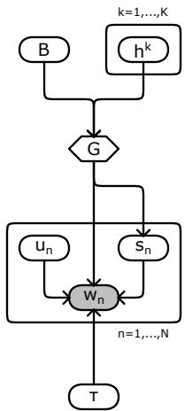  
Figure 1: Graphical representation ofthe statistical model in this study. Following the common convention [23,25], random quantities are demonstrated with circles, deterministic quantities are shown with diamonds, and quantities with known values are shaded. In addition, arrows specify dependencies between the various quantities and plates indicate repetition over the specified index.

Our full statistical model combines the non-parametric prior on the inducing points, eqs. (8) and (9), with the likelihood governing the observed point-cloud data, eq. (1). Its complete set of equations is shown graphically in fig. 1 and summarized in

$$
B \sim \mathsf { P o i s s o n } ( \gamma ) ,\tag{10}
$$

$$
h ^ { k } \sim \mathsf { N o r m a l } ( \mu , v I ) ,
$$

$$
k = 1 , \ldots , K ,\tag{11}
$$

$$
u _ { n } \sim \mathsf { U n i f o r m } _ { [ 0 , 1 ] } ,
$$

$$
n = 1 , \ldots , N ,\tag{12}
$$

$$
s _ { n } \mid B , h ^ { 1 : K } \sim \mathsf { C a t e g o r i c a l } _ { 1 : K } \Big ( \pi _ { 1 : K } ^ { G } \Big ) ,
$$

$$
n = 1 , \ldots , N ,\tag{13}
$$

$$
w _ { n } \mid r _ { n } , \tau \sim \mathsf { N o r m a l } \left( r _ { n } , I / \tau \right) ,
$$

$$
n = 1 , \ldots , N ,\tag{14}
$$

$$
\tau \sim { \sf G a m m a } ( \phi , \tau _ { \mathrm { r e f } } / \phi ) ,\tag{15}
$$

where we have re-parameterized the noise variance $\sigma ^ { 2 }$ in terms of a precision parameter $\tau = 1 / \sigma ^ { 2 }$ and adapted the standard prior to $\tau$ . The hyperparameters $\gamma , \mu , v , \phi , \tau _ { \mathrm { r e f } }$ are fixed, and the selection probabilities $\pi _ { 1 : K } ^ { G }$ are obtained according to eqs. (6) and (7).

## 2.4 Parametric model approximation

The non-parametric formulation of our model [26, 27] uses an infinite collection of inducing points to represent the curve $\mathcal { G }$ under reconstruction. Although modeling-wise this is a convenient representation, it is nevertheless computationally intractable, as non-parametric model formulations are associated with probability measures that do not attain probability functions [27]. For this reason, we proceed with a finite approximation.

Specifically, we opt for a finite but exceedingly large number of candidate inducing points $K \gg 1$ and approximate eq. (8) by

$$
B \sim { \tt B i n o m i a l } \left( K , \gamma / K \right) .\tag{16}
$$

Similarly to the exact non-parametric model, each of the K inducing points in the approximate model is activated independently with probability $\gamma / K$ . As a result, the expected number of active inducing points, in addition to being finite, remains equal to the expectation of the exact one $\mathbb { E } [ B ] = \gamma$ Furthermore, as we show below, our approximate finite model, mediated by eq. (16), at the limit $K  \infty$ , converges to the exact infinite model, mediated by eq. (8).

Theorem 2. At the limit $K  \infty ,$ , the variates generated according to eq. (16) converge in distribution to the variates generated according to eq. (8).

Proof. According to the binomial statistics of eq. (16), the probability mass function of B is

$$
p \left( B \right) = \frac { \gamma ^ { B } } { B ! } \frac { K ( K - 1 ) \cdot \cdot \cdot \left( K - B + 1 \right) } { K ^ { B } } \left( 1 - \frac { \gamma } { K } \right) ^ { K } \left( 1 - \frac { \gamma } { K } \right) ^ { - B } .
$$

Due to the limits

$$
\operatorname* { l i m } _ { K \to \infty } \frac { K ( K - 1 ) \cdot \cdot \cdot ( K - B + 1 ) } { K ^ { B } } = 1 , \qquad \operatorname* { l i m } _ { K \to \infty } \left( 1 - \frac { \gamma } { K } \right) ^ { K } = e ^ { - \gamma } , \qquad \operatorname* { l i m } _ { K \to \infty } \left( 1 - \frac { \gamma } { K } \right) ^ { - B } = 1 ;
$$

we readily obtain the limiting probability mass

$$
\operatorname* { l i m } _ { K  \infty } p ( B ) = \frac { \gamma ^ { B } } { B ! } e ^ { - \gamma } ,
$$

which is in agreement with the Poisson statistics of eq. (8).

## 2.5 Markov chain Monte Carlo

Following the parametric approximation of eq. (8), the posterior distribution of our model attains a probability function of the form

$$
p \left( \tau , B , h ^ { 1 : K } , s _ { 1 : N } , u _ { 1 : N } \mid w _ { 1 : N } \right) .
$$

This can be used both for curve reconstruction and uncertainty quantification tasks, since it allows for the estimation of the geometry $G = \{ B , h ^ { 1 : K } \}$ that uniquely determines a curve ${ \mathcal { G } } ;$ nevertheless, it does not admit a convenient analytical expression that allows its direct characterization. To overcome this limitation, we employ Monte Carlo methods [23,24,28], which enable posterior characterization through sampling simulations.

## 2.5.1 Sampler description

To characterize the posterior $p \left( \tau , B , h ^ { 1 : K } , s _ { 1 : N } , u _ { 1 : N } \mid w _ { 1 : N } \right)$ , we develop a specialized Markov chain Monte Carlo (MCMC) sampler [23] that iteratively updates our model variables. Our MCMC sampler targets the model posterior with an overall Gibbs sampling scheme [28, 29] consisting of the following two stages:

• Initialize $\tau , B , h ^ { 1 : K } , u _ { 1 : N }$ via random draws from their corresponding priors in eqs. (11), (12), (15) and (16) and generate $s _ { 1 : N }$ via eq. (11).

• Iterate update steps on designated blocks of $\tau , B , h ^ { 1 : K } , s _ { 1 : N } , u _ { 1 : N }$ in a randomized order until a suficient number of MCMC samples is generated.

However, due to strong dependencies between the posterior variables, univariate or small block updates in the iteration stage lead to slow mixing and poor exploration of the posterior space [24,28], rendering naive MCMC impractical. To address this and achieve improved sampling eficiency, we design a sequence of increasingly refined samplers, starting from a basic implementation of blocked Gibbs updates and progressing to more advanced variants that incorporate structured model-specific updates that maintain marginalized out progressively larger variable blocks.

In detail, each variant of our MCMC sampler implements the iteration stage using diferent update mechanisms as listed below.

## Sampler 1

\- Update τ as in Update A below.

\- Jointly update $B , h ^ { 1 : K } , s _ { 1 : N } , u _ { 1 : N }$ as in Update B below.

## Sampler 2

\- Update τ as in Update A below.

\- Jointly update $B , h ^ { 1 : K } , s _ { 1 : N } , u _ { 1 : N }$ as in Update B below.

\- Jointly update $B , s _ { 1 : N } , u _ { 1 : N }$ as in Update C below.

## Sampler 3

\- Jointly update $\tau , h ^ { 1 : K }$ as in Update $A ^ { * }$ below.

\- Jointly update $B , h ^ { 1 : K } , s _ { 1 : N } , u _ { 1 : N }$ as in Update B below.

\- Jointly update $B , h ^ { 1 : K } , s _ { 1 : N } , u _ { 1 : N }$ as in Update $B ^ { * }$ below.

\- Jointly update $B , s _ { 1 : N } , u _ { 1 : N }$ as in Update C below.

\- Jointly update $h ^ { 1 : K } , s _ { 1 : N } , u _ { 1 : N }$ as in Update D below.

## 2.5.2 Update mechanisms

We describe our individual update mechanisms below. These consist of a combination of ancestral sampling (AS) [29], direct sampling (DS) [28], elliptical slice sampling (ESS) [30], and custom Metropolis-Hastings (MH) methods [24, 28]. A detailed description, along with derivations and implementation specifics, is deferred to the Appendix, see sections A and B.

Update A The target is $p \left( \tau \vert B , h ^ { 1 : K } , s _ { 1 : N } , u _ { 1 : N } , w _ { 1 : N } \right)$ . This target is sampled via DS (see section B.1).

Update B The target is $p \left( B , h ^ { 1 : K } , s _ { 1 : N } , u _ { 1 : N } | \tau , w _ { 1 : N } \right)$ . This is sampled via AS according to the factorization

$$
\begin{array} { r l } & { p \left( B , h ^ { 1 : K } , s _ { 1 : N } , u _ { 1 : N } \middle | \tau , w _ { 1 : N } \right) = p \left( u _ { 1 : N } \middle | B , h ^ { 1 : K } , s _ { 1 : N } , \tau , w _ { 1 : N } \right) } \\ & { \qquad \times p \left( s _ { 1 : N } \middle | B , h ^ { 1 : K } , \tau , w _ { 1 : N } \right) } \\ & { \qquad \times p \left( B , h ^ { 1 : K } \middle | \tau , w _ { 1 : N } \right) . } \end{array}
$$

The first and second factors are sampled via DS (see sections B.2 and B.3), and the third factor is sampled via ESS and DS after completion with auxiliary variables (see section B.4).

Update C The target is $p \left( B , s _ { 1 : N } , u _ { 1 : N } | h ^ { 1 : K } , \tau , w _ { 1 : N } \right)$ . This is sampled via AS according to the factorization

$$
\begin{array} { r l } & { p \left( B , \boldsymbol { s } _ { 1 : N } , \boldsymbol { u } _ { 1 : N } | \boldsymbol { h } ^ { 1 : K } , \boldsymbol { \tau } , \boldsymbol { w } _ { 1 : N } \right) = p \left( \boldsymbol { u } _ { 1 : N } | B , \boldsymbol { h } ^ { 1 : K } , \boldsymbol { s } _ { 1 : N } , \boldsymbol { \tau } , \boldsymbol { w } _ { 1 : N } \right) } \\ & { \qquad \times p \left( \boldsymbol { s } _ { 1 : N } | B , \boldsymbol { h } ^ { 1 : K } , \boldsymbol { \tau } , \boldsymbol { w } _ { 1 : N } \right) } \\ & { \qquad \times p \left( B | \boldsymbol { \tau } , \boldsymbol { h } ^ { 1 : K } , \boldsymbol { w } _ { 1 : N } \right) . } \end{array}
$$

The first and second factors are sampled as in Update B (see sections B.2 and B.3), and the third factor is sampled via DS (see section B.5).

Update D The target is $p \left( \boldsymbol { h ^ { 1 : K } } , \boldsymbol { s } _ { 1 : N } , \boldsymbol { u } _ { 1 : N } | B , \tau , \boldsymbol { w } _ { 1 : N } \right)$ . This is sampled via AS according to the factorization

$$
\begin{array} { r l } & { p \left( h ^ { 1 : K } , s _ { 1 : N } , u _ { 1 : N } | B , \tau , w _ { 1 : N } \right) = p \left( u _ { 1 : N } | B , h ^ { 1 : K } , s _ { 1 : N } , \tau , w _ { 1 : N } \right) } \\ & { \qquad \times p \left( s _ { 1 : N } | B , h ^ { 1 : K } , \tau , w _ { 1 : N } \right) } \\ & { \qquad \times p \left( h ^ { 1 : B } | B , h ^ { B + 1 : K } , \tau , w _ { 1 : N } \right) } \\ & { \qquad \times p \left( h ^ { B + 1 : K } | B , \tau , w _ { 1 : N } \right) . } \end{array}
$$

The first and second factors are sampled as in Update B (see sections B.2 and B.3), the third factor is sampled via a custom MH that randomly permute, reflect, and reconnect the geometry’s vertices (see section B.6), and the fourth factor is sampled via DS (see section B.7).

Update $\pmb { \mathsf { A } } ^ { * }$ The target is $p \left( \tau , h ^ { 1 : K } | B , s _ { 1 : N } , u _ { 1 : N } , w _ { 1 : N } \right)$ . This is sampled via AS according to the factorization

$$
\begin{array} { r l r } {  { p ( \tau , h ^ { 1 : K } | B , s _ { 1 : N } , u _ { 1 : N } , w _ { 1 : N } ) = p ( \tau | h ^ { 1 : B } , s _ { 1 : N } , u _ { 1 : N } , w _ { 1 : N } ) } } \\ & { } & { \times p ( h ^ { 1 : B } | B , s _ { 1 : N } , u _ { 1 : N } , w _ { 1 : N } ) } \\ & { } & { \times p ( h ^ { B + 1 : K } | B , s _ { 1 : N } , u _ { 1 : N } , w _ { 1 : N } ) . } \end{array}
$$

The first factor is sampled as in Update A (see section B.1), the second factor is sampled via ESS (see section B.8), and the third factor is sampled via DS (see section B.9).

Update B\* The target is the same as in Update B and is sampled via AS according to the same factorization. Sampling of the first and second factors is unchanged (see sections B.2 and B.3); however, sampling of the third factor is performed via a custom MH that randomly modifies the geometry by adding or removing vertices after completion with auxiliary variables (see section B.10).

## 2.5.3 Overview

From our three MCMC variants, Sampler 1 is mainly based on ESS in Update B that instantly changes only the position of the active inducing points $h ^ { 1 : B }$ in a given geometry G. Although theoretically able to recover the correct geometry in the long run, in practice convergence is slow due to the local nature of the ESS which often results in trapping in local posterior modes corresponding to curves only partially matching the point-cloud under analysis.

To this end, Sampler 2 introduces additional joint moves in Update C that involve inducing points and latent variables to facilitate instant changes in the positioning of active inducing points $h ^ { 1 : B }$ and also their total number B. These improve mixing and generally lead to better exploration of the posterior space compared to Sampler 1. However, trapping in local modes persists as reordering of the active vertices needed to escape partially matching curves, even with this sampler, requires multiple trials.

Finally, Sampler 3 introduces specialized MH moves in Updates $B ^ { * }$ and $D$ that instantly change the positioning, ordering, and total number of active inducing points $h ^ { 1 : B }$ . These result in changes that allow for transitioning between local posterior modes and substantially improved mixing. Although these moves afect the geometry G globally, they actually do not drastically modify the reconstructed curve G, which can alternate between partially matching configurations while maintaining nearly constant data likelihoods. For this reason, the corresponding MH proposals, despite their global nature, are accepted with high probability. As a result, Sampler 3 exhibits faster convergence at relatively low cost and no tendency to get trapped in local modes such as Samplers 1 and 2.

## 2.6 Data acquisition

All point-clouds used in the numerical illustrations presented in Results contain 2D localizations and were obtained from three sources: (i) synthetic data generated from our proposed model, (ii) curated point-cloud datasets available in the literature, and (iii) real-world data from LiDAR land surveying studies.

Synthetic data were generated by simulating eqs. (1) and (3) under prescribed geometries $G =$ $\{ B , h ^ { 1 : K } \}$ for $K \gg 1$ as well as prescribed noise τ and size N. The prescribed geometries were retained and used only post hoc as references (i.e., ground-truth) for comparison against the MCMC reconstructions.

Curated point-clouds were obtained from benchmark studies [31–33]. These include the Butterfly example from Refs. [31, 32], the Sawtooth example from Ref. [31], and the Bottle example from Ref. [33].

Real-world point clouds were obtained from the Mapping Rock Glaciers (2025) survey [34] and the U.S. Geological 3D elevation (2016) program [35]. The dataset from the former consists of boundary points mapping the derived outlines of rock glaciers extracted from airborne LiDAR point returns in the San Juan Mountains, Colorado, USA. The dataset from the latter consists of downsampled classified (land, water, and vegetation) points delineating the shoreline of McBee Island extracted from airborne LiDAR measurements in the Holston River, TN, USA.

## 3 Results

Having described our reconstruction model and its computational implementation in Methods, we now show selected results that demonstrate its characteristics and performance. We begin by verifying that our proposed methodology generates valid curve reconstructions by comparing directly against the ground-truth using synthetic datasets of varying complexity. Using synthetic data, we also conduct ladders of simulations to demonstrate that our framework meaningfully quantifies and propagates uncertainty from point-clouds to reconstructions and compare the performance of our three MCMC samplers, highlighting their relative eficiency and reconstruction accuracy. Finally, we compare our results with standardized benchmark datasets from [31–33] as well as with field-derived LiDAR data from [34, 35].

## 3.1 Illustration with synthetic data

To validate our reconstruction framework, we tested it on two synthetically generated datasets that can be seen in figs. 2 and 3. Additional results are provided in the Appendix, see section C. To quantify the accuracy of the reconstructed curves, for all cases, we compute the Hausdorf distance [36] between

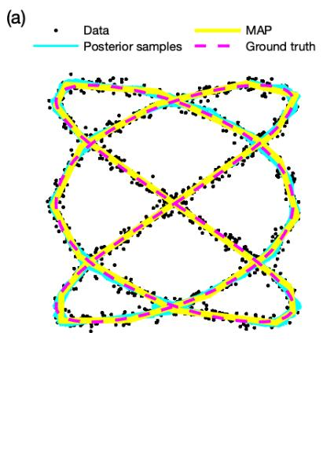

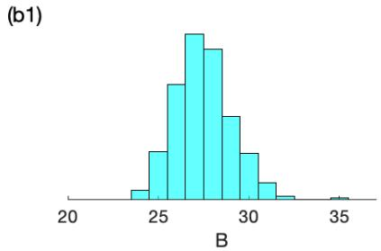  
(b2)

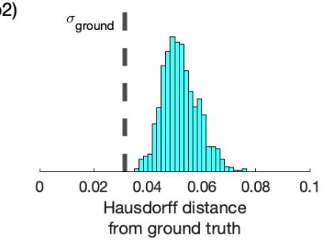  
Figure 2: Synthetic data analysis of a Lissajous curve. Reconstruction is applied on a noisy point-cloud of size $N = 1 5 0 0$ and noise $\tau = 1 0 0 0$ (i.e., σ ≈ 0.032). A total of 3,000 MCMC iterations are performed using Sampler 3, with the first 50% discarded as burn-in and the remaining samples thinned at a ratio of 1:3 for visualization purposes. The panel on the left shows the point-cloud and reconstructed curves. The panels to the right summarize key posterior results.

the ground-truth and each MCMC posterior sample. This distance is given by

$$
d \left( \mathcal { G } _ { * } , \mathcal { G } \right) = \operatorname* { m a x } \left\{ \operatorname* { m a x } _ { g _ { * } \in \mathcal { G } _ { * } } \operatorname* { m i n } _ { g \in \mathcal { G } } \| g _ { * } - g \| , \operatorname* { m a x } _ { g \in \mathcal { G } } \operatorname* { m i n } _ { g _ { * } \in \mathcal { G } _ { * } } \| g - g _ { * } \| \right\}
$$

where $\mathcal { G } _ { * }$ denotes the ground-truth curve and $\mathcal { G }$ denotes the curve reconstructed via the geometry $G = \{ B , h ^ { 1 : K } \}$ of a sample in the generated MCMC chain. As can be seen, $d \left( \mathcal { G } _ { * } , \mathcal { G } \right)$ provides a global measure of the discrepancy between the two curves [36], with $d \left( \mathcal { G } _ { * } , \mathcal { G } \right) = 0$ indicating a perfect match and $d \left( \mathcal { G } _ { * } , \mathcal { G } \right) > 0$ quantifying the degree of mismatch.

In fig. 2 we evaluate our framework on a challenging dataset generated from a Lissajous curve [37], defined by

$$
\mathcal { G } = \{ ( \sin ( 3 t ) , \sin ( 2 t ) ) \} _ { t \in [ 0 , 2 \pi ) } \subset \mathbb { R } ^ { 2 } ,
$$

which contains numerous self-intersections and intricate geometric features. Such a non-convex geometry provides a demanding benchmark for assessing the sampler’s ability to recover complex curve structures from noisy point-cloud observations. Figure 2 summarizes posterior sampled curves and the maximum a posteriori (MAP) reconstruction. The close agreement between the MAP estimate and the ground-truth, together with the concentration of the posterior samples around the ground-truth, demonstrates that the proposed Bayesian framework accurately reconstructs highly complex curves. The accompanying posterior distribution of the number of active vertices B indicates that the model is able to identify and adjust suficiently many vertices to match the geometry, and the low Hausdorf distance further indicates that the model reliably matches the ground-truth globally.

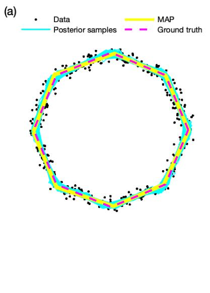

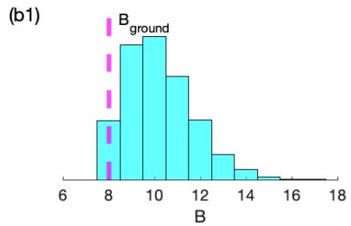

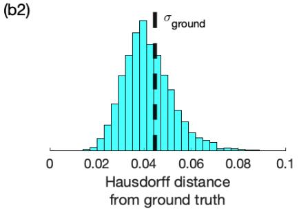  
Figure 3: Synthetic data analysis of an octagon curve. Reconstruction is performed on a noisy point-cloud of size N = 12000 and noise $\tau = 5 0 0$ $( i . e . , \sigma \approx 0 . 0 4 5 )$ . A total of 12,000 MCMC iterations are performed using Sampler 3, with the first 25% discarded as burn-in and the remaining samples thinned at a ratio of 1:3 for illustration purposes. The panel on the left shows the point-cloud and reconstructed curves. The panels to the right summarize key posterior results.

In fig. 3 we evaluate the proposed framework on a synthetic dataset generated from a regular octagon defined by the inducing points

$$
\mathcal { H } = \{ ( \cos { ( k \pi / 4 ) } , \sin { ( k \pi / 4 ) } ) \} _ { k = 0 , 1 , \dots , 7 } \subset \mathbb { R } ^ { 2 } .
$$

Compared with the Lissajous example in fig. 2, this geometry provides a simpler benchmark with welldefined edges and vertices, allowing us to verify that the sampler accurately recovers polygonal structures despite discontinuities at the corners. Figure 3 summarizes the posterior sampled curves and the maximum a posteriori (MAP) reconstruction. Again, the close agreement between the MAP estimate and the ground-truth, together with the concentration of the posterior samples around the ground-truth, demonstrates that the proposed Bayesian framework accurately reconstructs polygonal curves. The posterior distribution of the number of active vertices B is centered near the ground-truth value, while the Hausdorf distance remains consistently small, indicating excellent agreement between the inferred and ground-truth curves.

## 3.2 Uncertainty propagation

Since our framework relies on a Bayesian model, one of its main characteristics is that it can propagate uncertainty from a given dataset to the resulting reconstructions. In the context of curve reconstruction, the uncertainty of the data is influenced by the total number of localizations in the point-cloud N, that afects the degree of missing information, and the noise level τ, that afects the corruption caused by localization noise. In figs. 4 and 5 we provide sensitivity analyzes with respect to both factors. For these tests, we evaluate the proposed framework on a synthetic datasets generated from a regular pentagon

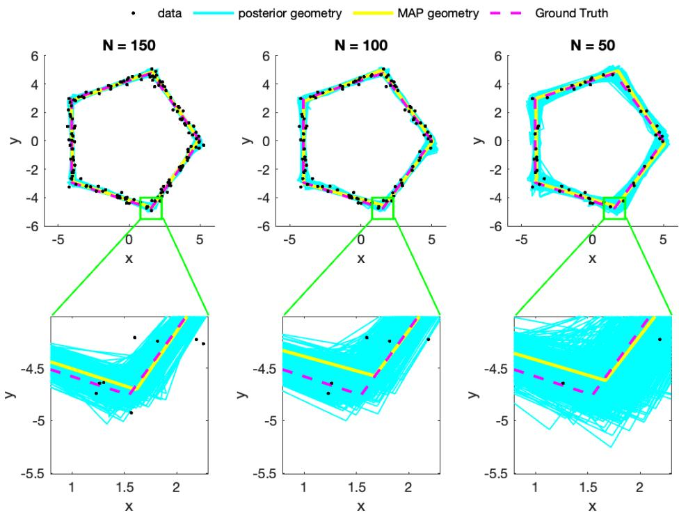  
Figure 4: Efects of point-cloud size. Reconstruction is performed on three point-clouds with sizes $N =$ 150, 100, 50, left to right, and fixed noise $\tau = 3 0 \ ( i . e . , \ \sigma \approx 0 . 1 8 )$ For each experiment, 3,000 MCMC iterations are performed using Sampler 3, with the first 30% discarded as burn-in and the remaining samples thinned at a ratio of 1:2 for illustration purposes. The top panels show the point-clouds used and reconstructed curves. The square marks the same neighborhood of the lower-right vertex in each panel, and the bottom panels show a magnified view of this region using identical axis limits. The enlarged panels highlight the increase in posterior uncertainty as point-cloud size decreases.

centered at the origin and defined by the vertices

$$
\mathcal { H } = \{ ( 5 \cos \left( 2 k \pi / 5 \right) , 5 \sin \left( 2 k \pi / 5 \right) ) \} _ { k = 0 , 1 , \dots , 4 } \subset \mathbb { R } ^ { 2 } .
$$

In fig. 4, we start with a point-cloud of reference size $N = 1 5 0$ and progressively reduce it to $N = 1 0 0$ and $N = 5 0$ with a fixed noise $\tau = 3 0$ or $\sigma = . 1 8$ . As size decreases, the obtained posterior widens, as expected, indicating increased uncertainty over the resulting reconstructions.

In fig. 5, we start with a point-cloud corrupted with a reference noise of $\tau = 3 0 0 0$ that corresponds to a standard deviation of $\sigma \approx 0 . 0 1 8$ and progressively reduce it to $\tau = 3 0$ and $\tau = 0 . 3$ that correspond to standard deviations of $\sigma \approx 0 . 1 8$ and $\sigma \approx 1 . 8$ , respectively. Again, as noise increases, the obtained posterior widens, as expected, indicating increased uncertainty over the resulting reconstructions.

## 3.3 Comparison of sampling schemes

In Methods we presented three variants of our MCMC algorithm for the evaluation of our posterior reconstructions that difer in complexity and sophistication. To compare the efectiveness of the three variants, we apply each sampler to the same synthetic point-cloud and evaluate its ability to recover the underlying ground-truth curve.

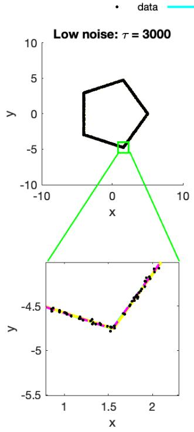

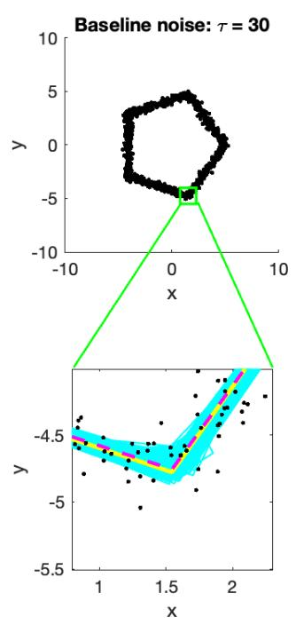

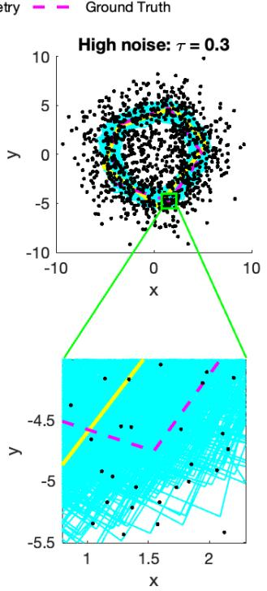  
Figure 5: Efects of localization noise. Reconstruction is performed on point-clouds of size N = 1000 and noise levels $\tau = { 3 0 0 0 , 3 0 , 0 . 3 } \ ( i . e . , \ \sigma \approx 0 . 0 1 8 , 0 . 1 8 , 1 . 8 ) .$ , left to right. For each experiment, 3,000 MCMC iterations are performed using Sampler 3, with the first 30% discarded as burn-in and the remaining samples thinned at a ratio of 1:3 for visualization purposes. The top panels show the point-clouds used and reconstructed curves. The square marks the same neighborhood of the lower-right vertex in each panel, and the bottom panels show a magnified view of this region using identical axis limits. The enlarged panels highlight the increase in posterior uncertainty as noise increases.

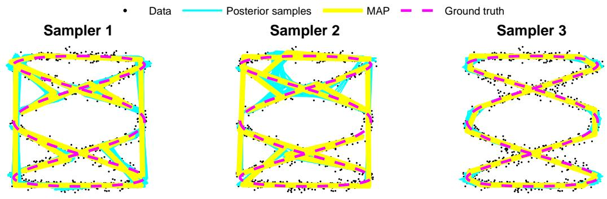

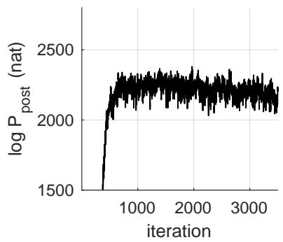

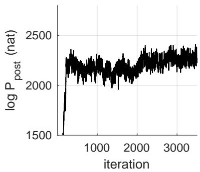

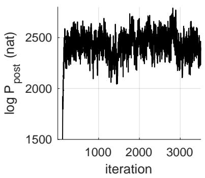  
Figure 6: Comparison of MCMC samplers on the same synthetic point-cloud. The top panels show the pointclouds used and reconstructed curves. The bottom panels show traces of the corresponding log-posterior. From the three samplers, only Sampler 3 recovers the ground-truth; while, Samplers 1 and 2 remains trapped in local maxima corresponding to only partially matching configurations.

Figure 6 shows that, while all three samplers target the same posterior distribution, their mixing behavior difers substantially. Thanks to its specialized MH updates that re-position, re-order, and resize a geometry’s active vertices, Sampler 3 explores the posterior space more efectively reaching higher posterior values and avoiding the partially matching configurations that attract Samplers 1 and 2. As a result, Sampler 3 produces the most robust and accurate inference.

More concretely, the three variants lead to Hausdorf distances between the ground-truth and MAP reconstructions of 0.312, 0.318, and 0.075 for Samplers 1, 2, and 3, respectively. Once again, this indicates that only reconstructions from Sampler 3 closely match the ground-truth.

## 3.4 Benchmark with standardized point-clouds

To highlight our method’s reconstruction characteristics, we consider standardized point-clouds from the FitConnect and StretchDenoise studies [31, 32] as well as Ref. [33]. We include examples from these three studies because they represent state-of-the-art reconstruction methods and have all been evaluated previously on the same or similar standardized point-clouds. Figure 7 shows reconstructions obtained from the Butterfly example, which has previously been used as a benchmarking test for FitConnect and StretchDenoise and additional results on the Sawtooth and Bottle examples are provided in the Appendix, see section C.

Of the three methods considered, FitConnect relies on a geometric approach designed to connect noisy 2D point samples by fitting parametric arcs to local circular point neighborhoods. In this way, FitConnect can recover the connectivity (i.e., sequential ordering) of unorganized points, analogous to the sequential ordering of the inducing points in our framework that form the vertices of the curve under reconstruction. Following a similar approach, StretchDenoise extends FitConnect by using its connectivity as an intermediate stage, on which it applies separate parametric adjustments to optimize the vertices’ positions within approximately derived local bounds. In contrast, Ref. [33] presents a deterministic curve-reconstruction method based on moving least squares and Euclidean minimum spanning trees. This method uses iterative refinement of the original point-cloud to progressively thin its localizations until a smooth non-intersecting curve emerges.

(a)  
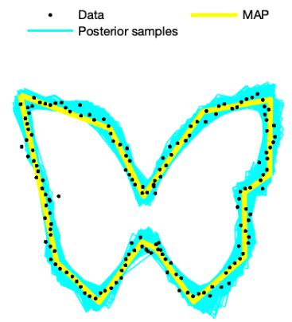

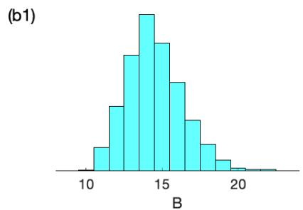

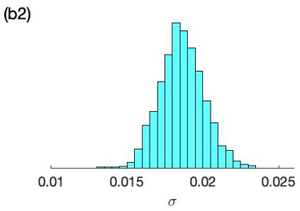  
Figure 7: Reconstruction of the Butterfly example. A total of 5,000 MCMC iterations are performed using Sampler 3, with the first 50% discarded as burn-in and the remaining samples thinned at a ratio of1:2 to improve visual clarity. The panel on the left shows the point-cloud and reconstructed curves. The panels to the right summarize key posterior results.

As explained above, all three methods provide deterministic curve reconstructions that best match the characteristics of point-estimates [24] that most closely resemble our MAP curves. However, rather than returning a single reconstructed curve, our framework generates an ensemble of posterior samples over admissible curve reconstructions. We use the posterior to obtain a representative reconstruction (e.g., a MAP estimate), while also quantifying the uncertainty around this curve. In contrast, uncertainty quantification for the resulting reconstruction is absent in the other methods. In addition, our framework explicitly accounts for localization noise in the original point-cloud which is estimated along the other quantities of interest, and its uncertainty is propagated to the resulting reconstructions in contrast to the mentioned methods where noise is incorporated as a generic optimization device to enable local or global curve refinements. Finally, our framework proceeds in a single stage where connectivity (i.e., sequential ordering), positioning, and sizing (i.e., total number) of the active inducing points forming the vertices of the curve under reconstruction are interrelated, allowing information from one to influence the others rather than utilizing multiple separate stages that prohibit such influences.

## 3.5 Applications on field-data

To demonstrate the application of our framework to real-world data, we consider the analysis of two datasets obtained through airborne LiDAR acquisition techniques, as commonly found in environmental and geospatial studies. First, we use a point-cloud from the Mapping Rock Glaciers (2025) survey [34]. Our selected dataset consist of boundary points that represent the outlines of mapped rock glaciers in the San Juan Mountains, CO. Second, we use a point-cloud from the U.S. Geological Survey 3D Elevation program [35]. Our selected dataset represents the outline of McBee Island in the Holston river, TN.

As seen in fig. 8, starting from each point-cloud, our Bayesian reconstruction framework recovers the underlying geometric structure (rock glacier in (a1)-(a2) and McBee Island in (b1)-(b2)) while accounting for data uncertainty. Both reconstructions closely follow the observed point-clouds and produce smooth, coherent boundary estimates despite the sparse and non-uniform sampling of the original datasets. In addition, unlike deterministic reconstructions, our framework also provides posterior uncertainty quantification. This is particularly pronounced in undersampled regions, for example, upperleft and lower-right sides in (a2), or regions of high curvature, for example, upper and lower corners in (b2).

Overall, these two LiDAR case studies show that our Bayesian framework reliably reconstructs geospatial structures while explicitly quantifying reconstruction uncertainty. The posterior uncertainty naturally increases in undersampled and high-curvature regions, providing a readily interpretable measure of the regions where the inferred geometry is most uncertain.

## 4 Discussion

In this study, we presented a novel comprehensive, fully Bayesian framework for point-cloud data analysis aimed specifically at tasks involving curve reconstruction under uncertainty. Our proposed methodology integrates a principled probabilistic model for the curve’s latent geometry with an explicit representation of localization noise and data corruption, together with an array of computational strategies that make posterior evaluation eficient and tractable for practical applications. As a result, our approach supports both high-fidelity reconstruction and uncertainty quantification from incomplete, sparse, or degraded point-cloud observations and can become an indispensable component in AI/ML, data analysis, or image processing workflows operating on curated or raw localization measurements.

Relative to existing point-cloud reconstruction pipelines that are often dominated by deterministic fitting [32,38], heuristic regularization [1,31,39], or purely geometric criteria [33,40,41], our formulation provides a unified statistical treatment of data, missing information, and reconstruction ambiguity. In particular, rather than producing a single curve, i.e., a point estimate, our approach follows Bayesian principles and yields a posterior distribution over admissible reconstructions, enabling the derivation of credible intervals, probabilistic error bars, and uncertainty-aware downstream decisions [24]. This contrasts with many widespread methods in which uncertainty is ignored [1] or added post hoc, and robustness to data corruption can depend sensitively on hyperparameter fine-tuning and other user choices [31, 32, 42].

Nevertheless, despite the advantages of our methodology, two limitations remain important. First, while feasible, the computational cost can still be substantial because our computational strategy relies on repetitive Markov chain Monte Carlo (MCMC) sampling, which may become a bottleneck for large point-clouds or time-critical applications. Second, our current computational design is tailored to onedimensional geometries, these include curves embedded in 2D, 3D, or higher-dimensional Euclidean scenes, and does not directly extend to the reconstruction of surfaces or volumetric structures, where the dimensionality of the latent object and the complexity of the associated likelihood integrals increase markedly.

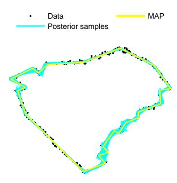

(a1)  
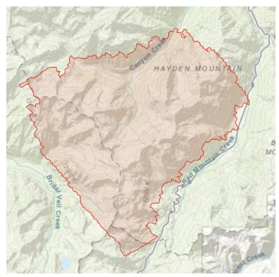  
(a2)  
(b1)

(b2)  
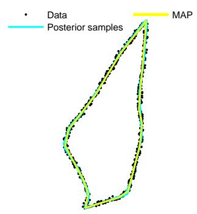  
Figure 8: Reconstruction of field LiDAR point-clouds imaging rock glaciers in the San Juan Mountains, CO (top panels) and McBee Island in the Holston River, TN (bottom panels). In each case, a total of 3,000 MCMC iterations are performed using Sampler 3, with the first 50% discarded as burn-in and the remaining samples thinned at a ratio of 1:8 for visualization purposes. The left panels show reference outlines of the imaged structures and the right panels show the point-cloud used and reconstructed curves.

Such limitations could be addressed in several directions. For instance, the computational burden of MCMC could be reduced through high-performance computing (especially in updates ${ \sf A } ^ { * } , { \sf B } ^ { * } , { \sf C } ,$ , and D of section 2.5.2), including parallelization techniques and distributed processing, that exploit the natural structure of our likelihood—which maintains independence over data points and segments—to speed up the completion of each MCMC iteration. In addition, extending our methodology beyond curves may be possible by introducing numerical approximations for the higher-dimensional integrals mediating the factorization of the model posterior (see Appendix, section A) that arise in surface/volume settings, or by developing surrogate models (e.g., emulators or reduced-order representations) that preserve essential geometric and uncertainty features while making inference scalable. However, fully resolving these challenges requires methodological and implementation advances beyond the scope of a single proof-ofconcept study and will be the focus of future research.

## A Main posterior factorization and definitions

Sampling of most targets described in section B relies on the following factorization of the model’s conditional posterior:

$$
\begin{array} { r l } { p ( \mathrm { s r u g } , \eta _ { 1 , \mathrm { W } } , \eta _ { 1 , \mathrm { W } } , \eta _ { 1 , \mathrm { W } } , \eta _ { 1 , \mathrm { W } } ) } & { = p ( \alpha _ { 1 , \mathrm { W } } , \eta _ { 1 , \mathrm { W } } , \eta _ { 1 , \mathrm { W } } , \eta _ { 1 , \mathrm { W } } , \eta _ { 1 , \mathrm { W } } , \eta _ { 1 , \mathrm { W } } ) ( \mathrm { b f } , \eta ) } \\ & { = p ( \alpha _ { 1 , \mathrm { W } } , \eta _ { 1 , \mathrm { W } } , \eta _ { 1 , \mathrm { W } } , \eta _ { 1 , \mathrm { W } } , \eta _ { 1 , \mathrm { W } } , \eta _ { 1 , \mathrm { W } } ) ( \mathrm { b f } , \eta ) } \\ & { = p ( \alpha _ { 1 , \mathrm { W } } , \eta _ { 1 , \mathrm { W } } , \eta _ { 1 , \mathrm { W } } , \eta _ { 1 , \mathrm { W } } , \eta _ { 1 , \mathrm { W } } ) ( \mathrm { b f } , \eta _ { 1 , \mathrm { W } } ) p ( \mathrm { B f } ) } \\ & { = p ( \alpha _ { 1 , \mathrm { W } } , \eta _ { 1 , \mathrm { W } } , \eta _ { 1 , \mathrm { W } } , \eta _ { 1 , \mathrm { W } } , \eta _ { 1 , \mathrm { W } } ) ( \mathrm { b f } , \eta _ { 1 , \mathrm { W } } ) p ( \mathrm { b f } , \eta ) p ( \mathrm { B f } ) } \\ & { = p ( \alpha _ { 1 , \mathrm { W } } , \eta _ { 1 , \mathrm { W } } , \eta _ { 1 , \mathrm { W } } , \eta _ { 1 , \mathrm { W } } , \eta _ { 1 , \mathrm { W } } ) ( \mathrm { b f } , \eta _ { 1 , \mathrm { W } } ) p ( \mathrm { b f } , \eta ) } \\ &  = p ( \alpha _ { 1 , \mathrm { W } } , \eta _ { 1 , \mathrm { W } } , \eta _  1 , \mathrm  \end{array}
$$

The function $\mathcal { F } _ { n } ^ { G , \tau } ( u _ { n } , s _ { n } )$ is defined and factorized as follows:

$$
\begin{array} { r l } { \mathcal { F } _ { n } ^ { G , \tau } ( u _ { n } , s _ { n } ) = p \left( w _ { n } , u _ { n } , s _ { n } | G , \tau \right) } \\ & { = p \left( w _ { n } | u _ { n } , s _ { n } , G , \tau \right) p \left( u _ { n } | s _ { n } , G , \tau \right) p \left( s _ { n } | G , \tau \right) } \\ & { = p \left( w _ { n } | u _ { n } , s _ { n } , G , \tau \right) p \left( u _ { n } \right) p \left( s _ { n } | G \right) } \\ & { = p \left( s _ { n } | G \right) p \left( w _ { n } | u _ { n } , s _ { n } , G , \tau \right) p \left( u _ { n } \right) } \\ & { = \mathrm { C a t e g o r i c a l } _ { 1 : K } \left( s _ { n } ; \pi _ { 1 : K } ^ { G } \right) \mathrm { ~ N o r m a l } _ { 2 } \left( w _ { n } ; r _ { s _ { n } , u _ { n } } ^ { G } , I _ { 2 } / \tau \right) \mathrm { U n i f o r m } _ { [ 0 , 1 ] } \left( u _ { n } \right) } \\ & { = \frac { \tau } { 2 \sqrt { 2 \pi } } F _ { n } ^ { G } \mathrm { C a t e g o r i c a l } _ { 1 : K } \left( s _ { n } ; f _ { n } ^ { 1 : K } \right) \mathrm { ~ N o r m a l } _ { [ 0 , 1 ] } \left( u _ { n } ; M _ { n } ^ { s _ { n } } , ( S ^ { s _ { n } } ) ^ { 2 } \right) . } \end{array}
$$

Here, the constants, which depend implicitly on the geometry $G = \{ B , h ^ { 1 : K } \}$ , are given by:

$$
\begin{array} { r l } & { q _ { n } ^ { s } = h ^ { s } - w _ { n , n } } \\ & { p ^ { s } = h ^ { s } - h ^ { s + 1 } , } \\ & { S ^ { s } = \cfrac { 1 } { \| \boldsymbol { p } ^ { s } \| \sqrt { \boldsymbol { q } ^ { s } } } , } \\ & { M _ { n } ^ { s } = \cfrac { \left( \boldsymbol { p } ^ { s } \right) ^ { t } \phi _ { n } ^ { s } } { \| \boldsymbol { p } ^ { s } \| ^ { 2 } } , } \\ &  \Omega _ { n } ^ { s } = \cfrac { \alpha \epsilon ^ { 3 } S ^ { s } \exp { \left( \cfrac { ( M _ { n } ^ { s } / S ^ { s } ) ^ { 2 } - \tau \| q _ { n } ^ { s } \| ^ { 2 } } { 2 } \right) } \left[ \mathrm { e r f } \left( \cfrac { 1 } { \sqrt { 2 } } \cfrac { 1 - M _ { n } ^ { s } } { S ^ { s } } \right) + \mathrm { e r f } \left( \cfrac { 1 } { \sqrt { 2 } } \cfrac { M _ { n } ^ { s } } { S ^ { s } } \right) \right] , } \\ & { F _ { n } ^ { G } = \underset { \mathcal { S } } { \sum ^ { s } } \Omega _ { n } ^ { s ^ { \prime } } , } \\ & { J _ { n } ^ { s } = \frac { \Omega _ { n } ^ { s } } { F ^ { G } } . } \end{array}
$$

The computation of $\Omega _ { n } ^ { s }$ requires the computation of the sum

$$
\operatorname { e r f } \left( { \frac { 1 } { \sqrt { 2 } } } { \frac { 1 - M _ { n } ^ { s } } { S ^ { s } } } \right) + \operatorname { e r f } \left( { \frac { 1 } { \sqrt { 2 } } } { \frac { M _ { n } ^ { s } } { S ^ { s } } } \right) = \operatorname { e r f c } \left( { \frac { 1 } { \sqrt { 2 } } } { \frac { \left| M _ { n } ^ { s } - { \frac { 1 } { 2 } } \right| - { \frac { 1 } { 2 } } } { S ^ { s } } } \right) - \operatorname { e r f c } \left( { \frac { 1 } { \sqrt { 2 } } } { \frac { \left| M _ { n } ^ { s } - { \frac { 1 } { 2 } } \right| + { \frac { 1 } { 2 } } } { S ^ { s } } } \right)
$$

which is prone to catastrophic cancellation and numerical underflow. For this reason, we implement the right-hand side instead, which is numerically robust.

## B Sampling of individual MCMC targets

## B.1 Target in Updates A and $\pmb { \mathsf { A } } ^ { * }$

The target is $p \left( \tau \vert B , h ^ { 1 : K } , s _ { 1 : N } , u _ { 1 : N } , w _ { 1 : N } \right)$ and is derived as follows:

$$
\begin{array} { r l } { p \left( \overline { { c } } \ | B , h ^ { 1 : K } , s _ { 1 : N } , u _ { 1 : N } , w _ { 1 : N } \right) = p \left( \overline { { c } } \ | B ^ { 1 : H } , s _ { 1 : N } , u _ { 1 : N } , w _ { 1 : N } \right) } & { } \\ & { \leq p \left( w _ { 1 : N } \| ^ { 1 : H } , s _ { 1 : N } , u _ { 1 : N } , \tau \right) p \left( \tau \| ^ { K : B } , s _ { 1 : N } , u _ { 1 : N } \right) } \\ & { = p \left( \pi _ { 1 : N } \| ^ { 1 : B : \tau } , s _ { 1 : N } , u _ { 1 : N } , \tau \right) p \left( \tau \right) } \\ & { = \left( \displaystyle \prod _ { i = 1 } ^ { N } p \left( \sigma _ { \mathrm { w } } , | h ^ { 1 : H } , s _ { \mathrm { w } } , u _ { 1 : N } , \tau \right) \right) p \left( \tau \right) } \\ & { = \left( \displaystyle \prod _ { i = 1 } ^ { N } \mathsf { R e m m a l } \left( \sigma _ { \mathrm { w } } , \gamma _ { \mathrm { w } , \tau _ { i } , n } ^ { G } , I / \tau \right) \right) \mathsf { G a m m m a } \left( \tau ; \phi , \frac { \tau \mathrm { w i d } } { \phi } \right) } \\ & { = \mathsf { G a m m a n d } \left( \tau ; \phi + \frac { d } { 2 } N , \frac { 1 } { \tau _ { \mathrm { w } } ^ { \phi } + 1 } \right) \frac { 1 } { \tau _ { \mathrm { w } } ^ { \phi } - 1 } \frac { 1 } { \tau _ { \mathrm { w } } ^ { \phi } + 1 } } \\ & { = \mathsf { G a m m a } \left( \tau ; \phi ^ { \ell } , \beta ^ { \ast } \right) } \end{array}
$$

This target is sampled via DS. The constants are defined by

$$
\begin{array} { l } { \displaystyle \phi ^ { \prime } = \phi + \frac { d } { 2 } N , } \\ { \displaystyle \beta ^ { \prime } = \frac { 1 } { \frac { \phi } { \tau _ { \mathrm { r e f } } } + \frac { 1 } { 2 } \sum _ { n = 1 } ^ { N } \left\| w _ { n } - r _ { s _ { n } , u _ { n } } ^ { G } \right\| ^ { 2 } } . } \end{array}
$$

## B.2 Target in Updates B, C, D, and $\mathbf { B } ^ { * }$

The target is $p \left( u _ { 1 : N } | B , h ^ { 1 : K } , s _ { 1 : N } , \tau , w _ { 1 : N } \right)$ and, due to the factorization in section A, is derived as follows:

$$
\begin{array} { r l r } {  { p ( u _ { 1 : N } | B , h ^ { 1 : K } , s _ { 1 : N } , \tau , w _ { 1 : N } ) \propto p ( w _ { 1 : N } , u _ { 1 : N } , s _ { 1 : N } , h ^ { 1 : K } , B | \tau ) } } \\ & { } & { \propto \prod _ { n } { \mathsf { N o r m a l } } _ { [ 0 , 1 ] } ( u _ { n } ; M _ { n } ^ { s _ { n } } , ( S ^ { s _ { n } } ) ^ { 2 } ) } \end{array}
$$

This target is sampled via DS [43]. Here, $\mathsf { N o r m a l } _ { [ 0 , 1 ] }$ denotes the truncated normal distribution.

## B.3 Target in Updates B, C, D, and $\mathbf { B } ^ { * }$

The target is $p \left( \boldsymbol { s } _ { 1 : N } | \boldsymbol { B } , \boldsymbol { h } ^ { 1 : K } , \tau , \boldsymbol { w } _ { 1 : N } \right)$ and, due to the factorization in section A, is derived as follows:

$$
\begin{array} { l } { { \displaystyle p \left( s _ { 1 : N } | B , h ^ { 1 : K } , \tau , w _ { 1 : N } \right) \propto p \left( w _ { 1 : N } , s _ { 1 : N } , h ^ { 1 : K } , B | \tau \right) } } \\ { ~ } \\ { { \displaystyle = \int d u _ { 1 : N } p \left( w _ { 1 : N } , u _ { 1 : N } , s _ { 1 : N } , h ^ { 1 : K } , B | \tau \right) } } \\ { { \displaystyle \propto \prod _ { n } \mathsf { C a t e g o r i c a l } _ { 1 : K } \left( s _ { n } ; f _ { n } ^ { 1 : K } \right) } } \end{array}
$$

This target is sampled via DS.

## B.4 Target in Update B

The target is $p \left( B , h ^ { 1 : K } | \tau , w _ { 1 : N } \right)$ and is first completed with a discrete auxiliary variable b as follows:

$$
p \left( B , h ^ { 1 : K } | \tau , w _ { 1 : N } \right) = \sum _ { b } p \left( b , B , h ^ { 1 : K } | \tau , w _ { 1 : N } \right) .
$$

The auxiliary random variable is obtained so as to satisfy:

$$
b | B \sim \mathsf { C a t e g o r i c a l } _ { B - 1 , B , B + 1 } \left( \frac { 1 } { 3 } , \frac { 1 } { 3 } , \frac { 1 } { 3 } \right) .
$$

Subsequently, the completed target $p \left( b , B , h ^ { 1 : K } | \tau , w _ { 1 : N } \right)$ is sampled with two Gibbs stages:

• Update b from the target $p ( b | B , h ^ { 1 : K } , \tau , w _ { 1 : N } )$ . This target is derived as follows

$$
\begin{array} { l } { { p ( b | B , h ^ { 1 : K } , \tau , w _ { 1 : N } ) = p ( b | B ) } } \\ { { \phantom { p ( b | B , h ^ { 1 : K } , \tau , w _ { 1 : N } ) = } = \mathsf { C a t e g o r i c a l } _ { B - 1 , B , B + 1 } \left( b ; \frac { 1 } { 3 } , \frac { 1 } { 3 } , \frac { 1 } { 3 } \right) } } \end{array}
$$

and sampled with DS.

• Update $B , h ^ { 1 : K }$ jointly from the target $p ( B , h ^ { 1 : K } | b , \tau , w _ { 1 : N } )$ . This target is factorized as follows:

$$
p \left( B , h ^ { 1 : K } | b , \tau , w _ { 1 : N } \right) = p \left( B | h ^ { 1 : K } , b , \tau , w _ { 1 : N } \right) p \left( h ^ { 1 : K } | b , \tau , w _ { 1 : N } \right)
$$

and sampled with AS. Specifically, due to the factorization in section $\mathsf { A } ,$ the last factor is derived as follows:

$$
\begin{array} { r l } { \mathbb { E } \{ \hat { S } ^ { \star } ( S _ { t } , q _ { t } , u _ { t } ) = \sum _ { j \in \mathcal { N } _ { t } } \hat { S } ^ { \star } ( S _ { t } , q _ { t } ) S _ { t } , \ \mathrm { t a n h } \} } & { = \mathbb { E } \{ S _ { t } \} } \\ & { = \mathbb { E } \{ S _ { t } \} ^ { \star } \Big [ \hat { S } ( S _ { t } , q _ { t } , u _ { t } ) } \\ & { \quad \times \sum _ { j \in \mathcal { N } _ { t } } \hat { S } ^ { \star } \Big ( \hat { S } ( q _ { t } , u _ { t } ) + \sum _ { j \in \mathcal { N } _ { t } } \hat { S } ( q _ { t } , u _ { t } ) \Big ) } \\ & { = \sum _ { j \in \mathcal { N } _ { t } } \hat { S } ( q _ { t } , u _ { t } ) } \\ & { \quad - \sum _ { j \in \mathcal { N } _ { t } } \hat { S } ( q _ { t } , u _ { t } ) S _ { t } , \ \mathrm { t a n h } \big ( \hat { S } ( \hat { S } , \hat { S } , \hat { S } , \hat { \mathcal { S } } , \hat { \mathcal { S } } , \hat { \mathcal { S } } , \hat { \mathcal { S } } ) \big ) } \\ & { = \mathbb { E } \{ \left| \hat { S } ( \hat { S } , \hat { S } ) \right| ^ { 2 } \} } \\ & { = \mathbb { E } \{ S _ { t } \} ^ { \star } \Big [ \hat { S } ( \hat { S } , \hat { S } ^ { \star } , \hat { S } , \hat { S } , \hat { S } , \hat { S } , \hat { S } , \hat { S } ) \Big ] } \\ &  = \sum _ { j \in \mathcal { N } _ { t } } \hat { S } ( \hat { S } , \hat { S } ^ { \star } , \hat { S } , \ \hat { S } , \hat { S } , \hat { S } , \hat { S } , \hat { S } , \hat { S } , \hat { S } , \hat { S } , \hat { S } , \hat { S } , \hat { S } , \hat { S }  \end{array}
$$

and, because of the normal factors, is sampled with ESS. Finally, the first factor, due to the factorization in section $\mathsf { A } ,$ is derived as follows:

$$
\begin{array} { r l } { p ( B | h ^ { 1 / K } , b , \tau , w _ { 1 : N } ) \propto p ( b | w _ { 1 : N } , h ^ { 1 : K } , B , \tau ) p ( B | w _ { 1 : N } , h ^ { 1 : K } , \tau ) } & { } \\ & { = p ( b | B ) p ( B | w _ { 1 : N } , h ^ { 1 : K } , \tau ) } \\ & { \propto p ( b | B ) p ( w _ { 1 : N } , h ^ { 1 : K } , B | \tau ) } \\ & { = p ( b | B ) \int d u _ { 1 : N } \displaystyle \sum _ { s _ { 1 : N } } p ( w _ { 1 : N } , u _ { 1 : N } , s _ { 1 : N } , B , h ^ { 1 : K } | \tau ) } \\ & { \propto \{ [ \Pi _ { n } F _ { n } ^ { G } ] \mathrm { B i n o m i a l } ( B ; K , \gamma / K ) \quad \mathrm { i f } \ B \in \{ b - 1 , b , b + 1 \} } \\ & { \propto \mathrm { c a t e g o r i c a l l y } _ { \kappa } ( B ; \omega _ { 0 : K } ) } \end{array}
$$

and sampled with DS. The constants $\omega _ { 0 : K }$ are given by

$$
\omega _ { B } = \left\{ \begin{array} { l l } { \frac { \prod _ { n } F _ { n } ^ { G } \mathrm { B i n o m i a l } ( B ; K , \gamma / K ) } { \sum _ { B ^ { \prime } = b - 1 } ^ { b + 1 } \prod _ { n } F _ { n } ^ { G ^ { \prime } } \mathrm { B i n o m i a l } ( B ^ { \prime } ; K , \gamma / K ) } } & { \mathrm { i f ~ } B \in \{ b - 1 , b , b + 1 \} } \\ { 0 } & { \mathrm { o t h e r w i s e } } \end{array} \right. , \qquad B = 0 , \ldots , K .
$$

## B.5 Target in Update C

The target is $p \left( B | \tau , h ^ { 1 : K } , w _ { 1 : N } \right)$ and, due to the factorization in section A, is derived as follows:

$$
\begin{array} { l } { { \displaystyle p \left( B | h ^ { 1 : K } , \tau , w _ { 1 : N } \right) \propto p \left( w _ { 1 : N } , h ^ { 1 : K } , B | \tau \right) } } \\ { ~ = \int d u _ { 1 : N } \sum _ { s _ { 1 : N } } p \left( w _ { 1 : N } , u _ { 1 : N } , s _ { 1 : N } , h ^ { 1 : K } , B | \tau \right) }  \\ { { \displaystyle ~ \propto \left[ \prod _ { n } F _ { n } ^ { G } \right] \mathsf { B i n o m i a l } \left( B ; K , \gamma / K \right) } } \\ { ~ \propto \mathsf { C a t e g o r i c a l } _ { 0 : K } \left( B ; \omega _ { 0 : K } ^ { \prime } \right) } \end{array}
$$

This target is sampled via DS. The constants $\omega _ { 0 : K } ^ { \prime }$ are similar to section B.4 and are given by

$$
{ \omega _ { B } ^ { \prime } } = { \frac { \prod _ { n } { F _ { n } ^ { G } } \mathrm { B i n o m i a l } \left( { B ; K , \gamma / K } \right) } { { \sum _ { B ^ { \prime } } { \prod _ { n } { F _ { n } ^ { G ^ { \prime } } } \mathrm { B i n o m i a l } \left( { B ^ { \prime } ; K , \gamma / K } \right) } } } } , \qquad B = 0 , \ldots , K .
$$

## B.6 Target in Update D

The target is $p \left( h ^ { 1 : B } \Big | B , h ^ { B + 1 : K } , \tau , w _ { 1 : N } \right)$ and, due to the factorization in section A, is derived as follows:

$$
\begin{array} { r l } & { p \left( h ^ { 1 : B } \Big | B , h ^ { B + 1 : K } , \tau , w _ { 1 : N } \right) \propto p \left( w _ { 1 : N } , h ^ { 1 : K } , B \Big | \tau \right) } \\ & { \qquad = \displaystyle \int d u _ { 1 : N } \sum _ { s _ { 1 : N } } p \left( w _ { 1 : N } , u _ { 1 : N } , s _ { 1 : N } , h ^ { 1 : K } , B \Big | \tau \right) } \\ & { \qquad \propto \displaystyle \left[ \prod _ { n } F _ { n } ^ { G } \right] \left[ \prod _ { k } \mathsf { N o r m a l } \left( h ^ { k } ; \mu , v I _ { 2 } \right) \right] . } \end{array}
$$

This target is sampled via a custom MH. Our MH mixes randomly, with equal probability, two proposal distributions:

$$
h _ { \mathrm { p r o p } } ^ { 1 : B } | h _ { \mathrm { o l d } } ^ { 1 : B } \sim \frac { 1 } { 2 } \mathbb { Q } _ { 1 } ( h _ { \mathrm { o l d } } ^ { 1 : B } ) + \frac { 1 } { 2 } \mathbb { Q } _ { 2 } ( h _ { \mathrm { o l d } } ^ { 1 : B } )
$$

The first proposal, $\mathbb { Q } _ { 1 }$ , applies a circular shift to the vertices $h _ { \mathrm { o l d } } ^ { 1 : B }$ followed by a reconnection. The circular shift is performed in either the negative or positive direction with equal probability. First, the circular shift is applied for a number of steps chosen from $\{ 1 , \ldots , B - 1 \}$ uniformly at random. Then, the reconnection generates $h _ { \mathrm { p r o p } } ^ { 1 : B }$ by choosing two distinct positions $k ^ { \prime } , k ^ { \prime \prime }$ uniformly at random from $\{ 2 , \ldots , B - 1 \}$ and reversing the order of the vertices from min $( k ^ { \prime } , k ^ { \prime \prime } )$ through max $( k ^ { \prime } , k ^ { \prime \prime } )$ , including both endpoints.

The second proposal, $\mathbb { Q } _ { 2 }$ , starts by reversing the vertices in $h _ { \mathrm { o l d } } ^ { 1 : B }$ . With equal probability, either an inducing point based reflection or a segment based reflection is used, and the anchor index is chosen uniformly from 1 to $B .$ . Followed by the same reconnection operation as in proposal $\mathbb { Q } _ { 1 }$

Both $\mathbb { Q } _ { 1 }$ and $\mathbb { Q } _ { 2 }$ are symmetric MCMC proposals since they implement isometries between $h _ { \mathrm { o l d } } ^ { 1 : B }$ and $h _ { \mathrm { p r o p } } ^ { 1 : B }$ , and for this reason the acceptance of our MH sampler reduces to that of the Metropolis sampler [23, 28]. In addition, since the actual placement of the vertices does not difer between $h _ { \mathrm { o l d } } ^ { 1 : B }$ and $h _ { \mathrm { p r o p } } ^ { 1 : B ^ { \overline { { \mathbf { \alpha } } } } }$ , but only their arrangement, the second factor in the target above drops out.

## B.7 Target in Update D

The target is $p \left( h ^ { B + 1 : K } | B , \tau , w _ { 1 : N } \right)$ and is derived as follows:

$$
\begin{array} { l } { \displaystyle p \left( h ^ { B + 1 : K } | B , \tau , w _ { 1 : N } \right) = p \left( h ^ { B + 1 : K } \right) } \\ { \displaystyle \qquad = \prod _ { k = B + 1 } ^ { K } p \left( h ^ { k } \right) } \\ { \displaystyle \qquad = \prod _ { k = B + 1 } ^ { K } \mathsf { N o r m a l } \left( h ^ { k } ; \mu , \upsilon I \right) } \end{array}
$$

This target is sampled via DS.

## B.8 Target in Update $\pmb { \mathsf { A } } ^ { * }$

The target is $p \left( \boldsymbol { h ^ { 1 : B } } | B , \boldsymbol { s } _ { 1 : N } , \boldsymbol { u } _ { 1 : N } , \boldsymbol { w } _ { 1 : N } \right)$ and is derived as follows:

$$
\begin{array} { l } { P \left( h ^ { 1 . 5 \left| B \right| } B , s _ { 1 . 1 , N } , u _ { 1 . N } , w _ { 1 . N } \right) = \displaystyle \int _ { 0 } ^ { \infty } p \left( \tau , h ^ { 1 . 5 \left| B \right| } B , s _ { 1 . 1 , N } , u _ { 1 . N } , w _ { 1 . N } \right) d \tau } \\ { \displaystyle \propto \int _ { 0 } ^ { \infty } p \left( B , s _ { 1 . 5 \left| N \right| } , u _ { 1 . N } , u _ { 1 . N } \right| \tau , h ^ { 1 . 5 \beta } \right) \rho \left( \tau , h ^ { 1 . 5 \beta } \right) d \tau } \\ { \displaystyle = \int _ { 0 } ^ { \infty } p \left( w _ { 1 . 5 \left| N \right| } , n h ^ { 1 . 5 \beta } , B , s _ { 1 . 5 \left| N \right| } , u _ { 1 . N } \right) p \left( B , s _ { 1 . 1 , N } , u _ { 1 . N } \right| \tau , h ^ { 1 . 5 \beta } \right) p \left( \tau \right) p \left( h ^ { 1 . 5 \beta } \right) d \tau } \\ { \displaystyle \propto \int _ { 0 } ^ { \infty } p \left( w _ { 1 . 5 \left| N \right| } , n h ^ { 1 . 5 \beta } , B , s _ { 1 . 1 , N } , u _ { 1 . N } \right) p \left( s _ { 1 . 5 \left| N \right| } , b ^ { 1 . 5 \beta } \right) p \left( \tau \right) p \left( h ^ { 1 . 5 \beta } \right) d \tau } \\ { \displaystyle \propto p \left( h ^ { 1 . 5 \beta } \right) p \left( s _ { 1 . 1 \left| N \right| } , b ^ { 1 . 5 \beta } , B , s _ { 1 . 5 \left| N \right| } , \displaystyle \int _ { 0 } ^ { \infty } p \left( w _ { 1 . 5 \left| N \right| } , b ^ { 1 . 5 \beta } , B , s _ { 1 . 1 , N } , u _ { 1 . N } \right) p \left( \tau \right) d \tau } \\  \displaystyle \propto p \left( h ^ { 1 . 5 \beta } \right) p \left( s _ { 1 . 5 \left| N \right| } , b ^ { 1 . 5 \beta } \right) \left( \beta ^ { 1 . 9 } \right) ^ { \alpha } p \left( \end{array}
$$

This target is sampled via ESS. The weights $\pi _ { 1 : B } ^ { G }$ are given in eq. (6), the constants $\phi ^ { \prime }$ and $\beta ^ { \prime }$ are the same as in section B.1, and the integral is given by

$$
\begin{array} { l l l } { \displaystyle \int _ { 0 } ^ { \infty } p \left( w _ { 1 : N } | \tau , h ^ { 1 : B } , B , s _ { 1 : N } , u _ { 1 : N } \right) p \left( \tau \right) d \tau = \displaystyle \int _ { 0 } ^ { \infty } \prod _ { n = 1 } ^ { N } \mathsf { N o r m a l } \left( w _ { n } ; r _ { s _ { n } , u _ { n } } ^ { G } , \frac { I } { \tau } \right) \mathsf { G a m m a } \left( \tau ; \phi , \frac { \tau _ { \mathrm { r e f } } } { \phi } \right) d \tau } \\ { \displaystyle \propto \int _ { 0 } ^ { \infty } \tau ^ { \phi ^ { \prime } - 1 } \exp \left( - \frac { \tau } { \beta ^ { \prime } } \right) d \tau } \\ { \displaystyle = \Gamma ( \phi ^ { \prime } ) \left( \beta ^ { \prime } \right) ^ { \phi ^ { \prime } } \int _ { 0 } ^ { \infty } \mathsf { G a m m a } ( \tau ; \phi ^ { \prime } , \beta ^ { \prime } ) d \tau } \\ { \displaystyle \propto \left( \beta ^ { \prime } \right) ^ { \phi ^ { \prime } } . } \end{array}
$$

## B.9 Target in Update $\pmb { \mathsf { A } } ^ { * }$

The target is $p \left( h ^ { B + 1 : K } | B , s _ { 1 : N } , u _ { 1 : N } , w _ { 1 : N } \right)$ and is derived as follows:

$$
\begin{array} { l } { { \displaystyle p \left( h ^ { B + 1 : K } | B , s _ { 1 : N } , u _ { 1 : N } , w _ { 1 : N } \right) = p \left( h ^ { B + 1 : K } \right) } \ ~ } \\ { { \displaystyle \qquad = \prod _ { k = B + 1 } ^ { K } p \left( h ^ { k } \right) } \ ~ } \\ { { \displaystyle \qquad = \prod _ { k = B + 1 } ^ { K } \mathsf { N o r m a l } \left( h ^ { k } ; \mu , \nu I \right) } } \end{array}
$$

This target is sampled via DS. The implementation is similar to section B.7.

## B.10 Target in Update $\mathtt { B } ^ { * }$

The target is $p \left( B , h ^ { 1 : K } | \tau , w _ { 1 : N } \right)$ and is completed first with auxiliary variables $g _ { 1 } , g _ { 2 } , \sigma , \gamma$ as follows:

$$
p \left( B , h ^ { 1 : K } | \tau , w _ { 1 : N } \right) = \int d g _ { 1 } \int d g _ { 2 } \sum _ { \sigma } \int d \gamma p \left( g _ { 1 } , g _ { 2 } , \sigma , \gamma , B , h ^ { 1 : K } | \tau , w _ { 1 : N } \right) .
$$

The auxiliary random variables are obtained by:

$$
\begin{array} { r l } & { g _ { 1 } \sim \mathsf { G a m m a } \left( 1 , 1 \right) , } \\ & { g _ { 2 } \sim \mathsf { G a m m a } \left( 1 , 1 \right) , } \\ & { \sigma \sim \mathsf { C a t e g o r i c a l } _ { + 1 , - 1 } \left( \frac { 1 } { 2 } , \frac { 1 } { 2 } \right) , } \\ & { \gamma \sim \displaystyle \frac { 1 } { 2 } \mathsf { B e t a } ^ { + 1 } \left( A _ { 1 } , A _ { 2 } \right) + \frac { 1 } { 2 } \mathsf { B e t a } ^ { - 1 } \left( A _ { 1 } , A _ { 2 } \right) . } \end{array}
$$

Here, $\mathsf { B e t a } ^ { + 1 }$ and $\mathsf { B e t a } ^ { - 1 }$ denote the beta and reciprocal beta distributions [23], and $A _ { 1 } , A _ { 2 }$ are tunable parameters which we set to default values of $A _ { 1 } = 1$ and $A _ { 2 } = 1 2 5$ . Subsequently, the completed target $p \left( g _ { 1 } , g _ { 2 } , \sigma , \gamma , B , h ^ { 1 : K } | \tau , w _ { 1 : N } \right)$ is sampled with two Gibbs stages:

• Update $g _ { 1 } , g _ { 2 } , \sigma , \gamma$ from the target $p ( g _ { 1 } , g _ { 2 } , \sigma , \gamma | B , h ^ { 1 : K } , \tau , w _ { 1 : N } )$ . This target is derived as follows

$$
\begin{array} { r l } { p ( g _ { 1 } , g _ { 2 } , \sigma , \gamma | B , h ^ { 1 : K } , \tau , w _ { 1 : N } ) = p ( g _ { 1 } , g _ { 2 } , \sigma , \gamma ) } \\ & { = p ( g _ { 1 } ) p ( g _ { 2 } ) p ( \sigma ) p ( \gamma ) } \\ & { = \mathsf { G a m m a } \left( g _ { 1 } ; 1 , 1 \right) \mathsf { G a m m a } \left( g _ { 2 } ; 1 , 1 \right) \mathsf { C a t e g o r i c a l } _ { + 1 , - 1 } \left( \sigma ; \frac { 1 } { 2 } , \frac { 1 } { 2 } \right) } \\ & { \times \left[ \frac { 1 } { 2 } \mathsf { B e t a } ^ { + 1 } \left( \gamma ; A _ { 1 } , A _ { 2 } \right) + \frac { 1 } { 2 } \mathsf { B e t a } ^ { - 1 } \left( \gamma ; A _ { 1 } , A _ { 2 } \right) \right] } \end{array}
$$

and sampled with DS.

• Update $B , h ^ { 1 : K }$ jointly from the target $p ( B , h ^ { 1 : K } | g _ { 1 } , g _ { 2 } , \sigma , \gamma , \tau , w _ { 1 : N } )$ . Due to the factorization

in section A, this target is derived as follows:

$$
\begin{array} { r l } { p ( B , h ^ { 1 : K } | g _ { 1 } , g _ { 2 } , \sigma , \gamma , \tau , w _ { 1 : N } ) = p ( B , h ^ { 1 : K } | \tau , w _ { 1 : N } ) } & { } \\ & { \propto p ( w _ { 1 : N } , B , h ^ { 1 : K } | \tau ) } \\ & { = \displaystyle \sum _ { s _ { 1 : N } } \int d u _ { 1 : N } p ( w _ { 1 : N } , u _ { 1 : N } , s _ { 1 : N } , B , h ^ { 1 : K } | \tau ) } \\ & { \propto \displaystyle \left[ \prod _ { n } F _ { n } ^ { G } \right] \left[ \prod _ { k } \mathsf { N o r m a l } \left( h ^ { k } ; \mu , v I \right) \right] \mathsf { B i n o m i a l } \left( B ; K , \gamma / K \right) } \end{array}
$$

and sampled with a custom MH. Specifically, our MH uses proposals from a distributional family

$$
B _ { \mathrm { p r o p } } , h _ { \mathrm { p r o p } } ^ { 1 : K } | B _ { \mathrm { o l d } } , h _ { \mathrm { o l d } } ^ { 1 : K } \sim Q ^ { g _ { 1 } , g _ { 2 } , \sigma , \gamma } \left( B _ { \mathrm { o l d } } , h _ { \mathrm { o l d } } ^ { 1 : K } \right)
$$

which allows factorization of the form:

$$
\begin{array} { r } { Q ^ { g _ { 1 } , g _ { 2 } , \sigma , \gamma } \left( B _ { \mathrm { p r o p } } , h _ { \mathrm { p r o p } } ^ { 1 : K } | B _ { \mathrm { o l d } } , h _ { \mathrm { o l d } } ^ { 1 : K } \right) = Q ^ { g _ { 1 } , g _ { 2 } , \sigma , \gamma } \left( h _ { \mathrm { p r o p } } ^ { 1 : K } | B _ { \mathrm { o l d } } , h _ { \mathrm { o l d } } ^ { 1 : K } , B _ { \mathrm { p r o p } } \right) } \\ { \times Q ^ { g _ { 1 } , g _ { 2 } , \sigma , \gamma } \left( B _ { \mathrm { p r o p } } | B _ { \mathrm { o l d } } , h _ { \mathrm { o l d } } ^ { 1 : K } \right) . \qquad } \end{array}
$$

To achieve add/remove proposals with high acceptance rate, we specialize our sampler by imposing further assumption on each factor.

• Assumption 1: For the second factor of the proposal, we assume:

$$
Q ^ { g _ { 1 } , g _ { 2 } , \sigma , \gamma } \left( B _ { \mathrm { p r o p } } | B _ { \mathrm { o l d } } , h _ { \mathrm { o l d } } ^ { 1 : K } \right) = Q \left( B _ { \mathrm { p r o p } } | B _ { \mathrm { o l d } } \right) .
$$

That is, the proposals of B are independent of $h ^ { 1 : K }$ and also independent of the auxiliary parameters $g _ { 1 } , g _ { 2 } , \sigma , \gamma$ . In addition, we assume that:

$$
Q \left( B _ { \mathrm { p r o p } } | B _ { \mathrm { o l d } } \right) = \mathsf { C a t e g o r i c a l } _ { B _ { \mathrm { o l d } } - 1 , B _ { \mathrm { o l d } } + 1 } \left( B _ { \mathrm { p r o p } } ; \frac { 1 } { 2 } , \frac { 1 } { 2 } \right) .
$$

• Assumption 2i: For the first factor of the proposal, we assume:

$$
\begin{array} { r } { Q ^ { g _ { 1 } , g _ { 2 } , \sigma , \gamma } \left( h _ { \mathrm { p r o p } } ^ { 1 : K } | B _ { \mathrm { o l d } } , h _ { \mathrm { o l d } } ^ { 1 : K } , B _ { \mathrm { p r o p } } \right) = \mathbb { F } _ { B _ { \mathrm { o l d } } \to B _ { \mathrm { p r o p } } } ^ { g _ { 1 } , g _ { 2 } , \sigma , \gamma } \left( h _ { \mathrm { p r o p } } ^ { B _ { \mathrm { o l d } } } | h _ { \mathrm { o l d } } ^ { 1 : K } \right) } \\ { \times \mathbb { G } _ { B _ { \mathrm { o l d } } \to B _ { \mathrm { p r o p } } } ^ { g _ { 1 } , g _ { 2 } , \sigma , \gamma } \left( h _ { \mathrm { p r o p } } ^ { B _ { \mathrm { p r o p } } } | h _ { \mathrm { o l d } } ^ { 1 : K } \right) } \\ { \times \displaystyle \prod _ { k \ne B _ { \mathrm { o l d } } , B _ { \mathrm { p r o p } } } \delta _ { h _ { \mathrm { o l d } } ^ { k } } \left( h _ { \mathrm { p r o p } } ^ { k } \right) } \end{array}
$$

for appropriate distributions $\mathbb { F } _ { \beta  \beta ^ { \prime } } ^ { g _ { 1 } , g _ { 2 } , \sigma , \gamma } ( h _ { \mathrm { p r o p } } ^ { \beta } | h _ { \mathrm { o l d } } ^ { 1 : K } )$ and $\mathbb { G } _ { \beta \to \beta ^ { \prime } } ^ { g _ { 1 } , g _ { 2 } , \sigma , \gamma } \left( h _ { \mathrm { p r o p } } ^ { \beta ^ { \prime } } | h _ { \mathrm { o l d } } ^ { 1 : K } \right)$ that are specified in the following.

• Assumption 2ii: We assume only distributions $\mathbb { F } _ { \beta  \beta ^ { \prime } } ^ { g _ { 1 } , g _ { 2 } , \sigma , \gamma } ( h _ { \mathrm { p r o p } } | h _ { \mathrm { o l d } } ^ { 1 : K } )$ that are related to the distributions $\mathbb { G } _ { \beta \to \beta ^ { \prime } } ^ { g _ { 1 } , g _ { 2 } , \sigma , \gamma } \left( h _ { \mathrm { p r o p } } | h _ { \mathrm { o l d } } ^ { 1 : K } \right)$ like this:

$$
\mathbb { F } _ { \beta  \beta ^ { \prime } } ^ { g _ { 1 } , g _ { 2 } , \sigma , \gamma } ( h _ { \mathrm { p r o p } } | h _ { \mathrm { o l d } } ^ { 1 : K } ) = \mathbb { G } _ { \beta ^ { \prime }  \beta } ^ { g _ { 1 } , g _ { 2 } , \sigma , 1 / \gamma } ( h _ { \mathrm { p r o p } } | h _ { \mathrm { o l d } } ^ { 1 : K } )
$$

Note that “add” proposals in $\mathbb { G }$ correspond to “remove” proposals in $\mathbb { F } ,$ and that “dines-in” in $\mathbb { G }$ corresponds to “dives-out” in $\mathbb { F } .$

• Assumption 2iii: We assume only deterministic distributions $\mathbb { G } _ { \beta  \beta ^ { \prime } } ^ { g _ { 1 } , g _ { 2 } , \sigma , \gamma } ( h _ { \mathrm { p r o p } } | h _ { \mathrm { o l d } } ^ { 1 : K } )$ that are defined like this:

$$
\mathbb { G } _ { \beta \to \beta ^ { \prime } } ^ { g _ { 1 } , g _ { 2 } , \sigma , \gamma } \left( h _ { \mathrm { p r o p } } | h _ { \mathrm { o l d } } ^ { 1 : K } \right) = \left\{ \begin{array} { l l } { \delta _ { R ^ { g _ { 1 } , g _ { 2 } , \sigma , \gamma } \left( h _ { \mathrm { o l d } } ^ { 1 } , h _ { \mathrm { o l d } } ^ { \beta } , h _ { \mathrm { o l d } } ^ { \beta ^ { \prime } } \right) } \left( h _ { \mathrm { p r o p } } \right) } & { \beta ^ { \prime } = \beta + 1 } \\ { \delta _ { h _ { \mathrm { o l d } } ^ { \beta ^ { \prime } } } \left( h _ { \mathrm { p r o p } } \right) } & { \beta ^ { \prime } = \beta - 1 } \end{array} \right.
$$

for an appropriate function $R ^ { g _ { 1 } , g _ { 2 } , \sigma , \gamma } ( h ^ { \prime } , h ^ { \prime \prime } , h ^ { \prime \prime \prime } )$ that is specified below.

• Assumption 2iv: Finally, we assume a function $R ^ { g _ { 1 } , g _ { 2 } , \sigma , \gamma } ( h ^ { \prime } , h ^ { \prime \prime } , h ^ { \prime \prime \prime } )$ that is defined like this:

$$
R ^ { g _ { 1 } , g _ { 2 } , \sigma , \gamma } ( h ^ { \prime } , h ^ { \prime \prime } , h ^ { \prime \prime \prime } ) = { \frac { g _ { 1 } h ^ { \prime } + g _ { 2 } h ^ { \prime \prime } } { g _ { 1 } + g _ { 2 } } } + \sigma \gamma \left( h ^ { \prime \prime \prime } - { \frac { g _ { 1 } h ^ { \prime } + g _ { 2 } h ^ { \prime \prime } } { g _ { 1 } + g _ { 2 } } } \right)
$$

This function attracts or expels $h ^ { \prime \prime \prime }$ according to the dive determined by the $\gamma$ and the sign $\sigma$ around an anchor determined by $h ^ { \prime } , h ^ { \prime \prime }$ and the weights $g _ { 1 } , g _ { 2 }$

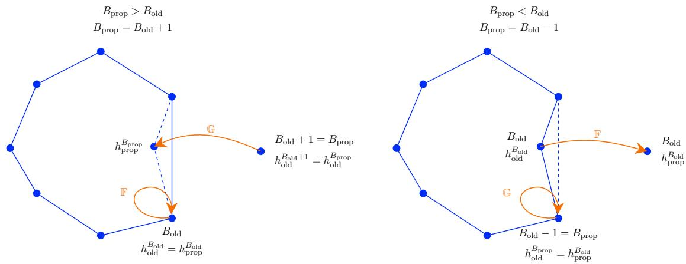  
Figure 9: Add/remove proposal mechanism used in Update ${ \sf B } ^ { * }$ . The left and right panels illustrate the cases $B _ { \mathrm { p r o p } } = B _ { \mathrm { o l d } } + 1$ (add) and $B _ { \mathrm { p r o p } } = B _ { \mathrm { o l d } } - 1$ (remove), respectively. The complementary proposals $\mathbb { G }$ and F applied in the two cases determine the positioning of vertex $\mathit { \Pi } _ { h ^ { B } }$ , while the remaining inducing points remain unchanged.

Our entire add/remove proposal mechanism is shown schematically on fig. 9. The resulting MH sampler involves an acceptance ratio of the form:

$$
A = \underbrace { \frac { p \left( B _ { \mathrm { p r o p } } , h _ { \mathrm { p r o p } } ^ { 1 : K } | g _ { 1 } , g _ { 2 } , \sigma , \gamma , \tau , w _ { 1 : N } \right) } { p \left( B _ { \mathrm { o l d } } , h _ { \mathrm { o l d } } ^ { 1 : K } | g _ { 1 } , g _ { 2 } , \sigma , \gamma , \tau , w _ { 1 : N } \right) } } _ { A _ { p } } \times \underbrace { \frac { Q ^ { g _ { 1 } , g _ { 2 } , \sigma , \gamma } \left( B _ { \mathrm { o l d } } , h _ { \mathrm { o l d } } ^ { 1 : K } | B _ { \mathrm { p r o p } } , h _ { \mathrm { p r o p } } ^ { 1 : K } \right) } { Q ^ { g _ { 1 } , g _ { 2 } , \sigma , \gamma } \left( B _ { \mathrm { p r o p } } , h _ { \mathrm { p r o p } } ^ { 1 : K } | B _ { \mathrm { o l d } } , h _ { \mathrm { o l d } } ^ { 1 : K } \right) } } _ { A _ { o } }
$$

which is readily computed. Specifically, $A _ { p }$ is obtained by the ratio of the targets

$$
A _ { p } = \frac { \left[ \prod _ { n } F _ { n } ^ { G } \right] _ { \mathrm { p r o p } } } { [ \prod _ { n } F _ { n } ^ { G } ] _ { \mathrm { o l d } } } \frac { \left[ \prod _ { k } \mathsf { N o r m a l } \left( h _ { \mathrm { p r o p } } ^ { k } ; \mu , \upsilon I \right) \right] } { \left[ \prod _ { k } \mathsf { N o r m a l } \left( h _ { \mathrm { o l d } } ^ { k } ; \mu , \upsilon I \right) \right] } \frac { \mathsf { B i n o m i a l } \left( B _ { \mathrm { p r o p } } ; K , \gamma / K \right) } { \mathsf { B i n o m i a l } \left( B _ { \mathrm { o l d } } ; K , \gamma / K \right) }
$$

and $A _ { Q }$ is obtained by the ratio of the proposals

$$
A _ { Q } = \frac { Q ^ { g _ { 1 } , g _ { 2 } , \sigma , \gamma } \left( h _ { \mathrm { o l d } } ^ { 1 : K } | B _ { \mathrm { p r o p } } , h _ { \mathrm { p r o p } } ^ { 1 : K } , B _ { \mathrm { o l d } } \right) } { Q ^ { g _ { 1 } , g _ { 2 } , \sigma , \gamma } \left( h _ { \mathrm { p r o p } } ^ { 1 : K } | B _ { \mathrm { o l d } } , h _ { \mathrm { o l d } } ^ { 1 : K } , B _ { \mathrm { p r o p } } \right) } \frac { Q ^ { g _ { 1 } , g _ { 2 } , \sigma , \gamma } \left( B _ { \mathrm { o l d } } | B _ { \mathrm { p r o p } } , h _ { \mathrm { p r o p } } ^ { 1 : K } \right) } { Q ^ { g _ { 1 } , g _ { 2 } , \sigma , \gamma } \left( B _ { \mathrm { p r o p } } | B _ { \mathrm { o l d } } , h _ { \mathrm { o l d } } ^ { 1 : K } \right) }
$$

Because of assumption 1, this simplifies to

$$
A _ { Q } = \frac { Q ^ { g _ { 1 } , g _ { 2 } , \sigma , \gamma } \left( h _ { \mathrm { o l d } } ^ { 1 : K } | B _ { \mathrm { p r o p } } , h _ { \mathrm { p r o p } } ^ { 1 : K } , B _ { \mathrm { o l d } } \right) } { Q ^ { g _ { 1 } , g _ { 2 } , \sigma , \gamma } \left( h _ { \mathrm { p r o p } } ^ { 1 : K } | B _ { \mathrm { o l d } } , h _ { \mathrm { o l d } } ^ { 1 : K } , B _ { \mathrm { p r o p } } \right) }
$$

Because of assumption 2i, this simplifies further

$$
A _ { Q } = \frac { \mathbb { F } _ { B _ { \mathrm { p r o p } }  B _ { \mathrm { o l d } } } ^ { g _ { 1 } , g _ { 2 } , \sigma , \gamma } ( h _ { \mathrm { o l d } } ^ { B _ { \mathrm { p r o p } } } | h _ { \mathrm { p r o p } } ^ { 1 : K } ) } { \mathbb { F } _ { B _ { \mathrm { o l d } }  B _ { \mathrm { p r o p } } } ^ { g _ { 1 } , g _ { 2 } , \sigma , \gamma } ( h _ { \mathrm { p r o p } } ^ { B _ { \mathrm { o l d } } } | h _ { \mathrm { o l d } } ^ { 1 : K } ) } \frac { \mathbb { G } _ { B _ { \mathrm { p r o p } }  B _ { \mathrm { o l d } } } ^ { g _ { 1 } , g _ { 2 } , \sigma , \gamma } ( h _ { \mathrm { o l d } } ^ { B _ { \mathrm { o l d } } } | h _ { \mathrm { p r o p } } ^ { 1 : K } ) } { \mathbb { G } _ { B _ { \mathrm { o l d } }  B _ { \mathrm { p r o p } } } ^ { g _ { 1 } , g _ { 2 } , \sigma , \gamma } ( h _ { \mathrm { p r o p } } ^ { B _ { \mathrm { p r o p } } } | h _ { \mathrm { o l d } } ^ { 1 : K } ) }
$$

Because of assumption 2ii, this now simplifies to

$$
A _ { Q } = \frac { \mathbb { G } _ { B _ { \mathrm { p r o p } }  B _ { \mathrm { o l d } } } ^ { g _ { 1 } , g _ { 2 } , \sigma , \gamma } ( h _ { \mathrm { o l d } } ^ { B _ { \mathrm { o l d } } } | h _ { \mathrm { p r o p } } ^ { 1 : K } ) } { \mathbb { G } _ { B _ { \mathrm { p r o p } }  B _ { \mathrm { o l d } } } ^ { g _ { 1 } , g _ { 2 } , \sigma , 1 / \gamma } ( h _ { \mathrm { p r o p } } ^ { B _ { \mathrm { o l d } } } | h _ { \mathrm { o l d } } ^ { 1 : K } ) } \frac { \mathbb { G } _ { B _ { \mathrm { o l d } }  B _ { \mathrm { p r o p } } } ^ { g _ { 1 } , g _ { 2 } , \sigma , 1 / \gamma } ( h _ { \mathrm { o l d } } ^ { B _ { \mathrm { p r o p } } } | h _ { \mathrm { p r o p } } ^ { 1 : K } ) } { \mathbb { G } _ { B _ { \mathrm { o l d } }  B _ { \mathrm { p r o p } } } ^ { g _ { 1 } , g _ { 2 } , \sigma , \gamma } ( h _ { \mathrm { p r o p } } ^ { B _ { \mathrm { p r o p } } } | h _ { \mathrm { o l d } } ^ { 1 : K } ) }
$$

Because of assumption 2iii, this now simplifies to

$$
A _ { Q } = \left\{ \begin{array} { l l } { \delta _ { R ^ { g _ { 1 } , g _ { 2 } , \sigma , 1 / \gamma } \left( h _ { \mathrm { o l d } } ^ { 1 } , h _ { \mathrm { o l d } } ^ { B _ { \mathrm { o l d } } } , R ^ { g _ { 1 } , g _ { 2 } , \sigma , \gamma } \left( h _ { \mathrm { o l d } } ^ { 1 } , h _ { \mathrm { o l d } } ^ { B _ { \mathrm { o l d } } } , h _ { \mathrm { o l d } } ^ { B _ { \mathrm { o l d } } + 1 } \right) \right) } \left( h _ { \mathrm { o l d } } ^ { B _ { \mathrm { o l d } } + 1 } \right) } & { B _ { \mathrm { p r o p } } = B _ { \mathrm { o l d } } + 1 } \\ { \delta _ { R ^ { g _ { 1 } , g _ { 2 } , \sigma , \gamma } \left( h _ { \mathrm { o l d } } ^ { 1 } , h _ { \mathrm { o l d } } ^ { B _ { \mathrm { o l d } } - 1 } , R ^ { g _ { 1 } , g _ { 2 } , \sigma , 1 / \gamma } \left( h _ { \mathrm { o l d } } ^ { 1 } , h _ { \mathrm { o l d } } ^ { B _ { \mathrm { o l d } } } - 1 , h _ { \mathrm { o l d } } ^ { B _ { \mathrm { o l d } } } \right) \right) } \left( h _ { \mathrm { o l d } } ^ { B _ { \mathrm { o l d } } } \right) } & { B _ { \mathrm { p r o p } } = B _ { \mathrm { o l d } } - 1 } \end{array} \right.
$$

The last equality above comes from assumption 2i, which indicates that atoms other than $B _ { \mathrm { o l d } }$ and $B _ { \mathrm { p r o p } }$ do not move.

According to assumption 2iv, for the two cases we get:

$$
\begin{array} { r l } { R ^ { g _ { 1 } , g _ { 2 } , \sigma , 1 / \gamma } \left( h _ { \mathrm { o l d } } ^ { 1 } , h _ { \mathrm { o l d } } ^ { B _ { \mathrm { o l d } } } , R ^ { g _ { 1 } , g _ { 2 } , \sigma , \gamma } \left( h _ { \mathrm { o l d } } ^ { 1 } , h _ { \mathrm { o l d } } ^ { B _ { \mathrm { o l d } } } , h _ { \mathrm { o l d } } ^ { B _ { \mathrm { o l d } } + 1 } \right) \right) = h _ { \mathrm { o l d } } ^ { B _ { \mathrm { o l d } } + 1 } , } & { \qquad B _ { \mathrm { p r o p } } = B _ { \mathrm { o l d } } + 1 } \\ { R ^ { g _ { 1 } , g _ { 2 } , \sigma , \gamma } \left( h _ { \mathrm { o l d } } ^ { 1 } , h _ { \mathrm { o l d } } ^ { B _ { \mathrm { o l d } } - 1 } , R ^ { g _ { 1 } , g _ { 2 } , \sigma , 1 / \gamma } \left( h _ { \mathrm { o l d } } ^ { 1 } , h _ { \mathrm { o l d } } ^ { B _ { \mathrm { o l d } } - 1 } , h _ { \mathrm { o l d } } ^ { B _ { \mathrm { o l d } } } \right) \right) = h _ { \mathrm { o l d } } ^ { B _ { \mathrm { o l d } } } , } & { \qquad B _ { \mathrm { p r o p } } = B _ { \mathrm { o l d } } - 1 } \end{array}
$$

This indicates that the second factor of the acceptance ratio reduces to

$$
A _ { Q } = 1
$$

and drops out from the acceptance ratio of our MH. For this reason, the acceptance of the MH sampler reduces to that of the Metropolis sampler [23, 28].

## C Additional results

In fig. 10 we evaluate our reconstruction framework on a synthetic dataset generated from an additional Lissajous curve [37], defined by

$$
\mathcal { G } = \{ ( \sin ( t ) , \sin ( 2 t ) ) \} _ { t \in [ 0 , 2 \pi ) } \subset \mathbb { R } ^ { 2 } .
$$

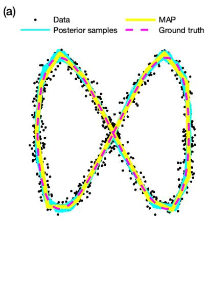

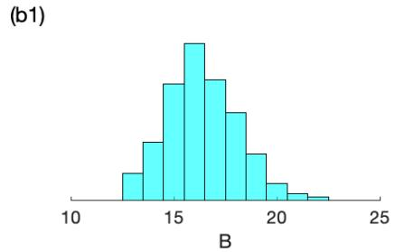

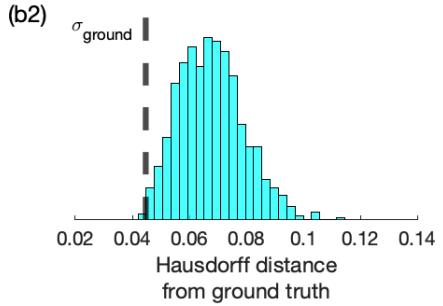  
Figure 10: Synthetic data analysis of a Lissajous curve. Reconstruction is applied on a noisy point-cloud of size N = 1000 and noise $\tau = 5 0 0$ $( i . e . , \ \sigma \approx 0 . 0 4 5 )$ . A total of 3,000 MCMC iterations are performed using Sampler 3, with the first 30% discarded as burn-in and the remaining samples thinned at a ratio of 1:3 for visualization purposes. The panel on the left shows the point-cloud and reconstructed curves. The panels to the right summarize key posterior results.

In fig. 11 we evaluate our reconstruction framework on another synthetic dataset generated from a semicircle with a zigzag lower side. The ground-truth curve is defined by the ordered inducing points

$$
\mathcal { H } = \left\{ \left( \cos \left( \pi - \frac { j \pi } { 4 9 } \right) , \sin \left( \pi - \frac { j \pi } { 4 9 } \right) \right) \right\} _ { j = 0 , 1 , \ldots , 4 9 } \quad \cup \left\{ \left( 1 - \frac { 2 } { 1 3 } \ell , \frac { ( - 1 ) ^ { \ell + 1 } } { 1 0 } \right) \right\} _ { \ell = 0 , 1 , \ldots , 1 3 } \subset \mathbb { R } ^ { 2 } ,
$$

where the semicircular inducing points are ordered from left to right and the zigzag inducing points are ordered from right to left, producing a closed counterclockwise curve. This ground-truth curve is chosen to contain both smooth and non-smooth segments and it is similar to the standardized Sawtooth example from Ref. [31].

In fig. 12 we evaluate our reconstruction framework on the standardized Bottle example from Ref. [33].

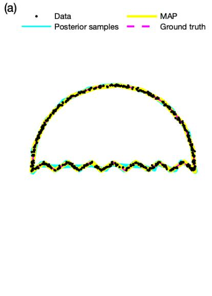

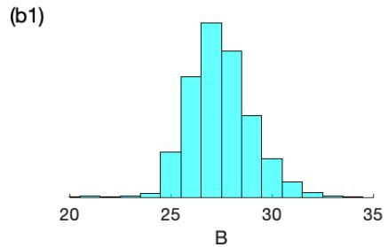  
(b2)

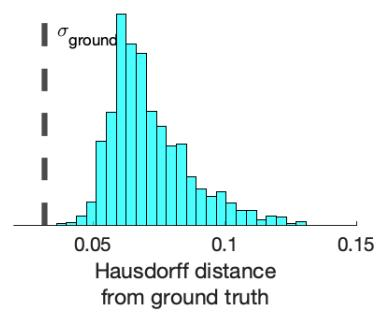  
Figure 11: Reconstruction of the Sawtooth example. A total of 3,000 MCMC iterations are performed using Sampler 3, with the first 20% discarded as burn-in and the remaining samples thinned at a ratio of 1:3 for visualization purposes. The panel on the left shows the point-cloud and reconstructed curves. The panels to the right summarize key posterior results.

(a)  
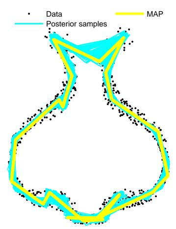

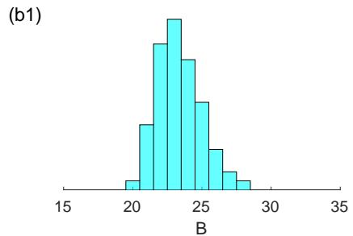

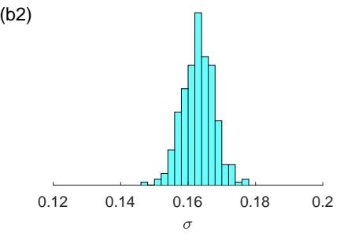  
Figure 12: Reconstruction of the Bottle example. A total of 3,000 MCMC iterations are performed using Sampler 3, with the first 50% discarded as burn-in and the remaining samples thinned at a ratio of 1:5 for visual purposes. The panel on the left shows the point-cloud and reconstructed curves. The panels to the right summarize key posterior results.

## References

[1] Marcel Ritter, Daniel Schifner, and Matthias Harders. Robust reconstruction of curved line structures in noisy point clouds. Visual informatics, 5(3):1–14, 2021.

[2] Zheng Liu, Xiaopeng Xin, Zheng Xu, Weijie Zhou, Chunxue Wang, Renjie Chen, and Ying He. Robust and accurate feature detection on point clouds. Computer-Aided Design, 164:103592, November 2023.

[3] Siheng Chen, Baoan Liu, Chen Feng, Carlos Vallespi-Gonzalez, and Carl Wellington. 3d point cloud processing and learning for autonomous driving. arXiv preprint arXiv:2003.00601, 2020.

[4] Ying Li, Lingfei Ma, Zilong Zhong, Fei Liu, Michael A Chapman, Dongpu Cao, and Jonathan Li. Deep learning for lidar point clouds in autonomous driving: A review. IEEE Transactions on Neural Networks and Learning Systems, 32(8):3412–3432, 2020.

[5] Ji Zhang, Sanjiv Singh, et al. Loam: Lidar odometry and mapping in real-time. In Robotics: Science and systems, volume 2, pages 1–9. Berkeley, CA, 2014.

[6] Tixiao Shan and Brendan Englot. Lego-loam: Lightweight and ground-optimized lidar odometry and mapping on variable terrain. In 2018 IEEE/RSJ international conference on intelligent robots and systems (IROS), pages 4758–4765. IEEE, 2018.

[7] Javid Akhavan, Jiaqi Lyu, and Souran Manoochehri. A deep learning solution for real-time quality assessment and control in additive manufacturing using point cloud data. Journal of Intelligent Manufacturing, 35(3):1389–1406, 2024.

[8] Mateusz Zwierzycki, Henrik Leander Evers, Martin Tamke, and AD Tools. Parametric architectural design with point-clouds. In Proceedings of the 34th eCAADe Conference, volume 2, pages 673– 682, 2016.

[9] Martin Peter Christiansen, Morten Stigaard Laursen, Rasmus Nyholm Jørgensen, Søren Skovsen, and Ren´e Gislum. Ground vehicle mapping of fields using lidar to enable prediction of crop biomass. arXiv preprint arXiv:1805.01426, 2018.

[10] Rama Rao Nidamanuri. Deep learning-based prediction of plant height and crown area of vegetable crops using lidar point cloud. Scientific Reports, 14(1):14903, 2024.

[11] Zhouxin Xi and Chris Hopkinson. 3d graph-based individual-tree isolation (treeiso) from terrestrial laser scanning point clouds. Remote Sensing, 14(23):6116, 2022.

[12] Xin Xu, Federico Iuricich, Kim Calders, John Armston, and Leila De Floriani. Topology-based individual tree segmentation for automated processing of terrestrial laser scanning point clouds. International Journal of Applied Earth Observation and Geoinformation, 116:103145, 2023.

[13] Charles A Price, Monica Papes¸, Ioannis Sgouralis, and Todd A Schroeder. Surface area to volume scaling of alpha shapes and convex hulls fit to lidar derived mangrove island point clouds. Remote Sensing Letters, 15(12):1259–1269, 2024.

[14] Yulan Guo, Hanyun Wang, Qingyong Hu, Hao Liu, Li Liu, and Mohammed Bennamoun. Deep learning for 3d point clouds: A survey. IEEE transactions on pattern analysis and machine intelligence, 43(12):4338–4364, 2020.

[15] Sushmita Sarker, Prithul Sarker, Gunner Stone, Ryan Gorman, Alireza Tavakkoli, George Bebis, and Javad Sattarvand. A comprehensive overview of deep learning techniques for 3d point cloud classification and semantic segmentation. Machine Vision and Applications, 35(4):67, 2024.

[16] Rao Fu, Jianmin Zheng, and Liang Yu. Consistent normal orientation for 3d point clouds via least squares on delaunay graph. In Proceedings of the Computer Vision and Pattern Recognition Conference, pages 16932–16942, 2025.

[17] Shitong Luo and Wei Hu. Difusion probabilistic models for 3d point cloud generation. In Proceedings of the IEEE/CVF conference on computer vision and pattern recognition, pages 2837–2845, 2021.

[18] Yonghyeon Lee, Seungyeon Kim, Jinwon Choi, and Frank Park. A statistical manifold framework for point cloud data. In International Conference on Machine Learning, pages 12378–12402. PMLR, 2022.

[19] Mark Pauly, Niloy J Mitra, and Leonidas J Guibas. Uncertainty and variability in point cloud surface data. In Pbg, pages 77–84, 2004.

[20] N Senin, S Catalucci, M Moretti, and RK Leach. Statistical point cloud model to investigate measurement uncertainty in coordinate metrology. Precision Engineering, 70:44–62, 2021.

[21] Daniel Hug, Michael A Klatt, and Dominik Pabst. Minkowski tensors for point clouds and voxelized data: robust, asymptotically unbiased estimators. SIAM Journal on Imaging Sciences, 19(3):1698– 1744, 2026.

[22] Yuchen He, Sung Ha Kang, and Hao Liu. Curvature regularized surface reconstruction from point clouds. SIAM Journal on Imaging Sciences, 13(4):1834–1859, 2020.

[23] Steve Press´e and Ioannis Sgouralis. Data modeling for the sciences: applications, basics, computations. Cambridge University Press, 2023.

[24] Andrew Gelman, John B. Carlin, Hal S. Stern, David B. Dunson, Aki Vehtari, and Donald B. Rubin. Bayesian Data Analysis. Chapman and Hall/CRC, 3 edition, 2013.

[25] Christopher M Bishop and Nasser M Nasrabadi. Pattern recognition and machine learning, volume 4. Springer, 2006.

[26] Peter Muller, Fernando Andr ¨ ´es Quintana, Alejandro Jara, and Tim Hanson. Bayesian nonparametric data analysis, volume 1. Springer, 2015.

[27] Subhashis Ghosal and AW van der 1959-Vaart. Fundamentals of nonparametric bayesian inference. 2017.

[28] Christian P Robert, George Casella, and George Casella. Monte Carlo statistical methods, volume 2. Springer, 2004.

[29] Jun S Liu and Jun S Liu. Monte Carlo strategies in scientific computing, volume 10. Springer, 2001.

[30] Robert Nishihara, Iain Murray, and Ryan P Adams. Parallel mcmc with generalized elliptical slice sampling. The Journal of Machine Learning Research, 15(1):2087–2112, 2014.

[31] Stefan Ohrhallinger and Michael Wimmer. StretchDenoise: Parametric curve reconstruction with guarantees by separating connectivity from residual uncertainty of samples. In Hongbo Fu, Abhijeet Ghosh, and Johannes Kopf, editors, Pacific Graphics Short Papers. The Eurographics Association, 2018.

[32] Stefan Ohrhallinger and Michael Wimmer. Fitconnect: Connecting noisy 2d samples by fitted neighbourhoods. In Computer Graphics Forum, volume 38, pages 126–137. Wiley Online Library, 2019.

[33] In-Kwon Lee. Curve reconstruction from unorganized points. Computer aided geometric design, 17(2):161–177, 2000.

[34] Jeremy Ruef. Mapping rock glaciers in the san juan mountains, co 2025, 2026. Distributed by OpenTopography. Accessed: 2026-06-18.

[35] U.S. Geological Survey. USGS LPC TN Eastern Tennessee LiDAR 2016, 2016. Classified airborne LiDAR point-cloud data accessed through The National Map.

[36] Fr´ed´eric Chazal, David Cohen-Steiner, and Andr´e Lieutier. A sampling theory for compact sets in euclidean space. In Proceedings of the twenty-second annual symposium on Computational geometry, pages 319–326, 2006.

[37] J Dennis Lawrence. A catalog of special plane curves. Courier Corporation, 2013.

[38] Yuhao Han, Xuhui Wang, Qian Ni, Yuan Liu, and Jinna Zhang. Implicit curve reconstruction with sharp features. Computers & Graphics, page 104480, 2025.

[39] Kaijun Peng, Jieqing Tan, and Guochang Zhang. A method of curve reconstruction based on point cloud clustering and pca. Symmetry, 14(4):726, 2022.

[40] Xianfeng Gu, Sen Wang, Junho Kim, Yun Zeng, Yang Wang, Hong Qin, and Dimitris Samaras. Ricci flow for 3d shape analysis. In 2007 IEEE 11th International Conference on Computer Vision, pages 1–8. IEEE, 2007.

[41] Hao Liu, Xue-Cheng Tai, and Roland Glowinski. An operator-splitting method for the gaussian curvature regularization model with applications to surface smoothing and imaging. SIAM Journal on Scientific Computing, 44(2):A935–A963, 2022.

[42] Stefan Ohrhallinger, Jiju Peethambaran, Amal Dev Parakkat, Tamal K Dey, and Ramanathan Muthuganapathy. 2d points curve reconstruction survey and benchmark. In Computer Graphics Forum, volume 40, pages 611–632. Wiley Online Library, 2021.

[43] Zdravko I Botev. The normal law under linear restrictions: simulation and estimation via minimax tilting. Journal of the Royal Statistical Society Series B: Statistical Methodology, 79(1):125–148, 2017.