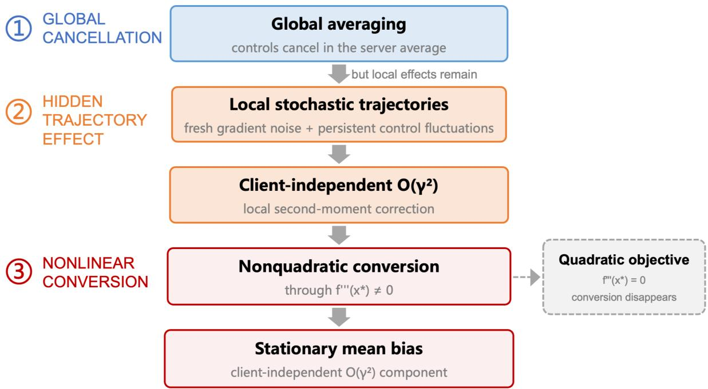
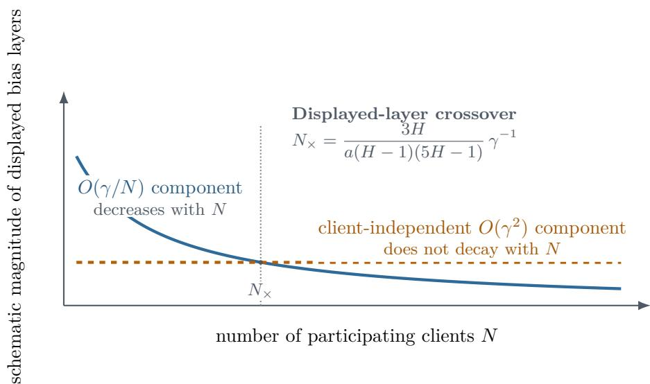
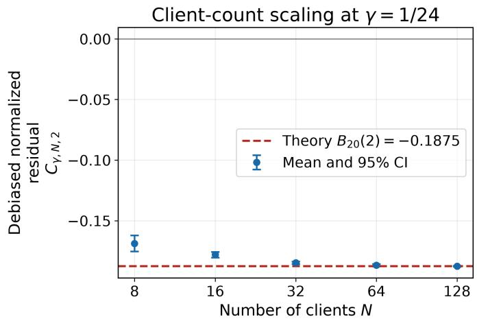
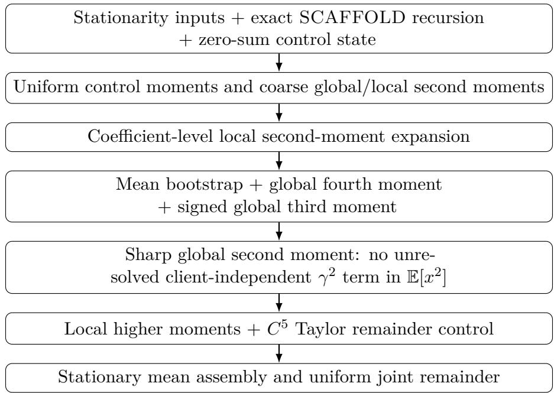
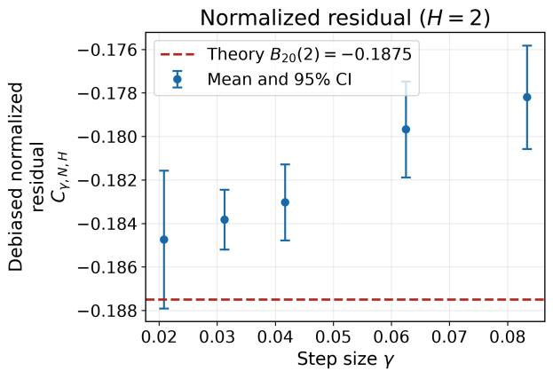
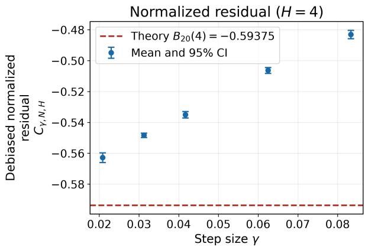
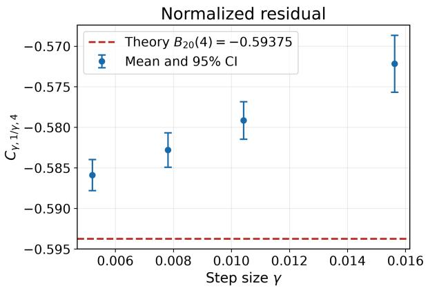
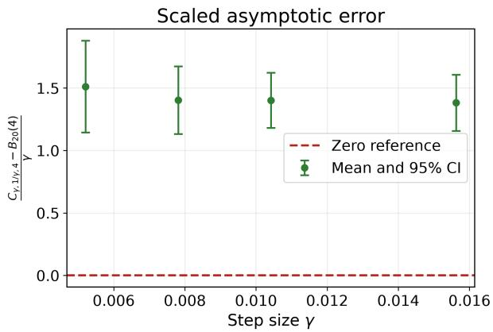

# Beyond Client Averaging: A Client-Independent Second-Order Stationary-Bias Component in Stochastic SCAFFOLD

Yi-Ping Tang and Guan-Ju Peng

## Abstract

Existing constant-step analysis of stochastic SCAFFOLD identifies a leading $O ( \gamma / N )$ stationary mean bias and shows that higher-order bias can persist as the client count increases, but does not identify the first client-independent contribution at coeficient level. For full-participation stochastic SCAFFOLD with one-dimensional homogeneous clients, fixed local-step count $H ,$ , and bounded additive gradient noise, we prove, uniformly over $N \geq 2$

$$
\begin{array} { l } { \displaystyle \mathbb { E } _ { \pi _ { \gamma , N , H } \left[ x \right] - x ^ { \star } } = - \frac { f ^ { \prime \prime \prime } ( x ^ { \star } ) \sigma ^ { 2 } } { 4 f ^ { \prime \prime } ( x ^ { \star } ) ^ { 2 } } \frac { \gamma } { N } } \\ { \displaystyle - \frac { f ^ { \prime \prime \prime } ( x ^ { \star } ) \sigma ^ { 2 } } { 1 2 f ^ { \prime \prime } ( x ^ { \star } ) } \frac { ( H - 1 ) ( 5 H - 1 ) } { H } \gamma ^ { 2 } + O _ { H } \left( \frac { \gamma ^ { 2 } } { N } + \gamma ^ { 3 } \right) . } \end{array}
$$

Hence client averaging suppresses the leading $O ( \gamma / N )$ bias but does not remove the client-independent $O ( \gamma ^ { 2 } )$ component when its coeficient is nonzero.

The mechanism is indirect: although the direct control contribution cancels pathwise in the linear global average, the controls still alter within-round local trajectories and their second moments. Fresh gradient noise and persistent control fluctuations therefore generate local second-moment corrections that nonquadratic curvature converts into stationary mean bias. The coeficient vanishes for quadratic objectives. Numerical experiments are consistent with the predicted coeficient, its persistence as client count increases, and the stated joint remainder. The result is restricted to the one-dimensional homogeneous fixed-H setting.

## 1 Introduction

Federated learning trades communication for local computation: each participating client performs several stochastic-gradient steps before the server averages the resulting updates. This design can substantially reduce synchronization, but the local trajectories may drift toward client-specific directions. SCAFFOLD addresses this problem by attaching control variates to local updates, enabling clients to track a common optimization direction more closely [6]. Most analyses study finite-time convergence. Under a constant step size, however, stochastic iterates continue to fluctuate around the optimum, and their long-run behavior is described by an invariant distribution whose mean need not equal the minimizer.

Recent constant-step analysis of stochastic SCAFFOLD makes the usual “more clients help” intuition precise and identifies its higher-order limit. Mangold et al. [12] establish stationari $\mathrm { { 0 y } , }$ a client-number linear speed-up up to higher-order terms, and a higher-order stationary-bias component that is not eliminated by increasing the client count. In the scalar homogeneous specialization, their leading stationary mean-bias layer is of order $\gamma / N$ , where $\gamma$ is the step size and N is the number of participating clients. Still, their analysis leaves the client-independent higher-order contribution unresolved at the coeficient level. We ask whether client averaging suppresses that first client-independent contribution and, if not, which term first carries it and what mechanism generates it.

Our answer is negative in this setting. For full-participation stochastic SCAFFOLD with one-dimensional homogeneous clients, fixed local-step count H, suficiently small constant step size γ, and bounded additive gradient noise, we prove

$$
\mathbb { E } _ { \pi _ { \gamma , N , H } } [ x ] - x ^ { \star } = - \frac { \tau \sigma ^ { 2 } } { 4 a ^ { 2 } } \frac { \gamma } { N } - \frac { \tau \sigma ^ { 2 } } { 1 2 a } \frac { ( H - 1 ) ( 5 H - 1 ) } { H } \gamma ^ { 2 } + O _ { H } \left( \frac { \gamma ^ { 2 } } { N } + \gamma ^ { 3 } \right) ,\tag{1}
$$

where $a = f ^ { \prime \prime } ( x ^ { \star } )$ and $\tau = f ^ { \prime \prime \prime } ( x ^ { \star } )$ . The first displayed layer decreases as the client count increases; the second does not. The uniform remainder further shows that, after the known $\gamma / N$ layer is removed, the normalized residual converges to the displayed $\gamma ^ { 2 }$ coeficient along every joint sequence $N \to \infty$ and $\gamma  0$

Why this matters. Client averaging reduces both stationary fluctuations and the known leading mean-bias layer, which suggests that increasing participation should continually improve long-run accuracy. Equation (1) identifies a limit of that mechanism within the expansion: when its coeficient is nonzero, the client-independent $\gamma ^ { 2 }$ component is not reduced by further averaging after the $\gamma / N$ layer becomes smaller. Increasing N alone cannot reduce this component; decreasing the step size does so, and coeficient-aware bias correction is a natural direction for future work.

Let Y denote a local iterate obtained by sampling uniformly over clients c and local-step indices $h = 0 , \ldots , H - 1$ under stationarity. The exact stationary mean-balance identity gives $\mathbb { E } [ f ^ { \prime } ( Y ) ] = 0$ , and a local Taylor expansion then gives the heuristic

$$
0 = \mathbb { E } [ f ^ { \prime } ( Y ) ] \approx a \mathbb { E } [ Y ] + { \frac { \tau } { 2 } } \mathbb { E } [ Y ^ { 2 } ] , \qquad \mathbb { E } [ Y ] \approx - { \frac { \tau } { 2 a } } \mathbb { E } [ Y ^ { 2 } ] .
$$

Thus, the second-moment-to-mean intuition follows directly from exact stationary balance plus a local Taylor expansion: nonquadratic curvature converts a second-moment correction into a mean shift. In SCAFFOLD, the controls cancel out in the linear client average, but they still afect the intermediate local trajectories. Fresh gradient noise and persistent control fluctuations therefore modify the second moments of local trajectories before curvature converts them into stationary bias; Figure 1 summarizes this indirect channel.

  
Figure 1: Mechanism behind the client-independent stationary-bias layer. Linear control cancellation at the server does not erase the controls’ efect on intermediate local trajectories. Fresh noise and persistent control fluctuations alter local second moments, which nonquadratic curvature converts into a mean shift.

The contributions are as follows.

• A limit to client averaging at second order. We identify an explicit client-independent $\gamma ^ { 2 }$ stationary-bias coeficient, with a remainder uniform jointly in (γ, 1/N) for fixed H.

• A trajectory-level mechanism inside SCAFFOLD. We trace the coeficient to two local second-moment sources: fresh stochastic-gradient noise and persistent control fluctuations.

• Targeted numerical checks. We test persistence with increasing client count, convergence toward the predicted coeficient, and behavior when stochasticity or nonquadratic curvature is removed.

The scalar analysis is informative beyond one dimension because it isolates three ingredients that also occur in higher-dimensional dynamics: persistent control second moments, within-round local trajectories, and nonlinear curvature. Their interaction would involve covariance–thirdderivative contractions; establishing such an extension remains open.

Claim boundaries. The theorem concerns full participation, one-dimensional homogeneous clients, bounded additive noise, and fixed H. It is uniform in N and small γ, but not as $H \to \infty$ and it does not identify the complete finite-N coeficient of $\gamma ^ { 2 }$ . The source decomposition is internal to SCAFFOLD and is not a theorem-level comparison with FedAvg. The crossover of the two displayed layers is an asymptotic scale comparison, not a monotonicity statement for the total finite-step bias. The numerical experiments are finite-setting consistency checks. Multidimensional, heterogeneous-client, state-dependent-noise, and debiasing extensions remain open.

Section 2 positions the result. Section 3 connects the standard SCAFFOLD controls to the zero-sum parametrization used in the proof. Sections 4 and 5 state the theorem and derive its mechanism, while Sections 6 and 7 summarize the proof and numerical evidence.

## 2 Related work

Federated averaging and local SGD. Federated Averaging (FedAvg) introduced iterative local model averaging as a communication-eficient primitive for federated learning [13]; the broader optimization and systems landscape is surveyed by Kairouz et al. [5]. Its optimization core is closely related to LocalSGD, in which workers take several stochastic gradient steps before synchronization. Early theory established that LocalSGD can retain the statistical rate of minibatch SGD while communicating less [14], and subsequent analyses clarified the distinct roles of identical and heterogeneous client objectives [7] and the regimes in which local updates do or do not improve on minibatch SGD [16].

SCAFFOLD and control correction. SCAFFOLD augments local updates with control variates to correct client drift [6]. More recent work sharpens the finite-time picture: Luo et al. [8] obtain improved LocalSGD and SCAFFOLD rates under gradient/Hessian similarity and higher-order smoothness conditions, while Mangold and Moulines [10] give a refined quadratic analysis for arbitrary local-step counts. These results explain when local computation and control correction improve finite-time optimization, but they do not characterize the mean of the invariant distribution generated by constant-step stochastic SCAFFOLD.

Constant-step stochastic optimization and stationary laws. Under suitable stability and regularity conditions, constant-step stochastic-gradient methods are naturally studied in terms of an invariant distribution. This viewpoint appears in difusion approximations of constantstep SGD [9] and in rigorous small-step characterizations of stationary stochastic-gradient dynamics [2, 3]. In particular, Chen et al. [2] obtain Gaussian/Lyapunov characterizations of scaled stationary laws for smooth strongly convex SGD and related stochastic-approximation models under their conditions, while Dieuleveut et al. [3] derive stationary/asymptotic moment expansions and use Richardson–Romberg extrapolation to reduce step-size bias. The same perspective has recently been developed for federated and decentralized algorithms. Mangold et al. [11] analyze constant-step FedAvg through its Markov structure, characterize stationary bias and variance, derive a first-order bias expansion, and construct a federated Richardson–Romberg correction. Mangold et al. [12] extend this framework to stochastic SCAFFOLD, proving existence and geometric convergence of a stationary law, client-number variance reduction, and a first-order stationary mean-bias expansion whose scalar homogeneous leading layer is $O ( \gamma / N )$ . Versini et al. [15] obtain related first-order stationary bias and variance expansions for decentralized SGD, separating stochastic, heterogeneity, and network efects.

Nonlinearity and higher-order stationary bias. The mechanism studied here belongs to a broader class of noise–nonlinearity interactions in constant-step stochastic approximation. Allmeier and Gast [1] allow Markovian noise to depend on the iterate, prove an $O ( \alpha )$ stationarybias bound, and refine the Polyak–Ruppert time-averaged bias to $\alpha V + O ( \alpha ^ { 2 } )$ . Huo et al. [4] show that Markovian memory and nonlinearity can interact to create distinct components of the constant-step stationary bias. These results establish that persistent stochastic fluctuations can be converted into mean shifts by nonlinear dynamics. They do not, however, determine the algorithm-specific higher-order coeficient generated by SCAFFOLD’s local control recursion.

Position of the present result. The closest starting point is Mangold et al. [12]. We use their stationary-law existence and geometric convergence, coarse iterate-moment bounds, leading control second moment, and known $O ( \gamma / N )$ bias coeficient. Mangold et al. establish that stochastic SCAFFOLD retains a higher-order stationary bias that is not eliminated by increasing the client count. Still, their analysis does not identify the client-independent contribution at the coeficient level. In the one-dimensional homogeneous fixed-H setting, we resolve this structure explicitly: the first client-independent term is $N ^ { 0 } \gamma ^ { 2 }$ , with a closed-form coeficient that decomposes into fresh within-round local-gradient noise and persistent SCAFFOLD control second moments. The result is complementary to the quadratic theory of Mangold and Moulines [10]: quadratic objectives support sharper arbitrary-H convergence analysis, but $f ^ { \prime \prime \prime } \equiv 0$ removes the second-moment-to-mean conversion isolated here. The source decomposition is internal to SCAFFOLD; it is not a theorem-level comparison with Fed $\operatorname { A v g } ,$ which would require a matched second-order FedAvg expansion.

## 3 Setting and exact identities

We deliberately use a homogeneous scalar regime, removing client heterogeneity as a confounding source of bias and isolating the stochastic efect of the SCAFFOLD control recursion itself. All N clients participate in every communication round. Even with identical objectives, the stochastic client controls remain nontrivial because they are continually refreshed from noisy local trajectories. The unique minimizer is translated to $x ^ { \star } = 0$ , all $N \geq 2$ clients share the same objective $f _ { c } = f$ , and the number of local steps $H \geq 2$ is fixed. The objective satisfies $f \in C ^ { 5 } ( \mathbb { R } )$ and

$$
0 < \mu \leq f ^ { \prime \prime } ( y ) \leq L < \infty ,
$$

with bounded third through fifth derivatives. We write

$$
a : = f ^ { \prime \prime } ( 0 ) > 0 , \qquad \tau : = f ^ { \prime \prime \prime } ( 0 ) , \qquad \kappa : = f ^ { \prime \prime \prime \prime } ( 0 ) .
$$

At local step h of client $c ,$ the stochastic gradient is

$$
\nabla F _ { c , h } ( y ) = f ^ { \prime } ( y ) + \varepsilon _ { c , h } ,
$$

where the fresh noises are independent across clients, local steps, and communication rounds, independent of the round-start state, satisfy $\mathbb { E } [ \varepsilon _ { c , h } ] = 0$ and $\mathbb { E } [ \bar { \varepsilon _ { c , h } ^ { 2 } } ] = \sigma ^ { 2 }$ , and are almost surely bounded. No symmetry assumption is imposed.

At the start of a communication round, the server model is $x ,$ and every client initializes at $\theta _ { c , 0 } = x$ . Each client then takes H corrected stochastic-gradient steps. We first connect the parametrization used below to the standard SCAFFOLD controls.

Equivalent full-participation SCAFFOLD round. Let $c _ { \mathrm { s r v } }$ be the server control and $c _ { c }$ the control stored by client $^ { c , }$ with $c _ { \mathrm { s r v } } = N ^ { - 1 } \textstyle \sum _ { c } c _ { c }$ . Standard SCAFFOLD uses the correction $c _ { \mathrm { s r v } } - c _ { c }$ in each local step. Define

$$
\xi _ { c } : = c _ { \mathrm { s r v } } - c _ { c } , \qquad \frac { 1 } { N } \sum _ { c = 1 } ^ { N } \xi _ { c } = 0 .
$$

With full participation, global mixing parameter one, and the standard Option-II control refresh [6],

$$
c _ { c } ^ { + } = c _ { c } - c _ { \mathrm { s r v } } + \frac { x - \theta _ { c , H } } { \gamma H } , \qquad c _ { \mathrm { s r v } } ^ { + } = c _ { \mathrm { s r v } } + \frac { 1 } { N } \sum _ { j = 1 } ^ { N } ( c _ { j } ^ { + } - c _ { j } ) .
$$

Using $\begin{array} { r } { x ^ { + } = N ^ { - 1 } \sum _ { j } \theta _ { j , H } } \end{array}$ gives

$$
\xi _ { c } ^ { + } = c _ { \mathrm { s r v } } ^ { + } - c _ { c } ^ { + } = \xi _ { c } + \frac { \theta _ { c , H } - x ^ { + } } { \gamma H } .
$$

Thus the zero-sum variables $\{ \xi _ { c } \}$ are an exact reparametrization of the usual server/client controls in the regime analyzed here.

Using this parametrization, the local, server, and control updates are

$$
\theta _ { c , h + 1 } = \theta _ { c , h } - \gamma \{ f ^ { \prime } ( \theta _ { c , h } ) + \xi _ { c } + \varepsilon _ { c , h + 1 } \} , \qquad \theta _ { c , 0 } = x ,\tag{2}
$$

$$
x ^ { + } = \frac { 1 } { N } \sum _ { c = 1 } ^ { N } \theta _ { c , H } ,\tag{3}
$$

$$
\xi _ { c } ^ { + } = \xi _ { c } + \frac { \theta _ { c , H } - x ^ { + } } { \gamma H } .\tag{4}
$$

Summing Equation (4) over clients shows directly that the zero-sum condition is preserved.

Two exact identities expose the distinction between global cancellation and local influence. First, averaging the unrolled local recursion gives

$$
x ^ { + } - x = - \gamma \sum _ { h = 0 } ^ { H - 1 } \overline { { f ^ { \prime } ( \theta _ { h } ) } } - \gamma \sum _ { h = 0 } ^ { H - 1 } \bar { \varepsilon } _ { h + 1 } ,\tag{5}
$$

where bars denote client averages. The controls cancel pathwise from this linear average. Second, stationarity gives

$$
0 = \sum _ { h = 0 } ^ { H - 1 } \frac { 1 } { N } \sum _ { c = 1 } ^ { N } \mathbb { E } [ f ^ { \prime } ( \theta _ { c , h } ) ] .\tag{6}
$$

These identities contain the central tension of the paper. Equation (5) rules out a direct linear control contribution to the global update, but it does not erase the efect of $\xi _ { c }$ on the intermediate trajectories $\theta _ { c , h }$ . Equation (6) is where those trajectory-level changes re-enter the stationary mean through the nonlinear map $f ^ { \prime }$ . Formal assumptions and the earlier stationary results used below are stated in Appendix A.

## 4 Main result: a client-independent second-order layer

Let $\pi _ { \gamma , N , H }$ denote the unique stationary law of the global/control process, whose existence for suficiently small $\gamma$ follows from Proposition A.3, and define

$$
b _ { \gamma , N , H } : = \mathbb { E } _ { \pi _ { \gamma , N , H } } [ x ] - x ^ { \star } .
$$

Theorem 4.1 (Uniform joint stationary-bias expansion). Under the assumptions of Section 3, including full participation, for fixed $H \geq 2$ there exist $\gamma _ { 0 , H } > 0$ and $C _ { H } < \infty$ , independent of N and $\gamma ,$ such that for every $N \geq 2$ and $0 < \gamma \leq \gamma _ { 0 , H }$

$$
\boxed { b _ { \gamma , N , H } = - \frac { \tau \sigma ^ { 2 } } { 4 a ^ { 2 } } \frac { \gamma } { N } - \frac { \tau \sigma ^ { 2 } } { 1 2 a } \frac { ( H - 1 ) ( 5 H - 1 ) } { H } \gamma ^ { 2 } + R _ { \gamma , N , H } }\tag{7}
$$

with

$$
\boxed { | R _ { \gamma , N , H } | \le C _ { H } \left( \frac { \gamma ^ { 2 } } { N } + \gamma ^ { 3 } \right) . }\tag{8}
$$

The client-independent $\gamma ^ { 2 }$ coeficient is

$$
\boxed { B _ { 2 0 } ^ { \mathrm { S C A F } } ( H ) = - \frac { f ^ { \prime \prime \prime } ( x ^ { \star } ) \sigma ^ { 2 } } { 1 2 f ^ { \prime \prime } ( x ^ { \star } ) } \frac { ( H - 1 ) ( 5 H - 1 ) } { H } . }\tag{9}
$$

The subscript 20 records the bivariate order $\gamma ^ { 2 } N ^ { 0 }$ : second order in the step size and independent of the client count.

## 4.1 Interpretation for client averaging and local computation

More clients suppress only the leading displayed layer. The known $O ( \gamma / N )$ contribution decreases at rate $1 / N$ , whereas the displayed $\gamma ^ { 2 }$ contribution is independent of N. Thus, within the theorem’s stationary and small-step regime, client averaging suppresses the leading bias layer but does not remove the client-independent second-order layer when its coeficient is nonzero. When $\tau \sigma ^ { 2 } \neq 0$ , equating the magnitudes of the two displayed terms gives

$$
N _ { \times } = \frac { 3 H } { a ( H - 1 ) ( 5 H - 1 ) } \gamma ^ { - 1 } .
$$

The two displayed coeficients then have the same sign. This is a crossover scale for the two displayed asymptotic layers, not an exact finite-step phase transition or a monotonicity statement for the full bias; Figure 2 visualizes this scale comparison.

  
Figure 2: Schematic magnitude of the two displayed terms in Theorem 4.1. The $O ( \gamma / N )$ component decreases with N, whereas the client-independent $O ( \gamma ^ { 2 } )$ component does not. When both are nonzero, equating their displayed coeficients gives the marked crossover scale. It is not an exact finite-step threshold or a curve for the total bias.

The coeficient records a local-computation efect. For fixed problem parameters, the factor

$$
\frac { ( H - 1 ) ( 5 H - 1 ) } { H }
$$

is increasing over integers $H \geq 2 .$ , while the theorem treats each H as fixed. The coeficient therefore links the client-independent stationary efect to computation performed inside each communication round.

Quadratic models hide the mechanism. When the objective is quadratic, $f ^ { \prime \prime \prime } ( x ^ { \star } ) = 0$ and both displayed coeficients vanish. A purely quadratic analysis can therefore characterize stability and convergence sharply while remaining blind to the second-moment-to-mean conversion isolated here.

## 4.2 Precise joint-limit meaning

The uniform remainder gives the exact asymptotic interpretation. After subtracting the known $\gamma / N$ layer and normalizing by $\gamma ^ { 2 }$

$$
\left| \frac { b _ { \gamma , N , H } + \frac { \tau \sigma ^ { 2 } } { 4 a ^ { 2 } } \frac { \gamma } { N } } { \gamma ^ { 2 } } - B _ { 2 0 } ^ { \mathrm { S C A F } } ( H ) \right| \leq C _ { H } \left( \frac { 1 } { N } + \gamma \right) .\tag{10}
$$

Hence, the normalized residual converges to the value in Equation (9) along any joint sequence $N  \infty , \gamma  0$ , without a relative-rate condition. Terms of order $\gamma ^ { 2 } / N$ remain in the remainder, so this identifies the client-independent coeficient but not the complete fixed-N second-order expansion.

## 5 Mechanism: how controls survive linear cancellation

Figure 1 gives the qualitative picture. The coeficient follows from making the two sources of its fluctuations precise.

Linear aggregation. Under the zero-sum control state, Equation (5) shows that the clientaverage control term cancels pathwise from the global update. There is no direct linear control term shifting the server model.

Within-round local dynamics. Each $\xi _ { c }$ nevertheless changes the intermediate trajectory

$$
\theta _ { c , 0 } , \theta _ { c , 1 } , \ldots , \theta _ { c , H } ,
$$

and hence the points at which subsequent stochastic gradients are evaluated. The nonlinear local updates act along these control-dependent paths before the server observes their average.

Two second-moment sources. Let

$$
Q _ { \gamma , N , H } : = \frac { 1 } { N } \sum _ { c = 1 } ^ { N } \mathbb { E } [ \xi _ { c } ^ { 2 } ]
$$

be the stationary average control second moment. In the homogeneous additive-noise setting,

$$
Q _ { \gamma , N , H } = \frac { \sigma ^ { 2 } } { H } \left( 1 - \frac { 1 } { N } \right) + O _ { H } ( \gamma ) .\tag{11}
$$

The controls therefore retain nonzero fluctuations as the number of clients grows. For the change in the local second moment relative to the round-start server model,

$$
\bar { U } _ { h } : = \frac { 1 } { N } \sum _ { c = 1 } ^ { N } ( \mathbb { E } [ \theta _ { c , h } ^ { 2 } ] - \mathbb { E } [ x ^ { 2 } ] ) ,
$$

we obtain

$$
\bar { U } _ { h } = \gamma ^ { 2 } ( h \sigma ^ { 2 } + h ^ { 2 } Q _ { \gamma , N , H } ) + O _ { H } \left( \frac { \gamma ^ { 2 } } { N } + \gamma ^ { 3 } \right) .\tag{12}
$$

The first displayed term is generated by fresh within-round gradient noise. The persistent round-start controls generate the second. Because Equation (11) approaches $\sigma ^ { 2 } / H$ as N grows, both sources contribute at the client-independent $\gamma ^ { 2 }$ scale.

Nonlinear conversion. Expanding the gradient near the optimum,

$$
f ^ { \prime } ( y ) = a y + \frac { \tau } { 2 } y ^ { 2 } + O ( y ^ { 3 } ) ,
$$

and inserting the local moments into the exact stationary balance in Equation (6) converts the second-moment correction into a mean shift. The resulting coeficient separates into

$$
B _ { 2 0 } ^ { \mathrm { l o c a l } } ( H ) = - \frac { \tau \sigma ^ { 2 } } { 4 a } ( H - 1 ) ,\tag{13}
$$

$$
B _ { 2 0 } ^ { \mathrm { c t r l } } ( H ) = - \frac { \tau \sigma ^ { 2 } } { 1 2 a } \frac { ( H - 1 ) ( 2 H - 1 ) } { H } ,\tag{14}
$$

$$
B _ { 2 0 } ^ { \mathrm { S C A F } } ( H ) = B _ { 2 0 } ^ { \mathrm { l o c a l } } ( H ) + B _ { 2 0 } ^ { \mathrm { c t r l } } ( H ) .\tag{15}
$$

The first component records direct local-gradient noise; the second records the additional second moment carried by the SCAFFOLD controls. Their sum is the coeficient in Equation (9).

## 6 Proof overview

The coeficient suggested by a formal Taylor expansion is not automatically identifiable. The stationary balance contains the global second moment, within-round local second-moment corrections, and higher signed moments. Any one of these quantities could, in principle, carry an additional client-independent $\gamma ^ { 2 }$ contribution. The proof must therefore isolate the two intended local sources of fluctuation and rule out all competing channels at the same scale.

The argument proceeds in the order shown in the dependency map in Figure 4 of Appendix H. Coarse moment bounds first place the global iterate, controls, and local displacements on scales that are uniform in N. The local recursion is then expanded sharply enough to expose the two terms in Equation (12): fresh noise and the round-start control second moment. Before these terms can be converted to the stationary mean, the proof controls the global fourth moment and the signed third moment, ensuring that cubic and quartic Taylor contributions remain within the target remainder.

The key identifiability step is the sharp global second moment

$$
\mathbb { E } [ x ^ { 2 } ] = \frac { \sigma ^ { 2 } } { 2 a } \frac { \gamma } { N } + O _ { H } \left( \frac { \gamma ^ { 2 } } { N } + \gamma ^ { 3 } \right) .\tag{16}
$$

A coarser $O ( \gamma / N + \gamma ^ { 2 } )$ estimate would leave open an additional client-independent $\gamma ^ { 2 }$ term in $\mathbb { E } [ x ^ { 2 } ]$ , which would contaminate the coeficient attributed to local trajectories. Establishing Equation (16) rules out that competing source.

The delicate covariance in this step couples fresh round noise with the nonlinear increment. A generic Cauchy–Schwarz bound is too loose because it loses the extra factor $1 / N$ required by the joint remainder. The proof uses a coordinate-replacement argument that sets one fresh-noise coordinate to zero. Only one client’s within-round path changes, and the subsequent client average contributes an additional $1 / N$ sensitivity. Summing over all noise coordinates then recovers the required scale.

With the global second moment sharpened and the local cubic and quartic terms placed inside the remainder, the exact stationary balance reduces to

$$
b _ { \gamma , N , H } = - \frac { \tau } { 2 a } \mathbb { E } [ x ^ { 2 } ] - \frac { \tau } { 2 a H } \sum _ { h = 0 } ^ { H - 1 } \bar { U } _ { h } + O _ { H } \bigg ( \frac { \gamma ^ { 2 } } { N } + \gamma ^ { 3 } \bigg ) \ .
$$

Substituting Equations (16) and (12), then summing h and $h ^ { 2 }$ , yields Theorem 4.1. The full proof begins in Appendix A and is assembled in Appendix H.

## 7 Numerical checks of the predicted efect

The numerical study follows the paper’s main claim in the same order: first, whether the debiased statistic remains nonzero as the client count grows; second, whether it approaches the predicted coeficient as $( \gamma , 1 / N ) \to ( 0 , 0 )$ ; and third, whether the observations are consistent with removing the efect when stochasticity or nonquadratic curvature is absent.

We use the smooth, strongly convex objective

$$
f ^ { \prime } ( x ) = x + { \frac { 1 } { 2 } } \log \cosh ( x ) ,\tag{17}
$$

for which

$$
{ \frac { 1 } { 2 } } \leq f ^ { \prime \prime } ( x ) = 1 + { \frac { 1 } { 2 } } \operatorname { t a n h } ( x ) \leq { \frac { 3 } { 2 } } , \quad \quad a = 1 , \quad \quad \tau = { \frac { 1 } { 2 } } .
$$

The additive noise is independent Rademacher noise with variance one. The predicted clientindependent coeficient becomes

$$
B _ { 2 0 } ( H ) = - \frac { ( H - 1 ) ( 5 H - 1 ) } { 2 4 H } ,\tag{18}
$$

so $B _ { 2 0 } ( 2 ) = - 0 . 1 8 7 5$ and $B _ { 2 0 } ( 4 ) = - 0 . 5 9 3 7 5$

We estimate the stationary mean both directly and through the exact mean-balance identity. Unless stated otherwise, $\hat { b } _ { \gamma , N , H }$ in the main text denotes the mean-balance estimate; the direct sample mean is retained as a diagnostic. The primary statistic removes the known leading layer and normalizes the residual:

$$
C _ { \gamma , N , H } : = \frac { \hat { b } _ { \gamma , N , H } + \frac { 1 } { 8 } \frac { \gamma } { N } } { \gamma ^ { 2 } } .\tag{19}
$$

Thus, the theorem predicts that this normalized residual should approach a nonzero constant as N grows and $\gamma$ decreases. By Theorem 4.1,

$$
C _ { \gamma , N , H } = B _ { 2 0 } ( H ) + O _ { H } \bigg ( \frac { 1 } { N } + \gamma \bigg ) .\tag{20}
$$

Each setting uses eight independent chains, and uncertainty is reported by 95% Student-t intervals across chain estimates. The complete burn-in, batching, estimator agreement, and stability protocol are given in Appendix J.

## 7.1 Does the component survive increasing client count?

We fix $H = 2$ and $\gamma = 1 / 2 4$ and increase $N \in \{ 8 , 1 6 , 3 2 , 6 4 , 1 2 8 \}$ . After removing the known $\gamma / N$ contribution, the normalized residual approaches a nonzero plateau near the predicted value −0.1875; see Figure 3. A regression in $1 / N$ gives large-N intercept −0.189145 with 95% bootstrap interval $\left[ - 0 . 1 9 0 3 9 8 , - 0 . 1 8 8 0 3 5 \right]$ . This is the numerical check that most directly mirrors the title claim: averaging suppresses the leading layer but does not remove the client-independent component.

  
Figure 3: Client-count persistence at $H = 2$ and $\gamma = 1 / 2 4$ . The normalized residual approaches a nonzero plateau; larger N lies to the right on the horizontal axis.

## 7.2 Does the normalized residual approach the coeficient?

Along the joint path $N = 1 / \gamma$ , Equation (20) permits an $O _ { H } ( \gamma )$ error. The coarse-grid $H = 4$ ofset is therefore compatible with finite-step efects allowed by the theorem; the smaller-step experiment tests whether the discrepancy contracts at the predicted order. For $H = 2$ , the initial grid $\gamma \in \{ 1 / 1 2 , 1 / 1 6 , 1 / 2 4 , 1 / 3 2 , 1 / 4 8 \}$ gives extrapolated intercept −0.187214 with 95% bootstrap interval $\left[ - 0 . 1 8 9 2 5 0 , - 0 . 1 8 5 1 7 5 \right]$ , consistent with $B _ { 2 0 } ( 2 )$

The same coarse grid at $H = 4$ showed a measurable finite-step ofset, so we ran a separately specified smaller-step study with fresh chains at

$$
( \gamma , N ) \in \{ ( 1 / 6 4 , 6 4 ) , ( 1 / 9 6 , 9 6 ) , ( 1 / 1 2 8 , 1 2 8 ) , ( 1 / 1 9 2 , 1 9 2 ) \} .
$$

The normalized statistic moves toward $B _ { 2 0 } ( 4 )$ , while the scaled error $\{ C _ { \gamma , 1 / \gamma , 4 } - B _ { 2 0 } ( 4 ) \} / \gamma$ remains between 1.38 and 1.52; see Figure 6 in Appendix J. A linear fit over these four settings yields an intercept of −0.592953 with a 95% bootstrap interval of $\left[ - 0 . 5 9 5 5 2 6 , - 0 . 5 9 0 2 3 6 \right]$ . The smaller-step figure, initial discrepancy, follow-up criteria, and numerical table are retained in Appendix J.

## 7.3 Do the required ingredients matter?

The supplementary negative controls remove both ingredients from the mechanism. With deterministic gradients, the stationary-mean intervals contain zero. With a quadratic objective, where $f ^ { \prime \prime \prime } ( x ^ { \star } ) = 0$ , direct-mean intervals also contain zero. The settings, intervals, and an additional $H = 1$ boundary check are reported in Appendix J.

Together, the experiments are consistent with three distinct implications of the expansion: persistence as the client count increases, convergence toward the predicted coeficient, and dependence on stochastic, nonquadratic local dynamics.

## 8 Conclusion

In the homogeneous scalar fixed-H setting, stochastic SCAFFOLD has two stationary-bias layers: the known $O ( \gamma / N )$ contribution, which client averaging suppresses, and a client-independent $O ( \gamma ^ { 2 } )$ contribution that is unafected by the client count when its coeficient is nonzero. Fresh gradient noise and persistent control fluctuations generate the latter through local second moments, and nonquadratic curvature converts it into a stationary mean shift.

Control cancellation is only linear: the controls vanish from the server average but still change local trajectories. Numerically, the residual forms a client-count plateau, approaches the coeficient along smaller-step paths, and disappears without stochasticity or nonlinearity. In higher dimensions, the scalar second-moment-to-mean conversion would be replaced by contractions between stationary covariance structure and the third-derivative tensor, while client heterogeneity may introduce additional weighted moment channels absent from the present homogeneous argument. Multidimensional analysis, client heterogeneity, and coeficient-based bias cancellation remain open.

## References

[1] Sebastian Allmeier and Nicolas Gast. Computing the bias of constant-step stochastic approximation with Markovian noise. In Advances in Neural Information Processing Systems, volume 37, pages 137873–137902, 2024. doi: 10.52202/079017-4379. URL https://proceedings.neurips.cc/paper\_files/paper/2024/hash/ f949c1f490beb42124a267b7476cd353-Abstract-Conference.html.

[2] Zaiwei Chen, Shancong Mou, and Siva Theja Maguluri. Stationary behavior of constant stepsize SGD-type algorithms: An asymptotic characterization. Proceedings of the ACM on Measurement and Analysis of Computing Systems, 6(1):19:1–19:24, 2022. doi: 10.1145/3508039. URL https://doi.org/10.1145/3508039.

[3] Aymeric Dieuleveut, Alain Durmus, and Francis Bach. Bridging the gap between constant step size stochastic gradient descent and Markov chains. The Annals of Statistics, 48(3): 1348–1382, 2020. doi: 10.1214/19-AOS1850. URL https://doi.org/10.1214/19-AOS1850.

[4] Dongyan Lucy Huo, Yixuan Zhang, Yudong Chen, and Qiaomin Xie. The collusion of memory and nonlinearity in stochastic approximation with constant stepsize. In Advances in Neural Information Processing Systems, volume 37, pages 21699–21762, 2024. doi: 10.52202/079017-0684. URL https://proceedings.neurips.cc/paper\_files/paper/ 2024/hash/2676109d49d1eb26d6bc584a8f556305-Abstract-Conference.html.

[5] Peter Kairouz, H. Brendan McMahan, Brendan Avent, Aurélien Bellet, Mehdi Bennis, Arjun Nitin Bhagoji, Kallista A. Bonawitz, Zachary Charles, Graham Cormode, Rachel Cummings, Rafael G. L. D’Oliveira, Hubert Eichner, Salim El Rouayheb, David Evans, Josh Gardner, Zachary Garrett, Adrià Gascón, Badih Ghazi, Phillip B. Gibbons, Marco Gruteser, Zaïd Harchaoui, Chaoyang He, Lie He, Zhouyuan Huo, Ben Hutchinson, Justin Hsu, Martin Jaggi, Tara Javidi, Gauri Joshi, Mikhail Khodak, Jakub Konecný, Aleksandra Korolova, Farinaz Koushanfar, Sanmi Koyejo, Tancrède Lepoint, Yang Liu, Prateek Mittal, Mehryar Mohri, Richard Nock, Ayfer Özgür, Rasmus Pagh, Hang Qi, Daniel Ramage, Ramesh Raskar, Mariana Raykova, Dawn Song, Weikang Song, Sebastian U. Stich, Ziteng Sun, Ananda Theertha Suresh, Florian Tramèr, Praneeth Vepakomma, Jianyu Wang, Li Xiong, Zheng Xu, Qiang Yang, Felix X. Yu, Han Yu, and Sen Zhao. Advances and open problems in federated learning. Foundations and Trends in Machine Learning, 14(1–2): 1–210, 2021. doi: 10.1561/2200000083. URL https://doi.org/10.1561/2200000083.

[6] Sai Praneeth Karimireddy, Satyen Kale, Mehryar Mohri, Sashank Reddi, Sebastian Stich, and Ananda Theertha Suresh. SCAFFOLD: Stochastic controlled averaging for federated learning. In Hal Daumé III and Aarti Singh, editors, Proceedings of the 37th International Conference on Machine Learning, volume 119 of Proceedings of Machine Learning Research, pages 5132–5143. PMLR, 13–18 Jul 2020. URL https://proceedings.mlr.press/v119/karimireddy20a.html.

[7] Ahmed Khaled, Konstantin Mishchenko, and Peter Richtarik. Tighter theory for Local SGD on identical and heterogeneous data. In Silvia Chiappa and Roberto Calandra, editors, Proceedings of the Twenty Third International Conference on Artificial Intelligence and Statistics, volume 108 of Proceedings of Machine Learning Research, pages 4519–4529. PMLR, 26–28 Aug 2020. URL https://proceedings.mlr.press/v108/bayoumi20a.html.

[8] Ruichen Luo, Sebastian U Stich, Samuel Horváth, and Martin Takáč. Revisiting LocalSGD and SCAFFOLD: Improved rates and missing analysis. In Yingzhen Li, Stephan Mandt,

Shipra Agrawal, and Emtiyaz Khan, editors, Proceedings of The 28th International Conference on Artificial Intelligence and Statistics, volume 258 of Proceedings of Machine Learning Research, pages 2539–2547. PMLR, 03–05 May 2025. URL https://proceedings.mlr.press/v258/luo25c.html.

[9] Stephan Mandt, Matthew D. Hofman, and David M. Blei. Stochastic gradient descent as approximate Bayesian inference. Journal of Machine Learning Research, 18(134):1–35, 2017. URL https://jmlr.org/papers/v18/17-214.html.

[10] Paul Mangold and Eric Moulines. A sharper analysis of SCAFFOLD on quadratics. In Feras M. Awaysheh and Sadi Alawadi, editors, 2025 3rd International Conference on Federated Learning Technologies and Applications, FLTA 2025, pages 332–339. Institute of Electrical and Electronics Engineers Inc., 2025. doi: 10.1109/FLTA67013.2025.11336626. URL https://ieeexplore.ieee.org/document/11336626.

[11] Paul Mangold, Alain Oliviero Durmus, Aymeric Dieuleveut, Sergey Samsonov, and Eric Moulines. Refined analysis of constant step size Federated Averaging and Federated Richardson–Romberg Extrapolation. In Yingzhen Li, Stephan Mandt, Shipra Agrawal, and Emtiyaz Khan, editors, Proceedings of The 28th International Conference on Artificial Intelligence and Statistics, volume 258 of Proceedings of Machine Learning Research, pages 5023–5031. PMLR, 03–05 May 2025. URL https://proceedings.mlr.press/v258/mangold25a.html.

[12] Paul Mangold, Alain Oliviero Durmus, Aymeric Dieuleveut, and Eric Moulines. SCAFFOLD with stochastic gradients: New analysis with linear speed-up. In Aarti Singh, Maryam Fazel, Daniel Hsu, Simon Lacoste-Julien, Felix Berkenkamp, Tegan Maharaj, Kiri Wagstaf, and Jerry Zhu, editors, Proceedings of the 42nd International Conference on Machine Learning, volume 267 of Proceedings of Machine Learning Research, pages 42902–42946. PMLR, 13–19 Jul 2025. URL https://proceedings.mlr.press/v267/mangold25a.html.

[13] Brendan McMahan, Eider Moore, Daniel Ramage, Seth Hampson, and Blaise Aguera y Arcas. Communication-eficient learning of deep networks from decentralized data. In Aarti Singh and Jerry Zhu, editors, Proceedings of the 20th International Conference on Artificial Intelligence and Statistics, volume 54 of Proceedings of Machine Learning Research, pages 1273–1282. PMLR, 20–22 Apr 2017. URL https://proceedings.mlr.press/v54/mcmahan17a.html.

[14] Sebastian U. Stich. Local SGD converges fast and communicates little. In International Conference on Learning Representations, 2019. URL https://openreview.net/forum?id=S1g2JnRcFX.

[15] Lucas Versini, Paul Mangold, and Aymeric Dieuleveut. Tight analysis of decentralized SGD: A Markov chain perspective. In Proceedings of the 29th International Conference on Artificial Intelligence and Statistics, volume 300, 2026. URL https://openreview.net/forum?id=5ob5u8lZeL.

[16] Blake Woodworth, Kumar Kshitij Patel, Sebastian Stich, Zhen Dai, Brian Bullins, Brendan Mcmahan, Ohad Shamir, and Nathan Srebro. Is Local SGD better than Minibatch SGD? In Hal Daumé III and Aarti Singh, editors, Proceedings of the 37th International Conference on Machine Learning, volume 119 of Proceedings of Machine Learning Research, pages 10334–10343. PMLR, 13–18 Jul 2020. URL https://proceedings.mlr.press/v119/woodworth20a.html.

## A Scope, notation, and imported results

## A.1 Theorem scope

We translate the optimum to the origin and work only in the following restricted setting.

Assumption 1 (One-dimensional homogeneous fixed-H setting). Let $d = 1$ , let $N \geq 2$ , and fix an integer $H \geq 2$ . All N clients participate in every communication round and have the same objective $f _ { c } = f$ . The unique minimizer is translated to $x ^ { \star } = 0$ , so $f ^ { \prime } ( 0 ) = 0$ . The integer H is fixed: no bound in this document is claimed to be uniform as $H \to \infty$

Assumption 2 (Strong convexity, smoothness, and higher regularity). There exist $0 < \mu \leq L <$ ∞ such that

$$
\mu \leq f ^ { \prime \prime } ( y ) \leq L , \qquad y \in \mathbb { R } .
$$

Moreover, $f \in C ^ { 5 } ( \mathbb { R } )$ and, for $j = 3 , 4 , 5$ , there are finite constants $K _ { j }$ such that

$$
\operatorname* { s u p } _ { y \in \mathbb { R } } | f ^ { ( j ) } ( y ) | \leq K _ { j } .
$$

Write

$$
a : = f ^ { \prime \prime } ( 0 ) > 0 , \qquad \tau : = f ^ { \prime \prime \prime } ( 0 ) , \qquad \kappa : = f ^ { \prime \prime \prime \prime } ( 0 ) .
$$

Assumption 3 (Bounded additive fresh gradient noise). At local step h of client $^ { c , }$ the stochastic gradient is

$$
\nabla F _ { c , h } ( y ) = f ^ { \prime } ( y ) + \varepsilon _ { c , h } .
$$

The variables $\{ \varepsilon _ { c , h } \}$ are independent across clients, local steps, and communication rounds, independent of the round-start state, and satisfy

$$
\mathbb { E } [ \varepsilon _ { c , h } ] = 0 , \qquad \mathbb { E } [ \varepsilon _ { c , h } ^ { 2 } ] = \sigma ^ { 2 } , \qquad | \varepsilon _ { c , h } | \leq B _ { \varepsilon } \quad a . s .
$$

No symmetry assumption is imposed. In particular, $\mathbb { E } [ \varepsilon ^ { 3 } ]$ may be nonzero.

Remark A.1 (Sample-loss representation of additive noise). The additive stochastic-gradient oracle in Assumption 3 can equivalently be represented by the sample loss

$$
F _ { c , h } ( y ) = f ( y ) + \varepsilon _ { c , h } y .
$$

Indeed,

$$
\nabla F _ { c , h } ( y ) = f ^ { \prime } ( y ) + \varepsilon _ { c , h } , \qquad F _ { c , h } ^ { \prime \prime } ( y ) = f ^ { \prime \prime } ( y ) .
$$

Hence each sample loss inherits the same L-smoothness bound as $f .$ This verifies the sample-wise smoothness condition required by the imported SCAFFOLD results from Mangold et al. [12].

Assumption 4 (Zero-sum control state). The SCAFFOLD state is restricted to the invariant subspace

$$
\mathcal { X } _ { 0 } : = \left\{ ( x , \xi _ { 1 } , . . . , \xi _ { N } ) \in \mathbb { R } ^ { N + 1 } : \sum _ { c = 1 } ^ { N } \xi _ { c } = 0 \right\} .
$$

Equivalently, the initial controls satisfy $\textstyle \sum _ { c } \xi _ { c } ^ { 0 } = 0$

Remark A.2 (Role of the zero-sum state). The control sum is conserved exactly by the SCAFFOLD control update; see Lemma B.1. If the initial sum were nonzero, the global recursion would retain a deterministic linear control drift. The earlier stationary analysis used below is formulated on the corresponding zero-sum state space. This restriction is therefore part of the theorem interface, not merely a proof convenience.

## A.2 Stationary convention and scale notation

Throughout the proof, $( x , \Xi ) = ( x , \xi _ { 1 } , \ldots , \xi _ { N } )$ denotes a round-start state distributed according to the stationary law $\pi _ { \gamma , N , H }$ , and all expectations also include the fresh noises drawn during the next communication round. The communication-round index is suppressed.

Table 1: Core notation used in the main text and appendices.
<table><tr><td>Symbol</td><td>Meaning</td></tr><tr><td>x</td><td>Round-start server model; under stationarity, the global coordinate of  $\pi _ { \gamma , N , H } .$ </td></tr><tr><td> $\theta _ { c , h }$ </td><td>Local iterate of client c after h local steps, with  $\theta _ { c , 0 } = x .$ </td></tr><tr><td> $\xi _ { c }$ </td><td>Zero-sum control correction  $c _ { \mathrm { s r v } } - c _ { c }$  used in the local update.</td></tr><tr><td> $Q _ { \gamma , N , H }$ </td><td>Stationary average control second moment,  $N ^ { - 1 } \sum _ { c } \mathbb { E } [ \xi _ { c } ^ { 2 } ] .$ </td></tr><tr><td> $\hat { U } _ { h }$ </td><td>Local second-moment correction,  $\begin{array} { r l r } {  { N ^ { - 1 } \sum _ { c } \{ \mathbb { E } [ \theta _ { c , h } ^ { 2 } ] - \mathbb { E } [ x ^ { 2 } ] \} } } \end{array}$ </td></tr><tr><td> $B _ { 2 0 } ^ { \mathrm { S C A F } } ( H )$ </td><td>Client-independent  $\gamma ^ { 2 } N ^ { 0 }$  coefficient in the stationary mean-bias expansion.</td></tr></table>

Define the three scales

$$
s _ { \gamma , N } : = \frac { \gamma } { N } + \gamma ^ { 2 } , \qquad r _ { \gamma , N } : = \frac { \gamma ^ { 2 } } { N } + \gamma ^ { 3 } = \gamma s _ { \gamma , N } , \qquad v _ { \gamma , N } : = \frac { \gamma ^ { 2 } } { N ^ { 2 } } + \gamma ^ { 3 } .\tag{21}
$$

The notation $O _ { H } ( \cdot )$ means that the hidden constant may depend on fixed H and the fixed problem/noise parameters, but not on N or γ.

## A.3 Earlier stationary results used in the analysis

The following inputs are taken from Mangold et al. [12]; they are not new claims of this document.

Table 2: Imported-result interface. The middle column records how the assumptions underlying the earlier results are satisfied in the present setting; the last column states how each input is used here.
<table><tr><td>Imported result</td><td>Assumptions matched here</td><td>Role in the present analysis</td></tr><tr><td>Stationarity and geometric  $W _ { 2 }$  convergence</td><td>Assumptions 1 to 4, with the additive oracle represented by the sample loss above</td><td>Defines  $\pi _ { \gamma , N , H }$  and permits stationary expectation identities.</td></tr><tr><td>Coarse global/local iterate moments</td><td>The same interface, including bounded noise and sample-wise</td><td>Supplies the initial moment scales used in the mean and higher-moment</td></tr><tr><td>Control second-moment expansion</td><td>smoothness One-dimensional homogeneous additive-noise specialization of</td><td>bootstraps. Supplies the persistent control second moment entering the local correction.</td></tr><tr><td>Leading  $O ( \gamma / N )$  bias</td><td>Assumptions 1 to 4 Scalar homogeneous specialization</td><td>Provides the established leading layer</td></tr><tr><td>layer</td><td>under Assumptions 1 to 4</td><td>that the present uniform expansion refines.</td></tr></table>

Proposition A.3 (Earlier stationary inputs). Under the matched assumptions summarized in Table 2 and suficiently small step size, Mangold et al. $\it { \Omega } / \it { 1 2 } \mathrm { { ] } \it { } }$ establish the following facts.

(L1) Stationarity. The joint global/control process is a time-homogeneous Markov chain with a unique stationary distribution and geometric convergence in $W _ { 2 } ,$ see Mangold et al. $I 1 2 ,$ Theorem $4 . { \mathcal { Z } } ] .$

(L2) Coarse moments. The stationary global/local iterates have coarse second moments of order $O _ { H } ( \gamma )$ , the control second moments are $O _ { H } ( 1 )$ , and Appendix B of Mangold et al.

[12] provides coarse fourth/sixth-moment estimates for the global/local iterates. We use those iterate moment bounds, but we do not rely on an imported control sixth-moment bound.

(L3) Control second moment. In the one-dimensional homogeneous additive-noise specialization of Mangold et al. [12, Lemma 5.1 and Appendix E.2],

$$
Q _ { \gamma , N , H } : = \frac { 1 } { N } \sum _ { c = 1 } ^ { N } \mathbb { E } [ \xi _ { c } ^ { 2 } ] = \frac { \sigma ^ { 2 } } { H } \left( 1 - \frac { 1 } { N } \right) + O _ { H } ( \gamma ) .\tag{22}
$$

In this homogeneous setting, the ideal controls satisfy $\xi _ { c } ^ { \star } = - f ^ { \prime } ( 0 ) = 0$ , so the squared deviation from the ideal control is the raw second moment displayed above.

(L4) Known first bias layer. Mangold et al. [12, Theorem 5.3] prove a leading stationary bias of order $\gamma / N$ and leaves a higher-order remainder ${ \cal O } ( \dot { \gamma ^ { 2 } } H + \gamma ^ { 3 / 2 } )$ . In the present scalar homogeneous specialization, the leading coeficient is

$$
\cdot \frac { \tau \sigma ^ { 2 } } { 4 a ^ { 2 } } \frac { \gamma } { N } .\tag{23}
$$

Remark A.4 (Earlier remainder bound versus the present question). The terms $O ( \gamma ^ { 2 } H )$ and $O ( \gamma ^ { 3 / 2 } )$ in the earlier theorem are upper remainder bounds. They do not, by themselves, prove the existence of a nonzero $\gamma ^ { 2 }$ coeficient or a nonzero $\gamma ^ { 3 / 2 }$ coeficient. The purpose of the present proof is to resolve the client-number-independent $N ^ { 0 } \gamma ^ { 2 }$ coeficient in the restricted setting above.

Remark A.5 (Higher-moment envelope versus variance). The sixth-moment noise envelope in the earlier analysis (often denoted by a symbol such as $\sigma _ { \star } ^ { 2 } )$ is not identified with the variance $\sigma ^ { 2 }$ in this document. Whenever an imported sixth-moment bound is used, bounded noise under Assumption 3 supplies the required envelope through $B _ { \varepsilon }$ . This distinction is essential for constant bookkeeping.

## B Exact SCAFFOLD identities

All identities in this section are pathwise and precede any small-step expansion. The one-round update below is the stochastic SCAFFOLD recursion specialized to Assumptions 1 and $s ;$ it serves as the complete algorithmic definition used in the analysis [12].

Lemma B.1 (Exact local/global/control recursions). For one communication round,

$$
\theta _ { c , h + 1 } = \theta _ { c , h } - \gamma \{ f ^ { \prime } ( \theta _ { c , h } ) + \xi _ { c } + \varepsilon _ { c , h + 1 } \} , \qquad \theta _ { c , 0 } = x ,\tag{24}
$$

$$
x ^ { + } = \frac { 1 } { N } \sum _ { c = 1 } ^ { N } \theta _ { c , H } ,\tag{25}
$$

$$
\xi _ { c } ^ { + } = \xi _ { c } + \frac { 1 } { \gamma H } ( \theta _ { c , H } - x ^ { + } ) .\tag{26}
$$

Moreover,

$$
\sum _ { c = 1 } ^ { N } \xi _ { c } ^ { + } = \sum _ { c = 1 } ^ { N } \xi _ { c } .\tag{27}
$$

Hence Assumption $\it 4$ is invariant under the dynamics.

Proof. Equations (24)–(26) are the defining one-round updates in the present notation. Summing Equation (26) over clients and using Equation (25),

$$
\sum _ { c } \xi _ { c } ^ { + } = \sum _ { c } \xi _ { c } + \frac { 1 } { \gamma H } \left( \sum _ { c } \theta _ { c , H } - N x ^ { + } \right) = \sum _ { c } \xi _ { c } .
$$

Corollary B.2 (Exact global update and linear control cancellation). Under Assumption 4,

$$
x ^ { + } - x = - \gamma \sum _ { h = 0 } ^ { H - 1 } \overline { { f ^ { \prime } ( \theta _ { h } ) } } - \gamma \sum _ { h = 0 } ^ { H - 1 } \bar { \varepsilon } _ { h + 1 } ,\tag{28}
$$

where

$$
\overline { { f ^ { \prime } ( \theta _ { h } ) } } : = \frac { 1 } { N } \sum _ { c = 1 } ^ { N } f ^ { \prime } ( \theta _ { c , h } ) , \qquad \bar { \varepsilon } _ { h } : = \frac { 1 } { N } \sum _ { c = 1 } ^ { N } \varepsilon _ { c , h } .
$$

The cancellation of the linear control term is pathwise and uses no independence assumption.

Proof. Unrolling Equation (24) gives

$$
\theta _ { c , H } - x = - \gamma \sum _ { h = 0 } ^ { H - 1 } f ^ { \prime } ( \theta _ { c , h } ) - \gamma H \xi _ { c } - \gamma \sum _ { h = 0 } ^ { H - 1 } \varepsilon _ { c , h + 1 } .
$$

Average over c and use $\begin{array} { r } { N ^ { - 1 } \sum _ { c } \xi _ { c } = 0 } \end{array}$

Corollary B.3 (Exact stationary mean balance). At stationarity,

$$
0 = \sum _ { h = 0 } ^ { H - 1 } \frac { 1 } { N } \sum _ { c = 1 } ^ { N } \mathbb { E } [ f ^ { \prime } ( \theta _ { c , h } ) ] .\tag{29}
$$

Proof. Take the expectation in Equation (28). Stationarity gives $\mathbb { E } [ x ^ { + } ] = \mathbb { E } [ x ]$ , while fresh mean-zero noise gives $\mathbb { E } [ \bar { \varepsilon } _ { h } ] = 0$ □

Lemma B.4 (Exact new-control representation). The new control admits the exact representation

$$
\begin{array} { l } { { \displaystyle \xi _ { c } ^ { + } = - \frac { 1 } { H } \sum _ { h = 0 } ^ { H - 1 } \left( f ^ { \prime } ( \theta _ { c , h } ) - \overline { { { f ^ { \prime } ( \theta _ { h } ) } } } \right) } } \\ { { \displaystyle ~ - \frac { 1 } { H } \sum _ { h = 0 } ^ { H - 1 } \left( \varepsilon _ { c , h + 1 } - \overline { { { \varepsilon } } } _ { h + 1 } \right) . } } \end{array}\tag{30}
$$

In particular, the old control $\xi _ { c }$ has no direct term on the right-hand side.

Proof. Subtract Equation (28) from the unrolled local endpoint, substitute the result into Equation (26), and cancel the term $\xi _ { c } - \xi _ { c }$ □

Remark B.5 (Mechanism already visible at the exact level). The controls do not afect the global iterate through a surviving linear average. Any control contribution to the stationary mean must first modify the local trajectories $\theta _ { c , h }$ and then return to the global update through the nonlinear map $f ^ { \prime } ( \theta _ { c , h } )$ . This structural fact is exact and independent of the higher-order coeficient.

## C Control moments and coarse global second moment

## C.1 Uniform control moments

Lemma C.1 (Uniform sixth control moment). There exist $\gamma _ { 0 , H } ^ { ( C 6 ) } > 0$ and $C _ { \xi , 6 , H } < \infty$ , independent of N and $\gamma ,$ , such that for $0 < \gamma \leq \gamma _ { 0 , H } ^ { ( C 6 ) }$

$$
\frac { 1 } { N } \sum _ { c = 1 } ^ { N } \mathbb { E } | \xi _ { c } | ^ { 6 } \leq C _ { \xi , 6 , H } .\tag{31}
$$

Consequently, the client-averaged second and fourth control moments are uniformly bounded as well.

Proof. Write Equation (30) as $\xi _ { c } ^ { + } = - A _ { c } - B _ { c } .$ , where

$$
A _ { c } : = \frac { 1 } { H } \sum _ { h = 0 } ^ { H - 1 } \left( f ^ { \prime } ( \theta _ { c , h } ) - \overline { { f ^ { \prime } ( \theta _ { h } ) } } \right) , \qquad B _ { c } : = \frac { 1 } { H } \sum _ { h = 0 } ^ { H - 1 } ( \varepsilon _ { c , h + 1 } - \bar { \varepsilon } _ { h + 1 } ) .
$$

By convexity of $z \mapsto | z | ^ { 6 }$ and $| u - v | ^ { 6 } \leq 3 2 ( | u | ^ { 6 } + | v | ^ { 6 } )$

$$
\frac { 1 } { N } \sum _ { c } \mathbb { E } | A _ { c } | ^ { 6 } \leq 6 4 \frac { 1 } { H } \sum _ { h = 0 } ^ { H - 1 } \frac { 1 } { N } \sum _ { c } \mathbb { E } | f ^ { \prime } ( \theta _ { c , h } ) | ^ { 6 } .
$$

Since $f ^ { \prime } ( 0 ) = 0$ and $f ^ { \prime }$ is L-Lipschitz,

$$
| f ^ { \prime } ( y ) | ^ { 6 } \leq L ^ { 6 } | y | ^ { 6 } .
$$

The coarse local sixth-moment estimate of Mangold et al. [12], with the sixth-moment noise envelope supplied by boundedness under Assumption 3, gives

$$
\frac { 1 } { N } \sum _ { c } \mathbb { E } | \theta _ { c , h } | ^ { 6 } \leq C _ { H } \gamma ^ { 3 } .
$$

Hence $\begin{array} { r } { N ^ { - 1 } \sum _ { c } \mathbb { E } | A _ { c } | ^ { 6 } \leq C _ { H } \gamma ^ { 3 } } \end{array}$ . On the other hand,

$$
| \varepsilon _ { c , h } - \bar { \varepsilon } _ { h } | \le 2 B _ { \varepsilon }
$$

pathwise, so $\begin{array} { r } { N ^ { - 1 } \sum _ { c } \mathbb { E } | B _ { c } | ^ { 6 } \leq ( 2 B _ { \varepsilon } ) ^ { 6 } } \end{array}$ . Therefore

$$
\frac { 1 } { N } \sum _ { c } \mathbb { E } | \xi _ { c } ^ { + } | ^ { 6 } \leq C _ { H }
$$

for $\gamma \leq 1$ . Stationarity transfers this bound from $\xi _ { c } ^ { + }$ to $\xi _ { c } .$ . The second and fourth moment bounds follow from Hölder/Jensen on the joint probability–client average. □

Remark C.2. The lemma proves a client-averaged control sixth-moment bound. No individualclient supremum is used later. In the homogeneous unique stationary law one may additionally recover exchangeability, but that strengthening is unnecessary here.

## C.2 Restricted uniformity of the control second-moment expansion

Lemma C.3 (Uniform restricted control second moment). In the present homogeneous additivenoise setting,

$$
Q _ { \gamma , N , H } = \frac { \sigma ^ { 2 } } { H } \left( 1 - \frac { 1 } { N } \right) + R _ { Q , H } , \qquad | R _ { Q , H } | \leq C _ { Q , H } \gamma ,\tag{32}
$$

where $C _ { Q , H }$ is independent of N and $\gamma$

Proof. This is consistent with the specialization of Mangold et al. [12, Lemma $5 . 1 ] ;$ we record a restricted argument to make the uniformity explicit. From Equation (30), write

$$
\xi _ { c } ^ { + } = - G _ { c } - E _ { c } ,
$$

with $G _ { c }$ the averaged gradient-disagreement term and $E _ { c }$ the averaged fresh-noise disagreement. For each local step,

$$
\mathrm { V a r } ( \varepsilon _ { c , h } - \bar { \varepsilon } _ { h } ) = \sigma ^ { 2 } \left( 1 - \frac { 1 } { N } \right) ,
$$

and diferent local-step noises are independent. Thus

$$
\mathbb { E } [ E _ { c } ^ { 2 } ] = \frac { \sigma ^ { 2 } } { H } \left( 1 - \frac { 1 } { N } \right) .\tag{33}
$$

We first establish the finite-step estimate needed here without appealing forward to Lemma C.4. Let $\delta _ { c , h } : = \theta _ { c , h } - x$ . From Equation (24),

$$
\delta _ { c , h + 1 } = \delta _ { c , h } - \gamma \{ f ^ { \prime } ( x + \delta _ { c , h } ) + \xi _ { c } + \varepsilon _ { c , h + 1 } \} , \qquad \delta _ { c , 0 } = 0 .
$$

Since $f ^ { \prime } ( 0 ) = 0$ and $f ^ { \prime }$ is L-Lipschitz, a finite-step discrete Grönwall bound $\mathrm { g i v e s }$ , for every $h \leq H$

$$
\left| \delta _ { c , h } \right| \leq C _ { H } \gamma \left( \left| x \right| + \left| \xi _ { c } \right| + \sum _ { j = 1 } ^ { h } \left| \varepsilon _ { c , j } \right| \right) .
$$

Averaging the square over clients and expectations, and using the earlier coarse bound $\mathbb { E } [ x ^ { 2 } ] =$ $O _ { H } ( \gamma )$ , the coarse client-averaged control second moment, and bounded noise, yields

$$
\frac { 1 } { N } \sum _ { c } \mathbb { E } | \theta _ { c , h } - x | ^ { 2 } = \frac { 1 } { N } \sum _ { c } \mathbb { E } | \delta _ { c , h } | ^ { 2 } \leq C _ { H } \gamma ^ { 2 } .
$$

Thus, the estimate used in this lemma has already been proved at this point; Lemma C.4 records it separately for later reuse. Using smoothness and Jensen gives $\begin{array} { r } { N ^ { - 1 } \sum _ { c } \mathbb { E } [ G _ { c } ^ { 2 } ] \leq C _ { H } \gamma ^ { 2 } } \end{array}$ . Hence

$$
\left| \frac { 1 } { N } \sum _ { c } \mathbb { E } [ G _ { c } E _ { c } ] \right| \leq C _ { H } \gamma ,
$$

while $\begin{array} { r } { N ^ { - 1 } \sum _ { c } \mathbb { E } [ G _ { c } ^ { 2 } ] = O _ { H } ( \gamma ^ { 2 } ) } \end{array}$ . Expanding $\mathbb { E } [ ( \xi _ { c } ^ { + } ) ^ { 2 } ]$ , averaging clients, and using stationarity yields Equation (32). All constants are uniform in N because $0 \leq 1 - 1 / N \leq 1$ and the preceding average-moment estimates are uniform. □

## C.3 Coarse global second moment

Lemma C.4 (Finite-step local displacement). For every $h \in \{ 0 , \ldots , H \}$ ，

$$
\frac { 1 } { N } \sum _ { c = 1 } ^ { N } \mathbb { E } [ ( \theta _ { c , h } - x ) ^ { 2 } ] \leq C _ { H } \gamma ^ { 2 } .\tag{34}
$$

Proof. Let $\delta _ { c , h } : = \theta _ { c , h } - x$ . From Equation (24),

$$
\delta _ { c , h + 1 } = \delta _ { c , h } - \gamma \{ f ^ { \prime } ( x + \delta _ { c , h } ) + \xi _ { c } + \varepsilon _ { c , h + 1 } \} , \qquad \delta _ { c , 0 } = 0 .
$$

Since $| f ^ { \prime } ( y ) | \leq L | y |$ , finite-step discrete Grönwall gives, for $h \leq H$ ，

$$
\left| \delta _ { c , h } \right| \leq C _ { H } \gamma \left( \left| x \right| + \left| \xi _ { c } \right| + \sum _ { j = 1 } ^ { h } \left| \varepsilon _ { c , j } \right| \right) .
$$

Use the earlier coarse bound $\mathbb { E } [ x ^ { 2 } ] = O _ { H } ( \gamma )$ , the coarse control second moment, and bounded noise. No sharp coeficient from Lemma C.3 is needed. □

Lemma C.5 (Coarse global second moment). There are constants independent of $N , \gamma$ such that

$$
M _ { 2 } : = \mathbb { E } [ x ^ { 2 } ] \leq C _ { H } s _ { \gamma , N } = C _ { H } \left( \frac { \gamma } { N } + \gamma ^ { 2 } \right) .\tag{35}
$$

Proof. From Corollary B.2, define the exact decomposition

$$
x ^ { + } = \Phi _ { \gamma } ( x ) + \zeta + \mathcal { T } ,\tag{36}
$$

where

$$
\Phi _ { \gamma } ( x ) : = x - \gamma H f ^ { \prime } ( x ) , \qquad \zeta : = - \gamma \sum _ { h = 0 } ^ { H - 1 } \bar { \varepsilon } _ { h + 1 } ,
$$

and

$$
\mathcal { T } : = - \gamma \sum _ { h = 0 } ^ { H - 1 } \left( \overline { { f ^ { \prime } ( \theta _ { h } ) } } - f ^ { \prime } ( x ) \right) .
$$

We call $\tau$ the local-trajectory deviation term; it is not purely a nonlinear remainder and need not vanish for a quadratic objective.

Client and local-step independence give

$$
\mathbb { E } [ \zeta ^ { 2 } ] = \frac { \gamma ^ { 2 } H \sigma ^ { 2 } } { N } , \qquad \mathbb { E } [ \Phi _ { \gamma } ( x ) \zeta ] = 0 .\tag{37}
$$

By smoothness, Jensen, and Lemma C.4,

$$
\mathbb { E } [ { \cal T } ^ { 2 } ] \le C _ { H } \gamma ^ { 4 } .\tag{38}
$$

Strong convexity and $\gamma H L \leq 1$ imply

$$
\Phi _ { \gamma } ( x ) ^ { 2 } \leq ( 1 - \mu H \gamma ) x ^ { 2 } .
$$

Stationarity in Equation (36), Young’s inequality for the $\Phi _ { \gamma } \mathcal { T }$ term, and Cauchy–Schwarz for $\zeta \mathcal { T }$ give

$$
\frac { \mu H \gamma } { 2 } M _ { 2 } \leq C _ { H } \left( \frac { \gamma ^ { 2 } } { N } + \gamma ^ { 3 } + \gamma ^ { 4 } \right) .
$$

Here

$$
\frac { \gamma ^ { 3 } } { \sqrt { N } } \leq \frac { 1 } { 2 } \left( \frac { \gamma ^ { 2 } } { N } + \gamma ^ { 4 } \right)
$$

controls the mixed noise/trajectory term without any relative-rate condition. Divide by γ and take $\gamma \leq 1$ □

Remark C.6 (Coarse versus sharp noise interpretation). The exact variance in Equation (37) is useful for the order bound, but $\zeta$ alone is not the sharp efective round noise for the stationary covariance: local noises also feed back through $\tau .$ . The sharp covariance calculation therefore requires a separate linear/nonlinear decomposition in Section F.

## D Local second-moment expansion

This section refines an earlier coarse local second-moment bound to the coeficient level. The direct fresh-noise term and the persistent control second moment enter through an exact square.

Lemma D.1 (Local second-moment expansion). For $h \in \{ 0 , \ldots , H \}$ define

$$
\bar { U } _ { h } : = \frac { 1 } { N } \sum _ { c = 1 } ^ { N } \left( \mathbb { E } [ \theta _ { c , h } ^ { 2 } ] - M _ { 2 } \right) .
$$

Then

$$
\bar { U } _ { h } = \gamma ^ { 2 } \left( h ^ { 2 } Q _ { \gamma , N , H } + h \sigma ^ { 2 } \right) + O _ { H } ( r _ { \gamma , N } ) ,\tag{39}
$$

and, using Lemma $C . 3 ,$

$$
\bar { U } _ { h } = \gamma ^ { 2 } \sigma ^ { 2 } \left( h + \frac { h ^ { 2 } } { H } \right) + O _ { H } \left( \frac { \gamma ^ { 2 } } { N } + \gamma ^ { 3 } \right) .\tag{40}
$$

The remainder is uniform in N and $\gamma$ for fixed H.

Proof. Unroll Equation (24) for h steps and write the exact decomposition

$$
\theta _ { c , h } = x + D _ { c , h } + R _ { c , h } ,\tag{41}
$$

where

$$
D _ { c , h } : = - \gamma \left( h \xi _ { c } + \sum _ { j = 1 } ^ { h } \varepsilon _ { c , j } \right) , \qquad R _ { c , h } : = - \gamma \sum _ { \ell = 0 } ^ { h - 1 } f ^ { \prime } ( \theta _ { c , \ell } ) .
$$

Expanding the square gives

$$
\begin{array} { l } { \displaystyle \bar { U } _ { h } = 2 \frac { 1 } { N } \sum _ { c } \mathbb { E } [ x D _ { c , h } ] + \frac { 1 } { N } \sum _ { c } \mathbb { E } [ D _ { c , h } ^ { 2 } ] } \\ { \displaystyle + 2 \frac { 1 } { N } \sum _ { c } \mathbb { E } [ x R _ { c , h } ] + 2 \frac { 1 } { N } \sum _ { c } \mathbb { E } [ D _ { c , h } R _ { c , h } ] + \frac { 1 } { N } \sum _ { c } \mathbb { E } [ R _ { c , h } ^ { 2 } ] . } \end{array}\tag{42}
$$

The first term vanishes exactly. The control part vanishes after the client average because $\textstyle \sum _ { c } \xi _ { c } = 0$ pathwise, and the fresh-noise part vanishes because the round-start x is independent of the mean-zero fresh noises.

For the square of $D _ { c , h }$ , set $\begin{array} { r } { S _ { c , h } : = \sum _ { j = 1 } ^ { h } \varepsilon _ { c , j } } \end{array}$ . Conditional on the round-start state, $\mathbb { E } [ S _ { c , h } ] = 0$ and $\mathbb { E } [ S _ { c , h } ^ { 2 } ] = h \sigma ^ { 2 }$ . Hence

$$
\mathbb { E } [ \xi _ { c } S _ { c , h } ] = 0
$$

and therefore the client average satisfies the exact identity

$$
\frac { 1 } { N } \sum _ { c } \mathbb { E } [ D _ { c , h } ^ { 2 } ] = \gamma ^ { 2 } \left( h ^ { 2 } Q _ { \gamma , N , H } + h \sigma ^ { 2 } \right) .\tag{43}
$$

It remains to bound the terms containing $R _ { c , h } . \mathrm { ~ B y ~ } | f ^ { \prime } ( y ) | \leq L | y |$

$$
R _ { c , h } ^ { 2 } \leq \gamma ^ { 2 } h L ^ { 2 } \sum _ { \ell = 0 } ^ { h - 1 } \theta _ { c , \ell } ^ { 2 } .
$$

Using Lemmas C.4 and C.5,

$$
\frac { 1 } { N } \sum _ { c } \mathbb { E } [ \theta _ { c , \ell } ^ { 2 } ] \le C _ { H } s _ { \gamma , N } ,
$$

so

$$
\frac { 1 } { N } \sum _ { c } \mathbb { E } [ R _ { c , h } ^ { 2 } ] \leq C _ { H } \gamma ^ { 2 } s _ { \gamma , N } = C _ { H } \left( \frac { \gamma ^ { 3 } } { N } + \gamma ^ { 4 } \right) .\tag{44}
$$

Cauchy–Schwarz then gives

$$
\left. \frac 1 N \sum _ { c } \mathbb E [ x R _ { c , h } ] \right. \le C _ { H } \gamma s _ { \gamma , N } = C _ { H } r _ { \gamma , N } .
$$

Likewise, Equation (43) and the coarse bound $Q _ { \gamma , N , H } = O _ { H } ( 1 )$ give

$$
\left| \frac { 1 } { N } \sum _ { c } \mathbb { E } [ D _ { c , h } R _ { c , h } ] \right| \leq C _ { H } \gamma ^ { 2 } \sqrt { s _ { \gamma , N } } .
$$

Since

$$
\gamma ^ { 2 } \sqrt { s _ { \gamma , N } } \leq \frac { \gamma ^ { 5 / 2 } } { \sqrt { N } } + \gamma ^ { 3 } \leq C \left( \frac { \gamma ^ { 2 } } { N } + \gamma ^ { 3 } \right) ,
$$

all remaining terms in Equation (42) are $O _ { H } ( r _ { \gamma , N } )$ . This proves Equation (39).

Finally, substitute Equation (32):

$$
\gamma ^ { 2 } h ^ { 2 } Q _ { \gamma , N , H } = \gamma ^ { 2 } \frac { h ^ { 2 } \sigma ^ { 2 } } { H } + O _ { H } \left( \frac { \gamma ^ { 2 } } { N } + \gamma ^ { 3 } \right) ,
$$

which gives Equation (40).

Remark D.2 (Canonical source split at the local-second-moment level). The two leading terms in Equation (43) have distinct origins:

$$
\underbrace { \gamma ^ { 2 } h \sigma ^ { 2 } } _ { \mathrm { d i r e c t ~ f r e s h ~ l o c a l ~ n o i s e } } , \qquad \underbrace { \gamma ^ { 2 } h ^ { 2 } Q _ { \gamma , N , H } } _ { \mathrm { r o u n d - s t a r t ~ c o n t r o l ~ f l u c t u a t i o n } } .
$$

The second term persists at order $N ^ { 0 } \gamma ^ { 2 }$ because Equation (32) has the $N ^ { 0 }$ limit $\sigma ^ { 2 } / H$ . This is a source-level decomposition only; the bias coeficient is assembled later after all competing same-order channels have been excluded.

Remark D.3 (Relation to the earlier coarse bound). Lemma E.3 of Mangold et al. [12] controls a local second-moment correction by a coarse $O ( \gamma ^ { 2 } H )$ bound. Equation (40) is the restricted coeficient-level refinement used in the present theorem; it does not attribute this coeficient to the earlier result.

## E Mean bootstrap and global higher moments

## E.1 Coarse mean bootstrap without signed-moment circularity

Define

$$
q ( y ) : = f ^ { \prime } ( y ) - a y , \qquad a = f ^ { \prime \prime } ( 0 ) ,
$$

and

$$
m _ { h } : = \frac { 1 } { N } \sum _ { c = 1 } ^ { N } \mathbb { E } [ \theta _ { c , h } ] , \qquad \nu _ { h } : = \frac { 1 } { N } \sum _ { c = 1 } ^ { N } \mathbb { E } [ q ( \theta _ { c , h } ) ] , \qquad b _ { \gamma , N , H } : = \mathbb { E } [ x ] .
$$

Lemma E.1 (Mean bootstrap). There exists $C _ { H } < \infty$ such that

$$
\begin{array} { r } { | \nu _ { h } | \le C _ { H } s _ { \gamma , N } , \qquad h = 0 , \ldots , H , } \end{array}\tag{45}
$$

$$
\begin{array} { r } { | b _ { \gamma , N , H } | \le C _ { H } s _ { \gamma , N } , } \end{array}\tag{46}
$$

$$
\sum _ { h = 0 } ^ { H - 1 } m _ { h } = H b _ { \gamma , N , H } + O _ { H } ( r _ { \gamma , N } ) .\tag{47}
$$

This lemma uses only the coarse second-moment result Lemma C.5 and the finite-step displacement estimate; it does not use Lemma D.1 or any signed third moment.

Proof. Since $q ( 0 ) = q ^ { \prime } ( 0 ) = 0$ and $q ^ { \prime \prime } = f ^ { \prime \prime \prime }$ , the integral Taylor formula and $| f ^ { \prime \prime \prime } | \le K _ { 3 }$ give the global bound

$$
| q ( y ) | \leq \frac { K _ { 3 } } { 2 } | y | ^ { 2 } .\tag{48}
$$

By Lemmas C.4 and C.5,

$$
\frac { 1 } { N } \sum _ { c } \mathbb { E } [ \theta _ { c , h } ^ { 2 } ] \leq 2 M _ { 2 } + 2 \frac { 1 } { N } \sum _ { c } \mathbb { E } [ ( \theta _ { c , h } - x ) ^ { 2 } ] \leq C _ { H } s _ { \gamma , N } .
$$

Thus Equation (45) follows directly from Equation (48).

Average Equation (24) over clients and expectations. The zero-sum control condition and mean-zero fresh noise yield the exact recursion

$$
m _ { h + 1 } = \lambda _ { \gamma } m _ { h } - \gamma \nu _ { h } , \qquad \lambda _ { \gamma } : = 1 - a \gamma , \qquad m _ { 0 } = b _ { \gamma , N , H } .\tag{49}
$$

Unrolling,

$$
m _ { h } = \lambda _ { \gamma } ^ { h } b _ { \gamma , N , H } - \gamma \sum _ { j = 0 } ^ { h - 1 } \lambda _ { \gamma } ^ { h - 1 - j } \nu _ { j } .\tag{50}
$$

At stationarity, m $\mathbf { \Psi } _ { H } = \mathbb { E } [ x ^ { + } ] = \mathbb { E } [ x ] = b _ { \gamma , N , H }$ . Hence

$$
b _ { \gamma , N , H } = - \frac { 1 } { a A _ { H } ( \lambda _ { \gamma } ) } \sum _ { j = 0 } ^ { H - 1 } \lambda _ { \gamma } ^ { H - 1 - j } \nu _ { j } , \qquad A _ { H } ( \lambda ) : = \sum _ { k = 0 } ^ { H - 1 } \lambda ^ { k } .\tag{51}
$$

Choose the common step-size threshold so that $0 \leq \lambda _ { \gamma } \leq 1$ . Then the weights in Equation (51) are nonnegative and sum to $A _ { H } ( \lambda _ { \gamma } )$ , giving

$$
\vert b _ { \gamma , N , H } \vert \leq a ^ { - 1 } \operatorname* { m a x } _ { j } \vert \nu _ { j } \vert \leq C _ { H } s _ { \gamma , N } .
$$

This proves Equation (46) without any signed-third-moment input.

Finally, subtract $b _ { \gamma , N , H }$ from Equation (50). For fixed $h \leq H$ ，

$$
| \lambda _ { \gamma } ^ { h } - 1 | \leq a h \gamma ,
$$

so Equations (45) and (46) give

$$
\begin{array} { r } { | m _ { h } - b _ { \gamma , N , H } | \leq C _ { H } \gamma s _ { \gamma , N } = C _ { H } r _ { \gamma , N } . } \end{array}
$$

Sum over fixed H to obtain Equation (47).

## E.2 Exact linear/nonlinear global split

For the remaining global-moment arguments, define

$$
\rho _ { \gamma } : = \lambda _ { \gamma } ^ { H } ,
$$

and the exact decomposition obtained by unrolling the local recursion written as $f ^ { \prime } ( y ) = a y + q ( y )$

$$
x ^ { + } = \rho _ { \gamma } x + \eta + \Delta ,\tag{52}
$$

where

$$
\eta : = - \gamma \sum _ { j = 1 } ^ { H } \lambda _ { \gamma } ^ { H - j } \bar { \varepsilon } _ { j } ,\tag{53}
$$

$$
\Delta : = - \gamma \sum _ { h = 0 } ^ { H - 1 } \lambda _ { \gamma } ^ { H - 1 - h } \bar { q } _ { h } , \qquad \bar { q } _ { h } : = \frac { 1 } { N } \sum _ { c = 1 } ^ { N } q ( \theta _ { c , h } ) .\tag{54}
$$

The linear control term cancels exactly after the client average.

The fresh-noise term satisfies

$$
\mathbb { E } [ \eta ] = 0 ,\tag{55}
$$

$$
\mathbb { E } [ \eta ^ { 2 } ] = \frac { \gamma ^ { 2 } \sigma ^ { 2 } } { N } \sum _ { k = 0 } ^ { H - 1 } \lambda _ { \gamma } ^ { 2 k } ,\tag{56}
$$

$$
| \mathbb { E } [ \eta ^ { 3 } ] | \leq C _ { H } \frac { \gamma ^ { 3 } } { N ^ { 2 } } ,\tag{57}
$$

$$
\mathbb { E } [ \eta ^ { 4 } ] \le C _ { H } \frac { \gamma ^ { 4 } } { N ^ { 2 } } .\tag{58}
$$

The third-moment estimate holds without noise symmetry.

Lemma E.2 (Nonlinear-increment moments). For the $\Delta$ in Equation (54),

$$
\mathbb { E } [ \Delta ^ { 2 } ] \le C _ { H } \gamma ^ { 2 } s _ { \gamma , N } ,
$$

$$
\mathbb { E } [ \Delta ^ { 4 } ] \le C _ { H } \gamma ^ { 7 } ,\tag{59}
$$

(60)

$$
\mathbb { E } | \Delta | ^ { 6 } \leq C _ { H } \gamma ^ { 9 } .\tag{61}
$$

A second, weaker but sometimes useful estimate is

$$
\begin{array} { r } { { \mathbb { E } } [ \Delta ^ { 4 } ] \leq C _ { H } \gamma ^ { 4 } ( M _ { 4 } + \gamma ^ { 4 } ) , \qquad M _ { 4 } : = { \mathbb { E } } [ x ^ { 4 } ] . } \end{array}\tag{62}
$$

Proof. Besides the quadratic bound in Equation (48), smoothness gives the global linear bound

$$
| q ( y ) | \leq ( L + a ) | y | .
$$

The earlier coarse local fourth- and sixth-moment bounds give, uniformly for $h \leq H$

$$
\frac { 1 } { N } \sum _ { c } \mathbb { E } | \theta _ { c , h } | ^ { 4 } \leq C _ { H } \gamma ^ { 2 } , \qquad \frac { 1 } { N } \sum _ { c } \mathbb { E } | \theta _ { c , h } | ^ { 6 } \leq C _ { H } \gamma ^ { 3 } .
$$

Using the quadratic bound, Jensen, and fixed H yields $\mathbb { E } [ \Delta ^ { 2 } ] \le C _ { H } \gamma ^ { 4 }$ , which is stronger than Equation (59) because $s _ { \gamma , N } \geq \gamma ^ { 2 }$

For the fourth moment, combine the linear and quadratic bounds to obtain

$$
| q ( y ) | ^ { 4 } \leq C | y | ^ { 6 } .
$$

Jensen then yields

$$
\mathbb { E } [ \Delta ^ { 4 } ] \le C _ { H } \gamma ^ { 4 } \sum _ { h = 0 } ^ { H - 1 } \frac { 1 } { N } \sum _ { c } \mathbb { E } | \theta _ { c , h } | ^ { 6 } \le C _ { H } \gamma ^ { 7 } ,
$$

which is the sharpened estimate needed for the fourth-moment absorption argument.

For completeness, we now prove the weaker estimate in Equation (62) without appealing to a later lemma. The same finite-step argument used in Lemma C.4 gives pathwise, for $\delta _ { c , h } : = \theta _ { c , h } - x$ and fixed $h \leq H$

$$
\left| \delta _ { c , h } \right| \leq C _ { H } \gamma \left( \left| x \right| + \left| \xi _ { c } \right| + \sum _ { j = 1 } ^ { h } \left| \varepsilon _ { c , j } \right| \right) .
$$

Raise this inequality to the fourth power, average over clients and expectations, and use the earlier coarse global fourth-moment bound, the client-averaged fourth control moment from Lemma C.1, and bounded noise. This yields

$$
\frac { 1 } { N } \sum _ { c } \mathbb { E } | \delta _ { c , h } | ^ { 4 } \leq C _ { H } \gamma ^ { 4 } .
$$

Consequently,

$$
\frac { 1 } { N } \sum _ { c } \mathbb { E } | \theta _ { c , h } | ^ { 4 } \leq 8 M _ { 4 } + 8 \frac { 1 } { N } \sum _ { c } \mathbb { E } | \delta _ { c , h } | ^ { 4 } \leq C _ { H } ( M _ { 4 } + \gamma ^ { 4 } ) .
$$

Using the global linear bound $| q ( y ) | \leq ( L + a ) | y |$ , Jensen over clients and the fixed sum over local steps now gives

$$
\mathbb { E } [ \Delta ^ { 4 } ] \le C _ { H } \gamma ^ { 4 } \sum _ { h = 0 } ^ { H - 1 } \frac { 1 } { N } \sum _ { c } \mathbb { E } \vert \theta _ { c , h } \vert ^ { 4 } \le C _ { H } \gamma ^ { 4 } ( M _ { 4 } + \gamma ^ { 4 } ) ,
$$

which is exactly Equation (62). Thus no forward reference to the later displacement-fourthmoment lemma is needed.

Finally, $| q ( y ) | ^ { 6 } \leq C | y | ^ { 6 }$ by the linear bound, so the same argument gives Equation (61).

## E.3 Global fourth moment

Lemma E.3 (Global fourth moment). There exists $C _ { H } < \infty$ such that

$$
M _ { 4 } : = \mathbb { E } [ x ^ { 4 } ] \leq C _ { H } v _ { \gamma , N } = C _ { H } \left( \frac { \gamma ^ { 2 } } { N ^ { 2 } } + \gamma ^ { 3 } \right) .\tag{63}
$$

Proof. Let $Y : = \rho _ { \gamma } x + \eta$ . Stationarity and Equation (52) give

$$
M _ { 4 } = \mathbb { E } [ Y ^ { 4 } ] + 4 \mathbb { E } [ Y ^ { 3 } \Delta ] + 6 \mathbb { E } [ Y ^ { 2 } \Delta ^ { 2 } ] + 4 \mathbb { E } [ Y \Delta ^ { 3 } ] + \mathbb { E } [ \Delta ^ { 4 } ] .\tag{64}
$$

Because $\eta$ is independent of the round-start x and has zero mean,

$$
\mathbb { E } [ Y ^ { 4 } ] = \rho _ { \gamma } ^ { 4 } M _ { 4 } + 6 \rho _ { \gamma } ^ { 2 } M _ { 2 } \mathbb { E } [ \eta ^ { 2 } ] + 4 \rho _ { \gamma } b _ { \gamma , N , H } \mathbb { E } [ \eta ^ { 3 } ] + \mathbb { E } [ \eta ^ { 4 } ] .\tag{65}
$$

$\mathrm { B y }$ Lemma C.5, Equations (56)–(58), and $| b _ { \gamma , N , H } | \leq \sqrt { M _ { 2 } }$

$$
M _ { 2 } \mathbb { E } [ \eta ^ { 2 } ] + | b _ { \gamma , N , H } \mathbb { E } [ \eta ^ { 3 } ] | + \mathbb { E } [ \eta ^ { 4 } ] \le C _ { H } \gamma v _ { \gamma , N } .
$$

For the nonlinear terms, fix $\epsilon > 0$ . Young’s inequality and the sharpened Equation (60) give

$$
\begin{array} { r } { | \mathbb { E } [ Y ^ { 3 } \Delta ] | \le \epsilon \gamma \mathbb { E } [ Y ^ { 4 } ] + C _ { H , \epsilon } \gamma ^ { - 3 } \mathbb { E } [ \Delta ^ { 4 } ] \le C _ { H } \epsilon \gamma M _ { 4 } + C _ { H , \epsilon } \gamma v _ { \gamma , N } , } \end{array}
$$

$$
\begin{array} { r } { | \mathbb { E } [ Y ^ { 2 } \Delta ^ { 2 } ] | \le \epsilon \gamma \mathbb { E } [ Y ^ { 4 } ] + C _ { H , \epsilon } \gamma ^ { - 1 } \mathbb { E } [ \Delta ^ { 4 } ] \le C _ { H } \epsilon \gamma M _ { 4 } + C _ { H , \epsilon } \gamma v _ { \gamma , N } , } \end{array}
$$

$$
\begin{array} { r } { | \mathbb { E } [ Y \Delta ^ { 3 } ] | \le \epsilon \gamma \mathbb { E } [ Y ^ { 4 } ] + C _ { H , \epsilon } \gamma ^ { - 1 / 3 } \mathbb { E } [ \Delta ^ { 4 } ] \le C _ { H } \epsilon \gamma M _ { 4 } + C _ { H , \epsilon } \gamma v _ { \gamma , N } , } \end{array}
$$

and $\mathbb { E } [ \Delta ^ { 4 } ] \le C _ { H } \gamma v _ { \gamma , N }$ for $\gamma \leq 1$

Finally,

$$
1 - \rho _ { \gamma } ^ { 4 } = a \gamma \sum _ { k = 0 } ^ { 4 H - 1 } ( 1 - a \gamma ) ^ { k } \geq a \gamma
$$

when $0 \leq 1 - a \gamma \leq 1$ . Move the $\rho _ { \gamma } ^ { 4 } M _ { 4 }$ term to the left of Equation (64), choose a fixed ϵ small enough that the $\epsilon \gamma M _ { 4 }$ terms are absorbed, and divide by γ to obtain Equation (63). □

Proof note E.4 (Why Equation (60) is needed). The weaker estimate in Equation (62) is true but does not by itself justify the $Y ^ { 3 } \Delta$ absorption: after the factor $\gamma ^ { - 3 }$ from Young’s inequality, it produces a coeficient of order $C _ { \epsilon } \gamma M _ { 4 }$ , whose constant worsens as $\epsilon \downarrow 0$ . The independent bound E $[ \Delta ^ { 4 } ] \le C _ { H } \gamma ^ { 7 }$ removes this defect. The sharper bound is needed to complete the absorption argument.

## E.4 Global signed third moment

Lemma E.5 (Global signed third moment). There exists $C _ { H } < \infty$ such that

$$
\begin{array} { r } { | M _ { 3 } | : = | \mathbb { E } [ x ^ { 3 } ] | \le C _ { H } r _ { \gamma , N } . } \end{array}\tag{66}
$$

In fact, the proof below yields the stronger internal estimate

$$
| M _ { 3 } | \le C _ { H } v _ { \gamma , N } .\tag{67}
$$

Only Equation (66) is needed for the main theorem.

Proof. Again set $Y : = \rho _ { \gamma } x + \eta$ . Stationarity gives the exact identity

$$
\begin{array} { r l } & { ( 1 - \rho _ { \gamma } ^ { 3 } ) M _ { 3 } = 3 \rho _ { \gamma } b _ { \gamma , N , H } \mathbb { E } [ \eta ^ { 2 } ] + \mathbb { E } [ \eta ^ { 3 } ] } \\ & { \qquad + 3 \mathbb { E } [ Y ^ { 2 } \Delta ] + 3 \mathbb { E } [ Y \Delta ^ { 2 } ] + \mathbb { E } [ \Delta ^ { 3 } ] . } \end{array}\tag{68}
$$

The first two terms are $O _ { H } ( \gamma v _ { \gamma , N } )$ by Lemma E.1 and Equations (56) and (57).

The delicate term is $\mathbb { E } [ Y ^ { 2 } \Delta ]$ . A generic Cauchy–Schwarz bound is too coarse, so use the structure in Equations (54) and (48):

$$
\vert \mathbb { E } [ Y ^ { 2 } \Delta ] \vert \leq C _ { H } \gamma \sum _ { h = 0 } ^ { H - 1 } \frac { 1 } { N } \sum _ { c } \mathbb { E } [ Y ^ { 2 } \theta _ { c , h } ^ { 2 } ] .
$$

Let $\delta _ { c , h } : = \theta _ { c , h } - x$ . A finite-step fourth-moment argument using Lemmas C.1 and E.3 gives

$$
\frac { 1 } { N } \sum _ { c } \mathbb { E } [ \delta _ { c , h } ^ { 4 } ] \leq C _ { H } \gamma ^ { 4 } .\tag{69}
$$

Since $Y ^ { 2 } \le C _ { H } ( x ^ { 2 } + \eta ^ { 2 } )$ and $\theta _ { c , h } ^ { 2 } \leq 2 x ^ { 2 } + 2 \delta _ { c , h } ^ { 2 }$ , the joint probability–client average is bounded by a constant times

$$
M _ { 4 } + \frac { 1 } { N } \sum _ { c } \mathbb { E } [ x ^ { 2 } \delta _ { c , h } ^ { 2 } ] + \mathbb { E } [ \eta ^ { 2 } x ^ { 2 } ] + \frac { 1 } { N } \sum _ { c } \mathbb { E } [ \eta ^ { 2 } \delta _ { c , h } ^ { 2 } ] .
$$

The first three terms are $O _ { H } ( v _ { \gamma , N } ) , O _ { H } ( \sqrt { v _ { \gamma , N } \gamma ^ { 4 } ) } = O _ { H } ( v _ { \gamma , N } )$ , and $O _ { H } ( \mathbb { E } [ \eta ^ { 2 } ] M _ { 2 } ) = O _ { H } ( v _ { \gamma , N } )$ The fourth is

$$
O _ { H } \Bigg ( \sqrt { \mathbb { E } [ \eta ^ { 4 } ] } \frac { 1 } { N } \sum _ { c } \mathbb { E } [ \delta _ { c , h } ^ { 4 } ] \Bigg ) = O _ { H } \Bigg ( \frac { \gamma ^ { 4 } } { N } \Bigg ) = O _ { H } ( v _ { \gamma , N } ) .
$$

Thus

$$
| \mathbb { E } [ Y ^ { 2 } \Delta ] | \le C _ { H } \gamma v _ { \gamma , N } .\tag{70}
$$

Next,

$$
| \mathbb { E } [ Y \Delta ^ { 2 } ] | \le \sqrt { \mathbb { E } [ Y ^ { 2 } ] \mathbb { E } [ \Delta ^ { 4 } ] } \le C _ { H } \gamma ^ { 4 } \le C _ { H } \gamma v _ { \gamma , N } ,
$$

where Lemmas C.5 and E.2 were used. Finally,

$$
| \mathbb { E } [ \Delta ^ { 3 } ] | \le \sqrt { \mathbb { E } | \Delta | ^ { 6 } } \le C _ { H } \gamma ^ { 9 / 2 } \le C _ { H } \gamma v _ { \gamma , N } .
$$

The restoring factor satisfies

$$
1 - \rho _ { \gamma } ^ { 3 } = a \gamma \sum _ { k = 0 } ^ { 3 H - 1 } ( 1 - a \gamma ) ^ { k } \geq a \gamma .
$$

Divide Equation (68) by this factor to obtain Equation (67), and hence Equation (66). Notice that the skewness contribution $\mathbb { E } [ \eta ^ { 3 } ]$ is retained explicitly; symmetry is unnecessary. □

## F Sharp global second moment

This is the key identifiability step. It rules out an unresolved client-number-independent $N ^ { 0 } \gamma ^ { 2 }$ contribution from the global raw second moment itself.

Lemma F.1 (Averaged local displacement). Let

$$
\bar { \delta } _ { h } : = \frac { 1 } { N } \sum _ { c = 1 } ^ { N } ( \theta _ { c , h } - x ) .
$$

Then, for fixed $h \leq H$ 2

$$
\mathbb { E } [ \bar { \delta } _ { h } ^ { 2 } ] \le C _ { H } \gamma ^ { 2 } \left( s _ { \gamma , N } + \frac { 1 } { N } \right) .\tag{71}
$$

Proof. Average the local displacement recursion. The control term cancels pathwise, so

$$
\bar { \delta } _ { h + 1 } = \bar { \delta } _ { h } - \gamma \overline { { f ^ { \prime } ( \theta _ { h } ) } } - \gamma \bar { \varepsilon } _ { h + 1 } , \qquad \bar { \delta } _ { 0 } = 0 .
$$

Unrolling,

$$
\bar { \delta } _ { h } = - \gamma \sum _ { \ell = 0 } ^ { h - 1 } \overline { { f ^ { \prime } ( \theta _ { \ell } ) } } - \gamma \sum _ { j = 1 } ^ { h } \bar { \varepsilon } _ { j } .
$$

For fixed H, Jensen’s inequality, smoothness, and the coarse local second-moment estimate give

$$
\mathbb { E } | \overline { { f ^ { \prime } ( \theta _ { \ell } ) } } | ^ { 2 } \le L ^ { 2 } \frac { 1 } { N } \sum _ { c } \mathbb { E } [ \theta _ { c , \ell } ^ { 2 } ] \le C _ { H } s _ { \gamma , N } ,
$$

while $\mathbb { E } [ \bar { \varepsilon } _ { j } ^ { 2 } ] = \sigma ^ { 2 } / N$ . This gives Equation (71).

Lemma F.2 (Sharp global second moment). There exists $C _ { H } < \infty$ such that

$$
M _ { 2 } = \frac { \sigma ^ { 2 } } { 2 a } \frac \gamma N + O _ { H } \left( \frac { \gamma ^ { 2 } } N + \gamma ^ { 3 } \right) .\tag{72}
$$

Equivalently, the nonlinear correction to the stationary second moment has no unresolved $N ^ { 0 } \gamma ^ { 2 }$ term.

Proof. We use the exact decomposition in Equation (52).

Step 1: exact linearized stationary second moment. For the linearized chain $x _ { \mathrm { l i n } } ^ { + } =$ $\rho _ { \gamma } x _ { \mathrm { l i n } } + \eta$ , stationarity gives

$$
M _ { 2 , \mathrm { l i n } } = \frac { \mathbb { E } [ \eta ^ { 2 } ] } { 1 - \rho _ { \gamma } ^ { 2 } } .
$$

By Equation (56),

$$
\mathbb { E } [ \eta ^ { 2 } ] = \frac { \gamma ^ { 2 } \sigma ^ { 2 } } { N } \sum _ { k = 0 } ^ { H - 1 } \lambda _ { \gamma } ^ { 2 k } .
$$

Since

$$
1 - \rho _ { \gamma } ^ { 2 } = 1 - \lambda _ { \gamma } ^ { 2 H } = ( 1 - \lambda _ { \gamma } ^ { 2 } ) \sum _ { k = 0 } ^ { H - 1 } \lambda _ { \gamma } ^ { 2 k } ,
$$

the H-dependent geometric sum cancels exactly:

$$
M _ { 2 , \mathrm { l i n } } = \frac { \gamma \sigma ^ { 2 } } { a N ( 2 - a \gamma ) } .\tag{73}
$$

Therefore

$$
M _ { \mathrm { 2 , l i n } } = \frac { \sigma ^ { 2 } } { 2 a } \frac { \gamma } { N } + O \left( \frac { \gamma ^ { 2 } } { N } \right) .\tag{74}
$$

The explicit $+ \sigma ^ { 2 } \gamma ^ { 2 } / ( 4 N )$ term in the Taylor expansion of Equation (73) is not claimed to be the complete nonlinear finite-N coeficient.

Step 2: exact nonlinear stationary equation. Squaring Equation (52) and using $\mathbb { E } [ x \eta ] = 0$ gives

$$
( 1 - \rho _ { \gamma } ^ { 2 } ) M _ { 2 } = \mathbb { E } [ \eta ^ { 2 } ] + 2 \rho _ { \gamma } \mathbb { E } [ x \Delta ] + 2 \mathbb { E } [ \eta \Delta ] + \mathbb { E } [ \Delta ^ { 2 } ] .\tag{75}
$$

By Lemma E.2,

$$
\mathbb { E } [ \Delta ^ { 2 } ] \le C _ { H } \gamma r _ { \gamma , N } .\tag{76}
$$

It remains to obtain equally sharp bounds for the two covariance terms.

Step 3: the signed covariance $\mathbb { E } [ x \Delta ]$ . For $\delta _ { c , h } : = \theta _ { c , h } - x .$ , Taylor-expand q around the round-start x:

$$
q ( x + \delta _ { c , h } ) = q ( x ) + q ^ { \prime } ( x ) \delta _ { c , h } + r _ { c , h } , \qquad | r _ { c , h } | \leq \frac { K _ { 3 } } { 2 } \delta _ { c , h } ^ { 2 } .\tag{77}
$$

After the client average, we write

$$
\bar { q } _ { h } = q ( x ) + q ^ { \prime } ( x ) \bar { \delta } _ { h } + \bar { r } _ { h }
$$

and hence

$$
\Delta = \Delta _ { 0 } + R _ { 1 } + R _ { 2 } ,\tag{78}
$$

with

$$
\begin{array} { l } { { \displaystyle \Delta _ { 0 } : = - \gamma A _ { H } ( \lambda _ { \gamma } ) q ( x ) , } } \\ { { \displaystyle R _ { 1 } : = - \gamma \sum _ { h = 0 } ^ { H - 1 } \lambda _ { \gamma } ^ { H - 1 - h } q ^ { \prime } ( x ) \bar { \delta } _ { h } , } } \\ { { \displaystyle R _ { 2 } : = - \gamma \sum _ { h = 0 } ^ { H - 1 } \lambda _ { \gamma } ^ { H - 1 - h } \bar { r } _ { h } . } } \end{array}
$$

Since $\begin{array} { r } { q ( y ) = \frac { \tau } { 2 } y ^ { 2 } + O ( | y | ^ { 3 } ) } \end{array}$ , we have

$$
| \mathbb { E } [ x q ( x ) ] | \le C ( | M _ { 3 } | + M _ { 4 } ) \le C _ { H } r _ { \gamma , N }
$$

by Lemmas E.3 and E.5. Thus

$$
\begin{array} { r } { | \mathbb { E } [ x \Delta _ { 0 } ] | \le C _ { H } \gamma r _ { \gamma , N } . } \end{array}\tag{79}
$$

Moreover $| q ^ { \prime } ( x ) | \leq K _ { 3 } | x |$ , so Lemmas E.3 and F.1 give

$$
\left| \mathbb { E } [ x R _ { 1 } ] \right| \le C _ { H } \gamma \sqrt { M _ { 4 } \mathbb { E } [ \bar { \delta } _ { h } ^ { 2 } ] } \le C _ { H } \gamma ^ { 2 } \sqrt { v _ { \gamma , N } \left( s _ { \gamma , N } + \frac { 1 } { N } \right) } .
$$

Because $v _ { \gamma , N } \leq \gamma s _ { \gamma , N }$ and $\gamma ( s _ { \gamma , N } + 1 / N ) \leq 2 s _ { \gamma , N }$ for $\gamma \leq 1$

$$
| \mathbb { E } [ x R _ { 1 } ] | \le C _ { H } \gamma ^ { 2 } s _ { \gamma , N } = C _ { H } \gamma r _ { \gamma , N } .\tag{80}
$$

For $R _ { 2 }$ , Equation (69) and Jensen imply $\mathbb { E } [ \bar { r } _ { h } ^ { 2 } ] \le C _ { H } \gamma ^ { 4 }$ , hence

$$
\left| \mathbb { E } [ x R _ { 2 } ] \right| \le C _ { H } \gamma \sqrt { M _ { 2 } \gamma ^ { 4 } } = C _ { H } \gamma ^ { 3 } \sqrt { s _ { \gamma , N } } \le C _ { H } \gamma ^ { 2 } s _ { \gamma , N } .
$$

Combining the three pieces,

$$
| \mathbb { E } [ x \Delta ] | \le C _ { H } \gamma r _ { \gamma , N } .\tag{81}
$$

Step 4: the fresh-noise covariance $\mathbb { E } [ \eta \Delta ]$ by coordinate replacement. A naive Cauchy– Schwarz bound is too coarse. First note that $\Delta _ { 0 }$ in Equation (78) depends only on the round-start $x ,$ so

$$
\mathbb { E } [ \eta \Delta _ { 0 } ] = 0 .\tag{82}
$$

Let $R : = \Delta - \Delta _ { 0 }$ . Index the NH fresh noise coordinates by $i = ( c , j )$ and write

$$
\eta = \sum _ { i } \alpha _ { i } \varepsilon _ { i } , \qquad | \alpha _ { i } | \le { \frac { \gamma } { N } } .
$$

For a fixed coordinate $i ,$ let $Z ^ { ( i , 0 ) }$ denote the noise array obtained by replacing $\varepsilon _ { i }$ by 0 while keeping all other coordinates unchanged. Since $R ( Z ^ { ( i , 0 ) } )$ is independent of $\varepsilon _ { i }$ and $\mathbb { E } [ \varepsilon _ { i } ] = 0$

$$
{ \mathbb E } [ \varepsilon _ { i } R ( Z ) ] = { \mathbb E } \left[ \varepsilon _ { i } \{ R ( Z ) - R ( Z ^ { ( i , 0 ) } ) \} \right] .\tag{83}
$$

We now justify the required path sensitivity deterministically. Write $i = ( c _ { 0 } , j _ { 0 } )$ and couple the two within-round trajectories by using the same round-start state and the same fresh noises except that the coordinate $\varepsilon _ { c _ { 0 } , j _ { 0 } }$ is replaced by 0 in $Z ^ { ( i , 0 ) }$ . All clients $c \neq c _ { 0 }$ then have identical trajectories. For the afected client, we define

$$
d _ { h } : = \theta _ { c _ { 0 } , h } ( Z ) - \theta _ { c _ { 0 } , h } ( Z ^ { ( i , 0 ) } ) .
$$

Before the perturbed noise is used, $d _ { h } = 0$ for $h < j _ { 0 }$ , while the update containing that coordinate gives

$$
d _ { j _ { 0 } } = - \gamma \varepsilon _ { i } .
$$

For every subsequent local step $h \geq j _ { 0 }$ , the two recursions use the same control and the same remaining fresh noises, hence

$$
d _ { h + 1 } = d _ { h } - \gamma \{ f ^ { \prime } ( \theta _ { c _ { 0 } , h } ( Z ) ) - f ^ { \prime } ( \theta _ { c _ { 0 } , h } ( Z ^ { ( i , 0 ) } ) ) \} .
$$

By L-smoothness,

$$
| d _ { h + 1 } | \leq ( 1 + \gamma L ) | d _ { h } | ,
$$

and therefore, for $j _ { 0 } \le h \le H$

$$
| d _ { h } | \leq \gamma ( 1 + \gamma L ) ^ { h - j _ { 0 } } | \varepsilon _ { i } | \leq C _ { H } \gamma | \varepsilon _ { i } | ,
$$

where the last constant is uniform in $N$ and $\gamma$ under the common small-step restriction.

Because $\Delta _ { 0 }$ depends only on the round-start $x ,$ the diference $R = \Delta - \Delta _ { 0 }$ is the same as the diference of $\Delta$ . Only client $c _ { 0 }$ contributes to the change in each client average $\bar { q } _ { h }$ . Since

$$
q ^ { \prime } ( y ) = f ^ { \prime \prime } ( y ) - a , \qquad | q ^ { \prime } ( y ) | \leq L + a ,
$$

we obtain

$$
| \bar { q } _ { h } ( Z ) - \bar { q } _ { h } ( Z ^ { ( i , 0 ) } ) | \leq \frac { L + a } { N } | d _ { h } | \leq C _ { H } \frac { \gamma } { N } | \varepsilon _ { i } | .
$$

Moreover, under the same threshold $0 \leq \lambda _ { \gamma } \leq 1$ , the weights in Equation (54) have absolute value at most one. Summing at most H afected local steps and using the outer factor $\gamma$ in Equation (54) yields the deterministic sensitivity bound

$$
| R ( Z ) - R ( Z ^ { ( i , 0 ) } ) | \leq C _ { H } \frac { \gamma ^ { 2 } } { N } | \varepsilon _ { i } | .\tag{84}
$$

Hence

$$
\lvert \mathbb { E } [ \varepsilon _ { i } R ] \rvert \leq C _ { H } \frac { \gamma ^ { 2 } } { N } \sigma ^ { 2 } .
$$

Summing the NH coordinates in $\eta ,$

$$
\left| \mathbb { E } [ \eta \Delta ] \right| = \left| \mathbb { E } [ \eta R ] \right| \leq N H \left( C _ { H } \frac { \gamma } { N } \right) \left( C _ { H } \frac { \gamma ^ { 2 } } { N } \right) \leq C _ { H } \frac { \gamma ^ { 3 } } { N } .\tag{85}
$$

This is the extra $1 / N$ gain that the generic Cauchy–Schwarz route misses.

Step 5: conclude. Insert Equations (76), (81), and (85) into Equation (75):

$$
( 1 - \rho _ { \gamma } ^ { 2 } ) M _ { 2 } = \mathbb { E } [ \eta ^ { 2 } ] + O _ { H } \left( \frac { \gamma ^ { 3 } } { N } + \gamma ^ { 4 } \right) .
$$

Because

$$
1 - \rho _ { \gamma } ^ { 2 } = a \gamma \sum _ { k = 0 } ^ { 2 H - 1 } ( 1 - a \gamma ) ^ { k } \geq a \gamma ,
$$

we obtain

$$
M _ { 2 } = M _ { 2 , \mathrm { l i n } } + O _ { H } \left( \frac { \gamma ^ { 2 } } { N } + \gamma ^ { 3 } \right) .
$$

Use Equation (74) to conclude Equation (72).

Remark F.3 (What Lemma F.2 does and does not identify). The lemma excludes an unresolved client-number-independent $N ^ { 0 } \gamma ^ { 2 }$ term in $M _ { 2 }$ . It does not identify the complete coeficient of the finite-N monomial $\gamma ^ { 2 } / N$ : the nonlinear correction is itself only controlled at $O _ { H } ( \gamma ^ { 2 } / N )$ Accordingly, the linearized expansion’s coeficient $+ \sigma ^ { 2 } / 4$ at $\gamma ^ { 2 } / N$ must not be promoted to a theorem about the full nonlinear process.

## G Local higher moments and Taylor control

This section places the cubic and quartic pieces of the gradient expansion inside the uniform remainder, thereby excluding an additional client-number-independent $N ^ { 0 } \gamma ^ { 2 }$ contribution from those terms.

Lemma G.1 (Local displacement fourth moment). For every fixed $h \leq H$ 2

$$
\frac { 1 } { N } \sum _ { c = 1 } ^ { N } \mathbb { E } | \theta _ { c , h } - x | ^ { 4 } \leq C _ { H } \gamma ^ { 4 } .\tag{86}
$$

Proof. The finite-step bound used in Lemma C.4 also yields

$$
\left| \theta _ { c , h } - x \right| \leq C _ { H } \gamma \left( \left| x \right| + \left| \xi _ { c } \right| + \sum _ { j = 1 } ^ { h } \left| \varepsilon _ { c , j } \right| \right) .
$$

Raise to the fourth power, average over clients, and use Lemmas C.1 and E.3 together with bounded noise. The resulting constant is independent of N and $\gamma$ for fixed H. □

Lemma G.2 (Local signed cubic and fourth moments). For every fixed $h \leq H$

$$
\left| \frac { 1 } { N } \sum _ { c = 1 } ^ { N } \mathbb { E } [ \theta _ { c , h } ^ { 3 } ] \right| \leq C _ { H } r _ { \gamma , N } ,\tag{87}
$$

$$
\frac { 1 } { N } \sum _ { c = 1 } ^ { N } \mathbb { E } [ \theta _ { c , h } ^ { 4 } ] \le C _ { H } v _ { \gamma , N } .\tag{88}
$$

The proof uses the coarse $M _ { 2 }$ bound, the global $M _ { 3 } / M _ { 4 }$ bounds, and control/displacement moments;   
it does not require the sharp coeficient in Lemma F.2.

Proof. Write $\delta _ { c , h } : = \theta _ { c , h } - x$ and $\bar { \delta } _ { h } = N ^ { - 1 } \sum _ { c } \delta _ { c , h }$ . We already have

$$
\frac { 1 } { N } \sum _ { c } \mathbb { E } [ \delta _ { c , h } ^ { 2 } ] \leq C _ { H } \gamma ^ { 2 } , \qquad \frac { 1 } { N } \sum _ { c } \mathbb { E } [ \delta _ { c , h } ^ { 4 } ] \leq C _ { H } \gamma ^ { 4 } ,
$$

from Lemmas C.4 and G.1, and

$$
\mathbb { E } [ \bar { \delta } _ { h } ^ { 2 } ] \le C _ { H } \gamma ^ { 2 } \left( s _ { \gamma , N } + \frac { 1 } { N } \right)
$$

from Lemma F.1.

For the signed cubic, expand exactly:

$$
\begin{array} { r l } & { \displaystyle \frac { 1 } { N } \sum _ { c } \mathbb { E } [ \theta _ { c , h } ^ { 3 } ] = M _ { 3 } + 3 \mathbb { E } [ x ^ { 2 } \bar { \delta } _ { h } ] + 3 \mathbb { E } \left[ x \frac { 1 } { N } \sum _ { c } \delta _ { c , h } ^ { 2 } \right] } \\ & { \quad \quad \quad \quad \quad + \mathbb { E } \left[ \displaystyle \frac { 1 } { N } \sum _ { c } \delta _ { c , h } ^ { 3 } \right] . } \end{array}\tag{89}
$$

The first term is $O _ { H } ( r _ { \gamma , N } )$ by Lemma E.5. For the second term,

$$
| \mathbb { E } [ x ^ { 2 } { \bar { \delta } } _ { h } ] | \leq \sqrt { M _ { 4 } \mathbb { E } [ { \bar { \delta } } _ { h } ^ { 2 } ] } \leq C _ { H } r _ { \gamma , N } ;
$$

indeed $v _ { \gamma , N } = \gamma ^ { 2 } ( N ^ { - 2 } + \gamma )$ and $s _ { \gamma , N } + N ^ { - 1 } \leq C ( N ^ { - 1 } + \gamma )$ for $\gamma \leq 1$ . For the third term, Jensen and Cauchy–Schwarz give

$$
\left| \mathbb { E } \left[ x \frac { 1 } { N } \sum _ { c } \delta _ { c , h } ^ { 2 } \right] \right| \leq \sqrt { M _ { 2 } \frac { 1 } { N } \sum _ { c } \mathbb { E } [ \delta _ { c , h } ^ { 4 } ] } \leq C _ { H } \gamma ^ { 2 } \sqrt { s _ { \gamma , N } } \leq C _ { H } r _ { \gamma , N } .
$$

Finally,

$$
\left. \mathbb { E } \left[ \frac { 1 } { N } \sum _ { c } \delta _ { c , h } ^ { 3 } \right] \right. \leq \left( \frac { 1 } { N } \sum _ { c } \mathbb { E } \delta _ { c , h } ^ { 2 } \right) ^ { 1 / 2 } \left( \frac { 1 } { N } \sum _ { c } \mathbb { E } \delta _ { c , h } ^ { 4 } \right) ^ { 1 / 2 } \leq C _ { H } \gamma ^ { 3 } \leq C _ { H } r _ { \gamma , N } .
$$

This proves Equation (87). Notice that only the signed client average is controlled; no bound of the stronger form $\begin{array} { r } { N ^ { - 1 } \sum _ { c } | \mathbb { E } [ \theta _ { c , h } ^ { 3 } ] | } \end{array}$ is claimed.

For the fourth moment,

$$
| x + \delta | ^ { 4 } \leq 8 ( | x | ^ { 4 } + | \delta | ^ { 4 } ) ,
$$

so

$$
\frac { 1 } { N } \sum _ { c } \mathbb { E } [ \theta _ { c , h } ^ { 4 } ] \le 8 M _ { 4 } + 8 \frac { 1 } { N } \sum _ { c } \mathbb { E } [ \delta _ { c , h } ^ { 4 } ] \le C _ { H } ( v _ { \gamma , N } + \gamma ^ { 4 } ) \le C _ { H } v _ { \gamma , N } .
$$

Remark G.3 (No symmetry requirement). The proof of Lemma G.2 uses mean-zero fresh noise and the global signed-third estimate from Lemma E.5; it does not require $\mathbb { E } [ \varepsilon ^ { 3 } ] = 0$ . The asymmetric-noise skew term was already retained and controlled in Lemma E.5.

## G.1 Gradient Taylor remainder

Lemma G.4 (General $C ^ { 5 }$ Taylor control). For

$$
a = f ^ { \prime \prime } ( 0 ) , \qquad \tau = f ^ { \prime \prime \prime } ( 0 ) , \qquad \kappa = f ^ { \prime \prime \prime \prime } ( 0 ) ,
$$

the gradient admits

$$
f ^ { \prime } ( y ) = a y + \frac { \tau } { 2 } y ^ { 2 } + \frac { \kappa } { 6 } y ^ { 3 } + \rho _ { 5 } ( y ) , \qquad | \rho _ { 5 } ( y ) | \leq \frac { K _ { 5 } } { 2 4 } | y | ^ { 4 } .\tag{90}
$$

Moreover,

$$
\left| \sum _ { h = 0 } ^ { H - 1 } \frac { 1 } { N } \sum _ { c = 1 } ^ { N } \mathbb { E } \left[ f ^ { \prime } ( \theta _ { c , h } ) - a \theta _ { c , h } - \frac { \tau } { 2 } \theta _ { c , h } ^ { 2 } \right] \right| \leq C _ { H } r _ { \gamma , N } .\tag{91}
$$

Proof. Apply Taylor’s theorem to $g = f ^ { \prime }$ through cubic order. Since $g ^ { ( 4 ) } = f ^ { ( 5 ) }$

$$
\rho _ { 5 } ( y ) = \frac { y ^ { 4 } } { 3 ! } \int _ { 0 } ^ { 1 } ( 1 - s ) ^ { 3 } f ^ { ( 5 ) } ( s y ) d s ,
$$

which gives the coeficient $K _ { 5 } / 2 4$ in Equation (90).

For each $h ,$ subtract the linear and quadratic pieces:

$$
\frac { 1 } { N } \sum _ { c } \mathbb { E } \left[ f ^ { \prime } ( \theta _ { c , h } ) - a \theta _ { c , h } - \frac { \tau } { 2 } \theta _ { c , h } ^ { 2 } \right] = \frac { \kappa } { 6 } \frac { 1 } { N } \sum _ { c } \mathbb { E } [ \theta _ { c , h } ^ { 3 } ] + \frac { 1 } { N } \sum _ { c } \mathbb { E } [ \rho _ { 5 } ( \theta _ { c , h } ) ] .
$$

By Lemma G.2, the first term is $O _ { H } ( r _ { \gamma , N } )$ and the second is $O _ { H } ( v _ { \gamma , N } )$ . Since $v _ { \gamma , N } \leq r _ { \gamma , N }$ for $N \geq 2$ , each local-step contribution is $O _ { H } ( r _ { \gamma , N } )$ , and summation over fixed H preserves this order. □

Remark G.5 (Precise interpretation of the higher-curvature terms). The cubic-gradient term proportional to $f ^ { \prime \prime \prime \prime } ( 0 )$ and the quartic remainder of the gradient expansion, controlled by $f ^ { ( 5 ) }$ , do not alter the client-number-independent $N ^ { 0 } \gamma ^ { 2 }$ coeficient. They may still contribute to finite-N terms of order $\gamma ^ { 2 } / N$ ; no complete fixed-N second-order coeficient is claimed.

Remark G.6 (Why homogeneity matters for the signed cubic). Because all clients share the same coeficient $\kappa = f ^ { \prime \prime \prime \prime } ( 0 )$ , the Taylor contribution is proportional to the signed average $N ^ { - 1 } \sum _ { c } \mathbb { E } [ \theta _ { c , h } ^ { 3 } ]$ . With heterogeneous clients, diferent fourth derivatives would weight the client cubics diferently, and the present signed-average estimate would not be suficient without additional control.

## H Assembly proof of the main expansion

This appendix proves Theorem 4.1 from the preceding lemmas.

  
Figure 4: Proof dependency map. Each stage either identifies a source term or excludes a competing client-independent contribution at order $\gamma ^ { 2 }$ . The detailed lemmas and constants are given in the surrounding appendices.

Proof of Theorem 4.1. The exact stationary mean balance in Equation (29) and Lemma G.4 give

$$
0 = a \sum _ { h = 0 } ^ { H - 1 } m _ { h } + \frac { \tau } { 2 } \sum _ { h = 0 } ^ { H - 1 } s _ { h } + { \cal O } _ { H } ( r _ { \gamma , N } ) ,\tag{92}
$$

where

$$
s _ { h } : = \frac { 1 } { N } \sum _ { c } \mathbb { E } [ \theta _ { c , h } ^ { 2 } ] .
$$

By Lemma E.1,

$$
\sum _ { h = 0 } ^ { H - 1 } m _ { h } = H b _ { \gamma , N , H } + O _ { H } ( r _ { \gamma , N } ) .
$$

By definition of Lemma D.1,

$$
s _ { h } = M _ { 2 } + \bar { U } _ { h } .
$$

Substituting into Equation (92),

$$
a H b _ { \gamma , N , H } + \frac { \tau } { 2 } H M _ { 2 } + \frac { \tau } { 2 } \sum _ { h = 0 } ^ { H - 1 } \bar { U } _ { h } + O _ { H } ( r _ { \gamma , N } ) = 0 .
$$

Hence

$$
b _ { \gamma , N , H } = - \frac { \tau } { 2 a } M _ { 2 } - \frac { \tau } { 2 a H } \sum _ { h = 0 } ^ { H - 1 } \bar { U } _ { h } + O _ { H } ( r _ { \gamma , N } ) .\tag{93}
$$

The sharp global second moment Lemma F.2 yields

$$
- \frac { \tau } { 2 a } M _ { 2 } = - \frac { \tau \sigma ^ { 2 } } { 4 a ^ { 2 } } \frac { \gamma } { N } + O _ { H } ( r _ { \gamma , N } ) .\tag{94}
$$

For the local correction, Lemma D.1 gives

$$
\sum _ { h = 0 } ^ { H - 1 } \bar { U } _ { h } = \gamma ^ { 2 } \sigma ^ { 2 } \left( \sum _ { h = 0 } ^ { H - 1 } h + \frac { 1 } { H } \sum _ { h = 0 } ^ { H - 1 } h ^ { 2 } \right) + O _ { H } ( r _ { \gamma , N } ) .
$$

Use

$$
\sum _ { h = 0 } ^ { H - 1 } h = \frac { H ( H - 1 ) } { 2 } , \qquad \sum _ { h = 0 } ^ { H - 1 } h ^ { 2 } = \frac { H ( H - 1 ) ( 2 H - 1 ) } { 6 } .
$$

Then

$$
\sum _ { h = 0 } ^ { H - 1 } h + \frac { 1 } { H } \sum _ { h = 0 } ^ { H - 1 } h ^ { 2 } = \frac { ( H - 1 ) ( 5 H - 1 ) } { 6 } ,
$$

and therefore

$$
- \frac { \tau } { 2 a H } \sum _ { h = 0 } ^ { H - 1 } \bar { U } _ { h } = - \frac { \tau \sigma ^ { 2 } } { 1 2 a } \frac { ( H - 1 ) ( 5 H - 1 ) } { H } \gamma ^ { 2 } + O _ { H } ( r _ { \gamma , N } ) .\tag{95}
$$

Combining Equations (93)–(95) gives Equation (7). The common small-step threshold and N, γ-uniform remainder constant are justified in Appendix I. □

## H.1 Canonical source-wise decomposition

Corollary H.1 (Direct local-noise and SCAFFOLD control-second-moment sources). The $N ^ { 0 } \gamma ^ { 2 }$ coeficient in Equation (7) admits the canonical source-wise decomposition induced by the exact local second-moment identity in Equation (43):

$$
B _ { 2 0 } ^ { \mathrm { l o c a l } } ( H ) : = - \frac { \tau \sigma ^ { 2 } } { 4 a } ( H - 1 ) ,\tag{96}
$$

$$
B _ { 2 0 } ^ { \mathrm { c t r l } } ( H ) : = - \frac { \tau \sigma ^ { 2 } } { 1 2 a } \frac { ( H - 1 ) ( 2 H - 1 ) } { H } ,\tag{97}
$$

$$
B _ { 2 0 } ^ { \mathrm { S C A F } } ( H ) : = B _ { 2 0 } ^ { \mathrm { l o c a l } } ( H ) + B _ { 2 0 } ^ { \mathrm { c t r l } } ( H ) = - \frac { \tau \sigma ^ { 2 } } { 1 2 a } \frac { ( H - 1 ) ( 5 H - 1 ) } { H } .\tag{98}
$$

Proof. The direct fresh-noise source in Equation (43) is $\gamma ^ { 2 } h \sigma ^ { 2 }$ . Its contribution through the factor $- \tau / ( 2 a H )$ in Equation (93) is

$$
- \frac { \tau } { 2 a H } \sigma ^ { 2 } \sum _ { h = 0 } ^ { H - 1 } h = - \frac { \tau \sigma ^ { 2 } } { 4 a } ( H - 1 ) .
$$

The $N ^ { 0 }$ part of the control source is

$$
\gamma ^ { 2 } h ^ { 2 } \frac { \sigma ^ { 2 } } { H } .
$$

Therefore, its contribution is

$$
- \frac { \tau } { 2 a H } \frac { \sigma ^ { 2 } } { H } \sum _ { h = 0 } ^ { H - 1 } h ^ { 2 } = - \frac { \tau \sigma ^ { 2 } } { 1 2 a } \frac { ( H - 1 ) ( 2 H - 1 ) } { H } .
$$

Adding the two gives Equation (98).

Remark H.2 (Meaning of the decomposition). The word canonical refers to the two distinct terms in the exact square in Equation (43): direct within-round fresh noise and the persistent round-start control second moment. We do not claim uniqueness under arbitrary algebraic reparameterizations. We also do not identify $B _ { 2 0 } ^ { \mathrm { l o c a l } }$ with a complete general-H FedAvg coeficient; that would require a separate Fed $\operatorname { A v g }$ stationary theorem or comparison proof.

Remark H.3 (Finite-N meaning of $B _ { 2 0 } ^ { \mathrm { c t r l } } )$ . Equation (97) is the client-number-independent $N ^ { 0 } \gamma ^ { 2 }$ coeficient induced by the control second moment. Because Equation (32) contains a finite-N correction proportional to $1 / N _ { ; }$ , the complete finite-N control-generated $\gamma ^ { 2 }$ contribution may contain additional $\gamma ^ { 2 } / N$ terms, all retained in the remainder in Equation (8).

## I Uniform constants and joint-limit semantics

## I.1 Uniformity in N and $\gamma$ for fixed H

Proposition I.1 (Common small-step threshold and uniform remainder constant). For fixed H, all lemmas used in Theorem 4.1 admit a common threshold $\gamma _ { 0 , H } > 0$ and constants that are independent of N and $\gamma$ . Consequently, the remainder in Equation (8) is uniform over

$$
N \geq 2 , \qquad 0 < \gamma \leq \gamma _ { 0 , H } .
$$

Proof. Each preceding argument requires only finitely many small-step restrictions of the form $\gamma \leq c _ { H }$ , where $c _ { H } > 0$ depends on fixed H and fixed problem/noise parameters. These include the stationarity and moment restrictions inherited from Mangold et al. $[ 1 2 ] , \gamma \leq 1$ , conditions

such as $a \gamma \leq 1$ or $\gamma H L \leq 1$ , finite-step stability restrictions, and the fixed-ϵ absorption conditions in Lemma E.3. Define

$$
\gamma _ { 0 , H } : = \operatorname* { m i n } _ { j } \gamma _ { 0 , H } ^ { ( j ) } .
$$

Because the collection is finite and every $\gamma _ { 0 , H } ^ { ( j ) } > 0$ , the common threshold is positive and independent of N.

The constant bookkeeping is uniform in N for the following reasons.

• The imported coarse iterate moments and the restricted control expansion Lemma C.3 have constants independent of $N$

• Client averaging introduces factors $N ^ { - 1 }$ or $N ^ { - 2 }$ explicitly; Jensen and Cauchy–Schwarz do not introduce hidden powers of N.

• Mixed fractional scales are reduced using algebraic inequalities such as

$$
\frac { \gamma ^ { 5 / 2 } } { \sqrt { N } } \leq \frac { 1 } { 2 } \left( \frac { \gamma ^ { 2 } } { N } + \gamma ^ { 3 } \right) ,
$$

with constants independent of the relative rate of $N$ and $\gamma .$

• In the coordinate-replacement argument in Equation (85), the NH fresh coordinates are multiplied by one coeficient of order $\gamma / N$ and one path-sensitivity factor of order $\gamma ^ { 2 } / N$ leaving $C _ { H } \gamma ^ { 3 } / N$ , not an $N ^ { 0 }$ term.

• Restoring factors satisfy lower bounds of order $a \gamma _ { \mathrm { : } }$ , and $a \geq \mu > 0$ is fixed; the resulting division by $\gamma$ is matched by an extra factor of $\gamma$ in the numerator of each moment estimate.

• The fourth-moment absorption fixes $\epsilon > 0$ after the H-dependent constants are known; ϵ is never chosen as a function of $N$ or $\gamma .$

Thus the final constant $C _ { H }$ may depend on $H , \mu , L , K _ { 3 } , K _ { 4 } , K _ { 5 } , B _ { \varepsilon } , \sigma ^ { 2 }$ and related fixed quantities, but not on N or $\gamma$ □

Remark I.2 (No explicit closed form for ${ \boldsymbol \gamma } _ { 0 , H }$ is claimed). The theorem requires only the existence of a positive common threshold. Writing a closed-form minimum of all numerical restrictions would require a separate mechanical constant chase and is intentionally omitted. This avoids presenting a false “explicit” threshold that silently fails to meet an absorption condition or a restriction inherited from the earlier analysis.

Remark I.3 (Not uniform in H). Neither $C _ { H }$ nor ${ \boldsymbol \gamma } _ { 0 , H }$ is claimed to be controlled uniformly as $H \to \infty$ . Factors generated by finite-step stability, sums over local steps, and the coeficient itself are allowed to grow with H. The theorem is an arbitrary-fixed-H statement only.

## I.2 Uniform joint $( \gamma , 1 / N )$ interpretation

Corollary I.4 (Joint-limit characterization of the $N ^ { 0 } \gamma ^ { 2 }$ coeficient). For any sequences $\gamma _ { k }  0$ and integers $N _ { k } \to \infty$ , with fixed H and no relative-rate condition,

$$
\operatorname * { l i m } _ { k \to \infty } \frac { b _ { \gamma _ { k } , N _ { k } , H } + \frac { \tau \sigma ^ { 2 } } { 4 a ^ { 2 } } \frac { \gamma _ { k } } { N _ { k } } } { \gamma _ { k } ^ { 2 } } = - \frac { \tau \sigma ^ { 2 } } { 1 2 a } \frac { ( H - 1 ) ( 5 H - 1 ) } { H } .\tag{99}
$$

Proof. Divide Equation (8) by $\gamma ^ { 2 }$ :

$$
\left| \frac { R _ { \gamma , N , H } } { \gamma ^ { 2 } } \right| \leq C _ { H } \left( \frac { 1 } { N } + \gamma \right) .
$$

Both terms converge to zero along any such sequence, independently of their relative rate.

Remark I.5 (Correct asymptotic terminology). The monomials $\gamma / N$ and $\gamma ^ { 2 }$ do not have a fixed scalar ordering along all two-parameter paths. For example, $N = \gamma ^ { - 3 }$ makes $\gamma / N = \gamma ^ { 4 }$ while $N = \gamma ^ { - 1 / 2 }$ makes $\gamma / N = \gamma ^ { 3 / 2 }$ . Therefore, the precise statement supported by Theorem 4.1 is that Theorem 4.1 identifies the client-number-independent $N ^ { 0 } \gamma ^ { 2 }$ coeficient in a uniform joint $( \gamma , 1 / N )$ expansion after removing the known $\gamma / N$ layer. It should not be described unconditionally as “the next term.”

Remark I.6 (When the coeficient is nonzero). The coeficient in Equation (98) is nonzero whenever

$$
\tau \sigma ^ { 2 } ( H - 1 ) \neq 0 .
$$

Without this additional condition, the theorem identifies the $N ^ { 0 } \gamma ^ { 2 }$ coeficient but does not assert that it is the first nonzero client-independent term.

## I.3 Precise claim boundary

The strongest claim supported by the present proof is:

For fixed H, we derive a stationary-bias expansion for one-dimensional homogeneous stochastic SCAFFOLD that is uniform jointly in $( \gamma , 1 / N )$ . After removing the known $O ( \gamma / N )$ layer, the client-number-independent $N ^ { 0 } \gamma ^ { 2 }$ coeficient is

$$
- \frac { f ^ { \prime \prime \prime } ( x ^ { \star } ) \sigma ^ { 2 } } { 1 2 f ^ { \prime \prime } ( x ^ { \star } ) } \frac { ( H - 1 ) ( 5 H - 1 ) } { H } .
$$

The coeficient admits a canonical source-wise decomposition into a direct localgradient-noise contribution and an additional contribution induced by the persistent SCAFFOLD control second moment.

The following claims are not established here:

• a complete second-order expansion at fixed finite N;

• discovery of the fact that stochastic SCAFFOLD is biased;

• a claim that all higher-order bias is caused by control variates;

• uniformity as $H \to \infty ;$

• heterogeneous-client, multidimensional, or state-dependent-noise extensions;

• equality of $B _ { 2 0 } ^ { \mathrm { l o c a l } }$ with a separately proved general-H FedAvg coeficient.

## J Numerical protocol and supplementary checks

This appendix records the simulation protocol, the initial coeficient $\mathrm { g r i d }$ , and the negative controls summarized in Section 7.

## J.1 Full simulation protocol

For each setting, we estimate the stationary mean in two ways: by the direct sample mean and by the exact mean-balance identity used in the proof. Unless an entry is explicitly labeled “direct,” the reported $\hat { b } _ { \gamma , N , H }$ and normalized statistic $C _ { \gamma , N , H }$ use the mean-balance estimator; the direct sample mean is retained as a diagnostic. Let

$$
m _ { \gamma , H } = \left\lceil \frac { 1 } { \mu H \gamma } \right\rceil .
$$

We discard $1 0 0 m _ { \gamma , H }$ communication rounds as burn-in and use batches of length $2 0 m _ { \gamma , H }$ , with at least 100 batches per chain. Each setting uses eight independent chains. Pointwise uncertainty is reported using 95% Student-t intervals across the eight chain estimates.

For extrapolated intercepts, we use a nonparametric bootstrap at the independent-chain level. Within each parameter setting, the eight chain estimates are resampled with replacement, the setting mean is recomputed, and the same unweighted linear regression is refit. The reported 95% bootstrap interval is the interval between the empirical 2.5% and 97.5% quantiles of the refitted intercepts.

For every reported setting, we monitor finiteness, preservation of the zero-sum control invariant, agreement between the direct and mean-balance estimators, and stability between the first and second halves of the post-burn-in sample. These checks diagnose simulation failures or insuficient equilibration; they are not tests of the theorem.

## J.2 Initial joint path and the recorded $H = 4$ discrepancy

The initial study followed $N = 1 / \gamma$ at

$$
\gamma \in \{ 1 / 1 2 , 1 / 1 6 , 1 / 2 4 , 1 / 3 2 , 1 / 4 8 \} , \qquad H \in \{ 2 , 4 \} .
$$

For $H = 2 .$ , a linear extrapolation gives intercept −0.187214 with 95% bootstrap interval $[ - 0 . 1 8 9 2 5 0 , - 0 . 1 8 5 1 7 5 ]$ , consistent with $B _ { 2 0 } ( 2 ) = - 0 . 1 8 7 5$ . For $H = 4$ , the same coarse-grid extrapolation gives −0.588633 with interval $\left[ - 0 . 5 9 0 7 7 6 , - 0 . 5 8 6 5 1 4 \right]$ , which does not contain $B _ { 2 0 } ( 4 ) = - 0 . 5 9 3 7 5$ . Under the criterion specified for the initial study, this outcome was recorded as a contradiction candidate. The theorem permits an $O _ { H } ( \gamma )$ -normalized remainder and does not imply exact linearity over this finite grid, so we specified a smaller-step experiment with fresh random seeds before inspecting its outcomes.

  
(a) H = 2.

  
(b) $H = 4 .$  
Figure 5: Initial coarse-grid coeficient study. The $H = 2$ extrapolation is consistent with the target coeficient, whereas the $H = 4$ extrapolation is ofset on this finite-step grid.

The follow-up used

$$
( \gamma , N ) \in \{ ( 1 / 6 4 , 6 4 ) , ( 1 / 9 6 , 9 6 ) , ( 1 / 1 2 8 , 1 2 8 ) , ( 1 / 1 9 2 , 1 9 2 ) \} .
$$

Writing $E ( \gamma ) : = C _ { \gamma , 1 / \gamma , 4 } - B _ { 2 0 } ( 4 )$ , the observed errors decrease from 0.02159 to 0.00787, while $E ( \gamma ) / \gamma$ remains of constant order. The follow-up met its specified validity, directional convergence, smallest-step proximity, and $O ( \gamma )$ -compatibility criteria.

  
(a) Normalized residual.

  
(b) Error divided by γ.  
Figure 6: Smaller-step H = 4 study. The normalized residual moves toward the predicted coeficient, while the scaled error remains of constant order, consistent with the $O _ { H } ( \gamma )$ remainder permitted by Equation (20) along $N = 1 / \gamma$

Table 3: Fresh smaller-step results for $H = 4$ . Intervals are 95% Student-t intervals across eight independent chains.
<table><tr><td>γ</td><td>N</td><td> $C _ { \gamma , N , 4 }$ </td><td>95% CI</td><td> $E ( \gamma ) / \gamma$ </td></tr><tr><td>1/64</td><td>64</td><td>-0.572157</td><td>[-0.575671,-0.568643]</td><td>1.382</td></tr><tr><td>1/96</td><td>96</td><td>-0.579148</td><td>[-0.581447, -0.576848]</td><td>1.402</td></tr><tr><td>1/128</td><td>128</td><td>-0.582795</td><td>[-0.584912,-0.580678]</td><td>1.402</td></tr><tr><td>1/192</td><td>192</td><td>-0.585876</td><td>[-0.587794,-0.583958]</td><td>1.512</td></tr></table>

## J.3 Negative controls and the H = 1 boundary

With deterministic gradients $( \sigma ^ { 2 } \ = \ 0 )$ , both displayed stochastic coeficients vanish. For the quadratic objective $f ^ { \prime } ( x ) = x ,$ one has $f ^ { \prime \prime \prime } ( x ^ { \star } ) = 0 ;$ the mean-balance estimator is then structurally zero, so we report the direct sample mean. Finally, H = 1 is a boundary check outside the theorem’s stated $H \geq 2$ domain. The statistic in that case is the normalized residual after removing the leading $\gamma / N$ term.

Table 4: Negative controls and the H = 1 boundary check.
<table><tr><td>Case</td><td>γ N</td><td>Statistic</td><td>95% CI</td></tr><tr><td>Deterministic, H = 2</td><td>1/24 24</td><td> $\widehat { b } _ { \mathrm { d i r e c t } } = 5 . 3 9 \times 1 0 ^ { - 1 6 }$ </td><td> $[ - 1 . 4 9 \times 1 0 ^ { - 1 6 }$   $1 . 2 3 \times 1 0 ^ { - 1 5 } ]$  2</td></tr><tr><td>Deterministic, H = 2</td><td>1/48 48</td><td> $\hat { b } _ { \mathrm { d i r e c t } } = - 3 . 5 7 \times 1 0 ^ { - 1 5 }$ </td><td> $[ - 1 . 0 6 \times 1 0 ^ { - 1 4 }$   $3 . 4 7 \times 1 0 ^ { - 1 5 } ]$  2</td></tr><tr><td>Quadratic, H = 2</td><td>1/24 24</td><td> $\hat { b } _ { \mathrm { d i r e c t } } = 7 . 1 1 \times 1 0 ^ { - 4 }$ </td><td> $[ - 1 . 9 8 \times 1 0 ^ { - 4 }$   $1 . 6 2 \times 1 0 ^ { - 3 } ]$  2</td></tr><tr><td>Quadratic, H = 2</td><td>1/48 48</td><td> $\hat { b } _ { \mathrm { d i r e c t } } = 1 . 9 2 \times 1 0 ^ { - 4 }$ </td><td> $[ - 3 . 0 3 \times 1 0 ^ { - 4 }$   $6 . 8 6 \times 1 0 ^ { - 4 } ]$  2</td></tr><tr><td>H = 1 boundary</td><td>1/24 24</td><td> $C = - 2 . 3 4 5 \times 1 0 ^ { - 3 }$ </td><td> $[ - 4 . 1 5 6 \times 1 0 ^ { - 3 } , - 5 . 3 3 \times 1 0 ^ { - 4 } ]$ </td></tr><tr><td>H = 1 boundary</td><td>1/48 48</td><td> $C = - 4 . 8 7 \times 1 0 ^ { - 4 }$ </td><td> $[ - 3 . 6 5 8 \times 1 0 ^ { - 3 } .$   $2 . 6 8 4 \times 1 0 ^ { - 3 } ]$  9</td></tr></table>

The deterministic and quadratic intervals contain zero at both tested step sizes. For $H = 1$ the interval is slightly separated from zero at $\gamma = 1 / 2 4$ but contains zero at $\gamma = 1 / 4 8$ , with a smaller point estimate at the smaller step size.