# Bridging short- and medium-range weather forecasting with machine learning

Timothy A. Smith1,2,3,†,\*, Mariah Pope4, Sergey Frolov1,\*, Brett Basarab1, 5, Daniel Abdi5, 6, Paul Madden5, 6, Isidora Jankov6

1Physical Sciences Laboratory (PSL), National Oceanic and Atmospheric Administration (NOAA), Boulder, CO, USA

2Nansen Environmental and Remote Sensing Center, Bergen, Norway

3Bjerknes Center for Climate Research, Bergen, Norway

4Earth Prediction Innovation Center (EPIC)

5Cooperative Institute for Research in Environmental Sciences (CIRES) at the University of Colorado Boulder, Boulder, CO, USA

6Global Systems Laboratory (GSL), National Oceanic and Atmospheric Administration (NOAA), Boulder, CO, USA

†Now at Nansen Environmental and Remote Sensing Center, and Bjerknes Center for Climate Research, Bergen, Norway

\*Corresponding Authors: timothy.smith@nersc.no, sergey.frolov@noaa.gov

## Abstract

The National Oceanic and Atmospheric Administration (NOAA) employs independent prediction systems for distinct forecast products. While some separation is practical, we argue that combining short- and medium-range weather into a single prediction system would provide the public with a useful distillation of global weather and its impacts. To this end, we present Nested-EAGLE (Experimental Artificial intelligence Global and Limited-area Ensemble): a 0.25°global weather model with a 6 km refinement over the Contiguous United States (CONUS). The model achieves significantly lower mean-squared error in near-surface and low-level quantities over CONUS compared to NOAA's Global Forecast System and High-Resolution Rapid Refresh (HRRR), while remaining competitive throughout the rest of the global atmosphere. We show that the skill gains for near-surface fields stem from incorporating high-resolution regional analysis data into training through the nesting process. Forecasts of precipitation amounts are less skillful than those from HRRR, owing to deterministic training. However, we show that Nested-EAGLE provides the most accurate forecasts of storm locations at longer leads, despite blurred extrema. Our results motivate future work to extend the skill gains beyond CONUS and improve precipitation representation.

## 1. Introduction

The National Oceanic and Atmospheric Administration (NOAA) regularly broadcasts weather and climate forecasts to the public for a variety of applications, including, for example, severe thunderstorms, hurricanes, 10 day weather, and seasonal outlooks of temperature and precipitation. Most of these forecast products are produced by distinct systems tuned to the application at hand, each with its own model. That is, there is not a singular forecast system at NOAA, even though the underlying modeling framework is unified for many cases (Jacobs, 2021). Of course, some separation is both practical and necessary. For example, it does not make sense to operate a moving nest hurricane model outside of hurricane season. However, we postulate that forecasters would benefit from having a single prediction system developed for multiple applications, as this would reduce the array of results to synthesize when providing a forecast.

We are specifically focused on jointly predicting short-range weather, spanning hours to a few days, and medium-range weather, which extends to about two weeks. At NOAA, short-range weather is captured by the High-Resolution Rapid Refresh (HRRR): a 3 km resolution Limited Area Model (LAM) covering the Contiguous United States (CONUS). HRRR forecasts are currently initialized every hour by the analysis (i.e., initial conditions) coming from the 13 km resolution Rapid Refresh (RAP) data assimilation system, and extend either 18 or 48 hours into the future (Dowell et al., 2022). Deterministic medium-range weather is handled by NOAA's Global Forecast System (GFS): a global model initialized every 6 hours by the analysis from NOAA's Global Data Assimilation System (GDAS), with forecasts released at 0.25°resolution (NOAA EMC, 2026). GFS and HRRR are not entirely independent from one another, since HRRR and RAP use GFS and GDAS data as boundary conditions.

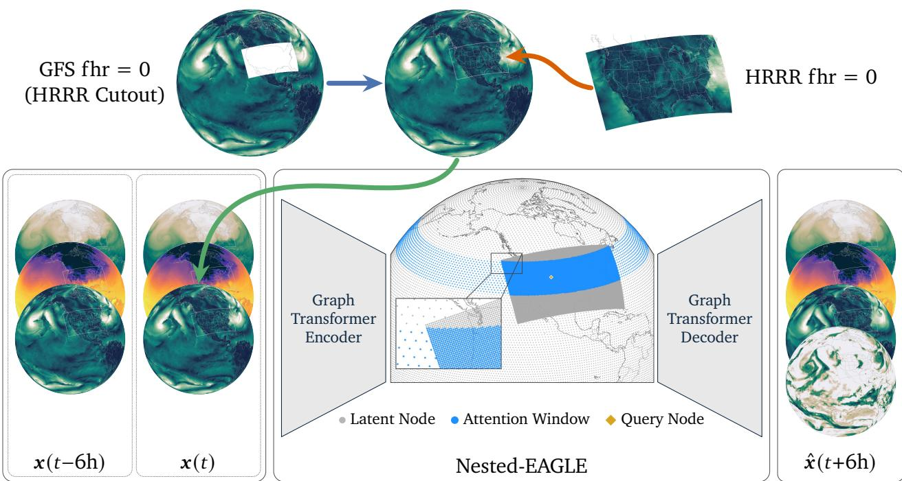  
Figure 1. Illustration of Nested-EAGLE. The model operates on a state space composed of HRRR data over CONUS, conservatively regridded to 6 km resolution, and GFS data everywhere else on the globe at 0.25° resolution. For a given timestamp t, Nested-EAGLE is initialized with this nested state at t and t – 6 hours, and makes a prediction 6 hours into the future. The model is parameterized by a deep neural network that consists of a graph-transformer encoder and decoder, and a sliding-window transformer processor. The processor acts on a latent mesh that is essentially a coarsened version of the nested data space, with relatively higher resolution over CONUS than elsewhere. The figure shows the latent mesh nodes in gray, and an example attention window passing over the high-resolution CONUS region given a query node over Boulder, Colorado. Additionally, the figure illustrates that Nested-EAGLE diagnoses some quantities, like accumulated precipitation shown here, which are not provided as inputs. For this figure, we used t = 0600 UTC 8 March 2023. See Section 5.1 for more design details and Section S5 for more snapshots of several variables from a sample forecast.

However, forecasters must use the products separately for the information that they provide. For example, GFS data are often used to provide a two-week outlook and to inform the synoptic-scale weather context, while HRRR data are used to isolate local impacts for only up to a one- or two-day lead.

Developments in Machine Learning Weather Prediction (MLWP) offer new opportunities to join short- and medium-range weather forecast systems. In recent years, several global MLWP models have been developed (Bi et al., 2023; Lam et al., 2023; Chen et al., 2023, 2025; Bodnar et al., 2025; Lang et al., 2024; Sadeghi Tabas et al., 2025) that are competitive with or outperform the gold standard in traditional medium-range weather forecasting: the IFS (Integrated Forecast System) from ECMWF (European Centre for Medium-Range Weather Forecasts). Since the development of global, mediumrange MLWP models, several regional weather emulators have been produced as well (e.g., Oskarsson et al., 2023; Adamov et al., 2025; Flora and Potvin, 2025; Pathak et al., 2026b; Abdi et al., 2026). By construction, regional MLWP systems inherit the high spatial resolution of the traditional LAM analyses and forecasts they are trained on. However, while ML models can benefit from new perspectives (for instance Adamov et al. 2025 discuss how ML LAMs can blend forecasting and downscaling tasks), many existing regional MLWP models still provide distinctly separate information from their global counterparts.

In contrast to the typically separated global and regional model development pipelines, Nipen et al. (2026) developed Bris: an “all-in-one" MLWP model that has high (2.5 km) resolution over Scandinavia, but still captures the rest of the globe at \~31 km. After a pretraining phase on ERA5 data (Hersbach et al., 2020), the model is trained on a combination of data from the LAM and global forecast system archives, resulting in state-of-the-art prediction skill out to 2.5 days at a fraction of the computational cost (ignoring training costs) compared to Met Norway's traditional forecast system, the Meteorological cooperation Ensemble Prediction System (MEPS). Crucially, Bris shows that a combined MLWP system can provide high-quality forecasts for a region of interest.

Here, we build on the work by Nipen et al. (2026) to develop Nested-EAGLE (Experimental Artificial intelligence Global and Limited-area Ensemble): an MLWP model with a 6 km mesh over CONUS, nested inside a 0.25°grid. See Figure 1 for an illustration and Section S5 to visualize more fields from a sample forecast. Similar to how Bris was designed using MEPS and IFS data, we trained Nested-EAGLE on NOAA's HRRR and GFS archives, using HRRR data over CONUS and GFS elsewhere. Nested-EAGLE is currently a deterministic model with a 6 hour time step. As such, we designed the model to highlight how nesting operational regional analysis and forecast data into a single global MLWP model improves skill. We show that Nested-EAGLE can bridge the short and medium range by extending the evaluation protocol considered by Nipen et al. (2026), evaluating out to 15 days both in and out of the target region. We then compare perturbation experiments to show that combining the datasets via nesting is only beneficial if it is done during training, providing some intuition for how the model compares to existing single-resolution emulators.

Nested-EAGLE does not yet resolve the convective scales that are important for short-range and extreme weather prediction. We show the model's current limitations in representing precipitation, due to the known blurring effect of deterministic training at 6 hour time steps using a Mean-Squared Error (MSE) loss function (e.g., as noted by Lam et al., 2023). We dissect the precipitation evaluation to show that Nested-EAGLE struggles to represent extreme precipitation amounts, but is generally successful in predicting storm locations, thereby isolating areas of improvement for future work.

## 2. Prognostic Forecast Skill

We evaluate the performance of Nested-EAGLE by comparing its forecast skill against the relevant physics-based modeling frameworks from NOAA: GFS and HRRR (see Section 5.3 for dataset details). We also compare Nested-EAGLE against a 0.25° resolution global MLWP model that we call ML-GFS-Base. We developed ML-GFS-Base almost identically to Nested-EAGLE, but only trained it on GFS data in order to isolate the impact of incorporating HRRR data via nesting. See Section 5.1 and Section 5.2 for design details on Nested-EAGLE and ML-GFS-Base, respectively.

In our prognostic skill evaluation, e.g., for 2m temperature, we compare 15 day forecasts initialized every 30 hours during the test period, February 2024–January 2025, evenly sampling the diurnal and seasonal cycles throughout the year, resulting in 293 samples per lead time. We evaluate forecasts from each model in terms of Root-Mean-Squared Error (RMSE) against in situ (conventional) observations, after bilinearly interpolating them to the observation locations. See Section 5.4 for more details on the evaluation protocol.

## 2.1. Forecast Skill Over CONUS

Figure 2 shows that Nested-EAGLE generally has the lowest RMSE over CONUS, especially for nearsurface quantities, and remains competitive throughout the atmosphere to 15 days. More specifically, Figure 2 shows RMSE for Nested-EAGLE, ML-GFS-Base, and GFS for 15 days of lead time, and HRRR for 2 days of lead time. In order to add some perspective to the RMSE plots, we describe the skill based on the lead time gap, $\tau _ { \mathrm { g a p } }$ , between Nested-EAGLE and the other baselines, which defines the point at which median RMSE is approximately equal, i.e.,

$$
\mathrm { N e s t e d - E A G L E ~ M e d i a n ~ R M S E } ( \Delta t + \tau _ { \mathrm { g a p } } ) \simeq \mathrm { B a s e l i n e ~ M e d i a n ~ R M S E } ( \Delta t ) .\tag{1}
$$

Here $\tau _ { \tt g a p } > 0$ indicates the additional lead time over which Nested-EAGLE has lower error. For more details and tabulated numbers, see Section S1.1. At one day of lead time, the skill gap between Nested-EAGLE and GFS is about 78 hours for 10m wind speed and 2m temperature, and 60 hours for 2m specific humidity. For 2m temperature and specific humidity, the skill gap between GFS and Nested-EAGLE closes as lead time increases, remaining significant until about 7.5 and 2 days, respectively. On the other hand, Nested-EAGLE maintains at least a 48 hour skill gap over GFS throughout the 15 day evaluation period for 10m wind speed.

Comparing Nested-EAGLE and ML-GFS-Base for near-surface variables (top row of Figure 2) shows the main benefit of incorporating HRRR data into training. At one day of lead time, Nested-EAGLE leads ML-GFS-Base by 54 and 66 hours for 10m wind speed and 2m temperature, respectively, and maintains a statistically significant lead until about 6.5 days of lead time. For 2m specific humidity, the skill gap is large $( \tau _ { \mathrm { g a p } } > 3 \mathrm { d a y s } )$ but short-lived, as it is only significant to about 12 hours of lead time.

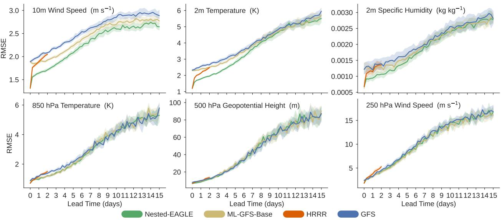  
Figure 2. RMSE against in situ observations over CONUS during the test period. The model forecasts were first conservatively regridded to the same 6 km resolution Lambert conformal conic projection that Nested-EAGLE employs over CONUS, then bilinearly interpolated to the observation locations. See Figure S2 for an evaluation of more quantities and vertical levels, and Section S1.1 for a quantification of skill differences in terms of lead time. Lines show the median over 293 forecasts and shading the 95% confidence interval.

The bottom row of Figure 2 shows RMSE for a selection of fields indicating skill across the atmospheric column; see Figure S2 for more quantities and vertical levels. For these atmospheric variables, the ML models achieve nearly equal skill. At 850 hPa, Nested-EAGLE and ML-GFS-Base have a statistically significant $\tau _ { \mathrm { g a p } } \simeq 2 4$ hour skill gap over GFS for the first 1–2 days of lead time. Beyond 4 days of lead time, all reporting models produce skill that is statistically indistinguishable. Higher up in the atmosphere, for example as shown by 500 hPa geopotential height and 250 hPa wind speed errors, Nested-EAGLE, ML-GFS-Base, and GFS show comparable skill.

Nested-EAGLE shows the most significant improvements over all other models near the surface purely because of differences between the HRRR and GFS analysis states, which we represent with data at forecast hour zero in our evaluation. For near-surface variables, HRRR analysis leads the GFS analysis by a significant margin, amounting to improvements of roughly 30–48% (30% for 10m wind speed, 48% for 2m temperature, and 45% for 2m specific humidity). We presume that these near-surface improvements are due to several factors in the HRRR data assimilation system, including:

• higher spatial resolution,

• more frequent assimilation cycles (hourly versus 6 hourly),

• a more advanced land model, which can make better use of surface observations, and

• better observational coverage, using more U.S.-centric station data.

On the other hand, analysis differences in the atmospheric fields shown in the bottom row of Figure 2 are only around 20%. In other words, HRRR and GFS have similar atmospheric states, but HRRR translates this representation into a significantly better near-surface state. Importantly, the relative improvements near the surface are not due to scaling the loss function to prioritize the surface and deprioritize the atmosphere, for example, as is done by GraphCast (Lam et al., 2023) and the Artificial Intelligence Forecasting System (AIFS; Lang et al., 2024). In fact, we found this scaling to be either inconsequential or even detrimental to skill across all variables; see Section S2.5 for more details. Thus, Nested-EAGLE's skill gain for near-surface quantities is due to the propagation of skill gains in the HRRR analysis, indicating the importance of incorporating the data into training.

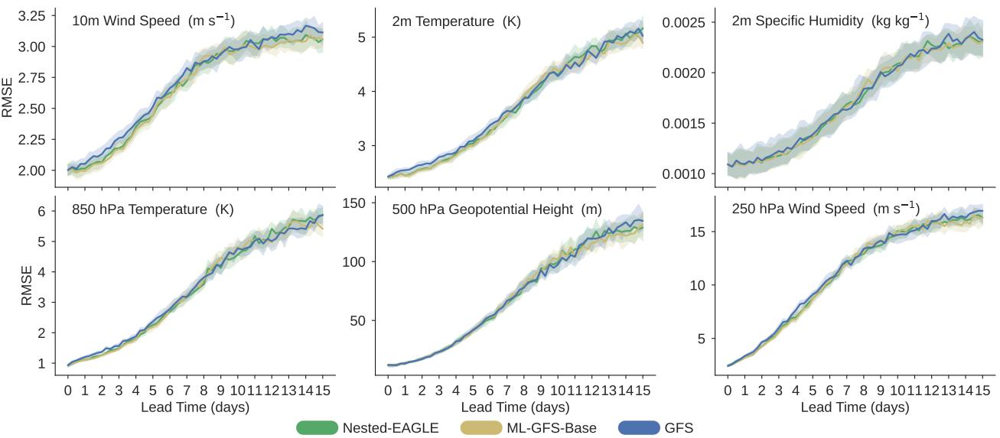  
Figure 3. RMSE against in situ observations over Europe during the test period. The European region is defined as a simple latitude-longitude box from 35°N–75°N and 25°W–65°E. All datasets operate on a 0.25° latitude-longitude grid in this region, so they are not regridded prior to observation-location interpolation. See Figure S3 for an evaluation of more quantities and vertical levels. Lines show the median over 293 forecasts and shading the 95% confidence interval.

## 2.2. Forecast Skill Over Europe

Figure 3 indicates that outside of CONUS, our target region, Nested-EAGLE does not carry over skill learned from the HRRR dataset, but remains a reliable medium-range weather model. The figure shows RMSE against in situ observations over Europe, comparing Nested-EAGLE, ML-GFS-Base, and GFS. Here, the two MLWP models show modest gains over GFS in 10m wind speed, 2m temperature, and 850 hPa temperature. Otherwise, all three models are statistically indistinguishable from each other. We suggest that the relatively small improvement over GFS in this region is due to the limited 8 year training datasets used in our work.

We also interpret the statistical equivalence of Nested-EAGLE and ML-GFS-Base to be a negative control. While it would be ideal for Nested-EAGLE to carry over skill gains from the HRRR dataset to the rest of the globe, our current framework provides no mechanism for this to happen. More specifically, the model is trained with a supervised learning objective that encourages it to “look like" GFS data outside of CONUS. Figure 3 indicates that the model is not overtrained to its target region; the skill gains over CONUS do not degrade skill elsewhere.

## 2.3. Disentangling the Importance of Training Data and Inference-Time Initial Conditions

The previous sections show that incorporating HRRR analysis into global MLWP model training improves its representation of near-surface quantities over CONUS. However, a fundamental limitation of Nested-EAGLE, and most of the existing MLWP models from the broader community, is its reliance on an analysis state that comes from traditional data assimilation systems. In our framework, which nests the HRRR analysis inside the GFS analysis, it is not exactly clear how the skill gain manifests. Are the skill gains in Nested-EAGLE, relative to ML-GFS-Base, purely due to the fact that we feed it an improved initial state at inference time? $\mathrm { O r } ,$ are the improvements baked into the model weights during training?

Figure 4 shows that the improvements are learned during training and carry over even with less accurate initial conditions. Similar to the top row of Figure 2, Figure 4 shows near-surface forecast RMSE over CONUS from Nested-EAGLE, ML-GFS-Base, and GFS. Additionally, Figure 4 shows the skill when Nested-EAGLE is initialized with only GFS analysis at inference time (Nested-EAGLE(GFS IC), purple dashed line). In order to make the nesting mechanics work, the GFS state was conservatively interpolated to the 6 km Lambert conformal conic projection over the HRRR subdomain, and left “as-is" over the rest of the globe. Conversely, Figure 4 also shows the skill of ML-GFS-Base, when it is given

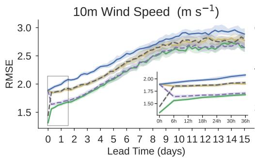

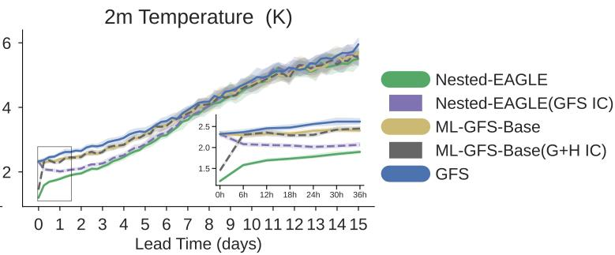  
Figure 4. RMSE over CONUS. Similar to Figure 2, but with additional experiments using swapped initial conditions. The additional purple dashed line shows the RMSE of Nested-EAGLE when it is initialized with GFS data only at inference time, which we call Nested-EAGLE(GFS IC), where IC denotes the initial conditions. The gray dashed line shows the opposite: during inference ML-GFS-Base is fed initial conditions that have HRRR data over CONUS for ML-GFS-Base(G+H IC), where G+H denotes combined GFS and HRRR initial conditions. For this figure, all datasets were conservatively regridded to a 0.25° resolution and evaluated over an approximate CONUS latitude-longitude box from 20°N–55°N and 135°W–50°W. Lines show the median over 293 forecasts and shading the 95% confidence interval.

HRRR initial conditions at inference time (ML-GFS-Base(G+H IC), gray dashed line). Similarly, for the mechanics to work with the single-resolution model, the HRRR state was conservatively coarsened to a 0.25° latitude-longitude projection, and swapped into the global grid as appropriate.

In Figure $^ { 4 , }$ models initialized with swapped analysis states start with the expected errors. For example, Nested-EAGLE(GFS IC) has the same error as GFS at forecast hour zero. However, the two swapped models rapidly converge to the same error as models that use consistent initial conditions during training and inference. For 10m wind speed, this convergence happens in the first 6 hour time step. For 2m temperature, ML-GFS-Base(G+H IC) loses skill almost immediately as well, whereas Nested-EAGLE(GFS IC) takes slightly longer to converge. The slower convergence appears to be mostly due to orography, since the swapped models also swap static data; i.e., Nested-EAGLE(GFS IC) uses GFS orography over CONUS. Thus, the remaining differences between Nested-EAGLE and Nested-EAGLE(GFS IC) correspond to a temperature bias consistent with a lapse rate acting on the elevation differences between GFS and HRRR (see Section S3 for more details).

Visualizing the spatial distribution of errors between Nested-EAGLE and its swapped counterpart suggests that the model has learned to remove errors from the GFS analysis. Figure 5 shows spatial maps of RMSE between Nested-EAGLE and Nested-EAGLE(GFS IC), averaged over the forecasts from the test period. Within the first 6 hour time step, the model removes large errors from the Great Plains and the coastlines. By 30 hours into the forecast, the only notable differences between the two experiments are in the 2m temperature field over regions with high elevation, where persistent biases remain, owing to orographic differences noted earlier. However, these differences are small relative to the initial error between GFS and HRRR analysis.

## 3. Precipitation Evaluation Over CONUS

We evaluate Nested-EAGLE's ability to predict 6 hour accumulations of precipitation as a function of forecast hour during the test period, February 2024–January 2025, using a different protocol than in Section 2. Most importantly, we focus on the Fractions Skill Score (FSS; Roberts and Lean, 2008) metric, which emphasizes both spatial coherency and amplitude representation. In essence, FSS gives better scores to precipitation forecasts that “look like" observations; see Section 5.5 for details.

We compare 1,426 forecasts from each model, initialized every 6 hours during the test period. We use more forecasts here than in Section 2 in order to improve statistical power, since there are days without precipitation events during the test year. As a reference, we rely on the Analysis of Record for Calibration (AORC; Fall et al., 2023) from NOAA's Office of Water Prediction (OWP); see Section 5.5 for more details.

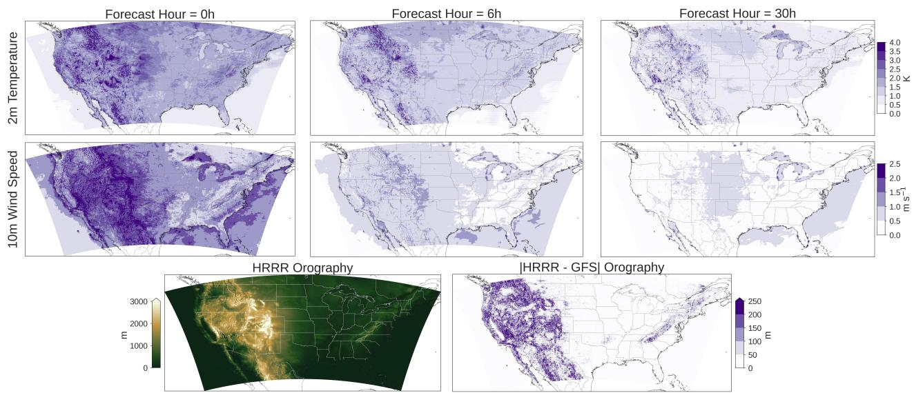

Figure 5. Spatial RMSE between Nested-EAGLE and Nested-EAGLE(GFS IC), where differences are restricted to the HRRR subdomain for clarity. The figure shows the spatial distribution of errors between the green and purple dashed lines in Figure 4. At forecast hour 0 (top rows, left), differences are entirely due to differences in GFS and HRRR analyses. After 6 hours (top rows, middle), the figure shows the difference between Nested-EAGLE with and without HRRR data over CONUS after a single forecast step. By 30 hours (top rows, right), the differences are negligible. The spatial RMSE represents the average over 293 forecasts. For a visual reference, the bottom row shows HRRR orography and the absolute value of differences between HRRR and GFS orography, regridded to 6 km resolution.  
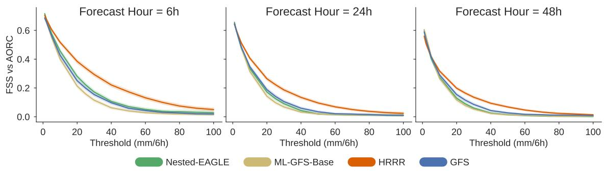  
Figure 6. FSS against AORC over CONUS during the test period, shown as a function of the absolute amplitude (mm/6h). A value of 1 indicates a perfect FSS, i.e., higher is better. Lines show the mean over 1,426 forecasts and shading the 95% confidence interval.

## 3.1. FSS Precipitation Skill: Amplitudes and Locations

Figure 6 quantifies the clearest limitation of Nested-EAGLE: its precipitation forecasts are less skillful than HRRR, the physics-based model it was trained on over CONUS. Each panel of the figure shows FSS as a function of thresholds defined by precipitation accumulated over the most recent 6 hours, with panels indicating skill at 6, 24, and 48 hours of lead time. HRRR is clearly the most skillful forecast model at all threshold levels, except for the smallest thresholds (1-2 mm/6h) where Nested-EAGLE has a slight advantage. At 6 hours of lead time, Nested-EAGLE is only marginally more skillful than GFS despite operating at a higher resolution. Similarly, ML-GFS-Base shows significantly lower skill than its physical forecast model counterpart, GFS, and has the lowest skill of all models evaluated. All models lose skill with increasing lead time, and the skill of the two ML models converges with increasing lead. We surmise that this convergence occurs because, at longer leads, predictable precipitation events are largely driven by forcing outside of the nested target region, where the ML models have the same training data.

Nested-EAGLE and ML-GFS-Base produce less skillful precipitation forecasts relative to HRRR and GFS, respectively, because they are trained deterministically with an MSE loss function. More specifically, the MSE loss function suffers from the double-penalty effect (Rossa et al., 2008), leading to predictions that blur the small-scale features (as noted by many, e.g., Lam et al., 2023). The relatively blurred small scales result in diminished local maxima, and reduced skill at higher precipitation thresholds.

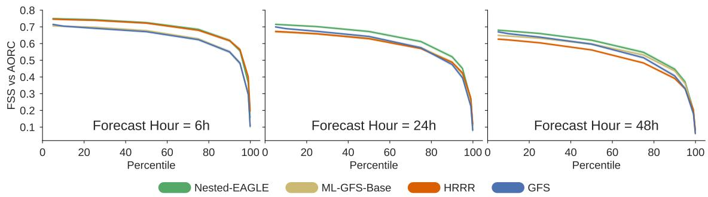  
Figure 7. FSS against AORC over CONUS during the test period, shown as a function of percentile represented by each model. As in Figure 6, a value of 1 indicates a perfect FSS, i.e., higher is better. Lines show the mean over 1,426 forecasts and shading the 95% confidence interval.

## 3.2. FSS Precipitation Skill: Location Only

Despite the blurring imposed by deterministic training with an MSE loss, Figure 7 shows that Nested-EAGLE represents the location of precipitation events well. Each panel of the figure shows FSS as a function of percentile, defined by the amplitude that each model is able to represent. Viewing FSS from this perspective controls for each model's amplitude bias, isolating each one's ability to capture the position of precipitation events (Roberts and Lean, 2008). See Section S4 for a comparison of monthly precipitation amounts during the validation period, which provides qualitative corroboration that Nested-EAGLE places storms in the right location, despite blurring the amplitudes.

At 6 hours of lead time, Nested-EAGLE and HRRR are the most skillful, significantly outperforming ML-GFS-Base and GFS. Additionally, at this lead time, the ML models are indistinguishable from their physical model counterparts, because the 0-6 hour forecasts are used as training targets. Taken together, these results emphasize the importance of incorporating HRRR data via the nesting procedure, since Nested-EAGLE is able to benefit from HRRR's superior precipitation skill.

As in Section 3.1, all models show decreasing FSS with lead time, even in this percentile view. However, the rankings change with lead. Beyond 6 hours, Nested-EAGLE shows the highest skill scores, ML-GFS-Base gradually outperforms GFS, and HRRR skill drops below GFS. ML-GFS-Base skill approaches Nested-EAGLE's with longer lead times, although this time the ML model skill converges slower than in Section 3.1.

We attribute HRRR's reduced skill, at least when viewed in this percentile framing, to the challenging nature of capturing the location of lower-likelihood events at longer lead times with deterministic, high-resolution physical forecast systems. As lead time extends, HRRR departs from the constraints provided by data assimilation and tends toward the numerical model's attractor, which is distinctly different from nature. On the other hand, Nested-EAGLE is trained to produce HRRR's 0–6 hour precipitation accumulation at all lead times, allowing the ML model's forecasts to benefit from the data assimilation analysis further into the forecast. ML-GFS-Base similarly outperforms GFS at longer leads, consistent with MLWP models propagating the data assimilation constraints further into the forecast than their traditional counterparts.

## 4. Discussion

Operational centers provide forecast products to help inform the public on a wide range of time scales from hourly storm "nowcasting" to seasonal guidance. While practicality plays a role, computational constraints have historically necessitated developing independent systems for each forecast product. We argue that collecting and synthesizing information from distinct sources can be cumbersome for end users, and suggest that an integrated short- and medium-range prediction system would be useful to the public.

With this goal in mind, we present Nested-EAGLE: a global 0.25° MLWP model with a 6 km refinement over CONUS, trained on HRRR data nested inside of GFS data. Evaluating over CONUS against in situ observations shows that Nested-EAGLE has significantly lower RMSE for near-surface quantities when compared to NOAA's operational physics-based forecast systems, and ML-GFS-Base, an MLWP baseline trained only on GFS data. For example, Nested-EAGLE's 2m temperature forecasts over CONUS maintain a significant lead over GFS for 7.5 days, and ML-GFS-Base for 6.5 days. In the upper atmosphere and outside of CONUS, Nested-EAGLE produces skill similar to ML-GFS-Base, and in many cases these two MLWP models are comparable to GFS. In summary, our results show that the biggest gains from the nesting methodology are in near-surface fields over CONUS, stemming from incorporating HRRR's improved representations of these quantities into the model during training. Nested-EAGLE is one of many exploratory MLWP models being tested at NOAA, alongside its global (Sadeghi Tabas et al., 2025) and LAM (Abdi et al., 2026) counterparts. The model is currently producing forecasts for 2026 in a quasi-operational environment, with an archive of reforecasts to be published soon.

Nested-EAGLE represents our current ability to bridge short- and medium-range weather forecasting into one modeling system. However, in its current form, the model is deterministic rather than probabilistic, and operates with a time step (6 hour) and horizontal resolution (0.25°/6 km) that are too coarse to fully resolve the convective and storm scales that underlie short-range weather. Our FSS evaluation highlights how some of these limitations currently manifest. That is, precipitation forecasts from Nested-EAGLE are less skillful and under-represent high-to-extreme precipitation amounts compared to HRRR, although they remain comparable to GFS. Addressing these limitations will be necessary to capture a wider range of spatiotemporal phenomena, but will also require reconciling some trade-offs. For example, reducing the time step size would allow Nested-EAGLE to capture smaller-scale phenomena, but could introduce more error for 10-15 day forecasts due to numerical instabilities. Future developments could consider techniques like temporal downscaling (Ingstad et al. 2026), time-step-aware multilead training (Nguyen et al., 2024; Abdi et al., 2026; Weyn et al., 2026), or a mixture-of-experts approach (Pathak et al., 2026a; Brenowitz et al., 2025) to provide well-resolved short-range forecasts while remaining stable at longer lead times. Additionally, given the results by Lang et al. (2026); Alet et al. (2025); Bonev et al. (2025), we suggest that training a stochastic model with a continuous ranked probability score loss function, perhaps with a spectral component as done by Nordhagen et al. (2025), would be fruitful for improving both phenomenological and uncertainty representation. Subsequent work could focus separately on realism and uncertainty (Pereira et al., 2026).

Another area of future work is to expand our training data. In our prognostic evaluation, we found that, aside from near-surface variables over CONUS, Nested-EAGLE performs comparably to a model trained only on GFS data (ML-GFS-Base). In contrast to the expectation that MSE-trained ML models should have lower RMSE than their physical model counterparts, these two ML models were largely comparable to GFS in terms of RMSE, except in the low-level atmosphere and in the tropics (see extended evaluation in Section S1.2). We suggest that this discrepancy is due to the relatively limited 8 year training datasets used in our work. As a comparison, many other MLWP models are able to produce significantly lower RMSE than physics-based models for atmospheric quantities like 500 hPa geopotential height. For example, Lang et al. (2024) show significant gains over the IFS after training on 40 years of ERA5 reanalysis data, and then fine-tuning on 2 years of operational IFS analysis data. An obvious next step for Nested-EAGLE is to incorporate a pretraining schedule similar to Nipen et al. (2026), and train first on ERA5 before using the GFS and HRRR archives. This work is already in active development.

More generally though, we suggest that future work should incorporate observations directly into the model development. Our analysis of precipitation event position provides some motivation along these lines. We showed that Nested-EAGLE accurately predicts precipitation location, despite blurring the amplitudes. This result is analogous to previous work showing that MLWP models tend to accurately predict hurricane track, but fail to adequately forecast hurricane intensity (e.g., DeMaria et al., 2025). In our case, we suggest that Nested-EAGLE's advantage is due to the fact that it is trained on 0–6 hour HRRR forecasts, which are still highly constrained by data assimilation. While our results show that Nested-EAGLE propagates this skill for longer lead times than current operational models, it cannot surpass HRRR's forecast skill at 6 hours in its current form with a deterministic 6 hour time step, since this is its training target. Thus, MLWP models could improve by incorporating observations directly into the learning objective. With this in mind, recent work by Miralles et al. (2026) discusses some of the benefits and challenges associated with learning from heterogeneous observation sources.

Finally, our experiments with perturbed, or “swapped", initial conditions not only motivate learning from observations, but also motivate developing MLWP models that operate on observational inputs. More specifically, we showed that Nested-EAGLE produces comparable skill whether it is initialized with GFS initial conditions only, or with the typical HRRR and GFS combination. Our spatial evaluation indicates that the model acts as a sort of bias corrector, rapidly removing errors along the Great Plains and coastlines from the GFS initial conditions. Collectively, this evaluation confirms that, at least for the first \~30 hours of forecast lead time, Nested-EAGLE's skill improvements are not due to better initial conditions at inference time, but are instead learned from the HRRR data during training. On the one hand, the results provide confidence that Nested-EAGLE can be robust to degraded initial conditions, perhaps due to missing observational constraints during the data assimilation phase. However, these experiments also imply that improved initial conditions, for example due to a system upgrade or increased observations, would not immediately improve the model at forecast time. Instead, improved initial conditions would need to be incorporated into training for the ML model to realize their benefits. While adding observational constraints to the loss function could sidestep the need to nest or otherwise combine analyses, our results suggest that retraining would still be necessary. Thus, future work should consider modeling frameworks that explicitly operate on observational inputs in order to respond more directly to improved observational constraints. Recent advancements in “end-to-end" ML forecasting (Pinnington et al., 2026; Pathak et al., 2026a; Zhao et al., 2026; Allen et al., 2025; Wang et al., 2025; Sun et al., 2025) and ML state estimation (Gupta et al., 2026) offer promise in this direction.

## 5. Methods

## 5.1. Nested-EAGLE Model Design

Nested-EAGLE is an autoregressive model parameterized by a deep neural network, mapping the weather state x at times t and t – 6 hours to a prediction x at t + 6 hours. That is, the model defines the mapping

$$
\mathcal { M } _ { \theta } \left( \boldsymbol { \mathbf { \mathit { x } } } ( t ) , \boldsymbol { \mathbf { \mathit { x } } } ( t - 6 \mathrm { \boldsymbol { h } } ) \right) = \hat { \boldsymbol { \mathbf { \mathit { x } } } } ( t + 6 \mathrm { \boldsymbol { h } } ) .\tag{2}
$$

Table 1 lists the set of variables that define the model's state space. Data for all variables except accumulated precipitation come from GFS and HRRR forecast hour 0 output, which is essentially analysis data. For each timestamp t, precipitation is taken as the 6 hour accumulation forecast initialized 6 hours prior. See Section S5 for snapshots of several variables from a sample forecast.

We used 8 years of data for training (February 2015–January 2023), 1 year for validation (February 2023–January 2024), and 1 year for testing (February 2024–January 2025). We built our model using the anemoi framework (see Lang et al., 2024), and developed separate Python packages, ufs2arco (Smith et al., 2026a) and eagle-tools (Smith et al., 2026b), to prepare datasets and perform evaluation, respectively.

The neural network that defines Nested-EAGLE consists of encoder, processor, and decoder modules, similar to many MLWP models (e.g., Lam et al., 2023; Lang et al., 2024; Nipen et al., 2026). We describe the key differentiating elements here and provide more model details in Section S2.

The encoder maps the weather state from the data space to the latent mesh, using the same graph-transformer design as Lang et al. (2024). The decoder uses the same graph-transformer blocks, and performs the reverse mapping: from the latent mesh to the data space. The Nested-EAGLE data space is defined by joining GFS data, archived on a 0.25° latitude-longitude grid, with HRRR data on a Lambert conformal conic projection over CONUS. For the current version of Nested-EAGLE, HRRR data are conservatively regridded from 3 km to 6 km resolution. We do not retain GFS data nodes over the HRRR subdomain (i.e., over CONUS), similar to how Nipen et al. (2026); Baño-Medina et al. (2025) define nested, or “stretched", grids. In our work, we design the latent mesh in a similar fashion to how the data space is created, except at a resolution that is approximately 16 times coarser (i.e., factor of \~4 in latitude and longitude). We combine a global octahedral reduced Gaussian grid at O96 resolution (approximately 1°, or \~100 km resolution, with 40,320 nodes) together with a subset of the HRRR grid, coarsened to 24 km resolution.

<table><tr><td colspan="2">Prognostic Fields (Inputs &amp; Outputs)</td><td colspan="2">Forcing Fields (Inputs Only)</td></tr><tr><td>3D Atmospheric</td><td>2D</td><td>Time Varying</td><td>Static</td></tr><tr><td>Geopotential Height</td><td>Surface Pressure</td><td>Solar Insolation</td><td>Land-Sea Mask</td></tr><tr><td>Zonal Wind</td><td>10m Zonal Wind</td><td>Cosine &amp; Sine of Latitude</td><td>Orography</td></tr><tr><td>Meridional Wind</td><td>10m Meridional Wind</td><td>Cosine &amp; Sine of Longitude</td><td></td></tr><tr><td>Vertical Velocity</td><td>Surface Temperature</td><td>Cosine &amp; Sine of Julian Day</td><td></td></tr><tr><td>Temperature</td><td>2m Temperature</td><td>Cosine &amp; Sine of Local Time</td><td></td></tr><tr><td>Specific Humidity</td><td>2m Specific Humidity</td><td>Diagnostic Fields (Outputs Only)</td><td></td></tr><tr><td colspan="2"></td><td>6 hour Accumulated Precipitation 80m Meridional Wind</td><td>80m Zonal Wind</td></tr></table>

Table 1. State space definition. The 3D atmospheric fields are represented on 12 pressure levels: 100, 150, 200, 250, 300, 400, 500, 600, 700, 850, 925, and 1000 hPa. All fields are normalized by their Z-score ((x – µ)/σ) with the following exceptions. Specific Humidity, 2m Specific Humidity, and Accumulated Precipitation are normalized by the standard deviation (x/σ). Orography is normalized by its maximum value (x/max(x)), and all other forcing fields are not normalized. Specific Humidity, 2m Specific Humidity, and Accumulated Precipitation are bounded to positive values with ReLU(x) = max(x, 0), following Moldovan et al. (2026).

Our latent mesh and processor design differs from Nipen et al. (2026); Baño-Medina et al. (2025), who use an icosahedral multimesh latent space with triangular elements, employing higher refinements over their target regions, together with a graph-transformer processor. Our earliest prototypes used the same design, but suffered from artifacts at the boundary between the global and target subdomains. We therefore designed the custom latent mesh noted earlier in order to use a sliding-window transformer processor, as in Lang et al. (2024), hypothesizing that a more seamless numerical stencil would help remove the artifacts. Figure 8 shows 10 day forecasts from two early prototypes, confirming that the sliding-window transformer removed the grid artifacts.

Nested-EAGLE does require a relatively large “window size" in order to adequately capture enough latent nodes in a single processor stage; see Section S2.2 for sensitivity experiments related to this hyperparameter and Figure 1 for illustrative intuition. However, the sliding-window transformer still reduced computational costs by \~33% relative to the multimesh graph-transformer processor. We attribute the efficiency gains to several factors. First, total runtime is relatively insensitive to some extra compute costs, since the I/O and memory operations stemming from the four states in the model's inputs (two from HRRR, two from GFS) tend to dominate. Second, the sliding-window attention acts on consecutive slices of the latent state arrays, whereas pure graph-based approaches rely on random access patterns that often result in cache misses and suboptimal GPU utilization. Finally, we attribute computational speed to the highly engineered FlashAttention implementation by Dao et al. (2022); Dao (2024), which is used in the sliding-window processor.

The other most notable design difference between our work and Nipen et al. (2026) is that we do not pretrain our model using ERA5. More specifically, Nipen et al. (2026) opted to use only 2.5 years of IFS and MEPS archives for training data, in order to avoid inconsistencies between different MEPS forecast model versions. On the other hand, we opted to use all HRRR and GFS data available since February 2015, the earliest publicly available GFS data at 0.25° to our knowledge (NCEP et al., 2015a,b). With 8 years of available training data, our initial prototypes were able to produce lower RMSE than GFS and HRRR. After switching to a sliding-window transformer architecture, we did not observe any obvious signs of having insufficient data, and therefore neglected the pretraining step. Table 2 shows our full training schedule. However, work is already ongoing to incorporate pretraining and further improve skill, especially outside of the HRRR subdomain.

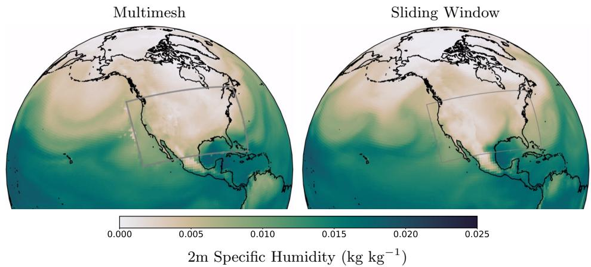

Figure 8. 10 day forecasts after initialization at 0000 UTC 9 March 2023 from prototypes using different latent meshes and processor architectures. The left panel comes from a model with a graph-transformer processor acting on an icosahedral multimesh with \~158 km and \~20 km resolutions globally and over CONUS, respectively. The right panel comes from a model with a sliding-window transformer processor and a latent mesh with $\overset { \cdot } { 2 ^ { \circ } }$ and 30 km resolutions globally and over CONUS, respectively. Note that both forecasts stem from earlier prototypes trained on GFS data regridded to 1° and HRRR data regridded to 15 km resolutions.
<table><tr><td>Hyperparameter</td><td>Stage A</td><td>Stage B</td><td>Stage C</td></tr><tr><td>Optimization Iterations</td><td>60,000</td><td>5,760</td><td>5,760</td></tr><tr><td>Epochs</td><td>~82</td><td>8</td><td>8</td></tr><tr><td>Linear Warmup Steps</td><td>1,000</td><td>100</td><td>100</td></tr><tr><td>Maximum Effective Learning Rate</td><td> $1 . 0 \times 1 0 ^ { - 3 }$ </td><td> $1 . 0 \times 1 0 ^ { - 4 }$ </td><td> $1 . 0 \times 1 0 ^ { - 5 }$ </td></tr><tr><td>Minimum Learning Rate</td><td> $3 . 0 \times 1 0 ^ { - 7 }$ </td><td> $3 . 0 \times 1 0 ^ { - 7 }$ </td><td> $3 . 0 \times 1 0 ^ { - 7 }$ </td></tr><tr><td>Autoregressive Rollout Steps</td><td>1</td><td>2</td><td>2-4</td></tr></table>

Table 2. Training Schedule. All stages used a batch size of 16, and our 8 year training dataset has 11,616 samples, resulting in about 726 optimization iterations (or batches) per epoch in Stage A. We used an AdamW optimizer (Loshchilov and Hutter, 2019) with parameters $\beta _ { 1 } = 0 . 9 , \beta _ { 2 } = 0 . 9 5$ . The loss is a weighted MSE function, where the loss over the target subregion is upweighted to 10% of the total loss; see Section S2.1 for details on this choice. Training required approximately 45 hours of wall-clock time on the National Energy Research Scientific Computing Center's (NERSC) Perlmutter machine, using 16 nodes each with 4 A100s and 40 GB of GPU RAM per A100. We distributed the model across a single node, i.e., 4 GPUs per model instance.

## 5.2. ML-GFS-Base Model Design

We compare Nested-EAGLE to ML-GFS-Base, a baseline single-resolution MLWP model trained solely on GFS data, in order to isolate the impacts of incorporating HRRR data through the nesting process. As such, we designed this baseline model to be as close a match to Nested-EAGLE as possible. The only design differences, aside from the datasets, are as follows. The ML-GFS-Base data space is a uniform 0.25° latitude-longitude grid, matching Nested-EAGLE nodes outside of the HRRR subdomain. The latent mesh is a single-resolution O96 octahedral reduced Gaussian, again matching Nested-EAGLE outside of the HRRR subdomain. The sliding-window transformer processor uses a window size of 2,250, which is much smaller than 8,168 used in Nested-EAGLE owing to the fact that there are far fewer nodes in the latent mesh. Finally, the ML-GFS-Base loss function normalizes the loss at each node based on its grid-cell area estimated by a Voronoi tessellation, and there is no renormalization after this. On the other hand, the loss for Nested-EAGLE is reweighted after this grid-cell area normalization so that the HRRR subdomain accounts for 10% of the loss fraction (see Section S2.1 for sensitivity test results).

## 5.3. Forecast Model Baselines

We compare Nested-EAGLE to the two operational numerical weather prediction forecast models that underlie the training data: NOAA's HRRR and GFS. The HRRR is a regional model covering CONUS, operating at 3 km spatial resolution, and is initialized every hour from NOAA's 13 km resolution RAP (Dowell et al., 2022). The GFS is NOAA's central deterministic medium-range weather forecast system, initialized four times daily at 6 hour intervals by GDAS. Our validation and test periods cover February 2023–January 2024 and February 2024–January 2025, respectively. Thus, we compare Nested-EAGLE to HRRR version 4 and GFS version 16, the current operational forecast systems at the time of writing.

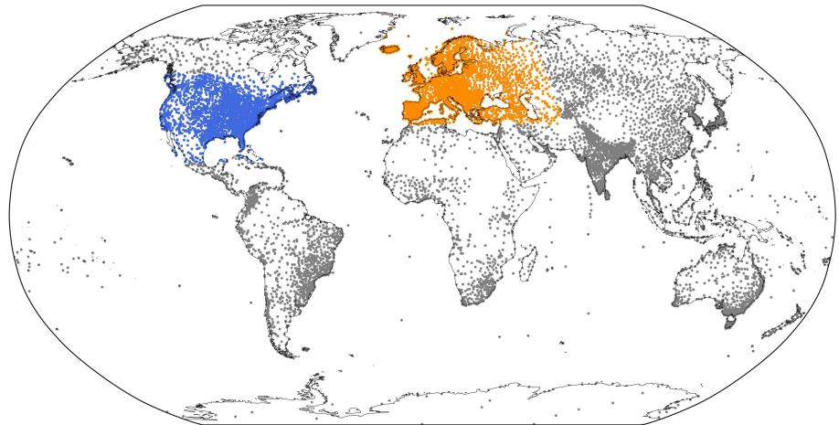  
Figure 9. 24 hours of conventional observational coverage on 7 December 2024. Observations over the U.S. and Europe are colored in blue and orange, respectively, as these subregions are discussed in Sections 2.1 and 2.2. Observations everywhere else are indicated by gray dots.

## 5.4. Prognostic Evaluation

We evaluate forecasts from each model using in situ (conventional) observations as a reference. The observations come from the NOAA NASA Joint Archive (NNJA; NOAA and NASA, 2026), which hosts a collection of data sources, e.g., from dropsondes, rawinsondes, aircraft, and stations. We access the data using Brightband's Python API (Mohrmann and Rothenberg, 2025). Figure 9 shows a representative snapshot of observational coverage during one day in the test period, highlighting the subsets over CONUS and Europe discussed in Sections 2.1 and 2.2, respectively.

We evaluate the forecasts in terms of their RMSE against the observations noted above. For a given valid time t, we select observations that are within one hour (t ± 30 minutes) to get $y ( t )$ , and bilinearly interpolate the predicted state from each model to these observation locations to get $\hat { \mathbf { y } } ( t )$ In our evaluation framework, the number of observations and their locations change with t. However, to streamline the presentation here, we assume that there are $N _ { o }$ observations at each time t, indexed by $i \in \{ 1 , 2 , . . . , N _ { o } \}$ . For each forecast initialization, indexed by $j \in \{ 1 , 2 , . . . , N _ { f } \}$ , we compute a single error value at each forecast hour ∆t as

$$
\mathrm { R M S E } _ { j } ( \Delta t ) = \sqrt { \frac { 1 } { N _ { o } } \sum _ { i = 1 } ^ { N _ { o } } \left( \hat { y } _ { i j } ( \Delta t ) - y _ { i } ( t _ { j } + \Delta t ) \right) ^ { 2 } } ,\tag{3}
$$

and report the median over the $N _ { f }$ initializations. We aggregate RMSE using the median rather than the mean when comparing against in situ observations because the confidence intervals on mean RMSE are too large to discern differences for 2m specific humidity. We suspect that outliers obfuscate the estimate of mean RMSE for specific humidity. Using either median RMSE or mean absolute error tends to show a clear picture for this quantity, and other variables behave consistently no matter what, so we use the former here. We evaluate the RMSE at 6 hour increments, up to a 15 day lead time.

We estimate confidence intervals for our aggregated error estimates using the Python package seaborn (Waskom, 2021). For completeness, we state the general procedure here, which we use for other metrics like FSS; see Section 5.5. For all confidence intervals, we use a nonparametric bootstrapping methodology over forecast initializations. Let $e _ { j } ( \Delta t )$ denote a per-initialization skill value and S the statistic used to aggregate it: $e _ { j } = { \mathrm { R M S E } } _ { j }$ with S = median for the prognostic fields compared against observations, and $e _ { j } = { \mathrm { F S } } S _ { j }$ with S = mean for precipitation (see Section 5.5). For each of $N _ { B }$ resamples, we draw initialization indices $j _ { 1 } ^ { ( b ) } , \ldots , j _ { N _ { f } } ^ { ( b ) }$ uniformly with replacement from

$\{ 1 , 2 , . . . , N _ { f } \}$ and recompute

$$
e ^ { ( b ) } ( \Delta t ) = S \left( \left\{ e _ { j _ { k } ^ { ( b ) } } ( \Delta t ) \right\} _ { k = 1 } ^ { N _ { f } } \right) , \qquad b = 1 , \ldots , N _ { B } .\tag{4}
$$

The shading in our figures spans the 2.5th and 97.5th percentiles of $\{ e ^ { ( b ) } ( \Delta t ) \} _ { b = 1 } ^ { N _ { B } } , \mathrm { i . e . }$ , a percentile bootstrap 95% confidence interval, using $N _ { B } = 1 , 0 0 0$ resamples. We consider a difference between two models to be statistically significant when their intervals do not overlap, which is a conservative criterion given that all models are verified against the same observations at the same initializations.

Conducting the evaluation against observations is critical, because Nested-EAGLE combines analysis states from both GFS and HRRR. Comparing against observations allows us to control for regions in the analyses that differ from one another but are unconstrained by data.

## 5.5. Precipitation Evaluation

We compare the precipitation fields separately from the prognostic model outputs. Because it is challenging to find high-resolution, high-quality observational estimates of precipitation across the globe, we limit our evaluation to the CONUS region, using version 1.1 of NOAA OWP's AORC (Fall et al., 2023) as a reference. Notably, AORC provides an estimate of accumulated surface precipitation at an hourly frequency from 1979 through 2025 at \~800 m resolution. The precipitation estimate is derived from a variety of sources, relying largely on CONUS-wide Stage IV radar data in more recent years (Bytheway and Mahoney, 2026). To facilitate comparison, we conservatively regrid all datasets to the 6 km resolution of the Nested-EAGLE grid over CONUS, such that the total precipitation amounts are preserved. Finally, the hourly AORC data are aggregated so that all datasets represent 6 hour accumulations.

To evaluate precipitation forecast skill we use the FSS metric (Roberts and Lean, 2008), which emphasizes both spatial coherency and amplitude representation. In the following definitions, we drop explicit dependence on forecast initialization and lead time, and simply state that we compute FSS for each lead time, averaged over all 1,426 initializations during the test period. For a threshold q and square box neighborhood $\mathcal { B } _ { r } ( m )$ of radius r centered on grid cell m, the fractional coverage fields of the truth p and the prediction $\hat { \pmb { p } }$ are

$$
\phi _ { m } = \frac { \sum _ { k \in \mathcal { B } _ { r } ( m ) } \upsilon _ { k } \mathbb { 1 } _ { p _ { k } \ge q } } { \sum _ { k \in \mathcal { B } _ { r } ( m ) } \upsilon _ { k } } , \qquad \hat { \phi } _ { m } = \frac { \sum _ { k \in \mathcal { B } _ { r } ( m ) } \upsilon _ { k } \mathbb { 1 } _ { \hat { p } _ { k } \ge q } } { \sum _ { k \in \mathcal { B } _ { r } ( m ) } \upsilon _ { k } } ,\tag{5}
$$

where $\nu _ { k } \in \{ 0 , 1 \}$ flags valid grid cells. The FSS is then

$$
\mathrm { F S S } ( q , r ) = 1 - \frac { \sum _ { m } \left( \hat { \phi } _ { m } - \phi _ { m } \right) ^ { 2 } } { \sum _ { m } \left( \hat { \phi } _ { m } ^ { 2 } + \phi _ { m } ^ { 2 } \right) } ,\tag{6}
$$

where the sums run over all cells m with at least one valid point in their neighborhood. In this work we use $r = 2 5$ km, corresponding to evaluation “boxes" with 54 km sides, given the 6 km resolution.

We also employ a percentile-based variant of the score in order to control for amplitude biases and highlight spatial positioning skill. For this variant, the single threshold $q$ is replaced by a distinct threshold for each field, set to that field's own P-th percentile. Let $Q _ { P } ( \cdot )$ denote the P-th percentile $( P \in [ 0 , 1 0 0 ] )$ taken over the valid, wet grid cells across the full domain, i.e., cells with $\upsilon _ { k } = 1$ and a strictly positive value. The truth and prediction thresholds are then

$$
q _ { p } = Q _ { P } \bigl ( \{ p _ { k } : \nu _ { k } = 1 , \ p _ { k } > 0 \} \bigr ) , \qquad q _ { \hat { p } } = Q _ { P } \bigl ( \{ \hat { p } _ { k } : \nu _ { k } = 1 , \ \hat { p } _ { k } > 0 \} \bigr ) .\tag{7}
$$

The fractional coverage fields and score are computed exactly as in Equations (5) and (6), with the only change being that the exceedance indicators $\mathbb { 1 } _ { p _ { k } \geq q }$ and 1 $\cdot \hat { p } _ { k } { \ge } q$ are replaced by $\mathbb { 1 } _ { p _ { k } \geq q _ { p } }$ and $\mathbb { 1 } _ { \hat { p } _ { k } \ge q _ { \hat { p } } } ,$ respectively. The percentile is taken over wet $( > 0 )$ cells only because the large dry point-mass in precipitation would otherwise force the low- and mid-percentile thresholds to 0 mm, at which point every cell satisfies the exceedance test and the score collapses $\mathrm { t o } \approx 1 ;$ ; the exceedance indicators themselves, however, still range over all valid cells.

We compute confidence intervals for FSS with the bootstrap in Equation (4), taking $e _ { j }$ as the FSS for initialization j and S as the mean over the 1,426 initializations.

## 6. Data Availability

The GFS archives used for training and as a baseline forecast model are openly available from the National Center for Atmospheric Research (NCAR) Research Data Archive for forecast initializations spanning February 2015–August 2026 (NCEP et al., 2015a,b). In our work, for forecasts initialized January 2021 onward, we used the GFS data made available by NOAA's Open Data Dissemination (NODD) program, accessed via the Amazon Web Services (AWS) Registry of Open Data at https: //registry.opendata.aws/noaa-gfs-bdp-pds, accessed August 2025. The HRRR archives used for training and as a baseline forecast model are made available by the NODD program, and we accessed the data via the AWS Registry of Open Data at https://registry.opendata.aws/noaa-hrrr-pds, accessed August 2025. The conventional observations used to evaluate the models were part of NNJA, accessed December 2025 (NOAA and NASA, 2026). In our work, we made extensive use of the AI-Ready version of the observational data, available via the Brightband Python API (Mohrmann and Rothenberg, 2025) and parquet-formatted data available on Google Cloud Storage https:// console.cloud.google.com/storage/browser/nnja-ai. The AORC dataset used as a reference for precipitation evaluation is made available by the NODD program, and we accessed the data via the AWS Registry of Open Data at https://registry.opendata.aws/noaa-nws-aorc, accessed August 2025 (Fall et al., 2023).

## 7. Code Availability

All evaluation scripts and configuration files, specifying data ingest, model design, training regimen, etc., can be found at https://github. com/NOAA-PSL/nested-eagle. See also a release from EPIC and NOAA-AI4NWP (2026), which details related available resources, including neural network weights for Nested-EAGLE at https://eaglecheckpoints.blob.core.windows.net/eagle-checkpoints/nestedeagle/inference-last.ckpt. The repository makes use of several open-source packages. We developed and used ufs2arco for data preprocessing and ingest (Smith et al., 2026a). We used the anemoi infrastructure for model development, training, and inference available at https://github. com/ecmwf/anemoi-core and https://github.com/ecmwf/anemoi-inference (see Lang et al., 2024). We developed and used the Python package eagle-tools for model evaluation (Smith et al., 2026b). Earlier developments also made use of the Python package wxvx for model evaluation, available at https://github.com/NOAA-GSL/wxvx.

## 8. Acknowledgements

This research used resources of the National Energy Research Scientific Computing Center (NERSC), a Department of Energy User Facility, under Contract DE-AC02-05CH11231 using NERSC Award GenAI@NERSC DDR-ERCAP0034078. Funding for Basarab, Abdi, and Madden was provided by NOAA Cooperative Agreement NA22OAR4320151 for the Cooperative Institute for Earth System Research and Data Science (CIESRDS). Smith's contributions to this work were primarily carried out at NOAA's Physical Sciences Laboratory; part of the evaluation and the preparation of this manuscript were completed at the Nansen Environmental and Remote Sensing Center in Bergen, Norway. We thank Niraj Agarwal, Monte Flora, Haonan Chen, Laura Slivinski, Chong-Chi Tong, Bo Huang, and the members of NOAA's AI4NWP Forum for useful discussions related to the work presented here. We are grateful to the Bris team at Met Norway and the ECMWF anemoi developers for making their model advancements available in an open source ecosystem. The statements, findings, conclusions, and recommendations are those of the author(s) and do not necessarily reflect the views of NOAA or the U.S. Department of Commerce.

## References

D. Abdi, I. Jankov, P. Madden, V. Vargas, T. A. Smith, S. Frolov, M. Flora, and C. Potvin. HRRRCast: A Data-Driven Emulator for Regional Weather Forecasting at Convection-Allowing Scales. Artificial Intelligence for the Earth Systems, 5(2), Mar. 2026. ISSN 2769-7525. doi: 10.1175/AIES-D-25- 0061.1.URL https://journals.ametsoc.org/view/journals/aies/5/2/AIES-D-25-0061.1.xml.

S. Adamov, J. Oskarsson, L. Denby, T. Landelius, K. Hintz, S. Christiansen, I. Schicker, C. Osuna,

F. Lindsten, O. Fuhrer, and S. Schemm. Building Machine Learning Limited Area Models: Kilometer-Scale Weather Forecasting in Realistic Settings, Apr. 2025. URL http://arxiv.org/abs/2504.09340. arXiv:2504.09340 [physics.ao-ph].

F. Alet, I. Price, A. El-Kadi, D. Masters, S. Markou, T. R. Andersson, J. Stott, R. Lam, M. Willson, A. Sanchez-Gonzalez, and P. Battaglia. Skillful joint probabilistic weather forecasting from marginals, June 2025. URL http://arxiv.org/abs/2506.10772. arXiv:2506.10772 [cs] version: 1.

A. Allen, S. Markou, W. Tebbutt, J. Requeima, W. P. Bruinsma, T. R. Andersson, M. Herzog, N. D. Lane, M. Chantry, J. S. Hosking, and R. E. Turner. End-to-end data-driven weather prediction. Nature, 641(8065):1172–1179, May 2025. ISSN 1476-4687. doi: 10.1038/s41586-025-08897-0. URL https://www.nature.com/articles/s41586-025-08897-0.

J. Baño-Medina, A. Sengupta, D. Steinhoff, P. Mulrooney, T. Nipen, M. Santa-Cruz, Y. Nie, and L. Delle Monache. A regional high resolution AI weather model for the prediction of atmospheric rivers and extreme precipitation. npj Climate and Atmospheric Science, 8(1):385, Dec. 2025. ISSN 2397-3722. doi: 10.1038/s41612-025-01265-9. URL https://www.nature.com/articles/s41612- 025-01265-9.

K. Bi, L. Xie, H. Zhang, X. Chen, X. Gu, and Q. Tian. Accurate medium-range global weather forecasting with 3D neural networks. Nature, 619(7970):533–538, July 2023. ISSN 1476-4687. doi: 10.1038/s41586-023-06185-3. URL https://www.nature.com/articles/s41586-023-06185- 3. Number: 7970 Publisher: Nature Publishing Group.

C. Bodnar, W. P. Bruinsma, A. Lucic, M. Stanley, A. Allen, J. Brandstetter, P. Garvan, M. Riechert, J. A. Weyn, H. Dong, J. K. Gupta, K. Thambiratnam, A. T. Archibald, C.-C. Wu, E. Heider, M. Welling, R. E. Turner, and P. Perdikaris. A foundation model for the Earth system. Nature, 641(8065):1180–1187, May 2025. ISSN 1476-4687. doi: 10.1038/s41586-025-09005-y. URL https://www.nature.com/ articles/s41586-025-09005-y.

B. Bonev, T. Kurth, A. Mahesh, M. Bisson, J. Kossaifi, K. Kashinath, A. Anandkumar, W. D. Collins, M. S. Pritchard, and A. Keller. FourCastNet 3: A geometric approach to probabilistic machine-learning weather forecasting at scale, July 2025. URL http://arxiv.org/abs/2507.12144. arXiv:2507.12144 [cs].

N. D. Brenowitz, T. Ge, A. Subramaniam, P. Manshausen, A. Gupta, D. M. Hall, M. Mardani, A. Vahdat, K. Kashinath, and M. S. Pritchard. Climate in a Bottle: Towards a Generative Foundation Model for the Kilometer-Scale Global Atmosphere, July 2025. URL http://arxiv.org/abs/2505.06474. arXiv:2505.06474 [physics.ao-ph].

J. L. Bytheway and K. M. Mahoney. Representation of Extreme Precipitation in High-Resolution, Long-Period-of-Record Precipitation Datasets over the Continental United States. Journal of Hydrometeorology, 27(1):85–106, Jan. 2026. ISSN 1525-7541, 1525-755X. doi: 10.1175/JHM-D-25-0085.1. URL https://journals.ametsoc.org/view/journals/hydr/27/1/JHM-D-25-0085.1.xml.

K. Chen, T. Han, F. Ling, J. Gong, L. Bai, X. Wang, J.-J. Luo, B. Fei, W. Zhang, X. Chen, L. Ma, T. Zhang, R. Su, Y. Ci, B. Li, X. Yang, and W. Ouyang. The operational medium-range deterministic weather forecasting can be extended beyond a 10-day lead time. Communications Earth & Environment, 6(1): 518, July 2025. ISSN 2662-4435. doi: 10.1038/s43247-025-02502-y. URL https://www. nature. com/articles/s43247-025-02502-y.

L. Chen, X. Zhong, F. Zhang, Y. Cheng, Y. Xu, Y. Qi, and H. Li. FuXi: a cascade machine learning forecasting system for 15-day global weather forecast. npj Climate and Atmospheric Science, 6(1): 190, Nov. 2023. ISSN 2397-3722. doi: 10.1038/s41612-023-00512-1. URL https://www.nature. com/articles/s41612-023-00512-1.

T. Dao. FlashAttention-2: Faster Attention with Better Parallelism and Work Partitioning. In The Twelfth International Conference on Learning Representations (ICLR), 2024. URL https: //iclr.cc/ virtual/2024/poster/17889.

T. Dao, D. Y. Fu, S. Ermon, A. Rudra, and C. Ré. FlashAttention: Fast and Memory-Efficient Exact Attention with IO-Awareness. In Advances in Neural Information Processing Systems, volume 35. Curran Associates, Inc., 2022. URL https://proceedings.neurips.cc/paper\_files/paper/2022/ hash/67d57c32e20fd0a7a302cb81d36e40d5-Abstract-Conference.html.

M. DeMaria, J. L. Franklin, G. Chirokova, J. Radford, R. DeMaria, K. D. Musgrave, and I. Ebert-Uphoff An Operations-Based Evaluation of Tropical Cyclone Track and Intensity Forecasts from Artificial Intelligence Weather Prediction Models. Artificial Intelligence for the Earth Systems, 4(4), Oct. 2025. ISSN 2769-7525. doi: 10.1175/AIES-D-24-0085.1. URL https://journals.ametsoc.org/view/ journals/aies/4/4/AIES-D-24-0085.1.xml.

D. C. Dowell, C. R. Alexander, E. P. James, S. S. Weygandt, S. G. Benjamin, G. S. Manikin, B. T. Blake, J. M. Brown, J. B. Olson, M. Hu, T. G. Smirnova, T. Ladwig, J. S. Kenyon, R. Ahmadov, D. D. Turner, J. D. Duda, and T. I. Alcott. The High-Resolution Rapid Refresh (HRRR): An Hourly Updating Convection-Allowing Forecast Model. Part I: Motivation and System Description. Weather and Forecasting, 37 (8):1371–1395, Aug. 2022. ISSN 1520-0434, 0882-8156. doi: 10.1175/WAF-D-21-0151.1. URL https://journals.ametsoc.org/view/journals/wefo/37/8/WAF-D-21-0151.1.xml.

EPIC and NOAA-AI4NWP. The nested-EAGLE (Experimental AI Global and Limited-area Ensemble forecast system) v1.1.0, July 2026. URL https://doi.org/10.5281/zenodo.21724177.

G. Fall, D. Kitzmiller, S. Pavlovic, Z. Zhang, N. Patrick, M. St. Laurent, C. Trypaluk, W. Wu, and D. Miller. The Office of Water Prediction's Analysis of Record for Calibration, version 1.1: Dataset description and precipitation evaluation. JAWRA Journal of the American Water Resources Association, 59(6): 1246–1272, 2023. ISSN 1752-1688. doi: 10.1111/1752-1688.13143. URL https://onlinelibrary. wiley.com/doi/abs/10.1111/1752-1688.13143.

M. L. Flora and C. Potvin. WoFSCast: A Machine Learning Model for Predicting Thunderstorms at Watch-to-Warning Scales. Geophysical Research Letters, 52(10):e2024GL112383, 2025. ISSN 1944- 8007. doi: 10.1029/2024GL112383. URL https://onlinelibrary.wiley.com/doi/abs/10.1029/ 2024GL112383. \_eprint: https://agupubs.onlinelibrary.wiley.com/doi/pdf/10.1029/2024GL112383.

A. Gupta, A. Subramaniam, M. S. Pritchard, K. Kashinath, S. Frolov, K. Lieberman, C. Miller, N. Silverman, and N. D. Brenowitz. HealDA: Highlighting the importance of initial errors in end-to-end AI weather forecasts, May 2026. URL http://arxiv.org/abs/2601.17636. arXiv:2601.17636 [physics.ao-ph].

H. Hersbach, B. Bell, P. Berrisford, S. Hirahara, A. Horányi, J. Muñoz-Sabater, J. Nicolas, C. Peubey, R. Radu, D. Schepers, A. Simmons, C. Soci, S. Abdalla, X. Abellan, G. Balsamo, P. Bechtold, G. Biavati, J. Bidlot, M. Bonavita, G. De Chiara, P. Dahlgren, D. Dee, M. Diamantakis, R. Dragani, J. Flemming, R. Forbes, M. Fuentes, A. Geer, L. Haimberger, S. Healy, R. J. Hogan, E. Hólm, M. Janisková, S. Keeley, P. Laloyaux, P. Lopez, C. Lupu, G. Radnoti, P. de Rosnay, I. Rozum, F. Vamborg, S. Villaume, and J.-N. Thépaut. The ERA5 global reanalysis. Quarterly Journal of the Royal Meteorological Society, 146(730):1999–2049, 2020. ISSN 1477-870X. doi: 10.1002/qj.3803. URL https://onlinelibrary.wiley.com/doi/abs/10.1002/qj.3803. \_eprint: https://onlinelibrary.wiley.com/doi/pdf/10.1002/qj.3803.

M. S. Ingstad, M. C. A. Clare, O. Ersland, V. Gahlen, H. H. Haugen, O. Miralles, E. M. Nordhagen, T. N. Nipen, I. A. Seierstad, J. B. Bremnes, M. Maier-Gerber, Z. B. Bouallègue, H. Cook, C. Lessig, G. Mertes, C. O'Brien, F. Pinault, A. P. Nemesio, and M. Chantry. HourGlass: A probabilistic data-driven temporal downscaler for global and regional weather forecasting, July 2026. URL http://arxiv.org/abs/2607.11457. arXiv:2607.11457[physics.ao-ph] version: 1.

N. A. Jacobs. Open Innovation and the Case for Community Model Development. Bulletin of the American Meteorological Society, 102(10):E2002–E2011, Oct. 2021. ISSN 0003-0007, 1520-0477. doi: 10.1175/BAMS-D-21-0030.1. URL https://journals.ametsoc.org/view/journals/bams/ 102/10/BAMS-D-21-0030.1.xml.

R. Lam, A. Sanchez-Gonzalez, M. Willson, P. Wirnsberger, M. Fortunato, F. Alet, S. Ravuri, T. Ewalds, Z. Eaton-Rosen, W. Hu, A. Merose, S. Hoyer, G. Holland, O. Vinyals, J. Stott, A. Pritzel, S. Mohamed, and P. Battaglia. Learning skillful medium-range global weather forecasting. Science, 382(6677): 1416–1421, Dec. 2023. doi: 10.1126/science.adi2336. URL https://www.science.org/doi/10. 1126/science.adi2336.

S. Lang, M. Alexe, M. Chantry, J. Dramsch, F. Pinault, B. Raoult, M. C. A. Clare, C. Lessig, M. Maier-Gerber, L. Magnusson, Z. B. Bouallègue, A. P. Nemesio, P. D. Dueben, A. Brown, F. Pappenberger, and F. Rabier. AIFS - ECMWF's data-driven forecasting system, June 2024. URL http: //arxiv.org/ abs/2406.01465. arXiv:2406.01465[physics].

S. Lang, M. Alexe, M. C. A. Clare, C. Roberts, R. Adewoyin, Z. Ben Bouallègue, M. Chantry, J. Dramsch, P. D. Dueben, S. Hahner, P. Maciel, A. Prieto-Nemesio, C. O'Brien, F. Pinault, J. Polster, B. Raoult, S. Tietsche, and M. Leutbecher. AIFS-CRPS: ensemble forecasting using a model trained with a loss function based on the continuous ranked probability score. npj Artificial Intelligence, 2(1):18, Feb. 2026. ISSN 3005-1460. doi: 10.1038/s44387-026-00073-7. URL https://www.nature.com/ articles/s44387-026-00073-7.

I. Loshchilov and F. Hutter. Decoupled Weight Decay Regularization. In International Conference on Learning Representations, Sept. 2019. URL https://openreview.net/forum?id=Bkg6RiCqY7.

O. Miralles, M. Mile, C. Artturi, T. Nipen, and I. Seierstad. Pointwise is Pointless? A Multimodal Ablation Study for Precipitation Nowcasting with Graph Neural Networks, June 2026. URL http: //arxiv.org/abs/2606.18436. arXiv:2606.18436[stat.ML].

H. Mohrmann and D. Rothenberg. brightbandtech/nnja-ai: v1.0.0, Aug. 2025. URL https://doi. org/10.5281/zenodo.16749100.

G. Moldovan, E. Pinnington, A. Prieto Nemesio, S. Lang, Z. Ben Bouallègue, J. Dramsch, M. Alexe, M. Santa Cruz, S. Hahner, H. Cook, H. Theissen, M. Clare, C. O'Brien, J. Polster, L. Magnusson, G. Mertes, F. Pinault, B. Raoult, P. de Rosnay, R. Forbes, and M. Chantry. AIFS Single 1.1.0: an update to ECMWF's machine-learned weather forecast model AIFS. Geoscientific Model Development, 19(10):4703–4724, June 2026. ISSN 1991-959X. doi: 10.5194/gmd-19-4703-2026. URL https: //gmd.copernicus.org/articles/19/4703/2026/.

NCEP, NWS, NOAA, and U.S. Department of Commerce. NCEP GFS 0.25 Degree Global Forecast Grids Historical Archive, 2015a. URL https://doi.org/10.5065/D65D8PWK.

NCEP, NWS, NOAA, and U.S. Department of Commerce. NCEP GFS 0.25 Degree Global Forecast Auxiliary Grids Historical Archive, 2015b. URL https://doi.org/10.5065/D6W09402.

T. Nguyen, R. Shah, H. Bansal, T. Arcomano, S. Madireddy, R. Maulik, V. Kotamarthi, I. Foster, and A. Grover. Scaling transformer neural networks for skillful and reliable medium-range weather forecasting. In Advances in Neural Information Processing Systems, volume 37. Curran Associates, Inc., 2024. doi: 10.52202/079017-2196. URL https://proceedings.neurips.cc/paper\_files/ paper/2024/hash/7f19b99e63762d20e9df91144056f1ee-Abstract-Conference.html.

T. N. Nipen, H. H. Haugen, M. S. Ingstad, E. M. Nordhagen, A. F. S. Salihi, P. Tedesco, I. A. Seierstad. J. Kristiansen, S. Lang, M. Alexe, J. Dramsch, B. Raoult, G. Mertes, and M. Chantry. Regional Data-Driven Weather Modeling with a Global Stretched Grid. Artificial Intelligence for the Earth Systems, 5(2), May 2026. ISSN 2769-7525. doi: 10.1175/AIES-D-25-0001.1. URL https:// journals.ametsoc.org/view/journals/aies/5/2/AIES-D-25-0001.1.xml.

NOAA and NASA. NOAA NASA Joint Archive (NNJA) of Observations for Earth System Reanalysis. https://psl.noaa.gov/data/nnja\_obs/#data-sources, 2026. Accessed: 2026-07-06.

NOAA EMC. NCEP Numerical Forecast Systems. https://www.emc.ncep.noaa.gov/emc/pages/ncepnumerical-forecast-systems.php, 2026. Accessed: 2026-07-06.

E. M. Nordhagen, H. H. Haugen, A. F. S. Salihi, M. S. Ingstad, T. N. Nipen, I. A. Seierstad, I.-L. Frogner, M. Clare, S. Lang, M. Chantry, P. Dueben, and J. Kristiansen. High-Resolution Probabilistic Data-Driven Weather Modeling with a Stretched-Grid, Nov. 2025. URL http://arxiv.org/abs/2511. 23043. arXiv:2511.23043 [physics].

J. Oskarsson, T. Landelius, and F. Lindsten. Graph-based Neural Weather Prediction for Limited Area Modeling. In NeurIPS 2023 Workshop on Tackling Climate Change with Machine Learning, Dec. 2023. doi: 10.48550/arXiv.2309.17370. URL http://arxiv.org/abs/2309.17370. arXiv:2309.17370 [cs.LG].

J. Pathak, M. S. Abbas, P. Harrington, Z. Hu, N. Brenowitz, S. Ravuri, A. Carpentieri, J. Leinonen, C. Adams, O. Hennigh, N. Geneva, D. Durran, and M. Pritchard. Learning Accurate Storm-Scale Evolution from Observations, Jan. 2026a. URL http://arxiv.org/abs/2601.17268. arXiv:2601.17268 [physics.ao-ph] version: 1.

J. Pathak, Y. Cohen, P. Garg, P. Harrington, N. Brenowitz, D. Durran, M. Mardani, A. Vahdat, S. Xu, K. Kashinath, and M. Pritchard. Kilometer-scale convection-allowing model emulation using generative diffusion modeling. Science Advances, 12(5):eadv0423, Jan. 2026b. doi: 10.1126/sciadv.adv0423. URL https://www.science.org/doi/10.1126/sciadv.adv0423.

C. A. Pereira, S. Gaudreault, V. Dallerit, C. Subich, S. Panday, S. Wei, S. Zhang, S. Rout, E. Haber, R. J. Spiteri, D. Millard, and E. Diaconescu. Learning to Advect: A Neural Semi-Lagrangian Architecture for Weather Forecasting, May 2026. URL http://arxiv.org/abs/2601.21151. arXiv:2601.21151 [cs.LG].

E. Pinnington, P. Lean, M. Alexe, E. Boucher, S. Lang, P. Laloyaux, G. Mertes, T. Kral, P. d. Rosnay, M. Chantry, and A. McNally. AIFS-DOP: End-to-End Medium-Range Weather Prediction from Observations Alone with Machine Learning, June 2026. URL http://arxiv.org/abs/2606.19093. arXiv:2606.19093 [physics.ao-ph].

N. M. Roberts and H. W. Lean. Scale-Selective Verification of Rainfall Accumulations from High-Resolution Forecasts of Convective Events. Monthly Weather Review, 136(1):78–97, Jan. 2008. ISSN 1520-0493, 0027-0644. doi: 10.1175/2007MWR2123.1. URL https://journals.ametsoc.org/ view/journals/mwre/136/1/2007mwr2123.1.xml.

A. Rossa, P. Nurmi, and E. Ebert. Overview of methods for the verification of quantitative precipitation forecasts. In S. Michaelides, editor, Precipitation: Advances in Measurement, Estimation and Prediction, pages 419–452. Springer, Berlin, Heidelberg, 2008. ISBN 978-3-540-77655-0. doi: 10.1007/978-3- 540-77655-0 16. URL https://doi.org/10.1007/978-3-540-77655-0\_16.

S. Sadeghi Tabas, J. Wang, W. Lei, M. Row, Z. Zhang, L. Zhu, J. Peng, and J. R. Carley. GFS-Powered Machine Learning Weather Prediction: A Comparative Study on Training GraphCast with NOAA's GDAS Data for Global Weather Forecasts. NCEP Office Note 521, National Centers for Environmental Prediction, National Weather Service, NOAA, U.S. Department of Commerce, 2025. URL https: //repository.library.noaa.gov/view/noaa/67485.

T. Smith, M. Pope, and D. Abdi. NOAA-PSL/ufs2arco: v0.19.1.post1, Aug. 2026a. URL https: //doi.org/10.5281/zenodo.21738485.

T. Smith, M. Pope, and P. Madden. NOAA-PSL/eagle-tools: v0.8.2, Aug. 2026b. URL https://doi. org/10.5281/zenodo.21739879.

X. Sun, X. Zhong, X. Xu, Y. Huang, H. Li, J. D. Neelin, D. Chen, J. Feng, W. Han, L. Wu, and Y. Qi. A data-to-forecast machine learning system for global weather. Nature Communications, 16(1):6658, July 2025. ISSN 2041-1723. doi: 10.1038/s41467-025-62024-1. URL https://www.nature.com/ articles/s41467-025-62024-1.

W. Wang, W. Ni, L. Huang, T. Hao, B. Fei, S. Ma, T. Yuan, Y. Zhao, K. Deng, X. Li, B. Duan, L. Bai, and K. Ren. XiChen: A global weather observation-to-forecast machine learning system via fourdimensional variational gradient-guided flexible assimilation, July 2025. URL http://arxiv.org/ abs/2507.09202. arXiv:2507.09202 [cs].

M. L. Waskom. seaborn: statistical data visualization. Journal of Open Source Software, 6(60):3021, 2021. doi: 10.21105/joss.03021. URL https://doi.org/10.21105/joss.03021.

J. Weyn, Z. Ni, A. Misra, W. Fein, H. Dong, W. P. Bruinsma, R. E. Turner, M. Corey, K. Thambiratnam, K. White, and K. Takeda. Aurora 1.5: Fine-Tuning a Foundation Model for Medium-Range Ensemble Weather Prediction, July 2026. URL https://www.microsoft.com/enus/research/publication/aurora-1-5-fine-tuning-a-foundation-model-for-medium-rangeensemble-weather-prediction/.

P. Zhao, S. Xiang, W. Jin, Z. Ni, J. Bian, Z. Fang, H. Sun, B. Zhang, R. E. Turner, J. Weyn, H. Dong, K. Thambiratnam, and Q. Zhang. Skillful high-resolution weather forecasting independent of physical models, May 2026. URL http://arxiv.org/abs/2605.28153. arXiv:2605.28153 [physics.ao-ph].

# Supporting Information for "Bridging short- and medium-range weather forecasting with machine learning"

Timothy A. Smith1,2,3,†,\*, Mariah Pope4, Sergey Frolov1,\*, Brett Basarab1, 5, Daniel Abd5, 6, Paul Madden5, 6, Isidora Jankov6

1Physical Sciences Laboratory (PSL), National Oceanic and Atmospheric Administration (NOAA), Boulder, CO, USA

2Nansen Environmental and Remote Sensing Center, Bergen, Norway

3Bjerknes Center for Climate Research, Bergen, Norway

4Earth Prediction Innovation Center (EPIC)

5Cooperative Institute for Research in Environmental Sciences (CIRES) at the University of Colorado Boulder, Boulder, CO, USA

6Global Systems Laboratory (GSL), National Oceanic and Atmospheric Administration (NOAA), Boulder, CO, USA

†Now at Nansen Environmental and Remote Sensing Center, and Bjerknes Center for Climate Research, Bergen, Norway

\*Corresponding Authors: timothy.smith@nersc.no, sergey.frolov@noaa.gov

S1 Extended Prognostic Evaluation 22   
S1.1 Lead Time Gap . 22   
S1.2 Additional Regional Evaluation 24   
S2 Model Development Details and Ablation Experiments 29   
S2.1 LAM Loss Fraction 29   
S2.2 Attention Window Size 30   
S2.3 Training Iterations 30   
S2.4 Number of Latent Space Channels. 31   
S2.5 (No) Pressure Scaling in the Loss Function 32   
S2.6 Number of Initial States 33   
S3 Attribution of Perturbed 2m Temperature Bias to Orography Differences 34   
S4 Extended Precipitation Evaluation 35   
S5 Sample Forecasts 37

## S1. Extended Prognostic Evaluation

## S1.1. Lead Time Gap

Tables S1 and S2 explicitly show the lead time gap, $\tau _ { \mathrm { g a p } } ,$ described in Section 2.1 and Equation (1) The tables show the gap for each baseline model relative to Nested-EAGLE, based on the median Root-Mean-Squared Error (RMSE) from 293 forecasts as described in the main text. As noted in Section 5.4, we consider a gap to be statistically significant if the 95% confidence interval from each model does not overlap. We report statistically insignificant values in gray.
<table><tr><td></td><td colspan="3">10 m Wind Speed</td><td colspan="2">2 m Temperature</td><td colspan="3">2 m Specific Humidity</td></tr><tr><td>Lead Time</td><td>ML-GFS-Base</td><td>HRRR</td><td>GFS</td><td>ML-GFS-Base</td><td>HRRR GFS</td><td>ML-GFS-Base</td><td>HRRR</td><td>GFS</td></tr><tr><td>0h</td><td>+84</td><td>0</td><td>+84</td><td>+84</td><td>0 +84</td><td>+84</td><td>0</td><td>+84</td></tr><tr><td>12h</td><td>+66</td><td>+54</td><td>+84</td><td>+72</td><td>+42 +84</td><td>+78</td><td>+54</td><td>+84</td></tr><tr><td>24h</td><td>+54</td><td>+60</td><td>+78</td><td>+66 +48</td><td>+78</td><td>+42</td><td>+42</td><td>+60</td></tr><tr><td>36h</td><td>+48</td><td>+66</td><td>+84</td><td>+54 +48</td><td>+72</td><td>+54</td><td>+60</td><td>+66</td></tr><tr><td>48h</td><td>+42</td><td>+66</td><td>+72</td><td>+48 +48</td><td>+60</td><td>+42</td><td>+54</td><td>+60</td></tr><tr><td>60h</td><td>+36</td><td>一</td><td>+72</td><td>+42 一</td><td>+60</td><td>+42</td><td>一</td><td>+60</td></tr><tr><td>72h</td><td>+30</td><td>一</td><td>+60</td><td>+36 一</td><td>+48</td><td>+30</td><td>一</td><td>+48</td></tr><tr><td>84h</td><td>+30</td><td>一</td><td>+60</td><td>+30 一</td><td>+48</td><td>+6</td><td>一</td><td>+36</td></tr><tr><td>96h</td><td>+30</td><td>一</td><td>+66</td><td>+24 一</td><td>+42</td><td>+24</td><td>一</td><td>+42</td></tr><tr><td>108 h</td><td>+24</td><td>一</td><td>+54</td><td>+24 一</td><td>+42</td><td>+18</td><td>一</td><td>+30</td></tr><tr><td>120 h</td><td>+24</td><td>一</td><td>+48</td><td>+24 一</td><td>+30</td><td>+6</td><td>一</td><td>+24</td></tr><tr><td>132h</td><td>+30</td><td>一</td><td>+54</td><td>+24 一</td><td>+24</td><td>+12</td><td>一</td><td>+30</td></tr><tr><td>144h</td><td>+24</td><td>一</td><td>+60</td><td>+12 一</td><td>+18</td><td>+6</td><td>一</td><td>+18</td></tr><tr><td>156h</td><td>+30</td><td>一</td><td>+54</td><td>+12</td><td>+12</td><td>+6</td><td>一</td><td>+12</td></tr><tr><td>168 h</td><td>+24</td><td>一</td><td>+66</td><td>+18</td><td>+18</td><td>+18</td><td>一</td><td>+12</td></tr><tr><td>180 h</td><td>+24</td><td>一</td><td>+78</td><td>+12</td><td>+24</td><td>+6</td><td>一</td><td>+12</td></tr><tr><td>192h</td><td>+36</td><td>一</td><td>+126</td><td>+12</td><td>+12</td><td>0</td><td>一</td><td>+12</td></tr><tr><td>204 h</td><td>+54</td><td>一</td><td>&gt; +156</td><td>+18</td><td>+6</td><td>0</td><td>一</td><td>+12</td></tr><tr><td>216h</td><td>+102</td><td>一</td><td>&gt; +144</td><td>+12</td><td>一 一 +12</td><td>0</td><td>一</td><td>+12</td></tr><tr><td>228 h</td><td>+90</td><td>一</td><td>&gt; +132</td><td>+6</td><td>+12</td><td>+18</td><td>一</td><td>+18</td></tr><tr><td>240h</td><td>+78</td><td>一</td><td>&gt; +120</td><td>0</td><td>一 +18 一</td><td>-12</td><td>一</td><td>+42</td></tr></table>

Table S1. Lead time gain for the near-surface fields. Each value indicates the lead time gain $( \tau _ { \tt g a p } ,$ see Equation (1)) that Nested-EAGLE has for a given model and variable. Positive values indicate the additional lead time that Nested-EAGLE has lower RMSE than the listed model. Gray values indicate statistically insignificant differences between the median RMSE, based on the 293 forecasts described in the main text and a 95% confidence interval.

<table><tr><td></td><td colspan="3">850 hPa Temperature</td><td colspan="3">500 hPa Geopotential Height</td><td colspan="3">250 hPa Wind Speed</td></tr><tr><td>Lead Time</td><td>ML-GFS-Base</td><td>HRRR</td><td>GFS</td><td>ML-GFS-Base</td><td>HRRR</td><td>GFS</td><td>ML-GFS-Base</td><td>HRRR</td><td>GFS</td></tr><tr><td>0h</td><td>+6</td><td>0</td><td>+6</td><td>+18</td><td>0</td><td>+18</td><td>+6</td><td>0</td><td>+6</td></tr><tr><td>12h</td><td>0</td><td>0</td><td>+12</td><td>+12</td><td>+12</td><td>+18</td><td>0</td><td>+6</td><td>-6</td></tr><tr><td>24h</td><td>+6</td><td>+18</td><td>+24</td><td>+6</td><td>+12</td><td>+12</td><td>-6</td><td>+12</td><td>0</td></tr><tr><td>36h</td><td>0</td><td>+30</td><td>+30</td><td>+6</td><td>+18</td><td>+6</td><td>0</td><td>+18</td><td>+12</td></tr><tr><td>48h</td><td>0</td><td>+36</td><td>+24</td><td>+6</td><td>+12</td><td>+6</td><td>0</td><td>+24</td><td>+6</td></tr><tr><td>60h</td><td>+6</td><td>一</td><td>+24</td><td>0</td><td>一</td><td>+6</td><td>0</td><td>一</td><td>+6</td></tr><tr><td>72h</td><td>-6</td><td>一</td><td>+18</td><td>+6</td><td>一</td><td>+6</td><td>-6</td><td>一</td><td>+6</td></tr><tr><td>84h</td><td>-12</td><td>一</td><td>+18</td><td>+6</td><td>一</td><td>0</td><td>-6</td><td>一</td><td>+6</td></tr><tr><td>96h</td><td>-6</td><td>一</td><td>+12</td><td>0</td><td>一</td><td>-6</td><td>-6</td><td>一</td><td>0</td></tr><tr><td>108 h</td><td>0</td><td>一</td><td>+6</td><td>+6</td><td>一</td><td>+6</td><td>-6</td><td>一</td><td>+12</td></tr><tr><td>120 h</td><td>+6</td><td>一</td><td>+12</td><td>+12</td><td>一</td><td>-6</td><td>+6</td><td>一</td><td>+6</td></tr><tr><td>132 h</td><td>0</td><td>一</td><td>+12</td><td>+6</td><td>一</td><td>+6</td><td>0</td><td>一</td><td>0</td></tr><tr><td>144h</td><td>0</td><td>一</td><td>+6</td><td>+6</td><td>一</td><td>-6</td><td>-6</td><td>一</td><td>+6</td></tr><tr><td>156h</td><td>0</td><td>一</td><td>+6</td><td>+6</td><td>一</td><td>+12</td><td>+6</td><td>一</td><td>+6</td></tr><tr><td>168 h</td><td>+12</td><td>一</td><td>+6</td><td>0</td><td>一</td><td>+12</td><td>0</td><td>一</td><td>+12</td></tr><tr><td>180 h</td><td>+6</td><td>一</td><td>+18</td><td>+6</td><td>一</td><td>0</td><td>0</td><td>一</td><td>0</td></tr><tr><td>192 h</td><td> $+ 6$ </td><td>一</td><td>+6</td><td>0</td><td>一</td><td>-12</td><td>-12</td><td>一</td><td>+18</td></tr><tr><td>204 h</td><td>0</td><td>一</td><td>-18</td><td>-12</td><td>一</td><td>-12</td><td>+6</td><td>一</td><td>-6</td></tr><tr><td>216 h</td><td>-6</td><td>一</td><td>-12</td><td>-18</td><td>一</td><td>-24</td><td>-6</td><td>一</td><td>-6</td></tr><tr><td>228 h</td><td>+12</td><td>一</td><td>+6</td><td>-30</td><td>一</td><td>-6</td><td>+6</td><td>一</td><td>+12</td></tr><tr><td>240 h</td><td>+6</td><td>一</td><td>+6</td><td>0</td><td>一</td><td>0</td><td>0</td><td>一</td><td>0</td></tr></table>

Table S2. Lead time gain for the atmospheric fields. Otherwise, same as Table S1.

## S1.2. Additional Regional Evaluation

Here we show an extended evaluation of Nested-EAGLE, ML-GFS-Base (the GFS-only baseline model, see Section 5.2), and GFS (Global Forecast System). We show RMSE for many variables and vertical levels for a number of different regions across the globe. As in the main text, we compute RMSE using in situ observations as a reference, from 293 forecasts initialized every 30 hours during the test period: February 2024–January 2025. In all figures in this section, the solid lines indicate the median, and shading indicates the 95% confidence interval. To simplify the presentation, we evaluate all models at 0.25° resolution, even for the evaluation over the Contiguous United States (CONUS; Figure S2).

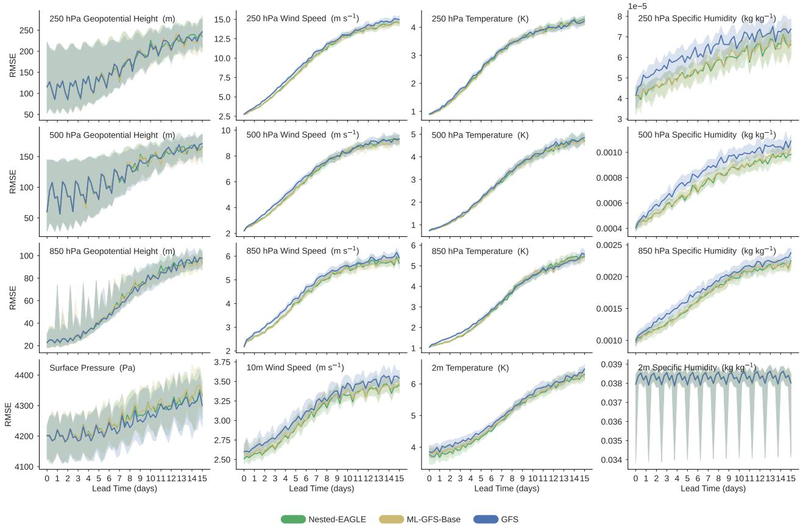  
Figure S1. Global RMSE. RMSE against in situ observations over the globe.

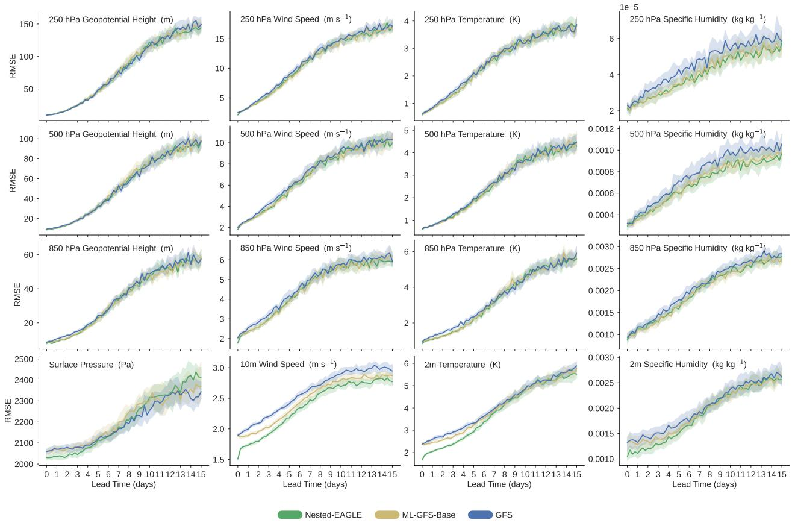  
Figure S2. CONUS RMSE. Same as Figure S1, except restricted to 20°N-55°N and 135°W-50°W. The difference between this figure and Figure 2 is that more variables are shown here, and that this evaluation is carried out at 0.25° resolution, not 6 km.

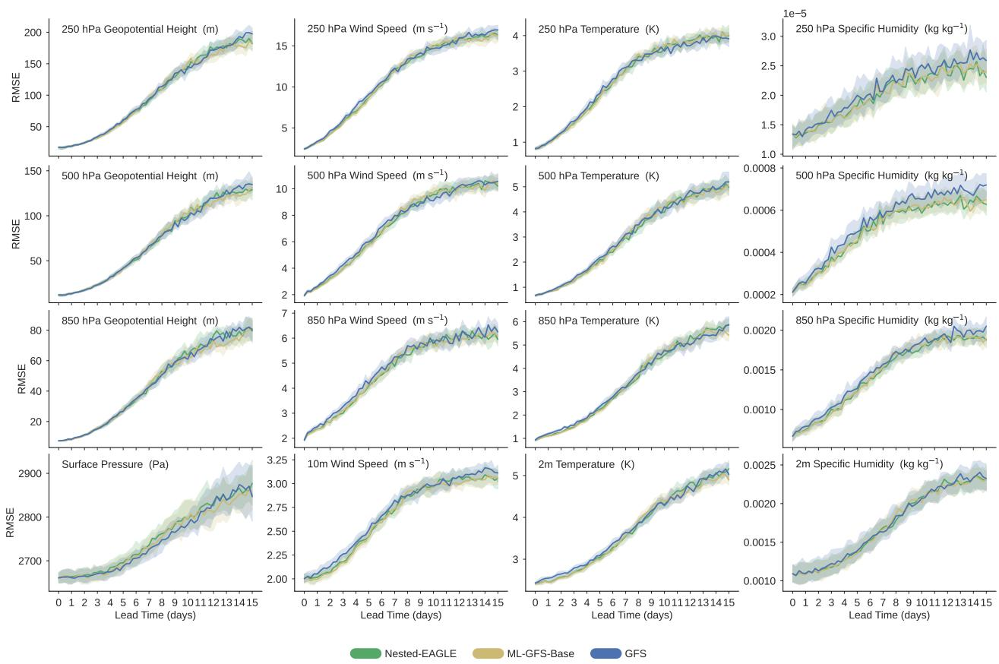  
Figure S3. Europe RMSE. Same as Figure S1, except restricted to 35°N-75°N and 25°W-65°E. The only difference between this figure and Figure 3 is that more variables are shown here.

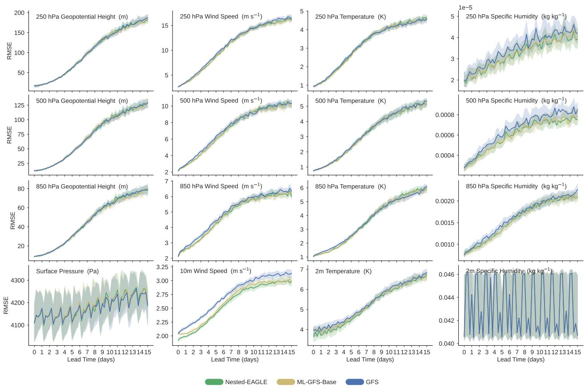  
Figure S4. Northern Hemisphere RMSE. Same as Figure S1, except restricted to 20°N–80°N.

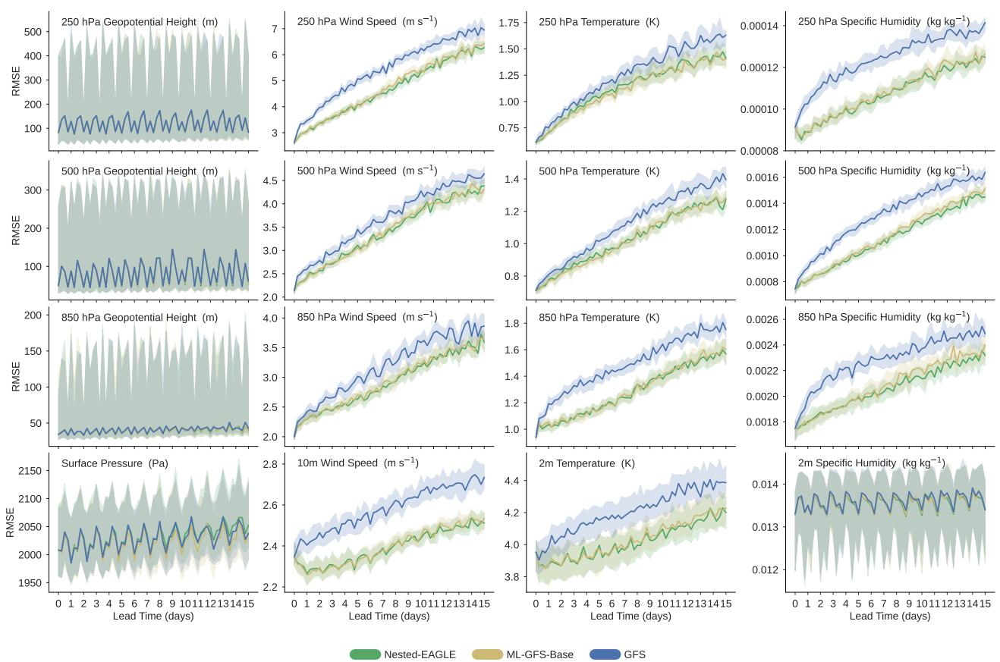  
Figure S5. Tropics RMSE. Same as Figure S1, except restricted to 20°S-20°N.

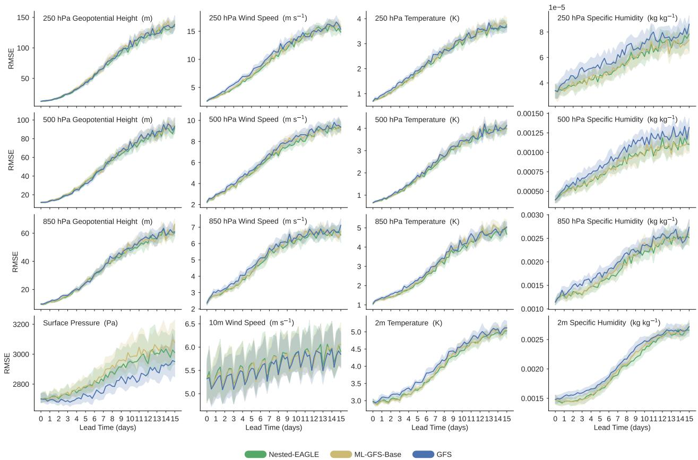  
Figure S6. Southern Hemisphere RMSE. Same as Figure S1, except restricted to $8 0 ^ { \circ } { \bf S } { - } 2 0 ^ { \circ } { \bf S } .$

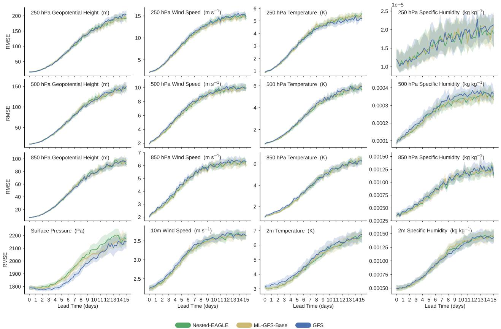  
Figure S7. Polar North RMSE. Same as Figure S1, except restricted to $6 0 ^ { \circ } \mathrm { N } { \mathrm { - } } 9 0 ^ { \circ } \mathrm { N } .$

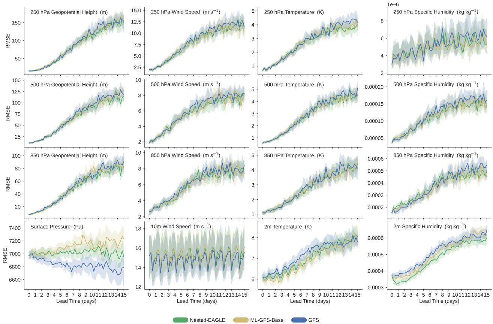  
Figure S8. Polar South RMSE. Same as Figure S1, except restricted to $9 0 ^ { \circ } { \bf S } { \bf - } 6 0 ^ { \circ } { \bf S } .$

## S2. Model Development Details and Ablation Experiments

Here we present experimental results that drove development decisions for Nested-EAGLE. For development purposes, and in all of the results shown in this section, we used coarser data than those shown in the main text. Specifically, we conservatively regridded High-Resolution Rapid Refresh (HRRR) data to 15 km and GFS data to 1° resolution. Aside from Section S2.3, we show results from models trained for 30,000 optimization iterations, using only a single 6 hour forecast step in the loss function (i.e., corresponding to Stage A in Table 2). At this coarser resolution and with the sliding-window transformer processor described in Section 5.1, this development model was relatively cheap to train, requiring only \~4.5 hours of wall-clock time across 8 GPU nodes on Perlmutter. This inexpensive model enabled many tests, some of which are outlined here. We make the necessary assumption that the results shown here carry over to the higher-resolution model.

All evaluation results shown in this section are based on 158 model forecasts initialized every 54 hours during the validation period: February 2023–January 2024. While the results in the main text show evaluation against in situ observations, some of the results here are based on errors against HRRR analysis, since the observation evaluation pipeline was not in place when all experiments were carried out. Additionally, the models shown here sometimes have different hyperparameters than the final Nested-EAGLE design, but, importantly, the only hyperparameter that changes in each figure is the one highlighted in the plot. Once again, we make the necessary assumption that these results show general trends that carry over, even with other changes to the model.

## S2.1. LAM Loss Fraction

A key hyperparameter in nested or stretched grid models is the priority given to the target Limited Area Model (LAM) region during training. Following Nipen et al. (2026) we set this priority by reweighting the loss function, so that the target region attains a certain percentage of the total loss, allowing it to have more influence than it otherwise would with the grid-cell area weighting. Figure S9 shows the skill of models with different settings for this hyperparameter. Clearly, 50% is too high, but RMSE values for “none", 10%, and 30% are actually quite close. We selected 10% as a final value, as it tended to produce the best results.

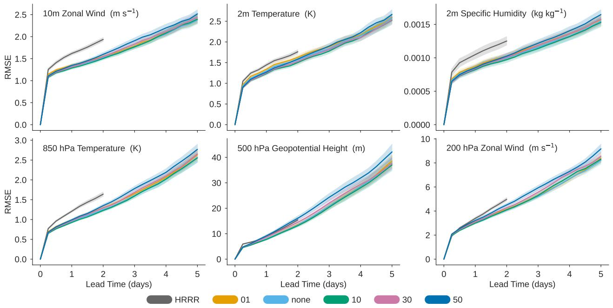  
Figure S9. LAM loss fraction sensitivity tests. RMSE against HRRR analysis. Each color indicates the percentage of loss dedicated to the LAM region (i.e., HRRR subdomain) during training. Note that “none" refers to the case where no reweighting is performed, so the region takes on a weighting based purely on the spatial extent of the HRRR domain relative to the globe, which is about 3.4%. Lines show the mean over 158 forecasts and shading the 95% confidence interval.

## S2.2. Attention Window Size

An essential hyperparameter for the sliding-window transformer architecture is the attention window size, which determines the number of neighboring points included during attention computations for a given query point. With a multi-resolution model like Nested-EAGLE, it is not immediately clear how the window size maps to physical distances, since grid nodes have different spacings for different regions of the globe. See Figure 1 for a visualization, where latent nodes during a single attention computation are highlighted in blue. Thus, we rely on empirical results to drive our decision. Figure S10 shows the forecast skill over CONUS as a function of window size. Recall that the numbers presented in Figure S10 correspond to a much smaller latent space than for the higher-resolution Nested-EAGLE.

Clearly, a window size of 1,080 is too small, but differences for higher values are largely statistically insignificant. We opted for 3,564 based on an ad hoc rule of thumb to guide the process of scaling up the design to higher resolution. That is, 3,564 is the number of latent mesh nodes, divided by twice the number of processor stages: $N _ { \mathrm { w i n d o w } } : = N _ { \mathrm { m e s h } } / N _ { \mathrm { p r o c } } / 2$ . Given this rule, our final model implementation used a window size of 8,168. Also influencing this decision was the fact that we observed little computational sensitivity to the window size parameter during development. We presume that the lack of sensitivity is due to the overwhelming time spent loading data into memory, which requires reading two datasets for the nested setup, and to the extremely high efficiency of FlashAttention (Dao et al., 2022; Dao, 2024).

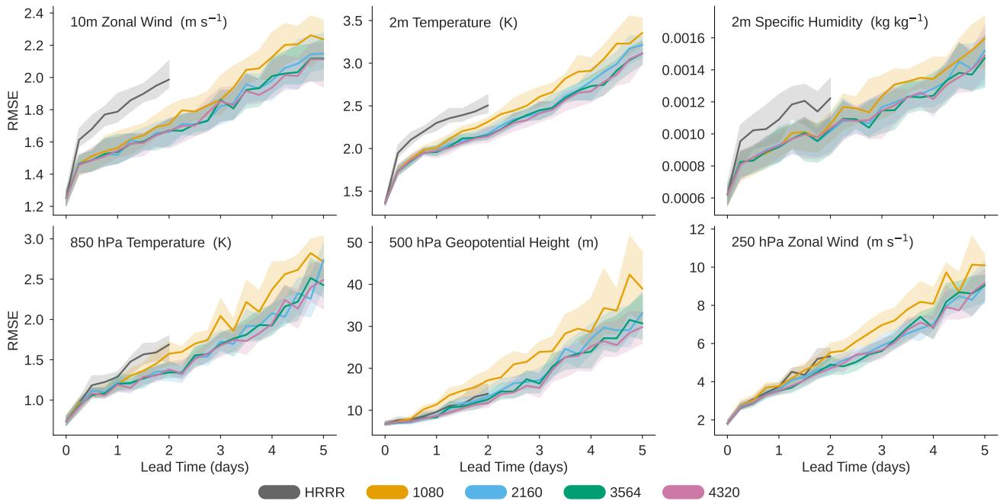  
Figure S10. Attention window size sensitivity test. RMSE against in situ observations. The colors indicate the number of latent mesh nodes in the westward and eastward directions from a query point during attention computations (see visualization in Figure 1). Lines show the median over 158 forecasts and shading the 95% confidence interval.

## S2.3. Training Iterations

Figure S11 shows how the number of training iterations influences forecast skill, only focusing on the single-step training phase (i.e., Stage A in Table 2). Note that each experiment indicates a distinct training cycle, completing the learning rate schedule in the number of iterations indicated. While 60,000 iterations produce the best results, the gains are insignificant compared to models trained for 30,000 iterations, although 15,000 iterations appear to be too short. These results motivated using a schedule of $^ { 3 0 , 0 0 0 }$ training iterations during Stage A for all development experiments, and $6 0 { , } 0 0 0$ training iterations during Stage A for the final model.

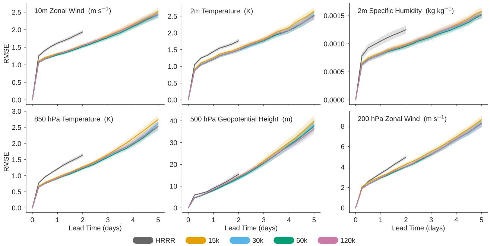  
Figure S11. Training iterations sensitivity test. RMSE against HRRR analysis. The colors indicate the number of optimization iterations taken during training, where each iteration consists of a single 6 hour forecast step. Lines show the mean over 158 forecasts and shading the 95% confidence interval.

We note that our model requires only about 10–20% of the training iterations that others use (e.g., Lam et al., 2023; Lang et al., 2024). We presume that this is at least in part due to the fact that our training dataset is only 8 years long, whereas the ERA5 dataset (Hersbach et al., 2020) used for a similar level of training by Lam et al. (2023) is \~40 years long, about 5 times the size.

## S2.4. Number of Latent Space Channels

Nested-EAGLE uses a relatively small latent space compared to Bris (Nipen et al., 2026) and the Artificial Intelligence Forecasting System (AIFS; Lang et al., 2024), all developed in anemoi. Figure S12 shows the justification for this choice: we found no statistical difference between 512 and 1,024 latent channels (i.e., the width of the latent space vector), and yet the computational cost scales linearly with this parameter. We surmise that we see little benefit because our 8 year training dataset size is relatively small compared to those used by other machine learning weather prediction models, and so there are no effective gains from the larger network. We note that there was no benefit to training longer with the larger network, although we do not show this explicitly.

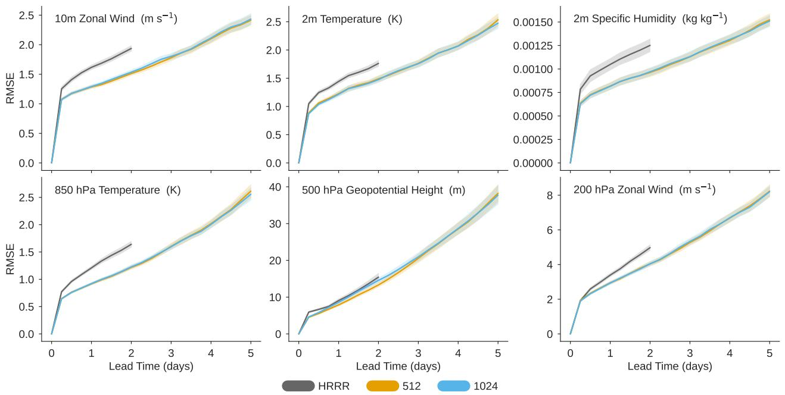  
Figure S12. Latent channels sensitivity test. RMSE against HRRR analysis. The colors indicate the number of channels used in the latent space, i.e., the width of the neural network. Lines show the mean over 158 forecasts and shading the 95% confidence interval.

## S2.5. (No) Pressure Scaling in the Loss Function

Unlike models like GraphCast and AIFS (Lam et al., 2023; Lang et al., 2024), Nested-EAGLE does not use a linear scaling with pressure in the loss function. That is, we treat all vertical (pressure) levels identically in the loss function, and do not prioritize lower levels over the upper levels. Figure S13 shows our justification for this choice. Not only do we see better performance for variables in the middle and upper troposphere, as one would expect, but we see that removing the pressure scaling also has no impact or even improves skill in low-level temperature and near-surface variables. While we do not have a clear understanding of why we see this benefit at lower levels, at the very least these results motivate other developers to test this choice for their application.

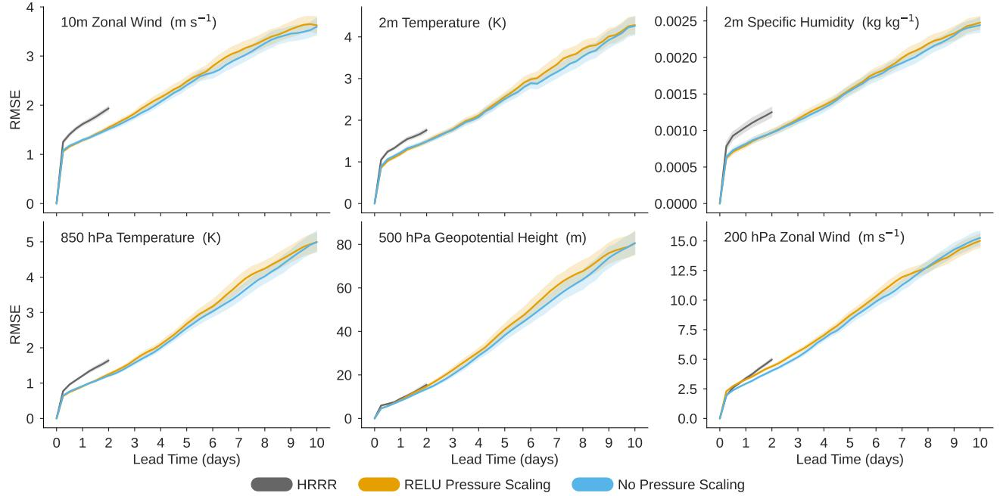  
Figure S13. Pressure scaling sensitivity test. RMSE against HRRR analysis. The colors indicate whether pressure scaling was used in the loss function or not. Lines show the mean over 158 forecasts and shading the 95% confidence interval.

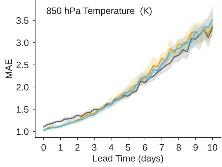

## S2.6. Number of Initial States

Following many others (e.g., Lam et al., 2023; Lang et al., 2024; Nipen et al., 2026) Nested-EAGLE uses two initial states $( \mathrm { i } . \mathrm { e } . , \pmb { x } ( t )$ and x(t – 6 hours)) to produce a forecast (Equation (2)). However, during the model development we found less sensitivity to this hyperparameter than we expected, and therefore report the results here for the benefit of others. Specifically, Figure S14 shows the impact on global Mean Absolute Error (MAE) against in situ observations from one or two initial states. While it appears that using two initial states consistently improves MAE across different variables, the differences are usually not statistically significant. We chose to use two initial states for the final model design essentially due to the gains in 500 hPa geopotential height skill when using two initial states. We reason that this is an important field for a public-facing weather model, and so the extra costs of using two initial states are warranted. However, these results highlight that using one initial state is probably acceptable for many applications, especially during the early stages of model development.

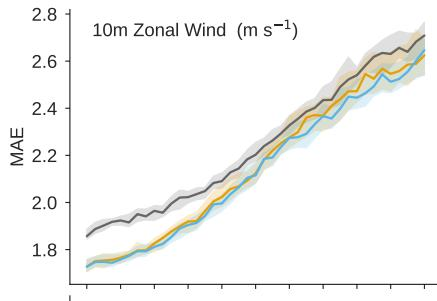

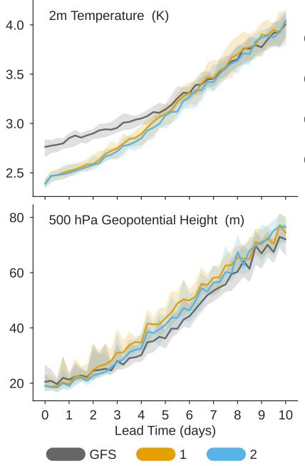

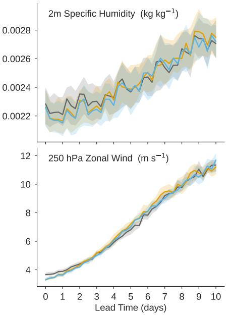  
Figure S14. Sensitivity to number of initial states. MAE against in situ observations. The color indicates the number of initial states used. We use MAE here since it is less sensitive to outliers that dominate the 2m specific humidity signal. Lines show the median over 158 forecasts and shading the 95% confidence interval.

## S3. Attribution of Perturbed 2m Temperature Bias to Orography Differences

Section 2.3 showed that Nested-EAGLE(GFS IC) rapidly approaches the skill of Nested-EAGLE, but errors converge slightly more slowly with 2m temperature. Here we show evidence which suggests that this slower convergence is due to orographic differences between the two configurations. Recall that Nested-EAGLE(GFS IC) is Nested-EAGLE running inference with only GFS initial conditions and GFS static variables, such as orography, whereas Nested-EAGLE uses HRRR initial conditions and orography over CONUS.

Figure S15 shows that the average error, i.e., bias, between Nested-EAGLE and Nested-EAGLE(GFS IC) is highly correlated with orography differences. The left panel shows Pearson's $r ^ { 2 }$ from an Ordinary Least Squares (OLS) regression between the temperature bias, averaged over forecast initializations, and the signed difference between HRRR and GFS orography. To be explicit, bias and orography differences as a function of location i are defined as

$$
\mathrm { B i a s } ( i , \Delta t ) = \frac { 1 } { N _ { f } } \sum _ { j = 1 } ^ { N _ { f } } \left( \hat { x } _ { \mathrm { N e s t e d - E A G L E } } ( i , j , \Delta t ) - \hat { x } _ { \mathrm { N e s t e d - E A G L E } } ( \mathrm { G F S ~ I C } ) ( i , j , \Delta t ) \right) ,\tag{S1}
$$

$$
\Delta z ( i ) = z _ { \mathrm { H R R R } } ( i ) - z _ { \mathrm { G F S } } ( i ) ,\tag{S2}
$$

where $j \in \{ 1 , 2 , . . . , N _ { f } \}$ denotes each forecast initialization out of $N _ { f } = 2 9 3$ . As lead time increases, correlation increases rapidly over the first day, and saturates at $r ^ { 2 } \simeq 0 . 9$ , indicating that the orography differences are a leading cause of systematic errors. Alongside $r ^ { 2 }$ we also show Spearman's $\rho ^ { 2 }$ , which takes a more modest value and rises more slowly, but still remains substantial, approaching $\rho ^ { 2 } \simeq 0 . 6$ by 3 days. We show both coefficients to indicate the importance of large elevation differences in the correlation analysis, especially over the mountainous western U.S. The right panel of Figure S15 shows an approximate lapse rate implied by the regressions summarized in the left panel. The OLS and Theil-Sen slopes level off at about $- 6 \mathrm { K } \mathrm { k m } ^ { - 1 }$ , which is reasonably close to the standard tropospheric lapse rate of $\dot { - 6 . 5 \mathrm { K } \mathrm { k m } ^ { - 1 } }$

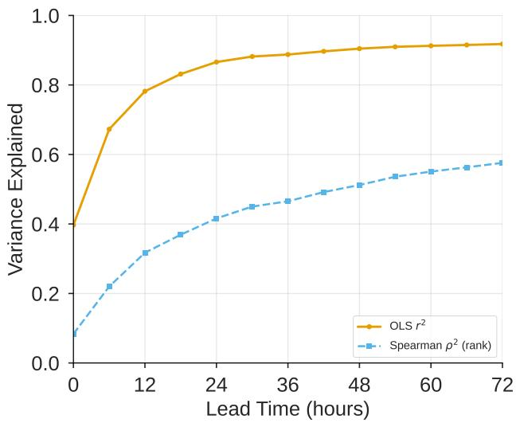

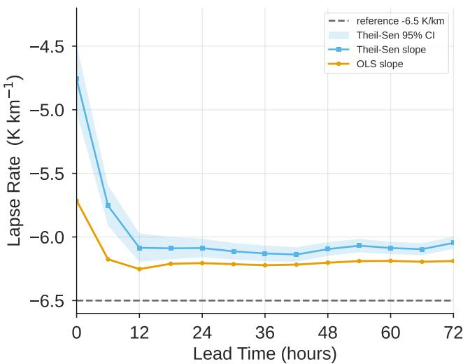  
Figure S15. Attribution of perturbed 2m temperature bias to orography differences. The left panel shows Pearson's $r ^ { 2 }$ from an OLS regression and Spearman's $\rho ^ { 2 }$ , where both indicate the correlation between 2m temperature bias (i.e., signed error averaged over initial conditions) and orography differences between Nested-EAGLE and Nested-EAGLE(GFS IC). The right panel shows the lapse rates implied by the regression analyses, which are fairly close to the standard reference value in the troposphere. We computed the OLS regression over all 6 km grid cells, whereas we evaluated the Theil-Sen fit over a random sample of 8,000 grid cells, from which we estimated the 95% confidence interval.

## S4. Extended Precipitation Evaluation

Here we show monthly mean precipitation forecast visualizations that qualitatively support the findings in Section 3.2. Recall that Section 3.2 shows the Fractions Skill Score as a function of the percentile of each model's resolved amplitudes, and the results indicate that the ML models tend to place precipitation features in the right location, even if the amplitudes are diminished. Figures S16 and S17 show monthly mean precipitation forecasts valid during March and August 2023 (i.e., from the validation set). The quantity shown in each figure is a monthly mean 6 hour precipitation accumulation, produced at a 24 hour lead time.

Throughout the validation period, Nested-EAGLE and HRRR show qualitatively similar skill in terms of their ability to place precipitation events over CONUS, apart from the muted extrema in Nested-EAGLE. However, during the months shown, Nested-EAGLE places several features noticeably better, using the Analysis of Record for Calibration (AORC) dataset as a reference. During March 2023, Nested-EAGLE properly places strong precipitation over Arkansas, whereas HRRR places the stronger precipitation farther northeast, on the border of Missouri, Kentucky, and Tennessee. During August 2023 we see similar behavior, where Nested-EAGLE and AORC show strong precipitation extending across Missouri and into Tennessee, whereas HRRR appears to miss the full extent of this feature.

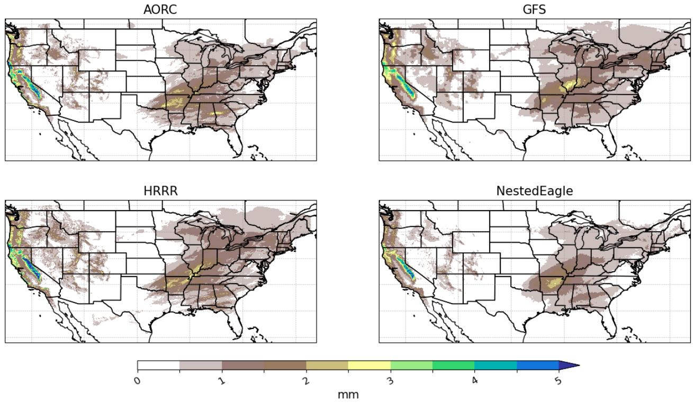  
Figure S16. Monthly mean 6 hour accumulated precipitation, March 2023. Produced with a 24 hour lead time and valid during March 2023.

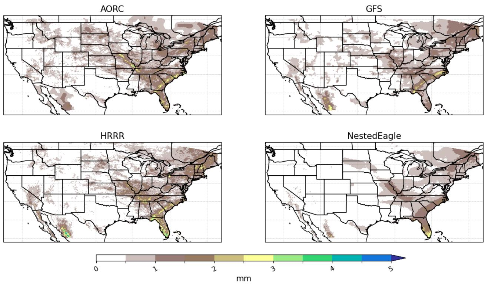  
Figure S17. Monthly mean 6 hour accumulated precipitation, August 2023. Produced with a 24 hour lead time and valid during August 2023.

## S5. Sample Forecasts

Here we show sample forecasts for select quantities. The forecasts highlight a particularly strong atmospheric river event that struck the West Coast of the United States on approximately 10 March 2023. Not only is this event useful because of its societal relevance, but it is also an excellent case for qualitative evaluations of how features are resolved across the GFS-HRRR boundary.

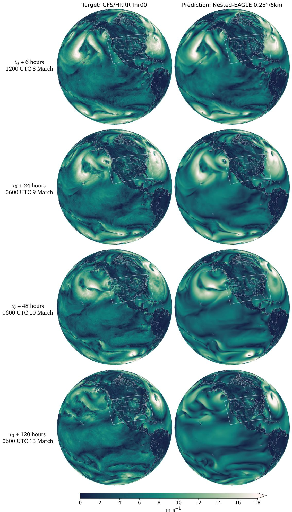  
Figure S18. 10m wind speed. t0 = 0600 UTC 8 March 2023.

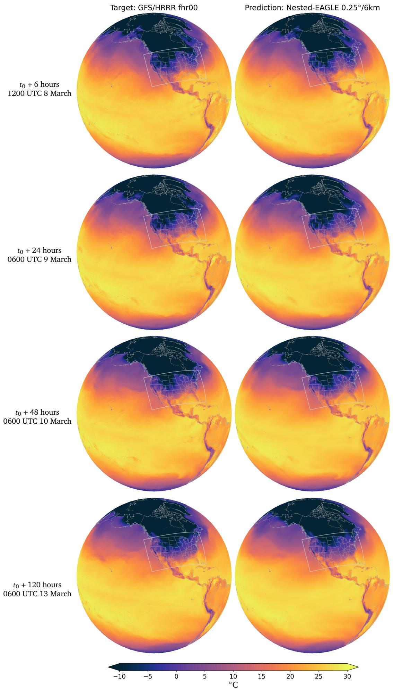  
Figure S19. 2m temperature. t0 = 0600 UTC 8 March 2023.

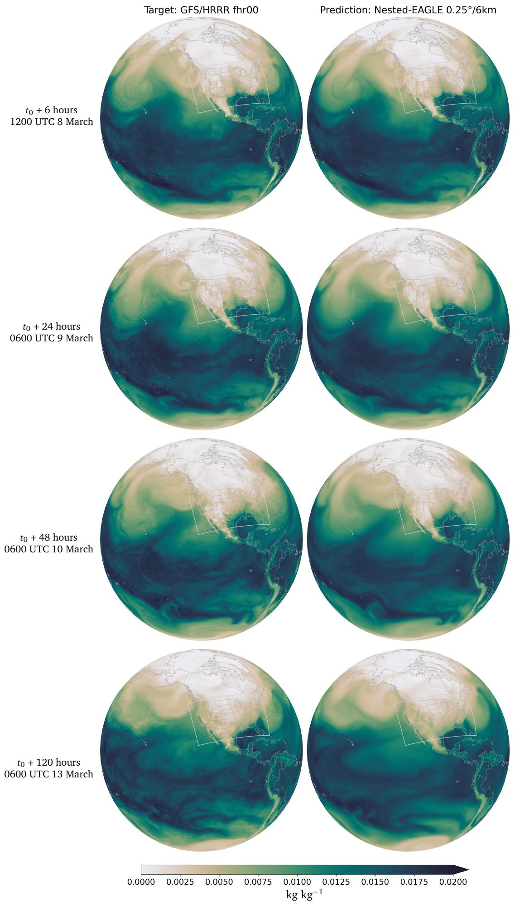  
Figure S20. 2m specific humidity. t0 = 0600 UTC 8 March 2023.

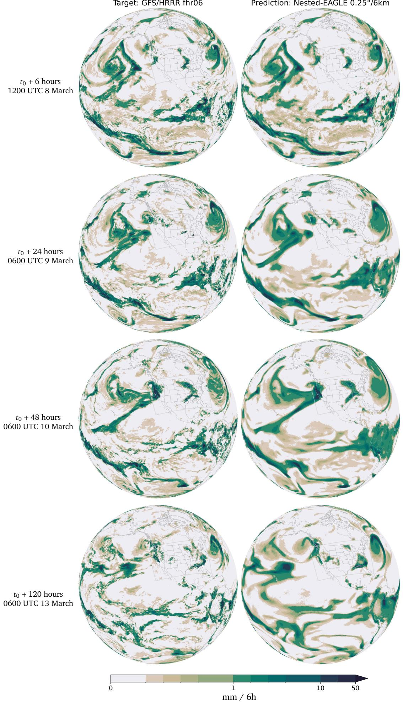  
Figure S21. Accumulated precipitation. t0 = 0600 UTC 8 March 2023.