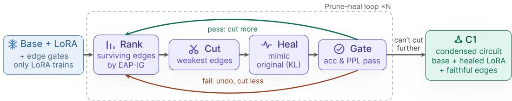
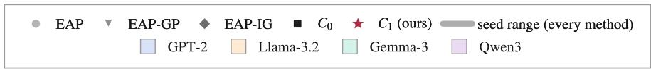
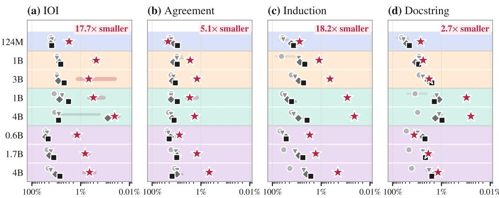
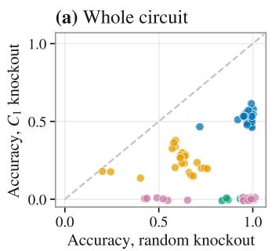
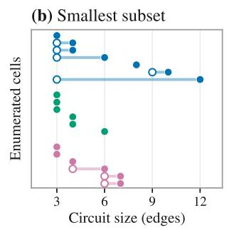
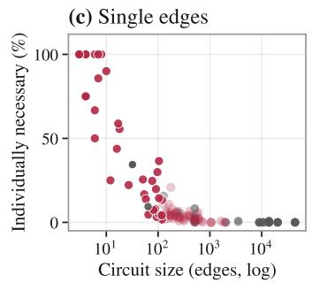
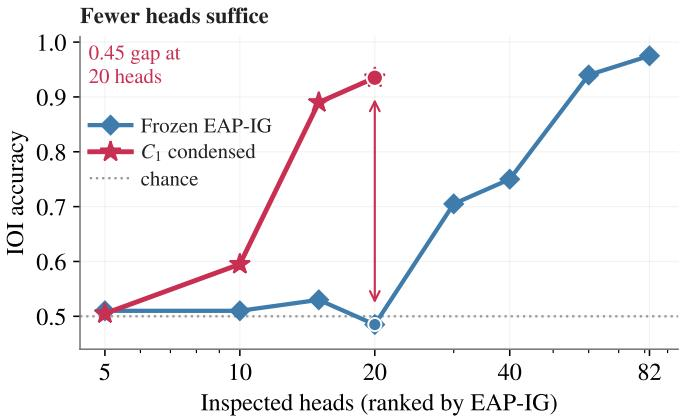
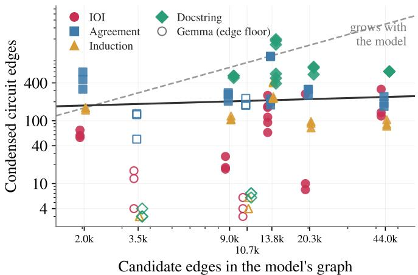

# Circuit Condensation: Post-Training that Concentrates a Behavior’s Causal Circuit

Sai Adith Senthil Kumar George Mason University ssenthi2@gmu.edu

## Abstract

One approach to mechanistic interpretability explains behavior through circuits: the components and connections that carry it. Frozen discovery often returns hundreds of edges, making them hard to inspect, compare, or verify exhaustively. We introduce Circuit Condensation, which post-trains models to concentrate behaviors into smaller causal graphs. Each round prunes low-attribution edges and trains a low-rank adapter to match the original through what remains, retaining the cut only if task performance and general capability survive. Across four behaviors and eight models, condensed circuits are smaller than the strongest frozen baseline in 30 of 32 settings, by 8.1× on average and up to 316×. Repeating the search without weight updates produces larger circuits in 29 of 32 settings, showing that weight updates, rather than search alone, drive the reduction. Testing every subset of 19 circuits finds 11 that cannot be reduced and reveals removable edges in the rest. Pair ablations expose dependencies between edges, showing that their efects cannot be understood independently. On indirect object identification, condensation isolates 24 heads, 17 of them with documented roles, against 61 heads and 36 undocumented ones for the matched frozen circuit: a suficient subcircuit of the published mechanism rather than a reconstruction of it. The resulting circuit tracks the original model’s next-token distribution and predicts its errors.

## 1 Introduction

Mechanistic interpretability explains a language model through the internal computations that produce its behavior, testing those explanations by intervention rather than observation alone. One approach analyzes that computation as a circuit: a subgraph of components and connections suficient to carry a particular behavior (Olah et al., 2020; Elhage et al., 2021; Olsson et al., 2022; Wang et al., 2023). The circuit view makes a precise claim that can be checked: a circuit is faithful if the model still performs the behavior when activations outside it are replaced.

Faithfulness is only a starting point. To understand a circuit, we would also like to know whether it contains unnecessary components and how its retained edges work together. These checks quickly become combinatorial, and circuits recovered from real models are often too large to test exhaustively. Proving that no smaller circuit sufices requires testing every subset, while testing whether retained edges depend on one another requires ablating every pair. Wang et al. (2023) likewise found exhaustive completeness testing infeasible for an indirect object identification (IOI) circuit containing 26 attention heads and used three subset-sampling strategies instead. A 13-edge circuit admits 8,192 subsets and 78 pairs; a 400-edge circuit admits 2400 subsets. Size decides which questions can be asked at all, which is why it is a practical proxy for interpretability (Bhaskar et al., 2024; Gao et al., 2025).

The natural response is to search the fixed model more carefully, and most work does. Activation and path patching exchange internal states between clean and corrupted inputs (Goldowsky-Dill et al., 2023; Zhang & Nanda, 2024), Edge Attribution Patching and its integrated-gradient and saturationcorrected variants EAP-IG and EAP-GP scale that search with gradients (Syed et al., 2024; Hanna et al., 2024; Zhang et al., 2025), and learned gates and feature-level decompositions ofer further routes to sparse structure (Bhaskar et al., 2024; Yu et al., 2025; Marks et al., 2025). These methods may improve the search, but they do not change how the model carries the behavior. The exact circuit may still shift with the estimator, the data, and the choice among equally faithful graphs (Meloux´ et al., 2026; Chen et al., 2026b).

  
Figure 1: One round of Circuit Condensation. Rank surviving edges by causal importance, cut the weakest, then train only the adapter to reproduce the original model through what is left. A round is kept only if the target behavior and general language ability both survive; otherwise the previous state is restored and a smaller cut tried. $C _ { 1 }$ is the smallest circuit ever accepted.

We therefore ask a diferent question: rather than searching harder for where a behavior already lives, can we move it? Circuit Condensation treats findability as a property a model can be trained to have. Starting from a fresh low-rank adapter (Hu et al., 2022) with every edge open, each round ranks the surviving connections by causal importance, deletes the weakest, and trains only the adapter to reproduce the original model’s outputs through what remains. A controller on held-out data accepts a deletion only if the target behavior and held-out language-modeling performance both survive, restoring the previous state otherwise (Figure 1). We call the smallest accepted circuit $C _ { 1 }$

Two things must hold for this to be worth doing, and we test both. The circuit must get small enough to change what is computable rather than merely become smaller, and it must still describe the model we started from; explaining only the modified network would not establish that connection. The reduced circuits make exhaustive subset and pairwise tests runnable (§5.3). They also track the original model’s next-token distribution, at a median KL of 0.215 across the grid and 0.056 on the IOI anchor, where the matched frozen circuit sits at 0.50, and predict where that model will fail better than a frozen circuit of the same size (§5.4).

## Contributions.

• We formulate circuit findability as a trainable property of a model rather than a fixed target for search, and give an adaptive prune, heal, and backtrack procedure that concentrates a named behavior under held-out faithfulness and capability constraints, returning a usable circuit in every cell without per-cell tuning.

• Across four behaviors, eight models from four families, and three seeds, $C _ { 1 }$ is smaller than frozen EAP-IG at comparable accuracy in 30 of 32 cells, by an average 8.1× and up to 316× (sign test $p = \dot { 2 . 5 } \times 1 0 ^ { - 7 }$ , bootstrap interval [4.9, 13.7]). The same search with frozen weights loses in 29 of 32: the gain is reshaping, not search.

• We use the resulting size to run exhaustive subset, all-pairs, and edge-level necessity checks. Matched frozen circuits would require a median 55× more pair ablations, and subset enumeration is infeasible in all 19 matched cases. We further test whether the condensed circuit still describes the unmodified model, and report where the payof does not extend and which behaviors resist concentration.

## 2 Related Work

Circuit discovery. The circuits view explains a behavior through a causal subgraph of model components (Olah et al., 2020; Elhage et al., 2021). Causal abstraction provides a broader interventionbased test by asking whether neural representations reproduce the counterfactual behavior of a higher-level causal model (Geiger et al., 2021; 2022). Detailed studies show what such explanations can reveal, but manual analysis does not scale readily (Wang et al., 2023; Olsson et al., 2022; Heimersheim & Janiak, 2023). Automated methods therefore search for similar structure. Activation and path patching intervene directly on internal states (Goldowsky-Dill et al., 2023; Zhang & Nanda, 2024), and ACDC organizes repeated interventions into greedy pruning (Conmy et al., 2023). EAP, EAP-IG, and EAP-GP reduce this cost with gradient-based edge scores (Syed et al., 2024; Hanna et al., 2024; Zhang et al., 2025). AtP⋆ ofers a related scalable method for localizing components (Kramar et al.´ , 2024). Other methods change the search space through information-flow routes, component decompositions, position-aware edges, or learned gates (Ferrando & Voita, 2024; Hsu et al., 2025; Haklay et al., 2025; Bhaskar et al., 2024; Yu et al., 2025; Yin et al., 2026). Despite these diferences, all keep the model weights fixed and ask how small a faithful circuit already exists. This is our main comparison class.

  
Retained edges in the selected circuit (% of full head-level graph; log scale; smaller is right)  
Figure 2: Condensation usually retains fewer edges than frozen discovery at comparable accuracy. Panels are behaviors and rows are models, shaded by family. The axis shows the share of the full head-level graph retained on a log scale, sofurther right means smaller. Stars show C and other markers show frozen baselines; markers are means over seeds 11/22/33 and bars span their range. Faded points at 100% indicate that no seed was faithful below the full graph. Badges report the average reduction relative to EAP-IG.

What circuit discovery returns. Even with fixed weights, the recovered graph changes with the ablation rule, metric, data, and estimator (Miller et al., 2024; Zhang & Nanda, 2024; Meloux et al.´ , 2026). Multiple faithful graphs may describe the same behavior (Chen et al., 2026b), with limited transfer reported across datasets, granularities, and model retraining (Rai et al., 2026; Bayat Makou et al., 2026; Bali et al., 2026). Recent work therefore measures agreement across recovered circuits or certifies their stability (Li & Subramani, 2026; Parekh, 2026; Anani et al., 2026). Feature-level methods address a related choice by constructing circuits from learned features rather than model components (Cunningham et al., 2023; Dunefsky et al., 2024; Marks et al., 2025; Arora et al., 2026; Wu et al., 2025). These approaches refine or evaluate what discovery returns. We instead ask whether training can make a compact circuit suficient, changing the target rather than only the estimator.

Training for interpretable structure. Training can change this target because circuits form and shift across pretraining and post-training (Tigges et al., 2024; Prakash et al., 2024; Chen et al., 2026a); Zhang et al. (2026) find that RL fine-tuning spreads a behavior’s computation more widely. Some methods encourage sparse weights or modular computation directly (Gao et al., 2025; Liu et al., 2024). Closest to our setting, Draye et al. (2025) post-train sparse attention connectivity and recover simpler task circuits. Their constraint is behavior-agnostic and limits communication between token positions. Circuit Condensation instead targets the inter-component graph for one named behavior and preserves held-out task performance and general capability. Other work uses an existing circuit to restrict adaptation (Prakash et al., 2026; Nur’aini et al., 2026) or edits a stored association (Meng et al., 2022; 2023); we optimize the retained circuit itself. The procedure borrows iterative pruning, self-distillation, and low-rank adaptation (Han et al., 2015; Frankle & Carbin, 2019; Hinton et al., 2015; Hu et al., 2022), but removes causal edges rather than parameters. Closed edges carry counterfactual activations, so the method does not reduce model size or inference cost.

## 3 Method: Circuit Condensation

## 3.1 Problem Setup

We treat a transformer as a directed graph of residual-stream writers and readers. Writers are the token embedding, each attention head’s residual contribution, and each multilayer perceptron (MLP) output; readers are downstream attention and MLP inputs and the final logits. An edge $( w , r )$ exists whenever w is upstream of r, giving 2,041 candidate edges in GPT-2 up to 43,993 in Qwen3-4B.

A behavior is specified by paired inputs rather than labels: a clean prompt x and a matched corrupted prompt x˜, identical in form but with a diferent correct answer. The pairing is what makes an edge removable in a testable way: instead of deleting an edge we replace what flows along it with what would have flowed counterfactually. Each edge carries a binary gate $z _ { w r } \in \{ 0 , 1 \}$ . Let $a _ { w }$ and $\tilde { a } _ { w }$ be writer w’s contributions on x and x˜. The input to reader r is

$$
x _ { r } = \sum _ { w  r } [ z _ { w r } a _ { w } + ( 1 - z _ { w r } ) \tilde { a } _ { w } ] ,
$$

where $w \prec r$ ranges over writers upstream of r. An open edge passes the clean activation. A closed edge passes the corresponding activation from the corrupted prompt instead of zero. Zeroing would push activations of the data manifold, confounding “this edge mattered” with “this input is unfamiliar” (Miller et al., 2024).

We want the smallest graph that preserves both the target behavior and general model capability. Let acc $( z , \theta )$ denote task accuracy under edge mask z and adapter parameters θ. Let $\rho ( \theta )$ be the adapted model’s of-target perplexity divided by the base model’s. Condensation then seeks

$$
\operatorname* { m i n } _ { z , \theta } \| z \| _ { 0 } \quad \mathrm { s . t . } \quad \operatorname { a c c } ( z , \theta ) \geq \operatorname { a c c } _ { \mathrm { f u l l } } - \varepsilon , \qquad \rho ( \theta ) \leq 1 + \kappa ,\tag{1}
$$

with $\varepsilon = \kappa = 0 . 0 5$ throughout. A mask satisfying the accuracy constraint isfaithful, and $\| z \| _ { 0 }$ counts its retained edges. This measures graph width rather than the computation inside each retained component $( \ S 6 )$ . Optimizing θ alongside the mask allows the adapter to reroute computation instead of only searching the existing graph. Freezing $\theta$ gives the $C _ { 0 }$ baseline. Each proposed cut must satisfy both constraints before it is accepted. If a behavior resists concentration, the controller therefore returns a larger valid circuit rather than a smaller circuit with damaged performance.

## 3.2 The Loop

Exact optimization is out of reach because $| E |$ binary gates define $2 ^ { | E | }$ masks, so we approximate Equation 1 greedily (Figure 1). Beginning with every edge open and a fresh low-rank adaptation (LoRA) module (Hu et al., 2022), each round ranks the active edges, prunes the weakest, heals the adapter against the reduced graph, then accepts or rejects the round. The adapter receives no preliminary training, so every weight change is one the controller accepted.

Rank. Ranking needs a per-edge score cheap enough to recompute every round. Edge attribution patching estimates the efect of closing an edge from a gradient instead of running the ablation, and EAP-IG averages that gradient along a path from the fully corrupted activations to the current ones (Syed et al., 2024; Hanna et al., 2024). We use EAP-IG because the risk it addresses grows as the graph shrinks: one gradient sample can under-score an important edge in a saturated region, especially at high sparsity (Zhang et al., 2025), where the controller spends its later rounds. Scores are recomputed after each cut, reflecting what remains.

Prune. The controller first proposes removing the lowest-scoring 30% of active edges. If a proposal fails, it restores the last accepted state and halves the cut, down to $5 \%$ . This keeps early rounds aggressive while making cuts near the accuracy boundary gentler.

Heal. Base weights stay frozen. With the mask fixed, only the adapter trains, matching the original model’s output distribution rather than the task label. Writing $p _ { \mathrm { o r i g } }$ and $p _ { \mathrm { m a s k e d } }$ for the frozen model’s distribution and the adapted model through the mask, healing minimizes $\mathrm { K L } ( p _ { \mathrm { o r i g } } ( \cdot \ |$ $x ) \parallel p _ { \mathrm { m a s k e d } } ( \cdot \mid x ) )$ . Self-distillation rather than a task loss is deliberate: a label loss would let the adapter relearn the answer through whatever path survives, giving a small circuit that no longer describes the original computation. Matching the distribution constrains outputs, not internals, so §5.4 checks the mechanism where a circuit is published.

Accept or restore. Validation data are disjoint from those used for ranking and healing. A round is accepted only if the masked circuit and the gates-open adapted model both meet the accuracy constraint, and the latter clears the capability constraint on a held-out of-target probe; otherwise both are restored and a gentler cut proposed. Capability is a gate rather than a penalty because the failure is not a gradual drift that a coeficient could trade against: it holds steady for many rounds and then collapses within one, so the controller must be able to undo that round. The threshold is a fixed perplexity ratio, binding unevenly across families (§6). Appendix B gives the schedules and Appendix B.2 the pseudocode.

Guarantees and the frozen-weight arm. The greedy procedure does not guarantee optimality, but every returned $C _ { 1 }$ satisfies both constraints on held-out validation data because a failing state is never accepted. Section 5.3 tests directly whether a smaller faithful subset exists for circuits that can be enumerated. Fixing θ gives $C _ { 0 } ,$ , which keeps the same controller, ranking, gate, and stopping rule but performs no healing. The $C _ { 1 } { - } C _ { 0 }$ comparison therefore isolates the efect of weight updates from the efect of search.

## 4 Experimental Setup

## 4.1 Tasks, Models, and Graphs

Circuit Condensation requires paired inputs that change the correct answer while preserving the prompt format. We therefore study four token-level behaviors with aligned clean and corrupted inputs: indirect object identification (IOI) (Wang et al., 2023), subject–verb agreement across an attractor (Linzen et al., 2016), repeated-token induction (Olsson et al., 2022), and Python docstring completion (Heimersheim & Janiak, 2023). IOI also provides an external anchor. Its published circuit assigns functional roles to individual heads, letting us test whether condensation retains a known mechanism, not merely task accuracy.

Across these tasks, we evaluate GPT-2 small, Llama-3.2-1B/3B-Instruct, Gemma-3-1B/4B-it, and Qwen3-0.6B/1.7B/4B. In every model, the graph treats each attention head as a separate component and each MLP as one component. Before pruning, we verify that the fully open graph reproduces the native model across all four families. Per-layer head sums match the native block within $6 \times 1 0 ^ { - 7 }$ relative error, and end-to-end logits within $\dot { 6 } \times 1 0 ^ { - 4 }$ (Appendices A and A.1). This check ensures that later diferences arise from edge interventions rather than errors in the graph decomposition.

## 4.2 Metrics and Baselines

We measure task performance using restricted-choice accuracy at one answer position. The correct token must outrank a task-specific set of alternatives, listed in Appendix C.2, so evaluation is a deterministic comparison of logits rather than a model-graded judgment. Accuracy alone does not show whether a circuit reproduces the full model’s output behavior. We therefore measure token-level Kullback–Leibler (KL) divergence, which compares their full next-token probability distributions. Across the grid, the reference is the fully open adapted model. Separate checks compare the circuit with the original model and report how often they choose the same candidate (Appendices E and H.4).

The frozen comparisons are EAP, EAP-IG, EAP-GP, a random ranking, and the frozen-weight controller $C _ { 0 } \ ( \ S 3 ) ;$ we additionally run ACDC (Conmy et al., 2023) on the 8 cells where its cost is tractable (Appendix D). The last is especially important because it uses the same ranking and stopping rule as $C _ { 1 }$ while holding the weights fixed, isolating the efect of post-training from that of the search procedure. We implement all three attribution methods on the edge gates used by the controller, following their published scoring equations (Syed et al., 2024; Hanna et al., 2024; Zhang et al., 2025). The EAP-IG and EAP-GP paths are adapted to gate space, and no reference implementation is available for EAP-GP. We therefore audit the shared pipeline against exact singleedge activation patching on a tractable graph rather than treating one estimator’s smaller circuits as evidence of correctness (Appendix C). EAP-IG serves as our primary frozen baseline.

## 4.3 Data, Selection, and Reporting

Each task–model combination uses 2000 training, 2000 validation, and 1000 sealed test examples. The three splits are mutually disjoint and also separate from the capability probe. Ranking and healing use only the training split. The controller evaluates each proposed circuit on the full validation split, while the test split is read once, after selection.

For every arm, we select the smallest circuit whose validation accuracy is within 0.05 of that arm’s fully open graph. Each method is therefore allowed the same accuracy drop relative to its own full graph before circuit sizes are compared (Appendix C.1). For $C _ { 1 }$ that reference is the adapted model, so a weaker adapted graph would mean a lower bar. It is not weaker: it matches the original model’s full-graph accuracy to a median 0.000, and holding $C _ { 1 }$ instead to the original model’s accuracy minus the same 0.05 leaves all 96 endpoints qualifying on validation and 91 on the sealed test split. When an analysis instead selects a frozen circuit to match a $C _ { 1 }$ endpoint, as in §5.3, we call the comparison matched accuracy. We report medians over seeds 11, 22, and 33. Statistical tests use the 32 task–model combinations as the independent units rather than the 96 seeded runs, since the three seeds for a given combination share the same model and data.

## 5 Results

We evaluate four behaviors on eight models with three seeds, giving 32 task–model combinations and 96 runs. All arms share the graph, data, metric, and selection rule from $\ S 4$ . Circuit size is the number of retained head-level edges.

## 5.1 Condensation Goes Below the Frozen Discovery Floor

At comparable accuracy, $C _ { 1 }$ retains fewer edges than frozen EAP-IG in 30 of 32 task– model combinations at the seed median (Figure 2). Across all 96 runs, the average reduction is 8.1× and reaches 316×. Against EAP it is 18.4× on average. Random orders frozen edges without attribution or weight updates and sweeps the same budgets. The gap narrows from 103× under this order to 18.4× for EAP and 8.1× for EAP-IG, showing that ranking matters even though every frozen arm remains larger on average (Table 1).

Table 1: Frozen arms against $C _ { 1 }$ . Geometricmean edge ratio $( \mathrm { f r o z e n } / \bar { C } _ { 1 } )$ over 96 runs. Cells reports seed-median wins; intervals are clusterbootstrap 95% CIs (Appendix D).
<table><tr><td>Arm</td><td>VS  $C _ { 1 }$ </td><td>cells</td><td>95% CI</td></tr><tr><td>Random</td><td>103×</td><td>32/32</td><td>[56.8, 189.7]</td></tr><tr><td>EAP</td><td>18.4×</td><td>31/32</td><td>[10.7, 32.9]</td></tr><tr><td>EAP-GP</td><td>10.6×</td><td>30/32</td><td>[6.4, 18.1]</td></tr><tr><td>EAP-IG</td><td>8.1×</td><td>30/32</td><td>[4.9, 13.7]</td></tr><tr><td> $C _ { 0 }$ </td><td>7.4×</td><td>29/32</td><td>[4.3, 12.5]</td></tr></table>

The exceptions are docstring/Qwen3-0.6B and

agreement/GPT-2. At the seed median, $C _ { 1 }$ keeps 1,877 rather than 798 edges in the first and 453 rather than 240 in the second. These are also the two tasks with the weakest average reductions, 2.7× and 5.1×, compared with 17.7× on IOI and 18.2× on induction. Section 6 examines this spread.

The endpoints hold up on unseen data. Although validation selects among healed candidates, 91 of 96 $C _ { 1 }$ endpoints still meet the 0.05 tolerance on the sealed test split. The other five miss it by a median 0.009.

The capability gate rarely binds on Gemma (§6), so we also compute the aggregate without those two models. The average reduction falls to 5.8×, with $C _ { 1 }$ still smaller in 22 of the 24 remaining cells. On IOI and induction alone, the average reduction is 18.0× across all 16 cells.

## 5.2 The Gain Comes From Reshaping, Not a Better Search

The reduction could come from the search or from changing the weights. The two arms in Equation 1 difer only in whether θ may move. Freezing the weights and changing nothing else removes the efect. With the same ranking, schedule, gate, and stopping rule, $C _ { 0 }$ is larger in 29 of 32 cells by an average 7.4× (Table 1). Because $C _ { 0 }$ uses the same search, the diference comes from updating the weights. Updating them without the loop is also not enough: fine-tuning each task with an ordinary LoRA and then running the identical EAP-IG sweep leaves circuits about half the size of frozen discovery’s, but still 4.4× larger than $C _ { 1 }$ , with $C _ { 1 }$ smaller in 25 of the 29 cells with an SFT checkpoint; under the sweep’s coarser budget grid the gap is at least 2.2× (Appendix D).

  
Figure 3: Three causal checks enabled by smaller circuits. (a) Accuracy after removing $C _ { 1 }$ against removing the same number of random edges. (b) The smallest faithful subset (open) and $\bar { C } _ { 1 }$ endpoint (filled) for all 19 enumerable runs. (c) Share of individually necessary edges; faded markers use a 120-edge sample.

## 5.3 The Circuit Is Small Enough to Verify

A smaller circuit is useful only if it lets us make stronger causal claims about the behavior. We first verify that the retained set carries the behavior and, on IOI, compare its heads with a known mechanism. We then move from single-edge ablations across the full grid to exhaustive tests over subsets and pairs.

The retained set carries the behavior. Across the grid, the circuits returned by the controller range from 3 to 1,976 edges. Appendix M reports how many distinct components these edges touch. For each run, we remove the entire retained set while leaving the rest of the graph open; the random control removes exactly the same number of edges. On IOI, median accuracy falls from 0.99 to 0.52, near the 0.50 chance level of its two-choice metric, while random removal leaves it at 0.98. The corresponding intact/circuit-cut/random values are 0.74/0.22/0.62 for agreement, 1.00/0.00/0.96 for induction, and 1.00/0.00/0.97 for docstring (Figure 3a; Table 20).

On IOI the circuit is a suficient part of the published mechanism. Wang et al. (2023) assign named roles to 26 GPT-2 heads. Frozen discovery finds 25 of them among 61 heads, leaving 36 unaccounted for; condensation returns 24 heads, 17 named, for 2.0× the precision (Table 18; Appendix H). It keeps all three primary Name Movers and sheds three of the eight Backup Name Movers, heads that “do not normally move the IO token to the output, but take on this role if the regular Name Mover Heads are knocked out” (Wang et al., 2023). Ranking cannot see a head that is dormant on clean inputs, so a smallest-suficient circuit should be expected to drop them.

Single-edge ablations show where slack remains. For each circuit, we switch of every retained edge separately and count the fraction whose removal lowers accuracy by at least 0.05. Across tasks, the median fraction ranges from 2.5–15%. Circuit size matters: among circuits with at most 8 edges, the median is 100%, whereas no edge in the largest docstring circuit crosses the threshold on its own. The matched frozen circuits have a median of 0.0% (Figure 3c). An edge that does not cross the threshold may still have a smaller efect or matter in combination with other edges.

Exhaustive subset tests determine exact minimality. Single-edge tests cannot rule out a smaller faithful combination. For the 19 circuits small enough to enumerate, we therefore evaluate all $2 ^ { k }$ subsets for runs with k ≤ 13, or 5,952 masked circuits in total. Of these, 11 contain no smaller faithful subset. 7 of the other 8 have only 1 to 3 removable edges. Across all 19 runs, the smallest faithful subset contains 3–9 edges. Exactly minimal circuits have a median of 3 edges, compared with 6 for those with removable edges; in the worst case, the controller keeps 12 although 3 sufice. Slack therefore appears mainly in the larger endpoints, consistent with the controller stopping on a flat accuracy curve. The same test is already impractical by $k = 1 7 ;$ every matched frozen circuit exceeds that limit, the smallest at 68 edges and the median at 416 (Figure 3b).

Small does not mean independent. Minimality tells us whether edges can be removed, but not whether their efects can be understood one at a time. We therefore ablate all $\binom { k } { 2 }$ pairs and compare each pair’s joint efect with the sum of its individual efects. Across 169,476 ablations over 48 runs, independence fails in every circuit tested. The median circuit has 7.4 interacting partners per edge, and even the three-edge Gemma circuits contain interacting pairs. The circuit can be mapped completely, but its edges cannot be read one at a time. Condensation makes these interactions feasible to test without making them disappear.

The matched frozen circuits would require a median 55× as many pair ablations, and only 15 of 32 cells have a projected runtime under one day (Appendix G). Exact single-edge patching is also 3.6× faster on the smaller graph (Appendices G.1 and J).

## 5.4 The Circuit Describes the Model We Started From

Because healing changes the adapter weights, $C _ { 1 }$ first explains the adapted network. We therefore test whether it also tracks the original. Across all 96 runs the circuit selects the same answer as the unmodified model on a median 96.5% of sealed-test examples, with a median token-level KL of 0.215; on the IOI/GPT-2 anchor, where a matched frozen circuit exists to compare against, the KL is 0.056 against the frozen circuit’s 0.50 (Appendix H.4). The circuit also predicts the original model’s own errors better than a matched frozen circuit in 10 of the 11 cells with enough errors to score (Appendix I).

## 5.5 Controls

To identify what makes circuits smaller, we test healing without pruning, arbitrary edge orders, generic sparsity across behaviors, and interchangeable heads, changing one ingredient at a time.

Healing alone does not concentrate attribution. To isolate healing from pruning, we keep every edge open and measure the EAP-IG participation ratio before and after. This estimates how many edges share the attribution mass. In 92 of 96 runs it remains within 15% of its starting value, so healing alone does not shift attribution onto fewer edges (Appendix F.1).

Attribution ranking is necessary for deep pruning. We keep the controller fixed but

Table 2: Controls. PR compares EAP-IG participation before/after healing; size ratios compare with $C _ { 1 }$ or the untouched model. Seed medians; protocols in Appendix F.
<table><tr><td>Control</td><td>Scope Outcome</td></tr><tr><td></td><td>No-prune heal 96 runs PR ratio 0.99</td></tr><tr><td>Random order 96 runs 50× larger</td><td></td></tr><tr><td>Reverse order</td><td>4 cells 0 edges removed</td></tr><tr><td>Target test</td><td>4 targets target 16×; others 1.0×</td></tr><tr><td>Sibling swap</td><td>7 cells 6 of 7 to floor</td></tr></table>

order edges randomly or from highest to lowest attribution. Even the best random-order run retains 2.6× as many edges as $C _ { 1 }$ . Reverse ordering accepts no cuts in one representative cell per task, leaving the full graph unchanged. Both stay accurate only by keeping most of the graph (Appendix F).

Concentration remains tied to the target behavior. A generic sparsity efect would also simplify unrelated behaviors. We condense each behavior in turn and search for all four in the adapted and untouched models at comparable accuracy. Only the target moves: over eight models and three seeds, IOI becomes a median 16× easier to localize (8×–128×), induction 8×, agreement 4×, and docstring 2×. In all twelve of-target directions the median stays at 1.0× (Appendix F).

The identities of the retained heads matter. We redirect each retained head-to-logits edge to another head in the same layer. In six of seven circuits, accuracy falls from 0.93–1.00 to within 0.13 of the all-edges-of level. Adding a random edge leaves accuracy unchanged at three-decimal precision, so the collapse depends on head identity rather than a generic graph perturbation. IOI on Llama-3.2-1B is the exception, retaining 0.79 against a 0.52 floor; with 32 heads per layer, a sibling may share part of the function (Appendix F.2).

## 6 Limitations

Six qualifications bound the claims above; Appendix M gives the evidence for each. (1) The circuit describes the adapted network, and a size counts retained edges under interchange ablation, not computation inside retained components or in the model-wide adapter. (2) Training gates and adapter jointly returns smaller circuits than the controller in 5 of 32 cells, so the controller does not always produce the smallest circuit. We tune that arm separately for each cell and determine whether it qualifies using the test split. Both choices favor it, making 5 an upper bound on how often it wins. (3) The capability gate almost never binds on Gemma but rejects 12–29% of rounds on the other families, so Gemma’s smallest circuits are held to a weaker constraint than the rest of the grid. (4) Docstring and agreement give the controller no accuracy signal to stop on, which makes their endpoint sizes upper bounds rather than measured minima. (5) We tested two further payofs, surgical editing and activation-norm monitoring, and neither worked. (6) Three seeds test optimization stability, not uniqueness across model refits, input distributions, or graph granularities.

## 7 Conclusion

Circuit-level interpretability is only useful when the circuit is small enough to inspect and test. Searching a fixed model cannot change how a difuse behavior is distributed; Circuit Condensation changes that distribution through post-training. In our experiments, the resulting circuits make exhaustive subset and all-pairs tests feasible where matched frozen circuits do not. The benefit is narrower than editing or unlearning, and some runs stop when further pruning damages general language ability.

## Reproducibility Statement

Hyperparameters were fixed before the grid and shared across cells. Each run uses one NVIDIA A100 80GB GPU and saves its settings, seed, pruning history, final mask, adapter, and test results, so every number is traceable to the run that produced it; code and data generation will be released (Appendix C). Data generation, splits, and the selection rule are specified in Appendix C and Appendix C.1; controller schedules and thresholds in Appendix B; per-run configuration in Appendix B.1; model and graph specifications in Appendix A.

## AI Use Statement

We used generative AI tools mainly to draft and debug code, orchestrate experiments, format figures and tables, check consistency, and edit prose. We manually reviewed all AI-assisted outputs, checked reported numbers against saved artifacts, and verified citations against original sources. The author made all final decisions about experimental design, interpretation, and claims and takes responsibility for this work.

## References

Alaa Anani, Tobias Lorenz, Bernt Schiele, Mario Fritz, and Jonas Fischer. Certified circuits: Stability guarantees for mechanistic circuits. arXiv preprint arXiv:2602.22968, 2026.

Aryaman Arora, Zhengxuan Wu, Jacob Steinhardt, and Sarah Schwettmann. Language model circuits are sparse in the neuron basis. In International Conference on Machine Learning (ICML), volume 306 of Proceedings of Machine Learning Research, 2026. URL https://openreview.net/ forum?id=OrviwFWcN4. Spotlight; arXiv:2601.22594.

Karan Bali, Jack Stanley, Praneet Suresh, and Danilo Bzdok. Quantifying LLM attention-head stability: Implications for circuit universality. arXiv preprint arXiv:2602.16740, 2026.

Alireza Bayat Makou, Jingcheng Niu, Subhabrata Dutta, and Iryna Gurevych. Many circuits, one mechanism: Input variation and evaluation granularity in circuit discovery. arXiv preprint arXiv:2606.06267, 2026.

Adithya Bhaskar, Alexander Wettig, Dan Friedman, and Danqi Chen. Finding transformer circuits with edge pruning. In Advances in Neural Information Processing Systems (NeurIPS), 2024. arXiv:2406.16778.

Hang Chen, Jiaying Zhu, Hongyang Chen, Hongxu Liu, Xinyu Yang, and Wenya Wang. Navigating by old maps: The pitfalls of static mechanistic localization in LLM post-training. arXiv preprint arXiv:2605.06076, 2026a.

Xi Chen, Mingyu Jin, Jingcheng Niu, Yutong Yin, Jinman Zhao, Bangwei Guo, Dimitris N. Metaxas, Zhaoran Wang, Yutao Yue, and Gerald Penn. All circuits lead to rome: Rethinking functional anisotropy in circuit and sheafdiscovery for LLMs. In International Conference on Machine Learning (ICML), volume 306 ofProceedings ofMachine Learning Research, 2026b. arXiv:2605.12671.

Arthur Conmy, Augustine N. Mavor-Parker, Aengus Lynch, Stefan Heimersheim, and Adria\` Garriga-Alonso. Towards automated circuit discovery for mechanistic interpretability. In Advances in Neural Information Processing Systems (NeurIPS), volume 36, 2023. URL https: //openreview.net/forum?id=89ia77nZ8u. arXiv:2304.14997.

Hoagy Cunningham, Aidan Ewart, Logan Riggs, Robert Huben, and Lee Sharkey. Sparse autoencoders find highly interpretable features in language models. arXiv preprint arXiv:2309.08600, 2023.

Florent Draye, Anson Lei, Hsiao-Ru Pan, Ingmar Posner, and Bernhard Scholkopf. Intrinsically¨ interpretable attention via sparse post-training. arXiv preprint arXiv:2512.05865, 2025. Earlier versions titled “Sparse Attention Post-Training for Mechanistic Interpretability”.

Jacob Dunefsky, Philippe Chlenski, and Neel Nanda. Transcoders find interpretable LLM feature circuits. In Advances in Neural Information Processing Systems (NeurIPS), 2024. arXiv:2406.11944.

Nelson Elhage, Neel Nanda, Catherine Olsson, Tom Henighan, Nicholas Joseph, Ben Mann, Amanda Askell, Yuntao Bai, Anna Chen, Tom Conerly, Nova DasSarma, Dawn Drain, Deep Ganguli, Zac Hatfield-Dodds, Danny Hernandez, Andy Jones, Jackson Kernion, Liane Lovitt, Kamal Ndousse, Dario Amodei, Tom Brown, Jack Clark, Jared Kaplan, Sam McCandlish, and Chris Olah. A mathematical framework for transformer circuits. Transformer Circuits Thread, 2021. URL https://transformer-circuits.pub/2021/framework/index.html.

Javier Ferrando and Elena Voita. Information flow routes: Automatically interpreting language models at scale. In Proceedings of the 2024 Conference on Empirical Methods in Natural Language Processing, pp. 17432–17445, 2024. doi: 10.18653/v1/2024.emnlp-main.965. URL https://aclanthology.org/2024.emnlp-main.965/.

Philip J. Fleming and John J. Wallace. How not to lie with statistics: the correct way to summarize benchmark results. Communications ofthe ACM, 29(3):218–221, 1986.

Jonathan Frankle and Michael Carbin. The lottery ticket hypothesis: Finding sparse, trainable neural networks. In International Conference on Learning Representations (ICLR), 2019. arXiv:1803.03635.

Leo Gao, Achyuta Rajaram, Jacob Coxon, Soham V. Govande, Bowen Baker, and Dan Mossing. Weight-sparse transformers have interpretable circuits. arXiv preprint arXiv:2511.13653, 2025. arXiv:2511.13653.

Atticus Geiger, Hanson Lu, Thomas Icard, and Christopher Potts. Causal abstractions of neural networks. In Advances in Neural Information Processing Systems (NeurIPS), 2021. arXiv:2106.02997.

Atticus Geiger, Zhengxuan Wu, Hanson Lu, Josh Rozner, Elisa Kreiss, Thomas Icard, Noah D. Goodman, and Christopher Potts. Inducing causal structure for interpretable neural networks. In Proceedings of the 39th International Conference on Machine Learning, volume 162 of Proceedings of Machine Learning Research, pp. 7324–7338, 2022. URL https: //proceedings.mlr.press/v162/geiger22a.html. Interchange intervention training (IIT).

Nicholas Goldowsky-Dill, Chris MacLeod, Lucas Sato, and Aryaman Arora. Localizing model behavior with path patching. arXiv preprint arXiv:2304.05969, 2023.

Tal Haklay, Hadas Orgad, David Bau, Aaron Mueller, and Yonatan Belinkov. Position-aware automatic circuit discovery. In Proceedings of the 63rd Annual Meeting of the Association for Computational Linguistics (Volume 1: Long Papers), pp. 2792–2817, 2025. doi: 10.18653/v1/2025.acl-long.141. URL https://aclanthology.org/2025.acl-long.141/.

Song Han, Jef Pool, John Tran, and William J. Dally. Learning both weights and connections for eficient neural networks. In Advances in Neural Information Processing Systems (NIPS), 2015. arXiv:1506.02626.

Michael Hanna, Sandro Pezzelle, and Yonatan Belinkov. Have faith in faithfulness: Going beyond circuit overlap when finding model mechanisms. In Conference on Language Modeling (COLM), 2024. arXiv:2403.17806; introduces EAP-IG.

Stefan Heimersheim and Jett Janiak. A circuit for Python docstrings in a 4-layer attention-only transformer. AI Alignment Forum, 2023. URL https://www.alignmentforum.org/posts/u6KXXmKFbXfWzoAXn/ a-circuit-for-python-docstrings-in-a-4-layer-attention-only.

Geofrey Hinton, Oriol Vinyals, and Jef Dean. Distilling the knowledge in a neural network. arXiv preprint arXiv:1503.02531, 2015.

Aliyah R. Hsu, Georgia Zhou, Yeshwanth Cherapanamjeri, Yaxuan Huang, Anobel Y. Odisho, Peter R. Carroll, and Bin Yu. Eficient automated circuit discovery in transformers using contextual decomposition. In International Conference on Learning Representations (ICLR), 2025. URL https://proceedings.iclr.cc/paper\_files/paper/2025/hash/ 916ee60e315531d6b3954af8a8dc3437-Abstract-Conference.html. arXiv:2407.00886.

Edward J. Hu, Yelong Shen, Phillip Wallis, Zeyuan Allen-Zhu, Yuanzhi Li, Shean Wang, Lu Wang, and Weizhu Chen. LoRA: Low-rank adaptation of large language models. In International Conference on Learning Representations (ICLR), 2022. arXiv:2106.09685.

Janos Kram´ ar, Tom Lieberum, Rohin Shah, and Neel Nanda. AtP\*: An eficient and scalable method´ for localizing LLM behaviour to components. arXiv preprint arXiv:2403.00745, 2024.

Michael Li and Nishant Subramani. How much do circuits tell us? measuring the consistency and specificity of language model circuits. arXiv preprint arXiv:2605.08348, 2026.

Tal Linzen, Emmanuel Dupoux, and Yoav Goldberg. Assessing the ability of LSTMs to learn syntaxsensitive dependencies. Transactions of the Association for Computational Linguistics (TACL), 4: 521–535, 2016. arXiv:1611.01368.

Ziming Liu, Eric Gan, and Max Tegmark. Seeing is believing: Brain-inspired modular training for mechanistic interpretability. Entropy, 26(1):41, 2024. doi: 10.3390/e26010041. URL https: //doi.org/10.3390/e26010041.

Samuel Marks, Can Rager, Eric J. Michaud, Yonatan Belinkov, David Bau, and Aaron Mueller. Sparse feature circuits: Discovering and editing interpretable causal graphs in language models. In International Conference on Learning Representations (ICLR), 2025. arXiv:2403.19647.

Maxime Meloux, Maxime Peyrard, and Franc¸ois Portet. Mechanistic interpretability as statistical´ estimation: A variance analysis of EAP-IG. In International Conference on Machine Learning (ICML), 2026. arXiv:2510.00845.

Kevin Meng, David Bau, Alex Andonian, and Yonatan Belinkov. Locating and editing factual associations in GPT. In Advances in Neural Information Processing Systems (NeurIPS), 2022. ROME; arXiv:2202.05262.

Kevin Meng, Arnab Sen Sharma, Alex Andonian, Yonatan Belinkov, and David Bau. Mass-editing memory in a transformer. In International Conference on Learning Representations (ICLR), 2023. MEMIT; arXiv:2210.07229.

Joseph Miller, Bilal Chughtai, and William Saunders. Transformer circuit faithfulness metrics are not robust. In Conference on Language Modeling (COLM), 2024. arXiv:2407.08734.

Khumaisa Nur’aini, Ayu Purwarianti, Alham Fikri Aji, and Derry Wijaya. Beyond transfer accuracy: Faithful circuits for controlled low-resource adaptation. arXiv preprint arXiv:2601.08146, 2026.

Chris Olah, Nick Cammarata, Ludwig Schubert, Gabriel Goh, Michael Petrov, and Shan Carter. Zoom in: An introduction to circuits. Distill, 2020. doi: 10.23915/distill.00024.001. URL https://distill.pub/2020/circuits/zoom-in/.

Catherine Olsson, Nelson Elhage, Neel Nanda, Nicholas Joseph, Nova DasSarma, Tom Henighan, Ben Mann, Amanda Askell, Yuntao Bai, Anna Chen, Tom Conerly, Dawn Drain, Deep Ganguli, Zac Hatfield-Dodds, Danny Hernandez, Scott Johnston, Andy Jones, Jackson Kernion, Liane Lovitt, Kamal Ndousse, Dario Amodei, Tom Brown, Jack Clark, Jared Kaplan, Sam McCandlish, and Chris Olah. In-context learning and induction heads. Transformer Circuits Thread, 2022. arXiv:2209.11895.

Swapnil Parekh. CIRCUS: Circuit consensus under uncertainty via stability ensembles. arXiv preprint arXiv:2603.00523, 2026.

Nikhil Prakash, Tamar Rott Shaham, Tal Haklay, Yonatan Belinkov, and David Bau. Fine-tuning enhances existing mechanisms: A case study on entity tracking. In International Conference on Learning Representations (ICLR), 2024. URL https://openreview.net/forum? id=8sKcAWOf2D.

Nikhil Prakash, Donghao Ren, Dominik Moritz, and Yannick Assogba. Constructive circuit amplification: Improving math reasoning in LLMs via targeted sub-network updates. In ICLR 2026 Workshop on Trustworthy AI, 2026. URL https://openreview.net/forum?id=zmkkBuz8ME. arXiv:2512.16914.

Daking Rai, Mor Geva, and Ziyu Yao. Data-driven circuit discovery for interpretability of language models. arXiv preprint arXiv:2605.09129, 2026.

Aaquib Syed, Can Rager, and Arthur Conmy. Attribution patching outperforms automated circuit discovery. In Proceedings ofthe 7th BlackboxNLP Workshop: Analyzing and Interpreting Neural Networksfor NLP, pp. 407–416, 2024. arXiv:2310.10348.

Curt Tigges, Michael Hanna, Qinan Yu, and Stella Biderman. LLM circuit analyses are consistent across training and scale. In Advances in Neural Information Processing Systems (NeurIPS), 2024. arXiv:2407.10827.

Kevin Wang, Alexandre Variengien, Arthur Conmy, Buck Shlegeris, and Jacob Steinhardt. Interpretability in the wild: a circuit for indirect object identification in GPT-2 small. In International Conference on Learning Representations (ICLR), 2023. arXiv:2211.00593.

Zhengxuan Wu, Aryaman Arora, Atticus Geiger, Zheng Wang, Jing Huang, Dan Jurafsky, Christopher D. Manning, and Christopher Potts. AxBench: Steering LLMs? even simple baselines outperform sparse autoencoders. In Proceedings of the 42nd International Conference on Machine Learning, volume 267 of Proceedings of Machine Learning Research, pp. 67035–67080, 2025. URL https://proceedings.mlr.press/v267/wu25a.html.

Naiyu Yin, Dennis Wei, Tian Gao, Amit Dhurandhar, Karthikeyan Natesan Ramamurthy, and Yue Yu. Scalable circuit learning for interpreting large language models. arXiv preprint arXiv:2606.16939, 2026. CircuitLasso.

Lei Yu, Jingcheng Niu, Zining Zhu, Xi Chen, and Gerald Penn. Sheaf discovery with joint computation graph pruning and flexible granularity. In Proceedings of the 2025 Conference on Empirical Methods in Natural Language Processing, pp. 8822–8837, 2025. doi: 10.18653/v1/2025. emnlp-main.446. URL https://aclanthology.org/2025.emnlp-main.446/. DiscoGP.

Fred Zhang and Neel Nanda. Towards best practices of activation patching in language models: Metrics and methods. In International Conference on Learning Representations (ICLR), 2024. arXiv:2309.16042.

Honglin Zhang, Qianyue Hao, Fengli Xu, and Yong Li. Reinforcement learning fine-tuning enhances activation intensity and diversity in the internal circuitry of LLMs. In International Conference on Learning Representations (ICLR), 2026. arXiv:2509.21044.

Lin Zhang, Wenshuo Dong, Zhuoran Zhang, Shu Yang, Lijie Hu, Ninghao Liu, Pan Zhou, and Di Wang. EAP-GP: Mitigating saturation efect in gradient-based automated circuit identification. In Advances in Neural Information Processing Systems (NeurIPS), 2025. URL https://nips. cc/virtual/2025/poster/116294. arXiv:2502.06852.

## A Models, Graphs, and Head Decomposition

## A.1 Head Decomposition Audit

For each architecture, we split the native attention output before its residual addition and apply the model’s own output projection to each head slice. This preserves grouped-query attention, rotary position embeddings, architecture-specific head dimensions, and any LoRA module attached to the projection. Gemma-3 applies RMS normalization after summing the attention output; there we compute the shared position-wise scale from the complete sum and apply it to each head contribution, so the scaled contributions add to the native normalized output. We test every architecture with zero and nonzero adapters. Per-layer head sums match the native block within $\dot { 6 } \times 1 0 ^ { - 7 }$ relative error, fully open end-to-end logits within $6 \times 1 0 ^ { - 4 }$ , and random masks and EAP-IG passes produce no non-finite values.

## B Controller Configuration and Pseudocode

All adaptive runs use the controller in Algorithm 1: rank active edges, propose a cut, heal the adapter, check faithfulness and capability, and backtrack when a cut fails. The reported endpoint is the smallest accepted circuit, not an overshoot point. Overshoot rounds are used only to visualize the clif after the knee (Table 3).

## B.1 Run Configuration

Table 3 records the run-level configuration, schedules, and thresholds shared by every cell in the grid. A control changes a value only where stated.

## B.2 Controller Pseudocode

Algorithm 1 gives the complete control flow summarized in Figure 1.

Algorithm 1 Circuit Condensation controller   
Require: Frozen model M; train pairs $\mathcal { D } _ { \mathrm { t r } } ;$ validation data $\mathcal { D } _ { \mathrm { v a l } } ;$ capability probe $\mathcal { D } _ { \mathrm { c a p } }$   
Require: Open mask z; initial cut fraction q; tolerances $\epsilon = \kappa = 0 . { \bar { 0 } } 5$   
1: Initialize LoRA parameters $\theta ;$ save $( z , \bar { \theta } )$ as the accepted state   
2: repeat   
3: Score active edges with EAP-IG on $\mathcal { D } _ { \mathrm { t r } }$   
4: Propose $z ^ { \prime }$ by removing the lowest-ranked fraction q of active edges   
5: Optimize $\theta ^ { \prime }$ for 500 steps with $z ^ { \prime }$ fixed to minimize KL $\mathcal { \underline { { I } } } ( p _ { M } | | p _ { M , z ^ { \prime } , \theta ^ { \prime } } )$   
6: Evaluate the masked circuit and full adapted model on $\mathcal { D } _ { \mathrm { v a l } }$   
7: Measure the adapter-on/of perplexity ratio on $\mathcal { D } _ { \mathrm { c a p } }$   
8: if both target accuracies are within ϵ of baseline and the ratio is $\leq 1 + \kappa$ then   
9: Accept and save $( z ^ { \prime } , \theta ^ { \prime } )$ ; continue from the smaller graph   
10: else   
11: Restore the accepted $( z , \theta ) ;$ reduce q   
12: until no smaller proposal can be accepted   
13: return the smallest accepted mask and adapter, $C _ { 1 }$

## C Selection Protocol and Data Provenance

Frozen-estimator implementation audit. EAP, EAP-IG, and EAP-GP all operate on the edge gates exposed by our graph. EAP follows the published attribution equation directly. EAP-IG preserves the fixed activation diference and averages gradients along an interpolation path, but moves through gate space rather than the embedding-space path of Hanna et al. (2024). EAP-GP likewise follows the published GradPath updates in gate-coeficient space; no reference implementation was released, so ours is a from-equations adaptation rather than a code-level reproduction. As a unit test, we compare rankings on a 325-edge GPT-2/IOI block graph using 16 examples. EAP-IG scores have Spearman correlation 0.545 with exact single-edge activation-patching efects, compared with −0.055 for a random ranking. This checks that the shared pipeline tracks causal edge efects, but it does not establish exact equivalence to the authors’ implementations.

Table 3: Controller and run configuration. Shared across all 96 runs and all 32 cells; a control changes a value here only where that control says so.
<table><tr><td>Setting</td><td>Value</td></tr><tr><td>Data</td><td></td></tr><tr><td>Data per task and model</td><td>2000 train / 2000 validation / 1000 sealed test</td></tr><tr><td>Validation read per controller decision</td><td>full 2000-example split</td></tr><tr><td>Paper seeds</td><td>11, 22, 33</td></tr><tr><td>Ranking and pruning</td><td></td></tr><tr><td>Edge-ranking method</td><td>EAP-IG, re-ranked after every accepted cut</td></tr><tr><td>Integrated-gradient steps</td><td>5 interpolation points</td></tr><tr><td>Ranking / validation batches per round</td><td>8 / 250</td></tr><tr><td>Initial proposed cut</td><td>30% of active edges</td></tr><tr><td>Healing Healing objective</td><td></td></tr><tr><td></td><td> $\mathrm { K L } ( p _ { \mathrm { o r i g } } \| p _ { \mathrm { m a s k e d } } )$  on clean inputs</td></tr><tr><td>Healing steps per proposed cut</td><td>500  $/ 1 0 ^ { - 4 }$ </td></tr><tr><td>Optimizer / learning rate Trainable parameters</td><td>AdamW</td></tr><tr><td>LoRA configuration</td><td>LoRA adapter only; base model frozen rank 16, α = 32, dropout 0, no bias terms</td></tr><tr><td></td><td></td></tr><tr><td>Acceptance</td><td></td></tr><tr><td>Accept accuracy tolerance</td><td>within 0.05 of the full-circuit validation baseline</td></tr><tr><td>Capability probe</td><td>320 prompts across five domains</td></tr><tr><td>Capability gate / mid-heal abort</td><td>perplexity ratio ≤ 1.05 / &gt; 2.0</td></tr><tr><td>Reporting</td><td></td></tr><tr><td>Arm selection rule</td><td>smallest circuit within 0.05 of that arm&#x27;s own full-graph validation accuracy</td></tr><tr><td>Reported endpoint</td><td>smallest accepted faithful circuit, scored once on sealed</td></tr><tr><td>Hardware</td><td>test one NVIDIA A100 80GB GPU per run</td></tr></table>

Table 4: Circuit-size reduction relative to frozen EAP-IG, by task. Each task contains 24 runs: eight models evaluated with three seeds. Every arm is selected by the rule of §4, the smallest circuit within 0.05 of that arm’s own full-graph validation accuracy, so a ratio exists for all 96 runs. Reductions are geometric means of per-run ratios; the maximum column is the single best run.
<table><tr><td>Task</td><td>Runs</td><td>Ratios available</td><td>Reduction (geom. mean)</td><td>C1 fewer edges</td><td>Max reduction</td></tr><tr><td>IOI</td><td>24</td><td>24</td><td>17.7×</td><td>24/24</td><td>209.2×</td></tr><tr><td>Agreement</td><td>24</td><td>24</td><td>5.1×</td><td>21/24</td><td>30.6×</td></tr><tr><td>Induction</td><td>24</td><td>24</td><td>18.2×</td><td>24/24</td><td>316.0×</td></tr><tr><td>Docstring</td><td>24</td><td>24</td><td>2.7×</td><td>19/24</td><td>35.5×</td></tr><tr><td>Overall</td><td>96</td><td>96</td><td>8.1×</td><td>88/96</td><td>316.0×</td></tr></table>

The condensation arms are stored as one knee.json file per task, model, and arm. Each records the full-circuit baseline, pruning rounds, selected faithful endpoint, and sealed-test evaluation. Discovery baselines are frozen-model curves over edge budgets. We report seeds 11, 22, and 33 throughout; an earlier pilot seed is excluded because its capability probe overlapped with its test data.

## C.1 What Each Arm Is Measured On

Table 4 gives the per-task reduction against frozen EAP-IG that Section 5.1 summarizes as a single median, with the run counts each figure rests on.

Every comparison is only meaningful if each arm’s accuracy comes from comparable data, so Table 5 states, for each reported quantity, which data ranked the edges, which selected the circuit, and which produced the reported number.

Each arm is evaluated against its own full graph. For $C _ { 1 }$ , this is the adapted full graph, which would set an easier target if adaptation reduced its accuracy. In practice, the adapted and original full graphs have the same validation accuracy at the median, with a diference of 0.000. The adapted graph is lower in 42 of 96 runs and higher in 24. If we instead require $C _ { 1 }$ to reach the original model’s full-graph accuracy minus 0.05, all 96 endpoints qualify on validation and 91 qualify on the sealed test split. Evaluating against the adapted full graph therefore does not give $\bar { C _ { 1 } } ^ { ^ { - } }$ an easier accuracy target.

Table 5: Data provenance for every reported quantity. One rule generates the primary sizes; the analyses of §5.3 then re-evaluate the selected circuits on the sealed test split, subsampling it where an analysis runs thousands of masked circuits. Evaluation sizes were confirmed against the stored results rather than read of the configuration: every stored accuracy is an exact integer multiple of 1/N for the stated N and of no other denominator.
<table><tr><td>Quantity</td><td>Ranked on</td><td>Selected on</td><td>Reported on</td><td>Examples</td></tr><tr><td>Primary sizes, every arm</td><td>train</td><td>validation (own full graph -0.05)</td><td>sealed test</td><td>2000 / 1000</td></tr><tr><td>Matched frozen circuit (§5.3)</td><td>train</td><td>matched to  $C _ { 1 }$  test endpoint</td><td>sealed test</td><td>1000</td></tr><tr><td>Subset enumeration</td><td></td><td>circuits fixed above</td><td>sealed test</td><td>1000</td></tr><tr><td>Necessity, pairs, roles, specificity</td><td></td><td>circuits fixed above</td><td>sealed-test subsample</td><td>200</td></tr></table>

Frozen EAP and EAP-IG curves and $C _ { 1 }$ endpoints are evaluated on the same 1000 sealed-test examples. Consequently, selecting the smallest frozen circuit within the matching tolerance does not depend on a noisier test subsample. The frozen rankings remain independent of these examples because edges are ranked only on the training split.

## C.2 Per-Task Answer Sets

All four tasks use restricted-choice accuracy at one answer position: the correct token must outrank a task-defined set of alternatives. IOI and agreement use two-way minimal pairs: the indirect object against the subject, a verb against the same verb in the wrong number. Induction selects from a fixed pool of plausible copy targets, filtered to tokens valid for each model, with the reciprocal of the pool size as its chance baseline. Docstring completion contrasts the four single-token argument names in the signature, of which the correct third must outrank the rest.

## D Headline Statistics and Per-Task Reductions

Section 5 summarizes the significance of the size comparison; this appendix gives the per-task values and the sensitivity to the unit of analysis.

Three seeds of one task–model pair share a dataset, a base model, and a candidate graph, so they are not independent draws. We therefore use the 32 task–model combinations as the unit of analysis, summarizing each by its median over seeds. Reductions are ratios, so we summarize them with the geometric mean, the standard estimator for that quantity (Fleming & Wallace, 1986): the arithmetic mean of these ratios is 29.6× with an interval of [11.7, 52.6], four times wider, and only 17 of 96 runs reach it. The geometric mean also makes the per-task figures and the overall figure agree exactly, since each behavior contributes equally many runs. The confidence interval comes from a cluster bootstrap over these combinations with 20,000 resamples. Under the selection rule of §4 a ratio exists for all 96 runs (Table 4), so the test and interval use all 32 combinations. Per task, the sign test is already at its attainable floor with eight task–model combinations $( p = 0 . 0 0 7 8 )$ , and the bootstrap intervals on the reduction are IOI [8.0, 32.9], agreement [2.5, 9.7], induction [6.3, 61.1], and docstring [1.1, 6.7]. Treating all 96 runs as independent would instead give $p \approx 1 0 ^ { - 2 9 }$ for both comparisons; we report statistics over task–model combinations because that is the defensible unit.

Matched accuracy appears only where an analysis needs a frozen circuit at a $C _ { 1 }$ endpoint (§5.3). There the matching target is the $C _ { 1 }$ endpoint re-scored on the sealed split, not the validation score on which the controller stopped: that score is a maximum over repeated healing attempts and is optimistic out of sample.

Table 6: Edges needed to recover 90% of full-model accuracy (32 cells, three seeds). We compare $C _ { 1 }$ with the best frozen alternative in each cell, whichever of EAP, EAP-IG, random ranking, ACDC, or $C _ { 0 }$ is smallest there; ACDC runs on GPT-2 and Gemma-3-1B across all four behaviors, 8 of the 32 cells, and competes for that role only there: at 3.4–5.9 hours per seed–cell on the two smallest graphs it does not scale to the 43,993-edge models. $C _ { 0 }$ wins the role in 78 of 96 cells and ACDC in one. ACDC is scored on answer-slot $\bar { \mathrm { K L } }$ , matching the metric the attribution arms use; an earlier all-position variant is not merged into these curves. Values above 1× favor condensation. Under this fixed-bar rule $C _ { 1 }$ loses 8 of 96 cells, all on agreement or docstring, where the capability gate stops it early (§6).
<table><tr><td>Task</td><td>Cells</td><td>Median reduction</td><td>Wins</td><td> $\geq 3 \times$ </td></tr><tr><td>IOI</td><td>24</td><td>14.2×</td><td>24/24</td><td>20/24</td></tr><tr><td>Agreement</td><td>24</td><td>3.8×</td><td>21/24</td><td>16/24</td></tr><tr><td>Induction</td><td>24</td><td>8.7×</td><td>24/24</td><td>21/24</td></tr><tr><td>Docstring</td><td>24</td><td>1.7×</td><td>19/24</td><td>8/24</td></tr><tr><td>Overall</td><td>96</td><td>5.2×</td><td>88/96</td><td>65/96</td></tr></table>

$C _ { 0 }$ is selected under the same rule as every arm, its own smallest circuit within 0.05 of its full-graph validation accuracy, and stops within a median 0.03 validation accuracy of $C _ { 1 }$ . Per task, the $C _ { 1 } { - } C _ { 0 }$ gap is 22.7× on IOI, 4.5× on agreement, 12.4× on induction, and 2.4× on docstring.

Two restrictions probe how much of the overall 8.1× depends on the least-constrained parts of the grid. Removing the two Gemma models, where the capability gate rarely binds (§6), leaves 5.8× with $C _ { 1 }$ smaller in 22 of 24 remaining cells. Restricting instead to IOI and induction, the two behaviors whose own accuracy sets the endpoint, gives 18.0× over 16 of 16 cells; applying both restrictions gives 13.6× over 12 of 12. The direction survives every restriction.

A further baseline separates condensation from ordinary fine-tuning. For the 29 cells with an existing task-SFT LoRA checkpoint (all but ioi/Gemma-3-1B, ioi/Gemma-3-4B, and docstring/GPT-2), we run the identical EAP-IG sweep and selection rule on the SFT model. SFT alone concentrates: its circuits are about half the size of frozen discovery’s on the unmodified model, smaller in 25 of 29, consistent with the concession in §6 that fine-tuning can concentrate a behavior. It does not reach the controller: $C _ { 1 }$ is a geometric-mean 4.4× smaller than SFT-then-discovery, smaller in 25 of 29 cells, and the cells SFT wins are the weak agreement and docstring cells of Table 19. The SFT sweep selects among power-of-two budgets, so its sizes are upper bounds by at most a factor of two; crediting every SFT circuit the next budget down still leaves $\bar { C } _ { 1 }$ 2.2× smaller on average.

For the out-of-sample check, 91 of 96 endpoints re-clear the tolerance on the sealed split, and restricting the comparison to the 71 seed–cells where both arms survive leaves $C _ { 1 }$ smaller in 64 of them.

Validation reuse is quantifiable from the run logs: the controller makes a median of 31 accept/reject decisions against the 2000-example validation split per run (interquartile range 27–38.5, maximum 70), counting rounds, rejected cuts, and probe evaluations. The sealed test split is read once per endpoint and never enters those decisions.

## D.1 Fixed-Performance Discovery Payoff

Per-task detail for the alternative matching rule in Section 5 (Table 6).

## E Endpoints, Faithfulness, and Capability Retention

Table 7 reports token-level KL divergence of each condensed endpoint against its adapted model on the sealed test split, for all 96 seed–cells, alongside the sealed-tolerance pass counts of Section 5. Agreement’s higher KL tracks its lower full-model ceiling (0.764 median test accuracy).

## E.1 General-Capability Retention

Table 8 is the evidence behind the claim in Section 5.5 that the models stay usable: with every gate open, it reports WikiText-2 perplexity and LAMBADA accuracy against the unmodified model.

Table 7: Sealed-test faithfulness across the head grid (96 seed–cells; medians with interquartile ranges). Agreement is the one task where the circuit’s median accuracy exceeds its own full graph’s (0.777 against 0.764): interchange ablation removes distractor pathways along with everything else outside the circuit, which can sharpen a margin rather than only degrade it, the same efect that puts some logit-diference recoveries above 1.
<table><tr><td>Task</td><td>Median KL</td><td>KL IQR</td><td>Median circuit acc.</td><td>Median full acc.</td><td>Sealed pass</td></tr><tr><td>IOI</td><td>0.048</td><td>[0.045,0.063]</td><td>0.978</td><td>0.980</td><td>24/24</td></tr><tr><td>Induction</td><td>0.081</td><td>[0.060,0.124]</td><td>0.951</td><td>0.993</td><td>19/24</td></tr><tr><td>Docstring</td><td>0.089</td><td>[0.074,0.138]</td><td>0.994</td><td>1.000</td><td>24/24</td></tr><tr><td>Agreement</td><td>0.254</td><td>[0.145,0.343]</td><td>0.777</td><td>0.764</td><td>24/24</td></tr><tr><td>All</td><td>0.088</td><td></td><td></td><td></td><td>91/96</td></tr></table>

Table 8: General-capability retention of $C _ { 1 }$ (three seeds, 32 cells; 31 for seed 33). We report the WikiText-2 perplexity ratio (adapted/original), per-token KL from the original, and change in LAMBADA last-token accuracy. The gate slice (lines ≥ 1000) is disjoint from this evaluation slice (lines 0–800). Medians over seeds 11/22/33.
<table><tr><td>Seed</td><td>Median ratio</td><td>Worst ratio</td><td>Median KL</td><td>Median ∆LAMBADA</td><td>Cells &gt; 1.05</td></tr><tr><td>11</td><td>1.009</td><td>1.064</td><td>0.081</td><td>-0.014</td><td>4/32</td></tr><tr><td>22</td><td>1.005</td><td>1.063</td><td>0.070</td><td>-0.015</td><td>1/32</td></tr><tr><td>33</td><td>1.017</td><td>1.058</td><td>0.074</td><td>-0.018</td><td>3/31</td></tr></table>

## F Control Protocols and Per-Cell Results

This section gives the protocols behind Table 2. Per-cell results for the healing-only and headspecificity controls are in Appendices F.1 and F.2.

Healing alone does not concentrate. This control removes pruning entirely, keeping the same healing and capability gate while every edge stays open. If adapter distillation alone caused concentration, attribution mass should narrow anyway. We measure efective spread with the participation ratio of EAP-IG attribution, where higher values mean more edges carry the mass. At the full mask, healing leaves this quantity essentially unchanged across all 32 cells and three seeds: the median end-to-start ratio is 0.99, with 92 of 96 seed–cells within 15% of their starting value. The four exceptions are IOI cells on Qwen3 models, which concentrate mildly under healing alone, the lowest reaching 0.76.

The causal ranking is necessary. This control keeps the controller but replaces EAP-IG with a random ranking, or with an anti-ranking that cuts the highest-attribution edges first. Were pruning arbitrary, these variants would reach comparable sizes; they do not (Table 9). Random pruning stalls at a circuit a median 50× larger than the EAP-IG endpoint across all 32 cells and three seeds, and never below 2.6×, because the capability gate rejects cuts that remove needed edges. We run anti-ranking once per behavior on four cells; because its backtracking is deterministic, additional seeds would repeat the same trajectory. It removes no edges net. These endpoints are not less accurate: retaining almost every edge is trivially faithful.

Table 9: Ranking control. The controller is fixed and only the ranking changes. Values are seed medians except anti-ranking, which is deterministic and retains the full graph. The random and anti-ranked runs are arm-independent, since neither reads a $C _ { 1 }$ endpoint; the EAP-IG (ours) column is the c1gate endpoint, so the ratios are current.
<table><tr><td>Task</td><td>Model</td><td>EAP-IG (ours) edges @ acc</td><td>Random edges @ acc</td><td>Anti-ranked edges @ acc</td></tr><tr><td>IOI</td><td>GPT-2</td><td>58 @ 0.94</td><td>1484 @ 0.94</td><td>2041 @ 0.98 (full)</td></tr><tr><td>Agreement</td><td>Llama-3.2-1B</td><td>263 @ 0.71</td><td>7644 @ 0.60</td><td>8993 @ 0.65 (full)</td></tr><tr><td>Induction</td><td>Gemma-3-1B</td><td>3 @ 0.90</td><td>1197 @ 0.92</td><td>3537 @ 0.93 (full)</td></tr><tr><td>Docstring</td><td>Llama-3.2-1B</td><td>519 @ 1.00</td><td>7128 @ 1.00</td><td>8993 @ 1.00 (full)</td></tr></table>

Table 10: Healing-only control (head granularity, three seeds). Healing the adapter at the full mask does not concentrate the circuit. The EAP-IG participation ratio (PR; higher is more difuse) is essentially unchanged before and after no-prune healing (representative cells shown, PR averaged over seeds 11/22/33). Grid-wide the median PR ratio is 0.99 over all 32 cells, so the concentration efect cannot be explained by LoRA distillation alone. Healing here starts from a fresh checkpoint and never reads a $C _ { 1 }$ endpoint, so this control is independent of which arm produced the condensed circuits.
<table><tr><td>Task</td><td>Model</td><td>PR before</td><td>PR after (no-prune heal)</td><td>Ratio</td></tr><tr><td>IOI</td><td>GPT-2</td><td>50.6</td><td>50.5</td><td>1.00</td></tr><tr><td>IOI</td><td>Llama-3.2-1B</td><td>329.0</td><td>328.3</td><td>1.00</td></tr><tr><td>IOI</td><td>Qwen3-4B</td><td>957.5</td><td>876.1</td><td>0.92</td></tr><tr><td>Agreement</td><td>Llama-3.2-1B</td><td>262.3</td><td>261.7</td><td>1.00</td></tr><tr><td>Agreement</td><td>Llama-3.2-3B</td><td>479.2</td><td>475.2</td><td>0.99</td></tr><tr><td>Induction</td><td>Gemma-3-1B</td><td>47.2</td><td>46.7</td><td>0.99</td></tr><tr><td>Docstring</td><td>Qwen3-1.7B</td><td>97.2</td><td>97.0</td><td>1.00</td></tr></table>

Table 11: Conduit control (head granularity). Kept is the condensed endpoint, and Empty switches every edge of, leaving only the adapter. Chance accuracy is 0.50 for IOI, 0.25 for docstring, and $1 / | \mathcal { \bar { P } } _ { m } |$ for induction (approximately 0.02 when all 50 pool words are valid tokens). Swap re-points each head→logits edge to a same-layer sibling. Plus-1 adds one random edge (mean over three draws); its null efect shows that the swap collapse reflects head identity rather than perturbation alone. Medians over seeds 11/22/33.
<table><tr><td>Task</td><td>Model</td><td>Heads/layer</td><td>Kept</td><td>Empty</td><td>Swap</td><td>Plus-1</td></tr><tr><td>IOI</td><td>Gemma-3-1B</td><td>4</td><td>0.985</td><td>0.510</td><td>0.435</td><td>0.985</td></tr><tr><td>Induction</td><td>Gemma-3-1B</td><td>4</td><td>0.925</td><td>0.000</td><td>0.000</td><td>0.925</td></tr><tr><td>Docstring</td><td>Gemma-3-1B</td><td>4</td><td>0.970</td><td>0.000</td><td>0.000</td><td>0.970</td></tr><tr><td>IOI</td><td>Gemma-3-4B</td><td>8</td><td>1.000</td><td>0.555</td><td>0.565</td><td>1.000</td></tr><tr><td>Induction</td><td>Gemma-3-4B</td><td>8</td><td>0.925</td><td>0.000</td><td>0.130</td><td>0.925</td></tr><tr><td>Docstring</td><td>Gemma-3-4B</td><td>8</td><td>0.985</td><td>0.000</td><td>0.000</td><td>0.985</td></tr><tr><td>IOI</td><td>Llama-3.2-1B</td><td>32</td><td>0.980</td><td>0.515</td><td>0.785</td><td>0.980</td></tr></table>

Target specificity in the other three directions. Section 5.5 condenses on IOI. Repeating the same two-step test with each remaining behavior as the target reproduces the pattern at the same three seeds: the targeted behavior becomes 8× easier to localize when it is induction, 4× for agreement and 2× for docstring, while every one of the twelve of-target direction medians is 1.0× over 288 measurements across all eight models. Individual of-target cells do move: 58 of the 288 sit above 1×, with the largest excursions on agreement, whose non-monotone accuracy curve makes the budget sweep unstable (§6); no direction’s median does.

The circuit is load-bearing and head-specific. Switching every edge of leaves the adapter alone at chance, so the circuit rather than the adapter carries the task. Re-pointing each head→logits edge to a same-layer sibling drops six of the seven cells tested to within 0.13 of their all-edges-of accuracy (Table 11); adding one random edge changes nothing to three decimal places. The exception is IOI on Llama-3.2-1B, which falls from 0.980 only to 0.785 against a 0.515 floor. This model has 32 heads per layer, compared with four to eight on Gemma. Where a layer contains many similar heads, a sibling may retain part of the function, making head-level specificity weaker. Appendix F.2 gives per-cell results, including a Gemma-3-1B head shared between two behaviors.

## F.1 Healing-Only Control

Table 10 gives the per-cell results behind this control, whose grid-wide statistic Section 5.5 reports as a participation ratio of 0.99.

## F.2 Conduit and Head-Specificity Control

Per-cell detail for the head-specificity control of Section 5.5 (Table 11).

## F.3 Joint Gate and Adapter Training

The controller is not the only way to move weights and gates together. This arm removes the prune-and-heal loop entirely: gates and adapter train jointly for a single 3000-step run under an $L _ { 0 }$ sparsity penalty, with the same head-level graph, splits, restricted-choice metrics, and binarization as every other arm. The only diference from the frozen learned-gate arm is that the base weights are unfrozen, so the LoRA B matrices, which initialize at exactly zero, end nonzero; we record that norm per run as artifact-level proof of which arm produced each checkpoint.

Selection is deliberately generous to this baseline and strict on ourselves. Each cell gets its own sweep over five sparsity weights at the capability-preserving δ, and we report its best admissible configuration, where admissible means the capability probe stays within the same 1.05 perplexity ratio the controller enforces on itself every round. The accuracy bar is the original model’s sealed-test accuracy minus 0.05, not each arm’s own full-graph accuracy: joint training drifts the full graph enough that one of the pilot circuits scored above its own gates-open model, and an arm-relative bar would let a damaged arm lower its own hurdle. Restricting the sweep to a single δ narrows the baseline’s search space and we note it as such; every δ=1 configuration that returned a smaller circuit in the pilot failed the capability gate, which is why the restriction is defensible rather than convenient. Two features of this protocol favour the baseline and we state them plainly: its configuration is chosen per cell rather than fixed in advance, and admissibility is judged on the sealed test split rather than on validation. Both concessions can only increase the number of cells in which it beats the controller, so 5 of 32 is an upper bound on how often a tuned joint arm wins, not an estimate of it.

Table 12 gives the per-cell outcome. The last column is the count of admissible configurations out of those swept: where it reads 0, no sparsity weight produced a circuit that was simultaneously non-empty, within tolerance on accuracy, and inside the capability gate.

## F.4 Seed Stability Detail

Table 13 reports the edge-level seed comparison summarized in Section 5.5. Edge Jaccard is the intersection divided by the union. Containment is the fraction of the smaller edge set contained in the larger. The null draws two uniform random subsets with the observed sizes from the complete graph; simulation with 2,000 draws per pair agrees with the analytic approximation within 0.001 on the checked cells.

## G Verification Detail and Analysis Cost

Table 14 measures exact single-edge activation patching on IOI/GPT-2 at the head granularity used throughout. The saving comes from evaluating fewer candidate edges after condensation; it excludes the cost of producing the condensed model.

## G.1 Total Compute and Break-Even

Each run in the 96-run head grid uses one NVIDIA A100 80GB, taking a median 2.95 hours and ranging from 0.33 to 17.5 from GPT-2 to Qwen3-4B. Healing is only ∼11% of that; the remainder is EAP-IG re-ranking and gated evaluation across rounds. Against this, restricting exact single-edge patching to the condensed graph saves 3.6× per analysis at head granularity (Table 14), so linear per-analysis savings alone would recoup the up-front cost only after many analyses per cell. The honest case for the expense is therefore not throughput but feasibility: the exhaustive subset and all-pairs checks of Section 5.3 require 35–13,300× more ablations on the matched frozen circuits and are not runnable there at any budget we could schedule.

## H Legibility and Original-Model Checks

The IOI legibility analysis compares the condensed head-level circuit with the published Wang et al. role map. Over seeds 11/22/33 the condensed circuit contains a median 24 heads (21–27), 17 of which carry a published role (17–19), and covers every stage of the IOI algorithm except previoustoken. The frozen matched-accuracy circuit contains 61 heads (61–82), 25 of them named in all three seeds. The condensed circuit is therefore the more precise description and the less complete one: it drops 9 of Wang’s 26 heads, the largest group being three of the eight backup name movers, all but one of which the frozen circuit retains.

Table 12: Joint gates and adapter, all 32 cells. C /W3 above 1 means the controller returns the smaller circuit. Dashes mark cells with no admissible configuration in the sweep. Generated by scripts/compare w3 vs c1.py from the same val-selection protocol and sealed splits as every other arm.
<table><tr><td>Task</td><td>Model</td><td>W3 edges</td><td> $C _ { 1 }$  edges</td><td>C1/W3</td><td>Admissible configs</td></tr><tr><td>IOI</td><td>GPT-2</td><td>5</td><td>58</td><td>11.6×</td><td>2 of 16</td></tr><tr><td rowspan="12">Agreement</td><td>Llama-3.2-1B</td><td>22</td><td>18</td><td>0.8×</td><td>2 of 5</td></tr><tr><td>Llama-3.2-3B</td><td>none</td><td>10</td><td></td><td>0 of 5</td></tr><tr><td>Gemma-3-1B</td><td>3</td><td>12</td><td>4.0×</td><td>3 of 5</td></tr><tr><td>Gemma-3-4B</td><td>3</td><td>4</td><td>1.3×</td><td>4 of 5</td></tr><tr><td>Qwen3-0.6B</td><td>none</td><td>169</td><td></td><td>0 of 5</td></tr><tr><td>Qwen3-1.7B</td><td>none</td><td>94</td><td></td><td>0 of 5</td></tr><tr><td>Qwen3-4B</td><td>none</td><td>135</td><td></td><td>0 of 5</td></tr><tr><td>GPT-2</td><td>none</td><td>453</td><td></td><td>0 of 5</td></tr><tr><td>Llama-3.2-1B</td><td>21</td><td>263</td><td>12.5×</td><td>2 of 16</td></tr><tr><td>Llama-3.2-3B</td><td>none</td><td>314</td><td></td><td>0 of 5</td></tr><tr><td>Gemma-3-1B</td><td>674</td><td>125</td><td>0.2×</td><td>1 of 5</td></tr><tr><td>Gemma-3-4B Qwen3-0.6B</td><td>none</td><td>180 1054</td><td></td><td>0 of 5</td></tr><tr><td></td><td></td><td>none</td><td></td><td>0 of 5</td></tr><tr><td>Qwen3-1.7B</td><td>104</td><td>205</td><td>2.0×</td><td>3 of 5</td></tr><tr><td>Qwen3-4B</td><td>633</td><td>190</td><td>0.3×</td><td>1 of 5</td></tr><tr><td>GPT-2</td><td>none</td><td>160</td><td></td><td>0 of 5</td></tr><tr><td>Llama-3.2-1B Llama-3.2-3B</td><td>none</td><td>104</td><td></td><td>0 of 5</td></tr><tr><td></td><td></td><td>none</td><td>91</td><td></td><td>0 of 5</td></tr><tr><td rowspan="10">Docstring</td><td>Gemma-3-1B</td><td>213</td><td>3</td><td>0.0×</td><td>2 of 16</td></tr><tr><td>Gemma-3-4B</td><td>167</td><td>4</td><td>0.0×</td><td>2 of 5</td></tr><tr><td>Qwen3-0.6B</td><td>none</td><td>404</td><td></td><td>0 of 5</td></tr><tr><td>Qwen3-1.7B</td><td>none</td><td>228</td><td></td><td>0 of 5</td></tr><tr><td>Qwen3-4B</td><td>none</td><td>88</td><td></td><td>0 of 5</td></tr><tr><td>GPT-2</td><td>none</td><td>144</td><td></td><td>0 of 5</td></tr><tr><td>Llama-3.2-1B</td><td>none</td><td>519</td><td></td><td>0 of 16</td></tr><tr><td>Llama-3.2-3B</td><td>none</td><td>697</td><td></td><td>0 of 5</td></tr><tr><td>Gemma-3-1B</td><td>128</td><td>3</td><td>0.0×</td><td>3 of 5</td></tr><tr><td>Gemma-3-4B</td><td>47</td><td>7</td><td>0.1×</td><td>3 of 5</td></tr><tr><td></td><td>Qwen3-0.6B</td><td>none</td><td>1877</td><td></td><td>0 of 5</td></tr><tr><td>Qwen3-1.7B</td><td></td><td>none</td><td>475</td><td></td><td>0 of 5</td></tr><tr><td>Qwen3-4B</td><td></td><td>none</td><td>608</td><td></td><td>0 of 5</td></tr></table>

Table 13: Seed stability of $C _ { 1 }$ (head granularity, seeds 11/22/33, all 32 cells). Per-task median over seed pairs. Containment is the fraction of the smaller circuit contained in the larger; edge Jaccard is shared-over-union; ×null is edge Jaccard over the analytic expectation for two independent uniform subsets of the same sizes. High containment with far-above-null Jaccard indicates seeds recover consistent, often nested circuits.
<table><tr><td>Task</td><td>Containment</td><td>Edge Jaccard</td><td>× null</td></tr><tr><td>IOI</td><td>0.93</td><td>0.53</td><td>205×</td></tr><tr><td>Agreement</td><td>0.89</td><td>0.68</td><td>59×</td></tr><tr><td>Induction</td><td>0.95</td><td>0.83</td><td>243×</td></tr><tr><td>Docstring</td><td>0.94</td><td>0.76</td><td>45×</td></tr></table>

## H.1 Interchange Intervention Detail

Role counts establish which published heads survive. Interchange interventions test the stronger claim that those heads still align with the variables in the published IOI algorithm. Table 15 gives the full results for the causal-abstraction test of Section 5.4.

Aligning the output variable to the named name-mover heads separates nothing, because the published algorithm already describes the readout of every circuit including the unmodified model (0.995, 0.985, 0.995). On the size confound, interchange accuracy falls as circuits grow, and squeezing the frozen circuit to the condensed edge count leaves it at chance in two of three seeds; in the third, where it stays functional at 0.885 accuracy, the condensed circuit still leads 0.965 to 0.845.

Table 14: Exact-patching analysis cost on IOI/GPT-2. Pass and wall-clock reductions after restricting candidates to the condensed graph.
<table><tr><td>Candidate set</td><td>Condensed</td><td>Original</td><td>Passes</td><td>Time</td><td>Speedup</td></tr><tr><td>Head edges</td><td>70</td><td>256</td><td>1280→350</td><td>137.02s→37.66s</td><td>3.6×</td></tr></table>

Table 15: Interchange intervention accuracy under the Wang IOI algorithm (GPT-2, three seeds, n = 200 pairs each). One pre-registered symbolic hypothesis uses the same edge indices in every arm. The output variable aligns with named name-mover heads; the intermediate variable aligns with the subject-inhibition heads feeding them. Higher is a more accurate causal abstraction. “Random” uses unnamed heads; “Sham” applies the protocol to a task without a published role map. Re-run on c1gate (2026-08-21); values are role-specific alignments under the pre-registered Wang hypothesis, not the coarse all-in-circuit variant, which saturates and serves only as a control.
<table><tr><td>Aligned variable</td><td></td><td>C1 condensed Frozen (matched acc.)</td><td>Unmodified model</td></tr><tr><td>Output (name-mover → logits)</td><td>0.995</td><td>0.985</td><td>0.995</td></tr><tr><td>Intermediate (subject inhibition)</td><td>0.930</td><td>0.735</td><td>0.645</td></tr><tr><td>per-seed range</td><td>0.910-0.945</td><td>0.715-0.740</td><td>0.640-0.650</td></tr><tr><td>Random-edge control (intermediate)</td><td>0.03</td><td>0.04</td><td>0.01</td></tr><tr><td>Sham hypothesis (different task)</td><td>0.00</td><td>0.01</td><td>0.01</td></tr></table>

Because condensation changes the model, the next three checks ask a complementary question: how closely does the resulting circuit reproduce the model we started from? They use an earlier replication at the coarser block granularity, where each attention or MLP block is one component, with the current head-level IOI circuit as an anchor where available. The main text reports head-level circuits, so these results support the direction of the efect but do not enter its headline statistics.

## H.2 Block-Level Endpoint Reproduction

The two subsections that follow report an earlier replication at block granularity. They are not part of the head-level grid the paper reports and are included only as independent output-level evidence that the endpoints reproduce.

We reran 23 block-level cells from scratch with the same controller and seed. The median deviation from the original smallest-faithful edge count is 0.00: most endpoints reproduce exactly, while the remainder stay within the seed-variance band. For example, IOI/Qwen3-4B moves from 18 to 67 edges at matched accuracy, consistent with seeds agreeing more on edge identity than stopping point. This check concerns the coarse replication and is separate from the three-seed head-level stability analysis in Section 5.5.

## H.3 Block-Level Logit-Difference Recovery

For comparison with EAP-style evaluations, Table 16 reports normalized logit-diference recovery for the 32 block-level cells and the head-level IOI anchor: $( m ( \mathrm { c i r c u i t } ) - m ( \mathrm { a b l a t e d } ) ) / ( m ( \mathrm { f u l l } ) \stackrel { - } { - }$ m(ablated)). Here m is the contrastive logit margin for IOI and agreement. The legacy block-level induction and docstring runs use the answer logit because their restricted pools contain more than one foil; these values do not enter the current head-level headline. A value of 1 reproduces the ful model’s margin, while values above 1 mean interchange ablation sharpens it. Median recovery is 0.95 (range 0.53–1.25) on the sealed test split without retraining.

## H.4 Original-Model Faithfulness in the Block Replication

Because condensation changes weights, a circuit may fit the adapted model without preserving the original computation. Healing directly targets this concern through KL(orig ∥ masked).

The current head-level grid. The grid-wide figures quoted in §5.4 are measured on the current head-level endpoints, all 96 runs: the circuit selects the same answer as the unmodified model on a median 96.5% of sealed-test examples, with median token-level KL 0.215. On the IOI/GPT-2 anchor the per-seed KL to the original model is 0.045–0.068 (median 0.056).

Table 16: Original-model faithfulness and logit-diference recovery, block-level replication plus the head-level IOI anchor. Match(M) is the fraction of sealed-test examples on which the circuit and the original model select the same candidate; KL $( M \Vert \hat { C } )$ and $\mathrm { K L } ( M ^ { \prime } | | \hat { C } )$ compare the original and the adapted full model against the circuit. LD recovery is normalized logit-diference recovery, $( m ( { \mathrm { c i r c u i t } } ) - m ( { \mathrm { a b l a t e d } } ) ) / ( m ( { \mathrm { f u l l } } ) - m ( { \mathrm { a b l a t e d } } ) )$ , from a separate evaluation pass over the same circuits; its edge counts and accuracies agree with the columns here, and 1 means the full model’s margin is reproduced. These are supporting checks, not a grid-wide claim about the current head endpoints. The head-level IOI row is the current c1gate endpoint (medians over three seeds); its logit-diference recovery is left blank because that evaluation has not been re-run on this arm.
<table><tr><td>Task</td><td>Model</td><td>Edges</td><td>Acc.</td><td>Match(M)</td><td> $\mathrm { K L } ( M \| \hat { C } )$ </td><td> $\mathrm { K L } ( M ^ { \prime } | | \hat { C } )$ </td><td>LD rec.</td></tr><tr><td>IOI</td><td>GPT-2</td><td>13</td><td>0.96</td><td>0.95</td><td>0.080</td><td>0.024</td><td>0.58</td></tr><tr><td rowspan="14">Agreement</td><td>Llama-3.2-1B</td><td>15</td><td>0.98</td><td>0.98</td><td>0.213</td><td>0.049</td><td>0.95</td></tr><tr><td>Llama-3.2-3B</td><td>12</td><td>0.955</td><td>0.95</td><td>0.067</td><td>0.040</td><td>0.58</td></tr><tr><td>Gemma-3-1B</td><td>4</td><td>0.995</td><td>0.99</td><td>0.118</td><td>0.046</td><td>1.23</td></tr><tr><td>Gemma-3-4B</td><td>4</td><td>0.995</td><td>0.99</td><td>0.072</td><td>0.043</td><td>0.91</td></tr><tr><td>Qwen3-0.6B</td><td>71</td><td>0.98</td><td>0.96</td><td>0.157</td><td>0.030</td><td>1.03</td></tr><tr><td>Qwen3-1.7B</td><td>29</td><td>0.945</td><td>0.94</td><td>0.153</td><td>0.066</td><td>0.57</td></tr><tr><td>Qwen3-4B</td><td>67</td><td>0.95</td><td>0.96</td><td>0.089</td><td>0.033</td><td>0.81</td></tr><tr><td>GPT-2</td><td>227</td><td>0.82</td><td>0.95</td><td>0.050</td><td>0.053</td><td>0.98</td></tr><tr><td>Llama-3.2-1B</td><td>12</td><td>0.79</td><td>0.76</td><td>0.324</td><td>0.226</td><td>1.18</td></tr><tr><td>Llama-3.2-3B</td><td>37</td><td>0.64</td><td>0.78</td><td>0.340</td><td>0.255</td><td>0.88</td></tr><tr><td>Gemma-3-1B</td><td>39</td><td>0.75</td><td>0.79</td><td>0.533</td><td>0.369</td><td>0.90</td></tr><tr><td>Gemma-3-4B</td><td>82</td><td>0.555</td><td>0.74</td><td>0.361</td><td>0.202</td><td>0.65</td></tr><tr><td>Qwen3-0.6B</td><td>377</td><td>0.86</td><td>0.91</td><td>0.242</td><td>0.251</td><td>0.97</td></tr><tr><td>Qwen3-1.7B</td><td>116</td><td>0.79</td><td>0.80</td><td>0.327</td><td>0.218</td><td>1.08</td></tr><tr><td>Qwen3-4B Induction</td><td>98</td><td>0.665</td><td>0.78</td><td>0.357</td><td>0.305</td><td>1.06</td></tr><tr><td>GPT-2</td><td>65</td><td>0.965</td><td>0.96</td><td>0.169</td><td>0.097</td><td>0.86</td></tr><tr><td>Llama-3.2-1B</td><td>52</td><td>0.94</td><td>0.94</td><td>0.159</td><td>0.045</td><td>1.02</td></tr><tr><td>Llama-3.2-3B</td><td>53</td><td>0.97</td><td>0.96</td><td>0.185</td><td>0.064</td><td>1.17</td></tr><tr><td>Gemma-3-1B Gemma-3-4B</td><td>4</td><td>0.93</td><td>0.84</td><td>0.250</td><td>0.126</td><td>0.79</td></tr><tr><td></td><td></td><td>4 0.95</td><td>0.93</td><td></td><td>0.359</td><td>0.113</td><td>0.98</td></tr><tr><td></td><td>Qwen3-0.6B</td><td>193</td><td>0.965</td><td>0.95</td><td>0.255</td><td>0.064</td><td>0.94</td></tr><tr><td></td><td>Qwen3-1.7B</td><td>161</td><td>0.99</td><td>0.99</td><td>0.291</td><td>0.048</td><td>0.98</td></tr><tr><td>Docstring</td><td>Qwen3-4B</td><td>91</td><td>0.985</td><td>0.98</td><td>0.310</td><td>0.073</td><td>1.25</td></tr><tr><td></td><td>GPT-2</td><td>24</td><td>0.415</td><td>0.59</td><td>0.220</td><td>0.152</td><td>1.10</td></tr><tr><td></td><td>Llama-3.2-1B</td><td>50</td><td>1.0</td><td>1.00</td><td>0.163</td><td>0.084</td><td>0.92</td></tr><tr><td></td><td>Llama-3.2-3B</td><td>95</td><td>1.0</td><td>1.00</td><td>0.149</td><td>0.119</td><td>0.85</td></tr><tr><td></td><td>Gemma-3-1B</td><td>4</td><td>1.0</td><td>1.00</td><td>0.157</td><td>0.079</td><td>0.83</td></tr><tr><td></td><td>Gemma-3-4B</td><td>4</td><td>0.945</td><td>0.94</td><td>0.270</td><td>0.171</td><td>0.94</td></tr><tr><td>Qwen3-0.6B</td><td></td><td>278</td><td>0.99</td><td>0.99</td><td>0.133</td><td>0.095</td><td>1.00</td></tr><tr><td>Qwen3-1.7B</td><td></td><td>208</td><td>1.0</td><td>1.00</td><td>0.178</td><td>0.111</td><td>1.18</td></tr><tr><td></td><td>Qwen3-4B</td><td>114</td><td>0.99</td><td>0.99</td><td>0.207</td><td>0.172</td><td>1.10</td></tr><tr><td>IOI (head)</td><td>GPT-2</td><td>58</td><td>0.950</td><td>0.965</td><td>0.056</td><td>0.025</td><td></td></tr></table>

The block-level replication. In the block-level replication, the circuit matches the original model’s task choice on a median 95.5% of sealed-test examples, while token-level KL has median 0.185. The head-level IOI anchor has KL 0.056 to the original GPT-2, against 0.50 for the frozen circuit matched to it. The subject–verb agreement task is weakest, with choice consistency of 0.745–0.905, as is docstring/GPT-2 with its weak base model (0.59). Table 16 reports the 32 block-level cells and the head-level anchor; these are supporting checks, not a grid-wide claim about the current head endpoints.

## I Competence-Signal Readout

Full per-cell results for the readout probe. Ranking the full model’s own errors by the restrictedchoice margin read through each circuit gives a median AUROC of 0.894 for $C _ { 1 }$ against 0.645 for the frozen circuit at a matched edge budget, with $C _ { 1 }$ ahead in 10 of 11 cells. IOI cells are at ceiling (0–2% errors), while docstring has three example-specific foils rather than the single contrast needed by this probe, so neither admits the measurement. The frozen circuit overtakes the condensed one

Table 17: The condensed circuit reads a cleaner competence signal (11 error-bearing cells). AUROC for ranking the full model’s own errors by the restricted-choice margin read through each circuit; per-cell medians over seeds 11/22/33. The agreement/Qwen3-0.6B entry ties at the displayed precision and $C _ { 1 }$ leads by less than 0.001. $C _ { 1 }$ and the frozen arm are at a matched edge budget (column k); the last column gives the frozen circuit at its own full faithful size. The model’s own margin is omitted because it defines the error label and is trivially perfect. IOI and docstring cells are at ceiling and excluded (see text).
<table><tr><td>Model</td><td>Err. rate</td><td>k</td><td>C1 (matched)</td><td>Frozen (matched)</td><td>Frozen (full)</td></tr><tr><td>Agreement</td><td></td><td></td><td></td><td></td><td></td></tr><tr><td>GPT-2</td><td>19%</td><td>453</td><td>0.983</td><td>0.985</td><td>0.992 (600e)</td></tr><tr><td>Llama-3.2-1B</td><td>35%</td><td>263</td><td>0.943</td><td>0.927</td><td>0.965 (1400e)</td></tr><tr><td>Llama-3.2-3B</td><td>34%</td><td>314</td><td>0.936</td><td>0.635</td><td>1.000 (20329e)</td></tr><tr><td>Gemma-3-1B</td><td>22%</td><td>125</td><td>0.829</td><td>0.639</td><td>0.931 (600e)</td></tr><tr><td>Gemma-3-4B</td><td>37%</td><td>180</td><td>0.823</td><td>0.675</td><td>0.981 (2000e)</td></tr><tr><td>Qwen3-0.6B</td><td>21%</td><td>1054</td><td>0.931</td><td>0.931</td><td>1.000 (13833e)</td></tr><tr><td>Qwen3-1.7B</td><td>24%</td><td>205</td><td>0.877</td><td>0.621</td><td>1.000 (13833e)</td></tr><tr><td>Qwen3-4B</td><td>26%</td><td>190</td><td>0.894</td><td>0.645</td><td>1.000 (43993e)</td></tr><tr><td>Induction</td><td></td><td></td><td></td><td></td><td></td></tr><tr><td>Llama-3.2-1B</td><td>5%</td><td>104</td><td>0.898</td><td>0.690</td><td>0.907 (600e)</td></tr><tr><td>Gemma-3-1B</td><td>13%</td><td>3</td><td>0.690</td><td>0.586</td><td>0.807 (600e)</td></tr><tr><td>Gemma-3-4B</td><td>5%</td><td>4</td><td>0.796</td><td>0.333</td><td>0.834 (2000e)</td></tr><tr><td>Median (11 cells)</td><td></td><td></td><td>0.894</td><td>0.645</td><td>0.981</td></tr></table>

only at its full faithful size, which uses 3–800× more edges; on induction/Llama-3.2-1B it does so by 0.907 to 0.898 while spending 600 edges against 104 (Table 17).  
Beyond AUROC, the same competence signal supports selective prediction: declining the leastconfident inputs raises accuracy to 0.882 at 70% coverage, against 0.804 for the matched frozen circuit, from a base of 0.781.

## J Additional Payoff Detail

This section collects secondary analyses of what the smaller circuits make easier to inspect: fixedbudget legibility, scaling with model size, and the structure of the pairwise interactions.

  
Figure 4: A small circuit is enough to read. IOI accuracy against the number of top-attribution heads an analyst inspects, median over three seeds.

Known components become suficient at a realistic inspection budget. Restricted to the 20 highest-attribution heads, the condensed IOI circuit reaches 0.94 accuracy, while the frozen circuit is still at chance and needs 60 heads to match it. Induction repeats the pattern at an independent anchor: 0.955 against 0.60 at a matched 66-head budget (Figure 4). The gain is in suficiency rather than nameability. Behaviorally identified induction heads are no denser after condensation; instead, condensation makes a readable set of components do the work. A causal-abstraction tes of the published IOI algorithm points the same way, with circuit size remaining a confound there (Appendix H.1).

Table 18: The two IOI endpoints (GPT-2, matched accuracy 0.950). Medians over seeds 11/22/33. Recall is the share of Wang’s 26 heads a circuit contains; precision the share of its own heads that carry a published role. KL is KL(orig ∥ circuit) against the unmodified model in both arms, so the condensed value is not measured against its own adapted weights. Each entry is the median of its per-seed values, so $F _ { 1 }$ is the median of the per-seed $F _ { 1 }$ values rather than a function of the precision and recall rows above. The frozen circuit is re-matched per seed, which is why it spans 256–400 edges.

<table><tr><td></td><td> $C _ { 1 }$  Frozen</td></tr><tr><td>Edges 58</td><td>256</td></tr><tr><td>Heads</td><td>24 61</td></tr><tr><td>KL to original 0.056</td><td>0.50</td></tr><tr><td>No published role</td><td>7 36</td></tr><tr><td>Precision 0.71</td><td>0.41</td></tr><tr><td>Recall 0.65</td><td>0.96</td></tr><tr><td>F1 0.72</td><td>0.57</td></tr></table>

Circuit size does not track model size. The candidate graph grows 22-fold from GPT-2 to Qwen3-4B; the condensed circuit does not follow it, with a log-log slope of −0.06 (95% interval $[ - 0 . 3 3 , 0 . 2 1 ] $ ) against one for proportional growth. The sign is not robust (pooled Spearman $- 0 . 1 4 , p = 0 . 5 1 )$ , so we read the fit descriptively. The consequence stands: reading a condensed circuit in Qwen3-4B means examining about as many edges as in GPT-2, drawn from a graph 22 times larger (Figure 5).

Table 19: Condensed endpoints at head granularity, all 32 cells. Median edges over seeds 11/22/33 with the seed range beneath, and median accuracy on the sealed 1000-example test split. “Full” is the complete head-level graph for that model.
<table><tr><td></td><td></td><td colspan="2">IOI</td><td colspan="2">Agreement</td><td colspan="2">Induction</td><td colspan="2">Docstring</td></tr><tr><td>Model</td><td>Full</td><td>Edges</td><td>Acc</td><td>Edges</td><td>Acc</td><td>Edges</td><td>Acc</td><td>Edges</td><td>Acc</td></tr><tr><td>GPT-2 small</td><td>2041</td><td>58 (54–71)</td><td>0.94</td><td>453 (317–595)</td><td>0.79</td><td>160 (148–160)</td><td>0.91</td><td>144(118–175)</td><td>0.44</td></tr><tr><td>Llama-3.2-1B</td><td>8993</td><td>18 (17–27)</td><td>0.97</td><td>263 (205–279)</td><td>0.71</td><td>104 (104–119)</td><td>0.97</td><td>519 (480–519)</td><td>1.00</td></tr><tr><td>Llama-3.2-3B</td><td>20329</td><td>10 (8–267)</td><td>0.98</td><td>314(254–316)</td><td>0.72</td><td>91 (77–97)</td><td>0.97</td><td>697 (545–720)</td><td>1.00</td></tr><tr><td>Gemma-3-1B</td><td>3537</td><td>12(4–16)</td><td>0.99</td><td>125 (51–129)</td><td>0.83</td><td>3 (3-3)</td><td>0.90</td><td>3(3-4)</td><td>0.97</td></tr><tr><td>Gemma-3-4B</td><td>10745</td><td>4(3-6)</td><td>1.00</td><td>180 (176–226)</td><td>0.71</td><td>4(4-6)</td><td>0.90</td><td>7(6-7)</td><td>0.98</td></tr><tr><td>Qwen3-0.6B</td><td>13833</td><td>169 (163–253)</td><td>0.98</td><td>1054 (1054–1054)</td><td>0.84</td><td>404 (404–417)</td><td>0.94</td><td>1877 (1628–1976)</td><td>1.00</td></tr><tr><td>Qwen3-1.7B</td><td>13833</td><td>94 (65–114)</td><td>0.98</td><td>205 (178–221)</td><td>0.80</td><td>228 (226–240)</td><td>0.98</td><td>475 (391–559)</td><td>1.00</td></tr><tr><td>Qwen3-4B</td><td>43993</td><td>135 (119–317)</td><td>0.96</td><td>190 (169–242)</td><td>0.76</td><td>88 (82–104)</td><td>0.98</td><td>608 (608–608)</td><td>0.99</td></tr></table>

Scaling: within-family trends and the retained fraction. Within the Qwen3 family endpoints shrink with model size on agreement (1,054 → 205 → 190 edges) and induction (404 → 228 → 88 at accuracies 0.94, 0.99, 0.99), but not on IOI or docstring, where the 4B model keeps more edges than the 1.7B; Llama runs the other way on two of four tasks, agreement rising from 263 edges at 1B to 314 at 3B. The retained share of the graph does fall, from a median 7.5% in GPT-2 to 0.37% in Qwen3-4B, but not significantly on the unit we defend elsewhere (Spearman −0.24 over 32 task–model combinations, $p = 0 . 1 8 ) ;$ it reaches $p = 0 . 0 3$ only if the 96 runs are treated as independent, which Appendix D argues they are not. We therefore claim sublinearity, supported by the log–log slope of −0.06 against a proportional 1.0, and not shrinkage. Accuracy is only approximately matched across cells (agreement spans 0.72–0.84).

Pairwise interaction sign and the fraction confound. Interactions found by the all-pairs sweep are overwhelmingly sub-additive: 87% of the strongest have ${ d _ { i j } } < d _ { i } + { d _ { j } }$ . This is partly a ceiling artifact, since one edge can consume most of the base logit margin, leaving little room for another to add. At a fixed 0.05 tolerance, the interactingfraction is also strongly anti-correlated with circuit size (Spearman −0.89), because a small circuit’s per-edge efects more often clear an absolute threshold. We therefore report partners per edge and do not compare fractions across cells.

  
Figure 5: Condensed circuits do not grow with the graph they are drawn from. Each marker is one seed–cell; the dashed reference is proportional growth. Gemma markers are hollow: both models reach endpoints of three to four edges on three tasks and are excluded from the fit.

## K Scope: Ablation Convention and Where the Result Is Weakest

All circuit sizes in this paper, for every arm, are defined under the interchange convention of the patching literature: an of edge reads the corrupted-run activation. Re-scoring the condensed circuits under conventions they were not trained under (mean ablation and zero ablation) collapses their accuracy to chance. The frozen-circuit control shows that this sensitivity is not unique to condensation. Frozen matched-accuracy circuits that ablate a comparable fraction of the graph collapse identically: for example, docstring circuits on Gemma-3-1B at $K = 6 4$ and Llama-3.2-3B at $K = 5 1 2$ drop to 0.00 under mean ablation. The collapse is not universal, since docstring/Llama-3.2-1B still scores 0.92 at $K = 5 1 2$ . Frozen circuits that appear robust under other conventions retain most or all of the graph, so almost nothing is ablated. Sensitivity to the convention scales with the ablated fraction for every method, consistent with the ablation-sensitivity findings of Miller et al. (2024). The comparisons in this paper are therefore internally consistent (one convention, all arms), but a condensed size should be read as “N edges under interchange ablation,” not as a claim that the N edges alone, with all other activity removed, implement the behavior.

Table 20: The three checks of §5.3, by task. Medians over eight models and three seeds. Accuracy after cutting switches of exactly the edges $C _ { 1 }$ kept, then the same number of random edges. Loadbearing alone is the share of a circuit’s own edges that individually matter. No smaller subset counts cells where enumerating all $2 ^ { k }$ subsets found nothing smaller still faithful, out of those small enough to enumerate.
<table><tr><td></td><td colspan="2">Accuracy after cutting</td><td colspan="2">Load-bearing alone</td><td rowspan="2">No smaller subset</td></tr><tr><td>Task</td><td> $C _ { 1 }$ </td><td>random edges</td><td>C1</td><td>frozen</td></tr><tr><td>IOI</td><td>0.52</td><td>0.98</td><td>15%</td><td>0%</td><td>2 of 7</td></tr><tr><td>Agreement</td><td>0.22</td><td>0.62</td><td>4%</td><td>0%</td><td>none enumerable</td></tr><tr><td>Induction</td><td>0.00</td><td>0.96</td><td>12%</td><td>0%</td><td>6 of 6</td></tr><tr><td>Docstring</td><td>0.00</td><td>0.97</td><td>3%</td><td>0%</td><td>3 of 6</td></tr></table>

## K.1 Where the Result Is Weakest

Three qualifications bound how far the headline should be read. First, the IOI recall gap is a real cost: the condensed circuit drops 9 of the 26 published heads, so it is a suficient sub-circuit of the known mechanism rather than a recovery of it, and an analyst reading only $C _ { 1 }$ would not see every component Wang et al. (2023) identified. Second, agreement is the weakest column of Table 19, with absolute accuracy of 0.71–0.84 against a 0.05 tolerance, so those endpoints are honest but sit closer to the floor than the rest; docstring on GPT-2 is weaker still at 0.44, and we exclude it from the payof analyses in Sections 5.3 and 5.4. Third, the gap is not uniform, and its narrowest cells are genuinely narrow, at 1.3× on docstring/Qwen3-0.6B, while Gemma-3-4B sits at or near the controller’s floor on three of four tasks and Gemma-3-1B on two, so we cannot tell how much further those cells would compress. None of these reverses the direction of the result, but each bounds its reading.

## L Adapter Placement and Complexity

Circuit size counts edges but does not account for the adapter, so this section bounds its size and placement. Every run uses the same configuration: rank 16, scaling α = 32, no dropout. GPT-2 adapts its fused attention and MLP projections; the other families adapt all seven attention and MLP projection matrices in every layer. Table 21 gives the totals for the representative IOI endpoints (seed 22). The adapter is model-wide but small, 0.9–1.9% of base parameters, and its update mass is uneven: the top quartile of layers carries 41–72% of the total squared Frobenius norm of the efective updates BA, and the largest single updates sit in MLP projections in every family rather than in attention. These numbers bound the adapter’s size and location, not its function; the claim that the retained edges carry the behavior rests on the ablation and faithfulness evidence, not on the adapter being small.

Table 21: LoRA accounting for one representative endpoint per family (IOI, seed 22). “Topquartile share” is the fraction of total squared update norm carried by the top quarter of layers.
<table><tr><td>Model</td><td>Adapted matrices</td><td>LoRA params</td><td>% of base</td><td>Top-quartile share</td></tr><tr><td>GPT-2 small</td><td>48</td><td>2.36M</td><td>1.90%</td><td>41.5%</td></tr><tr><td>Llama-3.2-1B</td><td>112</td><td>11.27M</td><td>0.91%</td><td>65.2%</td></tr><tr><td>Gemma-3-1B</td><td>182</td><td>13.05M</td><td>1.30%</td><td>49.6%</td></tr><tr><td>Qwen3-1.7B</td><td>196</td><td>17.43M</td><td>1.01%</td><td>72.4%</td></tr></table>

## M Limitations in Detail

This section expands the six qualifications listed in Section 6.

The circuit directly describes the adapted network, not the original model. Section 5.4 shows that its predictions remain close to the original model’s, but they are not identical. Its reported size also has a narrow meaning: we count retained edges, not computation inside retained components or the model-wide adapter (Appendix L). The count further depends on the intervention rule. All comparisons use interchange ablation; under other rules, small condensed and frozen circuits can both fail (Miller et al., 2024). Thus, “N edges” means N edges under interchange ablation (Appendix K). On IOI, the condensed circuit is suficient for the behavior but omits parts of the published mechanism (Appendix K.1).

Because each retained edge connects two components, the number of distinct nodes a circuit touches is the more conservative measure of how much of the network it involves. Per-task medians are 28 nodes against 38 edges on IOI, 58 against 98 on induction, 62 against 234 on agreement, and 150 against 497 on docstring. The smallest endpoints stay small on this measure too: the three-edge Gemma-3-1B circuits span five nodes. Neither count includes the adapter, which is model-wide (Appendix L).

A simpler baseline sometimes returns smaller circuits. Training gates and adapter jointly, with no prune-and-heal loop, beats the controller on size in 5 of 32 cells. It also fails outright in 20, where no sparsity weight clears the capability bar, and the weight that works changes from cell to cell. We use the controller because it returns an admissible circuit without per-cell tuning, not because it is always smallest (Appendix F.3).

The capability gate is not equally strict across model families. Healing improves probe perplexity on Gemma, so the gate almost never binds there, while it rejects 12–29% of rounds on the other three families (Appendix E.1). Gemma’s smallest circuits are therefore held to a weaker constraint than the rest of the grid, which may account for part of the spread in §5.1, from twelve edges on Gemma-3-1B/IOI to 404 on Qwen3-0.6B/induction; we have not tested per-model calibration. The probe also reads generic text, so it misses damage to nearby task variants: harder IOI prompts degrade in three of four families.

Two behaviors give the controller no accuracy signal to stop on. Docstring accuracy stays at 1.000 until capability loss ends pruning, and agreement can rise as the circuit shrinks. For these, something other than the behavior sets the endpoint, so their sizes are upper bounds rather than measured minima. A flat curve also invites error in the other direction: one twelve-edge endpoint contains a faithful three-edge subset.

We tested two further payofs and neither worked. Smaller circuits make the analyses in §5.3 cheaper, and that is where the benefit stops. Deleting the circuit and retraining restores the behavior about as quickly as for a matched frozen circuit, and activation-norm monitoring stays confounded by surface diferences between the inputs. Condensation is also expensive up front, repaying that cost only across repeated analyses (Appendix G.1).

Three seeds test optimization stability, not uniqueness. The endpoints agree across seeds, with median containment 89–95% per task and edge overlap 45×–243× above a matched-size null, so seeds agree more about which edges matter than about when to stop (Appendix F.4). Untested is whether a diferent model refit, input distribution, graph granularity, or pruning procedure returns the same circuit; each is known to change the answer (Bali et al., 2026; Bayat Makou et al., 2026; Parekh, 2026).

We do not claim that ordinary fine-tuning difuses circuits. Our own measurements show it can concentrate a behavior instead. The narrower claim is that post-training aimed at one behavior can be built to concentrate that behavior’s circuit.