# ClusterAttention: A training-free speedup of bidirectional attention

Kasper Nordenram\*

Amelie Dittmann\*

Independent researcher

August 27, 2026

## Abstract

This paper introduces ClusterAttention, a general training-free speedup of bidirectional attention layers. Existing sparse attention methods either rely on structure in the input, such as order in language or spatial proximity in images, or use slow clustering processes amortized over several forward passes. ClusterAttention instead uses a fast recursive clustering method that adapts to the geometry of the keys and queries in each attention head to produce useful clusters. This method allows setting the size of the clusters arbitrarily. We utilize this by setting all clusters to be a fixed size that is a power of two, allowing the block-sparse attention to run at the same latency per query-key interaction as dense attention on GPUs. We also derive an expression for the output error in sparse attention, that explains the counterintuitive experimental finding that tight clusters can lead to larger errors than random clusters. We then derive the error when excluded clusters are compensated through their centroids, and show that this error shrinks with tighter clusters. We integrate this compensation into the method.

On large-scale tabular data ClusterAttention speeds up TabPFN-3 [1] by two to six times, while retaining at least 99% of the dense accuracy. To our knowledge, it is the first training-free method that can be successfully applied in the setting of unstructured input and a single forward pass. For video generation with Wan 2.1- 14B T2V [2], ClusterAttention achieves output closer to dense attention and a larger speedup (1.8x versus 1.4x) compared to SVOO [3], a leading method developed specifically for this domain, both run without ofline calibration. 1

## 1 Preliminaries

## 1.1 Motivation for sparse attention

Bidirectional attention is a commonly occurring operation in modern transformer-based models, where no causal structure is necessary. Examples of this are vision transformers, video generation models, many text embedding models, genomic models, and models for tabular data. However, a major drawback of this operation is that it has a computationcost that is quadratic in the number of tokens, as each token attends to all tokens (including itself). Often, however, many of these connections are weak, and do not meaningfully influence the output of the operation.

Methods for cheaply pruning these interactions, and performing the attention operation from each token only onto a subset of tokens where the connection matters, are called sparse-attention methods, and the full attention computation in contrast referred to as dense. The process of deciding which queries attend to which keys and how is in this work referred to as routing. When a certain attention interaction between a key and a query happens directly, with a single token of resolution, this is referred to as performing per-token attention between these tokens in this work. The routing of a given number of attention connections such that the highest possible amount of attention-mass is retained is identified as oracle routing. Methods that can be applied at inference time as a simple modification to pretrained attention layers are referred to as training-free since they can be used with no further training, although training with the modification in place may still be possible.

In some cases, such as tabular data [1], high-resolution (for example pathology) imagery [4], video generation [5], and genome data [6], large token counts are common. Approaches to work in these domains often set limits to the token count, accept the high latency, or fundamentally alter the attention computation. An alternative path toward making these cases computationally tractable is using sparse attention, and accurately approximate the bidirectional attention instead of changing its core computation. This work targets this approach to these domains. On a high level, the method replaces attention between all keys and queries with the following steps:

1. Cluster keys and queries

2. Score clusters against each other, and select a subset of key-clusters for each querycluster

3. Perform attention over the selected clusters

4. Optionally compensate for unselected clusters

This can provide a meaningful speedup compared over dense attention if the overhead from clustering, scoring, and selection is small compared to the saved attention computation, as well as the sparse attention not being too much slower per key-query interaction than dense attention. If used, the latency added compensation must also not outweigh the savings.

## 1.2 Error in sparse attention

In this subsection we analyze the error between the output of sparse attention and that of dense attention. Defining $v _ { i }$ for the value of token i and the weight it receives from a query we are inspecting as $w _ { i } .$ , we can form this query’s attention output as

$$
o = \sum _ { i } w _ { i } v _ { i }\tag{1}
$$

If we select a subset of key-values $S$ to attend to, the output from this attention is

$$
o _ { S } = \frac { \sum _ { i \in S } w _ { i } v _ { i } } { \sum _ { i \in S } w _ { i } } = \frac { \sum _ { i \in S } w _ { i } v _ { i } } { w _ { S } } ,\tag{2}
$$

where we define $\textstyle w _ { S } : = \sum _ { i \in S } w _ { i }$ . Defining the set of excluded tokens as $\bar { S }$ and the output of attention on only those as $o _ { \bar { S } }$ we then see that

$$
o = w _ { S } o _ { S } + ( 1 - w _ { S } ) o _ { \bar { S } } .\tag{3}
$$

Thus, we find that the error is

$$
o - o _ { S } = ( w _ { S } - 1 ) o _ { S } + ( 1 - w _ { S } ) o _ { \bar { S } } = ( 1 - w _ { S } ) ( o _ { \bar { S } } - o _ { S } ) .\tag{4}
$$

This decomposition shows us that there are two important factors to minimize to minimize the attention error. One is the missed attention mass, which is a common focus in sparse attention methods. The other is the deviation between attention output, so the weighted average value, in the included and excluded sets.

We note that in the case where key-value covariance is high, sparse selection that selects the keys with the highest dot-product with the query naturally induces a large deviation in the second term. In this work, we encounter the counterintuitive result that randomly assigned clusters, for which centroid-based selection between query- and key-clusters is carried out, can outperform sophisticated clustering methods targeting a high attentionmass recall for a given set of keys, i.e. a small left factor in the error expression, as the random clusters naturally induce a small second factor. This was seen both in the visiontransformer DINOv2 [7], and in the tabular data-transformer TabPFN-3 [1], as seen in Subsections 4.1 and 4.2.

We note that while addressing the first factor is intuitive, it requires tight query- and keyclusters, addressing the second factor is less straight-forward. However, we can modify the computation so that the cluster tightness directly reduces the error. Specifically, this happens if we include the clusters that were not selected for sparse attention through the interaction between their key- and value-centroids and a query. We can derive (as done in Appendix A) that the error for this is exactly

$$
o - \hat { o } _ { S } = \frac { 1 } { \hat { d } _ { S } } \sum _ { c \in C _ { \bar { S } } } | c | \big ( \delta _ { c } \big ( \bar { v } _ { c } - o \big ) + \mathrm { C o v } _ { c } ( w , v ) \big ) ,\tag{5}
$$

where $\hat { o } _ { S }$ is the output of the sparse attention with compensation from the centroids, $C _ { \bar { S } }$ is the set of clusters excluded from the sparse attention, $\delta _ { c }$ is the attention mass error caused by Jensen’s inequality in the softmax exponential. With most of the attention mass

covered densely, we can show that the underestimation in $\hat { d } _ { S }$ is very small, something we also see empirically. Approximating this with 1, we can simplify to

$$
o - \hat { o } _ { S } \approx \sum _ { c \in C _ { \bar { S } } } | c | ( \delta _ { c } ( \bar { v } _ { c } - o ) + \mathrm { C o v } _ { c } ( w , v ) ) .\tag{6}
$$

We call the first term the Jensen term and the second the covariance term. Clearly, the second factor in the Jensen term is not easily modified, except maybe by making extremely loose clusters to move the centroids towards the value mean. However, the first factor is clearly minimized by clusters that are tight in the keys. The covariance term scales with the spread of both keys and values, so it is minimized by clusters that are tight in both keys and values. In this work, we will refer to this way of including unselected clusters as striped mean-compensation (SMC), as we compensate for excluding the tokens by including them through their mean, producing a visually striped attention matrix. Empirically on DINOv2, it appears that the Jensen term is larger than the covariance term by roughly an order of magnitude, even when values have not been taken into account during clustering, although the testing of this has not been extensive. This was measured by artificially removing the component through a dense computation, and inspecting the output error.

## 2 Related works

In this section we first briefly describe a set of similar works, and then describe the ways in which ClusterAttention is similar to and difers from them.

SpargeAttn is a training-free method for sparsifying attention [8]. It relies on structure in the input data, such as a meaningful ordering, or space-filling curves in image or video space to create clusters. SpargeAttn has in this paper been used with row-major clustering for images, as an oficial implementation of the space-filling-curve form was not found. The diference between row-major and space-filling-curve forms also does not seem to be large in the SpargeAttn paper. SpargeAttn selects clusters such that their sizes are powers of two, to work well with GPU tiling. Furthermore, they measure the internal variance of clusters. If it falls above a threshold, the cluster is included in all computations, as centroid based routing may be inaccurate.

Clustered Attention is a method that clusters queries per-head, and uses the centroid of each query cluster to represent all the queries in the cluster [9]. Vyas et al. apply the method to pretrained models, as well as train new models with it in place. They use a fast clustering method, that uses locality-sensitive hashing on the queries, and then performs K-Means in the Hamming space. They also improve on this approximation by, for each query cluster, computing dense attention over the k keys with the highest attention weight for each query cluster.

AdaCluster is a training-free method that separately clusters keys and queries per-head [10]. Tan et al. note that keys and queries play diferent roles in attention, and based on this argue for diferent clustering methods for them. Keys are clustered in Euclidean space using a custom Multi-stage K-Means algorithm, while queries are normalized before normal K-Means clustering to make it angle-based, which they find gives more compact clusters. For assigning key-clusters to query-clusters they use TensorQuest, a modification of Quest [11]. The method explicitly targets video difusion transformers, and although Tan et al. motivate some design choices by observations in video generation models, the method may be applicable to other domains using bidirectional attention as well.

SVOO is a training-free method that does ofline layer-wise sparsity profiling [3]. Luo et al. note that in video difusion transformers, sparsity is mostly independent of input, and rather an intrinsic property of each layer. They note that two keys are similar from the perspective of the queries if they yield similar attention logits over all queries, while queries are similar from the perspective of the keys if they have similar dot products with all keys. They use these observations to design a clustering method that performs iterative refinement of randomly initiated clusters of keys and queries. For assignment of key-clusters to query-clusters, they use the dot products of the cluster centroids. The keys and queries are reclustered every N = 20 difusion steps. Similarly to AdaCluster, the method explicitly targets video generation, but may be more broadly applicable. We have used it with a fixed budget of 1024 key-clusters and 256 query-clusters. This was recommended by the authors, as they found small correlation between optimal cluster counts and token counts in their testing. With that said, we note that we test it outside of its target-application of video generation, and over a larger range of token counts, so this may not be the optimal configuration.

ClusterAttention shares several ideas present in these works. It uses clustering that takes into account the diferent roles of keys and queries as in AdaCluster, and the interactions of keys and queries as in SVOO. It also uses tiling-adapted cluster sizes as in SpargeAttn. In general, this subset of sparse attention methods follow a similar pattern of clustering keys and/or queries, selecting which key-query interactions to skip using these clusters, and then performing a sparse attention operation. Where they difer is the details on how each of these parts is carried out. ClusterAttention uses transformations of the key and query spaces that take into account their interactions. We have not found other examples using transformations this way in the literature. It also uses recursive splitting along the principal components to produce clusters of the predetermined sizes, providing both fast clustering and attention that is not meaningfully slower per interaction than dense. We have not found the application of a principal-component based clustering method to the attention setting in the literature, or other works clustering to fixed sizes outside of works that cluster based on the input structure, like SpargeAttn.

## 3 Method

## 3.1 Overview

ClusterAttention consists of three parts. The first is where keys and queries are clustered (referred to as the clustering), the second is where which blocks in the attention matrix will be processed is decided (referred to as the assignment), and the third is where the attention computation is performed (referred to as the attention). Clustering is done for each attention head individually, and within each head for keys and queries separately. Assignment and attention also happen per-head. The complexity calculations in this section are for a single head.

The clustering is carried out using a recursive splitting method, that projects a set of keys or queries onto an approximation of their first principal component, and partitions them by setting a threshold such that the number of tokens below the threshold is a multiple of ${ \mathit { c } } ,$ the predetermined cluster size. This ensures that there will be at most one cluster that is not of size $c .$ When n is divisible by ${ \mathit { c } } ,$ all final clusters are of size $c ,$ and otherwise, there is one cluster that absorbs the remainder. This is then padded with arbitrary values to size c for further operations, where the padding is masked out so it does not afect outputs.

The assignment is done by, for each cluster of queries, finding the dot product between their centroid and that of all clusters of keys. A correction taking into account the variance of the clusters may be applied. The clusters of keys are ranked according to this, and either the top-k are selected, or the attention mass in each key-cluster is estimated and the number of clusters required to pass an attention-mass recall threshold are selected.

Attention is carried out using the block-sparse attention kernel from SpargeAttn [8], with small modifications to return the attention denominator. Since this kernel only allows the cluster sizes of 128 for keys and 64 for queries, we use these in our evaluation.

## 3.2 Clustering

We now describe the clustering method. It can be considered to consist of two steps: Transforms, and recursive splitting. While the transforms are performed before the recursive splitting, we start by describing the latter, as the former is not a necessary step but rather a variation. For clarity, we note here that we moved from basic to diagonalized recursive splitting early during the work, so all evaluations use the diagonalized version.

## 3.2.1 Recursive splitting

Basic recursive splitting The splitting is a variation on principal direction divisive partitioning (PDDP)[12]. Split here refers to partitioning vectors into two groups, based on which side they fall of a hyperplane. At each split, we sample from the working-set of vectors S a subset of min{ad, |S|} vectors from which we find this hyperplane. d here is the dimensionality of the vectors, and a is some constant, which can be assumed to be 1 in our implementation. The first principal component in the subset is estimated using power iteration. All vectors are then projected onto this estimate, and split such that the number of vectors below the projection threshold is the multiple of c closest to splitting the set in halves. The splitting uses a radix-based partitioning method. The splitting is repeated recursively, until all sets or all but one set contain c vectors. The power iteration is warm-started from the mean of the principal component estimate of the parent set, and a vector of random normal distributed values, with roughly the same norm as the parent estimate. The splitting is applied to keys and queries separately.

The computational complexity of this algorithm is

$$
\mathcal { O } \left( { p d } ^ { 2 } \frac { n } { c } + n d \log _ { 2 } ( n / c ) \right) .\tag{7}
$$

as derived in Appendix D.1. However, the part with the highest latency in the current implementation is the partitioning, which is of order $\mathcal { O } ( n \log _ { 2 } ( n / c ) )$ , i.e. log-linear in n.

Diagonalized recursive splitting Instead of approximating the first principal component at every split, we can compute the principal components of the full dataset, and project it onto these. This is equivalent to performing a singular-value decomposition of the data-matrix. Then, at every split, a subsample can be used to find which principal component (which now simply corresponds to a coordinate) has the highest variance, and split along that. This is faster end-to-end as it avoids power iteration and projection, but also gives a lower variance estimation problem at every split. It cannot, however, produce optimal partitionings at a given split unless the first principal component of the set of points happens to align with one of the global principal components. During the development process, we settled on the diagonalized approach as it appeared to give better results at a lower latency. We discuss cases where the power-iteration version may be attractive to use in Section 6, and note that improvements in the implementation may render it competitive.

The computational complexity is

$$
O ( n d ^ { 2 } + d ^ { 3 } ) ,\tag{8}
$$

which is derived in D.2.

## 3.2.2 Transforms

We can improve the usefulness of clusters by considering their downstream usage and interactions. For clarity of notation, we exclude the $1 / \sqrt { d }$ temperature scaling of logits in the following calculations, considering it as part of the softmax operation itself.

Key clustering The basic recursive splitting of keys is performed along the PC1 in the Euclidean space that the keys inhabit. It is worth noting that attention keys and queries often only occupy a subspace of $R ^ { d }$ , are not necessarily uniformly dispersed, and may have difering distributions. This means that some directions may be more meaningful to cluster densely along than others. To address this, we make the following observation. Two keys are similar from the perspective of attention if they produce similar logits for all queries, i.e.

$$
k _ { 1 } \cdot q \approx k _ { 2 } \cdot q , \ \forall \ q \in \mathbf { Q } .\tag{9}
$$

where $\mathbf { Q }$ is the set of queries for an attention head in a given forward pass. If we arrange the n queries into the query matrix $Q$ , we see that the average squared diference between the logits of two keys over Q is

$$
| | Q k _ { 1 } - Q k _ { 2 } | | ^ { 2 } / n = | | Q ( k _ { 1 } - k _ { 2 } ) | | ^ { 2 } / n .\tag{10}
$$

We can rewrite this and define a metric, or possibly a pseudo-metric if Q does not have full column rank,

$$
( k _ { 1 } - k _ { 2 } ) ^ { T } \frac { Q ^ { T } Q } { n } ( k _ { 1 } - k _ { 2 } ) : = d _ { q } ( k _ { 1 } , k _ { 2 } ) ^ { 2 } ,\tag{11}
$$

from which we can define the (pseudo-)metric matrix

$$
M = \frac { Q ^ { T } Q } { n } .\tag{12}
$$

The factor of $1 / n$ is not material here or in other metrics we cover, as it does not afect the relative distances that inform clustering, but is kept here to clarify the interpretation

as an average, while in other cases it may be dropped. It follows that the inner product between two keys in this space is

$$
\langle k _ { 1 } , k _ { 2 } \rangle = k _ { 1 } ^ { T } M k _ { 2 } .\tag{13}
$$

M is positive semi-definite as $x ^ { T } Q ^ { T } Q x = | | Q x | | ^ { 2 } \geq 0$ , so we can take the square root of it to produce $R _ { q }$ . Since queries often span only a subspace of $\mathbf { R } ^ { d }$ , it is indeed likely that Q does not have full column rank, making M a pseudo-metric. This means that distinct keys can have a $d _ { q }$ of 0, which in this case is a useful property, as it inhibits the clustering from happening along dimensions that do not matter for attention. $R _ { q }$ is found using eigenvalue decomposition. For numerical reasons, small negative eigenvalues can arise, so these are clamped to 0. Using this, we can write the inner product as

$$
\langle k _ { 1 } , k _ { 2 } \rangle = k _ { 1 } ^ { T } R _ { q } ^ { T } R _ { q } k _ { 2 } = ( R _ { q } k _ { 1 } ) \cdot ( R _ { q } k _ { 2 } ) .\tag{14}
$$

$\mathrm { A s }$ is seen, we can project all keys through $R _ { q }$ to get to query-space, where we can run the recursive split as before using the normal dot product. Computation of $R _ { q }$ is done on-the-fly with actual queries rather than through pre-calibration.

Query clustering For clustering of queries, the reverse metric (i.e. with $\frac { K ^ { T } K } { n }$ instead of $\frac { Q ^ { T } Q } { n } \bigg )$ is not necessarily optimal. We can consider two cases.

If selecting an adaptive number of key-clusters to approximately get a certain amount of attention-mass recall, we seek to cluster queries that would select the same key-clusters to get to a certain level of recall, i.e. that have similar attention distribution over the key-clusters. The reverse metric above may seem a well-motivated choice, however, the cases are not symmetric due to the properties of the softmax function. For two keys attended to by a query, equal dot product with the query is both a necessary and a suficient condition for receiving the same attention weight. On the other hand, for two queries attending to the same key, equal dot product with the key is neither a suficient nor a necessary condition for equal attention weight, as the assigned weight depends on the dot products with all other keys. Furthermore, the shift invariance of softmax means that queries with identical attention distributions can be arbitrarily far apart in Euclidean distance, whenever the key-distribution has zero variance directions. Starting from this observation, we derive in Appendix B.1 the (pseudo-)metric

$$
d ( q _ { 1 } , q _ { 2 } ) ^ { 2 } = | | K _ { c } ( q _ { 1 } - q _ { 2 } ) | | ^ { 2 } / n = ( q _ { 1 } - q _ { 2 } ) ^ { T } \frac { K _ { c } ^ { T } K _ { c } } { n } ( q _ { 1 } - q _ { 2 } ) ,\tag{15}
$$

where $K _ { c }$ is the key matrix with each coordinate centered, under which queries giving the same attention distribution have a distance of zero. We can note that this is the reverse metric applied to the zero-centered keys, where the centering quotients out the shift-invariance of the softmax. Just as with the keys, we find the root of the metricmatrix, and use it to transform the queries.

The other case, where we assign the top-k key-clusters by some score to each query-cluster, we want the independent top-k key-cluster selections of the queries within each cluster to be as similar as possible, i.e. the ranking matters more than the actual scores. From this observation, we can derive the representation of query q as

$$
r ( q ) = \frac { R _ { k } q } { | R _ { k } q | } ,\tag{16}
$$

where $R _ { k }$ is the root matrix of $K _ { c } ^ { T } K _ { c }$ . In short, the derivation consists of four steps. The first is to represent each query with the sign of its dot product diference, for each possible ordered pair of keys. This is 1 if it has a higher dot product with the first key in the pair, and -1 otherwise. The second is relaxing this to the diference in dot products, and the third is showing that after the relaxation this represents a linear transformation D such that $D ^ { T } D \propto \bar { K } _ { c } ^ { T } K _ { c } .$ The final step is noting that the scale invariance in q that was lost in the relaxation can be recovered by normalizing the final representation. The full argumentation is found in Appendix B.2. We note that AdaCluster [10] also normalizes the queries before clustering, noting that the length of the query vector does not afect the ranking of its scores with the keys, although Tan et al. do not transform the queries as a prior step.

Complexity The operations are in both cases forming a metric matrix through a matrix multiplication of order $\mathcal { O } ( n d ^ { 2 } )$ , performing eigenvalue decomposition on it which has order $\mathcal { O } ( d ^ { 3 } )$ , forming the root matrix which is a small operation, and projecting the vectors through it which is $\mathcal { O } ( n d ^ { 2 } )$ . Overall, the complexity is

$$
O ( n d ^ { 2 } + d ^ { 3 } )\tag{17}
$$

## 3.3 Cluster assignment

## 3.3.1 Scoring

The basis for the cluster assignment is scoring each cluster of queries against all the clusters of keys. The simplest way to do this is to dot the centroids of each cluster against each other. Due to linearity, the resulting quantity is exactly the average dot product between the vectors in the clusters, so the average logit. For two clusters, K and Q,

$$
\bar { q } ^ { \top } \bar { k } = \left( \frac { 1 } { | \mathcal { Q } | } \sum _ { q \in \mathcal { Q } } q \right) ^ { \top } \left( \frac { 1 } { | \mathcal { K } | } \sum _ { k \in \mathcal { K } } k \right) = \frac { 1 } { | \mathcal { Q } | | \mathcal { K } | } \sum _ { q \in \mathcal { Q } } \sum _ { k \in \mathcal { K } } q ^ { \top } k .\tag{18}
$$

However, due to the nonlinearity of softmax, ranking clusters by this quantity is not exactly representative of their relative post-softmax scores. The unnormalized (over keys) attention score between a key and a query (with d-normalization) is $e ^ { { q } ^ { \top } k / \sqrt { d } }$ . Normalization over keys clearly does not change the ranking of scores. Using Jensen’s inequality for averages, and noting that the exponential function is strictly convex, we see

$$
\frac { 1 } { | \mathscr { Q } | | \mathcal { K } | } \sum _ { q \in \mathscr { Q } } \sum _ { k \in \mathcal { K } } e ^ { q ^ { \top } k / \sqrt { d } } \geq e ^ { \bar { q } ^ { \top } \bar { k } / \sqrt { d } } .\tag{19}
$$

The equality only happens when all pairwise dot products are the same, for example when vectors in each of the clusters are the same. In slightly hand-waving terms, the more spread out a cluster is, the larger the expected underestimation using only centroids for scoring. To be more precise, the direction of spread also matters. There are ways to compensate for this, for example by compressing the covariance matrix into scalar, diagonal, or low-rank representations, but the tried approaches did not give any major improvements. They were therefore excluded for simplicity, and are not present in the evaluated method.

## 3.3.2 Selection

After scoring, several selection strategies may be employed. The most straight-forward is selecting the top-k ranked key clusters for each query cluster. Another, more data-driven, method is to estimate the actual amount of attention mass for each key cluster, and greedily select the most massive clusters until an approximate attention mass threshold is passed. This is more adaptive than top-k, but also depends more heavily on the scoring being accurate.

We implement both methods through an approximate histogramming method. Here, a threshold for token count and attention mass are defined, and clusters assigned to one of $n _ { \mathrm { b i n s } } = 1 2 8$ bins spanning the lowest to the highest cluster-interaction score. The bin within which each of the thresholds falls is then identified, and a finer histogram pass within this bin is performed. After this second pass, the lower edge of the refinement bin is selected, ensuring that the count threshold is exactly satisfied, and the mass recall threshold is satisfied under the assumption that the attention mass can be accurately assigned to clusters based on the cluster-interaction scores. For the top-k assignment, the attention-mass recall threshold is set to 0, and for adaptive assignment, the minimum count is set to 16, i.e. a small non-zero number, as a robustness measure that costs very little in latency.

## 3.3.3 Complexity

The time complexity of the assignment is

$$
\mathcal { O } \left( d ( n / c ) ^ { 2 } + ( n / c ) ^ { 2 } \right) ,\tag{20}
$$

with terms for scoring and cluster selection (a sorting or partitioning problem). The scoring constant depends on whether just centroids, diagonal variance compensation, or some other scoring method is used, and the constants of both terms depend on the exact implementation. In practice, the selection is found to dominate latency. As can be seen, this is quadratic in n. However, for tested token counts, the constant term is so much smaller than for dense attention, that this term does not dominate the attention latency of ClusterAttention under tested token-counts.

## 4 Results

ClusterAttention has been tested in three domains: vision-transformers, transformers for tabular data, and difusion transformers for video generation. The vision transformer, DINOv2-L [7], is tested on image resolutions beyond what it was originally trained on. While there is indication that its performance improves with increased resolution outside its native range [13], it is not clear how far this goes. Therefore, it is considered only for representation distortion, over downstream tasks. The other models, TabPFN-3 [1] and Wan 2.1-14B T2V [2], are tested in their normal operational range, so we can inspect their downstream performance and draw direct links to how they will operate in practice. In this section, we will refer to ClusterAttention with top-k selection and SMC as ClusterAttention∗, as we consider it the generally best setup, and refer to it frequently.

## 4.1 DINOv2-L

We evaluate ClusterAttention on computer vision using DINOv2-L is a vision transformer developed by Meta, on images from DIV8K [14] with a resolution of at least 5306 pixels on the shorter axis. We sample the first 12 of these images with a random generation seed of 42. These are shown in Appendix E. Note that DINOv2-L was not trained on such high-resolution images, so we are operating slightly out of its normal working range. The images are square cropped and downscaled from their native to the evaluation resolution. We measure at three resolutions: 2072 by 2072 pixels, resulting in 21,904 tokens, 3500 by 3500 pixels, resulting in 62,500 tokens, and 5306 by 5306 pixels, meaning 143,641 tokens.

Baselines As references, we use SpargeAttn [8] with row-major blocks, as described in Section 2, and SVOO [3]. We also include normal dense attention, dense attention using the fast quantized kernel of SageAttention2 [15], and a method using random clusters and top-k routing through centroid-scores which was found to perform surprisingly well for reasons discussed in 1.2. We include both the top-k and the adaptive versions of SpargeAttn for comparison, although it can be noted that Zhang et al. recommend using the top-k version. The authors set a threshold on the cosine similarity between the tokens of the block and their mean, below which the block is always included in dense attention. In the reference implementation, this value is -0.1 for the top-k version, and 0.6 for the adaptive version. We include the adaptive version with both -0.1 and 0.6 as thresholds, as the -0.1 version better shows the properties of the method over a range of attention-mass recalls, whereas the 0.6 version runs near dense attention for all recall settings. The other methods mentioned in Section 2 have not been evaluated.

Experimental setup We perform measurements on a Nvidia H100 GPU. Sparse attention is not applied to the CLS-token. All evaluations are done as Pareto-fronts of representation distortion versus latency for the full forward pass. The distortion is measured as embedding cosine similarity with dense, averaged over all the tokens/patches. All top-k methods are evaluated at points where they attend to each of {0.05, 0.1, 0.2, 0.4, 0.6, 0.8, 1.0} of all keys, while adaptive methods are evaluate at each of {0.6, 0.8, 0.9, 0.95, 0.99, 1} as targeted attention mass recall.

The results are seen in Figure 1. To be able to quantify the actual usefulness of the methods, we have drawn a dashed line marking 0.99 cosine similarity with dense attention, a reference operating point for comparing latencies. This indicates which part of the Pareto-front is the most interesting. This threshold is just a suggestion. The actual appropriate threshold depends on the downstream application and how sensitive it is to representation distortion, and needs to be measured empirically from case to case. The adaptive methods, including SVOO, are shown in Appendix G to keep Figure 1 legible. These were not competitive.

## 4.2 TabPFN-3

TabPFN-3 is the latest in the series of tabular foundation models from Prior Labs. We tested applying ClusterAttention to this model, in the context of the 6 largest classification datasets from the TALENT benchmark [16]. As baselines we use SVOO and the method using random clusters described in Subsection 4.1, as well as normal dense attention and dense attention using SageAttention2.

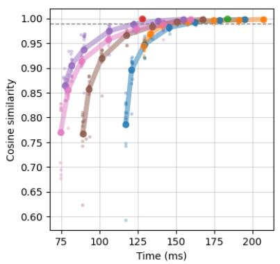  
(a) 2072 by 2072 pixels.

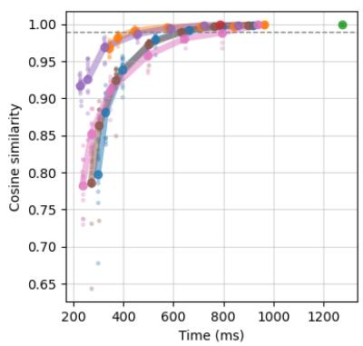  
(b) 3500 by 3500 pixels.

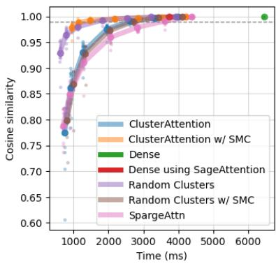  
(c) 5306 by 5306 pixels.  
Figure 1: Comparison between some ClusterAttention version and baselines. Pareto front on latency vs. representation-distortion, measured in average cosine-similarity with dense.

Experimental setup We exclude the scikit-learn processing and clock only the model backbone, as the preprocessing had high run-to-run latency variance. We also exclude test-to-train processing, as this is not sparsified, instead only timing train-totrain processing (including caching). As a warm-up we did three forward passes on each dataset. While ClusterAttention does not have overhead on the first run on a new tensor size (when run without CUDA-graphs as was done here), both the TabPFN-3 model and SVOO did have this property, so a universal warm-up could not be used. We used a single forward pass to generate the predictions, so no ensembling, due to computational costconsiderations. ClusterAttention∗ sweeps through dense attention on {1%, 5%, 10%, 40%, 80%, 100%} of all keys, the adaptive methods sweep through targeting {80%, 90%, 100%} of attention mass (although SVOO adds 10% and 40% on the last dataset). The other methods sweep through including {10%, 40%, 80%, 100%} of all keys. We evaluated the QASSMax function for the sparse methods with the length of the dataset as parameter, instead of the actual number of keys attended to. We chose to do this as the distribution of keys is likely afected by the number of datapoints, so this parameter is not just tuning for the raw number of datapoints. It is also dificult to select for adaptive methods, where the number of keys attended to is not known beforehand. All methods except for the native dense need to transpose the data from (batch, sample, head, dimension) to (batch, head, sample, dimension) each forward pass, meaning that these methods carry a small performance penalty that could be removed by making the methods handle this layout.

The results are shown in Figure 2. We have drawn a dashed line marking 0.99 of the accuracy of dense attention, a suggested operating point. This indicates which part of the Pareto-front is the most interesting.

## 4.3 Wan 2.1-14B T2V

We evaluate ClusterAttention on video generation with Wan 2.1-14B T2V, a video generation difusion-transformer developed by Alibaba. The prompts are from a list of 12 prompts from OpenSora 1.0 used by SpargeAttn among others, which we include in Appendix H. We evaluate on the first 5 prompts from this list. As a baseline we use SVOO without ofline profiling, to compare the sparse-attention techniques in isolation. We note that ofline sparsity profiling of a model as introduced in SVOO is applicable to any sparse-attention method, although it may give better results for some than others.

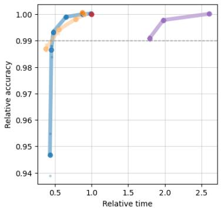  
(a) Rain in Australia (93094 training rows).

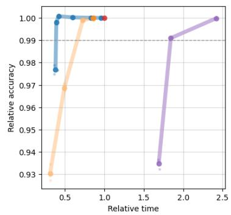  
(b) walking-activity (95572 training rows).

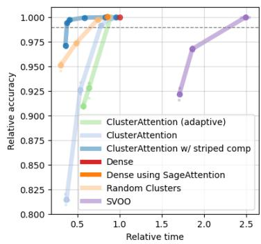  
(c) accelerometer (97922 training rows).

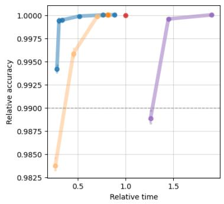  
(d) CDC Diabetes Health Indicators (162355 training rows).

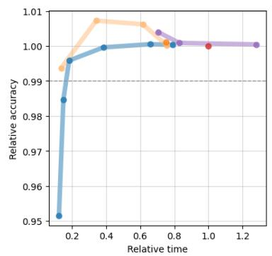  
(e) Data Science for Good Kiva Crowdfunding (429571 training rows).

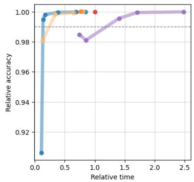  
(f) Smoking and Drinking Dataset with body signal (634460 training rows).  
Figure 2: Accuracy-latency Pareto front on TabPFN-3 for the 6 largest classification datasets from the TALENT meta-dataset, with accuracy and latency normalized by the values with dense attention.

Experimental setup We run the model on a Nvidia H200 GPU to match the configuration by Luo et al. for SVOO. We use ClusterAttention∗ attending to 20% of clusters. We apply it as-is, without any cluster caching or other stateful techniques that are common for sparse video generations methods. For example, SVOO recomputes clusters only after every 20th difusion step. We use the metrics peak signal-to-noise ratio (PSNR), learned perceptual image patch similarity (LPIPS) [17], and Structural Similarity Index Measure (SSIM) [18], to measure the deviation between the output of a dense generation and sparse ones. Matching the SVOO paper, we use full density for the first layer out of the 40 in the model, and the first 10 out of 50 difusion steps. While we did not perceive a visual degradation from running fully sparse, the inserted dense computations did decrease the deviation in generated content, making the metrics based on visual comparison more meaningful. As warm-up, we ran the model for one dense difusion-step and two (optionally, not for the dense baseline) sparse steps. We ran one generation per prompt, all using random generation seed 0.

The results are shown in Table 1.

<table><tr><td>Prompt</td><td>PSNR↑</td><td>SSIM↑</td><td>LPIPS↓</td><td>Speedup</td></tr><tr><td>1 (night city) 2 (toy boat)</td><td>20.28/19.37 24.86/24.24</td><td>0.767/0.743 0.916/0.899</td><td>0.192/0.206 0.0438/0.0658</td><td>1.79/1.43 1.79/1.42</td></tr><tr><td>3 (waterfall) 4 (milky way) 5 (turtle)</td><td>27.20/26.67 28.90/28.32 21.89/21.37</td><td>0.872/0.883 0.8971/0.8969 0.727/0.691</td><td>0.0641/0.0814 0.0808/0.0716 0.109/0.139</td><td>1.81/1.42 1.79/1.46 1.78/1.44</td></tr></table>

Table 1: Comparison of video quality and generation latency on 5 prompts. Left number for every metric is ClusterAttention, right is SVOO.

## 4.4 Ablations

We compare eight versions of ClusterAttention, one for each combination of the following three choices: transform or not, top-k or adaptive, SMC or not. We first ablate transforms versus no transforms for top-k and adaptive separately, we then compare top-k and adaptive with transforms. The comparisons are performed on DINOv2 with the same setup as in Subsection 4.1. Several variations are also included in Figure 2c where TabPFN-3 is evaluated, and are consistent with the conclusions here, indicating that they generalize beyond DINOv2. However, models with very diferent attention patterns may give diferent results.

## 4.4.1 Transforms

We ablate how applying the transforms before clustering afects the representation distortion, and find that both for top-k and adaptive, they give almost completely Pareto better results than untransformed clustering, with the only exception at the smallest image size and very high sparsity, when the overhead from the transforms dominates. We also perform the evaluation with SMC applied, and find mostly the same result although the transformed version also performs slightly worse for the largest image size at the lower sparsities. Pareto sweeps can be viewed in Appendix F.1.

## 4.4.2 Striped mean-compensation

We now drop the versions without transformation, and ablate how compensation afects the results. We find that in the top-k case, the compensation provides a large quality improvement such that using compensation is Pareto-dominant except for at the highest sparsity at the smallest images size. In the adaptive case, the improvement is smaller, and mostly confined to the higher sparsities. At the lowest image size, the sweep without compensation Pareto-dominates the one with. Pareto sweeps can be viewed in Appendix F.2.

We speculate that the mechanism behind why top-k benefits more is the following. For a given computational budget, the adaptive method favors the queries with many clusters scoring on the higher end. But one mechanism causing clusters to score high, is that the keys and queries have small spread, giving the centroids larger magnitudes due to a smaller Jensen-efect. This causes the adaptive method to focus its efort on heads with small key and query variance. But for these heads, clusters are already a good summary, so the efort is misplaced. This has not been verified through inspection, and we note that a confounding factor is the diference in transforms for query-clustering.

## 4.4.3 Top-k versus adaptive

We compare the performance of the top-k and adaptive methods, with and without SMC. We find that top-k with SMC in general is Pareto dominant. The gap is small at the lowest image size and grows with the size of the image. The uncompensated methods perform very similarly, with the adaptive method possibly performing a little better at the largest image size. Pareto sweeps can be viewed in Appendix F.3.

## 4.5 Latency scaling

Figures 3a and 3b show two cases for how the latency ClusterAttention∗ scales with the number of tokens, with a breakdown over its parts, as well as a fitted line in log-log-space between the last two measurements. In Figure 3a, the number of tokens attended to was fixed to 64 clusters of 128 tokens, so 8192 tokens. This simulates deployment on a model with sparse attention patterns, or that in general works well with highly sparse attention. An example of such a model is Deepseek V3.2 [19], which attends to a fixed 2048 tokens shared over all heads in each layer. The reason why we show this case is that it is both the case when sparse attention can give the largest attention speedup, and the case that is most adversarial to routing overhead. In Figure 3b we fix that ClusterAttention∗ attends to 10% of all keys. This simulates deployment on a model where attention is less sparse, such as DINOv2 and TabPFN-3.

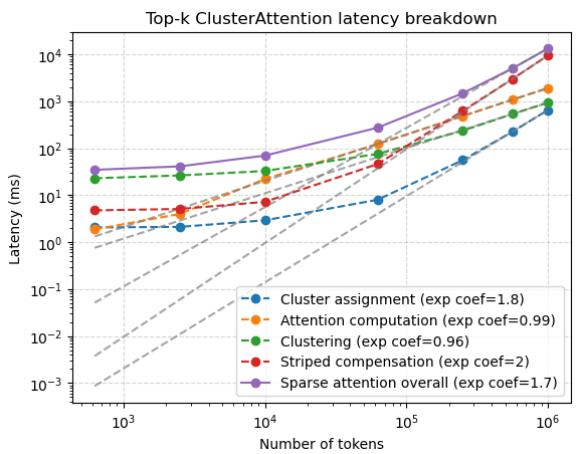  
(a) k fixed to 64 blocks of 128 keys.

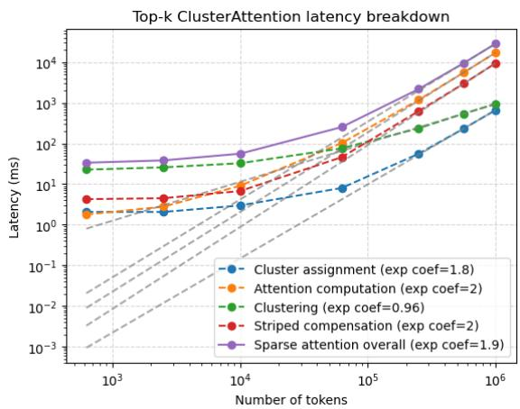  
(b) k set so the model attends to 10% of all keys.  
Figure 3: Latency scaling for ClusterAttention∗. Timing averages over 3 runs on the first image from DIV8K after shufling.

For variable input-length use cases, such as tabular models, there is slightly more constantterm overhead in the current implementation of the clustering than in Figure 3. For fixed token-count cases, such as image models as shown here, it is removed using CUDA-graphs. The extra overhead is only noticeable at smaller token counts.

## 5 Discussion

## 5.1 Overall performance

On DINOv2, we observe that when the images are downscaled to around 20,000 tokens, routing overhead makes ClusterAttention∗ slow compared to SpargeAttn as well as the dense attentions, while at the medium and high resolutions ClusterAttention∗ is Pareto-dominant. The crossover where the SpargeAttn and ClusterAttention∗ perform comparably seems to be somewhere between 25,000 and 30,000 tokens. The crossover for the uncompensated ClusterAttention methods compared to SpargeAttn seems to be around the medium resolution, possible a bit lower if considering performance at sparsities where distortion is acceptable. We also note that the method using random clusters is competitive. When SMC is applied, it performs worse, which is consistent with the error expressions in 1.2.

Figure 2 shows the results on TabPFN-3. ClusterAttention∗ appears to be largely Pareto optimal on 5 out of 6 datasets, where the exception shows sparse methods outperforming dense, with ClusterAttention∗ converging smoothly to dense as on the other datasets. This unexpected result does not appear relevant from a sparse-attention perspective, so we do not focus on investigating it. ClusterAttention∗ attending to 10% of clusters consistently retains over 99% relative accuracy, with a relative speedup that grows from around 2x to almost 6x with dataset size.

SVOO has a lot of clustering overhead compared to the other methods tested here, making it not competitive in the single-pass setting, which it was admittedly not developed for. The attention of SVOO also appears to run markedly slower than the one we use, judging by Figures 12 and 2c. We hypothesize that this is a combination of the quantization in the kernel we use, as well as a slowdown caused by the ragged cluster-sizes. It appears that this efect diminishes as token count (and thus tokens per cluster with fixed cluster counts) grows. The results for video generation are seen in Table 1, where we report the relative quality metrics used by Luo et al. We note that ClusterAttention provides overall better quality retention, while providing a higher speedup. The speedups are lower than the ones reported in SVOO, which appears to be an efect of dense attention being markedly faster in our testing, as the latency for SVOO is similar in our measurements to those found by Lou et al. We have not broken down exactly why ClusterAttention∗ gives better results than SVOO. We expect the co-clustering overhead to be amortized in this setting, so it should not be the main reason. Possible reasons include the seemingly faster attention, the SMC, and new versus stale clusters in every difusion step. While this has not been possible due to budget constraints, it would be interesting to evaluate how SVOO with ofline calibration performs. Luo et al. appear to find that it provides a meaningful but limited improvement, so it is not clear if this would close the gap to ClusterAttention∗.

## 5.2 Latency in detail

Figure 3 shows that clustering overhead dominates at low token counts for both deployment examples. The few-token clustering overhead appears to be dominated by the eigenvalue decompositions, indicating that this should be the target if aiming to improve the latency of ClusterAttention∗ at lower token counts. It is approximately flat up to around 10,000 tokens, where it starts curving upward, and between 562,500 and 1 million tokens grows slightly below linearly.

In the case with a fixed low k, the sparse attention computation overtakes clustering as the largest latency component at around 20,000 tokens, but is overtaken by the striped-mean compensation at around 250,000 tokens after which this component starts dominating. Thus, for a model with highly sparse attention, improving the latency of the compensation is the most impactful improvement, though it is possible that the compensation can be omitted entirely if the attention is sparse enough that essentially all attention mass can be captured in the sparse subset.

In the case with attention to 10% of tokens, the attention overtakes clustering slightly later, but then grows quickly. We note that it is only about twice as high as the SMC, even if it performs $0 . 1 / \frac { 1 } { 6 4 } = 6 . 4$ times the amount of computation and data transfer. This indicates that the compensation can be made several times faster, which is unsurprising given that it is a simple Triton implementation of attention with masking for densely attended clusters.

Cluster assignment grows at a rate approaching quadratic, but due to its small constant it is essentially the smallest component across all token counts.

## 6 Future work

## 6.1 Improvements

We identify four main axes of potential improvements for ClusterAttention∗. These are

1. Faster clustering

2. Better clustering

3. Better compensation of excluded clusters

4. Better routing

Our latency observations show that in the lower token-count range, clustering latency is the main bottleneck, specifically dominated by eigenvalue decompositions. It may be possible to write algorithms for this specific setup that are faster than the general ones we employ. A simpler approach may be to use the non-diagonalized clustering though, as the metric matrix can be injected into the power-iteration so that no eigenvalue decompositions are required. This has not been implemented.

In the higher token count range, the main latency bottlenecks are SMC and actual attention. We note in Subsection 5.2 that there is potential for several times faster SMC through a better implementation. It may also be possible to selectively apply this based on, for example, attention weight. To speed up the actual attention, the main lever is to run it more sparsely. This is viable if we can maintain a small attention error with fewer attention interactions, which can be achieved through better compensation, better

clusters, and better routing.

On cluster quality, we note in Figures 12 and 2c that SVOO [3] achieves markedly lower error for the same attention budget than adaptive ClusterAttention without SMC, for both DINOv2 [7] and TabPFN-3 [1]. This indicates that it achieves better clusters, which shows that ClusterAttention has headroom in the cluster-quality. Better clustering likely also leads to better routing and SMC. We have not diagnosed what the diference is in detail. However, one of many possible reasons may be that fixed-size clusters are not optimal. Dense regions in key or query space may be able to use larger clusters, while sparser regions benefit from smaller clusters. The recursive splitting framework could allow diferent powers of two as cluster sizes. Another idea for improving our clusters is using nonlinear transformations to increase the rank of the representations, while at the same time aligning them even more closely with the downstream usage than the linear representations. This is described in further detail in Appendix C.

To improve compensation, MuSe [20] shows an option. They apply exponential tilting to the key-centroids for each query centroid, removing all terms that are first-order in query-spread. However, this method needs to transfer a lot of memory as tilted centroids are written and read for each (key-value-cluster, query-cluster) pair, so it is not clear how competitive it will be in our setting. We have done experiments with linearized approximations of this, but not tested anything extensively. It may be possible to selectively apply MuSe to achieve low error with small latency.

To achieve better routing, we note that neither top-k nor adaptive selection is rooted in how we expect including diferent clusters densely to afect the output error. Thus, there may be better ways to select clusters. The centroid-centroid scores for selection are reasonable, given that error scales with the attention weight in an excluded cluster, but it is not necessarily the optimal heuristic.

## 6.2 Extension beyond MHA

In this work, we only use models with multi-head attention (MHA). Extensions to groupedquery attention (GQA) or multi-query attention (MQA) are natural, though some ablation and analysis may be required to determine the optimal approach. While query-clustering can be performed in the same way as for MHA, key-clustering requires the choice between averaging the second-moment matrices for all associated query-heads, or performing one key-clustering for each associated query-head, or some other option.

## 6.3 Extended evaluation

To strengthen the evaluation, it can be expanded to include more images, datasets, and prompts, as well as more baselines, method configurations, and models. It would also be interesting to apply ClusterAttention to domains not included in this work. Furthermore, we would like to investigate how the usage of ClusterAttention afects model training.

## References

[1] L´eo Grinsztajn et al. TabPFN-3: Technical Report. 2026. arXiv: 2605.13986 [cs.LG].

[2] Team Wan et al. Wan: Open and Advanced Large-Scale Video Generative Models. 2025. arXiv: 2503.20314 [cs.CV].

[3] Jiayi Luo et al. Attention Sparsity is Input-Stable: Training-Free Sparse Attention for Video Generation via Ofline Sparsity Profiling and Online QK Co-Clustering. 2026. arXiv: 2603.18636 [cs.CV].

[4] Hanwen Xu et al. “A whole-slide foundation model for digital pathology from realworld data”. In: Nature 630.8015 (2024), pp. 181–188.

[5] Teng Hu et al. UltraGen: High-Resolution Video Generation with Hierarchical Attention. 2025. arXiv: 2510.18775 [cs.CV].

[6] Eric Nguyen et al. HyenaDNA: Long-Range Genomic Sequence Modeling at Single Nucleotide Resolution. 2023. arXiv: 2306.15794 [cs.LG].

[7] Maxime Oquab et al. DINOv2: Learning Robust Visual Features without Supervision. 2024. arXiv: 2304.07193 [cs.CV].

[8] Jintao Zhang et al. SpargeAttention: Accurate and Training-free Sparse Attention Accelerating Any Model Inference. 2025. arXiv: 2502.18137 [cs.LG].

[9] Apoorv Vyas, Angelos Katharopoulos, and Fran¸cois Fleuret. Fast Transformers with Clustered Attention. 2020. arXiv: 2007.04825 [cs.LG].

[10] Haoyue Tan et al. AdaCluster: Adaptive Query-Key Clustering for Sparse Attention in Video Generation. 2026. arXiv: 2604.18348 [cs.CV].

[11] Jiaming Tang et al. Quest: Query-Aware Sparsity for Eficient Long-Context LLM Inference. 2024. arXiv: 2406.10774 [cs.CL].

[12] Daniel Boley. “Principal Direction Divisive Partitioning”. In: Data Mining and Knowledge Discovery 2.4 (1998), pp. 325–344.

[13] Reda Bensaid et al. A Novel Benchmark for Few-Shot Semantic Segmentation in the Era of Foundation Models. 2025. arXiv: 2401.11311 [cs.CV].

[14] Shuhang Gu et al. “DIV8K: DIVerse 8K Resolution Image Dataset”. In: 2019 IEEE/CVF International Conference on Computer Vision Workshop (ICCVW). 2019, pp. 3512–3516.

[15] Jintao Zhang et al. SageAttention2: Eficient Attention with Thorough Outlier Smoothing and Per-thread INT4 Quantization. 2025. arXiv: 2411.10958 [cs.LG].

[16] Si-Yang Liu et al. TALENT: A Tabular Analytics and Learning Toolbox. 2024. arXiv: 2407.04057 [cs.LG].

[17] Richard Zhang et al. The Unreasonable Efectiveness of Deep Features as a Perceptual Metric. 2018. arXiv: 1801.03924 [cs.CV].

[18] Zhou Wang et al. “Image quality assessment: from error visibility to structural similarity”. In: IEEE Transactions on Image Processing 13.4 (2004), pp. 600–612.

[19] DeepSeek-AI et al. DeepSeek-V3.2: Pushing the Frontier of Open Large Language Models. 2025. arXiv: 2512.02556 [cs.CL].

[20] Rupert Mitchell and Kristian Kersting. Multipole Semantic Attention: A Fast Approximation ofSoftmax Attention for Pretraining. 2026. arXiv: 2509.10406 [cs.LG].

[21] Bolin Gao and Lacra Pavel. On the Properties of the Softmax Function with Application in Game Theory and Reinforcement Learning. 2018. arXiv: 1704.00805 [math.OC].

## 7 Acknowledgements

We would like to thank the team behind SpargeAttn [8] for their excellent sparse attention kernel that we employ, and for the team behind SVOO [3] for quickly responding to our questions.

## A Error of mean-compensated sparse attention

If we partition the excluded attention over a set of clusters each called $c ( j )$ , and include them through their centroid key and value (with a cluster-size weight-compensation), we find

$$
\hat { o } _ { S } = \frac { \sum _ { i \in S } w _ { i } v _ { i } + \sum _ { j \in \bar { S } } w _ { c ( j ) } \bar { v } _ { c ( j ) } } { \sum _ { i \in S } w _ { i } + \sum _ { j \in \bar { S } } w _ { c ( j ) } } = \frac { \sum _ { i \in S } w _ { i } v _ { i } + \sum _ { j \in \bar { S } } w _ { c ( j ) } \bar { v } _ { c ( j ) } } { w _ { S } + \sum _ { j \in \bar { S } } w _ { c ( j ) } } .\tag{21}
$$

We can collect the terms by cluster and get

$$
\hat { o } _ { S } = \frac { \sum _ { i \in S } w _ { i } v _ { i } + \sum _ { c \in C _ { \bar { S } } } | c | w _ { c } \bar { v } _ { c } } { w _ { S } + \sum _ { c \in C _ { \bar { S } } } | c | w _ { c } } = \frac { \hat { n } _ { S } } { \hat { d } _ { S } } ,\tag{22}
$$

where we have defined shorthands for the numerator and the denominator. We can do some algebraic tricks with the error expression to find

$$
o - \hat { o } _ { S } = o - \hat { n } _ { S } + \hat { n } _ { S } - \hat { o } _ { S } = ( o - \hat { n } _ { S } ) + ( \hat { d } _ { S } - 1 ) \hat { o } _ { S } .\tag{23}
$$

Here, we massage the first parenthesis to find

$$
o - \hat { n } _ { S } = \sum _ { i } w _ { i } v _ { i } - ( \sum _ { i \in S } w _ { i } v _ { i } + \sum _ { c \in C _ { \bar { S } } } | c | w _ { c } \bar { v } _ { c } ) = \sum _ { i \in \bar { S } } w _ { i } v _ { i } - \sum _ { c \in C _ { \bar { S } } } | c | w _ { c } \bar { v } _ { c } .\tag{24}
$$

We can collect it all into clusters and write

$$
o - \hat { n } _ { S } = \sum _ { c \in C _ { \bar { S } } } \sum _ { i \in c } ( w _ { i } v _ { i } - w _ { c } \bar { v } _ { c } ) .\tag{25}
$$

We now introduce $\delta _ { c } = \bar { w } _ { c } - w _ { c } \ge 0$ , where the inequality comes from Jensen’s inequality and the convexity of the exponential. We further introduce the perturbations $\epsilon _ { i } ^ { w } = w _ { i } -$ $\bar { w } _ { c } = w _ { i } - w _ { c } - \delta _ { c }$ , as well as $\epsilon _ { i } ^ { v } = v _ { i } - \bar { v } _ { c }$ , and rewrite to

$$
o - \hat { n } _ { S } = \sum _ { c \in C _ { S } } \sum _ { i \in c } ( w _ { i } v _ { i } - w _ { c } \bar { v } _ { c } ) = \sum _ { c \in C } \sum _ { i \in c } ( \delta _ { c } \bar { v } _ { c } + \epsilon _ { i } ^ { w } \bar { v } _ { c } + \bar { w } _ { c } \epsilon _ { i } ^ { v } + \epsilon _ { i } ^ { w } \epsilon _ { i } ^ { v } ) ,\tag{26}
$$

where we get to the right hand side after removing opposite terms. Now, we note that the perturbations are zero-mean, so the two middle terms both sum to the zero-vector, and the expression simplifies to

$$
o - \hat { n } _ { S } = \sum _ { c \in C _ { \bar { S } } } \sum _ { i \in c } ( \delta _ { c } \bar { v } _ { c } + \epsilon _ { i } ^ { w } \epsilon _ { i } ^ { v } ) = \sum _ { c \in C _ { \bar { S } } } | c | ( \delta _ { c } \bar { v } _ { c } + \mathrm { C o v } _ { c } ( w , v ) ) ,\tag{27}
$$

Now, inspecting $\hat { d } _ { S } - 1$ we find

$$
\hat { d } _ { S } - 1 = ( w _ { S } + \sum _ { c \in { \cal C } _ { \bar { S } } } | c | w _ { c } ) - ( w _ { S } + \sum _ { c \in { \cal C } _ { \bar { S } } } | c | \bar { w } _ { c } ) = - \sum _ { c \in { \cal C } _ { \bar { S } } } | c | \delta _ { c } .\tag{28}
$$

So, we have

$$
o - \hat { \sigma } _ { S } = \sum _ { c \in C _ { \bar { S } } } | c | \big ( \delta _ { c } \bar { v } _ { c } + \mathrm { C o v } _ { c } ( w , v ) \big ) - \sum _ { c \in C _ { \bar { S } } } | c | \delta _ { c } \hat { \sigma } _ { S } = \sum _ { c \in C _ { \bar { S } } } | c | \big ( \delta _ { c } \bar { v } _ { c } + \mathrm { C o v } _ { c } ( w , v ) - \delta _ { c } \hat { \sigma } _ { S } \big ) ,\tag{29}
$$

which finally comes together to

$$
o - \hat { o } _ { S } = \sum _ { c \in C _ { \bar { S } } } | c | ( \delta _ { c } ( \bar { v } _ { c } - \hat { o } _ { S } ) + \mathrm { C o v } _ { c } ( w , v ) ) .\tag{30}
$$

This is a nice exact expression, but not very easy to interpret. However, we can make a very similar expression that carries more meaning. If we write the error expression instead as

$$
\hat { d } _ { S } ( o - \hat { o } _ { S } ) = \hat { d } _ { S } o - \hat { n } _ { S } = \hat { d } _ { S } o - o + o - \hat { n } _ { S } = ( \hat { d } _ { S } - 1 ) o + ( o - \hat { n } _ { S } ) .\tag{31}
$$

Based on our computations above, we can substitute in

$$
\hat { d } _ { S } ( o - \hat { o } _ { S } ) = - \sum _ { c \in C _ { \bar { S } } } | c | \delta _ { c } o + \sum _ { c \in C _ { \bar { S } } } | c | \big ( \delta _ { c } \bar { v } _ { c } + \mathrm { C o v } _ { c } ( w , v ) \big ) .\tag{32}
$$

Similarly to above, we can rewrite it

$$
o - \hat { o } _ { S } = \frac { 1 } { \hat { d } _ { S } } \sum _ { c \in C _ { \bar { S } } } | c | \big ( \delta _ { c } \big ( \bar { v } _ { c } - o \big ) + \mathrm { C o v } _ { c } ( w , v ) \big ) .\tag{33}
$$

## B Linear query-representations

## B.1 Query-representation for adaptive assignment

For adaptive assignment, we want to represent queries in a way such that small distances in the representation correspond to small diferences in attention weights, the forward property, as this means that queries we cluster together will actually produce similar attention distributions. We also want the converse, i.e. that small diferences in attention weight correspond to small distances in representation, the backward property, as this means that queries producing similar attention distributions will be close in representation, so that clustering does not separate queries that behave similarly. More precisely, these properties correspond to Lipschitz bounds between the representation of the queries and their attention weights. We note that since softmax is Lipschitz continuous [21], the forward property holds with the Euclidean representation, and for any linear transform of q from which the logits can be recovered. So, ignoring the Lipschitz constant, the forward property is trivial. On the other hand, the backward property is not globally possible for any non-zero linear representation, as attention weights lie on the probability simplex, so their distances are bounded, while representation distances are unbounded, i.e. no L can for all possible $q _ { 1 }$ and $q _ { 2 }$ fulfill

$$
| | r ( q _ { 1 } ) - r ( q _ { 2 } ) | | \leq L | | \mathrm { s o f t m a x } ( K q _ { 1 } ) - \mathrm { s o f t m a x } ( K q _ { 2 } ) | | .\tag{34}
$$

To give intuition for this, for small logits (suppressed keys), the softmax derivative gets small, so large changes to a representation that only afects these keys have small efects on the attention distribution. However, a local Lipschitz bound in the backward direction is possible. Consider the representation

$$
r ( q ) = K q .\tag{35}
$$

This does not have the local backward property. In fact, queries with the same attention distribution can be arbitrarily far apart, as the shift invariance of softmax gives that

$$
{ \mathrm { s o f t m a x } } ( K q ) = { \mathrm { s o f t m a x } } ( K ( q + \delta ) ) { \mathrm { ~ i f ~ } } K \delta = c \mathbf { 1 } , { \mathrm { ~ f o r ~ s o m e ~ } } c \in \mathbb { R } ,\tag{36}
$$

meaning that δ lies in a space where the key distribution has zero variance. A special case of this is when $\delta$ is orthogonal to all keys, which can happen when the key matrix is low-rank, a common situation in practice. More generally, the smaller the variance of the key distribution along a direction, the less it matters for attention weights. This suggests using the covariance matrix of the keys as metric matrix, i.e. $\frac { K _ { c } ^ { T } K _ { c } } { n }$ where $K _ { c }$ is the key matrix after mean-centering, meaning that row i is $k _ { i } - \bar { k }$ . This implies the representation

$$
r ( q ) = \frac { K _ { c } } { \sqrt { n } } q .\tag{37}
$$

With the same $\delta$ as above,

$$
K _ { c } ( q + \delta ) = K _ { c } q + ( K - \mathbf { 1 } \bar { k } ^ { T } ) \delta = K _ { c } q + c \mathbf { 1 } - ( \bar { k } \cdot \delta ) \mathbf { 1 } = K _ { c } q ,\tag{38}
$$

where ${ \bar { k } } \cdot \delta = c$ due to the linearity of the mean, so the shifts under which softmax is invariant do not change the representation, i.e. the centering quotients out the equivalence class under softmax. Since softmax is Lipschitz continuous [21] and the logits are linear in the representation, small distances in the representation give small diferences in the attention weights, giving the forward property.

As noted before, the backward property of closeness cannot hold globally. However, diferently from $q$ or $K q$ , the implication

$$
\mathrm { s o f t m a x } ( K _ { c } q _ { 1 } ) = \mathrm { s o f t m a x } ( K _ { c } q _ { 2 } ) \implies K _ { c } q _ { 1 } = K _ { c } q _ { 2 }\tag{39}
$$

is valid, since the left-hand side requires that $K _ { c } q _ { 2 } = K _ { c } q _ { 1 } + c { \bf 1 }$ , but the entries of $K _ { c } q$ sum to 0 for any query as $\begin{array} { r } { \sum _ { i } ( k _ { i } - \bar { k } ) \cdot q = ( n \bar { k } - n \bar { k } ) \cdot q = 0 } \end{array}$ , so c must be 0. We expect the lack of a global Lipschitz bound to not undermine the usefulness of the metric; in well-behaved cases and for most queries, where logits remain bounded, no key is fully suppressed, so the bound should not get too loose.

## B.2 Query-representation for key-cluster ranking

A good representation of a query is the relative ranking of the keys by their dot-product with the query. Formally, the representation is

$$
r _ { ( a , b ) } ( q ) = \mathrm { s i g n } ( ( K _ { a } - K _ { b } ) \cdot q ) ,\tag{40}
$$

where single indexing into the key-matrix gives a single key, and the representation has one value for each pair from the space of ordered pairs of key-indices with size $n ^ { 2 }$ . From here, we relax to the actual diferences to get a linear representation, so

$$
r _ { ( a , b ) } ( q ) = ( K _ { a } - K _ { b } ) \cdot q ,\tag{41}
$$

noting that we lose scale invariance of q. At the same time, we gain information on which pairs have larger diferences in the dot product, and thus matter more to rank correctly. Incorrect ranking of only pairs with a small diference in the dot product should in the worst case lead to including the wrong clusters around position k in the ranking, which is less impactful than missing top-scoring clusters. After the relaxation we still have ofset invariance over the keys, which is desirable for comparing rankings. We can note that this representation lives in $\mathbb { R } ^ { n ^ { 2 } }$ , but it is found through a linear transformation, so it can have at most rank $d .$ Precisely, the linear transformation is

$$
D _ { ( a , b ) , m } = K _ { a , m } - K _ { b , m } .\tag{42}
$$

where we impose some ordering over the pairs. Since all geometry in transformed space involves forming $D ^ { T } D$ , we can study this matrix to find a non-redundant representation. We find

$$
\begin{array} { l } { { ( D ^ { T } D ) _ { j k } = \displaystyle \sum _ { l } D _ { l j } D _ { l k } = \displaystyle \sum _ { ( a , b ) } ( K _ { a , j } - K _ { b , j } ) ( K _ { a , k } - K _ { b , k } ) = } } \\ { { \displaystyle \sum _ { ( a , b ) } ( K _ { a , j } K _ { a , k } - K _ { a , j } K _ { b , k } - K _ { b , j } K _ { a , k } + K _ { b , j } K _ { b , k } ) = } } \\ { { \displaystyle n \sum _ { a } K _ { a , j } K _ { a , k } - \left( \sum _ { a } K _ { a , j } \right) \left( \sum _ { b } K _ { b , k } \right) - \left( \sum _ { b } K _ { b , j } \right) \left( \sum _ { a } K _ { a , k } \right) + n \sum _ { b } K _ { b , j } K _ { b , k } . } } \end{array}\tag{43}
$$

We then note that

$$
\sum _ { a } K _ { a , j } K _ { a , k } = ( K ^ { T } K ) _ { j k }\tag{44}
$$

and similar for the sum over $K _ { b , j } K _ { b , k }$ , while

$$
\left( \sum _ { a } K _ { a , j } \right) \left( \sum _ { b } K _ { b , k } \right) = ( n \bar { K } _ { , j } ) ( n \bar { K } _ { , k } ) = n ^ { 2 } \bar { K } _ { , j } \bar { K } _ { , k } ,\tag{45}
$$

and similar for the other factored sum, where indexing with , $j$ indicates a column of the key matrix. Putting it together, we find

$$
( D ^ { T } D ) _ { j k } = 2 n ( K ^ { T } K ) _ { j k } - 2 n ^ { 2 } \bar { K } _ { , j } \bar { K } _ { , k } = 2 n ( K _ { c } ^ { T } K _ { c } ) _ { j k } ,\tag{46}
$$

which is the 2n times $j ,$ kth element of the covariance matrix over the keys. $\mathrm { S o }$ , using this gives the same geometry up to a scalar factor. Finally, to recover the scaling invariance over $q$ we had in the original ranking metric, we note that scaling $q$ directly scales the representation. So we can simply normalize the representation. With $R _ { k }$ as the root matrix of $K _ { c } ^ { T } K _ { c } ,$ , we get our key-aware query representations as

$$
r ( q ) = \frac { R _ { k } q } { | R _ { k } q | } .\tag{47}
$$

## C Softmax-aware clustering

We can rephrase the query-space clustering argument as follows. We consider a representation of $k _ { 1 }$ that is query-aware as

$$
r ( k _ { 1 } ) = \frac { Q } { \sqrt { n } } k _ { 1 } ,\tag{48}
$$

i.e., $k _ { 1 }$ is represented as its dot with all the queries (the logits). This representation lies in $\mathbb { R } ^ { n }$ , but being a projection from $\mathbb { R } ^ { d }$ it occupies a subspace of at most dimensionality d.

In fact, as attention keys often only occupy a subspace of lower dimensionality than their intrinsic dimensionality, the representation likely occupies a subspace of lower dimensionality than d. We can see that we recover the same (pseudo-)metric M as before in this space, since

$$
\begin{array} { l } { \displaystyle | | r ( k _ { 1 } ) - r ( k _ { 2 } ) | | ^ { 2 } = ( r ( k _ { 1 } ) - r ( k _ { 2 } ) ) ^ { T } ( r ( k _ { 1 } ) - r ( k _ { 2 } ) ) = } \\ { \displaystyle \left( \frac { Q } { \sqrt { n } } k _ { 1 } - \frac { Q } { \sqrt { n } } k _ { 2 } \right) ^ { T } \left( \frac { Q } { \sqrt { n } } k _ { 1 } - \frac { Q } { \sqrt { n } } k _ { 2 } \right) = ( k _ { 1 } - k _ { 2 } ) ^ { T } \frac { Q ^ { T } Q } { n } ( k _ { 1 } - k _ { 2 } ) . } \end{array}\tag{49}
$$

To avoid the representation becoming low-rank, we can note that the logits will be passed through a softmax function as part of the attention computation. To mirror this, we apply the softmax transform over the keys for each query. This is similar to the kernel-trick in support-vector machines, but with the additional benefit of directly mirroring the downstream usage of the clusters. The specific nonlinearity of softmax means that for a given query, the diference between two larger logits carries more meaning, than the same diference between two smaller logits. Thus, clustering in a softmax aware space, by applying a softmax operation over the keys (whether clustering keys or queries), emphasizes tight clustering of keys in regions of the space where they significantly afect the attention values. It can also increase the number of meaningful directions/coordinates to cluster along.

Of course, performing this projection is essentially calculating full attention, which is what we want to avoid. To avoid this cost, we can choose a subset of queries as landmarks. This can be done, for example, by random subsampling. We can also project this new representation onto its principal components. There is a risk that the strong selectivity of softmax in this subsampled space could collapse the representations of keys. To mitigate this, the softmax temperature may be increased.

## D Computational complexities

## D.1 Basic recursive splitting

The number of operations in the dominant parts of split i is proportional to

$$
2 ^ { i } \left( \underbrace { p d ^ { 2 } } _ { \mathrm { p o w e r ~ i t e r a t i o n } } + \underbrace { \frac { n } { 2 ^ { i } } d } _ { \mathrm { p r o j e c t i o n } } + \underbrace { \frac { n } { 2 ^ { i } } } _ { \mathrm { p a r t i t i o n i n g } } \right) = 2 ^ { i } p d ^ { 2 } + n d + n ,\tag{50}
$$

where $p$ is the number of power iterations. This is repeated for i from 0 to log $\dot { \bf \rho } _ { 2 } ( n / c ) - 1$ roughly, since $n / c$ is not always a power of two. We get for the power iteration

$$
\sum _ { i = 0 } ^ { \log _ { 2 } ( n / c ) - 1 } 2 ^ { i } p d ^ { 2 } = p d ^ { 2 } \sum _ { i = 0 } ^ { \log _ { 2 } ( n / c ) - 1 } 2 ^ { i } = p d ^ { 2 } \left( { \frac { n } { c } } - 1 \right)\tag{51}
$$

and the algorithmic complexity as

$$
\mathcal { O } \left( { p d } ^ { 2 } \frac { n } { c } + n d \log _ { 2 } ( n / c ) \right) .\tag{52}
$$

As can be seen, the splitting is dominated by the n log n term in the limit of $n$ . In practice, all terms can be meaningful, due to the roughly linear scaling but diferent constants.

## D.2 Diagonalized recursive splitting

The number of operations is proportional to

$$
\underbrace { n d ^ { 2 } + d ^ { 3 } } _ { \mathrm { P C ~ d e c o m p o s i t i o n } } + 2 ^ { i } \left( \underbrace { \frac { d } { 2 ^ { i } } d } _ { \mathrm { v a r i a n c e ~ e s t i m a t i o n } } + \underbrace { \frac { n } { 2 ^ { i } } } _ { \mathrm { p a r t i t i o n i n g } } \right) .\tag{53}
$$

Here, subsampling to d vectors was assumed. The PC decomposition consists of forming second moment matrices from a set of vectors, projecting a set of vectors (both $\mathcal { O } ( n d ^ { 2 } ) ,$ ), and eigendecomposing matrices $( \mathcal { O } ( d ^ { 3 } ) )$ . This gives a complexity of

$$
O ( n d ^ { 2 } + d ^ { 3 } ) ,\tag{54}
$$

although the partitioning at ${ \mathcal { O } } ( n )$ tends to be the largest cost for the commonly seen $d .$

## E Evaluation images

  
Figure 4: 12 sampled high-resolution images from DIV8K [14] after square-cropping, used for evaluation on DINOv2-L.

## F Ablations

## F.1 Transforms

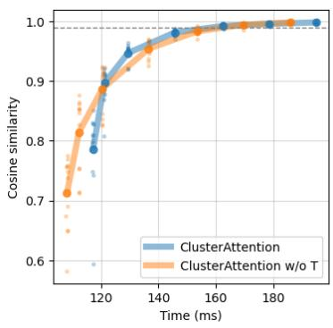  
(a) 2072 by 2072 pixels.

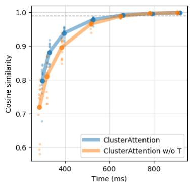  
(b) 3500 by 3500 pixels.

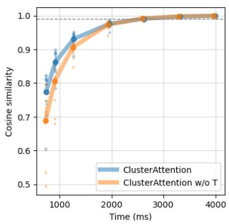  
(c) 5306 by 5306 pixels,.

Figure 5: Pareto front on latency vs. representation-distortion on DINOv2, for the top-k methods without SMC. The dashed line represents 0.99 cosine similarity with dense.

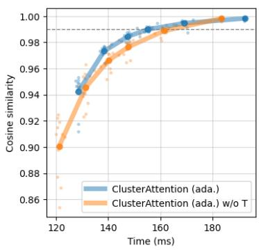  
(a) 2072 by 2072 pixels.

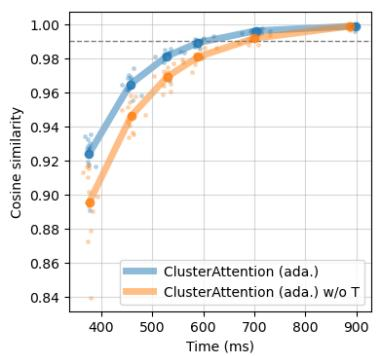  
(b) 3500 by 3500 pixels.

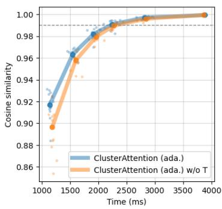  
(c) 5306 by 5306 pixels,.  
Figure 6: Pareto front on latency vs. representation-distortion on DINOv2, for the adaptive methods without SMC. The dashed line represents 0.99 cosine similarity with dense.

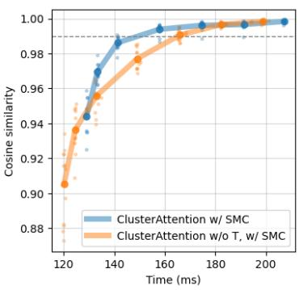  
(a) 2072 by 2072 pixels.

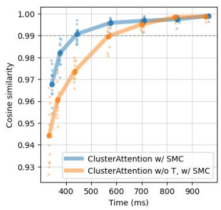  
(b) 3500 by 3500 pixels.

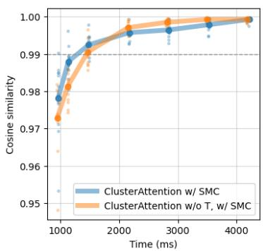  
(c) 5306 by 5306 pixels,.

Figure 7: Ablation of transforms. Pareto front on latency vs. representation-distortion on DINOv2, for the top-k methods with SMC. The dashed line represents 0.99 cosine similarity with dense.

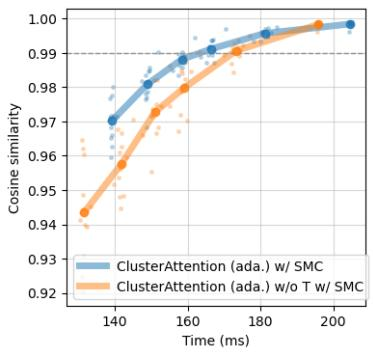  
(a) 2072 by 2072 pixels.

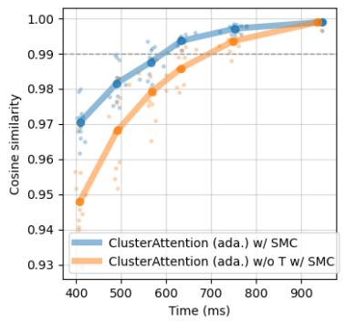  
(b) 3500 by 3500 pixels.

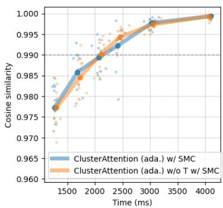  
(c) 5306 by 5306 pixels,.

Figure 8: Ablation of transforms. Pareto front on latency vs. representation-distortion on DINOv2, for the adaptive methods with SMC. The dashed line represents 0.99 cosine similarity with dense.

## F.2 Striped mean-compensation

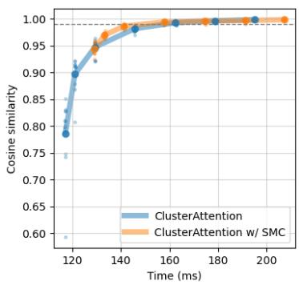  
(a) 2072 by 2072 pixels.

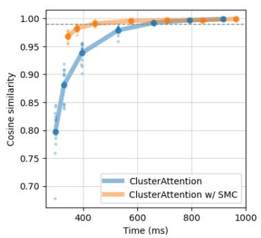  
(b) 3500 by 3500 pixels.

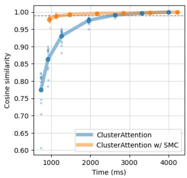  
(c) 5306 by 5306 pixels.

Figure 9: Ablation of compensation. Pareto front on latency vs. representation-distortion on $\mathrm { D I N O v 2 }$ , for the top-k methods. The dashed line represents 0.99 cosine similarity with dense.  
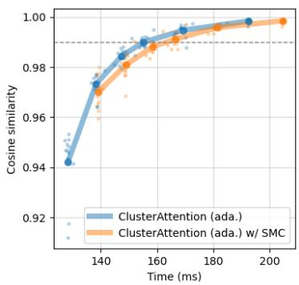  
(a) 2072 by 2072 pixels.

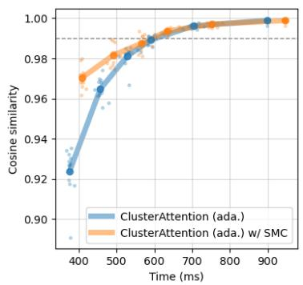  
(b) 3500 by 3500 pixels.

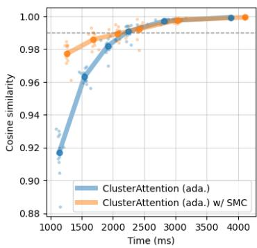  
(c) 5306 by 5306 pixels.

Figure 10: Ablation of compensation. Pareto front on latency vs. representation-distortion on $\mathrm { D I N O v 2 } .$ , for the adaptive methods. The dashed line represents 0.99 cosine similarity with dense.

## F.3 Top-k versus adaptive

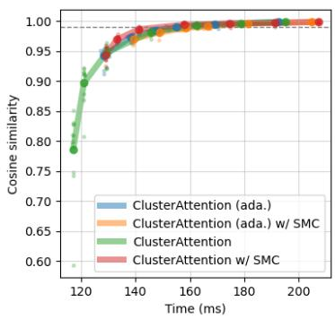  
(a) 2072 by 2072 pixels.

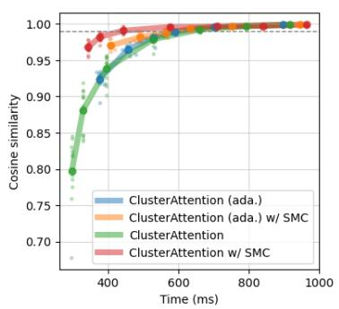  
(b) 3500 by 3500 pixels.

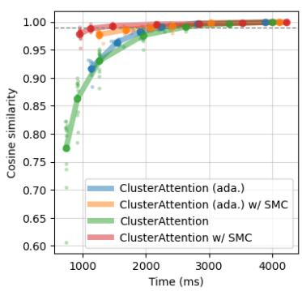  
(c) 5306 by 5306 pixels.  
Figure 11: Ablation of selection method. Pareto front on latency vs. representation-distortion on DINOv2. The dashed line represents 0.99 cosine similarity with dense.

## G Adaptive methods on DINOv2

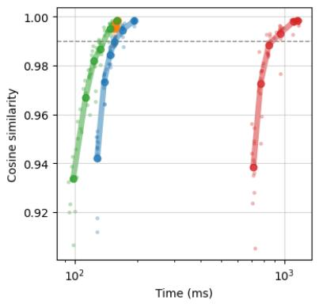  
(a) 2072 by 2072 pixels.

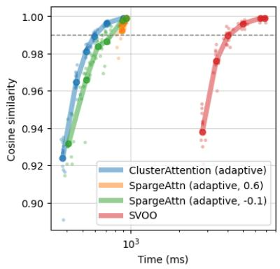  
(b) 3500 by 3500 pixels.

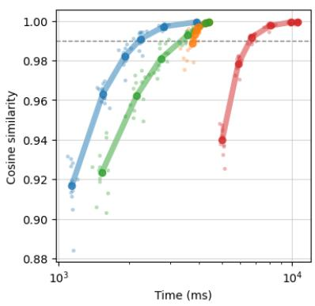  
(c) 5306 by 5306 pixels.  
Figure 12: Comparison between adaptive ClusterAttention and SVOO on DINOv2. Pareto front on latency vs. representation-distortion, measured in average cosine-similarity with dense.

## H OpenSora 1.0 prompts

1. A bustling city street at night, filled with the glow of car headlights and the ambient light of streetlights. The scene is a blur of motion, with cars speeding by and pedestrians navigating the crosswalks. The cityscape is a mix of towering buildings and illuminated signs, creating a vibrant and dynamic atmosphere. The perspective of the video is from a high angle, providing a bird’s eye view of the street and its surroundings. The overall style of the video is dynamic and energetic, capturing the essence of urban life at night.

2. A detailed wooden toy ship with intricately carved masts and sails is seen gliding smoothly over a plush, blue carpet that mimics the waves of the sea. The ship’s hull is painted a rich brown, with tiny windows. The carpet, soft and textured, provides a perfect backdrop, resembling an oceanic expanse. Surrounding the ship are various other toys and children’s items, hinting at a playful environment. The scene captures the innocence and imagination of childhood, with the toy ship’s journey symbolizing endless adventures in a whimsical, indoor setting.

3. A majestic beauty of a waterfall cascading down a clif into a serene lake. The waterfall, with its powerful flow, is the central focus of the video. The surrounding landscape is lush and green, with trees and foliage adding to the natural beauty of the scene. The camera angle provides a bird’s eye view of the waterfall, allowing viewers to appreciate the full height and grandeur of the waterfall. The video is a stunning representation of nature’s power and beauty.

4. A serene night scene in a forested area. The first frame shows a tranquil lake reflecting the star-filled sky above. The second frame reveals a beautiful sunset, casting a warm glow over the landscape. The third frame showcases the night sky, filled with stars and a vibrant Milky Way galaxy. The video is a time-lapse, capturing the transition from day to night, with the lake and forest serving as a constant backdrop. The style of the video is naturalistic, emphasizing the beauty of the night sky and the peacefulness of the forest.

5. A serene underwater scene featuring a sea turtle swimming through a coral reef. The turtle, with its greenish-brown shell, is the main focus of the video, swimming gracefully towards the right side of the frame. The coral reef, teeming with life, is visible in the background, providing a vibrant and colorful backdrop to the turtle’s journey. Several small fish, darting around the turtle, add a sense of movement and dynamism to the scene. The video is shot from a slightly elevated angle, providing a comprehensive view of the turtle’s surroundings. The overall style of the video is calm and peaceful, capturing the beauty and tranquility of the underwater world.

6. A snowy forest landscape with a dirt road running through it. The road is flanked by trees covered in snow, and the ground is also covered in snow. The sun is shining, creating a bright and serene atmosphere. The road appears to be empty, and there are no people or animals visible in the video. The style of the video is a natural landscape shot, with a focus on the beauty of the snowy forest and the peacefulness of the road.

7. A soaring drone footage captures the majestic beauty of a coastal clif, its red and yellow stratified rock faces rich in color and against the vibrant turquoise of the sea. Seabirds can be seen taking flight around the clif’s precipices. As the drone slowly moves from diferent angles, the changing sunlight casts shifting shadows that highlight the rugged textures of the clif and the surrounding calm sea. The water gently laps at the rock base and the greenery that clings to the top of the clif, and the scene gives a sense of peaceful isolation at the fringes of the ocean. The video captures the essence of pristine natural beauty untouched by human structures.

8. A vibrant scene of a snowy mountain landscape. The sky is filled with a multitude of colorful hot air balloons, each floating at diferent heights, creating a dynamic and lively atmosphere. The balloons are scattered across the sky, some closer to the viewer, others further away, adding depth to the scene. Below, the mountainous terrain is blanketed in a thick layer of snow, with a few patches of bare earth visible here and there. The snowcovered mountains provide a stark contrast to the colorful balloons, enhancing the visual appeal of the scene. In the foreground, a few cars can be seen driving along a winding road that cuts through the mountains. The cars are small compared to the vastness of the landscape, emphasizing the grandeur of the surroundings. The overall style of the video is a mix of adventure and tranquility, with the hot air balloons adding a touch of whimsy to the otherwise serene mountain landscape. The video is likely shot during the day, as the lighting is bright and even, casting soft shadows on the snow-covered mountains.

9. A vibrant underwater scene. A group of blue fish, with yellow fins, are swimming around a coral reef. The coral reef is a mix of brown and green, providing a natural habitat for the fish. The water is a deep blue, indicating a depth of around 30 feet. The fish are swimming in a circular pattern around the coral reef, indicating a sense of motion and activity. The overall scene is a beautiful representation of marine life.

10. The camera follows behind a white vintage SUV with a black roof rack as it speeds up a steep dirt road surrounded by pine trees on a steep mountain slope, dust kicks up from its tires, the sunlight shines on the SUV as it speeds along the dirt road, casting a warm glow over the scene. The dirt road curves gently into the distance, with no other cars or vehicles in sight. The trees on either side of the road are redwoods, with patches of greenery scattered throughout. The car is seen from the rear following the curve with ease, making it seem as if it is on a rugged drive through the rugged terrain. The dirt road itself is surrounded by steep hills and mountains, with a clear blue sky above with wispy clouds.

11. The dynamic movement of tall, wispy grasses swaying in the wind. The sky above is filled with clouds, creating a dramatic backdrop. The sunlight pierces through the clouds, casting a warm glow on the scene. The grasses are a mix of green and brown, indicating a change in seasons. The overall style of the video is naturalistic, capturing the beauty of the landscape in a realistic manner. The focus is on the grasses and their movement, with the sky serving as a secondary element. The video does not contain any human or animal elements.

12. The vibrant beauty of a sunflower field. The sunflowers, with their bright yellow petals and dark brown centers, are in full bloom, creating a stunning contrast against the green leaves and stems. The sunflowers are arranged in neat rows, creating a sense of order and symmetry. The sun is shining brightly, casting a warm glow on the flowers and highlighting their intricate details. The video is shot from a low angle, looking up at the sunflowers, which adds a sense of grandeur and awe to the scene. The sunflowers are the main focus of the video, with no other objects or people present. The video is a celebration of nature’s beauty and the simple joy of a sunny day in the countryside.