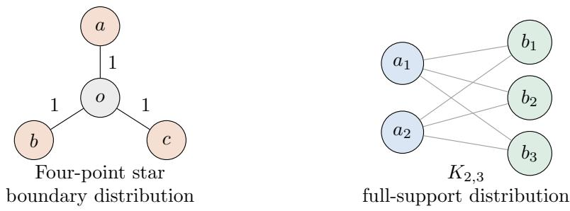

# Common Geodesics Do Not Guarantee Fisher Consistency of the Structured SVM: Minimal Counterexamples and a Tree-Metric Classification

Jintao Fei JD.com fei-jintao@outlook.com

Jiangying Luo Tsinghua University luo-jiangying@outlook.com

## Abstract

A known necessary condition for Fisher consistency of the structured support vector machine requires the task loss to be a metric for which every output triple has a common geodesic point. We show that this condition is not suficient for the canonical coordinate-wise argmax decoder. A four-output unit star admits an exactly optimal score vector whose maximizers are all strictly non-Bayes, and four outputs are minimal among metrics satisfying the condition. We then completely classify positively weighted tree metrics whose vertex set is the output space: argmax consistency holds if and only if the tree is a path. The failure on branching trees is confined to boundary distributions; every tree retains the argmax property at every full-support distribution. Among metrics satisfying the common-geodesic condition, five outputs are necessary and suficient for a full-support counterexample; $K _ { 2 , 3 }$ is the smallest member of an infinite $K _ { m , n }$ family. We additionally give a full-support counterexample for the three-dimensional Hamming cube. All optimality claims have exact primal–dual certificates. The counterexamples expose a concrete decoder gap: in this polyhedral setting, an embedding can guarantee the existence of a calibrated link without validating a prescribed argmax link on every surrogate-risk minimizer.

## 1 Introduction

The structured support vector machine (SSVM) extends the binary hinge loss to finite structured output spaces by loss-augmented inference [4, 14, 16]. For a score vector $v \in \mathbb { R } ^ { | \mathcal { V } | }$ and an observed output $y \in \mathcal { V }$ , its margin-rescaling surrogate is

$$
S _ { M } ( v , y ) = \operatorname* { m a x } _ { y ^ { \prime } \in \mathcal { V } } \{ L ( y , y ^ { \prime } ) + v _ { y ^ { \prime } } - v _ { y } \} .\tag{1}
$$

Despite its computational appeal, this surrogate need not be Fisher consistent beyond binary classification [8, 15].

Nowak–Vila, Rudi, and Bach [11, Theorem 2.1] obtained a strong geometric necessary condition for consistency when $| y | > 2 \colon L$ must be a metric and every three outputs must share a point lying simultaneously on geodesics between all three pairs. They explicitly left open whether this condition is suficient. Their Theorem 2.2 presented tree metrics as a positive class under the canonical decoder $v \mapsto \arg \operatorname* { m a x } _ { y } v _ { y } ,$ . The underlying Appendix Theorem B.9 establishes the Bayes-risk identity and the embedded reports $- L _ { y } ,$ , but its final decoding step checks argmax only on those embedded reports. Their consistency definition (Equation (5)) selects an argmax prediction; we use the set-valued version (4), but the distinction is immaterial to our negative results because every maximizer in the star and Hamming-cube witnesses is non-Bayes.

This paper shows that the omitted reports are essential. Even when an SSVM embeds the target loss, a conditional surrogate risk can have additional minimizers outside the embedding image, and coordinate-wise argmax can decode those minimizers incorrectly. Our first example is the smallest possible among metrics satisfying the common-geodesic condition: a tree on four vertices consisting of a center and three unit-length leaves. The example is not a tie-breaking artefact—every score maximizer is a non-Bayes leaf while the center is the unique Bayes output. We then prove an exact dichotomy: every branching weighted tree has the same obstruction, whereas every weighted path is argmax Fisher consistent for every distribution and every surrogate-risk minimizer.

Our contributions are:

1. We disprove suficiency of the common-geodesic condition with an exact four-output counterexample and prove that no three-output counterexample exists.

2. We give a complete tree-metric classification: the canonical argmax rule is Fisher consistent exactly for paths. We additionally prove that every tree is pointwise consistent at every full-support distribution, locating the branching obstruction precisely on the simplex boundary.

3. Among metrics satisfying the common-geodesic condition, we prove a second sharp cardinality result: the smallest full-support counterexample has five outputs. A four-point classification supplies the lower bound, and $K _ { 2 , 3 }$ is the smallest member of an infinite complete-bipartite family attaining failure. We also give a full-support counterexample for the familiar Hamming metric on $\{ 0 , 1 \} ^ { 3 }$

4. We use surrogate level sets to pinpoint the missing condition between an embedding and a prescribed decoder.

The counterexamples use rational probabilities and elementary score vectors. Their optimality follows either from a telescoping cycle lower bound or from an explicit optimal-transport dual certificate. Thus none of the conclusions relies on floating-point computation or finite-instance experimentation.

Related work. Consistency of multiclass and structured surrogates has a long history [3, 12, 15]. General finite-loss calibration is studied by Ramaswamy and Agarwal [13], while recent work gives negative and positive guarantees for broader structured-max and structured comp-sum families [9]. Those results do not settle the common-geodesic restriction isolated by Nowak-Vila et al. [11]. For the Crammer–Singer hinge, dominant-label restrictions are already necessary in ordinary multiclass classification [8]. Alternative structured surrogates with unconditional consistency include max-min constructions [10]. The embedding framework of Finocchiaro et al. [5, 6] proves that polyhedral embeddings give rise to calibrated links, but also emphasizes that extending the inverse map from embedded reports to all surrogate reports is a separate construction. That abstract decoder distinction is known; our contribution is to instantiate it with exact SSVM counterexamples, sharp thresholds, and a tree-metric classification. To the best of our knowledge, no counterexample to the suficiency question or public correction of the canonical-argmax tree claim has previously been reported.

## 2 Setting and exact optimality certificates

Let Y be a finite set with $k = | \mathcal { V } |$ , and let $L : \mathcal { V } \times \mathcal { V } \to \mathbb { R } _ { \ge 0 }$ be a metric. For $q \in \Delta _ { \mathcal { Y } }$ , define the conditional surrogate and target risk

$$
R _ { q } ( v ) = \sum _ { y \in \mathcal { Y } } q _ { y } S _ { M } ( v , y ) , \qquad \mathcal { V } ^ { \star } ( q ) = \underset { v \in \mathbb { R } ^ { k } } { \arg \operatorname* { m i n } } R _ { q } ( v ) ,\tag{2}
$$

$$
\ell _ { q } ( \hat { y } ) = \sum _ { y \in \mathcal { Y } } q _ { y } L ( \hat { y } , y ) , \qquad B ( q ) = \arg \operatorname* { m i n } _ { \hat { y } \in \mathcal { Y } } \ell _ { q } ( \hat { y } ) .\tag{3}
$$

We write $\begin{array} { r } { { \cal H } _ { M } ( q ) = \operatorname* { m i n } _ { v } { \cal R } _ { q } ( v ) } \end{array}$ and $H _ { L } ( q ) = \operatorname* { m i n } _ { \hat { y } } \ell _ { q } ( \hat { y } )$ for the two Bayes risks. We use a set-valued argmax, and the consistency notion in question is

$$
v \in \mathcal { V } ^ { \star } ( q ) \quad \implies \quad \underset { y \in \mathcal { Y } } { \mathrm { a r g m a x } } v _ { y } \subseteq \mathcal { B } ( q ) \qquad \mathrm { f o r ~ e v e r y ~ } q \in \Delta _ { \mathcal { Y } } .\tag{4}
$$

Our counterexamples in fact have disjoint argmax and Bayes sets, so they also invalidate every deterministic tie-breaking rule based on coordinate-wise maximization.

## 2.1 The common-geodesic condition

For $x , y \in { \mathcal { D } }$ , write

$$
I ( x , y ) = \{ z \in \mathcal { V } : L ( x , y ) = L ( x , z ) + L ( z , y ) \}
$$

for the metric interval between x and y. The necessary condition of Nowak-Vila et al. [11] is

$$
I ( y _ { 1 } , y _ { 2 } ) \cap I ( y _ { 1 } , y _ { 3 } ) \cap I ( y _ { 2 } , y _ { 3 } ) \neq \emptyset \qquad { \mathrm { f o r ~ e v e r y ~ } } y _ { 1 } , y _ { 2 } , y _ { 3 } \in \mathcal { V } .\tag{5}
$$

In metric geometry, (5) is the defining property of a modular metric space; for graph shortest-path metrics it corresponds to modularity of the graph [1, 2, 7]. Median metrics impose uniqueness of the common point. Every tree metric satisfies (5): the three pairwise paths meet at a common tree median. Hamming cubes are also median, whereas complete bipartite graphs $K _ { m , n }$ are modular but generally not median.

## 2.2 A transport dual for the conditional SSVM risk

The following standard linear-programming representation will certify our full-support examples. It is also the finite optimal-transport form of the SSVM Bayes risk used by Nowak-Vila et al. [11].

Proposition 2.1 (Self-coupling dual). For every $q \in \Delta y$ ，

$$
\operatorname* { m i n } _ { v \in \mathbb { R } ^ { k } } R _ { q } ( v ) = \operatorname* { m a x } _ { \Pi \geq 0 } \sum _ { i , j \in \mathcal { V } } \Pi _ { i j } L ( i , j ) \quad s u b j e c t \ t o \quad \Pi \mathbf { 1 } = q , \quad \Pi ^ { \top } \mathbf { 1 } = q .\tag{6}
$$

$I f \left( v , \xi \right)$ and Π are primal and dual optimal, then

$$
\Pi _ { i j } > 0 \quad \Longrightarrow \quad \xi _ { i } = L ( i , j ) + v _ { j } - v _ { i } , \qquad \xi _ { i } = S _ { M } ( v , i ) .\tag{7}
$$

Proof. Introduce one epigraph variable $\xi _ { i }$ per observed output and write

$$
\operatorname* { m i n } _ { \xi , v } \sum _ { i } q _ { i } \xi _ { i } \quad \mathrm { s u b j e c t ~ t o } \quad \xi _ { i } + v _ { i } - v _ { j } \geq L ( i , j ) , \qquad i , j \in \mathcal { V } .\tag{8}
$$

The variables $\xi _ { i }$ may be treated as free because the constraints with $i = j$ imply $\xi _ { i } \geq 0$ . Assigning nonnegative multipliers $\Pi _ { i j }$ to the constraints, stationarity in ξ gives $\Pi { \bf 1 } = q \mathrm { \Omega }$ , while stationarity in v gives equality of the row and column marginals, hence $\Pi ^ { \top } \mathbf { 1 } = q$ . The dual objective is the right-hand side of (6). Both programs are feasible and finite, so linear-programming strong duality applies. Equation (7) is complementary slackness. □

Two elementary consequences will be used repeatedly.

Lemma 2.2 (Canonical embedded reports). For every finite metric L, define $\phi ( y ) = - L _ { y }$ by $\phi ( y ) _ { z } = - L ( y , z )$ . Then

$$
S _ { M } ( \phi ( y ) , x ) = 2 { \cal L } ( y , x ) \qquad ( x , y \in \mathcal { V } ) .\tag{9}
$$

Proof. The triangle inequality gives

$$
S _ { M } ( \phi ( y ) , x ) = \operatorname* { m a x } _ { z } \{ L ( x , z ) - L ( y , z ) + L ( y , x ) \} \leq 2 L ( y , x ) ,
$$

and equality is attained at $z = y .$

Lemma 2.3 (Finite supported-coupling criterion). Let $\mu$ and ν be nonnegative measures of equal total mass on finite sets X and $Z ,$ and let $E \subseteq X \times Z$ be an allowed support. For $A \subseteq X$ , write $N ( A ) = \{ z \in Z : ( x , z ) \in E$ for some $x \in A \}$ . There exists a coupling with marginals $\mu , \nu$ supported on $\textit { E i f }$ and only if

$$
\mu ( A ) \leq \nu ( N ( A ) ) \qquad f o r \ e v e r y \ A \subseteq X .\tag{10}
$$

If $X = Z , \mu = \nu _ { \mathrm { . } }$ , and E is symmetric, the coupling may be chosen symmetric.

Proof. Necessity follows by summing the coupling over rows in A. Suficiency is the max-flow–mincut theorem applied to the bipartite network with source capacities $\mu ,$ infinite capacities on $E ,$ and sink capacities $\nu .$ In the symmetric case, averaging a feasible coupling with its transpose preserves its marginals and support. □

## 3 A complete classification for tree metrics

Throughout this section, a tree metric means the shortest-path metric of a positively weighted tree whose vertex set is exactly Y; no unobserved Steiner vertices are allowed. We first isolate a metric configuration that forces failure, and then prove that its absence is suficient within this class.

## 3.1 The tripod obstruction

Theorem 3.1 (Tripod obstruction). Suppose a finite metric space contains four distinct points $z , y _ { 1 } , y _ { 2 } , y _ { 3 }$ such that, with $r _ { i } = L ( z , y _ { i } ) > 0$ 2

$$
L ( y _ { i } , y _ { j } ) = r _ { i } + r _ { j } \qquad ( i \neq j ) .\tag{11}
$$

Then the max-margin loss (1) is not argmax Fisher consistent.

Proof. Put $q _ { y _ { i } } = 1 / 3$ and assign zero mass to every other output. Let $r _ { \circ } = \operatorname* { m i n } _ { i } r _ { i }$ , fix $\varepsilon > 0$ , and set

$$
 \begin{array} { l } { v _ { y _ { i } } = - r _ { i } , \qquad } \\ { v _ { x } = \displaystyle \operatorname* { m i n } \{ - r _ { \circ } - \varepsilon , \operatorname* { m i n } _ { i } \bigl ( r _ { i } - L ( y _ { i } , x ) \bigr ) \} , \qquad x \notin \{ y _ { 1 } , y _ { 2 } , y _ { 3 } \} . } \end{array}
$$

For the true output $y _ { i } ,$ either of the other selected points $y _ { j }$ gives the loss-augmented value $2 r _ { i }$ by (11). The definition of every remaining coordinate gives $L ( y _ { i } , x ) + v _ { x } - v _ { y _ { i } } \leq 2 r _ { i } ;$ the selected coordinates obey the same bound. Consequently,

$$
S _ { M } ( v , y _ { i } ) = 2 r _ { i } , \qquad R _ { q } ( v ) = \frac 2 3 ( r _ { 1 } + r _ { 2 } + r _ { 3 } ) .
$$

For arbitrary scores u, use the competitors $y _ { 2 } , y _ { 3 } , y _ { 1 }$ cyclically in the three maxima. The score diferences telescope, yielding

$$
3 R _ { q } ( u ) \geq L ( y _ { 1 } , y _ { 2 } ) + L ( y _ { 2 } , y _ { 3 } ) + L ( y _ { 3 } , y _ { 1 } ) = 2 ( r _ { 1 } + r _ { 2 } + r _ { 3 } ) .
$$

Thus $v \in \mathcal { V } ^ { \star } ( q )$

Adding the triangle inequalities for the three pairs gives, for every $x \in \mathcal { V }$

$$
\sum _ { i = 1 } ^ { 3 } L ( x , y _ { i } ) \geq r _ { 1 } + r _ { 2 } + r _ { 3 } ,
$$

so $z$ is Bayes optimal. On the other hand,

$$
\ell _ { q } ( y _ { i } ) = \ell _ { q } ( z ) + \frac { r _ { i } } { 3 } > \ell _ { q } ( z ) .
$$

Finally, arg max $v = \{ y _ { i } : r _ { i } = r _ { \circ } \}$ , and hence every score maximizer is non-Bayes.

Every vertex of degree at least three in a positively weighted tree supplies (11): choose one vertex from each of three components obtained after removing the branching vertex. The smallest instance is the unit star in Fig. 1.

Corollary 3.2 (Four-output star). Let $\mathcal { Y } = \{ o , a , b , c \}$ with

$$
L ( o , a ) = L ( o , b ) = L ( o , c ) = 1 , \qquad L ( a , b ) = L ( b , c ) = L ( c , a ) = 2 .
$$

For

$$
\boldsymbol { q } = \left( q _ { o } , q _ { a } , q _ { b } , q _ { c } \right) = \left( 0 , \frac { 1 } { 3 } , \frac { 1 } { 3 } , \frac { 1 } { 3 } \right) , \qquad \boldsymbol { v } = \left( v _ { o } , v _ { a } , v _ { b } , v _ { c } \right) = \left( - 1 , 0 , 0 , 0 \right) ,
$$

one has $v \in \mathcal { V } ^ { \star } ( q )$ , arg max $v = \{ a , b , c \}$ , and $B ( q ) = \{ o \}$

Proof. For each leaf $y , S _ { M } ( v , y ) = 2$ , so $R _ { q } ( v ) = 2$ . For every u,

$$
S _ { M } ( u , a ) + S _ { M } ( u , b ) + S _ { M } ( u , c ) \geq ( 2 + u _ { b } - u _ { a } ) + ( 2 + u _ { c } - u _ { b } ) + ( 2 + u _ { a } - u _ { c } ) = 6 ,
$$

which proves optimality. The target risks are $\ell _ { q } ( o ) = 1$ and $\ell _ { q } ( a ) = \ell _ { q } ( b ) = \ell _ { q } ( c ) = 4 / 3$

## 3.2 Weighted paths are consistent

Theorem 3.3 (Path consistency). Let L be the shortest-path metric on an arbitrary finite positively weighted path. Then (4) holds for every $q \in \Delta y$ , including boundary distributions and Bayes ties.

Proof. Order the vertices as $x _ { 1 } < \cdots < x _ { n } .$ , put $w _ { t } = L ( x _ { t } , x _ { t + 1 } ) > 0$ , and write $\begin{array} { r } { Q _ { t } = \sum _ { i \leq t } q _ { i } } \end{array}$ , with $Q _ { 0 } = 0$ . A direct edge calculation gives

$$
\ell _ { q } ( x _ { t + 1 } ) - \ell _ { q } ( x _ { t } ) = w _ { t } ( 2 Q _ { t } - 1 ) .\tag{12}
$$

For any Bayes vertex $x _ { m } .$ , the embedded score $v _ { j } = - L ( x _ { j } , x _ { m } )$ satisfies ${ \cal S } _ { M } ( v , x _ { i } ) = 2 L ( x _ { i } , x _ { m } )$ Thus the optimal surrogate risk is at most $2 \ell _ { q } ( x _ { m } )$

First suppose $Q _ { m - 1 } < 1 / 2 < Q _ { m }$ , so $x _ { m }$ is the unique Bayes vertex by (12). Let $\textstyle p = \sum _ { i < m } q _ { i }$ and $\textstyle r = \sum _ { i > m } q _ { i }$ . Assume $p \geq r ;$ the other case is symmetric. Choose a submeasure $\beta _ { i } \leq q _ { i }$ on $i < m$ with $\begin{array} { r } { \sum _ { i < m } \beta _ { i } = r . } \end{array}$ , and couple $\beta$ to the restriction of $q$ on $j > m$ using a transport plan γ. With $\alpha _ { i } = q _ { i } - \beta _ { i }$ , define the symmetric self-coupling

$$
\begin{array} { c } { \Pi _ { i j } = \Pi _ { j i } = \gamma _ { i j } } \\ { \Pi _ { i m } = \Pi _ { m i } = \alpha _ { i } } \\ { \Pi _ { m m } = 1 - 2 p > 0 , } \end{array}
$$

$$
\begin{array} { l } { { ( i < m < j ) , } } \\ { { ( i < m ) , } } \end{array}
$$

and set all other entries to zero. Its two marginals are $q .$ Every pair in its support has a path through $x _ { m }$ , so its objective in (6) is $2 \ell _ { q } ( x _ { m } )$ . It is therefore dual optimal. For an arbitrary primal optimum, complementary slackness at $( m , m )$ gives $\xi _ { m } = 0$ . Primal feasibility then implies

$$
v _ { m } - v _ { k } \geq L ( x _ { m } , x _ { k } ) > 0 \qquad ( k \neq m ) ,
$$

so $x _ { m }$ is the unique score maximizer.

It remains to handle a median plateau. If some $Q _ { t } = 1 / 2$ , let

$$
a = \operatorname * { m i n } \{ t : Q _ { t } = 1 / 2 \} , \qquad b = \operatorname * { m i n } \{ t > a : Q _ { t } > 1 / 2 \} .
$$

Then (12) gives $B ( q ) = \{ x _ { a } , \ldots , x _ { b } \}$ , with $q _ { a } , q _ { b } > 0$ and zero mass on the intervening vertices. The sets $A = \{ i : i \leq a \}$ and $B = \{ j : j \geq b \}$ each have mass $1 / 2$ . Define

$$
\Pi _ { i j } = \Pi _ { j i } = 2 q _ { i } q _ { j } \qquad ( i \in A , \ j \in B ) ,
$$

with all other entries zero. This is a self-coupling with value $2 \ell _ { q } ( x _ { a } )$ , hence it is optimal, and $\Pi _ { a b } , \Pi _ { b a } > 0$ . Tightness of the row-b, column-a constraint, compared with the row-b, column-k constraint for $k < a$ , gives

$$
v _ { a } - v _ { k } \ge L ( x _ { b } , x _ { k } ) - L ( x _ { b } , x _ { a } ) = L ( x _ { a } , x _ { k } ) > 0 .
$$

Using the active arc $( a , b )$ symmetrically gives $v _ { b } > v _ { k }$ for every $k > b$ . No output outside the Bayes plateau can therefore maximize v. □

Corollary 3.4 (Exact tree-metric classification). For the shortest-path metric of a finite positively weighted tree, the max-margin surrogate is argmax Fisher consistent in the sense of (4) if and only if the tree is a path.

Proof. Paths are covered by Theorem 3.3. Every non-path tree has a vertex of degree at least three and therefore contains the tripod of Theorem 3.1. □

The preceding failure is genuinely a boundary phenomenon for tree metrics.

Theorem 3.5 (All tree metrics are consistent in the simplex interior). Let L be the shortest-path metric of any finite positively weighted tree. For every full-support $q \in \Delta _ { \mathcal { Y } }$ and every $v \in \mathcal { V } ^ { \star } ( q )$ ， arg max $v \subseteq B ( q )$

Proof. For an oriented edge $\boldsymbol { e } = \left( u , w \right)$ of length $c _ { e } .$ , let $C _ { w }$ be the component containing w after removing e. Then

$$
\ell _ { q } ( w ) - \ell _ { q } ( u ) = c _ { e } \big ( 1 - 2 q ( C _ { w } ) \big ) .\tag{13}
$$

It follows that the tree median is either a unique vertex $m ,$ for which every component of $T - m$ has mass strictly below $1 / 2$ , or two adjacent vertices a, b whose connecting edge splits the tree into sets $A , B$ of mass $1 / 2$ each. Indeed, (13) makes the risk unimodal along every path, and full support rules out a risk-flat segment containing two consecutive edges.

In the first case, let $p _ { s } < 1 / 2$ be the masses of the components of $T - m$ . Choose

$$
0 < \delta < \operatorname* { m i n } \left\{ q _ { m } , 1 - 2 \operatorname* { m a x } _ { s } p _ { s } \right\} .
$$

Let $\mu = q - \delta e _ { m }$ , whose total mass is $M = 1 - \delta$ , and allow a pair $( x , y )$ exactly when at least one of $x , y$ equals m, or x and $y$ lie in diferent components of $T - m$ . The supported-coupling criterion in Theorem 2.3 supplies a coupling $\Pi ^ { \prime }$ of $\mu$ to itself on this support. Indeed, a row set meeting two components, or containing m, has the full column neighborhood; a row set contained in one component $C _ { s }$ has mass at most $p _ { s }$ and neighborhood mass

$$
\mu ( \mathcal { V } \setminus C _ { s } ) = M - p _ { s } > p _ { s } .
$$

Now set

$$
\Pi = \frac { 1 } { 2 } \big ( \Pi ^ { \prime } + ( \Pi ^ { \prime } ) ^ { \top } \big ) + \delta e _ { m } e _ { m } ^ { \top } .
$$

Every supported pair has a path through m, so the dual value is $2 \ell _ { q } ( m )$ , matching the embeddedreport upper bound. Since $\Pi _ { m m } > 0$ , complementary slackness gives $\xi _ { m } = 0$ , which forces $v _ { m } > v _ { x }$ for every $x \neq m$

In the second case, use the cross-cut coupling

$$
\Pi _ { i j } = \Pi _ { j i } = 2 q _ { i } q _ { j } \qquad ( i \in A , \ j \in B ) .
$$

Every supported path crosses $( a , b )$ , so its value is $2 \ell _ { q } ( a ) = 2 \ell _ { q } ( b )$ and it is dual optimal. Full support gives $\Pi _ { a b } , \Pi _ { b a } > 0$ . Comparing the active row-b, column-a constraint with any column $x \in A \setminus \{ a \}$ yields $v _ { a } > v _ { x } ;$ symmetrically, $v _ { b } > v _ { x }$ for $x \in B \setminus \{ b \}$ . Thus every score maximizer is one of the two Bayes vertices. □

  
Figure 1: Sharp cardinality witnesses among metrics satisfying the common-geodesic condition: the smallest unrestricted counterexample (left) and the smallest full-support counterexample (right). Edge lengths are one and distances are shortest-path distances.

## 4 Sharp lower bounds on output cardinality

We now prove that Theorem 3.2 has the smallest possible output space among all metrics satisfying (5), not merely among tree metrics.

Lemma 4.1 (Three points form a weighted path). Let $| \mathscr { y } | = 3$ and suppose L is a metric satisfying (5). After relabeling $\mathcal { V } = \{ 1 , 2 , 3 \}$ , there exist $A , B > 0$ such that

$$
L ( 1 , 2 ) = A , \qquad L ( 2 , 3 ) = B , \qquad L ( 1 , 3 ) = A + B .
$$

Proof. Apply (5) to the three distinct outputs. The common geodesic point must be one of them; if it is 2, the only nontrivial equality is $L ( 1 , 3 ) = L ( 1 , 2 ) + L ( 2 , 3 )$ . The other cases are relabelings.

Corollary 4.2 (Minimum unrestricted cardinality). Among metrics satisfying (5), the minimum cardinality of an argmax Fisher-inconsistency counterexample is four.

Proof. By Theorems 3.3 and 4.1, every admissible three-point metric is consistent. The four-point unit star in Theorem 3.2 is inconsistent. □

We next determine the sharp threshold when the counterexample distribution is required to have full support.

Lemma 4.3 (Classification of four-point common-geodesic metrics). Every four-point metric satisfying (5) is isometric to one of the following:

(i) a positively weighted three-leaf star whose center is one of the four points;

(ii) a positively weighted four-vertex path; or

(iii) a weighted rectangle {00, 10, 01, 11} with

$$
L ( x , y ) = A | x _ { 1 } - y _ { 1 } | + B | x _ { 2 } - y _ { 2 } | , \qquad A , B > 0 .\tag{14}
$$

Proof. If there exists a triple for which the omitted fourth output is also a common geodesic point, the three equalities in (5) give a weighted three-leaf star immediately. Otherwise every metric triangle is degenerate. Choose a diameter pair $x _ { 1 } , x _ { 4 }$ of length D. For each remaining point $x _ { i } ,$ degeneracy and maximality of D force

$$
D = L ( x _ { 1 } , x _ { i } ) + L ( x _ { i } , x _ { 4 } ) , \qquad i = 2 , 3 .
$$

Put $s = L ( x _ { 1 } , x _ { 2 } )$ and $t = L ( x _ { 1 } , x _ { 3 } )$ , and assume $s \leq t .$ . Degeneracy of the first of the triangles $( x _ { 1 } , x _ { 2 } , x _ { 3 } )$ and $( x _ { 4 } , x _ { 2 } , x _ { 3 } )$ gives

$$
L ( x _ { 2 } , x _ { 3 } ) \in \{ t - s , s + t \} ,
$$

while degeneracy of the second gives

$$
L ( x _ { 2 } , x _ { 3 } ) \in \{ t - s , 2 D - s - t \} .
$$

The two crossed choices would force $s = 0 \ \mathrm { o r } \ t = D .$ , contradicting distinctness. Hence either

$$
L ( x _ { 2 } , x _ { 3 } ) = t - s ,
$$

which places all four points on a path at locations 0, $s , t , D$ , or

$$
L ( x _ { 2 } , x _ { 3 } ) = s + t = 2 D - s - t .
$$

In the latter case $s + t = D$ and $L ( x _ { 2 } , x _ { 3 } ) = D$ . Under the labeling $x _ { 1 } = 0 0 , x _ { 2 } = 1 0 , x _ { 3 } = 0 1 , x _ { 4 } = 1 1$ the remaining four distances alternate between s and t, giving (14) with weights $s , t .$ These alternatives also cover $s = t ;$ distinctness then forces the rectangle case. □

Proposition 4.4 (Full-support consistency of the weighted rectangle). For the metric (14), every full-support distribution q and every $v \in \mathcal { V } ^ { \star } ( q )$ satisfy arg max $v \subseteq B ( q )$

Proof. Write $p _ { c } = \mathrm { P r } _ { q } ( Y _ { c } = 1 )$ . The target Bayes set is obtained by taking a majority bit separately in each coordinate. For every self-coupling (X, Y) and $c \in \{ 1 , 2 \}$ 2

$$
\operatorname* { P r } ( X _ { c } \neq Y _ { c } ) \leq 2 \operatorname* { m i n } ( p _ { c } , 1 - p _ { c } ) .\tag{15}
$$

First suppose both coordinate majorities are strict. After flipping bits, take $p _ { 1 } , p _ { 2 } < 1 / 2$ , so 00 is the unique Bayes output. Choose

$$
0 < \delta < \operatorname* { m i n } \{ q _ { 0 0 } , q _ { 0 0 } - q _ { 1 1 } , 1 - 2 p _ { 1 } , 1 - 2 p _ { 2 } \} ;
$$

the second entry is positive because $q _ { 0 0 } - q _ { 1 1 } = 1 - p _ { 1 } - p _ { 2 }$ . Remove mass $\delta$ from both 00 marginals and allow a pair $( x , y )$ exactly when it never has $x _ { c } = y _ { c } = 1$ . The four row neighborhoods are

$$
N ( 0 0 ) = \mathcal { V } , \quad N ( 1 0 ) = \{ 0 0 , 0 1 \} , \quad N ( 0 1 ) = \{ 0 0 , 1 0 \} , \quad N ( 1 1 ) = \{ 0 0 \} .
$$

For row sets not containing 00, the only critical Hall checks are the sets $\{ 1 1 \} , \{ 1 0 , 1 1 \} , \{ 0 1 , 1 1 \}$ ， and $\{ 1 0 , 0 1 , 1 1 \}$ ; the remaining singleton and two-element checks follow from these and the 00 mass bound. By Theorem 2.3, a supported coupling exists because the weighted Hall inequalities reduce to

$$
\delta \le q _ { 0 0 } , \quad \delta \le q _ { 0 0 } - q _ { 1 1 } , \quad \delta \le 1 - 2 p _ { 1 } , \quad \delta \le 1 - 2 p _ { 2 } ,
$$

so an allowed coupling exists. Add mass $\delta$ at (00, 00) and symmetrize. The resulting self-coupling attains both bounds in (15), hence is dual optimal, and has $\Pi _ { 0 0 , 0 0 } > 0$ . Complementary slackness forces 00 to be the unique score maximizer.

Suppose instead that $p _ { 1 } = 1 / 2$ and $p _ { 2 } < 1 / 2 $ ; all other one-tie cases are symmetric. Now $B ( q ) = \{ 0 0 , 1 0 \}$ and $g = q _ { 1 0 } - q _ { 0 1 } = 1 / 2 - p _ { 2 } > 0$ . Define a self-coupling by the six nonzero entries

$$
\begin{array} { r } { \Pi _ { 0 0 , 1 0 } = \Pi _ { 1 0 , 0 0 } = g , \qquad \Pi _ { 0 0 , 1 1 } = \Pi _ { 1 1 , 0 0 } = q _ { 1 1 } , \qquad \Pi _ { 0 1 , 1 0 } = \Pi _ { 1 0 , 0 1 } = q _ { 0 1 } . } \end{array}
$$

Its marginals are q, and it attains equality in (15) for both coordinates, so it is dual optimal. Tightness of the two active constraints in row 10 and then in row 00 gives

$$
v _ { 0 0 } = v _ { 0 1 } + B , \qquad v _ { 1 0 } = v _ { 1 1 } + B .
$$

Thus neither non-Bayes output can maximize the score. If both coordinates tie, all four outputs are Bayes. □

Theorem 4.5 (No four-output full-support obstruction). Every metric with $3 \le | \mathcal { V } | \le 4$ satisfying (5) obeys the argmax property at every full-support distribution.

Proof. The three-point case follows from Theorems 3.3 and 4.1. For four points, use Theorem 4.3. The star and path cases follow from Theorem 3.5, and the rectangle case follows from Theorem 4.4.

## 5 Full-support counterexamples

One might hope that the four-point obstruction is caused solely by $q _ { o } = 0$ . The next examples show that restricting to the relative interior of the probability simplex does not rescue suficiency of (5).

## 5.1 An infinite complete-bipartite family

Theorem 5.1 (Complete-bipartite obstruction). Let $2 \leq m < n ,$ , and equip the vertices $\mathcal { V } = A \sqcup B$ of $K _ { m , n }$ with unweighted graph distance, where $| A | = m$ and $| B | = n$ . Then L satisfies (5), but $S _ { M }$ fails argmax Fisher consistency at the uniform, full-support distribution.

Proof. Distinct vertices in the same part are at distance two, while vertices in opposite parts are at distance one. For a triple containing points from both parts, its singleton part supplies a common geodesic point. For three points in one part, any vertex in the other part does so. Thus (5) holds.

Let $N = m + n$ , put $q _ { y } = 1 / N$ , and set $v _ { a } = - 1$ for $a \in A$ and $v _ { b } = 0$ for $b \in B$ . For a true label in A, either another A vertex or any B vertex yields loss-augmented value two. For a true label in B, another B vertex yields two. No candidate yields more, so $S _ { M } ( v , y ) = 2$ for all y and $R _ { q } ( v ) = 2$

For a dual certificate, choose a directed Hamilton cycle within each part and put mass $1 / N$ on every cycle arc. Both marginals are uniform; all N used arcs have distance two. The dual value is two, proving $v \in \mathcal { V } ^ { \star } ( q )$ . For $a \in A$ and $b \in B$ , respectively,

$$
\ell _ { q } ( a ) = \frac { 2 m + n - 2 } { N } , \qquad \ell _ { q } ( b ) = \frac { m + 2 n - 2 } { N } .
$$

Since $m < n , B ( q ) = A$ , whereas arg max $v = B$

The smallest member of this family is the graph $K _ { 2 , 3 }$ shown in Fig. 1.

Corollary 5.2 (Minimum full-support cardinality). Among metrics satisfying (5), the minimum cardinality of a counterexample at a full-support distribution is five.

Proof. The lower bound is Theorem $4 . 5 ;$ the $K _ { 2 , 3 }$ instance of Theorem 5.1 attains it. □

## 5.2 A full-support Hamming-cube counterexample

The preceding family settles the full-support cardinality threshold. The next construction is useful for a diferent reason: it shows the failure for the standard decomposable Hamming metric, with a unique Bayes output and an argmax set disjoint from it.

Theorem 5.3 (Three-dimensional Hamming cube). Let $\mathcal { V } = \{ 0 , 1 \} ^ { 3 }$ with Hamming distance and lexicographic ordering

$$
0 0 0 , 0 0 1 , 0 1 0 , 0 1 1 , 1 0 0 , 1 0 1 , 1 1 0 , 1 1 1 .
$$

Set

$$
q = \frac { 1 } { 1 1 } ( 2 , 1 , 1 , 1 , 1 , 2 , 2 , 1 ) ,
$$

and give even-parity vertices score zero and odd-parity vertices score −1. Then this score vector minimizes $R _ { q } { \mathrm { : } }$ , but its argmax is disjoint from the unique Hamming Bayes output.

Proof. The Hamming cube satisfies (5): the coordinate-wise majority of any three vertices lies on a shortest path between every pair.

Let $E = \{ 0 0 0 , 0 1 1 , 1 0 1 , 1 1 0 \}$ be the even-parity class and $O = \mathcal { y } \backslash E$ . For $y \in E ,$ an even vertex at distance two or the odd antipode at distance three gives $S _ { M } ( v , y ) = 2$ . For $y \in O$ , the even antipode gives $S _ { M } ( v , y ) = 3 + 1 = 4$ . Since $q ( E ) = 7 / 1 1$ and $q ( O ) = 4 / 1 1$ 2

$$
R _ { q } ( v ) = \frac { 7 \cdot 2 + 4 \cdot 4 } { 1 1 } = \frac { 3 0 } { 1 1 } .
$$

Construct a dual coupling as follows. Put mass $1 / 1 1$ on both directions of each of the four antipodal pairs, and mass $1 / 1 1$ on the three-cycle

$$
0 0 0 \longrightarrow 1 0 1 \longrightarrow 1 1 0 \longrightarrow 0 0 0 .
$$

The antipodal arcs supply one unit of incoming and outgoing mass to every vertex; the cycle supplies the second unit exactly to the three vertices having numerator two in q. Thus both marginals equal $q .$ Its objective value is

$$
{ \frac { 8 \cdot 3 + 3 \cdot 2 } { 1 1 } } = { \frac { 3 0 } { 1 1 } } ,
$$

so v is primal optimal.

The probabilities that coordinates one, two, and three equal one are respectively $6 / 1 1 , 5 / 1 1 , 5 / 1 1$ Hamming risk is minimized coordinate-wise, hence the unique Bayes output is 100. This vertex has odd parity, while arg max $v = E$ □

## 6 Where the embedding-to-argmax implication fails

Recall from Theorem 2.2 that the canonical reports $\phi ( y ) = - L _ { y }$ satisfy $S _ { M } ( \phi ( y ) , x ) = 2 { \cal L } ( y , x )$ When $H _ { M } = 2 H _ { L }$ as well, these reports embed the scaled loss 2L in the usual polyhedral sense. These Bayes-risk and embedding statements in Nowak-Vila et al. [11, Theorem 4.7 and Appendix Theorem B.9] are fully compatible with our examples.

The problem is the decoder. For a report $v ,$ define its surrogate level set

$$
\Gamma _ { v } = \{ q \in \Delta _ { \mathcal { V } } : v \in \mathcal { V } ^ { \star } ( q ) \} ,
$$

and for a target output y, define its Bayes region

$$
Q _ { y } = \{ q \in \Delta _ { \mathcal { V } } : y \in B ( q ) \} .
$$

Proposition 6.1 (Level-set reformulation for a prescribed decoder). Let $D ( v ) \subseteq \mathcal { y }$ be a nonempty set-valued decoder. Every surrogate-risk minimizer is decoded only to Bayes outputs if and only if

$$
\Gamma _ { v } \\subseteq \bigcap _ { y \in D ( v ) } Q _ { y } \qquad { f o r \ e v e r y \ v \in \mathbb { R } } ^ { k } .\tag{16}
$$

For the canonical decoder, $D ( v ) = \arg \operatorname* { m a x } _ { y } v _ { y }$

Proof. Condition (16) says exactly that whenever v minimizes the conditional surrogate risk at $q ,$ every $y \in D ( v )$ belongs to $B ( q )$ □

An embedding verifies the required compatibility on the finite set $\phi ( \mathcal { V } )$ . It does not establish (16) for reports outside that image. General polyhedral embedding theory instead constructs a suitable link on all reports [5, 6]; it does not assert that an arbitrary preassigned link, such as coordinate-wise argmax, is calibrated.

The unit star makes the distinction explicit. At the distribution of Theorem 3.2, the embedded center report

$$
\phi ( o ) = ( 0 , - 1 , - 1 , - 1 )
$$

is optimal and correctly decoded to o. The additional optimal report

$$
\boldsymbol { v } = \left( - 1 , 0 , 0 , 0 \right)
$$

lies outside $\phi ( \mathcal { V } )$ and is decoded only to non-Bayes leaves. Thus checking that argmax is an inverse of $\phi$ on $\phi ( \mathcal { V } )$ cannot imply consistency on the entire optimal set.

Corollary 6.2 (Correction to the tree-metric claim). Bayes-risk equality $H _ { M } = 2 H _ { L }$ , even together with the corresponding scaled embedding, does not by itself imply consistency under coordinate-wise argmax. Consequently, the argmax conclusions of Theorem 4.7 and Appendix Theorem B.9 of Nowak-Vila et al. [11], and hence their Theorem 2.2 for tree metrics, fail for every branching tree under the canonical coordinate-wise argmax decoder. This does not contradict those Bayes-risk and embedding statements, which can instead be paired with a separately constructed calibrated link.

## 7 Discussion

The common-geodesic condition is necessary but not suficient for argmax Fisher consistency of the structured max-margin loss. The obstruction occurs at the smallest possible output cardinality, persists throughout all branching tree metrics, and survives full-support restrictions on non-tree metrics. Within tree metrics, the exact surviving class is the class of weighted paths; nevertheless, every tree retains the desired argmax property pointwise in the simplex interior.

The four-point star and the five-point $K _ { 2 , 3 }$ example play complementary roles. The star is minimal and directly corrects the claimed tree result, but uses a boundary distribution. Among metrics satisfying the common-geodesic condition, the $K _ { 2 , 3 }$ example is also the smallest possible full-support obstruction, and the family $K _ { m , n }$ shows that it is not isolated. The Hamming-cube example additionally shows that the phenomenon occurs for a standard coordinate-decomposable task metric.

Several questions remain. First, a classification beyond tree metrics—for example, within finite median metric spaces—would identify exactly when the common-geodesic condition becomes suficient. Second, our five-point full-support witness has multiple Bayes outputs, whereas the Hamming-cube witness has a unique Bayes output and disjoint argmax; the sharp cardinality under these additional requirements remains open. Third, the calibrated link supplied abstractly by polyhedral embedding theory may be describable explicitly for tree and median-type metrics, potentially retaining eficient loss-augmented inference while repairing prediction.

More broadly, the examples illustrate a useful warning for surrogate analysis: matching Bayes risks determines optimal loss values and embedded optimal reports, but a learning method also commits to a decoder on every surrogate report. Consistency of that decoder must be checked on the full collection of conditional optimal sets, including nonembedded faces created by polyhedral degeneracy.

## References

[1] H.-J. Bandelt, M. van de Vel, and E. Verheul. Modular interval spaces. Mathematische Nachrichten, 163(1):177–201, 1993. doi: 10.1002/mana.19931630117.

[2] Hans-J¨urgen Bandelt and Victor Chepoi. Metric graph theory and geometry: A survey. In Surveys on Discrete and Computational Geometry: Twenty Years Later, volume 453 of Contemporary Mathematics, pages 49–86. American Mathematical Society, 2008. doi: 10.1090/ conm/453/08795.

[3] Peter L. Bartlett, Michael I. Jordan, and Jon D. McAulife. Convexity, classification, and risk bounds. Journal of the American Statistical Association, 101(473):138–156, 2006.

[4] Koby Crammer and Yoram Singer. On the algorithmic implementation of multiclass kernel-based vector machines. Journal of Machine Learning Research, 2:265–292, 2001.

[5] Jessie Finocchiaro, Rafael Frongillo, and Bo Waggoner. An embedding framework for consistent polyhedral surrogates. In Advances in Neural Information Processing Systems, volume 32, 2019.

[6] Jessie Finocchiaro, Rafael M. Frongillo, and Bo Waggoner. An embedding framework for the design and analysis of consistent polyhedral surrogates. Journal of Machine Learning Research, 25(63):1–60, 2024.

[7] Alexander V. Karzanov. One more well-solved case of the multifacility location problem. Discrete Optimization, 1(1):51–66, 2004.

[8] Yufeng Liu. Fisher consistency of multicategory support vector machines. In Proceedings of the Eleventh International Conference on Artificial Intelligence and Statistics, pages 291–298, 2007.

[9] Anqi Mao, Mehryar Mohri, and Yutao Zhong. Structured prediction with stronger consistency guarantees. In Advances in Neural Information Processing Systems, volume 36, pages 46903– 46937, 2023.

[10] Alex Nowak-Vila, Francis Bach, and Alessandro Rudi. Consistent structured prediction with max-min margin markov networks. In Proceedings of the 37th International Conference on Machine Learning, volume 119 of Proceedings of Machine Learning Research, pages 7381–7391, 2020.

[11] Alex Nowak-Vila, Alessandro Rudi, and Francis Bach. On the consistency of max-margin losses. In Proceedings of the 25th International Conference on Artificial Intelligence and Statistics, volume 151 of Proceedings of Machine Learning Research, pages 4612–4633, 2022.

[12] Anton Osokin, Francis Bach, and Simon Lacoste-Julien. On structured prediction theory with calibrated convex surrogate losses. In Advances in Neural Information Processing Systems, volume 30, 2017.

[13] Harish G. Ramaswamy and Shivani Agarwal. Convex calibration dimension for multiclass loss matrices. Journal of Machine Learning Research, 17(14):1–45, 2016.

[14] Ben Taskar, Carlos Guestrin, and Daphne Koller. Max-margin markov networks. In Advances in Neural Information Processing Systems, volume 16, 2004.

[15] Ambuj Tewari and Peter L. Bartlett. On the consistency of multiclass classification methods. Journal of Machine Learning Research, 8:1007–1025, 2007.

[16] Ioannis Tsochantaridis, Thorsten Joachims, Thomas Hofmann, and Yasemin Altun. Large margin methods for structured and interdependent output variables. Journal of Machine Learning Research, 6:1453–1484, 2005.