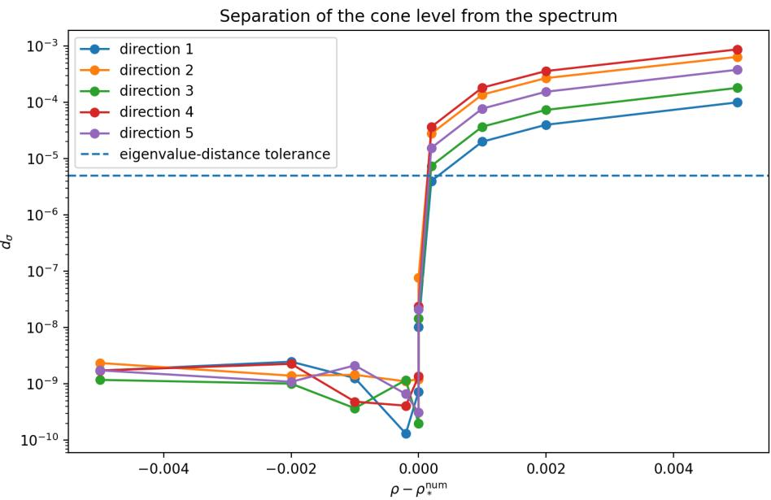
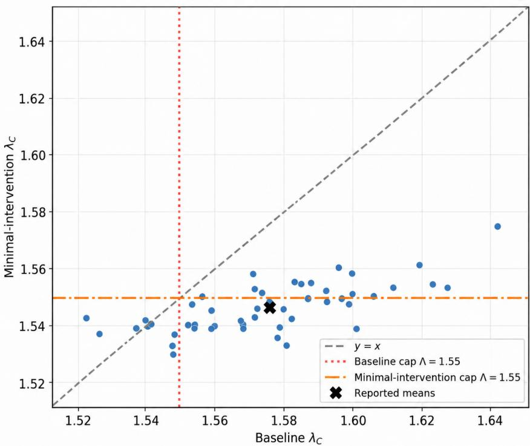
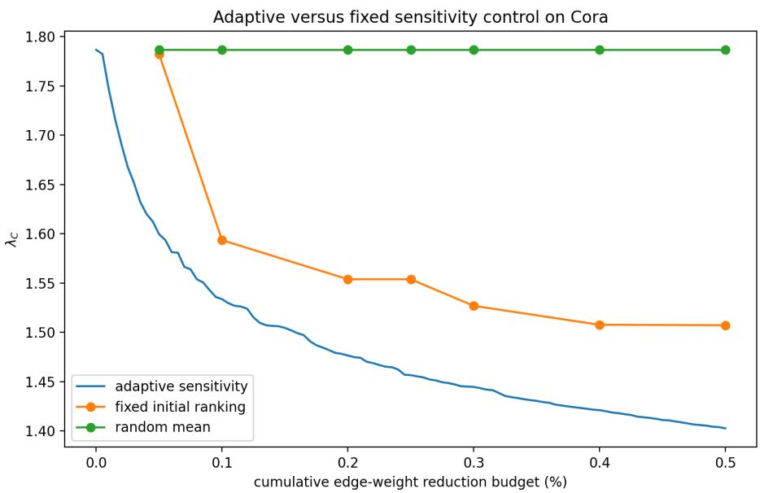

# Cone Extended Rayleigh Quotients for Directed Graph Learning: Minimax Spectral Certificates, Sensitivity, and Adaptive Control

Yavdat S. Il’yasov∗ Nur F. Valeev†

## Abstract

Directed graph learning naturally leads to trainable nonsymmetric propagation operators with distinct right and left spectral structures. Building on the two-sided cone Rayleigh framework for generalized pencils B − λG, we develop a learning-oriented methodology for certification, sensitivity analysis, and control without requiring symmetry, nonnegativity, or cone preservation. In the positive-orthant setting, computable lower and upper cone bounds provide an a posteriori enclosure of a distinguished cone level, while smooth soft-min/max surrogates retain rigorous one-sided bounds with explicit approximation errors and remain diferentiable with respect to the trainable parameters. For a simple interior level, the right and left modes satisfy $D \lambda _ { C } ( B ) [ H ] = v _ { C } ^ { T } H u _ { C }$ , yielding first-order optimal graph-supported interventions under prescribed perturbation budgets and motivating adaptive spectral control. Numerical experiments validate the framework beyond cone-preserving operators and in directed learning. Signed nonsymmetric perturbations exhibit the transition from interior eigenpairs to boundary complementary quasi-pairs, including non-spectral cone levels, while controlled experiments show that symmetrization can remove predictive information carried solely by edge direction. On the directed Cora citation network, adaptive recomputation of the right–left sensitivity reduces the distinguished spectral level by approximately 21.5% under a cumulative edge-weight budget of 0.5%, with no observed change in test accuracy for the trained model and split considered.

Keywords. Directed graph learning; extended Rayleigh quotient; minimax principle; matrix pencil;   
spectral certificate; adaptive spectral control.

2020 Mathematics Subject Classification. 15A18, 15A22, 05C50, 68T07.

## 1 Introduction and related work

## 1.1 Motivation and directed spectral learning

Many learning problems are naturally posed on directed relational data, including citation, communication, transaction, recommendation, and information-flow networks. In such settings, edge direction is part of the observed structure and may itself carry predictive information. Symmetrization may therefore alter both the propagation mechanism and the information available for inference.

For undirected graphs, symmetric adjacency or Laplacian operators allow the use of classical Rayleigh–Ritz theory. Directed propagation operators are generally nonsymmetric and may be strongly nonnormal. Their right and left spectral modes are distinct, while the quadratic Rayleigh quotient

$$
\frac { u ^ { T } B u } { u ^ { T } u }
$$

does not retain this two-sided structure.

Several approaches preserve or encode graph direction through directed Laplacians, directed convolutions, magnetic operators, or separate incoming and outgoing propagation [16, 21, 23, 17, 18]. Rayleigh-quotient terms have also been incorporated into graph-learning objectives [3]. Our approach is complementary: rather than replacing the directed operator by a symmetric or Hermitian surrogate, we work directly with the original nonsymmetric propagation operator through a twosided cone Rayleigh framework.

Let

$$
B _ { \theta } = B _ { \theta } ( A , X ) \in \mathbb { R } ^ { N \times N }
$$

be a trainable directed propagation operator, and more generally consider the pencil

$$
B _ { \theta } - \lambda G .\tag{1.1}
$$

This formulation includes weighted and normalized spectral problems without requiring the explicit formation of $G ^ { - 1 } B _ { \theta }$ , and remains meaningful when G is singular. The general framework does not require $B _ { \theta }$ to be positive, symmetric, or cone preserving; positivity enters only in particular computational realizations considered below.

## 1.2 Two-sided cone Rayleigh formulation

For a symmetric matrix, the classical Rayleigh quotient underlies standard spectral graph methods [20, 22, 15]. For a nonsymmetric pencil, we instead use the two-variable functional

$$
R _ { \theta } ( u , v ) = { \frac { \langle B _ { \theta } u , v \rangle } { \langle G u , v \rangle } } , \qquad \langle G u , v \rangle \neq 0 .\tag{1.2}
$$

The variables u and v play distinct roles. Right and left generalized eigenvectors satisfy

$$
B _ { \theta } u _ { * } = \lambda _ { * } G u _ { * } , \qquad B _ { \theta } ^ { T } v _ { * } = \lambda _ { * } G ^ { T } v _ { * } .
$$

If λ∗ is simple and $v _ { * } ^ { T } G u _ { * } = 1$ , then, with G fixed,

$$
D \lambda _ { * } ( B _ { \theta } ) [ H ] = v _ { * } ^ { T } H u _ { * } ,\tag{1.3}
$$

and therefore

$$
\frac { \partial \lambda _ { \ast } } { \partial b _ { i j } } = ( v _ { \ast } ) _ { i } ( u _ { \ast } ) _ { j } .\tag{1.4}
$$

Thus the right mode represents directed propagation, whereas the left mode encodes its dual sensitivity.

Let $\overline { { C } } \subset \mathbb { R } ^ { N }$ be an admissible cone, $C = \overline { { C } } \setminus \{ 0 \}$ , and $C ^ { \circ } = \operatorname { i n t } { \overline { { C } } } .$ . The associated cone levels are

$$
\operatorname* { s u p } _ { u \in C } \operatorname* { i n f } _ { v \in C ^ { \circ } } R _ { \theta } ( u , v ) , \qquad \operatorname* { i n f } _ { v \in C } \operatorname* { s u p } _ { u \in C ^ { \circ } } R _ { \theta } ( u , v ) .\tag{1.5}
$$

When the two levels coincide and the corresponding quasi-eigenvectors are interior, they yield a genuine right–left generalized eigenpair. At the cone boundary, however, a common variational level may persist without belonging to the ordinary spectrum; the corresponding modes then satisfy complementarity relations rather than eigenvalue equations.

## 1.3 Relation to Perron–Frobenius and extended Rayleigh theory

The construction is related to the Collatz–Wielandt and Perron–Frobenius theories. For irreducible essentially positive matrices, one has the classical two-sided formula

$$
\lambda _ { * } ( A ) = \operatorname* { s u p } _ { u > 0 } \operatorname* { i n f } _ { v > 0 } { \frac { \langle A u , v \rangle } { \langle u , v \rangle } } = \operatorname* { i n f } _ { v > 0 } \operatorname* { s u p } _ { u > 0 } { \frac { \langle A u , v \rangle } { \langle u , v \rangle } } ;
$$

see $[ 1 , 2 , 4 ] .$

A second line of development, leading to the present framework, arose in bifurcation theory. The minimax bifurcation formula introduced by Il’yasov in [6, 7] has the basic variational structure

$$
\lambda _ { * } : = \operatorname* { s u p } _ { u \in \mathcal { U } } \operatorname* { i n f } _ { v \in \mathcal { S } } \mathcal { R } ( u , v ) .\tag{1.6}
$$

It was introduced to characterize critical parameter values directly through a variational principle;   
see also [11].

Numerical realizations of this approach were developed in [14, 8], with applications to powersystem bifurcations [24], nonlinear generalized Collatz–Wielandt formulas [9], and systems of differential equations [10].

The corresponding matrix theory for arbitrary real matrices and general cones was established in [12], without requiring positivity of the of-diagonal entries, irreducibility, or cone preservation. It was subsequently extended to generalized non-selfadjoint operator pencils in [13]. The present work builds on this variational foundation but addresses a diferent problem: trainable directed operators and their use in certified learning, sensitivity analysis, and spectral control.

## 1.4 From certification to adaptive control

For the positive-orthant realization with positive diagonal G, approximate right and left modes yield the computable bounds

$$
\underline { { \lambda } } _ { \theta } ( u ) = \operatorname* { m i n } _ { i } \frac { ( B _ { \theta } u ) _ { i } } { ( G u ) _ { i } } , \qquad \overline { { \lambda } } _ { \theta } ( v ) = \operatorname* { m a x } _ { i } \frac { ( B _ { \theta } ^ { T } v ) _ { i } } { ( G ^ { T } v ) _ { i } } .
$$

If the two cone levels coincide at $\lambda _ { C }$ , then

$$
\underline { { { \lambda } } } _ { \theta } ( u ) \leq \lambda _ { C } \leq \overline { { { \lambda } } } _ { \theta } ( v ) .\tag{1.7}
$$

Thus approximate modes provide an a posteriori enclosure of the distinguished cone level rather than merely an approximate value. Smooth soft-min/max surrogates retain explicit approximation bounds while remaining diferentiable with respect to the trainable parameters.

The same right–left pair determines the local spectral sensitivity. Under the normalization $v _ { C } ^ { T } G u _ { C } = 1$ 2

$$
D \lambda _ { C } ( B _ { \theta } ) [ H ] = v _ { C } ^ { T } H u _ { C } .
$$

The spectral modes therefore induce a control map: graph interactions can be ranked according to their first-order influence on $\lambda _ { C } .$ , and the ranking can be recomputed after each modification. This yields the central mechanism studied in the paper,

two-sided certification −→ right–left sensitivity −→ adaptive spectral control.

## 1.5 Main contributions

The main contributions of this work are as follows.

(i) We bring the two-sided cone framework to trainable directed propagation operators $B _ { \theta } ( A , X )$ and generalized nonsymmetric pencils. This formulation accommodates both interior generalized eigenpairs and boundary complementary quasi-pairs whose common cone level need not belong to the ordinary spectrum.

(ii) We construct computable a posteriori lower and upper enclosures for the distinguished cone level, together with diferentiable soft surrogates having explicit approximation errors. For graph-sparse operators, their evaluation requires essentially only the products $B _ { \theta } u$ and $B _ { \theta } ^ { T }$ v.

(iii) We connect two-sided certification with spectral sensitivity. For a simple interior level,

$$
D \lambda _ { C } ( B _ { \theta } ) [ H ] = v _ { C } ^ { T } H u _ { C } ,
$$

and derive first-order optimal graph-supported interventions, including $L ^ { 1 }$ -budget edge modifications. This gives a variational justification for sensitivity-based edge ranking and for its adaptive recomputation after successive interventions.

(iv) We integrate certification and control into directed node classification. On synthetic directed graphs, a prescribed spectral cap is certified across all realizations while requiring only small modifications of the learned operator and producing no statistically significant change in classification accuracy. A controlled direction-only experiment further shows that symmetrization may remove predictive information carried by edge orientation.

(v) Numerical perturbation experiments validate both boundary quasi-pairs and the right–left sensitivity formula. On the directed Cora citation network, adaptive sensitivity recomputation reduces the distinguished spectral level by approximately 21.5% under a cumulative edgeweight budget of 0.5%, while preserving the observed test accuracy for the trained model and split considered.

Thus the right and left modes play three complementary roles: they characterize the directed cone level, certify it a posteriori, and generate the sensitivity map used for adaptive control.

## 1.6 Organization of the paper

Section 2 introduces the directed learning model and generalized pencil. Section 3 recalls the twosided cone framework. Section 4 develops diferentiable certificates and sensitivity formulas. Sections 5 and 6 describe certified learning, spectral control, and computational algorithms. Section 7 presents the numerical experiments, and Section 8 concludes the paper.

## 2 Directed learning and the spectral control problem

## 2.1 Trainable directed propagation

Let

$$
\Gamma = ( \mathcal { V } , \mathcal { E } , A ) , \qquad \mathcal { V } = \{ 1 , \dots , N \} ,
$$

be a weighted directed graph with adjacency matrix $A = ( a _ { i j } ) \in \mathbb { R } ^ { N \times N }$ . We adopt the convention

$$
a _ { i j } > 0 \quad \Longleftrightarrow \quad j  i ,\tag{2.1}
$$

so that

$$
( A u ) _ { i } = \sum _ { j : j  i } a _ { i j } u _ { j } .
$$

The directionality $A \neq A ^ { T }$ is retained throughout.

Node features $x _ { i } \in \mathbb { R } ^ { d }$ are collected in $X \in \mathbb { R } ^ { N \times d }$ . Directed propagation is represented by a trainable operator

$$
B _ { \theta } = B _ { \theta } ( A , X ) \in \mathbb { R } ^ { N \times N } ,
$$

acting according to

$$
( B _ { \theta } u ) _ { i } = \sum _ { j = 1 } ^ { N } b _ { i j } ( \theta ) u _ { j } .\tag{2.2}
$$

A typical graph-supported parametrization is

$$
b _ { i j } ( \theta ) = a _ { i j } w _ { \theta } ( x _ { i } , x _ { j } ) , \qquad i \ne j ,\tag{2.3}
$$

with diagonal terms fixed or trainable. For sparse graphs we impose

$$
a _ { i j } = 0 \quad \Longrightarrow \quad b _ { i j } ( \theta ) = 0 , \qquad i \neq j ,\tag{2.4}
$$

so that the products $B _ { \theta } u$ and $B _ { \theta } ^ { T } \iota$ v can be evaluated without forming dense matrices.

The general framework requires neither symmetry nor positivity of $B _ { \theta }$ , and does not assume that $B _ { \theta }$ preserves the cone used below.

## 2.2 Learning with spectral control

We consider semi-supervised node classification with labelled training set $\nu _ { \mathrm { t r } } \subset \nu$ and task loss

$$
\mathcal { L } _ { \mathrm { t a s k } } ( \theta ) = - \frac { 1 } { \vert \mathcal { V } _ { \mathrm { t r } } \vert } \sum _ { i \in \mathcal { V } _ { \mathrm { t r } } } \log p _ { i y _ { i } } ( \theta ) .
$$

The particular classifier architecture is secondary here; the principal object is the trainable directed propagation operator $B _ { \theta }$

We associate with it the generalized pencil

$$
\mathcal { P } _ { \theta } ( \lambda ) = B _ { \theta } - \lambda G , \qquad B _ { \theta } , G \in \mathbb { R } ^ { N \times N } ,\tag{2.5}
$$

and the corresponding right and left generalized eigenproblems

$$
B _ { \theta } u = \lambda G u , \qquad B _ { \theta } ^ { T } v = \lambda G ^ { T } v .\tag{2.6}
$$

The matrix G specifies the reference metric or normalization; $G = I$ recovers the ordinary eigenvalue problem.

The learning problem with cone-level control takes the form

$$
\operatorname* { m i n } _ { \theta } \mathcal { L } _ { \mathrm { t a s k } } ( \theta ) \qquad \mathrm { s u b j e c t ~ t o } \qquad \lambda _ { C } ( B _ { \theta } , G ) \leq \Lambda ,\tag{2.7}
$$

where $\lambda _ { C } ( B _ { \theta } , G )$ denotes the distinguished cone level introduced in Section 3. In the interior regime this level is a generalized eigenvalue, whereas at the cone boundary it may instead be quasi-spectral.

Since $B _ { \theta }$ is generally nonsymmetric, its right and left modes are distinct. Rather than relying on repeated eigensolvers during training, we seek two-sided variational quantities that provide computable a posteriori enclosures and remain compatible with gradient-based optimization.

## 2.3 Generalized normalization and right–left modes

The pencil formulation avoids explicit inversion of G and remains meaningful even when G is singular. Typical choices for directed graphs include

$$
G = I , \qquad G = D _ { \mathrm { i n } } , \qquad G = D _ { \mathrm { o u t } } ,
$$

or, more generally,

$$
G = \mathrm { d i a g } ( g _ { 1 } , \ldots , g _ { N } ) , \qquad g _ { i } > 0 ,
$$

where, under the convention (2.1),

$$
d _ { i } ^ { \mathrm { i n } } = \sum _ { j } a _ { i j } , \qquad d _ { i } ^ { \mathrm { o u t } } = \sum _ { j } a _ { j i } .
$$

For a nonsymmetric pencil, the right and left modes in (2.6) are generally distinct. Their interaction is encoded by the two-sided Rayleigh functional

$$
R _ { \theta } ( u , v ) = { \frac { \langle B _ { \theta } u , v \rangle } { \langle G u , v \rangle } } , \qquad \langle G u , v \rangle \neq 0 .
$$

This functional provides the variational basis for the cone minimax levels, a posteriori enclosures, and right–left sensitivity analysis developed in the following sections.

## 3 Two-sided cone spectral framework

The cone minimax framework was developed for arbitrary real matrices in [12] and subsequently extended to generalized non-selfadjoint operator pencils in [13]. Here we recall only the finitedimensional form needed for trainable operators $B _ { \theta } ( A , X )$ ; the learning-specific developments begin in Section 4.

## 3.1 Cone extended Rayleigh quotient

Let $\overline { { C } } \subset \mathbb { R } ^ { N }$ be a closed, convex, solid, self-dual cone, and set

$$
C : = \overline { { C } } \setminus \{ 0 \} , \qquad C ^ { \circ } : = \operatorname { i n t } \overline { { C } } .
$$

The principal computational example is $\overline { { C } } = \mathbb { R } _ { + } ^ { N }$ . No cone-preservation assumption is imposed on $B _ { \theta }$

Assume that

$$
\langle G u , v \rangle > 0 \quad { \mathrm { f o r } } \quad ( u , v ) \in ( C \times C ^ { \circ } ) \cup ( C ^ { \circ } \times C ) .\tag{3.1}
$$

This condition includes $G = I$ and, for $\overline { { C } } = \mathbb { R } _ { + } ^ { N }$ , every positive diagonal $G ;$ in particular, invertibility of G is not required.

Define the cone extended Rayleigh quotient

$$
R _ { \theta } ( u , v ) : = \frac { \langle B _ { \theta } u , v \rangle } { \langle G u , v \rangle } .\tag{3.2}
$$

It is homogeneous of degree zero in each variable separately. The associated upper and lower cone levels are

$$
{ \overline { { \lambda } } } _ { C } ( B _ { \theta } , G ) : = \operatorname* { s u p } _ { u \in C } \operatorname* { i n f } _ { v \in C ^ { \circ } } R _ { \theta } ( u , v ) ,\tag{3.3}
$$

$$
\operatorname { \lrcorner } _ { C } ( B _ { \theta } , G ) : = \operatorname* { i n f } _ { v \in C } \operatorname* { s u p } _ { u \in C ^ { \circ } } R _ { \theta } ( u , v ) .\tag{3.4}
$$

When the outer extrema are attained, their extremizers are called, respectively, right and left quasieigenvectors.

## 3.2 Cone minimax principle

Theorem 3.1 (Cone minimax principle). Under (3.1),

$$
\operatorname* { s u p } _ { u \in C } \operatorname* { i n f } _ { v \in C ^ { \circ } } R _ { \theta } ( u , v ) = \operatorname* { i n f } _ { v \in C ^ { \circ } } \operatorname* { s u p } _ { u \in C } R _ { \theta } ( u , v ) ,\tag{3.5}
$$

$$
\operatorname* { s u p } _ { u \in C ^ { \circ } } \operatorname* { i n f } _ { v \in C } R _ { \theta } ( u , v ) = \operatorname* { i n f } _ { v \in C } \operatorname* { s u p } _ { u \in C ^ { \circ } } R _ { \theta } ( u , v ) .\tag{3.6}
$$

The corresponding outer extrema are attained by some $u _ { C } , v _ { C } \in C$

If $u _ { C } , v _ { C } \in C ^ { \circ }$ , then

$$
\overline { { { \lambda } } } _ { C } ( B _ { \theta } , G ) = \underline { { { \lambda } } } _ { C } ( B _ { \theta } , G ) = : { \lambda } _ { C } ,\tag{3.7}
$$

and

$$
B _ { \theta } u _ { C } = \lambda _ { C } G u _ { C } , \qquad B _ { \theta } ^ { T } v _ { C } = \lambda _ { C } G ^ { T } v _ { C } .\tag{3.8}
$$

Proof sketch. Choose $e \in C ^ { \circ }$ and introduce the normalized cone section

$$
\mathcal { B } = \{ x \in \overline { { C } } : \langle x , e \rangle = 1 \} , \qquad \mathcal { B } ^ { \circ } = \mathcal { B } \cap C ^ { \circ } .
$$

Since $\overline { C }$ is closed, solid, and self-dual, $\boldsymbol { B }$ is compact and convex. By the separate homogeneity of $R _ { \theta }$ , the minimax problems may be restricted to B and $B ^ { \circ }$

Condition (3.1) guarantees positivity of the denominator on the relevant mixed domains. For either variable fixed, $R _ { \theta }$ is linear-fractional in the other and hence both quasiconvex and quasiconcave. Sion’s minimax theorem [25] therefore gives (3.5) and (3.6). Moreover,

$$
u \longmapsto \operatorname* { i n f } _ { v \in B ^ { \circ } } R _ { \theta } ( u , v )
$$

is upper semicontinuous on the compact set $B ,$ whereas

$$
v \longmapsto _ { u \in B ^ { \circ } } R _ { \theta } ( u , v )
$$

is lower semicontinuous there. Hence the corresponding outer extrema are attained.

Since $C ^ { \circ } \subset C$ , the two minimax identities imply

$$
\underline { { \lambda } } _ { C } ( B _ { \theta } , G ) \leq \overline { { \lambda } } _ { C } ( B _ { \theta } , G ) .
$$

If $u _ { C } , v _ { C } \in C ^ { \circ }$ , then

$$
\overline { { \lambda } } _ { C } ( B _ { \theta } , G ) \leq R _ { \theta } ( u _ { C } , v _ { C } ) \leq \underline { { \lambda } } _ { C } ( B _ { \theta } , G ) ,
$$

and therefore all three quantities coincide. Thus $v _ { C }$ minimizes $R _ { \theta } ( u _ { C } , \cdot )$ and $u _ { C }$ maximizes $R _ { \theta } ( \cdot , v _ { C } )$ Since both extremizers are interior, the first-order conditions yield

$$
\nabla _ { v } R _ { \theta } ( u _ { C } , v _ { C } ) = \frac { B _ { \theta } u _ { C } - \lambda _ { C } G u _ { C } } { \langle G u _ { C } , v _ { C } \rangle } = 0
$$

and

$$
\nabla _ { u } R _ { \theta } ( u _ { C } , v _ { C } ) = \frac { B _ { \theta } ^ { T } v _ { C } - \lambda _ { C } G ^ { T } v _ { C } } { \langle G u _ { C } , v _ { C } \rangle } = 0 .
$$

This proves (3.8).

Theorem 3.1 is the finite-dimensional specialization of the cone framework developed in [12, 13]. The proof sketch is included only to expose the minimax mechanism used below; the general operator-pencil theory and its extensions are given in the cited works. Here the theorem provides the variational basis for two-sided certification, diferentiable learning constraints, and adaptive spectral control.

## 3.3 Interior modes and boundary quasi-pairs

Suppose that

$$
\begin{array} { r } { \overline { { \lambda } } _ { C } ( B _ { \theta } , G ) = \underline { { \lambda } } _ { C } ( B _ { \theta } , G ) = \lambda _ { C } . } \end{array}
$$

The corresponding quasi-pair satisfies

$$
r _ { C } : = B _ { \theta } u _ { C } - \lambda _ { C } G u _ { C } \in \overline { { C } } , \qquad s _ { C } : = \lambda _ { C } G ^ { T } v _ { C } - B _ { \theta } ^ { T } v _ { C } \in \overline { { C } } ,
$$

together with the complementarity relations

$$
\langle r _ { C } , v _ { C } \rangle = \langle s _ { C } , u _ { C } \rangle = 0 .
$$

If $v _ { C } \in C ^ { \circ }$ , then $r _ { C } = 0$ , whereas $u _ { C } \in C ^ { \circ }$ implies $s _ { C } = 0$ . Consequently, a common cone level that does not belong to the generalized spectrum can occur only when

$$
u _ { C } , v _ { C } \in \partial \overline { { C } } .
$$

Such boundary complementary quasi-pairs occur in the signed-perturbation experiments of Section 7.

## 3.4 Positive orthant and computable bounds

For the computational realization we take

$$
\begin{array} { r } { \overline { { C } } = \mathbb { R } _ { + } ^ { N } , \qquad G = \mathrm { d i a g } ( g _ { 1 } , \dots , g _ { N } ) , \qquad g _ { i } > 0 . } \end{array}
$$

For $u , v > 0$

$$
\operatorname* { i n f } _ { \widetilde { v } > 0 } R _ { \theta } ( u , \widetilde { v } ) = \operatorname* { m i n } _ { i } \frac { ( B _ { \theta } u ) _ { i } } { ( G u ) _ { i } } ,\tag{3.9}
$$

$$
\operatorname* { s u p } _ { \widetilde { u } > 0 } R _ { \theta } ( \widetilde { u } , v ) = \operatorname* { m a x } _ { i } \frac { ( B _ { \theta } ^ { T } v ) _ { i } } { ( G ^ { T } v ) _ { i } } ,\tag{3.10}
$$

and hence

$$
\overline { { { \lambda } } } _ { C } ( B _ { \theta } , G ) = \operatorname* { s u p } _ { u > 0 } \operatorname* { m i n } _ { i } \frac { ( B _ { \theta } u ) _ { i } } { ( G u ) _ { i } } ,\tag{3.11}
$$

$$
\underline { { \lambda } } _ { C } ( B _ { \theta } , G ) = \operatorname* { i n f } _ { v > 0 } \operatorname* { m a x } _ { i } \frac { ( B _ { \theta } ^ { T } v ) _ { i } } { ( G ^ { T } v ) _ { i } } .\tag{3.12}
$$

These are weighted-pencil analogues of the generalized Collatz–Wielandt formulas developed in [12]. For arbitrary trial vectors $u , v > 0$ , define

$$
\underline { { \lambda } } _ { \theta } ( u ) : = \operatorname* { m i n } _ { i } \frac { ( B _ { \theta } u ) _ { i } } { ( G u ) _ { i } } , \qquad \overline { { \lambda } } _ { \theta } ( v ) : = \operatorname* { m a x } _ { i } \frac { ( B _ { \theta } ^ { T } v ) _ { i } } { ( G ^ { T } v ) _ { i } } .\tag{3.13}
$$

Their evaluation requires only the matrix–vector products $B _ { \theta } u$ and $B _ { \theta } ^ { T } v$ . These quantities provide the basis for the learning-compatible a posteriori enclosures developed in the next section.

## 3.5 Classical positive case

If G is positive diagonal and $B _ { \theta } \geq 0$ is irreducible, then Perron–Frobenius theory yields

$$
\bar { \lambda } _ { C } ( B _ { \theta } , G ) = \lambda _ { C } ( B _ { \theta } , G ) = \rho ( G ^ { - 1 } B _ { \theta } ) ,\tag{3.14}
$$

with positive right and left generalized eigenvectors.

More generally, if $B _ { \theta }$ is an irreducible Metzler matrix, then

$$
\overline { { { \lambda } } } _ { C } ( B _ { \theta } , G ) = \underline { { { \lambda } } } _ { C } ( B _ { \theta } , G ) = \operatorname* { m a x } _ { \lambda \in \sigma ( G ^ { - 1 } B _ { \theta } ) } \operatorname { R e } \lambda .\tag{3.15}
$$

Thus the cone formulation recovers the classical positive theory while remaining applicable to signchanging and non-cone-preserving operators.

## 4 Diferentiable spectral certification and sensitivity

We now pass from the static cone framework to quantities suitable for trainable operators $B _ { \theta } ( A , X )$ a posteriori enclosures, diferentiable certified surrogates, and right–left sensitivity.

## 4.1 Spectral envelope

For $G = I ,$ set

$$
S _ { \theta } = \frac { B _ { \theta } + B _ { \theta } ^ { T } } { 2 } .
$$

Theorem 4.1 (Spectral envelope). For every self-dual solid closed convex cone ${ \overline { { C } } } ,$

$$
\lambda _ { \operatorname* { m i n } } ( S _ { \theta } ) \leq \underline { { \lambda } } _ { C } ( B _ { \theta } ) \leq \overline { { \lambda } } _ { C } ( B _ { \theta } ) \leq \lambda _ { \operatorname* { m a x } } ( S _ { \theta } ) .\tag{4.1}
$$

Indeed, testing the inner extremum with the same vector reduces the quotient to the Rayleigh quotient of $S _ { \theta }$ , while the middle inequality follows from Theorem 3.1. For positive diagonal $G ,$ the same argument gives

$$
\lambda _ { \operatorname* { m i n } } \biggl ( G ^ { - 1 / 2 } \frac { B _ { \theta } + B _ { \theta } ^ { T } } { 2 } G ^ { - 1 / 2 } \biggr ) \leq \lambda _ { C } ( B _ { \theta } , G ) \leq \overline { { \lambda } } _ { C } ( B _ { \theta } , G ) \leq \lambda _ { \operatorname* { m a x } } \biggl ( G ^ { - 1 / 2 } \frac { B _ { \theta } + B _ { \theta } ^ { T } } { 2 } G ^ { - 1 / 2 } \biggr ) .\tag{4.2}
$$

## 4.2 A posteriori two-sided certificates

Let

$$
\begin{array} { r } { \overline { { C } } = \mathbb { R } _ { + } ^ { N } , \qquad G = \mathrm { d i a g } ( g _ { 1 } , \dots , g _ { N } ) , \qquad g _ { i } > 0 , } \end{array}
$$

and suppose

$$
\underline { { { \lambda } } } _ { C } ( B _ { \theta } , G ) = \overline { { { \lambda } } } _ { C } ( B _ { \theta } , G ) = : \lambda _ { C } ( B _ { \theta } , G ) .
$$

Then, for every $u , v > 0$

$$
\underline { { \lambda } } _ { \theta } ( u ) \leq \lambda _ { C } ( B _ { \theta } , G ) \leq \overline { { \lambda } } _ { \theta } ( v ) ,\tag{4.3}
$$

where the trial quantities are defined in (3.13). Hence

$$
\begin{array} { r } { \mathrm { G a p } _ { \theta } ( u , v ) : = \overline { { \lambda } } _ { \theta } ( v ) - { \underline { { \lambda } } _ { \theta } } ( u ) \geq 0 } \end{array}\tag{4.4}
$$

is the width of an a posteriori enclosure and vanishes at an exact positive right–left eigenpair. For sparse $B _ { \theta }$ , its evaluation requires only $B _ { \theta } u$ and $B _ { \theta } ^ { T }$ v.

## 4.3 Diferentiable certified surrogates

The exact bounds involve coordinatewise minima and maxima and are therefore nonsmooth. Set

$$
r _ { i } ( u ) = \frac { ( B _ { \theta } u ) _ { i } } { ( G u ) _ { i } } , \qquad s _ { i } ( v ) = \frac { ( B _ { \theta } ^ { T } v ) _ { i } } { ( G ^ { T } v ) _ { i } } ,
$$

and, for $\varepsilon > 0$ , define

$$
\underline { { \lambda } } _ { \theta , \varepsilon } ( u ) = - \varepsilon \log \sum _ { i = 1 } ^ { N } e ^ { - r _ { i } ( u ) / \varepsilon } ,\tag{4.5}
$$

$$
\overline { { \lambda } } _ { \theta , \varepsilon } ( v ) = \varepsilon \log \sum _ { i = 1 } ^ { N } e ^ { s _ { i } ( v ) / \varepsilon } .\tag{4.6}
$$

The standard soft-min/max inequalities give

$$
\begin{array} { r } { 0 \leq \underline { { \lambda } } _ { \theta } ( u ) - \underline { { \lambda } } _ { \theta , \varepsilon } ( u ) \leq \varepsilon \log N , } \end{array}\tag{4.7}
$$

$$
0 \leq \overline { { \lambda } } _ { \theta , \varepsilon } ( v ) - \overline { { \lambda } } _ { \theta } ( v ) \leq \varepsilon \log N .\tag{4.8}
$$

Consequently,

$$
\underline { { \lambda } } _ { \theta , \varepsilon } ( u ) \leq \lambda _ { C } ( B _ { \theta } , G ) \leq \overline { { \lambda } } _ { \theta , \varepsilon } ( v ) ,\tag{4.9}
$$

so smoothing preserves the certified enclosure.

With

$$
\mathrm { G a p } _ { \theta , \varepsilon } ( u , v ) = \overline { { \lambda } } _ { \theta , \varepsilon } ( v ) - { \underline { { \lambda } } _ { \theta , \varepsilon } } ( u ) ,
$$

one has

$$
0 \leq \mathrm { G a p } _ { \theta , \varepsilon } ( u , v ) - \mathrm { G a p } _ { \theta } ( u , v ) \leq 2 \varepsilon \log N .\tag{4.10}
$$

Thus the smooth enclosure enlarges the exact one by at most 2ε log N while remaining diferentiable in u, v, and the trainable parameters. In particular,

$$
\overline { { \lambda } } _ { \theta , \varepsilon } ( v ) \leq \Lambda\tag{4.11}
$$

is a diferentiable suficient condition for $\lambda _ { C } ( B _ { \theta } , G ) \leq \Lambda$ and is the certified constraint used below.

## 4.4 Perturbation stability

Let $u _ { C } , v _ { C } \in C ^ { \circ }$ form an interior right–left pair at $\lambda _ { C }$ and define

$$
c _ { 1 } = \| v _ { C } \| \operatorname* { s u p } _ { u \in C } \frac { \| u \| } { \langle G u , v _ { C } \rangle } , \qquad c _ { 2 } = \| u _ { C } \| \operatorname* { s u p } _ { v \in C } \frac { \| v \| } { \langle G u _ { C } , v \rangle } , \qquad c _ { 0 } = \operatorname* { m a x } \{ c _ { 1 } , c _ { 2 } \} .
$$

Then, for every perturbation H,

$$
\begin{array} { r } { \left[ \underline { { \lambda } } _ { C } ( B _ { \theta } + H , G ) , \overline { { \lambda } } _ { C } ( B _ { \theta } + H , G ) \right] \subseteq \left[ \lambda _ { C } - c _ { 0 } \| H \| _ { M } , \lambda _ { C } + c _ { 0 } \| H \| _ { M } \right] . } \end{array}\tag{4.12}
$$

Indeed, use $u _ { C }$ and $v _ { C }$ as trial vectors together with $| \langle H u , v \rangle | \leq \| H \| _ { M } \| u \| \| v \|$ . Thus the cone-level interval is stable under arbitrary bounded matrix perturbations.

## 4.5 Right–left sensitivity

The preceding estimate controls finite perturbations but does not distinguish their directions. For a simple interior generalized eigenvalue, standard right–left perturbation theory gives

$$
\begin{array} { r } { B _ { \theta } u _ { * } = \lambda _ { * } G u _ { * } , \qquad B _ { \theta } ^ { T } v _ { * } = \lambda _ { * } G ^ { T } v _ { * } , \qquad v _ { * } ^ { T } G u _ { * } \neq 0 , } \end{array}
$$

and, for every $H \in \mathbb { R } ^ { N \times N }$

$$
D \lambda _ { * } ( B _ { \theta } ) [ H ] = \frac { v _ { * } ^ { T } H u _ { * } } { v _ { * } ^ { T } G u _ { * } } .\tag{4.13}
$$

Hence

$$
\frac { \partial \lambda _ { * } } { \partial b _ { i j } } = \frac { ( v _ { * } ) _ { i } ( u _ { * } ) _ { j } } { v _ { * } ^ { T } G u _ { * } } ,\tag{4.14}
$$

and under $v _ { * } ^ { T } G u _ { * } = 1$ 2

$$
\frac { \partial \lambda _ { \ast } } { \partial b _ { i j } } = ( v _ { \ast } ) _ { i } ( u _ { \ast } ) _ { j } .
$$

For a trainable operator $B _ { \theta }$ , the chain rule yields

$$
\frac { \partial \lambda _ { * } } { \partial \theta _ { k } } = \frac { v _ { * } ^ { T } ( \partial B _ { \theta } / \partial \theta _ { k } ) u _ { * } } { v _ { * } ^ { T } G u _ { * } } .\tag{4.15}
$$

Thus the right–left pair used for certification also identifies the directed interactions and trainable parameters with the largest first-order influence on the distinguished level. This leads to the intervention and adaptive-control constructions of the next section.

## 5 Certified learning and adaptive spectral control

For the learning constructions below we assume the coincident-level regime

$$
\underline { { \lambda } } _ { C } ( B _ { \theta } , G ) = \overline { { \lambda } } _ { C } ( B _ { \theta } , G ) = : \lambda _ { C } ( B _ { \theta } , G ) ,
$$

as in the irreducible nonnegative propagation operators used in the main classification experiments.

For semi-supervised node classification, let

$$
\mathcal { L } _ { \mathrm { t a s k } } ( \theta ) = - \frac { 1 } { \vert \mathcal { V } _ { \mathrm { t r } } \vert } \sum _ { i \in \mathcal { V } _ { \mathrm { t r } } } \log p _ { i y _ { i } } ( \theta ) .\tag{5.1}
$$

Here certified refers to the cone-level enclosure

$$
\begin{array} { r } { \underline { { \lambda } } _ { \theta } ( u ) \leq \lambda _ { C } ( B _ { \theta } , G ) \leq \overline { { \lambda } } _ { \theta } ( v ) , } \end{array}
$$

not to certification of classification accuracy.

## 5.1 Diferentiable spectral constraint

To impose

$$
\lambda _ { C } ( B _ { \theta } , G ) \leq \tau ,\tag{5.2}
$$

it sufices by (4.9) to require

$$
\begin{array} { r } { \overline { { \lambda } } _ { \theta , \varepsilon } ( v ) \leq \tau . } \end{array}
$$

We therefore use

$$
\mathcal { L } _ { \mathrm { s p e c } } = \left[ \operatorname* { m a x } \left\{ 0 , \overline { { \lambda } } _ { \theta , \varepsilon } ( v ) - \tau \right\} \right] ^ { 2 } ,\tag{5.3}
$$

together with

$$
\begin{array} { r } { \mathcal { L } _ { \mathrm { g a p } } = \mathrm { G a p } _ { \theta , \varepsilon } ( u , v ) , } \end{array}\tag{5.4}
$$

and

$$
{ \mathcal { L } } _ { \mathrm { t o t a l } } = { \mathcal { L } } _ { \mathrm { t a s k } } + \beta _ { \mathrm { s p e c } } { \mathcal { L } } _ { \mathrm { s p e c } } + \beta _ { \mathrm { g a p } } { \mathcal { L } } _ { \mathrm { g a p } } .\tag{5.5}
$$

Here $\theta$ parametrizes the learning model, while $u , v > 0$ sharpen the two-sided enclosure. The task and cone-level terms have diferent roles, so changes in $\lambda _ { C }$ need not produce comparable changes in classification accuracy.

For robustness against $\| H \| _ { M } \leq \rho ,$ (4.12) gives the suficient condition

$$
\begin{array} { r } { \overline { { \lambda } } _ { \theta , \varepsilon } ( v ) + c _ { 0 } \rho \leq \tau , } \end{array}
$$

with the corresponding optional penalty

$$
\mathcal { L } _ { \mathrm { r o b u s t } } = \left[ \operatorname* { m a x } \left\{ 0 , \overline { { \lambda } } _ { \theta , \varepsilon } ( v ) + c _ { 0 } \rho - \tau \right\} \right] ^ { 2 } .\tag{5.6}
$$

## 5.2 Minimal-intervention spectral control

Assume that $\lambda _ { C }$ is a simple interior generalized eigenvalue and normalize

$$
v _ { C } ^ { T } G u _ { C } = 1 .
$$

Then

$$
D \lambda _ { C } ( B ) [ H ] = v _ { C } ^ { T } H u _ { C } = \langle \Sigma _ { C } , H \rangle _ { F } , \qquad \Sigma _ { C } : = v _ { C } u _ { C } ^ { T } .\tag{5.7}
$$

Thus $\Sigma _ { C }$ is the first-order sensitivity map.

Let $\mathcal { E } _ { \mathrm { a d m } }$ denote the modifiable interactions and $P _ { \mathcal { E } _ { \mathrm { a d m } } }$ the corresponding coordinate projection.

Proposition 5.1 (First-order optimal intervention). For

$$
\mathrm { s u p p } H \subseteq { \mathcal { E } } _ { \mathrm { a d m } } , \qquad \| H \| _ { F } \leq \eta ,
$$

with $P \varepsilon _ { \mathrm { a d m } } ( \Sigma _ { C } ) \neq 0$

$$
\mathrm { m i n } D \lambda _ { C } ( B ) [ H ] = - \eta \left. P _ { \mathrm { \& d m } } ( \Sigma _ { C } ) \right. _ { F } ,\tag{5.8}
$$

attained at

$$
H _ { * } = - \eta \frac { P _ { \mathcal { E } _ { \mathrm { a d m } } } ( \Sigma _ { C } ) } { \Vert P _ { \mathcal { E } _ { \mathrm { a d m } } } ( \Sigma _ { C } ) \Vert _ { F } } .\tag{5.9}
$$

Proof. For every admissible H,

$$
D \lambda _ { C } ( B ) [ H ] = \langle P _ { \mathcal { E } _ { \mathrm { a d m } } } ( \Sigma _ { C } ) , H \rangle _ { F } ,
$$

and the claim follows from Cauchy–Schwarz.

Hence the right–left modes determine a locally optimal graph-supported direction for decreasing the distinguished level. In particular,

$$
\frac { \partial \lambda _ { C } } { \partial b _ { i j } } = ( v _ { C } ) _ { i } ( u _ { C } ) _ { j } ,
$$

which gives the natural coordinatewise sensitivity ranking.

Corollary 5.2 (L1-budget edge intervention). Let

$$
g _ { e } : = { \frac { \partial \lambda _ { C } } { \partial w _ { e } } } .
$$

For decrease-only perturbations

$$
\Delta w _ { e } = - h _ { e } , \qquad h _ { e } \geq 0 , \qquad \sum _ { e } h _ { e } \leq \eta ,
$$

one has

$$
D \lambda _ { C } ( w ) [ \Delta w ] = - \sum _ { e } g _ { e } h _ { e } .\tag{5.10}
$$

Without individual bounds on $h _ { e }$

$$
\operatorname* { m i n } D \lambda _ { C } ( w ) [ \Delta w ] = - \eta \operatorname* { m a x } _ { e } ( g _ { e } ) _ { + } ,\tag{5.11}
$$

so the $f u l l$ budget is assigned to an edge of maximal positive sensitivity. Under box constraints

$$
0 \leq h _ { e } \leq \bar { h } _ { e } ,\tag{5.12}
$$

the first-order optimum is obtained by ordering edges by decreasing positive $g _ { e }$ and saturating the corresponding bounds until the budget is exhausted.

Proof. This is the maximization of the linear functional $\sum _ { \mathit { e } } g _ { e } h _ { e }$ under the stated $L ^ { 1 }$ and box constraints. □

Since the sensitivities change with the operator, their recomputation after each modification leads naturally to adaptive control.

## 5.3 Adaptive spectral control

Starting from $B ^ { ( 0 ) }$ , one adaptive step is

$$
B ^ { ( k ) } \longrightarrow ( \lambda _ { C } ^ { ( k ) } , u _ { C } ^ { ( k ) } , v _ { C } ^ { ( k ) } ) \longrightarrow \Sigma _ { C } ^ { ( k ) } = v _ { C } ^ { ( k ) } ( u _ { C } ^ { ( k ) } ) ^ { T } \longrightarrow H ^ { ( k ) } \longrightarrow B ^ { ( k + 1 ) } ,\tag{5.13}
$$

where

$$
B ^ { ( k + 1 ) } = B ^ { ( k ) } + H ^ { ( k ) }
$$

and $H ^ { ( k ) }$ satisfies the current admissibility and budget constraints.

The procedure stops when

$$
\overline { { \lambda } } _ { \varepsilon } ^ { ( k ) } \leq \tau
$$

or the cumulative intervention budget is exhausted. Unlike a fixed ranking, the adaptive scheme recomputes the right–left modes after each modification and hence updates the local linearization along the control path.

## 5.4 Scope of the certificate

The pair $( u _ { C } , v _ { C } )$ provides both an a posteriori enclosure and a local control direction. For strongly nonnormal operators, however, control of $\lambda _ { C } ( B _ { \theta } , G )$ does not in general control transient amplification, pseudospectral growth, operator norms, or prediction robustness. The method therefore controls a distinguished cone-relevant spectral mode, not the full nonnormal dynamics.

## 6 Algorithms and computational cost

Throughout this section,

$$
\begin{array} { r } { \overline { { C } } = \mathbb { R } _ { + } ^ { N } , \qquad G = \mathrm { d i a g } ( g _ { 1 } , \dots , g _ { N } ) , \qquad g _ { i } > 0 . } \end{array}
$$

The positive vectors $u , v$ are auxiliary modes associated with the current operator $B _ { \theta }$

## 6.1 Mode computation and alternating training

For fixed $B _ { \theta } .$ , the modes are obtained from

$$
\operatorname * { m a x } _ { u > 0 } \underline { { { \lambda } } } _ { \theta , \varepsilon } ( u ) , \qquad \operatorname * { m i n } _ { v > 0 } \overline { { { \lambda } } } _ { \theta , \varepsilon } ( v ) .\tag{6.1}
$$

Positivity and scale normalization are enforced by

$$
u = \frac { \mathrm { s o f t p l u s } ( z _ { u } ) + \delta _ { \mathrm { p o s } } \mathbf { 1 } } { \| \mathrm { s o f t p l u s } ( z _ { u } ) + \delta _ { \mathrm { p o s } } \mathbf { 1 } \| _ { 1 } } , \qquad v = \frac { \mathrm { s o f t p l u s } ( z _ { v } ) + \delta _ { \mathrm { p o s } } \mathbf { 1 } } { \| \mathrm { s o f t p l u s } ( z _ { v } ) + \delta _ { \mathrm { p o s } } \mathbf { 1 } \| _ { 1 } } ,\tag{6.2}
$$

with $\delta _ { \mathrm { p o s } } > 0$ . Since the two optimizations are independent for fixed $B _ { \theta }$ , they can be performed simultaneously by minimizing

$$
\begin{array} { r } { \mathcal { L } _ { \mathrm { m o d e } } = \overline { { \lambda } } _ { \theta , \varepsilon } ( v ) - \underline { { \lambda } } _ { \theta , \varepsilon } ( u ) = \mathrm { G a p } _ { \theta , \varepsilon } ( u , v ) . } \end{array}\tag{6.3}
$$

The smoothing parameter ε may be decreased near convergence.

Training alternates between mode and model updates:

(i) With θ fixed, update $z _ { u } , z _ { v }$ by minimizing $\mathcal { L } _ { \mathrm { m o d e } }$

(ii) Evaluate the exact bounds $\underline { { \lambda } } _ { \theta } ( u )$ and $\overline { { \lambda } } _ { \theta } ( v )$

(iii) With $u , v$ fixed, update θ using $\mathcal { L } _ { \mathrm { t o t a l } }$ from (5.5), optionally including $\beta _ { \mathrm { r o b } } \mathcal { L } _ { \mathrm { r o b u s t } }$

The smooth quantities are diferentiated by automatic diferentiation, and the mode variables are warm-started from the preceding outer iteration.

## 6.2 Adaptive intervention after training

At iteration $k ,$ normalize

$$
( v _ { C } ^ { ( k ) } ) ^ { T } G u _ { C } ^ { ( k ) } = 1
$$

and form

$$
\Sigma _ { C } ^ { ( k ) } = v _ { C } ^ { ( k ) } ( u _ { C } ^ { ( k ) } ) ^ { T } .\tag{6.4}
$$

After restriction to the admissible interactions, choose $H ^ { ( k ) }$ according to the prescribed budget and set

$$
B ^ { ( k + 1 ) } = B ^ { ( k ) } + H ^ { ( k ) } .\tag{6.5}
$$

The modes and certificate are recomputed before the next intervention. The procedure stops when the certified cap is reached or the cumulative budget is exhausted. Recomputing $\Sigma _ { C } ^ { ( k ) }$ distinguishes the adaptive scheme from a fixed initial sensitivity ranking.

## 6.3 Computational cost and stopping criterion

For graph-sparse operators, or graph-sparse operators augmented by structured low-rank terms such as the Cora teleportation term, the products

$$
B _ { \theta } u , \qquad B _ { \theta } ^ { T } v
$$

can be evaluated in

$$
O ( | \mathcal { E } | + N )
$$

operations. The componentwise ratios and soft-min/max evaluations require $O ( N )$ additional work. Hence one two-sided certificate costs

$$
O ( | { \mathcal { E } } | + N ) ,\tag{6.6}
$$

apart from the model-specific evaluation of trainable edge weights. With $m _ { \mathrm { m o d e } }$ inner steps, the spectral cost per outer iteration is

$$
O ( m _ { \mathrm { m o d e } } ( | { \mathcal { E } } | + N ) ) .
$$

Although the smooth gap (6.3) is used for optimization, certification uses the exact gap. The mode iteration stops when

$$
\mathrm { G a p } _ { \theta } ( u , v ) = \overline { { { \lambda } } } _ { \theta } ( v ) - \underline { { { \lambda } } } _ { \theta } ( u ) \leq \eta _ { \mathrm { g a p } } .\tag{6.7}
$$

Residual norms may additionally be monitored for interior eigenpairs, but they do not by themselves provide a two-sided enclosure.

Thus both training and adaptive control require only sparse or structured forward and transpose propagations, componentwise operations, and standard gradient-based updates.

## 7 Numerical experiments

The experiments test the cone framework beyond cone-preserving operators, certified directed learning, and sensitivity-based control of a learned real-world operator. Unless stated otherwise, eigensolvers are used only for post-hoc validation.

## 7.1 Validation of the cone spectral framework

## 7.1.1 Signed perturbations and boundary quasi-pairs

Starting from a positive reference operator B, we consider

$$
B _ { \rho } ^ { ( k ) } = B + \rho H _ { k } , \qquad k = 1 , \ldots , 5 ,
$$

where the $H _ { k }$ are nonsymmetric sign-changing perturbations with $\| H _ { k } \| _ { 2 } = 1$ . For $G = I$ and $C = \mathbb { R } _ { + } ^ { N }$ , the right and left cone levels are computed by linear programming and bisection from

$$
( B _ { \rho } - \lambda I ) u \ge 0 , \qquad ( \lambda I - B _ { \rho } ^ { T } ) v \ge 0 , \qquad u , v \in \Delta ,
$$

where

$$
\Delta = \{ x \in \mathbb { R } _ { + } ^ { N } : \sum _ { i } x _ { i } = 1 \} .
$$

For the 25 matrices corresponding to $\rho \in \{ 0 . 1 , 0 . 2 , 0 . 5 , 1 , 2 \}$ and the five perturbation directions, the independently computed right and left levels coincide to numerical precision. Seven cases have an interior right–left pair with

$$
\operatorname* { m i n } _ { \mu \in \sigma ( B _ { \rho } ) } | \widehat { \lambda } _ { C } - \mu | = O ( 1 0 ^ { - 1 0 } ) ,
$$

whereas in the remaining 18 boundary cases the common level is typically separated from the ordinary spectrum by $1 0 ^ { - 3 } – 1 0 ^ { - 2 }$ . The complementarity error satisfies

$$
\operatorname* { m a x } _ { i } \left\{ | ( v _ { C } ) _ { i } ( r _ { C } ) _ { i } | , | ( u _ { C } ) _ { i } ( s _ { C } ) _ { i } | \right\} \leq 1 . 3 0 \times 1 0 ^ { - 1 1 } .
$$

Bisection localizes the first loss of strict positivity.

Table 1: Transition from an interior eigenpair to a boundary quasi-pair.
<table><tr><td>Direction</td><td> $\rho _ { * } ^ { \mathrm { n u m } }$ </td><td>First contact</td><td>Vertex</td></tr><tr><td>1</td><td>0.108915329</td><td>left</td><td>54</td></tr><tr><td>2</td><td>0.105184555</td><td>right</td><td>16</td></tr><tr><td>3</td><td>0.226080799</td><td>right</td><td>49</td></tr><tr><td>4</td><td>0.122442245</td><td>right</td><td>22</td></tr><tr><td>5</td><td>0.273017025</td><td>right</td><td>49</td></tr></table>

Below $\rho _ { * } ^ { \mathrm { n u m } }$ the common level agrees with an eigenvalue and the modes are strictly positive; after contact, boundary complementary quasi-pairs appear and may become non-spectral.

  
Figure 1: Distance between the common cone level and the ordinary spectrum near the boundary transition.

## 7.1.2 Validation of right–left sensitivity

For a simple interior eigenvalue normalized by $v _ { C } ^ { T } u _ { C } = 1$ ，

$$
D \lambda _ { C } ( B ) [ H ] = v _ { C } ^ { T } H u _ { C } .
$$

Central finite diferences give absolute errors

$$
7 . 8 \times 1 0 ^ { - 6 } , \qquad 7 . 8 \times 1 0 ^ { - 8 } , \qquad 7 . 9 \times 1 0 ^ { - 1 0 }
$$

Table 2: Certified learning over 50 directed-SBM realizations (mean ± sample standard deviation).
<table><tr><td>Metric</td><td>Baseline</td><td>Certified model</td></tr><tr><td>Test accuracy</td><td> $0 . 8 7 1 0 \pm 0 . 0 5 2 1$ </td><td> $0 . 8 7 1 7 \pm 0 . 0 5 3 6$ </td></tr><tr><td>Perron root</td><td> $1 . 5 7 5 6 9 6 \pm 0 . 0 2 6 5 5 0$ </td><td> $1 . 5 4 6 2 4 0 \pm 0 . 0 0 8 8 5 4$ </td></tr><tr><td>Certified cap success</td><td></td><td> $5 0 / 5 0$ </td></tr><tr><td>Runs requiring intervention</td><td></td><td> $4 4 / 5 0$ </td></tr><tr><td>Relative operator change</td><td></td><td> $0 . 0 1 5 9 8 5 \pm 0 . 0 1 1 7 9 2$ </td></tr></table>

for step sizes $1 0 ^ { - 2 } , 1 0 ^ { - 3 }$ , and $1 0 ^ { - 4 }$ , respectively.

For a graph-supported direction $H _ { \mathrm { g r a p h } }$ with $\| H _ { \mathrm { g r a p h } } \| _ { 2 } = 1$

$$
v _ { C } ^ { T } H _ { \mathrm { g r a p h } } u _ { C } \approx 0 . 9 4 4 1 ,
$$

whereas the maximum among 50 random graph-supported directions is 0.1313. For $B + 0 . 0 5 H _ { \mathrm { g r a p h } }$ the observed shift is 0.04697, compared with the first-order prediction 0.04721. Thus the right–left product accurately captures both directional sensitivity and influential graph interactions.

## 7.2 Certified learning on a directed stochastic block model

We use a two-class directed stochastic block model with N = 100, 50 vertices per class, and

$$
P = { \binom { 0 . 1 2 \quad 0 . 0 8 } { 0 . 0 2 \quad 0 . 1 2 } } .
$$

Each vertex has an 8-dimensional Gaussian feature vector, with a $2 0 / 2 0 / 6 0$ train/validation/test split.

For $G = I ,$

$$
( B _ { \theta } ) _ { i j } = \delta _ { i j } + a _ { i j } \frac { w _ { i j } } { \sqrt { d _ { i } ^ { \mathrm { i n } } d _ { j } ^ { \mathrm { o u t } } } } , \qquad w _ { i j } \in [ 0 . 0 5 , 1 ] ,
$$

where the edge weights are trainable and feature dependent. We impose the cap $\Lambda = 1 . 5 5$ , chosen in preliminary runs to be nontrivial but attainable. No eigensolver is used during training or certification. Results are reported over 50 independent graph realizations.

The paired accuracy change is

$$
0 . 0 0 0 7 \pm 0 . 0 1 5 0 , \qquad 9 5 \% \mathrm { C I } = [ - 0 . 0 0 3 6 , 0 . 0 0 4 9 ] , \qquad p = 0 . 7 5 5 ,
$$

so no systematic accuracy change is detected. For the 44 runs requiring intervention,

$$
\lambda _ { C } = 1 . 5 4 8 8 6 0 \pm 0 . 0 0 0 3 3 8 ,
$$

showing that violating operators are moved only slightly inside the feasible region. Post-hoc eigensolvers confirm the certified bound in all 50 runs.

## 7.3 What is lost by graph symmetrization?

To isolate information carried by edge orientation, we use $N = 1 0 0$ vertices in two equal classes and

$$
\begin{array} { r } { P ( \delta ) = \left( \begin{array} { c c } { 0 . 0 6 } & { 0 . 0 6 + \delta } \\ { 0 . 0 6 - \delta } & { 0 . 0 6 } \end{array} \right) , \qquad \delta \in \{ 0 , 0 . 0 1 , 0 . 0 2 , 0 . 0 3 , 0 . 0 4 \} . } \end{array}\tag{7.1}
$$

  
Figure 2: Paired dominant spectral levels before and after certified learning. Operators violating the cap are moved just below $\Lambda = 1 . 5 5$

Since

$$
\frac { P ( \delta ) + P ( \delta ) ^ { T } } { 2 } = { \binom { 0 . 0 6 \quad 0 . 0 6 } { 0 . 0 6 \quad 0 . 0 6 } } ,\tag{7.2}
$$

the expected symmetrized graph contains no class-dependent signal; increasing $\delta$ introduces information only through edge direction. Node features are nearly uninformative.

We use 50 fully paired seeds. Within each seed, a common latent uniform matrix generates the complete δ-family; features, labels, data split, and initialization are shared, and only strongly connected families are retained. The directed operator is

$$
B _ { \mathrm { d i r } } = I + D _ { \mathrm { i n } } ^ { - 1 / 2 } ( A \odot W ) D _ { \mathrm { o u t } } ^ { - 1 / 2 } ,
$$

where $W$ is the trainable edge-weight matrix obtained from the feature-based score matrix S. The symmetric branch uses

$$
A _ { \mathrm { s y m } } = { \frac { A + A ^ { T } } { 2 } } , \qquad S _ { \mathrm { s y m } } = { \frac { S + S ^ { T } } { 2 } } ,
$$

and constructs $B _ { \mathrm { s y m } }$ by the same weighting and normalization rule. Thus directionality cannot be reintroduced through the learned edge weights. The two branches otherwise use identical architecture and optimization, and no spectral regularization is applied.

At $\delta = 0$ no diference is detected, whereas at $\delta = 0 . 0 4$ t,

$$
\Delta \mathrm { A c c } = 0 . 0 9 4 0 , \qquad 9 5 \% \mathrm { C I } = [ 0 . 0 6 6 2 , 0 . 1 2 1 8 ] , \qquad p = 1 . 3 6 \times 1 0 ^ { - 8 } .\tag{7.3}
$$

Across the coupled sweep, the mean fitted slope of $\Delta \mathrm { A c c } ( \delta )$ is 2.220, with

$$
9 5 \% \operatorname { C I } = [ 1 . 4 7 1 , 2 . 9 6 9 ] , \qquad p = 2 . 7 5 \times 1 0 ^ { - 7 } .\tag{7.4}
$$

Table 3: Paired directed-versus-symmetrized comparison (mean ± sample standard deviation), with $\Delta \mathrm { A c c } = \mathrm { A c c } _ { \mathrm { d i r } }$ ${ \mathrm { A c c } } _ { \mathrm { s y m } } .$
<table><tr><td> $\delta$ </td><td>Directed accuracy</td><td>Symmetric accuracy</td><td> $\Delta \mathrm { A c c }$ </td><td>Paired t-test  $p$ </td></tr><tr><td>0.00</td><td> $0 . 5 0 0 7 \pm 0 . 0 4 9 6$ </td><td> $0 . 5 0 1 7 \pm 0 . 0 5 5 6$ </td><td>-0.0010</td><td>0.893</td></tr><tr><td>0.01</td><td> $0 . 5 0 2 3 \pm 0 . 0 6 0 2$ </td><td> $0 . 4 9 9 3 \pm 0 . 0 6 4 5$ </td><td>0.0030</td><td>0.714</td></tr><tr><td>0.02</td><td> $0 . 5 1 5 0 \pm 0 . 0 6 2 0$ </td><td> $0 . 5 0 5 7 \pm 0 . 0 5 7 7$ </td><td>0.0093</td><td>0.289</td></tr><tr><td>0.03</td><td> $0 . 5 4 0 0 \pm 0 . 0 6 0 6$ </td><td> $0 . 5 0 5 0 \pm 0 . 0 5 3 6$ </td><td>0.0350</td><td> $4 . 0 1 \times 1 0 ^ { - 4 }$ </td></tr><tr><td>0.04</td><td> $0 . 5 9 6 7 \pm 0 . 0 8 2 3$ </td><td> $0 . 5 0 2 7 \pm 0 . 0 5 5 1$ </td><td>0.0940</td><td> $1 . 3 6 \times 1 0 ^ { - 8 }$ </td></tr></table>

Thus the directed advantage increases with directional signal while the expected symmetrized graph remains unchanged, showing that symmetrization can remove predictive information carried by edge orientation.

## 7.4 Adaptive spectral control on Cora

We finally consider the directed Cora citation network [19], with $N = 2 7 0 8 , \vert \mathcal { E } \vert = 5 4 2 9 .$ , 1433 node features, and 7 classes. A stratified train/validation/test split contains 1353/402/953 vertices.

For $G = I$ , the learned operator is

$$
B _ { \theta } = I + \beta T _ { W } ,
$$

where

$$
( T _ { W } x ) _ { i } = ( 1 - \eta ) \sum _ { j : j \to i } q _ { i j } w _ { i j } x _ { j } + \eta \bar { x } , \qquad q _ { i j } = ( d _ { i } ^ { \mathrm { i n } } d _ { j } ^ { \mathrm { o u t } } ) ^ { - 1 / 2 } , \qquad \bar { x } = \frac { 1 } { N } \sum _ { j = 1 } ^ { N } x _ { j } , \qquad \eta = 0 . 0 1 .
$$

The selected classifier gives

$$
\mathrm { A c c _ { v a l } = 0 . 8 1 8 4 , ~ } \mathrm { A c c _ { t e s t } = 0 . 8 1 4 3 , }
$$

and the learned operator has the certificate

$$
1 . 7 8 6 6 7 4 8 5 4 6 6 8 \leq \lambda _ { C } \leq 1 . 7 8 6 6 7 4 8 5 4 6 7 0 , \qquad \mathrm { G a p } = 1 . 9 2 5 \times 1 0 ^ { - 1 2 } .
$$

In this post-training control experiment, the right–left Perron pair is recomputed by matrix-free ARPACK iteration, with positive power iteration used as a fallback.

For an edge weight $w _ { i j }$

$$
\frac { \partial \lambda _ { C } } { \partial w _ { i j } } = \beta ( 1 - \eta ) q _ { i j } ( v _ { C } ) _ { i } ( u _ { C } ) _ { j } .\tag{7.5}
$$

We reduce the most sensitive admissible weights and recompute the right–left pair after each intervention. The cumulative budget is

$$
\mathrm { B u d g e t } = \frac { \sum _ { ( i , j ) \in { \mathcal { E } } } | w _ { i j } - w _ { i j } ^ { ( 0 ) } | } { \sum _ { ( i , j ) \in { \mathcal { E } } } w _ { i j } ^ { ( 0 ) } } \times 1 0 0 \%
$$

The adaptive strategy recomputes the sensitivity ranking after each intervention, whereas the fixed strategy retains the initial ranking.

Table 4: Adaptive and fixed sensitivity control on Cora.
<table><tr><td>Budget</td><td> $\lambda _ { C } ^ { \mathrm { a d a p t i v e } }$ </td><td> $\Delta \lambda _ { C } ^ { \mathrm { a d a p t i v e } }$ </td><td> $\Delta \lambda _ { C } ^ { \mathrm { f i x e d } }$ </td></tr><tr><td>0.05%</td><td>1.599604</td><td>0.187071</td><td>0.004253</td></tr><tr><td>0.10%</td><td>1.533761</td><td>0.252914</td><td>0.192992</td></tr><tr><td>0.20%</td><td>1.476616</td><td>0.310059</td><td>0.232708</td></tr><tr><td>0.30%</td><td>1.444719</td><td>0.341956</td><td>0.259651</td></tr><tr><td>0.50%</td><td>1.402757</td><td>0.383918</td><td>0.279338</td></tr></table>

At a 0.5% budget, the adaptive procedure reduces $\lambda _ { C }$ from 1.786675 to 1.402757, a decrease of about 21.5%, while test accuracy remains 0.8143 without retraining. The reduction 0.383918 is approximately 37% larger than the fixed-ranking reduction 0.279338.

The efective mode size

$$
N _ { \mathrm { e f f } } ( x ) = \frac { ( \sum _ { i } x _ { i } ^ { 2 } ) ^ { 2 } } { \sum _ { i } x _ { i } ^ { 4 } }
$$

increases from

$$
N _ { \mathrm { e f f } } ( u _ { C } ) = N _ { \mathrm { e f f } } ( v _ { C } ) = 2 . 0 0
$$

to

$$
N _ { \mathrm { e f f } } ( u _ { C } ) = 1 2 . 0 8 , \qquad N _ { \mathrm { e f f } } ( v _ { C } ) = 1 2 . 3 2
$$

at the 0.5% adaptive budget. Thus the modes become substantially less localized. The gain over a fixed ranking reflects the local nature of (7.5): modifying the operator changes the right and left modes and hence the relevant edge sensitivities.

  
Figure 3: Cora spectral level under adaptive, fixed-ranking, and random edge interventions.

## 8 Discussion and conclusion

This work develops a learning and control realization of the two-sided cone Rayleigh framework for trainable directed propagation operators. The nonsymmetric pencil

$$
B _ { \theta } - \lambda G
$$

is treated directly, without replacement by a symmetric or Hermitian surrogate, so that the distinct right and left modes retain the two-sided geometry of directed propagation.

Building on the general cone minimax theory, the present work develops two mechanisms tailored to learning and control. First, computable lower and upper bounds provide the certified enclosure

$$
\underline { { \lambda } } _ { \theta } ( u ) \leq \lambda _ { C } ( B _ { \theta } , G ) \leq \overline { { \lambda } } _ { \theta } ( v ) ,
$$

while smooth soft-min/max counterparts remain diferentiable and retain explicit one-sided approximation bounds. Cone-level constraints can therefore be incorporated into gradient-based learning without abandoning a posteriori certification.

Second, for a simple interior level normalized by $v _ { C } ^ { T } G u _ { C } = 1$ 2

$$
D \lambda _ { C } ( B ) [ H ] = v _ { C } ^ { T } H u _ { C } .
$$

Thus the same right–left pair that characterizes and certifies the current operator also provides its local sensitivity map. This leads to first-order optimal graph-supported interventions under Frobenius and $L ^ { 1 }$ budgets and, by recomputing the modes after each modification, to an adaptive control strategy.

The numerical experiments illustrate both the interior and boundary regimes of this construction. Signed non-cone-preserving perturbations exhibit the transition

interior eigenpair −→ boundary complementary quasi-pair,

including common cone levels that no longer belong to the ordinary spectrum, while finite-diference tests confirm the right–left sensitivity formula. On directed stochastic block models, the prescribed cap is certified in all 50 realizations, with only small modifications of the learned operator and no statistically significant change in test accuracy. A separate direction-only experiment further shows that symmetrization may remove predictive information carried specifically by edge orientation.

On Cora, the learned operator admits a two-sided certificate with a gap of order $1 0 ^ { - 1 2 }$ . Under a cumulative edge-weight budget of 0.5%, adaptive sensitivity recomputation reduces the distinguished spectral level by about 21.5% and substantially outperforms intervention based on a fixed initial ranking. For the trained classifier and split considered, the observed test accuracy remains unchanged without retraining. This demonstrates the value of updating the local sensitivity map as the nonsymmetric propagation operator evolves.

The framework also has clear limitations. For strongly nonnormal operators, control of $\lambda _ { C }$ alone does not control transient amplification, singular values, resolvent growth, or pseudospectral behavior. The method therefore certifies and controls a distinguished cone-relevant spectral, or in the boundary regime quasi-spectral, quantity rather than the full dynamics. In particular, a common boundary cone level need not be an ordinary generalized eigenvalue and must instead be interpreted through cone inequalities and complementarity.

Natural extensions include trainable or state-dependent metrics $G _ { \theta } .$ , more general cones, reducible directed graphs, nonlinear propagation operators, and objectives combining cone spectral information with measures of nonnormal transient behavior. Structured, sparse, and task-aware intervention budgets also lead naturally to further optimization problems driven by the right–left sensitivity map.

The main mechanism can be summarized as

two-sided certification −→ directed sensitivity −→ adaptive spectral control.

For trainable nonsymmetric operators, this provides a direct variational route from spectral characterization and certification to interpretable, selective modification of learned directed propagation.

## Acknowledgements

ChatGPT (OpenAI) was used to assist with English-language editing, manuscript organization and presentation, and computational implementation. All AI-assisted text, mathematical statements, proofs, code, numerical results, and references were independently reviewed and verified by the authors, who take full responsibility for the scientific content.

## Data availability

The Cora citation-network data are publicly available from the source cited in the manuscript. Synthetic data were generated according to the models and procedures described in the paper. Code, scripts, and canonical numerical outputs for reproducing the computational experiments are available in the Zenodo reproducibility package [5], Version 1.0.0, doi:10.5281/zenodo.22107353.

## References

[1] A. Berman and R. J. Plemmons, Nonnegative Matrices in the Mathematical Sciences, Classics in Applied Mathematics, vol. 9, Society for Industrial and Applied Mathematics, Philadelphia, PA, 1994.

[2] G. Birkhof and R. S. Varga, Reactor criticality and nonnegative matrices, J. Soc. Indust. Appl. Math. 6 (1958), 354–377.

[3] X. Dong, X. Zhang and S. Wang, Rayleigh quotient graph neural networks for graph-level anomaly detection, in Proceedings of the Twelfth International Conference on Learning Representations (ICLR), 2024.

[4] S. Friedland, Characterizations of the spectral radius of positive operators, Linear Algebra Appl. 134 (1990), 93–105.

[5] Y. S. Il’yasov and N. F. Valeev, Reproducibility package for “Cone Extended Rayleigh Quotients for Directed Graph Learning: Minimax Spectral Certificates, Sensitivity, and Adaptive Control”, Zenodo, Version 1.0.0, 2026, https://doi.org/10.5281/zenodo.22107353.

[6] Y. S. Il’yasov, On positive solutions of indefinite elliptic equations, C. R. Acad. Sci. Paris Sér. I Math. 333 (2001), no. 6, 533–538.

[7] Y. S. Il’yasov, Bifurcation calculus by the extended functional method, Funct. Anal. Appl. 41 (2007), no. 1, 18–30.

[8] Y. S. Il’yasov and A. A. Ivanov, Computation of maximal turning points to nonlinear equations by nonsmooth optimization, Optim. Methods Softw. 31 (2016), 1–23.

[9] Y. S. Il’yasov, Finding saddle-node bifurcations via a nonlinear generalized Collatz–Wielandt formula, Internat. J. Bifur. Chaos Appl. Sci. Engrg. 31 (2021), no. 1, 2150008.

[10] Y. S. Il’yasov, A finding of the maximal saddle-node bifurcation for systems of diferential equations, J. Diferential Equations 378 (2024), 610–625.

[11] Y. S. Il’yasov, On the minimax bifurcation formula, arXiv preprint arXiv:2605.17331, 2026.

[12] Y. S. Il’yasov and N. F. Valeev, An extension of the Perron–Frobenius theory to arbitrary matrices and cones, Electron. J. Linear Algebra 40 (2024), 788–802.

[13] Y. S. Il’yasov and N. F. Valeev, Cone minimax principles for non-selfadjoint operator pencils, arXiv preprint arXiv:2606.31129, 2026.

[14] A. A. Ivanov and Y. S. Il’yasov, Finding bifurcations for solutions of nonlinear equations by quadratic programming methods, Comput. Math. Math. Phys. 53 (2013), 350–364.

[15] T. N. Kipf and M. Welling, Semi-supervised classification with graph convolutional networks, in Proceedings of the International Conference on Learning Representations (ICLR), 2017.

[16] Y. Ma, J. Hao, Y. Yang, H. Li, J. Jin and G. Chen, Spectral-based graph convolutional network for directed graphs, arXiv preprint arXiv:1907.08990, 2019.

[17] M. Perlmutter, A. Tong, F. Gao, G. Wolf and M. Hirn, Understanding graph neural networks with generalized geometric scattering transforms, SIAM J. Math. Data Sci. 5 (2023), no. 4, 873–898.

[18] E. Rossi, B. Charpentier, F. Di Giovanni, F. Frasca, S. Günnemann and M. M. Bronstein, Edge directionality improves learning on heterophilic graphs, in Proceedings of the Second Learning on Graphs Conference, Proc. Mach. Learn. Res. 231 (2024), 25:1–25:27.

[19] P. Sen, G. Namata, M. Bilgic, L. Getoor, B. Gallagher and T. Eliassi-Rad, Collective classification in network data, AI Mag. 29 (2008), no. 3, 93–106.

[20] J. Shi and J. Malik, Normalized cuts and image segmentation, IEEE Trans. Pattern Anal. Mach. Intell. 22 (2000), no. 8, 888–905.

[21] Z. Tong, Y. Liang, C. Sun, D. S. Rosenblum and A. Lim, Directed graph convolutional network, arXiv preprint arXiv:2004.13970, 2020.

[22] U. von Luxburg, A tutorial on spectral clustering, Stat. Comput. 17 (2007), 395–416.

[23] X. Zhang, Y. He, N. Brugnone, M. Perlmutter and M. Hirn, MagNet: A neural network for directed graphs, in Advances in Neural Information Processing Systems, 34 (2021), 27003– 27015.

[24] P. D. P. Salazar, Y. S. Il’yasov, L. F. C. Alberto, E. C. M. Costa and M. B. Salles, Saddle-node bifurcations of power systems in the context of variational theory and nonsmooth optimization, IEEE Access 8 (2020), 110986–110993.

[25] M. Sion, On general minimax theorems, Pacific J. Math. 8 (1958), 171–176.