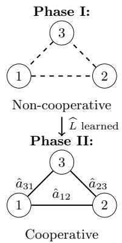
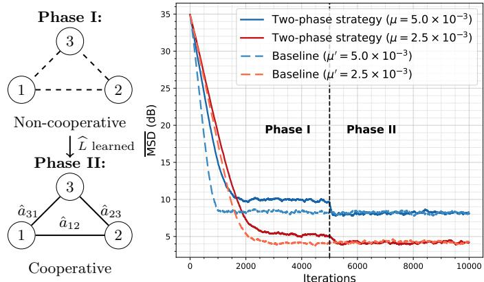
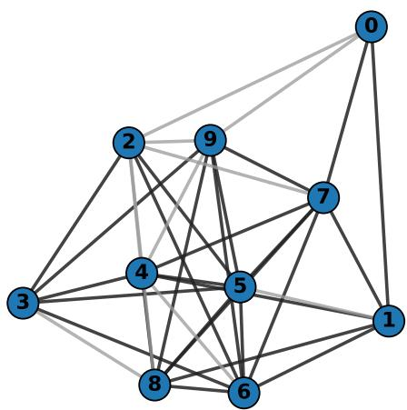
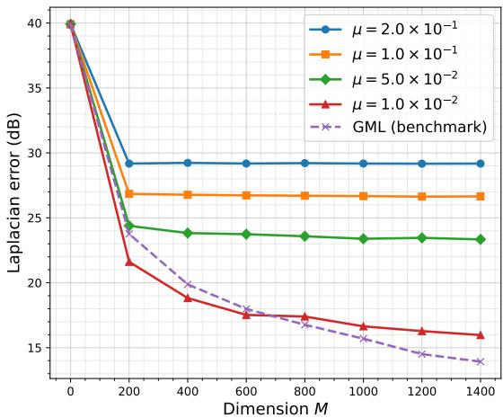
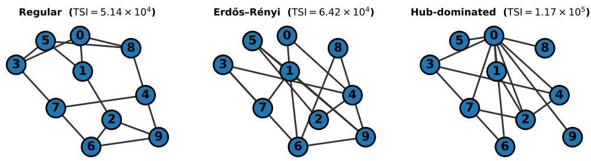
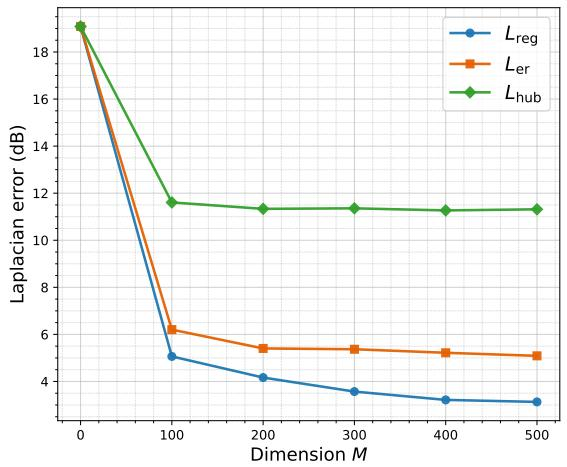
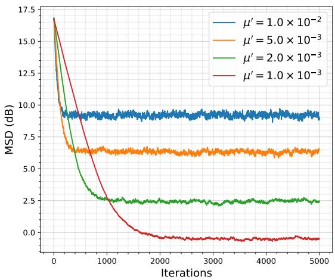
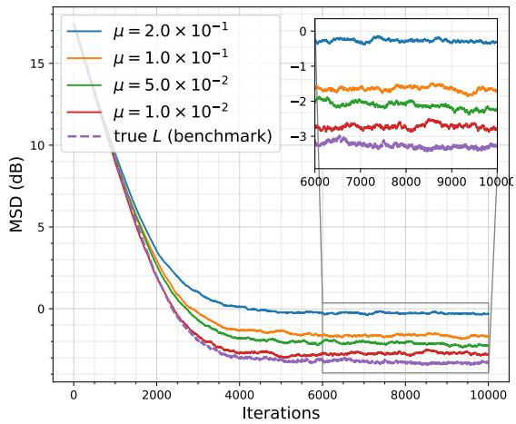
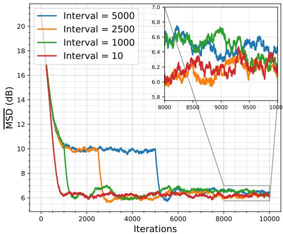

# Decentralized Multitask Learning over Learned Task Graphs

Zirui Wan, and Stefan Vlaski

Abstract—This paper investigates decentralized multitask learning over networks when the underlying task relationships are unknown. While existing graph-regularized multitask frameworks typically assume a known structure, practical settings often require learning inter-task dependencies directly from distributed data. We propose a decentralized two-phase strategy that first estimates a generalized graph Laplacian from noisy noncooperative stochastic gradient iterates, and subsequently exploits the learned graph to enable cooperative multitask diffusion learning. This framework is motivated by a Gaussian Markov random field prior, which gives rise to a decentralized maximum likelihood estimator for the graph Laplacian. The analysis quantifies the Laplacian estimation error and its propagation to the steady-state performance of the multitask diffusion recursion, and introduces a topology sensitivity index to capture the effect of network heterogeneity. Simulation results corroborate the theoretical findings and demonstrate that cooperation enabled by the learned task graph significantly improves performance over non-cooperative learning, while approaching the true-graph baseline when the estimation stepsize is sufficiently small.

Index Terms—Decentralized learning, multitask learning, graph signal processing, graph learning, Gaussian graphical models.

## I. INTRODUCTION

M ODERN distributed networks generate large volumesof data, motivating federated and decentralized learning , of data, motivating federated and decentralized learning frameworks that move storage and computation toward the network edge. Early works primarily focused on consensus or single-task formulations, where all agents are required to agree on a common global model or decision [1]–[6]. In many practical applications, however, agents face heterogeneous objectives and non-identical local data distributions, making strict consensus statistically suboptimal [7], [8]. To address such heterogeneity, more recent works have developed implicit or non-parametric approaches, including meta-learning [9], [10] and proximal personalization methods [11], [12]. While effective for personalization, these approaches capture task relationships only implicitly through shared parameters, and therefore offer limited interpretability of the underlying task dependencies. In many settings, however, tasks exhibit structured pairwise relationships that are unknown a priori and must be inferred directly from distributed data. This challenge has motivated the study of multitask learning over graphs, where each agent maintains its own model while leveraging inter-task relationships through explicit structural priors.

A principled approach to incorporating prior knowledge about task relationships into multitask learning is through structured regularization. Consider a networked learning scenario in which each agent k seeks to estimate a parameter vector by minimizing its individual cost function:

$$
w _ { k } ^ { o } = \underset { w _ { k } } { \arg \operatorname* { m i n } } ~ J _ { k } ( w _ { k } ) .\tag{1}
$$

When information about inter-task dependencies is available, it can be embedded into the learning process by augmenting the objective with a regularization term that promotes desirable structure in the solution [13]–[15]. This leads to the regularized multitask formulation

$$
\arg \operatorname* { m i n } _ { \mathcal W } \mathcal J ( \mathcal w ) + \frac { \eta } { 2 } \boldsymbol { w } ^ { \top } \mathcal R \boldsymbol { w } ,\tag{2}
$$

where $\scriptstyle \mathcal { W } \triangleq \cot \{ w _ { 1 } , \ldots , w _ { K } \}$ concatenates the local parameters $w _ { k } \ \in \ \mathbb { R } ^ { M }$ from K agents, $\begin{array} { r } { \mathcal { I } ( w ) \triangleq \sum _ { k = 1 } ^ { K } J _ { k } ( w _ { k } ) } \end{array}$ denotes the aggregate network cost, $\mathcal { R } \geq 0$ encodes structural relationships among tasks, and $\eta > 0$ controls the strength of coupling across agents.

In networked settings, such prior structure is often expressed through smoothness of the model parameters over an underlying task graph, whereby related agents are encouraged to learn similar parameter vectors. This notion can be captured by choosing ${ \mathcal { R } } = { \mathcal { L } } \triangleq L \otimes I _ { M }$ , where L is a graph Laplacian that encodes pairwise task similarities. Under this choice, the regularizer $\overset \eta 2 \overset { \overline { { \eta } } } { \mathcal { W } } ^ { \intercal }$ LW promotes smooth variation of the parameter vectors across the graph, enabling the algorithm to exploit structural dependencies while preserving local adaptability. Moreover, this graph-regularized formulation admits a probabilistic interpretation through Gaussian Markov random field (GMRF) priors, where the Laplacian serves as the precision matrix governing conditional dependencies among tasks over graph [16]–[18]. Such graph-based multitask frameworks have been shown to significantly improve estimation accuracy and tracking performance over independent or consensus-based approaches, particularly in heterogeneous environments where task similarity is localized rather than global [7], [8], [15], [19], [20].

However, a fundamental limitation of most existing graphbased multitask learning approaches is the assumption that the underlying task-relationship graph—including both its connectivity pattern and edge weights—is fully known a priori. In practice, this assumption is often unrealistic, since the true dependencies among tasks are typically implicit, datadriven, and may evolve over time. Consequently, specifying an accurate graph structure in advance is difficult, and the task-relationship graph must instead be inferred directly from the available data, a problem commonly referred to as graph learning.

  
Fig. 1: (Left) Illustration of the proposed two-phase strategy: Phase I, agents operate non-cooperatively to learn the underlying task graph, and Phase II uses the learned graph for cooperative multitask learning. (Right) Network meansquare deviation MSD versus iteration for two choices of the stepsize. After the graph is learned, the Phase II performance approaches that of the baseline with known task relationships (dashed curves) under the same stepsizes.

Moreover, even when partial structural knowledge is available, existing graph learning methods typically rely on centralized processing, requiring global covariance estimation or large-scale matrix inversion [18], [20]–[22]. Such requirements are incompatible with decentralized settings. These challenges motivate decentralized learning strategies that can jointly infer task relationships and perform multitask learning directly from distributed data, while ensuring statistical accuracy of the learned graph and characterizing how graph estimation errors affect the performance of the resulting multitask learning algorithm.

In this paper, we propose a fully decentralized strategy that jointly learns local models and their inter-task relationships, assuming that only the local connectivity is known. The dependencies among tasks are modeled through a GMRF, whose unknown precision matrix is constrained to lie in the space of valid generalized graph Laplacians (GGLs) [22], [23]. To estimate the graph structure, we employ a decentralized Laplacian learning technique based on the noisy noncooperative estimates of the local models [24]. The resulting Laplacian estimate is then incorporated into the multitask learning algorithm to promote structured cooperation among agents. The overall procedure of the proposed strategy is illustrated in Fig. 1 (left).

Simulation results demonstrate that, despite being learned from noisy data, the estimated Laplacian enables improved performance compared to the non-cooperative baseline, as shown in Fig. 1 (right). From a theoretical perspective, we derive explicit bounds on the Laplacian estimation error in the small-stepsize and high-dimensional regimes, revealing an $O ( \mu )$ dependence on the non-cooperative learning stepsize µ and quantifying the influence of graph topology on estimation quality. We further analyze how errors in the learned graph propagate and affect the performance of the resulting decentralized multitask learning algorithm.

## A. Relation to Existing Studies

Multitask learning over graphs: Prior works such as [7], [8], [25] formulate learning over multitask graphs, where multiple task-specific parameter vectors are learned jointly while exploiting structural relations among tasks. The use of graph Laplacian regularization to encode inter-task similarities was introduced in [13], [14], where adaptive learning strategies were developed for streaming data settings. In [26], task parameters are modeled under a smoothness condition induced by a GMRF prior, leading to a maximum a posteriori (MAP) formulation. Building on this framework, [15], [19] analyse iterative solutions and provide detailed performance characterizations, showing how network topology, stepsize, and regularization strength influence the steady-state behavior of multitask learning algorithms.

Another line of work adopts implicit, non-parametric strategies such as distributed meta-learning [9], [10], which cooperatively learn shared meta-parameters that can be rapidly adapted to heterogeneous tasks. Proximal personalization methods take a related but distinct approach by allowing each agent to learn a task-specific model while regularizing its deviation from a shared reference model. For example, [27] learns personalized local models by regularizing them toward a shared global reference model. In [28], client drift is mitigated by encouraging each local model to remain close to the global reference while moving away from its previous local model.

A common limitation of the aforementioned approaches is that task relationships are either assumed known a priori, as in many graph-based multitask methods, or are encoded only implicitly through shared parameters or adaptation mechanisms, as in meta-learning and proximal personalization approaches. In contrast, our work does not require prior knowledge of the graph weights; instead, we assume only local connectivity among agents and explicitly infer the task relationships from distributed data.

Graph learning: We consider the problem of learning the unknown edge weights of a graph Laplacian from data. Early works such as [18], [21] estimate the graph Laplacian in a centralized manner from graph signals generated under a GMRF prior. The work in [22] studies the estimation of several classes of graph Laplacians, including GGLs, diagonally dominant generalized graph Laplacians (DDGLs), and combinatorial graph Laplacians (CGLs), under structural constraints. More recently, [23], [24], [29], [30] investigate decentralized graph Laplacian estimation based on marginal likelihood formulations derived from the Schur complement of the marginal covariance [31], enabling graph recovery using only local information. In this work, we adopt the GGL model for the graph Laplacian, whose positive definiteness guarantees matrix invertibility and enables the use of the Schur complement identity. GGLs have also been shown effective for modeling structured signals such as images and videos [32], [33]. Our method builds on maximizing the marginal likelihood (MML) approach proposed in [23]. The key distinction of our work is that the graph is estimated from noisy graph signal observations arising from stochastic learning dynamics, and we provide an analysis of how this noise results Laplacian

estimation errors.

Joint learning of models and graphs: The framework in [34] operates in a federated setting with centralized coordination, where a server aggregates updates and optimizes shared variables, whereas our approach is fully decentralized and relies solely on local neighbor interactions. Earlier related work in [35] studies distributed clustering and learning over networks, where agents adaptively infer which neighbors share similar objectives and should cooperate; however, it focuses on clustering formation rather than learning an explicit weighted task-relationship graph. Works such as [36]–[38] study fully decentralized personalized learning, where task-specific models and a collaboration graph are jointly learned via alternating optimization, with the graph inferred from model similarity. In contrast, our work adopts a statistical formulation based on a Gaussian Markov random field, estimates the graph as a generalized graph Laplacian from noisy learning iterates, and provides explicit finite-sample bounds on Laplacian estimation quality. The most closely related work is our prior study [20]; however, that method is not decentralized and does not provide convergence or performance guarantees for the resulting multitask learning algorithm.

## B. Summary of Contributions

The main contributions of this work are summarized as follows:

• Decentralized joint graph and multitask learning: We propose a two-phase decentralized framework that jointly learns task relationships and performs graph-regularized multitask adaptation using only local connectivity infor mation.

• Laplacian estimation from noisy learning dynamics: We develop a decentralized Laplacian learning method based on noisy non-cooperative stochastic iterates and establish finite-sample error bounds for the estimated graph.

• Error propagation analysis: We quantify how graph estimation errors affect the steady-state performance of the resulting decentralized multitask learning algorithm.

Taken together, these provide an end-to-end framework for decentralized multitask learning with performance guarantees despite the lack of prior knowledge of task relationships.

## C. Notation

Throughout the paper, all vectors are column vectors. Random quantities are in boldface; matrices are uppercase, and vectors/scalars are lowercase. ⊗ denotes the Kronecker product, diag(·) constructs a block-diagonal matrix, and col{·} stacks the columns of a matrix into a vector. The notation $\| \cdot \|$ refers to the spectral norm for matrices and the ℓ -norm for vectors.

## II. MODELS AND PROPOSED ALGORITHM

## A. GMRF Prior for Model Parameters

Our proposed graph learning formulation is motivated by the assumption that the true model parameters $\boldsymbol { \mathcal { W } } ^ { o }$ arise as samples from a zero-mean M-variate GMRF. Under this model, each agent k from the set V has a parameter $w _ { k } ^ { o } \in \mathbb { R } ^ { M }$ treated as a Gaussian random vector, and the relationships among agents are encoded by the edges of a connected, undirected graph. Each edge $( k , \ell ) \in \mathcal { E }$ is assigned a nonnegative weight $a _ { k \ell }$ that reflects the similarity between agents k and ℓ. The neighborhood of node k is defined as $\mathcal { N } _ { k } \overset { \mathtt { - } } \equiv \{ \ell \mid ( k , \ell ) \in \mathcal { E } \} \cup \{ k \}$ In this work, the graph Laplacian matrix L is restricted to the class of GGLs, defined as

$$
L \triangleq D - A + V ,\tag{3}
$$

where A is a symmetric weighted adjacency matrix with entries $A _ { k \ell } = a _ { k \ell } , D = \mathrm { d i a g } ( d _ { 1 } , \ldots , d _ { K } ) $ is the degree matrix with $\begin{array} { r } { d _ { k } \ = \ \sum _ { \ell \in \mathcal { N } _ { k } } a _ { k \ell } , } \end{array}$ , and $V = \mathrm { d i a g } ( v _ { 1 } , . . . , v _ { K } )$ is a diagonal self-loop matrix with nonnegative scalars vk. By construction, L is symmetric and positive definite.

Assumption 1 (GMRF model). The true parameter vector $\mathcal { W } ^ { o } \triangleq \operatorname { c o l } \{ w _ { 1 } ^ { o } , \dots , w _ { K } ^ { o } \}$ is assumed to follow a multivariate Gaussian distribution:

$$
w ^ { o } \sim \mathcal { N } \{ 0 , \Sigma \} ,\tag{4}
$$

where ${ \boldsymbol { \Sigma } } = { \boldsymbol { \Sigma } } \otimes I _ { M } \triangleq L ^ { - 1 } \otimes I _ { M }$ . The Kronecker form means that the same graph-induced dependency encoded by $L ^ { - 1 }$ is repeated across all M coordinates of the parameter vectors. In other words, the inter-agent dependency structure is shared across features.

The probability density function is given by

$$
f _ { \mathcal { W } ^ { o } } ( \mathcal { W } ^ { o } ) = \frac { \exp \left( - \frac { 1 } { 2 } \left( \mathcal { W } ^ { o } \right) ^ { \top } \mathcal { L } \mathcal { W } ^ { o } \right) } { \sqrt { \operatorname* { d e t } ( 2 \pi \mathcal { L } ^ { - 1 } ) } } ,\tag{5}
$$

where det(·) denotes the determinant operator. The quadratic form in (5) admits the explicit decomposition

$$
( \boldsymbol { w ^ { o } } ) ^ { \top } \mathcal { L } \boldsymbol { w ^ { o } } = \frac { 1 } { 2 } \sum _ { k = 1 } ^ { K } \sum _ { \ell \in \mathcal { N } _ { k } } a _ { k \ell } \| \boldsymbol { w } _ { k } ^ { o } - \boldsymbol { w } _ { \ell } ^ { o } \| ^ { 2 } + \sum _ { k = 1 } ^ { K } v _ { k } \| \boldsymbol { w } _ { k } ^ { o } \| ^ { 2 } .\tag{6}
$$

This representation reveals that the GMRF prior promotes smoothness of the parameter vectors over the underlying graph, while the diagonal self-loop terms $v _ { k }$ control the variance of each local model.

## B. Decentralized Multitask Learning

Under the GMRF prior (4), the MAP estimate of $\boldsymbol { \mathcal { W } } ^ { o }$ naturally leads to a Laplacian-regularized optimization problem. Specifically, the MAP estimator is defined as [26]

$$
\boldsymbol { w } _ { i } ^ { * } = \underset { \boldsymbol { w } } { \arg \operatorname* { m i n } } \Big \{ - \log f _ { \{ \boldsymbol { x } _ { j } \} _ { j = 1 } ^ { i } | \mathcal { W } ^ { o } } \left( \big \{ \boldsymbol { x } _ { j } \big \} _ { j = 1 } ^ { i } \mid \boldsymbol { w } \right) - \log f ( \boldsymbol { w } ) \Big \}\tag{7}
$$

$$
\begin{array} { r } { = \underset { \mathcal { W } } { \arg \operatorname* { m i n } } \ \mathcal { Q } \left( \mathcal { W } ; \{ x _ { j } \} _ { j = 1 } ^ { i } \right) + \frac { 1 } { 2 } \mathcal { W } ^ { \top } \mathcal { L } \mathcal { W } , } \end{array}\tag{8}
$$

where $\{ x _ { j } \} _ { j = 1 } ^ { i }$ denotes the collection of observations available across all agents up to time i. Here, the stochastic loss function is defined as

$$
Q \left( w ; \{ x _ { j } \} _ { j = 1 } ^ { i } \right) \triangleq - \log f _ { \{ x _ { j } \} _ { j = 1 } ^ { i } | w ^ { o } } \left( \{ x _ { j } \} _ { j = 1 } ^ { i } \ | \ w \right)\tag{9}
$$

and substituting the GMRF prior (4) into (7) yields the regularized multitask formulation.

The corresponding risk function is defined as the expected loss

$$
\mathcal { I } ( w ) \triangleq \mathbb { E } _ { \pmb { x } } [ \mathcal { Q } ( w ; \pmb { x } ) ] = \sum _ { k = 1 } ^ { K } \mathbb { E } _ { \pmb { x } _ { k } } [ \mathcal { Q } ( w _ { k } ; \pmb { x } _ { k } ) ] = \sum _ { k = 1 } ^ { K } J _ { k } ( w ) ,\tag{10}
$$

which motivates the following risk minimization problem:

$$
\boldsymbol { w } _ { L } ^ { o } = \underset { \boldsymbol { w } } { \arg \operatorname* { m i n } } \ \mathcal { I } ( \boldsymbol { w } ) + \frac { \eta } { 2 } \boldsymbol { w } ^ { \top } \mathcal { L } \boldsymbol { w } ,\tag{11}
$$

where $\eta ~ > ~ 0$ controls the strength of the regularization, and $\mathcal { W } _ { L } ^ { o }$ denotes the optimizer of the Laplacian-regularized problem. Problem (11) coincides with the multitask learning formulation in (2).

We are interested in solving (11) in a stochastic and decentralized setting, where the data distribution is unknown and, therefore, the exact risk function and its gradient $\nabla \mathcal { I } (  { \boldsymbol \omega } )$ are unavailable. In this case, the agents can rely on stochastic gradient approximations and implement a diffusion-type recursion [3], [15], [19]:

$$
\pmb { \mathscr { w } } _ { L , i } = \left( I _ { M K } - \mu ^ { \prime } \eta \mathscr { L } \right) \left( \pmb { \mathscr { w } } _ { L , i - 1 } - \mu ^ { \prime } \widehat { \nabla \mathcal { I } } ( \pmb { \mathscr { w } } _ { L , i - 1 } ) \right) ,\tag{12}
$$

where $\mu ^ { \prime } > 0$ is a constant stepsize and $\widehat { \nabla \mathcal { I } } ( \cdot )$ denotes a dstochastic approximation of the gradient. Since the Laplacian $\mathcal { L }$ is sparse, the recursion is naturally decentralized.

In practice, however, the true Laplacian L is unknown and must be replaced by an estimate ${ \widehat { \mathcal { L } } } .$ This leads to the following learning recursion:

$$
\boldsymbol { w } _ { \widehat { L } , i } = \left( \boldsymbol { I } _ { M K } - \mu ^ { \prime } \eta \widehat { \mathcal { L } } \right) \left( \boldsymbol { w } _ { \widehat { L } , i - 1 } - \mu ^ { \prime } \widehat { \nabla \mathcal { I } } \left( \boldsymbol { w } _ { \widehat { L } , i - 1 } \right) \right) ,\tag{13}
$$

which is the recursion studied in this work.

## C. Non-Cooperative Phase for Laplacian Estimation

In practice, the graph Laplacian L is unknown and must be inferred from data under the structural prior in (4). Since the true parameter vector $\boldsymbol { \ w } ^ { o }$ , which encodes inter-task relationships, is not directly observable, each agent first constructs a local estimate in a non-cooperative manner, without access to $L$ Specifically, agent k runs an independent stochastic gradient descent recursion of the form:

$$
\pmb { w } _ { k , i } = \pmb { w } _ { k , i - 1 } - \mu \widehat { \nabla J } _ { k } ( \pmb { w } _ { k , i - 1 } ) ,\tag{14}
$$

using only its own data. $\mu > 0$ is a constant stepsize. A standard asymptotic result for recursion (14) is stated next and will be used in the analysis of the following section.

Lemma 1 (Steady-state Error Covariance [3], [35]). For a sufficiently small stepsize $\mu ,$ the recursion in (14) satisfies, at steady-state,

$$
\operatorname* { l i m } _ { \mu \to 0 } \operatorname* { l i m } _ { i \to \infty } \operatorname* { s u p } _ { \mu \to \infty } \| \frac { 1 } { \mu } \mathbb { E } \Big [ \widetilde { \pmb { w } } _ { i } \widetilde { \pmb { w } } _ { i } ^ { \top } \Big ] - \Pi \Big \| ^ { 2 } = 0 ,\tag{15}
$$

where

$$
\widetilde { \boldsymbol { w } } _ { i } \triangleq \boldsymbol { w } ^ { o } - \boldsymbol { w } _ { i } .
$$

That is, the steady-state error covariance scales as µΠ, where $\Pi \in \mathbb { R } ^ { M K \times M K }$ is a symmetric positive semidefinite matrix characterized as the unique solution ofa continuous Lyapunov equation [35].

To learn the graph Laplacian from the noisy estimates $w _ { k , i - 1 }$ , the global maximum likelihood (GML) estimator proposed in [20] is infeasible, since it requires centralized information and a global matrix inversion whose complexity scales cubically with the network size. These limitations motivate the use of a decentralized Laplacian estimation strategy, whereby each node infers only a local portion of the graph structure.

Let $\mathcal { N } _ { k } ^ { c } \triangleq \mathcal { V } \backslash \mathcal { N } _ { k }$ be the complement of the neighborhood, and let $\scriptstyle { S _ { k } }$ denote the neighborhood without the the node itself $\mathcal { S } _ { k } \triangleq \mathcal { N } _ { k } \backslash k$ . Define $\Sigma _ {  { \mathcal { N } _ { k } } ,  { \mathcal { N } _ { k } } }$ as the marginal covariance matrix associated with node k and its neighborhood, obtained as the corresponding principal submatrix of the global covariance matrix Σ.

By applying the Schur complement identity [31], the inverse of this marginal covariance can be expressed as

$$
\begin{array} { r } { { \Gamma _ { k } } \triangleq \Sigma _ { \mathcal { N } _ { k } , \mathcal { N } _ { k } } ^ { - 1 } = L _ { \mathcal { N } _ { k } , \mathcal { N } _ { k } } - \left[ \begin{array} { c } { 0 } \\ { L _ { S _ { k } , \mathcal { N } _ { k } ^ { c } } } \end{array} \right] L _ { \mathcal { N } _ { k } ^ { c } , \mathcal { N } _ { k } ^ { c } } ^ { - 1 } \left[ 0 , L _ { \mathcal { N } _ { k } ^ { c } , { S _ { k } } } \right] } \\ { = L _ { \mathcal { N } _ { k } , \mathcal { N } _ { k } } - \left[ 0 \begin{array} { c } { 0 } \\ { 0 } \end{array} \right. } \\ { \left. \left[ 0 \quad L _ { S _ { k } , \mathcal { N } _ { k } ^ { c } } L _ { \mathcal { N } _ { k } ^ { c } , \mathcal { N } _ { k } ^ { c } } ^ { - 1 } L _ { \mathcal { N } _ { k } ^ { c } , \mathcal { S } _ { k } } \right] , _ { \mathcal { N } _ { k } ^ { c } } \right] } \end{array}\tag{16}
$$

where the zero blocks arise because node k has no direct connections to nodes outside $\mathcal { N } _ { k }$ in the Laplacian structure.

A key consequence of (16) is that, due to the sparsity of the Laplacian matrix $L ,$ the entries in the first row and column of $\Gamma _ { k }$ coincide exactly with those of the submatrix $L _ { \mathcal { N } _ { k } , \mathcal { N } _ { k } }$ . As a result, the local parameters in $\boldsymbol { L } _ { k , \mathcal { N } _ { k } }$ can be recovered from purely local covariance information. These locally inferred quantities are sufficient for subsequent decentralized multitask learning, and similar constructions have been extensively studied in [23], [24], [29], [30].

In this work, we adopt the MML formulation introduced in [23], which is equivalent to the GML estimator while admitting a convex optimization form. At node k, the MML problem is given by

$$
\begin{array} { r l } & { \widehat { \Gamma } _ { k } = \underset { \Gamma } { \arg \operatorname* { m i n } } ~ \left. \widehat { \Sigma } _ { \mathcal { N } _ { k } , \mathcal { N } _ { k } } , \Gamma \right. - \log \operatorname* { d e t } ( \Gamma ) } \\ & { } \\ & { \mathrm { s . t . } \quad \Gamma \succeq 0 , } \end{array}\tag{17}
$$

where $\widehat { \Sigma } _ { \mathcal { N } _ { k } , \mathcal { N } _ { k } }$ denotes the local sample covariance matrix, bwhich is a principal submatrix of $\widehat { \Sigma }$ . Under a zero-mean model, $\widehat { \Sigma }$ bis estimated by an empirical covariance estimator with the bsteady-state estimates $w _ { i }$ from recursion (14):

$$
{ \widehat { \boldsymbol { \Sigma } } } = { \frac { 1 } { M } } \operatorname { T r _ { \boldsymbol { \kappa } } } \big ( ( P \operatorname { \boldsymbol { w } } _ { i } ) ( P \operatorname { \boldsymbol { w } } _ { i } ) ^ { \intercal } \big ) .\tag{18}
$$

where Tr (·) denotes the block-trace operator that sums the $K \times K$ diagonal blocks, and $P ~ \in ~ \mathsf { \bar { R } } ^ { M K \times M K }$ is the commutation matrix that converts the agent-wise stacking $\mathcal { W } _ { i } = \operatorname { c o l } \{ w _ { 1 , i } , \dots , w _ { K , i } \}$ into an entry-wise stacking, so that the same coordinate from different agents is grouped together. In particular,

$$
P \mathcal { W } _ { i } = \mathrm { v e c } \left( \left[ w _ { 1 , i } , \ldots , w _ { K , i } \right] ^ { \top } \right) .\tag{19}
$$

Equivalently, $\widehat { \Sigma } _ { \mathcal { N } _ { k } , \mathcal { N } _ { k } }$ can be estimated directly from its blocal stack without any global operation.

The solution to (17) admits the closed form:

$$
\widehat { \Gamma } _ { k } = \widehat { \Sigma } _ { \mathcal { N } _ { k } , \mathcal { N } _ { k } } ^ { - 1 } ,\tag{20}
$$

The Laplacian estimate is then assembled by extracting the entries consistent with the known local connectivity, thereby preserving the sparsity pattern of the Laplacian. To enforce symmetry, we follow [23] and apply a simple local averaging step:

$$
\begin{array} { r } { \left\{ \begin{array} { l l } { \widehat { L } _ { k , N _ { k } } ^ { \prime } = \mathrm { S } ( \widehat { \Gamma } _ { k } ) , } \\ { \widehat { L } _ { k , \ell } ^ { \prime } = 0 , \quad \ell \notin { \mathcal N } _ { k } , } \end{array} \right. \quad \widehat { L } = \frac { 1 } { 2 } \big ( \widehat { L } ^ { \prime } + ( \widehat { L } ^ { \prime } ) ^ { \top } \big ) , } \end{array}\tag{21}
$$

where $\mathrm { S } ( \cdot )$ denotes the subselection operator that extracts the first-row entries corresponding to node $k .$

The resulting estimator in (17)-(21) is shown to be asymptotically consistent [23], [24]. However, in the present setting the available samples are corrupted by noise, and classical asymptotic consistency arguments no longer apply directly. In the following sections, we therefore derive explicit finitesample error bounds that characterize the quality of the resulting Laplacian estimates and their impact on decentralized multitask learning.

An overall procedure is summarized in Algorithm 1.

Algorithm 1 Decentralized Multitask Learning over Learned   
Task Graphs   
Input: For each agent $k \colon$ neighborhood $\mathcal { N } _ { k }$ and data $\mathbf { \Delta x } _ { k , i } ;$   
initialized $w _ { k , 0 } ;$ stepsizes $\mu$ and $\mu ^ { \prime } ;$ regularization strength   
$\eta ;$ iteration numbers $N _ { 1 }$ and $N _ { 2 }$   
PHASE I (NON-COOPERATIVE)   
for iterations $i = 1 , . . . , N _ { 1 }$ do   
for agents $k = 1 , . . . , K$ do   
$\widehat { \nabla J } _ { k } ( \pmb { w } _ { k , i - 1 } )  \nabla J _ { k } ( \pmb { w } _ { k , i - 1 } ; \pmb { x } _ { k , i } )$   
$\pmb { w } _ { k , i }  \pmb { w } _ { k , i - 1 } - \mu \nabla \bar { J } _ { k } ( \pmb { w } _ { k , i - 1 } )$   
for agents $k = 1 , . . . , K$ do   
$\begin{array} { r } { \widehat { \mathbf { T } } _ { k } ^ { \sim } = \left( \frac { 1 } { M } \operatorname { T r } _ { | \mathcal { N } _ { \mathtt { k } } | } ( ( P _ { k } \ W _ { \mathcal { N } _ { k } , N _ { 1 } } ) ( P _ { k } \ W _ { \mathcal { N } _ { k } , N _ { 1 } } ) ^ { \top } ) \right) ^ { - 1 } } \end{array}$   
$\widehat { \pmb { L } } _ { k , N _ { k } } ^ { \prime } = \mathrm { S } ( \widehat { \pmb { \Gamma } } _ { k } ) _ { . }$   
bif $\begin{array} { r l } { \ell \notin \mathcal { N } _ { k } , } & { { } \widehat { L } _ { k , \ell } ^ { \prime } = 0 } \end{array}$   
if $\begin{array} { r l } { \ell \in \mathcal { N } _ { k } , } & { { } \widehat { L } _ { k , \ell } = \frac { 1 } { 2 } \big ( \widehat { \mathbf { L } } _ { k , \ell } ^ { \prime } + \widehat { \mathbf { L } } _ { \ell , k } ^ { \prime } \big ) } \end{array}$   
PHASE II (COOPERATIVE)   
for iterations $i = N _ { 1 } + 1 , . . . , N _ { 2 }$ do   
for agents $k = 1 , . . . , K$ do   
$\widehat { \nabla J } _ { k } ( \pmb { w } _ { k , i - 1 } )  \nabla J _ { k } ( \pmb { w } _ { k , i - 1 } ; \pmb { x } _ { k , i } )$   
$w _ { k , i } \gets \left( I - \mu ^ { \prime } \widehat { \mathcal { L } } _ { k } \right) \left( w _ { \mathcal { N } _ { k } , i - 1 } - \mu ^ { \prime } \widehat { \nabla \mathcal { I } _ { k } } ( w _ { \mathcal { N } _ { k } , i - 1 } ) \right)$   
Return: $\{ w _ { k , N _ { 2 } } \} _ { k = 1 } ^ { K }$

Here, $\vert \mathcal { N } _ { k } \vert$ denotes the cardinality of the neighborhood of agent k. The stacked vector $\mathcal { W N } _ { \mathcal { N } _ { k } , i } \ \triangleq \ \mathrm { c o l } \{ w _ { \ell , i } ; \ell \in \mathcal { N } _ { k } \}$ collects the estimates of agent k and its neighbors. The matrix $P _ { k }$ denotes the commutation matrix associated with this local stacking. The same local stacking operation is applied to $\widehat { \nabla \mathcal { T } _ { k } ( \cdot ) . } \ \widehat { \mathcal { L } } _ { k } \ \triangleq \ \widehat { L } _ { \mathcal { N } _ { k } , \mathcal { N } _ { k } } \otimes I _ { M }$ is a local Laplacian which b bencodes the edge weights on agent k.

## III. ESTIMATION QUALITY ANALYSIS

To derive analytical guarantees, we introduce the following assumptions on the cost $J _ { k } ( \cdot )$ and the gradient noise process $s _ { i } ( \cdot )$ , defined as

$$
\pmb { \mathscr { s } } _ { i } ( \pmb { \mathscr { w } } _ { i - 1 } ) = \widehat { \nabla \mathscr { J } } ( \pmb { \mathscr { w } } _ { i - 1 } ) - \nabla \mathscr { J } ( \pmb { \mathscr { w } } _ { i - 1 } ) .\tag{22}
$$

These assumptions are commonly satisfied by objective functions of interest in learning and adaptation, such as quadratic and logistic costs [3].

Assumption 2 (Cost functions). Each individual cost $J _ { k } ( w _ { k } )$ is assumed to be convex, twice differentiable, and with bounded Hessian satisfying:

$$
\nu I _ { M } \leq \nabla ^ { 2 } J _ { k } ( w _ { k } ) \leq \delta I _ { M } ,\tag{23}
$$

where $0 < \nu \leq \delta < \infty .$

2) The Hessian $\nabla ^ { 2 } J _ { k } ( \cdot )$ satisfies the Lipschitz condition for any $w _ { 1 } , w _ { 2 } \in \mathbb { R } ^ { M }$ and $k _ { H } \geq 0 .$

$$
\| \nabla ^ { 2 } J _ { k } ( w _ { 1 } ) - \nabla ^ { 2 } J _ { k } ( w _ { 2 } ) \| \le k _ { H } \| w _ { 1 } - w _ { 2 } \| .\tag{24}
$$

Assumption 3 (Gradient noise). For any $w _ { i - 1 }$ , gradient noise satisfies:

$$
\mathbb { E } [ \pmb { s } _ { i } ( \pmb { w } _ { i - 1 } ) | \pmb { w } _ { i - 1 } ] = 0\tag{25}
$$

$$
\begin{array} { r } { \mathbb { E } [ \| \pmb { \mathscr { s } } _ { i } ( \pmb { \mathscr { w } } _ { i - 1 } ) \| ^ { 4 } | \pmb { \mathscr { w } } _ { i - 1 } ] \leq \beta ^ { 4 } \| \pmb { \mathscr { w } } ^ { o } - \pmb { \mathscr { w } } _ { i - 1 } \| ^ { 4 } + \sigma _ { s } ^ { 4 } , } \end{array}\tag{26}
$$

where $\beta , \sigma _ { s } \geq 0 .$

2) The conditional covariance of $\pmb { s } _ { i } ( \pmb { w } _ { i - 1 } )$ defined as

$$
\mathcal { R } _ { s , i } ( \boldsymbol { \mathsf { w } } _ { i - 1 } ) \triangleq \mathbb { E } [ \pmb { \mathscr { s } } _ { i } ( \pmb { \mathscr { w } } _ { i - 1 } ) \pmb { \mathscr { s } } _ { i } ^ { \top } ( \pmb { \mathscr { w } } _ { i - 1 } ) | \pmb { \mathscr { F } } _ { i - 1 } ]
$$

Where $\mathcal { F } _ { i - 1 }$ denotes the filtration corresponding to all past iterates across all agents. The conditional covariance satisfies:

$$
\| \mathcal { R } _ { s , i } ( \pmb { \mathscr { w } } _ { i - 1 } ) - \mathcal { R } _ { s , i } ( \pmb { \mathscr { w } } ^ { o } ) \| \leq k _ { s } \| \pmb { \mathscr { w } } _ { i - 1 } - \pmb { \mathscr { w } } ^ { o } \| ^ { \gamma _ { s } }
$$

$$
\mathcal { R } _ { s } \triangleq \operatorname* { l i m } _ { i  \infty } \mathcal { R } _ { s , i } ( \boldsymbol { \mathcal { W } } ^ { o } ) > 0 ,\tag{27}
$$

(28)

where $k _ { s } \geq 0$ and $0 < \gamma _ { s } \leq 4 .$

## A. Laplacian Estimation Error

Theorem 1 (Laplacian estimation error). Suppose Assumptions 1 through 3 hold. Then, for a sufficiently small stepsize $\mu$ and sufficiently large M, the Laplacian estimator L satisfies

$$
\mathbb { E } { \pmb { \mathscr { w } } } _ { i } | \mathcal { W } ^ { o } \| \widehat { L } - L \| ^ { 2 } \leq \sum _ { k = 1 } ^ { K } \frac { \| L _ { \mathcal { N } _ { k } , \mathcal { N } _ { k } } \| ^ { 4 } } { ( 1 - \zeta ) ^ { 2 } } \epsilon ,\tag{29}
$$

$$
\begin{array} { r l } & { \epsilon \triangleq \underbrace { \left( \tau \| \Phi \| ^ { 2 } + \rho \left\| L ^ { - 1 } \right\| ^ { 2 } \right) \left( \displaystyle { \frac { K } { M } } + \displaystyle { \frac { K ^ { 2 } } { M ^ { 2 } } } \right) } _ { c o v a r i a n c e \ c o n c e n t r a t i o n } \quad \scriptstyle ( 3 0 } \\ & { \quad \quad \quad + \underbrace { 4 \mu \| w ^ { o } \| ^ { 2 } \operatorname { T r } \left( \displaystyle { \frac { \Phi } { M } } \right) + 3 \mu ^ { 2 } \left\| \operatorname { T r } _ { \mathrm { K } } \left( \displaystyle { \frac { \Phi } { M } } \right) \right\| ^ { 2 } } _ { b i a s } . } \end{array}\tag{31}
$$

Here, $0 ~ < ~ \zeta ~ < ~ 1$ is a constant, $\rho$ and $\tau$ are nonnegative constants, and $\Phi \triangleq P \Pi P ^ { \intercal }$

Proof. See Appendix (Proof of Theorem 1).

The error bound in Theorem 1 characterizes how the quality of the learned Laplacian depends jointly on the stepsize $\mu$ and the dimension M. The bound decomposes naturally into two components. The first term in $\epsilon ,$ labeled as covariance concentration, captures statistical fluctuations due to finite dimensions and decays at a rate $O \big ( \frac { K } { M } \big )$ , consistent with standard covariance concentration results. This term vanishes as $M \to \infty$ . The second term represents a bias induced by the steady-state error of the non-cooperative stochastic gradient recursions. Since the Laplacian matrix is based on noisy, non-cooperative, stochastic gradient recursions, this noise will naturally seep into the estimation of the Laplacian matrix, and propagate into downstream tasks. As is typical in stochastic gradient algorithms, this term behaves as $O ( \mu )$ and can be reduced by decaying the stepsize $\mu$ . This means that to reduce the overall error in Laplacian estimation, one would need to increase the dimension M, while reducing the stepsize $\mu ,$ or in other words:

$$
\operatorname* { l i m } _ { \mu \to 0 } \operatorname* { l i m } _ { M \to \infty } \mathbb { E } _ { \pmb { \mathscr { W } } _ { i } | \mathscr { W } ^ { o } } \| \widehat { L } - L \| ^ { 2 } = 0 .\tag{32}
$$

Moreover, we define a quantity

$$
\mathrm { T S I } ( L ) \triangleq \sum _ { k = 1 } ^ { K } \| L _ { \mathcal { N } _ { k } , \mathcal { N } _ { k } } \| ^ { 4 } ,\tag{33}
$$

which serves as a topology sensitivity index that characterizes how the network structure influences the Laplacian estimation error. Each term ${ \| { L } _ { { \mathcal { N } } _ { k } , { \mathcal { N } } _ { k } } \| }$ reflects the spectral strength (or stiffness) of the local Laplacian block around node $k ,$ which increases with large node degree or strong local connectivity. Consequently, larger values of $\mathrm { T S I } ( L )$ indicate that small perturbations in local covariance estimates are more strongly amplified in the reconstruction of the global Laplacian. In particular, heterogeneous networks with hub nodes tend to exhibit larger $\mathrm { T S I } ( L )$ and hence higher estimation sensitivity.

## B. Laplacian-Induced Error in Multitask Learning

With the Laplacian estimation error characterized in Theorem 1, we now examine how inaccuracies in the learned graph affect the performance of the multitask diffusion recursion in (13).

a) Network mean-square deviation.: We begin by introducing the mean-square deviation (MSD) to quantify how closely the stochastic recursion tracks the optimal solution associated with the Laplacian L. Define the network error vector at time i as

$$
\tilde { w } _ { \widehat { L } , i } \triangleq \mathcal { W } _ { \widehat { L } } ^ { o } - \mathcal { W } _ { \widehat { L } , i } .\tag{34}
$$

Lemma 2 (Network MSD performance). Let Assumptions 1 through 3 hold. For a sufficiently small stepsize $\mu ,$ the steadystate network MSD satisfies

$$
\operatorname* { l i m } _ { i \to \infty } \mathbb { E } \| \widetilde { \pmb { w } } _ { \widehat { L } , i } \| ^ { 2 } \leq \frac { \mu ^ { \prime } \operatorname { T r } \left( ( I _ { M K } - \mu ^ { \prime } \eta \widehat { \mathcal { L } } ) ^ { 2 } \mathcal { R } _ { s } \right) } { \operatorname* { m i n } \{ 2 \nu + \mu ^ { \prime } \nu ^ { 2 } , ~ 2 \delta + \mu ^ { \prime } \delta ^ { 2 } \} } +  { \operatorname { O } \left( \mu ^ { \prime } \right) }
$$

Proof. See Appendix (Proof of Lemma 2).

b) Laplacian-induced bias: When the diffusion recursion operates with an estimated Laplacian ${ \widehat { L } } ,$ an additional deterbministic bias arises due to the mismatch between the true and learned graph structures. To quantify this effect, define

$$
\Delta \mathcal { W } _ { \widehat { L } } ^ { o } \triangleq \mathcal { W } _ { L } ^ { o } - \mathcal { W } _ { \widehat { L } } ^ { o } ,
$$

which represents the deviation between the optimal solutions associated with $L$ and $\widehat { L }$ . The Laplacian-induced bias is defined as $\mathbb { E } _ { \widehat { L } } \Vert \Delta w _ { \widehat { L } } ^ { o } \Vert ^ { 2 }$ b, where the expectation is taken with respect to the randomness in the estimated Laplacian.

Lemma 3 (Laplacian-induced bias). Suppose the conditions of Lemma 2 hold. Then,

$$
\left\| \Delta w _ { \widehat { L } } ^ { o } \right\| ^ { 2 } \leq \frac { \eta ^ { 2 } } { \lambda _ { \widehat { L } } ^ { 2 } } \| \widehat { L } - L \| ^ { 2 } \| w _ { L } ^ { o } \| ^ { 2 } ,\tag{36}
$$

where $\lambda _ { \widehat { L } } \triangleq \nu + \eta \lambda _ { \mathrm { m i n } } ( \widehat { L } )$ . Consequently, in the large-sample bregime, the Laplacian-induced bias scales at rate $O ( \mu )$ , i.e.,

$$
\operatorname* { l i m } _ { M \to \infty } \mathbb { E } _ { \widehat { L } } \big \| \Delta w _ { \widehat { L } } ^ { o } \big \| ^ { 2 } = O ( \mu ) .\tag{37}
$$

Proof. See Appendix (Proof of Lemma 3).

c) Overall Laplacian-induced deviation: Combining the stochastic MSD bound in Lemma 2 with the deterministic bias bound in Lemma 3, we can characterize the asymptotic deviation of the diffusion iterate $w _ { \widehat { L } , i }$ from the true optimal solution $\mathcal { w } _ { L } ^ { o }$

Theorem 2 (Laplacian-induced deviation). The steady-state deviation of the diffusion recursion with an estimated Laplacian satisfies

$$
\begin{array} { r l } & { \underset { M  \infty } { \operatorname* { l i m } } ( \underset { i  \infty } { \operatorname* { l i m } \operatorname* { s u p } } \mathbb { E } \| w _ { L } ^ { o } - w _ { \widehat { L } , i } \| ^ { 2 } ) } \\ & { = \underset { M  \infty } { \operatorname* { l i m } } ( \underset { i  \infty } { \operatorname* { l i m } \operatorname* { s u p } } \mathbb { E } \| \Delta w _ { \widehat { L } } ^ { o } + \widetilde { w } _ { \widehat { L } , i } \| ^ { 2 } ) } \\ & { = \mathrm { O } ( \mu \| w ^ { o } \| ^ { 2 } \operatorname { T r } ( \frac { \Phi } { M } ) ) + \mathrm { O } ( \mu ^ { \prime } \frac { \operatorname { T r } ( ( I _ { M K } - \mu ^ { \prime } \eta \widehat { L } ) ^ { 2 } \mathcal { R } _ { s } ) } { \operatorname* { m i n } \{ 2 \nu + \mu ^ { \prime } \nu ^ { 2 } , \ 2 \delta + \mu ^ { \prime } \delta ^ { 2 } \} } ) } \\ & { = O ( \mu ) + O ( \mu ^ { \prime } ) . } \end{array}
$$

Theorem 2 shows that the steady-state error of multitask diffusion with a learned graph decomposes into two distinct components: a stochastic error term of order $O ( \mu ^ { \prime } )$ due to gradient noise, and a deterministic Laplacian-induced bias of order $O ( \mu )$ stemming from graph estimation errors. As the dimension M grows and the stepsize $\mu , \mu ^ { \prime }$ decreases, both effects vanish, ensuring that the diffusion recursion asymptotically recovers the optimal solution associated with the true Laplacian, which in turn carries an interpretation of a maximum a posteriori estimate [19].

## IV. NUMERICAL EXPERIMENTS

## A. General Settings

On a connected, undirected network, each node is subjected to streaming data $\{ d _ { k } ( i ) , u _ { k , i } \}$ , satisfying a linear regression model:

$$
\begin{array} { r } { \pmb { d } _ { k } ( i ) = \pmb { u } _ { k , i } ^ { \top } w _ { k } ^ { o } + \pmb { v } _ { k } ( i ) , ~ k = 1 , . . . , K . } \end{array}\tag{40}
$$

  
Fig. 2: Graph topology with assigned edge weights. Grey edges correspond to weight 1, while black edges correspond to weight 5.

  
Fig. 3: Avg. Laplacian estimation error $\| \widehat { L } - L \| ^ { 2 }$ versus M.

The processes $\{ \boldsymbol { u } _ { k , i } , \boldsymbol { v } _ { k } ( i ) \}$ are zero-mean jointly wide-sense stationary with: i) $\mathbb { E } \pmb { u } _ { k , i } \pmb { u } _ { \ell , i } ^ { \top } = \sigma _ { u , k } ^ { 2 } I _ { M }$ if $k = \ell$ and zero otherwise; ii) E $\mathbf { \dot { \boldsymbol { x } } } \mathbf { \boldsymbol { s } } _ { k } ( i ) \mathbf { \boldsymbol { v } } _ { \ell } ( i ) = \sigma _ { \boldsymbol { v } , k } ^ { 2 }$ if $k = \ell$ and zero otherwise; iii) ${ \mathbf { } } u _ { k , i }$ and ${ \pmb v } _ { k } ( i )$ are independent. According to (10), the cost functions take the mean-square-error form:

$$
J _ { k } ( w _ { k } ) = \frac { 1 } { 2 } \mathbb { E } | d _ { k } ( i ) - u _ { k , i } ^ { \top } w _ { k } | ^ { 2 } .\tag{41}
$$

## B. Laplacian Learning Errors

a) Impacts of stepsize µ and dimension M: The Laplacian estimation is conducted on a network with $K = 1 0$ nodes and maximum node degree 8, illustrated in Fig. 2. To obtain an unbalanced weighted topology that reflects heterogeneous task relationships and poses a more challenging scenario for multitask learning, each edge weight is randomly drawn from the set $\{ 1 , 5 \}$ . The self-loop matrix is set as the identity matrix $V = I _ { K }$

We run the recursion in (14) with different stepsizes $\mu \in$ $\{ 2 \times 1 0 ^ { - 1 } , 1 \times 1 0 ^ { - 1 } , 5 \times 1 0 ^ { - 2 } , 1 0 ^ { - 2 } \}$ for 10000 iterations. The resulting steady-state iterates W are then used in (17)– (21) to construct an estimate $\widehat { L }$ of the true Laplacian L. The corresponding Laplacian estimation errors $\| \widehat { L } - L \| ^ { 2 }$ , averaged over 100 Monte-Carlo realizations of $w _ { i }$ b, are reported in Fig. 3. The resulting MML-based Laplacian estimates are further compared against a benchmark GML estimator obtained using the true parameter vector $w ^ { o }$

We observe that when M is sufficiently large, the estimation error converges to the bias term characterized in (31), scaling consistently with the theoretical rate $O ( \mu )$ . This behavior is evident in Fig. 3; for example, at $M \ = \ 8 0 0$ , halving the stepsize $\mu$ reduces the error magnitude by approximately a factor of $1 / 2 ,$ , corresponding to a decrease of about 3 dB in the error curve.

Conversely, when $\mu$ is very small and M is not sufficiently large, the error is dominated by the covariance concentration term, which scales as $\begin{array} { r } { O \left( \frac { K } { M } \right) } \end{array}$ . This explains why the curve corresponding to $\mu = 1 0 ^ { - 2 }$ nearly overlaps with the benchmark before $M \ = \ 8 0 0$ , thereby confirming the theoretical prediction.

b) Impacts of topologies: We next investigate how the network topology influences the Laplacian estimation performance. To isolate the effect of topology, we construct three graphs with identical number of nodes and identical average degree: i) a regular graph with uniform degree distribution, ii) an Erdos–R˝ enyi (ER) random graph with moderate degree´ variability, and iii) a hub-dominated graph exhibiting strong degree heterogeneity. All edges are assigned unit weights, and the same self-loop matrix $V = I _ { K }$ is used across all topologies to ensure a fair comparison. The resulting graph structures and the calculated $T S I ( L )$ are illustrated in Fig. 4.

The recursion in (14) is run with $\mu = 5 \times 1 0 ^ { - 2 }$ , and the results are applied to estimate graph Laplacians. Fig. 5 reports the average Laplacian estimation error for the three topologies. Consistent with the theoretical analysis, the hub-dominated graph yields the largest estimation error across all values of M. This behavior is attributed to the presence of a high-degree hub node, which produces a large local Laplacian block and substantially increases TSI(L). As a result, perturbations in the local covariance estimates are more strongly amplified during the reconstruction of the global Laplacian.

Overall, these results confirm that the degree heterogeneity plays a critical role in decentralized Laplacian estimation. Networks with highly uneven connectivity, such as hub-dominated graphs, significantly amplify estimation error even when the average connectivity level is kept constant.

C. Steady-State Performance under Diffusion and Learned Laplacians

a) Impacts of multitask learning stepsizes: We consider the same graph topology shown in Fig. 2. The diffusion multitask algorithm in (13) is employed to evaluate the steady-state MSD when the true Laplacian is available. The regularization weight is set to $\eta \ : = \ : 1$ . Under this setting, any performance degradation due to Laplacian estimation is eliminated, thereby isolating the stochastic adaptation behavior of the diffusion recursion. The algorithm (13) is executed with several diffusion stepsizes $\mu ^ { \prime } ,$ , while all other parameters are kept unchanged.

  
Fig. 4: Illustration of three graph topologies with identical average degree: regular, Erdos–R ˝ enyi, and hub-dominated.´

  
Fig. 5: Avg. Laplacian estimation error $\| \widehat { L } - L \| ^ { 2 }$ versus sample bsize M under different graph topologies.

  
Fig. 6: Avg. MSD $\| \widetilde { \mathcal { W } } _ { L , i } \| ^ { 2 }$ with true graph Laplacian.

As illustrated in Fig. $^ { 6 , }$ the steady-state MSD decreases monotonically as the stepsize $\mu ^ { \prime }$ becomes smaller. This behavior agrees with the theoretical prediction that the steady-state diffusion error scales on the order of $O ( \mu ^ { \prime } )$

b) Impacts of Laplacian learning accuracy: Next, we evaluate the impact of Laplacian learning accuracy on the steady-state performance. The same experimental setting is adopted, except that the multitask algorithm now operates with learned Laplacians obtained using different non-cooperative learning stepsizes $\mu$ and , and the multitask learning stepsize is fixed at $\mu ^ { \prime } = 5 \times 1 0 ^ { - 4 }$ . Since larger $\mu$ leads to higher Laplacian estimation error, this experiment illustrates how the Laplacian-induced bias affects the final multitask solution.

  
Fig. 7: Avg. MSD $\| \widetilde { \mathcal { W } } _ { L , i } \| ^ { 2 }$ with estimated graph Laplacians.

The resulting MSD trajectories are shown in Fig. 7. All curves exhibit a similar transient behavior, but converge to different steady-state error floors. In particular, smaller Laplacian learning stepsizes $\mu$ yield more accurate Laplacian estimates and therefore lower steady-state MSD. When the learning stepsize is sufficiently small, the performance approaches that of the true Laplacian benchmark, confirming that the residual performance gap is primarily caused by Laplacian estimation error.

## D. Joint Learning Performance

a) Two-phase learning: To evaluate the effectiveness of the proposed two-phase framework, we amplify each edge weight in Fig. 2 by a factor of 10. This strengthens the Laplacian regularization and enforces stronger smoothness across neighboring tasks.

In Phase I, agents operate non-cooperatively with stepsize $\mu \in \{ 5 \times 1 0 ^ { - 3 } , \dot { 2 } \times 1 0 ^ { - \dot { 3 } } \}$ . After convergence, the final iterates $w _ { k , \cdot }$ are used to estimate the Laplacian matrix. In Phase II, the learned Laplacian $\widehat { L }$ is incorporated into a cooperative multitask update.

The performance of the two-phase strategy is evaluated in

  
Fig. 8: MSD for the multi-phase strategy under different graph Laplacian updating intervals.

Fig. 1 (Right) using MSD,

$$
\overline { { \mathrm { M S D } } } \triangleq \left\{ \begin{array} { l l } { \mathbb { E } \Vert w _ { i } - w ^ { o } \Vert ^ { 2 } , } & { \mathrm { P h a s e ~ I } , } \\ { \mathbb { E } \Vert w _ { \widehat { L } , i } - w ^ { o } \Vert ^ { 2 } , } & { \mathrm { P h a s e ~ I I } , } \end{array} \right.\tag{42}
$$

which measures the deviation from the true model parameter $\boldsymbol { \ w } ^ { o }$

In Phase II, a cooperative stepsize $\mu ^ { \prime } = \mu$ is applied. The figure shows a clear transition at iteration 5000, marking the switch from non-cooperative to cooperative learning. After incorporating the learned graph, both joint learning curves converge to a lower steady-state MSD compared to their non-cooperative phase. This demonstrates that cooperation enabled by the learned task graph improves estimation accuracy. The performance gain is particularly pronounced for larger $\mu ,$ where the stochastic gradient noise in Phase I is more significant.

b) Multi-phase learning: In practical settings, estimating the graph Laplacian only once after full non-cooperative convergence may be undesirable due to latency or computational cost. We therefore consider a multi-phase strategy that periodically updates the Laplacian during learning. After an initial non-cooperative phase, the algorithm alternates between cooperative multitask updates and Laplacian estimation steps every fixed interval, using the most recent parameter iterates.

Since the Laplacian is now learned from iterates that may not be at steady state, the two-phase analysis does not directly apply. Nevertheless, Fig. 8 shows that comparable performance can still be achieved. The setup is identical to the previous experiment: the non-cooperative stepsize is $\mu \ : = \ : 5 \times 1 0 ^ { - 3 }$ and the cooperative stepsize is fixed at $\mu ^ { \prime } = 2 . 7 \times 1 0 ^ { - 3 }$ We test update intervals {5000, 2500, 1000, 10}. For larger intervals (5000 and 2500), the Laplacian is updated only after the non-cooperative recursion has essentially converged, and the resulting performance closely matches the two-phase benchmark. For shorter intervals (1000 and 10), the Laplacian is updated earlier using noisier iterates, which slightly slows the transient, while leading to nearly the same steady-state MSD.

We note, however, that stability depends on the regularization strength η and the degree of task smoothness. When the update interval is very short, the Laplacian estimate may be significantly corrupted by its transient error. If, in addition, η is chosen large while the true task parameters are weakly correlated (i.e., the smoothness prior is mismatched), the cooperative term can amplify estimation errors rather than suppress them. In this regime, the diffusion recursion may become unstable and the MSD curve can diverge.

## V. CONCLUSION

We proposed a decentralized framework for joint graph learning and multitask adaptation when task relationships are unknown. Under a Gaussian Markov random field model, Laplacian estimation was formulated as a decentralized marginal likelihood problem and analyzed in the presence of stochastic learning noise.

We established explicit finite-sample bounds for the Laplacian estimation error, showing that it decomposes into a covariance concentration term and a steady-state bias that scales with the non-cooperative stepsize. A topology sensitivity quantity was introduced to quantify how network heterogeneity amplifies the estimation error. We further showed that, when the learned Laplacian is used for multitask diffusion, the steadystate deviation consists of an $O ( \mu ^ { \prime } )$ stochastic term and an $O ( \mu )$ Laplacian-induced bias compared to the MAP optimal formulation under the known Laplacian. Simulations validated the theoretical findings and demonstrated that the learned graph enables improved performance over non-cooperative learning while approaching the true-graph benchmark as the stepsizes decrease. The results provide statistical guarantees and design insights for adaptive cooperation in decentralized multitask networks.

## APPENDIX

## PROOF OF THEOREM 1

Under the Assumption 2 and 3, we can call on the following Lemma from [11], [12], [35].

Lemma 4 (Asymptotic Normality). Under the Assumption 2 and 3. Consider the recursion (14) with constant stepsize µ. For sufficiently small µ and as $i  \infty ,$ , the steady-state estimation error admits an asymptotically Gaussian approximation in the following sense [11], [12]:

$$
\frac { \ w \ w _ { i } - \ w \ w ^ { o } } { \sqrt { \mu } } \Rightarrow \mathcal { N } ( 0 , \Pi ) ,\tag{43}
$$

where $" \Rightarrow \ '$ denotes convergence in distribution. The matrix Π is symmetric positive semidefinite and is independent of µ. It is characterized as the unique solution to a continuous Lyapunov equation [35].

In the sequel, we therefore approximate the steady-state estimator by the exact Gaussian model

$$
\boldsymbol { \mathscr { w } } _ { i } \mid \boldsymbol { \mathscr { w } } ^ { o } \sim \mathcal { N } ( \boldsymbol { \mathscr { w } } ^ { o } , \boldsymbol { \mu } \Pi ) .\tag{44}
$$

For notational convenience, we introduce an element-wise stacking of the parameter vector by defining

$$
\begin{array} { r } { \boldsymbol { \mathcal { W } } ^ { o , e l e } \triangleq \operatorname { v e c } \big [ \boldsymbol { W } ^ { \top } \big ] = P \operatorname { v e c } \big [ \boldsymbol { W } \big ] = P \boldsymbol { \mathcal { W } } ^ { o } . } \end{array}\tag{45}
$$

Applying the same transformation to the iterates yields $w _ { i } ^ { e l e } =$ $P w _ { i }$ . By Theorem 4, the element-wise stacked estimates admit the Gaussian approximation

$$
\boldsymbol { \mathcal { W } } _ { i } ^ { e l e } \mid \boldsymbol { \mathcal { W } } ^ { o , e l e } \sim \mathcal { N } ( \boldsymbol { \mathcal { W } } ^ { o , e l e } , \boldsymbol { \mu } \Phi )\tag{46}
$$

$$
\mathbfit { w } _ { m , i } ^ { e l e } \mid \mathcal { W } ^ { o , e l e } \sim \mathcal { N } ( w _ { m } ^ { o , e l e } , \mu \Phi _ { m } ) ,\tag{47}
$$

where $\Phi \triangleq P \Pi P ^ { \intercal }$ and $\Phi _ { m }$ denotes the corresponding marginal covariance associated with the m-th element-wise component.

a) The covariance estimation error at node k: We begin by bounding the local marginal covariance.

$$
\begin{array} { r l } & { \left\| \tilde { \Sigma } _ { \mathrm { M } , \mathbf { N } _ { i } } - \Sigma _ { \mathrm { M } , \mathbf { N } _ { k } } \right\| ^ { 2 } \leq \left\| \displaystyle \frac { 1 } { M } \displaystyle \sum _ { m = 1 } ^ { M } { w _ { m } ^ { \mathrm { i } , t o } ( w _ { m } ^ { \mathrm { e f f } } ) ^ { \top } } - \Sigma \right\| ^ { 2 } } \\ & { = \left\| \displaystyle \frac { 1 } { M } \displaystyle \sum _ { m = 1 } ^ { M } \left( w _ { m } ^ { \mathrm { i } , t o } ( w _ { m } ^ { \mathrm { e f f } } ) ^ { \top } - \Sigma \big [ w _ { m } ^ { \mathrm { i } , t o } ( w _ { m } ^ { \mathrm { e f f } } ) ^ { \top } \big ] w _ { m } ^ { \mathrm { e , n i } } \right) \right) } \\ & { \quad + \displaystyle \frac { 1 } { M } \displaystyle \sum _ { m = 1 } ^ { M } \left( w _ { m } ^ { \mathrm { e f f } } ( w _ { m } ^ { \mathrm { e f f } } ) ^ { \top } - \Sigma \big ) + \displaystyle \frac { 1 } { M } \displaystyle \sum _ { m = 1 } ^ { M } \hat { \mu } \Phi _ { m } \right\| ^ { 2 } } \\ & { \leq 3 \left\| \displaystyle \frac { 1 } { M } \displaystyle \sum _ { m = 1 } ^ { M } \left( w _ { m } ^ { \mathrm { e f f } } ( w _ { m } ^ { \mathrm { e f f } } ) ^ { \top } - \Sigma \big [ w _ { m } ^ { \mathrm { e f f } } ( w _ { m } ^ { \mathrm { e f f } } ) ^ { \top } \big ] w _ { m } ^ { \mathrm { e , n i } } \right) \right\| ^ { 2 } } \\ &  \quad + 3 \left\| \displaystyle \frac { 1 } { M } \displaystyle \sum _ { m = 1 } ^ { M } ( w _ { m } ^ { \mathrm { e f f } } ( w _ { m } ^ { \mathrm { e f f } } ) ^ { \top } - \Sigma ) \right\| ^ { 2 } + 3 \left\| \displaystyle \frac { 1 } { M } \displaystyle \sum _ { m = 1 } ^ { M } \hat { \mu } \Phi _ { m } \right\| ^   \end{array}\tag{48}
$$

The fluctuation term in (48) is stochastic when $w _ { m } ^ { o , e l e }$ is given. We can write ${ \pmb w } _ { m } ^ { e l e }$ as

$$
{ \pmb w } _ { m } ^ { e l e } = { \pmb w } _ { m } ^ { o , e l e } + \sqrt { \mu } \Phi _ { m } ^ { \frac { 1 } { 2 } } { \pmb g } _ { m } , \mathrm { \Delta } w h e r e \ { \pmb g } _ { m } | { \pmb w } _ { m } ^ { o , e l e } \sim \mathcal { N } ( 0 , I _ { K } )\tag{49}
$$

It has the following bound:

$$
\begin{array} { r l } & { \mathbb { E } _ { \rho \to \infty ; \rho + \infty } [ \displaystyle \frac { 1 } { B } \sum _ { i = 1 } ^ { N } ( g _ { i i } ^ { ( \rho ) } ( \theta _ { i i } ^ { ( \rho ) } ) ^ { \top } - \lambda ( \theta _ { i i } ^ { ( \rho ) } ( \theta _ { i i } ^ { ( \rho ) } ) ^ { \top } ) ( \theta _ { i i } ^ { ( \rho ) } - \lambda ) ^ { \top } ) ] } \\ & { = \mathbb { E } _ { \rho \to \rho + \infty ; \rho + \infty } [ \displaystyle \frac { 1 } { B } \sum _ { i = 1 } ^ { N } \sum _ { j = 1 } ^ { N }  g _ { i i } ^ { ( \rho ) } ( \theta _ { i i } ^ { ( \rho ) } , \theta _ { j i } ^ { ( \rho ) } ) ( - \lambda _ { j } ) G _ { j i } ^ { ( \rho ) } ( \theta _ { i i } ^ { ( \rho ) } )  ] } \\ & { \quad \quad \quad \quad \quad \quad \quad \quad \quad \quad \quad \quad \quad \quad \quad \quad \quad \quad \quad \quad \quad } \\ & { \quad \quad \quad \quad \quad \quad \quad \quad \quad \quad \quad \quad \quad \quad \quad \quad \quad \quad \quad \quad \quad \quad \quad \quad \quad \quad \quad \quad \quad \quad \quad \quad \quad \quad } \\ & & { = \frac { 1 } { B } \sum _ { i = 1 } ^ { N } \frac { 1 } { B } \sum _ { j = 1 } ^ { N } \frac { 1 } { B } \sum _ { i = 1 } ^ { N } \frac { 1 } { B } \sum _ { j = 1 } ^ { N } \int _ { 0 } ^ { \infty } d g _ { i i } ^ { ( \rho ) } ( \theta _ { i i } ^ { ( \rho ) } , \theta _ { j i } ^ { ( \rho ) } ) ( \theta _ { i i } ^ { ( \rho ) } - \lambda _ { j } ) ^ { \top } ] ^ { \top } } \\ &  \quad \quad \quad \quad \quad \quad \quad \quad \quad \quad \quad \quad \quad \quad \quad \quad \quad \quad \quad \quad \quad \quad \quad \quad \quad \quad \quad \quad \quad \quad \quad \quad \quad \quad  \end{array}
$$

$$
\begin{array} { r l } & { + \displaystyle \frac { 4 \mu } { M } \sum _ { m = 1 } ^ { M } \left\| w _ { m } ^ { o , e l e } \right\| ^ { 2 } \mathbb { E } _ { w _ { m } ^ { e l e } \mid w _ { m } ^ { o , e l e } } \left\| \Phi _ { m } ^ { \frac { 1 } { 2 } } \pmb { \mathscr { g } } _ { m } \right\| ^ { 2 } } \\ & { = \tau \mu ^ { 2 } \| \Phi \| ^ { 2 } \left( \displaystyle \frac { K } { M } + \displaystyle \frac { K ^ { 2 } } { M ^ { 2 } } \right) + 4 \mu \| \nu ^ { o } \| ^ { 2 } \operatorname { T r } \left( \displaystyle \frac { \Phi } { M } \right) , } \end{array}\tag{50}
$$

where inequality (a) follows from standard sample-covariance concentration results [39], [40], for some absolute constant $\tau > 0$ . A similar argument applies to the second term in (48), yielding the bound under another absolute constant $\rho > 0 .$ Inequality (b) follows from Jensen’s inequality. Overall, we obtain

$$
\begin{array} { r l } & { \mathbb { E } _ { w _ { m } ^ { c l e } \left| w _ { m } ^ { o , c l e } \right. } \left\| \widehat { \sum } _ { \mathcal { N } _ { k } , \mathcal { N } _ { k } } - \Sigma _ { \mathcal { N } _ { k } , \mathcal { N } _ { k } } \right\| ^ { 2 } } \\ & { \qquad \leq \underbrace { \left( \tau \left\| \Phi \right\| ^ { 2 } + \rho \left\| L ^ { - 1 } \right\| ^ { 2 } \right) \left( \frac { K } { M } + \frac { K ^ { 2 } } { M ^ { 2 } } \right) } _ { \mathrm { c o n a r a t i a n c e ~ c o n c e n t r a i o n } } } \\ & { \qquad + \underbrace { 4 \mu \left\| w ^ { o } \right\| ^ { 2 } \mathrm { T r } \left( \frac { \Phi } { M } \right) + 3 \mu ^ { 2 } \left\| \mathrm { T r } _ { \mathrm { K } } \left( \frac { \Phi } { M } \right) \right\| ^ { 2 } } _ { \mathrm { b i a s } } } \end{array}\tag{51}
$$

(52)

b) Inverse covariance estimation error: Then we can bound the local inverse covariance estimation error. By a standard inverse perturbation inequality, we have

$$
\begin{array} { r l } & { \mathbb { E } _ { w _ { m } ^ { \mathrm { e l e } } \mid w _ { m } ^ { o , \mathrm { e l e } } } \left\| \widehat { \Gamma } _ { k } - \Gamma _ { k } \right\| ^ { 2 } } \\ & { \quad \leq \mathbb { E } _ { w _ { m } ^ { \mathrm { e l e } } \mid w _ { m } ^ { o , \mathrm { e l e } } } \left[ \left\| \Gamma _ { k } \right\| ^ { 2 } \left\| \widehat { \Sigma } _ { \mathcal { N } _ { k } , \mathcal { N } _ { k } } ^ { - 1 } \right\| ^ { 2 } \left\| \widehat { \Sigma } _ { \mathcal { N } _ { k } , \mathcal { N } _ { k } } - \Sigma _ { \mathcal { N } _ { k } , \mathcal { N } _ { k } } \right\| ^ { 2 } \right] } \end{array}
$$

$$
\stackrel { ( a ) } { \leq } \frac { \| \boldsymbol { \Gamma } _ { k } \| ^ { 4 } } { ( 1 - \zeta ) ^ { 2 } } \epsilon _ { k }
$$

$$
\begin{array} { l } { \displaystyle \mathop { ( b ) } ^ { ( b ) } \| L _ { \mathcal { N } _ { k } , \mathcal { N } _ { k } } \| ^ { 4 } } \\ { \displaystyle \leq \frac { \| \boldsymbol { L } _ { \mathcal { N } _ { k } , \mathcal { N } _ { k } } \| ^ { 4 } } { ( 1 - \zeta ) ^ { 2 } } \epsilon _ { k } . } \end{array}\tag{53}
$$

(54)

2 Here, (a) applies Theorem 2.5 in [41] under the condition

$$
\left\| \Gamma _ { k } \right\| \left\| \widehat { \Sigma } _ {  { \mathcal { N } } _ { k } ,  { \mathcal { N } } _ { k } } - \Sigma _ {  { \mathcal { N } } _ { k } ,  { \mathcal { N } } _ { k } } \right\| \leq \zeta < 1 .\tag{55}
$$

From the bound in (48), choosing M sufficiently large and $\mu$ sufficiently small ensures that (55) is satisfied. Step (b) follows from the Schur complement identity in (16), which implies $\| \Gamma _ { k } \| \leq \| L _ { \mathcal { N } _ { k } , \mathcal { N } _ { k } } \|$

By (16), the local Laplacian estimation error at node k satisfies

$$
\begin{array} { r l } & { \mathbb { E } _ { w _ { m } ^ { \mathrm { e l e } } \mid w _ { m } ^ { o , \mathrm { e l e } } } \left\| \widehat { L } _ { k , \mathcal { N } _ { k } } ^ { \prime } - L _ { k , \mathcal { N } _ { k } } ^ { \prime } \right\| ^ { 2 } = \mathbb { E } _ { w _ { m } ^ { \mathrm { e l e } } \mid w _ { m } ^ { o , \mathrm { e l e } } } \left\| \mathrm { S } ( \widehat { \Gamma } _ { k } ) - \mathrm { S } ( \Gamma _ { k } ) \right\| ^ { 2 } } \\ & { \overset { ( a ) } { \leq } \mathbb { E } _ { w _ { m } ^ { \mathrm { e l e } } \mid w _ { m } ^ { o , \mathrm { e l e } } } \left\| \widehat { \Gamma } _ { k } - { \Gamma } _ { k } \right\| ^ { 2 } , } \end{array}\tag{56}
$$

where (a) follows from the non-expansiveness of the subselection operator S(·).

The global Laplacian estimation error can now be bounded as

$$
\begin{array} { r l r } & { } & { \mathbb { E } _ { w _ { m } ^ { \mathrm { e l e } } | w _ { m } ^ { o , \mathrm { e l e } } } \big \| \widehat { L } - L \big \| ^ { 2 } \leq \mathbb { E } _ { w _ { m } ^ { \mathrm { e l e } } | w _ { m } ^ { o , \mathrm { e l e } } } \big \| \widehat { L } - L \big \| _ { F } ^ { 2 } \qquad ( 5 7 ) } \\ & { } & { = \mathbb { E } _ { w _ { m } ^ { \mathrm { e l e } } | w _ { m } ^ { o , \mathrm { e l e } } } \big \| \frac { 1 } { 2 } \big ( \widehat { L } ^ { \prime } + ( \widehat { L } ^ { \prime } ) ^ { \top } \big ) - L \big \| _ { F } ^ { 2 } } \end{array}
$$

$$
\begin{array} { r l r } {  { \stackrel { ( a ) } { \leq } \mathbb { E } _ { w _ { m } ^ { \mathrm { c l e } } \mid w _ { m } ^ { o , \mathrm { e l e } } } \| \widehat { L } ^ { \prime } - L \| _ { F } ^ { 2 } } } \\ & { = \displaystyle \sum _ { k = 1 } ^ { K } \mathbb { E } _ { w _ { m } ^ { \mathrm { e l e } } \mid w _ { m } ^ { o , \mathrm { e l e } } } \| \widehat { L } _ { k , \mathcal { N } _ { k } } ^ { \prime } - L _ { k , \mathcal { N } _ { k } } ^ { \prime } \| ^ { 2 } } \\ & { \leq \displaystyle \sum _ { k = 1 } ^ { K } \frac { \| L _ { \mathcal { N } _ { k } , \mathcal { N } _ { k } } \| ^ { 4 } } { ( 1 - \zeta ) ^ { 2 } } \epsilon _ { k } . } & { ( 5 \xi } \end{array}\tag{8}
$$

In step (a), we used the non-expansiveness of the symmetrization operator under the Frobenius norm, i.e., for any matrix X, $\| \bar { \mathbf { \Psi } } _ { 2 } ^ { 1 } ( X + X ^ { \top } ) \| _ { F } \ \leq \ \| X \| _ { F } .$ , together with the symmetry of the true Laplacian L.

## PROOF OF LEMMA 2

In [3], [19], the network MSD performance is characterized under the assumption that the Laplacian is a symmetric positive semidefinite matrix with the all-ones vector in its nullspace, i.e., a combinatorial graph Laplacian. In the present setting, however, the Laplacian is symmetric positive definite. As a result, the argument in [3], [19] does not apply directly, and we therefore provide a modified proof below.

From (13) and (11), the diffusion error recursion can be written as

$$
\begin{array} { r l } & { w _ { \widehat { L } } ^ { o } - w _ { \widehat { L } , i } = ( I - \mu ^ { \prime } \eta \widehat { \mathcal { L } } ) \big ( w _ { \widehat { L } } ^ { o } - w _ { \widehat { L } , i - 1 } + \mu ^ { \prime } \nabla J ( w _ { \widehat { L } , i - 1 } ) } \\ & { \qquad + \mu ^ { \prime } s _ { i } ( w _ { \widehat { L } , i - 1 } ) \big ) + \mu ^ { \prime } \eta \mathcal { L } w _ { \widehat { L } } ^ { o } . \qquad ( 5 9 ) } \end{array}
$$

Applying the mean-value theorem to the gradient term, and using the first-order optimality condition at $w _ { \widehat { L } } ^ { o }$ , we obtain

$$
\begin{array} { r l } & { \widetilde { \pmb { w } } _ { \widehat { L } , i } = ( I - \mu ^ { \prime } \eta \widehat { \mathcal { L } } ) ( I - \mu ^ { \prime } \pmb { \mathcal { H } } _ { i - 1 } ) \widetilde { \pmb { w } } _ { \widehat { L } , i - 1 } } \\ & { \qquad + \mu ^ { \prime } ( I - \mu ^ { \prime } \eta \widehat { \mathcal { L } } ) s _ { i } ( \pmb { w } _ { \widehat { L } , i - 1 } ) + \mu ^ { \prime 2 } \eta ^ { 2 } \widehat { \mathcal { L } } ^ { 2 } \pmb { w } _ { L } ^ { o } } \end{array}\tag{60}
$$

where $\pmb { \mathcal { H } } _ { i - 1 } \triangleq \mathrm { d i a g } \{ \pmb { H } _ { 1 , i - 1 } , \cdot \cdot \cdot , \pmb { H } _ { K , i - 1 } \}$ with

$$
\pmb { H } _ { k , i - 1 } = \int _ { 0 } ^ { 1 } \nabla ^ { 2 } J _ { k } \Big ( w _ { k , \widehat { L } } ^ { o } - t \big ( w _ { k , \widehat { L } } ^ { o } - \pmb { w } _ { k , i - 1 } \big ) \Big ) \ d t .\tag{61}
$$

To facilitate the analysis, we next introduce the long-term model from [3], [19], which replaces the time-varying Hessian matrix in (60) by its limiting value:

$$
\begin{array} { r l } & { \widetilde { \pmb { w } } _ { \widehat { L } , i } ^ { \prime } = ( I - \mu ^ { \prime } \eta \widehat { \mathcal { L } } ) ( I - \mu ^ { \prime } \mathcal { H } ) \widetilde { \pmb { w } } _ { \widehat { L } , i - 1 } ^ { \prime } } \\ & { \qquad + \mu ^ { \prime } ( I - \mu ^ { \prime } \eta \widehat { \mathcal { L } } ) s _ { i } ( \pmb { w } _ { \widehat { L } , i - 1 } ) + \mu ^ { \prime 2 } \eta ^ { 2 } \widehat { \mathcal { L } } ^ { 2 } \pmb { w } _ { \widehat { L } } ^ { o } } \end{array}\tag{62}
$$

where ${ \mathcal { H } } \triangleq \operatorname { d i a g } \{ H _ { 1 } , \cdot \cdot \cdot , H _ { K } \}$ and $H _ { k } \ \triangleq \ \nabla ^ { 2 } J _ { k } \left( w _ { \widehat { L } , k } ^ { o } \right)$ Define

$$
\mathcal { B } \triangleq ( I - \mu ^ { \prime } \eta \widehat { \mathcal { L } } ) ( I - \mu ^ { \prime } \mathcal { H } ) , \qquad \mathcal { A } \triangleq ( I - \mu ^ { \prime } \eta \widehat { \mathcal { L } } ) .\tag{63}
$$

Squaring both sides of (62) and conditioning on the filtration $\mathcal { F } _ { i - 1 }$ gives

$$
\begin{array} { r l } & { \mathbb { E } \left[ \left. \widetilde { \pmb { w } } _ { \widehat { L } , i } ^ { \prime } \right. ^ { 2 } \bigg | \mathcal { F } _ { i - 1 } \right] = \mathbb { E } \left. \pmb { \mathcal { B } } \widetilde { \pmb { w } } _ { \widehat { L } , i - 1 } ^ { \prime } \right. ^ { 2 } } \\ & { \qquad + \mu ^ { \prime 2 } \mathbb { E } \left[ \left. \pmb { \mathcal { A } } \pmb { s } _ { i } ( \pmb { w } _ { \widehat { L } , i - 1 } ) \right. ^ { 2 } \bigg | \mathcal { F } _ { i - 1 } \right] + \mathrm { O } ( \mu ^ { \prime 2 } ) } \end{array}\tag{64}
$$

The cross terms involving $s _ { i } ( \boldsymbol { w } _ { \widehat { L } , i - 1 } )$ vanish because the gradient noise is conditionally zero mean. The terms involving

$\mu ^ { \prime 2 } \eta ^ { 2 } \widehat { \mathcal { L } } ^ { 2 } \mathcal { W } _ { L } ^ { o }$ are collected into the higher-order remainder $\mathrm { O } ( \mu ^ { \prime 2 } )$

Taking expectation on both sides yields

$$
\begin{array} { r l } & { \mathbb { E } \left\| \widetilde { \pmb { w } } _ { \widehat { L } , i } ^ { \prime } \right\| ^ { 2 } = \mathbb { E } \left\| \mathcal { B } \widetilde { \pmb { w } } _ { \widehat { L } , i - 1 } ^ { \prime } \right\| ^ { 2 } + \mu ^ { \prime 2 } \mathbb { E } \left\| \mathcal { A } s _ { i } ( \pmb { w } _ { \widehat { L } , i - 1 } ^ { \prime } ) \right\| ^ { 2 } } \\ & { \qquad + \operatorname { O } ( \mu ^ { \prime 2 } ) . } \end{array}\tag{65}
$$

$$
\begin{array} { r l r } & { } & { \leq \| \boldsymbol { \mathcal { B } } \| ^ { 2 } \mathbb { E } \left\| \widetilde { \boldsymbol { w } } _ { \widehat { L } , i - 1 } ^ { \prime } \right\| ^ { 2 } + \mu ^ { \prime 2 } \mathbb { E } \left[ \operatorname { T r } \left( \boldsymbol { \mathcal { A } } ^ { \top } \boldsymbol { \mathcal { A } } \mathbb { R } _ { s , i } ( { \boldsymbol { w } } _ { \widehat { L } , i - 1 } ) \right) \right] } \\ & { } & { \qquad + \operatorname { O } ( \mu ^ { \prime 2 } ) . } \end{array}
$$

We next verify that this recursion is stable. For stability, it is sufficient to ensure that

$$
\| B \| = \| ( I - \mu ^ { \prime } \eta \widehat { \mathcal { L } } ) ( I - \mu ^ { \prime } \mathcal { H } ) \| < 1 .
$$

First, whenever $\begin{array} { r } { 0 \leq \mu ^ { \prime } \eta \leq \frac { 2 } { \lambda _ { \operatorname* { m a x } } ( \widehat { \mathcal { L } } ) } } \end{array}$ , we have

$$
\| I - \mu \eta \mathcal { L } \| \leq 1 .\tag{67}
$$

Second, by the bounded-Hessian assumption,

$$
\gamma _ { \operatorname* { m a x } } \triangleq \| I - \mu ^ { \prime } \mathcal { H } \| = \operatorname* { m a x } \{ | 1 - \mu ^ { \prime } \nu | , | 1 - \mu ^ { \prime } \delta | \} .\tag{68}
$$

Thus, for a sufficiently small choice of $\mu ^ { \prime } ,$ we have $\gamma _ { \mathrm { m a x } } \le 1$ which implies $0 < \| B \| < 1$

It follows that

$$
\operatorname* { l i m } _ { i \to \infty } \operatorname { \mathbb { E } } \| \widetilde { \boldsymbol { w } } _ { \widehat { L } , i } ^ { \prime } \| ^ { 2 } \leq \frac { \mu ^ { \prime 2 } \operatorname { T r } \left( ( I - \mu ^ { \prime } \eta \widehat { \mathcal { L } } ) ^ { 2 } \mathcal { R } _ { s } \right) + \operatorname { O } \left( \mu ^ { \prime 2 } \right) } { 1 - \left\| ( I - \mu ^ { \prime } \eta \widehat { \mathcal { L } } ) ( I - \mu ^ { \prime } \mathcal { H } ) \right\| ^ { 2 } }\tag{69}
$$

$$
\begin{array} { r l } & { \overset { ( a ) } { \leq } \frac { \mu ^ { \prime 2 } \operatorname { T r } \Big ( ( I - \mu ^ { \prime } \eta \widehat { \mathcal { L } } ) ^ { 2 } \mathcal { R } _ { s } \Big ) + \operatorname { O } \left( \mu ^ { \prime 2 } \right) } { \operatorname* { m i n } \{ 2 \mu ^ { \prime } \nu + \mu ^ { \prime 2 } \nu ^ { 2 } , ~ 2 \mu ^ { \prime } \delta + \mu ^ { \prime 2 } \delta ^ { 2 } \} } } \\ & { = \frac { \mu ^ { \prime } \operatorname { T r } \Big ( ( I - \mu ^ { \prime } \eta \widehat { \mathcal { L } } ) ^ { 2 } \mathcal { R } _ { s } \Big ) } { \operatorname* { m i n } \{ 2 \nu + \mu ^ { \prime } \nu ^ { 2 } , ~ 2 \delta + \mu ^ { \prime } \delta ^ { 2 } \} } + \operatorname { O } \left( \mu ^ { \prime } \right) } \end{array}
$$

where step (a) uses the expansion in (68).

Finally, Lemma 1 in [19] states that

$$
\operatorname* { l i m } _ { i \to \infty } \mathrm { { R } } \| \widetilde { \pmb { w } } _ { \widehat { L } , i } ^ { \prime } \| ^ { 2 } = \operatorname* { l i m } _ { i \to \infty } \mathrm { { R } } \| \widetilde { \pmb { w } } _ { \widehat { L } , i } \| ^ { 2 } + \mathrm { { O } } \left( \mu ^ { \prime \frac { 3 } { 2 } } \right) .\tag{70}
$$

Therefore, for sufficiently small $\mu ^ { \prime } ,$ , we conclude that

$$
\operatorname* { l i m } _ { i \to \infty } \mathbb { P } \| \widetilde { \boldsymbol { w } } _ { \widehat { L } , i } \| ^ { 2 } \leq \frac { \mu ^ { \prime } \operatorname { T r } \left( ( I - \mu ^ { \prime } \eta \widehat { \mathcal { L } } ) ^ { 2 } \mathcal { R } _ { s } \right) } { \operatorname* { m i n } \{ 2 \nu + \mu ^ { \prime } \nu ^ { 2 } , ~ 2 \delta + \mu ^ { \prime } \delta ^ { 2 } \} } +  { \operatorname { O } \left( \mu ^ { \prime } \right) } .
$$

$$
\mathbf { P R O O F  O F L E M M A } \ 3
$$

According to the bounded Hessian Assumption 2, the Hessian of $\begin{array} { r } { \mathcal { I } _ { \widehat { L } } ( w ) \triangleq \mathcal { I } ( w ) + \frac { \eta } { 2 } w ^ { \top } \widehat { \mathcal { L } } } \end{array}$ W satisfies

$$
\nabla ^ { 2 } \mathcal { I } _ { \widehat { L } } ( w ) = \nabla ^ { 2 } \mathcal { I } ( w ) + \eta \widehat { \mathcal { L } }\tag{71}
$$

$$
\ge \nu I _ { M K } + \eta \widehat { \mathcal { L } }\tag{72}
$$

$$
\geq \big ( \nu + \eta \lambda _ { \operatorname* { m i n } } ( \widehat { \mathcal { L } } ) \big ) I _ { M K } .\tag{73}
$$

Let $\lambda _ { \widehat { L } } \triangleq \nu + \eta \lambda _ { \mathrm { m i n } } ( \widehat { \mathcal { L } } )$ . By the strong convexity of $\mathcal { I } _ { \widehat { L } } ( w )$ ), we obtain

$$
\begin{array} { c } { { \left\| \Delta w _ { \widehat { L } } ^ { o } \right\| ^ { 2 } \leq \displaystyle \frac { 1 } { \lambda _ { \widehat { L } } } \big [ \nabla { \mathcal { T } } _ { \widehat { L } } ( w _ { L } ^ { o } ) - \nabla { \mathcal { T } } _ { \widehat { L } } ( w _ { \widehat { L } } ^ { o } ) \big ] ^ { \top } ( w _ { L } ^ { o } - w _ { \widehat { L } } ^ { o } ) } } \\ { { \overset { ( a ) } { = } \displaystyle \frac { 1 } { \lambda _ { \widehat { L } } } \big [ \nabla { \mathcal { I } } ( w _ { L } ^ { o } ) + \eta \widehat { \mathcal { L } } w _ { L } ^ { o } \big ] ^ { \top } \big ( w _ { L } ^ { o } - w _ { \widehat { L } } ^ { o } \big ) } } \end{array}
$$

$$
\begin{array} { r l } & { \frac { ( b ) } { = } \displaystyle \frac { 1 } { \lambda _ { \widehat { L } } } \big [ - \eta \mathcal { L } w _ { L } ^ { o } + \eta \widehat { \mathcal { L } } w _ { L } ^ { o } \big ] ^ { \top } \big ( w _ { L } ^ { o } - w _ { \widehat { L } } ^ { o } \big ) } \\ & { \overset { ( c ) } { \leq } \displaystyle \frac { \eta } { \lambda _ { \widehat { L } } } \| \widehat { L } - L \| \| w _ { L } ^ { o } \| \left\| \Delta w _ { \widehat { L } } ^ { o } \right\| . } \end{array}\tag{74}
$$

Here, (a) uses the optimality condition $\nabla \mathcal { I } _ { \widehat { L } } ( w _ { \widehat { L } } ^ { o } ) = 0 ;$ (b) uses $\nabla \mathcal { I } ( w _ { L } ^ { o } ) + \eta \mathcal { L } w _ { L } ^ { o } = 0 ;$ and (c) follows from the Cauchy– Schwarz inequality. Cancelling $\left\| \Delta w _ { \widehat { L } } ^ { o } \right\|$ on both sides of (74) yields

$$
\left\| \Delta w _ { \widehat { L } } ^ { o } \right\| ^ { 2 } \leq \frac { \eta ^ { 2 } } { \lambda _ { \widehat { L } } ^ { 2 } } \| \widehat { L } - L \| ^ { 2 } \| w _ { L } ^ { o } \| ^ { 2 } .\tag{75}
$$

## REFERENCES

[1] R. Olfati-Saber, J. A. Fax, and R. M. Murray, “Consensus and cooperation in networked multi-agent systems,” Proceedings of the IEEE, vol. 95, no. 1, pp. 215–233, 2007.

[2] P. Braca, S. Marano, and V. Matta, “Enforcing consensus while monitoring the environment in wireless sensor networks,” IEEE Transactions on Signal Processing, vol. 56, no. 7, pp. 3375–3380, 2008.

[3] A. H. Sayed et al., “Adaptation, learning, and optimization over networks,” Foundations and Trends in Machine Learning, vol. 7, no. 4-5, pp. 311–801, 2014.

[4] W. Shi, Q. Ling, G. Wu, and W. Yin, “Extra: An exact first-order algorithm for decentralized consensus optimization,” SIAM Journal on Optimization, vol. 25, no. 2, pp. 944–966, 2015.

[5] B. McMahan, E. Moore, D. Ramage, S. Hampson, and B. A. Arcas, “Communication-efficient learning of deep networks from decentralized data,” in Proc. of Artificial Intelligence and Statistics (AISTATS). PMLR, 2017, pp. 1273–1282.

[6] T. Li, A. K. Sahu, M. Zaheer, M. Sanjabi, A. Talwalkar, and V. Smith, “Federated optimization in heterogeneous networks,” in Proc. of Machine Learning and Systems (MLsys), vol. 2, 2020, pp. 429–450.

[7] J. Chen, C. Richard, and A. H. Sayed, “Multitask diffusion adaptation over networks,” IEEE Transactions on Signal Processing, vol. 62, no. 16, pp. 4129–4144, 2014.

[8] J. Plata-Chaves, A. Bertrand, M. Moonen, S. Theodoridis, and A. M. Zoubir, “Heterogeneous and multitask wireless sensor networks—Algorithms, applications, and challenges,” IEEE Journal of Selected Topics in Signal Processing, vol. 11, no. 3, pp. 450–465, 2017.

[9] A. Fallah, A. Mokhtari, and A. Ozdaglar, “Personalized federated learning with theoretical guarantees: A model-agnostic meta-learning approach,” in Proc. of Advances in Neural Information Processing Systems (NeurIPS), vol. 33, 2020, pp. 3557–3568.

[10] M. Kayaalp, S. Vlaski, and A. H. Sayed, “Dif-MAML: Decentralized multi-agent meta-learning,” IEEE Open Journal of Signal Processing, vol. 3, pp. 71–93, 2022.

[11] A. N. Shiryaev, Probability. Springer, 2016, vol. 95.

[12] H. J. Kushner and G. G. Yin, Stochastic approximation and recursive algorithms and applications. Springer, 2003.

[13] A. J. Smola and R. Kondor, “Kernels and regularization on graphs,” in Proc. of Learning Theory and Kernel Machines. Springer, 2003, pp. 144–158.

[14] R. Nassif, S. Vlaski, C. Richard, and A. H. Sayed, “A regularization framework for learning over multitask graphs,” IEEE Signal Processing Letters, vol. 26, no. 2, pp. 297–301, 2018.

[15] ——, “Learning over multitask graphs—Part I: Stability analysis,” IEEE Open Journal of Signal Processing, vol. 1, pp. 28–45, 2020.

[16] H. Rue and L. Held, Gaussian Markov random fields: theory and applications. Chapman and Hall/CRC, 2005.

[17] C. Zhang and D. Florencio, “Analyzing the optimality of predictiveˆ transform coding using graph-based models,” IEEE Signal Processing Letters, vol. 20, no. 1, pp. 106–109, 2012.

[18] X. Dong, D. Thanou, P. Frossard, and P. Vandergheynst, “Learning laplacian matrix in smooth graph signal representations,” IEEE Transactions on Signal Processing, vol. 64, no. 23, pp. 6160–6173, 2016.

[19] R. Nassif, S. Vlaski, C. Richard, and A. H. Sayed, “Learning over multitask graphs—Part II: Performance analysis,” IEEE Open Journal of Signal Processing, vol. 1, pp. 46–63, 2020.

[20] Z. Wan and S. Vlaski, “Multitask learning with learned task relationships,” in Proc. of International Conference on Acoustics, Speech and Signal Processing (ICASSP), 2026, pp. 186–190.

[21] V. Kalofolias, “How to learn a graph from smooth signals,” in Proc. of Artificial Intelligence and Statistics (AISTATS). PMLR, 2016, pp. 920–929.

[22] H. E. Egilmez, E. Pavez, and A. Ortega, “Graph learning from data under laplacian and structural constraints,” IEEE Journal of Selected Topics in Signal Processing, vol. 11, no. 6, pp. 825–841, 2017.

[23] R. Li, J. Lin, H. Qiu, and J. Wang, “Distributed graph estimation under laplacian constraints,” Signal Processing, vol. 202, p. 108744, 2023.

[24] Z. Meng, D. Wei, A. Wiesel, and A. O. Hero, “Marginal likelihoods for distributed parameter estimation of gaussian graphical models,” IEEE Transactions on Signal Processing, vol. 62, no. 20, pp. 5425–5438, 2014.

[25] D. Hallac, J. Leskovec, and S. Boyd, “Network Lasso: Clustering and optimization in large graphs,” in Proc. of International Conference on Knowledge Discovery and Data Mining, 2015, pp. 387–396.

[26] R. Nassif, S. Vlaski, and A. H. Sayed, “Distributed inference over multitask graphs under smoothness,” in Proc. of International Workshop on Signal Processing Advances in Wireless Communications (SPAWC). IEEE, 2018, pp. 1–5.

[27] C. T Dinh, N. Tran, and J. Nguyen, “Personalized federated learning with moreau envelopes,” Proc. of Advances in Neural Information Processing Systems (NeurIPS), vol. 33, pp. 21 394–21 405, 2020.

[28] Q. Li, B. He, and D. Song, “Model-contrastive federated learning,” in Proc. of Computer Vision and Pattern Recognition (CVPR), 2021, pp. 10 713–10 722.

[29] A. Wiesel and A. O. Hero, “Distributed covariance estimation in gaussian graphical models,” IEEE Transactions on Signal Processing, vol. 60, no. 1, pp. 211–220, 2011.

[30] Y. D. Mizrahi, M. Denil, and N. de Freitas, “Distributed parameter estimation in probabilistic graphical models,” in Proc. of Advances in Neural Information Processing Systems (NeurIPS), vol. 27, 2014.

[31] F. Zhang, The Schur complement and its applications. Springer Science & Business Media, 2006.

[32] E. Pavez, H. E. Egilmez, Y. Wang, and A. Ortega, “GTT: Graph template transforms with applications to image coding,” in Proc. of Picture Coding Symposium (PCS). IEEE, 2015, pp. 199–203.

[33] H. E. Egilmez, Y. Chao, A. Ortega, B. Lee, and S. Yea, “GBST: Separable transforms based on line graphs for predictive video coding,” in Proc. of International Conference on Image Processing (ICIP), 2016, pp. 2375–2379.

[34] V. Smith, C. K. Chiang, M. Sanjabi, and A. S. Talwalkar, “Federated multi-task learning,” Proc. of Advances in Neural Information Processing Systems (NeurIPS), vol. 30, 2017.

[35] X. Zhao and A. H. Sayed, “Distributed clustering and learning over networks,” IEEE Transactions on Signal Processing, vol. 63, no. 13, pp. 3285–3300, 2015.

[36] P. Vanhaesebrouck, A. Bellet, and M. Tommasi, “Decentralized collaborative learning of personalized models over networks,” in Proc. of Artificial Intelligence and Statistics (AISTATS). PMLR, 2017, pp. 509– 517.

[37] V. Zantedeschi, A. Bellet, and M. Tommasi, “Fully decentralized joint learning of personalized models and collaboration graphs,” in Proc. of Artificial Intelligence and Statistics (AISTATS). PMLR, 2020, pp. 864– 874.

[38] S. Li, T. Zhou, X. Tian, and D. Tao, “Structured cooperative learning with graphical model priors,” in Proc. of International Conference on Machine Learning (ICML). PMLR, 2023, pp. 20 599–20 622.

[39] V. Koltchinskii and K. Lounici, “Concentration inequalities and moment bounds for sample covariance operators,” Bernoulli, pp. 110–133, 2017.

[40] R. Vershynin, High-dimensional probability: An introduction with applications in data science. Cambridge university press, 2018, vol. 47.

[41] G. W. Stewart, “Stochastic perturbation theory,” SIAM review, vol. 32, no. 4, pp. 579–610, 1990.