# Disentangling Optimization Scale from Preference Scale in DPO

Ivan Kruzhilov

## Abstract

Direct Preference Optimization (DPO) is a widely used objective for aligning language models from preference data, with the coefficient β commonly interpreted as controlling the KL constraint to a reference policy. We show that β entangles two distinct roles: it governs the effective inverse preference-noise scale and simultaneously rescales the optimization dynamics, coupling this scale with the effective step size. As a consequence, at a fixed learning rate the achieved policy deviation is non-monotone in β: it vanishes in a dead zone at small β, reaches a peak at an intermediate value, and decreases again for larger $\beta .$ . Moreover, standard DPO loss values are not comparable across $\beta \colon$ runs with nearly identical loss curves can differ several-fold in KL divergence from the reference model. This entanglement obscures the role of $\beta ,$ increases sensitivity to hyperparameter choices, and complicates learning-rate scheduling. We propose a centered-softplus reformulation that is argmin-equivalent to DPO for $\beta > 0 .$ , while making the inverse preference-noise-scale and learning-rate effects explicit and independently tunable. The normalized centered-softplus objective also admits a continuous $\beta  0$ endpoint that reduces to a linear preference-margin objective.

## 1 Introduction

Direct Preference Optimization (DPO) is a post-training alignment method for large language models that directly optimizes pairwise human preferences without explicit reward-model training, and it is widely used in instruction tuning and RLHF-style pipelines [Rafailov et al., 2023]. The closest lines of work to our question study the sensitivity and dynamics of DPO itself: β-DPO dynamically adapts $\beta$ to data quality and instance difficulty [Wu et al., 2024], Balanced-DPO reweights winner/loser gradients to mitigate gradient imbalance [Ma et al., 2025], and length-focused analyses separate preference quality from verbosity effects in DPO-trained policies [Park et al., 2024].

Across this literature, β is predominantly treated as a control parameter for the preference– regularization trade-off. Under this common KL-control interpretation, smaller β values are often expected to permit larger policy deviation from the reference model [Rafailov et al., 2023, Wu et al., 2024]. DPO performance is also empirically known to be highly sensitive to the choice of β [Wu et al., 2024]. Prior work has not isolated the direct optimizer-scale role of β: in standard DPO-style objectives, β not only changes the effective inverse preference-noise scale or regularization behavior, but also multiplies the marginal gradient and therefore changes the effective update scale.

Decreasing β reduces gradient magnitude proportionally. Under SGD this is equivalent to lowering the learning rate and complicates hyperparameter tuning. We first demonstrate the effect in standard DPO training: with very small β, gradients stay weak, KL changes little, and the policy remains close to the reference model rather than moving farther toward the preferred responses. The same entanglement also undermines the loss as a monitoring signal: the standard DPO loss depends on β and the preference margin only through their product, so its value can remain nearly flat during training, or coincide across runs whose policies differ several-fold in KL.

Our main contributions are as follows:

• We show that the DPO parameter $\beta$ directly scales the gradient magnitude, so changing β affects not only the preference–KL trade-off but also the effective learning speed. As a consequence, β acts non-monotonically on training: with a fixed learning rate, the achieved policy deviation is suppressed in a dead zone at small $\beta ,$ peaks near $\beta _ { \mathrm { p e a k } } \approx 4 . 6 \tau$ , where τ is the effective stopping tolerance of the optimization (Section 3.3), and decreases again for larger $\beta .$

• We propose an alternative centered-softplus loss (Section 4) that has the same optimum as the original DPO objective for $\beta > 0$ while removing the direct dependence of update magnitude on $\beta .$ . The proposed loss also has a well-defined $\beta = 0$ limiting case, where optimization reduces to a linear preference-margin objective; we discuss this endpoint as a useful but less regularized regime rather than as a default replacement for finite-β DPO.

• We show that standard DPO loss values are not comparable across different $\beta$ (Section 3.4): as an illustration, we exhibit runs whose training or validation loss curves nearly coincide while their KL divergence from the reference model, validation NLL, and downstream behavior differ substantially (Appendices G, H, and I). The proposed normalized loss instead tracks the physical preference margin and separates such runs.

We emphasize that we do not claim a different optimum: the entanglement of inverse preference-noise scale and update scale can be partly compensated by retuning the learning rate, and is often partially masked by adaptive optimizers, but such compensation is external to the objective parameterization itself. Our goal is to expose and decouple these effects in the parameterization. Finally, the gradientvanishing issues identified above, and the remedies we propose, are not specific to classical DPO: the same coupling arises for the DPO-family modifications surveyed in Section 2.

## 2 Background: KL-Regularized RLHF and DPO

Consider a reference policy $\pi _ { \mathrm { r e f } }$ and a reward function $r ( x , y )$ . The standard KL-regularized RLHF objective is

$$
\operatorname* { m a x } _ { \pi _ { \theta } } \mathbb { E } _ { x \sim \mathcal { D } , y \sim \pi _ { \theta } ( \cdot | x ) } \big [ r ( x , y ) \big ] - \lambda \mathbb { E } _ { x \sim \mathcal { D } } \mathrm { K L } \big ( \pi _ { \theta } ( \cdot \mid x ) \| \pi _ { \mathrm { r e f } } ( \cdot \mid x ) \big ) ,\tag{1}
$$

where $\lambda > 0$ is the KL-regularization coefficient controlling the trade-off between reward maximization and staying close to the reference model. A common pipeline first fits a reward model on human preference data under the Bradley–Terry model [Bradley and Terry, 1952] and then optimizes Equation (1) with PPO or a related policy-gradient method. Rafailov et al. [2023] show that this two-stage procedure can be collapsed into a single objective over policy log-probabilities. The optimal policy of Equation (1) induces an implicit reward $\begin{array} { r } { r ( x , y ) = \lambda \log \frac { \pi ( y | x ) } { \pi _ { \mathrm { r e f } } ( y | x ) } + \mathrm { c o n s t } } \end{array}$ . If the Bradley–Terry likelihood has pairwise annotator-noise scale $s _ { a } .$ , substitution cancels the normalizing constant and yields the effective DPO coefficient $\beta = \lambda / s _ { a }$ in Equation (5); the conventional unitnoise formulation sets $s _ { a } = 1$ . Thus no separate reward model needs to be trained. The closed-form optimal policy and the full derivation are recalled in Appendix F.

The original DPO formulation connects preference optimization to KL-constrained RLHF and establishes the basic log-ratio objective [Rafailov et al., 2023]. Subsequent work has refined this framework in several directions. Objective-level variants such as IPO [Azar et al., 2024], CPO [Xu et al., 2024a], KTO [Ethayarajh et al., 2024], and EXPO [Hu et al., 2025] reformulate preference learning with alternative optimization principles, while related extensions handle noisy labels, soft preferences, adaptive margins, entropy control, and richer comparison structures [Ray Chowdhury et al., 2024, Furuta et al., 2024, Wu et al., 2025, Omura et al., 2024, Wang, 2025, Viano et al., 2026].

Following the standard DPO setup, let $( x , y _ { w } , y _ { l } )$ denote a prompt, a preferred response, and a rejected response. Define the policy log-probability gap

$$
\Delta _ { \theta } = \log \pi _ { \theta } ( y _ { w } \mid x ) - \log \pi _ { \theta } ( y _ { l } \mid x ) ,\tag{2}
$$

and analogously for the reference model,

$$
\Delta _ { \mathrm { r e f } } = \log \pi _ { \mathrm { r e f } } ( y _ { w } \mid x ) - \log \pi _ { \mathrm { r e f } } ( y _ { l } \mid x ) .\tag{3}
$$

We use the margin variable

$$
\Delta = \Delta _ { \theta } - \Delta _ { \mathrm { r e f } } .\tag{4}
$$

Table 1: Comparison of objectives and marginal gradients across DPO-family methods.
<table><tr><td>Method</td><td>Hyper-param / Labels</td><td></td><td>Marginal gradient  $\partial L / \partial \Delta$ </td></tr><tr><td>DPO [Rafailov et al., 2023]</td><td> $\beta$ </td><td> $- \log { \sigma ( \beta \Delta ) }$ </td><td> $- \beta \sigma ( - \beta \Delta )$ </td></tr><tr><td>IPO [Azar et al., β</td><td></td><td> $\begin{array} { r } { \left( \Delta - \frac { 1 } { 2 \beta } \right) ^ { 2 } } \end{array}$ </td><td> $\begin{array} { r } { 2 \left( \Delta - \frac { 1 } { 2 \beta } \right) } \end{array}$ </td></tr><tr><td>2024] cDPO [Mitchell, 2023]</td><td> $\beta , \varepsilon$ </td><td> $\cdot ( 1 - \varepsilon ) \log \sigma ( \beta \Delta ) - \varepsilon \log \sigma ( - \beta \Delta ) \beta \big ( \sigma ( \beta \Delta ) - ( 1 - \varepsilon ) \big )$ </td><td></td></tr><tr><td>α-DPO et al., 2025]</td><td> $[ \mathrm { W } \mathbf { u } ~ \beta , \alpha , \gamma$ </td><td> $- \log \sigma ( u - c _ { \alpha } )$ </td><td> $\partial L / \partial m _ { \theta } = - \beta \sigma ( c _ { \alpha } - u )$ </td></tr><tr><td>GAPO [Furuta et al., 2024]</td><td> $\beta , \hat { p } \in ( 0 , 1 )$ </td><td> $\log { \sigma ( \beta ( 2 \hat { p } - 1 ) \Delta ) }$ </td><td> $- \beta ( 2 \hat { p } - 1 ) \sigma ( - \beta ( 2 \hat { p } - 1 ) \Delta )$ </td></tr><tr><td> $\begin{array} { r l } { \beta \mathbf { - D P O } } & { { } \ : \ : \ : \left[ \mathbf { W } \mathbf { u } \ : \beta _ { \mathrm { d y n } } ( \cdot ) \right. } \end{array}$ </td><td></td><td> $- \log \sigma ( \beta _ { \mathrm { d y n } } \Delta )$ </td><td> $- \beta _ { \mathrm { d y n } } \sigma ( - \beta _ { \mathrm { d y n } } \Delta )$ </td></tr><tr><td>et al., 2024] SimPO [Meng</td><td> $\beta , \gamma$ </td><td> $- \log { \sigma ( \beta m - \gamma ) }$ </td><td> $\partial L / \partial m = - \beta \sigma ( \gamma - \beta m )$ </td></tr><tr><td>et al., 2024] TDPO [Zeng et al., 2024]</td><td> $\beta , \alpha$ </td><td> $- \log { \sigma ( \beta M ) } , M = \Delta - \delta _ { \mathrm { S e q K L } }$ </td><td> $\partial L / \partial M = - \beta \sigma ( - \beta M )$ </td></tr><tr><td>ROPO [Liang et al., 2025]</td><td> $\beta , \alpha$ </td><td>robust loss inducing gradient weight</td><td> $\propto - \beta w _ { \alpha } ( \Delta )$ </td></tr><tr><td>AOT [Melnyk</td><td> $\beta , \{ \Delta _ { i } \} _ { i = 1 } ^ { B }$ </td><td> $w _ { \alpha } ( \Delta )$  distributional loss  $D _ { \mathrm { d i s t } } \big ( \{ \beta \Delta _ { i } \} _ { i = 1 } ^ { B } \big )$ </td><td> $\partial L / \partial \Delta _ { i } = \beta w _ { i } ^ { \mathrm { d i s t } }$ </td></tr><tr><td>et al., 2024] KTO</td><td></td><td> $b { = } 1 \colon { - } \lambda _ { D } \log \sigma ( \beta ( v { - } z _ { 0 } ) )$ </td><td> $\left. \partial L / \partial v = - \lambda _ { D } \beta \big ( 1 - \sigma ( \beta ( v - z _ { 0 } ) ) \big ) \right.$ </td></tr><tr><td>Ethayarajh et al. (2024)</td><td> $\beta , \lambda _ { D } , \lambda _ { U } ,$   $z _ { \mathrm { 0 } } , b$ </td><td> $b { = } 0 ; - \lambda _ { U } \log \sigma ( - \beta ( v { - } z _ { 0 } ) )$ </td><td> $\partial L / \partial v = + \lambda _ { U } \beta \big ( 1 - \sigma ( - \beta ( v - z _ { 0 } ) ) \big )$ </td></tr></table>

The classical DPO objective is

$$
\mathcal { L } _ { \mathrm { D P O } } ( \Delta ; \beta ) = - \log \sigma ( \beta \Delta ) ,\tag{5}
$$

equivalently $\mathcal { L } _ { \mathrm { D P O } } ( \Delta ; \beta ) = \log ( 1 + \exp ( - \beta \Delta ) )$ , where $\sigma ( \cdot )$ denotes the sigmoid function.

Most DPO variants share an explicit multiplicative $\beta$ factor in the marginal gradient, so reducing $\beta$ similarly suppresses update magnitude; we analyze this coupling in detail in Section 3.2. Table 1 summarizes pairwise objectives in the margin $\Delta ; \mathbf { A }$ ppendix A discusses how the same coupling appears in unpaired KTO, reference-free SimPO, and token-level TDPO, and how IPO, ROPO, and AOT depart from the standard DPO pattern.

## 3 Gradient-Scale Coupling and Loss Incomparability in Standard DPO

We isolate two related scale effects in the standard DPO parameterization. First, $\beta$ multiplies the marginal gradient, so it rescales the effective update and makes the achieved policy deviation nonmonotone. Second, the pairwise loss depends on $\beta$ and the preference margin only through their product, so loss values are not comparable across $\beta .$

## 3.1 When Smaller $\beta$ Weakens DPO Updates

Figure 1 is the empirical starting point of our analysis. It shows a standard-DPO β sweep on HelpSteer3 with Qwen3-4B-Instruct-2507 (SGD, learning rate $2 \times 1 0 ^ { - 4 }$ , batch size 24), comparing $\beta \in \{ 5 \times 1 0 ^ { - 4 } , 1 \bar { 0 } ^ { - 3 } , 2 \times 1 0 ^ { - 3 } , 1 0 ^ { - 2 } \}$ }. Two observations follow from this sweep. First, when $\beta$ is made very small, optimization degrades rather than producing a larger policy deviation: the observed gradients are weak, the validation KL remains almost unchanged, and the trained policy stays close to the reference model. This conflicts with the usual role assigned to $\beta$ in $\mathrm { \tiny ~ D P O . ~ }$ where it is interpreted as a control parameter for the strength of the preference update relative to the reference-policy constraint. Second, the sweep violates a monotone KL-control reading of $\beta \colon$ final validation KL peaks at the intermediate value $\beta = 2 \times 1 0 ^ { - 3 } ( 0 . 8 3$ per token) while $\bar { \beta = 1 0 ^ { - 2 } }$ reaches only 0.54, and after epoch 3 the $\beta = 0 . 0 0 2$ run overtakes $\beta = 0 . 0 1$ in both gradient norm and KL. The sweep therefore breaks a simple $\beta  \mathrm { K I }$ reading: $\beta \cdot \mathrm { K L }$ grows by more than two orders of magnitude (Appendix G). Section $3 . 2$ identifies the cause—an explicit multiplicative $\beta$ factor in the marginal gradient—Section 3.3 turns it into a stopping-condition argument that explains both observations, and the normalized objective in Section 4 restores a much more predictable scaling (for $\beta > 0 )$ Table 2 already makes the linear suppression visible at the very first optimization step of the same sweep: the measured initial gradient magnitudes $G _ { 0 }$ scale linearly with $\beta ,$ with $G _ { 0 } / \beta$ constant to within roughly $2 \%$ across a $2 0 \times$ range of $\beta .$ . At initialization $\Delta = 0$ , so the marginal gradient is exactly $- \bar { \beta / 2 }$ (Section 3.2) and $G _ { 0 } / \beta$ is predicted to be constant across $\beta .$ Appendix J relates $G _ { 0 }$ to the Euclidean loss gradient and explains why a minibatch log identifies an effective batch-averaged Jacobian scale rather than a typical per-pair norm.

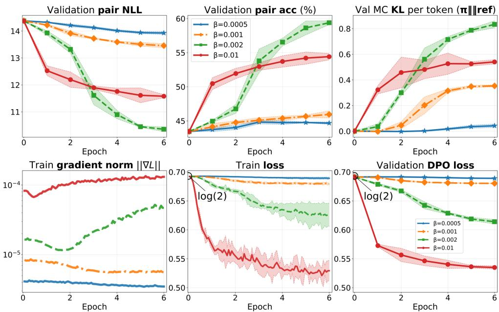  
Figure 1: Training and validation dynamics of our DPO implementation on HelpSteer3 with Qwen3- 4B-Instruct-2507 (SGD, $\mathrm { l r } = 2 \times \mathrm { 1 0 ^ { - 4 } }$ , batch size 24). Curves show the mean over five seeds; shaded bands denote one standard deviation. Final KL is non-monotone in $\beta ;$ see Section 3.3 and Appendix G.

Table 2: Initial gradient magnitudes $G _ { 0 }$ (mean absolute per-parameter gradient at the first logged step of epoch 1, averaged over five seeds) from the HelpSteer3 SGD runs in Figure 1.
<table><tr><td> $\beta$ </td><td> $5 \times 1 0 ^ { - 4 }$ </td><td> $1 0 ^ { - 3 }$ </td><td> $2 \times 1 0 ^ { - 3 }$ </td><td> $1 0 ^ { - 2 }$ </td></tr><tr><td> $G _ { 0 }$ </td><td> $4 . 1 2 \times 1 0 ^ { - 6 }$ </td><td> $8 . 3 7 \times 1 0 ^ { - 6 }$ </td><td> $1 . 6 4 \times 1 0 ^ { - 5 }$ </td><td> $8 . 2 8 \times 1 0 ^ { - 5 }$ </td></tr><tr><td> $G _ { 0 } / \beta$ </td><td> $8 . 2 3 \times 1 0 ^ { - 3 }$ </td><td> $8 . 3 7 \times 1 0 ^ { - 3 }$ </td><td> $8 . 2 2 \times 1 0 ^ { - 3 }$ </td><td> $8 . 2 8 \times 1 0 ^ { - 3 }$ </td></tr></table>

Neither effect is specific to this dataset or optimizer. Adaptive optimizers such as AdamW can partly obscure the β-dependent scaling of gradient magnitude (Appendix B estimates $\beta _ { \mathrm { c r i t } }$ such that for $\beta \lesssim \beta _ { \mathrm { c r i t } }$ the linear-in- $\boldsymbol { \cdot } \beta$ update suppression is again visible even under AdamW). Moment estimates effectively stabilize step sizes and smooth training dynamics, so the coupling between $\beta$ and update strength is most apparent when $\beta$ is already small, exactly where the explicit $\beta$ prefactor in $\partial \bar { \mathcal { L } } / \partial \Delta$ suppresses gradients most strongly. Appendix C (Figure C1) documents the same degradation on UltraFeedback with TRL DPOTrainer under AdamW at very small $\beta ;$ the same pattern appears on PKU-processed HH-RLHF with Mamba-2 (Figure C2). Compared with those AdamW runs, plain SGD makes the effect easier to see, and it already appears at larger $\beta .$ An alternative HelpSteer3 SGD configuration at learning rate $5 \times 1 0 ^ { - 4 }$ (Figure C4) and HH-RLHF trajectories are reported in Appendix C.

## 3.2 Mechanism of Gradient-Scale Coupling

Using the margin $\Delta$ and classical DPO loss from Section 2 (Equation (5)), the gradient with respect to $\Delta$ is

$$
\frac { \partial \mathcal { L } _ { \mathrm { D P O } } } { \partial \Delta } = - \beta \frac { \exp ( - \beta \Delta ) } { 1 + \exp ( - \beta \Delta ) } = - \beta \sigma ( - \beta \Delta ) .\tag{6}
$$

Figures C1 and 1 mirror the linear $\beta$ prefactor in Equation (6): on HelpSteer3 (Figure 1), gradient norms rank-order with $\beta ,$ with the larger-β curve lying above the smaller $- \beta$ curve, while the Ultra-Feedback TRL run in Appendix C (Figure C1) uses a very small $\beta$ under AdamW and maintains comparatively small gradient norms throughout training. This linear scaling is exact at initialization: the policy coincides with the reference model, so $\Delta = \bar { 0 } , \partial \mathcal { L } _ { \mathrm { D P O } } / \partial \Delta = - \bar { \beta } / 2$ , and the full parameter gradient $- ( \beta / 2 ) \nabla _ { \theta } \Delta _ { \theta }$ has norm proportional to $\beta$ for a fixed model state, i.e., $G _ { 0 } / \beta$ should be constant across $\beta .$ Table 2 (Section 3.1) quantifies this prediction on the HelpSteer3 SGD runs of Figure 1: the measured ratios $G _ { 0 } / \beta$ agree within roughly $\overline { { 2 \% } }$ across a $2 0 \times$ range of $\beta .$ . Measurement and analysis of the logged gradient magnitudes are discussed in Appendix J. Thus, the classical form contains an explicit multiplicative $\bar { \beta }$ factor in the gradient magnitude. As $\beta$ decreases, gradient magnitude is linearly suppressed by this front multiplier. This coupling motivates a normalized reformulation: if $\beta$ is intended to control the preference–regularization trade-off, it should not also directly rescale the effective update size. As summarized in Table 1, most DPO-family objectives share this explicit $\beta$ prefactor in the marginal gradient.

The same linear β-dependent gradient-scale coupling is not specific to logistic Bradley–Terry [Bradley and Terry, 1952]: it holds for any pairwise loss − log $F ( { \ ' } \beta \Delta )$ with a full-line noise CDF $F \ ( \mathrm { A p } \mathsf { - }$ pendix D, Eq. (D.3)), including the Thurstone case $F = \Phi$ [Sun et al., 2025]; the corresponding marginal gradient always contains an explicit multiplicative $\beta$ prefactor (Eq. (D.4)).

## 3.3 Dead Zone, Peak, and Saturation

The explicit $\beta$ prefactor in Equation (6) does more than rescale updates: it enters the condition under which training effectively stops, and thereby makes the achieved policy deviation non-monotone in $\beta ,$ as observed in Figure 1. We model effective convergence with a stopping tolerance $\tau > 0 \colon$ updates on a preference pair become negligible once the magnitude of the marginal gradient drops below $\tau ,$ which lumps together the SGD noise floor, learning-rate decay, and the finite training horizon. By Equation $( \bar { 6 } ) , | \bar { \partial \mathcal { L } } _ { \mathrm { D P O } } / \partial \Delta | = \beta \sigma ( - \beta \Delta )$ , and the stopping condition $\beta \sigma ( - \beta \Delta ) = \bar { \tau }$ yields

$$
\Delta _ { \mathrm { D P O } } ^ { * } = \frac { 1 } { \beta } \log \left( \frac { \beta } { \tau } - 1 \right) , \qquad \beta > 2 \tau .\tag{7}
$$

Three regimes follow (Appendix G gives the full derivation and the normalized-objective counterpart).

• Dead zone $( \beta \leq 2 \tau )$ : the marginal gradient is largest at initialization, where $\Delta = 0$ and $| \partial \mathcal { L } _ { \mathrm { D P O } } / \partial \Delta | = \beta / 2 . \mathrm { I f } \beta / 2 \bar { \leq } \tau$ , the gradient is below tolerance from the start and training never escapes initialization.

• Non-monotone peak $( \beta > 2 \tau ) $ : maximizing Equation (7) over $\beta$ gives

$$
\beta _ { \mathrm { p e a k } } \approx 4 . 6 \tau ,\tag{8}
$$

after which $\Delta _ { \mathrm { D P O } } ^ { * }$ decays as log $( \beta / \tau ) / \beta$ . Unlike the normalized objective, the product $\beta \Delta _ { \mathrm { D P O } } ^ { * } = \log ( \ddot { \beta } / \tau - \bar { 1 } )$ grows only logarithmically, so $\beta$ is a poor knob for the achieved margin.

• Right-hand saturation: the same $\log ( \beta / \tau ) / \beta$ decay drives the policy back toward the reference. Appendix K uses the scalar closure $\beta _ { \mathrm { r } } \approx \mathrm { i } / ( g _ { B } ^ { 2 } \tau H )$ to obtain only an order-ofmagnitude finite-horizon scale, where $g _ { B }$ is the initial batch-averaged Jacobian proxy and H is the learning-rate budget. The estimate is approximate because $g _ { B }$ changes during training and differs from a typical per-pair Jacobian; exact minibatch dynamics require cross-pair Gram products.

Figure 2 compares the observed dense β-sweep with Equation (7) under the same HelpSteer3 SGD protocol as Figure 1. Validation pair NLL (with $\beta = \bar { 1 } ;$ Appendix G.1), per-token $\mathrm { K L }$ , and mean margin $\overline { { \Delta } }$ are qualitatively consistent with the predicted shape: a left dead zone, an intermediate peak, and a decaying right slope, with NLL an inverted copy of the saturation curve. Appendix G.1 obtains two descriptive estimates of $\tau { : }$ from Equation $( 8 ) , \tau = \beta _ { \mathrm { p e a k } } / 4 . 6 \approx 5 . 9 9 \times 1 0 ^ { - 4 }$ , and from a shape+scale fit of $\overline { { \Delta } } ( \beta )$ to Equation (7) on $\beta > 2 \tau , \tau \approx 6 . 3 7 \times 1 0 ^ { - 4 }$ . The two overlays in Figure 2 are almost indistinguishable. The $\beta = 0 . 0 0 2$ vs. 0.01 ordering in Figure 1 is consistent with the threshold model and need not indicate an instability.

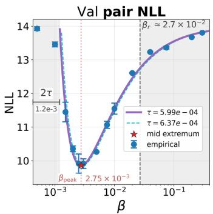

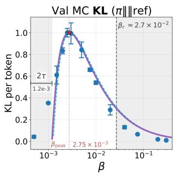

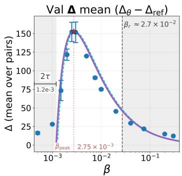  
Figure 2: Standard DPO on HelpSteer3 with Qwen3-4B-Instruct-2507 (SGD, $\mathrm { l r } = 2 \times 1 0 ^ { - 4 }$ , batch size 24): minimum validation pair NLL (with $\beta = 1 ;$ ; Appendix G.1), and at that same epoch per-token Monte Carlo KL and mean validation margin $\overline { { \Delta } } = \Delta _ { \theta } - \Delta _ { \mathrm { r e f } }$ , versus $\beta .$ . Points are seed means ± std (Table G1); far-right $\beta \in \{ 0 . 2 , 0 . 3 \}$ are single-seed. Solid and dashed overlays follow the shape of Equation (7) with τ from $\beta _ { \mathrm { p e a k } } ( \tau = 5 . 9 9 \times 1 0 ^ { - 4 } )$ and from a shape+scale fit of $\overline { { \Delta } } ( \beta )$ $( \tau = 6 . 3 7 \times 1 0 ^ { - 4 }$ ; Appendix G.1). The left shaded band marks $\beta \leq 2 \tau$ ; the broad right-hand band is only an order-of-magnitude finite-horizon estimate because it freezes an initial batch-averaged Jacobian proxy (Appendix K).

## 3.4 The Standard DPO Loss Is Not Comparable Across $\beta$

The same $\beta$ entanglement also undermines the standard DPO loss as a monitoring signal: the loss depends on $\beta$ and the preference margin only through their product $u = \beta \Delta$ , so its value can remain nearly flat during training, or coincide across runs whose policies differ several-fold in KL. One might expect a training loss to decrease more clearly when the model learns more aggressively and moves farther from the reference policy in KL. The standard DPO loss need not satisfy this, as illustrated across Figure 1, Figure 3, and the HH-RLHF trajectories in Appendix C: the training dynamics can be more aggressive (Appendix C), the loss geometry is governed by the negative half-axis (Figure 3), and the standard DPO loss can still appear nearly flat during training (Figure 1 and Appendix $C _ { i }$ Figure C1). The reason is that on the negative half-axis, for $\beta _ { 1 } < \beta _ { 2 }$ and $x < 0$ , we have

$$
\log \sigma ( \beta _ { 1 } x ) > \log \sigma ( \beta _ { 2 } x ) ,\tag{9}
$$

even though, under the KL-control interpretation, the smaller $\beta$ would be expected to permit more aggressive policy movement. This ordering also breaks cross- $\cdot \beta$ comparability when $\beta$ is swept as a hyperparameter (see Section 5). For small $\beta ,$ the standard DPO loss often changes little during training relative to its value at initialization and can appear nearly flat, which complicates monitoring.

A sharper version of the problem appears when $\beta$ and the learning rate are traded off against each other. The standard loss depends only on the product $u = \beta \Delta$ , and under SGD the update of $\Delta$ carries the prefactor $\eta \beta$ (Equation (6)). Under the scalar frozen-Jacobian approximation, matching $\eta \beta$ predicts similar late-time trajectories in $u = \beta \Delta$ . This behavior is observed approximately in several of our sweeps but is not guaranteed for general minibatch training (Appendix H). In those cases, the runs produce nearly identical training and validation loss curves while their physical margins differ; their KL divergences from the reference can therefore differ substantially as well, although that ratio is not fixed by the same identity. Figure 4 shows this effect on UltraFeedback: the two standard-loss runs $( \beta , \mathrm { { l r } ) \dot { = } ( 0 . 0 1 , 1 0 ^ { - 3 } ) }$ and $( 0 . { \overset { \vartriangle } { . } { \mathrm { 0 2 } } } , 5 \times 1 0 ^ { - 4 } )$ have nearly identical validation DPO losses, yet their validation KL differs by a factor of about 3 (Table H2), and validation NLL separates the runs as well. The same coincidence of the standard DPO loss conceals a large downstream gap: AlpacaEval 2 length-controlled win rates for this pair differ by about 14 percentage points (Table I1, Appendix I). On HelpSteer3 the same construction yields a KL ratio of ≈ 10; Appendix H quantifies both cases, together with Ministral-3B and HH-RLHF comparisons. Consequently, neither the training loss nor the validation DPO loss can be used to compare runs across $\beta ,$ to select β by loss value, or to detect that one run has moved several times farther from the reference model. The normalized loss of Section 4 removes this artifact: it tracks the physical margin $\Delta ,$ , so runs with different policy displacement produce visibly different loss curves.

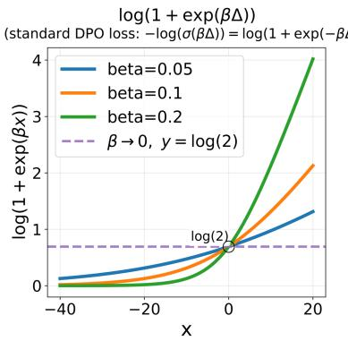

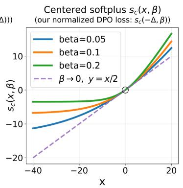  
Figure 3: Standard DPO loss log $\sigma ( \beta \Delta )$ and centered softplus $s _ { c } ( \Delta ; \beta )$ . The negative half-axis is the region of primary interest because the loss is optimized mostly there. As $\beta  0 .$ , the standard DPO loss degenerates into a constant.

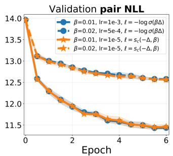

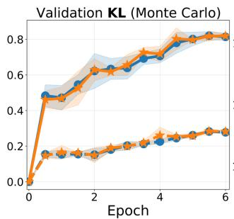

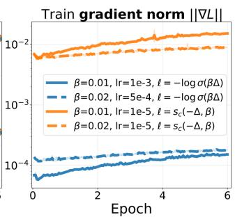

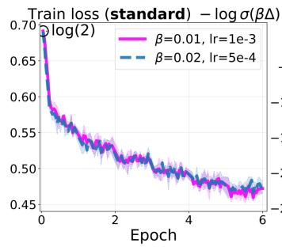

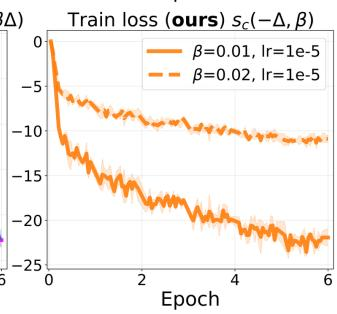

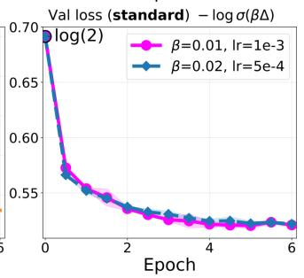  
Figure 4: Comparison of training with the normalized centered-softplus DPO objective $s _ { c } ( - \Delta ; \beta )$ and standard DPO with pairwise loss $- \log { \sigma ( \beta \Delta ) }$ on UltraFeedback with Qwen3-4B-Instruct-2507 (batch size 26). Learning rates satisfy $\mathrm { l r } _ { \mathrm { n o r m } } = \beta \ln \mathrm { _ { s t a n d a r d } }$ . With SGD, validation metrics are nearly equivalent. Even when validation metrics differ substantially between $\beta \in \{ 0 . 0 1 , 0 . 0 2 \}$ , the standard training-loss curves are almost overlapping, whereas for $s _ { c } ( - \Delta ; \beta )$ the training losses separate noticeably. Curves show the mean over four seeds; shaded bands denote one standard deviation. The comparison tests the predicted scale equivalence; it is not a claim that the normalized objective outperforms a retuned DPO baseline.

## 4 Normalized Objective Formulation

## 4.1 Normalized DPO Loss

A natural normalization is to divide Equation (5) by $\beta > 0$ . Since multiplication by a positive constant does not change the arg min, this rescaling preserves the optimal solution. For the standard softplus term, define

$$
s ( x ; \beta ) = \frac { 1 } { \beta } \log \left( 1 + e ^ { \beta x } \right) .\tag{10}
$$

Using this notation, the normalized DPO objective can be written as

$$
\mathcal { L } _ { \mathrm { D P O } } ^ { \mathrm { n o r m } } ( \Delta ; \beta ) = s ( - \Delta ; \beta ) .\tag{11}
$$

For $\beta > 0 .$ its marginal gradient is

$$
\frac { \partial \mathcal { L } _ { \mathrm { D P O } } ^ { \mathrm { n o r m } } } { \partial \Delta } = - \sigma ( - \beta \Delta ) .\tag{12}
$$

Compared with Equation $^ { 6 , }$ the explicit multiplicative $\beta$ prefactor has been removed. Thus $\beta$ still controls the shape and saturation of the sigmoid response as an effective inverse preferencenoise-scale coefficient, but no longer directly rescales the local update magnitude. Quantitatively, $| \partial \mathcal { L } _ { \mathrm { D P O } } ^ { \mathrm { n o r m } } / \partial \Delta | = \sigma ( - \beta \Delta ) \leq 1$ while $\partial ^ { 2 } \bar { \mathcal { L } } _ { \mathrm { D P O } } ^ { \mathrm { n o r m } } / \partial \Delta ^ { 2 } = \beta \sigma ^ { \prime } ( \bar { \beta } \Delta ) \leq \bar { \beta } / 4 \colon$ in the normalized parameterization, $\beta$ bounds the curvature of the pairwise loss without affecting its gradient scale, in line with the low-curvature motivation for centered softplus in Srinivas et al. [2022]. For $\beta \Delta \approx 0$ $\log ( 1 + e ^ { - \beta \Delta } ) / \beta \approx ( \ln 2 ) / \beta - \Delta / 2$ . The $\beta  0$ endpoint is handled rigorously in Appendix $\operatorname { E } ;$ in particular, the marginal gradient has the well-defined limit $- 1 / 2$

## 4.2 Centered Softplus

To eliminate the lo $; ( 2 ) / \beta$ offset, we adopt the centered-softplus transformation introduced by Srinivas et al. [2022]; see Figure 3 for an illustration of log $\varsigma ( \sigma ( \beta \Delta ) )$ versus centered softplus:

$$
s _ { c } ( x ; \beta ) = s ( x ; \beta ) - \frac { \ln 2 } { \beta } = \frac { 1 } { \beta } \log \left( \frac { 1 + e ^ { \beta x } } { 2 } \right) .\tag{13}
$$

For $\beta > 0 .$ the centered-softplus objective $s _ { c } ( - \Delta ; \beta )$ is argmin-equivalent to the original DPO loss $- \log { \sigma ( \beta \Delta ) }$ ; the algebraic identity and the functional equivalence over $\theta$ are proved in Appendix $\mathrm { E }$ In the limit $\beta  0$ , the centered softplus converges to a linear map $s _ { c } ( x ; 0 ) = x / 2$ . Accordingly, we define the updated normalized DPO objective as

$$
\mathcal { L } _ { \mathrm { D P O } } ^ { \mathrm { n o r m } } ( \Delta ; \beta ) = \left\{ \begin{array} { l l } { s _ { c } ( - \Delta ; \beta ) , } & { \beta > 0 , } \\ { - \frac { \Delta } { 2 } , } & { \beta = 0 . } \end{array} \right.\tag{14}
$$

This parameterization removes the divergent offset while preserving the minimizers of the original objective for $\beta > 0$ . In particular, at $\bar { \beta } = 0 .$ , minimizing $\mathcal { L } _ { \mathrm { D P O } } ^ { \mathrm { n o r m } }$ is equivalent (up to a constant factor and the fixed reference term) to maximizing the policy log-probability margin between winner and loser responses, i.e., log $\pi _ { \theta } ( y _ { w } \mid x ) - \log \pi _ { \theta } ( y _ { l } \mid x )$ . The $\beta = 0$ branch should therefore be interpreted as a limiting case rather than as a universally preferable default. Unlike the $\beta > 0$ centered softplus loss, the linear objective does not saturate for already well-separated preference pairs: its marginal gradient with respect to $\Delta$ remains constant, matching the limit $- { \frac { 1 } { 2 } }$ $\bar { \beta _ { } }  0$ . Consequently, in unconstrained parameterizations it does not by itself impose a finite preferred margin. In practical language-model fine-tuning, the realized update is still controlled by the optimizer, learning-rate schedule, finite training horizon, gradient clipping, and any explicit or implicit regularization. We therefore view $\beta = 0$ primarily as an endpoint that cleanly separates preference-margin maximization from the β-controlled saturation behavior present at $\beta > 0$

The normalized DPO objective based on centered softplus addresses the Section 3.1 issue that, for small $\beta ,$ the standard DPO loss can remain nearly flat even when optimization is relatively aggressive. Unlike the standard DPO loss, its negative-half-axis geometry does not collapse toward a nearly constant curve as $\beta$ becomes small (Figure 3). The same comparison highlights a further optimization advantage of the proposed parameterization. The standard loss $- \log { \sigma ( \beta \Delta ) }$ is bounded below by 0 for every $\beta$ and, as $\beta$ decreases, its entire profile flattens toward the constant log 2, so gradients saturate quickly at small $\beta .$ . The centered-softplus loss instead has a β-dependent lower plateau at $- \ln 2 / \beta \vdots$ the smaller $\beta ,$ the deeper the plateau and the longer gradients keep flowing—the marginal gradient $- \sigma ( - \beta \Delta )$ stays near $- 1 / 2$ over a range of margins that grows as $\bar { 1 } / \beta \cdot$ —with no premature saturation. From an optimization standpoint, avoiding vanishing gradients and premature saturation makes the normalized loss the better-behaved objective, while the minimizer is unchanged for $\beta > 0$ Over the same optimization trajectory it retains more variation and separates runs more clearly, making the loss easier to interpret as learning progress (Figure 4). Together with the hard-margin endpoint in Equation E.17 (Appendix E), this shows that the normalized form has meaningful behavior at both extremes of $\beta .$

For the centered-softplus objective, $| \partial \mathcal { L } _ { \mathrm { D P O } } ^ { \mathrm { n o r m } } / \partial \Delta | = \sigma ( - \beta \Delta )$ , so the stopping condition $\sigma ( - \beta \Delta ) =$ τ gives the saturation margin

$$
\Delta ^ { * } = \frac { 1 } { \beta } \log \frac { 1 - \tau } { \tau } .\tag{15}
$$

Unlike the classical threshold in Equation $( 7 ) .$ this margin scales as $1 / \beta$ with no dead zone and no intermediate peak: under the normalized loss the achieved policy deviation is monotone in $1 / \beta$ (Appendix G).

## 4.3 Experiments

To verify that the normalized objective behaves as predicted by the gradient-scale analysis, we compare it against standard DPO under a learning-rate rescaling that equalizes the marginal gradient scale. Because $\nabla _ { \theta } \mathcal { L } _ { \mathrm { D P O } } ^ { \mathrm { n o r m } } = \nabla _ { \theta } \mathcal { L } _ { \mathrm { D P O } } / \beta$ for $\beta > 0$ , equal SGD updates require

$$
\operatorname { l r } _ { \mathrm { n o r m } } = \beta \operatorname { l r } _ { \mathrm { s t a n d a r d } } .
$$

The experiment checks the gradient-scale analysis above; it is not meant to establish a performance advantage over a carefully retuned DPO baseline. Thus SGD trajectories should match closely under this learning-rate relation, up to stochasticity and numerical effects. Learning-rate retuning can compensate for much of the finite-time speed difference, but this compensation is a separate optimization choice rather than an intrinsic property of the original DPO parameterization. Figure 4 illustrates this prediction in a realistic LLM fine-tuning setup: each centered-softplus run uses $\mathrm { l r } _ { \mathrm { n o r m } } = \beta \mathrm { l r } _ { \mathrm { s t a n d a r d } } ,$ and the two objectives produce closely aligned validation trajectories, consistent with their objective level affine relation. The same figure shows that the normalized training loss remains distinguishable for $\beta \in \{ 0 . 0 1 , 0 . 0 2 \}$ , whereas the standard training-loss curves coincide (Section 3.4). Table I1 (Appendix I) reports AlpacaEval 2 and IFEval scores for these four curves: the overlapping standardloss pair differs substantially downstream, while each standard-DPO configuration agrees with its learning-rate-rescaled centered-softplus counterpart. Table I2 (Appendix I) extends the comparison to post-training AlpacaEval and IFEval scores on HelpSteer3 over eight paired seeds. No statistically significant difference is detected at $n = 8$ by the seed-wise Wilcoxon signed-rank tests $( p > 0 . 0 5$ for all reported metrics); these tests do not establish practical equivalence or exclude small systematic effects. Figure I2 (Appendix I) reproduces the same comparison on HelpSteer3 with curves averaged over eight seeds; shaded bands denote one standard deviation. The remaining small gaps may reflect stochasticity and numerical nondeterminism in LLM fine-tuning, but the present sample size does not distinguish these sources from a small systematic effect. The two standard-loss UltraFeedback runs in Figure 4 are exactly the loss-invariance pair analyzed in Section 3.4 and Appendix H.

We also trained with the normalized centered-softplus DPO objective under additional hyperparameter settings and on other preference datasets, with AdamW (Figure I3, Appendix I), including $\beta = 0$ with the linear branch in Equation 14; an additional graph for the normalized centered-softplus loss is shown in Figure I4 (Appendix I). Across these runs, stronger policy evolution corresponds to a faster decrease in the normalized training loss. The $\beta = 0$ limiting case included in Figure I3 is comparatively less stable than any $\beta > 0$ run, since the linear branch in Equation 14 is unbounded below; nevertheless, trajectories with stronger policy movement still show the fastest training-loss decrease. Figure I3 also plots the standard DPO pairwise loss on validation, although training optimizes the normalized centered-softplus objective. The validation pair NLL echoes the training pattern: the $\beta = 0$ and $\beta = 0 . 0 0 2$ runs, which learn most aggressively and carry the highest gradient norms, attain the lowest pair NLL, whereas the comparatively weak $\beta = 0 . 0 1 5$ run remains the highest. The validation standard loss, by contrast, shows the inverted ordering $( \beta = 0 . 0 1 5$ is lowest, and $\beta = 0$ sits identically at log 2), reflecting the ordering artifact in Equation (9): smaller $\beta$ pushes − log $\sigma ( \beta \Delta )$ toward the random-baseline value log 2 regardless of the actual policy movement (see also Appendix H).

## 5 Discussion

The centered-softplus reformulation preserves the minimizer of the original DPO objective for $\beta > 0$ while making the gradient-scale effect of $\beta$ explicit; it is not meant to define a different optimum or guarantee a universal gain over a carefully retuned DPO baseline. Its purpose is a cleaner parameterization in which the preference-noise scale and the learning rate control separate aspects of training, with $\beta = 0$ providing a well-defined limiting objective, and in which the loss remains an informative training signal that is comparable across $\breve { \beta }$ (Section 3.4, Appendix H).

Conceptually, in KL-regularized RLHF, λ is the coefficient of the explicit $\lambda \operatorname { K L } ( \pi _ { \theta } \parallel \pi _ { \mathrm { r e f } } )$ term [Xiong et al., 2024]. By contrast, after substituting the reward–policy relation into a logistic preference model with annotator-noise scale $s _ { a } .$ the DPO objective depends on the effective coefficient $\beta = \lambda / s _ { a }$ [Rafailov et al., 2023, Eq. 6]. The scales $\lambda$ and $s _ { a }$ are not separately identifiable from the DPO likelihood without fixing a reward normalization. Once the likelihood is used as the training loss, $\beta$ controls both its sharpness in policy-log-ratio coordinates and the scale of its gradients. This reading is consistent with comparative and hybrid studies: Xu et al. [2024b] contrast PPO’s explicit, tunable KL penalty with DPO, which has no explicit KL term and controls deviation only through the preference likelihood and its coefficient $\beta ;$ hybrid methods such as DICE [Chen et al., 2025] and RTO [Zhong et al., 2025] likewise treat $\beta$ as a scale parameter of the preference loss rather than as a KL multiplier, and $\beta$ -DPO [Wu et al., 2024] adapts it as a loss-sharpness knob.

The centering constant ln 2 in the normalized loss also has a statistical meaning. In the Gumbel-noise view of Bradley–Terry [Sun et al., 2025], $P ( y _ { w } \succ y _ { l } ) = \sigma ( ( r _ { w } - r _ { l } ) / s _ { a } )$ . Appendix F shows that substituting $r _ { w } - r _ { l } = \lambda \Delta$ gives $P ( y _ { w } \sim y _ { l } ) = \sigma ( \beta \Delta )$ with $\beta = \lambda / s _ { a }$ , and that $\mathcal { L } _ { \mathrm { D P O } } - \log 2$ equals the negative log-likelihood ratio of the current preference model against the random-choice baseline $P = \bar { 1 } / 2$ . Dividing by $\beta$ removes the effective inverse preference-noise-scale prefactor from the marginal gradient, yielding the normalized centered-softplus loss; it should not be interpreted as measuring literal annotator noise unless the reward/KL normalization is fixed. The same construction carries over to the Gaussian (Thurstone) model (Appendix F). The practical consequence for cross $- \beta$ comparability of loss values was established in Section 3.4.

## 6 Conclusion

We recommend considering the normalized centered-softplus objective when β-dependent gradient scaling or loss comparability across $\beta$ is a practical concern. This substitution:

• resolves gradient attenuation at small $\beta ,$ so that the inverse preference-noise scale no longer silently rescales the effective update magnitude;

• makes changes in the preference margin $\Delta$ and validation pair NLL monotone in $\beta$ (equivalently, in $1 / \bar { \beta } )$ , without the dead-zone / intermediate-peak behavior of the classical threshold. In the reported sweeps, validation KL co-moves with that margin over a wide range of $\beta$ without a claim of a universal KL–margin law;

• makes training and validation losses comparable across different $\beta ,$ and removes cases in which nearly identical training and validation loss curves hide substantially different policies.

Technically, the change is a local rewrite of the loss evaluation and is straightforward to drop into existing DPO codebases (e.g., TRL) without restructuring the trainer or the data pipeline.

## Reproducibility, Data, and Compute

Code for this work is publicly available at https://github.com/ivankru/bayesian\_dpo. We train Qwen3-4B-Instruct-2507, Qwen2.5-3B-Instruct, Ministral-3B-Instruct, and Mamba-2 2.7B (with LoRA) on three public pairwise preference datasets from Hugging Face: HelpSteer3-Preference [NVIDIA, 2025, Wang et al., 2025], UltraFeedback Binarized [Hugging Face H4, 2023, Cui et al.,

2024], and PKU-processed HH-RLHF [PKU-Alignment, 2023, Anthropic, 2022, Bai et al., 2022]. For downstream instruction-following checks (Tables I2 and I1), we additionally use Qwen2.5-14B-Instruct as an LLM judge for AlpacaEval 2 [Dubois et al., 2024] and the official verifiable IFEval benchmark [Zhou et al., 2023] without a judge model. All experiments ran on NVIDIA A100-SXM4- 80GB GPUs. Dataset processing and splits, per-run hyperparameters, the Monte Carlo KL protocol, training times, and software versions are detailed in Appendix M; full run configurations are included in the released code.

## Limitations and Broader Impacts

Our empirical evidence covers three preference datasets and four backbones (Qwen3-4B-Instruct-2507, Qwen2.5-3B-Instruct, Ministral-3B-Instruct, and Mamba-2 2.7B), all fine-tuned with LoRA at moderate scale, so transfer to larger models, full fine-tuning, and other data regimes remains to be verified. Minimizer equivalence for $\beta > 0$ is an objective-level statement: finite-time trajectories can still differ across optimizers and implementations. Our main sweeps use four to five seeds; downstream checks cover a HelpSteer3 comparison (AlpacaEval 2 and IFEval in Table I2) and AlpacaEval 2 and IFEval on the UltraFeedback curves of Figure 4 (Table I1), and broader robustness evaluations (e.g., noisy or adversarial labels, out-of-domain prompts, long-horizon iterative preference updates) remain for future work.

This work reformulates an existing preference-optimization objective and does not introduce a new capability class; its risks are those of language-model alignment more broadly, including misuse of better-aligned systems and biases inherited from preference data and annotator judgments. We recommend standard deployment safeguards: safety evaluation, bias and robustness assessment, and human oversight in high-stakes settings.

## References

Anthropic. Anthropic/hh-rlhf. https://huggingface.co/datasets/Anthropic/hh-rlhf, 2022. Hugging Face dataset.

AntonV. Antonv/mamba2-2.7b-hf. https://huggingface.co/AntonV/mamba2-2.7b-hf, 2024. Hugging Face model.

Mohammad Gheshlaghi Azar, Mark Rowland, Bilal Piot, Daniel Guo, Daniele Calandriello, Michal Valko, and Rémi Munos. A general theoretical paradigm to understand learning from human preferences. In Proceedings ofthe 27th International Conference on Artificial Intelligence and Statistics (AISTATS), 2024. URL https://arxiv.org/abs/2310.12036.

Yuntao Bai, Andy Jones, Kamal Ndousse, Amanda Askell, Anna Chen, Nova DasSarma, Dawn Drain, Deep Ganguli, Tom Henighan, Nicholas Joseph, Ben Mann, Chris Olah, Nicholas Schiefer, and et al. Training a helpful and harmless assistant with reinforcement learning from human feedback. arXiv preprint, 2022. URL https://arxiv.org/abs/2204.05862.

Ralph Allan Bradley and Milton E. Terry. Rank analysis of incomplete block designs: I. the method of paired comparisons. Biometrika, 39(3/4):324–345, 1952. doi: 10.2307/2334029.

Changyu Chen, Zichen Liu, Chao Du, Tianyu Pang, Qian Liu, Arunesh Sinha, Pradeep Varakantham, and Min Lin. Bootstrapping language models with DPO implicit rewards. In International Conference on Learning Representations (ICLR), 2025. URL https://arxiv.org/abs/2406.09760.

Ganqu Cui, Lifan Yuan, Ning Ding, Guanming Yao, Bingxiang He, Wei Zhu, Yuan Ni, Guotong Xie, Ruobing Xie, Yankai Lin, Zhiyuan Liu, and Maosong Sun. UltraFeedback: Boosting language models with scaled AI feedback. In Proceedings ofthe 41st International Conference on Machine Learning (ICML), volume 235 of Proceedings ofMachine Learning Research, pages 9722–9744, 2024. URL https://proceedings.mlr. press/v235/cui24f.html.

Yann Dubois, Balázs Galambosi, Percy Liang, and Tatsunori B. Hashimoto. Length-controlled alpacaeval: A simple way to debias automatic evaluators. In First Conference on Language Modeling (COLM), 2024. URL https://arxiv.org/abs/2404.04475.

Kawin Ethayarajh, Yejin Choi, and Swabha Swayamdipta. Understanding dataset difficulty with V-usable information. In Proceedings of the 39th International Conference on Machine Learning, volume 162 of Proceedings ofMachine Learning Research, pages 5988–6008. PMLR, 2022. URL https://proceedings. mlr.press/v162/ethayarajh22a.html.

Kawin Ethayarajh, Winnie Xu, Niklas Muennighoff, Dan Jurafsky, and Douwe Kiela. Kto: Model alignment as prospect theoretic optimization. In Proceedings of the 41st International Conference on Machine Learning (ICML), 2024. URL https://arxiv.org/abs/2402.01306.

Hiroki Furuta, Kuang-Huei Lee, Shixiang Shane Gu, Yutaka Matsuo, Aleksandra Faust, Heiga Zen, and Izzeddin Gur. Geometric-averaged preference optimization for soft preference labels. In Advances in Neural Information Processing Systems (NeurIPS), 2024. URL https://arxiv.org/abs/2409.06691.

Xiangkun Hu, Lemin Kong, Tong He, and David Wipf. Explicit preference optimization: No need for an implicit reward model. In Proceedings ofthe 42nd International Conference on Machine Learning (ICML), 2025. URL https://arxiv.org/abs/2506.07492.

Hugging Face H4. Huggingfaceh4/ultrafeedback\_binarized. https://huggingface.co/datasets/ HuggingFaceH4/ultrafeedback\_binarized, 2023. Hugging Face dataset.

Xize Liang, Chao Chen, Shuang Qiu, Jie Wang, Yue Wu, Zhihang Fu, Hanzhu Chen, Feng Wu, and Jieping Ye. Ropo: Robust preference optimization for large language models. In Proceedings ofthe 42nd International Conference on Machine Learning (ICML), volume 267 of Proceedings ofMachine Learning Research, pages 37131–37161, 2025. URL https://arxiv.org/abs/2404.04102.

Qinwei Ma, Jingzhe Shi, Can Jin, Jenq-Neng Hwang, Serge Belongie, and Lei Li. Gradient imbalance in direct preference optimization. arXiv preprint, 2025. URL https://arxiv.org/abs/2502.20847.

Igor Melnyk, Youssef Mroueh, Brian Belgodere, Mattia Rigotti, Apoorva Nitsure, Mikhail Yurochkin, Kristjan Greenewald, Jiri Navratil, and Jarret Ross. Distributional preference alignment of llms via optimal transport. In Advances in Neural Information Processing Systems (NeurIPS), 2024. URL https://arxiv.org/abs/ 2406.05882.

Yu Meng, Mengzhou Xia, and Danqi Chen. Simpo: Simple preference optimization with a reference-free reward. In Advances in Neural Information Processing Systems (NeurIPS), 2024. URL https://arxiv.org/abs/ 2405.14734.

ministral. ministral/ministral-3b-instruct. https://huggingface.co/ministral/Ministral-3b-instruct, 2024. Community Hugging Face checkpoint (not an official Mistral AI release).

Eric Mitchell. A note on dpo with noisy preferences & relationship to ipo, 2023. URL https://ericmitchell. ai/cdpo.pdf. Technical note.

NVIDIA. nvidia/helpsteer3. https://huggingface.co/datasets/nvidia/HelpSteer3, 2025. Hugging Face dataset.

Motoki Omura, Yasuhiro Fujita, and Toshiki Kataoka. Entropy controllable direct preference optimization. arXiv preprint, 2024. URL https://arxiv.org/abs/2411.07595. Also presented at ICML 2025 Workshop on MoFA.

Ryan Park, Rafael Rafailov, Stefano Ermon, and Chelsea Finn. Disentangling length from quality in direct preference optimization. Findings of the Association for Computational Linguistics: ACL 2024, 2024. doi: 10.18653/v1/2024.findings-acl.297. URL https://aclanthology.org/2024.findings-acl.297/.

PKU-Alignment. Pku-alignment/processed-hh-rlhf. https://huggingface.co/datasets/PKU-Alignment/ processed-hh-rlhf, 2023. Hugging Face dataset.

Qwen Team. Qwen/qwen2.5-14b-instruct. https://huggingface.co/Qwen/Qwen2.5-14B-Instruct, 2024. Hugging Face model; Qwen License (Apache 2.0 based).

Rafael Rafailov, Archit Sharma, Eric Mitchell, Stefano Ermon, Christopher D. Manning, and Chelsea Finn. Direct preference optimization: Your language model is secretly a reward model. In Advances in Neural Information Processing Systems (NeurIPS), 2023. URL https://arxiv.org/abs/2305.18290.

Sayak Ray Chowdhury, Anush Kini, and Nagarajan Natarajan. Provably robust dpo: Aligning language models with noisy feedback. In Proceedings of the 41st International Conference on Machine Learning (ICML), 2024. URL https://arxiv.org/abs/2403.00409.

Judy Hanwen Shen, Archit Sharma, and Jun Qin. Towards data-centric RLHF: Simple metrics for preference dataset comparison. arXiv preprint, 2024. URL https://arxiv.org/abs/2409.09603.

Suraj Srinivas, Kyle Matoba, Himabindu Lakkaraju, and François Fleuret. Efficient training of low-curvature neural networks. In Advances in Neural Information Processing Systems (NeurIPS), 2022. URL https: //arxiv.org/abs/2206.07144.

Hao Sun, Yunyi Shen, and Jean-Francois Ton. Rethinking bradley–terry models in preference-based reward modeling: Foundations, theory, and alternatives. In International Conference on Learning Representations (ICLR), 2025. URL https://arxiv.org/abs/2411.04991.

Luca Viano, Ruida Zhou, Yifan Sun, Mahdi Namazifar, Volkan Cevher, Shoham Sabach, and Mohammad Ghavamzadeh. Direct preference optimization with rating information: Practical algorithms and provable gains. arXiv preprint, 2026. URL https://arxiv.org/abs/2602.00603.

Binghai Wang, Rui Zheng, Lu Chen, Yan Liu, Shihan Dou, Caishuang Huang, Wei Shen, Senjie Jin, Enyu Zhou, Chenyu Shi, Songyang Gao, Nuo Xu, Yuhao Zhou, Xiaoran Fan, Zhiheng Xi, Jun Zhao, Xiao Wang, Tao Ji, Hang Yan, Lixing Shen, Zhan Chen, Tao Gui, Qi Zhang, Xipeng Qiu, Xuanjing Huang, Zuxuan Wu, and Yu-Gang Jiang. Secrets of RLHF in large language models part II: Reward modeling. arXiv preprint, 2024. URL https://arxiv.org/abs/2401.06080.

Zhilin Wang, Jiaqi Zeng, Olivier Delalleau, Hoo-Chang Shin, Felipe Soares, Alexander Bukharin, Ellie Evans, Yi Dong, and Oleksii Kuchaiev. Helpsteer3-preference: Open human-annotated preference data across diverse tasks and languages. In Advances in Neural Information Processing Systems (NeurIPS), Datasets and Benchmarks Track, 2025. URL https://arxiv.org/abs/2505.11475.

Zixian Wang. Adpo: Anchored direct preference optimization: A unified and robust framework from pairwise to listwise preferences. arXiv preprint, 2025. URL https://arxiv.org/html/2510.18913v1.

Junkang Wu, Yuexiang Xie, Zhengyi Yang, Jiancan Wu, Jinyang Gao, Bolin Ding, Xiang Wang, and Xiangnan He. β-dpo: Direct preference optimization with dynamic β. In Advances in Neural Information Processing Systems (NeurIPS), 2024. URL https://arxiv.org/abs/2407.08639.

Junkang Wu, Xue Wang, Zhengyi Yang, Jiancan Wu, Jinyang Gao, Bolin Ding, Xiang Wang, and Xiangnan He. Alphadpo: Adaptive reward margin for direct preference optimization. In Proceedings of the 42nd International Conference on Machine Learning (ICML), volume 267 of Proceedings of Machine Learning Research, pages 67793–67809, 2025. URL https://arxiv.org/abs/2410.10148.

Wei Xiong, Hanze Dong, Chenlu Ye, Ziqi Wang, Han Zhong, Heng Ji, Nan Jiang, and Tong Zhang. Iterative preference learning from human feedback: Bridging theory and practice for rlhf under kl-constraint. In Proceedings ofthe 41st International Conference on Machine Learning (ICML), pages 54715–54754, 2024. URL https://arxiv.org/abs/2312.11456.

Haoran Xu, Amr Sharaf, Yunmo Chen, Weiting Tan, Lingfeng Shen, Benjamin Van Durme, Kenton Murray, and Young Jin Kim. Contrastive preference optimization: Pushing the boundaries of llm performance in machine translation. In Proceedings ofthe 41st International Conference on Machine Learning (ICML), 2024a. URL https://arxiv.org/abs/2401.08417.

Shusheng Xu, Wei Fu, Jiaxuan Gao, Wenjie Ye, Weilin Liu, Zhiyu Mei, Guangju Wang, Chao Yu, and Yi Wu. Is DPO superior to PPO for LLM alignment? a comprehensive study. In Proceedings ofthe 41st International Conference on Machine Learning (ICML), 2024b. URL https://arxiv.org/abs/2404.10719.

Zhiqin Yang, Yonggang Zhang, Wei Xue, Dong Fang, Bo Han, and Yike Guo. Conditional equivalence of DPO and RLHF: Implicit assumption, failure modes, and provable alignment. arXiv preprint, 2026. URL https://arxiv.org/abs/2605.20834.

Yongcheng Zeng, Guoqing Liu, Weiyu Ma, Ning Yang, Haifeng Zhang, and Jun Wang. Token-level direct preference optimization. In International Conference on Machine Learning (ICML), 2024. URL https: //arxiv.org/abs/2404.11999.

Han Zhong, Zikang Shan, Guhao Feng, Wei Xiong, Xinle Cheng, Li Zhao, Di He, Jiang Bian, and Liwei Wang. DPO meets PPO: Reinforced token optimization for RLHF. In Proceedings ofthe 42nd International Conference on Machine Learning (ICML), volume 267 of Proceedings of Machine Learning Research, pages 78498–78521, 2025. URL https://proceedings.mlr.press/v267/zhong25a.html.

Jeffrey Zhou, Tianjian Lu, Swaroop Mishra, Siddhartha Brahma, Sujoy Basu, Yi Luan, Denny Zhou, and Le Hou. Instruction-following evaluation for large language models. arXiv preprint, 2023. URL https: //arxiv.org/abs/2311.07911.

## A Marginal Gradients in Selected DPO-Family Variants

Table 1 summarizes pairwise objectives in the margin $\Delta$ . The unpaired KTO objective [Ethayarajh et al., 2024] instead uses binary labels $b \in \{ 0 , 1 \}$ with $v = \log \pi _ { \theta } ( y \mid x ) - \log \pi _ { \mathrm { r e f } } ( y \mid x )$ and reference offset $z _ { \mathrm { 0 } }$ , and its marginal gradients $\partial \bar { \mathcal { L } } _ { \mathrm { K T O } } / \partial v$ likewise carry an explicit $\beta$ prefactor alongside the class weights $\lambda _ { D }$ and $\lambda _ { U }$ . SimPO [Meng et al., 2024] is reference-free: it replaces $\Delta$ with the length-normalized policy-only margin $\begin{array} { r } { m = \frac { 1 } { \vert y _ { w } \vert } \log \pi _ { \theta } ( y _ { w } \mid x ) - \frac { 1 } { \vert y _ { l } \vert } \log \pi _ { \theta } ( y _ { l } \mid x ) } \end{array}$ (the length-normalized counterpart of $\Delta _ { \theta }$ , to which it reduces when $| y _ { w } | = | y _ { l } | )$ and subtracts a target margin γ, yet its marginal gradient $\partial \mathcal { L } _ { \mathrm { S i m P O } } / \partial m = - \beta \sigma ( \gamma - \beta { m } )$ retains the same explicit $\beta$ prefactor.

Adaptive margin in α-DPO. α-DPO [Wu et al., 2025, Eq. 13] uses the length-normalized policyonly margin

$$
m _ { \theta } : = { \frac { 1 } { | y _ { w } | } } \log \pi _ { \theta } ( y _ { w } \mid x ) - { \frac { 1 } { | y _ { l } | } } \log \pi _ { \theta } ( y _ { l } \mid x ) , \qquad u : = \beta m _ { \theta } ,
$$

and the instance-adaptive offset

$$
c _ { \alpha } : = \mathrm { s g } [ \gamma + \alpha M ^ { * } ( x , y _ { w } , y _ { l } ) ] , \qquad M ^ { * } : = \frac { M - \mu _ { M } } { \sigma _ { M } } ,
$$

where

$$
M : = \beta \log { \frac { \pi _ { \theta } ( y _ { w } \mid x ) \pi _ { \mathrm { r e f } } ( y _ { l } \mid x ) } { \pi _ { \mathrm { r e f } } ( y _ { w } \mid x ) \pi _ { \theta } ( y _ { l } \mid x ) } }
$$

and sg denotes stop-gradient. Its per-example objective and marginal gradient are therefore

$$
{ \mathcal { L } } _ { \alpha \cdot { \mathrm { D P O } } } = - \log \sigma ( u - c _ { \alpha } ) , \qquad { \frac { \partial { \mathcal { L } } _ { \alpha \cdot { \mathrm { D P O } } } } { \partial m _ { \theta } } } = - \beta \sigma ( c _ { \alpha } - u ) .
$$

Thus $\alpha { \mathrm { - D P O } }$ retains the explicit $\beta$ gradient prefactor, but its adaptive offset is not a fixed margin and the objective is not solely a function of the standard unnormalized DPO margin $\Delta .$ . TDPO [Zeng et al., 2024] moves to the token level and augments the margin with a sequential forward-KL correction, optimizing $- \log \sigma ( \beta M )$ with $M = \mathbf { \bar { \Delta } } \mathbf { \Delta } - \delta _ { \mathrm { S e q K L } }$ , where $\delta _ { \mathrm { S e q K L } } = D _ { \mathrm { S e q K L } } ( x , y _ { l } ; \pi _ { \mathrm { r e f } } \parallel \pi _ { \theta } ) -$ $D _ { \mathrm { S e q K L } } ( x , y _ { w } ; \pi _ { \mathrm { r e f } } \parallel \pi _ { \theta } )$ (in $\mathrm { T D P O _ { 2 } }$ the correction is weighted by α under a stop-gradient); its marginal gradient $\partial \ddot { \mathcal { L } } _ { \mathrm { T D P O } } / \partial M = - \beta \sigma ( - \beta M )$ likewise carries the prefactor and equals $- \beta / 2$ at initialization, exactly as in DPO. The main exception is IPO, where $\beta$ has a different semantic role (as a target/margin scale in the objective) rather than acting as a direct multiplicative coefficient on the DPO-style gradient term; note, however, that the coupling is inverted rather than removed: at $\Delta = 0$ the IPO marginal gradient equals $- 1 / \beta .$ , so decreasing $\beta$ inflates rather than suppresses the update magnitude. For ROPO and AOT, the $\beta$ dependence is present but enters indirectly through the robust or distributional weighting terms $w _ { \alpha } ( \Delta )$ and $w _ { i } ^ { \mathrm { d i s t } }$ ; the coupling may therefore be partially mediated by these weights in practice, and the effective suppression of update magnitude need not be strictly linear in $\beta$ for all operating points.

## B Adam Compensation Breakdown: Closed-Form Threshold

We derive a closed-form condition under which Adam’s adaptive scaling ceases to compensate for the linear $\beta$ factor in DPO gradients, and provide a threshold $\beta _ { \mathrm { c r i t } }$ that characterizes the transition.

Setup. Write the per-parameter DPO gradient as $g _ { t } = \beta h _ { t }$ , where $h _ { t }$ is the full non- $- \beta$ factor of the DPO gradient and $\bar { \beta } > 0$ is the effective DPO coefficient. By the chain rule, the per-parameter gradient is $\partial \mathcal { L } / \partial \theta _ { j } = - \beta \sigma ( - \beta \Delta _ { t } ) \cdot \partial \Delta _ { t } / \partial \theta _ { j }$ , so $h _ { t , j } = - \dot { \sigma } ( - \beta \Delta _ { t } ) \cdot \partial \Delta _ { t } / \partial \theta _ { j }$ combines the sigmoid factor and the log-probability-gap Jacobian. The quantity $\sqrt { \hat { v } _ { t } ^ { h } }$ is therefore the root-meansquare of this product over the moment history, and it evolves during training as both $\Delta _ { t }$ and the policy Jacobian change. Under Adam with first and second moment decay rates $\rho _ { 1 } , \rho _ { 2 } \in ( 0 , 1 )$ optimizer learning rate $\eta .$ and numerical stabilizer $\epsilon > 0$ , the moment updates are:

$$
m _ { t } = \rho _ { 1 } m _ { t - 1 } + \left( 1 - \rho _ { 1 } \right) \beta h _ { t } ,\tag{B.1}
$$

$$
v _ { t } = \rho _ { 2 } v _ { t - 1 } + \left( 1 - \rho _ { 2 } \right) \beta ^ { 2 } h _ { t } ^ { 2 } .\tag{B.2}
$$

Let $\hat { m } _ { t } ^ { h }$ and $\hat { v } _ { t } ^ { h }$ denote the bias-corrected moment estimates of $h _ { t }$ and $h _ { t } ^ { 2 }$ , respectively, defined in the usual way $( \hat { m } _ { t } ^ { \check { h } } = m _ { t } ^ { h } / ( 1 - \rho _ { 1 } ^ { t } )$ and $\hat { v } _ { t } ^ { h } = v _ { t } ^ { h } / ( 1 - \rho _ { 2 } ^ { t } )$ , where $m _ { t } ^ { h } , v _ { t } ^ { h }$ accumulate $h _ { t }$ and $h _ { t } ^ { 2 }$ without the $\beta$ prefactor). Then $\hat { m } _ { t } = \beta \hat { m } _ { t } ^ { h }$ and $\hat { v } _ { t } = \beta ^ { 2 } \hat { v } _ { t } ^ { h }$ , so the Adam parameter update is:

$$
\theta _ { t + 1 } - \theta _ { t } = - \eta \frac { \hat { m } _ { t } } { \sqrt { \hat { v } _ { t } } + \epsilon } = - \eta \frac { \beta \hat { m } _ { t } ^ { h } } { \sqrt { \beta ^ { 2 } \hat { v } _ { t } ^ { h } } + \epsilon } = - \eta \frac { \hat { m } _ { t } ^ { h } } { \sqrt { \hat { v } _ { t } ^ { h } } + \epsilon / \beta } .\tag{B.3}
$$

Proposition A1 (Two-regime characterization). Define the critical threshold

$$
\beta _ { \mathrm { c r i t } } ( \epsilon , \hat { v } ^ { h } ) : = \frac { \epsilon } { \sqrt { \hat { v } _ { t } ^ { h } } } .\tag{B.4}
$$

The Adam update in Eq. (B.3) satisfies:

• Cancellation regime $( \beta \gg \beta _ { \mathrm { c r i t } } ) \colon \epsilon / \beta \ll \sqrt { \hat { v } _ { t } ^ { h } }$ , so the denominator ≈ $\sqrt { \hat { v } _ { t } ^ { h } }$ and

$$
\theta _ { t + 1 } - \theta _ { t } \approx - \eta \frac { \hat { m } _ { t } ^ { h } } { \sqrt { \hat { v } _ { t } ^ { h } } } ,
$$

which is independent of $\beta .$ Adam fully compensates for the gradient-scale coupling.

• Non-cancellation regime $( \beta \ll \beta _ { \mathrm { c r i t } } ) \colon \epsilon / \beta \gg \sqrt { \hat { v } _ { t } ^ { h } }$ , so the denominator ≈ $\epsilon / \beta$ and

$$
\theta _ { t + 1 } - \theta _ { t } \approx - \frac { \eta \beta } { \epsilon } \hat { m } _ { t } ^ { h } ,
$$

which is proportional to $\beta ,$ the same linear suppression as plain SGD.

Proof. Equation (B.3) follows directly from the linearity of the moment recurrences in $g _ { t } = \beta h _ { t }$ . The two limiting cases follow from comparing $\epsilon / \beta$ to $\sqrt { \hat { v } _ { t } ^ { h } } . \boxed { \begin{array} { r l } \end{array} }$

Numerical estimates for DPO. The $\mathrm { P y ' }$ Torch AdamW default is $\epsilon = 1 0 ^ { - 8 }$ . At initialization, $\Delta \approx 0$ so $\sigma ( - \beta \Delta ) \approx 1 / 2$ , giving

$$
\sqrt { \hat { v } ^ { h } } \big | _ { \mathrm { i n i t } } \approx \frac { 1 } { 2 } \mathrm { R M S } _ { j } \bigg ( \frac { \partial \Delta } { \partial \theta _ { j } } \bigg ) ,
$$

where $\mathrm { R M S } _ { j } ( \cdot )$ is the per-element root-mean-square of the log-probability-gap Jacobian. The sigmoid factor $1 / 2$ alone does not determine $\sqrt { \hat { v } ^ { h } } ;$ ; the actual magnitude is set by the per-element Jacobian $| \partial \Delta / \partial \theta _ { j } |$ , which is architecture- and dataset-dependent. Consequently, $\beta _ { \mathrm { c r i t } } = \epsilon / \sqrt { \hat { v } ^ { h } }$ is best estimated from observed gradient statistics and can vary substantially across models and training stages.

Estimating $\beta _ { \mathrm { c r i t } }$ from gradient logs. For the TRL runs used in this appendix, the logged gradient metric is the global pre-clipping norm $G _ { t } ^ { \mathrm { n o r m } } = \| g _ { t } \| _ { 2 }$ . With $g _ { t } = \beta _ { \mathrm { r e f } } h _ { t }$ , this gives

$$
G _ { t } ^ { \mathrm { n o r m } } \ = \ \beta _ { \mathrm { r e f } } \| h _ { t } \| _ { 2 } .
$$

To map this global norm to Adam’s per-coordinate denominator, we use $\| h _ { t } \| _ { 2 } \ \approx \ \sqrt { d } \sqrt { \hat { v } _ { t } ^ { h } }$ where d is the number of trainable parameters that actually receive gradients and enter Adam’s per-parameter moment estimates. In our LoRA runs, d is exactly the number of LoRA adapter parameters (the frozen base-model weights contribute no gradient and are excluded from both $G _ { t } ^ { \mathrm { n o r m } }$ and the moment estimates), and we take d directly from the adapter\_config.json / PEFT print\_trainable\_parameters() log for each run rather than treating it as a free parameter. Then

$$
\beta _ { \mathrm { c r i t } } \approx \frac { \epsilon \beta _ { \mathrm { r e f } } \sqrt { d } } { G _ { t } ^ { \mathrm { n o r m } } } .\tag{B.5}
$$

Here $\beta _ { \mathrm { c r i t } }$ is the 50%-attenuation point (Adam denominator terms $\sqrt { \hat { v } _ { t } ^ { h } }$ and $\epsilon / \beta$ are equal).

For a practical “noticeable” threshold, define $\beta _ { \mathrm { n o t i c e } } ( \delta )$ by requiring a relative attenuation δ of the compensated Adam step. From Eq. (B.3), the attenuation factor is $A ( \beta ) = 1 / ( 1 + \epsilon / ( \beta \sqrt { \hat { v } _ { t } ^ { h } } ) )$ , hence

$$
\beta _ { \mathrm { n o t i c e } } ( \delta ) = \frac { 1 - \delta } { \delta } \beta _ { \mathrm { c r i t } } .\tag{B.6}
$$

At $\delta = 1 0 \%$ , this gives $\beta _ { \mathrm { n o t i c e } } ( 1 0 \% ) = 9 \beta _ { \mathrm { c r i t } }$

Application to the reported experiments. Since $\sqrt { \hat { v } ^ { h } }$ is a property of the DPO loss landscape and the model’s gradient structure, independent of the optimizer, we estimate it from the directly logged TRL grad\_norm values for the same runs, together with the exact LoRA trainable-parameter count d for each run. Both runs use LoRA with rank $r = 1 6$ and $\alpha = 3 2$ , but with different target modules and therefore different $d \colon$ for Mamba-2 2.7B (target modules $\mathtt { i n \_ p r o j } , \mathtt { x \_ p r o j } , \mathtt { d t \_ p r o j } )$ $d =$ 13,451,264; for Qwen3-4B (target modules q\_proj, k\_proj, v\_proj, o\_proj, gate\_proj, up\_proj, down\_proj across 36 layers), $\bar { d } = 3 3 , 0 3 0 , 1 4 4$ . Using $\mathrm { P y }$ Torch default $\epsilon = 1 0 ^ { - 8 }$ and Eq. (B.5) with the corresponding d for each run, we report both $\beta _ { \mathrm { c r i t } }$ (50% attenuation) and $\beta _ { \mathrm { n o t i c e } } ( 1 0 \% )$ (10% attenuation); no free or calibrated parameter enters this computation. Table B1 lists two rows per run (first and last epoch): for Mamba-2 on HH-RLHF, step 100 and step 47,910; for Qwen on UltraFeedback, step 10 and step 22,890.  
Table B1: Estimates of $\beta _ { \mathrm { c r i t } }$ (50% attenuation) and $\beta _ { \mathrm { n o t i c e } } ( 1 0 \% )$ (10% attenuation) from training logs. Rows alternate first/last epoch within each run (see text above). $G _ { t } ~ = ~ \mathsf { g r a d } .$ \_norm from TRL DPOTrainer (global gradient norm, pre-clipping, standard DPO loss). d is the exact number of trainable LoRA parameters for that run (from adapter\_config.json / PEFT print\_trainable\_parameters()). Numerics use $\epsilon = 1 0 ^ { - 8 }$
<table><tr><td>Dataset</td><td>Model</td><td>Epoch</td><td> $\beta _ { \mathrm { r e f } }$ </td><td> $d$ </td><td> $G _ { t }$ </td><td> $\beta _ { \mathrm { c r i t } } \approx$ </td><td> $\beta _ { \mathrm { n o t i c e } }$ </td></tr><tr><td>HH-RLHF</td><td>Mamba-2 2.7B</td><td>first</td><td> $1 0 ^ { - 5 }$ </td><td> $1 . 3 5 \times 1 0 ^ { 7 }$ </td><td> $3 . 4 \times 1 0 ^ { - 5 }$ </td><td> $1 . 1 \times 1 0 ^ { - 5 }$ </td><td> $9 . 8 \times 1 0 ^ { - 5 }$ </td></tr><tr><td>HH-RLHF</td><td>Mamba-2 2.7B</td><td>last</td><td> $1 0 ^ { - 5 }$ </td><td> $1 . 3 5 \times 1 0 ^ { 7 }$ </td><td> $2 . 0 \times 1 0 ^ { - 1 }$ </td><td> $1 . 8 \times 1 0 ^ { - 9 }$ </td><td> $1 . 7 \times 1 0 ^ { - 8 }$ </td></tr><tr><td>UltraFB</td><td>Qwen3-4B</td><td>first</td><td> $1 0 ^ { - 6 }$ </td><td> $3 . 3 0 \times 1 0 ^ { 7 }$ </td><td> $8 . 9 \times 1 0 ^ { - 5 }$ </td><td> $6 . 5 \times 1 0 ^ { - 7 }$ </td><td> $5 . 8 \times 1 0 ^ { - 6 }$ </td></tr><tr><td>UltraFB</td><td> $\mathrm { Q w e n } 3 – 4 \mathrm { B }$ </td><td>last</td><td> $1 0 ^ { - 6 }$ </td><td> $3 . 3 0 \times 1 0 ^ { 7 }$ </td><td> $1 . 3 \times 1 0 ^ { - 3 }$ </td><td> $4 . 4 \times 1 0 ^ { - 8 }$ </td><td> $4 . 0 \times 1 0 ^ { - 7 }$ </td></tr></table>

Three conclusions follow directly from the table.

(i) At initialization, both runs sit close to their own $\beta _ { \mathrm { c r i t } }$ . For Mamba- $\cdot 2 , \beta _ { \mathrm { r e f } } = 1 0 ^ { - 5 }$ is within a factor of 1.1 of $\beta _ { \mathrm { c r i t } } \approx 1 . 1 \times 1 0 ^ { - 5 }$ at initialization, i.e., the run starts almost exactly at the 50%- attenuation point, independently explaining why epoch-1 gradients are $\sim 3 \times 1 0 ^ { - 5 }$ (near-zero) and the DPO loss remains pinned at ln $2 ( \mathrm { A }$ ppendix C). For UltraFeedback, $\beta _ { \mathrm { r e f } } = 1 0 ^ { - 6 }$ is within a factor of 1.5 of $\beta _ { \mathrm { c r i t } } \approx 6 . 5 \stackrel { . } { \times } 1 0 ^ { - 7 }$ , and $\beta _ { \mathrm { n o t i c e } } ( 1 0 \% )$ ≈ $5 . 8 \times 1 0 ^ { - 6 }$ is of the same order of magnitude as the empirically reported onset scale $\beta \sim \mathrm { i } 0 ^ { - 5 }$ for Adam-visible coupling, without any calibrated or fitted parameter, since d is fixed by the logged LoRA configuration.

(ii) $\beta _ { \mathrm { c r i t } }$ and $\beta _ { \mathrm { n o t i c e } }$ are strongly stage-dependent. As training progresses and $G _ { t } ^ { \mathrm { n o r m } }$ increases by three to four orders of magnitude, both thresholds drop by a similar amount $( \mathrm { e . g . , \it \beta _ { c r i t } }$ falls from $1 . 1 \times 1 0 ^ { - 5 }$ to $1 . 8 \times 1 0 ^ { - 9 }$ for Mamba-2). Hence Adam’s ϵ-dominated regime is most consequential at initialization and early training, exactly when the policy has not yet moved and $\Delta \approx 0$

(iii) Mamba-2 and UltraFeedback differ in both d and early gradient scale. Writing $\beta _ { \mathrm { c r i t } } =$ $\epsilon \sqrt { d } / \| h _ { t } \| _ { 2 }$ with $\| h _ { t } \| _ { 2 } = G _ { t } ^ { \mathrm { n o r m } } / \beta _ { \mathrm { r e f } }$ separates the two effects. Mamba-2’s initial non-β gradient scale is much smaller than Qwen’s $( \| h \| _ { 2 } \approx 3 . 4 { \mathrm { ~ v s } }$ . 89), which by itself raises Mamba-2’s threshold by $\approx 2 6 \times \ ;$ its $2 . 5 \times$ fewer trainable LoRA parameters $( 1 . 3 5 \times 1 0 ^ { \overleftarrow { 7 } } \mathrm { v s . 3 . 3 0 \times 1 0 ^ { 7 } }$ , from the different target-module sets) partially offset this by lowering the threshold by ${ \sqrt { 2 . 5 } } \approx 1 . 6 \times$ . The net effect, $2 6 / 1 . 6 \approx 1 7 \times$ , matches the tabulated $\beta _ { \mathrm { c r i t } }$ ratio at initialization, showing that both the gradient-norm scale and the trainable-parameter count materially shift the threshold, in opposite directions here.

The training dynamics of $\sqrt { \hat { v } ^ { h } }$ are β-asymmetric, as confirmed by the experimental figures. For small $\beta ,$ the sigmoid stays near $1 / 2$ and $\sqrt { \hat { v } ^ { h } }$ tracks the Jacobian: as the policy moves, the Jacobian can grow and gradients increase. Across all reported runs, in Figure C3 (AdamW, UltraFeedback, $\beta = \bar { 1 0 } ^ { - 6 } )$ gradient norms trend upward throughout training; in Figure C5 (HH-RLHF, SGD) small-β trajectories show a delayed surge in gradient magnitude; and in Figure 1 (HelpSteer3, SGD), larger $\beta$ generally produces larger gradient norms, while each curve rises over the run, with the $\breve { \beta } = \breve { 2 } \times \mathrm { 1 0 ^ { - 3 } }$ curve showing the most pronounced increase. Growing $\sqrt { \hat { v } ^ { h } }$ lowers $\beta _ { \mathrm { c r i t } }$ over time, partially self-correcting the non-compensation condition. However, this correction is delayed: learning is suppressed during the early phase before $\beta _ { \mathrm { c r i t } }$ has fallen sufficiently. For large $\beta ,$ , sigmoid saturation $( \sigma ( - \beta \Delta )  0$ as $\Delta$ grows) suppresses $h _ { t }$ even as the Jacobian increases, keeping $\sqrt { \hat { v } ^ { h } }$ bounded and $\beta _ { \mathrm { c r i t } }$ relatively stable; in this regime $\beta \gg \beta _ { \mathrm { c r i t } }$ from the outset.

For $\beta \in [ 0 . 0 1 , 0 . 2 ]$ (standard DPO range), $\beta$ exceeds $\beta _ { \mathrm { c r i t } }$ by many orders of magnitude for any reasonable Jacobian scale, which is why the Adam compensation is effective and the coupling is routinely unnoticed.

Effect of gradient clipping and ϵ choices. Gradient clipping reduces the effective per-element gradient magnitude, which lowers $\sqrt { \hat { v } ^ { h } }$ and raises $\beta _ { \mathrm { c r i t } }$ . Increasing ϵ (sometimes used for numerical stability in low-gradient regimes) directly raises $\beta _ { \mathrm { c r i t } }$ and can push moderate $\beta$ values into the partial non-cancellation regime. Both effects can exacerbate the gradient-scale coupling in practice, particularly in combination with very small $\beta .$

## C Additional Training Dynamics

UltraFeedback TRL baseline (Figure C1). To make the small-β slowdown visible in a realistic setting, we train Qwen3-4B-Instruct-2507 on UltraFeedback for six epochs with the TRL DPOTrainer, comparing $\beta \in \textup { \ j } _  1 0 ^ { - 8 } , 7 \times 1 0 ^ { - 7 } , 1 0 ^ { - 6 } , 1 0 ^ { - 3 } \}$ (AdamW, learning rate $5 \times 1 0 ^ { - 7 }$ , effective batch size 16, five seeds per setting). We report both training dynamics, including gradient norm, reward accuracy, and log-probability gap, and validation dynamics, including pair NLL, pair accuracy, and forward KL $\operatorname { K L } ( \pi _ { \theta } \parallel \pi _ { \mathrm { r e f } } )$ per token. The training-time metrics are taken from the TRL trainer logs. Gradient norms rank-order with $\beta \colon$ for $\beta \leq 1 0 ^ { - 6 }$ they remain low, the training loss stays pinned near log 2, and validation KL stays close to zero, so these policies remain near the reference model, whereas the $\beta = 1 0 ^ { - 3 }$ run learns clearly. Under the KL-control interpretation, the smaller-β runs would instead be expected to deviate at least as much. The pattern does not depend on the model or dataset: Figure C2 below shows the same dynamics on PKU-processed HH-RLHF with Mamba-2.

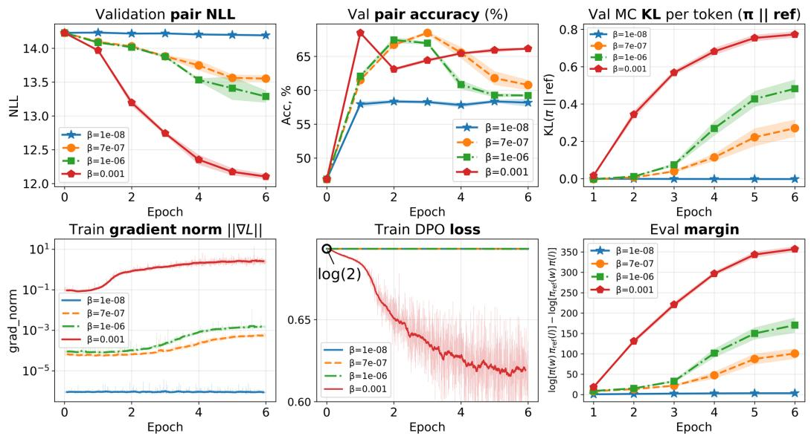  
Figure C1: Training and validation dynamics of standard DPO on UltraFeedback with Qwen3-4B-Instruct-2507 using TRL DPOTrainer (AdamW, learning rate $5 \times 1 0 ^ { - 7 }$ , effective batch size 16), comparing $\beta \in \{ 1 0 ^ { - 8 } , 7 \times 1 0 ^ { - 7 } , 1 0 ^ { - 6 } , 1 0 ^ { - 3 } \}$ . Curves show the mean over five seeds; shaded bands denote one standard deviation; see the discussion above.

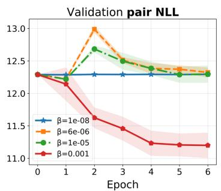

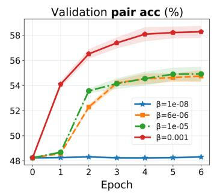

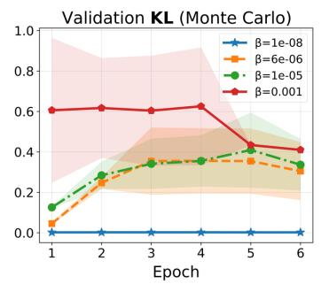

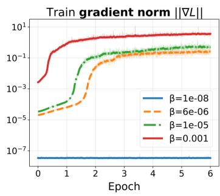

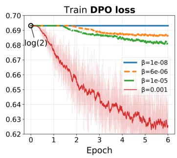

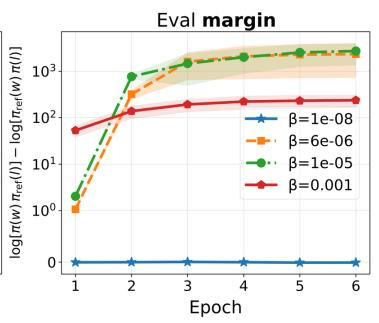  
Figure C2: Training and validation dynamics of standard DPO on PKU-processed HH-RLHF with Mamba-2 using TRL DPOTrainer (AdamW, learning rate $5 \times 1 0 ^ { - 6 }$ , effective batch size 20). Curves show the mean over five seeds; shaded bands denote one standard deviation.

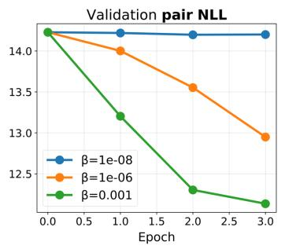

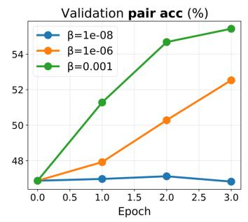

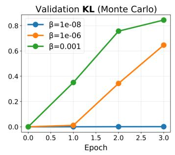

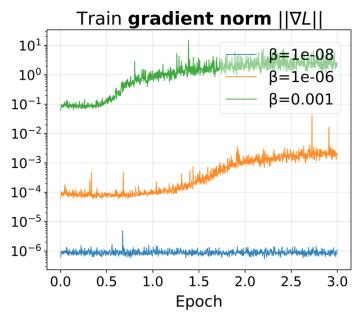

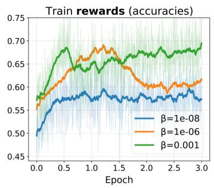

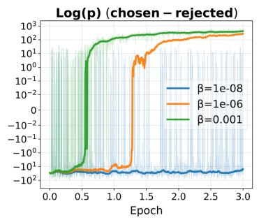  
Figure C3: Training and validation dynamics of standard DPO on UltraFeedback with Qwen3-4B-Instruct-2507 using TRL DPOTrainer (AdamW, learning rate $1 \times 1 0 ^ { - 6 }$ , effective batch size 16), comparing $\beta \in \{ 1 \breve { 0 } ^ { - 8 } , 1 0 ^ { - 6 } , 1 0 ^ { - 3 } \}$ . For the two smaller β values, gradient norms remain low and validation KL (per token) stays close to zero, so the policy remains near the reference model; only the $\beta = 1 0 ^ { - 3 }$ run moves appreciably.

Figure C4 shows an alternative HelpSteer3 SGD configuration at learning rate $5 \times 1 0 ^ { - 4 }$ , comparing $\beta \in \{ 5 \times 1 0 ^ { - 5 } , 1 0 ^ { - 3 } , 1 0 ^ { - 1 } \}$

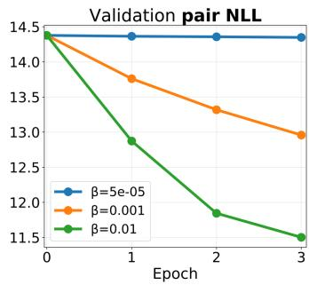

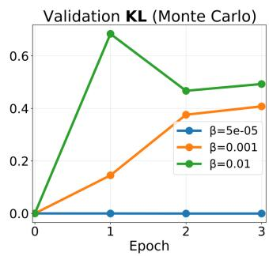

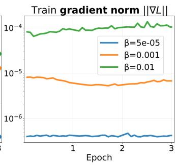

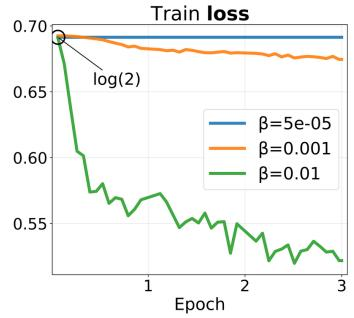  
Figure C4: Training and validation dynamics of our DPO implementation on HelpSteer3 with Qwen3- 4B-Instruct-2507 (SGD, $\mathrm { l r } = 5 \times \mathrm { 1 0 ^ { - 4 } }$ , batch size 24).

Figure C5 shows a more intricate regime: across the HH-RLHF SGD trajectories $( \beta ~ \in$ {0.001, 0.002, 0.005, 0.01, 0.02}), a more aggressive policy trajectory can induce a delayed increase in gradient magnitude along the smaller-β runs, partially compensating for the nominal linear $\beta$ prefactor in the DPO objective.

This delayed surge reflects the same stage-dependent growth of $G _ { t } ^ { \mathrm { n o r m } }$ analyzed in Appendix B: as the policy moves, $\sqrt { \hat { v } ^ { h } }$ increases and $\beta _ { \mathrm { c r i t } }$ falls. Under AdamW, that threshold drop would shift the optimizer from the ϵ-dominated regime (in which updates are proportional to $\beta$ and learning is suppressed) toward the cancellation regime in which adaptive scaling no longer amplifies the gradient scale coupling, so the effective β-induced slowdown is strongest at initialization and weakens once gradients have grown. The HH-RLHF curves in Figure C5 use SGD rather than Adam, so there is no moment-based $\beta _ { \mathrm { c r i t } }$ transition; nevertheless, the same rising Jacobian enlarges raw gradient norms and partially offsets the smaller $\beta$ . Under plain SGD with learning rate η, using the decomposition $g _ { t } = \beta h _ { t }$ from Appendix B,

$$
\theta _ { t + 1 } - \theta _ { t } = - \eta g _ { t } , \qquad g _ { t } = \beta h _ { t } , \qquad \| g _ { t } \| _ { 2 } = \beta \| h _ { t } \| _ { 2 } ,\tag{C.1}
$$

where $h _ { t }$ collects the sigmoid factor and the log-probability-gap Jacobian. A smaller $\beta$ therefore directly shrinks $\| g _ { t } \| _ { 2 } .$ , but stage-dependent growth of $\| h _ { t } \| _ { 2 }$ as the policy moves can partially offset this reduction, as in the delayed surge visible in Figure C5.

For sufficiently small $\beta ,$ however, this late-stage compensation remains weaker than the $\beta .$ -induced attenuation during the early phase, yielding dynamics that are noticeably non-monotone across practically used tuning ranges. Such interaction effects between the inverse preference-noise scale and the optimization trajectory help explain why the phenomenon has often remained underappreciated in routine hyperparameter searches. Consistent with this view, the $\beta = 0 . 0 0 1$ trajectory attains substantially lower pair NLL and higher pair accuracy than the older $\beta = 0 . 0 1$ run, while its temporal profile remains unusual and departs from the behavior one would expect from a simple $\beta$ rescaling. The sharp late-stage surge in gradient norm and the qualitatively different curve shapes relative to Figures C3 and 1 are, among other factors, compounded by the comparatively large learning rate $\mathrm { ( l r ^ { 2 } = 1 0 ^ { - 3 } }$ , five times the HelpSteer3 SGD setting in Figure 1) acting on HH-RLHF preference pairs that are comparatively noisy and less separable. Data-centric comparisons of public RLHF corpora quantify effective sample size, noise invariance, and information content and report lower informativeness for HH-RLHF relative to several alternatives [Shen et al., 2024], while rewardmodeling analyses of the same corpus emphasize annotator disagreement, ambiguous or incorrect preferences, and weak pairwise margins [Wang et al., 2024].

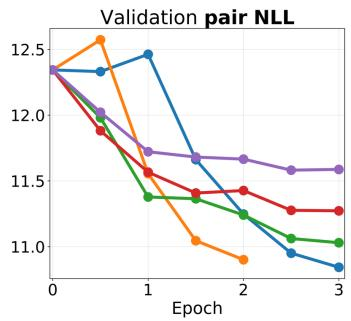

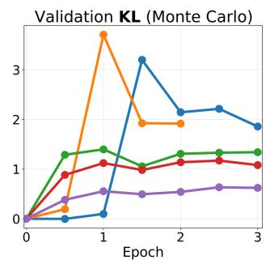

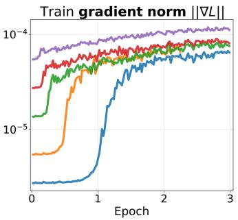

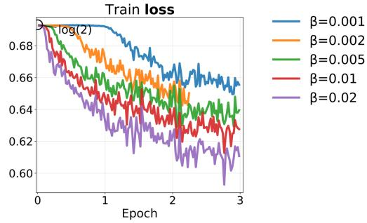  
Figure C5: Training and validation dynamics of our DPO implementation on PKU-processed HH-RLHF with Qwen2.5-3B-Instruct (SGD, $\mathrm { l r } = 1 0 ^ { - 3 }$ , batch size 32).

## D Thurstone Gradient and Comparison with DPO

General link functions. Following the annotator-noise viewpoint of Sun et al. [2025], let ε denote a pairwise comparison noise variable with CDF $F$ and PDF $\bar { f } = F ^ { \prime }$ on R. We assume the standard regularity conditions

$$
F ( - \infty ) = 0 , \quad F ( + \infty ) = 1 , \quad f ( x ) \geq 0 , \quad \int _ { - \infty } ^ { \infty } f ( x ) d x = 1 ,\tag{D.1}
$$

together with strict monotonicity $( f ( x ) > 0$ for all $x ,$ hence $F ( x ) \in ( 0 , 1 ) )$ ) and a finite first moment $\mathbb { E } [ | \varepsilon | ] < \infty$ . An annotator prefers $y _ { w }$ over yl when the latent margin exceeds the noise, $\Delta > \varepsilon ,$ , so

$$
P ( y _ { w } \succ y _ { l } \mid x ) = P ( \varepsilon < \Delta ) = F ( \Delta ) .\tag{D.2}
$$

Writing the effective inverse preference-noise scale in policy-margin coordinates as $\beta > 0$ gives the scaled link $P ( y _ { w } \succ y _ { l } \mid x ) \overset { \cdot } { = } F ( \beta \Delta )$ . As shown in Appendix F, if the underlying reward model has pairwise noise scale $s _ { a }$ and the RLHF objective has KL coefficient $\lambda ,$ then $\beta = \lambda / s _ { a }$ . The corresponding negative log-likelihood is

$$
\begin{array} { r } { \mathcal { L } _ { F } ( \Delta ; \beta ) = - \log F ( \beta \Delta ) , } \end{array}\tag{D.3}
$$

and, by the chain rule,

$$
\frac { \partial \mathcal { L } _ { F } } { \partial \Delta } = - \beta  \frac { f ( \beta \Delta ) } { F ( \beta \Delta ) } .\tag{D.4}
$$

Thus the explicit multiplicative $\beta$ prefactor is not specific to the logistic or Gaussian branches: it follows for any link CDF in this class. Bradley–Terry/DPO and Thurstone correspond to $F = \sigma$ and $F = \Phi ;$ ; other examples on R with finite first moments include Laplace noise and symmetric Student- $\mathbf { \nabla } - t _ { \nu }$ noise with $\nu > 1$ . Distributions without finite first moments (e.g., Cauchy) are outside this interpretable class even though $P ( \varepsilon < \Delta )$ is formally defined, because the latent-utility/noise-scale story no longer has finite expected bias. Symmetry or membership in an exponential family is not required. For plain SGD, decreasing $\beta$ therefore still linearly suppresses update magnitude across this class unless the learning rate is retuned. Dividing by $\beta > 0$ generalizes as well:

$$
\frac { \partial } { \partial \Delta } \left[ - \frac { 1 } { \beta } \log F ( \beta \Delta ) \right] = - \frac { f ( \beta \Delta ) } { F ( \beta \Delta ) } ,\tag{D.5}
$$

with the same arg min∆ $\mathcal { L } _ { F }$ because $1 / \beta$ is a positive constant.

Thurstone case $( F = \Phi )$ . Beyond the logistic Bradley–Terry branch [Bradley and Terry, 1952], the Gaussian annotator-noise model of Sun et al. [2025] induces preferences $P ( \dot { y _ { w } } \succ y _ { l } ) = \Phi ( \beta \Delta )$ yielding the Thurstone pairwise loss

$$
\mathcal { L } _ { \mathrm { T h } } ( \Delta ; \beta ) = - \log \Phi ( \beta \Delta ) ,\tag{D.6}
$$

the special case $F = \Phi$ of Equation $( \mathrm { D } . 3 )$ , where Φ is the standard normal CDF and $\phi = \Phi ^ { \prime }$ is the corresponding PDF. Writing $u = \beta \Delta$ , so that $\mathcal { L } _ { \mathrm { T h } } ( \Delta ; \beta ) = - \log \Phi ( u )$ with $\partial u / \partial \Delta = \beta .$ , and using $\Phi ^ { \prime } ( u ) \bar { = } \phi ( u )$ , the chain rule gives

$$
\frac { \partial \mathcal { L } _ { \mathrm { T h } } } { \partial \Delta } = - \frac { 1 } { \Phi ( u ) } \phi ( u ) \frac { \partial u } { \partial \Delta } = - \beta \frac { \phi ( \beta \Delta ) } { \Phi ( \beta \Delta ) } ,\tag{D.7}
$$

which instantiates Equation (D.4). As in the general case, dividing ${ \mathcal { L } } _ { \mathrm { T h } }$ by $\beta > 0$ removes the front $\beta$ multiplier while preserving the argmin, yielding the normalized Thurstone marginal gradient $- \phi ( \dot { \beta } \Delta ) / \Phi ( \dot { \beta } \Delta )$ .

Comparison with the logistic branch. The Thurstone objective in Equations $( \mathrm { D } . 6 ) { - } ( \mathrm { D } . 7 )$ shares the same explicit $\beta$ prefactor as standard DPO (Eq. (6)): only the shape factor changes from $\sigma ( - \beta \Delta )$ to the Mills ratio $\phi ( \beta \Delta ) / \Phi ( \beta \Delta )$ . At $\beta \Delta \approx 0$

$$
\sigma ( 0 ) = { \textstyle { \frac { 1 } { 2 } } } , \qquad { \frac { \phi ( 0 ) } { \Phi ( 0 ) } } = \sqrt { \frac { 2 } { \pi } } ,\tag{D.8}
$$

so the Gaussian branch is locally steeper by the constant factor

$$
\frac { \phi ( 0 ) / \Phi ( 0 ) } { \sigma ( 0 ) } = \frac { \sqrt { 2 / \pi } } { 1 / 2 } = \sqrt { \frac { 8 } { \pi } } \approx 1 . 6 0 .\tag{D.9}
$$

For large negative margins, $\phi ( x ) / \Phi ( x ) \sim | x |$ grows rather than saturating, so the Thurstone loss increases quadratically, $\bar { . - \log { \Phi ( \bar { \beta } \Delta ) } } \tilde { \sim } ( \beta \dot { \Delta } ) ^ { 2 } \bar { / } 2$ as $\beta \Delta  - \infty$ , and penalizes strongly misranked pairs more aggressively than the logistic branch, whose loss grows only linearly, $- \log { \sigma ( \beta \Delta ) } \sim$ $- \beta \Delta$ , with marginal factor $\sigma ( - \beta \Delta )$ bounded above by 1.

## E Formal Proof of Proposition 1 and Relation to Prior Work

Novelty statement. The centered-softplus function $s _ { c }$ was introduced by Srinivas et al. [2022] as an activation for lightweight convex neural networks. We distinguish our contribution: we diagnose the $\beta .$ -entanglement problem in DPO (Section 3.1–3.2), show that applying $s _ { c }$ as a loss normalization resolves it while preserving the DPO minimizer (Proposition 1 below), extend the resulting objective to $\beta = 0$ via a limiting argument (Proposition 2 below), and provide a theoretical analysis of the Adam compensation regime (Appendix B). These results are not reported in Srinivas et al. [2022] or in prior DPO work.

Proposition 1 (Argmin equivalence for $\beta > 0 )$ . For $\beta > 0$ ,

$$
\mathcal { L } _ { \mathrm { D P O } } ^ { \mathrm { n o r m } } ( \Delta ; \beta ) = \frac { 1 } { \beta } \mathcal { L } _ { \mathrm { D P O } } ( \Delta ; \beta ) - \frac { \ln 2 } { \beta } ,\tag{E.1}
$$

where $\mathcal { L } _ { \mathrm { D P O } } ( \Delta ; \beta ) = - \log \sigma ( \beta \Delta )$ and $\mathcal { L } _ { \mathrm { D P O } } ^ { \mathrm { n o r m } } ( \Delta ; \beta ) = s _ { c } ( - \Delta ; \beta )$ . Hence,

$$
\arg \operatorname* { m i n } _ { \Delta } \mathcal { L } _ { \mathrm { D P O } } ^ { \mathrm { n o r m } } ( \Delta ; \beta ) = \arg \operatorname* { m i n } _ { \Delta } \mathcal { L } _ { \mathrm { D P O } } ( \Delta ; \beta ) .\tag{E.2}
$$

Equivalently, subtracting the additive constant ln $2 / \beta$ from the normalized softplus loss does not change the minimizer:

$$
\arg \operatorname* { m i n } _ { \Delta } s ( - \Delta ; \beta ) = \arg \operatorname* { m i n } _ { \Delta } \Bigl [ s ( - \Delta ; \beta ) - \ln 2 / \beta \Bigr ] .\tag{E.3}
$$

Proof of Proposition 1 (algebraic identity). We verify the identity $\begin{array} { r l } { \mathcal { L } _ { \mathrm { D P O } } ^ { \mathrm { n o r m } } ( \Delta ; \beta ) } & { { } = } \end{array}$ $\begin{array} { r } { \frac { 1 } { \beta } \mathcal { L } _ { \mathrm { D P O } } ( \Delta ; \beta ) ~ - ~ \frac { \ln 2 } { \beta } } \end{array}$ directly. Recall $\mathcal { L } _ { \mathrm { D P O } } ( \Delta ; \beta ) ~ = ~ - \log \sigma ( \beta \Delta ) ~ = ~ \log ( 1 + e ^ { - \beta \Delta } )$ and $\mathcal { L } _ { \mathrm { D P O } } ^ { \mathrm { n o r m } } ( \Delta ; \beta ) = s _ { c } ( - \Delta ; \beta )$ . By the definition of $s _ { c } .$

$$
\begin{array} { l } { { \displaystyle s _ { c } ( - \Delta ; \beta ) = \frac { 1 } { \beta } \log \frac { 1 + e ^ { - \beta \Delta } } { 2 } } } \\ { { \displaystyle ~ = \frac { 1 } { \beta } \mathcal { L } _ { \mathrm { D P O } } ( \Delta ; \beta ) - \frac { \ln 2 } { \beta } , } } \end{array}\tag{E.4}
$$

which is the required identity.

Proof of Proposition 1 (argmin equivalence over θ). Let Θ be the parameter space and write

$$
F ( \theta ) = \mathbb { E } _ { ( x , y _ { w } , y _ { l } ) \sim \mathcal { D } } \big [ \mathcal { L } _ { \mathrm { D P O } } ( \Delta _ { \theta } ; \beta ) \big ] , \quad G ( \theta ) = \mathbb { E } _ { ( x , y _ { w } , y _ { l } ) \sim \mathcal { D } } \big [ \mathcal { L } _ { \mathrm { D P O } } ^ { \mathrm { n o r m } } ( \Delta _ { \theta } ; \beta ) \big ] ,\tag{E.5}
$$

where $\Delta _ { \theta } ( x , y _ { w } , y _ { l } )$ is the log-ratio gap induced by θ. From the algebraic identity in Equation (E.4),

$$
G ( \theta ) = \frac { 1 } { \beta } F ( \theta ) - \frac { \ln 2 } { \beta } \qquad \forall \theta \in \Theta .\tag{E.6}
$$

For any $\theta _ { 1 } , \theta _ { 2 } \in \Theta$

$$
G ( \theta _ { 1 } ) \leq G ( \theta _ { 2 } ) \iff { \frac { 1 } { \beta } } F ( \theta _ { 1 } ) - { \frac { \ln 2 } { \beta } } \leq { \frac { 1 } { \beta } } F ( \theta _ { 2 } ) - { \frac { \ln 2 } { \beta } } \iff F ( \theta _ { 1 } ) \leq F ( \theta _ { 2 } ) ,\tag{E.7}
$$

where the last equivalence uses $1 / \beta > 0$ . Hence the two objectives induce the same total order on Θ, and in particular arg minθ $G ( \theta ) { \mathrm { = a r g } }$ minθ $F ( \theta )$ □

Continuity at $\beta = 0$ (Proposition 2). For fixed $x \in$ R, define

$$
h _ { x } ( \beta ) : = \log \left( \frac { 1 + e ^ { \beta x } } { 2 } \right) , \qquad \beta \geq 0 .\tag{E.8}
$$

Then for $\beta > 0$

$$
s _ { c } ( x ; \beta ) = \frac { h _ { x } ( \beta ) } { \beta } .\tag{E.9}
$$

Applying this identity at $x = - \Delta$ gives

$$
s _ { c } ( - \Delta ; \beta ) = \frac { h _ { - \Delta } ( \beta ) } { \beta } .\tag{E.10}
$$

Since $h _ { - \Delta } ( 0 ) = 0$ , this is the right difference quotient of $h _ { - \Delta }$ at 0. Because $h _ { - \Delta }$ is differentiable at $\beta = 0$

$$
\operatorname* { l i m } _ { \beta \to 0 ^ { + } } s _ { c } ( - \Delta ; \beta ) = h _ { - \Delta } ^ { \prime } ( 0 ) .\tag{E.11}
$$

Moreover,

$$
h _ { - \Delta } ^ { \prime } ( \beta ) = \frac { ( - \Delta ) e ^ { - \beta \Delta } } { 1 + e ^ { - \beta \Delta } } = - \frac { \Delta } { 1 + e ^ { \beta \Delta } } ,\tag{E.12}
$$

so $h _ { - \Lambda } ^ { \prime } ( 0 ) = - \Delta / 2$ . Therefore

$$
\operatorname * { l i m } _ { \beta  0 ^ { + } } s _ { c } ( - \Delta ; \beta ) = - \frac { \Delta } { 2 } ,\tag{E.13}
$$

which matches the piecewise definition at $\beta = 0$ in Equation (14).

Gradient at $\beta = 0$ . For $\beta > 0 , \partial s _ { c } ( - \Delta ; \beta ) / \partial \Delta = - \sigma ( - \beta \Delta ) . \mathrm { ~ A t ~ } \beta = 0 $ , from $s _ { c } ( - \Delta ; 0 ) =$ $- \Delta / 2$ , we have $\partial s _ { c } ( - \Delta ; 0 ) / \partial \Delta = - 1 / 2$ . To verify continuity at the boundary, use that σ is globally Lipschitz with constant $1 / 4 { : }$

$$
\begin{array} { r } { | \sigma ( u ) - \sigma ( v ) | \le \frac 1 4 | u - v | . } \end{array}\tag{E.14}
$$

By direct substitution,

$$
\Big | \frac { \partial s _ { c } ( - \Delta ; \beta ) } { \partial \Delta } - \frac { \partial s _ { c } ( - \Delta ; 0 ) } { \partial \Delta } \Big | = \big | - \sigma ( - \beta \Delta ) + \frac { 1 } { 2 } \big | = \big | \sigma ( - \beta \Delta ) - \sigma ( 0 ) \big | .\tag{E.15}
$$

Applying Equation (E.14) to Equation (E.15) with $u = - \beta \Delta$ and $v = 0$ yields

$$
\begin{array} { r } { | \sigma ( - \beta \Delta ) - \sigma ( 0 ) | \le \frac 1 4 | \beta \Delta | . } \end{array}\tag{E.16}
$$

As $( \Delta , \beta )  ( \Delta _ { 0 } , 0 ^ { + } )$ , ∆ remains bounded in a neighborhood of $\Delta _ { 0 } .$ so the right-hand side tends to 0. Therefore $\partial s _ { c } ( - \Delta ; \beta ) / \partial \Delta$ is continuous at $\beta = 0$ (from the admissible side $\beta \geq 0 )$ , confirming that no special optimizer treatment is required at the boundary.

Hard-margin limit of normalized softplus. At the opposite scale, the same $1 / \beta$ normalization has the standard hard-margin limit of softplus, which matches the soft-margin-ranking interpretation of DPO [Yang et al., 2026, Prop. 4.1]:

$$
\operatorname* { l i m } _ { \beta \to \infty } \log \left( 1 + e ^ { - \beta \Delta } \right) / \beta = \operatorname* { m a x } \{ - \Delta , 0 \} .\tag{E.17}
$$

Thus $\beta$ controls the sharpness of a soft hinge: finite $\beta$ gives a smooth transition, while $\beta \to \infty$ recovers the hard hinge boundary, consistent with the margin-ranking interpretation of DPO [Yang et al., 2026]. Centering subtracts the constant ln $2 / \beta$ and therefore changes only the vertical offset: $s _ { c } ( 0 ; \beta ) = 0$ exactly, so the decision boundary remains at $\Delta = 0 . \mathrm { A s } \beta \overset { - } {  } \infty , \overset { - } { s } _ { c } ( - \Delta ; \beta )$ likewise converges to max $\{ - \Delta , 0 \}$

## F Bradley–Terry Scale and Log-Likelihood-Ratio View

Annotator-noise foundations. Following Sun et al. [2025], let $\Delta _ { r } = r _ { x , y _ { 1 } } - r _ { x , y _ { 2 } }$ denote the latent utility gap and $\Delta _ { b } = b ( x , y _ { 2 } , A ) - b ( x , y _ { 1 } , A )$ the pairwise annotator-bias difference. Then

$$
P ( y _ { 1 } \succ y _ { 2 } \mid x ) = P ( \Delta _ { r } > \Delta _ { b } ) .\tag{F.1}
$$

Logistic difference (Assumption 3). If the two annotator-bias terms are independently Gumbeldistributed with common scale $s _ { a } , b ( x , y _ { i } , A ) \stackrel { \mathrm { i . i . d . } } { \sim }$ Gumbel(0, sa), then their difference is $\Delta _ { b } =$ $b ( x , y _ { 2 } , A ) - b ( x , y _ { 1 } , A ) \sim \operatorname { L o g i s t i c } ( 0 , s _ { a } ) \colon$

$$
P ( y _ { 1 } \succ y _ { 2 } \mid x ) = \sigma \bigg ( \frac { \Delta _ { r } } { s _ { a } } \bigg ) .\tag{F.2}
$$

Gaussian difference (Assumption 4). If the two annotator-bias terms are independently Gaussian with common variance $s _ { a } ^ { 2 } / 2 , b ( x , y _ { i } , A ) \stackrel { \mathrm { i . i . d . } } { \sim } \mathcal { N } ( 0 , s _ { a } ^ { 2 } / 2 )$ , then their difference is $\Delta _ { b } = b ( x , y _ { 2 } , A ) -$ $b ( x , y _ { 1 } , A ) \sim { \mathcal { N } } ( 0 , { \overset { - 2 } { s } } _ { a } ) ;$

$$
P ( y _ { 1 } \succ y _ { 2 } \mid x ) = \Phi \left( \frac { \Delta _ { r } } { s _ { a } } \right) ,\tag{F.3}
$$

where Φ is the standard normal CDF. This parameterization absorbs the $\sqrt { 2 }$ factor from subtracting two independent Gaussian biases into the per-item variance, so $s _ { a }$ denotes the standard deviation of the pairwise bias difference, matching the role of $s _ { a }$ in the logistic branch. This matches the Thurstone case in Remark 4 of Sun et al. [2025] after this rescaling of the per-item variance. At $s _ { a } = 1$ , Eqs. (F.2)–(F.3) reproduce the unit-scale logistic and Gaussian curves compared in Sun et al. [2025]; there $\Delta _ { b }$ is modeled directly as Logistic(0, 1) or $\mathcal { N } ( 0 , 1 )$

For an observed preference $y _ { w } \succ y _ { l }$ with $\Delta _ { r } = r _ { w } - r _ { l }$ , the corresponding pairwise reward-modeling losses are

$$
\mathcal { L } _ { \mathrm { B T } } = - \log \sigma \left( \frac { \Delta _ { r } } { s _ { a } } \right) , \qquad \mathcal { L } _ { \mathrm { T h } } = - \log \Phi \left( \frac { \Delta _ { r } } { s _ { a } } \right) .\tag{F.4}
$$

The shared denominator in Eq. (F.4) reflects the same pairwise-difference construction: $s _ { a }$ is the scale of the induced pairwise bias difference in both the logistic and Gaussian cases. It is distinct from the KL coefficient λ in Equation (1).

Connection to DPO. The optimal policy of the KL-regularized RLHF objective (1) has the closed form

$$
\pi ^ { * } ( y \mid x ) = \frac { 1 } { Z ( x ) } \pi _ { \mathrm { r e f } } ( y \mid x ) \exp \left( \frac { r ^ { * } ( x , y ) } { \lambda } \right) ,\tag{F.5}
$$

which can be inverted to express the reward through the policy, $r ^ { * } ( x , y ) = \lambda \log ( \pi ^ { * } ( y \mid x ) / \pi _ { \mathrm { r e f } } ( y \mid$ $x ) ) + \lambda \log Z ( x )$ . Substituting this implicit reward into the Bradley–Terry likelihood (F.2) cancels the partition function $Z ( x )$ and gives

$$
\begin{array} { r l } & { P ( y _ { w } \succ y _ { l } \mid x ) = \sigma \bigg ( \frac { \lambda } { s _ { a } } \Delta \bigg ) = \sigma ( \beta \Delta ) , } \\ & { \Delta = \log \frac { \pi ( y _ { w } \mid x ) } { \pi _ { \mathrm { r e f } } ( y _ { w } \mid x ) } - \log \frac { \pi ( y _ { l } \mid x ) } { \pi _ { \mathrm { r e f } } ( y _ { l } \mid x ) } . } \end{array}\tag{F.6}
$$

Here

$$
\beta : = \frac { \lambda } { s _ { a } }\tag{F.7}
$$

is the effective inverse preference-noise scale in policy-log-ratio coordinates. The DPO likelihood identifies this ratio, not $\lambda$ and $s _ { a }$ separately; interpreting either factor physically requires a fixed reward normalization. The DPO loss is the negative log-likelihood of this model over observed pairs: $\mathcal { L } _ { \mathrm { D P O } } = - \log \sigma ( \beta \Delta )$ . At fixed $\lambda ,$ smaller $s _ { a }$ (more decisive annotations) increases $\beta$ and sharpens the sigmoid, whereas larger $s _ { a }$ decreases $\beta$ and yields softer preferences. At fixed $s _ { a } .$ , changing $\lambda$ changes the same effective coefficient through the reward–policy conversion.

Connection to a log-likelihood-ratio baseline. Each training example presents an observation $O \mathrm { : }$ “annotator chose $y _ { w }$ over $y _ { l } ^ { , * }$ . We compare two models of the world:

$H _ { 0 }$ (null): both completions equally good, $r ( y _ { w } ) = r ( y _ { l } )$ , so $\begin{array} { r } { P ( O \mid H _ { 0 } ) = \sigma ( 0 ) = \frac { 1 } { 2 } } \end{array}$

$H _ { 1 }$ (current policy): the policy assigns log-ratio gap $\Delta$ , so $P ( O \mid H _ { 1 } ) = \sigma ( \beta \Delta )$

The per-example likelihood ratio against this null baseline is

$$
\Lambda = \frac { P ( O \mid H _ { 1 } ) } { P ( O \mid H _ { 0 } ) } = \frac { \sigma ( \beta \Delta ) } { 1 / 2 } = 2 \sigma ( \beta \Delta ) .\tag{F.8}
$$

Taking logarithms and recalling $\mathcal { L } _ { \mathrm { D P O } } = - \log \sigma ( \beta \Delta )$ ，

$$
\log \Lambda = \log 2 - \mathcal { L } _ { \mathrm { D P O } } .\tag{F.9}
$$

Hence minimizing the DPO loss is equivalent to maximizing log $\Lambda { : }$ the policy is trained to make each observed preference as much more likely than the “equal-quality” baseline as possible. Subtracting log $2$ removes the random-choice baseline, and $\mathcal { L } _ { \mathrm { D P O } } - \log 2 = - \log \Lambda$ is the negative log-likelihood ratio relative to chance. Dividing by the effective coefficient gives $( \bar { \mathcal { L } } _ { \mathrm { D P O } } - \log 2 ) \bar { / \beta } =$ $( s _ { a } / \lambda ) ( \mathcal { L } _ { \mathrm { D P O } } - \log 2 )$ . This normalization removes the direct $\beta$ prefactor from the marginal gradient. It equals a conversion to annotator-noise units only under an explicitly fixed reward/KL normalization.

Note also that $\Delta$ itself is a log-likelihood ratio comparing the current policy to the reference:

$$
\Delta = \underbrace { \log \frac { \pi ( y _ { w } \mid x ) } { \pi _ { \mathrm { r e f } } ( y _ { w } \mid x ) } } _ { \mathrm { l o g - L R f o r } y _ { w } } - \underbrace { \log \frac { \pi ( y _ { l } \mid x ) } { \pi _ { \mathrm { r e f } } ( y _ { l } \mid x ) } } _ { \mathrm { l o g - L R f o r } y _ { l } } .\tag{F.10}
$$

Thus $\beta \Delta = ( \lambda / s _ { a } ) \Delta$ is a scale-controlled evidence score: how strongly the current policy departs from the reference in the direction of the observed preference. In ML terms, $\sigma ( \beta \Delta )$ is a soft preference score. At fixed λ, varying the annotator-noise scale gives

$s _ { a } \to 0 ( \beta \to \infty ) : \sigma ( \beta \Delta ) \to \mathbf { 1 } [ \Delta > 0 ]$ (hard preference boundary, near-deterministic labels), $\begin{array} { r l } { s _ { a } \to \infty \left( \beta \to 0 \right) : } & { { } \sigma ( \beta \Delta ) \to \frac { 1 } { 2 } } \end{array}$ (maximally noisy labels, no discrimination).

(F.11)

Because only $\beta = \lambda / s _ { a }$ appears in the DPO likelihood, a sweep over $\beta$ varies an effective inverse scale; it cannot by itself distinguish a change in annotator noise from a change in reward/KL normalization.

Implication for the disentanglement. The two roles of the effective coefficient $\beta = \lambda / s _ { a }$ identified in the main paper are:

• Statistical inverse scale $\beta = \lambda / s _ { a } ;$ the ratio of the KL/reward scale to the annotator-noise scale sets the width of the soft decision boundary in policy-log-ratio coordinates.

• Optimization scale $\beta$ (gradient multiplier): an unintended coupling to effective step size that arises from the standard DPO parameterization.

The centered-softplus reformulation removes the second role while preserving the first. It lets the practitioner tune the effective statistical coefficient $\beta$ and the optimizer independently. Separating λ from $s _ { a }$ additionally clarifies the modeling interpretation, but the two quantities require an external normalization or additional information to be identified individually.

## G Saturation Thresholds: Where Training Stops as a Function of $\beta$

Setup. We model effective convergence with a stopping tolerance: updates on a preference pair become negligible once the magnitude of the marginal gradient drops below a threshold $\tau > 0$ , which lumps together the SGD noise floor, learning-rate decay, and the finite training horizon. The invariant quantity behind this tolerance is the per-step drift of the margin. A parameter step $\theta \gets \theta - \eta \nabla _ { \theta } \mathcal { L }$ with $\nabla _ { \theta } \mathcal { L } = \ell ^ { \prime } ( \Delta ) \nabla _ { \theta } \Delta$ changes the scalar margin by $\Delta  \overline { { \Delta } } + \eta \dot { g } ^ { 2 } | \ell ^ { \prime } ( \Delta ) |$ to first order, where $g = \| \nabla _ { \theta } \Delta \| _ { 2 } \mathrm { : }$ the factor $g ^ { 2 }$ is the squared Jacobian of the margin, not a square of the marginal loss derivative (Appendix K, Equation $\left( \bar { \bf K } . 4 \right) ,$ ). A run stalls once this drift falls below a noise-floor scale $\varepsilon > 0$ of the stochastic margin increments (Appendix L),

$$
\eta g ^ { 2 } \beta \sigma ( - \beta \Delta ) \lesssim \varepsilon .
$$

At a fixed learning rate—the setting of this appendix—this criterion is equivalent to the marginalgradient threshold above with $\tau = \varepsilon \overline { { / } } ( \eta g ^ { 2 } )$ ; under the learning-rate rescaling $\eta \propto 1 / \beta$ of Appendix H, the same criterion instead reduces to a condition on $\sigma ( - \beta \bar { \Delta } )$ alone (used there). This is a coarse description of where training stops, not an exact optimization statement; it turns the claim that $\beta$ controls saturation into scaling predictions that can be checked against the reported runs.

Normalized objective: a clean $1 / \beta$ law. For the centered-softplus objective, $| \partial \mathcal { L } _ { \mathrm { D P O } } ^ { \mathrm { n o r m } } / \partial \Delta | =$ $\sigma ( - \beta \Delta )$ ), so the stopping condition $\sigma ( - \beta \Delta ) = \tau$ gives the saturation margin in Equation (15),

$$
\Delta ^ { * } = \frac { 1 } { \beta } \log \frac { 1 - \tau } { \tau } .\tag{G.1}
$$

The tolerance enters only through the numerator, so for any fixed $\tau < 1 / 2$ the product $\beta \Delta ^ { * }$ is a constant independent of ${ \dot { \boldsymbol { \beta } } } .$ Unlike Equation (7), there is no dead zone and no intermediate peak: $\Delta ^ { * }$ is strictly monotone in $1 / \beta$

Standard DPO: dead zone, drifting product, and a peak. Section 3.3 states the main result: for the classical loss, $| \partial \mathcal { L } _ { \mathrm { D P O } } / \partial \Delta | = \bar { \beta } \bar { \sigma } ( - \beta \Delta )$ , and the stopping condition $\beta \sigma ( - \beta \Delta ) = \tau$ yields Equation (7). We reproduce the derivation here. Setting $\beta \sigma ( - \beta \Delta ) = \tau$ and solving for $\Delta$ gives

$$
\Delta _ { \mathrm { D P O } } ^ { * } = \frac { 1 } { \beta } \log \left( \frac { \beta } { \tau } - 1 \right) , \qquad \beta > 2 \tau .\tag{G.2}
$$

This scalar is an idealized one-pair saturation ceiling under the stopping model—not a train-set mean margin, and not a quantity recovered by re-evaluating frozen weights on the training pairs. Empirical $\Delta$ statistics remain below the ceiling in general and relate to $\Delta _ { \mathrm { D P O } } ^ { * } ( \beta )$ only through their β-shape (Section G.1). Three regimes follow (as summarized in Section 3.3).

• Dead zone $( \beta \leq 2 \tau )$ : the marginal gradient is largest at initialization, where $\Delta = 0$ and $| \partial \mathcal { L } _ { \mathrm { D P O } } / \partial \bar { \Delta } | = \beta / 2 . \mathrm { I f } \beta / 2 \bar { \leq } \tau$ , the gradient is below tolerance from the start and training never escapes initialization: the run is suppressed outright rather than merely slowed. The normalized objective has no dead zone: its initial marginal gradient is $1 / 2$ for every $\beta .$

• No clean scaling $( \beta > 2 \tau ) \colon$ the product $\beta \Delta _ { \mathrm { D P O } } ^ { * } = \log ( \beta / \tau - 1 )$ grows logarithmically in β, in contrast to the constant product in Equation (15).

• Non-monotone peak and right-hand saturation: maximizing Equation $( 7 )$ over $\beta$ gives Equation (8); the detailed derivation is given below. The threshold model therefore predicts this non-monotone shape for the saturation margin. In the HelpSteer3 SGD sweep of Figure 2, per-token KL co-moves with the mean margin over a wide $\beta$ range (a left dead zone, an intermediate peak, and a decaying right slope), which we treat as an empirical observation rather than as a general mapping from $\Delta$ to KL.

Derivation of the peak location. Differentiating Equation (7) with respect to $\beta$

$$
\frac { \mathrm { d } \Delta _ { \mathrm { D P O } } ^ { * } } { \mathrm { d } \beta } = \frac { 1 } { \beta ^ { 2 } } \left[ \frac { \beta / \tau } { \beta / \tau - 1 } - \log \left( \frac { \beta } { \tau } - 1 \right) \right] ,\tag{G.3}
$$

so the stationarity condition is

$$
\frac { \beta / \tau } { \beta / \tau - 1 } = \log \left( \frac { \beta } { \tau } - 1 \right) .\tag{G.4}
$$

Substituting $v = \beta / \tau - 1$ turns the left-hand side into $( v + 1 ) / v = 1 + 1 / v$ , giving the transcendental equation

$$
1 + { \frac { 1 } { v } } = \log v .\tag{G.5}
$$

The left-hand side decreases from $+ \infty$ to 1 and the right-hand side increases from $- \infty .$ , so Equation (G.5) has a unique root; numerically $v ^ { * } \approx 3 . { \bar { 5 } } 9 1 \ ( \mathrm { a t } \ v \ = \ 3 . 5 9 1$ : log $v \ \approx \ 1 . 2 7 8 4$ and $1 + 1 / v \approx 1 . 2 7 8 5 $ ). Hence

$$
\beta _ { \mathrm { p e a k } } = \tau \left( 1 + v ^ { * } \right) \approx 4 . 5 9 \tau \approx 4 . 6 \tau ,\tag{G.6}
$$

which is Equation (8). The second derivative is negative at $v ^ { * }$ (the bracket above changes sign from positive to negative), so this stationary point is the unique maximum. The peak value itself has a compact form: using log $v ^ { * } = 1 + 1 / \bar { v } ^ { * }$

$$
\Delta _ { \mathrm { D P O } } ^ { * } ( \beta _ { \mathrm { p e a k } } ) = \frac { \log v ^ { * } } { \tau ( 1 + v ^ { * } ) } = \frac { 1 + 1 / v ^ { * } } { \tau ( 1 + v ^ { * } ) } = \frac { 1 } { \tau v ^ { * } } \approx \frac { 0 . 2 7 8 } { \tau } ,\tag{G.7}
$$

so the maximal reachable margin under standard DPO at fixed learning rate is set entirely by the tolerance $\tau .$ For $\beta \gg \beta _ { \mathrm { p e a k } } , \bar { \Delta } _ { \mathrm { D P O } } ^ { \ast } \approx \log ( \beta / \tau ) / \beta$ decays toward zero. These two identities are linked by $\beta _ { \mathrm { p e a k } } \Delta _ { \mathrm { D P O } } ^ { * } ( \dot { \beta _ { \mathrm { p e a k } } } ) = \bar { \log } v ^ { * } \approx 1 . 2 7 8$ : they are two writings of the same one-dimensional threshold model, not independent estimators.

Empirical illustration. Figure 2 overlays Equation (7) on a dense HelpSteer3 SGD sweep of the same protocol as Figure 1. The four-point subset in Section 3.1 is already non-monotone: seedaveraged final per-token KL {0.04, 0.35, 0.83, 0.54} peaks at the nearest sampled cell $\beta = 2 \times 1 0 ^ { - 3 }$ and β · KL grows by more than two orders of magnitude. On the dense grid of Figure 2 and Table G1, min NLL / max $\mathrm { K L } /$ max mean ∆ sit between $\beta = 2 . 5 \times 1 0 ^ { - 3 }$ and $3 \times 1 0 ^ { - 3 }$ . The ordering anomaly noted in Section 3.1 (the $\beta = 0 . 0 0 2$ trajectory overtaking $\beta = 0 . 0 1 )$ is thus a predictable consequence of the threshold model rather than an instability.

## G.1 Estimating τ from $\beta _ { \mathrm { p e a k } }$ and from $\Delta ( \beta )$

Two readings of τ . Equations (G.6)–(G.7) suggest two practical ways to recover τ from a $\beta \mathrm { . }$ -sweep under standard DPO at fixed learning rate. Figure 2 overlays both resulting curves:

1. From the peak location (Eq. $( \mathrm { G } . 6 ) ) \colon \tau = \beta _ { \mathrm { p e a k } } / ( 1 + v ^ { * } )$ . This is our primary estimate: $\beta _ { \mathrm { p e a k } }$ is read jointly from validation NLL, KL, and preference-margin statistics.

2. From the $\Delta ( \beta )$ curve: either plug a height into Eq. (G.7), or fit the shape of the equilibrium margin $\begin{array} { r } { \Delta _ { \mathrm { c l } } ^ { \mathrm { * } } ( \beta ; \tau ) = \frac { 1 } { \beta } \log ( \beta / \tau - 1 ) ( \bar { \beta } > 2 \tau ) } \end{array}$ to an empirical margin statistic across $\beta .$

The second route is a consistency check, not a replacement for the first: the one-dimensional saturating scalar $\Delta _ { \mathrm { c l } } ^ { * }$ is not directly observed.

Why $\Delta _ { \mathrm { c l } } ^ { * }$ is not observed. The threshold derivation treats a single preference pair with scalar margin $\Delta$ . On validation we instead see a heavy-tailed distribution of margins over $\sim 1 9 2 0$ pairs. Empirical summaries—mean $\overline { { \Delta } } .$ , median, and upper quantile $\Delta _ { p 9 5 }$ —are therefore not interchangeable with $\Delta _ { \mathrm { c l } } ^ { * }$ . In particular, $\overline { { \Delta } }$ is typically several times smaller than the one-pair peak height implied by Eq. (G.7), so a naive G.7-style inversion of the mean is not a valid τ reading. The upper quantile $\Delta _ { p 9 5 }$ is closer in magnitude and can be used cautiously for height-based checks; the preferred ∆-based estimator below uses the shape of $\overline { { \Delta } } ( \beta )$ with a free vertical scale.

Uncertainty in locating $\beta _ { \mathrm { p e a k } } .$ . On a discrete $\beta$ grid the exact peak is often ambiguous: neighbouring cells can agree within seed noise for mean $\Delta$ and min NLL, while the median may peak one cell away. It is therefore useful to keep several $\beta$ points near the apparent maximum and to report a mid-cell anchor with a grid half-width. On HelpSteer3 / Qwen3-4B $( \mathrm { S G D } , \mathrm { l r } = 2 \cdot 1 0 ^ { - 4 }$ , batch 24, 6 epochs; Figure $2 ) .$ , mean $\Delta$ and min NLL at $\bar { \beta } = 0 . 0 0 2 5$ and $\beta = 0 . 0 0 3$ are tied within seed error, while the median is slightly higher at 0.003. We take

$$
\beta _ { \mathrm { p e a k } } ^ { \mathrm { m i d } } = 0 . 0 0 2 7 5 , \qquad \tau _ { \mathrm { G . 6 } } ^ { \mathrm { m i d } } = \frac { 0 . 0 0 2 7 5 } { 1 + v ^ { * } } \approx 5 . 9 9 \cdot 1 0 ^ { - 4 } ,
$$

Table G1: HelpSteer3 / Qwen3-4B standard DPO (SGD, ${ \mathrm { l r } } = 2 \cdot 1 0 ^ { - 4 } ) !$ min validation pair NLL (with $\beta = 1 )$ ; per-token MC KL, $\beta \cdot \mathrm { K L }$ , and validation margin quantiles at the same epoch (rounded). Same sweep as Figure 2; uncertainties are mean±std over seeds.
<table><tr><td>β</td><td>n</td><td>min NLL</td><td>KL</td><td> $\beta \cdot \mathrm { K L }$ </td><td>mean ∆</td><td>med. ∆</td><td> $p 9 5 \perp$ </td></tr><tr><td>0.0005</td><td>4</td><td> $1 3 . 9 3 \pm 0 . 0 3$ </td><td> $0 . 0 4 2 \pm 0 . 0 0 7$ </td><td> $2 . 1 \cdot 1 0 ^ { - 5 }$ </td><td> $1 6 . 2 \pm 0 . 9$ </td><td> $1 0 . 2 \pm 0 . 5$ </td><td> $1 1 2 \pm 7$ </td></tr><tr><td>0.001</td><td>4</td><td> $1 3 . 4 6 \pm 0 . 0 4$ </td><td> $0 . 3 5 3 \pm 0 . 0 0 4$ </td><td> $3 . 5 \cdot 1 0 ^ { - 4 }$ </td><td> $2 8 . 1 \pm 0 . 3$ </td><td> $1 8 . 0 \pm 0 . 0$ </td><td> $1 7 7 \pm 1$ </td></tr><tr><td>0.0015</td><td>3</td><td> $1 1 . 4 5 \pm 0 . 1 5$ </td><td> $0 . 6 1 1 \pm 0 . 0 4 1$ </td><td> $9 . 2 \cdot 1 0 ^ { - 4 }$ </td><td> $7 3 . 3 \pm 6 . 8$ </td><td> $4 0 . 2 \pm 2 . 0$ </td><td> $4 3 1 \pm 4 4$ </td></tr><tr><td>0.002</td><td>4</td><td> $1 0 . 3 5 \pm 0 . 0 4$ </td><td> $0 . 8 3 3 \pm 0 . 0 1 4$ </td><td> $1 . 7 \cdot 1 0 ^ { - 3 }$ </td><td> $1 2 2 \pm 4$ </td><td> $6 9 . 5 \pm 1 . 9$ </td><td> $6 0 7 \pm 1 3$ </td></tr><tr><td>0.0025</td><td>5</td><td> ${ \bf 9 . 9 2 \pm 0 . 1 4 }$ </td><td> ${ \bf 1 . 0 0 \pm 0 . 0 2 }$ </td><td> $2 . 5 \cdot 1 0 ^ { - 3 }$ </td><td> ${ \bf 1 5 2 \pm 6 }$ </td><td> $8 7 . 1 \pm 4 . 4$ </td><td> ${ \bf 7 0 8 \pm 3 0 }$ </td></tr><tr><td>0.003</td><td>4</td><td> $9 . 9 1 \pm 0 . 0 7$ </td><td> $0 . 9 9 4 \pm 0 . 0 4 8$ </td><td> $3 . 0 \cdot 1 0 ^ { - 3 }$ </td><td> $1 5 2 \pm 7$ </td><td> ${ \bf 8 8 . 4 \pm 2 . 1 }$ </td><td> $7 0 7 \pm 2 4$ </td></tr><tr><td>0.005</td><td>2</td><td> $1 0 . 2 6 \pm 0 . 0 1$ </td><td> $0 . 8 4 2 \pm 0 . 0 3 6$ </td><td> $4 . 2 \cdot 1 0 ^ { - 3 }$ </td><td> $1 2 0 \pm 0$ </td><td> $7 2 . 1 \pm 0 . 2$ </td><td> $5 3 6 \pm 0$ </td></tr><tr><td>0.0075</td><td>2</td><td> $1 1 . 0 7 \pm 0 . 0 5$ </td><td> $0 . 6 5 9 \pm 0 . 0 0 8$ </td><td> $4 . 9 \cdot 1 0 ^ { - 3 }$ </td><td> $9 0 . 6 \pm 0 . 7$ </td><td> $5 8 . 0 \pm 0 . 0$ </td><td> $3 9 9 \pm 4$ </td></tr><tr><td>0.01</td><td>4</td><td> $1 1 . 5 5 \pm 0 . 0 8$ </td><td> $0 . 5 4 0 \pm 0 . 0 0 8$ </td><td> $5 . 4 \cdot 1 0 ^ { - 3 }$ </td><td> $7 5 . 1 \pm 0 . 6$ </td><td> $4 9 . 2 \pm 0 . 9$ </td><td> $3 2 1 \pm 6$ </td></tr><tr><td>0.02</td><td>2</td><td> $1 2 . 6 1 \pm 0 . 0 1$ </td><td> $0 . 2 9 0 \pm 0 . 0 2 4$ </td><td> $\mathbf { 5 . 8 \cdot 1 0 ^ { - 3 } }$ </td><td> $4 5 . 4 \pm 0 . 0$ </td><td> $3 3 . 0 \pm 1 . 4$ </td><td> $1 7 7 \pm 1$ </td></tr><tr><td>0.04</td><td>2</td><td> $1 3 . 2 3 \pm 0 . 0 1$ </td><td> $0 . 1 3 0 \pm 0 . 0 0 7$ </td><td> $5 . 2 \cdot 1 0 ^ { - 3 }$ </td><td> $2 9 . 4 \pm 0 . 0$ </td><td> $2 4 . 0 \pm 0 . 0$ </td><td> $1 0 6 \pm 0$ </td></tr><tr><td>0.075</td><td>2</td><td> $1 3 . 3 6 \pm 0 . 0 2$ </td><td> $0 . 0 6 6 \pm 0 . 0 0 1$ </td><td> $4 . 9 \cdot 1 0 ^ { - 3 }$ </td><td> $2 1 . 9 \pm 0 . 3$ </td><td> $1 9 . 0 \pm 1 . 4$ </td><td> $6 8 \pm 0$ </td></tr><tr><td>0.2</td><td>1</td><td>13.67</td><td> $_ { 0 . 0 1 9 }$ </td><td> $3 . 8 \cdot 1 0 ^ { - 3 }$ </td><td> $_ { 1 4 . 9 }$ </td><td>14.0</td><td>40</td></tr><tr><td>0.3</td><td>1</td><td>13.80</td><td>0.010</td><td> $2 . 9 \cdot 1 0 ^ { - 3 }$ </td><td>12.3</td><td>12.0</td><td>32</td></tr></table>

with grid uncertainty given by the neighbouring cells 0.0025 and 0.003:

$$
\tau _ { \mathrm { G . 6 } } = ( 5 . 9 9 \pm 0 . 5 4 ) \cdot 1 0 ^ { - 4 } \quad ( \pm \sim 9 \% \mathrm { \ r e l a t i v e \ t o \ m i d } ) ,
$$

since $\delta \tau / \tau = \delta \beta _ { \mathrm { p e a k } } / \beta _ { \mathrm { p e a k } }$ . With this $\tau ,$ the left shaded region of Figure 2 is the dead zone $\beta \leq 2 \tau \approx 1 . 2 \times 1 0 ^ { - 3 } ,$ : it contains $\beta = 5 \times 1 0 ^ { - 4 }$ (near-zero KL) and the edge point $\beta = 1 0 ^ { - 3 }$ . On the right, the rough finite-horizon scale $\beta _ { \mathrm { r } } \sim 1 0 ^ { - 2 }$ (the scalar proxy gives $2 . { \check { 7 } } \times { 1 0 ^ { - 2 } } ;$ Appendix K) marks the broad region where the log $( \beta / \tau ) / \beta$ ceiling is already decreasing; by $\beta = 0 . 2 – 0 . 3$ the measured KL has collapsed.

Why validation NLL uses $\beta = 1$ . The training DPO loss is − log $\sigma ( \beta \Delta )$ with the run’s own β. That quantity is not comparable across a β-sweep: it depends on the product $\beta \Delta$ , so a smaller training $\beta$ pushes the loss toward $\log 2$ even when the policy ranks chosen vs. rejected more strongly (Section 3.4). The left panel of Figure 2 therefore reports a different diagnostic, validation pair NLL with $\beta = 1 \colon$

$$
\begin{array} { r } { \mathbb { E } \left[ - \log \sigma ( s _ { c } - s _ { r } ) \right] = \mathbb { E } \left[ - \log \sigma ( \Delta _ { \theta } ) \right] , } \end{array}
$$

where $s _ { c } - s _ { r } = \Delta _ { \theta } = \log \pi _ { \theta } ( y _ { w } \mid x ) - \log \pi _ { \theta } ( y _ { l } \mid x )$ on held-out pairs, and the training $\beta$ of that run is not inserted into the sigmoid. This is a monotone decreasing function of the policy preference gap $\Delta _ { \theta } = \Delta + \Delta _ { \mathrm { r e f } } \left( \Delta _ { \mathrm { r e f } } \right.$ is fixed by the reference model and data). Consequently NLL falls when the learned margin $\Delta$ rises: a $\beta .$ -sweep that peaks in $\Delta$ exhibits a trough in min NLL at the same location, as in Figure 2. This motivates reading the NLL panel as an inverted copy of the saturation curve,

$$
\begin{array} { r } { \mathrm { N L L } ( \beta ) \approx a - b \Delta _ { \mathrm { c l } } ^ { * } ( \beta ; \tau ) , \qquad b > 0 , } \end{array}\tag{G.8}
$$

where the intercept a and slope b are obtained by least squares on the active region $\beta > 2 \tau$ (or with an empirical margin statistic in place of $\Delta _ { \mathrm { c l } } ^ { * } )$ . These two constants absorb the unknown map from the one-pair ceiling to the pair-averaged NLL; they are not estimators of $\tau .$ The tolerance continues to be read from $\beta _ { \mathrm { p e a k } }$ or from the shape of $\overline { { \Delta } } ( \beta )$ as below.

Validation NLL / KL and margin statistics. Table G1 reports the numbers plotted in Figure 2: for each run we take the epoch of minimum validation pair NLL (with $\beta = 1 )$ , and at that same epoch report per-token MC KL, β · KL, and validation margin quantiles $\Delta = \Delta _ { \theta } - \Delta _ { \mathrm { r e f } }$ (full val set). Uncertainties are mean±std over seeds when $n > 1$ , matching the error bars in Figure 2; far-right points $\beta \in \{ 0 . 2 , 0 . 3 \}$ are single-seed (seed 43). Bold entries mark column maxima: min $\mathrm { N L L } /$ max KL / max mean and p95 ∆ at $\beta = 0 . 0 0 2 5$ , max median ∆ at $\beta = 0 . 0 0 3$ , and max $\beta \cdot \mathrm { K L }$ at $\beta = 0 . 0 2$

Shape+scale fit of $\overline { { \Delta } } ( \beta )$ . On the active region $\beta > 2 \tau$ we relate the observed mean to the one-pair formula by

$$
\overline { { \Delta } } ( \beta ) \approx s \cdot \Delta _ { \mathrm { c l } } ^ { * } ( \beta ; \tau ) .\tag{G.9}
$$

In practice we form a rough peak estimate $\beta _ { \mathrm { p e a k } } ^ { \mathrm { m i d } } = 0 . 0 0 2 7 5 .$ , set $\tau _ { \mathrm { r o u g h } } = \beta _ { \mathrm { p e a k } } ^ { \mathrm { m i d } } / ( 1 + v ^ { * } )$ , and fit on all sweep points with $\beta > 2 \tau _ { \mathrm { r o u g h } }$ (here $\beta \in \{ 0 . 0 0 1 5 , \ldots , 0 . 0 7 5 , 0 . 2 , 0 . 3 \} ; n = 1 2 )$ . Parameters are

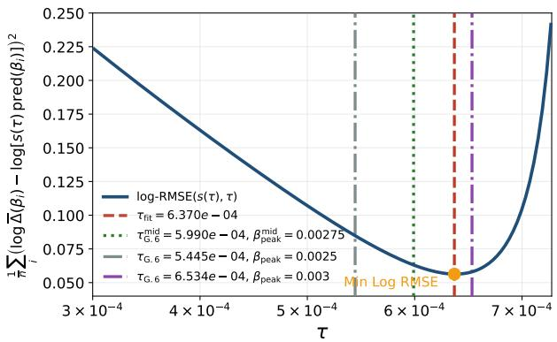  
Figure G1: Shape+scale log-RMSE versus $\tau$ for mean validation $\Delta$ on $\beta ~ > ~ 2 \tau _ { \mathrm { r o u g h } }$ (Help-Steer3 / Qwen3-4B, including $\beta \ : = \ : 0 . 2 , 0 . 3 )$ . Vertical lines: $\tau _ { \mathrm { { f i t } } }$ and G.6 anchors at $\beta _ { \mathrm { p e a k } } \ \in$ {0.0025, 0.00275, 0.003}.

Table G2: Consistency of τ estimates on HelpSteer3 / Qwen3-4B, corresponding to the two overlays in Figure 2. Reference: $\dot { \tau } _ { \mathrm { G } . 6 } ^ { \mathrm { m i d } }$ at $\beta _ { \mathrm { p e a k } } ^ { \mathrm { m i d } } = 0 . 0 0 \dot { 2 } 7 5$ . Shape+scale uses $\beta > 2 \tau _ { \mathrm { r o u g h } }$ with $\tau _ { \mathrm { r o u g h } } = \tau _ { \mathrm { G . 6 } } ^ { \mathrm { m i d } } .$
<table><tr><td>method</td><td>map</td><td>T</td><td> $\beta _ { \mathrm { p e a k } }$ </td><td> $\tau / \tau _ { \mathrm { G . 6 } } ^ { \mathrm { m i d } }$ </td></tr><tr><td>G.6, mid [0.0025, 0.003]</td><td> $\beta \to \tau$ </td><td> $5 . 9 9 \cdot 1 0 ^ { - 4 }$ </td><td>0.00275</td><td>1.00</td></tr><tr><td>G.6, lower grid cell</td><td> $\beta  \tau$ </td><td> $5 . 4 5 \cdot 1 0 ^ { - 4 }$ </td><td>0.0025</td><td>0.91</td></tr><tr><td>G.6, upper grid cell</td><td> $\beta  \tau$ </td><td> $6 . 5 3 \cdot 1 0 ^ { - 4 }$ </td><td>0.003</td><td>1.09</td></tr><tr><td>shape+scale, mean,  $\beta > 2 \tau _ { \mathrm { r o u g h } }$ </td><td> $\tau \to \beta$ </td><td> $6 . 3 7 \cdot 1 0 ^ { - 4 }$ </td><td>0.00292</td><td>1.06</td></tr><tr><td>Eq. (G.7) on  $\Delta _ { p 9 5 }$  at  $\beta = 0 . 0 0 2 5$ </td><td> $\Delta _ { p 9 5 }  \tau  \beta$ </td><td> $\it { 3 . 9 4 \cdot 1 0 ^ { - 4 } }$ </td><td>0.00181</td><td>0.66</td></tr></table>

obtained by log-RMSE in two steps. First, for each candidate τ on a grid, set pred $\begin{array} { r } { \left| \left( \beta \right) = \Delta _ { \mathrm { c l } } ^ { * } ( \beta ; \tau ) \right. } \end{array}$ Second, the optimal scale at that τ is the closed-form log-space least-squares value

$$
\log s ( \tau ) = \frac { 1 } { n } \sum _ { i } \Bigl ( \log \overline { { \Delta } } ( \beta _ { i } ) - \log \mathrm { p r e d } ( \beta _ { i } ) \Bigr ) , \qquad s ( \tau ) = e ^ { \log s ( \tau ) } .\tag{G.10}
$$

We then choose $\tau$ to minimize

$$
\frac { 1 } { n } \sum _ { i } \Bigl ( \log \overline { { \Delta } } ( \beta _ { i } ) - \log \bigl ( s ( \tau ) \operatorname { p r e d } ( \beta _ { i } ) \bigr ) \Bigr ) ^ { 2 } .\tag{G.11}
$$

Thus τ is read from the shape of the curve and $s ( \tau )$ from its height. Once τ is obtained, the implied peak $\beta _ { \mathrm { p e a k } } ^ { \mathrm { p r e d } } = \tau ( 1 + v ^ { \ast } )$ follows from Eq. (G.6) without reusing ∆. Figure G1 shows the objective versus τ; the minimum is at $\tau _ { \mathrm { f i t } } \approx 6 . 3 7 \cdot 1 0 ^ { - 4 }$ with $s \approx 0 . 3 5$ . The two overlays in Figure 2 are this shape+scale curve and the G.6 curve from $\beta _ { \mathrm { p e a k } } ^ { \mathrm { m i d } }$

Comparison of τ estimates. Table G2 compares G.6 anchors on the peak grid cell, the shape+scale fit, and a height-based check that inverts Eq. (G.7) using $\Delta _ { p 9 5 }$ at $\beta = 0 . 0 0 2 5$ (not the mean). Upright entries are observed or fitted inputs; italic entries are quantities derived by the indicated map $( \beta \to \tau$ or $\tau  \beta _ { \mathrm { p e a k } } ^ { \mathrm { p r e d } } )$

Takeaway. The primary estimate remains $\mathrm { E q . } \left( \mathrm { G . } 6 \right)$ from $\beta _ { \mathrm { p e a k } } .$ , with an explicit grid uncertainty when the peak cell is not unique. Fitting $\overline { { \Delta } } \approx s \Delta _ { \mathrm { c l } } ^ { * }$ on $\beta > 2 \tau _ { \mathrm { r o u g h } }$ recovers a compatible τ (here $+ 6 \%$ relative to mid and −2.5% relative to the $\beta = 0 . 0 0 3 { \mathrm { G } } . 6$ anchor), providing an internal consistency check that the shape of the mean margin tracks the threshold model once a height scale is freed; the two curves in Figure 2 nearly coincide. Because both estimates use the same β-sweep, their agreement is an internal consistency check rather than an out-of-sample validation. A height-only inversion of Eq. (G.7) should use an upper quantile such as $\Delta _ { p 9 5 }$ , not the raw mean.

Scope and caveats. First, the threshold model predicts the β-shape of the saturation margin, and pair NLL is monotone in that gap via Equation (G.8). We do not treat per-token KL as a general monotone function of the pair margin. In the HelpSteer3 SGD sweep the two quantities co-move over a wide range, which is why Figure 2 reports both, but we do not fit a global $\mathrm { K L } { - } \Delta$ law or proportionality constants. Second, the threshold model applies only when training reaches saturation before the epoch budget ends. For the very small $\beta$ values in Figure C1, the implied $\Delta _ { \mathrm { D P O } } ^ { * }$ is too large to reach in practice; those runs stop early because updates are weak and Adam partially compensates (Appendix B), not because the loss has saturated. Third, under a decaying learning-rate schedule, τ is only a coarse effective tolerance, so we interpret its magnitude and the functional form, not a precise fit. Finally, the extra $\beta$ prefactor in standard DPO (Equation (7)) is a fixed-learning-rate effect: rescaling the learning rate by $1 / \beta$ (Section 4) or operating Adam in its cancellation regime (Appendix B) largely removes it and restores the cleaner $1 / \beta$ scaling of the normalized objective (Equation (15)). Appendix K complements the left dead zone $\beta \leq 2 \tau$ with an order-of-magnitude right-hand horizon scale obtained from a scalar margin closure. On the HelpSteer3 SGD sweep, the initial batch-Jacobian proxy gives $\beta _ { \mathrm { r } } \approx 0 . 0 2 7$ , but time variation and cross-pair Gram terms limit this estimate to a broad $\sim \mathrm { i 0 ^ { - 2 } }$ region rather than a calibrated cutoff.

## H Loss-Level Scale Invariance: Identical Loss Curves, Different Policies

Observation. Throughout this appendix, the KL ratio at a given checkpoint is the ratio of Monte-Carlo forward per-token validation KL values, KL $\mathrm { r a t i o } = \mathrm { K L } ( \pi _ { \theta } \parallel \pi _ { \mathrm { r e f } } ) _ { \beta _ { 1 } } / \mathrm { K L } ( \pi _ { \theta } \parallel \pi _ { \mathrm { r e f } } ) _ { \beta _ { 2 } }$ , with the smaller-β run in the numerator and the larger-β run in the denominator (equivalently, the ratio of the physical policy displacement readouts when the two runs share the same dimensionless margin $u \ = \ \beta \Delta )$ . In the UltraFeedback comparison of Figure 4, the two standard-DPO runs $( ( \beta , \mathrm { { \bar { l } r } } ) = ( 0 . 0 1 , 1 0 ^ { - 3 } )$ and $( 0 . 0 2 , 5 \times 1 0 ^ { - 4 } ) )$ produce training- and validation-loss curves that are nearly indistinguishable, while their validation NLL and KL differ substantially. Table H2 quantifies this from the six-epoch logs (mean over four seeds; validation every half epoch): from epoch 1 onward the validation DPO losses differ by at most 0.005 nats, while the KL ratio stays near 2.9–4.1. Table H1 reports the same metrics for the three-epoch single-run comparison of Figure I1 (seed 42): from epoch 1 onward the validation DPO losses differ by at most 0.0017 nats, while the KL ratio is stable at $3 . 3 \mathrm { - 3 . 9 }$ . The same pattern holds on HelpSteer3 (Figure H1, Table H3): with $( \beta , \mathrm { l r } ) = ( 0 . 0 5 , 2 \times 1 0 ^ { - 4 } )$ and $( 0 . 1 , 1 \times \mathsf { \bar { 1 } 0 ^ { - 4 } } )$ (seed 51, effective batch size 16), validation DPO losses again agree to the third decimal, but the KL ratio reaches ≈ 10 by epoch 6 because the larger-β run remains close to the reference model. A third TRL DPOTrainer comparison on UltraFeedback Binarized with Ministral-3B-Instruct (Figure H2, Table H4): with $( \mathring { \beta , } \mathrm { { l r } } ) \ = \ ( 0 . 0 1 , 3 \times 1 0 ^ { - 4 } )$ and $( 0 . 0 3 , 1 \times 1 0 ^ { - 4 } )$ (seed 52, effective batch size 16, $\eta \beta = 3 \times 1 0 ^ { - 6 } )$ , validation DPO losses stay within 0.009 nats while the KL ratio stabilizes near 6.5. By contrast, on PKU-processed HH-RLHF with Qwen2.5-3B-Instruct (Figure H3, Table H5), the same scale-equivalent setting $( \beta , \mathrm { { l r } ) = ( 0 . 0 1 5 , \bar { 1 0 } ^ { - 3 } ) }$ and $( 0 . 0 0 5 , 3 \times 1 \mathbf { \bar { 0 } } ^ { - 3 } )$ (seed $5 2 , \eta \beta = 1 . 5 \times 1 0 ^ { - 5 } )$ yields separated raw training losses and validation DPO losses that differ by up to 0.03 nats early on, even though the KL ratio remains stable at ≈ 1.8–3.1.

Table H1: Validation DPO loss and per-token Monte-Carlo KL for the two standard-loss runs of Figure I1 (UltraFeedback, Qwen3-4B-Instruct-2507, SGD, learning rate scaled as $1 / \beta ,$ , seed 42). KL $\mathrm { r a t i o } = \mathrm { K L } ( \pi _ { \theta } \parallel \pi _ { \mathrm { r e f } } ) _ { \beta = 0 . 0 1 } / \mathrm { K L } ( \pi _ { \theta } \parallel \pi _ { \mathrm { r e f } } ) _ { \beta = 0 . 0 2 }$ at each checkpoint. The loss curves coincide to the third decimal from epoch 1 onward, while the KL ratio stays near 3.3–3.9.
<table><tr><td>Epoch</td><td colspan="2">Val. DPO loss  $\beta = 0 . 0 1$   $\beta = 0 . 0 2$ </td><td colspan="2">Val. KL per token  $\beta = 0 . 0 1$   $\beta = 0 . 0 2$ </td><td>KL ratio</td><td></td></tr><tr><td>0.5</td><td>0.5728</td><td>0.5620</td><td>0.436</td><td>0.128</td><td></td><td>3.4</td></tr><tr><td>1.0</td><td>0.5552</td><td>0.5557</td><td>0.455</td><td>0.140</td><td></td><td>3.3</td></tr><tr><td>1.5</td><td>0.5463</td><td>0.5462</td><td>0.579</td><td></td><td>0.168</td><td>3.5</td></tr><tr><td>2.0</td><td>0.5387</td><td>0.5385</td><td>0.616</td><td></td><td>0.158</td><td>3.9</td></tr><tr><td>2.5</td><td>0.5361</td><td>0.5368</td><td>0.622</td><td></td><td>0.189</td><td>3.3</td></tr><tr><td>3.0</td><td>0.5346</td><td>0.5363</td><td>0.630</td><td></td><td>0.194</td><td>3.3</td></tr></table>

Table H2: Validation DPO loss and per-token Monte-Carlo KL for the two standard-loss runs of Figure 4 (UltraFeedback, Qwen3-4B-Instruct-2507, SGD, learning rate scaled as $1 / \beta ;$ mean over four seeds). KL ratio $= \mathrm { K L } ( \pi _ { \theta } \parallel \pi _ { \mathrm { r e f } } ) _ { \beta = 0 . 0 1 } / \mathrm { K L } ( \pi _ { \theta } \parallel \pi _ { \mathrm { r e f } } ) _ { \beta = 0 . 0 2 }$ at each checkpoint. From epoch 1 onward the validation DPO losses differ by at most 0.005 nats, while the KL ratio stays near 2.9–4.1.
<table><tr><td>Epoch</td><td colspan="2">Val. DPO loss  $\beta = 0 . 0 1$   $\beta = 0 . 0 2$ </td><td colspan="2">Val. KL per token  $\beta = 0 . 0 1$   $\beta = 0 . 0 2$ </td><td>KL ratio</td><td></td></tr><tr><td></td><td>0.5727</td><td>0.5662</td><td>0.466</td><td>0.154</td><td></td><td>3.0</td></tr><tr><td>0.5 1.0</td><td>0.5539</td><td>0.5520</td><td>0.484</td><td>0.154</td><td></td><td>3.1</td></tr><tr><td>1.5</td><td>0.5458</td><td>0.5450</td><td>0.545</td><td></td><td>0.155</td><td>3.5</td></tr><tr><td>2.0</td><td>0.5357</td><td>0.5373</td><td>0.622</td><td></td><td>0.152</td><td>4.1</td></tr><tr><td>2.5</td><td>0.5303</td><td>0.5328</td><td>0.633</td><td></td><td>0.180</td><td>3.5</td></tr><tr><td>3.0</td><td>0.5257</td><td>0.5307</td><td>0.639</td><td></td><td>0.203</td><td>3.2</td></tr><tr><td>3.5</td><td>0.5246</td><td>0.5272</td><td>0.692</td><td></td><td>0.212</td><td>3.3</td></tr><tr><td>4.0</td><td>0.5216</td><td>0.5245</td><td>0.706</td><td></td><td>0.226</td><td>3.1</td></tr><tr><td>4.5</td><td>0.5209</td><td>0.5247</td><td>0.780</td><td></td><td>0.245</td><td>3.2</td></tr><tr><td>5.0</td><td>0.5204</td><td>0.5223</td><td>0.802</td><td></td><td>0.261</td><td>3.1</td></tr><tr><td>5.5</td><td>0.5235</td><td>0.5233</td><td>0.820</td><td></td><td>0.282</td><td>2.9</td></tr><tr><td>6.0</td><td>0.5210</td><td>0.5219</td><td>0.814</td><td></td><td>0.278</td><td>2.9</td></tr></table>

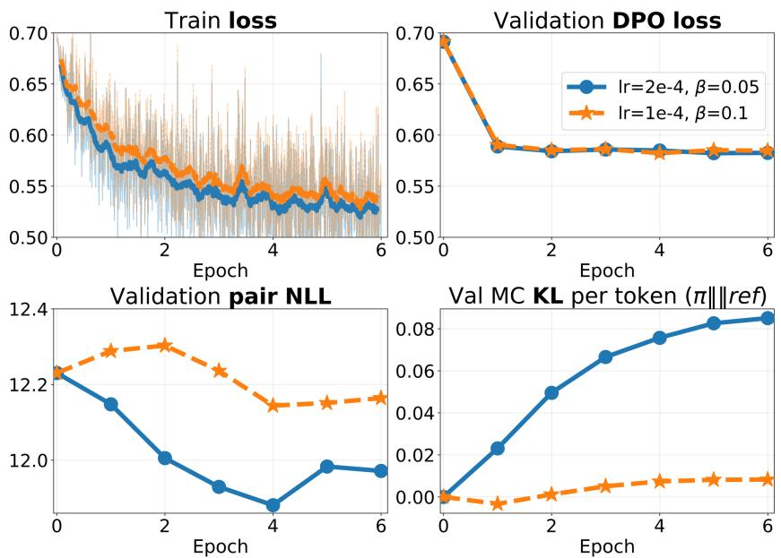  
Figure H1: HelpSteer3 standard-DPO comparison with scale-equivalent learning rates using TRL DPOTrainer (Qwen3-4B-Instruct-2507, SGD, batch size 4, gradient accumulation 4, seed 51): $( \beta , \mathrm { l r } ) = ( 0 . 0 5 , 2 \times 1 0 ^ { - 4 } )$ and $( 0 . 1 , 1 \times 1 0 ^ { - 4 } )$ , so $\eta \beta = 1 0 ^ { - 5 }$ in both runs. Table H3 lists the same checkpoints.

Table H3: Validation DPO loss and per-token Monte-Carlo KL for the HelpSteer3 TRL DPOTrainer runs of Figure H1 (SGD, $\begin{array} { r l r } { \eta \beta } & { { } = } & { 1 0 ^ { - 5 } , } \end{array}$ , seed 51). KL ratio = $\mathrm { K L } ( \pi _ { \theta } \parallel \pi _ { \mathrm { r e f } } ) _ { \beta = 0 . 0 5 } / \mathrm { K L } ( \pi _ { \theta } \parallel \pi _ { \mathrm { r e f } } ^ { - } ) _ { \beta = 0 . 1 } ;$ entries marked “—” are omitted when the denominator KL is non-positive or too small for a stable ratio (Monte-Carlo noise near the reference policy).
<table><tr><td>Epoch</td><td colspan="2">Val. DPO loss</td><td colspan="2">Val. KL per token</td><td colspan="2">KL ratio</td></tr><tr><td></td><td> $\beta = 0 . 0 5$ </td><td> $\beta = 0 . 1$ </td><td> $\beta = 0 . 0 5$ </td><td> $\beta = 0 . 1$ </td><td></td><td></td></tr><tr><td>1</td><td>0.5889</td><td>0.5904</td><td>0.0231</td><td>-0.0033</td><td></td><td></td></tr><tr><td>2</td><td>0.5842</td><td>0.5852</td><td>0.0495</td><td></td><td>0.0012</td><td></td></tr><tr><td>3</td><td>0.5859</td><td>0.5862</td><td>0.0666</td><td></td><td>0.0050</td><td>13.2</td></tr><tr><td>4</td><td>0.5849</td><td>0.5823</td><td>0.0757</td><td></td><td>0.0074</td><td>10.3</td></tr><tr><td>5</td><td>0.5823</td><td>0.5852</td><td>0.0826</td><td></td><td>0.0081</td><td>10.1</td></tr><tr><td>6</td><td>0.5826</td><td>0.5847</td><td>0.0851</td><td></td><td>0.0083</td><td>10.3</td></tr></table>

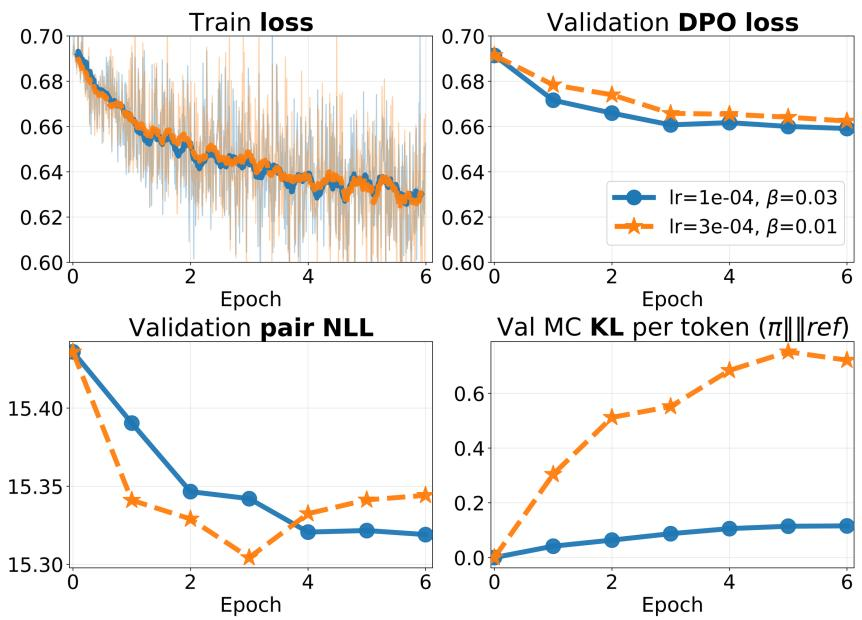  
Figure H2: UltraFeedback Binarized standard-DPO comparison with scale-equivalent learning rates using TRL DPOTrainer (Ministral-3B-Instruct, SGD, batch size 4, gradient accumulation 4, seed 52): $( \beta , \bar { \mathrm { l r } } ) = ( 0 . 0 1 , 3 \times 1 0 ^ { - 4 } )$ and $( 0 . 0 3 , 1 \times 1 0 ^ { - 4 } )$ , so $\eta \beta = 3 \times 1 0 ^ { - 6 }$ in both runs. Table H4 lists the same checkpoints.

Table H4: Validation DPO loss and per-token Monte-Carlo KL for the UltraFeedback Binarized TRL DPOTrainer runs of Figure H2 (Ministral-3B-Instruct, SGD, $\eta \beta = 3 \times 1 0 ^ { - 6 }$ , seed 52). KL ratio $= \mathrm { K L } ( \pi _ { \theta } \parallel \pi _ { \mathrm { r e f } } ) _ { \beta = 0 . 0 1 } \bar { / } \mathrm { K L } ( \pi _ { \theta } \parallel \pi _ { \mathrm { r e f } } ) _ { \beta = 0 . 0 3 }$ at each checkpoint.
<table><tr><td>Epoch</td><td colspan="2">Val. DPO loss  $\beta = 0 . 0 1$   $\beta = 0 . 0 3$ </td><td colspan="2">Val. KL per token  $\beta = 0 . 0 1$   $\beta = 0 . 0 3$ </td><td>KL ratio</td><td></td></tr><tr><td>1</td><td>0.6784</td><td>0.6716</td><td>0.304</td><td>0.041</td><td></td><td>7.3</td></tr><tr><td>2</td><td>0.6740</td><td>0.6659</td><td>0.512</td><td>0.064</td><td></td><td>8.0</td></tr><tr><td>3</td><td>0.6658</td><td>0.6607</td><td>0.552</td><td></td><td>0.087</td><td>6.3</td></tr><tr><td>4</td><td>0.6654</td><td>0.6617</td><td>0.683</td><td></td><td>0.106</td><td>6.5</td></tr><tr><td>5</td><td>0.6641</td><td>0.6600</td><td>0.752</td><td></td><td>0.114</td><td>6.6</td></tr><tr><td>6</td><td>0.6624</td><td>0.6591</td><td>0.721</td><td></td><td>0.116</td><td>6.2</td></tr></table>

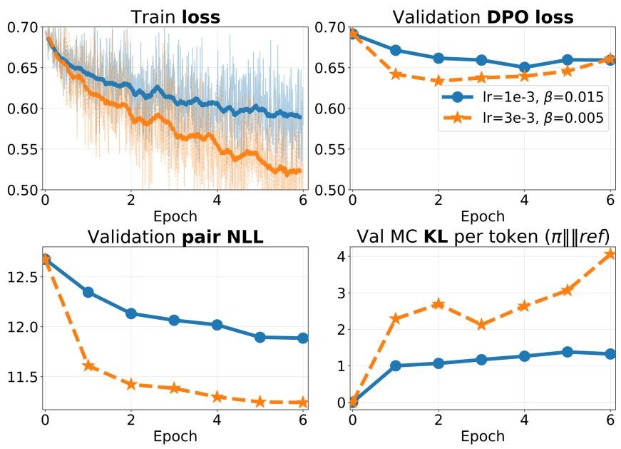  
Figure H3: PKU-processed HH-RLHF standard-DPO comparison with scale-equivalent learning rates using TRL DPOTrainer (Qwen2.5-3B-Instruct, SGD, batch size 4, gradient accumulation 4, seed 52): $( \beta , \bar { \mathrm { l r } } ) = ( 0 . 0 1 5 , 1 0 ^ { - 3 } )$ and $( 0 . 0 0 5 , 3 \times 1 0 ^ { - 3 } )$ , so $\eta \beta = 1 . 5 \times 1 0 ^ { - 5 }$ in both runs. Table H5 lists the same checkpoints. Raw training losses (top-left) do not coincide, unlike the smoothed HelpSteer3 and Ministral-3B curves above.

Table H5: Validation DPO loss and per-token Monte-Carlo KL for the PKU-processed HH-RLHF TRL DPOTrainer runs of Figure H3 (Qwen2.5-3B-Instruct, SGD, $\eta \beta = 1 . 5 \times 1 0 ^ { - 5 }$ , seed 52). KL $\mathrm { r a t i o } = \mathrm { K L } ( \pi _ { \theta } \parallel \pi _ { \mathrm { r e f } } ) _ { \beta = 0 . 0 0 5 } / \mathrm { K L } ( \pi _ { \theta } \parallel \pi _ { \mathrm { r e f } } ) _ { \beta = 0 . 0 1 5 }$ at each checkpoint.
<table><tr><td rowspan="2">Epoch</td><td colspan="2">Val. DPO loss</td><td colspan="2">Val. KL per token</td><td rowspan="2">KL ratio</td></tr><tr><td> $\beta = 0 . 0 1 5$ </td><td> $\beta = 0 . 0 0 5$ </td><td> $\beta = 0 . 0 1 5$ </td><td> $\beta = 0 . 0 0 5$ </td></tr><tr><td>1</td><td>0.6714</td><td>0.6419</td><td>1.001</td><td>2.287</td><td>2.3</td></tr><tr><td>2</td><td>0.6616</td><td>0.6335</td><td>1.067</td><td>2.688</td><td>2.5</td></tr><tr><td>3</td><td>0.6593</td><td>0.6375</td><td>1.168</td><td>2.125</td><td>1.8</td></tr><tr><td>4</td><td>0.6504</td><td>0.6395</td><td>1.263</td><td>2.634</td><td>2.1</td></tr><tr><td>5</td><td>0.6596</td><td>0.6457</td><td>1.380</td><td>3.064</td><td>2.2</td></tr><tr><td>6</td><td>0.6593</td><td>0.6607</td><td>1.325</td><td>4.056</td><td>3.1</td></tr></table>

When do the losses coincide? Matching $\eta \beta$ is necessary but not sufficient for overlapping loss curves. The standard loss depends only on $u = \beta \Delta ~ ( \mathrm { E q . ( H . 1 ) } )$ , so training and validation losses coincide only if the two runs follow a common u-trajectory. With l ${ \mathrm { ~ c ~ } } \propto 1 / { \bar { \beta } } ,$ , the physical margin grows at comparable rates $( \mathrm { d } \Delta / \mathrm { d } t \propto \sigma ( - u ) )$ ), but u advances faster for larger $\beta ,$ so that run initially leads. Saturation, however, is a condition on u alone: the per-step drift criterion $\eta g ^ { 2 } \beta \sigma ( - \beta \Delta ) \lesssim \stackrel { . } { \varepsilon }$ (Appendix G, Setup) depends on $( \eta , \beta )$ only through the matched product $\eta \beta ,$ , so both runs share one threshold $\sigma ( - u ) \stackrel { * } { \sim } \varepsilon / ( \bar { \eta } \beta g ^ { 2 } )$ : the larger-β run reaches it first and slows down, while the smaller- $\boldsymbol { \cdot } \beta$ run—still at smaller u for the same $\Delta -$ keeps catching up until both settle near a common $u ^ { * } .$ . Their losses then coincide even though $\Delta = u / \beta$ (and KL) remain different. This catch-up succeeds on UltraFeedback, HelpSteer3, and Ministral-3B (Tables H1–H4): validation DPO losses agree to $1 0 ^ { - 3 } – 1 0 ^ { - 2 }$ nats and smoothed training losses are nearly overlapping. It does not fully occur on HH-RLHF (Figure H3, Table H5): both runs move far from the reference $( \mathbf { K L } \gtrsim 1$ nat/token), the corpus is comparatively noisy, the $\beta$ ratio is $^ { 3 , }$ and the early transient does not fully close within six epochs—validation DPO losses differ by up to 0.03 nats and raw training losses remain separated (final values 0.62 vs. 0.53). In all cases, however, the KL ratio is a more stable readout of physical displacement: it stays near 2.9–4.1 (UltraFeedback, six epochs) and 3.3–3.9 (three epochs), ≈ 10 (HelpSteer3), 6.2–8.0 (Ministral-3B), and ≈ 1.8–3.1 (HH-RLHF) once the early transient passes, even when the loss curves do not fully coincide. Table H6 collects these scale-equivalent comparisons side by side.

Table H6: Summary of scale-equivalent standard-DPO pairs $( \mathrm { l r } \ \propto 1 / \beta ,$ matched $\eta \beta ) . ~ | \Delta \operatorname { v a l } | ;$ absolute difference between the two validation DPO losses (nats); max / final. Train-loss rows: $\boldsymbol { a } \boldsymbol { l } \boldsymbol { l } =$ overall verdict; sm. = moving-average curve (2.5% window); raw = final per-step values logged at the last checkpoint (HelpSteer3 raw values differ by ≈ 0.025 despite overlapping smoothed curves). $\mathrm { K L } \ r a t i o = \mathrm { K \bar { L } } _ { \beta _ { \mathrm { s m a l l } } } / \mathrm { K \bar { L } } _ { \beta _ { \mathrm { l a r g e } } }$ ; HelpSteer3 from epoch 3 onward.
<table><tr><td>Data</td><td>Model</td><td> $\eta \beta$ </td><td> $\beta _ { 2 } / \beta _ { 1 }$ </td><td> $| \Delta \mathrm { v a l } |$  max / final</td><td>Train loss (all / sm. / raw)</td><td>KL ratio</td></tr><tr><td></td><td></td><td></td><td></td><td></td><td>overlap</td><td></td></tr><tr><td>UF 3 ep.</td><td>Q3-4B</td><td> $1 0 ^ { - 5 }$ </td><td>2</td><td> $\leq 0 . 0 0 1 7 / \leq 0 . 0 0 1 7$ </td><td>overlap</td><td>3.3-3.9</td></tr><tr><td></td><td></td><td></td><td></td><td></td><td>overlap</td><td></td></tr><tr><td></td><td></td><td></td><td></td><td></td><td>overlap</td><td></td></tr><tr><td>UF 6 ep. Q3-4B</td><td></td><td> $1 0 ^ { - 5 }$ </td><td></td><td>0.0051 / 0.0009</td><td>overlap</td><td>2.9-4.1</td></tr><tr><td></td><td></td><td></td><td>2</td><td></td><td>overlap</td><td></td></tr><tr><td></td><td></td><td></td><td></td><td></td><td>overlap</td><td></td></tr><tr><td>HSteer3</td><td></td><td> $1 0 ^ { - 5 }$ </td><td></td><td></td><td>overlap</td><td></td></tr><tr><td></td><td>Q3-4B</td><td></td><td>2</td><td>0.0029 / 0.0021</td><td>diverge</td><td> $\approx 1 0$ </td></tr><tr><td></td><td></td><td></td><td></td><td></td><td>overlap</td><td></td></tr><tr><td>UF bin.</td><td></td><td></td><td></td><td></td><td>overlap</td><td></td></tr><tr><td></td><td>M3-3B</td><td> $3 \times 1 0 ^ { - 6 }$ </td><td>3</td><td>0.0081 / 0.0033</td><td>overlap</td><td>6.2-8.0</td></tr><tr><td></td><td></td><td></td><td></td><td></td><td>diverge</td><td></td></tr><tr><td></td><td></td><td></td><td></td><td></td><td>diverge</td><td></td></tr><tr><td>HH-RLHF Q2.5-3B</td><td></td><td> $1 . 5 \times 1 0 ^ { - 5 }$ </td><td>3</td><td>0.0295 / 0.0014</td><td>diverge</td><td>1.8-3.1</td></tr></table>

Invariance of the loss. The coincidence is structural, not accidental. The standard pairwise loss depends on $( \beta , \Delta )$ only through the dimensionless product $u = \beta \Delta \mathrm { ; }$

$$
\mathcal { L } _ { \mathrm { D P O } } ( \Delta ; \beta ) = \log \left( 1 + e ^ { - \beta \Delta } \right) = \mathrm { s o f t p l u s } ( - u ) , \qquad \mathcal { L } _ { \mathrm { D P O } } ( \Delta / c ; c \beta ) = \mathcal { L } _ { \mathrm { D P O } } ( \Delta ; \beta ) \quad \forall c \geq 0 .\tag{H.1}
$$

Its level sets in the $( \beta , \Delta )$ plane are hyperbolas $\beta \Delta = \mathrm { c o n s t } \mathrm { : }$ the loss value identifies the dimensionless margin u and is blind to the physical margin $\Delta ,$ and can therefore hide large differences in policy displacement, including KL from the reference. For example, $( \beta , \Delta ) = ( 0 . \bar { 0 } 1 , 1 0 0 )$ and (0.02, 50) yield the identical loss $\bar { \log ( 1 + e ^ { - 1 } ) } \approx 0 . 3 1 3$ although the first policy has moved twice as far from the reference. The same invariance holds for every objective of the form $L ( \beta \Delta )$ in Table 1.

Why the two runs can approach similar u-trajectories. Under the scalar frozen-Jacobian approximation of Appendix $\mathbf { G } , \mathrm { l r } \propto 1 / \beta$ gives $\mathrm { d } \Delta / \mathrm { d } t \propto \sigma ( - u )$ and the same drift-based saturation threshold $\sigma ( - u ) \stackrel { - } { \ \stackrel { < } { \sim } } \ \varepsilon / ( \eta \beta g ^ { 2 } )$ for both runs. This approximation predicts late-time catch-up in $u ,$ consistent with several reported sweeps, but it is not a general trajectory-equivalence result for minibatch training because the Jacobians, cross-pair Gram terms, and stochastic gradients evolve during optimization. The KL ratio is not fixed by this identity alone: Table H2 gives ≈ 2.9–4.1 on UltraFeedback (six epochs) and Table H1 gives ≈ 3.3–3.9 (three epochs), Table H4 gives ≈ $6 . 2 – 8 . 0$ on UltraFeedback Binarized with Ministral-3B-Instruct, Table H3 gives ≈ 10 once the larger- $\cdot \beta$ run has moved only slightly from the reference model, and Table H5 gives ≈ 1.8–3.1 on HH-RLHF.

Early transient. The only phase in which the loss curves should differ is the start of training. While $u \ll 1$ , both runs grow the physical margin at nearly the same rate because $\sigma ( - u ) \approx 1 / 2 .$ , so over the same time interval $u = \beta \Delta$ is initially larger for the larger- $- \beta$ run and its loss drops faster. Table H1 makes this visible at epoch 0.5: the $\beta = 0 . 0 2$ validation loss is 0.5620 versus 0.5728 for $\beta = 0 . 0 1$ even though the smaller-β run already has higher KL (0.436 vs. 0.128). Once saturation sets in, the larger-β run slows first and the smaller-β run catches up in u; by epoch 1 the validation losses differ by only $5 \times 1 0 ^ { - 4 }$ nats and remain within $1 0 ^ { - 3 }$ thereafter.

The normalized loss reads the physical scale. The centered-softplus objective is not a function of u alone: $s _ { c } ( - \Delta ; \beta ) = ( \mathrm { s o f t p l u s } ( - u ) - \ln 2 ) / \beta ,$ , so at equal u its value scales as $1 / \beta$ and the two runs are predicted to separate by a factor of 2. The final logged training losses confirm this: −17.5 for $\beta = 0 . 0 1$ versus −9.0 for $\beta = 0 . 0 2 .$ , a ratio of 1.95 (bottom-right panel of Figure I1); the four-seed six-epoch comparison in Figure 4 exhibits the same factor-of-two separation (bottom-middle panel). The overlap of the standard losses and the 2× separation of the normalized losses are thus two sides of the same identity (H.1).

## I Per-run Trajectories under the Normalized Objective

Figure 4 in the main text reports the six-epoch UltraFeedback comparison of standard DPO and the centered-softplus objective (four-seed mean ± one standard deviation). Figure I1 shows the corresponding three-epoch single-run trajectories.

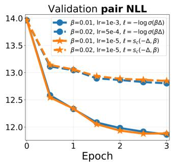

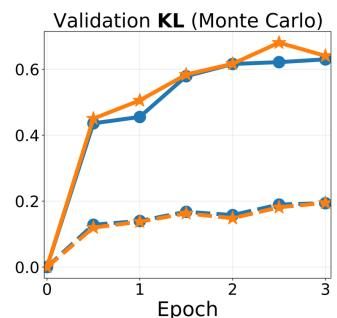

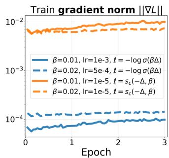

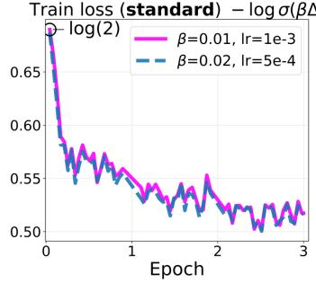

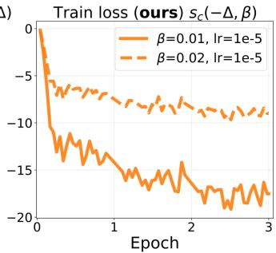  
Figure I1: Comparison of training with the normalized centered-softplus DPO objective $s _ { c } ( - \Delta ; \beta )$ and standard DPO with pairwise loss − log σ(β∆) on UltraFeedback with Qwen3-4B-Instruct-2507 (batch size 26). Learning rates satisfy $\mathrm { l r } _ { \mathrm { n o r m } } = \beta \mathrm { l r } _ { \mathrm { s t a n d a r d } }$ . With SGD, validation metrics are nearly equivalent. Even when validation metrics differ substantially between $\beta \in \{ 0 . 0 1 , 0 . 0 2 \}$ the standard training-loss curves are almost overlapping, whereas for $s _ { c } ( - \Delta ; \beta )$ the training losses separate noticeably (Appendix H). Single-run, three epochs. The comparison tests the predicted scale equivalence; it is not a claim that the normalized objective outperforms a retuned DPO baseline.

Downstream evaluation on UltraFeedback. Table I1 reports AlpacaEval 2 and IFEval scores for the four curves of Figure 4 (Qwen3-4B-Instruct-2507, SGD, batch size 26, four paired seeds). We use the same protocol as Table I2: official AlpacaEval 2 instructions and GPT-4-turbo reference outputs, scored by a fixed Qwen/Qwen2.5-14B-Instruct judge, and the official verifiable IFEval benchmark without an LLM judge. Entries are mean ± std. The two standard-DPO configurations have nearly identical training and validation DPO losses (Figure 4), yet their length-controlled win rates differ by about 14 percentage points and their IFEval accuracies by about 2 points in the same direction; the centered-softplus pair shows the same downstream split, while each standard-DPO setting agrees with its learning-rate-rescaled centered-softplus counterpart.

Table I1: AlpacaEval 2 and IFEval scores for the four UltraFeedback curves of Figure 4 (Qwen3-4B-Instruct-2507, SGD, batch size 26). Centered softplus uses a shared $\mathrm { l r } _ { \mathrm { n o r m } } = 1 0 ^ { - 5 }$ and the paired standard-DPO rates satisfy $\mathrm { l r } _ { \mathrm { n o r m } } ~ = ~ \beta \mathrm { l r } _ { \mathrm { s t a n d a r d } } .$ . AlpacaEval 2 scores use Qwen/Qwen2.5-14B-Instruct as the pairwise judge; IFEval uses the official verifiable benchmark. Entries are $\mathrm { \ m e a n _ { \pm s t d } }$ over 4 seeds (%).
<table><tr><td colspan="3"></td><td colspan="2">AlpacaEval 2</td><td colspan="4">IFEval</td></tr><tr><td>Objective</td><td> $\beta$ </td><td>lr</td><td>WR</td><td>LC WR</td><td>Strict prompt</td><td>Strict instr</td><td>Loose prompt</td><td>Loose instr</td></tr><tr><td>Standard DPO</td><td>0.01</td><td> $1 0 ^ { - 3 }$ </td><td> $4 1 . 4 6 { \scriptstyle \pm 2 . 9 8 }$ </td><td> $4 8 . 6 1 _ { \pm 2 . 1 1 }$ </td><td> $7 8 . 1 9 _ { \pm 0 . 4 0 }$ </td><td> $8 4 . 9 8 { \scriptstyle \pm 0 . 3 8 }$ </td><td> $8 1 . 4 2 _ { \pm 0 . 4 4 }$ </td><td> $8 7 . 3 5 { \scriptstyle \pm 0 . 3 2 }$ </td></tr><tr><td>Standard DPO</td><td>0.02</td><td> $5 \times 1 0 ^ { - 4 }$ </td><td> $6 1 . 4 3 { \scriptstyle \pm 1 . 8 8 }$ </td><td> $6 2 . 3 7 { \scriptstyle \pm 1 . 3 1 }$ </td><td> $7 9 . 8 1 _ { \pm 0 . 4 9 }$ </td><td> $8 6 . 0 6 _ { \pm 0 . 4 4 }$ </td><td> $8 3 . 5 0 { \scriptstyle \pm 0 . 6 3 }$ </td><td> $8 8 . 7 0 { \scriptstyle \pm 0 . 5 4 }$ </td></tr><tr><td>Centered</td><td></td><td> $1 0 ^ { - 5 }$ </td><td> $4 1 . 7 4 { \scriptstyle \pm 1 . 1 5 }$ </td><td> $4 9 . 3 7 _ { \pm 2 . 0 4 }$ </td><td></td><td></td><td></td><td></td></tr><tr><td>softplus Centered</td><td>0.01</td><td></td><td></td><td></td><td> $7 7 . 7 7 { \scriptstyle \pm 0 . 8 0 }$ </td><td> $8 4 . 6 8 _ { \pm 0 . 4 5 }$ </td><td> $8 1 . 0 5 { \scriptstyle \pm 1 . 0 9 }$ </td><td> $8 7 . 1 7 { \scriptstyle \pm 0 . 7 5 }$ </td></tr><tr><td>softplus</td><td>0.02</td><td> $1 0 ^ { - 5 }$ </td><td> $6 2 . 4 8 { \scriptstyle \pm 1 . 9 1 }$ </td><td> $6 3 . 4 1 { \scriptstyle \pm 1 . 7 7 }$ </td><td> $7 9 . 7 1 { \scriptstyle \pm 0 . 3 5 }$ </td><td> $8 6 . 0 9 { \scriptstyle \pm 0 . 1 7 }$ </td><td> $8 3 . 4 6 _ { \pm 0 . 5 7 }$ </td><td> $8 8 . 6 7 { \scriptstyle \pm 0 . 5 2 }$ </td></tr></table>

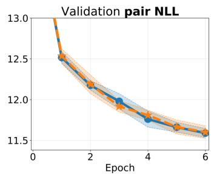

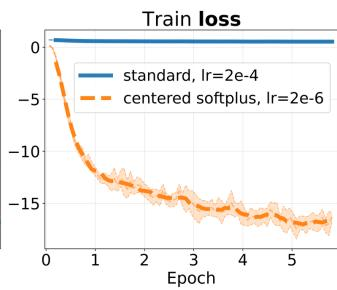

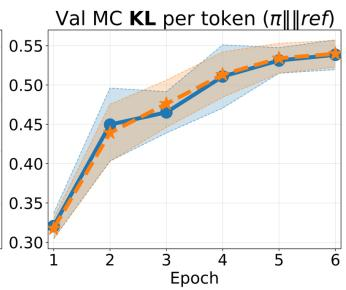  
Figure I2: Comparison of training with the normalized centered-softplus DPO objective $s _ { c } ( - \Delta ; \beta )$ and standard DPO with pairwise loss $- \log { \sigma ( \beta \Delta ) }$ on HelpSteer3 with Qwen3-4B-Instruct-2507 (batch size 24). SGD with $\beta = 0 . 0 1$ . The standard run uses $\bar { \mathrm { l r } } _ { \mathrm { s t a n d a r d } } = 2 \times 1 0 ^ { - 4 }$ and the centeredsoftplus run uses $\mathrm { l r } _ { \mathrm { n o r m } } = \beta \mathrm { l r } _ { \mathrm { s t a n d a r d } } = 2 \times 1 0 ^ { - 6 }$ . Curves show the mean over eight experiments; shaded bands denote one standard deviation.

Downstream evaluation. Table I2 summarizes post-training instruction-following checks for the HelpSteer3 SGD comparison of Figure I2: standard DPO $( \beta \bar { = } 0 . 0 1 , \mathrm { { l r } _ { \mathrm { { s t a n d a r d } } } = 2 \bar { \times } 1 0 ^ { - 4 } ) }$ versus the centered-softplus objective with $\mathrm { l r } _ { \mathrm { n o r m } } = \beta \mathrm { l r } _ { \mathrm { s t a n d a r d } } = 2 \times 1 0 ^ { - 6 }$ , across eight paired seeds (43–50). For AlpacaEval 2 [Dubois et al., 2024], we use the official instruction set and GPT-4- turbo reference outputs, generate candidate completions from each fine-tuned checkpoint, and score pairwise preferences with a fixed Qwen/Qwen2.5-14B-Instruct judge; we report raw win rate, length-controlled (LC) win rate, and length-filtered win rate. For IFEval [Zhou et al., 2023], we use the official verifiable instruction-following benchmark (strict and loose prompt- and instruction-level accuracy) without an LLM judge. Entries report mean ± std; the p column gives two-sided Wilcoxon signed-rank test p-values for seed-matched pairs. No statistically significant difference is detected at $n = 8$ for any reported metric. This absence of significance does not establish practical equivalence or exclude small systematic effects.

Figure I3 shows the seed-averaged HelpSteer3 AdamW trajectories for the centered-softplus objective analyzed in Section 4; Figure I4 shows the corresponding single-run trajectories. Consistent with the $1 / \beta$ readout in Appendix H, the normalized training losses separate across $\beta ,$ tracking the physical aggressiveness of each run rather than collapsing onto a common curve.

Table I2: Post-training benchmarks for the HelpSteer3 SGD comparison of Figure I2 (Qwen3- 4B-Instruct-2507, batch size 24, $\beta = 0 . 0 1$ , eight paired seeds). Standard DPO uses $\mathrm { { l r } _ { \mathrm { { s t a n d a r d } } } = }$ $2 \times 1 0 ^ { - 4 } ;$ centered softplus uses $\mathrm { l r } _ { \mathrm { n o r m } } = \bar { \beta } \mathrm { l r } _ { \mathrm { s t a n d a r d } } = 2 \times 1 0 ^ { - 6 }$ . AlpacaEval 2 scores use Qwen/Qwen2.5-14B-Instruct as the pairwise judge; IFEval uses the official verifiable benchmark. Entries are mean ± std (%); p is the two-sided Wilcoxon signed-rank test p-value for seed-matched pairs. No statistically significant difference is detected at $n = 8 ;$ this test does not establish practical equivalence.
<table><tr><td>Metric</td><td>Standard DPO</td><td>Centered softplus</td><td>p</td></tr><tr><td>Alpaca win</td><td> $5 4 . 8 9 \pm 2 . 8 2$ </td><td> $5 5 . 4 7 \pm 1 . 8 3$ </td><td>0.94</td></tr><tr><td>Alpaca LC win</td><td> $5 4 . 7 2 \pm 2 . 3 7$ </td><td> $5 5 . 5 0 \pm 1 . 4 4$ </td><td>0.63</td></tr><tr><td>Alpaca len-filtered win</td><td> $4 3 . 8 3 \pm 2 . 6 7$ </td><td> $4 5 . 0 9 \pm 1 . 9 1$ </td><td>0.63</td></tr><tr><td>Tie</td><td> $0 . 0 2 \pm 0 . 0 4$ </td><td> $0 . 0 2 \pm 0 . 0 4$ </td><td>1.00</td></tr><tr><td>Loss</td><td> $4 5 . 0 9 \pm 2 . 8 2$ </td><td> $4 4 . 5 2 \pm 1 . 8 5$ </td><td>0.94</td></tr><tr><td>IFEval strict prompt</td><td> $8 0 . 1 1 \pm 0 . 9 8$ </td><td> $8 1 . 2 2 \pm 0 . 9 4$ </td><td>0.11</td></tr><tr><td>IFEval strict instr</td><td> $8 6 . 1 8 \pm 0 . 7 2$ </td><td> $8 7 . 0 2 \pm 0 . 6 5$ </td><td>0.08</td></tr><tr><td>IFEval loose prompt</td><td> $8 3 . 7 6 \pm 0 . 7 4$ </td><td> $8 4 . 6 1 \pm 1 . 2 7$ </td><td>0.23</td></tr><tr><td>IFEval loose instr</td><td> $8 8 . 7 4 \pm 0 . 4 8$ </td><td> $8 9 . 4 4 \pm 0 . 8 1$ </td><td>0.16</td></tr></table>

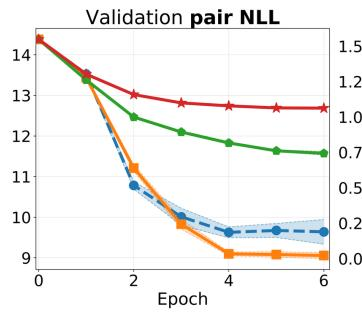

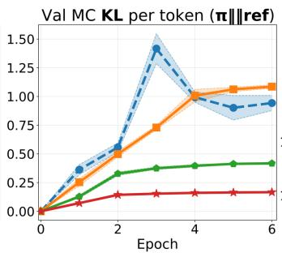

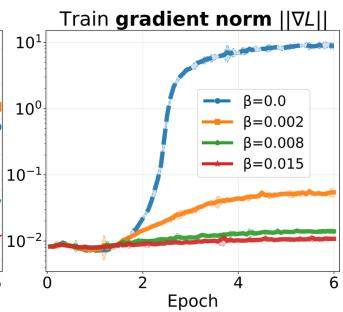

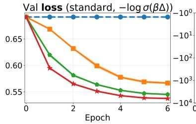

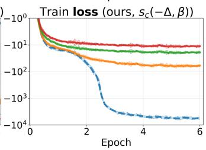

  
Figure I3: Training and validation dynamics on HelpSteer3 with Qwen3-4B-Instruct-2507 using the centered-softplus DPO objective $s _ { c } ( - \Delta , \beta )$ (batch size $2 4 , \mathrm { l r } = 1 \times 1 0 ^ { - 6 }$ , Adam). Curves show the mean over four experiments; shaded bands denote one standard deviation.

  
Figure I4: Centered Softplus loss $s _ { c } ( - \Delta , \beta )$ on HelpSteer3 with Qwen3-4B-Instruct-2507 (batch size $2 4 , \mathrm { l r } = 1 \times 1 0 ^ { - 6 } )$ ), trained with Adam.

## J Logged Gradients, Mean-Abs Magnitudes, and the Jacobian Factor $g$

This appendix collects the gradient questions that arise in the main text: what the training logs record, how that scalar relates to $\bar { \nabla } _ { \boldsymbol { \theta } } \mathcal { L }$ , and how both relate to the Jacobian scale used in the saturation and horizon formulas. The exact identities below first apply to a single preference pair. For a minibatch, the logged norm identifies a coherence-weighted norm of the batch-averaged margin Jacobian rather than a typical per-pair Jacobian; we make this distinction explicit before using the logged value as an order-of-magnitude proxy in Appendix K.

Chain rule. For a single preference pair the standard DPO loss depends on θ only through the scalar margin $\Delta ( \theta )$

$$
\mathscr { L } ( \theta ) = \ell \big ( \Delta ( \theta ) \big ) , \qquad \ell ( u ) = - \log \sigma ( \beta u ) , \qquad \ell ^ { \prime } ( u ) = - \beta \sigma ( - \beta u ) .\tag{J.1}
$$

The parameter gradient is therefore exactly

$$
\nabla _ { \boldsymbol { \theta } } \mathcal { L } = \ell ^ { \prime } ( \Delta ) \nabla _ { \boldsymbol { \theta } } \Delta = - \beta \sigma ( - \beta \Delta ) \nabla _ { \boldsymbol { \theta } } \Delta .\tag{J.2}
$$

Taking Euclidean norms,

$$
\| \nabla _ { \theta } \mathcal { L } \| _ { 2 } = \beta \sigma ( - \beta \Delta ) g , \qquad g : = \| \nabla _ { \theta } \Delta \| _ { 2 } .\tag{J.3}
$$

Thus every loss-gradient magnitude factors as

$$
\underbrace { \beta } _ { \mathrm { e x p l i c i t \ : s c a l e } } \times \underbrace { \sigma ( - \beta \Delta ) } _ { \mathrm { s i g m o i d \ : / s a t u r a t i o n } } \times \underbrace { g } _ { \mathrm { J a c o b i a n \ : o f \ : t h e \ : m a r g i n } } .
$$

At initialization $\Delta = 0$ and $\sigma ( 0 ) = 1 / 2 ,$ , so

$$
\| \nabla _ { \theta } \mathcal { L } \| _ { 2 } = \frac { \beta } { 2 } g \qquad \Rightarrow \qquad g = \frac { 2 } { \beta } \| \nabla _ { \theta } \mathcal { L } \| _ { 2 } .\tag{J.4}
$$

Equation (J.3) is an identity for one pair. Treating g as constant along a trajectory and identifying it from a minibatch-gradient log are separate approximations used only for the rough horizon estimate.

Minibatch correction. For a minibatch of B pairs, write $j _ { i } = \nabla _ { \theta } \Delta$ i and $a _ { i } = \sigma \big ( { - \beta \Delta _ { i } } \big )$ . Then

$$
\nabla _ { \theta } \mathcal { L } _ { B } = - \frac { \beta } { B } \sum _ { i = 1 } ^ { B } a _ { i } \boldsymbol { j } _ { i } .\tag{J.5}
$$

Consequently, a global gradient norm does not recover a typical $g _ { i } = \| j _ { i } \| _ { 2 }$ . At initialization, where $a _ { i } = 1 / 2$

$$
\frac { 2 } { \beta } \| \nabla _ { \boldsymbol { \theta } } \mathcal { L } _ { B } \| _ { 2 } = \left\| \frac { 1 } { B } \sum _ { i = 1 } ^ { B } j _ { i } \right\| _ { 2 } = : g _ { B } .\tag{J.6}
$$

The quantity $g _ { B }$ includes cross-pair alignment and cancellation. It may therefore differ substantially from both $\begin{array} { r l } {  { \dot { B ^ { - 1 } } \sum _ { i } \| j _ { i } \| _ { 2 } } } \end{array}$ and a typical per-pair norm. The Gram-matrix form of the resulting margin drift is given in Appendix $\mathrm { K } ;$ throughout the numerical horizon estimate we use the observed $g _ { B }$ only as an effective scalar proxy.

Logged scalars: mean-abs versus Euclidean. Our DPO implementation logs two scalars every 100 steps over trainable (LoRA) coordinates $a = \nabla _ { \theta } { \mathcal { L } } \colon$

$$
G : = { \mathrm { m e a n } } _ { j } | a _ { j } | = { \tt g r a d \_ a b s \_ m e a n } ,\tag{J.7}
$$

$$
\| \nabla _ { \theta } \mathcal { L } \| _ { 2 } : = \sqrt { \sum _ { j } a _ { j } ^ { 2 } } = \mathtt { g r a d \_ n o r m } .\tag{J.8}
$$

TRL DPOTrainer TensorBoard curves report the Euclidean quantity as train/grad\_norm. The two are related by a shape factor

$$
\| \nabla _ { \theta } \mathcal { L } \| _ { 2 } = C G , \qquad C = \sqrt { d } r , \qquad r = \frac { \mathrm { R M S } _ { j } | a _ { j } | } { \mathrm { m e a n } _ { j } | a _ { j } | } \geq 1 ,\tag{J.9}
$$

with d the number of trainable parameters. Equality $r = 1$ holds only if all $| a _ { j } |$ are equal; empirically, for $\mathbf { Q } \mathbf { w } \mathbf { e n } 3 \mathbf { - } 4 \mathbf { B } , r \approx 2 . 8 \mathbf { - } 3 . 1$ on HelpSteer3 and $r \approx 3 . 7 – 4 . 1$ on UltraFeedback (below). Table 2 in the main text uses $G _ { 0 }$ in the sense of (J.7).

The dynamics panels in the main text and appendices inherit a mixed convention from the original experimental logs: the SGD runs of our implementation recorded $G ,$ and those curves were kept so that the published figures match the logs, even where an axis is labelled $\Vert \nabla L \Vert$ . TRL panels report Euclidean $\lVert \nabla _ { \theta } \mathcal { L } \rVert _ { 2 }$ . This is a residual inconsistency of the logging pipeline, not a claim that G equals the Euclidean norm. By (J.9) the two differ by the nearly constant factor $C = \sqrt { d } r ( r$ varies only weakly along a run), so cross- $- \beta$ orderings and time trends are the same for either scalar. Horizon formulas use the Euclidean reading, not $\breve { G } .$ . For actual minibatch logs, Equation (J.6), rather than the one-pair inversion in (J.4), is the appropriate interpretation.

Three-factor decomposition along training. Equation (J.3) splits every loss-gradient magnitude into an explicit $\beta$ scale, a sigmoid/saturation factor, and the Jacobian $g .$ Figures J1–J3 isolate those three factors along a run:

1. left: the logged loss-gradient magnitude (G for our implementation; $\lVert \nabla _ { \theta } \mathcal { L } \rVert _ { 2 }$ for TRL);

2. center: the same quantity divided by $\beta ,$ , which removes the explicit scale (at $t = 0$ the curves collapse);

3. right: division by $\beta \sigma ( - \beta \Delta _ { t } )$ as well, leaving a scalar proxy for $g _ { B } ( t )$ (using a linear interpolation of the empirical final mean validation margin for runs of our implementation, and the reported mean $\bar { | } \Delta |$ for TRL).

A drop on the left panel need not mean that $g$ shrinks: under (J.3) the sigmoid factor alone drives the loss gradient down as $\Delta$ grows at fixed $g .$ . The right panel is the diagnostic for whether $g$ itself is moving.

HelpSteer3 numerical check (our implementation, SGD, $\eta _ { \mathrm { m a x } } = 2 \times 1 0 ^ { - 4 } )$ . Two seed-43 runs log both $G$ and $\Vert \nabla \mathcal { L } \Vert _ { 2 }$ with $d = 3 3 0 3 0 1 4 4 \mathrm { L o R A }$ parameters. Early steps (100–500):

  
Figure J1: HelpSteer3 / Qwen3-4B, our DPO implementation, SGD, $\eta _ { \mathrm { m a x } } = 2 \times 1 0 ^ { - 4 }$ . The three panels isolate the factors in (J.3): logged $G = \mathfrak { g r }$ ad\_abs\_mean (left), $G / \beta$ (center), and a scalar batch-Jacobian proxy $g _ { B } ( t )$ after dividing out $\beta \sigma ( - \beta \Delta )$ (right). The last quantity is not a typical per-pair Jacobian norm.

<table><tr><td> $\beta$ </td><td> $G / \beta$ </td><td> $r = \| \nabla { \mathcal { L } } \| _ { 2 } / ( { \sqrt { d } } G )$   $g _ { B } = 2 \| \nabla \mathcal { L } \| _ { 2 } / \beta$ </td></tr><tr><td>0.0025 (peak)</td><td> $8 . 2 4 \times 1 0 ^ { - 3 }$ </td><td>2.76 261</td></tr><tr><td>0.075 (right slope)</td><td> $7 . 1 7 \times 1 0 ^ { - 3 }$ </td><td>2.94 242</td></tr></table>

So $G / \beta$ is essentially the same as in Table 2, while the Euclidean reading gives $r \approx 2 . 8 – 2 . 9$ (within the HelpSteer3 / Qwen3-4B range 2.8–3.1) and the batch proxy $g _ { B } \approx 2 5 0$ , not the isotropic $r = 1$ value $g _ { B } \approx 9 5$ . The isotropic choice $r = 1$ is a lower bound on r (hence an upper bound on the scalar horizon proxy $\beta _ { \mathrm { r } } \propto 1 / g _ { B } ^ { 2 ^ { \scriptstyle * } } \propto 1 / r ^ { 2 } ) \colon$ it would give $g _ { B }$ ≈ 95 and $\beta _ { \mathrm { r } } \approx 0 . 1 9$ , whereas the measured L2 norm gives $g _ { B } \approx 2 5 0$ and βr ≈ 0.027 (Appendix $\mathrm { K } )$ . Neither value estimates a typical per-pair Jacobian. By the end of epoch 1, with validation mean $\Delta \approx 2 0 . 9 \ : ( \beta = 0 . 0 0 2 5 )$ and $\Delta \approx 1 3 . 3$ $( \beta = 0 . 0 7 5 )$

$$
g _ { B } ( t ) = { \frac { \| \nabla { \mathcal { L } } \| _ { 2 } } { \beta \sigma ( - \beta \Delta ) } }
$$

has already risen $\mathrm { t o } \approx 3 6 0$ and $\approx 3 7 0$ respectively under the scalar reconstruction: the effective batch proxy grows, while at $\beta = 0 . 0 7 5$ the raw G falls mainly because $\sigma ( - \beta \Delta )$ shrinks. This reconstruction additionally substitutes an aggregate validation margin into the sigmoid, so it is diagnostic rather than an exact measurement. Freezing the initial proxy ignores this time variation.

## Takeaways for the rest of the paper.

• Main-text $G _ { 0 }$ and the dynamics figures from our implementation use mean-abs $G ,$ including some panels labelled $\Vert \nabla L \Vert$ ; this mixed labelling is a legacy of those logs, as above. Euclidean $\Vert \nabla _ { \theta } \mathcal { L } \Vert _ { 2 }$ differs from G by a near-constant factor $C = \sqrt { d } r$ (empirically, for Qwen3-4B, $r \approx 2 . 8 – 3 . 1$ on HelpSteer3 and $r \approx 3 . 7 – 4 . 1$ on UltraFeedback), so the two are interchangeable for cross- $\cdot \beta$ comparisons.

• The scalar horizon formula uses the logged batch quantity $g _ { B }$ as a proxy for the one-pair g in (J.3). An exact minibatch calculation instead requires cross-pair Gram products.

• Because $\beta _ { \mathrm { r } } \propto 1 / g _ { B } ^ { 2 }$ in the scalar closure, time variation and cross-pair cancellation preclude a precise cutoff. The resulting $\beta _ { \mathrm { r } }$ is reported only to order of magnitude; factor-of-few shifts occupy less than one decade on the logarithmic $\beta$ axis used in the sweep.

## K Time to Saturation and the Right Cutoff $\beta _ { \mathrm { r } }$

Appendix G gives the one-pair saturation margin $\Delta _ { \mathrm { D P O } } ^ { * } ( \beta )$ and the $l e f t$ dead zone $\beta \leq 2 \tau$ . On the right slope, $\Delta _ { \mathrm { D P O } } ^ { * } \sim \log ( \beta / \tau ) / \beta  0$ , but that asymptotic alone does not say at which $\beta$ a finite training budget ceases to move the policy. This appendix seeks only an order-of-magnitude horizon scale $\beta _ { \mathrm { r } }$ , represented by the broad right-hand band of Figure 2, rather than a calibrated cutoff. Two approximations dominate its uncertainty. First, the scalar closure freezes the initial Jacobian proxy even though the reconstructed proxy usually grows during training. Second, the global minibatch gradient identifies the norm of a batch-averaged Jacobian, including cross-pair cancellation, rather than a typical per-pair norm. An exact calculation would retain the full cross-pair Gram matrix. We state that correction below, then deliberately keep the scalar closure because the goal is a rough location on a logarithmic $\beta$ axis. Notation for the loss gradient, the one-pair Jacobian $g = \| \nabla _ { \theta } \Delta \| _ { 2 }$ and the effective batch proxy gB is fixed in Appendix J.

  
Figure J2: HH-RLHF / Qwen2.5-3B, our DPO implementation, SGD, $\eta _ { \mathrm { m a x } } = 1 0 ^ { - 3 }$ (fixed across $\beta )$ . Same three-factor layout as Figure J1. Thin curves: raw; thick: moving average. Growth of the reconstructed batch-Jacobian proxy is stronger than on HelpSteer3 across the sweep.  
UltraFeedback / Qwen3-4B TRL AdamW $( \eta _ { \mathrm { m a x } } = 5 \times 1 0 ^ { - 7 }$ , fixed lr): raw (thin) + smoothed

  
Figure J3: UltraFeedback / Qwen3-4B, TRL DPOTrainer, AdamW, $\eta _ { \mathrm { m a x } } ~ = ~ 5 \times 1 0 ^ { - 7 }$ . Left: Euclidean $\Vert \nabla _ { \theta } \mathcal { L } \Vert _ { 2 }$ from train/grad\_norm; center and right apply the same decomposition as Figure J1. Absolute scale is not comparable to the SGD figures above (different optimizer and $\eta )$

Inputs already fixed elsewhere. We reuse the one-pair saturation ceiling $\Delta _ { \mathrm { D P O } } ^ { * } ( \beta )$ and peak location $\beta _ { \mathrm { p e a k } } \approx 4 . 5 9 \tau$ from Appendix G (Equation (7)) without re-deriving them. For the HelpSteer3 / Qwen3-4B standard-DPO SGD sweep we take the shape+scale estimate $\tau = 6 . 3 7 \times 1 0 ^ { - 4 }$ from Appendix G.1; the rough $\beta _ { \mathrm { r } }$ estimate below additionally folds in the learning-rate budget and the initial proxy $g _ { B }$

Learning-rate budget. Write $\eta _ { t }$ for the per-step learning rate, $T _ { \mathrm { b u d g e t } }$ for the planned number of SGD steps, and

$$
H : = \sum _ { t = 0 } ^ { T _ { \mathrm { b u d g e t } } - 1 } \eta _ { t } , \qquad \eta _ { \mathrm { e f f } } : = H / T _ { \mathrm { b u d g e t } } .\tag{K.1}
$$

For a cosine (or triangular) schedule that rises from 0 to $\eta _ { \mathrm { m a x } }$ and returns to $0 , H \approx \eta _ { \mathrm { m a x } } T _ { \mathrm { b u d g e t } } / 2$

## K.1 From a parameter step to an equation on the margin

The DPO loss on a single pair depends on θ only through $\Delta ( \theta )$ . Appendix J records the chain rule

$$
\nabla _ { \theta } \mathcal { L } = \ell ^ { \prime } ( \Delta ) \nabla _ { \theta } \Delta = - \beta \sigma ( - \beta \Delta ) \nabla _ { \theta } \Delta , \qquad g ( \theta ) : = \| \nabla _ { \theta } \Delta ( \theta ) \| _ { 2 } ,\tag{K.2}
$$

so $\| \nabla _ { \theta } \mathcal { L } \| _ { 2 } = \beta \sigma ( - \beta \Delta ) g$ . An SGD step $\theta _ { t + 1 } = \theta _ { t } - \eta _ { t } \nabla _ { \theta } \mathcal { L } ( \theta _ { t } )$ therefore changes the scalar margin by a first-order Taylor expansion

$$
\Delta ( \theta _ { t + 1 } ) - \Delta ( \theta _ { t } ) = \nabla _ { \theta } \Delta ( \theta _ { t } ) ^ { \top } ( \theta _ { t + 1 } - \theta _ { t } ) + O ( \Vert \theta _ { t + 1 } - \theta _ { t } \Vert ^ { 2 } ) .\tag{K.3}
$$

Substituting the update and (K.2) gives the discrete drift

$$
\Delta _ { t + 1 } - \Delta _ { t } = \eta _ { t } g ( \theta _ { t } ) ^ { 2 } \beta \sigma ( - \beta \Delta _ { t } ) + O ( \eta _ { t } ^ { 2 } ) ,\tag{K.4}
$$

where $\Delta _ { t } : = \Delta ( \theta _ { t } )$ . The factor $g ^ { 2 }$ appears because the SGD step is parallel to $\nabla _ { \boldsymbol { \theta } } \Delta$ , so the induced change in the scalar margin is $\nabla _ { \boldsymbol { \theta } } \Delta ^ { \top } ( \eta | \ell ^ { \prime } | \nabla _ { \boldsymbol { \theta } } \Delta ) = \eta | \ell ^ { \prime } | \| \nabla _ { \boldsymbol { \theta } } \Delta \| _ { 2 } ^ { 2 }$ ; it is the squared Jacobian of $\Delta$ not $( \bar { \partial } \mathcal { L } / \partial \Delta ) ^ { 2 }$ . Identifying one step with $d t = 1$ yields the mean-field ODE

$$
\dot { \Delta } ( t ) = \eta ( t ) g \big ( \theta ( t ) \big ) ^ { 2 } \beta \sigma \big ( - \beta \Delta ( t ) \big ) .\tag{K.5}
$$

Here $\beta$ enters explicitly through the sigmoid; g enters through $\theta ( t )$ , and the path θ(t) itself depends on $\beta ,$ so logged $g ( t )$ need not be the same across a β-sweep (Appendix J, Figures J1–J3).

Exact minibatch correction. For a training batch, let $j _ { i } = \nabla _ { \theta } \Delta _ { i } , a _ { i } = \sigma ( - \beta \Delta _ { i } )$ , and $K _ { k i } =$ $j _ { k } ^ { \top } j _ { i }$ . The first-order drift of pair k is

$$
\Delta _ { k , t + 1 } - \Delta _ { k , t } = \frac { \eta _ { t } \beta } { B } \sum _ { i = 1 } ^ { B } a _ { i } K _ { k i } + O ( \eta _ { t } ^ { 2 } ) .\tag{K.6}
$$

Thus the exact dynamics depend on cross-pair alignment, not only on $\| \boldsymbol j _ { k } \| _ { 2 } ^ { 2 }$ . For a mean over M probe pairs, the corresponding drift is

$$
\overline { { \Delta } } _ { t + 1 } - \overline { { \Delta } } _ { t } = \frac { \eta _ { t } \beta } { M B } \mathbf { 1 } ^ { \top } K \mathbf { a } + O ( \eta _ { t } ^ { 2 } ) ,
$$

where $K$ may be the cross-Gram matrix between probe and training pairs. A precise horizon estimate would evaluate or approximate these Gram contractions along the trajectory and integrate them under the actual learning-rate schedule.

Frozen-Jacobian closure. For a deliberately simpler order-of-magnitude estimate, we return to the one-dimensional closure and freeze $g ( \theta ( t ) ) \equiv g : = g ( \theta _ { 0 } )$ . Numerically, g is replaced by the initial effective batch proxy $g _ { B }$ from Equation (J.6); this does not turn it into a typical per-pair Jacobian. Then (K.5) separates:

$$
\left( 1 + e ^ { \beta \Delta } \right) d \Delta = \eta g ^ { 2 } \beta d t .\tag{K.7}
$$

With a variable schedule the right-hand side integrates to $g ^ { 2 } \beta H$ . If $g$ is not frozen, the same integral becomes $\begin{array} { r } { I = \int \eta ( t ) g ( \theta ( t ) ) ^ { 2 } , } \end{array}$ dt in place of $g ^ { 2 } H$

Stochasticity. Equation (K.5) is a scalar mean-field closure of the minibatch recursion $( \mathrm { K } . 6 ) { \mathrm { : } }$ random batch sampling adds stochastic variation around the corresponding Gram-weighted drift. Appendix L gives an optional stochastic interpretation of this variation and describes how an effective drift–noise crossover could be estimated from windowed margin trajectories. It does not assume convergence to an equilibrium process.

## K.2 Time to saturation and definition of $\beta _ { \mathrm { r } }$

Integrating (K.7) from $\Delta ( 0 ) = 0$ to $\Delta ( T ) = \Delta _ { \mathrm { D P O } } ^ { * } ( \beta )$ gives

$$
\Delta ^ { * } + \frac { e ^ { \beta \Delta ^ { * } } - 1 } { \beta } = \eta g ^ { 2 } \beta T\tag{K.8}
$$

Table K1: HelpSteer3 / Qwen3-4B standard DPO (SGD): right slope of the sweep in Figure 2 and Table G1. Min validation pair NLL (with $\beta = 1 )$ , per-token $\mathrm { K L }$ , and mean validation margin; last column is the one-pair ceiling $\Delta _ { \mathrm { D P O } } ^ { * } ( \beta )$ from Equation (7) at $\tau = 6 . 3 7 \times 1 0 ^ { - 4 }$ . Highlighted row: the rough scalar estimate $\beta _ { \mathrm { r } }$ from (K.11); $\mathrm { N L L } , \overline { { \Delta } }$ , and KL are interpolated log-linearly in $\beta$ between the neighbouring measured points 0.02 and 0.04, while $\Delta _ { \mathrm { D P O } } ^ { * } ( 0 . 0 2 \bar { 7 } )$ is the closed-form ceiling. The highlighted value is an order-of-magnitude guide, not a measured or calibrated cutoff.
<table><tr><td></td><td>β</td><td>min NLL</td><td> $\mathrm { K L } / \mathrm { t o k e n }$ </td><td>mean val.  $\overline { { \Delta } }$ </td><td> $\Delta _ { \mathrm { D P O } } ^ { * } ( \beta )$ </td></tr><tr><td rowspan="3"> $\beta _ { \mathrm { p e a k } }$ </td><td>0.0025</td><td> $9 . 9 2 \pm 0 . 1 4$ </td><td> $1 . 0 0 \pm 0 . 0 2$ </td><td> $1 5 2 \pm 6$ </td><td>429</td></tr><tr><td>0.01</td><td> $1 1 . 5 5 \pm 0 . 0 8$ </td><td> $0 . 5 4 0 \pm 0 . 0 0 8$ </td><td> $7 5 . 1 \pm 0 . 6$ </td><td>269</td></tr><tr><td>0.02</td><td> $1 2 . 6 1 \pm 0 . 0 1$ </td><td> $0 . 2 9 0 \pm 0 . 0 2 4$ </td><td> $4 5 . 4 \pm 0 . 0$ </td><td>171</td></tr><tr><td rowspan="3"> $\beta _ { \mathrm { r } }$ </td><td>0.027</td><td> $\approx 1 2 . 8 8$ </td><td> $\approx 0 . 2 2 1$ </td><td> $\approx 3 8 . 5$ </td><td>138</td></tr><tr><td>0.04</td><td> $1 3 . 2 3 \pm 0 . 0 1$ </td><td> $0 . 1 3 0 \pm 0 . 0 0 7$ </td><td> $2 9 . 4 \pm 0 . 0$ </td><td>103</td></tr><tr><td>0.075</td><td> $1 3 . 3 6 \pm 0 . 0 2$ </td><td> $0 . 0 6 6 \pm 0 . 0 0 1$ </td><td> $2 1 . 9 \pm 0 . 3$ </td><td>63</td></tr><tr><td rowspan="2"></td><td>0.2</td><td>13.67</td><td>0.019</td><td>14.9</td><td>29</td></tr><tr><td>0.3</td><td>13.80</td><td>0.010</td><td>12.3</td><td>21</td></tr></table>

for constant η (replace $\eta T$ by H under a schedule). From Equation $( 7 ) , e ^ { \beta \Delta ^ { * } } = \beta / \tau - 1$ whenever $\beta > 2 \tau$ , so

$$
T _ { \mathrm { D P O } } ( \beta ) = \frac { 1 } { \eta g ^ { 2 } \beta ^ { 2 } } \left[ \log \left( \frac { \beta } { \tau } - 1 \right) + \frac { \beta } { \tau } - 2 \right] \xrightarrow [ \beta \gg \tau ] { } \frac { 1 } { \eta g ^ { 2 } \beta \tau } .\tag{K.9}
$$

Thus $T _ { \mathrm { D P O } }  0$ at both ends of the admissible interval: $\Delta ^ { * }$ collapses as $\beta  ( 2 \tau ) ^ { + }$ and as $\beta \to \infty$ The leading right-branch condition $T _ { \mathrm { D P O } } \lesssim T _ { \mathrm { b u d g e t } }$ rearranges to

$$
\beta _ { \mathrm { r } } : = \frac { 1 } { \eta _ { \mathrm { e f f } } g ^ { 2 } \tau T _ { \mathrm { b u d g e t } } } = \frac { 1 } { g ^ { 2 } \tau H } .\tag{K.10}
$$

For $\beta \gtrsim \beta _ { \mathrm { r } }$ the budget can still formally reach $\Delta ^ { * } ( \beta )$ , but that ceiling itself is already small, so policy movement is practically negligible. Equation $( \mathrm { K . } 1 0 )$ is therefore a characteristic scale for the right cutoff, not a sharp threshold on the β-axis. Under minibatch training it is a scalar proxy for the Gram dynamics in Equation (K.6), so we retain only its order of magnitude.

## K.3 Jacobian input

We take the effective proxy $g _ { B } ( \theta _ { 0 } )$ from Appendix J: at initialization, $\begin{array} { r } { g _ { B } ( \theta _ { 0 } ) = 2 \| \nabla _ { \theta } \mathcal { L } _ { B } ( \theta _ { 0 } ) \| _ { 2 } / \beta , } \end{array}$ with the Euclidean minibatch-loss gradient (not mean-abs G). This is the norm of the batch-averaged Jacobian, not a typical $\lVert \nabla _ { \theta } \Delta _ { i } \rVert _ { 2 }$

## K.4 Numerical estimate on HelpSteer3

Protocol and inputs. Standard DPO on HelpSteer3 / Qwen3-4B-Instruct-2507 with SGD, batch size 24, six epochs (same sweep as Figure 2 and Table G1): $T _ { \mathrm { b u d g e t } } = 9 0 7 8 , \eta _ { \mathrm { m a x } } = 2 \times 1 0 ^ { - 4 }$ hence $H = \eta _ { \mathrm { m a x } } T _ { \mathrm { b u d g e t } } / 2 = 0 . 9 0 7 8$ , and $\tau = 6 . 3 7 \times 1 0 ^ { - 4 }$ as above. Appendix J supplies the initial effective batch proxy $g _ { B } ( \theta _ { 0 } ) \approx 2 5 0$ from the measured Euclidean loss gradient. We substitute it for g in the scalar closure. Substituting into (K.10) yields

$$
\beta _ { \mathrm { r } } \approx 0 . 0 2 7 .\tag{K.11}
$$

The reconstructed proxy reaches roughly 360–370 later in training. Holding the other inputs fixed, substituting that scale would move $\bar { \beta } _ { \mathrm { r } }$ downward by about a factor of two, from $0 . 0 2 7$ to roughly 0.012–0.013. Cross-pair cancellation introduces an additional, unquantified difference between $g _ { B }$ and a typical per-pair Jacobian. These factor-of-few shifts occupy less than one decade on the logarithmic sweep and are why we report a broad order-of-magnitude region rather than a precise boundary.

Comparison with the empirical right slope. Table K1 places (K.11) on the same β-axis as Figure 2 (highlighted row). The empirical entries at β (NLL ≈ 12.88, KL ≈ 0.221, ∆ ≈ 38.5) sit smoothly between $\beta = 0 . 0 2$ and $\beta = 0 . 0 4 ;$ the 138 in the last column is $\Delta _ { \mathrm { D P O } } ^ { * } ( 0 . 0 2 7 )$ from Equation (7), between the neighbouring ceilings 171 and 103. As throughout Appendix G.1, the pair-averaged ∆ lies well below the one-pair ceiling. Training remains clearly active at $\beta = 0 . 0 7 5 ;$ by $\beta = 0 . 2 – 0 . 3$ pair NLL has risen most of the way back toward the dead-zone floor and per-token KL has collapsed, placing these runs on the empirical right-hand saturation slope. Equations $( \mathsf { K } . 9 ) \substack { - ( \mathsf { K } . 1 0 ) }$ provide only a rough horizon scale under the scalar frozen-proxy closure; they do not predict the vertical scale of $\overline { { \Delta } } ( \beta )$

Takeaway. The left dead zone $\beta \leq 2 \tau$ is a property of the marginal gradient at $\Delta = 0$ . The scalar proxy $\beta _ { \mathrm { r } } = 1 / ( g _ { B } ^ { 2 } \tau H )$ combines the finite horizon with a frozen effective batch-Jacobian scale. On this HelpSteer3 SGD sweep it gives $\beta _ { \mathrm { r } } \approx 0 . 0 2 7$ , placing the right-hand crossover within the observed logarithmic range. The precise minibatch value would require the trajectory-dependent Gram contractions in Equation (K.6); therefore neither 0.027 nor the shaded band should be read as a sharp prediction.

## L Stochastic Dynamics of the Preference Margin

This appendix is not required for the main results of the paper. Its purpose is to provide additional intuition for the effective stopping tolerance $\tau ,$ the nonzero movement observed inside the nominal dead zone, and the transition from directed motion to noise-dominated training. The deterministic threshold formulas in Sections 3.3 and Appendix G remain phenomenological finite-training descriptions; the stochastic view below suggests how their effective tolerance could be estimated from training dynamics without fitting the cross- $- \beta$ curve of Figure 2.

A coarse-grained stochastic observable. Let $m _ { t }$ denote a scalar margin observable, ideally the mean margin on a fixed probe set and, in the current implementation, approximately the mean training margin aggregated over a window of steps. At a fixed model state, minibatch sampling makes its update random. We write the coarse-grained recursion as

$$
m _ { t + 1 } - m _ { t } = d _ { t } + e _ { t } , \qquad \mathbb { E } [ e _ { t } \mid { \mathcal F } _ { t } ] = 0 , \qquad \mathrm { V a r } ( e _ { t } \mid { \mathcal F } _ { t } ) = q _ { t } ^ { 2 } ,\tag{L.1}
$$

where $d _ { t }$ is the local directed drift and $q _ { t }$ is the innovation scale in units of margin per observation interval. For standard DPO, the scalar mean-field closure of Appendices G–K writes

$$
d _ { t } \approx \eta _ { t } g _ { \mathrm { e f f } } ^ { 2 } ( t ) a _ { t } , \qquad a _ { t } : = \beta \mathbb { E } _ { i } [ \sigma ( - \beta \Delta _ { i } ( t ) ) ] .
$$

The exact minibatch drift contains the Gram contractions in Equation $( \mathsf { K } . 6 ) ; g _ { \mathrm { e f f } }$ is only their scalar proxy.

The corresponding continuous notation is

$$
d m = b ( m , t ) d t + q ( t ) d W .\tag{L.2}
$$

This process has no finite equilibrium under the positive DPO drift alone. What appears as a plateau in finite training is instead produced by a combination of sigmoid attenuation, stochastic fluctuations, learning-rate decay, and the finite horizon. Local perturbations around the moving mean path can contract, but this local loss of memory should not be confused with convergence of the mean to a fixed point.

Operational noise scale and stopping tolerance. We define a noise-dominated crossover at a chosen observation scale by

$$
| d _ { t } | \lesssim c q _ { t } ,
$$

where $c = O ( 1 )$ specifies the desired signal-to-noise criterion. The associated margin-update threshold is

$$
{ \widehat { \varepsilon } } _ { t } : = c q _ { t } .
$$

In the scalar closure, $\tau = \varepsilon / ( \eta g _ { \mathrm { e f f } } ^ { 2 } )$ . Because the same effective mobility satisfies $\eta _ { t } g _ { \mathrm { e f f } } ^ { 2 } ( t ) \approx d _ { t } / a _ { t }$ it can be eliminated:

$$
\widehat { \tau } _ { t } = c a _ { t } \frac { q _ { t } } { | d _ { t } | } .
$$

At the crossover time $t _ { * }$ , where $| d _ { t _ { * } } | \approx c q _ { t _ { * } }$

$$
\begin{array} { r } { \hat { \tau } \approx a _ { t _ { * } } = \beta \mathbb { E } _ { i } [ \sigma ( - \beta \Delta _ { i } ( t _ { * } ) ) ] . } \end{array}
$$

Thus τ can in principle be estimated from one sufficiently resolved trajectory: estimate its local drift and innovation scale, locate the noise-dominated crossover, and read out the marginal-gradient factor there. Several seeds are nevertheless preferable because they separate a common drift from stochastic variation more reliably.

Practical estimation from windowed logs. Let W be the logging window in optimizer steps; in the present experiments $W = 1 0 0$ . For seed s and window k, let $X _ { s , k }$ be the mean training margin aggregated over that window. The following procedure gives a window-scale estimate:

1. Fit a smooth trajectory ${ \widehat { m } } _ { \beta } ( k )$ to the aligned windows, preferably jointly across seeds.

2. Estimate the directed window drift by $D _ { \beta , k } = \widehat { m } _ { \beta } ( k + 1 ) - \widehat { m } _ { \beta } ( k )$

3. Form residuals $r _ { s , k } = X _ { s , k } - \widehat { m } _ { \beta } ( k )$ and fit locally $\boldsymbol { r } _ { s , k + 1 } = \phi _ { \beta , k } \boldsymbol { r } _ { s , k } + \boldsymbol { u } _ { s , k }$ . Use $Q _ { \beta , k } = \mathrm { S t d } ( u _ { s , k } )$ as the innovation scale.

4. Locate the first sustained region, for example three consecutive windows, in which $| D _ { \beta , k } | \lesssim$ $c Q _ { \beta , k }$

5. Compute $\boldsymbol { a } _ { \beta , k }$ from the per-example margins before averaging: $a _ { \beta , k } = \beta$ meani $\sigma ( - \beta \Delta _ { i } )$ If this quantity is unavailable, $\beta \sigma ( - \beta X _ { s , k } )$ is only a scalar approximation because sigmoid and averaging do not commute.

6. Report ${ \widehat { \tau } } _ { \beta } = a _ { \beta , k } ,$ and combine the independently obtained estimates across $\beta$ and seeds, for example by a median and a bootstrap interval.

The within-window standard deviation of the training margin is not the innovation scale $Q _ { \beta , k }$ above: it mixes stochastic policy motion, deterministic trend, and changing minibatch composition. It can still be used to weight the window means. A cleaner estimate follows if one also records the window-endpoint margins, the mean and variance of per-step increments, their lag-one covariance, and the per-example factor $\beta \mathrm { \ m e a n } _ { i } \sigma ( - \beta \Delta _ { i } )$ . Evaluating a small fixed probe set on the same grid would additionally remove minibatch-composition noise.

Left and right noise-dominated regimes. The same operational tolerance can act on both sides of the sweep. At initialization, $a _ { 0 } = \beta / 2 $ ; hence the left dead-zone condition is $\beta / 2 \lesssim \tau ,$ , so noise dominates before a directed transit develops. For larger $\beta , a _ { t }$ starts above tolerance and decreases as the margin grows, eventually crossing the same level on the right. This does not make the dead zone absolute: stochastic updates and finite-sample effects can still produce nonzero displacement, consistent with the measured KL at $\beta = 5 \times 1 0 ^ { - 4 }$ in Table G1.

The τ inferred in this way is specifically a noise-scale tolerance at the chosen temporal resolution. The effective τ fitted in Figure 2 also absorbs finite-horizon and learning-rate-decay effects. Agreement between the two would indicate a noise-limited regime; a systematic difference would diagnose an additional horizon-limited contribution. If the apparent plateau occurs only after $\eta _ { t }$ has become negligible, τ is not identifiable from that plateau alone, because any trajectory freezes when the learning rate vanishes.

Takeaway. This optional appendix is intended to clarify, rather than support, the principal analytical and empirical claims of the paper. Its practical proposal is to treat τ as an operational drift–noise crossover: estimate the smooth margin drift and stochastic innovations from aligned trajectories, identify where noise becomes comparable to directed motion, and evaluate the DPO marginal-gradient factor at that point. No equilibrium distribution is assumed. The procedure can be applied to one well resolved trajectory, while multiple seeds and a fixed probe set provide a cleaner and independently checkable estimate.

## M Training Details and Compute Resources

Datasets and preprocessing. For HelpSteer3-Preference, we keep non-zero pairwise labels and exclude indifference cases (overall\_preference = 0). For UltraFeedback Binarized, we use the provided chosen/rejected pairs directly. For HH-RLHF, we use the PKU-Alignment processed release with explicit context/chosen/rejected fields [PKU-Alignment, 2023] and cite the original Anthropic corpus [Anthropic, 2022, Bai et al., 2022]. Prior data-centric and reward-modeling analyses report that HH-RLHF is comparatively noisy, less informative, and prone to weak or ambiguous pairwise margins [Shen et al., 2024, Wang et al., 2024]; we discuss the resulting training dynamics in Appendix C. This follows common preference-learning practice that emphasizes unambiguous winner/loser supervision, including strong-preference filtering protocols such as SHP [Ethayarajh et al., 2022].

Splits, sequence lengths, and training times. Dataset splits are as follows: HelpSteer3-Preference has 36,299/1,920 training/validation pairs, UltraFeedback has 61,054/1,997, and HH-RLHF has 159,700/8,492. For all our experiments, the input context is constrained to 768 prompt tokens, with a 1,536-token cap on the full prompt-plus-response sequence. Typical one-epoch training times are 12.4 h for HelpSteer3 with Qwen3-4B-Instruct-2507, 15.5 h for UltraFeedback Binarized with Qwen3-4B-Instruct-2507, and 19.9 h for HH-RLHF with Qwen2.5-3B-Instruct. Depending on the experiment, runs are trained for three or six epochs (see figure captions and per-run configurations); for UltraFeedback and HH-RLHF, validation is also performed at mid-epoch.

Mamba-2 backbone. For HH-RLHF experiments with a Mamba-2 backbone (including the TRL baseline runs in Appendix C and the $\beta _ { \mathrm { c r i t } }$ analysis in Appendix B), we use the public Hugging Face checkpoint AntonV/mamba2-2.7b-hf [AntonV, 2024]. The full model has 2,716,050,944 parameters. We fine-tune with LoRA $( r = 1 6 , \alpha = 3 2 . $ , dropout 0.05, target modules in\_proj, x\_proj, dt\_proj), leaving 13,451,264 trainable parameters (≈ 0.50% of the total).

Additional backbones and evaluation models. Appendix H additionally uses the community checkpoint ministral/Ministral-3b-instruct [ministral, 2024] (not an official Mistral AI release) on UltraFeedback Binarized. For downstream checks in Tables I2 and I1, AlpacaEval 2 pairwise scoring uses Qwen/Qwen2.5-14B-Instruct [Qwen Team, 2024] as a fixed judge model; IFEval uses the official verifiable benchmark without a judge [Zhou et al., 2023].

Optimization. Optimizer choices and key hyperparameters are reported separately for each run, including learning rate, β, batch size, gradient accumulation, random seed, and gradient clipping. In the TRL baseline (DPOTrainer), we use per-device batch size 4 with gradient accumulation 4 (effective batch size 16). In our code runs, we use dataset-specific batch sizes: UltraFeedback 26, HelpSteer3-Preference 24, and HH-RLHF 32. We use a cosine learning-rate schedule with warmup and optimize with either AdamW or SGD, depending on the experiment (see per-run settings).

Monte Carlo KL estimation. We compute the reported KL ourselves as a Monte Carlo estimate of forward KL: for each selected validation prompt, the policy generates multiple responses, and we average log $\pi _ { \theta } ( y \mid x ) - \log \pi _ { \mathrm { r e f } } ( y \mid x )$ over samples $y \sim \pi _ { \boldsymbol { \theta } } ( \cdot \mid x )$ . In this experiment, KL is estimated on the first 256 validation prompts with 8 samples per prompt and reported both per sequence and per token.

Hardware and software. All reported experiments were run in the cloud on NVIDIA A100- SXM4-80GB GPUs with driver 560.35.03. The software environment used Python 3.10.12, PyTorch 2.5.1+cu121 with CUDA 12.1 and cuDNN 90100, TRL 0.18.2, Transformers 4.53.2, Accelerate 1.7.0, and PEFT 0.18.1.