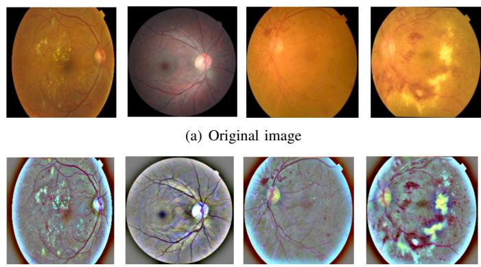
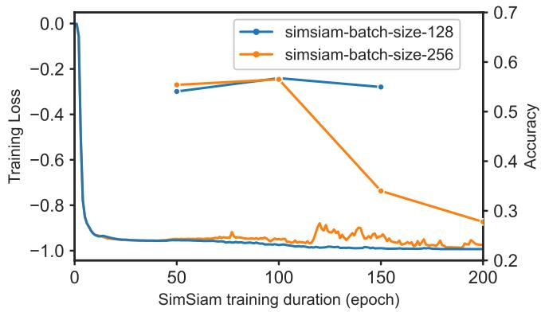
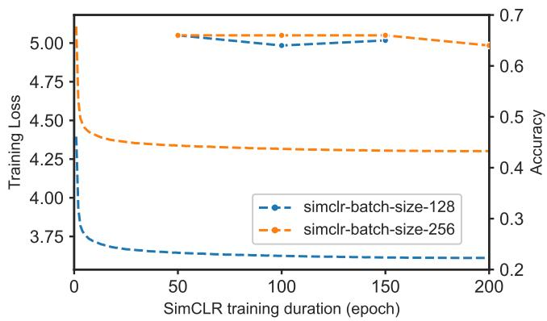
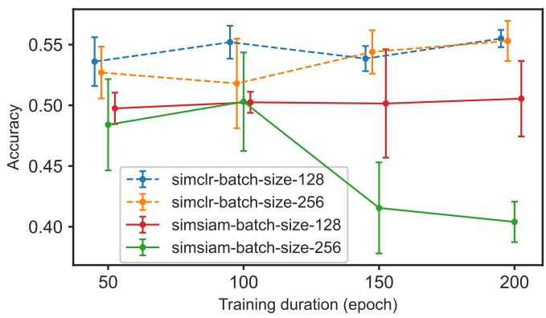
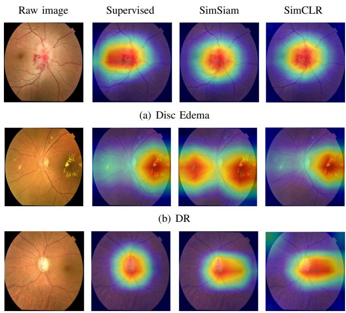

# Domain-Specific Self-Supervised Representation Learning for Retinal Fundus Classification

Bekzat Nurlanbekova∗ and Fung Fung Ting†

∗ † School of Information Technology

Monash University Malaysia, Malaysia

† Corresponding author. Email: ting.fung@monash.edu

Abstract—Despite the growing number of public datasets, annotated medical images remain scarce. Supervised learning methods achieve strong performance on many benchmarks, however require large amounts of labeled data, which are costly and timeconsuming to obtain in the medical domain. To address this limitation, contrastive self-supervised learning (SSL) has emerged as a promising alternative for learning useful representations from unlabeled data. In this work, we investigate two SSL frameworks, SimSiam and SimCLR, for retinal disease classification from fundus images. We focus on understanding how augmentationg strategies and training parameters influence representation learn-u ing under resource-constrained settings. Given limited data and computational capacity, we explore the feasibility of training SSL models with small batch sizes incorporated with retinal-specific7 augmentation techniques. Through a series of experiments, we assess the quality of learned representations via linear evaluation and fine-tuning across downstream tasks, including multi-disease] classification and diabetic retinopathy grading. Our results showV that tailoring augmentation strategies to the characteristics of retinal images plays a critical role in improving performance. Even under constrained settings, lightweight SSL frameworkss can learn transferable representations that reduce dependencec on large annotated datasets and achieve competitive results.

## I. INTRODUCTION

Supervised learning with Convolutional Neural Network6   
(CNN) architectures has achieved strong performance in image8   
classification, object detection and segmentation tasks [1].6   
These methods have been widely applied across various do-6 mains, including document analysis, retail, robotics, and satel-.   
lite imagery interpretation. In the medical field, CNNs are used8 to detect pathologies such as pneumonia, brain tumors, and eye diseases through the analysis of imaging modalities like MRI, X-ray, and CT scans [2]. However, supervised learning relies:   
on large labeled datasets, which remain a major challengei   
in the medical domain. Data annotation is a costly, time-X   
consuming manual process that requires specialized medicalr expertise.

One approach to mitigate the scarcity of labeled medical image data is transfer learning, which has demonstrated strong performance in several medical image analysis tasks. In this setting, models are first pre-trained on large-scale natural image datasets and then fine-tuned on smaller medical datasets. However, this approach has notable limitations [3]. A key issue is the domain gap, as the visual characteristics and semantic structures of medical images differ significantly from those of natural images. As a result, the learned representations may not transfer effectively to medical tasks. Another approach to address the scarcity of annotated medical datasets is selfsupervised learning. In this paradigm, models are trained to learn robust and discriminative image representations from unlabeled data, which can then be transferred to downstream tasks [4, 5].

Following advances in medical domain, retinal fundus images analysis has received increasing attention. Fundus images are captured using specialized cameras and provide detailed views of the back of the eye, including the retinal vasculature, macula, and optic nerve. These images are widely used for screening and diagnosis of conditions such as retinal vascular diseases, retinal detachment, diabetic retinopathy (DR), glaucoma, and other ocular pathologies. A recent meta-analysis reported that 22.27% of individuals with diabetes worldwide are affected by some form of DR. In 2020, approximately 103.1 million people were estimated to have DR, with potentially increase up to 160.5 million by 2045 [6]. In addition, glaucoma and age-related macular degeneration (AMD) remain leading causes of vision loss globally. Despite growing number of public datasets, the availability of large-scale, well-annotated retinal image datasets remains limited. In this context, selfsupervised learning offers a practical alternative by leveraging abundant unlabeled data to learn meaningful representations.

In this work, we investigate the efficacy of contrastive and non-contrastive self-supervised learning for retinal disease classification using fundus images. We pretrain two representative frameworks, SimSiam and SimCLR, under conditions of limited labeled data and strict resource constraints. SimCLR is traditionally optimized using large batch sizes to leverage extensive negative sampling [7]. However, its potential within restricted training configurations remains under-explored in the medical domain. This research investigates whether domainspecific augmentation strategies can enhance SimCLRs performance in small-batch scenarios. We contrast this with Sim-Siam, a framework designed for computational efficiency that achieves robust representation learning without the necessity of negative pairs or large batches.

The proposed research is guided by three core objectives:

1. Comparative Analysis: We evaluate SimSiam and Sim-CLR across various training configurations to determine which framework maintains higher representation quality when computational resources (memory and time) are restricted.

2. Domain-Specific Augmentation: We examine whether integrating Graham’s retina-specific preprocessing into the augmentation pipeline can mitigate the performance loss typically observed in short-duration pretraining compared to standard augmentations.

3. Generalization of Lightweight Models: We investigate the extent to which a lightweight SSL framework can learn robust representations that generalize effectively across diverse downstream retinal disease classification tasks.

To address these objectives, we employ a three-stage experimental pipeline: self-supervised pretraining on unlabeled fundus images, linear evaluation using a frozen backbone to assess representation quality, and full fine-tuning on labeled data to measure downstream clinical utility.

## II. RELATED WORK

In recent years, a significant amount of research has focused on self-supervised learning (SSL). Among these approaches, contrastive learning has attracted significant attention due to its ability to reduce the performance gap between supervised and unsupervised methods. SimCLR [7] has demonstrated strong performance in a range of medical imaging tasks, including histopathology, dermatology and chest X-ray classification [8, 9]. SimSiam [10] has also shown promising results in medical imaging applications. It has been applied to tasks such as liver cancer diagnosis from CT scans [11], as well as histopathology and chest X-ray analysis [12, 13]. Despite its computational efficiency and competitive performance, SimSiam remains less extensively studied in the medical domain compared to contrastive methods such as SimCLR.

Supervised learning models, often pretrained on natural image datasets, have achieved strong performance on benchmarks such as APTOS, EyePACS, and Messidor. However, their generalization ability remains limited. Bhulakshmi et al. [14] showed that while these models perform well on individual datasets, their performance degrades when evaluated across datasets that differ in acquisition conditions, such as variations in fundus cameras, illumination, and image quality.

In contrastive learning, positive pairs are generated by applying different augmentation strategies to the same input image. As a result, the effectiveness of self-supervised contrastive learning is highly dependent on the design of these augmentations. Stacke et al. [15] investigated the impact of augmentation strategies on SimCLR using histopathology data and concluded that optimal augmentations are highly dataset- and task-specific, with no universally effective configuration. In the context of retinal imaging, many studies [16–18] demonstrated that preprocessing techniques such as min-pooling (Grahams preprocessing) and contrast-limited adaptive histogram equalization (CLAHE) can improve the performance of supervised classification models. However, most existing studies focus primarily on supervised classification, with limited investigation into how such preprocessing strategies influence representation learning in contrastive frameworks or extend to multi-disease classification settings. As a result, their impact on learned feature quality and cross-task generalization remains insufficiently explored. In this work, we adopt a domain-informed approach by incorporating Ben Grahams preprocessing method into the augmentation pipeline to enhance and preserve clinically relevant retinal structures during representation learning.

## III. METHODOLOGY

This section describes the datasets, training setup, data augmentation strategies, and evaluation protocol.

## A. Self-Supervised learning framworks

In SimCLR feature representations are learned by distinguishing positive and negative sample pairs. Positive pairs are correlated views of same input image, constructed by applying random image augmentations. Therefore, they share the underlying structural information of the same object, but differ in viewpoint, lightening conditions, or partial occlusion. All other augmented images within the same mini-batch are considered as negative pairs. The goal is to maximize the underlying structural information of positive pairs while minimizing the similarity to negative pairs in the embedding space. To archive this, SimCLR adopted the normalized temperaturescaled cross-entropy (NT-Xent) loss. NT-Xent loss is defined as:

$$
\ell ( i , j ) = - \log \frac { \exp { ( \sin ( \mathbf { z } i , \mathbf { z } j ) / \tau ) } } { \sum _ { k = 1 } ^ { 2 N } 1 _ { [ k \neq i ] } \exp { ( \sin ( \mathbf { z } _ { i } , \mathbf { z } _ { k } ) / \tau ) } }\tag{1}
$$

Given a batch of N images, each image is augmented twice to form 2N samples, the loss is computed over positive pairs while contrasting them against 2N - 2 negatives. Here, 2N denotes the total number of augmented samples, τ is the temperature parameter controlling concentration of the distribution, and $z _ { i } , z _ { j }$ are L2-normalized projection vectors.

SimSiam [10] demonstrated that strong representations can be learned without large batch sizes or negative sampling. In this approach similar to SimCLR, two augmented views of the same image are processed by a shared encoder. However, instead of contrasting against negatives, SimSiam introduces architectural asymmetry: a predictor network is applied to one branch, while a stop-gradient operation is applied to the other. The training objective maximizes the cosine similarity between the predictor output of one view and the stop-gradient representation of the paired view. This design prevents collapse without requiring negative samples, which distinguishes Sim-Siam from traditional contrastive methods.

## B. Data Augmentation Strategy

In retinal images, different diseases exhibit distinct visual patterns. For example, age-related macular degeneration (AMD) is identified by drusenyellowish deposits in the macular region. Diabetic retinopathy (DR) shows signs of by microaneurysms, which appear as small red dots caused by leaking capillaries. In contrast, an increased cup-to-disc ratio in the optic disc is a key indicator of glaucoma. These disease-specific characteristics suggest that conventional data augmentation methods alone may not be well-suited for retinal images. For instance, excessive color jittering, strong noise injection, or aggressive blurring can obscure subtle yet clinically important features, and random cropping may remove critical regions of interest. This highlights the need for domainspecific augmentation strategies that preserve diagnostically relevant structures for representation learning. In this work we incorporate Graham’s prepossessing method into SimSiam and SimCLR pretraining pipeline.

  
(b) Graham’s preprocessing  
Fig. 1. Graham’s preprocessing applied to raw fundus images to improve the clarity of lesion areas and blood vessels.

Graham’s preprocessing is an image pre-processing technique introduced by Ben Graham during the Kaggle Diabetic Retinopathy Detection competition [18]. This method removes uneven background illumination by subtracting a Gaussiansmoothed version of the image from the original, which removes low-frequency lighting variations. The image is then rescaled and shifted by a constant value γ to stabilize intensity levels. The operation improves blood vessels and lesion regions and reduces illumination variations across images. Figure 1 illustrates the application of Grahams preprocessing method to various retinal disease images from a fundus dataset.

## C. Datasets and Evaluation Metrics

Three publicly available retinal fundus image datasets were used in this study.

Fundus Images for Self-Supervised Learning (FISSL) [19] is used for SSL pretraining. It consists of approximately 48K unlabeled fundus images resized to 224Œ224 pixels. The dataset is compiled from four publicly available sources: RFMID, ODIR, EyePACS, and APTOS. A large portion of the FISSL dataset is derived from diabetic retinopathy datasets, with approximately 35K images from EyePACS and 6K images from APTOS. Furthermore, 3200 images from RFID comprise 46 disease categories, and 5000 images from ODIR include diabetic retinopathy, glaucoma, and cataract.

Eye Disease Image Dataset (EDID) [20] consists of 5335 color fundus photographs for multi-label classification. The original images (2004Œ1690 pixels) are resized to 224Œ224 using Lanczos resampling to preserve image quality. The dataset is split into training, validation, and test sets with a ratio of 70%, 10%, and 20%, respectively. A stratified split (Scikit-learn) is applied to maintain label distribution across all subsets. EDID is highly imbalanced. Classes such as diabetic retinopathy, glaucoma, and healthy contain over 1,000 samples each. Macular scar and myopia include approximately 400500 samples, while CSCR, disc edema, retinal detachment, and retinitis pigmentosa each have around 100 samples.

RetinaMNIST [21] is part of the MedMNIST v2 benchmark, a standardized collection of medical imaging datasets. It consists of 1,600 fundus images resized to 224Œ224 pixels and annotated into five stages of diabetic retinopathy, ranging from no disease to proliferative diabetic retinopathy. The dataset is split into 1080 training, 120 validation, and 400 test samples.

Evaluation metrics used in downstream classification tasks are accuracy, macro F1-score and additional quadratic weighted kappa is used for RetinaMNIST. The F1-score captures the trade-off between precision and recall and is well suited for medical datasets, as it penalizes both false positives and false negatives. Quadratic weighted kappa is appropriate for RetinaMNIST, as the labels represent ordered disease severity levels. The formulas for all metrics are given below:

$$
\operatorname { A c c } = { \frac { 1 } { C } } \sum _ { i = 1 } ^ { C } { \frac { T P _ { i } } { T P _ { i } + F N _ { i } } }\tag{2}
$$

where C is the number of classes, and $T P _ { i }$ $F N _ { i }$ are true positives and false negatives for class i.

$$
\mathrm { F 1 } = \frac { \mathrm { 2 } \cdot \mathrm { P r e c i s i o n } \cdot \mathrm { R e c a l l } } { \mathrm { P r e c i s i o n } + \mathrm { R e c a l l } }\tag{3}
$$

$$
Q W K = 1 - \frac { \sum _ { i , j } w _ { i j } O _ { i j } } { \sum _ { i , j } w _ { i j } E _ { i j } }\tag{4}
$$

where $O _ { i j }$ is the observed agreement matrix, $E _ { i j }$ is the expected agreement by chance, and $\begin{array} { r } { { w _ { i j } } \ = \ \frac { ( i - j ) ^ { 2 } } { ( C - 1 ) ^ { 2 } } } \end{array}$ is the quadratic weight.

QWK ranges from -1 to 1, accuracy and F1-score range from 0 to 1. In all cases, higher values indicate better performance.

## D. Training Setup

A ResNet-18 backbone [22] is used for all experiments. Both SimSiam and SimCLR are trained for 200 epochs, with a 10- epoch linear warm-up. Model checkpoints are saved every 50 epochs. For SimSiam, SGD with momentum 0.9 and weight decay 1e-4 is used. The projection MLP consists of three layers, and the prediction MLP consists of two layers. The output dimension of both heads is set to 2048, following [10]. The learning rate is scaled according to batch size as $\operatorname { l r } = 0 . 0 5$ \* batchSize/256, and a cosine annealing schedule is applied. For SimCLR, the LARS optimizer is used with momentum 0.9 and weight decay 1e-6. The learning rate follows formula lr = 0.3\*batch size/256 [7]. The NT-Xent loss temperature parameter is set to $\tau = 0 . 5$ . To evaluate the effect of batch size, both methods are trained with batch sizes of 128 and 256.

Supervised training is performed over five random seeds, and the mean performance across seeds is reported. A classbalanced weighted sampler is used to mitigate label imbalance. The linear classifier is trained for 100 epochs with a batch size of 32 and an initial learning rate of 0.0125 with cosine annealing learning rate scheduler. During linear probe training, the backbone remains frozen and only the final fully connected (FC) layer is optimized. SGD with momentum 0.9 and zero weight decay is used. Finetuning of SimSiam and SimCLR is performed using an initial learning rate of 0.001, with a cosine annealing scheduler and a linear warmup over the first 5 epochs. The models are optimized using SGD with a momentum of 0.9 and a weight decay of 1e-4. Training is conducted for up to 50 epochs, with early stopping applied to prevent overfitting.

For visualization of class-discriminative regions, Grad-CAM++ was employed. The method generates localization maps by utilizing the gradients of the target class with respect to feature maps in the final convolutional layer. Activation maps were extracted from layer 4 of a ResNet-18 backbone. Input retinal images were resized to 224 224 pixels and normalized to the range [0, 1] prior to inference.

All experiments were conducted on NVIDIA T4 and NVIDIA A40 GPUs.

## IV. RESULTS AND DISCUSSION

In this section, we examine how a negative-pair-free method such as SimSiam compares to the contrastive SimCLR framework when applied to fundus photography, and how training strategies such as augmentation design and training duration affect downstream performance.

## A. Effect of training duration and batch size

The effect of training duration and batch size was evaluated for SSL models under standard augmentations. Overall, SimSiam shows higher sensitivity to training configuration (batch size and training duration) compared to SimCLR. As shown in Fig. 2, a continuous decrease in training loss does not necessarily translate into improved downstream accuracy. Pretraining beyond early convergence provides limited benefit, even for small batch sizes. A similar trend has been reported for SimCLR on histology data [15]. Linear evaluation results in Fig. 3 further demonstrate that performance saturates or declines at later training stages. This effect is especially pronounced for SimSiam with a batch size of 256, where accuracy declines after 100 epochs on both EDID and RetinaMNIST datasets. In contrast, SimCLR remains stable across both batch sizes and training durations. In SimSiam, the discrepancy between training loss and downstream performance suggests that the learned representations may lose diversity over time under certain configurations. With standard augmentations, SimSiam may struggle to construct sufficiently informative positive pairs for retinal images.

## B. Effect of augmentation strategies

We evaluated three augmentation strategies for positive view generation in SSL training. The standard setup includes random horizontal flip, rotation (s15 ´ ˇr), random resized crop (scale 0.21.0), color jitter, and Gaussian blur. Next, random grayscale was added on top of the standard augmentation. Further, we enhanced models by incorporating domain-specific

TABLE I  
LINEAR EVALUATION ON THE EDID AND RETINAMNIST DATASETS. SIMSIAM AND SIMCLR ARE PRE-TRAINED FOR 50 EPOCHS WITH A BATCH SIZE OF 256, USING GRAYSCALE AND BEN GRAHAM’S PREPROCESSING IN ADDITION TO STANDARD AUGMENTATION.
<table><tr><td>SimSiam</td><td colspan="2">EDID</td><td colspan="2">RetinaMNIST</td></tr><tr><td></td><td>Acc(%)</td><td>F1-macro(%)</td><td>Acc(%)</td><td>QWK(%)</td></tr><tr><td>Standard</td><td>55.40</td><td>47.18</td><td>48.40</td><td>58.05</td></tr><tr><td>+ Grayscale</td><td>65.70</td><td>59.39</td><td>56.60</td><td>65.07</td></tr><tr><td>+ Grayscale, Graham&#x27;s</td><td>65.73</td><td>59.89</td><td>53.95</td><td>71.02</td></tr></table>

<table><tr><td>Standard</td><td>66.13</td><td>58.78</td><td>52.70</td><td>62.80</td></tr><tr><td>+ Grayscale</td><td>64.53</td><td>59.39</td><td>47.25</td><td>63.00</td></tr><tr><td>+ Grayscale, Graham&#x27;s</td><td>67.11</td><td>61.55</td><td>52.95</td><td>65.94</td></tr></table>

Grahams preprocessing. The comparison of the linear evaluation results is reported in Table I. Augmentation has a clear impact on representation quality. For SimCLR, the combination of grayscale and Grahams preprocessing consistently improves performance. Incorporating Grahams preprocessing with grayscale (domain-specific augmentation) leads to substantial improvements for SimSiam across both datasets.

## C. Downstream performance

The downstream performance of models pretrained with domain-specific augmentations was evaluated via fine-tuning. Results are summarized in Table II, where the "Supervised" baseline refers to a ResNet-18 architecture initialized with ImageNet weights. On the RetinaMNIST dataset, SimSiam outperforms the supervised baseline in both accuracy (62.08%) and Quadratic Weighted Kappa (QWK) (76.06%). SimCLR also yields competitive results compared to the supervised baseline in terms of QWK, though it achieves slightly lower raw accuracy. In contrast, the models show more localized improvements on the EDID dataset. SimSiam achieves a marginal lead in accuracy over the supervised baseline. SimCLR exhibits a more noticeable performance degradation on this dataset. The variance in performance across these datasets can be attributed to their specific pathological characteristics. RetinaMNIST primarily focuses on Diabetic Retinopathy, where patterns such as microaneurysms, hemorrhages, and exudates are the primary diagnostic indicators. Ben Grahams preprocessing significantly enhances the visibility of these lesions and the retinal vasculature, directly benefiting the self-supervised learning of DRrelevant features. Conversely, the EDID dataset encompasses a broader spectrum of eye diseases with highly diverse visual cues. For instance, glaucoma detection relies heavily on the structural integrity of the optic disc, typically assessed through the cup-to-disc ratio or the neuroretinal rim area. The aggressive local contrast enhancement of Graham’s preprocessing, combined with grayscale transformations, may suppress these specific structural details and reduce the effectiveness of the learned representations for disc-centric pathologies. The Grad-CAM visualizations in Figure 4 illustrates SimSiam and SimCLR effectively highlighting pathology-related regions in disc edema and DR. In the glaucoma case, the models’ focus appears to drift toward the macula and fovea rather than remaining concentrated on the optic disc.

  
Fig. 2. The relationship between SSL training loss and downstream linear evaluation accuracy on the EDID dataset for SimSiam and SimCLR trained with standard augmentation under different batch sizes.

  
Fig. 3. Linear evaluation accuracy on the RetinaMNIST dataset at different pretraining epochs (50, 100, 150, 200) for SimCLR and SimSiam trained with standard augmentation, with batch sizes 128 and 256. Error bars indicate standard deviation across runs.

To further investigate the impact of domain-specific augmentations on diverse pathologies, a subset analysis was conducted on the EDID dataset by excluding glaucoma cases. As shown in Table II, removing glaucoma led to a significant performance increase across all models. Specifically, SimSiam performance rose from 75.88% to 88.75%, and SimCLR increased from 73.81% to 87.49%. A class-specific analysis of Diabetic Retinopathy (DR) reveals the distinct advantages of self-supervised representations learned via domain-specific augmentation. As shown in Table III, SimCLR and SimSiam achieved sensitivities of 93.38% and 92.05%, respectively, outperforming the supervised baseline of 88.74%. This suggests that integrating Ben Grahams preprocessing into the SSL augmentation pipeline is highly effective for capturing fine-grained pathological features. While prior studies have established the utility of Grahams preprocessing in supervised learning contexts, these results demonstrate its robust transferability to self-supervised frameworks, particularly for lesion-based identification tasks.

  
(c) Glaucoma  
Fig. 4. Comparison of Grad-CAM visualizations for optic disc edema, diabetic retinopathy, and glaucoma using raw images, ImageNet-supervised, SimSiam and SimCLR domain-specific models.

## D. Discussion

The effectiveness of self-supervised pretraining is heavily contingent on the alignment between the augmentation strategy and dataset-specific pathological biomarkers. While domain-specific augmentations enhance features relevant to certain tasks, they may introduce bias in more heterogeneous settings. Both SimSiam and SimCLR benefited from retinaspecific pretraining. The integration of Grahams preprocessing was particularly effective for identifying pathologies sharing similar regions of interest, such as vascular structures and lesion contrast. However, this preprocessing may suppress specific pathological biomarkers or introduce bias against non-vascular diseases like glaucoma. Future research should investigate composite augmentation strategies tailored to di-

TABLE II  
FINE-TUNING PERFORMANCE OF SIMSIAM AND SIMCLR PRETRAINED WITH DOMAIN-SPECIFIC AUGMENTATION, COMPARED TO A SUPERVISED BASELINE. EVALUATION IS REPORTED ON THE RETINAMNIST AND EDID DATASETS.
<table><tr><td colspan="3">EDID</td><td colspan="2">EDID (excl. Glaucoma)</td><td colspan="2">RetinaMNIST</td></tr><tr><td>Method</td><td> $\overline { { \mathrm { A c c } ( \% ) } }$ </td><td> $\overline { { { \mathrm { F 1 - m a c r o } } ( \% ) } }$ </td><td>Acc(%)</td><td> $\overline { { { \mathrm { F 1 - m a c r o } } ( \% ) } }$ </td><td> $\overline { { \mathrm { A c c } ( \% ) } }$ </td><td>QWK(%)</td></tr><tr><td>ImageNet Supervised</td><td> $\overline { { 7 5 . 7 5 \mathrm { ~ s ~ } 0 . 3 8 } }$ </td><td> $\overline { { 7 5 . 8 \mathrm { ~ s ~ } 0 . 4 0 } }$ </td><td> $\overline { { 8 7 . 4 0 \mathrm { ~ s ~ } 0 . 3 6 } }$ </td><td> $\overline { { 8 3 . 2 9 \mathrm { ~ s ~ } 0 . 5 3 } }$ </td><td> $\overline { { 6 0 . 0 8 \mathrm { ~ s ~ } 1 . 0 6 } }$ </td><td> $\overline { { 7 2 . 2 7 \mathrm { ~ s ~ } 1 . 3 7 } }$ </td></tr><tr><td>SimSiam domain-specific</td><td> $7 5 . 8 8 \mathrm { ~ \AA ~ } 0 . 9 2$ </td><td> $7 5 . 1 5 \mathrm { ~ s ~ } 0 . 6 2$ </td><td> $\mathbf { 8 8 . 7 5 \ : 5 \ : 0 . 3 6 }$ </td><td> $\mathbf { 8 5 . 0 2 \ acute { s } 0 . 3 5 }$ </td><td> $\mathbf { 6 2 . 0 8 \ : \overset { < } { s } 0 . 9 4 }$ </td><td> ${ 7 6 . 0 6 \ \mathrm { ~ s ~ } 1 . 2 8 }$ </td></tr><tr><td>SimCLR domain-specific</td><td> $7 3 . 8 1 \mathrm { ~ \AA ~ } 0 . 9$ </td><td> $7 2 . 4 8 \textrm { s } 0 . 7 6$ </td><td> $8 7 . 4 9 \textrm { \AA } 0 . 3 7$ </td><td> $8 2 . 7 3 \mathrm { ~ s ~ } 0 . 3 0$ </td><td> $5 7 . 4 2 \textrm { s } 1 . 4 8 $ </td><td> $7 4 . 0 1 \textrm { s } 0 . 5 4$ </td></tr></table>

TABLE III

DR IDENTIFICATION RATE (SENSITIVITY, %) ON EDID SUBSET (EXCL. GLAUCOMA)

<table><tr><td>Method</td><td>ImageNet Supervised</td><td>SimSiam</td><td>SimCLR</td></tr><tr><td>Sensitivity</td><td>88.74</td><td>92.05</td><td>93.38</td></tr></table>

verse pathological features. For example, combining Grahams method for DR with filters optimized for glaucomatous nerve changes. Although SimCLR demonstrated competitive downstream performance, the current study employed relatively constrained training settings due to computational limitations. Future work should investigate the effect of larger batch sizes and hyperparameter tuning on SimCLR, with the focus on the temperature parameter in the NT-Xent loss.

## REFERENCES

[1] Y. LeCun, Y. Bengio, and G. Hinton, “Deep learning,” Nature, vol. 521, no. 7553, pp. 436–444, May 28, 2015.

[2] C. Chen, N. A. Mat Isa, and X. Liu, “A review of convolutional neural network based methods for medical image classification,” Computers in Biology and Medicine, vol. 185, p. 109 507, Feb. 2025.

[3] M. Raghu, C. Zhang, J. Kleinberg, and S. Bengio, “Transfusion: Understanding transfer learning for medical imaging,” in Advances in neural information processing systems, H. Wallach, H. Larochelle, A. Beygelzimer, F. dAlché-Buc, E. Fox, and R. Garnett, Eds., vol. 32, Curran Associates, Inc., 2019.

[4] A. Newell and J. Deng, “How useful is self-supervised pretraining for visual tasks?” In 2020 IEEE/CVF Conference on Computer Vision and Pattern Recognition (CVPR), Seattle, WA, USA: IEEE, Jun. 2020, pp. 7343–7352.

[5] W.-C. Wang, E. Ahn, D. Feng, and J. Kim, “A review of predictive and contrastive self-supervised learning for medical images,” Machine Intelligence Research, vol. 20, no. 4, pp. 483–513, Aug. 2023.

[6] Z. L. Teo et al., “Global prevalence of diabetic retinopathy and projection of burden through 2045: Systematic review and metaanalysis,” Ophthalmology, vol. 128, no. 11, pp. 1580–1591, Nov. 1, 2021.

[7] T. Chen, S. Kornblith, M. Norouzi, and G. Hinton, A simple frameworkfor contrastive learning ofvisual representations, Jul. 1, 2020.

[8] S. Azizi et al., “Big self-supervised models advance medical image classification,” in 2021 IEEE/CVF International Conference on Computer Vision (ICCV), Montreal, QC, Canada: IEEE, Oct. 2021, pp. 3458–3468.

[9] O. Ciga, T. Xu, and A. L. Martel, “Self supervised contrastive learning for digital histopathology,” Machine Learning with Applications, vol. 7, p. 100 198, Mar. 2022.

[10] X. Chen and K. He, “Exploring simple siamese representation learning,” in Proceedings ofthe IEEE/CVF conference on computer vision and pattern recognition (CVPR), Jun. 2021, pp. 15 750– 15 758.

[11] R. Mojtahedi, M. Hamghalam, W. R. Jarnagin, R. K. G. Do, and A. L. Simpson, “Leveraging contrastive learning with SimSiam for the classification of primary and secondary liver cancers,” in Medical Image Computing and Computer Assisted Intervention MICCAI 2023 Workshops, J. Woo et al., Eds., vol. 14394, Series Title: Lecture Notes in Computer Science, Cham: Springer Nature Switzerland, 2023, pp. 311–321.

[12] B. Voigt, O. Fischer, B. Schilling, C. Krumnow, and C. Herta, “Investigation of semi- and self-supervised learning methods in the histopathological domain,” Journal of Pathology Informatics, vol. 14, p. 100 305, 2023.

[13] Z. Huang, R. Jiang, S. Aeron, and M. C. Hughes, “Systematic comparison of semi-supervised and self-supervised learning for medical image classification,” in Proceedings of the IEEE/CVF conference on computer vision and pattern recognition, 2024, pp. 22 282–22 293.

[14] D. Bhulakshmi and D. S. Rajput, “A systematic review on diabetic retinopathy detection and classification based on deep learning techniques using fundus images,” PeerJ Computer Science, vol. 10, e1947, Apr. 29, 2024.

[15] K. Stacke, J. Unger, C. Lundström, and G. Eilertsen, Learning representations with contrastive self-supervised learning for histopathology applications, Aug. 16, 2022.

[16] P. Macsik, J. Pavlovicova, S. Kajan, J. Goga, and V. Kurilova, “Image preprocessingbased ensemble deep learning classification of diabetic retinopathy,” IET Image Processing, vol. 18, no. 3, pp. 807–828, Feb. 2024.

[17] S. H. Kassani, P. H. Kassani, R. Khazaeinezhad, M. J. Wesolowski, K. A. Schneider, and R. Deters, “Diabetic retinopathy classification using a modified xception architecture,” in 2019 IEEE International Symposium on Signal Processing and Information Technology (IS-SPIT), Ajman, United Arab Emirates: IEEE, Dec. 2019, pp. 1–6.

[18] “EyePACS: Diabetic retinopathy detection - kaggle. ”[Online]. Available: https://kaggle.com/competitions/diabetic- retinopathydetection

[19] “Datasets at hugging face,” Mar. 26, 2026.

[20] S. Sharmin, M. R. Rashid, T. Khatun, M. Z. Hasan, M. S. Uddin, and Marzia, “A dataset of color fundus images for the detection and classification of eye diseases,” Data in Brief, vol. 57, p. 110 979, Dec. 2024.

[21] J. Yang et al., “MedMNIST v2 - a large-scale lightweight benchmark for 2d and 3d biomedical image classification,” Scientific Data, vol. 10, no. 1, p. 41, Jan. 19, 2023.

[22] K. He, X. Zhang, S. Ren, and J. Sun, Deep residual learning for image recognition, Version Number: 1, 2015.