# EQUAL RANKING QUALITY, DIFFERENT DECISIONS: TRAINING ORDER-CONSISTENT LLM SCORERS

Markus Frohmann1,2 Mahdiyar Alavi1 Elizabeth Lingg1 Navid Rekabsaz1∗

1Thomson Reuters Labs 2University of Toronto, Vector Institute

Correspondence: markus.frohmann@mail.utoronto.ca

{mahdiyar.alavi, elizabeth.lingg, navid.rekabsaz}@thomsonreuters.com

## ABSTRACT

Rerankers, reward models and multi-document QA scorers score candidate documents or responses in one LLM prompt, so each score depends on their order. Such scorers are selected on ranking quality, but their scores determine a decision: what a score threshold retains, a reader answers, or a preference model selects. However, equal ranking quality does not imply equal decisions: on passage reranking, five trained scorers within 0.010 nDCG@10 retain sets that overlap by only 0.66–0.84 when reordered. A published reranker takes the highest retained-set F1 in our comparison and still overlaps by only 0.667. No prompt-time change we test removes that order dependence: the only one that gains ranking quality leaves all three decisions unchanged. Order-consistency SFT (OC-SFT) attenuates it in the weights, training a candidate’s score not to depend on the order. It holds ranking quality and leads every decision-stability measure among trained scorers on all three tasks: it flips the reader’s answer on 0.125 of permutation pairs against 0.149–0.164 for three other objectives that target order. It is more stable than order-averaged distillation on 12 base models, and one OC-SFT permutation retains sets that overlap more than ten averaged off-the-shelf permutations. A comparison should therefore report what a threshold retains and a reader answers, not ranking quality alone. Code is available at github.com/thomsonreuters/presentation-dependence.

## 1 INTRODUCTION

A language model that scores candidate documents or responses is rarely the last component of the system it serves. A threshold admits documents above a cutoff into a review queue or generation context, a reader answers from the highest-scoring few, and a preference model’s scores determine a response pair for training (Cui et al., 2024). These three consumers act on the scores, so the output is a decision rather than a ranking, and the same query over the same candidates should yield the same decision. Such scorers are selected on ranking quality, and two that match on it can still differ at all three.

Such a scorer must choose how many candidates share a prompt, and the standard designs each forgo either the per-candidate score or the shared context. Pointwise cross-encoders return a percandidate value that a threshold can consume, but score one candidate per forward pass (monoT5, Nogueira et al., 2020; RankLLaMA, Ma et al., 2024). Generative listwise rerankers condition on several candidates jointly, but emit a ranked list and no per-candidate score (RankGPT, Sun et al., 2023; RankZephyr, Pradeep et al., 2023a). Batched pointwise scoring, which we study, retains both (Korikov et al., 2025), and its shared prompt also lowers per-query latency, since the instruction, query and grading rubric are encoded once per call rather than once per candidate.

Because the candidates occupy a shared prompt, the score assigned to one is conditioned on the entire prompt rather than on that candidate alone. We term this presentation dependence. Language models (LMs) also attend unevenly across long inputs (Liu et al., 2024), which induces sensitivity to candidate order wherever candidates are scored jointly (Zeng et al., 2025; Hou et al., 2024). Off the shelf, the order decides whether a preference model’s top choice is right on 65.4% of queries across ten random permutations, so it also decides which response becomes a training label (App. D.6). However, order is not the only such property: with order held fixed, a candidate’s score still varies with which other candidates share its prompt and with how the prompt is worded (§3).

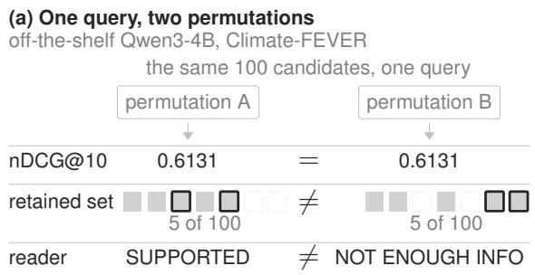

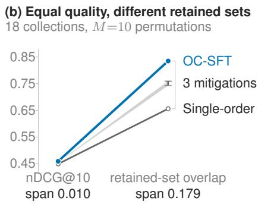  
Figure 1: The same candidates reordered give the same nDCG@10 but a different decision. (a) Each chip is one document, in the same position in both rows rather than by rank: solid where retained, dotted where not, outlined where they disagree. (b) Five trained scorers; values in Table 1.

None of the prompt-construction changes we test removes this dependence on order, and the established remedy is to score the same pool under several permutations and average (Korikov et al., 2025), which multiplies the serving cost by the number of permutations. Nor can the order be fixed once: pools shift as the index changes, and the order the first stage returns is not the one that scores best (App. C.1). Order stability is already reported beside ranking quality for rerankers (Bito et al., 2026) and beside accuracy for LLM judges (Norman et al., 2026), but its effect on the decisions is not. Reordering leaves both the query and the candidate set unchanged, yet each of the three consumers above can produce a different output, and we measure how often they do. Figure 1 shows one query where they do, and that ranking quality does not register it.

The question is whether training can remove what prompt construction cannot. Because a threshold consumes a per-candidate score, we fix how scores are read and vary only how the scorer is trained. Of the objectives we compare (§4), the one whose decisions change least is order-consistency supervised fine-tuning (OC-SFT), which penalizes the scorer’s own disagreement across permutations.

We evaluate on three tasks that score a candidate set in one prompt. Passage reranking is the primary setting across 18 collections and 12 bases in three families. Multi-document question answering (QA) and response ranking test whether the dependence is a property of the shared prompt or of reranking alone (§5). What the shared context adds in quality differs by task and by collection: it helps on QA, not on passage relevance, and on some response-ranking collections (§6.4).

## We make the following contributions:

1. Measuring what the consumers decide rather than how the ranking moves, we find that equal ranking quality does not imply equal decisions. Five trained scorers within 0.010 nDCG@10 span 0.656–0.835 in retained-set overlap under reshuffling, so a comparison should report the decision it deploys, which a stability metric’s permutations already supply (§6.1).

2. Fixes applied before training do not improve the decisions. Round-robin partitioning gains 0.052 nDCG@10, while logit calibration improves neither quality nor retained-set overlap measurably. Neither fix reaches any of the three consumers, so we train the score not to depend on order (§6.2).

3. Training reaches the decisions at one permutation. OC-SFT holds ranking quality, makes all three consumers more reproducible than single-order distillation, and flips the reader’s answer on 0.125 of permutation pairs against 0.149–0.164 for three other objectives that target order (§6.3).

## 2 RELATED WORK

A candidate’s score in a shared prompt depends on its position and on which other candidates accompany it. Long-context models attend unevenly across their input, which produces the U-shaped “lost in the middle” effect (Liu et al., 2024). Zeng et al. (2025) measured position sensitivity across retrieval collections and introduced the index we adapt to the rank level (§3). The composition of the prompt exerts a comparable effect, since a candidate’s estimated relevance shifts when the accompanying candidates change (Huang et al., 2026). Both channels are documented in reward models and LLM judges that score responses side by side (Malik et al., 2026; Frick et al., 2025; Liu et al., 2025). Swapping the order alone can flip a two-candidate verdict (Wang et al., 2024), and the flip rate tracks the quality gap between the two (Shi et al., 2025).

Two further channels originate in the construction of the prompt rather than in the candidate set. Partitioning a rank-sorted pool across several prompts renders scores from different prompts not directly comparable, which partitioned listwise reranking addresses by fusing or recalibrating across windows (Parry et al., 2024; Ren et al., 2025). Where scores are extracted from a fixed answer skeleton, its wording is a further design choice, and no position-bias measurement we know of controls for it (§6.2). Attempts to remove this dependence differ in which stage bears the cost.

Inference-time fixes require no training: batched self-consistency averages per-document scores over permutations (Korikov et al., 2025), extending permutation self-consistency (Tang et al., 2024; Wang et al., 2023) and its pairwise form in judging (Wang et al., 2024). TourRank ensembles tournament groupings (Chen et al., 2025), and Huang et al. (2026) sample contexts adaptively. Stable-RAG decodes from the center of several retrieval orders downstream of the ranker (Zhang et al., 2026b), while CapCal (Lv et al., 2026) and CalibraEval (Li et al., 2025) calibrate instead. Resampling repeats its cost per query; calibration pays once, in the data that fits the correction. Trained fixes incur it once: DebiasFirst (Qiao et al., 2026) combines position-aware augmentation with inverse-propensity weighting, RankVicuna (Pradeep et al., 2023b) distills from shuffled orders, Brown & McIlroy (2025) fine-tune on the order-stripped inputs of McIlroy-Young et al. (2024), and Zheng et al. (2026) reward consistent decisions with reinforcement learning. The cost is supervision and one training run, and the outcome is attenuation, not a guarantee (Bito et al., 2026). Penalizing disagreement between views of the same input is a standard consistency-regularization device of semi-supervised learning (Tarvainen & Valpola, 2017; Liang et al., 2021), and Xiang et al. (2024) and Zhang et al. (2026a) apply it across permuted demonstrations and across prompt phrasings. Both stabilize a discrete answer choice, which no threshold consumes, whereas we stabilize a continuous per-document score at the cutoff a threshold applies to it, and we measure what that threshold then retains (§6.1). Architectural fixes remove the dependence by construction: SetRank (Pang et al., 2020) encodes the candidates as a set rather than prompting an LM, keeping the shared context, while LLM-side variants restrict cross-candidate attention to obtain order invariance in a single pass (Wang et al., 2025b; McIlroy-Young et al., 2024; Bito et al., 2026). The cost falls on the mechanism itself, since that restriction reduces the cross-candidate information the shared prompt was adopted to supply.

Outside these families, rerankers are trained for quality rather than for presentation dependence, on large hard-negative-mined corpora (Pradeep et al., 2023a; Wang et al., 2025a; Li et al., 2026), and reward models for response selection on large preference corpora (Liu et al., 2026; Jiang et al., 2023).

We attenuate the dependence in training, which leaves the serving pass at one permutation and the shared prompt unrestricted. Stability is reported beside accuracy for judges (Zheng et al., 2023; Shi et al., 2025; Norman et al., 2026) and beside ranking quality for reranking (Bito et al., 2026), in each case on the scorer’s own output. We measure it instead on what the consumers of that output produce, and as a change across permutations rather than a value under a single permutation (§6.1).

## 3 PRESENTATION DEPENDENCE AND HOW WE MEASURE IT

A scorer that reads several candidates in one prompt assigns each of them a score that depends on the rest of the set. We score a pool of candidates in windows of B per prompt, partitioning the pool where it exceeds B, and sort it by the resulting scores. In reranking, a first stage’s top 100 becomes five contiguous windows of B = 20, the window size of listwise rerankers (RankGPT, Sun et al., 2023; RankZephyr, Pradeep et al., 2023a). A candidate’s score depends on its window assignment, on which others share that window, and on its position among them (App. C.1). Reshuffling before partitioning moves all three, and with them the ranking1

Presentation channels. Four properties of the prompt can vary while the query and the candidate pool are held fixed: (i) the order in which candidates are presented, (ii) the rule partitioning that order into windows, (iii) the markers that label the slots, and (iv) the wording of the answer skeleton from which scores are extracted. We call one setting of all four a presentation, and a scorer’s sensitivity to it presentation dependence; pool composition is separate, since it changes the candidate set and lies outside the prompt’s control. Except where stated, we vary the order and hold the rest fixed. The partition rule (ii) is set when the prompt is built, so a different rule removes its cost. Where the pool fits one window, as for $\mathrm { Q A } .$ , nothing is partitioned. The markers (iii) and the skeleton (iv) are set at the same point and held fixed by default, since no skeleton setting is neutral; we vary each separately (§6.2; App. C.1). None of these removes the order channel (i), where the decisions vary.

Measuring order dependence. We measure the order channel with ${ \boldsymbol { \tau } } { \boldsymbol { - } } { \mathrm { P S I } } ,$ , adapting the index of Zeng et al. (2025) to the rank level: for each instance we score its candidate set under $M = 1 0$ random permutations and take the induced rankings $r _ { 1 } , \ldots , r _ { M }$ . We then average their pairwise Kendall correlation $\tau ( r _ { i } , r _ { j } )$

$$
\tau { \mathrm { - P S I } } = { \frac { 1 - { \mathrm { m e a n } } _ { i < j } \tau ( { r _ { i } , r _ { j } } ) } { 2 } } ,
$$

which is 0 when every order produces the same ranking, 0.5 when rankings are uncorrelated, and 1 when reversed. A permutation-invariant scorer treats its input as a set and attains $0 , \operatorname { s o } \tau \mathbf { - } \mathbf { P S I }$ is a distance from set-like behavior and lower is more stable. We randomly shuffle candidate order to model ordinary deployment variation, not a worst case; index-driven pool changes are evaluated separately $( \ S 6 . 3 ) \_ \tau { - } \bar { \mathrm { P S I } }$ is conditional on the partition rule, markers and skeleton. We hold all three constant, so a difference in $\tau { \mathrm { - } } \mathrm { P S I }$ is a difference between scorers.

Measuring what the consumers produce. For each consumer, we report output quality and how often the output changes, since a scorer could hold it fixed by making it worse. Throughout, change is the rate at which two permutations disagree, averaged over pairs, and independent of how many are drawn. $\tau { \mathrm { - } } \mathrm { P S I }$ is not a substitute for those measures: it measures movement in the ranking rather than in what a consumer produces, so the two need not rank scorers the same way (App. F).

Two separate quantities. We write the scorer output for a query and candidate set $x = ( q , D )$ , at width $B$ and under a candidate order $\pi ,$ aligned back to candidate identity, as

$$
f _ { B } ( x , \pi ) = \underbrace { \mu _ { B } ( x ) } _ { \mathrm { o r d e r - m a r g i n a l } } + \underbrace { \delta _ { B } ( x , \pi ) } _ { \mathrm { o r d e r } \mathrm { r e s i d u a l } } ,
$$

with $\mu _ { B } ( x ) = \mathbb { E } _ { \pi } [ f _ { B } ( x , \pi ) ]$ and $\mathbb { E } _ { \pi } [ \delta _ { B } ] = 0$ . The order-marginal is the score a permutationinvariant scorer at that width would emit. The residual is what remains, and it varies when only the input order changes; $\tau { \mathrm { - } } \mathrm { P S I }$ measures the residual through its effect on the ranking. Batched self-consistency (BSC) estimates the order-marginal by averaging a scorer’s output over permutations (Korikov et al., 2025). The objective of §4 reaches the same order-invariance at one permutation, by penalizing the residual’s empirical variance while leaving $\mu _ { B }$ unconstrained. Training should therefore reduce order instability before any serving-time averaging (§6.3).

Width and scope. We call $\mu _ { B } - \mu _ { 1 }$ the width $e f f e c t .$ , the difference between scoring a candidate at width B and scoring it in isolation. A pointwise scorer sets $B = 1$ , where the residual and the width effect are both zero by construction, so it avoids the order channel and forgoes an interaction whose sign varies by collection (App. E). The decomposition runs over permutations of a fixed candidate set, so replacing a candidate changes x rather than π and falls outside it. Whether an objective targeting $\delta _ { B }$ reaches that perturbation is measured in $\ S 6 . 3$

## 4 WHERE TO ADDRESS ORDER DEPENDENCE

§3 locates the order dependence in the residual $\delta _ { B }$ . Holding the readout and teacher fixed, we ask whether penalizing that residual changes what the consumers decide at a single serving permutation.

Score readout. A generic instruction-tuned chat model does not emit the per-candidate score that batched pointwise scoring requires, so we extract the score without generating any text. The prompt supplies a grading instruction, the query, and the B candidates that share the prompt, each tagged [i], and requests one integer grade in {0, 1, 2, 3} per candidate. Rather than sampling those grades, we append a fixed answer skeleton with a placeholder grade token per candidate, so every grade position is known in advance and no decoding temperature enters. One forward pass over the prompt and skeleton yields the model’s distribution over the four grade tokens at each position, renormalized over those four. We take the expected grade $\begin{array} { r } { E [ g ] = \sum _ { q } \overset { \smile } { g } { \cal P } ( g ) } \end{array}$ , normalized to [0, 1], as the score, chosen by comparing readouts on untrained bases. One prompt thus yields all B scores. Unlike a generated ranking, the readout cannot omit or repeat a candidate. The score is continuous and comparable across instances, so it admits a decision threshold, and the readout is unchanged at any width down to $B { = } 1$ We apply the same readout at B=10 for QA and $B { = } 4$ for response ranking training (App. B.1).

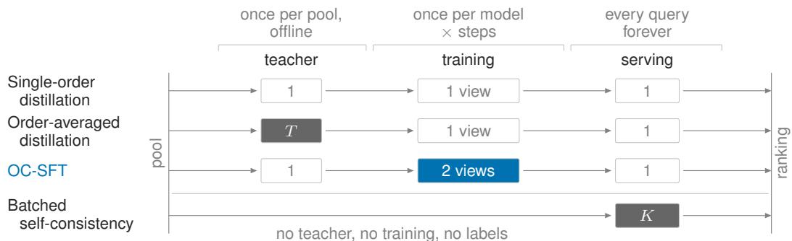  
Figure 2: Order dependence can be addressed at serving, in the labels, or once in training. Each row is one approach, and the filled marker is where it encounters several permutations; single-order distillation, the main baseline, never sees more than one. $T$ counts permutations of one training instance and K permutations of one query; the two are independent, and OC-SFT’s two views are the $N { = } 2$ of its objective. We use $T { = } 1 0$ and $K { = } 1 0 ;$ ; Figure 4 measures how far averaging gets.

Supervision. A teacher scores the candidates of each training instance and produces one target per candidate. Because the readout is the expected grade, the targets are continuous rather than binary relevance labels. We hold the teacher and the training pool fixed, so the variants below differ only in their objectives. By default the teacher is the student’s own base model (self-distillation).

Training objectives. The approaches to $\mu _ { B }$ differ in where they encounter several permutations (Figure 2): self-consistency at serving time, order-averaged distillation offline in the labels, and OC-SFT in its N views per step. All trained variants distill from these targets, minimizing a squared error between the student’s expected grade $s ( d )$ and the teacher target $\tilde { y } ( d )$ , averaged over the candidates of a $B = 2 0$ window. Single-order distillation, or plain fine-tuning, uses the target from one teacher order and does not target $\mu _ { B }$ . Order-averaged distillation uses the batched self-consistency target, the per-candidate average over $T = 1 0$ shuffled teacher orders precomputed into the label. The label absorbs the averaging, so order-averaged distillation targets $\mu _ { B }$ through the teacher.

Order-consistency SFT (OC-SFT) instead constrains the student’s own order residual $\delta _ { B } \ ( \ S 3 )$ . A permutation-invariant scorer has no such residual, so penalizing it targets invariance in the student rather than through the label. OC-SFT retains the single-order target and scores the same window under N permutations $\pi _ { 1 } , \ldots , \pi _ { N }$ , with per-candidate scores $s _ { i } ( d )$ , each $f _ { B }$ at $\pi _ { i }$ restricted to $d ,$ and view-mean $\begin{array} { r } { \bar { s } ( d ) = \frac { 1 } { N } \sum _ { i = 1 } ^ { N } { s _ { i } ( d ) } } \end{array}$ . These shuffles permute slots within a window, so a candidate keeps its companions, whereas a τ-PSI shuffle can change them; the metric therefore perturbs at least as much as the penalty targets. A penalty with weight λ then pulls each view toward that mean:

$$
{ \mathcal { L } } _ { \mathrm { O C - S F T } } = \underbrace { \mathrm { m e a n } _ { d } \left( s _ { 1 } ( d ) - \tilde { y } ( d ) \right) ^ { 2 } } _ { \mathrm { r e l e v a n c e ~ a n c h o r } } + \lambda \underbrace { \frac { 1 } { N } \sum _ { i = 1 } ^ { N } \mathrm { m e a n } _ { d } \left( s _ { i } ( d ) - \bar { s } ( d ) \right) ^ { 2 } } _ { \mathrm { o r d e r ~ v a r i a n c e } : \delta _ { B } } .
$$

Only the first view, itself one of the shuffles, carries the relevance anchor, so more views add no teacher supervision. The second term is the empirical order-variance of the student’s own scores, proportional in expectation to $\mathbb { E } _ { \pi } \lVert \delta _ { B } ( x , \pi ) \rVert ^ { 2 }$ , so it directly penalizes the within-window residual. The penalty acts on scores and bounds their variance rather than removing it, whereas $\tau { \mathrm { - } } \mathrm { P S I }$ reads rankings; near a tie, the surviving variance can still move a rank. The objective therefore yields attenuation rather than invariance, in the ranking and in the decisions read off it $( \ S 6 . 3 ) . ^ { 2 }$ We use $N = 2 . ^ { 3 }$ The tenfold saving over order-averaged distillation is in offline teacher labels and not in training compute.4

Both terms are required: without the relevance anchor the model collapses to a consistent but relevance-free scorer, and at λ = 0 the objective reduces to single-order distillation. The readout is unchanged across widths, so the weights can serve a different B without retraining (App. G).

## 5 EXPERIMENTAL SETUP

Data. We train and evaluate on three tasks that score a candidate set in one prompt. Each has its own training data and teacher labels; the readout and the objective are the same throughout.

Passage reranking is the primary setting. We train on MS MARCO (Nguyen et al., 2016) at B = 20, deriving labels from a teacher that grades the top-100 candidates of ∼30K queries under the readout of §4. Evaluation covers 18 collections: five in-domain TREC Deep Learning collections built over MS MARCO (DL19 through DL23, Craswell et al., 2020), 11 out-domain BEIR collections (Thakur et al., 2021), and two internal legal collections from a commercial legal search provider, with the BEIR and legal groups both evaluated zero-shot. The 16 public collections match the suite that recent listwise and distillation rerankers report on. The only two that carry claim-verification labels, SciFact with 300 claims and Climate-FEVER with 1,381, also serve as the downstream collections for verdict flip. Multi-document QA scores answer support rather than topical relevance: the HotpotQA distractor setting, ten passages per question with exactly two gold and binary relevance (Yang et al., 2018), trained on 30K questions and transferred zero-shot to 2WikiMultiHopQA (Ho et al., 2020) and MuSiQue (Trivedi et al., 2022). Response ranking scores candidate responses for preference or correctness, trained on ∼30.7K UltraFeedback prompts (Cui et al., 2024) with four candidates each. Its five collections each cover a distinct regime, differing in the quality gap between candidates and in whether one can be judged in isolation: RewardBench-2 (Malik et al., 2026), Nectar (Zhu et al., 2023), PPE MMLU-Pro and PPE-MATH (Frick et al., 2025), and RM-Bench (Liu et al., 2025). App. B.2 lists every evaluation collection; scope and limitations are discussed in App. A.

Models and teachers. Qwen3-4B (Yang et al., 2025) is our primary base model, one of 11 dense bases from 1.7B to 32B across three families: Qwen3, Gemma 4 (Gemma Team, 2026) and Granite 4.1 (IBM Granite Team, 2026). Two bases serve as controls, the sparse Mixture-of-Experts Gemma-4 26B-A4B for architecture and Qwen3-Reranker-4B for reranking-specialized initialization. The default teacher is the student’s own base model (self-distillation), so the method needs no externa model and the reported gains cannot come from a stronger teacher; we also evaluate larger open teachers within and across families (Qwen3, Gemma 4, Granite 4.1) and GPT-5.4. We train with LoRA (Hu et al., 2022) throughout, selecting checkpoints and hyperparameters per model and variant on a held-out split (App. B.3); base and teacher models are varied in App. H.4.

Baselines. All reranking baselines use the same 100 BM25 candidates as our trained models; we repeat the comparison on a dense (BGE-base-en-v1.5, Xiao et al., 2024) and a learned-sparse (SPLADE++ ED, Formal et al., 2022) first stage (App. D.7). The inference-time comparison is batched self-consistency (Korikov et al., 2025), the K-permutation ensemble, together with CapCal (Lv et al., 2026), a content-agnostic logit calibration applied to the off-the-shelf base. As a trained mitigation we adapt DebiasFirst (Qiao et al., 2026), position-aware augmentation with inverse-propensity weighting, to batched score regression. Alongside it we report permutation augmentation, as in RankVicuna (Pradeep et al., 2023b), which retains the N shuffled views and anchors each to the teacher target.

We also report the purpose-built jina-reranker-v3 (Wang et al., 2025a) at our B = 20 geometry and a frontier prompted scorer, GPT-5.4, on reranking, QA, and response ranking. In App. H.3, we additionally evaluate RankZephyr (Pradeep et al., 2023a) and mxbai-rerank-large-v2 (Li et al., 2026) at their native geometries. On response ranking we compare against a pointwise reward model, Skywork-Reward-V2-Qwen3-4B (Liu et al., 2026), and a pairwise one, PairRM (Jiang et al., 2023); neither sees a candidate order, so we report quality only (App. E.2).

Ranking metrics. We report nDCG@10 for quality and τ -PSI for order instability (§3); truncation at 10 affects only reranking’s 100 candidates, since QA ranks its ten candidates in full. Response ranking instead reports nDCG@1, the rate at which the top-scored candidate is the gold response.

Decision metrics. For the threshold results, we freeze a per-collection F1-tuned cutoff, fitted on half of a collection’s queries and measured on the other half. Reshuffling therefore changes what the filter admits and not how it was tuned. For that retained set we report its F1 and its mean pairwise Jaccard, the overlap between the sets retained under different permutations. Downstream, two frozen readers consume the scorer’s top 5 under the same M=10 permutations, Granite-4.1-8B throughout and Qwen3-4B as a second reader. For them, we report verdict accuracy and verdict flip on claim verification, and exact match, F1 and answer flip on QA. A preference model’s scores determine a chosen/rejected response pair, for which we report pair flip, how often that pair changes. Each consumer is held fixed, so any change comes from the scorer alone.

Table 1: Quality saturates on all three tasks; what the consumers decide does not. Each task block gives quality, order instability, and its consumer’s decision: retained-set overlap (Jacc.), answer flip and pair flip. Bold marks a lead over the other trained variants on every seed and by more than that task’s permutation range; no quality column clears the second (§6.1). Basis: Qwen3-4B, M = 10 random permutations, trained rows self-distilled 3-seed means; BSC is batched self-consistency (Korikov et al., 2025) over the off-the-shelf scorer. Collections and per-task widths are in App. B.
<table><tr><td rowspan="2">Variant</td><td colspan="3">Passage reranking (18)</td><td colspan="3">Multi-doc QA (3)</td><td colspan="3">Response ranking (5)</td></tr><tr><td>nDCG@10↑</td><td>τ-PSI↓</td><td>Jacc.↑</td><td>nDCG@10↑ τ-PSI↓</td><td></td><td>Ans.↓</td><td>nDCG@1↑ τ-PSI↓</td><td></td><td>Pair↓</td></tr><tr><td>Untrained</td><td></td><td></td><td></td><td></td><td></td><td></td><td></td><td></td><td></td></tr><tr><td>Off the shelf</td><td>0.370</td><td>0.298</td><td>0.439</td><td>0.911</td><td>0.224</td><td>0.221</td><td>0.655</td><td>0.345</td><td>0.877</td></tr><tr><td>CapCal</td><td>0.372</td><td>0.293</td><td>0.427</td><td>0.911</td><td>0.222</td><td>0.217</td><td>0.657</td><td></td><td>0.3380.874</td></tr><tr><td>Round-robin</td><td>0.422</td><td>0.297</td><td>0.443</td><td>0.911</td><td>0.224</td><td>0.221</td><td>0.658</td><td>0.347</td><td>0.878</td></tr><tr><td>BSC(×10)a</td><td>0.465</td><td>0.180</td><td>0.707</td><td>0.946</td><td>0.143</td><td>0.157</td><td>0.716</td><td>0.184</td><td>0.636</td></tr><tr><td>External</td><td></td><td></td><td></td><td></td><td></td><td></td><td></td><td></td><td></td></tr><tr><td>jina-reranker-v3</td><td>0.447</td><td>0.177</td><td>0.667</td><td>0.949</td><td>0.163</td><td>0.172</td><td>0.479</td><td></td><td>0.2260.685</td></tr><tr><td>GPT-5.4</td><td>0.468</td><td>b</td><td>0.707</td><td>0.972</td><td></td><td>b 0.094</td><td>0.726</td><td></td><td>b 0.489</td></tr><tr><td>Trained</td><td></td><td></td><td></td><td></td><td></td><td></td><td></td><td></td><td></td></tr><tr><td>Single-order</td><td>0.449</td><td>0.209</td><td>0.656</td><td>0.951</td><td>0.159</td><td>0.177</td><td>0.684</td><td></td><td>0.333 0.869</td></tr><tr><td>Order-averaged</td><td>0.455</td><td>0.130</td><td>0.743</td><td>0.956</td><td>0.124</td><td>0.149</td><td>0.693</td><td></td><td>0.228 0.724</td></tr><tr><td>DebiasFirst</td><td>0.454</td><td>0.128</td><td>0.759</td><td>0.955</td><td>0.147</td><td>0.164</td><td>0.694</td><td>0.228</td><td>0.718</td></tr><tr><td>Perm. aug.</td><td>0.455</td><td>0.129</td><td>0.760</td><td>0.955</td><td>0.148</td><td>0.162</td><td>0.696</td><td>0.223</td><td>0.707</td></tr><tr><td>OC-SFT</td><td>0.459</td><td>0.083</td><td>0.835</td><td>0.961</td><td>0.096</td><td>0.125</td><td>0.701</td><td></td><td>0.201 0.661</td></tr></table>

a Its order-instability and decision cells compare four independent ten-permutation ensembles, the unit such a system serves; every other row compares single permutations, at a tenth of the inference.  
b Nearly half its candidate pairs tie. We use an order-independent tie-break; stable sorting raises answer/pair flip from 0.094/0.489 to 0.200/0.851. τ-PSI credits fixed tie orders to the model, so we omit it.

Aggregation. Task means equally weight 18 reranking, 3 QA and 5 response-ranking collections; τ-PSI and flip metrics use M=10 random permutations. Trained rows average 3 seeds, otherwise seed 42; intervals use paired 95% bootstraps over collections then queries.

## 6 RESULTS

## 6.1 DECISIONS AT MATCHED RANKING QUALITY

Ranking quality does not predict how far a scorer’s decisions change under reshuffling. The five trained variants in Table 1 differ by at most 0.010 nDCG@10 on passage reranking, less than a permutation moves a single query’s score under any one of them (Figure 3a). Across the M=10 random permutations of each pool, retained sets overlap pairwise by 0.656 under single-order distillation and 0.835 under OC-SFT, a difference more than an order of magnitude larger than that quality spread. Among the seven single-permutation systems in Table 1 within 0.022 nDCG@10, different systems take the best quality and the best retained-set overlap on 11 of the 18 reranking collections (App. F.2). A threshold reads absolute scores; nDCG@10 reads only the discounted order of the top ten. So a small score change near the cutoff admits or drops a document, while similarly graded candidates trading places barely moves nDCG@10. A comparison of such scorers should report what a threshold retains or a reader answers, not the ranking metric alone.

Two published systems lead on a quality measure while reproducing less of their own output than the scorer they outrank, sharing neither our base model nor our supervision. GPT-5.4 leads every variant we trained on nDCG@10 while reproducing less of its retained set than OC-SFT (Table 1).

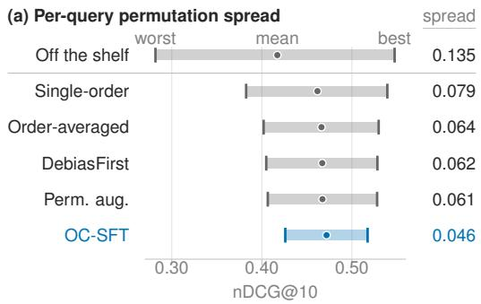

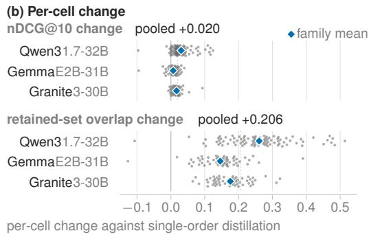  
Figure 3: Ranking quality moves across permutations and barely with the method; quality and retained-set overlap separate in every family. (a) Qwen3-4B per-query nDCG@10 over M=10 random permutations on 18 collections; spread is mean minus worst. (b) Dots are 198 base-collection cells over 11 dense bases; overlap at a per-collection F1-tuned cutoff, pooled is their mean.

jina-reranker-v3, a purpose-built reranker rather than a frontier model, leads OC-SFT on retained-set F1 while trailing it on nDCG@10, and its retained sets overlap less, 0.667 against 0.835.

## 6.2 CHANNELS FIXED AT PROMPT CONSTRUCTION

Fixes applied before training do not improve the decisions. The contiguous partition of a ranksorted top 100 (§3) makes each window internally uniform on a four-grade scale, so equal grades in different windows denote different relevance levels and the merged ranking conflates them. Roundrobin assignment distributes consecutive first-stage ranks across distinct windows and recovers 0.052 nDCG@10 on reranking, without additional permutations (Table 1, untrained rows). However, it leaves the decisions where they were: neither the retained set, the reader’s verdict on either collection, nor the preference model’s selected pair changes measurably. A post-hoc logit calibration (Lv et al., 2026) improves neither quality nor retained-set overlap measurably, and leaves τ -PSI near the offthe-shelf level. Rescaling across windows (Ren et al., 2025) cannot correct the partition effect at all, since the windows do not differ by an offset. We report under contiguous windows, the conventional partition. Under round-robin the trained gain is smaller and still positive, and the partition rule moves no variant’s τ-PSI by more than 0.006. Detailed results are in App. D.

Scores are read from a fixed grade slot, so the placeholder in every unscored slot is part of the presentation. We adopt Grade: 0, the in-format placeholder with the best average ranking quality across our three families, and hold it fixed; no other in-format value lowers τ-PSI distinguishably (App. B.1). We are aware of no position-bias measurement, including the index we adapt, that reports its sensitivity to this choice; such numbers are therefore in part a property of the skeleton behind them. None of the alternatives tested removes the order dependence that moves the decisions.

## 6.3 WHAT TRAINING CHANGES FOR THE CONSUMERS

The penalty moves what the consumers decide far more than it moves ranking quality. Order instability on passage reranking falls from 0.209 under single-order distillation to 0.083 under OC-SFT, and the retained set, the reader’s output and the selected pair all become more reproducible (Table 1). On quality alone the two variants are equivalent; on retained-set stability they are not. As Figure 3a shows, OC-SFT also narrows per-query score movement below every other variant.

The gain holds model by model and under unseen perturbations, and no control removes it. Quality and retained-set overlap separate the same way per model and collection across 11 dense bases in three families (Figure 3b), and OC-SFT stays below order-averaged distillation on all 12, including the sparse MoE. The same ordering appears under dense and learned-sparse first stages. Under pool replacement, a perturbation the objective was never trained on, instability under that perturbation is 0.031 against single-order distillation’s 0.099. Matching retention at the F1-tuned cutoff leaves the gain in retained-set overlap in place. What the penalty removes is movement at the ranking head, not ties or collapsed scores, and the ordering holds under worst-permutation quality and dispersion. The Climate-FEVER verdict changes less often than under single-order distillation, with no measurable accuracy change. That reduction holds where both variants select the same five documents, so it does not come from changing the reader’s evidence. For detailed results, we refer to Apps. C, D and F.

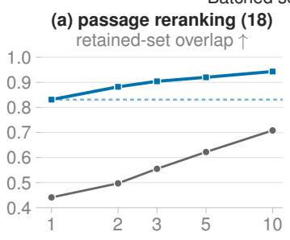

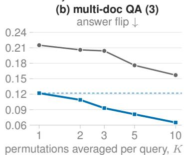

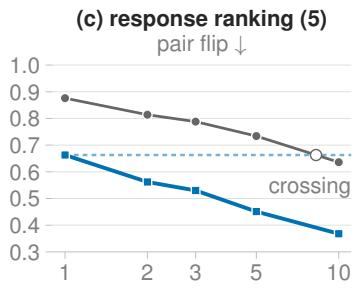  
Figure 4: OC-SFT at K=1 beats BSC at K=10 permutations on two of the three consumers. Batched self-consistency (BSC, grey; Korikov et al., 2025) reaches OC-SFT’s own K=1 (dashed) only on (c), near K=8; averaging keeps improving OC-SFT itself. BSC’s K=10 is its Table 1 row.

Permutation augmentation, which trains on the same shuffled views as OC-SFT but omits its explicit consistency penalty, closes about two thirds of the τ -PSI gap, as does DebiasFirst. A generic consistency mechanism closes as much of that gap and still fails the consumer: an EMA mean-teacher closes 71% of it while costing the reader 0.023 exact match (Apps. D and F for full results). The penalty closes the remaining third; shuffled-view training alone does not match OC-SFT’s stability.

The designs that do reach the decisions pay for it at every query or every label. A self-consistency ensemble repeats the serving pass on every query (Korikov et al., 2025), and at K=10 permutations it does not reach OC-SFT at K=1 on two of the three consumers (Figure 4). Averaging the trained scorer improves its reproducibility too, so training and averaging compose rather than substitute. Order-averaged distillation pays in the labels instead, needing T=10 teacher passes against OC-SFT’s one, and is less stable on 30K labeled queries than OC-SFT on 1K. A stronger teacher buys quality but not stability, so the gain comes from the penalty rather than the supervision (Apps. D and H).

## 6.4 SERVING WIDTH AND THE CHOICE OF DESIGN

The penalty suppresses order dependence without sacrificing shared context where it helps. Serving one checkpoint at its training width rather than at B=1 gains 0.043 nDCG@10 on multidocument QA. On passage relevance at B=20 the width effect is indistinguishable from zero, and on response ranking the gain is largest on the PPE collections while RM-Bench loses (Apps. E and G).

Which design to serve follows from the serving budget and the task; the shared prompt earns its place in the labels either way. Served one candidate at a time, where both designs are order-free, a pointwise student trained for that width matches the batched checkpoint on passage relevance, 0.466 against 0.459 on an interval covering zero. One batched checkpoint holds quality across 1–30 candidates; the pointwise student degrades at 20. The labels allow no such choice: a pointwise teacher costs the batched student 0.029 nDCG@10, worse on 17 of the 18 collections. At B=20, batching returns that quality about 45% faster per query. Detailed comparisons are in Apps. D and G.

## 7 CONCLUSION

Scorers a ranking metric cannot separate can still differ in what their consumers decide, so we compared remedies by where their cost falls: at serving, in the labels, or once in training. Fixes applied before training reached no decision: round-robin partitioning improved ranking quality while logit calibration did not; neither changed what a frozen threshold retained, a frozen reader answered, or which pair a preference model selected. The order channel resisted both; a consistency penalty over shuffled views attenuated it in the weights from one teacher pass and one serving permutation, while costing no ranking quality and making all three decisions more reproducible. Telling such scorers apart takes another measurement, and a stability metric’s permutations are enough to run it on.

## ETHICS STATEMENT

This work studies the reliability of LLM scorers rather than a new capability, since the same candidate set producing different rankings under reordering is a reproducibility concern in high-stakes retrieval such as legal search. We train on MS MARCO, a public web-search dataset, and evaluate on public TREC-DL and BEIR collections with two proprietary legal collections from a commercial legal search provider, reported as Legal-A and Legal-B. Both contain professionally authored content and attorney relevance judgments. We collected no new annotations and release no raw queries, documents, or annotator identifiers from them. They were evaluated under institutional data-governance controls. TREC-NEWS and Robust04 are distributed and reported under NIST terms. One closed model, GPT-5.4, appears as a comparison scorer and teacher, accessed through its provider’s API under the terms of service. Its weights and training data are not inspectable and the provider can retire the served version, so the GPT-5.4 comparisons are less reproducible than the rest. The method requires no closed model, because the default teacher is the student’s own base model and every base we train is open-weight. We evaluate closed teachers only as a comparison, and an open teacher recovers most of their advantage without GPT-5.4 labels (App. H.4).

## REPRODUCIBILITY STATEMENT

App. B.1 gives the scoring readout and reranking prompt template, including the scored answer skeleton. App. D.3 covers silver-label construction and the consistency-weight selection protocol. §5 defines τ -PSI and states the permutation budget and the resampling unit for intervals, with the evaluation collections in App. B.2. App. B.3 lists the shared training configuration and principal task-specific settings: base model, LoRA settings, optimizer and schedule, training width, consistency weight, selection rule, and hardware. Per-collection reranking results are in App. H, with the per-task, fixed-width and perturbation-specific breakdowns in Apps. C.1, E and G.

We release the τ-PSI implementation and the evaluation harness, the scoring prompt and scored skeleton of App. B.1, and the training and evaluation code. We also release the silver labels behind the primary result, the LoRA adapters for the 11 dense-base students of §5, and the full evaluation configurations and their commands. The full public evaluation suite runs in 60–90 hours on a single L40S-48GB GPU, and one collection such as DL19 in about an hour. Training the student behind the primary result takes about 90 GPU-hours on one 8-GPU A100-40GB node from the released silver labels. The full study, including unreported runs, totals roughly 100,000 GPU-hours.

Legal-A and Legal-B are proprietary, so the 18-collection reranking means in Table 1 and §6 include two collections others cannot score; App. H reports the sixteen-collection public mean alongside every per-collection cell. We accessed GPT-5.4 through an Azure OpenAI gpt-5.4 deployment, served by model version gpt-5.4-2026-03-05. Evaluation calls ran between June and August 2026, and its teacher labels for App. H.4 between May and June. Temperature and top-p are not configurable on this interface, so provider defaults applied. Rescoring byte-identical prefixes in separate inference batches does not return the same number, so a reader recomputing a score-level figure from the released outputs should not expect an exact match (App. G).

## AI USE STATEMENT

Large language models are an object of study and a component of the method in this work. This covers the scorers we train and evaluate, the teachers that generate the silver relevance labels, and the prompted closed-model baselines, all described in §4 and §5. They are studied here rather than used to produce the work, and the silver-label generation of App. D.3 is part of the method rather than a synthetic-data tool use.

We used generative AI tools for implementing software and preparing data, for literature search, brainstorming and interpreting results, for drafting the manuscript and editing it for length and readability, and for formatting references. We verified references against primary sources rather than relying on model output, and we checked numeric claims in the text against the floats they cite. We did not use generative AI tools to propose or refine the hypotheses or to formulate the decomposition of §3. The authors reviewed all AI-assisted work, made all scientific decisions, and take responsibility for the final content, including text, claims and artifacts produced with generative AI.

## ACKNOWLEDGMENTS

We are grateful to Joel Stremmel, Mahtab Farrokh, Ashkan Alinejad and Dezhao Song for their feedback on the project and on earlier drafts of this manuscript.

## REFERENCES

Ethan Bito, Yongli Ren, and Estrid He. One pass, any order: Position-invariant listwise reranking for LLM-based recommendation (InvariRank). In SIGIR, pp. 3625–3629, 2026. doi: 10.1145/ 3805712.3809952. URL https://arxiv.org/abs/2604.27599. arXiv:2604.27599.

Katrina Brown and Reid McIlroy. Order independence with finetuning. In ICLR Bi-Align Workshop, 2025. URL https://arxiv.org/abs/2503.23483. arXiv:2503.23483.

Yiqun Chen, Qi Liu, Yi Zhang, Weiwei Sun, Xinyu Ma, Wei Yang, Daiting Shi, Jiaxin Mao, and Dawei Yin. Tourrank: Utilizing large language models for documents ranking with a tournament-inspired strategy. In Proceedings of the ACM Web Conference 2025 (WWW ’25), 2025. doi: 10.1145/ 3696410.3714863. URL https://arxiv.org/abs/2406.11678. arXiv:2406.11678.

Nick Craswell, Bhaskar Mitra, Emine Yilmaz, Daniel Campos, and Ellen M. Voorhees. Overview of the TREC 2019 deep learning track. arXiv preprint, 2020. URL https://arxiv.org/abs/ 2003.07820. arXiv:2003.07820.

Ganqu Cui, Lifan Yuan, Ning Ding, Guanming Yao, Bingxiang He, Wei Zhu, Yuan Ni, Guotong Xie, Ruobing Xie, Yankai Lin, Zhiyuan Liu, and Maosong Sun. UltraFeedback: Boosting language models with scaled AI feedback. In ICML, pp. 9722–9744, 2024. URL https: //proceedings.mlr.press/v235/cui24f.html.

Thibault Formal, Carlos Lassance, Benjamin Piwowarski, and Stéphane Clinchant. From distillation to hard negative sampling: Making sparse neural IR models more effective. In SIGIR, pp. 2353– 2359, 2022. doi: 10.1145/3477495.3531857. URL https://doi.org/10.1145/3477495. 3531857. SPLADE++; arXiv:2205.04733.

Evan Frick, Tianle Li, Connor Chen, Wei-Lin Chiang, Anastasios N. Angelopoulos, Jiantao Jiao, Banghua Zhu, Joseph E. Gonzalez, and Ion Stoica. How to evaluate reward models for RLHF. In ICLR, 2025. URL https://arxiv.org/abs/2410.14872. Preference Proxy Evaluations (PPE); arXiv:2410.14872.

Gemma Team. Gemma 4 technical report, 2026. URL https://arxiv.org/abs/2607. 02770. Google DeepMind; arXiv:2607.02770.

Xanh Ho, Anh-Khoa Duong Nguyen, Saku Sugawara, and Akiko Aizawa. Constructing a multihop QA dataset for comprehensive evaluation of reasoning steps. In COLING, pp. 6609–6625, 2020. doi: 10.18653/v1/2020.coling-main.580. URL https://aclanthology.org/2020. coling-main.580/.

Yupeng Hou, Junjie Zhang, Zihan Lin, Hongyu Lu, Ruobing Xie, Julian McAuley, and Wayne Xin Zhao. Large language models are zero-shot rankers for recommender systems. In ECIR, 2024. URL https://arxiv.org/abs/2305.08845. arXiv:2305.08845.

Edward J. Hu, Yelong Shen, Phillip Wallis, Zeyuan Allen-Zhu, Yuanzhi Li, Shean Wang, Lu Wang, and Weizhu Chen. LoRA: Low-rank adaptation of large language models. In ICLR, 2022. URL https://openreview.net/forum?id=nZeVKeeFYf9. arXiv:2106.09685.

Jerry Huang, Siddarth Madala, Cheng Niu, Julia Hockenmaier, and Tong Zhang. Contextual relevance and adaptive sampling for LLM-based document reranking. In ACL, pp. 2076–2089, 2026. doi: 10. 18653/v1/2026.acl-long.94. URL https://aclanthology.org/2026.acl-long.94/. TS-SetRank; arXiv:2511.01208.

IBM Granite Team. Granite 4.1 language models, 2026. URL https://huggingface.co/ blog/ibm-granite/granite-4-1. Technical blog, released 29 April 2026; dense 3B, 8B and 30B.

Nour Jedidi, Yung-Sung Chuang, James R. Glass, and Jimmy Lin. Don’t “overthink” pointwise reranking: Is reasoning truly necessary?, 2025. URL https://arxiv.org/abs/2505. 16886. Under review at ICLR 2026; arXiv:2505.16886; OpenReview:kbuGvzBJg4.

Dongfu Jiang, Xiang Ren, and Bill Yuchen Lin. LLM-Blender: Ensembling large language models with pairwise ranking and generative fusion. In ACL, pp. 14165–14178, 2023. doi: 10.18653/v1/ 2023.acl-long.792. URL https://aclanthology.org/2023.acl-long.792/.

Anton Korikov, Pan Du, Scott Sanner, and Navid Rekabsaz. Batched self-consistency improves LLM relevance assessment and ranking. In EMNLP, pp. 32687–32703, 2025. doi: 10.18653/v1/2025. emnlp-main.1661. URL https://aclanthology.org/2025.emnlp-main.1661/.

Haitao Li, Junjie Chen, Qingyao Ai, Zhumin Chu, Yujia Zhou, Qian Dong, and Yiqun Liu. Calibraeval: Calibrating prediction distribution to mitigate selection bias in LLMs-as-judges. In ACL, pp. 16537– 16552, 2025. doi: 10.18653/v1/2025.acl-long.808. URL https://aclanthology.org/ 2025.acl-long.808/.

Xianming Li, Aamir Shakir, Rui Huang, Julius Lipp, Benjamin Clavié, and Jing Li. ProRank: Prompt warmup via reinforcement learning for small language models reranking. In Findings of ACL, pp. 1026–1037, 2026. doi: 10.18653/v1/2026.findings-acl.51. URL https://aclanthology. org/2026.findings-acl.51/. released as mxbai-rerank-v2; arXiv:2506.03487.

Xiaobo Liang, Lijun Wu, Juntao Li, Yue Wang, Qi Meng, Tao Qin, Wei Chen, Min Zhang, and Tie-Yan Liu. R-Drop: Regularized dropout for neural networks. In NeurIPS, 2021. URL https://arxiv.org/abs/2106.14448. arXiv:2106.14448.

Chris Yuhao Liu, Liang Zeng, Yuzhen Xiao, Jujie He, Jiacai Liu, Chaojie Wang, Rui Yan, Wei Shen, Fuxiang Zhang, Jiacheng Xu, Yang Liu, and Yahui Zhou. Skywork-Reward-V2: Scaling preference data curation via human-AI synergy. In ICLR, 2026. URL https://openreview. net/forum?id=ofgxkMLqic. arXiv:2507.01352.

Nelson F. Liu, Kevin Lin, John Hewitt, Ashwin Paranjape, Michele Bevilacqua, Fabio Petroni, and Percy Liang. Lost in the middle: How language models use long contexts. Transactions of the Associationfor Computational Linguistics, 12:157–173, 2024. doi: 10.1162/tacl\_a\_00638. URL https://aclanthology.org/2024.tacl-1.9/.

Yantao Liu, Zijun Yao, Rui Min, Yixin Cao, Lei Hou, and Juanzi Li. RM-Bench: Benchmarking reward models of language models with subtlety and style. In ICLR, 2025. URL https: //arxiv.org/abs/2410.16184. arXiv:2410.16184.

Ilya Loshchilov and Frank Hutter. Decoupled weight decay regularization. In ICLR, 2019. URL https://openreview.net/forum?id=Bkg6RiCqY7. arXiv:1711.05101.

Xuan Lu, Haohang Huang, Rui Meng, Yaohui Jin, Wenjun Zeng, and Xiaoyu Shen. Rethinking reasoning in document ranking: Why chain-of-thought falls short. arXiv preprint, 2025. URL https://arxiv.org/abs/2510.08985. arXiv:2510.08985.

Hang Lv, Hongchao Gu, Ruiqing Yang, Liangyue Li, Zulong Chen, Defu Lian, Hao Wang, and Enhong Chen. Learning from emptiness: De-biasing listwise rerankers with content-agnostic probability calibration (CapCal). In ACL, pp. 817–826, 2026. doi: 10.18653/v1/2026.acl-short.68. URL https://aclanthology.org/2026.acl-short.68/. arXiv:2604.10150.

Xueguang Ma, Liang Wang, Nan Yang, Furu Wei, and Jimmy Lin. Fine-tuning LLaMA for multistage text retrieval (RankLLaMA). In SIGIR, 2024. doi: 10.1145/3626772.3657951. URL https://arxiv.org/abs/2310.08319. arXiv:2310.08319.

Saumya Malik, Valentina Pyatkin, Sander Land, Jacob Morrison, Noah A. Smith, Hannaneh Hajishirzi, and Nathan Lambert. RewardBench 2: Advancing reward model evaluation. In ICLR, 2026. URL https://openreview.net/forum?id=fb0G86Dewb. arXiv:2506.01937.

Reid McIlroy-Young, Katrina Brown, Conlan Olson, Linjun Zhang, and Cynthia Dwork. Orderindependence without fine tuning. In NeurIPS, 2024. URL https://arxiv.org/abs/2406. 06581. Set-Based Prompting; arXiv:2406.06581.

Tri Nguyen, Mir Rosenberg, Xia Song, Jianfeng Gao, Saurabh Tiwary, Rangan Majumder, and Li Deng. MS MARCO: A human generated machine reading comprehension dataset. In Proceedings of the Workshop on Cognitive Computation: Integrating Neural and Symbolic Approaches 2016, 2016. URL https://ceur-ws.org/Vol-1773/CoCoNIPS\_2016\_ paper9.pdf.

Rodrigo Nogueira, Zhiying Jiang, Ronak Pradeep, and Jimmy Lin. Document ranking with a pretrained sequence-to-sequence model (monoT5). In Findings of EMNLP, pp. 708–718, 2020. doi: 10.18653/v1/2020.findings-emnlp.63. URL https://aclanthology.org/2020. findings-emnlp.63/.

Justin D. Norman, Michael U. Rivera, and D. Alex Hughes. Reliability without validity: A systematic, large-scale evaluation of LLM-as-a-judge models across agreement, consistency, and bias, 2026. URL https://arxiv.org/abs/2606.19544. arXiv:2606.19544.

Liang Pang, Jun Xu, Qingyao Ai, Yanyan Lan, Xueqi Cheng, and Jirong Wen. Setrank: Learning a permutation-invariant ranking model for information retrieval. In Proceedings of the 43rd International ACM SIGIR Conference on Research and Development in Information Retrieval (SIGIR ’20), 2020. doi: 10.1145/3397271.3401104. URL https://arxiv.org/abs/1912. 05891. arXiv:1912.05891.

Andrew Parry, Sean MacAvaney, and Debasis Ganguly. Top-down partitioning for efficient list-wise ranking. In ReNeuIR Workshop at SIGIR, 2024. URL https://arxiv.org/abs/2405. 14589. arXiv:2405.14589.

Ronak Pradeep, Sahel Sharifymoghaddam, and Jimmy Lin. RankZephyr: Effective and robust zero-shot listwise reranking is a breeze! arXiv preprint, 2023a. URL https://arxiv.org/ abs/2312.02724. arXiv:2312.02724.

Ronak Pradeep, Sahel Sharifymoghaddam, and Jimmy Lin. RankVicuna: Zero-shot listwise document reranking with open-source large language models. arXiv preprint, 2023b. URL https:// arxiv.org/abs/2309.15088. arXiv:2309.15088.

Jingfen Qiao, Jin Huang, Xinyu Ma, Shuaiqiang Wang, Dawei Yin, Evangelos Kanoulas, and Andrew Yates. LLM-based listwise reranking under the effect of positional bias (DebiasFirst). arXiv preprint, 2026. URL https://arxiv.org/abs/2604.03642. arXiv:2604.03642.

Revanth Gangi Reddy, JaeHyeok Doo, Yifei Xu, Md Arafat Sultan, Deevya Swain, Avirup Sil, and Heng Ji. FIRST: Faster improved listwise reranking with single token decoding. In EMNLP, pp. 8642–8652, 2024. doi: 10.18653/v1/2024.emnlp-main.491. URL https://aclanthology. org/2024.emnlp-main.491/.

Ruiyang Ren, Yuhao Wang, Kun Zhou, Wayne Xin Zhao, Wenjie Wang, Jing Liu, Ji-Rong Wen, and Tat-Seng Chua. Self-calibrated listwise reranking with large language models. In Proceedings of the ACM Web Conference 2025 (WWW ’25), 2025. doi: 10.1145/3696410.3714658. URL https://arxiv.org/abs/2411.04602. arXiv:2411.04602.

Zhihong Shao, Peiyi Wang, Qihao Zhu, Runxin Xu, Junxiao Song, Xiao Bi, et al. DeepSeekMath: Pushing the limits of mathematical reasoning in open language models (GRPO). arXiv preprint, 2024. URL https://arxiv.org/abs/2402.03300. arXiv:2402.03300.

Lin Shi, Chiyu Ma, Wenhua Liang, Xingjian Diao, Weicheng Ma, and Soroush Vosoughi. Judging the judges: A systematic study of position bias in LLM-as-a-judge. In IJCNLP-AACL, pp. 292–314, 2025. doi: 10.18653/v1/2025.ijcnlp-long.18. URL https://aclanthology.org/2025. ijcnlp-long.18/. arXiv:2406.07791.

Hongjin Su, Howard Yen, Mengzhou Xia, Weijia Shi, Niklas Muennighoff, Han yu Wang, Haisu Liu, Quan Shi, Zachary S. Siegel, Michael Tang, Ruoxi Sun, Jinsung Yoon, Sercan O. Arik, Danqi Chen, and Tao Yu. BRIGHT: A realistic and challenging benchmark for reasoning-intensive retrieval. In ICLR, 2025. URL https://openreview.net/forum?id=ykuc5q381b. arXiv:2407.12883.

Weiwei Sun, Lingyong Yan, Xinyu Ma, Shuaiqiang Wang, Pengjie Ren, Zhumin Chen, Dawei Yin, and Zhaochun Ren. Is ChatGPT good at search? investigating large language models as re-ranking agents (RankGPT). In EMNLP, pp. 14918–14937, 2023. doi: 10.18653/v1/2023.emnlp-main.923. URL https://aclanthology.org/2023.emnlp-main.923/.

Raphael Tang, Crystina Zhang, Xueguang Ma, Jimmy Lin, and Ferhan Ture. Found in the middle: Permutation self-consistency improves listwise ranking in large language models. In NAACL, pp. 2327–2340, 2024. doi: 10.18653/v1/2024.naacl-long.129. URL https://aclanthology. org/2024.naacl-long.129/.

Antti Tarvainen and Harri Valpola. Mean teachers are better role models: Weight-averaged consistency targets improve semi-supervised deep learning results. In NeurIPS, 2017. URL https://arxiv. org/abs/1703.01780. arXiv:1703.01780.

Nandan Thakur, Nils Reimers, Andreas Rücklé, Abhishek Srivastava, and Iryna Gurevych. BEIR: A heterogeneous benchmark for zero-shot evaluation of information retrieval models. In NeurIPS Datasets and Benchmarks, 2021. URL https://arxiv.org/abs/2104.08663. arXiv:2104.08663.

Harsh Trivedi, Niranjan Balasubramanian, Tushar Khot, and Ashish Sabharwal. MuSiQue: Multihop questions via single-hop question composition. Transactions of the Association for Computational Linguistics, 10:539–554, 2022. doi: 10.1162/tacl\_a\_00475. URL https://aclanthology. org/2022.tacl-1.31/.

Feng Wang, Yuqing Li, and Han Xiao. jina-reranker-v3: Last but not late interaction for listwise document reranking. arXiv preprint, 2025a. URL https://arxiv.org/abs/2509.25085. arXiv:2509.25085.

Peiyi Wang, Lei Li, Liang Chen, Zefan Cai, Dawei Zhu, Binghuai Lin, Yunbo Cao, Lingpeng Kong, Qi Liu, Tianyu Liu, and Zhifang Sui. Large language models are not fair evaluators. In ACL, pp. 9440–9450, 2024. doi: 10.18653/v1/2024.acl-long.511. URL https://aclanthology. org/2024.acl-long.511/.

Xuezhi Wang, Jason Wei, Dale Schuurmans, Quoc Le, Ed Chi, Sharan Narang, Aakanksha Chowdhery, and Denny Zhou. Self-consistency improves chain of thought reasoning in language models. In ICLR, 2023. URL https://arxiv.org/abs/2203.11171. arXiv:2203.11171.

Ziqi Wang, Hanlin Zhang, Xiner Li, Kuan-Hao Huang, Chi Han, Shuiwang Ji, Sham M. Kakade, Hao Peng, and Heng Ji. Eliminating position bias of language models: A mechanistic approach (PINE). In ICLR, 2025b. URL https://arxiv.org/abs/2407.01100. arXiv:2407.01100.

William Webber, Alistair Moffat, and Justin Zobel. A similarity measure for indefinite rankings. ACM Transactions on Information Systems, 28(4):20:1–20:38, 2010. doi: 10.1145/1852102.1852106. URL https://doi.org/10.1145/1852102.1852106.

Orion Weller, Kathryn Ricci, Eugene Yang, Andrew Yates, Dawn Lawrie, and Benjamin Van Durme. Rank1: Test-time compute for reranking in information retrieval. In CoLM, 2025. URL https://arxiv.org/abs/2502.18418. arXiv:2502.18418.

Yanzheng Xiang, Hanqi Yan, Lin Gui, and Yulan He. Addressing order sensitivity of in-context demonstration examples in causal language models (InfoAC). In Findings ofACL, pp. 6467–6481, 2024. doi: 10.18653/v1/2024.findings-acl.386. URL https://aclanthology.org/2024. findings-acl.386/.

Shitao Xiao, Zheng Liu, Peitian Zhang, Niklas Muennighoff, Defu Lian, and Jian-Yun Nie. C-Pack: Packed resources for general Chinese embeddings. In SIGIR, pp. 641–649, 2024. doi: 10. 1145/3626772.3657878. URL https://doi.org/10.1145/3626772.3657878. BGE embeddings; arXiv:2309.07597.

An Yang et al. Qwen3 technical report. arXiv preprint, 2025. URL https://arxiv.org/abs/ 2505.09388. Qwen Team; arXiv:2505.09388.

Zhilin Yang, Peng Qi, Saizheng Zhang, Yoshua Bengio, William W. Cohen, Ruslan Salakhutdinov, and Christopher D. Manning. HotpotQA: A dataset for diverse, explainable multi-hop question answering. In EMNLP, pp. 2369–2380, 2018. doi: 10.18653/v1/D18-1259. URL https: //aclanthology.org/D18-1259/.

Ziyang Zeng, Dun Zhang, Jiacheng Li, Panxiang Zou, Yudong Zhou, and Yuqing Yang. An empirical study of position bias in modern information retrieval. In Findings ofEMNLP, pp. 5069–5081, 2025. doi: 10.18653/v1/2025.findings-emnlp.271. URL https://aclanthology.org/ 2025.findings-emnlp.271/.

Chao Zhang, Shuai Lin, Xuanlin Li, Wenyi Xu, ChengLei Dai, Feiran Zhu, Yi Zhang, and Han Li. CORE: Discovering intrinsic ranking preferences in LLMs via consistent ego-correction, 2026a. URL https://openreview.net/forum?id=ST0Jk1aMsi. OpenReview:ST0Jk1aMsi.

Qianchi Zhang, Hainan Zhang, Liang Pang, Hong-Wei Zheng, and Zhiming Zheng. Stable-RAG: Mitigating retrieval-permutation-induced hallucinations in retrieval-augmented generation. In ACL, pp. 25907–25926, 2026b. doi: 10.18653/v1/2026.acl-long.1188. URL https: //aclanthology.org/2026.acl-long.1188/.

Jinquan Zheng, Jia Yuan, Jiacheng Yao, Chenyang Gu, Pujun Zheng, and Guoxiu He. Mitigating selection bias in large language models via permutation-aware GRPO (PA-GRPO). In ACL, pp. 35125–35143, 2026. doi: 10.18653/v1/2026.acl-long.1621. URL https://aclanthology. org/2026.acl-long.1621/.

Lianmin Zheng, Wei-Lin Chiang, Ying Sheng, Siyuan Zhuang, Zhanghao Wu, Yonghao Zhuang, Zi Lin, Zhuohan Li, Dacheng Li, Eric P. Xing, Hao Zhang, Joseph E. Gonzalez, and Ion Stoica. Judging LLM-as-a-judge with MT-Bench and Chatbot Arena. In Advances in Neural Information Processing Systems 36 (NeurIPS 2023) Datasets and Benchmarks Track, 2023. URL https: //arxiv.org/abs/2306.05685. arXiv:2306.05685.

Banghua Zhu, Evan Frick, Tianhao Wu, Hanlin Zhu, and Jiantao Jiao. Starling-7B: Improving LLM helpfulness and harmlessness with RLAIF, 2023. URL https://huggingface.co/ datasets/berkeley-nest/Nectar. releases the Nectar ranking dataset.

The appendix is organized as follows, each answering a different question:

App. A the scope and limitations of the study.

App. B how a score is read from the prompt, and what reproduces a run.

App. C the origin of the order effect, and controls that exclude other explanations.

App. D whether cheaper alternatives suffice, what they cost, and first-stage robustness.

App. E whether the effect is specific to reranking, on QA and on response ranking.

App. F four consumers of a ranking, and what training changes for each.

App. G how many candidates to serve, and what width costs in quality and latency.

App. H per-collection results, alternative first stages, and external rerankers.

Unless a caption says otherwise, every table and figure below uses Qwen3-4B at B = 20 on the 18 reranking collections at seed 42, over M = 10 random permutations. A basis line states where a table or figure departs from that.

## A SCOPE AND LIMITATIONS

The serving pass takes its order from the first stage, so the permutations we measure under are not the ones it runs on. Controls on the first-stage order leave both τ-PSI and the output’s correlation with BM25 nearly unchanged, so the measurement is representative of the served condition (Table 6). The threshold, the reader and the preference model are frozen rather than refitted to each scorer’s output. A co-adapted consumer could absorb some of the instability we measure, so the reductions we report may be smaller in a fully retrained pipeline.

Round-robin partitioning and logit calibration are two prompt-time constructions, not all possible ones, and both run under the single answer skeleton of App. B.1.1. InvariRank (Bito et al., 2026)

restricts cross-candidate attention to obtain one-pass order invariance; App. D.2 ports the same mechanism from Wang et al. (2025b) and finds it costs both quality and stability at this readout, so built-in invariance is unavailable here rather than untried. PA-GRPO (Zheng et al., 2026) rewards consistent decisions with reinforcement learning, and its reward is defined on the decision rather than on a score. Redefining it over the continuous score our objective targets would change the method rather than merely porting it.

The objective targets stability and the part of quality that order-averaging recovers, not raw quality: a pointwise B = 1 scorer trained in our own pipeline matches our students on nDCG@10. Heavily supervised commercial rerankers exceed them, on far larger relevance supervision than ours. The case for scoring candidates together (B > 1) does not cover pools of two, where pointwise scoring wins on every collection except the adversarial RM-Bench (Table 3 and App. E). The one recurring collection-level cost is ArguAna, the suite’s only counterargument-retrieval collection (Table 35). Rescoring one permutation does not return identical grades for any scorer here: ours reproduce 0.985 of the retained set at fixed order, and GPT-5.4’s floor is unmeasured (Table 26). Its overlap is therefore lowered by noise as well as by order, which flatters our comparison. Nearly half its candidate pairs tie, so its reported figures turn on the tie-break: it reaches 0.468 nDCG@10 under the order-independent rule we keep against 0.511 under input-order ties. That rule also gives it a lower pair-flip rate than OC-SFT, which reverses under the common stable sort. The convention we report is the one that favours the baseline.

Finally, the scorer uses no chain-of-thought (Lu et al., 2025; Jedidi et al., 2025; Weller et al., 2025), so reasoning-intensive retrieval (BRIGHT, Su et al., 2025) and reasoning rerankers in their own regime are untested. All collections are English, and long-context corpora that overflow the B = 20 prompt fall outside the geometry studied here (App. B.1).

## B SETUP: READOUT, EVALUATION, AND CONFIGURATION

We specify how a score is read out of a single prompt, including the placeholder and answer-skeleton choices it depends on (App. B.1), which collections carry each measurement (App. B.2), and the consolidated training and evaluation configuration (App. B.3).

## B.1 SCORE READOUT AND PROMPT

The reranker scores a query against B candidate documents in one prompt. After a short grading instruction, the prompt places the query and the B = 20 documents, each tagged [i], then appends a fixed Grades: skeleton carrying one placeholder grade per slot. Documents are truncated to 1200 characters on TREC Deep Learning and non-reranking corpora, and 500 on the BEIR and legal collections. We score the fixed Grades: skeleton in one forward pass, reading four grade-token probabilities per candidate rather than generating grades (§4). No token is sampled, so a score is determined by the weights and the prompt, and no decoding temperature or generation seed enters; the variation we report comes from the order of the candidates alone. GPT-5.4 is the one exception, and its decoding parameters are not configurable. The scoring client’s nominal temperature (1.0) and top-p (10−8) do not reach the provider. The interface omits temperature, the client does not forward top-p, and no generation seed is exposed; the run seeds shuffle documents rather than generation. FIRST (Reddy et al., 2024) also uses logits instead of decoding, but takes a listwise ranking from the first generated identifier, whereas we take one score per candidate. The expectation also keeps scores near-continuous, so ties rarely decide the ranking. At B = 20, 99.6% of scores within a query and permutation are distinct, and re-ranking the saved scores under an order-independent tie-break on document id moves every τ-PSI value we report by less than 0.0005. The full prompt is shown below.

System: You are a search relevance grader. For each numbered document,   
output one fixed   
integer relevance grade in {0, 1, 2, 3}. Do not rank the   
documents and do not explain.   
User: Instruction: Given a web search query, retrieve relevant passages   
that answer the query   
Query: <q>

Documents:   
[1] <doc 1 text> # whitespace-normalized + truncated   
to 1200 chars   
[20] <doc 20 text>   
Evaluate every document independently for relevance to the query.   
Assign exactly one integer relevance grade to every document:   
- 3 = directly and completely answers the query   
- 2 = strongly relevant but incomplete   
- 1 = weakly relevant or topical background   
- 0 = not relevant   
Output one line per document in the form: [<id>] Grade: <0|1|2|3>   
Assistant: Grades: # not sampled; a fixed skeleton is   
scored   
[1] Grade: 0 # read P(0),P(1),P(2),P(3) at this   
slot   
# score = E[g]/3   
[20] Grade: 0

The readout and the placeholder are both free choices, so we selected each once on the off-the-shelf Qwen3-4B scorer and held them fixed thereafter. Table 2 reports both comparisons, comparing the argmax grade, $P ( g \ge 2 )$ and the expected grade, all three read off the same saved grade distribution. The argmax grade is lower than either probability readout on the aggregate grid. The two probability readouts are nearly level; $P ( g \ge 2 )$ leads by less than 0.001 nDCG@10, so we retain the expected grade as the graded readout and hold it fixed.

Table 2: Score-readout and answer-skeleton placeholder choices. Basis: off-the-shelf Qwen3-4B over the 18 reranking collections. Quality is one-permutation nDCG@10; instability is τ-PSI at B = 20 over M = 10 random permutations. Higher quality and lower instability are better; the final two columns count collections with lower / higher instability than Grade: 0. Bold marks the selected protocol choice rather than the per-column optimum.
<table><tr><td rowspan="2">Choice</td><td colspan="2">Quality, one permutation</td><td colspan="2">Order instability (M = 10)</td></tr><tr><td>nDCG@10↑</td><td>Wins</td><td>τ-PSI↓ Lower</td><td>Higher</td></tr><tr><td colspan="5">Score readout, quality only</td></tr><tr><td>argmax grade</td><td>0.3365</td><td>1/ 18</td><td></td><td></td></tr><tr><td> $P \overset { \smile } { ( } g \geq 2 )$ </td><td>0.3701</td><td>9/ 18</td><td></td><td></td></tr><tr><td>expected grade</td><td>0.3694</td><td>8/18</td><td></td><td></td></tr><tr><td colspan="5">Answer skeleton placeholder</td></tr><tr><td>Grade:</td><td>0.3694</td><td>17 / 18</td><td>0.2983</td><td>ref.</td><td>ref.</td></tr><tr><td>Grade:</td><td>0.3541</td><td>0 / 18</td><td>0.2928</td><td>11</td><td>7</td></tr><tr><td>Grade:</td><td>0.3413</td><td>1/ 18</td><td>0.3348</td><td>6</td><td>12</td></tr><tr><td>Grade:</td><td>0.2013</td><td>0/ 18</td><td>0.3857</td><td>0</td><td>18</td></tr></table>

## B.1.1 ANSWER-SKELETON PLACEHOLDER

Varying only the in-format placeholder from Grade: 0 through Grade: 3, quality decreases monotonically from the selected Grade: 0 (Table 2). Grade: 1 has the lowest instability point estimate but lower quality, while Grade: 2 and Grade: 3 worsen both axes. No in-format placeholder improves both quality and instability over the selected Grade: 0, so placeholder choice is not a substitute for training.

## B.2 EVALUATION COLLECTIONS

The eleven public out-domain collections are the BEIR subset introduced for listwise LLM reranking by Sun et al. (2023) and carried forward by the distilled listwise rerankers that followed (Pradeep et al.,

2023a;b). That subset includes the three collections later work often drops: Signal-1M, TREC-NEWS and Robust04. Those papers report DL19 and DL20 on MS MARCO v1; we add the three TREC DL v2 tracks, DL21 through DL23, so the sixteen extend that suite rather than merely reuse it. Legal-A and Legal-B are proprietary collections from a commercial legal search provider, holding professionally authored legal content with relevance judgments made by attorneys. Their candidate lists come with the internal fixtures rather than being retrieved by BM25.

Table 3: Evaluation collections across the three tasks. Counts are evaluated queries or prompts after filtering; protocols are in §5.
<table><tr><td>Task / group</td><td>Collection</td><td>Domain / role</td><td>Queries / prompts</td><td>Candidate pool / protocol</td></tr><tr><td>Reranking: in-domain</td><td>DL19</td><td>web passage; TREC DL</td><td>43</td><td>BM25 top 100; graded judgments</td></tr><tr><td></td><td>DL20</td><td>web passage; TREC DL</td><td>54</td><td>BM25 top 100; graded</td></tr><tr><td></td><td>DL21</td><td>web passage; TREC DL v2</td><td>53</td><td>judgments BM25 top 100; graded</td></tr><tr><td></td><td>DL22</td><td>web passage; TREC DL v2</td><td>76</td><td>judgments BM25 top 100; graded</td></tr><tr><td></td><td>DL23</td><td>web passage; TREC DL v2</td><td>82</td><td>judgments BM25 top 100; graded judgments</td></tr><tr><td>Reranking: public OOD</td><td></td><td>biomedical</td><td>308</td><td>BM25 top 100</td></tr><tr><td></td><td>NFCorpus FiQA</td><td>financial QA</td><td>648</td><td>BM25 top 100</td></tr><tr><td></td><td>Touche-2020</td><td>argument retrieval</td><td>49</td><td>BM25 top 100</td></tr><tr><td></td><td>ArguAna</td><td>counterargument retrieval</td><td>1,406</td><td>BM25 top 100</td></tr><tr><td></td><td>Climate-FEVER</td><td>climate fact-checking</td><td>1,535 (1,381 with</td><td>BM25 top 100</td></tr><tr><td></td><td></td><td></td><td>verdict labels)</td><td></td></tr><tr><td></td><td>TREC-COVID</td><td>biomedical</td><td>50</td><td>BM25 top 100</td></tr><tr><td></td><td>DBPedia SciFact</td><td>entity retrieval scientific fact-checking</td><td>400</td><td>BM25 top 100</td></tr><tr><td></td><td>Signal-1M</td><td></td><td>300</td><td>BM25 top 100</td></tr><tr><td></td><td>TREC-NEWS</td><td>tweet / news</td><td>97 57</td><td>BM25 top 100</td></tr><tr><td></td><td>Robust04</td><td>news</td><td>249</td><td>BM25 top 100 BM25 top 100</td></tr><tr><td></td><td></td><td>news</td><td></td><td></td></tr><tr><td>Reranking: legal</td><td>Legal-A</td><td>legal</td><td>97</td><td>precomputed top 100</td></tr><tr><td></td><td>Legal-B</td><td>legal</td><td>175</td><td>precomputed top 100</td></tr><tr><td>Multi-doc QA</td><td>HotpotQA</td><td>multi-hop QA; in-domain</td><td>200</td><td>10 passages; 2 supporting</td></tr><tr><td></td><td>2WikiMultiHopQA</td><td>multi-hop QA; zero-shot</td><td>200</td><td>10 passages; 2 supporting</td></tr><tr><td></td><td>MuSiQue</td><td>multi-hop QA; zero-shot</td><td>200</td><td>10 passages; 2 supporting</td></tr><tr><td>Response ranking</td><td>RewardBench-2</td><td>response quality</td><td>1,763</td><td>4 responses</td></tr><tr><td></td><td>Nectar</td><td>response preference</td><td>434</td><td>7 responses; 64 overlaps</td></tr><tr><td></td><td>PPE-MATH</td><td>math correctness</td><td>512</td><td>removed 8 responses</td></tr><tr><td></td><td>PPE MMLU-Pro</td><td>knowledge correctness</td><td>512</td><td>8 responses</td></tr><tr><td></td><td>RM-Bench</td><td>adversarial preference</td><td>1,327</td><td>6 responses</td></tr></table>

## B.3 CONSOLIDATED CONFIGURATION

Every task selects its consistency weight λ and its checkpoint on that training task’s own held-out split, using held-out ranking quality as the only criterion. The grid is $\lambda \in \{ 0 . { \bar { 5 } } , 1 , 2 , 3 , 4 , 5 \}$ . Every variant is tuned the same way, so tuning effort is matched between OC-SFT and the baselines. The alternative regularizers of App. D.2, permutation augmentation and DebiasFirst were each varied over their own hyperparameter and are reported at their best held-out value.

Table 4 gives what differs between the three tasks. The settings they share:

• LoRA (Hu et al., 2022): rank 16, alpha 32, dropout 0.05, on the seven attention and MLP projections (q, k, v, o, gate, up, down) in every transformer layer.

• Optimizer: AdamW (Loshchilov & Hutter, 2019) $( \beta _ { 1 } = 0 . 9 , \beta _ { 2 } = 0 . 9 5$ , weight decay 0.01), learning rate 2e-4 with a cosine schedule and a 10% linear warmup, 1 epoch; per-device batch 1 with gradient accumulation 8 across the 8-GPU node, an effective batch of 64; bf16 with FlashAttention-2.

• OC-SFT only: the two views of a window are permutations drawn from seeds derived from the query and window identifiers. At one epoch, each window has a fixed pair of orders, and the anchored view is the first of the two rather than the first stage’s own order. The loss uses the raw 0–3 grade scale; the [0, 1] normalization is applied at scoring time, so λ is on the grade scale.

• OC-SFT only: λ ramps linearly from 0 to its target over the first 500 optimizer steps, separately from the learning-rate warmup.

• Training hardware: 8-GPU DDP nodes, with an A10G for the 1.7B student, A100-40GB for the 4B to 8B Qwen3 students and the small Gemma and Granite students, and A100-80GB for the 14B, 32B and 30B-class students.

• Evaluation hardware: a L40S-48GB GPU for evaluation, scoring and for the τ -PSI computation.

Table 4: What differs between the three tasks. Every other setting is shared.
<table><tr><td></td><td>Passage reranking</td><td>Multi-document QA</td><td>Response ranking</td></tr><tr><td>Training data</td><td>MS MARCO, ~30K queries and ~3M document 30K questions</td><td>HotpotQA distractor,</td><td>UltraFeedback, ~30.7K prompts</td></tr><tr><td>Training width Rubric</td><td>labels B = 20 graded 0–3 topical</td><td>B = 10</td><td>B = 4</td></tr><tr><td></td><td>relevance</td><td>answer support, binary</td><td>response quality</td></tr><tr><td>Consistency weight λ = 5</td><td></td><td>λ = 3</td><td>λ = 1</td></tr><tr><td>Selection split Quality metric</td><td>held-out MS MARCO nDCG@10</td><td>disjoint 500 questions nDCG@10</td><td>held-out UltraFeedback nDCG@1</td></tr></table>

## C MECHANISM AND STABILITY CONTROLS

We decompose order dependence into slot and window-index effects plus a residual consistent with companion coupling, test transfer to pool-membership changes and marker renaming (App. C.1), rule out measurement artifacts (App. C.2), and test robustness across metrics (App. C.3).

## C.1 MECHANISMS AND PERTURBATION TRANSFER

In passage reranking, the first stage supplies the top 100 candidates, which are scored in five $B = 2 0$ windows, so a document’s grade can vary with its slot, window index and window companions (Figure 5). For each document, we subtract its mean score across presentations, removing its fixed score level. The decomposition assigns separate shares of the remaining within-document variance to slot and window-index fixed effects; the residual, which is consistent with companion coupling but may include unmodelled interactions, accounts for more than four fifths of off-the-shelf per-document score variance. OC-SFT removes 96.8% of that residual variance.

Averaged over queries, each batch position p has a mean order residual ψ(p); under the cumulative Grade: 0 skeleton of App. B.1, the off-the-shelf profile is monotone and early-over-scored. This differs from the U-shaped “lost in the middle” effect in long-context QA and resembles the primacy pattern attributed to causal attention (Liu et al., 2024; Tang et al., 2024; Parry et al., 2024). OC-SFT flattens both the pooled and gold-only profiles. An alternate in-format placeholder from the set compared in App. B.1 attenuates the off-the-shelf profile, so part of the slot effect belongs to the readout. A forced-position nDCG control shows neither monotone primacy nor a U-shape on any collection, so the score-level slot residual does not become a ranking-level positional preference (Table 6).

Order robustness transfers to unseen pool-membership changes (Table 5). During training, every shuffled view contains the same candidate documents. The loss never observes a candidate being replaced or removed. To test transfer beyond that perturbation, we replace one document with the next first-stage candidate or drop it, hold the serving order fixed and compare only the shared documents. Pool-PSI applies the τ-PSI transform $( 1 - \tau ) / 2$ to the original and perturbed rankings over those shared documents. On all 15 collections, order-averaged distillation is between single-order distillation and OC-SFT on Pool-PSI, and the same aggregate ordering holds for top-10 churn; mean nDCG@10 remains level. Averaging the teacher targets therefore provides part of the pool robustness, and the consistency penalty provides the remaining reduction. The drop-only control changes Pool-PSI by less than 0.001 for any variant, so the reduction reflects changed companions rather than the introduction of rank 101.

Transfer depends on the perturbation: order-consistency training generalizes to changed pool membership but not to marker renaming (Tables 5 and 6). Candidate markers are arbitrary identifiers attached to the documents, so renaming them cannot change relevance but does move off-the-shelf scores. Neither order-consistency training nor exposure to varied markers during SFT removes this sensitivity. Adding a marker-consistency penalty, the same term with marker renamings substituted for order shuffles, lowers held-out marker τ-PSI on all six held-out cells.

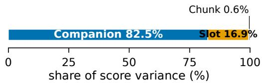

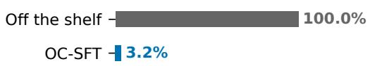

(a) Off-the-shelf within-document score-variance decomposition over 11 reranking collections.  
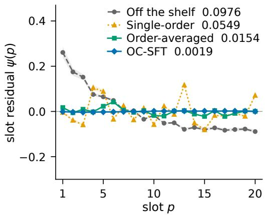  
(c) Mean slot residual ψ(p) over all documents; RMS is in the legend.

(b) Residual variance after slot and window-index controls, relative to off the shelf over four matched collections.  
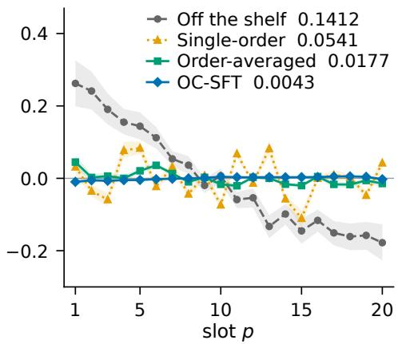  
(d) Mean slot residual over gold-positive documents on the same scale.  
Figure 5: Residual variation consistent with companion coupling dominates off-the-shelf score variance; OC-SFT removes nearly all of it and flattens the slot residual. Basis: Qwen3-4B; (a–b) use eleven and four collections, while (c–d) use a separate held-out MS MARCO sample of 200 queries at 500 permutations.

Table 5: Pool perturbations change decisions without changing mean quality. Lower is better except for signed mean ∆nDCG@10. Basis: Qwen3-4B, seed 42, 15 reranking collections, up to 100 judged queries each; rankings are restricted to the 99 documents shared by the two pools. DL21–23 are excluded because their first-stage files stop at rank 100 and do not contain the replacement candidate at rank 101.
<table><tr><td>Quantity</td><td>Off the shelf</td><td>Single-order</td><td>Order-avg.</td><td>OC-SFT</td></tr><tr><td>Pool-PSI</td><td>0.102</td><td>0.099</td><td>0.063</td><td>0.031</td></tr><tr><td>Top-10 changed</td><td>74.6%</td><td>65.0%</td><td>51.5%</td><td>36.3%</td></tr><tr><td>Mean ∆nDCG@10</td><td>-0.001</td><td>+0.001</td><td>+0.001</td><td>+0.001</td></tr><tr><td>Mean absolute ∆nDCG@10</td><td>0.0356</td><td>0.0240</td><td>0.0153</td><td>0.0113</td></tr></table>

The first-stage deficit follows window assignment rather than slot direction or copying (Tables 1 and 6). Round-robin assignment improves the untrained scorer by distributing adjacent first-stage ranks across windows (Table 1). Reversing the candidate order does not repair the deficit: quality stays below both the forward and random-permutation rankings, and τ-PSI is effectively unchanged. Because BM25 supplies the first stage, the forward condition presents candidates in BM25 order; its output ranking is only marginally more correlated with BM25 than the output from a random permutation. Together, these controls attribute the deficit to which candidates share a window.

Table 6: Three controls separate order mechanisms and perturbation transfer. Block (a) tests whether the slot residual reaches ranking quality; block (b) tests transfer to marker renaming; block (c) tests the first-stage-order deficit. Basis: blocks (a) and (c) use Qwen3-4B on the 18 reranking collections; block (b) uses Qwen3-1.7B and Qwen3-4B on DL19, NFCorpus, and Legal-A , with Roman-numeral and random three-character marker schemes held out from training.
<table><tr><td colspan="3">(a) Ranking-level slot preference Collections with U-shape</td></tr><tr><td colspan="3">Diagnostic Collections with primacy Forced-position nDCG@10 0/18</td></tr><tr><td colspan="3">0/18</td></tr><tr><td>(b) Marker-renaming transfer Measure</td><td>Minimum</td><td>Maximum Coverage / wins</td></tr><tr><td>Held-out marker τ-PSI Penalty improvement over marker-varied SFT</td><td>0.035 0.013</td><td>0.059 6 cells 0.037 6/6</td></tr><tr><td></td><td></td><td></td></tr><tr><td colspan="3">(c) First-stage-order controls</td></tr><tr><td>Measure Reverse</td><td colspan="2">Forward</td></tr><tr><td>nDCG@10 0.347</td><td colspan="2">0.370</td></tr><tr><td>τ-PSI 0.2992</td><td colspan="2">0.2983</td></tr><tr><td>Kendall correlation with BM25</td><td colspan="2">0.166</td></tr></table>

## C.2 VALIDITY CONTROLS FOR STABILITY

Table 7: Validity controls for the stability result. Block (a) separates stability from quality gain; block (b) tests score collapse and tied rankings; block (c) tests movement at the ranking head. Blocks (b–c) use the 18 reranking collections. Basis: Qwen3-4B, seed 42, M = 10 random permutations for blocks (b–c), and the document-ID tie-break.

<table><tr><td colspan="6">(a) Quality controls</td></tr><tr><td colspan="2">Diagnostic</td><td>Collection</td><td>Single-order</td><td>Order-avg.</td><td>OC-SFT</td></tr><tr><td colspan="2">|corr(∆nDCG@10, off-the-shelf τ-PSI)|</td><td>DL19</td><td>0.257</td><td>0.194</td><td>0.196</td></tr><tr><td colspan="2">Queries improving over off the shelf</td><td>DL20</td><td>0.070</td><td>0.037</td><td>0.106</td></tr><tr><td colspan="2"></td><td>DL19</td><td>93.0%</td><td>97.7%</td><td>90.7%</td></tr><tr><td colspan="2">Regressions relative to single-order</td><td>DL20</td><td>90.7%</td><td>90.7%</td><td>88.9%</td></tr><tr><td colspan="2"></td><td>DL19 DL20</td><td>reference reference</td><td>37.2% 29.6%</td><td>27.9% 24.1%</td></tr><tr><td colspan="6">(b) Score-geometry controls</td></tr><tr><td colspan="2">Diagnostic</td><td></td><td>Single-order</td><td>Order-avg.</td><td>OC-SFT</td></tr><tr><td colspan="2">Residual normalized by score dispersion</td><td></td><td>0.328</td><td>0.237</td><td>0.154</td></tr><tr><td colspan="2">Exact tied pairs</td><td></td><td>0.017%</td><td>0.050%</td><td>0.351%</td></tr><tr><td colspan="6">(c1) Ranking-head levels Variant</td></tr><tr><td colspan="2">Single-order</td><td></td><td></td><td colspan="2">Top-10 instability</td></tr><tr><td colspan="2">Order-avg.</td><td></td><td></td><td colspan="2">0.343</td></tr><tr><td colspan="2">OC-SFT</td><td></td><td></td><td colspan="2">0.275 0.193</td></tr><tr><td colspan="6">(c2) Ranking-head paired contrasts</td></tr><tr><td colspan="2">Contrast</td><td>Estimate</td><td>95% CI</td><td colspan="2">Collection wins</td></tr><tr><td colspan="2">Single-order — OC</td><td>+0.150</td><td>[+0.140, +0.159]</td><td colspan="2">OC 18/18</td></tr><tr><td colspan="2">Order-avg. – OC</td><td>+0.081</td><td>[+0.074, +0.087]</td><td colspan="2">OC 18/18</td></tr><tr><td colspan="2">Single-order — Order-avg.</td><td>+0.069</td><td>[+0.061, +0.076]</td><td colspan="2">Order-avg. 18/18</td></tr></table>

Lower τ -PSI reflects smaller permutation-induced movement rather than improved relevance, tied scores or tail-only changes (Table 7). Per-query quality gain against the off-the-shelf scorer is weakly related to starting instability and is non-negative for 89–98% of queries across the three trained variants on DL19 and DL20. Quality gains are aggregate: both order-averaged distillation and OC-SFT regress on some queries relative to single-order distillation. Scale-normalized residuals fall monotonically across the three variants while ties remain rare, so score collapse does not account for lower instability. Top-10 instability decreases in the same order on every collection. The reduction includes the highest-ranked documents, including the top five passages passed to the downstream reader (§5; Webber et al., 2010).

We do not report τ-PSI for GPT-5.4, whose grades do not reproduce at a fixed order (App. B.1). Rescoring the same permutation, on one query from each of DL19, FiQA and Climate-FEVER, agrees on 0.963 of grades and leaves a same-order τ-PSI floor of 0.023. Sampling no token removes that source for the open-weight scorers, but not the effect: at fixed candidate order they still reproduce 0.985 of the retained set (Table 26).

## C.3 ROBUSTNESS ACROSS METRICS

OC-SFT remains best across alternative quality and stability metrics (Table 8). The four columns test average quality, worst-permutation quality, dispersion across permutations and rank instability, so the ordering does not depend on τ-PSI alone. From the off-the-shelf scorer to OC-SFT, worstpermutation nDCG improves more than mean-permutation nDCG; because order-spread is mean minus worst, its reduction equals the difference between those gains.

Table 8: The variant ordering holds across metrics. Columns report mean and worst nDCG, order-spread and τ-PSI for four variants; higher nDCG and lower instability are better. Basis: eleven dense bases by the 18 reranking collections and M = 10 random permutations; nDCG uses the order-independent document-ID tie-break defined in App. B.1; order-spread is mean minus worst before rounding.
<table><tr><td>Variant</td><td>mean-perm nDCG</td><td>worst-perm nDCG</td><td>order-spread</td><td>τ-PSI</td></tr><tr><td>Off the shelf</td><td>0.4208</td><td>0.2940</td><td>0.1268</td><td>0.2874</td></tr><tr><td>Single-order</td><td>0.4606</td><td>0.3736</td><td>0.0870</td><td>0.2245</td></tr><tr><td>Order-avg.</td><td>0.4726</td><td>0.4076</td><td>0.0650</td><td>0.1388</td></tr><tr><td>OC-SFT</td><td>0.4771</td><td>0.4296</td><td>0.0475</td><td>0.0858</td></tr></table>

## D MITIGATION, SUPERVISION COST, AND ROBUSTNESS

We re-measure the trained gain with the partition held fixed (App. D.1) and compare OC-SFT with mitigation baselines and architectural controls (App. D.2). We then price its supervision and training cost (App. D.3), weigh inference-time averaging against training for consistency (App. D.4), measure sample efficiency (App. D.5), repeat the averaging comparison on consumers (App. D.6), and check that the gain survives a different first stage (App. D.7).

## D.1 PARTITION CONTROLS AND MATCHED TRAINING GAIN

Round-robin partitioning does not explain the OC-SFT gain (Table 9). Round-robin raises nDCG@10 for both scorers but raises the off-the-shelf scorer more, reducing the training gain without eliminating it. Across the six listed variants, the partition change moves τ-PSI by at most 0.0053. For the off-the-shelf scorer, the retained set, verdicts on two claim-verification collections and selected pair all remain level, with all four intervals covering zero.

Table 9: Round-robin partitioning does not explain the trained gain. Block (a) gives first-stageorder single-pass nDCG@10 under each partition rule; training gain is OC-SFT minus off the shelf. Block (b) gives round-robin minus contiguous τ-PSI over M = 10 random permutations. Block (c) gives round-robin minus contiguous consumer output for the off-the-shelf scorer; every interval covers zero. Basis: Qwen3-4B and 18 reranking collections; blocks (a–b) use seed 42 and equalweight collection means, while block (c) uses M = 10 permutations under each rule and the two claim-verification collections for verdict flip. Intervals in blocks (a) and (c) are paired collection bootstraps with 20,000 resamples.
<table><tr><td colspan="5">(a) Training gain under fixed partitioning</td></tr><tr><td>Partition rule</td><td>Off the shelf</td><td>OC-SFT</td><td>Training gain [95% CI]</td></tr><tr><td>Contiguous</td><td>0.370</td><td>0.459</td><td>+0.089[+0.069, +0.110]</td></tr><tr><td>Round-robin</td><td>0.422</td><td>0.474</td><td>+0.052 [+0.034, +0.073]</td></tr><tr><td>Contiguous minus round-robin</td><td>-0.052</td><td>-0.016</td><td>+0.036 [+0.022, +0.050]</td></tr><tr><td colspan="4">(b) Partition effect on instability Variant</td></tr><tr><td colspan="4">Off the shelf</td></tr><tr><td>Single-order</td><td></td><td></td><td>-0.0010 +0.0053</td></tr><tr><td>Order-avg.</td><td></td><td></td><td>+0.0029</td></tr><tr><td>Perm. aug.</td><td></td><td></td><td>+0.0005</td></tr><tr><td>DebiasFirst</td><td></td><td></td><td>+0.0008</td></tr><tr><td>OC-SFT</td><td></td><td></td><td>-0.0004</td></tr><tr><td colspan="4">(c) Off-the-shelf consumer effect</td></tr><tr><td colspan="4"></td></tr><tr><td>Consumer</td><td colspan="2">Change</td><td>95% CI</td></tr><tr><td>Retained-set overlap</td><td colspan="2">+0.004</td><td>[−0.007, +0.016]</td></tr><tr><td>Verdict flip, SciFact</td><td colspan="2">+0.0147</td><td>[-0.0102, +0.0404]</td></tr><tr><td>Verdict flip, Climate-FEVER</td><td colspan="2">-0.0002</td><td>[-0.0062, +0.0058]</td></tr><tr><td>Selected pair</td><td colspan="2">+0.0004</td><td>[-0.0033, +0.0034]</td></tr></table>

## D.2 MITIGATION BASELINES AND ARCHITECTURAL CONTROLS

No mitigation baseline reaches OC-SFT’s mean τ-PSI over the 18 reranking collections (Table 10). EMA closes 71% of the stability difference between single-order distillation and OC-SFT; order-averaged distillation at T=10, permutation augmentation, and DebiasFirst close 63–64%. Averaging fewer teacher orders does not reach that: the τ-PSI floor over T=2, 3 and 5 is 0.153, and the curve is not saturated at five, so T=10 is not an over-provisioned comparator. LoRA dropout leaves τ -PSI level with single-order distillation, KL regularization worsens it, and CapCal remains at the off-the-shelf level (Table 1). DebiasFirst and permutation augmentation differ only in propensity weighting and yield 0.128 and 0.129 τ-PSI, so the weighting does not measurably help.

PINE’s patched attention breaks our multi-candidate slot-grade readout (Wang et al., 2025b). On DL19 at B = 20, the ported scorer loses 0.122 nDCG@10 and adds 0.114 τ-PSI relative to the base Qwen3-4B scorer. A segmented prompt recovers most of the nDCG loss, and scoring one document at a time matches the base, so the failure arises from attention across documents rather than the readout alone.

Table 10: Mitigation baselines and regularizers on the Qwen3-4B student. Higher nDCG@10 and lower τ-PSI are better. Each variant is the mean ± sample standard deviation. Bold marks a lead larger than the seed spread of the rows it leads: the τ -PSI column clears it, whereas the quality column does not, so quality is unmarked. % closed is the fraction of the stability difference between single-order distillation and OC-SFT that the method removes. T is the number of shuffled teacher orders averaged into each label; the T=2, 3 and 5 draws are the first T orders of the T=10 pool rather than independent draws. Basis: Qwen3-4B, 18 reranking collection means, 3 training seeds.
<table><tr><td>Variant</td><td>Mean nDCG@10</td><td> $\mathbf { M e a n } \tau \mathbf { - P S I }$ </td><td>% closed</td></tr><tr><td>Single-order (T=1)</td><td> $0 . 4 4 9 \pm 0 . 0 0 3$ </td><td> $0 . 2 0 9 \pm 0 . 0 0 8$ </td><td>0%</td></tr><tr><td> $+ \mathrm { L o R A  d r o p o u t } 0 . 2 0$ </td><td> $0 . 4 4 8 \pm 0 . 0 0 4$ </td><td> $0 . 2 0 8 \pm 0 . 0 0 1$ </td><td>+0.8%</td></tr><tr><td> $+ \mathrm { K L - t o - b a s \hat { e } } \beta = 0 . 0 5$ </td><td> $0 . 4 4 7 \pm 0 . 0 0 2$ </td><td> $0 . 2 3 1 \pm 0 . 0 1 2$ </td><td>-17.5%</td></tr><tr><td> $+ \operatorname { E M A } \operatorname { m e a n - t e a c h e r } \alpha = 0 . 5$ </td><td> $0 . 4 5 3 \pm 0 . 0 0 3$ </td><td> $0 . 1 1 9 \pm 0 . 0 0 3$ </td><td>71.4%</td></tr><tr><td> $\scriptstyle \mathrm { O r d e r - a v g . } T = 2$ </td><td> $0 . 4 5 1 \pm 0 . 0 0 2$ </td><td> $0 . 1 7 6 \pm 0 . 0 0 8$ </td><td>26.2%</td></tr><tr><td> $\scriptstyle { \mathrm { O r d e r - a v g . } } T = 3$ </td><td> $0 . 4 5 1 \pm 0 . 0 0 0$ </td><td> $0 . 1 5 3 \pm 0 . 0 0 2$ </td><td>44.4%</td></tr><tr><td> $\scriptstyle \mathrm { O r d e r - a v g . } T = 5$ </td><td> $0 . 4 5 0 \pm 0 . 0 0 1$ </td><td> $0 . 1 6 1 \pm 0 . 0 0 9$ </td><td>38.1%</td></tr><tr><td> $\scriptstyle \mathrm { O r d e r - a v g . } T = 1 0$ </td><td> $0 . 4 5 5 \pm 0 . 0 0 2$ </td><td> $0 . 1 3 0 \pm 0 . 0 0 7$ </td><td>62.7%</td></tr><tr><td>Perm. aug.</td><td> $0 . 4 5 5 \pm 0 . 0 0 2$ </td><td> $0 . 1 2 9 \pm 0 . 0 1 0$ </td><td>63.5%</td></tr><tr><td>DebiasFirst</td><td> $0 . 4 5 4 \pm 0 . 0 0 1$ </td><td> $0 . 1 2 8 \pm 0 . 0 0 5$ </td><td>64.3%</td></tr><tr><td> $\mathrm { O C } { \cdot } \mathrm { S F T } \left( \lambda ^ { \ast } = 5 \right)$ </td><td> $0 . 4 5 9 \pm 0 . 0 0 2$ </td><td> $\mathbf { 0 . 0 8 3 \pm 0 . 0 0 2 }$ </td><td>100%</td></tr></table>

## D.3 SUPERVISION AND TRAINING COST

To separate information in the labels from exposure during student training, we cross teacher scoring width $( B = 1 \mathrm { o r } 2 0 )$ with student training width (B = 1 or 20). All four variants use Qwen3-4B as teacher and student; App. H.4 varies teacher identity separately.

Batched-teacher labels improve student nDCG@10 at both training widths, although the gain is smaller when the student also trains at B = 20 (Table 11). The pointwise teacher ranks known MS MARCO positives higher under direct teacher metrics, yet its labels train a worse student. Remapping the pointwise labels to the batched teacher’s score distribution while preserving document order does not close the student gap. Neither teacher-side ranking quality nor marginal score distribution therefore explains the benefit of batched-teacher labels.

Table 11: Batched-teacher labels improve student nDCG@10 at both training widths. The upper block reports the difference between students trained on batched- and pointwise-teacher labels; positive values favor batched-teacher labels. All students are evaluated at serving width B = 1 in firststage order. Rank-quantile matching assigns the batched teacher’s sorted score values to documents in the pointwise teacher’s rank order. The residual is the batched-label student’s nDCG@10 minus that of the recalibrated pointwise-label student; minimum and maximum are over three evaluated checkpoints. Basis: mean over the 18 reranking collections; Qwen3-4B; training seed 42; 100,000 paired collection-bootstrap samples.
<table><tr><td>Student training width</td><td>∆nDCG@10</td><td>95% CI</td><td>Wins (of 18)</td></tr><tr><td> $B _ { \mathrm { t r a i n } } = 1$ </td><td>+0.0291</td><td> $\left[ + 0 . 0 1 9 5 , + 0 . 0 3 8 5 \right]$ </td><td>17</td></tr><tr><td> $B _ { \mathrm { t r a i n } } = 2 0$ </td><td>+0.0097</td><td> $\left[ + 0 . 0 0 2 3 , + 0 . 0 1 6 9 \right]$ </td><td>13</td></tr><tr><td>Control</td><td colspan="2">Minimum residual</td><td>Maximum residual</td></tr><tr><td>Rank-quantile matching</td><td colspan="2">+0.0307</td><td>+0.0333</td></tr></table>

Increasing student views beyond N = 2 does not help, while additional teacher passes mainly improve stability (Table 12). From N=2–8, nDCG@10 and τ-PSI remain within the ranges in Table 12 while forward-pass training cost rises fourfold. Increasing teacher permutations from T=5 to T=40 changes nDCG@10 by +0.0042 and τ-PSI by −0.0398 at 8x the label-generation cost.

Re-distillation helps in the first round and then largely saturates (Table 13). Qwen3-4B gains mostly in stability on the first round and changes by only 0.0011 on each metric in the second, with τ-PSI increasing; Gemma-E4B retains a smaller second-round gain. A second round therefore buys a change of that size for another full labeling and training cycle, so iterating further is not an efficient way to add stability.

Table 12: Extra student views raise training cost; extra teacher passes mainly lower τ-PSI. N is the number of shuffled student views per training step; T is the number of teacher permutations averaged into each stored label. Student-view rows report the range over $N \in \{ 2 , 3 , 4 , 8 \}$ ; teacherlabel rows report the change from T=5 to T=40. Cost is relative to N=2 training for student-view rows and $T { = } 5$ labeling for teacher-label rows.
<table><tr><td>Stage varied</td><td>Sweep</td><td>Metric</td><td>Observed range / change</td><td>Forward-pass cost</td></tr><tr><td>Student training</td><td> $N \in \{ 2 , 3 , 4 , 8 \}$ </td><td>nDCG@10</td><td>range 0.4786–0.4795</td><td>100–400% training</td></tr><tr><td>Student training</td><td> $N \in \{ 2 , 3 , 4 , 8 \}$ </td><td>τ-PSI</td><td>range 0.067–0.077</td><td>100–400% training</td></tr><tr><td>Teacher labels</td><td> $T = 5  4 0$ </td><td>nDCG@10</td><td>change +0.0042</td><td>800% labeling</td></tr><tr><td>Teacher labels</td><td> $T = 5  4 0$ </td><td>τ-PSI</td><td> $\mathtt { c h a n g e - 0 . 0 3 9 8 }$ </td><td>800% labeling</td></tr></table>

Table 13: Iterative self-distillation gains diminish after the first round. Positive ∆nDCG@10 and negative $\Delta \tau { \mathrm { - } } \mathrm { P S I }$ are improvements. Round 1 is measured against the initial trained student and round 2 against round 1. Basis: 18 reranking collections, one iterative training lineage per base.
<table><tr><td>Base</td><td>Round</td><td>∆nDCG@10</td><td> $\Delta \tau { \mathrm { - P S I } }$ </td></tr><tr><td>Qwen3-4B</td><td>1</td><td> $+ 0 . 0 0 6 9$ </td><td>-0.0183</td></tr><tr><td>Qwen3-4B</td><td>2</td><td> $+ 0 . 0 0 1 1$ </td><td>+0.0011</td></tr><tr><td>Gemma-E4B</td><td>1</td><td> $+ 0 . 0 1 4 1$ </td><td>-0.0311</td></tr><tr><td>Gemma-E4B</td><td>2</td><td> $+ 0 . 0 0 3 6$ </td><td>-0.0077</td></tr></table>

## D.4 INFERENCE-TIME AMORTIZATION

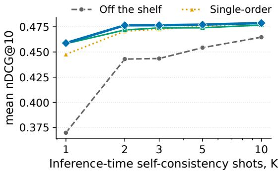

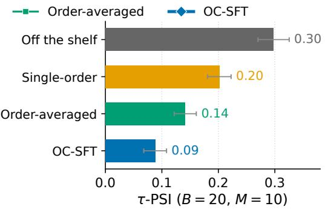  
Figure 6: OC-SFT at K = 1 is within 0.006 nDCG@10 of the off-the-shelf K = 10 ensemble. Left: nDCG@10 against self-consistency permutations K, higher is better. Right: single-pass τ - PSI at $B = 2 0$ for off the shelf, single-order distillation, order-averaged distillation and OC-SFT, evaluated over $M = 1 0$ random permutations; lower is better.

Averaging raises nDCG@10, while training supplies most of the τ -PSI reduction (Figure 6). At $K = 5 ,$ the off-the-shelf scorer still trails its $K = 1 0 \mathrm { n D C G } @ 1 0 .$ , so we retain $K = 1 0$ as the quality comparator. OC-SFT has the lowest single-pass τ -PSI among the four variants. From $K \bar { = } 1$ to $K = 1 0$ , averaging raises off-the-shelf nDCG@10 by 0.095 but each trained variant by at most 0.035, so training has already captured most of the nDCG@10 gain that permutation averaging provides.

## D.5 SAMPLE EFFICIENCY

τ-PSI saturates with fewer labeled queries than nDCG@10 (Figure 7). With 1K labeled queries, OC-SFT is more stable than order-averaged distillation trained on 30K queries on every collection except ArguAna. For quality, models trained from one teacher order need about 3K queries to approach their 30K nDCG@10, whereas models trained from ten-order averages saturate earlier.

tau-PSI vs labeled training queries  
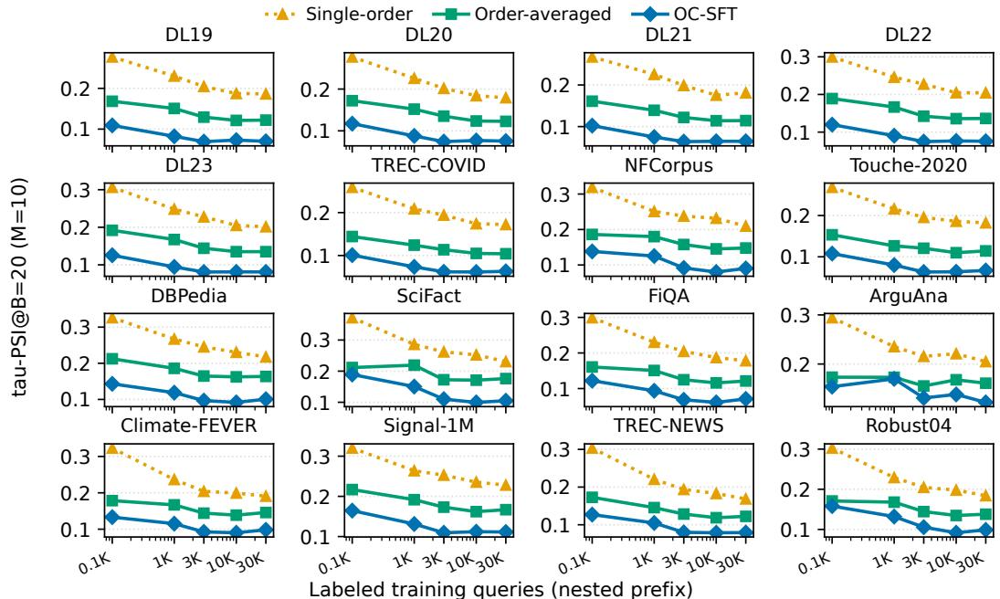  
(a) τ -PSI vs. labeled queries

nDCG@10 vs labeled training queries  
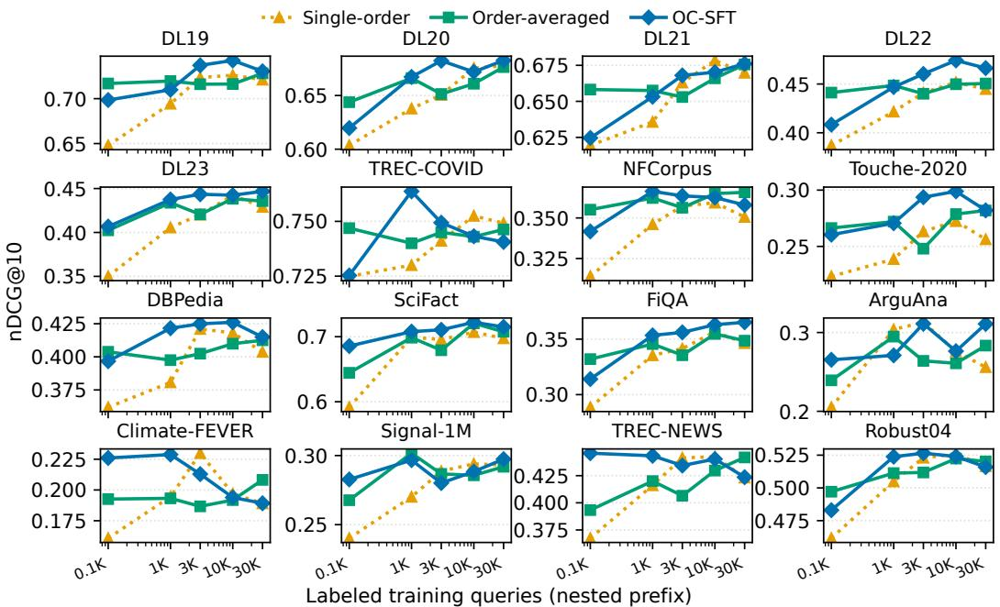  
(b) nDCG@10 vs. labeled queries  
Figure 7: Stability saturates with fewer labeled queries than quality. (a) Student τ-PSI, lower is better; (b) nDCG@10, higher is better, both against the number of unique labeled training queries over nested pools. Basis: Qwen3-4B; 16 public reranking collections; Legal-A and Legal-B follow the same pattern.

## D.6 SERVING-TIME AVERAGING AFTER TRAINING

App. D.4 sweeps the serving budget for nDCG@10 and τ -PSI. We repeat that sweep on the three consumers, so that whether training removes what averaging buys is answered on the measures the decisions are taken from and not on ranking quality alone.

Serving-time averaging improves all three consumer measures at least as much for OC-SFT as for the off-the-shelf scorer (Figure 4). From K = 1 to K = 10, the pair-flip reduction is larger after OC-SFT, and the answer-flip reduction is equal. Under matched retention, OC-SFT also closes a larger share of the available overlap range. OC-SFT leads at every measured budget on all three consumers and on every collection from $K = 2$ onward, with a single tie on TREC-COVID at K = 1. OC-SFT reduces but does not eliminate presentation sensitivity. Averaging therefore further improves reproducibility after training, but produces a smaller gain in label accuracy (Table 14).

On reranking, OC-SFT at K= 10 exceeds its K= 1 result, while BSC at K= 10 still trails OC-SFT at K= 1. At K= 1, OC-SFT reaches 0.832 retained-set overlap against 0.663 for single-order distillation and 0.737 for order-averaged distillation; at K= 10 the three reach 0.950, 0.869 and 0.904; all three-seed means. OC-SFT therefore leads both baselines at matched K, although each baseline at K= 10 exceeds OC-SFT at K= 1. Figure 4 draws the same two variants on the queries they share, and at each K it sets OC-SFT’s cutoff to the fraction the off-the-shelf scorer’s F1-tuned cutoff retains, so both are thresholded to equal set size. We match them, as retained-set overlap rises with set size and the F1-tuned fraction itself moves with K. The same two OC-SFT points are 0.831 and 0.943 there. The tenfold comparison in Figure 4 holds against the untrained ensemble of Korikov et al. (2025) and does not extend to a trained one.

Pair flip counts how often the selected pair moves, not whether the movement crosses the gold label. We therefore classify each query by whether its top-scored response agrees with gold under all M = 10 random permutations, under none of them, or under some.

Table 14: Gold crossing and label accuracy on response ranking. Gold crossing is the share of queries whose top-scored response agrees with gold under some permutations and not others; 1 perm. and 10 perm. are label accuracy from a single permutation and from the ten-permutation average. Lower crossing and higher accuracy are better. The binary-gold mean excludes Nectar, whose gold is graded and whose off-the-shelf accuracy is near chance. Basis: M = 10 random permutations; off the shelf is a fixed evaluation, single-order distillation uses seed 42, and OC-SFT is the mean over seeds 42–44.
<table><tr><td></td><td colspan="3">Off the shelf</td><td colspan="3">Single-order</td><td colspan="3">OC-SFT</td></tr><tr><td>Collection</td><td>Gold cross.↓</td><td>1 perm.</td><td>10 perm.</td><td>Gold cross.↓</td><td>1 perm.</td><td>10 perm.</td><td>Gold cross.↓</td><td>1 perm.</td><td>10 perm.</td></tr><tr><td>RewardBench-2</td><td>0.661</td><td>0.594</td><td>0.711</td><td>0.656</td><td>0.594</td><td>0.684</td><td>0.295</td><td>0.683</td><td>0.705</td></tr><tr><td>Nectar</td><td>0.714</td><td>0.225</td><td>0.295</td><td>0.698</td><td>0.261</td><td>0.300</td><td>0.597</td><td>0.276</td><td>0.318</td></tr><tr><td>PPE-MATH</td><td>0.654</td><td>0.754</td><td>0.834</td><td>0.523</td><td>0.806</td><td>0.846</td><td>0.426</td><td>0.812</td><td>0.843</td></tr><tr><td>PPE MMLU-Pro</td><td>0.727</td><td>0.662</td><td>0.691</td><td>0.770</td><td>0.663</td><td>0.668</td><td>0.593</td><td>0.667</td><td>0.677</td></tr><tr><td>RM-Bench</td><td>0.576</td><td>0.709</td><td>0.711</td><td>0.564</td><td>0.707</td><td>0.725</td><td>0.496</td><td>0.712</td><td>0.722</td></tr><tr><td>Binary-gold mean</td><td>0.654</td><td>0.680</td><td>0.737</td><td>0.628</td><td>0.693</td><td>0.731</td><td>0.453</td><td>0.719</td><td>0.737</td></tr></table>

Most pair flips occur on queries that cross the gold label (Table 14). Off the shelf, 0.654 of queries agree with gold under some permutations and not others, and 0.682 of all pair flips occur on those queries. Pair flip on this task is therefore a change in which response would be labelled correct, not a reshuffle among responses the gold treats alike. The K = 10 average raises binary-gold mean label accuracy (Table 14).

The gain is concentrated in RewardBench-2 and PPE-MATH, while averaging adds almost nothing on RM-Bench or PPE MMLU-Pro. The mean therefore overstates how reliably averaging repairs a label. OC-SFT lowers crossing on all four binary-gold collections, and single-order distillation lowers it on three and raises it on PPE MMLU-Pro. The two trained variants are not matched on seeds, so we read the ordering rather than the size of the difference. At one presentation, OC-SFT approaches the accuracy of the ten-presentation off-the-shelf scorer, but further averaging improves label accuracy less for OC-SFT than for the off-the-shelf scorer. Averaging therefore adds little to label correctness once the scorer is trained, while on reproducibility it keeps composing (Figure 4). Nectar stays out of the mean, since its gold is the maximum of graded scores rather than a binary preference and the off-the-shelf scorer agrees under all M = 10 random permutations on 0.002 of its queries. Its single-permutation accuracy of 0.225 is near what a random choice among its responses would reach.

## D.7 ROBUSTNESS TO THE FIRST STAGE

Because all main reranking results use BM25 candidates, we test first-stage dependence by evaluating the same BM25-trained Qwen3-4B checkpoints on BGE-base-en-v1.5 (Xiao et al., 2024) and SPLADE++ ED (Formal et al., 2022) candidates without retraining.

OC-SFT retains the lowest τ -PSI while remaining near order-averaged distillation in quality under all three first stages (Table 15). On the 13-collection mean, OC-SFT ties order-averaged distillation under BM25, trails it by 0.004 under BGE, and leads it by 0.002 under SPLADE. OC-SFT also has the lowest per-collection τ-PSI on all 13 collections (Table 33).

Table 15: Four variants under three first stages. Each variant has separate nDCG@10 and τ-PSI columns, averaged over the same 13 collections. All trained variants use BM25 candidates during training, so the BGE and SPLADE rows test eval-only transfer. DL21–23 and Legal-A/B are excluded because no BGE or SPLADE candidate sets were available for them. Basis: Qwen3-4B, seed 42; BM25-trained checkpoints; per-collection results are in Table 33.
<table><tr><td rowspan="2">First stage</td><td colspan="2">Off the shelf</td><td colspan="2">Single-order</td><td colspan="2">Order-avg.</td><td colspan="2">OC-SFT</td></tr><tr><td>nDCG</td><td>τ-PSI</td><td>nDCG</td><td>τ-PSI</td><td>nDCG</td><td>τ-PSI</td><td>nDCG</td><td>τ-PSI</td></tr><tr><td>BM25</td><td>0.374</td><td>0.287</td><td>0.452</td><td>0.198</td><td>0.463</td><td>0.140</td><td>0.463</td><td>0.089</td></tr><tr><td>BGE (dense)</td><td>0.373</td><td>0.315</td><td>0.462</td><td>0.213</td><td>0.478</td><td>0.147</td><td>0.474</td><td>0.089</td></tr><tr><td>SPLADE (learned-sparse)</td><td>0.358</td><td>0.307</td><td>0.455</td><td>0.210</td><td>0.463</td><td>0.146</td><td>0.465</td><td>0.090</td></tr></table>

## E TRANSFER TO MULTI-DOCUMENT QA AND RESPONSE RANKING

We repeat the measurements outside passage reranking, on multi-document question answering (App. E.1) and on response ranking (App. E.2), to test whether presentation dependence and the effect of training on it are specific to the reranking setting.

Table 16: Serving-width effects differ by task and collection. Rows compare OC-SFT at B = 1 and at the training width in parentheses. Width effect is training-width quality minus B = 1 quality. One-permutation effects include the order residual, whereas order-averaged effects average the training-width scores over K = 10 serving permutations. Basis: Qwen3-4B, seeds 42–44.
<table><tr><td></td><td></td><td colspan="2">Level</td><td colspan="2">Width effect</td></tr><tr><td>Task</td><td>Metric</td><td></td><td>B = 1 Training width One permutation Order-averaged</td><td></td><td></td></tr><tr><td>Reranking: 18 collections (B = 20)</td><td>nDCG@10</td><td>0.459</td><td>0.459</td><td>+0.000</td><td>+0.020</td></tr><tr><td>Multi-doc QA (B = 10), 3 collections nDCG@ 10</td><td></td><td>0.918</td><td>0.961</td><td>+0.043</td><td>+0.047</td></tr><tr><td colspan="6">Response ranking (B = 4), 5 collections</td></tr><tr><td>RewardBench-2 (4 candidates)</td><td>nDCG@1</td><td>0.670</td><td>0.690</td><td>+0.020</td><td>+0.036</td></tr><tr><td>Nectar (7 candidates)</td><td>nDCG@1</td><td>0.610</td><td>0.617</td><td>+0.006</td><td>+0.026</td></tr><tr><td>PPE-MATH (8 candidates)</td><td>nDCG@1</td><td>0.711</td><td>0.807</td><td>+0.096</td><td>+0.132</td></tr><tr><td>PPE MMLU-Pro (8 candidates)</td><td>nDCG@1</td><td>0.602</td><td>0.675</td><td>+0.074</td><td>+0.076</td></tr><tr><td>RM-Bench (6 candidates)</td><td>nDCG@1</td><td>0.755</td><td>0.715</td><td>-0.040</td><td>-0.033</td></tr></table>

## E.1 MULTI-DOCUMENT QUESTION ANSWERING

Ten-order labels transfer part of the benefit of shared-context support selection, but not consistently across QA collections (Table 17). With the same frozen reader, a B = 1 student trained on those labels matches the B = 10 scorer on HotpotQA EM and recovers most of its F1 advantage, recovers only part of either gap on MuSiQue, and falls below the pointwise baseline on

Table 17: Support ranking transfers zero-shot; reader accuracy depends on scorer context. Support columns report the OC-SFT scorer at B = 10. Reader columns report the same frozen Granite-4.1-8B reader over the top five passages from OC-SFT, a pointwise scorer, or a B = 1 scorer trained on labels averaged over ten multi-context teacher orders. Higher nDCG@10, EM and F1 are better; lower τ-PSI is better. All metrics are averaged over the same permutations. Basis: Qwen3-4B, 200 questions per collection, seed 42, M = 10 random permutations.
<table><tr><td></td><td colspan="2">OC-SFT support</td><td colspan="2">Reader: OC-SFT</td><td colspan="2">Reader: pointwise</td><td colspan="2">Reader: ten-order labels</td></tr><tr><td>Collection</td><td>nDCG@10</td><td>τ-PSI</td><td>EM</td><td>F1</td><td>EM</td><td>F1</td><td>EM</td><td>F1</td></tr><tr><td>HotpotQA</td><td>0.964</td><td>0.082</td><td>0.621</td><td>0.743</td><td>0.575</td><td>0.684</td><td>0.623</td><td>0.734</td></tr><tr><td>2WikiMultiHopQA</td><td>0.975</td><td>0.102</td><td>0.431</td><td>0.546</td><td>0.427</td><td>0.532</td><td>0.398</td><td>0.524</td></tr><tr><td>MuSiQue</td><td>0.944</td><td>0.078</td><td>0.417</td><td>0.531</td><td>0.340</td><td>0.459</td><td>0.381</td><td>0.487</td></tr></table>

2WikiMultiHopQA. Teacher averaging can therefore distill some context benefit into a pointwise student, but it does not replace presenting the companion passages at serving time.

Table 18: QA width effects are positive on all three collections and come from real companion passages. Block (a) gives the mean one-permutation and order-averaged width effects by collection. Block (b) decomposes the one-permutation three-collection mean into informative-alternative, promptlength/position and answer-skeleton terms. Width effect is B = 10 quality minus B = 1 quality. Basis: Qwen3-4B OC-SFT, three independently trained checkpoints; each served at both widths.
<table><tr><td>(a) Mean width effect by collection Collection</td><td>One permutation</td><td>Order-averaged</td></tr><tr><td>HotpotQA</td><td>+0.0345</td><td>+0.0377</td></tr><tr><td>2WikiMultiHopQA</td><td>+0.0441</td><td>+0.0496</td></tr><tr><td>MuSiQue</td><td>+0.0518</td><td>+0.0545</td></tr><tr><td colspan="3">(b) Three-collection one-permutation width decomposition</td></tr><tr><td colspan="3">Three-collection component</td></tr><tr><td>Observed width effect</td><td></td><td>+0.0435</td></tr><tr><td colspan="3">Informative alternatives</td></tr><tr><td colspan="2">Prompt length and target position</td><td>+0.0482 +0.0034</td></tr><tr><td colspan="3"></td></tr><tr><td colspan="2">Answer skeleton</td><td>-0.0081</td></tr></table>

Real companion passages, not the longer answer template, produce the QA width gain (Table 18). To separate companion content from the larger prompt and readout, we score the same target passage in four conditions: alone with one grade slot; with its nine real candidate passages and ten slots; with nine unrelated, length-matched filler passages and ten slots; and alone under the same ten-slot answer template. The total width effect compares real companions with the one-slot condition. Within that total, real companions minus fillers measures informative companion content, fillers minus the target-alone ten-slot condition measures prompt length and target position, and the two target-alone conditions isolate the answer template. Only the real-companion term is large and positive; the length/position term is small and the answer-template term is negative. A separate check replaces one B = 1 engine call with ten independently batched B = 1 calls; the three-collection mean changes only from +0.0470 to +0.0459. The gain therefore comes from information in the other candidate passages rather than from the larger template or request batching (§6.4).

## E.2 RESPONSE RANKING

The five collections contain four to eight candidates, with four requiring more than one B = 4 prompt. The pointwise control is trained at B = 1 on pointwise-teacher labels under the same Qwen3-4B evaluation protocol used for the batched student.

Shared-context serving raises mean nDCG@1 on both PPE collections, changes little on Nectar, and lowers it on RM-Bench; the PPE-MATH and RM-Bench signs transfer to Gemma-E4B (Table 19). Across the two PPE collections and RM-Bench, the ten-order-label and pointwise-label

B = 1 variants differ by at most 0.006 nDCG@1; shared-context serving then improves both PPE collections but degrades RM-Bench. The quality change therefore emerges when candidates share the serving prompt rather than from averaging shared-context information into the teacher labels. Gemma-E4B reproduces the positive PPE-MATH and negative RM-Bench effects, while the PPE MMLU-Pro interval covers zero.

Table 19: Response-ranking width and design effects vary by collection and model family. Block (a) reports mean fixed-weight width effects. Block (b) compares nDCG@1 levels for three training/serving designs under one Qwen3-4B evaluation-file readout; Nectar lacks a pointwisecontrol level on this basis. Block (c) repeats the batched-minus-pointwise comparison on Gemma-E4B with paired prompt-bootstrap intervals. Blocks (a) and (b) estimate different comparisons. Comparing prompts against UltraFeedback found no exact overlap for RewardBench-2 or either PPE collection. Basis: blocks (a–b) use Qwen3-4B and block (c) uses Gemma-E4B.
<table><tr><td>(a) Mean fixed-weight width effects Collection</td><td>One-permutation effect</td><td>Order-averaged effect</td><td>Pool size</td></tr><tr><td>RewardBench-2</td><td>+0.020</td><td>+0.036</td><td>4</td></tr><tr><td>Nectar</td><td>+0.006</td><td>+0.026</td><td>7</td></tr><tr><td>PPE-MATH</td><td>+0.096</td><td>+0.132</td><td>8</td></tr><tr><td>PPE MMLU-Pro</td><td>+0.074</td><td>+0.076</td><td>8</td></tr><tr><td>RM-Bench</td><td>-0.040</td><td>-0.033</td><td>6</td></tr><tr><td colspan="4"></td></tr><tr><td>(b) Label construction and serving geometry, Qwen3-4B</td><td></td><td></td><td></td></tr><tr><td>Collection</td><td>Ten-order labels (B = 1)</td><td>Pointwise labels (B = 1)</td><td>OC-SFT (B = 4)</td></tr><tr><td>RewardBench-2</td><td>0.657</td><td>0.605</td><td>0.690</td></tr><tr><td>PPE-MATH</td><td>0.723</td><td>0.719</td><td>0.805</td></tr><tr><td>PPE MMLU-Pro</td><td>0.594</td><td>0.592</td><td>0.666</td></tr><tr><td>RM-Bench</td><td>0.748</td><td>0.754</td><td>0.721</td></tr><tr><td colspan="4">(c) Family replication, Gemma-E4B</td></tr><tr><td>Collection</td><td>OC-SFT (B = 4) minus pointwise (B = 1)</td><td></td><td>95% CI</td></tr><tr><td>PPE-MATH</td><td></td><td>+0.1094</td><td>[+0.0664, +0.1523]</td></tr><tr><td>PPE MMLU-Pro</td><td></td><td>+0.0098</td><td>[-0.0391, +0.0566]</td></tr><tr><td>RM-Bench</td><td></td><td>-0.0648</td><td>[-0.0897, -0.0407]</td></tr></table>

Skywork-Reward-V2-Qwen3-4B (Liu et al., 2026) is a 4B pointwise reward model that scores each response independently; PairRM (Jiang et al., 2023) is a 0.4B pairwise reward model that compares two responses at a time (Table 20). Skywork has higher nDCG@1 on RewardBench-2, Nectar and RM-Bench, whereas OC-SFT leads on PPE-MATH and PPE MMLU-Pro. PairRM falls below the pointwise control on all five collections; the paired interval excludes zero on four. PairRM was trained on six large preference datasets, including UltraFeedback, and Skywork also uses much heavier preference supervision than our roughly 30K prompts. Architecture, scale and training data all differ at once, so the comparison cannot attribute the gap to any one of them.

Table 20: PairRM and Skywork against matched Qwen3-4B controls. Each row gives matched nDCG@1 levels; PairRM contrasts use paired query bootstraps with 20,000 resamples. Basis: seed 42; matched query IDs per collection; UltraFeedback is excluded because it is train-on-test for PairRM.
<table><tr><td></td><td></td><td colspan="4">nDCG@1</td><td colspan="2">PairRM — pointwise</td><td colspan="2">OC-SFT — PairRM</td></tr><tr><td>Collection</td><td>n</td><td>Pointwise</td><td>PairRM</td><td>Skywork</td><td>OC-SFT</td><td>Estimate</td><td>95% CI</td><td>Estimate</td><td>95% CI</td></tr><tr><td>Nectar</td><td>434</td><td>0.5975</td><td>0.5914</td><td>0.6467</td><td>0.6152</td><td>-0.0061</td><td>[-0.0430, +0.0315]</td><td>+0.0238</td><td>[-0.0115,+0.0591]</td></tr><tr><td>RewardBench-2 1,763</td><td></td><td>0.6052</td><td>0.4974</td><td>0.8174</td><td>0.6903</td><td>-0.1078</td><td>[-0.1361, -0.0788]</td><td>+0.1929</td><td>[+0.1651,+0.2201]</td></tr><tr><td>PPE-MATH</td><td>512</td><td>0.7188</td><td>0.4707</td><td>0.7656</td><td>0.8047</td><td>-0.2480</td><td>[-0.3047, -0.1914]</td><td>+0.3340</td><td>[+0.2793, +0.3867]</td></tr><tr><td>PPE MMLU-Pro 512</td><td></td><td>0.5918</td><td>0.4961</td><td>0.6445</td><td>0.6660</td><td>-0.0957</td><td>[-0.1523, -0.0371]</td><td>+0.1699</td><td>[+0.1133, +0.2246]</td></tr><tr><td>RM-Bench</td><td>1,327</td><td>0.7543</td><td>0.6353</td><td>0.8237</td><td>0.7212</td><td>-0.1191</td><td>[-0.1492, -0.0889]</td><td>+0.0859</td><td>[+0.0543,+0.1176]</td></tr></table>

## F CONSUMER OUTPUTS AND REPORTED SCORES

We apply a frozen threshold (App. F.1), a frozen reader (App. F.3) and a fixed chosen/rejected-pair selector (App. F.4) to the same M = 10 random permutations, relate the retained set to standard ranking metrics (App. F.2), and recompute a reported benchmark score (App. F.5), to test whether presentation dependence propagates from rankings to downstream decisions and reported quality. Holding each consumer fixed isolates variation caused by the scorer because the consumer itself does not change.

## F.1 A FROZEN THRESHOLD: THE RETAINED SET

For each pair of scorer permutations, let A and B be the documents admitted by the same frozen threshold. Retained-set overlap averages the Jaccard index $| A \cap B | / | A \cup B |$ over all permutation pairs; it equals one when every permutation retains the same set.

The retained-set gain transfers across model families (Table 21). Every dense base improves on the 18-collection mean, with positive collection-level gains in 196 of 198 cells; the mixture-of-experts base improves on all 18 collections. What the threshold retains is therefore made more reproducible by the objective rather than by the primary base.

Table 21: Retained-set overlap gain of OC-SFT over single-order distillation by base model. Each gain is an equal-weight collection mean. Single-order distillation is the baseline because the off-the-shelf fixed threshold degenerates to retain-all on TREC-COVID. The 95% CI column gives paired collection-bootstrap intervals; the last column counts positive collection-level gains. Basis: 18 reranking collections at a frozen per-collection F1 threshold, seed 42, independently selected checkpoints on each base.
<table><tr><td>Base</td><td>Gain</td><td>95% CI</td><td>Improving</td></tr><tr><td>Qwen3-1.7B</td><td>+0.369</td><td>[+0.298, +0.423]</td><td>17/18</td></tr><tr><td>Qwen3-4B</td><td>+0.169</td><td>[+0.152, +0.186]</td><td>18/18</td></tr><tr><td>Qwen3-8B</td><td>+0.254</td><td>[+0.233, +0.274]</td><td>18/18</td></tr><tr><td>Qwen3-14B</td><td>+0.248</td><td>[+0.210, +0.282]</td><td>18/18</td></tr><tr><td>Qwen3-32B</td><td>+0.264</td><td>[+0.237, +0.292]</td><td>18/18</td></tr><tr><td>Gemma-E2B</td><td>+0.186</td><td>[+0.173, +0.201]</td><td>18/18</td></tr><tr><td>Gemma-E4B</td><td>+0.116</td><td>[+0.100, +0.131]</td><td>18/18</td></tr><tr><td>Gemma-31B</td><td>+0.135</td><td>[+0.088, +0.182]</td><td>17/18</td></tr><tr><td>Granite-3B</td><td>+0.174</td><td>[+0.149, +0.202]</td><td>18/18</td></tr><tr><td>Granite-8B</td><td>+0.137</td><td>[+0.123, +0.152]</td><td>18/18</td></tr><tr><td>Granite-30B</td><td>+0.216</td><td>[+0.197, +0.235]</td><td>18/18</td></tr><tr><td>Gemma-26B-A4B MoE</td><td>+0.106</td><td>[+0.085, +0.135]</td><td>18/18</td></tr></table>

## F.2 RANKING METRICS AND THE RETAINED SET

Retained-set overlap measures a real loss, and no ranking metric substitutes for it (Table 22). For both single-order distillation and OC-SFT, per-query retained-set F1 varies about as much as nDCG@10 across presentations (Figure 3). The loss is concentrated near the cutoff, where churned documents have relevance density 0.215, versus 0.438 among documents retained under both permutations. The ordering τ -PSI induces agrees with the ordering overlap induces more often than nDCG@10’s does, but the agreement is incomplete. Collection averaging reduces the apparent spread, so neither a ranking metric nor a collection mean shows how a threshold’s output changes under reshuffling.

## F.3 A FROZEN READER: THE VERDICT AND THE ANSWER

At 4B, OC-SFT lowers verdict and answer flip while reader accuracy remains level (Table 23). The default reader is a frozen Granite-4.1-8B decoding greedily into three constrained claimverification labels. A frozen Qwen3-4B reader repeats the comparison on both claim-verification and all three question-answering collections. Verdictflip and answerflip are mean pairwise disagreement rates over the M = 10 random permutations. The reductions are positive under both readers on claim verification and QA, while all reported reader-accuracy intervals cover zero. The same-evidence controls are positive for claim verification and QA, and their magnitudes fall within the range of the all-query effects. The lower flip rates therefore do not require a change in which evidence reaches the reader. EMA closes more of the rank-level gap than augmentation but loses 0.023 QA exact match; together, these controls show that OC-SFT’s rank-level gain reaches the reader output without a measurable accuracy trade-off (Tables 10 and 23).

Table 22: Retained-set overlap by collection for seven single-permutation systems within 0.022 nDCG@10. The quality and overlap winners differ on 11 of 18 collections. Excluding GPT-5.4, whose τ-PSI is not reported, median pairwise disagreement with overlap is 0.067 for τ-PSI and 0.267 for nDCG@10. The six-system discordance calculation uses seed-42 nDCG@10 and τ-PSI, with jina at matched B = 20. F1 spread is a query’s mean retained-set F1 minus its worst permutation, averaged over queries, so the set a threshold admits is about as permutation-sensitive as the ranking it is read from. Basis: three-seed means for trained rows and single evaluations for external rows, at the frozen per-collection F1 thresholds of Table 1; per-collection quality and instability are in Tables 32, 35 and 36.
<table><tr><td>Collection</td><td>GPT-5.4</td><td>OC-SFT</td><td>Order-avg.</td><td>Perm. aug.</td><td>DebiasFirst</td><td>Single-order</td><td>jina-v3</td></tr><tr><td>DL19</td><td>0.779</td><td>0.882</td><td>0.827</td><td>0.832</td><td>0.835</td><td>0.732</td><td>0.769</td></tr><tr><td>DL20</td><td>0.782</td><td>0.881</td><td>0.812</td><td>0.827</td><td>0.826</td><td>0.743</td><td>0.721</td></tr><tr><td>DL21</td><td>0.846</td><td>0.899</td><td>0.814</td><td>0.832</td><td>0.832</td><td>0.692</td><td>0.756</td></tr><tr><td>DL22</td><td>0.685</td><td>0.825</td><td>0.785</td><td>0.774</td><td>0.774</td><td>0.638</td><td>0.685</td></tr><tr><td>DL23</td><td>0.617</td><td>0.814</td><td>0.701</td><td>0.747</td><td>0.741</td><td>0.634</td><td>0.621</td></tr><tr><td>Touché-2020</td><td>0.832</td><td>0.832</td><td>0.757</td><td>0.795</td><td>0.773</td><td>0.622</td><td>0.670</td></tr><tr><td>FiQA</td><td>0.640</td><td>0.850</td><td>0.723</td><td>0.750</td><td>0.748</td><td>0.661</td><td>0.662</td></tr><tr><td>NFCorpus</td><td>0.738</td><td>0.862</td><td>0.770</td><td>0.796</td><td>0.791</td><td>0.679</td><td>0.666</td></tr><tr><td>ArguAna</td><td>0.607</td><td>0.615</td><td>0.539</td><td>0.544</td><td>0.540</td><td>0.484</td><td>0.618</td></tr><tr><td>Climate-FEVER</td><td>0.624</td><td>0.798</td><td>0.707</td><td>0.704</td><td>0.711</td><td>0.621</td><td>0.589</td></tr><tr><td>TREC-COVID</td><td>0.831</td><td>0.933</td><td>0.887</td><td>0.901</td><td>0.902</td><td>0.778</td><td>0.791</td></tr><tr><td>DBPedia</td><td>0.696</td><td>0.836</td><td>0.730</td><td>0.756</td><td>0.753</td><td>0.653</td><td>0.631</td></tr><tr><td>SciFact</td><td>0.806</td><td>0.886</td><td>0.785</td><td>0.787</td><td>0.796</td><td>0.744</td><td>0.688</td></tr><tr><td>Signal-1M</td><td>0.597</td><td>0.813</td><td>0.731</td><td>0.721</td><td>0.726</td><td>0.634</td><td>0.625</td></tr><tr><td>TREC-NEWS</td><td>0.723</td><td>0.841</td><td>0.728</td><td>0.741</td><td>0.760</td><td>0.644</td><td>0.655</td></tr><tr><td>Robust04</td><td>0.739</td><td>0.859</td><td>0.770</td><td>0.784</td><td>0.782</td><td>0.694</td><td>0.665</td></tr><tr><td>Legal-A</td><td>0.579</td><td>0.779</td><td>0.604</td><td>0.671</td><td>0.651</td><td>0.544</td><td>0.581</td></tr><tr><td>Legal-B</td><td>0.606</td><td>0.828</td><td>0.701</td><td>0.720</td><td>0.715</td><td>0.610</td><td>0.605</td></tr><tr><td>Mean overlap ↑</td><td>0.707</td><td>0.835</td><td>0.743</td><td>0.760</td><td>0.759</td><td>0.656</td><td>0.667</td></tr><tr><td colspan="8">Summary measures, 18-collection means</td></tr><tr><td>nDCG@10↑</td><td>0.468</td><td>0.459</td><td>0.455</td><td>0.455</td><td>0.454</td><td>0.449</td><td>0.447</td></tr><tr><td>Retained-set F1 ↑</td><td>0.415</td><td>0.407</td><td>0.410</td><td>0.406</td><td>0.409</td><td>0.405</td><td>0.420</td></tr><tr><td>Retained-set F1 spread ↓</td><td>0.081</td><td>0.040</td><td>0.057</td><td>0.056</td><td>0.055</td><td>0.071</td><td>0.087</td></tr><tr><td>τ-PSI↓</td><td></td><td>0.083</td><td>0.130</td><td>0.129</td><td>0.128</td><td>0.209</td><td>0.177</td></tr></table>

Table 23: Verdict- and answer-flip reductions and controls at 4B. Positive estimates favor the variant after the arrow: lower flip for flip rows and higher accuracy for accuracy rows. Block (a) reports SD where repeated fits are available; block (b) reports query-paired 95% intervals at one fixed fit. In block (c), percentages are the share of queries on which both variants select the same top five. Block (d) uses a query-paired interval for Climate-FEVER and hierarchical query-within-collection intervals for the QA aggregates. Basis: Granite-4.1-8B reader unless Qwen3-4B is named; QA rows use 200 questions per collection.
<table><tr><td colspan="6">(a) Repeated-fit flip and accuracy estimates</td></tr><tr><td>Contrast</td><td colspan="2">Collection / output</td><td colspan="2">Estimate</td><td>SD</td></tr><tr><td>Single-order → OC-SFT Single-order → OC-SFT</td><td colspan="2">Climate-FEVER SciFact</td><td colspan="2">+0.0263</td><td>0.0031</td></tr><tr><td>Single-order → OC-SFT, second reader</td><td colspan="2">Climate-FEVER</td><td colspan="2">+0.0251</td><td>0.0014</td></tr><tr><td>Perm. aug. → EMA</td><td colspan="2">QA exact match</td><td colspan="2">+0.0304 -0.0228</td><td>0.0025 0.0029</td></tr><tr><td colspan="6"></td></tr><tr><td>(b) Flip reductions with query-paired intervals Contrast</td><td>Collection / output</td><td></td><td>Estimate</td><td></td><td>95%CI</td></tr><tr><td>Single-order → OC-SFT, second reader</td><td>SciFact</td><td>300</td><td>+0.0368</td><td></td><td></td></tr><tr><td>Single-order → OC-SFT</td><td>HotpotQA answer</td><td>200</td><td></td><td>+0.0487</td><td>[+0.0207, +0.0532] [+0.0283,+0.0698]</td></tr><tr><td>Single-order → OC-SFT</td><td>2Wiki answer</td><td>200</td><td></td><td>+0.0459</td><td>[+0.0221,+0.0707]</td></tr><tr><td>Single-order → OC-SFT</td><td>MuSiQue answer</td><td>200</td><td></td><td>+0.0700</td><td>[+0.0427,+0.0979]</td></tr><tr><td>Single-order → OC-SFT, second reader</td><td>HotpotQA answer</td><td></td><td>200</td><td>+0.0274</td><td>[+0.0054,+0.0494]</td></tr><tr><td>Single-order → OC-SFT, second reader</td><td>2Wiki answer</td><td></td><td>200</td><td>+0.0891</td><td>[+0.0643, +0.1143]</td></tr><tr><td>Single-order → OC-SFT, second reader</td><td>MuSiQue answer</td><td></td><td>200</td><td>+0.0823</td><td>[+0.0538,+0.1122]</td></tr><tr><td colspan="6">(c) Same-evidence point controls</td></tr><tr><td>Contrast</td><td>Collection / output</td><td></td><td></td><td>Matched-query share</td><td>Estimate</td></tr><tr><td>Single-order → OC-SFT, same top 5</td><td></td><td>Climate-FEVER verdict</td><td></td><td>17.5%</td><td>+0.030</td></tr><tr><td>Single-order → OC-SFT, same top 5</td><td>QA answer</td><td></td><td></td><td>45.2%</td><td>+0.061</td></tr><tr><td colspan="6">(d) Reader accuracy</td></tr><tr><td>Contrast</td><td colspan="2">Collection / output</td><td>n</td><td>Estimate</td><td>95% CI</td></tr><tr><td>Single-order → OC-SFT</td><td colspan="2">Climate-FEVER verdict</td><td>1,381</td><td>-0.0036</td><td>[-0.0111,+0.0038]</td></tr><tr><td>Single-order → OC-SFT</td><td colspan="2">QA exact match</td><td>200×3</td><td>-0.0058</td><td>[-0.0153, +0.0035]</td></tr><tr><td>Single-order → OC-SFT</td><td colspan="2">QA F1</td><td>200×3</td><td>-0.0016</td><td>[-0.0104, +0.0071]</td></tr></table>

## F.4 A PREFERENCE MODEL: THE SELECTED PAIR

A preference pipeline consumes both ends of a ranking, so pair flip is the mean pairwise rate at which permutations select different chosen and rejected responses.

OC-SFT is the most reproducible trained variant on every response-ranking collection (Table 24). On each collection, it changes the chosen/rejected pair less often than every other trained row, so the rank-level stability gain reaches the preference decision rather than only the complete ranking. Gold crossing and serving-time K sweeps for this consumer are reported in App. D.6.

Table 24: Preference-pair flip on response ranking. Lower is better. Basis: Qwen3-4B seed 42; Nectar uses the deduplicated 434-prompt subset.
<table><tr><td>Collection</td><td>Off the shelf</td><td>Single-order</td><td>Order-avg.</td><td>Perm. aug.</td><td>DebiasFirst</td><td>OC-SFT</td></tr><tr><td>RewardBench-2</td><td>0.763</td><td>0.757</td><td>0.496</td><td>0.447</td><td>0.441</td><td>0.356</td></tr><tr><td>Nectar</td><td>0.905</td><td>0.872</td><td>0.718</td><td>0.704</td><td>0.700</td><td>0.650</td></tr><tr><td>PPE-MATH</td><td>0.920</td><td>0.914</td><td>0.796</td><td>0.794</td><td>0.792</td><td>0.744</td></tr><tr><td>PPE MMLU-Pro</td><td>0.930</td><td>0.940</td><td>0.845</td><td>0.835</td><td>0.837</td><td>0.818</td></tr><tr><td>RM-Bench</td><td>0.869</td><td>0.861</td><td>0.769</td><td>0.776</td><td>0.776</td><td>0.739</td></tr></table>

## F.5 A REPORTED BENCHMARK SCORE

A reported benchmark score may use one permutation, whereas τ -PSI and retained-set overlap aggregate all ten. We therefore test whether a single permutation supports the same cross-system quality conclusion as the order-marginal score. Skywork (Liu et al., 2026) is pointwise and has one fixed nDCG@1 per collection, whereas OC-SFT has one score per permutation; the system with the higher collection-level nDCG@1 is the leader.

Permutation spread exceeds the mean OC-SFT–Skywork gap on two collections without reversing the observed leader (Table 25). The range is wider than the absolute gap on Nectar and PPE MMLU-Pro, but no one of the M = 10 random permutations reverses the leader. Permutation choice therefore changes the apparent margin rather than the observed ordering on these runs. Only PPE MMLU-Pro’s paired query-bootstrap interval covers zero, so query sampling leaves that comparison unresolved as well. We report the order-marginal OC-SFT–Skywork gap rather than selecting one arbitrary permutation; the paired bootstrap quantifies the remaining query-sampling uncertainty.

Table 25: Permutation spread exceeds the mean system gap on two collections. Each OC-SFT permutation is aggregated over the prompts scored by pointwise Skywork, so both sides share a basis. Bold marks permutation ranges larger than the absolute system gap. Perm. SD is the standard deviation across permutations. Gap is OC-SFT minus Skywork; its intervals are paired prompt bootstraps and carry query sampling rather than permutation spread.
<table><tr><td>Collection</td><td>n</td><td>Perm. SD</td><td>Range</td><td>Gap</td><td>95% CI</td></tr><tr><td>RewardBench-2</td><td>1,763</td><td>0.0065</td><td>0.0199</td><td>-0.136</td><td>[-0.154, -0.118]</td></tr><tr><td>Nectar</td><td>434</td><td>0.0162</td><td>0.0476</td><td>-0.031</td><td>[-0.060, -0.002]</td></tr><tr><td>PPE-MATH</td><td>512</td><td>0.0102</td><td>0.0332</td><td>+0.047</td><td>[+0.014, +0.080]</td></tr><tr><td>PPE MMLU-Pro</td><td>512</td><td>0.0129</td><td>0.0410</td><td>+0.019</td><td>[-0.017, +0.055]</td></tr><tr><td>RM-Bench</td><td>1,327</td><td>0.0109</td><td>0.0317</td><td>-0.110</td><td>[-0.128, -0.092]</td></tr></table>

## G SERVING WIDTH AND SYSTEM TRADE-OFFS

We measure how serving width affects quality and stability (App. G.1), decompose the width effect into its sources (App. G.2), test tolerance to a mismatch between training and serving width (App. G.3), and report the range that is safe to serve (App. G.4) and the latency of batched serving (App. G.5).

## G.1 PASSAGE-RERANKING WIDTH AND ESTIMATOR CONTROLS

A single permutation does not measurably improve with serving width on passage reranking, while order averaging adds 0.020 nDCG@10 (Table 26). The order-averaged comparison averages ten B = 20 permutations and compares them with one B = 1 pass, whereas the one-permutation column compares one pass at B = 20 with one at B = 1. Matching the B = 1 estimator with ten independently rebatched passes leaves the order-averaged result nearly unchanged (Table 26). Each B = 1 prompt still contains one candidate, so this intervention changes engine-call batching, meaning how many prompts the inference engine groups into one call, rather than what shares a prompt. The +0.020 effect is therefore not an artifact of averaging only the B = 20 scores.

Engine-call batching has a much smaller effect than candidate order (Table 26). The two batching-only readings are close despite different serving widths, while changing candidate order at B = 20 produces lower retained-set overlap; these losses are directional controls rather than additive components because changing order also changes engine-call composition.

## G.2 DECOMPOSITION OF THE WIDTH EFFECT

Outside ArguAna, the order-averaged width effect is almost entirely companion content (Table 27). ArguAna instead derives most of its effect from length, slot and skeleton terms.

## G.3 TRAINING WIDTH AND TRAIN-SERVE MISMATCH

Training at B = 20 makes the weights width-tolerant, whereas a B = 1-trained student loses quality when served at B = 20 (Table 28). Only the off-the-shelf scorer and the B = 1-trained student have width-effect intervals excluding zero. In the train-serve comparison, the B = 20-trained student transfers to B = 1, while the B = 1-trained student loses 0.050 nDCG@10 on a wide pass and recovers it only by averaging ten evaluations. The same train-serve question for the teacher’s labelling width is reported in Table 11.

Table 26: The +0.020 passage-reranking gain survives estimator matching, while engine-call batching has little effect on retained-set overlap. Block (a) reports the one-permutation and order-averaged width effects, including a matched $B = 1$ estimator built from ten independently rebatched passes. Block (b) holds candidate order fixed and varies engine-call batching, then contrasts it with the candidate-order perturbation. Basis: block (a) uses the 18 reranking collections at seed 42; block (b) uses the 16 public ones at seed 42 and the frozen-threshold protocol of App. F.
<table><tr><td>(a) nDCG@ 10 width effect Comparison</td><td>Collection basis</td><td>Effect</td><td>95% CI</td></tr><tr><td>One permutation</td><td>18 reranking</td><td>+0.0001</td><td rowspan="3"> $[ - 0 . 0 1 3 3 , + 0 . 0 1 7 7 ]$ </td></tr><tr><td>Order-averaged, original</td><td>18 reranking</td><td>+0.0201</td></tr><tr><td>Order-averaged, matched  $B = 1$ </td><td>18 reranking</td><td>+0.0191</td></tr><tr><td>Order-averaged, original</td><td>Excluding ĀrguAna</td><td>+0.0098</td><td rowspan="2"> $\left[ + 0 . 0 0 5 0 , + 0 . 0 4 2 4 \right]$   $\left[ + 0 . 0 0 3 5 , + 0 . 0 1 4 4 \right]$ </td></tr><tr><td>Order-averaged, matched  $B = 1$ </td><td>Excluding ArguAna</td><td>+0.0088</td></tr><tr><td colspan="4">(b) Retained-set overlap under matched perturbations</td></tr><tr><td>Serving width</td><td>Perturbation</td><td></td><td>Overlap</td></tr><tr><td> $B = 1$ </td><td>Engine-call batching</td><td></td><td>0.9797</td></tr><tr><td> $B = 2 0$ </td><td>Engine-call batching, fixed candidate order</td><td></td><td>0.9848</td></tr><tr><td> $B = 2 0$ </td><td>Candidate order</td><td></td><td>0.8353</td></tr></table>

Table 27: Decomposition of the width effect. At fixed Qwen3-4B OC-SFT weights, $q _ { \mathrm { a l o n e } }$ scores a target alone under one answer slot, $q _ { \mathrm { c o m p } }$ adds its 19 real companions, qfill substitutes 19 unrelated length-matched fillers, and $q _ { \mathrm { s k e l } }$ returns the target alone under the full 20-slot template. Width is $q _ { \mathrm { c o m p } } - q _ { \mathrm { a l o n e } } ,$ content is $q _ { \mathrm { c o m p } } - q _ { \mathrm { f i l l } }$ , length plus slot is $q _ { \mathrm { f i l l } } - q _ { \mathrm { s k e l } }$ , and skeleton is $q _ { \mathrm { s k e l } } - q _ { \mathrm { a l o n e } } .$ The upper block uses the first-stage permutation; the lower block averages the $B = 2 0$ scores over $K = 1 0$ serving permutations. Positive entries mean the wider serving width ranks better. Content, length plus slot, and skeleton sum to width up to rounding. Starred cells have query-paired 95% bootstrap intervals clear of zero. Basis: Qwen3-4B OC-SFT, seed 42, 18 reranking collections.
<table><tr><td>Collection basis</td><td>Width</td><td>Content</td><td>Length + slot</td><td>Skeleton</td></tr><tr><td colspan="5">First-stage order</td></tr><tr><td>18 reranking</td><td>-0.0002</td><td>-0.0072</td><td>+0.0039</td><td>+0.0031</td></tr><tr><td>Excluding ArguAna</td><td>-0.0069</td><td>-0.0047</td><td>-0.0016</td><td>-0.0007</td></tr><tr><td>ArguAna</td><td>+0.1144*</td><td> $- 0 . 0 4 9 6 ^ { \ast }$ </td><td>+0.0965*</td><td> $+ 0 . 0 6 7 5 ^ { \ast }$ </td></tr><tr><td colspan="5">Averaged over  $K = 1 0$  serving permutations</td></tr><tr><td>18 reranking</td><td>+0.0194</td><td>+0.0085</td><td>+0.0026</td><td>+0.0083</td></tr><tr><td>Excluding ArguAna</td><td>+0.0089</td><td>+0.0086</td><td>+0.0007</td><td>-0.0004</td></tr><tr><td>ArguAna</td><td>+0.1979*</td><td> $+ 0 . 0 0 7 1 ^ { \ast }$ </td><td>+0.0341*</td><td>+0.1567*</td></tr></table>

Training attenuates the score-level width effect without removing it, and the consistency penalty adds no distinguishable further reduction (Table 29). Single-order distillation and permutation augmentation reduce $\left| \mu _ { B } - \mu _ { 1 } \right|$ , but augmentation and OC-SFT differ by only 0.013 score standard deviations with an interval covering zero. Although training attenuates its magnitude, OC-SFT remains well above zero and therefore has not become pointwise.

## G.4 SERVING-WIDTH OPERATING RANGE

Quality remains stable from B = 1 through B = 30 (Table 30). Across that range, mean nDCG@10 over the 18 reranking collections changes little, and τ-PSI remains near its training-width value. At $B = 3 4$ both measures degrade, and at $\bar { B } = 4 0$ and $B = 5 0$ they deteriorate further.

Table 28: Training width determines tolerance to serving-width changes. Block (a) measures τ-PSI at $B { = } 2 0$ and the single-pass nDCG@10 change from serving the same seed-42 weights at B= 1 and $B = 2 0 ;$ intervals are paired 95% bootstraps. Block (b) crosses training and serving width using three-seed means; its final column averages ten $B = 2 0$ permutations. $B { = } 1 \tau – \mathrm { P S I }$ entries are zero by construction. Basis: Qwen3-4B, 18 reranking collections, equal-weight collection mean.
<table><tr><td colspan="3">(a) Fixed-weight width sensitivity, seed 42</td></tr><tr><td>Variant</td><td>τ-PSI</td><td>Width effect</td></tr><tr><td>Not trained at the serving width</td><td>0.298</td><td></td></tr><tr><td>Off the shelf Student trained at  $B = 1$ </td><td>-0.062 -0.048</td><td>[-0.082, -0.043]</td></tr><tr><td></td><td>0.222</td><td> $[ - 0 . 0 6 2 , - 0 . 0 3 6 ]$ </td></tr><tr><td>Trained at  $B = 2 0$ </td><td></td><td></td></tr><tr><td>Order-avg. 0.139</td><td>-0.004</td><td> $[ - 0 . 0 1 2 , + 0 . 0 0 4 ]$ </td></tr><tr><td>DebiasFirst 0.129</td><td>-0.005 -0.006</td><td> $[ - 0 . 0 1 5 , + 0 . 0 0 5 ]$ </td></tr><tr><td>Perm. aug.</td><td>0.122</td><td> $[ - 0 . 0 1 6 , + 0 . 0 0 3 ]$ </td></tr><tr><td>OC-SFT</td><td>0.085 +0.000</td><td> $[ - 0 . 0 1 3 , + 0 . 0 1 8 ]$ </td></tr></table>

(b) Train-serve width comparison, three-seed means

<table><tr><td rowspan="2">Train</td><td colspan="2">Serve B = 1</td><td colspan="2">Serve B = 20, one pass</td><td>Serve  $B = 2 0 , K = 1 0$ </td></tr><tr><td>nDCG@10</td><td>τ-PSI</td><td>nDCG@10</td><td>τ-PSI</td><td>nDCG@10</td></tr><tr><td> $B = 2 0 ( \mathrm { O C } { \cdot } \mathrm { S F T } )$ </td><td>0.459</td><td>0</td><td>0.459</td><td>0.083</td><td>0.479</td></tr><tr><td>B = 1-trained student</td><td>0.466</td><td>0</td><td>0.415</td><td>0.227</td><td>0.470</td></tr></table>

Table 29: Magnitude of the score-level width effect across training variants. Entries are collectionfirst mean $\left| \mu _ { B } - \mu _ { 1 } \right|$ normalized by pooled across-document score SD; they include companion content and prompt geometry. The final row isolates the consistency penalty. Order-averaged distillation is omitted because it changes the teacher targets. Basis: 18 reranking collections, Qwen3- 4B, seed 42; B = 20 averages $K = \bar { 1 0 }$ serving permutations, $B = 1$ scores each document alone, and intervals bootstrap collections.
<table><tr><td>Variant / contrast</td><td>Level or difference</td><td>95% CI</td></tr><tr><td>Off the shelf</td><td>0.521</td><td>[0.449, 0.593]</td></tr><tr><td>Single-order</td><td>0.300</td><td>[0.246, 0.383]</td></tr><tr><td>Perm. aug.</td><td>0.245</td><td>[0.198, 0.323]</td></tr><tr><td>OC-SFT</td><td>0.232</td><td>[0.175, 0.330]</td></tr><tr><td>Augmentation minus OC-SFT</td><td>+0.013</td><td>[-0.012, +0.034]</td></tr></table>

Table 30: OC-SFT quality is stable through $B = 1$ to $B = 3 0 .$ . The selected B = 20-trained OC-SFT checkpoint is served at nine widths; higher nDCG@10 and lower τ-PSI are better. The training-width column is bold. Basis: Qwen3-4B, seed 42, $M = 1 0$ random permutations for $B > 1 ;$ at B = 1, τ-PSI is zero by construction.
<table><tr><td>Serve B</td><td>1</td><td>5</td><td>10</td><td>20</td><td>25</td><td>30</td><td>34</td><td>40</td><td>50</td></tr><tr><td>18-collection nDCG@ 10 ↑</td><td>0.459</td><td>0.453</td><td>0.454</td><td>0.459</td><td>0.461</td><td>0.460</td><td>0.446</td><td>0.345</td><td>0.263</td></tr><tr><td>18-collection τ-PSI ↓</td><td>0</td><td>0.094</td><td>0.091</td><td>0.085</td><td>0.083</td><td>0.094</td><td>0.135</td><td>0.233</td><td>0.275</td></tr></table>

## G.5 DEPLOYMENT AND SYSTEM TRADE-OFFS

Shared-context students match RankZephyr quality at lower latency while retaining perdocument scores (Figure 8). All model-family points in the blue cluster are OC-SFT students, not off-the-shelf checkpoints. The Qwen3-Reranker-4B point starts from a purpose-built reranking checkpoint; our OC-SFT adaptation raises its public-16 nDCG@10 by 0.05 and lowers τ-PSI by 72% (Table 34). The 30B-class students similarly match RankZephyr’s mean quality at lower latency while emitting per-document scores. jina and mxbai are external, purpose-built rerankers trained on substantially broader corpora and with specialized procedures, including cross-system hard-negative mining for jina and reinforcement, contrastive and preference learning for mxbai (Wang et al., 2025a; Li et al., 2026). They are therefore reference systems rather than supervision-matched baselines: mxbai leads on native-geometry quality and jina on latency, while RankZephyr remains more order-sensitive.

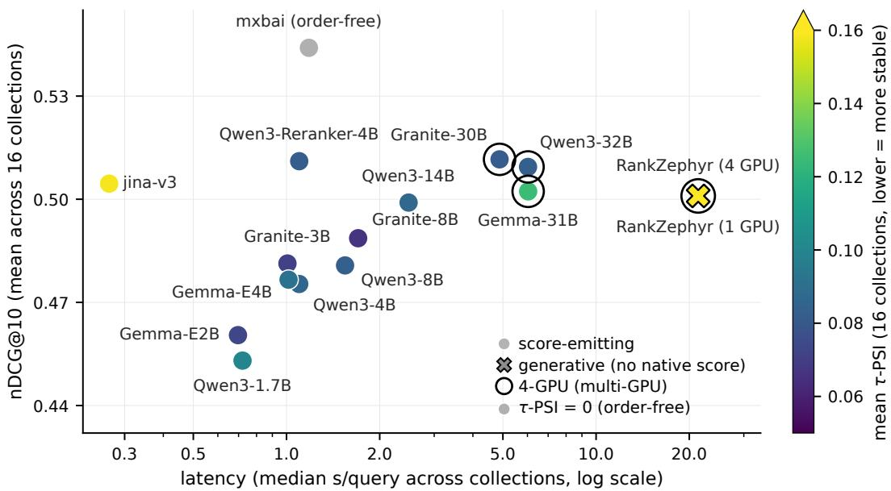  
Figure 8: The system frontier across 16 public reranking collections. The horizontal axis is median per-query latency, the vertical axis mean nDCG@10, color mean τ-PSI, and marker shape whether the system emits a per-document score. The model-family points are trained OC-SFT checkpoints on the named bases. jina, mxbai and RankZephyr are external rerankers shown at their stated serving configurations. Gray denotes τ-PSI zero by construction for the order-free point. nDCG@10 and τ -PSI are equal-weight means and latency is the median of per-collection medians over 16 public reranking collections. Ringed points use four L40S GPUs rather than one.

Candidate batching roughly halves per-query latency at concurrency 1 (Table 31). Across the 16 public collections, the median reduction relative to B = 1 is 51.3% at $B = 1 0$ and 45.4% at $B = 2 0$ We retain B = 20 to match the training geometry, while B = 10 offers lower median latency except on Signal-1M and DL21–23. The batching reduction compounds with serving one permutation rather than ten (Figure 4).

Table 31: Candidate batching roughly halves per-query latency. Collection rows report seconds per query and the reduction relative to B = 1. Summary rows are equal-collection medians; brackets give 95% bootstrap intervals for the reduction. Basis: Qwen3-4B OC-SFT, seed 42, 18 collections, one L40S, warm vLLM and client concurrency 1. Each collection is timed three times on the same GPU, with the width order varied across repetitions. These within-model timings use query batch size 1 and are separate from the system-level latency comparison in Figure 8.
<table><tr><td>Collection</td><td>B = 1</td><td>B = 10</td><td>B = 20</td><td>B = 10 ↓</td><td>B = 20 ↓</td></tr><tr><td>DL19</td><td>2.223</td><td>1.020</td><td>1.086</td><td>54.1%</td><td>51.2%</td></tr><tr><td>DL20</td><td>2.237</td><td>1.032</td><td>1.124</td><td>53.9%</td><td>49.7%</td></tr><tr><td>TREC-COVID</td><td>2.214</td><td>1.111</td><td>1.255</td><td>49.8%</td><td>43.3%</td></tr><tr><td>NFCorpus</td><td>2.249</td><td>1.092</td><td>1.226</td><td>51.5%</td><td>45.5%</td></tr><tr><td>Touché-2020</td><td>2.404</td><td>1.176</td><td>1.315</td><td>51.1%</td><td>45.3%</td></tr><tr><td>DBPedia-Entity</td><td>2.235</td><td>1.036</td><td>1.100</td><td>53.6%</td><td>50.8%</td></tr><tr><td>SciFact</td><td>2.272</td><td>1.145</td><td>1.304</td><td>49.6%</td><td>42.6%</td></tr><tr><td>Signal-1M</td><td>2.098</td><td>0.590</td><td>0.557</td><td>71.9%</td><td>73.4%</td></tr><tr><td>TREC-News</td><td>2.241</td><td>1.181</td><td>1.354</td><td>47.3%</td><td>39.6%</td></tr><tr><td>Robust04</td><td>2.285</td><td>1.230</td><td>1.418</td><td>46.2%</td><td>37.9%</td></tr><tr><td>FiQA</td><td>2.296</td><td>1.193</td><td>1.373</td><td>48.1%</td><td>40.2%</td></tr><tr><td>ArguAna</td><td>2.345</td><td>1.228</td><td>1.372</td><td>47.6%</td><td>41.5%</td></tr><tr><td>Climate-FEVER</td><td>2.273</td><td>1.144</td><td>1.317</td><td>49.7%</td><td>42.0%</td></tr><tr><td>DL21</td><td>2.188</td><td>0.970</td><td>0.913</td><td>55.7%</td><td>58.3%</td></tr><tr><td>DL22</td><td>2.206</td><td>0.974</td><td>0.914</td><td>55.8%</td><td>58.6%</td></tr><tr><td>DL23</td><td>2.172</td><td>0.944</td><td>0.914</td><td>56.5%</td><td>57.9%</td></tr><tr><td>Legal-A</td><td>2.278</td><td>1.134</td><td>1.274</td><td>50.2%</td><td>44.1%</td></tr><tr><td>Legal-B</td><td>2.264</td><td>1.111</td><td>1.243</td><td>50.9%</td><td>45.1%</td></tr><tr><td>Public-16 median</td><td>2.239</td><td>1.101</td><td>1.240</td><td>51.3% [48.9, 54.1]</td><td>45.4% [42.0, 51.7]</td></tr><tr><td>Primary-18 median</td><td>2.245</td><td>1.111</td><td>1.249</td><td>51.0% [49.7, 54.0]</td><td>45.2% [42.3, 51.0]</td></tr></table>

## H PER-COLLECTION AND CROSS-BASE REFERENCE RESULTS

Finally, we report per-collection results for the Qwen3-4B baselines (App. H.1), under alternative first stages (App. H.2), against specialized and external rerankers (App. H.3), and across twelve base models (App. H.4), so that each aggregate finding can be checked collection by collection and its exceptions identified.

## H.1 QWEN3-4B PER-COLLECTION REFERENCE

Table 32: Full per-collection reranking results for the Qwen3-4B student and its baselines. Higher nDCG@10 and lower τ-PSI are better. BM25 has zero τ-PSI by construction; GPT-5.4 has no reported τ-PSI because tied grades leave its relative ordering to the tie-break, which is document identifier for nDCG@10, as noted in Table 1. Basis: seed 42 and M = 10 random permutations; Public 16 excludes Legal-A and Legal-B, whose candidate lists are precomputed. Body Table 1 reports the mean over all 18 collections.
<table><tr><td>Method</td><td>Pubbl  6</td><td>D19</td><td>D20</td><td>D21</td><td>D2</td><td>D23</td><td>Touche</td><td>FOA</td><td>NuUsS</td><td>Arna</td><td>Cliate</td><td>TOOVD</td><td>DBdia</td><td>SCiat</td><td>Sa1M</td><td>TNNWWWS</td><td>Roqbt04</td><td>LeA</td><td>Lea-B</td></tr><tr><td colspan="10">nDCG@ 10, higher is better</td><td></td><td></td><td></td><td></td><td></td><td></td><td></td><td></td><td></td><td></td></tr><tr><td>First-stage retrieval without reranking BM25 retrieval 0.39 0.51</td><td></td><td></td><td>0.49</td><td>0.45</td><td>0.27</td><td>0.26</td><td>0.44</td><td>0.24</td><td>0.34</td><td>0.40</td><td>0.17</td><td>0.59</td><td>0.32</td><td>0.68</td><td>0.33</td><td>0.40</td><td>0.41</td><td>0.30</td><td>0.32</td></tr><tr><td>Prompted closed model (B</td><td></td><td>二</td><td>20)</td><td></td><td></td><td></td><td></td><td></td><td></td><td></td><td></td><td></td><td></td><td></td><td></td><td></td><td></td><td></td><td></td></tr><tr><td>GPT-5.4 Qwen3-4B</td><td>0.49</td><td>0.68</td><td>0.65</td><td>0.65</td><td>0.45</td><td>0.42</td><td>0.23</td><td>0.37</td><td>0.38</td><td>0.40</td><td>0.19</td><td>0.85</td><td>0.39</td><td>0.75</td><td>0.27</td><td>0.50</td><td>0.57</td><td>0.36</td><td>0.31</td></tr><tr><td>Off the shelf</td><td>0.38</td><td>0.60</td><td>0.55</td><td>0.54</td><td>0.39</td><td>0.33</td><td>0.22</td><td>0.25</td><td>0.31</td><td>0.21</td><td>0.16</td><td>0.73</td><td>0.33</td><td>0.51</td><td>0.22</td><td>0.33</td><td>0.45</td><td>0.29</td><td>0.24</td></tr><tr><td>CapCal</td><td>0.38</td><td>0.62</td><td>0.55</td><td>0.55</td><td>0.39</td><td>0.34</td><td>0.22</td><td>0.25</td><td>0.31</td><td>0.20</td><td>0.16</td><td>0.72</td><td>0.34</td><td>0.50</td><td>0.22</td><td>0.34</td><td>0.45</td><td>0.29</td><td>0.24</td></tr><tr><td>Single-order</td><td>0.46</td><td>0.72</td><td>0.67</td><td>0.67</td><td>0.45</td><td>0.43</td><td>0.26</td><td>0.35</td><td>0.35</td><td>0.26</td><td>0.19</td><td>0.75</td><td>0.40</td><td>0.70</td><td>0.29</td><td>0.42</td><td>0.52</td><td>0.34</td><td>0.29</td></tr><tr><td>Order-avg.</td><td>0.47</td><td>0.73</td><td>0.68</td><td>0.67</td><td>0.45</td><td>0.44</td><td>0.29</td><td>0.35</td><td>0.36</td><td>0.28</td><td>0.21</td><td>0.75</td><td>0.41</td><td>0.71</td><td>0.29</td><td>0.44</td><td>0.52</td><td>0.36</td><td>0.31</td></tr><tr><td>Perm. aug.</td><td>0.47</td><td>0.73</td><td>0.67</td><td>0.67</td><td>0.46</td><td>0.45</td><td>0.27</td><td>0.35</td><td>0.36</td><td>0.26</td><td>0.20</td><td>0.75</td><td>0.41</td><td>0.71</td><td>0.28</td><td>0.42</td><td>0.52</td><td>0.35</td><td>0.31</td></tr><tr><td>DebiasFirst</td><td>0.47</td><td>0.72</td><td>0.68</td><td>0.67</td><td>0.46</td><td>0.44</td><td>0.27</td><td>0.35</td><td>0.36</td><td>0.24</td><td>0.20</td><td>0.75</td><td>0.41</td><td>0.71</td><td>0.29</td><td>0.43</td><td>0.52</td><td>0.35</td><td>0.31</td></tr><tr><td>OC-SFT</td><td>0.48</td><td>0.73</td><td>0.68</td><td>0.68</td><td>0.47</td><td>0.45</td><td>0.28</td><td>0.37</td><td>0.36</td><td>0.31</td><td>0.19</td><td>0.74</td><td>0.42</td><td>0.71</td><td>0.30</td><td>0.42</td><td>0.52</td><td>0.35</td><td>0.31</td></tr><tr><td colspan="10">τ-PSI, lower is better</td><td></td><td></td><td></td><td></td><td></td><td></td><td></td><td></td><td></td><td></td></tr><tr><td>Qwen3-4B</td><td></td><td></td><td>0.30</td><td>0.31</td><td>0.32</td><td>0.33</td><td>0.29</td><td>0.26</td><td>0.28</td><td>0.27</td><td>0.27</td><td>0.28</td><td>0.32</td><td>0.30</td><td>0.33</td><td>0.27</td><td>0.26</td><td>0.34</td><td>0.34</td></tr><tr><td>Off the shelf</td><td>0.29 0.29</td><td>0.30 0.30</td><td>0.30</td><td>0.31</td><td>0.32</td><td>0.33</td><td>0.29</td><td>0.26</td><td>0.28</td><td>0.27</td><td>0.27</td><td>0.28</td><td>0.32</td><td>0.30</td><td>0.33</td><td>0.27</td><td>0.27</td><td>0.34</td><td>0.34</td></tr><tr><td>CapCal Single-order</td><td>0.20</td><td>0.19</td><td>0.18</td><td>0.18</td><td>0.21</td><td>0.21</td><td>0.18</td><td>0.18</td><td>0.21</td><td>0.22</td><td>0.19</td><td>0.18</td><td>0.22</td><td>0.23</td><td>0.23</td><td>0.17</td><td>0.19</td><td>0.23</td><td>0.23</td></tr><tr><td>Order-avg.</td><td>0.14</td><td>0.12</td><td>0.12</td><td>0.12</td><td>0.14</td><td>0.14</td><td>0.11</td><td>0.12</td><td>0.15</td><td>0.17</td><td>0.14</td><td>0.11</td><td>0.17</td><td>0.18</td><td>0.17</td><td>0.12</td><td>0.14</td><td>0.14</td><td>0.14</td></tr><tr><td>Perm. aug.</td><td>0.12</td><td>0.10</td><td>0.11</td><td>0.10</td><td>0.12</td><td>0.12</td><td>0.10</td><td>0.10</td><td>0.14</td><td>0.16</td><td>0.13</td><td>0.09</td><td>0.14</td><td>0.16</td><td>0.15</td><td>0.11</td><td>0.14</td><td>0.12</td><td>0.12</td></tr><tr><td>DebiasFirst</td><td>0.13</td><td>0.11</td><td>0.11</td><td>0.10</td><td>0.12</td><td>0.12</td><td>0.10</td><td>0.11</td><td>0.15</td><td>0.17</td><td>0.14</td><td>0.09</td><td>0.14</td><td>0.18</td><td>0.16</td><td>0.12</td><td>0.15</td><td>0.12</td><td>0.12</td></tr><tr><td>OC-SFT</td><td>0.09</td><td>0.07</td><td>0.07</td><td>0.06</td><td>0.08</td><td>0.08</td><td>0.07</td><td>0.07</td><td>0.09</td><td>0.13</td><td>0.09</td><td>0.06</td><td>0.10</td><td>0.10</td><td>0.11</td><td>0.08</td><td>0.10</td><td>0.08</td><td>0.08</td></tr></table>

## H.2 ALTERNATIVE FIRST STAGES

Table 33: Per-collection results under dense and learned-sparse first stages. Each variant has separate nDCG@10 and τ -PSI columns. The three trained variants use BM25 candidates during training; the BGE and SPLADE results therefore measure transfer to new first stages without retraining. Higher quality and lower instability are better. Basis: Qwen3-4B, seed 42 and first-stagespecific judged sets; the Mean (13) row reproduces the BGE and SPLADE rows in Table 15, whose first row reports BM25.
<table><tr><td></td><td colspan="6">BGE (dense)</td><td colspan="6">SPLADE++ ED (learned-sparse)</td></tr><tr><td></td><td>Off the shelf</td><td colspan="2">Single-order</td><td colspan="2">Order-avg.</td><td colspan="2">OC-SFT</td><td colspan="2">Off the shelf</td><td colspan="2">Single-order</td><td colspan="2">Order-avg. OC-SFT</td></tr><tr><td>Collection</td><td>nDCG τ-PSI</td><td>nDCG</td><td>τ-PSI</td><td>nDCG</td><td>τ-PSI</td><td>nDCG</td><td>τ-PSI nDCG</td><td>τ-PSI</td><td>nDCG τ-PSI</td><td>nDCG</td><td>τ-PSI nDCG</td><td>τ-PSI</td></tr><tr><td>DL19</td><td>0.573 0.336</td><td>0.740</td><td>0.202</td><td>0.758</td><td>0.131</td><td>0.740</td><td>0.073</td><td>0.586 0.333</td><td>0.739 0.209</td><td>0.727</td><td>0.134</td><td>0.741 0.075</td></tr><tr><td>DL20</td><td>0.533 0.328</td><td>0.720</td><td>0.193</td><td>0.729</td><td>0.130</td><td>0.723</td><td>0.074 0.513</td><td>0.331</td><td>0.719 0.197</td><td>0.718</td><td>0.129</td><td>0.713 0.074</td></tr><tr><td>Touche-2020</td><td>0.219 0.300</td><td>0.262</td><td>0.187</td><td>0.267</td><td>0.113</td><td>0.273 0.070</td><td>0.193</td><td>0.287</td><td>0.247 0.178</td><td>0.241</td><td>0.114</td><td>0.246 0.079</td></tr><tr><td>FiQA</td><td>0.256 0.304</td><td>0.360</td><td>0.210</td><td>0.377</td><td>0.131</td><td>0.382 0.070</td><td>0.250</td><td>0.292</td><td>0.354 0.202</td><td>0.356</td><td>0.128</td><td>0.365 0.070</td></tr><tr><td>NFCorpus</td><td>0.281 0.324</td><td>0.355</td><td>0.245</td><td>0.369</td><td>0.190</td><td>0.371 0.118</td><td>0.266</td><td>0.317</td><td>0.331 0.235</td><td>0.347</td><td>0.186</td><td>0.344 0.117</td></tr><tr><td>ArguAna</td><td>0.211 0.308</td><td>0.250</td><td>0.239</td><td>0.292</td><td>0.175</td><td>0.316 0.127</td><td>0.205</td><td>0.295</td><td>0.239 0.230</td><td>0.280</td><td>0.172</td><td>0.310 0.127</td></tr><tr><td>Climate-FEVER</td><td>0.160 0.284</td><td>0.179</td><td>0.200</td><td>0.211</td><td>0.143</td><td>0.188 0.079</td><td>0.152</td><td>0.280</td><td>0.181 0.201</td><td>0.205</td><td>0.147</td><td>0.184 0.086</td></tr><tr><td>DBPedia</td><td>0.370 0.314</td><td>0.459</td><td>0.196</td><td>0.473</td><td>0.147</td><td>0.463 0.084</td><td>0.360</td><td>0.321</td><td>0.443 0.213</td><td>0.460</td><td>0.153 0.453</td><td>0.088</td></tr><tr><td>SciFact</td><td>0.529 0.319</td><td>0.703</td><td>0.244</td><td>0.713</td><td>0.180</td><td>0.718 0.103</td><td>0.511</td><td>0.311</td><td>0.693 0.235</td><td>0.706</td><td>0.176</td><td>0.711 0.104</td></tr><tr><td>Signal-1M</td><td>0.192 0.346</td><td>0.250</td><td>0.246</td><td>0.267</td><td>0.174</td><td>0.262 0.115</td><td>0.197</td><td>0.340</td><td>0.277 0.241</td><td>0.272</td><td>0.172</td><td>0.274 0.113</td></tr><tr><td>TREC-COVID</td><td>0.730 0.323</td><td>0.758</td><td>0.210</td><td>0.763</td><td>0.116</td><td>0.757 0.070</td><td>0.668</td><td>0.305</td><td>0.729 0.200</td><td>0.719</td><td>0.112</td><td>0.724 0.068</td></tr><tr><td>TREC-NEWS</td><td>0.335 0.310</td><td>0.412</td><td>0.199</td><td>0.426</td><td>0.137</td><td>0.420 0.080</td><td>0.298</td><td>0.296</td><td>0.400 0.194</td><td>0.412</td><td>0.138 0.407</td><td>0.084</td></tr><tr><td>Robust04</td><td>0.462 0.293</td><td>0.557</td><td>0.201</td><td>0.567</td><td>0.142</td><td>0.555 0.091</td><td>0.460</td><td>0.285</td><td>0.563 0.193</td><td>0.571</td><td>0.139 0.568</td><td>0.089</td></tr><tr><td>Mean (13)</td><td>0.373 0.315</td><td>0.462</td><td>0.213</td><td>0.478</td><td>0.147</td><td>0.474 0.089</td><td>0.358</td><td>0.307</td><td>0.455 0.210</td><td>0.463</td><td>0.146 0.465</td><td>0.090</td></tr></table>

## H.3 SPECIALIZED AND EXTERNAL RERANKERS

On Qwen3-Reranker-4B, OC-SFT matches order-averaged distillation in quality and lowers mean instability (Table 34). Serving jina-reranker-v3 at matched B = 20 lowers its quality and raises its τ-PSI relative to its native single-context configuration.

Table 34: Purpose-built rerankers and training variants on Qwen3-Reranker-4B. Higher nDCG@10 and lower τ -PSI are better. RankZephyr and jina are listwise rerankers, whereas mxbai is pointwise and has zero τ-PSI by construction. The native jina row uses one context; the matched row uses the students’ B = 20 geometry. Purpose-built systems use large hard-negative-mined reranking corpora, whereas OC-SFT uses about 30K MS MARCO queries, so they are external reference systems. Basis: Public 16 excludes Legal-A and Legal-B.
<table><tr><td>Pubbl16 NHCuUs Aruna T-COOVVID Touche Climate</td></tr><tr><td>DBdia SCiFat D9 D20 D1 D2 D3 FA Method</td></tr><tr><td>nDCG@ 10, higher is better</td></tr><tr><td>RankZephyr-7B 0.50 0.74 0.70 0.67 0.51 0.44 0.32 0.34 0.37 0.44 0.22 0.78 0.43 0.74 0.31 0.49 0.52 0.35 0.33 0.35 0.32</td></tr><tr><td>jina-reranker-v3 0.50 0.72 0.70 0.69 0.50 0.45 0.30 0.38 0.37 0.68 0.24 0.74 0.43 0.68 0.31 0.40 0.49 0.35 0.45</td></tr><tr><td>jina-reranker-v3 (B = 20) 0.47 0.69 0.65 0.63 0.48 0.42 0.25 0.35 0.34 0.65 0.23 0.73 0.39 0.64 0.25 0.35 0.59 0.31 0.70 0.44 0.67 0.33 0.42</td></tr><tr><td>mxbai-base-v2 0.50 0.73 0.67 0.66 0.51 0.43 0.35 0.36</td></tr><tr><td>mxbai-large-v2 0.52 0.73 0.69 0.69 0.50 0.46 0.33 0.39 0.36 0.67 0.35 0.74 0.45 0.73 0.31</td></tr><tr><td>Qwen3-Reranker-4B</td></tr><tr><td>Off the shelf 0.46 0.65 0.59 0.53 0.40 0.34 0.29 0.37 0.37 0.52 0.29 0.76 0.41 0.73 0.24 0.38 0.49 0.29</td></tr><tr><td>Order-avg. 0.51 0.75 0.69 0.66 0.49 0.46 0.30 0.40 0.39 0.53 0.29 0.79 0.46 0.73</td></tr><tr><td>OC-SFT 0.51 0.74 0.69 0.67 0.50 0.46 0.32 0.40 0.39 0.47 0.28 0.79 0.47 0.72 0.32 0.44 0.52 0.36</td></tr><tr><td>τ-PSI, lower is better</td></tr><tr><td>RankZephyr-7B 0.40 0.39 0.39 0.40 0.40 0.40 0.41 0.41 0.38 0.40 0.41 0.40 0.41 0.41 0.43 0.40 0.40</td></tr><tr><td>jina-reranker-v3 0.16 0.15 0.16 0.13 0.15 0.16 0.13 0.15 0.17 0.16 0.16 0.14 0.18 0.20 0.18 0.15</td></tr><tr><td>jina-reranker-v3 (B = 20) 0.18 0.17 0.17 0.16 0.18 0.18 0.15 0.17 0.18 0.18 0.18 0.15 0.20 0.20 0.20 0.17 0.18</td></tr><tr><td>Qwen3-Reranker-4B</td></tr><tr><td>Off the shelf 0.29 0.29 0.29 0.31 0.30 0.32 0.29 0.26 0.31 0.30 0.25 0.27 0.30 0.30 0.33 0.27 0.29</td></tr><tr><td>Order-avg. 0.12 0.11 0.11 0.10 0.11 0.12 0.10 0.10 0.15 0.14 0.11 0.09</td></tr><tr><td>0.14 0.14 OC-SFT 0.08 0.07 0.08 0.07 0.08 0.08 0.06 0.06 0.10 0.13 0.07 0.06 0.09 0.09</td></tr><tr><td></td></tr></table>

## H.4 CROSS-BASE SUMMARIES

Across all twelve bases, OC-SFT trained from single-order labels is more stable than orderaveraged distillation (Figures 9 and 10 and Table 36). OC-SFT trained from order-averaged labels reduces instability further on ten of the eleven dense bases and on the sparse MoE. Qwen3-0.6B is omitted because its off-the-shelf output is degenerate and does not follow the required format.

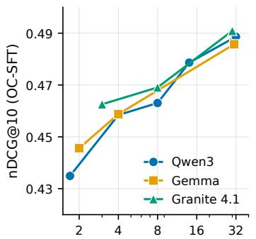  
student model size (B, log scale)

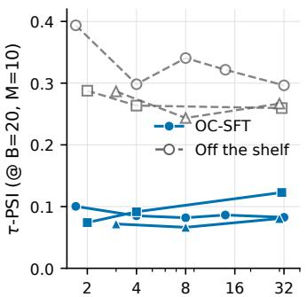  
student model size (B, log scale)

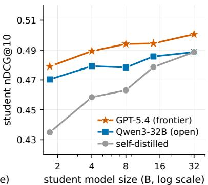  
Figure 9: Model size, family and teacher identity. Panels (a) and (b) show mean nDCG@10 and τ-PSI over the 18 reranking collections, respectively, by model size for Qwen3, Gemma and Granite. Gemma E2B and E4B are plotted at their effective sizes, 2B and 4B. Panel (c) compares nDCG@10 across the evaluated Qwen3 student sizes for frontier, open and self-distilled teachers.

An open teacher approaches GPT-5.4 across student sizes (Figure 9, panel c). Using Qwen3- 32B as the teacher keeps student nDCG@10 within 0.016 of GPT-5.4 and matches or exceeds self-distillation at every evaluated Qwen3 student size. Compared with self-distillation, the open teacher improves nDCG@10 by about 0.04 at Qwen3-1.7B, and the difference narrows as student size increases. GPT-5.4 remains highest at every size, but the open teacher closes most of that quality gap without using GPT-5.4 labels. Therefore, changing the teacher affects nDCG@10 more than τ-PSI.

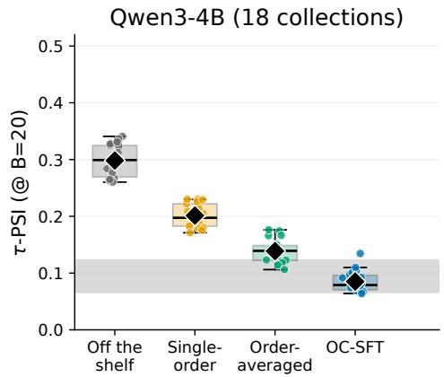

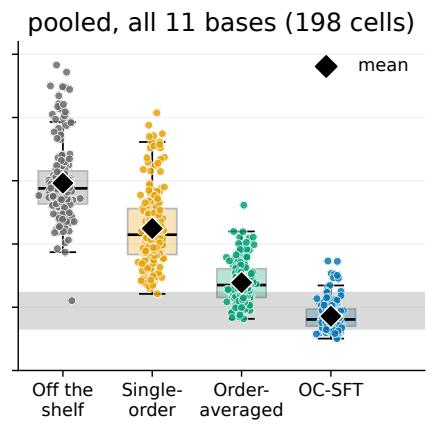  
Figure 10: Per-variant τ-PSI spread across collections. Panel (a) shows Qwen3-4B across the 18 reranking collections. Panel (b) pools the same collections across all 11 dense bases, for 198 model-collection cells. Diamonds mark means; the shaded region spans the range of model-level mean OC-SFT τ-PSI values. The sparse MoE is excluded from this figure and reported in Table 36.

Teacher selection should consider label order-consistency as well as label quality (Figure 11). Silver-β measures how much a document’s silver grade shifts when the teacher sees shuffled candidate orders; lower values denote more order-consistent labels. Across the 8 teachers, silver-β and silver quality each correlate with student nDCG@10, but they also correlate with each other, so we cannot isolate either effect alone. The within-teacher control in App. D.3 varies label order-consistency while holding silver quality nearly fixed and produces a more stable student. Together, these results show why teacher evaluation should report both quality and order-consistency of its silver labels.

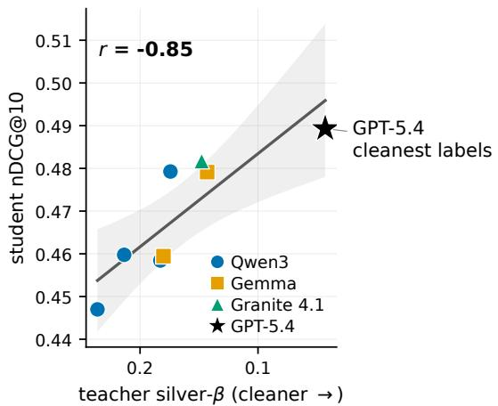  
Figure 11: Student quality correlates with label order-consistency across teachers. Student nDCG@10 plotted against teacher silver-β for eight teachers. The correlation with student nDCG@10 is −0.852 for silver- $- \beta$ and +0.812 for silver quality; they correlate at −0.528. Shading marks the 95% confidence region for the fitted relationship between silver- $- \beta$ and student nDCG@10.

Table 35 : Per-collection nDCG @ 10 for every base and training variant. Twelve bases eleven dense and one sparse Mixture-of-Experts each with its four training variants ; higher is better. The final columns report means over the 1 6 public and all 1 8 reranking collections . Every block carries a fifth row OC-SFT trained on order-averaged rather than single-order teacher labels . The first stage is BM25 on the 1 6 public collections . Legal-A and Legal-B use the precomputed candidate lists packaged with their internal fixtures ; the retriever identity is not recorded. B asis : all 1 8 reranking collections , seed 42, one independently selected checkpoint per base and variant; off-the-shelf rows evaluate fixed base checkpoints Order instability for the same cells is in Table 3 6
<table><tr><td>Variant</td><td>DL19 DL20 DL21 DL22 DL23 Touche FiQA NFCorpus ArguAna Climate T-COVID DBPedia SciFact Signal1M T-NEWS Robust04 Legal-A Legal-B Public 16 All 18</td><td></td><td></td><td></td><td></td><td></td><td></td><td></td><td></td><td></td><td></td><td></td><td></td></tr><tr><td>Qwen3-1.7B</td><td></td><td></td><td></td><td></td><td></td><td>0.675</td><td></td><td>0.526</td><td>0.210</td><td></td><td></td><td></td><td></td></tr><tr><td>Off the shelf</td><td>0.479 0.435 0.452 0.288 0.249</td><td>0.2080.213</td><td>0.301</td><td>0.318</td><td>0.142</td><td></td><td>0.258</td><td></td><td>0.307</td><td>0.399</td><td>0.233</td><td>0.209</td><td>0.341 0.328</td></tr><tr><td>Single-order</td><td>0.586 0.547 0.545 0.347 0.317</td><td>0.2460.215</td><td>0.289</td><td>0.262</td><td>0.165</td><td>0.703</td><td>0.315 0.525</td><td>0.232</td><td>0.352</td><td>0.430</td><td>0.180</td><td>0.174</td><td>0.380 0.357</td></tr><tr><td>Order-avg.</td><td>0.678 0.615 0.630 0.405 0.367</td><td>0.282 0.288</td><td>0.336</td><td>0.344</td><td>0.177</td><td>0.736</td><td>0.379 0.633</td><td>0.296</td><td>0.405</td><td>0.474</td><td>0.287</td><td>0.279</td><td>0.440 0.423</td></tr><tr><td>OC-SFT</td><td>0.695 0.633 0.662 0.427 0.391</td><td>0.2900.296</td><td>0.347</td><td>0.286</td><td>0.202</td><td>0.728 0.417</td><td>0.638</td><td>0.292</td><td>0.432</td><td>0.495</td><td>0.305</td><td>0.291</td><td>0.452 0.435</td></tr><tr><td>OC-SFT (avg. labels)</td><td>0.678 0.622 0.646 0.421 0.375</td><td>0.2790.301</td><td>0.349</td><td>0.306</td><td>0.190</td><td>0.751</td><td>0.393 0.657</td><td>0.296</td><td>0.417</td><td>0.477</td><td>0.277</td><td>0.260</td><td>0.447 0.427</td></tr><tr><td>Qwen3-4B</td><td></td><td></td><td></td><td></td><td></td><td></td><td></td><td></td><td></td><td></td><td></td><td></td><td></td></tr><tr><td>Off the shelf</td><td>0.596 0.552 0.542 0.389 0.331</td><td>0.221 0.251</td><td>0.312</td><td>0.206</td><td>0.157</td><td>0.724</td><td>0.334</td><td>0.512</td><td>0.217 0.330</td><td>0.450</td><td>0.286</td><td>0.243</td><td>0.383 0.370</td></tr><tr><td>Single-order</td><td>0.719 0.675 0.670 0.448 0.430</td><td>0.258 0.346</td><td>0.353</td><td>0.257</td><td>0.189</td><td>0.753</td><td>0.403</td><td>0.696</td><td>0.293 0.423</td><td>0.516</td><td>0.338</td><td>0.290</td><td>0.464 0.448</td></tr><tr><td>Order-avg.</td><td>0.727 0.675 0.674 0.453 0.437</td><td>0.286 0.349</td><td>0.364</td><td>0.283</td><td>0.208</td><td>0.747</td><td>0.413</td><td>0.708</td><td>0.294 0.443</td><td>0.520</td><td>0.359</td><td>0.310</td><td>0.474 0.458</td></tr><tr><td>OC-SFT</td><td>0.732 0.681 0.676 0.466 0.448</td><td>0.276 0.365</td><td>0.357</td><td>0.311</td><td>0.189</td><td>0.740</td><td>0.417</td><td>0.714</td><td>0.295 0.423</td><td>0.515</td><td>0.352</td><td>0.306</td><td>0.475 0.459</td></tr><tr><td>OC-SFT (avg. labels)</td><td>0.728 0.681 0.670 0.464 0.451</td><td>0.2740.359</td><td>0.356</td><td>0.302</td><td>0.187</td><td>0.750</td><td>0.419</td><td>0.714</td><td>0.298 0.427</td><td>0.517</td><td>0.332</td><td>0.294</td><td>0.475 0.457</td></tr><tr><td>Qwen3-8B</td><td></td><td></td><td></td><td></td><td></td><td></td><td></td><td></td><td></td><td></td><td></td><td></td><td></td></tr><tr><td>Off the shelf</td><td>0.611 0.533 0.505 0.362 0.327</td><td>0.2290.310</td><td>0.318</td><td>0.235</td><td>0.141</td><td>0.718</td><td>0.329</td><td>0.602</td><td>0.208 0.327</td><td>0.453</td><td>0.265</td><td>0.241</td><td>0.388 0.373</td></tr><tr><td>Single-order</td><td>0.705 0.659 0.640 0.444 0.424</td><td>0.261 0.357</td><td>0.341</td><td>0.325</td><td>0.162</td><td>0.738</td><td>0.397</td><td>0.705</td><td>0.271 0.403</td><td>0.507</td><td>0.320</td><td>0.261</td><td>0.459 0.440</td></tr><tr><td>Order-avg. OC-SFT</td><td>0.713 0.689 0.668 0.466 0.449</td><td>0.2530.365</td><td>0.363</td><td>0.299</td><td>0.162</td><td>0.749</td><td>0.409 0.722</td><td>0.281</td><td>0.419</td><td>0.522</td><td>0.329</td><td>0.289</td><td>0.471 0.453</td></tr><tr><td>OC-SFT (avg. labels)</td><td>0.729 0.702 0.683 0.482 0.462</td><td>0.278 0.380</td><td>0.360</td><td>0.320</td><td>0.178</td><td>0.750</td><td>0.416 0.723</td><td>0.282</td><td>0.418</td><td>0.528</td><td>0.353</td><td>0.291</td><td>0.481 0.463</td></tr><tr><td></td><td>0.727 0.687 0.673 0.477 0.448</td><td>0.262 0.374</td><td>0.362</td><td>0.335</td><td>0.166</td><td>0.762</td><td>0.413 0.725</td><td>0.282</td><td>0.421</td><td>0.523</td><td>0.353</td><td>0.278</td><td>0.477 0.459</td></tr><tr><td>Qwen3-14B</td><td></td><td></td><td></td><td></td><td></td><td></td><td></td><td></td><td></td><td></td><td></td><td></td><td></td></tr><tr><td>Off the shelf</td><td>0.642 0.587 0.587 0.405 0.370</td><td>0.2140.357</td><td>0.338</td><td>0.340</td><td>0.143</td><td>0.748</td><td>0.342 0.712</td><td>0.228</td><td>0.354</td><td>0.491</td><td>0.278</td><td>0.237</td><td>0.429 0.410</td></tr><tr><td>Single-order</td><td>0.718 0.694 0.676 0.463 0.440</td><td>0.2710.400</td><td>0.362</td><td>0.455</td><td>0.172</td><td>0.752</td><td>0.407</td><td>0.729</td><td>0.304 0.438</td><td>0.533</td><td>0.342</td><td>0.280</td><td>0.488 0.469</td></tr><tr><td>Order-avg.</td><td>0.733 0.702 0.699 0.482 0.447</td><td>0.2600.399</td><td>0.375</td><td>0.445</td><td>0.156</td><td>0.780</td><td>0.415 0.744</td><td>0.298</td><td>0.465</td><td>0.553</td><td>0.339</td><td>0.286</td><td>0.497 0.477</td></tr><tr><td>OC-SFT</td><td>0.749 0.709 0.702 0.490 0.462</td><td>0.282 0.405</td><td>0.376</td><td>0.358</td><td>0.171</td><td>0.780</td><td>0.430</td><td>0.740</td><td>0.301 0.465</td><td>0.557</td><td>0.342</td><td>0.298</td><td>0.499 0.479</td></tr><tr><td>OC-SFT (avg. labels)</td><td>0.736 0.694 0.703 0.487 0.451</td><td>0.267 0.404</td><td>0.381</td><td>0.347</td><td>0.171</td><td>0.794</td><td>0.420</td><td>0.739</td><td>0.299 0.462</td><td>0.557</td><td>0.342</td><td>0.291</td><td>0.495 0.475</td></tr><tr><td>Qwen3-32B</td><td></td><td></td><td></td><td></td><td></td><td></td><td></td><td></td><td></td><td></td><td></td><td></td><td></td></tr><tr><td>Off the shelf</td><td>0.628 0.581 0.569 0.401 0.334</td><td>0.2530.319</td><td>0.331</td><td>0.332</td><td>0.149</td><td>0.741</td><td>0.356 0.708</td><td>0.222</td><td>0.348</td><td>0.486</td><td>0.278</td><td>0.248</td><td>0.422 0.405</td></tr><tr><td>Single-order</td><td>0.706 0.674 0.660 0.469 0.425</td><td>0.2590.392</td><td>0.342</td><td>0.430</td><td>0.158</td><td>0.741</td><td>0.407 0.731</td><td>0.283</td><td>0.444</td><td>0.530</td><td>0.329</td><td>0.284</td><td>0.478 0.459</td></tr><tr><td>Order-avg.</td><td>0.741 0.702 0.690 0.493 0.444</td><td>0.2650.406</td><td>0.377</td><td>0.460</td><td>0.172</td><td>0.788</td><td>0.425 0.745</td><td>0.285</td><td>0.469</td><td>0.555</td><td>0.338</td><td>0.299</td><td>0.501 0.481</td></tr><tr><td>OC-SFT</td><td>0.748 0.712 0.694 0.507 0.460</td><td>0.276 0.417</td><td>0.380</td><td>0.464</td><td>0.177</td><td>0.776</td><td>0.435 0.743</td><td>0.288</td><td>0.493</td><td>0.570</td><td>0.350</td><td>0.302</td><td>0.509 0.488</td></tr><tr><td>OC-SFT (avg. labels)</td><td>0.742 0.702 0.694 0.502 0.451</td><td>0.267 0.413</td><td>0.385</td><td>0.449</td><td>0.174</td><td>0.783</td><td>0.431</td><td>0.739</td><td>0.290 0.467</td><td>0.560</td><td>0.338</td><td>0.293</td><td>0.503 0.482</td></tr><tr><td>Gemma-E2B Off the shelf</td></table>

continued on the next page

Table 35 continued
<table><tr><td>Variant</td><td colspan="10">DL19 DL20 DL21 DL22 DL23 Touche FiQA NFCorpus ArguAna Climate T-COVID DBPedia SciFact Signal1M T-NEWS</td></tr><tr><td>OC-SFT (avg. labels)</td><td>0.727 0.634 0.659 0.442 0.427</td><td>0.2770.317</td><td>0.340</td><td>0.358</td><td>0.185</td><td>0.751</td><td>0.400</td><td>0.661</td><td>0.311</td><td>0.417</td><td>0.502</td><td>0.356 0.293</td><td>0.463 0.448</td></tr><tr><td>Gemma-E4B</td><td></td><td></td><td></td><td></td><td></td><td></td><td></td><td></td><td></td><td></td><td></td><td></td><td></td></tr><tr><td>Off the shelf</td><td>0.632 0.593 0.616 0.403 0.369</td><td>0.215 0.303</td><td>0.327</td><td>0.221</td><td>0.124</td><td>0.747</td><td>0.343 0.595</td><td>0.219</td><td>0.353</td><td>0.499</td><td>0.305</td><td>0.240</td><td>0.410 0.395</td></tr><tr><td>Single-order</td><td>0.719 0.679 0.688 0.458 0.437</td><td>0.242 0.344</td><td>0.354</td><td>0.342</td><td>0.138</td><td>0.768</td><td>0.393 0.702</td><td>0.309</td><td>0.433</td><td>0.540</td><td>0.366</td><td>0.295</td><td>0.472 0.456</td></tr><tr><td>Order-avg.</td><td>0.727 0.680 0.688 0.472 0.446</td><td>0.2560.353</td><td>0.364</td><td>0.392</td><td>0.152</td><td>0.764</td><td>0.404</td><td>0.709</td><td>0.310 0.448</td><td>0.541</td><td>0.362</td><td>0.298</td><td>0.482 0.465</td></tr><tr><td>OC-SFT</td><td>0.695 0.665 0.669 0.463 0.439</td><td>0.252 0.357</td><td>0.364</td><td>0.365</td><td>0.178</td><td>0.771</td><td>0.406 0.706</td><td>0.293</td><td>0.446</td><td>0.551</td><td>0.351</td><td>0.287</td><td>0.476 0.459</td></tr><tr><td>OC-SFT (avg. labels)</td><td>0.727 0.688 0.683 0.473 0.439</td><td>0.265 0.364</td><td>0.358</td><td>0.400</td><td>0.153</td><td>0.776</td><td>0.413 0.707</td><td></td><td>0.306 0.425</td><td>0.541</td><td>0.345</td><td>0.295</td><td>0.482 0.464</td></tr><tr><td>Gemma-31B</td><td></td><td></td><td></td><td></td><td></td><td></td><td></td><td></td><td></td><td></td><td></td><td></td><td></td></tr><tr><td>Off the shelf</td><td>0.642 0.632 0.624 0.465 0.416</td><td>0.242 0.413</td><td>0.355</td><td>0.413</td><td>0.163</td><td>0.756</td><td>0.368</td><td>0.720</td><td>0.226 0.371</td><td>0.543</td><td>0.354</td><td>0.281</td><td>0.459 0.444</td></tr><tr><td>Single-order</td><td>0.702 0.698 0.684 0.497 0.468</td><td>0.270 0.419</td><td>0.370</td><td>0.435</td><td>0.168</td><td>0.750</td><td>0.407</td><td>0.746</td><td>0.292 0.442</td><td>0.575</td><td>0.371</td><td>0.300</td><td>0.495 0.477</td></tr><tr><td>Order-avg.</td><td>0.722 0.711 0.706 0.506 0.480</td><td>0.277 0.420</td><td>0.377</td><td>0.464</td><td>0.191</td><td>0.751</td><td>0.419</td><td>0.741</td><td>0.311 0.463</td><td>0.572</td><td>0.386</td><td>0.319</td><td>0.507 0.490</td></tr><tr><td>OC-SFT</td><td>0.733 0.710 0.704 0.521 0.482</td><td>0.2830.430</td><td>0.384</td><td>0.340</td><td>0.184</td><td>0.752</td><td>0.427</td><td>0.749</td><td>0.295 0.473</td><td>0.578</td><td>0.381</td><td>0.316</td><td>0.503 0.486</td></tr><tr><td>OC-SFT (avg. labels)</td><td>0.730 0.708 0.706 0.526 0.488</td><td>0.279 0.424</td><td>0.380</td><td>0.479</td><td>0.181</td><td>0.758</td><td>0.421 0.741</td><td>0.286</td><td>0.457</td><td>0.578</td><td>0.378</td><td>0.310</td><td>0.509 0.491</td></tr><tr><td>Granite-3B</td><td></td><td></td><td></td><td></td><td></td><td></td><td></td><td></td><td></td><td></td><td></td><td></td><td></td></tr><tr><td>Off the shelf</td><td>0.586 6 0.510 0.539 0.380 0.311</td><td>0.2210.276</td><td>0.323</td><td>0.177</td><td>0.176</td><td>0.708</td><td>0.573</td><td></td><td></td><td>0.443</td><td>0.279</td><td>0.246</td><td>0.383 0.370</td></tr><tr><td>Single-order</td><td>0.715 0.667 0.665 0.449 0.419</td><td>0.2730.319</td><td>0.347</td><td>0.255</td><td>0.211</td><td>0.753</td><td>0.322 0.407</td><td>0.667</td><td>0.231 0.358 0.321</td><td></td><td>0.320</td><td>0.283</td><td>0.463 0.445</td></tr><tr><td>Order-avg.</td><td>0.728 0.662 0.676 0.460 0.435</td><td>0.262 0.332</td><td>0.357</td><td>0.268</td><td>0.196</td><td>0.747</td><td>0.401</td><td>0.687</td><td>0.430 0.307 0.438</td><td>0.506 0.511</td><td>0.326</td><td>0.302</td><td>0.467 0.450</td></tr><tr><td>OC-SFT</td><td>0.738 0.677 0.680 0.464 0.428</td><td>0.288 0.338</td><td>0.360</td><td>0.349</td><td>0.219</td><td>0.756</td><td>0.422</td><td>0.693</td><td>0.445</td><td>0.527</td><td>0.317</td><td>0.298</td><td>0.482 0.462</td></tr><tr><td>OC-SFT (avg. labels)</td><td>0.731 0.665 0.676 0.464 0.422</td><td>0.263 0.339</td><td>0.365</td><td>0.317</td><td>0.208</td><td>0.759</td><td>0.412</td><td>0.692</td><td>0.326 0.322 0.440</td><td>0.520</td><td>0.320</td><td>0.302</td><td>0.475 0.456</td></tr><tr><td>Granite-8B</td><td></td><td></td><td></td><td></td><td></td><td></td><td></td><td></td><td></td><td></td><td></td><td></td><td></td></tr><tr><td>Off the shelf</td><td>0.637 0.587 0.584 0.402 0.376</td><td>0.2400.325</td><td>0.354</td><td>0.277</td><td>0.153</td><td>0.752</td><td>0.364</td><td></td><td></td><td></td><td>0.296</td><td>0.258</td><td>0.428 0.412</td></tr><tr><td>Single-order</td><td>0.721 0.678 0.681 0.462 0.447</td><td>0.2630.356</td><td>0.372</td><td>0.278</td><td>0.174</td><td>0.764</td><td>0.410</td><td>0.683 0.240</td><td>0.397</td><td>0.483 0.549</td><td>0.310</td><td>0.264</td><td>0.478 0.457</td></tr><tr><td>Order-avg.</td><td>0.720 0.675 0.682 0.477 0.454</td><td>0.264 0.355</td><td>0.374</td><td>0.309</td><td>0.175</td><td>0.764</td><td>0.414</td><td>0.720 0.719</td><td>0.306 0.467 0.468</td><td></td><td>0.334</td><td>0.295</td><td>0.481 0.463</td></tr><tr><td>OC-SFT</td><td>0.720 0.671 0.688 0.488 0.467</td><td>0.273 0.369</td><td>0.373</td><td>0.332</td><td>0.178</td><td>0.768</td><td>0.419 0.727</td><td>0.301 0.319</td><td>0.475</td><td>0.552 0.553</td><td>0.329</td><td>0.294</td><td>0.489 0.469</td></tr><tr><td>OC-SFT (avg. labels)</td><td>0.724 0.676 0.692 0.474 0.464</td><td>0.267 0.371</td><td>0.375</td><td>0.342</td><td>0.172</td><td>0.772</td><td>0.419</td><td>0.722</td><td>0.316 0.475</td><td>0.551</td><td>0.333</td><td>0.298</td><td>0.488 0.469</td></tr><tr><td>Granite-30B</td><td></td><td></td><td></td><td></td><td></td><td></td><td></td><td></td><td></td><td></td><td></td><td></td><td></td></tr><tr><td>Off the shelf</td><td></td><td></td><td>0.345</td><td>0.283</td><td></td><td></td><td></td><td></td><td></td><td></td><td></td><td>0.253</td><td></td></tr><tr><td>Single-order</td><td>0.659 0.611 0.595 0.429 0.391 0.722 0.681 0.673 0.488 0.457</td><td>0.241 0.378 0.271 0.388</td><td>0.361</td><td>0.393</td><td>0.145 0.155</td><td>0.761 0.766</td><td>0.373 0.428</td><td>0.702</td><td>0.231 0.382</td><td>0.517</td><td>0.310</td><td>0.300</td><td>0.440 0.423 0.489</td></tr><tr><td>Order-avg.</td><td>0.745 0.702 0.712 0.500 0.476</td><td>0.2960.406</td><td>0.380</td><td>0.387</td><td>0.167</td><td>0.786</td><td>0.431 0.748</td><td>0.730</td><td>0.299 0.455 0.306 0.458</td><td>0.551</td><td>0.351 0.359</td><td>0.309</td><td>0.471 0.504 0.485</td></tr><tr><td>OC-SFT</td><td>0.746 0.717 0.707 0.510 0.480</td><td>0.304 0.413</td><td>0.380</td><td>0.410</td><td>0.180</td><td>0.782</td><td>0.444</td><td>0.747</td><td>0.311 0.479</td><td>0.570 0.574</td><td>0.349</td><td>0.300 0.296</td><td>0.511 0.491</td></tr><tr><td>OC-SFT (avg. labels)</td><td>0.745 0.710 0.711 0.503 0.473</td><td>0.311 0.410</td><td>0.383</td><td>0.439</td><td>0.173</td><td>0.774</td><td>0.438</td><td>0.740</td><td>0.312 0.474</td></table>

Table 3 6 : Per-collection τ-PSI for every base and training variant The same twelve bases and 1 8 per-collection cells as Table 35 ; lower is more stable The All 1 8 column averages all 1 8 reranking collections . Every block also includes OC-SFT trained on order-averaged labels . B asis : all 1 8 reranking collections seed 42 M = 1 0 random permutations one independently selected checkpoint per base and variant.
<table><tr><td>Variant</td><td colspan="9">DL19 DL20 DL21 DL22 DL23 3 Touche FiQA NFCorpus ArguAna Climate T-COVID DBPedia SciFact Signal1M T-NEWS Robust04 Legal-A Legal-B All 18</td><td></td><td></td><td></td><td></td></tr><tr><td>Qwen3-1.7B</td><td></td><td></td><td></td><td></td><td></td><td></td><td></td><td></td><td></td><td></td><td></td><td></td><td></td><td></td></tr><tr><td>Off the shelf</td><td>0.393 0.387 0.405 0.404 0.403</td><td>0.413 0.415</td><td>0.383</td><td>0.376</td><td>0.342</td><td>0.392</td><td>0.399</td><td>0.377</td><td>0.373</td><td>0.367</td><td>0.365</td><td></td><td>0.448</td><td>0.445 0.394</td></tr><tr><td>Single-order</td><td>0.329 0.324 0.336 0.352 0.352</td><td>0.315 0.361</td><td>0.355</td><td>0.365</td><td>0.388</td><td>0.337</td><td>0.361</td><td>0.407</td><td>0.357</td><td>0.334</td><td>0.370</td><td>0.371</td><td>0.374</td><td>0.355</td></tr><tr><td>Order-avg.</td><td>0.148 0.148 0.149 0.163 0.163 0.105</td><td>0.128 0.144</td><td>0.179</td><td>0.198</td><td>0.174</td><td>0.137</td><td>0.180</td><td>0.211</td><td>0.181</td><td>0.135</td><td>0.177</td><td>0.172</td><td>0.173</td><td>0.164</td></tr><tr><td>OC-SFT</td><td>0.094 0.099 0.084 0.097 0.065</td><td>0.074 0.081</td><td>0.101 0.080</td><td>0.153 0.114</td><td>0.096</td><td>0.079</td><td>0.104</td><td>0.110</td><td>0.132</td><td>0.087</td><td>0.105</td><td>0.106</td><td>0.101</td><td>0.100</td></tr><tr><td>OC-SFT (avg. labels)</td><td>0.067 0.062 0.071 0.071</td><td>0.057 0.063</td><td></td><td></td><td>0.077</td><td>0.062</td><td>0.085</td><td>0.081</td><td>0.096</td><td>0.064</td><td>0.082</td><td>0.072</td><td>0.071</td><td>0.074</td></tr><tr><td>Qwen3-4B</td><td></td><td></td><td></td><td></td><td></td><td></td><td></td><td></td><td></td><td></td><td></td><td></td><td></td><td></td></tr><tr><td>Off the shelf</td><td>0.302 0.296 0.312 0.325 0.328</td><td>0.2880.263</td><td></td><td>0.284 0.267</td><td>0.265</td><td>0.277</td><td>0.324</td><td>0.305</td><td>0.331</td><td>0.265</td><td>0.260</td><td>0.341</td><td>0.336</td><td>0.298</td></tr><tr><td>Single-order</td><td>0.188 0.180 0.183 0.209 0.205</td><td>0.1830.179</td><td>0.213</td><td>0.221</td><td>0.189</td><td>0.176</td><td>0.222</td><td>0.230</td><td>0.229</td><td>0.171</td><td>0.189</td><td>0.230</td><td>0.226</td><td>0.201</td></tr><tr><td>Order-avg.</td><td>0.123 0.123 0.116 0.139 0.137</td><td>0.114 0.118</td><td>0.150</td><td>0.174</td><td>0.143</td><td>0.106</td><td>0.166</td><td>0.176</td><td>0.166</td><td>0.123</td><td>0.141</td><td>0.142</td><td>0.139</td><td>0.139</td></tr><tr><td>OC-SFT OC-SFT (avg. labels)</td><td>0.069 0.074 0.064 0.076 0.081</td><td>0.068 0.068</td><td>0.093</td><td>0.134</td><td>0.092</td><td>0.064</td><td>0.097</td><td>0.104</td><td>0.110</td><td>0.078</td><td>0.101</td><td>0.079</td><td>0.079</td><td>0.085</td></tr><tr><td></td><td>0.062 0.066 0.059 0.070 0.070</td><td>0.061 0.060</td><td>0.079</td><td>0.125</td><td>0.080</td><td>0.058</td><td>0.088</td><td>0.095</td><td>0.097</td><td>0.065</td><td>0.082</td><td>0.066</td><td>0.065</td><td>0.075</td></tr><tr><td>Qwen3-8B</td><td></td><td></td><td></td><td></td><td></td><td></td><td></td><td></td><td></td><td></td><td></td><td></td><td></td><td></td></tr><tr><td>Off the shelf</td><td>0.316 0.304 0.326 0.323 0.325</td><td>0.303 0.262</td><td></td><td>0.289 0.240</td><td>0.244</td><td>0.301</td><td>0.315</td><td>0.269</td><td>0.321</td><td>0.259</td><td>0.257</td><td>0.318</td><td>0.321</td><td>0.294</td></tr><tr><td>Single-order</td><td>0.2560.2400.2400.257 0.252</td><td>0.246 0.253</td><td></td><td>0.296 0.267</td><td>0.282</td><td>0.240</td><td>0.288</td><td>0.316</td><td>0.278</td><td>0.249</td><td></td><td>0.268 0.270</td><td>0.270</td><td>0.265</td></tr><tr><td>Order-avg.</td><td>0.1600.1500.1400.167 0.159</td><td>0.1320.145</td><td>0.189</td><td>0.187</td><td>0.167</td><td>0.130</td><td>0.190</td><td>0.201</td><td>0.185</td><td>0.140</td><td>0.162</td><td>0.174</td><td>0.169</td><td>0.164</td></tr><tr><td>OC-SFT</td><td>0.073 0.076 0.067 0.078 0.079</td><td>0.062 0.065</td><td>0.090</td><td>0.125</td><td>0.085</td><td>0.060</td><td>0.097</td><td>0.103</td><td>0.108</td><td>0.069</td><td>0.091</td><td>0.075</td><td>0.072</td><td>0.082</td></tr><tr><td>OC-SFT (avg. labels)</td><td>0.065 0.066 0.062 0.068 0.070</td><td>0.058 0.056</td><td>0.075</td><td>0.106</td><td>0.070</td><td>0.056</td><td>0.084</td><td>0.080</td><td>0.089</td><td>0.061</td><td>0.076</td><td>0.064</td><td>0.063</td><td>0.071</td></tr><tr><td>Qwen3-14B</td><td></td><td></td><td></td><td></td><td></td><td></td><td></td><td></td><td></td><td></td><td></td><td></td><td></td><td></td></tr><tr><td>Off the shelf</td><td>0.284 0.2800.286 0.288 0.297</td><td>0.301 0.238</td><td></td><td>0.272 0.212</td><td>0.238</td><td>0.267</td><td>0.296</td><td>0.255</td><td>0.309</td><td>0.245</td><td>0.240</td><td>0.285</td><td>0.294</td><td></td></tr><tr><td>Single-order</td><td>0.252 0.246 0.232 0.256 0.260</td><td>0.265 0.266</td><td></td><td>0.294 0.284</td><td>0.281</td><td>0.236</td><td>0.284</td><td>0.328</td><td>0.277</td><td>0.268</td><td>0.268</td><td>0.283</td><td>0.277</td><td>0.272 0.270</td></tr><tr><td>Order-avg.</td><td>0.161 0.159 0.137 0.167 0.168</td><td>0.147 0.164</td><td></td><td>0.199 0.179</td><td>0.209</td><td>0.126</td><td>0.219</td><td>0.261</td><td>0.192</td><td>0.175</td><td>0.188</td><td>0.179</td><td>0.167</td><td>0.178</td></tr><tr><td>OC-SFT</td><td>0.079 0.085 0.062 0.077 0.081</td><td>0.075 0.078</td><td>0.099</td><td>0.125</td><td>0.094</td><td>0.060</td><td>0.100</td><td>0.095</td><td>0.104</td><td>0.076</td><td>0.096</td><td>0.086</td><td>0.082</td><td>0.086</td></tr><tr><td>OC-SFT (avg. labels)</td><td>0.075 0.076 0.065 0.079 0.082</td><td>0.065 0.070</td><td>0.096</td><td>0.130</td><td>0.099</td><td>0.061</td><td>0.110</td><td>0.118</td><td>0.104</td><td>0.083</td><td>0.102</td><td>0.073</td><td>0.071</td><td>0.087</td></tr><tr><td>Qwen3-32B</td><td></td><td></td><td></td><td></td><td></td><td></td><td></td><td></td><td></td><td></td><td></td><td></td><td></td><td></td></tr><tr><td>Off the shelf</td><td></td><td>0.322 0.3400.260</td><td></td><td>0.295 0.234</td><td>0.249</td><td>0.330</td><td>0.312</td><td>0.252</td><td>0.330</td><td>0.264</td><td>0.258</td><td>0.310</td><td>0.324</td><td></td></tr><tr><td>Single-order</td><td>0.315 0.305 0.318 0.317 0.248 0.228 0.229 0.242 0.241</td><td>0.285 0.234</td><td></td><td>0.318 0.217</td><td>0.249</td><td>0.249</td><td></td><td>0.290</td><td></td><td></td><td></td><td></td><td></td><td>0.296</td></tr><tr><td>Order-avg.</td><td>0.135 0.129 0.123 0.139 0.140</td><td>0.1430.112</td><td></td><td>0.163 0.113</td><td>0.129</td><td>0.117</td><td>0.277 0.171</td><td>0.148</td><td>0.253 0.161</td><td>0.235 0.120</td><td>0.265 0.135</td><td>0.258 0.143 0.082</td><td>0.265 0.142</td><td>0.255 0.137</td></tr><tr><td>OC-SFT OC-SFT (avg. labels)</td><td>0.083 0.085 0.073 0.086 0.089</td><td>0.082 0.064</td><td>0.080 0.054 0.073</td><td>0.070 0.069</td><td>0.079 0.069</td><td>0.066 0.053</td><td>0.101 0.090</td><td>0.095 0.075</td><td>0.108 0.092</td></table>

continued on the next page

Table 36 continued
<table><tr><td>Variant</td><td>DL19 DL20 DL21 DL22 DL23</td><td>Touche FiQA</td><td>NFCorpus</td><td>ArguAna</td><td></td><td>Climate T-COVID</td><td>DBPedia</td><td>SciFact</td><td></td><td>Signal1M T-NEWS</td><td></td><td></td><td>Robust04 Legal-A Legal-B</td><td></td><td>All 18</td></tr><tr><td>Off the shelf</td><td>0.306 0.297 0.302 0.301</td><td>0.305 0.265 0.220</td><td></td><td>0.236</td><td>0.220</td><td>0.224</td><td>0.275</td><td>0.276</td><td>0.220</td><td>0.312</td><td>0.235</td><td>0.202</td><td>0.277</td><td>0.272</td><td>0.264</td></tr><tr><td>Single-order</td><td>0.185 0.179 0.175 0.197</td><td>0.198 0.150 0.141</td><td></td><td>0.169</td><td>0.158</td><td>0.169</td><td>0.149</td><td>0.200</td><td>0.186</td><td>0.213</td><td>0.144</td><td>0.138</td><td>0.208</td><td>0.199</td><td>0.175</td></tr><tr><td>Order-avg.</td><td>0.115 0.123 0.111 0.130</td><td>0.134</td><td>0.096 0.094</td><td>0.118</td><td>0.110</td><td>0.113</td><td>0.092</td><td>0.143</td><td>0.126</td><td>0.152</td><td>0.100</td><td>0.100</td><td>0.132</td><td>0.122</td><td>0.117</td></tr><tr><td>OC-SFT</td><td>0.087 0.097 0.081 0.095</td><td>0.099 0.070</td><td>0.071</td><td>0.094</td><td>0.097</td><td>0.089</td><td>0.065</td><td>0.117</td><td>0.112</td><td>0.118</td><td>0.080</td><td>0.092</td><td>0.096</td><td>0.090</td><td>0.092</td></tr><tr><td>OC-SFT (avg. labels)</td><td>0.072 0.078 0.068 0.077</td><td>0.080 0.060</td><td>0.057</td><td>0.076</td><td>0.056</td><td>0.069</td><td>0.056</td><td>0.094</td><td>0.077</td><td>0.093</td><td>0.063</td><td>0.069</td><td>0.075</td><td>0.068</td><td>0.072</td></tr><tr><td>Gemma-31B</td><td></td><td></td><td></td><td></td><td></td><td></td><td></td><td></td><td></td><td></td><td></td><td></td><td></td><td></td><td></td></tr><tr><td>Off the shelf</td><td>0.284 0.273 0.294</td><td>0.2700.274</td><td>0.2980.206</td><td>0.246</td><td>0.225</td><td>0.233</td><td>0.273</td><td>0.280</td><td>0.243</td><td>0.297</td><td>0.243</td><td>0.227</td><td>0.247</td><td>0.261</td><td>0.260</td></tr><tr><td>Single-order</td><td>0.222 0.200 0.210 0.216</td><td>0.220</td><td>0.2260.178</td><td>0.236</td><td>0.192</td><td>0.209</td><td>0.189</td><td>0.247</td><td>0.249</td><td>0.246</td><td>0.193</td><td>0.208</td><td>0.220</td><td>0.221</td><td>0.216</td></tr><tr><td>Order-avg.</td><td>0.148 0.142 0.130</td><td>0.149 0.154 0.137 0.135</td><td></td><td>0.179</td><td>0.131</td><td>0.156</td><td>0.108</td><td>0.191</td><td>0.211</td><td>0.202</td><td>0.148</td><td>0.183</td><td>0.141</td><td>0.134</td><td>0.154</td></tr><tr><td>OC-SFT</td><td>0.112 0.109 0.095 0.110 0.116</td><td>0.093 0.108</td><td></td><td>0.146</td><td>0.173</td><td>0.123</td><td>0.079</td><td>0.152</td><td>0.173</td><td>0.150</td><td>0.114</td><td>0.146</td><td>0.111</td><td>0.102</td><td>0.123</td></tr><tr><td>OC-SFT (avg. labels)</td><td>0.087 0.087 0.077</td><td>0.090 0.095</td><td>0.071 0.070</td><td>0.094</td><td>0.071</td><td>0.092</td><td>0.063</td><td>0.121</td><td>0.113</td><td>0.129</td><td>0.084</td><td>0.098</td><td>0.085</td><td>0.078</td><td>0.089</td></tr><tr><td>Granite-3B</td><td></td><td></td><td></td><td></td><td></td><td></td><td></td><td></td><td></td><td></td><td></td><td></td><td></td><td></td><td></td></tr><tr><td>Off the shelf</td><td>0.291 0.285 0.290</td><td>0.3000.299</td><td>0.2640.301</td><td>0.272</td><td>0.277</td><td>0.268</td><td>0.267</td><td>0.292</td><td>0.314</td><td>0.296</td><td>0.262</td><td>0.272</td><td>0.303</td><td>0.306</td><td>0.287</td></tr><tr><td>Single-order</td><td>0.146 0.141 0.145</td><td>0.158 0.157</td><td>0.1330.138</td><td>0.164</td><td>0.173</td><td>0.144</td><td>0.137</td><td>0.160</td><td>0.161</td><td>0.162</td><td>0.121</td><td>0.130</td><td>0.185</td><td>0.185</td><td>0.152</td></tr><tr><td>Order-avg.</td><td>0.098 0.100 0.092 0.106</td><td>0.108</td><td>0.086 0.095</td><td>0.116</td><td>0.138</td><td>0.106</td><td>0.086</td><td>0.116</td><td>0.123</td><td>0.127</td><td>0.091</td><td>0.103</td><td>0.114</td><td>0.117</td><td>0.107</td></tr><tr><td>OC-SFT</td><td>0.064 0.068 0.061 0.071</td><td>0.076</td><td>0.058 0.061</td><td>0.080</td><td>0.067</td><td>0.074</td><td>0.060</td><td>0.081</td><td>0.083</td><td>0.098</td><td>0.061</td><td>0.072</td><td>0.080</td><td>0.078</td><td>0.072</td></tr><tr><td>OC-SFT (avg. labels)</td><td>0.061 0.062 0.054 0.063</td><td>0.065</td><td>0.055 0.062</td><td>0.075</td><td>0.073</td><td>0.076</td><td>0.054</td><td>0.076</td><td>0.086</td><td>0.089</td><td>0.061</td><td>0.073</td><td>0.064</td><td>0.065</td><td>0.067</td></tr><tr><td>Granite-8B</td><td></td><td></td><td></td><td></td><td></td><td></td><td></td><td></td><td></td><td></td><td></td><td></td><td></td><td></td><td></td></tr><tr><td>Off the shelf</td><td></td><td></td><td>0.218 0.248</td><td>0.243</td><td>0.110</td><td>0.225</td><td>0.257</td><td>0.274</td><td></td><td></td><td></td><td>0.220</td><td>0.295</td><td>0.293</td><td></td></tr><tr><td></td><td>0.193 0.187 0.286 0.282</td><td>0.287 0.154</td><td>0.1500.142</td><td>0.175</td><td>0.194</td><td>0.169</td><td>0.135</td><td>0.182</td><td>0.252 0.195</td><td>0.288</td><td>0.228</td><td></td><td></td><td></td><td>0.244</td></tr><tr><td>Single-order Order-avg.</td><td>0.147 0.146 0.139 0.148 0.096 0.097 0.089 0.101</td><td>0.103</td><td>0.084 0.083</td><td>0.109</td><td>0.139</td><td>0.103</td><td>0.082</td><td>0.122</td><td>0.117</td><td>0.182 0.124</td><td>0.143 0.088</td><td>0.163</td><td>0.186 0.109</td><td>0.186</td><td>0.163 0.103</td></tr><tr><td>OC-SFT</td><td>0.064</td><td>0.068</td><td>0.054 0.053</td><td>0.069</td><td>0.085</td><td>0.067</td><td>0.050</td><td>0.082</td><td>0.075</td><td>0.085</td><td>0.059</td><td>0.099 0.075</td><td>0.067</td><td>0.108 0.065</td><td>0.066</td></tr><tr><td>OC-SFT (avg. labels)</td><td>0.058 0.063 0.055 0.054 0.058 0.052 0.059</td><td>0.062</td><td>0.0490.048</td><td>0.063</td><td>0.068</td><td>0.061</td><td>0.048</td><td>0.077</td><td>0.067</td><td>0.081</td><td>0.053</td><td>0.064</td><td>0.059</td><td>0.059</td><td>0.060</td></tr><tr><td>Granite-30B</td><td></td><td></td><td></td><td></td><td></td><td></td><td></td><td></td><td></td><td></td><td></td><td></td><td></td><td></td><td></td></tr><tr><td>Off the shelf</td><td></td><td></td><td></td><td></td><td></td><td></td><td></td><td></td><td></td><td></td><td></td><td></td><td></td><td></td><td></td></tr><tr><td>Single-order</td><td>0.274 0.271 0.273</td><td>0.2760.283</td><td>0.2760.248</td><td>0.249</td><td>0.235</td><td>0.236</td><td>0.270</td><td>0.288</td><td>0.271</td><td>0.300</td><td>0.239 0.194</td><td>0.241 0.207</td><td>0.282 0.210</td><td>0.289 0.219</td><td>0.267 0.207</td></tr><tr><td>Order-avg.</td><td>0.210 0.195 0.189 0.194 0.128 0.125 0.110 0.128</td><td>0.191 0.225 0.189 0.128</td><td>0.115 0.112</td><td>0.235 0.153</td><td>0.169 0.120</td><td>0.212 0.157</td><td>0.195 0.100</td><td>0.237 0.173</td><td>0.253 0.220</td><td>0.202 0.155</td></table>