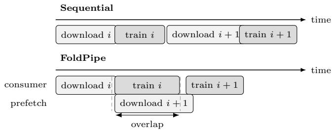
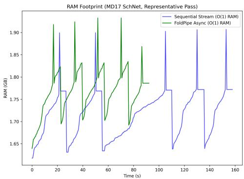
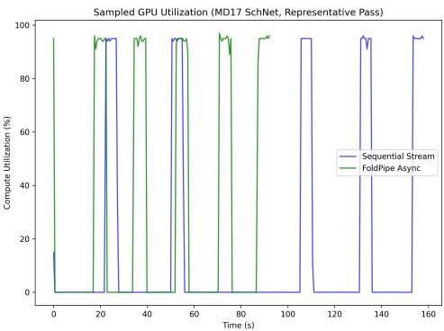

# FoldPipe: Bounded Remote Streaming of Native Molecular Shards with Asynchronous Prefetch

Dhiren Mukesh Khatri Independent Researcher

Abstract— Training molecular machine-learning models on ephemeral or memory-constrained accelerator instances can require repeatedly retrieving preprocessed molecular graphs from remote storage. FoldPipe is a lightweight Python orchestration layer for already-sharded PyTorch and PyTorch Geometric data. It retrieves one shard ahead in a background thread while the consumer trains on the current shard, keeping the number of live shard payloads bounded with respect to total dataset size.

Asynchronous prefetch and bounded bufering are established systems techniques rather than novel scheduling algorithms. FoldPipe’s contribution is a small integration targeted at native .pt molecular shards together with a source-pinned empirical characterization of its operating regime

We evaluate a SchNet energy-and-force workload on MD17 aspirin using 20 paired, order-alternating benchmark passes on a Tesla T4. Each pass processes five pinned shards containing 25,000 structures. FoldPipe records 16.33 s mean I/O–compute overlap, compared with zero by construction for the sequential bounded baseline. Mean pass time is 76.78 s for FoldPipe and 83.37 s for the baseline. However, the geometric mean paired speedup is 1.059× with a 95% bootstrap interval of 0.878×–1.288×. The experiment therefore verifies the overlap mechanism but is inconclusive about a reliable wall-clock speed advantage under the observed public-network variability.

## 1 Introduction

Molecular machine-learning workloads commonly represent molecular conformations as graphs containing atomic identities, coordinates, energies, and forces. Architectures such as SchNet [1] can operate on these representations through PyTorch [2] and PyTorch Geometric (PyG) [3].

In temporary notebook or cloud environments, however, processed training data may reside in remote storage while host memory and persistent disk are limited. A researcher may already possess hundreds or thousands of serialized PyTorch or PyG shard files and may not want to migrate them into a new database or archive format merely to stream them to a training process.

FoldPipe addresses this narrow integration problem. It consumes existing bounded-size .pt shards through a small source interface and overlaps retrieval of shard i + 1 with computation on shard i.

The system deliberately does not claim that producer– consumer queues, bounded bufering, asynchronous prefetch, or the resulting pipeline equations are new. Prefetch and computation–I/O overlap are long-established systems techniques [4]. The contribution is instead the application boundary: direct remote consumption of native PyTorch/PyG molecular shards together with an instrumented evaluation that distinguishes mechanism from observed end-to-end speed.

This paper makes three contributions:

1. a small backend-independent interface for remotely stored native PyTorch/PyG shards;

2. a one-stage asynchronous pipeline whose number of live shard payloads remains constant with respect to total shard count;

3. a paired MD17/SchNet experiment that directly measures retrieval, deserialization, computation, overlap, memory, and runtime while reporting uncertainty rather than assuming that overlap necessarily produces a speedup.

## 2 Related Work

PyTorch provides general-purpose data loading and multiprocessing facilities [2]. PyG provides OnDiskDataset for graph objects that do not fit in CPU memory and PrefetchLoader for asynchronously moving prepared batches toward the accelerator [5, 6]. FoldPipe operates at an earlier boundary: retrieval and deserialization of remote shard files before ordinary PyG batching.

WebDataset packages samples into tar shards designed for sequential local or remote streaming [7]. The Hugging Face Hub provides revision-addressable repository storage and remote file retrieval [8]. FoldPipe does not attempt to replace either system. Its narrower compatibility advantage is that already-generated .pt shards can be consumed without first being converted into tar records or a database.

Broader input-pipeline systems such as tf.data incorporate parallelism, caching, transformations, and prefetch at considerably larger scope [9]. FoldPipe intentionally remains a small orchestration layer rather than a general input-processing framework.

## 3 FoldPipe Design

## 3.1 Source abstraction

A FoldPipe source exposes two conceptual operations:

1. lazily enumerate shard identifiers; and

2. retrieve and deserialize one shard.

Current software supports Hugging Face and Google Drive sources, together with synthetic and pre-enumerated sources used in testing and controlled experiments.

The Hugging Face backend can pin retrieval to an exact repository revision. Remote bytes are streamed into memory and deserialized on the CPU. Consequently, FoldPipe avoids a required local-disk cache, but it is not zero-copy: serialized bytes and deserialized objects may coexist briefly.

  
Figure 1: Sequential streaming performs retrieval and computation one after another. FoldPipe retrieves shard i + 1 in the background while shard i is being consumed, so part of the retrieval latency can be hidden.

Because native $\mathrm { P y T o r c h / P y G }$ objects are deserialized using torch.load(weights only=False), shard files must be trusted. FoldPipe is not intended to safely execute arbitrary untrusted serialized objects.

## 3.2 One-stage asynchronous prefetch

The core iterator uses a single background worker. After shard i becomes available, retrieval of shard i + 1 is submitted before batches from shard i are yielded to the consumer.

Figure 1 illustrates the distinction.

Let $D _ { i }$ denote retrieval plus deserialization time for shard $i ,$ and let $C _ { i }$ denote time spent consuming it. Ignoring small orchestration overheads, bounded sequential streaming takes

$$
T _ { \mathrm { s e q } } = \sum _ { i = 1 } ^ { n } \left( D _ { i } + C _ { i } \right) .\tag{1}
$$

An ideal one-stage pipeline takes approximately

$$
T _ { \mathrm { p i p e } } = D _ { 1 } + \sum _ { i = 1 } ^ { n - 1 } \operatorname* { m a x } \left( C _ { i } , D _ { i + 1 } \right) + C _ { n } .\tag{2}
$$

For a homogeneous long stream this approaches

$$
{ \frac { T _ { \mathrm { s e q } } } { n } } \approx D + C ,\tag{3}
$$

whereas

$$
{ \frac { T _ { \mathrm { p i p e } } } { n } } \approx \operatorname* { m a x } ( D , C ) .\tag{4}
$$

Thus, in the ideal matched-latency case $D \approx C$ , throughput can approach a factor-of-two improvement. If retrieval is much slower than computation, only the computation duration can be hidden.

These are standard pipeline properties rather than a FoldPipe-specific algorithmic result [4].

## 3.3 Memory bound

FoldPipe does not retain every shard in the dataset. At steady state the consumer may hold the current deserialized shard while the background future holds the next shard or its in-progress byte bufer.

If individual shards are bounded by $S _ { \mathrm { m a x } }$ , the live datapath memory is

$$
O ( S _ { \mathrm { m a x } } )\tag{5}
$$

with respect to total shard count. The constant factor can approach two shard payloads, plus mini-batch and model memory.

This statement does not imply that FoldPipe can never run out of memory. A single individually oversized shard can still exceed available RAM.

## 4 Experimental Method

## 4.1 Workload

The real-workload experiment uses the aspirin trajectory from MD17 [10], transformed into PyG graph objects.

Five benchmark shards are used. Each contains 5,000 structures, for 25,000 structures per timed pass.

The dataset repository is pinned to revision f779686deb9217877dd7ddde99b2522bd441492a.

The workload uses PyG SchNet with 128 hidden channels, 128 filters, six interaction blocks, 50 Gaussian basis functions, and a 10 ˚A cutof.

Batches contain 32 molecular graphs. Each timed optimization step predicts energy and derives forces from the negative coordinate gradient. The loss combines energy mean-squared error with ten times force mean-squared error.

The experiment ran on a Tesla T4. One untimed warmup batch was executed before measurement.

## 4.2 Paired protocol

Twenty pairs were measured.

Within each pair, the sequential and FoldPipe pipelines processed the same five shards, used the same model initialization and manual seed, and alternated execution order between pairs.

Therefore the final experiment contains 40 timed passes and 200 timed shard traces.

The benchmark records monotonic timestamps for download start, download finish, deserialization finish, training start, and training finish.

Resident memory and GPU utilization are sampled during each pass. GPU synchronization bounds the per-shard training interval.

The shard list is fixed before timing, so remote dataset discovery is not included in the timed comparison.

For every pair, runtime speedup is calculated as

$$
R _ { i } = \frac { T _ { \mathrm { s e q } , i } } { T _ { \mathrm { F o l d P i p e } , i } } .\tag{6}
$$

The paired ratios are summarized with their geometric mean. A deterministic percentile bootstrap of paired log ratios with 20,000 resamples estimates the 95% interval.

Absolute paired time diferences are also reported.

The benchmark was executed from clean source commit 16fdbb26b00f9721ce4034335ce0ee12bda77720. The corresponding source manifest and source-bundle SHA-256 are preserved with the public research artifact [11].

Table 1: Twenty-pair MD17/SchNet benchmark summary.
<table><tr><td>Metric</td><td>Sequential</td><td>FoldPipe</td></tr><tr><td>Mean pass time (s)</td><td>83.37</td><td>76.78</td></tr><tr><td>Median pass time (s)</td><td>75.27</td><td>75.97</td></tr><tr><td>Time SD (s)</td><td>39.86</td><td>28.46</td></tr><tr><td>GPU utilization (%)</td><td>36.17</td><td>37.70</td></tr><tr><td>Peak RSS (GiB)</td><td>1.935</td><td>2.064</td></tr><tr><td>I/O-compute overlap (s)</td><td>0.00</td><td>16.33</td></tr><tr><td>GPU wait time (s)</td><td>56.50</td><td>48.65</td></tr></table>

## 5 Results

FoldPipe was faster in 11 of 20 pairs.

The geometric mean paired runtime ratio was 1.059×, with a 95% paired-bootstrap interval of 0.878×–1.288×.

Because this interval includes 1.0, the experiment does not establish a reliable wall-clock speed advantage.

Mean paired time saved was 6.59 s with a 95% interval from −7.69 to 21.11 s. Median paired time saved was 3.45 s with an interval from −13.48 to 22.89 s. These intervals also contain the no-efect value.

The mechanism measurement answers a diferent question. FoldPipe recorded 16.33 s mean retrieval– computation overlap per pass, whereas the sequential implementation has no concurrent retrieval and training by construction.

The experiment therefore provides direct evidence that the implementation performs the intended overlap, even though variable remote-network conditions prevent the current sample from establishing a reliable overall speed advantage.

Peak RSS is slightly higher for FoldPipe because a prefetched next payload may coexist with the shard currently being consumed. The experiment therefore does not support a claim that asynchronous streaming requires less memory than bounded sequential streaming. Instead, both retain a working set that is independent of total shard count.

## 6 Discussion

The results separate mechanism from outcome.

FoldPipe successfully overlaps remote retrieval with current-shard computation. That fact alone does not guarantee lower end-to-end runtime because public network latency can vary substantially between consecutive passes.

The simple pipeline model predicts the same boundary. When Ci is comparable to $D _ { i + 1 }$ , a large portion of nextshard retrieval can be hidden. When $D _ { i + 1 } \gg C _ { i }$ , the consumer must still wait for the remaining download.

The real MD17 experiment therefore should not be interpreted as evidence for a universal speedup. Instead, it shows that the mechanism operates as intended and that its throughput value depends on the relationship between remote I/O latency and per-shard computation.

This positioning also distinguishes FoldPipe from more comprehensive input systems. Researchers willing to migrate their data to WebDataset, a database-backed PyG dataset, or another specialized representation may obtain functionality that FoldPipe does not provide. FoldPipe is most useful when existing native .pt shards and minimal format migration are primary constraints.

## 7 Limitations

The evaluation has several limitations.

First, the principal real-workload benchmark uses a public remote network. Alternating pipeline order reduces a simple ordering bias but does not make the two pipelines experience identical network conditions.

Second, twenty pairs still produce wide uncertainty intervals. Larger experiments would provide tighter estimates of the throughput efect.

Third, the real workload uses one molecular system, one model family, and one accelerator configuration. The results therefore characterize this workload rather than all molecular training pipelines.

Fourth, FoldPipe operates at shard granularity. It does not provide sample-level remote streaming inside a shard, automatic distributed sharding, generalized transformation graphs, or the storage features of mature database and archive systems.

Finally, native PyTorch object deserialization is unsafe for untrusted files. Only trusted serialized shards should be used.

## 8 Software and Data Availability

The FoldPipe implementation is publicly available as opensource software under the MIT license.

The current software release is version 0.3.2. The MD17 measurements reported in this paper are preserved as the frozen v0.3.0 research benchmark artifact [11].

The public repository includes the benchmark report, raw statistics, per-shard traces, source manifest, execution log, benchmark image, and the scripts used to construct the processed benchmark shards.

The benchmark data are derived from the MD17 aspirin dataset rather than being introduced as a new molecular dataset in this paper.

## 9 Conclusion

FoldPipe provides a small bounded-working-set streaming layer for existing native PyTorch and PyG molecular-data shards stored remotely.

Its single-stage prefetcher retrieves the next shard while computation proceeds on the current shard. The resulting data-path memory requirement is bounded by shard size and prefetch depth rather than by total dataset size.

A 20-pair MD17/SchNet experiment directly measured 16.33 s mean I/O–compute overlap. Observed mean runtime favored FoldPipe, but paired uncertainty intervals included the no-efect value.

The present experiment therefore demonstrates the overlap mechanism while remaining inconclusive about a reliable wall-clock speed advantage under variable publicnetwork conditions.

FoldPipe should consequently be viewed as a lowconversion integration for remote native molecular shards whose performance benefit depends on the I/O–compute regime, rather than as a new prefetch algorithm or a universally faster replacement for established data systems.

  
Figure 2: Representative resident-memory and sampled-GPU-utilization traces from the MD17/SchNet benchmark. These traces illustrate execution behavior; statistical inference uses all 20 paired runs rather than this individual example.

## References

[1] Kristof T. Sch¨utt, Huziel E. Sauceda, Pieter-Jan Kindermans, Alexandre Tkatchenko, and Klaus-Robert M¨uller. Schnet—a deep learning architecture for molecules and materials. The Journal of Chemical Physics, 148(24):241722, 2018. doi: 10.1063/1.501977 9.

[2] Adam Paszke, Sam Gross, Francisco Massa, Adam Lerer, James Bradbury, Gregory Chanan, Trevor Killeen, Zeming Lin, Natalia Gimelshein, Luca Antiga, Alban Desmaison, Andreas K¨opf, Edward Yang, Zachary DeVito, Martin Raison, Alykhan Tejani, Sasank Chilamkurthy, Benoit Steiner, Lu Fang, Junjie Bai, and Soumith Chintala. Pytorch: An imperative style, high-performance deep learning library. In Advances in Neural Information Processing Systems, volume 32, 2019.

[3] Matthias Fey and Jan Eric Lenssen. Fast graph representation learning with pytorch geometric. arXiv preprint arXiv:1903.02428, 2019. doi: 10.48550/arX iv.1903.02428.

[4] Elizabeth Shriver, Christopher Small, and Keith A. Smith. Why does file system prefetching work? In 1999 USENIX Annual Technical Conference, pages 71–84. USENIX Association, 1999.

[5] PyTorch Geometric Contributors. Ondiskdataset documentation. PyTorch Geometric Documentation, 2026. URL https://pytorch-geometric.readt hedocs.io/en/stable/generated/torch\_geomet ric.data.OnDiskDataset.html. Accessed August 2026.

[6] PyTorch Geometric Contributors. Loader documentation: Prefetchloader. PyTorch Geometric Documentation, 2026. URL https://pytorch-geometric.r eadthedocs.io/en/latest/modules/loader.html. Accessed August 2026.

[7] Alex Aizman, Gavin Maltby, and Thomas Breuel. High performance i/o for large scale deep learning. arXiv preprint arXiv:2001.01858, 2020. doi: 10.48550

[8] Hugging Face. Downloading files from the hugging face hub. Hugging Face Hub Documentation, 2026. URL https://huggingface.co/docs/huggingfac e\_hub/guides/download. Accessed August 2026.

[9] Derek G. Murray, Jiri Simsa, Ana Klimovic, and Ihor Indyk. tf.data: A machine learning data processing framework. Proceedings of the VLDB Endowment, 14 (12):2945–2958, 2021. doi: 10.14778/3476311.3476374.

[10] Stefan Chmiela, Alexandre Tkatchenko, Huziel E. Sauceda, Igor Poltavsky, Kristof T. Sch¨utt, and Klaus-Robert M¨uller. Machine learning of accurate energyconserving molecular force fields. Science Advances, 3 (5):e1603015, 2017. doi: 10.1126/sciadv.1603015.

[11] Dhiren Mukesh Khatri. Foldpipe v0.3.0: Md17 research benchmark artifact. Open-source software and benchmark release, 2026. URL https://github.com /aviatorlf/FoldPipe/releases/tag/v0.3.0.