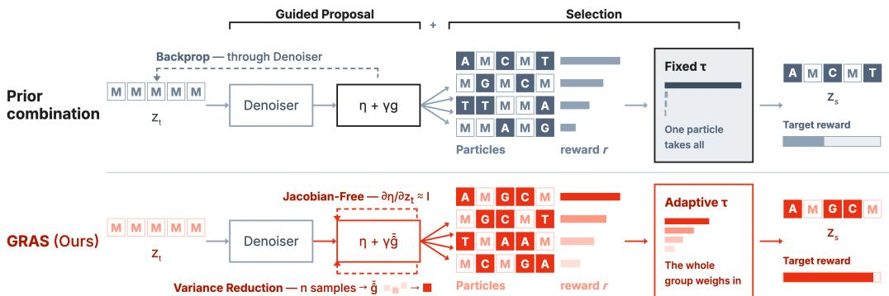
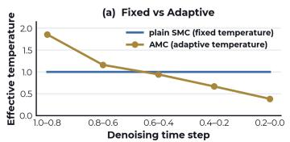
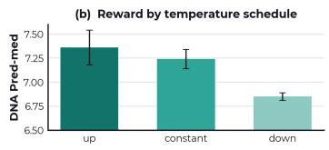

# GRAS: Guided Reduced-Variance Proposals and Adaptive Selection for Training-Free Reward Alignment in Discrete Diffusion

Kwanyoung Kim

Department of AI, Gwangju Institute of Science and Technology (GIST) k0.kim@gist.ac.kr

## Abstract

Discrete diffusion models have become a strong, widely adopted class of generators for sequence data, and steering them toward a downstream reward at inference time, without any retraining, is increasingly important. Such training-free steering is done by gradient guidance, by search, or by combining the two. We study the combined regime and identify two weaknesses in how it is usually run: the guided proposal estimates its gradient from a single noisy sample, and the search then resamples particles at a fixed temperature that ignores how rewards spread across each denoising step. We address both with a small set of changes that add no denoiser cost. For the proposal, we lower the estimator variance with a Rao– Blackwellized reveal for differentiable rewards and a leave-one-out baseline for non-differentiable ones; for the search, we standardize the per-step values into a group-relative advantage and prove it collapses to a single active ingredient, an adaptive resampling temperature. We call the resulting method Guided Reducedvariance proposals and Adaptive Selection (GRAS). GRAS is simple yet effective: across regulatory DNA and protein design it attains the best training-free reward, outperforming prior training-free methods and matching or surpassing a rewardfine-tuned model, and it remains effective even for non-differentiable rewards.

## 1 Introduction

Discrete diffusion models are a strong class of generative models for sequence data: they corrupt a sequence by replacing tokens with a MASK symbol and learn to reverse it, generating by iterative unmasking [27]. They train simply, scale well, and perform strongly on language, code, and biological sequences such as regulatory DNA and proteins [27, 31], with naturalness as the training objective.

In most applications, however, naturalness is not the objective. The goal is samples that also score highly under a downstream reward, such as an enhancer that drives high expression, a protein that folds stably, or a text completion that a preference model rates well. One route is post-training, fine-tuning or reinforcement learning of the generator against the reward [31], but this is expensive and must be redone for every new reward. A cheaper, more flexible alternative, now standard for continuous diffusion, is inference-time steering: keep the pretrained model frozen and bias only the sampling process toward high-reward regions. In this work we focus on this inference-time, trainingfree setting: given a frozen generator p<sub>θ</sub> and a reward r, sample sequences that are simultaneously likely under p<sub>θ</sub> and high under r, with no retraining.

These steering methods fall into two families (detailed in §2): search draws several trajectories and keeps high-scoring ones (SMC/TDS [32], SVDD [19], tree search [12]), and gradient guidance biases sampling by the reward gradient [22, 26], most relevantly Gradient-Informed Logit Correction (GILC), which adds a straight-through reward gradient to the clean-token logits [10, 29].

  
Figure 1: Prior combined guidance+search versus GRAS. Both stack a guided proposal with selection. Prior methods (top) backpropagate the reward gradient through the denoiser and resample at a fixed temperature, letting one particle take all the mass. GRAS (bottom) makes three dropin changes: a Jacobian-free proposal, a variance-reduced correction, and an adaptive-temperature selector that resamples the whole particle set rather than letting one particle dominate.

The two families are routinely stacked, and the combination is not new: TDS and TreeG’s gradient variant already pair a gradient proposal with search [12]. What is missing is an accounting: when a stacked method reports a strong number, it is rarely clear how much is the proposal, how much the search, and what the search costs in denoiser calls or diversity. This paper supplies it: we attribute the reward to the proposal versus the selector and report each method’s denoiser-call budget (Appendix C, Table 6) alongside its reward, so a cheap proposal counts as a strength and the cost of a heavier value estimate is explicit (SVDD’s Rao–Blackwell value inflates the count roughly fourfold). Table 4 (Appendix B) places the reward-steering literature along these axes (training-free, gradient, search, and adaptive selection) and locates GRAS as the only entry that combines all four; a component-level anatomy of the closest samplers follows in Table 5.

On this axis the picture is consistent (Figure 1): the guided proposal captures most of the reward cheaply and then saturates, and the remaining reward is delivered by an adaptive resampling temperature that we introduce, at a cost (mode collapse) that standard metrics do not see. Our contributions are as follows.

• We propose two variance reductions for the guided proposal that add no denoiser calls, Gumbel– Rao for differentiable rewards and a leave-one-out baseline for non-differentiable ones, a matched pair that lifts the proposal for free.

• We propose an adaptive-temperature resampling rule for the search, AMC, which standardizes the per-step values into a group-relative advantage, and prove that only its scale acts.

• We combine these into GRAS, a single training-free method, and through extensive experiments and analysis on regulatory DNA and protein design show it is effective, accounting both empirically and theoretically for where its reward comes from.

## 2 Background

Masked Discrete Diffusion. Let $\pmb { x } = ( x ^ { 1 } , \dots , x ^ { L } )$ be a length-L sequence with each token $x ^ { \ell }$ in a vocabulary $\mathcal { V } = \{ 1 , \ldots , V \}$ , one of which is a special absorbing MASK symbol; write $V _ { 0 } = V - 1$ for the number of ordinary tokens. A masked (absorbing) diffusion model [27, 31] defines a forward process that gradually replaces tokens with MASK, and learns to reverse it. Generation therefore proceeds by iterative unmasking: start from the all-MASK sequence and, over T steps, progressively reveal tokens until none are masked.

Concretely, a time variable t runs from t=1 (all masked) down to t=0 (fully revealed); write ${ \boldsymbol { z } } _ { t }$ for the partially masked state and $s = t - \Delta t$ for the next, less-noisy time. A denoiser network reads ${ \boldsymbol { z } } _ { t }$ and outputs, for each masked position, a categorical distribution over the clean token,

$$
p _ { \theta } ( x _ { 0 } ^ { \ell } = k \mid z _ { t } ) = \mathrm { s o f t m a x } ( \eta ^ { \ell } ) _ { k } , \qquad \eta ^ { \ell } = \eta ^ { \ell } ( z _ { t } ) \in \mathbb { R } ^ { V } ,\tag{1}
$$

and these predictions are independent across positions, $\begin{array} { r } { p _ { \theta } ( \pmb { x } _ { 0 } \mid z _ { t } ) = \prod _ { \ell } p _ { \theta } ( x _ { 0 } ^ { \ell } \mid z _ { t } ) } \end{array}$ . Let $\alpha _ { t } \ \in$ [0, 1] be the fraction of tokens still present under the schedule $( \alpha _ { 1 } { = } 0 , \alpha _ { 0 } { = } 1 )$ . One reverse step either

reveals a masked position (drawing its token from the clean prediction) or leaves it masked:

$$
p _ { \theta } ( z _ { s } ^ { \ell } \mid z _ { t } ) = \left\{ { \begin{array} { l l } { \delta _ { z _ { s } ^ { \ell } = z _ { t } ^ { \ell } } , } & { z _ { t } ^ { \ell } \neq \mathrm { M A S K ~ ( a l r e a d y ~ r e v e a l e d ; ~ f r o z e n ) } , } \\ { ( 1 - a _ { t } ) \delta _ { \mathrm { M a S K } } + a _ { t } p _ { \theta } ( x _ { 0 } ^ { \ell } \mid z _ { t } ) , } & { z _ { t } ^ { \ell } = \mathrm { M A S K } . } \end{array} } \right.\tag{2}
$$

Here $a _ { t } \ = \ ( \alpha _ { s } - \alpha _ { t } ) / ( 1 - \alpha _ { t } ) \ \in \ [ 0 , 1 ]$ is the per-step reveal probability set by the schedule. The essential feature for us: once revealed, a token is frozen, and masked positions are revealed independently using the per-position clean predictions.

Reward-Tilted Sampling and the Soft Value Function. Given a reward $r : \mathcal { V } ^ { L } \to \mathbb { R }$ and an inverse temperature $\hat { \beta } ^ { - 1 }$ (larger 1/β = stronger guidance), the target of sampling is the reward-tilted distribution [31, 10]

$$
p ^ { \star } ( { \pmb x } _ { 0 } ) \propto p _ { \theta } ( { \pmb x } _ { 0 } ) \exp \big ( r ( { \pmb x } _ { 0 } ) / \beta \big ) .\tag{3}
$$

This trades off staying likely under the generator against achieving high reward; $\beta \to \infty$ recovers $p _ { \theta } , \beta \to 0$ concentrates on the reward maximizer. The exact way to sample (3) while running the reverse process is the Doob h-transform of (2), which reweights each reverse step by the soft value $v _ { s }$ [32, 10]:

$$
p ^ { \star } ( z _ { s } \mid z _ { t } ) \propto p _ { \theta } ( z _ { s } \mid z _ { t } ) \exp \bigl ( v _ { s } ( z _ { s } ) / \beta \bigr ) , \qquad v _ { s } ( z _ { s } ) = \beta \log \mathbb { E } _ { p _ { \theta } ( x _ { 0 } \mid z _ { s } ) } \bigl [ e ^ { r ( x _ { 0 } ) / \beta } \bigr ] ,\tag{4}
$$

where $v _ { s }$ is the soft value function: the (log-sum-exp) expected future reward if we continue denoising from $z _ { s }$ [10]. The difficulty is that v depends on the reward of clean sequences but must be evaluated at noisy states. The two families of inference-time methods are complementary ways to approximate (4), and they compose.

• Search-Based Selection. SMC and SVDD keep the base reverse kernel and draw several trajectories, reweighting or selecting by a cheap value estimate $\hat { V } ( z )$ : SMC resamples a particle population with weights w $\propto \exp ( \hat { V } / \alpha )$ , while SVDD keeps the best candidate. Both improve with more particles but leave the per-step proposal as is.

• Gradient Guidance. Gradient guidance edits the reverse kernel itself by the reward gradient: DPS shifts the Gaussian mean, DG [22] tilts the CTMC rates, and for masked diffusion one tilts the clean-token logits; the shared difficulty is estimating the reward gradient of a discrete sequence, whose masked-diffusion instantiation, which we build on, is GILC.

• Combining the Two. The families act on different parts of (4), so search over a guided proposal lets selection allocate trajectories within an already reward-tilted distribution, the stacked regime of TDS, SMC-DDM, and TreeG that we adopt and analyze.

Differentiable Rewards and the GILC Proposal. Pushing the reveal toward higher reward needs $\nabla _ { \eta } r ,$ but r acts on a discrete sequence and is piecewise constant in η. The standard fix is the Gumbel–Softmax straight-through (ST-GS) estimator [15, 2]: draw $\hat { { \pmb x } } _ { \mathrm { s o f t } } = \mathrm { s o f t m a x } ( ( \pmb { \eta } + \pmb { \zeta } ) / \tau )$ feed the hard one-hot to the reward, and backpropagate through the soft relaxation,

$$
\hat { x } = \mathrm { o n e h o t } \big ( \operatorname * { a r g m a x } _ { k } \hat { x } _ { \mathrm { s o f t } , k } \big ) - \mathrm { s g } ( \hat { x } _ { \mathrm { s o f t } } ) + \hat { x } _ { \mathrm { s o f t } } , \qquad \partial \hat { x } / \partial \eta = \partial \hat { x } _ { \mathrm { s o f t } } / \partial \eta .\tag{5}
$$

GILC [10] instantiates gradient guidance through this path: it reveals from a corrected clean prediction, adding $\delta ^ { \ell } = \gamma g ^ { \ell }$ to each masked position’s logits,

$$
\hat { p } ^ { \ell } = \mathrm { s o f t m a x } ( \eta ^ { \ell } + \delta ^ { \ell } ) , \qquad p _ { \mathrm { g u i d e d } } ^ { \star } ( z _ { s } ^ { \ell } \mid z _ { t } ) = ( 1 - a _ { t } ) \delta _ { \mathrm { M a s K } } + a _ { t } \hat { p } ^ { \ell } .\tag{6}
$$

The correction ${ \pmb g } ^ { \ell } = \left( \partial r ( \hat { \pmb x } _ { 0 } ) / \partial \hat { \pmb x } _ { 0 } \right) \left( \partial \hat { \pmb x } _ { 0 } / \partial { \pmb \eta } ^ { \ell } \right)$ estimates $\nabla _ { \eta ^ { \ell } } \mathbb { E } [ r ]$ , obtained by approximating the ill-conditioned model Jacobian by the identity, $\mathrm { { \partial } } \partial \eta / \partial z _ { t } \approx I$ (hence “Jacobian-free”). The guidance scale $\gamma > 0$ plays the role of $1 / \beta ;$ we grid-search it directly (Appendix C).

## 3 Method

In this section, we present our method: a variance-reduced guided proposal $( \ S 3 . 1 )$ and an adaptivetemperature selector (§3.2), each a small, drop-in change to an existing guided sampler.

Algorithm 1: CORRECTION-DB-RAO Algorithm 2: CORRECTION-PG-RO   
Input: logits η; reward r; size n; temp τ; Rao Input: logits η; reward $r ;$ size n   
M 1 p = softmax(η);   
1 for $i = 1 , \ldots , n$ do 2 for $i = 1 , \ldots , n$ do   
2 ζ ∼Gumbel, i<sup>⋆</sup> =arg max(η+ζ); 3 $\begin{array} { r } { { \pmb x } \sim { \pmb p } , \hat { { \pmb x } } = \mathrm { o n e h o t } ( { \pmb x } ) , R _ { i } = r ( \hat { { \pmb x } } ) ; } \end{array}$   
3 $\begin{array} { r } { \bar { \pmb { x } } = \frac { 1 } { M } \sum _ { m \leq M } \operatorname { s o f t m a x } _ { \tau } ( \pmb { \eta } + \pmb { \zeta } ^ { ( m ) } | i ^ { \star } ) ; } \end{array}$ 4 $\begin{array} { r } { A _ { i } = R _ { i } - \frac { 1 } { n - 1 } \sum _ { j \neq i } R _ { j } ( { \mathrm { E q . ~ } } 8 ) ; } \end{array}$   
4 $\begin{array} { r } { \hat { \pmb { x } } = \mathrm { S T E } ( i ^ { \overline { { \star } } } , \bar { \pmb { x } } ) , R _ { i } = r ( \hat { \pmb { x } } ) ; } \end{array}$ 5 $\begin{array} { r } { \pmb { g } = \frac { 1 } { n } \sum _ { i } A _ { i } ( \hat { \pmb { x } } _ { i } - \pmb { p } ) ; } \end{array}$   
5 $\begin{array} { r } { \pmb { g } = \frac { 1 } { n } \sum _ { i } \partial R _ { i } / \partial \pmb { \eta } \ ( \mathrm { E q . } 7 ) ; } \end{array}$ Output: correction g   
Output: correction g

## 3.1 A Better Proposal: Zero-Cost Variance Reduction

Building on GILC, we propose two changes to the guided proposal that reduce the variance of its logit correction g of (6) at no additional denoiser cost. The correction estimates $\nabla _ { \eta } \mathbb { E } [ r ]$ , and its estimator is set by the reward: pathwise (straight-through) for a differentiable reward, and scorefunction (policy-gradient) for a non-differentiable one. Each base estimator is unbiased but highvariance, and each admits a matched variance reduction that adds no denoiser calls, developed below; the base estimators themselves are in Appendix E.

Differentiable reward: the Gumbel–Rao proposal. The pathwise base estimator CORRECTION-DB (Appendix E) averages straight-through gradients (5) over n Gumbel–Softmax samples. It is unbiased but reads its Jacobian off a single Gumbel draw per sample, so the correction is highvariance and the noise propagates into every reveal. We remove this noise at no extra pass by Rao–Blackwellizing over the reveal Gumbels (CORRECTION-DB-RAO, Algorithm 1, abbreviated GR): fixing the hard sample $i ^ { \star } = \arg \operatorname* { m a x } _ { k } ( \eta _ { k } + \zeta _ { k } )$ , a sufficient statistic for the discrete outcome, we replace the straight-through Jacobian by its conditional expectation given $i ^ { \star }$

$$
g _ { \mathrm { G R } } = \frac { \partial r ( \hat { x } _ { 0 } ) } { \partial \hat { x } _ { 0 } } \mathbb { E } _ { \zeta | \mathrm { a r g m a x } ( \eta + \zeta ) = i ^ { \star } } \Big [ \frac { \partial \mathrm { s o f t m a x } _ { \tau } ( \eta + \zeta ) } { \partial \eta } \Big ] \approx \frac { \partial r ( \hat { x } _ { 0 } ) } { \partial \hat { x } _ { 0 } } \frac { 1 } { M } \sum _ { m = 1 } ^ { M } \frac { \partial \mathrm { s o f t m a x } _ { \tau } ( \eta + \zeta ^ { ( m ) } ) } { \partial \eta } .\tag{7}
$$

By the Rao–Blackwell theorem the mean is unchanged and the variance does not increase [24]; the conditional $p ( \zeta \mid$ arg max =i<sup>⋆</sup>) has a closed-form truncated-Gumbel sampler (Appendix E); M=0 denotes the base CORRECTION-DB (no Rao–Blackwellization), and the sweep over M is in Appendix G (Table 12).

Non-differentiable reward: the policy-gradient proposal. When the reward is nondifferentiable, the correction is formed instead by the score-function estimator: sample hard tokens $\pmb { x } ^ { ( i ) } \sim \pmb { p } = \mathrm { s o f t m a x } ( \pmb { \eta } )$ and reward-weight the score $\nabla _ { \eta } \log { p ( \pmb x ^ { ( i ) } ) } = \hat { \pmb x } ^ { ( i ) } - \pmb p ,$ , an unbiased estimate of $\nabla _ { \eta } \mathbb { E } [ r ]$ needing no relaxation, no Gumbel temperature, and no model Jacobian (CORRECTION-PG, Appendix E). Its matched variance reduction is a leave-one-out (RLOO) baseline, subtracting from each sample’s reward the mean of the other $n - 1 \colon$

$$
\begin{array} { r } { A _ { i } = R _ { i } - \frac { 1 } { n - 1 } \sum _ { j \neq i } R _ { j } , \qquad \pmb { g } = \frac { 1 } { n } \sum _ { i = 1 } ^ { n } A _ { i } \left( \hat { \pmb x } ^ { ( i ) } - \pmb p \right) , } \end{array}\tag{8}
$$

which reuses the same n reward evaluations and adds no forward pass (CORRECTION-PG-RO, Algorithm 2); we abbreviate it PG-RO. It plays for the non-differentiable proposal the role Gumbel– Rao plays for the differentiable one, so the two form a matched pair, one per estimator. Proposition 1 below sharpens this parallel into a testable claim: the same leave-one-out centering is a real gain here, on the proposal, yet provably inert up to $O ( 1 / K )$ once moved to the selector.

## 3.2 A Better Search: Adaptive-Temperature Selection

We now run inference-time selection over the guided proposal of §3.1, whose single-trajectory loop is given as Algorithm 3 in Appendix D. Selection is what turns that single guided trajectory into the reward gains of search; a standard selector run over a guided proposal, however, carries one weakness that keeps it from delivering that gain, which we identify and fix. A selector scores a partial state by a cheap one-step value

$$
V ( z ) = r { \big ( } \operatorname * { a r g m a x } _ { \mathbf { x } _ { 0 } } p _ { \theta } ( \pmb { x } _ { 0 } \mid z ) { \big ) }\tag{9}
$$

(one denoiser call; no rollout, no learned network). SMC (the TDS family [32]) runs K particles and resamples the population by value, while SVDD [19] draws M candidates per step and keeps one by value; we run both on the guided reveal of §3.1 in place of the base model’s unmasking, and leave the selectors otherwise as published. Our one refinement touches the SMC weighting rule: it is a single-line change, stated here and given in full in Appendix D.

Adaptive-temperature resampling. SMC resamples particle k with weight $w ^ { k } \propto \exp ( \Delta ^ { k } / \alpha )$ $\Delta ^ { k } = V ( z _ { s } ^ { k } ) - V ( z _ { t } ^ { k } )$ , at a fixed temperature α. The spread of the increments $\{ \Delta ^ { k } \}$ varies markedly along the trajectory, so a single α is mis-calibrated: too cold when the values are bunched (neardeterministic resampling that collapses diversity) and too hot when they are spread (near-uniform resampling that ignores the reward). To address this, we standardize the increment across the group, with $\mu , \sigma$ its per-step mean and standard deviation,

$$
\hat { w } ^ { k } ~ \propto ~ \mathrm { e x p } \Big ( { \frac { \Delta ^ { k } - \mu } { \alpha \sigma } } \Big ) ~ \propto ~ \mathrm { e x p } \Big ( { \frac { \Delta ^ { k } } { \alpha _ { \mathrm { e f f } } } } \Big ) , \qquad \alpha _ { \mathrm { e f f } } = \alpha \sigma ,\tag{10}
$$

turning the fixed temperature into an adaptive one, $\alpha _ { \mathrm { e f f } } = \alpha \sigma$ , that self-calibrates to the per-step spread (with $\sigma$ floored at a small ϵ for the degenerate all-equal case). Since $V ( z _ { t } ^ { k } )$ is cached, this adds no denoiser call; we call the selector AMC (Adaptive Monte Carlo), and it changes exactly one line of vanilla SMC (Appendix D). The one-line change is not cosmetic: the adaptive scale is the whole mechanism (Proposition 1) and makes α reward-scale invariant, so it transfers across reward models without retuning (Table 10).

Standardization does two things, a mean subtraction and a scale division, and only one of them acts.   
All proofs are deferred to Appendix A.

Proposition 1 (Baseline invariance of the resampling law). Fix a scale $c = \alpha \sigma > 0 .$ , and for increments $\{ \Delta ^ { k } \} _ { k = 1 } ^ { K } \subset \mathbb { R }$ and baselines $\{ b ^ { k } \} _ { k = 1 } ^ { K }$ define the resampling law $\hat { w } ^ { k } \propto \exp \bigl ( ( \Delta ^ { \bar { k } } -$ $b ^ { k } ) / c )$ , with $\begin{array} { r } { \mu = \frac { 1 } { K } \sum _ { j } \Delta ^ { j } } \end{array}$

(i) (Constant baseline.) For any constant $b ^ { k } \equiv b ,$ the law $\hat { w } ^ { k } = \mathrm { s o f t m a x } _ { k } ( \Delta ^ { k } / c )$ is independent ofb and depends on the group only through the centered increments $\Delta ^ { k } - \mu .$

(ii) (Leave-one-out baseline.) For $\begin{array} { r } { b ^ { k } = \frac { 1 } { K - 1 } \sum _ { j \neq k } \Delta ^ { j } } \end{array}$ , the log-weight log $\hat { w } ^ { k }$ equals its value in (i) up to an additive $O \big ( 1 / ( K { - } 1 ) \big )$ .

Hence the resampling law is invariant to the leave-one-out baseline up to $O ( 1 / K )$ , and exactly to any constant baseline; the only operative effect of standardization is the replacement of the fixed temperature α by ασ.

Proposition 1 makes a prediction before any experiment: adding a leave-one-out (or any centering) baseline to the selector is inert to $O ( 1 / \dot { K } )$ , so the entire benefit of standardization must be the adaptive temperature. Both halves confirm it: a gain that tracks $\sigma _ { t }$ (Figure 2a) and a null leave-oneout effect on the selector (Table 11).

What the search targets. Guidance and selection act on orthogonal factors, so the reward-tilted proposal and reward-based weights do not double-count and the filter still targets a single well defined distribution.

Proposition 2 (Target of the guided filter). Assume the reward is bounded, $\| r \| _ { \infty } < \infty$ , and the filter resamples by an unbiased scheme (multinomial or systematic). Let $q _ { \gamma }$ be the path measure induced by the guided reveal of§3.1 at scale γ, and run thefilter with incremental weight $w _ { t } ^ { k } = \exp ( \Delta _ { t } ^ { k } / \alpha )$ $\begin{array} { r } { \dot { \Delta { \bf { \mu } } } _ { t } ^ { k } = { \bf { \bar { \alpha } } } V ( { \bf { \mu } } _ { s } ^ { k } ) - V ( { \bf { \dot { z } } } _ { t } ^ { k } ) } \end{array}$ , at fixed $\alpha ,$ with the terminal identity $V ( \pmb { z } _ { 0 } ) ~ = ~ r ( \pmb { x } _ { 0 } )$ . Then the selfnormalized particle estimator is consistent: for every bounded $\begin{array} { r } { \varphi : \mathcal { V } ^ { L }  \mathbb { R } , \sum _ { k } W _ { 0 } ^ { k } \varphi ( \pmb { x } _ { 0 } ^ { k } )  } \end{array}$ $\mathbb { E } _ { \pi _ { \gamma } } [ \varphi ]$ almost surely as $K  \infty ,$ , with normalized terminal weights $W _ { 0 } ^ { k }$ and

$$
\pi _ { \gamma } ( { \pmb x } _ { 0 } ) \propto q _ { \gamma } ( { \pmb x } _ { 0 } ) e ^ { r ( { \pmb x } _ { 0 } ) / \alpha } ;\tag{11}
$$

in particular $\pi _ { 0 } = p ^ { \star }$ of (3) with $\beta = \alpha$

Thus $\gamma$ and α are orthogonal controls: γ selects the base measure, α the tilt temperature. Adding $\log ( p _ { \theta } / q _ { \gamma } )$ would restore $p ^ { \star }$ for every γ (Appendix D.1), but we keep the tilted base measure, which

concentrates particles on the reward-relevant region before the weights act. Unlike the prior posthoc tilts it is compared against, our logit-space placement also leaves the unmasking schedule intact rather than silently accelerating it (Proposition 4, Appendix B.2).

Proposition 3 (Convergence of AMC). Assume $\| r \| _ { \infty } <$ ∞ and ασ $\bar { \mathbf { \rho } } _ { t } \geq \epsilon > 0$ for all t (the ϵ floor $o f \ S 3 . 2 ) ,$ , and let AMC resample with $\hat { w } _ { t } ^ { k }$ ∝ $\exp \bigl ( ( \Delta _ { t } ^ { k } - \mu _ { t } ) / ( \alpha \sigma _ { t } ) \bigr )$ , where $\mu _ { t } , \sigma _ { t }$ are the empirical mean and standard deviation of $\{ \Delta _ { t } ^ { k } \} _ { k = } ^ { K }$ <sub>1</sub>.

(i) (Consistency.) There is a well-defined annealed target $\pi _ { \mathrm { A M C } }$ such that, for every bounded $\varphi ,$

$$
\sum _ { k } W _ { 0 } ^ { k } \varphi ( \pmb { x } _ { 0 } ^ { k } ) \xrightarrow [ K  \infty ] { \mathrm { a . s . } } \mathbb { E } _ { \pi _ { \mathrm { A M C } } } [ \varphi ] ,
$$

with the population estimates $\mu _ { t } , \sigma _ { t }$ contributing $O ( 1 / K )$ bias.

(ii) (Fixed-temperature limit.) $I f \sigma _ { t } \equiv \sigma$ is constant, then $\pi _ { \mathrm { A M C } } = \pi _ { \gamma } ,$ , the target of Proposition 2 at temperature ασ.

The per-step $\sigma _ { t }$ breaks the telescoping that makes the fixed-α filter exact (Proposition 2), so AMC targets a reweighted version by design; its case rests on Proposition 1 and the per-denoiser-call accounting of §5, not on exactness.

Our final method: GRAS. Putting the pieces together, GRAS is a variance-reduced guided proposal searched under the adaptive selector AMC: GRAS-GR for a differentiable reward and GRAS-RO (RLOO baseline) for a non-differentiable one, both at no extra denoiser cost. It is deliberately minimal, three drop-in changes to an existing guided sampler; its value is a simple method that is nonetheless effective across both differentiable and non-differentiable rewards.

## 4 Experiments

We evaluate GRAS on two discrete-diffusion domains, regulatory DNA sequence design and protein sequence design, and then (§5) isolate which component is responsible and at what cost.

Baselines. We compare against the strongest training-free and fine-tuned steering methods for discrete diffusion, reproduced from their official repositories under a common setup, so the gain of our combination is attributable to the proposal-under-selection effect rather than to any single stronger component. They fall into four groups. Fine-tuning: DRAKES [31]. Gradient guidance: DG [22] and GILC [10]. Search: Best-of-N [1], SMC and TDS [32], and SVDD [19]. Combination (guidance + search): SMC-DDM [23] and TreeG [12], the two methods closest to ours. Implementation details are in Appendix C.

## 4.1 DNA Enhancer Sequence Design

Setup. We evaluate on the genomic enhancer benchmark of Gosai et al. [11], as adopted by Wang et al. [31], and set our generation backbone to a masked discrete diffusion model [27] pretrained on this data with T=128 reverse sampling steps. We steer generation toward high predicted HepG2 enhancer activity, given by a reward oracle, while a separate held-out chromatin-accessibility (ATAC) oracle is reserved solely for evaluation and is never used to guide sampling.

Metrics. We measure reward by the median predicted HepG2 activity (Pred-med), and we judge fidelity by the held-out ATAC pass rate, the 3-mer and JASPAR-motif correlations to natural enhancers [4], and the approximate log-likelihood under the frozen generator (App-LL). Full definitions are in Appendix H.

Results. The pattern in Table 1 is the one our analysis predicts. On a single trajectory the guided proposal already outperforms every pure-search baseline (SMC, TDS, SVDD), and the variance reduction lifts it further with no extra denoiser calls. Running the AMC selector on this guided proposal, rather than on the base model it is usually paired with, gives our final method the best training-free reward on the benchmark, above the reward-fine-tuned model and the guided-combination baseline SMC-DDM, at a fraction of the denoiser calls of SVDD, the most expensive search baseline (Table 6). The non-differentiable setting follows the same shape one step lower: without ever differentiating the reward, it still reaches a reward well above the training-free search baselines. Fidelity moves with reward rather than against it: the held-out accessibility oracle rises rather than collapsing, indicating generalization rather than reward hacking, while the two naturalness metrics that trade off (likelihood, motif match) reflect the expected reward–naturalness tension.

Table 1: Quantitative comparison on DNA enhancer design [31] (mean±std, 3 seeds, $N { = } 2 0 )$ Bold indicates the best performance. Std is rounded to two decimals (0.00 shown as 0.01).
<table><tr><td>Method</td><td>Pred-med↑</td><td>ATAC-Acc (%)↑ 3-mer Corr ↑</td><td></td><td>JASPAR↑</td><td>App-LL↑</td></tr><tr><td>Pretrained (MDLM) [27]</td><td> $0 . 1 8 { \scriptstyle \pm 0 . 0 2 }$ </td><td> $2 . 0 { \pm } 0 . 4$ </td><td> $- 0 . 0 4 { \scriptstyle \pm 0 . 0 1 }$ </td><td> $0 . 2 9 { \scriptstyle \pm 0 . 0 1 }$ </td><td> $- 2 6 1 . 9 { \scriptstyle \pm 0 . 6 }$ </td></tr><tr><td>DG [22]</td><td> $1 . 1 0 _ { \pm 0 . 0 1 }$ </td><td> $0 . 0 { \scriptstyle \pm 0 . 0 }$ </td><td> $- 0 . 0 9 _ { \pm 0 . 0 1 }$ </td><td> $- 0 . 0 2 _ { \pm 0 . 0 1 }$ </td><td> $- 2 6 7 . 8 { \scriptstyle \pm 0 . 2 }$ </td></tr><tr><td>Best-of-N [1]</td><td> $1 . 8 1 _ { \pm 0 . 0 6 }$ </td><td> $6 . 8 { \scriptstyle \pm 1 . 9 }$ </td><td> $0 . 3 5 { \scriptstyle \pm 0 . 0 4 }$ </td><td> $0 . 7 6 _ { \pm 0 . 0 1 }$ </td><td> $- 2 6 0 . 2 _ { \pm 0 . 1 }$ </td></tr><tr><td>SMC [32]</td><td> $4 . 2 6 _ { \pm 0 . 1 3 }$ </td><td> $3 0 . 9 { \scriptstyle \pm 5 . 9 }$ </td><td> $0 . 8 3 { \scriptstyle \pm 0 . 0 3 }$ </td><td> $0 . 7 6 _ { \pm 0 . 0 2 }$ </td><td> $- 2 5 7 . 8 { \scriptstyle \pm 2 . 6 }$ </td></tr><tr><td>TDS [32]</td><td> $4 . 4 8 _ { \pm 0 . 8 0 }$ </td><td> $3 6 . 6 { \scriptstyle \pm 9 . 1 }$ </td><td> $0 . 7 6 { \scriptstyle \pm 0 . 1 7 }$ </td><td> $0 . 8 1 { \scriptstyle \pm 0 . 1 4 }$ </td><td> $\mathbf { - 2 5 7 . 4 } _ { \pm 4 . 5 }$ </td></tr><tr><td>SVDD [19]</td><td> $5 . 3 0 { \scriptstyle \pm 0 . 0 2 }$ </td><td> $2 9 . 3 { \scriptstyle \pm 0 . 2 }$ </td><td> $0 . 7 3 { \scriptstyle \pm 0 . 0 1 }$ </td><td> $0 . 8 3 { \scriptstyle \pm 0 . 0 5 }$ </td><td> $- 2 5 9 . 1 { \scriptstyle \pm 0 . 3 }$ </td></tr><tr><td>DRAKÊS [31]</td><td> $5 . 6 1 _ { \pm 0 . 0 8 }$ </td><td> $9 2 . 4 { \scriptstyle \pm 0 . 7 }$ </td><td> $0 . 8 9 { \scriptstyle \pm 0 . 0 1 }$ </td><td> $\mathbf { 0 . 9 1 } _ { \pm 0 . 0 1 }$ </td><td> $- 2 6 4 . 2 _ { \pm 0 . 3 }$ </td></tr><tr><td>GILC-DB [10]</td><td> $6 . 2 1 _ { \pm 0 . 0 5 }$ </td><td> $8 3 . 8 { \scriptstyle \pm 1 . 7 }$ </td><td> $0 . 7 9 { \scriptstyle \pm 0 . 0 2 }$ </td><td> $0 . 9 0 { \scriptstyle \pm 0 . 0 1 }$ </td><td> $- 2 7 9 . 1 { \scriptstyle \pm 0 . 5 }$ </td></tr><tr><td>GILC-PG [10]</td><td> $4 . 8 6 _ { \pm 0 . 0 7 }$ </td><td> $4 7 . 2 { \scriptstyle \pm 0 . 7 }$ </td><td> $0 . 3 7 { \scriptstyle \pm 0 . 0 2 }$ </td><td> $0 . 8 7 _ { \pm 0 . 0 1 }$ </td><td> $- 2 7 6 . 3 { \scriptstyle \pm 0 . 4 }$ </td></tr><tr><td>SMC-DDM [23]</td><td> $5 . 5 7 _ { \pm 0 . 0 6 }$ </td><td> $4 3 . 0 { \scriptstyle \pm 0 . 2 }$ </td><td> $0 . 6 5 { \scriptstyle \pm 0 . 0 2 }$ </td><td> $0 . 7 8 { \scriptstyle \pm 0 . 0 1 }$ </td><td> $- 2 6 1 . 8 { \scriptstyle \pm 0 . 4 }$ </td></tr><tr><td>TreeG-G [12]</td><td> $5 . 9 6 { \scriptstyle \pm 0 . 0 2 }$ </td><td> $9 5 . 5 { \scriptstyle \pm 0 . 8 }$ </td><td> $0 . 7 8 { \scriptstyle \pm 0 . 0 2 }$ </td><td> $0 . 8 9 { \scriptstyle \pm 0 . 0 1 }$ </td><td> $- 2 8 6 . 4 { \scriptstyle \pm 0 . 2 }$ </td></tr><tr><td>GRAS-GR</td><td> ${ \bf 7 . 3 3 2 0 . 1 8 }$ </td><td> ${ \bf 9 9 . 1 { \scriptstyle \pm 1 . 6 } }$ </td><td> $0 . 8 8 { \scriptstyle \pm 0 . 0 3 }$ </td><td> $0 . 8 8 { \scriptstyle \pm 0 . 0 1 }$ </td><td> $- 2 7 6 . 3 { \scriptstyle \pm 0 . 7 }$ </td></tr><tr><td>GRAS-RO</td><td> $6 . 9 6 _ { \pm 0 . 1 9 }$ </td><td> $9 3 . 9 { \scriptstyle \pm 2 . 4 }$ </td><td> $\mathbf { 0 . 9 4 _ { \pm 0 . 0 1 } }$ </td><td> $0 . 9 0 { \scriptstyle \pm 0 . 0 1 }$ </td><td> $- 2 7 5 . 0 { \scriptstyle \pm 0 . 3 }$ </td></tr></table>

## 4.2 Protein Sequence Design

Setup. We evaluate on the protein inverse-folding benchmark of Wang et al. [31], and set our generation backbone to a discrete diffusion model over amino-acid sequences conditioned on a target backbone structure. We steer generation toward predicted stability (ddG) from an oracle trained on the Megascale dataset [30], and re-fold each generated sequence to check whether it still folds to the intended backbone.

Metrics. We measure reward by the median predicted stability (Pred-ddG) and the fraction of stabilizing designs $\mathrm { ( d d G { > } 0 ) }$ , and we judge fidelity by the self-consistency RMSD from re-folding (scRMSD), the fraction of well-folded designs $( \mathrm { s c } \mathrm { \bar { R } M S D { < } 2 \AA } )$ , and the joint stability-and-structure success rate. Full definitions are in Appendix H.

Results. Table 2 shows the same pattern as on DNA. The guided proposal already beats the puresearch baselines (SMC, TDS), the variance reduction lifts it at no extra denoiser cost, and AMC then attains the best training-free stability, above the reward-fine-tuned model, in both the differentiable and non-differentiable settings. On protein it does so without trading away structure: GRAS-GR also leads the joint structure-and-stability success rate (82.1% vs. the fine-tuned DRAKES’s 78.6%) while the well-folded rate holds (Appendix G).

Table 2: Quantitative comparison on protein design (inverse folding) [31] (mean±std, 3 seeds, N=20). Bold indicates the best performance.
<table><tr><td>Method</td><td>Pred-ddG↑</td><td> $\% ( \mathrm { d d G } { > } 0 ) ( \% ) \uparrow$ </td><td>scRMSD↓</td><td> $\% ( \mathrm { s c R M S D { < } 2 ) } ( \% ) \uparrow$ </td><td>Success Rate (%) ↑</td></tr><tr><td>Pretrained (MDLM) [27]</td><td> $- 0 . 5 5 { \scriptstyle \pm 0 . 0 5 }$ </td><td> $3 6 . 1 _ { \pm 0 . 6 }$ </td><td> $0 . 8 5 { \scriptstyle \pm 0 . 0 1 }$ </td><td> $9 0 . 2 _ { \pm 1 . 0 }$ </td><td> $3 3 . 9 { \scriptstyle \pm 0 . 9 }$ </td></tr><tr><td>DG [22]</td><td> $- 0 . 5 4 { \scriptstyle \pm 0 . 0 5 }$ </td><td> $3 6 . 2 { \scriptstyle \pm 0 . 6 }$ </td><td> $0 . 8 5 { \scriptstyle \pm 0 . 0 2 }$ </td><td> $9 0 . 3 { \scriptstyle \pm 1 . 0 }$ </td><td> $3 3 . 9 { \scriptstyle \pm 0 . 6 }$ </td></tr><tr><td>SMC [32]</td><td> $0 . 3 7 { \scriptstyle \pm 0 . 0 7 }$ </td><td> $5 9 . 9 { \scriptstyle \pm 2 . 6 }$ </td><td> $0 . 8 6 _ { \pm 0 . 0 1 }$ </td><td> $\mathbf { 9 3 . 7 \bot } 2 . 5$ </td><td> $5 5 . 8 { \scriptstyle \pm 1 . 0 }$ </td></tr><tr><td>TDS [32]</td><td> $0 . 4 1 { \scriptstyle \pm 0 . 1 4 }$ </td><td> $6 2 . 8 { \scriptstyle \pm 3 . 7 }$ </td><td> $0 . 8 6 _ { \pm 0 . 0 2 }$ </td><td> $9 2 . 4 { \pm } 2 . 2$ </td><td> $5 7 . 1 { \pm } 2 . 3 $ </td></tr><tr><td>Best-of-N [1]</td><td> $0 . 5 1 { \scriptstyle \pm 0 . 0 6 }$ </td><td> $6 1 . 7 { \scriptstyle \pm 1 . 6 }$ </td><td> $0 . 8 6 _ { \pm 0 . 0 2 }$ </td><td> $9 2 . 6 { \scriptstyle \pm 0 . 5 }$ </td><td> $5 7 . 2 { \scriptstyle \pm 1 . 3 }$ </td></tr><tr><td>SVDD [19]</td><td> $0 . 6 9 _ { \pm 0 . 0 8 }$ </td><td> $6 9 . 3 { \scriptstyle \pm 2 . 1 }$ </td><td> $0 . 8 5 { \scriptstyle \pm 0 . 0 3 }$ </td><td> $8 9 . 7 _ { \pm 0 . 9 }$ </td><td> $6 5 . 0 { \scriptstyle \pm 3 . 3 }$ </td></tr><tr><td>DRAKÈS [31]</td><td> $1 . 0 8 { \scriptstyle \pm 0 . 0 2 }$ </td><td> $8 6 . 1 { \scriptstyle \pm 0 . 4 }$ </td><td> $0 . 9 1 { \scriptstyle \pm 0 . 0 1 }$ </td><td> $9 2 . 2 { \scriptstyle \pm 0 . 9 }$ </td><td> $7 8 . 6 { \scriptstyle \pm 1 . 3 }$ </td></tr><tr><td>GILC-DB [10]</td><td> $0 . 6 4 _ { \pm 0 . 0 2 }$ </td><td> $7 7 . 0 { \scriptstyle \pm 1 . 3 }$ </td><td> $0 . 8 9 _ { \pm 0 . 0 1 }$ </td><td> $8 9 . 2 _ { \pm 0 . 4 }$ </td><td> $6 7 . 5 { \scriptstyle \pm 1 . 4 }$ </td></tr><tr><td>GILC-PG [10]</td><td> $0 . 1 6 _ { \pm 0 . 0 2 }$ </td><td> $5 4 . 3 { \scriptstyle \pm 0 . 4 }$ </td><td> $0 . 8 5 { \scriptstyle \pm 0 . 0 1 }$ </td><td> $9 0 . 8 { \scriptstyle \pm 0 . 5 }$ </td><td> $4 9 . 7 _ { \pm 0 . 6 }$ </td></tr><tr><td>SMC-DDM [23]</td><td> $0 . 6 2 _ { \pm 0 . 0 5 } ^ { - }$ </td><td> $6 5 . 3 _ { \pm 3 . 0 } ^ { - }$ </td><td> $0 . 8 6 _ { \pm 0 . 0 3 }$ </td><td> $9 2 . 5 { \scriptstyle \pm 0 . 5 }$ </td><td> $5 9 . 4 { \scriptstyle \pm 3 . 3 }$ </td></tr><tr><td>GRAS-GR</td><td> ${ \bf 1 . 2 9 2 0 . 1 6 }$ </td><td> ${ \bf 9 0 . 2 _ { \pm 4 . 3 } }$ </td><td> $0 . 8 8 { \scriptstyle \pm 0 . 0 4 }$ </td><td> $9 1 . 6 { \scriptstyle \pm 0 . 9 }$ </td><td> $\mathbf { 8 2 . 1 _ { \pm 3 . 2 } }$ </td></tr><tr><td>GRAS-RO</td><td> $1 . 1 2 _ { \pm 0 . 0 9 }$ </td><td> $7 6 . 0 { \scriptstyle \pm 1 . 0 }$ </td><td> $0 . 8 5 { \scriptstyle \pm 0 . 0 2 }$ </td><td> $9 2 . 3 { \scriptstyle \pm 1 . 7 }$ </td><td> $6 9 . 7 _ { \pm 0 . 3 }$ </td></tr></table>

## 5 Ablation Study and Analysis

The main tables show that selection delivers the reward left after the proposal saturates. We ablate the components (Table 3; full metrics in Appendix F), isolate the selector on a second pipeline, then explain the mechanism and measure its cost.

Table 3: Component ablation and effect of AMC. (a) each proposal to its final GRAS setting (full metrics in Appendix F); (b) only SMC-DDM’s selector swapped for AMC.
<table><tr><td>Stage</td><td>DNA Pred-med ↑</td><td>Protein Pred-ddG↑</td></tr><tr><td>GILC-DB proposal</td><td>6.21</td><td>0.64</td></tr><tr><td>+ Gumbel-Rao</td><td>6.35</td><td>0.70</td></tr><tr><td>+ plain SMC</td><td>6.84</td><td>0.85</td></tr><tr><td>+ AMC (GRAS-GR)</td><td>7.33</td><td>1.29</td></tr><tr><td>GILC-PG proposal</td><td>4.86</td><td>0.16</td></tr><tr><td>+ plain SMC</td><td>6.33</td><td>0.41</td></tr><tr><td> $+ \mathrm { \hat { A M C } }$ </td><td>6.61</td><td>1.04</td></tr><tr><td>+ RO (GRAS-RO)</td><td>6.96</td><td>1.12</td></tr></table>

<table><tr><td>M</td><td>selector</td><td>Pred-med↑</td><td>ATAC↑</td><td>3-mer↑</td><td>JASPAR↑</td></tr><tr><td>4</td><td>SMC-DDM</td><td> $5 . 1 2 { \scriptstyle \pm 0 . 0 6 }$ </td><td> $0 . 3 5 { \scriptstyle \pm 0 . 0 1 }$ </td><td> $0 . 3 8 { \scriptstyle \pm 0 . 0 3 }$ </td><td> $0 . 7 0 { \scriptstyle \pm 0 . 0 1 }$ </td></tr><tr><td>4</td><td>AMC</td><td> ${ \bf 5 . 3 7 } _ { \pm 0 . 0 6 } ^ { - }$ </td><td> $\mathbf { 0 . 4 2 _ { \pm 0 . 0 2 } }$ </td><td> $\mathbf { 0 . 7 4 } _ { \pm 0 . 0 3 } ^ { - }$ </td><td> $\mathbf { 0 . 9 0 } _ { \pm 0 . 0 1 } ^ { - }$ </td></tr><tr><td>10</td><td>SMC-DDM</td><td> $5 . 7 1 \overline { { \pm } } 0 . 0 4$ </td><td> $0 . 4 2 _ { \pm 0 . 0 1 } ^ { - }$ </td><td> $0 . 5 3 { \scriptstyle \pm 0 . 0 2 }$ </td><td> $\underline { { 0 . 7 7 } } \pm 0 . 0 1$ </td></tr><tr><td>10</td><td>AMC</td><td> ${ \bf 5 . 8 5 { \scriptstyle \pm 0 . 0 3 } }$ </td><td> $\mathbf { 0 . 5 8 } _ { \pm 0 . 0 1 } ^ { - }$ </td><td> $\mathbf { 0 . 9 0 } _ { \pm 0 . 0 1 } ^ { - }$ </td><td> $\mathbf { 0 . 9 6 } _ { \pm 0 . 0 1 } ^ { - }$ </td></tr></table>

(b) AMC vs. SMC-DDM’s selector (mean±std).  
(a) Component ablation of GRAS.



  
Figure 2: Mechanism of AMC. (a) plain SMC uses one fixed temperature (flat), whereas AMC scales it with the per-step value spread $\sigma _ { t } ,$ softening selection early and sharpening it late; (b) reshaping the schedule ranks up > constant > down, consistent with (a).

Ablation study. Reading Table 3a down each path, every component helps: the variance reducer lifts the proposal at no extra denoiser cost, plain SMC adds a small increment, and the adaptive selector AMC delivers most of the remaining gain, taking both paths to their best training-free setting (full metrics in Appendix F). AMC gains most where plain SMC gains least, recovering about half the proposal-quality gap on both domains despite the weaker non-differentiable proposal.

Effect of AMC. We hold SMC-DDM’s guided proposal fixed and swap only its selector for AMC (Table 3b): reward and every fidelity metric rise at both Monte-Carlo sample counts M (SMC-DDM’s reward-expansion samples), so the effect belongs to the selector, not the sample budget, and transfers to other guided samplers.

Adaptive-temperature mechanism. By Proposition 1, standardization acts only through the scale ασ , which drifts: $\sigma _ { t }$ falls 4.9× along denoising (Figure 2a), so a fixed temperature over-selects early whereas AMC divides it out. This shows up when the schedule is reshaped, ranking up > constant > down (Figure 2b); the reward-scale invariance is quantified in Appendix G (Table 10).

Mode collapse under selection. The reward comes at a cost: AMC (like the search baselines) collapses diversity, which the benchmark’s mean pairwise Hamming distance fails to register: it stays flat while the nearest-neighbour distance (NN) collapses 1000× (Appendix G, Table 13). We give one control, the resampling frequency r-freq: resampling less often trades reward for diversity, uniqueness rising 0.271→0.990 for a 0.73 reward drop (Table 14).

## 6 Conclusion

We introduce GRAS, a simple training-free method for reward alignment of masked discrete diffusion: a variance-reduced guided proposal searched under an adaptive-temperature selector, both drop-in changes to an existing sampler. It attains the best training-free reward on regulatory DNA and protein design, matches or surpasses a reward-fine-tuned model, and remains effective for nondifferentiable rewards, at a mode-collapse cost we surface.

Limitations. The reward gains cost sample diversity: selection concentrates the particle set, and the resampling frequency trades reward back for diversity (§5); our guarantees are asymptotic in the particle count K, targeting a reweighted rather than the exact tilted posterior (Proposition 3).

## References

[1] Ahmad Beirami, Alekh Agarwal, Jonathan Berant, Alexander D’Amour, Jacob Eisenstein, Chirag Nagpal, and Ananda Theertha Suresh. Theoretical Guarantees on the Best-of-N Alignment Policy. In International Conference on Machine Learning (ICML), 2025.

[2] Yoshua Bengio, Nicholas Leonard, and Aaron Courville. Estimating or Propagating Gradients´ Through Stochastic Neurons for Conditional Computation. arXiv preprint arXiv:1308.3432, 2013.

[3] Alexandros Beskos, Ajay Jasra, Nikolas Kantas, and Alexandre Thiery. On the convergence of adaptive sequential Monte Carlo methods. The Annals ofApplied Probability, 26(2):1111– 1146, 2016.

[4] Jaime A Castro-Mondragon et al. JASPAR 2022: the 9th release of the open-access database of transcription factor binding profiles. Nucleic Acids Research, 50(D1):D165–D173, 2022.

[5] Nicolas Chopin and Omiros Papaspiliopoulos. An Introduction to Sequential Monte Carlo. Springer Series in Statistics. Springer, 2020.

[6] Wenda Chu, Zihui Wu, Yifan Chen, Yang Song, and Yisong Yue. Split Gibbs Discrete Diffusion Posterior Sampling. In Advances in Neural Information Processing Systems (NeurIPS), 2025.

[7] Hyungjin Chung, Jeongsol Kim, Michael Thompson Mccann, Marc Louis Klasky, and Jong Chul Ye. Diffusion Posterior Sampling for General Noisy Inverse Problems. In International Conference on Learning Representations (ICLR), 2023.

[8] Pierre Del Moral. Feynman–Kac Formulae: Genealogical and Interacting Particle Systems with Applications. Probability and Its Applications. Springer, 2004.

[9] Pierre Del Moral, Arnaud Doucet, and Ajay Jasra. An adaptive sequential Monte Carlo method for approximate Bayesian computation. Statistics and Computing, 22(5):1009–1020, 2012.

[10] Hongkun Dou, Zike Chen, Fengji Li, Hongjue Li, and Yue Deng. Plug-and-Play Guidance for Discrete Diffusion Models via Gradient-Informed Logit Correction. In International Conference on Machine Learning (ICML), 2026.

[11] Sager J Gosai, Rodrigo I Castro, Natalia Fuentes, John C Butts, Susan Kales, Ramil R Noche, Kousuke Mouri, Pardis C Sabeti, Steven K Reilly, and Ryan Tewhey. Machine-guided design of cell-type-targeting cis-regulatory elements. Nature, 634:1211–1220, 2024.

[12] Yingqing Guo, Yukang Yang, Hui Yuan, and Mengdi Wang. Training-Free Guidance Beyond Differentiability: Scalable Path Steering with Tree Search in Diffusion and Flow Models. In Advances in Neural Information Processing Systems (NeurIPS), 2025.

[13] Jiaqi Han, Austin Wang, Minkai Xu, Wenda Chu, Meihua Dang, Haotian Ye, Huayu Chen, Yisong Yue, and Stefano Ermon. Discrete Diffusion Trajectory Alignment via Stepwise Decomposition. In International Conference on Learning Representations (ICLR), 2026.

[14] Peter Holderrieth, Douglas Chen, Luca Eyring, Ishin Shah, Giri Anantharaman, Yutong He, Zeynep Akata, Tommi Jaakkola, Nicholas M. Boffi, and Max Simchowitz. Diamond Maps: Efficient Reward Alignment via Stochastic Flow Maps. In International Conference on Machine Learning (ICML), 2026.

[15] Eric Jang, Shixiang Gu, and Ben Poole. Categorical Reparameterization with Gumbel-Softmax. In International Conference on Learning Representations (ICLR), 2017.

[16] Jeongchan Kim, Yunkyung Ko, and Jong Chul Ye. LPDP: Inference-Time Reward Control for Variable-Length DNA Generation with Edit Flows. arXiv preprint arXiv:2605.11368, 2026.

[17] Wouter Kool, Herke Van Hoof, and Max Welling. Stochastic Beams and Where to Find Them: The Gumbel-Top-k Trick for Sampling Sequences Without Replacement. In International Conference on Machine Learning (ICML), 2019.

[18] Sanghyun Lee, Sunwoo Kim, Seungryong Kim, Jongho Park, and Dongmin Park. Effective Test-Time Scaling of Discrete Diffusion Through Iterative Refinement. arXiv preprint arXiv:2511.05562, 2025.

[19] Xiner Li, Yulai Zhao, Chenyu Wang, Gabriele Scalia, Gokcen Eraslan, Surag Nair, Tommaso Biancalani, Shuiwang Ji, Aviv Regev, Sergey Levine, and Masatoshi Uehara. Derivative-Free Guidance in Continuous and Discrete Diffusion Models with Soft Value-Based Decoding. arXiv preprint arXiv:2408.08252, 2024.

[20] Haowei Lin, Shanda Li, Haotian Ye, Yiming Yang, Stefano Ermon, Yitao Liang, and Jianzhu Ma. TFG-Flow: Training-free Guidance in Multimodal Generative Flow. In International Conference on Learning Representations (ICLR), 2025.

[21] Chris J Maddison, Daniel Tarlow, and Tom Minka. A\* Sampling. In Advances in Neural Information Processing Systems (NeurIPS), 2014.

[22] Hunter Nisonoff, Junhao Xiong, Stephan Allenspach, and Jennifer Listgarten. Unlocking Guidance for Discrete State-Space Diffusion and Flow Models. In International Conference on Learning Representations (ICLR), 2025.

[23] Zijing Ou, Chinmay Pani, and Yingzhen Li. Inference-Time Scaling of Discrete Diffusion Models via Importance Weighting and Optimal Proposal Design. In International Conference on Learning Representations (ICLR), 2026.

[24] Max B Paulus, Chris J Maddison, and Andreas Krause. Rao-Blackwellizing the Straight-Through Gumbel-Softmax Gradient Estimator. In International Conference on Learning Representations (ICLR), 2021.

[25] Prin Phunyaphibarn and Minhyuk Sung. Reward-Guided Discrete Diffusion via Clean-Sample Markov Chain for Molecule and Biological Sequence Design. arXiv preprint arXiv:2602.09424, 2026.

[26] Jarrid Rector-Brooks, Mohsin Hasan, Zhangzhi Peng, Zachary Quinn, Chenghao Liu, Sarthak Mittal, Nouha Dziri, Michael Bronstein, Yoshua Bengio, Pranam Chatterjee, Alexander Tong, and Avishek Joey Bose. Steering Masked Discrete Diffusion Models via Discrete Denoising Posterior Prediction. In International Conference on Learning Representations (ICLR), 2025.

[27] Subham Sekhar Sahoo, Marianne Arriola, Yair Schiff, Aaron Gokaslan, Edgar Marroquin, Justin T Chiu, Alexander M Rush, and Volodymyr Kuleshov. Simple and Effective Masked Diffusion Language Models. In Advances in Neural Information Processing Systems (NeurIPS), 2024.

[28] Zhihong Shao, Peiyi Wang, Qihao Zhu, Runxin Xu, Junxiao Song, Xiao Bi, Haowei Zhang, Mingchuan Zhang, Y. K. Li, Y. Wu, and Daya Guo. DeepSeekMath: Pushing the Limits of Mathematical Reasoning in Open Language Models. arXiv preprint arXiv:2402.03300, 2024.

[29] Atula Tejaswi, Litu Rout, Constantine Caramanis, Sanjay Shakkottai, and Sujay Sanghavi. EntRGi: Entropy Aware Reward Guidance for Diffusion Language Models. arXiv preprint arXiv:2602.05000, 2026.

[30] Kotaro Tsuboyama, Justas Dauparas, Jonathan Chen, Elodie Laine, Yasser Mohseni Behbahani, Jonathan J Weinstein, Niall M Mangan, Sergey Ovchinnikov, and Gabriel J Rocklin. Mega-scale experimental analysis of protein folding stability in biology and design. Nature, 620:434–444, 2023.

[31] Chenyu Wang, Masatoshi Uehara, Yichun He, Amy Wang, Tommaso Biancalani, Avantika Lal, Tommi Jaakkola, Sergey Levine, Hanchen Wang, and Aviv Regev. Fine-Tuning Discrete Diffusion Models via Reward Optimization with Applications to DNA and Protein Design. In International Conference on Learning Representations (ICLR), 2025.

[32] Luhuan Wu, Brian L Trippe, Christian A Naesseth, David M Blei, and John P Cunningham. Practical and Asymptotically Exact Conditional Sampling in Diffusion Models. In Advances in Neural Information Processing Systems (NeurIPS), 2023.

## Appendix Contents

A Deferred Proofs . . 11   
B Related Work and Positioning . 13   
C Implementation Details . . . 17   
D Sampler and Selector Algorithms . . 17   
E Base Proposal Estimators . 19   
F Full-Result Ablation Study . . 19   
G Additional Analysis . . 20   
H Metric Definitions . . . 22

## A Deferred Proofs

We restate each proposition and then prove it.

Proposition 1 (Baseline invariance of the resampling law, restated). Fix a scale $c = \alpha \sigma > 0 ,$ , andfor increments $\{ \Delta ^ { i } \} _ { k = 1 } ^ { K } \subset \mathbb { R }$ and baselines $\{ b ^ { k } \} _ { k = 1 } ^ { K ^ { ^ { \bullet } } } l e t \hat { w } ^ { k } \propto \exp \bigl ( ( \Delta ^ { k } - b ^ { k } ) / c \bigr )$ , with $\begin{array} { r } { \mu = \frac { 1 } { K } \sum _ { j } \bar { \Delta } ^ { j } } \end{array}$ Then (i)for a constant baseline $b ^ { k } \equiv b , \hat { w } ^ { k } =$ softmax<sub>k</sub> $( \Delta ^ { k } / c )$ , independent ofb and afunction of the centered increments $\Delta ^ { k } - \mu$ only; and (ii) for the leave-one-out baseline $\begin{array} { r } { \dot { b ^ { k } } = \frac { 1 } { K - 1 } \sum _ { j \neq k } \Delta ^ { j } } \end{array}$ with bounded increments, log $\hat { w } ^ { k }$ equals its value in (i) up to an additive $O \big ( 1 / ( K { - } 1 ) \big )$

Proof. Part (i): constant baseline. With $b ^ { k } \equiv b$ , the factor $e ^ { - b / c }$ appears in both numerator and denominator and cancels:

$$
\hat { w } ^ { k } = \frac { e ^ { ( \Delta ^ { k } - b ) / c } } { \sum _ { j } e ^ { ( \Delta ^ { j } - b ) / c } }\tag{12}
$$

$$
= { \frac { e ^ { - b / c } e ^ { \Delta ^ { k } / c } } { e ^ { - b / c } \sum _ { j } e ^ { \Delta ^ { j } / c } } }\tag{13}
$$

$$
= \frac { e ^ { \Delta ^ { k } / c } } { \sum _ { j } e ^ { \Delta ^ { j } / c } }\tag{14}
$$

$$
= \operatorname { s o f t m a x } _ { k } \left( \Delta ^ { k } / c \right) .\tag{15}
$$

Thus $\hat { w } ^ { k }$ is independent of b. Since softmax is invariant under a common additive shift of its arguments,

$$
\mathrm { s o f t m a x } _ { k } \big ( \Delta ^ { k } / c \big ) = \mathrm { s o f t m a x } _ { k } \big ( ( \Delta ^ { k } - \mu ) / c \big ) ,\tag{16}
$$

so the law depends on $\{ \Delta ^ { k } \}$ only through the centered increments $\{ \Delta ^ { k } - \mu \}$

Part (ii): leave-one-out baseline. Rewrite the baseline in terms of the group mean $\mu { \mathrm { : } }$

$$
b ^ { k } = \frac 1 { K - 1 } \sum _ { j \neq k } \Delta ^ { j }\tag{17}
$$

$$
= { \frac { 1 } { K - 1 } } { \left( K \mu - \Delta ^ { k } \right) }\tag{18}
$$

$$
= \mu + \frac { \mu - \Delta ^ { k } } { K - 1 } .\tag{19}
$$

Define $\epsilon ^ { k } : = \frac { \mu - \Delta ^ { k } } { ( K - 1 ) c }$ . Then the exponent differs from part (i) by exactly $\epsilon ^ { k }$

$$
\frac { \Delta ^ { k } - b ^ { k } } { c } = \frac { \Delta ^ { k } - \mu } { c } - \epsilon ^ { k } ,\tag{20}
$$

and if $| \Delta ^ { k } | \le B$ for all k,

$$
| \epsilon ^ { k } | \le \frac { | \mu | + | \Delta ^ { k } | } { ( K - 1 ) c } \le \frac { 2 B } { ( K - 1 ) c } = O \bigl ( 1 / ( K - 1 ) \bigr ) .\tag{21}
$$

Let $\ell ^ { k } : = \log \hat { w } ^ { k }$ under the leave-one-out baseline and $\ell _ { 0 } ^ { k }$ its value from part (i). Subtracting the two normalized log-weights give

$$
\ell ^ { k } - \ell _ { 0 } ^ { k } = - \epsilon ^ { k } + \log \frac { \sum _ { j } e ^ { ( \Delta ^ { j } - \mu ) / c } } { \sum _ { j } e ^ { ( \Delta ^ { j } - \mu ) / c } e ^ { - \epsilon ^ { j } } } .\tag{22}
$$

Because each summand in the denominator is the corresponding numerator summand scaled by $e ^ { - \epsilon ^ { j } } \in \big \lceil e ^ { - \operatorname* { m a x } _ { j } | \epsilon ^ { j } | } , e ^ { \operatorname* { m a x } _ { j } | \epsilon ^ { j } | } \big \rceil$ , the log-ratio lies in $\left[ - \operatorname* { m a x } _ { j } | \epsilon ^ { j } | \right.$ , max<sub>j</sub> |ϵ<sup>j</sup> |, so

$$
\left| \ell ^ { k } - \ell _ { 0 } ^ { k } \right| \le 2 \operatorname* { m a x } _ { j } | \epsilon ^ { j } | = O \bigl ( 1 / ( K { - } 1 ) \bigr ) .\tag{23}
$$

Hence the resampling law is invariant to the leave-one-out baseline up to $O ( 1 / K )$ , and exactly to any constant baseline; the only operative effect of standardization is the replacement $\alpha \mapsto \alpha \sigma$ □

Proposition 2 (Target of the guided filter, restated). Assume $\| r \| _ { \infty } < \infty ,$ unbiased resampling, and the terminal identity $V ( \mathbf { z } _ { 0 } ) = r ( \mathbf { x } _ { 0 } )$ . Run the filter with proposal $q _ { \gamma }$ and incremental weight $w _ { t } ^ { k } = \exp ( \Delta _ { t } ^ { k } / \alpha ) , \Delta _ { t } ^ { k } = V ( z _ { s } ^ { k } ) - V ( z _ { t } ^ { k } )$ , at fixed α. Then for every bounded φ, $\begin{array} { r } { \sum _ { k } W _ { 0 } ^ { k } \varphi ( \pmb { x } _ { 0 } ^ { k } )  } \end{array}$ $\mathbb { E } _ { \pi _ { \gamma } } [ \varphi ]$ almost surely as $K  \infty ,$ , where $\pi _ { \gamma } \propto q _ { \gamma } e ^ { r / \alpha } ;$ ; and $\pi _ { 0 } = p ^ { \star }$ of (3) with $\beta = \alpha$

Proof. Fix a particle k with trajectory $z _ { T } \to \cdots \to z _ { 0 }$ . Its accumulated unnormalized weight is a telescoping product:

$$
\prod _ { t } w _ { t } ^ { k } = \exp { \left( { \textstyle { \frac { 1 } { \alpha } } } \sum _ { t } \left( V ( z _ { s } ^ { k } ) - V ( z _ { t } ^ { k } ) \right) \right) }\tag{24}
$$

$$
\begin{array} { r l } { \mathrm { ~ } } & { { } = \exp \Bigl ( \frac { 1 } { \alpha } \bigl ( V ( z _ { 0 } ^ { k } ) - V ( z _ { T } ^ { k } ) \bigr ) \Bigr ) } \end{array}\tag{25}
$$

$$
\begin{array} { r l } { \mathrm { ~ } } & { { } = \exp \Bigl ( \frac { 1 } { \alpha } \bigl ( r ( \mathbf { x } _ { 0 } ^ { k } ) - c _ { 0 } \bigr ) \Bigr ) } \end{array}\tag{26}
$$

$$
= e ^ { - c _ { 0 } / \alpha } e ^ { r ( \pmb { x } _ { 0 } ^ { k } ) / \alpha } .\tag{27}
$$

The third line uses the terminal identity $V ( z _ { 0 } ^ { k } ) = r ( \pmb { x } _ { 0 } ^ { k } )$ and writes $c _ { 0 } : = V ( z _ { T } ^ { k } ) = V ( \mathrm { a l l - M A S K } )$ a constant shared by all particles. With $\| r \| _ { \infty } < \infty$ we have $G ( \pmb { x } _ { 0 } ) : = e ^ { r ( \pmb { x } _ { 0 } ) / \alpha } \in ( 0 , \infty )$ , so the weights are finite and positive and the common factor $e ^ { - c _ { 0 } / \alpha }$ cancels under self-normalization.

The scheme is therefore a Feynman–Kac particle model with mutation kernel $q _ { \gamma }$ and terminal multiplicative potential G. Its normalized terminal measure is

$$
\eta ( \mathrm { d } \pmb { x } _ { 0 } ) = \frac { q _ { \gamma } ( \mathrm { d } \pmb { x } _ { 0 } ) G ( \pmb { x } _ { 0 } ) } { \int q _ { \gamma } ( \mathrm { d } \pmb { x } _ { 0 } ^ { \prime } ) G ( \pmb { x } _ { 0 } ^ { \prime } ) } ,\tag{28}
$$

which is exactly

$$
\eta ( { \pmb x } _ { 0 } ) \propto q _ { \gamma } ( { \pmb x } _ { 0 } ) e ^ { r ( { \pmb x } _ { 0 } ) / \alpha } = \pi _ { \gamma }\tag{29}
$$

of (11). Since $G$ is bounded and strictly positive and resampling is unbiased, the self-normalized particle estimator is consistent: for every bounded $\varphi ,$

$$
\sum _ { k } W _ { 0 } ^ { k } \varphi ( \pmb { x } _ { 0 } ^ { k } ) \xrightarrow [ K  \infty ] { \mathrm { a . s . } } \eta ( \varphi ) = \mathbb { E } _ { \pi _ { \gamma } } [ \varphi ] ,\tag{30}
$$

with an associated $\sqrt { K }$ central limit theorem [8, 5]. Finally, at $\gamma = 0$ the guided reveal reduces to the base kernel, $q _ { 0 } = p _ { \theta }$ , so

$$
\pi _ { 0 } ~ \propto ~ p _ { \theta } e ^ { r / \alpha } = p ^ { \star }\tag{31}
$$

of (3) with $\beta = \alpha$

Proposition 3 (Convergence of AMC, restated). Under $\| r \| _ { \infty } < \infty$ and $\alpha \sigma _ { t } \geq \epsilon > 0 ,$ , the selfnormalized AMC estimator converges a.s. to $\mathbb { E } _ { \pi _ { \mathrm { A M C } } } [ \varphi ]$ for a well-defined $\pi _ { \mathrm { A M C } } ,$ , with $O ( 1 / K )$ adaptation bias; and $\pi _ { \mathrm { A M C } }  \pi _ { \gamma }$ as $\sigma _ { t }  c o n s t .$

Proof. Setup. At each step AMC alternates a mutation (one guided reveal $z _ { s } ^ { k } \sim q _ { \gamma } ( \cdot \mid z _ { t } ^ { k } )$ of Proposition 2) with a selection that resamples the K particles with probabilities proportional to the potential

$$
\begin{array} { r } { G _ { t } ( z _ { s } ^ { k } ) = \exp \Bigl ( \frac { \Delta _ { t } ^ { k } - \mu _ { t } } { \alpha \sigma _ { t } } \Bigr ) , \qquad \Delta _ { t } ^ { k } = V ( z _ { s } ^ { k } ) - V ( z _ { t } ^ { k } ) , } \end{array}\tag{32}
$$

with $\mu _ { t } , \sigma _ { t }$ the mean and standard deviation of $\{ \Delta _ { t } ^ { k } \} _ { k = 1 } ^ { K }$ . This is a Feynman–Kac particle system: a Markov mutation reweighted by a nonnegative potential at each step, the standard form of a sequential Monte Carlo sampler. The terminal estimator is self-normalized: it uses the normalized accumulated weights $\begin{array} { r } { W _ { 0 } ^ { k } = G _ { 0 : T } ^ { k } / \sum _ { j } G _ { 0 : T } ^ { j } } \end{array}$

Part (i): consistency. First fix the schedule $\left\{ \sigma _ { t } \right\}$ to deterministic constants, so the potentials do not depend on the population. Since $V = r ( \cdot )$ is bounded by $\| r \| _ { \infty }$ , the centered exponent $\Delta _ { t } ^ { k } - \mu _ { t }$ lies in $[ - 4 \| r \| _ { \infty } , \dot { 4 } \| r \| _ { \infty } ]$ , and the floor $\alpha \sigma _ { t } \geq \epsilon$ gives

$$
0 < e ^ { - 4 \| r \| _ { \infty } / \epsilon } \leq G _ { t } \leq e ^ { 4 \| r \| _ { \infty } / \epsilon } < \infty .\tag{33}
$$

A Feynman–Kac flow whose potentials are bounded and bounded away from zero has a well-defined normalized limit law $\pi _ { \mathrm { A M C } }$ (its annealed target, the path measure reweighted by the accumulated potentials), and its self-normalized estimator satisfies a strong law of large numbers: for every bounded $\varphi : \mathcal { V } ^ { L } \to \mathbb { R }$

$$
\sum _ { k } W _ { 0 } ^ { k } \varphi ( \pmb { x } _ { 0 } ^ { k } ) \xrightarrow [ K  \infty ] { \mathrm { a . s . } } \mathbb { E } _ { \pi _ { \mathrm { A M C } } } [ \varphi ] ,\tag{34}
$$

and a central limit theorem (CLT), i.e. a mean-zero Gaussian limit at the parametric rate $K ^ { - 1 / 2 }$

$$
\begin{array} { r } { \sqrt { K } ( \sum _ { k } W _ { 0 } ^ { k } \varphi ( { \pmb x } _ { 0 } ^ { k } ) - { \mathbb { E } } _ { \pi _ { \mathrm { A M C } } } [ \varphi ] ) \xrightarrow [ K  \infty ] { d } \mathcal { N } ( 0 , V ( \varphi ) ) } \end{array}\tag{35}
$$

for a finite asymptotic variance $V \left( \varphi \right) \left[ 8 , 5 \right]$ . Restoring the population estimates $\mu _ { t } , \sigma _ { t }$ makes the scheme an adaptive SMC sampler. They are empirical moments of K values, so $| \mu _ { t } - \mu _ { t } ^ { \star } | , | \sigma _ { t } - \sigma _ { t } ^ { \star } | =$ $O _ { p } ( K ^ { - 1 / 2 } )$ ; the exponent is Lipschitz on the bounded range above, so

$$
\left| G _ { t } - G _ { t } ^ { \star } \right| = O _ { p } ( K ^ { - 1 / 2 } ) ,\tag{36}
$$

and averaging over the population turns this into an $O ( 1 / K )$ bias in the estimator. Hence the adaptive scheme converges to the same π<sub>AMC</sub> [9, 3].

Part (ii): fixed-temperature limit. Let $\sigma _ { t } \equiv \sigma$ . Then

$$
\begin{array} { r } { G _ { t } ( z ) = \exp \Bigl ( \frac { \Delta _ { t } ( z ) - \mu _ { t } } { \alpha \sigma } \Bigr ) } \end{array}\tag{37}
$$

$$
\begin{array} { r } { = e ^ { - \mu _ { t } / ( \alpha \sigma ) } \exp \Bigl ( \frac { \Delta _ { t } ( z ) } { \alpha \sigma } \Bigr ) } \end{array}\tag{38}
$$

$$
\begin{array} { r } { \propto \exp \left( \frac { \Delta _ { t } ( z ) } { \alpha \sigma } \right) , } \end{array}\tag{39}
$$

where the population constant $e ^ { - \mu _ { t } / ( \alpha \sigma ) }$ cancels in the resampling softmax by Proposition 1(i). This is the fixed-temperature potential of Proposition 2 at temperature ασ, so $\pi _ { \mathrm { A M C } } = \pi _ { \gamma }$ □

## B Related Work and Positioning

Gradient guidance for discrete diffusion. Classifier guidance / DPS [7] differentiates the reward of the posterior-mean prediction through the denoiser; Discrete Guidance [22] makes guidance exact for discrete state-space (CTMC) models via a guided rate matrix; and GILC [10] instead approximates the model Jacobian by the identity and corrects the clean logits directly, the proposal we adopt and denoise with Gumbel–Rao. Entropy-aware guidance [29] addresses the same discrete-gradient difficulty for diffusion language models. A separate, gradient-free line steers a pretrained discrete diffusion model by MCMC on clean samples: SGDD [6] runs a split-Gibbs sampler that alternates a likelihood step with a diffusion prior step under an annealed coupling, CSMC [25] proposes clean candidates by a re-noise/denoise move and accepts them by Metropolis–Hastings, and IterRef [18] applies Multiple-Try Metropolis to intermediate states at selected timesteps. All admit the reward only through accept/reject rather than a gradient, orthogonal to the logit-space proposal we use.

Table 4: Positioning of reward-steering methods. Prior work guides, selects, or combines the two; unlike the combined methods (TreeG, SMC-DDM), our selection uses an adaptive rather than a fixed rule, TreeG’s hard top-A beam or the SMC family’s fixed temperature (last column). The Gradient column marks use of the reward’s gradient: through the denoiser for the guidance rows, through the sampling trajectory for DRAKES; the gradient-free MCMC methods (SGDD, CSMC) and the pure-search methods use none.
<table><tr><td>Method</td><td>Training-free</td><td>Gradient</td><td>Search</td><td>Discrete</td><td>Combination</td><td>Adaptive sel.</td></tr><tr><td colspan="7">Fine-tuning / learning-based</td></tr><tr><td>DRAKES [31]</td><td>X</td><td></td><td>X</td><td></td><td>X</td><td>X</td></tr><tr><td>SDPO [13]</td><td>X</td><td>X</td><td>X</td><td></td><td>x</td><td>X</td></tr><tr><td>DDPP [26]</td><td>X</td><td>X</td><td>X</td><td>V</td><td>X</td><td>X</td></tr><tr><td colspan="7">Gradient guidance</td></tr><tr><td>DPS [7]</td><td></td><td></td><td>X</td><td></td><td>X</td><td>X</td></tr><tr><td>DG [22]</td><td></td><td></td><td>X</td><td></td><td>X</td><td>X</td></tr><tr><td>TFG-Flow [20]</td><td></td><td></td><td>X</td><td></td><td>x</td><td>X</td></tr><tr><td>EntRGi [29]</td><td></td><td></td><td>X</td><td></td><td>X</td><td>X</td></tr><tr><td>GILC [10]</td><td></td><td></td><td>X</td><td></td><td>X</td><td>X</td></tr><tr><td colspan="7">Sampling-based guidance (gradient-free MCMC)</td></tr><tr><td>SGDD [6]</td><td></td><td>X</td><td>X</td><td></td><td>X</td><td>X</td></tr><tr><td>CSMC [25]</td><td></td><td>X</td><td>X</td><td></td><td>X</td><td>X</td></tr><tr><td>IterRef [18]</td><td></td><td>X</td><td>X</td><td></td><td>X</td><td>X</td></tr><tr><td colspan="7">Search / selection</td></tr><tr><td>Best-of-N [1]</td><td></td><td>X</td><td></td><td></td><td>X</td><td>X</td></tr><tr><td>SMC [32]</td><td></td><td>X</td><td></td><td></td><td>X</td><td>X</td></tr><tr><td>SVDD [19]</td><td></td><td>X</td><td></td><td></td><td>X</td><td>X</td></tr><tr><td>LPDP [16]</td><td></td><td>X</td><td></td><td></td><td>x</td><td>X</td></tr><tr><td colspan="7">Guidance + search</td></tr><tr><td>TDS [32]</td><td></td><td></td><td></td><td>X</td><td></td><td>X</td></tr><tr><td>TreeG [12]</td><td></td><td></td><td></td><td></td><td></td><td>X</td></tr><tr><td>SMC-DDM [23]</td><td></td><td></td><td></td><td></td><td></td><td>X</td></tr><tr><td>Ours</td><td></td><td></td><td></td><td></td><td></td><td></td></tr></table>

Inference-time search. SMC and the Twisted Diffusion Sampler [32] resample a particle population by a value twist, and value-based decoding (SVDD) [19] selects per step. TreeG [12] unifies candidate proposal, value evaluation, and selection under a tree search and is the closest prior work to ours: besides its gradient-free variants it includes a gradient-based one (TreeG-G) that generates candidates from a gradient-guided proposal, establishing the gradient-guidance-plus-search combination for discrete diffusion (we run it from the official repository). What separates our work is not a new proposal but an account of the search. The prior combinations all select by afixed, non-adaptive rule, hard top-A with no temperature for TreeG’s beam search and a fixed resampling temperature for the SMC family, whereas we standardize the per-step values into an adaptive temperature and show that this selection step, not the proposal, is what delivers the remaining reward once the proposal saturates. LPDP [16] performs training-free reward control for variable-length DNA edit flows by a local dynamic-programming re-solve over edit actions rather than a particle filter, an orthogona (insertion/deletion) proposal family to our fixed-length token reveal.

Learning-based steering. DDPP [26] amortizes the reward-tilted posterior of a masked diffusion model into a trained sampler; fine-tuning methods retrain the generator, either by backpropagating the reward through the sampled trajectory (DRAKES [31]) or by an offline stepwise preference decomposition (SDPO [13]). All trade inference-time flexibility for a trained model; we compare against DRAKES, the standard fine-tuned reference on these benchmarks, in Tables 1–2. The valuefunction view of Diamond Maps [14] connects these directions through the soft value.

Table 5: Guidance versus selection in the closest samplers. Writing every gradient signal in the common form $\nabla _ { ( \cdot ) } \hat { r } ,$ with $\begin{array} { r } { \hat { r } = \frac { 1 } { n } \sum _ { i } r ( \hat { \mathbf { x } } _ { 0 } ^ { ( i ) } ) } \end{array}$ the multi-sample reward on posterior-mean predictions, the methods differ only in the variable the derivative is taken with respect to $\mathbf { \Delta } \mathbf { x } _ { t } .$ , the noisy state $z _ { t } ,$ or the clean logits $\mathbf { \eta } _ { \eta } ,$ and in where the tilt is inserted. “Model Jacobian” asks whether the guidance requires differentiating through the denoiser; TreeG-G’s entry is read off its algorithm (Module 4, straight-through Gumbel–Softmax), which backpropagates from a straight-through relaxation of the denoiser output to its one-hot input. TreeG-G is a beam search, not a particle filter: it neither resamples nor importance-weights. Ours is Jacobian-free (no backward pass through the denoiser) and is the only entry whose selection uses an adaptive rather than a fixed resampling temperature.
<table><tr><td>Axis</td><td>TDS [32]</td><td>SMC-DDM [23]</td><td>TreeG-G [12]</td><td>Ours (§3.1–3.2)</td></tr><tr><td>State space</td><td>continuous (Gaussian)</td><td>discrete (masked)</td><td>discrete (flow / masked)</td><td>discrete (masked)</td></tr><tr><td>Guidance signal</td><td> $\nabla _ { \pmb { x } _ { t } } \hat { r }$  (continuous score at æ0)</td><td> $\nabla _ { z _ { t } } { \hat { r } } \left( { \mathrm { S T - G u m b e l } } \right.$  relaxation)</td><td> $\nabla _ { z _ { t } } { \hat { r } } \ ( { \mathrm { S T } } { \mathrm { - G u m b e l } }$  relaxation)</td><td> $\nabla _ { \eta } \hat { r } \mathrm { \ : ( c l e a n \ : l o g i t s ; }$   $\partial \dot { \eta } / \partial z _ { t } \approx I )$ </td></tr><tr><td>Model Jacobian</td><td>√</td><td>√</td><td> $\checkmark$ </td><td>x</td></tr><tr><td>Backward passes / step</td><td>1</td><td>1</td><td>1</td><td>0</td></tr><tr><td>Reveal factorized over positions</td><td>L</td><td>V</td><td>√</td><td>1</td></tr><tr><td>Selection</td><td>SMC resampling (fixed temp.)</td><td>SMC, fixed temp. (systematic + ESS)</td><td>top-A by value; no resampling, no temp.</td><td>SMC, adaptive temp. (AMC)</td></tr><tr><td>Proposal correction log(pθ/q)</td><td> $\checkmark$  (post-hoc  $e ^ { g } ;$  drops Z) √</td><td></td><td>x</td><td>X by design (Prop. 2)</td></tr></table>

## B.1 Anatomy of Guidance and Selection in Prior Samplers

Table 4 records whether a method uses gradient guidance and search, not which gradient or which search. The closest baselines are often described as sharing one guidance and differing only in selection; Table 5 shows this fails on both counts. The guidance signals are distinct objects: TDS twists by a continuous score $\nabla _ { \pmb { x } _ { t } } \hat { r }$ in the Gaussian state, whereas SMC-DDM and TreeG-G linearize the reward in the discrete state ${ \boldsymbol { z } } _ { t }$ through a straight-through relaxation, and ours takes the derivative only on the clean logits η. Yet the three gradient methods share one cost we avoid: each differentiates through the denoiser (TreeG-G explicitly, via the straight-through Gumbel–Softmax of its Module 4) for one extra backward pass per step, whereas the identity approximation $\partial \eta / \partial z _ { t } \approx I$ removes the network from our backward pass entirely. The selection rules also differ, and TreeG is the outlier: it keeps the top-A candidates by value with no resampling and no importance weight, a beam search rather than a particle filter. Among the filters, TDS and SMC-DDM carry the proposal correction $\log ( p _ { \theta } / q )$ ; ours omits it by the deliberate choice of Proposition 2. The two differences that matter, which derivative is taken and where the tilt is inserted, are made precise in §B.2.

## B.2 Guidance Made Explicit: SMC-DDM, TreeG-G, and Ours Side by Side

Table 5 names the guidance signals in words. Here we write all of them down as formulas, so that the two differences that actually matter, which derivative is taken, and where the tilt is inserted, can be checked line by line instead of taken on trust. Throughout, $\pmb { \eta } = \pmb { \eta } ( \pmb { z } _ { t } )$ are the clean logits emitted by the denoiser at $z _ { t } , p _ { \theta } ^ { \ell } = \mathrm { s o f t m a x } ( \eta ^ { \ell } )$ is the per-position clean prediction, $a _ { t }$ is the schedule’s reveal probability from (2), and we work at a single masked position ℓ (revealed positions are frozen and play no role).

(i) Which derivative. All three gradient methods want the same object: the sensitivity of the multi sample reward $\begin{array} { r } { \hat { r } ( z _ { t } ) = \frac { 1 } { n } \sum _ { i } r ( \pmb { x } _ { 0 } ^ { ( i ) } ) , \pmb { x } _ { 0 } ^ { ( i ) } \sim p _ { \theta } ( \cdot \mid z _ { t } ) } \end{array}$ , and all three route the non-differentiable categorical draw through the same Gumbel–Softmax relaxation. They differ only in where the chain rule is stopped. SMC-DDM [23, Eq. 44] carries it all the way back to the state,

$$
\nabla _ { z _ { t } } \hat { r } \approx \frac { 1 } { n } \sum _ { i = 1 } ^ { n } \underbrace { \frac { \partial r ( \pmb { x } _ { 0 } ^ { ( i ) } ) } { \partial \pmb { x } _ { 0 } ^ { ( i ) } } } _ { \mathrm { r e w a r d b a c k w a r d } } \underbrace { \frac { \partial \pmb { x } _ { 0 } ^ { ( i ) } } { \partial \pmb { \eta } } } _ { \mathrm { S T - G u m b e l ~ d e n o i s e r b a c k w a r d } } ,\tag{40}
$$

and TreeG-G [12, Modules 3–4] forms exactly the same three-factor product, then contracts it against $( z _ { t } ^ { \backslash \ell } ( k ) - z _ { t } )$ to obtain a per-token score $\boldsymbol { g } _ { \boldsymbol { k } } ^ { ( \ell ) } = ( z _ { t } ^ { \setminus \ell } ( \boldsymbol { k } ) - z _ { t } ) ^ { \top } \nabla _ { z _ { t } } \hat { \boldsymbol { r } }$ . Ours keeps the first two factors and replaces the third by the identity,

$$
g ^ { \ell } = \frac { 1 } { n } \sum _ { i = 1 } ^ { n } \frac { \partial r ( { \pmb x } _ { 0 } ^ { ( i ) } ) } { \partial { \pmb x } _ { 0 } ^ { ( i ) } } \frac { \partial { \pmb x } _ { 0 } ^ { ( i ) } } { \partial \eta ^ { \ell } } \ = \ [ \nabla _ { z _ { t } } \hat { r } ] _ { \partial \eta / \partial z _ { t }  I } ,\tag{41}
$$

which is (6). So the three signals are not merely “similar gradients”: ours is literally (40) truncated after two factors. Three consequences follow, and they are the whole content of the “Jacobian-free” row of Table 5.

First, the discarded factor is the only one that requires a backward pass through the denoiser; the two we keep touch the reward network and a closed-form softmax Jacobian only. Second, and less obvious, the two methods use the ST relaxation for opposite purposes. In (40) the relaxation exists in order to push gradient past the sampling step and into the network; in (41) it exists only to define the middle factor, and the chain is cut immediately after, so gradient never enters the network at all. Third, and this is what makes the truncation useful rather than merely cheap, the surviving product is an object in logit space, $\pmb { g } ^ { \ell } \in \mathbb { R } ^ { | \nu | }$ , whereas (40) lives in state space. Since the reveal distribution is itself parameterized by η, a logit-space correction can be added to η and reused verbatim; a statespace correction cannot, and must instead be applied to the transition kernel from outside. That is precisely the difference taken up next.

We are explicit that $\partial { \pmb \eta } / \partial z _ { t } \approx { \pmb I }$ is an approximation and not an identity: it is exact only for a denoiser that is the identity map. What it preserves is the question being asked. Rather than “in which direction should the noisy state move so that the reward rises,” (41) asks $^ { 6 6 } \mathrm { { i n } }$ which direction should the clean logits move,” and the second question has a directly usable answer because the logits are what the reveal is built from. The empirical case that the truncation costs little is in $\ S 4 ;$ the point of this subsection is that it is a truncation of a known expression, not a different derivation.

(ii) Where the tilt is inserted, and why the schedule notices. At a masked position the base kernel (2) puts mass $a _ { t } p _ { \theta } ^ { \ell } ( k )$ on each token $k \in \mathcal V$ and mass $1 - a _ { t }$ on staying masked. Every method above tilts this by ${ \bf \Phi } _ { e } \gamma g _ { k }$ ; they differ in whether the MASK branch is tilted along with it. Write $Z ^ { \ell } = \mathbb { E } _ { p _ { \theta } ^ { \ell } } [ e ^ { \gamma g } ]$ for the tilt’s partition function.

The post-hoc form, TDS [32] and SMC-DDM [23, Eq. 8], multiplies the tilt onto the kernel after the reveal probability is already fixed, and therefore renormalizes over the full support $\mathcal { V } \cup \{ \mathrm { { M A S K } } \}$ :

$$
q _ { \mathrm { p o s t } } ^ { \ell } ( k ) = \frac { a _ { t } p _ { \theta } ^ { \ell } ( k ) e ^ { \gamma g _ { k } } } { 1 - a _ { t } + a _ { t } Z ^ { \ell } } , \qquad q _ { \mathrm { p o s t } } ^ { \ell } \bigl ( \mathrm { M A S K } \bigr ) = \frac { 1 - a _ { t } } { 1 - a _ { t } + a _ { t } Z ^ { \ell } } .\tag{42}
$$

Ours (6) inserts the tilt inside the softmax that defines the clean prediction and leaves the MASK branch untouched:

$$
q ^ { \ell } ( k ) = a _ { t } \mathrm { s o f t m a x } ( \eta ^ { \ell } + \gamma g ^ { \ell } ) _ { k } = \frac { a _ { t } p _ { \theta } ^ { \ell } ( k ) e ^ { \gamma g _ { k } } } { Z ^ { \ell } } , \qquad q ^ { \ell } ( \mathbf { M A S K } ) = 1 - a _ { t } ,\tag{43}
$$

where the second equality is the elementary identity softmax $( \pmb { \eta } ^ { \ell } + \gamma \pmb { g } ^ { \ell } ) _ { k } = p _ { \theta } ^ { \ell } ( k ) e ^ { \gamma g _ { k } } / Z ^ { \ell }$ . Comparing (42) and (43): the numerators are identical. Both are the same exponential tilt of the same clean prediction, and in this sense there is only one twist family here. The entire difference is the denominator, whether the normalizer $Z ^ { \ell }$ is retained on the revealed branch alone, or smeared across the revealed and masked branches together.

Proposition 4 (Schedule leakage). Let $\tilde { { a } } _ { t } = 1 { - } q ^ { \ell } \big ( \mathrm { M A S K } \big )$ be the reveal probability actually induced by the guided proposal. Then

$$
\tilde { a } _ { t } ^ { \mathrm { p o s t } } = \frac { a _ { t } Z ^ { \ell } } { 1 - a _ { t } + a _ { t } Z ^ { \ell } } , \qquad \tilde { a } _ { t } ^ { \mathrm { o u r s } } = a _ { t } .\tag{44}
$$

Consequently: (a) $\tilde { a } _ { t } ^ { \mathrm { p o s t } }$ is strictly increasing in $Z ^ { \ell } ,$ , with $\tilde { a } _ { t } ^ { \mathrm { p o s t } } \geqslant a _ { t }$ according as $Z ^ { \ell } \geqslant 1 ; ( { \mathsf { b } } )$ under the gauge $\mathbb { E } _ { p _ { \theta } ^ { \ell } } [ g ] = 0 ,$ , Jensen’s inequality gives $Z ^ { \ell } \geq 1$ with equality iff g is $p _ { \theta } ^ { \ell }$ -almost surely constant, so guidance strictly accelerates unmasking, by a state- and step-dependent amount increasing in $\gamma ;$ and (c) $q ^ { \ell }$ of (43) is exactly invariant under $\pmb { g } ^ { \ell } \mapsto \pmb { g } ^ { \ell } + c \mathbf { 1 }$ , whereas $\tilde { a } _ { t } ^ { \mathrm { p o s t } }  1$ as $c  + \infty a n d  0 a s c  - \infty$

Proof. Both lines of (44) are read off (42) and (43). For $( \mathrm { a } ) , z \mapsto a _ { t } z / ( 1 - a _ { t } + a _ { t } z )$ has derivative $a _ { t } ( 1 - a _ { t } ) / ( 1 - a _ { t } + a _ { t } z ) ^ { 2 } > 0$ for $a _ { t } \in ( 0 , 1 )$ and equals $a _ { t }$ at $z = 1 ,$ . For (b), $Z ^ { \ell } = \mathbb { E } [ e ^ { \gamma g } ] \geq$ $e ^ { \gamma \mathbb { E } [ g ] } = 1$ , strict unless γg is degenerate; monotonicity in γ is the standard convexity of the cumulant generating function $\gamma \mapsto \operatorname { l o g } \mathbb { E } [ \overset { \sim } { e } ^ { \gamma g } ]$ , which vanishes at $\gamma = 0$ and has nonnegative second derivative ${ \mathrm { V a r } } _ { \mathrm { t i l t e d } } ( g )$ . For $\mathrm { ( c ) }$ , the shift multiplies every $e ^ { \gamma g _ { k } }$ and $Z ^ { \ell }$ by $e ^ { \gamma c }$ , which cancels in (43) but not in (42), where it sends $Z ^ { \ell } \mapsto e ^ { \gamma c } Z ^ { \ell }$ in (44). □

Part (c) is the sharpest of the three, because an additive constant in $\textbf {  { g } }$ is pure gauge: nothing in the definition of the guidance direction fixes it, and estimators of $\nabla \mathbb { E } [ \breve { r } ]$ built from different reward baselines differ by exactly such a constant. Under the post-hoc form that arbitrary choice moves the unmasking schedule, and can move it all the way to “reveal everything” or “reveal nothing”; under (43) it is invisible. Part (b) says that at the natural gauge the leakage is not merely possible but systematic and one-signed.

Why this matters beyond aesthetics: the masked-diffusion ELBO and the $T \to \infty$ consistency of the reverse process are stated for the schedule $a _ { t }$ . A proposal that silently replaces $a _ { t }$ by $\tilde { a } _ { t } > a _ { t }$ is no longer a discretization of the same reverse process, and it degrades in a specific way: tokens are committed earlier than the schedule intends, exactly when guidance is strongest and the clean prediction is least reliable. Inside a full particle filter this is repairable in principle, and TDS and SMC-DDM do carry the $\log ( p _ { \theta } / q )$ correction that repairs it; but the repair is only as good as the particle count, and it is not available at all in the single-particle limit or under selection rules that do not reweight, which includes TreeG’s beam search and vanilla SVDD. Equation (43) removes the discrepancy at the proposal level, so there is nothing left to repair.

(iii) Is putting the correction in the logits ours alone? Not as an idea, and we do not claim it. The logit-space placement is GILC’s [10], restated in (6), and we inherit it wholesale. What is accurate to say is narrower and checkable: among the training-free gradient-plus-search samplers for discrete diffusion collected in Table 5, none places the correction there. TDS tilts a Gaussian transition; SMC-DDM tilts $p _ { \theta } ( x _ { t - 1 } \mid x _ { t } )$ from outside [23, Eq. 8]; TreeG-G adds its per-token gradient score to candidate generation and then selects by beam search [12, Modules 3–4]. The consequence of the placement is Proposition 4, and it is the placement, not the tilt, which is shared, that buys it. Our own contribution sits elsewhere: $g ^ { \ell }$ is a per-position object, so (43) is still a product over positions; we leave that product intact and act through selection instead (§3.2).

## C Implementation Details

All methods are reproduced from their official repositories under a common setup, following the protocol of Wang et al. [31]. We use $T { = } 1 2 8$ denoising steps on DNA and $T { = } 5 0$ on protein, and $\mathrm { \bar { \it N } = } 2 0$ particles/candidates for the search methods. The logit correction g is estimated from n Monte Carlo samples, and the selection temperature is α. Concretely, on DNA we use guidance scale $\gamma { = } 1 1 0 0 0 , n { = } 1 0$ , Gumbel–Rao samples $M { = } 8 , \alpha { = } 0 . 5 ;$ on protein $\gamma { = } 1 0 0 0 , n { = } 2 0 , \alpha { = } 0 . 5 .$ $M { = } 8$ . Gumbel–Rao lifts the protein proposal for free $( 0 . 6 4 \to 0 . 7 0 )$ ; on the final the effect is within noise (Table 12), so we keep $M { = } 8$ for consistency with DNA. Results are means over three seeds (640 generated sequences per seed on DNA). The reward oracles used for guidance and the separate held-out oracles used only for evaluation follow Wang et al. [31].

SMC-DDM and TreeG-G. We run SMC-DDM [23] and TreeG’s gradient variant TreeG-G [12] from their official repositories on the shared backbone, matching the denoiser-call budget of the other search methods and otherwise following the setup above. TreeG-G releases no official proteindesign pipeline, so we omit it from the protein comparison in Table 2. For the adaptive-temperature selector we use the up schedule (Figure 2b). Table 6 lists the denoiser-call budget (NFE) of every method underlying Tables 1–2.

## D Sampler and Selector Algorithms

This appendix gives the single-trajectory GUIDED SAMPLER loop referenced in §3.1 (Algorithm 3) and our selector AMC (Algorithm 4); both call the guided reveal of §3.1 in place of the base model’

Algorithm 3: GUIDED SAMPLER (single trajectory)   
Input: denoiser p ; reward r; guidance scale $\gamma ;$ MC size n; steps T   
1 z = all-MASK;   
2 for $t = T , \dots , 1$ do   
3 η = denoiser(z ), g = CORRECTION(η, r, n) (Alg. 1/2);   
4 reveal masked ℓ from $( 1 - a _ { t } ) \delta _ { \mathrm { M A S K } } + a _ { t }$ softmax $( \pmb { \eta } ^ { \ell } + \gamma \pmb { g } ^ { \ell } )$ by Eq. (6);   
5 keep revealed frozen; $\begin{array} { r } { z _ { t } = z _ { s } ; } \end{array}$   
Output: $z _ { \mathrm { 0 } }$   
Algorithm 4: AMC   
Input: particles K; reward r; guidance scale $\gamma ;$ MC $n ;$ base temp α; steps T   
1 z<sup>k</sup> ← all-MASK, $k = 1 , \ldots , K ;$   
2 for $t = T , \dots , 1$ do   
3 for $k = 1 , \ldots , K$ do   
4 η ← denoise $\textstyle \cdot ( z _ { t } ^ { k } ) ; g \gets$ CORRECTION-DB-R $\mathsf { A O } ( \eta , r , n )$ // GR proposal   
5 reveal $z _ { s } ^ { k }$ from softmax $( \pmb { \eta } + \gamma \pmb { g } )$ (guided reveal);   
6 $V _ { s } ^ { k } \gets r ( \mathrm { a r g }$ max denoise ${ \bf \langle } z _ { s } ^ { k } { \bf \rangle ) } ; \Delta ^ { k } \gets V _ { s } ^ { k } - V _ { t } ^ { k } ; { \bf \ / } / { \bf \langle }$ FK increment; $V _ { t } ^ { k }$ cached   
7 µ, σ ← mean, ${ \mathrm { { s t d } } } ( \{ \Delta ^ { k } \} ) ; \hat { w } ^ { k } \propto \exp \bigl ( ( \Delta ^ { k } - \mu ) / ( \alpha \sigma ) \bigr )$ ; resample $\{ z _ { s } ^ { k } \} , \{ V _ { s } ^ { k } \} \sim \hat { w } ;$   
// AT: vanilla SMC uses fixed α   
8 $V _ { t } ^ { k } \gets V _ { s } ^ { k } ;$   
Output: $z _ { 0 } ^ { 1 } , \ldots , z _ { 0 } ^ { K }$

Table 6: Denoiser-call budget (NFE) per method, in units of one full reverse pass (T steps); search methods use $N { = } 2 0$ particles/candidates. −: not run. This is the compute axis underlying the percall reading of Tables 1–2.

<table><tr><td>Method</td><td>DNA</td><td>Protein</td></tr><tr><td>Pretrained (MDLM) [27]</td><td>1T</td><td>1T</td></tr><tr><td>DG [22]</td><td>3T</td><td>3T</td></tr><tr><td>Best-of-N [1]</td><td>10T</td><td>20T</td></tr><tr><td>SMC [32]</td><td>5T</td><td>5T</td></tr><tr><td>TDS [32]</td><td>8T</td><td>8T</td></tr><tr><td>SVDD [19]</td><td>41T</td><td>41T</td></tr><tr><td>DRAKES [31]</td><td>1T</td><td>1T</td></tr><tr><td>GILC-DB [10]</td><td>11T</td><td>21T</td></tr><tr><td>GILC-PG [10]</td><td>21T</td><td>21T</td></tr><tr><td>SMC-DDM [23] TreeG-G [12]</td><td>22T</td><td></td></tr><tr><td>GRAS-GR (ours)</td><td>15T</td><td>25T</td></tr><tr><td>GRAS-RO (ours)</td><td>25T</td><td>25T</td></tr><tr><td></td><td></td><td></td></tr></table>

unmasking, with the correction g supplied by either reduced-variance estimator (Algorithms 1–2). For AMC the single line that departs from vanilla SMC (the adaptive-temperature weight) is flagged. The SVDD reference used in Tables 1–2 is the published selector, run unmodified on the same guided reveal.

## D.1 Closed Form of the Importance Correction

Proposition 2 states that adding $\log ( p _ { \theta } / q _ { \gamma } )$ to the log-weights restores $p ^ { \star }$ for every γ. Both kernels leave the masked/unmasked split untouched, the guided reveal renormalizes inside the vocabulary and multiplies by the same schedule factor, so the ratio is supported on the positions revealed at that step. For the product-form proposal, writing ${ \hat { \pmb { g } } } = \pmb { g } - g _ { \mathrm { M A S K } }$ and $z _ { s } ^ { \ell } = k .$

$$
\log \frac { p _ { \theta } ( z _ { s } \mid z _ { t } ) } { q _ { \gamma } ( z _ { s } \mid z _ { t } ) } = \sum _ { \ell \in \mathrm { r e v e a l e d } } \Big ( - \gamma \hat { g } _ { k } ^ { \ell } + \mathrm { l s e } \big ( \eta ^ { \ell } + \gamma \hat { g } ^ { \ell } \big ) - \mathrm { l s e } \big ( \eta ^ { \ell } \big ) \Big ) .\tag{45}
$$

Every quantity in (45) is already materialized by the guided reveal, so the correction costs no additional forward or backward pass. Under AMC it must be added to the log-weights after the

```perl
Algorithm 5: CORRECTION-DB (differentiable base estimator)
Input: clean logits η; reward r; sample size $n ;$ Gumbel temp τ
1 for $i = 1 , \ldots , n$ do
2 draw $\mathsf { \zeta } ^ { ( i ) } \sim \mathrm { G u m b e l } ( 0 , 1 )$ i.i.d.;
3 $\begin{array} { r } { \hat { \pmb { x } } _ { \mathrm { s o f t } } ^ { ( i ) }  \mathrm { s o f t m a x } \big ( ( \pmb { \eta } + \pmb { \zeta } ^ { ( i ) } ) / \tau \big ) ; } \end{array}$
4 $\hat { \pmb x } ^ { ( i ) }  \mathsf { S T }$ estimator of $\hat { \pmb x } _ { \mathrm { s o f t } } ^ { ( i ) }$ by (5);
5 $R _ { i } \gets r ( \hat { \pmb x } ^ { ( i ) } )$ ;
6 g $\textstyle \gets \frac { 1 } { n } \sum _ { i = 1 } ^ { n } \partial R _ { i } / \partial \pmb { \eta } ;$ $\mu = \nabla _ { \pmb { \eta } } \mathbb { E } [ r ]$
Output: logit correction g
```

standardization of $\{ \Delta ^ { k } \}$ , since it carries an absolute scale that the standardization would otherwise destroy.

## E Base Proposal Estimators

§3.1 presents the two reduced-variance proposals we run, GR and PG-RO. This appendix states the two base estimators they reduce: the differentiable CORRECTION-DB and the non-differentiable CORRECTION-PG. Both share the mean $\nabla _ { \eta } \mathbb { E } [ r ]$ and drop into Algorithm 3 interchangeably.

Differentiable base (CORRECTION-DB). CORRECTION-DB (Alg. 5), the estimator GILC uses in practice, differentiates the reward through the ST-GS path (5): draw n Gumbel–Softmax samples, evaluate the reward on the hard one-hot, and average the straight-through gradients. Reading its ST-GS Jacobian off a single Gumbel draw per sample makes it high-variance; the Gumbel–Rao reduction of §3.1 replaces that Jacobian by an M-sample conditional average at no extra pass; $M { = } 0$ is the base CORRECTION-DB. The conditional $p ( \zeta \mid \arg \operatorname* { m a x } = i ^ { \star } )$ used there has a closed-form truncated-Gumbel reparameterization [21, 17]: with $\dot { U } _ { \bullet } \sim \mathrm { U } ( 0 , 1 )$

$$
\begin{array} { r l } & { T = \log \sum _ { j } e ^ { \eta _ { j } } - \log ( - \log U _ { 0 } ) \quad \mathrm { ( t h e ~ m a x , ~ } = v _ { i } \star ) , } \\ & { v _ { k } = - \log \bigl ( e ^ { - T } - e ^ { - \eta _ { k } } \log U _ { k } \bigr ) ( k \ne i ^ { \star } ) , \qquad \zeta _ { k } ^ { ( m ) } = v _ { k } - \eta _ { k } , } \end{array}\tag{46}
$$

where $- \log U _ { k } \sim \mathrm { E x p } ( 1 ) > 0$ keeps $v _ { k } \le T .$ , so the induced argmax is exactly $i ^ { \star }$

Non-differentiable base (CORRECTION-PG). When the reward is non-differentiable (a black box, or expensive to backprop through), the correction can instead be formed by the score-function / policy-gradient (REINFORCE) estimator. Sampling hard tokens $\mathbf { \boldsymbol { x } } ^ { ( i ) }$ from the proxy clean distribution $p = \operatorname { s o f t m a x } ( \eta )$ and using $\nabla _ { \pmb { \eta } } \log { p ( \pmb { x } ^ { ( i ) } ) } = \mathrm { o n e h o t } ( \pmb { x } ^ { ( i ) } ) - \pmb { p } ,$ , the reward-weighted score is an unbiased estimate of $\nabla _ { \eta } \mathbb { E } [ \bar { r } ]$ . Following GILC’s GRPO-style formulation [10, 28], we standardize the rewards into a group-relative advantage before weighting, which subtracts a baseline and normalizes scale (CORRECTION-PG, Alg. 6). This needs no relaxation, no Gumbel temperature, and no model Jacobian, at the price of higher variance than the differentiable path, and it plays the same variance-reduction role for the non-differentiable proposal that Gumbel–Rao plays for the differentiable one. For the proposal baseline we use the leave-one-out (RLOO) variant, $\begin{array} { r } { A _ { i } = R _ { i } - \frac { 1 } { n - 1 } \sum _ { j \neq i } R _ { j } } \end{array}$ : Appendix G (Table 11) shows it outperforms the full-group (GRPO) baseline on the proposal, while on the selector both are inert to $O ( 1 / K )$ , exactly as Proposition 1 predicts, which is why our non-differentiable final method places RLOO on the proposal and stan dardization only on the selector.

## F Full-Result Ablation Study

The main-text ablation (Table 3b) reports one metric per stage. Here we give the complete ablation of our method: every build-up stage of both guided proposals, over all metrics. Shaded rows are our two final settings; − denotes a metric we did not run for that row.

Algorithm 6: CORRECTION-PG   
Input: clean logits η; reward r; sample size n   
1 p ← softmax(η); // proxy clean-token dist. ${ \hat { \mathbf { x } } } _ { \theta }$   
2 for $i = 1 , \ldots , n$ do   
3 draw $\pmb { x } ^ { ( i ) } \sim p ; \ \hat { \pmb { x } } ^ { ( i ) }  \mathrm { o n e h o t } ( \pmb { x } ^ { ( i ) } ) ;$ // hard; no relaxation   
4 $R _ { i } \gets r ( \hat { \pmb x } ^ { ( i ) } ) ;$   
5 $A _ { i }  ( R _ { i } - \operatorname { m e a n } ( \{ R _ { j } \} ) ) / \operatorname { s t d } ( \{ R _ { j } \} ) ;$ // group-relative advantage   
6 $\begin{array} { r } { \pmb { g }  \frac { 1 } { n } \sum _ { i = 1 } ^ { n } A _ { i } \frac { \partial \langle \log \pmb { p } , \hat { \pmb { x } } ^ { ( i ) } \rangle } { \partial \pmb { \eta } } ; } \end{array}$ $\begin{array} { r } { / / = \frac { 1 } { n } \sum _ { i } A _ { i } ( \hat { \pmb x } ^ { ( i ) } - \pmb p ) } \end{array}$ ; same as GILC   
Output: logit correction g

Table 7: Full DNA ablation of GRAS (mean±std, 3 seeds, N=20). Every build-up stage of both guided proposals, all metrics; shaded are our two finals.
<table><tr><td>Method</td><td>Pred-med ↑ ATAC (%) ↑</td><td></td><td>3-mer↑</td><td>JASPAR↑</td><td>App-LL↑</td></tr><tr><td>GILC-DB proposal</td><td> $6 . 2 1 4 { \scriptstyle \pm 0 . 0 4 6 }$ </td><td> $8 3 . 8 0 { \scriptstyle \pm 1 . 6 6 }$ </td><td> $0 . 7 8 8 { \scriptstyle \pm 0 . 0 2 4 }$ </td><td> $0 . 8 9 8 { \scriptstyle \pm 0 . 0 0 2 }$ </td><td> $- 2 7 9 . 1 { \scriptstyle \pm 0 . 5 }$ </td></tr><tr><td>+ Gumbel-Rao</td><td> $6 . 3 4 5 { \scriptstyle \pm 0 . 0 0 8 }$ </td><td> $8 7 . 3 3 { \scriptstyle \pm 1 . 3 7 }$ </td><td> $0 . 7 9 7 { \scriptstyle \pm 0 . 0 1 1 }$ </td><td> $0 . 8 8 7 { \scriptstyle \pm 0 . 0 0 2 }$ </td><td> $- 2 7 8 . 8 { \scriptstyle \pm 0 . 3 }$ </td></tr><tr><td>+ plain SMC</td><td> $6 . 8 4 3 { \scriptstyle \pm 0 . 1 4 7 }$ </td><td> $9 7 . 8 7 { \scriptstyle \pm 0 . 5 9 }$ </td><td> $0 . 8 7 1 { \scriptstyle \pm 0 . 0 2 3 }$ </td><td> $0 . 8 9 2 { \scriptstyle \pm 0 . 0 1 0 }$ </td><td> $- 2 7 9 . 3 { \scriptstyle \pm 0 . 9 }$ </td></tr><tr><td>+ AMC (GRAS-GR)</td><td> $7 . 3 3 2 { \scriptstyle \pm 0 . 1 7 7 }$ </td><td> $9 9 . 1 0 { \scriptstyle \pm 1 . 5 6 }$  </td><td> $0 . 8 7 5 { \scriptstyle \pm 0 . 0 2 5 }$  </td><td> $0 . 8 8 2 { \scriptstyle \pm 0 . 0 1 0 }$ </td><td> $- 2 7 6 . 3 { \scriptstyle \pm 0 . 7 }$ </td></tr><tr><td>GILC-PG proposal</td><td> $4 . 8 5 9 { \scriptstyle \pm 0 . 0 7 4 }$ </td><td> $4 7 . 2 0 { \scriptstyle \pm 0 . 7 0 }$ </td><td> $0 . 3 7 3 { \scriptstyle \pm 0 . 0 2 0 }$ </td><td> $0 . 8 6 5 { \scriptstyle \pm 0 . 0 0 4 }$ </td><td> $- 2 7 6 . 3 { \scriptstyle \pm 0 . 4 }$ </td></tr><tr><td>+ plain SMC</td><td> $6 . 3 2 6 { \scriptstyle \pm 0 . 0 9 6 }$ </td><td> $8 6 . 0 0 { \scriptstyle \pm 1 . 0 4 }$ </td><td> $0 . 9 0 8 { \scriptstyle \pm 0 . 0 5 5 }$ </td><td> $0 . 9 3 6 { \scriptstyle \pm 0 . 0 0 8 }$ </td><td> $- 2 7 5 . 8 { \scriptstyle \pm 1 . 0 }$ </td></tr><tr><td> $+ \mathrm { \bar { A M C } }$ </td><td> $6 . 6 1 0 { \scriptstyle \pm 0 . 0 3 7 }$ </td><td> $8 9 . 5 0 { \scriptstyle \pm 3 . 8 4 }$ </td><td> $0 . 9 2 6 { \scriptstyle \pm 0 . 0 3 2 }$ </td><td> $0 . 9 0 0 { \scriptstyle \pm 0 . 0 0 9 }$ </td><td> $- 2 7 4 . 7 { \scriptstyle \pm 0 . 1 7 }$ </td></tr><tr><td>+ RO (GRAS-RO)</td><td> $6 . 9 5 6 { \scriptstyle \pm 0 . 1 8 8 }$  </td><td> $9 3 . 9 3 { \scriptstyle \pm 2 . 4 4 }$  </td><td> $0 . 9 4 3 { \scriptstyle \pm 0 . 0 0 6 }$  </td><td> $0 . 9 0 0 { \scriptstyle \pm 0 . 0 0 9 }$ </td><td> $- 2 7 5 . 0 { \scriptstyle \pm 0 . 3 }$ </td></tr></table>

## G Additional Analysis

This appendix reports the ablation-study details, two secondary checks of adaptive tempering (schedule shape and reward-scale invariance), the isolation of the two matched variance reducers, and the reward–diversity frontier.

## G.1 Ablation Study

The full ablation of §F (Tables 7, 8) traces each proposal to its final setting one stage at a time; we note three details referenced from §5. (i) Adaptive tempering gains most where plain SMC gains least: across the four proposal/domain columns the plain-SMC increment and the subsequent AMC increment are inversely ordered, so AMC substitutes for SMC rather than refining it. (ii) Recovery. With recovery defined as 1 − (final gap)/(proposal gap), where each gap is the DB−PG difference at the variance-reduced proposal stage and again after AMC, selection closes 51.4% of the gap on DNA and 48.3% on protein (from unrounded run values), matching despite the non-differentiable proposal being up to 4× weaker. (iii) More proposal effort does not substitute for selection: raising the policy-gradient proposal’s Monte Carlo budget to n=80 (81T) reaches only 6.29 Pred-med on DNA, below the 6.61 that AMC reaches at 25T (Table 7, §F).

## G.2 Secondary Checks of Adaptive Tempering

The per-step spread $\sigma _ { t }$ that AMC divides by (Figure 2a, §5) drifts 4.9× along the trajectory; two further checks sharpen the mechanism.

Shape of the effective-temperature schedule. The schedule-shape ranking increasing > constant > decreasing (Figure 2b) sharpens the $\sigma _ { t }$ mechanism rather than contradicting it: a fixed temperature carries an implicit decreasing schedule (it over-selects early, when $\sigma _ { t }$ is largest), so that shape is the worst, and pushing selection pressure later is best. Our main results use the up (increasing) schedule (Figure 2b), the best-ranked shape; on protein it likewise dominates the constant schedule across every metric (Table 9).

Reward-scale invariance. Because standardization divides by $\sigma _ { t } , \mathrm { A M C }$ is invariant to a reward rescaling $r \mapsto a r$ (the shift b cancels in the softmax by Proposition 1). Table 10 confirms the scale

Table 8: Full protein ablation of GRAS (mean±std, 3 seeds, N=20). Every build-up stage of both guided proposals, all metrics; shaded are our two finals. −: metric not run for that row.
<table><tr><td>Method</td><td>Pred-ddG↑</td><td> $\% ( \mathrm { d d G } { > } 0 ) \uparrow$ </td><td></td><td>scRMSD↓ %(scRMSD&lt;2) (%) ↑ Success Rate (%) ↑</td><td></td></tr><tr><td>GILC-DB proposal</td><td> $0 . 6 4 4 { \scriptstyle \pm 0 . 0 1 8 }$ </td><td> $7 7 . 0 0 { \scriptstyle \pm 1 . 2 9 }$ </td><td> $0 . 8 9 3 _ { \pm 0 . 0 0 2 }$ </td><td> $8 9 . 1 7 _ { \pm 0 . 3 6 }$ </td><td> $6 7 . 5 1 _ { \pm 1 . 3 5 }$ </td></tr><tr><td> $+ \mathrm { G u m b e l { - R a o } }$ </td><td> $0 . 7 0 3 { \scriptstyle \pm 0 . 0 2 2 }$ </td><td> $7 9 . 7 7 { \scriptstyle \pm 1 . 1 8 }$ </td><td> $0 . 9 0 2 _ { \pm 0 . 0 1 2 }$ </td><td> $8 9 . 3 0 { \scriptstyle \pm 0 . 2 6 }$ </td><td> $7 0 . 0 5 { \scriptstyle \pm 1 . 4 1 }$ </td></tr><tr><td> $+ \mathrm { p l a i n } \mathrm { S M C }$ </td><td> $0 . 8 4 6 { \scriptstyle \pm 0 . 1 0 8 }$ </td><td> $8 3 . 3 6 { \scriptstyle \pm 2 . 2 3 }$ </td><td> $0 . 9 0 1 { \scriptstyle \pm 0 . 0 2 4 }$ </td><td> $9 0 . 3 6 { \scriptstyle \pm 1 . 1 8 }$ </td><td> $7 4 . 5 0 { \scriptstyle \pm 1 . 3 3 }$ </td></tr><tr><td> $+ \mathrm { \Delta \hat { A } M C \ ( G R A S - G R ) }$ </td><td> $1 . 2 8 5 { \scriptstyle \pm 0 . 1 6 3 }$ </td><td> $9 0 . 2 3 { \scriptstyle \pm 4 . 3 0 }$  </td><td> $0 . 8 8 1 { \scriptstyle \pm 0 . 0 3 5 }$ </td><td> $9 1 . 6 4 { \scriptstyle \pm 0 . 8 7 }$ </td><td> $8 2 . 0 7 { \scriptstyle \pm 3 . 1 9 }$ </td></tr><tr><td>GILC-PG proposal</td><td> $0 . 1 6 0 { \scriptstyle \pm 0 . 0 2 2 }$ </td><td> $5 4 . 3 4 { \scriptstyle \pm 0 . 3 8 }$ </td><td> $0 . 8 5 3 { \scriptstyle \pm 0 . 0 1 2 }$ </td><td> $9 0 . 8 0 { \scriptstyle \pm 0 . 5 4 }$ </td><td> $4 9 . 6 5 { \scriptstyle \pm 0 . 6 3 }$ </td></tr><tr><td>+ plain SMC</td><td> $0 . 4 0 5 { \scriptstyle \pm 0 . 1 7 5 }$ </td><td> $5 8 . 7 7 { \scriptstyle \pm 3 . 6 8 }$ </td><td> $0 . 8 6 9 _ { \pm 0 . 0 1 0 }$ </td><td> $9 0 . 1 3 { \scriptstyle \pm 0 . 7 5 }$ </td><td> $5 3 . 1 0 { \scriptstyle \pm 3 . 0 8 }$ </td></tr><tr><td>+ AMC</td><td> $1 . 0 4 0 { \scriptstyle \pm 0 . 0 5 6 }$ </td><td> $7 2 . 1 4 { \scriptstyle \pm 2 . 1 3 }$ </td><td> $0 . 8 5 7 { \scriptstyle \pm 0 . 0 1 2 }$ </td><td> $9 2 . 1 7 { \scriptstyle \pm 2 . 4 5 }$ </td><td> $6 7 . 4 3 { \scriptstyle \pm 2 . 1 3 }$ </td></tr><tr><td> $+ \mathrm { R O } \left( \mathrm { G R A S  – R O } \right)$ </td><td> $1 . 1 1 6 { \scriptstyle \pm 0 . 0 8 8 }$ </td><td> $7 6 . 0 4 { \scriptstyle \pm 1 . 0 4 }$  </td><td> $0 . 8 5 2 { \scriptstyle \pm 0 . 0 1 6 }$ </td><td> $9 2 . 3 0 { \scriptstyle \pm 1 . 7 4 }$ </td><td> $6 9 . 7 3 { \scriptstyle \pm 0 . 3 4 }$ </td></tr></table>

Table 9: Protein reward by effective-temperature schedule (GRAS-GR, M=8; mean±std, 3 seeds). The up schedule dominates the constant one on protein, as on DNA (Figure 2b).
<table><tr><td>Schedule</td><td> $\mathrm { P r e d - d d G \uparrow }$ </td><td> $\% ( \mathrm { d d G } { > } 0 ) \uparrow$ </td><td>scRMSD↓</td><td> $\% ( \mathrm { s c R M S D { < } 2 ) } \uparrow$ </td><td> $\operatorname { S u c c e s s } \uparrow$ </td></tr><tr><td>constant</td><td> $1 . 2 6 4 _ { \pm 0 . 0 9 1 }$ </td><td> $8 9 . 6 5 { \scriptstyle \pm 1 . 1 4 }$ </td><td> $0 . 9 3 3 { \scriptstyle \pm 0 . 0 2 0 }$ </td><td> $9 0 . 7 1 { \scriptstyle \pm 2 . 3 6 }$ </td><td> $8 0 . 5 3 { \scriptstyle \pm 1 . 8 8 }$ </td></tr><tr><td>up</td><td> $\mathbf { 1 . 2 8 5 { \scriptstyle \pm 0 . 1 6 3 } }$ </td><td> $\mathbf { 9 0 . 2 3 _ { \pm 4 . 3 0 } }$ </td><td> $\mathbf { 0 . 8 8 1 { \scriptstyle \pm 0 . 0 3 5 } }$ </td><td> $\mathbf { 9 1 . 6 4 _ { \pm 0 . 8 7 } }$ </td><td> $\mathbf { 8 2 . 0 7 } _ { \pm 3 . 1 9 }$ </td></tr></table>

part empirically: a $3 \times$ scaling moves Pred-med by 0.078 under AMC versus 0.471 under plain SMC, so α transfers across reward models without retuning.

Table 10: Reward-scale invariance. DNA Pred-med under a reward rescaling $r \mapsto a r$ . AMC barely moves $( | \Delta | = 0 . 0 7 8 )$ whereas plain SMC shifts by 0.471, so the base temperature α transfers across reward models without retuning.
<table><tr><td>AMC</td><td> $\boldsymbol { r } \times \frac { 1 } { 3 }$  r×3</td></tr><tr><td>7.268</td><td>7.346</td></tr><tr><td>plain SMC</td><td>6.678 7.149</td></tr><tr><td>|∆|</td><td>0.078 vs 0.471</td></tr></table>

## G.3 Isolating the Matched Variance Reducers

RLOO placement (non-differentiable path). Varying where the leave-one-out baseline is placed tests Proposition 1 directly (Table 11): on the proposal RLOO is a clear win (+0.346, t=3.61), on the selector it is inert or harmful, and using it on both cancels (6.66, indistinguishable from the 6.61 of neither), exactly the mirror image the proposition predicts.

Gumbel–Rao sample count (differentiable path). On the proposal, Gumbel–Rao is monotone in M but nearly saturated by M=8 on DNA; on protein it helps the proposal yet mildly hurts once AMC is applied, an interaction we report but do not explain (Table 12).

## G.4 Protein Structure versus Stability

On protein the adaptive selector lifts stability while holding structure. GRAS-GR attains the best training-free ddG and surpasses the trained DRAKES on it (Table 2), and also edges DRAKES on the joint structure-and-stability success rate (82.1% vs. 78.6%). Reading the protein ladder (Table 8), the selector lifts ddG from 0.85 to 1.29 while the joint success rate rises (74.5% → 82.1%) and the well-folded rate holds $( 9 0 . 4 \%  9 1 . 6 \% )$ ; on DNA the same pattern holds (both ATAC and 3- mer improve). We therefore claim the best training-free stability together with a leading structural success rate.

## G.5 Diversity Metric Blindness

Table 13 is the diversity evidence for §5: across 47 configurations the standard mean-Hamming metric stays flat while the nearest-neighbour distance collapses 1000×, so it fails to register the mode collapse that the frontier of Table 14 then controls.

Table 11: Placement of the RLOO baseline (DNA, PG path). DNA Predmed with the baseline on the proposal, selector, both, or neither: a win on the proposal, inert on the selector, selfcancelling on both, as Proposition 1 predicts.
<table><tr><td>(DNA, PG)</td><td>sel = GRPO</td><td>sel = RLOO</td></tr><tr><td> $\mathrm { p r o p } = \mathrm { G R P O }$ </td><td>6.610</td></tr></table>

Table 12: Gumbel–Rao sample count M (backwardonly; NFE fixed; constant schedule). Pred-med (DNA) and ddG (protein), proposal alone and under AMC. On the proposal M is monotone, saturating by M=8; on the protein final it is within noise, so we use M=8 throughout.
<table><tr><td>M</td><td>DNA prop</td><td>DNA +AMC</td><td>Prot prop</td><td>Prot +AMC</td></tr><tr><td>0</td><td>6.214</td><td>7.253</td><td>0.644</td><td>1.321</td></tr><tr><td>2</td><td>6.328</td><td>7.265</td><td>0.664</td><td>1.280</td></tr><tr><td>4</td><td>6.335</td><td>7.132</td><td>0.684</td><td>1.235</td></tr><tr><td>8</td><td>6.345</td><td>7.332</td><td>0.703</td><td>1.264</td></tr><tr><td>16</td><td>6.375</td><td>7.224</td><td>0.708</td><td>1.243</td></tr></table>

Table 13: Metric blindness. Mean-Hamming stays flat while nearest-neighbour (NN) distance collapses 1000× across 47 configurations, so it does not register the mode collapse.
<table><tr><td></td><td>mean-Ham ↑</td><td>NN↑</td><td>uniq↑</td></tr><tr><td>base / proposal-only</td><td>0.70-0.75</td><td>0.60-0.65</td><td>1.00</td></tr><tr><td>plain ŚM</td><td>0.724</td><td>0.0043</td><td>0.491</td></tr><tr><td>AMC</td><td>0.72</td><td>0.0006-0.045</td><td>0.15-0.77</td></tr></table>

## H Metric Definitions

This appendix gives the precise definition of every reward and fidelity metric used in §4 and in the full ablation of §F. Throughout, “reward” metrics measure how strongly generation is pushed toward the guidance objective, while “fidelity” metrics measure whether the resulting designs stay realistic rather than becoming adversarial artifacts that merely fool the reward oracle.

## DNA enhancer design.

• Pred-med, the median, over generated sequences, of the predicted HepG2 enhancer activity from the reward oracle. Higher is better.

• ATAC%, the fraction of designs judged accessible by a held-out chromatin-accessibility (ATAC) oracle that is never used for guidance. Because it is independent of the guidance reward, a rise in ATAC% together with reward indicates genuine generalization rather than reward hacking.

• 3-mer, JASPAR, Pearson correlations between the designs and natural enhancers, in 3-mer nucleotide frequency and in JASPAR [4] transcription-factor motif occurrence, respectively; both measure how closely the sequence statistics match natural DNA.

• App-LL, the approximate log-likelihood of the designs under the frozen pretrained generator, a measure of how natural the samples remain to the base model (less negative is better).

## Protein sequence design.

• Pred-ddG, the median, over generated sequences, of the predicted folding stability from the Megascale-trained oracle [30]; higher is more stable.

• %(ddG>0), the fraction of stabilizing designs (positive predicted ddG).

• scRMSD, self-consistency RMSD: each generated sequence is re-folded and compared to the target backbone (lower is better), reported where re-folding was run.

• %(scRMSD<2), the fraction of designs that re-fold well (scRMSD < 2 A).<sup>˚</sup>

• Success Rate, the joint structure-and-stability success rate: the fraction of designs that are simultaneously stable (ddG>0) and well-folded $\mathsf { i c R M S D < 2 A } )$

Table 14: Reward–diversity frontier of AMC. Fewer resampling steps (r-freq) recover diversity (NN, uniq; higher is more diverse) at a reward cost, giving the user one control to trade off the mode collapse of Table 13.
<table><tr><td>r-freq (resamples)</td><td>Pred-med</td><td>NN↑</td><td>uniq↑</td></tr><tr><td>1</td><td>7.25</td><td>0.0012</td><td>0.271</td></tr><tr><td>2</td><td>6.73</td><td>0.0012</td><td>0.298</td></tr><tr><td>4</td><td>6.49</td><td>0.0074</td><td>0.693</td></tr><tr><td>8</td><td>6.52</td><td>0.0275</td><td>0.990</td></tr></table>