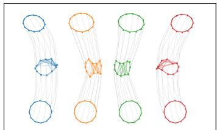
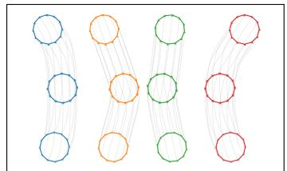
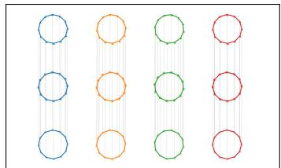

# Gromov–Monge Flow Matching for Equivariant Graph Generation

Moritz Piening Institute of Mathematics, Technische Universität Berlin Berlin, Germany piening@math.tu-berlin.de

Christian Wald   
Institut Camille Jordan, INSA Lyon Villeurbanne, France   
christian.wald@insa-lyon.fr

## Abstract

Graphs are invariant under node permutations, motivating the use of permutationequivariant architectures in generative models. In flow matching, however, symmetry may also enter the source–target coupling: once graph pairs are compared up to node relabeling, the natural Wasserstein geometry is that of the graph quotient space. The Euclidean quotient metric of this space coincides with the Gromov– Monge distance, obtained by optimally relabeling the nodes. We develop this perspective theoretically, showing that quotient couplings can be lifted to aligned representatives without additional cost and that symmetrization yields equivariant flow-matching minimizers, including for categorical endpoint prediction. In practice, exact Gromov–Monge alignment is intractable, so we construct minibatch couplings using efficient Gromov–Wasserstein-type relaxations and lower bounds for the inner node alignment, optionally combined with an outer assignment between graphs. The resulting procedure changes only the training coupling and is compatible with standard permutation-equivariant architectures. Across continuous graph and categorical molecular generation, these structure-aware couplings substantially improve sample quality at small integration budgets, while our scaled-up molecular models remain competitive under conventional many-step sampling.

## 1 Introduction

Flow matching learns a velocity field that transports a tractable source law to data using simulationfree regression and ordinary differential equation (ODE) sampling [Albergo and Vanden-Eijnden, 2023, Lipman et al., 2023, Liu et al., 2023]. Its conditional paths are determined by a source–target coupling. Although all such couplings have the same marginals at start and end time, transportinformed choices can produce shorter, straighter trajectories and simplify numerical integration [Chemseddine et al., 2025, Tong et al., 2023, Pooladian et al., 2023]. The correct notion of transport is less obvious when data are defined only up to symmetry [Klein et al., 2023, Köhler et al., 2020].

For graphs the symmetry is node relabelling. We encode edge channels and diagonal node features of an N-node graph by $E \in \mathbb { R } ^ { N \times N \times C }$ . Because a graph has no distinguished vertex order, a permutation $\sigma \in { \mathfrak { S } } _ { N }$ acts simultaneously on both node indices according to

$$
\left( \rho _ { N } ^ { \mathrm { g r a p h } } ( \sigma ) E \right) _ { i j c } : = E _ { \sigma ^ { - 1 } ( i ) \sigma ^ { - 1 } ( j ) c } , \qquad 1 \le i , j \le N .
$$

The unordered graph is the orbit

$$
[ E ] \in Q : = \mathbb { R } ^ { N ^ { 2 } C } / G _ { N } ^ { \mathrm { g r a p h } } , \qquad G _ { N } ^ { \mathrm { g r a p h } } = \rho _ { N } ^ { \mathrm { g r a p h } } ( \mathfrak { S } _ { N } ) \subset O ( N ^ { 2 } C ) .
$$

Equivariant architectures employed in graph generative models respect this symmetry [Eijkelboom et al., 2024, Jo et al., 2022, Vignac et al., 2023], but many models do not by themselves choose which labelled representatives to connect during flow matching. Each conditional bridge from E to an unordered target [F] may select some $\sigma \cdot F .$ Minimizing its length is a Gromov–Monge nodealignment problem, the hard-assignment counterpart of Gromov–Wasserstein transport [Bauer et al., 2025, Mémoli, 2011, Mémoli and Needham, 2024].

We connect this representative choice to equivariant flow matching on general quotients $\mathbb { R } ^ { D } / G$ [Klein et al., 2023, Köhler et al., 2020, Song et al., 2023]. Our theory shows that optimal quotient couplings lift without extra cost and that symmetrizing a coupling between chosen representatives yields an equivariant minimizer of the flow-matching objective, including for categorical endpoint prediction. For graphs, we approximate the resulting Gromov–Monge alignment with Gromov–Wasserstein solvers and inexpensive lower bounds [Mémoli, 2011, Bauer et al., 2025, Piening and Beinert, 2025], optionally followed by an outer minibatch assignment. The aligned pairs train the same equivariant velocity or categorical endpoint models as standard flow matching; only the coupling changes.

Relation to prior work Graph generators commonly enforce node-relabeling symmetry through equivariant architectures, including molecular and discrete diffusion [Hoogeboom et al., 2022, Jo et al., 2022, Vignac et al., 2023] and variational flow matching [Eijkelboom et al., 2024]. Recent graph flow methods additionally optimize the source–target graph pairing using minibatch optimal transport [Hou et al., 2026, Wijesinghe et al., 2026]. Our method complements these approaches by explicitly choosing aligned representatives within each graph orbit, while treating the outer graph assignment as optional, see Appendix C for a more detailed comparison.

Optimal-transport couplings have previously been used to straighten Euclidean flow-matching paths [Chemseddine et al., 2025, Pooladian et al., 2023, Tong et al., 2023].When the underlying sample space itself carries an optimal-transport geometry, this naturally leads to nested transport formulations, as recently employed for point-cloud generative models [Haviv et al., 2025, Piening et al., 2026, Piening and Beinert, 2026]. For graphs, the analogous construction must additionally account for node correspondences, leading to a Gromov–Monge ground cost. Gromov–Wasserstein methods provide a natural relaxation because they compare relational structure and have long been used for graph and structured-data alignment [Beier et al., 2025, Chowdhury et al., 2021, Peyré et al., 2016, Vayer et al., 2020]. We use the resulting plans to select a node permutation for each target graph inside its conditional flow-matching bridge, rather than to generate graphs directly.

Our quotient-space analysis builds on equivariant generative flows [Klein et al., 2023, Köhler et al., 2020, Song et al., 2023]. Beyond particle permutations by linear assignment [Klein et al., 2023, Haviv et al., 2025, Hui et al., 2025, Piening et al., 2026], graph relabeling acts on both node indices and yields the quadratic Gromov–Monge problem. We connect this graph-specific alignment to quotient optimal transport and representative lifts [Mémoli and Needham, 2024].

Our contributions are:

• We show that optimal quotient couplings lift to Euclidean couplings with the same quadratic cost, whose linear interpolations project to constant-speed Wasserstein geodesics.

• We show that diagonal symmetrization preserves the flow-matching objective on equivariant fields and yields an equivariant minimizer, including for categorical endpoint prediction.

• A practical outer–inner Gromov–Wasserstein alignment constructs minibatch couplings for continuous and categorical graph flows.

• Across continuous and categorical graph-generation benchmarks, structure-aware couplings improve sample quality when the learned flow is sampled using few Euler integration steps, while scaled-up molecular models remain competitive under conventional many-step sampling.

## 2 Background on transport and flow matching

In flow matching generative models, curves of probability measures are constructed that connect an easy-to-sample source measure with a target measure which is available only through samples [Lipman et al., 2023, Wald and Steidl, 2025]. This construction is not limited to probability measures on Euclidean spaces [Chen and Lipman, 2024]. After a short recap on Wasserstein geometry [Ambrosio et al., 2005, Santambrogio, 2015, Wald and Steidl, 2025], we will see how the same construction can be formulated on quotient spaces induced by orthogonal group actions.

## 2.1 Wasserstein geometry and dynamic transport

Let $( X , d _ { X } )$ be a Polish metric space and $\mathcal { P } _ { 2 } ( X )$ the set of Borel probability measures on X with finite second moments, i.e. $\textstyle \int _ { X } d { \dot { \boldsymbol { X } } } ( x , x _ { 0 } ) ^ { 2 } ~ \mathrm { d } \dot { \mu ( \boldsymbol { x } ) } < \infty$ for some $x _ { 0 } \in X$ . The set $\mathcal { P } _ { 2 } ( X )$ becomes a complete metric space with the Wasserstein distance $\mathrm { W } _ { 2 , X }$ [Santambrogio, 2015, Villani, 2009] which is given for any $\mu , \nu \in { \mathcal { P } } _ { 2 } ( X )$ by

$$
\operatorname { W } _ { 2 , X } ^ { 2 } ( \mu , \nu ) : = \operatorname* { m i n } _ { \pi \in \mathfrak { c } _ { X } ( \mu , \nu ) } \int _ { X \times X } d _ { X } ( x , x ^ { \prime } ) ^ { 2 } \mathrm { d } \pi ( x , x ^ { \prime } ) .\tag{1}
$$

The couplings or transport plans are given by

$$
\operatorname { c } _ { X } ( \mu , \nu ) = \{ \pi \in { \mathcal { P } } _ { 2 } ( X \times X ) : \operatorname { p r o j } _ { \sharp } ^ { 0 } \pi = \mu , \operatorname { p r o j } _ { \sharp } ^ { 1 } \pi = \nu \} ,
$$

with pr $\operatorname { p j } ^ { i } : X \times X \to X , ( x _ { 0 } , x _ { 1 } ) \mapsto x _ { i } . \operatorname { B y } \operatorname { c } _ { X } ^ { \operatorname { o p t } } ( \mu , \nu )$ we denote optimal couplings, where the minimum in (1) is attained. Throughout, let $I = [ \bar { 0 } , 1 ]$

For $X = \mathbb { R } ^ { D }$ , let $( \mu _ { t } ) _ { t \in I }$ be narrowly continuous and let $v : I \times \mathbb { R } ^ { D } \to \mathbb { R } ^ { D }$ be Borel. The pair $\left( \mu _ { t } , v _ { t } \right)$ satisfies the continuity equation if

$$
\begin{array} { r } { \partial _ { t } \mu _ { t } + \operatorname { d i v } ( v _ { t } \mu _ { t } ) = 0 } \end{array}\tag{2}
$$

in the sense of distributions. If, in addition,

$$
\int _ { I } \int _ { \mathbb { R } ^ { D } } \| v _ { t } ( x ) \| ^ { 2 } \ \mathrm { d } \mu _ { t } ( x ) \ \mathrm { d } t < \infty ,
$$

then $( \mu _ { t } ) _ { t \in I }$ is absolutely continuous with respect to $\mathrm { W } _ { 2 , \mathbb { R } ^ { D } }$ . Conversely, curves that are absolutely continuous with respect to $\mathrm { W } _ { 2 , \mathbb { R } ^ { D } }$ and have square-integrable speed admit a Borel field v satisfying (2) and the displayed integrability condition [Ambrosio et al., 2005, Chapter 8]. The definitions and bounds used below are recalled in Appendix A. If v is sufficiently regular, the characteristic ODE

$$
\dot { \gamma } ( t , x ) = v ( t , \gamma ( t , x ) ) , \qquad \gamma ( 0 , x ) = x ,\tag{3}
$$

transports $\mu _ { 0 }$ to $\mu _ { t } , \mathrm { i . e . , } \mu _ { t } = \gamma _ { t , \sharp } \mu _ { 0 }$ [Ambrosio et al., 2005, Proposition 8.1.8].

## 2.2 Euclidean flow matching

Flow matching turns the dynamic description above into mean-squared-error (MSE) vector-field regression [see, e.g., Lipman et al., 2023, Wald and Steidl, 2025]. For $\mu , \nu \in \mathcal { P } _ { 2 } ( \mathbb { R } ^ { D } )$ and $\pi \in$ $\mathrm { c } _ { \mathbb { R } ^ { D } } ( \mu , \nu )$ , define $\mu _ { t } : = \mathrm { p r o j } _ { \sharp } ^ { t } \tau$ with $\mathrm { p r o j } ^ { t } ( x , x ^ { \prime } ) : = ( 1 - t ) x + t x ^ { \prime }$ . Then $( \mu _ { t } , v _ { t } ^ { \pi } )$ solves (2), where $v ^ { \pi }$ minimizes

$$
J _ { \pi } ( v ) : = \int _ { I } \int _ { \mathbb { R } ^ { D } \times \mathbb { R } ^ { D } } \left\| v _ { t } ( \mathrm { p r o j } ^ { t } ( x , x ^ { \prime } ) ) - ( x ^ { \prime } - x ) \right\| ^ { 2 } \mathrm { d } \pi ( x , x ^ { \prime } ) \mathrm { d } t\tag{4}
$$

over jointly Borel vector fields v. Equivalently, for $( X , X ^ { \prime } ) \sim \pi$ , we have that

$$
v _ { t } ^ { \pi } ( z ) = \mathbb { E } _ { \pi } \left[ X ^ { \prime } - X \mid { \mathrm { p r o j } } ^ { t } ( X , X ^ { \prime } ) = z \right]\tag{5}
$$

for dt $\mathrm { d } \mu _ { t } ( z ) \mathbf { - a . e . } ( t , z ) . \mathrm { I f } \ \pi \in \mathrm { c } _ { \mathbb { R } ^ { D } } ^ { \mathrm { o p t } } ( \mu , \nu )$ , then the kinetic energy fulfills $\begin{array} { r } { \int _ { I } \| v _ { t } ^ { \pi } ( z ) \| _ { L ^ { 2 } ( \mu _ { t } ) } ^ { 2 } \mathrm { d } t = } \end{array}$ $\mathrm { W } _ { 2 , \mathbb { R } ^ { D } } ^ { 2 } ( \mu , \nu )$

Categorical endpoint prediction Let $\mu , \nu \in \mathcal { P } _ { 2 } ( \mathbb { R } ^ { D } )$ and $\pi \in \mathrm { c } _ { \mathbb { R } ^ { D } } ( \mu , \nu )$ Suppose that the target is coordinatewise categorical. Write $[ m ] \ : = \ \{ 1 , \dots , m \}$ for a positive integer $m .$ , and fix a positive integer M. For every $d \in \mathsf { [ D ] }$ , fix distinct values $a _ { d , 1 } , \hdots , a _ { d , M } \ \in \ \mathbb { R }$ such that $\nu \Big ( \prod _ { d = 1 } ^ { D } \{ a _ { d , 1 } , \ldots , a _ { d , M } \} \Big ) = 1$ . For $( X , X ^ { \prime } ) \sim \pi .$ , set $Z _ { t } : = ( 1 - t ) X + t X ^ { \prime }$ and $\mu _ { t } : = \operatorname { L a w } ( Z _ { t } )$ Let $\kappa _ { d } ( x ^ { \prime } ) \in [ M ]$ denote the unique index such that $x _ { d } ^ { \prime } = a _ { d , \kappa _ { d } ( x ^ { \prime } ) }$ . Choosing jointly Borel versions, define the conditional coordinate probabilities

$$
q _ { t } ^ { * , d } ( n \mid z ) : = \mathbb { P } _ { \pi } \left( X _ { d } ^ { \prime } = a _ { d , n } ~ | ~ Z _ { t } = z \right) , \qquad d \in [ D ] , \quad n \in [ M ] .
$$

For a.e. $t < 1$ and $\mu _ { t } \mathbf { - } \mathbf { a . e . } ~ z , ( 5 )$ yields

$$
\left( v _ { t } ^ { \pi } ( z ) \right) _ { d } = \frac { 1 } { 1 - t } \left( \sum _ { n = 1 } ^ { M } a _ { d , n } q _ { t } ^ { * , d } ( n \mid z ) - z _ { d } \right) .\tag{6}
$$

Moreover, $( q ^ { * , d } ) _ { d = 1 } ^ { D }$ minimizes the coordinatewise cross-entropy objective

$$
J _ { \pi } ^ { \mathrm { { c o o r d } } } \big ( ( q ^ { d } ) _ { d = 1 } ^ { D } \big ) : = - \int _ { I } \int _ { \mathbb { R } ^ { D } \times \mathbb { R } ^ { D } } \sum _ { d = 1 } ^ { D } \log q _ { t } ^ { d } \big ( \kappa _ { d } ( x ^ { \prime } ) \mid ( 1 - t ) x + t x ^ { \prime } \big ) \ \mathrm { d } \pi ( x , x ^ { \prime } ) \ \mathrm { d } t\tag{7}
$$

over jointly Borel kernels $q ^ { d } : I \times \mathbb { R } ^ { D }  \Delta _ { M } , d \in [ D ]$ , where $\begin{array} { r } { \Delta _ { M } : = \{ p \in [ 0 , 1 ] ^ { M } : \sum _ { n = 1 } ^ { M } p _ { n } = } \end{array}$ 1} and $- \log 0 : = + \infty$ . Thus, although the joint endpoint may take up to $M ^ { D }$ values, it suffices to train D distributions over M classes using (7) and recover the velocity through (6) without any conditional independence assumption [Chemseddine et al., 2026, Eijkelboom et al., 2024].

## 3 Flow matching on quotient spaces

Let $G \subset O ( D )$ be compact, let $Q : = \mathbb { R } ^ { D } / G$ , and write ${ \mathfrak { q } } ( x ) = [ x ]$ for the quotient map. The quotient metric is

$$
d _ { Q } ( [ x ] , [ y ] ) : = \operatorname* { m i n } _ { g \in G } \| x - g y \| ,
$$

and $\mathrm { W } _ { 2 , Q }$ denotes the induced Wasserstein distance. For $\mu \in \mathscr { P } _ { 2 } ( Q )$ ), write

$$
[ \pmb { \mu } ] : = \{ \mu \in \mathcal { P } _ { 2 } ( \mathbb { R } ^ { D } ) : \mathfrak { q } _ { \sharp } \mu = \pmb { \mu } \}
$$

for its representative laws. In the graph setting, simultaneous node relabeling gives the following construction. Let $Z : = \mathbb { R } ^ { C }$ with $d _ { Z } ( u , v ) : = \| u - v \| _ { 2 }$ . For $E , F \in Z ^ { N \times N }$

$$
\mathrm { G M } _ { 2 , Z } ^ { 2 } ( [ E ] , [ F ] ) : = \operatorname* { m i n } _ { \sigma \in { \mathfrak { S } } _ { N } } \sum _ { i , j = 1 } ^ { N } d _ { Z } ^ { 2 } \big ( E _ { i j } , F _ { \sigma ( i ) \sigma ( j ) } \big ) .\tag{8}
$$

Thus, choosing representatives of graph orbits is precisely the hard Gromov–Monge node-alignment problem, studied in optimal transport literature [Mémoli and Needham, 2024].

Theorem 3.1 (Representative lifts and quotient geodesics). Let $\mu , \nu \in \mathcal { P } _ { 2 } ( Q )$ , fix $\mu \in [ \mu ]$ , and let $\Gamma \in \mathrm { c } _ { Q } ( \mu , \nu )$ . There exist $\nu _ { \Gamma } \in [ \nu ]$ and $\gamma _ { \Gamma } \in \mathrm { c } _ { \mathbb { R } ^ { D } } ( \mu , \nu _ { \Gamma } )$ such that $( \mathsf { q } , \mathsf { q } ) _ { \sharp } \gamma _ { \Gamma } = \Gamma$ and

$$
\int _ { \mathbb { R } ^ { D } \times \mathbb { R } ^ { D } } \| x - y \| ^ { 2 } { \mathrm { ~ d } } \gamma _ { \Gamma } ( x , y ) = \int _ { Q \times Q } d _ { Q } ( x , y ) ^ { 2 } \ { \mathrm { d } } \Gamma ( x , y ) .
$$

IfΓ is optimal, then γΓ is optimal between its representative marginals. Moreover, in this case, with $\mathrm { \bar { p r o j } } ^ { t } ( \bar { x , } y ) = ( 1 - t ) x + t \bar { y }$ and $\mu _ { t } : = \mathrm { p r o j } _ { \sharp } ^ { t } \gamma _ { \Gamma }$ , the projected curve $\pmb { \mu } _ { t } : = \mathfrak { q } _ { \sharp } \mu _ { t }$ is a constant-speed $\operatorname { W } _ { 2 , Q } .$ -geodesic, and the flow-matching field associated with the lifted coupling γΓ satisfies

$$
\int _ { I } \int _ { \mathbb { R } ^ { D } } \| v _ { t } ^ { \gamma _ { \Gamma } } ( z ) \| ^ { 2 } \ \mathrm { d } \mu _ { t } ( z ) \ \mathrm { d } t = \mathrm { W } _ { 2 , Q } ^ { 2 } ( \pmb { \mu } , \pmb { \nu } ) .
$$

The proof is given in Appendix A.

The theorem shows that any quotient coupling can be lifted through aligned representatives without increasing its cost. In particular, an optimal quotient coupling admits a representative-space lift whose quadratic cost equals the quotient Wasserstein distance. The resulting lift $\gamma _ { \Gamma }$ , however, need not be invariant under applying the same group action to both endpoints, because selecting representatives can break the symmetry. This matters because the velocity or endpoint network is constrained to be G-equivariant. For any representative coupling π—in particular, for $\gamma _ { \Gamma } \mathrm { - w e }$ therefore build a symmetrized coupling by applying the same group element to both endpoints and averaging over G. For a law η and a coupling π, set

$$
\eta ^ { G } : = \mathbb { E } _ { g } [ g _ { \sharp } \eta ] , \qquad \pi ^ { G } : = \mathbb { E } _ { g } [ ( g , g ) _ { \sharp } \pi ] ,
$$

where the expectation denotes integration against the normalized Haar measure on $G .$ For a finite group such as ${ \mathfrak { S } } _ { N } .$ , this is the average over all group elements. The resulting coupling is diagonally G-invariant, meaning that $( h , h ) _ { \sharp } \pi ^ { \bigcirc } = \pi ^ { G }$ for every $h \in G$ . It couples $\mu ^ { \check { G } }$ and $\setminus { G }$ and represents the same quotient coupling as $\pi \colon ( { \mathfrak { q } } , { \mathfrak { q } } ) _ { \sharp } \pi ^ { G } = ( { \mathfrak { q } } , { \mathfrak { q } } ) _ { \sharp } \pi$ . We next show that, on the G-equivariant model class, training with π is equivalent to training with $\pi ^ { G }$

Theorem 3.2 (Equivariant flow matching via symmetrization). Let $\pi \in \mathrm { c } _ { \mathbb { R } ^ { D } } ( \mu , \nu )$ . Then:

1. For every G-equivariant field v, $J _ { \pi } ( v ) \ = \ J _ { \pi ^ { G } } ( v )$ . The field $v ^ { \pi ^ { G } }$ can be chosen $G \mathrm { - }$ equivariant and minimizes $J _ { \pi }$ over all G-equivariant fields.

2. If the ODE of a G-equivariant field has a unique flow $\gamma _ { t } ,$ then it induces a well-defined quotient flow $\bar { \gamma } _ { t } ( [ x ] ) : = [ \gamma _ { t } ( x ) ]$ ]. For every $\eta \in \mathcal { P } _ { 2 } ( \mathbb { R } ^ { D } ) , \mathfrak { q } _ { \sharp } \gamma _ { t , \sharp } \eta = \bar { \gamma } _ { t , \sharp } \mathfrak { q } _ { \sharp } \eta$ . Hence the projected curve depends only on the quotient law ${ \mathfrak { q } } { \mathfrak { q } } { \mathfrak { \eta } } ,$ , not on the representative lift chosen at time 0.

3. $I f G \subset { \mathfrak { S } } _ { D }$ permutes coordinates and ν is supported on $\mathcal { A } ^ { D } , \mathcal { A } = \{ a _ { 1 } , . . . , a _ { M } \}$ , let

$$
q _ { t } ^ { \ast , \pi ^ { G } , d } ( n \mid z ) : = \mathbb { P } _ { \pi ^ { G } } ( X _ { d } ^ { \prime } = a _ { n } \mid Z _ { t } = z ) .
$$

For $g \in G ,$ , let $g \cdot d$ be the coordinate determined by $( g z ) _ { g \cdot d } = z _ { d } .$ . These coordinate posteriors can be chosen equivariantlyfor $d \in [ D ]$ and $n \in [ \bar { M } ]$

$$
q _ { t } ^ { \ast , \pi ^ { G } , g \cdot d } ( n \mid g z ) = q _ { t } ^ { \ast , \pi ^ { G } , d } ( n \mid z ) .
$$

They minimize ${ \cal J } _ { \pi } ^ { \mathrm { c o o r d } }$ over equivariant coordinate kernels and recover $v ^ { \pi ^ { G } }$ through (6).

The full proof is given in Appendix B. Together, Theorems 3.1 and 3.2 connect the practical recipe used below to quotient transport: align representatives and train an equivariant Euclidean model whose flow, when well posed, descends to unordered graphs

## 4 Constructing graph couplings via Gromov–Monge approximation

For $C = C _ { \mathrm { e } } + C _ { \mathrm { v } }$ , encode a graph by $E \in ( \mathbb { R } ^ { C } ) ^ { N \times N }$ with entries

$$
E _ { i k } = \left( \sqrt { \lambda _ { \mathrm { e d g e } } } e _ { i k } ^ { E } , { \bf 1 } _ { \{ i = k \} } \sqrt { \frac { \lambda _ { \mathrm { n o d e } } } { C _ { \mathrm { v } } } } f _ { i } ^ { E } \right) ,
$$

where $e _ { i k } ^ { E } \in \mathbb { R } ^ { C _ { \mathrm { e } } }$ contains edge features and $f _ { i } ^ { E } \in \mathbb { R } ^ { C _ { \mathrm { v } } }$ contains node features on the diagonal. Hence edge and node-feature discrepancies enter the squared Euclidean cost with weights $\lambda _ { \mathrm { e d g e } }$ and $\lambda _ { \mathrm { n o d e } } ,$ respectively, as in fused Gromov–Wasserstein transport [Vayer et al., 2020]. We use $\begin{array} { r } { \lambda _ { \mathrm { e d g e } } = \lambda _ { \mathrm { n o d e } } = \frac { 1 } { 2 } } \end{array}$ in all experiments. Because the same permutation acts on both node indices, the quotient cost (8) compares all pairwise graph relations after a single consistent node alignment. Its exact evaluation is an NP-hard quadratic assignment, so we combine an inner Gromov–Wasserstein relaxation [Bauer et al., 2025] with an optional outer assignment between graphs in a minibatch.

Choosing a target representative with GW – inner solvers For $E , F \in ( \mathbb { R } ^ { C } ) ^ { N \times N }$ , we use a generalized version [Bauer et al., 2025] of the discrete Gromov–Wasserstein relaxation [Mémoli, 2011, Peyré et al., 2016], allowing for vector-valued edge features:

$$
\mathrm { G W } _ { 2 , Z } ^ { 2 } ( [ E ] , [ F ] ) : = \operatorname* { m i n } _ { T \in \mathcal { U } _ { N } } \sum _ { i , j , k , l = 1 } ^ { N } \| E _ { i k } - F _ { j l } \| ^ { 2 } T _ { i j } T _ { k l } .
$$

where $\mathcal { U } _ { N } = \{ T \ge 0 : T \mathbf { 1 } = T ^ { \top } \mathbf { 1 } = N ^ { - 1 } \mathbf { 1 } \}$ . Restricting $T$ to scaled permutation matrices recovers the Gromov–Monge objective, so $\mathrm { G W _ { 2 } ^ { 2 } } . . z \leq \mathrm { G M _ { 2 } ^ { 2 } } . . z / N ^ { 2 }$ . We approximately solve the non-convex problem by Frank–Wolfe iterations [Peyré et al., 2016]: each iteration solves an exact linearized transport problem and updates the soft plan by an exact line search. From the final plan $T _ { \ast }$ , we recover the node permutation

$$
\widehat { \sigma } \in \mathop { \arg \operatorname* { m a x } } _ { \sigma \in { \mathfrak { S } } _ { N } } \sum _ { i = 1 } ^ { N } T _ { i , \sigma ( i ) } ,
$$

using the Hungarian algorithm [Kuhn, 1955]. Equivalently, $N ^ { - 1 } P _ { \widehat { \sigma } }$ is the scaled permutation matrix closest to T in Frobenius norm, where $P _ { \sigma }$ denotes the permutation matrix of $\sigma .$ . The GW plan tells us how to relabel F. Using the recovered permutation, define the aligned representative by

$$
F _ { i j } ^ { \mathrm { a l i g n e d } } : = F _ { \widehat { \sigma } ( i ) \widehat { \sigma } ( j ) } .
$$

We then train flow matching on $( E , F ^ { \mathrm { a l i g n e d } } )$ . Since GW is a relaxation, this representative need not be the best solution of the original hard alignment problem.

As a cheaper alternative, let ecc $\begin{array} { r } { { \bf \Phi } _ { E } ( i ) = ( N ^ { - 1 } \sum _ { k } \| E _ { i k } \| ^ { 2 } ) ^ { 1 / 2 } } \end{array}$ , and let $\sec _ { E } ^ { \uparrow } ( i )$ denote the i-th smallest value among node eccentricities of E. This gives the first lower bound (FLB) [Bauer et al., 2025]

$$
\operatorname { F L B } _ { 2 , Z } ^ { 2 } ( [ E ] , [ F ] ) : = \frac { 1 } { N } \sum _ { i } | \operatorname { e c c } _ { E } ^ { \uparrow } ( i ) - \operatorname { e c c } _ { F } ^ { \uparrow } ( i ) | ^ { 2 } \leq \operatorname { G W } _ { 2 , Z } ^ { 2 } ( [ E ] , [ F ] ) .
$$

This is the squared 2-Wasserstein distance between the empirical eccentricity distributions. We sort the nodes of $\bar { \boldsymbol { { \cal E } } }$ and F by their eccentricities and pair the i-th node in one ordering with the i-th node in the other, breaking ties arbitrarily. These pairs define a permutation. Computing the eccentricities takes $O ( N ^ { 2 } C )$ operations, and sorting takes $O ( N \log \dot { N } )$ Thus GW retains detailed pairwise structure at higher computational cost, whereas FLB provides an inexpensive inner alignment and is cheap to evaluate for all $B ^ { 2 }$ candidate pairs in the outer minibatch assignment. Their empirical cost–quality trade-off is reported in Appendix G.

Outer–inner minibatch coupling For a graph pair $( E , F )$ , let ${ \widehat { c } } ( [ E ] , [ F ] )$ denote the approximate quotient cost returned by the selected inner solver, and let $\hat { \sigma } ( E , F ) \in \bar { \mathfrak { S } } _ { N }$ denote its corresponding hard node alignment. Thus $\widehat { \sigma } ( E , F ) ^ { - 1 } \cdot F$ is the target representative aligned to $E .$ . For independently sampled batches $( E ^ { a } ) _ { a = 1 } ^ { B }$ and $( F ^ { b } ) _ { b = 1 } ^ { B }$ , either set ${ \widehat { \tau } } ( a ) = a$ or solve

$$
\widehat { \tau } \in \underset { \tau \in \mathfrak { S } _ { B } } { \arg \operatorname* { m i n } } \sum _ { a } \widehat { c } ( [ E ^ { a } ] , [ F ^ { \tau ( a ) } ] ) ,
$$

where $\widehat { c }$ is the GW or FLB cost. For each selected pair, set $\widehat { \sigma } _ { a } = \widehat { \sigma } ( E ^ { a } , F ^ { \widehat { \tau } ( a ) } )$ , defining

$$
\widehat { \pi } _ { B } : = \frac { 1 } { B } \sum _ { a } \delta _ { \left( E ^ { a } , \widehat { \sigma } _ { a } ^ { - 1 } \cdot F ^ { \widehat { \tau } ( a ) } \right) } .
$$

Thus inner alignment chooses graph representatives, while the optional outer assignment chooses which graphs to connect. These are distinct decisions: even with independent outer pairing, an inner alignment can substantially shorten the interpolation between each selected pair. Algorithm 1 summarizes the complete construction.

Algorithm 1 Outer–inner minibatch graph alignment   
Require: Source batch $( E ^ { a } ) _ { a = 1 } ^ { B }$ , target batch $( F ^ { b } ) _ { b = 1 } ^ { B }$ , outer cost $\widehat { c }$   
1: if the outer coupling is independent then   
2: ${ \widehat { \tau } } ( a ) \gets a$ for all $a = 1 , \ldots , B$   
3: else   
4: $C _ { a b } \gets \widehat { c } ( [ E ^ { a } ] , [ F ^ { b } ] )$ for all a, b   
5: $\begin{array} { r } { \widehat { \tau }  \arg \operatorname* { m i n } _ { \tau \in \mathfrak { S } _ { B } } \sum _ { a } C _ { a , \tau ( a ) } } \end{array}$   
6: end if   
7: for $a = 1 , \dotsc , B$ do   
8: $G ^ { a } \gets \overleftarrow { F } ^ { \widehat { \tau } ( a ) }$   
9: Obtain $\widehat { \sigma } _ { a }$ using GW, FLB, or random reshuffling   
10: $\widetilde { F } ^ { a } \gets \widehat { \sigma } _ { a } ^ { - 1 } \cdot G ^ { a }$   
11: end for   
12: return $( E ^ { a } , \widetilde { F } ^ { a } ) _ { a = 1 } ^ { B }$

Training Write $\widetilde { F } ^ { a } = \widehat { \sigma } _ { a } ^ { - 1 } \cdot F ^ { \widehat { \tau } ( a ) }$ , sample $t ^ { a } \sim \mathcal { U } [ 0 , 1 ] ,$ , and set $E _ { t ^ { a } } ^ { a } = ( 1 - t ^ { a } ) E ^ { a } + t ^ { a } \widetilde { F } ^ { a }$ . The continuous and categorical minibatch losses are, respectively,

$$
J _ { B } ( v ^ { \theta } ) : = \frac { 1 } { B } \sum _ { a = 1 } ^ { B } \left\| v ^ { \theta } ( t ^ { a } , E _ { t ^ { a } } ^ { a } ) - ( \widetilde { F } ^ { a } - E ^ { a } ) \right\| ^ { 2 } .\tag{9}
$$

$$
J _ { B } ^ { \mathrm { c o o r d } } \left( ( q _ { \theta } ^ { d } ) _ { d = 1 } ^ { D } \right) : = - \frac { 1 } { B } \sum _ { a = 1 } ^ { B } \sum _ { d = 1 } ^ { D } \log q _ { \theta , t ^ { a } } ^ { d } \left( \kappa _ { d } ( \widetilde { F } ^ { a } ) \mid E _ { t ^ { a } } ^ { a } \right) .\tag{10}
$$

The categorical velocity follows from (6). For datasets containing graphs with different numbers of nodes, one graph transformer is shared across all node counts: it maps an N-node input to an $N$ -node prediction, while N may vary between batches. We form each training batch from graphs with the same N. At inference, we sample $N$ from the empirical distribution of node counts in the training set. The graph transformer is permutation-equivariant, ensuring that relabelling the source relabels the entire predicted trajectory. Architecture and solver details are in Appendix F.

## 5 Numerical experiments

We evaluate the proposed coupling constructions in a permutation-equivariant graph flow-matching model. We compare random node relabelling (RANDOM), eccentricity sorting (FLB), and a 10- iteration Frank–Wolfe GW solver (GW); “+out” additionally reorders same-size graphs in subbatches of at most eight. As a permutation-blind reference, MINIBATCHOT relabels each target at random and then assigns pairs over the full minibatch by squared Euclidean distance $\| E - F \| ^ { 2 }$ , with no inner alignment. All models share the same equivariant graph-transformer backbone and differ only in their training coupling. We consider several Euler budgets to assess whether structure-aware alignment improves few-step generation. Complete architecture, optimization, data, solver, and metric specifications are given in Appendix F.

For variable-size datasets, the population construction first draws the node count $N \sim p _ { N }$ from its empirical distribution. Conditional on N, RANDOM uses the product coupling $\mu _ { N } \otimes \nu _ { N }$ , where $\mu _ { N }$ and $\nu _ { N }$ denote the source and target laws for N nodes. Inner FLB/GW changes only the representative of each selected target graph, whereas the outer variants additionally optimize the source–target pairing within the fixed-N minibatch. Hence, improvements from inner alignment measure the value of node correspondence, while differences between inner-only and outer variants measure the additional effect of minibatch transport.

## 5.1 Illustrative target via translated cycle graphs

Inspired by [Piening et al., 2026], each graph is a 12-node ring drawn as a regular 12-gon of radius 1 centred at $( h , y )$ , with the nodes randomly relabelled. The representation $\check { E } \in \mathbb { R } ^ { 1 2 \times \check { 1 2 } \times 3 }$ holds one binary adjacency channel and the planar 2D node positions on the diagonal. Source and target differ only by a translation $( h \sim \mathcal { U } [ - 6 , 6 ]$ and an independent rotation on each side, at $y = 0$ and $y = 8 )$ so both sides have the same edge law and any deformation of the ring is caused by the coupling alone. Figure 1 shows the learned trajectories at $t = 0$ (bottom), $t = 0 . 5$ (center), and $t = 1 \left( \mathrm { t o p } \right)$ . Inner GW pairs corresponding nodes between two rings. This results in a fixed adjacency channel along the interpolation. Under random inner relabelling, the two sets of edges disagree, so the endpoints are still correct, but the intermediate graphs in between are much denser, carrying half-present edges in place of crisp circular ones. Inner GW removes the edge ambiguity and keeps the ring at full size midway, but leaves the paths curved. The outer assignment straightens them. The inner alignment thus governs the shape of the transported object, the outer assignment the geometry of its path.

  
(a) RANDOM

  
(b) GW

  
(c) GW+GWout  
Figure 1: Learned trajectories from cycle graphs (bottom) to vertically offset cycle graphs (top), on a shared scale. Colours mark source graphs, grey lines node paths, and edge opacity equals edge value. The ring collapses at $t = 1 / 2$ in 1a, stays crisp but on curved paths in 1b, and is straightened in 1c.

## 5.2 Continuous target via stochastic block models

Data As a controlled continuous testbed, we use an SBM on $N = 1 0$ nodes with two channels: one symmetric weighted-edge channel in [0, 1] and one scalar node feature on the diagonal. For $K \in \left\{ 1 , \ldots , 5 \right\}$ , nodes are assigned to near-balanced blocks; for every $i ~ < ~ j$ , we sample and mirror $\dot { \mathbf { \mu } } _ { i j } ^ { E } = e _ { j i } ^ { \bar { E } }$ from $\mathrm { B e t a } ( 6 , 2 )$ within a block and $\mathrm { B e t a } ( 2 , 6 )$ across blocks. A node in block $k \in \{ 0 , \ldots , K - 1 \}$ } receives a Beta feature with concentration 8 and mean $\mu _ { k } = ( 2 k + 1 ) / ( 2 K )$ , so the diagonal channel also records community structure. We randomize node order, making each tensor an arbitrary representative of its graph orbit. The source has independent U[0, 1] upper-triangular edges, mirrored across the diagonal, and independent $\boldsymbol { \mathcal { U } } [ 0 , 1 ]$ node features. The main experiment pools all K. Appendix D instead supplies $\bar { K }$ to the model and aligns only within minibatches containing a single value of K to showcase conditional instead of unconditional generation.

Metrics For 100 real and 100 generated graphs, we estimate maximum mean discrepancies (MMDs) of degree, clustering, and four-node graphlet-orbit counts, which distinguish the roles a node can occupy in induced four-node subgraphs [Jo et al., 2022, You et al., 2018]. All three require unweighted graphs, obtained by thresholding real and generated edges alike at $e _ { i j } ^ { E } > 1 / 2$ . To compare the full attributed graphs including their node features, we also report fused-GW nearest-neighbor accuracy (FGW–NNA). This statistic builds on the popular OT-NNA statistic used to compare real and generated sets of point clouds [Yang et al., 2019] by replacing pairwise Wasserstein distance with pairwise FGW. Given 100 generated and 100 real graphs, we pool both samples and label each graph by its origin. We then classify every graph by the label of its nearest neighbor under fused GW, excluding the graph itself. Because fused GW compares attributed graphs up to node relabelling, this is a two-sample test directly on graph orbits rather than on selected descriptors. If real and generated graphs follow the same law, the accuracy approaches 0.5. Larger values mean that the samples are more easily separated. Results are reported over three training runs with different seeds and evaluated at 5/25/125 Euler steps.

Results At five steps (Table 1), GW with outer assignment reduces FGW–NNA from 0.796 to 0.568, degree MMD from 0.114 to 0.018, and clustering MMD from 0.179 to 0.034. The gap narrows by 125 steps, as expected because all matching should result in valid interpolations. FLB captures part of the low-step gain at much lower cost, while outer assignment adds a smaller improvement. The permutation-blind MINIBATCHOT already matches or exceeds the FLB variants on most statistics, yet remains clearly behind the GW variants. The conditional experiment likewise favors GW alignment (Appendix D). Notably, at five steps the two GW variants are also the only conditions that bring FGW–NNA close to its ideal value of 0.5. Thus, the improvement is visible not merely in selected graph statistics, but in a two-sample test using the underlying relational geometry.

Table 1: Continuous SBM, unconditional mixture over $K \in \{ 1 , \ldots , 5 \} ( N = 1 0 )$ , at 5/25/125 Euler steps. Rows are mean over 3 training seeds (5 evaluation repeats each). Best value per column is bold (MMDs (degree, clustering, graphlet orbit) ↓, Best FGW–NNA: ∼ 0.5.
<table><tr><td></td><td colspan="3">FGW-NNA (→ 0.5)</td><td colspan="3">Degree MMD (↓)</td><td colspan="3">Clustering MMD (↓)</td><td colspan="3">Graphlet-orbit MMD (↓)</td></tr><tr><td>Method</td><td>5</td><td>25</td><td>125</td><td>5</td><td>25</td><td>125</td><td>5</td><td>25</td><td>125</td><td>5</td><td>25</td><td>125</td></tr><tr><td>RANDOM</td><td>0.796.012</td><td>0.581.021</td><td>0.561.015</td><td>0.114.045</td><td>0.067.016</td><td>0.059.011</td><td>0.179.100</td><td>0.085.042</td><td>0.075.028</td><td>0.062.033</td><td>0.046.033</td><td>0.043.025</td></tr><tr><td>MINIBATCHOT</td><td>0.687.018</td><td>0.561.016</td><td>0.530.007</td><td>0.031.004</td><td>0.023.006</td><td>0.015.005</td><td>0.090.014</td><td>0.046.010</td><td>0.037.010</td><td>0.006.001</td><td>0.011.001</td><td>0.007.000</td></tr><tr><td>FLB</td><td> $0 . 7 2 5 . 0 1 3$ </td><td>0.558.011</td><td>0.555.022</td><td>0.054.004</td><td>0.037.011</td><td>0.030.010</td><td>0.109.037</td><td>0.042.006</td><td>0.040.011</td><td>0.030.014</td><td> $0 . 0 2 7 . 0 1 7$ </td><td> $0 . 0 2 1 . 0 1 5$ </td></tr><tr><td>FLB+FLBout</td><td>0.691.040</td><td>0.562.019</td><td>0.547.009</td><td>0.034.011</td><td>0.012.002</td><td>0.013.007</td><td>0.121.041</td><td>0.045.024</td><td>0.047.021</td><td>0.018.011</td><td>0.007.002</td><td>0.010.005</td></tr><tr><td>GW</td><td> $0 . 5 7 7 . 0 1 1$ </td><td>0.522.004</td><td>0.520.023</td><td>0.027.013</td><td>0.014.002</td><td>0.012.004</td><td>0.049.019</td><td>0.015.005</td><td>0.016.007</td><td>0.014.004</td><td>0.010.003</td><td>0.008.001</td></tr><tr><td> $\mathrm { G W + G W _ { o u t } }$ </td><td>0.568.008</td><td>0.536.014</td><td>0.504.021</td><td>0.018.005</td><td>0.014.002</td><td>0.007.001</td><td>0.034.007</td><td>0.021.004</td><td>0.014.002</td><td>0.005.001</td><td>0.008.001</td><td>0.004.000</td></tr></table>

## 5.3 Categorical target via molecular graph generation

Data We use QM9 $( N \leq 9 )$ [Ramakrishnan et al., 2014] and ZINC250k $( N \leq 3 8 )$ [Jin et al., 2018] in the categorical CatFlow/DiGress representation [Eijkelboom et al., 2024, Vignac et al., 2023]. Edges are one-hot over {none, single, double, triple}, while each diagonal node feature concatenates a one-hot atom type with a formal-charge one-hot over $\{ - 1 , 0 , + 1 \}$ . QM9 uses atom types $\{ \mathrm { C } , \mathrm { N } , \mathrm { O } , \mathrm { F } \}$ , giving $C = 1 1$ ; ZINC250k uses $\{ \mathrm { C } , \mathrm { N } , \mathrm { O } , \mathrm { F } , \mathrm { B r } , \mathrm { C l } , \mathrm { I } , \mathrm { P } , \mathrm { S } \}$ , giving $C = 1 6$ The network predicts the coordinatewise categorical endpoint and minimises a blockwise softmax analogue of (10). Its velocity is recovered through (6). We group minibatches by node count and apply the same outer–inner alignment as for the continuous experiment.

Metrics Following the GDSS/CatFlow evaluation protocols [Eijkelboom et al., 2024, Jo et al., 2022], we report uncorrected molecular validity—the fraction of generated graphs that RDKit sanitizes without valence correction or other postprocessing—and Fréchet ChemNet Distance (FCD); higher is better for validity and lower is better for FCD. We omit novelty because QM9 is a nearexhaustive enumeration of small molecules: a high novelty score can therefore reward atypical or lower-quality structures rather than faithful modelling. Uniqueness is close to 100% for all structureaware conditions, while additional invalid or atypical outputs can increase the apparent uniqueness of RANDOM; reporting it would therefore favor the weakest coupling. Validity and FCD capture chemical correctness and distributional fidelity, respectively; complete definitions are in Appendix F.

## 5.3.1 Limited-budget sweep of the endpoint-induced velocity field

We train the shared 2.8M-parameter backbone for 100 epochs under each coupling and evaluate 10,000 samples at $5 / 2 5 / 1 2 5$ Euler steps; complete settings are in Appendix F.

Table 2: Molecular short-budget sweep (100 training epochs), evaluated at 5/25/125 Euler steps. Rows are mean over 3 evaluation repeats. Best per column is bold (Validity ↑, FCD ↓).
<table><tr><td rowspan="2">Method</td><td colspan="3">Validity (↑)</td><td colspan="3">FCD (↓)</td></tr><tr><td>5</td><td>25</td><td>125</td><td>5</td><td>25</td><td>125</td></tr><tr><td colspan="7"> $Q M ^ { g } \left( N \leq 9 \right)$ </td></tr><tr><td>RANDOM</td><td>0.8849.0020</td><td>0.9564.0002</td><td>0.9648.0010</td><td>1.731.017</td><td>0.637.022</td><td>0.530.012</td></tr><tr><td>MINIBATCHOT</td><td>0.9357.0029</td><td>0.9724.0010</td><td>0.9779.0003</td><td>1.747.024</td><td>0.689.014</td><td>0.507.035</td></tr><tr><td>GW</td><td>0.9356.0020</td><td>0.9695.0010</td><td>0.9744.0014</td><td>1.278.046</td><td>0.589.015</td><td>0.491.022</td></tr><tr><td> $\mathrm { G W + G W _ { o u t } }$ </td><td>0.9421.0024</td><td>0.9728.0011</td><td>0.9783.0009</td><td>1.232.017</td><td> $\mathbf { 0 . 5 3 2 . 0 1 4 }$ </td><td>0.440.016</td></tr><tr><td colspan="7"> $Z I N C 2 5 O k ( N \leq 3 8 )$ </td></tr><tr><td>RANDOM</td><td>0.5641.0048</td><td>0.8140.0034</td><td>0.8597.0011</td><td>18.448.095</td><td>13.061.162</td><td>11.909.077</td></tr><tr><td>MINIBATCHOT</td><td>0.6106.0025</td><td>0.8348.0033</td><td>0.8667.0026</td><td> $1 7 . 1 9 0 . 0 7 5$ </td><td>12.686.008</td><td>11.744.167</td></tr><tr><td>GW</td><td>0.6431.0029</td><td>0.8472.0052</td><td>0.8742.0009</td><td> $\mathbf { 1 5 . 0 2 4 . 0 7 6 }$ </td><td>11.993.030</td><td>11.365.073</td></tr><tr><td> $\mathrm { G W + G W _ { o u t } }$ </td><td> $\mathbf { 0 . 7 2 8 0 . 0 0 5 5 }$ </td><td> $\mathbf { 0 . 8 7 6 3 . 0 0 2 6 }$ </td><td> $\mathbf { 0 . 8 9 3 0 . 0 0 2 2 }$ </td><td> $1 5 . 3 7 7 . 0 4 8$ </td><td> $1 2 . 1 1 6 . 0 2 5$ </td><td> $1 1 . 3 7 0 . 0 5 9$ </td></tr></table>

Results At five steps (Table 2), inner GW raises validity from 0.8849 to 0.9356 on QM9 and from 0.5641 to 0.6431 on ZINC250k, while reducing FCD from 1.731 to 1.278 and from 18.448 to 15.024. Outer assignment further improves validity, whereas its FCD gain is dataset dependent: it is uniformly best on QM9 and gives the highest ZINC250k validity, while inner-only GW has marginally better ZINC250k FCD. MINIBATCHOT matches inner GW on QM9 validity but not on FCD; on ZINC250k it sits strictly between RANDOM and both GW variants. Again, differences narrow with more steps.

## 5.3.2 Full-budget molecular generation

We train larger GW-aligned endpoint models without outer alignment and evaluate the resulting GW-CATFLOW model with 500 Euler steps. The complete protocol is in Appendix E.

Results Table 3 gives 99.34% validity and 0.115 FCD on QM9, comparable to DeFoG, and 99.01% validity with 0.966 FCD on ZINC250k, the lowest FCD listed. Because baselines follow their published protocols and our full-budget model includes additional architectural changes, this table establishes competitiveness rather than isolating the effect of alignment. Together with the controlled short-budget sweep, it shows that the proposed coupling improves the regime it is designed for without preventing the model from reaching strong quality at a conventional, large integration budget.

Table 3: Molecular long-budget generation with GW inner alignment. Ours: 500 Euler steps, 10,000 samples, $\mathrm { \ m e a n _ { s t d } }$ over three repeats. Baselines follow their published protocols; GraphAF, MoFlow, and DiGress are quoted from [Hou et al., 2026], DeFoG from [Xiong et al., 2026]. Validity ↑, FCD ↓.
<table><tr><td rowspan="2">Method</td><td colspan="2">QM9</td><td colspan="2">ZINC250k</td></tr><tr><td>Validity (↑)</td><td>FCD (↓)</td><td>Validity (↑)</td><td>FCD (↓)</td></tr><tr><td>GraphAF [Hou et al., 2026, Shi et al., 2020]</td><td>67.14</td><td>5.246</td><td>67.92</td><td>16.128</td></tr><tr><td>MoFlow [Hou et al., 2026, Zang and Wang, 2020]</td><td>92.03</td><td>4.536</td><td>63.76</td><td>20.875</td></tr><tr><td>GDSS [Jo et al., 2022]</td><td>95.72</td><td>2.900</td><td>97.01</td><td>14.656</td></tr><tr><td>CatFlow/VFM [Eijkelboom et al., 2024]</td><td>99.81</td><td>0.441</td><td>99.21</td><td>13.211</td></tr><tr><td>DiGress [Hou et al., 2026, Vignac et al., 2023]</td><td>98.29</td><td>0.095</td><td>94.98</td><td>3.482</td></tr><tr><td>GGFlow [Hou et al., 2026]</td><td>99.91</td><td>0.148</td><td>99.63</td><td>1.455</td></tr><tr><td>DeFoG [Xiong et al., 2026, Qin et al., 2025]</td><td>99.30</td><td>0.120</td><td>99.22</td><td>1.425</td></tr><tr><td>VBFN [Xiong et al., 2026]</td><td>99.98</td><td>0.083</td><td>99.63</td><td>1.307</td></tr><tr><td>GW-CATFLOW (ours)</td><td>99.34.08</td><td> $0 . 1 1 5 _ { . 0 0 4 }$ </td><td>99.01.03</td><td> $0 . 9 6 6 _ { . 0 1 3 }$ </td></tr></table>

## 6 Conclusion

We specialise equivariant flow matching to graphs via Gromov–Wasserstein alignments: the inner alignment reorders each target’s nodes, the outer assignment reorders the minibatch. Both simplify trajectories and improve few-step generation over random assignment or permutation-blind minibatch OT. GW solvers remain the limitation: only approximately Gromov–Monge and expensive, though absent at inference. Future work may include accelerated GW approximations [Beier et al., 2022, Chowdhury et al., 2021, Piening and Beinert, 2025, Jin et al., 2022, Scetbon et al., 2022] and semi-discrete formulations beyond minibatches [Kong et al., 2025, Mousavi-Hosseini et al., 2025].

## References

Michael Albergo and Eric Vanden-Eijnden. Building normalizing flows with stochastic interpolants. In Proceedings ofthe ICLR’23. OpenReview.net, 2023.

Luigi Ambrosio, Nicola Gigli, and Giuseppe Savaré. Gradient Flows: In Metric Spaces and in the Space ofProbability Measures. Springer Science & Business Media, 2005.

Martin Bauer, Facundo Mémoli, Tom Needham, and Mao Nishino. The Z-Gromov-Wasserstein distance. Journal ofMachine Learning Research, 26(291):1–57, 2025.

Florian Beier, Robert Beinert, and Gabriele Steidl. On a linear Gromov–Wasserstein distance. IEEE Transactions on Image Processing, 31:7292–7305, 2022.

Florian Beier, Moritz Piening, Robert Beinert, and Gabriele Steidl. Joint metric space embedding by unbalanced optimal transport with Gromov–Wasserstein marginal penalization. In Proceedings of ICML’25. OpenReview.net, 2025.

Jannis Chemseddine, Paul Hagemann, Gabriele Steidl, and Christian Wald. Conditional Wasserstein distances with applications in Bayesian OT flow matching. Journal ofMachine Learning Research, 26(141):1–47, 2025.

Jannis Chemseddine, Gregor Kornhardt, and Gabriele Steidl. Spherical flows for sampling categorical data. arXiv preprint arXiv:2605.05629, 2026.

Ricky TQ Chen and Yaron Lipman. Flow matching on general geometries. In Proceedings of the ICLR’24. OpenReview.net, 2024.

Ting Chen, Ruixiang Zhang, and Geoffrey Hinton. Analog Bits: Generating discrete data using diffusion models with self-conditioning. In Proceedings ofthe ICLR’23. OpenReview.net, 2023.

Samir Chowdhury, David Miller, and Tom Needham. Quantized Gromov–Wasserstein. In Proceedings ofECML PKDD’21, pages 811–827. Springer, 2021.

Floor Eijkelboom, Grigory Bartosh, Christian A. Naesseth, Max Welling, and Jan-Willem van de Meent. Variational flow matching for graph generation. In Advances in Neural Information Processing Systems, volume 37. Curran Associates, 2024.

Doron Haviv, Aram-Alexandre Pooladian, Dana Pe’er, and Brandon Amos. Wasserstein flow matching: Generative modeling over families of distributions. In Proceedings of the ICML’25. OpenReview.net, 2025.

Emiel Hoogeboom, Víctor Garcia Satorras, Clément Vignac, and Max Welling. Equivariant diffusion for molecule generation in 3D. In Proceedings ofthe ICML’22. PMLR, 2022.

Xiaoyang Hou, Tian Zhu, Milong Ren, Dongbo Bu, Xin Gao, Chunming Zhang, and Shiwei Sun. Ggflow: A graph flow matching method with efficient optimal transport. Transactions on Machine Learning Research, 2026.

Tomaž Hocevar and Janez Demšar. A combinatorial approach to graphlet counting.ˇ Bioinformatics, 30(4):559–565, 2014. doi: 10.1093/bioinformatics/btt717.

Ka-Hei Hui, Chao Liu, Xiaohui Zeng, Chi-Wing Fu, and Arash Vahdat. Not-so-optimal transport flows for 3d point cloud generation. In Proceedings of the ICLR’25. OpenReview.net, 2025.

Keyue Jiang, Jiahao Cui, Xiaowen Dong, and Laura Toni. Bures-Wasserstein flow matching for graph generation. In Proceedings ofthe ICLR’26. OpenReview.net, 2026.

Hongwei Jin, Zishun Yu, and Xinhua Zhang. Orthogonal Gromov–Wasserstein discrepancy with efficient lower bound. In Procedings of UAI’22, volume 180 of Proceedings of Machine Learning Research, pages 917–927. PMLR, 2022.

Wengong Jin, Regina Barzilay, and Tommi Jaakkola. Junction tree variational autoencoder for molecular graph generation. In Proceedings ofthe ICML’18, pages 2323–2332. PMLR, 2018.

Jaehyeong Jo, Seul Lee, and Sung Ju Hwang. Score-based generative modeling of graphs via the system of stochastic differential equations. In Proceedings ofthe ICML’22. PMLR, 2022.

Alexander Kechris. Classical descriptive set theory. Springer Science & Business Media, 2012.

Leon Klein, Andreas Krämer, and Frank Noé. Equivariant flow matching. Advances in Neural Information Processing Systems, 36:59886–59910, 2023.

Jonas Köhler, Leon Klein, and Frank Noé. Equivariant flows: Exact likelihood generative learning for symmetric densities. In Proceedings of the ICML’20, pages 5361–5370. PMLR, 2020.

Lingkai Kong, Molei Tao, Yang Liu, Bryan Wang, Jinmiao Fu, Chien-Chih Wang, and Huidong Liu. Alignflow: Improving flow-based generative models with semi-discrete optimal transport. arXiv preprint arXiv:2510.15038, 2025.

Harold W Kuhn. The Hungarian method for the assignment problem. Naval research logistics quarterly, 2(1-2):83–97, 1955.

Yaron Lipman, Ricky TQ Chen, Heli Ben-Hamu, Maximilian Nickel, and Matt Le. Flow matching for generative modeling. In Proceedings ofthe ICLR’23. OpenReview.net, 2023.

Xingchao Liu, Chengyue Gong, et al. Flow straight and fast: Learning to generate and transfer data with rectified flow. In Proceedings ofthe ICLR’23. OpenReview.net, 2023.

Facundo Mémoli. Gromov–Wasserstein distances and the metric approach to object matching. Foundations ofComputational Mathematics, 11:417–487, 2011.

Facundo Mémoli and Tom Needham. Comparison results for Gromov–Wasserstein and Gromov– Monge distances. ESAIM: Control, Optimisation and Calculus ofVariations, 30:78, 2024. doi: 10.1051/cocv/2024063. URL https://www.esaim-cocv.org/articles/cocv/abs/2024/ 01/cocv230154/cocv230154.html.

Alireza Mousavi-Hosseini, Stephen Y Zhang, Michal Klein, and Marco Cuturi. Flow matching with semidiscrete couplings. arXiv preprint arXiv:2509.25519, 2025.

Gabriel Peyré, Marco Cuturi, and Justin Solomon. Gromov–Wasserstein averaging of kernel and distance matrices. In Proceedings ofICML’16, volume 48 of Proceedings ofMachine Learning Research, pages 2664–2672. PMLR, 2016.

Moritz Piening and Robert Beinert. A novel sliced fused Gromov-Wasserstein distance. arXiv preprint arXiv:2508.02364, 2025.

Moritz Piening and Robert Beinert. Slicing Wasserstein over Wasserstein via functional optimal transport. In Proceedings ofthe ICLR’26. OpenReview.net, 2026.

Moritz Piening, Richard Duong, and Gabriele Steidl. Generalized wasserstein flow matching: Transport plans, everywhere, all at once. arXiv preprint arXiv:2605.08424, 2026.

Aram-Alexandre Pooladian, Heli Ben-Hamu, Carles Domingo-Enrich, Brandon Amos, Yaron Lipman, and Ricky TQ Chen. Multisample flow matching: Straightening flows with minibatch couplings. In Proceedings ofthe ICML’23. OpenReview.net, 2023.

Yiming Qin, Manuel Madeira, Dorina Thanou, and Pascal Frossard. DeFoG: Discrete flow matching for graph generation. In Proceedings of the ICML’25. OpenReview.net, 2025.

Raghunathan Ramakrishnan, Pavlo O Dral, Matthias Rupp, and O Anatole von Lilienfeld. Quantum chemistry structures and properties of 134 kilo molecules. Scientific Data, 1:140022, 2014.

Filippo Santambrogio. Optimal Transport for Applied Mathematicians: Calculus of Variations, PDEs and Modeling. Birkhäuser, Cham, 2015.

Meyer Scetbon, Gabriel Peyré, and Marco Cuturi. Linear-time Gromov-–Wasserstein distances using low-rank couplings and costs. In Proceedings ofICML’22, volume 162 of Proceedings ofMachine Learning Research, pages 19347–19365. PMLR, 2022.

Chence Shi, Minkai Xu, Zhaocheng Zhu, Weinan Zhang, Ming Zhang, and Jian Tang. GraphAF: A flow-based autoregressive model for molecular graph generation. In Proceedings of the ICLR’20. OpenReview.net, 2020.

Yuxuan Song, Jingjing Gong, Minkai Xu, Ziyao Cao, Yanyan Lan, Stefano Ermon, Hao Zhou, and Wei-Ying Ma. Equivariant flow matching with hybrid probability transport for 3d molecule generation. Advances in Neural Information Processing Systems, 36:549–568, 2023.

Alexander Tong, Kilian Fatras, Nikolay Malkin, Guillaume Huguet, Yanlei Zhang, Jarrid Rector-Brooks, Guy Wolf, and Yoshua Bengio. Improving and generalizing flow-based generative models with minibatch optimal transport. Transactions on Machine Learning Research, 2023.

Titouan Vayer, Laetitia Chapel, Rémi Flamary, Romain Tavenard, and Nicolas Courty. Fused Gromov–Wasserstein distance for structured objects. Algorithms, 13(9):212, 2020.

Clement Vignac, Igor Krawczuk, Antoine Siraudin, Bohan Wang, Volkan Cevher, and Pascal Frossard. DiGress: Discrete denoising diffusion for graph generation. In Proceedings of the ICLR’23. OpenReview.net, 2023.

Cédric Villani. Optimal Transport: Old and New, volume 338 of Grundlehren der mathematischen Wissenschaften. Springer-Verlag, Berlin, 2009.

Christian Wald and Gabriele Steidl. Flow matching: Markov kernels, stochastic processes and transport plans. Variational and Information Flows in Machine Learning and Optimal Transport, pages 185–254, 2025.

Asiri Wijesinghe, Sevvandi Kandanaarachchi, Daniel M Steinberg, and Cheng Soon Ong. Flowette: Flow matching with graphette priors for graph generation. arXiv preprint arXiv:2602.23566, 2026.

Yida Xiong, Jiameng Chen, Xiuwen Gong, Jia Wu, Shirui Pan, and Wenbin Hu. Variational Bayesian flow network for graph generation. In Proceedings of the ICML’26. OpenReview.net, 2026. URL https://openreview.net/forum?id=NNU8cO5wte.

Hongteng Xu, Dixin Luo, Hongyuan Zha, and Lawrence Carin. Gromov–Wasserstein learning for graph matching and node embedding. In Proceedings of the ICML’19, pages 6932–6941. PMLR, 2019.

Guandao Yang, Xun Huang, Zekun Hao, Ming-Yu Liu, Serge Belongie, and Bharath Hariharan. Pointflow: 3d point cloud generation with continuous normalizing flows. In Proceedings of the ICCV’19, pages 4541–4550. IEEE, 2019.

Jiaxuan You, Rex Ying, Xiang Ren, William L. Hamilton, and Jure Leskovec. GraphRNN: Generating realistic graphs with deep auto-regressive models. In Proceedings ofthe ICML’18. PMLR, 2018.

Chengxi Zang and Fei Wang. MoFlow: An invertible flow model for generating molecular graphs. In Proceedings ofthe KDD’20, pages 617–626. ACM, 2020.

## A Proof of representative lifts and quotient geodesics

This section proves Theorem 3.1. We first recall the metric notions used in the geodesic part of the proof. A curve $( \mu _ { t } ) _ { t \in I }$ belongs to $A C _ { I } ^ { 2 } ( { \mathcal { P } } _ { 2 } ( X ) )$ if there exists $m \in L ^ { 2 } ( I )$ such that

$$
\operatorname { W } _ { 2 , X } ( \mu _ { s } , \mu _ { t } ) \leq \int _ { s } ^ { t } m ( r ) { \mathrm { ~ d } } r \qquad { \mathrm { f o r ~ a l l ~ } } 0 \leq s \leq t \leq 1 .
$$

Let $G \subset O ( D )$ be compact and define

$$
Q : = \mathbb { R } ^ { D } / G , \qquad [ { \boldsymbol { x } } ] : = \{ g \boldsymbol { x } : g \in G \} ,
$$

with quotient map

$$
\mathfrak { q } : \mathbb { R } ^ { D }  Q , \qquad \mathfrak { q } ( x ) = [ x ] .
$$

The quotient is equipped with the metric

$$
d _ { Q } ( [ x ] , [ y ] ) : = \operatorname* { m i n } _ { g \in G } \| x - g y \| .
$$

Since $G$ is compact and acts by isometries, the minimum is attained and $d _ { Q }$ defines a metric on $Q .$ Since G is compact and acts isometrically, $( Q , d _ { Q } )$ is Polish, and q is 1-Lipschitz.

For $\mu , \nu \in \mathcal { P } _ { 2 } ( Q )$ , the corresponding Wasserstein distance is

$$
\mathrm { W } _ { 2 , Q } ^ { 2 } ( \pmb { \mu } , \pmb { \nu } ) : = \operatorname* { m i n } _ { \Gamma \in \mathrm { c } _ { Q } ( \pmb { \mu } , \pmb { \nu } ) } \int _ { Q \times Q } d _ { Q } ( \pmb { x } , \pmb { y } ) ^ { 2 } ~ \mathrm { d } \Gamma ( \pmb { x } , \pmb { y } ) ,\tag{11}
$$

where

$$
\mathrm { c } _ { \cal Q } ( \mu , \nu ) : = \{ \Gamma \in \mathscr { P } _ { 2 } ( { \cal Q } \times { \cal Q } ) : \mathrm { p r o j } _ { \sharp } ^ { 0 } \Gamma = \mu , \mathrm { p r o j } _ { \sharp } ^ { 1 } \Gamma = \nu \} .
$$

By $\mathrm { c } _ { Q } ^ { \mathrm { o p t } } ( \mu , \nu )$ we denote the couplings which minimize (11).

Proposition A.1 (Representative lifting of quotient couplings). Let $\mu , \nu \in \mathcal { P } _ { 2 } ( Q )$ , fix $\mu \in [ \mu ]$ , and let $\Gamma \in \mathrm { c } _ { Q } ( \mu , \nu )$ . Then

$$
\int _ { Q \times Q } d _ { Q } ( \pmb { x } , \pmb { y } ) ^ { 2 } \mathrm { d } \Gamma ( \pmb { x } , \pmb { y } ) = \operatorname* { m i n } _ { \pmb { \nu } \in [ \pmb { \nu } ] , \pmb { \gamma } \in \mathbf { c } _ { \mathbb { R } ^ { D } } ( \mu , \nu ) } \int _ { \mathbb { R } ^ { D } \times \mathbb { R } ^ { D } } \| \pmb { x } - \pmb { y } \| ^ { 2 } \mathrm { d } \gamma ( \pmb { x } , \pmb { y } ) .
$$

In particular, $i f \Gamma \in \mathrm { c } _ { Q } ^ { \mathrm { o p t } } ( \pmb { \mu } , \pmb { \nu } )$ and $( \nu _ { \Gamma } , \gamma _ { \Gamma } )$ attains the minimum on the right-hand side, then $\gamma _ { \Gamma } \in \mathrm { c } _ { \mathbb { R } ^ { D } } ^ { \mathrm { o p t } } ( \mu , \nu _ { \Gamma } )$ and $\dot { \mathrm { W } } _ { 2 , \mathbb { R } ^ { D } } ^ { 2 } ( \mu , \nu _ { \Gamma } ) = \mathrm { W } _ { 2 , Q } ^ { 2 } ( \pmb { \mu } , \nu )$

Proof. Let $\nu \in [ \nu ]$ and $\gamma \in \mathrm { c } _ { \mathbb { R } ^ { D } } ( \mu , \nu )$ satisfy $( { \mathfrak { q } } , { \mathfrak { q } } ) _ { \sharp } \gamma = \Gamma$ . Since

$$
d _ { Q } ( \mathfrak { q } ( x ) , \mathfrak { q } ( y ) ) \leq \| x - y \| ,
$$

we have

$$
\int _ { Q \times Q } d _ { Q } ( x , y ) ^ { 2 } \operatorname { d } \Gamma ( x , y ) \leq \int _ { \mathbb { R } ^ { D } \times \mathbb { R } ^ { D } } \| x - y \| ^ { 2 } \operatorname { d } \gamma ( x , y ) .
$$

Conversely, disintegrate

$$
\mu = \int _ { Q } \mu _ { \pmb { x } } \mathrm { \nabla } \mathrm { d } \mu ( \pmb { x } ) , \qquad \Gamma = \int _ { Q } \delta _ { \pmb { x } } \otimes \Gamma _ { \pmb { x } } \mathrm { \nabla } \mathrm { d } \mu ( \pmb { x } ) ,
$$

where $\mu _ { x }$ is supported on ${ \mathfrak { q } } ^ { - 1 } ( { \mathfrak { x } } )$ , and define $\eta \in \mathcal { P } ( \mathbb { R } ^ { D } \times Q )$ by

$$
\eta ( A \times B ) : = \int _ { Q } \mu _ { \pmb { x } } ( A ) \Gamma _ { \pmb { x } } ( B ) \mathrm { d } \pmb { \mu } ( \pmb { x } ) .
$$

Then $( { \mathfrak { q } } , { \mathrm { i d } } ) _ { \sharp } { \eta } = \Gamma .$

Since G is compact, the corresponding argmin relation is closed with nonempty compact sections. Hence, a measurable selection theorem [Kechris, 2012, Theorem 18.18] yields a Borel map $Y ( x , y ) \in$ $\mathfrak { q } ^ { - 1 } ( \mathfrak { y } )$ satisfying

$$
\| x - Y ( x , y ) \| = d _ { Q } ( \mathfrak { q } ( x ) , \pmb { y } ) .
$$

Set $\gamma _ { \Gamma } : = ( \mathrm { i d } , Y ) _ { \sharp } \eta .$ , and let $\nu _ { \Gamma }$ be its second marginal. Then $( \mathsf { q } , \mathsf { q } ) _ { \sharp } \gamma _ { \Gamma } = \Gamma$ and ${ \mathfrak { q } } _ { \sharp } \nu _ { \Gamma } = \nu$ . Moreover, since $G \subset O ( D )$ , we get

$$
\int _ { \mathbb { R } ^ { D } } \| y \| ^ { 2 } \ \mathrm { d } \nu _ { \Gamma } ( y ) = \int _ { Q } d _ { Q } ( \pmb { y } , [ 0 ] ) ^ { 2 } \ \mathrm { d } \nu ( \pmb { y } ) < \infty ,
$$

and hence $\nu _ { \Gamma } \in [ \nu ]$ . Finally,

$$
\int _ { \mathbb { R } ^ { D } \times \mathbb { R } ^ { D } } \| x - y \| ^ { 2 } { \mathrm { ~ d } } \gamma _ { \Gamma } ( x , y ) = \int _ { Q \times Q } d _ { Q } ( x , y ) ^ { 2 } \ { \mathrm { d } } \Gamma ( x , y ) .
$$

Thus the minimum is attained. If, in addition, $\Gamma \in \mathrm { c } _ { Q } ^ { \mathrm { o p t } } ( \mu , \nu )$ , then

$$
\mathrm { W } _ { 2 , Q } ^ { 2 } ( \mu , \nu ) \leq \mathrm { W } _ { 2 , \mathbb { R } ^ { D } } ^ { 2 } ( \mu , \nu _ { \Gamma } ) \leq \int _ { \mathbb { R } ^ { D } \times \mathbb { R } ^ { D } } \| x - y \| ^ { 2 } \mathrm { d } \gamma _ { \Gamma } ( x , y ) = \mathrm { W } _ { 2 , Q } ^ { 2 } ( \mu , \nu ) .
$$

Hence all inequalities are equalities, which proves the final claim.

Geodesic and energy claims in Theorem 3.1. Let $\Gamma$ be optimal and let $( \nu _ { \Gamma } , \gamma _ { \Gamma } )$ be the pair constructed in Proposition A.1. The proposition gives

$$
\gamma _ { \Gamma } \in \mathfrak { c } _ { \mathbb { R } ^ { D } } ^ { \mathrm { o p t } } ( \mu , \nu _ { \Gamma } ) , \qquad \mathrm { W } _ { 2 , \mathbb { R } ^ { D } } ^ { 2 } ( \mu , \nu _ { \Gamma } ) = \mathrm { W } _ { 2 , Q } ^ { 2 } ( \pmb { \mu } , \pmb { \nu } ) .\tag{12}
$$

For $0 \leq s < t \leq 1$ , the coupling $( \mathrm { p r o j } ^ { s } , \mathrm { p r o j } ^ { t } ) _ { \sharp } \gamma _ { \Gamma }$ and the fact that q is 1-Lipschitz give

$$
\mathrm { W } _ { 2 , Q } ( \pmb { \mu } _ { s } , \pmb { \mu } _ { t } ) \leq \mathrm { W } _ { 2 , \mathbb { R } ^ { D } } ( \pmb { \mu } _ { s } , \pmb { \mu } _ { t } ) \leq ( t - s ) \mathrm { W } _ { 2 , Q } ( \pmb { \mu } , \pmb { \nu } ) .
$$

Thus $( \mu _ { t } ) _ { t \in I }$ belongs to $A C _ { I } ^ { 2 } ( \mathcal { P } _ { 2 } ( Q ) ) ,$ . Applying this bound on $[ 0 , s ] , [ s , t ]$ , and [t, 1], and combining it with the triangle inequality between $\pmb { \mu } _ { 0 } = \pmb { \mu }$ and $\pmb { \mu } _ { 1 } = \pmb { \nu }$ , forces equality in each bound. Hence

$$
\mathrm { W } _ { 2 , Q } ( { \pmb \mu } _ { s } , { \pmb \mu } _ { t } ) = ( t - s ) \mathrm { W } _ { 2 , Q } ( { \pmb \mu } , { \pmb \nu } ) ,
$$

so $( \mu _ { t } ) _ { t \in I }$ is a constant-speed geodesic.

Finally, the Euclidean optimal-coupling identity in Section 2.2 and (12) yield

$$
\int _ { I } \int _ { \mathbb { R } ^ { D } } \| v _ { t } ^ { \gamma _ { \Gamma } } ( z ) \| ^ { 2 } \ \mathrm { d } \mu _ { t } ( z ) \ \mathrm { d } t = \mathrm { W } _ { 2 , Q } ^ { 2 } ( \pmb { \mu } , \pmb { \nu } ) .
$$

## B Proof of equivariant flow matching via symmetrization

This section proves Theorem 3.2. Write $\lambda _ { G }$ for the normalized Haar probability measure on $G .$ . We call $\pi \in \mathrm { c } _ { \mathbb { R } ^ { D } } ( \mu , \nu )$ diagonally G-invariant if $( g , g ) _ { \sharp } \pi = \pi$ for every $g \in G$

Proposition B.1 (Equivariance of the flow-matching minimizer). Let $\pi \in \mathrm { c } _ { \mathbb { R } ^ { D } } ( \mu , \nu )$ be diagonally Ginvariant and let $v ^ { \pi }$ denote the minimizer of $J _ { \pi }$ in (4). Then $v ^ { \pi }$ admits a G-equivariant representative. More precisely, there exists a jointly Borel field $\bar { v } : \dot { I } \times \mathbb { R } ^ { D } \to \mathbb { R } ^ { D }$ such that

$$
\bar { v } _ { t } = v _ { t } ^ { \pi } \qquad \mu _ { t } { - } a . e . \ f o r \ a . e . \ t \in I ,
$$

and

$$
\bar { v } _ { t } ( g z ) = g \bar { v } _ { t } ( z ) \qquad f o r e \nu e r y g \in G , \ z \in \mathbb { R } ^ { D } , \ t \in I .
$$

Proof. Let $( X , Y ) \sim \pi , Z _ { t } : = \mathrm { p r o j } ^ { t } ( X , Y )$ and $U : = Y - X$ . Diagonal invariance and linearity of the action give

$$
( Z _ { t } , U ) \stackrel { \mathrm { d } } { = } ( g Z _ { t } , g U ) \qquad \mathrm { f o r } \mathrm { e v e r y } g \in G .
$$

In particular, each $\mu _ { t }$ is G-invariant. For $g \in G ,$ define

$$
v _ { t } ^ { \pi , g } ( z ) : = g ^ { - 1 } v _ { t } ^ { \pi } ( g z ) .
$$

Diagonal invariance and orthogonality give $J _ { \pi } ( v ^ { \pi , g } ) = J _ { \pi } ( v ^ { \pi } )$ . By uniqueness of the minimizer in $L ^ { 2 } \big ( \mathrm { d } t \ \mathrm { d } \mu _ { t } \big )$

$$
g ^ { - 1 } v _ { t } ^ { \pi } ( g \cdot ) = v _ { t } ^ { \pi } \qquad \mathrm { d } t \ \mathrm { d } \mu _ { t } \mathrm { - a . e . }
$$

for every $g \in G$ . Choose a jointly Borel representative of $v ^ { \pi }$ and write

$$
F ( t , z , h ) : = h ^ { - 1 } v _ { t } ^ { \pi } ( h z ) .
$$

The action is continuous, so $F$ is jointly Borel. Orthogonality of h and G-invariance of every $\mu _ { t }$ give

$$
\begin{array} { r l r } {  { \int _ { I } \int _ { \mathbb { R } ^ { D } } \int _ { G } \| F ( t , z , h ) \| ^ { 2 } \mathrm { d } \lambda _ { G } ( h ) \mathrm { d } \mu _ { t } ( z ) \mathrm { d } t } } \\ & { } & { = \int _ { G } \int _ { I } \int _ { \mathbb { R } ^ { D } } \| v _ { t } ^ { \pi } ( h z ) \| ^ { 2 } \mathrm { d } \mu _ { t } ( z ) \mathrm { d } t \mathrm { d } \lambda _ { G } ( h ) = \| v ^ { \pi } \| _ { L ^ { 2 } ( \mathrm { d } t \mathrm { d } \mu _ { t } ) } ^ { 2 } < \infty . } \end{array}
$$

By Tonelli’s theorem, the inner $L ^ { 2 } ( G )$ integral is finite for dt $\mathrm { d } \mu _ { t }$ -almost every $( t , z )$ . Since $\lambda _ { G }$ is a probability measure, Cauchy–Schwarz then gives

$$
\int _ { G } \| F ( t , z , h ) \| \ \mathrm { d } \lambda _ { G } ( h ) < \infty
$$

for almost every $( t , z )$ . Hence the vector-valued Haar integral exists outside a dt $\mathrm { d } \mu _ { t } \mathrm { - n u l l }$ set. Define

$$
\bar { v } _ { t } ( z ) : = \int _ { G } F ( t , z , h ) \ \mathrm { d } \lambda _ { G } ( h )
$$

on this set and set it to zero otherwise. Componentwise integration gives a jointly Borel field v¯.

It remains to show that this field represents the same $L ^ { 2 }$ minimizer. Since the preceding equality holds dt dµ -almost everywhere for every fixed $h \in G$ , another application of Tonelli’s theorem gives

$$
\int _ { I } \int _ { \mathbb { R } ^ { D } } \int _ { G } \bigl \| F ( t , z , h ) - v _ { t } ^ { \pi } ( z ) \bigr \| ^ { 2 } \ \mathrm { d } \lambda _ { G } ( h ) \ \mathrm { d } \mu _ { t } ( z ) \ \mathrm { d } t = 0 .
$$

Consequently, for dt $\mathrm { d } \mu _ { t }$ -almost every $( t , z )$ , the integrand vanishes for $\lambda _ { G }$ -almost every $h ,$ and hence $\bar { v } _ { t } ( z ) ~ = ~ v _ { t } ^ { \pi } ( z )$ . Thus the averaging changes only the representative of the $L ^ { 2 } \big ( \mathrm { d } t \ \mathrm { d } \mu _ { t } \big )$ minimizer.

It remains to check that the averaged representative is exactly equivariant. For $k \in G$ , right invariance of Haar measure and the change of variables $r = h k$ give

$$
\begin{array} { l } { { \displaystyle { \bar { v } } _ { t } ( k z ) = \int _ { G } h ^ { - 1 } v _ { t } ^ { \pi } ( h k z ) \ \mathrm { d } \lambda _ { G } ( h ) } } \\ { { \displaystyle \qquad = \int _ { G } k r ^ { - 1 } v _ { t } ^ { \pi } ( r z ) \ \mathrm { d } \lambda _ { G } ( r ) = k { \bar { v } } _ { t } ( z ) . } } \end{array}
$$

The set where the Haar integral is not finite is itself G-invariant by the same change of variables. Therefore the equality also holds there under the zero convention, and $\bar { v } _ { t } ( k z ) = k \bar { v } _ { t } ( z )$ for every $k \in G , z \in \mathbb { R } ^ { D }$ , and $\dot { t } \in I$

For $\eta \in \mathcal { P } _ { 2 } ( \mathbb { R } ^ { D } )$ and $\pi \in \mathrm { c } _ { \mathbb { R } ^ { D } } ( \mu , \nu )$ , define

$$
\eta ^ { G } : = \int _ { G } g _ { \sharp } \eta \mathrm { d } \lambda _ { G } ( g ) , \qquad \pi ^ { G } : = \int _ { G } ( g , g ) _ { \sharp } \pi \mathrm { d } \lambda _ { G } ( g ) ,
$$

Then

$$
\pi ^ { G } \in \mathtt { c } _ { \mathbb { R } ^ { D } } ( \mu ^ { G } , \nu ^ { G } ) , \qquad ( \mathfrak { q } , \mathfrak { q } ) _ { \sharp } \pi ^ { G } = ( \mathfrak { q } , \mathfrak { q } ) _ { \sharp } \pi .
$$

Haar invariance gives $( h , h ) _ { \sharp } \pi ^ { G } = \pi ^ { G }$ for every $h \in G$ . Thus diagonal symmetrization preserves the coupling on the quotient, and $\pi ^ { G } \in \mathbb { c } _ { \mathbb { R } ^ { D } } ( \mu , \nu )$ whenever both marginals are G-invariant.

Proposition B.2 (Minimization over equivariant fields). Let $\pi \in \mathrm { c } _ { \mathbb { R } ^ { D } } ( \mu , \nu )$ be arbitrary. Then the $\mathit { f i e l d v } ^ { \pi ^ { G } }$ associated with $\pi ^ { G }$ minimizes $J _ { \pi }$ over all G-equivariantfields:

$$
\begin{array} { r } { { v ^ { \pi } } ^ { G } \in \underset { { v : I \times \mathbb { R } ^ { D } } \to \mathbb { R } ^ { D } \mathrm { ~ j o i n t l y ~ B o r e l } } { \arg \operatorname* { m i n } } J _ { \pi } ( v ) . } \end{array}
$$

In particular, the constrained problem is the ordinary flow-matching problem for the diagonally symmetrized coupling $\pi ^ { G }$

Proof. For every G-equivariant field v and every $g \in G$ , orthogonality of the action gives

$$
J _ { ( g , g ) _ { \sharp } \pi } ( v ) = \int _ { I } \int _ { \mathbb { R } ^ { D } \times \mathbb { R } ^ { D } } \left\| v _ { t } ( g \mathrm { p r o j } ^ { t } ( x , y ) ) - g ( y - x ) \right\| ^ { 2 } \mathrm { d } \pi ( x , y ) \mathrm { d } t = J _ { \pi } ( v ) .
$$

Averaging over G therefore yields $J _ { \pi ^ { G } } ( v ) = J _ { \pi } ( v )$ for every equivariant v. Since $\pi ^ { G }$ is diagonally G-invariant, its unrestricted minimizer $v ^ { \pi ^ { G } }$ admits a G-equivariant representative. $\operatorname { A s } v ^ { \pi ^ { G } }$ minimizes $J _ { \pi ^ { G } }$ over all fields, it also minimizes $J _ { \pi }$ over the equivariant ones. □

Proposition B.3 (Equivariant flows on the quotient). Let $v : I \times \mathbb { R } ^ { D } \to \mathbb { R } ^ { D }$ be G-equivariant and assume that (3) admits a uniqueflow $\gamma _ { t }$ . Then $\gamma _ { t }$ induces the well-defined quotientflow

$$
\bar { \gamma } _ { t } ( [ x ] ) : = [ \gamma _ { t } ( x ) ] .
$$

For every $\eta \in \mathcal { P } _ { 2 } ( \mathbb { R } ^ { D } )$ and $t \in I ,$

$$
\mathfrak { q } _ { \sharp } \gamma _ { t , \sharp } \eta = \bar { \gamma } _ { t , \sharp } \mathfrak { q } _ { \sharp } \eta .
$$

In particular, $i f { \mathfrak { q } } _ { \sharp } \eta = { \mathfrak { q } } _ { \sharp } { \widetilde { \eta } } ,$ then

$$
\mathfrak { q } _ { \sharp } \gamma _ { t , \sharp } \eta = \mathfrak { q } _ { \sharp } \gamma _ { t , \sharp } \widetilde { \eta } ,
$$

so the projected curve is independent ofthe representative lift at time 0.

Proof. Equivariance of v and uniqueness of the ODE imply $\gamma _ { t } ( g x ) = g \gamma _ { t } ( x )$ . Thus $\bar { \gamma } _ { t }$ is well-defined and $\mathfrak { q } \circ \gamma _ { t } = \bar { \gamma } _ { t } \circ \mathfrak { q }$ , which gives

$$
\mathfrak { q } _ { \sharp } \gamma _ { t , \sharp } \eta = \bar { \gamma } _ { t , \sharp } \mathfrak { q } _ { \sharp } \eta .
$$

The final claim follows by applying this identity to two measures with the same quotient pushforward. □

The coordinatewise categorical formulation in Section 2.2 is directly compatible with coordinate permutation actions.

Corollary B.4 (Coordinatewise equivariant endpoint prediction). Assume that $G \subset \mathfrak { S } _ { D }$ acts $b y$ coordinate permutations, where g·d is determined by $( g x ) _ { g \cdot d } = x _ { d } ,$ and let $\mathcal { A } = \{ a _ { 1 } , . . . , a _ { M } \} \subset \mathbb { R }$ Let $\mu , \nu \in \mathcal { P } _ { 2 } ( \mathbb { R } ^ { D } )$ be arbitrary, assume that ν is supported on $A ^ { D } ,$ , and let $\pi \in \mathrm { c } _ { \mathbb { R } ^ { D } } ( \mu , \nu )$ . Then the conditional coordinate probabilities $q ^ { * , \pi ^ { G } , d }$ associated with $\pi ^ { G }$ admit a representative satisfying

$$
q _ { t } ^ { * , \pi ^ { G } , g \cdot d } ( n \mid g z ) = q _ { t } ^ { * , \pi ^ { G } , d } ( n \mid z )
$$

for every $t \in I , g \in G , d \in [ D ] , n \in [ M ]$ , and $z \in \mathbb { R } ^ { D }$ , and minimize $J _ { \pi } ^ { \mathrm { c o o r d } }$ over all such equivariant coordinate kernels:

$$
\left( q ^ { * , \pi ^ { G } , d } \right) _ { d = 1 } ^ { D } \in \underset { \scriptstyle q ^ { d } : I \times \mathbb { R } ^ { D } \to \Delta _ { M } \mathrm { ~ j o i n t l y ~ B o r e l } } { \arg \operatorname* { m i n } } J _ { \pi } ^ { \mathrm { c o o r d } } \left( \left( q ^ { d } \right) _ { d = 1 } ^ { D } \right) .
$$

Writing $\mu _ { t } ^ { G } : = \mathrm { p r o j } _ { \sharp } ^ { t } \pi ^ { G }$ , for a.e. $t < 1$ and $\mu _ { t } ^ { G }$ -a.e. z,

$$
\left( { v _ { t } ^ { \pi ^ { G } } } ( z ) \right) _ { d } = \frac { 1 } { 1 - t } \left( { \sum _ { n = 1 } ^ { M } } a _ { n } q _ { t } ^ { * , \pi ^ { G } , d } ( n \mid z ) - z _ { d } \right) .
$$

In particular, this defines a G-equivariant representative $o f v ^ { \pi ^ { G } }$ , without requiring µ or ν to be G-invariant.

Proof. Since $G \subset \mathfrak { S } _ { D }$ is finite, diagonal invariance of $\pi ^ { G }$ allows us to choose the conditional coordinate probabilities equivariantly. $\operatorname { I f } \left( X , Y \right) \sim \pi ^ { G }$ and $Z _ { t } = \mathrm { p r o j } ^ { t } ( X , Y )$ , then $( Z _ { t } , Y ) \stackrel { \mathrm { d } } { = }$ $( g Z _ { t } , g Y )$ for every $g \in G .$ . Consequently, starting from any jointly Borel version q, each $q _ { t } ^ { g \cdot d } ( n \mid g z )$ is a version of the same conditional probability. Define

$$
\bar { q } _ { t } ^ { d } ( n \mid z ) : = \frac { 1 } { | G | } \sum _ { g \in G } q _ { t } ^ { g \cdot d } ( n \mid g z ) .
$$

This is another version of the same conditional probabilities and satisfies the displayed equivariance identity for every $g , d , n , t , z$ . We use this version below.

For every equivariant coordinate kernel $q ,$ relabelling the coordinates and summing over d $\in [ D ]$ gives

$$
J _ { ( g , g ) _ { \sharp } \pi } ^ { \mathrm { c o o r d } } ( q ) = J _ { \pi } ^ { \mathrm { c o o r d } } ( q ) .
$$

Hence $J _ { \pi ^ { G } } ^ { \mathrm { c o o r d } } ( q ) = J _ { \pi } ^ { \mathrm { c o o r d } } ( q )$ on the equivariant class. By (7), these probabilities minimize the unrestricted coordinatewise objective for $\pi ^ { G }$ , and therefore the constrained objective for π.

For any equivariant coordinate kernel $q ,$ define

$$
v _ { t } ^ { q } ( z ) _ { d } : = \frac { 1 } { 1 - t } \left( \sum _ { n = 1 } ^ { M } a _ { n } q _ { t } ^ { d } ( n \mid z ) - z _ { d } \right) .
$$

Then

$$
v _ { t } ^ { q } ( g z ) _ { g \cdot d } = { \frac { \sum _ { n = 1 } ^ { M } a _ { n } q _ { t } ^ { g \cdot d } ( n \mid g z ) - ( g z ) _ { g \cdot d } } { 1 - t } } = v _ { t } ^ { q } ( z ) _ { d } .
$$

Thus $v _ { t } ^ { q } ( g z ) = g v _ { t } ^ { q } ( z )$ , independently of the invariance of the endpoint measures. Taking $\boldsymbol q ^ { d } =$ $q ^ { * , \pi ^ { G } , d }$ for every $d \in [ D ]$ and using (6) proves the remaining claims. □

Remark B.5 (Categorical feature blocks). The scalar formulation ${ \mathcal { A } } \subset \mathbb { R }$ above is not restrictive for finite categorical data: any finite set of classes can be represented by distinct points on the real line. Such an encoding, however, introduces an arbitrary geometry between classes. In practice, we therefore use one-hot encodings and group the corresponding coordinates into categorical feature blocks. A softmax head over the possible block values estimates their conditional endpoint distribution, whose mean gives the conditional mean entering the velocity. Thus the same construction applies to one-hot node and edge features without requiring conditional independence between feature blocks.

## C Related Work on Transport-Based Graph Generation

Graph generators commonly enforce node-relabeling symmetry through equivariant architectures [Jo et al., 2022, Vignac et al., 2023, Eijkelboom et al., 2024]. Recent graph flow models additionally exploit transport geometry. GGFlow uses minibatch OT for graph pairing [Hou et al., 2026], while BWFlow constructs paths from Bures–Wasserstein transport between graph representations [Jiang et al., 2026]. Concurrent Flowette introduces a graph-structured graphette prior and uses fused Gromov–Wasserstein distances for structure-aware minibatch pairing [Wijesinghe et al., 2026]. Both GGFlow and Flowette therefore use transport primarily to choose which source and target graphs to pair. In contrast, we use the GW plan itself to select a hard node relabeling before interpolation, explicitly separating this inner Gromov–Monge alignment from the optional outer graph assignment. Our ablations show that much of the improvement already comes from the inner alignment, while outer graph matching provides a smaller or dataset-dependent additional benefit. This connects our construction to GW-based graph matching and alignment [Peyré et al., 2016, Vayer et al., 2020, Xu et al., 2019], while deriving both operations from transport on the permutation quotient.

## D Conditional continuous-SBM experiment

We additionally condition the continuous SBM model on the community count K, form minibatches containing only one value of K, and compare pooled generated and real graphs with matching K-multisets. All other settings and metrics agree with Section 5.2. The conditional results in Table 4 reproduce the unconditional ranking: GW alignment has the largest advantage at five Euler steps, and the gap narrows with the integration budget.

## E Full-budget molecular training protocol

Protocol For the full-budget evaluation, we retain the categorical endpoint objective and use GW inner alignment with independent outer pairing. We increase the model capacities and training budgets toward those used by DeFoG [Qin et al., 2025]. In particular, we augment the transformer inputs with structural graph statistics and relative random-walk probabilities (RRWP), and use self-conditioning. For our self-conditioning implementation, on 50% of optimization steps, the model is conditioned on a detached preliminary endpoint prediction [Chen et al., 2023]. During sampling, each Euler step receives the preceding step’s endpoint prediction. As regularization during training, Gaussian noise with standard deviation $0 . 5 t ( 1 - t )$ is added to the interpolated network input while leaving the endpoint target unchanged.

Table 4: Continuous SBM, class-conditional on $K \in \{ 1 , \ldots , 5 \} ( N = 1 0 )$ , evaluated by pooling generated and real graphs with the same ground-truth K multiset. Mean ± std over 3 training seeds (5 evaluation repeats each) at $5 / 2 5 / 1 2 5$ Euler steps. Descriptor MMDs: lower is better; FGW–NNA: closest to 0.5 is better. Best per column in bold.
<table><tr><td rowspan="2">Method</td><td colspan="3">FGW-NNA (→ 0.5)</td><td colspan="3">Degree MMD (↓)</td><td colspan="3">Clustering MMD (↓)</td><td colspan="3">Graphlet-orbit MMD (↓)</td></tr><tr><td>5</td><td>25</td><td>125</td><td>5</td><td>25</td><td>125</td><td>5</td><td>25</td><td>125</td><td>5</td><td>25</td><td>125</td></tr><tr><td>RANDOM</td><td>0.746.009</td><td>0.580.008</td><td>0.544.021</td><td>0.043.009</td><td>0.008.002</td><td>0.005.001</td><td>0.076.010</td><td>0.029.007</td><td>0.020.004</td><td>0.028.002</td><td>0.006.004</td><td>0.003.003</td></tr><tr><td>FLB</td><td>0.714.010</td><td>0.543.017</td><td>0.558.023</td><td>0.023.004</td><td>0.005.001</td><td> $0 . 0 0 5 _ { . 0 0 1 }$ </td><td>0.047.006</td><td>0.021.003</td><td>0.017.003</td><td>0.018.003</td><td>0.005.001</td><td>0.003.002</td></tr><tr><td>FLB+FLBout</td><td>0.699.007</td><td>0.552.018</td><td>0.539.007</td><td>0.013.002</td><td>0.007.002</td><td> $0 . 0 0 7 . 0 0 1$ </td><td>0.049.009</td><td>0.030.005</td><td>0.027.010</td><td>0.009.006</td><td>0.005.003</td><td>0.005.004</td></tr><tr><td>GW</td><td>0.584.002</td><td>0.523.010</td><td>0.524.003</td><td>0.011.001</td><td>0.005.001</td><td>0.004.001</td><td>0.016.002</td><td>0.011.001</td><td>0.010.001</td><td>0.016.001</td><td>0.005.002</td><td>0.003.001</td></tr><tr><td> $\mathbf { G } \mathbf { W } { + } \mathbf { G } \mathbf { W } _ { \mathrm { o u t } }$ </td><td>0.561.017</td><td>0.526.028</td><td>0.529.014</td><td>0.008.001</td><td>0.005.001</td><td>0.005.002</td><td>0.018.001</td><td>0.014.001</td><td>0.014.004</td><td>0.012.001</td><td>0.004.001</td><td>0.003.001</td></tr></table>

The categorical objective consists of a bond cross-entropy term and a node-feature term, the latter averaging the atom-type and formal-charge cross-entropies. These terms are weighted equally for QM9. For ZINC250k, we multiply the bond term by 5 relative to the node-feature term, following the stronger emphasis on edge prediction used by DeFoG and CatFlow.

Both QM9 and ZINC250k are trained in two stages. We first train without dropout, then restore the model and EMA weights and fine-tune with dropout 0.1 using a new AdamW optimizer. All reported full-budget numbers in this section use the final EMA checkpoint after dropout fine-tuning; the dropout- free checkpoints are only used to initialize the second stage.

The QM9 model has node, edge, and global widths $2 5 6 / 6 4 / 6 4 .$ , feed-forward widths 256/128/128, depth 9, 8 attention heads, and 12 RRWP channels, for approximately 6.0M parameters. It is first trained for 1000 epochs with batch size 1024 without dropout, and then fine-tuned for 50 additional epochs with dropout 0.1. The ZINC250k model has widths 256/64/128, feed-forward widths 256/128/256, depth 12, 8 heads, and 20 RRWP channels, for approximately 10.8M parameters. It is first trained for 300 epochs using microbatches of 128 with two-step gradient accumulation, giving an effective batch size of 256, and then fine-tuned for 30 additional epochs with dropout 0.1. The initial training runs use AdamW with learning rate $2 \times 1 0 ^ { - 4 }$ , weight decay $1 0 ^ { - 4 }$ , gradient-norm clipping at 1.0, cosine learning-rate decay, and EMA decay 0.999.

The dropout fine-tuning stages restore both model and EMA weights, use a new AdamW optimizer at learning rate $5 \times 1 0 ^ { - 5 }$ , and do not use cosine decay. We report only the final fine-tuned EMA checkpoints, evaluated using 500 Euler steps.

ZINC ablation. To isolate the contribution of the main additions used in the full-budget ZINC model, we run the cumulative ablation in Table 5 on ZINC250k using the smaller 100-epoch architecture from the base molecular experiments. This model has node, edge, and global widths 128/64/128, depth 6, 8 attention heads, and about 2.8M parameters. All rows use GW inner alignment, independent outer pairing, formal-charge features, the categorical endpoint objective, batch size 32, and are trained for 100 epochs. We evaluate final EMA checkpoints with the standard molecular protocol using 10,000 samples and 3 repeats, but only at 25 Euler steps. The expanded computational budget for the full run explains the remaining performance gap.

## F Reproducibility details

This appendix collects the architecture, data, noise, solver, and metric specifications needed to reproduce the experiments of Section 5. All coupling conditions within an experiment share every model and optimization setting listed here and differ only in their training coupling, namely the inner solver $\widehat { \sigma } _ { a }$ and outer reordering $\widehat { \tau }$ of Section 4, with MINIBATCHOT replacing both by its permutation-blind minibatch assignment.

Table 5: Cumulative ZINC250k ablation at 25 Euler steps and reduced training budget. Higher validity is better and lower FCD is better.
<table><tr><td>Setting</td><td>Validity</td><td>FCD</td></tr><tr><td>Base + RRWP</td><td> $0 . 8 8 4 6 \pm 0 . 0 0 3 0$ </td><td> $1 2 . 3 3 7 1 \pm 0 . 1 2 2 9$ </td></tr><tr><td>+ latent noise</td><td> $0 . 9 0 8 0 \pm 0 . 0 0 1 2$ </td><td> $1 1 . 2 4 7 0 \pm 0 . 0 7 0 4$ </td></tr><tr><td>+ self-conditioning</td><td> $0 . 9 3 0 7 \pm 0 . 0 0 1 0$ </td><td> $8 . 8 5 7 2 \pm 0 . 0 7 6 3$ </td></tr><tr><td>+ edge weight 5</td><td> $0 . 9 6 0 6 \pm 0 . 0 0 1 9$ </td><td> $6 . 9 8 6 1 \pm 0 . 0 2 3 1$ </td></tr></table>

Architecture and optimization Every model is the same $G _ { N } ^ { \mathrm { g r a p h } }$ -equivariant graph transformer with node (X), edge (E), and global $( y )$ streams, following the XEy architecture of Vignac et al. [2023]. Its node, edge, and global widths are $d _ { X } = 1 2 8 , d _ { E } \mathbf { \bar { = } } 6 4$ , and $d _ { y } = 1 2 8$ , respectively, with feed-forward widths $2 5 6 / 1 2 8 / 2 5 6 .$ , depth 6, 8 attention heads, and $\mathrm { \sim } 2 . 8 \mathrm { \bar { M } }$ parameters. Training uses AdamW (weight decay $1 0 ^ { - 4 } )$ , gradient-norm clipping at $1 . 0 ,$ a cosine learning-rate schedule with base rate $2 \times \overline { { 1 } } 0 ^ { - 4 }$ , and an exponential moving average of the weights with decay 0.999; the EMA weights are used for all evaluation and checkpointing. The per-experiment channel count $C ,$ node count N, batch size, epoch budget, and training head are summarized in Table 6. The SBM models use an MSE velocity loss $( 9 ) ;$ the molecular models use the coordinatewise categorical endpoint head with the cross-entropy objective (10), with the velocity recovered through (6). All experiments use at most a single NVIDIA GeForce RTX 5090 GPU with 32 GB of VRAM.

Cycle-graph data Both the source and the target are cycle graphs on $N = 1 2$ nodes, so this experiment replaces the noise source of the other datasets by a structured one. A sample places twelve nodes at equispaced angles, offset by a rotation drawn uniformly from [0, 2π), on the circle of radius 1 centred at $( h , y )$ , and joins two nodes exactly when they are neighbours along that circle. Nodes are then relabelled by a uniformly random permutation, so the index carries no information and recovering the circular order is precisely the task of the inner alignment. The tensor $E \in \mathbb { R } ^ { 1 2 \times 1 2 \times 3 }$ has adjacency in $\{ 0 , 1 \}$ as its first channel, while the remaining two channels store the planar node positions on the diagonal, $E _ { i i , 2 : 3 } \in \mathbb { R } ^ { 2 }$ , matching the diagonal node-feature convention used throughout. Positions are stored divided by 8, which puts the position and adjacency channels on comparable scales in both the GW cost and the MSE loss. The source law takes $y = 0$ and the target law $y = 8$ , with $h \sim \mathcal { U } [ - 6 , 6 ]$ drawn independently on each side; the two therefore agree up to a translation, and in particular have identical edge laws. We draw 4000 target graphs, use $\lambda _ { \mathrm { e d g e } } = \lambda _ { \mathrm { n o d e } } = 0 . 5$ as in the other experiments, and train for 200 epochs at batch size 16 with the velocity (MSE) head.

Continuous SBM data A graph on $N = 1 0$ nodes with K communities assigns the nodes to fixed near-balanced blocks (remainder placed in the first blocks, e.g. $K = 3  4 / \bar { 3 } / 3 )$ in a randomized order. Parametrizing $\mathrm { B e t a } ( a , b )$ by its mean $\mu$ and concentration s via $a = s \mu , b = s ( 1 - \mu )$ , every unordered pair i < k carries an edge weight $\mathrm { B e t a } ( s _ { e } \mu _ { \mathrm { i n } } , s _ { e } ( 1 - \mu _ { \mathrm { i n } } ) )$ when i, k share a block and $\mathrm { B e t a } ( s _ { e } \mu _ { \mathrm { o u t } } , s _ { e } ( 1 - \mu _ { \mathrm { o u t } } ) )$ otherwise, with $\mu _ { \mathrm { i n } } = 0 . 7 5 , \mu _ { \mathrm { o u t } } = 0 . 2 5$ , and $s _ { e } = 8 ( \mathrm { i } . e$ . Beta(6, 2) and $\mathrm { B e t a } ( 2 , 6 ) )$ . The diagonal node feature of a node in block k is Beta $( s _ { n } \mu _ { k } , s _ { n } ( 1 - \mu _ { k } ) )$ with evenly spaced means $\mu _ { k } \stackrel {  } { = } ( 2 k + 1 ) / ( 2 K )$ and $s _ { n } = 8 ;$ for $K = 2$ this reproduces the binary SBM feature model exactly. In the unconditional variant graphs with $K \in \{ 1 , \ldots , 5 \}$ are pooled; in the conditional variant K is the class label. In the unconditional variant, 2000 graphs are drawn for each $K \in \{ 1 , \ldots , 5 \}$ and pooled (10 000 in total). In the conditional variant, the same per-class sets are used, with K supplied to the model as the class label.

Molecular data Molecules are encoded from their RDKit representation after kekulization, so bond orders are integer-valued. A molecule on N heavy atoms becomes a tensor $E \in \mathbb { R } ^ { N \times N \times C }$ whose edge channel is a one-hot over {none, single, double, triple} and whose diagonal node feature concatenates an atom-type one-hot with a formal-charge one-hot over $\{ - 1 , 0 , + 1 \}$ . QM9 uses heavy atoms $N \leq 9$ over $\{ \mathbf { C } , \bar { \mathbf { N } } , 0 , \mathrm { F } \}$ , giving C = 11; ZINC250k uses $N \leq \dot { 3 } 8$ over $\{ \mathrm { C , N , \bar { O } , F , B r , C l , I , P , S } \}$ giving $C = 1 6$ . For ZINC250k the 28-way PyTorch Geometric atom vocabulary—which encodes charged species—is remapped to the nine element types listed above and to a signed formal charge in $\{ - 1 , \bar { 0 } , + \bar { 1 } \} ; 3 1 . 8 \%$ of ZINC250k molecules carry a formal charge, and modelling it explicitly is required for those atoms to pass valence on decode. QM9 uses the GDSS train/test split, matched on raw QM9 record identifiers (valid\_idx\_qm9.json); ZINC250k uses the standard PyTorch Geometric split with 220,011 training, 24,445 validation, and 5,000 test molecules. FCD is evaluated against the respective test split.

Table 6: Per-experiment settings for the controlled coupling comparisons, shared across all coupling conditions. Architecture, optimizer, EMA, gradient clipping, and learning-rate schedule are identical throughout (see text); only the entries below vary. The larger-model protocol is specified separately in Appendix E. “Head” is the flow-matching parametrization: MSE on the velocity field, or crossentropy on the predicted categorical endpoint.
<table><tr><td></td><td>Cycle graphs</td><td>Continuous SBM</td><td>QM9</td><td>ZINC250k</td></tr><tr><td>Channels C</td><td>3</td><td>2</td><td>11</td><td>16</td></tr><tr><td>Nodes N</td><td>12</td><td>10</td><td>≤ 9</td><td>≤ 38</td></tr><tr><td>Batch size</td><td>16</td><td>16</td><td>64</td><td>32</td></tr><tr><td>Epochs</td><td>200</td><td>1000</td><td>100</td><td>100</td></tr><tr><td>Time embedding dim</td><td>32</td><td>32</td><td>64 endpoint</td><td>64 endpoint</td></tr><tr><td>Head</td><td>velocity (MSE)</td><td>velocity (MSE)</td><td>(cross-entropy)</td><td>(cross-entropy)</td></tr></table>

Variable node count For the molecular datasets, one set of graph-transformer parameters is shared across all node counts. An input with N nodes produces an output with N nodes. Source noise for each target is drawn at the target’s own node count, so no padding or masking is used. During training, minibatches are formed by a sampler that groups dataset indices by exact N and yields same-N batches; this is required because the outer cost matrices of Section 4 compare same-size tensors. In the conditional SBM variant, each batch additionally contains only graphs with a single value of K, so graphs with different community counts are never coupled. At generation time $N$ is sampled from the empirical training-set node-count distribution and the Euler solver is initialized from noise of shape $( \bar { N } , N , C )$

Source noise For the molecular datasets the source is a symmetric Gaussian. For each edge channel and each $\textit { i } < \textit { j }$ , we draw $U _ { i j } , U _ { j i } \stackrel { \mathrm { i i d } } { \sim } \mathcal { N } ( 0 , \sigma _ { \mathrm { a d j } } ^ { 2 } )$ and set $\begin{array} { r } { A _ { i j } = A _ { j i } = \frac { U _ { i j } + U _ { j i } } { \sqrt { 2 } } } \end{array}$ , so that each off-diagonal edge entry satisfies $A _ { i j } \sim \mathcal { N } ( 0 , \sigma _ { \mathrm { a d i } } ^ { 2 } )$ . The edge diagonal is zero. Each diagonal node feature is drawn independently from $\mathcal { N } ( 0 , \sigma _ { \mathrm { n o d e } } ^ { 2 } )$ , with $\sigma _ { \mathrm { a d j } } = \sigma _ { \mathrm { n o d e } } = 0 . 5$ . For the continuous SBM the source is independent $\boldsymbol { \mathcal { U } } [ 0 , 1 ]$ on both channels. The upper-triangular edge entries are mirrored across the diagonal, and the diagonal node features are drawn independently. This matches the (0, 1) scale of the dense Beta target. The edge diagonal is again zero.

Coupling solvers All fused solvers use the combined graph entries from Section 4, whose squared norms are

$$
\begin{array} { r } { \| E _ { i k } \| ^ { 2 } = \lambda _ { \mathrm { e d g e } } \| e _ { i k } ^ { E } \| ^ { 2 } + \frac { \lambda _ { \mathrm { n o d e } } } { C _ { \mathrm { v } } } \| f _ { i } ^ { E } \| ^ { 2 } { \bf 1 } _ { \{ i = k \} } , \qquad \lambda _ { \mathrm { e d g e } } = \lambda _ { \mathrm { n o d e } } = \frac { 1 } { 2 } , } \end{array}
$$

where node features enter only on the diagonal. The inner Gromov–Wasserstein solver (GW) runs 10 Frank–Wolfe iterations, each linearized by an exact optimal-transport (Hungarian) step, and the final soft plan is projected to the Frobenius-nearest scaled permutation matrix using the Hungarian assignment in Section 4. When GW is used for outer batch matching, we compute the pairwise batch-cost matrix with 5 Frank–Wolfe iterations before applying the Hungarian assignment over the batch. The first lower bound (FLB) ranks nodes by the root-mean-square eccentricity $\begin{array} { r } { \mathrm { e c c } _ { E } ( i ) = ( N ^ { - 1 } \sum _ { k } \lVert E _ { i k } \rVert ^ { 2 } ) ^ { 1 / 2 } } \end{array}$ defined in Section 4. It sorts the nodes in each graph by this value and pairs nodes at the same position in the two orderings. Computing the eccentricities and sorting costs $O ( N ^ { 2 } C + N \log N )$ per pair. For outer reordering, each same-N training batch is partitioned into sub-batches of at most eight graphs. Within each sub-batch, we build the pairwise FLB cost matrix and apply the Hungarian algorithm to permute the target graphs.

Evaluation metrics The descriptor MMDs follow the GraphRNN/GDSS conventions [Jo et al., 2022, You et al., 2018] with the biased estimator and kernels of the form $k ( x , y ) \ =$ $\exp [ - d ( x , y ) ^ { 2 } / ( 2 \sigma ^ { 2 } ) ]$ . Degree uses earth mover’s distance (EMD) with $\sigma = 1 . 0$ on per-graph degree histograms; clustering uses EMD over 100 bins on [0, 1] with $\sigma = 1 0$ in raw-bin units (equivalently $\sigma = 0 . 1$ in the [0, 1]-normalized EMD units of GraphRNN/GDSS). Graphlet orbit uses Euclidean distance in a Gaussian radial basis function kernel with $\sigma = 3 0 . 0$ on the 15-dimensional, per-node-averaged four-node graphlet-orbit counts computed with the ORCA graphlet-counting program [Hocevar and Demšar, 2014]. FGW–NNA pools the ˇ n generated and n real graphs and classifies each by the label of its nearest neighbor (self excluded) under the fused Gromov–Wasserstein distance with $\begin{array} { r } { \dot { \lambda _ { \mathrm { e d g e } } } = \lambda _ { \mathrm { n o d e } } = \frac { 1 } { 2 } } \end{array}$ ; under the null this accuracy tends to $1 / 2$ . For molecules, validity is the fraction of generated graphs that decode to a sanitizable RDKit molecule without valence correction or other postprocessing. For FCD, we retain the largest connected fragment of each sanitizable generated molecule, canonicalize it, remove duplicates, and compare the ChemNet embeddings of these unique generated SMILES with the corresponding unique test-split SMILES.

## G Solver cost and bound tightness

Table 7 quantifies the trade-off between the 10-iteration Frank–Wolfe Gromov–Wasserstein approximation (GW) and the first lower bound (FLB) on real data. For each dataset we draw 300 pairs of distinct real graphs at a single fixed node count N (chosen as the modal size with enough graphs: $N = 1 0$ for the continuous SBM, N = 9 for QM9, N = 23 for ZINC250k, using the categorical molecular encoding of Section 5.3), and for every pair we compute both the GW cost—the fused objective at the final 10-iteration plan—and the FLB cost $W _ { 2 } ^ { 2 }$ between the sorted node-eccentricity distributions, with $\begin{array} { r } { \lambda _ { \mathrm { e d g e } } = \lambda _ { \mathrm { n o d e } } = \frac { 1 } { 2 } . } \end{array}$ Timings are single-threaded on CPU, so they reflect the per-pair alignment cost rather than batched throughput.

Table 7: Cost and tightness of FLB relative to computed GW, over 300 same-N real graph pairs per dataset. Runtime is milliseconds per pair (CPU, single thread). Tightness is mean(FLB)/ mean(GW); since FLB is a lower bound this is at most 100%. Correlation is the Pearson (and, in parentheses, Spearman rank) correlation between the GW and FLB costs across the 300 pairs.
<table><tr><td rowspan="2">Dataset</td><td rowspan="2">N</td><td colspan="2">Runtime (ms/pair)</td><td rowspan="2">Tightness</td><td rowspan="2">Correlation</td></tr><tr><td>GW</td><td>FLB</td></tr><tr><td>Continuous SBM</td><td>10</td><td>1.27</td><td>0.060</td><td>3.1%</td><td>0.23 (0.15)</td></tr><tr><td>QM9</td><td>9</td><td>2.42</td><td>0.071</td><td>0.5%</td><td>0.21 (0.16)</td></tr><tr><td>ZINC250k</td><td>23</td><td>3.61</td><td>0.081</td><td>0.1%</td><td>0.15 (0.13)</td></tr></table>

FLB is cheaper than GW by roughly $2 1 \times ( N = 1 0 ) , 3 4 \times ( N = 9 )$ , and $4 4 \times ( N = 2 3 )$ , and the gap widens with the node count, as expected from the $O ( N ^ { 2 } C + N \log N )$ versus $O ( N ^ { 3 } \times \mathrm { i t e r s } )$ scaling. However, it is numerically loose and only weakly correlated with GW. Its empirical benefit should therefore be interpreted as that of a cheap alignment heuristic, rather than evidence that it accurately approximates or screens for the GW cost. For further lower-bound comparisons, see [Piening and Beinert, 2025].

Table 8 lifts this comparison to the batch level, at the batch sizes actually used. The GW rows dominate the gradient step, since every aligned pair needs its own Frank–Wolfe solve. They are pair-separable, so a 12-worker pool cuts the inner QM9 alignment to about 28 ms and the reported shares are upper bounds.

Table 8: Total alignment cost per training batch under the settings used in Section 5, in milliseconds (CPU, single thread), together with its approximate share of one gradient step. Inner-only rows pay for B node alignments; $\mathrm { \bf ~ \tilde { ~ } { + } ~ o u t } ^ { * }$ rows additionally pay for the batch reordering, in sub-batches of eight. MINIBATCHOT uses no inner alignment and assigns over the full minibatch. The share of a gradient step is approximate, obtained from model forward/backward times in the training logs.
<table><tr><td></td><td colspan="2">Continuous SBM  $N = 1 0 , B = 1 6$ </td><td colspan="2">QM9  $N = 9 , B = 6 4$ </td><td colspan="2">ZINC250k  $N = 2 3 , B = 3 2$ </td></tr><tr><td>Method</td><td>ms</td><td>% of grad. step</td><td>ms</td><td>% of grad. step</td><td>ms</td><td>% of grad. step</td></tr><tr><td>MINIBATCHOT</td><td>0.19</td><td>0.3%</td><td>1.22</td><td>1.3%</td><td>1.27</td><td>2.3%</td></tr><tr><td>FLB</td><td>0.58</td><td>1.0%</td><td>2.56</td><td>2.6%</td><td>1.42</td><td>2.6%</td></tr><tr><td> $\mathrm { F L B + F L B _ { o u t } }$ </td><td>1.26</td><td>2.1%</td><td>5.31</td><td>5.3%</td><td>2.94</td><td>5.2%</td></tr><tr><td>GW</td><td>20.73</td><td>26%</td><td>115.43</td><td>55%</td><td>72.70</td><td>58%</td></tr><tr><td> $\mathrm { G W + G W _ { o u t } }$ </td><td>100.30</td><td>63%</td><td>640.94</td><td>87%</td><td>390.89</td><td>88%</td></tr></table>