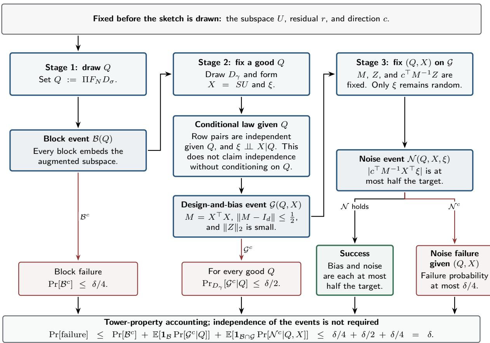

# Hadamard Flattening and Gaussian Pooling Sketch for Least Squares with Coordinate-wise Guarantee

Zhao Song∗

Lichen Zhang†

August 7, 2026

## Abstract

Randomized sketch-and-solve algorithms accelerate overconstrained $\ell _ { 2 }$ regression by replacing the input with a much smaller, randomly projected problem. Standard subspace embeddings guarantee that the cost of the regression is nearly preserved, but coordinate-wise accuracy of the solution is more delicate: instead of preserving the objective value, we want the solution vector itself to be close to the optimal solution in $\ell _ { \infty }$ norm. In particular, we want to find a vector $\boldsymbol { x } ^ { \prime } \in \mathbb { R } ^ { d }$ such that $\begin{array} { r } { \| \boldsymbol { x } ^ { \prime } - \boldsymbol { x } ^ { \star } \| _ { \infty } \leq \frac { \epsilon } { \sqrt { d } } \cdot \| \boldsymbol { A x } ^ { \star } - \boldsymbol { b } \| _ { 2 } \cdot \| \boldsymbol { A } ^ { \dagger } \| _ { \mathrm { o p } } } \end{array}$ , where $A \in \mathbb { R } ^ { n \times d }$ is the design matrix, $b \in \mathbb { R } ^ { n }$ is the label vector, $x ^ { \star } \in \mathbb { R } ^ { d }$ is the optimal solution and $A ^ { \dagger }$ is the pseudo-inverse of A. Price, Song and Woodruf initiated the study of this problem and showed that the subsampled randomized Hadamard transform (SRHT) with $O ( \epsilon ^ { - 2 } d ^ { 1 + \Theta ( \sqrt { \log \log n / \log d } ) } )$ rows achieves this guarantee. A subsequent work of Song, Ye, Yin and Zhang claimed to improve the row count to $O ( \epsilon ^ { - 2 } d \log ^ { 3 } n )$ . Unfortunately, their proof relies on an independence assumption that does not hold in general, and we exhibit an explicit instance on which it fails.

To achieve a truly nearly-linear-in-d row count, we introduce a new fast, dense randomized transform, which combines a randomized Hadamard flattening, a random permutation, and balanced, disjoint Gaussian pooling. Conditioned on the Hadamard-and-permutation stage, the sketched problem becomes an exact Gaussian regression in which the noise is independent of the entire sketched design; this conditional independence is exactly what the earlier argument was missing. Our sketch yields the $\ell _ { \infty }$ guarantee with $m = O ( \epsilon ^ { - 2 } d \log d )$ rows, uses one Hadamard pass with a padded internal dimension $N = \widetilde { O } ( n + \epsilon ^ { - 2 } d ^ { 3 } )$ , and is eficient to apply: the sketched pair (SA, Sb) can be computed in $O ( N d \log N ) = \widetilde O ( n d + \epsilon ^ { - 2 } d ^ { 4 } )$ time.

## 1 Introduction

Least-squares regression is a workhorse of scientific computing, numerical linear algebra, and modern machine learning pipelines. In the overconstrained setting, a data matrix $A \in \mathbb { R } ^ { n \times d }$ with $n \gg d$ and a label vector $b \in \mathbb { R } ^ { n }$ are given, and one wishes to (approximately) minimize $\| A x - b \| _ { 2 }$ over $\boldsymbol { x } \in \mathbb { R } ^ { d }$ . A natural way to speed this up is to compress the problem before solving it: the sketchand-solve paradigm draws an oblivious random matrix $S \in \mathbb { R } ^ { m \times n }$ with $m \ll n$ , forms SA and $S b ,$ and solves the m-row problem min $\ l _ { x \in \mathbb { R } ^ { d } } \| S A x - S b \| _ { 2 }$ instead. Randomized compression of this kind traces back to the Johnson–Lindenstrauss lemma [JL84]: any N points in Euclidean space can be mapped into $O ( \epsilon ^ { - 2 } \log N )$ dimensions so that every pairwise distance is preserved up to a $1 \pm \epsilon$ factor, and Larsen and Nelson [LN17] proved that no embedding, linear or not, can do better in the worst case. Regression asks for more than pairwise distances, and the right tool is an oblivious subspace embedding [Sar06, DMMS11]: a random matrix that simultaneously preserves the norm of every vector in a fixed low-dimensional subspace, which sufices for relative-error guarantees on the objective. Such embeddings admit fast implementations of two kinds: dense ones built from randomized Hadamard transforms, and sparse ones built from hashing, including CountSketch, which originated in streaming frequency estimation [CCFC02] and later enabled regression in input-sparsity time [CW17], and OSNAP [NN13], which refined the tradeof between sparsity and embedding dimension.

Guarantees of this type, however, primarily control the residual or a global norm of the solution error. When S is an oblivious subspace embedding with distortion $\epsilon ,$ the minimizer $x ^ { \prime }$ of the sketched problem satisfies $\| x ^ { \prime } - x ^ { \star } \| _ { 2 } \leq O ( \epsilon ) \cdot \| A x ^ { \star } - b \| _ { 2 } \cdot \| A ^ { \dagger } \| _ { \mathrm { o p } }$ , where $x ^ { \star }$ denotes the optimal solution. For a direction $a \in \mathbb { R } ^ { d }$ fixed independently of the sketch, Cauchy–Schwarz then gives

$$
| \langle a , x ^ { \prime } - x ^ { \star } \rangle | \leq O ( \epsilon ) \cdot \| a \| _ { 2 } \cdot \| A x ^ { \star } - b \| _ { 2 } \cdot \| A ^ { \dagger } \| _ { \mathrm { o p } } .
$$

This estimate, however, leaves a factor of $\sqrt { d }$ on the table: for a generic direction $^ { a , }$ the deviation should scale like a $1 / \sqrt { d }$ fraction of the $\ell _ { 2 }$ error, and a bound of this refined form, applied simultaneously to $a = e _ { 1 } , \ldots , e _ { d } .$ , yields an $\ell _ { \infty }$ guarantee on $x ^ { \prime } - x ^ { \star }$ . Price, Song and Woodruf [PSW17] confirmed this prediction for the subsampled randomized Hadamard transform (SRHT), albeit with a row count that is superlinear in d. [SYYZ23] later claimed a nearly-linear-in-d row count by combining a constant-distortion oblivious subspace embedding with an oblivious coordinate-wise embedding for a fixed pair of vectors. Unfortunately, their argument applies the fixed-vector guarantee to a direction that contains the inverse of the random sketched Gram matrix and therefore depends on the same sketch. The stated guarantee does not cover this adaptive choice, and as we show in Section 2, the gap is genuine rather than merely formal.

In this work, we introduce a new sketch, which we call the balanced Gaussian-pooled transform, and prove that it achieves the $\ell _ { \infty }$ guarantee with a truly nearly-linear-in-d row count. Since this sketch is the central object of the paper, let us first state its ingredients explicitly. The transform factors as

$$
S : = B D _ { \gamma } \Pi F _ { N } D _ { \sigma } J ,
$$

applied from right to left: J pads the input from dimension n to a larger internal dimension N by appending zeros, $D _ { \sigma }$ is a diagonal matrix of random signs, $F _ { N }$ is one normalized Hadamard transform, Π is a uniformly random permutation, $D _ { \gamma }$ is a diagonal matrix of independent standard Gaussians, and B partitions the N coordinates into m consecutive blocks of equal size and sums each block. We call the block-summing step Gaussian pooling, since each row of the sketch pools an entire block of Gaussian-weighted coordinates; the blocks are balanced in the sense that, with high probability, the Hadamard transform and the random permutation spread the subspace relevant to the regression so evenly that every block carries a nearly equal share of its energy.

The intuition behind the construction is to expose the randomness in two stages. The first stage, the randomized Hadamard transform followed by the random permutation, flattens and shufles the (padded) column space of A together with the residual direction, so that every block becomes a nearly isotropic copy of this fixed $( d + 1 )$ )-dimensional subspace. Conditional on the first stage, the second stage takes over: because the pooling blocks are disjoint, the rows of the sketched problem are independent Gaussian vectors, and the sketched least squares becomes an exact Gaussian regression whose noise is independent of the entire design. The inverse sketched Gram matrix may then depend on the design in an arbitrary fashion, and no fixed-vector guarantee is ever applied to a sketch-dependent direction. With probability at least $1 - \delta$ , the resulting estimator satisfies the fixed-direction guarantee with $m = O ( \epsilon ^ { - 2 } d \log ( 1 / \delta ) )$ rows, and the simultaneous guarantee over all d coordinates with $m = { \cal O } ( \epsilon ^ { - 2 } d \log ( d / \delta ) )$ rows. The transform uses a single Hadamard pass, but we emphasize that it is not the canonical SRHT: the analysis works with a padded internal dimension $N = \widetilde { O } ( n + \epsilon ^ { - 2 } d ^ { 3 } )$

## 1.1 Main Result

Let $A \in \mathbb { R } ^ { n \times d }$ have full column rank, let $b \in \mathbb { R } ^ { n }$ , and write $x ^ { \star } : = \mathrm { { \ a r g } \operatorname* { m i n } } _ { x } \| A x - b \| _ { 2 } , { \widehat x } : =$ arg $\mathrm { m i n } _ { x } \| S A x - S b \| _ { 2 }$ . For a fixed direction $a \in \mathbb { R } ^ { d }$ , the target is

$$
\lvert a ^ { \top } ( \widehat { x } - x ^ { \star } ) \rvert \leq \frac { \epsilon } { \sqrt { d } } \lVert a \rVert _ { 2 } \lVert A x ^ { \star } - b \rVert _ { 2 } \lVert A ^ { \dagger } \rVert _ { \mathrm { o p } } .\tag{1}
$$

Taking $a = e _ { j }$ and union bounding over $j \in [ d ]$ gives the corresponding $\ell _ { \infty }$ estimate.

Theorem 1.1 of [SYYZ23] claims Eq. (1) for the canonical SRHT with $m = O ( \epsilon ^ { - 2 } d \log ^ { 3 } ( n / \delta ) )$ rows. As we explain in Section 2, the proof of that claim is incomplete, and the issue cannot be repaired within the same argument. What we prove instead is the following.

Theorem 1.1 (Main result). Fix $0 ~ < ~ \epsilon ~ \leq ~ 1$ and $0 < \delta < 1 / 2$ . There is a distribution over oblivious linear maps $S \in \mathbb { R } ^ { m \times n }$ , each of which can be applied with a single randomized Hadamard transform, such that for every fixed $A , b , a _ { i }$ , a single draw of S satisfies Eq. (1) with probability at least $1 - \delta$ when $m = { \cal O } ( \epsilon ^ { - 2 } d \log ( 1 / \delta ) )$ . The guarantee holds for all d coordinates simultaneously using $m = O ( \epsilon ^ { - 2 } d \log ( d / \delta ) )$ rows, with the failure parameter δ/d used throughout the construction. The map is the balanced Gaussian-pooled transform defined in Definition 4.1. Its padded internal dimension N and total classical runtime T are

$$
N = \widetilde { O } ( n + \epsilon ^ { - 2 } d ^ { 3 } ) , \qquad T = O ( N d \log { N } + { \cal T } _ { \mathrm { m a t } } ( d , m , d ) + d ^ { \omega } ) = \widetilde { O } ( n d + \epsilon ^ { - 2 } d ^ { 4 } ) .
$$

Here $\mathcal { T } _ { \mathrm { m a t } } ( a , b , c )$ denotes the arithmetic time required to multiply an $a \times b$ matrix by a $b \times c$ matrix, and Oe suppresses logarithms in $n , d , 1 / \epsilon , 1 / \delta$

Remark 1.2. For the canonical one-shot SRHT, Theorem 10 ofPrice, Song, and Woodruf[PSW17] is the rigorous dependency-safe baseline. Under their assumptions it gives the same fixed-direction regression conclusion with

$$
m = O ( \epsilon ^ { - 2 } d ^ { 1 + \Theta ( \sqrt { \log \log n / \log d } ) } )
$$

and polynomially small failure probability. Its Neumann-expansion proof handles reuse of the same sketch, but the row count is $d ^ { 1 + o ( 1 ) }$ , not d polylog(n). Obtaining the latter for the canonical SRHT without the padded block construction would require an argument beyond this paper, for example, a suitable anisotropic inverse-Gram or fluctuation-averaging estimate; we leave closing this gap as an open problem.

Roadmap. In Section 2, we describe the dependency issue in the argument of [SYYZ23] and construct an explicit instance showing that the gap is genuine. In Section 3, we show that the natural fix of replacing the Rademacher diagonal in the SRHT with a Gaussian diagonal fails as well. In Section 4, we define the balanced Gaussian-pooled transform and explain the conditionalregression viewpoint that repairs the argument. In Section 5, we show that, conditional on the Hadamard-and-permutation stage, the pooled rows are independent Gaussian vectors with explicit covariances. In Sections 6 and 7, we develop the block geometry supplied by the randomized Hadamard transform and the exact conditional Gaussian regression representation. In Section 8, we prove concentration for the conditional design and bias, and record that our transform is an oblivious subspace embedding. In Sections 9 and 10, we prove the corrected core lemma and transfer it to least squares. Finally, in Section 11, we bound the running time of our sketch.

## Acknowledgement & AI Disclosure

The sketch construction is developed by GPT Codex 5.6 Sol and Claude Code Fable 5. Proofs are generated part by GPT Codex 5.6 Sol and authors, and are verified independently by Claude Code Fable 5 and authors. The authors take full responsibility for verifying all claims and for the paper’s content.

## 2 The original dependency bug

Take a thin singular value decomposition $A = U \Sigma V ^ { \top }$ and define the least-squares residual $r : = $ $b - A x ^ { \star }$ . The normal equations give $U ^ { \top } r = 0$ . Whenever $S U$ has full column rank,

$$
\widehat { \boldsymbol { x } } - \boldsymbol { x } ^ { \star } = V \Sigma ^ { - 1 } ( \boldsymbol { U } ^ { \top } S ^ { \top } S \boldsymbol { U } ) ^ { - 1 } \boldsymbol { U } ^ { \top } S ^ { \top } S r .
$$

Left-multiplying the preceding identity by $a ^ { \top }$ and using the notation defined below gives

$$
\boldsymbol { a } ^ { \intercal } ( \widehat { \boldsymbol { x } } - \boldsymbol { x } ^ { \star } ) = \boldsymbol { c } ^ { \intercal } \boldsymbol { G } ^ { - 1 } \boldsymbol { h } ,\tag{2}
$$

where

$$
\begin{array} { r } { c : = \Sigma ^ { - 1 } V ^ { \top } a , \qquad G : = U ^ { \top } S ^ { \top } S U , \qquad h : = U ^ { \top } S ^ { \top } S r . } \end{array}
$$

Define $u ( S ) : = U G ^ { - 1 } c = U ( U ^ { \top } S ^ { \top } S U ) ^ { - 1 } c$ . Since G is symmetric, $c ^ { \top } G ^ { - 1 } h = u ( S ) ^ { \top } S ^ { \top } S r$ , and since $U ^ { \top } r = 0$ , we have $u ( S ) ^ { \top } r \ : = \ : 0$ . Hence Eq. (2) can be written in the exact OCE form $c ^ { \top } G ^ { - 1 } h = u ( S ) ^ { \top } S ^ { \top } S r = u ( \dot { S } ) ^ { \top } ( S ^ { \top } S - I ) r$ .

Definition 2.1 (Oblivious coordinate-wise embedding, [SYYZ23]). Fix $\beta > 0 , 0 < \delta < 1$ , and positive integers m, n. A distribution D over matrices $S \in \mathbb { R } ^ { m \times n }$ is $a \left( \beta , \delta , n \right)$ -oblivious coordinatewise embedding (OCE) if, for every fixed pair $g , h \in \mathbb { R } ^ { n }$ chosen independently of S, a draw $S \sim \mathcal { D }$ satisfies

$$
| g ^ { \top } ( S ^ { \top } S - I _ { n } ) h | \leq \frac { \beta } { \sqrt { m } } \| g \| _ { 2 } \| h \| _ { 2 }
$$

with probability at least $1 - \delta$

The original proof of [SYYZ23] applies Definition 2.1 to the pair $( u ( S ) , r )$ . This is not allowed because $u ( S )$ depends on the same random sketch S. The definition has the quantifiers

$$
{ \mathrm { ~ f o r ~ e v e r y ~ f i x e d ~ } } g , h , \qquad { \mathrm { ~ P r } } [ { \mathrm { f a i l u r e ~ f o r ~ } } g , h ] \leq \delta ,
$$

not

$$
\operatorname* { P r } _ { S } [ \mathrm { f a i l u r e ~ f o r ~ a n ~ a d a p t i v e l y ~ c h o s e n ~ } u ( S ) , r ] \le \delta .
$$

Conditioning first on the event that S embeds the column space of A (Definition 8.2) does not help: it changes the law of S, while $u ( S )$ still depends on the remaining randomness. A norm bound on $u ( S )$ does not make it fixed, independent, or covered by a uniform OCE statement.

## 2.1 The gap is genuine, not merely formal

The following compact example shows that OSE plus fixed-vector OCE does not imply the adaptive inverse-Gram conclusion.

Proposition 2.2 (OSE and fixed-vector OCE are insuficient). For every suficiently large $d ,$ there is a distribution $\mathcal { D } _ { d }$ on $S \in \mathbb { R } ^ { ( d + 1 ) \times ( d + 1 ) }$ such that all singular values of S lie in [0.9, 1.1] deterministically and, for every fixed $g , h \in \mathbb { R } ^ { d + 1 }$ and every $0 < \delta < 1$ ，

$$
\operatorname* { P r } _ { S \sim \mathcal { D } _ { d } } [ | g ^ { \top } ( S ^ { \top } S - I _ { d + 1 } ) h | > C \sqrt { \frac { \log ( 2 / \delta ) } { d } } \| g \| _ { 2 } \| h \| _ { 2 } ] \le \delta .
$$

Equivalently, after changing C by an absolute factor, $\mathcal { D } _ { d }$ is a $( C \sqrt { \log ( 2 / \delta ) } , \delta , d + 1 )$ -OCE according to Definition 2.1. Nevertheless, a fixed one-dimensional regression contrast is bounded below by an absolute constant with probability one.

Proof. Let $U : = [ e _ { 1 } , \ldots , e _ { d } ]$ , draw v uniformly from the unit sphere in span $( e _ { 2 } , \ldots , e _ { d } )$ , and fix $\rho : = 1 / 2 0$ and $\alpha : = 1 / 2 0$ . Define

$$
M ( v ) : = \left[ { \begin{array} { l l } { B ( v ) } & { \alpha v } \\ { \alpha v ^ { \top } } & { 1 } \end{array} } \right] , \qquad B ( v ) : = I _ { d } - \rho ( e _ { 1 } v ^ { \top } + v e _ { 1 } ^ { \top } ) , \qquad S : = M ( v ) ^ { 1 / 2 } .
$$

Let $\mathcal { D } _ { d }$ denote the resulting distribution of S. On span $_ { \mathrm { l } } ( e _ { 1 } , v , e _ { d + 1 } )$ , the perturbation $M - I$ has eigenvalues 0 and $\pm \sqrt { \rho ^ { 2 } + \alpha ^ { 2 } } ;$ it vanishes on the orthogonal complement. Since $\sqrt { \rho ^ { 2 } + \alpha ^ { 2 } } < 1 / 1 0$ the matrix M is positive definite. Moreover, $S ^ { \top } S = M$ , so the singular values of S are

$$
1 , \qquad \sqrt { 1 - { \sqrt { \rho ^ { 2 } + \alpha ^ { 2 } } } } , \qquad \sqrt { 1 + { \sqrt { \rho ^ { 2 } + \alpha ^ { 2 } } } } ,
$$

together with additional copies of 1. They all lie in [0.9, 1.1].

Let $\mathscr { H } : = \operatorname { s p a n } ( e _ { 2 } , \ldots , e _ { d } )$ and let $P _ { \mathcal { H } }$ be the orthogonal projector onto H. For fixed $g , h \in \mathbb { R } ^ { d + 1 }$ direct expansion gives

$$
\boldsymbol { g } ^ { \intercal } ( \boldsymbol { M } - \boldsymbol { I } ) \boldsymbol { h } = \boldsymbol { v } ^ { \intercal } \boldsymbol { w } ,
$$

where the fixed vector

$$
w : = P _ { \mathcal { H } } [ - \rho ( g _ { 1 } h _ { 1 : d } + h _ { 1 } g _ { 1 : d } ) + \alpha ( h _ { d + 1 } g _ { 1 : d } + g _ { d + 1 } h _ { 1 : d } ) ]
$$

satisfies

$$
\| w \| _ { 2 } \leq 2 ( \rho + \alpha ) \| g \| _ { 2 } \| h \| _ { 2 } .
$$

Consequently, spherical concentration [DG03, Lemma 2.2] gives a universal constant $C > 0$ such that, for every $0 < \delta < 1$ ，

$$
\operatorname* { P r } [ | g ^ { \top } ( S ^ { \top } S - I _ { d + 1 } ) h | > C \sqrt { \frac { \log ( 2 / \delta ) } { d } } \| g \| _ { 2 } \| h \| _ { 2 } ] \le \delta .
$$

Since the sketch has $m = d + 1$ rows, increasing C by an absolute factor shows that $\mathcal { D } _ { d }$ is a $( C \sqrt { \log ( 2 / \delta ) } , \delta , d + 1 )$ -OCE according to Definition 2.1.

Finally, take $A : = U , b : = e _ { d + 1 } , r : = e _ { d + 1 }$ , and $a : = e _ { 1 }$ . Then $U ^ { \top } r = 0$ , so the least-squares minimizer is $x ^ { \star } = 0$ . Since $S ^ { \top } S = M$

$$
( S A ) ^ { \dagger } S b = ( U ^ { \top } M U ) ^ { - 1 } U ^ { \top } M r = B ( v ) ^ { - 1 } ( \alpha v ) .
$$

On the ordered basis $( e _ { 1 } , v )$ of span $( e _ { 1 } , v )$ ,

$$
B ( v ) = \left[ \begin{array} { c c } { { 1 } } & { { - \rho } } \\ { { - \rho } } & { { 1 } } \end{array} \right] , \qquad B ( v ) ^ { - 1 } = \frac { 1 } { 1 - \rho ^ { 2 } } \left[ \begin{array} { c c } { { 1 } } & { { \rho } } \\ { { \rho } } & { { 1 } } \end{array} \right] .
$$

Consequently,

$$
\left| e _ { 1 } ^ { \top } ( S A ) ^ { \dagger } S b \right| = \frac { \alpha \rho } { 1 - \rho ^ { 2 } } .
$$

This is independent of $d ,$ whereas the claimed fixed-OCE conclusion would tend to zero as $d $ ∞. □

## 3 Why a Gaussian diagonal in the usual position also fails

One might replace the Rademacher diagonal in $m ^ { - 1 / 2 } P H D$ by a Gaussian diagonal. This does not repair the argument. Let H be an unnormalized Hadamard matrix, let P sample m rows independently and uniformly, and put

$$
S : = m ^ { - 1 / 2 } P H D _ { \gamma } , \qquad K : = m ^ { - 1 } H ^ { \top } P ^ { \top } P H .
$$

Here $D _ { \gamma } : = \mathrm { d i a g } ( \gamma _ { 1 } , . . . )$ , with $\gamma _ { j } \ \overset { \mathrm { i i d } } { \sim } \ N ( 0 , 1 )$ , independently of P. For two distinct Hadamard columns, $K _ { 1 1 } = K _ { 2 2 } = 1$ and

$$
\rho : = K _ { 1 2 } = \frac { 1 } { m } \sum _ { k = 1 } ^ { m } \zeta _ { k }
$$

for independent Rademachers $\zeta _ { k }$ . With $\begin{array} { r } { u : = \frac { e _ { 1 } + e _ { 2 } } { \sqrt { 2 } } , r : = \frac { e _ { 1 } - e _ { 2 } } { \sqrt { 2 } } } \end{array}$ , we have $u ^ { \top } r = 0$ , but the onedimensional sketched regression coeficient is

$$
\frac { u ^ { \top } S ^ { \top } S r } { u ^ { \top } S ^ { \top } S u } = \frac { \gamma _ { 1 } ^ { 2 } - \gamma _ { 2 } ^ { 2 } } { \gamma _ { 1 } ^ { 2 } + \gamma _ { 2 } ^ { 2 } + 2 \rho \gamma _ { 1 } \gamma _ { 2 } } .\tag{3}
$$

Hoefding gives $\operatorname* { P r } [ | \rho | > 1 / 2 ] \leq 2 e ^ { - m / 8 }$ . Independently, the ratio $R _ { \gamma } : = \gamma _ { 1 } / \gamma _ { 2 }$ is standard Cauchy. The two disjoint events $| R _ { \gamma } | \geq 2$ and $| R _ { \gamma } | \leq 1 / 2$ therefore give

$$
\operatorname* { P r } [ \operatorname* { m a x } ( \gamma _ { 1 } ^ { 2 } , \gamma _ { 2 } ^ { 2 } ) \geq 4 \operatorname* { m i n } ( \gamma _ { 1 } ^ { 2 } , \gamma _ { 2 } ^ { 2 } ) ] = \operatorname* { P r } [ | R _ { \gamma } | \geq 2 ] + \operatorname* { P r } [ | R _ { \gamma } | \leq 1 / 2 ] = 2 - { \frac { 4 } { \pi } } \arctan 2 .
$$

To verify the claimed constant, put $a : = \operatorname* { m a x } ( \gamma _ { 1 } ^ { 2 } , \gamma _ { 2 } ^ { 2 } )$ and $b : = \operatorname* { m i n } ( \gamma _ { 1 } ^ { 2 } , \gamma _ { 2 } ^ { 2 } )$ . On the imbalance event, $a \geq 4 b$ . If also $| \rho | \le 1 / 2$ , then

$$
| \gamma _ { 1 } ^ { 2 } - \gamma _ { 2 } ^ { 2 } | = a - b \geq \frac { 3 a } { 4 } ,
$$

whereas

$$
| \gamma _ { 1 } ^ { 2 } + \gamma _ { 2 } ^ { 2 } + 2 \rho \gamma _ { 1 } \gamma _ { 2 } | \leq a + b + \sqrt { a b } \leq \frac { 7 a } { 4 } .
$$

Thus the absolute value in Eq. (3) is at least $3 / 7$ . The two events are independent, so this happens with probability at least

$$
( 2 - \frac { 4 } { \pi } \arctan 2 ) ( 1 - 2 e ^ { - m / 8 } )
$$

for arbitrarily large m. Our construction instead places the Gaussian weights after norm flattening;   
disjoint pooling supplies the independence that drives our analysis.

## 4 The balanced Gaussian-pooled transform

We begin with the formal definition of our sketch; the remainder of this section explains the ideas behind its analysis.

Definition 4.1 (Balanced Gaussian-pooled sketch). Round the desired output row count m up to a power of two, fix $\kappa \in ( 0 , 1 / 2 )$ , and define $\Lambda : = \log ( C n m d / ( \kappa \delta ) )$ . Choose s to be the smallest power of two satisfying

$$
s \geq \operatorname* { m a x } \{ \lceil \frac { n } { m } \rceil , C \kappa ^ { - 2 } ( d + 1 ) \Lambda ^ { 2 } \} , \quad \quad N : = m s .
$$

Then N is a power of two and $N \geq n$ . Let $J : \mathbb { R } ^ { n } \to \mathbb { R } ^ { N }$ append zeros and let $F _ { N } : = H _ { N } / \sqrt { N }$ be the normalized orthogonal Hadamard matrix.

Draw independently:

• a Rademacher diagonal $D _ { \sigma } \in \mathbb { R } ^ { N \times N }$ ;

• a uniform permutation matrix $\Pi \in \mathbb { R } ^ { N \times N }$ ;

• a Gaussian diagonal $D _ { \gamma } : = \mathrm { d i a g } ( \gamma _ { 1 } , . . . , \gamma _ { N } )$ , with $\gamma _ { j } \overset { \mathrm { i i d } } { \sim } \mathcal { N } ( 0 , 1 )$

Partition [N] into m consecutive blocks $\boldsymbol { B } _ { 1 } , \ldots , \boldsymbol { B } _ { m }$ , each of size s. Let $B \in \{ 0 , 1 \} ^ { m \times N }$ sum the coordinates in each block, i.e., $B _ { i , j } : = 1 \ i f \ j \in \ B _ { i }$ and 0 otherwise. Finally, define the balanced Gaussian-pooled sketch $S \in \mathbb { R } ^ { m \times n }$ by

$$
\boxed { S : = B D _ { \gamma } \Pi F _ { N } D _ { \sigma } J . }
$$

The regression solver sees only SA and Sb; there is no preliminary regression and no postcompression of another regression solution.

The transform is dense in the original coordinates almost surely, but it is applied in factored form: pad, flip signs, take one Hadamard transform, permute, multiply by Gaussians, and sum blocks.

As we saw in Sections 2 and 3, the main obstacle is not subspace preservation alone, but the dependence created by the inverse sketched Gram matrix. Write $A = U \Sigma V ^ { \top }$ , let $r : = b - A x ^ { \star }$ and set $X : = S U , y : = S r , M : = X ^ { \top } X$ , and $c : = \Sigma ^ { - 1 } V ^ { \top } a$ . Whenever M is invertible, the normal equations give $\boldsymbol { a } ^ { \intercal } ( \widehat { \boldsymbol { x } } - \boldsymbol { x } ^ { \star } ) = \boldsymbol { c } ^ { \intercal } \boldsymbol { M } ^ { - 1 } \boldsymbol { X } ^ { \intercal } \boldsymbol { y } .$ . A fixed-vector OCE bound cannot be applied with the direction $U M ^ { - 1 } c ,$ because this direction depends on the same sketch; this is precisely the failure mode described in Section 2. Our proof instead exposes the randomness in stages so that $M ^ { - 1 }$ may depend on the design while, after fixing the first-stage randomness, the remaining noise is independent of the design.

Stage 1: balanced block geometry. The sketch in Definition 4.1 factors as $S = B D _ { \gamma } Q J$ where $Q : = \Pi F _ { N } D _ { \sigma }$ . We first expose $Q .$ . For $r \neq 0$ , Lemma 6.1 applies $Q$ to the padded augmented orthonormal system $[ J U , J r / \| r \| _ { 2 } ]$ and shows that every balanced block is nearly isotropic simultaneously; the case $r = 0$ is handled separately in the core lemma. Claim 6.2 translates this event into a nearly uniform block design covariance $C _ { i }$ , a small design–residual covariance $h _ { i } ,$ and controlled residual variance $v _ { i }$ . Orthogonality and $U ^ { \top } r = 0$ also give the exact identities $\textstyle \sum _ { i = 1 } ^ { m } C _ { i } = I _ { d }$ and $\begin{array} { r } { \sum _ { i = 1 } ^ { m } h _ { i } = 0 } \end{array}$ in Claim 6.3.

Stage 2: exact conditional Gaussian regression. Fix a good realization of $Q$ and then expose the Gaussian diagonal $D _ { \gamma }$ . Because the pooling blocks are disjoint, Claim 5.1 gives independent, centered, jointly Gaussian row pairs $( x _ { i } , y _ { i } )$ across i, together with their exact conditional covariances. Definition 7.1 assembles these rows into $X , y ,$ and M. Lemma 7.2 residualizes each pair as $y _ { i } = x _ { i } ^ { \top } \theta _ { i } + \xi _ { i }$ and proves that, conditional on $Q ,$ the entire noise vector $\xi$ is independent of the entire design X. Its cancellation and score-decomposition parts give $X ^ { \top } y = Z + \bar { X ^ { \top } } \xi$ , where $\begin{array} { r } { Z : = \sum _ { i = 1 } ^ { m } ( x _ { i } x _ { i } ^ { \top } - C _ { i } ) \theta _ { i } } \end{array}$ . Thus $Z$ is a conditionally centered, design-dependent fluctuation, whereas $X ^ { \top } \xi$ is driven by a Gaussian noise vector ξ that is independent of X conditional on Q. This exact separation is the key repair.

Stage 3: concentration and assembly. Lemma 8.1 shows, uniformly for every good $Q .$ , that M is well conditioned and $Z$ is small. We then condition further on $( Q , X )$ : the quantities $M ^ { - 1 }$ and $Z$ are fixed, while $c ^ { \top } M ^ { - 1 } X ^ { \top } \xi$ is a centered Gaussian with controlled variance. The choice $\kappa = c _ { 0 } / \sqrt { d }$ supplies the $d ^ { - 1 / 2 }$ factor for the bias, while the row count controls the Gaussian noise. Lemma 9.1 combines the block, design-and-bias, and noise events by the tower property, and Theorem 10.1 transfers the resulting core estimate to least squares and obtains the simultaneous coordinate bound by a union bound. Figure 1 records the order of conditioning and the associated failure budget.

  
Figure 1: Conditioning hierarchy in the proof. After $Q$ is fixed, $D _ { \gamma }$ generates $( X , \xi )$ , with ξ ⊥⊥ X conditional on Q. The design-and-bias event is measurable with respect to $( Q , X )$ ; after conditioning on $( Q , X )$ , only ξ remains random for the noise bound. The failure probabilities are combined by the tower property, not by independence of the events.

## 5 Conditional Gaussian pooling

The first property we extract from the construction is distributional: conditional on the Hadamardand-permutation stage, the pooled rows are independent Gaussian vectors with explicit covariances.

Claim 5.1 (Conditional Gaussian pooling and exact block covariances). Put $Q : = \Pi F _ { N } D _ { \sigma }$ . Conditional on $Q$ , for every $p \geq 1$ and fixed $\ b { T } \in \mathbb { R } ^ { \ b { N } \times \ b { p } }$ , define

$$
Y _ { T } : = B D _ { \gamma } Q T , \qquad { \bar { T } } _ { i } : = ( Q T ) _ { B _ { i } , * } \in \mathbb { R } ^ { s \times p } .
$$

Conditional on $Q$ , the rows of $Y _ { T }$ are mutually independent centered Gaussian vectors, and, for every $i \in [ m ]$ ，

$$
\mathrm { C o v } _ { \gamma } ( ( Y _ { T } ) _ { i , * } ^ { \top } \vert Q ) = \bar { T } _ { i } ^ { \top } \bar { T } _ { i } .
$$

Moreover,

$$
\begin{array} { r } { \mathbb { E } _ { \gamma } [ Y _ { T } ^ { \top } Y _ { T } \vert Q ] = T ^ { \top } T . } \end{array}
$$

In particular, taking $T = J$ gives $Y _ { J } = S ;$ hence, conditional on $Q$ , the rows of $S$ are mutually independent centered Gaussian vectors and $\mathbb { E } _ { \gamma } [ S ^ { \top } S | Q ] = I _ { n }$

Proof. For each $i \in [ m ]$ , put $g _ { i } : = ( \gamma _ { j } ) _ { j \in B _ { i } }$ . Since B sums the coordinates in each block, $( Y _ { T } ) _ { i , * } ^ { \top } =$ $\bar { T } _ { i } ^ { \top } g _ { i }$ . Conditional on $Q ,$ the vectors $g _ { i }$ are mutually independent standard Gaussian vectors because the blocks $\boldsymbol { B } _ { 1 } , \ldots , \boldsymbol { B } _ { m }$ are disjoint. This proves the asserted conditional Gaussian law, independence, and covariance formula. Since the blocks partition [N] and $Q$ is orthogonal,

$$
\mathbb { E } _ { \gamma } [ Y _ { T } ^ { \top } Y _ { T } | Q ] = \sum _ { i = 1 } ^ { m } { \bar { T } } _ { i } ^ { \top } { \bar { T } } _ { i } = T ^ { \top } Q ^ { \top } Q T = T ^ { \top } T .
$$

Taking $T = J$ and using $J ^ { \top } J = I _ { n }$ proves the final assertion.

The isotropy identity alone is not a concentration statement; the conditional row independence is the stronger property used in the regression decomposition below.

## 6 Block geometry supplied by the randomized Hadamard transform

The role of the Hadamard stage is to make every block a very accurate embedding of the one fixed augmented subspace relevant to the regression. The parameter choice in Definition 4.1 implies Eq. (4), after increasing the universal constant C.

Lemma 6.1 (Simultaneous block embedding). Let $0 < \delta < 1 / 2$ , and let $W \in \mathbb { R } ^ { N \times p }$ be fixed independently of $( D _ { \sigma } , \Pi )$ and have orthonormal columns, with $1 \leq p \leq d + 1$ . Put $Q : = \Pi F _ { N } D _ { \sigma }$ Let $W _ { i } : = ( Q W ) _ { B _ { i } , * }$ . If

$$
s \geq C \kappa ^ { - 2 } p \log ^ { 2 } ( N p m / \delta ) ,\tag{4}
$$

then, with probability at least $1 - \delta$ over $( D _ { \sigma } , \Pi )$ , the event

$$
\mathcal { E } _ { \mathrm { b l o c k } } ( W ) : = \{ \| m W _ { i } ^ { \top } W _ { i } - I _ { p } \| \leq \kappa \mathrm { ~ f o r ~ e v e r y ~ } i \in [ m ] \}
$$

occurs. Moreover, if $n \geq d$ and $s , N ,$ Λ are chosen as in Definition 4.1, then Eq. (4) holds after increasing the universal constant $C ,$ and

$$
N = O ( n + m \kappa ^ { - 2 } ( d + 1 ) \Lambda ^ { 2 } ) .
$$

Proof. Put $Z _ { 0 } : = F _ { N } D _ { \sigma } W$ and let $z _ { j } : = ( Z _ { 0 } ) _ { j , * } ^ { \top }$ . Since $F _ { N } D _ { \sigma }$ is orthogonal and W has orthonormal columns, $\begin{array} { r } { \sum _ { j = 1 } ^ { N } z _ { j } z _ { j } ^ { \top } = I _ { p } } \end{array}$ . Randomized-Hadamard flattening [Tro11, Lemma 3.3] gives, except with probability $\dot { \delta } / 2$

$$
\operatorname* { m a x } _ { j \in [ N ] } \| z _ { j } \| _ { 2 } ^ { 2 } \leq \frac { C ( p + \log ( 2 N / \delta ) ) } { N } .\tag{5}
$$

Fix $D _ { \sigma }$ for which $\mathrm { E q . ~ ( 5 ) }$ holds. For a fixed block $i ,$ the set $T _ { i } : = \Pi ^ { - 1 } B _ { i }$ is a uniform size-s subset of [N], and

$$
W _ { i } ^ { \top } W _ { i } = \sum _ { j \in T _ { i } } z _ { j } z _ { j } ^ { \top } .
$$

Then we have $\begin{array} { r } { \mathbb E _ { \Pi } [ W _ { i } ^ { \top } W _ { i } | D _ { \sigma } ] = \frac s N \sum _ { j = 1 } ^ { N } z _ { j } z _ { j } ^ { \top } = \frac { 1 } { m } I _ { p } } \end{array}$ . Moreover, Eq. (5) bounds every positivesemidefinite summand by

$$
\| z _ { j } z _ { j } ^ { \top } \| \leq \frac { C ( p + \log ( 2 N / \delta ) ) } { N } .
$$

Matrix Chernof for sampling without replacement [Tro11, Theorem 2.2], based on the comparison principle of Gross and Nesme [GN10], now gives

$$
\operatorname* { P r } _ { \Pi } [ \| m W _ { i } ^ { \top } W _ { i } - I _ { p } \| > \kappa | D _ { \sigma } ] \le 2 p \exp ( - \frac { c \kappa ^ { 2 } s } { p + \log ( 2 N / \delta ) } ) .
$$

For completeness, let $L _ { 0 } : = \log ( N p m / \delta )$ . In the present parameter range $L _ { 0 } \geq \log 2$ , and

$$
\frac { p L _ { 0 } ^ { 2 } } { p + \log ( 2 N / \delta ) } \geq c L _ { 0 } .
$$

Thus $\operatorname { E q . } \left( 4 \right)$ , with a suficiently large universal constant, makes the last probability at most $\delta / ( 2 m )$ A union bound over the m blocks and the flattening failure proves that $\mathcal { E } _ { \mathrm { b l o c k } } ( W )$ occurs with the stated probability. The blocks need not be independent.

For the final assertion, put $K : = C \kappa ^ { - 2 } ( d + 1 ) \Lambda ^ { 2 }$ . After increasing the universal constant $C ,$ we have $K \geq 1$ . The minimality of the power-of-two choice of s in Definition 4.1 gives

$$
N = m s < 2 m \operatorname* { m a x } \{ \lceil n / m \rceil , K \} \leq 2 n + 2 m + 2 m K = O ( n + m K ) ,
$$

where the last step uses $m \lceil n / m \rceil \ \leq \ n + m$ and $K \geq 1$ . Since $n \geq d , p \leq d + 1$ , and $\Lambda =$ $\log ( C n m d / ( \kappa \delta ) )$ , this bound gives $\log ( N p m / \delta ) = O ( \Lambda )$ . Therefore $s \geq C \kappa ^ { - 2 } ( d + 1 ) \Lambda ^ { 2 }$ implies Eq. (4), after increasing C once more. □

Assume for now that $r \neq 0$ and identify U, r with their padded images $J U , J r$ . Since $U ^ { \top } U = I _ { d }$ and $U ^ { \top } r = 0$ , the matrix $W : = [ U , r / \Vert r \Vert _ { 2 } ] \in \mathbb { R } ^ { N \times ( d + 1 ) }$ has orthonormal columns. Apply Lemma 6.1 to this W and abbreviate $\mathcal { E } _ { \mathrm { b l o c k } } : = \mathcal { E } _ { \mathrm { b l o c k } } ( W )$ . Write $\bar { U } : = Q U , \bar { r } : = Q r$ , and, for every $i \in [ m ]$ define the block restrictions $\bar { U } _ { i } : = ( \bar { U } ) _ { B _ { i } , * } \in \mathbb { R } ^ { s \times d } , \bar { r } _ { i } : = ( \bar { r } ) _ { B _ { i } } \in \mathbb { R } ^ { s }$

Claim 6.2 (Blockwise covariance bounds). Under the standing assumption $r \neq 0$ , for every $i \in [ m ]$ 2 define

$$
C _ { i } : = \bar { U } _ { i } ^ { \top } \bar { U } _ { i } , \qquad h _ { i } : = \bar { U } _ { i } ^ { \top } \bar { r } _ { i } , \qquad v _ { i } : = \| \bar { r } _ { i } \| _ { 2 } ^ { 2 } .
$$

On $\mathcal { E } _ { \mathrm { b l o c k } }$ , the following hold simultaneously for every $i \in [ m ]$

(a) $\begin{array} { r } { \frac { 1 - \kappa } { m } I _ { d } \preceq C _ { i } \preceq \frac { 1 + \kappa } { m } I _ { d } . } \end{array}$

(b) $\begin{array} { r } { \| h _ { i } \| _ { 2 } \le \frac { \kappa } { m } \| r \| _ { 2 } . } \end{array}$

(c) $\begin{array} { r } { v _ { i } \leq \frac { 1 + \kappa } { m } \| r \| _ { 2 } ^ { 2 } . } \end{array}$

Proof. On $\mathcal { E } _ { \mathrm { b l o c k } }$ , we have $\| m W _ { i } ^ { \top } W _ { i } - I _ { d + 1 } \| \le \kappa$ , and the block Gram matrix is

$$
m W _ { i } ^ { \top } W _ { i } - I _ { d + 1 } = \left[ { m C _ { i } - I _ { d } \qquad m h _ { i } / \| r \| _ { 2 } } \right] .
$$

The upper-left principal compression satisfies $\| m C _ { i } - I _ { d } \| \leq \kappa .$ which proves Claim 6.2-(a). The upper-right rectangular compression satisfies $\| m h _ { i } / \| r \| _ { 2 } \| \leq \kappa ,$ which proves Claim 6.2-(b). The lower-right scalar compression satisfies $| m v _ { i } / \| r \| _ { 2 } ^ { 2 } { - } 1 | \leq \kappa ;$ its upper bound proves Claim 6.2-(c).

Claim 6.3 (Block-sum identities). The block quantities defined in Claim 6.2 satisfy, independently of $\mathcal { E } _ { \mathrm { b l o c k } }$

$$
\sum _ { i = 1 } ^ { m } C _ { i } = I _ { d } , \qquad \sum _ { i = 1 } ^ { m } h _ { i } = U ^ { \top } r = 0 .
$$

Proof. For the covariance sum,

$$
\sum _ { i = 1 } ^ { m } C _ { i } = \bar { U } ^ { \top } \bar { U } = U ^ { \top } Q ^ { \top } Q U = U ^ { \top } U = I _ { d } .
$$

The first step follows from the definition of $C _ { i }$ in Claim 6.2 and the fact that the blocks form a partition of the row index set $[ N ]$ . The second step substitutes ${ \bar { U } } = Q U$ . The third step uses $Q ^ { \top } Q = I _ { N }$ . The last step uses $U ^ { \top } U = I _ { d }$

For the cross-covariance sum,

$$
\sum _ { i = 1 } ^ { m } h _ { i } = \bar { U } ^ { \top } \bar { r } = U ^ { \top } Q ^ { \top } Q r = U ^ { \top } r = 0 .
$$

The first step follows from the definition of $h _ { i }$ in Claim 6.2 and the fact that the blocks form a partition of the row index set [N]. The second step substitutes ${ \bar { U } } = Q U$ and ${ \bar { r } } = Q r$ . The third step uses $Q ^ { \top } Q = I _ { N }$ . The last step uses $U ^ { \top } r = 0$ □

## 7 Conditional Gaussian regression: the adaptive-safe step

Fix a realized Q for which $\mathcal { E } _ { \mathrm { b l o c k } }$ occurs. All probabilities in this section are now only over $D _ { \gamma }$

Definition 7.1 (Conditional observations, design, and Gram matrix). For every $i \in [ m ]$ , put $g _ { i } : = ( \gamma _ { k } ) _ { k \in B _ { i } } \in \mathbb { R } ^ { s }$ . Conditional on the fixed $Q$ , the vectors $g _ { 1 } , \ldots , g _ { m }$ are mutually independent and each is distributed as $\mathcal { N } ( 0 , I _ { s } )$ . Define the conditional observation pair by

$$
x _ { i } : = \bar { U } _ { i } ^ { \top } g _ { i } \in \mathbb { R } ^ { d } , \qquad y _ { i } : = \bar { r } _ { i } ^ { \top } g _ { i } \in \mathbb { R } .
$$

Equivalently, $x _ { i } ^ { \top }$ is the i-th row of SU and $y _ { i }$ is the i-th entry of $S r$ . Define the conditional design matrix $\boldsymbol { X } \in \mathbb { R } ^ { m \times d }$ by

$$
X _ { i , * } : = x _ { i } ^ { \top } \qquad f o r \ e v e r y \ i \in [ m ] ,
$$

and define the response vector and conditional Gram matrix by

$$
y : = ( y _ { 1 } , \ldots , y _ { m } ) ^ { \top } \in \mathbb { R } ^ { m } , \qquad M : = X ^ { \top } X = \sum _ { i = 1 } ^ { m } x _ { i } x _ { i } ^ { \top } \in \mathbb { R } ^ { d \times d } .
$$

Apply Claim 5.1 with $T : = \lceil U , r \rceil \in \mathbb { R } ^ { N \times ( d + 1 ) }$ , using the padded identification above. Since $( Q T ) _ { B _ { i } , * } = [ \bar { U } _ { i } , \bar { r } _ { i } ]$ , the pairs $( x _ { i } , y _ { i } )$ are, conditional on this fixed $Q _ { i }$ , mutually independent across $i ,$ centered jointly Gaussian, and have covariance

$$
\begin{array} { r } { \left[ \begin{array} { l l } { C _ { i } } & { h _ { i } } \\ { h _ { i } ^ { \top } } & { v _ { i } } \end{array} \right] . } \end{array}
$$

Lemma 7.2 (Exact conditional regression decomposition). For the standing $r \neq 0$ construction and the fixed Q satisfying $\mathcal { E } _ { \mathrm { b l o c k } }$ , Claim 6.2-(a) implies that every $C _ { i }$ is positive definite. Define

$$
\theta _ { i } : = C _ { i } ^ { - 1 } h _ { i } , \qquad \tau _ { i } ^ { 2 } : = v _ { i } - h _ { i } ^ { \top } C _ { i } ^ { - 1 } h _ { i } .
$$

Define $\xi _ { i } : = y _ { i } - x _ { i } ^ { \top } \theta _ { i }$ and $\xi : = ( \xi _ { 1 } , \ldots , \xi _ { m } ) ^ { \intercal } \in \mathbb { R } ^ { m }$ . Conditional on this fixed $Q ,$ the variables $\xi _ { 1 } , \ldots , \xi _ { m }$ are mutually independent Gaussians with $\xi _ { i } \sim \mathcal { N } ( 0 , \tau _ { i } ^ { 2 } )$ , and the entire vector $\xi$ is independent of the entire design matrix X. The defining identity is

$$
y _ { i } = x _ { i } ^ { \top } \theta _ { i } + \xi _ { i } .\tag{6}
$$

Moreover, we have:

(a) $\| \theta _ { i } \| _ { 2 } \le 2 \kappa \| r \| _ { 2 }$ for every $i \in [ m ]$

(b) $\begin{array} { r } { \tau _ { i } ^ { 2 } \leq \frac { 2 } { m } \| r \| _ { 2 } ^ { 2 } } \end{array}$ for every $i \in [ m ]$

(c) $\begin{array} { r } { \sum _ { i = 1 } ^ { m } C _ { i } \theta _ { i } = 0 } \end{array}$

(d) $X ^ { \top } y = Z + X ^ { \top } \xi$ , where $\begin{array} { r } { Z : = \sum _ { i = 1 } ^ { m } ( x _ { i } x _ { i } ^ { \top } - C _ { i } ) \theta _ { i } } \end{array}$

Proof. Throughout the proof, condition on the fixed $Q .$ . Since $Q$ depends only on $( D _ { \sigma } , \Pi )$ and is independent of $D _ { \gamma }$ , the vectors $g _ { i }$ remain independent standard Gaussian vectors after this conditioning. Once $Q$ is fixed, the quantities $\bar { U } _ { i } , \bar { r } _ { i } , C _ { i } , h _ { i } , v _ { i } , \theta _ { i }$ , and $\tau _ { i } ^ { 2 }$ are deterministic. $\mathrm { B y }$ Claim 6.2-(a),

$$
C _ { i } \succeq \frac { 1 - \kappa } { m } I _ { d } \succ 0 .
$$

The first step follows from Claim 6.2-(a), and the second step follows from $\kappa < 1 / 2$ . Thus $C _ { i }$ is invertible and $\theta _ { i } = C _ { i } ^ { - 1 } h _ { i }$ is well defined. By the definitions in the lemma statement,

$$
\xi _ { i } = y _ { i } - x _ { i } ^ { \top } \theta _ { i } = y _ { i } - x _ { i } ^ { \top } C _ { i } ^ { - 1 } h _ { i } .
$$

Conditional on $Q ,$ , the pair $( x _ { i } , y _ { i } )$ is centered and jointly Gaussian, so $( x _ { i } , \xi _ { i } )$ is also centered and jointly Gaussian. Moreover,

$$
\begin{array} { r } { \mathbb { E } _ { \gamma } [ x _ { i } \xi _ { i } \vert Q ] = \mathbb { E } _ { \gamma } [ x _ { i } y _ { i } \vert Q ] - \mathbb { E } _ { \gamma } [ x _ { i } x _ { i } ^ { \top } \vert Q ] \theta _ { i } = h _ { i } - C _ { i } \theta _ { i } = 0 . } \end{array}
$$

The first step substitutes $\xi _ { i } = y _ { i } - x _ { i } ^ { \top } \theta _ { i } .$ , and the second step uses the covariance blocks $\mathbb { E } _ { \gamma } [ x _ { i } y _ { i } | Q ] =$ $h _ { i }$ and $\mathbb { E } _ { \gamma } [ x _ { i } x _ { i } ^ { \top } | Q ] = C _ { i } .$ , and the last step uses $C _ { i } \theta _ { i } = h _ { i }$ . Hence $\xi _ { i }$ is independent of $x _ { i }$ , because zero covariance implies independence for jointly Gaussian variables.

Its conditional variance satisfies

$$
\begin{array} { r } { \mathbb { E } _ { \gamma } [ \xi _ { i } ^ { 2 } | Q ] = v _ { i } - \theta _ { i } ^ { \top } h _ { i } = v _ { i } - h _ { i } ^ { \top } C _ { i } ^ { - 1 } h _ { i } = \tau _ { i } ^ { 2 } . } \end{array}
$$

For the first step, expanding $( y _ { i } - x _ { i } ^ { \top } \theta _ { i } ) ^ { 2 }$ and using the three covariance blocks gives $v _ { i } - 2 \theta _ { i } ^ { \top } h _ { i } +$ $\theta _ { i } ^ { \top } C _ { i } \theta _ { i }$ , which reduces to $v _ { i } - \theta _ { i } ^ { \top } h _ { i }$ because $C _ { i } \theta _ { i } = h _ { i }$ . The second step uses $\theta _ { i } = C _ { i } ^ { - 1 } h _ { i } .$ and the last step is the definition of $\tau _ { i } ^ { 2 }$ . In particular, $\tau _ { i } ^ { 2 } \geq 0$ , and conditional on $Q , \xi _ { i } \sim \mathcal { N } ( 0 , \tau _ { i } ^ { 2 } )$

Conditional on $Q ,$ , for distinct indices i and $j , \left( x _ { i } , \xi _ { i } \right)$ and $( x _ { j } , \xi _ { j } )$ are functions of the disjoint Gaussian blocks $g _ { i }$ and $g _ { j }$ , so these pairs are independent; in particular, the $\xi _ { i }$ are mutually independent. For completeness, the stacked vector formed by all $x _ { i }$ and $\xi _ { i }$ is a linear image of the jointly Gaussian vector formed by $g _ { 1 } , \ldots , g _ { m } $ , and is therefore jointly Gaussian. If $i \neq j$ , block independence and centering give $\mathbb { E } _ { \gamma } [ x _ { j } \xi _ { i } | Q ] = 0$ , while the same identity for $i = j$ was proved above. Thus the cross-covariance between $\xi$ and the stacked design vector $( x _ { 1 } , \ldots , x _ { m } )$ is zero.

Joint Gaussianity now implies that ξ is independent of the entire design matrix X. This proves Eq. (6) and the asserted independence.

Proof of Lemma 7.2-(a). Because inverting a positive-definite matrix reciprocates its eigenvalues, Claim 6.2-(a) gives

$$
\| C _ { i } ^ { - 1 } \| \leq \frac { m } { 1 - \kappa } .
$$

Consequently,

$$
\| \theta _ { i } \| _ { 2 } \leq \| C _ { i } ^ { - 1 } \| \| h _ { i } \| _ { 2 } \leq \frac { \kappa } { 1 - \kappa } \| r \| _ { 2 } \leq 2 \kappa \| r \| _ { 2 } .
$$

The first step uses operator-norm submultiplicativity applied to $\theta _ { i } = C _ { i } ^ { - 1 } h _ { i }$ . The second step combines the preceding inverse bound with Claim 6.2-(b), and the last step uses $\kappa < 1 / 2$

Proof of Lemma 7.2-(b). We have

$$
0 \leq \tau _ { i } ^ { 2 } = v _ { i } - h _ { i } ^ { \top } C _ { i } ^ { - 1 } h _ { i } \leq v _ { i } \leq \frac { 1 + \kappa } { m } \| r \| _ { 2 } ^ { 2 } \leq \frac { 2 } { m } \| r \| _ { 2 } ^ { 2 } .
$$

The first step follows because $\tau _ { i } ^ { 2 }$ is the conditional variance computed above. The second step is its definition, the third step uses $C _ { i } ^ { - 1 } \succeq 0$ , the fourth step is Claim 6.2-(c), and the last step uses $\kappa < 1 / 2$

Proof of Lemma 7.2-(c). By the definition of $\theta _ { i } .$ , we have $C _ { i } \theta _ { i } = h _ { i }$ . Therefore, Claim 6.3 gives

$$
\sum _ { i = 1 } ^ { m } C _ { i } \theta _ { i } = \sum _ { i = 1 } ^ { m } h _ { i } = 0 .
$$

The first step applies $C _ { i } \theta _ { i } = h _ { i }$ term by term, and the second step uses the identity $\textstyle \sum _ { i = 1 } ^ { m } h _ { i } = 0$ in Claim 6.3.

Proof of Lemma 7.2-(d). Using Eq. (6),

$$
{ X ^ { \top } } y = \sum _ { i = 1 } ^ { m } x _ { i } y _ { i } = \sum _ { i = 1 } ^ { m } x _ { i } x _ { i } ^ { \top } \theta _ { i } + \sum _ { i = 1 } ^ { m } x _ { i } \xi _ { i } = \sum _ { i = 1 } ^ { m } ( x _ { i } x _ { i } ^ { \top } - C _ { i } ) \theta _ { i } + \sum _ { i = 1 } ^ { m } C _ { i } \theta _ { i } + { X ^ { \top } } \xi = Z + { X ^ { \top } } \xi .
$$

The first step follows from the row definitions of X and $y .$ . The second step substitutes $y _ { i } = x _ { i } ^ { \top } \theta _ { i } + \xi _ { i }$ from Eq. (6). The third step adds and subtracts $\textstyle \sum _ { i = 1 } ^ { m } C _ { i } \theta _ { i }$ and uses ${ \textstyle \sum _ { i = 1 } ^ { m } } x _ { i } \xi _ { i } = X ^ { \top } \xi$ . The last step uses the definition of Z and the cancellation in Lemma 7.2-(c).

This is the key repair: since the noise $\xi$ is independent of the full design after conditioning on $Q ,$ , the inverse $M ^ { - 1 }$ may depend arbitrarily on the design $X ,$ and no fixed-vector OCE statement is ever applied to a sketch-dependent vector.

## 8 Concentration of the design and centered bias

We record the standard scalar tools used below. If $G _ { 1 } , \dots , G _ { m } \sim { \mathcal { N } } ( 0 , 1 )$ are independent and $a _ { 1 } , \ldots , a _ { m } \geq 0$ , then the Laurent–Massart inequality [LM00, Lemma 1] gives

$$
\operatorname* { P r } [ | \sum _ { i = 1 } ^ { m } a _ { i } ( G _ { i } ^ { 2 } - 1 ) | > t ] \leq 2 \exp ( - c \operatorname* { m i n } \{ \frac { t ^ { 2 } } { \sum _ { i = 1 } ^ { m } a _ { i } ^ { 2 } } , \frac { t } { \operatorname* { m a x } _ { 1 \leq i \leq m } a _ { i } } \} ) .\tag{7}
$$

For centered jointly Gaussian $G , H$ , the standard Gaussian-product bound [Ver18, Lemmas 2.7.7 and 2.7.10] gives

$$
\| G H - \mathbb { E } [ G H ] \| _ { \psi _ { 1 } } \leq C \sqrt { \mathbb { E } [ G ^ { 2 } ] \mathbb { E } [ H ^ { 2 } ] } ,\tag{8}
$$

where $\| Z \| _ { \psi _ { 1 } } : = \operatorname* { i n f } \{ t > 0 : \mathbb { E } [ e ^ { | Z | / t } ] \ \leq \ 2 \}$ . Scalar Bernstein [Ver18, Theorem 2.8.1] converts independent $\psi _ { 1 }$ bounds into the usual subexponential tail: if the $Y _ { i }$ are independent and centered with $\| Y _ { i } \| _ { \psi _ { 1 } } \leq K$ , then, for $t \geq 1 , \operatorname* { P r } [ | \sum _ { i = 1 } ^ { m } Y _ { i } | > C K ( \sqrt { m t } + t ) ] \leq 2 e ^ { - t }$ . Finally, a $( 1 / 4 )$ -net of $S ^ { d - 1 }$ has size at most $9 ^ { d }$ and controls a symmetric matrix norm up to factor two; a $( 1 / 2 )$ -net has size at most $5 ^ { d }$ and controls a vector norm up to factor two.

Lemma 8.1 (Design and bias concentration). Fix any $Q$ for which $\mathcal { E } _ { \mathrm { b l o c k } }$ (see definition in Lemma 6.1) occurs and let $L : = d + \log ( 8 / \delta )$ Let M be the conditional Gram matrix defined in Definition 7.1, and let $\begin{array} { r } { Z : = \sum _ { i = 1 } ^ { m } ( x _ { i } x _ { i } ^ { \top } - C _ { i } ) \theta _ { i } } \end{array}$ be the quantity defined in Lemma 7.2-(d). If $m \geq C L$ , then, with conditional probability at least $1 - \delta / 2$ over $D _ { \gamma }$ , the following hold:

(a) $\begin{array} { r } { \| M - I _ { d } \| \leq \frac { 1 } { 2 } } \end{array}$

(b) $\begin{array} { r } { \| Z \| _ { 2 } \leq C \kappa \| r \| _ { 2 } ( \sqrt { \frac { L } { m } } + \frac { L } { m } ) . } \end{array}$

These bounds are uniform over every fixed $Q$ for which ${ \mathcal { E } } _ { \mathrm { b l o c k } }$ occurs.

Proof. Proof of Lemma 8.1-(a). Fix a unit vector u. Conditional on the fixed $Q ,$ Claim 5.1 and Definition 7.1 imply that the vectors $x _ { 1 } , \ldots , x _ { m }$ are independent and $x _ { i } \sim \mathcal { N } ( 0 , C _ { i } )$ We define $a _ { i } : = u ^ { \top } C _ { i } u , u ^ { \top } x _ { i } = \sqrt { a _ { i } } G _ { i }$ , where $G _ { 1 } , \ldots , G _ { m }$ are independent standard Gaussians. The first relation defines $a _ { i }$ . Claim $6 . 2 \\mathrm { - ( a ) }$ , together with the standing bound $\kappa < 1 / 2$ , shows that $a _ { i }$ is strictly positive. The second relation then follows by standardizing the independent Gaussian variables $u ^ { \top } x _ { i } \sim \mathcal { N } ( 0 , a _ { i } )$

The coeficient bounds are

$$
\sum _ { i = 1 } ^ { m } a _ { i } = u ^ { \top } ( \sum _ { i = 1 } ^ { m } C _ { i } ) u = u ^ { \top } u = 1 , \qquad \operatorname* { m a x } _ { 1 \leq i \leq m } a _ { i } \leq \frac { 1 + \kappa } { m } \leq \frac { 2 } { m } , \qquad \sum _ { i = 1 } ^ { m } a _ { i } ^ { 2 } \leq ( \operatorname* { m a x } _ { 1 \leq i \leq m } a _ { i } ) \sum _ { i = 1 } ^ { m } a _ { i } \leq \frac { 2 } { m } .
$$

For the first chain, the first step substitutes the definition of $a _ { i }$ , the second step uses Claim $6 . 3 .$ and the last step uses $\| u \| _ { 2 } = 1$ . For the second chain, the first step uses Claim $6 . 2 \mathrm { - } \mathrm { ( a ) }$ and the last step uses $\kappa < 1 / 2$ . For the third chain, the first step uses $a _ { i } \geq 0$ term by term, and the last step uses the preceding two bounds.

Since $\begin{array} { r } { M = X ^ { \top } X = \sum _ { i = 1 } ^ { m } x _ { i } x _ { i } ^ { \top } } \end{array}$

$$
u ^ { \top } ( M - I _ { d } ) u = \sum _ { i = 1 } ^ { m } ( u ^ { \top } x _ { i } ) ^ { 2 } - u ^ { \top } u = \sum _ { i = 1 } ^ { m } a _ { i } G _ { i } ^ { 2 } - \sum _ { i = 1 } ^ { m } a _ { i } = \sum _ { i = 1 } ^ { m } a _ { i } ( G _ { i } ^ { 2 } - 1 ) .
$$

The first step expands the definition of $M .$ . The second step substitutes $u ^ { \top } x _ { i } = \sqrt { a _ { i } } G _ { i }$ and uses $\begin{array} { r } { u ^ { \top } u = 1 = \sum _ { i = 1 } ^ { m } a _ { i } } \end{array}$ . The last step collects the two sums term by term.

Eq. (7), with weights $a _ { i }$ and threshold $1 / 4$ , gives

$$
\operatorname* { P r } _ { \gamma } [ \left| u ^ { \top } ( M - I _ { d } ) u \right| > 1 / 4 \left| Q \right| \leq 2 \exp ( - c \operatorname* { m i n } \{ \frac { 1 } { 1 6 \sum _ { i = 1 } ^ { m } a _ { i } ^ { 2 } } , \frac { 1 } { 4 \operatorname* { m a x } _ { 1 \leq i \leq m } a _ { i } } \} ) \leq 2 e ^ { - c m } .
$$

$$
\operatorname { E q . } \left( 7 \right)
$$

$$
1 / ( 1 6 \textstyle \sum _ { i = 1 } ^ { m } a _ { i } ^ { 2 } ) \ge m / 3 2
$$

$$
1 / ( 4 \operatorname* { m a x } _ { 1 \leq i \leq m } a _ { i } ) \geq m / 8
$$

This fixed-u bound is uniform over unit vectors u. Let $\mathcal { N } _ { 1 / 4 }$ be a 1/4-net of $S ^ { d - 1 }$ with size at most $9 ^ { d }$ . A union bound gives

$$
\operatorname* { P r } _ { \gamma } [ \operatorname* { m a x } _ { u \in \mathcal { N } _ { 1 / 4 } } | u ^ { \top } ( M - I _ { d } ) u | > 1 / 4 | Q ] \leq 2 \cdot 9 ^ { d } e ^ { - c m } \leq \delta / 4 .
$$

The first step combines the preceding fixed-u tail bound with $| { \mathcal N } _ { 1 / 4 } | \le 9 ^ { d }$ . The last step uses $m \ge C ( d + \log ( 8 / \delta ) )$ with a suficiently large universal constant C. On the complementary event, $M - I _ { d }$ is symmetric, so the symmetric-matrix net bound yields

$$
\left\| M - I _ { d } \right\| \leq 2 \operatorname* { m a x } _ { u \in { \mathcal { N } _ { 1 / 4 } } } { | u ^ { \top } ( M - I _ { d } ) u | } \leq \frac { 1 } { 2 } .
$$

The first step is the standard 1/4-net bound for a symmetric matrix, whose factor is $( 1 - 2 { \cdot } 1 / 4 ) ^ { - 1 } =$ 2. The last step uses the defining inequality of the complementary event. This proves Lemma $8 . 1 \mathrm { - ( a ) }$ with conditional failure probability at most $\delta / 4$

Proof of Lemma 8.1-(b). Conditional on the fixed $Q ,$ the vectors $x _ { 1 } , \ldots , x _ { m }$ are independent centered Gaussians, while $C _ { i }$ and $\theta _ { i }$ are deterministic. For a unit vector u, define

$$
Y _ { i } : = u ^ { \top } ( x _ { i } x _ { i } ^ { \top } - C _ { i } ) \theta _ { i } = ( u ^ { \top } x _ { i } ) ( x _ { i } ^ { \top } \theta _ { i } ) - u ^ { \top } C _ { i } \theta _ { i } .
$$

The displayed step expands the matrix product. Each $Y _ { i }$ depends only on $x _ { i } ,$ , so the variables $Y _ { 1 } , \dots , Y _ { m }$ are conditionally independent. Moreover,

$$
\begin{array} { r } { \mathbb { E } _ { \gamma } [ Y _ { i } | Q ] = u ^ { \top } ( \mathbb { E } _ { \gamma } [ x _ { i } x _ { i } ^ { \top } | Q ] - C _ { i } ) \theta _ { i } = 0 . } \end{array}
$$

The first step substitutes the definition of $Y _ { i }$ and uses linearity of conditional expectation. The last step uses $\mathbb { E } _ { \gamma } [ x _ { i } x _ { i } ^ { \top } | Q ] = C _ { i }$ . Thus $Y _ { i }$ is a centered product of the jointly Gaussian linear forms $u ^ { \top } x _ { i }$ and $x _ { i } ^ { \top } \theta _ { i }$

The variance of the second linear form satisfies

$$
\theta _ { i } ^ { \top } C _ { i } \theta _ { i } = h _ { i } ^ { \top } C _ { i } ^ { - 1 } h _ { i } \leq \| C _ { i } ^ { - 1 } \| \| h _ { i } \| _ { 2 } ^ { 2 } \leq \frac { m } { 1 - \kappa } \frac { \kappa ^ { 2 } } { m ^ { 2 } } \| r \| _ { 2 } ^ { 2 } \leq \frac { 2 \kappa ^ { 2 } } { m } \| r \| _ { 2 } ^ { 2 } .
$$

The first step substitutes $\theta _ { i } = C _ { i } ^ { - 1 } h _ { i }$ and uses the symmetry of $C _ { i }$ . The second step applies the operator-norm bound to the quadratic form. The third step uses Claim 6.2-(a) and Claim 6.2-(b). The last step uses $\kappa < 1 / 2$ . Similarly,

$$
u ^ { \top } C _ { i } u \leq \frac { 1 + \kappa } { m } \leq \frac { 2 } { m } .
$$

The first step uses Claim 6.2-(a) and $\| u \| _ { 2 } = 1$ , and the last step uses $\kappa < 1 / 2$

Eq. (8) now gives

$$
\| Y _ { i } \| _ { \psi _ { 1 } } \leq C \sqrt { u ^ { \top } C _ { i } u } \sqrt { \theta _ { i } ^ { \top } C _ { i } \theta _ { i } } \leq \frac { C \kappa } { m } \| r \| _ { 2 } .
$$

The first step applies Eq. (8) to the centered Gaussian product defining $Y _ { i }$ . The last step substitutes the preceding two variance bounds and absorbs absolute numerical factors into $C$

By the definitions of Z and $Y _ { i } .$

$$
u ^ { \top } Z = \sum _ { i = 1 } ^ { m } u ^ { \top } ( x _ { i } x _ { i } ^ { \top } - C _ { i } ) \theta _ { i } = \sum _ { i = 1 } ^ { m } Y _ { i } .
$$

The first step substitutes the definition of $Z _ { i }$ , and the last step uses the definition of $Y _ { i }$ . Scalar Bernstein, applied conditionally on $Q$ to these independent centered variables with $\| Y _ { i } \| _ { \psi _ { 1 } } \leq C \kappa \| r \| _ { 2 } / m$ gives, for every $t \geq 1$

$$
\operatorname* { P r } _ { \gamma } [ | u ^ { \top } Z | > C \kappa \| r \| _ { 2 } ( \sqrt { \frac { t } { m } } + \frac { t } { m } ) | Q ] \leq 2 e ^ { - t } .
$$

This step is the scalar Bernstein inequality with $K : = C \kappa \| r \| _ { 2 } / m$ . Substituting this value into the Bernstein threshold $K ( { \sqrt { m t } } + t )$ gives the displayed scale, after absorbing absolute constants into C.

Take $t : = C L$ , where $L = d + \log ( 8 / \delta )$ , and let $\mathcal { N } _ { 1 / 2 }$ be a $1 / 2 \cdot$ -net of $S ^ { d - 1 }$ with size at most $5 ^ { d }$ A union bound gives

$$
\operatorname* { P r } _ { \gamma } [ \operatorname* { m a x } _ { u \in \mathcal { N } _ { 1 / 2 } } | u ^ { \top } Z | > C \kappa \| r \| _ { 2 } ( \sqrt { \frac { L } { m } } + \frac { L } { m } ) | Q ] \leq 2 \cdot 5 ^ { d } e ^ { - C L } \leq \frac { \delta } { 4 } .
$$

The first step combines the fixed-u Bernstein bound with $| \mathcal { N } _ { 1 / 2 } | \le 5 ^ { d }$ and absorbs absolute factors from $t = C L$ into $C$ . The last step uses $L = d + \log ( 8 / \delta )$ and a suficiently large universal constant $C .$ . On the complementary event, the vector net bound gives

$$
\| Z \| _ { 2 } \leq 2 \operatorname* { m a x } _ { u \in { \mathcal { N } _ { 1 / 2 } } } | u ^ { \top } Z | \leq C \kappa \| r \| _ { 2 } ( \sqrt { \frac { L } { m } } + \frac { L } { m } ) .
$$

The first step is the standard $1 / 2 \cdot$ -net bound for a vector. The last step uses the defining inequality of the complementary event and absorbs the factor two into $C .$ This proves Lemma $8 . 1 \mathrm { - ( b ) }$ with conditional failure probability at most $\delta / 4$

Adding the two conditional failure probabilities gives $\delta / 4 \mathrm { + } \delta / 4 = \delta / 2$ and proves the lemma. The estimates are uniform over every fixed good $Q$ because the conditional Gaussian and independence structure holds for every such $Q .$ , while all numerical bounds use only the deterministic inequalities defining $\mathcal { E } _ { \mathrm { b l o c k } }$ □

With the block geometry and the conditional Gaussian representation in hand, we can already record a classical property of the balanced Gaussian-pooled transform: it is an oblivious subspace embedding. This fact is not needed for the core lemma in Section 9, but we state it here for completeness and for comparison with prior work.

Definition 8.2 (Oblivious subspace embedding, [Sar06]). Fix $\ 0 < \eta < 1 , 0 < \delta < 1$ , and $1 \leq d \leq n$ A distribution D over matrices $S \in \mathbb { R } ^ { m \times n }$ is an $( \eta , \delta , d )$ -oblivious subspace embedding $( O S E ) ~ i f , ~ f o r$ every fixed $U \in \mathbb { R } ^ { n \times d }$ with $U ^ { \top } U = I _ { d }$ chosen independently of S, a draw $S \sim \mathcal { D }$ satisfies

$$
( 1 - \eta ) \| z \| _ { 2 } ^ { 2 } \leq \| S U z \| _ { 2 } ^ { 2 } \leq ( 1 + \eta ) \| z \| _ { 2 } ^ { 2 } \qquad f o r \ e v e r y \ z \in \mathbb { R } ^ { d }
$$

with probability at least $1 - \delta$ . Equivalently, with the same probability, $\| U ^ { \top } S ^ { \top } S U - I _ { d } \| \le \eta$ . The word oblivious means that the distribution D does not depend on $U$

Proposition 8.3 (The transform is an OSE). Let S be the balanced Gaussian-pooled transform of Definition 4.1 with $m \ge C \epsilon ^ { - 2 } ( d + \log ( 1 / \delta ) )$ ) for a suficiently large universal constant C. Then $S$ is an $( \epsilon , \delta , d ) \ – O S E$

Proof. Fix $U \in \mathbb { R } ^ { n \times d }$ with $U ^ { \top } U = I _ { d } .$ , independently of S, and put $W : = J U$ . Apply Lemma 6.1 to W with $p = d$ and failure probability $\delta / 2$ , absorbing the replacement of δ by $\delta / 2$ into the universal constant. Condition on a realized $Q$ for which $\mathcal { E } _ { \mathrm { b l o c k } } ( W )$ occurs, and define $C _ { i } : = W _ { i } ^ { \top } W _ { i }$ . By Claim 5.1, the rows $x _ { i } ^ { \top }$ of $_ { S U }$ are independent and $x _ { i } \sim \mathcal { N } ( 0 , C _ { i } )$ . Since the blocks partition [N], Q is orthogonal, and $\kappa < 1 / 2$ , we have $\begin{array} { r } { \sum _ { i = 1 } ^ { m } C _ { i } = I _ { d } , 0 \precneq { C _ { i } } \preceq \frac { 1 + \kappa } { m } I _ { d } \preceq \frac { 2 } { m } I _ { d } } \end{array}$ . Put $M : = U ^ { \top } S ^ { \top } S U =$ $\textstyle \sum _ { i = 1 } ^ { m } x _ { i } x _ { i } ^ { \top }$ . For a fixed unit vector $u ,$ let $a _ { i } : = u ^ { \top } C _ { i } u$ . Then $\textstyle \sum _ { i = 1 } ^ { m } a _ { i } = 1$ , ma $\mathrm { x } _ { 1 \leq i \leq m } a _ { i } \leq 2 / m$ and $\textstyle \sum _ { i = 1 } ^ { m } a _ { i } ^ { 2 } \leq 2 / m$ . Hence, for independent standard Gaussians $G _ { 1 } , \ldots , G _ { m } , \ u ^ { \top } ( M - I _ { d } ) u \ =$ $\scriptstyle \sum _ { i = 1 } ^ { m } a _ { i } ( G _ { i } ^ { 2 } - 1 )$ . Eq. (7), applied with threshold $\epsilon / 2 .$ gives, since $\begin{array} { r } { 0 < \epsilon \leq 1 , \operatorname* { P r } _ { \gamma } [ | u ^ { \top } ( M - I _ { d } ) u | > } \end{array}$ $\epsilon / 2 | Q | \le 2 e ^ { - c m \epsilon ^ { 2 } }$ . Let $\mathcal { N } _ { 1 / 4 }$ be a $1 / 4 \mathrm { - n e t }$ of the unit sphere with size at most $9 ^ { d }$ . For a suficiently large universal constant ${ \dot { C } } ,$ the assumed lower bound on m and a union bound imply that, with conditional probability at least $\begin{array} { r } { 1 - \delta / 2 , \| M - I _ { d } \| \le 2 \operatorname* { m a x } _ { u \in \mathcal { N } _ { 1 / 4 } } | u ^ { \top } ( M - I _ { d } ) u | \le \epsilon . } \end{array}$ . Adding the failure probability of the block event proves the claim. The law of $S$ is independent of $U _ { : }$ so the embedding is oblivious. □

## 9 The corrected core lemma

Lemma 9.1 (Adaptive-safe one-shot core lemma). Let $0 < \epsilon \leq 1 , 0 < \delta < 1 / 2 , U \in \mathbb { R } ^ { n \times d }$ have orthonormal columns, and let fixed $r \in \mathbb { R } ^ { n }$ and $c \in \mathbb { R } ^ { d }$ satisfy $U ^ { \top } r = 0$ . Use the sketch from Definition 4.1 with

$$
\kappa : = \frac { c _ { 0 } } { \sqrt { d } } , \qquad m \ge C \epsilon ^ { - 2 } d \log ( 8 / \delta ) ,\tag{9}
$$

where $c _ { 0 } > 0$ is a suficiently small universal constant; use the corresponding choices of $s , N$ in Definition 4.1. With probability at least $1 - \delta$ , the matrix SU has full column rank and

$$
| c ^ { \top } ( U ^ { \top } S ^ { \top } S U ) ^ { - 1 } U ^ { \top } S ^ { \top } S r | \leq \frac { \epsilon } { \sqrt { d } } \| c \| _ { 2 } \| r \| _ { 2 } .\tag{10}
$$

Proof. First suppose $r \neq 0$ and write $L : = d + \log ( 8 / \delta )$ Since $d \geq 1$ and $\delta < 1 / 2$ , we have $L \le C d \log ( 8 / \delta )$ . Thus the row assumption in Eq. (9) implies $m \geq C L$ , as required by Lemma 8.1. Put $W _ { r } : = [ J U , J r / \| r \| _ { 2 } ]$ . Apply Lemma 6.1 to $W _ { r }$ , with its failure parameter set to $\delta / 4$ Replacing δ by $\delta / 4$ only adds log 4 inside the logarithm in Eq. (4), which is absorbed by increasing the universal constant $C .$ . Fix any realized $Q$ for which $\mathcal { E } _ { \mathrm { b l o c k } } ( W _ { r } )$ occurs. Conditional on this $Q _ { i }$ Lemma 8.1 fails with probability at most $\delta / 2$

On its success event, Lemma 8.1-(a) gives $\| M - I _ { d } \| \le 1 / 2$ , so $M = X ^ { \top } X$ is positive definite and $\| M ^ { - 1 } \| \leq 2$ . By Definition 7.1, we have $S U = X$ and $S r = y$ . Consequently,

$$
U ^ { \top } S ^ { \top } S U = M , \qquad U ^ { \top } S ^ { \top } S r = X ^ { \top } y .
$$

Lemma 7.2-(d) therefore gives

$$
c ^ { \top } M ^ { - 1 } X ^ { \top } y = c ^ { \top } M ^ { - 1 } Z + c ^ { \top } M ^ { - 1 } X ^ { \top } \xi .
$$

For the first term, Lemma 8.1-(b) gives

$$
| c ^ { \top } M ^ { - 1 } Z | \leq \| c \| _ { 2 } \| M ^ { - 1 } \| \| Z \| _ { 2 } \leq 2 \| c \| _ { 2 } \| Z \| _ { 2 } \leq C \kappa \| c \| _ { 2 } \| r \| _ { 2 } ( \sqrt { \frac { L } { m } } + \frac { L } { m } ) .
$$

The row assumption and the displayed bound on L imply

$$
{ \frac { L } { m } } \leq C \epsilon ^ { 2 } , \qquad { \sqrt { \frac { L } { m } } } + { \frac { L } { m } } \leq C \epsilon ,
$$

where we used $0 < \epsilon \leq 1$ . Substituting $\kappa = c _ { 0 } / \sqrt { d }$ from Eq. (9), we obtain

$$
| c ^ { \top } M ^ { - 1 } Z | \leq C c _ { 0 } \frac { \epsilon } { \sqrt { d } } \| c \| _ { 2 } \| r \| _ { 2 } .
$$

Choose $c _ { 0 }$ small enough that $C c _ { 0 } \leq 1 / 2$ . Then the bias term is at most $\epsilon \| { c } \| _ { 2 } \| { r } \| _ { 2 } / ( 2 \sqrt { d } )$

For the second term, condition on the pair $( Q , X )$ . This is essential: conditional on $Q , \xi$ is independent of X, whereas mixing over diferent values of $Q$ need not preserve independence. The

design-and-bias success event above is measurable with respect to $( Q , X )$ . Given $( Q , X )$ , the second term is a centered Gaussian with variance

$$
\operatorname { V a r } _ { \gamma } [ c ^ { \top } M ^ { - 1 } X ^ { \top } \xi | Q , X ] = \sum _ { i = 1 } ^ { m } \tau _ { i } ^ { 2 } ( x _ { i } ^ { \top } M ^ { - 1 } c ) ^ { 2 } \leq \operatorname* { m a x } _ { 1 \leq i \leq m } \tau _ { i } ^ { 2 } \| X M ^ { - 1 } c \| _ { 2 } ^ { 2 } \leq \frac { 2 \| r \| _ { 2 } ^ { 2 } } { m } \| X M ^ { - 1 } c \| _ { 2 } ^ { 2 } .
$$

The last step uses Lemma 7.2-(b). Since $M = X ^ { \top } X$

$$
\begin{array} { r } { \| X M ^ { - 1 } c \| _ { 2 } ^ { 2 } = c ^ { \top } M ^ { - 1 } X ^ { \top } X M ^ { - 1 } c = c ^ { \top } M ^ { - 1 } c \leq 2 \| c \| _ { 2 } ^ { 2 } . } \end{array}
$$

Thus the conditional variance is at most $4 \| c \| _ { 2 } ^ { 2 } \| r \| _ { 2 } ^ { 2 } / m$ . The Gaussian tail bound at the target threshold gives

$$
\operatorname* { P r } _ { \gamma } [ | c ^ { \top } M ^ { - 1 } X ^ { \top } \xi | > \frac { \epsilon } { 2 \sqrt { d } } \| c \| _ { 2 } \| r \| _ { 2 } | Q , X ] \leq 2 \exp ( - \frac { \epsilon ^ { 2 } m } { 3 2 d } ) \leq \frac { \delta } { 4 }
$$

after enlarging C. This estimate is uniform over the measurable success event. Integrating the conditional estimates and adding the block-embedding, design-and-bias, and noise failures gives $\begin{array} { r } { \frac { \delta } { 4 } + \frac { \delta } { 2 } + \frac { \delta } { 4 } = \delta } \end{array}$ . This proves Eq. (10), and $M \succ 0$ gives the asserted full column rank of $S U$

If $r = 0$ , apply Lemma 6.1 to JU with $p = d$ and failure probability $\delta / 4$ . Conditional on a good $Q ,$ repeat only the proof of Lemma $8 . 1 \mathrm { - } \mathrm { ( a ) }$ ; its conditional failure probability is at most $\delta / 4$ Hence $M \succ 0$ with probability at least $1 - \delta / 2 \geq 1 - \delta$ . Since $S r = 0$ , the numerator in Eq. (10) is identically zero. This proves both assertions in the remaining case. □

## 10 Regression consequence and desired row count

Theorem 10.1 (One-shot coordinate-wise regression). Let $0 < \epsilon \leq 1 , 0 < \delta < 1 / 2$ , let $A \in \mathbb { R } ^ { n \times d }$ have full column rank, let $b \in \mathbb { R } ^ { n }$ , and fix $a \in \mathbb { R } ^ { d }$ . Set $\kappa : = c _ { 0 } / \sqrt { d }$ , choose m to be the smallest power of two satisfying m $\ge C \epsilon ^ { - 2 } d \log ( 8 / \delta )$ , and draw S according to Definition $\it 4 . 1$ . Then, with probability at least $1 - \delta$ , SA has full column rank, the sketched minimizer is unique, and

$$
\lvert a ^ { \top } ( \widehat { x } - x ^ { \star } ) \rvert \leq \frac { \epsilon } { \sqrt { d } } \lVert a \rVert _ { 2 } \lVert A x ^ { \star } - b \rVert _ { 2 } \lVert A ^ { \dagger } \rVert _ { \mathrm { o p } } .\tag{11}
$$

For all coordinates simultaneously, it sufices to take

$$
\boxed { m = O ( \epsilon ^ { - 2 } d \log ( d / \delta ) ) . }\tag{12}
$$

For this simultaneous statement, replace δ by $\delta / d$ in the entire parameter selection, including $m , \Lambda , s , N$

Proof. Let $\boldsymbol { A } = \boldsymbol { U \Sigma V } ^ { \top }$ and $r : = b - A x ^ { \star }$ . Then $U ^ { \top } r = 0$ and $b = A x ^ { \star } + r$ . On the good event in Lemma 9.1, SU has full column rank. Since $S A = ( S U ) \Sigma V ^ { \top }$ , the matrix SA also has full column rank, so the sketched minimizer is unique.

The normal equations for the sketched problem give $( A ^ { \top } S ^ { \top } S A ) ( { \widehat x } - x ^ { \star } ) = A ^ { \top } S ^ { \top } S r$ . Substituting the thin singular value decomposition and inverting the nonsingular factors yields $\widehat { x } - x ^ { \star } =$ $V \Sigma ^ { - \bar { 1 } } ( U ^ { \top } S ^ { \top } S U ) ^ { - \bar { 1 } } U ^ { \top } S ^ { \top } S r$ . Apply Lemma 9.1 with $c : = \Sigma ^ { - 1 } V ^ { \top } a$ . Since $\| c \| _ { 2 } \leq \| \Sigma ^ { - 1 } \| \| a \| _ { 2 } =$ $\| A ^ { \dagger } \| \| a \| _ { 2 }$ , we obtain Eq. (11). For simultaneous coordinates, replace δ by $\delta / d$ in all parameters, including $m , \Lambda , s , N$ . Apply the one-coordinate result to each fixed direction $a = e _ { j }$ with failure probability $\delta / d ,$ and union bound over $j \in [ d ]$ □

## 11 Running time

Lemma 11.1 (Sketch-and-solve running time). Under the assumptions and parameter choices of Theorem 10.1, on its success event the one-shot estimator $\widehat { x }$ can be computed in the exact-arithmetic model using O(Nd log $N + \mathcal { T } _ { \mathrm { m a t } } ( d , m , d ) + d ^ { \omega } )$ arithmetic operations, where $\mathcal { T } _ { \mathrm { m a t } } ( a , b , c )$ denotes the cost of multiplying an $a \times b$ matrix by a $b \times c$ matrix. Here $N = \widetilde { O } ( n + \epsilon ^ { - 2 } d ^ { 3 } )$ . In particular, the general bound is $\widetilde { \cal O } ( n d + \epsilon ^ { - 2 } d ^ { 4 } )$

Proof. With $\kappa = c _ { 0 } / \sqrt { d }$ and $p = d { + } 1$ , the second term in the block-size requirement of Definition 4.1 is ${ \widetilde { O } } ( d ^ { 2 } )$ . Combining this with Eq. (12) and the choice of $s , N$ in Definition 4.1 gives $N = O ( n +$ $m d ^ { 2 } \dot { \Lambda } ^ { 2 } ) = \widetilde { \cal O } ( n + \epsilon ^ { - 2 } d ^ { 3 } )$ . Applying S to one vector costs $O ( N \log N )$ . Applying it to all d columns of A and to b therefore costs $O ( N ( d + 1 )$ log $N ) = O ( N d \log N )$ . The first step sums the cost over the $d + 1$ inputs, and the last step uses $d \geq 1$ The resulting dense least-squares problem has size $m \times d$ . In the exact-arithmetic model, write $Y : = S A$ and $z : = S b$ . On the success event in Theorem 10.1, Y has full column rank, so $\widehat { x }$ is the unique solution of $( Y ^ { \top } Y ) { \widehat { x } } = Y ^ { \top } z$ . This is the normal equation for the full-column-rank least-squares problem. The two products can be formed together by multiplying $Y ^ { \top }$ by the $m \times ( d + 1 )$ matrix whose columns are those of Y followed by z. After constant-factor padding in the last dimension, this costs $O ( \mathcal { T } _ { \mathrm { m a t } } ( d , m , d ) )$ . Solving the resulting nonsingular d×d system costs $O ( d ^ { \omega } )$ [BH74]. This is an exact-arithmetic normal-equations calculation; it is not a claim that a backward-stable QR factorization has the same cost. Adding the sketching, product-formation, and linear-system costs gives $T = O ( N d$ log $N + \mathcal { T } _ { \mathrm { m a t } } ( d , m , d ) + d ^ { \omega } )$ This step adds the three costs established above. Definition 4.1 and the parameter choices of Theorem 10.1 give $N = \widetilde { O } ( n + \epsilon ^ { - 2 } d ^ { 3 } )$ and $m = \widetilde { O } ( \epsilon ^ { - 2 } d )$ . Consequently, $\mathcal { T } _ { \mathrm { m a t } } ( d , m , d ) = O ( m d ^ { 2 } ) =$ $\widetilde { O } ( \epsilon ^ { - 2 } d ^ { 3 } )$ by classical matrix multiplication, while $d ^ { \omega } = O ( d ^ { 3 } )$ . Substituting these bounds gives $T = \widetilde { \cal O } ( n d + \epsilon ^ { - 2 } d ^ { 4 } )$ . This step substitutes the bounds for N, $\mathcal { T } _ { \mathrm { m a t } } ( d , m , d )$ , and $d ^ { \omega }$ into the preceding running-time expression.

## References

[BH74] James R. Bunch and John E. Hopcroft. Triangular factorization and inversion by fast matrix multiplication. Mathematics of Computation, 28(125):231–236, 1974.

[CCFC02] Moses Charikar, Kevin Chen, and Martin Farach-Colton. Finding frequent items in data streams. In Automata, Languages and Programming, volume 2380 of Lecture Notes in Computer Science, pages 693–703. Springer, 2002.

[CW17] Kenneth L. Clarkson and David P. Woodruf. Low-rank approximation and regression in input sparsity time. Journal of the ACM, 63(6):54:1–54:45, 2017.

[DG03] Sanjoy Dasgupta and Anupam Gupta. An elementary proof of a theorem of johnson and lindenstrauss. Random Structures & Algorithms, 22(1):60–65, 2003.

[DMMS11] Petros Drineas, Michael W. Mahoney, S. Muthukrishnan, and Tam´as Sarl´os. Faster least squares approximation. Numerische Mathematik, 117(2):219–249, 2011.

[GN10] David Gross and Vincent Nesme. Note on sampling without replacing from a finite collection of matrices. arXiv:1001.2738, 2010.

[JL84] William B. Johnson and Joram Lindenstrauss. Extensions of lipschitz mappings into a hilbert space. In Conference in Modern Analysis and Probability, volume 26 of Contemporary Mathematics, pages 189–206. American Mathematical Society, 1984.

[LM00] B´eatrice Laurent and Pascal Massart. Adaptive estimation of a quadratic functional by model selection. The Annals of Statistics, 28(5):1302–1338, 2000.

[LN17] Kasper Green Larsen and Jelani Nelson. Optimality of the johnson–lindenstrauss lemma. In Proceedings of the 58th Annual IEEE Symposium on Foundations of Computer Science, pages 633–638, 2017.

[NN13] Jelani Nelson and Huy L. Nguyen. OSNAP: Faster numerical linear algebra algorithms via sparser subspace embeddings. In Proceedings of the 54th Annual IEEE Symposium on Foundations of Computer Science, pages 117–126, 2013.

[PSW17] Eric Price, Zhao Song, and David P. Woodruf. Fast regression with an $\ell _ { \infty }$ guarantee. In ICALP, 2017. Theorem 10.

[Sar06] Tam´as Sarl´os. Improved approximation algorithms for large matrices via random projections. In Proceedings of the 47th Annual IEEE Symposium on Foundations of Computer Science, pages 143–152, 2006.

[SYYZ23] Zhao Song, Mingquan Ye, Junze Yin, and Lichen Zhang. A nearly-optimal bound for fast regression with an $\ell _ { \infty }$ guarantee. arXiv:2302.00248v1, 2023.

[Tro11] Joel A. Tropp. Improved analysis of the subsampled randomized hadamard transform. Advances in Adaptive Data Analysis, 3(1–2), 2011.

[Ver18] Roman Vershynin. High-Dimensional Probability: An Introduction with Applications in Data Science. Cambridge University Press, 2018.