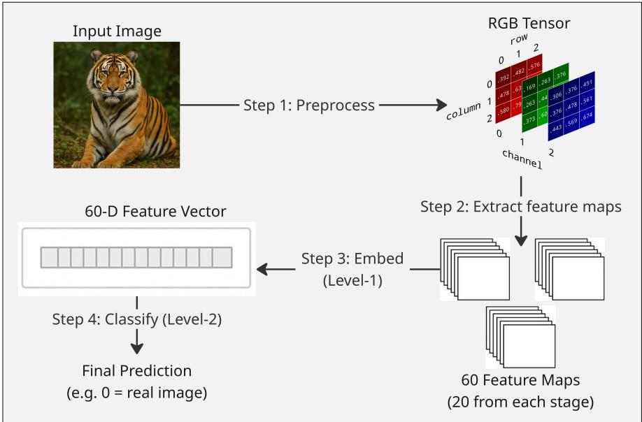
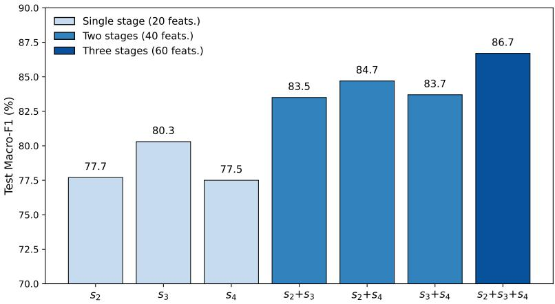
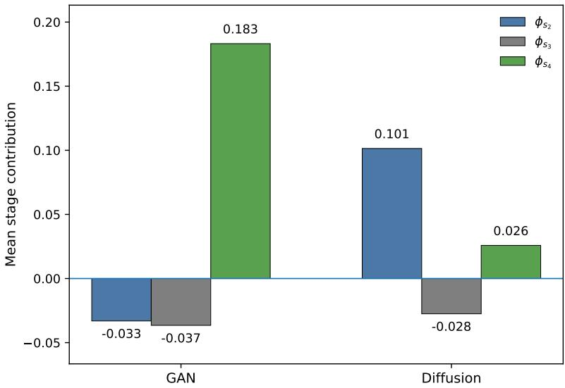
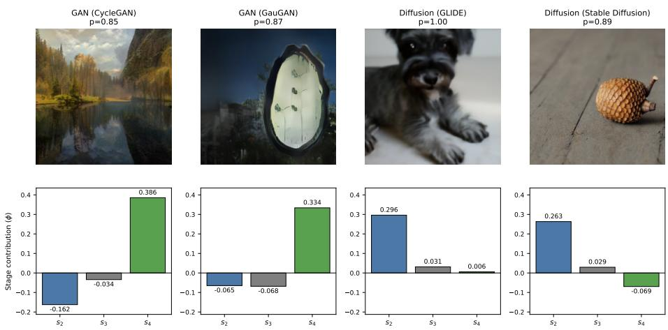

# Hierarchical Channel Stacking: A Structured Decision Framework for AI-Generated Image Detection

Saifullah Shoaib1[0009−0006−3886−6637], Akash Borigi1[0009−0006−1387−8367], Rupendra Lekkala1[0009−0005−6332−3004], Amaury   
Lendasse1[0000−0001−5410−4751], Edward Ratner2[0000−0002−5456−8916], Sai Sowjanya Bhamidipati3[0009−0001−7336−0096], Alexander   
Schlager3[0009−0005−7739−8509], and Peggy Lindner1[0000−0002−0447−5690]

1 Missouri University of Science & Technology, Rolla MO 65409, USA sbsr4c@mst.edu 2 University of Houston, Houston TX 77479, USA Cranium AI, Inc., Short Hills NJ 07078, USA

Preprint based on the manuscript originally submitted to ICANN 2026. This work has subsequently been accepted for publication at ICANN 2026.

Abstract. Many synthetic-image detectors produce accurate predictions but ofer limited insight into how those decisions are formed. This paper introduces Hierarchical Channel Stacking (HCS), a compact framework for AI-generated image detection that converts intermediate CNN activations into a structured 60-dimensional representation organized across three progressively deeper backbone stages. HCS uses per-channel Level-1 classifiers and a Level-2 aggregator to produce image-level predictions while preserving explicit hierarchical structure for analysis. On a benchmark spanning GAN and difusion generators, HCS achieves 86.7% accuracy and 86.7% macro-F1 on the held-out test set. Stage ablation shows that the full three-stage system outperforms reduced single-stage and two-stage variants, indicating that the hierarchy carries complementary predictive information. Stage-level contribution analysis further shows that, in the analyzed detector setting, fake GAN and fake difusion images exhibit distinct stage-level contribution profiles. These results position HCS not simply as a compact detector, but as a structured framework for studying how synthetic-image detectors assemble evidence across representation levels.

Keywords: AI-generated image detection · model interpretability · hierarchical feature stacking · difusion models · generative adversarial networks.

## 1 Introduction

AI-generated imagery is increasingly dificult to distinguish from real photographs, creating practical challenges for media verification, misinformation analysis, and forensic screening. Modern generators now span multiple families, including Generative Adversarial Networks (GANs) and difusion models, and reliable detection remains an important problem for computer vision and trustworthy AI.

At the same time, many strong synthetic-image detectors are dificult to analyze. They may produce accurate predictions while ofering limited insight into what drove those decisions. In this paper, we study a diferent design objective: not only whether a detector can classify images efectively, but whether its decision process can be made directly analyzable.

To this end, we introduce Hierarchical Channel Stacking (HCS), a compact detection framework built on a ResNet-50 backbone adapted from Wang et al. [10]. HCS extracts activations from three intermediate stages, selects a small number of discriminative channels from each stage, converts those channels into Level-1 probability estimates, and aggregates them into a 60-dimensional representation scored by a Level-2 classifier. The resulting design preserves explicit stage structure in the final decision interface rather than collapsing all evidence into a single end-to-end prediction. In practical terms, this means that for a given image, we can see which stages pushed the prediction toward fake or toward real, and how strongly. This facilitates forensic analysis, model auditing, failure analysis, and deeper study of how synthetic-image detectors respond to diferent classes of generated images.

The main contributions of this paper are:

– We introduce Hierarchical Channel Stacking (HCS), a compact framework that converts intermediate CNN activations into a structured decision representation for AI-generated image detection.

– We show that the hierarchical structure of HCS is empirically meaningful: the three stages contribute complementary predictive information.

– We analyze stage-level contributions and show that fake GAN and fake diffusion images exhibit distinct contribution patterns, illustrating how HCS makes predictive behavior directly analyzable.

## 2 Related Work

Synthetic-image detection. Synthetic-image detection has developed rapidly alongside advances in image generation. CNNDetection [10] showed that CNN-generated images can often be detected reliably and provided a strong backbone for subsequent synthetic-image detection studies. GenImage [14] expanded the evaluation landscape by providing a large-scale benchmark spanning multiple difusion generators, making it easier to study synthetic-image detection across major generator families. These works motivate the setting considered here: detection on a benchmark that includes both GAN and difusion sources.

Intermediate-feature and structured detector designs. A second line of work has explored detector designs that move beyond monolithic end-to-end classification, often with the goal of improving robustness or generalization. Some approaches emphasize feature domains thought to be more stable under generator shift, such as frequency-based cues [9], while others study transformation-based perspectives for improving synthetic-image detection [6]. More broadly, the use of intermediate CNN representations has long been important in visual recognition and analysis, since diferent layers capture diferent levels of abstraction [12]. HCS is related to this intermediate-feature perspective, but difers in its objective. Rather than proposing another end-to-end detector built around alternative cues, HCS converts selected intermediate activations into a compact, explicitly stage-organized representation that preserves a structured interface for final decision analysis.

Explainability and detector analysis. Recent work has also highlighted the need to understand how synthetic-image detectors behave under changing generator distributions, including settings with limited or no direct access to targetgenerator data [3, 4]. More broadly, much of the recent literature emphasizes detection performance, robustness, or generalization behavior. In contrast, this paper positions HCS as a compact detector-analysis framework. The contribution is a detector design that preserves explicit stage structure in the final representation, enabling direct study of how hierarchical evidence is distributed across stages for diferent source families.

## 3 Method

## 3.1 Overview

Given an input image $I ,$ the HCS framework converts intermediate CNN activations into a compact, stacked representation and a single image-level decision. We use three intermediate ResNet-50 stages, denoted $s _ { 2 } , s _ { 3 } ,$ , and $s _ { 4 }$ [5]. In our implementation, these correspond to the standard PyTorch ResNet-50 residual groups layer1, layer2, and layer3, respectively. We treat these stages as three progressively deeper representation levels within the backbone. Earlier stages retain more spatially local, lower-level information, while later stages reflect increasingly integrated and abstract feature representations over larger receptive fields. These stages serve as operationally defined levels of the network hierarchy that allow us to ask whether synthetic-image evidence is concentrated more strongly in earlier, middle, or later backbone representations. Let $K = 6 0$ be the total number of selected channels (Sec. 3.3). For each selected channel $k ,$ a dedicated Level-1 Random Forest (RF) [1] produces a probability $p _ { k } \in [ 0 , 1 ]$ Stacking $\{ p _ { k } \} _ { k = 1 } ^ { K }$ yields a 60-dimensional vector $v \in \mathbb { R } ^ { 6 0 }$ , which a Level-2 RF then maps to the final probability $\hat { y } = g ( v ) \in [ 0 , 1 ]$ . This two-level design, shown in Fig. 1, is the core of the Hierarchical Channel Stacking (HCS) approach.

## 3.2 Hierarchical Channel Stacking: inference pipeline

Step 1: Preprocess. I is resized to 256 × 256 and ImageNet normalization is applied, producing a tensor fed to the ResNet-50 backbone.

  
Fig. 1. Overview of the hierarchical channel stacking inference pipeline.

Step 2: Extract intermediate feature maps. The tensor is passed through the ResNet-50 backbone to extract feature maps (i.e., activations) at stages $s _ { 2 } -$ $s _ { 4 }$ . The backbone uses the fine-tuned weights of [10]. For each of the K selected channels, this yields a corresponding feature map $F _ { k }$

Step 3: Embed per-channel probabilities (Level-1). Each $F _ { k }$ is flattened to $x _ { k }$ and scored by a channel-specific RF $f _ { k } ( \cdot )$ , yielding $p _ { k } = f _ { k } ( x _ { k } )$ . Concatenating all 60 per-channel probabilities forms the image embedding

$$
v = [ p _ { 1 } , \ldots , p _ { 6 0 } ] \in \mathbb { R } ^ { 6 0 } .\tag{1}
$$

Step 4: Classify image (Level-2). The 60-D vector v is input to a Level-2 RF g(·) that outputs the final fake-vs-real probability $\hat { y } = g ( v )$ . A threshold of 0.5 converts yˆ to a label for reporting.

## 3.3 Training details

Level-1 training. The data is partitioned into train/val A/val B/test (70/10/ 10/10), stratified by class and generator. Level-1 RFs are first trained for all channels in stages $s _ { 2 } - s _ { 4 }$ using the train split.

Channel selection. Using a class- and generator-balanced validation split (val A), channel-wise discriminative power is evaluated. Channels are ranked by stand-alone macro-F1 of their L1 RFs. The top 20 channels per stage (60 total) are retained, yielding a compact 60-dimensional representation. This dimensionality was chosen based on a feature count sweep (Sec. 5.1).

Level-1 hyperparameter tuning. For the selected channels, RF hyperparameters are tuned with a compact randomized search plus local refinement, selecting by macro-F1 on val B. The tuned L1 models are then refit on the full train split.

Leakage control via out-of-fold (OOF) scoring. To avoid leakage when producing the train split’s features for Level-2, out-of-fold (OOF) probabilities are generated: the train split is partitioned into 5 folds (stratified by class and generator), five L1 models per channel are fit (each excluding one fold), and each sample is scored by the model that did not see it. This produces leakage-safe features in alignment with stacked generalization [11]. For val A, val B, and test, a single tuned L1 per channel trained on the full train split is used.

Level-2 training. The Level-2 RF is fit using OOF-built embeddings for train.   
Metrics are reported on the test set.

## 3.4 Stage-level contribution analysis

Because the HCS representation is organized by stage, the final Level-2 decision can be decomposed into stage-wise contributions. We partition the 60- dimensional Level-2 input as

$$
v = [ v ^ { ( s _ { 2 } ) } , v ^ { ( s _ { 3 } ) } , v ^ { ( s _ { 4 } ) } ] ,\tag{2}
$$

where each $\boldsymbol { v } ^ { ( s ) } \in \mathbb { R } ^ { 2 0 }$ contains the retained Level-1 outputs from stage s. Since these groups correspond to earlier, middle, and deeper levels of the backbone, the decomposition provides a view of where in the hierarchy the Level-2 classifier draws predictive evidence.

To quantify the contribution of each stage to the final prediction, we compute an exact groupwise Shapley decomposition over the three stage groups. Since there are only three groups, all $2 ^ { 3 } = 8$ subsets of $\{ s _ { 2 } , s _ { 3 } , s _ { 4 } \}$ can be evaluated exactly. For any subset of present stages, absent stages are replaced by a baseline vector given by the train-set mean of the 60-dimensional HCS representation.

For a stage group $i \in \{ s _ { 2 } , s _ { 3 } , s _ { 4 } \}$ , the corresponding Shapley value is defined as

$$
\phi _ { i } = \sum _ { S \subseteq G \setminus \{ i \} } { \frac { | S | ! ( | G | - | S | - 1 ) ! } { | G | ! } } { \Big ( } { \hat { y } } ( v _ { S \cup \{ i \} } ) - { \hat { y } } ( v _ { S } ) { \Big ) } ,\tag{3}
$$

where $G = \{ s _ { 2 } , s _ { 3 } , s _ { 4 } \} , S$ denotes any subset of the remaining stage groups after excluding i, v denotes the Level-2 input in which only the stage groups in $S$ are present and all other groups are replaced by the baseline vector, and ${ \hat { y } } ( \cdot )$ is the Level-2 prediction.

The resulting stage-level Shapley values $\phi _ { s _ { 2 } } , \phi _ { s _ { 3 } } , \phi _ { s _ { 4 } }$ measure the contribution of each stage relative to the baseline prediction. Positive values support the fake class, while negative values oppose it. Let $v _ { \mathrm { b a s e } }$ denote the baseline vector. The decomposition is additive so that

$$
\hat { y } ( v ) - \hat { y } ( v _ { \mathrm { b a s e } } ) = \phi _ { s _ { 2 } } + \phi _ { s _ { 3 } } + \phi _ { s _ { 4 } } ,\tag{4}
$$

up to negligible numerical reconstruction error.

Table 1. Dataset composition.
<table><tr><td>Category</td><td>Count</td><td>% of dataset</td></tr><tr><td>Total</td><td>89,232</td><td>100.00</td></tr><tr><td>Real</td><td>44,616</td><td>50.00</td></tr><tr><td>Fake</td><td>44,616</td><td>50.00</td></tr><tr><td>GAN</td><td>22,308</td><td>25.00</td></tr><tr><td>Diffusion</td><td>22,308</td><td>25.00</td></tr></table>

## 4 Data and Evaluation Protocol

## 4.1 Benchmark and splits

HCS is evaluated on a balanced benchmark constructed from two established synthetic-image detection resources. The GAN portion is drawn from the Foren-Synths benchmark introduced by Wang et al. [10], while the difusion-model portion is drawn from GenImage [14]. The benchmark is class-balanced, with equal numbers of real and fake images, and family-balanced, with equal total representation from GAN and difusion sources. Real images are sampled to match the content distribution of the fake subsets, so that real/fake diferences are not driven primarily by content or scene composition. Within the fake class, the GAN subset includes seven generators (BigGAN [2], CycleGAN [13], Gau-GAN, ProGAN, StarGAN, StyleGAN, StyleGAN2), and the difusion subset includes two generators (GLIDE [7], Stable Difusion/Latent Difusion [8]).

The full benchmark is partitioned into train/val A/val B/test splits in a 70/10/10/10 ratio, stratified by class and generator. The train split is used to fit Level-1 models, val A is used for stage-wise channel selection, val B is used for Level-1 hyperparameter tuning, and test is reserved for final evaluation.

A summary of the benchmark composition is given in Table 1.

## 4.2 Evaluation protocol

The evaluation protocol is a held-out-sample protocol over seen generators. Because the splits are stratified by generator, train and test contain disjoint images from the same generator set rather than unseen generators or unseen generator families. Accordingly, the reported results do not establish leave-one-generatorout or leave-one-family-out generalization. Instead, they support evaluation of HCS on a balanced multi-family benchmark under leakage-safe stacked training, together with analysis of how the model distributes decision evidence across stages.

## 5 Results

This section evaluates HCS from three perspectives. First, we assess whether the compact 60-dimensional representation supports meaningful held-out performance and how it relates to baselines. Second, we test whether the hierarchical structure is empirically meaningful by comparing the full three-stage system against reduced variants. Third, we examine what the hierarchy reveals about detector behavior through stage-level contribution analysis, with emphasis on the fake-only GAN versus difusion comparison.

Table 2. Test set results for HCS and selected baselines.
<table><tr><td>Method</td><td>Interface</td><td>Acc.</td><td>Macro-F1</td><td>AUC</td><td>Transparency</td></tr><tr><td>ResNet + LR</td><td>2048-D</td><td>84.6</td><td>84.6</td><td>0.920</td><td>Limited</td></tr><tr><td>ResNet + RF</td><td>2048-D</td><td>78.6</td><td>78.6</td><td>0.869</td><td>Limited</td></tr><tr><td>ResNet + MLP</td><td>2048-D</td><td>89.2</td><td>89.2</td><td>0.962</td><td>Limited</td></tr><tr><td>CNNDetection</td><td>End-to-end</td><td>64.4</td><td>59.4</td><td>0.822</td><td>Opaque</td></tr><tr><td>Fine-tuned ResNet</td><td>End-to-end</td><td>99.4</td><td>99.4</td><td>0.999</td><td>Opaque</td></tr><tr><td>HCS</td><td>60-D</td><td>86.7</td><td>86.7</td><td>0.943</td><td>Structured</td></tr></table>

## 5.1 HCS performance and baseline comparison

Overall, HCS achieves 86.7% accuracy and 86.7% macro-F1, indicating that the compact 60-dimensional representation preserves substantial discriminative information despite being far smaller than the original intermediate activation space. This dimensionality was chosen based on a feature count sweep: performance improves rapidly at smaller feature counts and then plateaus, with only marginal gains beyond approximately 60 features. At the family level, HCS performs better on GAN images than on difusion images, reaching 89.3% macro-F1 on the GAN subset and 83.9% macro-F1 on the difusion subset. The results show that the HCS representation remains strong enough to support the structural and stage-level analyses presented in Secs. 5.2 and 5.3.

The baseline comparison summarized in Table 2 clarifies the role of HCS in the design space. The baselines considered here include simple classifiers on frozen ResNet-50 features, the original CNNDetection classifier [10], and a finetuned ResNet-50 reference. In particular, the fine-tuned ResNet-50 model serves as a strong black-box in-domain reference and substantially outperforms HCS in raw detection accuracy on the present protocol. HCS should therefore not be interpreted as the strongest end-to-end detector in this comparison. However, the comparison also makes clear what is distinctive about HCS. Standard end-to-end baselines provide predictions, but they do not expose an explicit stage-structured representation of the final decision. By contrast, HCS inserts a structured interface between the backbone and the image-level classifier: each Level-2 input dimension corresponds to a selected channel drawn from a known stage, and the three stages are represented symmetrically. The contribution of HCS is therefore comparative rather than competitive: it trades some raw predictive performance for a structured decision-analysis capability that the stronger black-box baselines do not provide.

  
Fig. 2. Stage ablation of HCS on the test set.

## 5.2 Why the hierarchy matters

We next test whether the hierarchy in HCS is empirically meaningful. Figure 2 compares the full three-stage HCS model against reduced variants constructed from single stages and stage pairs. The full model performs best, achieving 86.7% test macro-F1, while all reduced variants perform worse. This establishes that the hierarchical structure is not arbitrary: diferent stages contribute complementary predictive information, and combining them improves performance and is a functionally important component of the HCS design.

Among the single-stage variants, the middle stage $s _ { 3 }$ is the strongest in isolation, reaching 80.3 macro-F1, while $s _ { 2 }$ and $s _ { 4 }$ are both weaker as standalone inputs. The strongest reduced pair is $s _ { 2 } + s _ { 4 }$ , which reaches 84.7 macro-F1, outperforming both $s _ { 2 } + s _ { 3 }$ and $s _ { 3 } + s _ { 4 }$ , but still remaining below the full three-stage system. Taken together, these results support three conclusions. First, the full three-stage system outperforms all reduced alternatives, including every singlestage and two-stage variant. Second, no single stage dominates the hierarchy: although $s _ { 3 }$ is strongest in isolation, it does not subsume the contribution of the other stages. Third, the strongest reduced pair suggests that the hierarchy benefits from combining distinct evidence sources across stages. We therefore conclude that, within the analyzed CNNDetection-derived backbone [10], the three HCS stages carry complementary predictive information, and that the hierarchical structure is functionally meaningful rather than merely organizational. This result is important not only for performance, but also for analysis: because the HCS representation is explicitly organized by stage, it becomes possible to examine how diferent levels of the backbone contribute to the final decision, an interface that is not directly available in standard end-to-end baselines.

  
Fig. 3. Family-level stage contributions for fake images.

## 5.3 What the hierarchy reveals

Having established that the hierarchy matters structurally, we next examine what it reveals about detector behavior. Because the Level-2 input is explicitly partitioned by stage, the final HCS decision can be decomposed into stage-level contributions. In practical terms, this lets us see, for any given image, which stages pushed the prediction toward fake or toward real, and how strongly. A brief real-vs-fake comparison helps set up the family-specific analysis. At a high level, real images are pushed toward the real class by broader agreement across stages, whereas fake images are supported by a more uneven configuration of stage-level evidence. This asymmetry suggests that the detector does not use the hierarchy in the same way for the two classes, motivating a closer look at fake images only.

The analysis is therefore restricted to fake images, with GAN and difusion sources compared directly. Figure 3 shows that, within this detector instantiation, GAN and difusion images are associated with diferent weighting across earlier versus deeper backbone representations, and accordingly, the two families follow distinct stage-level contribution profiles. GAN fake images receive their strongest positive support from the deeper stage $s _ { 4 } .$ whereas difusion fake images receive their strongest positive support from the earlier stage $s _ { 2 } .$ . In both families, the middle stage $s _ { 3 }$ contributes less strongly on average than the dominant stage and may even contribute slightly in the opposing direction. This is a central interpretive result: HCS makes family-dependent hierarchical detector behavior directly observable rather than collapsing all evidence into a single opaque prediction.

  
Fig. 4. Representative fake-image examples with stage-level HCS contributions.

Figure 4 complements this aggregate comparison by grounding the familylevel pattern in individual examples. In the representative GAN cases, the strongest positive contribution comes from s4, whereas in the representative difusion cases, the strongest positive contribution comes from s . This shows that the familylevel averages can correspond to recognizable stage-level configurations at the level of concrete test examples.

This family-level analysis also helps explain the earlier ablation result. If diferent source families rely more heavily on diferent parts of the hierarchy, then combining stages is not merely redundant aggregation; it is one reason the full three-stage system outperforms its reduced variants.

These results should nevertheless be interpreted carefully. They should not be read as evidence of universal family semantics or as showing that GANs intrinsically “belong” to one stage and difusion models to another. The appropriate conclusion is narrower: within the present HCS instantiation and benchmark composition, fake GAN and difusion images induce diferent stage-level contribution profiles. The value of HCS is not that it proves universal family semantics, but that it makes detector-specific hierarchical structure directly observable. In this sense, the GAN-versus-difusion comparison serves as a case study of what HCS can reveal that a monolithic end-to-end prediction does not expose.

## 5.4 Limitations and future work

The results should be interpreted within the scope of the present study. The evaluation protocol is a held-out-sample protocol over seen generators, so the reported results do not address unseen-generator or unseen-family generalization. The family-level stage-contribution analysis is also tied to a benchmark composition in which the GAN and difusion subsets come from diferent sources, meaning that part of the observed family-level separation may reflect sourcebenchmark efects in addition to generator-family efects. More broadly, the reported contribution profiles are specific to the analyzed detector instantiation and backbone. Robustness under common post-processing operations such as compression or resizing is not evaluated here. Future work should therefore test HCS under stronger generalization settings, and evaluate robustness under post-processing. The analysis could also be extended from the stage level to the channel level, since the current framework preserves explicit channel identities that may support finer-grained family-specific or failure-specific study.

Overall, the most promising future work is not merely to make HCS more accurate, but to deepen its role as a framework for studying how synthetic-image detectors use hierarchical evidence under changing data conditions and model choices.

## 6 Conclusion

This paper introduced Hierarchical Channel Stacking (HCS), a compact stagedecomposable framework for AI-generated image detection. Rather than treating detection solely as an end-to-end prediction problem, HCS organizes intermediate backbone evidence into a structured 60-dimensional representation that makes the final decision directly analyzable.

The results showed that this hierarchical structure is empirically meaningful. The full three-stage HCS system outperformed reduced single-stage and twostage variants, indicating that the hierarchy captures complementary predictive information across multiple representation levels. Stage-level contribution analysis further showed that, within the analyzed detector and benchmark setting, fake GAN and fake difusion images induce distinct contribution profiles across stages. These results demonstrate that HCS can reveal aspects of detector behavior that would remain hidden in a monolithic black-box prediction.

More broadly, the value of HCS is not simply that it produces a compact detector, but that it turns synthetic-image detection into something that can be studied more directly. Instead of asking only whether a detector is correct, HCS makes it possible to examine how evidence is assembled across representation levels, how that process difers across source families, and how failure modes emerge. In this sense, HCS is best understood not only as a detection method, but as a framework for studying how synthetic-image detectors make decisions. Its broader promise lies in making detector behavior easier to inspect, compare, and question as generative image models continue to evolve.

Disclosure of Interests. The authors have no competing interests to declare that are relevant to the content of this article.

## References

1. Breiman, L.: Random forests. Machine Learning 45(1), 5–32 (2001). https://doi.org/10.1023/A:1010933404324

2. Brock, A., Donahue, J., Simonyan, K.: Large scale GAN training for high fidelity natural image synthesis. In: International Conference on Learning Representations (ICLR). OpenReview.net (2019)

3. Cheng, J., Yan, Z., Zhang, Y., Luo, Y., Wang, Z., Li, C.: Can we leave deepfake data behind in training deepfake detector? In: Advances in Neural Information Processing Systems. vol. 37, pp. 21979–21998 (2024). https://doi.org/10.52202/079017- 0691, neurIPS 2024

4. Cozzolino, D., Poggi, G., Nießner, M., Verdoliva, L.: Zero-shot detection of AIgenerated images. In: Computer Vision – ECCV 2024. Lecture Notes in Computer Science, vol. 15076, pp. 54–72. Springer (2024). https://doi.org/10.1007/978-3-031- 72649-1\_4

5. He, K., Zhang, X., Ren, S., Sun, J.: Deep residual learning for image recognition. In: Proceedings of the IEEE Conference on Computer Vision and Pattern Recognition (CVPR). pp. 770–778 (2016). https://doi.org/10.1109/CVPR.2016.90

6. Li, O., Cai, J., Hao, Y., Jiang, X., Hu, Y., Feng, F.: Improving synthetic image detection towards generalization: An image transformation perspective. In: Proceedings of the 31st ACM SIGKDD Conference on Knowledge Discovery and Data Mining (KDD ’25). pp. 2405–2414. Association for Computing Machinery (2025). https://doi.org/10.1145/3690624.3709392

7. Nichol, A.Q., Dhariwal, P., Ramesh, A., Shyam, P., Mishkin, P., McGrew, B., Sutskever, I., Chen, M.: GLIDE: Towards photorealistic image generation and editing with text-guided difusion models. In: Proceedings of the 39th International Conference on Machine Learning. vol. 162, pp. 16784–16804. PMLR (Jul 2022)

8. Rombach, R., Blattmann, A., Lorenz, D., Esser, P., Ommer, B.: High-resolution image synthesis with latent difusion models. In: 2022 IEEE/CVF Conference on Computer Vision and Pattern Recognition (CVPR). pp. 10674–10685 (2022). https://doi.org/10.1109/CVPR52688.2022.01042

9. Tan, C., Zhao, Y., Wei, S., Gu, G., Liu, P., Wei, Y.: Frequency-aware deepfake detection: Improving generalizability through frequency space domain learning. In: Proceedings of the AAAI Conference on Artificial Intelligence. vol. 38, pp. 5052–5060 (2024). https://doi.org/10.1609/aaai.v38i5.28310

10. Wang, S.Y., Wang, O., Zhang, R., Owens, A., Efros, A.A.: CNN-generated images are surprisingly easy to spot... for now. In: Proceedings of the IEEE/CVF Conference on Computer Vision and Pattern Recognition (CVPR). pp. 8692–8701 (2020). https://doi.org/10.1109/CVPR42600.2020.00872

11. Wolpert, D.H.: Stacked generalization. Neural Networks 5(2), 241–259 (1992). https://doi.org/10.1016/S0893-6080(05)80023-1

12. Zeiler, M.D., Fergus, R.: Visualizing and understanding convolutional networks. In: Computer Vision – ECCV 2014. Lecture Notes in Computer Science, vol. 8689, pp. 818–833. Springer (2014). https://doi.org/10.1007/978-3-319-10590-1\_53

13. Zhu, J., Park, T., Isola, P., Efros, A.A.: Unpaired image-to-image translation using cycle-consistent adversarial networks. In: Proceedings of the IEEE International Conference on Computer Vision (ICCV). pp. 2223–2232 (2017). https://doi.org/10.1109/ICCV.2017.244

14. Zhu, M., Chen, H., Yan, Q., Huang, X., Lin, G., Li, W., Tu, Z., Hu, H., Hu, J., Wang, Y.: GenImage: A million-scale benchmark for detecting AI-generated image. In: Advances in Neural Information Processing Systems (NeurIPS), Datasets and Benchmarks Track. vol. 36 (2023), neurIPS 2023 Datasets and Benchmarks