# How Language Models Organize and Structure Moral Knowledge

Orion Reblitz-Richardson

## Abstract

How do large language models (LLMs) organize moral knowledge? Models detect moral content broadly, but detection is a low bar. We ask whether they go further, distinguishing moral foundations from one another and organizing the relationships between them geometrically.

We train six independent linear probes on open-weight language models, one per Moral Foundations Theory (MFT) category (care/harm, fair/cheat, lib/oppress, loy/betray, auth/subv, sanc/degrade), and examine how the resulting directions relate to each other in representation space. We find the directions neither collapse into a single moral detector nor isolate from one another. Rather, they span a near-maximal number of independent dimensions while sharing a positive common component. The shared component is the signature of integration, and it is moral-specific relative to a matched non-moral concept battery built identically (mean pairwise cosine 0.26 vs. 0.013).

The geometry is consistent across architectures and scale and reaches its integration regime early in pre-training, well before probe accuracy saturates. The structure the model discovers shows no evidence of the individualizing/binding distinction predicted by Moral Foundations Theory (an underpowered test: only 20 candidate partitions exist) but rather reflects corpus statistics. Extending to moral dilemmas, each dilemma direction partially composes from its component foundations, at 2.7× a mismatched-pair baseline, while the majority of its variance encodes conflict-specific structure. The model represents moral tension itself, not a pre-resolved judgment.

## 1 Introduction

How do language models represent morality? Prior work in this series established that models encode moral content broadly: probing accuracy saturates early during pre-training and spans nearly all layers (Reblitz-Richardson, 2026b). Fragility testing revealed that this encoding grows more robust throughout training even after accuracy plateaus. Extension to mixture-of-experts (MoE) models showed that moral signal is uniform across experts, with no expert specialization, but that a 74× output scale gap produces structural fragility (Reblitz-Richardson, 2026a).

Both papers treated moral encoding as a single binary feature: moral vs. neutral. A model that merely detects “this text involves morality" has cleared a low bar. Genuine moral understanding requires structured representations: the ability to distinguish care from fairness, loyalty from authority, and to encode the relationships between them. The transition from moral detection to moral understanding is the subject of this paper.

We operationalize this transition through the geometry of foundation-specific probe directions. Where prior work trained one probe to separate moral from neutral content, we train six: one for each Moral Foundations Theory (MFT) foundation (Graham et al., 2013, Haidt, 2012). The learned probe weight vectors define directions in the model's representation space. The angular relationships between these directions reveal whether the model has developed structured moral representations.

Three geometric signatures correspond to three qualitatively different modes of moral representation:

1. Collapse. All foundation directions converge toward a single “moral salience" direction. The model detects moral relevance but does not distinguish frameworks.² This is detection without structure.

2. Isolation. Foundation directions are orthogonal with no relational structure. The model has separate moral “slots" but no representation of how frameworks relate. This is structure without coherence.

3. Integration. Foundation directions are separated but non-orthogonal, with inter-framework geometry reflecting known relationships from moral psychology. This is the precondition for moral reasoning.

Applied to OLMo-2 1B and OLMoE-1B-7B (with a dense OLMo-2 7B as a scale check), we report three findings:

Finding 1: Moral foundations are represented with integration geometry, but we find no evidence of the structure moral psychology predicts. Foundation directions are distinct: mean pairwise cosine similarity is ≈ 0.22–0.27 across layers, positive everywhere and far from collapse. This positive shared component is the integration signature. Against a matched non-moral concept battery built identically to the foundations, it is \~20× larger (0.26 vs. 0.013; paired $\Delta = 0 . 2 2 3$ CI [0.202, 0.244], excluding 0; Section 4.2), so the shared component is moral-specific relative to a matched non-moral battery rather than a generic content-vs-neutral axis (whether it is specifically moral rather than generic affective salience is the one residual control we flag; §5.6). The six directions span 5 effective dimensions at every layer, which rules out collapse but, at the ceiling for six mean-centered directions, does not by itself separate integration from isolation. Hierarchical clustering does not recover the MFT individualizing/binding split at either the dense 1B or 7B, though the group-structure test is underpowered (smallest achievable $p = 0 . 0 5$ , so a small effect is not excluded); the most consistent structure the model forms is a care-sanctity pairing that crosses MFT groups.

Finding 2: The geometry of moral dilemmas is partially compositional. Probes for 15 twofoundation dilemmas reach 94.2% mean accuracy, and each dilemma direction is partly explained by the 2D subspace of its two component foundation directions. Dilemma pairs that share a component foundation are closer in representation space than those that do not (mean cosine 0.273 vs. 0.196, permutation $p = 0 . 0 0 0 1 )$ , and the MoE architecture preserves this compositional structure.

Finding 3: Output dilution degrades every foundation uniformly, not selectively. Extending the fragility protocol to per-foundation probes shows a uniform cross-architecture effect rather than a per-foundation one: once accuracy is averaged over multiple noise seeds, every foundation is more fragile in MoE than in dense $( \mathsf { a } \sim 2 . 3 \times \mathsf { g a p } )$ , and no single foundation is reliably most or least robust within an architecture. An apparent complexity-fragility ordering does not survive scale normalization (§4.11). Output dilution suppresses moral encoding across the board.

This paper introduces probe-direction geometry, a method for measuring structured moral representations that bridges binary moral probing and the richer structure posited by moral psychology. With it, we give the first geometric characterization of foundation and dilemma representations in base language models, and show that this geometry is comparable across dense and MoE architectures and stable from 1B to 7B. We also report the first per-foundation fragility comparison across architectures which finds that output dilution degrades moral encoding uniformly rather than selectively.

## 2 Related Work

## 2.1 Probing for linguistic and semantic structure

Linear probing (Alain and Bengio, 2017) has become a standard tool for reading off what information is encoded in neural network representations. Conneau et al. (2018) probed sentence embeddings for syntactic properties; subsequent work probed for part-of-speech, dependency relations, coreference, and world knowledge. The linear representation hypothesis (Park et al., 2024) formalizes the claim that concepts are encoded as directions in representation space, precisely the assumption underlying our use of probe weight vectors as geometric objects.

Two limitations of the probing literature motivate our approach. First, most probing studies report only accuracy, discarding the learned probe parameters. We show that the probe weight vector (the normal to the classification hyperplane) carries geometric information about how concepts relate to each other. Second, probing studies typically train one probe per concept, treating concepts as independent. Our multi-probe geometric analysis recovers inter-concept structure from independently trained probes.

## 2.2 Geometry of concept representations

Bolukbasi et al. (2016) demonstrated that gender bias in word embeddings manifests as a geometric subspace, and that debiasing amounts to projecting out a direction. Arditi et al. (2024) showed that refusal behavior in instruction-tuned LLMs is mediated by a single direction in activation space. These results establish the precedent that high-level behavioral properties can be localized to specific directions.

Our work extends this line from single directions to sets of related directions. Where prior work asked “where is concept $X ? ^ { \dag }$ we ask “what is the geometric relationship between concepts $X _ { 1 } , \ldots , X _ { k } ? ^ { \prime }$ The cosine similarity matrix between foundation probe directions is a form of representational similarity analysis (RSA; Kriegeskorte et al., 2008) applied not to stimulus response patterns but to the probes that decode them.

## 2.3 Moral psychology and Moral Foundations Theory

Moral Foundations Theory (MFT; Graham et al., 2013, Haidt, 2012) posits that human moral judgment draws on (at least) five or six innate foundations: care/harm, fairness/cheating, loyalty/betrayal, authority/subversion, sanctity/degradation, and (later added) liberty/oppression. MFT predicts a structural distinction between individualizing foundations (care, fairness, liberty), which protect individuals from harm, and binding foundations (loyalty, authority, sanctity), which bind individuals into groups. This distinction has been validated in cross-cultural surveys and predicts political orientation (Graham et al., 2013).

Alternative taxonomies exist. Curry et al. (2019) propose morality-as-cooperation, identifying seven moral domains grounded in evolutionary game theory. Our use of MFT is pragmatic: the six-foundation taxonomy gives a tractable set of directions for geometric analysis, and the individualizing/binding prediction gives a testable structural hypothesis.

## 2.4 Moral reasoning in language models

Hendrycks et al. (2021) introduced the ETHICS benchmark for evaluating moral reasoning in language models across justice, deontology, virtue, utilitarianism, and commonsense dimensions. Most work in this area evaluates models behaviorally, measuring what outputs models produce in response to moral scenarios. Our approach is representational: we probe the internal geometry of moral encoding, asking not whether the model produces the right moral judgment but whether it has developed structured representations of moral distinctions.

## 2.5 Companion papers

This paper is the third in a series. Paper 1 (Reblitz-Richardson, 2026b) established that moral content is decodable by linear probes from the earliest layer of OLMo-2, that probing accuracy saturates early during pre-training, and that fragility testing (injecting Gaussian noise into activations) resolves the continued development of moral encoding after accuracy plateaus. Paper 2 (Reblitz-Richardson, 2026a) extended the analysis to MoE models (OLMoE-1B-7B), finding uniform moral encoding across experts but a 74× output scale gap that produces structural fragility.

The present paper moves from binary moral encoding (moral vs. neutral) to structured moral encoding (framework-specific directions and their inter-framework geometry). It reuses the probing and fragility protocols from Papers 1 and 2, applying them at the per-foundation level.

## 3 Methodology

We train six foundation-specific linear probes at each transformer layer, extract the learned weight vectors as geometric directions in representation space, and analyze the angular relationships between these directions. The methodology decomposes into five components: foundation-specific probing (Section 3.2), geometric analysis of probe directions (Section 3.3), bootstrap direction stability assessment (Section 3.4), framework-specific fragility testing (Section 3.5), and the probing dataset (Section 3.6). All experiments run on a single MacBook Pro M4 Pro (24 GB unified memory, MPS backend).

## 3.1 Models and comparison design

We evaluate three base (non-instruct) models from the same lab (Ai2). The primary comparison is between two architectures matched in layer count (16), dense vs. mixture-of-experts; a third, larger dense model serves as a scale control (§4.14):

• OLMo-2 1B (a11enai/0LMo-2-0425-1B): dense transformer, 1.5B parameters, 2048 hidden dimension, 16 layers (OLMo Team, 2025). Ai2 publishes 37 early-training checkpoints at 1K-step intervals (steps 0–36K), enabling trajectory analysis.

• OLMoE-1B-7B (a11enai/0LMoE-1B-7B-0924): mixture-of-experts, 6.9B total parameters, 1.3B active, 64 experts per layer, top-8 routing, 2048 hidden dimension, 16 layers (Muennighoff et al., 2024).

• OLMo-2 7B (al1enai/0LMo-2-1124-7B): dense transformer, 7.3B parameters, 4096 hidden dimension, 32 layers (OLMo Team, 2025). Used in §4.14 to test whether the geometry findings persist with scale.

All three models use the same tokenizer and comparable training corpora. The comparison tests whether framework geometry is an artifact of dense connectivity or a general property of transformerbased language modeling. Reblitz-Richardson (2026a) established that moral encoding in OLMoE is uniform across experts with a 74× output scale gap relative to OLMo-2; the present work asks whether this output dilution affects the structure of moral representations, not just their scale.

## 3.2 Foundation-specific probing

For each of the six Moral Foundations Theory (MFT) foundations (care/harm, fairness/cheating, loyalty/betrayal, authority/subversion, sanctity/degradation, and liberty/oppression; (Graham et al., 2013, Haidt, 2012)), we train a binary linear probe at each of 16 transformer layers.

Probe architecture. Each probe is nn.Linear(2048, 1) trained with BCE loss and Adam (lr = $1 0 ^ { - 2 } )$ for 50 epochs. This matches the probe specification from Reblitz-Richardson (2026b) and Reblitz-Richardson (2026a), enabling direct comparison with their binary moral/neutral probes.

Activation collection. For each text, we run a single forward pass capturing all 16 layers simultaneously. At each layer, we mean-pool across the sequence dimension to obtain a single R2048vector per text. Positive examples are the foundation-tagged moral sentences; negative examples are their matched neutral counterparts.

Direction extraction. After training, we extract the weight vector $\mathbf { w } \in \mathbb { R } ^ { 2 0 4 8 }$ from each probe and normalize to unit length: $\hat { \mathbf { w } } = \mathbf { w } / \| \mathbf { w } \|$ . This unit vector is the normal to the classification hyperplane, the direction in representation space that maximally separates the foundation's moral content from neutral content. We call w the foundation's probe direction at a given layer.

This yields $6 \times 1 6 = 9 6$ unit-norm probe direction vectors per model.

## 3.3 Geometric analysis

The paper's core contribution is analyzing the angular relationships between the six foundation probe directions at each layer.

Cosine similarity matrices. At each layer, we compute the $6 \times 6$ pairwise cosine similarity matrix of the foundation probe directions. Because the directions are unit-normalized, $\cos ( \hat { \mathbf { w } } _ { i } , \hat { \mathbf { w } } _ { j } ) = \hat { \mathbf { w } } _ { i } \cdot \hat { \mathbf { w } } _ { j }$

Geometric signatures. Three qualitative modes of moral representation correspond to distinct cosine similarity patterns:

1. Collapse (averaging). All foundation directions converge toward a single “moral salience" direction. Mean pairwise cosine similarity → 1.

2. Isolation. Foundation directions are orthogonal with no relational structure. Mean pairwise cosine similarity → 0.

3. Integration. Foundation directions are separated but non-orthogonal, with inter-framework geometry reflecting known relationships. Mean pairwise cosine similarity in (0, 1) with structured variation.

Effective dimensionality. We compute the effective dimensionality of the 6-direction set at each layer via PCA on the $6 \times 2 0 4 8$ matrix of probe directions. Effective dimensionality is the number of principal components explaining ≥ 90% of variance. Low dimensionality (1–2) indicates collapse; high dimensionality (5–6) indicates separation.

Hierarchical clustering. We apply Ward's method to the cosine distance matrix $( 1 - \cos ( \cdot , \cdot ) )$ at each layer. Dendrograms reveal whether the six foundations cluster into interpretable groups.

Permutation test for MFT group structure. MFT predicts that the six foundations divide into individualizing (care, fairness, liberty) and binding (loyalty, authority, sanctity) clusters (Graham et al., 2013). We test this prediction with a permutation test: compute the observed difference between mean within-group cosine similarity and mean between-group cosine similarity, then permute group assignments 10,000 times to generate the null distribution.

## 3.4 Bootstrap direction stability

With 32 training pairs per foundation in 2048 dimensions, the probe has 2049 parameters and only 64 training examples. The classification accuracy may be robust in this regime (a single hyperplane suffices for binary separation), but the extracted direction could be noisy , and noise in directions contaminates the angular analysis.

We assess direction stability via bootstrap resampling: for each foundation at each layer, we resample the 32 training pairs with replacement 200 times, retrain the probe on each bootstrap sample, and compute the cosine similarity of each bootstrap direction with the full-data direction. A mean bootstrap cosine similarity > 0.8 indicates a stable direction.

This gives a per-layer, per-foundation reliability metric for the geometric analysis. Layers where directions are unstable should be interpreted with caution

## 3.5 Framework-specific fragility

We extend the fragility protocol of Reblitz-Richardson (2026b) to per-foundation probes. For each foundation at each layer:

1. Train a linear probe (fixed seed) on clean activations.

2. Evaluate on clean test activations (baseline accuracy).

3. For each noise level $\sigma \in \{ 0 . 1 , 0 . 3 , 1 . 0 , 3 . 0 , 1 0 . 0 \}$ (extended to $\{ \dots , 3 0 , 1 0 0 \}$ where censoring at $\sigma = 1 0$ is heavy, e.g. the 7B run), add $\mathcal { N } ( 0 , \sigma ^ { 2 } )$ noise to cached test activations and re-evaluate, averaging accuracy over 10 noise seeds.

4. The critical noise $\sigma ^ { * }$ is the smallest σ where the seed-mean accuracy drops below 0.6. Following the convention of Reblitz-Richardson (2026b), a layer whose probe never drops below threshold is censored at the grid maximum (not dropped), and $\sigma ^ { * }$ aggregates are means over all layers with a bootstrap CI over the noise seeds.

We initially asked whether foundations differ in robustness (e.g.

whether care/harm is more robustly encoded than sanctity/degradation), and whether the output dilution effect (Reblitz-Richardson, 2026a) is foundation-uniform. As Section 4.7 reports, once accuracy is seed-averaged the per-foundation $\sigma ^ { * }$ values are not separable; the supported result is the uniform cross-architecture difference, which an RMS-normalized control (§4.11) further attributes to activation scale.

## 3.6 Probing dataset

We use the same 240-pair minimal-pair probing dataset from Reblitz-Richardson (2026b), now used at the per-foundation level: 40 pairs per MFT foundation, stratified 80/20 into 32 train and 8 test pairs per foundation. Each pair consists of a moral sentence tagged with its MFT foundation and a matched neutral sentence controlling for sentence length, syntactic structure, and topic. The dataset was drawn from a 1,200-pair candidate pool generated by Claude Sonnet 4.6 from hand-written seed examples, with automated validation gates (length ratio $\leq 1 . 5 .$ , embedding similarity, keyword scan, deduplication) and LLM-as-judge filtering for neutral-pair quality.

For the geometric analysis, the 32 training pairs per foundation yield 64 training examples (moral + neutral) for the nn . Linear (2048, 1) probe. While this is a small sample for a 2049-parameter model, the bootstrap stability analysis (Section 3.4) directly quantifies whether the resulting directions are reliable.

## 3.7 Dilemma compositionality analysis

Experiments 1–7 establish that the model maintains distinct directions for each moral foundation. A natural follow-up: when two foundations conflict in a moral dilemma, does the model represent the dilemma as a composition of its component foundation directions, or does it develop a qualitatively new representation?

Dilemma dataset. We generate 300 moral dilemma scenarios (20 per each of the ${ \binom { 6 } { 2 } } \ = \ 1 5$ foundation pairs) using Claude Sonnet 4.6, with hand-written seed examples per pair. Each scenario pits two specific foundations against each other (e.g., care vs. authority: “The nurse administered an unapproved painkiller to a dying patient because following protocol meant hours more agony"). Each dilemma text is paired with a matched neutral sentence. All pairs pass automated validation gates (length ratio, keyword scan, deduplication).

Dilemma-specific probes. For each of the 15 foundation pairs, we train a binary linear probe (same architecture as Section 3.2) to distinguish dilemma moral text from matched neutral text. The probe weight vector $\hat { \mathbf { w } } _ { \mathrm { d i l e m m a } }$ is the direction in representation space that separates the dilemma content from neutral content.

Subspace membership score. To measure compositionality, we project each dilemma direction onto the 2D subspace spanned by its two component foundation directions. Given component directions $\hat { \mathbf { w } } _ { A }$ and $\hat { \mathbf { w } } _ { B }$ from Experiment 1, we orthogonalize them via Gram-Schmidt and compute the fraction of the dilemma direction's variance explained by this 2D subspace:

$$
S = \| \mathrm { p r o j } _ { \mathrm { s p a n } ( \hat { \mathbf { w } } _ { A } , \hat { \mathbf { w } } _ { B } ) } \hat { \mathbf { W } } _ { \mathrm { d i l e m m a } } \| ^ { 2 }
$$

A membership score of $S = 1$ indicates full compositionality (the dilemma direction lies entirely within the component subspace); $S = 0$ indicates complete independence. The null baseline for a random unit vector in $\mathbb { R } ^ { \dot { 2 } 0 4 8 }$ projected onto a random 2D subspace has expected membership $2 / 2 0 4 8 \approx 0 . 0 0 1$ . We estimate the empirical null distribution from 10,000 random unit vectors.

Component balance. We decompose the within-subspace projection into components along $\hat { \mathbf { w } } _ { A }$ and the Gram-Schmidt-orthogonalized $\hat { \mathbf { w } } _ { B }$ . The balance ratio (fraction of the projection along the first component) measures whether the dilemma direction is dominated by one foundation or draws equally on both. A ratio near 0.5 indicates balanced composition.

Shared-component geometry. If dilemma representations are partially compositional, dilemma pairs that share a foundation component should have more similar probe directions than pairs with no shared foundation. We test this by comparing the mean cosine similarity between dilemma directions for pairs that share a component (e.g., care-fairness and care-loyalty, which share care) versus pairs with no overlap (e.g., care-fairness and loyalty-sanctity).

Cross-architecture consistency. We repeat the dilemma probing and subspace analysis on OLMoE-1B-7B to test whether the compositionality structure is architecture-specific or general.

## 4 Results

## 4.1 Foundation-specific probe accuracy

All six foundation-specific probes achieve perfect or near-perfect accuracy across the full depth of OLMo-2 1B. Every foundation reaches 100% peak accuracy. Authority/subversion achieves 100% at all 16 layers; the remaining foundations show minor fluctuations at individual layers (minimum 87.5% for care/harm at layer 1). The onset threshold (0.6) is exceeded at layer 0 for all foundations.

These results confirm that moral foundation content is linearly separable from the earliest layer, consistent with the “immediate onset" finding of Reblitz-Richardson (2026b) for the pooled binary moral/neutral probe. The per-foundation decomposition shows no qualitative difference in detectability across foundations: all are equally easy to decode. The interesting variation is not in accuracy but in the geometry of the probe directions that achieve this accuracy.

On OLMoE-1B-7B, all foundations similarly reach 100% peak accuracy, with the lowest early-layer values at 81.25% (layers 0–1). The accuracy profiles are essentially indistinguishable between architectures.

These peak accuracies are maxima over 16 layers on small held-out sets (8–16 examples per foundation), so they should be read as “easily decodable" rather than as precise point estimates: the exact binomial 95% confidence interval on a perfect 16/16 still reaches down to \~0.79. The geometric analysis below, not these saturated accuracies, carries the paper's claims.

## 4.2 Framework geometry: integration, not collapse

The headline finding: foundation probe directions are separated, not collapsed. Across bootstrapstable layers (6–15, where all six directions exceed the 0.8 stability threshold; Section 4.6, with the single exception of authority at layer 8, 0.792), mean pairwise cosine similarity ranges from 0.232 to 0.274, far below the collapse threshold (> 0.95) and below the intermediate zone (0.8–0.95). Figure 1 shows the representative pattern at layer 7 (mean cosine 0.262). The peak-separation layer (layer 0, mean cosine 0.216) is below the bootstrap stability threshold for all foundations and is reported in Appendix C.

The cosine similarities are uniformly positive at all layers (range 0.14–0.35), indicating that the foundation directions share a common component. This is the integration signature from our trichotomy: the directions are separated but non-orthogonal, consistent with a shared moral-salience subspace from which foundation-specific directions deviate.

Effective dimensionality. The six foundation directions span 5 effective dimensions (the number of PCs explaining ≥ 90% of variance) at every layer, confirming that the directions do not collapse into a lower-dimensional subspace. The PCA is computed on the mean-centered direction matrix, so for six directions its maximum is 5 (n – 1); a value of 5 is therefore the ceiling, not a graded signal. Effective dimensionality does not establish integration: six random directions in this hidden space also span \~5 effective dimensions (Section 4.8), so a near-maximal eff-dim is equally consistent with the isolation regime. It rules out collapse, nothing more.

What separates integration from isolation is the uniformly positive mean pairwise cosine (0.26, vs. \~0 for random directions). A prior revision measured this only against a random-vector null and so left open whether the shared component is moral-specific or a generic content-vs-neutral axis that any six loaded-vs-neutral probes would carry. We now calibrate it against a matched non-moral battery: six non-moral concept probes (sentiment, register, grammaticality, tense, number, topic), built identically to the six foundations, same $n = 3 2$ training pairs, the same foundation-specific matched-twin neutrals, the same probe-weight estimator, the same OLMo-2 1B and 16 layers. The matched non-moral directions give a mean pairwise cosine of 0.013 (bootstrap CI [0.005, 0.020]), on the isotropic floor, while the six moral foundations give 0.26. The paired difference, resampling the 32 pairs, is $\Delta = 0 . 2 2 3$ , CI [0.202, 0.244], excluding 0 (Table 1): the moral shared component is \~20× the matched non-moral null. This is a positive control on the control: all six non-moral probes decode at 1.00 peak accuracy, so their near-zero cosine is a genuine absence of a shared axis, not a dead-probe artifact.

Foundation Probe Direction Cosine Similarity (Layer 7) Mean pairwise = 0.2622  
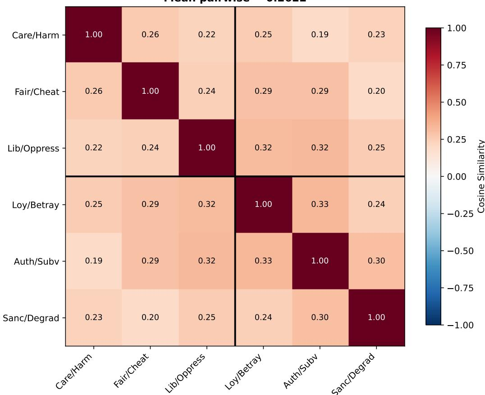  
Figure 1: Pairwise cosine similarity between foundation probe directions at layer 7 (bootstrap-stable; all six foundations exceed the 0.8 stability threshold at this layer; Section 4.6), OLMo-2 1B. Mean off-diagonal cosine = 0.262. See Appendix C for matrices at layers 0 and 15.

Table 1: Calibration ladder for the mean pairwise cosine (OLMo-2 1B, layer 7, probe-weight directions, six concepts per construction; paired bootstrap over the 32 direction-estimation pairs, $n = 2 0 0 )$ The moral shared component sits \~20× above the matched non-moral null and below the shared-neutral-pool construction. Mean-cosine entries are bootstrap means; the direct layer-7 moral point is 0.26 (Figure 1), the \~0.02 gap to the bootstrap mean being resampling attenuation, which widens rather than narrows the moral—non-moral difference. PC1 columns give observed vs. the closed-form $[ 1 + ( k - 1 ) { \bar { c } } ] / k .$
<table><tr><td>construction</td><td>mean cosine</td><td>PC1 (obs / pred)</td><td>peak acc</td></tr><tr><td>isotropic floor</td><td>~0</td><td>≈1/6 (chance)</td><td></td></tr><tr><td>matched non-moral battery</td><td>0.013 [0.005, 0.020]</td><td>0.183 / 0.179</td><td>1.00</td></tr><tr><td>six moral foundations</td><td>0.24 [0.22, 0.25]</td><td>0.388 / 0.387</td><td>0.94-1.00</td></tr><tr><td>shared-neutral-pool (non-moral)</td><td>0.53 [0.51, 0.55]</td><td>0.612 / 0.609</td><td>1.00</td></tr></table>

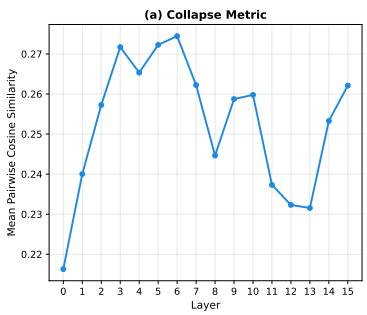

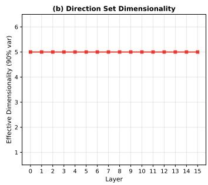

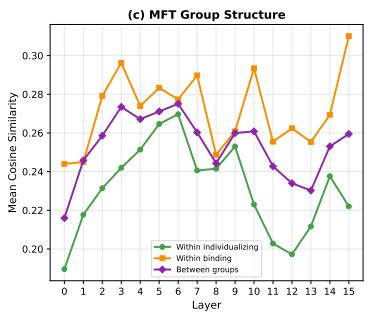  
Figure 2: Layer-wise geometric metrics for OLMo-2 1B. (a) Mean pairwise cosine similarity is relatively flat across layers. (b) Effective dimensionality remains constant at 5 across all layers. (c) MFT group structure: mean cosine within the individualizing group, within the binding group, and between groups track together across layers, so the directions do not separate into the predicted individualizing/binding clusters.

The reviewer's mechanism, a shared axis induced purely by contrasting any loaded content against neutral text, is real, and we can exhibit it: pooling six non-moral marked poles against a single shared set of 40 neutral statements, the construction that maximizes the generic content-vs-neutral axis, gives a mean cosine of 0.53 (bootstrap CI [0.51, 0.55]), higher than the moral 0.26. The moral and matched non-moral probes avoid this inflation by construction: each pole is contrasted against its own foundation-specific matched twin, which cancels the shared neutral direction. That the moral number (0.26) sits far below the shared-pool number (0.53) shows the estimator is not manufacturing the moral shared component; the 0.26 is what survives after the generic axis is differenced out.

The estimator dependence in §4.13 (mean-difference 0.41 vs.

probe-weight 0.22) is consistent with this reading: the cosine magnitude tracks how much of the moral-vs-neutral contrast each estimator retains, and the 0.223 gap is reported on the probeweight estimator used throughout. The concentration of variance on a shared leading axis is not independent corroboration. For k near-equicorrelated unit vectors the first principal component captures $[ 1 + ( k - 1 ) \bar { c } ] / k$ of the variance; this identity is confirmed across all three constructions in Table 1, predicted and observed agreeing $\mathrm { t o } < 0 . 0 1$ (moral 0.387/0.388, non-moral 0.179/0.183, shared-pool 0.609/0.612), which both anchors PC1 as a re-expression of the mean cosine, not a second line of evidence, and validates the estimator. Over the stable layers 6–15 the observed first-PC fraction is 0.379 (ē = 0.26), vs. 0.179 (≈1/6) for six random unit vectors in 2048 dimensions.

The strongest remaining objection is that this battery spans affective, syntactic, stylistic, and topical concepts but does not isolate whether the shared moral axis is specifically moral rather than generic evaluative/affective salience, since moral statements are also emotionally charged. The discriminating control, a matched-twin non-moral valence/affective battery, is named in §5.6 and not run here. Relative to a matched non-moral battery the shared component is moral-specific; affective-vs-moral is the open residual.

## 4.3 Dendrogram structure does not recover MFT groups

Hierarchical clustering of the six foundation directions does not recover the MFT individualizing/binding distinction at any layer. At layer 7, loyalty and authority merge first, liberty joins them, then care and fairness merge separately, then sanctity joins the loyalty-authority-liberty cluster. No layer produces the predicted {care, fairness, liberty } vs. {loyalty, authority, sanctity } partition.

The most consistent clustering pattern across layers is a care-sanctity pairing: these two foundations appear in the same cluster at 10 of 16 layers. This crosses the MFT boundary (care is individualizing, sanctity is binding) but has a plausible semantic interpretation: both foundations concern protection of vulnerable entities (persons from harm, sacred things from degradation). The loyalty-authority pairing at layer 7 is within the binding group, but liberty (individualizing) joins this cluster before grouping with the other individualizing foundations (care, fairness), further mixing MFT categories

The permutation test for the individualizing/binding distinction does not reach significance at any layer (minimum $p = 0 . 3 2 ;$ median $p = 0 . 5 3 )$ . With only 6 items and 20 unique 3–3 partitions, statistical power is limited, but the consistently high p-values combined with the absence of MFTaligned dendrograms at any layer indicate that the model's inter-framework geometry does not reflect the MFT group structure on this dataset.

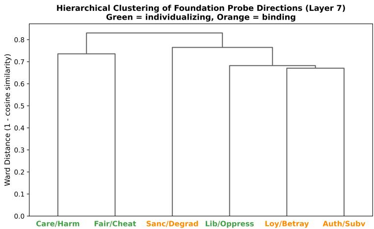  
Figure 3: Hierarchical clustering (Ward's method) of foundation probe directions at layer 7 (bootstrap-stable), OLMo-2 1B. The first split does not recover the MFT individualizing/binding distinction.

## 4.4 Layer-wise geometric development

The geometric structure is relatively stable across layers. Mean pairwise cosine similarity is lowest at layer 0 (0.216), rises modestly to a peak of 0.274 at layer 6, then returns to 0.232 at layer 13 before a slight increase at layer 15 (0.262). The variation is small (range 0.06) compared to the distance from collapse, indicating that framework separation is a consistent property of the representation space rather than an emergent late-layer phenomenon.

Effective dimensionality remains constant at 5 across all layers, meaning the rank of the direction set does not change even as the pairwise angles shift. The geometric structure is a rotation of the direction set within a fixed-rank subspace, not a dimensionality change.

## 4.5 Dense vs. MoE framework geometry

Framework geometry is remarkably similar between architectures. OLMoE-1B-7B shows mean pairwise cosine similarity ranging from 0.219 to 0.287 across layers, compared to OLMo-2 1B's 0.216 to 0.274 (the dense side reuses the Section 4.4 exp1 directions, so this range is the same one reported there; the two architectures’ directions are estimated by the identical probe-weight procedure). Effective dimensionality is 5 at all layers for both models. The overall degree of framework separation is consistent across dense and MoE architectures.

Neither architecture produces MFT-aligned dendrogram structure at any layer. Both models show the care-sanctity pairing as the most stable clustering feature, suggesting that inter-framework geometry is driven by semantic relationships in the training corpus rather than by architectural properties. The permutation test for MFT group structure is non-significant at all layers for both models (all p > 0.25).

This finding extends Reblitz-Richardson (2026a): output dilution affects moral encoding scale (74× signal gap) but not framework structure. The geometric organization of moral foundations is preserved across architectures.

## 4.6 Direction stability under bootstrap

Bootstrap resampling (200 iterations) shows a stability gradient across layers. Early layers (0–5) show borderline stability (mean cosine similarity with the full-data direction: 0.74–0.80, below the 0.8 threshold for most foundations). Middle and late layers (6–15) are stable (mean cosine > 0.80).

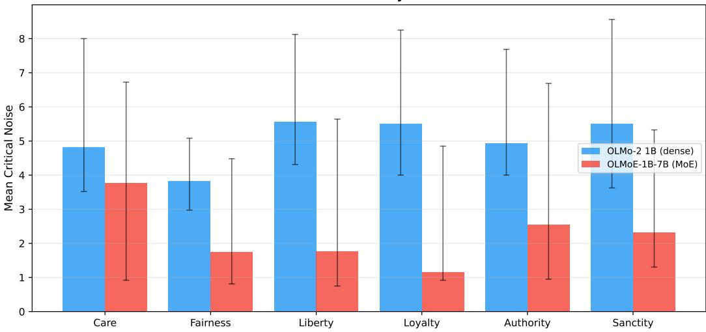  
Figure 4: Mean critical noise $\sigma ^ { * }$ per foundation for OLMo-2 1B (left) and OLMoE-1B-7B (right), seed-averaged with cap-at-max and bootstrap 95% CIs over noise seeds. Every foundation is more fragile in MoE than in dense (the cross-architecture dilution effect); within each architecture the per-foundation CIs overlap and the ordering is not statistically separable.

Sanctity/degradation is the most stable foundation (13/16 layers stable); care/harm the least (10/16 stable).

This gradient has two implications. First, the geometric analysis at early layers, including the peak separation layer (layer 0), should be interpreted with caution, as the specific pairwise cosine values may shift under resampling. Second, the stability gradient itself is informative: probe directions become more determined as representations become more specialized, paralleling the lexical-tocompositional gradient from Reblitz-Richardson (2026b).

The headline geometric findings (separation not collapse; effective dimensionality = 5) are confirmed at layers 6–15 where directions are stable.

## 4.7 Differential fragility across frameworks

We measure per-foundation critical noise $\sigma ^ { * }$ with the standard fragility protocol, averaging accuracy over 10 noise seeds and censoring never-fragile layers at the grid maximum (the cap-at-max convention of Reblitz-Richardson (2026b)); bootstrap 95% CIs are over the noise seeds. Seed-averaging is necessary here: a single noise draw makes per-layer $\sigma ^ { * }$ unstable.

The result is between architectures, not between foundations. Every foundation is more fragile in OLMoE than in OLMo-2: dense $\sigma ^ { * }$ runs 3.8–5.6 across the six foundations (mean 5.0), MoE $\sigma ^ { * }$ runs 1.2–3.8 (mean 2.2), a per-foundation architecture gap of \~2.3×. This is the same direction as, and smaller than, the 4.2× pooled gap reported by Reblitz-Richardson (2026a); the pooled probe trains on 192 pairs versus 32 per foundation here, so it has more statistical power and a cleaner separation. Output dilution suppresses moral encoding across the board. This cross-architecture gap is itself the output-scale effect: an RMS-normalized control (scaling noise to each layer's activation RMS; Reblitz-Richardson, 2026b, Section 4.4) shrinks it from ${ \sim } 2 . 3 { \times } \ { \mathrm { t o } } \ { \sim } 1 . 2 { \times }$ (dense mean $\sigma ^ { * } = 1 0 . 0$ MoE 8.2 at the matched grid), exactly as expected if the MoE's smaller output scale, not weaker encoding, drives the raw fragility difference.

Within an architecture, foundations are not reliably separable. The per-foundation $\sigma ^ { * }$ values have wide, overlapping bootstrap CIs (dense: e.g. sanctity 5.50, CI [3.6, 8.6]; care 4.81, CI [3.5, 8.0]. MoE: sanctity 2.33, CI [1.3, 5.3]; care 3.76, CI [0.9, 6.7]), and no foundation is robustly most or least fragile. The binding-vs-individualizing group difference is not significant in either model and reverses sign between them (dense: binding — individualizing = +0.58, exact permutation $p = 0 . 4 0 ;$ $\mathsf { M o E } \colon - 0 . 4 1 , p = 0 . 7 0 )$ . We therefore make no per-foundation or MFT-group fragility claim; the supported finding is the uniform cross-architecture dilution.

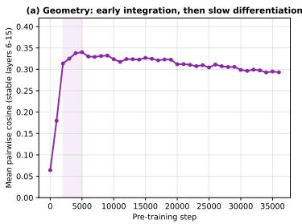

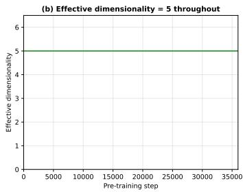

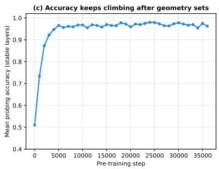  
Figure 5: Geometric trajectory during OLMo-2 1B pre-training (37 checkpoints, seed-fixed foundation directions). (a) Mean pairwise cosine reaches the integration regime by step 2–5K, then slowly differentiates. (b) Effective dimensionality remains at 5 throughout. (c) Accuracy keeps climbing after the geometry sets.

## 4.8 Geometric trajectory during training

Framework geometry reaches its integration regime early and then slowly differentiates. We track the mean pairwise cosine similarity of the six foundation directions (averaged over the stable layers 6–15) across all 37 OLMo-2 1B early-training checkpoints (step 0 to 36,000). The directions are estimated with a fixed probe seed; an earlier unseeded run that was resumed in batches produced an RNG-dependent artifact (a spurious 0.38/0.28 bimodality with spikes at 5K-multiple checkpoints), which the seeded recomputation removes while leaving the smooth accuracy trajectory unchanged.

• Step 0. Mean cosine is 0.06; the six foundation directions are nearly orthogonal, as expected for probes on random representations. Mean accuracy is 0.51 (chance).

• Step 1000. Cosine jumps to 0.18; accuracy reaches 0.73. Shared moral-salience structure has begun to form.

• Steps 2000–5000. Cosine rises to its peak (0.31 at step 2K, 0.34 at step 5K) as accuracy climbs from 0.87 to 0.97. The integration regime is reached here, while accuracy still has \~10 points to gain.

• Steps 5000–36,000. Cosine then slowly declines, from 0.34 to 0.29 (～13%), as accuracy holds at 0.96–0.98. The foundation directions, having entered the integration band early, keep differentiating gradually for the rest of the observed training.

Effective dimensionality remains constant at 5 from step 0 onward. This is expected: random unit vectors in $\mathbb { R } ^ { 2 0 4 8 }$ are nearly orthogonal with high probability, so even at initialization the six probe directions span 5 effective dimensions. The informative signal is cosine similarity, which transitions from ≈ 0 (random) into the integration band (\~0.3) within the first few thousand steps, then drifts down slowly. The final-trajectory value (0.29) is consistent with the fully-trained model (Section 4.2, mean ≈0.26 over stable layers): geometry sets its structure early and refines it gradually rather than abruptly.

The temporal dissociation (framework geometry stabilizing at step 2000 while accuracy continues improving through step 25,000) extends the two-phase pattern identified by Reblitz-Richardson (2026b): accuracy saturates early, but fragility continues resolving. Here we add a third metric: inter-framework structure also stabilizes before inter-framework discriminability finishes developing. The model discovers the geometric layout of moral concepts early and then spends the remainder of training strengthening the representations within that fixed layout.

## 4.9 Dilemma compositionality: partial but structured

We now ask whether the model's representation of moral dilemmas (scenarios where two foundations conflict) can be decomposed in terms of the single-foundation directions from Experiment 1.

Dilemma probes achieve high accuracy. All 15 dilemma-specific probes achieve $\ge 7 5 \%$ peak test accuracy (mean 94.2%), with 13 of 15 pairs at $\geq 8 7 . 5 \%$ As with the foundation accuracies (Section 4.1), these are maxima over 16 layers on small held-out sets (20 pairs per dilemma, 80/20 split, so \~4 test examples each), so they should be read as “easily decodable" rather than as precise point estimates. The model reliably distinguishes dilemma moral content from matched neutral text.

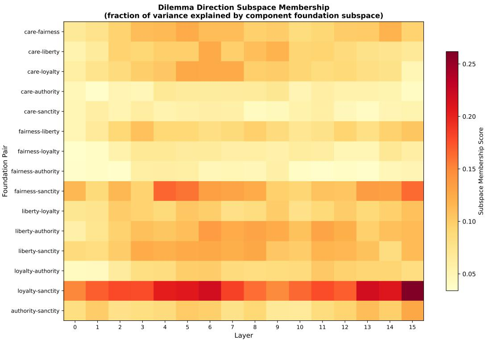  
Figure 6: Subspace membership scores for 15 dilemma probe directions across 16 layers. Each cell shows the fraction of a dilemma direction's variance explained by the 2D subspace of its component foundation directions. Liberty-sanctity shows the strongest compositional signal.

Subspace membership: partial compositionality. The mean peak subspace membership score across all 15 pairs is 0.118. The right null is not a random vector (mean 0.001), which ignores the shared moral-salience component every moral direction carries, but the mismatched-pair baseline: the membership of each dilemma direction in the 2D spans of foundation pairs it shares no component with. That baseline is 0.044 at the matched peak layer, so the compositional signal is \~2.7× the mismatched baseline (and matched exceeds mismatched at every layer; Appendix G). The matched—mismatched gap is 0.074, CI [0.053, 0.100], excluding 0 (paired bootstrap over the 15 dilemmas, $n = 1 0 ^ { 4 } )$ . This per-pair-peak figure is a max-over-layers extremum and is biased upward; the unbiased cross-layer-mean gap is 0.052, CI [0.037, 0.069], also excluding 0 (matched 0.091 vs. mismatched 0.039). The signal is real but modest: even matched, only \~12% of each dilemma direction's variance is explained by its component foundation subspace. The remaining \~88% (mean residual norm = 0.939) lies in directions orthogonal to both component foundations.

Component balance is near-equal. The mean component balance ratio is 0.486 (perfect balance = 0.5). In 14 of 15 pairs, the balance falls within [0.40, 0.58], indicating that both component foundations contribute approximately equally to the within-subspace projection. The exception is fairness-sanctity (balance = 0.335), where the sanctity component dominates. When two foundations do compose, they compose symmetrically rather than one foundation dominating the representation.

Shared-component structure. Dilemma pairs that share a foundation component have consistently higher cosine similarity than pairs with no shared foundation. At the peak effect layer (layer 13), the mean cosine similarity between shared-component pairs is 0.273 versus 0.196 for non-sharing pairs (difference = 0.076, CI [0.035, 0.114], excluding 0; paired bootstrap over the 15 dilemmas, 0.04% of resamples ≤ 0). A permutation test confirms the effect: permuting which foundation-pair label is attached to each dilemma direction (which shuffles the share/no-share partition of the 105 pairwise cosines) gives p = 0.0001 at layer 13, and the minimum p across all layers is also 0.0001 (10,000 permutations). The difference is positive at every layer, so the compositional structure is a general property of the dilemma direction geometry, not a layer-specific artifact.

Mean Dilemma Subspace Membership Across Layers (Does compositionality increase with depth?)  
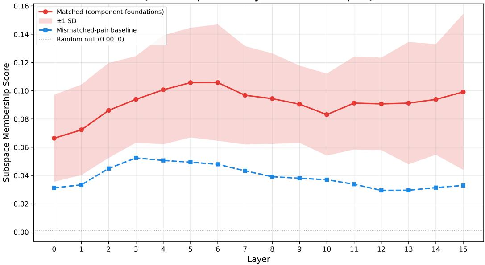  
Figure 7: Mean dilemma subspace membership across layers: matched (component foundations, red, ±1 SD band), the mismatched-pair baseline (blue dashed), and the random-vector null (gray, \~0.001). Matched membership exceeds the mismatched baseline at every layer; both sit far above the random null.

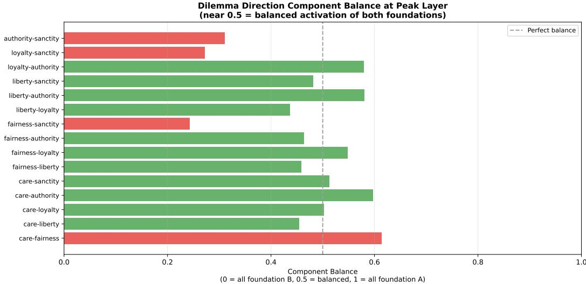  
Figure 8: Component balance at each pair's peak subspace membership layer. Values near 0.5 (dashed line) indicate balanced contribution from both foundations. Fairness-sanctity (red) is the only pair with substantial imbalance.

Hierarchical clustering. The 21-direction dendrogram (6 foundation + 15 dilemma directions) at layer 13 shows two features. First, the six foundation directions form a distinct cluster separate from the dilemma directions. Second, within the dilemma cluster, pairs sharing a component foundation tend to merge at lower distances, consistent with the shared-component analysis above.

The categorical foundation/dilemma separation initially appears to undercut the compositionality narrative: if dilemmas were purely compositional, they would cluster near their component foundations, not in a separate region. However, this separation is driven by register features, not moral content.

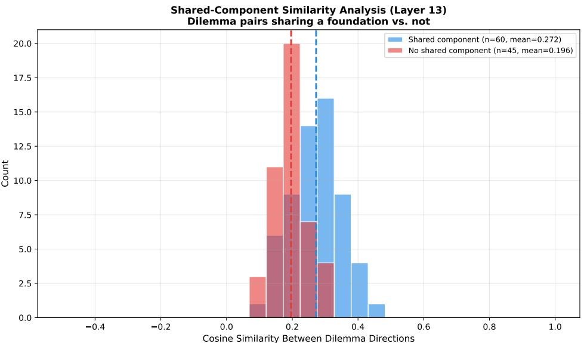  
Figure 9: Distribution of pairwise cosine similarities between dilemma directions at layer 13, split by whether the pairs share a component foundation. Shared-component pairs (blue, n = 60) have higher mean similarity (0.273) than non-sharing pairs (red, n = 45, mean 0.196); exact permutation p = 0.0001.

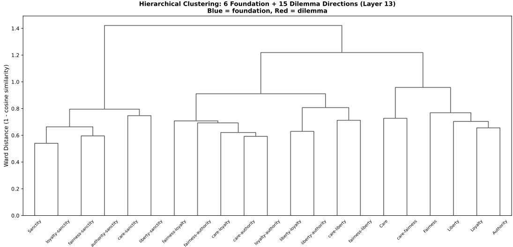  
Figure 10: Hierarchical clustering of all 21 directions (6 foundation in blue, 15 dilemma in red) at layer 13. Foundation directions cluster separately from dilemma directions.

Projecting all 21 directions into the 5D moral subspace (spanned by the six foundation directions) and re-clustering dissolves the separation entirely: foundations now cluster with their related dilemmas (e.g., sanctity with fairness-sanctity and care—sanctity). The first-order separation in the full-space dendrogram reflects the \~90% extra-moral residual (likely text-register differences between declarative single-foundation sentences and narrative dilemma scenarios), while the second-order structure within each cluster reflects genuine moral content relationships.

Full moral subspace projection. The 2D subspace analysis above uses only the two component foundations per dilemma. To test whether dilemma representations are compositional over the full moral vocabulary, we project each dilemma direction onto the 5D subspace spanned by all six foundation directions (5D because the six directions have effective dimensionality 5). Averaging across all layers and pairs, the mean full-subspace membership is 0.109, only modestly above the cross-layer 2D matched membership of 0.091 (ratio 1.19×; both far above the random null of \~0.001, and the 2D matched value is ${ \sim } 2 . 3 \times$ its mismatched-pair baseline of 0.039). The small gain from the 2D component subspace to the full moral subspace indicates that the \~90% residual is not explained by any foundation direction: it is genuinely extra-moral, likely encoding conflict-specific features such as trade-off framing and tension that lie outside the moral subspace entirely.

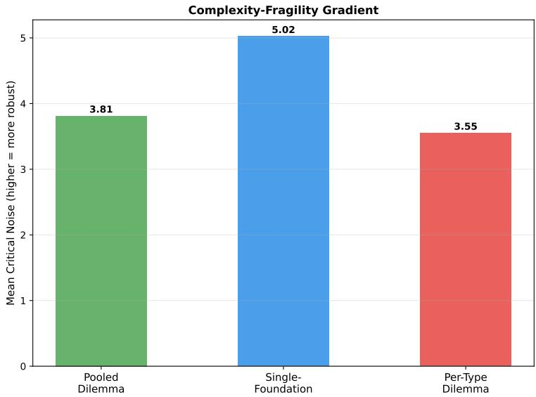  
Figure 11: Raw mean critical noise for probes at three complexity levels (single-foundation from Exp. 7, pooled and per-type dilemma). The apparent gradient does not survive RMS normalization (see text): under scale correction the single-foundation and pooled-dilemma values converge, indicating the raw ordering reflects register-dependent activation scale rather than encoding robustness.

Scale replication. The partial-compositionality result reproduces on OLMo-2 7B with the same matched-vs-mismatched structure. Mean peak matched membership is 0.090, against a mismatchedpair baseline of 0.032 (\~2.8×, vs. the 2.7× at 1B); mean residual norm is 0.953; and component balance is 0.455 (vs. 0.486 at 1B, where 0.5 is perfect balance). The 7B model decomposes moral dilemmas the same way the 1B model does: a small, significant projection onto the component foundations, a large conflict-specific residual, and near-balanced loading on the two foundations in tension.

## 4.10 Dilemma direction stability

Bootstrap resampling (50 iterations) of the 15 dilemma probe directions across 16 layers yields 240 direction–layer combinations. Of these, 239 are stable (mean cosine with full-data direction > 0.7), with the single exception at liberty-loyalty, layer 0. The relaxed threshold (0.7 vs. 0.8 for foundation probes) reflects the smaller sample size (16 training pairs vs. 32 for foundations), but the results indicate that the dilemma probe directions, and therefore the subspace analysis built on them, are reliable.

## 4.11 Complexity-fragility gradient

We compare fragility across three levels of moral complexity: single-foundation probes (from Experiment $^ { 7 ) , }$ pooled binary dilemma probes (all 300 dilemma pairs pooled), and per-type dilemma probes (15 separate probes, 20 pairs each).

In raw activation units the mean critical noise looks like a complexity-fragility gradient: singlefoundation probes most robust $( \sigma ^ { * } = 5 . 0 2 )$ , pooled dilemma less (3.81), per-type dilemma least (3.55), seemingly because more specific distinctions are encoded with less redundancy. This gradient does not survive scale normalization. Consistent with the activation-scale confound identified in the companion work (Reblitz-Richardson, 2026b, Section 4.4), we re-evaluate fragility with noise scaled to each layer's activation RMS. The single-foundation and pooled-dilemma $\sigma ^ { * }$ then converge (both at the grid maximum) and the per-type value barely separates:

<table><tr><td>Probe (1B dense)</td><td>Raw  $\sigma ^ { * }$ </td><td>RMS-normalized  $\sigma ^ { * }$ </td></tr><tr><td>Single-foundation</td><td>5.02</td><td>10.0</td></tr><tr><td>Pooled dilemma</td><td>3.81</td><td>10.0</td></tr><tr><td>Per-type dilemma</td><td>3.55</td><td>9.31</td></tr></table>

The raw gradient therefore reflects register-dependent activation norms (the narrative dilemma stimuli carry smaller-scale activations than the declarative foundation pairs; cf. §5.5) rather than differential encoding robustness. We retain raw $\sigma ^ { * }$ only as a measure of practical perturbation sensitivity and make no complexity-robustness claim. The compositionality evidence in §4.9–4.10 (subspace membership, shared-component geometry, balanced loading) is geometric, not fragility-based, and is unaffected.

## 4.12 MoE architecture preserves compositionality

The dilemma probing and subspace analysis on OLMoE-1B-7B produces results consistent with the dense model and the same matched-vs-mismatched structure. Mean peak accuracy is 95.8% (vs. 94.2% on OLMo-2), mean peak matched membership is 0.118 against a mismatched-pair baseline of 0.045 (\~2.6×, matching the 2.7× on OLMo-2 1B). The partial compositionality structure (a consistent matched-over-mismatched margin at low absolute membership, with a large residual) is a property of the representation geometry, not a dense-architecture artifact.

## 4.13 Robustness to direction-finding method

The geometric findings reported above rely on probe weight vectors as foundation directions. To test whether the geometry is an artifact of discriminative probe training, we extract directions using two alternative methods and compare.

Mean-difference directions. For each foundation, we compute ${ \bf d } _ { f } = \overline { { \bf a } } _ { \mathrm { m o r a l } } - \overline { { \bf a } } _ { \mathrm { n e u t r a l } }$ (the normalized difference of class-conditional activation means), requiring no optimization. These training-free directions replicate the core geometric findings: effective dimensionality is 5 at all layers. Like the probe-weight directions, the mean-diff dendrogram does not recover the MFT individualizing/binding split at any layer, and the permutation test is non-significant throughout. Per-foundation cosine similarity between probe-weight and mean-difference directions ranges from 0.67 to 0.72 (mean across layers), indicating related but non-identical directions: the probe-weight method finds more foundation-specific discriminative signal, while the mean-difference method captures more of the shared moral-salience component (mean pairwise cosine 0.41 vs. 0.22 at layer 0).

Representation-engineering directions. We also test paired-difference PCA (Zou et al., 2023): for each pair i, compute $\mathbf { d } _ { i } = \mathbf { a } _ { \mathrm { m o r a l } , i } - \mathbf { a } _ { \mathrm { n e u t r a l } , i }$ and take the first principal component. This method performs poorly: the first PC explains only 8–11% of variance (barely above chance in $\mathbb { R } ^ { 2 0 4 8 } )$ and the resulting directions show low alignment with probe-weight directions $( | \cos | = 0 . 0 7 \mathrm { - 0 . 2 6 } )$ and weak classification accuracy. With \~32 pairs per foundation in 2048 dimensions, the $p \gg n$ regime prevents PCA from isolating the concept direction. This negative result validates that the convergent probe-weight and mean-difference findings are not trivially recoverable; they depend on direction-finding methods with appropriate inductive bias for small datasets.

Cross-register transfer. Both probe-weight and mean-difference directions transfer to narrative dilemma text with > 90% mean pair accuracy across foundations (the fraction of pairs where the direction projects the moral text higher than the neutral text). Probe-weight directions achieve > 95% for all foundations; the mean-difference method drops to \~91% for authority/subversion, the foundation with weakest directional stability. The transfer gap between same-register (declarative test pairs) and cross-register (dilemma pairs) averages under 4 percentage points, with authority/subversion showing the largest gap (\~9 pp for mean-difference; §5.5).

## 4.14 Scale validation: geometry persists from 1B to 7B

We replicate the core geometric findings on OLMo-2 7B (the 1124 release, 32 layers, hidden dimension 4096), a dense model with 7.3B parameters, versus 1.5B for OLMo-2 1B. The integration signature holds. Mean pairwise cosine similarity ranges from 0.193 to 0.244 across layers (1B:

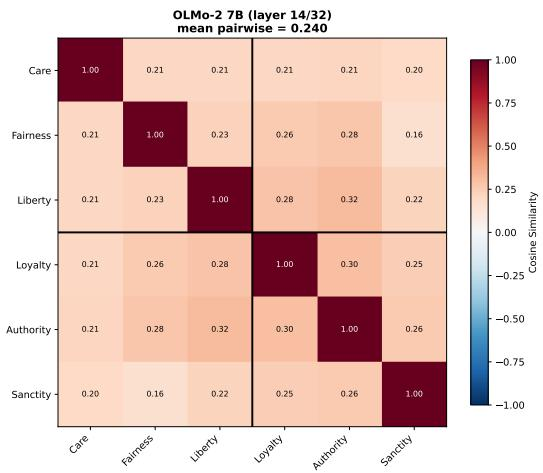  
Figure 12: Foundation direction cosine similarity for OLMo-2 1B (layer 7/16) and 7B (layer 14/32), at matched relative depth. Mean off-diagonal cosine is 0.262 (1B) and 0.240 (7B) at these display layers; both sit in the integration range. Effective dimensionality is 5 for both (Figure 13).

Layer-Wise Geometry Across Scale (normalized depth)  
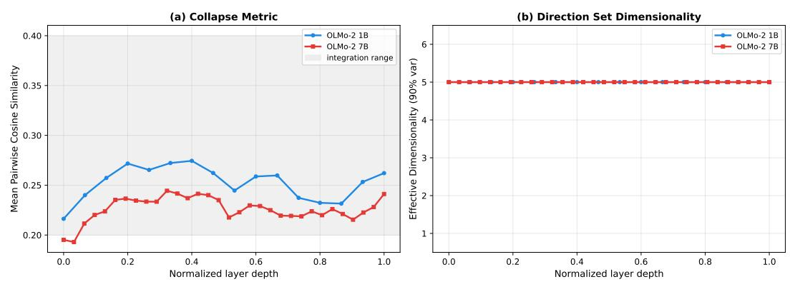  
Figure 13: Layer-wise geometry across scale on normalized depth. (a) Mean pairwise cosine for both models stays in the integration band. (b) Effective dimensionality is constant at 5 for both 1B and 7B.

0.216–0.274), positive everywhere and far below the collapse threshold. Effective dimensionality is 5 at every one of the 32 layers, identical to the 1B and MoE models. Foundation directions are geometrically distinct, sharing a common moral-salience component, at both scales.

Direction stability. Bootstrap resampling (200 iterations) places 110 of 192 foundation–layer combinations above the 0.8 stability threshold, with the remainder in the 0.72–0.80 borderline band. Sanctity/degradation is again the most stable foundation (29/32 layers), fairness/cheating the least (7/32). The per-layer cosine range (0.72–0.85) is comparable to the 1B model; the larger model's directions are no less determined.

MFT is not recovered at 7B either. Hierarchical clustering does not produce the individualizing/binding split at any layer, and the permutation test for MFT group structure is non-significant throughout $( p = 0 . 4 9 – 0 . 7 8 )$ . The model's inter-framework geometry is not MFT-aligned at either scale.

Fragility. Seed-averaged per-foundation fragility at 7B uses the extended noise grid (Section 4.7), which censors only 1 of 192 foundation-layer cells at the cap. As at 1B, the per-foundation $\sigma ^ { * }$ values have wide, overlapping bootstrap CIs and no foundation is reliably most or least robust (7B mean $\sigma ^ { * } \colon$ loyalty 14.7, authority 13.5, care 10.1, sanctity 10.0, liberty 8.4, fairness 6.9, all with overlapping CIs). The binding-vs-individualizing group difference is again not significant (+4.2, exact p = 0.20)

Per-Foundation Fragility Across Scale (sanctity hatched)  
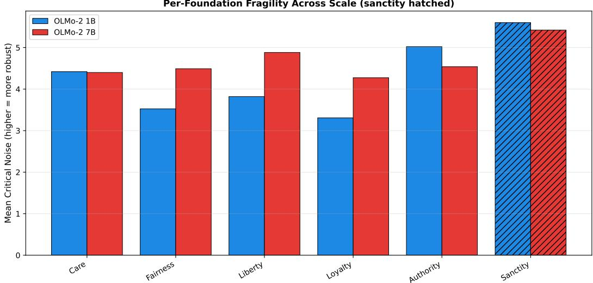  
Figure 14: Per-foundation mean critical noise $\sigma ^ { * }$ for OLMo-2 1B and 7B (dense), seed-averaged with bootstrap 95% CIs. The 7B model is uniformly more robust (scale effect); within each model the per-foundation CIs overlap and no foundation is reliably most robust.

What the 7B run does add is a clean scale effect: the dense model is uniformly more robust at 7B than at 1B (mean σ\* ≈10.6 vs. 5.0). The robust fragility findings are therefore the cross-architecture dilution (Section 4.7) and this dense scale effect, not any per-foundation ordering.

## 4.15 The model's data-driven taxonomy does not recover MFT

Sections 4.3 and 4.14 show that hierarchical clustering of the six probe directions does not recover MFT groups. We test the stronger question directly: cluster the moral-positive activations themselves, without reference to foundation labels, and ask whether the discovered groups align with the foundations.

K-means and spectral clustering (k selected by silhouette score, k = 2–8) on OLMo-2 7B moral activations produce clusters that barely align with MFT foundations. Adjusted mutual information between the discovered clusters and the foundation labels peaks at 0.032 (layer 11) and is near zero or slightly negative at most layers; silhouette scores stay low (0.06–0.08), indicating weak cluster structure. A clustering that recovered the foundations would give AMI near 1.

This is consistent with integration. Foundations are linearly decodable: supervised probes separate them with near-perfect accuracy and span 5 effective dimensions. But they are not the dominant axis of variation in the raw activations, so unsupervised clustering recovers the shared moral-salience structure rather than the foundation distinctions. The model represents the foundations as distinct directions without organizing its moral activations around them.

## 4.16 External replication on the Moral Foundations Vignettes

To test whether the integration geometry is a property of the model rather than of our probing dataset, we recompute foundation directions from the Moral Foundations Vignettes (Clifford et al., 2015), an independently constructed and separately validated stimulus database. We use the verbatim original English vignettes from the published norms released by the authors (Clifford et al., 2015; Full-Published-Norms .xlsx, Table 1 respondent ratings), selecting the five highest-loading items per foundation by the published classification rate (the fraction of respondents who assigned a vignette to its intended foundation); the care foundation draws its five from the combined emotionaland physical-care pool. This yields a 30-item subset (5 per foundation), none of which overlaps our probing dataset. Directions are estimated by mean difference against a shared neutral baseline, the same estimator applied to both datasets for a fair comparison.

Discovered clusters vs MFT foundations (OLMo-2 7B, layer 11, k=5) AMI = 0.032  
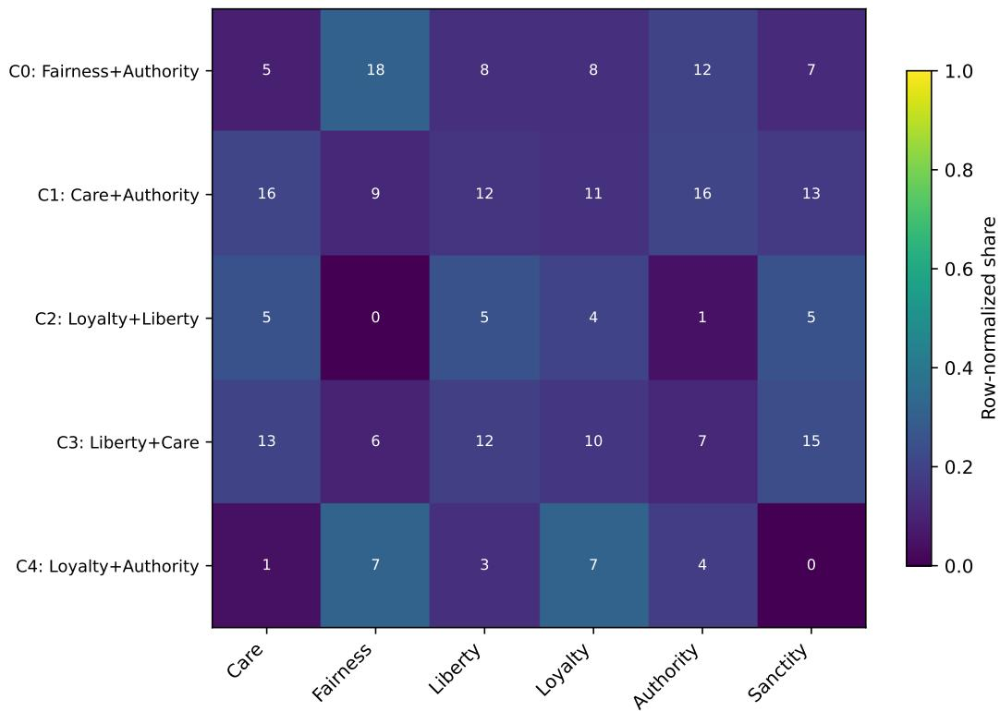  
Figure 15: Discovered clusters (rows) against MFT foundations (columns) at the most foundation-aligned layer (11) of OLMo-2 7B. Cells are pair counts; row-normalized shading. The clusters do not map onto foundations (AMI = 0.032).

The integration signature replicates on the genuine validated items. The six MFV directions span 5 effective dimensions at every layer of OLMo-2 7B, identical to the directions derived from our dataset. Mean pairwise cosine is higher for MFV (0.42–0.62 across layers, 0.62 at the display layer 8) than for the matched mean-difference directions on our data (0.41 at the display layer), an expected small-sample effect given five vignettes per foundation. Because absolute cosine is inflated by the five-per-foundation sample, the cross-dataset claim rests on the sign and structure of the geometry rather than the cosine magnitude: both datasets show uniformly positive mean cosine with variance concentrated on a shared leading axis (the integration signature), spanning the same 5 effective dimensions. Effective dimensionality by itself does not separate integration from isolation (random directions also span \~5 dimensions); the positive mean cosine carries that distinction, and it replicates in sign across the two datasets.

Cross-dataset direction alignment. Foundation directions estimated from the two independent datasets are positively aligned at every foundation $( | \cos | = 0 . 0 7 { - } 0 . 2 1$ per foundation at layer 12, matched mean-difference estimator: care 0.19, fairness 0.14, liberty 0.21, loyalty 0.17, authority 0.07, sanctity 0.20). Individualizing foundations align marginally more strongly on average (mean 0.18) than binding (mean 0.15), but the gap is small and there is no clean group separation. The alignment is modest in magnitude, as expected from 30 verbatim vignettes versus a 240-pair probing set, but it is positive throughout: that directions estimated from independently authored, separately validated stimuli agree at all is evidence that the foundation directions reflect the model's representations rather than artifacts of any single dataset.

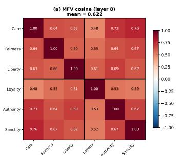

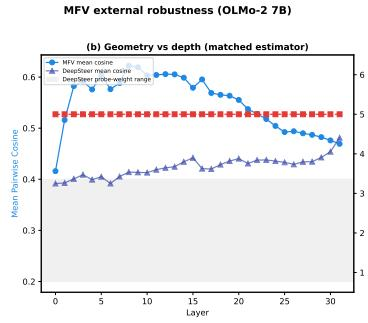

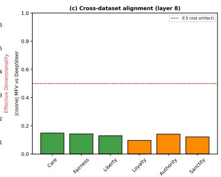  
Figure 16: MFV external replication on OLMo-2 7B. (a) Cosine similarity among the six MFV foundation directions. (b) Mean cosine and effective dimensionality vs depth for MFV and for matched mean-difference directions on our dataset. (c) Per-foundation alignment between MFV and our directions.

## 5 Discussion

## 5.1 Integration as the default geometric mode

The central finding, that foundation probe directions exhibit integration rather than collapse or isolation, has a straightforward interpretation: language models develop structured moral representations from distributional statistics alone. The training corpus does not label texts with MFT foundations, yet the model learns representations in which moral foundations occupy distinct directions that share a positive common component (mean cosine ≈ 0.22 at peak separation, ≈ 0.26 at stable mid-network layers). This is genuine multi-dimensional moral structure, not a single “moral salience" detector. The shared component is moral-specific relative to a matched non-moral concept battery built identically to the foundations: that battery gives a mean cosine of 0.013 against the moral 0.26 (paired $\Delta = 0 . 2 2 3$ , CI [0.202, 0.244], excluding 0; Section 4.2), and the estimator's $[ 1 + ( k - 1 ) \bar { c } ] / k$ PC1 identity is confirmed $\mathrm { t o } < 0 . 0 1$ across all three calibration constructions. The one control we do not run, and so the one claim we do not make, is whether this axis is specifically moral rather than generic affective salience (§5.6).

The fact that effective dimensionality is 5 (near-maximal for 6 directions) throughout the network rules out the possibility that the model has learned a single “this text is moral" feature and then adds minor perturbations per foundation. The foundation directions are geometrically distinct objects that happen to share a common moral-salience component.

This holds across scale, architecture, and dataset. Effective dimensionality is 5 at every layer of OLMo-2 1B, OLMo-2 7B, and OLMoE-1B-7B, and on the independently constructed Moral Foundations Vignettes (§4.14, §4.16). Integration is the default geometric mode for moral representations in these models (all from Ai2's OLMo family; §5.6), not a property of one scale, architecture, or probing dataset.

Dataset sensitivity. The mean cosine similarity is sensitive to neutral-pair quality: neutrals that inadvertently carry moral content inflate the shared moral-salience component, producing higher cosine values. The quality-gated dataset used here (Section 3.6) minimizes this inflation, and we interpret the ≈0.22–0.27 range as a lower bound on the true integration signal. All qualitative conclusions (integration signature, effective dimensionality of 5, absence of MFT dendrogram structure) are robust to dataset construction choices, but the quantitative sensitivity highlights the importance of neutral-pair quality for geometric analyses. The replication on the Moral Foundations Vignettes (§4.16), where directions estimated from independently authored stimuli reproduce the 5-dimensional integration geometry, shows that the qualitative signature does not depend on our dataset.

No evidence of MFT group structure. The inter-framework structure that emerges shows no alignment with MFT's predicted individualizing/binding distinction: hierarchical clustering does not recover this partition at any layer, and the permutation test is non-significant throughout. This is an underpowered null, not a demonstrated absence: the test enumerates only 20 partitions, so its smallest achievable p is 0.05 (observed minimum 0.32; Section 4.3), we state no minimum detectable within/between gap, and we did not run a positive control confirming the test fires on planted group structure, so a small individualizing/binding effect cannot be excluded. Instead, the most consistent clustering feature is a care-sanctity pairing that crosses MFT groups. Both care and sanctity involve protection (of persons from harm, of sacred things from degradation), sharing distributional signatures that the model detects. The care-sanctity pairing is itself robust to dataset construction choices: it persists across different neutral-pair generation methods and quality thresholds, arguing against a dataset artifact explanation. The structure the model does form is thus empirically grounded in corpus statistics and is not detectably aligned with the a priori individualizing/binding grouping from moral psychology on this dataset, consistent with genuine structure learning (the model discovers which moral concepts are distributionally related) rather than surface keyword matching.

A data-driven test sharpens this point. Clustering the moral activations themselves, without foundation labels, recovers the foundations only weakly (adjusted mutual information 0.03 at best; §4.15). Even the model's own unsupervised grouping of moral content is not MFT-structured, which is the expected consequence of integration: the foundations are linearly decodable but are not the dominant axis of variation, so unsupervised methods find the shared moral-salience structure instead.

## 5.2 Per-foundation fragility is not separable

Within an architecture, the moral foundations are not reliably distinguishable by fragility. With 10 noise seeds and the cap-at-max convention (Section 4.7), per-foundation $\sigma ^ { * }$ values carry wide, overlapping bootstrap CIs in all three models, and no foundation is reliably most or least robust. Sanctity sits mid-pack everywhere (dense 1B 5.50, MoE 2.33, dense 7B 10.0, fourth of six), and the binding-vs-individualizing group difference is not significant in any model (dense $1 \mathbf { B } p = 0 . 4 0$ MoE $p = 0 . 7 0$ , dense $7 { \mathrm { B } } p = 0 . 2 0 )$ and reverses sign between dense and MoE. Per-foundation $\sigma ^ { * }$ is sensitive to single-draw noise, so we make no per-foundation or MFT-group fragility claim.

The fragility result that does hold is between architectures, not between foundations: every foundation is more fragile in MoE than in dense $\mathrm { ( a \sim 2 . 3 \times }$ per-foundation gap, the same direction as the pooled 4.2× of Reblitz-Richardson (2026a)), and dense robustness rises with scale from 1B to 7B. Output dilution suppresses moral encoding uniformly across foundations rather than singling any one out.

What critical noise does and does not measure. Three of our raw $\sigma ^ { * }$ comparisons turned out to be driven by the same thing once controlled: activation-scale differences between the conditions being compared. The per-foundation ordering (Section 4.7), the cross-architecture gap above, and the complexity gradient (§4.11) each shrink or vanish under RMS normalization, and the companion dense-model study reports the same for its layer-depth gradient (Reblitz-Richardson, 2026b, Section 4.4). These are one confound, not three. They sharpen what the metric is for: raw $\sigma ^ { * }$ measures practical perturbation sensitivity, the absolute noise a representation tolerates, which is real and useful, but it does not measure encoding robustness independent of scale when the compared conditions differ in activation scale, as they do across layers, registers (declarative vs. narrative), architectures, and probe complexity. RMS-normalized $\sigma ^ { * }$ is the right tool for those cross-condition claims; raw $\sigma ^ { * }$ is valid only where scale is controlled by construction (within-layer, matched-stimulus contrasts). Establishing that partition is a methodological contribution in its own right.

## 5.3 Framework geometry stabilizes before accuracy saturates

The trajectory analysis shows a temporal dissociation: framework geometry (mean cosine similarity between foundation directions) enters its integration regime within the first few thousand steps (peaking near step 5000), while probing accuracy continues climbing through step 10000 and beyond. This extends the “accuracy saturates but fragility resolves" finding of Reblitz-Richardson (2026b) to a third metric: the structure of moral representations is laid down before the strength of those representations finishes developing.

This is consistent with a two-phase account of moral representation learning. In the first phase (steps 0–5000) the model discovers the geometric layout: the foundation directions move from nearorthogonal into the integration band as a shared moral-salience component forms. In the second phase (steps 5000+) the layout is not frozen but gradually refined: the mean cosine declines slowly (0.34 → 0.29, \~13%) while accuracy is flat, so the foundations keep differentiating from one another after they are individually well-separated. The structure is set early and sharpened slowly, not established once and held fixed.

Effective dimensionality is 5 from step 0 onward, indicating that even random initialization produces probe directions that span 5 dimensions. This is expected: random unit vectors in $\mathbb { R } ^ { 2 0 4 8 }$ are nearly orthogonal with high probability. The informative signal is not dimensionality but cosine similarity, which moves from ≈ 0 (random) into the integration band (\~0.3) over the first few thousand steps and then drifts down.

## 5.4 Partial compositionality of moral dilemmas

When two moral foundations conflict in a dilemma scenario, the model's representation is partially compositional: the dilemma probe direction has more overlap with the 2D subspace of its own component foundations (mean peak membership $S = 0 . 1 1 8 )$ than with the mismatched-pair baseline of foundation pairs it shares no component with (0.044, $\mathbf { a } \sim 2 . 7 \times$ margin that holds at every layer), yet ～88% of the dilemma direction lies outside its component subspace.

This partial compositionality has two complementary interpretations. First, the model recognizes moral dilemmas as involving their component foundations (the matched-over-mismatched margin is not an artifact), as confirmed by the shared-component structure: dilemma pairs that share a foundation have higher cosine similarity $( \Delta = 0 . 0 7 6$ at layer 13, exact permutation $p = 0 . 0 0 0 1 )$ Second, the model represents something beyond the sum of parts: the \~90% residual captures conflict-specific features (tension, trade-off framing, or contextual modulation) that single-foundation probes do not isolate.

The near-balanced component loading $( \bar { \alpha } = 0 . 4 8 6 )$ is notable. If dilemma representations were dominated by one foundation (e.g., always prioritizing care over authority), we would expect strongly asymmetric projections. Instead, both conflicting foundations contribute roughly equally to the within-subspace component, consistent with the model encoding the conflict itself rather than a pre-resolved moral judgment. This is an “understanding before choice" mode of representation: the model maintains both competing moral claims in tension rather than collapsing to a resolution, suggesting that moral comprehension (the capacity to represent the structure of ethical disagreement) may precede and be separable from moral judgment. This pattern is scale-stable: OLMo-2 7B reproduces the partial-compositionality profile (9.1% subspace membership, 0.95 residual, 0.46 component balance; §4.9), so the conflict-as-tension representation is not an artifact of the smaller model's capacity.

A raw complexity-fragility ordering (single-foundation $\sigma ^ { * } = 5 . 0 2 >$ pooled dilemma $3 . 8 1 > \mathrm { p e r } .$ type dilemma 3.55) might suggest that representational complexity trades off against robustness. It does not survive scale normalization: with noise scaled to each layer's activation RMS the singlefoundation and pooled-dilemma values converge (both at the grid maximum) and the per-type value barely separates (§4.11). The raw ordering reflects register-dependent activation scale, not differential encoding robustness, so we make no complexity-robustness claim. The compositionality evidence in $\ S 4 . 9 \substack { - 4 . \bar { 1 } 0 }$ (subspace membership, shared-component geometry, balanced loading) is geometric, not fragility-based, and is unaffected.

## 5.5 Register sensitivity: directions transfer, thresholds do not

Foundation-specific probes trained on declarative minimal pairs do not fully generalize to narrative dilemma text as classifiers. In the dilemma verification experiment, authority and loyalty probes showed near-chance transfer (Youden's $J < 0 . 2 )$ , while care and fairness probes transferred well. This asymmetry is not a model-capacity issue: testing on OLMo-2 7B (32 layers, 4096 hidden dim) yielded comparable transfer failure (54.0% vs. 61.3% for the 1B model).

Directions vs. thresholds. The probe engineering analysis (§4.13) resolves this concern by separating two components of cross-register transfer: the direction (probe weight vector) and the threshold (bias term). When evaluated by pair accuracy (the fraction of pairs where the direction projects the moral text higher than the neutral text, requiring no threshold), both probe-weight and mean-difference directions achieve $> 9 0 \%$ mean pair accuracy on narrative dilemma text (probe-weight $> 9 5 \%$ for all foundations; mean-difference drops to \~91% for authority/subversion). The Youden's J failure is therefore a threshold miscalibration effect: the absolute projection scale shifts between registers, invalidating the fixed decision boundary learned on declarative text. The directional structure itself, the subspace in which moral content is encoded, transfers robustly.

This distinction matters for the geometric findings. Cosine similarity, effective dimensionality, and dendrogram clustering depend only on direction vectors, not on classification thresholds. Since the directions transfer across registers, the geometric findings are not register-bound.

Threshold vs. direction transfer. The register sensitivity is specific to threshold transfer, not direction transfer. Both individualizing and binding directions transfer across registers with high pair accuracy (> 90%); what shifts across register is the decision threshold, not the direction itself. Authority and loyalty show the largest threshold gaps (Appendix B.2), so their register sensitivity reflects a calibration shift rather than a change in the underlying moral direction.

Implications for the geometric findings. The 21-direction dendrogram analysis (§4.9) gives direct evidence that register features drive part of the representation geometry: projecting all directions into the 5D moral subspace dissolves the categorical foundation/dilemma separation, confirming that the separation is carried by extra-moral (register) features. This is consistent with the threshold miscalibration account: foundation and dilemma directions occupy the same moral subspace (their projections overlap), but differ in extra-moral dimensions that carry register information and shift the activation scale.

## 5.6 Limitations

Small probing dataset. The 32 training pairs per foundation are sufficient for classification (nearperfect accuracy) but limit the precision of direction estimation. Bootstrap analysis (Section 4.6) confirms that directions at layers 0–5 are borderline unstable, and all geometric claims are qualified to the bootstrap-stable core, layers 6–15 (the lone exception being authority at layer 8, 0.792). A larger dataset would tighten direction estimates, but the current dataset is deliberately minimal to demonstrate that structured geometry is recoverable even from small samples.

Permutation test power. With 6 foundations divided into two groups of 3, the permutation space contains only 20 unique partitions, so the smallest achievable p is 1/20 = 0.05, reached only if the observed split is the single most extreme partition; the observed minimum is 0.32 (Section 4.3). We did not compute a minimum detectable within/between gap or run a positive control verifying that the test fires on planted group structure. Our MFT-group result is therefore “no evidence of individualizing/binding organization,"not a demonstrated absence: a small group effect cannot be excluded. The absence of MFT-aligned dendrograms at any layer is consistent with this null but does not turn it into a positive claim.

One model family. The three configurations span scale (1B and 7B dense) and architecture (dense and MoE), and the integration signature and MFT-mismatch hold across all of them and on the independently constructed MFV stimuli (§4.14–4.16). The models are still all from Ai2's OLMo family, trained on comparable corpora, so generalization to models trained on substantively different data mixtures remains open. The architectural and scale comparisons are well-controlled because the models share training data, at the cost of corpus diversity.

Linear probes. The entire analysis assumes that moral foundations are encoded as linear directions. If some foundations are encoded nonlinearly (e.g., as curved manifolds or distributed across multiple directions), the cosine similarity analysis would understate the true geometric richness. The nearperfect accuracy of linear probes suggests that linear decoding captures the dominant signal, but does not rule out additional nonlinear structure.

Affective vs. moral salience. The shared component that marks integration is moral-specific relative to a matched non-moral battery spanning affective, syntactic, stylistic, and topical concepts (sentiment, register, grammaticality, tense, number, topic; Section 4.2), each of which decodes at 1.00 peak accuracy while giving a near-zero pairwise cosine (0.013 vs. the moral 0.26). That battery does not isolate whether the shared moral axis is specifically moral or a generic evaluative/affective salience common to emotionally charged text, moral statements included. The cheapest discriminating control is a matched-twin non-moral valence/affective battery (positive vs. negative affect against matched neutrals, built exactly as the foundation probes are); we did not run it here. We therefore claim moral-specificity relative to a matched non-moral battery and leave affective-vs-moral as the open residual.

Causal status. Probe directions are read off the representation: on their own they identify where foundation information is readable, not whether that information is used during generation. Our

7B foundation directions provide preliminary, uncontrolled causal checks: ablating a foundation's direction selectively perturbs that foundation's continuations, and injecting it produces a doseresponse shift (Appendix F). These checks carry no random-direction or channel-matched null, so they do not yet separate foundation-specific action from the generic effect of projecting out (or amplifying) any stable direction, and the largest steering effects occur at off-distribution injection strengths $( \alpha = 2 0 )$ . Full causal localization is left to future work; the geometry reported here is descriptive of the representation, and we treat this causal evidence as preliminary rather than as establishing that the directions are functionally implicated.

## 6 Conclusion

Language models develop structured moral representations that go beyond mere moral detection. By training independent linear probes for each of six Moral Foundations Theory foundations and analyzing the geometry of their weight vectors, we find that OLMo-2 1B and OLMoE-1B-7B exhibit the integration signature: foundation directions are distinct (effective dimensionality = 5, which rules out collapse but, computed on the mean-centered direction matrix, is at its ceiling for six directions and does not by itself distinguish integration from isolation) yet share a common component, shown by a uniformly positive mean pairwise cosine (≈ 0.22–0.27). This positive cosine, not the effective dimensionality, is what distinguishes integration from isolation; it is ${ \sim } 2 0 \times$ a matched non-moral concept battery built identically to the foundations (0.26 vs. 0.013; paired $\Delta = 0 . 2 2 3$ CI [0.202, 0.244], excluding 0; Section 4.2), so the shared component is moral-specific relative to that battery, with generic affective salience the one residual we flag (§5.6). (The leading principal component captures \~0.38 of the directions' variance, vs. \~0.18 for random directions, but for nearequicorrelated directions this is algebraically a re-expression of the mean cosine, not independent evidence.) This geometric structure is consistent across the two architectures tested (dense vs. MoE), emerges early in pre-training, and stabilizes before probing accuracy saturates. However, we find no evidence that the inter-framework structure aligns with MFT's predicted individualizing/binding grouping; the group-structure test is underpowered (smallest achievable $p = 0 . 0 5 )$ , so a small effect is not excluded. The structure the model does form is grounded in corpus statistics rather than the a priori human-theoretical grouping.

Framework-specific fragility testing shows that the output dilution effect is foundation-uniform: every foundation is more fragile in MoE than in dense (a \~2.3× per-foundation gap), with no foundation reliably most or least robust within an architecture and no significant binding/individualizing group difference.

Extending this geometric lens to moral dilemmas (scenarios where two foundations conflict) shows partial compositionality: dilemma representations overlap their component-foundation subspace \~2.7× more than a mismatched-pair baseline (peak membership 0.118 vs. 0.044, holding at every layer; shared-component permutation $p = 0 . 0 0 0 1 )$ , with near-balanced loading across both conflicting foundations. The remaining \~88% residual indicates that dilemma representations encode conflict-specific structure beyond their component foundations. (A raw complexity-fragility gradient across probe types does not survive scale normalization and is not used as evidence; §4.11.) This compositionality pattern is preserved across architectures (dense and MoE) and from 1B to 7B.

The probe direction geometry methodology introduced here is general. Any set of related concepts that can be isolated by binary linear probes can be analyzed for inter-concept structure via the same cosine similarity and clustering techniques. We anticipate applications to other taxonomies of human values, to political orientation, and to the internal organization of safety training in instruction-tuned models.

## Acknowledgments and Disclosure of Funding

This work made extensive use of Anthropic's Claude (the Claude Code agent on Opus 4.6, 4.7, 4.8 and Fable 5) for code scaffolding, experimental scripts, and prose drafting. The author retains responsibility for experimental design, all scientific claims, and final wording.

## References

Guillaume Alain and Yoshua Bengio. Understanding intermediate layers using linear classifier probes. arXiv preprint arXiv:1610.01644, 2017. URL https://arxiv.org/abs/1610.01644.

Andy Arditi, Oscar Obeso, Aaquib Syed, Daniel Paleka, Nina Panickssery, Wes Gurnee, and Neel Nanda. Refusal in language models is mediated by a single direction. arXiv preprint arXiv:2406.11717,2024. URL https://arxiv.org/abs/2406.11717.

Tolga Bolukbasi, Kai-Wei Chang, James Zou, Venkatesh Saligrama, and Adam Kalai. Man is to computer programmer as woman is to homemaker? Debiasing word embeddings. Advances in Neural Information Processing Systems, 29, 2016.

Scott Clifford, Vijeth Iyengar, Roberto Cabeza, and Walter Sinnott-Armstrong. Moral foundations vignettes: A standardized stimulus database of scenarios based on moral foundations theory. Behavior Research Methods, 47(4):1178–1198, 2015.

Alexis Conneau, Germán Kruszewski, Guillaume Lample, Loïc Barrault, and Marco Baroni. What you can cram into a single \$&!#\* vector: Probing sentence embeddings for linguistic properties. Proceedings of the 56th Annual Meeting of the Association for Computational Linguistics, pages 2126–2136, 2018.

Oliver Scott Curry, Daniel Austin Mullins, and Harvey Whitehouse. Is it good to cooperate? Testing the theory of morality-as-cooperation in 60 societies. Current Anthropology, 60(1):47–69, 2019.

Jesse Graham, Jonathan Haidt, Sena Koleva, Matt Motyl, Ravi Iyer, Sean P. Wojcik, and Peter H. Ditto. Moral foundations theory: The pragmatic validity of moral pluralism. In Advances in Experimental Social Psychology, volume 47, pages 55–130. Academic Press, 2013.

Jonathan Haidt. The Righteous Mind: Why Good People Are Divided by Politics and Religion. Vintage Books, 2012.

Dan Hendrycks, Collin Burns, Steven Basart, Andrew Critch, Jerry Li, Dawn Song, and Jacob Steinhardt. Aligning AI with shared human values. arXiv preprint arXiv:2008.02275, 2021. URL https://arxiv.org/abs/2008.02275.

Nikolaus Kriegeskorte, Marieke Mur, and Peter Bandettini. Representational similarity analysis — connecting the branches of systems neuroscience. Frontiers in Systems Neuroscience, 2:4, 2008.

Niklas Muennighoff, Luca Soldaini, Dirk Groeneveld, Kyle Lo, Jacob Morrison, Sewon Min, Weijia Shi, Pete Walsh, Oyvind Tafjord, Nathan Lambert, Yuling Gu, Shane Arora, Akshita Bhagia, Dustin Schwenk, David Wadden, Alexander Wettig, Binyuan Hui, Tim Dettmers, Douwe Kiela, Ali Farhadi, Noah A. Smith, Pang Wei Koh, Amanpreet Singh, and Hannaneh Hajishirzi. OLMoE: Open mixture-of-experts language models. arXiv preprint arXiv:2409.02060, 2024. URL https: //arxiv.org/abs/2409.02060.

OLMo Team. 2 OLMo 2 furious. arXiv preprint arXiv:2501.00656, 2025. URL https: //arxiv. org/abs/2501.00656.

Kiho Park, Yo Joong Choe, and Victor Veitch. The linear representation hypothesis and the geometry of large language models. arXiv preprint arXiv:2311.03658, 2024. URL https: //arxiv. org/ abs/2311.03658.

Orion Reblitz-Richardson. Output dilution: Redundant but fragile representations in MoE models. arXiv preprint arXiv:2608.25231, 2026a. URL https://arxiv.org/abs/2608.25231. Companion paper.

Orion Reblitz-Richardson. When probing accuracy saturates, fragility resolves: A complementary metric for LLM pre-training analysis. arXiv preprint arXiv:2606.11375, 2026b. URL https : //arxiv.org/abs/2606.11375. Companion paper.

Andy Zou, Long Phan, Sarah Chen, James Campbell, Phillip Guo, Richard Ren, Alexander Pan, Xuwang Yin, Mantas Mazeika, Ann-Kathrin Dombrowski, Shashwat Goel, Nathaniel Li, Michael J. Byun, Zifan Wang, Alex Mallen, Steven Basart, Sanmi Koyejo, Dawn Song, Matt Fredrikson, J. Zico Kolter, and Dan Hendrycks. Representation engineering: A top-down approach to ai transparency. arXiv preprint arXiv:2310.01405, 2023. URL https://arxiv.org/abs/2310. 01405.

# Appendices Supplementary material.

## A Per-Foundation Probe Accuracy Tables

## A.1 OLMo-2 1B

Table 2: Per-foundation probe accuracy across layers, OLMo-2 1B. Each cell shows test accuracy (16 test examples per foundation). All foundations exceed 0.6 at every layer.
<table><tr><td>Layer</td><td>Care</td><td>Fairness</td><td>Liberty</td><td>Loyalty</td><td>Authority</td><td>Sanctity</td></tr><tr><td>0</td><td>1.000</td><td>1.000</td><td>1.000</td><td>0.938</td><td>1.000</td><td>0.938</td></tr><tr><td>1</td><td>0.875</td><td>0.938</td><td>0.938</td><td>0.938</td><td>1.000</td><td>0.938</td></tr><tr><td>2</td><td>0.938</td><td>0.938</td><td>0.938</td><td>0.938</td><td>1.000</td><td>0.938</td></tr><tr><td>3</td><td>0.938</td><td>0.938</td><td>0.938</td><td>0.938</td><td>1.000</td><td>0.938</td></tr><tr><td>4</td><td>1.000</td><td>0.938</td><td>1.000</td><td>0.938</td><td>1.000</td><td>0.938</td></tr><tr><td>5</td><td>1.000</td><td>0.938</td><td>1.000</td><td>1.000</td><td>1.000</td><td>1.000</td></tr><tr><td>6</td><td>1.000</td><td>0.938</td><td>1.000</td><td>1.000</td><td>1.000</td><td>0.938</td></tr><tr><td>7</td><td>1.000</td><td>1.000</td><td>1.000</td><td>1.000</td><td>1.000</td><td>0.938</td></tr><tr><td>8</td><td>1.000</td><td>1.000</td><td>1.000</td><td>1.000</td><td>1.000</td><td>1.000</td></tr><tr><td>9</td><td>1.000</td><td>0.938</td><td>1.000</td><td>1.000</td><td>1.000</td><td>0.938</td></tr><tr><td>10</td><td>1.000</td><td>0.938</td><td>1.000</td><td>1.000</td><td>1.000</td><td>0.938</td></tr><tr><td>11</td><td>1.000</td><td>0.938</td><td>1.000</td><td>0.938</td><td>1.000</td><td>0.938</td></tr><tr><td>12</td><td>1.000</td><td>0.938</td><td>1.000</td><td>0.938</td><td>1.000</td><td>1.000</td></tr><tr><td>13</td><td>1.000</td><td>0.938</td><td>1.000</td><td>1.000</td><td>1.000</td><td>1.000</td></tr><tr><td>14</td><td>1.000</td><td>0.938</td><td>1.000</td><td>1.000</td><td>1.000</td><td>0.938</td></tr><tr><td>15</td><td>1.000</td><td>0.938</td><td>1.000</td><td>0.938</td><td>1.000</td><td>0.938</td></tr></table>

## A.2 OLMoE-1B-7B

Table 3: Per-foundation probe accuracy across layers, OLMoE-1B-7B.
<table><tr><td>Layer</td><td>Care</td><td>Fairness</td><td>Liberty</td><td>Loyalty</td><td>Authority</td><td>Sanctity</td></tr><tr><td>0</td><td>0.938</td><td>0.875</td><td>0.938</td><td>0.938</td><td>0.875</td><td>0.938</td></tr><tr><td>1</td><td>0.938</td><td>0.875</td><td>0.812</td><td>0.812</td><td>0.812</td><td>0.812</td></tr><tr><td>2</td><td>0.938</td><td>0.875</td><td>0.875</td><td>0.812</td><td>0.875</td><td>0.812</td></tr><tr><td>3</td><td>0.938</td><td>0.938</td><td>0.938</td><td>0.875</td><td>0.875</td><td>0.875</td></tr><tr><td>4</td><td>0.938</td><td>0.938</td><td>0.938</td><td>1.000</td><td>1.000</td><td>1.000</td></tr><tr><td>5</td><td>0.938</td><td>1.000</td><td>1.000</td><td>1.000</td><td>1.000</td><td>1.000</td></tr><tr><td>6</td><td>0.938</td><td>0.938</td><td>1.000</td><td>1.000</td><td>1.000</td><td>1.000</td></tr><tr><td>7</td><td>1.000</td><td>1.000</td><td>1.000</td><td>1.000</td><td>1.000</td><td>1.000</td></tr><tr><td>8</td><td>1.000</td><td>1.000</td><td>1.000</td><td>1.000</td><td>1.000</td><td>1.000</td></tr><tr><td>9</td><td>1.000</td><td>1.000</td><td>1.000</td><td>1.000</td><td>1.000</td><td>1.000</td></tr><tr><td>10</td><td>1.000</td><td>0.938</td><td>1.000</td><td>1.000</td><td>1.000</td><td>1.000</td></tr><tr><td>11</td><td>1.000</td><td>1.000</td><td>1.000</td><td>1.000</td><td>1.000</td><td>1.000</td></tr><tr><td>12</td><td>1.000</td><td>0.938</td><td>1.000</td><td>1.000</td><td>1.000</td><td>1.000</td></tr><tr><td>13</td><td>1.000</td><td>1.000</td><td>1.000</td><td>1.000</td><td>1.000</td><td>1.000</td></tr><tr><td>14</td><td>1.000</td><td>0.938</td><td>1.000</td><td>1.000</td><td>1.000</td><td>1.000</td></tr><tr><td>15</td><td>1.000</td><td>0.938</td><td>1.000</td><td>1.000</td><td>1.000</td><td>1.000</td></tr></table>

Table 4: Bootstrap direction stability (mean cosine similarity with full-data direction, 200 resamples). Values marked with \* fall below the 0.8 stability threshold.
<table><tr><td>Layer</td><td>Care</td><td>Fairness</td><td>Liberty</td><td>Loyalty</td><td>Authority</td><td>Sanctity</td></tr><tr><td>0</td><td>0.740*</td><td>0.741*</td><td>0.768*</td><td>0.761*</td><td>0.780*</td><td>0.793*</td></tr><tr><td>1</td><td>0.752*</td><td>0.765*</td><td>0.775*</td><td>0.763*</td><td>0.780*</td><td>0.789*</td></tr><tr><td>2</td><td>0.774*</td><td>0.779*</td><td>0.796*</td><td>0.785*</td><td>0.790*</td><td>0.789*</td></tr><tr><td>3</td><td>0.767*</td><td>0.788*</td><td>0.791*</td><td>0.784*</td><td>0.808</td><td>0.811</td></tr><tr><td>4</td><td>0.789*</td><td>0.803</td><td>0.817</td><td>0.796*</td><td>0.812</td><td>0.819</td></tr><tr><td>5</td><td>0.799*</td><td>0.814</td><td>0.812</td><td>0.818</td><td>0.809</td><td>0.830</td></tr><tr><td>6</td><td>0.807</td><td>0.816</td><td>0.830</td><td>0.819</td><td>0.809</td><td>0.825</td></tr><tr><td>7</td><td>0.817</td><td>0.811</td><td>0.813</td><td>0.818</td><td>0.830</td><td>0.842</td></tr><tr><td>8</td><td>0.821</td><td>0.822</td><td>0.822</td><td>0.815</td><td>0.792*</td><td>0.807</td></tr><tr><td>9</td><td>0.821</td><td>0.816</td><td>0.832</td><td>0.814</td><td>0.820</td><td>0.803</td></tr><tr><td>10</td><td>0.823</td><td>0.809</td><td>0.831</td><td>0.821</td><td>0.817</td><td>0.836</td></tr><tr><td>11</td><td>0.817</td><td>0.802</td><td>0.830</td><td>0.837</td><td>0.833</td><td>0.814</td></tr><tr><td>12</td><td>0.828</td><td>0.801</td><td>0.831</td><td>0.843</td><td>0.828</td><td>0.820</td></tr><tr><td>13</td><td>0.825</td><td>0.811</td><td>0.821</td><td>0.817</td><td>0.827</td><td>0.838</td></tr><tr><td>14</td><td>0.821</td><td>0.823</td><td>0.824</td><td>0.842</td><td>0.826</td><td>0.827</td></tr><tr><td>15</td><td>0.816</td><td>0.826</td><td>0.803</td><td>0.847</td><td>0.838</td><td>0.852</td></tr></table>

## B Bootstrap Direction Stability Tables

Layers 0–2 have widespread instability (< 0.8): all six foundations are unstable. Layers 3–5 are mixed (2–6 of 6 unstable). Layers 6–15 are mostly stable, with one exception (authority at layer 8, 0.792). Sanctity/degradation is the most stable foundation (13/16 layers above threshold); care/harm is the least stable (10/16).

The stable core (layers 6–15) gives the most reliable geometric measurements. The headline finding (integration signature, effective dimensionality = 5) is confirmed within this range.

## C Cosine Similarity Matrices

Full pairwise cosine similarity matrices between the six foundation probe directions at selected layers of OLMo-2 1B.

Table 5: Cosine similarity matrix at layer 0 (peak separation), OLMo-2 1B. Mean off-diagonal = 0.216.
<table><tr><td></td><td>Care</td><td>Fair</td><td>Lib</td><td>Loy</td><td>Auth</td><td>Sanc</td></tr><tr><td>Care</td><td>1.000</td><td>0.148</td><td>0.189</td><td>0.203</td><td>0.164</td><td>0.201</td></tr><tr><td>Fair</td><td>0.148</td><td>1.000</td><td>0.232</td><td>0.179</td><td>0.224</td><td>0.143</td></tr><tr><td>Lib</td><td>0.189</td><td>0.232</td><td>1.000</td><td>0.273</td><td>0.333</td><td>0.224</td></tr><tr><td>Loy</td><td>0.203</td><td>0.179</td><td>0.273</td><td>1.000</td><td>0.264</td><td>0.219</td></tr><tr><td>Auth</td><td>0.164</td><td>0.224</td><td>0.333</td><td>0.264</td><td>1.000</td><td>0.249</td></tr><tr><td>Sanc</td><td>0.201</td><td>0.143</td><td>0.224</td><td>0.219</td><td>0.249</td><td>1.000</td></tr></table>

Table 6: Cosine similarity matrix at layer 7, OLMo-2 1B. Mean off-diagonal = 0.262.
<table><tr><td></td><td>Care</td><td>Fair</td><td>Lib</td><td>Loy</td><td>Auth</td><td>Sanc</td></tr><tr><td>Care</td><td>1.000</td><td>0.264</td><td>0.221</td><td>0.250</td><td>0.188</td><td>0.229</td></tr><tr><td>Fair</td><td>0.264</td><td>1.000</td><td>0.236</td><td>0.294</td><td>0.292</td><td>0.195</td></tr><tr><td>Lib</td><td>0.221</td><td>0.236</td><td>1.000</td><td>0.317</td><td>0.324</td><td>0.252</td></tr><tr><td>Loy</td><td>0.250</td><td>0.294</td><td>0.317</td><td>1.000</td><td>0.329</td><td>0.242</td></tr><tr><td>Auth</td><td>0.188</td><td>0.292</td><td>0.324</td><td>0.329</td><td>1.000</td><td>0.298</td></tr><tr><td>Sanc</td><td>0.229</td><td>0.195</td><td>0.252</td><td>0.242</td><td>0.298</td><td>1.000</td></tr></table>

Table 7: Cosine similarity matrix at layer 15, OLMo-2 1B. Mean off-diagonal = 0.262
<table><tr><td></td><td>Care</td><td>Fair</td><td>Lib</td><td>Loy</td><td>Auth</td><td>Sanc</td></tr><tr><td>Care</td><td>1.000</td><td>0.246</td><td>0.200</td><td>0.226</td><td>0.168</td><td>0.195</td></tr><tr><td>Fair</td><td>0.246</td><td>1.000</td><td>0.220</td><td>0.347</td><td>0.278</td><td>0.138</td></tr><tr><td>Lib</td><td>0.200</td><td>0.220</td><td>1.000</td><td>0.352</td><td>0.393</td><td>0.237</td></tr><tr><td>Loy</td><td>0.226</td><td>0.347</td><td>0.352</td><td>1.000</td><td>0.415</td><td>0.220</td></tr><tr><td>Auth</td><td>0.168</td><td>0.278</td><td>0.393</td><td>0.415</td><td>1.000</td><td>0.295</td></tr><tr><td>Sanc</td><td>0.195</td><td>0.138</td><td>0.237</td><td>0.220</td><td>0.295</td><td>1.000</td></tr></table>

At layer 0, the highest pairwise cosine similarity is liberty-authority (0.333), followed by liberty– loyalty (0.273). At later layers, the liberty-authority and loyalty-authority pairs consistently show the strongest similarity (0.393 and 0.415 at layer 15). These pairings cross the MFT individualizing/binding boundary, indicating that the model's inter-framework geometry is organized along empirical distributional axes rather than the theoretical MFT grouping.

## D Permutation Tests for MFT Group Structure

We test whether the six foundation probe directions cluster into the MFT-predicted individualizing (care, fairness, liberty) and binding (loyalty, authority, sanctity) groups. The test statistic is the difference between mean within-group cosine similarity and mean between-group cosine similarity. With six foundations split into two groups of three, there are only ${ \binom { 6 } { 3 } } = 2 0$ distinct group assignments, so we enumerate the null distribution exactly rather than resampling; the p-value is the fraction of the 20 partitions whose statistic is ≥ the observed value, and is therefore an exact multiple of $1 / 2 0$

Table 8: Exact permutation test for individualizing/binding group structure across layers, OLMo-2 1B (enumeration over all 20 partitions). No layer reaches significance.
<table><tr><td>Layer</td><td>Observed statistic</td><td>p-value</td></tr><tr><td>0</td><td>0.001</td><td>0.40</td></tr><tr><td>1</td><td>-0.014</td><td>0.80</td></tr><tr><td>2</td><td>-0.003</td><td>0.70</td></tr><tr><td>3</td><td>-0.004</td><td>0.80</td></tr><tr><td>4</td><td>-0.004</td><td>0.80</td></tr><tr><td>5</td><td>0.003</td><td>0.50</td></tr><tr><td>6</td><td>-0.002</td><td>0.50</td></tr><tr><td>7</td><td>0.005</td><td>0.40</td></tr><tr><td>8</td><td>0.001</td><td>0.50</td></tr><tr><td>9</td><td>-0.003</td><td>0.55</td></tr><tr><td>10</td><td>-0.003</td><td>0.60</td></tr><tr><td>11</td><td>-0.014</td><td>0.80</td></tr><tr><td>12</td><td>-0.004</td><td>0.65</td></tr><tr><td>13</td><td>0.003</td><td>0.40</td></tr><tr><td>14</td><td>0.000</td><td>0.40</td></tr><tr><td>15</td><td>0.007</td><td>0.40</td></tr></table>

The test does not reach significance at any layer (minimum $p = 0 . 4 0 )$ . Exact enumeration can attain $p = 1 / 2 0 = 0 . 0 5$ when the observed split is the single most extreme of the 20, so significance was reachable; it simply was not observed. The observed statistics are near zero and frequently negative (within-group similarity < between-group similarity), confirming that the model's inter-framework geometry is not organized along the MFT individualizing/binding axis. This is consistent with the dendrogram analysis (Section 4.3), which shows cross-MFT pairings (care-sanctity, liberty-authority) rather than the predicted group structure.

## E Reproducibility

## E.1 Hardware and software

All experiments ran on a single MacBook Pro with Apple M4 Pro (24 GB unified memory) using the MPS backend. Software versions: Python 3.13, PyTorch 2.7, Transformers 4.49.

## E.2 Runtime

<table><tr><td>Experiment</td><td>Model</td><td>Wall time</td></tr><tr><td>1–3 (probing + geometry + bootstrap)</td><td>OLMo-2 1B</td><td>~5 min</td></tr><tr><td>5 (dense vs. MoE geometry)</td><td>OLMoE-1B-7B</td><td>~20 min</td></tr><tr><td>6 (geometric trajectory)</td><td>OLMo-2 1B (37 ckpts)</td><td>~45 min</td></tr><tr><td>7 (framework fragility)</td><td>OLMo-2 + OLMoE</td><td>~25 min</td></tr></table>

## E.3 Reproducibility notes

Probe training. Linear probes are nn.Linear(2048, 1) trained with BCE loss and Adam (lr = 10−2) for 50 epochs. No weight decay, no learning rate schedule. Random seed is not fixed across runs; bootstrap analysis (Appendix B) quantifies direction stability under resampling.

Probing dataset. The 240-pair minimal-pair dataset (40 per MFT foundation) is deterministic and version-controlled. Dataset generation uses Claude Sonnet 4.6 with automated validation gates (embedding similarity, keyword scan, LLM-as-judge filtering); the exact dataset is included in the code repository.

Activation collection. Forward passes use torch. no\_grad(). Activations are mean-pooled across the sequence dimension at each layer. For OLMoE, activations are collected after the expert combination step (post-routing), not from individual experts.

Code availability. All experiment scripts, the probing dataset, and figure generation code are available at https://github.com/deepsteer/deepsteer.

## F Causal Validation (Preliminary)

The geometry reported in the main text is read off the representation: it shows where foundation information is decodable. Whether the model uses that information during generation is a separate, causal question. Here we report preliminary, uncontrolled causal checks on the OLMo-2 7B foundation directions used throughout this paper. They carry no random-direction or channel-matched null so they are consistent with the directions being functionally implicated but do not by themselves rule out the generic effect of intervening on any stable direction. A full causal localization is left to future work.

Direction ablation. Projecting a foundation's direction out of the residual stream at a target layer degrades that foundation's continuations more than the other foundations'. Specificity, the gap between the on-target and off-target mean effect over 48 prompts and the six foundations, is negative at every layer tested and deepens with depth, from —0.12 at layer 4 to —0.32 at layer 14. Removing a foundation's direction selectively harms that foundation, and the effect is strongest where the directions are most stable. These numbers are on OLMo-2 7B (a11enai/0LMo-2-1124-7B), layers 4-14, over 48 prompts (outputs/probe\_engineering\_7B/direction\_ablation\_mean\_diff. json).

Steering injection. Adding α times a foundation's direction to the residual stream produces a doseresponse. Mean specificity rises monotonically with the injection strength, from +0.08 at α = 1 to +0.16, +0.61, +1.85, and +3.59 at α = 2, 5, 10, 20. The same direction that decodes a foundation also steers generation toward it, in proportion to the dose.

These results are descriptive and uncontrolled rather than a full causal localization, which we leave to future work. Without a random-direction or channel-matched specificity control they do not separate foundation-specific action from generic intervention effects, so we read them as consistent with the foundation directions in Section 4 corresponding to features the model acts on during generation, not as establishing it.

## G Dilemma subspace membership: matched vs. mismatched baseline

Per-layer mean subspace membership of the 15 dilemma directions on OLMo-2 1B, averaged over pairs. Matched is membership in the 2D span of each dilemma's own two component foundation directions; mismatched is the mean membership in the 2D spans of all foundation pairs that share no component with the dilemma (the correct null, since it absorbs the shared moral-salience component that the random-vector null, \~0.001, does not). The matched value exceeds the mismatched baseline at every layer.

Table 9: Per-layer matched vs. mismatched dilemma subspace membership, OLMo-2 1B (mean over 15 dilemma pairs). Matched directions are seed-averaged probe-weight directions; mismatched is averaged over the foundation pairs sharing no component.
<table><tr><td>Layer</td><td>Matched</td><td>Mismatched</td><td>Gap</td></tr><tr><td>0</td><td>0.0664</td><td>0.0313</td><td>+0.0351</td></tr><tr><td>1</td><td>0.0723</td><td>0.0334</td><td>+0.0389</td></tr><tr><td>2</td><td>0.0861</td><td>0.0450</td><td>+0.0411</td></tr><tr><td>3</td><td>0.0939</td><td>0.0525</td><td>+0.0414</td></tr><tr><td>4</td><td>0.1007</td><td>0.0507</td><td>+0.0500</td></tr><tr><td>5</td><td>0.1057</td><td>0.0494</td><td>+0.0563</td></tr><tr><td>6</td><td>0.1058</td><td>0.0480</td><td>+0.0579</td></tr><tr><td>7</td><td>0.0968</td><td>0.0433</td><td>+0.0535</td></tr><tr><td>8</td><td>0.0944</td><td>0.0392</td><td>+0.0552</td></tr><tr><td>9</td><td>0.0905</td><td>0.0380</td><td>+0.0524</td></tr><tr><td>10</td><td>0.0831</td><td>0.0370</td><td>+0.0461</td></tr><tr><td>11</td><td>0.0913</td><td>0.0338</td><td>+0.0574</td></tr><tr><td>12</td><td>0.0907</td><td>0.0295</td><td>+0.0612</td></tr><tr><td>13</td><td>0.0912</td><td>0.0296</td><td>+0.0617</td></tr><tr><td>14</td><td>0.0939</td><td>0.0314</td><td>+0.0624</td></tr><tr><td>15</td><td>0.0991</td><td>0.0330</td><td>+0.0662</td></tr></table>

Cross-layer means: matched 0.091, mismatched 0.039 (\~2.3×; paired-bootstrap gap 0.052, CI [0.037, 0.069], excluding 0); per-pair-peak means: matched 0.118, mismatched 0.044 (\~2.7×; gap 0.074, CI [0.053, 0.100], excluding 0, but a max-over-layers extremum and biased upward, so the cross-layer-mean gap is the unbiased figure). Both bootstraps resample the 15 dilemmas $( n = 1 0 ^ { 4 } )$ The same matched-over-mismatched margin replicates on OLMo-2 7B (peak 0.090 vs. 0.032) and OLMoE-1B-7B (peak 0.118 vs. 0.045).