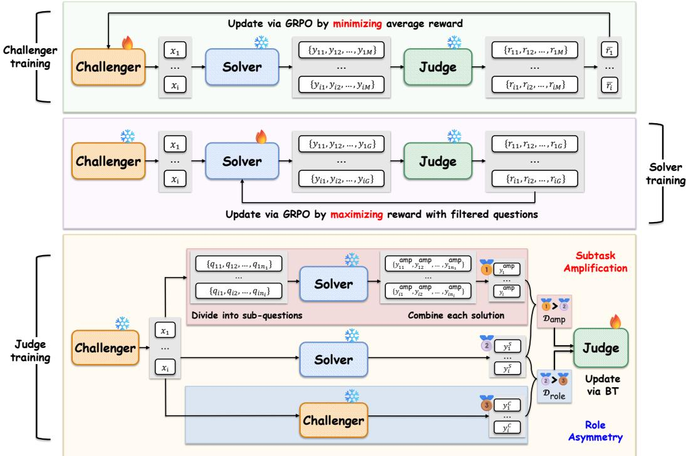
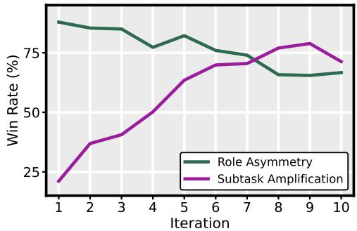
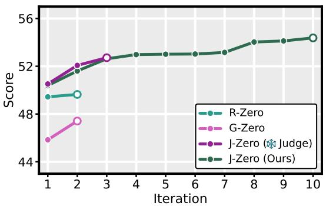
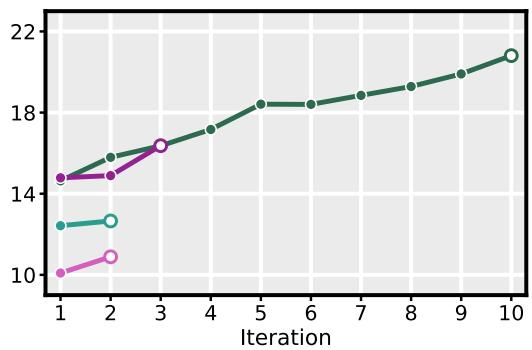
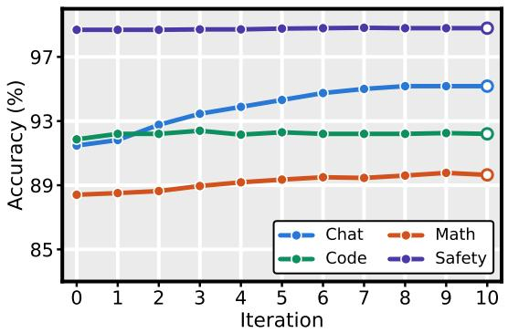
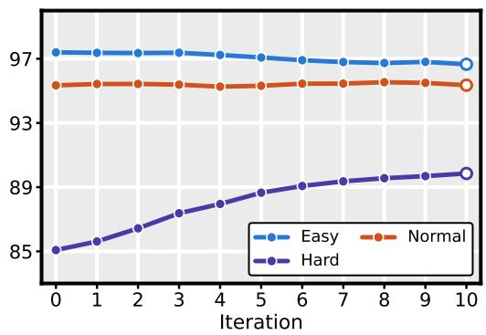

# J-ZERO: UNIFIED CHALLENGER–SOLVER–JUDGE CO-EVOLUTION FROM ZERO DATA

Gyouk Chu<sup>1∗</sup> Myeongho Jeon<sup>1∗</sup> Eunho Yang<sup>1†</sup>

<sup>1</sup>KAIST

Project Page GitHub Hugging Face

## ABSTRACT

Self-evolving language models have recently emerged as a promising path toward superintelligence, with the advantage of reducing the cost of human supervision. While considerable progress has been made in verifiable domains, self-evolution in unverifiable domains remains substantially less explored. We propose Judge co-adaptation from ZERO data (J-ZERO), a unified Challenger–Solver–Judge coevolution framework that supports self-improvement across both domains. The Challenger and Solver co-evolve through an adversarial interaction: the Challenger generates increasingly difficult tasks, while the Solver learns to produce higher-quality responses to them. In parallel, the Judge co-adapts using preference pairs whose ordering is known in advance from how each response was produced, i.e., the Solver’s answer over the Challenger’s, and its decomposedand-recombined answer over its one-shot answer, rather than from the Judge’s own scores. J-ZERO outperforms the baselines by an average of 4.2 points on verifiable and 8.0 points on unverifiable domains, and continues to improve through at least ten iterations, whereas the baselines degrade after two.

## 1 INTRODUCTION

Self-evolving large language models (LLMs) have emerged as a promising approach to overcoming the limitations of human-curated supervision. Relying on human annotators to design tasks and provide labels is costly and constitutes a fundamental bottleneck to developing AI systems that may eventually surpass human intelligence (Tao et al., 2024; Jeon et al., 2025).

Recent work has explored self-evolving models that operate without any external data, generating training tasks entirely through closed-loop self-play (Huang et al., 2026b). Starting from a single model, these methods instantiate Challenger and Solver roles that co-evolve: the Challenger generates increasingly difficult tasks, while the Solver learns to solve them. Although self-evolving algorithms have been well established in verifiable domains (Acikgoz et al., 2026; Yue et al., 2026; Li et al., 2026), their application to unverifiable domains remains underexplored.

Self-evolution is relatively straightforward in verifiable domains, where objective ground-truth answers provide direct evaluation and learning signals. In contrast, unverifiable domains admit no single correct answer, and quality is defined by human preference rather than by a checkable condition. In this setting, the learning signal comes from a Judge that scores responses in place of a verifier (Kuba et al., 2025). This substitution introduces a ceiling. A frozen Judge can only push the Solver toward preferences it has already internalized, so once the Solver saturates the distinctions the Judge is able to make, further training yields no signal. Thus, the extent of self-improvement is bounded by the Judge’s own evaluation capability (Huang et al., 2026a).

In this regard, we propose a novel framework, Judge co-adaptation from ZERO data (J-ZERO), in which the Judge model co-adapts alongside the Challenger and Solver, lifting this ceiling as training proceeds, thereby enabling self-evolution in both verifiable and unverifiable domains. The Challenger and Solver co-evolve through a minimax game using group relative policy optimization (GRPO; Shao et al., 2024): the Challenger is trained to minimize the reward assigned by the

Judge model by generating increasingly difficult tasks, while the Solver is trained to maximize the reward by producing high-quality responses. Training the Judge inside this same loop appears circu lar, i.e., if every signal originates from a single model, it is unclear what new preference information could enter the system. Thus, we derive preferences from structural asymmetries in the loop: config urations in which one response is better than another by construction. Specifically, we construct two such types of preference pairs for Bradley–Terry (BT)-based Judge training: (1) Role-asymmetry pairs: the Solver’s response is preferred over the Challenger’s response because the Solver is explicitly optimized to answer the generated task well, whereas the Challenger is optimized to make the task difficult rather than to produce a high-quality answer; and (2) Subtask-amplification pairs: the Solver’s divide-and-conquer response is preferred over its one-shot response because solving each subtask accurately is easier than solving the original task as a whole, and aggregating the resulting subtask solutions enables the Solver to produce a more comprehensive and higher-quality response (Christiano et al., 2018).

J-ZERO achieves substantial performance improvements across both verifiable and unverifiable domains. J-ZERO improves accuracy by 4.2 points over the baseline on verifiable tasks (Table 1) and improves performance by 8.0 points across three benchmarks covering unverifiable tasks (Table 2). Beyond these performance gains, further analysis identifies Judge co-evolution as the key component for sustaining improvement across iterative rounds (Table 3 and Figure 3, 4), with broader implications for continual and lifelong learning.

## 2 RELATED WORK

Self-evolution with external tasks and supervision. Early self-evolving methods primarily focused on iteratively improving the Solver using tasks paired with ground-truth labels in verifiable domains, aiming to make the most effective use of the available data by adapting the training process to the model’s current capabilities (Zelikman et al., 2022; Yuan et al., 2023; Singh et al., 2024; Zhang et al., 2024; Pang et al., 2024). Such methods remain bounded by the availability and scope of human-provided labels, offering no direct path to improvement beyond the existing supervision.

Self-evolution with external seed resources. A subsequent line of research reduced reliance on ground-truth labels but still depended on external resources. Self-play fine-tuning compares the model’s own responses with reference responses drawn from a supervised fine-tuning (SFT) corpus (Chen et al., 2024). Self-rewarding methods use the model as both the policy and the judge on prompts generated from an external seed dataset (Yuan et al., 2024; Prasad et al., 2025; Wang et al., 2025; Wu et al., 2025; Zhou et al., 2025; Wang et al., 2026; Zhang et al., 2025), while more recent approaches mine new tasks from raw external corpora (Liu et al., 2025a; Huang et al., 2026c; Fan et al., 2026). In each case, the scope of self-evolution remains anchored to the initial resource, limiting the amount of genuinely new learnable information and potentially reinforcing the model’s existing biases (Liu et al., 2026b).

Data-free self-evolution. Zero-data self-play frameworks remove this dependence entirely and differ primarily in how they obtain rewards. Absolute Zero (Zhao et al., 2025) verified self-proposed coding tasks using an executor, and related work extended the same execution-based feedback to software engineering (Wei et al., 2026). R-Zero (Huang et al., 2026b) replaced an external oracle with majority voting over sampled responses, and several successors adopted this strategy for tool use and other settings (Acikgoz et al., 2026; Yue et al., 2026; Li et al., 2026). These reward signals are inexpensive to compute and relatively difficult to exploit, but they are largely restricted to verifiable domains. Kuba et al. (2025) extended data-free self-evolution to unverifiable domains, but its reliance on a static Judge may impose an upper bound on further improvement (Huang et al., 2026a).

This leaves one setting unaddressed: data-free self-evolution in which the evaluation signal is itself learned and continually improves across both verifiable and unverifiable domains. To address this, we develop a unified framework that enables such adaptive evaluation. Concurrent with our work, G-Zero (Huang et al., 2026a) also extended data-free self-evolution beyond verifiable domains by addressing the limitation that a fixed Judge can cap further improvement. Instead of using a fixed Judge, it uses Challenger-generated hints to construct preference pairs between Solver responses and trains the Solver via direct preference optimization (DPO). In contrast, our framework allows the Judge to co-evolve directly with the Challenger and Solver, enabling the evaluation signal itself to improve over successive rounds and thereby leading to more stable and sustained self-improvement.

  
Figure 1: An overview of J-ZERO, in which the Challenger, Solver, and Judge are jointly updated through iterative self-play. Top and Middle: In the Challenger and Solver training phases, the two policies are trained adversarially under the frozen Judge. The Challenger generates tasks on which the Solver scores poorly, and the Solver learns to recover high scores on those tasks. Bottom: In the Judge training phase, the Judge is updated on two types of in-loop preference pairs, role asymmetry $( \mathcal { D } _ { \mathrm { r o l e } } )$ and subtask amplification $( \mathcal { D } _ { \mathrm { a m p } } )$ , so that its evaluation ability rises in step with the two policies it supervises.

## 3 METHODOLOGY

The use of reward models is a de facto standard for LLM post-training in unverifiable domains (Ouyang et al., 2022), and recent work has also demonstrated their effectiveness in verifiable domains (Su et al., 2026). However, as noted by Huang et al. (2026a), relying on a fixed reward model may impose an upper bound on the overall improvement achievable through self-evolution.

To mitigate this, we propose J-ZERO, a self-evolving framework that co-adapts the Judge within the self-play loop alongside the Challenger and the Solver, rather than keeping it fixed throughout training. Self-evolution proceeds iteratively, with each iteration comprising three stages (Figure 1). First, the Challenger learns to generate progressively more challenging tasks by minimizing the reward that the Judge assigns to the Solver’s responses (Section 3.1). Second, in response to these increasingly difficult tasks generated by the Challenger, the Solver is trained to produce higherquality responses by maximizing the Judge’s reward for its responses to them (Section 3.1). Third, the Judge is updated using the BT loss on preference pairs constructed within the self-play loop (Section 3.2).

## 3.1 ADVERSARIAL EVOLUTION OF THE CHALLENGER AND SOLVER

Adversarial Challenger–Solver game. Let $C _ { \theta _ { \mathrm { c } } }$ denote the Challenger, $S _ { \theta _ { s } }$ the Solver, and $J _ { \phi }$ the Judge. The Challenger samples a batch of N tasks, $\mathcal { X } = \{ x _ { i } \} _ { i = 1 } ^ { N }$ , where $x _ { i } \sim C _ { \theta _ { c } }$ . For each task $x _ { i } \in { \mathcal { X } }$ , the Solver samples M responses, $\mathcal { V } _ { i } = \{ y _ { i , j } \} _ { j = 1 } ^ { M }$ , where $y _ { i , j } \sim S _ { \theta _ { \mathrm { s } } } ( \cdot \mid x _ { i } )$ . The Judge assigns each task–response pair a scalar score $r _ { i , j } ^ { S } \ = \ \stackrel { \cdot } { \sigma } ( J _ { \phi } ( x _ { i } , y _ { i , j } ) )$ , where $\sigma ( \cdot )$ maps the raw

Judge output to [0, 1]. The Challenger and Solver interact through an asymmetric adversarial game:

$$
\operatorname* { m i n } _ { \theta _ { \mathrm { c } } } \mathcal { L } _ { C } ( \theta _ { \mathrm { c } } ; \theta _ { \mathrm { s } } , \phi ) , \qquad \operatorname* { m a x } _ { \theta _ { \mathrm { s } } } \mathcal { R } _ { S } ( \theta _ { \mathrm { s } } ; \theta _ { \mathrm { c } } , \phi ) .\tag{1}
$$

Here, the Solver objective is determined directly by the Judge scores,

$$
\begin{array} { r } { \mathcal { R } _ { S } ( \theta _ { \mathrm { s } } ; \theta _ { \mathrm { c } } , \phi ) = \mathbb { E } _ { { x } \sim C _ { \theta _ { \mathrm { c } } } } \mathbb { E } _ { { y } \sim S _ { \theta _ { \mathrm { s } } } ( \cdot \vert x ) } \left[ \sigma \left( J _ { \phi } ( x , y ) \right) \right] , } \end{array}\tag{2}
$$

whereas the Challenger objective additionally incorporates auxiliary constraints that discourage repetitive or malformed tasks. Specifically, we define the Challenger loss as the negative expected composite reward,

$$
\begin{array} { r } { \mathcal { L } _ { C } ( \theta _ { \mathrm { c } } ; \theta _ { \mathrm { s } } , \phi ) = - \mathbb { E } _ { x _ { i } \sim C _ { \theta _ { \mathrm { c } } } } \left[ r _ { i } ^ { C } \right] , } \end{array}\tag{3}
$$

where $r _ { i } ^ { C }$ is defined below. Consequently, the interaction is adversarial but not strictly zero-sum: the Challenger seeks tasks on which the Solver performs poorly while maintaining task diversity and validity, whereas the Solver learns to obtain high Judge scores on the challenging tasks generated by the Challenger.

Challenger reward. For each generated task $x _ { i } ,$ the mean Judge score over the M Solver responses is

$$
\bar { r } _ { i } = \frac { 1 } { M } \sum _ { j = 1 } ^ { M } r _ { i , j } ^ { S } .\tag{4}
$$

This estimates how well the current Solver handles $x _ { i }$ . We therefore define the task difficulty reward as $1 - { \bar { r } } _ { i }$ , assigning higher rewards to tasks that the Solver cannot yet answer well.

Optimizing difficulty alone, however, may lead the Challenger to generate near-duplicate tasks or malformed outputs. Following R-Zero (Huang et al., 2026b), we augment the difficulty reward with a repetition penalty and a format check. To measure repetition, we compute pairwise distances $d _ { p q } \overset { \cdot } { = } 1 - \mathrm { B L E U } ( x _ { p } , x _ { q } )$ and group tasks satisfying $d _ { p q } < \tau$ into clusters $\{ \mathcal { C } _ { 1 } , \ldots , \mathcal { C } _ { L } \}$ . Each task is penalized according to the relative size of its cluster:

$$
r _ { i } ^ { \mathrm { r e p } } = \lambda \frac { | { \mathcal C } _ { k } | } { N } , \qquad x _ { i } \in { \mathcal C } _ { k } ,\tag{5}
$$

where λ controls the penalty strength. For the format check, each rollout must contain a well-formed task enclosed within <question> tags. The resulting composite Challenger reward is

$$
r _ { i } ^ { C } = { \left\{ \begin{array} { l l } { \operatorname* { m a x } { \big ( } 0 , 1 - { \bar { r } } _ { i } - r _ { i } ^ { \mathrm { r e p } } { \big ) } , } & { { \mathrm { i f ~ } } x _ { i } { \mathrm { ~ p a s s e s ~ t h e ~ f o r m a t ~ c h e c k } } , } \\ { - 1 - r _ { i } ^ { \mathrm { r e p } } , } & { { \mathrm { o t h e r w i s e } } . } \end{array} \right. }\tag{6}
$$

Challenger policy update. Because all N tasks are sampled from the same task-generation instruction, they constitute a single GRPO group. The Challenger parameters $\theta _ { \mathrm { c } }$ are optimized via GRPO to maximize the composite reward in Eq. (6), which is equivalent to minimizing the loss in Eq. (3):

$$
\mathcal { I } _ { C } ( \theta _ { c } ) = \frac { 1 } { N } \sum _ { i = 1 } ^ { N } \frac { 1 } { | x _ { i } | } \sum _ { t = 1 } ^ { | x _ { i } | } \Bigl [ \operatorname* { m i n } \Bigl ( \rho _ { i , t } ^ { C } \hat { A } _ { i } ^ { C } , \mathrm { c l i p } ( \rho _ { i , t } ^ { C } , 1 - \epsilon , 1 + \epsilon ) \hat { A } _ { i } ^ { C } \Bigr ) - \beta \mathbb { D } _ { \mathrm { K L } } [ C _ { \theta _ { c } } \| C _ { \mathrm { r e f } } ] \Bigr ] ,\tag{7}
$$

$$
\mathrm { w h e r e } \hat { A } _ { i } ^ { C } = \frac { { r _ { i } ^ { C } } - \operatorname* { m e a n } ( \{ { r _ { i } ^ { C } } \} _ { i = 1 } ^ { N } ) } { \operatorname { s t d } ( \{ { r _ { i } ^ { C } } \} _ { i = 1 } ^ { N } ) + \varepsilon } \mathrm { a n d } \rho _ { i , t } ^ { C } = \frac { C _ { \theta _ { c } } ( x _ { i , t } \mid x _ { i , < t } ) } { C _ { \theta _ { c } ^ { \mathrm { o l d } } } ( x _ { i , t } \mid x _ { i , < t } ) } .
$$

Task selection for Solver evolution. After updating the Challenger, we freeze it and sample a larger pool of candidate tasks. We retain the tasks that provide the most informative training signal for the Solver. For each candidate task $x _ { i } ,$ the Solver generates M responses, and the Judge assigns them scores $\{ r _ { i , j } ^ { S } \} _ { j = 1 } ^ { M }$ . We measure the response-level score dispersion as

$$
s _ { i } = \mathrm { s t d } \left( \{ r _ { i , j } ^ { S } \} _ { j = 1 } ^ { M } \right)\tag{8}
$$

and select the top-K tasks with the largest $s _ { i }$ . These tasks lie near the current Solver’s capability frontier, where its responses vary substantially in quality. This criterion is grounded in recent theoretical analysis. Bae et al. (2026) proved that the expected policy improvement from training on a task is lower-bounded by the variance of its rewards, so tasks with high score dispersion are precisely those with the greatest room for learning. Our criterion can also be viewed as a continuous generalization of the informative band of R-Zero (Huang et al., 2026b). R-Zero relies on a binary verifier and therefore selects tasks by intermediate Solver accuracy, whereas our Judge produces continuous scores, so score dispersion serves as the analogous filter for identifying informative tasks.

Solver policy update. Holding the Challenger and Judge fixed, we train the Solver on the K selected tasks using GRPO. For each task $x _ { i } .$ , the Solver samples a group of $G$ responses, and each response receives the Judge-defined reward. The Solver parameters $\theta _ { \mathrm { s } }$ are then updated using the following GRPO objective:<sup>1</sup>

$$
\mathcal { I } _ { S } ( \theta _ { \mathrm { s } } ) = \frac { 1 } { K G } \sum _ { i = 1 } ^ { K } \sum _ { j = 1 } ^ { G } \frac { 1 } { | y _ { i , j } | } \sum _ { t = 1 } ^ { | y _ { i , j } | } [ \operatorname* { m i n } ( \rho _ { i , j , t } ^ { S } \hat { A } _ { i , j } ^ { S } , \operatorname { c l i p } ( \rho _ { i , j , t } ^ { S } , 1 - \epsilon , 1 + \epsilon ) \hat { A } _ { i , j } ^ { S } ) - \beta \mathbb { D } _ { \mathrm { K L } } [ S _ { \theta _ { \mathrm { s } } } \| S _ { \mathrm { r e f } } ] ] .\tag{9}
$$

Through these alternating updates, the Challenger continually expands the task frontier, while the Solver adapts to produce increasingly high-quality responses on the newly discovered tasks.

## 3.2 JUDGE ADAPTATION

To overcome the performance ceiling imposed by a fixed Judge and enable sustained selfimprovement, we allow the Judge to co-evolve with the Challenger and Solver. Although Yuan et al. (2024) showed that self-rewarding methods can work with Judge-generated preference pairs, in which the highest-reward response is labeled chosen and the lowest-reward response is labeled rejected, this strategy risks reinforcing the Judge’s own biases. We therefore impose two requirements on Judge co-evolution: (i) preference pairs must be constructed entirely within the closed loop, without external supervision, and (ii) their labels must not depend on signals produced by the Judge itself. To satisfy these requirements, we exploit two complementary sources of supervision that remain available even when the Judge is miscalibrated: the asymmetry between the roles of the Challenger and Solver, and the quality improvement obtained by decomposing difficult tasks into easier subtasks.

Role-asymmetry pairs. For each held-out task $x ,$ the chosen response is sampled from the Solver, whereas the rejected response is produced by asking the Challenger to solve its own task under the same answer-generation prompt:

$$
\left( y _ { \mathrm { r o l e } } ^ { + } , y _ { \mathrm { r o l e } } ^ { - } \right) = \left( y ^ { S } , y ^ { C } \right) , \qquad y ^ { S } \sim S _ { \theta _ { \mathrm { s } } } ( \cdot \vert x ) , \quad y ^ { C } \sim C _ { \theta _ { \mathrm { c } } } ( \cdot \vert x ) .\tag{10}
$$

The preference label follows directly from how the two policies are trained. The Solver is optimized to answer the generated tasks well, whereas the Challenger is optimized to make tasks difficult and receives no learning signal for answering them. Consequently, the Challenger’s responses are systematically weaker: $y ^ { S } \succ y ^ { C }$ . Importantly, this ordering is induced by the policies’ roles rather than by the current Judge’s scores. Role-asymmetry pairs can therefore re-inject discriminative supervision in regions where the Judge is uncertain or miscalibrated. Collecting these preference pairs over the held-out tasks yields the role-asymmetry dataset ${ \mathcal { D } } _ { \mathrm { r o l e } } = \left\{ \left( x , y ^ { S } , { \bar { y ^ { C } } } \right) \mid x ^ { * } \in { \mathcal { X } } _ { \mathrm { h e l d - o u t } } \right\}$

Subtask-amplification pairs. Although role-asymmetry pairs provide a clear preference-learning signal, relying on them alone may cause the Judge to saturate at the current Solver’s capability level, leaving it unable to recognize responses that surpass those produced by the current Solver. This, in turn, can cap the overall self-evolution process at the Solver’s existing capability. To construct a response above that frontier, we adopt the principle of iterated amplification (Christiano et al., 2018), under which a difficult task is decomposed into easier subtasks that a weak agent can solve more reliably. This principle has been effective in both unverifiable domains (Wu et al., 2021) and verifiable domains (Zhou et al., 2023a).

Concretely, the Challenger decomposes a held-out task x into subtasks $\{ q _ { k } \} _ { k = 1 } ^ { n _ { x } }$ , the Solver answers each subtask in the context of the original task, and the Challenger composes the resulting partial solutions:

$$
\{ q _ { k } \} _ { k = 1 } ^ { n _ { x } } = \mathrm { D e c o m p o s e } _ { \mathrm { C } } ( x ) ,
$$

$$
y _ { k } ^ { \mathrm { s u b } } \sim S _ { \theta _ { \mathrm { s } } } ( \cdot \mid x , q _ { k } ) , \qquad k = 1 , \ldots , n _ { x } ,\tag{11}
$$

$$
y ^ { \mathrm { a m p } } = \mathrm { C o m p o s e _ { C } } \left( x , \{ ( q _ { k } , y _ { k } ^ { \mathrm { s u b } } ) \} _ { k = 1 } ^ { n _ { x } } \right) .
$$

We compare the resulting amplified response with a one-shot response sampled from the same Solver:

$$
( y _ { \mathrm { a m p } } ^ { + } , y _ { \mathrm { a m p } } ^ { - } ) = \left( y ^ { \mathrm { a m p } } , y ^ { S } \right) , \qquad y ^ { S } \sim S _ { \theta _ { \mathrm { s } } } ( \cdot \mid x ) .\tag{12}
$$

Because the Solver is more reliable on the easier subtasks than on the original task as a whole, the response composed from their solutions tends to be more complete and accurate than a direct oneshot response: $y ^ { \mathrm { a m p } } \succ y ^ { S }$ . These pairs therefore expose the Judge to response quality above the Solver’s current one-shot frontier, allowing its evaluation capability to evolve toward the region that the Solver enters next as it improves. Collecting these ordered response pairs over the held-out tasks yields the subtask-amplification preference dataset ${ \mathcal { D } } _ { \mathrm { a m p } } = \left\{ \left( x , \mathbf { \bar { y } } ^ { \mathrm { a m p } } , \mathbf { \bar { y } } ^ { S } \right) \mid x \in \chi _ { \mathrm { h e l d - o u t } } \right\}$ . Case studies of generated tasks and their Challenger-produced decompositions are provided in Section D.

Bradley–Terry update. Let $\mathcal { D } = \mathcal { D } _ { \mathrm { r o l e } } \cup \mathcal { D } _ { \mathrm { a m p } }$ denote the union of the two preference-pair sets. Starting from the Judge parameters obtained in the previous iteration, we update the Judge by minimizing the BT loss

$$
\begin{array} { r } { \mathcal { L } _ { J } ( \phi ) = - \mathbb { E } _ { ( x , y ^ { + } , y ^ { - } ) \sim \mathcal { D } } \Big [ \log \sigma \big ( J _ { \phi } ( x , y ^ { + } ) - J _ { \phi } ( x , y ^ { - } ) \big ) \Big ] . } \end{array}\tag{13}
$$

Both types of preference pairs are constructed from the latest Challenger and Solver outputs. Judge training therefore focuses on the current frontier of self-evolution, where differences in response quality are the most difficult to evaluate reliably. This frontier continuously advances as the Challenger generates harder tasks and the Solver produces stronger responses. By minimizing Eq. (13), the Judge learns to correct its misrankings on these challenging examples, enabling it to acquire evaluation capability tailored to the latest policy it supervises.

Remark 1 (Complementary preference signals). The two pair types are reliable at different stages of training, and their union therefore provides sustained supervision for the Judge throughout selfevolution (Section 5.1).

## 4 EXPERIMENTS

## 4.1 EXPERIMENTAL SETUP

Models and baselines. We conduct experiments on Qwen3-4B-Base and Qwen3-8B-Base (Yang et al., 2025) to assess performance across model scales. Our baselines are the base model itself and two representative zero-data self-play frameworks, R-Zero (Huang et al., 2026b) and G-Zero (Huang et al., 2026a). We use Skywork-Reward-V2-Llama-3.1-8B (Liu et al., 2026a) as the Judge model.

Benchmarks. We evaluate all methods on 11 verifiable and 3 unverifiable benchmarks. The verifi able domain set consists of 7 math reasoning benchmarks, 3 general-domain reasoning benchmarks, and IFEval (Zhou et al., 2023b) for instruction following. The unverifiable domain benchmarks are AlpacaEval 2.0 (Dubois et al., 2024), Arena-Hard-v2.0 (Li et al., 2025), and EQ-Bench Creative Writing v3 (Paech, 2025). For all methods, we stop training once the average score on either the verifiable or unverifiable domain begins to drop, and select the final checkpoint before this decline as the best checkpoint. All evaluation protocols are listed in Section A.1.

Implementation details. All experiments run on the verl framework (Sheng et al., 2024). In each self-evolution iteration, we train the Challenger for 5 steps, the Solver for 15 steps, and the Judge for 8 steps. For the Challenger and the Solver, we mostly follow the hyperparameter settings used in prior work (Huang et al., 2026b). Full implementation details are provided in Section A.2.

## 4.2 RESULTS

We evaluate J-ZERO in the verifiable (Table 1) and the unverifiable domains (Table 2). J-ZERO attains the best score on every benchmark group at both scales.

Verifiable domain. J-ZERO improves the average performance in verifiable domain by 9.47 and 7.88 points over the corresponding base models (Qwen3-4B-Base and Qwen3-8B-Base, respectively), while outperforming R-Zero by 4.74 and 3.56 points. Notably, J-ZERO surpasses R-Zero, even though R-Zero is specifically designed for self-evolution in verifiable domains.

Table 1: Results across verifiable domains. The Overall score is the mean of the three domain averages. Best results are highlighted.
<table><tr><td rowspan="2">Benchmark</td><td colspan="4">Qwen3-4B-Base</td><td colspan="4">Qwen3-8B-Base</td></tr><tr><td>Base Model (w/o training)</td><td>R-Zero</td><td>G-Zero</td><td>J-ZERO (ours)</td><td>Base Model (w/o training)</td><td>R-Zero</td><td>G-Zero</td><td>J-ZERO (ours)</td></tr><tr><td colspan="9">Mathematical Reasoning</td></tr><tr><td>GSM8K</td><td>86.96</td><td>92.34</td><td>90.22</td><td>92.04</td><td>91.66</td><td>93.86</td><td>93.33</td><td>92.95</td></tr><tr><td>MATH500</td><td>75.60</td><td>77.80</td><td>74.80</td><td>79.80</td><td>72.20</td><td>79.40</td><td>76.40</td><td>83.40</td></tr><tr><td>Minerva</td><td>45.22</td><td>52.57</td><td>47.06</td><td>54.04</td><td>48.90</td><td>57.35</td><td>48.53</td><td>61.76</td></tr><tr><td>OlympiadBench</td><td>41.39</td><td>44.36</td><td>41.10</td><td>47.18</td><td>40.95</td><td>44.96</td><td>44.21</td><td>53.12</td></tr><tr><td>AMC23</td><td>45.39</td><td>52.50</td><td>47.81</td><td>53.36</td><td>44.92</td><td>56.56</td><td>49.77</td><td>60.62</td></tr><tr><td>AIME24</td><td>8.96</td><td>11.04</td><td>11.15</td><td>16.15</td><td>10.52</td><td>13.96</td><td>12.71</td><td>19.58</td></tr><tr><td>AIME25</td><td>6.67</td><td>7.92</td><td>7.50</td><td>15.83</td><td>8.96</td><td>12.29</td><td>10.83</td><td>15.94</td></tr><tr><td>Average</td><td>44.31</td><td>48.36</td><td>45.66</td><td>51.20</td><td>45.44</td><td>51.20</td><td>47.97</td><td>55.34</td></tr><tr><td colspan="9">General Reasoning</td></tr><tr><td>MMLU-Pro</td><td>51.70</td><td>55.55</td><td>54.14</td><td>58.60</td><td>58.97</td><td>60.92</td><td>59.44</td><td>63.80</td></tr><tr><td>SuperGPQA</td><td>26.53</td><td>28.63</td><td>27.56</td><td>29.35</td><td>30.45</td><td>31.87</td><td>31.24</td><td>33.22</td></tr><tr><td>BBH</td><td>50.88</td><td>64.35</td><td>58.90</td><td>70.85</td><td>66.21</td><td>71.31</td><td>66.15</td><td>78.38</td></tr><tr><td>Average</td><td>43.04</td><td>49.51</td><td>46.87</td><td>52.93</td><td>51.88</td><td>54.70</td><td>52.28</td><td>58.47</td></tr><tr><td colspan="9">Instruction Following</td></tr><tr><td>Prompt Strict</td><td>40.11</td><td>42.33</td><td>40.85</td><td>50.65</td><td>46.40</td><td>50.46</td><td>51.57</td><td>49.72</td></tr><tr><td>Instruction Strict</td><td>51.08</td><td>54.20</td><td>52.64</td><td>60.91</td><td>58.15</td><td>61.63</td><td>63.19</td><td>62.71</td></tr><tr><td>Prompt Loose</td><td>43.99</td><td>48.43</td><td>47.32</td><td>57.86</td><td>51.76</td><td>57.12</td><td>54.90</td><td>61.92</td></tr><tr><td>Instruction Loose</td><td>54.32</td><td>59.23</td><td>58.03</td><td>66.55</td><td>62.47</td><td>67.03</td><td>66.19</td><td>73.02</td></tr><tr><td>Average</td><td>47.38</td><td>51.05</td><td>49.71</td><td>58.99</td><td>54.70</td><td>59.06</td><td>58.96</td><td>61.84</td></tr><tr><td>Overall Avg.</td><td>44.91</td><td>49.64</td><td>47.41</td><td>54.38</td><td>50.67</td><td>54.99</td><td>53.07</td><td>58.55</td></tr></table>

Table 2: Results across unverifiable domains. The Overall score is the mean of the three benchmark scores, where the two Arena-Hard subsets are first averaged. Best results are highlighted. H.P. and C.W. denote Hard Prompt and Creative Writing, respectively.
<table><tr><td rowspan="2">Benchmark</td><td colspan="4">Qwen3-4B-Base</td><td colspan="4">Qwen3-8B-Base</td></tr><tr><td>Base Model (w/o training)</td><td>R-Zero</td><td>G-Zero</td><td>J-ZERO (ours)</td><td>Base Model (w/o training)</td><td>R-Zero</td><td>G-Zero</td><td>J-ZERO (ours)</td></tr><tr><td>AlpacaEval</td><td>6.22</td><td>11.38</td><td>9.20</td><td>28.56</td><td>12.93</td><td>18.37</td><td>18.39</td><td>33.53</td></tr><tr><td>Arena-Hard (H.P.)</td><td>2.50</td><td>2.50</td><td>3.00</td><td>4.80</td><td>4.00</td><td>5.70</td><td>4.40</td><td>6.90</td></tr><tr><td>Arena-Hard (C.W.)</td><td>0.90</td><td>1.50</td><td>1.40</td><td>2.20</td><td>1.70</td><td>2.20</td><td>2.20</td><td>3.90</td></tr><tr><td>EQ-Bench C.W.</td><td>20.83</td><td>24.59</td><td>21.26</td><td>30.36</td><td>23.92</td><td>24.30</td><td>24.25</td><td>31.31</td></tr><tr><td>Overall Avg.</td><td>9.58</td><td>12.66</td><td>10.89</td><td>20.81</td><td>13.23</td><td>15.54</td><td>15.31</td><td>23.41</td></tr></table>

Unverifiable domain. Baselines achieve much smaller gains in the unverifiable domain compared to the verifiable one, and this is where the gap to J-ZERO is widest. R-Zero relies on a majority-vote reward that does not extend to unverifiable open-ended tasks, so its average improves by only 3.08 and 2.31 points, roughly half of what it gains on the verifiable side. G-Zero achieves even smaller gains of 1.31 and 2.08 points, which leaves it behind R-Zero and barely above the base model, since G-Zero does not employ the Judge at all. J-ZERO improves the average performance in unverifiable domain by 11.23 and 10.18 points, respectively, with the largest gains observed on AlpacaEval 2.0 (6.22 → 28.56 and 12.93 → 33.53), a broad general instruction-following benchmark that covers diverse open-ended tasks across areas such as writing, business communication, personal advice, planning, and recommendations, while also including tasks in mathematics and factual knowledge.

## 5 ANALYSIS

## 5.1 RELIABILITY OF SELF-GENERATED PREFERENCE LABELS

J-ZERO assumes that the preference labels generated within the loop are reliable, so we evaluate their correctness directly. At each iteration of the Qwen3-4B-Base experiments,<sup>2</sup> we present both responses from every Judge-training pair to an external LLM judge, Claude Opus 4.8 (Anthropic, 2026), and ask it to identify the better response. We then measure how often the side we label as chosen wins. To mitigate positional bias, we evaluate both presentation orders and drop ties (Figure 2). The judging instruction is provided in Section C.3.

Role-asymmetry pairs are reliable from the start. The Solver’s response wins more than 60% of the comparisons at every iteration, so the labels in $\mathcal { D } _ { \mathrm { r o l e } }$ agree with an independent evaluator throughout training. The win rate decreases from 87.9% to approximately 66%. We attribute this decline to the increasingly difficult adversarial curriculum rather than to unreliable preference pairs. Because the Challenger is rewarded for generating tasks that the Solver struggles to answer, the held-out tasks gradually shift toward the limits of the Solver’s capabilities. On these difficult tasks, both the Challenger and Solver struggle to produce strong responses, so the quality gap between them becomes smaller.

  
Figure 2: Win rate of the chosen response for the two Judge-training pair types at each iteration. Each comparison is evaluated in both presentation orders, with ties excluded.

Subtask-amplification pairs become reliable once the Solver matures. The divide-and-conquer response wins fewer than half of the comparisons in the first three iterations (21.1% at iteration 1), since decomposition pays off only once the Solver can reliably solve the subtasks. From iteration 4, the win rate exceeds 50%, and it later reaches roughly 70 to 80%, which confirms that $\mathcal { D } _ { \mathrm { a m p } }$ supplies supervision above the Solver’s one-shot frontier. The two curves cross in the middle of training, so the Judge is never left without a usable signal. Role-asymmetry pairs carry the signal early, and amplification pairs take over once the Solver matures.

While our primary goal is to make the Judge adaptive to the current Solver rather than to improve its standalone evaluation capability, we also find that Judge co-evolution improves performance on RM-Bench (Liu et al., 2025b), an independent reward-model benchmark unrelated to the preference pairs constructed within the self-evolution loop (Section B).

## 5.2 ABLATION STUDY ON PREFERENCE DATA FOR JUDGE ADAPTATION

We conduct an ablation study to measure how much each type of Judge training data contributes to J-ZERO (Table 3). Both components, role-asymmetry and subtaskamplification pairs, contribute to the gains over the fixed-Judge baseline, with subtask amplification providing the larger improvement. Removing subtask-amplification pairs leads to a larger performance drop (−1.64) than removing role-asymmetry pairs (−0.97). This is con-

Table 3: Ablation results. We disable one component at a time.
<table><tr><td>Method</td><td>Verifiable</td><td>Unverifiable</td><td>Overall</td></tr><tr><td>J-ZERO</td><td>54.38</td><td>20.81</td><td>37.59</td></tr><tr><td>卜Judge</td><td>52.72</td><td>16.37</td><td>34.54</td></tr><tr><td>卜 w/o  $\mathcal { D } _ { \mathrm { a m p } }$ </td><td>53.20</td><td>18.71</td><td>35.95</td></tr><tr><td> $\vdash \mathbf { w } / \mathbf { o } \ D _ { \mathrm { r o l e } }$ </td><td>53.68</td><td>19.55</td><td>36.62</td></tr></table>

sistent with the design of the two pair types. Role-asymmetry pairs teach the Judge to distinguish responses below the Solver’s current capability, whereas subtask-amplification pairs expose it to responses beyond the Solver’s one-shot frontier, which is critical for continued improvement. Nevertheless, combining the two sources performs best because they are most reliable at different stages of training (Section 5.1).



  
Figure 3: Average score per iteration on the verifiable (left) and unverifiable (right) benchmarks. Each method is plotted up to its best checkpoint.

## 5.3 SUSTAINED IMPROVEMENT OVER ITERATIONS

J-ZERO does not plateau within our training budget. Existing LLM self-play methods plateau after only a few iterations: R-Zero and G-Zero peak at iteration 2 and decline thereafter. J-ZERO instead improves monotonically through iteration 10 in both domains, gaining 9.47 points and 11.23 points over the base model on the verifiable and unverifiable benchmarks, respectively (Figure 3).

Judge co-evolution is what sustains improvement. The frozen-Judge variant follows J-ZERO closely for the first three iterations and then plateaus, ending 1.66 and 4.44 points below the full run on verifiable and unverifiable domains, respectively (Figure 3). The divergence point is informative: it is where the Solver reaches the fixed Judge’s own evaluation ceiling, after which the Judge’s rewards no longer separate good responses from bad. A co-evolving Judge keeps its evaluation standard above the Solver’s current level, so the reward signal stays discriminative as the Solver improves.

## 6 CONCLUDING REMARKS

Conclusion. We introduced J-ZERO, a zero-data self-evolving framework in which the Challenger, Solver, and Judge co-evolve to support self-improvement in both verifiable and unverifiable domains. Role asymmetry provides reliable preference signals early in training, while subtask amplification supplies supervision beyond the Solver’s one-shot capability. Together, these signals allow the Judge to overcome a fixed evaluation ceiling and keep pace with the evolving policies without external data or human feedback. Empirically, J-ZERO outperforms prior zero-data methods at two different model scales (Table 1, 2) and continues to improve through ten iterations, whereas existing approaches saturate within two (Figure 3). These findings establish the Judge as a critical trainable component: a self-evolving model can improve only as far as its evaluator can see.

Limitations. Compute constraints limit us to Challenger and Solver policies of up to 8B parameters with an 8B Judge, and to base models only; larger scales and post-trained reasoning models that emit long chains of thought remain untested. Our Judge is also a classifier-based discriminative reward model, initialized from an off-the-shelf checkpoint and trained with the BT loss, whereas the Challenger and Solver share a single generative initialization. A generative Judge (e.g., LLM-asa-judge) would let one base model instantiate all three roles, and its critiques could serve as richer in-loop supervision; how to make such a generative Judge co-adapt with the Challenger and Solver within the self-play loop is an interesting direction for future work.

## REFERENCES

Emre Can Acikgoz, Cheng Qian, Jonas Hübotter, Heng Ji, Dilek Hakkani-Tür, and Gokhan Tur. Tool-R0: Self-evolving LLM agents for tool-learning from zero data. arXiv preprint arXiv:2602.21320, 2026.

Anthropic. Claude opus 4.8 system card, May 2026. URL https://www.anthropic.com/ claude-opus-4-8-system-card.

Sanghwan Bae, Jiwoo Hong, Min Young Lee, Hanbyul Kim, JeongYeon Nam, and Donghyun Kwak. Online difficulty filtering for reasoning oriented reinforcement learning. In Proceedings of the 19th Conference of the European Chapter of the Association for Computational Linguistics (Volume 1: Long Papers), 2026.

Zixiang Chen, Yihe Deng, Huizhuo Yuan, Kaixuan Ji, and Quanquan Gu. Self-play fine-tuning converts weak language models to strong language models. In Forty-first International Conference on Machine Learning, 2024.

Paul Christiano, Buck Shlegeris, and Dario Amodei. Supervising strong learners by amplifying weak experts. arXiv preprint arXiv:1810.08575, 2018.

Karl Cobbe, Vineet Kosaraju, Mohammad Bavarian, Mark Chen, Heewoo Jun, Lukasz Kaiser, Matthias Plappert, Jerry Tworek, Jacob Hilton, Reiichiro Nakano, et al. Training verifiers to solve math word problems. arXiv preprint arXiv:2110.14168, 2021.

Xeron Du, Yifan Yao, Kaijing Ma, Bingli Wang, Tianyu Zheng, Minghao Liu, Yiming Liang, Xiaolong Jin, Zhenlin Wei, Chujie Zheng, et al. Supergpqa: Scaling llm evaluation across 285 graduate disciplines. Advances in Neural Information Processing Systems, 38, 2025.

Yann Dubois, Percy Liang, and Tatsunori Hashimoto. Length-controlled alpacaeval: A simple debiasing of automatic evaluators. In First Conference on Language Modeling, 2024.

Shengda Fan, Xuyan Ye, and Yankai Lin. Darc: Decoupled asymmetric reasoning curriculum for llm evolution. arXiv preprint arXiv:2601.13761, 2026.

Chaoqun He, Renjie Luo, Yuzhuo Bai, Shengding Hu, Zhen Thai, Junhao Shen, Jinyi Hu, Xu Han, Yujie Huang, Yuxiang Zhang, et al. Olympiadbench: A challenging benchmark for promoting agi with olympiad-level bilingual multimodal scientific problems. In Proceedings ofthe 62nd Annual Meeting of the Association for Computational Linguistics (Volume 1: Long Papers), 2024.

Dan Hendrycks, Collin Burns, Saurav Kadavath, Akul Arora, Steven Basart, Eric Tang, Dawn Song, and Jacob Steinhardt. Measuring mathematical problem solving with the math dataset. In Proceedings ofthe Neural Information Processing Systems Track on Datasets and Benchmarks, vol ume 1, 2021.

Chengsong Huang, Haolin Liu, Tong Zheng, Runpeng Dai, Langlin Huang, Jinyuan Li, Zongxia Li, Zhepei Wei, Yu Meng, and Jiaxin Huang. G-zero: Self-play for open-ended generation from zero data. arXiv preprint arXiv:2605.09959, 2026a.

Chengsong Huang, Wenhao Yu, Xiaoyang Wang, Hongming Zhang, Zongxia Li, Ruosen Li, Jiaxin Huang, Haitao Mi, and Dong Yu. R-zero: Self-evolving reasoning llm from zero data. In The Fourteenth International Conference on Learning Representations, 2026b.

Chengyu Huang, Sheng-Yen Chou, Zhengxin Zhang, and Claire Cardie. Bootstrapping post-training signals for open-ended tasks via rubric-based self-play on pre-training text. arXiv preprint arXiv:2604.20051, 2026c.

Myeongho Jeon, Jan Sobotka, Suhwan Choi, and Maria Brbic. Weak-to-strong generalization under distribution shifts. Advances in Neural Information Processing Systems, 38, 2025.

Jakub Grudzien Kuba, Mengting Gu, Qi Ma, Yuandong Tian, Vijai Mohan, and Jason Chen. Language self-play for data-free training. arXiv preprint arXiv:2509.07414, 2025.

Aitor Lewkowycz, Anders Andreassen, David Dohan, Ethan Dyer, Henryk Michalewski, Vinay Ramasesh, Ambrose Slone, Cem Anil, Imanol Schlag, Theo Gutman-Solo, et al. Solving quantitative reasoning problems with language models. Advances in neural information processing systems, 35, 2022.

Gengsheng Li, Jinghan He, Shijie Wang, Ruiqi Liu, Renrui Zhang, Zijun Yao, Junfeng Fang, Haiyun Guo, Dan Zhang, and Jinqiao Wang. R-diverse: Mitigating diversity illusion in self-play LLM training. In Forty-third International Conference on Machine Learning, 2026.

Tianle Li, Wei-Lin Chiang, Evan Frick, Lisa Dunlap, Tianhao Wu, Banghua Zhu, Joseph E. Gonzalez, and Ion Stoica. From crowdsourced data to high-quality benchmarks: Arena-hard and benchbuilder pipeline. In Forty-second International Conference on Machine Learning, 2025.

Bo Liu, Chuanyang Jin, Seungone Kim, Weizhe Yuan, Wenting Zhao, Ilia Kulikov, Xian Li, Sainbayar Sukhbaatar, Jack Lanchantin, and Jason Weston. Spice: Self-play in corpus environments improves reasoning. arXiv preprint arXiv:2510.24684, 2025a.

Chris Yuhao Liu, Liang Zeng, Yuzhen Xiao, Jujie He, Jiacai Liu, Chaojie Wang, Rui Yan, Wei Shen, Fuxiang Zhang, Jiacheng Xu, and Yang Liu. Skywork-reward-v2: Scaling preference data curation via human-AI synergy. In The Fourteenth International Conference on Learning Representations, 2026a.

Wei Liu, Siya Qi, Yali Du, and Yulan He. Position: Self-play only evolves when self-synthetic pipeline ensures learnable information gain. In Forty-third International Conference on Machine Learning Position Paper Track, 2026b.

Yantao Liu, Zijun Yao, Rui Min, Yixin Cao, Lei Hou, and Juanzi Li. RM-bench: Benchmarking reward models of language models with subtlety and style. In The Thirteenth International Conference on Learning Representations, 2025b.

Long Ouyang, Jeffrey Wu, Xu Jiang, Diogo Almeida, Carroll Wainwright, Pamela Mishkin, Chong Zhang, Sandhini Agarwal, Katarina Slama, Alex Ray, et al. Training language models to follow instructions with human feedback. Advances in neural information processing systems, 35, 2022.

Samuel J Paech. Eq-bench creative writing benchmark v3. https://github.com/EQ-bench/ creative-writing-bench, 2025.

Richard Yuanzhe Pang, Weizhe Yuan, Kyunghyun Cho, He He, Sainbayar Sukhbaatar, and Jason Weston. Iterative reasoning preference optimization. volume 37, 2024.

Archiki Prasad, Weizhe Yuan, Richard Yuanzhe Pang, Jing Xu, Maryam Fazel-Zarandi, Mohit Bansal, Sainbayar Sukhbaatar, Jason E Weston, and Jane Yu. Self-consistency preference optimization. In Forty-second International Conference on Machine Learning, 2025.

Zhihong Shao, Peiyi Wang, Qihao Zhu, Runxin Xu, Junxiao Song, Xiao Bi, Haowei Zhang, Mingchuan Zhang, YK Li, Yang Wu, et al. Deepseekmath: Pushing the limits of mathematical reasoning in open language models. arXiv preprint arXiv:2402.03300, 2024.

Guangming Sheng, Chi Zhang, Zilingfeng Ye, Xibin Wu, Wang Zhang, Ru Zhang, Yanghua Peng, Haibin Lin, and Chuan Wu. Hybridflow: A flexible and efficient rlhf framework. arXiv preprint arXiv: 2409.19256, 2024.

Avi Singh, John D Co-Reyes, Rishabh Agarwal, Ankesh Anand, Piyush Patil, Xavier Garcia, Peter J Liu, James Harrison, Jaehoon Lee, Kelvin Xu, et al. Beyond human data: Scaling self-training for problem-solving with language models. Transactions on Machine Learning Research, 2024. ISSN 2835-8856.

Yi Su, Dian Yu, Linfeng Song, Juntao Li, Haitao Mi, Zhaopeng Tu, Min Zhang, and Dong Yu. Crossing the reward bridge: Expanding reinforcement learning with verifiable rewards across diverse domains. In Proceedings of the 64th Annual Meeting of the Association for Computational Linguistics (Volume 1: Long Papers), 2026.

Mirac Suzgun, Nathan Scales, Nathanael Schärli, Sebastian Gehrmann, Yi Tay, Hyung Won Chung, Aakanksha Chowdhery, Quoc Le, Ed H Chi, Denny Zhou, et al. Challenging big-bench tasks and whether chain-of-thought can solve them. In Findings of the Association for Computational Linguistics: ACL 2023, 2023.

Zhengwei Tao, Ting-En Lin, Xiancai Chen, Hangyu Li, Yuchuan Wu, Yongbin Li, Zhi Jin, Fei Huang, Dacheng Tao, and Jingren Zhou. A survey on self-evolution of large language models. arXiv preprint arXiv:2404.14387, 2024.

Gemma Team, Sherif El Abd, Vaibhav Aggarwal, Robin Algayres, Alek Andreev, Olivier Bachem, Ian Ballantyne, Cormac Brick, Victor Carbune, Michelle Casbon, et al. Gemma 4 technical report.˘ arXiv preprint arXiv:2607.02770, 2026.

Yidong Wang, Xin Wang, Cunxiang Wang, Junfeng Fang, Qiufeng Wang, Jianing Chu, Xuran Meng, Shu-Xun Yang, Andrew Zhuoer Feng, Libo Qin, Wei Ye, and Shikun Zhang. Temporal self-rewarding language models: Decoupling chosen-rejected via past-future. In Forty-third International Conference on Machine Learning, 2026.

Yubo Wang, Xueguang Ma, Ge Zhang, Yuansheng Ni, Abhranil Chandra, Shiguang Guo, Weiming Ren, Aaran Arulraj, Xuan He, Ziyan Jiang, et al. Mmlu-pro: A more robust and challenging multitask language understanding benchmark. Advances in Neural Information Processing Systems, 37, 2024.

Zhaoyang Wang, Weilei He, Zhiyuan Liang, Xuchao Zhang, Chetan Bansal, Ying Wei, Weitong Zhang, and Huaxiu Yao. CREAM: Consistency regularized self-rewarding language models. In The Thirteenth International Conference on Learning Representations, 2025.

Yuxiang Wei, Zhiqing Sun, Emily McMilin, Jonas Gehring, David W. Zhang, Gabriel Synnaeve, Daniel Fried, LINGMING ZHANG, and Sida Wang. Toward training superintelligent software agents through self-play SWE-RL. In Forty-third International Conference on Machine Learning, 2026.

Jeff Wu, Long Ouyang, Daniel M Ziegler, Nisan Stiennon, Ryan Lowe, Jan Leike, and Paul Christiano. Recursively summarizing books with human feedback. arXiv preprint arXiv:2109.10862, 2021.

Tianhao Wu, Weizhe Yuan, Olga Golovneva, Jing Xu, Yuandong Tian, Jiantao Jiao, Jason Weston, and Sainbayar Sukhbaatar. Meta-rewarding language models: Self-improving alignment with LLM-as-a-meta-judge. In Proceedings of the 2025 Conference on Empirical Methods in Natural Language Processing, 2025.

An Yang, Anfeng Li, Baosong Yang, Beichen Zhang, Binyuan Hui, Bo Zheng, Bowen Yu, Chang Gao, Chengen Huang, Chenxu Lv, et al. Qwen3 technical report. arXiv preprint arXiv:2505.09388, 2025.

Weizhe Yuan, Richard Yuanzhe Pang, Kyunghyun Cho, Xian Li, Sainbayar Sukhbaatar, Jing Xu, and Jason Weston. Self-rewarding language models. In Forty-first International Conference on Machine Learning, 2024.

Zheng Yuan, Hongyi Yuan, Chengpeng Li, Guanting Dong, Keming Lu, Chuanqi Tan, Chang Zhou, and Jingren Zhou. Scaling relationship on learning mathematical reasoning with large language models. arXiv preprint arXiv:2308.01825, 2023.

Zhenrui Yue, Kartikeya Upasani, Xianjun Yang, Suyu Ge, Shaoliang Nie, Yuning Mao, Zhe Liu, and Dong Wang. Dr. zero: Self-evolving search agents without training data. arXiv preprint arXiv:2601.07055, 2026.

Eric Zelikman, Yuhuai Wu, Jesse Mu, and Noah Goodman. Star: Bootstrapping reasoning with reasoning. Advances in Neural Information Processing Systems, 35, 2022.

Dan Zhang, Sining Zhoubian, Ziniu Hu, Yisong Yue, Yuxiao Dong, and Jie Tang. ReST-MCTS\*: LLM self-training via process reward guided tree search. Advances in Neural Information Processing Systems, 37, 2024.

Shimao Zhang, Xiao Liu, Xin Zhang, Junxiao Liu, Zheheng Luo, Shujian Huang, and Yeyun Gong. Process-based self-rewarding language models. In Findings of the Association for Computational Linguistics: ACL 2025, 2025.

Andrew Zhao, Yiran Wu, Tong Wu, Quentin Xu, Yang Yue, Matthieu Lin, Shenzhi Wang, Qingyun Wu, Zilong Zheng, and Gao Huang. Absolute zero: Reinforced self-play reasoning with zero data. Advances in Neural Information Processing Systems, 38, 2025.

Denny Zhou, Nathanael Schärli, Le Hou, Jason Wei, Nathan Scales, Xuezhi Wang, Dale Schuurmans, Claire Cui, Olivier Bousquet, Quoc V Le, and Ed H. Chi. Least-to-most prompting enables complex reasoning in large language models. In The Eleventh International Conference on Learning Representations, 2023a.

Jeffrey Zhou, Tianjian Lu, Swaroop Mishra, Siddhartha Brahma, Sujoy Basu, Yi Luan, Denny Zhou, and Le Hou. Instruction-following evaluation for large language models. arXiv preprint arXiv:2311.07911, 2023b.

Xin Zhou, Yiwen Guo, Ruotian Ma, Tao Gui, Qi Zhang, and Xuanjing Huang. Self-consistency of the internal reward models improves self-rewarding language models. arXiv preprint arXiv:2502.08922, 2025.

## APPENDIX

## A FULL EXPERIMENTAL DETAILS

## A.1 BENCHMARKS AND EVALUATION

Math reasoning benchmarks. We evaluate all methods on 7 benchmarks: GSM8K (Cobbe et al., 2021), MATH500 (Hendrycks et al., 2021), Minerva (Lewkowycz et al., 2022), OlympiadBench (He et al., 2024), AMC23, AIME24, and AIME25. Following R-Zero (Huang et al., 2026b), we set "Please reason step by step, and put your final answer within \boxed{}." as a system prompt, obtain responses with up to 4096 tokens, and report the avg@32 for AMC and AIME, whereas greedy decoding accuracy is reported for the remaining benchmarks.

General domain benchmarks. We evaluate all methods on 3 benchmarks: MMLU-Pro (Wang et al., 2024), SuperGPQA (Du et al., 2025), and Big-Bench Hard (BBH; Suzgun et al., 2023). We obtain responses with up to 8192 tokens and report accuracy with greedy decoding. We mostly fol low R-Zero, but slightly strengthen the evaluation code to prevent false positives, where an incorrect answer is randomly marked as correct.

Instruction-following benchmarks. To evaluate instruction-following capabilities, we use IFEval (Zhou et al., 2023b). Following the official evaluation source code<sup>3</sup>, we report all four metrics: prompt-level strict accuracy, instruction-level strict accuracy, prompt-level loose accuracy, and instruction-level loose accuracy.

Unverifiable domain benchmarks. We evaluate on 3 benchmarks: AlpacaEval 2.0 (Dubois et al., 2024), Arena-Hard-v2.0 (Li et al., 2025), and EQ-Bench Creative Writing v3 (Paech, 2025). For AlpacaEval 2.0, we report length-controlled win rate against GPT-4-Turbo. For Arena-Hard-v2.0, we report win rates on both the Hard Prompt subset (with style control) against o3-mini and Creative Writing subset against gemini-2.0-flash. For EQ-Bench Creative Writing v3, we report rubric score instead of Elo rating to avoid model-pool dependence and align the metric scale with other benchmarks. We use Qwen3.6-27B as a judge for AlpacaEval 2.0 and Arena-Hard-v2.0 (Hard Prompts). For Arena-Hard-v2.0 (Creative Writing) and EQ-Bench Creative Writing v3, we adopt gemma-4- 31B-it (Team et al., 2026) as a judge since it achieves a higher EQ-Bench Judgemark v4<sup>4</sup> score than Qwen3.6-27B, indicating stronger discriminative performance in creative writing evaluation. Except for judge models, all benchmarks are evaluated following the official protocols and configurations.

## A.2 IMPLEMENTATION DETAILS

Training setup. We implement all experiments on top of the verl framework (Sheng et al., 2024) and conduct all training on four NVIDIA B200 GPUs and four NVIDIA H200 GPUs. The detailed hyperparameter settings are provided in Table 4. Unless otherwise noted, J-ZERO follows the hyperparameters of R-Zero (Huang et al., 2026b); in particular, we use a Challenger training batch size of 16, as in the official R-Zero implementation,<sup>5</sup> and turn off weight decay. The prompts used for the Challenger are in Section C.1, and the prompts used for the Solver are in Section C.2. During Judge training, we use equal proportions of role-asymmetry and subtask-amplification preference pairs.

Table 4: Full hyperparameter settings.
<table><tr><td rowspan=1 colspan=1>Hyperparameters</td><td rowspan=1 colspan=1>Challenger</td><td rowspan=1 colspan=1>Solver</td><td rowspan=1 colspan=1>Judge</td></tr><tr><td rowspan=1 colspan=1>Steps per iterationTraining batch sizeMini-batch size</td><td rowspan=1 colspan=1>51616</td><td rowspan=1 colspan=1>1512816</td><td rowspan=1 colspan=1>864一</td></tr><tr><td rowspan=1 colspan=1>Max length</td><td rowspan=1 colspan=1>Prompt: 1024Response: 4096</td><td rowspan=1 colspan=1>Prompt: 4096Response: 4096</td><td rowspan=1 colspan=1>8192</td></tr><tr><td rowspan=1 colspan=1>Learning rateLR schedulerWeight decayKL penalty coefficient</td><td rowspan=1 colspan=1> $1 \times 1 0 ^ { - 6 }$ constant0.00.01</td><td rowspan=1 colspan=1> $1 \times 1 0 ^ { - 6 }$ constant0.00.01</td><td rowspan=1 colspan=1> $5 \times 1 0 ^ { - 7 }$ constant0.0</td></tr><tr><td rowspan=1 colspan=1>Number of rolloutsRollout temperatureRollout top-pClip ratio</td><td rowspan=1 colspan=1>41.00.99(0.20,0.28)</td><td rowspan=1 colspan=1>51.00.99(0.20,0.28)</td><td rowspan=1 colspan=1></td></tr></table>

Baseline configurations. Beyond the settings common to all methods, we keep each baseline’s own configuration. For R-Zero, we use the same Challenger training batch size of 16 as J-ZERO. For G-Zero (Huang et al., 2026a), we keep the LoRA-based training setup and the Challenger training batch size of 128 from the original work. In preliminary experiments, both replacing LoRA with fullparameter fine-tuning and reducing the Challenger training batch size to 16 lowered performance.

## B JUDGE IMPROVEMENTS

The purpose of Judge co-adaptation in J-ZERO is to keep the supervision appropriate for the latest Solver, not to turn the Judge into a stronger reward model on static benchmarks. Nevertheless, it is natural to ask whether the co-adapted Judge also becomes better in absolute terms. To address this, we evaluate the Judge from every iteration on RM-Bench (Liu et al., 2025b) (Figure 4).

The Judge improves in every domain. Accuracy improves in all four RM-Bench domains and the average rises monotonically from 92.61 to 93.95 (+1.34). The largest improvement is in Chat (+3.70), the domain closest to the open-ended tasks that the Challenger writes, followed by Math (+1.24) and Code (+0.34). Safety is already saturated at iteration 0 (98.69) and remains nearly unchanged (+0.10). Thus, even while adapting to the loop, the Judge does not lose its general reward-modeling capability but rather improves slightly.

The gains concentrate on hard preference pairs. Accuracy on Hard pairs increases by 4.77 points, from 85.08 to 89.85, while Normal is unchanged (+0.01) and Easy decreases by 0.74 points, from 97.40 to 96.66. The three levels differ in whether response style agrees with response quality: an Easy pair presents the better response in the more elaborate style, whereas a Hard pair presents it more plainly than the worse one. We do not read the small decline on Easy as a meaningful loss. The reason is that separating a clearly good response from a clearly bad one carries less information as training proceeds, since a strong Solver rarely produces an obviously bad response. Residual preference for surface polish, by contrast, is directly exploitable: a fluent but substantively flawed response can receive a high score and be reinforced on that bias, and the Hard split is what measures this failure. Hard comparisons are the ones the Judge must resolve correctly for an already strong policy to keep improving, and they are where that accuracy improves most. Over self-evolution the Judge becomes a stronger reward model, with the gain concentrated at the difficulty level where the Solver places the greatest demand on it.



  
Figure 4: Judge performance on RM-Bench per iteration. Accuracy on each domain subset (left) and accuracy at each difficulty level (right).

## C PROMPTS

## C.1 CHALLENGER PROMPTS IN J-ZERO

This section contains every prompt used by the Challenger. We do not a set system prompt for problem generation; the Challenger only receives the user prompt. The prompts follow the order of the pipeline. First is the user prompt for problem generation, modified from the original prompt used in G-Zero (Huang et al., 2026a). Next are the system and user prompts for task decomposition, which we use to build the subtask-amplification pairs that are used to train the Judge. Last are the system and user prompts that compose the Solver’s per-subtask responses into a single answer.

## Challenger User Prompt for Generating Questions (Modified from G-Zero)

Produce one challenging request that a real user might ask a capable assistant.

The request should come from a general-domain distribution. Sample across task types, not from a single area. Examples of task types you can draw from:

\- writing (email, story, essay, pitch, review, poem)

\- explanation (make a concept clear to a specific audience)

\- advice or planning (career, travel, project, learning)

\- analysis (argument, text, dataset description, product)

\- coding (small function, debugging, design question)

\- role-play, dialogue, or creative tasks

\- open-ended questions about ethics, science, everyday life

\- reasoning, math, or logic problems (fine to include - roughly 1 in 6 requests, no more)

Weight the non-math categories above heavily. A little math is good for diversity, but it should not dominate - favor tasks where the response quality depends on tone, structure, audience-fit, clarity, or creativity, not just arithmetic correctness.

Requirements:

\- The request must be self-contained and non-trivial to answer well.

\- Wrap the request in <question> and </question> tags.

\- Output nothing else before, between, or after the tagged blocks.

Example 1 (writing):

<question>Write a resignation email to my manager that keeps the door open for future collaboration. I’ve been at the company for 4 years and I’m leaving to join a competitor. Tone should be professional and warm without being effusive.</question>

## Example 2 (explanation):

<question>Explain what a Kalman filter does to a software engineer who is comfortable with linear algebra but has never touched signal processing. Avoid control-theory jargon where possible.</question>

Now produce one new request of your own:

## Challenger System Prompt to Decompose a Task for Subtask-amplification Pair

You are an expert at breaking a hard task into simpler subtasks. Given a task, output the FEW essential sub-questions/subtasks whose answers, once combined, "fully solve the task. Rules:

\- Output the 3-5 most essential subtasks only — never more than 5.

\- Each subtask must be SIMPLER than the whole task and genuinely needed.

\- Order them so earlier subtasks are useful for later ones.

\- Make them specific to THIS task; avoid vague meta-steps like ’understand the problem’ or ’write the answer’.

Output a numbered list of the subtasks only, nothing else.

## Challenger User Prompt to Decompose a Task for Subtask-amplification Pair

## Task: {{Given Task}}

Break this into the 3-5 essential, simpler subtasks that together solve it, ordered so earlier ones help later ones.

## Challenger System Prompt to Compose the Sub-answers for Subtask-amplification Pair

You are an expert problem solver. You are given a task, and a set of subtasks that have each already been solved. Combine the subtask solutions into ONE coherent, complete final answer to the original task: integrate them, resolve any contradictions, fix obvious subtask errors, and do not be unnecessarily verbose.

Output ONLY the final answer to the original task — do NOT restate the subtasks, their solutions, or your procedure. If the task has a closed-form answer, put it within \boxed{}.

Challenger User Prompt to Compose the Sub-answers for Subtask-amplification Pair

Original task: {{Given Task}}

Solved subtasks: {{Sub-answers}}

Combine these into the single best final answer to the original task. Output ONLY the final answer.

## C.2 SOLVER PROMPTS IN J-ZERO

This section lists the prompts used by the Solver. When the Solver answers a problem, its user prompt is the question generated by the Challenger, so the system prompt is the only one we set at that stage; it appears first below. The two prompts after it, a system prompt and a user prompt, are the ones we use to collect the Solver’s response to each subtask when building the subtask-amplification pairs.

## Solver System Prompt

Please reason step by step, and put your final answer within \boxed{}.

Solver System Prompt to Solve Each Subtask for Subtask-amplification Pair   
You are solving ONE subtask that is part of a larger task. Answer the subtask fully and correctly,   
using the larger task only as context. Be concise and self-contained - output only the answer to   
this subtask.

Solver User Prompt to Solve Each Subtask for Subtask-amplification Pair   
Larger task (context): {{Given Task}}   
Subtask to solve now: {{Given Sub-task}}   
Answer this subtask.

## C.3 LLM-AS-A-JUDGE PROMPT FOR JUDGE TRAINING DATA ANALYSIS

The prompt used for Judge training data analysis in Section 5.1 is shown below.

```markdown
LLM-as-a-judge Prompt for Judge Training Data Analysis
You are an impartial expert judge. Each item has a QUESTION and two candidate answers,
**A** and **B**, produced by different models for the SAME question. Decide which
answer is better. **Forced choice: exactly one winner, "A" or "B" - never a tie.**
## Step 1 - classify the question’s domain
One of: `math | code | explain | advice | writing | other
## Step 2 - judge by that domain’s primary criteria
- **math**: correctness of the final answer dominates - work it out yourself and check; then
validity/clarity of the reasoning.
- **code**: does it correctly satisfy the request (would it run / meet the spec)? completeness
and edge cases; then readability.
- **explain**: factual accuracy first; then completeness, clarity, structure.
- **advice**: usefulness and specificity to the actual situation, actionability, sound judgment;
generic boilerplate loses to targeted, concrete guidance.
- **writing**: satisfies ALL stated constraints (form, length, topic, tone), coherence, craft,
originality.
- **other**: instruction-following, accuracy, overall helpfulness.
## Universal rules
- **Degeneration loses heavily.** Treat as degenerate: repetition loops; prompt/question
echoed back instead of answered; empty or near-empty output; scaffolding or meta-text
leaking into the answer (e.g. "system:", "User:", "Assistant:", "Subtask 1:", role/turn markers,
composition or grading instructions); self-cut-off mid-sentence.
- `...[TRUNCATED]`at the very end is OUR display cutoff, not the model’s - judge only what
is shown and do NOT penalize it.
- Judge substance, not length. Longer is not better.
- Do not try to guess which system produced A or B; judge only the text in front of you. A and
B were already position-randomized.
## Degeneration flags
Independently of who wins, set deg_a / deg_b to true if that specific answer is degenerate by
the rule above.
## Output - STRICT
Emit one JSON object per item, one per line (JSONL), no prose, no markdown fences:
{"id":"<item id>",
"domain":"math | code | explain | advice | writing | other",
"winner":"A",
```

"deg\_a":false,   
"deg\_b":false,   
"reason":"one short sentence"}

## D SUBTASK AMPLIFICATION EXAMPLES

This appendix presents representative examples of user prompts and the corresponding subtasks produced by the decomposition step.

## Prompt

Provide a project plan for a team of software developers tasked with designing and implementing a collaborative office space monitoring system. The system should include features such as real-time occupancy tracking, ambient noise levels, air quality monitoring, and energy usage analysis. The plan should be detailed with key milestones, estimated timelines, and roles and responsibilities. Also, outline the necessary resources, such as hardware, software libraries, and external API integrations, and include a short description of how user data will be handled according to GDPR standards.

## Subtasks:

1. Define project scope and requirements

2. Assign roles and responsibilities

3. Identify and procure necessary resources

4. Develop and test system features

5. Ensure GDPR compliance in data handling

## Prompt

Develop a comprehensive travel itinerary for a week-long trip to Paris, France. The itinerary should include transportation options from New York to Paris, lodging recommendations in major tourist and cultural hotspots, and a detailed list of activities tailored for a family with two children aged 8 and 10, focusing on a mix of historical sites, culinary experiences, and outdoor adventures. Provide the itinerary in a markdown format, with each day’s schedule clearly outlined and suggestions for dining and accommodations.

## Subtasks:

1. Research and select the most cost-effective and efficient transportation options from New York to Paris.

2. Identify and recommend suitable hotels for each day of the trip, prioritizing families with children.

3. Plan daily activities that cater to a family with children, balancing historical, culinary, and outdoor interests.

4. Suggest local restaurants and cafes that offer family-friendly dining options.

5. Organize the itinerary in a markdown format, ensuring each day’s schedule is clear and easy to follow.

## Prompt

Design a detailed marketing plan for a new coffee shop brand that has been around for only three months. Consider both the unique aspects of the coffee shop offering (such as locally sourced beans and specialty brews) and high-level marketing strategies, including social media strategy, target audience segmentation, partnerships with local businesses, pricing strategy, and even the opening of a second location after six months.

## Subtasks:

1. Define the unique selling proposition (USP) of the coffee shop, focusing on its local sourcing and specialty brews.

2. Segment the target audience based on demographics, preferences, and behaviors relevant to coffee shop patrons.

3. Develop a pricing strategy that reflects the USP and target audience’s willingness to pay.

4. Outline a social media strategy that promotes the USP and engages with the target audience.

5. Identify potential partnerships with local businesses that can mutually benefit from each other’s customer base.

## Prompt

Imagine you are a renowned historical fiction author. Write a character sketch for a mysterious British aristocrat who lives in the late 18th century, avoids public appearances, and is rumored to be a Freemason. The protagonist should be between 30–40 years old, with a pale complexion, sharp features, and a knack for espionage. Include details about their personality, motivations, and a back story that ties them to revolutionary French politics. The tone should be elegant and intricately detailed.

## Subtasks:

1. Define the character’s physical appearance.

2. Establish the character’s age and social status.

3. Describe the character’s personality traits and motivations.

4. Create a compelling backstory related to revolutionary French politics.

5. Craft the tone and style of the character sketch.

## Prompt

As a software developer, help me design a small function in Python that calculates the factorial of a given number. The function should include error handling for negative inputs and should be optimized for performance. Additionally, provide a brief explanation of how the factorial calculation works and why the error handling is important in this context.

## Subtasks:

1. Define the function with a clear name, such as factorial, and specify the input parameter (an integer).

2. Implement the factorial calculation using a loop or recursion, optimized for performance.

3. Include error handling for negative inputs by checking the parameter and raising a custom exception.

4. Provide a brief explanation of how the factorial calculation works (the math concept + applications).

5. Explain the importance of error handling here (consequences of not handling negatives).