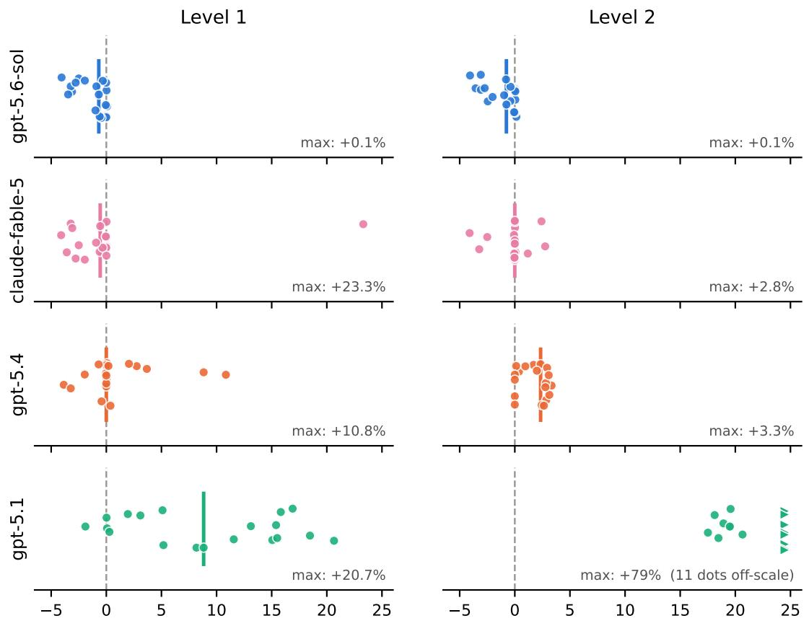
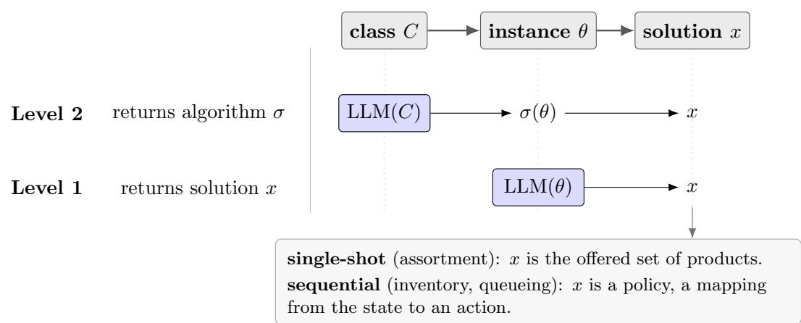
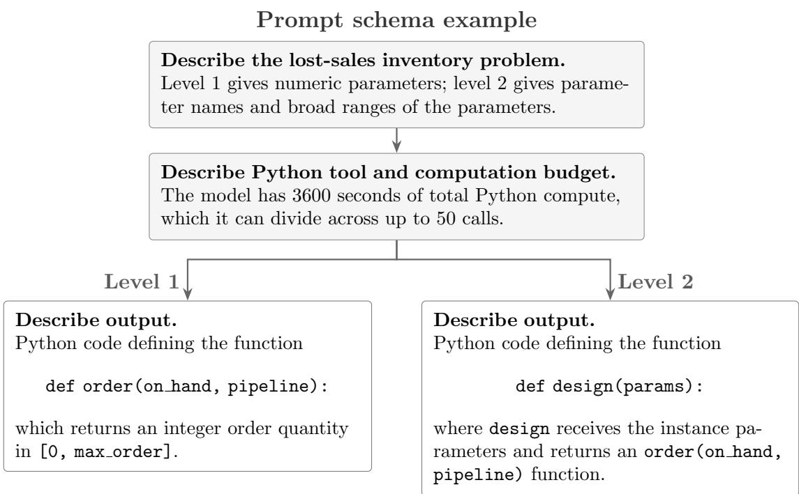
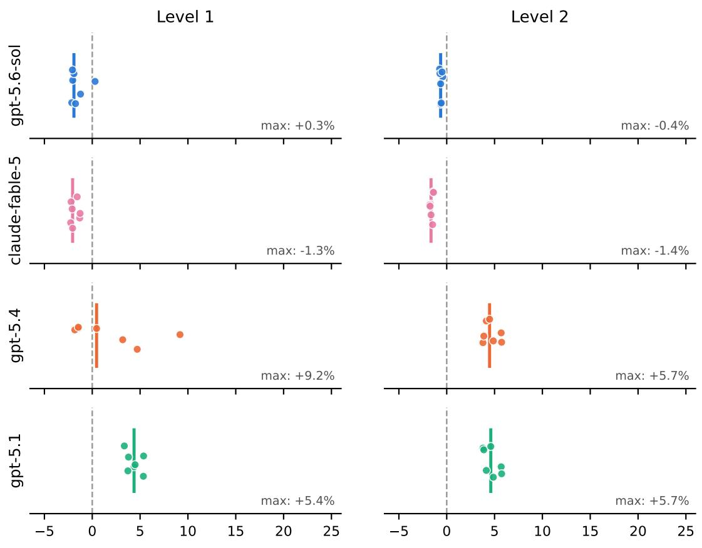
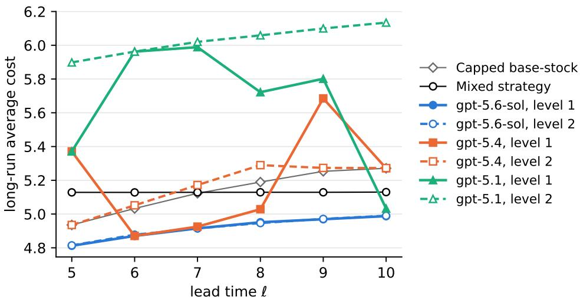
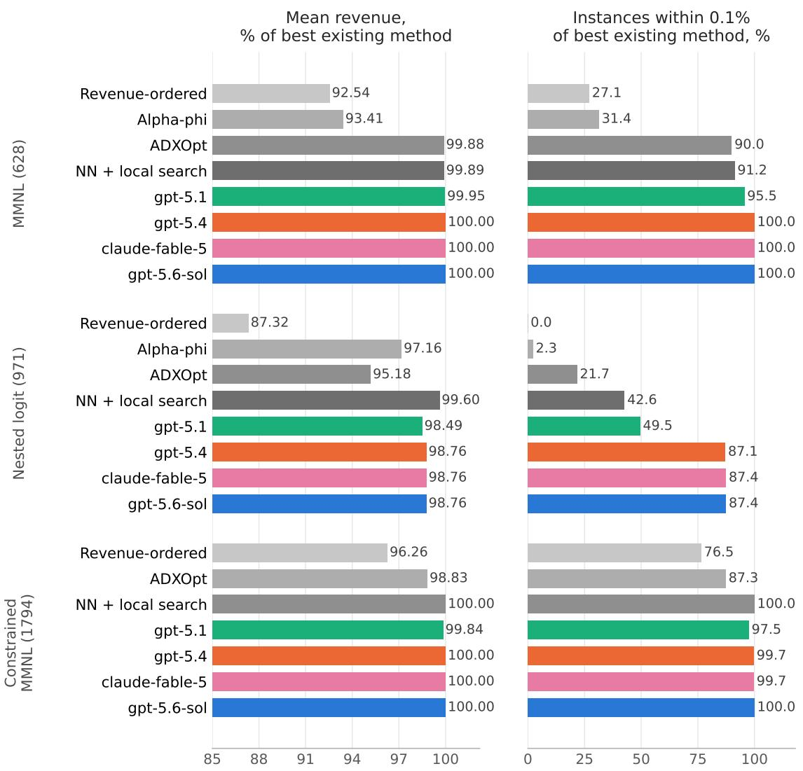
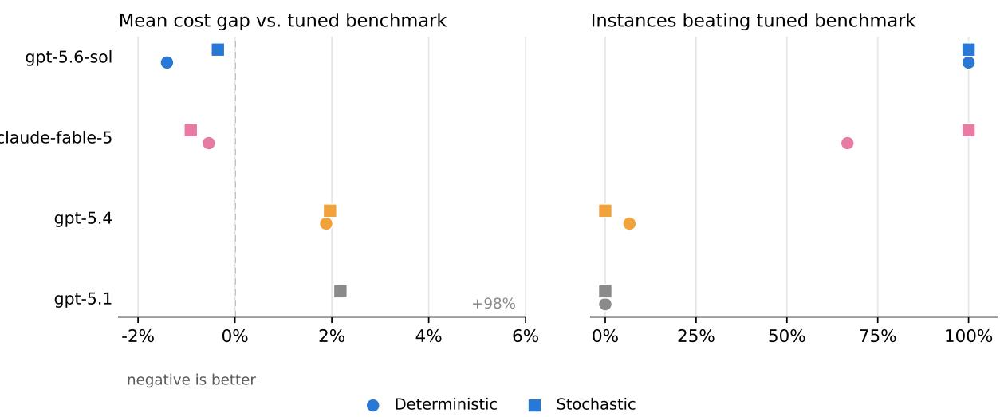
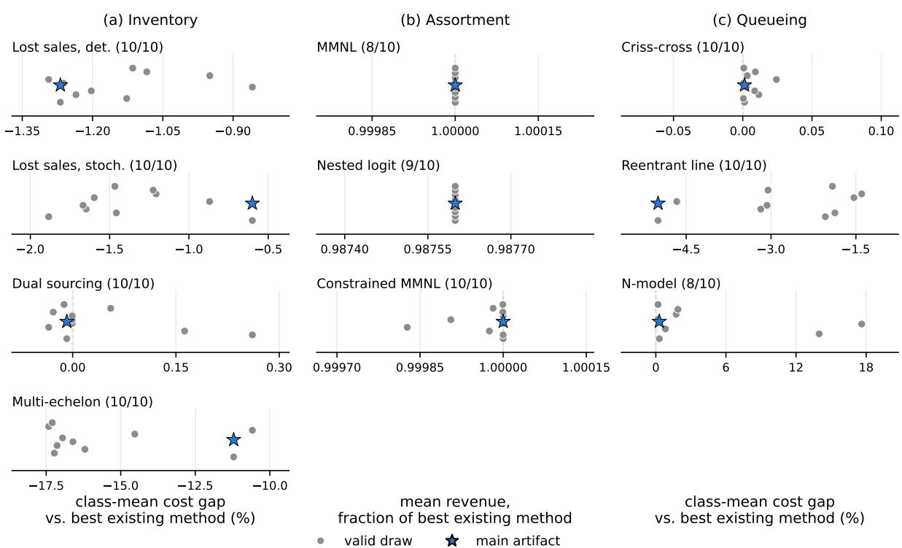
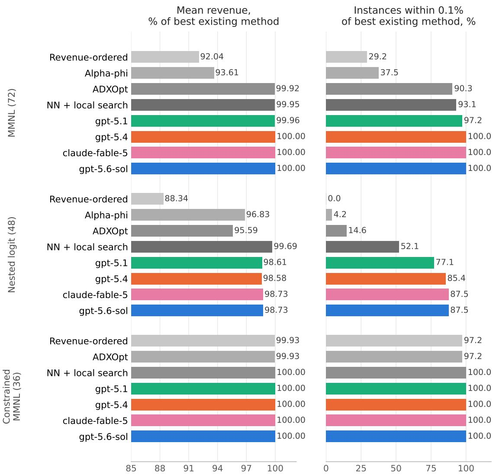

# LLMs Can Design Near-Optimal OR Algorithms

Jackie Baek<sup>∗</sup>

## Abstract

We ask whether large language models (LLMs) can design efective algorithms for wellspecified operations research (OR) problems. We study inventory control, queueing network control, and assortment optimization. We evaluate two levels of LLM use: at level 1, the model receives one problem instance and returns a solution for that instance; at level 2, it receives only the problem class description and broad parameter ranges, and returns an algorithm that maps instance parameters to solutions. Human input is minimal: we give one untuned prompt that describes the problem, and the model has access to a Python sandbox tool with a fixed compute budget.

The strongest model we test, gpt-5.6-sol, matches or outperforms the best existing method on almost all evaluated instances. This holds even at level 2, where the returned algorithm is fixed before seeing the evaluation instances. Performance also improves sharply across models released less than eight months apart, suggesting that this capability is moving quickly. Thus, for the well-specified operations problems we study, a single untuned LLM query can already produce algorithms competitive with specialized methods. These results suggest that frontier LLMs can be a serious empirical baseline for algorithm design in well-specified OR problems.

## 1 Introduction

Operations research (OR) has a long tradition of developing specialized algorithms for specific operational problems. Inventory control, queueing network control, assortment optimization, routing, and revenue management each have their own models, structural results, approximation methods, and computational heuristics. These algorithms are usually designed by researchers who use problem-specific knowledge to exploit the structure of a particular model or application domain.

Large language models (LLMs) are a new technology with broad capabilities. They can write code (Chen et al., 2021), solve long-standing open math problems (OpenAI, 2026), and propose procedures across many domains (Romera-Paredes et al., 2024). This raises a natural question:

## How good are LLMs at designing algorithms for operations problems?

Answering this question can help clarify how LLMs may change the division of work in operations research. Solving a real operations problem involves many steps, including formulation, algorithm design, implementation, validation, and deployment. Each step requires diferent kinds of expertise and judgment. We isolate the algorithm-design step and ask whether a general-purpose model can produce high-performing algorithms.

We study this question experimentally on settings where the problem is mathematically well specified but exact optimization is dificult. Given a formal description of the problem, we ask an LLM either to produce a solution for a particular instance or to design an algorithm that maps instance parameters to solutions. We use the LLM in a simple one-query protocol: we provide one prompt that states the problem and the output format, without doing any prompt tuning or providing hints about the structure of a good solution.

We study three canonical OR domains with long literatures: inventory control, queueing network control, and assortment optimization. For inventory, we use the instances evaluated by Gijsbrechts et al. (2022): lost-sales systems with deterministic and stochastic lead times, dual sourcing, and multi-echelon distribution. For queueing, we use the multiclass queueing-network instances of Dai and Gluzman (2022): criss-cross networks, the N-model, and extended six-class reentrant-line networks. For assortment, we use the hard benchmark instances of Guo et al. (2025): mixed MNL, nested-logit, and constrained mixed-MNL choice models. Together, these benchmarks give 34 inventory instances, 13 queueing instances, and 3,393 assortment instances. A common feature of the source papers is that they use these instances to compare modern deep learning or reinforcementlearning approaches with classical methods.

We use an LLM in two ways, difering in where it enters the algorithm-design process:

• Level 1: the LLM is given a single instance with its numeric parameters, and returns a solution to that instance.

• Level 2: the LLM is given a problem class and broad parameter ranges. It returns an algorithm that maps instance parameters to solutions, and that algorithm is then run on every evaluation instance in the class. The returned algorithm is asked to produce each instance-specific solution within 30 seconds.

For example, in assortment optimization, a level-1 query outputs one assortment for one specified choice model, whereas a level-2 query outputs an algorithm that maps choice-model parameters to an assortment. Level 2 is closer to the standard notion of algorithm design; we also test level 1 because it is a strong and natural benchmark. The methods developed in the papers whose instances we use are level-1 methods: their policies are trained separately for each instance (Gijsbrechts et al., 2022; Dai and Gluzman, 2022; Guo et al., 2025). For most evaluated instances, level 1 cannot rely on exhaustive enumeration due to the large solution space.

We evaluate four LLMs that span two providers and less than eight months of public release dates: gpt-5.1, gpt-5.4, and gpt-5.6-sol from OpenAI, and claude-fable-5 from Anthropic.<sup>1</sup> All code, prompts, and the complete run records (every LLM query with its reasoning summaries, executed code, outputs, and token usage) are publicly available.<sup>2</sup>

## 1.1 Main findings

Table 1 summarizes the results for the strongest model, gpt-5.6-sol, across all ten problem classes and both levels. Each entry compares the LLM with the best existing method for that instance: in each domain, the best of the methods reported by the source paper on that instance, including the exact optimum where available.

gpt-5.6-sol matches or beats the best existing method on nearly every instance. Across the ten classes in Table 1, gpt-5.6-sol has mean performance no worse than the best existing method in eight classes at both levels. At each level, it is no worse on every instance in six classes. This is a demanding comparison: the comparator is chosen instance by instance from the existing methods, including exact dynamic programs or exact solvers where available.

<table><tr><td rowspan="2">Problem class</td><td rowspan="2">Best existing methods</td><td rowspan="2">n</td><td colspan="2">Level 1</td><td colspan="2">Level 2</td></tr><tr><td>(%)</td><td>Gain No worse (%)</td><td>(%)</td><td>Gain No worse (%)</td></tr><tr><td>Inventory (cost) Lost sales,</td><td>exact DP (l ≤ 4); tuned capped</td><td></td><td>19+1.32</td><td>100+1.27</td><td></td><td>94.7</td></tr><tr><td>Lost sales,</td><td>deterministic lead time base stock; mixed strategy tuned capped base stock</td><td></td><td>7 +1.55</td><td>85.7 +0.60</td><td></td><td>100</td></tr><tr><td>stochastic lead time</td><td></td><td></td><td></td><td></td><td></td><td></td></tr><tr><td>Dual sourcing Multi-echelon</td><td>exact DP tuned constant order-up-to</td><td></td><td>6+0.04  $2 \ + 2 2 . 7 8$ </td><td> $1 0 0 \ + 1 1 . 2 1$ </td><td>100+0.01</td><td>100 100</td></tr><tr><td>distribution</td><td></td><td></td><td></td><td></td><td></td><td></td></tr><tr><td>Queueing (cost) Criss-cross</td><td>exact DP</td><td></td><td></td><td></td><td></td><td></td></tr><tr><td></td><td></td><td></td><td>6 +0.00</td><td>100</td><td>+0.00</td><td>100</td></tr><tr><td>N-model Extended six-class</td><td>exact DP PPO trained per</td><td>1</td><td>-0.19</td><td>0.0</td><td>-0.17</td><td>0.0</td></tr><tr><td></td><td>instance (Dai and Gluzman, 2022)</td><td></td><td>6+5.50</td><td></td><td>66.7 +5.00</td><td>83.3</td></tr><tr><td>Assortment (revenue) MMNL</td><td>NN + local search; ADXOpt</td><td>628*</td><td>+0.00</td><td>100</td><td>+0.00</td><td>100</td></tr><tr><td>Nested logit</td><td>LP policy of Kunnumkal (2023);</td><td>971*</td><td>-1.27</td><td>87.5</td><td>-1.24</td><td>87.4</td></tr><tr><td>Constrained MMNL</td><td>ADXOpt; NN + local search conic MIP;</td><td>1794* +0.00</td><td></td><td>100+0.00</td><td></td><td></td></tr></table>

<sup>∗</sup>Level 2 is evaluated on every instance of the class; level 1 needs one query per instance and is evaluated on a stratified subset of 72 instances for MMNL, 48 instances for Nested logit, 36 instances for Constrained MMNL.

Table 1: Summary of gpt-5.6-sol’s results against the best-performing method on that instance among those reported by the source paper. Gain is the mean relative cost reduction (inventory and queueing) or revenue gain (assortment) over that method, in percent; positive means the LLM is better. No worse is the share of instances on which the LLM is within 0.1% of or better than it. The second column lists every method that is strictly the best on at least one instance of the class, and methods that tie the best on every instance. Level 1 uses one query per instance; level 2 uses one algorithm per class, evaluated on every instance.

Inventory and queueing are uniformly strong. The LLM improves on the best existing method on average in all four inventory classes; in queueing, it matches the DP-computed optimum on the criss-cross instances, is within 0.2% of optimal on the N-model, and beats the per-instance PPO comparator on most reentrant-line instances. In assortment, it matches the optimum on all MMNL instances and the best known value on all constrained-MMNL instances. Nested logit is the main exception: the LLM matches the near-optimal LP policy of Kunnumkal (2023) on 87% of instances but loses on a dificult tail, with mean revenue 1.2% lower.

Level 2 works well for structurally specified classes. Level-2 algorithms often perform nearly as well as level-1 solutions, even though they are written from only a problem-class description and broad parameter ranges. Across the ten classes in Table 1, level 2 has mean performance no worse than the best existing method in eight classes and matches it on every instance in six classes. Thus, the LLM is not only solving isolated instances: a single untuned query can produce reusable algorithmic structure for a class of instances.

The generated algorithms have recognizable structure. The level-2 algorithms often use ideas from the OR literature. In inventory, the strongest algorithm generalizes a capped base-stock policy, using a projected inventory statistic rather than the raw inventory position. In assortment, the strongest solvers combine small exact routines, greedy and relaxation-based starts, and local improvement. In queueing, the returned policies use familiar dynamic-control ideas, including dynamic programming on small state spaces and pressure-based scheduling rules on larger networks. This makes the outputs diferent from black-box learned policies (e.g., deep RL-based methods) or generic solver calls: they are inspectable algorithms whose steps can be explained, modified, and potentially improved.

Performance improves with stronger models. The four models we evaluate were released within eight months of one another, yet their performance difers substantially, especially at level 2. Figure 1 gives a preview of this pattern for deterministic lost-sales inventory: each dot is one instance, showing the cost of the LLM policy relative to the best existing method on that instance, for all four models at both levels. In the figure, gpt-5.1 has significantly higher costs than the benchmark on most instances, while gpt-5.4 is much closer but still leaves visible gaps, especially at level 2. This suggests that LLM algorithm-design capability is moving quickly, and that frontier LLMs are becoming a natural empirical baseline for hard OR problems.

## 1.2 Implications and limitations

Implications for OR research. These experiments take a step toward understanding where LLMs may fit in the OR pipeline. In the well-specified benchmark problems we study, a strong LLM can already perform part of the algorithm-design step. In settings where this works, algorithm design becomes much cheaper, which may shift attention toward parts of the pipeline the mode does not address, such as formulation, validation, and deployment.

These results do not imply that LLMs replace algorithmic research. The generated algorithms often resemble variants and combinations of known algorithmic structures. We cannot run the counterfactual of evaluating a model trained without this literature, so we do not know how much of the performance depends on it. Whether LLMs can design equally strong algorithms for problem classes without an established algorithmic literature is an open question. What our results do show is that, in domains with well-specified models and rich algorithmic traditions, current LLMs can produce high-performing and interpretable algorithms from a minimal prompt.

  
Increase in cost relative to best tuned benchmark (%)  
Figure 1: Preview of the inventory results on deterministic lost-sales instances (lower is better). Each dot is one instance, plotted as the percentage increase in cost relative to the best existing method on that instance (the best tuned benchmark policy, or the exact optimum on the six shortlead-time instances); negative values mean the LLM policy has lower cost. The vertical bar marks the median, and each panel reports its worst instance. Level 1 uses one query per instance; level 2 uses one returned algorithm for the whole deterministic-lead-time family. Dots above +25% are clipped and shown at the right edge.

Empirical evidence and contamination. Our evidence is empirical and limited to three OR settings: inventory control, queueing network control, and assortment optimization. A natural next step is to test the same framework on a wider range of operations problems. We also cannot rule out that benchmark-specific information, such as instances, solutions, or performance comparisons, appeared in model training. In Section 6.2, we partly address this concern by evaluating the level-2 algorithms on new parameter values and generated instances outside the main benchmarks. Lastly, our results are empirical: we do not prove approximation guarantees, and we do not know how robust the LLM-generated algorithms are outside the instance families we test. The queueing experiments also show that level-2 performance depends on how the problem class is defined: a class that is too broad can lead the model to return a generic policy that fails on some subclasses.

Roadmap. The next subsection reviews the related literature. Section 2 gives the shared experimental setup and protocol used for all three domains. Section 3 presents the inventory experiments, Section 4 presents the queueing experiments, and Section 5 presents the assortment experiments. Section 6 checks whether the main results survive removing sandbox compute, extend to new instances, and are stable across repeated LLM queries. Section 7 concludes.

## 1.3 Related Work

LLMs for operations research and operational decision-making. A growing literature studies LLMs in operational decision-making. We organize these works by where the LLM enters the decision pipeline: formulation, supplying model inputs, designing the solution, and making the decision. Our work is related to the third stage and touches the fourth. Surveys of the area span these stages and emphasize reliability, modeling errors, and tool use (Wang and Li, 2025; Simchi-Levi et al., 2026).

1. Formulating the model. One stream treats formulation as a translation problem: given natural-language problem statements, LLMs produce optimization models, solver code, or model files (Ramamonjison et al., 2023; AhmadiTeshnizi et al., 2024; Huang et al., 2025; Zhou et al., 2025). Other work builds benchmarks, training data, and search procedures for the same formulation task (Astorga et al., 2025; Huang et al., 2024; Yang et al., 2025; Jiang et al., 2024; Zhang et al., 2024). A second group studies messier, more realistic settings in which the model is built, repaired, or specified interactively rather than translated from a clean problem statement (Xiao et al., 2024; Li et al., 2023; Ao et al., 2026; Drossman et al., 2026; Lawless et al., 2024; Liang et al., 2026).

2. Constructing model inputs. A second stream uses LLMs to construct or elicit the primitives an optimization model needs after the model class has been chosen. Baek et al. (2026a) use LLMgenerated personas to build distributions for sample-average approximation, Huang and Wang (2026) use LLM-powered virtual populations for demand simulation and pricing, and Duan et al. (2025) study human–LLM clarification of inventory-control inputs.

Our experiment deliberately removes these first two stages. The optimization problem is already specified in precise mathematical terms, so we do not test formulation. Every parameter is known exactly and stated in the prompt, so we do not test data generation.

3. Designing the solution method. A third stream uses LLMs to design solution methods rather than to formulate models, supply inputs, or make a single decision. Our paper belongs in this stream: at level 2, the model returns a reusable algorithm that maps future instance parameters to decisions. Zhang et al. (2026) use an LLM to generate basis functions for recourse decision rules in stochastic optimization; relative to that work, we leave the choice of algorithmic structure to the model rather than enriching a fixed decision-rule class.

Other work embeds the LLM in an iterative algorithm-discovery loop. In inventory, Huang et al. (2026) use evolutionary search for white-box policies, and related systems repeatedly generate, evaluate, and revise code or heuristic ideas (Romera-Paredes et al., 2024; Liu et al., 2024; Ye et al., 2024; van Stein and B¨ack, 2025; Zheng et al., 2025; Google DeepMind, 2025; Yang et al., 2024); see Liu et al. (2026) for a survey. Our goal is diferent from these works; we do not try to optimize the scafold around the LLM. Instead, we ask how well a frontier LLM performs under a simple single-query protocol: the same prompt structure, sandbox, and compute budget are used across problem classes.

A related line uses LLMs inside generic MILP solvers. Lawless et al. (2025) configure cuttingplane separators from a problem description and solver documentation, while other work uses LLM-guided search to generate cuts, large-neighborhood-search rules, or branching policies (Yazdani et al., 2025; Ye et al., 2025; Hou et al., 2026). These papers use LLMs to choose or generate components inside established solver pipelines, such as branch-and-cut or large-neighborhood search.

4. Direct decision-making. A fourth stream places the LLM directly in the decision seat and measures its actions in inventory, retail, economic, pricing, and supply-chain environments (Baek et al., 2026b; Liu et al., 2025; Zhao et al., 2025; Tanlamai et al., 2026; Cohen and Hage-Youssef, 2026; Ahmed et al., 2026; Long et al., 2025). Related work studies LLM exploration in bandit and economic environments whose specification the model must learn through interaction (Krishnamurthy et al., 2024; Fish et al., 2025). Our level-1 experiments are related, especially in assortment, where the model returns a decision rather than a reusable procedure. The key diference is that, in much of the existing work, the LLM still has room for subjective judgment about formulation: what objective to pursue and which constraints matter. In our setting, we give the LLM the full mathematical specification and all parameters, and test only the quality of the resulting decision against existing algorithms.

General methods for OR algorithm design. Before LLMs, the main general-purpose alternative to problem-specific algorithm design was machine learning and reinforcement learning. This literature has produced learned policies and value-function approximations for inventory control (Van Roy et al., 1997; Gijsbrechts et al., 2022; Temiz¨oz et al., 2025; Xie et al., 2026; Alvo et al., 2023; Harsha et al., 2025), queueing control (Moallemi et al., 2008; Shah et al., 2020; Qu et al., 2020; Liu et al., 2022; Wei et al., 2023; Dai and Gluzman, 2022; Chen et al., 2024), and assortment optimization and routing (Wang et al., 2023; Aouad and D´esir, 2025; Li et al., 2026; Bello et al., 2017; Kool et al., 2019).

These methods ask a question close to ours: how much problem-specific input is needed to obtain a competitive algorithm? Existing ML/RL approaches typically require a simulator, a policy class, and substantial tuning, and they usually produce black-box policies or value functions. Our level-2 artifacts are executable algorithms written in code, so their logic can be inspected, diagnosed, and modified.

Benchmarks and baselines. Our experiments use published benchmark families in inventory control, queueing-network scheduling, and assortment optimization. This follows recent calls for more systematic empirical benchmarking in stochastic OR: Dong et al. (2026) argue for evaluating algorithms on structured instance families, using reusable simulators, shared baselines, and explicit protocols rather than isolated numerical examples. Recent benchmarks for LLM-driven algorithm design, such as CO-Bench (Sun et al., 2026) and HeuriGym (Chen et al., 2026), also ask LLM agents to write reusable algorithms.

The inventory benchmark covers problem classes where exact dynamic programming is quickly intractable. In lost-sales inventory, the optimal policy depends on the full vector of outstanding orders, so the state space grows exponentially in the lead time and exact dynamic programming is out of reach beyond short lead times (Zipkin, 2008b,a). This has led to specialized policy families, including myopic, base-stock, constant-order, and capped base-stock policies (Huh et al., 2009; Goldberg et al., 2016; Xin, 2021, 2026), which are the inventory benchmarks we evaluate against. Dual sourcing has a similar pipeline-state dependence (Veeraraghavan and Scheller-Wolf, 2008), and no tractable optimal policy is known for multi-echelon distribution; these dificulties motivate the deep reinforcement-learning benchmark of Gijsbrechts et al. (2022).

The queueing benchmark covers multiclass networks in which scheduling decisions determine which compatible queues receive service after each arrival or service completion. Exact dynamic programming is available for the small criss-cross and N-model instances, but becomes infeasible for the larger reentrant-line networks because the state is the full vector of queue lengths. This motivates comparisons with structured scheduling rules and per-instance-trained reinforcement learning policies in Dai and Gluzman (2022). The same reentrant-line instances also appear in

QGym (Chen et al., 2024); in Appendix C.3, we report a finite-horizon cross-check against QGym’s reported RL controllers.

The assortment benchmark plays the same role in a setting where tractability depends sharply on the choice model. The multinomial logit model has strong structure (Talluri and van Ryzin, 2004), but assortment optimization under the mixed multinomial logit model is NP-hard even without constraints (Bront et al., 2009; Rusmevichientong et al., 2014), and general linear constraints add another source of dificulty. For nested logit, the problem is polynomially solvable when the nest exponent parameters are at most one (Davis et al., 2014; Gallego and Topaloglu, 2014), but NPhard once they exceed one (Davis et al., 2014; Kunnumkal, 2023). The benchmark instances we use have nest exponent parameters in [2, 3] and per-nest cardinality constraints, placing them in the hard regime. We use the hard-instance benchmark of Guo et al. (2025), which was designed to stress standard assortment heuristics.

## 2 Setup

We begin by setting up the framework used throughout the experiments: a problem class, its instances, and the feasible solutions for each instance (Section 2.1). We then formalize the diferent granularities at which an LLM can be queried to solve such problems (Section 2.2).

## 2.1 Problem Classes and Instances

A problem class is a tuple $C = ( \Theta , \chi , R )$ . Here Θ is a parameter space, and a problem instance is a specific parameter $\theta \in \Theta$ . For each instance, $\mathcal { X } ( \boldsymbol { \theta } )$ is the set of feasible solutions, and $R ( \theta , x )$ is a deterministic reward function for solution $x \in { \mathcal { X } } ( \theta )$ on instance θ. An instance may contain randomness, such as demand realizations or customer choices; R folds this randomness into a single deterministic quantity, for example through an expectation or a long-run average.

The elements of $\mathcal { X } ( \boldsymbol { \theta } )$ may be simple or structured objects, and this is the only distinction we need between single-shot and sequential problems. In a single-shot problem, the solution is a single choice, such as an assortment. In a sequential problem, the decision-maker observes a state and acts repeatedly, so a solution is a policy that selects an action at each state, $\mathcal { X } ( \theta ) ~ = ~ \{ \pi : \mathcal { S } \to { \mathcal { A } } \}$ where S and A are the state and action spaces.

We illustrate the primitives with two examples.

Example 1 (Inventory control with lost sales). The problem class C is single-product lost-sales inventory control. An instance is

$$
\theta \ = \ ( F , \ell , h , p , c , \bar { q } ) ,
$$

where F is the demand distribution, ℓ is the deterministic lead time, h is the holding cost, p is the lost-sales penalty, c is the unit ordering cost, and ¯q is the maximum order quantity. The problem is sequential. The state is on-hand inventory together with the pipeline of outstanding orders, $s = ( I , q _ { 1 } , \dots , q _ { \ell - 1 } ) \in \mathcal { S }$ , and an action is an order quantity $a \in \mathcal { A } = \{ 0 , 1 , \ldots , \bar { q } \}$ . Thus the feasible-solution set $\mathcal { X } ( \boldsymbol { \theta } )$ is the policy space $\{ \pi : S  A \}$ . Each period, the order placed ℓ periods earlier arrives, a new order is placed, demand $d _ { t } \sim F$ is realized, and unmet demand is lost. Writing $I _ { t }$ for on-hand inventory after arrivals, the reward of a policy is the negative long-run average cost,

$$
R ( \theta , \pi ) \ = \ - \operatorname* { l i m } _ { T \to \infty } \frac { 1 } { T } \mathbb { E } \left[ \sum _ { t = 1 } ^ { T } h \left( I _ { t } - d _ { t } \right) ^ { + } + p \left( d _ { t } - I _ { t } \right) ^ { + } + c a _ { t } \right] ,
$$

where $a _ { t }$ is the order placed in period t.

Example 2 (Assortment optimization under MMNL). The problem class C is assortment optimization under the mixed multinomial logit (MMNL) choice model with a cardinality cap. An instance is

$$
\theta \ = \ ( m , n , \omega , u , v _ { 0 } , r , k ) ,
$$

where m is the number of customer segments with weights $\omega \in \Delta _ { m } , n$ is the number of products, $u \in \mathbb { R } _ { \geq 0 } ^ { m \times n }$ are utilities, $v _ { 0 } \in \mathbb { R } _ { > 0 } ^ { m }$ are outside-option weights, $r \in \mathbb { R } _ { > 0 } ^ { n }$ are prices, and k is a cardinality cap. The problem is single-shot, and the solution space is ${ \mathcal { X } } ^ { \overline { { } } } ( \theta ) = \{ S \subseteq [ n ] : | S | \leq k \}$ The reward is expected revenue: a customer in segment $j$ ofered assortment S buys product $i \in S$ with probability $u _ { j i } / ( v _ { 0 j } + \textstyle \sum _ { i ^ { \prime } \in S } u _ { j i ^ { \prime } } )$ , so

$$
R ( \theta , S ) = \sum _ { j = 1 } ^ { m } \omega _ { j } { \frac { \sum _ { i \in S } r _ { i } u _ { j i } } { v _ { 0 j } + \sum _ { i \in S } u _ { j i } } } .
$$

How broad to make a problem class is itself a modeling choice. In Example 2 we defined the class as assortment optimization under MMNL, so an instance with a diferent choice model belongs to a diferent class. One could instead define the broader class of assortment optimization under an arbitrary choice model; that class contains the one in Example 2. We use this flexibility in the queueing experiments by trying two definitions of level 2: a primary definition with fixed queueingnetwork structures, and a broader problem class definition that allows arbitrary multiclass networks up to the same size range.

## 2.2 Levels of LLM invocation

  
Figure 2: A level is the point in the chain at which the LLM is queried. Level 2 is queried once per class and returns an algorithm that serves every instance; level 1 is queried once per instance and returns a solution for that instance alone.

A problem class induces a chain of objects, shown in Figure 2, and an LLM can be inserted at diferent points in this chain. We call the choice of insertion point the level of invocation:

• Level 1. The LLM is queried once per instance: it receives θ and returns a solution $x \in { \mathcal { X } } ( \theta )$

• Level 2. The LLM is queried once per class: it receives a description of C and returns an algorithm σ, executable code that maps any instance θ of the class to a solution $\sigma ( \theta ) \in { \mathcal { X } } ( \theta )$

We use artifact for the concrete code returned by one LLM query. This applies at both levels: a level-1 artifact implements one instance-specific solution, while a level-2 artifact implements a reusable algorithm.

These are the two levels our experiments use. For sequential problems the chain runs one step further, since a solution is a policy and the decision-maker acts at every state, and a third level becomes available:

• Level 0. The LLM is queried at every state: it receives $( \theta , s _ { t } )$ and returns an action $a _ { t }$

We do not test level 0 in this paper; however, other papers in the literature operate at this level (see Section 1.3).

Resource constraints. Without further restrictions, the levels can collapse into one another. A level-2 algorithm could simply be $\sigma ( \theta ) = \mathrm { L L M } ( \theta )$ . We therefore put resource constraints on both the query and the returned executable object, and we disallow LLM calls from returned code entirely. One could define budgets that permit LLM access, or a combination of LLM access and code execution, but we do not study those variants in this paper.

Note that a lower level has strictly more information: a model queried at level 1 sees the instance itself, while a level-2 algorithm can only execute its written code on it. However, this informational advantage of level 1 does not necessarily translate into better empirical performance; our experiments compare performance across the levels.

## 2.3 Experimental protocol

Each query is a single tool-using session: the model receives a mathematical problem description, may use a Python sandbox under a prompt-stated compute budget, and returns the required deliverable. The sandbox provides the Python standard library, numpy, and scipy, but no external optimization solvers such as Gurobi.

The prompts are deliberately untuned. They state the problem, the available sandbox, the compute budget, and the required output format, but do not name benchmark policies, suggest solution methods, or describe the shape of a good answer. Returned code is evaluated outside the LLM session and may not call an LLM. Figure 3 gives an abbreviated schematic for the lost-sales inventory prompts. Representative prompt examples are reported in Appendix H; the full prompt texts are in the public repository.

In the main results, each LLM query is run once: once for each model-instance pair at level 1 and once for each model-class pair at level 2. We do not otherwise retry or select over repeated samples, except when an artifact is defective; the rerun rule is described in Appendix A. Section 6.3 checks how much the results vary across repeated runs of the same query. We compare every LLM result with the best existing method on the same instance: the best reported or implemented method from the source paper, including exact solvers where available.

  
Figure 3: Example schematic of the lost-sales inventory prompt.

## 3 Inventory Experiments

Our inventory experiments follow the experiments of Gijsbrechts et al. (2022), who asked whether a single deep reinforcement learning method can match specialist inventory heuristics. We keep their instances and benchmarks where possible, changing only the cases that would otherwise be exactly solvable.

## 3.1 Instances

We use the three inventory settings in Gijsbrechts et al. (2022): lost sales, dual sourcing, and multi-echelon distribution. Table 2 lists the instance groups. The main text focuses on the 26 lost-sales instances, and we defer the dual-sourcing and multi-echelon descriptions and results to Appendix B.

<table><tr><td>Problem class (# instances)</td><td>Group</td><td>Specification</td><td>Optimum reachable?</td></tr><tr><td rowspan="3">Lost sales, deterministic (19)</td><td>Short lead times</td><td> $\ell \in \{ 2 , 3 , 4 \} \times p \in \{ 4 , 9 \} , \lambda = 5$ </td><td>Yes</td></tr><tr><td>Lead-time sweep Demand sweep</td><td> $\ell = 5 , \ldots , 1 0 , \lambda = 5 , p = 4$   $\lambda \in \{ 1 0 , 1 5 , 2 0 , 2 5 \} , p = 4 , \mathrm { a t } \ \ell = 8$ </td><td>No No</td></tr><tr><td>Penalty sweep</td><td> $p \in \{ 9 , 1 9 , 4 9 \} , \lambda = 5 , \mathrm { a t } \ell = 8$ </td><td>No</td></tr><tr><td>Lost sales, stochastic (7)</td><td></td><td> $\ell \sim U \{ 2 , \dots , \bar { \ell } \} , \bar { \ell } = 5 , \dots , 1 1$   $\lambda = 5 , p = 4$ </td><td>No</td></tr><tr><td>Dual sourcing (6)</td><td></td><td> $\ell _ { r } \in \{ 2 , 3 , 4 \} , c _ { e } \in \{ 1 0 5 , 1 1 0 \}$   $\operatorname { d e m a n d } U \{ 0 , \dots , 4 \}$ </td><td>Yes</td></tr><tr><td>Multi-echelon (2)</td><td></td><td> $( \ell _ { w } , \ell _ { r } , \mu , \sigma ) \in \{ ( 2 , 2 , 5 , 1 4 ) , ( 5 , 3 , 0 , 2 0 ) \}$  10 stores</td><td> $\mathrm { N o }$ </td></tr></table>

Table 2: Inventory problem classes and instance groups from Gijsbrechts et al. (2022). The main text focuses on the lost-sales groups; details for dual sourcing and multi-echelon distribution are in Appendix B.

The first four lost-sales groups use the deterministic-lead-time class in Example 1: a single location orders from one supplier, demand is Poisson, unmet demand is lost at penalty p, and orders are constrained by a per-period maximum order quantity. We also include a separate stochasticlead-time lost-sales class, where each order’s lead time is random. All lost-sales instances share holding cost $h = 1$ , ordering cost zero, and maximum order quantity $\bar { q } = \lceil 2 . 5 \lambda \rceil + 2$ . At short deterministic lead times, the exact optimum is reachable within a query’s own compute budget: value iteration solves the largest of those six instances in about ten seconds. From $\ell = 5$ onward the state space exceeds $1 0 ^ { 9 }$ , so the remaining deterministic instances test whether the model constructs a good heuristic instead.

Deviations from the source paper. For lost sales, we move the demand and penalty sweep groups to ℓ = 8, rather than ℓ = 4 that was used in Gijsbrechts et al. (2022). At ℓ = 4, every instance in those two sweeps is still exactly solvable, so they would mostly repeat the short-lead-time test.

## 3.2 LLM experiments and benchmark policies

We query LLM models at both level 1 and level 2. Level 1 uses one query per instance; level 2 uses one query per problem class, with deterministic and stochastic lead times treated as separate classes. Each query has a sandbox budget of 3600 seconds of Python compute across at most 50 calls. The returned code is evaluated outside the LLM session: level-1 code may do one-time setup at module import, and level-2 code defines a design routine that maps instance parameters to an ordering policy. In both cases, the prompt asks this setup or design step to finish within 30 seconds per instance, and asks the per-period order function to be lightweight. Additional details are reported in Appendix A; prompt examples are reported in Appendix H.

Benchmark policies. No simple policy is optimal in any of these settings, so the literature has produced structured heuristics, several of them carrying performance guarantees. We write I for on-hand inventory at the moment of ordering and Q for the total quantity on order but not yet arrived, so the inventory position is $I + Q .$ , and $( z ) ^ { + } = \operatorname* { m a x } \{ z , 0 \}$ . The quantities shown in parentheses are the policy’s free parameters; for each benchmark policy, the free parameters are tuned separately for each instance by grid search.

• Base-stock (S): order $( S { - } I { - } Q ) ^ { + }$ . Optimal when unmet demand is backordered, but suboptimal under lost sales.

• Constant-order (r): order r every period, whatever the state. Introduced by Reiman (2004) and asymptotically optimal as the lead time grows (Goldberg et al., 2016), since a long pipeline leaves the current state progressively less informative about what will be needed when an order finally arrives.

• Capped base-stock (S, b): order min $\{ b , \ ( S - I - Q ) ^ { + } \}$ ; this policy class has a 2.33-approximation guarantee (Xin, 2021, 2026).

• Mixed strategy $( r , P )$ : order r with probability P and r + 1 otherwise. Introduced by Gijsbrechts et al. (2022), after observing their trained A3C policy alternate between two order sizes, because order quantities are integers while the best constant rate generally is not.

• Myopic (no free parameters): order to minimize expected cost over the next one or two periods. Simulator validation and scoring details are in Appendices A and B.

## 3.3 Results

We summarize the main lost-sales results here; the full results are reported in Appendix B.4.

Overall performance. Figures 1 and 4 give the main lost-sales result, split by deterministic and stochastic lead times. Each dot is measured against the best existing method on that instance. Across all 26 lost-sales instances, gpt-5.6-sol beats the best tuned benchmark on 23 instances at level 1 and is within 0.5% on all 26. At level 2, the model writes only two algorithms, one for deterministic lead times and one for stochastic lead times. Those algorithms beat the best tuned benchmark on 21 instances and are again within 0.5% on all 26.

claude-fable-5 shows that the strong performance is not unique to one provider, but it is less reliable than gpt-5.6-sol. Across the 26 lost-sales instances, it is within 0.5% of the best tuned benchmark on 25 instances at level 1 and 23 at level 2. The weaker OpenAI models show a clear capability gradient. gpt-5.4 is competitive at level 1 but never beats the tuned benchmark at level 2, while gpt-5.1 is worse at both levels. Since the four models were released within less than eight months, these gaps suggest rapid progress.

For deterministic lead times, the level-2 algorithm comes from one class-level query: 598 seconds of wall time, including 54.9 seconds of sandbox compute. After the query, the returned algorithm’s design time is 3.0 seconds per instance on average, with a maximum of 4.8 seconds. By comparison, level 1 uses one query per deterministic instance; across the same instances, the mean query wall time is 2,248 seconds, including 1,959 seconds of sandbox compute, and the mean module-load time is 1.8 seconds. Full inventory timing results are in Tables 13 and 14.

We now examine selected instance groups more closely to understand where these aggregate results come from.

Exactly solvable short-lead-time instances. Table 3 focuses on the six short-lead-time instances. They are small enough that dynamic programming can compute the exact optimum, and the table reports gaps above it. A bolded number denotes matching the optimum within simulation noise. This table is a diagnostic for whether the model recognizes when exact optimization is feasible. gpt-5.6-sol and claude-fable-5 recover the optimum at level 1 and remain essentially optimal at level 2. The weaker models are less consistent, especially at level 2. Thus, when exact optimization is within reach, the strongest models are able to compute it.

  
Increase in cost relative to best tuned benchmark (%)

Figure 4: Analog of Figure 1 for stochastic-lead-time instances. Lost-sales performance on stochastic-lead-time instances (lower is better). Each dot is one instance, plotted as the percentage increase in cost relative to the best tuned benchmark policy on that instance; negative values mean the LLM policy has lower cost. The vertical bar marks the median, and each panel reports its worst instance. Level 1 uses one query per instance; level 2 uses one returned algorithm for the stochastic-lead-time family. Dots above +25% are clipped and shown at the right edge.
<table><tr><td rowspan="2">Instance</td><td rowspan="2">Optimum</td><td colspan="2"> $\mathtt { g p t - 5 . 6 - s o l }$ </td><td colspan="2"> $\mathtt { c l a u d e - f a b l e - } 5$ </td><td colspan="2"> $\mathtt { g p t } \mathtt { - } 5 . 4$ </td><td colspan="2"> $\mathtt { g p t } \mathtt { - } 5 . 1$ </td></tr><tr><td>L1</td><td>L2</td><td>L1</td><td>L2</td><td>L1</td><td>L2</td><td>L1</td><td>L2</td></tr><tr><td>l = 2, p = 4</td><td>4.395</td><td>+0.02</td><td>+0.04</td><td>+0.02</td><td>+0.02</td><td>+0.02</td><td>+1.70</td><td>+0.02</td><td>+40.04</td></tr><tr><td>l = 2, p = 9</td><td>6.094</td><td>+0.07</td><td>+0.14</td><td>+0.07</td><td>+0.07</td><td>+0.07</td><td>+2.85</td><td>+0.07</td><td>+79.01</td></tr><tr><td>l = 3, p = 4</td><td>4.599</td><td>-0.00</td><td>+0.01</td><td>-0.00</td><td>-0.00</td><td>-0.00</td><td>+2.34</td><td>+8.18</td><td>+33.91</td></tr><tr><td>l = 3, p = 9</td><td>6.531</td><td>-0.01</td><td>+0.03</td><td>-0.01</td><td>-0.01</td><td>-0.01</td><td>+2.93</td><td>+5.10</td><td>+36.50</td></tr><tr><td>l = 4, p = 4</td><td>4.729</td><td>-0.05</td><td>-0.03</td><td>-0.05</td><td>-0.05</td><td>-0.05</td><td>+2.00</td><td>+0.28</td><td>+30.40</td></tr><tr><td>l = 4, p = 9</td><td>6.836</td><td>-0.01</td><td>+0.05</td><td>-0.01</td><td>-0.01</td><td>-0.01</td><td>+3.33</td><td>+1.95</td><td>+37.60</td></tr></table>

Table 3: The short lead-time grid (exact optimum computed): LLM policies, level 1 (L1) and level 2 (L2) per model. On these instances the best existing method is the exact dynamic program, so entries are the percentage gap above the exact optimum (first column); bold marks a policy that matches the optimum within simulation noise. All 95% CI half-widths are below 0.05.

  
Figure 5: Analogue of Figure 5 in Gijsbrechts et al. (2022): deterministic lead-time sweep with Poisson demand mean $\lambda \ : = \ : 5$ and penalty $p \ = \ 4 .$ The thin solid lines are the two strongest tuned benchmarks: capped base-stock (grey diamonds) and the mixed strategy (black circles); the mixed strategy becomes the better of the two at long lead times. Solid lines with filled markers are level-1 policies, one query per instance; dashed lines with open markers are each model’s single deterministic level-2 algorithm evaluated on the same instances. We show the three OpenAI models here to keep the figure readable; claude-fable-5 appears in Figure 1 and the appendix tables.

Lead-time sweep. Figure 5 zooms in on the deterministic lead-time sweep, where exact dynamic programming is no longer practical. We plot the performance of Capped base stock and Mixed strategy, the benchmark policies that performed the best on this family. gpt-5.6-sol improves on the best tuned benchmark at every lead time by 2.5% to 4.1%, and the two curves nearly overlap. This figure shows the model-capability gradient in a more concrete way. gpt-5.4 is competitive at level 1 on several lead times, but its level-2 algorithm stays close to the capped base-stock benchmark rather than improving on it.

Comparison with A3C. In the lost-sales experiments of Gijsbrechts et al. (2022), A3C mostly matches strong heuristics rather than clearly improving on them. On the short-lead-time grid, A3C does not find the optimum and is outperformed by capped base-stock. On the deterministic leadtime sweep, A3C initially outperforms the standard benchmarks, but this observation motivates the mixed strategy, which then matches the A3C performance. In contrast, gpt-5.6-sol improves on the best tuned benchmark in Figure 5, including the mixed strategy, at every lead time.

In our taxonomy, A3C is a level-1 approach: the training and hyperparameter tuning are done separately for each instance, producing a policy for that instance rather than an algorithm that transfers across instances. This pipeline is expensive: the paper reports that one hyperparameter setting takes about 24 CPU-hours to evaluate, and that the automatic tuning procedure evaluates approximately 250 hyperparameter settings. Our level-2 algorithms come from one query with at most one hour of sandbox compute, plus the light setup computation reported in Section 6.1. The returned object is also diferent. A3C produces a black-box policy, whereas the level-2 LLM algorithm is inspectable and interpretable code.

## 3.4 Structure of LLM algorithms for deterministic lead times

We inspect the submitted code to understand what the models are doing, focusing on the deterministic lost-sales instances. The level-1 returned policies are instance-specific and heterogeneous: on the short-lead-time grid, the stronger models often build explicit dynamic-programming tables or compressed lookup policies, while on larger instances they switch to tuned heuristics. The level-2 algorithms are more informative, because each one must define a reusable policy-construction rule for a whole family of instances. Appendix G summarizes selected reasoning transcripts behind these algorithms. Across classes, the model follows the same broad sequence: recalling known structure, weighing exact methods against heuristics, budgeting compute, building a testbed, and guarding against edge cases.

Deterministic lead times. The deterministic level-2 algorithm from gpt-5.6-sol is a projected inventory policy. It generalizes the capped base-stock idea: it keeps the order-up-to/capped-order structure, but replaces raw inventory position with a projected, risk-adjusted inventory statistic. The algorithm approximates the distribution of usable inventory after the lead-time window, summarized by its mean and variance. It computes these moments by recursively propagating the current state through the lost-sales dynamics, using exact Poisson moments for the first step and a normal approximation for later steps. It then orders

$$
q = \operatorname* { m i n } \{ \bar { q } , \left( T - m - \gamma \sqrt { v } \right) ^ { + } \} ,
$$

rounded to an integer, where $\bar { q }$ is the per-period order cap and $\gamma$ may be negative, in which case the variance term adds safety stock. The parameters $T$ and $\gamma$ are chosen inside design by simulation: the code evaluates candidate values on the same simulated demand paths, first over a coarse grid and then over a refined grid around the best region. The code also handles edge cases explicitly: it never orders when the efective lost-sales penalty is nonpositive, and it orders at capacity when holding is free and demand exceeds the order cap.

Weaker models. The weaker level-2 algorithms help explain the capability gradient in Figure 1. $\mathtt { g p t - 5 . 1 }$ uses a standard inventory-position base-stock rule: it searches for an order-up-to level S and orders $\textstyle ( S - I - \sum _ { j } q _ { j } ) ^ { + }$ . This is a reasonable generic policy, but it is the wrong state statistic for lost sales with long lead times, and its deterministic level-2 gaps are 17–20% on the lead-time sweep. $\mathtt { g p t } \mathtt { - } 5 . 4$ is more sophisticated: its deterministic algorithm searches over both inventory-position and projected-inventory targets. But it remains essentially a one-parameter target policy, without the mean-variance correction and broader simulation search used by gpt-5.6-sol. It matches the tuned benchmark at short lead times but trails by about 3% at the longer ones.

The main qualitative lesson is that the frontier model is not only tuning a known base-stock threshold. It finds a better state representation for lost sales: inventory already on hand and orders arriving soon are more valuable than orders arriving late, and the policy should respond to both the expected usable inventory and the uncertainty around it.

## 4 Queueing Experiments

Our queueing experiments use the multiclass queueing-network instances of Dai and Gluzman (2022), who study whether deep reinforcement learning can produce strong scheduling policies for queueing networks.

## 4.1 Instances

An instance is a continuous-time multiclass queueing network. There are $Q$ queues, or job classes, and S servers. External jobs arrive to queue q according to a Poisson process with rate $\lambda _ { q } ,$ which may be zero. A server s can work on queue q only when the compatibility matrix has entry $A _ { s q } = 1$ and then serves at rate $\mu _ { s q } ,$ so an uninterrupted service time is exponential with rate $\mu _ { s q } .$ . After service completion at queue $q ,$ the job either leaves the network or joins a specified downstream queue with a fresh service requirement. The controller observes the queue-length vector at each arrival or service completion and assigns each server to a compatible nonempty queue or idles it. Multiple servers may work on the same queue only if there are enough jobs in that queue, in which case they serve distinct jobs. Service is preemptive-resume: interrupted jobs keep their remaining service requirements. Let $X _ { q } ( t )$ denote the number of jobs in queue $q$ at time $t ,$ and let $h _ { q }$ be the holding-cost rate per job in queue $q .$ . The objective is to minimize the expected long-run average holding cost,

$$
\operatorname* { l i m } _ { T \to \infty } \frac { 1 } { T } \mathbb { E } \left[ \int _ { 0 } ^ { T } \sum _ { q = 1 } ^ { Q } h _ { q } X _ { q } ( t ) d t \right] .
$$

Table 4 summarizes the 13 instances. The criss-cross and N-model instances are low-dimensional enough for dynamic programming, so we compute optima by relative value iteration on truncated uniformized chains. The extended six-class networks have $3 L$ queues for $L = 2 , \dots , 7$ stations and are not tractable by dynamic programming at these sizes; for these instances, the strongest existing comparator is the PPO policy reported by Dai and Gluzman (2022), which is trained separately for each instance.

<table><tr><td>Group</td><td>Instances Size</td><td></td><td>Best existing method</td></tr><tr><td>Criss-cross</td><td>6</td><td>2 servers, 3 queues</td><td>DP optimum</td></tr><tr><td>N-model</td><td>1</td><td>2 servers, 2 queues</td><td>DP optimum</td></tr><tr><td>Extended six-class 6</td><td></td><td>2–7 servers, 6–21 queues 1</td><td>per-instance PPO</td></tr></table>

Table 4: Queueing instance groups from Dai and Gluzman (2022); detailed instance parameters are in Appendix C.1. The extended six-class networks are the reentrant-line networks also used in QGym (Chen et al., 2024).

## 4.2 LLM experiments and benchmark policies

Two level-2 class definitions. We report two level-2 settings. The main L2 setting uses one query for each structural class: criss-cross networks, the N-model, and reentrant-line networks. We also run one Broad L2 prompt for the full multiclass-network class.

Level 1 uses one query per instance; level 2 uses one query per class. Each query has a sandbox budget of 3600 seconds of Python compute across at most 50 calls. The returned level-2 design routine is asked to finish within 30 seconds per instance, and the returned event-level scheduling policy is asked to be lightweight.

Benchmark policies. For the seven DP-solvable instances, the benchmark is the DP-computed optimum computed by us. The computed optima reproduce the published values of Dai and Gluzman (2022) to three or four digits on the criss-cross instances, with the largest heavy-trafic instance sensitive to truncation. For the extended six-class networks, the primary benchmark is the PPO policy of Dai and Gluzman (2022). We also re-simulate classical static policies such as LBFS and cµ under our steady-state protocol as secondary checks. Simulator validation and comparator details are reported in Appendix C.

On the seven DP-solvable instances every returned policy is evaluated exactly by dynamic programming, and on the six-class instances by steady-state simulation (Appendix C.2 gives both protocols).

## 4.3 Results

Table 5 reports the queueing results for gpt-5.6-sol. We report cost gaps relative to the best existing method on the same instance, so negative values mean the LLM policy has lower cost.
<table><tr><td>Class</td><td>Instance</td><td>L1</td><td>L2</td><td>Broad L2</td></tr><tr><td rowspan="6">Criss-cross vs. exact optimum</td><td>imbalanced, light</td><td>0.0%</td><td>0.0%</td><td>+2.8%</td></tr><tr><td>balanced, light</td><td>0.0%</td><td>0.0%</td><td>+3.9%</td></tr><tr><td>imbalanced, medium</td><td>0.0%</td><td>0.0%</td><td>+13.7%</td></tr><tr><td>balanced, medium</td><td>0.0%</td><td>0.0%</td><td>+22.2%</td></tr><tr><td>imbalanced, heavy</td><td>+0.001%</td><td>+0.006%</td><td>+22.9%</td></tr><tr><td>balanced, heavy</td><td>+0.001%</td><td>+0.002%</td><td>+82.7%</td></tr><tr><td>N-model vs. exact optimum</td><td> $\rho = 0 . 9 5 , h = ( 3 , 1 )$ </td><td>+0.2%</td><td>+0.2%</td><td>+99.5%</td></tr><tr><td rowspan="6">Extended six-class vs. per-instance PPO</td><td>L = 2 stations, 6 queues</td><td>-1.9%</td><td>+1.1%</td><td>+9.5%</td></tr><tr><td>L = 3 stations, 9 queues</td><td>-8.6%</td><td>-6.5%</td><td>+6.7%</td></tr><tr><td>L = 4 stations, 12 queues</td><td>-8.7%</td><td>-8.5%</td><td>+4.4%</td></tr><tr><td>L = 5 stations, 15 queues</td><td>+0.5%</td><td>-6.3%</td><td>+2.0%</td></tr><tr><td>L = 6 stations, 18 queues</td><td>-16.6%</td><td>-9.8%</td><td>-2.7%</td></tr><tr><td>L = 7 stations, 21 queues</td><td>+2.2%</td><td>-0.1%</td><td>+0.1%</td></tr></table>

Table 5: Queueing performance of gpt-5.6-sol. Entries are percentage cost gaps relative to the best existing method; negative is better. The L2 column uses one query per structural subclass, while Broad L2 uses one query for the full queueing class. Criss-cross and N-model entries are evaluated exactly by dynamic programming; extended six-class entries are simulated. Bold entries beat the comparator or are within 0.1% of the optimum.

Level 1. At level 1, the model is essentially optimal on all seven DP-solvable instances. This is an exact statement rather than a simulation claim, because we evaluate each returned policy by dynamic programming. Thus, when exact dynamic programming is feasible, the model usually discovers and uses it. On the larger six-class networks, the comparator is PPO trained separately for each network. The LLM beats PPO on four of six instances, is essentially tied on one, and is worse on the largest network by 2.2%, within PPO’s reported uncertainty.

Level 2. The main L2 setting preserves most of the L1 performance. For criss-cross and the N-model, the returned algorithms solve truncated dynamic programs and are essentially optimal. For the reentrant-line class, one class-level query returns a simulation-tuned structural policy that beats PPO on five of six instances.

Broad L2. We also ran a Broad L2 query that described the whole multiclass queueing-network model up to 7 servers and 21 queues. This is much broader than the structural classes used for the main L2 queueing results. The Broad L2 query returns a generic index-plus-pressure rule. It is competitive on the extended six-class networks, but performs poorly on the criss-cross and

Table 6: Average percentage cost gap to the best existing method on each queueing class (negative means LLM is better). Level 2 uses the structurally specified classes. Entries that match or beat the best existing method (within 0.1%) are in bold.
<table><tr><td>Level</td><td>Class</td><td>gpt-5.6-sol</td><td>claude-fable-5</td><td>gpt-5.4</td><td>gpt-5.1</td></tr><tr><td rowspan="3">1</td><td>Criss-cross (n = 6)</td><td>+0.0%</td><td>+0.0%</td><td>+0.1%</td><td>+0.9%</td></tr><tr><td>Reentrant line (n = 6)</td><td>-5.5%</td><td>-9.0%</td><td>-4.3%</td><td>-1.4%</td></tr><tr><td>N-model (n = 1)</td><td>+0.2%</td><td>+0.2%</td><td>+0.1%</td><td>+4.8%</td></tr><tr><td rowspan="3">2</td><td>Criss-cross (n = 6)</td><td>+0.0%</td><td>+0.0%</td><td>+3.8%</td><td>+8.4%</td></tr><tr><td>Reentrant line (n = 6)</td><td>-5.0%</td><td>+0.2%</td><td>+2.6%</td><td>+5.8%</td></tr><tr><td>N-model (n = 1)</td><td>+0.2%</td><td>+16.2%</td><td>+0.3%</td><td>unstable†</td></tr></table>

<sup>†</sup>gpt-5.1’s N-model algorithm returns policies that do not stabilize the system.

N-model instances, where good policies require topology-specific threshold behavior. These results show that the definition of the problem class matters: a structurally specified class lets the model choose an appropriate strategy, while a too-broad class can elicit a reasonable-looking generic rule with classical failure modes.

Results across models. Table 6 summarizes the queueing results for all four models as the average percentage cost gap to the best existing method over the instances of each class. At level 1, all four models are within 1% of optimal on the small classes (except gpt-5.1 on the N-model) and beat PPO on average on the reentrant lines. At level 2 the models separate: gpt-5.6-sol and claude-fable-5 stay essentially optimal on the criss-cross class, while only gpt-5.6-sol improves on the existing methods for the reentrant lines. gpt-5.1’s reentrant-line algorithm reduces to a static priority rule, and its N-model algorithm returns policies that fail to stabilize the system.

## 4.4 Structure of the gpt-5.6-sol policies

We inspect the artifacts returned by gpt-5.6-sol. At level 1, the model uses dynamic programming or approximate dynamic programming on the small networks and then returns threshold or lookuptable policies. On the larger six-class networks, it searches over pressure-type rules that score a queue using its own length and downstream congestion, with parameters tuned by simulation.

For the level-2 criss-cross class, the returned design routine solves a truncated average-cost dynamic program on the three queue lengths. The resulting policy has a threshold form: one server serves the middle queue when it is nonempty, while the other chooses between feeding that middle queue and serving the outside queue according to a switching curve in the state.

The N-model artifact uses the same idea on the two-dimensional state. It computes a valuefunction table and extracts a switching boundary for the flexible server: when both queues are nonempty, the policy decides whether the flexible server should help the high-cost class or serve the other class based on the two queue lengths and holding costs.

For the reentrant-line class, exact dynamic programming is too large. The level-2 algorithm instead constructs a family of pressure rules. The rule gives high priority to queues with large backlogs and high holding costs, but it also accounts for downstream congestion: serving an upstream queue is less valuable when it would send work into a congested downstream queue. The score is scaled by service rates and by a static route-position term, so bottleneck and late-stage queues can be weighted diferently from early-stage queues. The design routine then simulates a small menu of these pressure rules, chooses the best parameter setting for the instance, and returns a lightweight event-level policy that only has to recompute the queue scores.

## 5 Assortment Experiments

Our assortment experiments use the hard-instance benchmark of Guo et al. (2025), whose instances are constructed to be dificult for the standard heuristics of the assortment literature.

## 5.1 Instances

We use three assortment families from the hard-instance benchmark of Guo et al. (2025). Each family is treated as its own problem class in the sense of Section 2.1.

MMNL with cardinality constraint. The first family is assortment optimization under the mixed multinomial logit model with a cardinality cap, as in Example 2. We use all 628 released instances, which have $n \leq 2 0 0$ products and $m \leq 2 5$ customer segments. The level-2 prompt gives the same size bounds: $n \leq 2 0 0$ products and $m \leq 2 5$ customer segments.

Nested logit. The second family is nested logit. There are m nests of n products each, and a solution is a binary ofer matrix $S _ { ☉ }$ . Nest i has preference $\begin{array} { r } { V _ { i } ( S ) = v _ { i 0 } + \sum _ { j } S _ { i j } v _ { i j } } \end{array}$ and is chosen with probability $\begin{array} { r } { V _ { i } ( S ) ^ { \gamma _ { i } } / ( v _ { 0 } + \sum _ { k } V _ { k } ( S ) ^ { \gamma _ { k } } ) } \end{array}$ , where $\gamma _ { i }$ is the nest exponent parameter. The expected revenue is

$$
R ( \theta , S ) = \sum _ { i = 1 } ^ { m } \frac { V _ { i } ( S ) ^ { \gamma _ { i } } } { v _ { 0 } + \sum _ { k } V _ { k } ( S ) ^ { \gamma _ { k } } } \cdot \frac { \sum _ { j } S _ { i j } r _ { i j } v _ { i j } } { V _ { i } ( S ) } .
$$

We use all 971 released instances. The released hard set spans $n \in \{ 2 5 , 5 0 \}$ products per nest and $m \in \{ 5 , 1 0 , 2 0 \}$ nests, with either no cardinality constraint or per-nest cap rates in $\{ 0 . 1 , 0 . 3 , 0 . 5 \}$ The level-2 prompt states $n \leq 5 0$ products per nest and $m \leq 2 0$ nests, with cap, when present, interpreted as a per-nest limit.

MMNL with general linear constraints. The third family uses the same MMNL objective but replaces the cardinality cap with five linear constraints $A x \ \leq \ B$ on the product indicator vector x. The authors provided the generator and per-method results for their constrained-MMNL experiment. We regenerate their 1,800 instances exactly and drop the six degenerate instances with no feasible product, leaving 1,794 instances for the level-2 comparison. The grid covers every combination of $m \in \{ 5 , 1 0 , 2 5 \}$ and $n \in \{ 5 0 , 1 0 0 , 2 0 0 \}$ under both utility scalings, with 100 seeds per configuration. The level-2 prompt states $n \leq 2 0 0 , m \leq 2 5$ , and five linear constraints.

## 5.2 LLM experiments and benchmark algorithms

Level 1 uses one query per evaluated instance, with a 900-second sandbox budget, so we evaluate it on a smaller stratified set. The prompts name the choice model but do not name benchmark methods or suggest a solution approach. For level 1, we use a smaller stratified set: the lowest-seed instance from every released MMNL and nested-logit configuration, giving 72 MMNL and 48 nestedlogit instances, and the two lowest seeds from each of the 18 constrained-MMNL configurations, giving 36 constrained-MMNL instances. Additional protocol details are reported in Appendices A and D; representative prompt examples are reported in Appendix H.

Benchmark algorithms. We compare the LLM outputs with the benchmark algorithms tested by Guo et al. (2025), using per-instance results provided by the authors. Write $S$ for the ofered set and $R ( S )$ for expected revenue.

• Revenue-ordered: the best prefix of the price ordering. Optimal under plain multinomial logit (Talluri and van Ryzin, 2004), with no guarantee once segments are mixed.

• Alpha-phi: the parametric scoring heuristic included in the source benchmark for MMNL and nested logit.

• ADXOpt: the local-search method of Jagabathula (2014), evaluated by the source benchmark on all three families.

• NN + local search: the neural-network method of Guo et al. (2025) with its local-search postprocessing.

• Kunnumkal LP: the LP-based nested-logit policy of Kunnumkal (2023).

• Conic MIP: the mixed-integer conic formulation reported by Guo et al. (2025) for MMNL and constrained MMNL.

For MMNL, we compare with revenue-ordered, alpha-phi, ADXOpt, NN + local search, and conic MIP. For nested logit, we compare with revenue-ordered, alpha-phi, ADXOpt, NN + local search, and Kunnumkal LP. For constrained MMNL, we compare with revenue-ordered, ADXOpt, NN + local search, and conic MIP.

## 5.3 Results

We report each method’s revenue as a percentage of the best existing method on that instance. Figure 6 gives the level-2 comparison for the three choice models. Each LLM is queried once per problem family and returns a solver, which we then run on every instance in that family. The methods of Guo et al. (2025) are evaluated on the same instances using the authors’ per-instance results.

On MMNL and constrained MMNL, the strongest LLM solvers essentially match the best existing method. On MMNL, the strong level-2 solvers are exact on the released benchmark; the next subsection explains why this result should be interpreted together with the benchmark’s special structure. On constrained MMNL, gpt-5.6-sol matches the best existing method on every instance, the next strongest models miss only a few tail instances, and the simpler classical heuristics lose noticeably on the tail.

Nested logit is the exception. The strongest LLM solvers do not match the best existing method on mean revenue: they are within 0.1% of it on 87.4% of instances, but lose on a hard tail. Here the benchmark is the Kunnumkal LP policy, which is a strong comparator. Exact optimization is not available at these sizes, but Kunnumkal (2023) provide an upper bound that lets us see how close this policy is to optimal. On the 971 nested-logit instances we evaluate, the LP policy is within 0.1% of this upper bound on 911 instances and within 0.5% on all instances. Thus, the LLM is being compared to a policy that is already very close to optimal.

Figure 9 in Appendix D gives the level-1 counterpart on the smaller stratified set defined in Section 5.2. On this subset, level 1 and level 2 are essentially identical for the stronger models. Thus, giving the model the full instance and a separate query per instance adds almost nothing beyond the reusable level-2 solver. The main visible benefit of level 1 is for gpt-5.1 on nested logit, where instance-specific querying raises the within-0.1% share from 50.0% to 77.1% on the same subset.

## 5.4 The two-type MMNL structure

The MMNL results should be read with an important caveat. All 628 released MMNL instances have only two distinct product-utility vectors. Thus, if this structure is recognized, it is easy to find the exact optimal assortment: sort each utility class by price, and enumerate how many products to take from each class. Our independent solver uses this enumeration and confirms the benchmark optima on all 628 instances.

  
Figure 6: Level-2 LLM algorithms against the methods evaluated by Guo et al. (2025) on identical instances, using the authors’ own per-instance results. Left: mean revenue as a percentage of the best existing method on each instance (axis starts at 85%). Right: share of instances within 0.1% of the best existing method. The best existing method is the best of these methods on the instance; it includes the conic solver for MMNL and constrained MMNL and the LP-based policy of Kunnumkal (2023) for nested logit, and never the LLM solutions.

It is still interesting that level-2 algorithms solve this benchmark, because the prompt gives no example instances and does not mention the two-type structure. Among the published heuristic and learning baselines, no method exploits this collapse well enough to match the optimum on every instance; the LLM solvers do. At the same time, the result is less strong than it first appears: the algorithms are not solving general MMNL in full generality; they are solving a highly structured two-type benchmark.

## 5.5 Structure of the LLM algorithms

We inspect the selected gpt-5.6-sol level-2 algorithms to understand what they are doing. In assortment optimization the returned object is not a policy, as in inventory, but a solver: executable code that maps a new instance to one assortment. We describe only the selected gpt-5.6-sol solvers here; Appendix G gives more detail on the model’s reasoning.

MMNL with cardinality constraint. The gpt-5.6-sol MMNL solver is a heuristic portfolio with exact branches for easy cases. It solves one-segment and small-enumeration cases directly; otherwise it generates candidate assortments from score-ordered prefixes, greedy add and delete paths, randomized starts, and a continuous relaxation. It then polishes the best candidates with add, drop, and swap local search. Thus the solver is stronger than a single revenue-ordered or greedy rule, but it is not a general exact MMNL algorithm; its exactness on the released benchmark should be read together with the two-type structure in Section 5.4.

Nested logit. The gpt-5.6-sol nested-logit solver uses the separable structure of the model. It summarizes each nest-level subset by its numerator and attraction contribution, builds a pool of candidate subsets for each nest, and then chooses one subset per nest using a fractional-programming update. For a current revenue target, the cross-nest step scores each candidate by “numerator minus target times attraction,” then updates the target from the resulting full assortment. This uses ideas from nested-logit assortment algorithms and bounds (Davis et al., 2014; Kunnumkal, 2023), but with a richer generated menu than price-ordered prefixes alone.

MMNL with general linear constraints. The gpt-5.6-sol constrained-MMNL solver is a resource-aware portfolio. It filters individually infeasible products, repairs candidates to satisfy the linear constraints, generates greedy and relaxation-based starts, and improves feasible candidates by add, drop, and swap moves. When time permits, it also solves continuous relaxations and restricted MILP subproblems around the incumbent. The code therefore combines standard OR primitives: relax, round, repair, locally improve, and occasionally solve a small exact subproblem.

## 6 Robustness and Sensitivity Checks

The main results use a fixed compute budget and a single LLM query per result. This section checks whether the results are sensitive to query-time compute (Section 6.1), whether they extend to new instances (Section 6.2), and how much they vary across repeated runs of the same LLM query (Section 6.3).

<table><tr><td>Level</td><td>Compute l = 5</td><td>l = 6</td><td>l = 7</td><td>l = 8 l = 9</td><td>l = 10</td></tr><tr><td rowspan="2">Level 1</td><td>3600 s</td><td>-2.50 -3.23</td><td>-4.06</td><td>-3.46</td><td>-3.11 -2.78</td></tr><tr><td>0 s</td><td>+3.51 -3.07</td><td>+8.80</td><td>+10.98 +12.97</td><td>+6.32</td></tr><tr><td rowspan="2">Level 2</td><td>3600 s</td><td>-2.45 -3.08</td><td>-4.06</td><td>-3.56</td><td>-3.08 -2.73</td></tr><tr><td>0 s</td><td>-2.40 -3.14</td><td>-3.75</td><td>-3.23</td><td>-2.94 -2.69</td></tr></table>

Table 7: Lead-time sweep with the sandbox compute budget set to zero (gpt-5.6-sol). Entries are the percentage gap versus the best tuned benchmark per instance (negative = better, in bold); the 3600 s rows repeat the main results for comparison.
<table><tr><td rowspan="3">Family (# instances)</td><td colspan="2">Mean revenue, % of best existing</td><td colspan="2">No worse than best existing, %</td></tr><tr><td>With compute</td><td>No query-time compute</td><td>With compute</td><td>No query-time compute</td></tr><tr><td>MMNL (628)</td><td>100.00%</td><td>100.00%</td><td>100.0%</td><td>100.0%</td></tr><tr><td>Nested logit (971)</td><td>98.76%</td><td>98.76%</td><td>87.4%</td><td>87.4%</td></tr><tr><td>Constrained MMNL (1,794)</td><td>100.00%</td><td>100.00%</td><td>100.0%</td><td>99.9%</td></tr></table>

Table 8: Zero-compute level-2 assortment results for gpt-5.6-sol. The prompt gives no querytime Python budget. Entries are mean revenue as a percentage of the best existing method on each instance, the comparator of Figure 6, and the share of instances on which the algorithm is within 0.1% of or better than it, computed on the same instances in both columns.

## 6.1 The role of query-time tools

We remove sandbox compute entirely and measure how much the results change. We rerun selected gpt-5.6-sol queries with the compute budget set to zero. The prompt is unchanged except that it states a budget of 0 seconds, so the model cannot execute Python to run simulations or test a policy; it must write its answer from reasoning alone.

The main result is a contrast between levels. At level 2, zero query-time compute works surprisingly well for inventory and assortment: the model can write strong reusable algorithms without running simulations or testing candidates during the query. For queueing, level-2 zero-compute remains strong on the criss-cross class, but performs worse on the N-model and extended reentrant-line classes. At level 1, the same removal is much more damaging in the inventory experiment, where most zero-compute policies fall back to simple closed-form heuristics and perform worse than the tuned benchmark.

Inventory. Table 7 reruns the deterministic lost-sales lead-time sweep with zero query-time compute. At level 2, the zero-compute algorithm beats the best tuned benchmark on all six lead-time instances and is within 0.4 percentage points of the full-budget algorithm on every one of them. At level 1, removing the Python tool hurts much more: five of the six zero-compute policies are simple closed-form heuristics and trail the benchmark by 3.5% to 13%.

Assortment. We also rerun the level-2 assortment queries with zero query-time compute. Table 8 reports the results using the same comparator as Figure 6: mean revenue as a percentage of the best existing method on each instance, and the share of instances on which the algorithm is no worse than it. For all three assortment families, removing sandbox compute leaves mean performance unchanged at the precision we report.

<table><tr><td>Class</td><td>n</td><td>Full L2</td><td>Zero L2</td><td>Comparator</td></tr><tr><td>Criss-cross</td><td>6</td><td>5.25</td><td>5.27</td><td>5.25</td></tr><tr><td>Extended six-class</td><td>6</td><td>33.97</td><td>37.00</td><td>35.91</td></tr><tr><td>N-model</td><td>1</td><td>45.93</td><td>48.95</td><td>45.85</td></tr></table>

Table 9: Zero-compute level-2 queueing results for gpt-5.6-sol. The prompt gives no query-time Python budget, but the returned design routine is still evaluated normally. Entries are classaverage percentage cost gaps relative to the comparator; negative is better.

Queueing. The queueing zero-compute results are more mixed. Table 9 reports the corresponding class-average cost gaps. For the criss-cross class, the zero-compute artifact is essentially optimal because its returned design routine can solve the small dynamic program at evaluation time. The N-model artifact is about 7% above optimum, compared with about 0.2% with compute. On the extended reentrant-line instances, zero compute remains usable but is about 2.4% above the PPO comparator on average, while the full-budget level-2 algorithm beats PPO by about 5.0%. This suggests that zero query-time compute can work when the returned code can still do the relevant optimization later, but query-time simulation helps on the larger or less exact queueing classes.

Adding a web-search tool. The zero-compute check removes a resource from the query; we also tried adding one. We reran four level-2 queries (deterministic lost sales, MMNL, nested logit, and constrained MMNL) for gpt-5.6-sol with an unlimited web-search tool attached alongside the sandbox, all else unchanged. The model used the tool only as a brief literature check at the start of the session, or not at all, and the results match the main artifacts on all four classes; on nested logit the same hard tail remains even though the model opened the paper behind the strongest existing method before writing its code. Appendix F reports the searches and results.

## 6.2 Generalization to new instances

For inventory and assortment, we ask whether the level-2 algorithms generalize beyond the evaluation grids used in the main experiments. This check helps address benchmark contamination: if the main results only reflected memorization of the public benchmark grids, the same frozen code would have less reason to work on these new instances. We use the level-2 algorithms from the main runs and evaluate the same returned code on the new instances; no model is queried again.

For lost-sales inventory, the new instances use diferent demand means, penalty costs, and lead-time ranges; benchmarks are tuned separately for each new instance. For assortment, we generate continuous-utility MMNL instances to remove the two-utility-column structure in the published MMNL benchmark, and large synthetic nested-logit instances that avoid the revenueordered-friendly regime.

Figure 7 shows the main inventory pattern. gpt-5.6-sol continues to beat the best tuned benchmark on every deterministic and stochastic holdout instance. claude-fable-5 is also strong: it beats every stochastic holdout and most deterministic holdouts. The older models do not show the same robustness. gpt-5.4 is modestly worse than the best benchmark on most holdout cells, while gpt-5.1 fails badly on deterministic holdouts.

The assortment holdouts show the same broad pattern. For MMNL, all four frozen level-2 artifacts achieve the comparator revenue on every generated instance, which confirms that they are not merely exploiting the two-type structure of the published benchmark. For nested logit, the stronger models also match the multistart local-search comparator throughout the holdout, while gpt-5.1 is weaker. These results support generalization, but they are not definitive stress tests: the generated MMNL instances are still easy for a greedy-local heuristic, and the nestedlogit comparator is heuristic rather than certified. Detailed holdout construction and aggregate assortment results are in Appendix E.

  
Figure 7: Inventory holdout results for frozen level-2 artifacts. The left panel reports the mean cost gap versus the best tuned benchmark on new lost-sales parameter values; smaller values are better. The right panel reports the share of holdout instances on which the level-2 algorithm beats that benchmark; larger values are better. The deterministic gpt-5.1 point is outside the plotted range at +98.0% and is labeled at the edge.

## 6.3 Sensitivity to repeated draws

The main results report one LLM query for each model and problem class. To check robustness across identical queries, we run ten additional gpt-5.6-sol level-2 queries for each inventory and assortment class and nine additional queries for each structurally specified queueing class. Each draw used the same problem-class prompt and the same evaluation protocol. We call an algorithm defective if it fails to produce valid results under our evaluator.

  
Figure 8: Repeated level-2 draws for gpt-5.6-sol on inventory, assortment, and queueing classes. Each gray dot is one valid algorithm from the ten-draw stability study; the blue star marks the artifact used in the main results. Each row uses its own x-axis scale to show within-class variation. Inventory reports class-mean cost gap to the best existing method (the best tuned benchmark, or the exact optimum on dual sourcing). Assortment reports mean revenue as a fraction of the best existing method, the comparator of Figure 6. Queueing reports class-mean cost gap to the best existing method, computed by exact policy evaluation against the optimum for the criss-cross and N-model classes and by simulation against the per-instance PPO policy for the reentrant-line class. Defective algorithms are counted in the panel labels but not plotted.

Figure 8 plots the repeated level-2 draws, with the artifact used in the main results marked separately. The main pattern is that the selected artifacts are not outliers. Across inventory and assortment, most valid draws fall in a narrow performance range: the class-mean spread is below 1.3 percentage points for both lost-sales classes, the nested-logit draws are identical, and constrained MMNL varies by at most 0.02 percentage points in mean revenue. The two main qualifications are multi-echelon inventory, where valid draws difer by 6.8 percentage points, and dual sourcing, where seven of ten draws recover the exact dynamic program while the other three are still within 0.3% of optimal.

The queueing repeats show a similar pattern for the structurally specified level-2 classes. Every criss-cross draw is optimal to within 0.02% of the exact optimum. For the reentrant-line class, the median draw matches or beats PPO on the six-class instances. The N-model is the least stable operationally: seven of nine additional draws complete evaluation, five are within 2% of optimal, and two exceed the evaluation hang guard.

The two weak N-model draws, at 14.0% and 17.6% above the optimum, show a level-2 failure mode of taking the stated runtime target too literally. Every N-model draw attempts the same strategy: solve the two-dimensional dynamic program inside design. The prompt asks design to finish within 30 seconds, and these two draws enforce that with explicit internal deadlines of 22 and 24 seconds. When value iteration has not converged by the deadline, one draw falls back to a closed-form threshold rule and the other stops early and returns the policy of the unconverged computation. At load 0.95 with unequal holding costs, these compromises misplace the flexible server’s switching threshold, which is where the cost of this instance is decided. The near-optimal draws made the opposite choice: they let design overrun the stated target, by factors of 2 to 18, and shipped converged policies. Since the runtime target is stated but not enforced, the draws that treated it as a hard constraint gave up accuracy they did not need to give up: the failure is a judgment call about a soft constraint, not an inability to design the right algorithm.

Overall, the stability study suggests that the main results are not driven by a single lucky draw. The main failure mode is not large performance variation among valid algorithms, but occasional defective or non-evaluable artifacts: five of 97 repeated draws fail under the evaluation protocol, three in assortment and two in queueing.

## 7 Conclusion

This paper asks whether a general-purpose LLM can design algorithms for hard, well-specified operations problems. Across inventory control, queueing network control, and assortment optimization benchmarks, the strongest model matches or outperforms the best existing method on nearly all evaluated instances. The level-2 result is especially important: the model is not merely searching for one solution, but producing algorithmic procedures that transfer across many instances.

The generated algorithms are not mysterious black boxes. They often resemble variants and combinations of familiar OR ideas, including capped base-stock policies, small-state dynamic programs, pressure-based scheduling rules, and local search. This is a caveat, but also part of what makes the result meaningful. We do not know how much performance depends on exposure to the existing OR literature, but the results suggest that once a problem class has a rich body of algorithmic knowledge, a frontier LLM may be able to recombine that knowledge and turn it into a strong working solver at low cost.

Real operations problems still require formulation, measurement, validation, deployment, and judgment about objectives and trade-ofs. This paper isolates only the algorithm-design step. In the well-specified benchmark problems we study, that step already appears partly automatable: a strong LLM can turn a mathematical description into high-performing, interpretable code. Understanding when this succeeds, when it fails, and how to validate the resulting algorithms is an important direction for future work.

## References

A. AhmadiTeshnizi, W. Gao, and M. Udell. Optimus: Scalable optimization modeling with (mi)lp solvers and large language models. In Proceedings of the 41st International Conference on Machine Learning, volume 235 of Proceedings of Machine Learning Research, pages 577–596. PMLR, 2024. URL https://proceedings.mlr.press/v235/ahmaditeshnizi24a.html.

S. Ahmed, Y. Cai, M. Minaei, and R. Rachuri. Can LLM agents price competitively? A dynamic multi-attribute auction benchmark for agentic commerce, 2026.

M. Alvo, D. Russo, Y. Kanoria, and M. Lee. Deep reinforcement learning for inventory networks: Toward reliable policy optimization, 2023.

R. Ao, D. Simchi-Levi, and X. Wang. OptiRepair: Closed-loop diagnosis and repair of supply chain optimization models with LLM agents, 2026.

A. Aouad and A. D´esir. Representing random utility choice models with neural networks. Management Science, 72(8):6686–6701, 2025. doi: 10.1287/mnsc.2023.02189.

N. Astorga, T. Liu, Y. Xiao, and M. van der Schaar. Autoformulation of mathematical optimization models using LLMs. In Proceedings of the 42nd International Conference on Machine Learning, volume 267 of Proceedings of Machine Learning Research, pages 1864–1886. PMLR, 2025. URL https://proceedings.mlr.press/v267/astorga25a.html.

J. Baek, Y. Chen, Z. Chi, and W. Ma. Evaluating LLM-persona generated distributions for decisionmaking, 2026a.

J. Baek, Y. Fu, W. Ma, and T. Peng. Ai agents for inventory control: Human-llm-or complementarity, 2026b.

I. Bello, H. Pham, Q. V. Le, M. Norouzi, and S. Bengio. Neural combinatorial optimization with reinforcement learning, 2017.

J. J. M. Bront, I. M´endez-D´ıaz, and G. Vulcano. A column generation algorithm for choice-based network revenue management. Operations Research, 57(3):769–784, 2009.

H. Chen, A. Li, E. Che, T. Peng, J. Dong, and H. Namkoong. QGym: Scalable simulation and benchmarking of queuing network controllers, 2024.

H. Chen, Y. Wang, Y. Cai, H. Hu, J. Li, S. Huang, C. Deng, R. Liang, S. Kong, H. Ren, S. Samaranayake, C. P. Gomes, and Z. Zhang. HeuriGym: An agentic benchmark for LLM-crafted heuristics in combinatorial optimization. In International Conference on Learning Representations, 2026.

M. Chen, J. Tworek, H. Jun, Q. Yuan, H. P. d. O. Pinto, J. Kaplan, H. Edwards, Y. Burda, N. Joseph, G. Brockman, et al. Evaluating large language models trained on code, 2021.

M. C. Cohen and E. Hage-Youssef. Confirmation bias in LLM pricing recommendations, 2026.

J. G. Dai and M. Gluzman. Queueing network controls via deep reinforcement learning. Stochastic Systems, 12(1):30–67, 2022. doi: 10.1287/stsy.2021.0081.

J. M. Davis, G. Gallego, and H. Topaloglu. Assortment optimization under variants of the nested logit model. Operations Research, 62(2):250–273, 2014.

J. Dong, D. Mittal, and H. Namkoong. Empirical rigor through benchmarking in operations research, 2026.

J. Drossman, A. Jacquillat, and S. Martin. Let’s have a conversation: Designing and evaluating LLM agents for interactive optimization, 2026.

Y. Duan, Y. Hu, and J. Jiang. Ask, clarify, optimize: Human-LLM agent collaboration for smarter inventory control, 2025.

S. Fish, J. Shephard, M. Li, R. I. Shorrer, and Y. A. Gonczarowski. EconEvals: Benchmarks and litmus tests for LLM agents in unknown environments. In ICML 2025 Workshop on Models of Human Feedback for AI Alignment, 2025.

G. Gallego and H. Topaloglu. Constrained assortment optimization for the nested logit model. Management Science, 60(10):2583–2601, 2014.

J. Gijsbrechts, R. N. Boute, J. A. Van Mieghem, and D. J. Zhang. Can deep reinforcement learning improve inventory management? performance on lost sales, dual-sourcing, and multiechelon problems. Manufacturing & Service Operations Management, 24(3):1349–1368, 2022. doi: 10.1287/msom.2021.1064.

D. A. Goldberg, D. A. Katz-Rogozhnikov, Y. Lu, M. Sharma, and M. S. Squillante. Asymptotic optimality of constant-order policies for lost sales inventory models with large lead times. Mathematics of Operations Research, 41(3):898–913, 2016.

Google DeepMind. Alphaevolve: A gemini-powered coding agent for designing advanced algorithms. https://deepmind.google/blog/ alphaevolve-a-gemini-powered-coding-agent-for-designing-advanced-algorithms/, 2025.

Q. Guo, S. Lagzi, C. Wang, N. Chen, G. Gallego, S. Kunnumkal, Y. Wang, and L. Yu. Solving assortment optimization with first-order methods and neural networks: A computational framework and public benchmark. SSRN Electronic Journal, 2025.

P. Harsha, A. Jagmohan, J. Kalagnanam, B. Quanz, and D. Singhvi. Deep policy iteration with integer programming for inventory management. Manufacturing & Service Operations Management, 27(2):369–388, 2025. doi: 10.1287/msom.2022.0617.

Z. Hou, X. Li, Y. Zhang, T. Li, and K. You. LLM4Branch: Large language model for discovering eficient branching policies of integer programs, 2026.

C. Huang and K. Wang. LLM-powered virtual population for demand simulation and pricing, 2026.

C. Huang, Z. Tang, S. Hu, R. Jiang, X. Zheng, D. Ge, B. Wang, and Z. Wang. Orlm: A customizable framework in training large models for automated optimization modeling. Operations Research, 73(6):2986–3009, 2025. doi: 10.1287/opre.2024.1233.

C. Huang, J. Lin, Z. Tang, B. Jiang, R. Jiang, B. Wang, and L. Wei. Invevolve: Evolving white-box inventory policies via large language models with performance guarantees, 2026.

X. Huang, Q. Shen, Y. Hu, A. Gao, and B. Wang. LLMs for mathematical modeling: Towards bridging the gap between natural and mathematical languages, 2024.

W. T. Huh, G. Janakiraman, J. A. Muckstadt, and P. Rusmevichientong. Asymptotic optimality of order-up-to policies in lost sales inventory systems. Management Science, 55(3):404–420, 2009.

S. Jagabathula. Assortment optimization under general choice. Technical report, New York University Stern School of Business, 2014.

C. Jiang, X. Shu, H. Qian, X. Lu, J. Zhou, A. Zhou, and Y. Yu. LLMOPT: Learning to define and solve general optimization problems from scratch, 2024.

W. Kool, H. van Hoof, and M. Welling. Attention, learn to solve routing problems! In International Conference on Learning Representations (ICLR), 2019.

A. Krishnamurthy, K. Harris, D. J. Foster, C. Zhang, and A. Slivkins. Can large language models explore in-context? In Advances in Neural Information Processing Systems, 2024.

S. Kunnumkal. New bounds for cardinality-constrained assortment optimization under the nested logit model. Operations Research, 71(4):1112–1119, 2023.

C. Lawless, J. Schoefer, L. Le, K. Rowan, S. Sen, C. St. Hill, J. Suh, and B. Sarrafzadeh. “i want it that way”: Enabling interactive decision support using large language models and constraint programming. ACM Transactions on Interactive Intelligent Systems, 14(3):22:1–22:33, 2024. doi: 10.1145/3685053.

C. Lawless, Y. Li, A. Wikum, M. Udell, and E. Vitercik. LLMs for cold-start cutting plane separator configuration. In Integration of Constraint Programming, Artificial Intelligence, and Operations Research, volume 15763 of Lecture Notes in Computer Science, pages 51–69. Springer, 2025. doi: 10.1007/978-3-031-95976-9 4.

B. Li, K. Mellou, B. Zhang, J. Pathuri, and I. Menache. Large language models for supply chain optimization, 2023.

T. Li, C. Wang, Y. Wang, S. Tang, and N. Chen. Deep reinforcement learning for online assortment customization: A data-driven approach. Production and Operations Management, 35(2):665–684, 2026. doi: 10.1177/10591478251351737.

K. Liang, Y. Lu, J. Mao, S. Sun, C. Yang, C. Zeng, X. Jin, H. Qin, R. Zhu, and C.-P. Teo. Largescale optimization model auto-formulation: Harnessing LLM flexibility via structured workflow, 2026.

B. Liu, Q. Xie, and E. Modiano. RL-QN: A reinforcement learning framework for optimal control of queueing systems. ACM Transactions on Modeling and Performance Evaluation of Computing Systems, 7(1):2:1–2:35, 2022. doi: 10.1145/3529375. URL https://doi.org/10.1145/3529375.

F. Liu, X. Tong, M. Yuan, X. Lin, F. Luo, Z. Wang, Z. Lu, and Q. Zhang. Evolution of heuristics: Towards eficient automatic algorithm design using large language model. In Proceedings of the 41st International Conference on Machine Learning, volume 235 of Proceedings of Machine Learning Research, pages 32201–32223. PMLR, 2024. URL https://proceedings.mlr.press/ v235/liu24bs.html.

F. Liu, Y. Yao, P. Guo, Z. Yang, X. Lin, Z. Zhao, X. Tong, K. Mao, Z. Lu, Z. Wang, M. Yuan, and Q. Zhang. A systematic survey on large language models for algorithm design, 2026.

J. Liu, Z. Chen, and Y. Zhong. Large language newsvendor: Decision biases and cognitive mechanisms, 2025.

C. X. Long, D. Simchi-Levi, A. d. P. Calmon, and F. d. P. Calmon. Beer game by AI agents. https://infotheorylab.github.io/beer-game/, 2025.

C. C. Moallemi, S. Kumar, and B. Van Roy. Approximate and data-driven dynamic programming for queueing networks, 2008. URL https://web.stanford.edu/<sub>\~</sub>bvr/pubs/adp-queueing.pdf. Working paper.

OpenAI. Planar point sets with many unit distances. https://cdn.openai. com/pdf/74c24085-19b0-4534-9c90-465b8e29ad73/unit-distance-proof. pdf, 2026. AI-generated proof announced at https://openai.com/index/ model-disproves-discrete-geometry-conjecture/.

G. Qu, A. Wierman, and N. Li. Scalable reinforcement learning of localized policies for multi-agent networked systems. In Proceedings of the 2nd Conference on Learning for Dynamics and Control, volume 120 of Proceedings of Machine Learning Research, pages 256–266. PMLR, 2020. URL https://proceedings.mlr.press/v120/qu20a.html.

R. Ramamonjison, T. T. Yu, R. Li, H. Li, G. Carenini, B. Ghaddar, S. He, M. Mostajabdaveh, A. Banitalebi-Dehkordi, Z. Zhou, and Y. Zhang. NL4Opt competition: Formulating optimization problems based on their natural language descriptions. In Proceedings of the NeurIPS 2022 Competitions Track, PMLR 220, 2023.

M. I. Reiman. A new and simple policy for the continuous review lost sales inventory model. Technical report, Bell Laboratories, 2004.

B. Romera-Paredes, M. Barekatain, A. Novikov, M. Balog, M. P. Kumar, E. Dupont, F. J. R. Ruiz, J. S. Ellenberg, P. Wang, O. Fawzi, P. Kohli, and A. Fawzi. Mathematical discoveries from program search with large language models. Nature, 625:468–475, 2024.

P. Rusmevichientong, D. Shmoys, C. Tong, and H. Topaloglu. Assortment optimization under the multinomial logit model with random choice parameters. Production and Operations Management, 23(11):2023–2039, 2014.

A. S¸en, A. Atamt¨urk, and P. Kaminsky. A conic integer optimization approach to the constrained assortment problem under the mixed multinomial logit model. Operations Research, 66(4):994– 1003, 2018.

D. Shah, Q. Xie, and Z. Xu. Stable reinforcement learning with unbounded state space. In Proceedings of the 2nd Conference on Learning for Dynamics and Control, volume 120 of Proceedings of Machine Learning Research, pages 581–581. PMLR, 2020. URL https://proceedings.mlr. press/v120/shah20a.html.

D. Simchi-Levi, K. Mellou, I. Menache, and J. Pathuri. Large language models for supply chain decisions. In M. C. Cohen and T. Dai, editors, AI in Supply Chains: Perspectives from Global Thought Leaders, volume 27 of Springer Series in Supply Chain Management, pages 93–104. Springer, 2026.

W. Sun, S. Feng, S. Li, and Y. Yang. CO-Bench: Benchmarking language model agents in algorithm search for combinatorial optimization. In Proceedings of the AAAI Conference on Artificial Intelligence, volume 40, pages 33126–33134, 2026. doi: 10.1609/aaai.v40i39.40596.

K. Talluri and G. van Ryzin. Revenue management under a general discrete choice model of consumer behavior. Management Science, 50(1):15–33, 2004.

J. Tanlamai, W. Khern-am nuai, and M. C. Cohen. Generative AI and price discrimination in the housing market. Information Systems Research, 2026. doi: 10.1287/isre.2024.1234.

T. Temiz¨oz, C. Imdahl, R. Dijkman, D. Lamghari-Idrissi, and W. van Jaarsveld. Deep controlled learning for inventory control. European Journal of Operational Research, 324(1):104–117, 2025. doi: 10.1016/j.ejor.2025.01.026.

B. Van Roy, D. P. Bertsekas, Y. Lee, and J. N. Tsitsiklis. A neuro-dynamic programming approach to retailer inventory management. Proceedings of the IEEE Conference on Decision and Control, 1997.

N. van Stein and T. B¨ack. LLaMEA: A large language model evolutionary algorithm for automatically generating metaheuristics. IEEE Transactions on Evolutionary Computation, 29(2): 331–345, 2025. doi: 10.1109/TEVC.2024.3497793.

S. Veeraraghavan and A. Scheller-Wolf. Now or later: A simple policy for efective dual sourcing in capacitated systems. Operations Research, 56(4):850–864, 2008. doi: 10.1287/opre.1080.0552.

H. Wang, Z. Cai, X. Li, and K. Talluri. A neural network based choice model for assortment optimization, 2023.

Y. Wang and K. Li. Large language models and operations research: A structured survey, 2025.

H. Wei, X. Liu, W. Wang, and L. Ying. Sample eficient reinforcement learning in mixed systems through augmented samples and its applications to queueing networks. In Advances in Neural Information Processing Systems, volume 36, pages 2033–2055, 2023. doi: 10.52202/075280-0098. URL https://proceedings.neurips.cc/paper\_files/paper/2023/ hash/0663a39baab211328fc865f91abc75ab-Abstract-Conference.html.

Z. Xiao, D. Zhang, Y. Wu, L. Xu, Y. Wang, X. Han, X. Fu, T. Zhong, J. Zeng, M. Song, and G. Chen. Chain-of-experts: When LLMs meet complex operations research problems. In International Conference on Learning Representations (ICLR), 2024. URL https://openreview. net/forum?id=HobyL1B9CZ.

Y. Xie, X. Hao, J. Liu, W. Ma, L. Xin, L. Cao, and Y. Zhang. DeepStock: Reinforcement learning with policy regularizations for inventory management, 2026.

L. Xin. Understanding the performance of capped base-stock policies in lost-sales inventory models. Operations Research, 69(1):61–70, 2021. doi: 10.1287/opre.2020.2019.

L. Xin. Capped base-stock policies: A 2.33-approximation. Manuscript, version of July 17, 2026, 2026. URL https://papers.ssrn.com/sol3/papers.cfm?abstract\_id=7134538.

C. Yang, X. Wang, Y. Lu, H. Liu, Q. V. Le, D. Zhou, and X. Chen. Large language models as optimizers. In International Conference on Learning Representations (ICLR), 2024. URL https://openreview.net/forum?id=Bb4VGOWELI.

Z. Yang, Y. Wang, Y. Huang, Z. Guo, W. Shi, X. Han, L. Feng, L. Song, X. Liang, and J. Tang. OptiBench meets ReSocratic: Measure and improve LLMs for optimization modeling. In Proceedings of the 13th International Conference on Learning Representations, 2025. URL https://openreview.net/forum?id=fsDZwS49uY.

M. Yazdani, M. Mostajabdaveh, S. Aref, and Z. Zhou. EvoCut: Strengthening integer programs via evolution-guided language models, 2025.

H. Ye, J. Wang, Z. Cao, F. Berto, C. Hua, H. Kim, J. Park, and G. Song. ReEvo: Large language models as hyper-heuristics with reflective evolution. In Advances in Neural Information Processing Systems 37 (NeurIPS), pages 43571–43608, 2024.

H. Ye, H. Xu, A. Yan, and Y. Cheng. Large language model-driven large neighborhood search for large-scale MILP problems. In Proceedings of the 42nd International Conference on Machine Learning, volume 267 of Proceedings of Machine Learning Research, pages 72131–72180. PMLR, 2025.

H. Zhang, Y. Wang, H. Qin, and Y. Zhao. Beyond linear decision rules: LLM-guided representation discovery for data-driven optimization, 2026.

J. Zhang, W. Wang, S. Guo, L. Wang, F. Lin, C. Yang, and W. Yin. Solving general naturallanguage-description optimization problems with large language models. In Proceedings of the 2024 Conference of the North American Chapter of the Association for Computational Linguistics: Human Language Technologies, Industry Track, pages 483–490. Association for Computational Linguistics, 2024. URL https://aclanthology.org/2024.naacl-industry.42/.

X. Zhao, Y. Xie, C. Chen, and Y. Sun. Aim-bench: Evaluating decision-making biases of agentic llm as inventory manager, 2025.

Z. Zheng, Z. Xie, Z. Wang, and B. Hooi. Monte carlo tree search for comprehensive exploration in LLM-based automatic heuristic design. In Proceedings of the 42nd International Conference on Machine Learning, volume 267 of Proceedings of Machine Learning Research, pages 78338–78373. PMLR, 2025. URL https://proceedings.mlr.press/v267/zheng25o.html.

C. Zhou, J. Yang, L. Xin, Y. Chen, Z. He, and D. Ge. Auto-formulating dynamic programming problems with large language models, 2025.

P. Zipkin. Old and new methods for lost-sales inventory systems. Operations Research, 56(5): 1256–1263, 2008a.

P. Zipkin. On the structure of lost-sales inventory models. Operations Research, 56(4):937–944, 2008b.

## A Protocol details

Models. We use four models: gpt-5.6-sol, gpt-5.4, and gpt-5.1 from OpenAI, and claude-fable-5 from Anthropic. The date-stamped served identifiers in our logs are gpt-5.1-2025-11-13 and $\mathrm { g p t } { - } 5 . 4 { - } 2 0 2 6 { - } 0 3 { - } 0 5$ . The logged identifiers for gpt-5.6-sol and claude-fable-5 did not include date sufixes, so we report them by alias.

Budgets. Each query has a sandbox compute budget, and after every code execution the model is told how much remains. The budget is 3600 seconds per query, except for level-1 assortment queries, which receive 900 seconds because evaluation is closed-form and pilot runs used far less. We report used compute for every query. Returned level-2 algorithms have a stated 30-second per-instance setup target on one CPU core; level-1 policies may do analogous setup at module load under the same target. Inventory prompts also state that returned order functions should be lightweight. The 30-second rule is not enforced, but we measure and report these times.

Level-specific prompt contracts. In inventory, level 1 gives the numeric instance parameters and asks for Python code defining order(on hand, pipeline) for that instance. Level 2 gives the problem class and parameter ranges, but no example instances or evaluation grid, and asks for design, which maps instance parameters to an order function. For lost-sales classes, the provided ranges are $\ell \in [ 2 , 1 2 ] , \lambda \leq 5 0$ , and $p \leq 1 0 0$ for deterministic lead times, and $\ell _ { \mathrm { m i n } } \geq 2 , \bar { \ell } \leq 1 2$ $\lambda \leq 5 0$ , and $p \leq 1 0 0$ for stochastic lead times. In queueing, level 1 gives the numeric network parameters and asks for policy(queues, t). Level 2 gives a subclass description and parameter ranges, but no evaluation instances, and asks for design(network, mu, lam, next queue, h), which returns a scheduling policy for a future instance. In assortment, level 1 gives the full numeric instance arrays and asks for one assortment. Level 2 gives the choice-model family and broad size ranges, but no benchmark instance, and asks for Python code defining solve. Each returned level-2 solver is evaluated on every instance in its family. The 30-second runtime target is stated in the prompt and measured in evaluation; a 600-second guard catches solvers that never return.

Hardware. All local computation, including sandbox executions, benchmark tuning, simulation scoring, and returned-code evaluation, ran on one laptop: an Apple M2 Pro with 16 GB of memory, using Python 3.10, NumPy 1.24, and SciPy 1.10.

Scoring and reporting. Every comparison is to the best existing method on the instance, as defined in Section 2.3; LLM solutions never enter the comparator. Inventory policies are simulated on common random numbers, compared by paired per-path diferences, and re-scored on heldout streams. For assortment, we use the authors’ per-instance revenues for their methods and our evaluator for the LLM solvers. For queueing, we evaluate policies exactly on the DP-solvable instances and by steady-state simulation on the extended six-class instances. Logs include the prompt, model reasoning and code, execution outputs and durations, token usage, and served model version. If a model artifact is defective, we rerun the same prompt to obtain an evaluable artifact, preserve the defective artifact, and report the defect where it afects the results. All logs are released together with the code and prompts at https://anonymous.4open.science/r/ llm-or-algorithms-F9F2.

## B Additional inventory details

This appendix gives the inventory validation checks, additional inventory settings, full per-instance lost-sales results, and inventory timing results.

## B.1 Validation

Before scoring any inventory policy, we validate the relevant simulator and benchmark implementation.

Benchmark tuning. For each benchmark policy with free parameters, every candidate is evaluated by simulation and the best candidate is kept. Search ranges are written relative to the instance parameters, with order-up-to levels around mean lead-time demand and caps and constant order rates around mean demand, so one specification serves every instance. Searches are coarse and then refined around the winner. For the mixed strategy, r is set to the best constant order rate and only P is searched, following the construction in Gijsbrechts et al. (2022). Tuning and final scoring use disjoint random-number streams.

Lost sales. On the short lead-time instances, where the exact optimum is computable, simulated long-run costs match the dynamic program within simulation error (diferences of at most 0.009 on costs of order five). The stochastic lead-time simulator is validated by checking the degenerate deterministic case, Little’s law, and the realized lead-time distribution. Where the source paper’s text and figure disagree on the stochastic lead-time range (<sup>¯</sup>ℓ starting at 4 or 5), we follow the figure. Our tuned benchmarks also reproduce the qualitative pattern in the source paper’s Figure 5.

Dual sourcing. Validation is direct: our tuned benchmarks reproduce the source paper’s Figure 9 to within a hundredth of a percentage point on all but two of its eighteen policy-instance pairs.

Multi-echelon. There are no published numbers to reproduce. Van Roy et al. (1997) do not specify their simulation in enough detail, and Gijsbrechts et al. (2022) report only improvements relative to their own tuned base-stock policy. The simulator is therefore validated internally: a scalar, line-by-line transcription of the source paper’s equations matches the vectorized simulator exactly on shared random streams, and in a limiting parameter regime (one retailer, no special delivery, a warehouse that always fills orders) the system reduces to single-location lost sales, whose exact long-run cost the simulator matches to within simulation error.

## B.2 Dual sourcing

Instances and dynamics. The dual-sourcing setting follows Section 6 of Gijsbrechts et al. (2022). A firm stocks one product and can order from a regular supplier and an expedited supplier. The regular supplier is slower and cheaper, with unit cost 100 and lead time $\ell _ { r } \in \{ 2 , 3 , 4 \}$ . The expedited supplier arrives immediately and has unit cost $c _ { e } \in \{ 1 0 5 , 1 1 0 \}$ . Demand is uniform on $\{ 0 , \ldots , 4 \}$ , unmet demand is backlogged, the holding cost is $5 ,$ and the backlog cost is 495, giving six instances. For all six, an exact dynamic program is computationally feasible and is reported by the source paper, so it is the best existing method on these instances and all gaps are relative to the exact optimum.

Benchmarks. We compare against three validated dual-sourcing heuristics from the source paper’s Figure 9. The tailored base-surge policy places a constant regular order and uses the expedited supplier to raise the short inventory position to a base-stock level. The dual-index policy uses two base-stock levels, one for the short position and one for the long position. The capped dual-index policy adds a cap on the regular order. We exclude the single-index policy from the reported benchmark suite because our reconstruction does not reproduce the source paper’s Figure 9 and it is never the binding comparator.

Results. Table 10 reports the exact optimum for each of the six instances, and every LLM policy’s gap above it at both levels.

## B.3 Multi-echelon distribution

Instances and dynamics. The multi-echelon setting follows Section 7 and Table 4 of Gijsbrechts et al. (2022), adapted from Van Roy et al. (1997). One warehouse supplies ten identical stores. The warehouse replenishes from a manufacturer, each store replenishes from the warehouse, and store customers who face a stockout may accept same-day special delivery from warehouse inventory with probability 0.8. Otherwise the sale is lost. Holding costs are 3 at both the warehouse and each store, the lost-sale penalty is 60, production capacity is 100, the warehouse inventory-position cap is 1000, and each store’s inventory-position cap is 100.

We use the two parameter settings printed in Table 4 of Gijsbrechts et al. (2022):

$$
( \ell _ { w } , \ell _ { r } , \mu , \sigma ) \in \{ ( 2 , 2 , 5 , 1 4 ) , ~ ( 5 , 3 , 0 , 2 0 ) \} .
$$

Demand at each store is an independent rounded normal random variable, truncated below at zero. In the second setting, the printed value $\mu = 0$ is kept as written; after truncation, the efective demand mean remains positive. Exact optimization is intractable in this system.

Benchmarks. The benchmark is the tuned constant order-up-to policy used by Gijsbrechts et al. (2022), with two parameters: a warehouse order-up-to level and a store order-up-to level, shared across the ten identical stores. We tune both parameters by simulation on random-number streams separate from the final scoring streams.

Results. Table 11 reports the tuned benchmark’s cost on both settings and every LLM policy’s gap versus it at both levels.

## B.4 Per-instance inventory results

The six exactly solvable short-lead-time lost-sales instances are reported in Table 3 in the main text. Table 12 reports the remaining 20 lost-sales instances: four models at level 1, and each model’s two level-2 algorithms evaluated on every instance of its class. Level-1 and level-2 entries in the same row are directly comparable: all policies in a row are simulated on identical demand (and lead-time) streams, against the same tuned benchmarks. The dual-sourcing and multi-echelon tables are in Appendix B.

All entries are percentage gaps versus the best existing method on the row, negative meaning the LLM policy has lower cost. On the short lead-time grid (Table 3) and dual sourcing (Table 10) that method is the exact dynamic program, so entries are gaps above the optimum and bold marks a policy that matches it within simulation noise; in Table 12 and multi-echelon (Table 11) it is the best tuned benchmark on that row and bold marks a policy that beats it.

## B.5 Compute and wall time

Tables 13 and 14 report three clocks for gpt-5.6-sol. Wall is the time from sending the prompt to the final answer, including reasoning and sandbox execution. Sandbox is the metered Python execution time used of the budget. The third clock measures returned-code setup at evaluation: design(θ) per instance at level 2, and module-load time at level 1, both against the 30 s target stated in the prompt. Table 15 gives the per-instance breakdown for the lead-time sweep of Section 6.1.

Level 1 uses most of its 3,600 s sandbox budget on lost sales and multi-echelon (means of 1,959 to 2,841 s, with several queries at the cap), where a policy has to be tuned by simulation. It uses almost none on dual sourcing, where the model recognizes a small exact dynamic program. Level 2 uses a small fraction of the sandbox budget (18 to 237 s of 3,600) because it defers computation to design(θ), which then runs 3 to 13 s per instance at evaluation. The zero-compute queries take three to five minutes of reasoning and return artifacts whose evaluation-time work is the same size.
<table><tr><td></td><td></td><td colspan="4">Query</td><td colspan="2">design runtime (s)</td></tr><tr><td>Class</td><td>Budget</td><td>Wall (s)</td><td>Sandbox (s)</td><td>Cells</td><td>Output tokens</td><td>Mean</td><td>Max</td></tr><tr><td>Lost sales, deterministic</td><td>3,600 s</td><td>598</td><td>54.9</td><td>6</td><td>21,921</td><td>3.0</td><td>4.8</td></tr><tr><td>Lost sales, stochastic</td><td>3,600 s</td><td>795</td><td>125.2</td><td>6</td><td>25,828</td><td>12.3</td><td>12.9</td></tr><tr><td>Dual sourcing</td><td>3,600 s</td><td>828</td><td>237.0</td><td>13</td><td>25,223</td><td>4.8</td><td>11.9</td></tr><tr><td>Multi-echelon</td><td>3,600 s</td><td>575</td><td>17.7</td><td>4</td><td>22,935</td><td>11.1</td><td>13.1</td></tr><tr><td>Lost sales, deterministic</td><td>0 s</td><td>320</td><td>0.0</td><td>0</td><td>14,167</td><td>4.0</td><td>7.3</td></tr></table>

Table 13: Level-2 inventory queries and returned algorithms, gpt-5.6-sol: one class-level query per row at the full budget, and the zero-compute lost-sales query of Section 6.1. Output tokens include reasoning tokens. design runtime is per evaluation instance (mean and maximum over the class).

<table><tr><td>Class (# queries)</td><td colspan="3">Wall (s)</td><td colspan="3">Sandbox (s)</td><td>Output</td><td colspan="2">Module load (s)</td></tr><tr><td></td><td>Mean</td><td>SD</td><td>Max</td><td>Mean</td><td>SD</td><td>Max</td><td>tokens</td><td>Mean</td><td>Max</td></tr><tr><td>Lost sales, deterministic (19)</td><td>2,248</td><td>1,508</td><td>4,040</td><td>1,959</td><td>1,432</td><td>3,600</td><td>14,559</td><td>1.8</td><td>25.7</td></tr><tr><td>Lost sales, stochastic (7)</td><td>3,205</td><td>360</td><td>3,492</td><td>2,841</td><td>393</td><td>3,190</td><td>19,438</td><td>0.2</td><td>0.5</td></tr><tr><td>Dual sourcing (6)</td><td>240</td><td>87</td><td>370</td><td>37</td><td>45</td><td>129</td><td>10,330</td><td>1.2</td><td>3.5</td></tr><tr><td>Multi-echelon (2)</td><td>3,134</td><td>677</td><td>3,811</td><td>2,661</td><td>818</td><td>3,479</td><td>27,148</td><td>0.0</td><td>0.0</td></tr><tr><td>Lost sales, lead-time sweep, 0 s (6)</td><td>203</td><td>25</td><td>238</td><td>0</td><td>0</td><td>0</td><td>9,364</td><td>0.4</td><td>1.9</td></tr></table>

Table 14: Level-1 inventory queries, gpt-5.6-sol: distribution over the instances of each class (one query per instance) of query wall time, sandbox seconds used of the 3,600 s budget, output tokens including reasoning tokens, and the module-load time of the returned policy at evaluation. The last row is the zero-compute rerun of the lead-time sweep.

<table><tr><td>Level</td><td>Compute</td><td>Measure</td><td> $\ell = 5$ </td><td> $\ell = 6$ </td><td> $\ell = 7$ </td><td> $\ell = 8$ </td><td>l = 9</td><td>l = 10</td></tr><tr><td rowspan="5">Level 1</td><td rowspan="3">3600 s</td><td>sandbox compute</td><td>801</td><td>3,100</td><td>3,563</td><td>3,504</td><td>2,400</td><td>3,600</td></tr><tr><td>wall clock</td><td>1,137</td><td>3,404</td><td>3,820</td><td>3,772</td><td>2,711</td><td>4,040</td></tr><tr><td>module load</td><td>6.9</td><td>0.5</td><td>0.2</td><td>0.1</td><td>0.0</td><td>25.7</td></tr><tr><td rowspan="2">0 s</td><td>wall clock</td><td>222</td><td>212</td><td>168</td><td>238</td><td>173</td><td>202</td></tr><tr><td>module load</td><td>0.1</td><td>1.9</td><td>0.1</td><td>0.1</td><td>0.1</td><td>0.1</td></tr><tr><td rowspan="5">Level 2</td><td rowspan="3">3600 s</td><td>sandbox compute</td><td></td><td></td><td>55 (one query, whole class)</td><td></td><td></td><td></td></tr><tr><td>wall clock</td><td></td><td></td><td>598 (one query, whole class)</td><td></td><td></td><td></td></tr><tr><td>design</td><td>2.5</td><td>2.9</td><td>3.2</td><td>3.8</td><td>4.5</td><td>4.8</td></tr><tr><td rowspan="2">wall clock 0 s</td><td></td><td></td><td>320 (one query, whole class)</td><td></td><td></td><td></td><td></td></tr><tr><td>design</td><td>3.2</td><td>3.8</td><td>4.0</td><td>7.3</td><td>4.7</td><td>4.6</td></tr></table>

Table 15: Resource use behind Table 7, in seconds. Sandbox compute is the metered execution time the model chose to use, and wall clock the full generation time of the query including reasoning; at level 2 these are properties of the single class-level query, so one value covers all six instances. Module load is the setup time when a returned level-1 policy is first imported at evaluation; design(θ) is the level-2 analog, the per-instance time to construct the policy at evaluation.

## C Additional queueing details

This appendix gives the queueing instance definitions, validation checks, timing, and robustness results behind Section 4.

## C.1 Instance definitions

The queueing instances are the thirteen multiclass queueing networks of Dai and Gluzman (2022). A network has $Q$ queues and $S$ servers. Server s can serve queue q only if the compatibility matrix has $A _ { s q } = 1$ , and then works at rate $\mu _ { s q }$ . External arrivals to queue q are Poisson with rate $\lambda _ { q } .$ After service completion at queue q, a job either leaves the system or joins the downstream queue next queue(q) with a fresh exponential service requirement. Holding costs are linear in queue lengths.

The six criss-cross instances have two servers, three queues, common arrival rate $\lambda \in \{ 0 . 3 , 0 . 6 , 0 . 9 \}$ and service-rate vector $( 2 , \mu _ { 2 } , 2 )$ , with $\mu _ { 2 } = 1$ in the balanced variants and $\mu _ { 2 } = 1 . 5$ in the imbalanced variants. The N-model has two servers and two queues, arrival rates (1.235, 0.38), service rates 1 for server 1 on class 1 and (0.5, 1) for server 2 on classes 1 and 2, holding costs (3, 1), and load 0.95. These seven small instances have exact dynamic programs. The six extended six-class instances are reentrant-line networks with $L = 2 , \dots , 7$ stations and 3L queues; they are too large for exact dynamic programming, so the primary comparator is the per-instance PPO policy of Dai and Gluzman (2022).

## C.2 Simulation and comparator validation

On the seven DP-solvable instances (criss-cross and N-model), no simulation is used. We compute the exact optima by relative value iteration on the uniformized chain, with queue lengths capped at a truncation level N (N = 60 for the light and medium criss-cross regimes, 130 for the heavy regimes, 200 for the N-model). The computed optima match the published criss-cross values to three or four digits except in the truncation-sensitive balanced-heavy case, and the N-model optimum is 45.85. Every returned policy is deterministic and stationary, so we compute its long-run average cost exactly by fixed-policy relative value iteration on the same truncated chain and report exact gaps; evaluating the optimal policy itself reproduces the optimum to within $1 0 ^ { - 1 0 }$ on every instance.

The extended six-class instances are too large for exact evaluation, so all results on these instances are estimated with a steady-state simulation protocol: 20 independent runs, each with $2 \times 1 0 ^ { 6 }$ events after a $2 \times 1 0 ^ { 5 } .$ -event warm-up, using common random numbers across policies. The reported cost is the long-run average of $\textstyle \sum _ { q } h _ { q } X _ { q } ( t )$ . Stability draws use a lighter protocol, 10 runs of $1 0 ^ { 6 }$ post-warm-up events, and are reported only as robustness checks. Invalid server assignments are converted to idling and counted; the reported artifacts make no invalid assignments.

For the six extended six-class networks, the primary comparator is the PPO policy of Dai and Gluzman (2022), evaluated on the same Markov chain we simulate. Its reported costs are 14.13, 23.27, 32.17, 39.30, 51.47, and 55.12, with confidence intervals between about 0.2 and 1.8. We also re-simulate LBFS and cµ as secondary checks.

## C.3 Protocol cross-check

As a robustness check, we also evaluate the extended six-class level-1 artifact under QGym’s finitehorizon protocol (Chen et al., 2024), which starts empty and averages 100 trajectories. Table 16 shows that the level-1 comparison agrees with the steady-state protocol.
<table><tr><td>Instance</td><td> $T$  events</td><td>L1 cost</td><td>Best QGym RL</td><td>Gap</td></tr><tr><td>L = 2 stations, 6 queues</td><td>10,000</td><td> $1 2 . 9 0 \pm 0 . 4 4$ </td><td>13.0</td><td>-0.9%</td></tr><tr><td>L = 3 stations, 9 queues</td><td>50,000</td><td> $2 0 . 5 4 \pm 0 . 3 3$ </td><td>22.0</td><td>-6.6%</td></tr><tr><td>L = 4 stations, 12 queues</td><td>80,000</td><td> $2 9 . 1 8 \pm 0 . 3 6$ </td><td>29.7</td><td>-1.8%</td></tr><tr><td>L = 5 stations, 15 queues</td><td>100,000</td><td> $3 9 . 0 3 \pm 0 . 5 5$ </td><td>38.7</td><td>+0.8%</td></tr><tr><td>L = 6 stations, 18 queues</td><td>200,000</td><td> $4 1 . 7 4 \pm 0 . 3 7$ </td><td>47.4</td><td>-11.9%</td></tr><tr><td>L = 7 stations, 21 queues</td><td>100,000</td><td> $5 5 . 6 8 \pm 0 . 9 2$ </td><td>56.3</td><td>-1.1%</td></tr></table>

Table 16: Level-1 queueing protocol cross-check on the six extended six-class instances. Entries are average holding costs under QGym’s finite-horizon protocol, which starts empty and averages 100 trajectories of the first T events. The gap is relative to the best of QGym’s reported PPO-WC and A2C-WC values; negative values are better and appear in bold.

## C.4 Timing

Queueing level-1 generation times vary with instance size: gpt-5.6-sol uses 45–1558 seconds of sandbox compute on criss-cross, 2024 seconds on the N-model, and usually most of the 3600-second budget on the extended six-class instances. For L2, the criss-cross, N-model, and extended six-class artifacts use 841, 58, and 208 seconds of sandbox compute, respectively. Returned policy calls are well under one millisecond. The criss-cross and N-model design calls can slightly exceed the stated 30-second target because they solve small dynamic programs.

## D Additional assortment results

This appendix gives additional details for the assortment results in Section 5, including entry selection, the level-1 counterpart, and compute times.

Instance and entry selection. No instance is excluded from the MMNL or nested-logit comparisons: every released instance (628 MMNL, 971 nested logit) is scored for every method. For constrained MMNL, we use the authors’ 1,800-instance grid after dropping six degenerate instances with no feasible product. A small number of individual entries in the authors’ per-instance results are excluded: on MMNL, 27 conic-solver revenues exceed the verified exact optimum, apparently because the solver timed out with an incumbent value. We exclude any author entry that exceeds the verified optimum by more than a relative tolerance of 10<sup>−5</sup>. LLM revenues are computed by our own evaluator on the same instances, are checked for feasibility directly, and are never excluded or capped.

For level-1 assortment, one query is needed for each evaluated instance, so we use a smaller stratified set. We take the lowest-seed instance from every released MMNL and nested-logit configuration, giving 72 MMNL and 48 nested-logit instances, and the two lowest seeds from each of the 18 constrained-MMNL configurations, giving 36 constrained-MMNL instances.

  
Figure 9: Level-1 assortment results on the stratified instance set. This is the level-1 counterpart of Figure 6: one query per instance, with existing methods scored on the same instances. The comparator, axes, and conventions match Figure 6.

## D.1 Compute and wall time

Tables 17 and 18 report three clocks for gpt-5.6-sol: query wall time, sandbox Python time, and, for level 2, the runtime of the returned solve function on one evaluation instance.

Level-2 queries use about 100 to 120 s of their 3,600 s sandbox budget, and the returned solvers usually run in well under a second per instance. Zero-compute queries take about four minutes of reasoning and return solvers of similar speed. Level-1 queries are usually about a minute, with a few MMNL and nested-logit queries using most of the 900 s sandbox budget.

<table><tr><td colspan="2"></td><td colspan="4">Query</td><td colspan="2">Solver runtime (s)</td></tr><tr><td>Family</td><td>Budget</td><td>Wall (s)</td><td>Sandbox (s)</td><td>Cells</td><td>Output tokens</td><td>Mean</td><td>Max</td></tr><tr><td>MMNL</td><td>3,600 s</td><td>535</td><td>97.5</td><td>11</td><td>25,572</td><td>0.49</td><td>2.0</td></tr><tr><td>Nested logit</td><td>3,600 s</td><td>464</td><td>121.3</td><td>9</td><td>19,889</td><td>0.74</td><td>2.9</td></tr><tr><td>Constrained MMNL</td><td>3,600 s</td><td>708</td><td>98.6</td><td>11</td><td>36,119</td><td>0.98</td><td>25.4</td></tr><tr><td>MMNL</td><td>0 s</td><td>256</td><td>0.0</td><td>0</td><td>13,076</td><td>0.08</td><td>0.8</td></tr><tr><td>Nested logit</td><td>0 s</td><td>256</td><td>0.0</td><td>0</td><td>12,631</td><td>0.41</td><td>1.6</td></tr><tr><td>Constrained MMNL</td><td>0 s</td><td>259</td><td>0.0</td><td>0</td><td>13,900</td><td>0.09</td><td>2.0</td></tr></table>

Table 17: Level-2 assortment queries and returned solvers, $\mathtt { g p t - 5 . 6 - s o l : }$ : the algorithm used in the main results for each family (the first valid replicate) at the full budget, and the zero-compute query of Section 6.1. Wall is the time from sending the prompt to the final answer; Sandbox is the Python execution time used of the budget, over the number of code cells run; output tokens include reasoning tokens. Solver runtime is per evaluation instance (mean and maximum over the family), against the 30 s target stated in the prompt; constrained MMNL is measured on the authors’ 1,794 instances.

<table><tr><td></td><td colspan="3">Wall (s)</td><td colspan="3">Sandbox (s)</td><td>Cells</td><td colspan="2">Output tokens</td></tr><tr><td>Family (# queries)</td><td>Mean</td><td>SD</td><td>Max</td><td>Mean</td><td>SD</td><td>Max</td><td>Mean</td><td>Mean</td><td>SD</td></tr><tr><td>MMNL (72)</td><td>65</td><td>134</td><td>1053</td><td>26.7</td><td>115.7</td><td>891.7</td><td>3.8</td><td>1,627</td><td>1,145</td></tr><tr><td>Nested logit (48)</td><td>166</td><td>170</td><td>872</td><td>62.6</td><td>145.0</td><td>673.0</td><td>5.4</td><td>5,155</td><td>2,646</td></tr><tr><td>Constrained MMNL (36)</td><td>25</td><td>9</td><td>48</td><td>1.4</td><td>2.5</td><td>12.8</td><td>3.4</td><td>1,227</td><td>467</td></tr></table>

Table 18: Level-1 assortment queries, gpt-5.6-sol: distribution over the level-1 instance set (one query per instance) of query wall time, sandbox seconds used of the 900 s budget, code cells run, and output tokens including reasoning tokens.

## E Holdout generalization results

This appendix gives additional details for the holdout check in Section 6.2. The level-2 artifacts are frozen from the main runs and evaluated on new instances; no model is queried again. Figure 7 reports the inventory results in the main text. For assortment, Table 19 reports mean revenue ratios, with the minimum and maximum across instances in brackets, versus the exact optimum where available and otherwise versus the stated heuristic comparator.

Instance construction. Lost sales inventory. The holdout has 30 deterministic instances and 12 stochastic instances. The deterministic grid uses short lead times $\ell \in \{ 2 , 3 , 4 \}$ with $( \lambda , p ) \in$ $\{ ( 7 , 6 ) , ( 1 8 , 2 9 ) \}$ , and longer lead times $\ell \in \{ 6 , 9 , 1 2 \}$ with $\lambda \in \{ 7 , 1 8 , 3 5 , 5 0 \}$ and $p \in \{ 6 , 2 9 \}$ . The stochastic grid uses $( \ell _ { \mathrm { { m i n } } } , \ell _ { \mathrm { { m a x } } } ) \in \{ ( 2 , 8 ) , ( 3 , 1 0 ) , ( 4 , 1 2 ) \} , \lambda \in \{ 7 , 1 8 \}$ , and $p \in \{ 6 , 2 9 \}$ ; each order’s lead time is drawn uniformly from $\{ \ell _ { \mathrm { m i n } } , \ldots , \ell _ { \mathrm { m a x } } \}$ . All lost-sales holdouts use holding cost $h = 1$ ordering cost $c = 0$ , Poisson demand, and maximum order quantity $\lceil 2 . 5 \lambda \rceil + 2$

MMNL. The MMNL holdout replaces the released benchmark’s two-utility structure with continuous utilities. We use two regimes. In the iid-lognormal regime, prices are $\exp ( N ( 1 . 2 , 0 . 5 5 ^ { 2 } ) )$ , utilities are $\exp ( N ( 0 , 0 . 9 ^ { 2 } ) )$ , and outside utilities are exp( $N ( 0 . 2 , 0 . 2 5 ^ { 2 } ) )$ ). In the correlated-quality regime, product qualities and features are standard normal, class tastes are $N ( 0 , 0 . 8 ^ { 2 } )$ , prices increase with quality, and utilities depend on quality and feature-taste interactions. Class weights are

Dirichlet with unit parameters. The exact subset uses $n \in \{ 3 0 , 3 5 \}$ , $m \in \{ 5 , 1 0 , 2 5 \}$ , cap $k \in \{ 4 , 6 \}$ , both regimes, and two seeds per configuration. The large subset uses $n \in \{ 1 0 0 , 2 0 0 \} , m \in \{ 1 0 , 2 5 \}$ , $k \in \{ 1 0 , 2 0 \}$ , and both regimes.

Nested logit. The nested-logit holdout uses $n \in \{ 3 0 , 5 0 \}$ products per nest, $m \in \{ 1 0 , 2 0 \}$ nests, and per-nest cap $k \in \{ 5 , 1 0 , 2 0 \}$ . Each instance draws $\gamma _ { i } \sim U [ 0 . 3 5 , 0 . 8 5 ] , v _ { i 0 } \sim \exp ( N ( 0 , 0 . 3 5 ^ { 2 } ) )$ and $v _ { 0 } \sim \exp ( N ( 1 . 2 , 0 . 3 5 ^ { 2 } ) )$ ). We again use two regimes. In the anti-correlated regime, high-utility products tend to have lower prices. In the cross-nest regime, nests difer in overall attraction and price level, and products then vary within each nest.

## F Adding a web-search tool

The main experiments give the model no retrieval tool: its only tool is the Python sandbox, and none of the executed code accessed the network. As a variant, we reran four gpt-5.6-sol level-2 queries (deterministic lost sales, MMNL, nested logit, and constrained MMNL) with OpenAI’s built-in web-search tool attached, under the same 3600-second compute budget and output contract. The prompt is unchanged except for one appended paragraph:

You also have a web search tool. You may use it as much as you like; there is no limit on the number of searches. Web searches do not count against the compute budget, which applies to Python execution only.

Each run produces one algorithm, evaluated as in the main experiments. Every search query and page visit is logged. Table 20 shows that the model used the tool sparingly, and only at the start of a session.
<table><tr><td>Problem class</td><td>Search activity</td><td>Pages opened</td></tr><tr><td>Lost sales, deterministic MMNL</td><td>none (tool never invoked) one query, first turn: &quot;mixed multinomial logit assort- ment optimization approxima- per of Şen et al. (2018) behind the exact</td><td>the mixture-of-logits paper of Rusmevichien- tong et al. (2014); the conic-optimization pa-</td></tr><tr><td>Nested logit</td><td>tion algorithm paper” one query, first turn: &quot;nested logit assortment opti-:</td><td>MMNL solver; a text search for “Algorithm 1” in a preprint the constrained nested-logit paper of Gallego and Topaloglu (2014) (twice)</td></tr><tr><td></td><td>mization polynomial algorithm revenue ordered assortments per nest” none (tool never invoked)</td><td></td></tr></table>

Table 20: Web-search activity of the four gpt-5.6-sol level-2 queries that were given the search tool. All searches occurred in the first turn, before any code was written.

The results are essentially unchanged. Deterministic lost sales has mean gap −1.26% versus the best existing method, compared with −1.27% for the main artifact. MMNL again attains the exact optimum on all 628 instances, constrained MMNL again matches the best existing method on all 1,794 instances, and nested logit matches the main artifact.

Retrieval does not appear to be the binding constraint in these runs. When the model searches, it goes to canonical references, but the returned algorithms and results do not change. This is a limited check, using one artifact per class and one model; the web-search tool also increased wall-clock generation time substantially.

<table><tr><td>Instance</td><td rowspan="2"></td><td rowspan="2">Optimum</td><td colspan="2"> $\mathtt { g p t - 5 . 6 - s o l }$ </td><td colspan="2"> $\mathtt { c l a u d e - f a b l e - } 5$ </td><td colspan="2"> $\mathtt { g p t } \mathtt { - } 5 . 4$ </td><td colspan="2"> $\mathtt { g p t } \mathtt { - } 5 . 1$ </td></tr><tr><td></td><td>L1</td><td>L2</td><td>L1</td><td>L2</td><td> $\mathrm { L 1 \mathrm { ~ \small ~ \mathscr ~ { ~ L 2 ~ } ~ } }$ </td><td></td><td>L1</td><td>L2</td></tr><tr><td> $\ell _ { r } = 2 , c _ { e } = 1 0 5$ </td><td></td><td>216.75</td><td>+0.00</td><td>+0.00</td><td>+0.00</td><td>+0.00</td><td>+0.00</td><td>+0.06</td><td>+0.17</td><td>+0.55</td></tr><tr><td> $\ell _ { r } = 2 , c _ { e } = 1 1 0$ </td><td></td><td>219.71</td><td>+0.00</td><td>+0.00</td><td>+0.00</td><td>+0.00</td><td>+0.00</td><td>+0.17</td><td>+1.51</td><td>+0.69</td></tr><tr><td> $\ell _ { r } = 3 , c _ { e } = 1 0 5$ </td><td></td><td> $2 1 6 . 8 5 + \mathbf { 0 . 0 0 } + \mathbf { 0 . 0 0 } + \mathbf { 0 . 0 0 }$ </td><td></td><td></td><td></td><td> $+ 0 . 0 0 + 0 . 0 0 + 0 . 1 6 + 0 . 6 3 + 0 . 6 3$ </td><td></td><td></td><td></td><td></td></tr><tr><td> $\ell _ { r } = 3 , c _ { e } = 1 1 0$ </td><td></td><td>220.32</td><td>+0.00</td><td>+0.00</td><td>+0.00</td><td> $+ 0 . 0 0 \quad + 0 . 0 0 \quad + 0 . 1 1 \quad + 0 . 7 6 \quad + 0 . 8 3$ </td><td></td><td></td><td></td><td></td></tr><tr><td> $\ell _ { r } = 4 , c _ { e } = 1 0 5$ </td><td></td><td>216.87</td><td>+0.00</td><td>+0.00</td><td>+0.00</td><td> $\mathbf { + 0 . 0 0 } \quad + \mathbf { 0 . 0 0 } \quad + 0 . 2 3 \quad + \mathbf { 0 . 0 0 } \quad + 0 . 7 1$ </td><td></td><td></td><td></td><td></td></tr><tr><td> $\ell _ { r } = 4 , c _ { e } = 1 1 0$ </td><td></td><td>220.58</td><td>+0.00</td><td>+0.16</td><td>+0.00</td><td>+0.00</td><td>+0.00</td><td>+0.13</td><td>+0.92</td><td>+0.96</td></tr></table>

Table 10: Dual sourcing LLM policies. Entries are percentage gaps above the exact optimum (first column); bold marks a match within simulation noise. All 95% CI half-widths are below 0.22.

<table><tr><td>Instance</td><td>Benchmark</td><td> $\mathtt { g p t - 5 . 6 - s o l }$  L1</td><td>L2</td><td> $\mathtt { c l a u d e - f a b l e - } 5$  L1</td><td>L2</td><td> $\mathtt { g p t } \mathtt { - } 5 . 4$  L1</td><td>L2</td><td> $\mathtt { g p t } \mathtt { - } 5 . 1$  L1</td><td>L2</td></tr><tr><td>Setting 1</td><td></td><td></td><td></td><td>906.48-22.06-12.18 -20.14</td><td></td><td>-14.91 -9.13 -19.94</td><td></td><td> $+ 1 . 3 2 \ \ + 3 . 8 4$ </td><td></td></tr><tr><td> $( \ell _ { w } = 2 , \ell _ { r } = 2 , \mu { = } 5 , \sigma { = } 1 4 )$  Šetting 2  $( \ell _ { w } = 5 , \ell _ { r } = 3 , \mu { = } 0 , \sigma { = } 2 0 )$ </td><td>1138.42 -23.50-10.25-18.63</td><td></td><td></td><td></td><td>-17.19-4.65-21.43</td><td></td><td></td><td> $\mathbf { - 0 . 3 4 } \ \mathbf { + } 0 . 2 0$ </td><td></td></tr></table>

Table 11: Multi-echelon distribution. LLM entries are percentage gaps versus the tuned constant order-up-to benchmark (negative = better, in bold). All 95% CI half-widths are below 2.6.

<table><tr><td rowspan="2">Instance</td><td rowspan="2">CO</td><td colspan="2">Benchmarks BS</td><td rowspan="2"></td><td colspan="2">gpt-5.6-sol claude-fable-5</td><td colspan="2"></td><td colspan="2">gpt-5.4</td><td colspan="2">gpt-5.1</td></tr><tr><td>CBS</td><td>Mixed</td><td>L1</td><td>L2</td><td>L1</td><td>L2</td><td>L1</td><td>L2</td><td>L1</td><td>L2</td></tr><tr><td>Lead-time sweep</td><td></td><td> $( \lambda = 5 , p = 4 )$ </td><td></td><td></td><td></td><td></td><td></td><td></td><td></td><td></td><td></td><td></td></tr><tr><td>l = 5</td><td>5.272</td><td>5.371</td><td>4.935</td><td>5.128 -2.50-2.45</td><td></td><td></td><td>-2.50</td><td>-2.50</td><td>+8.83 +0.00</td><td></td><td></td><td>+8.83 +19.51</td></tr><tr><td>l = 6</td><td>5.272</td><td>5.510</td><td>5.033</td><td>5.128</td><td>-3.23</td><td>-3.08</td><td>-3.23</td><td>-3.23</td><td></td><td></td><td></td><td>-3.22 +0.38 +18.47 +18.47</td></tr><tr><td>l = 7</td><td>5.272</td><td>5.629</td><td>5.123</td><td>5.129</td><td>-4.06</td><td>-4.06</td><td>-4.10</td><td>-4.10</td><td></td><td></td><td></td><td>-3.86 +0.95 +16.90 +17.51</td></tr><tr><td>l = 8</td><td>5.272</td><td>5.722</td><td>5.189</td><td>5.129</td><td>-3.46</td><td>-3.56</td><td>-3.59</td><td>+1.18</td><td></td><td></td><td></td><td>-1.96 +3.13 +11.56 +18.13</td></tr><tr><td>l = 9</td><td>5.272</td><td>5.801</td><td>5.253</td><td>5.129</td><td>-3.11</td><td>-3.08</td><td>-3.09</td><td>+2.42</td><td></td><td></td><td></td><td>+10.84 +2.82 +13.11 +18.93</td></tr><tr><td>l = 10</td><td>5.272</td><td>5.870</td><td>5.271</td><td>5.130</td><td>-2.78</td><td>-2.73</td><td>-2.78</td><td>+2.76</td><td>+2.76+2.78</td><td></td><td></td><td>-1.90+19.57</td></tr><tr><td colspan="10">Demand scale  $( \ell = 8 , p = 4 )$ </td><td></td><td></td><td></td></tr><tr><td>λ = 10</td><td>7.242</td><td>8.174</td><td>7.084</td><td>7.242</td><td>-0.46</td><td>-0.41</td><td>-0.33</td><td>-0.03</td><td></td><td></td><td></td><td>-0.43 +0.12 +15.40 +29.70</td></tr><tr><td>λ = 15</td><td>9.322</td><td>10.061</td><td>8.687</td><td>9.322</td><td>-0.32</td><td>-0.06</td><td>+0.01</td><td>-0.07</td><td></td><td></td><td></td><td>+0.19 +0.00 +15.82 +37.69</td></tr><tr><td>λ = 20</td><td>10.739</td><td>11.649</td><td>10.085</td><td>10.348</td><td>-0.60</td><td>-0.39</td><td>-0.55</td><td>+0.00</td><td></td><td></td><td></td><td>+0.00 +0.00 +15.50 +42.16</td></tr><tr><td> $\lambda = 2 5$ </td><td>11.688</td><td>13.031</td><td>11.326</td><td>11.563</td><td>-0.98</td><td>-0.97</td><td>+23.31</td><td>+0.00</td><td>-0.69 +0.00 +15.06 +49.20</td><td></td><td></td><td></td></tr><tr><td colspan="10">Penalty cost  $( \ell = 8 , \lambda = 5 )$ </td><td></td><td></td><td></td><td></td></tr><tr><td>p = 9</td><td>10.277</td><td>8.325</td><td>7.542</td><td></td><td></td><td>8.348-0.90-0.76</td><td>-0.60</td><td>+0.00</td><td></td><td></td><td></td><td>+0.38 +2.44 +20.65 +20.65</td></tr><tr><td>p = 19</td><td>20.286</td><td>10.916</td><td>10.378</td><td>12.745</td><td>-1.95</td><td>-2.01</td><td>-1.95</td><td>+0.00</td><td>+3.68+3.07</td><td></td><td></td><td> $+ 5 . 1 8 ~ + 1 9 . 5 0$ </td></tr><tr><td> $p = 4 9$ </td><td>48.885</td><td>14.169</td><td>13.744</td><td>48.885</td><td>-0.68</td><td>-0.79</td><td>-0.93</td><td>+0.00</td><td>+2.05 +2.64</td><td></td><td></td><td>+3.09+26.10</td></tr><tr><td colspan="10">Stochastic lead times  $( \lambda = 5 , p = 4 , \ell _ { \mathrm { m i n } } = 2 )$ </td><td></td><td></td><td></td><td></td></tr><tr><td>ē = 5</td><td>7.191</td><td>7.294</td><td>7.027</td><td></td><td></td><td>-2.04-0.42</td><td>-2.05</td><td>-1.47</td><td>-1.51 +3.79</td><td></td><td>+3.79</td><td>+3.79</td></tr><tr><td>l = 6</td><td>7.484</td><td>7.640</td><td>7.355</td><td></td><td></td><td>-1.22 -0.64</td><td>-2.21</td><td>-1.70</td><td>-1.82 +3.88</td><td></td><td>+3.35</td><td>+3.88</td></tr><tr><td>l = 7</td><td>7.725</td><td>7.915</td><td>7.603</td><td></td><td></td><td>-2.14-0.74</td><td>-2.26</td><td>-1.80</td><td>+0.45 +4.14</td><td></td><td>+3.73</td><td>+4.14</td></tr><tr><td>l = 8</td><td>7.923</td><td>8.138</td><td>7.789</td><td></td><td></td><td>-2.07-0.71</td><td>-2.10</td><td>-1.74</td><td>+3.18 +4.48</td><td></td><td>+4.48</td><td>+4.61</td></tr><tr><td>l = 9</td><td>8.110</td><td>8.332</td><td>7.945</td><td></td><td>-1.92-0.64</td><td></td><td>-1.27</td><td>-1.64</td><td>+4.70+4.87</td><td></td><td>+4.37</td><td>+4.87</td></tr><tr><td>ē = 10</td><td>8.267</td><td>8.500</td><td>8.069</td><td></td><td>-1.75-0.48</td><td></td><td>-1.57</td><td>-1.42</td><td>-1.45 +5.69</td><td></td><td>+5.34</td><td>+5.69</td></tr><tr><td>ē = 11</td><td>8.414</td><td>8.657</td><td>8.187</td><td></td><td>+0.30-0.57</td><td></td><td>-1.31</td><td>-1.38</td><td>+9.17+5.74</td><td></td><td>+5.37</td><td>+5.74</td></tr></table>

Table 12: Lost sales: per-instance results for the 20 instances beyond the exactly solvable short lead-time grid (Table 3 in the main text covers that grid). Benchmark columns are long-run average costs, best per row underlined; the mixed strategy is defined for deterministic lead times only. LLM entries, level 1 (L1) and level 2 (L2) per model, are the percentage gap versus the best benchmark on that row (negative = better, in bold). All 95% CI half-widths are below 0.05.

<table><tr><td>Class</td><td> $\mathtt { g p t - 5 . 6 - s o l }$ </td><td>claude-fable-5</td><td> $\mathtt { g p t } \mathtt { - } 5 . 4$ </td><td> $\mathtt { g p t } \mathtt { - } 5 . 1$ </td></tr><tr><td>MMNL exact</td><td>1.0000</td><td>1.0000</td><td>1.0000</td><td>1.0000</td></tr><tr><td>small (48)</td><td>[1.0000, 1.0000]</td><td>[1.0000, 1.0000]</td><td></td><td>[1.0000, 1.0000] [1.0000, 1.0000]</td></tr><tr><td>MMNL large</td><td>1.0000</td><td>1.0000</td><td>1.0000</td><td>1.0000</td></tr><tr><td>reference (16)</td><td>[1.0000, 1.0000] [</td><td>[1.0000, 1.0000]</td><td></td><td>[1.0000, 1.0000] [1.0000, 1.0000]</td></tr><tr><td>Nested logit</td><td>1.0000</td><td>1.0000</td><td>1.0000</td><td>0.9881</td></tr><tr><td>anti-correlated (12) [1.0000, 1.0000] [1.0000, 1.0000]</td><td></td><td></td><td></td><td>[1.0000, 1.0000] [0.9392, 1.0000]</td></tr><tr><td>Nested logit</td><td>1.0000</td><td>1.0000</td><td>1.0000</td><td>0.9995</td></tr><tr><td>cross-nest (12)</td><td>[1.0000, 1.0000] [</td><td>[1.0000, 1.0000]</td><td></td><td>[1.0000, 1.0000] [0.9953, 1.0000]</td></tr></table>

Table 19: Assortment holdout results for frozen level-2 algorithms. Entries are mean revenue ratios, with the minimum and maximum over holdout instances in brackets; larger is better.

## G How the model reasons

This appendix summarizes selected full-budget gpt-5.6-sol level-2 transcripts from the inventory, assortment, and queueing experiments. The logs include provider-generated reasoning summaries: short first-person summaries of what the model was doing before it wrote the final algorithms.

Across these transcripts, the same pattern appears: the model identifies structure, compares algorithm families, budgets computation, builds small testbeds, adds guardrails, and formats the returned code. We illustrate with representative quotes; turn numbers refer to the transcript of the named problem class.

1. Formalize the problem and recall what is known. The first turn usually brings in a relevant structural result or known algorithmic idea.

• Nested logit, turn 1: “I’m considering the revenue-order theorem . . . It seems the optimal assortment is revenue-ordered globally for Multinomial Logit (MNL) models, but not for nested logit which operates diferently. For nested logit, I’m thinking it might be more about enumerating the top k in each nest.”

• Lost sales, turn 2: “I really want to compare optimized base stock versus the current methods, as literature suggests that the latter performs better in terms of lost sales. A hybrid approach might be beneficial too!”

2. Enumerate candidate method families and weigh exactness against cost. Before writing code, the model compares exact methods, simple policies, and hybrids.

• Lost sales, turn 2: “I’m considering calculating the exact distribution dynamics, but using distributions support and scipy convolution might be too heavy for each call. Instead, I could approximate projections with fluid dynamics while calibrating safety corrections based on state features. Another option might be employing an inventory position policy, which is simpler and potentially exact.”

• Multi-echelon, turn 1: “The cost surface looks mostly convex, so using analytic seeds with a coarse-to-fine simulation should help refine the results . . . I wonder if a simpler proportional allocation could work better!”

3. Budget the computation. The model does back-of-the-envelope runtime arithmetic against the stated 30-second per-instance target and the capabilities of the sandbox.

• Dual sourcing, turns 1–2: “I’m considering the cost ofsimulating 500 candidates across 100k steps . . . each evaluation involves around 800 tiny numpy calls, likely taking about 0.007 seconds”; “I need to consider vectorization or JIT compilation, but that’s unavailable.”

• Constrained MMNL, turn 6: “I’m considering time scheduling for around 30 seconds, using 12–18 seconds for MILP and the rest for heuristics.”

• Criss-cross queueing, turn 8: “I’m digging into sparse policy iteration for a setup with around 200k states . . . I also need to address potential issues at finite boundaries and examine policy action extraction.”

4. Build a testbed and benchmark against ground truth. The model writes simulators, brute-force checkers, dynamic programs, or internal testbeds inside the sandbox. It uses exact solutions on small cases as a yardstick, constructs hard test cases, and watches for simulation noise. In dual sourcing, it keeps the exact dynamic program in the returned algorithm when the state space is small enough, which is why it attains the exact optimum on all six instances.

• Stochastic lead times, turn 5: “I think implementing an exact case with b = 2 could yield a 1–2% improvement . . . build an exact Value Iteration (VI) model to compare selected policies and assess any gaps.”

• MMNL, turn 2: “I’m looking at a random landscape where easy typical structures exist, but I need adversarial mixtures for trapping locals.”

• Reentrant-line queueing, turn 3: “If I’m considering, say, 300,000 iterations, there’s a concern about Python loop overhead taking around 2 seconds.”

5. Hunt for failure modes and add guardrails. Much of the later reasoning is about classlevel edge cases. These checks become explicit branches in the returned code: never-order and maximum-order cases, overflow guards, and feasibility repair.

• Multi-echelon, turn 4: “setting the stock at zero means the manufacturer won’t place orders, even if stores need inventory. If the warehouse is empty, anticipated shipments become zero, leading to a perpetual lack of stock. I need to establish an ordering policy that anticipates future store demand.”

• Lost sales, turn 7, on its own tuned parameter range: “The gamma bounds are between −3 and 2, but that might lead to strange out-of-distribution states.”

6. Finalize to the contract. The last turn is mostly about the required interface: the function signature, imports, and behavior on degenerate inputs.

• MMNL, turn 9: “The user wants the final output to be just the source code.”

• Nested logit, turn 10: the model checks that its scaling of the nest utilities “never raises issues on valid shapes or ranges.”

## H Prompts

The experimental prompts are generated from shared prompt code and frozen in the repository. This appendix reports representative examples: one level-1 and one level-2 prompt for inventory and assortment, and one level-1 prompt plus L2 and Broad L2 prompts for queueing. For exact replication, use the full frozen prompts in the public repository.<sup>3</sup> The same repository also holds the complete prompt files and run records: every LLM query with its reasoning summaries, executed code, outputs, and token usage.

## H.1 Inventory Prompt Examples

Inventory, level 1 example: deterministic lost sales, lead time 8.

You are asked to write an ordering policy for a SPECIFIC problem.   
PROBLEM. A retailer manages a single product over an infinite horizon. Each period, in this order:   
(1) The order placed lead\_time periods ago arrives and is added to on-hand inventory.   
(2) You place an order of size q, where 0 <= q <= max\_order = 15. It ARRIVES AFTER A LEAD TIME of lead\_time   
= 8 periods.   
(3) Demand for the period is realized. Demand is i.i.d. Poisson with KNOWN mean 5.   
(4) Sales = min(on\_hand, demand). ANY UNMET DEMAND IS LOST (it is NOT backordered).   
(5) Costs for the period: holding\_cost = 1 per unit of inventory left over after demand, plus penalty\_cost =   
4 per unit of demand that was lost. The ordering cost is 0.

Goal: choose an ordering policy that MINIMIZES the long-run average cost per period.   
All parameters above are known exactly; nothing needs to be estimated.   
You have a run\_p thon(code) tool: it executes P thon (nump as np, and scip , are available) and returns   
stdout. Preloaded variables: lead\_time, demand\_mean, penalty\_cost, holding\_cost, ordering\_cost, max\_order   
. State does NOT persist between calls; re-define what you need each call. print() whatever you need to   
see.   
BUDGET. You have 3600 SECONDS OF TOTAL COMPUTATION across all run\_python calls, to divide up however you like   
-- many short calls, a few long ones, or one long one. Each call may use up to whatever remains. After   
every call you will be told how much compute is left. You may make at most 50 calls. You may test and   
revise your approach as many times as you like.   
When you are done, return ONLY the Python source of your final answer in a single ‘‘‘python code block (plus   
any helper functions it needs), defining EXACTLY this signature:   
def order(on hand, pipeline)   
- on\_hand: int, units on hand after this period’s arrival; pipeline: tuple of length lead\_time-1, pipeline[j]   
= quantity arriving in j+1 periods.   
- It must return an integer order quantity in [0, max\_order].   
- The order(...) function is called once per simulated period and should be lightweight; it should not run   
simulations or expensive optimization inside each call.   
- It need not be deterministic.   
- Use only the Python standard library, numpy (as np), and scipy, plus the preloaded problem parameters. You   
may compute at module level to precompute tables or constants when your code loads; module-level   
precompute should run within 30 seconds.   
- Everything outside that final code block is ignored. Do not wrap the code in JSON.

Inventory, level 2 example: deterministic lost-sales class.

You are asked to write a general-purpose solver for a CLASS of problems.   
PROBLEM CLASS. A retailer manages a single product over an infinite horizon. Each period, in this order:   
(1) The order placed lead\_time periods ago arrives and is added to on-hand inventory.   
(2) An order of size q is placed, where 0 <= q <= max\_order. It ARRIVES AFTER A LEAD TIME of lead\_time   
periods.   
(3) Demand for the period is realized. Demand is i.i.d. Poisson with KNOWN mean demand\_mean.   
(4) Sales = min(on\_hand, demand). ANY UNMET DEMAND IS LOST (it is NOT backordered).   
(5) Costs for the period: holding\_cost per unit of inventory left over after demand, plus penalty\_cost per   
unit of demand that was lost, plus ordering\_cost per unit ordered.   
Goal: for each instance, produce an ordering policy that MINIMIZES that instance’s long-run average cost per   
period. All parameters are known exactly; nothing needs to be estimated.   
An INSTANCE of the class is a specific setting of the parameters (lead\_time, demand\_mean, holding\_cost,   
penalty\_cost, ordering\_cost, max\_order). Your solver will be run on MANY instances: lead\_time in [2, 12],   
demand\_mean up to 50, penalty\_cost up to 100.   
You have a run\_python(code) tool: it executes Python (numpy as np, and scipy, are available) and returns   
stdout. No variables are preloaded and no instances from the evaluation set are provided. State does NOT   
persist between calls; re-define what you need each call. print() whatever you need to see.   
BUDGET. You have 3600 SECONDS OF TOTAL COMPUTATION across all run\_python calls, to divide up however you like   
-- many short calls, a few long ones, or one long one. Each call may use up to whatever remains. After   
every call you will be told how much compute is left. You may make at most 50 calls. You may test and   
revise your approach as many times as you like.   
When you are done, return ONLY the Python source of your final answer in a single ‘‘‘python code block (plus   
any helper functions it needs), defining EXACTLY this signature:   
def design(lead\_time, demand\_mean, holding\_cost, penalty\_cost, ordering\_cost, max\_order):   
design(...) receives the six instance parameters and returns a FUNCTION order(on\_hand, pipeline): on\_hand is   
an int (units on hand after this period’s arrival); pipeline is a tuple of length lead\_time-1, pipeline[

j] = quantity arriving in j+1 periods; it must return an integer order quantity in [0, max\_order].   
design() may precompute whatever it needs (tables, constants). When your solver is used, design(...) should   
run within 30 seconds per instance.   
- The returned order(...) function is called once per simulated period and should be lightweight; it should   
not run simulations or expensive optimization inside each call.   
- It need not be deterministic.   
- Use only the Python standard library, numpy (as np), and scipy.   
- It must never raise for any valid input satisfying the problem description and shape/range constraints above   
- Everything outside that final code block is ignored. Do not wrap the code in JSON.

## H.2 Queueing Prompt Examples

Queueing, level 1 example: extended six-class network with L = 2 stations.

You are asked to write a scheduling policy for a SPECIFIC problem.   
PROBLEM. Scheduling in a multiclass queueing network with S servers and Q queues (job classes), in continuous   
time.   
\* Jobs arrive to queue q from outside according to a Poisson process with rate lam[q] (lam[q] may be 0).   
\* Server s can work on queue q if and only if network[s][q] == 1. Every job carries a service requirement,   
drawn when it joins a queue independently of everything else from an exponential distribution with mean   
1; a server working on a job in queue q depletes its requirement at rate mu[s][q], and the job completes   
when the requirement reaches 0. So a job in queue q served without interruption by server s takes an Exp(   
mu[s][q]) time.   
\* When a job completes at queue q it moves to queue next\_queue[q], where it draws a new service requirement,   
or leaves the system if next\_queue[q] == -1.   
\* Each job in queue q costs h[q] per unit time while it is there.   
\* A server works on at most one job at a time and a job is worked on by at most one server at a time.   
Service is preemptive-resume: at every event (an arrival or a service completion) the controller observes   
the vector of queue lengths and the current time and decides which queue each server works on until the   
next event; a server may be moved to a different queue at any event, and an interrupted job keeps its   
remaining requirement. Several servers sent to the same queue work on distinct jobs in order of arrival (   
the faster server takes the older job). A server may also be left idle.   
Goal: produce a scheduling policy that MINIMIZES the long-run (steady-state) average holding cost per unit   
time, sum\_q h[q] \* (number of jobs in queue q). All parameters are known exactly; nothing needs to be   
estimated.   
THE INSTANCE. S = 2 servers, Q = 6 queues.   
network = [[1, 1, 1, 0, 0, 0], [0, 0, 0, 1, 1, 1]]   
mu = [[0.125, 0.5, 0.25, 0, 0, 0], [0, 0, 0, 0.166667, 0.142857, 1]]   
lam = [0.0642857, 0, 0.0642857, 0, 0, 0]   
next\_queue = [3, 4, 5, 1, -1, -1]   
h = [1, 1, 1, 1, 1, 1]   
These are preloaded in the sandbox as Python lists (network, mu, lam, next\_queue, h) and the ints S and Q.   
You have a run\_python(code) tool: it executes Python (numpy as np, and scipy, are available) and returns   
stdout. Preloaded variables: network, mu, lam, next\_queue, h, S, Q. State does NOT persist between calls;   
re-define what you need each call. print() whatever you need to see.   
BUDGET. You have 3600 SECONDS OF TOTAL COMPUTATION across all run\_python calls, to divide up however you like   
-- many short calls, a few long ones, or one long one. Each call may use up to whatever remains. After   
every call you will be told how much compute is left. You may make at most 50 calls. You may test and   
revise your approach as many times as you like.   
When you are done, return ONLY the Python source of your final answer in a single ‘‘‘python code block (plus   
any helper functions it needs), defining EXACTLY this signature:   
def policy(queues, t):   
queues is a (Q,) integer ndarray of the current queue lengths and t is the current time; policy(...) must   
return a sequence of S ints, entry s being the index of the queue server s works on until the next event,   
or -1 to idle. The chosen queue must satisfy network[s][q] == 1, and no more servers may be sent to a   
queue than it has jobs.

```prolog
- The policy(...) function is called once per event (tens of thousands of times per simulated trajectory, many
trajectories) and must be lightweight, typically well under a millisecond per call; it should not run
simulations or expensive optimization inside each call. You may compute at module level to precompute
tables or constants when your code loads; module-level precompute should run within 30 seconds.
- It need not be deterministic.
- Use only the Python standard library, numpy (as np), and scipy, plus the preloaded instance variables.
- It must never raise for any valid input.
- Everything outside that final code block is ignored. Do not wrap the code in JSON.
```

## Queueing, level 2 example: criss-cross class.

You are asked to write a general-purpose solver for a CLASS of problems.   
PROBLEM CLASS. Scheduling in a queueing network with a FIXED topology, in continuous time: S = 2 servers and Q   
= 3 queues, with   
network = [[1, 0, 1], [0, 1, 0]] next\_queue = [1, -1, -1] h = [1, 1, 1]   
That is: jobs arrive from outside to queue 0 and to queue 2 (Poisson, rates lam[0] and lam[2]; lam[1] = 0).   
Server 0 can work on queues 0 and 2. When a queue-0 job completes it moves to queue 1, which only server   
1 can work on; queue-1 and queue-2 jobs leave the system on completion. Every job costs 1 per unit time   
while it is in the system.   
\* Server s can work on queue q if and only if network[s][q] == 1. Every job carries a service requirement,   
drawn when it joins a queue independently of everything else from an exponential distribution with mean   
1; a server working on a job in queue q depletes its requirement at rate mu[s][q], and the job completes   
when the requirement reaches 0. So a job in queue q served without interruption by server s takes an Exp(   
mu[s][q]) time.   
\* When a job completes at queue q it moves to queue next\_queue[q], where it draws a new service requirement,   
or leaves the system if next\_queue[q] == -1.   
\* Each job in queue q costs h[q] per unit time while it is there.   
\* A server works on at most one job at a time and a job is worked on by at most one server at a time.   
Service is preemptive-resume: at every event (an arrival or a service completion) the controller observes   
the vector of queue lengths and the current time and decides which queue each server works on until the   
next event; a server may be moved to a different queue at any event, and an interrupted job keeps its   
remaining requirement. Several servers sent to the same queue work on distinct jobs in order of arrival (   
the faster server takes the older job). A server may also be left idle.   
Goal: for each instance, produce a scheduling policy that MINIMIZES the long-run (steady-state) average   
holding cost per unit time, sum\_q h[q] \* (number of jobs in queue q). All parameters are known exactly;   
nothing needs to be estimated.   
An INSTANCE of the class is a specific setting of the rates (lam[0], lam[2], mu[0][0], mu[1][1], mu[0][2]);   
the topology above never changes. Your solver will be run on MANY instances, from lightly loaded to   
heavily loaded (server loads up to 0.9, always stable). The arguments are passed in the same format as   
stated below.   
You have a run\_python(code) tool: it executes Python (numpy as np, and scipy, are available) and returns   
stdout. No variables are preloaded and no instances from the evaluation set are provided. State does NOT   
persist between calls; re-define what you need each call. print() whatever you need to see.   
BUDGET. You have 3600 SECONDS OF TOTAL COMPUTATION across all run\_python calls, to divide up however you like   
-- many short calls, a few long ones, or one long one. Each call may use up to whatever remains. After   
every call you will be told how much compute is left. You may make at most 50 calls. You may test and   
revise your approach as many times as you like.   
When you are done, return ONLY the Python source of your final answer in a single ‘‘‘python code block (plus   
any helper functions it needs), defining EXACTLY this signature:   
def design(network, mu, lam, next\_queue, h):   
network: (S,Q) 0/1 ndarray; mu: (S,Q) ndarray with mu[s][q] > 0 iff network[s][q] == 1; lam: (Q,) ndarray;   
next\_queue: (Q,) int ndarray, -1 meaning the job leaves; h: (Q,) ndarray.   
design(...) returns a FUNCTION policy(queues, t): queues is a (Q,) integer ndarray of the current queue   
lengths and t is the current time; it must return a sequence of S ints, entry s being the index of the   
queue server s works on until the next event, or -1 to idle. The chosen queue must satisfy network[s][q]   
== 1, and no more servers may be sent to a queue than it has jobs.   
- design() may precompute whatever it needs (tables, constants). When your solver is used, design(...) should

```prolog
run within 30 seconds per instance.
The returned policy(...) function is called once per event (tens of thousands of times per simulated
trajectory, many trajectories per instance) and must be lightweight, typically well under a millisecond
per call; it should not run simulations or expensive optimization inside each call.
- It need not be deterministic.
- Use only the Python standard library, numpy (as np), and scipy.
- It must never raise for any valid input satisfying the problem description and shape/range constraints above
- Everything outside that final code block is ignored. Do not wrap the code in JSON.
```

## Queueing, Broad L2 example: multiclass-network class.

```prolog
You are asked to write a general-purpose solver for a CLASS of problems.
PROBLEM CLASS. Scheduling in a multiclass queueing network with S servers and Q queues (job classes), in
continuous time.
* Jobs arrive to queue q from outside according to a Poisson process with rate lam[q] (lam[q] may be 0).
* Server s can work on queue q if and only if network[s][q] == 1. Every job carries a service requirement,
drawn when it joins a queue independently of everything else from an exponential distribution with mean
1; a server working on a job in queue q depletes its requirement at rate mu[s][q], and the job completes
when the requirement reaches 0. So a job in queue q served without interruption by server s takes an Exp(
mu[s][q]) time.
* When a job completes at queue q it moves to queue next_queue[q], where it draws a new service requirement,
or leaves the system if next_queue[q] == -1.
* Each job in queue q costs h[q] per unit time while it is there.
* A server works on at most one job at a time and a job is worked on by at most one server at a time.
Service is preemptive-resume: at every event (an arrival or a service completion) the controller observes
the vector of queue lengths and the current time and decides which queue each server works on until the
next event; a server may be moved to a different queue at any event, and an interrupted job keeps its
remaining requirement. Several servers sent to the same queue work on distinct jobs in order of arrival (
the faster server takes the older job). A server may also be left idle.
Goal: for each instance, produce a scheduling policy that MINIMIZES the long-run (steady-state) average
holding cost per unit time, sum_q h[q] * (number of jobs in queue q). All parameters are known exactly;
nothing needs to be estimated.
An INSTANCE of the class is a specific setting of (network, mu, lam, next_queue, h). Your solver will be run
on MANY instances: up to 7 servers and 21 queues, stable but possibly heavily loaded.
You have a run_python(code) tool: it executes Python (numpy as np, and scipy, are available) and returns
stdout. No variables are preloaded and no instances from the evaluation set are provided. State does NOT
persist between calls; re-define what you need each call. print() whatever you need to see.
BUDGET. You have 3600 SECONDS OF TOTAL COMPUTATION across all run_python calls, to divide up however you like
-- many short calls, a few long ones, or one long one. Each call may use up to whatever remains. After
every call you will be told how much compute is left. You may make at most 50 calls. You may test and
revise your approach as many times as you like.
When you are done, return ONLY the Python source of your final answer in a single ‘‘‘python code block (plus
any helper functions it needs), defining EXACTLY this signature:
def design(network, mu, lam, next_queue, h):
network: (S,Q) 0/1 ndarray; mu: (S,Q) ndarray with mu[s][q] > 0 iff network[s][q] == 1; lam: (Q,) ndarray;
next_queue: (Q,) int ndarray, -1 meaning the job leaves; h: (Q,) ndarray.
design(...) returns a FUNCTION policy(queues, t): queues is a (Q,) integer ndarray of the current queue
lengths and t is the current time; it must return a sequence of S ints, entry s being the index of the
queue server s works on until the next event, or -1 to idle. The chosen queue must satisfy network[s][q]
== 1, and no more servers may be sent to a queue than it has jobs.
design() may precompute whatever it needs (tables, constants). When your solver is used, design(...) should
run within 30 seconds per instance.
The returned policy(...) function is called once per event (tens of thousands of times per simulated
trajectory, many trajectories per instance) and must be lightweight, typically well under a millisecond
per call; it should not run simulations or expensive optimization inside each call.
- It need not be deterministic.
- Use only the Python standard library, numpy (as np), and scipy.
```

- It must never raise for any valid input satisfying the problem description and shape/range constraints above   
- Everything outside that final code block is ignored. Do not wrap the code in JSON.

## H.3 Assortment Prompt Examples

Assortment, level 1 example: MMNL.

You are asked to solve ONE SPECIFIC instance of an optimization problem. The full instance data is preloaded   
in your Python tool.   
PROBLEM CLASS. Assortment optimization under the MIXED MULTINOMIAL LOGIT (MMNL) choice model   
(also called the latent-class or mixture-of-logits model).   
A retailer offers a subset S of n products. Customers belong to m segments; segment j occurs with   
probability omega[j]. A customer in segment j chooses product i in S with probability   
u[j][i] / (v0[j] + sum\_{k in S} u[j][k])   
and buys nothing with probability v0[j] / (v0[j] + sum\_{k in S} u[j][k]).   
Product i earns price[i]. Expected revenue is   
R(S) = sum\_j omega[j] \* ( sum\_{i in S} price[i]\*u[j][i] ) / ( v0[j] + sum\_{i in S} u[j][i] )   
Goal: choose S maximizing R(S), subject to |S| <= cap when cap is not None.   
THIS INSTANCE: n = 200, m = 25. The instance variables are preloaded in the sandbox exactly as defined above.   
You have a run\_python(code) tool: it executes Python (numpy as np, and scipy, are available) and returns   
stdout. Preloaded variables: u, price, v0, omega, cap, n, m. State does NOT persist between calls; re  
define what you need each call. print() whatever you need to see.   
BUDGET. You have 900 SECONDS OF TOTAL COMPUTATION across all run\_python calls, to divide up however you like   
-- many short calls, a few long ones, or one long one. Each call may use up to whatever remains. After   
every call you will be told how much compute is left. You may make at most 50 calls. You may test and   
revise your approach as many times as you like.   
When you are done, give your FINAL ANSWER as the last line of your reply, in the form:   
FINAL: [i1, i2, ...] -- the offered product indices as a Python list   
- The FINAL line must be valid Python literal syntax, nothing else on the line.   
- Return a list of distinct product indices (|S| <= cap when cap is not None). Indices are 0-based.   
- Everything before the FINAL line is ignored. Exactly one FINAL line.

Assortment, level 2 example: MMNL class.

You are asked to write a general-purpose solver for a CLASS of problems.   
PROBLEM CLASS. Assortment optimization under the MIXED MULTINOMIAL LOGIT (MMNL) choice model   
(also called the latent-class or mixture-of-logits model).   
A retailer offers a subset S of n products. Customers belong to m segments; segment j occurs with   
probability omega[j]. A customer in segment j chooses product i in S with probability   
u[j][i] / (v0[j] + sum\_{k in S} u[j][k])   
and buys nothing with probability v0[j] / (v0[j] + sum\_{k in S} u[j][k]).   
Product i earns price[i]. Expected revenue is   
R(S) = sum\_j omega[j] \* ( sum\_{i in S} price[i]\*u[j][i] ) / ( v0[j] + sum\_{i in S} u[j][i] )   
Goal: choose S maximizing R(S), subject to |S| <= cap when cap is not None.   
An INSTANCE of the class is a specific setting of (u, price, v0, omega, cap). Your solver will be run on MANY   
instances with n up to 200 and m up to 25.

You have a run\_python(code) tool: it executes Python (numpy as np, and scipy, are available) and returns   
stdout. No variables are preloaded and no instances from the evaluation set are provided. State does NOT   
persist between calls; re-define what you need each call. print() whatever you need to see.   
BUDGET. You have 3600 SECONDS OF TOTAL COMPUTATION across all run\_python calls, to divide up however you like   
-- many short calls, a few long ones, or one long one. Each call may use up to whatever remains. After   
every call you will be told how much compute is left. You may make at most 50 calls. You may test and   
revise your approach as many times as you like.   
When you are done, return ONLY the Python source of your final answer in a single ‘‘‘python code block (plus   
any helper functions it needs), defining EXACTLY this signature:   
def solve(u, price, v0, omega, cap):   
- u: (m,n) ndarray; price: (n,) ndarray; v0: (m,) ndarray; omega: (m,) ndarray; cap: int or None.   
- Return a list of distinct product indices (|S| <= cap when cap is not None). Indices are 0-based.   
- When your solver is used, solve(...) should run within 30 seconds per instance.   
- It must never raise for any valid input satisfying the problem description and shape/range constraints above   
. Use only the Python standard library, numpy (as np), and scipy.   
- Everything outside that final code block is ignored. Do not wrap the code in JSON.